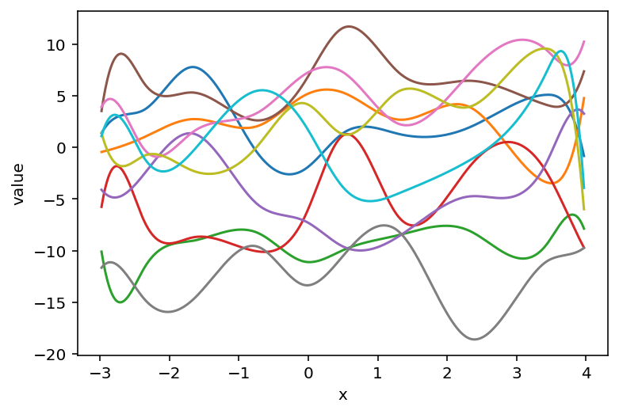
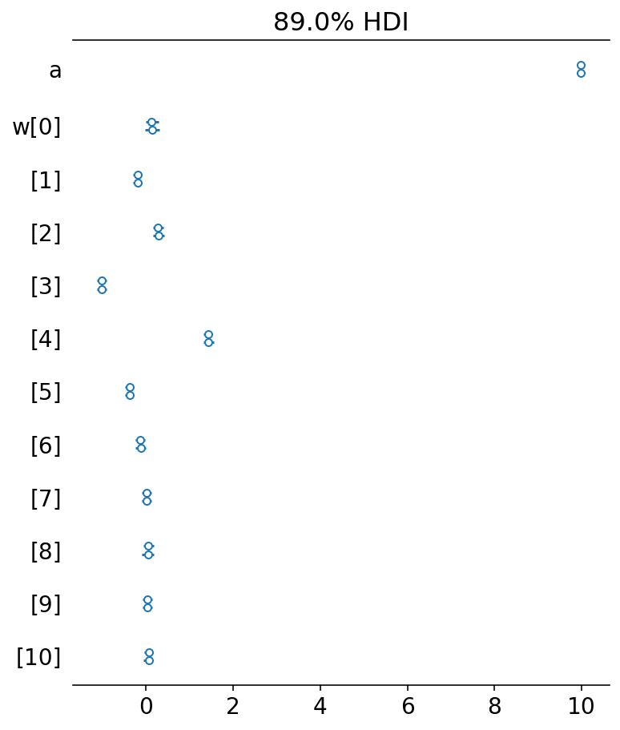

# Another attempt at fitting splines with PyMC3

## Setup

```python
from pathlib import Path
from typing import Optional

import arviz as az
import janitor  # noqa: F401
import matplotlib.pyplot as plt
import numpy as np
import pandas as pd
import plotnine as gg
import pymc as pm
import scipy.stats as st
import seaborn as sns
from aesara import tensor as at
from patsy import DesignMatrix, build_design_matrices, dmatrix
```

```python
from speclet.io import data_dir
```

```python
pm.__version__
```

    '4.0.0b2'

```python
# Set default theme for 'plotnine'.
gg.theme_set(gg.theme_minimal() + gg.theme(figure_size=(8, 4)))
%matplotlib inline
%config InlineBackend.figure_format='retina'

# Constants
RANDOM_SEED = 847
HDI_PROB = 0.89
```

## Single spline

### Data

```python
def diff_of_gaussians(
    x: np.ndarray, mus: tuple[float, float], sds: tuple[float, float], noise: float
) -> pd.DataFrame:
    y = (
        st.norm.pdf(x, mus[0], sds[0])
        - st.norm.pdf(x, mus[1], sds[1])
        + np.random.normal(0, noise, size=len(x))
    )
    return pd.DataFrame({"x": x, "y": y})
```

```python
group_pal = {"a": "#1F77B4", "b": "#FF7F0E"}
```

```python
np.random.seed(RANDOM_SEED)

x = np.random.uniform(-3, 4, 200)
data = diff_of_gaussians(x, (0, 0), (0.3, 1), 0.05).assign(y=lambda d: d.y + 10.0)

sns.scatterplot(data=data, x="x", y="y");
```


### Spline basis

```python
def _make_knot_list(data: pd.DataFrame, num_knots: int = 10) -> np.ndarray:
    return np.quantile(data.x, np.linspace(0, 1, num_knots))


def _build_spline(
    data: pd.DataFrame, knot_list: Optional[np.ndarray] = None, num_knots: int = 10
) -> tuple[np.ndarray, DesignMatrix]:
    if knot_list is None:
        knot_list = _make_knot_list(data, num_knots)

    B = dmatrix(
        "bs(x, knots=knots, degree=3, include_intercept=True) - 1",
        {"x": data.x.values, "knots": knot_list[1:-1]},
    )
    return knot_list, B
```

```python
knot_list, B = _build_spline(data)
```

```python
knot_list
```

    array([-2.98089976, -2.36504627, -1.67490314, -0.72551484, -0.04744339,
            0.50477523,  1.30390392,  2.31655179,  3.43279987,  3.97389701])

```python
B
```

    DesignMatrix with shape (200, 12)
      Columns:
        ['bs(x, knots=knots, degree=3, include_intercept=True)[0]',
         'bs(x, knots=knots, degree=3, include_intercept=True)[1]',
         'bs(x, knots=knots, degree=3, include_intercept=True)[2]',
         'bs(x, knots=knots, degree=3, include_intercept=True)[3]',
         'bs(x, knots=knots, degree=3, include_intercept=True)[4]',
         'bs(x, knots=knots, degree=3, include_intercept=True)[5]',
         'bs(x, knots=knots, degree=3, include_intercept=True)[6]',
         'bs(x, knots=knots, degree=3, include_intercept=True)[7]',
         'bs(x, knots=knots, degree=3, include_intercept=True)[8]',
         'bs(x, knots=knots, degree=3, include_intercept=True)[9]',
         'bs(x, knots=knots, degree=3, include_intercept=True)[10]',
         'bs(x, knots=knots, degree=3, include_intercept=True)[11]']
      Terms:
        'bs(x, knots=knots, degree=3, include_intercept=True)' (columns 0:12)
      (to view full data, use np.asarray(this_obj))

```python
np.asarray(B).shape
```

    (200, 12)

```python
data.shape
```

    (200, 2)

```python
basis_df = (
    pd.DataFrame(B)
    .reset_index(drop=False)
    .assign(x=data.x.values)
    .pivot_longer(index=["index", "x"], names_to="basis", values_to="density")
)

(
    gg.ggplot(basis_df, gg.aes(x="x", y="density", color="basis"))
    + gg.geom_line()
    + gg.theme(legend_position="none")
)
```


    <ggplot: (338298902)>

### Model #1

```python
def build_model1(data: pd.DataFrame, B: DesignMatrix) -> pm.Model:
    B_dim = B.shape[1]

    with pm.Model(rng_seeder=RANDOM_SEED) as m1:
        w = pm.Normal("w", 0, 5, shape=B_dim)
        mu = pm.Deterministic("mu", pm.math.dot(np.asarray(B, order="F"), w.T))
        sigma = pm.Gamma("sigma", 2, 0.5)
        y = pm.Normal("y", mu, sigma, observed=data.y)

    return m1
```

### Prior predictive

```python
def _build_new_data(
    data: pd.DataFrame, B: DesignMatrix, knots: np.ndarray, n_x: int = 500
) -> tuple[pd.DataFrame, DesignMatrix]:
    new_data = pd.DataFrame(
        {"x": np.linspace(data.x.min(), data.x.max(), num=n_x)}
    ).assign(y=0)
    new_B = build_design_matrices(
        [B.design_info], {"x": new_data.x.values, "knots": knots[1:-1]}
    )[0]
    return new_data, new_B
```

```python
def _plot_prior(
    prior_pred: az.InferenceData, var_name: str, data: pd.DataFrame
) -> None:
    if var_name == "y":
        var_prior = prior_pred.prior_predictive[var_name].values
    else:
        var_prior = prior_pred.prior[var_name].values
    var_prior = var_prior.squeeze()
    prior_df = (
        pd.DataFrame(var_prior.T)
        .reset_index(drop=False)
        .assign(x=data.x)
        .pivot_longer(["index", "x"], names_to="prior_sample")
        .astype({"prior_sample": str})
    )

    sns.lineplot(data=prior_df, x="x", y="value", hue="prior_sample", legend=None)
    plt.show()
```

```python
new_data, new_B = _build_new_data(data=data, B=B, knots=knot_list)
```

```python
with build_model1(data=new_data, B=new_B):
    m1_prior_pred = pm.sample_prior_predictive(samples=10, return_inferencedata=True)
```

```python
_plot_prior(m1_prior_pred, "mu", data=new_data)
```


```python
_plot_prior(m1_prior_pred, "y", data=new_data)
```


### Sample from posterior

```python
pm_sample_kwargs = {
    "chains": 4,
    "cores": 4,
    "target_accept": 0.95,
    "return_inferencedata": True,
}
pm_ppc_kwargs = {"extend_inferencedata": True}
```

```python
with build_model1(data=data, B=B):
    m1_trace = pm.sample(**pm_sample_kwargs)
    pm.sample_posterior_predictive(m1_trace, **pm_ppc_kwargs)
```

    Auto-assigning NUTS sampler...
    Initializing NUTS using jitter+adapt_diag...
    Multiprocess sampling (4 chains in 4 jobs)
    NUTS: [w, sigma]

<style>
    /*Turns off some styling*/
    progress {
        /*gets rid of default border in Firefox and Opera.*/
        border: none;
        /*Needs to be in here for Safari polyfill so background images work as expected.*/
        background-size: auto;
    }
    .progress-bar-interrupted, .progress-bar-interrupted::-webkit-progress-bar {
        background: #F44336;
    }
</style>

<div>
  <progress value='8000' class='' max='8000' style='width:300px; height:20px; vertical-align: middle;'></progress>
  100.00% [8000/8000 00:16<00:00 Sampling 4 chains, 0 divergences]
</div>

    Sampling 4 chains for 1_000 tune and 1_000 draw iterations (4_000 + 4_000 draws total) took 40 seconds.

<style>
    /*Turns off some styling*/
    progress {
        /*gets rid of default border in Firefox and Opera.*/
        border: none;
        /*Needs to be in here for Safari polyfill so background images work as expected.*/
        background-size: auto;
    }
    .progress-bar-interrupted, .progress-bar-interrupted::-webkit-progress-bar {
        background: #F44336;
    }
</style>

<div>
  <progress value='4000' class='' max='4000' style='width:300px; height:20px; vertical-align: middle;'></progress>
  100.00% [4000/4000 00:00<00:00]
</div>

### Posterior analysis

```python
az.plot_trace(m1_trace, var_names=["~mu"])
plt.tight_layout();
```


```python
az.plot_parallel(m1_trace, var_names=["w"]);
```


```python
az.summary(m1_trace, var_names=["~mu"], filter_vars="regex")
```

<div>
<style scoped>
    .dataframe tbody tr th:only-of-type {
        vertical-align: middle;
    }

    .dataframe tbody tr th {
        vertical-align: top;
    }

    .dataframe thead th {
        text-align: right;
    }
</style>
<table border="1" class="dataframe">
  <thead>
    <tr style="text-align: right;">
      <th></th>
      <th>mean</th>
      <th>sd</th>
      <th>hdi_3%</th>
      <th>hdi_97%</th>
      <th>mcse_mean</th>
      <th>mcse_sd</th>
      <th>ess_bulk</th>
      <th>ess_tail</th>
      <th>r_hat</th>
    </tr>
  </thead>
  <tbody>
    <tr>
      <th>w[0]</th>
      <td>9.979</td>
      <td>0.054</td>
      <td>9.881</td>
      <td>10.085</td>
      <td>0.001</td>
      <td>0.001</td>
      <td>3329.0</td>
      <td>3069.0</td>
      <td>1.0</td>
    </tr>
    <tr>
      <th>w[1]</th>
      <td>10.116</td>
      <td>0.059</td>
      <td>10.012</td>
      <td>10.235</td>
      <td>0.001</td>
      <td>0.001</td>
      <td>2550.0</td>
      <td>2684.0</td>
      <td>1.0</td>
    </tr>
    <tr>
      <th>w[2]</th>
      <td>9.784</td>
      <td>0.052</td>
      <td>9.678</td>
      <td>9.875</td>
      <td>0.001</td>
      <td>0.001</td>
      <td>2267.0</td>
      <td>2752.0</td>
      <td>1.0</td>
    </tr>
    <tr>
      <th>w[3]</th>
      <td>10.253</td>
      <td>0.047</td>
      <td>10.165</td>
      <td>10.343</td>
      <td>0.001</td>
      <td>0.001</td>
      <td>2305.0</td>
      <td>2791.0</td>
      <td>1.0</td>
    </tr>
    <tr>
      <th>w[4]</th>
      <td>8.967</td>
      <td>0.049</td>
      <td>8.871</td>
      <td>9.055</td>
      <td>0.001</td>
      <td>0.001</td>
      <td>2426.0</td>
      <td>2970.0</td>
      <td>1.0</td>
    </tr>
    <tr>
      <th>w[5]</th>
      <td>11.409</td>
      <td>0.038</td>
      <td>11.337</td>
      <td>11.481</td>
      <td>0.001</td>
      <td>0.001</td>
      <td>2108.0</td>
      <td>2844.0</td>
      <td>1.0</td>
    </tr>
    <tr>
      <th>w[6]</th>
      <td>9.600</td>
      <td>0.040</td>
      <td>9.522</td>
      <td>9.674</td>
      <td>0.001</td>
      <td>0.001</td>
      <td>2004.0</td>
      <td>2861.0</td>
      <td>1.0</td>
    </tr>
    <tr>
      <th>w[7]</th>
      <td>9.854</td>
      <td>0.044</td>
      <td>9.779</td>
      <td>9.940</td>
      <td>0.001</td>
      <td>0.001</td>
      <td>2326.0</td>
      <td>2549.0</td>
      <td>1.0</td>
    </tr>
    <tr>
      <th>w[8]</th>
      <td>9.996</td>
      <td>0.051</td>
      <td>9.902</td>
      <td>10.096</td>
      <td>0.001</td>
      <td>0.001</td>
      <td>2249.0</td>
      <td>2448.0</td>
      <td>1.0</td>
    </tr>
    <tr>
      <th>w[9]</th>
      <td>10.030</td>
      <td>0.061</td>
      <td>9.918</td>
      <td>10.150</td>
      <td>0.001</td>
      <td>0.001</td>
      <td>2297.0</td>
      <td>2736.0</td>
      <td>1.0</td>
    </tr>
    <tr>
      <th>w[10]</th>
      <td>10.011</td>
      <td>0.046</td>
      <td>9.920</td>
      <td>10.097</td>
      <td>0.001</td>
      <td>0.001</td>
      <td>2775.0</td>
      <td>2693.0</td>
      <td>1.0</td>
    </tr>
    <tr>
      <th>w[11]</th>
      <td>10.040</td>
      <td>0.044</td>
      <td>9.959</td>
      <td>10.122</td>
      <td>0.001</td>
      <td>0.000</td>
      <td>4145.0</td>
      <td>2950.0</td>
      <td>1.0</td>
    </tr>
    <tr>
      <th>sigma</th>
      <td>0.087</td>
      <td>0.004</td>
      <td>0.079</td>
      <td>0.095</td>
      <td>0.000</td>
      <td>0.000</td>
      <td>4637.0</td>
      <td>3005.0</td>
      <td>1.0</td>
    </tr>
  </tbody>
</table>
</div>

```python
def _plot_posterior_mu(
    trace: az.InferenceData, data: pd.DataFrame, pt_alpha: float = 0.5
) -> gg.ggplot:
    mu_post_df = (
        az.summary(trace, var_names="mu", hdi_prob=HDI_PROB, kind="stats")
        .reset_index(drop=True)
        .merge(data.copy(), left_index=True, right_index=True)
    )

    if "k" not in data.columns:
        mu_post_df["k"] = "a"

    return (
        gg.ggplot(mu_post_df, gg.aes(x="x"))
        + gg.geom_point(gg.aes(y="y", color="k"), alpha=pt_alpha)
        + gg.geom_ribbon(gg.aes(ymin="hdi_5.5%", ymax="hdi_94.5%", fill="k"), alpha=0.5)
        + gg.geom_line(gg.aes(y="mean", color="k"), size=0.5)
        + gg.scale_color_manual(group_pal)
        + gg.scale_fill_manual(group_pal)
    )
```

```python
_plot_posterior_mu(m1_trace, data=data)
```



    <ggplot: (342289291)>

```python
def _plot_ppc(
    trace: az.InferenceData, data: pd.DataFrame, pt_alpha: float = 0.5
) -> gg.ggplot:
    post_pred = trace.posterior_predictive["y"].values.reshape(-1, data.shape[0])
    ppc_avg = post_pred.mean(0)
    ppc_hdi = az.hdi(post_pred, hdi_prob=HDI_PROB)

    plot_df = data.copy().assign(
        post_pred=ppc_avg, hdi_low=ppc_hdi[:, 0], hdi_high=ppc_hdi[:, 1]
    )

    if "k" not in data.columns:
        plot_df["k"] = np.repeat(["a"], plot_df.shape[0])

    return (
        gg.ggplot(plot_df, gg.aes(x="x"))
        + gg.geom_point(gg.aes(y="y", color="k"), alpha=pt_alpha)
        + gg.geom_ribbon(gg.aes(ymin="hdi_low", ymax="hdi_high", fill="k"), alpha=0.5)
        + gg.geom_line(gg.aes(y="post_pred", color="k"), size=1)
        + gg.scale_color_manual(group_pal)
        + gg.scale_fill_manual(group_pal)
    )
```

```python
_plot_ppc(m1_trace, data)
```

    /var/folders/r4/qpcdgl_14hbd412snp1jnv300000gn/T/ipykernel_48220/2876986528.py:6: FutureWarning: hdi currently interprets 2d data as (draw, shape) but this will change in a future release to (chain, draw) for coherence with other functions


    <ggplot: (342154810)>

## Two groups, single spline

### Data

```python
np.random.seed(RANDOM_SEED)

x1 = np.random.uniform(-3, 3, 200)
d1 = diff_of_gaussians(x1, (0, 0), (0.3, 1), 0.05).assign(k="a")
x2 = np.random.uniform(-3, 3, 300) + 1
d2 = diff_of_gaussians(x2, (1, 1), (0.5, 1), 0.05).assign(k="b")

data2 = pd.concat([d1, d2]).reset_index(drop=True)
data2["k"] = pd.Categorical(data2["k"], categories=["a", "b"], ordered=True)

sns.scatterplot(data=data2, x="x", y="y", hue="k", palette=group_pal);
```


### Spline basis

```python
knot2, B2 = _build_spline(data2)
```

### Sample from posterior

```python
with build_model1(data=data2, B=B2):
    m1_trace2 = pm.sample(**pm_sample_kwargs)
    pm.sample_posterior_predictive(m1_trace2, **pm_ppc_kwargs)
```

    Auto-assigning NUTS sampler...
    Initializing NUTS using jitter+adapt_diag...
    Multiprocess sampling (4 chains in 4 jobs)
    NUTS: [w, sigma]

<style>
    /*Turns off some styling*/
    progress {
        /*gets rid of default border in Firefox and Opera.*/
        border: none;
        /*Needs to be in here for Safari polyfill so background images work as expected.*/
        background-size: auto;
    }
    .progress-bar-interrupted, .progress-bar-interrupted::-webkit-progress-bar {
        background: #F44336;
    }
</style>

<div>
  <progress value='8000' class='' max='8000' style='width:300px; height:20px; vertical-align: middle;'></progress>
  100.00% [8000/8000 00:17<00:00 Sampling 4 chains, 0 divergences]
</div>

    Sampling 4 chains for 1_000 tune and 1_000 draw iterations (4_000 + 4_000 draws total) took 39 seconds.

<style>
    /*Turns off some styling*/
    progress {
        /*gets rid of default border in Firefox and Opera.*/
        border: none;
        /*Needs to be in here for Safari polyfill so background images work as expected.*/
        background-size: auto;
    }
    .progress-bar-interrupted, .progress-bar-interrupted::-webkit-progress-bar {
        background: #F44336;
    }
</style>

<div>
  <progress value='4000' class='' max='4000' style='width:300px; height:20px; vertical-align: middle;'></progress>
  100.00% [4000/4000 00:00<00:00]
</div>

### Posterior analysis

```python
az.plot_trace(m1_trace2, var_names=["~mu"])
plt.tight_layout();
```


```python
az.plot_parallel(m1_trace2, var_names=["w"]);
```



```python
az.summary(m1_trace2, var_names=["~mu"], filter_vars="regex")
```

<div>
<style scoped>
    .dataframe tbody tr th:only-of-type {
        vertical-align: middle;
    }

    .dataframe tbody tr th {
        vertical-align: top;
    }

    .dataframe thead th {
        text-align: right;
    }
</style>
<table border="1" class="dataframe">
  <thead>
    <tr style="text-align: right;">
      <th></th>
      <th>mean</th>
      <th>sd</th>
      <th>hdi_3%</th>
      <th>hdi_97%</th>
      <th>mcse_mean</th>
      <th>mcse_sd</th>
      <th>ess_bulk</th>
      <th>ess_tail</th>
      <th>r_hat</th>
    </tr>
  </thead>
  <tbody>
    <tr>
      <th>w[0]</th>
      <td>0.069</td>
      <td>0.094</td>
      <td>-0.099</td>
      <td>0.256</td>
      <td>0.002</td>
      <td>0.001</td>
      <td>3031.0</td>
      <td>2866.0</td>
      <td>1.0</td>
    </tr>
    <tr>
      <th>w[1]</th>
      <td>-0.153</td>
      <td>0.108</td>
      <td>-0.358</td>
      <td>0.048</td>
      <td>0.002</td>
      <td>0.002</td>
      <td>2387.0</td>
      <td>2911.0</td>
      <td>1.0</td>
    </tr>
    <tr>
      <th>w[2]</th>
      <td>0.188</td>
      <td>0.090</td>
      <td>0.017</td>
      <td>0.355</td>
      <td>0.002</td>
      <td>0.001</td>
      <td>1996.0</td>
      <td>2417.0</td>
      <td>1.0</td>
    </tr>
    <tr>
      <th>w[3]</th>
      <td>-0.348</td>
      <td>0.068</td>
      <td>-0.478</td>
      <td>-0.221</td>
      <td>0.001</td>
      <td>0.001</td>
      <td>2057.0</td>
      <td>2448.0</td>
      <td>1.0</td>
    </tr>
    <tr>
      <th>w[4]</th>
      <td>0.179</td>
      <td>0.057</td>
      <td>0.070</td>
      <td>0.284</td>
      <td>0.001</td>
      <td>0.001</td>
      <td>2067.0</td>
      <td>2577.0</td>
      <td>1.0</td>
    </tr>
    <tr>
      <th>w[5]</th>
      <td>0.177</td>
      <td>0.061</td>
      <td>0.060</td>
      <td>0.288</td>
      <td>0.001</td>
      <td>0.001</td>
      <td>2259.0</td>
      <td>2655.0</td>
      <td>1.0</td>
    </tr>
    <tr>
      <th>w[6]</th>
      <td>0.115</td>
      <td>0.066</td>
      <td>-0.004</td>
      <td>0.241</td>
      <td>0.001</td>
      <td>0.001</td>
      <td>2212.0</td>
      <td>3034.0</td>
      <td>1.0</td>
    </tr>
    <tr>
      <th>w[7]</th>
      <td>0.120</td>
      <td>0.071</td>
      <td>-0.010</td>
      <td>0.254</td>
      <td>0.002</td>
      <td>0.001</td>
      <td>2076.0</td>
      <td>2620.0</td>
      <td>1.0</td>
    </tr>
    <tr>
      <th>w[8]</th>
      <td>-0.251</td>
      <td>0.074</td>
      <td>-0.385</td>
      <td>-0.111</td>
      <td>0.002</td>
      <td>0.001</td>
      <td>1977.0</td>
      <td>2428.0</td>
      <td>1.0</td>
    </tr>
    <tr>
      <th>w[9]</th>
      <td>0.134</td>
      <td>0.095</td>
      <td>-0.042</td>
      <td>0.320</td>
      <td>0.002</td>
      <td>0.001</td>
      <td>2155.0</td>
      <td>2753.0</td>
      <td>1.0</td>
    </tr>
    <tr>
      <th>w[10]</th>
      <td>-0.109</td>
      <td>0.108</td>
      <td>-0.328</td>
      <td>0.078</td>
      <td>0.002</td>
      <td>0.002</td>
      <td>2123.0</td>
      <td>2771.0</td>
      <td>1.0</td>
    </tr>
    <tr>
      <th>w[11]</th>
      <td>0.038</td>
      <td>0.083</td>
      <td>-0.122</td>
      <td>0.186</td>
      <td>0.002</td>
      <td>0.001</td>
      <td>3008.0</td>
      <td>2694.0</td>
      <td>1.0</td>
    </tr>
    <tr>
      <th>sigma</th>
      <td>0.208</td>
      <td>0.007</td>
      <td>0.195</td>
      <td>0.221</td>
      <td>0.000</td>
      <td>0.000</td>
      <td>4826.0</td>
      <td>2755.0</td>
      <td>1.0</td>
    </tr>
  </tbody>
</table>
</div>

```python
_plot_posterior_mu(m1_trace2, data=data2)
```


    <ggplot: (341850061)>

```python
_plot_ppc(m1_trace2, data2)
```

    /var/folders/r4/qpcdgl_14hbd412snp1jnv300000gn/T/ipykernel_48220/2876986528.py:6: FutureWarning: hdi currently interprets 2d data as (draw, shape) but this will change in a future release to (chain, draw) for coherence with other functions


    <ggplot: (341985657)>

## Multi-group, multi-basis spline

### Spline basis

```python
knots = _make_knot_list(data2)
```

```python
spline_list: list[DesignMatrix] = []
for k in data2.k.unique():
    data_k = data2.query(f"k=='{k}'").reset_index(drop=True)
    _, B_k = _build_spline(data_k, knot_list=knots)
    spline_list.append(B_k)

print(len(spline_list))
```

    2

```python
B_k = [np.asarray(b) for b in spline_list]
```

```python
for b in B_k:
    print(b.shape)
```

    (200, 12)
    (300, 12)

```python
B_2 = np.vstack(B_k)
B_2.shape
```

    (500, 12)

```python
basis_df = (
    pd.DataFrame(B_2)
    .assign(k=data2.k.values, x=data2.x.values)
    .pivot_longer(["k", "x"], names_to="basis", values_to="density")
    .assign(basis=lambda d: [f"{k}: {x}" for x, k in zip(d.basis, d.k)])
)
(
    gg.ggplot(basis_df, gg.aes(x="x", color="k"))
    + gg.geom_line(gg.aes(group="basis", y="density"), alpha=0.5, size=1)
    + gg.geom_rug(data=data2, alpha=0.5, sides="b")
    + gg.scale_color_manual(values=group_pal)
)
```


    <ggplot: (341849938)>

### Model #2

```python
def build_model2(data: pd.DataFrame, B_k: list[np.ndarray]) -> pm.Model:
    B_dim = B_k[0].shape[1]
    k = data.k.cat.codes.values.astype(int)
    n_k = len(data.k.cat.categories)
    with pm.Model(rng_seeder=RANDOM_SEED) as m2:
        w = pm.Normal("w", 0, 5, shape=(B_dim, n_k))
        _mu = []
        for i in range(n_k):
            _mu.append(pm.math.dot(B_k[i], w[:, i]).reshape((-1, 1)))
        mu = pm.Deterministic("mu", at.vertical_stack(*_mu).squeeze())
        sigma = pm.Gamma("sigma", 2, 0.5)
        y = pm.Normal("y", mu, sigma, observed=data.y.values)

    return m2
```

```python
m2 = build_model2(data2, B_k)
m2
```

$$
            \begin{array}{rcl}
            \text{w} &\sim & \operatorname{N}(0,~5)\\\text{sigma} &\sim & \operatorname{Gamma}(2,~f())\\\text{mu} &\sim & \operatorname{Deterministic}(f(\text{w}))\\\text{y} &\sim & \operatorname{N}(\text{mu},~\text{sigma})
            \end{array}
            $$

```python
pm.model_to_graphviz(m2)
```


### Sample from posterior

```python
with build_model2(data=data2, B_k=B_k):
    m2_trace = pm.sample(**pm_sample_kwargs)
    pm.sample_posterior_predictive(m2_trace, **pm_ppc_kwargs)
```

    Auto-assigning NUTS sampler...
    Initializing NUTS using jitter+adapt_diag...
    Multiprocess sampling (4 chains in 4 jobs)
    NUTS: [w, sigma]

<style>
    /*Turns off some styling*/
    progress {
        /*gets rid of default border in Firefox and Opera.*/
        border: none;
        /*Needs to be in here for Safari polyfill so background images work as expected.*/
        background-size: auto;
    }
    .progress-bar-interrupted, .progress-bar-interrupted::-webkit-progress-bar {
        background: #F44336;
    }
</style>

<div>
  <progress value='8000' class='' max='8000' style='width:300px; height:20px; vertical-align: middle;'></progress>
  100.00% [8000/8000 00:34<00:00 Sampling 4 chains, 0 divergences]
</div>

    Sampling 4 chains for 1_000 tune and 1_000 draw iterations (4_000 + 4_000 draws total) took 56 seconds.

<style>
    /*Turns off some styling*/
    progress {
        /*gets rid of default border in Firefox and Opera.*/
        border: none;
        /*Needs to be in here for Safari polyfill so background images work as expected.*/
        background-size: auto;
    }
    .progress-bar-interrupted, .progress-bar-interrupted::-webkit-progress-bar {
        background: #F44336;
    }
</style>

<div>
  <progress value='4000' class='' max='4000' style='width:300px; height:20px; vertical-align: middle;'></progress>
  100.00% [4000/4000 00:00<00:00]
</div>

### Posterior analysis

```python
az.plot_trace(m2_trace, var_names=["~mu"])
plt.tight_layout();
```


```python
az.summary(m2_trace, var_names=["~mu"], filter_vars="regex", hdi_prob=HDI_PROB)
```

<div>
<style scoped>
    .dataframe tbody tr th:only-of-type {
        vertical-align: middle;
    }

    .dataframe tbody tr th {
        vertical-align: top;
    }

    .dataframe thead th {
        text-align: right;
    }
</style>
<table border="1" class="dataframe">
  <thead>
    <tr style="text-align: right;">
      <th></th>
      <th>mean</th>
      <th>sd</th>
      <th>hdi_5.5%</th>
      <th>hdi_94.5%</th>
      <th>mcse_mean</th>
      <th>mcse_sd</th>
      <th>ess_bulk</th>
      <th>ess_tail</th>
      <th>r_hat</th>
    </tr>
  </thead>
  <tbody>
    <tr>
      <th>w[0, 0]</th>
      <td>0.085</td>
      <td>0.039</td>
      <td>0.021</td>
      <td>0.146</td>
      <td>0.001</td>
      <td>0.000</td>
      <td>4357.0</td>
      <td>3511.0</td>
      <td>1.0</td>
    </tr>
    <tr>
      <th>w[0, 1]</th>
      <td>0.041</td>
      <td>0.083</td>
      <td>-0.098</td>
      <td>0.169</td>
      <td>0.001</td>
      <td>0.001</td>
      <td>5405.0</td>
      <td>3014.0</td>
      <td>1.0</td>
    </tr>
    <tr>
      <th>w[1, 0]</th>
      <td>-0.206</td>
      <td>0.050</td>
      <td>-0.283</td>
      <td>-0.124</td>
      <td>0.001</td>
      <td>0.001</td>
      <td>2691.0</td>
      <td>2735.0</td>
      <td>1.0</td>
    </tr>
    <tr>
      <th>w[1, 1]</th>
      <td>-0.002</td>
      <td>0.040</td>
      <td>-0.064</td>
      <td>0.064</td>
      <td>0.001</td>
      <td>0.001</td>
      <td>4212.0</td>
      <td>3464.0</td>
      <td>1.0</td>
    </tr>
    <tr>
      <th>w[2, 0]</th>
      <td>0.334</td>
      <td>0.053</td>
      <td>0.248</td>
      <td>0.416</td>
      <td>0.001</td>
      <td>0.001</td>
      <td>2655.0</td>
      <td>2696.0</td>
      <td>1.0</td>
    </tr>
    <tr>
      <th>w[2, 1]</th>
      <td>-0.025</td>
      <td>0.052</td>
      <td>-0.103</td>
      <td>0.061</td>
      <td>0.001</td>
      <td>0.001</td>
      <td>2850.0</td>
      <td>2947.0</td>
      <td>1.0</td>
    </tr>
    <tr>
      <th>w[3, 0]</th>
      <td>-0.720</td>
      <td>0.043</td>
      <td>-0.786</td>
      <td>-0.650</td>
      <td>0.001</td>
      <td>0.001</td>
      <td>2785.0</td>
      <td>2916.0</td>
      <td>1.0</td>
    </tr>
    <tr>
      <th>w[3, 1]</th>
      <td>-0.012</td>
      <td>0.047</td>
      <td>-0.092</td>
      <td>0.059</td>
      <td>0.001</td>
      <td>0.001</td>
      <td>2972.0</td>
      <td>3135.0</td>
      <td>1.0</td>
    </tr>
    <tr>
      <th>w[4, 0]</th>
      <td>0.462</td>
      <td>0.036</td>
      <td>0.403</td>
      <td>0.518</td>
      <td>0.001</td>
      <td>0.000</td>
      <td>2821.0</td>
      <td>2896.0</td>
      <td>1.0</td>
    </tr>
    <tr>
      <th>w[4, 1]</th>
      <td>-0.159</td>
      <td>0.032</td>
      <td>-0.209</td>
      <td>-0.106</td>
      <td>0.001</td>
      <td>0.000</td>
      <td>2623.0</td>
      <td>2691.0</td>
      <td>1.0</td>
    </tr>
    <tr>
      <th>w[5, 0]</th>
      <td>1.008</td>
      <td>0.042</td>
      <td>0.947</td>
      <td>1.079</td>
      <td>0.001</td>
      <td>0.001</td>
      <td>2884.0</td>
      <td>3114.0</td>
      <td>1.0</td>
    </tr>
    <tr>
      <th>w[5, 1]</th>
      <td>-0.186</td>
      <td>0.030</td>
      <td>-0.238</td>
      <td>-0.141</td>
      <td>0.001</td>
      <td>0.000</td>
      <td>2730.0</td>
      <td>2734.0</td>
      <td>1.0</td>
    </tr>
    <tr>
      <th>w[6, 0]</th>
      <td>-0.901</td>
      <td>0.045</td>
      <td>-0.969</td>
      <td>-0.827</td>
      <td>0.001</td>
      <td>0.001</td>
      <td>2937.0</td>
      <td>3131.0</td>
      <td>1.0</td>
    </tr>
    <tr>
      <th>w[6, 1]</th>
      <td>0.599</td>
      <td>0.033</td>
      <td>0.548</td>
      <td>0.652</td>
      <td>0.001</td>
      <td>0.000</td>
      <td>2400.0</td>
      <td>2520.0</td>
      <td>1.0</td>
    </tr>
    <tr>
      <th>w[7, 0]</th>
      <td>0.209</td>
      <td>0.048</td>
      <td>0.133</td>
      <td>0.289</td>
      <td>0.001</td>
      <td>0.001</td>
      <td>3042.0</td>
      <td>3112.0</td>
      <td>1.0</td>
    </tr>
    <tr>
      <th>w[7, 1]</th>
      <td>0.087</td>
      <td>0.036</td>
      <td>0.029</td>
      <td>0.143</td>
      <td>0.001</td>
      <td>0.001</td>
      <td>2475.0</td>
      <td>2642.0</td>
      <td>1.0</td>
    </tr>
    <tr>
      <th>w[8, 0]</th>
      <td>-0.227</td>
      <td>0.062</td>
      <td>-0.326</td>
      <td>-0.129</td>
      <td>0.001</td>
      <td>0.001</td>
      <td>3079.0</td>
      <td>2924.0</td>
      <td>1.0</td>
    </tr>
    <tr>
      <th>w[8, 1]</th>
      <td>-0.284</td>
      <td>0.036</td>
      <td>-0.341</td>
      <td>-0.225</td>
      <td>0.001</td>
      <td>0.001</td>
      <td>2342.0</td>
      <td>2276.0</td>
      <td>1.0</td>
    </tr>
    <tr>
      <th>w[9, 0]</th>
      <td>0.129</td>
      <td>0.056</td>
      <td>0.041</td>
      <td>0.219</td>
      <td>0.001</td>
      <td>0.001</td>
      <td>2793.0</td>
      <td>2965.0</td>
      <td>1.0</td>
    </tr>
    <tr>
      <th>w[9, 1]</th>
      <td>0.063</td>
      <td>0.048</td>
      <td>-0.013</td>
      <td>0.139</td>
      <td>0.001</td>
      <td>0.001</td>
      <td>2609.0</td>
      <td>2630.0</td>
      <td>1.0</td>
    </tr>
    <tr>
      <th>w[10, 0]</th>
      <td>-0.026</td>
      <td>0.047</td>
      <td>-0.103</td>
      <td>0.050</td>
      <td>0.001</td>
      <td>0.001</td>
      <td>3451.0</td>
      <td>2897.0</td>
      <td>1.0</td>
    </tr>
    <tr>
      <th>w[10, 1]</th>
      <td>-0.056</td>
      <td>0.047</td>
      <td>-0.133</td>
      <td>0.018</td>
      <td>0.001</td>
      <td>0.001</td>
      <td>2899.0</td>
      <td>2713.0</td>
      <td>1.0</td>
    </tr>
    <tr>
      <th>w[11, 0]</th>
      <td>0.055</td>
      <td>0.074</td>
      <td>-0.055</td>
      <td>0.181</td>
      <td>0.001</td>
      <td>0.001</td>
      <td>4940.0</td>
      <td>3193.0</td>
      <td>1.0</td>
    </tr>
    <tr>
      <th>w[11, 1]</th>
      <td>0.019</td>
      <td>0.035</td>
      <td>-0.033</td>
      <td>0.077</td>
      <td>0.001</td>
      <td>0.000</td>
      <td>4039.0</td>
      <td>3422.0</td>
      <td>1.0</td>
    </tr>
    <tr>
      <th>sigma</th>
      <td>0.085</td>
      <td>0.003</td>
      <td>0.081</td>
      <td>0.089</td>
      <td>0.000</td>
      <td>0.000</td>
      <td>4954.0</td>
      <td>2803.0</td>
      <td>1.0</td>
    </tr>
  </tbody>
</table>
</div>

```python
_plot_posterior_mu(m2_trace, data=data2)
```


    <ggplot: (342165995)>

```python
_plot_ppc(m2_trace, data2)
```

    /var/folders/r4/qpcdgl_14hbd412snp1jnv300000gn/T/ipykernel_48220/2876986528.py:6: FutureWarning: hdi currently interprets 2d data as (draw, shape) but this will change in a future release to (chain, draw) for coherence with other functions


    <ggplot: (340057631)>

## Multi-group, single spline basis

### Spline basis

```python
knot3, B3 = _build_spline(data2)
```

### Model #3

```python
def build_model3(data: pd.DataFrame, B: np.ndarray) -> pm.Model:
    B_dim = B.shape[1]
    k = data.k.cat.codes.values.astype(int)
    n_k = len(data.k.cat.categories)
    with pm.Model(rng_seeder=RANDOM_SEED) as m3:
        w = pm.Normal("w", 0, 5, shape=(B_dim, n_k))
        _mu = []
        for i in range(n_k):
            _mu.append(pm.math.dot(B[k == i], w[:, i]).reshape((-1, 1)))
        mu = pm.Deterministic("mu", at.vertical_stack(*_mu).squeeze())
        sigma = pm.Gamma("sigma", 2, 0.5)
        y = pm.Normal("y", mu, sigma, observed=data.y.values)

    return m3
```

```python
m3 = build_model3(data2, B3)
pm.model_to_graphviz(m3)
```


### Sample from posterior

```python
with build_model3(data=data2, B=np.asarray(B3)):
    m3_trace = pm.sample(**pm_sample_kwargs)
    pm.sample_posterior_predictive(m3_trace, **pm_ppc_kwargs)
```

    Auto-assigning NUTS sampler...
    Initializing NUTS using jitter+adapt_diag...
    Multiprocess sampling (4 chains in 4 jobs)
    NUTS: [w, sigma]

<style>
    /*Turns off some styling*/
    progress {
        /*gets rid of default border in Firefox and Opera.*/
        border: none;
        /*Needs to be in here for Safari polyfill so background images work as expected.*/
        background-size: auto;
    }
    .progress-bar-interrupted, .progress-bar-interrupted::-webkit-progress-bar {
        background: #F44336;
    }
</style>

<div>
  <progress value='8000' class='' max='8000' style='width:300px; height:20px; vertical-align: middle;'></progress>
  100.00% [8000/8000 01:05<00:00 Sampling 4 chains, 0 divergences]
</div>

    Sampling 4 chains for 1_000 tune and 1_000 draw iterations (4_000 + 4_000 draws total) took 89 seconds.

<style>
    /*Turns off some styling*/
    progress {
        /*gets rid of default border in Firefox and Opera.*/
        border: none;
        /*Needs to be in here for Safari polyfill so background images work as expected.*/
        background-size: auto;
    }
    .progress-bar-interrupted, .progress-bar-interrupted::-webkit-progress-bar {
        background: #F44336;
    }
</style>

<div>
  <progress value='4000' class='' max='4000' style='width:300px; height:20px; vertical-align: middle;'></progress>
  100.00% [4000/4000 00:00<00:00]
</div>

### Posterior analysis

```python
az.plot_trace(m3_trace, var_names=["~mu"])
plt.tight_layout();
```


```python
az.summary(m3_trace, var_names=["~mu"], filter_vars="regex", hdi_prob=HDI_PROB)
```

<div>
<style scoped>
    .dataframe tbody tr th:only-of-type {
        vertical-align: middle;
    }

    .dataframe tbody tr th {
        vertical-align: top;
    }

    .dataframe thead th {
        text-align: right;
    }
</style>
<table border="1" class="dataframe">
  <thead>
    <tr style="text-align: right;">
      <th></th>
      <th>mean</th>
      <th>sd</th>
      <th>hdi_5.5%</th>
      <th>hdi_94.5%</th>
      <th>mcse_mean</th>
      <th>mcse_sd</th>
      <th>ess_bulk</th>
      <th>ess_tail</th>
      <th>r_hat</th>
    </tr>
  </thead>
  <tbody>
    <tr>
      <th>w[0, 0]</th>
      <td>0.084</td>
      <td>0.038</td>
      <td>0.024</td>
      <td>0.144</td>
      <td>0.001</td>
      <td>0.000</td>
      <td>4048.0</td>
      <td>3059.0</td>
      <td>1.0</td>
    </tr>
    <tr>
      <th>w[0, 1]</th>
      <td>-0.066</td>
      <td>5.136</td>
      <td>-7.754</td>
      <td>8.327</td>
      <td>0.067</td>
      <td>0.102</td>
      <td>5854.0</td>
      <td>2886.0</td>
      <td>1.0</td>
    </tr>
    <tr>
      <th>w[1, 0]</th>
      <td>-0.204</td>
      <td>0.050</td>
      <td>-0.281</td>
      <td>-0.119</td>
      <td>0.001</td>
      <td>0.001</td>
      <td>3205.0</td>
      <td>2743.0</td>
      <td>1.0</td>
    </tr>
    <tr>
      <th>w[1, 1]</th>
      <td>0.161</td>
      <td>0.322</td>
      <td>-0.331</td>
      <td>0.696</td>
      <td>0.006</td>
      <td>0.005</td>
      <td>2667.0</td>
      <td>2811.0</td>
      <td>1.0</td>
    </tr>
    <tr>
      <th>w[2, 0]</th>
      <td>0.333</td>
      <td>0.053</td>
      <td>0.247</td>
      <td>0.415</td>
      <td>0.001</td>
      <td>0.001</td>
      <td>2836.0</td>
      <td>2778.0</td>
      <td>1.0</td>
    </tr>
    <tr>
      <th>w[2, 1]</th>
      <td>-0.049</td>
      <td>0.102</td>
      <td>-0.206</td>
      <td>0.117</td>
      <td>0.002</td>
      <td>0.002</td>
      <td>2432.0</td>
      <td>2497.0</td>
      <td>1.0</td>
    </tr>
    <tr>
      <th>w[3, 0]</th>
      <td>-0.721</td>
      <td>0.044</td>
      <td>-0.790</td>
      <td>-0.653</td>
      <td>0.001</td>
      <td>0.001</td>
      <td>2933.0</td>
      <td>2882.0</td>
      <td>1.0</td>
    </tr>
    <tr>
      <th>w[3, 1]</th>
      <td>-0.008</td>
      <td>0.046</td>
      <td>-0.081</td>
      <td>0.061</td>
      <td>0.001</td>
      <td>0.001</td>
      <td>2366.0</td>
      <td>2853.0</td>
      <td>1.0</td>
    </tr>
    <tr>
      <th>w[4, 0]</th>
      <td>0.463</td>
      <td>0.037</td>
      <td>0.408</td>
      <td>0.523</td>
      <td>0.001</td>
      <td>0.000</td>
      <td>2759.0</td>
      <td>3108.0</td>
      <td>1.0</td>
    </tr>
    <tr>
      <th>w[4, 1]</th>
      <td>-0.160</td>
      <td>0.032</td>
      <td>-0.210</td>
      <td>-0.108</td>
      <td>0.001</td>
      <td>0.000</td>
      <td>2445.0</td>
      <td>2873.0</td>
      <td>1.0</td>
    </tr>
    <tr>
      <th>w[5, 0]</th>
      <td>1.007</td>
      <td>0.042</td>
      <td>0.937</td>
      <td>1.072</td>
      <td>0.001</td>
      <td>0.001</td>
      <td>2817.0</td>
      <td>2722.0</td>
      <td>1.0</td>
    </tr>
    <tr>
      <th>w[5, 1]</th>
      <td>-0.186</td>
      <td>0.030</td>
      <td>-0.237</td>
      <td>-0.140</td>
      <td>0.001</td>
      <td>0.000</td>
      <td>2820.0</td>
      <td>2434.0</td>
      <td>1.0</td>
    </tr>
    <tr>
      <th>w[6, 0]</th>
      <td>-0.898</td>
      <td>0.045</td>
      <td>-0.969</td>
      <td>-0.825</td>
      <td>0.001</td>
      <td>0.001</td>
      <td>2597.0</td>
      <td>2852.0</td>
      <td>1.0</td>
    </tr>
    <tr>
      <th>w[6, 1]</th>
      <td>0.600</td>
      <td>0.033</td>
      <td>0.549</td>
      <td>0.652</td>
      <td>0.001</td>
      <td>0.000</td>
      <td>2595.0</td>
      <td>2879.0</td>
      <td>1.0</td>
    </tr>
    <tr>
      <th>w[7, 0]</th>
      <td>0.203</td>
      <td>0.049</td>
      <td>0.128</td>
      <td>0.282</td>
      <td>0.001</td>
      <td>0.001</td>
      <td>2928.0</td>
      <td>3057.0</td>
      <td>1.0</td>
    </tr>
    <tr>
      <th>w[7, 1]</th>
      <td>0.086</td>
      <td>0.036</td>
      <td>0.031</td>
      <td>0.142</td>
      <td>0.001</td>
      <td>0.001</td>
      <td>2522.0</td>
      <td>2895.0</td>
      <td>1.0</td>
    </tr>
    <tr>
      <th>w[8, 0]</th>
      <td>-0.214</td>
      <td>0.061</td>
      <td>-0.304</td>
      <td>-0.111</td>
      <td>0.001</td>
      <td>0.001</td>
      <td>2468.0</td>
      <td>3033.0</td>
      <td>1.0</td>
    </tr>
    <tr>
      <th>w[8, 1]</th>
      <td>-0.283</td>
      <td>0.037</td>
      <td>-0.339</td>
      <td>-0.221</td>
      <td>0.001</td>
      <td>0.001</td>
      <td>2428.0</td>
      <td>2987.0</td>
      <td>1.0</td>
    </tr>
    <tr>
      <th>w[9, 0]</th>
      <td>0.336</td>
      <td>0.121</td>
      <td>0.144</td>
      <td>0.528</td>
      <td>0.002</td>
      <td>0.002</td>
      <td>2397.0</td>
      <td>2370.0</td>
      <td>1.0</td>
    </tr>
    <tr>
      <th>w[9, 1]</th>
      <td>0.062</td>
      <td>0.047</td>
      <td>-0.014</td>
      <td>0.137</td>
      <td>0.001</td>
      <td>0.001</td>
      <td>2498.0</td>
      <td>3171.0</td>
      <td>1.0</td>
    </tr>
    <tr>
      <th>w[10, 0]</th>
      <td>-0.841</td>
      <td>0.494</td>
      <td>-1.594</td>
      <td>-0.038</td>
      <td>0.009</td>
      <td>0.007</td>
      <td>2755.0</td>
      <td>2897.0</td>
      <td>1.0</td>
    </tr>
    <tr>
      <th>w[10, 1]</th>
      <td>-0.056</td>
      <td>0.046</td>
      <td>-0.131</td>
      <td>0.015</td>
      <td>0.001</td>
      <td>0.001</td>
      <td>2811.0</td>
      <td>3079.0</td>
      <td>1.0</td>
    </tr>
    <tr>
      <th>w[11, 0]</th>
      <td>-0.013</td>
      <td>4.928</td>
      <td>-7.766</td>
      <td>8.025</td>
      <td>0.064</td>
      <td>0.080</td>
      <td>5892.0</td>
      <td>3280.0</td>
      <td>1.0</td>
    </tr>
    <tr>
      <th>w[11, 1]</th>
      <td>0.020</td>
      <td>0.034</td>
      <td>-0.033</td>
      <td>0.077</td>
      <td>0.001</td>
      <td>0.000</td>
      <td>3872.0</td>
      <td>3116.0</td>
      <td>1.0</td>
    </tr>
    <tr>
      <th>sigma</th>
      <td>0.085</td>
      <td>0.003</td>
      <td>0.081</td>
      <td>0.089</td>
      <td>0.000</td>
      <td>0.000</td>
      <td>5743.0</td>
      <td>2925.0</td>
      <td>1.0</td>
    </tr>
  </tbody>
</table>
</div>

```python
_plot_posterior_mu(m3_trace, data=data2)
```


    <ggplot: (339816515)>

```python
_plot_ppc(m3_trace, data2)
```

    /var/folders/r4/qpcdgl_14hbd412snp1jnv300000gn/T/ipykernel_48220/2876986528.py:6: FutureWarning: hdi currently interprets 2d data as (draw, shape) but this will change in a future release to (chain, draw) for coherence with other functions


    <ggplot: (339079141)>

### Out-of-distribution predictions

```python
new_data3, new_B3 = _build_new_data(data2, B=B3, knots=knot3, n_x=500)
new_data3 = pd.concat([new_data3.assign(k=k) for k in ["a", "b"]]).reset_index(
    drop=True
)
new_data3["k"] = pd.Categorical(new_data3["k"], categories=["a", "b"], ordered=True)
new_B3_array = np.vstack([np.asarray(new_B3) for _ in ["a", "b"]])
```

```python
with build_model3(new_data3, B=new_B3_array):
    m3_post_pred_new = pm.sample_posterior_predictive(
        trace=m3_trace,
        var_names=["mu", "y"],
        return_inferencedata=True,
        extend_inferencedata=False,
    )
```

<style>
    /*Turns off some styling*/
    progress {
        /*gets rid of default border in Firefox and Opera.*/
        border: none;
        /*Needs to be in here for Safari polyfill so background images work as expected.*/
        background-size: auto;
    }
    .progress-bar-interrupted, .progress-bar-interrupted::-webkit-progress-bar {
        background: #F44336;
    }
</style>

<div>
  <progress value='4000' class='' max='4000' style='width:300px; height:20px; vertical-align: middle;'></progress>
  100.00% [4000/4000 00:00<00:00]
</div>

```python
_plot_ppc(m3_post_pred_new, new_data3, pt_alpha=0)
```

    /var/folders/r4/qpcdgl_14hbd412snp1jnv300000gn/T/ipykernel_48220/2876986528.py:6: FutureWarning: hdi currently interprets 2d data as (draw, shape) but this will change in a future release to (chain, draw) for coherence with other functions


    <ggplot: (340039132)>

## Hierarchical prior on multi-group spline

### Model #4

```python
def build_model4(data: pd.DataFrame, B: np.ndarray) -> pm.Model:
    B_dim = B.shape[1]
    k = data.k.cat.codes.values.astype(int)
    n_k = len(data.k.cat.categories)
    with pm.Model(rng_seeder=RANDOM_SEED) as m4:
        mu_w = pm.StudentT("mu_w", nu=5, mu=0, sigma=5, shape=(B_dim, 1))
        sigma_w = pm.Gamma("sigma_w", 2.0, 0.5)
        w = pm.Normal(
            "w",
            at.horizontal_stack(*[mu_w for _ in range(n_k)]),
            sigma_w,
            shape=(B_dim, n_k),
        )
        _mu = []
        for i in range(n_k):
            _mu.append(pm.math.dot(B[k == i], w[:, i]).reshape((-1, 1)))
        mu = pm.Deterministic("mu", at.vertical_stack(*_mu).squeeze())
        sigma = pm.Gamma("sigma", 2, 0.5)
        y = pm.Normal("y", mu, sigma, observed=data.y.values)

    return m4
```

```python
m4 = build_model4(data2, B3)
pm.model_to_graphviz(m4)
```


### Sample from posterior

```python
with build_model4(data=data2, B=np.asarray(B3)):
    m4_trace = pm.sample(**pm_sample_kwargs)
    pm.sample_posterior_predictive(m4_trace, **pm_ppc_kwargs)
```

    Auto-assigning NUTS sampler...
    Initializing NUTS using jitter+adapt_diag...
    Multiprocess sampling (4 chains in 4 jobs)
    NUTS: [mu_w, sigma_w, w, sigma]

<style>
    /*Turns off some styling*/
    progress {
        /*gets rid of default border in Firefox and Opera.*/
        border: none;
        /*Needs to be in here for Safari polyfill so background images work as expected.*/
        background-size: auto;
    }
    .progress-bar-interrupted, .progress-bar-interrupted::-webkit-progress-bar {
        background: #F44336;
    }
</style>

<div>
  <progress value='8000' class='' max='8000' style='width:300px; height:20px; vertical-align: middle;'></progress>
  100.00% [8000/8000 01:10<00:00 Sampling 4 chains, 0 divergences]
</div>

    Sampling 4 chains for 1_000 tune and 1_000 draw iterations (4_000 + 4_000 draws total) took 96 seconds.

<style>
    /*Turns off some styling*/
    progress {
        /*gets rid of default border in Firefox and Opera.*/
        border: none;
        /*Needs to be in here for Safari polyfill so background images work as expected.*/
        background-size: auto;
    }
    .progress-bar-interrupted, .progress-bar-interrupted::-webkit-progress-bar {
        background: #F44336;
    }
</style>

<div>
  <progress value='4000' class='' max='4000' style='width:300px; height:20px; vertical-align: middle;'></progress>
  100.00% [4000/4000 00:00<00:00]
</div>

### Posterior analysis

```python
az.plot_trace(m4_trace, var_names=["~mu"])
plt.tight_layout();
```


```python
az.summary(m4_trace, var_names=["~mu"], filter_vars="regex", hdi_prob=HDI_PROB)
```

<div>
<style scoped>
    .dataframe tbody tr th:only-of-type {
        vertical-align: middle;
    }

    .dataframe tbody tr th {
        vertical-align: top;
    }

    .dataframe thead th {
        text-align: right;
    }
</style>
<table border="1" class="dataframe">
  <thead>
    <tr style="text-align: right;">
      <th></th>
      <th>mean</th>
      <th>sd</th>
      <th>hdi_5.5%</th>
      <th>hdi_94.5%</th>
      <th>mcse_mean</th>
      <th>mcse_sd</th>
      <th>ess_bulk</th>
      <th>ess_tail</th>
      <th>r_hat</th>
    </tr>
  </thead>
  <tbody>
    <tr>
      <th>w[0, 0]</th>
      <td>0.084</td>
      <td>0.039</td>
      <td>0.022</td>
      <td>0.144</td>
      <td>0.001</td>
      <td>0.000</td>
      <td>3798.0</td>
      <td>2807.0</td>
      <td>1.0</td>
    </tr>
    <tr>
      <th>w[0, 1]</th>
      <td>0.067</td>
      <td>0.903</td>
      <td>-1.364</td>
      <td>1.432</td>
      <td>0.014</td>
      <td>0.015</td>
      <td>4170.0</td>
      <td>2769.0</td>
      <td>1.0</td>
    </tr>
    <tr>
      <th>w[1, 0]</th>
      <td>-0.203</td>
      <td>0.051</td>
      <td>-0.284</td>
      <td>-0.125</td>
      <td>0.001</td>
      <td>0.001</td>
      <td>3241.0</td>
      <td>2849.0</td>
      <td>1.0</td>
    </tr>
    <tr>
      <th>w[1, 1]</th>
      <td>0.095</td>
      <td>0.304</td>
      <td>-0.355</td>
      <td>0.621</td>
      <td>0.006</td>
      <td>0.004</td>
      <td>2951.0</td>
      <td>2994.0</td>
      <td>1.0</td>
    </tr>
    <tr>
      <th>w[2, 0]</th>
      <td>0.332</td>
      <td>0.052</td>
      <td>0.251</td>
      <td>0.420</td>
      <td>0.001</td>
      <td>0.001</td>
      <td>3025.0</td>
      <td>2861.0</td>
      <td>1.0</td>
    </tr>
    <tr>
      <th>w[2, 1]</th>
      <td>-0.029</td>
      <td>0.096</td>
      <td>-0.184</td>
      <td>0.123</td>
      <td>0.002</td>
      <td>0.001</td>
      <td>2692.0</td>
      <td>2672.0</td>
      <td>1.0</td>
    </tr>
    <tr>
      <th>w[3, 0]</th>
      <td>-0.720</td>
      <td>0.042</td>
      <td>-0.789</td>
      <td>-0.654</td>
      <td>0.001</td>
      <td>0.001</td>
      <td>3244.0</td>
      <td>2868.0</td>
      <td>1.0</td>
    </tr>
    <tr>
      <th>w[3, 1]</th>
      <td>-0.015</td>
      <td>0.045</td>
      <td>-0.086</td>
      <td>0.057</td>
      <td>0.001</td>
      <td>0.001</td>
      <td>2895.0</td>
      <td>3086.0</td>
      <td>1.0</td>
    </tr>
    <tr>
      <th>w[4, 0]</th>
      <td>0.464</td>
      <td>0.036</td>
      <td>0.406</td>
      <td>0.520</td>
      <td>0.001</td>
      <td>0.000</td>
      <td>3260.0</td>
      <td>2985.0</td>
      <td>1.0</td>
    </tr>
    <tr>
      <th>w[4, 1]</th>
      <td>-0.158</td>
      <td>0.032</td>
      <td>-0.210</td>
      <td>-0.108</td>
      <td>0.001</td>
      <td>0.000</td>
      <td>3248.0</td>
      <td>3112.0</td>
      <td>1.0</td>
    </tr>
    <tr>
      <th>w[5, 0]</th>
      <td>1.001</td>
      <td>0.042</td>
      <td>0.939</td>
      <td>1.075</td>
      <td>0.001</td>
      <td>0.001</td>
      <td>3198.0</td>
      <td>2879.0</td>
      <td>1.0</td>
    </tr>
    <tr>
      <th>w[5, 1]</th>
      <td>-0.185</td>
      <td>0.029</td>
      <td>-0.230</td>
      <td>-0.137</td>
      <td>0.001</td>
      <td>0.000</td>
      <td>3279.0</td>
      <td>3130.0</td>
      <td>1.0</td>
    </tr>
    <tr>
      <th>w[6, 0]</th>
      <td>-0.888</td>
      <td>0.046</td>
      <td>-0.960</td>
      <td>-0.815</td>
      <td>0.001</td>
      <td>0.001</td>
      <td>3227.0</td>
      <td>2984.0</td>
      <td>1.0</td>
    </tr>
    <tr>
      <th>w[6, 1]</th>
      <td>0.597</td>
      <td>0.033</td>
      <td>0.547</td>
      <td>0.650</td>
      <td>0.001</td>
      <td>0.000</td>
      <td>2934.0</td>
      <td>3307.0</td>
      <td>1.0</td>
    </tr>
    <tr>
      <th>w[7, 0]</th>
      <td>0.190</td>
      <td>0.048</td>
      <td>0.119</td>
      <td>0.271</td>
      <td>0.001</td>
      <td>0.001</td>
      <td>2809.0</td>
      <td>2860.0</td>
      <td>1.0</td>
    </tr>
    <tr>
      <th>w[7, 1]</th>
      <td>0.088</td>
      <td>0.036</td>
      <td>0.033</td>
      <td>0.147</td>
      <td>0.001</td>
      <td>0.000</td>
      <td>2712.0</td>
      <td>2673.0</td>
      <td>1.0</td>
    </tr>
    <tr>
      <th>w[8, 0]</th>
      <td>-0.196</td>
      <td>0.058</td>
      <td>-0.283</td>
      <td>-0.100</td>
      <td>0.001</td>
      <td>0.001</td>
      <td>2585.0</td>
      <td>2658.0</td>
      <td>1.0</td>
    </tr>
    <tr>
      <th>w[8, 1]</th>
      <td>-0.285</td>
      <td>0.036</td>
      <td>-0.338</td>
      <td>-0.222</td>
      <td>0.001</td>
      <td>0.001</td>
      <td>2678.0</td>
      <td>2882.0</td>
      <td>1.0</td>
    </tr>
    <tr>
      <th>w[9, 0]</th>
      <td>0.287</td>
      <td>0.109</td>
      <td>0.117</td>
      <td>0.465</td>
      <td>0.002</td>
      <td>0.002</td>
      <td>2482.0</td>
      <td>2268.0</td>
      <td>1.0</td>
    </tr>
    <tr>
      <th>w[9, 1]</th>
      <td>0.065</td>
      <td>0.048</td>
      <td>-0.006</td>
      <td>0.144</td>
      <td>0.001</td>
      <td>0.001</td>
      <td>2580.0</td>
      <td>2899.0</td>
      <td>1.0</td>
    </tr>
    <tr>
      <th>w[10, 0]</th>
      <td>-0.624</td>
      <td>0.432</td>
      <td>-1.311</td>
      <td>0.064</td>
      <td>0.008</td>
      <td>0.006</td>
      <td>2587.0</td>
      <td>2681.0</td>
      <td>1.0</td>
    </tr>
    <tr>
      <th>w[10, 1]</th>
      <td>-0.060</td>
      <td>0.046</td>
      <td>-0.134</td>
      <td>0.012</td>
      <td>0.001</td>
      <td>0.001</td>
      <td>2868.0</td>
      <td>3085.0</td>
      <td>1.0</td>
    </tr>
    <tr>
      <th>w[11, 0]</th>
      <td>0.039</td>
      <td>0.931</td>
      <td>-1.353</td>
      <td>1.515</td>
      <td>0.015</td>
      <td>0.016</td>
      <td>4184.0</td>
      <td>2831.0</td>
      <td>1.0</td>
    </tr>
    <tr>
      <th>w[11, 1]</th>
      <td>0.022</td>
      <td>0.034</td>
      <td>-0.031</td>
      <td>0.078</td>
      <td>0.001</td>
      <td>0.000</td>
      <td>3782.0</td>
      <td>3121.0</td>
      <td>1.0</td>
    </tr>
    <tr>
      <th>sigma_w</th>
      <td>0.625</td>
      <td>0.168</td>
      <td>0.376</td>
      <td>0.852</td>
      <td>0.005</td>
      <td>0.003</td>
      <td>1288.0</td>
      <td>1763.0</td>
      <td>1.0</td>
    </tr>
    <tr>
      <th>sigma</th>
      <td>0.085</td>
      <td>0.003</td>
      <td>0.080</td>
      <td>0.089</td>
      <td>0.000</td>
      <td>0.000</td>
      <td>4909.0</td>
      <td>2958.0</td>
      <td>1.0</td>
    </tr>
  </tbody>
</table>
</div>

```python
_plot_posterior_mu(m4_trace, data=data2)
```


    <ggplot: (338902643)>

```python
_plot_ppc(m4_trace, data2)
```

    /var/folders/r4/qpcdgl_14hbd412snp1jnv300000gn/T/ipykernel_48220/2876986528.py:6: FutureWarning: hdi currently interprets 2d data as (draw, shape) but this will change in a future release to (chain, draw) for coherence with other functions


    <ggplot: (342287032)>

### Out-of-distribution predictions

```python
with build_model4(new_data3, B=new_B3_array):
    m4_post_pred_new = pm.sample_posterior_predictive(
        trace=m4_trace,
        var_names=["mu", "y"],
        return_inferencedata=True,
        extend_inferencedata=False,
    )
```

<style>
    /*Turns off some styling*/
    progress {
        /*gets rid of default border in Firefox and Opera.*/
        border: none;
        /*Needs to be in here for Safari polyfill so background images work as expected.*/
        background-size: auto;
    }
    .progress-bar-interrupted, .progress-bar-interrupted::-webkit-progress-bar {
        background: #F44336;
    }
</style>

<div>
  <progress value='4000' class='' max='4000' style='width:300px; height:20px; vertical-align: middle;'></progress>
  100.00% [4000/4000 00:00<00:00]
</div>

```python
(
    _plot_ppc(m4_post_pred_new, new_data3, pt_alpha=0)
    + gg.facet_wrap("~k", ncol=1)
    + gg.geom_point(gg.aes(x="x", y="y", color="k"), data=data2, alpha=0.5)
    + gg.theme(figure_size=(6, 6))
)
```

    /var/folders/r4/qpcdgl_14hbd412snp1jnv300000gn/T/ipykernel_48220/2876986528.py:6: FutureWarning: hdi currently interprets 2d data as (draw, shape) but this will change in a future release to (chain, draw) for coherence with other functions
    /usr/local/Caskroom/miniconda/base/envs/speclet_pymcdev/lib/python3.9/site-packages/plotnine/utils.py:371: FutureWarning: The frame.append method is deprecated and will be removed from pandas in a future version. Use pandas.concat instead.
    /usr/local/Caskroom/miniconda/base/envs/speclet_pymcdev/lib/python3.9/site-packages/plotnine/utils.py:371: FutureWarning: The frame.append method is deprecated and will be removed from pandas in a future version. Use pandas.concat instead.
    /usr/local/Caskroom/miniconda/base/envs/speclet_pymcdev/lib/python3.9/site-packages/plotnine/utils.py:371: FutureWarning: The frame.append method is deprecated and will be removed from pandas in a future version. Use pandas.concat instead.
    /usr/local/Caskroom/miniconda/base/envs/speclet_pymcdev/lib/python3.9/site-packages/plotnine/utils.py:371: FutureWarning: The frame.append method is deprecated and will be removed from pandas in a future version. Use pandas.concat instead.


    <ggplot: (339626265)>

---

## Session info

```python
%load_ext watermark
%watermark -d -u -v -iv -b -h -m
```

    Last updated: 2022-02-18

    Python implementation: CPython
    Python version       : 3.9.9
    IPython version      : 8.0.1

    Compiler    : Clang 11.1.0
    OS          : Darwin
    Release     : 21.3.0
    Machine     : x86_64
    Processor   : i386
    CPU cores   : 4
    Architecture: 64bit

    Hostname: JHCookMac

    Git branch: add-nb-model

    aesara    : 2.3.8
    seaborn   : 0.11.2
    numpy     : 1.22.2
    plotnine  : 0.8.0
    pandas    : 1.4.1
    janitor   : 0.22.0
    pymc      : 4.0.0b2
    scipy     : 1.7.3
    arviz     : 0.11.4
    matplotlib: 3.5.1

```python

```
