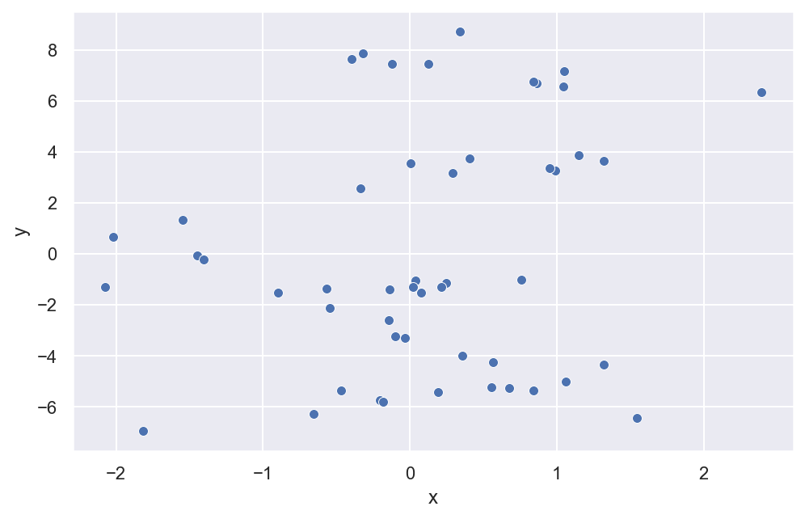
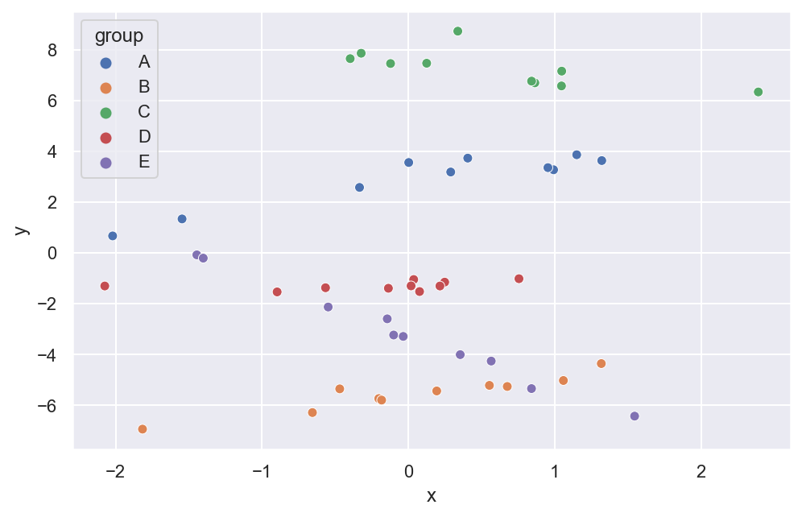
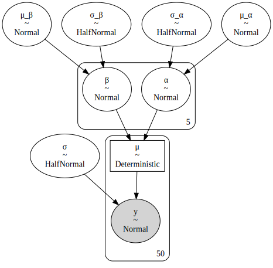
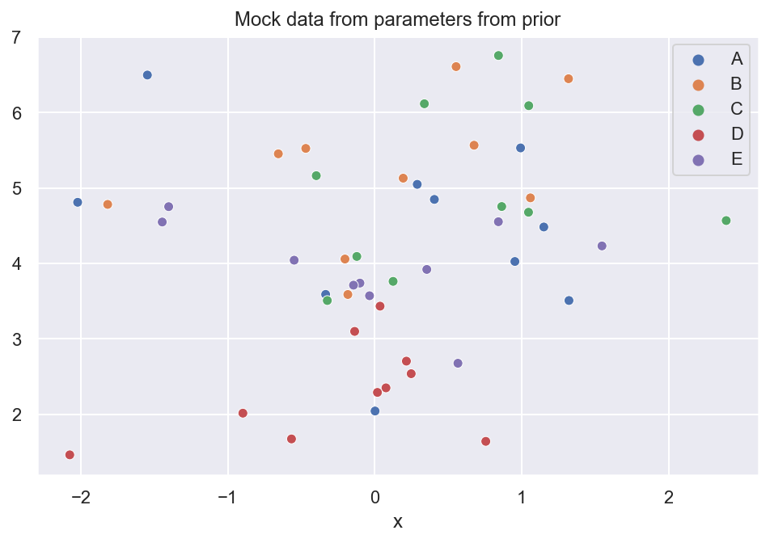
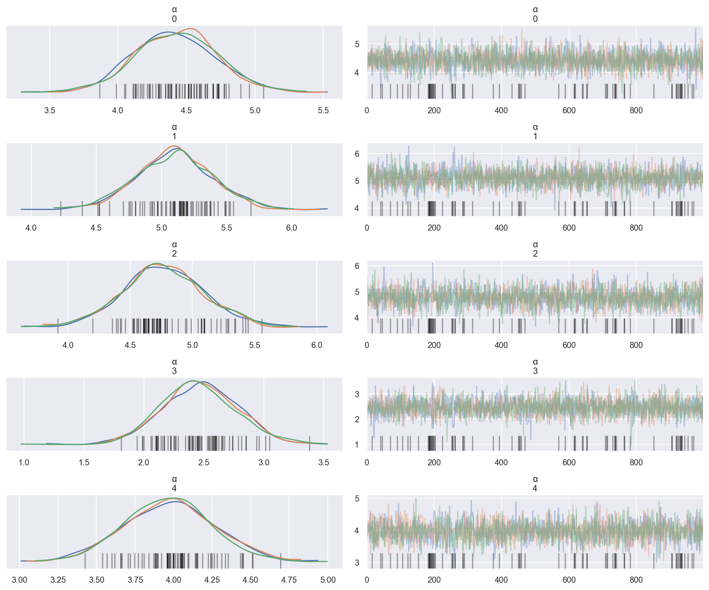

# Creating a scalable and general workflow for simulation-based calibration of PyMC3 models

```python
%load_ext autoreload
%autoreload 2
```

```python
from typing import Any, Dict, List, Optional, Tuple

import arviz as az
import matplotlib.pyplot as plt
import numpy as np
import pandas as pd
import plotnine as gg
import pymc3 as pm
import seaborn as sns

%matplotlib inline
%config InlineBackend.figure_format = "retina"

gg.theme_set(gg.theme_bw)
sns.set_theme()
np.random.seed(1234)
```

## Simulation-based calibration steps

1. Draws parameters from the prior
2. Simulate data from the sampled parameters
3. Fit the model to the simulated data
4. Compare the posterior parameter estimates to the actual values

## "True" mock data

This data set represents the "true" data that the model will eventually be fit with.
This is necessary because I mainly fit hierarchical models meaning I need to know the number of varying intercepts during model construction.

```python
from string import ascii_uppercase

N_GROUPS = 5
N_DATA_POINTS = 10

groups = list(ascii_uppercase[:N_GROUPS])

real_params: Dict[str, Any] = dict(
    α=np.random.normal(0, 5, N_GROUPS), β=np.random.normal(0, 1, N_GROUPS), σ=0.5
)

x = np.random.normal(0, 1, N_GROUPS * N_DATA_POINTS)
data = pd.DataFrame(dict(x=x, group=np.repeat(groups, N_DATA_POINTS)))
data["group"] = pd.Categorical(data["group"], categories=groups, ordered=True)

idx = data["group"].cat.codes.to_numpy()

data["y"] = (
    real_params["α"][idx]
    + real_params["β"][idx] * x
    + np.abs(np.random.normal(0, real_params["σ"], len(x)))
)
data.head()
```

<div>
<style scoped>
    .dataframe tbody tr th:only-of-type {
        vertical-align: middle;
    }

    .dataframe tbody tr th {
        vertical-align: top;
    }

    .dataframe thead th {
        text-align: right;
    }
</style>
<table border="1" class="dataframe">
  <thead>
    <tr style="text-align: right;">
      <th></th>
      <th>x</th>
      <th>group</th>
      <th>y</th>
    </tr>
  </thead>
  <tbody>
    <tr>
      <th>0</th>
      <td>1.150036</td>
      <td>A</td>
      <td>3.864563</td>
    </tr>
    <tr>
      <th>1</th>
      <td>0.991946</td>
      <td>A</td>
      <td>3.272366</td>
    </tr>
    <tr>
      <th>2</th>
      <td>0.953324</td>
      <td>A</td>
      <td>3.356914</td>
    </tr>
    <tr>
      <th>3</th>
      <td>-2.021255</td>
      <td>A</td>
      <td>0.668243</td>
    </tr>
    <tr>
      <th>4</th>
      <td>-0.334077</td>
      <td>A</td>
      <td>2.577695</td>
    </tr>
  </tbody>
</table>
</div>

```python
fig, ax = plt.subplots(figsize=(8, 5))
sns.scatterplot(x="x", y="y", data=data, ax=ax);
```



```python
fig, ax = plt.subplots(figsize=(8, 5))
sns.scatterplot(x="x", y="y", hue="group", data=data);
```



## Model

```python
group_idx = data["group"].cat.codes.to_numpy()


def build_model(x_values: np.ndarray, y_values: np.ndarray, n_groups: int) -> pm.Model:
    with pm.Model() as model:
        μ_α = pm.Normal("μ_α", 0, 2)
        σ_α = pm.HalfNormal("σ_α", 2)
        μ_β = pm.Normal("μ_β", 0, 1)
        σ_β = pm.HalfNormal("σ_β", 1)

        α = pm.Normal("α", μ_α, σ_α, shape=n_groups)
        β = pm.Normal("β", μ_β, σ_β, shape=n_groups)

        μ = pm.Deterministic("μ", α[group_idx] + β[group_idx] * x_values)
        σ = pm.HalfNormal("σ", 2)

        y = pm.Normal("y", μ, σ, observed=y_values)
    return model
```

```python
model = build_model(data.x.values, data.y.values, n_groups=N_GROUPS)
```

```python
pm.model_to_graphviz(model)
```



```python
with model:
    prior_sample = pm.sample_prior_predictive(1, random_seed=0)
```

```python
prior_sample.keys()
```

    dict_keys(['σ', 'α', 'σ_α_log__', 'σ_log__', 'σ_β', 'β', 'μ_β', 'μ', 'σ_α', 'σ_β_log__', 'y', 'μ_α'])

```python
prior_sample.get("μ_α"), prior_sample.get("σ_α")
```

    (array([3.52810469]), array([0.80031442]))

```python
prior_sample.get("μ_β"), prior_sample.get("σ_β")
```

    (array([-0.15135721]), array([0.10321885]))

```python
prior_sample.get("μ").flatten()
```

    array([4.18607686, 4.2033048 , 4.20751364, 4.53167047, 4.34780913,
           4.31117196, 4.26721824, 4.27989881, 4.16742867, 4.47997793,
           5.34918286, 5.41105655, 5.2951239 , 5.24598539, 5.14161038,
           5.38557893, 5.22931799, 5.56952841, 5.34651616, 5.17698597,
           5.02323509, 5.02231689, 5.02143009, 5.02143214, 5.02165969,
           5.02289074, 5.02258254, 5.02314137, 5.02168722, 5.01975252,
           2.7404275 , 2.78721451, 2.74334385, 2.8970413 , 2.72793491,
           2.81129151, 2.75593429, 2.74464359, 2.69097813, 2.73030275,
           4.17174377, 4.48914977, 4.48306531, 4.3024814 , 4.36456913,
           4.30854706, 4.23933682, 4.29340329, 4.20995077, 4.07393972])

```python
mock_y = prior_sample.get("y").flatten()
```

```python
fig, ax = plt.subplots(figsize=(8, 5))
sns.scatterplot(x=data.x, y=mock_y, hue=data.group.values, ax=ax)
ax.set_title("Mock data from parameters from prior");
```



```python
mock_model = build_model(x_values=data.x.values, y_values=mock_y, n_groups=N_GROUPS)
with mock_model:
    trace = pm.sample(
        1000, tune=2000, chains=3, cores=3, random_seed=321, target_accept=0.95
    )
    posterior_pred = pm.sample_posterior_predictive(trace, 1000, random_seed=321)
```

    /usr/local/Caskroom/miniconda/base/envs/speclet/lib/python3.9/site-packages/pymc3/sampling.py:466: FutureWarning: In an upcoming release, pm.sample will return an `arviz.InferenceData` object instead of a `MultiTrace` by default. You can pass return_inferencedata=True or return_inferencedata=False to be safe and silence this warning.
    Auto-assigning NUTS sampler...
    Initializing NUTS using jitter+adapt_diag...
    Multiprocess sampling (3 chains in 3 jobs)
    NUTS: [σ, β, α, σ_β, μ_β, σ_α, μ_α]

<div>
    <style>
        /*Turns off some styling*/
        progress {
            /*gets rid of default border in Firefox and Opera.*/
            border: none;
            /*Needs to be in here for Safari polyfill so background images work as expected.*/
            background-size: auto;
        }
        .progress-bar-interrupted, .progress-bar-interrupted::-webkit-progress-bar {
            background: #F44336;
        }
    </style>
  <progress value='9000' class='' max='9000' style='width:300px; height:20px; vertical-align: middle;'></progress>
  100.00% [9000/9000 00:46<00:00 Sampling 3 chains, 77 divergences]
</div>

    Sampling 3 chains for 2_000 tune and 1_000 draw iterations (6_000 + 3_000 draws total) took 61 seconds.
    There were 16 divergences after tuning. Increase `target_accept` or reparameterize.
    There were 28 divergences after tuning. Increase `target_accept` or reparameterize.
    There were 33 divergences after tuning. Increase `target_accept` or reparameterize.
    The number of effective samples is smaller than 25% for some parameters.
    /usr/local/Caskroom/miniconda/base/envs/speclet/lib/python3.9/site-packages/pymc3/sampling.py:1688: UserWarning: samples parameter is smaller than nchains times ndraws, some draws and/or chains may not be represented in the returned posterior predictive sample

<div>
    <style>
        /*Turns off some styling*/
        progress {
            /*gets rid of default border in Firefox and Opera.*/
            border: none;
            /*Needs to be in here for Safari polyfill so background images work as expected.*/
            background-size: auto;
        }
        .progress-bar-interrupted, .progress-bar-interrupted::-webkit-progress-bar {
            background: #F44336;
        }
    </style>
  <progress value='1000' class='' max='1000' style='width:300px; height:20px; vertical-align: middle;'></progress>
  100.00% [1000/1000 00:02<00:00]
</div>

```python
mock_az = az.from_pymc3(trace=trace, posterior_predictive=posterior_pred)
```

    /usr/local/Caskroom/miniconda/base/envs/speclet/lib/python3.9/site-packages/arviz/data/io_pymc3.py:96: FutureWarning: Using `from_pymc3` without the model will be deprecated in a future release. Not using the model will return less accurate and less useful results. Make sure you use the model argument or call from_pymc3 within a model context.
    posterior predictive variable y's shape not compatible with number of chains and draws. This can mean that some draws or even whole chains are not represented.

```python
az.plot_trace(mock_az, var_names=("α"), compact=False);
```



```python
df = az.summary(mock_az, var_names="α", kind="stats")
df["real"] = prior_sample.get("α").flatten()
df
```

<div>
<style scoped>
    .dataframe tbody tr th:only-of-type {
        vertical-align: middle;
    }

    .dataframe tbody tr th {
        vertical-align: top;
    }

    .dataframe thead th {
        text-align: right;
    }
</style>
<table border="1" class="dataframe">
  <thead>
    <tr style="text-align: right;">
      <th></th>
      <th>mean</th>
      <th>sd</th>
      <th>hdi_3%</th>
      <th>hdi_97%</th>
      <th>real</th>
    </tr>
  </thead>
  <tbody>
    <tr>
      <th>α[0]</th>
      <td>4.422</td>
      <td>0.299</td>
      <td>3.841</td>
      <td>4.967</td>
      <td>4.311403</td>
    </tr>
    <tr>
      <th>α[1]</th>
      <td>5.102</td>
      <td>0.298</td>
      <td>4.570</td>
      <td>5.692</td>
      <td>5.321524</td>
    </tr>
    <tr>
      <th>α[2]</th>
      <td>4.767</td>
      <td>0.330</td>
      <td>4.152</td>
      <td>5.406</td>
      <td>5.022738</td>
    </tr>
    <tr>
      <th>α[3]</th>
      <td>2.465</td>
      <td>0.317</td>
      <td>1.908</td>
      <td>3.085</td>
      <td>2.745975</td>
    </tr>
    <tr>
      <th>α[4]</th>
      <td>3.971</td>
      <td>0.291</td>
      <td>3.415</td>
      <td>4.515</td>
      <td>4.288474</td>
    </tr>
  </tbody>
</table>
</div>

---

```python
%load_ext watermark
%watermark -d -u -v -iv -b -h -m
```

    Last updated: 2021-03-30

    Python implementation: CPython
    Python version       : 3.9.2
    IPython version      : 7.21.0

    Compiler    : Clang 11.0.1
    OS          : Darwin
    Release     : 20.3.0
    Machine     : x86_64
    Processor   : i386
    CPU cores   : 4
    Architecture: 64bit

    Hostname: JHCookMac

    Git branch: simulation-based-calibration

    numpy     : 1.20.1
    matplotlib: 3.3.4
    arviz     : 0.11.2
    pymc3     : 3.11.1
    plotnine  : 0.7.1
    pandas    : 1.2.3
    seaborn   : 0.11.1

```python

```
