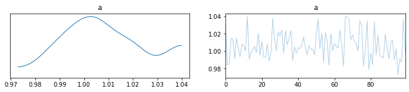
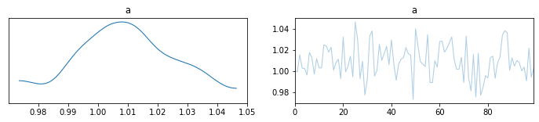

```python
%load_ext autoreload
%autoreload 2
```

```python
import arviz as az
import matplotlib.pyplot as plt
import numpy as np
import pandas as pd
import plotnine
import pymc3 as pm
import seaborn as sns
```

```python
N = 50
x = np.random.normal(0, 1, N)
y = 1 - 0.5 * x + np.random.normal(0, 0.1, N)
data = pd.DataFrame({"x": x, "y": y})

sns.scatterplot(data=data, x="x", y="y");
```


```python
with pm.Model() as m1:
    a = pm.Normal("a", 0, 10)
    b = pm.Normal("b", 0, 10)
    mu = a + b * data.x
    sigma = pm.HalfNormal("sigma", 5)
    y = pm.Normal("y", mu, sigma, observed=data.y)

    trace_1 = pm.sample(draws=100, tune=100, random_seed=123, chains=1)
```

    /var/folders/r4/qpcdgl_14hbd412snp1jnv300000gn/T/ipykernel_86142/3140635777.py:8: FutureWarning: In v4.0, pm.sample will return an `arviz.InferenceData` object instead of a `MultiTrace` by default. You can pass return_inferencedata=True or return_inferencedata=False to be safe and silence this warning.
    Only 100 samples in chain.
    Auto-assigning NUTS sampler...
    Initializing NUTS using jitter+adapt_diag...
    Sequential sampling (1 chains in 1 job)
    NUTS: [sigma, b, a]

<div>
    <style>
        /*Turns off some styling*/
        progress {
            /*gets rid of default border in Firefox and Opera.*/
            border: none;
            /*Needs to be in here for Safari polyfill so background images work as expected.*/
            background-size: auto;
        }
        .progress-bar-interrupted, .progress-bar-interrupted::-webkit-progress-bar {
            background: #F44336;
        }
    </style>
  <progress value='200' class='' max='200' style='width:300px; height:20px; vertical-align: middle;'></progress>
  100.00% [200/200 00:02<00:00 Sampling chain 0, 0 divergences]
</div>

    Sampling 1 chain for 100 tune and 100 draw iterations (100 + 100 draws total) took 3 seconds.
    The acceptance probability does not match the target. It is 0.919247154574031, but should be close to 0.8. Try to increase the number of tuning steps.
    Only one chain was sampled, this makes it impossible to run some convergence checks

```python
with pm.Model() as m2:
    a = pm.Normal("a", 0, 10)
    b = pm.Normal("b", 0, 10)
    mu = a + b * data.x
    sigma = pm.HalfNormal("sigma", 5)
    y = pm.Normal("y", mu, sigma, observed=data.y)

    trace_2 = pm.sample(draws=100, tune=100, random_seed=456, chains=1)
```

    /var/folders/r4/qpcdgl_14hbd412snp1jnv300000gn/T/ipykernel_86142/1162493465.py:8: FutureWarning: In v4.0, pm.sample will return an `arviz.InferenceData` object instead of a `MultiTrace` by default. You can pass return_inferencedata=True or return_inferencedata=False to be safe and silence this warning.
    Only 100 samples in chain.
    Auto-assigning NUTS sampler...
    Initializing NUTS using jitter+adapt_diag...
    Sequential sampling (1 chains in 1 job)
    NUTS: [sigma, b, a]

<div>
    <style>
        /*Turns off some styling*/
        progress {
            /*gets rid of default border in Firefox and Opera.*/
            border: none;
            /*Needs to be in here for Safari polyfill so background images work as expected.*/
            background-size: auto;
        }
        .progress-bar-interrupted, .progress-bar-interrupted::-webkit-progress-bar {
            background: #F44336;
        }
    </style>
  <progress value='200' class='' max='200' style='width:300px; height:20px; vertical-align: middle;'></progress>
  100.00% [200/200 00:00<00:00 Sampling chain 0, 0 divergences]
</div>

    Sampling 1 chain for 100 tune and 100 draw iterations (100 + 100 draws total) took 0 seconds.
    The acceptance probability does not match the target. It is 0.8927277827183024, but should be close to 0.8. Try to increase the number of tuning steps.
    Only one chain was sampled, this makes it impossible to run some convergence checks

```python
az1 = az.from_pymc3(model=m1, trace=trace_1)
az2 = az.from_pymc3(model=m2, trace=trace_2)
```

```python
merged_az = az.concat([az1, az2], dim="chain")
```

```python
for inf_obj in [az1, az2, merged_az]:
    az.plot_trace(inf_obj, var_names="a")
    plt.show()
```






```python
a = ["a", "B"]
" ".join(a)
```

    'a B'

```python

```
