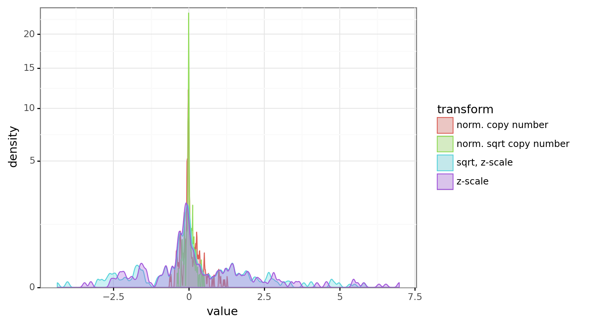
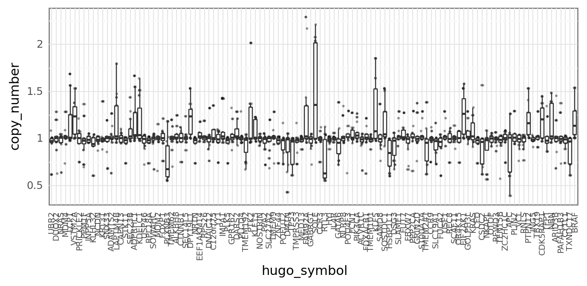

# Experimentation with scaling copy number values

```python
%load_ext autoreload
%autoreload 2
```

```python
import matplotlib.pyplot as plt
import numpy as np
import pandas as pd
import plotnine as gg
import seaborn as sns

from speclet.data_processing import achilles as achelp
from speclet.io import data_io
from speclet.io.data_io import DataFile
```

```python
%config InlineBackend.figure_format = "retina"
_ = gg.theme_set(gg.theme_bw())
```

```python
real_df = achelp.read_achilles_data(data_io.data_path(DataFile.DEPMAP_CRC_SUBSAMPLE))
real_df.head(5)
```

<div>
<style scoped>
    .dataframe tbody tr th:only-of-type {
        vertical-align: middle;
    }

    .dataframe tbody tr th {
        vertical-align: top;
    }

    .dataframe thead th {
        text-align: right;
    }
</style>
<table border="1" class="dataframe">
  <thead>
    <tr style="text-align: right;">
      <th></th>
      <th>sgrna</th>
      <th>replicate_id</th>
      <th>lfc</th>
      <th>p_dna_batch</th>
      <th>genome_alignment</th>
      <th>hugo_symbol</th>
      <th>screen</th>
      <th>multiple_hits_on_gene</th>
      <th>sgrna_target_chr</th>
      <th>sgrna_target_pos</th>
      <th>...</th>
      <th>num_mutations</th>
      <th>any_deleterious</th>
      <th>any_tcga_hotspot</th>
      <th>any_cosmic_hotspot</th>
      <th>is_mutated</th>
      <th>copy_number</th>
      <th>lineage</th>
      <th>primary_or_metastasis</th>
      <th>is_male</th>
      <th>age</th>
    </tr>
  </thead>
  <tbody>
    <tr>
      <th>0</th>
      <td>ATAACACTGCACCTTCCAAC</td>
      <td>LS513-311Cas9_RepA_p6_batch2</td>
      <td>0.179367</td>
      <td>2</td>
      <td>chr2_157587191_-</td>
      <td>ACVR1C</td>
      <td>broad</td>
      <td>True</td>
      <td>2</td>
      <td>157587191</td>
      <td>...</td>
      <td>0</td>
      <td>NaN</td>
      <td>NaN</td>
      <td>NaN</td>
      <td>False</td>
      <td>0.964254</td>
      <td>colorectal</td>
      <td>primary</td>
      <td>True</td>
      <td>63.0</td>
    </tr>
    <tr>
      <th>1</th>
      <td>ATAACACTGCACCTTCCAAC</td>
      <td>CL-11-311Cas9_RepB_p6_batch3</td>
      <td>-0.139505</td>
      <td>3</td>
      <td>chr2_157587191_-</td>
      <td>ACVR1C</td>
      <td>broad</td>
      <td>False</td>
      <td>2</td>
      <td>157587191</td>
      <td>...</td>
      <td>0</td>
      <td>NaN</td>
      <td>NaN</td>
      <td>NaN</td>
      <td>False</td>
      <td>1.004888</td>
      <td>colorectal</td>
      <td>primary</td>
      <td>True</td>
      <td>NaN</td>
    </tr>
    <tr>
      <th>2</th>
      <td>ATAACACTGCACCTTCCAAC</td>
      <td>SW1463-311cas9 Rep A p5_batch2</td>
      <td>-0.192216</td>
      <td>2</td>
      <td>chr2_157587191_-</td>
      <td>ACVR1C</td>
      <td>broad</td>
      <td>True</td>
      <td>2</td>
      <td>157587191</td>
      <td>...</td>
      <td>0</td>
      <td>NaN</td>
      <td>NaN</td>
      <td>NaN</td>
      <td>False</td>
      <td>0.923384</td>
      <td>colorectal</td>
      <td>primary</td>
      <td>False</td>
      <td>66.0</td>
    </tr>
    <tr>
      <th>3</th>
      <td>ATAACACTGCACCTTCCAAC</td>
      <td>HT29-311Cas9_RepA_p6 AVANA_batch3</td>
      <td>0.282499</td>
      <td>3</td>
      <td>chr2_157587191_-</td>
      <td>ACVR1C</td>
      <td>broad</td>
      <td>True</td>
      <td>2</td>
      <td>157587191</td>
      <td>...</td>
      <td>0</td>
      <td>NaN</td>
      <td>NaN</td>
      <td>NaN</td>
      <td>False</td>
      <td>1.014253</td>
      <td>colorectal</td>
      <td>primary</td>
      <td>False</td>
      <td>44.0</td>
    </tr>
    <tr>
      <th>4</th>
      <td>ATAACACTGCACCTTCCAAC</td>
      <td>KM12-311Cas9 Rep A p5_batch3</td>
      <td>0.253698</td>
      <td>3</td>
      <td>chr2_157587191_-</td>
      <td>ACVR1C</td>
      <td>broad</td>
      <td>True</td>
      <td>2</td>
      <td>157587191</td>
      <td>...</td>
      <td>0</td>
      <td>NaN</td>
      <td>NaN</td>
      <td>NaN</td>
      <td>False</td>
      <td>1.048861</td>
      <td>colorectal</td>
      <td>primary</td>
      <td>NaN</td>
      <td>NaN</td>
    </tr>
  </tbody>
</table>
<p>5 rows × 24 columns</p>
</div>

```python
cn_vals = np.linspace(0, 10, 200)
cn_log2_p1 = np.log2(cn_vals + 1)
cn_log2_p1_z = (cn_log2_p1 - np.mean(cn_log2_p1)) / np.std(cn_log2_p1)
cn_sqrt = np.sqrt(cn_vals)
```

```python
fig, axes = plt.subplots(2, 2, figsize=(6, 6))

cn_array = np.vstack([cn_vals, cn_log2_p1, cn_log2_p1_z, cn_sqrt])
cn_array_names = ["CN value", "log2(CN + 1)", "z-scaled log2(CN + 1)", "sqrt"]

for ax, idxs in zip(axes.flatten(), ((0, 1), (1, 2), (0, 2), (0, 3))):
    a1 = cn_array[idxs[0], :]
    a2 = cn_array[idxs[1], :]
    sns.lineplot(x=a1, y=a2, ax=ax)
    ax.set_xlabel(cn_array_names[idxs[0]])
    ax.set_ylabel(cn_array_names[idxs[1]])
    ax.vlines(0, np.min(a2), np.max(a2), color="k", linestyles="-")
    ax.hlines(0, np.min(a1), np.max(a1), color="k", linestyles="-")

plt.tight_layout()
plt.show()
```


```python
real_cn = real_df["copy_number"].values
real_cn_log2_p1 = np.log2(real_cn + 1)
real_cn_log2_p1_z = (real_cn_log2_p1 - np.mean(real_cn_log2_p1)) - np.std(
    real_cn_log2_p1
)
real_df["cn_log_z"] = real_cn_log2_p1_z
```

```python
def histogram(df: pd.DataFrame, x: str) -> gg.ggplot:
    return (
        gg.ggplot(df, gg.aes(x=x))
        + gg.geom_histogram(bins=100)
        + gg.scale_y_continuous(expand=(0, 0, 0.02, 0))
        + gg.labs(x=x, y="count")
    )
```

```python
histogram(real_df, "copy_number")
```


    <ggplot: (348635886)>

```python
real_cn_sqrt = np.sqrt(real_cn)
real_df["copy_number_z"] = (real_cn - np.mean(real_cn)) / np.std(real_cn)
real_df["copy_number_sqrt_z"] = (real_cn_sqrt - np.mean(real_cn_sqrt)) / np.std(
    real_cn_sqrt
)
real_df["copy_number_norm"] = real_cn - np.mean(real_cn)
real_df["copy_number_sqrt_norm"] = real_cn_sqrt - np.mean(real_cn_sqrt)

n = real_df.shape[0]

plot_df = pd.DataFrame(
    {
        "value": np.hstack(
            [
                real_df["copy_number_z"],
                real_df["copy_number_sqrt_z"],
                real_df["copy_number_norm"],
                real_df["copy_number_sqrt_norm"],
            ]
        ),
        "transform": np.hstack(
            [
                np.repeat("z-scale", n),
                np.repeat("sqrt, z-scale", n),
                np.repeat("norm. copy number", n),
                np.repeat("norm. sqrt copy number", n),
            ]
        ),
    }
)

(
    gg.ggplot(plot_df, gg.aes(x="value"))
    + gg.geom_density(gg.aes(fill="transform", color="transform"), alpha=0.3)
    + gg.scale_y_sqrt(expand=(0, 0, 0.02, 0))
)
```



    <ggplot: (348759748)>

```python
real_df.shape
```

    (2598, 29)

```python
(
    gg.ggplot(real_df, gg.aes(x="hugo_symbol", y="copy_number"))
    + gg.geom_jitter(width=0.2, height=0, size=0.3, alpha=0.3)
    + gg.geom_boxplot(outlier_alpha=0)
    + gg.theme(
        axis_text_x=gg.element_text(angle=90, size=7),
        axis_ticks_major=gg.element_blank(),
        figure_size=(8, 3),
    )
)
```



    <ggplot: (348821986)>

```python

```
