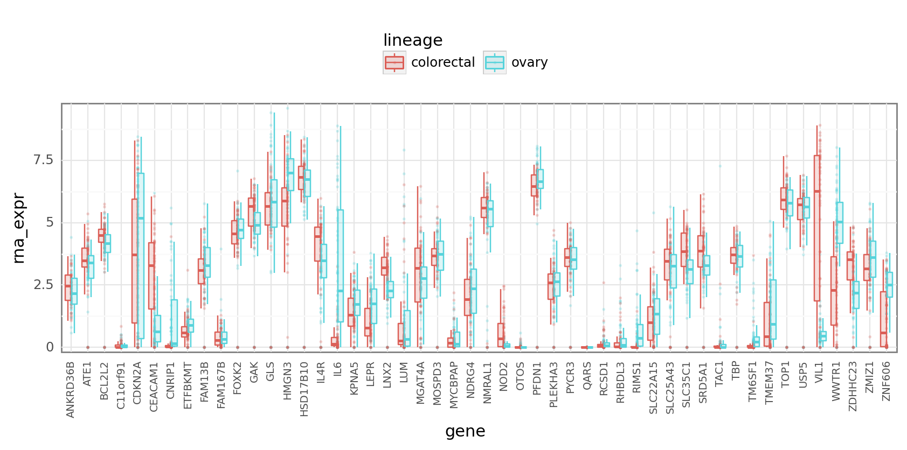
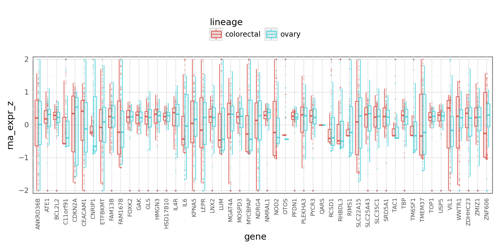

# Experimenting with RNA expression scaling

```python
from pathlib import Path

import janitor
import numpy as np
import pandas as pd
import plotnine as gg
import seaborn as sns
from tqdm import tqdm
```

```python
_ = gg.theme_set(gg.theme_bw())
%config InlineBackend.figure_format = "retina"
RANDOM_SEED = 78934
```

## Loading data

```python
modeling_data_dir = Path("..", "..", "modeling_data")

crc_df_path = modeling_data_dir / "depmap_modeling_dataframe_crc.csv"
assert crc_df_path.exists()

full_modeling_data_path = modeling_data_dir / "depmap_modeling_dataframe.csv"
assert full_modeling_data_path.exists()
```

```python
ovary_df = pd.DataFrame()

chunked_modeling_data = pd.read_csv(
    full_modeling_data_path,
    iterator=True,
    chunksize=1000000,
    low_memory=False,
)

for chunk in tqdm(chunked_modeling_data):
    ovary_chunk = chunk.query("lineage == 'ovary'")

    if chunk.shape[0] > 0:
        ovary_df = pd.concat([ovary_df, ovary_chunk])
```

    89it [08:34,  5.79s/it]

```python
ovary_df = ovary_df.reset_index(drop=True)
```

```python
ovary_df.head()
```

<div>
<style scoped>
    .dataframe tbody tr th:only-of-type {
        vertical-align: middle;
    }

    .dataframe tbody tr th {
        vertical-align: top;
    }

    .dataframe thead th {
        text-align: right;
    }
</style>
<table border="1" class="dataframe">
  <thead>
    <tr style="text-align: right;">
      <th></th>
      <th>sgrna</th>
      <th>replicate_id</th>
      <th>lfc</th>
      <th>p_dna_batch</th>
      <th>genome_alignment</th>
      <th>hugo_symbol</th>
      <th>screen</th>
      <th>multiple_hits_on_gene</th>
      <th>sgrna_target_chr</th>
      <th>sgrna_target_pos</th>
      <th>...</th>
      <th>num_mutations</th>
      <th>any_deleterious</th>
      <th>any_tcga_hotspot</th>
      <th>any_cosmic_hotspot</th>
      <th>is_mutated</th>
      <th>copy_number</th>
      <th>lineage</th>
      <th>primary_or_metastasis</th>
      <th>is_male</th>
      <th>age</th>
    </tr>
  </thead>
  <tbody>
    <tr>
      <th>0</th>
      <td>AAACCTGCGGCGGTCGCCA</td>
      <td>OVR3_c905R1</td>
      <td>-0.299958</td>
      <td>CRISPR_C6596666.sample</td>
      <td>chr8_66505451_-</td>
      <td>VXN</td>
      <td>sanger</td>
      <td>True</td>
      <td>8</td>
      <td>66505451</td>
      <td>...</td>
      <td>0</td>
      <td>NaN</td>
      <td>NaN</td>
      <td>NaN</td>
      <td>False</td>
      <td>0.847995</td>
      <td>ovary</td>
      <td>metastasis</td>
      <td>False</td>
      <td>60.0</td>
    </tr>
    <tr>
      <th>1</th>
      <td>AACAGCACACCGGCCCCGT</td>
      <td>OVR3_c905R1</td>
      <td>0.267092</td>
      <td>CRISPR_C6596666.sample</td>
      <td>chrX_156009834_-</td>
      <td>IL9R</td>
      <td>sanger</td>
      <td>True</td>
      <td>X</td>
      <td>156009834</td>
      <td>...</td>
      <td>0</td>
      <td>NaN</td>
      <td>NaN</td>
      <td>NaN</td>
      <td>False</td>
      <td>0.700605</td>
      <td>ovary</td>
      <td>metastasis</td>
      <td>False</td>
      <td>60.0</td>
    </tr>
    <tr>
      <th>2</th>
      <td>AACCTCCGGACTCCTCAGC</td>
      <td>OVR3_c905R1</td>
      <td>0.550477</td>
      <td>CRISPR_C6596666.sample</td>
      <td>chr7_39609658_-</td>
      <td>YAE1</td>
      <td>sanger</td>
      <td>True</td>
      <td>7</td>
      <td>39609658</td>
      <td>...</td>
      <td>0</td>
      <td>NaN</td>
      <td>NaN</td>
      <td>NaN</td>
      <td>False</td>
      <td>0.934918</td>
      <td>ovary</td>
      <td>metastasis</td>
      <td>False</td>
      <td>60.0</td>
    </tr>
    <tr>
      <th>3</th>
      <td>AACTCAAACTGACGCCGAA</td>
      <td>OVR3_c905R1</td>
      <td>-0.391922</td>
      <td>CRISPR_C6596666.sample</td>
      <td>chr1_117623388_-</td>
      <td>TENT5C</td>
      <td>sanger</td>
      <td>True</td>
      <td>1</td>
      <td>117623388</td>
      <td>...</td>
      <td>0</td>
      <td>NaN</td>
      <td>NaN</td>
      <td>NaN</td>
      <td>False</td>
      <td>1.352975</td>
      <td>ovary</td>
      <td>metastasis</td>
      <td>False</td>
      <td>60.0</td>
    </tr>
    <tr>
      <th>4</th>
      <td>AACTGACCTTGAAACGCTG</td>
      <td>OVR3_c905R1</td>
      <td>-1.562577</td>
      <td>CRISPR_C6596666.sample</td>
      <td>chr16_66933623_+</td>
      <td>CIAO2B</td>
      <td>sanger</td>
      <td>True</td>
      <td>16</td>
      <td>66933623</td>
      <td>...</td>
      <td>0</td>
      <td>NaN</td>
      <td>NaN</td>
      <td>NaN</td>
      <td>False</td>
      <td>1.259171</td>
      <td>ovary</td>
      <td>metastasis</td>
      <td>False</td>
      <td>60.0</td>
    </tr>
  </tbody>
</table>
<p>5 rows × 22 columns</p>
</div>

```python
ovary_df.shape
```

    (5784486, 22)

```python
crc_df = pd.read_csv(crc_df_path, low_memory=False)
print(crc_df.shape)
crc_df.head()
```

    (5460544, 22)

<div>
<style scoped>
    .dataframe tbody tr th:only-of-type {
        vertical-align: middle;
    }

    .dataframe tbody tr th {
        vertical-align: top;
    }

    .dataframe thead th {
        text-align: right;
    }
</style>
<table border="1" class="dataframe">
  <thead>
    <tr style="text-align: right;">
      <th></th>
      <th>sgrna</th>
      <th>replicate_id</th>
      <th>lfc</th>
      <th>p_dna_batch</th>
      <th>genome_alignment</th>
      <th>hugo_symbol</th>
      <th>screen</th>
      <th>multiple_hits_on_gene</th>
      <th>sgrna_target_chr</th>
      <th>sgrna_target_pos</th>
      <th>...</th>
      <th>num_mutations</th>
      <th>any_deleterious</th>
      <th>any_tcga_hotspot</th>
      <th>any_cosmic_hotspot</th>
      <th>is_mutated</th>
      <th>copy_number</th>
      <th>lineage</th>
      <th>primary_or_metastasis</th>
      <th>is_male</th>
      <th>age</th>
    </tr>
  </thead>
  <tbody>
    <tr>
      <th>0</th>
      <td>AAACCTGCGGCGGTCGCCA</td>
      <td>LS513_c903R1</td>
      <td>0.563383</td>
      <td>ERS717283.plasmid</td>
      <td>chr8_66505451_-</td>
      <td>VXN</td>
      <td>sanger</td>
      <td>True</td>
      <td>8</td>
      <td>66505451</td>
      <td>...</td>
      <td>0</td>
      <td>NaN</td>
      <td>NaN</td>
      <td>NaN</td>
      <td>False</td>
      <td>0.956651</td>
      <td>colorectal</td>
      <td>primary</td>
      <td>True</td>
      <td>63.0</td>
    </tr>
    <tr>
      <th>1</th>
      <td>AAAGCCCAGGAGTATGGGAG</td>
      <td>LS513-311Cas9_RepA_p6_batch2</td>
      <td>0.594321</td>
      <td>2</td>
      <td>chr2_130522105_-</td>
      <td>CFC1B</td>
      <td>broad</td>
      <td>True</td>
      <td>2</td>
      <td>130522105</td>
      <td>...</td>
      <td>0</td>
      <td>NaN</td>
      <td>NaN</td>
      <td>NaN</td>
      <td>False</td>
      <td>0.953860</td>
      <td>colorectal</td>
      <td>primary</td>
      <td>True</td>
      <td>63.0</td>
    </tr>
    <tr>
      <th>2</th>
      <td>AAATCAGAGAAACCTGAACG</td>
      <td>LS513-311Cas9_RepA_p6_batch2</td>
      <td>-0.363633</td>
      <td>2</td>
      <td>chr11_89916950_-</td>
      <td>TRIM49D1</td>
      <td>broad</td>
      <td>True</td>
      <td>11</td>
      <td>89916950</td>
      <td>...</td>
      <td>0</td>
      <td>NaN</td>
      <td>NaN</td>
      <td>NaN</td>
      <td>False</td>
      <td>0.960466</td>
      <td>colorectal</td>
      <td>primary</td>
      <td>True</td>
      <td>63.0</td>
    </tr>
    <tr>
      <th>3</th>
      <td>AACAGCACACCGGCCCCGT</td>
      <td>LS513_c903R1</td>
      <td>-0.512694</td>
      <td>ERS717283.plasmid</td>
      <td>chrX_156009834_-</td>
      <td>IL9R</td>
      <td>sanger</td>
      <td>True</td>
      <td>X</td>
      <td>156009834</td>
      <td>...</td>
      <td>0</td>
      <td>NaN</td>
      <td>NaN</td>
      <td>NaN</td>
      <td>False</td>
      <td>0.478776</td>
      <td>colorectal</td>
      <td>primary</td>
      <td>True</td>
      <td>63.0</td>
    </tr>
    <tr>
      <th>4</th>
      <td>AACCTCCGGACTCCTCAGC</td>
      <td>LS513_c903R1</td>
      <td>-0.075108</td>
      <td>ERS717283.plasmid</td>
      <td>chr7_39609658_-</td>
      <td>YAE1</td>
      <td>sanger</td>
      <td>True</td>
      <td>7</td>
      <td>39609658</td>
      <td>...</td>
      <td>0</td>
      <td>NaN</td>
      <td>NaN</td>
      <td>NaN</td>
      <td>False</td>
      <td>1.437966</td>
      <td>colorectal</td>
      <td>primary</td>
      <td>True</td>
      <td>63.0</td>
    </tr>
  </tbody>
</table>
<p>5 rows × 22 columns</p>
</div>

## Testing RNA expression scaling

```python
np.random.seed(RANDOM_SEED)
test_genes = np.random.choice(crc_df.hugo_symbol.unique(), size=50, replace=False)
```

```python
df = (
    pd.concat([ovary_df, crc_df])
    .reset_index()
    .filter_column_isin(column_name="hugo_symbol", iterable=test_genes)
)

df.shape
```

    (31945, 23)

```python
df_rna = df[["lineage", "depmap_id", "hugo_symbol", "rna_expr"]].drop_duplicates()
df_rna.shape
```

    (5524, 4)

```python
df_rna[df_rna["rna_expr"].isna()]
```

<div>
<style scoped>
    .dataframe tbody tr th:only-of-type {
        vertical-align: middle;
    }

    .dataframe tbody tr th {
        vertical-align: top;
    }

    .dataframe thead th {
        text-align: right;
    }
</style>
<table border="1" class="dataframe">
  <thead>
    <tr style="text-align: right;">
      <th></th>
      <th>lineage</th>
      <th>depmap_id</th>
      <th>hugo_symbol</th>
      <th>rna_expr</th>
    </tr>
  </thead>
  <tbody>
  </tbody>
</table>
</div>

```python
def plot_by_lineage(df, y: str = "rna_expr") -> gg.ggplot:
    return (
        gg.ggplot(df, gg.aes(x="hugo_symbol", y=y))
        + gg.geom_point(gg.aes(color="lineage"), size=0.2, alpha=0.2)
        + gg.geom_boxplot(
            gg.aes(color="lineage", fill="lineage"), alpha=0.2, outlier_alpha=0.0
        )
        + gg.scale_y_continuous(expand=(0.02, 0, 0.02, 0))
        + gg.theme(
            axis_text_x=gg.element_text(angle=90, size=7),
            axis_ticks=gg.element_blank(),
            figure_size=(10, 3),
            legend_position="top",
        )
        + gg.labs(x="gene")
    )
```

```python
plot_by_lineage(df_rna)
```



    <ggplot: (8732187872380)>

```python
np.log10(1)
```

    0.0

```python
def zscale(x: np.ndarray) -> np.ndarray:
    # print(args)
    return (x - np.mean(x)) / np.std(x)


def squish(x: float, lower: float, upper: float) -> float:
    return max(min(x, upper), lower)


squish_array = np.vectorize(squish)


def rna_zscale(df):
    rna = df["rna_expr"].values

    if np.allclose(rna, 0.0):
        df["rna_expr_z"] = np.log10(rna + 1)
    else:
        df["rna_expr_z"] = squish_array(
            zscale(np.log10(rna + 1)), lower=-2.0, upper=2.0
        )

    return df
```

```python
df_rna = df_rna.groupby(["lineage", "hugo_symbol"]).apply(rna_zscale)
```

```python
df_rna[np.isinf(df_rna["rna_expr_z"])]
```

<div>
<style scoped>
    .dataframe tbody tr th:only-of-type {
        vertical-align: middle;
    }

    .dataframe tbody tr th {
        vertical-align: top;
    }

    .dataframe thead th {
        text-align: right;
    }
</style>
<table border="1" class="dataframe">
  <thead>
    <tr style="text-align: right;">
      <th></th>
      <th>lineage</th>
      <th>depmap_id</th>
      <th>hugo_symbol</th>
      <th>rna_expr</th>
      <th>rna_expr_z</th>
    </tr>
  </thead>
  <tbody>
  </tbody>
</table>
</div>

```python
df_rna[df_rna["rna_expr_z"].isna()]
```

<div>
<style scoped>
    .dataframe tbody tr th:only-of-type {
        vertical-align: middle;
    }

    .dataframe tbody tr th {
        vertical-align: top;
    }

    .dataframe thead th {
        text-align: right;
    }
</style>
<table border="1" class="dataframe">
  <thead>
    <tr style="text-align: right;">
      <th></th>
      <th>lineage</th>
      <th>depmap_id</th>
      <th>hugo_symbol</th>
      <th>rna_expr</th>
      <th>rna_expr_z</th>
    </tr>
  </thead>
  <tbody>
  </tbody>
</table>
</div>

```python
plot_by_lineage(df_rna, y="rna_expr_z")
```



    <ggplot: (8732148979670)>

---

```python
%load_ext watermark
%watermark -d -u -v -iv -b -h -m
```

    Last updated: 2021-06-08

    Python implementation: CPython
    Python version       : 3.9.2
    IPython version      : 7.22.0

    Compiler    : GCC 9.3.0
    OS          : Linux
    Release     : 3.10.0-1062.el7.x86_64
    Machine     : x86_64
    Processor   : x86_64
    CPU cores   : 28
    Architecture: 64bit

    Hostname: compute-e-16-230.o2.rc.hms.harvard.edu

    Git branch: sp56

    seaborn : 0.11.1
    janitor : 0.20.14
    plotnine: 0.8.0
    pandas  : 1.2.3
    numpy   : 1.20.2

```python

```
