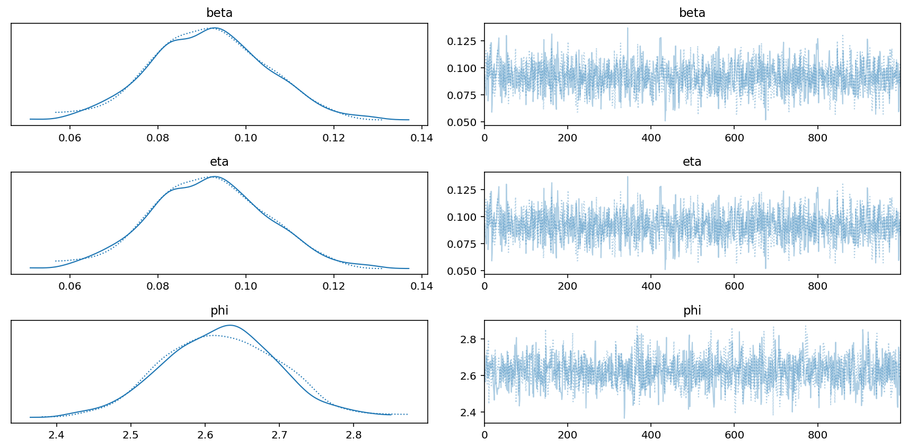
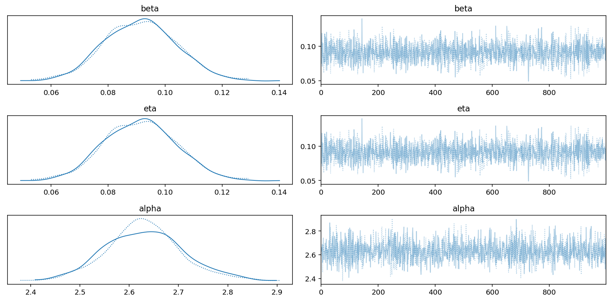
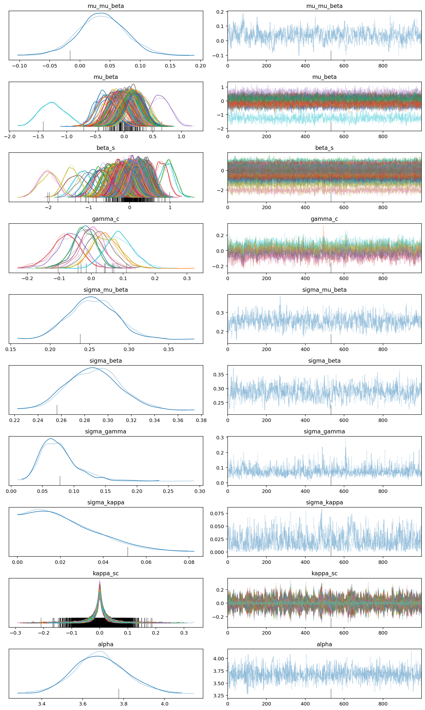
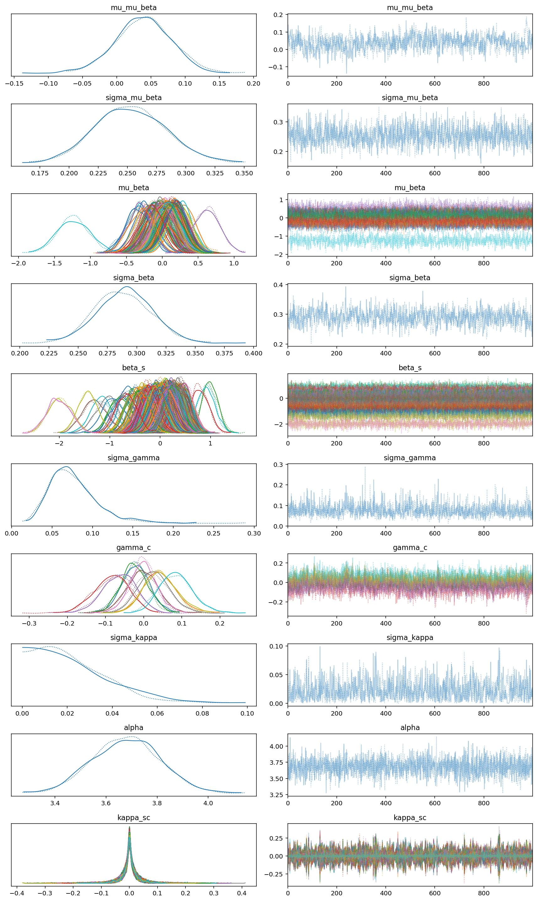
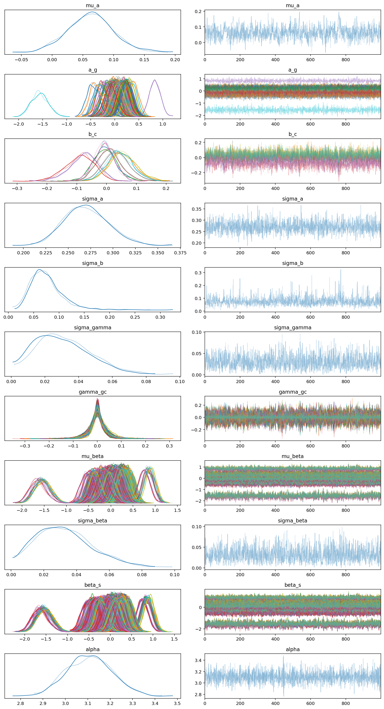
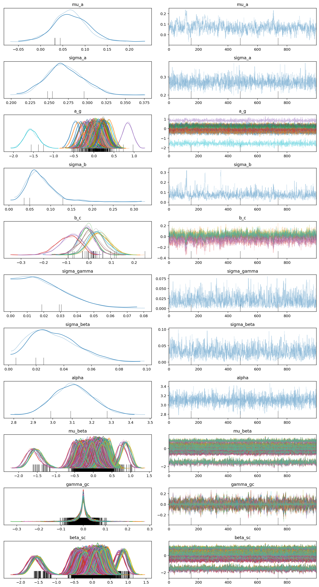
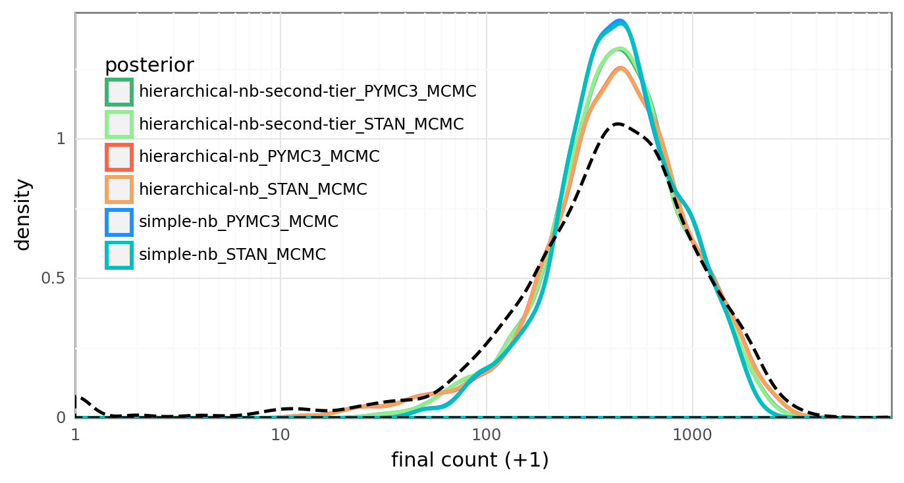
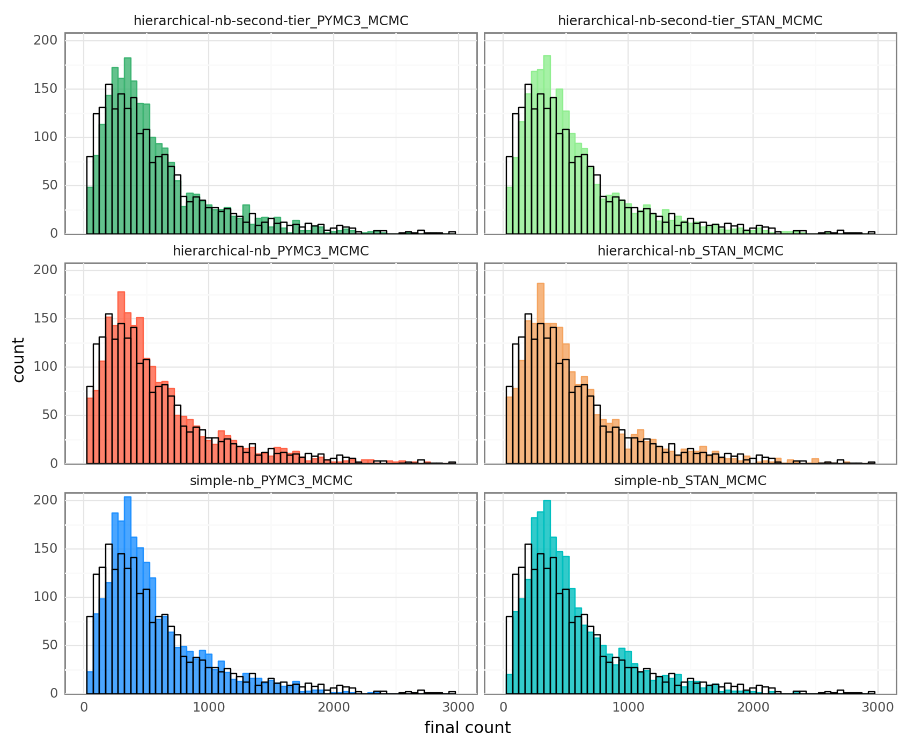
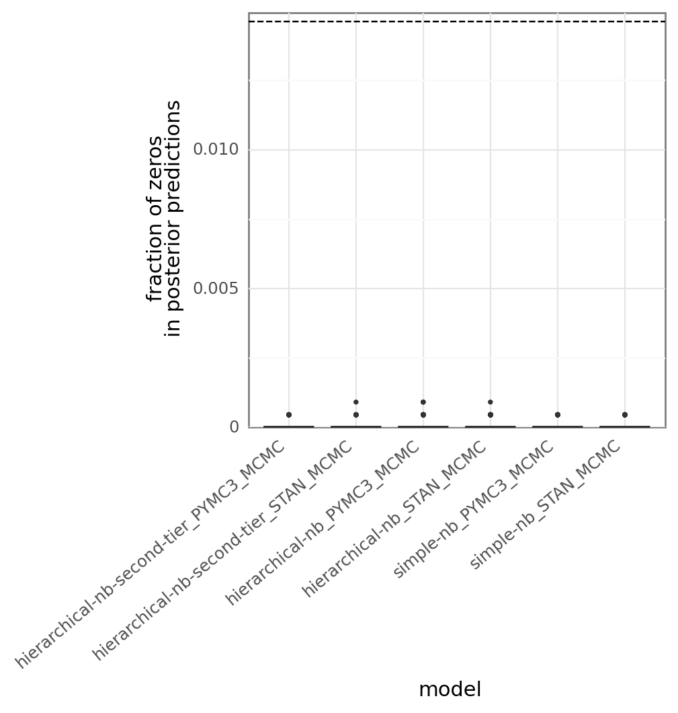
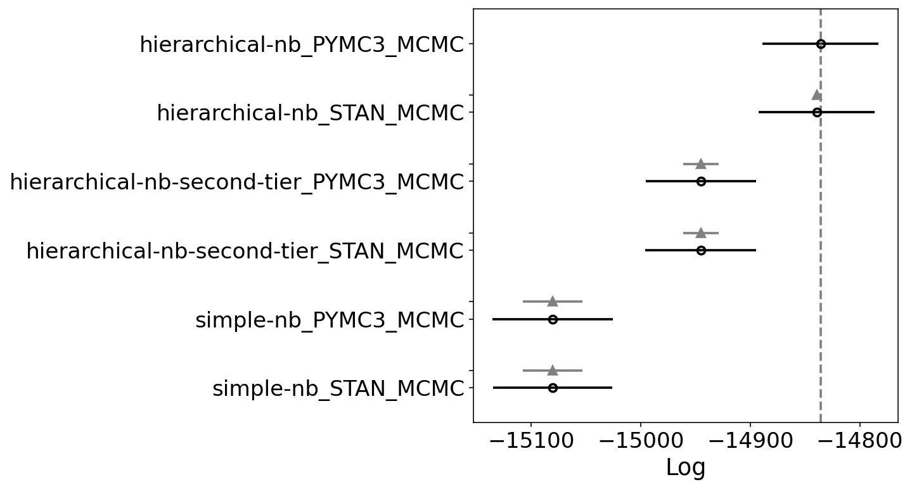

# Preparation of the hierarchical negative binomial model


```python
%load_ext autoreload
%autoreload 2
```


```python
import warnings
from dataclasses import dataclass
from itertools import product
from pathlib import Path
from time import time

import arviz as az
import janitor  # noqa: F401
import matplotlib.pyplot as plt
import nest_asyncio
import numpy as np
import pandas as pd
import plotnine as gg
import pymc3 as pm
import seaborn as sns
import xarray
```


```python
from speclet.bayesian_models import BayesianModel, get_bayesian_model
from speclet.bayesian_models.hierarchical_nb import HierarchcalNegativeBinomialModel
from speclet.bayesian_models.hierarchical_nb_secondtier import (
    HierarchcalNegativeBinomialSecondTier,
)
from speclet.bayesian_models.negative_binomial import NegativeBinomialModel
from speclet.formatting import print_md
from speclet.io import DataFile, models_dir, project_root
from speclet.managers.cache_manager import (
    PosteriorManager,
    get_cached_posterior,
    get_posterior_cache_name,
)
from speclet.managers.data_managers import CrisprScreenDataManager
from speclet.model_configuration import read_model_configurations
from speclet.modeling.model_fitting_api import fit_pymc3_mcmc, fit_stan_mcmc
from speclet.plot.plotnine_helpers import set_gg_theme
from speclet.project_configuration import (
    get_model_configuration_file,
    read_project_configuration,
)
from speclet.project_enums import ModelFitMethod
```


```python
notebook_tic = time()

# Configuration for plotting libraries.
set_gg_theme()
%config InlineBackend.figure_format = "retina"

# Scalar constants.
RANDOM_SEED = 847
np.random.seed(RANDOM_SEED)
HDI_PROB = read_project_configuration().modeling.highest_density_interval
```


```python
MODELS_PAL: dict[str, str] = {
    "simple-nb_STAN_MCMC": "c",
    "simple-nb_PYMC3_MCMC": "dodgerblue",
    "hierarchical-nb_STAN_MCMC": "sandybrown",
    "hierarchical-nb_PYMC3_MCMC": "tomato",
    "hierarchical-nb-second-tier_STAN_MCMC": "lightgreen",
    "hierarchical-nb-second-tier_PYMC3_MCMC": "mediumseagreen",
}
```

## Data


```python
data_manager = CrisprScreenDataManager(DataFile.DEPMAP_CRC_BONE_SUBSAMPLE)
counts_data = data_manager.get_data()
counts_data.head()
```


<div>
<style scoped>
    .dataframe tbody tr th:only-of-type {
        vertical-align: middle;
    }

    .dataframe tbody tr th {
        vertical-align: top;
    }

    .dataframe thead th {
        text-align: right;
    }
</style>
<table border="1" class="dataframe">
  <thead>
    <tr style="text-align: right;">
      <th></th>
      <th>sgrna</th>
      <th>replicate_id</th>
      <th>lfc</th>
      <th>p_dna_batch</th>
      <th>genome_alignment</th>
      <th>hugo_symbol</th>
      <th>screen</th>
      <th>multiple_hits_on_gene</th>
      <th>sgrna_target_chr</th>
      <th>sgrna_target_pos</th>
      <th>...</th>
      <th>num_mutations</th>
      <th>any_deleterious</th>
      <th>any_tcga_hotspot</th>
      <th>any_cosmic_hotspot</th>
      <th>is_mutated</th>
      <th>copy_number</th>
      <th>lineage</th>
      <th>primary_or_metastasis</th>
      <th>is_male</th>
      <th>age</th>
    </tr>
  </thead>
  <tbody>
    <tr>
      <th>0</th>
      <td>ACGCCACTGACACTCAAGG</td>
      <td>LS513_c903R1</td>
      <td>0.583209</td>
      <td>ERS717283.plasmid</td>
      <td>chr1_27006713_-</td>
      <td>TENT5B</td>
      <td>sanger</td>
      <td>True</td>
      <td>1</td>
      <td>27006713</td>
      <td>...</td>
      <td>0</td>
      <td>NaN</td>
      <td>NaN</td>
      <td>NaN</td>
      <td>False</td>
      <td>0.961139</td>
      <td>colorectal</td>
      <td>primary</td>
      <td>True</td>
      <td>63.0</td>
    </tr>
    <tr>
      <th>1</th>
      <td>AGCTGAGCGCAGGGACCGGG</td>
      <td>LS513-311Cas9_RepA_p6_batch2</td>
      <td>-0.020788</td>
      <td>2</td>
      <td>chr1_27012633_-</td>
      <td>TENT5B</td>
      <td>broad</td>
      <td>True</td>
      <td>1</td>
      <td>27012633</td>
      <td>...</td>
      <td>0</td>
      <td>NaN</td>
      <td>NaN</td>
      <td>NaN</td>
      <td>False</td>
      <td>0.961139</td>
      <td>colorectal</td>
      <td>primary</td>
      <td>True</td>
      <td>63.0</td>
    </tr>
    <tr>
      <th>2</th>
      <td>CTACTAGACTTCCTGCCGGC</td>
      <td>LS513-311Cas9_RepA_p6_batch2</td>
      <td>-0.666070</td>
      <td>2</td>
      <td>chr1_27006754_-</td>
      <td>TENT5B</td>
      <td>broad</td>
      <td>True</td>
      <td>1</td>
      <td>27006754</td>
      <td>...</td>
      <td>0</td>
      <td>NaN</td>
      <td>NaN</td>
      <td>NaN</td>
      <td>False</td>
      <td>0.961139</td>
      <td>colorectal</td>
      <td>primary</td>
      <td>True</td>
      <td>63.0</td>
    </tr>
    <tr>
      <th>3</th>
      <td>AAACTTGCTGACGTGCCTGG</td>
      <td>LS513-311Cas9_RepA_p6_batch2</td>
      <td>-0.130231</td>
      <td>2</td>
      <td>chr4_52628042_-</td>
      <td>USP46</td>
      <td>broad</td>
      <td>True</td>
      <td>4</td>
      <td>52628042</td>
      <td>...</td>
      <td>0</td>
      <td>NaN</td>
      <td>NaN</td>
      <td>NaN</td>
      <td>False</td>
      <td>0.952543</td>
      <td>colorectal</td>
      <td>primary</td>
      <td>True</td>
      <td>63.0</td>
    </tr>
    <tr>
      <th>4</th>
      <td>AACAACTAACTTTGTACAT</td>
      <td>LS513_c903R1</td>
      <td>0.226828</td>
      <td>ERS717283.plasmid</td>
      <td>chr8_81679130_-</td>
      <td>IMPA1</td>
      <td>sanger</td>
      <td>True</td>
      <td>8</td>
      <td>81679130</td>
      <td>...</td>
      <td>0</td>
      <td>NaN</td>
      <td>NaN</td>
      <td>NaN</td>
      <td>False</td>
      <td>0.957015</td>
      <td>colorectal</td>
      <td>primary</td>
      <td>True</td>
      <td>63.0</td>
    </tr>
  </tbody>
</table>
<p>5 rows × 24 columns</p>
</div>


```python
valid_ct_data = HierarchcalNegativeBinomialSecondTier().data_processing_pipeline(
    counts_data
)
valid_ct_data.head()
```


<div>
<style scoped>
    .dataframe tbody tr th:only-of-type {
        vertical-align: middle;
    }

    .dataframe tbody tr th {
        vertical-align: top;
    }

    .dataframe thead th {
        text-align: right;
    }
</style>
<table border="1" class="dataframe">
  <thead>
    <tr style="text-align: right;">
      <th></th>
      <th>sgrna</th>
      <th>replicate_id</th>
      <th>lfc</th>
      <th>p_dna_batch</th>
      <th>genome_alignment</th>
      <th>hugo_symbol</th>
      <th>screen</th>
      <th>multiple_hits_on_gene</th>
      <th>sgrna_target_chr</th>
      <th>sgrna_target_pos</th>
      <th>...</th>
      <th>is_mutated</th>
      <th>copy_number</th>
      <th>lineage</th>
      <th>primary_or_metastasis</th>
      <th>is_male</th>
      <th>age</th>
      <th>counts_final_total</th>
      <th>counts_initial_total</th>
      <th>counts_final_rpm</th>
      <th>counts_initial_adj</th>
    </tr>
  </thead>
  <tbody>
    <tr>
      <th>0</th>
      <td>AGCTGAGCGCAGGGACCGGG</td>
      <td>LS513-311Cas9_RepA_p6_batch2</td>
      <td>-0.020788</td>
      <td>2</td>
      <td>chr1_27012633_-</td>
      <td>TENT5B</td>
      <td>broad</td>
      <td>True</td>
      <td>1</td>
      <td>27012633</td>
      <td>...</td>
      <td>False</td>
      <td>0.961139</td>
      <td>colorectal</td>
      <td>primary</td>
      <td>True</td>
      <td>63.0</td>
      <td>35176093</td>
      <td>1.072163e+06</td>
      <td>4.837834</td>
      <td>142.977169</td>
    </tr>
    <tr>
      <th>1</th>
      <td>CTACTAGACTTCCTGCCGGC</td>
      <td>LS513-311Cas9_RepA_p6_batch2</td>
      <td>-0.666070</td>
      <td>2</td>
      <td>chr1_27006754_-</td>
      <td>TENT5B</td>
      <td>broad</td>
      <td>True</td>
      <td>1</td>
      <td>27006754</td>
      <td>...</td>
      <td>False</td>
      <td>0.961139</td>
      <td>colorectal</td>
      <td>primary</td>
      <td>True</td>
      <td>63.0</td>
      <td>35176093</td>
      <td>1.072163e+06</td>
      <td>6.344539</td>
      <td>287.920163</td>
    </tr>
    <tr>
      <th>2</th>
      <td>AAACTTGCTGACGTGCCTGG</td>
      <td>LS513-311Cas9_RepA_p6_batch2</td>
      <td>-0.130231</td>
      <td>2</td>
      <td>chr4_52628042_-</td>
      <td>USP46</td>
      <td>broad</td>
      <td>True</td>
      <td>4</td>
      <td>52628042</td>
      <td>...</td>
      <td>False</td>
      <td>0.952543</td>
      <td>colorectal</td>
      <td>primary</td>
      <td>True</td>
      <td>63.0</td>
      <td>35176093</td>
      <td>1.072163e+06</td>
      <td>7.908101</td>
      <td>246.725036</td>
    </tr>
    <tr>
      <th>3</th>
      <td>AACGATCTCATCCTCAAAAG</td>
      <td>LS513-311Cas9_RepA_p6_batch2</td>
      <td>0.198958</td>
      <td>2</td>
      <td>chr11_107549790_+</td>
      <td>ALKBH8</td>
      <td>broad</td>
      <td>True</td>
      <td>11</td>
      <td>107549790</td>
      <td>...</td>
      <td>False</td>
      <td>0.960147</td>
      <td>colorectal</td>
      <td>primary</td>
      <td>True</td>
      <td>63.0</td>
      <td>35176093</td>
      <td>1.072163e+06</td>
      <td>12.570358</td>
      <td>311.083872</td>
    </tr>
    <tr>
      <th>4</th>
      <td>AAGTTCCTCTGAAGTTCGCA</td>
      <td>LS513-311Cas9_RepA_p6_batch2</td>
      <td>-0.182191</td>
      <td>2</td>
      <td>chr2_241704672_-</td>
      <td>ING5</td>
      <td>broad</td>
      <td>True</td>
      <td>2</td>
      <td>241704672</td>
      <td>...</td>
      <td>False</td>
      <td>0.973700</td>
      <td>colorectal</td>
      <td>primary</td>
      <td>True</td>
      <td>63.0</td>
      <td>35176093</td>
      <td>1.072163e+06</td>
      <td>9.727518</td>
      <td>314.749171</td>
    </tr>
  </tbody>
</table>
<p>5 rows × 28 columns</p>
</div>


```python
valid_ct_data.shape
```


    (2188, 28)


## Posterior sampling


```python
model_configs = read_model_configurations(
    project_root() / get_model_configuration_file()
)
```


```python
@dataclass
class ModelPosterior:
    """Information for posterior trace object."""

    id: str
    name: str
    trace: az.InferenceData
    fit_method: ModelFitMethod
    az_regex: list[str]
    sp_model: BayesianModel
```


```python
traces: dict[str, ModelPosterior] = {}

for model_config in model_configs.configurations:
    for fit_method in model_config.pipelines.fitting:
        id = get_posterior_cache_name(model_config.name, fit_method)
        print(f"loading posterior for '{id}'...")
        traces[id] = ModelPosterior(
            id=id,
            name=model_config.name,
            fit_method=fit_method,
            trace=get_cached_posterior(id, cache_dir=models_dir()),
            sp_model=model_config.model,
            az_regex=get_bayesian_model(model_config.model)().vars_regex(fit_method),
        )
```

    loading posterior for 'simple-nb_STAN_MCMC'...
    loading posterior for 'simple-nb_PYMC3_MCMC'...
    loading posterior for 'hierarchical-nb_PYMC3_MCMC'...
    loading posterior for 'hierarchical-nb_STAN_MCMC'...
    loading posterior for 'hierarchical-nb-second-tier_PYMC3_MCMC'...
    loading posterior for 'hierarchical-nb-second-tier_STAN_MCMC'...


```python
for trace_data in traces.values():
    print_md(f"### '{trace_data.name}' - {trace_data.fit_method.value}")
    az.plot_trace(trace_data.trace, var_names=trace_data.az_regex, filter_vars="regex")
    plt.tight_layout()
    plt.show()
```


### 'simple-nb' - STAN_MCMC





### 'simple-nb' - PYMC3_MCMC





### 'hierarchical-nb' - PYMC3_MCMC





### 'hierarchical-nb' - STAN_MCMC





### 'hierarchical-nb-second-tier' - PYMC3_MCMC





### 'hierarchical-nb-second-tier' - STAN_MCMC





```python
N_DRAWS = 1000
N_CHAINS = 2
N_DATA = valid_ct_data.shape[0]
SIZE = 10

ppc_idx = np.random.choice(np.arange(0, N_DRAWS * N_CHAINS), size=SIZE, replace=False)
```


```python
def _get_ppc(trace: az.InferenceData) -> xarray.DataArray:
    for ppc_name in ["y_hat", "ct_final"]:
        ppc = trace.posterior_predictive.get(ppc_name)
        if ppc is not None:
            return ppc
    print(trace)
    raise BaseException("Unable to find PPC array.")
```


```python
model_ppc_averages = pd.DataFrame()
model_ppc_examples = pd.DataFrame()

for trace_data in traces.values():
    ppc = _get_ppc(trace_data.trace)
    ppc_ary = ppc.values.reshape(-1, N_DATA)

    ppc_avg = ppc_ary.mean(0)
    ppc_samples = ppc_ary[ppc_idx, :]

    model_ppc_average = pd.DataFrame(
        {"model": np.repeat(trace_data.id, len(ppc_avg)), "value": ppc_avg}
    )
    model_ppc_averages = pd.concat([model_ppc_averages, model_ppc_average])

    model_ppc_example = (
        pd.DataFrame(ppc_samples.T)
        .reset_index()
        .pivot_longer(index="index", names_to="draw")
        .drop(columns=["index"])
        .assign(model=trace_data.id)
    )
    model_ppc_examples = pd.concat([model_ppc_examples, model_ppc_example])
```


```python
(
    gg.ggplot(model_ppc_averages, gg.aes(x="value+1"))
    + gg.geom_density(gg.aes(color="model"), size=1.2)
    + gg.geom_density(
        gg.aes(x="counts_final+1"),
        data=valid_ct_data,
        color="black",
        size=1,
        linetype="--",
    )
    + gg.scale_x_log10(expand=(0, 0))
    + gg.scale_y_continuous(expand=(0, 0, 0.02, 0))
    + gg.scale_color_manual(values=MODELS_PAL)
    + gg.theme(
        figure_size=(8, 4),
        legend_position=(0.33, 0.6),
        legend_background=gg.element_blank(),
    )
    + gg.labs(x="final count (+1)", color="posterior")
)
```





    <ggplot: (392807153)>


```python
_binwidth = 50
(
    gg.ggplot(model_ppc_averages, gg.aes(x="value"))
    + gg.facet_wrap("~model", ncol=2)
    + gg.geom_histogram(
        gg.aes(fill="model", color="model"),
        alpha=0.8,
        binwidth=_binwidth,
        position="identity",
    )
    + gg.geom_histogram(
        gg.aes(x="counts_final"),
        data=valid_ct_data,
        color="black",
        alpha=0,
        binwidth=_binwidth,
    )
    + gg.scale_x_continuous(limits=(0, 3000))
    + gg.scale_y_continuous(expand=(0, 0, 0.02, 0))
    + gg.scale_color_manual(values=MODELS_PAL)
    + gg.scale_fill_manual(values=MODELS_PAL)
    + gg.theme(
        figure_size=(10, 8),
        legend_position="none",
        legend_background=gg.element_blank(),
    )
    + gg.labs(x="final count", color="posterior")
)
```

    /usr/local/Caskroom/miniconda/base/envs/speclet/lib/python3.9/site-packages/plotnine/layer.py:324: PlotnineWarning: stat_bin : Removed 6 rows containing non-finite values.
    /usr/local/Caskroom/miniconda/base/envs/speclet/lib/python3.9/site-packages/plotnine/layer.py:324: PlotnineWarning: stat_bin : Removed 42 rows containing non-finite values.
    /usr/local/Caskroom/miniconda/base/envs/speclet/lib/python3.9/site-packages/plotnine/layer.py:401: PlotnineWarning: geom_histogram : Removed 12 rows containing missing values.





    <ggplot: (392279790)>


```python
ppc_zeros = pd.DataFrame()

for trace_data in traces.values():
    ppc = _get_ppc(trace_data.trace)
    ppc_ary = ppc.values.reshape(-1, N_DATA)
    frac_0 = (ppc_ary == 0).mean(1)
    _df = pd.DataFrame({"frac_zero": frac_0}).assign(model=trace_data.id)
    ppc_zeros = pd.concat([ppc_zeros, _df])
```


```python
obs_frac_0 = (valid_ct_data.counts_final == 0).mean()
(
    gg.ggplot(ppc_zeros, gg.aes(x="model", y="frac_zero"))
    + gg.geom_boxplot(outlier_size=0.5)
    + gg.geom_hline(yintercept=obs_frac_0, linetype="--")
    + gg.scale_y_continuous(expand=(0, 0, 0.02, 0))
    + gg.theme(axis_text_x=gg.element_text(angle=40, hjust=1))
    + gg.labs(y="fraction of zeros\nin posterior predictions")
)
```





    <ggplot: (392516334)>


```python
ppc_zeros.groupby("model").agg(["mean", "min", "max", "std"]).assign(obs=obs_frac_0)
```


<div>
<style scoped>
    .dataframe tbody tr th:only-of-type {
        vertical-align: middle;
    }

    .dataframe tbody tr th {
        vertical-align: top;
    }

    .dataframe thead tr th {
        text-align: left;
    }

    .dataframe thead tr:last-of-type th {
        text-align: right;
    }
</style>
<table border="1" class="dataframe">
  <thead>
    <tr>
      <th></th>
      <th colspan="4" halign="left">frac_zero</th>
      <th>obs</th>
    </tr>
    <tr>
      <th></th>
      <th>mean</th>
      <th>min</th>
      <th>max</th>
      <th>std</th>
      <th></th>
    </tr>
    <tr>
      <th>model</th>
      <th></th>
      <th></th>
      <th></th>
      <th></th>
      <th></th>
    </tr>
  </thead>
  <tbody>
    <tr>
      <th>hierarchical-nb-second-tier_PYMC3_MCMC</th>
      <td>0.000007</td>
      <td>0.0</td>
      <td>0.000457</td>
      <td>0.000056</td>
      <td>0.014625</td>
    </tr>
    <tr>
      <th>hierarchical-nb-second-tier_STAN_MCMC</th>
      <td>0.000005</td>
      <td>0.0</td>
      <td>0.000914</td>
      <td>0.000050</td>
      <td>0.014625</td>
    </tr>
    <tr>
      <th>hierarchical-nb_PYMC3_MCMC</th>
      <td>0.000020</td>
      <td>0.0</td>
      <td>0.000914</td>
      <td>0.000097</td>
      <td>0.014625</td>
    </tr>
    <tr>
      <th>hierarchical-nb_STAN_MCMC</th>
      <td>0.000026</td>
      <td>0.0</td>
      <td>0.000914</td>
      <td>0.000107</td>
      <td>0.014625</td>
    </tr>
    <tr>
      <th>simple-nb_PYMC3_MCMC</th>
      <td>0.000011</td>
      <td>0.0</td>
      <td>0.000457</td>
      <td>0.000069</td>
      <td>0.014625</td>
    </tr>
    <tr>
      <th>simple-nb_STAN_MCMC</th>
      <td>0.000011</td>
      <td>0.0</td>
      <td>0.000457</td>
      <td>0.000069</td>
      <td>0.014625</td>
    </tr>
  </tbody>
</table>
</div>


```python
model_comparison = az.compare({id: m.trace for id, m in traces.items()})
model_comparison
```

    /usr/local/Caskroom/miniconda/base/envs/speclet/lib/python3.9/site-packages/arviz/stats/stats.py:694: UserWarning: Estimated shape parameter of Pareto distribution is greater than 0.7 for one or more samples. You should consider using a more robust model, this is because importance sampling is less likely to work well if the marginal posterior and LOO posterior are very different. This is more likely to happen with a non-robust model and highly influential observations.
    /usr/local/Caskroom/miniconda/base/envs/speclet/lib/python3.9/site-packages/arviz/stats/stats.py:694: UserWarning: Estimated shape parameter of Pareto distribution is greater than 0.7 for one or more samples. You should consider using a more robust model, this is because importance sampling is less likely to work well if the marginal posterior and LOO posterior are very different. This is more likely to happen with a non-robust model and highly influential observations.


<div>
<style scoped>
    .dataframe tbody tr th:only-of-type {
        vertical-align: middle;
    }

    .dataframe tbody tr th {
        vertical-align: top;
    }

    .dataframe thead th {
        text-align: right;
    }
</style>
<table border="1" class="dataframe">
  <thead>
    <tr style="text-align: right;">
      <th></th>
      <th>rank</th>
      <th>loo</th>
      <th>p_loo</th>
      <th>d_loo</th>
      <th>weight</th>
      <th>se</th>
      <th>dse</th>
      <th>warning</th>
      <th>loo_scale</th>
    </tr>
  </thead>
  <tbody>
    <tr>
      <th>hierarchical-nb_PYMC3_MCMC</th>
      <td>0</td>
      <td>-14835.915584</td>
      <td>212.205964</td>
      <td>0.000000</td>
      <td>0.929448</td>
      <td>53.028177</td>
      <td>0.000000</td>
      <td>True</td>
      <td>log</td>
    </tr>
    <tr>
      <th>hierarchical-nb_STAN_MCMC</th>
      <td>1</td>
      <td>-14839.356659</td>
      <td>215.206448</td>
      <td>3.441075</td>
      <td>0.000000</td>
      <td>53.029897</td>
      <td>1.127979</td>
      <td>True</td>
      <td>log</td>
    </tr>
    <tr>
      <th>hierarchical-nb-second-tier_PYMC3_MCMC</th>
      <td>2</td>
      <td>-14945.116112</td>
      <td>89.207308</td>
      <td>109.200528</td>
      <td>0.009158</td>
      <td>50.567357</td>
      <td>16.425525</td>
      <td>False</td>
      <td>log</td>
    </tr>
    <tr>
      <th>hierarchical-nb-second-tier_STAN_MCMC</th>
      <td>3</td>
      <td>-14945.145696</td>
      <td>87.079018</td>
      <td>109.230112</td>
      <td>0.000000</td>
      <td>50.589589</td>
      <td>16.387747</td>
      <td>False</td>
      <td>log</td>
    </tr>
    <tr>
      <th>simple-nb_PYMC3_MCMC</th>
      <td>4</td>
      <td>-15080.507641</td>
      <td>4.270657</td>
      <td>244.592057</td>
      <td>0.000000</td>
      <td>54.726429</td>
      <td>27.256310</td>
      <td>False</td>
      <td>log</td>
    </tr>
    <tr>
      <th>simple-nb_STAN_MCMC</th>
      <td>5</td>
      <td>-15080.611143</td>
      <td>4.393212</td>
      <td>244.695559</td>
      <td>0.061395</td>
      <td>54.597832</td>
      <td>27.199667</td>
      <td>False</td>
      <td>log</td>
    </tr>
  </tbody>
</table>
</div>


```python
az.plot_compare(model_comparison, insample_dev=False);
```





```python

```


```python

```

---


```python
notebook_toc = time()
print(f"execution time: {(notebook_toc - notebook_tic) / 60:.2f} minutes")
```

    execution time: 27.86 minutes


```python
%load_ext watermark
%watermark -d -u -v -iv -b -h -m
```

    Last updated: 2022-01-24

    Python implementation: CPython
    Python version       : 3.9.9
    IPython version      : 8.0.0

    Compiler    : Clang 11.1.0
    OS          : Darwin
    Release     : 21.2.0
    Machine     : x86_64
    Processor   : i386
    CPU cores   : 4
    Architecture: 64bit

    Hostname: JHCookMac

    Git branch: nb-model

    janitor     : 0.22.0
    matplotlib  : 3.5.1
    xarray      : 0.20.2
    seaborn     : 0.11.2
    arviz       : 0.11.4
    nest_asyncio: 1.5.4
    numpy       : 1.22.0
    pymc3       : 3.11.4
    pandas      : 1.3.5
    plotnine    : 0.8.0


```python

```
