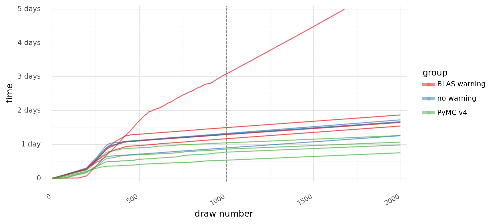

# Analyzing the sampling rate from model-fitting logs

## Setup

```python
import os
from datetime import timedelta
from io import StringIO
from pathlib import Path
from typing import Callable

import janitor  # noqa: F401
import pandas as pd
import plotnine as gg
```

```python
from speclet.io import data_dir
from speclet.plot.plotnine_helpers import set_gg_theme
```

```python
_ = gg.theme_set(gg.theme_minimal())
```

```python
%matplotlib inline
%config InlineBackend.figure_format='retina'
```

## Reading log files

```python
LOG_DATA_DIR = data_dir() / "misc" / "blas-warning-advi-init-logs"
log_files = [f for f in LOG_DATA_DIR.iterdir() if f.suffix == ".log"]
log_files.sort()
```

```python
def _extract_logging(fpath: Path) -> str:
    log_txt = ""
    read_line = False
    kill_terms = ["slurmstepd", "Killed", "Sampling 1 chain"]
    with open(fpath, "r") as file:
        for line in file:
            any_kill_terms = any([kt in line for kt in kill_terms])
            if any_kill_terms:
                break
            if read_line:
                log_txt += line.strip() + "\n"
            if "NUTS: " in line:
                read_line = True
    return log_txt


log_outputs = {f: _extract_logging(f) for f in log_files}
```

```python
def _remove_prefix(col: pd.Series, prefix: str) -> list[str]:
    return [x.strip().replace(prefix, "") for x in col]


def log_to_df(log_txt: str) -> pd.DataFrame:
    log_data = (
        pd.read_csv(
            StringIO(log_txt),
            sep=",",
            header=None,
            names=["time", "chain", "draw", "stage", "num_divergences"],
            parse_dates=["time"],
        )
        .assign(
            draw=lambda d: _remove_prefix(d["draw"], "draw="),
            stage=lambda d: _remove_prefix(d["stage"], " "),
            num_divergences=lambda d: _remove_prefix(
                d["num_divergences"], "divergences="
            ),
            duration=lambda d: d["time"] - d["time"].min(),
        )
        .drop(columns=["chain"])
        .astype({"draw": int, "num_divergences": int})
    )
    return log_data


log_data = pd.concat(
    [log_to_df(txt).assign(log_file=fname.name) for fname, txt in log_outputs.items()]
).reset_index(drop=True)
log_data.head()
```

<div>
<style scoped>
    .dataframe tbody tr th:only-of-type {
        vertical-align: middle;
    }

    .dataframe tbody tr th {
        vertical-align: top;
    }

    .dataframe thead th {
        text-align: right;
    }
</style>
<table border="1" class="dataframe">
  <thead>
    <tr style="text-align: right;">
      <th></th>
      <th>time</th>
      <th>draw</th>
      <th>stage</th>
      <th>num_divergences</th>
      <th>duration</th>
      <th>log_file</th>
    </tr>
  </thead>
  <tbody>
    <tr>
      <th>0</th>
      <td>2022-02-05 15:05:23.129091</td>
      <td>0</td>
      <td>tune</td>
      <td>0</td>
      <td>0 days 00:00:00</td>
      <td>48226952_sample_pymc3_mcmc.log</td>
    </tr>
    <tr>
      <th>1</th>
      <td>2022-02-05 15:05:58.140461</td>
      <td>5</td>
      <td>tune</td>
      <td>0</td>
      <td>0 days 00:00:35.011370</td>
      <td>48226952_sample_pymc3_mcmc.log</td>
    </tr>
    <tr>
      <th>2</th>
      <td>2022-02-05 15:12:07.678560</td>
      <td>10</td>
      <td>tune</td>
      <td>0</td>
      <td>0 days 00:06:44.549469</td>
      <td>48226952_sample_pymc3_mcmc.log</td>
    </tr>
    <tr>
      <th>3</th>
      <td>2022-02-05 15:14:41.497422</td>
      <td>15</td>
      <td>tune</td>
      <td>0</td>
      <td>0 days 00:09:18.368331</td>
      <td>48226952_sample_pymc3_mcmc.log</td>
    </tr>
    <tr>
      <th>4</th>
      <td>2022-02-05 15:17:45.953554</td>
      <td>20</td>
      <td>tune</td>
      <td>0</td>
      <td>0 days 00:12:22.824463</td>
      <td>48226952_sample_pymc3_mcmc.log</td>
    </tr>
  </tbody>
</table>
</div>

```python
log_data["stage"] = pd.Categorical(
    log_data["stage"], categories=["tune", "sampling"], ordered=True
)
```

```python
# "jitter+adapt_diag"
# "BLAS_warning"
chain_groups = {
    "48226952_sample_pymc3_mcmc.log": "advi",
    "48226953_sample_pymc3_mcmc.log": "advi",
    "48226954_sample_pymc3_mcmc.log": "no warning",
    "48226955_sample_pymc3_mcmc.log": "no warning",
    "48226956_sample_pymc3_mcmc.log": "no warning",
    "48226957_sample_pymc3_mcmc.log": "no warning",
    "48226958_sample_pymc3_mcmc.log": "advi",
    "48226959_sample_pymc3_mcmc.log": "advi",
    "48364687_sample_pymc3_mcmc.log": "BLAS warning",
    "48364681_sample_pymc3_mcmc.log": "BLAS warning",
    "48364682_sample_pymc3_mcmc.log": "BLAS warning",
    "48364686_sample_pymc3_mcmc.log": "BLAS warning",
}

log_data["chain_group"] = [chain_groups[log_name] for log_name in log_data.log_file]
```

```python
if True:
    log_data = log_data.filter_column_isin(
        "chain_group", ["advi"], complement=True
    ).reset_index(drop=True)
```

```python
_cols = ["chain_group", "log_file"]
chain_indices = (
    log_data[_cols]
    .sort_values(_cols)
    .drop_duplicates()
    .reset_index(drop=True)
    .reset_index(drop=False)
    .assign(
        chain=lambda d: [f"{cg} ({i+1})" for cg, i in zip(d["chain_group"], d["index"])]
    )
    .assign(
        chain=lambda d: pd.Categorical(d["chain"], categories=d["chain"], ordered=True)
    )
)

log_data = log_data.merge(chain_indices, on=["log_file", "chain_group"])
```

```python
log_data[["chain", "chain_group", "log_file"]].drop_duplicates().sort_values("chain")
```

<div>
<style scoped>
    .dataframe tbody tr th:only-of-type {
        vertical-align: middle;
    }

    .dataframe tbody tr th {
        vertical-align: top;
    }

    .dataframe thead th {
        text-align: right;
    }
</style>
<table border="1" class="dataframe">
  <thead>
    <tr style="text-align: right;">
      <th></th>
      <th>chain</th>
      <th>chain_group</th>
      <th>log_file</th>
    </tr>
  </thead>
  <tbody>
    <tr>
      <th>1600</th>
      <td>BLAS warning (1)</td>
      <td>BLAS warning</td>
      <td>48364681_sample_pymc3_mcmc.log</td>
    </tr>
    <tr>
      <th>2000</th>
      <td>BLAS warning (2)</td>
      <td>BLAS warning</td>
      <td>48364682_sample_pymc3_mcmc.log</td>
    </tr>
    <tr>
      <th>2400</th>
      <td>BLAS warning (3)</td>
      <td>BLAS warning</td>
      <td>48364686_sample_pymc3_mcmc.log</td>
    </tr>
    <tr>
      <th>2736</th>
      <td>BLAS warning (4)</td>
      <td>BLAS warning</td>
      <td>48364687_sample_pymc3_mcmc.log</td>
    </tr>
    <tr>
      <th>0</th>
      <td>no warning (5)</td>
      <td>no warning</td>
      <td>48226954_sample_pymc3_mcmc.log</td>
    </tr>
    <tr>
      <th>400</th>
      <td>no warning (6)</td>
      <td>no warning</td>
      <td>48226955_sample_pymc3_mcmc.log</td>
    </tr>
    <tr>
      <th>800</th>
      <td>no warning (7)</td>
      <td>no warning</td>
      <td>48226956_sample_pymc3_mcmc.log</td>
    </tr>
    <tr>
      <th>1200</th>
      <td>no warning (8)</td>
      <td>no warning</td>
      <td>48226957_sample_pymc3_mcmc.log</td>
    </tr>
  </tbody>
</table>
</div>

```python
# n_tune = log_data.query("stage == 'tune'")["draw"].max()
n_tune = 1000
```

```python
def calc_durations(log_df: pd.DataFrame) -> pd.DataFrame:
    delta_time = log_df["time"].values[1:] - log_df["time"].values[:-1]
    delta_draw = log_df["draw"].values[1:] - log_df["draw"].values[:-1]
    draw_durations = (
        pd.DataFrame(
            {
                "delta_time": delta_time,
                "delta_draw": delta_draw,
                "draw": log_df["draw"][1:],
            }
        )
        .merge(log_df.drop(columns=["time", "duration"]), on="draw", how="left")
        .assign(time_per_draw=lambda d: d.delta_time / d.delta_draw)
    )
    return draw_durations


draw_durations = log_data.groupby("chain").apply(calc_durations).reset_index(drop=True)
draw_durations.head()
```

<div>
<style scoped>
    .dataframe tbody tr th:only-of-type {
        vertical-align: middle;
    }

    .dataframe tbody tr th {
        vertical-align: top;
    }

    .dataframe thead th {
        text-align: right;
    }
</style>
<table border="1" class="dataframe">
  <thead>
    <tr style="text-align: right;">
      <th></th>
      <th>delta_time</th>
      <th>delta_draw</th>
      <th>draw</th>
      <th>stage</th>
      <th>num_divergences</th>
      <th>log_file</th>
      <th>chain_group</th>
      <th>index</th>
      <th>chain</th>
      <th>time_per_draw</th>
    </tr>
  </thead>
  <tbody>
    <tr>
      <th>0</th>
      <td>0 days 00:00:54.190434</td>
      <td>5</td>
      <td>5</td>
      <td>tune</td>
      <td>0</td>
      <td>48364681_sample_pymc3_mcmc.log</td>
      <td>BLAS warning</td>
      <td>0</td>
      <td>BLAS warning (1)</td>
      <td>0 days 00:00:10.838086800</td>
    </tr>
    <tr>
      <th>1</th>
      <td>0 days 00:09:55.622981</td>
      <td>5</td>
      <td>10</td>
      <td>tune</td>
      <td>0</td>
      <td>48364681_sample_pymc3_mcmc.log</td>
      <td>BLAS warning</td>
      <td>0</td>
      <td>BLAS warning (1)</td>
      <td>0 days 00:01:59.124596200</td>
    </tr>
    <tr>
      <th>2</th>
      <td>0 days 00:09:51.188408</td>
      <td>5</td>
      <td>15</td>
      <td>tune</td>
      <td>0</td>
      <td>48364681_sample_pymc3_mcmc.log</td>
      <td>BLAS warning</td>
      <td>0</td>
      <td>BLAS warning (1)</td>
      <td>0 days 00:01:58.237681600</td>
    </tr>
    <tr>
      <th>3</th>
      <td>0 days 00:09:45.961896</td>
      <td>5</td>
      <td>20</td>
      <td>tune</td>
      <td>0</td>
      <td>48364681_sample_pymc3_mcmc.log</td>
      <td>BLAS warning</td>
      <td>0</td>
      <td>BLAS warning (1)</td>
      <td>0 days 00:01:57.192379200</td>
    </tr>
    <tr>
      <th>4</th>
      <td>0 days 00:09:34.321183</td>
      <td>5</td>
      <td>25</td>
      <td>tune</td>
      <td>0</td>
      <td>48364681_sample_pymc3_mcmc.log</td>
      <td>BLAS warning</td>
      <td>0</td>
      <td>BLAS warning (1)</td>
      <td>0 days 00:01:54.864236600</td>
    </tr>
  </tbody>
</table>
</div>

## Current status

```python
_cols = [
    "chain",
    "chain_group",
    "duration",
    "draw",
    "stage",
    "mins_per_draw",
    "num_divergences",
    "log_file",
]

current_sampling_rates = (
    draw_durations.assign(
        mins_per_draw=lambda d: [x.seconds / 60 for x in d.time_per_draw]
    )
    .groupby("chain")
    .tail(1)[["chain", "mins_per_draw"]]
)

sec_to_hour = 60 * 60

(
    log_data.groupby("chain")
    .tail(1)
    .sort_values(["chain_group", "chain"])
    .reset_index(drop=True)
    .merge(current_sampling_rates, on="chain")[_cols]
    .assign(
        duration=lambda d: [x.days * 24 + x.seconds / sec_to_hour for x in d.duration]
    )
    .round({"mins_per_draw": 2, "duration": 1})
    .rename(
        columns={
            "duration": "hours",
            "num_divergences": "# divergences",
            "mins_per_draw": "min. per draw",
            "chain_group": "group",
            "log_file": "log",
        }
    )
)
```

<div>
<style scoped>
    .dataframe tbody tr th:only-of-type {
        vertical-align: middle;
    }

    .dataframe tbody tr th {
        vertical-align: top;
    }

    .dataframe thead th {
        text-align: right;
    }
</style>
<table border="1" class="dataframe">
  <thead>
    <tr style="text-align: right;">
      <th></th>
      <th>chain</th>
      <th>group</th>
      <th>hours</th>
      <th>draw</th>
      <th>stage</th>
      <th>min. per draw</th>
      <th># divergences</th>
      <th>log</th>
    </tr>
  </thead>
  <tbody>
    <tr>
      <th>0</th>
      <td>BLAS warning (1)</td>
      <td>BLAS warning</td>
      <td>39.5</td>
      <td>1995</td>
      <td>sampling</td>
      <td>0.52</td>
      <td>0</td>
      <td>48364681_sample_pymc3_mcmc.log</td>
    </tr>
    <tr>
      <th>1</th>
      <td>BLAS warning (2)</td>
      <td>BLAS warning</td>
      <td>44.9</td>
      <td>1995</td>
      <td>sampling</td>
      <td>0.53</td>
      <td>0</td>
      <td>48364682_sample_pymc3_mcmc.log</td>
    </tr>
    <tr>
      <th>2</th>
      <td>BLAS warning (3)</td>
      <td>BLAS warning</td>
      <td>119.8</td>
      <td>1675</td>
      <td>sampling</td>
      <td>4.18</td>
      <td>0</td>
      <td>48364686_sample_pymc3_mcmc.log</td>
    </tr>
    <tr>
      <th>3</th>
      <td>BLAS warning (4)</td>
      <td>BLAS warning</td>
      <td>37.0</td>
      <td>1995</td>
      <td>sampling</td>
      <td>0.53</td>
      <td>0</td>
      <td>48364687_sample_pymc3_mcmc.log</td>
    </tr>
    <tr>
      <th>4</th>
      <td>no warning (5)</td>
      <td>no warning</td>
      <td>40.0</td>
      <td>1995</td>
      <td>sampling</td>
      <td>0.52</td>
      <td>0</td>
      <td>48226954_sample_pymc3_mcmc.log</td>
    </tr>
    <tr>
      <th>5</th>
      <td>no warning (6)</td>
      <td>no warning</td>
      <td>41.4</td>
      <td>1995</td>
      <td>sampling</td>
      <td>0.58</td>
      <td>0</td>
      <td>48226955_sample_pymc3_mcmc.log</td>
    </tr>
    <tr>
      <th>6</th>
      <td>no warning (7)</td>
      <td>no warning</td>
      <td>30.2</td>
      <td>1995</td>
      <td>sampling</td>
      <td>0.52</td>
      <td>0</td>
      <td>48226956_sample_pymc3_mcmc.log</td>
    </tr>
    <tr>
      <th>7</th>
      <td>no warning (8)</td>
      <td>no warning</td>
      <td>39.8</td>
      <td>1995</td>
      <td>sampling</td>
      <td>0.52</td>
      <td>0</td>
      <td>48226957_sample_pymc3_mcmc.log</td>
    </tr>
  </tbody>
</table>
</div>

## Visualizations

```python
line_kwargs = {"size": 0.5, "alpha": 0.5}
point_kwargs = {"size": 0.1, "alpha": 0.2}
smooth_kwargs = {
    "size": 0.8,
    "alpha": 0.5,
    "method": "loess",
}
tune_line_kwargs = {"linetype": "--", "color": "gray"}
```

```python
(
    gg.ggplot(log_data, gg.aes(x="duration", y="draw"))
    + gg.facet_wrap("~chain_group", scales="fixed", ncol=1)
    + gg.geom_hline(yintercept=n_tune, **tune_line_kwargs)
    + gg.geom_line(
        gg.aes(group="chain", color="chain"),
        **line_kwargs,
    )
    + gg.geom_point(gg.aes(color="chain"), **point_kwargs)
    + gg.scale_x_timedelta(expand=(0.02, 0))
    + gg.scale_y_continuous(expand=(0, 0, 0.02, 0))
    + gg.scale_color_hue(s=0.7, guide=gg.guide_legend(override_aes={"size": 2}))
    + gg.theme(
        figure_size=(8, 8),
        legend_position="right",
        legend_background=gg.element_rect(alpha=0.5, size=0, color="white"),
        axis_text_x=gg.element_text(size=8, angle=30, hjust=1),
    )
    + gg.labs(x="time", y="draw number")
)
```


    <ggplot: (342726172)>

```python
(
    gg.ggplot(log_data, gg.aes(x="duration", y="draw"))
    + gg.geom_hline(yintercept=n_tune, **tune_line_kwargs)
    + gg.geom_line(
        gg.aes(group="chain", color="chain_group"),
        **line_kwargs,
    )
    + gg.geom_point(gg.aes(color="chain_group"), **point_kwargs)
    + gg.scale_x_timedelta(expand=(0.02, 0))
    + gg.scale_y_continuous(expand=(0, 0, 0.02, 0))
    + gg.scale_color_brewer(
        type="qual", palette="Set1", guide=gg.guide_legend(override_aes={"size": 2})
    )
    + gg.theme(
        figure_size=(8, 4),
        legend_position=(0.8, 0.2),
        legend_background=gg.element_rect(alpha=0.5, size=0, color="white"),
        axis_text_x=gg.element_text(size=8, angle=30, hjust=1),
    )
    + gg.labs(x="time", y="draw number", color="group")
)
```


    <ggplot: (342893303)>

```python
(
    gg.ggplot(log_data, gg.aes(x="draw", y="duration"))
    + gg.geom_vline(xintercept=n_tune, **tune_line_kwargs)
    + gg.geom_line(
        gg.aes(group="chain", color="chain_group"),
        **line_kwargs,
    )
    + gg.geom_point(gg.aes(color="chain_group"), **point_kwargs)
    + gg.scale_x_continuous(expand=(0, 0, 0.02, 0))
    + gg.scale_y_timedelta(expand=(0.02, 0))
    + gg.scale_color_brewer(
        type="qual", palette="Set1", guide=gg.guide_legend(override_aes={"size": 2})
    )
    + gg.theme(
        figure_size=(8, 4),
        legend_position="right",
        legend_background=gg.element_rect(alpha=0.5, size=0, color="white"),
        axis_text_x=gg.element_text(size=8, angle=30, hjust=1),
    )
    + gg.labs(y="time", x="draw number", color="group")
)
```



    <ggplot: (342929851)>

```python
(
    gg.ggplot(draw_durations, gg.aes(x="draw", y="time_per_draw"))
    + gg.facet_wrap("~chain_group", ncol=1)
    + gg.geom_vline(xintercept=n_tune, **tune_line_kwargs)
    + gg.geom_line(gg.aes(color="chain"), **line_kwargs)
    + gg.geom_point(gg.aes(color="chain"), **point_kwargs)
    + gg.geom_smooth(**smooth_kwargs, linetype="--", color="gray")
    + gg.scale_x_continuous(expand=(0.02, 0.02))
    + gg.scale_y_timedelta(expand=(0.01, 0, 0.02, 0))
    + gg.scale_color_hue(s=0.7, guide=gg.guide_legend(override_aes={"size": 2}))
    + gg.theme(figure_size=(8, 8), legend_position="none")
    + gg.labs(x="draw number", y="time per draw")
)
```


    <ggplot: (343057797)>

```python
(
    gg.ggplot(draw_durations, gg.aes(x="draw", y="time_per_draw"))
    + gg.geom_vline(xintercept=n_tune, **tune_line_kwargs)
    + gg.geom_line(gg.aes(group="chain", color="chain_group"), **line_kwargs)
    + gg.geom_point(gg.aes(color="chain_group"), **point_kwargs)
    + gg.geom_smooth(
        gg.aes(color="chain_group"), **smooth_kwargs, linetype="--", show_legend=False
    )
    + gg.scale_x_continuous(expand=(0.02, 0.02))
    + gg.scale_y_timedelta(expand=(0.01, 0, 0.02, 0))
    + gg.scale_color_brewer(
        type="qual", palette="Set1", guide=gg.guide_legend(override_aes={"size": 2})
    )
    + gg.theme(figure_size=(8, 4), legend_position=(0.8, 0.7))
    + gg.labs(x="draw number", y="time per draw", color="group")
)
```


    <ggplot: (343166603)>

Same plot as above except with the outlier removed.

```python
(
    gg.ggplot(
        draw_durations.query("chain != 'BLAS warning (3)'"),
        gg.aes(x="draw", y="time_per_draw"),
    )
    + gg.geom_vline(xintercept=n_tune, **tune_line_kwargs)
    + gg.geom_line(gg.aes(group="chain", color="chain_group"), **line_kwargs)
    + gg.geom_point(gg.aes(color="chain_group"), **point_kwargs)
    + gg.geom_smooth(
        gg.aes(color="chain_group"), **smooth_kwargs, linetype="--", show_legend=False
    )
    + gg.scale_x_continuous(expand=(0.02, 0.02))
    + gg.scale_y_timedelta(expand=(0.01, 0, 0.02, 0))
    + gg.scale_color_brewer(
        type="qual", palette="Set1", guide=gg.guide_legend(override_aes={"size": 2})
    )
    + gg.theme(figure_size=(8, 4), legend_position=(0.8, 0.5))
    + gg.labs(x="draw number", y="time per draw", color="group")
)
```


    <ggplot: (342849744)>

```python
def _fct_chain_lbls(x: str) -> str:
    return f"chain {x}"


(
    gg.ggplot(draw_durations, gg.aes(x="time_per_draw", color="chain", fill="chain"))
    + gg.facet_wrap(" ~ chain_group")
    + gg.geom_histogram(
        gg.aes(y=gg.after_stat("ncount")), bins=25, alpha=0.5, position="stack"
    )
    + gg.scale_x_timedelta(expand=(0, 0))
    + gg.scale_y_continuous(expand=(0, 0, 0.02, 0))
    + gg.scale_color_hue(s=0.5, guide=gg.guide_legend(override_aes={"size": 1.5}))
    + gg.scale_fill_hue(s=0.7)
    + gg.theme(
        figure_size=(8, 4),
        legend_position="none",
        legend_title=gg.element_blank(),
        axis_text=gg.element_text(size=8),
        axis_text_x=gg.element_text(angle=35, hjust=1),
        subplots_adjust={"wspace": 0.1},
    )
    + gg.labs(x="time per draw", y="density")
)
```

    /usr/local/Caskroom/miniconda/base/envs/speclet/lib/python3.9/site-packages/plotnine/positions/position.py:204: PlotnineWarning: position_stack requires non-overlapping x intervals


    <ggplot: (342976341)>

```python
def _fct_chain_lbls(x: str) -> str:
    return f"chain {x}"


(
    gg.ggplot(
        draw_durations,
        gg.aes(x="time_per_draw", color="chain_group", fill="chain_group"),
    )
    + gg.facet_wrap("~chain_group", ncol=1, scales="fixed")
    + gg.geom_histogram(
        gg.aes(y=gg.after_stat("ncount")), bins=50, alpha=0.5, position="identity"
    )
    + gg.scale_x_timedelta(expand=(0, 0))
    + gg.scale_y_continuous(expand=(0, 0, 0.02, 0))
    + gg.scale_color_brewer(type="qual", palette="Set1")
    + gg.scale_fill_brewer(type="qual", palette="Set1")
    + gg.theme(
        figure_size=(5, 4),
        legend_title=gg.element_blank(),
        legend_position="none",
        axis_text=gg.element_text(size=8),
        axis_text_x=gg.element_text(angle=35, hjust=1),
    )
    + gg.labs(x="time per draw", y="density")
)
```


    <ggplot: (343399406)>

## Summary table

```python
def _rename_summary_cols(df: pd.DataFrame) -> pd.DataFrame:
    return df.drop(columns=["chain"]).rename(
        columns={"chain_group": "chain group", "index": "chain"}
    )


def _set_summary_index(df: pd.DataFrame) -> pd.DataFrame:
    return df.set_index(["chain group", "chain", "stage"])
```

```python
# Summarize total duration.
total_time_summary = (
    log_data.assign(
        duration=lambda d: [x.days * 24 + x.seconds / 60 / 60 for x in d.duration]
    )
    .pipe(_rename_summary_cols)
    .groupby(["chain", "chain group", "stage"])["duration"]
    .max()
    .reset_index(drop=False)
    .dropna()
    .pipe(_set_summary_index)
)
```

```python
# Summarize draw durations.
draw_durations_summary = (
    draw_durations.assign(
        delta_time=lambda d: [x.days * 24 + x.seconds / 60 for x in d.delta_time]
    )
    .pipe(_rename_summary_cols)
    .groupby(["chain group", "chain", "stage"])["delta_time"]
    .describe()
    .drop(columns=["count"])
)
```

```python
# Combine both summaries.
full_summary = total_time_summary.merge(
    draw_durations_summary, left_index=True, right_index=True
)
_col_idx = [("total (hr.)", "duration")] + [
    ("draw rate (min.)", x) for x in draw_durations_summary.columns
]
full_summary.columns = pd.MultiIndex.from_tuples(_col_idx)
```

```python
# print(full_summary.style.format(precision=1).to_html())
full_summary.style.format(precision=1)
```

<style type="text/css">
</style>
<table id="T_e0c9c_">
  <thead>
    <tr>
      <th class="blank" >&nbsp;</th>
      <th class="blank" >&nbsp;</th>
      <th class="blank level0" >&nbsp;</th>
      <th class="col_heading level0 col0" >total (hr.)</th>
      <th class="col_heading level0 col1" colspan="7">draw rate (min.)</th>
    </tr>
    <tr>
      <th class="blank" >&nbsp;</th>
      <th class="blank" >&nbsp;</th>
      <th class="blank level1" >&nbsp;</th>
      <th class="col_heading level1 col0" >duration</th>
      <th class="col_heading level1 col1" >mean</th>
      <th class="col_heading level1 col2" >std</th>
      <th class="col_heading level1 col3" >min</th>
      <th class="col_heading level1 col4" >25%</th>
      <th class="col_heading level1 col5" >50%</th>
      <th class="col_heading level1 col6" >75%</th>
      <th class="col_heading level1 col7" >max</th>
    </tr>
    <tr>
      <th class="index_name level0" >chain group</th>
      <th class="index_name level1" >chain</th>
      <th class="index_name level2" >stage</th>
      <th class="blank col0" >&nbsp;</th>
      <th class="blank col1" >&nbsp;</th>
      <th class="blank col2" >&nbsp;</th>
      <th class="blank col3" >&nbsp;</th>
      <th class="blank col4" >&nbsp;</th>
      <th class="blank col5" >&nbsp;</th>
      <th class="blank col6" >&nbsp;</th>
      <th class="blank col7" >&nbsp;</th>
    </tr>
  </thead>
  <tbody>
    <tr>
      <th id="T_e0c9c_level0_row0" class="row_heading level0 row0" rowspan="8">BLAS warning</th>
      <th id="T_e0c9c_level1_row0" class="row_heading level1 row0" rowspan="2">0</th>
      <th id="T_e0c9c_level2_row0" class="row_heading level2 row0" >tune</th>
      <td id="T_e0c9c_row0_col0" class="data row0 col0" >30.9</td>
      <td id="T_e0c9c_row0_col1" class="data row0 col1" >9.3</td>
      <td id="T_e0c9c_row0_col2" class="data row0 col2" >11.2</td>
      <td id="T_e0c9c_row0_col3" class="data row0 col3" >0.9</td>
      <td id="T_e0c9c_row0_col4" class="data row0 col4" >2.5</td>
      <td id="T_e0c9c_row0_col5" class="data row0 col5" >2.6</td>
      <td id="T_e0c9c_row0_col6" class="data row0 col6" >10.1</td>
      <td id="T_e0c9c_row0_col7" class="data row0 col7" >40.5</td>
    </tr>
    <tr>
      <th id="T_e0c9c_level2_row1" class="row_heading level2 row1" >sampling</th>
      <td id="T_e0c9c_row1_col0" class="data row1 col0" >39.5</td>
      <td id="T_e0c9c_row1_col1" class="data row1 col1" >2.6</td>
      <td id="T_e0c9c_row1_col2" class="data row1 col2" >0.0</td>
      <td id="T_e0c9c_row1_col3" class="data row1 col3" >2.5</td>
      <td id="T_e0c9c_row1_col4" class="data row1 col4" >2.5</td>
      <td id="T_e0c9c_row1_col5" class="data row1 col5" >2.6</td>
      <td id="T_e0c9c_row1_col6" class="data row1 col6" >2.6</td>
      <td id="T_e0c9c_row1_col7" class="data row1 col7" >2.6</td>
    </tr>
    <tr>
      <th id="T_e0c9c_level1_row2" class="row_heading level1 row2" rowspan="2">1</th>
      <th id="T_e0c9c_level2_row2" class="row_heading level2 row2" >tune</th>
      <td id="T_e0c9c_row2_col0" class="data row2 col0" >35.9</td>
      <td id="T_e0c9c_row2_col1" class="data row2 col1" >10.8</td>
      <td id="T_e0c9c_row2_col2" class="data row2 col2" >12.5</td>
      <td id="T_e0c9c_row2_col3" class="data row2 col3" >0.8</td>
      <td id="T_e0c9c_row2_col4" class="data row2 col4" >2.7</td>
      <td id="T_e0c9c_row2_col5" class="data row2 col5" >2.7</td>
      <td id="T_e0c9c_row2_col6" class="data row2 col6" >10.5</td>
      <td id="T_e0c9c_row2_col7" class="data row2 col7" >42.6</td>
    </tr>
    <tr>
      <th id="T_e0c9c_level2_row3" class="row_heading level2 row3" >sampling</th>
      <td id="T_e0c9c_row3_col0" class="data row3 col0" >44.9</td>
      <td id="T_e0c9c_row3_col1" class="data row3 col1" >2.7</td>
      <td id="T_e0c9c_row3_col2" class="data row3 col2" >0.0</td>
      <td id="T_e0c9c_row3_col3" class="data row3 col3" >2.6</td>
      <td id="T_e0c9c_row3_col4" class="data row3 col4" >2.7</td>
      <td id="T_e0c9c_row3_col5" class="data row3 col5" >2.7</td>
      <td id="T_e0c9c_row3_col6" class="data row3 col6" >2.7</td>
      <td id="T_e0c9c_row3_col7" class="data row3 col7" >2.8</td>
    </tr>
    <tr>
      <th id="T_e0c9c_level1_row4" class="row_heading level1 row4" rowspan="2">2</th>
      <th id="T_e0c9c_level2_row4" class="row_heading level2 row4" >tune</th>
      <td id="T_e0c9c_row4_col0" class="data row4 col0" >73.7</td>
      <td id="T_e0c9c_row4_col1" class="data row4 col1" >22.2</td>
      <td id="T_e0c9c_row4_col2" class="data row4 col2" >14.3</td>
      <td id="T_e0c9c_row4_col3" class="data row4 col3" >0.1</td>
      <td id="T_e0c9c_row4_col4" class="data row4 col4" >10.0</td>
      <td id="T_e0c9c_row4_col5" class="data row4 col5" >20.2</td>
      <td id="T_e0c9c_row4_col6" class="data row4 col6" >39.2</td>
      <td id="T_e0c9c_row4_col7" class="data row4 col7" >40.5</td>
    </tr>
    <tr>
      <th id="T_e0c9c_level2_row5" class="row_heading level2 row5" >sampling</th>
      <td id="T_e0c9c_row5_col0" class="data row5 col0" >119.8</td>
      <td id="T_e0c9c_row5_col1" class="data row5 col1" >20.3</td>
      <td id="T_e0c9c_row5_col2" class="data row5 col2" >0.8</td>
      <td id="T_e0c9c_row5_col3" class="data row5 col3" >12.1</td>
      <td id="T_e0c9c_row5_col4" class="data row5 col4" >20.2</td>
      <td id="T_e0c9c_row5_col5" class="data row5 col5" >20.2</td>
      <td id="T_e0c9c_row5_col6" class="data row5 col6" >20.6</td>
      <td id="T_e0c9c_row5_col7" class="data row5 col7" >21.0</td>
    </tr>
    <tr>
      <th id="T_e0c9c_level1_row6" class="row_heading level1 row6" rowspan="2">3</th>
      <th id="T_e0c9c_level2_row6" class="row_heading level2 row6" >tune</th>
      <td id="T_e0c9c_row6_col0" class="data row6 col0" >28.0</td>
      <td id="T_e0c9c_row6_col1" class="data row6 col1" >8.4</td>
      <td id="T_e0c9c_row6_col2" class="data row6 col2" >8.7</td>
      <td id="T_e0c9c_row6_col3" class="data row6 col3" >0.8</td>
      <td id="T_e0c9c_row6_col4" class="data row6 col4" >2.7</td>
      <td id="T_e0c9c_row6_col5" class="data row6 col5" >3.2</td>
      <td id="T_e0c9c_row6_col6" class="data row6 col6" >10.6</td>
      <td id="T_e0c9c_row6_col7" class="data row6 col7" >42.0</td>
    </tr>
    <tr>
      <th id="T_e0c9c_level2_row7" class="row_heading level2 row7" >sampling</th>
      <td id="T_e0c9c_row7_col0" class="data row7 col0" >37.0</td>
      <td id="T_e0c9c_row7_col1" class="data row7 col1" >2.7</td>
      <td id="T_e0c9c_row7_col2" class="data row7 col2" >0.1</td>
      <td id="T_e0c9c_row7_col3" class="data row7 col3" >2.7</td>
      <td id="T_e0c9c_row7_col4" class="data row7 col4" >2.7</td>
      <td id="T_e0c9c_row7_col5" class="data row7 col5" >2.7</td>
      <td id="T_e0c9c_row7_col6" class="data row7 col6" >2.7</td>
      <td id="T_e0c9c_row7_col7" class="data row7 col7" >3.8</td>
    </tr>
    <tr>
      <th id="T_e0c9c_level0_row8" class="row_heading level0 row8" rowspan="8">no warning</th>
      <th id="T_e0c9c_level1_row8" class="row_heading level1 row8" rowspan="2">4</th>
      <th id="T_e0c9c_level2_row8" class="row_heading level2 row8" >tune</th>
      <td id="T_e0c9c_row8_col0" class="data row8 col0" >31.4</td>
      <td id="T_e0c9c_row8_col1" class="data row8 col1" >9.4</td>
      <td id="T_e0c9c_row8_col2" class="data row8 col2" >11.9</td>
      <td id="T_e0c9c_row8_col3" class="data row8 col3" >0.8</td>
      <td id="T_e0c9c_row8_col4" class="data row8 col4" >2.6</td>
      <td id="T_e0c9c_row8_col5" class="data row8 col5" >2.6</td>
      <td id="T_e0c9c_row8_col6" class="data row8 col6" >10.2</td>
      <td id="T_e0c9c_row8_col7" class="data row8 col7" >41.3</td>
    </tr>
    <tr>
      <th id="T_e0c9c_level2_row9" class="row_heading level2 row9" >sampling</th>
      <td id="T_e0c9c_row9_col0" class="data row9 col0" >40.0</td>
      <td id="T_e0c9c_row9_col1" class="data row9 col1" >2.6</td>
      <td id="T_e0c9c_row9_col2" class="data row9 col2" >0.0</td>
      <td id="T_e0c9c_row9_col3" class="data row9 col3" >2.6</td>
      <td id="T_e0c9c_row9_col4" class="data row9 col4" >2.6</td>
      <td id="T_e0c9c_row9_col5" class="data row9 col5" >2.6</td>
      <td id="T_e0c9c_row9_col6" class="data row9 col6" >2.6</td>
      <td id="T_e0c9c_row9_col7" class="data row9 col7" >2.6</td>
    </tr>
    <tr>
      <th id="T_e0c9c_level1_row10" class="row_heading level1 row10" rowspan="2">5</th>
      <th id="T_e0c9c_level2_row10" class="row_heading level2 row10" >tune</th>
      <td id="T_e0c9c_row10_col0" class="data row10 col0" >31.7</td>
      <td id="T_e0c9c_row10_col1" class="data row10 col1" >9.6</td>
      <td id="T_e0c9c_row10_col2" class="data row10 col2" >12.6</td>
      <td id="T_e0c9c_row10_col3" class="data row10 col3" >1.4</td>
      <td id="T_e0c9c_row10_col4" class="data row10 col4" >2.9</td>
      <td id="T_e0c9c_row10_col5" class="data row10 col5" >2.9</td>
      <td id="T_e0c9c_row10_col6" class="data row10 col6" >11.4</td>
      <td id="T_e0c9c_row10_col7" class="data row10 col7" >45.9</td>
    </tr>
    <tr>
      <th id="T_e0c9c_level2_row11" class="row_heading level2 row11" >sampling</th>
      <td id="T_e0c9c_row11_col0" class="data row11 col0" >41.4</td>
      <td id="T_e0c9c_row11_col1" class="data row11 col1" >2.9</td>
      <td id="T_e0c9c_row11_col2" class="data row11 col2" >0.0</td>
      <td id="T_e0c9c_row11_col3" class="data row11 col3" >2.8</td>
      <td id="T_e0c9c_row11_col4" class="data row11 col4" >2.9</td>
      <td id="T_e0c9c_row11_col5" class="data row11 col5" >2.9</td>
      <td id="T_e0c9c_row11_col6" class="data row11 col6" >2.9</td>
      <td id="T_e0c9c_row11_col7" class="data row11 col7" >2.9</td>
    </tr>
    <tr>
      <th id="T_e0c9c_level1_row12" class="row_heading level1 row12" rowspan="2">6</th>
      <th id="T_e0c9c_level2_row12" class="row_heading level2 row12" >tune</th>
      <td id="T_e0c9c_row12_col0" class="data row12 col0" >21.5</td>
      <td id="T_e0c9c_row12_col1" class="data row12 col1" >6.5</td>
      <td id="T_e0c9c_row12_col2" class="data row12 col2" >7.0</td>
      <td id="T_e0c9c_row12_col3" class="data row12 col3" >0.8</td>
      <td id="T_e0c9c_row12_col4" class="data row12 col4" >2.6</td>
      <td id="T_e0c9c_row12_col5" class="data row12 col5" >2.6</td>
      <td id="T_e0c9c_row12_col6" class="data row12 col6" >10.2</td>
      <td id="T_e0c9c_row12_col7" class="data row12 col7" >41.2</td>
    </tr>
    <tr>
      <th id="T_e0c9c_level2_row13" class="row_heading level2 row13" >sampling</th>
      <td id="T_e0c9c_row13_col0" class="data row13 col0" >30.2</td>
      <td id="T_e0c9c_row13_col1" class="data row13 col1" >2.6</td>
      <td id="T_e0c9c_row13_col2" class="data row13 col2" >0.0</td>
      <td id="T_e0c9c_row13_col3" class="data row13 col3" >2.6</td>
      <td id="T_e0c9c_row13_col4" class="data row13 col4" >2.6</td>
      <td id="T_e0c9c_row13_col5" class="data row13 col5" >2.6</td>
      <td id="T_e0c9c_row13_col6" class="data row13 col6" >2.6</td>
      <td id="T_e0c9c_row13_col7" class="data row13 col7" >2.6</td>
    </tr>
    <tr>
      <th id="T_e0c9c_level1_row14" class="row_heading level1 row14" rowspan="2">7</th>
      <th id="T_e0c9c_level2_row14" class="row_heading level2 row14" >tune</th>
      <td id="T_e0c9c_row14_col0" class="data row14 col0" >31.1</td>
      <td id="T_e0c9c_row14_col1" class="data row14 col1" >9.4</td>
      <td id="T_e0c9c_row14_col2" class="data row14 col2" >11.6</td>
      <td id="T_e0c9c_row14_col3" class="data row14 col3" >0.2</td>
      <td id="T_e0c9c_row14_col4" class="data row14 col4" >2.6</td>
      <td id="T_e0c9c_row14_col5" class="data row14 col5" >2.6</td>
      <td id="T_e0c9c_row14_col6" class="data row14 col6" >10.3</td>
      <td id="T_e0c9c_row14_col7" class="data row14 col7" >41.4</td>
    </tr>
    <tr>
      <th id="T_e0c9c_level2_row15" class="row_heading level2 row15" >sampling</th>
      <td id="T_e0c9c_row15_col0" class="data row15 col0" >39.8</td>
      <td id="T_e0c9c_row15_col1" class="data row15 col1" >2.6</td>
      <td id="T_e0c9c_row15_col2" class="data row15 col2" >0.0</td>
      <td id="T_e0c9c_row15_col3" class="data row15 col3" >2.6</td>
      <td id="T_e0c9c_row15_col4" class="data row15 col4" >2.6</td>
      <td id="T_e0c9c_row15_col5" class="data row15 col5" >2.6</td>
      <td id="T_e0c9c_row15_col6" class="data row15 col6" >2.6</td>
      <td id="T_e0c9c_row15_col7" class="data row15 col7" >2.6</td>
    </tr>
  </tbody>
</table>

---

## Session info

```python
%load_ext watermark
%watermark -d -u -v -iv -b -h -m
```

    Last updated: 2022-02-14

    Python implementation: CPython
    Python version       : 3.9.9
    IPython version      : 8.0.0

    Compiler    : Clang 11.1.0
    OS          : Darwin
    Release     : 21.3.0
    Machine     : x86_64
    Processor   : i386
    CPU cores   : 4
    Architecture: 64bit

    Hostname: JHCookMac

    Git branch: theano-blas-warning

    plotnine: 0.8.0
    pandas  : 1.3.5
    janitor : 0.22.0

```python

```
