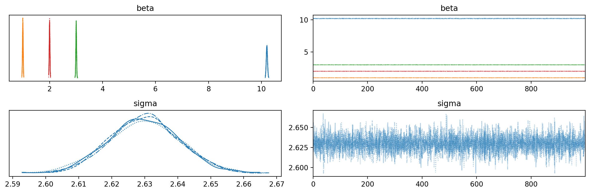

# Experimenting with different PyMC sampling backends

```python
%load_ext autoreload
%autoreload 2
```

```python
from pathlib import Path
from time import time

import arviz as az
import janitor  # noqa: F401
import matplotlib.pyplot as plt
import numpy as np
import pandas as pd
import plotnine as gg
import pymc as pm
import pymc.sampling_jax
import seaborn as sns
```

    /usr/local/Caskroom/miniconda/base/envs/speclet/lib/python3.10/site-packages/aesara/link/jax/dispatch.py:87: UserWarning: JAX omnistaging couldn't be disabled: Disabling of omnistaging is no longer supported in JAX version 0.2.12 and higher: see https://github.com/google/jax/blob/main/design_notes/omnistaging.md.
    /usr/local/Caskroom/miniconda/base/envs/speclet/lib/python3.10/site-packages/pymc/sampling_jax.py:36: UserWarning: This module is experimental.

```python
from speclet.bayesian_models.hierarchical_nb import HierarchcalNegativeBinomialModel
from speclet.io import DataFile
from speclet.managers.data_managers import CrisprScreenDataManager
from speclet.plot.plotnine_helpers import set_gg_theme
from speclet.project_enums import ModelFitMethod
```

```python
# Notebook execution timer.
notebook_tic = time()

# Plotting setup.
%config InlineBackend.figure_format = "retina"
set_gg_theme()

# Constants
RANDOM_SEED = 847
```

## Mock data and simple model

### Data generation

```python
np.random.seed(RANDOM_SEED)

N = 30000
b = np.random.normal(loc=[10.2, 1, -3, 2], scale=[1, 1, 1, 1], size=(N, 4))
x1 = np.random.uniform(-2, 2, N)
x2 = np.random.uniform(-2, 2, N)
err = np.random.normal(0, 1, N)
err = 0
y = b[:, 0] + (b[:, 1] * x1) - (b[:, 2] * x2) + (b[:, 3] * x1**2) + err
data = pd.DataFrame({"x1": x1, "x2": x2, "y": y})
data.head()
```

<div>
<style scoped>
    .dataframe tbody tr th:only-of-type {
        vertical-align: middle;
    }

    .dataframe tbody tr th {
        vertical-align: top;
    }

    .dataframe thead th {
        text-align: right;
    }
</style>
<table border="1" class="dataframe">
  <thead>
    <tr style="text-align: right;">
      <th></th>
      <th>x1</th>
      <th>x2</th>
      <th>y</th>
    </tr>
  </thead>
  <tbody>
    <tr>
      <th>0</th>
      <td>0.860896</td>
      <td>1.913594</td>
      <td>20.134452</td>
    </tr>
    <tr>
      <th>1</th>
      <td>1.926901</td>
      <td>1.900653</td>
      <td>27.721610</td>
    </tr>
    <tr>
      <th>2</th>
      <td>-0.846302</td>
      <td>0.311208</td>
      <td>10.907071</td>
    </tr>
    <tr>
      <th>3</th>
      <td>-1.973597</td>
      <td>0.105062</td>
      <td>21.574877</td>
    </tr>
    <tr>
      <th>4</th>
      <td>-0.907437</td>
      <td>0.963983</td>
      <td>16.353752</td>
    </tr>
  </tbody>
</table>
</div>

```python
(
    gg.ggplot(data.pivot_longer(index=["y"]), gg.aes(x="value", y="y"))
    + gg.facet_wrap("~variable", nrow=1)
    + gg.geom_point(alpha=0.5, size=1)
    + gg.theme(figure_size=(7, 3))
)
```

    /usr/local/Caskroom/miniconda/base/envs/speclet/lib/python3.10/site-packages/plotnine/utils.py:371: FutureWarning: The frame.append method is deprecated and will be removed from pandas in a future version. Use pandas.concat instead.


    <ggplot: (347402298)>

### Model design

```python
def build_model(data: pd.DataFrame) -> pm.Model:
    x1 = data.x1.values
    x2 = data.x2.values
    y = data.y.values
    with pm.Model(rng_seeder=RANDOM_SEED * 2) as model:
        b = pm.Normal("beta", 0, 10, shape=(4))
        mu = pm.Deterministic("mu", b[0] + (x1 * b[1]) + (x2 * b[2]) + (x1**2 * b[3]))
        sigma = pm.HalfNormal("sigma", 5)
        y = pm.Normal("y", mu, sigma, observed=y)
    return model
```

```python
pm.model_to_graphviz(build_model(data))
```


### Sampling

#### Default

```python
with build_model(data) as model:
    trace_std = pm.sample(chains=4, cores=4)
```

    Auto-assigning NUTS sampler...
    Initializing NUTS using jitter+adapt_diag...
    /usr/local/Caskroom/miniconda/base/envs/speclet/lib/python3.10/site-packages/pymc/aesaraf.py:996: UserWarning: The parameter 'updates' of aesara.function() expects an OrderedDict, got <class 'dict'>. Using a standard dictionary here results in non-deterministic behavior. You should use an OrderedDict if you are using Python 2.7 (collections.OrderedDict for older python), or use a list of (shared, update) pairs. Do not just convert your dictionary to this type before the call as the conversion will still be non-deterministic.
    Multiprocess sampling (4 chains in 4 jobs)
    NUTS: [beta, sigma]

<style>
    /*Turns off some styling*/
    progress {
        /*gets rid of default border in Firefox and Opera.*/
        border: none;
        /*Needs to be in here for Safari polyfill so background images work as expected.*/
        background-size: auto;
    }
    .progress-bar-interrupted, .progress-bar-interrupted::-webkit-progress-bar {
        background: #F44336;
    }
</style>

<div>
  <progress value='8000' class='' max='8000' style='width:300px; height:20px; vertical-align: middle;'></progress>
  100.00% [8000/8000 00:22<00:00 Sampling 4 chains, 0 divergences]
</div>

    Sampling 4 chains for 1_000 tune and 1_000 draw iterations (4_000 + 4_000 draws total) took 46 seconds.

```python
az.plot_trace(trace_std, var_names=["beta", "sigma"])
plt.tight_layout();
```


#### Numpyro

```python
with build_model(data) as model:
    trace_numpyro = pm.sampling_jax.sample_numpyro_nuts(chains=4)
```

    /usr/local/Caskroom/miniconda/base/envs/speclet/lib/python3.10/site-packages/tqdm/auto.py:22: TqdmWarning: IProgress not found. Please update jupyter and ipywidgets. See https://ipywidgets.readthedocs.io/en/stable/user_install.html
    /usr/local/Caskroom/miniconda/base/envs/speclet/lib/python3.10/site-packages/pymc/aesaraf.py:996: UserWarning: The parameter 'updates' of aesara.function() expects an OrderedDict, got <class 'dict'>. Using a standard dictionary here results in non-deterministic behavior. You should use an OrderedDict if you are using Python 2.7 (collections.OrderedDict for older python), or use a list of (shared, update) pairs. Do not just convert your dictionary to this type before the call as the conversion will still be non-deterministic.


    Compiling...
    Compilation time =  0:00:01.431740
    Sampling...


    Compiling.. :   0%|                                                                                          | 0/2000 [00:00<?, ?it/s]
      0%|                                                                                                        | 0/2000 [00:00<?, ?it/s]
    Compiling.. :   0%|                                                                                          | 0/2000 [00:00<?, ?it/s]

      0%|                                                                                                        | 0/2000 [00:00<?, ?it/s]

    Compiling.. :   0%|                                                                                          | 0/2000 [00:00<?, ?it/s]


      0%|                                                                                                        | 0/2000 [00:00<?, ?it/s]


    Running chain 0:   0%|                                                                                       | 0/2000 [00:05<?, ?it/s]
    Running chain 1:   0%|                                                                                       | 0/2000 [00:05<?, ?it/s]

    Running chain 2:   0%|                                                                                       | 0/2000 [00:05<?, ?it/s]


    Running chain 3:   0%|                                                                                       | 0/2000 [00:05<?, ?it/s]


    Running chain 3:   5%|███▊                                                                        | 100/2000 [00:05<00:07, 266.58it/s]

    Running chain 0:   5%|███▊                                                                        | 100/2000 [00:05<00:15, 124.21it/s]
    Running chain 1:   5%|███▊                                                                        | 100/2000 [00:05<00:15, 118.82it/s]

    Running chain 0:  10%|███████▋                                                                     | 200/2000 [00:07<00:21, 84.16it/s]


    Running chain 3:  10%|███████▋                                                                     | 200/2000 [00:07<00:23, 75.89it/s]

    Running chain 2:  15%|███████████▍                                                                | 300/2000 [00:07<00:14, 121.34it/s]
    Running chain 0:  15%|███████████▍                                                                | 300/2000 [00:08<00:15, 108.54it/s]

    Running chain 2:  20%|███████████████▏                                                            | 400/2000 [00:08<00:10, 152.11it/s]


    Running chain 3:  15%|███████████▌                                                                 | 300/2000 [00:08<00:18, 94.17it/s]
    Running chain 0:  20%|███████████████▏                                                            | 400/2000 [00:08<00:11, 137.05it/s]

    Running chain 2:  25%|███████████████████                                                         | 500/2000 [00:08<00:09, 164.44it/s]


    Running chain 3:  20%|███████████████▏                                                            | 400/2000 [00:08<00:13, 119.48it/s]
    Running chain 0:  25%|███████████████████                                                         | 500/2000 [00:09<00:10, 148.69it/s]

    Running chain 2:  30%|██████████████████████▊                                                     | 600/2000 [00:09<00:07, 179.59it/s]


    Running chain 3:  25%|███████████████████                                                         | 500/2000 [00:09<00:10, 139.49it/s]
    Running chain 0:  30%|██████████████████████▊                                                     | 600/2000 [00:09<00:07, 175.19it/s]

    Running chain 2:  35%|██████████████████████████▌                                                 | 700/2000 [00:09<00:06, 197.62it/s]


    Running chain 3:  30%|██████████████████████▊                                                     | 600/2000 [00:09<00:08, 160.44it/s]

    Running chain 0:  35%|██████████████████████████▌                                                 | 700/2000 [00:09<00:06, 186.46it/s]
    Running chain 1:  30%|██████████████████████▊                                                     | 600/2000 [00:09<00:08, 156.29it/s]


    Running chain 0:  40%|██████████████████████████████▍                                             | 800/2000 [00:10<00:05, 208.72it/s]

    Running chain 2:  45%|██████████████████████████████████▏                                         | 900/2000 [00:10<00:04, 228.89it/s]
    Running chain 1:  35%|██████████████████████████▌                                                 | 700/2000 [00:10<00:07, 172.59it/s]


    Running chain 0:  45%|██████████████████████████████████▏                                         | 900/2000 [00:10<00:04, 223.04it/s]

    Running chain 2:  50%|█████████████████████████████████████▌                                     | 1000/2000 [00:10<00:04, 228.59it/s]
    Running chain 1:  40%|██████████████████████████████▍                                             | 800/2000 [00:10<00:06, 196.31it/s]


    Running chain 3:  45%|██████████████████████████████████▏                                         | 900/2000 [00:10<00:05, 208.62it/s]

    Running chain 2:  55%|█████████████████████████████████████████▎                                 | 1100/2000 [00:11<00:03, 230.65it/s]
    Running chain 0:  50%|█████████████████████████████████████▌                                     | 1000/2000 [00:11<00:04, 204.32it/s]


    Running chain 3:  50%|█████████████████████████████████████▌                                     | 1000/2000 [00:11<00:04, 213.90it/s]

    Running chain 2:  60%|█████████████████████████████████████████████                              | 1200/2000 [00:11<00:03, 246.62it/s]
    Running chain 0:  55%|█████████████████████████████████████████▎                                 | 1100/2000 [00:11<00:04, 219.80it/s]

    Running chain 2:  65%|████████████████████████████████████████████████▊                          | 1300/2000 [00:11<00:02, 233.81it/s]


    Running chain 3:  55%|█████████████████████████████████████████▎                                 | 1100/2000 [00:11<00:04, 204.97it/s]
    Running chain 0:  60%|█████████████████████████████████████████████                              | 1200/2000 [00:12<00:03, 213.17it/s]

    Running chain 2:  70%|████████████████████████████████████████████████████▌                      | 1400/2000 [00:12<00:03, 194.51it/s]
    Running chain 0:  65%|████████████████████████████████████████████████▊                          | 1300/2000 [00:12<00:03, 178.80it/s]


    Running chain 3:  60%|█████████████████████████████████████████████                              | 1200/2000 [00:12<00:05, 158.09it/s]

    Running chain 2:  75%|████████████████████████████████████████████████████████▎                  | 1500/2000 [00:13<00:02, 178.01it/s]
    Running chain 0:  70%|████████████████████████████████████████████████████▌                      | 1400/2000 [00:13<00:03, 180.39it/s]


    Running chain 3:  65%|████████████████████████████████████████████████▊                          | 1300/2000 [00:13<00:04, 152.22it/s]

    Running chain 2:  80%|████████████████████████████████████████████████████████████               | 1600/2000 [00:13<00:02, 181.84it/s]
    Running chain 0:  75%|████████████████████████████████████████████████████████▎                  | 1500/2000 [00:13<00:02, 185.90it/s]


    Running chain 3:  70%|████████████████████████████████████████████████████▌                      | 1400/2000 [00:13<00:03, 173.30it/s]

    Running chain 0:  80%|████████████████████████████████████████████████████████████               | 1600/2000 [00:14<00:02, 197.81it/s]
    Running chain 1:  75%|████████████████████████████████████████████████████████▎                  | 1500/2000 [00:14<00:02, 181.65it/s]


    Running chain 3:  75%|████████████████████████████████████████████████████████▎                  | 1500/2000 [00:14<00:02, 185.49it/s]

    Running chain 0:  85%|███████████████████████████████████████████████████████████████▊           | 1700/2000 [00:14<00:01, 205.36it/s]
    Running chain 1:  80%|████████████████████████████████████████████████████████████               | 1600/2000 [00:14<00:02, 193.67it/s]


    Running chain 3:  80%|████████████████████████████████████████████████████████████               | 1600/2000 [00:15<00:02, 175.25it/s]

    Running chain 0:  90%|███████████████████████████████████████████████████████████████████▌       | 1800/2000 [00:15<00:01, 173.14it/s]
    Running chain 1:  85%|███████████████████████████████████████████████████████████████▊           | 1700/2000 [00:15<00:01, 163.70it/s]

    Running chain 2: 100%|███████████████████████████████████████████████████████████████████████████| 2000/2000 [00:15<00:00, 173.02it/s]


    Running chain 0:  95%|███████████████████████████████████████████████████████████████████████▎   | 1900/2000 [00:16<00:00, 162.10it/s]
    Running chain 1:  90%|███████████████████████████████████████████████████████████████████▌       | 1800/2000 [00:16<00:01, 158.18it/s]


    Running chain 0: 100%|███████████████████████████████████████████████████████████████████████████| 2000/2000 [00:16<00:00, 154.87it/s]
    Running chain 1:  95%|███████████████████████████████████████████████████████████████████████▎   | 1900/2000 [00:17<00:00, 154.66it/s]


    Running chain 3:  95%|███████████████████████████████████████████████████████████████████████▎   | 1900/2000 [00:17<00:00, 151.05it/s]
    Running chain 1: 100%|███████████████████████████████████████████████████████████████████████████| 2000/2000 [00:17<00:00, 164.21it/s]


    Running chain 0: 100%|███████████████████████████████████████████████████████████████████████████| 2000/2000 [00:17<00:00, 112.36it/s]
    Running chain 1: 100%|███████████████████████████████████████████████████████████████████████████| 2000/2000 [00:17<00:00, 112.38it/s]
    Running chain 2: 100%|███████████████████████████████████████████████████████████████████████████| 2000/2000 [00:17<00:00, 112.41it/s]
    Running chain 3: 100%|███████████████████████████████████████████████████████████████████████████| 2000/2000 [00:17<00:00, 112.45it/s]


    Sampling time =  0:00:18.320438
    Transforming variables...
    Transformation time =  0:01:03.275481

```python
az.plot_trace(trace_numpyro, var_names=["beta", "sigma"])
plt.tight_layout();
```



### Comparing posteriors

```python
az.plot_forest(
    [trace_std, trace_numpyro],
    model_names=["std.", "numpyro"],
    var_names=["beta", "sigma"],
    hdi_prob=0.89,
    figsize=(5, 8),
)
plt.tight_layout();
```


## Hierarchical model

### Data and model preparation

```python
crispr_data = CrisprScreenDataManager(DataFile.DEPMAP_CRC_BONE_SUBSAMPLE).get_data()
crispr_data.head()
```

<div>
<style scoped>
    .dataframe tbody tr th:only-of-type {
        vertical-align: middle;
    }

    .dataframe tbody tr th {
        vertical-align: top;
    }

    .dataframe thead th {
        text-align: right;
    }
</style>
<table border="1" class="dataframe">
  <thead>
    <tr style="text-align: right;">
      <th></th>
      <th>sgrna</th>
      <th>replicate_id</th>
      <th>lfc</th>
      <th>p_dna_batch</th>
      <th>genome_alignment</th>
      <th>hugo_symbol</th>
      <th>screen</th>
      <th>multiple_hits_on_gene</th>
      <th>sgrna_target_chr</th>
      <th>sgrna_target_pos</th>
      <th>...</th>
      <th>any_deleterious</th>
      <th>any_tcga_hotspot</th>
      <th>any_cosmic_hotspot</th>
      <th>is_mutated</th>
      <th>copy_number</th>
      <th>lineage</th>
      <th>lineage_subtype</th>
      <th>primary_or_metastasis</th>
      <th>is_male</th>
      <th>age</th>
    </tr>
  </thead>
  <tbody>
    <tr>
      <th>0</th>
      <td>CGGAGCCTCGCCATTCCCGA</td>
      <td>COLO201-311Cas9_RepA_p6_batch3</td>
      <td>-0.183298</td>
      <td>3</td>
      <td>chr9_136410332_-</td>
      <td>ENTR1</td>
      <td>broad</td>
      <td>True</td>
      <td>9</td>
      <td>136410332</td>
      <td>...</td>
      <td>NaN</td>
      <td>NaN</td>
      <td>NaN</td>
      <td>False</td>
      <td>1.064776</td>
      <td>colorectal</td>
      <td>colorectal_adenocarcinoma</td>
      <td>metastasis</td>
      <td>True</td>
      <td>70.0</td>
    </tr>
    <tr>
      <th>1</th>
      <td>AAATAATTAAGTATGCACAT</td>
      <td>COLO201-311Cas9_RepA_p6_batch3</td>
      <td>-1.102995</td>
      <td>3</td>
      <td>chr13_48081696_-</td>
      <td>MED4</td>
      <td>broad</td>
      <td>True</td>
      <td>13</td>
      <td>48081696</td>
      <td>...</td>
      <td>NaN</td>
      <td>NaN</td>
      <td>NaN</td>
      <td>False</td>
      <td>1.582238</td>
      <td>colorectal</td>
      <td>colorectal_adenocarcinoma</td>
      <td>metastasis</td>
      <td>True</td>
      <td>70.0</td>
    </tr>
    <tr>
      <th>2</th>
      <td>AACAGCTGTTTACCAAGCGA</td>
      <td>COLO201-311Cas9_RepA_p6_batch3</td>
      <td>-0.991020</td>
      <td>3</td>
      <td>chr13_48083409_-</td>
      <td>MED4</td>
      <td>broad</td>
      <td>True</td>
      <td>13</td>
      <td>48083409</td>
      <td>...</td>
      <td>NaN</td>
      <td>NaN</td>
      <td>NaN</td>
      <td>False</td>
      <td>1.582238</td>
      <td>colorectal</td>
      <td>colorectal_adenocarcinoma</td>
      <td>metastasis</td>
      <td>True</td>
      <td>70.0</td>
    </tr>
    <tr>
      <th>3</th>
      <td>AATCAACCCACAGCTGCACA</td>
      <td>COLO201-311Cas9_RepA_p6_batch3</td>
      <td>0.219207</td>
      <td>3</td>
      <td>chr17_7675183_+</td>
      <td>TP53</td>
      <td>broad</td>
      <td>True</td>
      <td>17</td>
      <td>7675183</td>
      <td>...</td>
      <td>NaN</td>
      <td>NaN</td>
      <td>NaN</td>
      <td>False</td>
      <td>0.978003</td>
      <td>colorectal</td>
      <td>colorectal_adenocarcinoma</td>
      <td>metastasis</td>
      <td>True</td>
      <td>70.0</td>
    </tr>
    <tr>
      <th>4</th>
      <td>ACAAGGGGCGACCGTCGCCA</td>
      <td>COLO201-311Cas9_RepA_p6_batch3</td>
      <td>0.003980</td>
      <td>3</td>
      <td>chr8_103415011_-</td>
      <td>DCAF13</td>
      <td>broad</td>
      <td>True</td>
      <td>8</td>
      <td>103415011</td>
      <td>...</td>
      <td>NaN</td>
      <td>NaN</td>
      <td>NaN</td>
      <td>False</td>
      <td>1.234548</td>
      <td>colorectal</td>
      <td>colorectal_adenocarcinoma</td>
      <td>metastasis</td>
      <td>True</td>
      <td>70.0</td>
    </tr>
  </tbody>
</table>
<p>5 rows × 25 columns</p>
</div>

```python
for c in ["sgrna", "hugo_symbol", "depmap_id", "lineage"]:
    print(f"unique values in column '{c}': {crispr_data[c].nunique()}")
```

    unique values in column 'sgrna': 338
    unique values in column 'hugo_symbol': 113
    unique values in column 'depmap_id': 10
    unique values in column 'lineage': 2

```python
crispr_data.shape
```

    (2000, 25)

```python
np.random.seed(RANDOM_SEED)
sample_genes = np.random.choice(
    crispr_data.hugo_symbol.unique(), size=20, replace=False
)
crispr_data = crispr_data.filter_column_isin("hugo_symbol", sample_genes)
```

```python
crispr_data.shape
```

    (336, 25)

```python
for c in ["sgrna", "hugo_symbol", "depmap_id", "lineage"]:
    print(f"unique values in column '{c}': {crispr_data[c].nunique()}")
```

    unique values in column 'sgrna': 60
    unique values in column 'hugo_symbol': 20
    unique values in column 'depmap_id': 10
    unique values in column 'lineage': 2

```python
hnb_model = HierarchcalNegativeBinomialModel()
```

```python
pm.model_to_graphviz(hnb_model.pymc_model(crispr_data))
```


### Sampling

```python
sampling_kwargs = {
    "draws": 500,
    "tune": 500,
    "chains": 2,
    "target_accept": 0.99,
}
```

```python
def _plot_hnb_trace(trace: az.InferenceData) -> None:
    var_names = HierarchcalNegativeBinomialModel().vars_regex(ModelFitMethod.PYMC_MCMC)
    az.plot_trace(trace, var_names=var_names, filter_vars="regex")
    plt.tight_layout()
    plt.show()
    return None
```

#### Default

```python
with hnb_model.pymc_model(crispr_data, seed=RANDOM_SEED) as m:
    crispr_trace_std = pm.sample(**sampling_kwargs)
```

    Auto-assigning NUTS sampler...
    INFO:pymc:Auto-assigning NUTS sampler...
    Initializing NUTS using jitter+adapt_diag...
    INFO:pymc:Initializing NUTS using jitter+adapt_diag...
    /usr/local/Caskroom/miniconda/base/envs/speclet/lib/python3.10/site-packages/pymc/aesaraf.py:996: UserWarning: The parameter 'updates' of aesara.function() expects an OrderedDict, got <class 'dict'>. Using a standard dictionary here results in non-deterministic behavior. You should use an OrderedDict if you are using Python 2.7 (collections.OrderedDict for older python), or use a list of (shared, update) pairs. Do not just convert your dictionary to this type before the call as the conversion will still be non-deterministic.
    Multiprocess sampling (2 chains in 2 jobs)
    INFO:pymc:Multiprocess sampling (2 chains in 2 jobs)
    NUTS: [z, sigma_a, delta_a, sigma_b, delta_b, sigma_d, delta_d, sigma_f, delta_f, sigma_h, delta_h, sigma_k, delta_k, sigma_m, delta_m, sigma_w, delta_w, sigma_p, p, alpha]
    INFO:pymc:NUTS: [z, sigma_a, delta_a, sigma_b, delta_b, sigma_d, delta_d, sigma_f, delta_f, sigma_h, delta_h, sigma_k, delta_k, sigma_m, delta_m, sigma_w, delta_w, sigma_p, p, alpha]

<style>
    /*Turns off some styling*/
    progress {
        /*gets rid of default border in Firefox and Opera.*/
        border: none;
        /*Needs to be in here for Safari polyfill so background images work as expected.*/
        background-size: auto;
    }
    .progress-bar-interrupted, .progress-bar-interrupted::-webkit-progress-bar {
        background: #F44336;
    }
</style>

<div>
  <progress value='2000' class='' max='2000' style='width:300px; height:20px; vertical-align: middle;'></progress>
  100.00% [2000/2000 18:38<00:00 Sampling 2 chains, 0 divergences]
</div>

    Sampling 2 chains for 500 tune and 500 draw iterations (1_000 + 1_000 draws total) took 1131 seconds.
    INFO:pymc:Sampling 2 chains for 500 tune and 500 draw iterations (1_000 + 1_000 draws total) took 1131 seconds.
    We recommend running at least 4 chains for robust computation of convergence diagnostics
    INFO:pymc:We recommend running at least 4 chains for robust computation of convergence diagnostics

```python
_plot_hnb_trace(crispr_trace_std);
```


#### Numpyro

```python
with hnb_model.pymc_model(crispr_data, seed=RANDOM_SEED) as m:
    crispr_trace_npr = pm.sampling_jax.sample_numpyro_nuts(**sampling_kwargs)
```

    Compiling...


    /usr/local/Caskroom/miniconda/base/envs/speclet/lib/python3.10/site-packages/pymc/aesaraf.py:996: UserWarning: The parameter 'updates' of aesara.function() expects an OrderedDict, got <class 'dict'>. Using a standard dictionary here results in non-deterministic behavior. You should use an OrderedDict if you are using Python 2.7 (collections.OrderedDict for older python), or use a list of (shared, update) pairs. Do not just convert your dictionary to this type before the call as the conversion will still be non-deterministic.


    Compilation time =  0:00:06.320453
    Sampling...


    Compiling.. :   0%|                                                                                          | 0/1000 [00:00<?, ?it/s]
      0%|                                                                                                        | 0/1000 [00:00<?, ?it/s]
    Compiling.. :   0%|                                                                                          | 0/1000 [00:00<?, ?it/s]
    Running chain 0:   5%|███▉                                                                          | 50/1000 [00:20<01:22, 11.55it/s]
    Running chain 0:  10%|███████▋                                                                     | 100/1000 [00:25<01:24, 10.70it/s]
    Running chain 0:  15%|███████████▌                                                                 | 150/1000 [00:31<01:26,  9.78it/s]
    Running chain 0:  20%|███████████████▍                                                             | 200/1000 [00:36<01:26,  9.30it/s]
    Running chain 0:  25%|███████████████████▎                                                         | 250/1000 [00:42<01:23,  8.98it/s]
    Running chain 0:  30%|███████████████████████                                                      | 300/1000 [00:48<01:18,  8.88it/s]
    Running chain 0:  35%|██████████████████████████▉                                                  | 350/1000 [00:54<01:13,  8.81it/s]
    Running chain 0:  40%|██████████████████████████████▊                                              | 400/1000 [01:00<01:09,  8.69it/s]
    Running chain 0:  45%|██████████████████████████████████▋                                          | 450/1000 [01:06<01:03,  8.61it/s]
    Running chain 0:  50%|██████████████████████████████████████▌                                      | 500/1000 [01:12<00:58,  8.58it/s]
    Running chain 0:  55%|██████████████████████████████████████████▎                                  | 550/1000 [01:17<00:52,  8.55it/s]
    Running chain 0:  60%|██████████████████████████████████████████████▏                              | 600/1000 [01:23<00:46,  8.53it/s]
    Running chain 0:  65%|██████████████████████████████████████████████████                           | 650/1000 [01:29<00:41,  8.51it/s]
    Running chain 0:  70%|█████████████████████████████████████████████████████▉                       | 700/1000 [01:36<00:37,  8.06it/s]
    Running chain 0:  75%|█████████████████████████████████████████████████████████▊                   | 750/1000 [01:43<00:31,  7.95it/s]
    Running chain 0:  80%|█████████████████████████████████████████████████████████████▌               | 800/1000 [01:49<00:24,  8.12it/s]
    Running chain 0:  85%|█████████████████████████████████████████████████████████████████▍           | 850/1000 [01:55<00:18,  8.12it/s]
    Running chain 0:  90%|█████████████████████████████████████████████████████████████████████▎       | 900/1000 [02:01<00:12,  8.22it/s]
    Running chain 0:  95%|█████████████████████████████████████████████████████████████████████████▏   | 950/1000 [02:07<00:06,  8.29it/s]
    Running chain 0: 100%|████████████████████████████████████████████████████████████████████████████| 1000/1000 [02:12<00:00,  8.34it/s]
    Running chain 0: 100%|████████████████████████████████████████████████████████████████████████████| 1000/1000 [02:13<00:00,  7.49it/s]
    Running chain 1: 100%|████████████████████████████████████████████████████████████████████████████| 1000/1000 [02:13<00:00,  7.49it/s]


    Sampling time =  0:02:15.400316
    Transforming variables...
    Transformation time =  0:00:02.639432

```python
_plot_hnb_trace(crispr_trace_npr);
```


### Compare posteriors

```python
az.plot_forest(
    [crispr_trace_std, crispr_trace_npr],
    model_names=["std.", "numpyro"],
    var_names=["h"],
    hdi_prob=0.89,
    combined=True,
)
plt.tight_layout();
```


```python
var_avg_diffs = np.array([], dtype=float)
var_sd_diffs = np.array([], dtype=float)

for v in crispr_trace_std.posterior:
    std_avgs = crispr_trace_std.posterior[v].values.mean(axis=0)
    npr_avgs = crispr_trace_npr.posterior[v].values.mean(axis=0)
    _avg_diffs = (std_avgs - npr_avgs).flatten()
    var_avg_diffs = np.concatenate([var_avg_diffs, _avg_diffs])

    std_sd = crispr_trace_std.posterior[v].values.std(axis=0)
    npr_sd = crispr_trace_npr.posterior[v].values.std(axis=0)
    _sd_diffs = (std_sd - npr_sd).flatten()
    var_sd_diffs = np.concatenate([var_sd_diffs, _sd_diffs])
```

```python
sns.histplot(var_avg_diffs, binwidth=0.5);
```


```python
sns.histplot(var_sd_diffs, binwidth=0.5);
```


---

```python
notebook_toc = time()
print(f"execution time: {(notebook_toc - notebook_tic) / 60:.2f} minutes")
```

    execution time: 27.54 minutes

```python
%load_ext watermark
%watermark -d -u -v -iv -b -h -m
```

    Last updated: 2022-05-13

    Python implementation: CPython
    Python version       : 3.10.4
    IPython version      : 8.3.0

    Compiler    : Clang 12.0.1
    OS          : Darwin
    Release     : 21.4.0
    Machine     : x86_64
    Processor   : i386
    CPU cores   : 4
    Architecture: 64bit

    Hostname: JHCookMac

    Git branch: pymc-backends

    janitor   : 0.22.0
    seaborn   : 0.11.2
    pandas    : 1.4.2
    plotnine  : 0.8.0
    matplotlib: 3.5.2
    arviz     : 0.12.0
    numpy     : 1.22.3
    pymc      : 4.0.0b5
