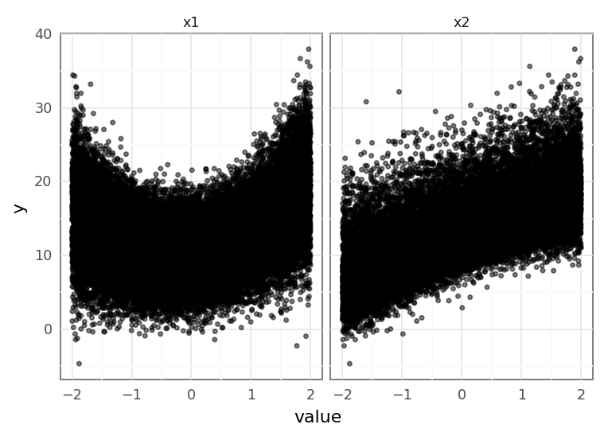
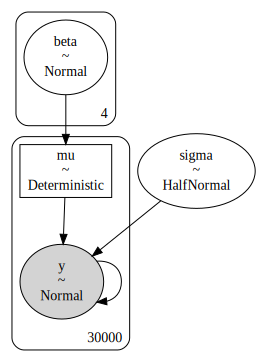
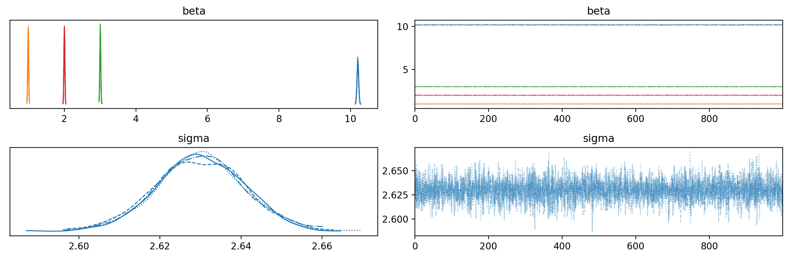
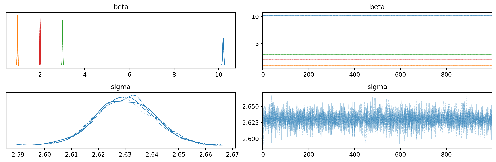
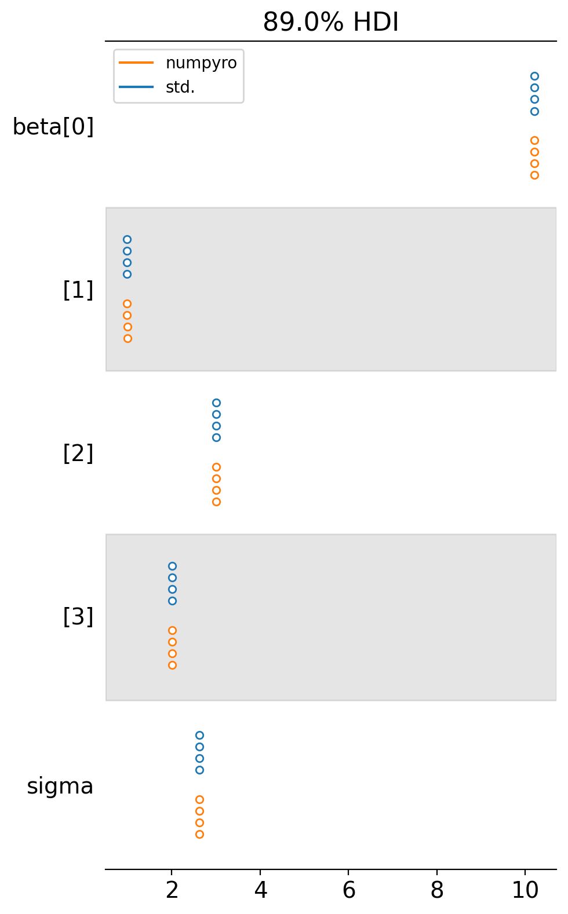
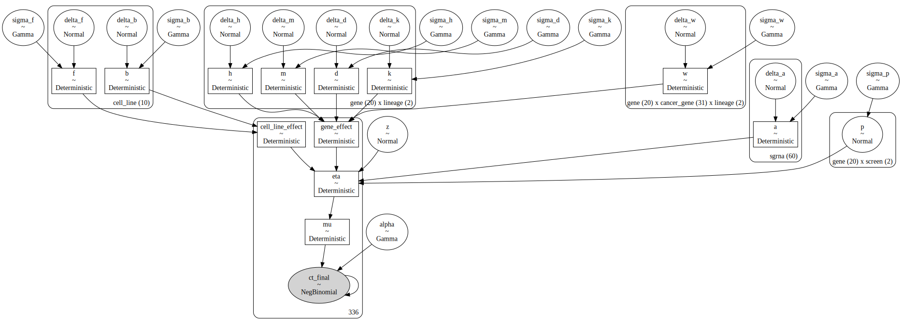
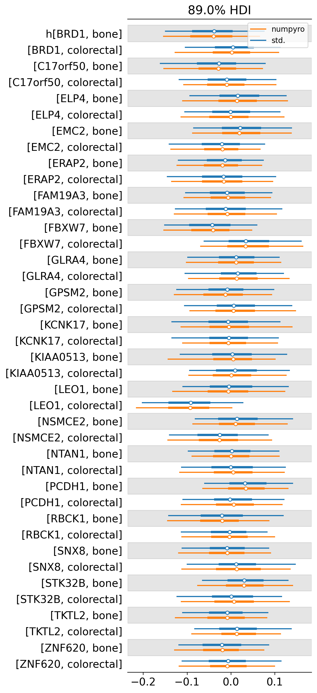
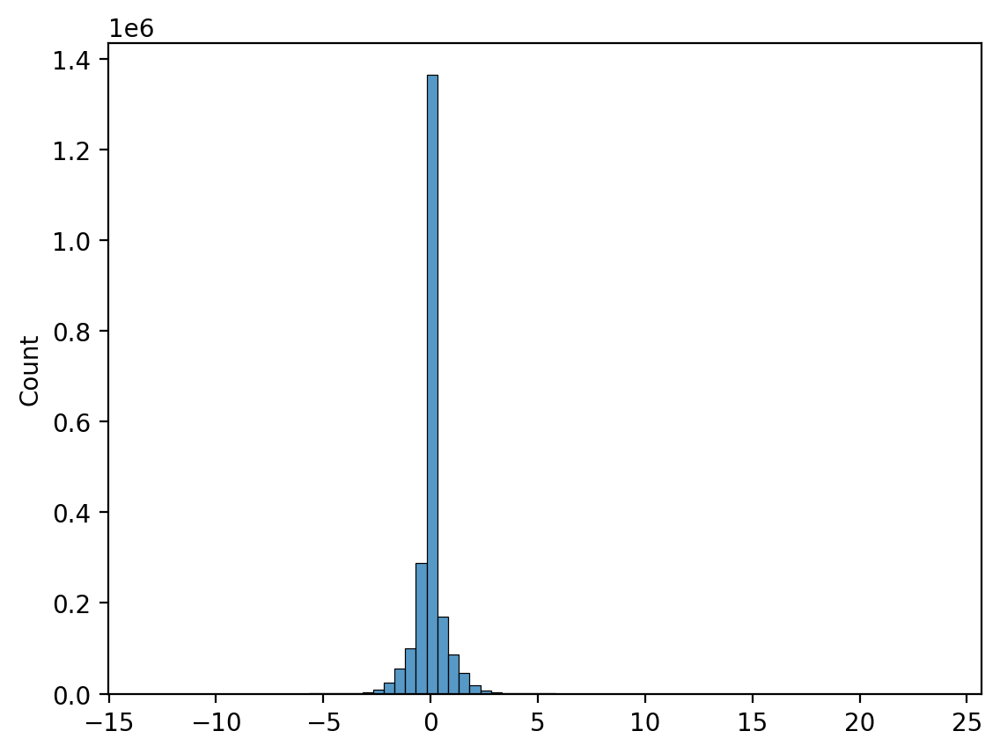
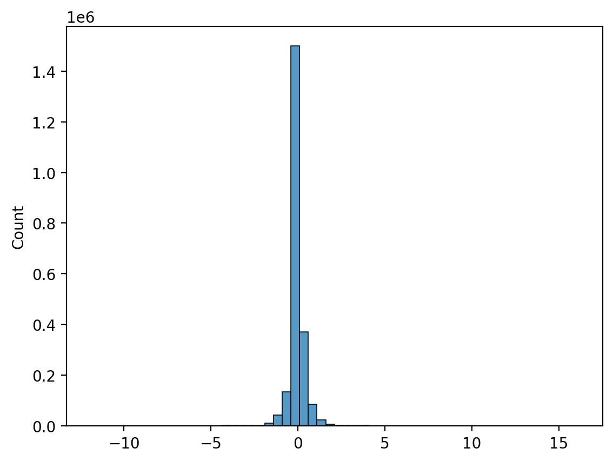

# Experimenting with different PyMC sampling backends


```python
%load_ext autoreload
%autoreload 2
```


```python
from pathlib import Path
from time import time

import arviz as az
import janitor  # noqa: F401
import matplotlib.pyplot as plt
import numpy as np
import pandas as pd
import plotnine as gg
import pymc as pm
import pymc.sampling_jax
import seaborn as sns
```

    /home/jc604/.conda/envs/speclet/lib/python3.10/site-packages/aesara/link/jax/dispatch.py:87: UserWarning: JAX omnistaging couldn't be disabled: Disabling of omnistaging is no longer supported in JAX version 0.2.12 and higher: see https://github.com/google/jax/blob/main/design_notes/omnistaging.md.
    /home/jc604/.conda/envs/speclet/lib/python3.10/site-packages/pymc/sampling_jax.py:36: UserWarning: This module is experimental.


```python
from speclet.bayesian_models.hierarchical_nb import HierarchcalNegativeBinomialModel
from speclet.io import DataFile
from speclet.managers.data_managers import CrisprScreenDataManager
from speclet.plot.plotnine_helpers import set_gg_theme
from speclet.project_enums import ModelFitMethod
```


```python
# Notebook execution timer.
notebook_tic = time()

# Plotting setup.
%config InlineBackend.figure_format = "retina"
set_gg_theme()

# Constants
RANDOM_SEED = 847
```

## Mock data and simple model

### Data generation


```python
np.random.seed(RANDOM_SEED)

N = 30000
b = np.random.normal(loc=[10.2, 1, -3, 2], scale=[1, 1, 1, 1], size=(N, 4))
x1 = np.random.uniform(-2, 2, N)
x2 = np.random.uniform(-2, 2, N)
err = np.random.normal(0, 1, N)
err = 0
y = b[:, 0] + (b[:, 1] * x1) - (b[:, 2] * x2) + (b[:, 3] * x1**2) + err
data = pd.DataFrame({"x1": x1, "x2": x2, "y": y})
data.head()
```


<div>
<style scoped>
    .dataframe tbody tr th:only-of-type {
        vertical-align: middle;
    }

    .dataframe tbody tr th {
        vertical-align: top;
    }

    .dataframe thead th {
        text-align: right;
    }
</style>
<table border="1" class="dataframe">
  <thead>
    <tr style="text-align: right;">
      <th></th>
      <th>x1</th>
      <th>x2</th>
      <th>y</th>
    </tr>
  </thead>
  <tbody>
    <tr>
      <th>0</th>
      <td>0.860896</td>
      <td>1.913594</td>
      <td>20.134452</td>
    </tr>
    <tr>
      <th>1</th>
      <td>1.926901</td>
      <td>1.900653</td>
      <td>27.721610</td>
    </tr>
    <tr>
      <th>2</th>
      <td>-0.846302</td>
      <td>0.311208</td>
      <td>10.907071</td>
    </tr>
    <tr>
      <th>3</th>
      <td>-1.973597</td>
      <td>0.105062</td>
      <td>21.574877</td>
    </tr>
    <tr>
      <th>4</th>
      <td>-0.907437</td>
      <td>0.963983</td>
      <td>16.353752</td>
    </tr>
  </tbody>
</table>
</div>


```python
(
    gg.ggplot(data.pivot_longer(index=["y"]), gg.aes(x="value", y="y"))
    + gg.facet_wrap("~variable", nrow=1)
    + gg.geom_point(alpha=0.5, size=1)
    + gg.theme(figure_size=(7, 3))
)
```

    /home/jc604/.conda/envs/speclet/lib/python3.10/site-packages/plotnine/utils.py:371: FutureWarning: The frame.append method is deprecated and will be removed from pandas in a future version. Use pandas.concat instead.





    <ggplot: (8764736905631)>


### Model design


```python
def build_model(data: pd.DataFrame) -> pm.Model:
    x1 = data.x1.values
    x2 = data.x2.values
    y = data.y.values
    with pm.Model(rng_seeder=RANDOM_SEED * 2) as model:
        b = pm.Normal("beta", 0, 10, shape=(4))
        mu = pm.Deterministic("mu", b[0] + (x1 * b[1]) + (x2 * b[2]) + (x1**2 * b[3]))
        sigma = pm.HalfNormal("sigma", 5)
        y = pm.Normal("y", mu, sigma, observed=y)
    return model
```


```python
pm.model_to_graphviz(build_model(data))
```





### Sampling

#### Default


```python
with build_model(data) as model:
    trace_std = pm.sample(chains=4, cores=4)
```

    Auto-assigning NUTS sampler...
    Initializing NUTS using jitter+adapt_diag...
    /home/jc604/.conda/envs/speclet/lib/python3.10/site-packages/pymc/aesaraf.py:996: UserWarning: The parameter 'updates' of aesara.function() expects an OrderedDict, got <class 'dict'>. Using a standard dictionary here results in non-deterministic behavior. You should use an OrderedDict if you are using Python 2.7 (collections.OrderedDict for older python), or use a list of (shared, update) pairs. Do not just convert your dictionary to this type before the call as the conversion will still be non-deterministic.
    Multiprocess sampling (4 chains in 4 jobs)
    NUTS: [beta, sigma]


<style>
    /* Turns off some styling */
    progress {
        /* gets rid of default border in Firefox and Opera. */
        border: none;
        /* Needs to be in here for Safari polyfill so background images work as expected. */
        background-size: auto;
    }
    .progress-bar-interrupted, .progress-bar-interrupted::-webkit-progress-bar {
        background: #F44336;
    }
</style>


<div>
  <progress value='8000' class='' max='8000' style='width:300px; height:20px; vertical-align: middle;'></progress>
  100.00% [8000/8000 00:14<00:00 Sampling 4 chains, 0 divergences]
</div>


    Sampling 4 chains for 1_000 tune and 1_000 draw iterations (4_000 + 4_000 draws total) took 16 seconds.


```python
az.plot_trace(trace_std, var_names=["beta", "sigma"])
plt.tight_layout();
```





#### Numpyro


```python
with build_model(data) as model:
    trace_numpyro = pm.sampling_jax.sample_numpyro_nuts(chains=4)
```

    /home/jc604/.conda/envs/speclet/lib/python3.10/site-packages/tqdm/auto.py:22: TqdmWarning: IProgress not found. Please update jupyter and ipywidgets. See https://ipywidgets.readthedocs.io/en/stable/user_install.html
    /home/jc604/.conda/envs/speclet/lib/python3.10/site-packages/pymc/aesaraf.py:996: UserWarning: The parameter 'updates' of aesara.function() expects an OrderedDict, got <class 'dict'>. Using a standard dictionary here results in non-deterministic behavior. You should use an OrderedDict if you are using Python 2.7 (collections.OrderedDict for older python), or use a list of (shared, update) pairs. Do not just convert your dictionary to this type before the call as the conversion will still be non-deterministic.


    Compiling...
    Compilation time =  0:00:01.203339
    Sampling...


    Compiling.. :   0%|                                                                                                        | 0/2000 [00:00<?, ?it/s]
      0%|                                                                                                                      | 0/2000 [00:00<?, ?it/s]
    Compiling.. :   0%|                                                                                                        | 0/2000 [00:00<?, ?it/s]

      0%|                                                                                                                      | 0/2000 [00:00<?, ?it/s]

    Compiling.. :   0%|                                                                                                        | 0/2000 [00:00<?, ?it/s]


      0%|                                                                                                                      | 0/2000 [00:00<?, ?it/s]


    Compiling.. :   0%|                                                                                                        | 0/2000 [00:00<?, ?it/s]
    Running chain 1:   0%|                                                                                                     | 0/2000 [00:04<?, ?it/s]


    Running chain 3:   0%|                                                                                                     | 0/2000 [00:04<?, ?it/s]

    Running chain 0:   0%|                                                                                                     | 0/2000 [00:04<?, ?it/s]


    Running chain 3:   5%|████▌                                                                                     | 100/2000 [00:04<00:04, 430.61it/s]

    Running chain 2:   5%|████▌                                                                                     | 100/2000 [00:04<00:07, 244.22it/s]

    Running chain 0:   5%|████▌                                                                                     | 100/2000 [00:05<00:18, 102.44it/s]
    Running chain 1:   5%|████▌                                                                                      | 100/2000 [00:05<00:19, 97.30it/s]


    Running chain 3:  10%|█████████                                                                                 | 200/2000 [00:05<00:12, 142.43it/s]

    Running chain 2:  15%|█████████████▌                                                                            | 300/2000 [00:05<00:08, 191.36it/s]


    Running chain 3:  15%|█████████████▌                                                                            | 300/2000 [00:05<00:09, 178.46it/s]

    Running chain 2:  20%|██████████████████                                                                        | 400/2000 [00:06<00:06, 231.56it/s]
    Running chain 0:  10%|█████████                                                                                 | 200/2000 [00:06<00:17, 105.16it/s]


    Running chain 3:  20%|██████████████████                                                                        | 400/2000 [00:06<00:07, 222.26it/s]

    Running chain 2:  25%|██████████████████████▌                                                                   | 500/2000 [00:06<00:05, 260.65it/s]
    Running chain 1:  15%|█████████████▌                                                                            | 300/2000 [00:06<00:11, 150.60it/s]


    Running chain 0:  15%|█████████████▌                                                                            | 300/2000 [00:06<00:12, 140.42it/s]

    Running chain 2:  30%|███████████████████████████                                                               | 600/2000 [00:06<00:04, 284.24it/s]


    Running chain 3:  30%|███████████████████████████                                                               | 600/2000 [00:06<00:04, 290.74it/s]
    Running chain 1:  20%|██████████████████                                                                        | 400/2000 [00:06<00:08, 188.71it/s]

    Running chain 0:  20%|██████████████████                                                                        | 400/2000 [00:06<00:08, 180.24it/s]


    Running chain 3:  35%|███████████████████████████████▍                                                          | 700/2000 [00:07<00:04, 321.19it/s]

    Running chain 2:  40%|████████████████████████████████████                                                      | 800/2000 [00:07<00:03, 355.26it/s]
    Running chain 1:  25%|██████████████████████▌                                                                   | 500/2000 [00:07<00:06, 219.25it/s]


    Running chain 0:  25%|██████████████████████▌                                                                   | 500/2000 [00:07<00:07, 212.11it/s]

    Running chain 2:  45%|████████████████████████████████████████▌                                                 | 900/2000 [00:07<00:02, 387.76it/s]
    Running chain 1:  30%|███████████████████████████                                                               | 600/2000 [00:07<00:05, 247.84it/s]


    Running chain 0:  30%|███████████████████████████                                                               | 600/2000 [00:07<00:05, 254.33it/s]

    Running chain 2:  50%|████████████████████████████████████████████▌                                            | 1000/2000 [00:07<00:02, 354.59it/s]
    Running chain 0:  35%|███████████████████████████████▍                                                          | 700/2000 [00:07<00:04, 294.51it/s]


    Running chain 3:  50%|████████████████████████████████████████████▌                                            | 1000/2000 [00:07<00:02, 353.74it/s]

    Running chain 2:  55%|████████████████████████████████████████████████▉                                        | 1100/2000 [00:08<00:02, 352.22it/s]
    Running chain 0:  40%|████████████████████████████████████                                                      | 800/2000 [00:08<00:03, 324.59it/s]


    Running chain 3:  55%|████████████████████████████████████████████████▉                                        | 1100/2000 [00:08<00:02, 348.54it/s]

    Running chain 2:  60%|█████████████████████████████████████████████████████▍                                   | 1200/2000 [00:08<00:02, 365.60it/s]
    Running chain 0:  45%|████████████████████████████████████████▌                                                 | 900/2000 [00:08<00:03, 345.25it/s]


    Running chain 3:  60%|█████████████████████████████████████████████████████▍                                   | 1200/2000 [00:08<00:02, 335.31it/s]

    Running chain 0:  50%|████████████████████████████████████████████▌                                            | 1000/2000 [00:08<00:02, 338.73it/s]
    Running chain 1:  50%|████████████████████████████████████████████▌                                            | 1000/2000 [00:08<00:03, 322.86it/s]


    Running chain 3:  65%|█████████████████████████████████████████████████████████▊                               | 1300/2000 [00:08<00:02, 330.07it/s]

    Running chain 0:  55%|████████████████████████████████████████████████▉                                        | 1100/2000 [00:08<00:02, 352.24it/s]
    Running chain 1:  55%|████████████████████████████████████████████████▉                                        | 1100/2000 [00:08<00:02, 330.03it/s]

    Running chain 2:  75%|██████████████████████████████████████████████████████████████████▊                      | 1500/2000 [00:09<00:01, 365.82it/s]


    Running chain 0:  60%|█████████████████████████████████████████████████████▍                                   | 1200/2000 [00:09<00:02, 359.22it/s]
    Running chain 1:  60%|█████████████████████████████████████████████████████▍                                   | 1200/2000 [00:09<00:02, 339.19it/s]

    Running chain 0:  65%|█████████████████████████████████████████████████████████▊                               | 1300/2000 [00:09<00:01, 369.70it/s]


    Running chain 3:  75%|██████████████████████████████████████████████████████████████████▊                      | 1500/2000 [00:09<00:01, 323.10it/s]
    Running chain 0:  70%|██████████████████████████████████████████████████████████████▎                          | 1400/2000 [00:09<00:01, 379.99it/s]

    Running chain 2:  85%|███████████████████████████████████████████████████████████████████████████▋             | 1700/2000 [00:09<00:00, 369.43it/s]


    Running chain 3:  80%|███████████████████████████████████████████████████████████████████████▏                 | 1600/2000 [00:09<00:01, 331.90it/s]
    Running chain 0:  75%|██████████████████████████████████████████████████████████████████▊                      | 1500/2000 [00:09<00:01, 390.94it/s]

    Running chain 2:  90%|████████████████████████████████████████████████████████████████████████████████         | 1800/2000 [00:09<00:00, 375.74it/s]


    Running chain 3:  85%|███████████████████████████████████████████████████████████████████████████▋             | 1700/2000 [00:09<00:00, 332.68it/s]
    Running chain 0:  80%|███████████████████████████████████████████████████████████████████████▏                 | 1600/2000 [00:10<00:01, 395.17it/s]

    Running chain 2:  95%|████████████████████████████████████████████████████████████████████████████████████▌    | 1900/2000 [00:10<00:00, 370.39it/s]


    Running chain 3:  90%|████████████████████████████████████████████████████████████████████████████████         | 1800/2000 [00:10<00:00, 339.49it/s]
    Running chain 0:  85%|███████████████████████████████████████████████████████████████████████████▋             | 1700/2000 [00:10<00:00, 396.36it/s]

    Running chain 2: 100%|█████████████████████████████████████████████████████████████████████████████████████████| 2000/2000 [00:10<00:00, 377.48it/s]


    Running chain 3:  95%|████████████████████████████████████████████████████████████████████████████████████▌    | 1900/2000 [00:10<00:00, 340.59it/s]
    Running chain 0:  95%|████████████████████████████████████████████████████████████████████████████████████▌    | 1900/2000 [00:10<00:00, 401.63it/s]


    Running chain 3: 100%|█████████████████████████████████████████████████████████████████████████████████████████| 2000/2000 [00:10<00:00, 336.74it/s]
    Running chain 0: 100%|█████████████████████████████████████████████████████████████████████████████████████████| 2000/2000 [00:11<00:00, 413.15it/s]
    Running chain 1:  95%|████████████████████████████████████████████████████████████████████████████████████▌    | 1900/2000 [00:11<00:00, 329.25it/s]
    Running chain 0: 100%|█████████████████████████████████████████████████████████████████████████████████████████| 2000/2000 [00:11<00:00, 173.40it/s]
    Running chain 1: 100%|█████████████████████████████████████████████████████████████████████████████████████████| 2000/2000 [00:11<00:00, 173.43it/s]
    Running chain 2: 100%|█████████████████████████████████████████████████████████████████████████████████████████| 2000/2000 [00:11<00:00, 173.48it/s]
    Running chain 3: 100%|█████████████████████████████████████████████████████████████████████████████████████████| 2000/2000 [00:11<00:00, 173.57it/s]


    Sampling time =  0:00:12.067294
    Transforming variables...
    Transformation time =  0:00:08.328671


```python
az.plot_trace(trace_numpyro, var_names=["beta", "sigma"])
plt.tight_layout();
```





### Comparing posteriors


```python
az.plot_forest(
    [trace_std, trace_numpyro],
    model_names=["std.", "numpyro"],
    var_names=["beta", "sigma"],
    hdi_prob=0.89,
    figsize=(5, 8),
)
plt.tight_layout();
```





## Hierarchical model

### Data and model preparation


```python
crispr_data = CrisprScreenDataManager(DataFile.DEPMAP_CRC_BONE_SUBSAMPLE).get_data()
crispr_data.head()
```


<div>
<style scoped>
    .dataframe tbody tr th:only-of-type {
        vertical-align: middle;
    }

    .dataframe tbody tr th {
        vertical-align: top;
    }

    .dataframe thead th {
        text-align: right;
    }
</style>
<table border="1" class="dataframe">
  <thead>
    <tr style="text-align: right;">
      <th></th>
      <th>sgrna</th>
      <th>replicate_id</th>
      <th>lfc</th>
      <th>p_dna_batch</th>
      <th>genome_alignment</th>
      <th>hugo_symbol</th>
      <th>screen</th>
      <th>multiple_hits_on_gene</th>
      <th>sgrna_target_chr</th>
      <th>sgrna_target_pos</th>
      <th>...</th>
      <th>any_deleterious</th>
      <th>any_tcga_hotspot</th>
      <th>any_cosmic_hotspot</th>
      <th>is_mutated</th>
      <th>copy_number</th>
      <th>lineage</th>
      <th>lineage_subtype</th>
      <th>primary_or_metastasis</th>
      <th>is_male</th>
      <th>age</th>
    </tr>
  </thead>
  <tbody>
    <tr>
      <th>0</th>
      <td>CGGAGCCTCGCCATTCCCGA</td>
      <td>COLO201-311Cas9_RepA_p6_batch3</td>
      <td>-0.183298</td>
      <td>3</td>
      <td>chr9_136410332_-</td>
      <td>ENTR1</td>
      <td>broad</td>
      <td>True</td>
      <td>9</td>
      <td>136410332</td>
      <td>...</td>
      <td>NaN</td>
      <td>NaN</td>
      <td>NaN</td>
      <td>False</td>
      <td>1.064776</td>
      <td>colorectal</td>
      <td>colorectal_adenocarcinoma</td>
      <td>metastasis</td>
      <td>True</td>
      <td>70.0</td>
    </tr>
    <tr>
      <th>1</th>
      <td>AAATAATTAAGTATGCACAT</td>
      <td>COLO201-311Cas9_RepA_p6_batch3</td>
      <td>-1.102995</td>
      <td>3</td>
      <td>chr13_48081696_-</td>
      <td>MED4</td>
      <td>broad</td>
      <td>True</td>
      <td>13</td>
      <td>48081696</td>
      <td>...</td>
      <td>NaN</td>
      <td>NaN</td>
      <td>NaN</td>
      <td>False</td>
      <td>1.582238</td>
      <td>colorectal</td>
      <td>colorectal_adenocarcinoma</td>
      <td>metastasis</td>
      <td>True</td>
      <td>70.0</td>
    </tr>
    <tr>
      <th>2</th>
      <td>AACAGCTGTTTACCAAGCGA</td>
      <td>COLO201-311Cas9_RepA_p6_batch3</td>
      <td>-0.991020</td>
      <td>3</td>
      <td>chr13_48083409_-</td>
      <td>MED4</td>
      <td>broad</td>
      <td>True</td>
      <td>13</td>
      <td>48083409</td>
      <td>...</td>
      <td>NaN</td>
      <td>NaN</td>
      <td>NaN</td>
      <td>False</td>
      <td>1.582238</td>
      <td>colorectal</td>
      <td>colorectal_adenocarcinoma</td>
      <td>metastasis</td>
      <td>True</td>
      <td>70.0</td>
    </tr>
    <tr>
      <th>3</th>
      <td>AATCAACCCACAGCTGCACA</td>
      <td>COLO201-311Cas9_RepA_p6_batch3</td>
      <td>0.219207</td>
      <td>3</td>
      <td>chr17_7675183_+</td>
      <td>TP53</td>
      <td>broad</td>
      <td>True</td>
      <td>17</td>
      <td>7675183</td>
      <td>...</td>
      <td>NaN</td>
      <td>NaN</td>
      <td>NaN</td>
      <td>False</td>
      <td>0.978003</td>
      <td>colorectal</td>
      <td>colorectal_adenocarcinoma</td>
      <td>metastasis</td>
      <td>True</td>
      <td>70.0</td>
    </tr>
    <tr>
      <th>4</th>
      <td>ACAAGGGGCGACCGTCGCCA</td>
      <td>COLO201-311Cas9_RepA_p6_batch3</td>
      <td>0.003980</td>
      <td>3</td>
      <td>chr8_103415011_-</td>
      <td>DCAF13</td>
      <td>broad</td>
      <td>True</td>
      <td>8</td>
      <td>103415011</td>
      <td>...</td>
      <td>NaN</td>
      <td>NaN</td>
      <td>NaN</td>
      <td>False</td>
      <td>1.234548</td>
      <td>colorectal</td>
      <td>colorectal_adenocarcinoma</td>
      <td>metastasis</td>
      <td>True</td>
      <td>70.0</td>
    </tr>
  </tbody>
</table>
<p>5 rows × 25 columns</p>
</div>


```python
for c in ["sgrna", "hugo_symbol", "depmap_id", "lineage"]:
    print(f"unique values in column '{c}': {crispr_data[c].nunique()}")
```

    unique values in column 'sgrna': 338
    unique values in column 'hugo_symbol': 113
    unique values in column 'depmap_id': 10
    unique values in column 'lineage': 2


```python
crispr_data.shape
```


    (2000, 25)


```python
np.random.seed(RANDOM_SEED)
sample_genes = np.random.choice(
    crispr_data.hugo_symbol.unique(), size=20, replace=False
)
crispr_data = crispr_data.filter_column_isin("hugo_symbol", sample_genes)
```


```python
crispr_data.shape
```


    (336, 25)


```python
for c in ["sgrna", "hugo_symbol", "depmap_id", "lineage"]:
    print(f"unique values in column '{c}': {crispr_data[c].nunique()}")
```

    unique values in column 'sgrna': 60
    unique values in column 'hugo_symbol': 20
    unique values in column 'depmap_id': 10
    unique values in column 'lineage': 2


```python
hnb_model = HierarchcalNegativeBinomialModel()
```


```python
pm.model_to_graphviz(hnb_model.pymc_model(crispr_data))
```





### Sampling


```python
sampling_kwargs = {
    "draws": 500,
    "tune": 500,
    "chains": 2,
    "target_accept": 0.99,
}
```


```python
def _plot_hnb_trace(trace: az.InferenceData) -> None:
    var_names = HierarchcalNegativeBinomialModel().vars_regex(ModelFitMethod.PYMC_MCMC)
    az.plot_trace(trace, var_names=var_names, filter_vars="regex")
    plt.tight_layout()
    plt.show()
    return None
```

#### Default


```python
with hnb_model.pymc_model(crispr_data, seed=RANDOM_SEED) as m:
    crispr_trace_std = pm.sample(**sampling_kwargs)
```

    Auto-assigning NUTS sampler...
    INFO:pymc:Auto-assigning NUTS sampler...
    Initializing NUTS using jitter+adapt_diag...
    INFO:pymc:Initializing NUTS using jitter+adapt_diag...
    /home/jc604/.conda/envs/speclet/lib/python3.10/site-packages/pymc/aesaraf.py:996: UserWarning: The parameter 'updates' of aesara.function() expects an OrderedDict, got <class 'dict'>. Using a standard dictionary here results in non-deterministic behavior. You should use an OrderedDict if you are using Python 2.7 (collections.OrderedDict for older python), or use a list of (shared, update) pairs. Do not just convert your dictionary to this type before the call as the conversion will still be non-deterministic.
    Multiprocess sampling (2 chains in 4 jobs)
    INFO:pymc:Multiprocess sampling (2 chains in 4 jobs)
    NUTS: [z, sigma_a, delta_a, sigma_b, delta_b, sigma_d, delta_d, sigma_f, delta_f, sigma_h, delta_h, sigma_k, delta_k, sigma_m, delta_m, sigma_w, delta_w, sigma_p, p, alpha]
    INFO:pymc:NUTS: [z, sigma_a, delta_a, sigma_b, delta_b, sigma_d, delta_d, sigma_f, delta_f, sigma_h, delta_h, sigma_k, delta_k, sigma_m, delta_m, sigma_w, delta_w, sigma_p, p, alpha]


<style>
    /* Turns off some styling */
    progress {
        /* gets rid of default border in Firefox and Opera. */
        border: none;
        /* Needs to be in here for Safari polyfill so background images work as expected. */
        background-size: auto;
    }
    .progress-bar-interrupted, .progress-bar-interrupted::-webkit-progress-bar {
        background: #F44336;
    }
</style>


<div>
  <progress value='2000' class='' max='2000' style='width:300px; height:20px; vertical-align: middle;'></progress>
  100.00% [2000/2000 18:32<00:00 Sampling 2 chains, 0 divergences]
</div>


    Sampling 2 chains for 500 tune and 500 draw iterations (1_000 + 1_000 draws total) took 1114 seconds.
    INFO:pymc:Sampling 2 chains for 500 tune and 500 draw iterations (1_000 + 1_000 draws total) took 1114 seconds.
    We recommend running at least 4 chains for robust computation of convergence diagnostics
    INFO:pymc:We recommend running at least 4 chains for robust computation of convergence diagnostics


```python
_plot_hnb_trace(crispr_trace_std);
```


#### Numpyro


```python
with hnb_model.pymc_model(crispr_data, seed=RANDOM_SEED) as m:
    crispr_trace_npr = pm.sampling_jax.sample_numpyro_nuts(**sampling_kwargs)
```

    Compiling...


    /home/jc604/.conda/envs/speclet/lib/python3.10/site-packages/pymc/aesaraf.py:996: UserWarning: The parameter 'updates' of aesara.function() expects an OrderedDict, got <class 'dict'>. Using a standard dictionary here results in non-deterministic behavior. You should use an OrderedDict if you are using Python 2.7 (collections.OrderedDict for older python), or use a list of (shared, update) pairs. Do not just convert your dictionary to this type before the call as the conversion will still be non-deterministic.


    Compilation time =  0:00:04.224682
    Sampling...


    Compiling.. :   0%|                                                                                                        | 0/1000 [00:00<?, ?it/s]
      0%|                                                                                                                      | 0/1000 [00:00<?, ?it/s]
    Running chain 0:   0%|                                                                                                     | 0/1000 [00:12<?, ?it/s]
    Running chain 0:   5%|████▌                                                                                       | 50/1000 [00:20<02:32,  6.25it/s]
    Running chain 0:  10%|█████████                                                                                  | 100/1000 [00:29<02:33,  5.86it/s]
    Running chain 0:  15%|█████████████▋                                                                             | 150/1000 [00:40<02:43,  5.19it/s]
    Running chain 0:  20%|██████████████████▏                                                                        | 200/1000 [00:50<02:42,  4.94it/s]
    Running chain 0:  25%|██████████████████████▊                                                                    | 250/1000 [01:02<02:38,  4.74it/s]
    Running chain 0:  30%|███████████████████████████▎                                                               | 300/1000 [01:13<02:29,  4.67it/s]
    Running chain 0:  35%|███████████████████████████████▊                                                           | 350/1000 [01:24<02:19,  4.65it/s]
    Running chain 0:  40%|████████████████████████████████████▍                                                      | 400/1000 [01:35<02:10,  4.61it/s]
    Running chain 0:  45%|████████████████████████████████████████▉                                                  | 450/1000 [01:46<02:00,  4.55it/s]
    Running chain 0:  50%|█████████████████████████████████████████████▌                                             | 500/1000 [01:57<01:48,  4.59it/s]
    Running chain 0:  55%|██████████████████████████████████████████████████                                         | 550/1000 [02:08<01:38,  4.56it/s]
    Running chain 0:  60%|██████████████████████████████████████████████████████▌                                    | 600/1000 [02:20<01:30,  4.42it/s]
    Running chain 0:  65%|███████████████████████████████████████████████████████████▏                               | 650/1000 [02:31<01:19,  4.41it/s]
    Running chain 0:  70%|███████████████████████████████████████████████████████████████▋                           | 700/1000 [02:43<01:08,  4.36it/s]
    Running chain 1:  70%|███████████████████████████████████████████████████████████████▋                           | 700/1000 [02:44<01:06,  4.52it/s]
    Running chain 0:  75%|████████████████████████████████████████████████████████████████████▎                      | 750/1000 [02:55<00:58,  4.28it/s]
    Running chain 0:  85%|█████████████████████████████████████████████████████████████████████████████▎             | 850/1000 [03:17<00:33,  4.41it/s]
    Running chain 1:  85%|█████████████████████████████████████████████████████████████████████████████▎             | 850/1000 [03:17<00:33,  4.53it/s]
    Running chain 0:  95%|██████████████████████████████████████████████████████████████████████████████████████▍    | 950/1000 [03:39<00:11,  4.47it/s]
    Running chain 0: 100%|██████████████████████████████████████████████████████████████████████████████████████████| 1000/1000 [03:51<00:00,  4.47it/s]
    Running chain 0: 100%|██████████████████████████████████████████████████████████████████████████████████████████| 1000/1000 [03:51<00:00,  4.32it/s]
    Running chain 1: 100%|██████████████████████████████████████████████████████████████████████████████████████████| 1000/1000 [03:51<00:00,  4.32it/s]


    Sampling time =  0:03:52.718985
    Transforming variables...
    Transformation time =  0:00:02.343125


```python
_plot_hnb_trace(crispr_trace_npr);
```


### Compare posteriors


```python
az.plot_forest(
    [crispr_trace_std, crispr_trace_npr],
    model_names=["std.", "numpyro"],
    var_names=["h"],
    hdi_prob=0.89,
    combined=True,
)
plt.tight_layout();
```





```python
var_avg_diffs = np.array([], dtype=float)
var_sd_diffs = np.array([], dtype=float)

for v in crispr_trace_std.posterior:
    std_avgs = crispr_trace_std.posterior[v].values.mean(axis=0)
    npr_avgs = crispr_trace_npr.posterior[v].values.mean(axis=0)
    _avg_diffs = (std_avgs - npr_avgs).flatten()
    var_avg_diffs = np.concatenate([var_avg_diffs, _avg_diffs])

    std_sd = crispr_trace_std.posterior[v].values.std(axis=0)
    npr_sd = crispr_trace_npr.posterior[v].values.std(axis=0)
    _sd_diffs = (std_sd - npr_sd).flatten()
    var_sd_diffs = np.concatenate([var_sd_diffs, _sd_diffs])
```


```python
sns.histplot(var_avg_diffs, binwidth=0.5);
```





```python
sns.histplot(var_sd_diffs, binwidth=0.5);
```





---


```python
notebook_toc = time()
print(f"execution time: {(notebook_toc - notebook_tic) / 60:.2f} minutes")
```

    execution time: 26.69 minutes


```python
%load_ext watermark
%watermark -d -u -v -iv -b -h -m
```

    Last updated: 2022-05-13

    Python implementation: CPython
    Python version       : 3.10.4
    IPython version      : 8.3.0

    Compiler    : GCC 10.3.0
    OS          : Linux
    Release     : 3.10.0-1160.45.1.el7.x86_64
    Machine     : x86_64
    Processor   : x86_64
    CPU cores   : 28
    Architecture: 64bit

    Hostname: compute-e-16-229.o2.rc.hms.harvard.edu

    Git branch: pymc-backends

    pandas    : 1.4.2
    numpy     : 1.22.3
    arviz     : 0.12.0
    matplotlib: 3.5.2
    plotnine  : 0.8.0
    pymc      : 4.0.0b5
    seaborn   : 0.11.2
    janitor   : 0.22.0
