```python
%load_ext autoreload
%autoreload 2
```


```python
import warnings
from pathlib import Path
from time import time

import arviz as az
import janitor  # noqa: F401
import matplotlib.pyplot as plt
import numpy as np
import pandas as pd
import plotnine as gg
import pymc3 as pm
import seaborn as sns
```


```python
import speclet.io
from speclet.bayesian_models.hierarchical_nb import HierarchcalNegativeBinomialModel
from speclet.managers.cache_manager import PosteriorManager
from speclet.managers.data_managers import CrisprScreenDataManager
from speclet.plot.plotnine_helpers import set_gg_theme
from speclet.project_configuration import read_project_configuration
from speclet.project_enums import ModelFitMethod
```


```python
# Notebook execution timer.
notebook_tic = time()

# Plotting setup.
set_gg_theme()
%config InlineBackend.figure_format = "retina"

# Constants
RANDOM_SEED = 847
np.random.seed(RANDOM_SEED)
HDI_PROB = read_project_configuration().modeling.highest_density_interval
HDI_LBL = f"{int(100*HDI_PROB)}%"
```

## Hierarchical NB model analysis

### Setup

#### Model


```python
speclet_hnb = HierarchcalNegativeBinomialModel()
```


```python
pm = PosteriorManager(
    id="hierarchical-nb_PYMC3_MCMC", cache_dir=speclet.io.models_dir()
)
assert pm.posterior_cache_exists, "Posterior cache does not exist."
hnb_trace = pm.get(from_file=True)
hnb_trace
```


            <div>
              <div class='xr-header'>
                <div class="xr-obj-type">arviz.InferenceData</div>
              </div>
              <ul class="xr-sections group-sections">

            <li class = "xr-section-item">
                  <input id="idata_posteriorc4e61741-d198-4c23-bf0d-4bf191e3cef8" class="xr-section-summary-in" type="checkbox">
                  <label for="idata_posteriorc4e61741-d198-4c23-bf0d-4bf191e3cef8" class = "xr-section-summary">posterior</label>
                  <div class="xr-section-inline-details"></div>
                  <div class="xr-section-details">
                      <ul id="xr-dataset-coord-list" class="xr-var-list">
                          <div style="padding-left:2rem;"><div><svg style="position: absolute; width: 0; height: 0; overflow: hidden">
<defs>
<symbol id="icon-database" viewBox="0 0 32 32">
<path d="M16 0c-8.837 0-16 2.239-16 5v4c0 2.761 7.163 5 16 5s16-2.239 16-5v-4c0-2.761-7.163-5-16-5z"></path>
<path d="M16 17c-8.837 0-16-2.239-16-5v6c0 2.761 7.163 5 16 5s16-2.239 16-5v-6c0 2.761-7.163 5-16 5z"></path>
<path d="M16 26c-8.837 0-16-2.239-16-5v6c0 2.761 7.163 5 16 5s16-2.239 16-5v-6c0 2.761-7.163 5-16 5z"></path>
</symbol>
<symbol id="icon-file-text2" viewBox="0 0 32 32">
<path d="M28.681 7.159c-0.694-0.947-1.662-2.053-2.724-3.116s-2.169-2.030-3.116-2.724c-1.612-1.182-2.393-1.319-2.841-1.319h-15.5c-1.378 0-2.5 1.121-2.5 2.5v27c0 1.378 1.122 2.5 2.5 2.5h23c1.378 0 2.5-1.122 2.5-2.5v-19.5c0-0.448-0.137-1.23-1.319-2.841zM24.543 5.457c0.959 0.959 1.712 1.825 2.268 2.543h-4.811v-4.811c0.718 0.556 1.584 1.309 2.543 2.268zM28 29.5c0 0.271-0.229 0.5-0.5 0.5h-23c-0.271 0-0.5-0.229-0.5-0.5v-27c0-0.271 0.229-0.5 0.5-0.5 0 0 15.499-0 15.5 0v7c0 0.552 0.448 1 1 1h7v19.5z"></path>
<path d="M23 26h-14c-0.552 0-1-0.448-1-1s0.448-1 1-1h14c0.552 0 1 0.448 1 1s-0.448 1-1 1z"></path>
<path d="M23 22h-14c-0.552 0-1-0.448-1-1s0.448-1 1-1h14c0.552 0 1 0.448 1 1s-0.448 1-1 1z"></path>
<path d="M23 18h-14c-0.552 0-1-0.448-1-1s0.448-1 1-1h14c0.552 0 1 0.448 1 1s-0.448 1-1 1z"></path>
</symbol>
</defs>
</svg>
<style>/* CSS stylesheet for displaying xarray objects in jupyterlab.
 *
 */

:root {
  --xr-font-color0: var(--jp-content-font-color0, rgba(0, 0, 0, 1));
  --xr-font-color2: var(--jp-content-font-color2, rgba(0, 0, 0, 0.54));
  --xr-font-color3: var(--jp-content-font-color3, rgba(0, 0, 0, 0.38));
  --xr-border-color: var(--jp-border-color2, #e0e0e0);
  --xr-disabled-color: var(--jp-layout-color3, #bdbdbd);
  --xr-background-color: var(--jp-layout-color0, white);
  --xr-background-color-row-even: var(--jp-layout-color1, white);
  --xr-background-color-row-odd: var(--jp-layout-color2, #eeeeee);
}

html[theme=dark],
body.vscode-dark {
  --xr-font-color0: rgba(255, 255, 255, 1);
  --xr-font-color2: rgba(255, 255, 255, 0.54);
  --xr-font-color3: rgba(255, 255, 255, 0.38);
  --xr-border-color: #1F1F1F;
  --xr-disabled-color: #515151;
  --xr-background-color: #111111;
  --xr-background-color-row-even: #111111;
  --xr-background-color-row-odd: #313131;
}

.xr-wrap {
  display: block !important;
  min-width: 300px;
  max-width: 700px;
}

.xr-text-repr-fallback {
  /* fallback to plain text repr when CSS is not injected (untrusted notebook) */
  display: none;
}

.xr-header {
  padding-top: 6px;
  padding-bottom: 6px;
  margin-bottom: 4px;
  border-bottom: solid 1px var(--xr-border-color);
}

.xr-header > div,
.xr-header > ul {
  display: inline;
  margin-top: 0;
  margin-bottom: 0;
}

.xr-obj-type,
.xr-array-name {
  margin-left: 2px;
  margin-right: 10px;
}

.xr-obj-type {
  color: var(--xr-font-color2);
}

.xr-sections {
  padding-left: 0 !important;
  display: grid;
  grid-template-columns: 150px auto auto 1fr 20px 20px;
}

.xr-section-item {
  display: contents;
}

.xr-section-item input {
  display: none;
}

.xr-section-item input + label {
  color: var(--xr-disabled-color);
}

.xr-section-item input:enabled + label {
  cursor: pointer;
  color: var(--xr-font-color2);
}

.xr-section-item input:enabled + label:hover {
  color: var(--xr-font-color0);
}

.xr-section-summary {
  grid-column: 1;
  color: var(--xr-font-color2);
  font-weight: 500;
}

.xr-section-summary > span {
  display: inline-block;
  padding-left: 0.5em;
}

.xr-section-summary-in:disabled + label {
  color: var(--xr-font-color2);
}

.xr-section-summary-in + label:before {
  display: inline-block;
  content: '►';
  font-size: 11px;
  width: 15px;
  text-align: center;
}

.xr-section-summary-in:disabled + label:before {
  color: var(--xr-disabled-color);
}

.xr-section-summary-in:checked + label:before {
  content: '▼';
}

.xr-section-summary-in:checked + label > span {
  display: none;
}

.xr-section-summary,
.xr-section-inline-details {
  padding-top: 4px;
  padding-bottom: 4px;
}

.xr-section-inline-details {
  grid-column: 2 / -1;
}

.xr-section-details {
  display: none;
  grid-column: 1 / -1;
  margin-bottom: 5px;
}

.xr-section-summary-in:checked ~ .xr-section-details {
  display: contents;
}

.xr-array-wrap {
  grid-column: 1 / -1;
  display: grid;
  grid-template-columns: 20px auto;
}

.xr-array-wrap > label {
  grid-column: 1;
  vertical-align: top;
}

.xr-preview {
  color: var(--xr-font-color3);
}

.xr-array-preview,
.xr-array-data {
  padding: 0 5px !important;
  grid-column: 2;
}

.xr-array-data,
.xr-array-in:checked ~ .xr-array-preview {
  display: none;
}

.xr-array-in:checked ~ .xr-array-data,
.xr-array-preview {
  display: inline-block;
}

.xr-dim-list {
  display: inline-block !important;
  list-style: none;
  padding: 0 !important;
  margin: 0;
}

.xr-dim-list li {
  display: inline-block;
  padding: 0;
  margin: 0;
}

.xr-dim-list:before {
  content: '(';
}

.xr-dim-list:after {
  content: ')';
}

.xr-dim-list li:not(:last-child):after {
  content: ',';
  padding-right: 5px;
}

.xr-has-index {
  font-weight: bold;
}

.xr-var-list,
.xr-var-item {
  display: contents;
}

.xr-var-item > div,
.xr-var-item label,
.xr-var-item > .xr-var-name span {
  background-color: var(--xr-background-color-row-even);
  margin-bottom: 0;
}

.xr-var-item > .xr-var-name:hover span {
  padding-right: 5px;
}

.xr-var-list > li:nth-child(odd) > div,
.xr-var-list > li:nth-child(odd) > label,
.xr-var-list > li:nth-child(odd) > .xr-var-name span {
  background-color: var(--xr-background-color-row-odd);
}

.xr-var-name {
  grid-column: 1;
}

.xr-var-dims {
  grid-column: 2;
}

.xr-var-dtype {
  grid-column: 3;
  text-align: right;
  color: var(--xr-font-color2);
}

.xr-var-preview {
  grid-column: 4;
}

.xr-var-name,
.xr-var-dims,
.xr-var-dtype,
.xr-preview,
.xr-attrs dt {
  white-space: nowrap;
  overflow: hidden;
  text-overflow: ellipsis;
  padding-right: 10px;
}

.xr-var-name:hover,
.xr-var-dims:hover,
.xr-var-dtype:hover,
.xr-attrs dt:hover {
  overflow: visible;
  width: auto;
  z-index: 1;
}

.xr-var-attrs,
.xr-var-data {
  display: none;
  background-color: var(--xr-background-color) !important;
  padding-bottom: 5px !important;
}

.xr-var-attrs-in:checked ~ .xr-var-attrs,
.xr-var-data-in:checked ~ .xr-var-data {
  display: block;
}

.xr-var-data > table {
  float: right;
}

.xr-var-name span,
.xr-var-data,
.xr-attrs {
  padding-left: 25px !important;
}

.xr-attrs,
.xr-var-attrs,
.xr-var-data {
  grid-column: 1 / -1;
}

dl.xr-attrs {
  padding: 0;
  margin: 0;
  display: grid;
  grid-template-columns: 125px auto;
}

.xr-attrs dt,
.xr-attrs dd {
  padding: 0;
  margin: 0;
  float: left;
  padding-right: 10px;
  width: auto;
}

.xr-attrs dt {
  font-weight: normal;
  grid-column: 1;
}

.xr-attrs dt:hover span {
  display: inline-block;
  background: var(--xr-background-color);
  padding-right: 10px;
}

.xr-attrs dd {
  grid-column: 2;
  white-space: pre-wrap;
  word-break: break-all;
}

.xr-icon-database,
.xr-icon-file-text2 {
  display: inline-block;
  vertical-align: middle;
  width: 1em;
  height: 1.5em !important;
  stroke-width: 0;
  stroke: currentColor;
  fill: currentColor;
}
</style><pre class='xr-text-repr-fallback'>&lt;xarray.Dataset&gt;
Dimensions:           (gene: 114, sgrna: 338, cell_line: 10, chain: 2, draw: 1000, lineage: 2, eta_dim_0: 2188, mu_dim_0: 2188)
Coordinates:
  * gene              (gene) object &#x27;ACVR1C&#x27; &#x27;ADAMTS2&#x27; ... &#x27;ZC2HC1C&#x27; &#x27;ZNF44&#x27;
  * sgrna             (sgrna) object &#x27;AAACTTGCTGACGTGCCTGG&#x27; ... &#x27;TTTGTTGGGACC...
  * cell_line         (cell_line) object &#x27;ACH-000007&#x27; ... &#x27;ACH-002116&#x27;
  * chain             (chain) int64 0 1
  * draw              (draw) int64 0 1 2 3 4 5 6 ... 993 994 995 996 997 998 999
  * lineage           (lineage) object &#x27;bone&#x27; &#x27;colorectal&#x27;
  * eta_dim_0         (eta_dim_0) int64 0 1 2 3 4 5 ... 2183 2184 2185 2186 2187
  * mu_dim_0          (mu_dim_0) int64 0 1 2 3 4 5 ... 2183 2184 2185 2186 2187
Data variables: (12/19)
    a                 (chain, draw) float64 0.1645 -0.1402 ... 0.1484 0.03593
    mu_beta           (chain, draw, gene) float64 ...
    beta_s            (chain, draw, sgrna) float64 ...
    delta_mu_gamma_c  (chain, draw, lineage) float64 -0.4591 -1.155 ... 0.4972
    delta_gamma_c     (chain, draw, cell_line) float64 0.5488 -0.9459 ... 0.123
    delta_kappa_sc    (chain, draw, sgrna, cell_line) float64 ...
    ...                ...
    kappa_sc          (chain, draw, sgrna, cell_line) float64 ...
    eta               (chain, draw, eta_dim_0) float64 ...
    mu                (chain, draw, mu_dim_0) float64 ...
    alpha_alpha       (chain, draw) float64 2.091 1.877 1.573 ... 1.55 1.611
    beta_alpha        (chain, draw) float64 0.3625 0.3501 ... 0.2348 0.2785
    alpha             (chain, draw, gene) float64 ...
Attributes:
    created_at:                 2022-01-26 09:17:31.708330
    arviz_version:              0.11.2
    inference_library:          pymc3
    inference_library_version:  3.11.4
    sampling_time:              513.8245859146118
    tuning_steps:               1000
    previous_created_at:        [&#x27;2022-01-26T14:09:19.816304&#x27;, &#x27;2022-01-26T14...
    combined_sampling_time:     [513.82458591 406.79231596]</pre><div class='xr-wrap' style='display:none'><div class='xr-header'><div class='xr-obj-type'>xarray.Dataset</div></div><ul class='xr-sections'><li class='xr-section-item'><input id='section-3958b5ca-500e-4247-966d-cf06cbef9c7f' class='xr-section-summary-in' type='checkbox' disabled ><label for='section-3958b5ca-500e-4247-966d-cf06cbef9c7f' class='xr-section-summary'  title='Expand/collapse section'>Dimensions:</label><div class='xr-section-inline-details'><ul class='xr-dim-list'><li><span class='xr-has-index'>gene</span>: 114</li><li><span class='xr-has-index'>sgrna</span>: 338</li><li><span class='xr-has-index'>cell_line</span>: 10</li><li><span class='xr-has-index'>chain</span>: 2</li><li><span class='xr-has-index'>draw</span>: 1000</li><li><span class='xr-has-index'>lineage</span>: 2</li><li><span class='xr-has-index'>eta_dim_0</span>: 2188</li><li><span class='xr-has-index'>mu_dim_0</span>: 2188</li></ul></div><div class='xr-section-details'></div></li><li class='xr-section-item'><input id='section-da03bc56-f5b5-4b26-87cd-de02c40dfa25' class='xr-section-summary-in' type='checkbox'  checked><label for='section-da03bc56-f5b5-4b26-87cd-de02c40dfa25' class='xr-section-summary' >Coordinates: <span>(8)</span></label><div class='xr-section-inline-details'></div><div class='xr-section-details'><ul class='xr-var-list'><li class='xr-var-item'><div class='xr-var-name'><span class='xr-has-index'>gene</span></div><div class='xr-var-dims'>(gene)</div><div class='xr-var-dtype'>object</div><div class='xr-var-preview xr-preview'>&#x27;ACVR1C&#x27; &#x27;ADAMTS2&#x27; ... &#x27;ZNF44&#x27;</div><input id='attrs-da76ba39-7a4b-4977-b9bb-a7bba4128104' class='xr-var-attrs-in' type='checkbox' disabled><label for='attrs-da76ba39-7a4b-4977-b9bb-a7bba4128104' title='Show/Hide attributes'><svg class='icon xr-icon-file-text2'><use xlink:href='#icon-file-text2'></use></svg></label><input id='data-5fd130e1-8e8d-4168-8843-0fa2909b7911' class='xr-var-data-in' type='checkbox'><label for='data-5fd130e1-8e8d-4168-8843-0fa2909b7911' title='Show/Hide data repr'><svg class='icon xr-icon-database'><use xlink:href='#icon-database'></use></svg></label><div class='xr-var-attrs'><dl class='xr-attrs'></dl></div><div class='xr-var-data'><pre>array([&#x27;ACVR1C&#x27;, &#x27;ADAMTS2&#x27;, &#x27;ADPRHL1&#x27;, &#x27;ALKBH8&#x27;, &#x27;APC&#x27;, &#x27;ARID3B&#x27;, &#x27;BRAF&#x27;,
       &#x27;C12orf75&#x27;, &#x27;CAPN13&#x27;, &#x27;CCR3&#x27;, &#x27;CCR9&#x27;, &#x27;CDK5RAP1&#x27;, &#x27;CFD&#x27;, &#x27;CSDC2&#x27;,
       &#x27;CTNNB1&#x27;, &#x27;CYTL1&#x27;, &#x27;DARS2&#x27;, &#x27;DMTN&#x27;, &#x27;DNAJC12&#x27;, &#x27;DPY19L1&#x27;, &#x27;DSG3&#x27;,
       &#x27;DUOX2&#x27;, &#x27;EEF1AKMT4&#x27;, &#x27;EIF2AK1&#x27;, &#x27;FAM92A&#x27;, &#x27;FBXW7&#x27;, &#x27;FCN1&#x27;, &#x27;FDXACB1&#x27;,
       &#x27;FOXP1&#x27;, &#x27;FUCA2&#x27;, &#x27;FUT7&#x27;, &#x27;GABRG1&#x27;, &#x27;GATA6&#x27;, &#x27;GOLPH3L&#x27;, &#x27;GPR162&#x27;,
       &#x27;GRIN2D&#x27;, &#x27;HSBP1L1&#x27;, &#x27;HYI&#x27;, &#x27;IL4R&#x27;, &#x27;IMPA1&#x27;, &#x27;ING5&#x27;, &#x27;INPP5A&#x27;, &#x27;KDELC1&#x27;,
       &#x27;KLF15&#x27;, &#x27;KLF5&#x27;, &#x27;KLHL32&#x27;, &#x27;KRAS&#x27;, &#x27;KRT31&#x27;, &#x27;LAPTM4B&#x27;, &#x27;LCP1&#x27;, &#x27;MDM2&#x27;,
       &#x27;MDM4&#x27;, &#x27;MED13&#x27;, &#x27;NBN&#x27;, &#x27;NCDN&#x27;, &#x27;NKAPL&#x27;, &#x27;NLRP8&#x27;, &#x27;NOSTRIN&#x27;, &#x27;NRAS&#x27;,
       &#x27;NRTN&#x27;, &#x27;OR4K15&#x27;, &#x27;OTOF&#x27;, &#x27;PAFAH1B3&#x27;, &#x27;PIK3CA&#x27;, &#x27;PLCD4&#x27;, &#x27;PLIN2&#x27;,
       &#x27;PLK5&#x27;, &#x27;PLXNB3&#x27;, &#x27;POFUT2&#x27;, &#x27;POU4F3&#x27;, &#x27;PPA2&#x27;, &#x27;PPM1F&#x27;, &#x27;PPP2CA&#x27;,
       &#x27;PRICKLE2&#x27;, &#x27;PTK2&#x27;, &#x27;PTPN12&#x27;, &#x27;REC8&#x27;, &#x27;RFWD3&#x27;, &#x27;RNLS&#x27;, &#x27;RPL18A&#x27;,
       &#x27;RPS26&#x27;, &#x27;RTL3&#x27;, &#x27;S100A7A&#x27;, &#x27;SAMD8&#x27;, &#x27;SCAF11&#x27;, &#x27;SEC14L5&#x27;, &#x27;SEC23B&#x27;,
       &#x27;SLAMF1&#x27;, &#x27;SLC19A1&#x27;, &#x27;SLC27A2&#x27;, &#x27;SNX33&#x27;, &#x27;SOSTDC1&#x27;, &#x27;SOWAHC&#x27;, &#x27;SQLE&#x27;,
       &#x27;STK11&#x27;, &#x27;TBX19&#x27;, &#x27;TENT5B&#x27;, &#x27;TFPT&#x27;, &#x27;TMEM101&#x27;, &#x27;TMEM192&#x27;, &#x27;TMEM241&#x27;,
       &#x27;TMEM62&#x27;, &#x27;TMEM9&#x27;, &#x27;TMPRSS3&#x27;, &#x27;TP53&#x27;, &#x27;TXNDC17&#x27;, &#x27;UBR2&#x27;, &#x27;USF1&#x27;,
       &#x27;USP46&#x27;, &#x27;VCL&#x27;, &#x27;VSTM2A&#x27;, &#x27;YY1&#x27;, &#x27;ZC2HC1C&#x27;, &#x27;ZNF44&#x27;], dtype=object)</pre></div></li><li class='xr-var-item'><div class='xr-var-name'><span class='xr-has-index'>sgrna</span></div><div class='xr-var-dims'>(sgrna)</div><div class='xr-var-dtype'>object</div><div class='xr-var-preview xr-preview'>&#x27;AAACTTGCTGACGTGCCTGG&#x27; ... &#x27;TTTG...</div><input id='attrs-080e7609-d894-445c-ab72-c97bd2843b2f' class='xr-var-attrs-in' type='checkbox' disabled><label for='attrs-080e7609-d894-445c-ab72-c97bd2843b2f' title='Show/Hide attributes'><svg class='icon xr-icon-file-text2'><use xlink:href='#icon-file-text2'></use></svg></label><input id='data-56ba65c1-5c3f-41af-a449-3f4bdd8517a5' class='xr-var-data-in' type='checkbox'><label for='data-56ba65c1-5c3f-41af-a449-3f4bdd8517a5' title='Show/Hide data repr'><svg class='icon xr-icon-database'><use xlink:href='#icon-database'></use></svg></label><div class='xr-var-attrs'><dl class='xr-attrs'></dl></div><div class='xr-var-data'><pre>array([&#x27;AAACTTGCTGACGTGCCTGG&#x27;, &#x27;AACAACTAACTTTGTACAT&#x27;, &#x27;AACAGCTCGTTGTACCGCT&#x27;,
       ..., &#x27;TTTAAACGACTGTCAAACC&#x27;, &#x27;TTTGAGAAGTCCCCCCTGC&#x27;,
       &#x27;TTTGTTGGGACCAATGGAA&#x27;], dtype=object)</pre></div></li><li class='xr-var-item'><div class='xr-var-name'><span class='xr-has-index'>cell_line</span></div><div class='xr-var-dims'>(cell_line)</div><div class='xr-var-dtype'>object</div><div class='xr-var-preview xr-preview'>&#x27;ACH-000007&#x27; ... &#x27;ACH-002116&#x27;</div><input id='attrs-a3f61fbf-2ddb-44cb-bb74-5c50d06b093a' class='xr-var-attrs-in' type='checkbox' disabled><label for='attrs-a3f61fbf-2ddb-44cb-bb74-5c50d06b093a' title='Show/Hide attributes'><svg class='icon xr-icon-file-text2'><use xlink:href='#icon-file-text2'></use></svg></label><input id='data-86f693df-f218-4fa0-99c9-bd4c6314bd62' class='xr-var-data-in' type='checkbox'><label for='data-86f693df-f218-4fa0-99c9-bd4c6314bd62' title='Show/Hide data repr'><svg class='icon xr-icon-database'><use xlink:href='#icon-database'></use></svg></label><div class='xr-var-attrs'><dl class='xr-attrs'></dl></div><div class='xr-var-data'><pre>array([&#x27;ACH-000007&#x27;, &#x27;ACH-000087&#x27;, &#x27;ACH-000249&#x27;, &#x27;ACH-000722&#x27;, &#x27;ACH-000997&#x27;,
       &#x27;ACH-001283&#x27;, &#x27;ACH-001345&#x27;, &#x27;ACH-001526&#x27;, &#x27;ACH-001957&#x27;, &#x27;ACH-002116&#x27;],
      dtype=object)</pre></div></li><li class='xr-var-item'><div class='xr-var-name'><span class='xr-has-index'>chain</span></div><div class='xr-var-dims'>(chain)</div><div class='xr-var-dtype'>int64</div><div class='xr-var-preview xr-preview'>0 1</div><input id='attrs-b10df5c5-fbb9-448f-a6e3-60bd18aba3c8' class='xr-var-attrs-in' type='checkbox' disabled><label for='attrs-b10df5c5-fbb9-448f-a6e3-60bd18aba3c8' title='Show/Hide attributes'><svg class='icon xr-icon-file-text2'><use xlink:href='#icon-file-text2'></use></svg></label><input id='data-133cd819-f412-4856-9928-9588b642d07a' class='xr-var-data-in' type='checkbox'><label for='data-133cd819-f412-4856-9928-9588b642d07a' title='Show/Hide data repr'><svg class='icon xr-icon-database'><use xlink:href='#icon-database'></use></svg></label><div class='xr-var-attrs'><dl class='xr-attrs'></dl></div><div class='xr-var-data'><pre>array([0, 1])</pre></div></li><li class='xr-var-item'><div class='xr-var-name'><span class='xr-has-index'>draw</span></div><div class='xr-var-dims'>(draw)</div><div class='xr-var-dtype'>int64</div><div class='xr-var-preview xr-preview'>0 1 2 3 4 5 ... 995 996 997 998 999</div><input id='attrs-bec65760-9ca8-4e4c-8e4c-ab1b5db06c63' class='xr-var-attrs-in' type='checkbox' disabled><label for='attrs-bec65760-9ca8-4e4c-8e4c-ab1b5db06c63' title='Show/Hide attributes'><svg class='icon xr-icon-file-text2'><use xlink:href='#icon-file-text2'></use></svg></label><input id='data-f2d05f1d-ddb0-4d27-9b07-fc9d0e949930' class='xr-var-data-in' type='checkbox'><label for='data-f2d05f1d-ddb0-4d27-9b07-fc9d0e949930' title='Show/Hide data repr'><svg class='icon xr-icon-database'><use xlink:href='#icon-database'></use></svg></label><div class='xr-var-attrs'><dl class='xr-attrs'></dl></div><div class='xr-var-data'><pre>array([  0,   1,   2, ..., 997, 998, 999])</pre></div></li><li class='xr-var-item'><div class='xr-var-name'><span class='xr-has-index'>lineage</span></div><div class='xr-var-dims'>(lineage)</div><div class='xr-var-dtype'>object</div><div class='xr-var-preview xr-preview'>&#x27;bone&#x27; &#x27;colorectal&#x27;</div><input id='attrs-92b3498c-20af-455f-a93c-cd67a2710839' class='xr-var-attrs-in' type='checkbox' disabled><label for='attrs-92b3498c-20af-455f-a93c-cd67a2710839' title='Show/Hide attributes'><svg class='icon xr-icon-file-text2'><use xlink:href='#icon-file-text2'></use></svg></label><input id='data-aac07540-7015-47b7-acc4-4d1217faa28d' class='xr-var-data-in' type='checkbox'><label for='data-aac07540-7015-47b7-acc4-4d1217faa28d' title='Show/Hide data repr'><svg class='icon xr-icon-database'><use xlink:href='#icon-database'></use></svg></label><div class='xr-var-attrs'><dl class='xr-attrs'></dl></div><div class='xr-var-data'><pre>array([&#x27;bone&#x27;, &#x27;colorectal&#x27;], dtype=object)</pre></div></li><li class='xr-var-item'><div class='xr-var-name'><span class='xr-has-index'>eta_dim_0</span></div><div class='xr-var-dims'>(eta_dim_0)</div><div class='xr-var-dtype'>int64</div><div class='xr-var-preview xr-preview'>0 1 2 3 4 ... 2184 2185 2186 2187</div><input id='attrs-72d92104-f4d5-4eac-872a-84450aa0ceeb' class='xr-var-attrs-in' type='checkbox' disabled><label for='attrs-72d92104-f4d5-4eac-872a-84450aa0ceeb' title='Show/Hide attributes'><svg class='icon xr-icon-file-text2'><use xlink:href='#icon-file-text2'></use></svg></label><input id='data-529b7812-ea1e-4211-a778-800e4412fec2' class='xr-var-data-in' type='checkbox'><label for='data-529b7812-ea1e-4211-a778-800e4412fec2' title='Show/Hide data repr'><svg class='icon xr-icon-database'><use xlink:href='#icon-database'></use></svg></label><div class='xr-var-attrs'><dl class='xr-attrs'></dl></div><div class='xr-var-data'><pre>array([   0,    1,    2, ..., 2185, 2186, 2187])</pre></div></li><li class='xr-var-item'><div class='xr-var-name'><span class='xr-has-index'>mu_dim_0</span></div><div class='xr-var-dims'>(mu_dim_0)</div><div class='xr-var-dtype'>int64</div><div class='xr-var-preview xr-preview'>0 1 2 3 4 ... 2184 2185 2186 2187</div><input id='attrs-0044a56b-6070-47a3-b3ba-5c4fa626da9f' class='xr-var-attrs-in' type='checkbox' disabled><label for='attrs-0044a56b-6070-47a3-b3ba-5c4fa626da9f' title='Show/Hide attributes'><svg class='icon xr-icon-file-text2'><use xlink:href='#icon-file-text2'></use></svg></label><input id='data-36978016-9a64-46b9-bad5-f5c7e5c32480' class='xr-var-data-in' type='checkbox'><label for='data-36978016-9a64-46b9-bad5-f5c7e5c32480' title='Show/Hide data repr'><svg class='icon xr-icon-database'><use xlink:href='#icon-database'></use></svg></label><div class='xr-var-attrs'><dl class='xr-attrs'></dl></div><div class='xr-var-data'><pre>array([   0,    1,    2, ..., 2185, 2186, 2187])</pre></div></li></ul></div></li><li class='xr-section-item'><input id='section-bb86ebdb-1aad-40d9-b4ba-5f43204ebea9' class='xr-section-summary-in' type='checkbox'  ><label for='section-bb86ebdb-1aad-40d9-b4ba-5f43204ebea9' class='xr-section-summary' >Data variables: <span>(19)</span></label><div class='xr-section-inline-details'></div><div class='xr-section-details'><ul class='xr-var-list'><li class='xr-var-item'><div class='xr-var-name'><span>a</span></div><div class='xr-var-dims'>(chain, draw)</div><div class='xr-var-dtype'>float64</div><div class='xr-var-preview xr-preview'>...</div><input id='attrs-237a7b95-5e80-4d9d-ae21-57b89c0fb33a' class='xr-var-attrs-in' type='checkbox' disabled><label for='attrs-237a7b95-5e80-4d9d-ae21-57b89c0fb33a' title='Show/Hide attributes'><svg class='icon xr-icon-file-text2'><use xlink:href='#icon-file-text2'></use></svg></label><input id='data-ca23bd14-a26c-427f-aeb8-1f6e69410576' class='xr-var-data-in' type='checkbox'><label for='data-ca23bd14-a26c-427f-aeb8-1f6e69410576' title='Show/Hide data repr'><svg class='icon xr-icon-database'><use xlink:href='#icon-database'></use></svg></label><div class='xr-var-attrs'><dl class='xr-attrs'></dl></div><div class='xr-var-data'><pre>array([[ 0.164486, -0.14024 ,  0.120575, ...,  0.164749,  0.171035,  0.13328 ],
       [ 0.172084,  0.262444,  0.321494, ...,  0.111869,  0.148366,  0.035928]])</pre></div></li><li class='xr-var-item'><div class='xr-var-name'><span>mu_beta</span></div><div class='xr-var-dims'>(chain, draw, gene)</div><div class='xr-var-dtype'>float64</div><div class='xr-var-preview xr-preview'>...</div><input id='attrs-43dc2352-8f03-4677-8641-f9d91e4d8c7f' class='xr-var-attrs-in' type='checkbox' disabled><label for='attrs-43dc2352-8f03-4677-8641-f9d91e4d8c7f' title='Show/Hide attributes'><svg class='icon xr-icon-file-text2'><use xlink:href='#icon-file-text2'></use></svg></label><input id='data-6b1bbc94-1b94-4e00-8d9a-aad1493e7fe1' class='xr-var-data-in' type='checkbox'><label for='data-6b1bbc94-1b94-4e00-8d9a-aad1493e7fe1' title='Show/Hide data repr'><svg class='icon xr-icon-database'><use xlink:href='#icon-database'></use></svg></label><div class='xr-var-attrs'><dl class='xr-attrs'></dl></div><div class='xr-var-data'><pre>[228000 values with dtype=float64]</pre></div></li><li class='xr-var-item'><div class='xr-var-name'><span>beta_s</span></div><div class='xr-var-dims'>(chain, draw, sgrna)</div><div class='xr-var-dtype'>float64</div><div class='xr-var-preview xr-preview'>...</div><input id='attrs-800a499d-a548-406c-ada8-1b61a037b5a9' class='xr-var-attrs-in' type='checkbox' disabled><label for='attrs-800a499d-a548-406c-ada8-1b61a037b5a9' title='Show/Hide attributes'><svg class='icon xr-icon-file-text2'><use xlink:href='#icon-file-text2'></use></svg></label><input id='data-8d70d103-25ce-41dc-b8f2-840185b71f8c' class='xr-var-data-in' type='checkbox'><label for='data-8d70d103-25ce-41dc-b8f2-840185b71f8c' title='Show/Hide data repr'><svg class='icon xr-icon-database'><use xlink:href='#icon-database'></use></svg></label><div class='xr-var-attrs'><dl class='xr-attrs'></dl></div><div class='xr-var-data'><pre>[676000 values with dtype=float64]</pre></div></li><li class='xr-var-item'><div class='xr-var-name'><span>delta_mu_gamma_c</span></div><div class='xr-var-dims'>(chain, draw, lineage)</div><div class='xr-var-dtype'>float64</div><div class='xr-var-preview xr-preview'>...</div><input id='attrs-efa32581-9c73-40fb-9bd5-d0de901b51f9' class='xr-var-attrs-in' type='checkbox' disabled><label for='attrs-efa32581-9c73-40fb-9bd5-d0de901b51f9' title='Show/Hide attributes'><svg class='icon xr-icon-file-text2'><use xlink:href='#icon-file-text2'></use></svg></label><input id='data-fffad66a-fc89-4705-972a-5a578bfa0868' class='xr-var-data-in' type='checkbox'><label for='data-fffad66a-fc89-4705-972a-5a578bfa0868' title='Show/Hide data repr'><svg class='icon xr-icon-database'><use xlink:href='#icon-database'></use></svg></label><div class='xr-var-attrs'><dl class='xr-attrs'></dl></div><div class='xr-var-data'><pre>array([[[-0.459085, -1.155269],
        [ 0.807179,  0.627285],
        ...,
        [-0.091458, -0.448119],
        [-0.327281, -0.921868]],

       [[-0.369824, -0.894325],
        [-0.453562, -0.6062  ],
        ...,
        [-0.778314, -2.150409],
        [ 2.102879,  0.497168]]])</pre></div></li><li class='xr-var-item'><div class='xr-var-name'><span>delta_gamma_c</span></div><div class='xr-var-dims'>(chain, draw, cell_line)</div><div class='xr-var-dtype'>float64</div><div class='xr-var-preview xr-preview'>...</div><input id='attrs-dcebd4c3-50ae-4ffe-bb9a-0baf71aa529e' class='xr-var-attrs-in' type='checkbox' disabled><label for='attrs-dcebd4c3-50ae-4ffe-bb9a-0baf71aa529e' title='Show/Hide attributes'><svg class='icon xr-icon-file-text2'><use xlink:href='#icon-file-text2'></use></svg></label><input id='data-0f517169-af43-480d-ac42-e9008205725a' class='xr-var-data-in' type='checkbox'><label for='data-0f517169-af43-480d-ac42-e9008205725a' title='Show/Hide data repr'><svg class='icon xr-icon-database'><use xlink:href='#icon-database'></use></svg></label><div class='xr-var-attrs'><dl class='xr-attrs'></dl></div><div class='xr-var-data'><pre>array([[[ 0.548838, -0.945874, ...,  0.598136, -1.80894 ],
        [ 0.573342,  1.308016, ..., -1.058649,  2.727523],
        ...,
        [ 0.733133,  0.688381, ..., -0.124965,  1.423597],
        [-0.700446, -0.35084 , ...,  0.666654,  1.416288]],

       [[ 0.775069, -0.864397, ..., -0.164049,  0.428187],
        [-0.130064,  0.918985, ..., -0.424294,  1.074267],
        ...,
        [-0.349605, -1.021699, ...,  0.580504, -0.205165],
        [ 0.881146, -0.538615, ..., -2.11175 ,  0.122994]]])</pre></div></li><li class='xr-var-item'><div class='xr-var-name'><span>delta_kappa_sc</span></div><div class='xr-var-dims'>(chain, draw, sgrna, cell_line)</div><div class='xr-var-dtype'>float64</div><div class='xr-var-preview xr-preview'>...</div><input id='attrs-c2884579-1414-4a36-a4d9-6fd35846ec98' class='xr-var-attrs-in' type='checkbox' disabled><label for='attrs-c2884579-1414-4a36-a4d9-6fd35846ec98' title='Show/Hide attributes'><svg class='icon xr-icon-file-text2'><use xlink:href='#icon-file-text2'></use></svg></label><input id='data-9599be64-90bd-4dc1-82fe-4582f2095cab' class='xr-var-data-in' type='checkbox'><label for='data-9599be64-90bd-4dc1-82fe-4582f2095cab' title='Show/Hide data repr'><svg class='icon xr-icon-database'><use xlink:href='#icon-database'></use></svg></label><div class='xr-var-attrs'><dl class='xr-attrs'></dl></div><div class='xr-var-data'><pre>[6760000 values with dtype=float64]</pre></div></li><li class='xr-var-item'><div class='xr-var-name'><span>sigma_mu_beta</span></div><div class='xr-var-dims'>(chain, draw)</div><div class='xr-var-dtype'>float64</div><div class='xr-var-preview xr-preview'>...</div><input id='attrs-d676aebc-f34a-4f3e-aa4b-309ecdea6123' class='xr-var-attrs-in' type='checkbox' disabled><label for='attrs-d676aebc-f34a-4f3e-aa4b-309ecdea6123' title='Show/Hide attributes'><svg class='icon xr-icon-file-text2'><use xlink:href='#icon-file-text2'></use></svg></label><input id='data-1f91a007-748b-456a-9977-7386951adc92' class='xr-var-data-in' type='checkbox'><label for='data-1f91a007-748b-456a-9977-7386951adc92' title='Show/Hide data repr'><svg class='icon xr-icon-database'><use xlink:href='#icon-database'></use></svg></label><div class='xr-var-attrs'><dl class='xr-attrs'></dl></div><div class='xr-var-data'><pre>array([[0.073448, 0.068707, 0.079534, ..., 0.126737, 0.169811, 0.180631],
       [0.159477, 0.144317, 0.161356, ..., 0.073541, 0.074664, 0.067717]])</pre></div></li><li class='xr-var-item'><div class='xr-var-name'><span>sigma_beta</span></div><div class='xr-var-dims'>(chain, draw)</div><div class='xr-var-dtype'>float64</div><div class='xr-var-preview xr-preview'>...</div><input id='attrs-0e1ce43a-c9d5-46c1-b68d-cea4bdc1d1fc' class='xr-var-attrs-in' type='checkbox' disabled><label for='attrs-0e1ce43a-c9d5-46c1-b68d-cea4bdc1d1fc' title='Show/Hide attributes'><svg class='icon xr-icon-file-text2'><use xlink:href='#icon-file-text2'></use></svg></label><input id='data-4bbbdf39-411f-46d5-b545-08ca3bfa0ee0' class='xr-var-data-in' type='checkbox'><label for='data-4bbbdf39-411f-46d5-b545-08ca3bfa0ee0' title='Show/Hide data repr'><svg class='icon xr-icon-database'><use xlink:href='#icon-database'></use></svg></label><div class='xr-var-attrs'><dl class='xr-attrs'></dl></div><div class='xr-var-data'><pre>array([[0.183883, 0.184822, 0.207118, ..., 0.198157, 0.19633 , 0.195718],
       [0.174132, 0.154171, 0.1896  , ..., 0.205956, 0.189203, 0.197166]])</pre></div></li><li class='xr-var-item'><div class='xr-var-name'><span>sigma_mu_gamma_c</span></div><div class='xr-var-dims'>(chain, draw)</div><div class='xr-var-dtype'>float64</div><div class='xr-var-preview xr-preview'>...</div><input id='attrs-c432c907-413d-4517-9d24-5835ba9924bd' class='xr-var-attrs-in' type='checkbox' disabled><label for='attrs-c432c907-413d-4517-9d24-5835ba9924bd' title='Show/Hide attributes'><svg class='icon xr-icon-file-text2'><use xlink:href='#icon-file-text2'></use></svg></label><input id='data-8336e10a-fbae-4065-8870-ef5a808c9340' class='xr-var-data-in' type='checkbox'><label for='data-8336e10a-fbae-4065-8870-ef5a808c9340' title='Show/Hide data repr'><svg class='icon xr-icon-database'><use xlink:href='#icon-database'></use></svg></label><div class='xr-var-attrs'><dl class='xr-attrs'></dl></div><div class='xr-var-data'><pre>array([[0.069265, 0.32479 , 0.031219, ..., 0.091131, 0.142815, 0.064256],
       [0.1187  , 0.308552, 0.414415, ..., 0.036572, 0.036064, 0.044784]])</pre></div></li><li class='xr-var-item'><div class='xr-var-name'><span>mu_gamma_c</span></div><div class='xr-var-dims'>(chain, draw, lineage)</div><div class='xr-var-dtype'>float64</div><div class='xr-var-preview xr-preview'>...</div><input id='attrs-ebe56478-b705-4692-bedd-aa818050864f' class='xr-var-attrs-in' type='checkbox' disabled><label for='attrs-ebe56478-b705-4692-bedd-aa818050864f' title='Show/Hide attributes'><svg class='icon xr-icon-file-text2'><use xlink:href='#icon-file-text2'></use></svg></label><input id='data-3777030a-c242-42b9-a652-4cb7128a3221' class='xr-var-data-in' type='checkbox'><label for='data-3777030a-c242-42b9-a652-4cb7128a3221' title='Show/Hide data repr'><svg class='icon xr-icon-database'><use xlink:href='#icon-database'></use></svg></label><div class='xr-var-attrs'><dl class='xr-attrs'></dl></div><div class='xr-var-data'><pre>array([[[-0.031799, -0.08002 ],
        [ 0.262164,  0.203736],
        ...,
        [-0.013062, -0.063998],
        [-0.02103 , -0.059235]],

       [[-0.043898, -0.106156],
        [-0.139947, -0.187044],
        ...,
        [-0.028069, -0.077551],
        [ 0.094175,  0.022265]]])</pre></div></li><li class='xr-var-item'><div class='xr-var-name'><span>sigma_gamma_c</span></div><div class='xr-var-dims'>(chain, draw)</div><div class='xr-var-dtype'>float64</div><div class='xr-var-preview xr-preview'>...</div><input id='attrs-dca43843-91e0-4d8a-80e3-7541b666e38f' class='xr-var-attrs-in' type='checkbox' disabled><label for='attrs-dca43843-91e0-4d8a-80e3-7541b666e38f' title='Show/Hide attributes'><svg class='icon xr-icon-file-text2'><use xlink:href='#icon-file-text2'></use></svg></label><input id='data-a3a2c7b5-1191-4723-bb0b-339eef68cfe5' class='xr-var-data-in' type='checkbox'><label for='data-a3a2c7b5-1191-4723-bb0b-339eef68cfe5' title='Show/Hide data repr'><svg class='icon xr-icon-database'><use xlink:href='#icon-database'></use></svg></label><div class='xr-var-attrs'><dl class='xr-attrs'></dl></div><div class='xr-var-data'><pre>array([[0.016342, 0.014862, 0.000599, ..., 0.024354, 0.018916, 0.03116 ],
       [0.024955, 0.022456, 0.05197 , ..., 0.009747, 0.010173, 0.012376]])</pre></div></li><li class='xr-var-item'><div class='xr-var-name'><span>gamma_c</span></div><div class='xr-var-dims'>(chain, draw, cell_line)</div><div class='xr-var-dtype'>float64</div><div class='xr-var-preview xr-preview'>...</div><input id='attrs-52d6d2f2-f7e3-43d3-af2b-b0d0a8674585' class='xr-var-attrs-in' type='checkbox' disabled><label for='attrs-52d6d2f2-f7e3-43d3-af2b-b0d0a8674585' title='Show/Hide attributes'><svg class='icon xr-icon-file-text2'><use xlink:href='#icon-file-text2'></use></svg></label><input id='data-77838d0f-5dfe-4a4d-a9ab-fdbab71c845d' class='xr-var-data-in' type='checkbox'><label for='data-77838d0f-5dfe-4a4d-a9ab-fdbab71c845d' title='Show/Hide data repr'><svg class='icon xr-icon-database'><use xlink:href='#icon-database'></use></svg></label><div class='xr-var-attrs'><dl class='xr-attrs'></dl></div><div class='xr-var-data'><pre>array([[[-7.105085e-02, -4.725642e-02, ..., -2.202381e-02, -6.136087e-02],
        [ 2.122573e-01,  2.816041e-01, ...,  2.464298e-01,  3.027014e-01],
        ...,
        [-5.013062e-02, -4.046633e-05, ..., -1.542536e-02,  1.386656e-02],
        [-8.106119e-02, -3.196184e-02, ..., -2.567666e-04,  2.310181e-02]],

       [[-8.681422e-02, -6.546887e-02, ..., -4.799179e-02, -3.321264e-02],
        [-1.899651e-01, -1.193109e-01, ..., -1.494752e-01, -1.158239e-01],
        ...,
        [-8.110805e-02, -3.846269e-02, ..., -2.216325e-02, -3.015597e-02],
        [ 3.317005e-02,  8.750897e-02, ...,  6.803996e-02,  9.569701e-02]]])</pre></div></li><li class='xr-var-item'><div class='xr-var-name'><span>sigma_kappa_sc</span></div><div class='xr-var-dims'>(chain, draw)</div><div class='xr-var-dtype'>float64</div><div class='xr-var-preview xr-preview'>...</div><input id='attrs-ece51ffe-151a-4225-afea-9717c70ac144' class='xr-var-attrs-in' type='checkbox' disabled><label for='attrs-ece51ffe-151a-4225-afea-9717c70ac144' title='Show/Hide attributes'><svg class='icon xr-icon-file-text2'><use xlink:href='#icon-file-text2'></use></svg></label><input id='data-09761830-59de-4ddf-8b34-8e161e7f505e' class='xr-var-data-in' type='checkbox'><label for='data-09761830-59de-4ddf-8b34-8e161e7f505e' title='Show/Hide data repr'><svg class='icon xr-icon-database'><use xlink:href='#icon-database'></use></svg></label><div class='xr-var-attrs'><dl class='xr-attrs'></dl></div><div class='xr-var-data'><pre>array([[0.033969, 0.024344, 0.020063, ..., 0.08502 , 0.097453, 0.103265],
       [0.003868, 0.005493, 0.001901, ..., 0.078374, 0.046928, 0.048428]])</pre></div></li><li class='xr-var-item'><div class='xr-var-name'><span>kappa_sc</span></div><div class='xr-var-dims'>(chain, draw, sgrna, cell_line)</div><div class='xr-var-dtype'>float64</div><div class='xr-var-preview xr-preview'>...</div><input id='attrs-2887624d-399c-45f9-9727-8c4e8ccd4214' class='xr-var-attrs-in' type='checkbox' disabled><label for='attrs-2887624d-399c-45f9-9727-8c4e8ccd4214' title='Show/Hide attributes'><svg class='icon xr-icon-file-text2'><use xlink:href='#icon-file-text2'></use></svg></label><input id='data-f1080837-ffba-4afc-835b-6f09833cfdca' class='xr-var-data-in' type='checkbox'><label for='data-f1080837-ffba-4afc-835b-6f09833cfdca' title='Show/Hide data repr'><svg class='icon xr-icon-database'><use xlink:href='#icon-database'></use></svg></label><div class='xr-var-attrs'><dl class='xr-attrs'></dl></div><div class='xr-var-data'><pre>[6760000 values with dtype=float64]</pre></div></li><li class='xr-var-item'><div class='xr-var-name'><span>eta</span></div><div class='xr-var-dims'>(chain, draw, eta_dim_0)</div><div class='xr-var-dtype'>float64</div><div class='xr-var-preview xr-preview'>...</div><input id='attrs-6ed8b65c-a916-4c38-be80-36c3f997d0be' class='xr-var-attrs-in' type='checkbox' disabled><label for='attrs-6ed8b65c-a916-4c38-be80-36c3f997d0be' title='Show/Hide attributes'><svg class='icon xr-icon-file-text2'><use xlink:href='#icon-file-text2'></use></svg></label><input id='data-fe9e424d-1b05-4fd6-83bc-0e50525410b1' class='xr-var-data-in' type='checkbox'><label for='data-fe9e424d-1b05-4fd6-83bc-0e50525410b1' title='Show/Hide data repr'><svg class='icon xr-icon-database'><use xlink:href='#icon-database'></use></svg></label><div class='xr-var-attrs'><dl class='xr-attrs'></dl></div><div class='xr-var-data'><pre>[4376000 values with dtype=float64]</pre></div></li><li class='xr-var-item'><div class='xr-var-name'><span>mu</span></div><div class='xr-var-dims'>(chain, draw, mu_dim_0)</div><div class='xr-var-dtype'>float64</div><div class='xr-var-preview xr-preview'>...</div><input id='attrs-9206f9e8-ad37-4f34-8311-22e503375486' class='xr-var-attrs-in' type='checkbox' disabled><label for='attrs-9206f9e8-ad37-4f34-8311-22e503375486' title='Show/Hide attributes'><svg class='icon xr-icon-file-text2'><use xlink:href='#icon-file-text2'></use></svg></label><input id='data-6d104045-7045-410f-a4ea-9b34ed9eda25' class='xr-var-data-in' type='checkbox'><label for='data-6d104045-7045-410f-a4ea-9b34ed9eda25' title='Show/Hide data repr'><svg class='icon xr-icon-database'><use xlink:href='#icon-database'></use></svg></label><div class='xr-var-attrs'><dl class='xr-attrs'></dl></div><div class='xr-var-data'><pre>[4376000 values with dtype=float64]</pre></div></li><li class='xr-var-item'><div class='xr-var-name'><span>alpha_alpha</span></div><div class='xr-var-dims'>(chain, draw)</div><div class='xr-var-dtype'>float64</div><div class='xr-var-preview xr-preview'>...</div><input id='attrs-fc31e86f-1f66-4f76-92bd-a74973c7ed21' class='xr-var-attrs-in' type='checkbox' disabled><label for='attrs-fc31e86f-1f66-4f76-92bd-a74973c7ed21' title='Show/Hide attributes'><svg class='icon xr-icon-file-text2'><use xlink:href='#icon-file-text2'></use></svg></label><input id='data-0fdf4b1b-d8b5-4638-8a2c-852644dc2d93' class='xr-var-data-in' type='checkbox'><label for='data-0fdf4b1b-d8b5-4638-8a2c-852644dc2d93' title='Show/Hide data repr'><svg class='icon xr-icon-database'><use xlink:href='#icon-database'></use></svg></label><div class='xr-var-attrs'><dl class='xr-attrs'></dl></div><div class='xr-var-data'><pre>array([[2.090686, 1.87656 , 1.572822, ..., 1.437136, 1.686256, 1.816395],
       [1.889389, 1.840569, 2.003335, ..., 1.552576, 1.550066, 1.611426]])</pre></div></li><li class='xr-var-item'><div class='xr-var-name'><span>beta_alpha</span></div><div class='xr-var-dims'>(chain, draw)</div><div class='xr-var-dtype'>float64</div><div class='xr-var-preview xr-preview'>...</div><input id='attrs-be9b234a-abae-4a5b-8e86-17d14b2fc589' class='xr-var-attrs-in' type='checkbox' disabled><label for='attrs-be9b234a-abae-4a5b-8e86-17d14b2fc589' title='Show/Hide attributes'><svg class='icon xr-icon-file-text2'><use xlink:href='#icon-file-text2'></use></svg></label><input id='data-9b0dc49c-3e08-411c-9e14-781aaeb60798' class='xr-var-data-in' type='checkbox'><label for='data-9b0dc49c-3e08-411c-9e14-781aaeb60798' title='Show/Hide data repr'><svg class='icon xr-icon-database'><use xlink:href='#icon-database'></use></svg></label><div class='xr-var-attrs'><dl class='xr-attrs'></dl></div><div class='xr-var-data'><pre>array([[0.362473, 0.350128, 0.265291, ..., 0.23358 , 0.271979, 0.306668],
       [0.344189, 0.365177, 0.29308 , ..., 0.238887, 0.234845, 0.278467]])</pre></div></li><li class='xr-var-item'><div class='xr-var-name'><span>alpha</span></div><div class='xr-var-dims'>(chain, draw, gene)</div><div class='xr-var-dtype'>float64</div><div class='xr-var-preview xr-preview'>...</div><input id='attrs-fa92b1f3-6058-4efe-b7f4-80e2253b83e2' class='xr-var-attrs-in' type='checkbox' disabled><label for='attrs-fa92b1f3-6058-4efe-b7f4-80e2253b83e2' title='Show/Hide attributes'><svg class='icon xr-icon-file-text2'><use xlink:href='#icon-file-text2'></use></svg></label><input id='data-8a90f09e-3874-443f-b40e-050a2712588d' class='xr-var-data-in' type='checkbox'><label for='data-8a90f09e-3874-443f-b40e-050a2712588d' title='Show/Hide data repr'><svg class='icon xr-icon-database'><use xlink:href='#icon-database'></use></svg></label><div class='xr-var-attrs'><dl class='xr-attrs'></dl></div><div class='xr-var-data'><pre>[228000 values with dtype=float64]</pre></div></li></ul></div></li><li class='xr-section-item'><input id='section-cc059010-191a-43b9-a248-a2dc9ca49201' class='xr-section-summary-in' type='checkbox'  checked><label for='section-cc059010-191a-43b9-a248-a2dc9ca49201' class='xr-section-summary' >Attributes: <span>(8)</span></label><div class='xr-section-inline-details'></div><div class='xr-section-details'><dl class='xr-attrs'><dt><span>created_at :</span></dt><dd>2022-01-26 09:17:31.708330</dd><dt><span>arviz_version :</span></dt><dd>0.11.2</dd><dt><span>inference_library :</span></dt><dd>pymc3</dd><dt><span>inference_library_version :</span></dt><dd>3.11.4</dd><dt><span>sampling_time :</span></dt><dd>513.8245859146118</dd><dt><span>tuning_steps :</span></dt><dd>1000</dd><dt><span>previous_created_at :</span></dt><dd>[&#x27;2022-01-26T14:09:19.816304&#x27;, &#x27;2022-01-26T14:16:53.495696&#x27;]</dd><dt><span>combined_sampling_time :</span></dt><dd>[513.82458591 406.79231596]</dd></dl></div></li></ul></div></div><br></div>
                      </ul>
                  </div>
            </li>

            <li class = "xr-section-item">
                  <input id="idata_posterior_predictive31fc4ffb-558d-4ecf-ae9f-ad6116bc1745" class="xr-section-summary-in" type="checkbox">
                  <label for="idata_posterior_predictive31fc4ffb-558d-4ecf-ae9f-ad6116bc1745" class = "xr-section-summary">posterior_predictive</label>
                  <div class="xr-section-inline-details"></div>
                  <div class="xr-section-details">
                      <ul id="xr-dataset-coord-list" class="xr-var-list">
                          <div style="padding-left:2rem;"><div><svg style="position: absolute; width: 0; height: 0; overflow: hidden">
<defs>
<symbol id="icon-database" viewBox="0 0 32 32">
<path d="M16 0c-8.837 0-16 2.239-16 5v4c0 2.761 7.163 5 16 5s16-2.239 16-5v-4c0-2.761-7.163-5-16-5z"></path>
<path d="M16 17c-8.837 0-16-2.239-16-5v6c0 2.761 7.163 5 16 5s16-2.239 16-5v-6c0 2.761-7.163 5-16 5z"></path>
<path d="M16 26c-8.837 0-16-2.239-16-5v6c0 2.761 7.163 5 16 5s16-2.239 16-5v-6c0 2.761-7.163 5-16 5z"></path>
</symbol>
<symbol id="icon-file-text2" viewBox="0 0 32 32">
<path d="M28.681 7.159c-0.694-0.947-1.662-2.053-2.724-3.116s-2.169-2.030-3.116-2.724c-1.612-1.182-2.393-1.319-2.841-1.319h-15.5c-1.378 0-2.5 1.121-2.5 2.5v27c0 1.378 1.122 2.5 2.5 2.5h23c1.378 0 2.5-1.122 2.5-2.5v-19.5c0-0.448-0.137-1.23-1.319-2.841zM24.543 5.457c0.959 0.959 1.712 1.825 2.268 2.543h-4.811v-4.811c0.718 0.556 1.584 1.309 2.543 2.268zM28 29.5c0 0.271-0.229 0.5-0.5 0.5h-23c-0.271 0-0.5-0.229-0.5-0.5v-27c0-0.271 0.229-0.5 0.5-0.5 0 0 15.499-0 15.5 0v7c0 0.552 0.448 1 1 1h7v19.5z"></path>
<path d="M23 26h-14c-0.552 0-1-0.448-1-1s0.448-1 1-1h14c0.552 0 1 0.448 1 1s-0.448 1-1 1z"></path>
<path d="M23 22h-14c-0.552 0-1-0.448-1-1s0.448-1 1-1h14c0.552 0 1 0.448 1 1s-0.448 1-1 1z"></path>
<path d="M23 18h-14c-0.552 0-1-0.448-1-1s0.448-1 1-1h14c0.552 0 1 0.448 1 1s-0.448 1-1 1z"></path>
</symbol>
</defs>
</svg>
<style>/* CSS stylesheet for displaying xarray objects in jupyterlab.
 *
 */

:root {
  --xr-font-color0: var(--jp-content-font-color0, rgba(0, 0, 0, 1));
  --xr-font-color2: var(--jp-content-font-color2, rgba(0, 0, 0, 0.54));
  --xr-font-color3: var(--jp-content-font-color3, rgba(0, 0, 0, 0.38));
  --xr-border-color: var(--jp-border-color2, #e0e0e0);
  --xr-disabled-color: var(--jp-layout-color3, #bdbdbd);
  --xr-background-color: var(--jp-layout-color0, white);
  --xr-background-color-row-even: var(--jp-layout-color1, white);
  --xr-background-color-row-odd: var(--jp-layout-color2, #eeeeee);
}

html[theme=dark],
body.vscode-dark {
  --xr-font-color0: rgba(255, 255, 255, 1);
  --xr-font-color2: rgba(255, 255, 255, 0.54);
  --xr-font-color3: rgba(255, 255, 255, 0.38);
  --xr-border-color: #1F1F1F;
  --xr-disabled-color: #515151;
  --xr-background-color: #111111;
  --xr-background-color-row-even: #111111;
  --xr-background-color-row-odd: #313131;
}

.xr-wrap {
  display: block !important;
  min-width: 300px;
  max-width: 700px;
}

.xr-text-repr-fallback {
  /* fallback to plain text repr when CSS is not injected (untrusted notebook) */
  display: none;
}

.xr-header {
  padding-top: 6px;
  padding-bottom: 6px;
  margin-bottom: 4px;
  border-bottom: solid 1px var(--xr-border-color);
}

.xr-header > div,
.xr-header > ul {
  display: inline;
  margin-top: 0;
  margin-bottom: 0;
}

.xr-obj-type,
.xr-array-name {
  margin-left: 2px;
  margin-right: 10px;
}

.xr-obj-type {
  color: var(--xr-font-color2);
}

.xr-sections {
  padding-left: 0 !important;
  display: grid;
  grid-template-columns: 150px auto auto 1fr 20px 20px;
}

.xr-section-item {
  display: contents;
}

.xr-section-item input {
  display: none;
}

.xr-section-item input + label {
  color: var(--xr-disabled-color);
}

.xr-section-item input:enabled + label {
  cursor: pointer;
  color: var(--xr-font-color2);
}

.xr-section-item input:enabled + label:hover {
  color: var(--xr-font-color0);
}

.xr-section-summary {
  grid-column: 1;
  color: var(--xr-font-color2);
  font-weight: 500;
}

.xr-section-summary > span {
  display: inline-block;
  padding-left: 0.5em;
}

.xr-section-summary-in:disabled + label {
  color: var(--xr-font-color2);
}

.xr-section-summary-in + label:before {
  display: inline-block;
  content: '►';
  font-size: 11px;
  width: 15px;
  text-align: center;
}

.xr-section-summary-in:disabled + label:before {
  color: var(--xr-disabled-color);
}

.xr-section-summary-in:checked + label:before {
  content: '▼';
}

.xr-section-summary-in:checked + label > span {
  display: none;
}

.xr-section-summary,
.xr-section-inline-details {
  padding-top: 4px;
  padding-bottom: 4px;
}

.xr-section-inline-details {
  grid-column: 2 / -1;
}

.xr-section-details {
  display: none;
  grid-column: 1 / -1;
  margin-bottom: 5px;
}

.xr-section-summary-in:checked ~ .xr-section-details {
  display: contents;
}

.xr-array-wrap {
  grid-column: 1 / -1;
  display: grid;
  grid-template-columns: 20px auto;
}

.xr-array-wrap > label {
  grid-column: 1;
  vertical-align: top;
}

.xr-preview {
  color: var(--xr-font-color3);
}

.xr-array-preview,
.xr-array-data {
  padding: 0 5px !important;
  grid-column: 2;
}

.xr-array-data,
.xr-array-in:checked ~ .xr-array-preview {
  display: none;
}

.xr-array-in:checked ~ .xr-array-data,
.xr-array-preview {
  display: inline-block;
}

.xr-dim-list {
  display: inline-block !important;
  list-style: none;
  padding: 0 !important;
  margin: 0;
}

.xr-dim-list li {
  display: inline-block;
  padding: 0;
  margin: 0;
}

.xr-dim-list:before {
  content: '(';
}

.xr-dim-list:after {
  content: ')';
}

.xr-dim-list li:not(:last-child):after {
  content: ',';
  padding-right: 5px;
}

.xr-has-index {
  font-weight: bold;
}

.xr-var-list,
.xr-var-item {
  display: contents;
}

.xr-var-item > div,
.xr-var-item label,
.xr-var-item > .xr-var-name span {
  background-color: var(--xr-background-color-row-even);
  margin-bottom: 0;
}

.xr-var-item > .xr-var-name:hover span {
  padding-right: 5px;
}

.xr-var-list > li:nth-child(odd) > div,
.xr-var-list > li:nth-child(odd) > label,
.xr-var-list > li:nth-child(odd) > .xr-var-name span {
  background-color: var(--xr-background-color-row-odd);
}

.xr-var-name {
  grid-column: 1;
}

.xr-var-dims {
  grid-column: 2;
}

.xr-var-dtype {
  grid-column: 3;
  text-align: right;
  color: var(--xr-font-color2);
}

.xr-var-preview {
  grid-column: 4;
}

.xr-var-name,
.xr-var-dims,
.xr-var-dtype,
.xr-preview,
.xr-attrs dt {
  white-space: nowrap;
  overflow: hidden;
  text-overflow: ellipsis;
  padding-right: 10px;
}

.xr-var-name:hover,
.xr-var-dims:hover,
.xr-var-dtype:hover,
.xr-attrs dt:hover {
  overflow: visible;
  width: auto;
  z-index: 1;
}

.xr-var-attrs,
.xr-var-data {
  display: none;
  background-color: var(--xr-background-color) !important;
  padding-bottom: 5px !important;
}

.xr-var-attrs-in:checked ~ .xr-var-attrs,
.xr-var-data-in:checked ~ .xr-var-data {
  display: block;
}

.xr-var-data > table {
  float: right;
}

.xr-var-name span,
.xr-var-data,
.xr-attrs {
  padding-left: 25px !important;
}

.xr-attrs,
.xr-var-attrs,
.xr-var-data {
  grid-column: 1 / -1;
}

dl.xr-attrs {
  padding: 0;
  margin: 0;
  display: grid;
  grid-template-columns: 125px auto;
}

.xr-attrs dt,
.xr-attrs dd {
  padding: 0;
  margin: 0;
  float: left;
  padding-right: 10px;
  width: auto;
}

.xr-attrs dt {
  font-weight: normal;
  grid-column: 1;
}

.xr-attrs dt:hover span {
  display: inline-block;
  background: var(--xr-background-color);
  padding-right: 10px;
}

.xr-attrs dd {
  grid-column: 2;
  white-space: pre-wrap;
  word-break: break-all;
}

.xr-icon-database,
.xr-icon-file-text2 {
  display: inline-block;
  vertical-align: middle;
  width: 1em;
  height: 1.5em !important;
  stroke-width: 0;
  stroke: currentColor;
  fill: currentColor;
}
</style><pre class='xr-text-repr-fallback'>&lt;xarray.Dataset&gt;
Dimensions:         (chain: 2, draw: 1000, ct_final_dim_0: 2188)
Coordinates:
  * chain           (chain) int64 0 1
  * draw            (draw) int64 0 1 2 3 4 5 6 7 ... 993 994 995 996 997 998 999
  * ct_final_dim_0  (ct_final_dim_0) int64 0 1 2 3 4 ... 2184 2185 2186 2187
Data variables:
    ct_final        (chain, draw, ct_final_dim_0) int64 ...
Attributes:
    created_at:                 2022-01-26 09:17:31.708330
    arviz_version:              0.11.2
    inference_library:          pymc3
    inference_library_version:  3.11.4
    previous_created_at:        [&#x27;2022-01-26T14:09:26.735827&#x27;, &#x27;2022-01-26T14...</pre><div class='xr-wrap' style='display:none'><div class='xr-header'><div class='xr-obj-type'>xarray.Dataset</div></div><ul class='xr-sections'><li class='xr-section-item'><input id='section-558dac42-85ff-4f87-a189-ebd3bb33d058' class='xr-section-summary-in' type='checkbox' disabled ><label for='section-558dac42-85ff-4f87-a189-ebd3bb33d058' class='xr-section-summary'  title='Expand/collapse section'>Dimensions:</label><div class='xr-section-inline-details'><ul class='xr-dim-list'><li><span class='xr-has-index'>chain</span>: 2</li><li><span class='xr-has-index'>draw</span>: 1000</li><li><span class='xr-has-index'>ct_final_dim_0</span>: 2188</li></ul></div><div class='xr-section-details'></div></li><li class='xr-section-item'><input id='section-110603fe-1071-4e54-9134-2beaf5c9e2d2' class='xr-section-summary-in' type='checkbox'  checked><label for='section-110603fe-1071-4e54-9134-2beaf5c9e2d2' class='xr-section-summary' >Coordinates: <span>(3)</span></label><div class='xr-section-inline-details'></div><div class='xr-section-details'><ul class='xr-var-list'><li class='xr-var-item'><div class='xr-var-name'><span class='xr-has-index'>chain</span></div><div class='xr-var-dims'>(chain)</div><div class='xr-var-dtype'>int64</div><div class='xr-var-preview xr-preview'>0 1</div><input id='attrs-75996e36-33a5-4a91-9c8f-73b031e5d431' class='xr-var-attrs-in' type='checkbox' disabled><label for='attrs-75996e36-33a5-4a91-9c8f-73b031e5d431' title='Show/Hide attributes'><svg class='icon xr-icon-file-text2'><use xlink:href='#icon-file-text2'></use></svg></label><input id='data-d851b91b-4f30-4bb7-bd62-2fdfc06d03b2' class='xr-var-data-in' type='checkbox'><label for='data-d851b91b-4f30-4bb7-bd62-2fdfc06d03b2' title='Show/Hide data repr'><svg class='icon xr-icon-database'><use xlink:href='#icon-database'></use></svg></label><div class='xr-var-attrs'><dl class='xr-attrs'></dl></div><div class='xr-var-data'><pre>array([0, 1])</pre></div></li><li class='xr-var-item'><div class='xr-var-name'><span class='xr-has-index'>draw</span></div><div class='xr-var-dims'>(draw)</div><div class='xr-var-dtype'>int64</div><div class='xr-var-preview xr-preview'>0 1 2 3 4 5 ... 995 996 997 998 999</div><input id='attrs-31a9da38-c723-4ee6-941f-116f79040c27' class='xr-var-attrs-in' type='checkbox' disabled><label for='attrs-31a9da38-c723-4ee6-941f-116f79040c27' title='Show/Hide attributes'><svg class='icon xr-icon-file-text2'><use xlink:href='#icon-file-text2'></use></svg></label><input id='data-c75c2ceb-1133-4211-ba45-91514e3c76a8' class='xr-var-data-in' type='checkbox'><label for='data-c75c2ceb-1133-4211-ba45-91514e3c76a8' title='Show/Hide data repr'><svg class='icon xr-icon-database'><use xlink:href='#icon-database'></use></svg></label><div class='xr-var-attrs'><dl class='xr-attrs'></dl></div><div class='xr-var-data'><pre>array([  0,   1,   2, ..., 997, 998, 999])</pre></div></li><li class='xr-var-item'><div class='xr-var-name'><span class='xr-has-index'>ct_final_dim_0</span></div><div class='xr-var-dims'>(ct_final_dim_0)</div><div class='xr-var-dtype'>int64</div><div class='xr-var-preview xr-preview'>0 1 2 3 4 ... 2184 2185 2186 2187</div><input id='attrs-7644de20-51b5-4c3a-8e01-3e7acee2fc88' class='xr-var-attrs-in' type='checkbox' disabled><label for='attrs-7644de20-51b5-4c3a-8e01-3e7acee2fc88' title='Show/Hide attributes'><svg class='icon xr-icon-file-text2'><use xlink:href='#icon-file-text2'></use></svg></label><input id='data-c122b69a-b3c8-4a55-8540-b4306acf50aa' class='xr-var-data-in' type='checkbox'><label for='data-c122b69a-b3c8-4a55-8540-b4306acf50aa' title='Show/Hide data repr'><svg class='icon xr-icon-database'><use xlink:href='#icon-database'></use></svg></label><div class='xr-var-attrs'><dl class='xr-attrs'></dl></div><div class='xr-var-data'><pre>array([   0,    1,    2, ..., 2185, 2186, 2187])</pre></div></li></ul></div></li><li class='xr-section-item'><input id='section-f70ea3dd-9c2f-42d9-a2e0-cb12a928f4a7' class='xr-section-summary-in' type='checkbox'  checked><label for='section-f70ea3dd-9c2f-42d9-a2e0-cb12a928f4a7' class='xr-section-summary' >Data variables: <span>(1)</span></label><div class='xr-section-inline-details'></div><div class='xr-section-details'><ul class='xr-var-list'><li class='xr-var-item'><div class='xr-var-name'><span>ct_final</span></div><div class='xr-var-dims'>(chain, draw, ct_final_dim_0)</div><div class='xr-var-dtype'>int64</div><div class='xr-var-preview xr-preview'>...</div><input id='attrs-5ca4bce6-95ee-4d3e-8442-0fb69506cb69' class='xr-var-attrs-in' type='checkbox' disabled><label for='attrs-5ca4bce6-95ee-4d3e-8442-0fb69506cb69' title='Show/Hide attributes'><svg class='icon xr-icon-file-text2'><use xlink:href='#icon-file-text2'></use></svg></label><input id='data-f91a7cbe-550f-46bb-a482-cd66b5a9b880' class='xr-var-data-in' type='checkbox'><label for='data-f91a7cbe-550f-46bb-a482-cd66b5a9b880' title='Show/Hide data repr'><svg class='icon xr-icon-database'><use xlink:href='#icon-database'></use></svg></label><div class='xr-var-attrs'><dl class='xr-attrs'></dl></div><div class='xr-var-data'><pre>[4376000 values with dtype=int64]</pre></div></li></ul></div></li><li class='xr-section-item'><input id='section-c53599a4-4e6c-40f9-99b1-a01f8e8d14c3' class='xr-section-summary-in' type='checkbox'  checked><label for='section-c53599a4-4e6c-40f9-99b1-a01f8e8d14c3' class='xr-section-summary' >Attributes: <span>(5)</span></label><div class='xr-section-inline-details'></div><div class='xr-section-details'><dl class='xr-attrs'><dt><span>created_at :</span></dt><dd>2022-01-26 09:17:31.708330</dd><dt><span>arviz_version :</span></dt><dd>0.11.2</dd><dt><span>inference_library :</span></dt><dd>pymc3</dd><dt><span>inference_library_version :</span></dt><dd>3.11.4</dd><dt><span>previous_created_at :</span></dt><dd>[&#x27;2022-01-26T14:09:26.735827&#x27;, &#x27;2022-01-26T14:16:59.787699&#x27;]</dd></dl></div></li></ul></div></div><br></div>
                      </ul>
                  </div>
            </li>

            <li class = "xr-section-item">
                  <input id="idata_log_likelihooda94c2771-9d8b-4109-94b3-b20ee046e926" class="xr-section-summary-in" type="checkbox">
                  <label for="idata_log_likelihooda94c2771-9d8b-4109-94b3-b20ee046e926" class = "xr-section-summary">log_likelihood</label>
                  <div class="xr-section-inline-details"></div>
                  <div class="xr-section-details">
                      <ul id="xr-dataset-coord-list" class="xr-var-list">
                          <div style="padding-left:2rem;"><div><svg style="position: absolute; width: 0; height: 0; overflow: hidden">
<defs>
<symbol id="icon-database" viewBox="0 0 32 32">
<path d="M16 0c-8.837 0-16 2.239-16 5v4c0 2.761 7.163 5 16 5s16-2.239 16-5v-4c0-2.761-7.163-5-16-5z"></path>
<path d="M16 17c-8.837 0-16-2.239-16-5v6c0 2.761 7.163 5 16 5s16-2.239 16-5v-6c0 2.761-7.163 5-16 5z"></path>
<path d="M16 26c-8.837 0-16-2.239-16-5v6c0 2.761 7.163 5 16 5s16-2.239 16-5v-6c0 2.761-7.163 5-16 5z"></path>
</symbol>
<symbol id="icon-file-text2" viewBox="0 0 32 32">
<path d="M28.681 7.159c-0.694-0.947-1.662-2.053-2.724-3.116s-2.169-2.030-3.116-2.724c-1.612-1.182-2.393-1.319-2.841-1.319h-15.5c-1.378 0-2.5 1.121-2.5 2.5v27c0 1.378 1.122 2.5 2.5 2.5h23c1.378 0 2.5-1.122 2.5-2.5v-19.5c0-0.448-0.137-1.23-1.319-2.841zM24.543 5.457c0.959 0.959 1.712 1.825 2.268 2.543h-4.811v-4.811c0.718 0.556 1.584 1.309 2.543 2.268zM28 29.5c0 0.271-0.229 0.5-0.5 0.5h-23c-0.271 0-0.5-0.229-0.5-0.5v-27c0-0.271 0.229-0.5 0.5-0.5 0 0 15.499-0 15.5 0v7c0 0.552 0.448 1 1 1h7v19.5z"></path>
<path d="M23 26h-14c-0.552 0-1-0.448-1-1s0.448-1 1-1h14c0.552 0 1 0.448 1 1s-0.448 1-1 1z"></path>
<path d="M23 22h-14c-0.552 0-1-0.448-1-1s0.448-1 1-1h14c0.552 0 1 0.448 1 1s-0.448 1-1 1z"></path>
<path d="M23 18h-14c-0.552 0-1-0.448-1-1s0.448-1 1-1h14c0.552 0 1 0.448 1 1s-0.448 1-1 1z"></path>
</symbol>
</defs>
</svg>
<style>/* CSS stylesheet for displaying xarray objects in jupyterlab.
 *
 */

:root {
  --xr-font-color0: var(--jp-content-font-color0, rgba(0, 0, 0, 1));
  --xr-font-color2: var(--jp-content-font-color2, rgba(0, 0, 0, 0.54));
  --xr-font-color3: var(--jp-content-font-color3, rgba(0, 0, 0, 0.38));
  --xr-border-color: var(--jp-border-color2, #e0e0e0);
  --xr-disabled-color: var(--jp-layout-color3, #bdbdbd);
  --xr-background-color: var(--jp-layout-color0, white);
  --xr-background-color-row-even: var(--jp-layout-color1, white);
  --xr-background-color-row-odd: var(--jp-layout-color2, #eeeeee);
}

html[theme=dark],
body.vscode-dark {
  --xr-font-color0: rgba(255, 255, 255, 1);
  --xr-font-color2: rgba(255, 255, 255, 0.54);
  --xr-font-color3: rgba(255, 255, 255, 0.38);
  --xr-border-color: #1F1F1F;
  --xr-disabled-color: #515151;
  --xr-background-color: #111111;
  --xr-background-color-row-even: #111111;
  --xr-background-color-row-odd: #313131;
}

.xr-wrap {
  display: block !important;
  min-width: 300px;
  max-width: 700px;
}

.xr-text-repr-fallback {
  /* fallback to plain text repr when CSS is not injected (untrusted notebook) */
  display: none;
}

.xr-header {
  padding-top: 6px;
  padding-bottom: 6px;
  margin-bottom: 4px;
  border-bottom: solid 1px var(--xr-border-color);
}

.xr-header > div,
.xr-header > ul {
  display: inline;
  margin-top: 0;
  margin-bottom: 0;
}

.xr-obj-type,
.xr-array-name {
  margin-left: 2px;
  margin-right: 10px;
}

.xr-obj-type {
  color: var(--xr-font-color2);
}

.xr-sections {
  padding-left: 0 !important;
  display: grid;
  grid-template-columns: 150px auto auto 1fr 20px 20px;
}

.xr-section-item {
  display: contents;
}

.xr-section-item input {
  display: none;
}

.xr-section-item input + label {
  color: var(--xr-disabled-color);
}

.xr-section-item input:enabled + label {
  cursor: pointer;
  color: var(--xr-font-color2);
}

.xr-section-item input:enabled + label:hover {
  color: var(--xr-font-color0);
}

.xr-section-summary {
  grid-column: 1;
  color: var(--xr-font-color2);
  font-weight: 500;
}

.xr-section-summary > span {
  display: inline-block;
  padding-left: 0.5em;
}

.xr-section-summary-in:disabled + label {
  color: var(--xr-font-color2);
}

.xr-section-summary-in + label:before {
  display: inline-block;
  content: '►';
  font-size: 11px;
  width: 15px;
  text-align: center;
}

.xr-section-summary-in:disabled + label:before {
  color: var(--xr-disabled-color);
}

.xr-section-summary-in:checked + label:before {
  content: '▼';
}

.xr-section-summary-in:checked + label > span {
  display: none;
}

.xr-section-summary,
.xr-section-inline-details {
  padding-top: 4px;
  padding-bottom: 4px;
}

.xr-section-inline-details {
  grid-column: 2 / -1;
}

.xr-section-details {
  display: none;
  grid-column: 1 / -1;
  margin-bottom: 5px;
}

.xr-section-summary-in:checked ~ .xr-section-details {
  display: contents;
}

.xr-array-wrap {
  grid-column: 1 / -1;
  display: grid;
  grid-template-columns: 20px auto;
}

.xr-array-wrap > label {
  grid-column: 1;
  vertical-align: top;
}

.xr-preview {
  color: var(--xr-font-color3);
}

.xr-array-preview,
.xr-array-data {
  padding: 0 5px !important;
  grid-column: 2;
}

.xr-array-data,
.xr-array-in:checked ~ .xr-array-preview {
  display: none;
}

.xr-array-in:checked ~ .xr-array-data,
.xr-array-preview {
  display: inline-block;
}

.xr-dim-list {
  display: inline-block !important;
  list-style: none;
  padding: 0 !important;
  margin: 0;
}

.xr-dim-list li {
  display: inline-block;
  padding: 0;
  margin: 0;
}

.xr-dim-list:before {
  content: '(';
}

.xr-dim-list:after {
  content: ')';
}

.xr-dim-list li:not(:last-child):after {
  content: ',';
  padding-right: 5px;
}

.xr-has-index {
  font-weight: bold;
}

.xr-var-list,
.xr-var-item {
  display: contents;
}

.xr-var-item > div,
.xr-var-item label,
.xr-var-item > .xr-var-name span {
  background-color: var(--xr-background-color-row-even);
  margin-bottom: 0;
}

.xr-var-item > .xr-var-name:hover span {
  padding-right: 5px;
}

.xr-var-list > li:nth-child(odd) > div,
.xr-var-list > li:nth-child(odd) > label,
.xr-var-list > li:nth-child(odd) > .xr-var-name span {
  background-color: var(--xr-background-color-row-odd);
}

.xr-var-name {
  grid-column: 1;
}

.xr-var-dims {
  grid-column: 2;
}

.xr-var-dtype {
  grid-column: 3;
  text-align: right;
  color: var(--xr-font-color2);
}

.xr-var-preview {
  grid-column: 4;
}

.xr-var-name,
.xr-var-dims,
.xr-var-dtype,
.xr-preview,
.xr-attrs dt {
  white-space: nowrap;
  overflow: hidden;
  text-overflow: ellipsis;
  padding-right: 10px;
}

.xr-var-name:hover,
.xr-var-dims:hover,
.xr-var-dtype:hover,
.xr-attrs dt:hover {
  overflow: visible;
  width: auto;
  z-index: 1;
}

.xr-var-attrs,
.xr-var-data {
  display: none;
  background-color: var(--xr-background-color) !important;
  padding-bottom: 5px !important;
}

.xr-var-attrs-in:checked ~ .xr-var-attrs,
.xr-var-data-in:checked ~ .xr-var-data {
  display: block;
}

.xr-var-data > table {
  float: right;
}

.xr-var-name span,
.xr-var-data,
.xr-attrs {
  padding-left: 25px !important;
}

.xr-attrs,
.xr-var-attrs,
.xr-var-data {
  grid-column: 1 / -1;
}

dl.xr-attrs {
  padding: 0;
  margin: 0;
  display: grid;
  grid-template-columns: 125px auto;
}

.xr-attrs dt,
.xr-attrs dd {
  padding: 0;
  margin: 0;
  float: left;
  padding-right: 10px;
  width: auto;
}

.xr-attrs dt {
  font-weight: normal;
  grid-column: 1;
}

.xr-attrs dt:hover span {
  display: inline-block;
  background: var(--xr-background-color);
  padding-right: 10px;
}

.xr-attrs dd {
  grid-column: 2;
  white-space: pre-wrap;
  word-break: break-all;
}

.xr-icon-database,
.xr-icon-file-text2 {
  display: inline-block;
  vertical-align: middle;
  width: 1em;
  height: 1.5em !important;
  stroke-width: 0;
  stroke: currentColor;
  fill: currentColor;
}
</style><pre class='xr-text-repr-fallback'>&lt;xarray.Dataset&gt;
Dimensions:         (chain: 2, draw: 1000, ct_final_dim_0: 2188)
Coordinates:
  * chain           (chain) int64 0 1
  * draw            (draw) int64 0 1 2 3 4 5 6 7 ... 993 994 995 996 997 998 999
  * ct_final_dim_0  (ct_final_dim_0) int64 0 1 2 3 4 ... 2184 2185 2186 2187
Data variables:
    ct_final        (chain, draw, ct_final_dim_0) float64 ...
Attributes:
    created_at:                 2022-01-26 09:17:31.708330
    arviz_version:              0.11.2
    inference_library:          pymc3
    inference_library_version:  3.11.4
    previous_created_at:        [&#x27;2022-01-26T14:09:20.668731&#x27;, &#x27;2022-01-26T14...</pre><div class='xr-wrap' style='display:none'><div class='xr-header'><div class='xr-obj-type'>xarray.Dataset</div></div><ul class='xr-sections'><li class='xr-section-item'><input id='section-e95038e6-9da1-434a-8cbf-69289186de8e' class='xr-section-summary-in' type='checkbox' disabled ><label for='section-e95038e6-9da1-434a-8cbf-69289186de8e' class='xr-section-summary'  title='Expand/collapse section'>Dimensions:</label><div class='xr-section-inline-details'><ul class='xr-dim-list'><li><span class='xr-has-index'>chain</span>: 2</li><li><span class='xr-has-index'>draw</span>: 1000</li><li><span class='xr-has-index'>ct_final_dim_0</span>: 2188</li></ul></div><div class='xr-section-details'></div></li><li class='xr-section-item'><input id='section-8df8ac45-bdd0-4930-b8a0-a719dd666f03' class='xr-section-summary-in' type='checkbox'  checked><label for='section-8df8ac45-bdd0-4930-b8a0-a719dd666f03' class='xr-section-summary' >Coordinates: <span>(3)</span></label><div class='xr-section-inline-details'></div><div class='xr-section-details'><ul class='xr-var-list'><li class='xr-var-item'><div class='xr-var-name'><span class='xr-has-index'>chain</span></div><div class='xr-var-dims'>(chain)</div><div class='xr-var-dtype'>int64</div><div class='xr-var-preview xr-preview'>0 1</div><input id='attrs-205a8fc7-e5ee-4d17-a4bc-1dc62a6a40a2' class='xr-var-attrs-in' type='checkbox' disabled><label for='attrs-205a8fc7-e5ee-4d17-a4bc-1dc62a6a40a2' title='Show/Hide attributes'><svg class='icon xr-icon-file-text2'><use xlink:href='#icon-file-text2'></use></svg></label><input id='data-f81f4e98-4cb3-4b18-98a0-e1e1fdd5c1d9' class='xr-var-data-in' type='checkbox'><label for='data-f81f4e98-4cb3-4b18-98a0-e1e1fdd5c1d9' title='Show/Hide data repr'><svg class='icon xr-icon-database'><use xlink:href='#icon-database'></use></svg></label><div class='xr-var-attrs'><dl class='xr-attrs'></dl></div><div class='xr-var-data'><pre>array([0, 1])</pre></div></li><li class='xr-var-item'><div class='xr-var-name'><span class='xr-has-index'>draw</span></div><div class='xr-var-dims'>(draw)</div><div class='xr-var-dtype'>int64</div><div class='xr-var-preview xr-preview'>0 1 2 3 4 5 ... 995 996 997 998 999</div><input id='attrs-2f816e2e-37e1-4d89-a258-cf92599cea5f' class='xr-var-attrs-in' type='checkbox' disabled><label for='attrs-2f816e2e-37e1-4d89-a258-cf92599cea5f' title='Show/Hide attributes'><svg class='icon xr-icon-file-text2'><use xlink:href='#icon-file-text2'></use></svg></label><input id='data-1bedd07a-9f17-4d95-830c-67258fead423' class='xr-var-data-in' type='checkbox'><label for='data-1bedd07a-9f17-4d95-830c-67258fead423' title='Show/Hide data repr'><svg class='icon xr-icon-database'><use xlink:href='#icon-database'></use></svg></label><div class='xr-var-attrs'><dl class='xr-attrs'></dl></div><div class='xr-var-data'><pre>array([  0,   1,   2, ..., 997, 998, 999])</pre></div></li><li class='xr-var-item'><div class='xr-var-name'><span class='xr-has-index'>ct_final_dim_0</span></div><div class='xr-var-dims'>(ct_final_dim_0)</div><div class='xr-var-dtype'>int64</div><div class='xr-var-preview xr-preview'>0 1 2 3 4 ... 2184 2185 2186 2187</div><input id='attrs-f3fa2415-c141-4753-be34-9ca6b2da831b' class='xr-var-attrs-in' type='checkbox' disabled><label for='attrs-f3fa2415-c141-4753-be34-9ca6b2da831b' title='Show/Hide attributes'><svg class='icon xr-icon-file-text2'><use xlink:href='#icon-file-text2'></use></svg></label><input id='data-b74d14cf-0df8-4f6c-988d-9ce2968a2081' class='xr-var-data-in' type='checkbox'><label for='data-b74d14cf-0df8-4f6c-988d-9ce2968a2081' title='Show/Hide data repr'><svg class='icon xr-icon-database'><use xlink:href='#icon-database'></use></svg></label><div class='xr-var-attrs'><dl class='xr-attrs'></dl></div><div class='xr-var-data'><pre>array([   0,    1,    2, ..., 2185, 2186, 2187])</pre></div></li></ul></div></li><li class='xr-section-item'><input id='section-0e56356b-6019-468d-b52f-3460a2a3553d' class='xr-section-summary-in' type='checkbox'  checked><label for='section-0e56356b-6019-468d-b52f-3460a2a3553d' class='xr-section-summary' >Data variables: <span>(1)</span></label><div class='xr-section-inline-details'></div><div class='xr-section-details'><ul class='xr-var-list'><li class='xr-var-item'><div class='xr-var-name'><span>ct_final</span></div><div class='xr-var-dims'>(chain, draw, ct_final_dim_0)</div><div class='xr-var-dtype'>float64</div><div class='xr-var-preview xr-preview'>...</div><input id='attrs-7c8f1f0d-81be-4446-a7da-366dda06018c' class='xr-var-attrs-in' type='checkbox' disabled><label for='attrs-7c8f1f0d-81be-4446-a7da-366dda06018c' title='Show/Hide attributes'><svg class='icon xr-icon-file-text2'><use xlink:href='#icon-file-text2'></use></svg></label><input id='data-b42dd3c3-68be-4dfe-8e4a-5bdd4592a253' class='xr-var-data-in' type='checkbox'><label for='data-b42dd3c3-68be-4dfe-8e4a-5bdd4592a253' title='Show/Hide data repr'><svg class='icon xr-icon-database'><use xlink:href='#icon-database'></use></svg></label><div class='xr-var-attrs'><dl class='xr-attrs'></dl></div><div class='xr-var-data'><pre>[4376000 values with dtype=float64]</pre></div></li></ul></div></li><li class='xr-section-item'><input id='section-97d54054-9df7-450a-8d83-d582ae4f08ac' class='xr-section-summary-in' type='checkbox'  checked><label for='section-97d54054-9df7-450a-8d83-d582ae4f08ac' class='xr-section-summary' >Attributes: <span>(5)</span></label><div class='xr-section-inline-details'></div><div class='xr-section-details'><dl class='xr-attrs'><dt><span>created_at :</span></dt><dd>2022-01-26 09:17:31.708330</dd><dt><span>arviz_version :</span></dt><dd>0.11.2</dd><dt><span>inference_library :</span></dt><dd>pymc3</dd><dt><span>inference_library_version :</span></dt><dd>3.11.4</dd><dt><span>previous_created_at :</span></dt><dd>[&#x27;2022-01-26T14:09:20.668731&#x27;, &#x27;2022-01-26T14:16:54.424579&#x27;]</dd></dl></div></li></ul></div></div><br></div>
                      </ul>
                  </div>
            </li>

            <li class = "xr-section-item">
                  <input id="idata_sample_stats1291ba84-0628-4893-aae7-a5d195b6cb27" class="xr-section-summary-in" type="checkbox">
                  <label for="idata_sample_stats1291ba84-0628-4893-aae7-a5d195b6cb27" class = "xr-section-summary">sample_stats</label>
                  <div class="xr-section-inline-details"></div>
                  <div class="xr-section-details">
                      <ul id="xr-dataset-coord-list" class="xr-var-list">
                          <div style="padding-left:2rem;"><div><svg style="position: absolute; width: 0; height: 0; overflow: hidden">
<defs>
<symbol id="icon-database" viewBox="0 0 32 32">
<path d="M16 0c-8.837 0-16 2.239-16 5v4c0 2.761 7.163 5 16 5s16-2.239 16-5v-4c0-2.761-7.163-5-16-5z"></path>
<path d="M16 17c-8.837 0-16-2.239-16-5v6c0 2.761 7.163 5 16 5s16-2.239 16-5v-6c0 2.761-7.163 5-16 5z"></path>
<path d="M16 26c-8.837 0-16-2.239-16-5v6c0 2.761 7.163 5 16 5s16-2.239 16-5v-6c0 2.761-7.163 5-16 5z"></path>
</symbol>
<symbol id="icon-file-text2" viewBox="0 0 32 32">
<path d="M28.681 7.159c-0.694-0.947-1.662-2.053-2.724-3.116s-2.169-2.030-3.116-2.724c-1.612-1.182-2.393-1.319-2.841-1.319h-15.5c-1.378 0-2.5 1.121-2.5 2.5v27c0 1.378 1.122 2.5 2.5 2.5h23c1.378 0 2.5-1.122 2.5-2.5v-19.5c0-0.448-0.137-1.23-1.319-2.841zM24.543 5.457c0.959 0.959 1.712 1.825 2.268 2.543h-4.811v-4.811c0.718 0.556 1.584 1.309 2.543 2.268zM28 29.5c0 0.271-0.229 0.5-0.5 0.5h-23c-0.271 0-0.5-0.229-0.5-0.5v-27c0-0.271 0.229-0.5 0.5-0.5 0 0 15.499-0 15.5 0v7c0 0.552 0.448 1 1 1h7v19.5z"></path>
<path d="M23 26h-14c-0.552 0-1-0.448-1-1s0.448-1 1-1h14c0.552 0 1 0.448 1 1s-0.448 1-1 1z"></path>
<path d="M23 22h-14c-0.552 0-1-0.448-1-1s0.448-1 1-1h14c0.552 0 1 0.448 1 1s-0.448 1-1 1z"></path>
<path d="M23 18h-14c-0.552 0-1-0.448-1-1s0.448-1 1-1h14c0.552 0 1 0.448 1 1s-0.448 1-1 1z"></path>
</symbol>
</defs>
</svg>
<style>/* CSS stylesheet for displaying xarray objects in jupyterlab.
 *
 */

:root {
  --xr-font-color0: var(--jp-content-font-color0, rgba(0, 0, 0, 1));
  --xr-font-color2: var(--jp-content-font-color2, rgba(0, 0, 0, 0.54));
  --xr-font-color3: var(--jp-content-font-color3, rgba(0, 0, 0, 0.38));
  --xr-border-color: var(--jp-border-color2, #e0e0e0);
  --xr-disabled-color: var(--jp-layout-color3, #bdbdbd);
  --xr-background-color: var(--jp-layout-color0, white);
  --xr-background-color-row-even: var(--jp-layout-color1, white);
  --xr-background-color-row-odd: var(--jp-layout-color2, #eeeeee);
}

html[theme=dark],
body.vscode-dark {
  --xr-font-color0: rgba(255, 255, 255, 1);
  --xr-font-color2: rgba(255, 255, 255, 0.54);
  --xr-font-color3: rgba(255, 255, 255, 0.38);
  --xr-border-color: #1F1F1F;
  --xr-disabled-color: #515151;
  --xr-background-color: #111111;
  --xr-background-color-row-even: #111111;
  --xr-background-color-row-odd: #313131;
}

.xr-wrap {
  display: block !important;
  min-width: 300px;
  max-width: 700px;
}

.xr-text-repr-fallback {
  /* fallback to plain text repr when CSS is not injected (untrusted notebook) */
  display: none;
}

.xr-header {
  padding-top: 6px;
  padding-bottom: 6px;
  margin-bottom: 4px;
  border-bottom: solid 1px var(--xr-border-color);
}

.xr-header > div,
.xr-header > ul {
  display: inline;
  margin-top: 0;
  margin-bottom: 0;
}

.xr-obj-type,
.xr-array-name {
  margin-left: 2px;
  margin-right: 10px;
}

.xr-obj-type {
  color: var(--xr-font-color2);
}

.xr-sections {
  padding-left: 0 !important;
  display: grid;
  grid-template-columns: 150px auto auto 1fr 20px 20px;
}

.xr-section-item {
  display: contents;
}

.xr-section-item input {
  display: none;
}

.xr-section-item input + label {
  color: var(--xr-disabled-color);
}

.xr-section-item input:enabled + label {
  cursor: pointer;
  color: var(--xr-font-color2);
}

.xr-section-item input:enabled + label:hover {
  color: var(--xr-font-color0);
}

.xr-section-summary {
  grid-column: 1;
  color: var(--xr-font-color2);
  font-weight: 500;
}

.xr-section-summary > span {
  display: inline-block;
  padding-left: 0.5em;
}

.xr-section-summary-in:disabled + label {
  color: var(--xr-font-color2);
}

.xr-section-summary-in + label:before {
  display: inline-block;
  content: '►';
  font-size: 11px;
  width: 15px;
  text-align: center;
}

.xr-section-summary-in:disabled + label:before {
  color: var(--xr-disabled-color);
}

.xr-section-summary-in:checked + label:before {
  content: '▼';
}

.xr-section-summary-in:checked + label > span {
  display: none;
}

.xr-section-summary,
.xr-section-inline-details {
  padding-top: 4px;
  padding-bottom: 4px;
}

.xr-section-inline-details {
  grid-column: 2 / -1;
}

.xr-section-details {
  display: none;
  grid-column: 1 / -1;
  margin-bottom: 5px;
}

.xr-section-summary-in:checked ~ .xr-section-details {
  display: contents;
}

.xr-array-wrap {
  grid-column: 1 / -1;
  display: grid;
  grid-template-columns: 20px auto;
}

.xr-array-wrap > label {
  grid-column: 1;
  vertical-align: top;
}

.xr-preview {
  color: var(--xr-font-color3);
}

.xr-array-preview,
.xr-array-data {
  padding: 0 5px !important;
  grid-column: 2;
}

.xr-array-data,
.xr-array-in:checked ~ .xr-array-preview {
  display: none;
}

.xr-array-in:checked ~ .xr-array-data,
.xr-array-preview {
  display: inline-block;
}

.xr-dim-list {
  display: inline-block !important;
  list-style: none;
  padding: 0 !important;
  margin: 0;
}

.xr-dim-list li {
  display: inline-block;
  padding: 0;
  margin: 0;
}

.xr-dim-list:before {
  content: '(';
}

.xr-dim-list:after {
  content: ')';
}

.xr-dim-list li:not(:last-child):after {
  content: ',';
  padding-right: 5px;
}

.xr-has-index {
  font-weight: bold;
}

.xr-var-list,
.xr-var-item {
  display: contents;
}

.xr-var-item > div,
.xr-var-item label,
.xr-var-item > .xr-var-name span {
  background-color: var(--xr-background-color-row-even);
  margin-bottom: 0;
}

.xr-var-item > .xr-var-name:hover span {
  padding-right: 5px;
}

.xr-var-list > li:nth-child(odd) > div,
.xr-var-list > li:nth-child(odd) > label,
.xr-var-list > li:nth-child(odd) > .xr-var-name span {
  background-color: var(--xr-background-color-row-odd);
}

.xr-var-name {
  grid-column: 1;
}

.xr-var-dims {
  grid-column: 2;
}

.xr-var-dtype {
  grid-column: 3;
  text-align: right;
  color: var(--xr-font-color2);
}

.xr-var-preview {
  grid-column: 4;
}

.xr-var-name,
.xr-var-dims,
.xr-var-dtype,
.xr-preview,
.xr-attrs dt {
  white-space: nowrap;
  overflow: hidden;
  text-overflow: ellipsis;
  padding-right: 10px;
}

.xr-var-name:hover,
.xr-var-dims:hover,
.xr-var-dtype:hover,
.xr-attrs dt:hover {
  overflow: visible;
  width: auto;
  z-index: 1;
}

.xr-var-attrs,
.xr-var-data {
  display: none;
  background-color: var(--xr-background-color) !important;
  padding-bottom: 5px !important;
}

.xr-var-attrs-in:checked ~ .xr-var-attrs,
.xr-var-data-in:checked ~ .xr-var-data {
  display: block;
}

.xr-var-data > table {
  float: right;
}

.xr-var-name span,
.xr-var-data,
.xr-attrs {
  padding-left: 25px !important;
}

.xr-attrs,
.xr-var-attrs,
.xr-var-data {
  grid-column: 1 / -1;
}

dl.xr-attrs {
  padding: 0;
  margin: 0;
  display: grid;
  grid-template-columns: 125px auto;
}

.xr-attrs dt,
.xr-attrs dd {
  padding: 0;
  margin: 0;
  float: left;
  padding-right: 10px;
  width: auto;
}

.xr-attrs dt {
  font-weight: normal;
  grid-column: 1;
}

.xr-attrs dt:hover span {
  display: inline-block;
  background: var(--xr-background-color);
  padding-right: 10px;
}

.xr-attrs dd {
  grid-column: 2;
  white-space: pre-wrap;
  word-break: break-all;
}

.xr-icon-database,
.xr-icon-file-text2 {
  display: inline-block;
  vertical-align: middle;
  width: 1em;
  height: 1.5em !important;
  stroke-width: 0;
  stroke: currentColor;
  fill: currentColor;
}
</style><pre class='xr-text-repr-fallback'>&lt;xarray.Dataset&gt;
Dimensions:             (chain: 2, draw: 1000)
Coordinates:
  * chain               (chain) int64 0 1
  * draw                (draw) int64 0 1 2 3 4 5 6 ... 994 995 996 997 998 999
Data variables: (12/13)
    acceptance_rate     (chain, draw) float64 0.9984 0.9769 ... 0.9729 0.9998
    process_time_diff   (chain, draw) float64 0.2611 0.2611 ... 0.1423 0.1399
    tree_depth          (chain, draw) int64 8 8 8 8 8 8 8 8 ... 7 7 7 7 7 7 7 7
    perf_counter_start  (chain, draw) float64 285.0 285.3 285.5 ... 439.8 439.9
    diverging           (chain, draw) bool False False False ... False False
    perf_counter_diff   (chain, draw) float64 0.2616 0.2618 ... 0.1431 0.1404
    ...                  ...
    energy_error        (chain, draw) float64 -0.02757 0.03392 ... -0.06675
    max_energy_error    (chain, draw) float64 -0.2021 108.1 ... -0.1555 -0.172
    n_steps             (chain, draw) float64 255.0 255.0 255.0 ... 127.0 127.0
    step_size           (chain, draw) float64 0.04564 0.04564 ... 0.01685
    energy              (chain, draw) float64 2.107e+04 2.11e+04 ... 2.114e+04
    step_size_bar       (chain, draw) float64 0.02386 0.02386 ... 0.025 0.025
Attributes:
    created_at:                 2022-01-26 09:17:31.708330
    arviz_version:              0.11.2
    inference_library:          pymc3
    inference_library_version:  3.11.4
    sampling_time:              513.8245859146118
    tuning_steps:               1000
    previous_created_at:        [&#x27;2022-01-26T14:09:19.833277&#x27;, &#x27;2022-01-26T14...
    combined_sampling_time:     [513.82458591 406.79231596]</pre><div class='xr-wrap' style='display:none'><div class='xr-header'><div class='xr-obj-type'>xarray.Dataset</div></div><ul class='xr-sections'><li class='xr-section-item'><input id='section-375db7bd-eea3-4976-aab4-1e41033f387d' class='xr-section-summary-in' type='checkbox' disabled ><label for='section-375db7bd-eea3-4976-aab4-1e41033f387d' class='xr-section-summary'  title='Expand/collapse section'>Dimensions:</label><div class='xr-section-inline-details'><ul class='xr-dim-list'><li><span class='xr-has-index'>chain</span>: 2</li><li><span class='xr-has-index'>draw</span>: 1000</li></ul></div><div class='xr-section-details'></div></li><li class='xr-section-item'><input id='section-03ff0acd-f816-4cee-a2aa-f5235ea73cba' class='xr-section-summary-in' type='checkbox'  checked><label for='section-03ff0acd-f816-4cee-a2aa-f5235ea73cba' class='xr-section-summary' >Coordinates: <span>(2)</span></label><div class='xr-section-inline-details'></div><div class='xr-section-details'><ul class='xr-var-list'><li class='xr-var-item'><div class='xr-var-name'><span class='xr-has-index'>chain</span></div><div class='xr-var-dims'>(chain)</div><div class='xr-var-dtype'>int64</div><div class='xr-var-preview xr-preview'>0 1</div><input id='attrs-9f116bed-2cd6-4899-a2e6-cb38e2beed3f' class='xr-var-attrs-in' type='checkbox' disabled><label for='attrs-9f116bed-2cd6-4899-a2e6-cb38e2beed3f' title='Show/Hide attributes'><svg class='icon xr-icon-file-text2'><use xlink:href='#icon-file-text2'></use></svg></label><input id='data-40d9dc4c-c33e-49fc-a981-62e1ff2bd8c1' class='xr-var-data-in' type='checkbox'><label for='data-40d9dc4c-c33e-49fc-a981-62e1ff2bd8c1' title='Show/Hide data repr'><svg class='icon xr-icon-database'><use xlink:href='#icon-database'></use></svg></label><div class='xr-var-attrs'><dl class='xr-attrs'></dl></div><div class='xr-var-data'><pre>array([0, 1])</pre></div></li><li class='xr-var-item'><div class='xr-var-name'><span class='xr-has-index'>draw</span></div><div class='xr-var-dims'>(draw)</div><div class='xr-var-dtype'>int64</div><div class='xr-var-preview xr-preview'>0 1 2 3 4 5 ... 995 996 997 998 999</div><input id='attrs-bb355650-5c01-4db9-a882-fdeb75e75d8c' class='xr-var-attrs-in' type='checkbox' disabled><label for='attrs-bb355650-5c01-4db9-a882-fdeb75e75d8c' title='Show/Hide attributes'><svg class='icon xr-icon-file-text2'><use xlink:href='#icon-file-text2'></use></svg></label><input id='data-276dd512-3621-4f0e-83e3-add00fcabf0a' class='xr-var-data-in' type='checkbox'><label for='data-276dd512-3621-4f0e-83e3-add00fcabf0a' title='Show/Hide data repr'><svg class='icon xr-icon-database'><use xlink:href='#icon-database'></use></svg></label><div class='xr-var-attrs'><dl class='xr-attrs'></dl></div><div class='xr-var-data'><pre>array([  0,   1,   2, ..., 997, 998, 999])</pre></div></li></ul></div></li><li class='xr-section-item'><input id='section-b8bdf097-bfee-4297-b6f1-cec2ea376d03' class='xr-section-summary-in' type='checkbox'  checked><label for='section-b8bdf097-bfee-4297-b6f1-cec2ea376d03' class='xr-section-summary' >Data variables: <span>(13)</span></label><div class='xr-section-inline-details'></div><div class='xr-section-details'><ul class='xr-var-list'><li class='xr-var-item'><div class='xr-var-name'><span>acceptance_rate</span></div><div class='xr-var-dims'>(chain, draw)</div><div class='xr-var-dtype'>float64</div><div class='xr-var-preview xr-preview'>...</div><input id='attrs-5eec13dd-305e-4298-baac-989c6b88cd16' class='xr-var-attrs-in' type='checkbox' disabled><label for='attrs-5eec13dd-305e-4298-baac-989c6b88cd16' title='Show/Hide attributes'><svg class='icon xr-icon-file-text2'><use xlink:href='#icon-file-text2'></use></svg></label><input id='data-a369127e-8820-403a-a094-1a959b9154ae' class='xr-var-data-in' type='checkbox'><label for='data-a369127e-8820-403a-a094-1a959b9154ae' title='Show/Hide data repr'><svg class='icon xr-icon-database'><use xlink:href='#icon-database'></use></svg></label><div class='xr-var-attrs'><dl class='xr-attrs'></dl></div><div class='xr-var-data'><pre>array([[0.998449, 0.976867, 0.991693, ..., 0.509752, 0.995778, 0.880502],
       [0.091901, 0.993763, 0.896557, ..., 0.659296, 0.97289 , 0.999812]])</pre></div></li><li class='xr-var-item'><div class='xr-var-name'><span>process_time_diff</span></div><div class='xr-var-dims'>(chain, draw)</div><div class='xr-var-dtype'>float64</div><div class='xr-var-preview xr-preview'>...</div><input id='attrs-24b64daa-fc46-4719-a8b1-3a12d236c3ad' class='xr-var-attrs-in' type='checkbox' disabled><label for='attrs-24b64daa-fc46-4719-a8b1-3a12d236c3ad' title='Show/Hide attributes'><svg class='icon xr-icon-file-text2'><use xlink:href='#icon-file-text2'></use></svg></label><input id='data-67c7776f-fb65-4aec-bc2c-31d753af2961' class='xr-var-data-in' type='checkbox'><label for='data-67c7776f-fb65-4aec-bc2c-31d753af2961' title='Show/Hide data repr'><svg class='icon xr-icon-database'><use xlink:href='#icon-database'></use></svg></label><div class='xr-var-attrs'><dl class='xr-attrs'></dl></div><div class='xr-var-data'><pre>array([[0.261084, 0.261104, 0.266857, ..., 0.262513, 0.263496, 0.261364],
       [0.1406  , 0.139476, 0.137998, ..., 0.145958, 0.142311, 0.139859]])</pre></div></li><li class='xr-var-item'><div class='xr-var-name'><span>tree_depth</span></div><div class='xr-var-dims'>(chain, draw)</div><div class='xr-var-dtype'>int64</div><div class='xr-var-preview xr-preview'>...</div><input id='attrs-35778752-64d9-4570-8d46-37a56d9cb361' class='xr-var-attrs-in' type='checkbox' disabled><label for='attrs-35778752-64d9-4570-8d46-37a56d9cb361' title='Show/Hide attributes'><svg class='icon xr-icon-file-text2'><use xlink:href='#icon-file-text2'></use></svg></label><input id='data-82a782df-b9b5-412b-8a07-b77e7c423f98' class='xr-var-data-in' type='checkbox'><label for='data-82a782df-b9b5-412b-8a07-b77e7c423f98' title='Show/Hide data repr'><svg class='icon xr-icon-database'><use xlink:href='#icon-database'></use></svg></label><div class='xr-var-attrs'><dl class='xr-attrs'></dl></div><div class='xr-var-data'><pre>array([[8, 8, 8, ..., 8, 8, 8],
       [7, 7, 7, ..., 7, 7, 7]])</pre></div></li><li class='xr-var-item'><div class='xr-var-name'><span>perf_counter_start</span></div><div class='xr-var-dims'>(chain, draw)</div><div class='xr-var-dtype'>float64</div><div class='xr-var-preview xr-preview'>...</div><input id='attrs-1613ec15-c11d-4006-83ce-e26791bd3cc5' class='xr-var-attrs-in' type='checkbox' disabled><label for='attrs-1613ec15-c11d-4006-83ce-e26791bd3cc5' title='Show/Hide attributes'><svg class='icon xr-icon-file-text2'><use xlink:href='#icon-file-text2'></use></svg></label><input id='data-67df42d2-8c2a-433d-a590-f404aa363c07' class='xr-var-data-in' type='checkbox'><label for='data-67df42d2-8c2a-433d-a590-f404aa363c07' title='Show/Hide data repr'><svg class='icon xr-icon-database'><use xlink:href='#icon-database'></use></svg></label><div class='xr-var-attrs'><dl class='xr-attrs'></dl></div><div class='xr-var-data'><pre>array([[284.996274, 285.258439, 285.52083 , ..., 545.260038, 545.524091,
        545.789041],
       [292.668504, 292.810279, 292.950828, ..., 439.617553, 439.764797,
        439.90843 ]])</pre></div></li><li class='xr-var-item'><div class='xr-var-name'><span>diverging</span></div><div class='xr-var-dims'>(chain, draw)</div><div class='xr-var-dtype'>bool</div><div class='xr-var-preview xr-preview'>...</div><input id='attrs-9ee8201c-27e0-4618-8ec0-400155b12dc8' class='xr-var-attrs-in' type='checkbox' disabled><label for='attrs-9ee8201c-27e0-4618-8ec0-400155b12dc8' title='Show/Hide attributes'><svg class='icon xr-icon-file-text2'><use xlink:href='#icon-file-text2'></use></svg></label><input id='data-426a7453-c0fd-4338-b855-e91bc4553893' class='xr-var-data-in' type='checkbox'><label for='data-426a7453-c0fd-4338-b855-e91bc4553893' title='Show/Hide data repr'><svg class='icon xr-icon-database'><use xlink:href='#icon-database'></use></svg></label><div class='xr-var-attrs'><dl class='xr-attrs'></dl></div><div class='xr-var-data'><pre>array([[False, False, False, ..., False, False, False],
       [False, False, False, ..., False, False, False]])</pre></div></li><li class='xr-var-item'><div class='xr-var-name'><span>perf_counter_diff</span></div><div class='xr-var-dims'>(chain, draw)</div><div class='xr-var-dtype'>float64</div><div class='xr-var-preview xr-preview'>...</div><input id='attrs-0f2763b0-2fd5-4d21-94ed-30bc8141f7a9' class='xr-var-attrs-in' type='checkbox' disabled><label for='attrs-0f2763b0-2fd5-4d21-94ed-30bc8141f7a9' title='Show/Hide attributes'><svg class='icon xr-icon-file-text2'><use xlink:href='#icon-file-text2'></use></svg></label><input id='data-2757a408-c6b4-40c8-8e24-2071c87f27c8' class='xr-var-data-in' type='checkbox'><label for='data-2757a408-c6b4-40c8-8e24-2071c87f27c8' title='Show/Hide data repr'><svg class='icon xr-icon-database'><use xlink:href='#icon-database'></use></svg></label><div class='xr-var-attrs'><dl class='xr-attrs'></dl></div><div class='xr-var-data'><pre>array([[0.2616  , 0.261841, 0.270336, ..., 0.263496, 0.26436 , 0.262236],
       [0.14121 , 0.139969, 0.138644, ..., 0.146701, 0.143068, 0.140391]])</pre></div></li><li class='xr-var-item'><div class='xr-var-name'><span>lp</span></div><div class='xr-var-dims'>(chain, draw)</div><div class='xr-var-dtype'>float64</div><div class='xr-var-preview xr-preview'>...</div><input id='attrs-bad9b42b-9f4e-4821-9e6b-a8781b8997a7' class='xr-var-attrs-in' type='checkbox' disabled><label for='attrs-bad9b42b-9f4e-4821-9e6b-a8781b8997a7' title='Show/Hide attributes'><svg class='icon xr-icon-file-text2'><use xlink:href='#icon-file-text2'></use></svg></label><input id='data-e4e1c501-90a2-4dc9-9b29-3dd3d6c537ee' class='xr-var-data-in' type='checkbox'><label for='data-e4e1c501-90a2-4dc9-9b29-3dd3d6c537ee' title='Show/Hide data repr'><svg class='icon xr-icon-database'><use xlink:href='#icon-database'></use></svg></label><div class='xr-var-attrs'><dl class='xr-attrs'></dl></div><div class='xr-var-data'><pre>array([[-19133.188415, -19143.287552, -19313.653023, ..., -19151.393401,
        -19184.975218, -19163.355112],
       [-19297.316882, -19185.501196, -19226.409339, ..., -19197.172918,
        -19216.651016, -19149.410865]])</pre></div></li><li class='xr-var-item'><div class='xr-var-name'><span>energy_error</span></div><div class='xr-var-dims'>(chain, draw)</div><div class='xr-var-dtype'>float64</div><div class='xr-var-preview xr-preview'>...</div><input id='attrs-1b1e514f-df83-4c31-a107-00cb59a26694' class='xr-var-attrs-in' type='checkbox' disabled><label for='attrs-1b1e514f-df83-4c31-a107-00cb59a26694' title='Show/Hide attributes'><svg class='icon xr-icon-file-text2'><use xlink:href='#icon-file-text2'></use></svg></label><input id='data-6e303721-92f0-4d2f-96f0-e060c98876a5' class='xr-var-data-in' type='checkbox'><label for='data-6e303721-92f0-4d2f-96f0-e060c98876a5' title='Show/Hide data repr'><svg class='icon xr-icon-database'><use xlink:href='#icon-database'></use></svg></label><div class='xr-var-attrs'><dl class='xr-attrs'></dl></div><div class='xr-var-data'><pre>array([[-2.757414e-02,  3.391936e-02, -4.841337e-02, ...,  8.190860e-01,
        -3.285830e-03,  2.857464e-01],
       [ 3.683828e+00, -3.620826e-02, -1.320665e-01, ...,  4.826039e-01,
         8.016908e-02, -6.674801e-02]])</pre></div></li><li class='xr-var-item'><div class='xr-var-name'><span>max_energy_error</span></div><div class='xr-var-dims'>(chain, draw)</div><div class='xr-var-dtype'>float64</div><div class='xr-var-preview xr-preview'>...</div><input id='attrs-d2fe3a21-4f59-4458-b87e-88a8c65bf15d' class='xr-var-attrs-in' type='checkbox' disabled><label for='attrs-d2fe3a21-4f59-4458-b87e-88a8c65bf15d' title='Show/Hide attributes'><svg class='icon xr-icon-file-text2'><use xlink:href='#icon-file-text2'></use></svg></label><input id='data-4dc00149-c1bb-451f-80b0-b6160f0e7bd3' class='xr-var-data-in' type='checkbox'><label for='data-4dc00149-c1bb-451f-80b0-b6160f0e7bd3' title='Show/Hide data repr'><svg class='icon xr-icon-database'><use xlink:href='#icon-database'></use></svg></label><div class='xr-var-attrs'><dl class='xr-attrs'></dl></div><div class='xr-var-data'><pre>array([[-2.020929e-01,  1.080610e+02, -1.048874e+00, ...,  1.451944e+00,
        -7.488662e-02, -2.568079e+00],
       [ 4.527390e+01, -2.618344e-01,  2.857236e-01, ...,  8.012077e-01,
        -1.555487e-01, -1.720377e-01]])</pre></div></li><li class='xr-var-item'><div class='xr-var-name'><span>n_steps</span></div><div class='xr-var-dims'>(chain, draw)</div><div class='xr-var-dtype'>float64</div><div class='xr-var-preview xr-preview'>...</div><input id='attrs-ca8297d1-64be-4679-b5f3-450a0f40920c' class='xr-var-attrs-in' type='checkbox' disabled><label for='attrs-ca8297d1-64be-4679-b5f3-450a0f40920c' title='Show/Hide attributes'><svg class='icon xr-icon-file-text2'><use xlink:href='#icon-file-text2'></use></svg></label><input id='data-faf17baa-f9ec-4303-ba92-65cfdc4125ae' class='xr-var-data-in' type='checkbox'><label for='data-faf17baa-f9ec-4303-ba92-65cfdc4125ae' title='Show/Hide data repr'><svg class='icon xr-icon-database'><use xlink:href='#icon-database'></use></svg></label><div class='xr-var-attrs'><dl class='xr-attrs'></dl></div><div class='xr-var-data'><pre>array([[255., 255., 255., ..., 255., 255., 255.],
       [127., 127., 127., ..., 127., 127., 127.]])</pre></div></li><li class='xr-var-item'><div class='xr-var-name'><span>step_size</span></div><div class='xr-var-dims'>(chain, draw)</div><div class='xr-var-dtype'>float64</div><div class='xr-var-preview xr-preview'>...</div><input id='attrs-7ba6055c-f6b3-4993-9963-5b2b55cf428e' class='xr-var-attrs-in' type='checkbox' disabled><label for='attrs-7ba6055c-f6b3-4993-9963-5b2b55cf428e' title='Show/Hide attributes'><svg class='icon xr-icon-file-text2'><use xlink:href='#icon-file-text2'></use></svg></label><input id='data-21db5771-07c9-432b-b5dc-ebaff524456c' class='xr-var-data-in' type='checkbox'><label for='data-21db5771-07c9-432b-b5dc-ebaff524456c' title='Show/Hide data repr'><svg class='icon xr-icon-database'><use xlink:href='#icon-database'></use></svg></label><div class='xr-var-attrs'><dl class='xr-attrs'></dl></div><div class='xr-var-data'><pre>array([[0.045641, 0.045641, 0.045641, ..., 0.045641, 0.045641, 0.045641],
       [0.01685 , 0.01685 , 0.01685 , ..., 0.01685 , 0.01685 , 0.01685 ]])</pre></div></li><li class='xr-var-item'><div class='xr-var-name'><span>energy</span></div><div class='xr-var-dims'>(chain, draw)</div><div class='xr-var-dtype'>float64</div><div class='xr-var-preview xr-preview'>...</div><input id='attrs-845b6aaf-ca72-4bcc-a891-390ec1a771e6' class='xr-var-attrs-in' type='checkbox' disabled><label for='attrs-845b6aaf-ca72-4bcc-a891-390ec1a771e6' title='Show/Hide attributes'><svg class='icon xr-icon-file-text2'><use xlink:href='#icon-file-text2'></use></svg></label><input id='data-eb122e72-ae56-48ec-ae61-78793c067ebf' class='xr-var-data-in' type='checkbox'><label for='data-eb122e72-ae56-48ec-ae61-78793c067ebf' title='Show/Hide data repr'><svg class='icon xr-icon-database'><use xlink:href='#icon-database'></use></svg></label><div class='xr-var-attrs'><dl class='xr-attrs'></dl></div><div class='xr-var-data'><pre>array([[21071.874779, 21101.032167, 21306.300766, ..., 21115.093906,
        21138.744851, 21129.353892],
       [21341.78142 , 21222.499393, 21178.67449 , ..., 21183.808668,
        21142.186808, 21138.344935]])</pre></div></li><li class='xr-var-item'><div class='xr-var-name'><span>step_size_bar</span></div><div class='xr-var-dims'>(chain, draw)</div><div class='xr-var-dtype'>float64</div><div class='xr-var-preview xr-preview'>...</div><input id='attrs-bda1d828-4d9b-460a-86a0-89773d7364b9' class='xr-var-attrs-in' type='checkbox' disabled><label for='attrs-bda1d828-4d9b-460a-86a0-89773d7364b9' title='Show/Hide attributes'><svg class='icon xr-icon-file-text2'><use xlink:href='#icon-file-text2'></use></svg></label><input id='data-13c8720f-296d-4519-9544-ae481ffba273' class='xr-var-data-in' type='checkbox'><label for='data-13c8720f-296d-4519-9544-ae481ffba273' title='Show/Hide data repr'><svg class='icon xr-icon-database'><use xlink:href='#icon-database'></use></svg></label><div class='xr-var-attrs'><dl class='xr-attrs'></dl></div><div class='xr-var-data'><pre>array([[0.023865, 0.023865, 0.023865, ..., 0.023865, 0.023865, 0.023865],
       [0.025003, 0.025003, 0.025003, ..., 0.025003, 0.025003, 0.025003]])</pre></div></li></ul></div></li><li class='xr-section-item'><input id='section-f40d9ac2-0039-4fad-a096-0b4e6176ae0c' class='xr-section-summary-in' type='checkbox'  checked><label for='section-f40d9ac2-0039-4fad-a096-0b4e6176ae0c' class='xr-section-summary' >Attributes: <span>(8)</span></label><div class='xr-section-inline-details'></div><div class='xr-section-details'><dl class='xr-attrs'><dt><span>created_at :</span></dt><dd>2022-01-26 09:17:31.708330</dd><dt><span>arviz_version :</span></dt><dd>0.11.2</dd><dt><span>inference_library :</span></dt><dd>pymc3</dd><dt><span>inference_library_version :</span></dt><dd>3.11.4</dd><dt><span>sampling_time :</span></dt><dd>513.8245859146118</dd><dt><span>tuning_steps :</span></dt><dd>1000</dd><dt><span>previous_created_at :</span></dt><dd>[&#x27;2022-01-26T14:09:19.833277&#x27;, &#x27;2022-01-26T14:16:53.519601&#x27;]</dd><dt><span>combined_sampling_time :</span></dt><dd>[513.82458591 406.79231596]</dd></dl></div></li></ul></div></div><br></div>
                      </ul>
                  </div>
            </li>

            <li class = "xr-section-item">
                  <input id="idata_observed_dataa9ad8d90-619e-4c28-bea9-e63f43e6dba0" class="xr-section-summary-in" type="checkbox">
                  <label for="idata_observed_dataa9ad8d90-619e-4c28-bea9-e63f43e6dba0" class = "xr-section-summary">observed_data</label>
                  <div class="xr-section-inline-details"></div>
                  <div class="xr-section-details">
                      <ul id="xr-dataset-coord-list" class="xr-var-list">
                          <div style="padding-left:2rem;"><div><svg style="position: absolute; width: 0; height: 0; overflow: hidden">
<defs>
<symbol id="icon-database" viewBox="0 0 32 32">
<path d="M16 0c-8.837 0-16 2.239-16 5v4c0 2.761 7.163 5 16 5s16-2.239 16-5v-4c0-2.761-7.163-5-16-5z"></path>
<path d="M16 17c-8.837 0-16-2.239-16-5v6c0 2.761 7.163 5 16 5s16-2.239 16-5v-6c0 2.761-7.163 5-16 5z"></path>
<path d="M16 26c-8.837 0-16-2.239-16-5v6c0 2.761 7.163 5 16 5s16-2.239 16-5v-6c0 2.761-7.163 5-16 5z"></path>
</symbol>
<symbol id="icon-file-text2" viewBox="0 0 32 32">
<path d="M28.681 7.159c-0.694-0.947-1.662-2.053-2.724-3.116s-2.169-2.030-3.116-2.724c-1.612-1.182-2.393-1.319-2.841-1.319h-15.5c-1.378 0-2.5 1.121-2.5 2.5v27c0 1.378 1.122 2.5 2.5 2.5h23c1.378 0 2.5-1.122 2.5-2.5v-19.5c0-0.448-0.137-1.23-1.319-2.841zM24.543 5.457c0.959 0.959 1.712 1.825 2.268 2.543h-4.811v-4.811c0.718 0.556 1.584 1.309 2.543 2.268zM28 29.5c0 0.271-0.229 0.5-0.5 0.5h-23c-0.271 0-0.5-0.229-0.5-0.5v-27c0-0.271 0.229-0.5 0.5-0.5 0 0 15.499-0 15.5 0v7c0 0.552 0.448 1 1 1h7v19.5z"></path>
<path d="M23 26h-14c-0.552 0-1-0.448-1-1s0.448-1 1-1h14c0.552 0 1 0.448 1 1s-0.448 1-1 1z"></path>
<path d="M23 22h-14c-0.552 0-1-0.448-1-1s0.448-1 1-1h14c0.552 0 1 0.448 1 1s-0.448 1-1 1z"></path>
<path d="M23 18h-14c-0.552 0-1-0.448-1-1s0.448-1 1-1h14c0.552 0 1 0.448 1 1s-0.448 1-1 1z"></path>
</symbol>
</defs>
</svg>
<style>/* CSS stylesheet for displaying xarray objects in jupyterlab.
 *
 */

:root {
  --xr-font-color0: var(--jp-content-font-color0, rgba(0, 0, 0, 1));
  --xr-font-color2: var(--jp-content-font-color2, rgba(0, 0, 0, 0.54));
  --xr-font-color3: var(--jp-content-font-color3, rgba(0, 0, 0, 0.38));
  --xr-border-color: var(--jp-border-color2, #e0e0e0);
  --xr-disabled-color: var(--jp-layout-color3, #bdbdbd);
  --xr-background-color: var(--jp-layout-color0, white);
  --xr-background-color-row-even: var(--jp-layout-color1, white);
  --xr-background-color-row-odd: var(--jp-layout-color2, #eeeeee);
}

html[theme=dark],
body.vscode-dark {
  --xr-font-color0: rgba(255, 255, 255, 1);
  --xr-font-color2: rgba(255, 255, 255, 0.54);
  --xr-font-color3: rgba(255, 255, 255, 0.38);
  --xr-border-color: #1F1F1F;
  --xr-disabled-color: #515151;
  --xr-background-color: #111111;
  --xr-background-color-row-even: #111111;
  --xr-background-color-row-odd: #313131;
}

.xr-wrap {
  display: block !important;
  min-width: 300px;
  max-width: 700px;
}

.xr-text-repr-fallback {
  /* fallback to plain text repr when CSS is not injected (untrusted notebook) */
  display: none;
}

.xr-header {
  padding-top: 6px;
  padding-bottom: 6px;
  margin-bottom: 4px;
  border-bottom: solid 1px var(--xr-border-color);
}

.xr-header > div,
.xr-header > ul {
  display: inline;
  margin-top: 0;
  margin-bottom: 0;
}

.xr-obj-type,
.xr-array-name {
  margin-left: 2px;
  margin-right: 10px;
}

.xr-obj-type {
  color: var(--xr-font-color2);
}

.xr-sections {
  padding-left: 0 !important;
  display: grid;
  grid-template-columns: 150px auto auto 1fr 20px 20px;
}

.xr-section-item {
  display: contents;
}

.xr-section-item input {
  display: none;
}

.xr-section-item input + label {
  color: var(--xr-disabled-color);
}

.xr-section-item input:enabled + label {
  cursor: pointer;
  color: var(--xr-font-color2);
}

.xr-section-item input:enabled + label:hover {
  color: var(--xr-font-color0);
}

.xr-section-summary {
  grid-column: 1;
  color: var(--xr-font-color2);
  font-weight: 500;
}

.xr-section-summary > span {
  display: inline-block;
  padding-left: 0.5em;
}

.xr-section-summary-in:disabled + label {
  color: var(--xr-font-color2);
}

.xr-section-summary-in + label:before {
  display: inline-block;
  content: '►';
  font-size: 11px;
  width: 15px;
  text-align: center;
}

.xr-section-summary-in:disabled + label:before {
  color: var(--xr-disabled-color);
}

.xr-section-summary-in:checked + label:before {
  content: '▼';
}

.xr-section-summary-in:checked + label > span {
  display: none;
}

.xr-section-summary,
.xr-section-inline-details {
  padding-top: 4px;
  padding-bottom: 4px;
}

.xr-section-inline-details {
  grid-column: 2 / -1;
}

.xr-section-details {
  display: none;
  grid-column: 1 / -1;
  margin-bottom: 5px;
}

.xr-section-summary-in:checked ~ .xr-section-details {
  display: contents;
}

.xr-array-wrap {
  grid-column: 1 / -1;
  display: grid;
  grid-template-columns: 20px auto;
}

.xr-array-wrap > label {
  grid-column: 1;
  vertical-align: top;
}

.xr-preview {
  color: var(--xr-font-color3);
}

.xr-array-preview,
.xr-array-data {
  padding: 0 5px !important;
  grid-column: 2;
}

.xr-array-data,
.xr-array-in:checked ~ .xr-array-preview {
  display: none;
}

.xr-array-in:checked ~ .xr-array-data,
.xr-array-preview {
  display: inline-block;
}

.xr-dim-list {
  display: inline-block !important;
  list-style: none;
  padding: 0 !important;
  margin: 0;
}

.xr-dim-list li {
  display: inline-block;
  padding: 0;
  margin: 0;
}

.xr-dim-list:before {
  content: '(';
}

.xr-dim-list:after {
  content: ')';
}

.xr-dim-list li:not(:last-child):after {
  content: ',';
  padding-right: 5px;
}

.xr-has-index {
  font-weight: bold;
}

.xr-var-list,
.xr-var-item {
  display: contents;
}

.xr-var-item > div,
.xr-var-item label,
.xr-var-item > .xr-var-name span {
  background-color: var(--xr-background-color-row-even);
  margin-bottom: 0;
}

.xr-var-item > .xr-var-name:hover span {
  padding-right: 5px;
}

.xr-var-list > li:nth-child(odd) > div,
.xr-var-list > li:nth-child(odd) > label,
.xr-var-list > li:nth-child(odd) > .xr-var-name span {
  background-color: var(--xr-background-color-row-odd);
}

.xr-var-name {
  grid-column: 1;
}

.xr-var-dims {
  grid-column: 2;
}

.xr-var-dtype {
  grid-column: 3;
  text-align: right;
  color: var(--xr-font-color2);
}

.xr-var-preview {
  grid-column: 4;
}

.xr-var-name,
.xr-var-dims,
.xr-var-dtype,
.xr-preview,
.xr-attrs dt {
  white-space: nowrap;
  overflow: hidden;
  text-overflow: ellipsis;
  padding-right: 10px;
}

.xr-var-name:hover,
.xr-var-dims:hover,
.xr-var-dtype:hover,
.xr-attrs dt:hover {
  overflow: visible;
  width: auto;
  z-index: 1;
}

.xr-var-attrs,
.xr-var-data {
  display: none;
  background-color: var(--xr-background-color) !important;
  padding-bottom: 5px !important;
}

.xr-var-attrs-in:checked ~ .xr-var-attrs,
.xr-var-data-in:checked ~ .xr-var-data {
  display: block;
}

.xr-var-data > table {
  float: right;
}

.xr-var-name span,
.xr-var-data,
.xr-attrs {
  padding-left: 25px !important;
}

.xr-attrs,
.xr-var-attrs,
.xr-var-data {
  grid-column: 1 / -1;
}

dl.xr-attrs {
  padding: 0;
  margin: 0;
  display: grid;
  grid-template-columns: 125px auto;
}

.xr-attrs dt,
.xr-attrs dd {
  padding: 0;
  margin: 0;
  float: left;
  padding-right: 10px;
  width: auto;
}

.xr-attrs dt {
  font-weight: normal;
  grid-column: 1;
}

.xr-attrs dt:hover span {
  display: inline-block;
  background: var(--xr-background-color);
  padding-right: 10px;
}

.xr-attrs dd {
  grid-column: 2;
  white-space: pre-wrap;
  word-break: break-all;
}

.xr-icon-database,
.xr-icon-file-text2 {
  display: inline-block;
  vertical-align: middle;
  width: 1em;
  height: 1.5em !important;
  stroke-width: 0;
  stroke: currentColor;
  fill: currentColor;
}
</style><pre class='xr-text-repr-fallback'>&lt;xarray.Dataset&gt;
Dimensions:         (ct_final_dim_0: 2188)
Coordinates:
  * ct_final_dim_0  (ct_final_dim_0) int64 0 1 2 3 4 ... 2184 2185 2186 2187
Data variables:
    ct_final        (ct_final_dim_0) int64 135 188 243 407 307 ... 88 220 13 189
Attributes:
    created_at:                 2022-01-26 09:17:31.708330
    arviz_version:              0.11.2
    inference_library:          pymc3
    inference_library_version:  3.11.4
    previous_created_at:        [&#x27;2022-01-26T14:09:20.670619&#x27;, &#x27;2022-01-26T14...</pre><div class='xr-wrap' style='display:none'><div class='xr-header'><div class='xr-obj-type'>xarray.Dataset</div></div><ul class='xr-sections'><li class='xr-section-item'><input id='section-104f705b-97c8-4b9a-aecf-ab6649000c39' class='xr-section-summary-in' type='checkbox' disabled ><label for='section-104f705b-97c8-4b9a-aecf-ab6649000c39' class='xr-section-summary'  title='Expand/collapse section'>Dimensions:</label><div class='xr-section-inline-details'><ul class='xr-dim-list'><li><span class='xr-has-index'>ct_final_dim_0</span>: 2188</li></ul></div><div class='xr-section-details'></div></li><li class='xr-section-item'><input id='section-88edd296-418e-455d-94b7-e5d355d2b28a' class='xr-section-summary-in' type='checkbox'  checked><label for='section-88edd296-418e-455d-94b7-e5d355d2b28a' class='xr-section-summary' >Coordinates: <span>(1)</span></label><div class='xr-section-inline-details'></div><div class='xr-section-details'><ul class='xr-var-list'><li class='xr-var-item'><div class='xr-var-name'><span class='xr-has-index'>ct_final_dim_0</span></div><div class='xr-var-dims'>(ct_final_dim_0)</div><div class='xr-var-dtype'>int64</div><div class='xr-var-preview xr-preview'>0 1 2 3 4 ... 2184 2185 2186 2187</div><input id='attrs-fdd78161-f062-421e-bc4f-41d44fad3611' class='xr-var-attrs-in' type='checkbox' disabled><label for='attrs-fdd78161-f062-421e-bc4f-41d44fad3611' title='Show/Hide attributes'><svg class='icon xr-icon-file-text2'><use xlink:href='#icon-file-text2'></use></svg></label><input id='data-1a9e1d69-43e1-4c74-a01f-ed2d47338eee' class='xr-var-data-in' type='checkbox'><label for='data-1a9e1d69-43e1-4c74-a01f-ed2d47338eee' title='Show/Hide data repr'><svg class='icon xr-icon-database'><use xlink:href='#icon-database'></use></svg></label><div class='xr-var-attrs'><dl class='xr-attrs'></dl></div><div class='xr-var-data'><pre>array([   0,    1,    2, ..., 2185, 2186, 2187])</pre></div></li></ul></div></li><li class='xr-section-item'><input id='section-77187d03-f20d-41f7-8a6f-df96ab19e9fa' class='xr-section-summary-in' type='checkbox'  checked><label for='section-77187d03-f20d-41f7-8a6f-df96ab19e9fa' class='xr-section-summary' >Data variables: <span>(1)</span></label><div class='xr-section-inline-details'></div><div class='xr-section-details'><ul class='xr-var-list'><li class='xr-var-item'><div class='xr-var-name'><span>ct_final</span></div><div class='xr-var-dims'>(ct_final_dim_0)</div><div class='xr-var-dtype'>int64</div><div class='xr-var-preview xr-preview'>...</div><input id='attrs-6643be01-a8f9-4d97-a79e-74b1fb5bf272' class='xr-var-attrs-in' type='checkbox' disabled><label for='attrs-6643be01-a8f9-4d97-a79e-74b1fb5bf272' title='Show/Hide attributes'><svg class='icon xr-icon-file-text2'><use xlink:href='#icon-file-text2'></use></svg></label><input id='data-d3e4b2b4-0575-430e-bbea-ba56a62cf384' class='xr-var-data-in' type='checkbox'><label for='data-d3e4b2b4-0575-430e-bbea-ba56a62cf384' title='Show/Hide data repr'><svg class='icon xr-icon-database'><use xlink:href='#icon-database'></use></svg></label><div class='xr-var-attrs'><dl class='xr-attrs'></dl></div><div class='xr-var-data'><pre>array([135, 188, 243, ..., 220,  13, 189])</pre></div></li></ul></div></li><li class='xr-section-item'><input id='section-392139b9-d0f5-41e9-84c7-060b8402240a' class='xr-section-summary-in' type='checkbox'  checked><label for='section-392139b9-d0f5-41e9-84c7-060b8402240a' class='xr-section-summary' >Attributes: <span>(5)</span></label><div class='xr-section-inline-details'></div><div class='xr-section-details'><dl class='xr-attrs'><dt><span>created_at :</span></dt><dd>2022-01-26 09:17:31.708330</dd><dt><span>arviz_version :</span></dt><dd>0.11.2</dd><dt><span>inference_library :</span></dt><dd>pymc3</dd><dt><span>inference_library_version :</span></dt><dd>3.11.4</dd><dt><span>previous_created_at :</span></dt><dd>[&#x27;2022-01-26T14:09:20.670619&#x27;, &#x27;2022-01-26T14:16:54.426497&#x27;]</dd></dl></div></li></ul></div></div><br></div>
                      </ul>
                  </div>
            </li>

              </ul>
            </div>
            <style> /* CSS stylesheet for displaying InferenceData objects in jupyterlab.
 *
 */

:root {
  --xr-font-color0: var(--jp-content-font-color0, rgba(0, 0, 0, 1));
  --xr-font-color2: var(--jp-content-font-color2, rgba(0, 0, 0, 0.54));
  --xr-font-color3: var(--jp-content-font-color3, rgba(0, 0, 0, 0.38));
  --xr-border-color: var(--jp-border-color2, #e0e0e0);
  --xr-disabled-color: var(--jp-layout-color3, #bdbdbd);
  --xr-background-color: var(--jp-layout-color0, white);
  --xr-background-color-row-even: var(--jp-layout-color1, white);
  --xr-background-color-row-odd: var(--jp-layout-color2, #eeeeee);
}

html[theme=dark],
body.vscode-dark {
  --xr-font-color0: rgba(255, 255, 255, 1);
  --xr-font-color2: rgba(255, 255, 255, 0.54);
  --xr-font-color3: rgba(255, 255, 255, 0.38);
  --xr-border-color: #1F1F1F;
  --xr-disabled-color: #515151;
  --xr-background-color: #111111;
  --xr-background-color-row-even: #111111;
  --xr-background-color-row-odd: #313131;
}

.xr-wrap {
  display: block;
  min-width: 300px;
  max-width: 700px;
}

.xr-text-repr-fallback {
  /* fallback to plain text repr when CSS is not injected (untrusted notebook) */
  display: none;
}

.xr-header {
  padding-top: 6px;
  padding-bottom: 6px;
  margin-bottom: 4px;
  border-bottom: solid 1px var(--xr-border-color);
}

.xr-header > div,
.xr-header > ul {
  display: inline;
  margin-top: 0;
  margin-bottom: 0;
}

.xr-obj-type,
.xr-array-name {
  margin-left: 2px;
  margin-right: 10px;
}

.xr-obj-type {
  color: var(--xr-font-color2);
}

.xr-sections {
  padding-left: 0 !important;
  display: grid;
  grid-template-columns: 150px auto auto 1fr 20px 20px;
}

.xr-sections.group-sections {
  grid-template-columns: auto;
}

.xr-section-item {
  display: contents;
}

.xr-section-item input {
  display: none;
}

.xr-section-item input + label {
  color: var(--xr-disabled-color);
}

.xr-section-item input:enabled + label {
  cursor: pointer;
  color: var(--xr-font-color2);
}

.xr-section-item input:enabled + label:hover {
  color: var(--xr-font-color0);
}

.xr-section-summary {
  grid-column: 1;
  color: var(--xr-font-color2);
  font-weight: 500;
}

.xr-section-summary > span {
  display: inline-block;
  padding-left: 0.5em;
}

.xr-section-summary-in:disabled + label {
  color: var(--xr-font-color2);
}

.xr-section-summary-in + label:before {
  display: inline-block;
  content: '►';
  font-size: 11px;
  width: 15px;
  text-align: center;
}

.xr-section-summary-in:disabled + label:before {
  color: var(--xr-disabled-color);
}

.xr-section-summary-in:checked + label:before {
  content: '▼';
}

.xr-section-summary-in:checked + label > span {
  display: none;
}

.xr-section-summary,
.xr-section-inline-details {
  padding-top: 4px;
  padding-bottom: 4px;
}

.xr-section-inline-details {
  grid-column: 2 / -1;
}

.xr-section-details {
  display: none;
  grid-column: 1 / -1;
  margin-bottom: 5px;
}

.xr-section-summary-in:checked ~ .xr-section-details {
  display: contents;
}

.xr-array-wrap {
  grid-column: 1 / -1;
  display: grid;
  grid-template-columns: 20px auto;
}

.xr-array-wrap > label {
  grid-column: 1;
  vertical-align: top;
}

.xr-preview {
  color: var(--xr-font-color3);
}

.xr-array-preview,
.xr-array-data {
  padding: 0 5px !important;
  grid-column: 2;
}

.xr-array-data,
.xr-array-in:checked ~ .xr-array-preview {
  display: none;
}

.xr-array-in:checked ~ .xr-array-data,
.xr-array-preview {
  display: inline-block;
}

.xr-dim-list {
  display: inline-block !important;
  list-style: none;
  padding: 0 !important;
  margin: 0;
}

.xr-dim-list li {
  display: inline-block;
  padding: 0;
  margin: 0;
}

.xr-dim-list:before {
  content: '(';
}

.xr-dim-list:after {
  content: ')';
}

.xr-dim-list li:not(:last-child):after {
  content: ',';
  padding-right: 5px;
}

.xr-has-index {
  font-weight: bold;
}

.xr-var-list,
.xr-var-item {
  display: contents;
}

.xr-var-item > div,
.xr-var-item label,
.xr-var-item > .xr-var-name span {
  background-color: var(--xr-background-color-row-even);
  margin-bottom: 0;
}

.xr-var-item > .xr-var-name:hover span {
  padding-right: 5px;
}

.xr-var-list > li:nth-child(odd) > div,
.xr-var-list > li:nth-child(odd) > label,
.xr-var-list > li:nth-child(odd) > .xr-var-name span {
  background-color: var(--xr-background-color-row-odd);
}

.xr-var-name {
  grid-column: 1;
}

.xr-var-dims {
  grid-column: 2;
}

.xr-var-dtype {
  grid-column: 3;
  text-align: right;
  color: var(--xr-font-color2);
}

.xr-var-preview {
  grid-column: 4;
}

.xr-var-name,
.xr-var-dims,
.xr-var-dtype,
.xr-preview,
.xr-attrs dt {
  white-space: nowrap;
  overflow: hidden;
  text-overflow: ellipsis;
  padding-right: 10px;
}

.xr-var-name:hover,
.xr-var-dims:hover,
.xr-var-dtype:hover,
.xr-attrs dt:hover {
  overflow: visible;
  width: auto;
  z-index: 1;
}

.xr-var-attrs,
.xr-var-data {
  display: none;
  background-color: var(--xr-background-color) !important;
  padding-bottom: 5px !important;
}

.xr-var-attrs-in:checked ~ .xr-var-attrs,
.xr-var-data-in:checked ~ .xr-var-data {
  display: block;
}

.xr-var-data > table {
  float: right;
}

.xr-var-name span,
.xr-var-data,
.xr-attrs {
  padding-left: 25px !important;
}

.xr-attrs,
.xr-var-attrs,
.xr-var-data {
  grid-column: 1 / -1;
}

dl.xr-attrs {
  padding: 0;
  margin: 0;
  display: grid;
  grid-template-columns: 125px auto;
}

.xr-attrs dt, dd {
  padding: 0;
  margin: 0;
  float: left;
  padding-right: 10px;
  width: auto;
}

.xr-attrs dt {
  font-weight: normal;
  grid-column: 1;
}

.xr-attrs dt:hover span {
  display: inline-block;
  background: var(--xr-background-color);
  padding-right: 10px;
}

.xr-attrs dd {
  grid-column: 2;
  white-space: pre-wrap;
  word-break: break-all;
}

.xr-icon-database,
.xr-icon-file-text2 {
  display: inline-block;
  vertical-align: middle;
  width: 1em;
  height: 1.5em !important;
  stroke-width: 0;
  stroke: currentColor;
  fill: currentColor;
}
.xr-wrap{width:700px!important;} </style>


#### Data


```python
data_manager = CrisprScreenDataManager(
    data_file=speclet.io.DataFile.DEPMAP_CRC_BONE_SUBSAMPLE
)
```


```python
counts_data = data_manager.get_data()
```


```python
valid_data = speclet_hnb.data_processing_pipeline(counts_data)
valid_data
```


<div>
<style scoped>
    .dataframe tbody tr th:only-of-type {
        vertical-align: middle;
    }

    .dataframe tbody tr th {
        vertical-align: top;
    }

    .dataframe thead th {
        text-align: right;
    }
</style>
<table border="1" class="dataframe">
  <thead>
    <tr style="text-align: right;">
      <th></th>
      <th>sgrna</th>
      <th>replicate_id</th>
      <th>lfc</th>
      <th>p_dna_batch</th>
      <th>genome_alignment</th>
      <th>hugo_symbol</th>
      <th>screen</th>
      <th>multiple_hits_on_gene</th>
      <th>sgrna_target_chr</th>
      <th>sgrna_target_pos</th>
      <th>...</th>
      <th>is_mutated</th>
      <th>copy_number</th>
      <th>lineage</th>
      <th>primary_or_metastasis</th>
      <th>is_male</th>
      <th>age</th>
      <th>counts_final_total</th>
      <th>counts_initial_total</th>
      <th>counts_final_rpm</th>
      <th>counts_initial_adj</th>
    </tr>
  </thead>
  <tbody>
    <tr>
      <th>0</th>
      <td>AGCTGAGCGCAGGGACCGGG</td>
      <td>LS513-311Cas9_RepA_p6_batch2</td>
      <td>-0.020788</td>
      <td>2</td>
      <td>chr1_27012633_-</td>
      <td>TENT5B</td>
      <td>broad</td>
      <td>True</td>
      <td>1</td>
      <td>27012633</td>
      <td>...</td>
      <td>False</td>
      <td>0.961139</td>
      <td>colorectal</td>
      <td>primary</td>
      <td>True</td>
      <td>63.0</td>
      <td>35176093</td>
      <td>1.072163e+06</td>
      <td>4.837834</td>
      <td>142.977169</td>
    </tr>
    <tr>
      <th>1</th>
      <td>CTACTAGACTTCCTGCCGGC</td>
      <td>LS513-311Cas9_RepA_p6_batch2</td>
      <td>-0.666070</td>
      <td>2</td>
      <td>chr1_27006754_-</td>
      <td>TENT5B</td>
      <td>broad</td>
      <td>True</td>
      <td>1</td>
      <td>27006754</td>
      <td>...</td>
      <td>False</td>
      <td>0.961139</td>
      <td>colorectal</td>
      <td>primary</td>
      <td>True</td>
      <td>63.0</td>
      <td>35176093</td>
      <td>1.072163e+06</td>
      <td>6.344539</td>
      <td>287.920163</td>
    </tr>
    <tr>
      <th>2</th>
      <td>AAACTTGCTGACGTGCCTGG</td>
      <td>LS513-311Cas9_RepA_p6_batch2</td>
      <td>-0.130231</td>
      <td>2</td>
      <td>chr4_52628042_-</td>
      <td>USP46</td>
      <td>broad</td>
      <td>True</td>
      <td>4</td>
      <td>52628042</td>
      <td>...</td>
      <td>False</td>
      <td>0.952543</td>
      <td>colorectal</td>
      <td>primary</td>
      <td>True</td>
      <td>63.0</td>
      <td>35176093</td>
      <td>1.072163e+06</td>
      <td>7.908101</td>
      <td>246.725036</td>
    </tr>
    <tr>
      <th>3</th>
      <td>AACGATCTCATCCTCAAAAG</td>
      <td>LS513-311Cas9_RepA_p6_batch2</td>
      <td>0.198958</td>
      <td>2</td>
      <td>chr11_107549790_+</td>
      <td>ALKBH8</td>
      <td>broad</td>
      <td>True</td>
      <td>11</td>
      <td>107549790</td>
      <td>...</td>
      <td>False</td>
      <td>0.960147</td>
      <td>colorectal</td>
      <td>primary</td>
      <td>True</td>
      <td>63.0</td>
      <td>35176093</td>
      <td>1.072163e+06</td>
      <td>12.570358</td>
      <td>311.083872</td>
    </tr>
    <tr>
      <th>4</th>
      <td>AAGTTCCTCTGAAGTTCGCA</td>
      <td>LS513-311Cas9_RepA_p6_batch2</td>
      <td>-0.182191</td>
      <td>2</td>
      <td>chr2_241704672_-</td>
      <td>ING5</td>
      <td>broad</td>
      <td>True</td>
      <td>2</td>
      <td>241704672</td>
      <td>...</td>
      <td>False</td>
      <td>0.973700</td>
      <td>colorectal</td>
      <td>primary</td>
      <td>True</td>
      <td>63.0</td>
      <td>35176093</td>
      <td>1.072163e+06</td>
      <td>9.727518</td>
      <td>314.749171</td>
    </tr>
    <tr>
      <th>...</th>
      <td>...</td>
      <td>...</td>
      <td>...</td>
      <td>...</td>
      <td>...</td>
      <td>...</td>
      <td>...</td>
      <td>...</td>
      <td>...</td>
      <td>...</td>
      <td>...</td>
      <td>...</td>
      <td>...</td>
      <td>...</td>
      <td>...</td>
      <td>...</td>
      <td>...</td>
      <td>...</td>
      <td>...</td>
      <td>...</td>
      <td>...</td>
    </tr>
    <tr>
      <th>2183</th>
      <td>TTGTGTCGTTCGCCGCACA</td>
      <td>EW22_c907R1</td>
      <td>0.244659</td>
      <td>CRISPR_C6596666.sample</td>
      <td>chr13_113429046_-</td>
      <td>ADPRHL1</td>
      <td>sanger</td>
      <td>True</td>
      <td>13</td>
      <td>113429046</td>
      <td>...</td>
      <td>False</td>
      <td>0.785368</td>
      <td>bone</td>
      <td>NaN</td>
      <td>NaN</td>
      <td>NaN</td>
      <td>28939388</td>
      <td>1.101090e+06</td>
      <td>15.202097</td>
      <td>294.396335</td>
    </tr>
    <tr>
      <th>2184</th>
      <td>TTGTGTCTACTGTTCTAGA</td>
      <td>EW22_c907R1</td>
      <td>-0.116722</td>
      <td>CRISPR_C6596666.sample</td>
      <td>chr12_25225698_+</td>
      <td>KRAS</td>
      <td>sanger</td>
      <td>True</td>
      <td>12</td>
      <td>25225698</td>
      <td>...</td>
      <td>False</td>
      <td>1.155020</td>
      <td>bone</td>
      <td>NaN</td>
      <td>NaN</td>
      <td>NaN</td>
      <td>28939388</td>
      <td>1.101090e+06</td>
      <td>4.040838</td>
      <td>103.372307</td>
    </tr>
    <tr>
      <th>2185</th>
      <td>TTTAAACGACTGTCAAACC</td>
      <td>EW22_c907R1</td>
      <td>0.558014</td>
      <td>CRISPR_C6596666.sample</td>
      <td>chr4_46065548_+</td>
      <td>GABRG1</td>
      <td>sanger</td>
      <td>True</td>
      <td>4</td>
      <td>46065548</td>
      <td>...</td>
      <td>False</td>
      <td>0.962042</td>
      <td>bone</td>
      <td>NaN</td>
      <td>NaN</td>
      <td>NaN</td>
      <td>28939388</td>
      <td>1.101090e+06</td>
      <td>8.602096</td>
      <td>135.115172</td>
    </tr>
    <tr>
      <th>2186</th>
      <td>TTTGAGAAGTCCCCCCTGC</td>
      <td>EW22_c907R1</td>
      <td>-3.103909</td>
      <td>CRISPR_C6596666.sample</td>
      <td>chr19_17862113_+</td>
      <td>RPL18A</td>
      <td>sanger</td>
      <td>True</td>
      <td>19</td>
      <td>17862113</td>
      <td>...</td>
      <td>False</td>
      <td>1.146916</td>
      <td>bone</td>
      <td>NaN</td>
      <td>NaN</td>
      <td>NaN</td>
      <td>28939388</td>
      <td>1.101090e+06</td>
      <td>1.449215</td>
      <td>313.668789</td>
    </tr>
    <tr>
      <th>2187</th>
      <td>TTTGTTGGGACCAATGGAA</td>
      <td>EW22_c907R1</td>
      <td>-0.360181</td>
      <td>CRISPR_C6596666.sample</td>
      <td>chr6_42573875_+</td>
      <td>UBR2</td>
      <td>sanger</td>
      <td>True</td>
      <td>6</td>
      <td>42573875</td>
      <td>...</td>
      <td>False</td>
      <td>1.026703</td>
      <td>bone</td>
      <td>NaN</td>
      <td>NaN</td>
      <td>NaN</td>
      <td>28939388</td>
      <td>1.101090e+06</td>
      <td>7.530891</td>
      <td>224.108562</td>
    </tr>
  </tbody>
</table>
<p>2188 rows × 28 columns</p>
</div>


### Analyzing model posterior


```python
az.plot_trace(
    hnb_trace,
    var_names=speclet_hnb.vars_regex(ModelFitMethod.PYMC3_MCMC),
    filter_vars="regex",
)
plt.tight_layout();
```


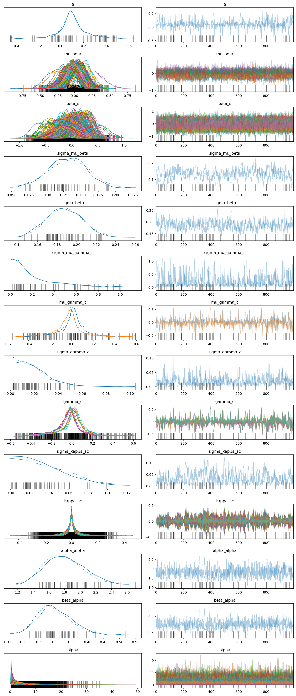


```python
mu_beta_post = az.summary(
    hnb_trace, var_names=["mu_beta"], hdi_prob=HDI_PROB, kind="stats"
).assign(hugo_symbol=hnb_trace.posterior.coords["gene"])

sgrna_to_gene_map = valid_data[["hugo_symbol", "sgrna"]].drop_duplicates()
beta_s_post = (
    az.summary(hnb_trace, var_names=["beta_s"], hdi_prob=HDI_PROB, kind="stats")
    .assign(sgrna=hnb_trace.posterior.coords["sgrna"])
    .merge(sgrna_to_gene_map, on="sgrna")
)
```


```python
(
    gg.ggplot(mu_beta_post, gg.aes(x="hugo_symbol", y="mean"))
    + gg.geom_linerange(gg.aes(ymin="hdi_5.5%", ymax="hdi_94.5%"), alpha=0.3, size=0.8)
    + gg.geom_point(size=1)
    + gg.geom_point(data=beta_s_post, size=0.5, color="blue")
    + gg.scale_y_continuous(expand=(0.02, 0))
    + gg.theme(
        axis_text_x=gg.element_blank(),
        figure_size=(10, 4),
        panel_grid_major_x=gg.element_blank(),
    )
    + gg.labs(x="gene", y=f"gene effects posterior\n(mean and {HDI_LBL} HDI)")
)
```


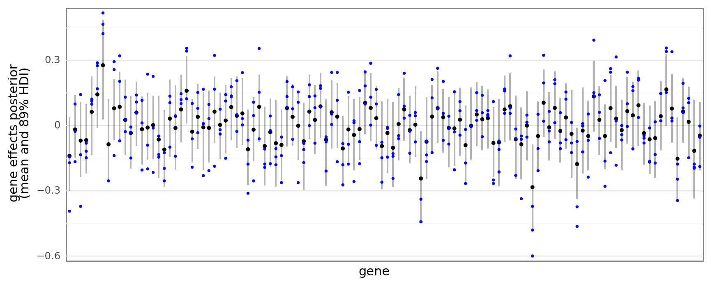


    <ggplot: (376505242)>


```python
mu_gamma_post = az.summary(
    hnb_trace, var_names=["mu_gamma_c"], hdi_prob=HDI_PROB, kind="stats"
).assign(lineage=hnb_trace.posterior.coords["lineage"])
cellline_to_lineage_map = valid_data[["depmap_id", "lineage"]].drop_duplicates()
gamma_post = (
    az.summary(hnb_trace, var_names=["gamma_c"], hdi_prob=HDI_PROB, kind="stats")
    .assign(depmap_id=hnb_trace.posterior.coords["cell_line"])
    .merge(cellline_to_lineage_map, on="depmap_id")
)
```


```python
(
    gg.ggplot(gamma_post, gg.aes(x="depmap_id", y="mean"))
    + gg.facet_wrap("~lineage", nrow=1, scales="free_x")
    + gg.geom_hline(gg.aes(yintercept="mean"), data=mu_gamma_post, linetype="--")
    + gg.geom_linerange(
        gg.aes(ymin="hdi_5.5%", ymax="hdi_94.5%"), alpha=0.3, size=1, color="blue"
    )
    + gg.geom_point(size=1.5, color="blue")
    + gg.scale_y_continuous(expand=(0.02, 0))
    + gg.theme(
        axis_text_x=gg.element_blank(),
        figure_size=(4, 4),
        panel_grid_major_x=gg.element_blank(),
    )
    + gg.labs(x="cell line", y=f"cell line effects posterior\n(mean and {HDI_LBL} HDI)")
)
```


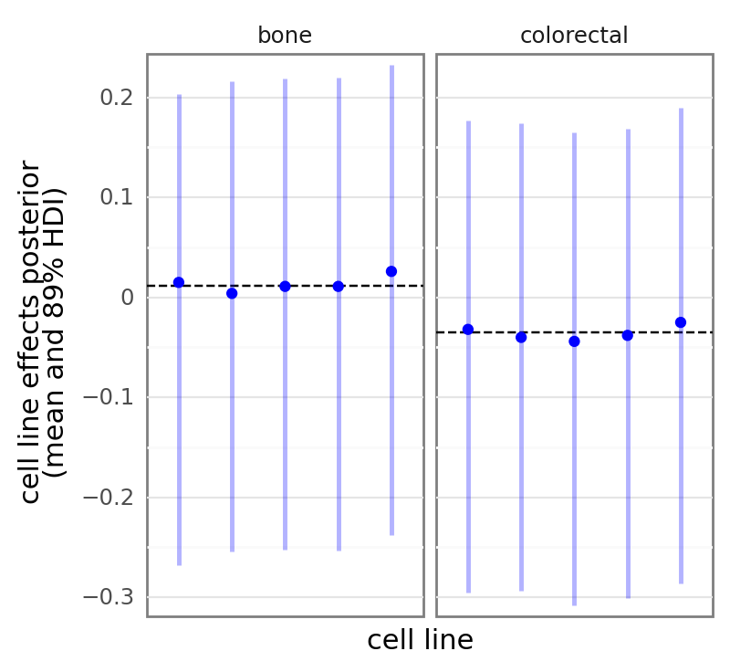


    <ggplot: (375587825)>


```python
def _variable_index_to_coords(
    df: pd.DataFrame, col: str, var_name: str
) -> pd.DataFrame:
    return df.assign(
        coords=lambda d: [
            x.replace(f"{var_name}[", "").replace("]", "").split(",") for x in d[col]
        ]
    )
```


```python
kappa_post = (
    az.summary(hnb_trace, var_names=["kappa_sc"], hdi_prob=HDI_PROB, kind="stats")
    .reset_index(drop=False)
    .pipe(_variable_index_to_coords, col="index", var_name="kappa_sc")
    .assign(
        sgrna=lambda d: [x[0].strip() for x in d["coords"]],
        depmap_id=lambda d: [x[1].strip() for x in d["coords"]],
    )
    .drop(columns=["coords"])
    .merge(sgrna_to_gene_map, on="sgrna")
    .merge(cellline_to_lineage_map, on="depmap_id")
)
kappa_post.head()
```


<div>
<style scoped>
    .dataframe tbody tr th:only-of-type {
        vertical-align: middle;
    }

    .dataframe tbody tr th {
        vertical-align: top;
    }

    .dataframe thead th {
        text-align: right;
    }
</style>
<table border="1" class="dataframe">
  <thead>
    <tr style="text-align: right;">
      <th></th>
      <th>index</th>
      <th>mean</th>
      <th>sd</th>
      <th>hdi_5.5%</th>
      <th>hdi_94.5%</th>
      <th>sgrna</th>
      <th>depmap_id</th>
      <th>hugo_symbol</th>
      <th>lineage</th>
    </tr>
  </thead>
  <tbody>
    <tr>
      <th>0</th>
      <td>kappa_sc[AAACTTGCTGACGTGCCTGG, ACH-000007]</td>
      <td>-0.000</td>
      <td>0.045</td>
      <td>-0.072</td>
      <td>0.061</td>
      <td>AAACTTGCTGACGTGCCTGG</td>
      <td>ACH-000007</td>
      <td>USP46</td>
      <td>colorectal</td>
    </tr>
    <tr>
      <th>1</th>
      <td>kappa_sc[AACAACTAACTTTGTACAT, ACH-000007]</td>
      <td>-0.004</td>
      <td>0.043</td>
      <td>-0.065</td>
      <td>0.061</td>
      <td>AACAACTAACTTTGTACAT</td>
      <td>ACH-000007</td>
      <td>IMPA1</td>
      <td>colorectal</td>
    </tr>
    <tr>
      <th>2</th>
      <td>kappa_sc[AACAGCTCGTTGTACCGCT, ACH-000007]</td>
      <td>-0.003</td>
      <td>0.043</td>
      <td>-0.062</td>
      <td>0.069</td>
      <td>AACAGCTCGTTGTACCGCT</td>
      <td>ACH-000007</td>
      <td>CTNNB1</td>
      <td>colorectal</td>
    </tr>
    <tr>
      <th>3</th>
      <td>kappa_sc[AACCACTCGCTACCGAAGC, ACH-000007]</td>
      <td>0.002</td>
      <td>0.042</td>
      <td>-0.066</td>
      <td>0.060</td>
      <td>AACCACTCGCTACCGAAGC</td>
      <td>ACH-000007</td>
      <td>FUCA2</td>
      <td>colorectal</td>
    </tr>
    <tr>
      <th>4</th>
      <td>kappa_sc[AACGATCTCATCCTCAAAAG, ACH-000007]</td>
      <td>0.000</td>
      <td>0.040</td>
      <td>-0.070</td>
      <td>0.054</td>
      <td>AACGATCTCATCCTCAAAAG</td>
      <td>ACH-000007</td>
      <td>ALKBH8</td>
      <td>colorectal</td>
    </tr>
  </tbody>
</table>
</div>


```python
(
    gg.ggplot(kappa_post, gg.aes(x="depmap_id", y="sgrna", fill="mean"))
    + gg.facet_grid("hugo_symbol ~ lineage", scales="free")
    + gg.geom_tile(color=None)
    + gg.scale_x_discrete(expand=(0, 0.5))
    + gg.scale_fill_gradient2(low="#ca0020", mid="white", high="#0571b0", midpoint=0)
    + gg.theme(
        axis_text_x=gg.element_text(angle=90, size=8),
        axis_text_y=gg.element_blank(),
        figure_size=(3, 25),
        strip_text_x=gg.element_text(size=8),
        strip_text_y=gg.element_text(size=6, angle=0, hjust=0),
        subplots_adjust={"hspace": 0.0},
        panel_border=gg.element_rect(color="gray"),
        panel_grid=gg.element_blank(),
        legend_position="right",
    )
    + gg.labs(x="cell line", y="sgRNA", fill="mean")
)
```


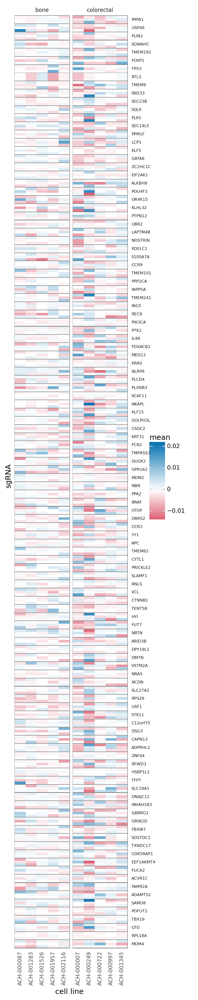


    <ggplot: (375735028)>


```python
sd_posts = az.summary(
    hnb_trace, var_names=["sigma"], filter_vars="like", hdi_prob=HDI_PROB
)
sd_posts
```


<div>
<style scoped>
    .dataframe tbody tr th:only-of-type {
        vertical-align: middle;
    }

    .dataframe tbody tr th {
        vertical-align: top;
    }

    .dataframe thead th {
        text-align: right;
    }
</style>
<table border="1" class="dataframe">
  <thead>
    <tr style="text-align: right;">
      <th></th>
      <th>mean</th>
      <th>sd</th>
      <th>hdi_5.5%</th>
      <th>hdi_94.5%</th>
      <th>mcse_mean</th>
      <th>mcse_sd</th>
      <th>ess_bulk</th>
      <th>ess_tail</th>
      <th>r_hat</th>
    </tr>
  </thead>
  <tbody>
    <tr>
      <th>sigma_mu_beta</th>
      <td>0.131</td>
      <td>0.028</td>
      <td>0.087</td>
      <td>0.177</td>
      <td>0.003</td>
      <td>0.002</td>
      <td>91.0</td>
      <td>249.0</td>
      <td>1.01</td>
    </tr>
    <tr>
      <th>sigma_beta</th>
      <td>0.188</td>
      <td>0.018</td>
      <td>0.156</td>
      <td>0.215</td>
      <td>0.001</td>
      <td>0.001</td>
      <td>285.0</td>
      <td>452.0</td>
      <td>1.00</td>
    </tr>
    <tr>
      <th>sigma_mu_gamma_c</th>
      <td>0.224</td>
      <td>0.224</td>
      <td>0.000</td>
      <td>0.526</td>
      <td>0.009</td>
      <td>0.006</td>
      <td>581.0</td>
      <td>790.0</td>
      <td>1.00</td>
    </tr>
    <tr>
      <th>sigma_gamma_c</th>
      <td>0.018</td>
      <td>0.014</td>
      <td>0.000</td>
      <td>0.036</td>
      <td>0.001</td>
      <td>0.000</td>
      <td>509.0</td>
      <td>553.0</td>
      <td>1.01</td>
    </tr>
    <tr>
      <th>sigma_kappa_sc</th>
      <td>0.035</td>
      <td>0.026</td>
      <td>0.000</td>
      <td>0.071</td>
      <td>0.002</td>
      <td>0.002</td>
      <td>143.0</td>
      <td>311.0</td>
      <td>1.01</td>
    </tr>
  </tbody>
</table>
</div>


```python
sd_post_draws = pd.DataFrame()
for varname in sd_posts.index.values:
    _x = hnb_trace.posterior.get(varname).values.flatten()
    _df = pd.DataFrame({"value": _x}).assign(var_name=varname)
    sd_post_draws = pd.concat([sd_post_draws, _df])
```


```python
(
    gg.ggplot(sd_post_draws, gg.aes(x="value", color="var_name", fill="var_name"))
    + gg.geom_density(alpha=0.1)
    + gg.scale_x_continuous(expand=(0, 0), limits=(0, 2))
    + gg.scale_y_continuous(expand=(0, 0, 0.02, 0))
    + gg.scale_color_brewer(
        type="qual", palette="Set1", guide=gg.guide_legend(override_aes={"alpha": 0.6})
    )
    + gg.scale_fill_brewer(type="qual", palette="Set1")
    + gg.theme(
        figure_size=(6, 4),
        legend_position=(0.75, 0.6),
        legend_background=gg.element_blank(),
    )
    + gg.labs(x="posterior", y="probability density", color="variable", fill="variable")
)
```


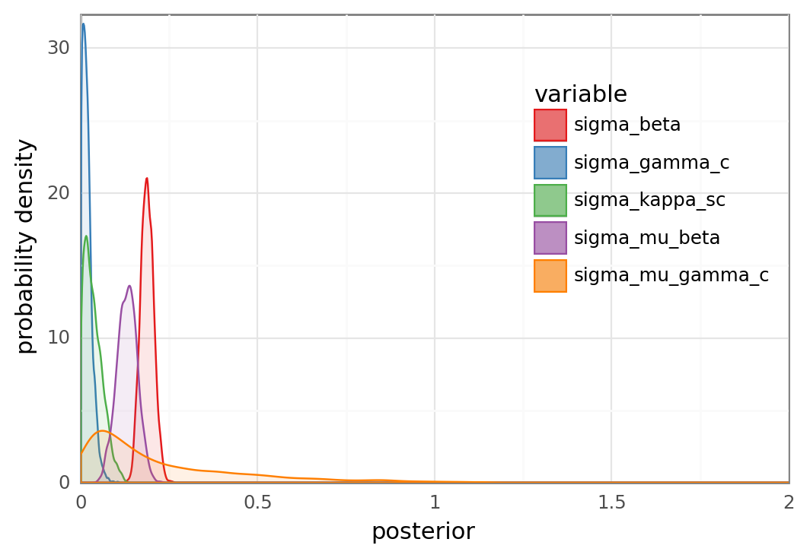


    <ggplot: (353610487)>


```python
az.plot_trace(hnb_trace, var_names=["sigma"], filter_vars="like")
plt.tight_layout();
```


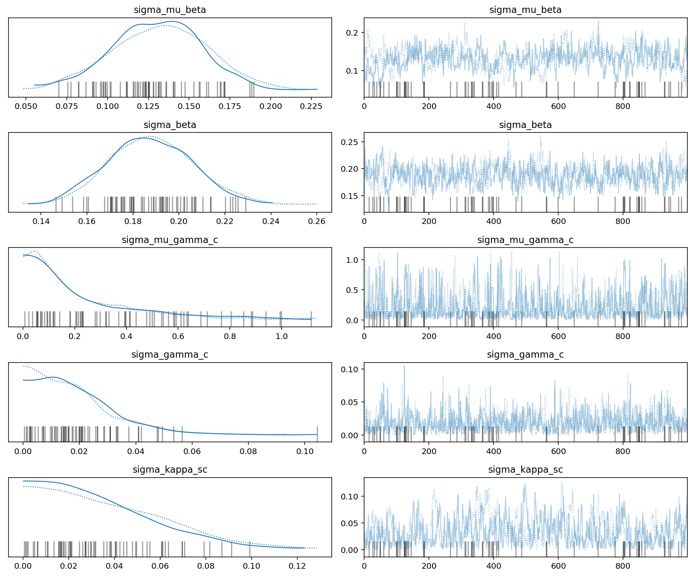


```python
sigma_gamma_post_draws = hnb_trace.posterior["sigma_gamma_c"].values.flatten()
divergences = hnb_trace.sample_stats.diverging.values.flatten()
N_CELL_LINES = valid_data.depmap_id.nunique()
gamma_post_draws = hnb_trace.posterior["gamma_c"].values.reshape(-1, N_CELL_LINES)

gamma_post_draws_df = (
    pd.DataFrame(
        gamma_post_draws, columns=hnb_trace.posterior.coords["cell_line"].values
    )
    .assign(sigma_gamma=sigma_gamma_post_draws, divergence=divergences)
    .reset_index(drop=False)
    .pivot_longer(index=["index", "sigma_gamma", "divergence"], names_to="depmap_id")
)
gamma_post_draws_df.head()
```


<div>
<style scoped>
    .dataframe tbody tr th:only-of-type {
        vertical-align: middle;
    }

    .dataframe tbody tr th {
        vertical-align: top;
    }

    .dataframe thead th {
        text-align: right;
    }
</style>
<table border="1" class="dataframe">
  <thead>
    <tr style="text-align: right;">
      <th></th>
      <th>index</th>
      <th>sigma_gamma</th>
      <th>divergence</th>
      <th>depmap_id</th>
      <th>value</th>
    </tr>
  </thead>
  <tbody>
    <tr>
      <th>0</th>
      <td>0</td>
      <td>0.016342</td>
      <td>False</td>
      <td>ACH-000007</td>
      <td>-0.071051</td>
    </tr>
    <tr>
      <th>1</th>
      <td>1</td>
      <td>0.014862</td>
      <td>False</td>
      <td>ACH-000007</td>
      <td>0.212257</td>
    </tr>
    <tr>
      <th>2</th>
      <td>2</td>
      <td>0.000599</td>
      <td>False</td>
      <td>ACH-000007</td>
      <td>-0.037676</td>
    </tr>
    <tr>
      <th>3</th>
      <td>3</td>
      <td>0.013518</td>
      <td>False</td>
      <td>ACH-000007</td>
      <td>-0.018243</td>
    </tr>
    <tr>
      <th>4</th>
      <td>4</td>
      <td>0.009521</td>
      <td>False</td>
      <td>ACH-000007</td>
      <td>0.006166</td>
    </tr>
  </tbody>
</table>
</div>


```python
def organize_group_mean_against_stddev(
    trace: az.InferenceData, sd_var: str, mu_var: str, coord: str
) -> pd.DataFrame:
    groups = trace.posterior.coords[coord].values
    sd_post_draws = trace.posterior[sd_var].values.flatten()
    divergences = trace.sample_stats.diverging.values.flatten()
    mu_post_draws = trace.posterior[mu_var].values.reshape(-1, len(groups))

    post_draws_df = (
        pd.DataFrame(mu_post_draws, columns=groups)
        .assign(__sd_var=sd_post_draws, divergence=divergences)
        .reset_index(drop=False)
        .pivot_longer(
            index=["index", "__sd_var", "divergence"], names_to=coord, values_to=mu_var
        )
        .rename(columns={"__sd_var": sd_var})
    )
    return post_draws_df


def plot_group_mean_against_stddev(
    sd_and_mu_df: pd.DataFrame, x: str, y: str, fct: str
) -> gg.ggplot:
    return (
        gg.ggplot(sd_and_mu_df.sort_values("divergence"), gg.aes(x=x, y=y))
        + gg.facet_wrap(f"~{fct}")
        + gg.geom_point(gg.aes(color="divergence"), size=0.7, alpha=0.7)
        + gg.scale_color_manual(values={True: "red", False: "k"})
    )
```


```python
gamma_post_draws_df = organize_group_mean_against_stddev(
    hnb_trace, sd_var="sigma_gamma_c", mu_var="gamma_c", coord="cell_line"
)
plot_group_mean_against_stddev(
    gamma_post_draws_df, x="gamma_c", y="np.log10(sigma_gamma_c)", fct="cell_line"
) + gg.theme(figure_size=(8, 8))
```


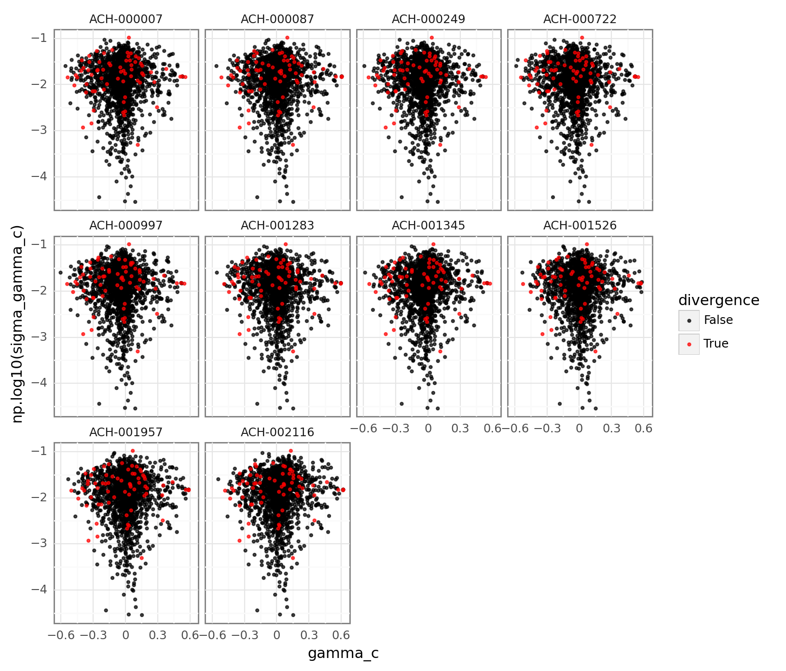


    <ggplot: (354035929)>


```python
mu_gamma_post_draws_df = organize_group_mean_against_stddev(
    hnb_trace, sd_var="sigma_mu_gamma_c", mu_var="mu_gamma_c", coord="lineage"
)
(
    plot_group_mean_against_stddev(
        mu_gamma_post_draws_df,
        x="mu_gamma_c",
        y="np.log10(sigma_mu_gamma_c)",
        fct="lineage",
    )
    + gg.theme(figure_size=(6, 4))
)
```


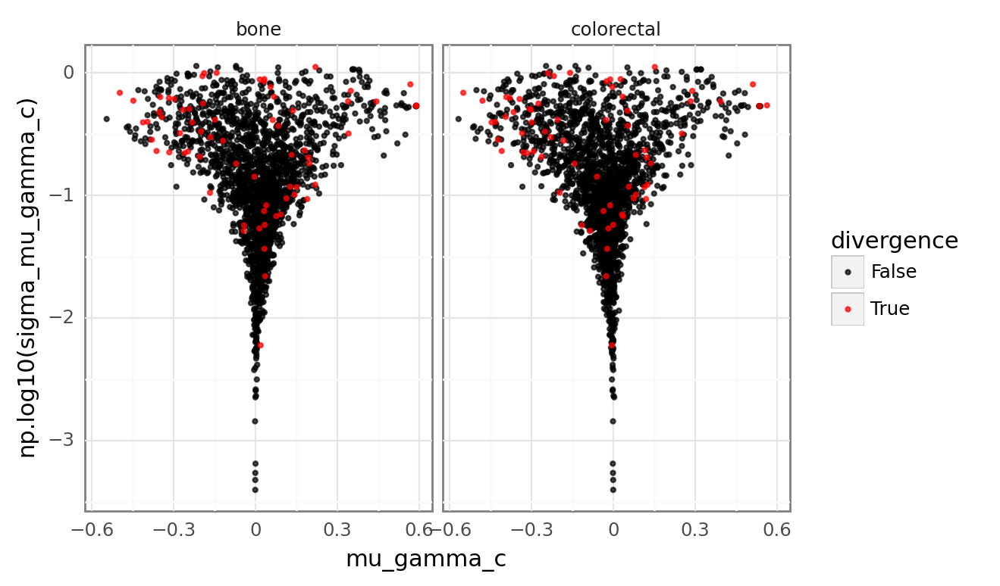


    <ggplot: (354588820)>


```python

```


```python

```

### Posterior predictive check


```python
hnb_ppc = hnb_trace.posterior_predictive["ct_final"].values.reshape(
    -1, valid_data.shape[0]
)
hnb_ppc.shape
```


    (2000, 2188)


```python
hnb_ppc_sample = (
    pd.DataFrame(hnb_ppc[::80, :].T)
    .reset_index(drop=False)
    .rename(columns={"index": "data_idx"})
    .pivot_longer(index="data_idx", names_to="ppc_draw", values_to="counts_final")
)
print(f"num. examples: {len(hnb_ppc_sample.ppc_draw.unique())}")

hnb_ppc_avg = pd.DataFrame({"counts_final": np.median(hnb_ppc, axis=0)})
ppc_hdi = az.hdi(hnb_ppc, hdi_prob=HDI_PROB)
hnb_ppc_avg["hdi_low"] = ppc_hdi[:, 0]
hnb_ppc_avg["hdi_hi"] = ppc_hdi[:, 1]

plt_df = pd.concat(
    [
        hnb_ppc_sample.assign(lbl="PP draw"),
        hnb_ppc_avg[["counts_final"]].assign(lbl="PP avg.", ppc_draw="PP avg."),
        valid_data[["counts_final"]].assign(lbl="obs.", ppc_draw="obs."),
    ]
)
plt_df.head()
```

    num. examples: 25


    /var/folders/r4/qpcdgl_14hbd412snp1jnv300000gn/T/ipykernel_1541/295761941.py:10: FutureWarning: hdi currently interprets 2d data as (draw, shape) but this will change in a future release to (chain, draw) for coherence with other functions


<div>
<style scoped>
    .dataframe tbody tr th:only-of-type {
        vertical-align: middle;
    }

    .dataframe tbody tr th {
        vertical-align: top;
    }

    .dataframe thead th {
        text-align: right;
    }
</style>
<table border="1" class="dataframe">
  <thead>
    <tr style="text-align: right;">
      <th></th>
      <th>data_idx</th>
      <th>ppc_draw</th>
      <th>counts_final</th>
      <th>lbl</th>
    </tr>
  </thead>
  <tbody>
    <tr>
      <th>0</th>
      <td>0.0</td>
      <td>0</td>
      <td>73.0</td>
      <td>PP draw</td>
    </tr>
    <tr>
      <th>1</th>
      <td>1.0</td>
      <td>0</td>
      <td>509.0</td>
      <td>PP draw</td>
    </tr>
    <tr>
      <th>2</th>
      <td>2.0</td>
      <td>0</td>
      <td>268.0</td>
      <td>PP draw</td>
    </tr>
    <tr>
      <th>3</th>
      <td>3.0</td>
      <td>0</td>
      <td>458.0</td>
      <td>PP draw</td>
    </tr>
    <tr>
      <th>4</th>
      <td>4.0</td>
      <td>0</td>
      <td>212.0</td>
      <td>PP draw</td>
    </tr>
  </tbody>
</table>
</div>


```python
(
    gg.ggplot(plt_df, gg.aes(x="counts_final", color="lbl", group="ppc_draw"))
    + gg.geom_density(gg.aes(size="lbl", linetype="lbl"), alpha=0)
    + gg.scale_x_continuous(expand=(0, 0), limits=(0, 2500))
    + gg.scale_y_continuous(expand=(0, 0, 0.02, 0))
    + gg.scale_color_manual(
        values={"PP draw": "k", "PP avg.": "#6baed6", "obs.": "#dd1c77"},
        guide=gg.guide_legend(override_aes={"size": 1, "fill": "white"}),
    )
    + gg.scale_size_manual(values={"PP draw": 0.1, "PP avg.": 1, "obs.": 1})
    + gg.scale_linetype_manual(values={"PP draw": "--", "PP avg.": "-", "obs.": "-"})
    + gg.theme(
        legend_title=gg.element_blank(),
        legend_position=(0.8, 0.5),
        legend_background=gg.element_blank(),
    )
    + gg.labs(x="final counts", y="density")
)
```

    /usr/local/Caskroom/miniconda/base/envs/speclet/lib/python3.9/site-packages/plotnine/layer.py:324: PlotnineWarning: stat_density : Removed 752 rows containing non-finite values.


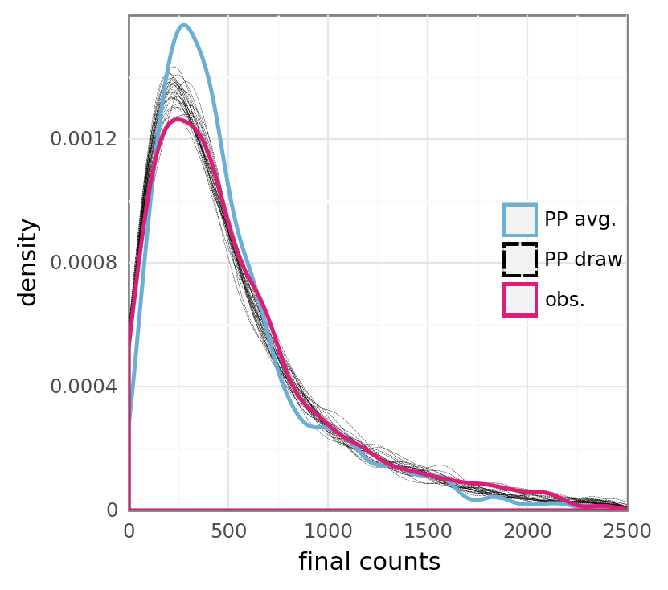


    <ggplot: (354983446)>


```python
plt_df = (
    valid_data.copy()
    .assign(
        ppc_avg=hnb_ppc_avg.counts_final,
        hdi_low=hnb_ppc_avg.hdi_low,
        hdi_hi=hnb_ppc_avg.hdi_hi,
    )
    .reset_index(drop=False)
)
(
    gg.ggplot(plt_df, gg.aes(x="counts_final", y="ppc_avg"))
    + gg.geom_point(size=0.2, alpha=0.5)
    + gg.geom_abline(slope=1, intercept=0, linetype="--", color="blue", size=0.8)
    + gg.geom_smooth(
        formula="y~x", method="lm", linetype="--", color="red", size=0.8, se=False
    )
    + gg.scale_x_continuous(expand=(0, 0, 0.02, 0))
    + gg.scale_y_continuous(expand=(0, 0, 0.02, 0), limits=(0, 3100))
    + gg.labs(x="observed final counts", y="MAP predicted final counts")
)
```

    /usr/local/Caskroom/miniconda/base/envs/speclet/lib/python3.9/site-packages/plotnine/layer.py:401: PlotnineWarning: geom_smooth : Removed 2 rows containing missing values.


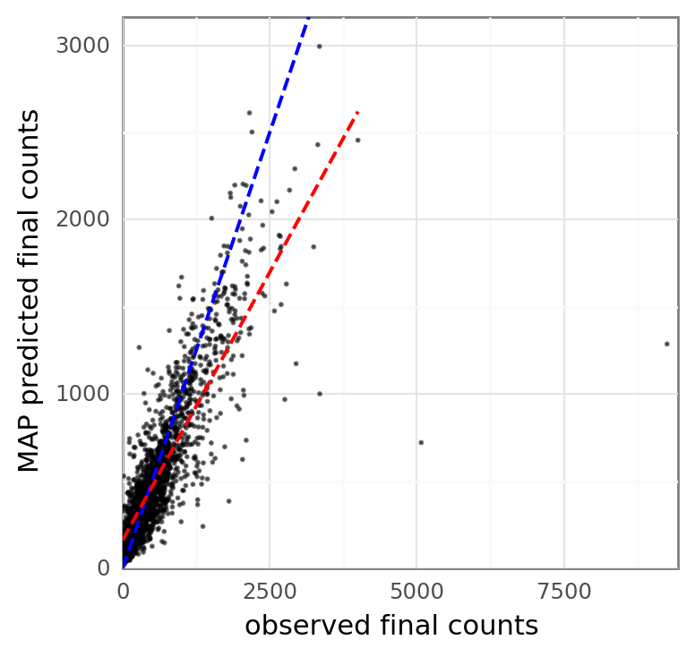


    <ggplot: (355207129)>


```python
(
    gg.ggplot(plt_df, gg.aes(x="counts_final", y="ppc_avg"))
    + gg.geom_point(size=0.2, alpha=0.5)
    + gg.geom_abline(slope=1, intercept=0, linetype="--", color="blue", size=0.8)
    + gg.geom_smooth(
        formula="y~x", method="lm", linetype="--", color="red", size=0.8, se=False
    )
    + gg.scale_x_continuous(expand=(0, 0), limits=(0, 1000))
    + gg.scale_y_continuous(expand=(0, 0), limits=(0, 1000))
    + gg.coord_equal()
    + gg.labs(x="observed final counts", y="MAP predicted final counts")
)
```

    /usr/local/Caskroom/miniconda/base/envs/speclet/lib/python3.9/site-packages/plotnine/layer.py:401: PlotnineWarning: geom_point : Removed 372 rows containing missing values.


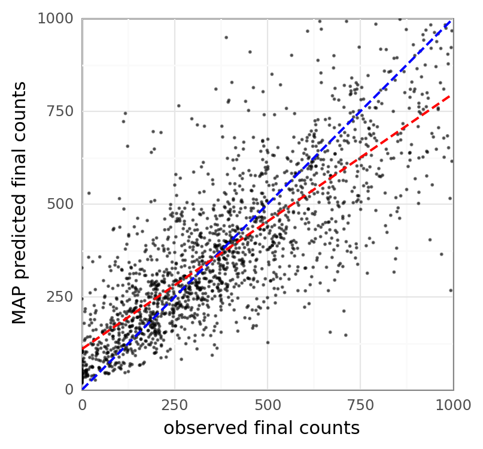


    <ggplot: (354564106)>


```python

```

---


```python
notebook_toc = time()
print(f"execution time: {(notebook_toc - notebook_tic) / 60:.2f} minutes")
```

    execution time: 5.52 minutes


```python
%load_ext watermark
%watermark -d -u -v -iv -b -h -m
```

    Last updated: 2022-01-26

    Python implementation: CPython
    Python version       : 3.9.9
    IPython version      : 8.0.0

    Compiler    : Clang 11.1.0
    OS          : Darwin
    Release     : 21.2.0
    Machine     : x86_64
    Processor   : i386
    CPU cores   : 4
    Architecture: 64bit

    Hostname: JHCookMac

    Git branch: nb-model

    arviz     : 0.11.4
    pandas    : 1.3.5
    seaborn   : 0.11.2
    speclet   : 0.0.9000
    janitor   : 0.22.0
    numpy     : 1.22.0
    matplotlib: 3.5.1
    plotnine  : 0.8.0
