# Brief analysis on model fit with a larger data set

## Setup

```python
%load_ext autoreload
%autoreload 2
```

```python
import re
import warnings
from pathlib import Path
from time import time
from typing import Final

import arviz as az
import matplotlib.pyplot as plt
import numpy as np
import pandas as pd
import plotnine as gg
import pymc3 as pm
import scipy.stats as st
import seaborn as sns
```

```python
from speclet.bayesian_models.hierarchical_nb import HierarchcalNegativeBinomialModel
from speclet.io import DataFile, models_dir
from speclet.managers.data_managers import CrisprScreenDataManager
from speclet.plot.plotnine_helpers import set_gg_theme
from speclet.project_configuration import read_project_configuration
```

```python
# Notebook execution timer.
notebook_tic = time()

# Plotting setup.
set_gg_theme()
%config InlineBackend.figure_format = "retina"

# Constants
RANDOM_SEED = 847
np.random.seed(RANDOM_SEED)
HDI_PROB = read_project_configuration().modeling.highest_density_interval
```

## Data

```python
def read_posterior_summary(fpath: Path) -> pd.DataFrame:
    """Read in a posterior summary data frame."""
    post_summ = pd.read_csv(fpath).assign(
        parameter_name=lambda d: [x.split("[")[0] for x in d.parameter]
    )
    return post_summ
```

```python
hnb_model_dir = models_dir() / "hierarchical-nb_PYMC3_MCMC"
posterior_summary_path = hnb_model_dir / "posterior-summary.csv"
posterior_summary = read_posterior_summary(posterior_summary_path)
posterior_summary.head()
```

<div>
<style scoped>
    .dataframe tbody tr th:only-of-type {
        vertical-align: middle;
    }

    .dataframe tbody tr th {
        vertical-align: top;
    }

    .dataframe thead th {
        text-align: right;
    }
</style>
<table border="1" class="dataframe">
  <thead>
    <tr style="text-align: right;">
      <th></th>
      <th>parameter</th>
      <th>mean</th>
      <th>sd</th>
      <th>hdi_5.5%</th>
      <th>hdi_94.5%</th>
      <th>mcse_mean</th>
      <th>mcse_sd</th>
      <th>ess_bulk</th>
      <th>ess_tail</th>
      <th>r_hat</th>
      <th>parameter_name</th>
    </tr>
  </thead>
  <tbody>
    <tr>
      <th>0</th>
      <td>z</td>
      <td>0.042</td>
      <td>0.005</td>
      <td>0.035</td>
      <td>0.050</td>
      <td>0.000</td>
      <td>0.000</td>
      <td>142.0</td>
      <td>404.0</td>
      <td>1.02</td>
      <td>z</td>
    </tr>
    <tr>
      <th>1</th>
      <td>a[0]</td>
      <td>0.314</td>
      <td>0.087</td>
      <td>0.165</td>
      <td>0.439</td>
      <td>0.001</td>
      <td>0.001</td>
      <td>4659.0</td>
      <td>2956.0</td>
      <td>1.00</td>
      <td>a</td>
    </tr>
    <tr>
      <th>2</th>
      <td>a[1]</td>
      <td>-0.004</td>
      <td>0.060</td>
      <td>-0.106</td>
      <td>0.085</td>
      <td>0.001</td>
      <td>0.001</td>
      <td>2523.0</td>
      <td>3087.0</td>
      <td>1.00</td>
      <td>a</td>
    </tr>
    <tr>
      <th>3</th>
      <td>a[2]</td>
      <td>0.179</td>
      <td>0.060</td>
      <td>0.087</td>
      <td>0.279</td>
      <td>0.001</td>
      <td>0.001</td>
      <td>2254.0</td>
      <td>2605.0</td>
      <td>1.00</td>
      <td>a</td>
    </tr>
    <tr>
      <th>4</th>
      <td>a[3]</td>
      <td>0.196</td>
      <td>0.065</td>
      <td>0.097</td>
      <td>0.303</td>
      <td>0.001</td>
      <td>0.001</td>
      <td>3222.0</td>
      <td>2927.0</td>
      <td>1.00</td>
      <td>a</td>
    </tr>
  </tbody>
</table>
</div>

```python
hnb_model_cls = HierarchcalNegativeBinomialModel()
dm = CrisprScreenDataManager(DataFile.DEPMAP_CRC_BONE_LARGE_SUBSAMPLE)
counts_data = (
    dm.get_data()
    .pipe(hnb_model_cls.data_processing_pipeline)
    .reset_index(drop=False)
    .rename(columns={"index": "data_idx"})
)
counts_data.head()
```

    /var/folders/r4/qpcdgl_14hbd412snp1jnv300000gn/T/ipykernel_56942/1818648733.py:4: DtypeWarning: Columns (3,22) have mixed types.Specify dtype option on import or set low_memory=False.

<div>
<style scoped>
    .dataframe tbody tr th:only-of-type {
        vertical-align: middle;
    }

    .dataframe tbody tr th {
        vertical-align: top;
    }

    .dataframe thead th {
        text-align: right;
    }
</style>
<table border="1" class="dataframe">
  <thead>
    <tr style="text-align: right;">
      <th></th>
      <th>data_idx</th>
      <th>sgrna</th>
      <th>replicate_id</th>
      <th>lfc</th>
      <th>p_dna_batch</th>
      <th>genome_alignment</th>
      <th>hugo_symbol</th>
      <th>screen</th>
      <th>multiple_hits_on_gene</th>
      <th>sgrna_target_chr</th>
      <th>...</th>
      <th>is_mutated</th>
      <th>copy_number</th>
      <th>lineage</th>
      <th>primary_or_metastasis</th>
      <th>is_male</th>
      <th>age</th>
      <th>counts_final_total</th>
      <th>counts_initial_total</th>
      <th>counts_final_rpm</th>
      <th>counts_initial_adj</th>
    </tr>
  </thead>
  <tbody>
    <tr>
      <th>0</th>
      <td>0</td>
      <td>AAAGCCCAGGAGTATGGGAG</td>
      <td>LS513-311Cas9_RepA_p6_batch2</td>
      <td>0.594321</td>
      <td>2</td>
      <td>chr2_130522105_-</td>
      <td>CFC1B</td>
      <td>broad</td>
      <td>True</td>
      <td>2</td>
      <td>...</td>
      <td>False</td>
      <td>0.951337</td>
      <td>colorectal</td>
      <td>primary</td>
      <td>True</td>
      <td>63.0</td>
      <td>35176093</td>
      <td>1.072163e+06</td>
      <td>13.309497</td>
      <td>257.442323</td>
    </tr>
    <tr>
      <th>1</th>
      <td>1</td>
      <td>ACTTGTCTCATGAACGTGAT</td>
      <td>LS513-311Cas9_RepA_p6_batch2</td>
      <td>0.475678</td>
      <td>2</td>
      <td>chr2_86917638_+</td>
      <td>RGPD1</td>
      <td>broad</td>
      <td>True</td>
      <td>2</td>
      <td>...</td>
      <td>False</td>
      <td>0.949234</td>
      <td>colorectal</td>
      <td>primary</td>
      <td>True</td>
      <td>63.0</td>
      <td>35176093</td>
      <td>1.072163e+06</td>
      <td>37.928490</td>
      <td>766.756365</td>
    </tr>
    <tr>
      <th>2</th>
      <td>2</td>
      <td>AGAAACTTCACCCCTTTCAT</td>
      <td>LS513-311Cas9_RepA_p6_batch2</td>
      <td>0.296108</td>
      <td>2</td>
      <td>chr16_18543661_+</td>
      <td>NOMO2</td>
      <td>broad</td>
      <td>True</td>
      <td>16</td>
      <td>...</td>
      <td>False</td>
      <td>0.944648</td>
      <td>colorectal</td>
      <td>primary</td>
      <td>True</td>
      <td>63.0</td>
      <td>35176093</td>
      <td>1.072163e+06</td>
      <td>29.513684</td>
      <td>685.044642</td>
    </tr>
    <tr>
      <th>3</th>
      <td>3</td>
      <td>AGCTGAGCGCAGGGACCGGG</td>
      <td>LS513-311Cas9_RepA_p6_batch2</td>
      <td>-0.020788</td>
      <td>2</td>
      <td>chr1_27012633_-</td>
      <td>TENT5B</td>
      <td>broad</td>
      <td>True</td>
      <td>1</td>
      <td>...</td>
      <td>False</td>
      <td>0.961139</td>
      <td>colorectal</td>
      <td>primary</td>
      <td>True</td>
      <td>63.0</td>
      <td>35176093</td>
      <td>1.072163e+06</td>
      <td>4.837834</td>
      <td>142.977169</td>
    </tr>
    <tr>
      <th>4</th>
      <td>4</td>
      <td>ATACTCCTGGGCTTTCGGAG</td>
      <td>LS513-311Cas9_RepA_p6_batch2</td>
      <td>-0.771298</td>
      <td>2</td>
      <td>chr2_130522124_+</td>
      <td>CFC1B</td>
      <td>broad</td>
      <td>True</td>
      <td>2</td>
      <td>...</td>
      <td>False</td>
      <td>0.951337</td>
      <td>colorectal</td>
      <td>primary</td>
      <td>True</td>
      <td>63.0</td>
      <td>35176093</td>
      <td>1.072163e+06</td>
      <td>14.588775</td>
      <td>706.908890</td>
    </tr>
  </tbody>
</table>
<p>5 rows × 29 columns</p>
</div>

```python
data_coords = hnb_model_cls._model_coords(counts_data)

cell_line_lineage_map = (
    counts_data[["depmap_id", "lineage"]].drop_duplicates().reset_index(drop=True)
)

sgrna_gene_map = (
    counts_data[["sgrna", "hugo_symbol"]].drop_duplicates().reset_index(drop=True)
)
```

## Analysis

### Sampling diagnostics

#### R-hat

```python
(
    gg.ggplot(posterior_summary, gg.aes(x="parameter_name", y="r_hat"))
    + gg.geom_boxplot(outlier_size=0.6, outlier_alpha=0.5)
    + gg.theme(axis_text_x=gg.element_text(angle=35, hjust=1))
    + gg.labs(x="parameter", y="$\widehat{R}$")
)
```

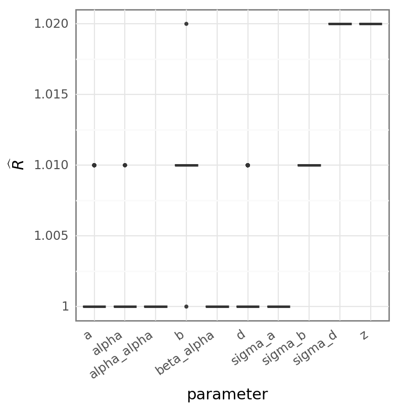

    <ggplot: (355283119)>

```python
max_r_hats = (
    posterior_summary.sort_values("r_hat", ascending=False)
    .groupby("parameter_name")
    .head(1)
)
(
    gg.ggplot(max_r_hats, gg.aes(x="parameter_name", y="r_hat"))
    + gg.geom_linerange(gg.aes(ymax="r_hat"), ymin=1)
    + gg.geom_point()
    + gg.scale_y_continuous(expand=(0, 0, 0.05, 0))
    + gg.theme(axis_text_x=gg.element_text(angle=35, hjust=1))
    + gg.labs(x="parameter", y="maximum $\widehat{R}$")
)
```

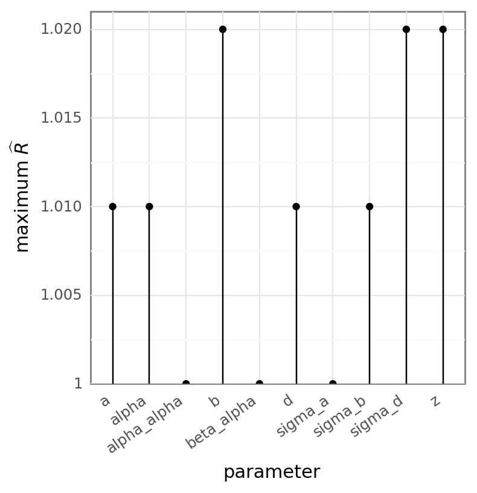

    <ggplot: (355285619)>

#### ESS

```python
(
    gg.ggplot(
        posterior_summary,
        gg.aes(x="parameter_name", y="ess_bulk"),
    )
    + gg.geom_jitter(alpha=0.1, size=0.2, width=0.3, height=0)
    + gg.geom_boxplot(outlier_alpha=0, alpha=0.5, color="red")
    + gg.theme(axis_text_x=gg.element_text(angle=35, hjust=1))
    + gg.labs(x="parameter", y="ESS (bulk)")
)
```

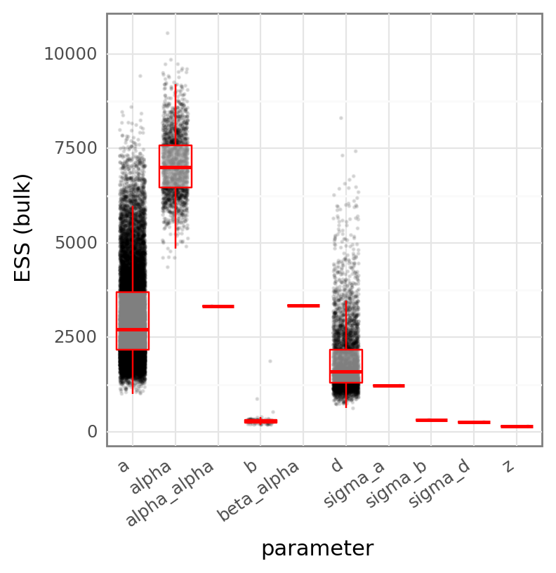

    <ggplot: (357062199)>

```python
min_ess = (
    posterior_summary.sort_values("ess_bulk", ascending=True)
    .groupby("parameter_name")
    .head(1)
)

_breaks = np.arange(0, 5000, 500)

(
    gg.ggplot(min_ess, gg.aes(x="parameter_name", y="ess_bulk"))
    + gg.geom_linerange(gg.aes(ymax="r_hat"), ymin=1)
    + gg.geom_point()
    + gg.scale_y_continuous(expand=(0.02, 0), breaks=_breaks)
    + gg.theme(axis_text_x=gg.element_text(angle=35, hjust=1))
    + gg.labs(x="parameter", y="minimum ESS (bulk)")
)
```

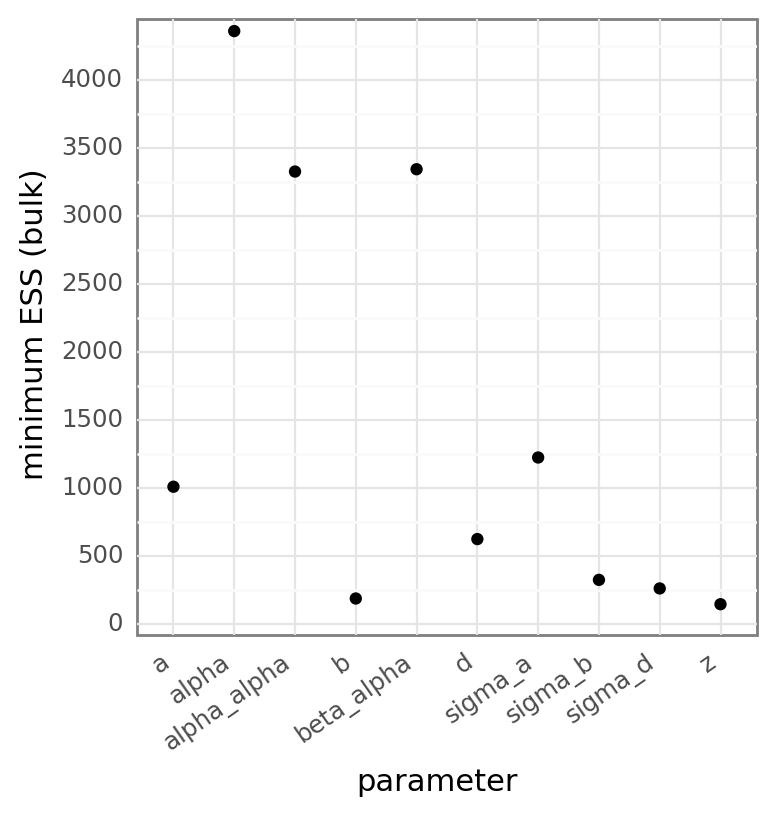

    <ggplot: (356787182)>

### Parameter posteriors

#### $b$: cell line

```python
lineage_pal: Final[dict[str, str]] = {"bone": "darkviolet", "colorectal": "green"}
```

```python
sigma_b_map = posterior_summary.query("parameter_name == 'sigma_b'")["mean"].values[0]

b_posterior = (
    posterior_summary.query("parameter_name == 'b'")
    .reset_index(drop=True)
    .assign(depmap_id=data_coords["cell_line"])
    .merge(cell_line_lineage_map, on="depmap_id")
    .sort_values(["mean"])
    .assign(
        depmap_id=lambda d: pd.Categorical(
            d.depmap_id.values, categories=d.depmap_id.values, ordered=True
        )
    )
)

(
    gg.ggplot(b_posterior, gg.aes(x="depmap_id", y="mean"))
    + gg.geom_hline(yintercept=0, color="gray")
    + gg.geom_hline(yintercept=[-sigma_b_map, sigma_b_map], linetype="--", color="gray")
    + gg.geom_linerange(
        gg.aes(ymin="hdi_5.5%", ymax="hdi_94.5%", color="lineage"), size=0.4
    )
    + gg.geom_point(gg.aes(color="lineage"), size=0.8)
    + gg.scale_color_manual(values=lineage_pal)
    + gg.theme(
        axis_text_x=gg.element_text(angle=90, size=5),
        panel_grid_major_x=gg.element_line(size=0.3, color="lightgray"),
        figure_size=(8, 3),
    )
    + gg.labs(x="cell line", y="posterior $b$\nmean ± 89% HDI")
)
```

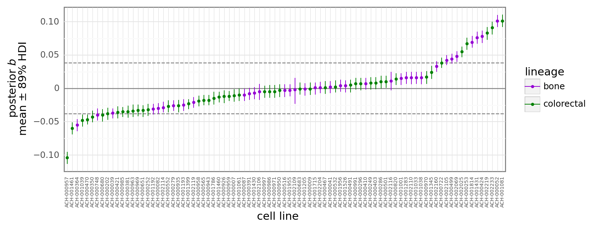

    <ggplot: (355138771)>

#### $a$: sgRNA

```python
a_posterior = (
    posterior_summary.query("parameter_name == 'a'")
    .reset_index(drop=True)
    .assign(sgrna=data_coords["sgrna"])
    .merge(sgrna_gene_map, on="sgrna")
)
a_posterior.head()
```

<div>
<style scoped>
    .dataframe tbody tr th:only-of-type {
        vertical-align: middle;
    }

    .dataframe tbody tr th {
        vertical-align: top;
    }

    .dataframe thead th {
        text-align: right;
    }
</style>
<table border="1" class="dataframe">
  <thead>
    <tr style="text-align: right;">
      <th></th>
      <th>parameter</th>
      <th>mean</th>
      <th>sd</th>
      <th>hdi_5.5%</th>
      <th>hdi_94.5%</th>
      <th>mcse_mean</th>
      <th>mcse_sd</th>
      <th>ess_bulk</th>
      <th>ess_tail</th>
      <th>r_hat</th>
      <th>parameter_name</th>
      <th>sgrna</th>
      <th>hugo_symbol</th>
    </tr>
  </thead>
  <tbody>
    <tr>
      <th>0</th>
      <td>a[0]</td>
      <td>0.314</td>
      <td>0.087</td>
      <td>0.165</td>
      <td>0.439</td>
      <td>0.001</td>
      <td>0.001</td>
      <td>4659.0</td>
      <td>2956.0</td>
      <td>1.0</td>
      <td>a</td>
      <td>GAGCAAATACGAGCACCAAG</td>
      <td>LRP12</td>
    </tr>
    <tr>
      <th>1</th>
      <td>a[1]</td>
      <td>-0.004</td>
      <td>0.060</td>
      <td>-0.106</td>
      <td>0.085</td>
      <td>0.001</td>
      <td>0.001</td>
      <td>2523.0</td>
      <td>3087.0</td>
      <td>1.0</td>
      <td>a</td>
      <td>CATTCTTTAGTGTAGCTAC</td>
      <td>CENPI</td>
    </tr>
    <tr>
      <th>2</th>
      <td>a[2]</td>
      <td>0.179</td>
      <td>0.060</td>
      <td>0.087</td>
      <td>0.279</td>
      <td>0.001</td>
      <td>0.001</td>
      <td>2254.0</td>
      <td>2605.0</td>
      <td>1.0</td>
      <td>a</td>
      <td>GTGTTCCGATTGGAGCCACA</td>
      <td>LPP</td>
    </tr>
    <tr>
      <th>3</th>
      <td>a[3]</td>
      <td>0.196</td>
      <td>0.065</td>
      <td>0.097</td>
      <td>0.303</td>
      <td>0.001</td>
      <td>0.001</td>
      <td>3222.0</td>
      <td>2927.0</td>
      <td>1.0</td>
      <td>a</td>
      <td>TTATTGACACCGAAACCGT</td>
      <td>BCAS3</td>
    </tr>
    <tr>
      <th>4</th>
      <td>a[4]</td>
      <td>0.173</td>
      <td>0.078</td>
      <td>0.058</td>
      <td>0.304</td>
      <td>0.001</td>
      <td>0.001</td>
      <td>3788.0</td>
      <td>3091.0</td>
      <td>1.0</td>
      <td>a</td>
      <td>AAGGTTTTCTGGTAGCAGA</td>
      <td>SLC35E3</td>
    </tr>
  </tbody>
</table>
</div>

```python
(
    gg.ggplot(a_posterior, gg.aes(x="mean"))
    + gg.geom_density()
    + gg.scale_x_continuous(expand=(0, 0))
    + gg.scale_y_continuous(expand=(0, 0, 0.02, 0))
    + gg.theme(figure_size=(6, 4))
    + gg.labs(x="$a$ MAP estimates")
)
```

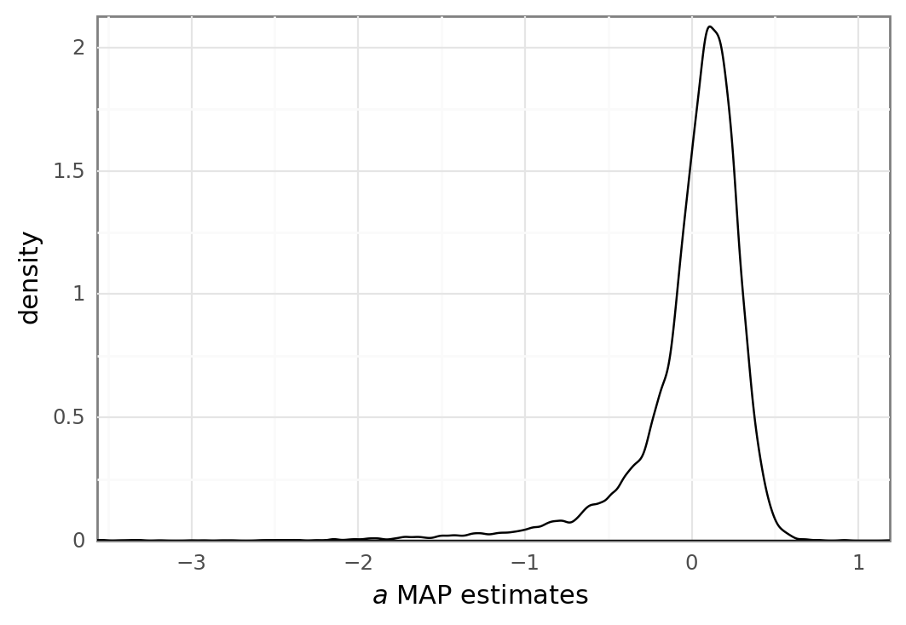

    <ggplot: (354504689)>

```python
def min_max(df: pd.DataFrame, n: int, drop_idx: bool = True) -> pd.DataFrame:
    """Get the top and botton `n` rows of a data frame."""
    return pd.concat([df.head(n), df.tail(n)]).reset_index(drop=drop_idx)


_n_top = 20
a_min_max = (
    a_posterior.sort_values("mean")
    .pipe(min_max, n=_n_top)
    .assign(
        sgrna=lambda d: pd.Categorical(
            d.sgrna.values, categories=d.sgrna.values, ordered=True
        )
    )
)
a_min_max.head()
```

<div>
<style scoped>
    .dataframe tbody tr th:only-of-type {
        vertical-align: middle;
    }

    .dataframe tbody tr th {
        vertical-align: top;
    }

    .dataframe thead th {
        text-align: right;
    }
</style>
<table border="1" class="dataframe">
  <thead>
    <tr style="text-align: right;">
      <th></th>
      <th>parameter</th>
      <th>mean</th>
      <th>sd</th>
      <th>hdi_5.5%</th>
      <th>hdi_94.5%</th>
      <th>mcse_mean</th>
      <th>mcse_sd</th>
      <th>ess_bulk</th>
      <th>ess_tail</th>
      <th>r_hat</th>
      <th>parameter_name</th>
      <th>sgrna</th>
      <th>hugo_symbol</th>
    </tr>
  </thead>
  <tbody>
    <tr>
      <th>0</th>
      <td>a[348]</td>
      <td>-3.567</td>
      <td>0.145</td>
      <td>-3.790</td>
      <td>-3.337</td>
      <td>0.002</td>
      <td>0.001</td>
      <td>5820.0</td>
      <td>2632.0</td>
      <td>1.0</td>
      <td>a</td>
      <td>GTTGACGACAAGGGCGATG</td>
      <td>CRHR2</td>
    </tr>
    <tr>
      <th>1</th>
      <td>a[9682]</td>
      <td>-3.536</td>
      <td>0.149</td>
      <td>-3.758</td>
      <td>-3.285</td>
      <td>0.002</td>
      <td>0.001</td>
      <td>5308.0</td>
      <td>3123.0</td>
      <td>1.0</td>
      <td>a</td>
      <td>GATGGAAGTGGAATCGCCC</td>
      <td>UBP1</td>
    </tr>
    <tr>
      <th>2</th>
      <td>a[16025]</td>
      <td>-3.531</td>
      <td>0.142</td>
      <td>-3.772</td>
      <td>-3.311</td>
      <td>0.002</td>
      <td>0.001</td>
      <td>5369.0</td>
      <td>2937.0</td>
      <td>1.0</td>
      <td>a</td>
      <td>CGACACCACTACCACCCAT</td>
      <td>ASTL</td>
    </tr>
    <tr>
      <th>3</th>
      <td>a[349]</td>
      <td>-3.428</td>
      <td>0.143</td>
      <td>-3.645</td>
      <td>-3.193</td>
      <td>0.002</td>
      <td>0.001</td>
      <td>5352.0</td>
      <td>3065.0</td>
      <td>1.0</td>
      <td>a</td>
      <td>ATATCGTTCACCCTAAACTT</td>
      <td>PSAT1</td>
    </tr>
    <tr>
      <th>4</th>
      <td>a[6869]</td>
      <td>-3.379</td>
      <td>0.137</td>
      <td>-3.585</td>
      <td>-3.154</td>
      <td>0.002</td>
      <td>0.001</td>
      <td>5291.0</td>
      <td>2788.0</td>
      <td>1.0</td>
      <td>a</td>
      <td>CGCCCGCGACAGAAAAGAC</td>
      <td>ANKRD18A</td>
    </tr>
  </tbody>
</table>
</div>

```python
_nudge_y = [-0.2 for _ in range(_n_top)] + [0.2 for _ in range(_n_top)]
_va = ["top" for _ in range(_n_top)] + ["bottom" for _ in range(_n_top)]
(
    gg.ggplot(a_min_max, gg.aes(x="sgrna", y="mean"))
    + gg.geom_hline(yintercept=0, alpha=0.2)
    + gg.geom_linerange(gg.aes(ymin=0, ymax="mean"), alpha=0.2)
    + gg.geom_point(size=1)
    + gg.geom_text(
        gg.aes(label="hugo_symbol"),
        size=7,
        angle=90,
        nudge_y=_nudge_y,
        va=_va,
        fontstyle="italic",
    )
    + gg.scale_y_continuous(expand=(0, 1.0, 0, 0.9))
    + gg.theme(figure_size=(8, 4), axis_text_x=gg.element_text(angle=90, size=6))
    + gg.labs(x="sgRNA", y="$a$ posterior\nmean ± 89% HDI")
)
```

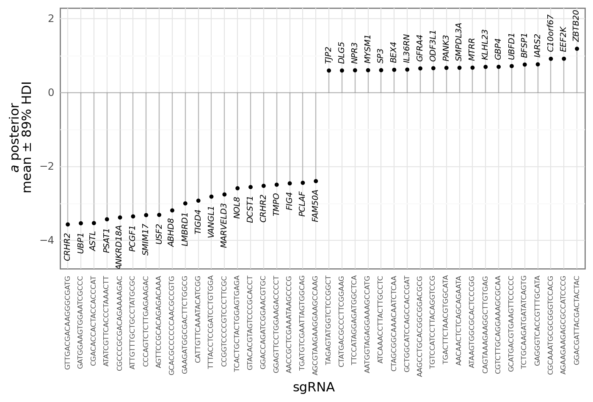

    <ggplot: (355553437)>

```python
a_post_gene_avg = (
    a_posterior.groupby("hugo_symbol")["mean"]
    .median()
    .reset_index(drop=False)
    .sort_values("mean")
    .reset_index(drop=True)
)

_n_top = 20
a_post_gene_avg_minmax = a_post_gene_avg.pipe(min_max, n=_n_top)

_gene_order = a_post_gene_avg_minmax.hugo_symbol.values.astype(str)

a_post_gene_avg_minmax = (
    a_post_gene_avg_minmax.rename(columns={"mean": "gene_mean"})
    .merge(a_posterior, on="hugo_symbol", how="left")
    .assign(
        hugo_symbol=lambda d: pd.Categorical(
            d.hugo_symbol.values, categories=_gene_order, ordered=True
        )
    )
)

a_post_gene_avg_minmax.head()
```

<div>
<style scoped>
    .dataframe tbody tr th:only-of-type {
        vertical-align: middle;
    }

    .dataframe tbody tr th {
        vertical-align: top;
    }

    .dataframe thead th {
        text-align: right;
    }
</style>
<table border="1" class="dataframe">
  <thead>
    <tr style="text-align: right;">
      <th></th>
      <th>hugo_symbol</th>
      <th>gene_mean</th>
      <th>parameter</th>
      <th>mean</th>
      <th>sd</th>
      <th>hdi_5.5%</th>
      <th>hdi_94.5%</th>
      <th>mcse_mean</th>
      <th>mcse_sd</th>
      <th>ess_bulk</th>
      <th>ess_tail</th>
      <th>r_hat</th>
      <th>parameter_name</th>
      <th>sgrna</th>
    </tr>
  </thead>
  <tbody>
    <tr>
      <th>0</th>
      <td>CATSPERE</td>
      <td>-0.5835</td>
      <td>a[10087]</td>
      <td>0.121</td>
      <td>0.057</td>
      <td>0.029</td>
      <td>0.213</td>
      <td>0.001</td>
      <td>0.001</td>
      <td>2012.0</td>
      <td>2893.0</td>
      <td>1.0</td>
      <td>a</td>
      <td>TCATCACTCAGAATGTCTGG</td>
    </tr>
    <tr>
      <th>1</th>
      <td>CATSPERE</td>
      <td>-0.5835</td>
      <td>a[10660]</td>
      <td>0.093</td>
      <td>0.098</td>
      <td>-0.052</td>
      <td>0.258</td>
      <td>0.001</td>
      <td>0.001</td>
      <td>4866.0</td>
      <td>2890.0</td>
      <td>1.0</td>
      <td>a</td>
      <td>TTACCAATCTCCTCACCACG</td>
    </tr>
    <tr>
      <th>2</th>
      <td>CATSPERE</td>
      <td>-0.5835</td>
      <td>a[13265]</td>
      <td>-1.646</td>
      <td>0.164</td>
      <td>-1.925</td>
      <td>-1.401</td>
      <td>0.002</td>
      <td>0.001</td>
      <td>7192.0</td>
      <td>2734.0</td>
      <td>1.0</td>
      <td>a</td>
      <td>GCCATTAATTGACTACCACG</td>
    </tr>
    <tr>
      <th>3</th>
      <td>CATSPERE</td>
      <td>-0.5835</td>
      <td>a[16733]</td>
      <td>-1.260</td>
      <td>0.149</td>
      <td>-1.501</td>
      <td>-1.032</td>
      <td>0.002</td>
      <td>0.001</td>
      <td>5925.0</td>
      <td>2401.0</td>
      <td>1.0</td>
      <td>a</td>
      <td>AAAACACAGCAATCTCCAGA</td>
    </tr>
    <tr>
      <th>4</th>
      <td>PAGE2B</td>
      <td>-0.5125</td>
      <td>a[7061]</td>
      <td>-0.604</td>
      <td>0.062</td>
      <td>-0.706</td>
      <td>-0.510</td>
      <td>0.001</td>
      <td>0.001</td>
      <td>2308.0</td>
      <td>2849.0</td>
      <td>1.0</td>
      <td>a</td>
      <td>TCCCTTCACCTTGAACGGC</td>
    </tr>
  </tbody>
</table>
</div>

```python
(
    gg.ggplot(a_post_gene_avg_minmax, gg.aes(x="hugo_symbol"))
    + gg.geom_boxplot(gg.aes(y="mean"), outlier_alpha=0, color="gray")
    + gg.geom_point(gg.aes(y="gene_mean"), shape="^", color="blue")
    + gg.geom_jitter(gg.aes(y="mean"), width=0.2, height=0, size=0.1)
    + gg.theme(
        figure_size=(8, 4), axis_text_x=gg.element_text(angle=90, size=7, hjust=1)
    )
    + gg.labs(
        x="gene (lowest and highest median $a$ posteriors)",
        y="$a$ posterior\nmean ± 89% HDI",
    )
)
```

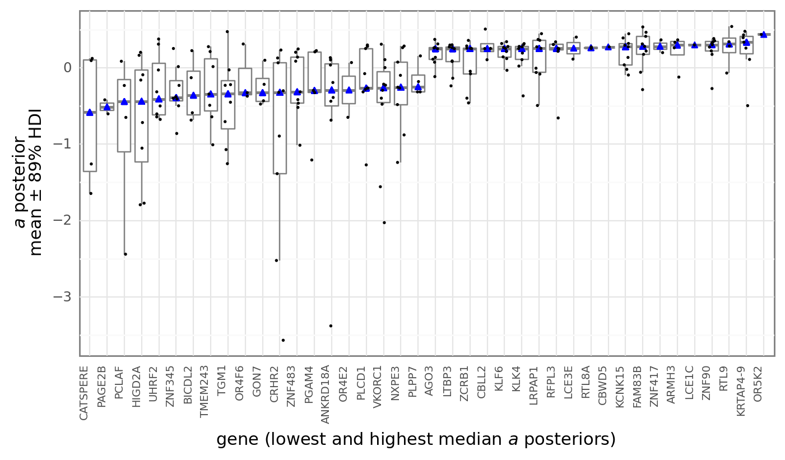

    <ggplot: (353525348)>

#### $d$: gene $\times$ lineage

```python
d_posterior = posterior_summary.query("parameter_name == 'd'").reset_index(drop=True)

_idx = np.asarray(
    [x.replace("]", "").split("[")[1].split(",") for x in d_posterior.parameter],
    dtype=int,
)
d_posterior["hugo_symbol"] = [data_coords["gene"][i] for i in _idx[:, 0]]
d_posterior["lineage"] = [data_coords["lineage"][i] for i in _idx[:, 1]]


d_posterior.head()
```

<div>
<style scoped>
    .dataframe tbody tr th:only-of-type {
        vertical-align: middle;
    }

    .dataframe tbody tr th {
        vertical-align: top;
    }

    .dataframe thead th {
        text-align: right;
    }
</style>
<table border="1" class="dataframe">
  <thead>
    <tr style="text-align: right;">
      <th></th>
      <th>parameter</th>
      <th>mean</th>
      <th>sd</th>
      <th>hdi_5.5%</th>
      <th>hdi_94.5%</th>
      <th>mcse_mean</th>
      <th>mcse_sd</th>
      <th>ess_bulk</th>
      <th>ess_tail</th>
      <th>r_hat</th>
      <th>parameter_name</th>
      <th>hugo_symbol</th>
      <th>lineage</th>
    </tr>
  </thead>
  <tbody>
    <tr>
      <th>0</th>
      <td>d[0,0]</td>
      <td>-0.002</td>
      <td>0.038</td>
      <td>-0.059</td>
      <td>0.060</td>
      <td>0.001</td>
      <td>0.001</td>
      <td>973.0</td>
      <td>2159.0</td>
      <td>1.00</td>
      <td>d</td>
      <td>ALAD</td>
      <td>bone</td>
    </tr>
    <tr>
      <th>1</th>
      <td>d[0,1]</td>
      <td>0.025</td>
      <td>0.037</td>
      <td>-0.035</td>
      <td>0.083</td>
      <td>0.001</td>
      <td>0.001</td>
      <td>911.0</td>
      <td>1550.0</td>
      <td>1.00</td>
      <td>d</td>
      <td>ALAD</td>
      <td>colorectal</td>
    </tr>
    <tr>
      <th>2</th>
      <td>d[1,0]</td>
      <td>-0.001</td>
      <td>0.038</td>
      <td>-0.059</td>
      <td>0.062</td>
      <td>0.001</td>
      <td>0.001</td>
      <td>1319.0</td>
      <td>2430.0</td>
      <td>1.01</td>
      <td>d</td>
      <td>C14orf178</td>
      <td>bone</td>
    </tr>
    <tr>
      <th>3</th>
      <td>d[1,1]</td>
      <td>0.006</td>
      <td>0.038</td>
      <td>-0.058</td>
      <td>0.065</td>
      <td>0.001</td>
      <td>0.001</td>
      <td>1263.0</td>
      <td>2169.0</td>
      <td>1.01</td>
      <td>d</td>
      <td>C14orf178</td>
      <td>colorectal</td>
    </tr>
    <tr>
      <th>4</th>
      <td>d[2,0]</td>
      <td>-0.012</td>
      <td>0.041</td>
      <td>-0.073</td>
      <td>0.057</td>
      <td>0.001</td>
      <td>0.001</td>
      <td>2434.0</td>
      <td>2330.0</td>
      <td>1.00</td>
      <td>d</td>
      <td>ERAP1</td>
      <td>bone</td>
    </tr>
  </tbody>
</table>
</div>

```python
(
    gg.ggplot(d_posterior, gg.aes(x="hugo_symbol", y="lineage"))
    + gg.geom_tile(gg.aes(fill="mean"), color=None)
    + gg.scale_y_discrete(expand=(0, 0.5))
    + gg.scale_fill_gradient2(low="#3A4CC0", high="#B30326")
    + gg.theme(
        figure_size=(8, 1),
        axis_text_x=gg.element_blank(),
        legend_position=(0.2, -0.4),
        legend_direction="horizontal",
        legend_key_width=10,
        legend_background=gg.element_blank(),
        legend_text=gg.element_text(angle=90, size=7, va="bottom"),
        panel_background=gg.element_blank(),
        panel_border=gg.element_blank(),
    )
    + gg.labs(x="gene", y="lineage", fill="$d$ MAP")
)
```

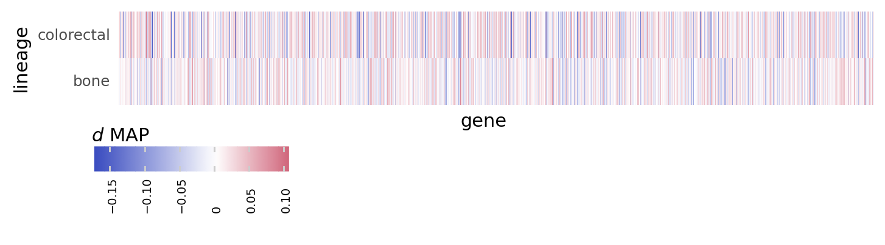

    <ggplot: (355640381)>

```python
top_d_genes = d_posterior.sort_values("mean").pipe(min_max, n=30).hugo_symbol.unique()
d_posterior_top = d_posterior.filter_column_isin("hugo_symbol", top_d_genes)

(
    gg.ggplot(d_posterior_top, gg.aes(x="hugo_symbol", y="lineage"))
    + gg.geom_tile(gg.aes(fill="mean"), color=None)
    + gg.scale_y_discrete(expand=(0, 0.5))
    + gg.scale_fill_gradient2(low="#3A4CC0", high="#B30326")
    + gg.theme(
        figure_size=(8, 1),
        axis_text_x=gg.element_text(angle=90, hjust=1, size=7),
        panel_background=gg.element_blank(),
        panel_border=gg.element_blank(),
    )
    + gg.labs(x="gene", y="lineage", fill="$d$ MAP")
)
```

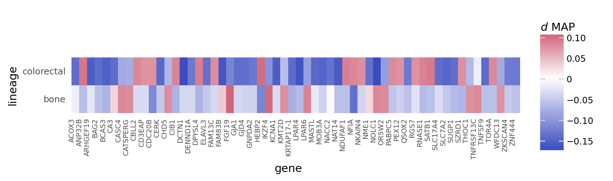

    <ggplot: (356083219)>

```python
sigma_d_map = posterior_summary.query("parameter== 'sigma_d'")["mean"].values[0]

d_posterior_diff = (
    d_posterior[["mean", "hugo_symbol", "lineage"]]
    .pivot_wider(index="hugo_symbol", names_from="lineage", values_from="mean")
    .assign(diff=lambda d: d.bone - d.colorectal)
)

most_diff_d = (
    d_posterior_diff.sort_values("diff").pipe(min_max, n=20).hugo_symbol.values
)

plot_df = d_posterior.filter_column_isin("hugo_symbol", most_diff_d).assign(
    hugo_symbol=lambda d: pd.Categorical(
        d.hugo_symbol, categories=most_diff_d, ordered=True
    )
)

(
    gg.ggplot(plot_df, gg.aes(x="hugo_symbol", y="mean", color="lineage"))
    + gg.geom_hline(yintercept=0, color="gray")
    + gg.geom_hline(yintercept=[-sigma_d_map, sigma_d_map], linetype="--", color="gray")
    + gg.geom_linerange(gg.aes(ymin="hdi_5.5%", ymax="hdi_94.5%"))
    + gg.geom_point()
    + gg.scale_color_manual(values=lineage_pal)
    + gg.theme(axis_text_x=gg.element_text(angle=90, size=8), figure_size=(8, 4))
    + gg.labs(x="gene", y="$d$ posterior\nmean ± 89% HDI")
)
```

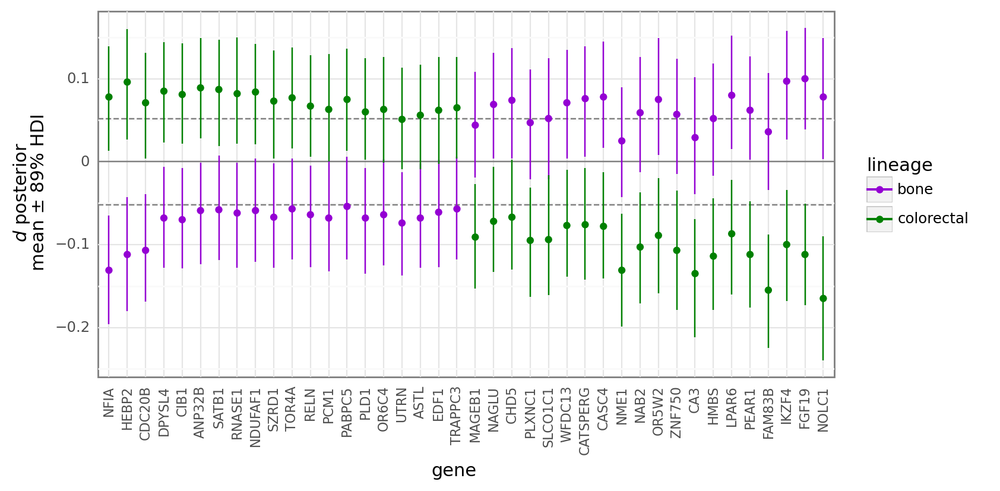

    <ggplot: (356746999)>

```python
plot_df = counts_data.filter_column_isin("hugo_symbol", most_diff_d).assign(
    hugo_symbol=lambda d: pd.Categorical(
        d.hugo_symbol, categories=most_diff_d, ordered=True
    )
)
(
    gg.ggplot(plot_df, gg.aes(x="hugo_symbol", y="lfc"))
    + gg.geom_boxplot(gg.aes(color="lineage"), outlier_alpha=0)
    + gg.scale_color_manual(values=lineage_pal)
    + gg.scale_y_continuous(limits=(-3, 1.5))
    + gg.theme(axis_text_x=gg.element_text(angle=90, size=8), figure_size=(8, 4))
    + gg.labs(x="gene", y="log-fold change")
)
```

    /usr/local/Caskroom/miniconda/base/envs/speclet/lib/python3.9/site-packages/plotnine/layer.py:324: PlotnineWarning: stat_boxplot : Removed 78 rows containing non-finite values.

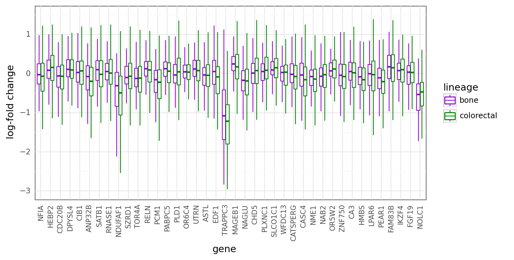

    <ggplot: (357135613)>

#### $\alpha$: gene dispersion

```python
posterior_summary.filter_string("parameter_name", "_alpha")
```

<div>
<style scoped>
    .dataframe tbody tr th:only-of-type {
        vertical-align: middle;
    }

    .dataframe tbody tr th {
        vertical-align: top;
    }

    .dataframe thead th {
        text-align: right;
    }
</style>
<table border="1" class="dataframe">
  <thead>
    <tr style="text-align: right;">
      <th></th>
      <th>parameter</th>
      <th>mean</th>
      <th>sd</th>
      <th>hdi_5.5%</th>
      <th>hdi_94.5%</th>
      <th>mcse_mean</th>
      <th>mcse_sd</th>
      <th>ess_bulk</th>
      <th>ess_tail</th>
      <th>r_hat</th>
      <th>parameter_name</th>
    </tr>
  </thead>
  <tbody>
    <tr>
      <th>21045</th>
      <td>alpha_alpha</td>
      <td>3.680</td>
      <td>0.110</td>
      <td>3.512</td>
      <td>3.866</td>
      <td>0.002</td>
      <td>0.001</td>
      <td>3324.0</td>
      <td>3128.0</td>
      <td>1.0</td>
      <td>alpha_alpha</td>
    </tr>
    <tr>
      <th>21046</th>
      <td>beta_alpha</td>
      <td>0.529</td>
      <td>0.017</td>
      <td>0.501</td>
      <td>0.555</td>
      <td>0.000</td>
      <td>0.000</td>
      <td>3341.0</td>
      <td>2910.0</td>
      <td>1.0</td>
      <td>beta_alpha</td>
    </tr>
  </tbody>
</table>
</div>

```python
x = np.linspace(0, 20, 500)
alpha = posterior_summary.query("parameter_name == 'alpha_alpha'")["mean"].values[0]
beta = posterior_summary.query("parameter_name == 'beta_alpha'")["mean"].values[0]
pdf = st.gamma.pdf(x, alpha, scale=1.0 / beta)

alpha_parent_dist = pd.DataFrame({"x": x, "pdf": pdf})
```

```python
alpha_posterior = (
    posterior_summary.query("parameter_name == 'alpha'")
    .reset_index(drop=True)
    .assign(hugo_symbol=data_coords["gene"])
)
alpha_posterior.head()
```

<div>
<style scoped>
    .dataframe tbody tr th:only-of-type {
        vertical-align: middle;
    }

    .dataframe tbody tr th {
        vertical-align: top;
    }

    .dataframe thead th {
        text-align: right;
    }
</style>
<table border="1" class="dataframe">
  <thead>
    <tr style="text-align: right;">
      <th></th>
      <th>parameter</th>
      <th>mean</th>
      <th>sd</th>
      <th>hdi_5.5%</th>
      <th>hdi_94.5%</th>
      <th>mcse_mean</th>
      <th>mcse_sd</th>
      <th>ess_bulk</th>
      <th>ess_tail</th>
      <th>r_hat</th>
      <th>parameter_name</th>
      <th>hugo_symbol</th>
    </tr>
  </thead>
  <tbody>
    <tr>
      <th>0</th>
      <td>alpha[0]</td>
      <td>11.514</td>
      <td>0.761</td>
      <td>10.304</td>
      <td>12.702</td>
      <td>0.009</td>
      <td>0.006</td>
      <td>8002.0</td>
      <td>2752.0</td>
      <td>1.0</td>
      <td>alpha</td>
      <td>ALAD</td>
    </tr>
    <tr>
      <th>1</th>
      <td>alpha[1]</td>
      <td>9.574</td>
      <td>0.647</td>
      <td>8.579</td>
      <td>10.636</td>
      <td>0.008</td>
      <td>0.006</td>
      <td>6600.0</td>
      <td>2627.0</td>
      <td>1.0</td>
      <td>alpha</td>
      <td>C14orf178</td>
    </tr>
    <tr>
      <th>2</th>
      <td>alpha[2]</td>
      <td>4.555</td>
      <td>0.312</td>
      <td>4.098</td>
      <td>5.082</td>
      <td>0.004</td>
      <td>0.003</td>
      <td>6702.0</td>
      <td>2841.0</td>
      <td>1.0</td>
      <td>alpha</td>
      <td>ERAP1</td>
    </tr>
    <tr>
      <th>3</th>
      <td>alpha[3]</td>
      <td>8.987</td>
      <td>0.592</td>
      <td>8.066</td>
      <td>9.936</td>
      <td>0.007</td>
      <td>0.005</td>
      <td>6803.0</td>
      <td>2756.0</td>
      <td>1.0</td>
      <td>alpha</td>
      <td>PARD3B</td>
    </tr>
    <tr>
      <th>4</th>
      <td>alpha[4]</td>
      <td>9.101</td>
      <td>0.582</td>
      <td>8.174</td>
      <td>10.002</td>
      <td>0.007</td>
      <td>0.005</td>
      <td>6317.0</td>
      <td>2917.0</td>
      <td>1.0</td>
      <td>alpha</td>
      <td>BHLHB9</td>
    </tr>
  </tbody>
</table>
</div>

```python
(
    gg.ggplot(alpha_posterior, gg.aes(x="mean"))
    + gg.geom_density()
    + gg.geom_line(gg.aes(x="x", y="pdf"), data=alpha_parent_dist, color="blue")
    + gg.scale_x_continuous(expand=(0, 0))
    + gg.scale_y_continuous(expand=(0, 0, 0.02, 0))
    + gg.labs(x="$\\alpha$ MAP")
)
```

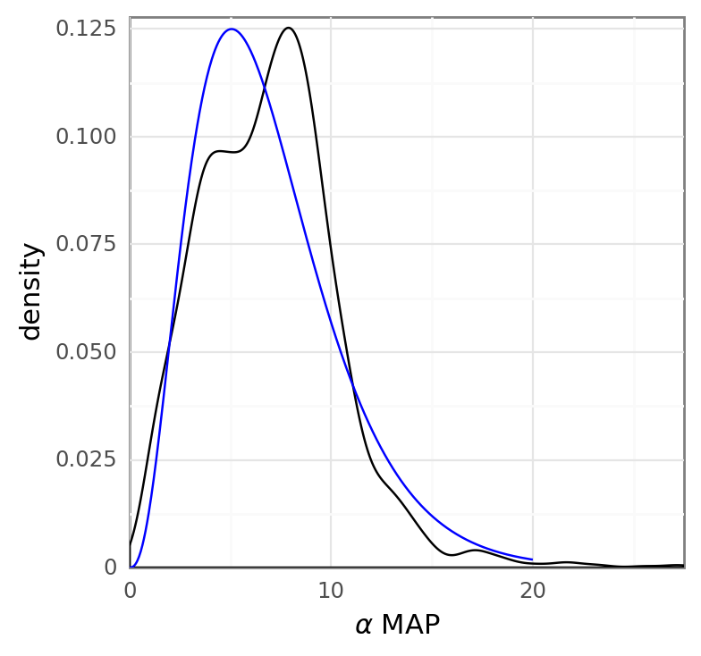

    <ggplot: (357467862)>

### Posterior predictions

```python
def read_posterior_pred(fpath: Path) -> pd.DataFrame:
    return pd.read_csv(fpath).rename(columns={"ct_final_dim_0": "data_idx"})
```

```python
posterior_pred = read_posterior_pred(hnb_model_dir / "posterior-predictions.csv")
posterior_pred.head()
```

<div>
<style scoped>
    .dataframe tbody tr th:only-of-type {
        vertical-align: middle;
    }

    .dataframe tbody tr th {
        vertical-align: top;
    }

    .dataframe thead th {
        text-align: right;
    }
</style>
<table border="1" class="dataframe">
  <thead>
    <tr style="text-align: right;">
      <th></th>
      <th>chain</th>
      <th>draw</th>
      <th>data_idx</th>
      <th>ct_final</th>
    </tr>
  </thead>
  <tbody>
    <tr>
      <th>0</th>
      <td>0</td>
      <td>0</td>
      <td>0</td>
      <td>275</td>
    </tr>
    <tr>
      <th>1</th>
      <td>0</td>
      <td>0</td>
      <td>1</td>
      <td>943</td>
    </tr>
    <tr>
      <th>2</th>
      <td>0</td>
      <td>0</td>
      <td>2</td>
      <td>1474</td>
    </tr>
    <tr>
      <th>3</th>
      <td>0</td>
      <td>0</td>
      <td>3</td>
      <td>65</td>
    </tr>
    <tr>
      <th>4</th>
      <td>0</td>
      <td>0</td>
      <td>4</td>
      <td>615</td>
    </tr>
  </tbody>
</table>
</div>

```python
ppc_df = (
    pd.concat(
        [
            posterior_pred[["ct_final", "data_idx"]].assign(data="post. pred."),
            counts_data[["counts_final"]]
            .rename(columns={"counts_final": "ct_final"})
            .assign(data="observed"),
        ]
    )
    .astype({"ct_final": float})
    .assign(
        data=lambda d: pd.Categorical(
            d["data"], categories=["post. pred.", "observed"], ordered=True
        )
    )
)
ppc_df.head()
```

<div>
<style scoped>
    .dataframe tbody tr th:only-of-type {
        vertical-align: middle;
    }

    .dataframe tbody tr th {
        vertical-align: top;
    }

    .dataframe thead th {
        text-align: right;
    }
</style>
<table border="1" class="dataframe">
  <thead>
    <tr style="text-align: right;">
      <th></th>
      <th>ct_final</th>
      <th>data_idx</th>
      <th>data</th>
    </tr>
  </thead>
  <tbody>
    <tr>
      <th>0</th>
      <td>275.0</td>
      <td>0.0</td>
      <td>post. pred.</td>
    </tr>
    <tr>
      <th>1</th>
      <td>943.0</td>
      <td>1.0</td>
      <td>post. pred.</td>
    </tr>
    <tr>
      <th>2</th>
      <td>1474.0</td>
      <td>2.0</td>
      <td>post. pred.</td>
    </tr>
    <tr>
      <th>3</th>
      <td>65.0</td>
      <td>3.0</td>
      <td>post. pred.</td>
    </tr>
    <tr>
      <th>4</th>
      <td>615.0</td>
      <td>4.0</td>
      <td>post. pred.</td>
    </tr>
  </tbody>
</table>
</div>

```python
n_data_pts = ppc_df.data_idx.max()
_sample_size = min(10_000, round(n_data_pts * 0.05))
print(f"using {_sample_size:,d} randomly sampled data points")
_data_idx = np.random.choice(np.arange(0, n_data_pts), size=_sample_size, replace=False)

_pal = {"post. pred.": "k", "observed": "b"}

(
    gg.ggplot(
        ppc_df.filter_column_isin("data_idx", _data_idx).query("ct_final <= 2000"),
        gg.aes(x="ct_final", fill="data", color="data"),
    )
    + gg.geom_histogram(
        gg.aes(y=gg.after_stat("ncount")),
        position="identity",
        binwidth=50,
        size=0.5,
        alpha=0.1,
    )
    + gg.scale_x_continuous(expand=(0, 0))
    + gg.scale_y_continuous(expand=(0, 0, 0.02, 0))
    + gg.scale_fill_manual(values=_pal)
    + gg.scale_color_manual(values=_pal)
    + gg.theme(
        legend_position=(0.8, 0.45),
        legend_background=gg.element_rect(alpha=0.5),
        figure_size=(6, 4),
    )
)
```

    using 10,000 randomly sampled data points

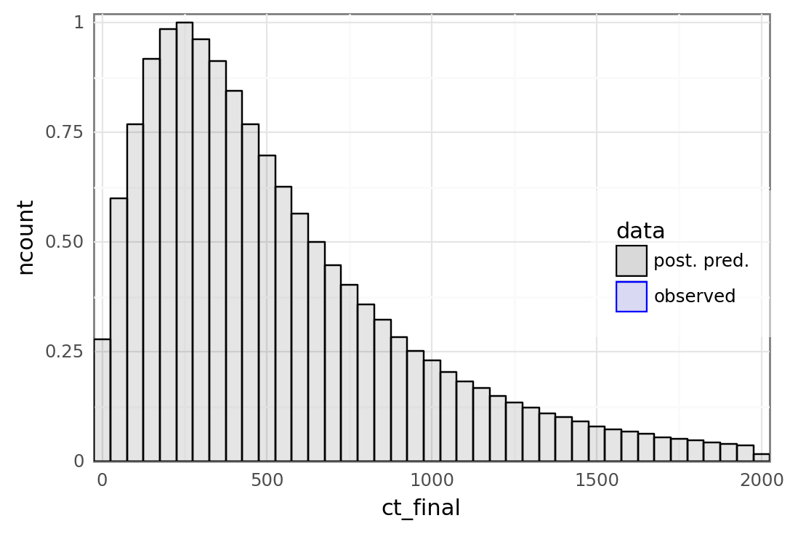

    <ggplot: (357527540)>

```python
posterior_pred.shape, counts_data.shape
```

    ((87419400, 4), (874194, 29))

```python
def _summarize_ppc(df: pd.DataFrame) -> pd.DataFrame:
    vals = df["ct_final"]
    avg_mean = vals.mean()
    avg_mid = vals.median()
    hdi = az.hdi(vals.values.flatten()).flatten()
    return pd.DataFrame(
        {"mean": avg_mean, "median": avg_mid, "hdi_low": hdi[0], "hdi_high": hdi[1]},
        index=[0],
    )


ppc_summary = (
    posterior_pred.filter_column_isin("data_idx", _data_idx)
    .groupby("data_idx")
    .apply(_summarize_ppc)
    .reset_index(drop=False)
    .drop(columns="level_1")
    .merge(counts_data, on="data_idx", how="left")
    .assign(
        error=lambda d: d["counts_final"] - d["median"],
        pct_error=lambda d: 100
        * (1 + d["counts_final"] - d["median"])
        / (1 + d["counts_final"]),
    )
)
```

```python
ppc_summary.head()
```

<div>
<style scoped>
    .dataframe tbody tr th:only-of-type {
        vertical-align: middle;
    }

    .dataframe tbody tr th {
        vertical-align: top;
    }

    .dataframe thead th {
        text-align: right;
    }
</style>
<table border="1" class="dataframe">
  <thead>
    <tr style="text-align: right;">
      <th></th>
      <th>data_idx</th>
      <th>mean</th>
      <th>median</th>
      <th>hdi_low</th>
      <th>hdi_high</th>
      <th>sgrna</th>
      <th>replicate_id</th>
      <th>lfc</th>
      <th>p_dna_batch</th>
      <th>genome_alignment</th>
      <th>...</th>
      <th>lineage</th>
      <th>primary_or_metastasis</th>
      <th>is_male</th>
      <th>age</th>
      <th>counts_final_total</th>
      <th>counts_initial_total</th>
      <th>counts_final_rpm</th>
      <th>counts_initial_adj</th>
      <th>error</th>
      <th>pct_error</th>
    </tr>
  </thead>
  <tbody>
    <tr>
      <th>0</th>
      <td>144</td>
      <td>470.17</td>
      <td>431.5</td>
      <td>109</td>
      <td>915</td>
      <td>AAGCATCTTGGGAGACAGCG</td>
      <td>LS513-311Cas9_RepA_p6_batch2</td>
      <td>-0.218908</td>
      <td>2</td>
      <td>chr17_59697794_-</td>
      <td>...</td>
      <td>colorectal</td>
      <td>primary</td>
      <td>True</td>
      <td>63.0</td>
      <td>35176093</td>
      <td>1.072163e+06</td>
      <td>12.996784</td>
      <td>430.314884</td>
      <td>-9.5</td>
      <td>-2.009456</td>
    </tr>
    <tr>
      <th>1</th>
      <td>185</td>
      <td>172.27</td>
      <td>156.0</td>
      <td>46</td>
      <td>322</td>
      <td>AAGTGGTGCTGGAAAAACAG</td>
      <td>LS513-311Cas9_RepA_p6_batch2</td>
      <td>-0.750700</td>
      <td>2</td>
      <td>chr15_59236649_-</td>
      <td>...</td>
      <td>colorectal</td>
      <td>primary</td>
      <td>True</td>
      <td>63.0</td>
      <td>35176093</td>
      <td>1.072163e+06</td>
      <td>2.904703</td>
      <td>146.623744</td>
      <td>-89.0</td>
      <td>-129.411765</td>
    </tr>
    <tr>
      <th>2</th>
      <td>215</td>
      <td>323.33</td>
      <td>303.0</td>
      <td>170</td>
      <td>612</td>
      <td>AATCCAGGCGATGTCAGCCA</td>
      <td>LS513-311Cas9_RepA_p6_batch2</td>
      <td>0.018910</td>
      <td>2</td>
      <td>chr1_25826359_-</td>
      <td>...</td>
      <td>colorectal</td>
      <td>primary</td>
      <td>True</td>
      <td>63.0</td>
      <td>35176093</td>
      <td>1.072163e+06</td>
      <td>9.727518</td>
      <td>273.517832</td>
      <td>4.0</td>
      <td>1.623377</td>
    </tr>
    <tr>
      <th>3</th>
      <td>351</td>
      <td>229.93</td>
      <td>216.5</td>
      <td>99</td>
      <td>354</td>
      <td>ACAGAAGTACATGACCGCCG</td>
      <td>LS513-311Cas9_RepA_p6_batch2</td>
      <td>0.945948</td>
      <td>2</td>
      <td>chr16_88646818_-</td>
      <td>...</td>
      <td>colorectal</td>
      <td>primary</td>
      <td>True</td>
      <td>63.0</td>
      <td>35176093</td>
      <td>1.072163e+06</td>
      <td>16.550334</td>
      <td>245.670676</td>
      <td>330.5</td>
      <td>60.492701</td>
    </tr>
    <tr>
      <th>4</th>
      <td>527</td>
      <td>1188.48</td>
      <td>1154.0</td>
      <td>523</td>
      <td>1961</td>
      <td>ACTATGTTCCAATTCTTCAG</td>
      <td>LS513-311Cas9_RepA_p6_batch2</td>
      <td>0.511113</td>
      <td>2</td>
      <td>chr2_33588353_-</td>
      <td>...</td>
      <td>colorectal</td>
      <td>primary</td>
      <td>True</td>
      <td>63.0</td>
      <td>35176093</td>
      <td>1.072163e+06</td>
      <td>47.025578</td>
      <td>941.679979</td>
      <td>465.0</td>
      <td>28.765432</td>
    </tr>
  </tbody>
</table>
<p>5 rows × 35 columns</p>
</div>

```python
(
    gg.ggplot(ppc_summary, gg.aes(x="counts_final", y="median"))
    + gg.geom_linerange(
        gg.aes(ymin="hdi_low", ymax="hdi_high"), alpha=0.5, size=0.5, color="gray"
    )
    + gg.geom_point(size=0.5, alpha=0.4, color="black")
    + gg.geom_abline(slope=1, intercept=0, color="blue", alpha=0.6, linetype="--")
    + gg.scale_x_continuous(expand=(0, 0, 0.02, 0))
    + gg.scale_y_continuous(expand=(0, 0, 0.02, 0))
)
```

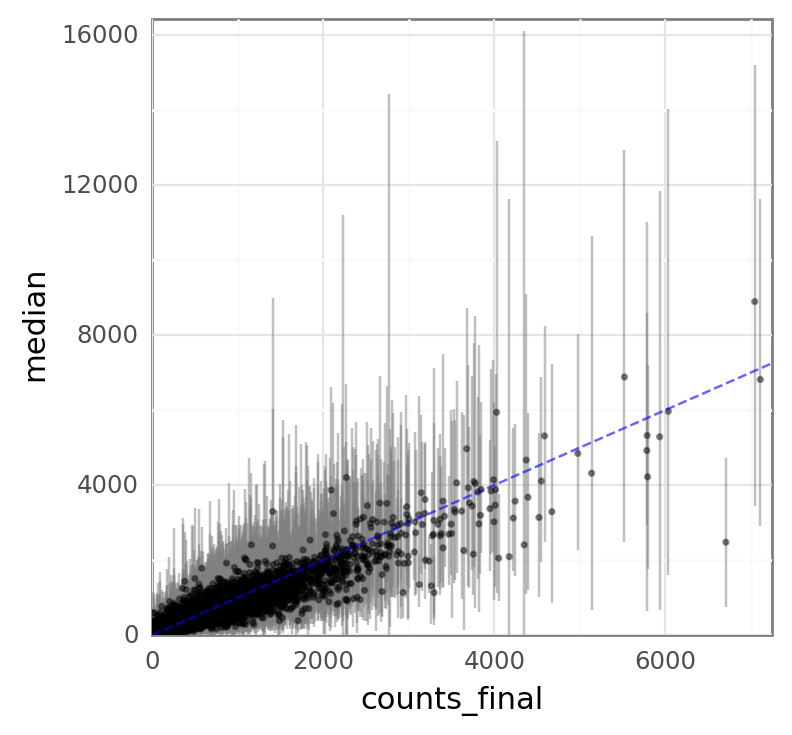

    <ggplot: (355831330)>

```python
(
    gg.ggplot(ppc_summary, gg.aes(x="pct_error"))
    + gg.geom_density(alpha=0.2)
    + gg.scale_x_continuous(expand=(0, 0))
    + gg.scale_y_continuous(expand=(0, 0, 0.02, 0))
    + gg.theme(figure_size=(6, 4))
)
```

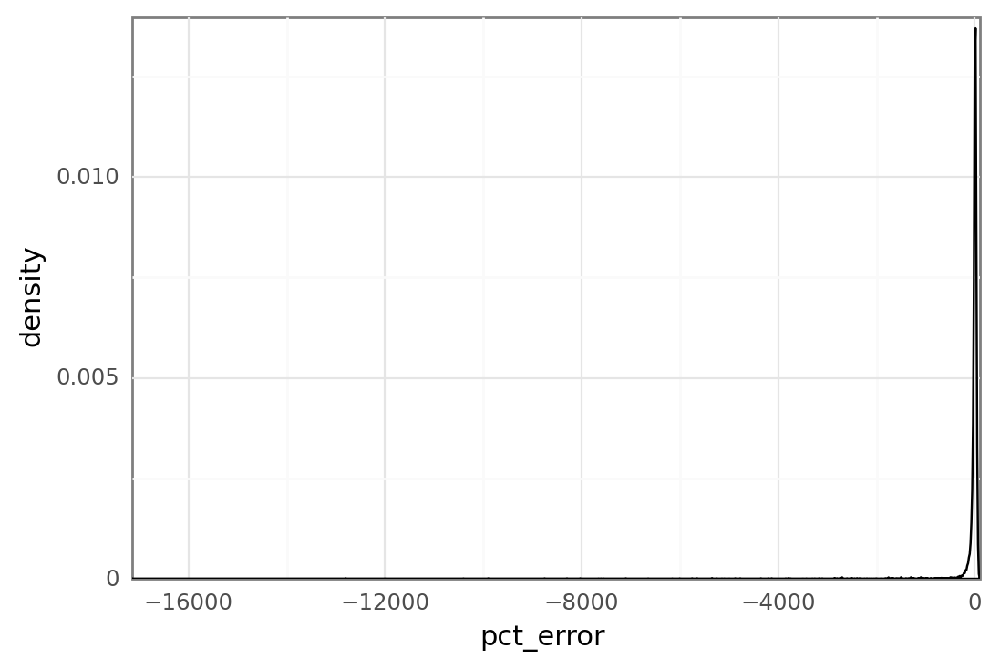

    <ggplot: (354679251)>

```python
(
    gg.ggplot(ppc_summary, gg.aes(x="counts_final", y="pct_error"))
    + gg.geom_point(size=0.3, alpha=0.3)
    + gg.scale_x_log10(expand=(0.02, 0))
    + gg.scale_y_continuous(expand=(0.02, 0))
    + gg.theme(figure_size=(6, 4))
    + gg.labs(x="final counts (observed)", y="percent error ($\\frac{T-P}{T}$)")
)
```

    /usr/local/Caskroom/miniconda/base/envs/speclet/lib/python3.9/site-packages/pandas/core/arraylike.py:364: RuntimeWarning: divide by zero encountered in log10

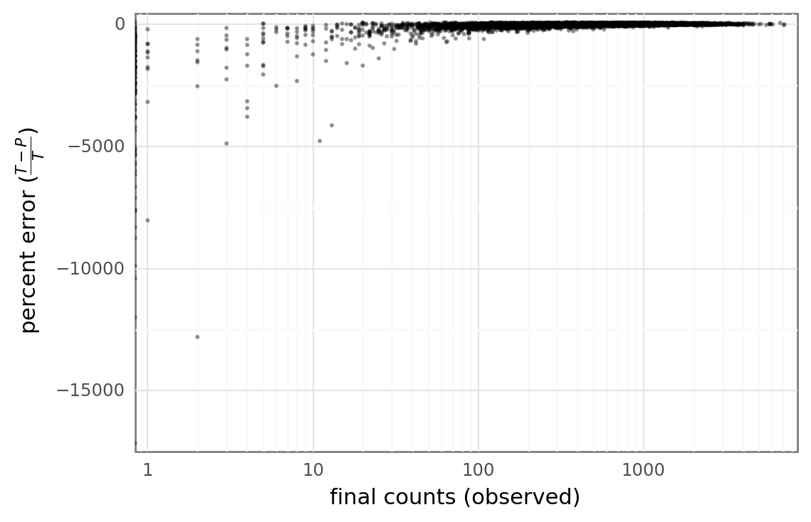

    <ggplot: (353797681)>

```python
obs_zeros = np.mean(counts_data["counts_final"] == 0) * 100
pred_zeros = np.mean(ppc_df["ct_final"] == 0) * 100
print("percent of zeros:")
print(f"   observed: {obs_zeros:0.3f}%")
print(f"  predicted: {pred_zeros:0.3f}%")
```

    percent of zeros:
       observed: 1.017%
      predicted: 0.072%

## Comparing "jitter+adapt_diag" and "advi" chain initialization

```python
advi_posterior_dir = models_dir() / "hierarchical-nb_advi-init_PYMC3_MCMC"
advi_post_summ = read_posterior_summary(advi_posterior_dir / "posterior-summary.csv")
advi_post_summ.head()
```

<div>
<style scoped>
    .dataframe tbody tr th:only-of-type {
        vertical-align: middle;
    }

    .dataframe tbody tr th {
        vertical-align: top;
    }

    .dataframe thead th {
        text-align: right;
    }
</style>
<table border="1" class="dataframe">
  <thead>
    <tr style="text-align: right;">
      <th></th>
      <th>parameter</th>
      <th>mean</th>
      <th>sd</th>
      <th>hdi_5.5%</th>
      <th>hdi_94.5%</th>
      <th>mcse_mean</th>
      <th>mcse_sd</th>
      <th>ess_bulk</th>
      <th>ess_tail</th>
      <th>r_hat</th>
      <th>parameter_name</th>
    </tr>
  </thead>
  <tbody>
    <tr>
      <th>0</th>
      <td>z</td>
      <td>0.040</td>
      <td>0.006</td>
      <td>0.030</td>
      <td>0.050</td>
      <td>0.001</td>
      <td>0.001</td>
      <td>23.0</td>
      <td>69.0</td>
      <td>1.16</td>
      <td>z</td>
    </tr>
    <tr>
      <th>1</th>
      <td>a[0]</td>
      <td>0.314</td>
      <td>0.085</td>
      <td>0.179</td>
      <td>0.453</td>
      <td>0.001</td>
      <td>0.001</td>
      <td>7174.0</td>
      <td>2973.0</td>
      <td>1.00</td>
      <td>a</td>
    </tr>
    <tr>
      <th>2</th>
      <td>a[1]</td>
      <td>-0.002</td>
      <td>0.059</td>
      <td>-0.101</td>
      <td>0.088</td>
      <td>0.001</td>
      <td>0.001</td>
      <td>3795.0</td>
      <td>3032.0</td>
      <td>1.00</td>
      <td>a</td>
    </tr>
    <tr>
      <th>3</th>
      <td>a[2]</td>
      <td>0.177</td>
      <td>0.062</td>
      <td>0.082</td>
      <td>0.280</td>
      <td>0.001</td>
      <td>0.001</td>
      <td>3750.0</td>
      <td>2886.0</td>
      <td>1.00</td>
      <td>a</td>
    </tr>
    <tr>
      <th>4</th>
      <td>a[3]</td>
      <td>0.199</td>
      <td>0.064</td>
      <td>0.098</td>
      <td>0.298</td>
      <td>0.001</td>
      <td>0.001</td>
      <td>4707.0</td>
      <td>3159.0</td>
      <td>1.00</td>
      <td>a</td>
    </tr>
  </tbody>
</table>
</div>

```python
combined_post = pd.concat(
    [
        posterior_summary.assign(init_method="jitter+adapt_diag"),
        advi_post_summ.assign(init_method="advi"),
    ]
)
combined_post.head()
```

<div>
<style scoped>
    .dataframe tbody tr th:only-of-type {
        vertical-align: middle;
    }

    .dataframe tbody tr th {
        vertical-align: top;
    }

    .dataframe thead th {
        text-align: right;
    }
</style>
<table border="1" class="dataframe">
  <thead>
    <tr style="text-align: right;">
      <th></th>
      <th>parameter</th>
      <th>mean</th>
      <th>sd</th>
      <th>hdi_5.5%</th>
      <th>hdi_94.5%</th>
      <th>mcse_mean</th>
      <th>mcse_sd</th>
      <th>ess_bulk</th>
      <th>ess_tail</th>
      <th>r_hat</th>
      <th>parameter_name</th>
      <th>init_method</th>
    </tr>
  </thead>
  <tbody>
    <tr>
      <th>0</th>
      <td>z</td>
      <td>0.042</td>
      <td>0.005</td>
      <td>0.035</td>
      <td>0.050</td>
      <td>0.000</td>
      <td>0.000</td>
      <td>142.0</td>
      <td>404.0</td>
      <td>1.02</td>
      <td>z</td>
      <td>jitter+adapt_diag</td>
    </tr>
    <tr>
      <th>1</th>
      <td>a[0]</td>
      <td>0.314</td>
      <td>0.087</td>
      <td>0.165</td>
      <td>0.439</td>
      <td>0.001</td>
      <td>0.001</td>
      <td>4659.0</td>
      <td>2956.0</td>
      <td>1.00</td>
      <td>a</td>
      <td>jitter+adapt_diag</td>
    </tr>
    <tr>
      <th>2</th>
      <td>a[1]</td>
      <td>-0.004</td>
      <td>0.060</td>
      <td>-0.106</td>
      <td>0.085</td>
      <td>0.001</td>
      <td>0.001</td>
      <td>2523.0</td>
      <td>3087.0</td>
      <td>1.00</td>
      <td>a</td>
      <td>jitter+adapt_diag</td>
    </tr>
    <tr>
      <th>3</th>
      <td>a[2]</td>
      <td>0.179</td>
      <td>0.060</td>
      <td>0.087</td>
      <td>0.279</td>
      <td>0.001</td>
      <td>0.001</td>
      <td>2254.0</td>
      <td>2605.0</td>
      <td>1.00</td>
      <td>a</td>
      <td>jitter+adapt_diag</td>
    </tr>
    <tr>
      <th>4</th>
      <td>a[3]</td>
      <td>0.196</td>
      <td>0.065</td>
      <td>0.097</td>
      <td>0.303</td>
      <td>0.001</td>
      <td>0.001</td>
      <td>3222.0</td>
      <td>2927.0</td>
      <td>1.00</td>
      <td>a</td>
      <td>jitter+adapt_diag</td>
    </tr>
  </tbody>
</table>
</div>

### Sampling diagnostics

#### R-hat

```python
(
    gg.ggplot(combined_post, gg.aes(x="parameter_name", y="r_hat", color="init_method"))
    + gg.geom_boxplot(outlier_size=0.6, outlier_alpha=0.5)
    + gg.theme(axis_text_x=gg.element_text(angle=35, hjust=1))
    + gg.labs(x="parameter", y="$\widehat{R}$", color="init. method")
)
```

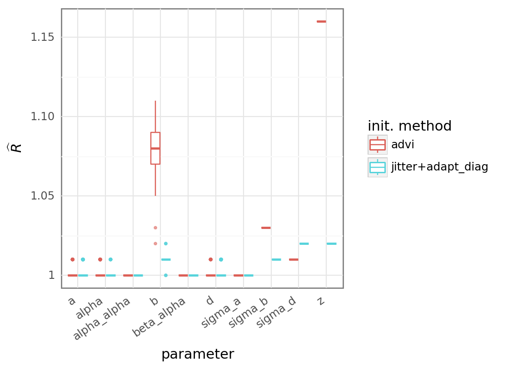

    <ggplot: (353879342)>

#### ESS

```python
(
    gg.ggplot(
        combined_post,
        gg.aes(x="parameter_name", y="ess_bulk", color="init_method"),
    )
    + gg.geom_point(
        position=gg.position_jitterdodge(
            jitter_width=0.3, jitter_height=0, dodge_width=0.5
        ),
        alpha=0.1,
        size=0.2,
    )
    + gg.geom_boxplot(outlier_alpha=0, alpha=0.5)
    + gg.theme(axis_text_x=gg.element_text(angle=35, hjust=1))
    + gg.labs(x="parameter", y="ESS (bulk)", color="init. method")
)
```

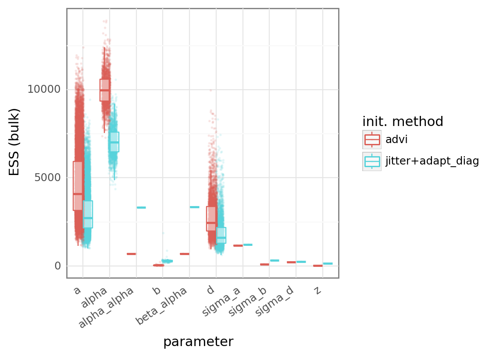

    <ggplot: (343868444)>

```python
(
    gg.ggplot(
        combined_post,
        gg.aes(x="parameter_name", y="ess_tail", color="init_method"),
    )
    + gg.geom_point(
        position=gg.position_jitterdodge(
            jitter_width=0.3, jitter_height=0, dodge_width=0.5
        ),
        alpha=0.1,
        size=0.2,
    )
    + gg.geom_boxplot(outlier_alpha=0, alpha=0.5)
    + gg.theme(axis_text_x=gg.element_text(angle=35, hjust=1))
    + gg.labs(x="parameter", y="ESS (bulk)", color="init. method")
)
```

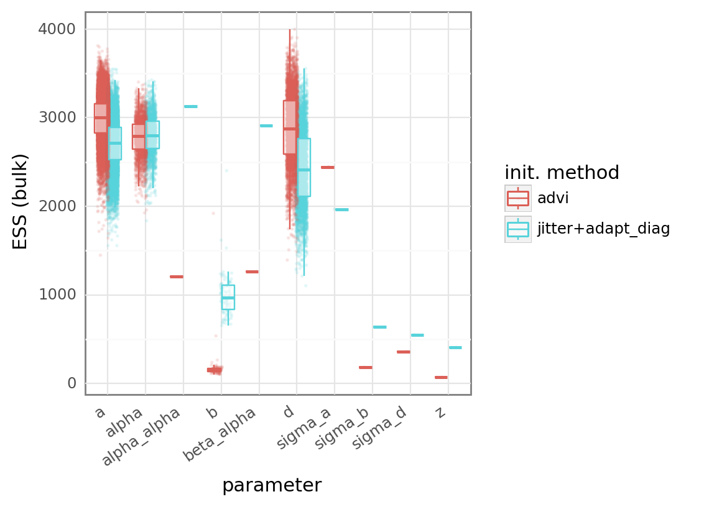

    <ggplot: (357493827)>

### Posterior estimates

```python
keep_cols = ["a", "b", "d", "alpha"]
plot_df = combined_post.filter_column_isin("parameter_name", keep_cols)

(
    gg.ggplot(plot_df, gg.aes(x="mean", color="init_method", fill="init_method"))
    + gg.facet_wrap("~parameter_name", nrow=2, scales="free")
    + gg.geom_density(alpha=0.5)
    + gg.scale_x_continuous(expand=(0, 0))
    + gg.scale_y_continuous(expand=(0, 0, 0.02, 0))
    + gg.theme(
        figure_size=(8, 6),
        subplots_adjust={"hspace": 0.25, "wspace": 0.25},
        strip_text=gg.element_text(weight="bold"),
    )
    + gg.labs(x="MAP", y="density", color="init. method", fill="init. method")
)
```

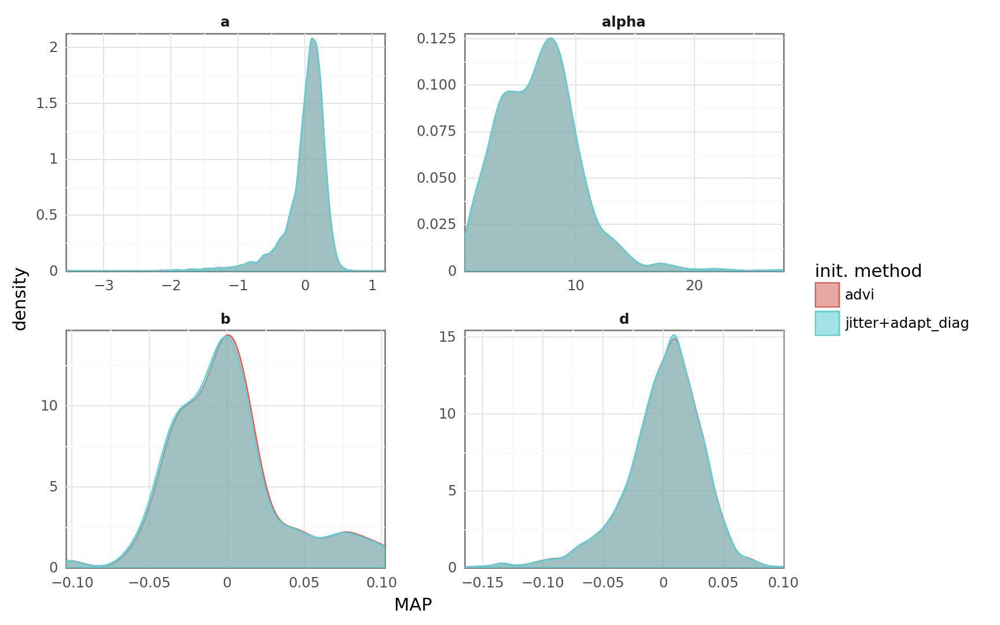

    <ggplot: (356429346)>

```python
plot_df = combined_post.filter_column_isin("parameter_name", keep_cols)

(
    gg.ggplot(plot_df, gg.aes(x="sd", color="init_method", fill="init_method"))
    + gg.facet_wrap("~parameter_name", nrow=2, scales="free")
    + gg.geom_density(alpha=0.5)
    + gg.scale_x_continuous(expand=(0, 0))
    + gg.scale_y_continuous(expand=(0, 0, 0.02, 0))
    + gg.theme(
        figure_size=(8, 6),
        subplots_adjust={"hspace": 0.25, "wspace": 0.25},
        strip_text=gg.element_text(weight="bold"),
    )
    + gg.labs(
        x="posterior std. dev.", y="density", color="init. method", fill="init. method"
    )
)
```

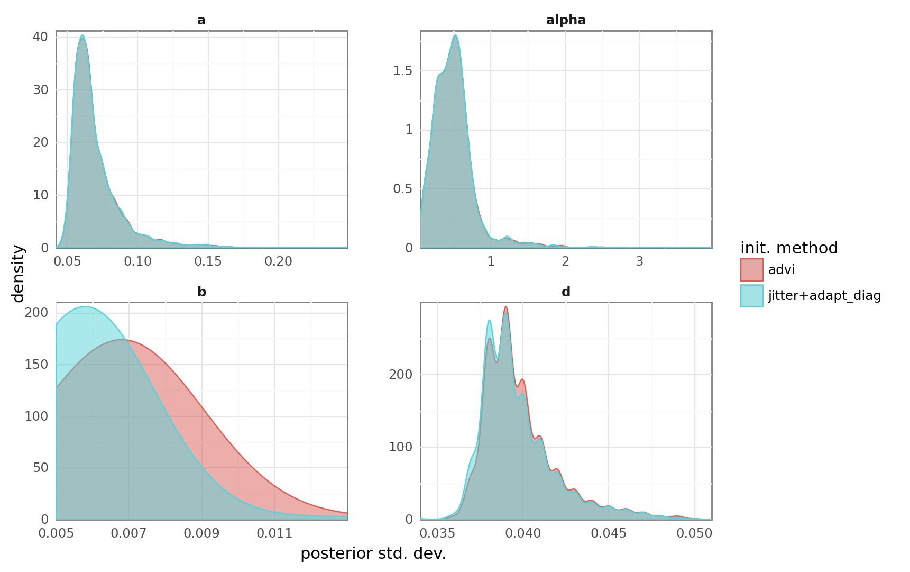

    <ggplot: (354963658)>

```python
plot_df = (
    combined_post.query("parameter_name == 'b'")
    .reset_index(drop=True)
    .assign(idx=lambda d: [int(re.findall("[0-9]+", x)[0]) for x in d["parameter"]])
)

(
    gg.ggplot(plot_df, gg.aes(x="factor(idx)", y="mean", color="init_method"))
    + gg.geom_hline(yintercept=0, color="gray")
    + gg.geom_linerange(gg.aes(ymin="hdi_5.5%", ymax="hdi_94.5%"), alpha=0.5, size=1)
    + gg.geom_point(size=2, alpha=0.5)
    + gg.scale_y_continuous(expand=(0.02, 0))
    + gg.scale_color_brewer(type="qual", palette="Dark2")
    + gg.theme(
        figure_size=(8, 6),
        axis_text_x=gg.element_blank(),
        panel_grid_major_x=gg.element_blank(),
    )
)
```

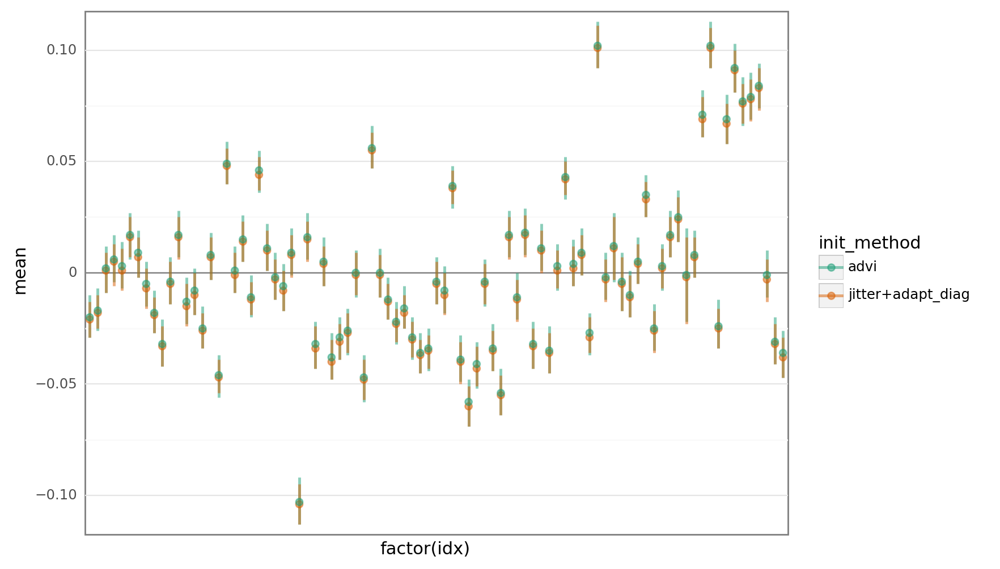

    <ggplot: (353776939)>

### Posterior predictions

```python
advi_post_pred = read_posterior_pred(advi_posterior_dir / "posterior-predictions.csv")
advi_post_pred.head()
```

<div>
<style scoped>
    .dataframe tbody tr th:only-of-type {
        vertical-align: middle;
    }

    .dataframe tbody tr th {
        vertical-align: top;
    }

    .dataframe thead th {
        text-align: right;
    }
</style>
<table border="1" class="dataframe">
  <thead>
    <tr style="text-align: right;">
      <th></th>
      <th>chain</th>
      <th>draw</th>
      <th>data_idx</th>
      <th>ct_final</th>
    </tr>
  </thead>
  <tbody>
    <tr>
      <th>0</th>
      <td>0</td>
      <td>0</td>
      <td>0</td>
      <td>211</td>
    </tr>
    <tr>
      <th>1</th>
      <td>0</td>
      <td>0</td>
      <td>1</td>
      <td>900</td>
    </tr>
    <tr>
      <th>2</th>
      <td>0</td>
      <td>0</td>
      <td>2</td>
      <td>1034</td>
    </tr>
    <tr>
      <th>3</th>
      <td>0</td>
      <td>0</td>
      <td>3</td>
      <td>97</td>
    </tr>
    <tr>
      <th>4</th>
      <td>0</td>
      <td>0</td>
      <td>4</td>
      <td>1010</td>
    </tr>
  </tbody>
</table>
</div>

```python
combined_ppc = pd.concat(
    [
        posterior_pred.assign(init_method="jitter+adapt_diag"),
        advi_post_pred.assign(init_method="advi"),
    ]
)
combined_ppc.head()
```

<div>
<style scoped>
    .dataframe tbody tr th:only-of-type {
        vertical-align: middle;
    }

    .dataframe tbody tr th {
        vertical-align: top;
    }

    .dataframe thead th {
        text-align: right;
    }
</style>
<table border="1" class="dataframe">
  <thead>
    <tr style="text-align: right;">
      <th></th>
      <th>chain</th>
      <th>draw</th>
      <th>data_idx</th>
      <th>ct_final</th>
      <th>init_method</th>
    </tr>
  </thead>
  <tbody>
    <tr>
      <th>0</th>
      <td>0</td>
      <td>0</td>
      <td>0</td>
      <td>275</td>
      <td>jitter+adapt_diag</td>
    </tr>
    <tr>
      <th>1</th>
      <td>0</td>
      <td>0</td>
      <td>1</td>
      <td>943</td>
      <td>jitter+adapt_diag</td>
    </tr>
    <tr>
      <th>2</th>
      <td>0</td>
      <td>0</td>
      <td>2</td>
      <td>1474</td>
      <td>jitter+adapt_diag</td>
    </tr>
    <tr>
      <th>3</th>
      <td>0</td>
      <td>0</td>
      <td>3</td>
      <td>65</td>
      <td>jitter+adapt_diag</td>
    </tr>
    <tr>
      <th>4</th>
      <td>0</td>
      <td>0</td>
      <td>4</td>
      <td>615</td>
      <td>jitter+adapt_diag</td>
    </tr>
  </tbody>
</table>
</div>

```python
combined_ppc_avg = (
    combined_ppc.filter_column_isin("data_idx", _data_idx)
    .groupby(["data_idx", "init_method"])["ct_final"]
    .median()
    .reset_index(drop=False)
    .pivot_wider(index="data_idx", names_from="init_method", values_from="ct_final")
)
combined_ppc_avg.head()
```

<div>
<style scoped>
    .dataframe tbody tr th:only-of-type {
        vertical-align: middle;
    }

    .dataframe tbody tr th {
        vertical-align: top;
    }

    .dataframe thead th {
        text-align: right;
    }
</style>
<table border="1" class="dataframe">
  <thead>
    <tr style="text-align: right;">
      <th></th>
      <th>data_idx</th>
      <th>advi</th>
      <th>jitter+adapt_diag</th>
    </tr>
  </thead>
  <tbody>
    <tr>
      <th>0</th>
      <td>144</td>
      <td>478.0</td>
      <td>431.5</td>
    </tr>
    <tr>
      <th>1</th>
      <td>185</td>
      <td>148.0</td>
      <td>156.0</td>
    </tr>
    <tr>
      <th>2</th>
      <td>215</td>
      <td>316.0</td>
      <td>303.0</td>
    </tr>
    <tr>
      <th>3</th>
      <td>351</td>
      <td>230.5</td>
      <td>216.5</td>
    </tr>
    <tr>
      <th>4</th>
      <td>527</td>
      <td>1027.0</td>
      <td>1154.0</td>
    </tr>
  </tbody>
</table>
</div>

```python
(
    gg.ggplot(combined_ppc_avg, gg.aes(x="advi", y="jitter+adapt_diag"))
    + gg.geom_point(alpha=0.5, size=0.5)
    + gg.geom_abline(slope=1, intercept=0, alpha=1, linetype="--", color="blue")
    + gg.scale_x_continuous(expand=(0, 0, 0.02, 0))
    + gg.scale_y_continuous(expand=(0, 0, 0.02, 0))
)
```

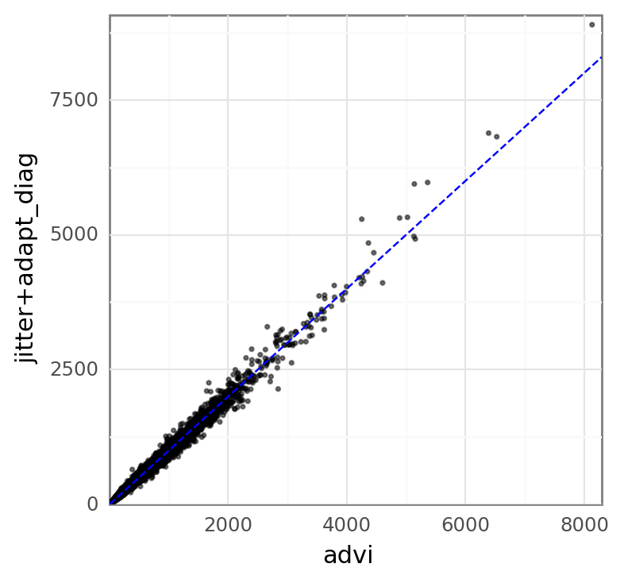

    <ggplot: (353749520)>

---

## Watermark

```python
notebook_toc = time()
print(f"execution time: {(notebook_toc - notebook_tic) / 60:.2f} minutes")
```

    execution time: 6.04 minutes

```python
%load_ext watermark
%watermark -d -u -v -iv -b -h -m
```

    Last updated: 2022-02-11

    Python implementation: CPython
    Python version       : 3.9.9
    IPython version      : 8.0.0

    Compiler    : Clang 11.1.0
    OS          : Darwin
    Release     : 21.2.0
    Machine     : x86_64
    Processor   : i386
    CPU cores   : 4
    Architecture: 64bit

    Hostname: JHCookMac

    Git branch: theano-blas-warning

    matplotlib: 3.5.1
    seaborn   : 0.11.2
    pandas    : 1.3.5
    plotnine  : 0.8.0
    arviz     : 0.11.4
    scipy     : 1.7.3
    pymc3     : 3.11.4
    numpy     : 1.22.0
    re        : 2.2.1
