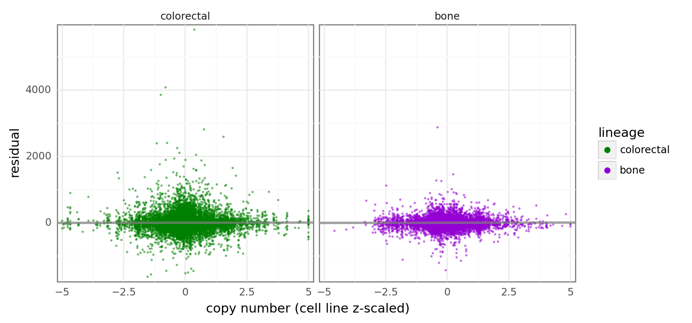

# Analyzing Hierarchical NB model with molecular covariates on larger-subsample dataset

## Setup

```python
%load_ext autoreload
%autoreload 2
```

```python
import re
from collections import Counter
from itertools import product
from time import time
from typing import Final

import arviz as az
import matplotlib.pyplot as plt
import numpy as np
import pandas as pd
import plotnine as gg
import pymc as pm
import seaborn as sns
```

```python
from speclet.analysis.arviz_analysis import extract_matrix_variable_coords
from speclet.bayesian_models.hierarchical_nb import HierarchcalNegativeBinomialModel
from speclet.data_processing.vectors import squish_array
from speclet.io import DataFile, models_dir
from speclet.managers.data_managers import CrisprScreenDataManager
from speclet.plot.plotnine_helpers import set_gg_theme
from speclet.project_configuration import read_project_configuration
```

```python
# Notebook execution timer.
notebook_tic = time()

# Plotting setup.
set_gg_theme()
%config InlineBackend.figure_format = "retina"

# Constants
RANDOM_SEED = 847
np.random.seed(RANDOM_SEED)
HDI_PROB = read_project_configuration().modeling.highest_density_interval
```

```python
model_res_dir = models_dir() / "hnb-copynum-rna-mut-covariates_PYMC_MCMC"
```

```python
lineage_pal: Final[dict[str, str]] = {"bone": "darkviolet", "colorectal": "green"}
```

## Data

```python
counts_dm = CrisprScreenDataManager(DataFile.DEPMAP_CRC_BONE_LARGE_SUBSAMPLE)
counts_data = counts_dm.get_data()
counts_data.head()
```

    /Users/admin/Developer/haigis-lab/speclet/speclet/managers/data_managers.py:139: DtypeWarning: Columns (3,22) have mixed types. Specify dtype option on import or set low_memory=False.

<div>
<style scoped>
    .dataframe tbody tr th:only-of-type {
        vertical-align: middle;
    }

    .dataframe tbody tr th {
        vertical-align: top;
    }

    .dataframe thead th {
        text-align: right;
    }
</style>
<table border="1" class="dataframe">
  <thead>
    <tr style="text-align: right;">
      <th></th>
      <th>sgrna</th>
      <th>replicate_id</th>
      <th>lfc</th>
      <th>p_dna_batch</th>
      <th>genome_alignment</th>
      <th>hugo_symbol</th>
      <th>screen</th>
      <th>multiple_hits_on_gene</th>
      <th>sgrna_target_chr</th>
      <th>sgrna_target_pos</th>
      <th>...</th>
      <th>num_mutations</th>
      <th>any_deleterious</th>
      <th>any_tcga_hotspot</th>
      <th>any_cosmic_hotspot</th>
      <th>is_mutated</th>
      <th>copy_number</th>
      <th>lineage</th>
      <th>primary_or_metastasis</th>
      <th>is_male</th>
      <th>age</th>
    </tr>
  </thead>
  <tbody>
    <tr>
      <th>0</th>
      <td>AAAGCCCAGGAGTATGGGAG</td>
      <td>LS513-311Cas9_RepA_p6_batch2</td>
      <td>0.594321</td>
      <td>2</td>
      <td>chr2_130522105_-</td>
      <td>CFC1B</td>
      <td>broad</td>
      <td>True</td>
      <td>2</td>
      <td>130522105</td>
      <td>...</td>
      <td>0</td>
      <td>NaN</td>
      <td>NaN</td>
      <td>NaN</td>
      <td>False</td>
      <td>0.951337</td>
      <td>colorectal</td>
      <td>primary</td>
      <td>True</td>
      <td>63.0</td>
    </tr>
    <tr>
      <th>1</th>
      <td>AATCGGAATGGTCTCGCTC</td>
      <td>LS513_c903R1</td>
      <td>-0.272724</td>
      <td>ERS717283.plasmid</td>
      <td>chr6_81751906_+</td>
      <td>TENT5A</td>
      <td>sanger</td>
      <td>True</td>
      <td>6</td>
      <td>81751906</td>
      <td>...</td>
      <td>0</td>
      <td>NaN</td>
      <td>NaN</td>
      <td>NaN</td>
      <td>False</td>
      <td>0.949854</td>
      <td>colorectal</td>
      <td>primary</td>
      <td>True</td>
      <td>63.0</td>
    </tr>
    <tr>
      <th>2</th>
      <td>ACGCCACTGACACTCAAGG</td>
      <td>LS513_c903R1</td>
      <td>0.583209</td>
      <td>ERS717283.plasmid</td>
      <td>chr1_27006713_-</td>
      <td>TENT5B</td>
      <td>sanger</td>
      <td>True</td>
      <td>1</td>
      <td>27006713</td>
      <td>...</td>
      <td>0</td>
      <td>NaN</td>
      <td>NaN</td>
      <td>NaN</td>
      <td>False</td>
      <td>0.961139</td>
      <td>colorectal</td>
      <td>primary</td>
      <td>True</td>
      <td>63.0</td>
    </tr>
    <tr>
      <th>3</th>
      <td>ACTTGTCTCATGAACGTGAT</td>
      <td>LS513-311Cas9_RepA_p6_batch2</td>
      <td>0.475678</td>
      <td>2</td>
      <td>chr2_86917638_+</td>
      <td>RGPD1</td>
      <td>broad</td>
      <td>True</td>
      <td>2</td>
      <td>86917638</td>
      <td>...</td>
      <td>0</td>
      <td>NaN</td>
      <td>NaN</td>
      <td>NaN</td>
      <td>False</td>
      <td>0.949234</td>
      <td>colorectal</td>
      <td>primary</td>
      <td>True</td>
      <td>63.0</td>
    </tr>
    <tr>
      <th>4</th>
      <td>AGAAACTTCACCCCTTTCAT</td>
      <td>LS513-311Cas9_RepA_p6_batch2</td>
      <td>0.296108</td>
      <td>2</td>
      <td>chr16_18543661_+</td>
      <td>NOMO2</td>
      <td>broad</td>
      <td>True</td>
      <td>16</td>
      <td>18543661</td>
      <td>...</td>
      <td>0</td>
      <td>NaN</td>
      <td>NaN</td>
      <td>NaN</td>
      <td>False</td>
      <td>0.944648</td>
      <td>colorectal</td>
      <td>primary</td>
      <td>True</td>
      <td>63.0</td>
    </tr>
  </tbody>
</table>
<p>5 rows × 24 columns</p>
</div>

## Model

### Description

```python
hnb = HierarchcalNegativeBinomialModel()
```

```python
hnb_model = hnb.pymc_model(counts_data)
pm.model_to_graphviz(hnb_model)
```


```python
with open(model_res_dir / "description.txt") as file:
    description = "".join(list(file))
print(description)
```

    name: 'hnb-copynum-rna-mut-covariates'
    fit method: 'PYMC_MCMC'

    --------------------------------------------------------------------------------

    CONFIGURATION

    {
        "name": "hnb-copynum-rna-mut-covariates",
        "description": " A hierarchical negative binomial model with copy number, RNA expression, and mutation status covariates.. ",
        "active": true,
        "model": "HIERARCHICAL_NB",
        "data_file": "DEPMAP_CRC_BONE_LARGE_SUBSAMPLE",
        "subsample": false,
        "sampling_kwargs": {
            "stan_mcmc": null,
            "pymc_mcmc": {
                "draws": 1000,
                "init": "adapt_diag",
                "step": null,
                "n_init": 200000,
                "chain_idx": 0,
                "chains": null,
                "cores": null,
                "tune": 1000,
                "progressbar": true,
                "discard_tuned_samples": true,
                "compute_convergence_checks": true,
                "return_inferencedata": true,
                "idata_kwargs": null,
                "target_accept": 0.95
            },
            "pymc_advi": null
        },
        "pipelines": {
            "fitting": [
                "PYMC_MCMC"
            ],
            "sbc": []
        }
    }

    --------------------------------------------------------------------------------

    POSTERIOR

    <xarray.Dataset>
    Dimensions:    (chain: 3, draw: 1000, sgrna: 16954, cell_line: 86, gene: 2000,
                    lineage: 2, eta_dim_0: 865044, mu_dim_0: 865044)
    Coordinates:
      * chain      (chain) int64 0 1 2
      * draw       (draw) int64 0 1 2 3 4 5 6 7 ... 992 993 994 995 996 997 998 999
      * sgrna      (sgrna) object 'AAAGCCCAGGAGTATGGGAG' ... 'TTTTGTTAAGTGACCACCT'
      * cell_line  (cell_line) object 'ACH-000007' 'ACH-000403' ... 'ACH-002160'
      * gene       (gene) object 'CFC1B' 'RGPD1' 'NOMO2' ... 'KCNE1' 'TBL1Y' 'LCE1C'
      * lineage    (lineage) object 'colorectal' 'bone'
      * eta_dim_0  (eta_dim_0) int64 0 1 2 3 4 ... 865040 865041 865042 865043
      * mu_dim_0   (mu_dim_0) int64 0 1 2 3 4 ... 865039 865040 865041 865042 865043
    Data variables: (12/24)
        z          (chain, draw) float64 ...
        a          (chain, draw, sgrna) float64 ...
        delta_b    (chain, draw, cell_line) float64 ...
        delta_d    (chain, draw, gene, lineage) float64 ...
        delta_f    (chain, draw, cell_line) float64 ...
        delta_h    (chain, draw, gene) float64 ...
        ...         ...
        f          (chain, draw, cell_line) float64 ...
        h          (chain, draw, gene) float64 ...
        k          (chain, draw, gene, lineage) float64 ...
        m          (chain, draw, gene, lineage) float64 ...
        eta        (chain, draw, eta_dim_0) float64 ...
        mu         (chain, draw, mu_dim_0) float64 ...
    Attributes:
        created_at:                 2022-03-22 15:46:00.123933
        arviz_version:              0.11.4
        inference_library:          pymc
        inference_library_version:  4.0.0b2
        sampling_time:              606260.1995363235
        tuning_steps:               1000
        previous_created_at:        ['2022-03-22 15:46:00.123933', '2022-03-22T12...
        combined_sampling_time:     [606260.19953632 559623.81671166 579804.56413...

    --------------------------------------------------------------------------------

    SAMPLE STATS

    <xarray.Dataset>
    Dimensions:             (chain: 3, draw: 1000)
    Coordinates:
      * chain               (chain) int64 0 1 2
      * draw                (draw) int64 0 1 2 3 4 5 6 ... 994 995 996 997 998 999
    Data variables: (12/13)
        tree_depth          (chain, draw) int64 ...
        max_energy_error    (chain, draw) float64 ...
        acceptance_rate     (chain, draw) float64 ...
        diverging           (chain, draw) bool ...
        step_size_bar       (chain, draw) float64 ...
        lp                  (chain, draw) float64 ...
        ...                  ...
        step_size           (chain, draw) float64 ...
        energy_error        (chain, draw) float64 ...
        process_time_diff   (chain, draw) float64 ...
        perf_counter_start  (chain, draw) float64 ...
        energy              (chain, draw) float64 ...
        n_steps             (chain, draw) float64 ...
    Attributes:
        created_at:                 2022-03-22 15:46:00.123933
        arviz_version:              0.11.4
        inference_library:          pymc
        inference_library_version:  4.0.0b2
        sampling_time:              606260.1995363235
        tuning_steps:               1000
        previous_created_at:        ['2022-03-22 15:46:00.123933', '2022-03-22T12...
        combined_sampling_time:     [606260.19953632 559623.81671166 579804.56413...

    --------------------------------------------------------------------------------

    MCMC DESCRIPTION

    sampled 3 chains with (unknown) tuning steps and 1,000 draws
    num. divergences: 0, 0, 0
    percent divergences: 0.0, 0.0, 0.0
    BFMI: 0.899, 0.739, 0.78
    avg. step size: 0.036, 0.029, 0.036

### Load posterior results

```python
valid_counts_data = hnb.data_processing_pipeline(counts_data)
```

```python
hnb_post_summary = pd.read_csv(model_res_dir / "posterior-summary.csv").assign(
    param_name=lambda d: [x.split("[")[0] for x in d.parameter]
)
hnb_post_summary.head()
```

<div>
<style scoped>
    .dataframe tbody tr th:only-of-type {
        vertical-align: middle;
    }

    .dataframe tbody tr th {
        vertical-align: top;
    }

    .dataframe thead th {
        text-align: right;
    }
</style>
<table border="1" class="dataframe">
  <thead>
    <tr style="text-align: right;">
      <th></th>
      <th>parameter</th>
      <th>mean</th>
      <th>sd</th>
      <th>hdi_5.5%</th>
      <th>hdi_94.5%</th>
      <th>mcse_mean</th>
      <th>mcse_sd</th>
      <th>ess_bulk</th>
      <th>ess_tail</th>
      <th>r_hat</th>
      <th>param_name</th>
    </tr>
  </thead>
  <tbody>
    <tr>
      <th>0</th>
      <td>z</td>
      <td>0.038</td>
      <td>0.006</td>
      <td>0.029</td>
      <td>0.048</td>
      <td>0.000</td>
      <td>0.000</td>
      <td>2571.0</td>
      <td>2132.0</td>
      <td>1.0</td>
      <td>z</td>
    </tr>
    <tr>
      <th>1</th>
      <td>a[AAAGCCCAGGAGTATGGGAG]</td>
      <td>0.202</td>
      <td>0.110</td>
      <td>0.018</td>
      <td>0.365</td>
      <td>0.002</td>
      <td>0.001</td>
      <td>4100.0</td>
      <td>2461.0</td>
      <td>1.0</td>
      <td>a</td>
    </tr>
    <tr>
      <th>2</th>
      <td>a[ACTTGTCTCATGAACGTGAT]</td>
      <td>0.136</td>
      <td>0.126</td>
      <td>-0.082</td>
      <td>0.319</td>
      <td>0.002</td>
      <td>0.002</td>
      <td>2969.0</td>
      <td>1639.0</td>
      <td>1.0</td>
      <td>a</td>
    </tr>
    <tr>
      <th>3</th>
      <td>a[AGAAACTTCACCCCTTTCAT]</td>
      <td>0.254</td>
      <td>0.108</td>
      <td>0.075</td>
      <td>0.423</td>
      <td>0.002</td>
      <td>0.001</td>
      <td>4285.0</td>
      <td>2281.0</td>
      <td>1.0</td>
      <td>a</td>
    </tr>
    <tr>
      <th>4</th>
      <td>a[AGCTGAGCGCAGGGACCGGG]</td>
      <td>-0.112</td>
      <td>0.108</td>
      <td>-0.292</td>
      <td>0.049</td>
      <td>0.002</td>
      <td>0.002</td>
      <td>3775.0</td>
      <td>2272.0</td>
      <td>1.0</td>
      <td>a</td>
    </tr>
  </tbody>
</table>
</div>

```python
hnb_post_pred = pd.read_csv(model_res_dir / "posterior-predictions.csv")
hnb_post_pred.head()
```

<div>
<style scoped>
    .dataframe tbody tr th:only-of-type {
        vertical-align: middle;
    }

    .dataframe tbody tr th {
        vertical-align: top;
    }

    .dataframe thead th {
        text-align: right;
    }
</style>
<table border="1" class="dataframe">
  <thead>
    <tr style="text-align: right;">
      <th></th>
      <th>chain</th>
      <th>draw</th>
      <th>ct_final_dim_0</th>
      <th>ct_final</th>
    </tr>
  </thead>
  <tbody>
    <tr>
      <th>0</th>
      <td>0</td>
      <td>0</td>
      <td>0</td>
      <td>659</td>
    </tr>
    <tr>
      <th>1</th>
      <td>0</td>
      <td>0</td>
      <td>1</td>
      <td>947</td>
    </tr>
    <tr>
      <th>2</th>
      <td>0</td>
      <td>0</td>
      <td>2</td>
      <td>1453</td>
    </tr>
    <tr>
      <th>3</th>
      <td>0</td>
      <td>0</td>
      <td>3</td>
      <td>183</td>
    </tr>
    <tr>
      <th>4</th>
      <td>0</td>
      <td>0</td>
      <td>4</td>
      <td>946</td>
    </tr>
  </tbody>
</table>
</div>

## Posterior Analysis

### Model parameters

```python
hnb_post_summary[["ess_bulk", "ess_tail", "r_hat"]].describe()
```

<div>
<style scoped>
    .dataframe tbody tr th:only-of-type {
        vertical-align: middle;
    }

    .dataframe tbody tr th {
        vertical-align: top;
    }

    .dataframe thead th {
        text-align: right;
    }
</style>
<table border="1" class="dataframe">
  <thead>
    <tr style="text-align: right;">
      <th></th>
      <th>ess_bulk</th>
      <th>ess_tail</th>
      <th>r_hat</th>
    </tr>
  </thead>
  <tbody>
    <tr>
      <th>count</th>
      <td>31135.000000</td>
      <td>31135.000000</td>
      <td>31135.000000</td>
    </tr>
    <tr>
      <th>mean</th>
      <td>4217.500723</td>
      <td>2178.167625</td>
      <td>1.000143</td>
    </tr>
    <tr>
      <th>std</th>
      <td>960.268326</td>
      <td>329.774559</td>
      <td>0.001187</td>
    </tr>
    <tr>
      <th>min</th>
      <td>496.000000</td>
      <td>958.000000</td>
      <td>1.000000</td>
    </tr>
    <tr>
      <th>25%</th>
      <td>3169.000000</td>
      <td>1916.000000</td>
      <td>1.000000</td>
    </tr>
    <tr>
      <th>50%</th>
      <td>4425.000000</td>
      <td>2236.000000</td>
      <td>1.000000</td>
    </tr>
    <tr>
      <th>75%</th>
      <td>4932.000000</td>
      <td>2436.000000</td>
      <td>1.000000</td>
    </tr>
    <tr>
      <th>max</th>
      <td>8172.000000</td>
      <td>3117.000000</td>
      <td>1.010000</td>
    </tr>
  </tbody>
</table>
</div>

```python
d1_vars = [p for p, v in Counter(hnb_post_summary.param_name.values).items() if v == 1]  # type: ignore
sd_vars = [p for p in d1_vars if "sigma" in p]
```

```python
post_y_lbl = f"posterior distribution\n(mean ± {100*HDI_PROB:0.0f}% HDI)"
```

```python
(
    gg.ggplot(
        hnb_post_summary.filter_column_isin("param_name", sd_vars),
        gg.aes(x="parameter", y="mean"),
    )
    + gg.geom_linerange(gg.aes(ymin="hdi_5.5%", ymax="hdi_94.5%"))
    + gg.geom_point()
    + gg.theme(axis_text_x=gg.element_text(angle=45, hjust=1))
    + gg.labs(x="std. dev. parameter", y=post_y_lbl)
)
```


    <ggplot: (350116359)>

```python
(
    gg.ggplot(
        hnb_post_summary.filter_column_isin("param_name", d1_vars, complement=True),
        gg.aes(x="mean"),
    )
    + gg.facet_wrap("~ param_name", scales="free")
    + gg.geom_histogram(bins=100)
    + gg.scale_y_continuous(expand=(0, 0, 0.02, 0))
    + gg.theme(
        figure_size=(8, 8),
        subplots_adjust={"wspace": 0.25, "hspace": 0.25},
    )
    + gg.labs(x="posterior mean")
)
```

    /usr/local/Caskroom/miniconda/base/envs/speclet/lib/python3.9/site-packages/plotnine/utils.py:371: FutureWarning: The frame.append method is deprecated and will be removed from pandas in a future version. Use pandas.concat instead.


    <ggplot: (351088978)>

```python
cellline_to_lineage = (
    valid_counts_data[["depmap_id", "lineage"]].drop_duplicates().reset_index()
)

cellline_post = (
    hnb_post_summary.query("param_name == 'b'")
    .reset_index(drop=True)
    .assign(
        depmap_id=lambda d: [re.findall(r"(?<=\[).+(?=\])", x)[0] for x in d.parameter]
    )
    .merge(cellline_to_lineage, on="depmap_id")
    .sort_values(["lineage", "mean"])
    .assign(
        depmap_id=lambda d: pd.Categorical(
            d.depmap_id, categories=d.depmap_id, ordered=True
        )
    )
)
```

```python
(
    gg.ggplot(cellline_post, gg.aes(x="depmap_id", y="mean"))
    + gg.geom_linerange(gg.aes(ymin="hdi_5.5%", ymax="hdi_94.5%", color="lineage"))
    + gg.geom_point(gg.aes(color="lineage"))
    + gg.scale_color_manual(lineage_pal)
    + gg.theme(axis_text_x=gg.element_text(angle=90, size=6), figure_size=(9, 4))
    + gg.labs(x="cell line", y=post_y_lbl)
)
```


    <ggplot: (348719894)>

```python
cellline_lfc_avg = (
    valid_counts_data.groupby(["depmap_id", "lineage"])["lfc"]
    .mean()
    .reset_index(drop=False)
    .dropna()
    .assign(
        depmap_id=lambda d: pd.Categorical(
            d.depmap_id.values,
            categories=cellline_post.depmap_id.cat.categories,
            ordered=True,
        )
    )
)
(
    gg.ggplot(cellline_lfc_avg, gg.aes(x="depmap_id", y="lfc"))
    + gg.geom_point(gg.aes(color="lineage"))
    + gg.scale_color_manual(lineage_pal)
    + gg.theme(axis_text_x=gg.element_text(angle=90, size=6), figure_size=(9, 4))
    + gg.labs(x="cell line", y="average log fold change")
)
```


    <ggplot: (350291228)>

```python
d_post = (
    hnb_post_summary.query("param_name == 'd'")
    .reset_index(drop=True)
    .pipe(
        extract_matrix_variable_coords,
        col="parameter",
        idx1name="hugo_symbol",
        idx2name="lineage",
    )
)
```

```python
d_post_wide = d_post.pivot_wider(
    index=["hugo_symbol"], names_from="lineage", values_from="mean"
)
d_post_wide.head()
```

<div>
<style scoped>
    .dataframe tbody tr th:only-of-type {
        vertical-align: middle;
    }

    .dataframe tbody tr th {
        vertical-align: top;
    }

    .dataframe thead th {
        text-align: right;
    }
</style>
<table border="1" class="dataframe">
  <thead>
    <tr style="text-align: right;">
      <th></th>
      <th>hugo_symbol</th>
      <th>bone</th>
      <th>colorectal</th>
    </tr>
  </thead>
  <tbody>
    <tr>
      <th>0</th>
      <td>A1BG</td>
      <td>0.041</td>
      <td>0.099</td>
    </tr>
    <tr>
      <th>1</th>
      <td>AAK1</td>
      <td>0.034</td>
      <td>0.074</td>
    </tr>
    <tr>
      <th>2</th>
      <td>AAR2</td>
      <td>0.009</td>
      <td>0.029</td>
    </tr>
    <tr>
      <th>3</th>
      <td>ABAT</td>
      <td>0.038</td>
      <td>0.089</td>
    </tr>
    <tr>
      <th>4</th>
      <td>ABCA1</td>
      <td>0.103</td>
      <td>0.090</td>
    </tr>
  </tbody>
</table>
</div>

```python
goi = []
_queries = [
    "bone > 0 and colorectal < -0.4",
    "bone > 0.1 and colorectal < -0.25",
    "colorectal < -1.01",
    "colorectal > 0.1 and bone < -0.2",
    "bone < colorectal and colorectal < -0.55 and bone < -0.7",
    "bone < colorectal and -0.2 < colorectal < -0.1 and bone < -0.5",
]
for q in _queries:
    goi += d_post_wide.query(q).hugo_symbol.tolist()
goi = list(set(goi))
```

```python
(
    gg.ggplot(d_post_wide, gg.aes(x="bone", y="colorectal"))
    + gg.geom_point(alpha=0.7, size=1)
    + gg.geom_hline(yintercept=0, linetype="--", color="blue")
    + gg.geom_vline(xintercept=0, linetype="--", color="blue")
    + gg.geom_abline(slope=1, intercept=0)
    + gg.geom_text(
        gg.aes(label="hugo_symbol"),
        data=d_post_wide.filter_column_isin("hugo_symbol", goi),
        size=7,
        color="red",
        adjust_text={"ha": "center"},
    )
    + gg.coord_equal()
)
```


    <ggplot: (351000905)>

```python
plt_df = (
    d_post.copy()
    .sort_values(["lineage", "mean"])
    .assign(
        mean=lambda d: squish_array(d["mean"], lower=-0.3, upper=0.3),
        hugo_symbol=lambda d: pd.Categorical(
            d.hugo_symbol, categories=d.hugo_symbol.unique(), ordered=True
        ),
    )
)
(
    gg.ggplot(plt_df, gg.aes(x="hugo_symbol", y="lineage"))
    + gg.geom_tile(gg.aes(fill="mean"), color=None)
    + gg.scale_x_discrete(expand=(0, 0.5))
    + gg.scale_y_discrete(expand=(0, 0.5))
    + gg.scale_fill_gradient2(low="#3A3A98", high="#832424")
    + gg.theme(
        axis_text_x=gg.element_blank(),
        panel_grid=gg.element_blank(),
        figure_size=(10, 1),
    )
    + gg.labs(x="gene", y="lineage", fill="post. mean")
)
```


    <ggplot: (347569908)>

```python
plt_df = (
    d_post.copy()
    .filter_column_isin(
        "hugo_symbol",
        d_post_wide.query(
            "bone * colorectal < 0 and abs(bone - colorectal) > 0.15"
        ).hugo_symbol,
    )
    .sort_values(["lineage", "mean"])
    .assign(
        mean=lambda d: squish_array(d["mean"], lower=-0.3, upper=0.3),
        hugo_symbol=lambda d: pd.Categorical(
            d.hugo_symbol, categories=d.hugo_symbol.unique(), ordered=True
        ),
    )
)
(
    gg.ggplot(plt_df, gg.aes(x="hugo_symbol", y="lineage"))
    + gg.geom_tile(gg.aes(fill="mean"), color=None)
    + gg.scale_x_discrete(expand=(0, 0.5))
    + gg.scale_y_discrete(expand=(0, 0.5))
    + gg.scale_fill_gradient2(low="#3A3A98", high="#832424")
    + gg.theme(
        axis_text_x=gg.element_text(angle=90, size=5),
        panel_grid=gg.element_blank(),
        figure_size=(10, 1),
    )
    + gg.labs(x="gene", y="lineage", fill="post. mean")
)
```


    <ggplot: (352391153)>

```python
f_post = (
    hnb_post_summary.query("param_name == 'f'")
    .reset_index(drop=True)
    .assign(
        depmap_id=lambda d: [re.findall(r"(?<=\[).+(?=\])", x)[0] for x in d.parameter]
    )
    .merge(cellline_to_lineage, on="depmap_id")
    .assign(
        depmap_id=lambda d: pd.Categorical(
            d.depmap_id, categories=cellline_post.depmap_id.cat.categories, ordered=True
        )
    )
)

(
    gg.ggplot(f_post, gg.aes(x="depmap_id", y="mean"))
    + gg.geom_linerange(gg.aes(ymin="hdi_5.5%", ymax="hdi_94.5%", color="lineage"))
    + gg.geom_point(gg.aes(color="lineage"))
    + gg.scale_color_manual(lineage_pal)
    + gg.theme(axis_text_x=gg.element_text(angle=90, size=6), figure_size=(9, 4))
    + gg.labs(x="cell line", y=post_y_lbl)
)
```


    <ggplot: (347574751)>

```python
m_post = (
    hnb_post_summary.query("param_name == 'm'")
    .reset_index(drop=True)
    .pipe(
        extract_matrix_variable_coords,
        col="parameter",
        idx1name="hugo_symbol",
        idx2name="lineage",
    )
)
m_post_nonzero_hdi = m_post.query(
    "`hdi_5.5%` * mean > 0 and `hdi_94.5%` * mean > 0"
).sort_values("mean")
m_post_nonzero_hdi
```

<div>
<style scoped>
    .dataframe tbody tr th:only-of-type {
        vertical-align: middle;
    }

    .dataframe tbody tr th {
        vertical-align: top;
    }

    .dataframe thead th {
        text-align: right;
    }
</style>
<table border="1" class="dataframe">
  <thead>
    <tr style="text-align: right;">
      <th></th>
      <th>parameter</th>
      <th>mean</th>
      <th>sd</th>
      <th>hdi_5.5%</th>
      <th>hdi_94.5%</th>
      <th>mcse_mean</th>
      <th>mcse_sd</th>
      <th>ess_bulk</th>
      <th>ess_tail</th>
      <th>r_hat</th>
      <th>param_name</th>
      <th>hugo_symbol</th>
      <th>lineage</th>
    </tr>
  </thead>
  <tbody>
    <tr>
      <th>902</th>
      <td>m[SCFD1, colorectal]</td>
      <td>-0.131</td>
      <td>0.042</td>
      <td>-0.196</td>
      <td>-0.061</td>
      <td>0.001</td>
      <td>0.001</td>
      <td>2909.0</td>
      <td>2036.0</td>
      <td>1.0</td>
      <td>m</td>
      <td>SCFD1</td>
      <td>colorectal</td>
    </tr>
    <tr>
      <th>3872</th>
      <td>m[KIF18A, colorectal]</td>
      <td>-0.130</td>
      <td>0.043</td>
      <td>-0.204</td>
      <td>-0.069</td>
      <td>0.001</td>
      <td>0.001</td>
      <td>2380.0</td>
      <td>2263.0</td>
      <td>1.0</td>
      <td>m</td>
      <td>KIF18A</td>
      <td>colorectal</td>
    </tr>
    <tr>
      <th>878</th>
      <td>m[DDX18, colorectal]</td>
      <td>-0.097</td>
      <td>0.042</td>
      <td>-0.164</td>
      <td>-0.031</td>
      <td>0.001</td>
      <td>0.001</td>
      <td>2779.0</td>
      <td>1859.0</td>
      <td>1.0</td>
      <td>m</td>
      <td>DDX18</td>
      <td>colorectal</td>
    </tr>
    <tr>
      <th>1430</th>
      <td>m[SAP130, colorectal]</td>
      <td>-0.088</td>
      <td>0.043</td>
      <td>-0.156</td>
      <td>-0.020</td>
      <td>0.001</td>
      <td>0.001</td>
      <td>2940.0</td>
      <td>2126.0</td>
      <td>1.0</td>
      <td>m</td>
      <td>SAP130</td>
      <td>colorectal</td>
    </tr>
    <tr>
      <th>3246</th>
      <td>m[HEATR1, colorectal]</td>
      <td>-0.079</td>
      <td>0.041</td>
      <td>-0.142</td>
      <td>-0.013</td>
      <td>0.001</td>
      <td>0.001</td>
      <td>2632.0</td>
      <td>1480.0</td>
      <td>1.0</td>
      <td>m</td>
      <td>HEATR1</td>
      <td>colorectal</td>
    </tr>
    <tr>
      <th>1300</th>
      <td>m[SLC3A2, colorectal]</td>
      <td>-0.075</td>
      <td>0.044</td>
      <td>-0.143</td>
      <td>-0.003</td>
      <td>0.001</td>
      <td>0.001</td>
      <td>2947.0</td>
      <td>1813.0</td>
      <td>1.0</td>
      <td>m</td>
      <td>SLC3A2</td>
      <td>colorectal</td>
    </tr>
    <tr>
      <th>3240</th>
      <td>m[MGA, colorectal]</td>
      <td>-0.075</td>
      <td>0.038</td>
      <td>-0.140</td>
      <td>-0.016</td>
      <td>0.001</td>
      <td>0.001</td>
      <td>2954.0</td>
      <td>1889.0</td>
      <td>1.0</td>
      <td>m</td>
      <td>MGA</td>
      <td>colorectal</td>
    </tr>
    <tr>
      <th>120</th>
      <td>m[SAMM50, colorectal]</td>
      <td>-0.074</td>
      <td>0.045</td>
      <td>-0.147</td>
      <td>-0.006</td>
      <td>0.001</td>
      <td>0.001</td>
      <td>2734.0</td>
      <td>1715.0</td>
      <td>1.0</td>
      <td>m</td>
      <td>SAMM50</td>
      <td>colorectal</td>
    </tr>
    <tr>
      <th>764</th>
      <td>m[MCM7, colorectal]</td>
      <td>-0.073</td>
      <td>0.044</td>
      <td>-0.144</td>
      <td>-0.004</td>
      <td>0.001</td>
      <td>0.001</td>
      <td>3013.0</td>
      <td>1858.0</td>
      <td>1.0</td>
      <td>m</td>
      <td>MCM7</td>
      <td>colorectal</td>
    </tr>
    <tr>
      <th>2134</th>
      <td>m[ANAPC1, colorectal]</td>
      <td>-0.072</td>
      <td>0.039</td>
      <td>-0.135</td>
      <td>-0.011</td>
      <td>0.001</td>
      <td>0.001</td>
      <td>2938.0</td>
      <td>1674.0</td>
      <td>1.0</td>
      <td>m</td>
      <td>ANAPC1</td>
      <td>colorectal</td>
    </tr>
    <tr>
      <th>3626</th>
      <td>m[NRG3, colorectal]</td>
      <td>-0.061</td>
      <td>0.038</td>
      <td>-0.124</td>
      <td>-0.005</td>
      <td>0.001</td>
      <td>0.001</td>
      <td>2762.0</td>
      <td>1754.0</td>
      <td>1.0</td>
      <td>m</td>
      <td>NRG3</td>
      <td>colorectal</td>
    </tr>
    <tr>
      <th>342</th>
      <td>m[MTOR, colorectal]</td>
      <td>0.069</td>
      <td>0.039</td>
      <td>0.004</td>
      <td>0.127</td>
      <td>0.001</td>
      <td>0.001</td>
      <td>2758.0</td>
      <td>1952.0</td>
      <td>1.0</td>
      <td>m</td>
      <td>MTOR</td>
      <td>colorectal</td>
    </tr>
    <tr>
      <th>2834</th>
      <td>m[TMCC2, colorectal]</td>
      <td>0.071</td>
      <td>0.043</td>
      <td>0.002</td>
      <td>0.142</td>
      <td>0.001</td>
      <td>0.001</td>
      <td>3165.0</td>
      <td>1949.0</td>
      <td>1.0</td>
      <td>m</td>
      <td>TMCC2</td>
      <td>colorectal</td>
    </tr>
    <tr>
      <th>3254</th>
      <td>m[SGIP1, colorectal]</td>
      <td>0.073</td>
      <td>0.039</td>
      <td>0.012</td>
      <td>0.134</td>
      <td>0.001</td>
      <td>0.001</td>
      <td>2669.0</td>
      <td>2076.0</td>
      <td>1.0</td>
      <td>m</td>
      <td>SGIP1</td>
      <td>colorectal</td>
    </tr>
    <tr>
      <th>1912</th>
      <td>m[ANGPTL5, colorectal]</td>
      <td>0.079</td>
      <td>0.043</td>
      <td>0.010</td>
      <td>0.147</td>
      <td>0.001</td>
      <td>0.001</td>
      <td>2878.0</td>
      <td>1828.0</td>
      <td>1.0</td>
      <td>m</td>
      <td>ANGPTL5</td>
      <td>colorectal</td>
    </tr>
    <tr>
      <th>2564</th>
      <td>m[PI4KA, colorectal]</td>
      <td>0.092</td>
      <td>0.041</td>
      <td>0.026</td>
      <td>0.154</td>
      <td>0.001</td>
      <td>0.001</td>
      <td>2912.0</td>
      <td>1814.0</td>
      <td>1.0</td>
      <td>m</td>
      <td>PI4KA</td>
      <td>colorectal</td>
    </tr>
    <tr>
      <th>1380</th>
      <td>m[DDX42, colorectal]</td>
      <td>0.093</td>
      <td>0.041</td>
      <td>0.028</td>
      <td>0.157</td>
      <td>0.001</td>
      <td>0.001</td>
      <td>3047.0</td>
      <td>2429.0</td>
      <td>1.0</td>
      <td>m</td>
      <td>DDX42</td>
      <td>colorectal</td>
    </tr>
    <tr>
      <th>2038</th>
      <td>m[SEC14L4, colorectal]</td>
      <td>0.095</td>
      <td>0.042</td>
      <td>0.029</td>
      <td>0.163</td>
      <td>0.001</td>
      <td>0.001</td>
      <td>3045.0</td>
      <td>2237.0</td>
      <td>1.0</td>
      <td>m</td>
      <td>SEC14L4</td>
      <td>colorectal</td>
    </tr>
    <tr>
      <th>3926</th>
      <td>m[IGF1R, colorectal]</td>
      <td>0.101</td>
      <td>0.040</td>
      <td>0.034</td>
      <td>0.161</td>
      <td>0.001</td>
      <td>0.001</td>
      <td>3004.0</td>
      <td>1877.0</td>
      <td>1.0</td>
      <td>m</td>
      <td>IGF1R</td>
      <td>colorectal</td>
    </tr>
    <tr>
      <th>3498</th>
      <td>m[NARS, colorectal]</td>
      <td>0.122</td>
      <td>0.048</td>
      <td>0.041</td>
      <td>0.193</td>
      <td>0.001</td>
      <td>0.001</td>
      <td>2582.0</td>
      <td>1953.0</td>
      <td>1.0</td>
      <td>m</td>
      <td>NARS</td>
      <td>colorectal</td>
    </tr>
  </tbody>
</table>
</div>

```python
k_post = (
    hnb_post_summary.query("param_name == 'k'")
    .reset_index(drop=True)
    .pipe(
        extract_matrix_variable_coords,
        col="parameter",
        idx1name="hugo_symbol",
        idx2name="lineage",
    )
)
k_post.query("`hdi_5.5%` * mean > 0 and `hdi_94.5%` * mean > 0").sort_values(
    "mean"
).head()
```

<div>
<style scoped>
    .dataframe tbody tr th:only-of-type {
        vertical-align: middle;
    }

    .dataframe tbody tr th {
        vertical-align: top;
    }

    .dataframe thead th {
        text-align: right;
    }
</style>
<table border="1" class="dataframe">
  <thead>
    <tr style="text-align: right;">
      <th></th>
      <th>parameter</th>
      <th>mean</th>
      <th>sd</th>
      <th>hdi_5.5%</th>
      <th>hdi_94.5%</th>
      <th>mcse_mean</th>
      <th>mcse_sd</th>
      <th>ess_bulk</th>
      <th>ess_tail</th>
      <th>r_hat</th>
      <th>param_name</th>
      <th>hugo_symbol</th>
      <th>lineage</th>
    </tr>
  </thead>
  <tbody>
    <tr>
      <th>1706</th>
      <td>k[U2AF2, colorectal]</td>
      <td>-0.225</td>
      <td>0.032</td>
      <td>-0.273</td>
      <td>-0.172</td>
      <td>0.001</td>
      <td>0.0</td>
      <td>3133.0</td>
      <td>1922.0</td>
      <td>1.0</td>
      <td>k</td>
      <td>U2AF2</td>
      <td>colorectal</td>
    </tr>
    <tr>
      <th>2844</th>
      <td>k[RIOK1, colorectal]</td>
      <td>-0.157</td>
      <td>0.034</td>
      <td>-0.212</td>
      <td>-0.105</td>
      <td>0.001</td>
      <td>0.0</td>
      <td>2840.0</td>
      <td>2270.0</td>
      <td>1.0</td>
      <td>k</td>
      <td>RIOK1</td>
      <td>colorectal</td>
    </tr>
    <tr>
      <th>1112</th>
      <td>k[GNL3, colorectal]</td>
      <td>-0.120</td>
      <td>0.031</td>
      <td>-0.169</td>
      <td>-0.071</td>
      <td>0.001</td>
      <td>0.0</td>
      <td>2807.0</td>
      <td>1900.0</td>
      <td>1.0</td>
      <td>k</td>
      <td>GNL3</td>
      <td>colorectal</td>
    </tr>
    <tr>
      <th>1928</th>
      <td>k[SNRNP40, colorectal]</td>
      <td>-0.119</td>
      <td>0.032</td>
      <td>-0.170</td>
      <td>-0.069</td>
      <td>0.001</td>
      <td>0.0</td>
      <td>2913.0</td>
      <td>1950.0</td>
      <td>1.0</td>
      <td>k</td>
      <td>SNRNP40</td>
      <td>colorectal</td>
    </tr>
    <tr>
      <th>1166</th>
      <td>k[POMP, colorectal]</td>
      <td>-0.118</td>
      <td>0.032</td>
      <td>-0.171</td>
      <td>-0.070</td>
      <td>0.001</td>
      <td>0.0</td>
      <td>2972.0</td>
      <td>2025.0</td>
      <td>1.0</td>
      <td>k</td>
      <td>POMP</td>
      <td>colorectal</td>
    </tr>
  </tbody>
</table>
</div>

```python
h_post = (
    hnb_post_summary.query("param_name == 'h'")
    .reset_index(drop=True)
    .assign(
        hugo_symbol=lambda d: [
            re.findall(r"(?<=\[).*(?=\])", x)[0] for x in d.parameter
        ]
    )
)
```

```python
gene_var_post = pd.concat(
    [
        (
            hnb_post_summary.filter_column_isin("param_name", list("dkm"))
            .reset_index(drop=True)
            .pipe(
                extract_matrix_variable_coords,
                col="parameter",
                idx1name="hugo_symbol",
                idx2name="lineage",
            )
        ),
        h_post.assign(lineage="bone"),
        h_post.assign(lineage="colorectal"),
    ]
)

gene_var_post.head()
```

<div>
<style scoped>
    .dataframe tbody tr th:only-of-type {
        vertical-align: middle;
    }

    .dataframe tbody tr th {
        vertical-align: top;
    }

    .dataframe thead th {
        text-align: right;
    }
</style>
<table border="1" class="dataframe">
  <thead>
    <tr style="text-align: right;">
      <th></th>
      <th>parameter</th>
      <th>mean</th>
      <th>sd</th>
      <th>hdi_5.5%</th>
      <th>hdi_94.5%</th>
      <th>mcse_mean</th>
      <th>mcse_sd</th>
      <th>ess_bulk</th>
      <th>ess_tail</th>
      <th>r_hat</th>
      <th>param_name</th>
      <th>hugo_symbol</th>
      <th>lineage</th>
    </tr>
  </thead>
  <tbody>
    <tr>
      <th>0</th>
      <td>d[CFC1B, colorectal]</td>
      <td>0.049</td>
      <td>0.104</td>
      <td>-0.115</td>
      <td>0.218</td>
      <td>0.002</td>
      <td>0.002</td>
      <td>4131.0</td>
      <td>2363.0</td>
      <td>1.0</td>
      <td>d</td>
      <td>CFC1B</td>
      <td>colorectal</td>
    </tr>
    <tr>
      <th>1</th>
      <td>d[CFC1B, bone]</td>
      <td>0.093</td>
      <td>0.105</td>
      <td>-0.060</td>
      <td>0.278</td>
      <td>0.002</td>
      <td>0.002</td>
      <td>4136.0</td>
      <td>2224.0</td>
      <td>1.0</td>
      <td>d</td>
      <td>CFC1B</td>
      <td>bone</td>
    </tr>
    <tr>
      <th>2</th>
      <td>d[RGPD1, colorectal]</td>
      <td>0.066</td>
      <td>0.128</td>
      <td>-0.129</td>
      <td>0.271</td>
      <td>0.002</td>
      <td>0.002</td>
      <td>2974.0</td>
      <td>2130.0</td>
      <td>1.0</td>
      <td>d</td>
      <td>RGPD1</td>
      <td>colorectal</td>
    </tr>
    <tr>
      <th>3</th>
      <td>d[RGPD1, bone]</td>
      <td>-0.028</td>
      <td>0.129</td>
      <td>-0.231</td>
      <td>0.184</td>
      <td>0.002</td>
      <td>0.002</td>
      <td>2990.0</td>
      <td>2011.0</td>
      <td>1.0</td>
      <td>d</td>
      <td>RGPD1</td>
      <td>bone</td>
    </tr>
    <tr>
      <th>4</th>
      <td>d[NOMO2, colorectal]</td>
      <td>0.106</td>
      <td>0.107</td>
      <td>-0.068</td>
      <td>0.276</td>
      <td>0.002</td>
      <td>0.001</td>
      <td>3777.0</td>
      <td>2399.0</td>
      <td>1.0</td>
      <td>d</td>
      <td>NOMO2</td>
      <td>colorectal</td>
    </tr>
  </tbody>
</table>
</div>

```python
(
    gg.ggplot(gene_var_post, gg.aes(x="param_name", y="mean"))
    + gg.geom_line(gg.aes(group="lineage + hugo_symbol"), alpha=0.1, size=0.1)
    + gg.geom_point(size=0.1, alpha=0.2)
    + gg.scale_x_discrete(expand=(0, 0.07))
    + gg.scale_y_continuous(expand=((0.02, 0)))
    + gg.theme(figure_size=(5, 3))
    + gg.labs(x="parameter", y=post_y_lbl)
)
```


    <ggplot: (352826353)>

```python
pos = gg.position_dodge(width=0.7)
jpos = gg.position_jitterdodge(jitter_width=0.2, jitter_height=0, dodge_width=0.7)

(
    gg.ggplot(
        valid_counts_data.filter_column_isin(
            "hugo_symbol", m_post_nonzero_hdi.hugo_symbol
        ).query("lineage == 'colorectal'"),
        gg.aes(x="hugo_symbol", y="lfc", color="is_mutated"),
    )
    + gg.geom_point(size=0.5, position=jpos, alpha=0.2)
    + gg.geom_boxplot(outlier_alpha=0, position=pos, alpha=0)
    + gg.scale_color_brewer(type="qual", palette="Set1")
    + gg.theme(figure_size=(8, 4), axis_text_x=gg.element_text(angle=90))
)
```


    <ggplot: (354661078)>

### Looking at specific gene effects

```python
GOI = "SCFD1"

gene_post = gene_var_post.query(f"hugo_symbol == '{GOI}'")
gene_post
```

<div>
<style scoped>
    .dataframe tbody tr th:only-of-type {
        vertical-align: middle;
    }

    .dataframe tbody tr th {
        vertical-align: top;
    }

    .dataframe thead th {
        text-align: right;
    }
</style>
<table border="1" class="dataframe">
  <thead>
    <tr style="text-align: right;">
      <th></th>
      <th>parameter</th>
      <th>mean</th>
      <th>sd</th>
      <th>hdi_5.5%</th>
      <th>hdi_94.5%</th>
      <th>mcse_mean</th>
      <th>mcse_sd</th>
      <th>ess_bulk</th>
      <th>ess_tail</th>
      <th>r_hat</th>
      <th>param_name</th>
      <th>hugo_symbol</th>
      <th>lineage</th>
    </tr>
  </thead>
  <tbody>
    <tr>
      <th>902</th>
      <td>d[SCFD1, colorectal]</td>
      <td>-0.602</td>
      <td>0.097</td>
      <td>-0.751</td>
      <td>-0.445</td>
      <td>0.002</td>
      <td>0.001</td>
      <td>3771.0</td>
      <td>2372.0</td>
      <td>1.0</td>
      <td>d</td>
      <td>SCFD1</td>
      <td>colorectal</td>
    </tr>
    <tr>
      <th>903</th>
      <td>d[SCFD1, bone]</td>
      <td>-0.477</td>
      <td>0.087</td>
      <td>-0.615</td>
      <td>-0.342</td>
      <td>0.001</td>
      <td>0.001</td>
      <td>4551.0</td>
      <td>2419.0</td>
      <td>1.0</td>
      <td>d</td>
      <td>SCFD1</td>
      <td>bone</td>
    </tr>
    <tr>
      <th>4902</th>
      <td>k[SCFD1, colorectal]</td>
      <td>-0.002</td>
      <td>0.036</td>
      <td>-0.062</td>
      <td>0.052</td>
      <td>0.001</td>
      <td>0.001</td>
      <td>3132.0</td>
      <td>1426.0</td>
      <td>1.0</td>
      <td>k</td>
      <td>SCFD1</td>
      <td>colorectal</td>
    </tr>
    <tr>
      <th>4903</th>
      <td>k[SCFD1, bone]</td>
      <td>-0.073</td>
      <td>0.029</td>
      <td>-0.117</td>
      <td>-0.024</td>
      <td>0.001</td>
      <td>0.000</td>
      <td>3075.0</td>
      <td>2039.0</td>
      <td>1.0</td>
      <td>k</td>
      <td>SCFD1</td>
      <td>bone</td>
    </tr>
    <tr>
      <th>8902</th>
      <td>m[SCFD1, colorectal]</td>
      <td>-0.131</td>
      <td>0.042</td>
      <td>-0.196</td>
      <td>-0.061</td>
      <td>0.001</td>
      <td>0.001</td>
      <td>2909.0</td>
      <td>2036.0</td>
      <td>1.0</td>
      <td>m</td>
      <td>SCFD1</td>
      <td>colorectal</td>
    </tr>
    <tr>
      <th>8903</th>
      <td>m[SCFD1, bone]</td>
      <td>0.009</td>
      <td>0.048</td>
      <td>-0.065</td>
      <td>0.091</td>
      <td>0.001</td>
      <td>0.001</td>
      <td>3111.0</td>
      <td>1384.0</td>
      <td>1.0</td>
      <td>m</td>
      <td>SCFD1</td>
      <td>bone</td>
    </tr>
    <tr>
      <th>451</th>
      <td>h[SCFD1]</td>
      <td>0.043</td>
      <td>0.016</td>
      <td>0.019</td>
      <td>0.068</td>
      <td>0.000</td>
      <td>0.000</td>
      <td>3066.0</td>
      <td>1965.0</td>
      <td>1.0</td>
      <td>h</td>
      <td>SCFD1</td>
      <td>bone</td>
    </tr>
    <tr>
      <th>451</th>
      <td>h[SCFD1]</td>
      <td>0.043</td>
      <td>0.016</td>
      <td>0.019</td>
      <td>0.068</td>
      <td>0.000</td>
      <td>0.000</td>
      <td>3066.0</td>
      <td>1965.0</td>
      <td>1.0</td>
      <td>h</td>
      <td>SCFD1</td>
      <td>colorectal</td>
    </tr>
  </tbody>
</table>
</div>

```python
gene_counts_data = valid_counts_data.query(f"hugo_symbol == '{GOI}'").reset_index(
    drop=True
)
lineages = valid_counts_data.lineage.cat.categories

cn_vals = np.linspace(-2.5, 2.5, 25)

rna_vals = gene_counts_data.log_rna_expr.values
rna_vals = np.linspace(min(rna_vals), max(rna_vals), 20)


gene_pred_df = pd.DataFrame(
    product(lineages, cn_vals, rna_vals, [True, False]),
    columns=["lineage", "copy_number_z_gene", "log_rna_expr", "is_mutated"],
).assign(hugo_symbol=GOI)
gene_pred_df.head(5)
```

<div>
<style scoped>
    .dataframe tbody tr th:only-of-type {
        vertical-align: middle;
    }

    .dataframe tbody tr th {
        vertical-align: top;
    }

    .dataframe thead th {
        text-align: right;
    }
</style>
<table border="1" class="dataframe">
  <thead>
    <tr style="text-align: right;">
      <th></th>
      <th>lineage</th>
      <th>copy_number_z_gene</th>
      <th>log_rna_expr</th>
      <th>is_mutated</th>
      <th>hugo_symbol</th>
    </tr>
  </thead>
  <tbody>
    <tr>
      <th>0</th>
      <td>colorectal</td>
      <td>-2.5</td>
      <td>0.000000</td>
      <td>True</td>
      <td>SCFD1</td>
    </tr>
    <tr>
      <th>1</th>
      <td>colorectal</td>
      <td>-2.5</td>
      <td>0.000000</td>
      <td>False</td>
      <td>SCFD1</td>
    </tr>
    <tr>
      <th>2</th>
      <td>colorectal</td>
      <td>-2.5</td>
      <td>0.110673</td>
      <td>True</td>
      <td>SCFD1</td>
    </tr>
    <tr>
      <th>3</th>
      <td>colorectal</td>
      <td>-2.5</td>
      <td>0.110673</td>
      <td>False</td>
      <td>SCFD1</td>
    </tr>
    <tr>
      <th>4</th>
      <td>colorectal</td>
      <td>-2.5</td>
      <td>0.221347</td>
      <td>True</td>
      <td>SCFD1</td>
    </tr>
  </tbody>
</table>
</div>

```python
gene_pred_df.shape
```

    (2000, 5)

```python
def _get_param_post(gene_post_df: pd.DataFrame, param: str) -> pd.DataFrame:
    return gene_post_df.query(f"param_name == '{param}'")[
        ["mean", "hdi_5.5%", "hdi_94.5%", "lineage"]
    ].rename(
        columns={
            "mean": f"{param}_mean",
            "hdi_5.5%": f"{param}_hdi_low",
            "hdi_94.5%": f"{param}_hdi_high",
        }
    )


gene_d = _get_param_post(gene_post, "d")
gene_h = _get_param_post(gene_post, "h")
gene_k = _get_param_post(gene_post, "k")
gene_m = _get_param_post(gene_post, "m")

for param_df in [gene_d, gene_h, gene_k, gene_m]:
    gene_pred_df = gene_pred_df.merge(param_df, on="lineage")

gene_pred_df.head(5)
```

<div>
<style scoped>
    .dataframe tbody tr th:only-of-type {
        vertical-align: middle;
    }

    .dataframe tbody tr th {
        vertical-align: top;
    }

    .dataframe thead th {
        text-align: right;
    }
</style>
<table border="1" class="dataframe">
  <thead>
    <tr style="text-align: right;">
      <th></th>
      <th>lineage</th>
      <th>copy_number_z_gene</th>
      <th>log_rna_expr</th>
      <th>is_mutated</th>
      <th>hugo_symbol</th>
      <th>d_mean</th>
      <th>d_hdi_low</th>
      <th>d_hdi_high</th>
      <th>h_mean</th>
      <th>h_hdi_low</th>
      <th>h_hdi_high</th>
      <th>k_mean</th>
      <th>k_hdi_low</th>
      <th>k_hdi_high</th>
      <th>m_mean</th>
      <th>m_hdi_low</th>
      <th>m_hdi_high</th>
    </tr>
  </thead>
  <tbody>
    <tr>
      <th>0</th>
      <td>colorectal</td>
      <td>-2.5</td>
      <td>0.000000</td>
      <td>True</td>
      <td>SCFD1</td>
      <td>-0.602</td>
      <td>-0.751</td>
      <td>-0.445</td>
      <td>0.043</td>
      <td>0.019</td>
      <td>0.068</td>
      <td>-0.002</td>
      <td>-0.062</td>
      <td>0.052</td>
      <td>-0.131</td>
      <td>-0.196</td>
      <td>-0.061</td>
    </tr>
    <tr>
      <th>1</th>
      <td>colorectal</td>
      <td>-2.5</td>
      <td>0.000000</td>
      <td>False</td>
      <td>SCFD1</td>
      <td>-0.602</td>
      <td>-0.751</td>
      <td>-0.445</td>
      <td>0.043</td>
      <td>0.019</td>
      <td>0.068</td>
      <td>-0.002</td>
      <td>-0.062</td>
      <td>0.052</td>
      <td>-0.131</td>
      <td>-0.196</td>
      <td>-0.061</td>
    </tr>
    <tr>
      <th>2</th>
      <td>colorectal</td>
      <td>-2.5</td>
      <td>0.110673</td>
      <td>True</td>
      <td>SCFD1</td>
      <td>-0.602</td>
      <td>-0.751</td>
      <td>-0.445</td>
      <td>0.043</td>
      <td>0.019</td>
      <td>0.068</td>
      <td>-0.002</td>
      <td>-0.062</td>
      <td>0.052</td>
      <td>-0.131</td>
      <td>-0.196</td>
      <td>-0.061</td>
    </tr>
    <tr>
      <th>3</th>
      <td>colorectal</td>
      <td>-2.5</td>
      <td>0.110673</td>
      <td>False</td>
      <td>SCFD1</td>
      <td>-0.602</td>
      <td>-0.751</td>
      <td>-0.445</td>
      <td>0.043</td>
      <td>0.019</td>
      <td>0.068</td>
      <td>-0.002</td>
      <td>-0.062</td>
      <td>0.052</td>
      <td>-0.131</td>
      <td>-0.196</td>
      <td>-0.061</td>
    </tr>
    <tr>
      <th>4</th>
      <td>colorectal</td>
      <td>-2.5</td>
      <td>0.221347</td>
      <td>True</td>
      <td>SCFD1</td>
      <td>-0.602</td>
      <td>-0.751</td>
      <td>-0.445</td>
      <td>0.043</td>
      <td>0.019</td>
      <td>0.068</td>
      <td>-0.002</td>
      <td>-0.062</td>
      <td>0.052</td>
      <td>-0.131</td>
      <td>-0.196</td>
      <td>-0.061</td>
    </tr>
  </tbody>
</table>
</div>

```python
gene_pred_df["gene_effect"] = (
    gene_pred_df.d_mean
    + gene_pred_df.h_mean * gene_pred_df.copy_number_z_gene
    + gene_pred_df.k_mean * gene_pred_df.log_rna_expr
    + gene_pred_df.m_mean * gene_pred_df.is_mutated.astype("int")
)

gene_pred_df["gene_effect_hdi_low"] = (
    gene_pred_df.d_hdi_low
    + gene_pred_df.h_hdi_low * gene_pred_df.copy_number_z_gene
    + gene_pred_df.k_hdi_low * gene_pred_df.log_rna_expr
    + gene_pred_df.m_hdi_low * gene_pred_df.is_mutated.astype("int")
)


gene_pred_df["gene_effect_hdi_high"] = (
    gene_pred_df.d_hdi_high
    + gene_pred_df.h_hdi_high * gene_pred_df.copy_number_z_gene
    + gene_pred_df.k_hdi_high * gene_pred_df.log_rna_expr
    + gene_pred_df.m_hdi_high * gene_pred_df.is_mutated.astype("int")
)
```

```python
(
    gg.ggplot(
        gene_pred_df.query("copy_number_z_gene == 0.0"),
        gg.aes(x="log_rna_expr", y="gene_effect"),
    )
    + gg.geom_line(gg.aes(color="is_mutated", linetype="lineage"))
    + gg.scale_color_brewer(type="qual", palette="Set1")
    + gg.theme(figure_size=(4, 4))
    + gg.labs(title=GOI)
)
```


    <ggplot: (349583177)>

## Posterior predictions

```python
def _hdi(x: pd.Series) -> np.ndarray:
    return az.hdi(x.values.flatten(), hdi_prob=HDI_PROB)


grouped_ppc = hnb_post_pred.groupby(["ct_final_dim_0"])["ct_final"]
ppc_mean = grouped_ppc.mean().reset_index(drop=True)
ppc_hdi = np.asarray([x.tolist() for x in grouped_ppc.apply(_hdi)])
```

```python
keep_cols = [
    "sgrna",
    "lfc",
    "hugo_symbol",
    "depmap_id",
    "counts_final",
    "counts_initial_adj",
    "is_mutated",
    "lineage",
    "copy_number",
    "z_cn_gene",
    "z_cn_cell_line",
    "log_rna_expr",
]

hnb_ppc_summary = (
    valid_counts_data[keep_cols]
    .assign(
        ppc_mean=ppc_mean.values, ppc_hdi_low=ppc_hdi[:, 0], ppc_hdi_high=ppc_hdi[:, 1]
    )
    .assign(ppc_resid=lambda d: d.counts_final - d.ppc_mean)
)
```

```python
N_SUBS = 20000
```

```python
(
    gg.ggplot(
        hnb_ppc_summary.sample(n=N_SUBS),
        gg.aes(x="counts_final", y="ppc_mean", color="lineage"),
    )
    + gg.facet_wrap("~lineage", nrow=1)
    + gg.geom_point(size=0.2, alpha=0.4)
    + gg.geom_abline(slope=1, intercept=0, color="gray", size=1.2, alpha=0.7)
    + gg.scale_x_continuous(expand=(0.02, 0))
    + gg.scale_y_continuous(expand=(0.02, 0))
    + gg.scale_color_manual(
        lineage_pal, guide=gg.guide_legend(override_aes={"size": 2, "alpha": 1})
    )
    + gg.coord_fixed()
    + gg.theme(figure_size=(8, 4))
    + gg.labs(x="observed", y="predicted")
)
```

    /usr/local/Caskroom/miniconda/base/envs/speclet/lib/python3.9/site-packages/plotnine/utils.py:371: FutureWarning: The frame.append method is deprecated and will be removed from pandas in a future version. Use pandas.concat instead.
    /usr/local/Caskroom/miniconda/base/envs/speclet/lib/python3.9/site-packages/plotnine/facets/facet.py:487: FutureWarning: Passing a set as an indexer is deprecated and will raise in a future version. Use a list instead.
    /usr/local/Caskroom/miniconda/base/envs/speclet/lib/python3.9/site-packages/plotnine/utils.py:371: FutureWarning: The frame.append method is deprecated and will be removed from pandas in a future version. Use pandas.concat instead.


    <ggplot: (354753365)>

```python
(
    gg.ggplot(
        hnb_ppc_summary.sample(n=N_SUBS),
        gg.aes(x="counts_final+1", y="ppc_resid", color="lineage"),
    )
    + gg.facet_wrap("~lineage", nrow=1)
    + gg.geom_point(size=0.2, alpha=0.4)
    + gg.geom_hline(yintercept=0, color="gray", size=1.2, alpha=0.7)
    + gg.scale_x_log10(expand=(0.02, 0))
    + gg.scale_y_continuous(expand=(0.02, 0))
    + gg.scale_color_manual(
        lineage_pal, guide=gg.guide_legend(override_aes={"size": 2, "alpha": 1})
    )
    + gg.theme(figure_size=(8, 4))
    + gg.labs(
        x="observed final reads (+1)", y="residual\n(observed - predicted final reads)"
    )
)
```

    /usr/local/Caskroom/miniconda/base/envs/speclet/lib/python3.9/site-packages/plotnine/utils.py:371: FutureWarning: The frame.append method is deprecated and will be removed from pandas in a future version. Use pandas.concat instead.
    /usr/local/Caskroom/miniconda/base/envs/speclet/lib/python3.9/site-packages/plotnine/facets/facet.py:487: FutureWarning: Passing a set as an indexer is deprecated and will raise in a future version. Use a list instead.
    /usr/local/Caskroom/miniconda/base/envs/speclet/lib/python3.9/site-packages/plotnine/utils.py:371: FutureWarning: The frame.append method is deprecated and will be removed from pandas in a future version. Use pandas.concat instead.


    <ggplot: (350213970)>

```python
plot_x = {
    "log RNA expression": "log_rna_expr",
    "copy number (gene z-scaled)": "z_cn_gene",
    "copy number (cell line z-scaled)": "z_cn_cell_line",
    "copy number": "copy_number",
}
```

```python
for x_lbl, x_val in plot_x.items():
    p = (
        gg.ggplot(
            hnb_ppc_summary.sample(n=N_SUBS),
            gg.aes(x=x_val, y="ppc_resid", color="lineage"),
        )
        + gg.facet_wrap("~lineage", nrow=1)
        + gg.geom_point(size=0.2, alpha=0.4)
        + gg.geom_abline(slope=1, intercept=0, color="gray", size=1.2, alpha=0.7)
        + gg.scale_x_continuous(expand=(0.02, 0))
        + gg.scale_y_continuous(expand=(0.02, 0))
        + gg.scale_color_manual(
            lineage_pal, guide=gg.guide_legend(override_aes={"size": 2, "alpha": 1})
        )
        + gg.theme(figure_size=(8, 4))
        + gg.labs(x=x_lbl, y="residual")
    )
    print(p)
```

    /usr/local/Caskroom/miniconda/base/envs/speclet/lib/python3.9/site-packages/plotnine/utils.py:371: FutureWarning: The frame.append method is deprecated and will be removed from pandas in a future version. Use pandas.concat instead.
    /usr/local/Caskroom/miniconda/base/envs/speclet/lib/python3.9/site-packages/plotnine/facets/facet.py:487: FutureWarning: Passing a set as an indexer is deprecated and will raise in a future version. Use a list instead.
    /usr/local/Caskroom/miniconda/base/envs/speclet/lib/python3.9/site-packages/plotnine/utils.py:371: FutureWarning: The frame.append method is deprecated and will be removed from pandas in a future version. Use pandas.concat instead.


    /usr/local/Caskroom/miniconda/base/envs/speclet/lib/python3.9/site-packages/plotnine/utils.py:371: FutureWarning: The frame.append method is deprecated and will be removed from pandas in a future version. Use pandas.concat instead.
    /usr/local/Caskroom/miniconda/base/envs/speclet/lib/python3.9/site-packages/plotnine/facets/facet.py:487: FutureWarning: Passing a set as an indexer is deprecated and will raise in a future version. Use a list instead.
    /usr/local/Caskroom/miniconda/base/envs/speclet/lib/python3.9/site-packages/plotnine/utils.py:371: FutureWarning: The frame.append method is deprecated and will be removed from pandas in a future version. Use pandas.concat instead.


    /usr/local/Caskroom/miniconda/base/envs/speclet/lib/python3.9/site-packages/plotnine/utils.py:371: FutureWarning: The frame.append method is deprecated and will be removed from pandas in a future version. Use pandas.concat instead.
    /usr/local/Caskroom/miniconda/base/envs/speclet/lib/python3.9/site-packages/plotnine/facets/facet.py:487: FutureWarning: Passing a set as an indexer is deprecated and will raise in a future version. Use a list instead.
    /usr/local/Caskroom/miniconda/base/envs/speclet/lib/python3.9/site-packages/plotnine/utils.py:371: FutureWarning: The frame.append method is deprecated and will be removed from pandas in a future version. Use pandas.concat instead.



    /usr/local/Caskroom/miniconda/base/envs/speclet/lib/python3.9/site-packages/plotnine/utils.py:371: FutureWarning: The frame.append method is deprecated and will be removed from pandas in a future version. Use pandas.concat instead.
    /usr/local/Caskroom/miniconda/base/envs/speclet/lib/python3.9/site-packages/plotnine/facets/facet.py:487: FutureWarning: Passing a set as an indexer is deprecated and will raise in a future version. Use a list instead.
    /usr/local/Caskroom/miniconda/base/envs/speclet/lib/python3.9/site-packages/plotnine/utils.py:371: FutureWarning: The frame.append method is deprecated and will be removed from pandas in a future version. Use pandas.concat instead.


```python
(
    gg.ggplot(
        hnb_ppc_summary.sample(n=N_SUBS),
        gg.aes(x="is_mutated", y="ppc_resid", color="lineage", fill="lineage"),
    )
    + gg.facet_wrap("~lineage", nrow=1)
    + gg.geom_violin(alpha=0.25, draw_quantiles=(0.25, 0.5, 0.75))
    + gg.geom_abline(slope=1, intercept=0, color="gray", size=1.2, alpha=0.7)
    + gg.scale_y_continuous(expand=(0.02, 0))
    + gg.scale_color_manual(lineage_pal)
    + gg.scale_fill_manual(lineage_pal)
    + gg.theme(figure_size=(8, 4))
    + gg.labs(x="target gene is mutated", y="residual")
)
```

    /usr/local/Caskroom/miniconda/base/envs/speclet/lib/python3.9/site-packages/plotnine/geoms/geom_violin.py:49: FutureWarning: Boolean inputs to the `inclusive` argument are deprecated in favour of `both` or `neither`.
    /usr/local/Caskroom/miniconda/base/envs/speclet/lib/python3.9/site-packages/plotnine/utils.py:371: FutureWarning: The frame.append method is deprecated and will be removed from pandas in a future version. Use pandas.concat instead.
    /usr/local/Caskroom/miniconda/base/envs/speclet/lib/python3.9/site-packages/plotnine/facets/facet.py:487: FutureWarning: Passing a set as an indexer is deprecated and will raise in a future version. Use a list instead.
    /usr/local/Caskroom/miniconda/base/envs/speclet/lib/python3.9/site-packages/plotnine/utils.py:371: FutureWarning: The frame.append method is deprecated and will be removed from pandas in a future version. Use pandas.concat instead.


    <ggplot: (350797138)>

---

```python
notebook_toc = time()
print(f"execution time: {(notebook_toc - notebook_tic) / 60:.2f} minutes")
```

    execution time: 4.72 minutes

```python
%load_ext watermark
%watermark -d -u -v -iv -b -h -m
```

    Last updated: 2022-03-24

    Python implementation: CPython
    Python version       : 3.9.9
    IPython version      : 8.0.1

    Compiler    : Clang 11.1.0
    OS          : Darwin
    Release     : 21.4.0
    Machine     : x86_64
    Processor   : i386
    CPU cores   : 4
    Architecture: 64bit

    Hostname: JHCookMac

    Git branch: add-nb-model

    numpy     : 1.22.2
    re        : 2.2.1
    pymc      : 4.0.0b2
    arviz     : 0.11.4
    pandas    : 1.4.1
    plotnine  : 0.8.0
    seaborn   : 0.11.2
    matplotlib: 3.5.1
