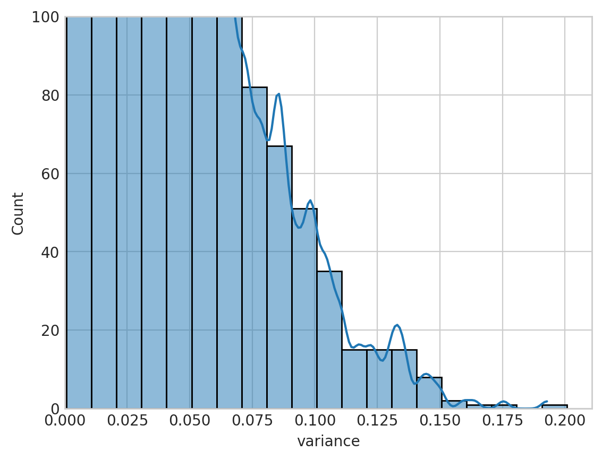
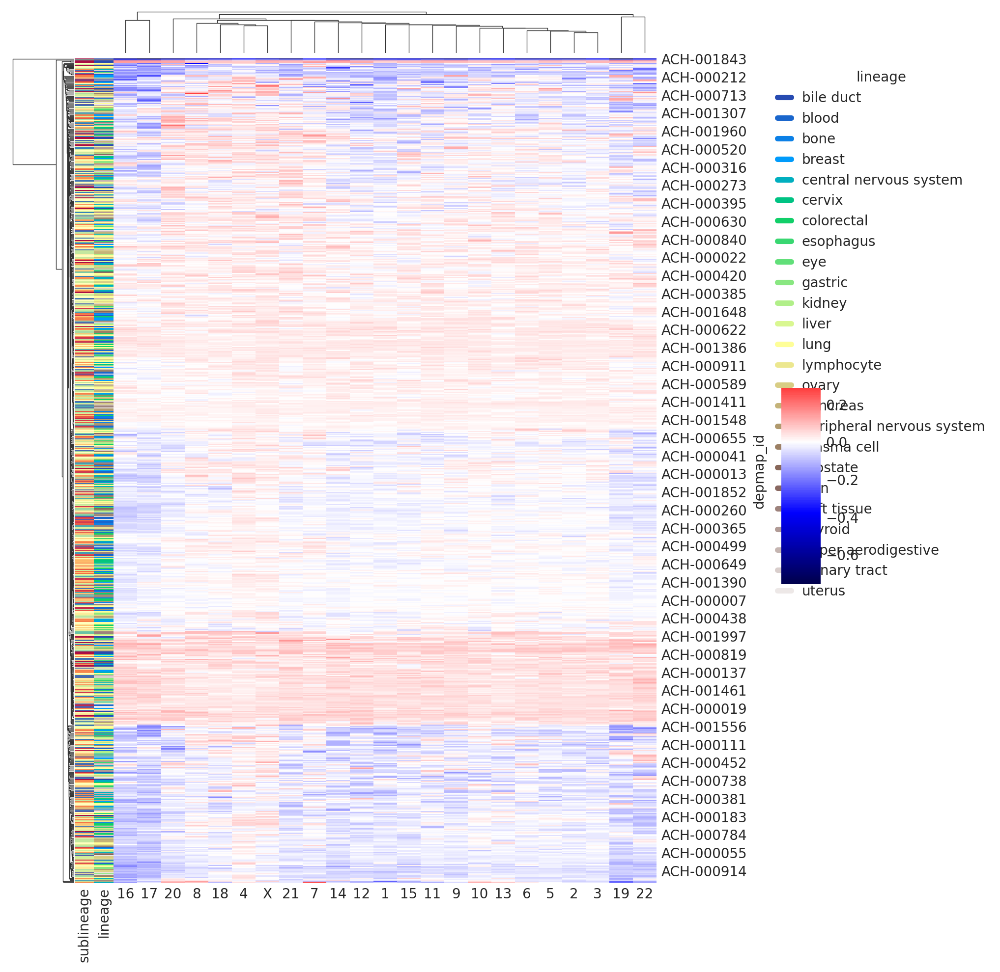
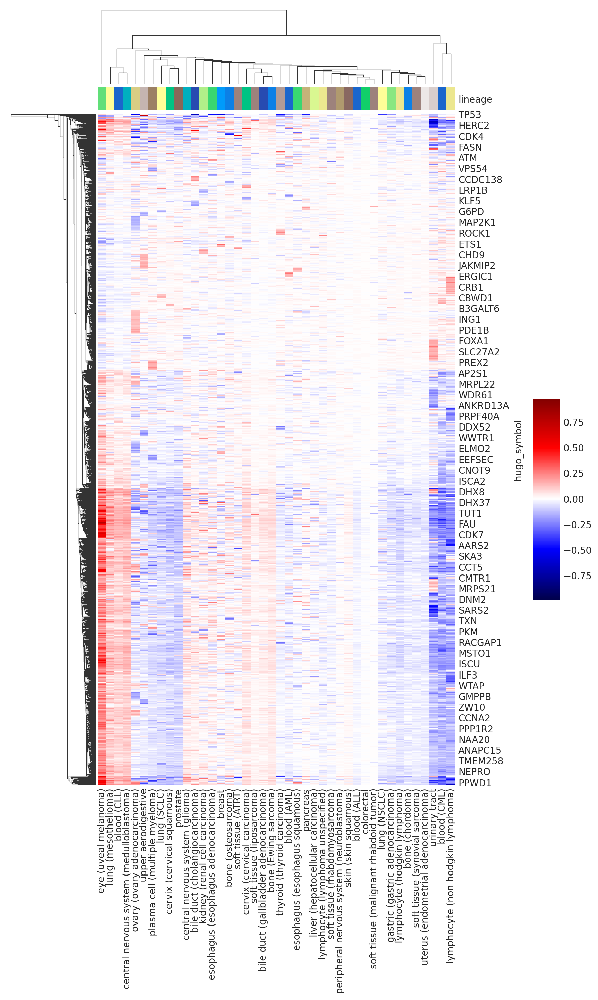
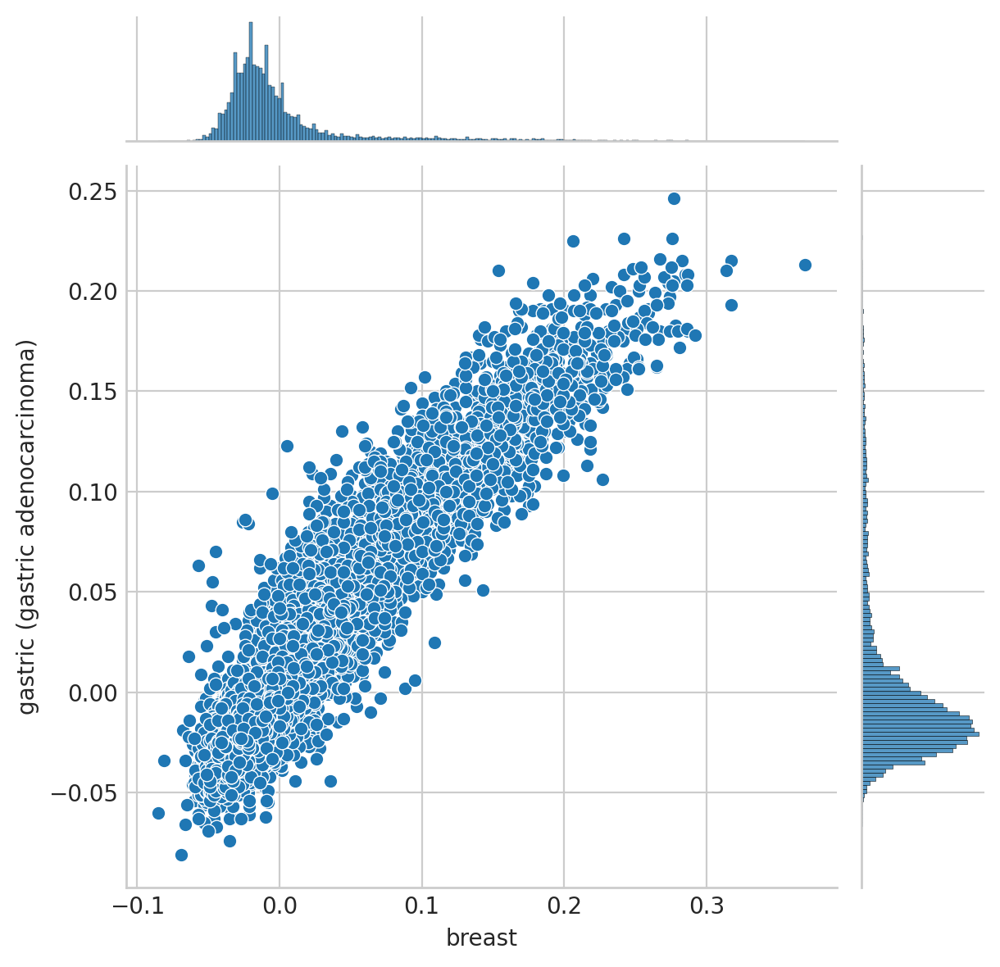

# Analyzing single-lineage models

## Setup

### Imports


```python
%load_ext autoreload
%autoreload 2
```


```python
import re
from time import time
from typing import Final

import matplotlib.pyplot as plt
import numpy as np
import pandas as pd
import seaborn as sns
```


```python
from speclet.analysis.arviz_analysis import extract_coords_param_names
from speclet.io import project_root
from speclet.managers.posterior_data_manager import (
    PosteriorDataManager,
    PosteriorDataManagers,
)
from speclet.model_configuration import read_model_configurations
from speclet.plot import set_speclet_theme
from speclet.plot.color_pal import pal_to_legend_handles
from speclet.project_configuration import arviz_config, get_model_configuration_file
from speclet.project_enums import ModelFitMethod
```


```python
# Notebook execution timer.
notebook_tic = time()

# Plotting setup.
set_speclet_theme()
%config InlineBackend.figure_format = "retina"

# Constants
RANDOM_SEED = 709
np.random.seed(RANDOM_SEED)
arviz_config()

# File paths
config_path = project_root() / get_model_configuration_file()
```

### Data

#### Model posteriors


```python
model_configs = read_model_configurations(config_path, active_only=True)
f"Number of configurations: {len(model_configs.configurations)}"
```


    'Number of configurations: 43'


```python
model_names = [c.name for c in model_configs.configurations]
model_names.sort()
pattern = r"(?<=hnb-single-lineage-).*$"
sublineage_names = [re.findall(pattern, m)[0] for m in model_names]
sublineage_names = [n.replace("_", " ") for n in sublineage_names]

# Skip some lineages because they are incomplete at the moment.
SKIP_LINEAGES: Final[list[str]] = [
    # "blood",
    # "colorectal",
    # "bone",
    # "central nervous system",
    # "kidney",
    # "lung",
]
for skip_line in SKIP_LINEAGES:
    i = sublineage_names.index(skip_line)
    _ = model_names.pop(i), sublineage_names.pop(i)


postmen = PosteriorDataManagers(
    names=model_names,
    fit_methods=ModelFitMethod.PYMC_NUMPYRO,
    config_paths=config_path,
    keys=sublineage_names,
)
```


```python
postmen.keys
```


    ['bile duct (cholangiocarcinoma)',
     'bile duct (gallbladder adenocarcinoma)',
     'blood (ALL)',
     'blood (AML)',
     'blood (CLL)',
     'blood (CML)',
     'bone (Ewing sarcoma)',
     'bone (chordoma)',
     'bone (osteosarcoma)',
     'breast',
     'central nervous system (glioma)',
     'central nervous system (medulloblastoma)',
     'cervix (cervical carcinoma)',
     'cervix (cervical squamous)',
     'colorectal',
     'esophagus (esophagus adenocarcinoma)',
     'esophagus (esophagus squamous)',
     'eye (uveal melanoma)',
     'gastric (gastric adenocarcinoma)',
     'kidney (renal cell carcinoma)',
     'liver (hepatocellular carcinoma)',
     'lung (NSCLC)',
     'lung (SCLC)',
     'lung (mesothelioma)',
     'lymphocyte (hodgkin lymphoma)',
     'lymphocyte (lymphoma unspecified)',
     'lymphocyte (non hodgkin lymphoma)',
     'ovary (ovary adenocarcinoma)',
     'pancreas',
     'peripheral nervous system (neuroblastoma)',
     'plasma cell (multiple myeloma)',
     'prostate',
     'skin (melanoma)',
     'skin (skin squamous)',
     'soft tissue (ATRT)',
     'soft tissue (liposarcoma)',
     'soft tissue (malignant rhabdoid tumor)',
     'soft tissue (rhabdomyosarcoma)',
     'soft tissue (synovial sarcoma)',
     'thyroid (thyroid carcinoma)',
     'upper aerodigestive',
     'urinary tract',
     'uterus (endometrial adenocarcinoma)']


```python
len(postmen)
```


    43


```python
sub_to_lineage = {pm.id: pm.id.split(" (")[0] for pm in postmen.posteriors}
lineages = list(set(sub_to_lineage.values()))
lineages.sort()
lineages
```


    ['bile duct',
     'blood',
     'bone',
     'breast',
     'central nervous system',
     'cervix',
     'colorectal',
     'esophagus',
     'eye',
     'gastric',
     'kidney',
     'liver',
     'lung',
     'lymphocyte',
     'ovary',
     'pancreas',
     'peripheral nervous system',
     'plasma cell',
     'prostate',
     'skin',
     'soft tissue',
     'thyroid',
     'upper aerodigestive',
     'urinary tract',
     'uterus']


```python
sublineage_cmap = sns.color_palette("Spectral", n_colors=len(postmen), as_cmap=False)
sublineage_pal = {line: sublineage_cmap[i] for i, line in enumerate(sublineage_names)}

lineage_cmap = sns.color_palette("terrain", n_colors=len(lineages), as_cmap=False)
lineage_pal = {line: lineage_cmap[i] for i, line in enumerate(lineages)}
```

## Descriptions


```python
def get_posterior_dimensions(pm: PosteriorDataManager) -> pd.DataFrame:
    return pd.DataFrame(
        {k: v for k, v in pm.trace.posterior.dims.items()}, index=[pm.id]
    )


post_dims = pd.concat([get_posterior_dimensions(pm) for pm in postmen.posteriors])
post_dims = post_dims.loc[:, ["dim_" not in cn for cn in post_dims.columns]]
post_dims
```


<div>
<style scoped>
    .dataframe tbody tr th:only-of-type {
        vertical-align: middle;
    }

    .dataframe tbody tr th {
        vertical-align: top;
    }

    .dataframe thead th {
        text-align: right;
    }
</style>
<table border="1" class="dataframe">
  <thead>
    <tr style="text-align: right;">
      <th></th>
      <th>chain</th>
      <th>draw</th>
      <th>sgrna</th>
      <th>cell_chrom</th>
      <th>gene</th>
      <th>cell_line</th>
      <th>cancer_gene</th>
    </tr>
  </thead>
  <tbody>
    <tr>
      <th>bile duct (cholangiocarcinoma)</th>
      <td>4</td>
      <td>1000</td>
      <td>71062</td>
      <td>713</td>
      <td>18119</td>
      <td>31</td>
      <td>NaN</td>
    </tr>
    <tr>
      <th>bile duct (gallbladder adenocarcinoma)</th>
      <td>4</td>
      <td>1000</td>
      <td>71062</td>
      <td>138</td>
      <td>18119</td>
      <td>6</td>
      <td>NaN</td>
    </tr>
    <tr>
      <th>blood (ALL)</th>
      <td>4</td>
      <td>1000</td>
      <td>71062</td>
      <td>345</td>
      <td>18119</td>
      <td>15</td>
      <td>6.0</td>
    </tr>
    <tr>
      <th>blood (AML)</th>
      <td>4</td>
      <td>1000</td>
      <td>71062</td>
      <td>575</td>
      <td>18119</td>
      <td>25</td>
      <td>2.0</td>
    </tr>
    <tr>
      <th>blood (CLL)</th>
      <td>4</td>
      <td>1000</td>
      <td>71062</td>
      <td>92</td>
      <td>18119</td>
      <td>4</td>
      <td>NaN</td>
    </tr>
    <tr>
      <th>blood (CML)</th>
      <td>4</td>
      <td>1000</td>
      <td>71062</td>
      <td>161</td>
      <td>18119</td>
      <td>7</td>
      <td>NaN</td>
    </tr>
    <tr>
      <th>bone (Ewing sarcoma)</th>
      <td>4</td>
      <td>1000</td>
      <td>71062</td>
      <td>368</td>
      <td>18119</td>
      <td>16</td>
      <td>NaN</td>
    </tr>
    <tr>
      <th>bone (chordoma)</th>
      <td>4</td>
      <td>1000</td>
      <td>71062</td>
      <td>92</td>
      <td>18119</td>
      <td>4</td>
      <td>NaN</td>
    </tr>
    <tr>
      <th>bone (osteosarcoma)</th>
      <td>4</td>
      <td>1000</td>
      <td>71062</td>
      <td>207</td>
      <td>18119</td>
      <td>9</td>
      <td>NaN</td>
    </tr>
    <tr>
      <th>breast</th>
      <td>4</td>
      <td>1000</td>
      <td>71062</td>
      <td>874</td>
      <td>18119</td>
      <td>38</td>
      <td>2.0</td>
    </tr>
    <tr>
      <th>central nervous system (glioma)</th>
      <td>4</td>
      <td>1000</td>
      <td>71062</td>
      <td>1173</td>
      <td>18119</td>
      <td>51</td>
      <td>7.0</td>
    </tr>
    <tr>
      <th>central nervous system (medulloblastoma)</th>
      <td>4</td>
      <td>1000</td>
      <td>71062</td>
      <td>161</td>
      <td>18119</td>
      <td>7</td>
      <td>NaN</td>
    </tr>
    <tr>
      <th>cervix (cervical carcinoma)</th>
      <td>4</td>
      <td>1000</td>
      <td>71062</td>
      <td>115</td>
      <td>18119</td>
      <td>5</td>
      <td>NaN</td>
    </tr>
    <tr>
      <th>cervix (cervical squamous)</th>
      <td>4</td>
      <td>1000</td>
      <td>71062</td>
      <td>115</td>
      <td>18119</td>
      <td>5</td>
      <td>NaN</td>
    </tr>
    <tr>
      <th>colorectal</th>
      <td>4</td>
      <td>1000</td>
      <td>71062</td>
      <td>920</td>
      <td>18119</td>
      <td>40</td>
      <td>9.0</td>
    </tr>
    <tr>
      <th>esophagus (esophagus adenocarcinoma)</th>
      <td>4</td>
      <td>1000</td>
      <td>71062</td>
      <td>115</td>
      <td>18119</td>
      <td>5</td>
      <td>NaN</td>
    </tr>
    <tr>
      <th>esophagus (esophagus squamous)</th>
      <td>4</td>
      <td>1000</td>
      <td>71062</td>
      <td>460</td>
      <td>18119</td>
      <td>20</td>
      <td>1.0</td>
    </tr>
    <tr>
      <th>eye (uveal melanoma)</th>
      <td>4</td>
      <td>1000</td>
      <td>71062</td>
      <td>115</td>
      <td>18119</td>
      <td>5</td>
      <td>NaN</td>
    </tr>
    <tr>
      <th>gastric (gastric adenocarcinoma)</th>
      <td>4</td>
      <td>1000</td>
      <td>71062</td>
      <td>644</td>
      <td>18119</td>
      <td>28</td>
      <td>6.0</td>
    </tr>
    <tr>
      <th>kidney (renal cell carcinoma)</th>
      <td>4</td>
      <td>1000</td>
      <td>71062</td>
      <td>552</td>
      <td>18119</td>
      <td>24</td>
      <td>4.0</td>
    </tr>
    <tr>
      <th>liver (hepatocellular carcinoma)</th>
      <td>4</td>
      <td>1000</td>
      <td>71062</td>
      <td>460</td>
      <td>18119</td>
      <td>20</td>
      <td>1.0</td>
    </tr>
    <tr>
      <th>lung (NSCLC)</th>
      <td>4</td>
      <td>1000</td>
      <td>71062</td>
      <td>1909</td>
      <td>18119</td>
      <td>83</td>
      <td>10.0</td>
    </tr>
    <tr>
      <th>lung (SCLC)</th>
      <td>4</td>
      <td>1000</td>
      <td>71062</td>
      <td>437</td>
      <td>18119</td>
      <td>19</td>
      <td>2.0</td>
    </tr>
    <tr>
      <th>lung (mesothelioma)</th>
      <td>4</td>
      <td>1000</td>
      <td>71062</td>
      <td>299</td>
      <td>18119</td>
      <td>13</td>
      <td>NaN</td>
    </tr>
    <tr>
      <th>lymphocyte (hodgkin lymphoma)</th>
      <td>4</td>
      <td>1000</td>
      <td>71062</td>
      <td>92</td>
      <td>18119</td>
      <td>4</td>
      <td>NaN</td>
    </tr>
    <tr>
      <th>lymphocyte (lymphoma unspecified)</th>
      <td>4</td>
      <td>1000</td>
      <td>71062</td>
      <td>115</td>
      <td>18119</td>
      <td>5</td>
      <td>NaN</td>
    </tr>
    <tr>
      <th>lymphocyte (non hodgkin lymphoma)</th>
      <td>4</td>
      <td>1000</td>
      <td>71062</td>
      <td>460</td>
      <td>18119</td>
      <td>20</td>
      <td>NaN</td>
    </tr>
    <tr>
      <th>ovary (ovary adenocarcinoma)</th>
      <td>4</td>
      <td>1000</td>
      <td>71062</td>
      <td>966</td>
      <td>18119</td>
      <td>42</td>
      <td>5.0</td>
    </tr>
    <tr>
      <th>pancreas</th>
      <td>4</td>
      <td>1000</td>
      <td>71062</td>
      <td>874</td>
      <td>18119</td>
      <td>38</td>
      <td>4.0</td>
    </tr>
    <tr>
      <th>peripheral nervous system (neuroblastoma)</th>
      <td>4</td>
      <td>1000</td>
      <td>71062</td>
      <td>460</td>
      <td>18119</td>
      <td>20</td>
      <td>NaN</td>
    </tr>
    <tr>
      <th>plasma cell (multiple myeloma)</th>
      <td>4</td>
      <td>1000</td>
      <td>71062</td>
      <td>483</td>
      <td>18119</td>
      <td>21</td>
      <td>NaN</td>
    </tr>
    <tr>
      <th>prostate</th>
      <td>4</td>
      <td>1000</td>
      <td>71062</td>
      <td>115</td>
      <td>18119</td>
      <td>5</td>
      <td>NaN</td>
    </tr>
    <tr>
      <th>skin (melanoma)</th>
      <td>4</td>
      <td>1000</td>
      <td>71062</td>
      <td>1311</td>
      <td>18119</td>
      <td>57</td>
      <td>9.0</td>
    </tr>
    <tr>
      <th>skin (skin squamous)</th>
      <td>4</td>
      <td>1000</td>
      <td>71062</td>
      <td>92</td>
      <td>18119</td>
      <td>4</td>
      <td>NaN</td>
    </tr>
    <tr>
      <th>soft tissue (ATRT)</th>
      <td>4</td>
      <td>1000</td>
      <td>71062</td>
      <td>115</td>
      <td>18119</td>
      <td>5</td>
      <td>NaN</td>
    </tr>
    <tr>
      <th>soft tissue (liposarcoma)</th>
      <td>4</td>
      <td>1000</td>
      <td>71062</td>
      <td>161</td>
      <td>18119</td>
      <td>7</td>
      <td>NaN</td>
    </tr>
    <tr>
      <th>soft tissue (malignant rhabdoid tumor)</th>
      <td>4</td>
      <td>1000</td>
      <td>71062</td>
      <td>184</td>
      <td>18119</td>
      <td>8</td>
      <td>NaN</td>
    </tr>
    <tr>
      <th>soft tissue (rhabdomyosarcoma)</th>
      <td>4</td>
      <td>1000</td>
      <td>71062</td>
      <td>230</td>
      <td>18119</td>
      <td>10</td>
      <td>NaN</td>
    </tr>
    <tr>
      <th>soft tissue (synovial sarcoma)</th>
      <td>4</td>
      <td>1000</td>
      <td>71062</td>
      <td>115</td>
      <td>18119</td>
      <td>5</td>
      <td>NaN</td>
    </tr>
    <tr>
      <th>thyroid (thyroid carcinoma)</th>
      <td>4</td>
      <td>1000</td>
      <td>71062</td>
      <td>207</td>
      <td>18119</td>
      <td>9</td>
      <td>NaN</td>
    </tr>
    <tr>
      <th>upper aerodigestive</th>
      <td>4</td>
      <td>1000</td>
      <td>71062</td>
      <td>1058</td>
      <td>18119</td>
      <td>46</td>
      <td>NaN</td>
    </tr>
    <tr>
      <th>urinary tract</th>
      <td>4</td>
      <td>1000</td>
      <td>71062</td>
      <td>690</td>
      <td>18119</td>
      <td>30</td>
      <td>NaN</td>
    </tr>
    <tr>
      <th>uterus (endometrial adenocarcinoma)</th>
      <td>4</td>
      <td>1000</td>
      <td>71062</td>
      <td>414</td>
      <td>18119</td>
      <td>18</td>
      <td>9.0</td>
    </tr>
  </tbody>
</table>
</div>


## Analysis


```python
def summarize_variable_per_lineage(
    pms: PosteriorDataManagers,
    var_name: str,
    extract_names: str | list[str] | None = None,
) -> pd.DataFrame:
    posteriors = pd.DataFrame()

    for lineage, lineage_pm in postmen.as_dict().items():
        post = (
            lineage_pm.posterior_summary.query(f"var_name == '{var_name}'")
            .reset_index(drop=True)
            .assign(lineage=lineage)
        )
        if len(post) == 0:
            continue

        if extract_names is not None:
            post = extract_coords_param_names(
                post, names=extract_names, col="parameter"
            )

        posteriors = pd.concat([posteriors, post])

    return posteriors.reset_index(drop=True)
```


```python
mu_a_posteriors = summarize_variable_per_lineage(
    postmen, var_name="mu_a", extract_names="hugo_symbol"
)
mu_a_posteriors.head()
```


<div>
<style scoped>
    .dataframe tbody tr th:only-of-type {
        vertical-align: middle;
    }

    .dataframe tbody tr th {
        vertical-align: top;
    }

    .dataframe thead th {
        text-align: right;
    }
</style>
<table border="1" class="dataframe">
  <thead>
    <tr style="text-align: right;">
      <th></th>
      <th>parameter</th>
      <th>mean</th>
      <th>sd</th>
      <th>hdi_5.5%</th>
      <th>hdi_94.5%</th>
      <th>mcse_mean</th>
      <th>mcse_sd</th>
      <th>ess_bulk</th>
      <th>ess_tail</th>
      <th>r_hat</th>
      <th>var_name</th>
      <th>lineage</th>
      <th>hugo_symbol</th>
    </tr>
  </thead>
  <tbody>
    <tr>
      <th>0</th>
      <td>mu_a[A1BG]</td>
      <td>0.337</td>
      <td>0.125</td>
      <td>0.136</td>
      <td>0.535</td>
      <td>0.002</td>
      <td>0.002</td>
      <td>3351.0</td>
      <td>2677.0</td>
      <td>1.0</td>
      <td>mu_a</td>
      <td>bile duct (cholangiocarcinoma)</td>
      <td>A1BG</td>
    </tr>
    <tr>
      <th>1</th>
      <td>mu_a[A1CF]</td>
      <td>0.268</td>
      <td>0.124</td>
      <td>0.069</td>
      <td>0.462</td>
      <td>0.002</td>
      <td>0.002</td>
      <td>3071.0</td>
      <td>3020.0</td>
      <td>1.0</td>
      <td>mu_a</td>
      <td>bile duct (cholangiocarcinoma)</td>
      <td>A1CF</td>
    </tr>
    <tr>
      <th>2</th>
      <td>mu_a[A2M]</td>
      <td>0.178</td>
      <td>0.127</td>
      <td>-0.026</td>
      <td>0.374</td>
      <td>0.002</td>
      <td>0.002</td>
      <td>2829.0</td>
      <td>3058.0</td>
      <td>1.0</td>
      <td>mu_a</td>
      <td>bile duct (cholangiocarcinoma)</td>
      <td>A2M</td>
    </tr>
    <tr>
      <th>3</th>
      <td>mu_a[A2ML1]</td>
      <td>0.315</td>
      <td>0.128</td>
      <td>0.122</td>
      <td>0.527</td>
      <td>0.002</td>
      <td>0.002</td>
      <td>3615.0</td>
      <td>3519.0</td>
      <td>1.0</td>
      <td>mu_a</td>
      <td>bile duct (cholangiocarcinoma)</td>
      <td>A2ML1</td>
    </tr>
    <tr>
      <th>4</th>
      <td>mu_a[A3GALT2]</td>
      <td>0.109</td>
      <td>0.126</td>
      <td>-0.091</td>
      <td>0.316</td>
      <td>0.002</td>
      <td>0.002</td>
      <td>3645.0</td>
      <td>3260.0</td>
      <td>1.0</td>
      <td>mu_a</td>
      <td>bile duct (cholangiocarcinoma)</td>
      <td>A3GALT2</td>
    </tr>
  </tbody>
</table>
</div>


```python
ax = sns.kdeplot(
    data=mu_a_posteriors, x="mean", hue="lineage", alpha=0.5, palette=sublineage_pal
)
ax.legend(
    handles=pal_to_legend_handles(lineage_pal, lw=2),
    handlelength=1,
    ncol=3,
    loc="upper left",
    bbox_to_anchor=(1, 1),
)
plt.show()
```


```python
mu_a_posterior_variability = (
    mu_a_posteriors.groupby("hugo_symbol")["mean"]
    .var()
    .reset_index()
    .rename(columns={"mean": "variance"})
)
ax = sns.histplot(
    data=mu_a_posterior_variability, x="variance", binwidth=0.01, kde=True
)
ax.set_xlim(0, None)
ax.set_ylim(0, 100)
```


    (0.0, 100.0)





```python
mu_a_posterior_variability.sort_values(["variance"], ascending=False).head(15)
```


<div>
<style scoped>
    .dataframe tbody tr th:only-of-type {
        vertical-align: middle;
    }

    .dataframe tbody tr th {
        vertical-align: top;
    }

    .dataframe thead th {
        text-align: right;
    }
</style>
<table border="1" class="dataframe">
  <thead>
    <tr style="text-align: right;">
      <th></th>
      <th>hugo_symbol</th>
      <th>variance</th>
    </tr>
  </thead>
  <tbody>
    <tr>
      <th>12642</th>
      <td>RAN</td>
      <td>0.174340</td>
    </tr>
    <tr>
      <th>16644</th>
      <td>TXNL4A</td>
      <td>0.159995</td>
    </tr>
    <tr>
      <th>7774</th>
      <td>KIF11</td>
      <td>0.159251</td>
    </tr>
    <tr>
      <th>16203</th>
      <td>TP53</td>
      <td>0.154458</td>
    </tr>
    <tr>
      <th>12291</th>
      <td>PSMB5</td>
      <td>0.152744</td>
    </tr>
    <tr>
      <th>4599</th>
      <td>EIF1AX</td>
      <td>0.147346</td>
    </tr>
    <tr>
      <th>669</th>
      <td>ANKLE2</td>
      <td>0.145652</td>
    </tr>
    <tr>
      <th>2438</th>
      <td>CCND1</td>
      <td>0.143914</td>
    </tr>
    <tr>
      <th>11831</th>
      <td>POLR2L</td>
      <td>0.138049</td>
    </tr>
    <tr>
      <th>13304</th>
      <td>RPSA</td>
      <td>0.137469</td>
    </tr>
    <tr>
      <th>9694</th>
      <td>NAA10</td>
      <td>0.135083</td>
    </tr>
    <tr>
      <th>17350</th>
      <td>YRDC</td>
      <td>0.133543</td>
    </tr>
    <tr>
      <th>13236</th>
      <td>RPL4</td>
      <td>0.133500</td>
    </tr>
    <tr>
      <th>6976</th>
      <td>HSPE1</td>
      <td>0.133208</td>
    </tr>
    <tr>
      <th>13288</th>
      <td>RPS4X</td>
      <td>0.132881</td>
    </tr>
  </tbody>
</table>
</div>


```python
k_posteriors = (
    summarize_variable_per_lineage(postmen, var_name="k", extract_names="cell_chrom")
    .rename(columns={"lineage": "sublineage"})
    .assign(
        depmap_id=lambda d: [x.split("__")[0] for x in d["cell_chrom"]],
        sgrna_target_chr=lambda d: [x.split("__")[1] for x in d["cell_chrom"]],
        lineage=lambda d: d["sublineage"].map(sub_to_lineage),
    )
)
k_posteriors.head()
```


<div>
<style scoped>
    .dataframe tbody tr th:only-of-type {
        vertical-align: middle;
    }

    .dataframe tbody tr th {
        vertical-align: top;
    }

    .dataframe thead th {
        text-align: right;
    }
</style>
<table border="1" class="dataframe">
  <thead>
    <tr style="text-align: right;">
      <th></th>
      <th>parameter</th>
      <th>mean</th>
      <th>sd</th>
      <th>hdi_5.5%</th>
      <th>hdi_94.5%</th>
      <th>mcse_mean</th>
      <th>mcse_sd</th>
      <th>ess_bulk</th>
      <th>ess_tail</th>
      <th>r_hat</th>
      <th>var_name</th>
      <th>sublineage</th>
      <th>cell_chrom</th>
      <th>depmap_id</th>
      <th>sgrna_target_chr</th>
      <th>lineage</th>
    </tr>
  </thead>
  <tbody>
    <tr>
      <th>0</th>
      <td>k[ACH-000182__1]</td>
      <td>0.052</td>
      <td>0.021</td>
      <td>0.018</td>
      <td>0.084</td>
      <td>0.001</td>
      <td>0.001</td>
      <td>532.0</td>
      <td>670.0</td>
      <td>1.01</td>
      <td>k</td>
      <td>bile duct (cholangiocarcinoma)</td>
      <td>ACH-000182__1</td>
      <td>ACH-000182</td>
      <td>1</td>
      <td>bile duct</td>
    </tr>
    <tr>
      <th>1</th>
      <td>k[ACH-000182__2]</td>
      <td>-0.055</td>
      <td>0.022</td>
      <td>-0.087</td>
      <td>-0.018</td>
      <td>0.001</td>
      <td>0.001</td>
      <td>377.0</td>
      <td>685.0</td>
      <td>1.01</td>
      <td>k</td>
      <td>bile duct (cholangiocarcinoma)</td>
      <td>ACH-000182__2</td>
      <td>ACH-000182</td>
      <td>2</td>
      <td>bile duct</td>
    </tr>
    <tr>
      <th>2</th>
      <td>k[ACH-000182__3]</td>
      <td>-0.030</td>
      <td>0.022</td>
      <td>-0.066</td>
      <td>0.003</td>
      <td>0.001</td>
      <td>0.001</td>
      <td>477.0</td>
      <td>988.0</td>
      <td>1.01</td>
      <td>k</td>
      <td>bile duct (cholangiocarcinoma)</td>
      <td>ACH-000182__3</td>
      <td>ACH-000182</td>
      <td>3</td>
      <td>bile duct</td>
    </tr>
    <tr>
      <th>3</th>
      <td>k[ACH-000182__4]</td>
      <td>0.023</td>
      <td>0.024</td>
      <td>-0.013</td>
      <td>0.062</td>
      <td>0.001</td>
      <td>0.001</td>
      <td>447.0</td>
      <td>1049.0</td>
      <td>1.01</td>
      <td>k</td>
      <td>bile duct (cholangiocarcinoma)</td>
      <td>ACH-000182__4</td>
      <td>ACH-000182</td>
      <td>4</td>
      <td>bile duct</td>
    </tr>
    <tr>
      <th>4</th>
      <td>k[ACH-000182__5]</td>
      <td>-0.046</td>
      <td>0.024</td>
      <td>-0.082</td>
      <td>-0.007</td>
      <td>0.001</td>
      <td>0.001</td>
      <td>554.0</td>
      <td>836.0</td>
      <td>1.01</td>
      <td>k</td>
      <td>bile duct (cholangiocarcinoma)</td>
      <td>ACH-000182__5</td>
      <td>ACH-000182</td>
      <td>5</td>
      <td>bile duct</td>
    </tr>
  </tbody>
</table>
</div>


```python
row_colors = (
    k_posteriors[["sublineage", "lineage", "depmap_id"]]
    .drop_duplicates()
    .set_index("depmap_id")
    .assign(
        lineage=lambda d: d["lineage"].map(lineage_pal),
        sublineage=lambda d: d["sublineage"].map(sublineage_pal),
    )
)

k_posteriors_wide = k_posteriors.pivot_wider(
    index="depmap_id", names_from="sgrna_target_chr", values_from="mean"
).set_index("depmap_id")
fg = sns.clustermap(
    k_posteriors_wide,
    cmap="seismic",
    center=0,
    row_colors=row_colors,
    figsize=(8, 10),
    cbar_pos=(1, 0.4, 0.05, 0.2),
    dendrogram_ratio=(0.1, 0.05),
)
fg.ax_heatmap.legend(
    handles=pal_to_legend_handles(lineage_pal, lw=4),
    title="lineage",
    loc="upper left",
    bbox_to_anchor=(1.2, 1),
    handlelength=1,
    frameon=False,
)
plt.show()
```

    /home/jc604/.conda/envs/speclet/lib/python3.10/site-packages/seaborn/matrix.py:654: UserWarning: Clustering large matrix with scipy. Installing `fastcluster` may give better performance.





```python
f_posteriors = summarize_variable_per_lineage(
    postmen, var_name="f", extract_names="hugo_symbol"
)
f_posteriors.head()
```


<div>
<style scoped>
    .dataframe tbody tr th:only-of-type {
        vertical-align: middle;
    }

    .dataframe tbody tr th {
        vertical-align: top;
    }

    .dataframe thead th {
        text-align: right;
    }
</style>
<table border="1" class="dataframe">
  <thead>
    <tr style="text-align: right;">
      <th></th>
      <th>parameter</th>
      <th>mean</th>
      <th>sd</th>
      <th>hdi_5.5%</th>
      <th>hdi_94.5%</th>
      <th>mcse_mean</th>
      <th>mcse_sd</th>
      <th>ess_bulk</th>
      <th>ess_tail</th>
      <th>r_hat</th>
      <th>var_name</th>
      <th>lineage</th>
      <th>hugo_symbol</th>
    </tr>
  </thead>
  <tbody>
    <tr>
      <th>0</th>
      <td>f[A1BG]</td>
      <td>-0.004</td>
      <td>0.117</td>
      <td>-0.188</td>
      <td>0.188</td>
      <td>0.001</td>
      <td>0.002</td>
      <td>9718.0</td>
      <td>2826.0</td>
      <td>1.00</td>
      <td>f</td>
      <td>bile duct (cholangiocarcinoma)</td>
      <td>A1BG</td>
    </tr>
    <tr>
      <th>1</th>
      <td>f[A1CF]</td>
      <td>-0.010</td>
      <td>0.096</td>
      <td>-0.162</td>
      <td>0.143</td>
      <td>0.001</td>
      <td>0.002</td>
      <td>9056.0</td>
      <td>2534.0</td>
      <td>1.00</td>
      <td>f</td>
      <td>bile duct (cholangiocarcinoma)</td>
      <td>A1CF</td>
    </tr>
    <tr>
      <th>2</th>
      <td>f[A2M]</td>
      <td>-0.008</td>
      <td>0.093</td>
      <td>-0.159</td>
      <td>0.141</td>
      <td>0.001</td>
      <td>0.002</td>
      <td>10978.0</td>
      <td>2870.0</td>
      <td>1.01</td>
      <td>f</td>
      <td>bile duct (cholangiocarcinoma)</td>
      <td>A2M</td>
    </tr>
    <tr>
      <th>3</th>
      <td>f[A2ML1]</td>
      <td>0.017</td>
      <td>0.088</td>
      <td>-0.126</td>
      <td>0.155</td>
      <td>0.001</td>
      <td>0.002</td>
      <td>10213.0</td>
      <td>2477.0</td>
      <td>1.00</td>
      <td>f</td>
      <td>bile duct (cholangiocarcinoma)</td>
      <td>A2ML1</td>
    </tr>
    <tr>
      <th>4</th>
      <td>f[A3GALT2]</td>
      <td>0.075</td>
      <td>0.100</td>
      <td>-0.079</td>
      <td>0.241</td>
      <td>0.001</td>
      <td>0.001</td>
      <td>8710.0</td>
      <td>2902.0</td>
      <td>1.00</td>
      <td>f</td>
      <td>bile duct (cholangiocarcinoma)</td>
      <td>A3GALT2</td>
    </tr>
  </tbody>
</table>
</div>


```python
hdi_outside_zero = (f_posteriors["hdi_5.5%"] * f_posteriors["hdi_94.5%"]).values > 0
effect_size_filter = f_posteriors["mean"].abs().values > 0.1
f_posteriors["hit"] = hdi_outside_zero * effect_size_filter
```


```python

```


```python
f_hit_genes = f_posteriors.query("hit")["hugo_symbol"].unique()
plot_df = (
    f_posteriors.filter_column_isin("hugo_symbol", f_hit_genes)
    .pivot_wider(index="hugo_symbol", names_from="lineage", values_from="mean")
    .set_index("hugo_symbol")
)

col_colors = (
    pd.DataFrame({"sublineage": plot_df.columns.tolist()})
    .assign(lineage=lambda d: d["sublineage"].map(sub_to_lineage).map(lineage_pal))
    .set_index("sublineage")
)

sns.clustermap(
    plot_df,
    cmap="seismic",
    center=0,
    figsize=(8, 15),
    dendrogram_ratio=(0.2, 0.1),
    cbar_pos=(1, 0.4, 0.05, 0.2),
    xticklabels=1,
    col_colors=col_colors,
)
plt.show()
```

    /home/jc604/.conda/envs/speclet/lib/python3.10/site-packages/seaborn/matrix.py:654: UserWarning: Clustering large matrix with scipy. Installing `fastcluster` may give better performance.





Possible analyses:

- heatmap of posteriors of `k` and `m` by TP53 mutation status
- most variable genes in `f` to highlight tissue-specificity of dependency
- correlation network of lineages by `f`
- description of certain genes (eg. KRAS, PIK3CA, TP53) across all lineages
- for cancer genes that were in multiple lineages, compare the hits in the comutation variable


```python
def filter_posterior_summmary_parameter(
    postmen: PosteriorDataManagers,
    pattern: str,
    var_names: str | list[str] | None = None,
) -> pd.DataFrame:
    res: list[pd.DataFrame] = []
    for lineage, lineage_pm in postmen.as_dict().items():
        res.append(
            lineage_pm.posterior_summary.filter_string("parameter", pattern).assign(
                lineage=lineage
            )
        )

    res_df = pd.concat(res)
    if var_names is not None:
        if isinstance(var_names, str):
            var_names = [var_names]
        res_df = res_df.filter_column_isin("var_name", var_names)

    return res_df.reset_index(drop=True)
```


```python
genes = ["KRAS", "NRAS", "BRAF", "PIK3CA", "PTEN", "TP53", "CDKN2A", "APC"]
var_names = {"mu_a": r"$\mu_a$", "b": "$b$", "d": "$d$", "f": "$f$"}

fig, axes = plt.subplots(
    nrows=2, ncols=len(genes) // 2, figsize=(12, 8), sharex=True, sharey=True
)

dx = np.linspace(-0.3, 0.3, len(postmen))
dodge = {line: dx[i] for i, line in enumerate(postmen.keys)}

for ax, gene in zip(axes.flatten(), genes):
    ax.set_title(f"${gene}$")
    data = filter_posterior_summmary_parameter(
        postmen, f"{gene}]", var_names=list(var_names.keys())
    )
    data["var_name"] = pd.Categorical(
        data["var_name"], categories=list(var_names.keys())
    )
    _x = data["var_name"].cat.codes
    _x += np.array([dodge[line] for line in data["lineage"]])
    data["x"] = _x

    colors = data["lineage"].map(sublineage_pal).values
    ax.vlines(x=data["x"], ymin=data["hdi_5.5%"], ymax=data["hdi_94.5%"], colors=colors)
    sns.scatterplot(
        data=data,
        x="x",
        y="mean",
        hue="lineage",
        palette=sublineage_pal,
        ax=ax,
        zorder=10,
    )
    sns.lineplot(
        data=data,
        x="x",
        y="mean",
        hue="lineage",
        palette=sublineage_pal,
        ax=ax,
        zorder=5,
        alpha=0.5,
        linewidth=1,
    )
    ax.get_legend().remove()
    ax.axhline(0, color="k", lw=1, zorder=1)
    ax.set_xticks(
        ticks=np.arange(data["var_name"].nunique()),
        labels=[var_names[v] for v in data["var_name"].cat.categories],
    )

fig.legend(
    handles=pal_to_legend_handles(sublineage_pal, lw=0, marker="o"),
    title="lineage",
    loc="upper left",
    bbox_to_anchor=(1, 0.95),
)

for ax in axes[:, 0]:
    ax.set_ylabel("mean & 89% HDI")
for ax in axes[-1, :]:
    ax.set_xlabel("variable")

fig.tight_layout()
plt.show()
```


```python
def get_cancer_genes(pm: PosteriorDataManager) -> list[str]:
    if (cgs := pm.trace.posterior.coords.get("cancer_gene")) is None:
        return []
    return cgs.values.tolist()


def get_all_cancer_genes(postmen: PosteriorDataManagers) -> dict[str, list[str]]:
    cgs: dict[str, list[str]] = {}
    for lineage, pm in postmen.as_dict().items():
        cgs[lineage] = get_cancer_genes(pm)
    return cgs
```


```python
cancer_genes = get_all_cancer_genes(postmen)
cancer_genes
```


    {'bile duct (cholangiocarcinoma)': [],
     'bile duct (gallbladder adenocarcinoma)': [],
     'blood (ALL)': ['DNMT3A', 'FAT1', 'FLT3', 'LRP1B', 'NRAS', 'XPO1'],
     'blood (AML)': ['LRP1B', 'NRAS'],
     'blood (CLL)': [],
     'blood (CML)': [],
     'bone (Ewing sarcoma)': [],
     'bone (chordoma)': [],
     'bone (osteosarcoma)': [],
     'breast': ['BRCA2', 'PIK3CA'],
     'central nervous system (glioma)': ['APC',
      'CDKN2C',
      'EGFR',
      'KMT2C',
      'MLH1',
      'MTOR',
      'PTEN'],
     'central nervous system (medulloblastoma)': [],
     'cervix (cervical carcinoma)': [],
     'cervix (cervical squamous)': [],
     'colorectal': ['APC',
      'AXIN2',
      'B2M',
      'FBXW7',
      'KRAS',
      'MSH6',
      'PIK3CA',
      'POLD1',
      'UBR5'],
     'esophagus (esophagus adenocarcinoma)': [],
     'esophagus (esophagus squamous)': ['LRP1B'],
     'eye (uveal melanoma)': [],
     'gastric (gastric adenocarcinoma)': ['ATR',
      'CDH1',
      'PIK3CA',
      'PTPN13',
      'PTPRT',
      'ZFHX3'],
     'kidney (renal cell carcinoma)': ['MTOR', 'PBRM1', 'SETD2', 'VHL'],
     'liver (hepatocellular carcinoma)': ['AXIN1'],
     'lung (NSCLC)': ['DDR2',
      'DROSHA',
      'EGFR',
      'KDR',
      'KEAP1',
      'PTPN13',
      'RB1',
      'RBM10',
      'SMARCA4',
      'STK11'],
     'lung (SCLC)': ['RB1', 'SMARCA4'],
     'lung (mesothelioma)': [],
     'lymphocyte (hodgkin lymphoma)': [],
     'lymphocyte (lymphoma unspecified)': [],
     'lymphocyte (non hodgkin lymphoma)': [],
     'ovary (ovary adenocarcinoma)': ['BRCA1',
      'BRCA2',
      'LRP1B',
      'PIK3R1',
      'SMARCA4'],
     'pancreas': ['KRAS', 'PREX2', 'RNF43', 'SMAD4'],
     'peripheral nervous system (neuroblastoma)': [],
     'plasma cell (multiple myeloma)': [],
     'prostate': [],
     'skin (melanoma)': ['CDKN2A',
      'FAT4',
      'GRIN2A',
      'NRAS',
      'POLE',
      'PPP6C',
      'PREX2',
      'PTPRT',
      'TRRAP'],
     'skin (skin squamous)': [],
     'soft tissue (ATRT)': [],
     'soft tissue (liposarcoma)': [],
     'soft tissue (malignant rhabdoid tumor)': [],
     'soft tissue (rhabdomyosarcoma)': [],
     'soft tissue (synovial sarcoma)': [],
     'thyroid (thyroid carcinoma)': [],
     'upper aerodigestive': [],
     'urinary tract': [],
     'uterus (endometrial adenocarcinoma)': ['ATR',
      'CTCF',
      'FBXW7',
      'MLH1',
      'MSH2',
      'MTOR',
      'PTEN',
      'SRC',
      'ZFHX3']}


```python
h_post_summary = summarize_variable_per_lineage(
    postmen, var_name="h", extract_names=["hugo_symbol", "cancer_gene"]
)
```


```python
pik3ca_h_post_summary = (
    h_post_summary.filter_column_isin("cancer_gene", ["PIK3CA"])
    .reset_index(drop=True)
    .pivot_wider(index="hugo_symbol", names_from="lineage", values_from="mean")
)

sns.jointplot(
    data=pik3ca_h_post_summary, x="breast", y="gastric (gastric adenocarcinoma)"
);
```





---


```python
notebook_toc = time()
print(f"execution time: {(notebook_toc - notebook_tic) / 60:.2f} minutes")
```

    execution time: 1.89 minutes


```python
%load_ext watermark
%watermark -d -u -v -iv -b -h -m
```

    Last updated: 2022-09-08

    Python implementation: CPython
    Python version       : 3.10.5
    IPython version      : 8.4.0

    Compiler    : GCC 10.3.0
    OS          : Linux
    Release     : 3.10.0-1160.76.1.el7.x86_64
    Machine     : x86_64
    Processor   : x86_64
    CPU cores   : 32
    Architecture: 64bit

    Hostname: compute-a-17-108.o2.rc.hms.harvard.edu

    Git branch: expand-lineages

    re        : 2.2.1
    arviz     : 0.12.1
    matplotlib: 3.5.2
    plotnine  : 0.0.0
    pandas    : 1.4.3
    numpy     : 1.23.1
    seaborn   : 0.11.2


```python

```
