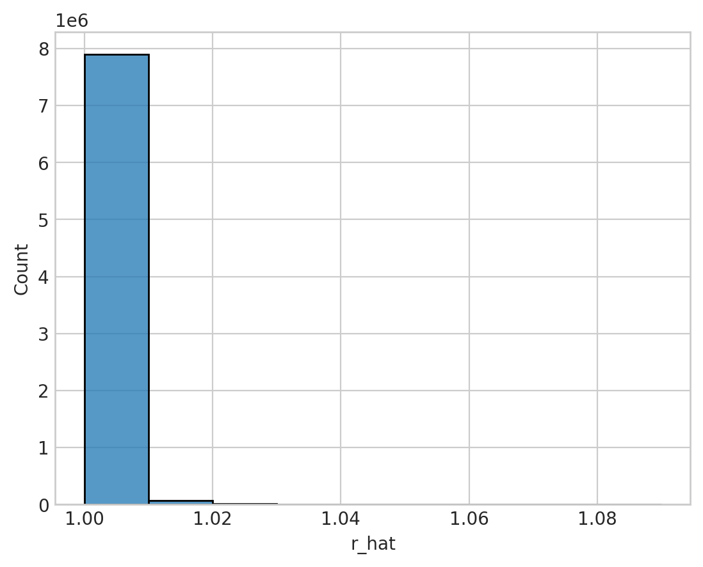
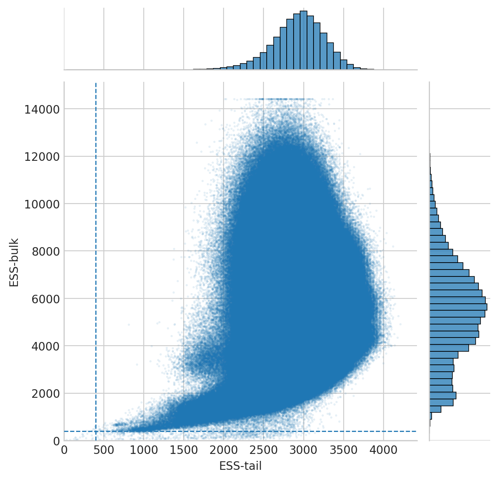
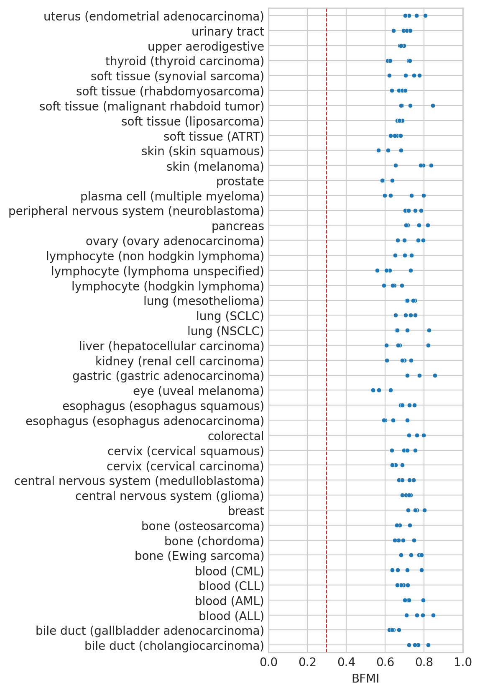

# Model diagnostics

## Setup

### Imports


```python
%load_ext autoreload
%autoreload 2
```


```python
from time import time
from typing import Collection

import arviz as az
import matplotlib.pyplot as plt
import numpy as np
import pandas as pd
import seaborn as sns
```


```python
from speclet.analysis.sublineage_model_analysis import load_sublineage_model_posteriors
from speclet.io import notebook_output_and_stash_dirs
from speclet.managers.posterior_data_manager import PosteriorDataManager as PostDataMan
from speclet.plot import set_speclet_theme
from speclet.project_configuration import arviz_config
```


```python
# Notebook execution timer.
notebook_tic = time()

# Plotting setup.
set_speclet_theme()
%config InlineBackend.figure_format = "retina"

# Constants
RANDOM_SEED = 709
np.random.seed(RANDOM_SEED)
arviz_config()
```


```python
OUTPUT_DIR, STASH_DIR = notebook_output_and_stash_dirs("100_101_model-diagnostics")
```

### Data

#### Model posteriors


```python
postmen = load_sublineage_model_posteriors()
```


```python
len(postmen)
```


    43


## Analysis


```python
def _get_posterior_variable_diagnostics(
    pm: PostDataMan, var_name: str, stash: bool = True
) -> pd.DataFrame:
    stash_fp = STASH_DIR / f"posterior-summary-diagnostics-{pm.id}_{var_name}.csv"
    if stash and stash_fp.exists():
        return pd.read_csv(stash_fp)

    res = (
        pd.read_csv(
            pm.posterior_summary_file,
            low_memory=False,
            usecols=["parameter", "ess_tail", "ess_bulk", "r_hat"],
        )
        .filter_string("parameter", "^" + var_name + r"\[")
        .assign(var_name=var_name)
    )
    res.to_csv(stash_fp, index=False)
    return res


def get_posterior_variables_diagnostics(
    pm: PostDataMan, var_names: Collection[str], stash: bool = True
) -> pd.DataFrame:
    res = (
        pd.concat(
            [
                _get_posterior_variable_diagnostics(pm, var_name=v, stash=stash)
                for v in var_names
            ]
        )
        .reset_index(drop=True)
        .assign(lineage_subtype=pm.id)
    )
    return res
```


```python
var_names = [
    "mu_mu_a",
    "mu_a",
    "a",
    "mu_b",
    "b",
    "d",
    "f",
    "h",
    "mu_k",
    "k",
    "mu_mu_m",
    "mu_m",
    "m",
]
var_names += [f"sigma_{v}" for v in ("mu_a", "a", "b", "d", "f")]
var_diagnostics = pd.concat(
    [
        get_posterior_variables_diagnostics(pm, var_names=var_names)
        for pm in postmen.posteriors
    ]
).reset_index(drop=True)
var_diagnostics.head()
```


<div>
<style scoped>
    .dataframe tbody tr th:only-of-type {
        vertical-align: middle;
    }

    .dataframe tbody tr th {
        vertical-align: top;
    }

    .dataframe thead th {
        text-align: right;
    }
</style>
<table border="1" class="dataframe">
  <thead>
    <tr style="text-align: right;">
      <th></th>
      <th>parameter</th>
      <th>ess_bulk</th>
      <th>ess_tail</th>
      <th>r_hat</th>
      <th>var_name</th>
      <th>lineage_subtype</th>
    </tr>
  </thead>
  <tbody>
    <tr>
      <th>0</th>
      <td>mu_a[A1BG]</td>
      <td>2686.0</td>
      <td>3015.0</td>
      <td>1.0</td>
      <td>mu_a</td>
      <td>bile duct (cholangiocarcinoma)</td>
    </tr>
    <tr>
      <th>1</th>
      <td>mu_a[A1CF]</td>
      <td>3291.0</td>
      <td>2986.0</td>
      <td>1.0</td>
      <td>mu_a</td>
      <td>bile duct (cholangiocarcinoma)</td>
    </tr>
    <tr>
      <th>2</th>
      <td>mu_a[A2M]</td>
      <td>3137.0</td>
      <td>2943.0</td>
      <td>1.0</td>
      <td>mu_a</td>
      <td>bile duct (cholangiocarcinoma)</td>
    </tr>
    <tr>
      <th>3</th>
      <td>mu_a[A2ML1]</td>
      <td>3025.0</td>
      <td>3113.0</td>
      <td>1.0</td>
      <td>mu_a</td>
      <td>bile duct (cholangiocarcinoma)</td>
    </tr>
    <tr>
      <th>4</th>
      <td>mu_a[A3GALT2]</td>
      <td>2949.0</td>
      <td>3087.0</td>
      <td>1.0</td>
      <td>mu_a</td>
      <td>bile duct (cholangiocarcinoma)</td>
    </tr>
  </tbody>
</table>
</div>


```python
sns.histplot(data=var_diagnostics, x="r_hat", binwidth=0.01)
plt.show()
```





```python
rhat_cutoffs = 1.01, 1.03
for rhat_cutoff in rhat_cutoffs:
    frac_good_rhat = (var_diagnostics["r_hat"] <= rhat_cutoff).mean()
    print(f"fraction of variables with Rhat ≤ {rhat_cutoff}: {frac_good_rhat}")
```

    fraction of variables with Rhat ≤ 1.01: 0.9990174045250586
    fraction of variables with Rhat ≤ 1.03: 0.9999942281455948


```python
var_diagnostics.query("r_hat > 1.03").count()
```


    parameter          46
    ess_bulk           46
    ess_tail           46
    r_hat              46
    var_name           46
    lineage_subtype    46
    dtype: int64


```python
jp = sns.jointplot(
    data=var_diagnostics,
    x="ess_tail",
    y="ess_bulk",
    joint_kws={"edgecolor": None, "s": 3, "alpha": 0.1, "color": "tab:blue"},
    marginal_kws={"bins": 50},
)
ax = jp.ax_joint
ax.set_xlim(0, None)
ax.set_ylim(0, None)

ax.axhline(400, color="tab:blue", lw=1, ls="--", zorder=10)
ax.axvline(400, color="tab:blue", lw=1, ls="--", zorder=10)
ax.set_xlabel("ESS-tail")
ax.set_ylabel("ESS-bulk")

plt.show()
```





```python
var_diagnostics[["lineage_subtype", "ess_tail", "ess_bulk"]].groupby(
    "lineage_subtype"
).describe().round(2)
```


<div>
<style scoped>
    .dataframe tbody tr th:only-of-type {
        vertical-align: middle;
    }

    .dataframe tbody tr th {
        vertical-align: top;
    }

    .dataframe thead tr th {
        text-align: left;
    }

    .dataframe thead tr:last-of-type th {
        text-align: right;
    }
</style>
<table border="1" class="dataframe">
  <thead>
    <tr>
      <th></th>
      <th colspan="8" halign="left">ess_tail</th>
      <th colspan="8" halign="left">ess_bulk</th>
    </tr>
    <tr>
      <th></th>
      <th>count</th>
      <th>mean</th>
      <th>std</th>
      <th>min</th>
      <th>25%</th>
      <th>50%</th>
      <th>75%</th>
      <th>max</th>
      <th>count</th>
      <th>mean</th>
      <th>std</th>
      <th>min</th>
      <th>25%</th>
      <th>50%</th>
      <th>75%</th>
      <th>max</th>
    </tr>
    <tr>
      <th>lineage_subtype</th>
      <th></th>
      <th></th>
      <th></th>
      <th></th>
      <th></th>
      <th></th>
      <th></th>
      <th></th>
      <th></th>
      <th></th>
      <th></th>
      <th></th>
      <th></th>
      <th></th>
      <th></th>
      <th></th>
    </tr>
  </thead>
  <tbody>
    <tr>
      <th>bile duct (cholangiocarcinoma)</th>
      <td>163145.0</td>
      <td>2810.15</td>
      <td>330.67</td>
      <td>682.0</td>
      <td>2603.0</td>
      <td>2787.0</td>
      <td>2991.00</td>
      <td>4015.0</td>
      <td>163145.0</td>
      <td>5654.55</td>
      <td>3500.38</td>
      <td>376.0</td>
      <td>3010.00</td>
      <td>3474.0</td>
      <td>9586.00</td>
      <td>14408.0</td>
    </tr>
    <tr>
      <th>bile duct (gallbladder adenocarcinoma)</th>
      <td>143826.0</td>
      <td>2984.86</td>
      <td>331.80</td>
      <td>1028.0</td>
      <td>2759.0</td>
      <td>3022.0</td>
      <td>3234.00</td>
      <td>4029.0</td>
      <td>143826.0</td>
      <td>7011.20</td>
      <td>1825.83</td>
      <td>554.0</td>
      <td>6470.00</td>
      <td>7181.0</td>
      <td>8082.00</td>
      <td>13711.0</td>
    </tr>
    <tr>
      <th>blood (ALL)</th>
      <td>343567.0</td>
      <td>2918.35</td>
      <td>310.78</td>
      <td>33.0</td>
      <td>2759.0</td>
      <td>2958.0</td>
      <td>3128.00</td>
      <td>4046.0</td>
      <td>343567.0</td>
      <td>4854.12</td>
      <td>1389.24</td>
      <td>30.0</td>
      <td>4068.00</td>
      <td>4980.0</td>
      <td>5709.00</td>
      <td>10590.0</td>
    </tr>
    <tr>
      <th>blood (AML)</th>
      <td>199095.0</td>
      <td>2917.31</td>
      <td>266.10</td>
      <td>878.0</td>
      <td>2742.0</td>
      <td>2925.0</td>
      <td>3103.00</td>
      <td>4043.0</td>
      <td>199095.0</td>
      <td>6562.54</td>
      <td>2669.35</td>
      <td>558.0</td>
      <td>5141.00</td>
      <td>6015.0</td>
      <td>9073.00</td>
      <td>14408.0</td>
    </tr>
    <tr>
      <th>blood (CLL)</th>
      <td>143730.0</td>
      <td>3052.69</td>
      <td>231.83</td>
      <td>1003.0</td>
      <td>2907.0</td>
      <td>3064.0</td>
      <td>3212.00</td>
      <td>3950.0</td>
      <td>143730.0</td>
      <td>5784.74</td>
      <td>1440.94</td>
      <td>869.0</td>
      <td>4760.00</td>
      <td>6194.0</td>
      <td>6873.00</td>
      <td>10213.0</td>
    </tr>
    <tr>
      <th>blood (CML)</th>
      <td>143874.0</td>
      <td>3034.13</td>
      <td>276.63</td>
      <td>1306.0</td>
      <td>2851.0</td>
      <td>3046.0</td>
      <td>3231.00</td>
      <td>4005.0</td>
      <td>143874.0</td>
      <td>7555.03</td>
      <td>1827.10</td>
      <td>1014.0</td>
      <td>7054.00</td>
      <td>7822.0</td>
      <td>8622.75</td>
      <td>14408.0</td>
    </tr>
    <tr>
      <th>bone (Ewing sarcoma)</th>
      <td>144306.0</td>
      <td>2884.54</td>
      <td>266.75</td>
      <td>1511.0</td>
      <td>2713.0</td>
      <td>2901.0</td>
      <td>3072.00</td>
      <td>4087.0</td>
      <td>144306.0</td>
      <td>4863.06</td>
      <td>552.54</td>
      <td>556.0</td>
      <td>4490.00</td>
      <td>4771.0</td>
      <td>5157.00</td>
      <td>7948.0</td>
    </tr>
    <tr>
      <th>bone (chordoma)</th>
      <td>143730.0</td>
      <td>2780.49</td>
      <td>412.25</td>
      <td>605.0</td>
      <td>2583.0</td>
      <td>2861.0</td>
      <td>3065.00</td>
      <td>3944.0</td>
      <td>143730.0</td>
      <td>4000.54</td>
      <td>1125.28</td>
      <td>78.0</td>
      <td>3629.00</td>
      <td>4132.0</td>
      <td>4584.00</td>
      <td>8639.0</td>
    </tr>
    <tr>
      <th>bone (osteosarcoma)</th>
      <td>143970.0</td>
      <td>2994.60</td>
      <td>277.19</td>
      <td>993.0</td>
      <td>2807.0</td>
      <td>2999.0</td>
      <td>3191.00</td>
      <td>4059.0</td>
      <td>143970.0</td>
      <td>6391.21</td>
      <td>1711.82</td>
      <td>706.0</td>
      <td>6150.00</td>
      <td>6750.0</td>
      <td>7350.00</td>
      <td>12273.0</td>
    </tr>
    <tr>
      <th>breast</th>
      <td>235957.0</td>
      <td>2787.86</td>
      <td>313.43</td>
      <td>732.0</td>
      <td>2605.0</td>
      <td>2827.0</td>
      <td>3009.00</td>
      <td>3996.0</td>
      <td>235957.0</td>
      <td>4804.52</td>
      <td>2415.17</td>
      <td>435.0</td>
      <td>2777.00</td>
      <td>4449.0</td>
      <td>7022.00</td>
      <td>12695.0</td>
    </tr>
    <tr>
      <th>central nervous system (glioma)</th>
      <td>327176.0</td>
      <td>2895.10</td>
      <td>355.55</td>
      <td>631.0</td>
      <td>2706.0</td>
      <td>2919.0</td>
      <td>3125.00</td>
      <td>4084.0</td>
      <td>327176.0</td>
      <td>4232.59</td>
      <td>1640.74</td>
      <td>296.0</td>
      <td>2595.00</td>
      <td>4818.0</td>
      <td>5551.00</td>
      <td>9652.0</td>
    </tr>
    <tr>
      <th>central nervous system (medulloblastoma)</th>
      <td>161993.0</td>
      <td>2992.81</td>
      <td>316.62</td>
      <td>1338.0</td>
      <td>2814.0</td>
      <td>3027.0</td>
      <td>3212.00</td>
      <td>4120.0</td>
      <td>161993.0</td>
      <td>6680.02</td>
      <td>1671.31</td>
      <td>645.0</td>
      <td>6208.00</td>
      <td>7112.0</td>
      <td>7729.00</td>
      <td>12787.0</td>
    </tr>
    <tr>
      <th>cervix (cervical carcinoma)</th>
      <td>143778.0</td>
      <td>3005.82</td>
      <td>293.25</td>
      <td>1255.0</td>
      <td>2805.0</td>
      <td>3022.0</td>
      <td>3220.00</td>
      <td>4055.0</td>
      <td>143778.0</td>
      <td>7258.33</td>
      <td>2225.70</td>
      <td>824.0</td>
      <td>6166.00</td>
      <td>6980.0</td>
      <td>9093.00</td>
      <td>14408.0</td>
    </tr>
    <tr>
      <th>cervix (cervical squamous)</th>
      <td>143778.0</td>
      <td>3044.51</td>
      <td>264.30</td>
      <td>921.0</td>
      <td>2870.0</td>
      <td>3052.0</td>
      <td>3229.00</td>
      <td>4000.0</td>
      <td>143778.0</td>
      <td>5440.84</td>
      <td>1585.62</td>
      <td>569.0</td>
      <td>3522.25</td>
      <td>6067.0</td>
      <td>6568.00</td>
      <td>9316.0</td>
    </tr>
    <tr>
      <th>colorectal</th>
      <td>236053.0</td>
      <td>2981.38</td>
      <td>311.94</td>
      <td>423.0</td>
      <td>2786.0</td>
      <td>2994.0</td>
      <td>3193.00</td>
      <td>4112.0</td>
      <td>236053.0</td>
      <td>5363.72</td>
      <td>1718.95</td>
      <td>96.0</td>
      <td>4535.00</td>
      <td>5733.0</td>
      <td>6493.00</td>
      <td>10987.0</td>
    </tr>
    <tr>
      <th>esophagus (esophagus adenocarcinoma)</th>
      <td>143778.0</td>
      <td>3009.11</td>
      <td>305.32</td>
      <td>1042.0</td>
      <td>2812.0</td>
      <td>3029.0</td>
      <td>3228.75</td>
      <td>4031.0</td>
      <td>143778.0</td>
      <td>5214.24</td>
      <td>1317.55</td>
      <td>663.0</td>
      <td>5039.00</td>
      <td>5510.0</td>
      <td>5960.00</td>
      <td>9403.0</td>
    </tr>
    <tr>
      <th>esophagus (esophagus squamous)</th>
      <td>162617.0</td>
      <td>2850.95</td>
      <td>273.01</td>
      <td>1226.0</td>
      <td>2672.0</td>
      <td>2850.0</td>
      <td>3026.00</td>
      <td>4045.0</td>
      <td>162617.0</td>
      <td>4815.96</td>
      <td>1064.76</td>
      <td>1096.0</td>
      <td>4069.00</td>
      <td>4382.0</td>
      <td>5788.00</td>
      <td>8893.0</td>
    </tr>
    <tr>
      <th>eye (uveal melanoma)</th>
      <td>143778.0</td>
      <td>3106.80</td>
      <td>272.14</td>
      <td>1493.0</td>
      <td>2933.0</td>
      <td>3127.0</td>
      <td>3299.00</td>
      <td>4086.0</td>
      <td>143778.0</td>
      <td>6515.73</td>
      <td>2165.36</td>
      <td>1303.0</td>
      <td>5293.00</td>
      <td>5937.0</td>
      <td>7988.00</td>
      <td>14408.0</td>
    </tr>
    <tr>
      <th>gastric (gastric adenocarcinoma)</th>
      <td>253596.0</td>
      <td>2986.30</td>
      <td>262.04</td>
      <td>1121.0</td>
      <td>2815.0</td>
      <td>2996.0</td>
      <td>3168.00</td>
      <td>4057.0</td>
      <td>253596.0</td>
      <td>6261.94</td>
      <td>2733.32</td>
      <td>591.0</td>
      <td>3424.00</td>
      <td>5930.0</td>
      <td>8884.00</td>
      <td>14408.0</td>
    </tr>
    <tr>
      <th>kidney (renal cell carcinoma)</th>
      <td>235285.0</td>
      <td>2994.43</td>
      <td>339.21</td>
      <td>978.0</td>
      <td>2760.0</td>
      <td>2978.0</td>
      <td>3230.00</td>
      <td>4136.0</td>
      <td>235285.0</td>
      <td>5869.33</td>
      <td>2272.81</td>
      <td>597.0</td>
      <td>4871.00</td>
      <td>5963.0</td>
      <td>7773.00</td>
      <td>12352.0</td>
    </tr>
    <tr>
      <th>liver (hepatocellular carcinoma)</th>
      <td>162617.0</td>
      <td>2851.37</td>
      <td>265.96</td>
      <td>1090.0</td>
      <td>2678.0</td>
      <td>2870.0</td>
      <td>3038.00</td>
      <td>4040.0</td>
      <td>162617.0</td>
      <td>6129.59</td>
      <td>2267.24</td>
      <td>643.0</td>
      <td>4924.00</td>
      <td>5561.0</td>
      <td>8173.00</td>
      <td>13599.0</td>
    </tr>
    <tr>
      <th>lung (NSCLC)</th>
      <td>328712.0</td>
      <td>2780.89</td>
      <td>357.40</td>
      <td>492.0</td>
      <td>2618.0</td>
      <td>2847.0</td>
      <td>3022.00</td>
      <td>4137.0</td>
      <td>328712.0</td>
      <td>4484.56</td>
      <td>2050.79</td>
      <td>288.0</td>
      <td>2506.00</td>
      <td>4493.0</td>
      <td>6278.00</td>
      <td>10774.0</td>
    </tr>
    <tr>
      <th>lung (SCLC)</th>
      <td>180688.0</td>
      <td>3026.89</td>
      <td>328.34</td>
      <td>906.0</td>
      <td>2797.0</td>
      <td>3026.0</td>
      <td>3269.00</td>
      <td>4184.0</td>
      <td>180688.0</td>
      <td>5248.17</td>
      <td>2151.39</td>
      <td>520.0</td>
      <td>3867.00</td>
      <td>4969.0</td>
      <td>7170.00</td>
      <td>13211.0</td>
    </tr>
    <tr>
      <th>lung (mesothelioma)</th>
      <td>144162.0</td>
      <td>2968.80</td>
      <td>289.24</td>
      <td>1203.0</td>
      <td>2772.0</td>
      <td>2972.0</td>
      <td>3176.00</td>
      <td>4143.0</td>
      <td>144162.0</td>
      <td>6637.21</td>
      <td>2148.26</td>
      <td>762.0</td>
      <td>5751.00</td>
      <td>6492.0</td>
      <td>8270.00</td>
      <td>14035.0</td>
    </tr>
    <tr>
      <th>lymphocyte (hodgkin lymphoma)</th>
      <td>143730.0</td>
      <td>3063.63</td>
      <td>264.67</td>
      <td>1652.0</td>
      <td>2891.0</td>
      <td>3078.0</td>
      <td>3251.00</td>
      <td>3963.0</td>
      <td>143730.0</td>
      <td>6839.96</td>
      <td>1477.41</td>
      <td>1252.0</td>
      <td>6397.00</td>
      <td>7057.0</td>
      <td>7721.00</td>
      <td>12049.0</td>
    </tr>
    <tr>
      <th>lymphocyte (lymphoma unspecified)</th>
      <td>143778.0</td>
      <td>3001.92</td>
      <td>250.29</td>
      <td>1157.0</td>
      <td>2844.0</td>
      <td>3015.0</td>
      <td>3174.00</td>
      <td>3960.0</td>
      <td>143778.0</td>
      <td>6543.91</td>
      <td>1297.00</td>
      <td>803.0</td>
      <td>6198.00</td>
      <td>6808.0</td>
      <td>7337.00</td>
      <td>11420.0</td>
    </tr>
    <tr>
      <th>lymphocyte (non hodgkin lymphoma)</th>
      <td>144498.0</td>
      <td>2697.66</td>
      <td>357.69</td>
      <td>76.0</td>
      <td>2517.0</td>
      <td>2741.0</td>
      <td>2939.00</td>
      <td>3860.0</td>
      <td>144498.0</td>
      <td>4165.72</td>
      <td>1017.19</td>
      <td>37.0</td>
      <td>3857.00</td>
      <td>4376.0</td>
      <td>4748.00</td>
      <td>7365.0</td>
    </tr>
    <tr>
      <th>ovary (ovary adenocarcinoma)</th>
      <td>254268.0</td>
      <td>2823.14</td>
      <td>312.58</td>
      <td>664.0</td>
      <td>2691.0</td>
      <td>2871.0</td>
      <td>3027.00</td>
      <td>4129.0</td>
      <td>254268.0</td>
      <td>4861.49</td>
      <td>1942.48</td>
      <td>416.0</td>
      <td>3911.00</td>
      <td>4433.0</td>
      <td>6021.00</td>
      <td>14150.0</td>
    </tr>
    <tr>
      <th>pancreas</th>
      <td>235957.0</td>
      <td>2965.22</td>
      <td>391.94</td>
      <td>608.0</td>
      <td>2735.0</td>
      <td>2970.0</td>
      <td>3238.00</td>
      <td>4211.0</td>
      <td>235957.0</td>
      <td>4348.65</td>
      <td>1689.95</td>
      <td>420.0</td>
      <td>3242.00</td>
      <td>4223.0</td>
      <td>5869.00</td>
      <td>9522.0</td>
    </tr>
    <tr>
      <th>peripheral nervous system (neuroblastoma)</th>
      <td>162617.0</td>
      <td>2911.21</td>
      <td>318.39</td>
      <td>1023.0</td>
      <td>2687.0</td>
      <td>2933.0</td>
      <td>3145.00</td>
      <td>4011.0</td>
      <td>162617.0</td>
      <td>5844.28</td>
      <td>2301.11</td>
      <td>588.0</td>
      <td>5416.00</td>
      <td>6454.0</td>
      <td>7322.00</td>
      <td>12672.0</td>
    </tr>
    <tr>
      <th>plasma cell (multiple myeloma)</th>
      <td>144546.0</td>
      <td>2852.68</td>
      <td>332.49</td>
      <td>518.0</td>
      <td>2660.0</td>
      <td>2895.0</td>
      <td>3088.00</td>
      <td>3941.0</td>
      <td>144546.0</td>
      <td>5244.38</td>
      <td>2081.66</td>
      <td>137.0</td>
      <td>2574.00</td>
      <td>5982.0</td>
      <td>6624.00</td>
      <td>10985.0</td>
    </tr>
    <tr>
      <th>prostate</th>
      <td>143778.0</td>
      <td>2991.99</td>
      <td>321.64</td>
      <td>711.0</td>
      <td>2810.0</td>
      <td>3031.0</td>
      <td>3216.00</td>
      <td>4002.0</td>
      <td>143778.0</td>
      <td>4879.70</td>
      <td>1281.35</td>
      <td>493.0</td>
      <td>4718.00</td>
      <td>5245.0</td>
      <td>5652.00</td>
      <td>8416.0</td>
    </tr>
    <tr>
      <th>skin (melanoma)</th>
      <td>327464.0</td>
      <td>2943.99</td>
      <td>340.31</td>
      <td>661.0</td>
      <td>2772.0</td>
      <td>2984.0</td>
      <td>3168.00</td>
      <td>4100.0</td>
      <td>327464.0</td>
      <td>4307.13</td>
      <td>1376.40</td>
      <td>334.0</td>
      <td>3628.00</td>
      <td>4450.0</td>
      <td>5347.00</td>
      <td>8651.0</td>
    </tr>
    <tr>
      <th>skin (skin squamous)</th>
      <td>143730.0</td>
      <td>2980.19</td>
      <td>273.27</td>
      <td>1360.0</td>
      <td>2798.0</td>
      <td>2991.0</td>
      <td>3174.00</td>
      <td>4038.0</td>
      <td>143730.0</td>
      <td>5885.12</td>
      <td>1551.39</td>
      <td>906.0</td>
      <td>5115.00</td>
      <td>5655.0</td>
      <td>7123.00</td>
      <td>11864.0</td>
    </tr>
    <tr>
      <th>soft tissue (ATRT)</th>
      <td>143778.0</td>
      <td>3079.34</td>
      <td>263.54</td>
      <td>735.0</td>
      <td>2913.0</td>
      <td>3097.0</td>
      <td>3264.00</td>
      <td>4048.0</td>
      <td>143778.0</td>
      <td>6019.58</td>
      <td>1917.30</td>
      <td>211.0</td>
      <td>5119.00</td>
      <td>5641.0</td>
      <td>6794.00</td>
      <td>13351.0</td>
    </tr>
    <tr>
      <th>soft tissue (liposarcoma)</th>
      <td>143874.0</td>
      <td>3013.59</td>
      <td>303.02</td>
      <td>767.0</td>
      <td>2835.0</td>
      <td>3045.0</td>
      <td>3225.00</td>
      <td>3987.0</td>
      <td>143874.0</td>
      <td>5452.74</td>
      <td>1659.00</td>
      <td>402.0</td>
      <td>4867.00</td>
      <td>5770.0</td>
      <td>6659.00</td>
      <td>9684.0</td>
    </tr>
    <tr>
      <th>soft tissue (malignant rhabdoid tumor)</th>
      <td>143922.0</td>
      <td>3005.15</td>
      <td>266.56</td>
      <td>1067.0</td>
      <td>2834.0</td>
      <td>3019.0</td>
      <td>3191.00</td>
      <td>4038.0</td>
      <td>143922.0</td>
      <td>5409.12</td>
      <td>1084.28</td>
      <td>444.0</td>
      <td>4769.00</td>
      <td>5611.0</td>
      <td>6130.00</td>
      <td>10102.0</td>
    </tr>
    <tr>
      <th>soft tissue (rhabdomyosarcoma)</th>
      <td>144018.0</td>
      <td>2965.07</td>
      <td>322.54</td>
      <td>453.0</td>
      <td>2767.0</td>
      <td>2997.0</td>
      <td>3194.00</td>
      <td>4040.0</td>
      <td>144018.0</td>
      <td>6221.78</td>
      <td>1814.47</td>
      <td>443.0</td>
      <td>6141.00</td>
      <td>6720.0</td>
      <td>7234.00</td>
      <td>10687.0</td>
    </tr>
    <tr>
      <th>soft tissue (synovial sarcoma)</th>
      <td>143778.0</td>
      <td>3024.88</td>
      <td>278.01</td>
      <td>1386.0</td>
      <td>2844.0</td>
      <td>3035.0</td>
      <td>3219.00</td>
      <td>3964.0</td>
      <td>143778.0</td>
      <td>6765.90</td>
      <td>1782.06</td>
      <td>445.0</td>
      <td>6620.00</td>
      <td>7280.0</td>
      <td>7809.00</td>
      <td>11134.0</td>
    </tr>
    <tr>
      <th>thyroid (thyroid carcinoma)</th>
      <td>143970.0</td>
      <td>2926.74</td>
      <td>299.92</td>
      <td>712.0</td>
      <td>2727.0</td>
      <td>2947.0</td>
      <td>3142.00</td>
      <td>3906.0</td>
      <td>143970.0</td>
      <td>6373.85</td>
      <td>2087.16</td>
      <td>496.0</td>
      <td>5706.00</td>
      <td>6430.0</td>
      <td>7904.00</td>
      <td>12660.0</td>
    </tr>
    <tr>
      <th>upper aerodigestive</th>
      <td>145746.0</td>
      <td>2735.45</td>
      <td>262.11</td>
      <td>1609.0</td>
      <td>2561.0</td>
      <td>2731.0</td>
      <td>2907.00</td>
      <td>4021.0</td>
      <td>145746.0</td>
      <td>4987.69</td>
      <td>1435.01</td>
      <td>1383.0</td>
      <td>3821.00</td>
      <td>4156.0</td>
      <td>6378.00</td>
      <td>14289.0</td>
    </tr>
    <tr>
      <th>urinary tract</th>
      <td>181216.0</td>
      <td>2780.30</td>
      <td>394.08</td>
      <td>659.0</td>
      <td>2483.0</td>
      <td>2863.0</td>
      <td>3080.00</td>
      <td>3967.0</td>
      <td>181216.0</td>
      <td>4509.22</td>
      <td>2253.86</td>
      <td>378.0</td>
      <td>1766.00</td>
      <td>4675.0</td>
      <td>6433.00</td>
      <td>11361.0</td>
    </tr>
    <tr>
      <th>uterus (endometrial adenocarcinoma)</th>
      <td>361830.0</td>
      <td>2905.56</td>
      <td>325.11</td>
      <td>353.0</td>
      <td>2741.0</td>
      <td>2954.0</td>
      <td>3128.00</td>
      <td>4046.0</td>
      <td>361830.0</td>
      <td>4092.41</td>
      <td>1272.60</td>
      <td>44.0</td>
      <td>3582.00</td>
      <td>4271.0</td>
      <td>4932.00</td>
      <td>8927.0</td>
    </tr>
  </tbody>
</table>
</div>


```python
def get_bfmi(pm: PostDataMan, stash: bool = True) -> pd.DataFrame:
    stash_fp = STASH_DIR / f"bfmi_{pm.id}.csv"
    if stash and stash_fp.exists():
        return pd.read_csv(stash_fp)
    bfmi = az.bfmi(pm.trace)
    res = pd.DataFrame({"lineage_subtype": pm.id, "bfmi": bfmi})
    res.to_csv(stash_fp, index=False)
    return res


def get_num_divergences(pm: PostDataMan, stash: bool = True) -> pd.DataFrame:
    stash_fp = STASH_DIR / f"divergences_{pm.id}.csv"
    if stash and stash_fp.exists():
        return pd.read_csv(stash_fp)
    n_divs = pm.trace.sample_stats.diverging.sum(dim="draw").values
    res = pd.DataFrame(
        {
            "lineage_subtype": pm.id,
            "n_divergences": n_divs,
            "n_draws": pm.trace.posterior.dims["draw"],
        }
    )
    res.to_csv(stash_fp, index=False)
    return res
```


```python
posterior_bfmis = pd.concat([get_bfmi(pm) for pm in postmen.posteriors]).reset_index(
    drop=True
)
posterior_bfmis.head()
```


<div>
<style scoped>
    .dataframe tbody tr th:only-of-type {
        vertical-align: middle;
    }

    .dataframe tbody tr th {
        vertical-align: top;
    }

    .dataframe thead th {
        text-align: right;
    }
</style>
<table border="1" class="dataframe">
  <thead>
    <tr style="text-align: right;">
      <th></th>
      <th>lineage_subtype</th>
      <th>bfmi</th>
    </tr>
  </thead>
  <tbody>
    <tr>
      <th>0</th>
      <td>bile duct (cholangiocarcinoma)</td>
      <td>0.723258</td>
    </tr>
    <tr>
      <th>1</th>
      <td>bile duct (cholangiocarcinoma)</td>
      <td>0.770877</td>
    </tr>
    <tr>
      <th>2</th>
      <td>bile duct (cholangiocarcinoma)</td>
      <td>0.822700</td>
    </tr>
    <tr>
      <th>3</th>
      <td>bile duct (cholangiocarcinoma)</td>
      <td>0.753306</td>
    </tr>
    <tr>
      <th>4</th>
      <td>bile duct (gallbladder adenocarcinoma)</td>
      <td>0.642570</td>
    </tr>
  </tbody>
</table>
</div>


```python
posterior_divs = pd.concat(
    [get_num_divergences(pm) for pm in postmen.posteriors]
).reset_index(drop=True)
posterior_divs.head()
```


<div>
<style scoped>
    .dataframe tbody tr th:only-of-type {
        vertical-align: middle;
    }

    .dataframe tbody tr th {
        vertical-align: top;
    }

    .dataframe thead th {
        text-align: right;
    }
</style>
<table border="1" class="dataframe">
  <thead>
    <tr style="text-align: right;">
      <th></th>
      <th>lineage_subtype</th>
      <th>n_divergences</th>
      <th>n_draws</th>
    </tr>
  </thead>
  <tbody>
    <tr>
      <th>0</th>
      <td>bile duct (cholangiocarcinoma)</td>
      <td>0</td>
      <td>1000</td>
    </tr>
    <tr>
      <th>1</th>
      <td>bile duct (cholangiocarcinoma)</td>
      <td>0</td>
      <td>1000</td>
    </tr>
    <tr>
      <th>2</th>
      <td>bile duct (cholangiocarcinoma)</td>
      <td>0</td>
      <td>1000</td>
    </tr>
    <tr>
      <th>3</th>
      <td>bile duct (cholangiocarcinoma)</td>
      <td>0</td>
      <td>1000</td>
    </tr>
    <tr>
      <th>4</th>
      <td>bile duct (gallbladder adenocarcinoma)</td>
      <td>0</td>
      <td>1000</td>
    </tr>
  </tbody>
</table>
</div>


```python
_, ax = plt.subplots(figsize=(3, 10))
sns.scatterplot(
    data=posterior_bfmis, x="bfmi", y="lineage_subtype", ax=ax, s=15, color="tab:blue"
)
ax.set_ylim(-0.5, posterior_bfmis["lineage_subtype"].nunique() - 0.5)
ax.set_xlabel("BFMI")
ax.set_ylabel(None)
ax.set_xlim(0, 1)
ax.axvline(0.3, lw=0.8, ls="--", color="tab:red")
plt.show()
```





```python
posterior_divs.query("n_divergences > 0")
```


<div>
<style scoped>
    .dataframe tbody tr th:only-of-type {
        vertical-align: middle;
    }

    .dataframe tbody tr th {
        vertical-align: top;
    }

    .dataframe thead th {
        text-align: right;
    }
</style>
<table border="1" class="dataframe">
  <thead>
    <tr style="text-align: right;">
      <th></th>
      <th>lineage_subtype</th>
      <th>n_divergences</th>
      <th>n_draws</th>
    </tr>
  </thead>
  <tbody>
  </tbody>
</table>
</div>


---


```python
notebook_toc = time()
print(f"execution time: {(notebook_toc - notebook_tic) / 60:.2f} minutes")
```

    execution time: 0.73 minutes


```python
%load_ext watermark
%watermark -d -u -v -iv -b -h -m
```

    Last updated: 2022-10-12

    Python implementation: CPython
    Python version       : 3.10.6
    IPython version      : 8.5.0

    Compiler    : GCC 10.4.0
    OS          : Linux
    Release     : 3.10.0-1160.76.1.el7.x86_64
    Machine     : x86_64
    Processor   : x86_64
    CPU cores   : 32
    Architecture: 64bit

    Hostname: compute-a-17-85.o2.rc.hms.harvard.edu

    Git branch: figures

    arviz     : 0.12.1
    numpy     : 1.23.3
    matplotlib: 3.5.3
    pandas    : 1.4.4
    seaborn   : 0.11.2


```python

```
