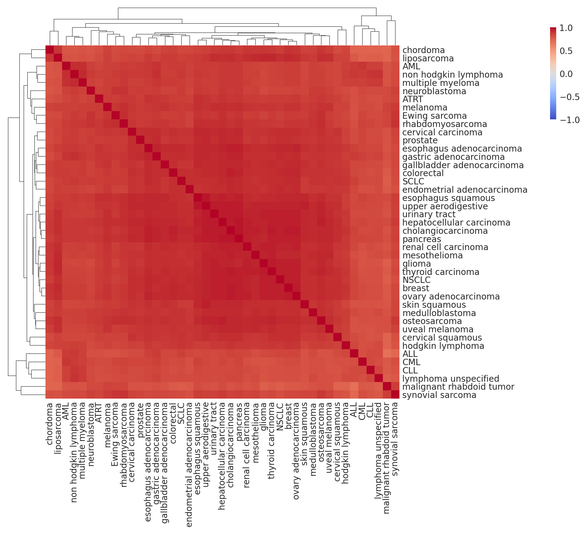
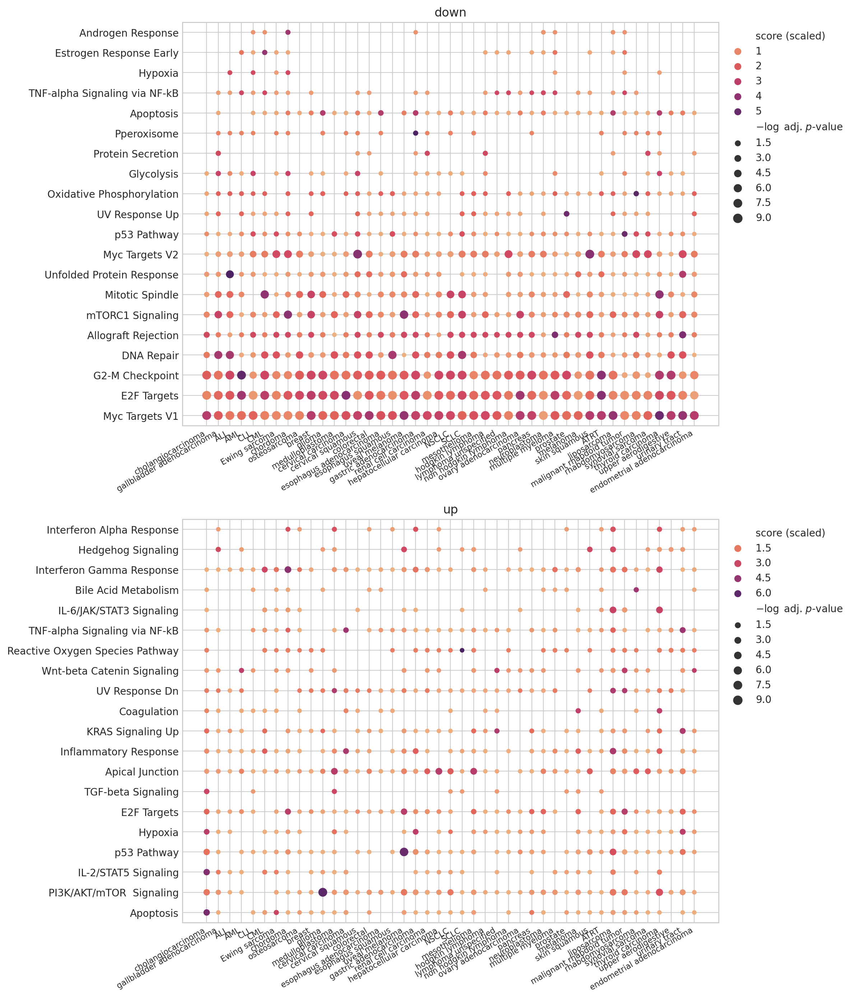
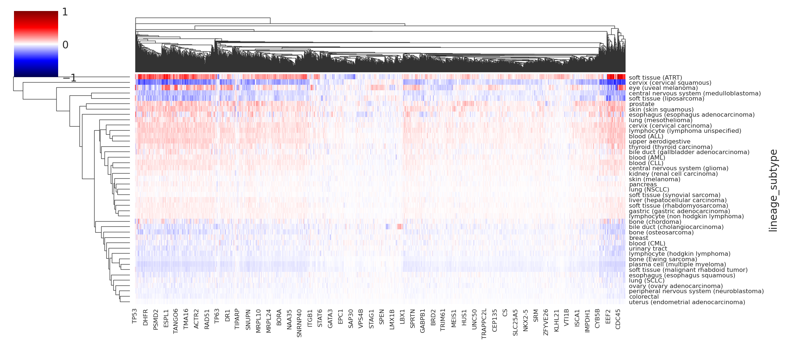
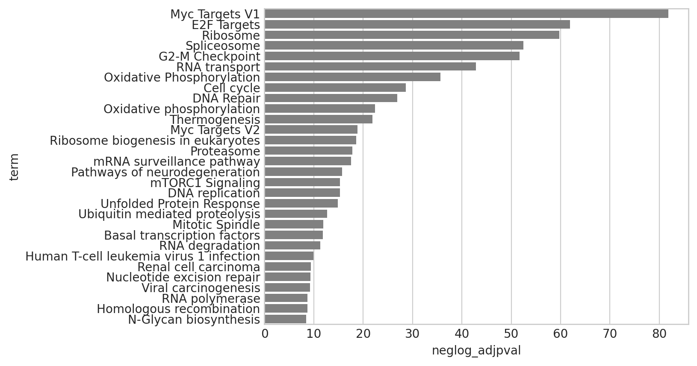
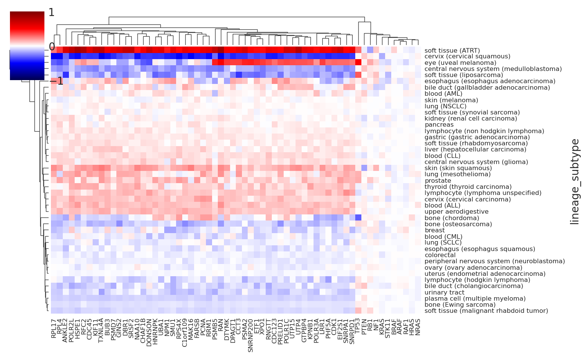
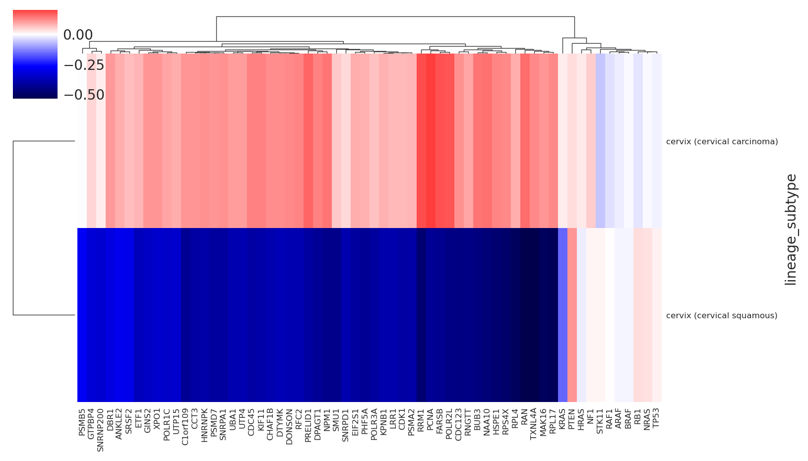
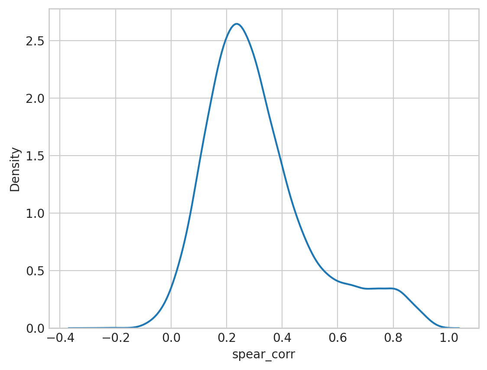

# Analyzing single-lineage models

## Setup

### Imports


```python
%load_ext autoreload
%autoreload 2
```


```python
from fractions import Fraction
from math import ceil
from time import time
from typing import TypeVar

import arviz as az
import dask.dataframe as dd
import gseapy as gp
import matplotlib.pyplot as plt
import numpy as np
import pandas as pd
import seaborn as sns
from matplotlib.text import Text
```


```python
from speclet.analysis.arviz_analysis import extract_coords_param_names
from speclet.analysis.sublineage_model_analysis import (
    get_sgrna_to_gene_map,
    load_sublineage_model_posteriors,
    sublineage_to_lineage_map,
)
from speclet.data_processing.vectors import squish_array
from speclet.io import DataFile, data_path, notebook_output_and_stash_dirs
from speclet.loggers import set_console_handler_level
from speclet.managers.posterior_data_manager import PosteriorDataManager as PostDataMan
from speclet.plot import set_speclet_theme
from speclet.plot.color_pal import (
    lineage_color_pal,
    pal_to_legend_handles,
    sublineage_color_pal,
)
from speclet.project_configuration import arviz_config
from speclet.string_functions import str_hash
```


```python
# Notebook execution timer.
notebook_tic = time()

# Plotting setup.
set_speclet_theme()
%config InlineBackend.figure_format = "retina"

# Constants
RANDOM_SEED = 709
np.random.seed(RANDOM_SEED)
arviz_config()
```


```python
OUTPUT_DIR, STASH_DIR = notebook_output_and_stash_dirs(
    "100_015_essentiality_comparisons", clear_output=True, clear_stash=False
)
```

### Data

#### Model posteriors


```python
postmen = load_sublineage_model_posteriors()
```


```python
postmen.keys
```


    ['bile duct (cholangiocarcinoma)',
     'bile duct (gallbladder adenocarcinoma)',
     'blood (ALL)',
     'blood (AML)',
     'blood (CLL)',
     'blood (CML)',
     'bone (Ewing sarcoma)',
     'bone (chordoma)',
     'bone (osteosarcoma)',
     'breast',
     'central nervous system (glioma)',
     'central nervous system (medulloblastoma)',
     'cervix (cervical carcinoma)',
     'cervix (cervical squamous)',
     'colorectal',
     'esophagus (esophagus adenocarcinoma)',
     'esophagus (esophagus squamous)',
     'eye (uveal melanoma)',
     'gastric (gastric adenocarcinoma)',
     'kidney (renal cell carcinoma)',
     'liver (hepatocellular carcinoma)',
     'lung (NSCLC)',
     'lung (SCLC)',
     'lung (mesothelioma)',
     'lymphocyte (hodgkin lymphoma)',
     'lymphocyte (lymphoma unspecified)',
     'lymphocyte (non hodgkin lymphoma)',
     'ovary (ovary adenocarcinoma)',
     'pancreas',
     'peripheral nervous system (neuroblastoma)',
     'plasma cell (multiple myeloma)',
     'prostate',
     'skin (melanoma)',
     'skin (skin squamous)',
     'soft tissue (ATRT)',
     'soft tissue (liposarcoma)',
     'soft tissue (malignant rhabdoid tumor)',
     'soft tissue (rhabdomyosarcoma)',
     'soft tissue (synovial sarcoma)',
     'thyroid (thyroid carcinoma)',
     'upper aerodigestive',
     'urinary tract',
     'uterus (endometrial adenocarcinoma)']


```python
len(postmen)
```


    43


```python
sub_to_lineage, lineages = sublineage_to_lineage_map(postmen)
```


```python
sublineage_pal = sublineage_color_pal()
lineage_pal = lineage_color_pal()
```

#### CGC


```python
cgc = pd.read_csv(data_path(DataFile.CGC))
cgc.head(3)
```


<div>
<style scoped>
    .dataframe tbody tr th:only-of-type {
        vertical-align: middle;
    }

    .dataframe tbody tr th {
        vertical-align: top;
    }

    .dataframe thead th {
        text-align: right;
    }
</style>
<table border="1" class="dataframe">
  <thead>
    <tr style="text-align: right;">
      <th></th>
      <th>hugo_symbol</th>
      <th>tier</th>
      <th>hallmark</th>
      <th>tumor_types_somatic</th>
      <th>tissue_type</th>
      <th>role_in_cancer</th>
      <th>mutation_types</th>
      <th>is_oncogene</th>
      <th>is_tsg</th>
      <th>is_fusion</th>
    </tr>
  </thead>
  <tbody>
    <tr>
      <th>0</th>
      <td>A1CF</td>
      <td>2</td>
      <td>False</td>
      <td>melanoma</td>
      <td>E</td>
      <td>oncogene</td>
      <td>Mis</td>
      <td>True</td>
      <td>False</td>
      <td>False</td>
    </tr>
    <tr>
      <th>1</th>
      <td>ABI1</td>
      <td>1</td>
      <td>True</td>
      <td>AML</td>
      <td>L</td>
      <td>tsg, fusion</td>
      <td>T</td>
      <td>False</td>
      <td>True</td>
      <td>True</td>
    </tr>
    <tr>
      <th>2</th>
      <td>ABL1</td>
      <td>1</td>
      <td>True</td>
      <td>ALL;CML;T-ALL</td>
      <td>L</td>
      <td>oncogene, fusion</td>
      <td>Mis;T</td>
      <td>True</td>
      <td>False</td>
      <td>True</td>
    </tr>
  </tbody>
</table>
</div>


## Analysis

### sgRNA and gene varying intercept


```python
def get_variables_summary(
    pm: PostDataMan, var_names: list[str], stash: bool = True
) -> pd.DataFrame:
    _vars = "--".join(sorted(var_names))
    stash_fp = STASH_DIR / f"posterior-summary_{_vars}_{pm.id}"
    if stash and stash_fp.exists():
        return pd.read_csv(stash_fp)

    post_df = (
        pm.posterior_summary.filter_column_isin("var_name", var_names)
        .reset_index(drop=True)
        .assign(lineage_subtype=pm.id)
    )
    post_df.to_csv(stash_fp, index=False)
    return post_df


def get_mu_a_summary(pm: PostDataMan, stash: bool = True) -> pd.DataFrame:
    try:
        return (
            get_variables_summary(pm, var_names=["mu_a"], stash=stash)
            .pipe(extract_coords_param_names, col="parameter", names=["hugo_symbol"])
            .drop(columns=["parameter"])
        )
    except FileNotFoundError:
        print(f"Skipping {pm.id}.")
        return pd.DataFrame()


def assign_lineage(
    df: pd.DataFrame,
    mapping: dict[str, str],
    st_col: str = "lineage_subtype",
    line_col: str = "lineage",
) -> pd.DataFrame:
    df[line_col] = df[st_col].map(mapping)
    return df
```


```python
mu_a_post_df = (
    pd.concat([get_mu_a_summary(pm) for pm in postmen.posteriors])
    .reset_index(drop=True)
    .pipe(assign_lineage, mapping=sub_to_lineage)
)
mu_a_post_df.to_csv(OUTPUT_DIR / "mu_a-posterior-summaries.csv", index=False)
mu_a_post_df.head(3)
```


<div>
<style scoped>
    .dataframe tbody tr th:only-of-type {
        vertical-align: middle;
    }

    .dataframe tbody tr th {
        vertical-align: top;
    }

    .dataframe thead th {
        text-align: right;
    }
</style>
<table border="1" class="dataframe">
  <thead>
    <tr style="text-align: right;">
      <th></th>
      <th>mean</th>
      <th>sd</th>
      <th>hdi_5.5%</th>
      <th>hdi_94.5%</th>
      <th>mcse_mean</th>
      <th>mcse_sd</th>
      <th>ess_bulk</th>
      <th>ess_tail</th>
      <th>r_hat</th>
      <th>var_name</th>
      <th>lineage_subtype</th>
      <th>hugo_symbol</th>
      <th>lineage</th>
    </tr>
  </thead>
  <tbody>
    <tr>
      <th>0</th>
      <td>0.322</td>
      <td>0.122</td>
      <td>0.134</td>
      <td>0.522</td>
      <td>0.002</td>
      <td>0.002</td>
      <td>2686.0</td>
      <td>3015.0</td>
      <td>1.0</td>
      <td>mu_a</td>
      <td>bile duct (cholangiocarcinoma)</td>
      <td>A1BG</td>
      <td>bile duct</td>
    </tr>
    <tr>
      <th>1</th>
      <td>0.268</td>
      <td>0.122</td>
      <td>0.064</td>
      <td>0.455</td>
      <td>0.002</td>
      <td>0.002</td>
      <td>3291.0</td>
      <td>2986.0</td>
      <td>1.0</td>
      <td>mu_a</td>
      <td>bile duct (cholangiocarcinoma)</td>
      <td>A1CF</td>
      <td>bile duct</td>
    </tr>
    <tr>
      <th>2</th>
      <td>0.176</td>
      <td>0.123</td>
      <td>-0.025</td>
      <td>0.365</td>
      <td>0.002</td>
      <td>0.002</td>
      <td>3137.0</td>
      <td>2943.0</td>
      <td>1.0</td>
      <td>mu_a</td>
      <td>bile duct (cholangiocarcinoma)</td>
      <td>A2M</td>
      <td>bile duct</td>
    </tr>
  </tbody>
</table>
</div>


```python
def extract_sublineage(s: str) -> str:
    if "(" not in s:
        return s
    return s.split("(")[1].replace(")", "")


def axis_labels_to_sublineage(lbl: Text) -> Text:
    lbl.set_text(extract_sublineage(lbl.get_text()))
    return lbl
```


```python
_, ax = plt.subplots(figsize=(9, 3))
ax.axhline(0, color="k", lw=0.7, zorder=1)
sns.violinplot(
    data=mu_a_post_df,
    x="lineage_subtype",
    y="mean",
    hue="lineage",
    palette=lineage_pal,
    dodge=False,
    linewidth=0.5,
    ax=ax,
)
xlbls = [axis_labels_to_sublineage(lbl) for lbl in ax.get_xticklabels()]
ax.set_xticklabels(xlbls, rotation=40, ha="right", size=8)
ax.legend(
    loc="upper left",
    bbox_to_anchor=(1, 1),
    title="lineage",
    handlelength=0.7,
    handleheight=0.7,
    labelspacing=0,
)
ax.set_xlabel(None)
ax.set_ylabel(r"distribution of $\bar{\mu}_a$ posterior")
plt.show()
```


```python
mu_a_post_X = mu_a_post_df.pivot_wider(
    "lineage_subtype", names_from="hugo_symbol", values_from="mean"
).set_index("lineage_subtype")

# Top 80% most variable genes.
variances = mu_a_post_X.var(axis=0)
mu_a_post_X = mu_a_post_X.loc[:, np.quantile(variances, q=0.8) < variances]
print(f"number of genes: {mu_a_post_X.shape[1]}")


# Row color dictionary.
row_colors = (
    pd.DataFrame({"index": mu_a_post_X.index})
    .assign(lineage=lambda d: d["index"].map(sub_to_lineage).map(lineage_pal))
    .set_index("index")
)

# Clustermap.
cg = sns.clustermap(
    mu_a_post_X,
    figsize=(12, 8),
    dendrogram_ratio=(0.05, 0.1),
    row_colors=row_colors,
    cmap="RdYlBu_r",
    center=0,
    vmin=-1.5,
    vmax=1.5,
    yticklabels=1,
    cbar_pos=(0, 0.81, 0.01, 0.19),
)
ylbls = [axis_labels_to_sublineage(lbl) for lbl in cg.ax_heatmap.get_yticklabels()]
cg.ax_heatmap.set_yticklabels(ylbls)
plt.show()
```

    number of genes: 3624


    /home/jc604/.conda/envs/speclet/lib/python3.10/site-packages/seaborn/matrix.py:654: UserWarning: Clustering large matrix with scipy. Installing `fastcluster` may give better performance.
      warnings.warn(msg)


```python
mu_a_corr = mu_a_post_X.T.corr()
mu_a_corr.to_csv(OUTPUT_DIR / "mu_a-variable-correlations.csv")
mu_a_corr.head()

cg = sns.clustermap(
    mu_a_corr,
    cmap="coolwarm",
    vmax=1,
    vmin=-1,
    center=0,
    figsize=(10, 10),
    dendrogram_ratio=(0.1, 0.1),
    cbar_pos=(0.9, 0.8, 0.01, 0.15),
)
cg.ax_heatmap.set_xlabel(None)
cg.ax_heatmap.set_ylabel(None)
ylbls = [axis_labels_to_sublineage(lbl) for lbl in cg.ax_heatmap.get_yticklabels()]
cg.ax_heatmap.set_yticklabels(ylbls)
xlbls = [axis_labels_to_sublineage(lbl) for lbl in cg.ax_heatmap.get_xticklabels()]
cg.ax_heatmap.set_xticklabels(xlbls)
plt.show()
```





#### Enrichment analysis of top intercept genes


```python
head_mu_a = (
    mu_a_post_df.sort_values(["lineage_subtype", "mean"], ascending=(True, False))
    .groupby("lineage_subtype")
    .head(100)
    .reset_index(drop=True)
)
tail_mu_a = (
    mu_a_post_df.sort_values(["lineage_subtype", "mean"], ascending=(True, False))
    .groupby("lineage_subtype")
    .tail(100)
    .reset_index(drop=True)
)
```


```python
def ssgsea(df: pd.DataFrame, stash: bool = True) -> pd.DataFrame:
    X = df.pivot_wider(
        "hugo_symbol", names_from="lineage_subtype", values_from="mean"
    ).set_index("hugo_symbol")

    stash_fp = STASH_DIR / "ssgsea-mu-a-posterior.csv"
    if stash and stash_fp.exists():
        return pd.read_csv(stash_fp)

    ss_res = gp.ssgsea(data=X, gene_sets=GENE_SETS).res2d.clean_names()
    ss_res.to_csv(stash_fp, index=False)
    return ss_res


def post_ssgsea(ssgsea_res: pd.DataFrame) -> pd.DataFrame:
    return (
        ssgsea_res.rename(columns={"term": "geneset_term", "name": "lineage_subtype"})
        .assign(
            gene_set=lambda d: [t.split("__")[0] for t in d["geneset_term"]],
            term=lambda d: [t.split("__")[1] for t in d["geneset_term"]],
        )
        .rename(columns={"tag_%": "tag_perc", "gene_%": "gene_perc"})
    )
```


```python
GENE_SETS = [
    "KEGG_2021_Human",
    "MSigDB_Hallmark_2020",
    "MSigDB_Oncogenic_Signatures",
]


def enrichr(df: pd.DataFrame, stash: bool = True) -> pd.DataFrame:
    genes = list(df["hugo_symbol"].toset())
    genes.sort()
    genes_hash = str_hash("__".join(genes))
    stash_fp = STASH_DIR / f"enrichr-{genes_hash}.csv"
    if stash and stash_fp.exists():
        return pd.read_csv(stash_fp)

    enr = gp.enrichr(
        gene_list=genes,
        gene_sets=GENE_SETS,
        organism="human",
        outdir=None,
        cutoff=1,
        top_term=int(1e6),
    )
    res = enr.results.clean_names()
    res.to_csv(stash_fp, index=False)
    return res


def enrichr_post(res_df: pd.DataFrame) -> pd.DataFrame:
    return res_df.assign(
        overlap_frac=lambda d: [float(Fraction(x)) for x in d["overlap"]],
        n_overlap=lambda d: [int(x.split("/")[0]) for x in d["overlap"]],
    )
```


```python
enrichr_res_up = (
    head_mu_a.groupby("lineage_subtype")
    .apply(enrichr, stash=True)
    .reset_index(drop=False)
    .assign(lineage=lambda d: d["lineage_subtype"].map(sub_to_lineage))
    .drop(columns=["level_1"])
    .pipe(enrichr_post)
)
enrichr_res_dn = (
    tail_mu_a.groupby("lineage_subtype")
    .apply(enrichr, stash=True)
    .reset_index(drop=False)
    .assign(lineage=lambda d: d["lineage_subtype"].map(sub_to_lineage))
    .drop(columns=["level_1"])
    .pipe(enrichr_post)
)
```


```python
enrichr_res_up.head(3)
```


<div>
<style scoped>
    .dataframe tbody tr th:only-of-type {
        vertical-align: middle;
    }

    .dataframe tbody tr th {
        vertical-align: top;
    }

    .dataframe thead th {
        text-align: right;
    }
</style>
<table border="1" class="dataframe">
  <thead>
    <tr style="text-align: right;">
      <th></th>
      <th>lineage_subtype</th>
      <th>gene_set</th>
      <th>term</th>
      <th>overlap</th>
      <th>p_value</th>
      <th>adjusted_p_value</th>
      <th>old_p_value</th>
      <th>old_adjusted_p_value</th>
      <th>odds_ratio</th>
      <th>combined_score</th>
      <th>genes</th>
      <th>lineage</th>
      <th>overlap_frac</th>
      <th>n_overlap</th>
    </tr>
  </thead>
  <tbody>
    <tr>
      <th>0</th>
      <td>bile duct (cholangiocarcinoma)</td>
      <td>KEGG_2021_Human</td>
      <td>Human T-cell leukemia virus 1 infection</td>
      <td>9/219</td>
      <td>0.000002</td>
      <td>0.000142</td>
      <td>0</td>
      <td>0</td>
      <td>9.273155</td>
      <td>124.100639</td>
      <td>MAPK9;CDKN1A;CDKN2C;CHEK2;PTEN;ATM;TP53;ETS1;C...</td>
      <td>bile duct</td>
      <td>0.041096</td>
      <td>9</td>
    </tr>
    <tr>
      <th>1</th>
      <td>bile duct (cholangiocarcinoma)</td>
      <td>KEGG_2021_Human</td>
      <td>p53 signaling pathway</td>
      <td>6/73</td>
      <td>0.000002</td>
      <td>0.000142</td>
      <td>0</td>
      <td>0</td>
      <td>18.894570</td>
      <td>250.533811</td>
      <td>CDKN1A;CHEK2;PTEN;PMAIP1;ATM;TP53</td>
      <td>bile duct</td>
      <td>0.082192</td>
      <td>6</td>
    </tr>
    <tr>
      <th>2</th>
      <td>bile duct (cholangiocarcinoma)</td>
      <td>KEGG_2021_Human</td>
      <td>Cellular senescence</td>
      <td>7/156</td>
      <td>0.000013</td>
      <td>0.000727</td>
      <td>0</td>
      <td>0</td>
      <td>9.977412</td>
      <td>111.959280</td>
      <td>HIPK4;CDKN1A;CHEK2;PTEN;ATM;TP53;ETS1</td>
      <td>bile duct</td>
      <td>0.044872</td>
      <td>7</td>
    </tr>
  </tbody>
</table>
</div>


```python
enrichr_res_up["term"].nunique(), enrichr_res_dn["term"].nunique()
```


    (540, 356)


```python
enrichr_res_up["gene_set"].unique()
```


    array(['KEGG_2021_Human', 'MSigDB_Hallmark_2020',
           'MSigDB_Oncogenic_Signatures'], dtype=object)


```python
def grouped_zscore(df: pd.DataFrame, grp_cols: list[str], value: str) -> pd.DataFrame:
    def f(_df: pd.DataFrame) -> pd.DataFrame:
        x = _df[value]
        _df[value] = x / np.std(x)
        return _df

    return df.groupby(grp_cols).apply(f)


plot_df = (
    pd.concat(
        [enrichr_res_up.assign(direction="up"), enrichr_res_dn.assign(direction="down")]
    )
    .query("gene_set == 'MSigDB_Hallmark_2020'")
    .reset_index(drop=True)
)
fig, axes = plt.subplots(nrows=2, figsize=(12, 14))

for ax, (direction, df) in zip(axes, plot_df.groupby("direction")):
    term_variances = df.groupby("term")["combined_score"].var()
    term_variances = term_variances[~np.isnan(term_variances)]
    q = np.quantile(term_variances, 1 - (20 / len(term_variances)))
    top_var_terms = list(term_variances[q <= term_variances].index)

    df = (
        df.copy()
        .filter_column_isin("term", top_var_terms)
        .assign(
            adjusted_p_value=lambda d: squish_array(
                d["adjusted_p_value"], lower=10e-5, upper=1
            )
        )
        .assign(neg_log_adj_p_val=lambda d: -np.log(d["adjusted_p_value"]))
        .pipe(grouped_zscore, grp_cols=["term"], value="combined_score")
        .rename(
            columns={
                "neg_log_adj_p_val": r"$-\log$ adj. $p$-value",
                "overlap_frac": "overlap frac.",
                "combined_score": "score (scaled)",
            }
        )
    )

    ax.set_title(direction)
    sns.scatterplot(
        data=df,
        x="lineage_subtype",
        y="term",
        hue="score (scaled)",
        size=r"$-\log$ adj. $p$-value",
        ax=ax,
        palette="flare",
        edgecolor=None,
    )
    ax.legend(loc="upper left", bbox_to_anchor=(1, 1))
    ax.set_xlabel(None)
    ax.set_ylabel(None)

    xlbls = [extract_sublineage(lbl) for lbl in sorted(df["lineage_subtype"].unique())]
    ax.set_xticks(
        ticks=np.arange(len(xlbls)), labels=xlbls, rotation=30, ha="right", size=8
    )
    ax.set_ylim(-0.5, df["term"].nunique() - 0.5)

fig.tight_layout()
plt.show()
```





```python
ssgsea_res = (
    ssgsea(mu_a_post_df.copy())
    .pipe(post_ssgsea)
    .assign(lineage=lambda d: d["lineage_subtype"].map(sub_to_lineage))
)
```


```python
ssgsea_res.head(3)
```


<div>
<style scoped>
    .dataframe tbody tr th:only-of-type {
        vertical-align: middle;
    }

    .dataframe tbody tr th {
        vertical-align: top;
    }

    .dataframe thead th {
        text-align: right;
    }
</style>
<table border="1" class="dataframe">
  <thead>
    <tr style="text-align: right;">
      <th></th>
      <th>lineage_subtype</th>
      <th>geneset_term</th>
      <th>es</th>
      <th>nes</th>
      <th>tag_perc</th>
      <th>gene_perc</th>
      <th>lead_genes</th>
      <th>gene_set</th>
      <th>term</th>
      <th>lineage</th>
    </tr>
  </thead>
  <tbody>
    <tr>
      <th>0</th>
      <td>gastric (gastric adenocarcinoma)</td>
      <td>KEGG_2021_Human__Ribosome</td>
      <td>-7844.790982</td>
      <td>-0.635352</td>
      <td>126/158</td>
      <td>14.40%</td>
      <td>RPL12;RPS4X;RPS3A;POLR2L;RPS6;RPL7A;RPL17;KIF1...</td>
      <td>KEGG_2021_Human</td>
      <td>Ribosome</td>
      <td>gastric</td>
    </tr>
    <tr>
      <th>1</th>
      <td>prostate</td>
      <td>KEGG_2021_Human__Aminoacyl-tRNA biosynthesis</td>
      <td>-7809.043506</td>
      <td>-0.632457</td>
      <td>25/66</td>
      <td>14.61%</td>
      <td>FARSB;YARS2;AARS2;SNW1;MARS2;TARS2;RARS2;TSEN5...</td>
      <td>KEGG_2021_Human</td>
      <td>Aminoacyl-tRNA biosynthesis</td>
      <td>prostate</td>
    </tr>
    <tr>
      <th>2</th>
      <td>soft tissue (ATRT)</td>
      <td>KEGG_2021_Human__Aminoacyl-tRNA biosynthesis</td>
      <td>-7748.724477</td>
      <td>-0.627572</td>
      <td>25/66</td>
      <td>15.27%</td>
      <td>FARSB;RPS8;AURKB;RPS10;TINF2;AARS2;PSMC2;HARS2...</td>
      <td>KEGG_2021_Human</td>
      <td>Aminoacyl-tRNA biosynthesis</td>
      <td>soft tissue</td>
    </tr>
  </tbody>
</table>
</div>


```python
_, ax = plt.subplots(figsize=(6, 4))
sns.kdeplot(
    data=ssgsea_res,
    x="nes",
    hue="lineage_subtype",
    ax=ax,
    palette=sublineage_pal,
    lw=0.7,
    alpha=0.75,
)

pal = {
    k: v for k, v in sublineage_pal.items() if k in set(ssgsea_res["lineage_subtype"])
}

ax.get_legend().remove()
ax.set_xlabel("ssGSEA NES")
ax.set_ylabel("density")
plt.show()
```


### RNA covariate $b$


```python
def get_rna_effect_summary(pm: PostDataMan, stash: bool = True) -> pd.DataFrame:
    try:
        return (
            get_variables_summary(pm, var_names=["b"], stash=stash)
            .pipe(extract_coords_param_names, col="parameter", names=["hugo_symbol"])
            .drop(columns=["parameter"])
        )
    except FileNotFoundError:
        print(f"Skipping {pm.id}.")
        return pd.DataFrame()


rna_post = (
    pd.concat([get_rna_effect_summary(pm) for pm in postmen.posteriors])
    .reset_index(drop=True)
    .pipe(assign_lineage, mapping=sub_to_lineage)
)
rna_post.to_csv(OUTPUT_DIR / "rna-posterior-summary.csv", index=False)
rna_post.head(3)
```


<div>
<style scoped>
    .dataframe tbody tr th:only-of-type {
        vertical-align: middle;
    }

    .dataframe tbody tr th {
        vertical-align: top;
    }

    .dataframe thead th {
        text-align: right;
    }
</style>
<table border="1" class="dataframe">
  <thead>
    <tr style="text-align: right;">
      <th></th>
      <th>mean</th>
      <th>sd</th>
      <th>hdi_5.5%</th>
      <th>hdi_94.5%</th>
      <th>mcse_mean</th>
      <th>mcse_sd</th>
      <th>ess_bulk</th>
      <th>ess_tail</th>
      <th>r_hat</th>
      <th>var_name</th>
      <th>lineage_subtype</th>
      <th>hugo_symbol</th>
      <th>lineage</th>
    </tr>
  </thead>
  <tbody>
    <tr>
      <th>0</th>
      <td>-0.002</td>
      <td>0.029</td>
      <td>-0.049</td>
      <td>0.044</td>
      <td>0.0</td>
      <td>0.001</td>
      <td>9778.0</td>
      <td>3024.0</td>
      <td>1.0</td>
      <td>b</td>
      <td>bile duct (cholangiocarcinoma)</td>
      <td>A1BG</td>
      <td>bile duct</td>
    </tr>
    <tr>
      <th>1</th>
      <td>0.033</td>
      <td>0.030</td>
      <td>-0.015</td>
      <td>0.080</td>
      <td>0.0</td>
      <td>0.000</td>
      <td>10302.0</td>
      <td>2669.0</td>
      <td>1.0</td>
      <td>b</td>
      <td>bile duct (cholangiocarcinoma)</td>
      <td>A1CF</td>
      <td>bile duct</td>
    </tr>
    <tr>
      <th>2</th>
      <td>0.032</td>
      <td>0.030</td>
      <td>-0.015</td>
      <td>0.081</td>
      <td>0.0</td>
      <td>0.000</td>
      <td>9712.0</td>
      <td>2656.0</td>
      <td>1.0</td>
      <td>b</td>
      <td>bile duct (cholangiocarcinoma)</td>
      <td>A2M</td>
      <td>bile duct</td>
    </tr>
  </tbody>
</table>
</div>


```python
rna_post_X = rna_post.pivot_wider(
    "lineage_subtype", names_from="hugo_symbol", values_from="mean"
).set_index("lineage_subtype")

gene_rna_var = rna_post_X.var(axis=0)
top_var_rna = gene_rna_var[np.quantile(gene_rna_var.values, 0.8) < gene_rna_var]

rna_post_X_topvar = rna_post_X.copy()[top_var_rna.index.tolist()]

cg = sns.clustermap(
    rna_post_X_topvar,
    figsize=(12, 5),
    cmap="seismic",
    center=0,
    vmax=1,
    vmin=-1,
    yticklabels=1,
)
cg.ax_heatmap.tick_params(labelsize=6)
plt.show()
```

    /home/jc604/.conda/envs/speclet/lib/python3.10/site-packages/seaborn/matrix.py:654: UserWarning: Clustering large matrix with scipy. Installing `fastcluster` may give better performance.
      warnings.warn(msg)





```python
rna_corr = rna_post_X.T.corr()
cg = sns.clustermap(
    rna_corr,
    figsize=(7, 7),
    dendrogram_ratio=(0.1, 0.1),
    cmap="seismic",
    center=0,
    vmin=-1,
    vmax=1,
)
rna_corr.to_csv(OUTPUT_DIR / "rna-variable-correlations.csv")
plt.show()
```


```python
print(f"number top variable genes: {len(top_var_rna)}")

stash_fp = STASH_DIR / "enrichr-top-var-rna-effect-genes.csv"
if stash_fp.exists():
    enrichr_res = pd.read_csv(stash_fp)
else:
    enrichr_res = gp.enrichr(
        gene_list=list(top_var_rna.index),
        gene_sets=["KEGG_2021_Human", "MSigDB_Hallmark_2020"],
    ).results.clean_names()
    enrichr_res.to_csv(stash_fp, index=False)

enrichr_res.to_csv(OUTPUT_DIR / "variable-rna-effect-top-var.csv", index=False)
enrichr_res.head()
```

    number top variable genes: 3624


<div>
<style scoped>
    .dataframe tbody tr th:only-of-type {
        vertical-align: middle;
    }

    .dataframe tbody tr th {
        vertical-align: top;
    }

    .dataframe thead th {
        text-align: right;
    }
</style>
<table border="1" class="dataframe">
  <thead>
    <tr style="text-align: right;">
      <th></th>
      <th>gene_set</th>
      <th>term</th>
      <th>overlap</th>
      <th>p_value</th>
      <th>adjusted_p_value</th>
      <th>old_p_value</th>
      <th>old_adjusted_p_value</th>
      <th>odds_ratio</th>
      <th>combined_score</th>
      <th>genes</th>
    </tr>
  </thead>
  <tbody>
    <tr>
      <th>0</th>
      <td>KEGG_2021_Human</td>
      <td>Ribosome</td>
      <td>125/158</td>
      <td>6.256277e-63</td>
      <td>1.945702e-60</td>
      <td>0</td>
      <td>0</td>
      <td>17.692284</td>
      <td>2534.053073</td>
      <td>RPL4;RPL5;RPL30;RPL3;RPL32;RPL31;RPL34;RPL8;RP...</td>
    </tr>
    <tr>
      <th>1</th>
      <td>KEGG_2021_Human</td>
      <td>Spliceosome</td>
      <td>115/150</td>
      <td>2.427687e-55</td>
      <td>3.775054e-53</td>
      <td>0</td>
      <td>0</td>
      <td>15.301185</td>
      <td>1924.204171</td>
      <td>TCERG1;EIF4A3;HNRNPU;EFTUD2;SNRPD2;SNRPD1;MAGO...</td>
    </tr>
    <tr>
      <th>2</th>
      <td>KEGG_2021_Human</td>
      <td>RNA transport</td>
      <td>121/186</td>
      <td>1.392944e-45</td>
      <td>1.444019e-43</td>
      <td>0</td>
      <td>0</td>
      <td>8.667871</td>
      <td>895.260325</td>
      <td>CYFIP1;POP5;EIF4A1;POP7;NUP107;NUP188;POP1;GEM...</td>
    </tr>
    <tr>
      <th>3</th>
      <td>KEGG_2021_Human</td>
      <td>Amyotrophic lateral sclerosis</td>
      <td>174/364</td>
      <td>5.144932e-39</td>
      <td>4.000185e-37</td>
      <td>0</td>
      <td>0</td>
      <td>4.296513</td>
      <td>378.792608</td>
      <td>NDUFA13;NUP107;NDUFA11;NUP188;NDUFA10;COX6A1;A...</td>
    </tr>
    <tr>
      <th>4</th>
      <td>KEGG_2021_Human</td>
      <td>Huntington disease</td>
      <td>153/306</td>
      <td>2.431717e-37</td>
      <td>1.512528e-35</td>
      <td>0</td>
      <td>0</td>
      <td>4.673869</td>
      <td>394.040128</td>
      <td>NDUFA13;NDUFA11;NDUFA10;COX6A1;PSMD8;PSMD9;PSM...</td>
    </tr>
  </tbody>
</table>
</div>


```python
df = (
    enrichr_res.sort_values("adjusted_p_value")
    .assign(neglog_adjpval=lambda d: -np.log10(d["adjusted_p_value"]))
    .query("adjusted_p_value < 0.01")
)
rm_terms = ["disease", "sclerosis", "ataxia", "Diabetic"]
for rm_term in rm_terms:
    df = df.filter_string("term", rm_term, complement=True)

sns.barplot(data=df.head(30), x="neglog_adjpval", y="term", color="grey")
plt.show()
```





#### Visualization of RNA effect against observed data


```python
_top_var_genes = list(gene_rna_var.sort_values(ascending=False).head(50).index)
rna_comparison_genes = _top_var_genes + [
    "TP53",
    "KRAS",
    "NRAS",
    "HRAS",
    "BRAF",
    "NPM1",
    "PTEN",
    "NF1",
    "ARAF",
    "RAF1",
    "STK11",
    "RB1",
]
rna_comparison_genes = list(set(rna_comparison_genes))
rna_comparison_genes.sort()
print(f"num genes: {len(rna_comparison_genes)}")

cg = sns.clustermap(
    rna_post_X[rna_comparison_genes],
    figsize=(9, 5),
    cmap="seismic",
    center=0,
    vmax=1,
    vmin=-1,
    xticklabels=1,
    yticklabels=1,
    dendrogram_ratio=(0.1, 0.1),
)
cg.ax_heatmap.tick_params(labelsize=6)
plt.show()
```

    num genes: 62





```python
rna_post[["lineage_subtype"]].drop_duplicates().filter_string(
    "lineage_subtype", "cervix"
)
```


<div>
<style scoped>
    .dataframe tbody tr th:only-of-type {
        vertical-align: middle;
    }

    .dataframe tbody tr th {
        vertical-align: top;
    }

    .dataframe thead th {
        text-align: right;
    }
</style>
<table border="1" class="dataframe">
  <thead>
    <tr style="text-align: right;">
      <th></th>
      <th>lineage_subtype</th>
    </tr>
  </thead>
  <tbody>
    <tr>
      <th>217428</th>
      <td>cervix (cervical carcinoma)</td>
    </tr>
    <tr>
      <th>235547</th>
      <td>cervix (cervical squamous)</td>
    </tr>
  </tbody>
</table>
</div>


```python
cg = sns.clustermap(
    rna_post_X.loc[
        ["cervix (cervical carcinoma)", "cervix (cervical squamous)"],
        rna_comparison_genes,
    ],
    figsize=(9, 5),
    cmap="seismic",
    center=0,
    # vmax=1,
    # vmin=-1,
    xticklabels=1,
    yticklabels=1,
    dendrogram_ratio=(0.1, 0.1),
)
cg.ax_heatmap.tick_params(labelsize=6)
plt.show()
```





```python
def get_validated_gene_data(
    pm: PostDataMan, genes: list[str], stash: bool = True
) -> pd.DataFrame:
    _genes_hash = str_hash("__".join(sorted(genes)))
    stash_fp = STASH_DIR / f"gene-data_{_genes_hash}_{pm.id}.csv"

    csv_kwargs = {
        "low_memory": False,
        "dtype": {
            "age": "float64",
            "p_dna_batch": "object",
            "primary_or_metastasis": "object",
            "rna_expr": "float",
            "counts_final": "float64",
        },
    }
    if stash and stash_fp.exists():
        return pd.read_csv(stash_fp, **csv_kwargs)

    data = (
        dd.read_csv(pm.data_file, **csv_kwargs)
        .query("hugo_symbol in @genes", local_dict={"genes": genes})
        .compute()
        .reset_index(drop=True)
        .pipe(pm.validate_data)
    )

    data.to_csv(stash_fp, index=False)
    return data
```


```python
set_console_handler_level("ERROR")
genes_data = (
    pd.concat(
        [get_validated_gene_data(pm, rna_comparison_genes) for pm in postmen.posteriors]
    )
    .reset_index(drop=True)
    .drop(columns=["lineage_subtype"])
    .rename(columns={"lineage": "lineage_subtype"})
    .assign(
        lineage_subtype=lambda d: [x.replace("_", " ") for x in d["lineage_subtype"]]
    )
    .pipe(assign_lineage, mapping=sub_to_lineage)
)
genes_data.to_csv(OUTPUT_DIR / "specific-gene-data.csv", index=False)
genes_data.head()
```


<div>
<style scoped>
    .dataframe tbody tr th:only-of-type {
        vertical-align: middle;
    }

    .dataframe tbody tr th {
        vertical-align: top;
    }

    .dataframe thead th {
        text-align: right;
    }
</style>
<table border="1" class="dataframe">
  <thead>
    <tr style="text-align: right;">
      <th></th>
      <th>sgrna</th>
      <th>replicate_id</th>
      <th>lfc</th>
      <th>p_dna_batch</th>
      <th>genome_alignment</th>
      <th>hugo_symbol</th>
      <th>screen</th>
      <th>multiple_hits_on_gene</th>
      <th>sgrna_target_chr</th>
      <th>sgrna_target_pos</th>
      <th>...</th>
      <th>z_rna_gene</th>
      <th>m_rna_gene</th>
      <th>cn_gene</th>
      <th>cn_cell_line</th>
      <th>counts_final_total</th>
      <th>counts_initial_total</th>
      <th>counts_final_rpm</th>
      <th>counts_initial_adj</th>
      <th>cell_chrom</th>
      <th>lineage</th>
    </tr>
  </thead>
  <tbody>
    <tr>
      <th>0</th>
      <td>AAGAACGGAACACAGGTCCA</td>
      <td>SNU869-311Cas9_RepA_p4_batch3</td>
      <td>-3.153218</td>
      <td>3</td>
      <td>chr18_21622784_+</td>
      <td>SNRPD1</td>
      <td>broad</td>
      <td>False</td>
      <td>18</td>
      <td>21622784</td>
      <td>...</td>
      <td>-2.192217</td>
      <td>-2.192217</td>
      <td>-0.332632</td>
      <td>-0.501718</td>
      <td>34199190</td>
      <td>1.071751e+06</td>
      <td>1.000000</td>
      <td>255.684116</td>
      <td>ACH-000182__18</td>
      <td>bile duct</td>
    </tr>
    <tr>
      <th>1</th>
      <td>AAGCAAATCTTGTAACCCCG</td>
      <td>SNU869-311Cas9_RepA_p4_batch3</td>
      <td>-3.200516</td>
      <td>3</td>
      <td>chr10_78010519_-</td>
      <td>POLR3A</td>
      <td>broad</td>
      <td>False</td>
      <td>10</td>
      <td>78010519</td>
      <td>...</td>
      <td>0.717322</td>
      <td>0.717322</td>
      <td>0.004395</td>
      <td>0.002008</td>
      <td>34199190</td>
      <td>1.071751e+06</td>
      <td>1.087721</td>
      <td>292.859410</td>
      <td>ACH-000182__10</td>
      <td>bile duct</td>
    </tr>
    <tr>
      <th>2</th>
      <td>AATCAACCCACAGCTGCACA</td>
      <td>SNU869-311Cas9_RepA_p4_batch3</td>
      <td>0.048742</td>
      <td>3</td>
      <td>chr17_7675183_+</td>
      <td>TP53</td>
      <td>broad</td>
      <td>False</td>
      <td>17</td>
      <td>7675183</td>
      <td>...</td>
      <td>-0.241421</td>
      <td>-0.241421</td>
      <td>-0.233073</td>
      <td>-0.497916</td>
      <td>34199190</td>
      <td>1.071751e+06</td>
      <td>29.597169</td>
      <td>782.097377</td>
      <td>ACH-000182__17</td>
      <td>bile duct</td>
    </tr>
    <tr>
      <th>3</th>
      <td>AATCAGACTAGAAAGTGAAG</td>
      <td>SNU869-311Cas9_RepA_p4_batch3</td>
      <td>-2.082598</td>
      <td>3</td>
      <td>chr10_60784785_+</td>
      <td>CDK1</td>
      <td>broad</td>
      <td>False</td>
      <td>10</td>
      <td>60784785</td>
      <td>...</td>
      <td>0.126548</td>
      <td>0.126548</td>
      <td>0.004395</td>
      <td>0.002008</td>
      <td>34199190</td>
      <td>1.071751e+06</td>
      <td>2.725187</td>
      <td>322.567261</td>
      <td>ACH-000182__10</td>
      <td>bile duct</td>
    </tr>
    <tr>
      <th>4</th>
      <td>AATCCAGCAGCACAATGCGA</td>
      <td>SNU869-311Cas9_RepA_p4_batch3</td>
      <td>-2.744204</td>
      <td>3</td>
      <td>chr1_156318916_+</td>
      <td>CCT3</td>
      <td>broad</td>
      <td>False</td>
      <td>1</td>
      <td>156318916</td>
      <td>...</td>
      <td>-0.583706</td>
      <td>-0.583706</td>
      <td>-0.110078</td>
      <td>-0.008430</td>
      <td>34199190</td>
      <td>1.071751e+06</td>
      <td>3.163794</td>
      <td>590.441480</td>
      <td>ACH-000182__1</td>
      <td>bile duct</td>
    </tr>
  </tbody>
</table>
<p>5 rows × 34 columns</p>
</div>


```python
plot_df = (
    genes_data.copy()[["depmap_id", "hugo_symbol", "lineage_subtype", "rna_expr"]]
    .drop_duplicates()
    .reset_index(drop=True)
)
_, ax = plt.subplots(figsize=(12, 3))
sns.boxplot(
    data=plot_df,
    x="hugo_symbol",
    y="rna_expr",
    hue="lineage_subtype",
    dodge=True,
    linewidth=0.2,
    showfliers=False,
    ax=ax,
)
ax.get_legend().remove()
ax.tick_params("x", rotation=90, labelsize=7)
```


```python
_genes = sorted(list(genes_data["hugo_symbol"].unique()))
ncols = 5
nrows = ceil(len(_genes) / ncols)
fig, axes = plt.subplots(nrows=nrows, ncols=ncols, figsize=(ncols * 2, nrows * 2))

for ax, gene in zip(axes.flatten(), _genes):
    ax.set_title(gene)
    df = genes_data.query(f"hugo_symbol == '{gene}'").reset_index(drop=True)
    ax.axhline(0, c="k", lw=0.5, zorder=1)
    ax.axvline(0, c="k", lw=0.5, zorder=1)
    sns.scatterplot(
        data=df,
        x="m_rna_gene",
        y="lfc",
        hue="lineage",
        ax=ax,
        edgecolor=None,
        s=3,
        alpha=0.5,
        legend=False,
        zorder=10,
    )
for ax in axes.flatten()[len(_genes) :]:
    ax.axis("off")
fig.tight_layout()
plt.show()
```


```python
def get_posterior_mu_for_gene_rna(
    pm: PostDataMan, gene: str, x_rna: np.ndarray, stash: bool = True
) -> pd.DataFrame:
    x_rna_str = f"{x_rna.mean():0.4f}_{x_rna.std():0.4f}_{len(x_rna)}_{x_rna.dtype}"
    x_rna_hash = str_hash(x_rna_str)
    stash_fp = STASH_DIR / f"mu-across-rna_{pm.id}_{gene}_{x_rna_hash}.csv"
    if stash and stash_fp.exists():
        return pd.read_csv(stash_fp)

    try:
        trace = pm.trace
    except AssertionError:
        print(f"Skipping {pm.id}.")
        return pd.DataFrame()

    post = trace.posterior
    mu = post.get("mu_a").sel(gene=[gene]).values + (
        post.get("b").sel(gene=[gene]).values * x_rna
    )
    mu_mean = mu.mean(axis=(0, 1))
    mu_hdi = az.hdi(mu)
    res = pd.DataFrame(
        {
            "mu_mean": mu_mean,
            "mu_hdi_low": mu_hdi[:, 0],
            "mu_hdi_high": mu_hdi[:, 1],
            "x_rna": x_rna,
            "lineage_subtype": pm.id,
            "hugo_symbol": gene,
        }
    )
    res.to_csv(stash_fp, index=False)
    return res


GENES = ["MAK16", "NPM1", "KRAS", "KIF11", "SNRPA1", "NF1", "PCNA"]
genes_mu_dfs = pd.DataFrame()
for G in GENES:
    df = genes_data.query(f"hugo_symbol == '{G}'").reset_index(drop=True)
    _rna = df["m_rna_gene"].values
    rna_min, rna_max = _rna.min(), _rna.max()
    rna_min -= np.abs(0.05 * rna_min)
    rna_max += 0.05 * rna_max
    x_rna = np.linspace(rna_min, rna_max, 1000)

    _df = pd.concat(
        [
            get_posterior_mu_for_gene_rna(pm, gene=G, x_rna=x_rna)
            for pm in postmen.posteriors
        ]
    )
    genes_mu_dfs = pd.concat([genes_mu_dfs, _df])

genes_mu_dfs = genes_mu_dfs.reset_index(drop=True)
genes_mu_dfs.to_csv(OUTPUT_DIR / "computed-rna-expression-effect.csv", index=False)
genes_mu_dfs.head(3)
```


<div>
<style scoped>
    .dataframe tbody tr th:only-of-type {
        vertical-align: middle;
    }

    .dataframe tbody tr th {
        vertical-align: top;
    }

    .dataframe thead th {
        text-align: right;
    }
</style>
<table border="1" class="dataframe">
  <thead>
    <tr style="text-align: right;">
      <th></th>
      <th>mu_mean</th>
      <th>mu_hdi_low</th>
      <th>mu_hdi_high</th>
      <th>x_rna</th>
      <th>lineage_subtype</th>
      <th>hugo_symbol</th>
    </tr>
  </thead>
  <tbody>
    <tr>
      <th>0</th>
      <td>-0.777546</td>
      <td>-1.061002</td>
      <td>-0.495504</td>
      <td>-4.467267</td>
      <td>bile duct (cholangiocarcinoma)</td>
      <td>MAK16</td>
    </tr>
    <tr>
      <th>1</th>
      <td>-0.778243</td>
      <td>-1.051019</td>
      <td>-0.485800</td>
      <td>-4.458395</td>
      <td>bile duct (cholangiocarcinoma)</td>
      <td>MAK16</td>
    </tr>
    <tr>
      <th>2</th>
      <td>-0.778940</td>
      <td>-1.060815</td>
      <td>-0.496251</td>
      <td>-4.449524</td>
      <td>bile duct (cholangiocarcinoma)</td>
      <td>MAK16</td>
    </tr>
  </tbody>
</table>
</div>


```python
T = TypeVar("T")


def _tidy_pal_labels(pal: dict[str, T]) -> dict[str, T]:
    new_pal = {}
    for k, v in pal.items():
        if "(" in k:
            k = k.split("(")[1].replace(")", "").strip()
        new_pal[k] = v
    return new_pal


def plot_prediction_over_rna(
    gene: str,
    lineages: list[str],
    obs_data: pd.DataFrame,
    pred_data: pd.DataFrame,
    ax: plt.Axes | None = None,
) -> None:
    obs_df = (
        obs_data.copy()
        .query(f"hugo_symbol == '{gene}'")
        .filter_column_isin("lineage_subtype", lineages)
        .reset_index(drop=True)
    )
    pred_df = (
        pred_data.query(f"hugo_symbol == '{gene}'")
        .filter_column_isin("lineage_subtype", lineages)
        .reset_index(drop=True)
    )
    colors = sns.color_palette("Set1", len(lineages))
    pal = {ln: c for ln, c in zip(lineages, colors)}

    xmin, xmax = obs_df["m_rna_gene"].min(), obs_df["m_rna_gene"].max()
    xmin -= np.abs(0.05 * xmin)
    xmax += 0.05 * xmax

    ymin, ymax = obs_df["lfc"].min(), obs_df["lfc"].max()
    ymin -= np.abs(0.05 * ymin)
    ymax += 0.05 * ymax

    if ax is None:
        _, ax = plt.subplots(figsize=(3, 3))

    sns.scatterplot(
        data=obs_df,
        x="m_rna_gene",
        y="lfc",
        hue="lineage_subtype",
        palette=pal,
        alpha=0.5,
        s=15,
        zorder=5,
        ax=ax,
    )
    sns.rugplot(
        data=obs_df,
        x="m_rna_gene",
        y="lfc",
        hue="lineage_subtype",
        palette=pal,
        alpha=0.5,
        ax=ax,
        height=-0.02,
        clip_on=False,
    )

    ax.set_title(f"${gene}$")
    ax.set_xlim(xmin, xmax)
    ax.set_ylim(ymin, ymax)
    ax.set_ylabel("LFC")
    ax.set_xlabel("mRNA (m-scaled)")

    ax.get_legend().remove()
    ax.legend(
        handles=pal_to_legend_handles(
            _tidy_pal_labels(pal), lw=0, marker="o", markersize=3
        ),
        loc="upper left",
        bbox_to_anchor=(1, 1),
        title="lineage",
        handletextpad=0.5,
        handlelength=0,
    )

    for lineage in lineages:
        df = pred_df.query(f"lineage_subtype == '{lineage}'")
        ax.fill_between(
            x=df["x_rna"],
            y1=df["mu_hdi_low"],
            y2=df["mu_hdi_high"],
            alpha=0.25,
            color=pal[lineage],
            lw=0,
            zorder=10,
        )
        ax.plot(df["x_rna"], df["mu_mean"], zorder=15, c=pal[lineage])
```


```python
rna_plots: list[tuple[str, list[str]]] = [
    ("MAK16", ["breast", "cervix (cervical squamous)", "skin (skin squamous)"]),
    ("KIF11", ["lung (SCLC)", "lung (NSCLC)"]),
    ("KRAS", ["colorectal", "lung (NSCLC)", "pancreas", "cervix (cervical squamous)"]),
    (
        "SNRPA1",
        ["bile duct (cholangiocarcinoma)", "bile duct (gallbladder adenocarcinoma)"],
    ),
    ("NF1", ["blood (ALL)", "blood (AML)", "blood (CLL)", "blood (CML)"]),
    ("SNRPA1", ["blood (ALL)", "blood (AML)", "blood (CLL)", "blood (CML)"]),
    ("KRAS", ["cervix (cervical carcinoma)", "cervix (cervical squamous)"]),
    ("PCNA", ["cervix (cervical carcinoma)", "cervix (cervical squamous)"]),
]

ncols = 2
nrows = ceil(len(rna_plots) / ncols)
fig, axes = plt.subplots(nrows=nrows, ncols=ncols, figsize=(ncols * 4, nrows * 2.5))
for ax, (gene, lineages) in zip(axes.flatten(), rna_plots):
    plot_prediction_over_rna(
        gene=gene, lineages=lineages, obs_data=genes_data, pred_data=genes_mu_dfs, ax=ax
    )
plt.tight_layout()
plt.show()
```


### sgRNA variance


```python
sgrna_info = get_sgrna_to_gene_map()
sgrna_info.head(3)
```


<div>
<style scoped>
    .dataframe tbody tr th:only-of-type {
        vertical-align: middle;
    }

    .dataframe tbody tr th {
        vertical-align: top;
    }

    .dataframe thead th {
        text-align: right;
    }
</style>
<table border="1" class="dataframe">
  <thead>
    <tr style="text-align: right;">
      <th></th>
      <th>sgrna</th>
      <th>hugo_symbol</th>
      <th>sgrna_target_chr</th>
      <th>sgrna_target_pos</th>
    </tr>
  </thead>
  <tbody>
    <tr>
      <th>0</th>
      <td>GGAAGTCTGGAGTCTCCAGG</td>
      <td>A1BG</td>
      <td>19</td>
      <td>58353109</td>
    </tr>
    <tr>
      <th>1</th>
      <td>GTGGACTTCCAGCTACGGCG</td>
      <td>A1BG</td>
      <td>19</td>
      <td>58351569</td>
    </tr>
    <tr>
      <th>2</th>
      <td>GTGTGCCGAGGTGTGCTGCG</td>
      <td>A1BG</td>
      <td>19</td>
      <td>58352467</td>
    </tr>
  </tbody>
</table>
</div>


```python
def get_a_posterior_summary(pm: PostDataMan, stash: bool = True) -> pd.DataFrame:
    try:
        return (
            get_variables_summary(pm, var_names=["a"], stash=stash)
            .pipe(extract_coords_param_names, col="parameter", names=["sgrna"])
            .drop(columns=["parameter"])
        )
    except FileNotFoundError:
        print(f"Skipping {pm.id}.")
        return pd.DataFrame()


a_post = (
    pd.concat([get_a_posterior_summary(pm) for pm in postmen.posteriors])
    .reset_index(drop=True)
    .pipe(assign_lineage, mapping=sub_to_lineage)
    .merge(sgrna_info, on="sgrna", how="left")
)
a_post.to_csv(OUTPUT_DIR / "guide-posterior-summary.csv", index=False)
a_post.head(3)
```


<div>
<style scoped>
    .dataframe tbody tr th:only-of-type {
        vertical-align: middle;
    }

    .dataframe tbody tr th {
        vertical-align: top;
    }

    .dataframe thead th {
        text-align: right;
    }
</style>
<table border="1" class="dataframe">
  <thead>
    <tr style="text-align: right;">
      <th></th>
      <th>mean</th>
      <th>sd</th>
      <th>hdi_5.5%</th>
      <th>hdi_94.5%</th>
      <th>mcse_mean</th>
      <th>mcse_sd</th>
      <th>ess_bulk</th>
      <th>ess_tail</th>
      <th>r_hat</th>
      <th>var_name</th>
      <th>lineage_subtype</th>
      <th>sgrna</th>
      <th>lineage</th>
      <th>hugo_symbol</th>
      <th>sgrna_target_chr</th>
      <th>sgrna_target_pos</th>
    </tr>
  </thead>
  <tbody>
    <tr>
      <th>0</th>
      <td>-0.183</td>
      <td>0.088</td>
      <td>-0.321</td>
      <td>-0.042</td>
      <td>0.001</td>
      <td>0.001</td>
      <td>3905.0</td>
      <td>2442.0</td>
      <td>1.0</td>
      <td>a</td>
      <td>bile duct (cholangiocarcinoma)</td>
      <td>AAAAAAATCCAGCAATGCAG</td>
      <td>bile duct</td>
      <td>SHOC2</td>
      <td>10</td>
      <td>110964620</td>
    </tr>
    <tr>
      <th>1</th>
      <td>0.154</td>
      <td>0.086</td>
      <td>0.011</td>
      <td>0.286</td>
      <td>0.001</td>
      <td>0.001</td>
      <td>3318.0</td>
      <td>2794.0</td>
      <td>1.0</td>
      <td>a</td>
      <td>bile duct (cholangiocarcinoma)</td>
      <td>AAAAAACCCGTAGATAGCCT</td>
      <td>bile duct</td>
      <td>NDUFA12</td>
      <td>12</td>
      <td>95003615</td>
    </tr>
    <tr>
      <th>2</th>
      <td>-0.755</td>
      <td>0.090</td>
      <td>-0.903</td>
      <td>-0.619</td>
      <td>0.002</td>
      <td>0.001</td>
      <td>2798.0</td>
      <td>2289.0</td>
      <td>1.0</td>
      <td>a</td>
      <td>bile duct (cholangiocarcinoma)</td>
      <td>AAAAAAGAAGAAAAAACCAG</td>
      <td>bile duct</td>
      <td>SDAD1</td>
      <td>4</td>
      <td>75970356</td>
    </tr>
  </tbody>
</table>
</div>


```python
def get_posterior_draws(
    pm: PostDataMan,
    var_name: str,
    coords: dict[str, str],
    stash: bool = True,
) -> pd.DataFrame:
    _coords = str_hash("___".join([f"{k}:{v}" for k, v in coords.items()]))
    stash_fp = STASH_DIR / f"posterior-draws_{pm.id}_{var_name}_{_coords}.csv"
    if stash and stash_fp.exists():
        return pd.read_csv(stash_fp)

    try:
        trace = pm.trace
    except AssertionError:
        print(f"Skipping {pm.id}.")
        return pd.DataFrame()

    res = (
        trace.posterior.get(var_name)
        .sel(**coords)
        .to_dataframe()
        .assign(lineage_subtype=pm.id)
        .reset_index(drop=False)
    )
    res.to_csv(stash_fp, index=False)
    return res
```


```python
mu_a_post_draws = (
    pd.concat(
        [
            get_posterior_draws(pm, var_name="mu_a", coords={"gene": "KRAS"})
            for pm in postmen.posteriors
        ]
    )
    .reset_index(drop=True)
    .pipe(assign_lineage, mapping=sub_to_lineage)
)
mu_a_post_draws.to_csv(OUTPUT_DIR / "kras-mu_a-posterior-draws.csv", index=False)
mu_a_post_draws.head()
```


<div>
<style scoped>
    .dataframe tbody tr th:only-of-type {
        vertical-align: middle;
    }

    .dataframe tbody tr th {
        vertical-align: top;
    }

    .dataframe thead th {
        text-align: right;
    }
</style>
<table border="1" class="dataframe">
  <thead>
    <tr style="text-align: right;">
      <th></th>
      <th>chain</th>
      <th>draw</th>
      <th>gene</th>
      <th>mu_a</th>
      <th>lineage_subtype</th>
      <th>lineage</th>
    </tr>
  </thead>
  <tbody>
    <tr>
      <th>0</th>
      <td>0</td>
      <td>0</td>
      <td>KRAS</td>
      <td>-0.155529</td>
      <td>bile duct (cholangiocarcinoma)</td>
      <td>bile duct</td>
    </tr>
    <tr>
      <th>1</th>
      <td>0</td>
      <td>1</td>
      <td>KRAS</td>
      <td>0.058041</td>
      <td>bile duct (cholangiocarcinoma)</td>
      <td>bile duct</td>
    </tr>
    <tr>
      <th>2</th>
      <td>0</td>
      <td>2</td>
      <td>KRAS</td>
      <td>-0.308829</td>
      <td>bile duct (cholangiocarcinoma)</td>
      <td>bile duct</td>
    </tr>
    <tr>
      <th>3</th>
      <td>0</td>
      <td>3</td>
      <td>KRAS</td>
      <td>-0.117697</td>
      <td>bile duct (cholangiocarcinoma)</td>
      <td>bile duct</td>
    </tr>
    <tr>
      <th>4</th>
      <td>0</td>
      <td>4</td>
      <td>KRAS</td>
      <td>-0.000908</td>
      <td>bile duct (cholangiocarcinoma)</td>
      <td>bile duct</td>
    </tr>
  </tbody>
</table>
</div>


```python
def get_mu_mu_a_posterior_summary(pm: PostDataMan, stash: bool = True) -> pd.DataFrame:
    try:
        return get_variables_summary(pm, var_names=["mu_mu_a"], stash=stash).drop(
            columns=["parameter"]
        )
    except FileNotFoundError:
        print(f"Skipping {pm.id}.")
        return pd.DataFrame()


mu_mu_a_post = (
    pd.concat([get_mu_mu_a_posterior_summary(pm) for pm in postmen.posteriors])
    .reset_index(drop=True)
    .pipe(assign_lineage, mapping=sub_to_lineage)
)
mu_mu_a_post.to_csv(OUTPUT_DIR / "mu_mu_a-posterior-summary.csv", index=False)
mu_mu_a_post.head(3)
```


<div>
<style scoped>
    .dataframe tbody tr th:only-of-type {
        vertical-align: middle;
    }

    .dataframe tbody tr th {
        vertical-align: top;
    }

    .dataframe thead th {
        text-align: right;
    }
</style>
<table border="1" class="dataframe">
  <thead>
    <tr style="text-align: right;">
      <th></th>
      <th>mean</th>
      <th>sd</th>
      <th>hdi_5.5%</th>
      <th>hdi_94.5%</th>
      <th>mcse_mean</th>
      <th>mcse_sd</th>
      <th>ess_bulk</th>
      <th>ess_tail</th>
      <th>r_hat</th>
      <th>var_name</th>
      <th>lineage_subtype</th>
      <th>lineage</th>
    </tr>
  </thead>
  <tbody>
    <tr>
      <th>0</th>
      <td>0.046</td>
      <td>0.019</td>
      <td>0.014</td>
      <td>0.076</td>
      <td>0.001</td>
      <td>0.001</td>
      <td>368.0</td>
      <td>816.0</td>
      <td>1.01</td>
      <td>mu_mu_a</td>
      <td>bile duct (cholangiocarcinoma)</td>
      <td>bile duct</td>
    </tr>
    <tr>
      <th>1</th>
      <td>0.057</td>
      <td>0.019</td>
      <td>0.028</td>
      <td>0.085</td>
      <td>0.001</td>
      <td>0.000</td>
      <td>1076.0</td>
      <td>1947.0</td>
      <td>1.00</td>
      <td>mu_mu_a</td>
      <td>bile duct (gallbladder adenocarcinoma)</td>
      <td>bile duct</td>
    </tr>
    <tr>
      <th>2</th>
      <td>0.074</td>
      <td>0.011</td>
      <td>0.057</td>
      <td>0.090</td>
      <td>0.001</td>
      <td>0.000</td>
      <td>411.0</td>
      <td>777.0</td>
      <td>1.00</td>
      <td>mu_mu_a</td>
      <td>blood (ALL)</td>
      <td>blood</td>
    </tr>
  </tbody>
</table>
</div>


#### Visualization of KRAS intercepts to show hierarchical structure


```python
GENE = "KRAS"

gene_a = a_post.query(f"hugo_symbol == '{GENE}'")
gene_mu_a = mu_a_post_df.query(f"hugo_symbol == '{GENE}'")

lineages = list(gene_mu_a["lineage_subtype"].unique())
lineages.sort()

fig, axes = plt.subplots(ncols=len(lineages), figsize=(12, 3), sharex=True, sharey=True)
for ax, line in zip(axes.flatten(), lineages):
    ax.set_title(line, fontsize=6, rotation=60, ha="left")
    mu_a = mu_a_post_draws.query(f"lineage_subtype == '{line}'").assign(x=0)
    sns.violinplot(
        data=mu_a, x="x", y="mu_a", linewidth=0, color="#81BFCF", width=1, ax=ax
    )
    a = gene_a.query(f"lineage_subtype == '{line}'").assign(
        x=lambda d: np.linspace(-0.5, 0.5, len(d))
    )
    sns.scatterplot(
        data=a, x="x", y="mean", ax=ax, color="k", s=5, edgecolor=None, zorder=15
    )
    ax.vlines(
        x=a["x"],
        ymin=a["hdi_5.5%"],
        ymax=a["hdi_94.5%"],
        color="k",
        lw=0.7,
        alpha=0.5,
        zorder=5,
    )

    mu_mu_a = mu_mu_a_post.query(f"lineage_subtype == '{line}'")
    ax.axhline(y=mu_mu_a["mean"].values[0], color="blue", lw=0.8)
    hdi_low = mu_mu_a["hdi_5.5%"].values[0]
    hdi_high = mu_mu_a["hdi_94.5%"].values[0]
    ax.fill_between(
        x=[-0.5, 0.5], y1=[hdi_low] * 2, y2=[hdi_high] * 2, color="blue", alpha=0.2
    )

    ax.set_xticks([])
    ax.set_xlabel(None)
    ax.set_ylabel(None)
    ax.set_xlim(-0.6, 0.6)
    for d in ["top", "right", "bottom", "left"]:
        ax.spines[d].set_visible(False)

fig.tight_layout()
plt.show()
```

    /tmp/ipykernel_19489/4037297813.py:47: UserWarning: Tight layout not applied. tight_layout cannot make axes width small enough to accommodate all axes decorations
      fig.tight_layout()


#### Correlation of order of sgRNA (Spearman correlation).


```python
def avg_sgrna_spearman_corr(df: pd.DataFrame) -> pd.DataFrame:
    n_sgrna = df["sgrna"].nunique()
    if n_sgrna < 2:
        corr_avg = np.nan
    else:
        spear_corrs = (
            df.pivot_wider(["lineage_subtype"], names_from="sgrna", values_from="mean")
            .set_index("lineage_subtype")
            .corr(method="spearman")
            .values
        )
        idx = np.tril(np.ones_like(spear_corrs)).astype(bool)
        corr_avg = spear_corrs[~idx].mean()
    return pd.DataFrame(
        {
            "hugo_symbol": df["hugo_symbol"].unique(),
            "spear_corr": corr_avg,
            "n_sgrna": n_sgrna,
        },
        index=[0],
    )


sgrna_corrs = (
    a_post.groupby("hugo_symbol").apply(avg_sgrna_spearman_corr).reset_index(drop=True)
)
sgrna_corrs.head()
```


<div>
<style scoped>
    .dataframe tbody tr th:only-of-type {
        vertical-align: middle;
    }

    .dataframe tbody tr th {
        vertical-align: top;
    }

    .dataframe thead th {
        text-align: right;
    }
</style>
<table border="1" class="dataframe">
  <thead>
    <tr style="text-align: right;">
      <th></th>
      <th>hugo_symbol</th>
      <th>spear_corr</th>
      <th>n_sgrna</th>
    </tr>
  </thead>
  <tbody>
    <tr>
      <th>0</th>
      <td>A1BG</td>
      <td>0.246327</td>
      <td>4</td>
    </tr>
    <tr>
      <th>1</th>
      <td>A1CF</td>
      <td>0.215220</td>
      <td>4</td>
    </tr>
    <tr>
      <th>2</th>
      <td>A2M</td>
      <td>0.220291</td>
      <td>4</td>
    </tr>
    <tr>
      <th>3</th>
      <td>A2ML1</td>
      <td>0.420714</td>
      <td>4</td>
    </tr>
    <tr>
      <th>4</th>
      <td>A3GALT2</td>
      <td>0.041127</td>
      <td>4</td>
    </tr>
  </tbody>
</table>
</div>


```python
sns.kdeplot(data=sgrna_corrs.dropna(), x="spear_corr")
```


    <AxesSubplot:xlabel='spear_corr', ylabel='Density'>





```python
sgrna_corrs_mu_a = (
    mu_a_post_df.copy()
    .groupby("hugo_symbol")["mean"]
    .mean()
    .reset_index()
    .rename(columns={"mean": "mu_a"})
    .merge(sgrna_corrs, on="hugo_symbol", how="left")
    .assign(abs_mu_a=lambda d: np.abs(d["mu_a"]))
)
sns.scatterplot(
    data=sgrna_corrs_mu_a.dropna()
    .query("n_sgrna <= 4")
    .astype({"n_sgrna": "category"}),
    x="mu_a",
    y="spear_corr",
    hue="n_sgrna",
    edgecolor=None,
    s=3,
    alpha=0.5,
)
```


    <AxesSubplot:xlabel='mu_a', ylabel='spear_corr'>


```python
sns.boxplot(
    data=sgrna_corrs_mu_a.dropna().astype({"n_sgrna": "category"}),
    x="n_sgrna",
    y="spear_corr",
)
```


    <AxesSubplot:xlabel='n_sgrna', ylabel='spear_corr'>


```python
sgrna_corrs_mu_a.to_csv(OUTPUT_DIR / "sgrna-correlations.csv", index=False)
```

## Comparing baseline effects of TSG with other genes


```python
tumor_supp_genes = cgc.query("is_tsg and not is_oncogene and not is_fusion")[
    "hugo_symbol"
].toset()
tsg_mu_a_post = mu_a_post_df.copy().assign(
    is_tsg=lambda d: d["hugo_symbol"].isin(tumor_supp_genes)
)
_, ax = plt.subplots(figsize=(6, 12))
sns.boxplot(
    data=tsg_mu_a_post,
    x="mean",
    y="lineage_subtype",
    hue="is_tsg",
    dodge=True,
    # fliersize=1,
    showfliers=False,
    linewidth=0.5,
    boxprops={"zorder": 10},
    ax=ax,
    zorder=10,
)
ax.axvline(0, c="k", lw=0.5, zorder=1)
plt.show()
```


---


```python
notebook_toc = time()
print(f"execution time: {(notebook_toc - notebook_tic) / 60:.2f} minutes")
```

    execution time: 13.16 minutes


```python
%load_ext watermark
%watermark -d -u -v -iv -b -h -m
```

    The watermark extension is already loaded. To reload it, use:
      %reload_ext watermark
    Last updated: 2022-10-07

    Python implementation: CPython
    Python version       : 3.10.6
    IPython version      : 8.5.0

    Compiler    : GCC 10.4.0
    OS          : Linux
    Release     : 3.10.0-1160.76.1.el7.x86_64
    Machine     : x86_64
    Processor   : x86_64
    CPU cores   : 32
    Architecture: 64bit

    Hostname: compute-a-16-161.o2.rc.hms.harvard.edu

    Git branch: figures

    arviz     : 0.12.1
    seaborn   : 0.11.2
    dask      : 2022.9.0
    gseapy    : 0.13.0
    numpy     : 1.23.3
    pandas    : 1.4.4
    matplotlib: 3.5.3


```python

```
