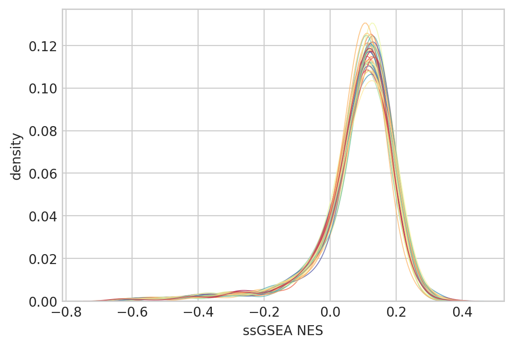

# Analyzing single-lineage models

## Setup

### Imports


```python
%load_ext autoreload
%autoreload 2
```


```python
from fractions import Fraction
from time import time

import gseapy as gp
import matplotlib.pyplot as plt
import numpy as np
import pandas as pd
import seaborn as sns
from matplotlib.text import Text
```


```python
from speclet.analysis.arviz_analysis import extract_coords_param_names
from speclet.analysis.sublineage_model_analysis import (
    load_sublineage_model_posteriors,
    sublineage_to_lineage_map,
)
from speclet.data_processing.vectors import squish_array
from speclet.io import project_root, temp_dir
from speclet.managers.posterior_data_manager import PosteriorDataManager as PostDataMan
from speclet.plot import set_speclet_theme
from speclet.plot.color_pal import lineage_color_pal, sublineage_color_pal
from speclet.project_configuration import arviz_config, get_model_configuration_file
from speclet.string_functions import str_hash
```


```python
# Notebook execution timer.
notebook_tic = time()

# Plotting setup.
set_speclet_theme()
%config InlineBackend.figure_format = "retina"

# Constants
RANDOM_SEED = 709
np.random.seed(RANDOM_SEED)
arviz_config()

# File paths
config_path = project_root() / get_model_configuration_file()
```

### Data

#### Model posteriors


```python
postmen = load_sublineage_model_posteriors()
```


```python
postmen.keys
```


    ['bile duct (cholangiocarcinoma)',
     'bile duct (gallbladder adenocarcinoma)',
     'blood (ALL)',
     'blood (AML)',
     'blood (CLL)',
     'blood (CML)',
     'bone (Ewing sarcoma)',
     'bone (chordoma)',
     'bone (osteosarcoma)',
     'breast',
     'central nervous system (glioma)',
     'central nervous system (medulloblastoma)',
     'cervix (cervical carcinoma)',
     'cervix (cervical squamous)',
     'colorectal',
     'esophagus (esophagus adenocarcinoma)',
     'esophagus (esophagus squamous)',
     'eye (uveal melanoma)',
     'gastric (gastric adenocarcinoma)',
     'kidney (renal cell carcinoma)',
     'liver (hepatocellular carcinoma)',
     'lung (NSCLC)',
     'lung (SCLC)',
     'lung (mesothelioma)',
     'lymphocyte (hodgkin lymphoma)',
     'lymphocyte (lymphoma unspecified)',
     'lymphocyte (non hodgkin lymphoma)',
     'ovary (ovary adenocarcinoma)',
     'pancreas',
     'peripheral nervous system (neuroblastoma)',
     'plasma cell (multiple myeloma)',
     'prostate',
     'skin (melanoma)',
     'skin (skin squamous)',
     'soft tissue (ATRT)',
     'soft tissue (liposarcoma)',
     'soft tissue (malignant rhabdoid tumor)',
     'soft tissue (rhabdomyosarcoma)',
     'soft tissue (synovial sarcoma)',
     'thyroid (thyroid carcinoma)',
     'upper aerodigestive',
     'urinary tract',
     'uterus (endometrial adenocarcinoma)']


```python
len(postmen)
```


    43


```python
sub_to_lineage, lineages = sublineage_to_lineage_map(postmen)
```


```python
sublineage_pal = sublineage_color_pal()
lineage_pal = lineage_color_pal()
```

## Analysis

### Gather sgRNA|gene varying intercept


```python
STASH_DIR = temp_dir() / "100_105_notebook-stash"
if not STASH_DIR.exists():
    STASH_DIR.mkdir()
```


```python
# def _extract_varying_intercept_summary(
#     pm: PostDataMan,
#     sgrna_df: pd.DataFrame,
#     lineage_map: dict[str, str],
#     stash: bool = True,
# ) -> pd.DataFrame:
#     lineage_subtype = pm.id
#     lineage = lineage_map[pm.id]

#     # a_post_fp = STASH_DIR / f"a-post-df_{pm.id}"
#     mu_a_post_fp = STASH_DIR / f"mu-a-post-df_{pm.id}"
#     # if stash and a_post_fp.exists():
#     #     a_post = pd.read_csv(a_post_fp)
#     # else:
#     #     a_post = (
#     #         az.summary(pm.trace, var_names=["a"], kind="stats")
#     #         .pipe(extract_coords_param_names, names=["sgrna"])
#     #         .reset_index(drop=True)
#     #         .merge(sgrna_df, on="sgrna", how="left", validate="one_to_one")
#     #         .assign(lineage_subtype=lineage_subtype, lineage=lineage)
#     #     )
#     #     a_post.to_csv(a_post_fp, index=False)

#     if stash and mu_a_post_fp.exists():
#         mu_a_post = pd.read_csv(mu_a_post_fp)
#     else:
#         mu_a_post = (
#             az.summary(pm.trace, var_names=["mu_a"], kind="stats")
#             .pipe(extract_coords_param_names, names=["hugo_symbol"])
#             .reset_index(drop=True)
#             .assign(lineage_subtype=lineage_subtype, lineage=lineage)
#         )
#         mu_a_post.to_csv(mu_a_post_fp, index=False)

#     return mu_a_post


def get_mu_a_summary(
    pm: PostDataMan, lineage_map: dict[str, str], stash: bool = True
) -> pd.DataFrame:
    lineage_subtype = pm.id
    lineage = lineage_map[pm.id]

    stash_fp = STASH_DIR / f"mu-a-post-df_{pm.id}"
    if stash and stash_fp.exists():
        return pd.read_csv(stash_fp)
    mu_a_post = (
        pm.posterior_summary.query("var_name == 'mu_a'")
        .reset_index(drop=True)
        .pipe(extract_coords_param_names, col="parameter", names=["hugo_symbol"])
        .drop(columns=["parameter"])
        .assign(lineage_subtype=lineage_subtype, lineage=lineage)
    )
    mu_a_post.to_csv(stash_fp, index=False)
    return mu_a_post
```


```python
intercept_posteriors = {
    pm.id: get_mu_a_summary(pm, lineage_map=sub_to_lineage, stash=True)
    for pm in postmen.as_dict().values()
}
```


```python
mu_a_post_df = (
    pd.concat(list(intercept_posteriors.values()))
    .sort_values(["lineage", "lineage_subtype", "hugo_symbol"])
    .reset_index(drop=True)
)
mu_a_post_df.head(3)
```


<div>
<style scoped>
    .dataframe tbody tr th:only-of-type {
        vertical-align: middle;
    }

    .dataframe tbody tr th {
        vertical-align: top;
    }

    .dataframe thead th {
        text-align: right;
    }
</style>
<table border="1" class="dataframe">
  <thead>
    <tr style="text-align: right;">
      <th></th>
      <th>mean</th>
      <th>sd</th>
      <th>hdi_5.5%</th>
      <th>hdi_94.5%</th>
      <th>mcse_mean</th>
      <th>mcse_sd</th>
      <th>ess_bulk</th>
      <th>ess_tail</th>
      <th>r_hat</th>
      <th>var_name</th>
      <th>hugo_symbol</th>
      <th>lineage_subtype</th>
      <th>lineage</th>
    </tr>
  </thead>
  <tbody>
    <tr>
      <th>0</th>
      <td>0.337</td>
      <td>0.125</td>
      <td>0.136</td>
      <td>0.535</td>
      <td>0.002</td>
      <td>0.002</td>
      <td>3351.0</td>
      <td>2677.0</td>
      <td>1.0</td>
      <td>mu_a</td>
      <td>A1BG</td>
      <td>bile duct (cholangiocarcinoma)</td>
      <td>bile duct</td>
    </tr>
    <tr>
      <th>1</th>
      <td>0.268</td>
      <td>0.124</td>
      <td>0.069</td>
      <td>0.462</td>
      <td>0.002</td>
      <td>0.002</td>
      <td>3071.0</td>
      <td>3020.0</td>
      <td>1.0</td>
      <td>mu_a</td>
      <td>A1CF</td>
      <td>bile duct (cholangiocarcinoma)</td>
      <td>bile duct</td>
    </tr>
    <tr>
      <th>2</th>
      <td>0.178</td>
      <td>0.127</td>
      <td>-0.026</td>
      <td>0.374</td>
      <td>0.002</td>
      <td>0.002</td>
      <td>2829.0</td>
      <td>3058.0</td>
      <td>1.0</td>
      <td>mu_a</td>
      <td>A2M</td>
      <td>bile duct (cholangiocarcinoma)</td>
      <td>bile duct</td>
    </tr>
  </tbody>
</table>
</div>


```python
def extract_sublineage(s: str) -> str:
    if "(" not in s:
        return s
    return s.split("(")[1].replace(")", "")


def axis_labels_to_sublineage(lbl: Text) -> Text:
    lbl.set_text(extract_sublineage(lbl.get_text()))
    return lbl
```


```python
_, ax = plt.subplots(figsize=(9, 3))
ax.axhline(0, color="k", lw=0.7, zorder=1)
sns.violinplot(
    data=mu_a_post_df,
    x="lineage_subtype",
    y="mean",
    hue="lineage",
    palette=lineage_pal,
    dodge=False,
    linewidth=0.5,
    ax=ax,
)
xlbls = [axis_labels_to_sublineage(lbl) for lbl in ax.get_xticklabels()]
ax.set_xticklabels(xlbls, rotation=40, ha="right", size=8)
ax.legend(
    loc="upper left",
    bbox_to_anchor=(1, 1),
    title="lineage",
    handlelength=0.7,
    handleheight=0.7,
    labelspacing=0,
)
ax.set_xlabel(None)
ax.set_ylabel(r"distribution of $\bar{\mu}_a$ posterior")
plt.show()
```


```python
mu_a_post_X = mu_a_post_df.pivot_wider(
    "lineage_subtype", names_from="hugo_symbol", values_from="mean"
).set_index("lineage_subtype")

# Top 80% most variable genes.
variances = mu_a_post_X.var(axis=0)
mu_a_post_X = mu_a_post_X.loc[:, np.quantile(variances, q=0.8) < variances]

# Row color dictionary.
row_colors = (
    pd.DataFrame({"index": mu_a_post_X.index})
    .assign(lineage=lambda d: d["index"].map(sub_to_lineage).map(lineage_pal))
    .set_index("index")
)

# Clustermap.
cg = sns.clustermap(
    mu_a_post_X,
    figsize=(12, 8),
    dendrogram_ratio=(0.05, 0.1),
    row_colors=row_colors,
    cmap="RdYlBu_r",
    center=0,
    vmin=-1.5,
    vmax=1.5,
    yticklabels=1,
    cbar_pos=(0, 0.81, 0.01, 0.19),
)
ylbls = [axis_labels_to_sublineage(lbl) for lbl in cg.ax_heatmap.get_yticklabels()]
cg.ax_heatmap.set_yticklabels(ylbls)
plt.show()
```

    /home/jc604/.conda/envs/speclet/lib/python3.10/site-packages/seaborn/matrix.py:654: UserWarning: Clustering large matrix with scipy. Installing `fastcluster` may give better performance.
      warnings.warn(msg)


```python
mu_a_corr = mu_a_post_X.T.corr()
cg = sns.clustermap(
    mu_a_corr,
    cmap="flare",
    vmin=mu_a_corr.min().min(),
    vmax=1,
    figsize=(10, 10),
    dendrogram_ratio=(0.1, 0.1),
    cbar_pos=(0.9, 0.8, 0.01, 0.15),
)
cg.ax_heatmap.set_xlabel(None)
cg.ax_heatmap.set_ylabel(None)
ylbls = [axis_labels_to_sublineage(lbl) for lbl in cg.ax_heatmap.get_yticklabels()]
cg.ax_heatmap.set_yticklabels(ylbls)
xlbls = [axis_labels_to_sublineage(lbl) for lbl in cg.ax_heatmap.get_xticklabels()]
cg.ax_heatmap.set_xticklabels(xlbls)
plt.show()
```


```python
head_mu_a = (
    mu_a_post_df.sort_values(["lineage_subtype", "mean"], ascending=(True, False))
    .groupby("lineage_subtype")
    .head(100)
    .reset_index(drop=True)
)
tail_mu_a = (
    mu_a_post_df.sort_values(["lineage_subtype", "mean"], ascending=(True, False))
    .groupby("lineage_subtype")
    .tail(100)
    .reset_index(drop=True)
)
```


```python
def ssgsea(df: pd.DataFrame, stash: bool = True) -> pd.DataFrame:
    X = df.pivot_wider(
        "hugo_symbol", names_from="lineage_subtype", values_from="mean"
    ).set_index("hugo_symbol")

    stash_fp = STASH_DIR / "ssgsea-mu-a-posterior.csv"
    if stash and stash_fp.exists():
        return pd.read_csv(stash_fp)

    ss_res = gp.ssgsea(data=X, gene_sets=GENE_SETS).res2d.clean_names()
    ss_res.to_csv(stash_fp, index=False)
    return ss_res


def post_ssgsea(ssgsea_res: pd.DataFrame) -> pd.DataFrame:
    return (
        ssgsea_res.rename(columns={"term": "geneset_term", "name": "lineage_subtype"})
        .assign(
            gene_set=lambda d: [t.split("__")[0] for t in d["geneset_term"]],
            term=lambda d: [t.split("__")[1] for t in d["geneset_term"]],
        )
        .rename(columns={"tag_%": "tag_perc", "gene_%": "gene_perc"})
    )
```


```python
GENE_SETS = [
    "KEGG_2021_Human",
    "MSigDB_Hallmark_2020",
    "MSigDB_Oncogenic_Signatures",
]


def enrichr(df: pd.DataFrame, stash: bool = True) -> pd.DataFrame:
    genes = list(df["hugo_symbol"].toset())
    genes.sort()
    genes_hash = str_hash("__".join(genes))
    stash_fp = STASH_DIR / f"enrichr-{genes_hash}.csv"
    if stash and stash_fp.exists():
        return pd.read_csv(stash_fp)

    enr = gp.enrichr(
        gene_list=genes,
        gene_sets=GENE_SETS,
        organism="human",
        outdir=None,
        cutoff=1,
        top_term=int(1e6),
    )
    res = enr.results.clean_names()
    res.to_csv(stash_fp, index=False)
    return res


def enrichr_post(res_df: pd.DataFrame) -> pd.DataFrame:
    return res_df.assign(
        overlap_frac=lambda d: [float(Fraction(x)) for x in d["overlap"]],
        n_overlap=lambda d: [int(x.split("/")[0]) for x in d["overlap"]],
    )
```


```python
enrichr_res_up = (
    head_mu_a.groupby("lineage_subtype")
    .apply(enrichr, stash=True)
    .reset_index(drop=False)
    .assign(lineage=lambda d: d["lineage_subtype"].map(sub_to_lineage))
    .drop(columns=["level_1"])
    .pipe(enrichr_post)
)
enrichr_res_dn = (
    tail_mu_a.groupby("lineage_subtype")
    .apply(enrichr, stash=True)
    .reset_index(drop=False)
    .assign(lineage=lambda d: d["lineage_subtype"].map(sub_to_lineage))
    .drop(columns=["level_1"])
    .pipe(enrichr_post)
)
```


```python
enrichr_res_up.head(3)
```


<div>
<style scoped>
    .dataframe tbody tr th:only-of-type {
        vertical-align: middle;
    }

    .dataframe tbody tr th {
        vertical-align: top;
    }

    .dataframe thead th {
        text-align: right;
    }
</style>
<table border="1" class="dataframe">
  <thead>
    <tr style="text-align: right;">
      <th></th>
      <th>lineage_subtype</th>
      <th>gene_set</th>
      <th>term</th>
      <th>overlap</th>
      <th>p_value</th>
      <th>adjusted_p_value</th>
      <th>old_p_value</th>
      <th>old_adjusted_p_value</th>
      <th>odds_ratio</th>
      <th>combined_score</th>
      <th>genes</th>
      <th>lineage</th>
      <th>overlap_frac</th>
      <th>n_overlap</th>
    </tr>
  </thead>
  <tbody>
    <tr>
      <th>0</th>
      <td>bile duct (cholangiocarcinoma)</td>
      <td>KEGG_2021_Human</td>
      <td>Human T-cell leukemia virus 1 infection</td>
      <td>10/219</td>
      <td>1.479654e-07</td>
      <td>0.000026</td>
      <td>0</td>
      <td>0</td>
      <td>10.468368</td>
      <td>164.628558</td>
      <td>MAPK9;CDKN1A;CDKN2C;CHEK2;PTEN;ATM;TP53;ETS1;C...</td>
      <td>bile duct</td>
      <td>0.045662</td>
      <td>10</td>
    </tr>
    <tr>
      <th>1</th>
      <td>bile duct (cholangiocarcinoma)</td>
      <td>KEGG_2021_Human</td>
      <td>p53 signaling pathway</td>
      <td>6/73</td>
      <td>1.743586e-06</td>
      <td>0.000153</td>
      <td>0</td>
      <td>0</td>
      <td>18.894570</td>
      <td>250.533811</td>
      <td>CDKN1A;CHEK2;PTEN;PMAIP1;ATM;TP53</td>
      <td>bile duct</td>
      <td>0.082192</td>
      <td>6</td>
    </tr>
    <tr>
      <th>2</th>
      <td>bile duct (cholangiocarcinoma)</td>
      <td>KEGG_2021_Human</td>
      <td>Cellular senescence</td>
      <td>7/156</td>
      <td>1.338636e-05</td>
      <td>0.000781</td>
      <td>0</td>
      <td>0</td>
      <td>9.977412</td>
      <td>111.959280</td>
      <td>HIPK4;CDKN1A;CHEK2;PTEN;ATM;TP53;ETS1</td>
      <td>bile duct</td>
      <td>0.044872</td>
      <td>7</td>
    </tr>
  </tbody>
</table>
</div>


```python
enrichr_res_up["term"].nunique(), enrichr_res_dn["term"].nunique()
```


    (538, 357)


```python
enrichr_res_up["gene_set"].unique()
```


    array(['KEGG_2021_Human', 'MSigDB_Hallmark_2020',
           'MSigDB_Oncogenic_Signatures'], dtype=object)


```python
def grouped_zscore(df: pd.DataFrame, grp_cols: list[str], value: str) -> pd.DataFrame:
    def f(_df: pd.DataFrame) -> pd.DataFrame:
        x = _df[value]
        _df[value] = x / np.std(x)
        return _df

    return df.groupby(grp_cols).apply(f)


plot_df = (
    pd.concat(
        [enrichr_res_up.assign(direction="up"), enrichr_res_dn.assign(direction="down")]
    )
    .query("gene_set == 'MSigDB_Hallmark_2020'")
    .reset_index(drop=True)
)
fig, axes = plt.subplots(nrows=2, figsize=(12, 14))

for ax, (direction, df) in zip(axes, plot_df.groupby("direction")):
    term_variances = df.groupby("term")["combined_score"].var()
    term_variances = term_variances[~np.isnan(term_variances)]
    q = np.quantile(term_variances, 1 - (20 / len(term_variances)))
    top_var_terms = list(term_variances[q <= term_variances].index)

    df = (
        df.copy()
        .filter_column_isin("term", top_var_terms)
        .assign(
            adjusted_p_value=lambda d: squish_array(
                d["adjusted_p_value"], lower=10e-5, upper=1
            )
        )
        .assign(neg_log_adj_p_val=lambda d: -np.log(d["adjusted_p_value"]))
        .pipe(grouped_zscore, grp_cols=["term"], value="combined_score")
        .rename(
            columns={
                "neg_log_adj_p_val": r"$-\log$ adj. $p$-value",
                "overlap_frac": "overlap frac.",
                "combined_score": "score (scaled)",
            }
        )
    )

    ax.set_title(direction)
    sns.scatterplot(
        data=df,
        x="lineage_subtype",
        y="term",
        hue="score (scaled)",
        size=r"$-\log$ adj. $p$-value",
        ax=ax,
        palette="flare",
        edgecolor=None,
    )
    ax.legend(loc="upper left", bbox_to_anchor=(1, 1))
    ax.set_xlabel(None)
    ax.set_ylabel(None)

    xlbls = [extract_sublineage(lbl) for lbl in sorted(df["lineage_subtype"].unique())]
    ax.set_xticks(
        ticks=np.arange(len(xlbls)), labels=xlbls, rotation=30, ha="right", size=8
    )
    ax.set_ylim(-0.5, df["term"].nunique() - 0.5)

fig.tight_layout()
plt.show()
```


```python
ssgsea_res = (
    ssgsea(mu_a_post_df.copy())
    .pipe(post_ssgsea)
    .assign(lineage=lambda d: d["lineage_subtype"].map(sub_to_lineage))
)
```


```python
ssgsea_res.head(3)
```


<div>
<style scoped>
    .dataframe tbody tr th:only-of-type {
        vertical-align: middle;
    }

    .dataframe tbody tr th {
        vertical-align: top;
    }

    .dataframe thead th {
        text-align: right;
    }
</style>
<table border="1" class="dataframe">
  <thead>
    <tr style="text-align: right;">
      <th></th>
      <th>lineage_subtype</th>
      <th>geneset_term</th>
      <th>es</th>
      <th>nes</th>
      <th>tag_perc</th>
      <th>gene_perc</th>
      <th>lead_genes</th>
      <th>gene_set</th>
      <th>term</th>
      <th>lineage</th>
    </tr>
  </thead>
  <tbody>
    <tr>
      <th>0</th>
      <td>gastric (gastric adenocarcinoma)</td>
      <td>KEGG_2021_Human__Ribosome</td>
      <td>-7829.043830</td>
      <td>-0.642003</td>
      <td>126/158</td>
      <td>14.50%</td>
      <td>RPL12;SNRPD1;RPS6;RPSA;RPS3A;RPL7A;RPL17;RPL6;...</td>
      <td>KEGG_2021_Human</td>
      <td>Ribosome</td>
      <td>gastric</td>
    </tr>
    <tr>
      <th>1</th>
      <td>prostate</td>
      <td>KEGG_2021_Human__Aminoacyl-tRNA biosynthesis</td>
      <td>-7815.822238</td>
      <td>-0.640918</td>
      <td>25/66</td>
      <td>14.48%</td>
      <td>FARSB;RPL18A;HARS2;AARS2;MARS2;RRS1;NUP43;PSMD...</td>
      <td>KEGG_2021_Human</td>
      <td>Aminoacyl-tRNA biosynthesis</td>
      <td>prostate</td>
    </tr>
    <tr>
      <th>2</th>
      <td>soft tissue (ATRT)</td>
      <td>KEGG_2021_Human__Aminoacyl-tRNA biosynthesis</td>
      <td>-7738.572313</td>
      <td>-0.634584</td>
      <td>25/66</td>
      <td>15.61%</td>
      <td>FARSB;YARS2;CDC7;EARS2;SNAPC3;POP1;AARS2;ISY1;...</td>
      <td>KEGG_2021_Human</td>
      <td>Aminoacyl-tRNA biosynthesis</td>
      <td>soft tissue</td>
    </tr>
  </tbody>
</table>
</div>


```python
_, ax = plt.subplots(figsize=(6, 4))
sns.kdeplot(
    data=ssgsea_res,
    x="nes",
    hue="lineage_subtype",
    ax=ax,
    palette=sublineage_pal,
    lw=0.7,
    alpha=0.75,
)

pal = {
    k: v for k, v in sublineage_pal.items() if k in set(ssgsea_res["lineage_subtype"])
}

# ax.legend(
#     handles=pal_to_legend_handles(pal),
#     title="sublineage",
#     loc="upper left",
#     bbox_to_anchor=(1, 1),
#     handlelength=0.5,
#     handletextpad=0.2,
# )
ax.get_legend().remove()
ax.set_xlabel("ssGSEA NES")
ax.set_ylabel("density")
plt.show()
```





```python
ssgsea_X = ssgsea_res.pivot_wider(
    "lineage_subtype", names_from="geneset_term", values_from="nes"
).set_index("lineage_subtype")
sns.clustermap(
    ssgsea_X, figsize=(12, 12), dendrogram_ratio=(0.1, 0.1), cmap="RdYlBu_r", center=0
)
```

    /home/jc604/.conda/envs/speclet/lib/python3.10/site-packages/seaborn/matrix.py:654: UserWarning: Clustering large matrix with scipy. Installing `fastcluster` may give better performance.
      warnings.warn(msg)


    <seaborn.matrix.ClusterGrid at 0x7fa3bbd0f430>


```python

```


```python

```


```python

```

---


```python
notebook_toc = time()
print(f"execution time: {(notebook_toc - notebook_tic) / 60:.2f} minutes")
```

    execution time: 0.61 minutes


```python
%load_ext watermark
%watermark -d -u -v -iv -b -h -m
```

    Last updated: 2022-09-18

    Python implementation: CPython
    Python version       : 3.10.6
    IPython version      : 8.5.0

    Compiler    : GCC 10.4.0
    OS          : Linux
    Release     : 3.10.0-1160.76.1.el7.x86_64
    Machine     : x86_64
    Processor   : x86_64
    CPU cores   : 28
    Architecture: 64bit

    Hostname: compute-e-16-231.o2.rc.hms.harvard.edu

    Git branch: figures

    numpy     : 1.23.3
    pandas    : 1.4.4
    seaborn   : 0.11.2
    gseapy    : 0.13.0
    matplotlib: 3.5.3


```python

```
