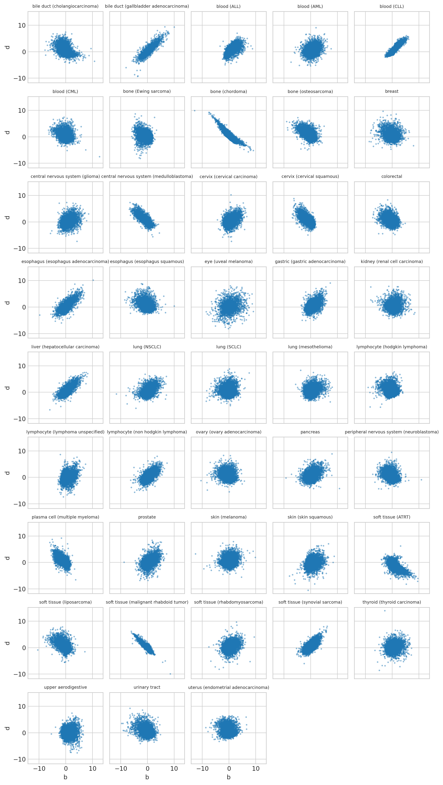
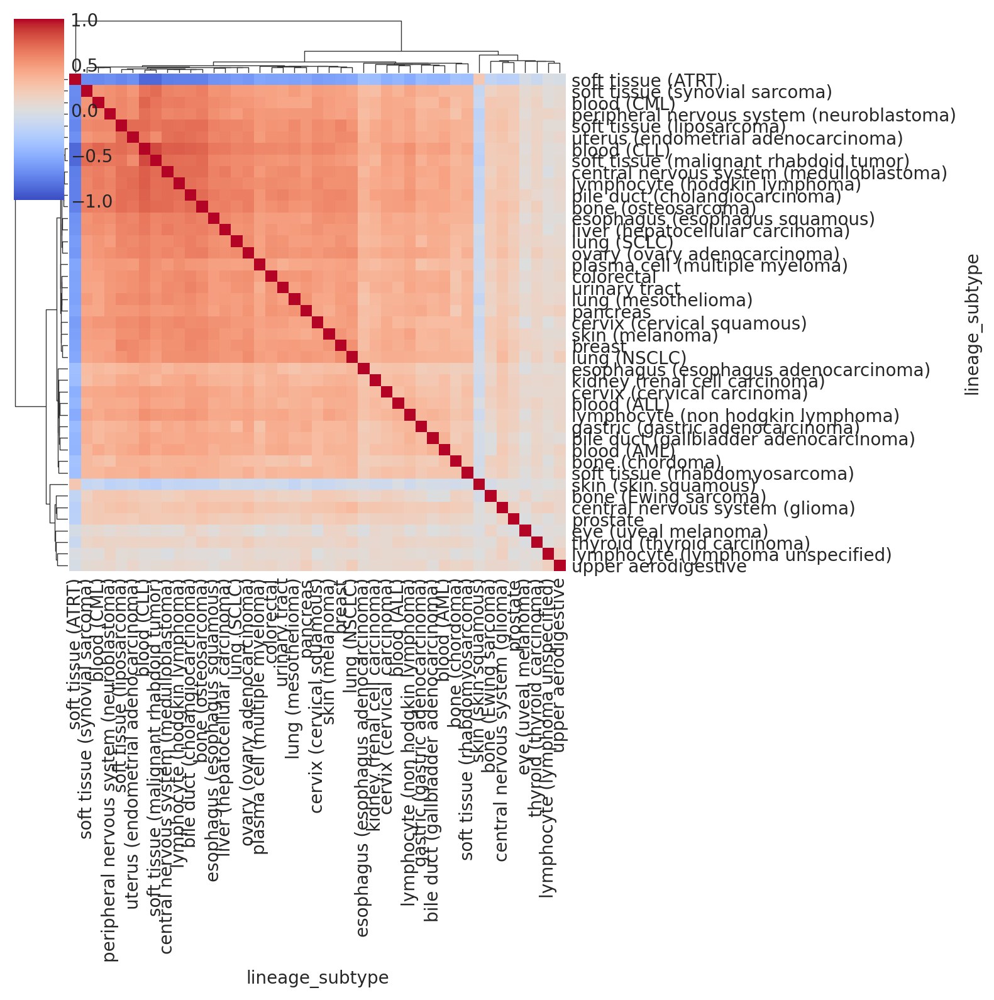
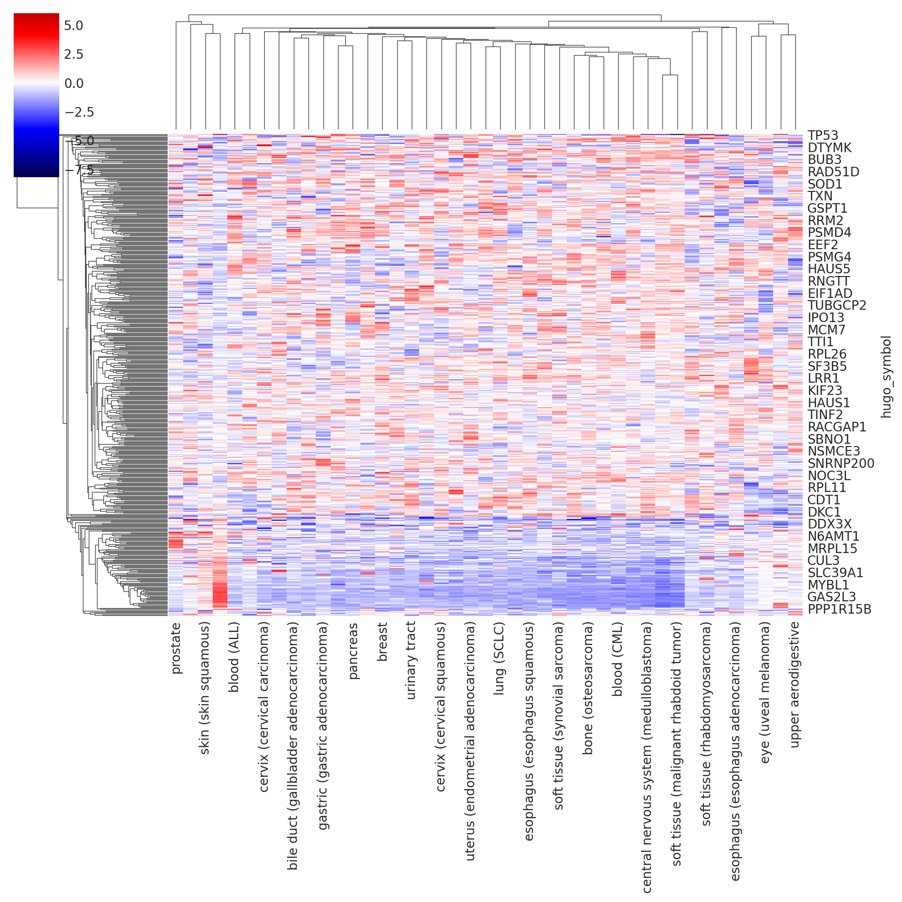
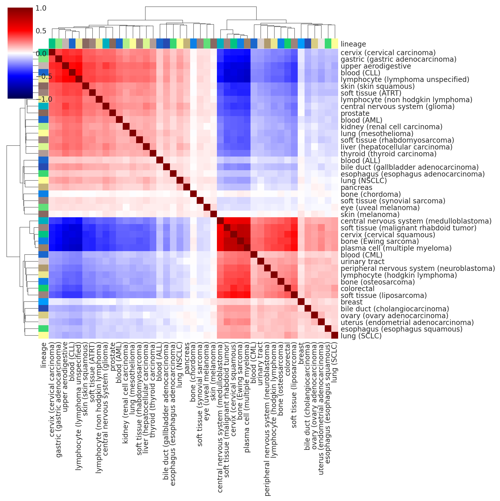
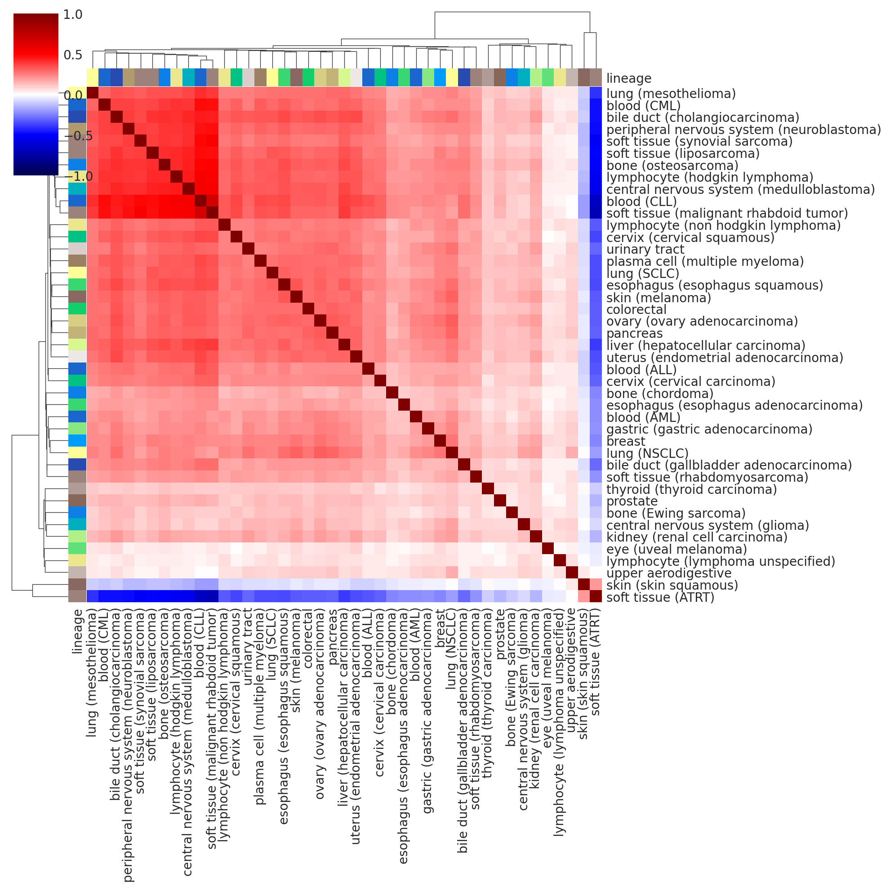
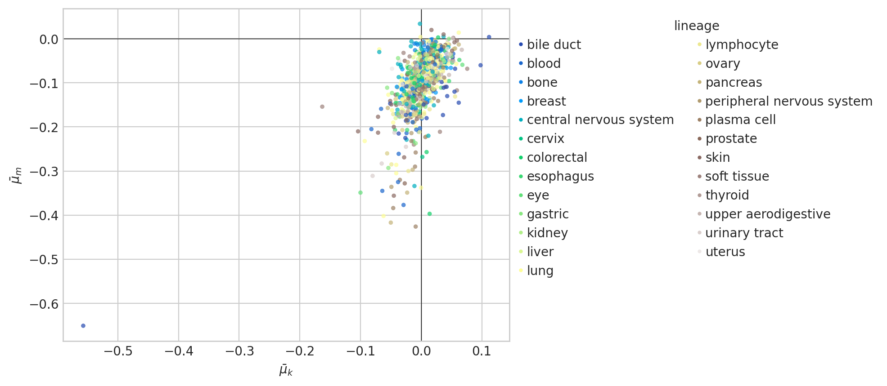
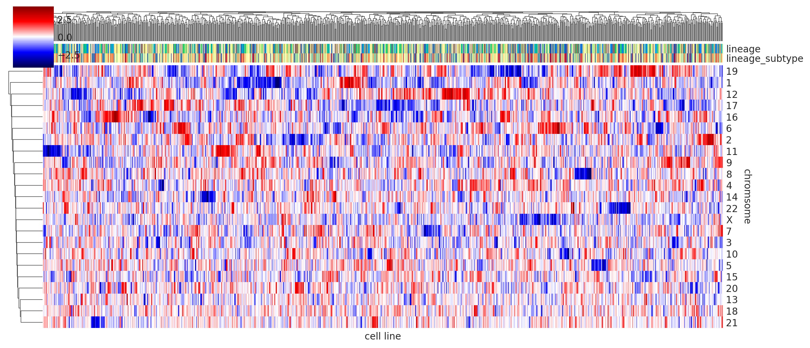
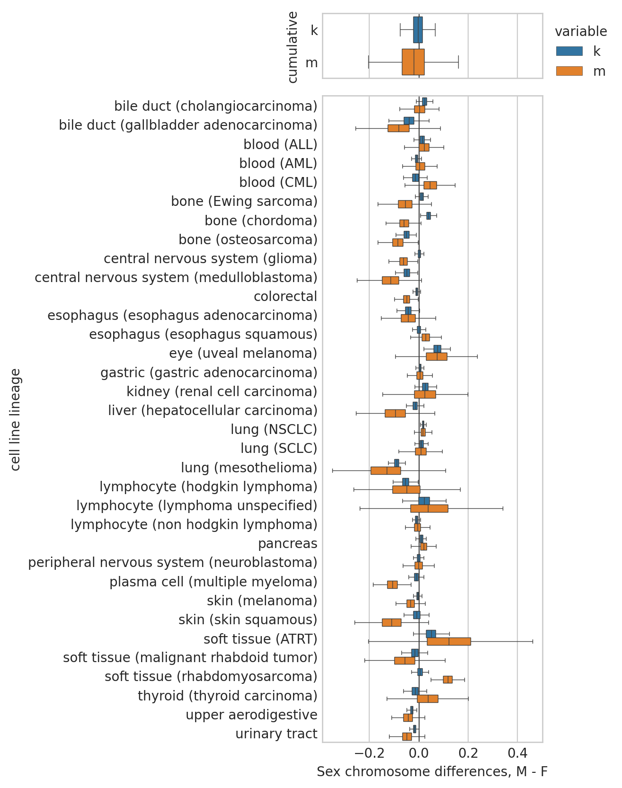
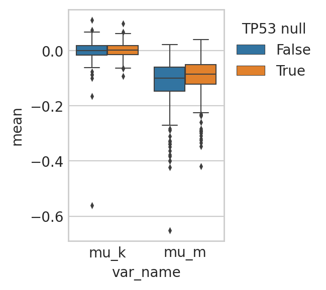
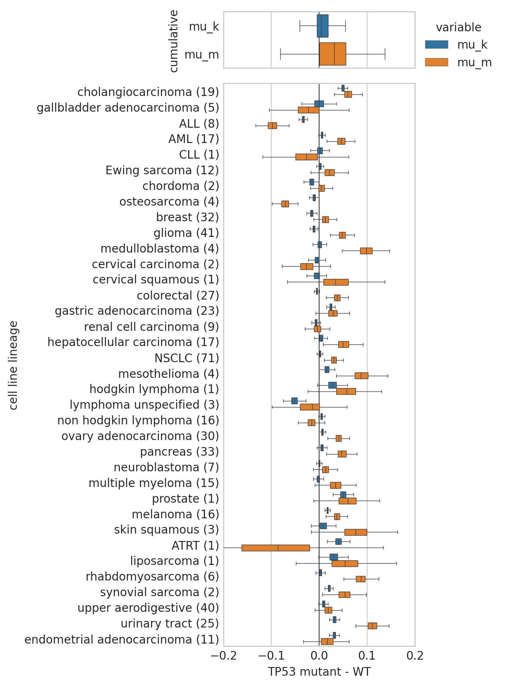

# Molecular and cell line covariates

## Setup

### Imports


```python
%load_ext autoreload
%autoreload 2
```


```python
import json
import os
from math import ceil
from time import time

import dask.dataframe as dd
import matplotlib.pyplot as plt
import numpy as np
import pandas as pd
import seaborn as sns
from matplotlib.text import Text
```


```python
from speclet.analysis.arviz_analysis import extract_coords_param_names
from speclet.analysis.sublineage_model_analysis import (
    get_sgrna_to_gene_map,
    load_sublineage_model_posteriors,
    sublineage_to_lineage_map,
)
from speclet.data_processing.common import head_tail
from speclet.data_processing.crispr import grouped_copy_number_transform
from speclet.io import DataFile, data_path, tables_dir, temp_dir
from speclet.managers.posterior_data_manager import PosteriorDataManager as PostDataMan
from speclet.plot import set_speclet_theme
from speclet.plot.color_pal import (
    lineage_color_pal,
    pal_to_legend_handles,
    sublineage_color_pal,
)
from speclet.project_configuration import arviz_config
```


```python
# Notebook execution timer.
notebook_tic = time()

# Plotting setup.
set_speclet_theme()
%config InlineBackend.figure_format = "retina"

# Constants
RANDOM_SEED = 709
np.random.seed(RANDOM_SEED)
arviz_config()
```


```python
STASH_DIR = temp_dir() / "100_106_molecular-cellular-covariates_stash"
if not STASH_DIR.exists():
    STASH_DIR.mkdir()

if False:
    for fp in STASH_DIR.iterdir():
        os.remove(fp)
```


```python
OUTPUT_DIR = tables_dir() / "100_106_molecular-cellular-covariates"
if not OUTPUT_DIR.exists():
    OUTPUT_DIR.mkdir()
```

### Data

#### Model posteriors


```python
postmen = load_sublineage_model_posteriors()
```


```python
postmen.keys
```


    ['bile duct (cholangiocarcinoma)',
     'bile duct (gallbladder adenocarcinoma)',
     'blood (ALL)',
     'blood (AML)',
     'blood (CLL)',
     'blood (CML)',
     'bone (Ewing sarcoma)',
     'bone (chordoma)',
     'bone (osteosarcoma)',
     'breast',
     'central nervous system (glioma)',
     'central nervous system (medulloblastoma)',
     'cervix (cervical carcinoma)',
     'cervix (cervical squamous)',
     'colorectal',
     'esophagus (esophagus adenocarcinoma)',
     'esophagus (esophagus squamous)',
     'eye (uveal melanoma)',
     'gastric (gastric adenocarcinoma)',
     'kidney (renal cell carcinoma)',
     'liver (hepatocellular carcinoma)',
     'lung (NSCLC)',
     'lung (SCLC)',
     'lung (mesothelioma)',
     'lymphocyte (hodgkin lymphoma)',
     'lymphocyte (lymphoma unspecified)',
     'lymphocyte (non hodgkin lymphoma)',
     'ovary (ovary adenocarcinoma)',
     'pancreas',
     'peripheral nervous system (neuroblastoma)',
     'plasma cell (multiple myeloma)',
     'prostate',
     'skin (melanoma)',
     'skin (skin squamous)',
     'soft tissue (ATRT)',
     'soft tissue (liposarcoma)',
     'soft tissue (malignant rhabdoid tumor)',
     'soft tissue (rhabdomyosarcoma)',
     'soft tissue (synovial sarcoma)',
     'thyroid (thyroid carcinoma)',
     'upper aerodigestive',
     'urinary tract',
     'uterus (endometrial adenocarcinoma)']


```python
len(postmen)
```


    43


```python
sub_to_lineage, lineages = sublineage_to_lineage_map(postmen)
```


```python
sublineage_pal = sublineage_color_pal()
lineage_pal = lineage_color_pal()
```

### sgRNA information


```python
sgrna_info = get_sgrna_to_gene_map()
sgrna_info.head()
```


<div>
<style scoped>
    .dataframe tbody tr th:only-of-type {
        vertical-align: middle;
    }

    .dataframe tbody tr th {
        vertical-align: top;
    }

    .dataframe thead th {
        text-align: right;
    }
</style>
<table border="1" class="dataframe">
  <thead>
    <tr style="text-align: right;">
      <th></th>
      <th>sgrna</th>
      <th>hugo_symbol</th>
      <th>sgrna_target_chr</th>
      <th>sgrna_target_pos</th>
    </tr>
  </thead>
  <tbody>
    <tr>
      <th>0</th>
      <td>GGAAGTCTGGAGTCTCCAGG</td>
      <td>A1BG</td>
      <td>19</td>
      <td>58353109</td>
    </tr>
    <tr>
      <th>1</th>
      <td>GTGGACTTCCAGCTACGGCG</td>
      <td>A1BG</td>
      <td>19</td>
      <td>58351569</td>
    </tr>
    <tr>
      <th>2</th>
      <td>GTGTGCCGAGGTGTGCTGCG</td>
      <td>A1BG</td>
      <td>19</td>
      <td>58352467</td>
    </tr>
    <tr>
      <th>3</th>
      <td>TCAATGGTCACAGTAGCGCT</td>
      <td>A1BG</td>
      <td>19</td>
      <td>58352307</td>
    </tr>
    <tr>
      <th>4</th>
      <td>GCAGATAAAACCAAAAACCG</td>
      <td>A1CF</td>
      <td>10</td>
      <td>50836144</td>
    </tr>
  </tbody>
</table>
</div>


### Gene-to-chromosome map


```python
gene_chr_map = (
    sgrna_info.drop(columns=["sgrna"])
    .drop_duplicates()
    .groupby(["hugo_symbol", "sgrna_target_chr"])["sgrna_target_pos"]
    .median()
    .reset_index()
)
assert gene_chr_map["hugo_symbol"].nunique() == len(gene_chr_map)
gene_chr_map.head()
```


<div>
<style scoped>
    .dataframe tbody tr th:only-of-type {
        vertical-align: middle;
    }

    .dataframe tbody tr th {
        vertical-align: top;
    }

    .dataframe thead th {
        text-align: right;
    }
</style>
<table border="1" class="dataframe">
  <thead>
    <tr style="text-align: right;">
      <th></th>
      <th>hugo_symbol</th>
      <th>sgrna_target_chr</th>
      <th>sgrna_target_pos</th>
    </tr>
  </thead>
  <tbody>
    <tr>
      <th>0</th>
      <td>A1BG</td>
      <td>19</td>
      <td>58352387.0</td>
    </tr>
    <tr>
      <th>1</th>
      <td>A1CF</td>
      <td>10</td>
      <td>50840175.0</td>
    </tr>
    <tr>
      <th>2</th>
      <td>A2M</td>
      <td>12</td>
      <td>9104546.5</td>
    </tr>
    <tr>
      <th>3</th>
      <td>A2ML1</td>
      <td>12</td>
      <td>8835899.5</td>
    </tr>
    <tr>
      <th>4</th>
      <td>A3GALT2</td>
      <td>1</td>
      <td>33312702.5</td>
    </tr>
  </tbody>
</table>
</div>


### Known essential genes


```python
essential_genes = set(
    pd.read_csv(data_path(DataFile.DEPMAP_ESSENTIALS))
    .query("is_essential")["gene"]
    .unique()
)
len(essential_genes)
```


    1248


## Analysis


```python
def get_variables_posterior_summary(
    pm: PostDataMan, var_names: list[str], stash: bool = True
) -> pd.DataFrame:
    vnames = "-".join(var_names)
    stash_fp = STASH_DIR / f"posterior-summary-df_{pm.id}_var-{vnames}.csv"
    if stash and stash_fp.exists():
        return pd.read_csv(stash_fp)
    try:
        post = (
            pm.posterior_summary.copy()
            .filter_column_isin("var_name", var_names)
            .reset_index(drop=True)
            .assign(lineage_subtype=pm.id)
        )
    except FileNotFoundError:
        print(f"No posterior summary for '{pm.id}'.")
        return pd.DataFrame()
    post.to_csv(stash_fp, index=False)
    return post
```


```python
def map_subtype_to_lineage(
    df: pd.DataFrame,
    st_map: dict[str, str],
    st_col: str = "lineage_subtype",
    line_col: str = "lineage",
) -> pd.DataFrame:
    df[line_col] = df[st_col].map(st_map)
    return df
```

### Gene copy number and RNA effects


```python
def _get_rna_and_copynumber_effects(
    pm: PostDataMan, stash: bool = True
) -> pd.DataFrame:
    stash_fp = STASH_DIR / f"cn-rna-posterior-summaries_{pm.id}.csv"
    if stash and stash_fp.exists():
        return pd.read_csv(stash_fp)

    post = get_variables_posterior_summary(pm, var_names=["b", "d"])
    if len(post) == 0:
        return post
    post = post.pipe(
        extract_coords_param_names, col="parameter", names=["hugo_symbol"]
    ).assign(lineage_subtype=pm.id)
    post.to_csv(stash_fp, index=False)
    return post
```


```python
rna_cn_posterior = (
    pd.concat([_get_rna_and_copynumber_effects(pm) for pm in postmen.posteriors])
    .reset_index(drop=True)
    .pipe(map_subtype_to_lineage, st_map=sub_to_lineage)
    .merge(gene_chr_map, on="hugo_symbol", how="left")
)
rna_cn_posterior.head(5)
```


<div>
<style scoped>
    .dataframe tbody tr th:only-of-type {
        vertical-align: middle;
    }

    .dataframe tbody tr th {
        vertical-align: top;
    }

    .dataframe thead th {
        text-align: right;
    }
</style>
<table border="1" class="dataframe">
  <thead>
    <tr style="text-align: right;">
      <th></th>
      <th>parameter</th>
      <th>mean</th>
      <th>sd</th>
      <th>hdi_5.5%</th>
      <th>hdi_94.5%</th>
      <th>mcse_mean</th>
      <th>mcse_sd</th>
      <th>ess_bulk</th>
      <th>ess_tail</th>
      <th>r_hat</th>
      <th>var_name</th>
      <th>lineage_subtype</th>
      <th>hugo_symbol</th>
      <th>lineage</th>
      <th>sgrna_target_chr</th>
      <th>sgrna_target_pos</th>
    </tr>
  </thead>
  <tbody>
    <tr>
      <th>0</th>
      <td>b[A1BG]</td>
      <td>-0.002</td>
      <td>0.029</td>
      <td>-0.049</td>
      <td>0.045</td>
      <td>0.0</td>
      <td>0.001</td>
      <td>8983.0</td>
      <td>2342.0</td>
      <td>1.0</td>
      <td>b</td>
      <td>bile duct (cholangiocarcinoma)</td>
      <td>A1BG</td>
      <td>bile duct</td>
      <td>19</td>
      <td>58352387.0</td>
    </tr>
    <tr>
      <th>1</th>
      <td>b[A1CF]</td>
      <td>0.032</td>
      <td>0.029</td>
      <td>-0.011</td>
      <td>0.082</td>
      <td>0.0</td>
      <td>0.000</td>
      <td>10585.0</td>
      <td>2707.0</td>
      <td>1.0</td>
      <td>b</td>
      <td>bile duct (cholangiocarcinoma)</td>
      <td>A1CF</td>
      <td>bile duct</td>
      <td>10</td>
      <td>50840175.0</td>
    </tr>
    <tr>
      <th>2</th>
      <td>b[A2M]</td>
      <td>0.032</td>
      <td>0.031</td>
      <td>-0.018</td>
      <td>0.079</td>
      <td>0.0</td>
      <td>0.000</td>
      <td>11338.0</td>
      <td>2856.0</td>
      <td>1.0</td>
      <td>b</td>
      <td>bile duct (cholangiocarcinoma)</td>
      <td>A2M</td>
      <td>bile duct</td>
      <td>12</td>
      <td>9104546.5</td>
    </tr>
    <tr>
      <th>3</th>
      <td>b[A2ML1]</td>
      <td>0.006</td>
      <td>0.029</td>
      <td>-0.042</td>
      <td>0.052</td>
      <td>0.0</td>
      <td>0.001</td>
      <td>10087.0</td>
      <td>2801.0</td>
      <td>1.0</td>
      <td>b</td>
      <td>bile duct (cholangiocarcinoma)</td>
      <td>A2ML1</td>
      <td>bile duct</td>
      <td>12</td>
      <td>8835899.5</td>
    </tr>
    <tr>
      <th>4</th>
      <td>b[A3GALT2]</td>
      <td>-0.051</td>
      <td>0.032</td>
      <td>-0.102</td>
      <td>-0.002</td>
      <td>0.0</td>
      <td>0.000</td>
      <td>11099.0</td>
      <td>2648.0</td>
      <td>1.0</td>
      <td>b</td>
      <td>bile duct (cholangiocarcinoma)</td>
      <td>A3GALT2</td>
      <td>bile duct</td>
      <td>1</td>
      <td>33312702.5</td>
    </tr>
  </tbody>
</table>
</div>


```python
rna_cn_posterior.to_csv(
    OUTPUT_DIR / "rna-copynumber-posterior-summaries.csv", index=False
)
```


```python
def _z_scale_bd(df: pd.DataFrame) -> pd.DataFrame:
    for x in ["b", "d"]:
        df[x] = (df[x] - df[x].mean()) / df[x].std()
    return df


rna_cn_posterior_pivot = (
    rna_cn_posterior.pivot_wider(
        ["hugo_symbol", "lineage", "lineage_subtype"],
        names_from="var_name",
        values_from="mean",
    )
    .groupby(["lineage_subtype"])
    .apply(_z_scale_bd)
    .sample(frac=1)
)

fig = plt.figure(figsize=(6, 6))
gs = fig.add_gridspec(nrows=2, ncols=2, width_ratios=(5, 1), height_ratios=(1, 5))
ax = fig.add_subplot(gs[1, 0])
ax_histx = fig.add_subplot(gs[0, 0], sharex=ax)
ax_histy = fig.add_subplot(gs[1, 1], sharey=ax)

sns.scatterplot(
    data=rna_cn_posterior_pivot,
    x="b",
    y="d",
    hue="lineage_subtype",
    palette=sublineage_pal,
    ax=ax,
    s=5,
    alpha=0.1,
    edgecolor=None,
    legend=False,
)

sns.kdeplot(
    data=rna_cn_posterior_pivot,
    x="b",
    hue="lineage_subtype",
    palette=sublineage_pal,
    ax=ax_histx,
    legend=False,
)
ax_histx.set_xlabel(None)

sns.kdeplot(
    data=rna_cn_posterior_pivot,
    y="d",
    hue="lineage_subtype",
    palette=sublineage_pal,
    ax=ax_histy,
    legend=False,
)
ax_histy.set_ylabel(None)

fig.tight_layout()
plt.show()
```





```python
n_sublines = rna_cn_posterior_pivot["lineage_subtype"].nunique()
ncols = 5
nrows = ceil(n_sublines / ncols)
fig, axes = plt.subplots(
    nrows=nrows, ncols=ncols, figsize=(2 * ncols, 2 * nrows), sharex=True, sharey=True
)
for ax, (st, data_st) in zip(
    axes.flatten(), rna_cn_posterior_pivot.groupby(["lineage_subtype"])
):
    ax.set_title(st, size=7)
    sns.scatterplot(data=data_st, x="b", y="d", ax=ax, s=5, alpha=0.5, edgecolor=None)

for ax in axes.flatten()[n_sublines:]:
    ax.axis("off")

fig.tight_layout()
plt.show()
```


```python
plt_df = rna_cn_posterior_pivot.query("lineage_subtype == 'breast'").reset_index(
    drop=True
)
jp = sns.jointplot(
    data=plt_df,
    x="b",
    y="d",
    marginal_kws={"binwidth": 0.05},
    edgecolor=None,
    alpha=0.5,
    s=10,
    height=4,
    zorder=10,
)
ax = jp.ax_joint
ax.axhline(0, c="k", lw=0.5, zorder=20)
ax.axvline(0, c="k", lw=0.5, zorder=20)
plt.show()
```


```python

```


```python

```


```python

```


```python
def _get_copy_number_data(pm: PostDataMan, stash: bool = True) -> pd.DataFrame:
    stash_fp = STASH_DIR / f"copy-number-median_{pm.id}.csv"
    if stash and stash_fp.exists():
        return pd.read_csv(stash_fp)

    res = (
        dd.read_csv(
            pm.data_file,
            low_memory=False,
            usecols=["hugo_symbol", "depmap_id", "copy_number"],
        )
        .assign(copy_number_adj=lambda d: (2 ** d["copy_number"]) - 1)
        .compute()
        .assign(lineage_subtype=pm.id)
    )
    res.to_csv(stash_fp, index=False)
    return res
```


```python
TEST_CHR = "2"
lung_df = (
    rna_cn_posterior.query(f"sgrna_target_chr == '{TEST_CHR}'")
    .filter_string("lineage_subtype", "lung")
    .reset_index(drop=True)
)
```


```python
lung_cn_data = pd.concat(
    [
        _get_copy_number_data(postmen[st], stash=True)
        for st in lung_df["lineage_subtype"].unique()
    ]
).reset_index(drop=True)
```


```python
lung_cn_data = lung_cn_data.pipe(
    grouped_copy_number_transform,
    group=["hugo_symbol", "lineage_subtype"],
    cn_col="copy_number",
    new_col="cn_gene",
    max_cn=3,
)
```


```python
lung_gene_cn_mean = (
    lung_cn_data.groupby(["hugo_symbol", "lineage_subtype"])["cn_gene"]
    .mean()
    .reset_index(drop=False)
    .rename(columns={"cn_gene": "cn_gene_mean"})
)
```


```python
def _moving_average_over_chrom(df: pd.DataFrame, w: int = 10) -> pd.DataFrame:
    df["y_avg"] = df["y"].rolling(w, center=True).median()
    return df
```


```python
lung_df = (
    lung_df.merge(lung_gene_cn_mean, on=["hugo_symbol", "lineage_subtype"])
    .assign(y=lambda d: d["mean"] * d["cn_gene_mean"])
    .sort_values(["lineage_subtype", "sgrna_target_chr", "sgrna_target_pos"])
    .reset_index(drop=True)
    .groupby("lineage_subtype")
    .apply(_moving_average_over_chrom, w=100)
)
```


```python
_, ax = plt.subplots(figsize=(10, 3.5))

for st, data_st in lung_df.groupby("lineage_subtype"):
    # ax.scatter(
    #     data_st["sgrna_target_pos"],
    #     data_st["y"],
    #     s=1,
    #     alpha=0.1,
    #     marker="o",
    #     edgecolor=None,
    #     label=st,
    # )
    ax.step(data_st["sgrna_target_pos"], data_st["y_avg"], lw=0.5, label=st)

# ax.set_ylim(-ylim * 1.02, ylim * 1.02)
ax.set_xlim(0, lung_df["sgrna_target_pos"].max())
ax.legend(loc="upper left", bbox_to_anchor=(1, 1), title="subtype")
plt.tight_layout()
plt.show()
```





```python
cn_matrix = (
    rna_cn_posterior.copy()
    .query("var_name == 'd'")
    .pivot_wider(["lineage_subtype"], names_from="hugo_symbol", values_from="mean")
    .set_index("lineage_subtype")
)

cn_variances = cn_matrix.var()
top_var_genes = cn_variances[cn_variances >= np.quantile(cn_variances, q=0.8)].index
cn_matrix = cn_matrix[top_var_genes]

sns.clustermap(
    cn_matrix.T.corr(),
    figsize=(8, 8),
    cmap="coolwarm",
    vmin=-1,
    vmax=1,
    dendrogram_ratio=(0.1, 0.1),
    xticklabels=1,
    yticklabels=1,
)
plt.show()
```


```python

```


```python

```


```python

```


```python

```


```python
def _assign_rank(df: pd.DataFrame) -> pd.DataFrame:
    df = (
        df.sort_values("mean")
        .reset_index(drop=True)
        .assign(rank=np.arange(len(df)) / len(df))
    )
    return df


ranked_genes = (
    rna_cn_posterior.groupby(["lineage_subtype", "var_name"])
    .apply(_assign_rank)
    .reset_index(drop=True)
)

total_ranked_genes = (
    ranked_genes.copy()
    .groupby(["hugo_symbol", "var_name"])["rank"]
    .median()
    .reset_index(drop=False)
    .sort_values(["var_name", "rank", "hugo_symbol"], ascending=(True, False, True))
    .reset_index(drop=True)
    .assign(is_essential=lambda d: d["hugo_symbol"].isin(essential_genes))
)
total_ranked_genes.head()
```


<div>
<style scoped>
    .dataframe tbody tr th:only-of-type {
        vertical-align: middle;
    }

    .dataframe tbody tr th {
        vertical-align: top;
    }

    .dataframe thead th {
        text-align: right;
    }
</style>
<table border="1" class="dataframe">
  <thead>
    <tr style="text-align: right;">
      <th></th>
      <th>hugo_symbol</th>
      <th>var_name</th>
      <th>rank</th>
      <th>is_essential</th>
    </tr>
  </thead>
  <tbody>
    <tr>
      <th>0</th>
      <td>TIMELESS</td>
      <td>b</td>
      <td>0.972184</td>
      <td>True</td>
    </tr>
    <tr>
      <th>1</th>
      <td>PSMD6</td>
      <td>b</td>
      <td>0.964844</td>
      <td>True</td>
    </tr>
    <tr>
      <th>2</th>
      <td>POLR2I</td>
      <td>b</td>
      <td>0.961532</td>
      <td>True</td>
    </tr>
    <tr>
      <th>3</th>
      <td>CDC45</td>
      <td>b</td>
      <td>0.952536</td>
      <td>True</td>
    </tr>
    <tr>
      <th>4</th>
      <td>SNRPF</td>
      <td>b</td>
      <td>0.951708</td>
      <td>True</td>
    </tr>
  </tbody>
</table>
</div>


```python
total_ranked_genes.groupby("var_name").pipe(head_tail, n=5).sort_values(
    ["var_name", "rank"]
)
```


<div>
<style scoped>
    .dataframe tbody tr th:only-of-type {
        vertical-align: middle;
    }

    .dataframe tbody tr th {
        vertical-align: top;
    }

    .dataframe thead th {
        text-align: right;
    }
</style>
<table border="1" class="dataframe">
  <thead>
    <tr style="text-align: right;">
      <th></th>
      <th>hugo_symbol</th>
      <th>var_name</th>
      <th>rank</th>
      <th>is_essential</th>
    </tr>
  </thead>
  <tbody>
    <tr>
      <th>18118</th>
      <td>MDM2</td>
      <td>b</td>
      <td>0.031017</td>
      <td>False</td>
    </tr>
    <tr>
      <th>18117</th>
      <td>CCND1</td>
      <td>b</td>
      <td>0.037364</td>
      <td>False</td>
    </tr>
    <tr>
      <th>18116</th>
      <td>CFLAR</td>
      <td>b</td>
      <td>0.046802</td>
      <td>False</td>
    </tr>
    <tr>
      <th>18115</th>
      <td>NPM1</td>
      <td>b</td>
      <td>0.049009</td>
      <td>False</td>
    </tr>
    <tr>
      <th>18114</th>
      <td>TIPARP</td>
      <td>b</td>
      <td>0.049782</td>
      <td>False</td>
    </tr>
    <tr>
      <th>4</th>
      <td>SNRPF</td>
      <td>b</td>
      <td>0.951708</td>
      <td>True</td>
    </tr>
    <tr>
      <th>3</th>
      <td>CDC45</td>
      <td>b</td>
      <td>0.952536</td>
      <td>True</td>
    </tr>
    <tr>
      <th>2</th>
      <td>POLR2I</td>
      <td>b</td>
      <td>0.961532</td>
      <td>True</td>
    </tr>
    <tr>
      <th>1</th>
      <td>PSMD6</td>
      <td>b</td>
      <td>0.964844</td>
      <td>True</td>
    </tr>
    <tr>
      <th>0</th>
      <td>TIMELESS</td>
      <td>b</td>
      <td>0.972184</td>
      <td>True</td>
    </tr>
    <tr>
      <th>36237</th>
      <td>CCND1</td>
      <td>d</td>
      <td>0.100889</td>
      <td>False</td>
    </tr>
    <tr>
      <th>36236</th>
      <td>CDKN2B</td>
      <td>d</td>
      <td>0.141509</td>
      <td>False</td>
    </tr>
    <tr>
      <th>36235</th>
      <td>KRTAP12-2</td>
      <td>d</td>
      <td>0.141840</td>
      <td>False</td>
    </tr>
    <tr>
      <th>36234</th>
      <td>PTPRD</td>
      <td>d</td>
      <td>0.150063</td>
      <td>False</td>
    </tr>
    <tr>
      <th>36233</th>
      <td>SBF1</td>
      <td>d</td>
      <td>0.151333</td>
      <td>False</td>
    </tr>
    <tr>
      <th>18123</th>
      <td>RBM8A</td>
      <td>d</td>
      <td>0.987251</td>
      <td>False</td>
    </tr>
    <tr>
      <th>18122</th>
      <td>RPL6</td>
      <td>d</td>
      <td>0.988189</td>
      <td>False</td>
    </tr>
    <tr>
      <th>18121</th>
      <td>DONSON</td>
      <td>d</td>
      <td>0.989403</td>
      <td>True</td>
    </tr>
    <tr>
      <th>18120</th>
      <td>RAN</td>
      <td>d</td>
      <td>0.991004</td>
      <td>True</td>
    </tr>
    <tr>
      <th>18119</th>
      <td>RPS3A</td>
      <td>d</td>
      <td>0.992660</td>
      <td>False</td>
    </tr>
  </tbody>
</table>
</div>


```python
total_ranked_genes.to_csv(OUTPUT_DIR / "total-ranked-genes-copynumber.csv", index=False)
```


```python
for v in ["b", "d"]:
    df = (
        total_ranked_genes.query(f"var_name == '{v}'")
        .sort_values("rank", ascending=True)
        .assign(order=lambda d: np.arange(len(d)))
        .sort_values("is_essential")
    )

    fig, axes = plt.subplots(
        ncols=2, figsize=(8, 4), sharey=True, gridspec_kw={"width_ratios": (5, 1)}
    )

    sns.scatterplot(
        data=df,
        x="order",
        y="rank",
        hue="is_essential",
        edgecolor=None,
        s=2,
        alpha=0.75,
        ax=axes[0],
    )
    sns.kdeplot(data=df, y="rank", hue="is_essential", common_norm=False, ax=axes[1])
    axes[0].set_ylabel(f"median rank of ${v}$")
    axes[0].set_ylim(0, 1)
    fig.tight_layout()
    plt.show()
```


```python
cn_total_ranked_genes = total_ranked_genes.query(f"var_name == '{v}'").assign(
    is_essential=lambda d: d["hugo_symbol"].isin(essential_genes)
)

essentials_cutoff = np.quantile(
    cn_total_ranked_genes.query("is_essential")["rank"], 0.9
)
print(f"essential 90% cut-off: {essentials_cutoff:0.4f}")
new_essential_genes = cn_total_ranked_genes.query(
    f"not is_essential and rank > {essentials_cutoff}"
).reset_index(drop=True)
new_essential_genes
```

    essential 90% cut-off: 0.9685


<div>
<style scoped>
    .dataframe tbody tr th:only-of-type {
        vertical-align: middle;
    }

    .dataframe tbody tr th {
        vertical-align: top;
    }

    .dataframe thead th {
        text-align: right;
    }
</style>
<table border="1" class="dataframe">
  <thead>
    <tr style="text-align: right;">
      <th></th>
      <th>hugo_symbol</th>
      <th>var_name</th>
      <th>rank</th>
      <th>is_essential</th>
    </tr>
  </thead>
  <tbody>
    <tr>
      <th>0</th>
      <td>RPS3A</td>
      <td>d</td>
      <td>0.992660</td>
      <td>False</td>
    </tr>
    <tr>
      <th>1</th>
      <td>RPL6</td>
      <td>d</td>
      <td>0.988189</td>
      <td>False</td>
    </tr>
    <tr>
      <th>2</th>
      <td>RBM8A</td>
      <td>d</td>
      <td>0.987251</td>
      <td>False</td>
    </tr>
    <tr>
      <th>3</th>
      <td>RPL17</td>
      <td>d</td>
      <td>0.985761</td>
      <td>False</td>
    </tr>
    <tr>
      <th>4</th>
      <td>RPL34</td>
      <td>d</td>
      <td>0.984602</td>
      <td>False</td>
    </tr>
    <tr>
      <th>5</th>
      <td>ATP6V1B2</td>
      <td>d</td>
      <td>0.983664</td>
      <td>False</td>
    </tr>
    <tr>
      <th>6</th>
      <td>HSPE1</td>
      <td>d</td>
      <td>0.983664</td>
      <td>False</td>
    </tr>
    <tr>
      <th>7</th>
      <td>RPL14</td>
      <td>d</td>
      <td>0.982560</td>
      <td>False</td>
    </tr>
    <tr>
      <th>8</th>
      <td>RPL23</td>
      <td>d</td>
      <td>0.981953</td>
      <td>False</td>
    </tr>
    <tr>
      <th>9</th>
      <td>RPL7A</td>
      <td>d</td>
      <td>0.981677</td>
      <td>False</td>
    </tr>
    <tr>
      <th>10</th>
      <td>RPS7</td>
      <td>d</td>
      <td>0.981677</td>
      <td>False</td>
    </tr>
    <tr>
      <th>11</th>
      <td>ESPL1</td>
      <td>d</td>
      <td>0.981566</td>
      <td>False</td>
    </tr>
    <tr>
      <th>12</th>
      <td>SF3B4</td>
      <td>d</td>
      <td>0.980297</td>
      <td>False</td>
    </tr>
    <tr>
      <th>13</th>
      <td>RPS27A</td>
      <td>d</td>
      <td>0.980076</td>
      <td>False</td>
    </tr>
    <tr>
      <th>14</th>
      <td>SRSF3</td>
      <td>d</td>
      <td>0.979800</td>
      <td>False</td>
    </tr>
    <tr>
      <th>15</th>
      <td>RRN3</td>
      <td>d</td>
      <td>0.979745</td>
      <td>False</td>
    </tr>
    <tr>
      <th>16</th>
      <td>RPL24</td>
      <td>d</td>
      <td>0.979524</td>
      <td>False</td>
    </tr>
    <tr>
      <th>17</th>
      <td>SNRNP25</td>
      <td>d</td>
      <td>0.978310</td>
      <td>False</td>
    </tr>
    <tr>
      <th>18</th>
      <td>RPL7</td>
      <td>d</td>
      <td>0.978034</td>
      <td>False</td>
    </tr>
    <tr>
      <th>19</th>
      <td>EXOSC6</td>
      <td>d</td>
      <td>0.977317</td>
      <td>False</td>
    </tr>
    <tr>
      <th>20</th>
      <td>SNRPD1</td>
      <td>d</td>
      <td>0.977041</td>
      <td>False</td>
    </tr>
    <tr>
      <th>21</th>
      <td>SF3B5</td>
      <td>d</td>
      <td>0.976820</td>
      <td>False</td>
    </tr>
    <tr>
      <th>22</th>
      <td>CIAO3</td>
      <td>d</td>
      <td>0.976544</td>
      <td>False</td>
    </tr>
    <tr>
      <th>23</th>
      <td>SS18L2</td>
      <td>d</td>
      <td>0.975495</td>
      <td>False</td>
    </tr>
    <tr>
      <th>24</th>
      <td>DUT</td>
      <td>d</td>
      <td>0.975440</td>
      <td>False</td>
    </tr>
    <tr>
      <th>25</th>
      <td>RPS28</td>
      <td>d</td>
      <td>0.975275</td>
      <td>False</td>
    </tr>
    <tr>
      <th>26</th>
      <td>PSMC2</td>
      <td>d</td>
      <td>0.974723</td>
      <td>False</td>
    </tr>
    <tr>
      <th>27</th>
      <td>DPAGT1</td>
      <td>d</td>
      <td>0.974447</td>
      <td>False</td>
    </tr>
    <tr>
      <th>28</th>
      <td>KRT8</td>
      <td>d</td>
      <td>0.974392</td>
      <td>False</td>
    </tr>
    <tr>
      <th>29</th>
      <td>MAK16</td>
      <td>d</td>
      <td>0.974336</td>
      <td>False</td>
    </tr>
    <tr>
      <th>30</th>
      <td>LSM8</td>
      <td>d</td>
      <td>0.974281</td>
      <td>False</td>
    </tr>
    <tr>
      <th>31</th>
      <td>RPSA</td>
      <td>d</td>
      <td>0.974005</td>
      <td>False</td>
    </tr>
    <tr>
      <th>32</th>
      <td>SNRPG</td>
      <td>d</td>
      <td>0.973840</td>
      <td>False</td>
    </tr>
    <tr>
      <th>33</th>
      <td>CFAP298</td>
      <td>d</td>
      <td>0.973729</td>
      <td>False</td>
    </tr>
    <tr>
      <th>34</th>
      <td>RSL24D1</td>
      <td>d</td>
      <td>0.973674</td>
      <td>False</td>
    </tr>
    <tr>
      <th>35</th>
      <td>MED11</td>
      <td>d</td>
      <td>0.973343</td>
      <td>False</td>
    </tr>
    <tr>
      <th>36</th>
      <td>PSMA6</td>
      <td>d</td>
      <td>0.973343</td>
      <td>False</td>
    </tr>
    <tr>
      <th>37</th>
      <td>LETM1</td>
      <td>d</td>
      <td>0.972846</td>
      <td>False</td>
    </tr>
    <tr>
      <th>38</th>
      <td>RPS19</td>
      <td>d</td>
      <td>0.972681</td>
      <td>False</td>
    </tr>
    <tr>
      <th>39</th>
      <td>RPS24</td>
      <td>d</td>
      <td>0.972405</td>
      <td>False</td>
    </tr>
    <tr>
      <th>40</th>
      <td>DHX37</td>
      <td>d</td>
      <td>0.972294</td>
      <td>False</td>
    </tr>
    <tr>
      <th>41</th>
      <td>RPL5</td>
      <td>d</td>
      <td>0.971466</td>
      <td>False</td>
    </tr>
    <tr>
      <th>42</th>
      <td>SNAPC5</td>
      <td>d</td>
      <td>0.971466</td>
      <td>False</td>
    </tr>
    <tr>
      <th>43</th>
      <td>GTF3A</td>
      <td>d</td>
      <td>0.971246</td>
      <td>False</td>
    </tr>
    <tr>
      <th>44</th>
      <td>LSM7</td>
      <td>d</td>
      <td>0.971025</td>
      <td>False</td>
    </tr>
    <tr>
      <th>45</th>
      <td>PSMA4</td>
      <td>d</td>
      <td>0.970804</td>
      <td>False</td>
    </tr>
    <tr>
      <th>46</th>
      <td>PHF5A</td>
      <td>d</td>
      <td>0.970694</td>
      <td>False</td>
    </tr>
    <tr>
      <th>47</th>
      <td>LSM2</td>
      <td>d</td>
      <td>0.970528</td>
      <td>False</td>
    </tr>
    <tr>
      <th>48</th>
      <td>CDCA8</td>
      <td>d</td>
      <td>0.970307</td>
      <td>False</td>
    </tr>
    <tr>
      <th>49</th>
      <td>ATP6V1F</td>
      <td>d</td>
      <td>0.969700</td>
      <td>False</td>
    </tr>
    <tr>
      <th>50</th>
      <td>CAPZB</td>
      <td>d</td>
      <td>0.969645</td>
      <td>False</td>
    </tr>
    <tr>
      <th>51</th>
      <td>EIF3G</td>
      <td>d</td>
      <td>0.969535</td>
      <td>False</td>
    </tr>
    <tr>
      <th>52</th>
      <td>SNRPA1</td>
      <td>d</td>
      <td>0.969535</td>
      <td>False</td>
    </tr>
    <tr>
      <th>53</th>
      <td>RPS17</td>
      <td>d</td>
      <td>0.969314</td>
      <td>False</td>
    </tr>
    <tr>
      <th>54</th>
      <td>CDC27</td>
      <td>d</td>
      <td>0.969204</td>
      <td>False</td>
    </tr>
    <tr>
      <th>55</th>
      <td>PSMB3</td>
      <td>d</td>
      <td>0.968597</td>
      <td>False</td>
    </tr>
    <tr>
      <th>56</th>
      <td>SBDS</td>
      <td>d</td>
      <td>0.968597</td>
      <td>False</td>
    </tr>
  </tbody>
</table>
</div>


```python
new_essentials_annotations = {
    "ATP6V1B2": "mitochondrial",
    "ANAPC2": "cell cycle",
    "ATP6V1F": "mitochondrial",
    "CAPZB": "cytoskeleton",
    "CDC27": "cell cycle",
    "CDCA8": "cell cycle",
    "CFAP298": "cilium",
    "CIAO3": "mitochondrial",
    "DHX37": "mitochondrial",
    "DPAGT1": "metabolism",
    "DUT": "mitochondrial",
    "EIF3G": "translation",
    "ESPL1": "cell cycle",
    "EXOSC6": "exosome",
    "GTF3A": "transcription",
    "HSPE1": "mitochondrial",
    "KRT8": "cytoskeleton",
    "LETM1": "mitochondrial",
    "LSM2": "splicing",
    "LSM7": "splicing",
    "LSM8": "splicing",
    "MAK16": "translation",
    "MED11": "transcription",
    "PHF5A": "transcription",
    "PSMA4": "proteasome",
    "PSMA6": "proteasome",
    "PSMB3": "proteasome",
    "PSMC2": "proteasome",
    "RBM8A": "splicing",
    "RPL14": "ribosomal",
    "RPL17": "ribosomal",
    "RPL23": "ribosomal",
    "RPL24": "ribosomal",
    "RPL34": "ribosomal",
    "RPL5": "ribosomal",
    "RPL6": "ribosomal",
    "RPL7": "ribosomal",
    "RPL7A": "ribosomal",
    "RPS17": "ribosomal",
    "RPS19": "ribosomal",
    "RPS24": "ribosomal",
    "RPS27A": "ribosomal",
    "RPS28": "ribosomal",
    "RPS3A": "ribosomal",
    "RPS7": "ribosomal",
    "RPSA": "ribosomal",
    "RRN3": "transcription",
    "RSL24D1": "ribosomal",
    "SBDS": "translation",
    "SF3B4": "splicing",
    "SF3B5": "splicing",
    "SNAPC5": "splicing",
    "SNRNP25": "splicing",
    "SNRPA1": "splicing",
    "SNRPD1": "splicing",
    "SNRPG": "splicing",
    "SRSF3": "splicing",
    "SS18L2": "transcription",
    "UTP4": "splicing",
}

labels = sorted(list(set(new_essentials_annotations.values())))
new_essentials_pal = dict(zip(labels, sns.color_palette("icefire", len(labels))))
new_essentials_pal["essential"] = "grey"
```


```python
_new_ess_genes = list(new_essentials_annotations.keys())
missing_anno = new_essential_genes[
    ~new_essential_genes["hugo_symbol"].isin(_new_ess_genes)
]["hugo_symbol"]
assert len(missing_anno) == 0, missing_anno
```


```python
plot_df = (
    cn_total_ranked_genes.query(f"rank > {essentials_cutoff}")
    .reset_index(drop=True)
    .sort_values("rank", ascending=True)
    .assign(order=lambda d: np.arange(len(d)))
    .sort_values("is_essential")
    .assign(label=lambda d: d["hugo_symbol"].map(new_essentials_annotations))
    .fillna({"label": "essential"})
    .assign(
        label=lambda d: pd.Categorical(
            d["label"], categories=list(new_essentials_pal.keys()), ordered=True
        )
    )
    .reset_index(drop=True)
)

sizes = {True: 4, False: 8}

ax = sns.scatterplot(
    data=plot_df,
    x="order",
    y="rank",
    hue="label",
    size="is_essential",
    sizes=sizes,
    edgecolor=None,
    palette=new_essentials_pal,
    legend=False,
)

texts = []
for _, row in plot_df.iterrows():
    if not row["is_essential"]:
        txt = ax.text(
            row["order"],
            row["rank"],
            row["hugo_symbol"],
            size=6,
            color=new_essentials_pal[row["label"]],
        )
        texts.append(txt)
# adjust_text(texts, ax=ax, force_points=0, force_objects=0)

ax.legend(
    handles=pal_to_legend_handles(new_essentials_pal, lw=0, marker="o", markersize=5),
    loc="upper left",
    frameon=True,
    edgecolor="white",
    labelspacing=0.1,
    handletextpad=0.9,
    handlelength=0,
)
plt.show()
```

    /home/jc604/.conda/envs/speclet/lib/python3.10/site-packages/seaborn/relational.py:657: VisibleDeprecationWarning: Creating an ndarray from ragged nested sequences (which is a list-or-tuple of lists-or-tuples-or ndarrays with different lengths or shapes) is deprecated. If you meant to do this, you must specify 'dtype=object' when creating the ndarray.
      args = np.asarray(x), np.asarray(y), np.asarray(s), np.asarray(c)


```python
# Save components for figure.
plot_df.to_csv(OUTPUT_DIR / "new-essential-genes-plot-data.csv", index=False)
with open(OUTPUT_DIR / "new-essentials-pal.json", "w") as fp:
    json.dump(new_essentials_pal, fp)
```


```python
def closest_distance_from_a_to_any_in_b(
    a: str, b: set[str], loc_df: pd.DataFrame
) -> float:
    chrom = loc_df[loc_df["hugo_symbol"] == a]["sgrna_target_chr"].values[0]
    others = loc_df.filter_column_isin("hugo_symbol", b).query(
        f"sgrna_target_chr == '{chrom}'"
    )
    if len(others) == 0:
        return np.nan
    loc = loc_df[loc_df["hugo_symbol"] == a]["sgrna_target_pos"].values[0]
    return np.min(np.abs(others["sgrna_target_pos"] - loc))
```


```python
dist_to_essentials_stash_fp = STASH_DIR / "dist_to_essentials.csv"
if dist_to_essentials_stash_fp.exists():
    dist_to_essentials = pd.read_csv(dist_to_essentials_stash_fp)
else:
    _dist_to_essentials = []
    for g in gene_chr_map["hugo_symbol"]:
        d = closest_distance_from_a_to_any_in_b(g, essential_genes, gene_chr_map)
        _dist_to_essentials.append((g, d))

    dist_to_essentials = pd.DataFrame(
        _dist_to_essentials, columns=["hugo_symbol", "dist"]
    )
    dist_to_essentials.to_csv(dist_to_essentials_stash_fp, index=False)
dist_to_essentials.head()
```


<div>
<style scoped>
    .dataframe tbody tr th:only-of-type {
        vertical-align: middle;
    }

    .dataframe tbody tr th {
        vertical-align: top;
    }

    .dataframe thead th {
        text-align: right;
    }
</style>
<table border="1" class="dataframe">
  <thead>
    <tr style="text-align: right;">
      <th></th>
      <th>hugo_symbol</th>
      <th>dist</th>
    </tr>
  </thead>
  <tbody>
    <tr>
      <th>0</th>
      <td>A1BG</td>
      <td>200838.5</td>
    </tr>
    <tr>
      <th>1</th>
      <td>A1CF</td>
      <td>7545767.5</td>
    </tr>
    <tr>
      <th>2</th>
      <td>A2M</td>
      <td>2246746.0</td>
    </tr>
    <tr>
      <th>3</th>
      <td>A2ML1</td>
      <td>1978099.0</td>
    </tr>
    <tr>
      <th>4</th>
      <td>A3GALT2</td>
      <td>501977.5</td>
    </tr>
  </tbody>
</table>
</div>


```python
sns.kdeplot(dist_to_essentials["dist"])
```


    <AxesSubplot:xlabel='dist', ylabel='Density'>


```python
lbls = []
for g in dist_to_essentials["hugo_symbol"]:
    if g in essential_genes:
        lbls.append("essential")
    elif g in set(new_essential_genes["hugo_symbol"]):
        lbls.append("new essential")
    else:
        lbls.append("other")

dist_to_essentials["gene_label"] = lbls
```

Do not seem to be closer to other essential genes than the other genes.


```python
plt_df = dist_to_essentials.filter_column_isin(
    "hugo_symbol", essential_genes, complement=True
).assign(log_dist=lambda d: np.log(d["dist"]))
sns.violinplot(data=plt_df, x="gene_label", y="log_dist")
```


    <AxesSubplot:xlabel='gene_label', ylabel='log_dist'>


```python
G = "RPS7"
gene_info = gene_chr_map.query(f"hugo_symbol == '{G}'")
gene_chr = gene_info["sgrna_target_chr"].values[0]
gene_loc = gene_info["sgrna_target_pos"].values[0]
dx = 1.0e7

neighbors = (
    gene_chr_map.query(f"sgrna_target_chr == '{gene_chr}'")
    .query(f"{gene_loc - dx} < sgrna_target_pos")
    .query(f"sgrna_target_pos < {gene_loc + dx}")
)

neighbors_cn_post = (
    rna_cn_posterior.query("var_name == 'd'")
    .filter_column_isin("hugo_symbol", neighbors["hugo_symbol"])
    .assign(is_gene=lambda d: d["hugo_symbol"] == G)
)

sns.scatterplot(
    data=neighbors_cn_post,
    x="sgrna_target_pos",
    y="mean",
    hue="is_gene",
    edgecolor=None,
    s=4,
)
```


    <AxesSubplot:xlabel='sgrna_target_pos', ylabel='mean'>


```python
top_genes_per_subtype = (
    ranked_genes.sort_values(["lineage_subtype", "mean"], ascending=(True, False))
    .groupby("lineage_subtype")
    .head(20)
)

X = (
    rna_cn_posterior.query("var_name == 'd'")
    .filter_column_isin("hugo_symbol", top_genes_per_subtype["hugo_symbol"])
    .pivot_wider(["hugo_symbol"], names_from="lineage_subtype", values_from="mean")
    .set_index("hugo_symbol")
)

sns.clustermap(X, z_score=1, cmap="seismic", center=0)
```

    /home/jc604/.conda/envs/speclet/lib/python3.10/site-packages/seaborn/matrix.py:654: UserWarning: Clustering large matrix with scipy. Installing `fastcluster` may give better performance.
      warnings.warn(msg)


    <seaborn.matrix.ClusterGrid at 0x7ff54e89ed70>





```python

```


```python

```


```python

```


```python

```


```python

```


```python

```


```python

```


```python
for v in ["b", "d"]:
    print(f"variable: '{v}'")
    X = (
        rna_cn_posterior.query(f"var_name == '{v}'")
        .reset_index(drop=True)
        .pivot_wider(["hugo_symbol"], names_from="lineage_subtype", values_from="mean")
        .corr(method="spearman")
    )

    colors = (
        pd.DataFrame({"lineage_subtype": X.index.tolist()})
        .pipe(map_subtype_to_lineage, st_map=sub_to_lineage)
        .assign(lineage=lambda d: d["lineage"].map(lineage_pal))
        .set_index("lineage_subtype")
    )

    sns.clustermap(
        X,
        figsize=(10, 10),
        dendrogram_ratio=(0.1, 0.1),
        xticklabels=1,
        yticklabels=1,
        cmap="seismic",
        row_colors=colors,
        col_colors=colors,
        center=0,
        vmin=-1,
        vmax=1,
    )
    plt.show()
```

    variable: 'b'





    variable: 'd'





### Cell lines


```python
cell_effects = (
    pd.concat(
        [
            get_variables_posterior_summary(pm, var_names=["mu_k", "mu_m"])
            for pm in postmen.posteriors
        ]
    )
    .reset_index(drop=True)
    .pipe(extract_coords_param_names, col="parameter", names="depmap_id")
    .pipe(map_subtype_to_lineage, st_map=sub_to_lineage)
)
cell_effects.head(3)
```


<div>
<style scoped>
    .dataframe tbody tr th:only-of-type {
        vertical-align: middle;
    }

    .dataframe tbody tr th {
        vertical-align: top;
    }

    .dataframe thead th {
        text-align: right;
    }
</style>
<table border="1" class="dataframe">
  <thead>
    <tr style="text-align: right;">
      <th></th>
      <th>parameter</th>
      <th>mean</th>
      <th>sd</th>
      <th>hdi_5.5%</th>
      <th>hdi_94.5%</th>
      <th>mcse_mean</th>
      <th>mcse_sd</th>
      <th>ess_bulk</th>
      <th>ess_tail</th>
      <th>r_hat</th>
      <th>var_name</th>
      <th>lineage_subtype</th>
      <th>depmap_id</th>
      <th>lineage</th>
    </tr>
  </thead>
  <tbody>
    <tr>
      <th>0</th>
      <td>mu_k[ACH-000182]</td>
      <td>-0.025</td>
      <td>0.023</td>
      <td>-0.059</td>
      <td>0.013</td>
      <td>0.001</td>
      <td>0.001</td>
      <td>437.0</td>
      <td>901.0</td>
      <td>1.01</td>
      <td>mu_k</td>
      <td>bile duct (cholangiocarcinoma)</td>
      <td>ACH-000182</td>
      <td>bile duct</td>
    </tr>
    <tr>
      <th>1</th>
      <td>mu_k[ACH-000209]</td>
      <td>0.054</td>
      <td>0.022</td>
      <td>0.021</td>
      <td>0.091</td>
      <td>0.001</td>
      <td>0.001</td>
      <td>456.0</td>
      <td>1077.0</td>
      <td>1.01</td>
      <td>mu_k</td>
      <td>bile duct (cholangiocarcinoma)</td>
      <td>ACH-000209</td>
      <td>bile duct</td>
    </tr>
    <tr>
      <th>2</th>
      <td>mu_k[ACH-000377]</td>
      <td>-0.053</td>
      <td>0.022</td>
      <td>-0.087</td>
      <td>-0.018</td>
      <td>0.001</td>
      <td>0.001</td>
      <td>488.0</td>
      <td>885.0</td>
      <td>1.01</td>
      <td>mu_k</td>
      <td>bile duct (cholangiocarcinoma)</td>
      <td>ACH-000377</td>
      <td>bile duct</td>
    </tr>
  </tbody>
</table>
</div>


```python
chrom_effects = (
    pd.concat(
        [
            get_variables_posterior_summary(pm, var_names=["k", "m"])
            for pm in postmen.posteriors
        ]
    )
    .reset_index(drop=True)
    .pipe(extract_coords_param_names, col="parameter", names="cell_chrom")
    .assign(
        depmap_id=lambda d: [c.split("__")[0] for c in d["cell_chrom"]],
        sgrna_target_chr=lambda d: [c.split("__")[1] for c in d["cell_chrom"]],
    )
    .pipe(map_subtype_to_lineage, st_map=sub_to_lineage)
)
chrom_effects.head(3)
```


<div>
<style scoped>
    .dataframe tbody tr th:only-of-type {
        vertical-align: middle;
    }

    .dataframe tbody tr th {
        vertical-align: top;
    }

    .dataframe thead th {
        text-align: right;
    }
</style>
<table border="1" class="dataframe">
  <thead>
    <tr style="text-align: right;">
      <th></th>
      <th>parameter</th>
      <th>mean</th>
      <th>sd</th>
      <th>hdi_5.5%</th>
      <th>hdi_94.5%</th>
      <th>mcse_mean</th>
      <th>mcse_sd</th>
      <th>ess_bulk</th>
      <th>ess_tail</th>
      <th>r_hat</th>
      <th>var_name</th>
      <th>lineage_subtype</th>
      <th>cell_chrom</th>
      <th>depmap_id</th>
      <th>sgrna_target_chr</th>
      <th>lineage</th>
    </tr>
  </thead>
  <tbody>
    <tr>
      <th>0</th>
      <td>k[ACH-000182__1]</td>
      <td>0.056</td>
      <td>0.021</td>
      <td>0.022</td>
      <td>0.088</td>
      <td>0.001</td>
      <td>0.001</td>
      <td>401.0</td>
      <td>821.0</td>
      <td>1.01</td>
      <td>k</td>
      <td>bile duct (cholangiocarcinoma)</td>
      <td>ACH-000182__1</td>
      <td>ACH-000182</td>
      <td>1</td>
      <td>bile duct</td>
    </tr>
    <tr>
      <th>1</th>
      <td>k[ACH-000182__2]</td>
      <td>-0.046</td>
      <td>0.021</td>
      <td>-0.080</td>
      <td>-0.012</td>
      <td>0.001</td>
      <td>0.001</td>
      <td>465.0</td>
      <td>1048.0</td>
      <td>1.01</td>
      <td>k</td>
      <td>bile duct (cholangiocarcinoma)</td>
      <td>ACH-000182__2</td>
      <td>ACH-000182</td>
      <td>2</td>
      <td>bile duct</td>
    </tr>
    <tr>
      <th>2</th>
      <td>k[ACH-000182__3]</td>
      <td>-0.027</td>
      <td>0.022</td>
      <td>-0.062</td>
      <td>0.007</td>
      <td>0.001</td>
      <td>0.001</td>
      <td>493.0</td>
      <td>1123.0</td>
      <td>1.01</td>
      <td>k</td>
      <td>bile duct (cholangiocarcinoma)</td>
      <td>ACH-000182__3</td>
      <td>ACH-000182</td>
      <td>3</td>
      <td>bile duct</td>
    </tr>
  </tbody>
</table>
</div>


```python
cell_effects.to_csv(OUTPUT_DIR / "cell-effects.csv", index=False)
chrom_effects.to_csv(OUTPUT_DIR / "chromosome-effects.csv", index=False)
```


```python
_, ax = plt.subplots(figsize=(8, 3))
sns.boxplot(
    data=cell_effects,
    x="lineage_subtype",
    y="mean",
    hue="lineage",
    palette=lineage_pal,
    dodge=False,
    ax=ax,
    showfliers=False,
    linewidth=0.5,
)
ax.get_legend().remove()
ax.tick_params("x", rotation=90)
plt.show()
```





```python
cell_effects_wide = cell_effects.pivot_wider(
    ["depmap_id", "lineage", "lineage_subtype"],
    names_from="var_name",
    values_from=["mean", "hdi_5.5%", "hdi_94.5%"],
)

ax = sns.scatterplot(
    data=cell_effects_wide.sample(frac=1, random_state=12),
    x="mean_mu_k",
    y="mean_mu_m",
    hue="lineage",
    palette=lineage_pal,
    edgecolor=None,
    s=10,
    alpha=0.7,
    legend=False,
    zorder=10,
)
ax.axhline(0, c="k", lw=0.5, zorder=1)
ax.axvline(0, c="k", lw=0.5, zorder=1)
ax.legend(
    handles=pal_to_legend_handles(lineage_pal, lw=0, marker="o", markersize=2),
    title="lineage",
    loc="upper left",
    bbox_to_anchor=(1, 1),
    handlelength=0,
    handletextpad=0.5,
    ncol=2,
)
ax.set_xlabel(r"$\bar{\mu}_k$")
ax.set_ylabel(r"$\bar{\mu}_m$")
plt.show()
```


```python
CELLLINE = cell_effects_wide["depmap_id"].unique()[0]

cell_line_avgs = cell_effects_wide.query(f"depmap_id == '{CELLLINE}'")

chrom_effects_wide = chrom_effects.query(f"depmap_id == '{CELLLINE}'").pivot_wider(
    ["sgrna_target_chr"],
    names_from="var_name",
    values_from=["mean", "hdi_5.5%", "hdi_94.5%"],
)

_, ax = plt.subplots(figsize=(5, 5))
ax.set_title(CELLLINE)
ax.axhline(0, c="k", lw=0.5, zorder=1)
ax.axvline(0, c="k", lw=0.5, zorder=1)

x = chrom_effects_wide["mean_k"]
y = chrom_effects_wide["mean_m"]
lines_kwargs = {"lw": 0.7, "alpha": 0.75, "color": "tab:blue"}
ax.vlines(
    x=x,
    ymin=chrom_effects_wide["hdi_5.5%_m"],
    ymax=chrom_effects_wide["hdi_94.5%_m"],
    **lines_kwargs,
    zorder=1,
)
ax.hlines(
    y=y,
    xmin=chrom_effects_wide["hdi_5.5%_k"],
    xmax=chrom_effects_wide["hdi_94.5%_k"],
    **lines_kwargs,
    zorder=1,
)

ax.scatter(
    x=cell_line_avgs["mean_mu_k"],
    y=cell_line_avgs["mean_mu_m"],
    c="tab:red",
    zorder=20,
    alpha=0.75,
)

lines_kwargs = {"lw": 1.5, "alpha": 0.5, "color": "tab:red"}
ax.vlines(
    x=cell_line_avgs["mean_mu_k"],
    ymin=cell_line_avgs["hdi_5.5%_mu_m"],
    ymax=cell_line_avgs["hdi_94.5%_mu_m"],
    **lines_kwargs,
    zorder=1,
)
ax.hlines(
    y=cell_line_avgs["mean_mu_m"],
    xmin=cell_line_avgs["hdi_5.5%_mu_k"],
    xmax=cell_line_avgs["hdi_94.5%_mu_k"],
    **lines_kwargs,
    zorder=1,
)

ax.scatter(x, y, s=10, zorder=10)
plt.show()
```


```python
for var_name in ["k", "m"]:
    print(f"variable: '{var_name}'")
    cell_chrom_X = (
        chrom_effects.query(f"var_name == '{var_name}'")
        .pivot_wider(["sgrna_target_chr"], names_from="depmap_id", values_from="mean")
        .set_index("sgrna_target_chr")
    )

    cell_chrom_col_colors = (
        chrom_effects[["depmap_id", "lineage", "lineage_subtype"]]
        .drop_duplicates()
        .set_index("depmap_id")
        .assign(
            lineage=lambda d: d["lineage"].map(lineage_pal),
            lineage_subtype=lambda d: d["lineage_subtype"].map(sublineage_pal),
        )
    )

    cg = sns.clustermap(
        cell_chrom_X,
        cmap="seismic",
        z_score=1,
        center=0,
        # vmin=-0.5,
        # vmax=0.5,
        figsize=(12, 5),
        yticklabels=1,
        col_colors=cell_chrom_col_colors,
        xticklabels=False,
        dendrogram_ratio=(0.05, 0.1),
    )
    cg.ax_heatmap.set_xlabel("cell line")
    cg.ax_heatmap.set_ylabel("chromsome", rotation=270, va="bottom")
    plt.show()
```

    variable: 'k'


    /home/jc604/.conda/envs/speclet/lib/python3.10/site-packages/seaborn/matrix.py:654: UserWarning: Clustering large matrix with scipy. Installing `fastcluster` may give better performance.
      warnings.warn(msg)


    variable: 'm'


    /home/jc604/.conda/envs/speclet/lib/python3.10/site-packages/seaborn/matrix.py:654: UserWarning: Clustering large matrix with scipy. Installing `fastcluster` may give better performance.
      warnings.warn(msg)





### Compare effects on X chromosome by sex

#### Comparing posterior summaries


```python
cell_line_info = pd.read_csv(data_path(DataFile.DEPMAP_CELL_LINE_INFO)).query(
    "screen == 'broad'"
)

sex_lbls = {True: "M", False: "F", np.nan: "unk."}

cell_line_sex = cell_line_info.assign(sex=lambda d: d["is_male"].map(sex_lbls))[
    ["depmap_id", "sex"]
].drop_duplicates()
cell_line_sex.to_csv(OUTPUT_DIR / "cell-line-sexes.csv")
```


```python
sex_chrom_effects = chrom_effects.query("sgrna_target_chr == 'X'").merge(
    cell_line_sex, on="depmap_id"
)
ax = sns.boxplot(
    data=sex_chrom_effects,
    x="var_name",
    y="mean",
    hue="sex",
    showfliers=False,
    linewidth=1,
    boxprops={"alpha": 0.5},
)
sns.stripplot(
    data=sex_chrom_effects,
    x="var_name",
    y="mean",
    hue="sex",
    dodge=True,
    s=3,
    alpha=0.5,
    ax=ax,
)
ax.legend(title="sex", loc="upper left", bbox_to_anchor=(1, 1))
ax.set_title("X chromosome effects")
plt.show()
```


```python
sex_chrom_effects.to_csv(OUTPUT_DIR / "sex-chromosome-differences.csv", index=False)
```

#### Comparing posterior draws


```python
def x_chromsome_sex_comparison(
    pm: PostDataMan, sex_info: pd.DataFrame, stash: bool = True
) -> pd.DataFrame:
    stash_fp = STASH_DIR / f"x-chrom-comparison-{pm.id}.csv"

    if stash and stash_fp.exists():
        return pd.read_csv(stash_fp)

    try:
        trace = pm.trace
    except AssertionError:
        print(f"No trace for {pm.id}.")
        return pd.DataFrame()

    cells = trace.posterior.coords.get("cell_line").values
    sexes = (
        cell_line_sex.copy()
        .filter_column_isin("depmap_id", cells)
        .filter_column_isin("sex", ["M", "F"])
        .drop_duplicates()
    )

    if sexes["sex"].nunique() < 2:
        print(f"Not both sexes for {pm.id}.")
        return pd.DataFrame()

    sex_chrom_diff: pd.DataFrame | None = None
    for var in ["k", "m"]:
        F_cells = sexes.query("sex == 'F'")["depmap_id"].tolist()
        F_chroms = [f"{c}__X" for c in F_cells]
        F_avgs = trace.posterior.get(var).sel(cell_chrom=F_chroms).mean(axis=(2))

        M_cells = sexes.query("sex == 'M'")["depmap_id"].tolist()
        M_chroms = [f"{c}__X" for c in M_cells]
        M_avgs = trace.posterior.get(var).sel(cell_chrom=M_chroms).mean(axis=(2))

        res = (M_avgs - F_avgs).to_dataframe()
        if sex_chrom_diff is None:
            sex_chrom_diff = res
        else:
            sex_chrom_diff = sex_chrom_diff.merge(
                res, left_index=True, right_index=True
            )

    assert sex_chrom_diff is not None
    sex_chrom_diff = sex_chrom_diff.reset_index(drop=False).assign(
        lineage_subtype=pm.id
    )
    sex_chrom_diff.to_csv(stash_fp, index=False)
    return sex_chrom_diff
```


```python
x_chrom_comparisons = pd.concat(
    [x_chromsome_sex_comparison(pm, cell_line_sex) for pm in postmen.posteriors]
).reset_index(drop=True)
```

    Not both sexes for blood (CLL).
    Not both sexes for breast.
    Not both sexes for cervix (cervical carcinoma).
    Not both sexes for cervix (cervical squamous).
    Not both sexes for ovary (ovary adenocarcinoma).
    Not both sexes for prostate.
    Not both sexes for soft tissue (liposarcoma).
    Not both sexes for soft tissue (synovial sarcoma).
    Not both sexes for uterus (endometrial adenocarcinoma).


```python
x_chrom_comparisons.head()
```


<div>
<style scoped>
    .dataframe tbody tr th:only-of-type {
        vertical-align: middle;
    }

    .dataframe tbody tr th {
        vertical-align: top;
    }

    .dataframe thead th {
        text-align: right;
    }
</style>
<table border="1" class="dataframe">
  <thead>
    <tr style="text-align: right;">
      <th></th>
      <th>chain</th>
      <th>draw</th>
      <th>k</th>
      <th>m</th>
      <th>lineage_subtype</th>
    </tr>
  </thead>
  <tbody>
    <tr>
      <th>0</th>
      <td>0</td>
      <td>0</td>
      <td>0.032571</td>
      <td>0.008090</td>
      <td>bile duct (cholangiocarcinoma)</td>
    </tr>
    <tr>
      <th>1</th>
      <td>0</td>
      <td>1</td>
      <td>0.012261</td>
      <td>-0.010339</td>
      <td>bile duct (cholangiocarcinoma)</td>
    </tr>
    <tr>
      <th>2</th>
      <td>0</td>
      <td>2</td>
      <td>0.037411</td>
      <td>0.026473</td>
      <td>bile duct (cholangiocarcinoma)</td>
    </tr>
    <tr>
      <th>3</th>
      <td>0</td>
      <td>3</td>
      <td>0.012975</td>
      <td>-0.028039</td>
      <td>bile duct (cholangiocarcinoma)</td>
    </tr>
    <tr>
      <th>4</th>
      <td>0</td>
      <td>4</td>
      <td>0.020753</td>
      <td>0.018815</td>
      <td>bile duct (cholangiocarcinoma)</td>
    </tr>
  </tbody>
</table>
</div>


```python
x_chrom_comparisons.to_csv(OUTPUT_DIR / "X-chrom-difference-draws.csv")
```


```python
def labels_with_num_sexes(lbl: Text, tp53_df: pd.DataFrame, pm: PostDataMan) -> Text:
    t = lbl.get_text()
    cells = list(pm.trace.posterior.coords.get("cell_line").values)
    n_tp53_muts = (
        tp53_df.query("tp53_null")
        .filter_column_isin("depmap_id", cells)["depmap_id"]
        .nunique()
    )

    if "(" in t:
        t = t.split("(")[1].replace(")", "").strip()

    t = f"{t} ({n_tp53_muts})"
    lbl.set_text(t)
    return lbl


plot_df = (
    x_chrom_comparisons.groupby("lineage_subtype")
    .apply(lambda df: df.sample(n=1000, random_state=12))
    .reset_index(drop=True)
    .pivot_longer(["lineage_subtype"], ["k", "m"])
)

fig, axes = plt.subplots(
    nrows=2,
    figsize=(3, 10),
    sharex=True,
    gridspec_kw={"height_ratios": (1, 10), "hspace": 0.05},
)

ax = axes[0]
ax.axvline(0, c="k", lw=0.5, zorder=1)
sns.boxplot(
    data=plot_df,
    y="variable",
    x="value",
    hue="variable",
    linewidth=0.5,
    width=0.8,
    dodge=False,
    ax=ax,
    showfliers=False,
    zorder=20,
    boxprops={"zorder": 20},
)
ax.set_xlabel(None)
ax.set_ylabel("cumulative")
ax.legend(loc="upper left", bbox_to_anchor=(1, 1), title="variable")

ax = axes[1]
ax.axvline(0, c="k", lw=0.5, zorder=1)
sns.boxplot(
    data=plot_df,
    y="lineage_subtype",
    x="value",
    hue="variable",
    linewidth=0.5,
    width=0.8,
    ax=ax,
    showfliers=False,
    zorder=20,
    boxprops={"zorder": 20},
)
ax.get_legend().remove()

# xlbls = [
#     labels_with_num_tp53_muts(lbl, tp53_data, postmen[lbl.get_text()])
#     for lbl in ax.get_yticklabels()
# ]
# ax.set_yticklabels(labels=xlbls)
# ax.set_xlim(-0.2, 0.2)
ax.set_ylabel("cell line lineage")
ax.set_xlabel("Sex chromosome differences, M - F")

plt.show()
```





### TP53 mutants vs WT cell line effects

#### Comparing posterior summaries


```python
def _get_tp53_data(pm: PostDataMan, stash: bool = True) -> pd.DataFrame:
    stash_fp = STASH_DIR / f"tp53-raw-data_{pm.id}.csv"
    if stash and stash_fp.exists():
        return pd.read_csv(stash_fp)
    tp53_genes = ["TP53", "MDM2"]
    res = (
        dd.read_csv(
            pm.data_file,
            low_memory=False,
            usecols=[
                "lineage",
                "lineage_subtype",
                "depmap_id",
                "hugo_symbol",
                "is_mutated",
                "copy_number",
                "rna_expr",
            ],
            dtype={"rna_expr": "float64"},
        )
        .query("hugo_symbol in @genes", local_dict={"genes": tp53_genes})
        .drop_duplicates()
        .compute()
        .reset_index(drop=True)
    )
    res.to_csv(stash_fp, index=False)
    return res
```


```python
tp53_data = (
    pd.concat([_get_tp53_data(pm) for pm in postmen.posteriors])
    .reset_index(drop=True)
    .query("hugo_symbol == 'TP53'")
    .reset_index(drop=True)
    .assign(copy_number=lambda d: (2 ** d["copy_number"]) - 1)
)
tp53_data.head()
```


<div>
<style scoped>
    .dataframe tbody tr th:only-of-type {
        vertical-align: middle;
    }

    .dataframe tbody tr th {
        vertical-align: top;
    }

    .dataframe thead th {
        text-align: right;
    }
</style>
<table border="1" class="dataframe">
  <thead>
    <tr style="text-align: right;">
      <th></th>
      <th>hugo_symbol</th>
      <th>depmap_id</th>
      <th>rna_expr</th>
      <th>is_mutated</th>
      <th>copy_number</th>
      <th>lineage_subtype</th>
      <th>lineage</th>
    </tr>
  </thead>
  <tbody>
    <tr>
      <th>0</th>
      <td>TP53</td>
      <td>ACH-000182</td>
      <td>4.390255</td>
      <td>False</td>
      <td>0.561240</td>
      <td>cholangiocarcinoma</td>
      <td>bile_duct_(cholangiocarcinoma)</td>
    </tr>
    <tr>
      <th>1</th>
      <td>TP53</td>
      <td>ACH-000209</td>
      <td>5.741467</td>
      <td>False</td>
      <td>1.363992</td>
      <td>cholangiocarcinoma</td>
      <td>bile_duct_(cholangiocarcinoma)</td>
    </tr>
    <tr>
      <th>2</th>
      <td>TP53</td>
      <td>ACH-000377</td>
      <td>2.805292</td>
      <td>True</td>
      <td>0.714892</td>
      <td>cholangiocarcinoma</td>
      <td>bile_duct_(cholangiocarcinoma)</td>
    </tr>
    <tr>
      <th>3</th>
      <td>TP53</td>
      <td>ACH-000461</td>
      <td>7.486553</td>
      <td>True</td>
      <td>0.838891</td>
      <td>cholangiocarcinoma</td>
      <td>bile_duct_(cholangiocarcinoma)</td>
    </tr>
    <tr>
      <th>4</th>
      <td>TP53</td>
      <td>ACH-000976</td>
      <td>4.944390</td>
      <td>True</td>
      <td>0.896567</td>
      <td>cholangiocarcinoma</td>
      <td>bile_duct_(cholangiocarcinoma)</td>
    </tr>
  </tbody>
</table>
</div>


```python
tp53_is_mut = []
for _, row in tp53_data.iterrows():
    if row["is_mutated"]:
        tp53_is_mut.append(True)
    elif row["copy_number"] < 0.5:
        tp53_is_mut.append(True)
    elif row["rna_expr"] < 0.0:
        tp53_is_mut.append(True)
    else:
        tp53_is_mut.append(False)

tp53_data["tp53_null"] = tp53_is_mut
```


```python
cell_effects_tp53 = cell_effects.merge(
    tp53_data[["depmap_id", "tp53_null"]], on="depmap_id", how="left"
)

plt_df = cell_effects_tp53.copy().reset_index(drop=True)
_cats = (
    plt_df[["lineage", "tp53_null"]]
    .drop_duplicates()
    .groupby("lineage")["tp53_null"]
    .count()
)
_keep_lineages = _cats[_cats > 1].index.tolist()
plt_df = plt_df.filter_column_isin("lineage", _keep_lineages)

_, ax = plt.subplots(figsize=(2, 3))
sns.boxplot(
    data=plt_df,
    x="var_name",
    y="mean",
    hue="tp53_null",
    linewidth=0.75,
    dodge=True,
    fliersize=2,
    ax=ax,
)
ax.legend(title="TP53 null", loc="upper left", bbox_to_anchor=(1, 1))
plt.show()
```





```python
cell_effects_tp53.to_csv(OUTPUT_DIR / "tp53-mutation-effects.csv", index=False)
tp53_data.to_csv(OUTPUT_DIR / "tp53-mutation-data.csv", index=False)
```

#### Comparing posterior draws


```python
def tp53_mut_wt_comparison(
    pm: PostDataMan, tp53_muts: pd.DataFrame, stash: bool = True
) -> pd.DataFrame:
    stash_fp = STASH_DIR / f"posterior-dist-tp53-mut-wt_{pm.id}.csv"
    if stash and stash_fp.exists():
        return pd.read_csv(stash_fp)

    try:
        trace = pm.trace
    except AssertionError:
        print(f"No posterior for '{pm.id}.'")
        return pd.DataFrame()

    cells = list(trace.posterior.coords.get("cell_line").values)
    tp53 = tp53_muts.filter_column_isin("depmap_id", cells)[
        ["depmap_id", "tp53_null"]
    ].set_index("depmap_id")
    tp53_mut_idx = tp53.loc[cells]["tp53_null"].values

    if np.all(tp53_mut_idx) or not np.any(tp53_mut_idx):
        print(f"Skipping '{pm.id}'.")
        return pd.DataFrame()

    res: pd.DataFrame | None = None
    for v in ["mu_k", "mu_m"]:
        var = trace.posterior.get(v)
        muts = var[:, :, tp53_mut_idx].mean(axis=(2))
        wts = var[:, :, ~tp53_mut_idx].mean(axis=(2))
        mut_wt_diff = (muts - wts).to_dataframe()
        if res is None:
            res = mut_wt_diff
        else:
            res = res.merge(mut_wt_diff, left_index=True, right_index=True)

    assert res is not None
    res = res.reset_index(drop=False).assign(lineage_subtype=pm.id)
    res.to_csv(stash_fp, index=False)
    return res
```


```python
tp53_draw_diffs = pd.concat(
    [tp53_mut_wt_comparison(pm, tp53_data.copy()) for pm in postmen.posteriors]
).reset_index(drop=True)
```

    Skipping 'blood (CML)'.
    Skipping 'esophagus (esophagus adenocarcinoma)'.
    Skipping 'esophagus (esophagus squamous)'.
    Skipping 'eye (uveal melanoma)'.
    Skipping 'lung (SCLC)'.
    Skipping 'soft tissue (malignant rhabdoid tumor)'.
    Skipping 'thyroid (thyroid carcinoma)'.


```python
tp53_draw_diffs.to_csv(OUTPUT_DIR / "tp53-difference-draws.csv")
```


```python
def labels_with_num_tp53_muts(
    lbl: Text, tp53_df: pd.DataFrame, pm: PostDataMan
) -> Text:
    t = lbl.get_text()
    cells = list(pm.trace.posterior.coords.get("cell_line").values)
    n_tp53_muts = (
        tp53_df.query("tp53_null")
        .filter_column_isin("depmap_id", cells)["depmap_id"]
        .nunique()
    )

    if "(" in t:
        t = t.split("(")[1].replace(")", "").strip()

    t = f"{t} ({n_tp53_muts})"
    lbl.set_text(t)
    return lbl


plot_df = (
    tp53_draw_diffs.groupby("lineage_subtype")
    .apply(lambda df: df.sample(n=1000, random_state=12))
    .reset_index(drop=True)
    .pivot_longer(["lineage_subtype"], ["mu_k", "mu_m"])
)

fig, axes = plt.subplots(
    nrows=2,
    figsize=(3, 10),
    sharex=True,
    gridspec_kw={"height_ratios": (1, 10), "hspace": 0.05},
)

ax = axes[0]
ax.axvline(0, c="k", lw=0.5, zorder=1)
sns.boxplot(
    data=plot_df,
    y="variable",
    x="value",
    hue="variable",
    linewidth=0.5,
    width=0.8,
    dodge=False,
    ax=ax,
    showfliers=False,
    zorder=20,
    boxprops={"zorder": 20},
)
ax.set_xlabel(None)
ax.set_ylabel("cumulative")
ax.legend(loc="upper left", bbox_to_anchor=(1, 1), title="variable")

ax = axes[1]
ax.axvline(0, c="k", lw=0.5, zorder=1)
sns.boxplot(
    data=plot_df,
    y="lineage_subtype",
    x="value",
    hue="variable",
    linewidth=0.5,
    width=0.8,
    ax=ax,
    showfliers=False,
    zorder=20,
    boxprops={"zorder": 20},
)
ax.get_legend().remove()

xlbls = [
    labels_with_num_tp53_muts(lbl, tp53_data, postmen[lbl.get_text()])
    for lbl in ax.get_yticklabels()
]
ax.set_yticklabels(labels=xlbls)  # , rotation=60, ha="right")
ax.set_xlim(-0.2, 0.2)
ax.set_ylabel("cell line lineage")
ax.set_xlabel("TP53 mutant - WT")

plt.show()
```





---


```python
notebook_toc = time()
print(f"execution time: {(notebook_toc - notebook_tic) / 60:.2f} minutes")
```

    execution time: 13.75 minutes


```python
%load_ext watermark
%watermark -d -u -v -iv -b -h -m
```

    Last updated: 2022-09-26

    Python implementation: CPython
    Python version       : 3.10.6
    IPython version      : 8.5.0

    Compiler    : GCC 10.4.0
    OS          : Linux
    Release     : 3.10.0-1160.76.1.el7.x86_64
    Machine     : x86_64
    Processor   : x86_64
    CPU cores   : 32
    Architecture: 64bit

    Hostname: compute-a-16-171.o2.rc.hms.harvard.edu

    Git branch: figures

    numpy     : 1.23.3
    json      : 2.0.9
    seaborn   : 0.11.2
    matplotlib: 3.5.3
    dask      : 2022.9.0
    pandas    : 1.4.4


```python

```
