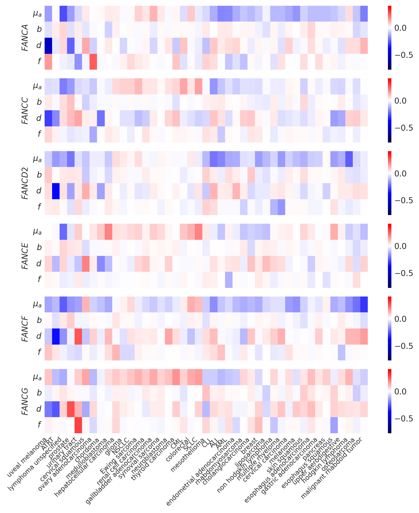
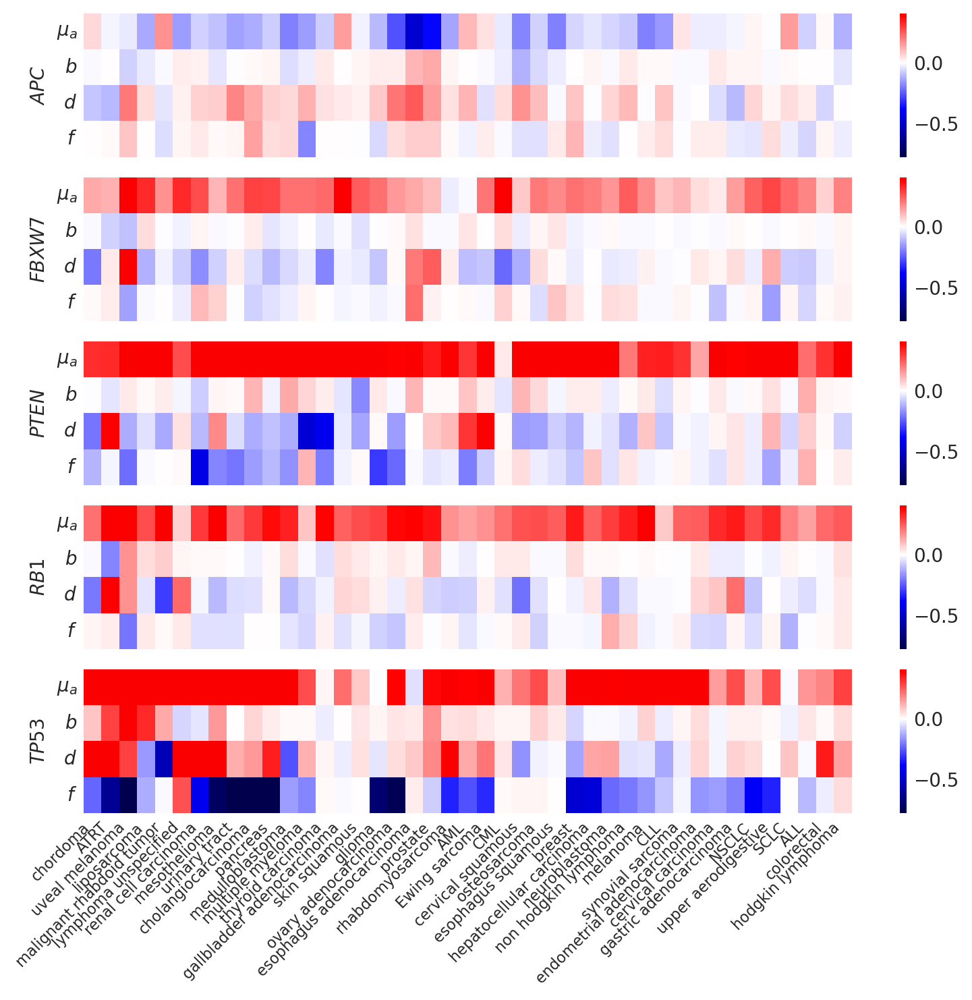
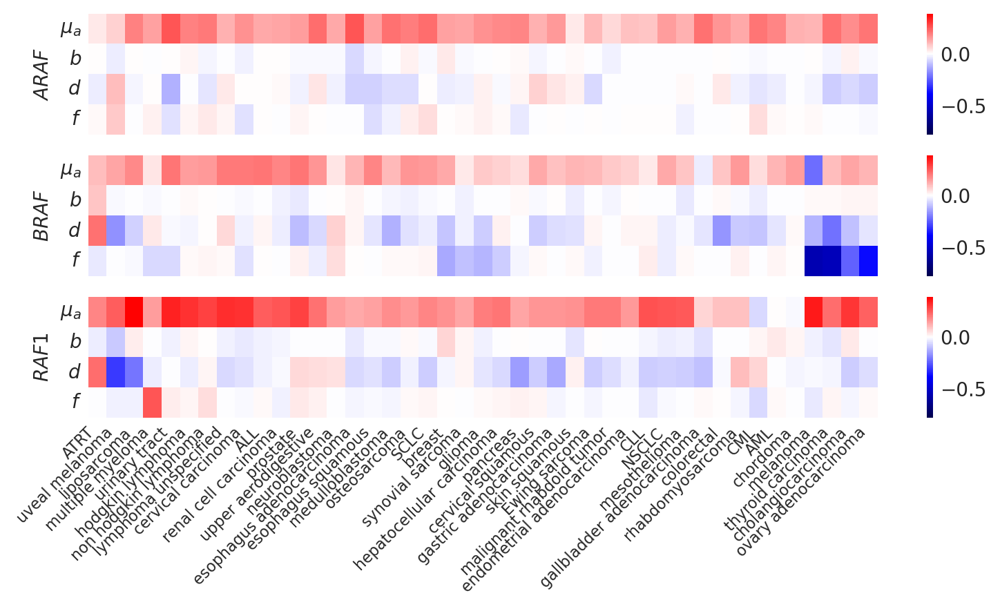
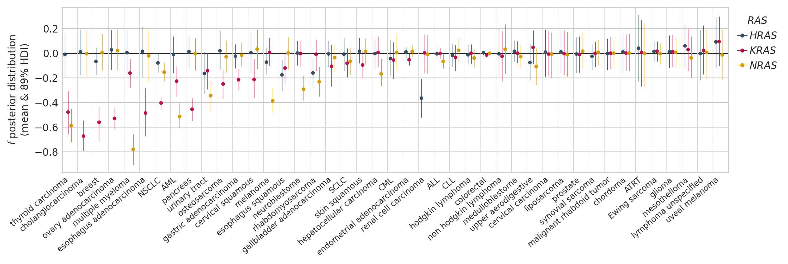
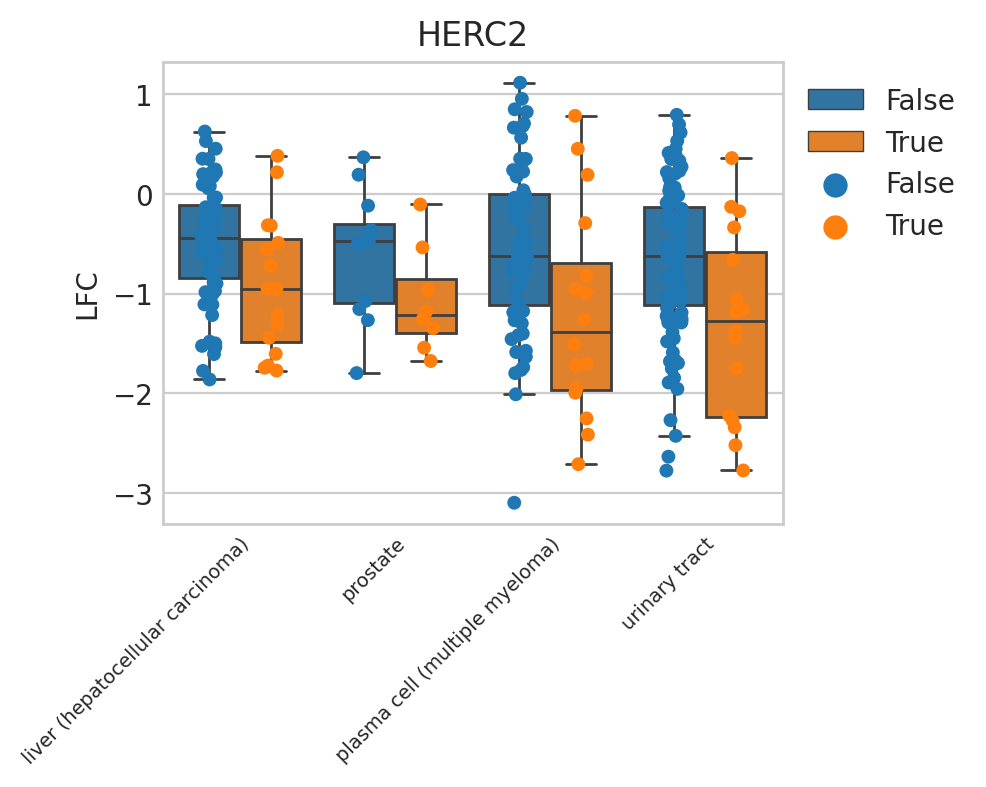
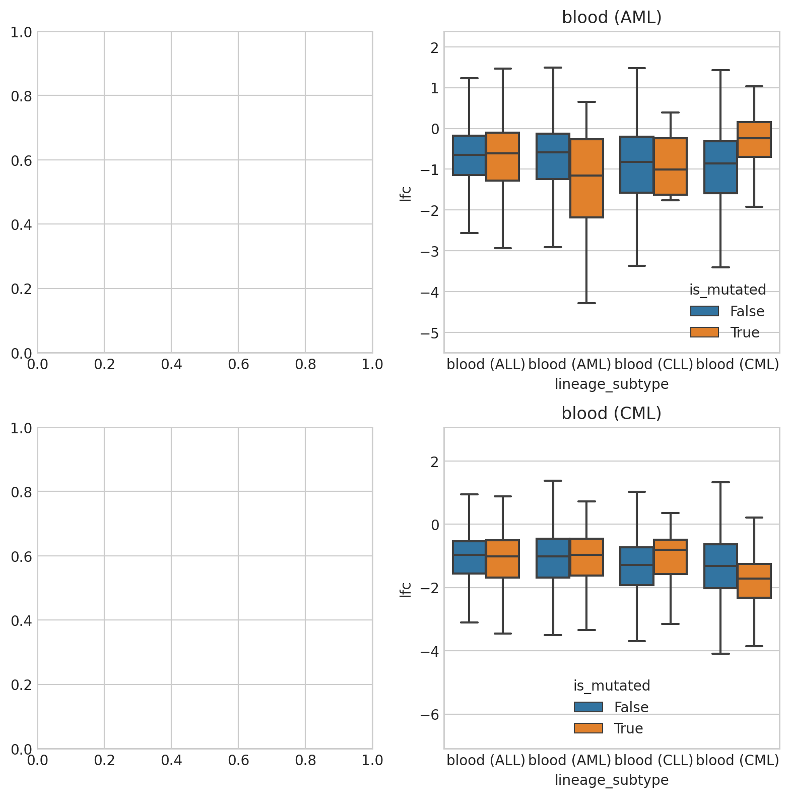

# Characterizing specific genes

## Setup

### Imports


```python
%load_ext autoreload
%autoreload 2
```


```python
import os
from fractions import Fraction
from math import ceil
from time import time
from typing import Collection, Mapping, Sequence

import dask.dataframe as dd
import gseapy as gp
import matplotlib.pyplot as plt
import numpy as np
import pandas as pd
import seaborn as sns
from adjustText import adjust_text
from matplotlib.text import Text
from sklearn.manifold import TSNE
```


```python
from speclet.analysis.arviz_analysis import extract_coords_param_names
from speclet.analysis.sublineage_model_analysis import (
    load_sublineage_model_posteriors,
    sublineage_to_lineage_map,
)
from speclet.io import DataFile, data_path, project_root, tables_dir, temp_dir
from speclet.managers.posterior_data_manager import PosteriorDataManager as PostDataMan
from speclet.managers.posterior_data_manager import PosteriorDataManagers as PostDataMen
from speclet.plot import set_speclet_theme
from speclet.plot.color_pal import (
    lineage_color_pal,
    pal_to_legend_handles,
    sublineage_color_pal,
)
from speclet.project_configuration import arviz_config, get_model_configuration_file
from speclet.string_functions import str_hash
```


```python
# Notebook execution timer.
notebook_tic = time()

# Plotting setup.
set_speclet_theme()
%config InlineBackend.figure_format = "retina"

# Constants
RANDOM_SEED = 709
np.random.seed(RANDOM_SEED)
arviz_config()

# File paths
config_path = project_root() / get_model_configuration_file()
```


```python
OUTPUT_DIR = tables_dir() / "100_110_gene-mutation-effect"
if not OUTPUT_DIR.exists():
    OUTPUT_DIR.mkdir()
```


```python
STASH_DIR = temp_dir() / "100_110_specific-gene-characterization-stash"
if not STASH_DIR.exists():
    STASH_DIR.mkdir()

if False:
    for fp in STASH_DIR.iterdir():
        os.remove(fp)
```

### Data

#### Model posteriors


```python
postmen = load_sublineage_model_posteriors()
```


```python
postmen.keys
```


    ['bile duct (cholangiocarcinoma)',
     'bile duct (gallbladder adenocarcinoma)',
     'blood (ALL)',
     'blood (AML)',
     'blood (CLL)',
     'blood (CML)',
     'bone (Ewing sarcoma)',
     'bone (chordoma)',
     'bone (osteosarcoma)',
     'breast',
     'central nervous system (glioma)',
     'central nervous system (medulloblastoma)',
     'cervix (cervical carcinoma)',
     'cervix (cervical squamous)',
     'colorectal',
     'esophagus (esophagus adenocarcinoma)',
     'esophagus (esophagus squamous)',
     'eye (uveal melanoma)',
     'gastric (gastric adenocarcinoma)',
     'kidney (renal cell carcinoma)',
     'liver (hepatocellular carcinoma)',
     'lung (NSCLC)',
     'lung (SCLC)',
     'lung (mesothelioma)',
     'lymphocyte (hodgkin lymphoma)',
     'lymphocyte (lymphoma unspecified)',
     'lymphocyte (non hodgkin lymphoma)',
     'ovary (ovary adenocarcinoma)',
     'pancreas',
     'peripheral nervous system (neuroblastoma)',
     'plasma cell (multiple myeloma)',
     'prostate',
     'skin (melanoma)',
     'skin (skin squamous)',
     'soft tissue (ATRT)',
     'soft tissue (liposarcoma)',
     'soft tissue (malignant rhabdoid tumor)',
     'soft tissue (rhabdomyosarcoma)',
     'soft tissue (synovial sarcoma)',
     'thyroid (thyroid carcinoma)',
     'upper aerodigestive',
     'urinary tract',
     'uterus (endometrial adenocarcinoma)']


```python
len(postmen)
```


    43


```python
sub_to_lineage, lineages = sublineage_to_lineage_map(postmen)
```


```python
sublineage_pal = sublineage_color_pal()
lineage_pal = lineage_color_pal()
```

## Analysis

### Specific groups of genes


```python
def get_parameters_for_gene(
    pm: PostDataMan, gene: str, stash: bool = True
) -> pd.DataFrame:
    pattern = rf"\[{gene}\]"
    stash_fp = STASH_DIR / f"post-summary-df_{pm.id}-{gene}"
    if stash and stash_fp.exists():
        return pd.read_csv(stash_fp)
    try:
        post = (
            pm.posterior_summary.copy()
            .filter_string("parameter", pattern)
            .reset_index(drop=True)
            .assign(lineage_subtype=pm.id, hugo_symbol=gene)
        )
    except FileNotFoundError:
        print(f"Skipping {pm.id}.")
        return pd.DataFrame()

    assert len(post) > 0, f"No results for gene '{gene}' found in {pm.id}."
    post.to_csv(stash_fp, index=False)
    return post
```


```python
def get_parameters_for_genes(
    pms: PostDataMen, genes: Sequence[str], stash: bool = True
) -> pd.DataFrame:
    parameters = pd.DataFrame()
    for gene in genes:
        df = pd.concat(
            [
                get_parameters_for_gene(pm, gene, stash=stash)
                for pm in pms.as_dict().values()
            ]
        )
        parameters = pd.concat([parameters, df])

    parameters = (
        parameters.assign(lineage=lambda d: d["lineage_subtype"].map(sub_to_lineage))
        .filter_column_isin("var_name", ["sigma_h"], complement=True)
        .reset_index(drop=True)
    )
    parameters["var_name"] = pd.Categorical(
        parameters["var_name"],
        categories=parameters["var_name"].unique(),
        ordered=True,
    )
    return parameters
```


```python
RAS_GENES = ["HRAS", "KRAS", "NRAS"]
RAF_GENES = ["ARAF", "BRAF", "RAF1"]
TSGS = sorted(["TP53", "RB1", "PTEN", "FBXW7", "APC"])
FANC_GENES = sorted(list(set(["FANCA", "FANCC", "FANCD2", "FANCE", "FANCF", "FANCG"])))

ras_params = get_parameters_for_genes(postmen, RAS_GENES)
raf_params = get_parameters_for_genes(postmen, RAF_GENES)
tsg_params = get_parameters_for_genes(postmen, TSGS)
fanc_params = get_parameters_for_genes(postmen, FANC_GENES)

raf_params.to_csv(OUTPUT_DIR / "raf-genes-model-parameters.csv", index=False)
ras_params.to_csv(OUTPUT_DIR / "ras-genes-model-parameters.csv", index=False)
```


```python
def extract_sublineage(s: str) -> str:
    if "(" not in s:
        return s
    return s.split("(")[1].replace(")", "")


def axis_labels_to_sublineage(lbl: Text) -> Text:
    lbl.set_text(extract_sublineage(lbl.get_text()))
    return lbl


def axis_labels_parameters(lbl: Text) -> Text:
    t = lbl.get_text()
    t = t.replace("mu_", r"\mu_")
    t = f"${t}$"
    lbl.set_text(t)
    return lbl
```


```python
def gene_set_characterization_heatmap(
    genes: Sequence[str],
    params_df: pd.DataFrame,
    vmin: float | None = None,
    vmax: float | None = None,
) -> None:
    fig, axes = plt.subplots(
        len(genes), figsize=(8, 1.5 * len(genes)), sharex=True, sharey=True
    )

    # CLustermap just to get clustering of lineage subtypes.
    X = params_df.pivot_wider(
        "parameter", names_from="lineage_subtype", values_from="mean"
    ).set_index("parameter")
    cg = sns.clustermap(data=X, xticklabels=1)
    sublineage_order = [x.get_text() for x in cg.ax_heatmap.get_xticklabels()]
    cg.figure.clear()

    for ax, (gene, df_g) in zip(axes, params_df.groupby("hugo_symbol")):
        X = df_g.pivot_wider(
            "var_name", names_from="lineage_subtype", values_from="mean"
        ).set_index("var_name")[sublineage_order]
        sns.heatmap(
            data=X,
            xticklabels=1,
            yticklabels=1,
            cmap="seismic",
            center=0,
            vmin=vmin,
            vmax=vmax,
            ax=ax,
        )
        xlbls = [axis_labels_to_sublineage(lbl) for lbl in ax.get_xticklabels()]
        ax.set_xticklabels(xlbls, rotation=45, ha="right", size=8)
        ylbls = [axis_labels_parameters(v) for v in ax.get_yticklabels()]
        ax.set_yticklabels(labels=ylbls, rotation=0)
        ax.set_ylabel(f"${gene}$")

    fig.tight_layout()
    plt.show()
```


```python
all_vals = pd.concat([ras_params, raf_params])["mean"]
vmin, vmax = all_vals.min(), all_vals.max()
gene_set_characterization_heatmap(RAS_GENES, ras_params, vmin=vmin, vmax=vmax)
gene_set_characterization_heatmap(RAF_GENES, raf_params, vmin=vmin, vmax=vmax)
gene_set_characterization_heatmap(FANC_GENES, fanc_params, vmin=vmin, vmax=vmax)
gene_set_characterization_heatmap(TSGS, tsg_params, vmin=vmin, vmax=vmax);
```


    <Figure size 1000x1000 with 0 Axes>


    <Figure size 1000x1000 with 0 Axes>





    <Figure size 1000x1000 with 0 Axes>





    <Figure size 1000x1000 with 0 Axes>


```python
ras_raf_params = pd.concat([ras_params, raf_params]).reset_index(drop=True)
ras_raf_X = ras_raf_params.pivot_wider(
    "lineage_subtype", names_from="parameter", values_from="mean"
).set_index("lineage_subtype")

_tsne_res = TSNE(learning_rate="auto", init="pca").fit_transform(ras_raf_X)
tsne_res = (
    pd.DataFrame(_tsne_res, columns=[f"tsne_{i+1}" for i in range(_tsne_res.shape[1])])
    .assign(lineage_subtype=ras_raf_X.index.values)
    .assign(lineage=lambda d: d["lineage_subtype"].map(sub_to_lineage))
)

ax = sns.scatterplot(data=tsne_res, x="tsne_1", y="tsne_2", hue="lineage")
ax.legend(loc="upper left", bbox_to_anchor=(1, 1), title="lineage", ncol=2)
```

    /home/jc604/.conda/envs/speclet/lib/python3.10/site-packages/sklearn/manifold/_t_sne.py:996: FutureWarning: The PCA initialization in TSNE will change to have the standard deviation of PC1 equal to 1e-4 in 1.2. This will ensure better convergence.
      warnings.warn(


    <matplotlib.legend.Legend at 0x7f1e67c7f940>





```python
def plot_posterior_f_of_gene_group(
    params: pd.DataFrame,
    gene_score_vals: Mapping[str, float],
    gene_pal: dict[str, str],
    legend_title: str,
) -> None:
    genes = sorted(list(params["hugo_symbol"].unique()))
    assert len(gene_score_vals) == len(genes)

    fpost = (
        params.copy()
        .query("var_name == 'f'")
        .reset_index(drop=True)
        .astype({"hugo_symbol": "category"})
    )

    subline_order = (
        fpost.assign(
            score=lambda d: d["hugo_symbol"].astype(str).map(gene_score_vals) ** 2
            * d["mean"]
        )
        .groupby("lineage_subtype")["score"]
        .sum()
        .reset_index()
        .sort_values("score")["lineage_subtype"]
        .values.astype("str")
    )
    fpost["lineage_subtype"] = pd.Categorical(
        fpost["lineage_subtype"], categories=subline_order, ordered=True
    )

    n_genes = len(gene_score_vals)
    offsets = (np.arange(n_genes) - (n_genes / 2)) * 0.2
    dx = dict(zip(genes, offsets))

    x = fpost["lineage_subtype"].cat.codes + np.asarray(
        fpost["hugo_symbol"].map(dx).values
    )
    colors = fpost["hugo_symbol"].map(gene_pal)

    fig, ax = plt.subplots(figsize=(12, 3))
    ax.axhline(0, c="k", lw=0.5, zorder=1)
    ax.vlines(
        x=x,
        ymin=fpost["hdi_5.5%"],
        ymax=fpost["hdi_94.5%"],
        colors=colors,
        lw=0.5,
        zorder=10,
    )
    ax.scatter(x=x, y=fpost["mean"], c=colors, s=7, zorder=20)

    xlbls = [extract_sublineage(s) for s in fpost["lineage_subtype"].cat.categories]
    ax.set_xticks(
        ticks=np.arange(fpost["lineage_subtype"].nunique()),
        labels=xlbls,
        rotation=40,
        ha="right",
        fontsize=8,
    )
    ax.set_xlim(-0.5, fpost["lineage_subtype"].nunique() - 0.5)

    for i in range(fpost["lineage_subtype"].nunique()):
        ax.axvline(i + 0.5, c="lightgray", lw=0.5, zorder=2)

    pal_italic = {f"${k}$": v for k, v in gene_pal.items()}
    ax.legend(
        handles=pal_to_legend_handles(pal_italic, lw=0.7, marker="o", markersize=3),
        title=legend_title,
        loc="upper left",
        bbox_to_anchor=(1, 1),
        handlelength=1,
        handletextpad=0.2,
    )
    ax.grid(False, axis="x")

    ax.set_ylabel("$f$ posterior distribution\n(mean & 89% HDI)")
    plt.show()
```


```python
ras_scores: dict[str, float] = {"KRAS": 3, "NRAS": 2, "HRAS": 1}
ras_pal = {"HRAS": "#354F60", "KRAS": "#BC0E4C", "NRAS": "#D59B00"}
plot_posterior_f_of_gene_group(
    ras_params, gene_score_vals=ras_scores, gene_pal=ras_pal, legend_title="$RAS$"
)
```


```python
raf_scores: dict[str, float] = {"ARAF": 3, "BRAF": 2, "RAF1": 1}
raf_pal = {"ARAF": "#879AF2", "BRAF": "#D3208B", "RAF1": "#FDA000"}
plot_posterior_f_of_gene_group(
    raf_params, gene_score_vals=raf_scores, gene_pal=raf_pal, legend_title="$RAF$"
)
```





```python
def get_gene_data(
    pm: PostDataMan, genes: Collection[str], stash: bool = True
) -> pd.DataFrame:
    _genes = sorted(list(set(genes)))
    hits_hash = str_hash("_".join(_genes))
    stash_fp = STASH_DIR / f"gene-data_{pm.id}_{hits_hash}.csv"
    if stash and stash_fp.exists():
        return pd.read_csv(stash_fp)

    res = (
        dd.read_csv(
            pm.data_file,
            low_memory=False,
            dtype={
                "age": "float64",
                "primary_or_metastasis": object,
                "counts_final": "float64",
                "rna_expr": "float64",
            },
        )
        .query("screen == 'broad'")
        .query("hugo_symbol in @genes", local_dict={"genes": genes})
        .compute()
        .reset_index(drop=True)
        .drop(columns=["lineage"])
        .assign(lineage_subtype=pm.id)
    )
    res.to_csv(stash_fp, index=False)
    return res
```


```python
ras_raf_data = pd.concat(
    [get_gene_data(pm, genes=RAS_GENES + RAF_GENES) for pm in postmen.posteriors]
).reset_index(drop=True)
ras_raf_data.to_csv(OUTPUT_DIR / "ras-raf-genes-data.csv", index=False)
ras_raf_data.head()
```


<div>
<style scoped>
    .dataframe tbody tr th:only-of-type {
        vertical-align: middle;
    }

    .dataframe tbody tr th {
        vertical-align: top;
    }

    .dataframe thead th {
        text-align: right;
    }
</style>
<table border="1" class="dataframe">
  <thead>
    <tr style="text-align: right;">
      <th></th>
      <th>sgrna</th>
      <th>replicate_id</th>
      <th>lfc</th>
      <th>p_dna_batch</th>
      <th>genome_alignment</th>
      <th>hugo_symbol</th>
      <th>screen</th>
      <th>multiple_hits_on_gene</th>
      <th>sgrna_target_chr</th>
      <th>sgrna_target_pos</th>
      <th>...</th>
      <th>num_mutations</th>
      <th>any_deleterious</th>
      <th>any_tcga_hotspot</th>
      <th>any_cosmic_hotspot</th>
      <th>is_mutated</th>
      <th>copy_number</th>
      <th>lineage_subtype</th>
      <th>primary_or_metastasis</th>
      <th>is_male</th>
      <th>age</th>
    </tr>
  </thead>
  <tbody>
    <tr>
      <th>0</th>
      <td>AATGACTGAGTACAAACTGG</td>
      <td>SNU869-311Cas9_RepA_p4_batch3</td>
      <td>-0.685632</td>
      <td>3</td>
      <td>chr1_114716144_-</td>
      <td>NRAS</td>
      <td>broad</td>
      <td>False</td>
      <td>1</td>
      <td>114716144</td>
      <td>...</td>
      <td>0</td>
      <td>NaN</td>
      <td>NaN</td>
      <td>NaN</td>
      <td>False</td>
      <td>1.036135</td>
      <td>bile duct (cholangiocarcinoma)</td>
      <td>NaN</td>
      <td>NaN</td>
      <td>NaN</td>
    </tr>
    <tr>
      <th>1</th>
      <td>AATTACTACTTGCTTCCTGT</td>
      <td>SNU869-311Cas9_RepA_p4_batch3</td>
      <td>-3.877834</td>
      <td>3</td>
      <td>chr12_25227402_+</td>
      <td>KRAS</td>
      <td>broad</td>
      <td>False</td>
      <td>12</td>
      <td>25227402</td>
      <td>...</td>
      <td>1</td>
      <td>0.0</td>
      <td>1.0</td>
      <td>1.0</td>
      <td>True</td>
      <td>1.529073</td>
      <td>bile duct (cholangiocarcinoma)</td>
      <td>NaN</td>
      <td>NaN</td>
      <td>NaN</td>
    </tr>
    <tr>
      <th>2</th>
      <td>AGAGGAGTACAGTGCAATGA</td>
      <td>SNU869-311Cas9_RepA_p4_batch3</td>
      <td>-3.476190</td>
      <td>3</td>
      <td>chr12_25227324_-</td>
      <td>KRAS</td>
      <td>broad</td>
      <td>False</td>
      <td>12</td>
      <td>25227324</td>
      <td>...</td>
      <td>1</td>
      <td>0.0</td>
      <td>1.0</td>
      <td>1.0</td>
      <td>True</td>
      <td>1.529073</td>
      <td>bile duct (cholangiocarcinoma)</td>
      <td>NaN</td>
      <td>NaN</td>
      <td>NaN</td>
    </tr>
    <tr>
      <th>3</th>
      <td>ATACCCAATAGAGTCCGAGG</td>
      <td>SNU869-311Cas9_RepA_p4_batch3</td>
      <td>-0.697118</td>
      <td>3</td>
      <td>chr7_140800374_+</td>
      <td>BRAF</td>
      <td>broad</td>
      <td>False</td>
      <td>7</td>
      <td>140800374</td>
      <td>...</td>
      <td>0</td>
      <td>NaN</td>
      <td>NaN</td>
      <td>NaN</td>
      <td>False</td>
      <td>1.046353</td>
      <td>bile duct (cholangiocarcinoma)</td>
      <td>NaN</td>
      <td>NaN</td>
      <td>NaN</td>
    </tr>
    <tr>
      <th>4</th>
      <td>ATGAGCTCCTCGCCATCCAG</td>
      <td>SNU869-311Cas9_RepA_p4_batch3</td>
      <td>-0.098678</td>
      <td>3</td>
      <td>chrX_47564839_-</td>
      <td>ARAF</td>
      <td>broad</td>
      <td>False</td>
      <td>X</td>
      <td>47564839</td>
      <td>...</td>
      <td>0</td>
      <td>NaN</td>
      <td>NaN</td>
      <td>NaN</td>
      <td>False</td>
      <td>0.617054</td>
      <td>bile duct (cholangiocarcinoma)</td>
      <td>NaN</td>
      <td>NaN</td>
      <td>NaN</td>
    </tr>
  </tbody>
</table>
<p>5 rows × 24 columns</p>
</div>


### $f$ posterior


```python
def get_parameter_summaries(
    pm: PostDataMan, var_name: str, stash: bool = True
) -> pd.DataFrame:
    stash_fp = STASH_DIR / f"summary-{pm.id}_varname-{var_name}.csv"
    if stash and stash_fp.exists():
        return pd.read_csv(stash_fp)
    try:
        res = (
            pm.posterior_summary.copy()
            .query(f"var_name == '{var_name}'")
            .reset_index(drop=True)
            .assign(lineage_subtype=pm.id)
        )
    except FileNotFoundError:
        print(f"Skipping {pm.id}.")
        return pd.DataFrame()
    res.to_csv(stash_fp, index=False)
    return res
```


```python
def _hdi_contains_zero(low: float, high: float) -> bool:
    return low < 0 < high


hdi_contains_zero = np.vectorize(_hdi_contains_zero)
```


```python
f_post = (
    pd.concat(
        [get_parameter_summaries(pm, var_name="f") for pm in postmen.as_dict().values()]
    )
    .reset_index(drop=True)
    .pipe(extract_coords_param_names, col="parameter", names=["hugo_symbol"])
    .assign(lineage=lambda d: d["lineage_subtype"].map(sub_to_lineage))
    .assign(zero_hdi=lambda d: hdi_contains_zero(d["hdi_5.5%"], d["hdi_94.5%"]))
)
f_post.head()
```


<div>
<style scoped>
    .dataframe tbody tr th:only-of-type {
        vertical-align: middle;
    }

    .dataframe tbody tr th {
        vertical-align: top;
    }

    .dataframe thead th {
        text-align: right;
    }
</style>
<table border="1" class="dataframe">
  <thead>
    <tr style="text-align: right;">
      <th></th>
      <th>parameter</th>
      <th>mean</th>
      <th>sd</th>
      <th>hdi_5.5%</th>
      <th>hdi_94.5%</th>
      <th>mcse_mean</th>
      <th>mcse_sd</th>
      <th>ess_bulk</th>
      <th>ess_tail</th>
      <th>r_hat</th>
      <th>var_name</th>
      <th>lineage_subtype</th>
      <th>hugo_symbol</th>
      <th>lineage</th>
      <th>zero_hdi</th>
    </tr>
  </thead>
  <tbody>
    <tr>
      <th>0</th>
      <td>f[A1BG]</td>
      <td>-0.005</td>
      <td>0.121</td>
      <td>-0.201</td>
      <td>0.189</td>
      <td>0.001</td>
      <td>0.003</td>
      <td>12235.0</td>
      <td>2652.0</td>
      <td>1.0</td>
      <td>f</td>
      <td>bile duct (cholangiocarcinoma)</td>
      <td>A1BG</td>
      <td>bile duct</td>
      <td>True</td>
    </tr>
    <tr>
      <th>1</th>
      <td>f[A1CF]</td>
      <td>-0.013</td>
      <td>0.094</td>
      <td>-0.164</td>
      <td>0.131</td>
      <td>0.001</td>
      <td>0.002</td>
      <td>10183.0</td>
      <td>2598.0</td>
      <td>1.0</td>
      <td>f</td>
      <td>bile duct (cholangiocarcinoma)</td>
      <td>A1CF</td>
      <td>bile duct</td>
      <td>True</td>
    </tr>
    <tr>
      <th>2</th>
      <td>f[A2M]</td>
      <td>-0.011</td>
      <td>0.089</td>
      <td>-0.152</td>
      <td>0.126</td>
      <td>0.001</td>
      <td>0.002</td>
      <td>8802.0</td>
      <td>2587.0</td>
      <td>1.0</td>
      <td>f</td>
      <td>bile duct (cholangiocarcinoma)</td>
      <td>A2M</td>
      <td>bile duct</td>
      <td>True</td>
    </tr>
    <tr>
      <th>3</th>
      <td>f[A2ML1]</td>
      <td>0.017</td>
      <td>0.092</td>
      <td>-0.125</td>
      <td>0.165</td>
      <td>0.001</td>
      <td>0.002</td>
      <td>11664.0</td>
      <td>2550.0</td>
      <td>1.0</td>
      <td>f</td>
      <td>bile duct (cholangiocarcinoma)</td>
      <td>A2ML1</td>
      <td>bile duct</td>
      <td>True</td>
    </tr>
    <tr>
      <th>4</th>
      <td>f[A3GALT2]</td>
      <td>0.075</td>
      <td>0.100</td>
      <td>-0.085</td>
      <td>0.232</td>
      <td>0.001</td>
      <td>0.001</td>
      <td>11035.0</td>
      <td>2837.0</td>
      <td>1.0</td>
      <td>f</td>
      <td>bile duct (cholangiocarcinoma)</td>
      <td>A3GALT2</td>
      <td>bile duct</td>
      <td>True</td>
    </tr>
  </tbody>
</table>
</div>


```python
mu_a_post = (
    pd.concat(
        [
            get_parameter_summaries(pm, var_name="mu_a")
            for pm in postmen.as_dict().values()
        ]
    )
    .reset_index(drop=True)
    .pipe(extract_coords_param_names, col="parameter", names=["hugo_symbol"])
    .assign(lineage=lambda d: d["lineage_subtype"].map(sub_to_lineage))
    .assign(zero_hdi=lambda d: hdi_contains_zero(d["hdi_5.5%"], d["hdi_94.5%"]))
)
mu_a_post.head()
```


<div>
<style scoped>
    .dataframe tbody tr th:only-of-type {
        vertical-align: middle;
    }

    .dataframe tbody tr th {
        vertical-align: top;
    }

    .dataframe thead th {
        text-align: right;
    }
</style>
<table border="1" class="dataframe">
  <thead>
    <tr style="text-align: right;">
      <th></th>
      <th>parameter</th>
      <th>mean</th>
      <th>sd</th>
      <th>hdi_5.5%</th>
      <th>hdi_94.5%</th>
      <th>mcse_mean</th>
      <th>mcse_sd</th>
      <th>ess_bulk</th>
      <th>ess_tail</th>
      <th>r_hat</th>
      <th>var_name</th>
      <th>lineage_subtype</th>
      <th>hugo_symbol</th>
      <th>lineage</th>
      <th>zero_hdi</th>
    </tr>
  </thead>
  <tbody>
    <tr>
      <th>0</th>
      <td>mu_a[A1BG]</td>
      <td>0.333</td>
      <td>0.122</td>
      <td>0.119</td>
      <td>0.509</td>
      <td>0.002</td>
      <td>0.002</td>
      <td>2872.0</td>
      <td>2826.0</td>
      <td>1.0</td>
      <td>mu_a</td>
      <td>bile duct (cholangiocarcinoma)</td>
      <td>A1BG</td>
      <td>bile duct</td>
      <td>False</td>
    </tr>
    <tr>
      <th>1</th>
      <td>mu_a[A1CF]</td>
      <td>0.268</td>
      <td>0.122</td>
      <td>0.072</td>
      <td>0.457</td>
      <td>0.002</td>
      <td>0.002</td>
      <td>2596.0</td>
      <td>2551.0</td>
      <td>1.0</td>
      <td>mu_a</td>
      <td>bile duct (cholangiocarcinoma)</td>
      <td>A1CF</td>
      <td>bile duct</td>
      <td>False</td>
    </tr>
    <tr>
      <th>2</th>
      <td>mu_a[A2M]</td>
      <td>0.174</td>
      <td>0.126</td>
      <td>-0.018</td>
      <td>0.385</td>
      <td>0.002</td>
      <td>0.002</td>
      <td>3356.0</td>
      <td>3180.0</td>
      <td>1.0</td>
      <td>mu_a</td>
      <td>bile duct (cholangiocarcinoma)</td>
      <td>A2M</td>
      <td>bile duct</td>
      <td>True</td>
    </tr>
    <tr>
      <th>3</th>
      <td>mu_a[A2ML1]</td>
      <td>0.313</td>
      <td>0.126</td>
      <td>0.107</td>
      <td>0.508</td>
      <td>0.002</td>
      <td>0.002</td>
      <td>3440.0</td>
      <td>3121.0</td>
      <td>1.0</td>
      <td>mu_a</td>
      <td>bile duct (cholangiocarcinoma)</td>
      <td>A2ML1</td>
      <td>bile duct</td>
      <td>False</td>
    </tr>
    <tr>
      <th>4</th>
      <td>mu_a[A3GALT2]</td>
      <td>0.111</td>
      <td>0.126</td>
      <td>-0.079</td>
      <td>0.320</td>
      <td>0.002</td>
      <td>0.002</td>
      <td>3015.0</td>
      <td>2896.0</td>
      <td>1.0</td>
      <td>mu_a</td>
      <td>bile duct (cholangiocarcinoma)</td>
      <td>A3GALT2</td>
      <td>bile duct</td>
      <td>True</td>
    </tr>
  </tbody>
</table>
</div>


#### All genes


```python
any_nonzero = f_post.query("not zero_hdi")["hugo_symbol"].toset()
print(f"number of genes in heatmap: {len(any_nonzero)}")
plot_df = (
    f_post.filter_column_isin("hugo_symbol", any_nonzero)
    .pivot_wider("lineage_subtype", names_from="hugo_symbol", values_from="mean")
    .set_index("lineage_subtype")
)
sns.clustermap(
    plot_df,
    figsize=(12, 8),
    dendrogram_ratio=(0.1, 0.1),
    row_cluster=True,
    cmap="seismic",
    center=0,
    yticklabels=1,
)
```

    number of genes in heatmap: 3404


    /home/jc604/.conda/envs/speclet/lib/python3.10/site-packages/seaborn/matrix.py:654: UserWarning: Clustering large matrix with scipy. Installing `fastcluster` may give better performance.
      warnings.warn(msg)


    <seaborn.matrix.ClusterGrid at 0x7f1e65a7c970>


```python
any_nonzero = f_post.query("not zero_hdi and mean < 0")["hugo_symbol"].toset()
print(f"number of genes in heatmap: {len(any_nonzero)}")
plot_df = (
    f_post.filter_column_isin("hugo_symbol", any_nonzero)
    .pivot_wider("lineage_subtype", names_from="hugo_symbol", values_from="mean")
    .set_index("lineage_subtype")
)
sns.clustermap(
    plot_df,
    figsize=(12, 8),
    dendrogram_ratio=(0.1, 0.1),
    row_cluster=True,
    cmap="seismic",
    center=0,
    yticklabels=1,
)
```

    number of genes in heatmap: 2256


    /home/jc604/.conda/envs/speclet/lib/python3.10/site-packages/seaborn/matrix.py:654: UserWarning: Clustering large matrix with scipy. Installing `fastcluster` may give better performance.
      warnings.warn(msg)


    <seaborn.matrix.ClusterGrid at 0x7f1e6c51d180>


```python
zero_mu_a = mu_a_post.query("zero_hdi")[["lineage_subtype", "hugo_symbol"]].reset_index(
    drop=True
)
nonzero_f = f_post.query("not zero_hdi and mean < 0")[
    ["lineage_subtype", "hugo_symbol"]
].reset_index(drop=True)

driver = nonzero_f.merge(
    zero_mu_a, on=["hugo_symbol", "lineage_subtype"], how="inner"
).reset_index(drop=True)
print(f"number of driver hits: {driver['hugo_symbol'].nunique()}")
driver.head()
```

    number of driver hits: 536


<div>
<style scoped>
    .dataframe tbody tr th:only-of-type {
        vertical-align: middle;
    }

    .dataframe tbody tr th {
        vertical-align: top;
    }

    .dataframe thead th {
        text-align: right;
    }
</style>
<table border="1" class="dataframe">
  <thead>
    <tr style="text-align: right;">
      <th></th>
      <th>lineage_subtype</th>
      <th>hugo_symbol</th>
    </tr>
  </thead>
  <tbody>
    <tr>
      <th>0</th>
      <td>bile duct (cholangiocarcinoma)</td>
      <td>BRAF</td>
    </tr>
    <tr>
      <th>1</th>
      <td>bile duct (cholangiocarcinoma)</td>
      <td>CELA2A</td>
    </tr>
    <tr>
      <th>2</th>
      <td>bile duct (cholangiocarcinoma)</td>
      <td>CNTN5</td>
    </tr>
    <tr>
      <th>3</th>
      <td>bile duct (cholangiocarcinoma)</td>
      <td>CTNNB1</td>
    </tr>
    <tr>
      <th>4</th>
      <td>bile duct (cholangiocarcinoma)</td>
      <td>DNASE1</td>
    </tr>
  </tbody>
</table>
</div>


```python
driver_mutants_f_post = f_post.filter_column_isin(
    "hugo_symbol", driver["hugo_symbol"].toset()
)

plot_df = driver_mutants_f_post.pivot_wider(
    "lineage_subtype", names_from="hugo_symbol", values_from="mean"
).set_index("lineage_subtype")
sns.clustermap(
    plot_df,
    figsize=(15, 8),
    dendrogram_ratio=(0.1, 0.1),
    row_cluster=True,
    cmap="seismic",
    center=0,
    vmax=0.5,
    vmin=-0.5,
    yticklabels=1,
)
```

    /home/jc604/.conda/envs/speclet/lib/python3.10/site-packages/seaborn/matrix.py:654: UserWarning: Clustering large matrix with scipy. Installing `fastcluster` may give better performance.
      warnings.warn(msg)


    <seaborn.matrix.ClusterGrid at 0x7f1e6e55c760>


```python
avg_kras_f = driver_mutants_f_post.query("hugo_symbol == 'KRAS' and mean < -0.2")[
    "mean"
].mean()

ax = sns.histplot(data=driver_mutants_f_post, x="mean", bins=50)
ax.axvline(avg_kras_f, c="tab:orange", lw=1)
ax.set_ylim(0, 100)
plt.show()
```


```python
L = "pancreas"
q = f"lineage_subtype == '{L}'"
lineage_df = pd.concat([df.query(q) for df in [mu_a_post, f_post]]).reset_index(
    drop=True
)
lineage_df_wide = lineage_df.pivot_wider(
    ["hugo_symbol"], names_from="var_name", values_from="mean"
)

_, ax = plt.subplots(figsize=(5, 5))
ax.axhline(0, lw=0.5, c="k", zorder=1)
ax.axvline(0, lw=0.5, c="k", zorder=1)
sns.scatterplot(
    data=lineage_df_wide,
    x="mu_a",
    y="f",
    ax=ax,
    s=4,
    edgecolor=None,
    alpha=0.5,
    zorder=10,
)

for _, row in lineage_df_wide.query("f < -0.2").iterrows():
    ax.text(row["mu_a"], row["f"], row["hugo_symbol"], size=6, c="k", zorder=20)

plt.show()
```


```python
GENESETS = ["KEGG_2021_Human", "MSigDB_Hallmark_2020"]


def run_enrichr(df: pd.DataFrame, stash: bool = True) -> pd.DataFrame:
    genes = sorted(list(set(df["hugo_symbol"])))
    g_hash = str_hash("__".join(genes))
    stash_fp = STASH_DIR / f"enrichr-run-{g_hash}.csv"
    if stash and stash_fp.exists():
        return pd.read_csv(stash_fp).assign(
            overlap_frac=lambda d: [Fraction(x) for x in d["overlap_frac"]]
        )

    enrichr_res = (
        gp.enrichr(genes, gene_sets=GENESETS, cutoff=1)
        .results.clean_names()
        .assign(overlap_frac=lambda d: [Fraction(x) for x in d["overlap"]])
        .assign(
            n_overlap=lambda d: [f.numerator for f in d["overlap_frac"]],
        )
    )
    enrichr_res.to_csv(stash_fp, index=False)
    return enrichr_res
```


```python
synlet_enrichr = (
    driver.groupby("lineage_subtype")
    .apply(run_enrichr, stash=True)
    .reset_index(drop=False)
    .drop(columns=["level_1"])
    .assign(
        overlap_pct=lambda d: [float(f) for f in d["overlap_frac"]],
        term_id=lambda d: [f"{gs}_{t}" for gs, t in zip(d["gene_set"], d["term"])],
    )
)
synlet_enrichr.head()
```


<div>
<style scoped>
    .dataframe tbody tr th:only-of-type {
        vertical-align: middle;
    }

    .dataframe tbody tr th {
        vertical-align: top;
    }

    .dataframe thead th {
        text-align: right;
    }
</style>
<table border="1" class="dataframe">
  <thead>
    <tr style="text-align: right;">
      <th></th>
      <th>lineage_subtype</th>
      <th>gene_set</th>
      <th>term</th>
      <th>overlap</th>
      <th>p_value</th>
      <th>adjusted_p_value</th>
      <th>old_p_value</th>
      <th>old_adjusted_p_value</th>
      <th>odds_ratio</th>
      <th>combined_score</th>
      <th>genes</th>
      <th>overlap_frac</th>
      <th>n_overlap</th>
      <th>overlap_pct</th>
      <th>term_id</th>
    </tr>
  </thead>
  <tbody>
    <tr>
      <th>0</th>
      <td>bile duct (cholangiocarcinoma)</td>
      <td>KEGG_2021_Human</td>
      <td>Thyroid cancer</td>
      <td>3/37</td>
      <td>0.000009</td>
      <td>0.001007</td>
      <td>0</td>
      <td>0</td>
      <td>92.619195</td>
      <td>1078.577341</td>
      <td>CTNNB1;BRAF;KRAS</td>
      <td>3/37</td>
      <td>3.0</td>
      <td>0.081081</td>
      <td>KEGG_2021_Human_Thyroid cancer</td>
    </tr>
    <tr>
      <th>1</th>
      <td>bile duct (cholangiocarcinoma)</td>
      <td>KEGG_2021_Human</td>
      <td>Endometrial cancer</td>
      <td>3/58</td>
      <td>0.000034</td>
      <td>0.001520</td>
      <td>0</td>
      <td>0</td>
      <td>57.195215</td>
      <td>588.034264</td>
      <td>CTNNB1;BRAF;KRAS</td>
      <td>3/58</td>
      <td>3.0</td>
      <td>0.051724</td>
      <td>KEGG_2021_Human_Endometrial cancer</td>
    </tr>
    <tr>
      <th>2</th>
      <td>bile duct (cholangiocarcinoma)</td>
      <td>KEGG_2021_Human</td>
      <td>Alcoholism</td>
      <td>4/186</td>
      <td>0.000046</td>
      <td>0.001520</td>
      <td>0</td>
      <td>0</td>
      <td>24.170940</td>
      <td>241.147155</td>
      <td>GRIN2A;GNB1;BRAF;KRAS</td>
      <td>2/93</td>
      <td>2.0</td>
      <td>0.021505</td>
      <td>KEGG_2021_Human_Alcoholism</td>
    </tr>
    <tr>
      <th>3</th>
      <td>bile duct (cholangiocarcinoma)</td>
      <td>KEGG_2021_Human</td>
      <td>Long-term potentiation</td>
      <td>3/67</td>
      <td>0.000053</td>
      <td>0.001520</td>
      <td>0</td>
      <td>0</td>
      <td>49.129934</td>
      <td>483.816818</td>
      <td>GRIN2A;BRAF;KRAS</td>
      <td>3/67</td>
      <td>3.0</td>
      <td>0.044776</td>
      <td>KEGG_2021_Human_Long-term potentiation</td>
    </tr>
    <tr>
      <th>4</th>
      <td>bile duct (cholangiocarcinoma)</td>
      <td>KEGG_2021_Human</td>
      <td>Rap1 signaling pathway</td>
      <td>4/210</td>
      <td>0.000074</td>
      <td>0.001713</td>
      <td>0</td>
      <td>0</td>
      <td>21.329018</td>
      <td>202.729895</td>
      <td>GRIN2A;CTNNB1;BRAF;KRAS</td>
      <td>2/105</td>
      <td>2.0</td>
      <td>0.019048</td>
      <td>KEGG_2021_Human_Rap1 signaling pathway</td>
    </tr>
  </tbody>
</table>
</div>


```python
enrichr_hits = (
    synlet_enrichr.query("adjusted_p_value < 0.05 and n_overlap > 1")
    .query("gene_set == 'KEGG_2021_Human'")[["gene_set", "term", "term_id"]]
    .drop_duplicates()
)

plot_df = (
    synlet_enrichr.filter_column_isin("term", enrichr_hits["term"])
    .query("gene_set == 'KEGG_2021_Human'")
    .assign(
        odds_ratio_capped=lambda d: [min(x, 100) for x in d["odds_ratio"]],
        neglog_adj_p_val=lambda d: -np.log(d["adjusted_p_value"]),
    )
    .astype({"lineage_subtype": "category"})
)

gs_order = (
    plot_df.assign(
        score=lambda d: d["lineage_subtype"].cat.codes ** 2 * d["odds_ratio_capped"]
    )
    .groupby("term")["score"]
    .sum()
    .reset_index()
    .sort_values("score", ascending=False)["term"]
)

plot_df["term"] = pd.Categorical(plot_df["term"], categories=gs_order, ordered=True)

_, ax = plt.subplots(figsize=(15, 6))

sns.scatterplot(
    data=plot_df,
    x="term",
    y="lineage_subtype",
    size="odds_ratio_capped",
    hue="neglog_adj_p_val",
    palette="seismic",
)

ax.set_xticks(np.arange(len(gs_order)), labels=gs_order, rotation=60, ha="right")
ax.set_xlim(-0.5, len(gs_order) - 0.5)
ax.set_ylim(-0.5, plot_df["lineage_subtype"].nunique() - 0.5)
ax.set_xlabel("KEGG gene sets")
ax.set_ylabel(None)
ax.legend(loc="upper left", bbox_to_anchor=(1, 1))
plt.show()
```


#### In known cancer drivers


```python
cgc = pd.read_csv(data_path(DataFile.CGC))
cgc_drivers = cgc.query("is_oncogene")["hugo_symbol"].unique().tolist()
print(f"number of drivers: {len(cgc_drivers)}")

drivers_f_post = f_post.filter_column_isin("hugo_symbol", cgc_drivers)
drivers_f_post.to_csv(OUTPUT_DIR / "drivers-f-posterior-summariers.csv", index=False)

drivers_f_post_X = drivers_f_post.pivot_wider(
    ["lineage_subtype"], names_from="hugo_symbol", values_from="mean"
).set_index("lineage_subtype")

cg = sns.clustermap(
    drivers_f_post_X,
    cmap="seismic",
    center=0,
    figsize=(12, 5),
    xticklabels=1,
    yticklabels=1,
    dendrogram_ratio=(0.1, 0.1),
    cbar_pos=(0, 0.15, 0.01, 0.3),
)
ax = cg.ax_heatmap
ax.tick_params(labelsize=6)
plt.show()
```

    number of drivers: 106


```python
cg = sns.clustermap(
    (drivers_f_post_X.T / drivers_f_post_X.T.std()).T,
    cmap="seismic",
    center=0,
    figsize=(12, 5),
    xticklabels=1,
    yticklabels=1,
    dendrogram_ratio=(0.05, 0.1),
    cbar_pos=(-0.02, 0.15, 0.01, 0.3),
)
ax = cg.ax_heatmap
ax.tick_params(labelsize=6)
plt.show()
```


```python
def get_gene_mutation_data(
    pm: PostDataMan, genes: Collection[str], stash: bool = True
) -> pd.DataFrame:
    _genes = sorted(list(set(genes)))
    hits_hash = str_hash("_".join(_genes))
    stash_fp = STASH_DIR / f"gene-mutations-data_{pm.id}_{hits_hash}.csv"

    if stash and stash_fp.exists():
        return pd.read_csv(stash_fp)

    res = (
        dd.read_csv(
            pm.data_file,
            low_memory=False,
            usecols=["hugo_symbol", "depmap_id", "is_mutated", "screen"],
        )
        .query(
            "screen == 'broad' and hugo_symbol in @genes", local_dict={"genes": genes}
        )
        .drop_duplicates()
        .compute()
        .reset_index(drop=True)
        .assign(lineage_subtype=pm.id)
    )
    res.to_csv(stash_fp, index=False)
    return res
```


```python
cgc_drivers_mutation_data = pd.concat(
    [get_gene_mutation_data(pm, cgc_drivers) for pm in postmen.posteriors]
).reset_index(drop=True)
cgc_drivers_mutation_data.to_csv(
    OUTPUT_DIR / "cgc-cancer-drivers-mutations.csv", index=False
)
cgc_drivers_mutation_data.head()
```


<div>
<style scoped>
    .dataframe tbody tr th:only-of-type {
        vertical-align: middle;
    }

    .dataframe tbody tr th {
        vertical-align: top;
    }

    .dataframe thead th {
        text-align: right;
    }
</style>
<table border="1" class="dataframe">
  <thead>
    <tr style="text-align: right;">
      <th></th>
      <th>hugo_symbol</th>
      <th>screen</th>
      <th>depmap_id</th>
      <th>is_mutated</th>
      <th>lineage_subtype</th>
    </tr>
  </thead>
  <tbody>
    <tr>
      <th>0</th>
      <td>PIK3CB</td>
      <td>broad</td>
      <td>ACH-000182</td>
      <td>False</td>
      <td>bile duct (cholangiocarcinoma)</td>
    </tr>
    <tr>
      <th>1</th>
      <td>H3F3B</td>
      <td>broad</td>
      <td>ACH-000182</td>
      <td>False</td>
      <td>bile duct (cholangiocarcinoma)</td>
    </tr>
    <tr>
      <th>2</th>
      <td>MAP2K1</td>
      <td>broad</td>
      <td>ACH-000182</td>
      <td>False</td>
      <td>bile duct (cholangiocarcinoma)</td>
    </tr>
    <tr>
      <th>3</th>
      <td>RAC1</td>
      <td>broad</td>
      <td>ACH-000182</td>
      <td>False</td>
      <td>bile duct (cholangiocarcinoma)</td>
    </tr>
    <tr>
      <th>4</th>
      <td>AKT3</td>
      <td>broad</td>
      <td>ACH-000182</td>
      <td>False</td>
      <td>bile duct (cholangiocarcinoma)</td>
    </tr>
  </tbody>
</table>
</div>


```python
novel_drivers_f_post = (
    driver_mutants_f_post.filter_column_isin(
        "hugo_symbol", cgc["hugo_symbol"].toset(), complement=True
    )
    .sort_values(["mean", "hugo_symbol", "lineage_subtype"])
    .reset_index(drop=True)
)
novel_drivers_f_post.query("lineage == 'upper aerodigestive'").head()
```


<div>
<style scoped>
    .dataframe tbody tr th:only-of-type {
        vertical-align: middle;
    }

    .dataframe tbody tr th {
        vertical-align: top;
    }

    .dataframe thead th {
        text-align: right;
    }
</style>
<table border="1" class="dataframe">
  <thead>
    <tr style="text-align: right;">
      <th></th>
      <th>parameter</th>
      <th>mean</th>
      <th>sd</th>
      <th>hdi_5.5%</th>
      <th>hdi_94.5%</th>
      <th>mcse_mean</th>
      <th>mcse_sd</th>
      <th>ess_bulk</th>
      <th>ess_tail</th>
      <th>r_hat</th>
      <th>var_name</th>
      <th>lineage_subtype</th>
      <th>hugo_symbol</th>
      <th>lineage</th>
      <th>zero_hdi</th>
    </tr>
  </thead>
  <tbody>
    <tr>
      <th>71</th>
      <td>f[GFM1]</td>
      <td>-0.240</td>
      <td>0.102</td>
      <td>-0.398</td>
      <td>-0.076</td>
      <td>0.001</td>
      <td>0.001</td>
      <td>7698.0</td>
      <td>2501.0</td>
      <td>1.0</td>
      <td>f</td>
      <td>upper aerodigestive</td>
      <td>GFM1</td>
      <td>upper aerodigestive</td>
      <td>False</td>
    </tr>
    <tr>
      <th>113</th>
      <td>f[NDUFB8]</td>
      <td>-0.216</td>
      <td>0.102</td>
      <td>-0.385</td>
      <td>-0.061</td>
      <td>0.001</td>
      <td>0.001</td>
      <td>6556.0</td>
      <td>2531.0</td>
      <td>1.0</td>
      <td>f</td>
      <td>upper aerodigestive</td>
      <td>NDUFB8</td>
      <td>upper aerodigestive</td>
      <td>False</td>
    </tr>
    <tr>
      <th>160</th>
      <td>f[ACO2]</td>
      <td>-0.196</td>
      <td>0.084</td>
      <td>-0.340</td>
      <td>-0.074</td>
      <td>0.001</td>
      <td>0.001</td>
      <td>7702.0</td>
      <td>2566.0</td>
      <td>1.0</td>
      <td>f</td>
      <td>upper aerodigestive</td>
      <td>ACO2</td>
      <td>upper aerodigestive</td>
      <td>False</td>
    </tr>
    <tr>
      <th>208</th>
      <td>f[ALDH18A1]</td>
      <td>-0.181</td>
      <td>0.085</td>
      <td>-0.325</td>
      <td>-0.055</td>
      <td>0.001</td>
      <td>0.001</td>
      <td>7455.0</td>
      <td>2721.0</td>
      <td>1.0</td>
      <td>f</td>
      <td>upper aerodigestive</td>
      <td>ALDH18A1</td>
      <td>upper aerodigestive</td>
      <td>False</td>
    </tr>
    <tr>
      <th>254</th>
      <td>f[FBXW11]</td>
      <td>-0.173</td>
      <td>0.095</td>
      <td>-0.334</td>
      <td>-0.031</td>
      <td>0.001</td>
      <td>0.001</td>
      <td>8259.0</td>
      <td>2810.0</td>
      <td>1.0</td>
      <td>f</td>
      <td>upper aerodigestive</td>
      <td>FBXW11</td>
      <td>upper aerodigestive</td>
      <td>False</td>
    </tr>
  </tbody>
</table>
</div>


```python
# lineage = "lymphocyte (non hodgkin lymphoma)"
# genes = ["GNAI2", "WDR1", "TRPM7", "SCAP"]
lineage = "upper aerodigestive"
genes = (
    novel_drivers_f_post.query(f"lineage == '{lineage}'")
    .head(12)["hugo_symbol"]
    .tolist()
)

genes.sort()
mutation_df = get_gene_data(postmen[lineage], genes=genes)

ncols = min(len(genes), 6)
nrows = ceil(len(genes) / ncols)
fig, axes = plt.subplots(
    nrows,
    ncols,
    squeeze=False,
    figsize=(ncols * 1, nrows * 2.5),
    sharex=True,
    sharey=True,
)

for ax, (g, df_g) in zip(axes.flatten(), mutation_df.groupby("hugo_symbol")):
    ax.set_title(g)
    sns.boxplot(
        data=df_g,
        x="is_mutated",
        y="lfc",
        ax=ax,
        showfliers=False,
        linewidth=0.5,
        boxprops={"alpha": 0.5},
    )
    sns.stripplot(data=df_g, x="is_mutated", y="lfc", ax=ax, s=3, alpha=0.75)
    ax.set_xlabel(None)
    ax.set_ylabel(None)

for ax in axes[:, 0]:
    ax.set_ylabel("LFC")

fig.supxlabel("is mutated")
plt.tight_layout()
plt.show()
```


### Specifically look at blood


```python
blood_f_hits = (
    f_post.query("lineage == 'blood'")
    .query("not zero_hdi")
    .query("mean < -0.2 or mean > 0.2")["hugo_symbol"]
    .toset()
)
print(f"number of hits in blood lineage: {len(blood_f_hits)}")
f_post_blood = f_post.query("lineage == 'blood'").filter_column_isin(
    "hugo_symbol", blood_f_hits
)

sns.kdeplot(data=f_post_blood, x="mean", hue="lineage_subtype");
```

    number of hits in blood lineage: 703





```python
blood_f_hits_data = pd.concat(
    [get_gene_data(pm, blood_f_hits) for pm in postmen.posteriors if "blood" in pm.id]
)
blood_f_hits_data.head()
```


<div>
<style scoped>
    .dataframe tbody tr th:only-of-type {
        vertical-align: middle;
    }

    .dataframe tbody tr th {
        vertical-align: top;
    }

    .dataframe thead th {
        text-align: right;
    }
</style>
<table border="1" class="dataframe">
  <thead>
    <tr style="text-align: right;">
      <th></th>
      <th>sgrna</th>
      <th>replicate_id</th>
      <th>lfc</th>
      <th>p_dna_batch</th>
      <th>genome_alignment</th>
      <th>hugo_symbol</th>
      <th>screen</th>
      <th>multiple_hits_on_gene</th>
      <th>sgrna_target_chr</th>
      <th>sgrna_target_pos</th>
      <th>...</th>
      <th>num_mutations</th>
      <th>any_deleterious</th>
      <th>any_tcga_hotspot</th>
      <th>any_cosmic_hotspot</th>
      <th>is_mutated</th>
      <th>copy_number</th>
      <th>lineage_subtype</th>
      <th>primary_or_metastasis</th>
      <th>is_male</th>
      <th>age</th>
    </tr>
  </thead>
  <tbody>
    <tr>
      <th>0</th>
      <td>AGTAGTTTGGGTGTGATGGA</td>
      <td>697-311CAS9_RepA_p6_batch3</td>
      <td>-0.593549</td>
      <td>3</td>
      <td>chr11_69673264_-</td>
      <td>LTO1</td>
      <td>broad</td>
      <td>True</td>
      <td>11</td>
      <td>69673264</td>
      <td>...</td>
      <td>0</td>
      <td>NaN</td>
      <td>NaN</td>
      <td>NaN</td>
      <td>False</td>
      <td>1.050256</td>
      <td>blood (ALL)</td>
      <td>primary</td>
      <td>True</td>
      <td>12.0</td>
    </tr>
    <tr>
      <th>1</th>
      <td>ATTCGATGCCATCGTGATGG</td>
      <td>697-311CAS9_RepA_p6_batch3</td>
      <td>-0.524829</td>
      <td>3</td>
      <td>chr11_69675202_-</td>
      <td>LTO1</td>
      <td>broad</td>
      <td>True</td>
      <td>11</td>
      <td>69675202</td>
      <td>...</td>
      <td>0</td>
      <td>NaN</td>
      <td>NaN</td>
      <td>NaN</td>
      <td>False</td>
      <td>1.050256</td>
      <td>blood (ALL)</td>
      <td>primary</td>
      <td>True</td>
      <td>12.0</td>
    </tr>
    <tr>
      <th>2</th>
      <td>CATCGACGATGATAGCGAGG</td>
      <td>697-311CAS9_RepA_p6_batch3</td>
      <td>-0.839641</td>
      <td>3</td>
      <td>chr21_44113827_-</td>
      <td>PWP2</td>
      <td>broad</td>
      <td>True</td>
      <td>21</td>
      <td>44113827</td>
      <td>...</td>
      <td>0</td>
      <td>NaN</td>
      <td>NaN</td>
      <td>NaN</td>
      <td>False</td>
      <td>0.991341</td>
      <td>blood (ALL)</td>
      <td>primary</td>
      <td>True</td>
      <td>12.0</td>
    </tr>
    <tr>
      <th>3</th>
      <td>CATGGCGTCGCCCTTCAGCG</td>
      <td>697-311CAS9_RepA_p6_batch3</td>
      <td>-0.216331</td>
      <td>3</td>
      <td>chr16_740969_-</td>
      <td>CIAO3</td>
      <td>broad</td>
      <td>True</td>
      <td>16</td>
      <td>740969</td>
      <td>...</td>
      <td>0</td>
      <td>NaN</td>
      <td>NaN</td>
      <td>NaN</td>
      <td>False</td>
      <td>1.083653</td>
      <td>blood (ALL)</td>
      <td>primary</td>
      <td>True</td>
      <td>12.0</td>
    </tr>
    <tr>
      <th>4</th>
      <td>CCTCTCATCCGCCATCACGA</td>
      <td>697-311CAS9_RepA_p6_batch3</td>
      <td>-0.476565</td>
      <td>3</td>
      <td>chr11_69675205_+</td>
      <td>LTO1</td>
      <td>broad</td>
      <td>True</td>
      <td>11</td>
      <td>69675205</td>
      <td>...</td>
      <td>0</td>
      <td>NaN</td>
      <td>NaN</td>
      <td>NaN</td>
      <td>False</td>
      <td>1.050256</td>
      <td>blood (ALL)</td>
      <td>primary</td>
      <td>True</td>
      <td>12.0</td>
    </tr>
  </tbody>
</table>
<p>5 rows × 24 columns</p>
</div>


```python
blood_types = [
    b.replace("_", " ") for b in blood_f_hits_data["lineage_subtype"].unique()
]
fig, axes = plt.subplots(nrows=2, ncols=2, figsize=(8, 8))
for ax, blood in zip(axes.flatten(), blood_types):
    dn_hits = f_post_blood.query(f"lineage_subtype == '{blood}' and mean < -0.2")[
        "hugo_symbol"
    ].toset()
    if len(dn_hits) == 0:
        continue
    plot_df = blood_f_hits_data.filter_column_isin("hugo_symbol", dn_hits)
    sns.boxplot(
        data=plot_df, x="lineage_subtype", y="lfc", hue="is_mutated", ax=ax, fliersize=0
    )
    ax.set_title(blood)

fig.tight_layout()
plt.show()
```


### Adeno vs. squamous


```python
squamous = {a for a in postmen.keys if "squamous" in a}
squamous = squamous.union({"lung (SCLC)"})
adeno = {a for a in postmen.keys if "adeno" in a}
adeno = adeno.union({"colorectal", "pancreas", "prostate", "lung (NSCLC)"})
assert len(squamous.intersection(adeno)) == 0
print(squamous)
print(adeno)
```

    {'esophagus (esophagus squamous)', 'skin (skin squamous)', 'cervix (cervical squamous)', 'lung (SCLC)'}
    {'gastric (gastric adenocarcinoma)', 'prostate', 'bile duct (gallbladder adenocarcinoma)', 'ovary (ovary adenocarcinoma)', 'pancreas', 'uterus (endometrial adenocarcinoma)', 'colorectal', 'esophagus (esophagus adenocarcinoma)', 'lung (NSCLC)'}


```python
f_post_adeno_squa = (
    f_post.copy()
    .filter_column_isin("lineage_subtype", adeno.union(squamous))
    .reset_index(drop=True)
)

adeno_squa_nonzero = (
    f_post_adeno_squa.query("zero_hdi")
    .query("mean < -0.1 or 0.1 < mean")["hugo_symbol"]
    .toset()
)
print(f"number of `f` hits: {len(adeno_squa_nonzero)}")
f_post_adeno_squa.head()
```

    number of `f` hits: 1498


<div>
<style scoped>
    .dataframe tbody tr th:only-of-type {
        vertical-align: middle;
    }

    .dataframe tbody tr th {
        vertical-align: top;
    }

    .dataframe thead th {
        text-align: right;
    }
</style>
<table border="1" class="dataframe">
  <thead>
    <tr style="text-align: right;">
      <th></th>
      <th>parameter</th>
      <th>mean</th>
      <th>sd</th>
      <th>hdi_5.5%</th>
      <th>hdi_94.5%</th>
      <th>mcse_mean</th>
      <th>mcse_sd</th>
      <th>ess_bulk</th>
      <th>ess_tail</th>
      <th>r_hat</th>
      <th>var_name</th>
      <th>lineage_subtype</th>
      <th>hugo_symbol</th>
      <th>lineage</th>
      <th>zero_hdi</th>
    </tr>
  </thead>
  <tbody>
    <tr>
      <th>0</th>
      <td>f[A1BG]</td>
      <td>0.002</td>
      <td>0.066</td>
      <td>-0.097</td>
      <td>0.114</td>
      <td>0.001</td>
      <td>0.001</td>
      <td>6978.0</td>
      <td>2408.0</td>
      <td>1.00</td>
      <td>f</td>
      <td>bile duct (gallbladder adenocarcinoma)</td>
      <td>A1BG</td>
      <td>bile duct</td>
      <td>True</td>
    </tr>
    <tr>
      <th>1</th>
      <td>f[A1CF]</td>
      <td>-0.008</td>
      <td>0.065</td>
      <td>-0.122</td>
      <td>0.084</td>
      <td>0.001</td>
      <td>0.001</td>
      <td>9231.0</td>
      <td>2735.0</td>
      <td>1.00</td>
      <td>f</td>
      <td>bile duct (gallbladder adenocarcinoma)</td>
      <td>A1CF</td>
      <td>bile duct</td>
      <td>True</td>
    </tr>
    <tr>
      <th>2</th>
      <td>f[A2M]</td>
      <td>-0.010</td>
      <td>0.064</td>
      <td>-0.112</td>
      <td>0.093</td>
      <td>0.001</td>
      <td>0.001</td>
      <td>7264.0</td>
      <td>2111.0</td>
      <td>1.01</td>
      <td>f</td>
      <td>bile duct (gallbladder adenocarcinoma)</td>
      <td>A2M</td>
      <td>bile duct</td>
      <td>True</td>
    </tr>
    <tr>
      <th>3</th>
      <td>f[A2ML1]</td>
      <td>-0.014</td>
      <td>0.063</td>
      <td>-0.118</td>
      <td>0.081</td>
      <td>0.001</td>
      <td>0.001</td>
      <td>6870.0</td>
      <td>2573.0</td>
      <td>1.00</td>
      <td>f</td>
      <td>bile duct (gallbladder adenocarcinoma)</td>
      <td>A2ML1</td>
      <td>bile duct</td>
      <td>True</td>
    </tr>
    <tr>
      <th>4</th>
      <td>f[A3GALT2]</td>
      <td>-0.005</td>
      <td>0.065</td>
      <td>-0.103</td>
      <td>0.103</td>
      <td>0.001</td>
      <td>0.001</td>
      <td>8847.0</td>
      <td>2823.0</td>
      <td>1.00</td>
      <td>f</td>
      <td>bile duct (gallbladder adenocarcinoma)</td>
      <td>A3GALT2</td>
      <td>bile duct</td>
      <td>True</td>
    </tr>
  </tbody>
</table>
</div>


```python
adeno_squa_corr = (
    f_post_adeno_squa.filter_column_isin("hugo_symbol", adeno_squa_nonzero)
    .pivot_wider("hugo_symbol", names_from="lineage_subtype", values_from="mean")
    .set_index("hugo_symbol")
    .corr()
)

mask = np.zeros_like(adeno_squa_corr.values, dtype=bool)
np.fill_diagonal(mask, True)

adeno_squa_corr[mask] = 0
sns.clustermap(
    adeno_squa_corr,
    figsize=(6, 6),
    dendrogram_ratio=(0.1, 0.1),
    cmap="seismic",
    center=0,
    cbar_pos=(1, 0.7, 0.02, 0.25),
)
plt.show()
```


### Specific subtype comparisons

#### Lung


```python
lung_f_post = f_post.filter_column_isin(
    "lineage_subtype", ["lung (SCLC)", "lung (NSCLC)"]
).reset_index(drop=True)
lung_f_post_X = lung_f_post.pivot_wider(
    "hugo_symbol", names_from="lineage_subtype", values_from="mean"
)

hits = lung_f_post_X.query("`lung (NSCLC)` < -0.2")["hugo_symbol"].tolist()
hits += lung_f_post_X.query("`lung (NSCLC)` > 0.15")["hugo_symbol"].tolist()
hits += lung_f_post_X.query("`lung (SCLC)` < -0.25")["hugo_symbol"].tolist()
hits += lung_f_post_X.query("`lung (SCLC)` > 0.2")["hugo_symbol"].tolist()
hits += lung_f_post_X.query("`lung (SCLC)` > 0.1 and `lung (NSCLC)` > 0.1")[
    "hugo_symbol"
].tolist()
hits = sorted(list(set(hits)))
lung_f_post_X["hit"] = lung_f_post_X["hugo_symbol"].isin(hits)

_, ax = plt.subplots(figsize=(5, 5))
ax.axhline(0, c="k", lw=0.5, zorder=1)
ax.axvline(0, c="k", lw=0.5, zorder=1)
sns.scatterplot(
    data=lung_f_post_X,
    x="lung (SCLC)",
    y="lung (NSCLC)",
    hue="hit",
    alpha=0.5,
    edgecolor=None,
    s=5,
    zorder=10,
    ax=ax,
)

texts = []
for gene in hits:
    df = lung_f_post_X.query(f"hugo_symbol == '{gene}'")
    t = ax.text(
        df["lung (SCLC)"].values[0],
        df["lung (NSCLC)"].values[0],
        f"${gene}$",
        size=6,
        zorder=20,
    )
    texts.append(t)

adjust_text(
    texts=texts,
    ax=ax,
    text_from_points=False,
    force_points=(0, 0),
    force_objects=(0, 0),
    ha="left",
    va="bottom",
)

ax.get_legend().remove()
plt.show()
```


#### Cervix


```python
cervix_x = "cervix (cervical carcinoma)"
cervix_y = "cervix (cervical squamous)"
cervix_f_post = f_post.filter_column_isin(
    "lineage_subtype", [cervix_x, cervix_y]
).reset_index(drop=True)
cervix_f_post_X = cervix_f_post.pivot_wider(
    "hugo_symbol", names_from="lineage_subtype", values_from="mean"
)

hits = cervix_f_post_X.query(f"`{cervix_x}` < -0.18")["hugo_symbol"].tolist()
hits += cervix_f_post_X.query(f"`{cervix_x}` > 0.2")["hugo_symbol"].tolist()
hits += cervix_f_post_X.query(f"`{cervix_y}` < -0.25")["hugo_symbol"].tolist()
hits += cervix_f_post_X.query(f"`{cervix_y}` > 0.2")["hugo_symbol"].tolist()
hits = sorted(list(set(hits)))
cervix_f_post_X["hit"] = cervix_f_post_X["hugo_symbol"].isin(hits)

_, ax = plt.subplots(figsize=(5, 5))
ax.axhline(0, c="k", lw=0.5, zorder=1)
ax.axvline(0, c="k", lw=0.5, zorder=1)
sns.scatterplot(
    data=cervix_f_post_X,
    x=cervix_x,
    y=cervix_y,
    hue="hit",
    alpha=0.5,
    edgecolor=None,
    s=5,
    zorder=10,
    ax=ax,
)

texts = []
for gene in hits:
    df = cervix_f_post_X.query(f"hugo_symbol == '{gene}'")
    t = ax.text(
        df[cervix_x].values[0],
        df[cervix_y].values[0],
        f"${gene}$",
        size=6,
        zorder=20,
    )
    texts.append(t)

adjust_text(
    texts=texts,
    ax=ax,
    text_from_points=False,
    force_points=(0, 0),
    force_objects=(0, 0),
    ha="left",
    va="bottom",
)

ax.get_legend().remove()
plt.show()
```


#### Skin


```python
skin_f_post = f_post.filter_string("lineage_subtype", "skin").reset_index(drop=True)
skin_f_post_X = skin_f_post.pivot_wider(
    "hugo_symbol", names_from="lineage_subtype", values_from="mean"
)


hits = skin_f_post_X.query("`skin (melanoma)` < -0.15")["hugo_symbol"].tolist()
hits += skin_f_post_X.query("`skin (melanoma)` > 0.15")["hugo_symbol"].tolist()
hits += skin_f_post_X.query("`skin (skin squamous)` < -0.1")["hugo_symbol"].tolist()
hits += skin_f_post_X.query("`skin (skin squamous)` > 0.1")["hugo_symbol"].tolist()
hits = sorted(list(set(hits)))
skin_f_post_X["hit"] = skin_f_post_X["hugo_symbol"].isin(hits)

_, ax = plt.subplots(figsize=(5, 5))
ax.axhline(0, c="k", lw=0.5, zorder=1)
ax.axvline(0, c="k", lw=0.5, zorder=1)
sns.scatterplot(
    data=skin_f_post_X,
    x="skin (melanoma)",
    y="skin (skin squamous)",
    hue="hit",
    alpha=0.5,
    edgecolor=None,
    s=5,
    zorder=10,
    ax=ax,
)

texts = []
for gene in hits:
    df = skin_f_post_X.query(f"hugo_symbol == '{gene}'")
    t = ax.text(
        df["skin (melanoma)"].values[0],
        df["skin (skin squamous)"].values[0],
        f"${gene}$",
        size=6,
        zorder=20,
    )
    texts.append(t)

adjust_text(
    texts=texts,
    ax=ax,
    text_from_points=False,
    force_points=(0, 0),
    force_objects=(0, 0),
    ha="left",
    va="bottom",
)

ax.get_legend().remove()
plt.show()
```





### Try to separate linages by $f$ post with $t$-SNE


```python
f_post_X = (
    f_post.filter_column_isin("hugo_symbol", any_nonzero)
    .pivot_wider("lineage_subtype", names_from="hugo_symbol", values_from="mean")
    .set_index("lineage_subtype")
)

_f_post_tsne = TSNE(init="pca", learning_rate="auto").fit_transform(f_post_X)
f_post_tsne = (
    pd.DataFrame(
        _f_post_tsne, columns=[f"tsne_{i+1}" for i in np.arange(_f_post_tsne.shape[1])]
    )
    .assign(lineage_subtype=f_post_X.index)
    .assign(lineage=lambda d: d["lineage_subtype"].map(sub_to_lineage))
)

ax = sns.scatterplot(data=f_post_tsne, x="tsne_1", y="tsne_2", hue="lineage")
ax.legend(loc="upper left", bbox_to_anchor=(1, 1), ncol=2)
```

    /home/jc604/.conda/envs/speclet/lib/python3.10/site-packages/sklearn/manifold/_t_sne.py:996: FutureWarning: The PCA initialization in TSNE will change to have the standard deviation of PC1 equal to 1e-4 in 1.2. This will ensure better convergence.
      warnings.warn(


    <matplotlib.legend.Legend at 0x7f1e6c625f90>


---


```python
notebook_toc = time()
print(f"execution time: {(notebook_toc - notebook_tic) / 60:.2f} minutes")
```

    execution time: 19.02 minutes


```python
%load_ext watermark
%watermark -d -u -v -iv -b -h -m
```

    Last updated: 2022-09-26

    Python implementation: CPython
    Python version       : 3.10.6
    IPython version      : 8.5.0

    Compiler    : GCC 10.4.0
    OS          : Linux
    Release     : 3.10.0-1160.76.1.el7.x86_64
    Machine     : x86_64
    Processor   : x86_64
    CPU cores   : 32
    Architecture: 64bit

    Hostname: compute-a-16-171.o2.rc.hms.harvard.edu

    Git branch: figures

    dask      : 2022.9.0
    matplotlib: 3.5.3
    pandas    : 1.4.4
    numpy     : 1.23.3
    gseapy    : 0.13.0
    seaborn   : 0.11.2


```python

```
