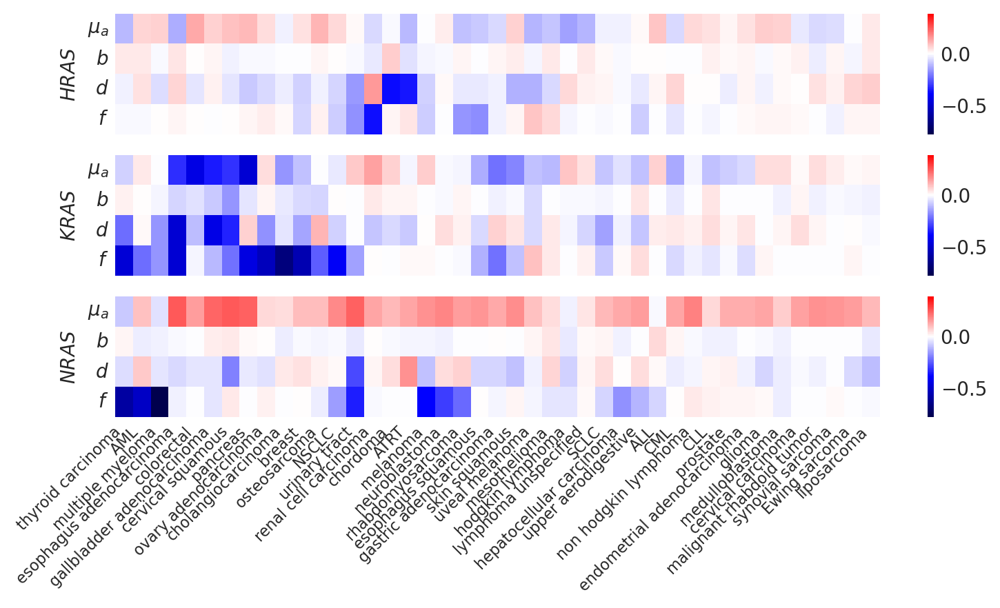
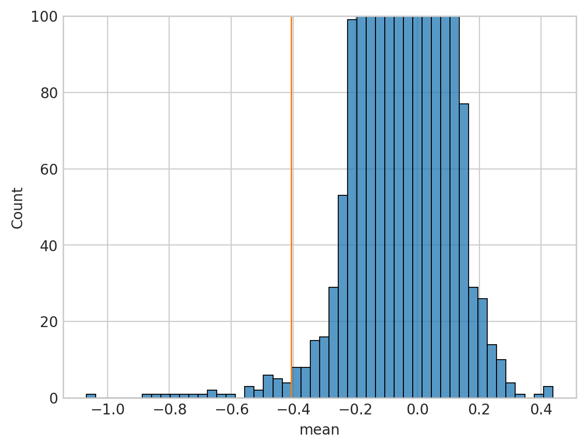

# Characterizing specific genes

## Setup

### Imports


```python
%load_ext autoreload
%autoreload 2
```


```python
from time import time
from typing import Collection, Sequence

import dask.dataframe as dd
import matplotlib.pyplot as plt
import numpy as np
import pandas as pd
import seaborn as sns
from matplotlib.text import Text
from sklearn.manifold import TSNE
```


```python
from speclet.analysis.arviz_analysis import extract_coords_param_names
from speclet.analysis.sublineage_model_analysis import (
    load_sublineage_model_posteriors,
    sublineage_to_lineage_map,
)
from speclet.io import project_root, temp_dir
from speclet.managers.posterior_data_manager import PosteriorDataManager as PostDataMan
from speclet.managers.posterior_data_manager import PosteriorDataManagers as PostDataMen
from speclet.plot import set_speclet_theme
from speclet.plot.color_pal import (
    lineage_color_pal,
    pal_to_legend_handles,
    sublineage_color_pal,
)
from speclet.project_configuration import arviz_config, get_model_configuration_file
from speclet.string_functions import str_hash
```


```python
# Notebook execution timer.
notebook_tic = time()

# Plotting setup.
set_speclet_theme()
%config InlineBackend.figure_format = "retina"

# Constants
RANDOM_SEED = 709
np.random.seed(RANDOM_SEED)
arviz_config()

# File paths
config_path = project_root() / get_model_configuration_file()
```

### Data

#### Model posteriors


```python
postmen = load_sublineage_model_posteriors()
```


```python
postmen.keys
```


    ['bile duct (cholangiocarcinoma)',
     'bile duct (gallbladder adenocarcinoma)',
     'blood (ALL)',
     'blood (AML)',
     'blood (CLL)',
     'blood (CML)',
     'bone (Ewing sarcoma)',
     'bone (chordoma)',
     'bone (osteosarcoma)',
     'breast',
     'central nervous system (glioma)',
     'central nervous system (medulloblastoma)',
     'cervix (cervical carcinoma)',
     'cervix (cervical squamous)',
     'colorectal',
     'esophagus (esophagus adenocarcinoma)',
     'esophagus (esophagus squamous)',
     'eye (uveal melanoma)',
     'gastric (gastric adenocarcinoma)',
     'kidney (renal cell carcinoma)',
     'liver (hepatocellular carcinoma)',
     'lung (NSCLC)',
     'lung (SCLC)',
     'lung (mesothelioma)',
     'lymphocyte (hodgkin lymphoma)',
     'lymphocyte (lymphoma unspecified)',
     'lymphocyte (non hodgkin lymphoma)',
     'ovary (ovary adenocarcinoma)',
     'pancreas',
     'peripheral nervous system (neuroblastoma)',
     'plasma cell (multiple myeloma)',
     'prostate',
     'skin (melanoma)',
     'skin (skin squamous)',
     'soft tissue (ATRT)',
     'soft tissue (liposarcoma)',
     'soft tissue (malignant rhabdoid tumor)',
     'soft tissue (rhabdomyosarcoma)',
     'soft tissue (synovial sarcoma)',
     'thyroid (thyroid carcinoma)',
     'upper aerodigestive',
     'urinary tract',
     'uterus (endometrial adenocarcinoma)']


```python
len(postmen)
```


    43


```python
sub_to_lineage, lineages = sublineage_to_lineage_map(postmen)
```


```python
sublineage_pal = sublineage_color_pal()
lineage_pal = lineage_color_pal()
```

## Analysis

### Gather data for key genes


```python
STASH_DIR = temp_dir() / "100_110_specific-gene-characterization-stash"
if not STASH_DIR.exists():
    STASH_DIR.mkdir()
```


```python
def get_parameters_for_gene(
    pm: PostDataMan, gene: str, stash: bool = True
) -> pd.DataFrame:
    pattern = rf"\[{gene}\]"
    stash_fp = STASH_DIR / f"post-summary-df_{pm.id}-{gene}"
    if stash and stash_fp.exists():
        return pd.read_csv(stash_fp)
    post = (
        pm.posterior_summary.copy()
        .filter_string("parameter", pattern)
        .reset_index(drop=True)
        .assign(lineage_subtype=pm.id, hugo_symbol=gene)
    )
    assert len(post) > 0, f"No results for gene '{gene}' found in {pm.id}."
    post.to_csv(stash_fp, index=False)
    return post
```


```python
def get_parameters_for_genes(
    pms: PostDataMen, genes: Sequence[str], stash: bool = True
) -> pd.DataFrame:
    parameters = pd.DataFrame()
    for gene in genes:
        df = pd.concat(
            [
                get_parameters_for_gene(pm, gene, stash=stash)
                for pm in pms.as_dict().values()
            ]
        )
        parameters = pd.concat([parameters, df])

    parameters = (
        parameters.assign(lineage=lambda d: d["lineage_subtype"].map(sub_to_lineage))
        .filter_column_isin("var_name", ["sigma_h"], complement=True)
        .reset_index(drop=True)
    )
    parameters["var_name"] = pd.Categorical(
        parameters["var_name"],
        categories=parameters["var_name"].unique(),
        ordered=True,
    )
    return parameters
```


```python
RAS_GENES = ["HRAS", "KRAS", "NRAS"]
RAF_GENES = ["ARAF", "BRAF", "RAF1"]
TSGS = sorted(["TP53", "RB1", "PTEN", "FBXW7", "APC"])
FANC_GENES = sorted(list(set(["FANCA", "FANCC", "FANCD2", "FANCE", "FANCF", "FANCG"])))

ras_params = get_parameters_for_genes(postmen, RAS_GENES)
raf_params = get_parameters_for_genes(postmen, RAF_GENES)
tsg_params = get_parameters_for_genes(postmen, TSGS)
fanc_params = get_parameters_for_genes(postmen, FANC_GENES)
```


```python
def extract_sublineage(s: str) -> str:
    if "(" not in s:
        return s
    return s.split("(")[1].replace(")", "")


def axis_labels_to_sublineage(lbl: Text) -> Text:
    lbl.set_text(extract_sublineage(lbl.get_text()))
    return lbl


def axis_labels_parameters(lbl: Text) -> Text:
    t = lbl.get_text()
    t = t.replace("mu_", r"\mu_")
    t = f"${t}$"
    lbl.set_text(t)
    return lbl
```


```python
def gene_set_characterization_heatmap(
    genes: Sequence[str],
    params_df: pd.DataFrame,
    vmin: float | None = None,
    vmax: float | None = None,
) -> None:
    fig, axes = plt.subplots(
        len(genes), figsize=(8, 1.5 * len(genes)), sharex=True, sharey=True
    )

    # CLustermap just to get clustering of lineage subtypes.
    X = params_df.pivot_wider(
        "parameter", names_from="lineage_subtype", values_from="mean"
    ).set_index("parameter")
    cg = sns.clustermap(data=X, xticklabels=1)
    sublineage_order = [x.get_text() for x in cg.ax_heatmap.get_xticklabels()]
    cg.figure.clear()

    for ax, (gene, df_g) in zip(axes, params_df.groupby("hugo_symbol")):
        X = df_g.pivot_wider(
            "var_name", names_from="lineage_subtype", values_from="mean"
        ).set_index("var_name")[sublineage_order]
        sns.heatmap(
            data=X,
            xticklabels=1,
            yticklabels=1,
            cmap="seismic",
            center=0,
            vmin=vmin,
            vmax=vmax,
            ax=ax,
        )
        xlbls = [axis_labels_to_sublineage(lbl) for lbl in ax.get_xticklabels()]
        ax.set_xticklabels(xlbls, rotation=45, ha="right", size=8)
        ylbls = [axis_labels_parameters(v) for v in ax.get_yticklabels()]
        ax.set_yticklabels(labels=ylbls, rotation=0)
        ax.set_ylabel(f"${gene}$")

    fig.tight_layout()
    plt.show()
```


```python
all_vals = pd.concat([ras_params, raf_params])["mean"]
vmin, vmax = all_vals.min(), all_vals.max()
gene_set_characterization_heatmap(RAS_GENES, ras_params, vmin=vmin, vmax=vmax)
gene_set_characterization_heatmap(RAF_GENES, raf_params, vmin=vmin, vmax=vmax)
gene_set_characterization_heatmap(FANC_GENES, fanc_params, vmin=vmin, vmax=vmax)
gene_set_characterization_heatmap(TSGS, tsg_params, vmin=vmin, vmax=vmax);
```


    <Figure size 1000x1000 with 0 Axes>


    <Figure size 1000x1000 with 0 Axes>


    <Figure size 1000x1000 with 0 Axes>


    <Figure size 1000x1000 with 0 Axes>


```python
ras_raf_params = pd.concat([ras_params, raf_params]).reset_index(drop=True)
ras_raf_X = ras_raf_params.pivot_wider(
    "lineage_subtype", names_from="parameter", values_from="mean"
).set_index("lineage_subtype")

_tsne_res = TSNE(learning_rate="auto", init="pca").fit_transform(ras_raf_X)
tsne_res = (
    pd.DataFrame(_tsne_res, columns=[f"tsne_{i+1}" for i in range(_tsne_res.shape[1])])
    .assign(lineage_subtype=ras_raf_X.index.values)
    .assign(lineage=lambda d: d["lineage_subtype"].map(sub_to_lineage))
)

ax = sns.scatterplot(data=tsne_res, x="tsne_1", y="tsne_2", hue="lineage")
ax.legend(loc="upper left", bbox_to_anchor=(1, 1), title="lineage", ncol=2)
```

    /home/jc604/.conda/envs/speclet/lib/python3.10/site-packages/sklearn/manifold/_t_sne.py:996: FutureWarning: The PCA initialization in TSNE will change to have the standard deviation of PC1 equal to 1e-4 in 1.2. This will ensure better convergence.
      warnings.warn(


    <matplotlib.legend.Legend at 0x7f8f2a136b60>


```python
ras_f = (
    ras_params.copy()
    .query("var_name == 'f'")
    .reset_index(drop=True)
    .astype({"hugo_symbol": "category"})
)

ras_scores = {"KRAS": 3, "NRAS": 2, "HRAS": 1}

subline_order = (
    ras_f.assign(
        score=lambda d: d["hugo_symbol"].astype(str).map(ras_scores) ** 2 * d["mean"]
    )
    .groupby("lineage_subtype")["score"]
    .sum()
    .reset_index()
    .sort_values("score")["lineage_subtype"]
    .values.astype("str")
)
ras_f["lineage_subtype"] = pd.Categorical(
    ras_f["lineage_subtype"], categories=subline_order, ordered=True
)


_d = 0.2
dx = {"HRAS": -_d, "KRAS": 0, "NRAS": _d}
ras_pal = {"HRAS": "#354F60", "KRAS": "#BC0E4C", "NRAS": "#D59B00"}
x = ras_f["lineage_subtype"].cat.codes + np.asarray(ras_f["hugo_symbol"].map(dx).values)
colors = ras_f["hugo_symbol"].map(ras_pal)


fig, ax = plt.subplots(figsize=(12, 3))
ax.axhline(0, c="k", lw=0.5, zorder=1)
ax.vlines(
    x=x,
    ymin=ras_f["hdi_5.5%"],
    ymax=ras_f["hdi_94.5%"],
    colors=colors,
    lw=0.5,
    zorder=10,
)
ax.scatter(x=x, y=ras_f["mean"], c=colors, s=7, zorder=20)

xlbls = [extract_sublineage(s) for s in ras_f["lineage_subtype"].cat.categories]
ax.set_xticks(
    ticks=np.arange(ras_f["lineage_subtype"].nunique()),
    labels=xlbls,
    rotation=40,
    ha="right",
    fontsize=8,
)
ax.set_xlim(-0.5, ras_f["lineage_subtype"].nunique() - 0.5)

for i in range(ras_f["lineage_subtype"].nunique()):
    ax.axvline(i + 0.5, c="lightgray", lw=0.5, zorder=2)

ras_pal_italic = {f"${k}$": v for k, v in ras_pal.items()}
ax.legend(
    handles=pal_to_legend_handles(ras_pal_italic, lw=0.7, marker="o", markersize=3),
    title="$RAS$",
    loc="upper left",
    bbox_to_anchor=(1, 1),
    handlelength=1,
    handletextpad=0.2,
)
ax.grid(False, axis="x")

ax.set_ylabel("$f$ posterior distribution\n(mean & 89% HDI)")
plt.show()
```





```python

```


```python

```


```python

```


```python
def get_mutation_f_summaries(pm: PostDataMan, stash: bool = True) -> pd.DataFrame:
    stash_fp = STASH_DIR / f"mutation-f-summary-{pm.id}.csv"
    if stash and stash_fp.exists():
        return pd.read_csv(stash_fp)
    res = (
        pm.posterior_summary.copy()
        .query("var_name == 'f'")
        .reset_index(drop=True)
        .assign(lineage_subtype=pm.id)
        .pipe(extract_coords_param_names, col="parameter", names=["hugo_symbol"])
    )
    res.to_csv(stash_fp, index=False)
    return res
```


```python
def _hdi_contains_zero(low: float, high: float) -> bool:
    return low < 0 < high


hdi_contains_zero = np.vectorize(_hdi_contains_zero)
```


```python
f_post = (
    pd.concat([get_mutation_f_summaries(pm) for pm in postmen.as_dict().values()])
    .reset_index(drop=True)
    .assign(lineage=lambda d: d["lineage_subtype"].map(sub_to_lineage))
    .assign(zero_hdi=lambda d: hdi_contains_zero(d["hdi_5.5%"], d["hdi_94.5%"]))
)
f_post.head()
```


<div>
<style scoped>
    .dataframe tbody tr th:only-of-type {
        vertical-align: middle;
    }

    .dataframe tbody tr th {
        vertical-align: top;
    }

    .dataframe thead th {
        text-align: right;
    }
</style>
<table border="1" class="dataframe">
  <thead>
    <tr style="text-align: right;">
      <th></th>
      <th>parameter</th>
      <th>mean</th>
      <th>sd</th>
      <th>hdi_5.5%</th>
      <th>hdi_94.5%</th>
      <th>mcse_mean</th>
      <th>mcse_sd</th>
      <th>ess_bulk</th>
      <th>ess_tail</th>
      <th>r_hat</th>
      <th>var_name</th>
      <th>lineage_subtype</th>
      <th>hugo_symbol</th>
      <th>lineage</th>
      <th>zero_hdi</th>
    </tr>
  </thead>
  <tbody>
    <tr>
      <th>0</th>
      <td>f[A1BG]</td>
      <td>-0.004</td>
      <td>0.117</td>
      <td>-0.188</td>
      <td>0.188</td>
      <td>0.001</td>
      <td>0.002</td>
      <td>9718.0</td>
      <td>2826.0</td>
      <td>1.00</td>
      <td>f</td>
      <td>bile duct (cholangiocarcinoma)</td>
      <td>A1BG</td>
      <td>bile duct</td>
      <td>True</td>
    </tr>
    <tr>
      <th>1</th>
      <td>f[A1CF]</td>
      <td>-0.010</td>
      <td>0.096</td>
      <td>-0.162</td>
      <td>0.143</td>
      <td>0.001</td>
      <td>0.002</td>
      <td>9056.0</td>
      <td>2534.0</td>
      <td>1.00</td>
      <td>f</td>
      <td>bile duct (cholangiocarcinoma)</td>
      <td>A1CF</td>
      <td>bile duct</td>
      <td>True</td>
    </tr>
    <tr>
      <th>2</th>
      <td>f[A2M]</td>
      <td>-0.008</td>
      <td>0.093</td>
      <td>-0.159</td>
      <td>0.141</td>
      <td>0.001</td>
      <td>0.002</td>
      <td>10978.0</td>
      <td>2870.0</td>
      <td>1.01</td>
      <td>f</td>
      <td>bile duct (cholangiocarcinoma)</td>
      <td>A2M</td>
      <td>bile duct</td>
      <td>True</td>
    </tr>
    <tr>
      <th>3</th>
      <td>f[A2ML1]</td>
      <td>0.017</td>
      <td>0.088</td>
      <td>-0.126</td>
      <td>0.155</td>
      <td>0.001</td>
      <td>0.002</td>
      <td>10213.0</td>
      <td>2477.0</td>
      <td>1.00</td>
      <td>f</td>
      <td>bile duct (cholangiocarcinoma)</td>
      <td>A2ML1</td>
      <td>bile duct</td>
      <td>True</td>
    </tr>
    <tr>
      <th>4</th>
      <td>f[A3GALT2]</td>
      <td>0.075</td>
      <td>0.100</td>
      <td>-0.079</td>
      <td>0.241</td>
      <td>0.001</td>
      <td>0.001</td>
      <td>8710.0</td>
      <td>2902.0</td>
      <td>1.00</td>
      <td>f</td>
      <td>bile duct (cholangiocarcinoma)</td>
      <td>A3GALT2</td>
      <td>bile duct</td>
      <td>True</td>
    </tr>
  </tbody>
</table>
</div>


```python
any_nonzero = f_post.query("not zero_hdi")["hugo_symbol"].toset()
print(f"number of genes in heatmap: {len(any_nonzero)}")
plot_df = (
    f_post.filter_column_isin("hugo_symbol", any_nonzero)
    .pivot_wider("lineage_subtype", names_from="hugo_symbol", values_from="mean")
    .set_index("lineage_subtype")
)
sns.clustermap(
    plot_df,
    figsize=(12, 8),
    dendrogram_ratio=(0.1, 0.1),
    row_cluster=False,
    cmap="seismic",
    center=0,
    yticklabels=1,
)
```

    number of genes in heatmap: 3310


    /home/jc604/.conda/envs/speclet/lib/python3.10/site-packages/seaborn/matrix.py:654: UserWarning: Clustering large matrix with scipy. Installing `fastcluster` may give better performance.
      warnings.warn(msg)


    <seaborn.matrix.ClusterGrid at 0x7f8f2b538460>


```python
blood_f_hits = (
    f_post.query("lineage == 'blood'")
    .query("not zero_hdi")
    .query("mean < -0.2 or mean > 0.2")["hugo_symbol"]
    .toset()
)
print(f"number of hits in blood lineage: {len(blood_f_hits)}")
f_post_blood = f_post.query("lineage == 'blood'").filter_column_isin(
    "hugo_symbol", blood_f_hits
)

sns.kdeplot(data=f_post_blood, x="mean", hue="lineage_subtype");
```

    number of hits in blood lineage: 569


```python
def get_blood_hits_data(
    pm: PostDataMan, hits: Collection[str], stash: bool = True
) -> pd.DataFrame:
    hits_hash = str_hash("_".join(hits))
    stash_fp = STASH_DIR / f"blood-hits_{pm.id}_{hits_hash}.csv"
    if stash and stash_fp.exists():
        return pd.read_csv(stash_fp)

    res = (
        dd.read_csv(
            pm.data_file,
            low_memory=False,
            dtype={"age": "float64", "primary_or_metastasis": object},
        )
        .query("screen == 'broad'")
        .query("hugo_symbol in @hits", local_dict={"hits": hits})
        .compute()
        .reset_index(drop=True)
    )
    res.to_csv(stash_fp, index=False)
    return res


blood_f_hits_data = pd.concat(
    [
        get_blood_hits_data(pm, blood_f_hits)
        for pm in postmen.posteriors
        if "blood" in pm.id
    ]
)
blood_f_hits_data.head()
```


<div>
<style scoped>
    .dataframe tbody tr th:only-of-type {
        vertical-align: middle;
    }

    .dataframe tbody tr th {
        vertical-align: top;
    }

    .dataframe thead th {
        text-align: right;
    }
</style>
<table border="1" class="dataframe">
  <thead>
    <tr style="text-align: right;">
      <th></th>
      <th>sgrna</th>
      <th>replicate_id</th>
      <th>lfc</th>
      <th>p_dna_batch</th>
      <th>genome_alignment</th>
      <th>hugo_symbol</th>
      <th>screen</th>
      <th>multiple_hits_on_gene</th>
      <th>sgrna_target_chr</th>
      <th>sgrna_target_pos</th>
      <th>...</th>
      <th>any_deleterious</th>
      <th>any_tcga_hotspot</th>
      <th>any_cosmic_hotspot</th>
      <th>is_mutated</th>
      <th>copy_number</th>
      <th>lineage_subtype</th>
      <th>primary_or_metastasis</th>
      <th>is_male</th>
      <th>age</th>
      <th>lineage</th>
    </tr>
  </thead>
  <tbody>
    <tr>
      <th>0</th>
      <td>CATCGACGATGATAGCGAGG</td>
      <td>697-311CAS9_RepA_p6_batch3</td>
      <td>-0.839641</td>
      <td>3</td>
      <td>chr21_44113827_-</td>
      <td>PWP2</td>
      <td>broad</td>
      <td>True</td>
      <td>21</td>
      <td>44113827</td>
      <td>...</td>
      <td>NaN</td>
      <td>NaN</td>
      <td>NaN</td>
      <td>False</td>
      <td>0.991341</td>
      <td>ALL</td>
      <td>primary</td>
      <td>True</td>
      <td>12.0</td>
      <td>blood_(ALL)</td>
    </tr>
    <tr>
      <th>1</th>
      <td>CATGGCGTCGCCCTTCAGCG</td>
      <td>697-311CAS9_RepA_p6_batch3</td>
      <td>-0.216331</td>
      <td>3</td>
      <td>chr16_740969_-</td>
      <td>CIAO3</td>
      <td>broad</td>
      <td>True</td>
      <td>16</td>
      <td>740969</td>
      <td>...</td>
      <td>NaN</td>
      <td>NaN</td>
      <td>NaN</td>
      <td>False</td>
      <td>1.083653</td>
      <td>ALL</td>
      <td>primary</td>
      <td>True</td>
      <td>12.0</td>
      <td>blood_(ALL)</td>
    </tr>
    <tr>
      <th>2</th>
      <td>CGCCAAAATGACGAACACAA</td>
      <td>697-311CAS9_RepA_p6_batch3</td>
      <td>-0.383453</td>
      <td>3</td>
      <td>chr13_27253786_+</td>
      <td>RPL21</td>
      <td>broad</td>
      <td>True</td>
      <td>13</td>
      <td>27253786</td>
      <td>...</td>
      <td>NaN</td>
      <td>NaN</td>
      <td>NaN</td>
      <td>False</td>
      <td>1.018267</td>
      <td>ALL</td>
      <td>primary</td>
      <td>True</td>
      <td>12.0</td>
      <td>blood_(ALL)</td>
    </tr>
    <tr>
      <th>3</th>
      <td>CTCGGACAGCACCCTCCCCG</td>
      <td>697-311CAS9_RepA_p6_batch3</td>
      <td>-0.754283</td>
      <td>3</td>
      <td>chr4_190173807_+</td>
      <td>DUX4</td>
      <td>broad</td>
      <td>True</td>
      <td>4</td>
      <td>190173807</td>
      <td>...</td>
      <td>NaN</td>
      <td>NaN</td>
      <td>NaN</td>
      <td>False</td>
      <td>1.400450</td>
      <td>ALL</td>
      <td>primary</td>
      <td>True</td>
      <td>12.0</td>
      <td>blood_(ALL)</td>
    </tr>
    <tr>
      <th>4</th>
      <td>GACGTGGTAGATCTTGTCAG</td>
      <td>697-311CAS9_RepA_p6_batch3</td>
      <td>-0.167526</td>
      <td>3</td>
      <td>chr16_733414_+</td>
      <td>CIAO3</td>
      <td>broad</td>
      <td>True</td>
      <td>16</td>
      <td>733414</td>
      <td>...</td>
      <td>NaN</td>
      <td>NaN</td>
      <td>NaN</td>
      <td>False</td>
      <td>1.083653</td>
      <td>ALL</td>
      <td>primary</td>
      <td>True</td>
      <td>12.0</td>
      <td>blood_(ALL)</td>
    </tr>
  </tbody>
</table>
<p>5 rows × 25 columns</p>
</div>


```python
blood_types = [b.replace("_", " ") for b in blood_f_hits_data["lineage"].unique()]
fig, axes = plt.subplots(nrows=2, ncols=2, figsize=(8, 8))
for ax, blood in zip(axes.flatten(), blood_types):
    dn_hits = f_post_blood.query(f"lineage_subtype == '{blood}' and mean < -0.2")[
        "hugo_symbol"
    ].toset()
    if len(dn_hits) == 0:
        continue
    plot_df = blood_f_hits_data.filter_column_isin("hugo_symbol", dn_hits)
    sns.boxplot(
        data=plot_df, x="lineage_subtype", y="lfc", hue="is_mutated", ax=ax, fliersize=0
    )
    ax.set_title(blood)

fig.tight_layout()
plt.show()
```


```python

```


```python

```

Compare adeno vs. squamous


```python
squamous = {a for a in postmen.keys if "squamous" in a}
squamous = squamous.union({"lung (SCLC)"})
adeno = {a for a in postmen.keys if "adeno" in a}
adeno = adeno.union({"colorectal", "pancreas", "prostate", "lung (NSCLC)"})
assert len(squamous.intersection(adeno)) == 0
print(squamous)
print(adeno)
```

    {'esophagus (esophagus squamous)', 'lung (SCLC)', 'skin (skin squamous)', 'cervix (cervical squamous)'}
    {'bile duct (gallbladder adenocarcinoma)', 'gastric (gastric adenocarcinoma)', 'lung (NSCLC)', 'prostate', 'ovary (ovary adenocarcinoma)', 'colorectal', 'pancreas', 'uterus (endometrial adenocarcinoma)', 'esophagus (esophagus adenocarcinoma)'}


```python
f_post_adeno_squa = (
    f_post.copy()
    .filter_column_isin("lineage_subtype", adeno.union(squamous))
    .reset_index(drop=True)
)

adeno_squa_nonzero = (
    f_post_adeno_squa.query("zero_hdi")
    .query("mean < -0.1 or 0.1 < mean")["hugo_symbol"]
    .toset()
)
print(f"number of `f` hits: {len(adeno_squa_nonzero)}")
f_post_adeno_squa.head()
```

    number of `f` hits: 1471


<div>
<style scoped>
    .dataframe tbody tr th:only-of-type {
        vertical-align: middle;
    }

    .dataframe tbody tr th {
        vertical-align: top;
    }

    .dataframe thead th {
        text-align: right;
    }
</style>
<table border="1" class="dataframe">
  <thead>
    <tr style="text-align: right;">
      <th></th>
      <th>parameter</th>
      <th>mean</th>
      <th>sd</th>
      <th>hdi_5.5%</th>
      <th>hdi_94.5%</th>
      <th>mcse_mean</th>
      <th>mcse_sd</th>
      <th>ess_bulk</th>
      <th>ess_tail</th>
      <th>r_hat</th>
      <th>var_name</th>
      <th>lineage_subtype</th>
      <th>hugo_symbol</th>
      <th>lineage</th>
      <th>zero_hdi</th>
    </tr>
  </thead>
  <tbody>
    <tr>
      <th>0</th>
      <td>f[A1BG]</td>
      <td>0.005</td>
      <td>0.081</td>
      <td>-0.120</td>
      <td>0.138</td>
      <td>0.001</td>
      <td>0.001</td>
      <td>7004.0</td>
      <td>2309.0</td>
      <td>1.0</td>
      <td>f</td>
      <td>bile duct (gallbladder adenocarcinoma)</td>
      <td>A1BG</td>
      <td>bile duct</td>
      <td>True</td>
    </tr>
    <tr>
      <th>1</th>
      <td>f[A1CF]</td>
      <td>-0.003</td>
      <td>0.081</td>
      <td>-0.137</td>
      <td>0.119</td>
      <td>0.001</td>
      <td>0.001</td>
      <td>8303.0</td>
      <td>2949.0</td>
      <td>1.0</td>
      <td>f</td>
      <td>bile duct (gallbladder adenocarcinoma)</td>
      <td>A1CF</td>
      <td>bile duct</td>
      <td>True</td>
    </tr>
    <tr>
      <th>2</th>
      <td>f[A2M]</td>
      <td>-0.021</td>
      <td>0.080</td>
      <td>-0.155</td>
      <td>0.096</td>
      <td>0.001</td>
      <td>0.001</td>
      <td>9361.0</td>
      <td>2452.0</td>
      <td>1.0</td>
      <td>f</td>
      <td>bile duct (gallbladder adenocarcinoma)</td>
      <td>A2M</td>
      <td>bile duct</td>
      <td>True</td>
    </tr>
    <tr>
      <th>3</th>
      <td>f[A2ML1]</td>
      <td>-0.016</td>
      <td>0.078</td>
      <td>-0.141</td>
      <td>0.110</td>
      <td>0.001</td>
      <td>0.001</td>
      <td>8927.0</td>
      <td>2840.0</td>
      <td>1.0</td>
      <td>f</td>
      <td>bile duct (gallbladder adenocarcinoma)</td>
      <td>A2ML1</td>
      <td>bile duct</td>
      <td>True</td>
    </tr>
    <tr>
      <th>4</th>
      <td>f[A3GALT2]</td>
      <td>-0.016</td>
      <td>0.084</td>
      <td>-0.144</td>
      <td>0.123</td>
      <td>0.001</td>
      <td>0.002</td>
      <td>9804.0</td>
      <td>2808.0</td>
      <td>1.0</td>
      <td>f</td>
      <td>bile duct (gallbladder adenocarcinoma)</td>
      <td>A3GALT2</td>
      <td>bile duct</td>
      <td>True</td>
    </tr>
  </tbody>
</table>
</div>


```python
adeno_squa_corr = (
    f_post_adeno_squa.filter_column_isin("hugo_symbol", adeno_squa_nonzero)
    .pivot_wider("hugo_symbol", names_from="lineage_subtype", values_from="mean")
    .set_index("hugo_symbol")
    .corr()
)

mask = np.zeros_like(adeno_squa_corr.values, dtype=bool)
np.fill_diagonal(mask, True)

adeno_squa_corr[mask] = 0
sns.clustermap(
    adeno_squa_corr,
    figsize=(6, 6),
    dendrogram_ratio=(0.1, 0.1),
    cmap="seismic",
    center=0,
    cbar_pos=(1, 0.7, 0.02, 0.25),
)
plt.show()
```





```python

```

---


```python
notebook_toc = time()
print(f"execution time: {(notebook_toc - notebook_tic) / 60:.2f} minutes")
```

    execution time: 0.99 minutes


```python
%load_ext watermark
%watermark -d -u -v -iv -b -h -m
```

    Last updated: 2022-09-18

    Python implementation: CPython
    Python version       : 3.10.6
    IPython version      : 8.5.0

    Compiler    : GCC 10.4.0
    OS          : Linux
    Release     : 3.10.0-1160.76.1.el7.x86_64
    Machine     : x86_64
    Processor   : x86_64
    CPU cores   : 28
    Architecture: 64bit

    Hostname: compute-e-16-231.o2.rc.hms.harvard.edu

    Git branch: figures

    seaborn   : 0.11.2
    numpy     : 1.23.3
    matplotlib: 3.5.3
    dask      : 2022.9.0
    pandas    : 1.4.4


```python

```
