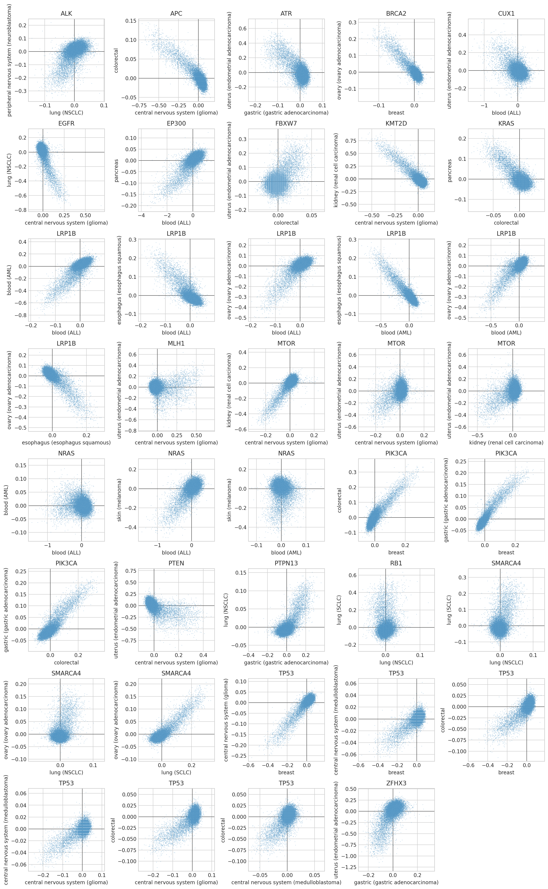
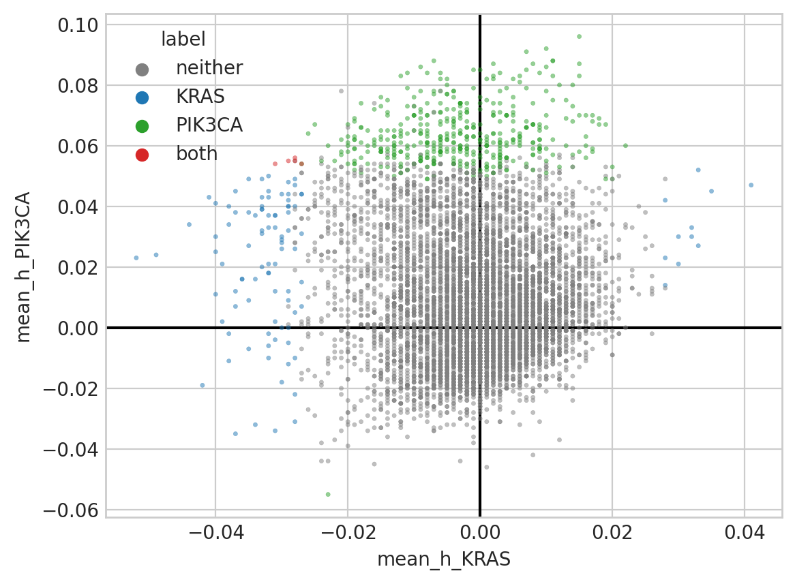

# Analyzing cancer gene comutation dependencies

## Setup

### Imports


```python
%load_ext autoreload
%autoreload 2
```


```python
import json
from collections import Counter
from itertools import combinations
from math import ceil
from time import time
from typing import Collection

import arviz as az
import dask.dataframe as dd
import matplotlib.pyplot as plt
import numpy as np
import pandas as pd
import seaborn as sns
from adjustText import adjust_text
```


```python
from speclet.analysis.arviz_analysis import extract_coords_param_names
from speclet.analysis.sublineage_model_analysis import (
    load_sublineage_model_posteriors,
    sublineage_to_lineage_map,
)
from speclet.io import notebook_output_and_stash_dirs
from speclet.managers.posterior_data_manager import PosteriorDataManager as PostDataMan
from speclet.plot import align_legend_title, set_speclet_theme
from speclet.plot.color_pal import (
    lineage_color_pal,
    pal_to_legend_handles,
    sublineage_color_pal,
)
from speclet.project_configuration import arviz_config
from speclet.string_functions import str_hash
```


```python
# Notebook execution timer.
notebook_tic = time()

# Plotting setup.
set_speclet_theme()
%config InlineBackend.figure_format = "retina"

# Constants
RANDOM_SEED = 709
np.random.seed(RANDOM_SEED)
arviz_config()
```


```python
OUTPUT_DIR, STASH_DIR = notebook_output_and_stash_dirs(
    "100_120_cancer-gene-comut-analysis"
)
```

### Data

#### Model posteriors


```python
postmen = load_sublineage_model_posteriors()
```


```python
postmen.keys
```


    ['bile duct (cholangiocarcinoma)',
     'bile duct (gallbladder adenocarcinoma)',
     'blood (ALL)',
     'blood (AML)',
     'blood (CLL)',
     'blood (CML)',
     'bone (Ewing sarcoma)',
     'bone (chordoma)',
     'bone (osteosarcoma)',
     'breast',
     'central nervous system (glioma)',
     'central nervous system (medulloblastoma)',
     'cervix (cervical carcinoma)',
     'cervix (cervical squamous)',
     'colorectal',
     'esophagus (esophagus adenocarcinoma)',
     'esophagus (esophagus squamous)',
     'eye (uveal melanoma)',
     'gastric (gastric adenocarcinoma)',
     'kidney (renal cell carcinoma)',
     'liver (hepatocellular carcinoma)',
     'lung (NSCLC)',
     'lung (SCLC)',
     'lung (mesothelioma)',
     'lymphocyte (hodgkin lymphoma)',
     'lymphocyte (lymphoma unspecified)',
     'lymphocyte (non hodgkin lymphoma)',
     'ovary (ovary adenocarcinoma)',
     'pancreas',
     'peripheral nervous system (neuroblastoma)',
     'plasma cell (multiple myeloma)',
     'prostate',
     'skin (melanoma)',
     'skin (skin squamous)',
     'soft tissue (ATRT)',
     'soft tissue (liposarcoma)',
     'soft tissue (malignant rhabdoid tumor)',
     'soft tissue (rhabdomyosarcoma)',
     'soft tissue (synovial sarcoma)',
     'thyroid (thyroid carcinoma)',
     'upper aerodigestive',
     'urinary tract',
     'uterus (endometrial adenocarcinoma)']


```python
len(postmen)
```


    43


```python
sub_to_lineage, lineages = sublineage_to_lineage_map(postmen)
```


```python
sublineage_pal = sublineage_color_pal()
lineage_pal = lineage_color_pal()
```

## Analysis

### Gather cancer gene comutation posteriors


```python
def get_cancer_genes(pm: PostDataMan, stash: bool = True) -> list[str]:
    stash_fp = STASH_DIR / f"cancer-genes_{pm.id}.json"
    if stash and stash_fp.exists():
        with open(stash_fp, "r") as fp:
            return json.load(fp)

    try:
        cg_coords = pm.trace.posterior.coords.get("cancer_gene")
    except AssertionError:
        print(f"Skipping {pm.id}")
        cg_coords = None

    if cg_coords is None:
        cancer_genes = []
    else:
        cancer_genes = list(cg_coords.values)
        cancer_genes.sort()

    with open(stash_fp, "w") as fp:
        json.dump(cancer_genes, fp)

    return cancer_genes
```


```python
def _zero_in_hdi(low: float, high: float) -> bool:
    return low <= 0 <= high


zero_in_hdi = np.vectorize(_zero_in_hdi)
```


```python
def get_variable_posterior_summary(
    pm: PostDataMan, var_name: str, stash: bool = True
) -> pd.DataFrame:
    stash_fp = STASH_DIR / f"post-summary-df_{pm.id}-{var_name}-post.csv"
    if stash and stash_fp.exists():
        return pd.read_csv(stash_fp)

    try:
        post = pm.posterior_summary.copy().query(f"var_name == '{var_name}'")
    except FileNotFoundError:
        print(f"Skipping {pm.id}")
        return pd.DataFrame()

    if len(post) > 0:
        post = post.reset_index(drop=True).assign(lineage_subtype=pm.id)

    post.to_csv(stash_fp, index=False)
    return post


def get_cancer_gene_comut_parameters(
    pm: PostDataMan, stash: bool = True
) -> pd.DataFrame:
    res = get_variable_posterior_summary(pm, "h", stash=stash)
    if len(res) == 0:
        return res

    res = res.pipe(
        extract_coords_param_names,
        col="parameter",
        names=["hugo_symbol", "cancer_gene"],
    ).assign(hdi_zero=lambda d: zero_in_hdi(d["hdi_5.5%"], d["hdi_94.5%"]))
    return res


def get_mu_a_parameters(pm: PostDataMan, stash: bool = True) -> pd.DataFrame:
    return (
        get_variable_posterior_summary(pm, "mu_a", stash=stash)
        .pipe(
            extract_coords_param_names,
            col="parameter",
            names=["hugo_symbol"],
        )
        .assign(hdi_zero=lambda d: zero_in_hdi(d["hdi_5.5%"], d["hdi_94.5%"]))
    )


def get_synthetic_lethal_posterior_parameters(
    pm: PostDataMan, stash: bool = True
) -> pd.DataFrame:
    h_post = get_cancer_gene_comut_parameters(pm, stash=stash)
    if len(h_post) == 0:
        return pd.DataFrame()

    h_post = h_post[
        [
            "hugo_symbol",
            "cancer_gene",
            "mean",
            "sd",
            "hdi_5.5%",
            "hdi_94.5%",
            "hdi_zero",
        ]
    ]

    mu_a_post = get_mu_a_parameters(pm, stash=stash)[
        ["hugo_symbol", "mean", "sd", "hdi_5.5%", "hdi_94.5%", "hdi_zero"]
    ]

    res = h_post.merge(mu_a_post, on=["hugo_symbol"], suffixes=("_h", "_mu_a")).assign(
        lineage_subtype=pm.id
    )
    return res
```


```python
synlet_post = (
    pd.concat(
        [
            get_synthetic_lethal_posterior_parameters(pm, stash=False)
            for pm in postmen.posteriors
        ]
    )
    .reset_index(drop=True)
    .assign(
        lineage=lambda d: d["lineage_subtype"].map(sub_to_lineage),
    )
)
synlet_post.to_csv(OUTPUT_DIR / "synthetic-lethal-posterior.csv", index=False)
synlet_post.head()
```

    Skipping skin (melanoma)


<div>
<style scoped>
    .dataframe tbody tr th:only-of-type {
        vertical-align: middle;
    }

    .dataframe tbody tr th {
        vertical-align: top;
    }

    .dataframe thead th {
        text-align: right;
    }
</style>
<table border="1" class="dataframe">
  <thead>
    <tr style="text-align: right;">
      <th></th>
      <th>hugo_symbol</th>
      <th>cancer_gene</th>
      <th>mean_h</th>
      <th>sd_h</th>
      <th>hdi_5.5%_h</th>
      <th>hdi_94.5%_h</th>
      <th>hdi_zero_h</th>
      <th>mean_mu_a</th>
      <th>sd_mu_a</th>
      <th>hdi_5.5%_mu_a</th>
      <th>hdi_94.5%_mu_a</th>
      <th>hdi_zero_mu_a</th>
      <th>lineage_subtype</th>
      <th>lineage</th>
    </tr>
  </thead>
  <tbody>
    <tr>
      <th>0</th>
      <td>A1BG</td>
      <td>BRAF</td>
      <td>0.014</td>
      <td>0.009</td>
      <td>-0.001</td>
      <td>0.028</td>
      <td>True</td>
      <td>0.322</td>
      <td>0.122</td>
      <td>0.134</td>
      <td>0.522</td>
      <td>False</td>
      <td>bile duct (cholangiocarcinoma)</td>
      <td>bile duct</td>
    </tr>
    <tr>
      <th>1</th>
      <td>A1CF</td>
      <td>BRAF</td>
      <td>0.015</td>
      <td>0.009</td>
      <td>0.001</td>
      <td>0.030</td>
      <td>False</td>
      <td>0.268</td>
      <td>0.122</td>
      <td>0.064</td>
      <td>0.455</td>
      <td>False</td>
      <td>bile duct (cholangiocarcinoma)</td>
      <td>bile duct</td>
    </tr>
    <tr>
      <th>2</th>
      <td>A2M</td>
      <td>BRAF</td>
      <td>0.009</td>
      <td>0.009</td>
      <td>-0.006</td>
      <td>0.023</td>
      <td>True</td>
      <td>0.176</td>
      <td>0.123</td>
      <td>-0.025</td>
      <td>0.365</td>
      <td>True</td>
      <td>bile duct (cholangiocarcinoma)</td>
      <td>bile duct</td>
    </tr>
    <tr>
      <th>3</th>
      <td>A2ML1</td>
      <td>BRAF</td>
      <td>0.015</td>
      <td>0.009</td>
      <td>-0.001</td>
      <td>0.029</td>
      <td>True</td>
      <td>0.320</td>
      <td>0.125</td>
      <td>0.122</td>
      <td>0.525</td>
      <td>False</td>
      <td>bile duct (cholangiocarcinoma)</td>
      <td>bile duct</td>
    </tr>
    <tr>
      <th>4</th>
      <td>A3GALT2</td>
      <td>BRAF</td>
      <td>-0.001</td>
      <td>0.010</td>
      <td>-0.017</td>
      <td>0.014</td>
      <td>True</td>
      <td>0.114</td>
      <td>0.124</td>
      <td>-0.087</td>
      <td>0.308</td>
      <td>True</td>
      <td>bile duct (cholangiocarcinoma)</td>
      <td>bile duct</td>
    </tr>
  </tbody>
</table>
</div>


```python
synlet_post.query("not hdi_zero_h").groupby(["lineage_subtype", "lineage"])[
    "hugo_symbol"
].count().reset_index(drop=False)
```


<div>
<style scoped>
    .dataframe tbody tr th:only-of-type {
        vertical-align: middle;
    }

    .dataframe tbody tr th {
        vertical-align: top;
    }

    .dataframe thead th {
        text-align: right;
    }
</style>
<table border="1" class="dataframe">
  <thead>
    <tr style="text-align: right;">
      <th></th>
      <th>lineage_subtype</th>
      <th>lineage</th>
      <th>hugo_symbol</th>
    </tr>
  </thead>
  <tbody>
    <tr>
      <th>0</th>
      <td>bile duct (cholangiocarcinoma)</td>
      <td>bile duct</td>
      <td>3196</td>
    </tr>
    <tr>
      <th>1</th>
      <td>blood (ALL)</td>
      <td>blood</td>
      <td>51784</td>
    </tr>
    <tr>
      <th>2</th>
      <td>blood (AML)</td>
      <td>blood</td>
      <td>11058</td>
    </tr>
    <tr>
      <th>3</th>
      <td>breast</td>
      <td>breast</td>
      <td>14138</td>
    </tr>
    <tr>
      <th>4</th>
      <td>central nervous system (glioma)</td>
      <td>central nervous system</td>
      <td>40161</td>
    </tr>
    <tr>
      <th>5</th>
      <td>central nervous system (medulloblastoma)</td>
      <td>central nervous system</td>
      <td>243</td>
    </tr>
    <tr>
      <th>6</th>
      <td>colorectal</td>
      <td>colorectal</td>
      <td>9831</td>
    </tr>
    <tr>
      <th>7</th>
      <td>esophagus (esophagus squamous)</td>
      <td>esophagus</td>
      <td>4235</td>
    </tr>
    <tr>
      <th>8</th>
      <td>gastric (gastric adenocarcinoma)</td>
      <td>gastric</td>
      <td>27789</td>
    </tr>
    <tr>
      <th>9</th>
      <td>kidney (renal cell carcinoma)</td>
      <td>kidney</td>
      <td>11959</td>
    </tr>
    <tr>
      <th>10</th>
      <td>liver (hepatocellular carcinoma)</td>
      <td>liver</td>
      <td>1883</td>
    </tr>
    <tr>
      <th>11</th>
      <td>lung (NSCLC)</td>
      <td>lung</td>
      <td>32159</td>
    </tr>
    <tr>
      <th>12</th>
      <td>lung (SCLC)</td>
      <td>lung</td>
      <td>9345</td>
    </tr>
    <tr>
      <th>13</th>
      <td>ovary (ovary adenocarcinoma)</td>
      <td>ovary</td>
      <td>14732</td>
    </tr>
    <tr>
      <th>14</th>
      <td>pancreas</td>
      <td>pancreas</td>
      <td>13545</td>
    </tr>
    <tr>
      <th>15</th>
      <td>peripheral nervous system (neuroblastoma)</td>
      <td>peripheral nervous system</td>
      <td>5157</td>
    </tr>
    <tr>
      <th>16</th>
      <td>urinary tract</td>
      <td>urinary tract</td>
      <td>12482</td>
    </tr>
    <tr>
      <th>17</th>
      <td>uterus (endometrial adenocarcinoma)</td>
      <td>uterus</td>
      <td>44671</td>
    </tr>
  </tbody>
</table>
</div>


```python
synlet_post.query("not hdi_zero_h and hdi_zero_mu_a").groupby(
    ["lineage_subtype", "lineage"]
)["hugo_symbol"].count().reset_index(drop=False)
```


<div>
<style scoped>
    .dataframe tbody tr th:only-of-type {
        vertical-align: middle;
    }

    .dataframe tbody tr th {
        vertical-align: top;
    }

    .dataframe thead th {
        text-align: right;
    }
</style>
<table border="1" class="dataframe">
  <thead>
    <tr style="text-align: right;">
      <th></th>
      <th>lineage_subtype</th>
      <th>lineage</th>
      <th>hugo_symbol</th>
    </tr>
  </thead>
  <tbody>
    <tr>
      <th>0</th>
      <td>bile duct (cholangiocarcinoma)</td>
      <td>bile duct</td>
      <td>56</td>
    </tr>
    <tr>
      <th>1</th>
      <td>blood (ALL)</td>
      <td>blood</td>
      <td>8266</td>
    </tr>
    <tr>
      <th>2</th>
      <td>blood (AML)</td>
      <td>blood</td>
      <td>1484</td>
    </tr>
    <tr>
      <th>3</th>
      <td>breast</td>
      <td>breast</td>
      <td>1148</td>
    </tr>
    <tr>
      <th>4</th>
      <td>central nervous system (glioma)</td>
      <td>central nervous system</td>
      <td>2620</td>
    </tr>
    <tr>
      <th>5</th>
      <td>central nervous system (medulloblastoma)</td>
      <td>central nervous system</td>
      <td>1</td>
    </tr>
    <tr>
      <th>6</th>
      <td>colorectal</td>
      <td>colorectal</td>
      <td>1019</td>
    </tr>
    <tr>
      <th>7</th>
      <td>esophagus (esophagus squamous)</td>
      <td>esophagus</td>
      <td>291</td>
    </tr>
    <tr>
      <th>8</th>
      <td>gastric (gastric adenocarcinoma)</td>
      <td>gastric</td>
      <td>2679</td>
    </tr>
    <tr>
      <th>9</th>
      <td>kidney (renal cell carcinoma)</td>
      <td>kidney</td>
      <td>1114</td>
    </tr>
    <tr>
      <th>10</th>
      <td>liver (hepatocellular carcinoma)</td>
      <td>liver</td>
      <td>146</td>
    </tr>
    <tr>
      <th>11</th>
      <td>lung (NSCLC)</td>
      <td>lung</td>
      <td>2262</td>
    </tr>
    <tr>
      <th>12</th>
      <td>lung (SCLC)</td>
      <td>lung</td>
      <td>495</td>
    </tr>
    <tr>
      <th>13</th>
      <td>ovary (ovary adenocarcinoma)</td>
      <td>ovary</td>
      <td>1498</td>
    </tr>
    <tr>
      <th>14</th>
      <td>pancreas</td>
      <td>pancreas</td>
      <td>833</td>
    </tr>
    <tr>
      <th>15</th>
      <td>peripheral nervous system (neuroblastoma)</td>
      <td>peripheral nervous system</td>
      <td>1081</td>
    </tr>
    <tr>
      <th>16</th>
      <td>urinary tract</td>
      <td>urinary tract</td>
      <td>843</td>
    </tr>
    <tr>
      <th>17</th>
      <td>uterus (endometrial adenocarcinoma)</td>
      <td>uterus</td>
      <td>8240</td>
    </tr>
  </tbody>
</table>
</div>


```python
cancer_genes = {pm.id: get_cancer_genes(pm) for pm in postmen.posteriors}
cancer_genes = {k: v for k, v in cancer_genes.items() if len(v) > 0}
cancer_genes
```


    {'bile duct (cholangiocarcinoma)': ['BRAF'],
     'blood (ALL)': ['BCORL1',
      'CREBBP',
      'CUX1',
      'EP300',
      'FAT1',
      'LRP1B',
      'MECOM',
      'MN1',
      'NRAS',
      'PML',
      'RPL22'],
     'blood (AML)': ['KMT2A', 'LRP1B', 'NRAS'],
     'breast': ['ARID1A', 'BRCA2', 'NOTCH1', 'PIK3CA', 'TP53'],
     'central nervous system (glioma)': ['APC',
      'CDKN2C',
      'EGFR',
      'KMT2C',
      'KMT2D',
      'MLH1',
      'MTOR',
      'NF1',
      'PTEN',
      'TP53'],
     'central nervous system (medulloblastoma)': ['TP53'],
     'colorectal': ['APC', 'FBXW7', 'KRAS', 'PIK3CA', 'TP53'],
     'esophagus (esophagus squamous)': ['LRP1B'],
     'gastric (gastric adenocarcinoma)': ['ATR',
      'CDH1',
      'PIK3CA',
      'PTPN13',
      'PTPRT',
      'ZFHX3'],
     'kidney (renal cell carcinoma)': ['KMT2D', 'MTOR', 'PBRM1', 'SETD2', 'VHL'],
     'liver (hepatocellular carcinoma)': ['AXIN1'],
     'lung (NSCLC)': ['ALK',
      'DROSHA',
      'EGFR',
      'ERBB4',
      'KDR',
      'KEAP1',
      'PTPN13',
      'RB1',
      'SMARCA4',
      'STK11'],
     'lung (SCLC)': ['RB1', 'SMARCA4'],
     'ovary (ovary adenocarcinoma)': ['BRCA1',
      'BRCA2',
      'CTNNB1',
      'LRP1B',
      'PIK3R1',
      'SMARCA4'],
     'pancreas': ['EP300', 'KRAS', 'PREX2', 'RNF43', 'SMAD4'],
     'peripheral nervous system (neuroblastoma)': ['ALK'],
     'urinary tract': ['FGFR3', 'KDM6A'],
     'uterus (endometrial adenocarcinoma)': ['ATR',
      'BCL9L',
      'CTCF',
      'CUX1',
      'FBXW7',
      'FGFR2',
      'MLH1',
      'MSH2',
      'MTOR',
      'PTEN',
      'SRC',
      'ZFHX3']}


```python
_cancer_gene_pairs: list[tuple[str, str]] = []
for cg, targets in cancer_genes.items():
    for target in targets:
        _cancer_gene_pairs.append((cg, target))

cancer_genes_df = pd.DataFrame(
    _cancer_gene_pairs, columns=("lineage_subtype", "cancer_gene")
)
cancer_genes_df.head(3)

cancer_genes_X = (
    cancer_genes_df.assign(x=1)
    .pivot_wider("lineage_subtype", names_from="cancer_gene", values_from="x")
    .fillna(0)
    .set_index("lineage_subtype")
)
cancer_genes_X.to_csv(OUTPUT_DIR / "cancer-genes-per-lineage.csv", index=True)
sns.clustermap(
    cancer_genes_X,
    cmap="Greys",
    vmin=0,
    vmax=1,
    cbar_pos=None,
    figsize=(12, 5),
    xticklabels=1,
    yticklabels=1,
    dendrogram_ratio=(0.1, 0.1),
)
```


    <seaborn.matrix.ClusterGrid at 0x7f61fd8e36d0>


```python
all_cancer_genes = []
for v in cancer_genes.values():
    all_cancer_genes += v
cg_counts = Counter(all_cancer_genes)
cg_counts_df = pd.DataFrame(
    {"cancer_gene": list(cg_counts.keys()), "count": list(cg_counts.values())}
).sort_values("count")

_, ax = plt.subplots(figsize=(8, 3))
sns.barplot(data=cg_counts_df, x="cancer_gene", y="count", color="gray", ax=ax)
ax.tick_params("x", rotation=90, labelsize=7)
```


```python
CANCER_GENE = "SMARCA4"
for lineage, cgs in cancer_genes.items():
    if CANCER_GENE in cgs:
        print(lineage)
```

    lung (NSCLC)
    lung (SCLC)
    ovary (ovary adenocarcinoma)


```python
multi_subtype_cgs = [st for st, ct in cg_counts.items() if ct > 1]
multi_subtype_cgs.sort()
```


```python
filt_sublineage_pal = {
    k: v
    for k, v in sublineage_pal.items()
    if k in synlet_post["lineage_subtype"].toset()
}
```


```python
_, ax = plt.subplots(figsize=(5, 3))
ax.axvline(0, color="k", lw=0.5, zorder=1)
sns.kdeplot(
    data=synlet_post,
    x="mean_h",
    hue="lineage_subtype",
    palette=filt_sublineage_pal,
    lw=1,
    ax=ax,
    zorder=10,
    fill=True,
)
leg = ax.legend(
    handles=pal_to_legend_handles(filt_sublineage_pal),
    loc="center left",
    bbox_to_anchor=(1, 0.5),
    labelspacing=0.1,
    handlelength=0.7,
    handletextpad=0.2,
    title="subtype",
)
align_legend_title(leg, "left")
ax.set_xlim(-0.75, 0.75)
ax.set_xlabel(r"$\bar{h}$")
ax.set_ylabel("density")
```


    Text(0, 0.5, 'density')


```python
joint_synlet_pairs = []
for cg in multi_subtype_cgs:
    subtypes = list(
        synlet_post.query(f"cancer_gene == '{cg}'")["lineage_subtype"].unique()
    )
    subtypes.sort()
    for pair in combinations(subtypes, 2):
        joint_synlet_pairs.append((cg, pair))
```


```python
ncols = 5
nrows = ceil(len(joint_synlet_pairs) / ncols)
fig, axes = plt.subplots(nrows=nrows, ncols=ncols, figsize=(3 * ncols, 3 * nrows))

for ax, (cg, sts) in zip(axes.flatten(), joint_synlet_pairs):
    ax.set_title(cg)
    df = (
        synlet_post.query(f"cancer_gene == '{cg}'")
        .filter_column_isin("lineage_subtype", sts)
        .pivot_wider("hugo_symbol", names_from="lineage_subtype", values_from="mean_h")
    )
    assert df.shape[1] == 3
    ax.axvline(0, lw=0.5, color="k", zorder=1)
    ax.axhline(0, lw=0.5, color="k", zorder=1)
    sns.scatterplot(
        data=df, x=df.columns[1], y=df.columns[2], s=1, alpha=0.5, ax=ax, zorder=10
    )

for ax in axes.flatten()[len(joint_synlet_pairs) :]:
    ax.axis("off")

fig.tight_layout()
plt.show()
```





```python
kras_pik3ca_crc = (
    synlet_post.query("lineage_subtype == 'colorectal'")
    .filter_column_isin("cancer_gene", ["KRAS", "PIK3CA"])
    .pivot_wider("hugo_symbol", names_from="cancer_gene", values_from="mean_h")
)
ax = sns.scatterplot(
    data=kras_pik3ca_crc, x="KRAS", y="PIK3CA", s=5, alpha=0.5, edgecolor=None, zorder=2
)
ax.axhline(0, c="k", zorder=1)
ax.axvline(0, c="k", zorder=1)
```


    <matplotlib.lines.Line2D at 0x7f61c9d935b0>


```python
def _assign_labels_for_kras_pik3ca_hdi_zero(df: pd.DataFrame) -> pd.DataFrame:
    lbl = []
    for _, x in df.iterrows():
        kras, pik3ca = not x["hdi_zero_h_KRAS"], not x["hdi_zero_h_PIK3CA"]
        if kras and pik3ca:
            lbl.append("both")
        elif kras:
            lbl.append("KRAS")
        elif pik3ca:
            lbl.append("PIK3CA")
        else:
            lbl.append("neither")
    df["label"] = lbl
    return df


kras_pik3ca_crc = (
    synlet_post.query("lineage_subtype == 'colorectal'")
    .filter_column_isin("cancer_gene", ["KRAS", "PIK3CA"])
    .query("hdi_zero_mu_a")
    .pivot_wider(
        "hugo_symbol", names_from="cancer_gene", values_from=["mean_h", "hdi_zero_h"]
    )
    .pipe(_assign_labels_for_kras_pik3ca_hdi_zero)
)

pal = {"neither": "grey", "KRAS": "tab:blue", "PIK3CA": "tab:green", "both": "tab:red"}

ax = sns.scatterplot(
    data=kras_pik3ca_crc,
    x="mean_h_KRAS",
    y="mean_h_PIK3CA",
    hue="label",
    palette=pal,
    s=5,
    alpha=0.5,
    edgecolor=None,
    zorder=2,
)
ax.axhline(0, c="k", zorder=1)
ax.axvline(0, c="k", zorder=1)
```


    <matplotlib.lines.Line2D at 0x7f61c9c6fbe0>





```python
GENE = "DONSON"
crc_h_test = (
    postmen["colorectal"]
    .trace.posterior.get("h")
    .sel(gene=GENE, cancer_gene=["KRAS", "PIK3CA"])
)
```

There is a correlation between genes, not the posterior draws, though


```python
crc_h_test_df = (
    crc_h_test.to_dataframe()
    .reset_index()
    .pivot_wider(["chain", "draw"], names_from="cancer_gene", values_from="h")
    .astype({"chain": "category"})
    .sample(frac=1)
)
_, ax = plt.subplots(figsize=(4, 4))
sns.scatterplot(
    data=crc_h_test_df,
    x="KRAS",
    y="PIK3CA",
    hue="chain",
    alpha=0.5,
    s=10,
    edgecolor=None,
    zorder=10,
    ax=ax,
)
plt.show()
```


```python
def get_gene_effect_corr_summary_from_trace(
    pm: PostDataMan, stash: bool = True
) -> pd.DataFrame:
    stash_fp = STASH_DIR / f"post-gene-effect-corr-from-trace-df_{pm.id}-post.csv"
    if stash and stash_fp.exists():
        return pd.read_csv(stash_fp)

    _gene_var_names = ["mu_a", "b", "d", "f"]
    try:
        cgs = pm.trace.posterior.coords.get("cancer_gene")
    except AssertionError:
        print(f"Skipping {pm.id}")
        return pd.DataFrame()

    if cgs is not None:
        _gene_var_names += [f"h_{g}" for g in cgs]

    post = (
        az.summary(pm.trace, var_names=["genes_chol_cov_corr"], kind="stats")
        .pipe(extract_coords_param_names, names=["idx1", "idx2"])
        .astype({"idx1": int, "idx2": int})
        .assign(
            var1=lambda d: [_gene_var_names[i] for i in d["idx1"]],
            var2=lambda d: [_gene_var_names[i] for i in d["idx2"]],
        )
        .drop(columns=["idx1", "idx2"])
        .reset_index(drop=True)
        .assign(lineage_subtype=pm.id)
    )

    post.to_csv(stash_fp, index=False)
    return post
```


```python
gene_effect_corrs = (
    pd.concat(
        [
            get_gene_effect_corr_summary_from_trace(pm, stash=True)
            for pm in postmen.posteriors
        ]
    )
    .reset_index(drop=True)
    .assign(
        hdi_zero=lambda d: zero_in_hdi(d["hdi_5.5%"], d["hdi_94.5%"]),
        lineage=lambda d: d["lineage_subtype"].map(sub_to_lineage),
    )
)
gene_effect_corrs.to_csv(
    OUTPUT_DIR / "gene-effect-covariance-posteriors.csv", index=False
)
gene_effect_corrs.head(5)
```

    Skipping skin (melanoma)


<div>
<style scoped>
    .dataframe tbody tr th:only-of-type {
        vertical-align: middle;
    }

    .dataframe tbody tr th {
        vertical-align: top;
    }

    .dataframe thead th {
        text-align: right;
    }
</style>
<table border="1" class="dataframe">
  <thead>
    <tr style="text-align: right;">
      <th></th>
      <th>mean</th>
      <th>sd</th>
      <th>hdi_5.5%</th>
      <th>hdi_94.5%</th>
      <th>var1</th>
      <th>var2</th>
      <th>lineage_subtype</th>
      <th>hdi_zero</th>
      <th>lineage</th>
    </tr>
  </thead>
  <tbody>
    <tr>
      <th>0</th>
      <td>1.000</td>
      <td>0.000</td>
      <td>1.000</td>
      <td>1.000</td>
      <td>mu_a</td>
      <td>mu_a</td>
      <td>bile duct (cholangiocarcinoma)</td>
      <td>False</td>
      <td>bile duct</td>
    </tr>
    <tr>
      <th>1</th>
      <td>0.283</td>
      <td>0.012</td>
      <td>0.263</td>
      <td>0.301</td>
      <td>mu_a</td>
      <td>b</td>
      <td>bile duct (cholangiocarcinoma)</td>
      <td>False</td>
      <td>bile duct</td>
    </tr>
    <tr>
      <th>2</th>
      <td>-0.652</td>
      <td>0.011</td>
      <td>-0.670</td>
      <td>-0.634</td>
      <td>mu_a</td>
      <td>d</td>
      <td>bile duct (cholangiocarcinoma)</td>
      <td>False</td>
      <td>bile duct</td>
    </tr>
    <tr>
      <th>3</th>
      <td>-0.112</td>
      <td>0.035</td>
      <td>-0.166</td>
      <td>-0.054</td>
      <td>mu_a</td>
      <td>f</td>
      <td>bile duct (cholangiocarcinoma)</td>
      <td>False</td>
      <td>bile duct</td>
    </tr>
    <tr>
      <th>4</th>
      <td>0.943</td>
      <td>0.022</td>
      <td>0.910</td>
      <td>0.978</td>
      <td>mu_a</td>
      <td>h_BRAF</td>
      <td>bile duct (cholangiocarcinoma)</td>
      <td>False</td>
      <td>bile duct</td>
    </tr>
  </tbody>
</table>
</div>


```python
n_axes = gene_effect_corrs["lineage_subtype"].nunique()
ncols = 5
nrows = ceil(n_axes / ncols)
fig, axes = plt.subplots(
    nrows=nrows, ncols=ncols, figsize=(3 * ncols, 3 * nrows), sharex=False, sharey=False
)

for ax, (st, df) in zip(axes.flatten(), gene_effect_corrs.groupby("lineage_subtype")):
    ax.set_title(st)
    order = list(df["var1"].unique())
    for c in ["var1", "var2"]:
        df[c] = pd.Categorical(df[c], categories=order, ordered=True)
    X = df.pivot_wider("var1", names_from="var2", values_from="mean").set_index("var1")
    sns.heatmap(
        X, cmap="coolwarm", vmin=-1, vmax=1, center=0, square=True, ax=ax, cbar=False
    )
    if (leg := ax.get_legend()) is not None:
        leg.remove()

for ax in axes.flatten()[n_axes:]:
    ax.axis("off")

fig.tight_layout()
plt.show()
```


```python
crc_synlet = synlet_post.query("lineage_subtype == 'colorectal'").reset_index(drop=True)
nonzero_hdi_crc = crc_synlet.query("not hdi_zero_h")["hugo_symbol"].toset()
crc_synlet_X = (
    crc_synlet.filter_column_isin("hugo_symbol", nonzero_hdi_crc)
    .pivot_wider("hugo_symbol", names_from="cancer_gene", values_from="mean_h")
    .set_index("hugo_symbol")
)
sns.clustermap(
    crc_synlet_X,
    cmap="RdYlBu_r",
    center=0,
    vmin=-0.5,
    vmax=0.5,
    figsize=(4, 8),
    dendrogram_ratio=(0.1 * 8 / 5, 0.1 * 5 / 8),
)
plt.show()
```

    /home/jc604/.conda/envs/speclet/lib/python3.10/site-packages/seaborn/matrix.py:654: UserWarning: Clustering large matrix with scipy. Installing `fastcluster` may give better performance.
      warnings.warn(msg)


```python
crc_synlet = synlet_post.query("lineage_subtype == 'colorectal'").reset_index(drop=True)
sl_hits = crc_synlet.query("not hdi_zero_h and hdi_zero_mu_a")["hugo_symbol"].toset()
print(f"number of genes: {len(sl_hits)}")
crc_synlet_X = (
    crc_synlet.filter_column_isin("hugo_symbol", sl_hits)
    .pivot_wider("hugo_symbol", names_from="cancer_gene", values_from="mean_h")
    .set_index("hugo_symbol")
)
sns.clustermap(
    crc_synlet_X,
    cmap="RdYlBu_r",
    center=0,
    figsize=(4, 8),
    dendrogram_ratio=(0.1 * 8 / 5, 0.1 * 5 / 8),
)
plt.show()
```

    number of genes: 686


```python
def get_data_for_genes(
    pm: PostDataMan, genes: Collection[str], stash: bool = True
) -> pd.DataFrame:
    _genes = sorted(list(set(genes)))
    _genes_hash = str_hash("__".join(_genes))
    stash_fp = STASH_DIR / f"original-data_{pm.id}-{_genes_hash}.csv"
    if stash and stash_fp.exists():
        return pd.read_csv(stash_fp)

    df = (
        dd.read_csv(pm.data_file, low_memory=False, dtype={"age": "float64"})
        .query("hugo_symbol in @genes", local_dict={"genes": genes})
        .compute()
        .reset_index(drop=True)
    )
    df.to_csv(stash_fp, index=False)
    return df


def get_mutation_data_for_genes(
    pm: PostDataMan, genes: Collection[str], stash: bool = True
) -> pd.DataFrame:
    _genes = sorted(list(set(genes)))
    _genes_hash = str_hash("__".join(_genes))
    stash_fp = STASH_DIR / f"mutation-data_{pm.id}-{_genes_hash}.csv"
    if stash and stash_fp.exists():
        return pd.read_csv(stash_fp)

    df = (
        dd.read_csv(
            pm.data_file,
            low_memory=False,
            usecols=["hugo_symbol", "depmap_id", "is_mutated"],
        )
        .query("hugo_symbol in @genes", local_dict={"genes": genes})
        .drop_duplicates()
        .compute()
        .reset_index(drop=True)
    )
    df.to_csv(stash_fp, index=False)
    return df
```


```python
cancer_gene_mut = (
    get_mutation_data_for_genes(postmen["colorectal"], "PIK3CA")
    .rename(columns={"is_mutated": "pik3ca_mut"})
    .drop(columns=["hugo_symbol"])
)
target_df = get_data_for_genes(postmen["colorectal"], "PSMD14").merge(
    cancer_gene_mut, on="depmap_id"
)
sns.boxplot(data=target_df, x="pik3ca_mut", y="lfc")
```


    <AxesSubplot:xlabel='pik3ca_mut', ylabel='lfc'>


```python

```


```python

```


```python

```


```python
df = (
    synlet_post.query("lineage_subtype == 'lung (NSCLC)' and cancer_gene == 'SMARCA4'")
    .assign(smarca2=lambda d: d["hugo_symbol"] == "SMARCA2")
    .sort_values("smarca2")
)
ax = sns.scatterplot(
    data=df,
    x="mean_mu_a",
    y="mean_h",
    hue="smarca2",
    zorder=10,
    alpha=0.7,
    s=5,
    edgecolor=None,
)
ax.axvline(0, lw=0.8, c="k", zorder=1)
ax.axhline(0, lw=0.8, c="k", zorder=1)

hits = df.query("mean_mu_a > -0.25 and mean_h < -0.06")["hugo_symbol"].toset()
for hit in hits:
    d = df.query(f"hugo_symbol == '{hit}'")
    ax.text(d["mean_mu_a"].values[0], d["mean_h"].values[0], hit, size=6)

plt.show()
```


```python
LINEAGE = "lung (NSCLC)"
CANCER_GENE = "SMARCA4"
SL_GENE = "SMARCA2"
df = (
    synlet_post.query(
        f"lineage_subtype == '{LINEAGE}' and cancer_gene == '{CANCER_GENE}'"
    )
    .assign(known_sl=lambda d: d["hugo_symbol"] == SL_GENE)
    .query("hdi_zero_mu_a")
    .sort_values("mean_h", ascending=False)
    .assign(order=lambda d: np.arange(len(d)))
    .sort_values("known_sl")
)

ax = sns.scatterplot(
    data=df,
    x="order",
    y="mean_h",
    hue="known_sl",
    zorder=10,
    alpha=0.7,
    s=5,
    edgecolor=None,
)
ax.axhline(0, lw=0.8, c="k", zorder=1)

hits = df.query("mean_h < -0.05")["hugo_symbol"].tolist()
hits += df.query("mean_h > 0.05")["hugo_symbol"].tolist()
texts = []
for hit in hits:
    d = df.query(f"hugo_symbol == '{hit}'")
    txt = ax.text(d["order"].values[0], d["mean_h"].values[0], hit, size=6)
    texts.append(txt)

adjust_text(texts, ax=ax)

plt.show()
```


```python
cg_mut_data = get_mutation_data_for_genes(postmen[LINEAGE], genes=[CANCER_GENE])[
    ["depmap_id", "is_mutated"]
].rename(columns={"is_mutated": "cg_mut"})
sl_hits_data = get_data_for_genes(postmen[LINEAGE], genes=hits).merge(
    cg_mut_data, on="depmap_id"
)
sl_hits_data.to_csv(OUTPUT_DIR / "lung-nsclc-smarca4-data.csv", index=False)
```


```python
_, ax = plt.subplots(figsize=(8, 4))
sns.boxplot(
    data=sl_hits_data,
    x="hugo_symbol",
    y="lfc",
    hue="cg_mut",
    ax=ax,
    dodge=True,
    showfliers=False,
    linewidth=1,
    boxprops={"alpha": 0.5, "zorder": 10},
    zorder=10,
)
sns.stripplot(
    data=sl_hits_data,
    x="hugo_symbol",
    y="lfc",
    hue="cg_mut",
    ax=ax,
    dodge=True,
    edgecolor=None,
    s=3,
    alpha=0.8,
    zorder=20,
)
ax.axhline(0, lw=0.8, c="k", zorder=1)
plt.show()
```


```python
lung_smarca4 = (
    synlet_post.copy()
    .query("cancer_gene == 'SMARCA4'")
    .filter_string("lineage_subtype", "lung")
    .reset_index(drop=True)
)
_genes = lung_smarca4.query("hdi_zero_mu_a")["hugo_symbol"].toset()
df = lung_smarca4.filter_column_isin("hugo_symbol", _genes).pivot_wider(
    "hugo_symbol", names_from="lineage_subtype", values_from="mean_h"
)
_, ax = plt.subplots(figsize=(6, 6))
x, y = "lung (NSCLC)", "lung (SCLC)"
sns.scatterplot(data=df, x=x, y=y, edgecolor=None, s=5, alpha=0.7, ax=ax, zorder=10)
ax.axhline(0, c="k", lw=1, zorder=1)
ax.axvline(0, c="k", lw=1, zorder=1)

hits = df.query(f"`{x}` < -0.06")["hugo_symbol"].tolist()
hits += df.query(f"`{x}` > 0.075")["hugo_symbol"].tolist()
hits += df.query(f"`{y}` < -0.1")["hugo_symbol"].tolist()
hits += df.query(f"`{y}` > 0.15")["hugo_symbol"].tolist()

print(len(hits))
texts = []
for hit in hits:
    d = df.query(f"hugo_symbol == '{hit}'")
    txt = ax.text(d[x].values[0], d[y].values[0], hit, size=6)
    texts.append(txt)

plt.show()
```

    19


---


```python
notebook_toc = time()
print(f"execution time: {(notebook_toc - notebook_tic) / 60:.2f} minutes")
```

    execution time: 2.27 minutes


```python
%load_ext watermark
%watermark -d -u -v -iv -b -h -m
```

    Last updated: 2022-10-04

    Python implementation: CPython
    Python version       : 3.10.6
    IPython version      : 8.5.0

    Compiler    : GCC 10.4.0
    OS          : Linux
    Release     : 3.10.0-1160.76.1.el7.x86_64
    Machine     : x86_64
    Processor   : x86_64
    CPU cores   : 28
    Architecture: 64bit

    Hostname: compute-e-16-231.o2.rc.hms.harvard.edu

    Git branch: figures

    arviz     : 0.12.1
    numpy     : 1.23.3
    pandas    : 1.4.4
    dask      : 2022.9.0
    json      : 2.0.9
    seaborn   : 0.11.2
    matplotlib: 3.5.3


```python

```
