# Initial experimentation with negative-binomial models

```python
%load_ext autoreload
%autoreload 2
```

```python
import re
import string
import warnings
from pathlib import Path
from time import time

import arviz as az
import janitor
import matplotlib.colors as mcolors
import matplotlib.pyplot as plt
import numpy as np
import pandas as pd
import plotnine as gg
import pymc3 as pm
import seaborn as sns
from theano import tensor as tt
```

    WARNING (theano.tensor.blas): Using NumPy C-API based implementation for BLAS functions.

```python
from src.analysis import pymc3_analysis as pmanal
from src.data_processing import achilles as achelp
from src.data_processing import common as dphelp
from src.globals import PYMC3
from src.io import cache_io, data_io
from src.modeling import pymc3_sampling_api as pmapi
from src.plot.color_pal import FitMethodColors, ModelColors, SeabornColor
```

```python
notebook_tic = time()

warnings.simplefilter(action="ignore", category=UserWarning)

gg.theme_set(
    gg.theme_classic()
    + gg.theme(
        figure_size=(4, 4),
        axis_ticks_major=gg.element_blank(),
        strip_background=gg.element_blank(),
    )
)
%config InlineBackend.figure_format = "retina"

RANDOM_SEED = 1104
np.random.seed(RANDOM_SEED)
```

## Example: School absences

The following is from a tutorial in negative binomial regression from UCLA's IDRE: https://stats.idre.ucla.edu/r/dae/negative-binomial-regression/

### Load the data

```python
school_data = pd.read_stata("https://stats.idre.ucla.edu/stat/stata/dae/nb_data.dta")
school_data["id"] = pd.Categorical(school_data["id"].astype(int))

program_cat = {1: "General", 2: "Academic", 3: "Vocational"}
school_data["prog"] = school_data["prog"].astype(int).map(program_cat)
school_data["prog"] = pd.Categorical(
    school_data["prog"], categories=program_cat.values(), ordered=True
)

school_data.head()
```

<div>
<style scoped>
    .dataframe tbody tr th:only-of-type {
        vertical-align: middle;
    }

    .dataframe tbody tr th {
        vertical-align: top;
    }

    .dataframe thead th {
        text-align: right;
    }
</style>
<table border="1" class="dataframe">
  <thead>
    <tr style="text-align: right;">
      <th></th>
      <th>id</th>
      <th>gender</th>
      <th>math</th>
      <th>daysabs</th>
      <th>prog</th>
    </tr>
  </thead>
  <tbody>
    <tr>
      <th>0</th>
      <td>1001</td>
      <td>male</td>
      <td>63.0</td>
      <td>4.0</td>
      <td>Academic</td>
    </tr>
    <tr>
      <th>1</th>
      <td>1002</td>
      <td>male</td>
      <td>27.0</td>
      <td>4.0</td>
      <td>Academic</td>
    </tr>
    <tr>
      <th>2</th>
      <td>1003</td>
      <td>female</td>
      <td>20.0</td>
      <td>2.0</td>
      <td>Academic</td>
    </tr>
    <tr>
      <th>3</th>
      <td>1004</td>
      <td>female</td>
      <td>16.0</td>
      <td>3.0</td>
      <td>Academic</td>
    </tr>
    <tr>
      <th>4</th>
      <td>1005</td>
      <td>female</td>
      <td>2.0</td>
      <td>3.0</td>
      <td>Academic</td>
    </tr>
  </tbody>
</table>
</div>

### Data viz

Explore the data, particularly the `daysabs` column.

```python
school_data.describe()
```

<div>
<style scoped>
    .dataframe tbody tr th:only-of-type {
        vertical-align: middle;
    }

    .dataframe tbody tr th {
        vertical-align: top;
    }

    .dataframe thead th {
        text-align: right;
    }
</style>
<table border="1" class="dataframe">
  <thead>
    <tr style="text-align: right;">
      <th></th>
      <th>math</th>
      <th>daysabs</th>
    </tr>
  </thead>
  <tbody>
    <tr>
      <th>count</th>
      <td>314.000000</td>
      <td>314.000000</td>
    </tr>
    <tr>
      <th>mean</th>
      <td>48.267517</td>
      <td>5.955414</td>
    </tr>
    <tr>
      <th>std</th>
      <td>25.362392</td>
      <td>7.036958</td>
    </tr>
    <tr>
      <th>min</th>
      <td>1.000000</td>
      <td>0.000000</td>
    </tr>
    <tr>
      <th>25%</th>
      <td>28.000000</td>
      <td>1.000000</td>
    </tr>
    <tr>
      <th>50%</th>
      <td>48.000000</td>
      <td>4.000000</td>
    </tr>
    <tr>
      <th>75%</th>
      <td>70.000000</td>
      <td>8.000000</td>
    </tr>
    <tr>
      <th>max</th>
      <td>99.000000</td>
      <td>35.000000</td>
    </tr>
  </tbody>
</table>
</div>

```python
(
    gg.ggplot(school_data, gg.aes(x="daysabs"))
    + gg.facet_wrap("prog", ncol=1, scales="free_y")
    + gg.geom_histogram(gg.aes(fill="prog"), binwidth=1, alpha=0.6)
    + gg.scale_x_continuous(expand=(0.02, 0, 0.02, 0))
    + gg.scale_y_continuous(expand=(0, 0, 0.02, 0))
    + gg.scale_fill_brewer(type="qual", palette="Set1")
)
```

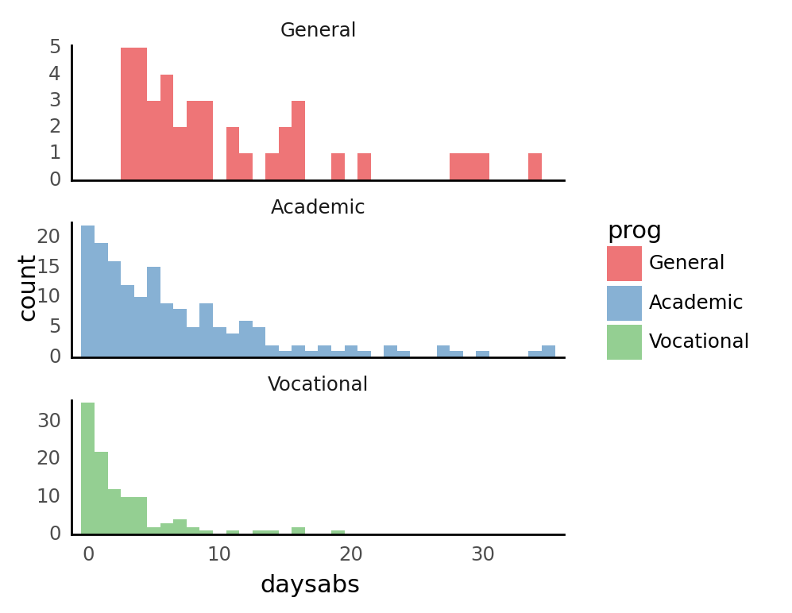

    <ggplot: (8758012180640)>

```python
school_data.groupby("prog").agg({"daysabs": ["mean", "std"]}).round(2)
```

<div>
<style scoped>
    .dataframe tbody tr th:only-of-type {
        vertical-align: middle;
    }

    .dataframe tbody tr th {
        vertical-align: top;
    }

    .dataframe thead tr th {
        text-align: left;
    }

    .dataframe thead tr:last-of-type th {
        text-align: right;
    }
</style>
<table border="1" class="dataframe">
  <thead>
    <tr>
      <th></th>
      <th colspan="2" halign="left">daysabs</th>
    </tr>
    <tr>
      <th></th>
      <th>mean</th>
      <th>std</th>
    </tr>
    <tr>
      <th>prog</th>
      <th></th>
      <th></th>
    </tr>
  </thead>
  <tbody>
    <tr>
      <th>General</th>
      <td>10.65</td>
      <td>8.20</td>
    </tr>
    <tr>
      <th>Academic</th>
      <td>6.93</td>
      <td>7.45</td>
    </tr>
    <tr>
      <th>Vocational</th>
      <td>2.67</td>
      <td>3.73</td>
    </tr>
  </tbody>
</table>
</div>

### Negative binomial regression

#### Using the GLM module in PyMC3

```python
def process_school_data_for_modeling(df: pd.DataFrame) -> dict[str, np.ndarray]:
    return {
        "x_math": df.math.values,
        "x_prog": pd.get_dummies(df.prog).values,
        "y_daysabs": df.daysabs.values,
    }
```

```python
model_data = process_school_data_for_modeling(school_data)
```

```python
with pm.Model() as nb:
    x_math_shared = pm.Data("x_math_shared", model_data["x_math"])
    x_prog_shared = pm.Data("x_prog_shared", model_data["x_prog"])
    y_daysabs_shared = pm.Data("y_daysabs_shared", model_data["y_daysabs"])

    β_math = pm.Normal("β_math", 0, 5)
    β_prog = pm.Normal("β_prog", 0, 5, shape=3)
    η = pm.Deterministic(
        "η", pm.math.dot(x_prog_shared, β_prog) + β_math * x_math_shared
    )
    μ = tt.exp(η)
    α = pm.HalfNormal("α", 5)
    daysabs = pm.NegativeBinomial("daysabs", μ, α, observed=y_daysabs_shared)
```

```python
pm.model_to_graphviz(nb)
```

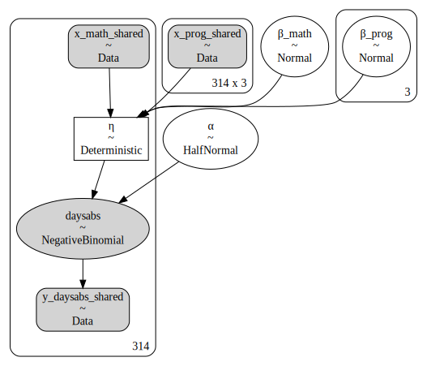

```python
with nb:
    nb_trace = pm.sample(
        draws=1000,
        tune=1000,
        chains=4,
        cores=2,
        random_seed=123,
        return_inferencedata=True,
    )
    ppc = pm.sample_posterior_predictive(nb_trace)
    nb_trace.extend(az.from_pymc3(posterior_predictive=ppc))
```

    Auto-assigning NUTS sampler...
    Initializing NUTS using jitter+adapt_diag...
    Multiprocess sampling (4 chains in 2 jobs)
    NUTS: [α, β_prog, β_math]

<div>
    <style>
        /*Turns off some styling*/
        progress {
            /*gets rid of default border in Firefox and Opera.*/
            border: none;
            /*Needs to be in here for Safari polyfill so background images work as expected.*/
            background-size: auto;
        }
        .progress-bar-interrupted, .progress-bar-interrupted::-webkit-progress-bar {
            background: #F44336;
        }
    </style>
  <progress value='8000' class='' max='8000' style='width:300px; height:20px; vertical-align: middle;'></progress>
  100.00% [8000/8000 00:17<00:00 Sampling 4 chains, 0 divergences]
</div>

    Sampling 4 chains for 1_000 tune and 1_000 draw iterations (4_000 + 4_000 draws total) took 18 seconds.

<div>
    <style>
        /*Turns off some styling*/
        progress {
            /*gets rid of default border in Firefox and Opera.*/
            border: none;
            /*Needs to be in here for Safari polyfill so background images work as expected.*/
            background-size: auto;
        }
        .progress-bar-interrupted, .progress-bar-interrupted::-webkit-progress-bar {
            background: #F44336;
        }
    </style>
  <progress value='4000' class='' max='4000' style='width:300px; height:20px; vertical-align: middle;'></progress>
  100.00% [4000/4000 00:39<00:00]
</div>

```python
main_vars = ["β_math", "β_prog", "α"]
az.plot_trace(nb_trace, var_names=main_vars);
```

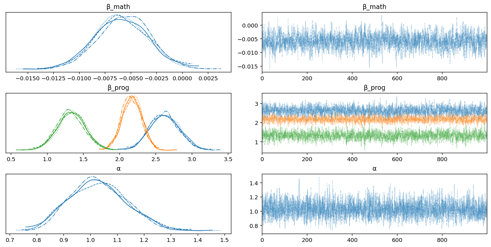

```python
az.summary(nb_trace, var_names=main_vars)
```

<div>
<style scoped>
    .dataframe tbody tr th:only-of-type {
        vertical-align: middle;
    }

    .dataframe tbody tr th {
        vertical-align: top;
    }

    .dataframe thead th {
        text-align: right;
    }
</style>
<table border="1" class="dataframe">
  <thead>
    <tr style="text-align: right;">
      <th></th>
      <th>mean</th>
      <th>sd</th>
      <th>hdi_3%</th>
      <th>hdi_97%</th>
      <th>mcse_mean</th>
      <th>mcse_sd</th>
      <th>ess_bulk</th>
      <th>ess_tail</th>
      <th>r_hat</th>
    </tr>
  </thead>
  <tbody>
    <tr>
      <th>β_math</th>
      <td>-0.006</td>
      <td>0.003</td>
      <td>-0.011</td>
      <td>-0.001</td>
      <td>0.000</td>
      <td>0.000</td>
      <td>1594.0</td>
      <td>2134.0</td>
      <td>1.0</td>
    </tr>
    <tr>
      <th>β_prog[0]</th>
      <td>2.621</td>
      <td>0.201</td>
      <td>2.265</td>
      <td>3.005</td>
      <td>0.004</td>
      <td>0.003</td>
      <td>2085.0</td>
      <td>2577.0</td>
      <td>1.0</td>
    </tr>
    <tr>
      <th>β_prog[1]</th>
      <td>2.170</td>
      <td>0.135</td>
      <td>1.938</td>
      <td>2.447</td>
      <td>0.003</td>
      <td>0.002</td>
      <td>1834.0</td>
      <td>2366.0</td>
      <td>1.0</td>
    </tr>
    <tr>
      <th>β_prog[2]</th>
      <td>1.330</td>
      <td>0.190</td>
      <td>0.978</td>
      <td>1.695</td>
      <td>0.004</td>
      <td>0.003</td>
      <td>1846.0</td>
      <td>2415.0</td>
      <td>1.0</td>
    </tr>
    <tr>
      <th>α</th>
      <td>1.030</td>
      <td>0.107</td>
      <td>0.838</td>
      <td>1.228</td>
      <td>0.002</td>
      <td>0.001</td>
      <td>2942.0</td>
      <td>2384.0</td>
      <td>1.0</td>
    </tr>
  </tbody>
</table>
</div>

Below are the results from the IDRE example using the following model.

```r
m1 <- glm.nb(daysabs ~ math + prog, data = dat)
summary(m1)
```

```
## Call:
## glm.nb(formula = daysabs ~ math + prog, data = dat, init.theta = 1.032713156,
##     link = log)
##
## Deviance Residuals:
##    Min      1Q  Median      3Q     Max
## -2.155  -1.019  -0.369   0.229   2.527
##
## Coefficients:
##                Estimate Std. Error z value Pr(>|z|)
## (Intercept)     2.61527    0.19746   13.24  < 2e-16 ***
## math           -0.00599    0.00251   -2.39    0.017 *
## progAcademic   -0.44076    0.18261   -2.41    0.016 *
## progVocational -1.27865    0.20072   -6.37  1.9e-10 ***
## ---
## Signif. codes:  0 '***' 0.001 '**' 0.01 '*' 0.05 '.' 0.1 ' ' 1
##
## (Dispersion parameter for Negative Binomial(1.033) family taken to be 1)
##
##     Null deviance: 427.54  on 313  degrees of freedom
## Residual deviance: 358.52  on 310  degrees of freedom
## AIC: 1741
##
## Number of Fisher Scoring iterations: 1
##
##
##               Theta:  1.033
##           Std. Err.:  0.106
##
##  2 x log-likelihood:  -1731.258
```

All of the MAP values in my NB model are the same as the point estimates in their model.
In their example, the other categories for `prog` are separate values *in addition* to the intercept, but in my model, there are three varying intercepts.
In other words, to get the effect for `prog = Academic`, in the IDRE model add `progAcademic + (Intercept)`, but in my NB model, it is just `β_prog[1]`.

```python
az.plot_posterior(nb_trace, var_names=main_vars, hdi_prob=0.89);
```

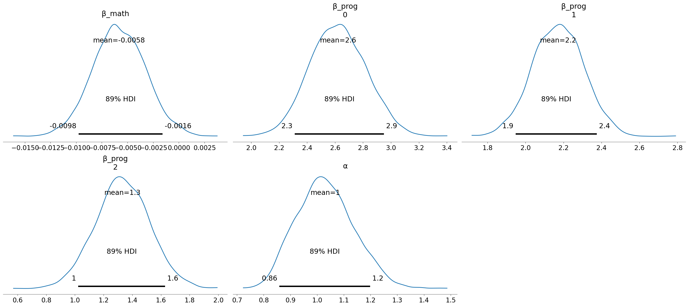

```python
def down_sample_ppc(ppc_ary: np.ndarray, n: int) -> tuple[np.ndarray, np.ndarray]:
    r_idx = np.arange(ppc_ary.shape[1])
    np.random.shuffle(r_idx)
    return ppc_ary[:, r_idx[:n]], r_idx
```

```python
ppc_sample, _ = down_sample_ppc(ppc["daysabs"], n=50)
ppc_df = pd.DataFrame(ppc_sample).pivot_longer(names_to="ppc_idx", values_to="draw")

(
    gg.ggplot(ppc_df, gg.aes(x="draw"))
    + gg.geom_density(gg.aes(group="ppc_idx"), linetype="--", size=0.1)
    + gg.geom_density(gg.aes(x="daysabs"), data=school_data, color="b", size=1)
    + gg.scale_y_continuous(expand=(0, 0, 0.02, 0))
    + gg.scale_x_continuous(limits=(0, 50), expand=(0, 0.1, 0, 0))
)
```

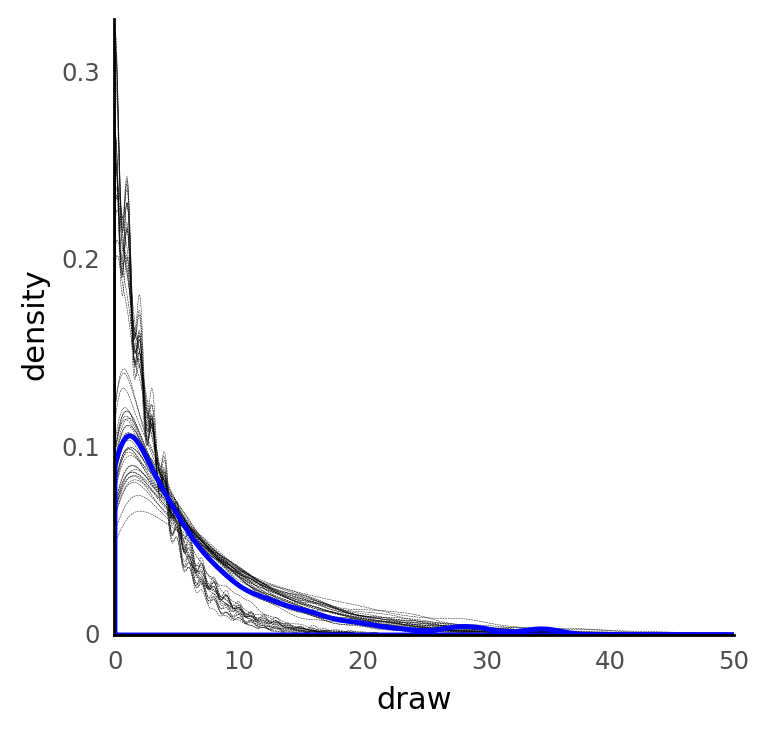

    <ggplot: (8757997521740)>

```python
num_samples = 100
ppc_sample, r_idx = down_sample_ppc(ppc["daysabs"], n=num_samples)
ppc_counts_df = (
    pd.DataFrame(ppc_sample)
    .assign(prog=school_data.prog[r_idx[:num_samples]])
    .pivot_longer(index="prog", names_to="ppc_idx", values_to="draw")
    .assign(x=0)
    .groupby(["prog", "ppc_idx", "draw"])
    .count()
    .reset_index(drop=False)
)

real_counts = school_data.groupby(["prog", "daysabs"]).count().reset_index(drop=False)

(
    gg.ggplot(ppc_counts_df)
    + gg.facet_grid(". ~ prog")
    + gg.geom_point(gg.aes(x="x", y="draw", color="prog"), size=0.2, alpha=0.1)
    + gg.geom_line(
        gg.aes(x="daysabs", color="prog", y="id"),
        data=real_counts,
        size=0.6,
        alpha=0.9,
    )
    + gg.scale_y_continuous(expand=(0, 0, 0.02, 0))
    + gg.scale_x_continuous(limits=(0, 50), expand=(0.02, 0, 0, 0))
    + gg.scale_color_brewer(type="qual", palette="Set1")
    + gg.theme(figure_size=(8, 4), legend_position="none")
    + gg.labs(x="number of days absent", y="count")
)
```

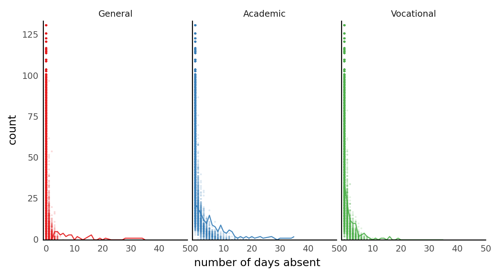

    <ggplot: (8757997448991)>

```python
az.plot_ppc(nb_trace, num_pp_samples=100, kind="scatter");
```

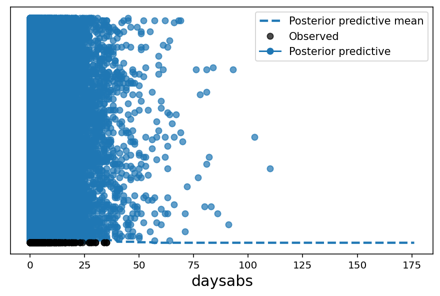

I next want to replicate their plot shown below.
It is showing the effect of the math score on number of days absent for each program.

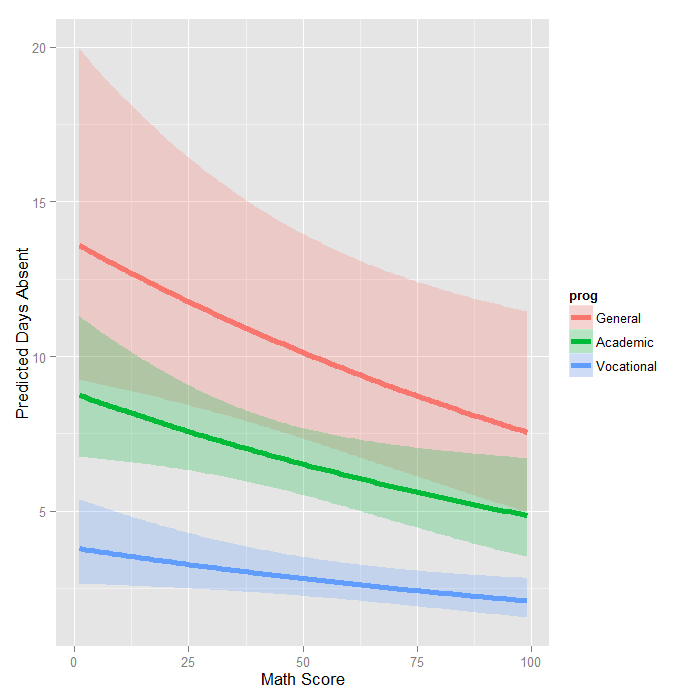

```python
math_scores = np.arange(school_data.math.min(), school_data.math.max(), step=0.1)
newdata = pd.DataFrame(
    {
        "prog": np.repeat(list(program_cat.values()), len(math_scores)),
        "math": np.tile(math_scores, len(program_cat)),
        "daysabs": 0,
    }
)
newdata["prog"] = pd.Categorical(
    newdata["prog"], categories=program_cat.values(), ordered=True
)

newdata.head()
```

<div>
<style scoped>
    .dataframe tbody tr th:only-of-type {
        vertical-align: middle;
    }

    .dataframe tbody tr th {
        vertical-align: top;
    }

    .dataframe thead th {
        text-align: right;
    }
</style>
<table border="1" class="dataframe">
  <thead>
    <tr style="text-align: right;">
      <th></th>
      <th>prog</th>
      <th>math</th>
      <th>daysabs</th>
    </tr>
  </thead>
  <tbody>
    <tr>
      <th>0</th>
      <td>General</td>
      <td>1.0</td>
      <td>0</td>
    </tr>
    <tr>
      <th>1</th>
      <td>General</td>
      <td>1.1</td>
      <td>0</td>
    </tr>
    <tr>
      <th>2</th>
      <td>General</td>
      <td>1.2</td>
      <td>0</td>
    </tr>
    <tr>
      <th>3</th>
      <td>General</td>
      <td>1.3</td>
      <td>0</td>
    </tr>
    <tr>
      <th>4</th>
      <td>General</td>
      <td>1.4</td>
      <td>0</td>
    </tr>
  </tbody>
</table>
</div>

```python
newdata_processed = process_school_data_for_modeling(newdata)
with nb:
    pm.set_data(
        {
            "x_math_shared": newdata_processed["x_math"],
            "x_prog_shared": newdata_processed["x_prog"],
        }
    )
    daysabs_post_pred = pm.sample_posterior_predictive(nb_trace, var_names=["daysabs"])
    eta_post_pred = pm.sample_posterior_predictive(nb_trace, var_names=["η"])
```

<div>
    <style>
        /*Turns off some styling*/
        progress {
            /*gets rid of default border in Firefox and Opera.*/
            border: none;
            /*Needs to be in here for Safari polyfill so background images work as expected.*/
            background-size: auto;
        }
        .progress-bar-interrupted, .progress-bar-interrupted::-webkit-progress-bar {
            background: #F44336;
        }
    </style>
  <progress value='4000' class='' max='4000' style='width:300px; height:20px; vertical-align: middle;'></progress>
  100.00% [4000/4000 00:52<00:00]
</div>

<div>
    <style>
        /*Turns off some styling*/
        progress {
            /*gets rid of default border in Firefox and Opera.*/
            border: none;
            /*Needs to be in here for Safari polyfill so background images work as expected.*/
            background-size: auto;
        }
        .progress-bar-interrupted, .progress-bar-interrupted::-webkit-progress-bar {
            background: #F44336;
        }
    </style>
  <progress value='4000' class='' max='4000' style='width:300px; height:20px; vertical-align: middle;'></progress>
  100.00% [4000/4000 00:01<00:00]
</div>

```python
post_pred_df = (
    pmanal.summarize_posterior_predictions(
        daysabs_post_pred["daysabs"], merge_with=newdata, observed_y="daysabs"
    )
    .drop("daysabs", axis=1)
    .rename(
        columns={
            "pred_mean": "pred_daysabs_mean",
            "pred_hdi_low": "pred_daysabs_low",
            "pred_hdi_high": "pred_daysabs_high",
        }
    )
)

eta_post_pred = pmanal.summarize_posterior_predictions(eta_post_pred["η"]).rename(
    columns={
        "pred_mean": "pred_eta_mean",
        "pred_hdi_low": "pred_eta_low",
        "pred_hdi_high": "pred_eta_high",
    }
)

post_pred_df = pd.concat([post_pred_df, eta_post_pred], axis=1)
post_pred_df.head()
```

    /home/jc604/.conda/envs/speclet/lib/python3.9/site-packages/arviz/stats/stats.py:456: FutureWarning: hdi currently interprets 2d data as (draw, shape) but this will change in a future release to (chain, draw) for coherence with other functions

<div>
<style scoped>
    .dataframe tbody tr th:only-of-type {
        vertical-align: middle;
    }

    .dataframe tbody tr th {
        vertical-align: top;
    }

    .dataframe thead th {
        text-align: right;
    }
</style>
<table border="1" class="dataframe">
  <thead>
    <tr style="text-align: right;">
      <th></th>
      <th>pred_daysabs_mean</th>
      <th>pred_daysabs_low</th>
      <th>pred_daysabs_high</th>
      <th>prog</th>
      <th>math</th>
      <th>pred_eta_mean</th>
      <th>pred_eta_low</th>
      <th>pred_eta_high</th>
    </tr>
  </thead>
  <tbody>
    <tr>
      <th>0</th>
      <td>13.85025</td>
      <td>0.0</td>
      <td>31.0</td>
      <td>General</td>
      <td>1.0</td>
      <td>2.615305</td>
      <td>2.305643</td>
      <td>2.940035</td>
    </tr>
    <tr>
      <th>1</th>
      <td>13.82975</td>
      <td>0.0</td>
      <td>31.0</td>
      <td>General</td>
      <td>1.1</td>
      <td>2.614722</td>
      <td>2.305129</td>
      <td>2.939085</td>
    </tr>
    <tr>
      <th>2</th>
      <td>14.35650</td>
      <td>0.0</td>
      <td>32.0</td>
      <td>General</td>
      <td>1.2</td>
      <td>2.614139</td>
      <td>2.304536</td>
      <td>2.938134</td>
    </tr>
    <tr>
      <th>3</th>
      <td>14.72900</td>
      <td>0.0</td>
      <td>33.0</td>
      <td>General</td>
      <td>1.3</td>
      <td>2.613556</td>
      <td>2.303917</td>
      <td>2.937240</td>
    </tr>
    <tr>
      <th>4</th>
      <td>13.85375</td>
      <td>0.0</td>
      <td>32.0</td>
      <td>General</td>
      <td>1.4</td>
      <td>2.612973</td>
      <td>2.303298</td>
      <td>2.936693</td>
    </tr>
  </tbody>
</table>
</div>

```python
(
    gg.ggplot(post_pred_df, gg.aes(x="math"))
    + gg.geom_ribbon(
        gg.aes(ymin="np.exp(pred_eta_low)", ymax="np.exp(pred_eta_high)", fill="prog"),
        alpha=0.25,
    )
    + gg.geom_line(gg.aes(y="np.exp(pred_eta_mean)", color="prog"), size=1.2)
    + gg.scale_x_continuous(expand=(0, 0))
    + gg.scale_y_continuous(limits=(0, None), expand=(0, 0, 0.02, 0))
    + gg.scale_color_brewer(type="qual", palette="Set1")
    + gg.scale_fill_brewer(type="qual", palette="Set1")
    + gg.labs(
        x="math score",
        y="effect on days absent",
        fill="program",
        color="program",
        title="Estimated effects (95% CI)",
    )
)
```

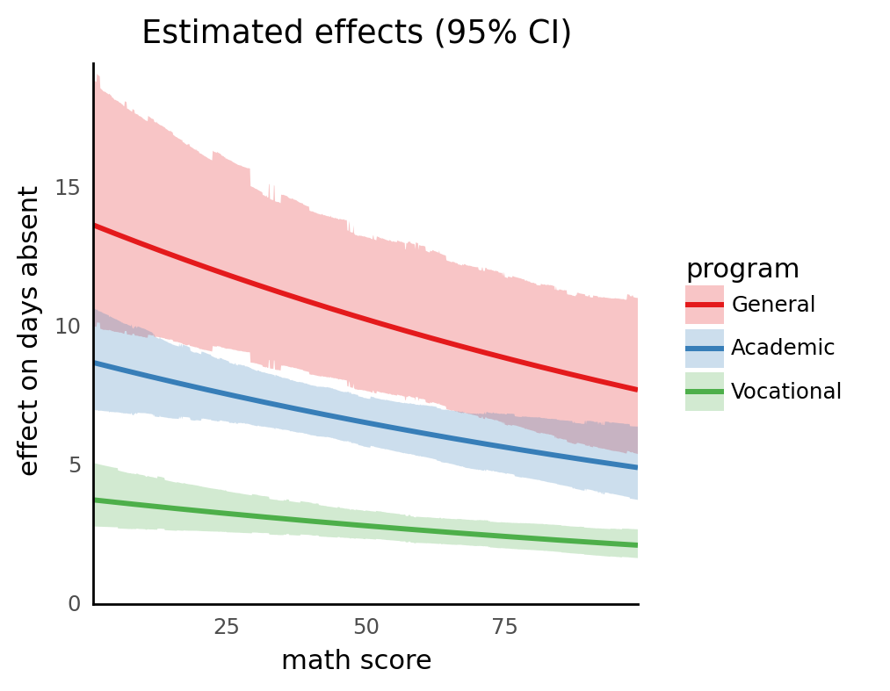

    <ggplot: (8757999736119)>

```python
(
    gg.ggplot(post_pred_df, gg.aes(x="math"))
    + gg.facet_grid("prog ~")
    + gg.geom_ribbon(
        gg.aes(ymin="pred_daysabs_low", ymax="pred_daysabs_high", fill="prog"),
        alpha=0.2,
    )
    + gg.geom_line(gg.aes(y="pred_daysabs_mean", color="prog"))
    + gg.scale_x_continuous(expand=(0, 0))
    + gg.scale_y_continuous(limits=(0, None), expand=(0, 0, 0.02, 0))
    + gg.scale_color_brewer(type="qual", palette="Set1")
    + gg.scale_fill_brewer(type="qual", palette="Set1")
    + gg.theme(legend_position="none")
    + gg.labs(
        x="math score",
        y="predicted days absent",
        fill="program",
        color="program",
        title="Posterior predicted days absent (95% CI)",
    )
)
```

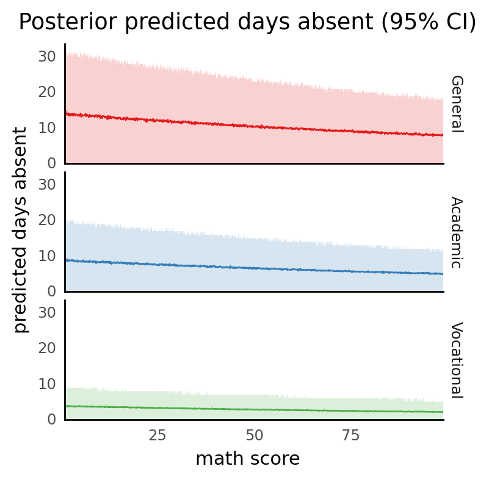

    <ggplot: (8757998681558)>

## Examples: Roaches

source: ['rstanarm' vignette: "Estimating Generalized Linear Models for Count Data with rstanarm"](http://mc-stan.org/rstanarm/articles/count.html)

```python
roaches_path = data_io.project_root_dir() / "data" / "rstanarm" / "roaches.csv"
roaches = pd.read_csv(roaches_path)
roaches.head()
```

<div>
<style scoped>
    .dataframe tbody tr th:only-of-type {
        vertical-align: middle;
    }

    .dataframe tbody tr th {
        vertical-align: top;
    }

    .dataframe thead th {
        text-align: right;
    }
</style>
<table border="1" class="dataframe">
  <thead>
    <tr style="text-align: right;">
      <th></th>
      <th>y</th>
      <th>roach1</th>
      <th>treatment</th>
      <th>senior</th>
      <th>exposure2</th>
    </tr>
  </thead>
  <tbody>
    <tr>
      <th>0</th>
      <td>153</td>
      <td>308.00</td>
      <td>1</td>
      <td>0</td>
      <td>0.800000</td>
    </tr>
    <tr>
      <th>1</th>
      <td>127</td>
      <td>331.25</td>
      <td>1</td>
      <td>0</td>
      <td>0.600000</td>
    </tr>
    <tr>
      <th>2</th>
      <td>7</td>
      <td>1.67</td>
      <td>1</td>
      <td>0</td>
      <td>1.000000</td>
    </tr>
    <tr>
      <th>3</th>
      <td>7</td>
      <td>3.00</td>
      <td>1</td>
      <td>0</td>
      <td>1.000000</td>
    </tr>
    <tr>
      <th>4</th>
      <td>0</td>
      <td>2.00</td>
      <td>1</td>
      <td>0</td>
      <td>1.142857</td>
    </tr>
  </tbody>
</table>
</div>

Model from the vignette:

```r
stan_glm1 <- stan_glm(
    y ~ roach1 + treatment + senior, offset = log(exposure2),
    data = roaches, family = neg_binomial_2,
    prior = normal(0, 2.5),
    prior_intercept = normal(0, 5),
    seed = 12345
)
```

Results:

|   |Parameter             | Median|   CI| CI_low| CI_high|    pd| ROPE_CI| ROPE_low| ROPE_high| ROPE_Percentage|  Rhat|      ESS|
|:--|:---------------------|------:|----:|------:|-------:|-----:|-------:|--------:|---------:|---------------:|-----:|--------:|
|1  |(Intercept)           |  2.845| 0.89|  2.483|   3.224| 1.000|    0.95|     -0.1|       0.1|           0.000| 1.000| 5605.984|
|3  |roach1                |  1.309| 0.89|  0.920|   1.708| 1.000|    0.95|     -0.1|       0.1|           0.000| 1.000| 5041.104|
|5  |treatment             | -0.774| 0.89| -1.147|  -0.337| 0.999|    0.95|     -0.1|       0.1|           0.000| 0.999| 6094.182|
|4  |senior                | -0.329| 0.89| -0.768|   0.063| 0.898|    0.95|     -0.1|       0.1|           0.145| 1.000| 5543.693|
|2  |reciprocal_dispersion |  0.271| 0.89|  0.230|   0.314| 1.000|    0.95|     -0.1|       0.1|           0.000| 1.000| 5732.929|

```python
roaches.senior.unique()
```

    array([0, 1])

```python
roaches.treatment.unique()
```

    array([1, 0])

```python
roaches.describe()
```

<div>
<style scoped>
    .dataframe tbody tr th:only-of-type {
        vertical-align: middle;
    }

    .dataframe tbody tr th {
        vertical-align: top;
    }

    .dataframe thead th {
        text-align: right;
    }
</style>
<table border="1" class="dataframe">
  <thead>
    <tr style="text-align: right;">
      <th></th>
      <th>y</th>
      <th>roach1</th>
      <th>treatment</th>
      <th>senior</th>
      <th>exposure2</th>
    </tr>
  </thead>
  <tbody>
    <tr>
      <th>count</th>
      <td>262.000000</td>
      <td>262.000000</td>
      <td>262.000000</td>
      <td>262.000000</td>
      <td>262.000000</td>
    </tr>
    <tr>
      <th>mean</th>
      <td>25.648855</td>
      <td>42.193473</td>
      <td>0.603053</td>
      <td>0.305344</td>
      <td>1.021047</td>
    </tr>
    <tr>
      <th>std</th>
      <td>50.846539</td>
      <td>75.261969</td>
      <td>0.490201</td>
      <td>0.461434</td>
      <td>0.320757</td>
    </tr>
    <tr>
      <th>min</th>
      <td>0.000000</td>
      <td>0.000000</td>
      <td>0.000000</td>
      <td>0.000000</td>
      <td>0.200000</td>
    </tr>
    <tr>
      <th>25%</th>
      <td>0.000000</td>
      <td>1.000000</td>
      <td>0.000000</td>
      <td>0.000000</td>
      <td>1.000000</td>
    </tr>
    <tr>
      <th>50%</th>
      <td>3.000000</td>
      <td>7.000000</td>
      <td>1.000000</td>
      <td>0.000000</td>
      <td>1.000000</td>
    </tr>
    <tr>
      <th>75%</th>
      <td>24.000000</td>
      <td>50.500000</td>
      <td>1.000000</td>
      <td>1.000000</td>
      <td>1.000000</td>
    </tr>
    <tr>
      <th>max</th>
      <td>357.000000</td>
      <td>450.000000</td>
      <td>1.000000</td>
      <td>1.000000</td>
      <td>4.285714</td>
    </tr>
  </tbody>
</table>
</div>

```python
(
    gg.ggplot(roaches, gg.aes(x="roach1", y="y"))
    + gg.facet_wrap("~ senior")
    + gg.geom_point(gg.aes(color="factor(treatment)"), alpha=0.5)
    + gg.scale_color_brewer(type="qual", palette="Set1")
    + gg.scale_x_continuous(expand=(0.01, 0, 0.02, 0))
    + gg.scale_y_continuous(expand=(0.01, 0, 0.02, 0))
    + gg.theme(figure_size=(8, 4))
)
```

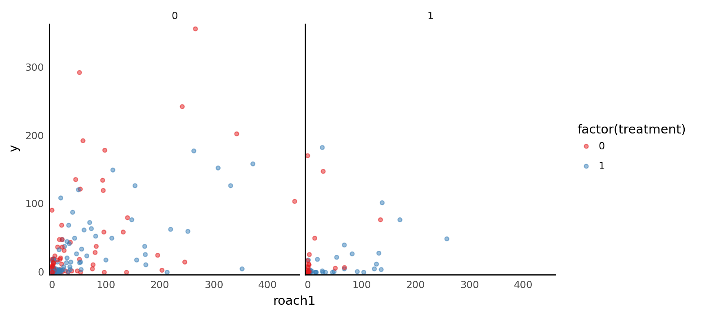

    <ggplot: (8757999514393)>

```python
with pm.Model() as roach_nb:
    α = pm.HalfNormal("α", 5)
    β_treat = pm.Normal("β_treat", 0, 2.5)
    β_senior = pm.Normal("β_senior", 0, 2.5)
    β_roach = pm.Normal("β_roach", 0, 2.5)
    β = pm.Normal("β", 0, 5)
    η = pm.Deterministic(
        "η",
        β
        + β_roach * (roaches.roach1.values / 100.0)
        + β_treat * roaches.treatment.values
        + β_senior * roaches.senior.values,
    )
    μ = pm.Deterministic("μ", pm.math.exp(η) * roaches.exposure2.values)
    y = pm.NegativeBinomial("y", μ, α, observed=roaches.y.values)
```

```python
pm.model_to_graphviz(roach_nb)
```

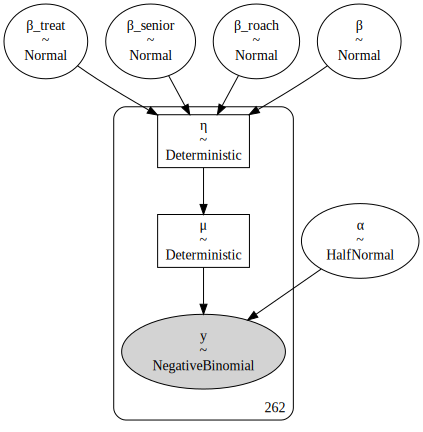

```python
with roach_nb:
    roach_trace = pm.sample(chains=4, random_seed=349, return_inferencedata=True)
    roach_ppc = pm.sample_posterior_predictive(roach_trace, random_seed=353)
    roach_trace.extend(az.from_pymc3(posterior_predictive=roach_ppc))
```

    Auto-assigning NUTS sampler...
    Initializing NUTS using jitter+adapt_diag...
    Multiprocess sampling (4 chains in 4 jobs)
    NUTS: [β, β_roach, β_senior, β_treat, α]

<div>
    <style>
        /*Turns off some styling*/
        progress {
            /*gets rid of default border in Firefox and Opera.*/
            border: none;
            /*Needs to be in here for Safari polyfill so background images work as expected.*/
            background-size: auto;
        }
        .progress-bar-interrupted, .progress-bar-interrupted::-webkit-progress-bar {
            background: #F44336;
        }
    </style>
  <progress value='8000' class='' max='8000' style='width:300px; height:20px; vertical-align: middle;'></progress>
  100.00% [8000/8000 00:06<00:00 Sampling 4 chains, 0 divergences]
</div>

    Sampling 4 chains for 1_000 tune and 1_000 draw iterations (4_000 + 4_000 draws total) took 7 seconds.

<div>
    <style>
        /*Turns off some styling*/
        progress {
            /*gets rid of default border in Firefox and Opera.*/
            border: none;
            /*Needs to be in here for Safari polyfill so background images work as expected.*/
            background-size: auto;
        }
        .progress-bar-interrupted, .progress-bar-interrupted::-webkit-progress-bar {
            background: #F44336;
        }
    </style>
  <progress value='4000' class='' max='4000' style='width:300px; height:20px; vertical-align: middle;'></progress>
  100.00% [4000/4000 00:04<00:00]
</div>

```python
az.summary(roach_trace, var_names=["β", "α"], filter_vars="like", hdi_prob=0.89)
```

<div>
<style scoped>
    .dataframe tbody tr th:only-of-type {
        vertical-align: middle;
    }

    .dataframe tbody tr th {
        vertical-align: top;
    }

    .dataframe thead th {
        text-align: right;
    }
</style>
<table border="1" class="dataframe">
  <thead>
    <tr style="text-align: right;">
      <th></th>
      <th>mean</th>
      <th>sd</th>
      <th>hdi_5.5%</th>
      <th>hdi_94.5%</th>
      <th>mcse_mean</th>
      <th>mcse_sd</th>
      <th>ess_bulk</th>
      <th>ess_tail</th>
      <th>r_hat</th>
    </tr>
  </thead>
  <tbody>
    <tr>
      <th>β_treat</th>
      <td>-0.773</td>
      <td>0.250</td>
      <td>-1.181</td>
      <td>-0.387</td>
      <td>0.004</td>
      <td>0.003</td>
      <td>3229.0</td>
      <td>2576.0</td>
      <td>1.0</td>
    </tr>
    <tr>
      <th>β_senior</th>
      <td>-0.323</td>
      <td>0.271</td>
      <td>-0.774</td>
      <td>0.100</td>
      <td>0.005</td>
      <td>0.004</td>
      <td>3292.0</td>
      <td>2467.0</td>
      <td>1.0</td>
    </tr>
    <tr>
      <th>β_roach</th>
      <td>1.314</td>
      <td>0.247</td>
      <td>0.914</td>
      <td>1.694</td>
      <td>0.004</td>
      <td>0.003</td>
      <td>3762.0</td>
      <td>2510.0</td>
      <td>1.0</td>
    </tr>
    <tr>
      <th>β</th>
      <td>2.845</td>
      <td>0.239</td>
      <td>2.484</td>
      <td>3.241</td>
      <td>0.005</td>
      <td>0.003</td>
      <td>2645.0</td>
      <td>2214.0</td>
      <td>1.0</td>
    </tr>
    <tr>
      <th>α</th>
      <td>0.273</td>
      <td>0.026</td>
      <td>0.231</td>
      <td>0.314</td>
      <td>0.000</td>
      <td>0.000</td>
      <td>3409.0</td>
      <td>2105.0</td>
      <td>1.0</td>
    </tr>
  </tbody>
</table>
</div>

```python
az.plot_trace(roach_trace, var_names=["β", "α"], filter_vars="like", compact=False);
```

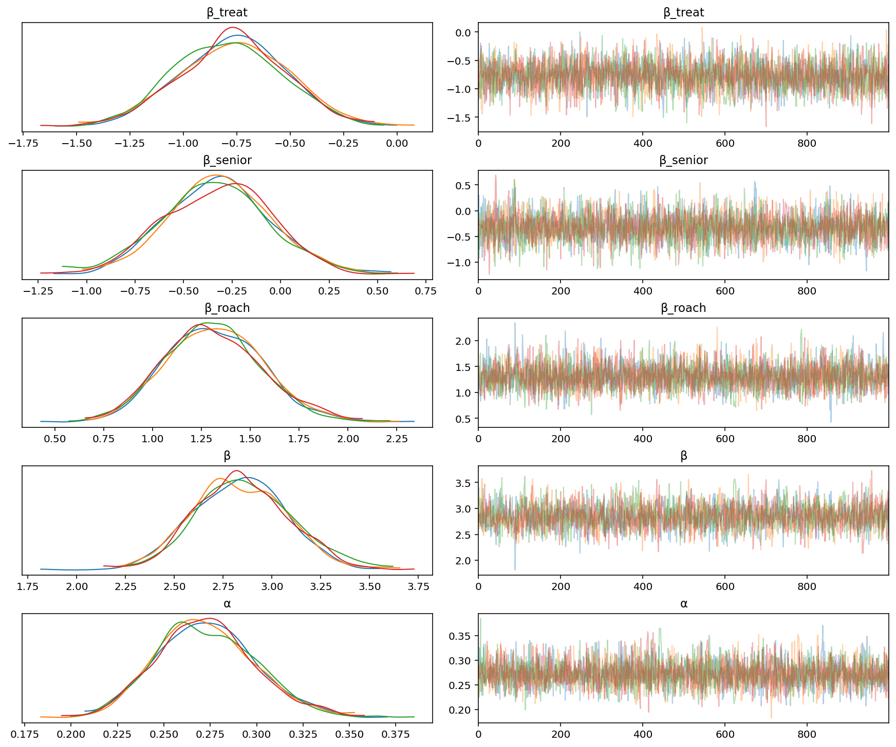

```python
ppc_prop_zero = pd.DataFrame({"prop_zero": (roach_ppc["y"] == 0).mean(axis=0)})
obs_prop_zero = np.mean(roaches.y == 0)
(
    gg.ggplot(ppc_prop_zero, gg.aes(x="prop_zero"))
    + gg.geom_histogram(
        color="#BBD2E3", fill="#BBD2E3", alpha=0.5, binwidth=0.01, size=0.5
    )
    + gg.geom_vline(xintercept=obs_prop_zero, color="#011F4B", size=1.2)
    + gg.scale_x_continuous(expand=(0, 0))
    + gg.scale_y_continuous(expand=(0, 0, 0.02, 0))
    + gg.theme_classic()
    + gg.labs(x="proportion of zeros", y="count")
)
```

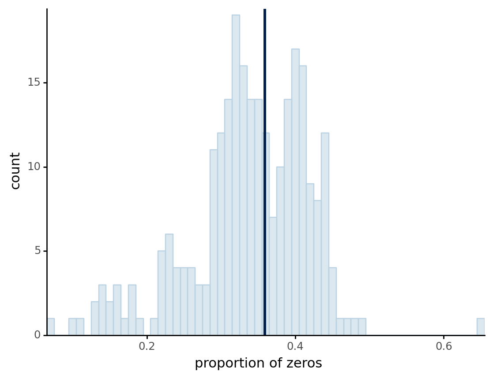

    <ggplot: (8757997710951)>

---

```python
notebook_toc = time()
print(f"execution time: {(notebook_toc - notebook_tic) / 60:.2f} minutes")
```

    execution time: 3.74 minutes

```python
%load_ext watermark
%watermark -d -u -v -iv -b -h -m
```

    Last updated: 2021-10-04

    Python implementation: CPython
    Python version       : 3.9.6
    IPython version      : 7.26.0

    Compiler    : GCC 9.3.0
    OS          : Linux
    Release     : 3.10.0-1062.el7.x86_64
    Machine     : x86_64
    Processor   : x86_64
    CPU cores   : 32
    Architecture: 64bit

    Hostname: compute-a-16-37.o2.rc.hms.harvard.edu

    Git branch: master

    re        : 2.2.1
    janitor   : 0.21.0
    pymc3     : 3.11.2
    matplotlib: 3.4.3
    seaborn   : 0.11.2
    numpy     : 1.21.2
    plotnine  : 0.8.0
    theano    : 1.0.5
    pandas    : 1.3.2
    arviz     : 0.11.2

```python

```
