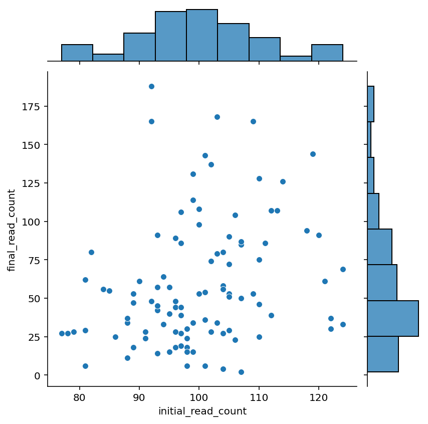
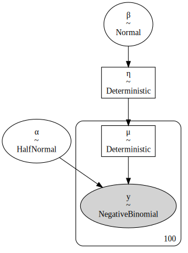
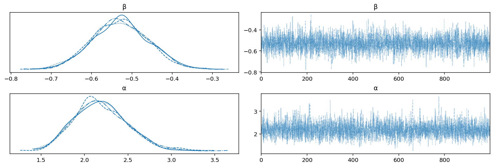
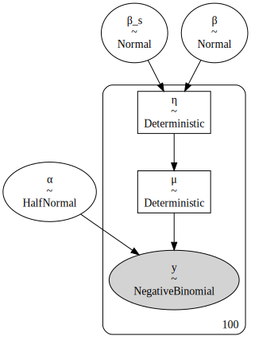
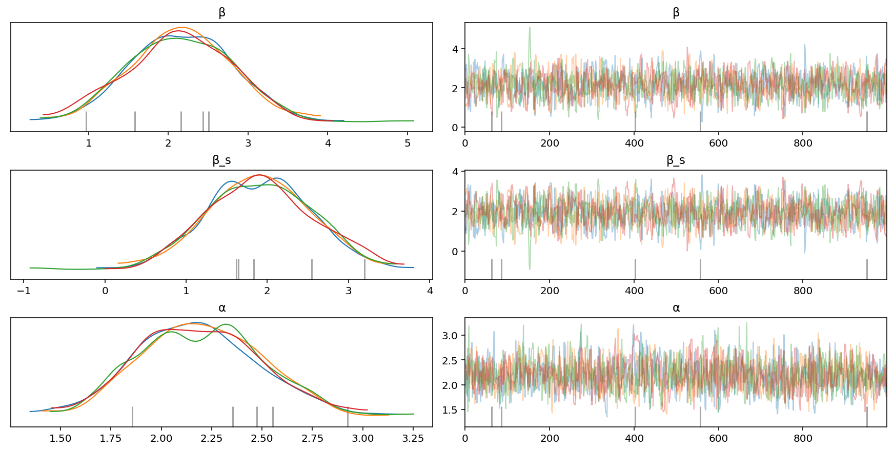
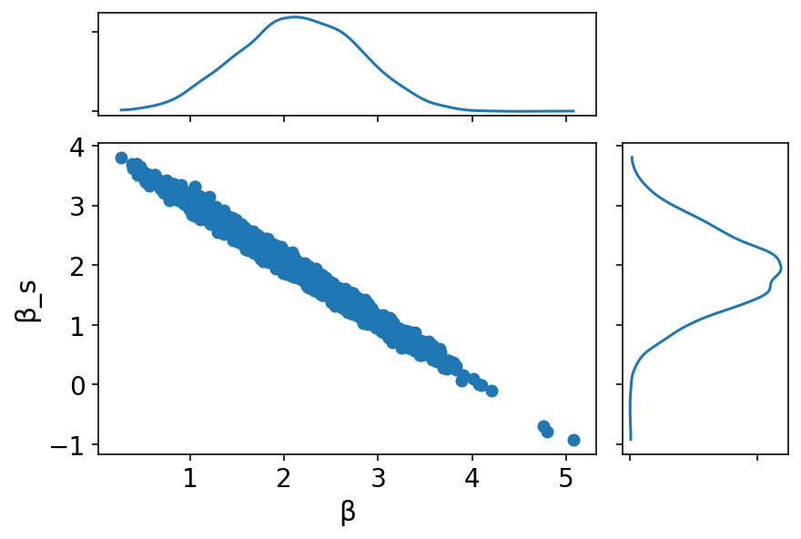
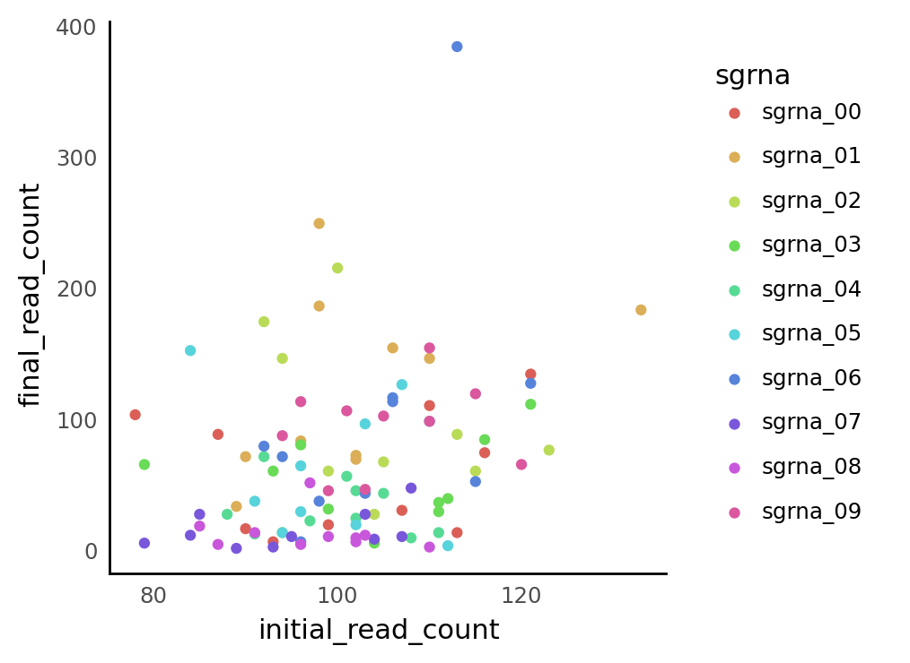
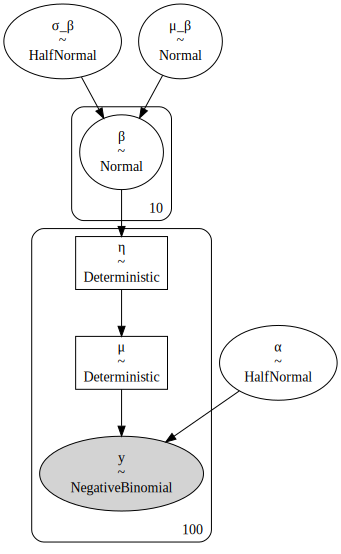
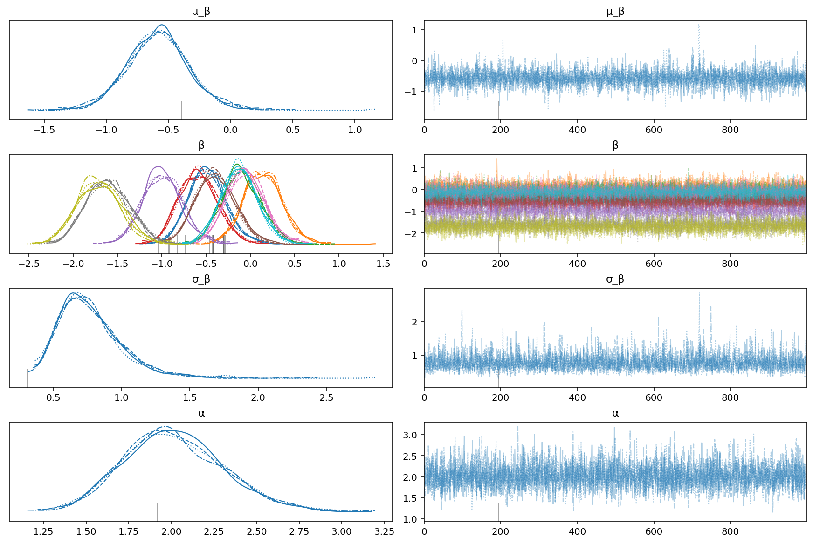

# Negative binomial modeling of simulated CRISPR screen data

```python
%load_ext autoreload
%autoreload 2
```

```python
import re
import string
import warnings
from pathlib import Path
from time import time
from typing import Any, Union

import arviz as az
import matplotlib.colors as mcolors
import matplotlib.pyplot as plt
import numpy as np
import pandas as pd
import plotnine as gg
import pymc3 as pm
import seaborn as sns
from scipy import stats
from theano import tensor as tt
```

    WARNING (theano.tensor.blas): Using NumPy C-API based implementation for BLAS functions.

```python
from src.analysis import pymc3_analysis as pmanal
from src.data_processing import achilles as achelp
from src.data_processing import common as dphelp
from src.globals import PYMC3
from src.io import cache_io
from src.loggers import logger
from src.modeling import pymc3_sampling_api as pmapi
from src.plot.color_pal import FitMethodColors, ModelColors, SeabornColor
```

```python
notebook_tic = time()

warnings.simplefilter(action="ignore", category=UserWarning)

gg.theme_set(
    gg.theme_classic()
    + gg.theme(
        figure_size=(4, 4),
        axis_ticks_major=gg.element_blank(),
        strip_background=gg.element_blank(),
    )
)
%config InlineBackend.figure_format = "retina"

RANDOM_SEED = 1042
np.random.seed(RANDOM_SEED)
```

sources of simulated NB data:

- [PyMC3 docs: "GLM: Negative Binomial Regression"](https://docs.pymc.io/pymc-examples/examples/generalized_linear_models/GLM-negative-binomial-regression.html)

```python
def get_nb_vals(
    mu: float, alpha: float, size: Union[int, tuple[int, ...]]
) -> np.ndarray:
    """Generate negative binomially distributed samples by
    drawing a sample from a gamma distribution with mean `mu` and
    shape parameter `alpha', then drawing from a Poisson
    distribution whose rate parameter is given by the sampled
    gamma variable.

    """

    g = stats.gamma.rvs(alpha, scale=mu / alpha, size=size)
    return stats.poisson.rvs(g)
```

## Simulation 1. Single sgRNA

```python
n = 100  # number simulated data points

# Simulation parameters.
sim1: dict[str, Any] = {"β": -0.5, "α": 2.0}

# Simulated data.
sim1_data = pd.DataFrame({"initial_read_count": np.random.poisson(100, n)})
sim1_data["initial_read_count_log"] = np.log(sim1_data)
eta = sim1["β"]

mu = np.exp(eta) * sim1_data["initial_read_count"]
sim1_data["final_read_count"] = [
    get_nb_vals(mu[i], sim1["α"], size=1) for i in range(n)
]

sim1_data.head()
```

<div>
<style scoped>
    .dataframe tbody tr th:only-of-type {
        vertical-align: middle;
    }

    .dataframe tbody tr th {
        vertical-align: top;
    }

    .dataframe thead th {
        text-align: right;
    }
</style>
<table border="1" class="dataframe">
  <thead>
    <tr style="text-align: right;">
      <th></th>
      <th>initial_read_count</th>
      <th>initial_read_count_log</th>
      <th>final_read_count</th>
    </tr>
  </thead>
  <tbody>
    <tr>
      <th>0</th>
      <td>95</td>
      <td>4.553877</td>
      <td>15</td>
    </tr>
    <tr>
      <th>1</th>
      <td>110</td>
      <td>4.700480</td>
      <td>128</td>
    </tr>
    <tr>
      <th>2</th>
      <td>122</td>
      <td>4.804021</td>
      <td>37</td>
    </tr>
    <tr>
      <th>3</th>
      <td>88</td>
      <td>4.477337</td>
      <td>34</td>
    </tr>
    <tr>
      <th>4</th>
      <td>124</td>
      <td>4.820282</td>
      <td>33</td>
    </tr>
  </tbody>
</table>
</div>

```python
sns.jointplot(data=sim1_data, x="initial_read_count", y="final_read_count");
```



Simulation 1 model `sim1_model`:

$$
\begin{gather}
\beta \sim N(0, 2) \\
\eta = \beta
\end{gather}
$$

Simulation 1 model `sim1_model`:

$$
\begin{aligned}
\beta &\sim N(0, 2) \\
\eta &= \beta \\
\mu &= \exp(\eta) \times \text{initial read counts} \\
\alpha &\sim \text{HalfNormal}(0, 5) \\
y &\sim \text{NB}(\mu, \alpha)
\end{aligned}
$$

```python
with pm.Model() as sim1_model:
    β = pm.Normal("β", 0, 2)
    η = pm.Deterministic("η", β)
    μ = pm.Deterministic("μ", pm.math.exp(η) * sim1_data.initial_read_count.values)
    α = pm.HalfNormal("α", 5)
    y = pm.NegativeBinomial("y", μ, α, observed=sim1_data.final_read_count.values)
```

```python
pm.model_to_graphviz(sim1_model)
```



```python
with sim1_model:
    sim1_trace = pm.sample(
        tune=2000, random_seed=850, chains=4, return_inferencedata=True
    )
```

    Auto-assigning NUTS sampler...
    Initializing NUTS using jitter+adapt_diag...
    Multiprocess sampling (4 chains in 4 jobs)
    NUTS: [α, β]

<div>
    <style>
        /*Turns off some styling*/
        progress {
            /*gets rid of default border in Firefox and Opera.*/
            border: none;
            /*Needs to be in here for Safari polyfill so background images work as expected.*/
            background-size: auto;
        }
        .progress-bar-interrupted, .progress-bar-interrupted::-webkit-progress-bar {
            background: #F44336;
        }
    </style>
  <progress value='12000' class='' max='12000' style='width:300px; height:20px; vertical-align: middle;'></progress>
  100.00% [12000/12000 00:04<00:00 Sampling 4 chains, 0 divergences]
</div>

    Sampling 4 chains for 2_000 tune and 1_000 draw iterations (8_000 + 4_000 draws total) took 5 seconds.

```python
az.plot_trace(sim1_trace, var_names=["β", "α"]);
```



```python
az.summary(sim1_trace, var_names=["α", "β"])
```

<div>
<style scoped>
    .dataframe tbody tr th:only-of-type {
        vertical-align: middle;
    }

    .dataframe tbody tr th {
        vertical-align: top;
    }

    .dataframe thead th {
        text-align: right;
    }
</style>
<table border="1" class="dataframe">
  <thead>
    <tr style="text-align: right;">
      <th></th>
      <th>mean</th>
      <th>sd</th>
      <th>hdi_3%</th>
      <th>hdi_97%</th>
      <th>mcse_mean</th>
      <th>mcse_sd</th>
      <th>ess_bulk</th>
      <th>ess_tail</th>
      <th>r_hat</th>
    </tr>
  </thead>
  <tbody>
    <tr>
      <th>α</th>
      <td>2.188</td>
      <td>0.304</td>
      <td>1.649</td>
      <td>2.752</td>
      <td>0.005</td>
      <td>0.004</td>
      <td>3624.0</td>
      <td>2695.0</td>
      <td>1.0</td>
    </tr>
    <tr>
      <th>β</th>
      <td>-0.528</td>
      <td>0.071</td>
      <td>-0.659</td>
      <td>-0.396</td>
      <td>0.001</td>
      <td>0.001</td>
      <td>3613.0</td>
      <td>2904.0</td>
      <td>1.0</td>
    </tr>
  </tbody>
</table>
</div>

### Scaling the initial number of reads instead of including as exposure.

Simulation 1 model `sim2_model`:

$$
\begin{aligned}
\beta &\sim N(0, 2) \\
\eta &= \beta + \beta_s \frac{X_\text{initial reads}}{100} \\
\mu &= \exp(\eta) \\
\alpha &\sim \text{HalfNormal}(0, 5) \\
y &\sim \text{NB}(\mu, \alpha)
\end{aligned}
$$

```python
with pm.Model() as sim1_model_rescale:
    β = pm.Normal("β", 0, 2)
    β_s = pm.Normal("β_s", 0, 2)
    η = pm.Deterministic("η", β + β_s * (sim1_data.initial_read_count / 100))
    μ = pm.Deterministic("μ", pm.math.exp(η))
    α = pm.HalfNormal("α", 5)
    y = pm.NegativeBinomial("y", μ, α, observed=sim1_data.final_read_count.values)
```

```python
pm.model_to_graphviz(sim1_model_rescale)
```



```python
with sim1_model_rescale:
    sim1_rescale_trace = pm.sample(
        tune=2000, chains=4, random_seed=823, return_inferencedata=True
    )
```

    Auto-assigning NUTS sampler...
    Initializing NUTS using jitter+adapt_diag...
    Multiprocess sampling (4 chains in 4 jobs)
    NUTS: [α, β_s, β]

<div>
    <style>
        /*Turns off some styling*/
        progress {
            /*gets rid of default border in Firefox and Opera.*/
            border: none;
            /*Needs to be in here for Safari polyfill so background images work as expected.*/
            background-size: auto;
        }
        .progress-bar-interrupted, .progress-bar-interrupted::-webkit-progress-bar {
            background: #F44336;
        }
    </style>
  <progress value='12000' class='' max='12000' style='width:300px; height:20px; vertical-align: middle;'></progress>
  100.00% [12000/12000 00:13<00:00 Sampling 4 chains, 5 divergences]
</div>

    Sampling 4 chains for 2_000 tune and 1_000 draw iterations (8_000 + 4_000 draws total) took 14 seconds.
    The acceptance probability does not match the target. It is 0.8884322278721798, but should be close to 0.8. Try to increase the number of tuning steps.
    There were 5 divergences after tuning. Increase `target_accept` or reparameterize.

```python
az.plot_trace(
    sim1_rescale_trace, var_names=["β", "α"], filter_vars="like", compact=False
);
```



```python
az.summary(sim1_rescale_trace, var_names=["α", "β"], filter_vars="like")
```

<div>
<style scoped>
    .dataframe tbody tr th:only-of-type {
        vertical-align: middle;
    }

    .dataframe tbody tr th {
        vertical-align: top;
    }

    .dataframe thead th {
        text-align: right;
    }
</style>
<table border="1" class="dataframe">
  <thead>
    <tr style="text-align: right;">
      <th></th>
      <th>mean</th>
      <th>sd</th>
      <th>hdi_3%</th>
      <th>hdi_97%</th>
      <th>mcse_mean</th>
      <th>mcse_sd</th>
      <th>ess_bulk</th>
      <th>ess_tail</th>
      <th>r_hat</th>
    </tr>
  </thead>
  <tbody>
    <tr>
      <th>β</th>
      <td>2.157</td>
      <td>0.638</td>
      <td>1.002</td>
      <td>3.343</td>
      <td>0.018</td>
      <td>0.013</td>
      <td>1254.0</td>
      <td>1467.0</td>
      <td>1.0</td>
    </tr>
    <tr>
      <th>β_s</th>
      <td>1.910</td>
      <td>0.638</td>
      <td>0.702</td>
      <td>3.058</td>
      <td>0.018</td>
      <td>0.013</td>
      <td>1248.0</td>
      <td>1458.0</td>
      <td>1.0</td>
    </tr>
    <tr>
      <th>α</th>
      <td>2.194</td>
      <td>0.306</td>
      <td>1.655</td>
      <td>2.771</td>
      <td>0.008</td>
      <td>0.006</td>
      <td>1402.0</td>
      <td>1256.0</td>
      <td>1.0</td>
    </tr>
  </tbody>
</table>
</div>

The issue is definitely colinearity between \[beta\] and $\beta_s$.
In this case, since the real value for $\beta_s = 1$, this model is equivalent to `sim1_model` where the initial read count is included as an exposure.

```python
az.plot_joint(sim1_rescale_trace, var_names=["β", "β_s"]);
```



## Simulation 2. Multiple sgRNA

```python
n_per_guide = 10  # number simulated data points
n_guides = 10
n = n_per_guide * n_guides

guides = [f"sgrna_{i:02d}" for i in range(n_guides)]

# Simulation parameters.
sim2: dict[str, Any] = {"μ_β": -1.0, "σ_β": 1.0, "α": 2.0}
sim2["β"] = np.random.normal(sim2["μ_β"], sim2["σ_β"], size=n_guides)

# Simulated data.
sim2_data = pd.DataFrame(
    {
        "initial_read_count": np.random.poisson(100, n_per_guide * n_guides),
        "sgrna": np.repeat(guides, n_per_guide),
    }
)
sim2_data["sgrna"] = pd.Categorical(sim2_data["sgrna"], categories=guides, ordered=True)
eta = [sim2["β"][i] for i in sim2_data.sgrna.factorize(sort=True)[0]]

mu = np.exp(eta) * sim2_data["initial_read_count"]
sim2_data["final_read_count"] = [
    get_nb_vals(mu[i], sim2["α"], size=1) for i in range(n)
]

sim2_data.head()
```

<div>
<style scoped>
    .dataframe tbody tr th:only-of-type {
        vertical-align: middle;
    }

    .dataframe tbody tr th {
        vertical-align: top;
    }

    .dataframe thead th {
        text-align: right;
    }
</style>
<table border="1" class="dataframe">
  <thead>
    <tr style="text-align: right;">
      <th></th>
      <th>initial_read_count</th>
      <th>sgrna</th>
      <th>final_read_count</th>
    </tr>
  </thead>
  <tbody>
    <tr>
      <th>0</th>
      <td>90</td>
      <td>sgrna_00</td>
      <td>18</td>
    </tr>
    <tr>
      <th>1</th>
      <td>87</td>
      <td>sgrna_00</td>
      <td>90</td>
    </tr>
    <tr>
      <th>2</th>
      <td>78</td>
      <td>sgrna_00</td>
      <td>105</td>
    </tr>
    <tr>
      <th>3</th>
      <td>93</td>
      <td>sgrna_00</td>
      <td>8</td>
    </tr>
    <tr>
      <th>4</th>
      <td>110</td>
      <td>sgrna_00</td>
      <td>112</td>
    </tr>
  </tbody>
</table>
</div>

```python
sim2["β"]
```

    array([-0.57756479,  0.2996549 , -0.06942154, -0.74148995, -1.34695387,
           -0.30449958, -0.05467121, -1.43114412, -2.19361327, -0.76110797])

```python
(
    gg.ggplot(sim2_data, gg.aes(x="initial_read_count", y="final_read_count"))
    + gg.geom_point(gg.aes(color="sgrna"))
    + gg.scale_color_hue()
)
```



    <ggplot: (8772319839570)>

Simulation 2 model `sim2_model`:

$$
\begin{aligned}
\mu_\beta &\sim N(0, 2) \\
\sigma_\beta &\sim \text{HalfNormal}(2) \\
\beta_g &\sim_g N(\mu_\beta, \sigma_\beta) \\
\eta &= \beta_g[\text{sgRNA}] \\
\mu &= \exp(\eta) \times \text{initial read counts} \\
\alpha &\sim \text{HalfNormal}(0, 5) \\
y &\sim \text{NB}(\mu, \alpha)
\end{aligned}
$$

```python
sgrna_idx = sim2_data.sgrna.factorize(sort=True)[0]

with pm.Model() as sim2_model:
    μ_β = pm.Normal("μ_β", 0, 2)
    σ_β = pm.HalfNormal("σ_β", 2)
    β = pm.Normal("β", μ_β, σ_β, shape=n_guides)
    η = pm.Deterministic("η", β[sgrna_idx])
    μ = pm.Deterministic("μ", pm.math.exp(η) * sim2_data.initial_read_count.values)
    α = pm.HalfNormal("α", 5)
    y = pm.NegativeBinomial("y", μ, α, observed=sim2_data.final_read_count.values)
```

```python
pm.model_to_graphviz(sim2_model)
```



```python
with sim2_model:
    sim2_trace = pm.sample(
        tune=2000, random_seed=851, chains=4, return_inferencedata=True
    )
```

    Auto-assigning NUTS sampler...
    Initializing NUTS using jitter+adapt_diag...
    Multiprocess sampling (4 chains in 4 jobs)
    NUTS: [α, β, σ_β, μ_β]

<div>
    <style>
        /*Turns off some styling*/
        progress {
            /*gets rid of default border in Firefox and Opera.*/
            border: none;
            /*Needs to be in here for Safari polyfill so background images work as expected.*/
            background-size: auto;
        }
        .progress-bar-interrupted, .progress-bar-interrupted::-webkit-progress-bar {
            background: #F44336;
        }
    </style>
  <progress value='12000' class='' max='12000' style='width:300px; height:20px; vertical-align: middle;'></progress>
  100.00% [12000/12000 00:07<00:00 Sampling 4 chains, 1 divergences]
</div>

    Sampling 4 chains for 2_000 tune and 1_000 draw iterations (8_000 + 4_000 draws total) took 9 seconds.
    There was 1 divergence after tuning. Increase `target_accept` or reparameterize.

```python
az.plot_trace(sim2_trace, var_names=["β", "α"], filter_vars="like");
```



```python
az.summary(sim2_trace, var_names=["α", "β"], filter_vars="like")
```

<div>
<style scoped>
    .dataframe tbody tr th:only-of-type {
        vertical-align: middle;
    }

    .dataframe tbody tr th {
        vertical-align: top;
    }

    .dataframe thead th {
        text-align: right;
    }
</style>
<table border="1" class="dataframe">
  <thead>
    <tr style="text-align: right;">
      <th></th>
      <th>mean</th>
      <th>sd</th>
      <th>hdi_3%</th>
      <th>hdi_97%</th>
      <th>mcse_mean</th>
      <th>mcse_sd</th>
      <th>ess_bulk</th>
      <th>ess_tail</th>
      <th>r_hat</th>
    </tr>
  </thead>
  <tbody>
    <tr>
      <th>μ_β</th>
      <td>-0.581</td>
      <td>0.256</td>
      <td>-1.070</td>
      <td>-0.117</td>
      <td>0.004</td>
      <td>0.003</td>
      <td>4283.0</td>
      <td>2933.0</td>
      <td>1.0</td>
    </tr>
    <tr>
      <th>β[0]</th>
      <td>-0.489</td>
      <td>0.214</td>
      <td>-0.906</td>
      <td>-0.088</td>
      <td>0.003</td>
      <td>0.002</td>
      <td>5206.0</td>
      <td>2711.0</td>
      <td>1.0</td>
    </tr>
    <tr>
      <th>β[1]</th>
      <td>0.146</td>
      <td>0.217</td>
      <td>-0.260</td>
      <td>0.554</td>
      <td>0.003</td>
      <td>0.003</td>
      <td>4547.0</td>
      <td>2567.0</td>
      <td>1.0</td>
    </tr>
    <tr>
      <th>β[2]</th>
      <td>-0.101</td>
      <td>0.221</td>
      <td>-0.502</td>
      <td>0.313</td>
      <td>0.003</td>
      <td>0.003</td>
      <td>5402.0</td>
      <td>3004.0</td>
      <td>1.0</td>
    </tr>
    <tr>
      <th>β[3]</th>
      <td>-0.586</td>
      <td>0.217</td>
      <td>-0.989</td>
      <td>-0.184</td>
      <td>0.003</td>
      <td>0.002</td>
      <td>4762.0</td>
      <td>2785.0</td>
      <td>1.0</td>
    </tr>
    <tr>
      <th>β[4]</th>
      <td>-0.988</td>
      <td>0.223</td>
      <td>-1.437</td>
      <td>-0.600</td>
      <td>0.003</td>
      <td>0.002</td>
      <td>5064.0</td>
      <td>2636.0</td>
      <td>1.0</td>
    </tr>
    <tr>
      <th>β[5]</th>
      <td>-0.396</td>
      <td>0.223</td>
      <td>-0.801</td>
      <td>0.031</td>
      <td>0.003</td>
      <td>0.002</td>
      <td>5099.0</td>
      <td>2351.0</td>
      <td>1.0</td>
    </tr>
    <tr>
      <th>β[6]</th>
      <td>-0.059</td>
      <td>0.215</td>
      <td>-0.464</td>
      <td>0.348</td>
      <td>0.003</td>
      <td>0.003</td>
      <td>4622.0</td>
      <td>2708.0</td>
      <td>1.0</td>
    </tr>
    <tr>
      <th>β[7]</th>
      <td>-1.606</td>
      <td>0.249</td>
      <td>-2.070</td>
      <td>-1.161</td>
      <td>0.004</td>
      <td>0.003</td>
      <td>4628.0</td>
      <td>2511.0</td>
      <td>1.0</td>
    </tr>
    <tr>
      <th>β[8]</th>
      <td>-1.708</td>
      <td>0.250</td>
      <td>-2.174</td>
      <td>-1.241</td>
      <td>0.004</td>
      <td>0.003</td>
      <td>4349.0</td>
      <td>2620.0</td>
      <td>1.0</td>
    </tr>
    <tr>
      <th>β[9]</th>
      <td>-0.123</td>
      <td>0.207</td>
      <td>-0.488</td>
      <td>0.280</td>
      <td>0.003</td>
      <td>0.003</td>
      <td>4851.0</td>
      <td>3050.0</td>
      <td>1.0</td>
    </tr>
    <tr>
      <th>σ_β</th>
      <td>0.775</td>
      <td>0.238</td>
      <td>0.411</td>
      <td>1.219</td>
      <td>0.004</td>
      <td>0.003</td>
      <td>2907.0</td>
      <td>2248.0</td>
      <td>1.0</td>
    </tr>
    <tr>
      <th>α</th>
      <td>2.017</td>
      <td>0.295</td>
      <td>1.482</td>
      <td>2.572</td>
      <td>0.004</td>
      <td>0.003</td>
      <td>4862.0</td>
      <td>2842.0</td>
      <td>1.0</td>
    </tr>
  </tbody>
</table>
</div>

---

```python
notebook_toc = time()
print(f"execution time: {(notebook_toc - notebook_tic) / 60:.2f} minutes")
```

    execution time: 3.48 minutes

```python
%load_ext watermark
%watermark -d -u -v -iv -b -h -m
```

    Last updated: 2021-10-05

    Python implementation: CPython
    Python version       : 3.9.6
    IPython version      : 7.26.0

    Compiler    : GCC 9.3.0
    OS          : Linux
    Release     : 3.10.0-1062.el7.x86_64
    Machine     : x86_64
    Processor   : x86_64
    CPU cores   : 28
    Architecture: 64bit

    Hostname: compute-e-16-236.o2.rc.hms.harvard.edu

    Git branch: nb-model-2

    plotnine  : 0.8.0
    numpy     : 1.21.2
    seaborn   : 0.11.2
    theano    : 1.0.5
    pandas    : 1.3.2
    pymc3     : 3.11.2
    scipy     : 1.7.1
    matplotlib: 3.4.3
    arviz     : 0.11.2
    re        : 2.2.1
