# Exploration of negative binomial models on real data

```python
%load_ext autoreload
%autoreload 2
```

```python
import re
import string
import warnings
from pathlib import Path
from time import time
from typing import Sequence, Union

import arviz as az
import janitor
import matplotlib.colors as mcolors
import matplotlib.pyplot as plt
import numpy as np
import pandas as pd
import plotnine as gg
import pymc3 as pm
import seaborn as sns
from theano import tensor as tt
```

```python
from src.analysis import pymc3_analysis as pmanal
from src.data_processing import achilles as achelp
from src.data_processing import common as dphelp
from src.data_processing import vectors as vhelp
from src.globals import get_pymc3_constants
from src.io.data_io import DataFile, data_path
from src.loggers import logger
from src.modeling import pymc3_sampling_api as pmapi
from src.plot.color_pal import FitMethodColors, ModelColors, SeabornColor
from src.plot.plotnine_helpers import set_gg_theme
```

```python
notebook_tic = time()
warnings.simplefilter(action="ignore", category=UserWarning)
set_gg_theme()
%config InlineBackend.figure_format = "retina"
PYMC3 = get_pymc3_constants()
RANDOM_SEED = 847
np.random.seed(RANDOM_SEED)
```

For this analysis, I used the subsample of CRC data.

```python
screen_total_reads = pd.read_csv(data_path(DataFile.SCREEN_READ_COUNT_TOTALS))
pdna_total_reads = pd.read_csv(data_path(DataFile.PDNA_READ_COUNT_TOTALS))
```

```python
crc_subsample_df = pd.read_csv(data_path(DataFile.DEPMAP_CRC_SUBSAMPLE))
crc_subsample_df.head()
```

<div>
<style scoped>
    .dataframe tbody tr th:only-of-type {
        vertical-align: middle;
    }

    .dataframe tbody tr th {
        vertical-align: top;
    }

    .dataframe thead th {
        text-align: right;
    }
</style>
<table border="1" class="dataframe">
  <thead>
    <tr style="text-align: right;">
      <th></th>
      <th>sgrna</th>
      <th>replicate_id</th>
      <th>lfc</th>
      <th>p_dna_batch</th>
      <th>genome_alignment</th>
      <th>hugo_symbol</th>
      <th>screen</th>
      <th>multiple_hits_on_gene</th>
      <th>sgrna_target_chr</th>
      <th>sgrna_target_pos</th>
      <th>...</th>
      <th>num_mutations</th>
      <th>any_deleterious</th>
      <th>any_tcga_hotspot</th>
      <th>any_cosmic_hotspot</th>
      <th>is_mutated</th>
      <th>copy_number</th>
      <th>lineage</th>
      <th>primary_or_metastasis</th>
      <th>is_male</th>
      <th>age</th>
    </tr>
  </thead>
  <tbody>
    <tr>
      <th>0</th>
      <td>ACGCCACTGACACTCAAGG</td>
      <td>LS513_c903R1</td>
      <td>0.583209</td>
      <td>ERS717283.plasmid</td>
      <td>chr1_27006713_-</td>
      <td>TENT5B</td>
      <td>sanger</td>
      <td>True</td>
      <td>1</td>
      <td>27006713</td>
      <td>...</td>
      <td>0</td>
      <td>NaN</td>
      <td>NaN</td>
      <td>NaN</td>
      <td>False</td>
      <td>0.961139</td>
      <td>colorectal</td>
      <td>primary</td>
      <td>True</td>
      <td>63.0</td>
    </tr>
    <tr>
      <th>1</th>
      <td>AGCTGAGCGCAGGGACCGGG</td>
      <td>LS513-311Cas9_RepA_p6_batch2</td>
      <td>-0.020788</td>
      <td>2</td>
      <td>chr1_27012633_-</td>
      <td>TENT5B</td>
      <td>broad</td>
      <td>True</td>
      <td>1</td>
      <td>27012633</td>
      <td>...</td>
      <td>0</td>
      <td>NaN</td>
      <td>NaN</td>
      <td>NaN</td>
      <td>False</td>
      <td>0.961139</td>
      <td>colorectal</td>
      <td>primary</td>
      <td>True</td>
      <td>63.0</td>
    </tr>
    <tr>
      <th>2</th>
      <td>CTACTAGACTTCCTGCCGGC</td>
      <td>LS513-311Cas9_RepA_p6_batch2</td>
      <td>-0.666070</td>
      <td>2</td>
      <td>chr1_27006754_-</td>
      <td>TENT5B</td>
      <td>broad</td>
      <td>True</td>
      <td>1</td>
      <td>27006754</td>
      <td>...</td>
      <td>0</td>
      <td>NaN</td>
      <td>NaN</td>
      <td>NaN</td>
      <td>False</td>
      <td>0.961139</td>
      <td>colorectal</td>
      <td>primary</td>
      <td>True</td>
      <td>63.0</td>
    </tr>
    <tr>
      <th>3</th>
      <td>AAACTTGCTGACGTGCCTGG</td>
      <td>LS513-311Cas9_RepA_p6_batch2</td>
      <td>-0.130231</td>
      <td>2</td>
      <td>chr4_52628042_-</td>
      <td>USP46</td>
      <td>broad</td>
      <td>True</td>
      <td>4</td>
      <td>52628042</td>
      <td>...</td>
      <td>0</td>
      <td>NaN</td>
      <td>NaN</td>
      <td>NaN</td>
      <td>False</td>
      <td>0.952543</td>
      <td>colorectal</td>
      <td>primary</td>
      <td>True</td>
      <td>63.0</td>
    </tr>
    <tr>
      <th>4</th>
      <td>AACAACTAACTTTGTACAT</td>
      <td>LS513_c903R1</td>
      <td>0.226828</td>
      <td>ERS717283.plasmid</td>
      <td>chr8_81679130_-</td>
      <td>IMPA1</td>
      <td>sanger</td>
      <td>True</td>
      <td>8</td>
      <td>81679130</td>
      <td>...</td>
      <td>0</td>
      <td>NaN</td>
      <td>NaN</td>
      <td>NaN</td>
      <td>False</td>
      <td>0.957015</td>
      <td>colorectal</td>
      <td>primary</td>
      <td>True</td>
      <td>63.0</td>
    </tr>
  </tbody>
</table>
<p>5 rows × 24 columns</p>
</div>

```python
f"number of rows: {crc_subsample_df.shape[0]}"
```

    'number of rows: 2598'

```python
crc_subsample_df.hugo_symbol.unique()
```

    array(['TENT5B', 'USP46', 'IMPA1', 'CTNNB1', 'FUCA2', 'ALKBH8', 'FOXP1',
           'PPP2CA', 'GOLPH3L', 'RNLS', 'LCP1', 'ING5', 'NLRP8', 'TP53',
           'SQLE', 'TMEM101', 'SEC23B', 'GPR162', 'DSG3', 'VCL', 'TMEM241',
           'GRIN2D', 'STK11', 'PPM1F', 'KDELC1', 'PAFAH1B3', 'SLC19A1',
           'NCDN', 'SEC14L5', 'POFUT2', 'EIF2AK1', 'NOSTRIN', 'UBR2',
           'SCAF11', 'CYTL1', 'MDM2', 'SOSTDC1', 'MDM4', 'IL4R', 'ADAMTS2',
           'SLAMF1', 'TFPT', 'CFD', 'TMEM62', 'SLC27A2', 'SNX33', 'CDK5RAP1',
           'KLF5', 'ACVR1C', 'PLCD4', 'LAPTM4B', 'PTK2', 'CCR3', 'DUOX2',
           'NKAPL', 'APC', 'CCR9', 'POU4F3', 'NRAS', 'DMTN', 'FAM92A',
           'ADPRHL1', 'S100A7A', 'OTOF', 'TMPRSS3', 'FUT7', 'C12orf75',
           'DPY19L1', 'KLHL32', 'ARID3B', 'PPA2', 'NRTN', 'RPL18A', 'DARS2',
           'PRICKLE2', 'GATA6', 'ZNF44', 'TBX19', 'RFWD3', 'PLK5', 'KRAS',
           'PIK3CA', 'YY1', 'INPP5A', 'FDXACB1', 'CSDC2', 'TXNDC17', 'KLF15',
           'RPS26', 'PTPN12', 'USF1', 'KRT31', 'ZC2HC1C', 'DNAJC12',
           'HSBP1L1', 'NBN', 'VSTM2A', 'EEF1AKMT4', 'REC8', 'SOWAHC', 'FBXW7',
           'SAMD8', 'PLXNB3', 'RTL3', 'FCN1', 'TMEM9', 'HYI', 'OR4K15',
           'CAPN13', 'MED13', 'BRAF', 'TMEM192', 'PLIN2', 'GABRG1'],
          dtype=object)

```python
# Percent of data missing read counts.
crc_subsample_df.counts_final.isna().mean()
```

    0.08237105465742879

```python
subset_cols = [
    "depmap_id",
    "screen",
    "replicate_id",
    "p_dna_batch",
    "hugo_symbol",
    "sgrna",
    "lfc",
    "counts_final",
    "counts_initial",
    "copy_number",
    "is_mutated",
]

categorical_cols = ["depmap_id", "screen", "hugo_symbol", "sgrna"]

data = (
    crc_subsample_df[subset_cols]
    .dropna()
    .reset_index(drop=True)
    .merge(screen_total_reads, on="replicate_id")
    .rename(columns={"total_reads": "counts_final_total"})
    .merge(pdna_total_reads, on="p_dna_batch")
    .rename(columns={"total_reads": "counts_initial_total"})
    .sort_values(["depmap_id", "hugo_symbol", "sgrna"])
    .reset_index(drop=True)
    .pipe(achelp.set_achilles_categorical_columns, cols=categorical_cols, ordered=True)
    .assign(
        counts_final=lambda d: d.counts_final + 1,
        counts_final_rpm=lambda d: 1e6 * (d.counts_final / d.counts_final_total) + 1,
        counts_initial_frac=lambda d: (d.counts_initial / d.counts_initial_total),
        counts_final_total_adj=lambda d: d.counts_initial_frac
        - d.counts_initial_frac.mean() * d.counts_final_total,
        counts_initial_adj=lambda d: (d.counts_initial / d.counts_initial_total)
        * d.counts_final_total,
    )
    .drop(columns=["counts_initial_frac"])
    .pipe(
        dphelp.center_column_grouped_dataframe,
        grp_col="hugo_symbol",
        val_col="counts_initial",
        new_col_name="counts_initial_z",
    )
)

data.head()
```

<div>
<style scoped>
    .dataframe tbody tr th:only-of-type {
        vertical-align: middle;
    }

    .dataframe tbody tr th {
        vertical-align: top;
    }

    .dataframe thead th {
        text-align: right;
    }
</style>
<table border="1" class="dataframe">
  <thead>
    <tr style="text-align: right;">
      <th></th>
      <th>depmap_id</th>
      <th>screen</th>
      <th>replicate_id</th>
      <th>p_dna_batch</th>
      <th>hugo_symbol</th>
      <th>sgrna</th>
      <th>lfc</th>
      <th>counts_final</th>
      <th>counts_initial</th>
      <th>copy_number</th>
      <th>is_mutated</th>
      <th>counts_final_total</th>
      <th>counts_initial_total</th>
      <th>counts_final_rpm</th>
      <th>counts_final_total_adj</th>
      <th>counts_initial_adj</th>
      <th>counts_initial_z</th>
    </tr>
  </thead>
  <tbody>
    <tr>
      <th>0</th>
      <td>ACH-000007</td>
      <td>broad</td>
      <td>LS513-311Cas9_RepA_p6_batch2</td>
      <td>2</td>
      <td>ACVR1C</td>
      <td>ATAACACTGCACCTTCCAAC</td>
      <td>0.179367</td>
      <td>1711.0</td>
      <td>37.738428</td>
      <td>0.964254</td>
      <td>False</td>
      <td>35176093</td>
      <td>1.072163e+06</td>
      <td>49.640990</td>
      <td>-385.834843</td>
      <td>1238.142818</td>
      <td>22.008548</td>
    </tr>
    <tr>
      <th>1</th>
      <td>ACH-000007</td>
      <td>sanger</td>
      <td>LS513_c903R1</td>
      <td>ERS717283.plasmid</td>
      <td>ACVR1C</td>
      <td>CTTGTTAGATAATGGAACT</td>
      <td>-1.100620</td>
      <td>1.0</td>
      <td>2.144469</td>
      <td>0.964254</td>
      <td>False</td>
      <td>67379131</td>
      <td>1.090709e+06</td>
      <td>1.014841</td>
      <td>-739.059301</td>
      <td>132.475703</td>
      <td>-13.585411</td>
    </tr>
    <tr>
      <th>2</th>
      <td>ACH-000007</td>
      <td>sanger</td>
      <td>LS513_c903R1</td>
      <td>ERS717283.plasmid</td>
      <td>ACVR1C</td>
      <td>GAAATATAGTGACCGTGGC</td>
      <td>0.275029</td>
      <td>1182.0</td>
      <td>14.265433</td>
      <td>0.964254</td>
      <td>False</td>
      <td>67379131</td>
      <td>1.090709e+06</td>
      <td>18.542524</td>
      <td>-739.059290</td>
      <td>881.254766</td>
      <td>-1.464446</td>
    </tr>
    <tr>
      <th>3</th>
      <td>ACH-000007</td>
      <td>sanger</td>
      <td>LS513_c903R1</td>
      <td>ERS717283.plasmid</td>
      <td>ADAMTS2</td>
      <td>AGCAGGGGTACGAGCCCGC</td>
      <td>0.696906</td>
      <td>1666.0</td>
      <td>14.759636</td>
      <td>1.265587</td>
      <td>False</td>
      <td>67379131</td>
      <td>1.090709e+06</td>
      <td>25.725757</td>
      <td>-739.059290</td>
      <td>911.784385</td>
      <td>2.968174</td>
    </tr>
    <tr>
      <th>4</th>
      <td>ACH-000007</td>
      <td>sanger</td>
      <td>LS513_c903R1</td>
      <td>ERS717283.plasmid</td>
      <td>ADAMTS2</td>
      <td>GCGATACACCACATGCACA</td>
      <td>0.756250</td>
      <td>1589.0</td>
      <td>13.537135</td>
      <td>1.265587</td>
      <td>False</td>
      <td>67379131</td>
      <td>1.090709e+06</td>
      <td>24.582970</td>
      <td>-739.059291</td>
      <td>836.263750</td>
      <td>1.745673</td>
    </tr>
  </tbody>
</table>
</div>

The following table shows the number of sgRNA for each gene.

```python
data[["hugo_symbol", "sgrna"]].drop_duplicates().groupby(
    "hugo_symbol"
).count().sort_values("sgrna").head(5)
```

<div>
<style scoped>
    .dataframe tbody tr th:only-of-type {
        vertical-align: middle;
    }

    .dataframe tbody tr th {
        vertical-align: top;
    }

    .dataframe thead th {
        text-align: right;
    }
</style>
<table border="1" class="dataframe">
  <thead>
    <tr style="text-align: right;">
      <th></th>
      <th>sgrna</th>
    </tr>
    <tr>
      <th>hugo_symbol</th>
      <th></th>
    </tr>
  </thead>
  <tbody>
    <tr>
      <th>RTL3</th>
      <td>1</td>
    </tr>
    <tr>
      <th>FAM92A</th>
      <td>2</td>
    </tr>
    <tr>
      <th>TENT5B</th>
      <td>2</td>
    </tr>
    <tr>
      <th>ACVR1C</th>
      <td>3</td>
    </tr>
    <tr>
      <th>S100A7A</th>
      <td>3</td>
    </tr>
  </tbody>
</table>
</div>

The next few plots show the distributions of LFC and read count values.

```python
sns.displot(data=data, x="lfc");
```

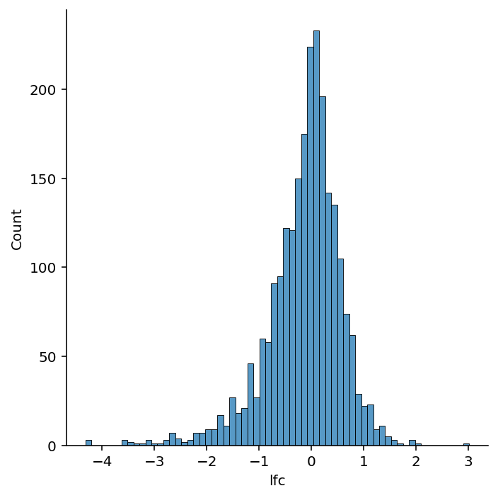

```python
sns.displot(data=data, x="counts_final", kind="hist");
```

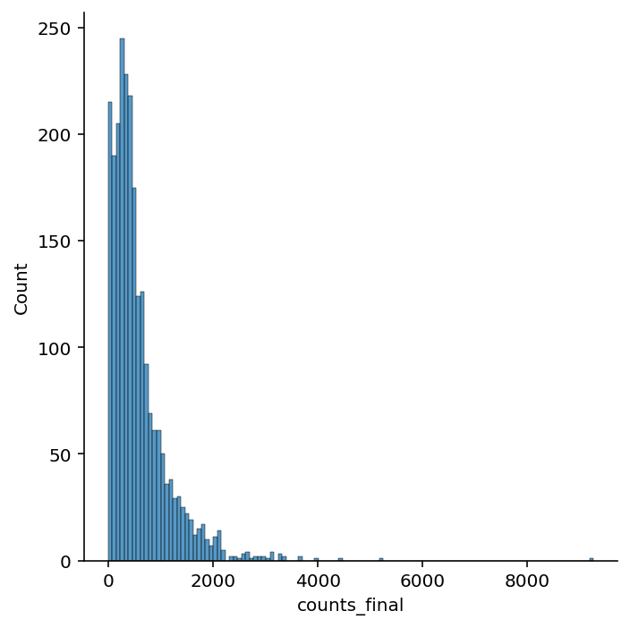

```python
data.counts_final.agg(["mean", "var"])
```

    mean       580.422819
    var     326839.722114
    Name: counts_final, dtype: float64

```python
sns.displot(data, x="counts_initial_adj", kind="hist");
```

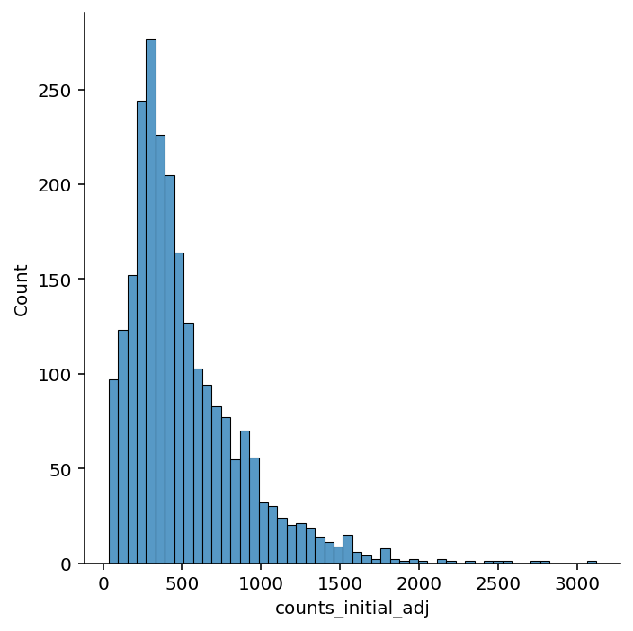

```python
sns.jointplot(data=data, x="counts_initial_adj", y="counts_final");
```

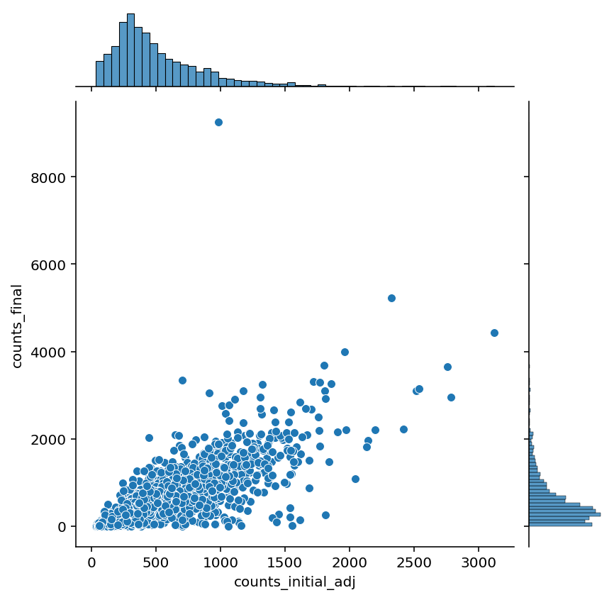

The following plot shows the distribution of reads with the *KRAS* data points highlighted for reference.

```python
plot_data = (
    data.copy().assign(is_kras=lambda d: d.hugo_symbol == "KRAS").sort_values("is_kras")
)

(
    gg.ggplot(plot_data, gg.aes(x="counts_initial", y="counts_final_rpm"))
    + gg.geom_point(gg.aes(color="is_kras", alpha="is_kras"), size=0.7)
    + gg.geom_abline(slope=1, intercept=0)
    + gg.scale_x_sqrt(expand=(0.02, 0, 0.02, 0))
    + gg.scale_y_sqrt(expand=(0.02, 0, 0.02, 0))
    + gg.scale_color_manual(values={True: "red", False: "k"})
    + gg.scale_alpha_manual(values={True: 0.8, False: 0.3})
)
```

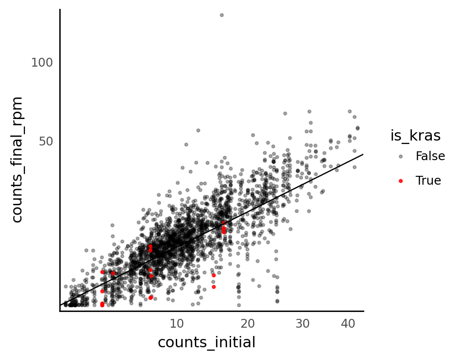

    <ggplot: (347240177)>

```python
(
    gg.ggplot(data, gg.aes(x="hugo_symbol", y="lfc"))
    + gg.geom_boxplot(gg.aes(color="hugo_symbol"))
    + gg.theme(
        axis_text_x=gg.element_text(angle=90, size=6),
        legend_position="none",
        figure_size=(10, 4),
    )
    + gg.labs(x="gene", y="log-fold change")
)
```

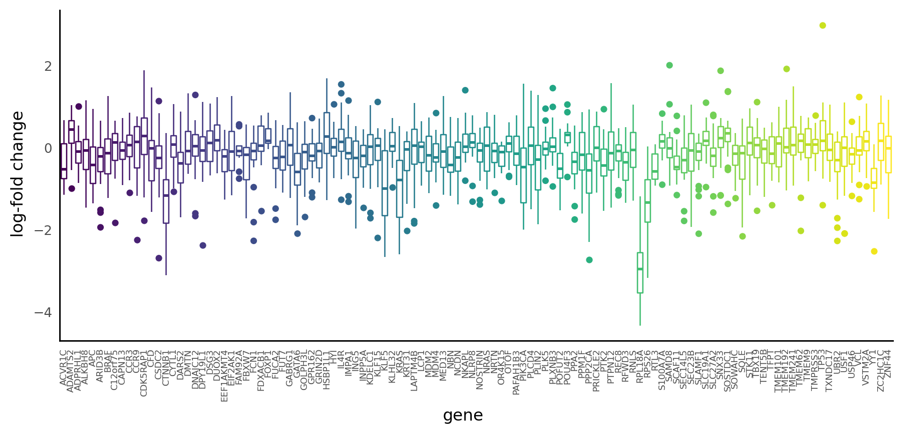

    <ggplot: (347304957)>

## Model 0. Single gene

For simplicity and to help me learn how to interpret coefficient values, the first model was just for the read counts of *KRAS*.
There are only 12 data points.

```python
data_0 = data[data.hugo_symbol == "KRAS"].reset_index()
f"Number of data points: {data_0.shape[0]}."
```

    'Number of data points: 20.'

Model `nb_m0`:

$$
\begin{gather}
\beta \sim N(0, 2.5) \\
\eta = \beta \\
\mu = \exp(\eta) \\
y \sim \text{NB}(\mu X_\text{initial}, \eta)
\end{gather}
$$

```python
with pm.Model() as nb_m0:
    counts_initial = pm.Data("counts_initial", data_0.counts_initial_adj.values)
    final_reads = pm.Data("final_reads", data_0.counts_final.values)

    β = pm.Normal("β", 0, 2.5)
    η = β
    μ = pm.math.exp(η)
    α = pm.HalfNormal("α", 5)
    y = pm.NegativeBinomial("y", μ * counts_initial, α, observed=final_reads)
```

```python
pm.model_to_graphviz(nb_m0)
```

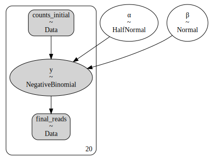

```python
with nb_m0:
    m0_trace = pm.sample(1000, chains=4, random_seed=820, return_inferencedata=True)
    m0_trace.extend(
        az.from_pymc3(posterior_predictive=pm.sample_posterior_predictive(m0_trace))
    )
```

    Auto-assigning NUTS sampler...
    Initializing NUTS using jitter+adapt_diag...
    Multiprocess sampling (4 chains in 2 jobs)
    NUTS: [α, β]

<div>
    <style>
        /*Turns off some styling*/
        progress {
            /*gets rid of default border in Firefox and Opera.*/
            border: none;
            /*Needs to be in here for Safari polyfill so background images work as expected.*/
            background-size: auto;
        }
        .progress-bar-interrupted, .progress-bar-interrupted::-webkit-progress-bar {
            background: #F44336;
        }
    </style>
  <progress value='8000' class='' max='8000' style='width:300px; height:20px; vertical-align: middle;'></progress>
  100.00% [8000/8000 00:09<00:00 Sampling 4 chains, 0 divergences]
</div>

    Sampling 4 chains for 1_000 tune and 1_000 draw iterations (4_000 + 4_000 draws total) took 27 seconds.

<div>
    <style>
        /*Turns off some styling*/
        progress {
            /*gets rid of default border in Firefox and Opera.*/
            border: none;
            /*Needs to be in here for Safari polyfill so background images work as expected.*/
            background-size: auto;
        }
        .progress-bar-interrupted, .progress-bar-interrupted::-webkit-progress-bar {
            background: #F44336;
        }
    </style>
  <progress value='4000' class='' max='4000' style='width:300px; height:20px; vertical-align: middle;'></progress>
  100.00% [4000/4000 00:55<00:00]
</div>

```python
az.plot_trace(m0_trace, var_names=["β", "α"], compact=False);
```

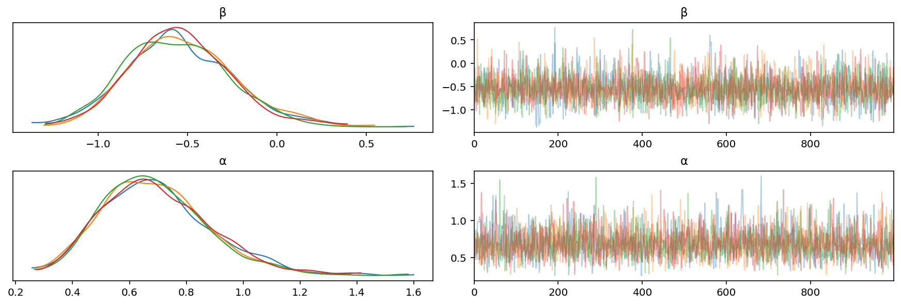

```python
az.summary(m0_trace, var_names=["β", "α"])
```

<div>
<style scoped>
    .dataframe tbody tr th:only-of-type {
        vertical-align: middle;
    }

    .dataframe tbody tr th {
        vertical-align: top;
    }

    .dataframe thead th {
        text-align: right;
    }
</style>
<table border="1" class="dataframe">
  <thead>
    <tr style="text-align: right;">
      <th></th>
      <th>mean</th>
      <th>sd</th>
      <th>hdi_3%</th>
      <th>hdi_97%</th>
      <th>mcse_mean</th>
      <th>mcse_sd</th>
      <th>ess_bulk</th>
      <th>ess_tail</th>
      <th>r_hat</th>
    </tr>
  </thead>
  <tbody>
    <tr>
      <th>β</th>
      <td>-0.543</td>
      <td>0.295</td>
      <td>-1.103</td>
      <td>0.020</td>
      <td>0.005</td>
      <td>0.004</td>
      <td>3185.0</td>
      <td>2256.0</td>
      <td>1.0</td>
    </tr>
    <tr>
      <th>α</th>
      <td>0.693</td>
      <td>0.190</td>
      <td>0.387</td>
      <td>1.085</td>
      <td>0.004</td>
      <td>0.003</td>
      <td>2415.0</td>
      <td>2421.0</td>
      <td>1.0</td>
    </tr>
  </tbody>
</table>
</div>

```python
m0_ppc = m0_trace["posterior_predictive"]["y"].squeeze().values
(
    gg.ggplot(pd.DataFrame(m0_ppc[:1000, :]).pivot_longer(), gg.aes(x="value"))
    + gg.geom_density(gg.aes(group="variable"), color="k", size=0.3, linetype="-")
    + gg.geom_rug(
        gg.aes(x="counts_final"), data=data_0, color="blue", size=1.2, alpha=0.75
    )
    + gg.scale_x_sqrt(expand=(0, 0))
    + gg.scale_y_continuous(expand=(0, 0, 0.02, 0))
    + gg.labs(x="read counts", y="density", title="Posterior predictive check")
)
```

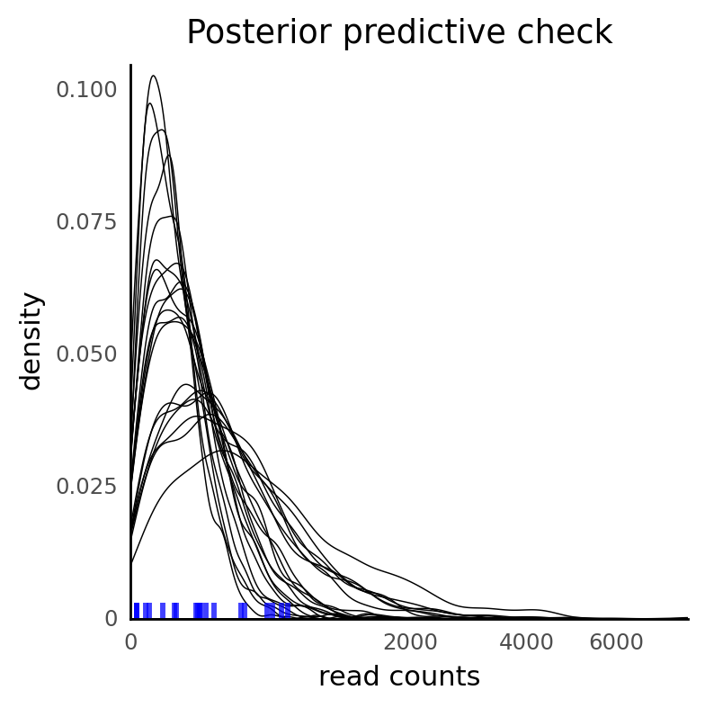

    <ggplot: (351596776)>

```python
m0_ppc_df = pmanal.summarize_posterior_predictions(
    m0_ppc, merge_with=data_0, observed_y="counts_final"
)
(
    gg.ggplot(m0_ppc_df, gg.aes(x="counts_final", y="pred_mean"))
    + gg.geom_linerange(gg.aes(ymin="pred_hdi_low", ymax="pred_hdi_high"), alpha=0.2)
    + gg.geom_point()
    + gg.geom_abline(slope=1, intercept=0, linetype="--")
    + gg.labs(x="observed counts", y="posterior predicted counts (89% CI)")
)
```

    /usr/local/Caskroom/miniconda/base/envs/speclet/lib/python3.9/site-packages/arviz/stats/stats.py:456: FutureWarning: hdi currently interprets 2d data as (draw, shape) but this will change in a future release to (chain, draw) for coherence with other functions

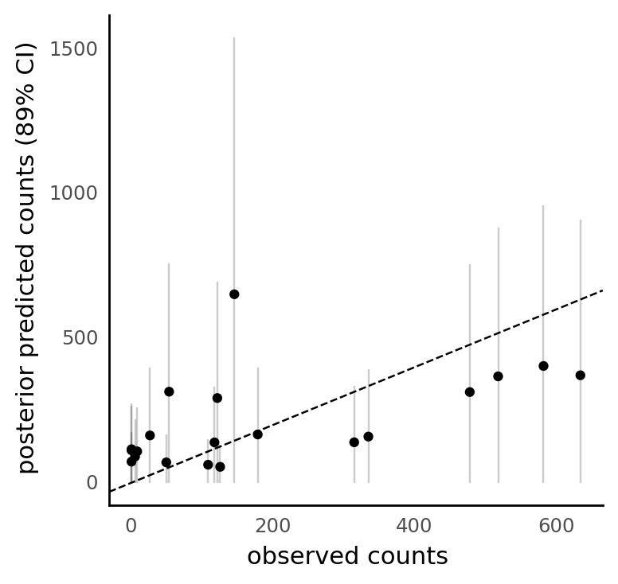

    <ggplot: (352590071)>

Below is the posterior point estimate for $\beta$ and the exponentiated value.

```python
beta_post = m0_trace["posterior"]["β"].values.mean()
beta_post, np.exp(beta_post)
```

    (-0.5425139129306843, 0.5812851138789608)

It is the same as the ratio of final to initial reads.

```python
(data_0.counts_final / data_0.counts_initial).mean()
```

    19.33983711734026

### With full dataset

The model structure is the same as Model 0, except now the entire dataset is used instead of restricting to one gene.

```python
with pm.Model() as nb_m0_full:
    counts_initial = pm.Data("counts_initial", data.counts_initial_adj.values)
    counts_final = pm.Data("counts_final", data.counts_final.values)

    β = pm.Normal("β", 0, 2.5)
    η = β
    μ = pm.math.exp(η)
    α = pm.HalfNormal("α", 5)
    y = pm.NegativeBinomial("y", μ * counts_initial, α, observed=counts_final)

    m0_full_trace = pm.sample(
        1000, tune=2000, chains=4, random_seed=922, return_inferencedata=True
    )
    m0_full_trace.extend(
        az.from_pymc3(
            posterior_predictive=pm.sample_posterior_predictive(
                m0_full_trace, random_seed=923
            )
        )
    )
```

    Auto-assigning NUTS sampler...
    Initializing NUTS using jitter+adapt_diag...
    Multiprocess sampling (4 chains in 2 jobs)
    NUTS: [α, β]

<div>
    <style>
        /*Turns off some styling*/
        progress {
            /*gets rid of default border in Firefox and Opera.*/
            border: none;
            /*Needs to be in here for Safari polyfill so background images work as expected.*/
            background-size: auto;
        }
        .progress-bar-interrupted, .progress-bar-interrupted::-webkit-progress-bar {
            background: #F44336;
        }
    </style>
  <progress value='12000' class='' max='12000' style='width:300px; height:20px; vertical-align: middle;'></progress>
  100.00% [12000/12000 00:25<00:00 Sampling 4 chains, 0 divergences]
</div>

    Sampling 4 chains for 2_000 tune and 1_000 draw iterations (8_000 + 4_000 draws total) took 41 seconds.

<div>
    <style>
        /*Turns off some styling*/
        progress {
            /*gets rid of default border in Firefox and Opera.*/
            border: none;
            /*Needs to be in here for Safari polyfill so background images work as expected.*/
            background-size: auto;
        }
        .progress-bar-interrupted, .progress-bar-interrupted::-webkit-progress-bar {
            background: #F44336;
        }
    </style>
  <progress value='4000' class='' max='4000' style='width:300px; height:20px; vertical-align: middle;'></progress>
  100.00% [4000/4000 00:58<00:00]
</div>

```python
trace_collection: dict[str, az.InferenceData] = {"(m0) single β": m0_full_trace}
```

```python
az.plot_trace(m0_full_trace, compact=False);
```

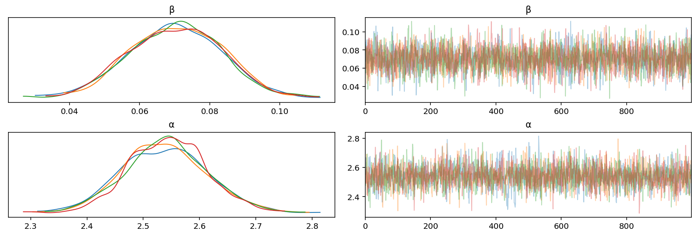

```python
az.summary(m0_full_trace, var_names=["β", "α"])
```

<div>
<style scoped>
    .dataframe tbody tr th:only-of-type {
        vertical-align: middle;
    }

    .dataframe tbody tr th {
        vertical-align: top;
    }

    .dataframe thead th {
        text-align: right;
    }
</style>
<table border="1" class="dataframe">
  <thead>
    <tr style="text-align: right;">
      <th></th>
      <th>mean</th>
      <th>sd</th>
      <th>hdi_3%</th>
      <th>hdi_97%</th>
      <th>mcse_mean</th>
      <th>mcse_sd</th>
      <th>ess_bulk</th>
      <th>ess_tail</th>
      <th>r_hat</th>
    </tr>
  </thead>
  <tbody>
    <tr>
      <th>β</th>
      <td>0.07</td>
      <td>0.013</td>
      <td>0.046</td>
      <td>0.094</td>
      <td>0.000</td>
      <td>0.000</td>
      <td>3516.0</td>
      <td>2713.0</td>
      <td>1.0</td>
    </tr>
    <tr>
      <th>α</th>
      <td>2.54</td>
      <td>0.074</td>
      <td>2.408</td>
      <td>2.687</td>
      <td>0.001</td>
      <td>0.001</td>
      <td>3404.0</td>
      <td>2698.0</td>
      <td>1.0</td>
    </tr>
  </tbody>
</table>
</div>

```python
m0_full_ppc_df = pmanal.summarize_posterior_predictions(
    m0_full_trace["posterior_predictive"]["y"].squeeze().values,
    merge_with=data,
    observed_y="counts_final",
)

(
    gg.ggplot(m0_full_ppc_df, gg.aes(x="counts_final", y="pred_mean"))
    + gg.geom_linerange(gg.aes(ymin="pred_hdi_low", ymax="pred_hdi_high"), alpha=0.2)
    + gg.geom_point(size=0.5, alpha=0.5)
    + gg.geom_abline(slope=1, intercept=0, linetype="--")
    + gg.scale_x_log10(expand=(0, 0, 0.02, 0))
    + gg.scale_y_log10(expand=(0, 0, 0.02, 0))
    + gg.labs(x="observed counts", y="posterior predicted counts (89% CI)")
)
```

    /usr/local/Caskroom/miniconda/base/envs/speclet/lib/python3.9/site-packages/arviz/stats/stats.py:456: FutureWarning: hdi currently interprets 2d data as (draw, shape) but this will change in a future release to (chain, draw) for coherence with other functions

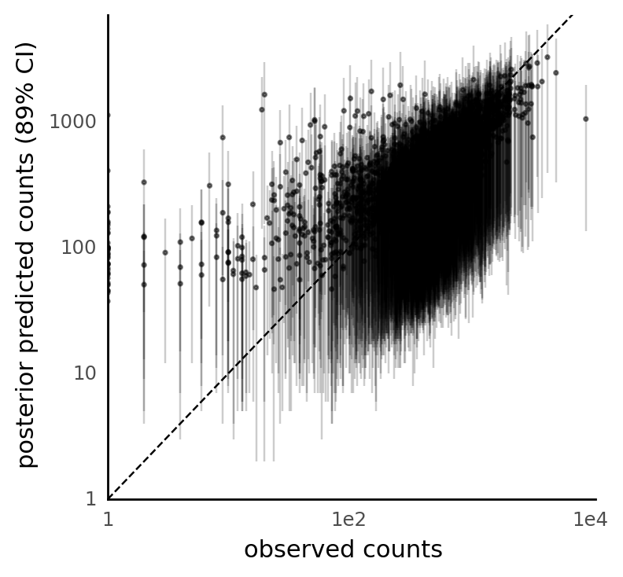

    <ggplot: (353042899)>

```python
beta = m0_full_trace["posterior"]["β"].values.mean()
beta, np.exp(beta)
```

    (0.0703401209596498, 1.0728730258081796)

```python
np.mean(data.counts_final / data.counts_initial)
```

    46.181328515277826

## Model 1. Varying per gene

The first model is simple with a varying intercept per gene.
The starting read count is treated as an exposure value and multiplied directly against $\mu$.

$$
\begin{gather}
\mu_\beta \sim N(0, 5) \\
\sigma_\beta \sim HN(5) \\
\beta_g \sim_g N(\mu_\beta, \sigma_\beta) \\
\eta = \beta_g[\text{gene}] \\
\mu = \exp(\eta) \\
\alpha = HN(5) \\
y \sim \text{NB}(\mu X_\text{initial}, \alpha)
\end{gather}
$$

```python
gene_idx, n_genes = dphelp.get_indices_and_count(data, "hugo_symbol")

with pm.Model() as nb_m1:
    g = pm.Data("gene_idx", gene_idx)
    counts_initial = pm.Data("counts_initial", data.counts_initial_adj.values)
    counts_final = pm.Data("counts_final", data.counts_final.values)

    μ_β = pm.Normal("μ_β", 0, 2.5)
    σ_β = pm.HalfNormal("σ_β", 2.5)
    β_g = pm.Normal("β_g", μ_β, σ_β, shape=n_genes)
    η = pm.Deterministic("η", β_g[g])
    μ = pm.Deterministic("μ", pm.math.exp(η))
    α = pm.HalfNormal("α", 5)
    y = pm.NegativeBinomial("y", μ * counts_initial, α, observed=counts_final)
```

```python
pm.model_to_graphviz(nb_m1)
```

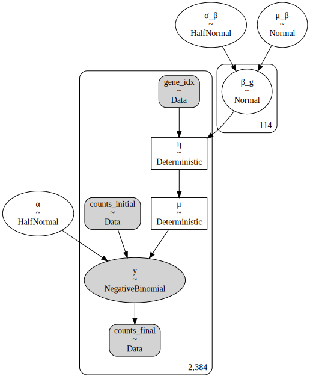

```python
with nb_m1:
    m1_trace = pm.sample(1000, tune=2000, random_seed=1022, return_inferencedata=True)
    ppc = pm.sample_posterior_predictive(m1_trace, random_seed=1022)
    m1_trace.extend(az.from_pymc3(posterior_predictive=ppc))
```

    Auto-assigning NUTS sampler...
    Initializing NUTS using jitter+adapt_diag...
    Multiprocess sampling (2 chains in 2 jobs)
    NUTS: [α, β_g, σ_β, μ_β]

<div>
    <style>
        /*Turns off some styling*/
        progress {
            /*gets rid of default border in Firefox and Opera.*/
            border: none;
            /*Needs to be in here for Safari polyfill so background images work as expected.*/
            background-size: auto;
        }
        .progress-bar-interrupted, .progress-bar-interrupted::-webkit-progress-bar {
            background: #F44336;
        }
    </style>
  <progress value='6000' class='' max='6000' style='width:300px; height:20px; vertical-align: middle;'></progress>
  100.00% [6000/6000 00:39<00:00 Sampling 2 chains, 0 divergences]
</div>

    Sampling 2 chains for 2_000 tune and 1_000 draw iterations (4_000 + 2_000 draws total) took 48 seconds.

<div>
    <style>
        /*Turns off some styling*/
        progress {
            /*gets rid of default border in Firefox and Opera.*/
            border: none;
            /*Needs to be in here for Safari polyfill so background images work as expected.*/
            background-size: auto;
        }
        .progress-bar-interrupted, .progress-bar-interrupted::-webkit-progress-bar {
            background: #F44336;
        }
    </style>
  <progress value='2000' class='' max='2000' style='width:300px; height:20px; vertical-align: middle;'></progress>
  100.00% [2000/2000 00:37<00:00]
</div>

```python
trace_collection["(m1): varying β"] = m1_trace
```

```python
az.plot_trace(m1_trace, var_names=["α", "β"], filter_vars="like");
```

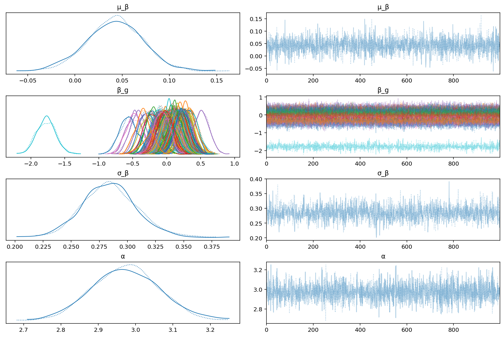

```python
az.plot_posterior(m1_trace, var_names=["μ_β", "σ_β", "α"]);
```


The interpretation of the values for $\beta_g$ are as follows: For gene $j$, the expected fold change to the number of final reads is $\exp(\beta_j)$.
In other words, the final number of reads is the initial number of reads times $\exp(\beta_j)$.
Alternatively, $\beta_j$ is the expected log fold change for gene $j$.
These are demonstrated to be equivalent below.

$$
\begin{gather}
\exp(\beta_j) = \frac{f}{i} \\
\beta_j = \log \frac{f}{i} \quad \text{ or } \quad ie^{\beta_j} = f
\end{gather}
$$

Therefore, if $\beta_j = 0$, there is expected to be no change to the number of reads before and after: $i e^0 = i = f$.
If $\beta_j$ is positive, then there is expected to be an increase in the number of reads and if $\beta_j$ is negative, a decrease in the number of reads.

```python
ax = az.plot_forest(m1_trace, var_names="β_g", hdi_prob=0.89)
ax[0].set_yticklabels(data.hugo_symbol.cat.categories[::-1])
plt.axvline(x=0, ls="--")
plt.show()
```

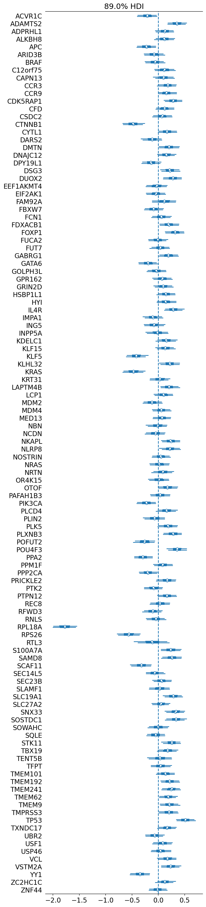

```python
az.summary(m1_trace, var_names="β_g", hdi_prob=0.89).assign(
    hugo_symbol=data.hugo_symbol.cat.categories
)
```

<div>
<style scoped>
    .dataframe tbody tr th:only-of-type {
        vertical-align: middle;
    }

    .dataframe tbody tr th {
        vertical-align: top;
    }

    .dataframe thead th {
        text-align: right;
    }
</style>
<table border="1" class="dataframe">
  <thead>
    <tr style="text-align: right;">
      <th></th>
      <th>mean</th>
      <th>sd</th>
      <th>hdi_5.5%</th>
      <th>hdi_94.5%</th>
      <th>mcse_mean</th>
      <th>mcse_sd</th>
      <th>ess_bulk</th>
      <th>ess_tail</th>
      <th>r_hat</th>
      <th>hugo_symbol</th>
    </tr>
  </thead>
  <tbody>
    <tr>
      <th>β_g[0]</th>
      <td>-0.206</td>
      <td>0.119</td>
      <td>-0.398</td>
      <td>-0.022</td>
      <td>0.002</td>
      <td>0.002</td>
      <td>4120.0</td>
      <td>1302.0</td>
      <td>1.0</td>
      <td>ACVR1C</td>
    </tr>
    <tr>
      <th>β_g[1]</th>
      <td>0.352</td>
      <td>0.113</td>
      <td>0.176</td>
      <td>0.535</td>
      <td>0.002</td>
      <td>0.001</td>
      <td>3212.0</td>
      <td>1154.0</td>
      <td>1.0</td>
      <td>ADAMTS2</td>
    </tr>
    <tr>
      <th>β_g[2]</th>
      <td>0.126</td>
      <td>0.111</td>
      <td>-0.058</td>
      <td>0.296</td>
      <td>0.002</td>
      <td>0.002</td>
      <td>3670.0</td>
      <td>1463.0</td>
      <td>1.0</td>
      <td>ADPRHL1</td>
    </tr>
    <tr>
      <th>β_g[3]</th>
      <td>0.117</td>
      <td>0.117</td>
      <td>-0.072</td>
      <td>0.301</td>
      <td>0.002</td>
      <td>0.002</td>
      <td>4104.0</td>
      <td>1359.0</td>
      <td>1.0</td>
      <td>ALKBH8</td>
    </tr>
    <tr>
      <th>β_g[4]</th>
      <td>-0.225</td>
      <td>0.117</td>
      <td>-0.416</td>
      <td>-0.047</td>
      <td>0.002</td>
      <td>0.002</td>
      <td>4178.0</td>
      <td>1408.0</td>
      <td>1.0</td>
      <td>APC</td>
    </tr>
    <tr>
      <th>...</th>
      <td>...</td>
      <td>...</td>
      <td>...</td>
      <td>...</td>
      <td>...</td>
      <td>...</td>
      <td>...</td>
      <td>...</td>
      <td>...</td>
      <td>...</td>
    </tr>
    <tr>
      <th>β_g[109]</th>
      <td>0.176</td>
      <td>0.114</td>
      <td>-0.009</td>
      <td>0.354</td>
      <td>0.002</td>
      <td>0.002</td>
      <td>2691.0</td>
      <td>1370.0</td>
      <td>1.0</td>
      <td>VCL</td>
    </tr>
    <tr>
      <th>β_g[110]</th>
      <td>0.237</td>
      <td>0.114</td>
      <td>0.048</td>
      <td>0.411</td>
      <td>0.002</td>
      <td>0.002</td>
      <td>4113.0</td>
      <td>1274.0</td>
      <td>1.0</td>
      <td>VSTM2A</td>
    </tr>
    <tr>
      <th>β_g[111]</th>
      <td>-0.347</td>
      <td>0.116</td>
      <td>-0.535</td>
      <td>-0.160</td>
      <td>0.002</td>
      <td>0.001</td>
      <td>3542.0</td>
      <td>1012.0</td>
      <td>1.0</td>
      <td>YY1</td>
    </tr>
    <tr>
      <th>β_g[112]</th>
      <td>0.127</td>
      <td>0.106</td>
      <td>-0.067</td>
      <td>0.283</td>
      <td>0.002</td>
      <td>0.002</td>
      <td>3997.0</td>
      <td>1484.0</td>
      <td>1.0</td>
      <td>ZC2HC1C</td>
    </tr>
    <tr>
      <th>β_g[113]</th>
      <td>-0.013</td>
      <td>0.109</td>
      <td>-0.183</td>
      <td>0.161</td>
      <td>0.002</td>
      <td>0.003</td>
      <td>4064.0</td>
      <td>1438.0</td>
      <td>1.0</td>
      <td>ZNF44</td>
    </tr>
  </tbody>
</table>
<p>114 rows × 10 columns</p>
</div>

The following plot shows the raw data for a few genes with large posterior estimates for $\beta$ in model 1.

```python
g = ["FUT7", "STK11", "GATA6", "KRAS", "KLF5", "CCR9", "FCN1", "NRAS", "PLCD4"]

(
    gg.ggplot(
        data[data.hugo_symbol.isin(g)].astype({"hugo_symbol": str}),
        gg.aes(x="counts_initial", y="counts_final", color="hugo_symbol"),
    )
    + gg.facet_wrap("~ hugo_symbol", ncol=3, scales="free")
    + gg.geom_point()
    + gg.geom_smooth(method="lm", formula="y~x", se=False, size=0.7, linetype="--")
    + gg.geom_abline(slope=1, intercept=0, linetype="--", color="k")
    + gg.scale_x_log10()
    + gg.scale_y_log10()
    + gg.theme(figure_size=(8, 8), panel_spacing=0.5, legend_position="none")
    + gg.labs(x="initial reads", y="final reads")
)
```

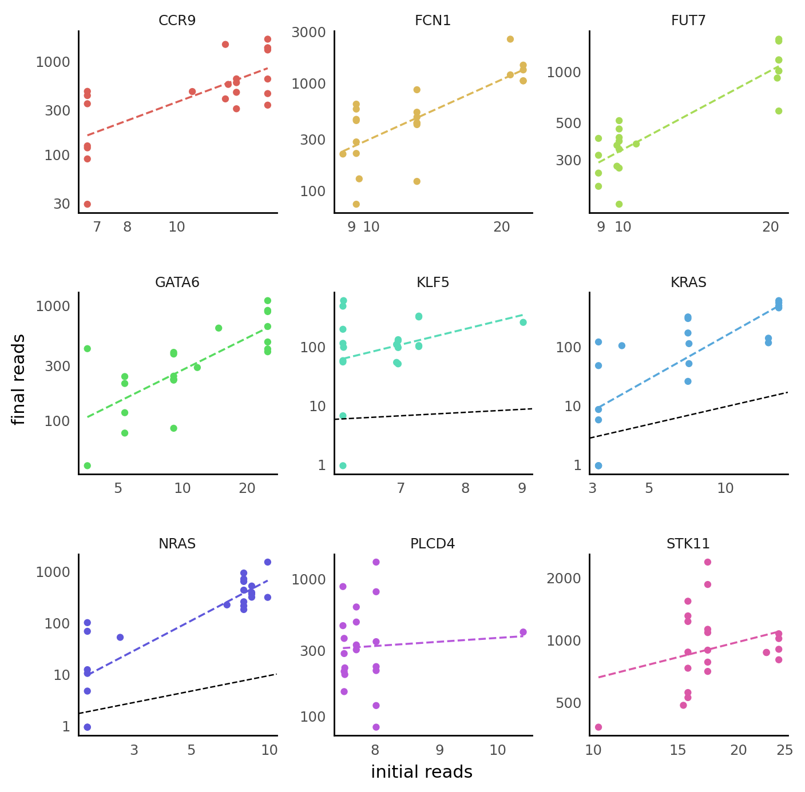

    <ggplot: (353448596)>

```python
(
    gg.ggplot(
        data[data.hugo_symbol.isin(g)].astype({"hugo_symbol": str}),
        gg.aes(x="hugo_symbol", y="lfc"),
    )
    + gg.geom_boxplot(outlier_alpha=0)
    + gg.geom_jitter(gg.aes(color="is_mutated"), width=0.3, height=0, alpha=0.4)
    + gg.geom_hline(yintercept=0, linetype="--")
    + gg.scale_y_continuous(expand=(0, 0.02, 0, 0.02))
    + gg.scale_color_manual(values={True: "red", False: "black"})
    + gg.theme(figure_size=(5, 4))
    + gg.labs(x="gene", y="LFC")
)
```


    <ggplot: (352269523)>

In this model, $\mu_\beta$ represents the average change in read counts.
Therefore, $\exp(\mu_\beta)$ is the same as the average fold change ($\frac{\text{final}}{\text{initial}}$).

```python
mu_beta = m1_trace["posterior"]["μ_β"].values.mean()
sigma_beta = m1_trace["posterior"]["σ_β"].values.mean()
mu_beta, np.exp(mu_beta), np.mean(data.counts_final / data.counts_initial)
```

    (0.0421292329604461, 1.043029263800833, 46.181328515277826)

As the coefficient $\mu_\beta$ represents the average fold change over all genes, the coefficients $\beta_g$ represent individual gene fold changes.
The observed values and model posterior distribtuions are plotted below.
For each gene $j$, the circle and vertical line represent the mean and 89% CI of the posterior distribution for $\exp(\beta_j)$.
The dashed blue horizontal line represents the mean of the posterior for $\mu_\beta$.
The blue `x` represents the average observed fold change for the gene and the size of the `x` represents the number of data points for that gene.

This plot shows clearly the shrinkage of the estimates for $\beta_g$ towards the global mean.
Also, there is noticably less shrinkage for the genes with more data points — for example, compare the level of shrinkage for *PLCD4* and *TMEM241* (the genes with the two highest observed fold change value), both have similar observed averages, but there are more data points supporting *TMEM241*.

```python
gene_fold_change = (
    data.groupby("hugo_symbol")
    .apply(lambda d: np.mean(d.counts_final / d.counts_initial_adj))
    .reset_index(drop=False)
    .rename(columns={0: "fold_change"})
)

num_data_points_per_gene = (
    data.groupby("hugo_symbol")[["counts_final"]].count().reset_index().counts_final
)

beta_g_posterior = (
    az.summary(m1_trace, var_names=["β_g"], hdi_prob=0.89)
    .reset_index(drop=False)
    .rename(
        columns={"index": "parameter", "hdi_5.5%": "hdi_low", "hdi_94.5%": "hdi_high"}
    )
    .assign(
        fold_change=gene_fold_change.fold_change,
        hugo_symbol=gene_fold_change.hugo_symbol,
        n_dp=num_data_points_per_gene,
    )
)

(
    gg.ggplot(beta_g_posterior, gg.aes(x="hugo_symbol"))
    + gg.geom_linerange(
        gg.aes(ymin="np.exp(hdi_low)", ymax="np.exp(hdi_high)"), alpha=0.25
    )
    + gg.geom_point(gg.aes(y="np.exp(mean)"))
    + gg.geom_point(
        gg.aes(y="fold_change", size="n_dp"), shape="x", color="blue", alpha=0.5
    )
    + gg.geom_hline(yintercept=np.exp(mu_beta), color="#011F4B", linetype="--")
    + gg.scale_size_continuous(range=(2, 4))
    + gg.theme(axis_text_x=gg.element_text(angle=90, size=7), figure_size=(8, 4))
    + gg.labs(
        x="gene",
        y="fold change (f/i)",
        title="Expected and observed fold change",
        size="# data\npoints",
    )
)
```

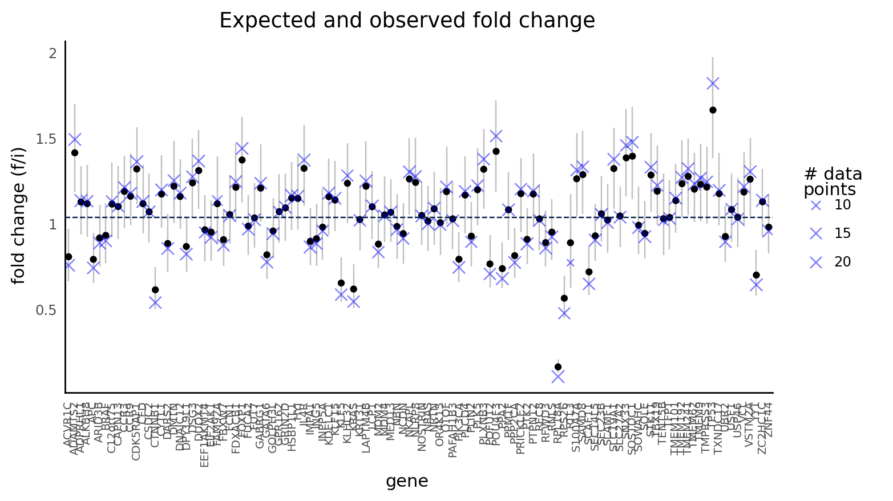

    <ggplot: (351800911)>

Below are some explorations of the posterior predictions of the model.
Generally, they make sense and seem reasonable.

```python
def down_sample_ppc(ppc_ary: np.ndarray, n: int) -> tuple[np.ndarray, np.ndarray]:
    r_idx = np.arange(ppc_ary.shape[1])
    np.random.shuffle(r_idx)
    return ppc_ary[:, r_idx[:n]], r_idx
```

```python
m1_ppc_sample, sample_idx = down_sample_ppc(
    m1_trace["posterior_predictive"]["y"].squeeze().values, n=10
)
```

```python
m1_ppc_df = (
    pd.concat(
        [
            pd.DataFrame(m1_ppc_sample.T),
            data.loc[sample_idx[:10], :][["hugo_symbol", "sgrna"]].reset_index(
                drop=True
            ),
        ],
        axis=1,
    )
    .assign(ppc_idx=lambda d: np.arange(d.shape[0]))
    .pivot_longer(
        index=["hugo_symbol", "sgrna", "ppc_idx"], names_to="_to_drop", values_to="draw"
    )
    .drop(columns="_to_drop")
)
```

```python
(
    gg.ggplot(m1_ppc_df)
    + gg.facet_wrap("~hugo_symbol", ncol=4, scales="free")
    + gg.geom_histogram(gg.aes(x="draw"), color="grey", fill="grey", alpha=0.2)
    + gg.geom_rug(
        gg.aes(x="counts_final"),
        data=data[data.hugo_symbol.isin(m1_ppc_df.hugo_symbol)],
        color="b",
        size=1.2,
        alpha=0.5,
    )
    + gg.scale_x_continuous(expand=(0, 0))
    + gg.scale_y_continuous(expand=(0, 0, 0.02, 0))
    + gg.theme(figure_size=(8, 10), panel_spacing_x=0.25, panel_spacing_y=0.25)
    + gg.labs(x="predicted final read count", y="count")
)
```

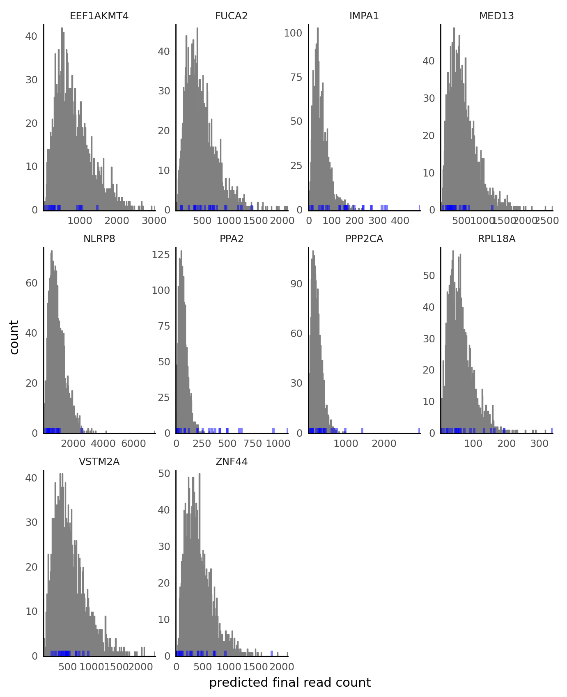

    <ggplot: (353215985)>

```python
ppc_lfc = (
    m1_trace["posterior_predictive"]["y"].squeeze()
    / data.counts_initial_adj.values.reshape(1, -1)
).values
ppc_lfc = np.log2(ppc_lfc)

ppc_lfc_df = (
    pd.concat([pd.DataFrame(ppc_lfc[:100, :].T), data[["hugo_symbol", "lfc"]]], axis=1)
    .pivot_longer(index=["hugo_symbol", "lfc"], values_to="ppc_lfc")
    .drop(columns=["variable"])
)

(
    gg.ggplot(ppc_lfc_df)
    + gg.facet_wrap("~hugo_symbol", ncol=4, scales="free")
    + gg.geom_density(gg.aes(x="ppc_lfc"), color="k", fill="k", alpha=0.1)
    + gg.geom_density(gg.aes(x="lfc"), color="b")
    + gg.geom_vline(xintercept=0, linetype="--", color="k", size=0.9)
    + gg.scale_x_continuous(expand=(0, 0))
    + gg.scale_y_continuous(expand=(0, 0, 0.02, 0))
    + gg.theme(figure_size=(8, 30), panel_spacing_x=0.25, panel_spacing_y=0.25)
    + gg.labs(x="LFC", y="density", title="Posterior predictive check of LFC")
)
```

    /var/folders/r4/qpcdgl_14hbd412snp1jnv300000gn/T/ipykernel_70914/3842676495.py:5: RuntimeWarning: divide by zero encountered in log2

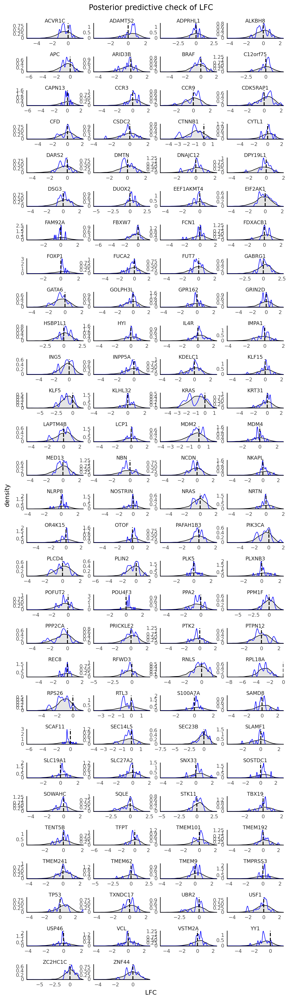

    <ggplot: (353173923)>

## Model 2

The second model includes the initial number of reads as a parameter in the linear portion of the model instead of as an exposure.
This perhaps will make the value of $\beta$ make more sense.

$$
\begin{gather}
\mu_\beta \sim N(0, 5) \\
\sigma_\beta \sim HN(5) \\
\beta_g \sim_g N(\mu_\beta, \sigma_\beta) \\
\eta = \beta_g[\text{gene}] X_\text{initial} \\
\mu = \exp(\eta) \\
\alpha = HN(5) \\
y \sim \text{NB}(\mu, \alpha)
\end{gather}
$$

```python
with pm.Model() as nb_m2:
    g = pm.Data("gene_idx", gene_idx)
    log_counts_initial = pm.Data(
        "log_counts_initial", np.log(data.counts_initial_adj.values)
    )
    final_reads = pm.Data("final_reads", data.counts_final.values)

    μ_β = pm.Normal("μ_β", 0, 2.5)
    σ_β = pm.HalfNormal("σ_β", 2.5)
    β = pm.Normal("β", μ_β, σ_β, shape=n_genes)

    η = pm.Deterministic("η", β[g] * log_counts_initial)

    μ = pm.Deterministic("μ", pm.math.exp(η))
    α = pm.HalfNormal("α", 5.0)

    y = pm.NegativeBinomial("y", μ, α, observed=final_reads)
```

```python
pm.model_to_graphviz(nb_m2)
```

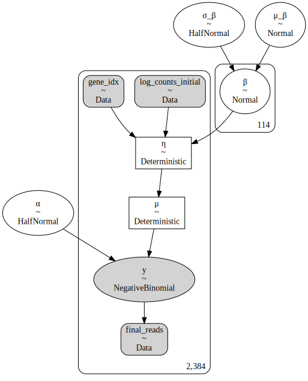

```python
with nb_m2:
    m2_trace = pm.sample(1000, tune=2000, return_inferencedata=True)
    m2_trace.extend(
        az.from_pymc3(posterior_predictive=pm.sample_posterior_predictive(m2_trace))
    )
```

    Auto-assigning NUTS sampler...
    Initializing NUTS using jitter+adapt_diag...
    Multiprocess sampling (2 chains in 2 jobs)
    NUTS: [α, β, σ_β, μ_β]

<div>
    <style>
        /*Turns off some styling*/
        progress {
            /*gets rid of default border in Firefox and Opera.*/
            border: none;
            /*Needs to be in here for Safari polyfill so background images work as expected.*/
            background-size: auto;
        }
        .progress-bar-interrupted, .progress-bar-interrupted::-webkit-progress-bar {
            background: #F44336;
        }
    </style>
  <progress value='6000' class='' max='6000' style='width:300px; height:20px; vertical-align: middle;'></progress>
  100.00% [6000/6000 00:53<00:00 Sampling 2 chains, 0 divergences]
</div>

    Sampling 2 chains for 2_000 tune and 1_000 draw iterations (4_000 + 2_000 draws total) took 64 seconds.

<div>
    <style>
        /*Turns off some styling*/
        progress {
            /*gets rid of default border in Firefox and Opera.*/
            border: none;
            /*Needs to be in here for Safari polyfill so background images work as expected.*/
            background-size: auto;
        }
        .progress-bar-interrupted, .progress-bar-interrupted::-webkit-progress-bar {
            background: #F44336;
        }
    </style>
  <progress value='2000' class='' max='2000' style='width:300px; height:20px; vertical-align: middle;'></progress>
  100.00% [2000/2000 00:30<00:00]
</div>

```python
az.plot_trace(m2_trace, var_names=["α", "β"], filter_vars="like");
```

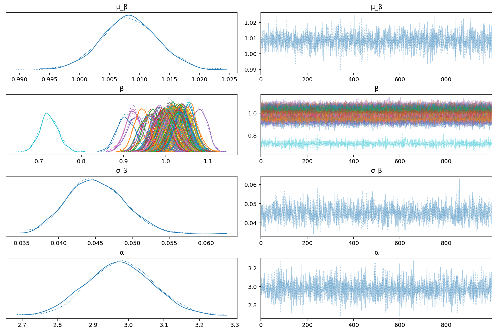

```python
az.plot_posterior(m2_trace, var_names=["μ_β", "σ_β", "α"]);
```

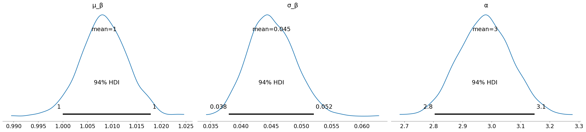

The relationship between initial and final read counts and the values for $\beta_g$ are slightly different than in model 1.
The relevant part of the formula for model 2 is shown below:

$$
\begin{gather}
\eta = \beta_g \times \log(x_i) \\
\mu = e^\eta \\
y \sim \text{NB}(\mu, \alpha)
\end{gather}
$$

If we collapse $\eta$, we get

$$
\mu = e^{\beta_g \times \log(x_i)}
$$

which can be further simplified

$$
\begin{aligned}
\mu &= e^{\beta_g \times \log(x_i)} \\
 &= (e^{\log(x_i)})^{\beta_g} \\
 &= x_i^{\beta_g}
\end{aligned}
$$

Thus, instead of $f = ie^\beta$ as in model 1, the relationship is $f = i^\beta$ (where $f$ is the final read count and $i$ is the initial read count).
I demonstrate this is relationship is true after the forest plot of the posteriors for $\beta_g$ below.

```python
ax = az.plot_forest(m2_trace, var_names="β", hdi_prob=0.89)
ax[0].set_yticklabels(data.hugo_symbol.cat.categories[::-1])
plt.axvline(x=1, ls="--")
plt.show()
```

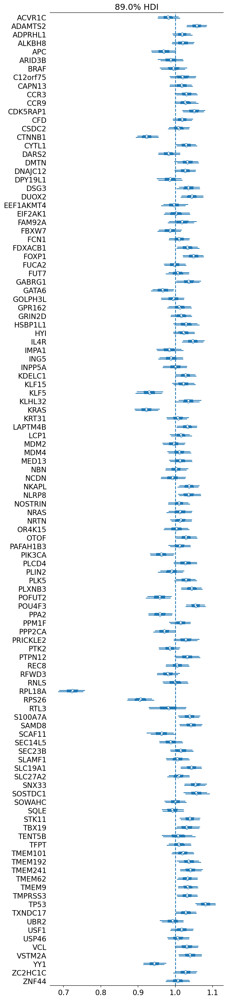

```python
beta_post = pd.DataFrame(
    {
        "hugo_symbol": data.hugo_symbol.cat.categories,
        "beta": m2_trace["posterior"]["β"].values.reshape(-1, n_genes).mean(axis=0),
    }
)

m2_post_pred_calc = (
    data[["hugo_symbol", "counts_final", "counts_initial_adj"]]
    .merge(beta_post, on="hugo_symbol", how="left")
    .assign(pred_f_counts=lambda d: d.counts_initial_adj ** d.beta)
)


(
    gg.ggplot(
        m2_post_pred_calc.sort_values(["hugo_symbol", "counts_final"]).assign(
            idx=lambda d: np.arange(d.shape[0]).astype(str)
        ),
        gg.aes(x="idx"),
    )
    + gg.facet_wrap("~ hugo_symbol", ncol=4, scales="free")
    + gg.geom_point(gg.aes(y="counts_final"), color="black", shape="x", size=1, alpha=1)
    + gg.geom_point(gg.aes(y="pred_f_counts"), color="blue", size=0.7, alpha=0.75)
    + gg.scale_y_log10()
    + gg.theme(
        axis_text_x=gg.element_blank(),
        axis_text_y=gg.element_text(size=7),
        figure_size=(8, 40),
        panel_spacing=0.3,
        panel_grid_major_x=gg.element_line(),
    )
)
```

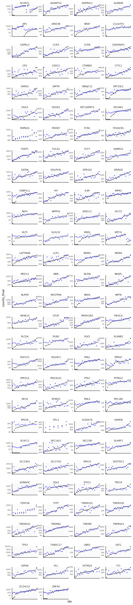

    <ggplot: (351966522)>

```python
g = ["APC", "FCN1", "NRAS", "PLIN2", "FUT7", "GATA6", "PLCD4"]

(
    gg.ggplot(
        data[data.hugo_symbol.isin(g)]
        .astype({"hugo_symbol": str})
        .assign(count_diff=lambda d: d.counts_final - d.counts_initial_adj)
        .sort_values("is_mutated"),
        gg.aes(x="hugo_symbol", y="count_diff"),
    )
    + gg.geom_boxplot(outlier_alpha=0, color="#011F4B")
    + gg.geom_jitter(
        gg.aes(color="is_mutated"), width=0.25, height=0, alpha=0.6, size=1.8
    )
    + gg.geom_hline(yintercept=0, linetype="--")
    + gg.scale_y_continuous(expand=(0.02, 0, 0.02, 0))
    + gg.scale_color_manual(values={True: "red", False: "#011F4B"})
    + gg.labs(
        x="gene", y="read count difference\n(final - initial)", color="gene\nmutation"
    )
)
```

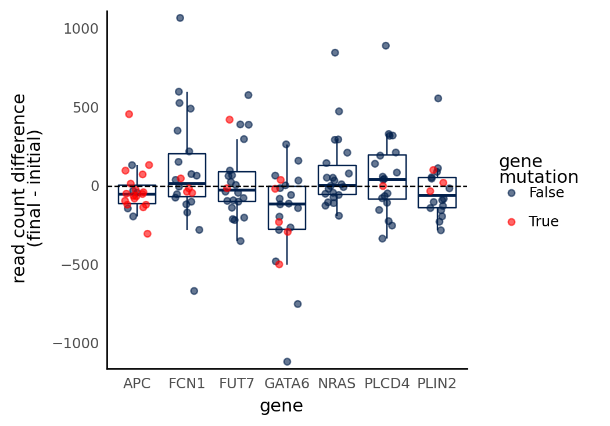

    <ggplot: (358735595)>

```python
m2_ppc = pmanal.summarize_posterior_predictions(
    m2_trace["posterior_predictive"]["y"].squeeze().values,
    merge_with=data,
    calc_error=True,
    observed_y="counts_final",
)

(
    gg.ggplot(m2_ppc, gg.aes(x="counts_final", y="pred_mean"))
    + gg.geom_linerange(
        gg.aes(ymin="pred_hdi_low", ymax="pred_hdi_high"),
        alpha=0.1,
        size=0.4,
    )
    + gg.geom_point(alpha=0.4, size=1)
    + gg.geom_abline(slope=1, intercept=0, linetype="--", color="#011F4B")
    + gg.scale_x_log10()
    + gg.scale_y_log10()
    + gg.labs(
        x="observed final read count",
        y="predicted final read count",
        title="Posterior predictions",
    )
)
```

    /usr/local/Caskroom/miniconda/base/envs/speclet/lib/python3.9/site-packages/arviz/stats/stats.py:456: FutureWarning: hdi currently interprets 2d data as (draw, shape) but this will change in a future release to (chain, draw) for coherence with other functions

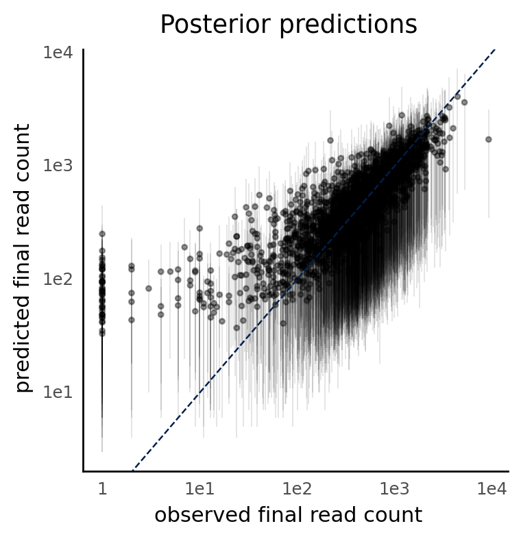

    <ggplot: (358804733)>

## Model 3. Experimenting with copy number effect

```python
(
    gg.ggplot(data, gg.aes(x="copy_number", y="lfc"))
    + gg.geom_point(alpha=0.5)
    + gg.geom_smooth(method="lm", formula="y~x")
)
```

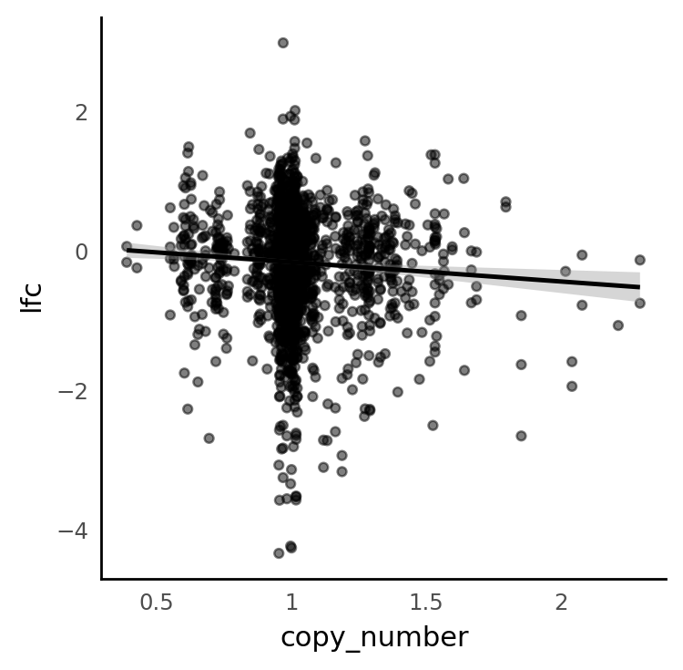

    <ggplot: (358750859)>

```python
(
    gg.ggplot(data, gg.aes(x="factor(np.round(copy_number*2)/2)", y="lfc"))
    + gg.geom_boxplot()
    + gg.labs(x="copy number", y="log fold change")
)
```

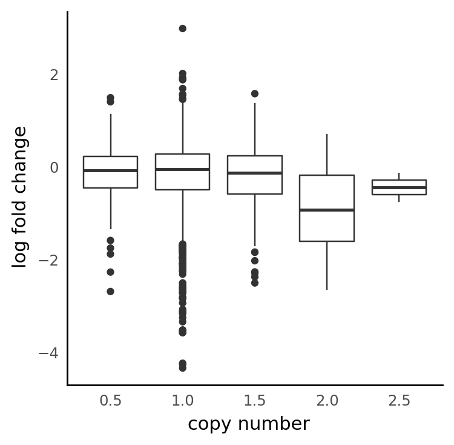

    <ggplot: (358806489)>

model formula:

$$
\begin{aligned}
\mu_\beta &\sim \text{N}(0, 2.5) \\
\sigma_\beta &\sim \text{HN}(2.5) \\
\beta_0 &\sim_g \text{N}(\mu_\beta, \sigma_\beta) \\
\beta_\text{CNA} &\sim \text{N}(0, 2.5) \\
\eta &= \beta_0 + \beta_\text{CNA} x_\text{cna} \\
\mu &= \exp(\eta) \\
\alpha &\sim \text{N}(0, 5) \\
y &\sim \text{NB}(\mu x_\text{initial}, \alpha)
\end{aligned}
$$

```python
data["copy_number_scaled"] = vhelp.careful_zscore(data.copy_number.values)

with pm.Model() as nb_m3:
    g = pm.Data("g", dphelp.get_indices(data, "hugo_symbol"))
    x_cna = pm.Data("x_cna", data.copy_number_scaled.values)
    counts_initial = pm.Data("counts_initial", data.counts_initial_adj.values)
    counts_final = pm.Data("counts_final", data.counts_final.values)

    μ_β = pm.Normal("μ_β", 0, 2.5)
    σ_β = pm.HalfNormal("σ_β", 2.5)

    β_0 = pm.Normal("β_0", μ_β, σ_β, shape=n_genes)
    β_cna = pm.Normal("β_cna", 0, 2.5)
    η = pm.Deterministic("η", β_0[g] + β_cna * x_cna)

    μ = pm.Deterministic("μ", pm.math.exp(η))
    α = pm.HalfNormal("α", 5)

    y = pm.NegativeBinomial("y", μ * counts_initial, α, observed=counts_final)
```

```python
pm.model_to_graphviz(nb_m3)
```

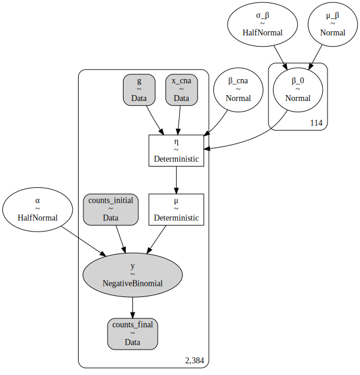

```python
with nb_m3:
    m3_trace = pm.sample(
        1000, tune=2000, chains=4, random_seed=154, return_inferencedata=True
    )
    ppc = pm.sample_posterior_predictive(m3_trace, random_seed=154)
    m3_trace.extend(az.from_pymc3(posterior_predictive=ppc))
```

    Auto-assigning NUTS sampler...
    Initializing NUTS using jitter+adapt_diag...
    Multiprocess sampling (4 chains in 2 jobs)
    NUTS: [α, β_cna, β_0, σ_β, μ_β]

<div>
    <style>
        /*Turns off some styling*/
        progress {
            /*gets rid of default border in Firefox and Opera.*/
            border: none;
            /*Needs to be in here for Safari polyfill so background images work as expected.*/
            background-size: auto;
        }
        .progress-bar-interrupted, .progress-bar-interrupted::-webkit-progress-bar {
            background: #F44336;
        }
    </style>
  <progress value='12000' class='' max='12000' style='width:300px; height:20px; vertical-align: middle;'></progress>
  100.00% [12000/12000 01:04<00:00 Sampling 4 chains, 0 divergences]
</div>

    Sampling 4 chains for 2_000 tune and 1_000 draw iterations (8_000 + 4_000 draws total) took 85 seconds.

<div>
    <style>
        /*Turns off some styling*/
        progress {
            /*gets rid of default border in Firefox and Opera.*/
            border: none;
            /*Needs to be in here for Safari polyfill so background images work as expected.*/
            background-size: auto;
        }
        .progress-bar-interrupted, .progress-bar-interrupted::-webkit-progress-bar {
            background: #F44336;
        }
    </style>
  <progress value='4000' class='' max='4000' style='width:300px; height:20px; vertical-align: middle;'></progress>
  100.00% [4000/4000 01:03<00:00]
</div>

```python
trace_collection["(m3): single CNA"] = m3_trace
```

```python
az.plot_trace(m3_trace, var_names=["α", "β"], filter_vars="like");
```

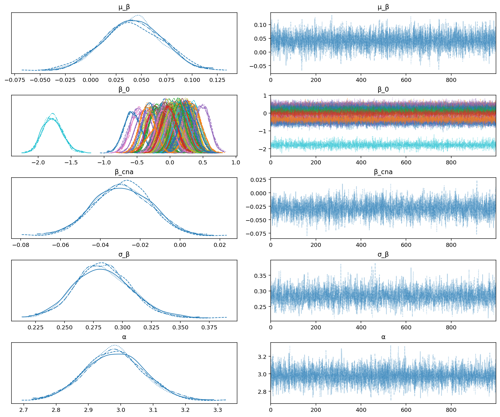

```python
m3_ppc_df = pmanal.summarize_posterior_predictions(
    m3_trace["posterior_predictive"]["y"].values.squeeze(),
    merge_with=data,
    observed_y="y",
)

(
    gg.ggplot(m3_ppc_df, gg.aes(x="counts_final", y="pred_mean"))
    + gg.geom_linerange(gg.aes(ymin="pred_hdi_low", ymax="pred_hdi_high"), alpha=0.1)
    + gg.geom_point(alpha=0.25)
    + gg.geom_abline(slope=1, intercept=0, linetype="--", color="blue")
    + gg.scale_x_log10(expand=(0, 0, 0.02, 0))
    + gg.scale_y_log10(expand=(0, 0, 0.02, 0))
)
```

    /usr/local/Caskroom/miniconda/base/envs/speclet/lib/python3.9/site-packages/arviz/stats/stats.py:456: FutureWarning: hdi currently interprets 2d data as (draw, shape) but this will change in a future release to (chain, draw) for coherence with other functions

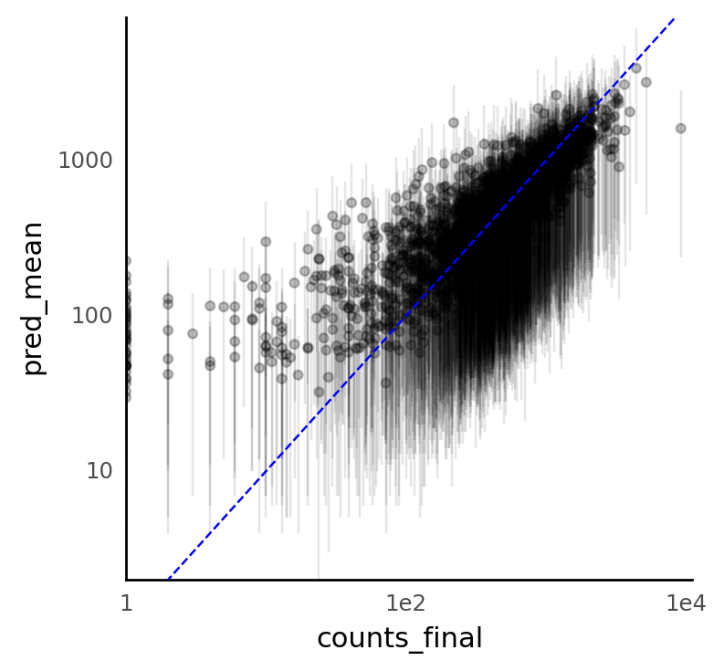

    <ggplot: (347768149)>

```python
def prep_ppc(m: az.InferenceData, name: str) -> pd.DataFrame:
    df = pmanal.summarize_posterior_predictions(
        m["posterior_predictive"]["y"].values.squeeze()
    ).rename(
        columns={
            "pred_mean": f"{name}_pred",
            "pred_hdi_low": f"{name}_hdi_low",
            "pred_hdi_high": f"{name}_hdi_high",
        }
    )
    return df
```

```python
comparison_ppc_df = pd.concat(
    [prep_ppc(m, n) for m, n in [(m2_trace, "m2"), (m3_trace, "m3")]], axis=1
)
```

    /usr/local/Caskroom/miniconda/base/envs/speclet/lib/python3.9/site-packages/arviz/stats/stats.py:456: FutureWarning: hdi currently interprets 2d data as (draw, shape) but this will change in a future release to (chain, draw) for coherence with other functions

```python
(
    gg.ggplot(comparison_ppc_df, gg.aes(x="m2_pred", y="m3_pred"))
    + gg.geom_point(alpha=0.2, size=0.5)
    + gg.scale_x_log10(expand=(0, 0, 0.02, 0))
    + gg.scale_y_log10(expand=(0, 0, 0.02, 0))
)
```

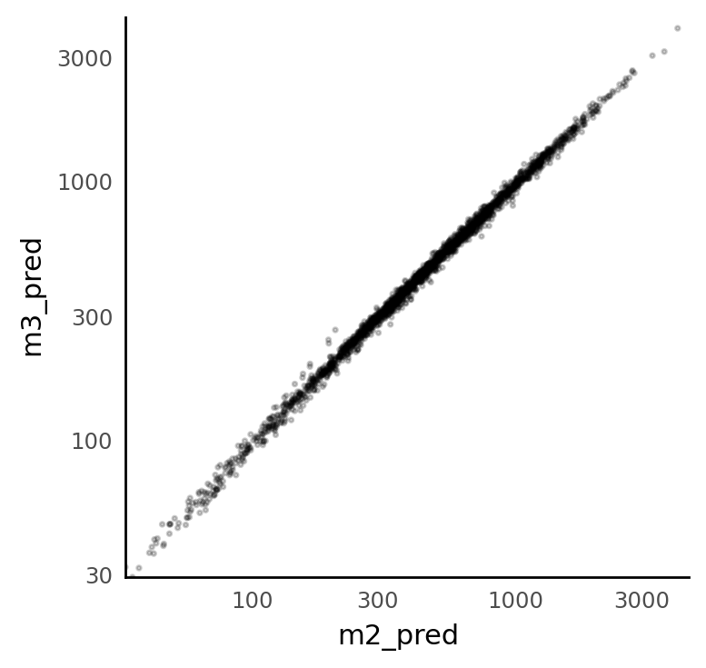

    <ggplot: (359573429)>

```python
def prep_posterior_beta(
    m: az.InferenceData, m_name: str, var_name: str, genes: Sequence[str]
) -> pd.DataFrame:
    df = az.summary(m, var_names=var_name, kind="stats", hdi_prob=0.89).assign(
        hugo_symbol=genes, model=m_name
    )
    return df
```

```python
beta_posteriors = pd.concat(
    [
        prep_posterior_beta(m, n, b, data.hugo_symbol.cat.categories)
        for m, n, b in [(m1_trace, "m1", "β_g"), (m3_trace, "m3", "β_0")]
    ]
)

beta_posteriors.head()
```

<div>
<style scoped>
    .dataframe tbody tr th:only-of-type {
        vertical-align: middle;
    }

    .dataframe tbody tr th {
        vertical-align: top;
    }

    .dataframe thead th {
        text-align: right;
    }
</style>
<table border="1" class="dataframe">
  <thead>
    <tr style="text-align: right;">
      <th></th>
      <th>mean</th>
      <th>sd</th>
      <th>hdi_5.5%</th>
      <th>hdi_94.5%</th>
      <th>hugo_symbol</th>
      <th>model</th>
    </tr>
  </thead>
  <tbody>
    <tr>
      <th>β_g[0]</th>
      <td>-0.206</td>
      <td>0.119</td>
      <td>-0.398</td>
      <td>-0.022</td>
      <td>ACVR1C</td>
      <td>m1</td>
    </tr>
    <tr>
      <th>β_g[1]</th>
      <td>0.352</td>
      <td>0.113</td>
      <td>0.176</td>
      <td>0.535</td>
      <td>ADAMTS2</td>
      <td>m1</td>
    </tr>
    <tr>
      <th>β_g[2]</th>
      <td>0.126</td>
      <td>0.111</td>
      <td>-0.058</td>
      <td>0.296</td>
      <td>ADPRHL1</td>
      <td>m1</td>
    </tr>
    <tr>
      <th>β_g[3]</th>
      <td>0.117</td>
      <td>0.117</td>
      <td>-0.072</td>
      <td>0.301</td>
      <td>ALKBH8</td>
      <td>m1</td>
    </tr>
    <tr>
      <th>β_g[4]</th>
      <td>-0.225</td>
      <td>0.117</td>
      <td>-0.416</td>
      <td>-0.047</td>
      <td>APC</td>
      <td>m1</td>
    </tr>
  </tbody>
</table>
</div>

```python
pos = gg.position_dodge(width=0.6)
(
    gg.ggplot(beta_posteriors, gg.aes(x="hugo_symbol", y="mean", color="model"))
    + gg.geom_linerange(
        gg.aes(ymin="hdi_5.5%", ymax="hdi_94.5%"), position=pos, size=0.5, alpha=0.5
    )
    + gg.geom_point(position=pos, size=0.75)
    + gg.scale_color_brewer(type="qual", palette="Dark2")
    + gg.theme(
        axis_text_x=gg.element_text(size=7, angle=90),
        axis_text_y=gg.element_text(size=7),
        figure_size=(8, 4),
        panel_grid_major_x=gg.element_line(),
    )
    + gg.labs(
        x="gene",
        y="posterior for varying intercept\n(mean and 95% CI)",
        title="Comparing posterior distributions for the varying intercept\nwith and without CNA covariate",
    )
)
```

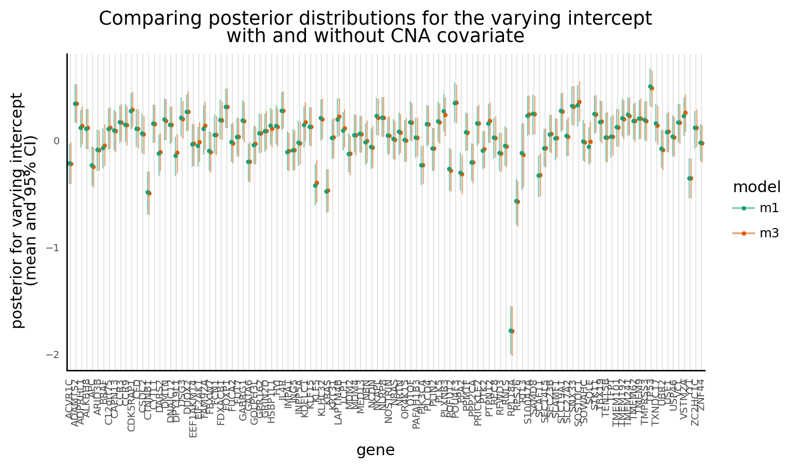

    <ggplot: (351623720)>

```python
beta_cna_post = m3_trace["posterior"]["β_cna"].values.mean()
beta_cna_post
```

    -0.02911061270030254

```python
gl = ["RTL3", "CSDC2", "KLF5", "EIF2AK1", "SQLE"]
#      down    down      up       up        up

(
    gg.ggplot(
        data[data.hugo_symbol.isin(gl)].assign(
            hugo_symbol=lambda d: d.hugo_symbol.astype(str)
        ),
        gg.aes(x="copy_number_scaled", y="lfc"),
    )
    + gg.geom_point(gg.aes(color="hugo_symbol"))
    + gg.geom_smooth(
        gg.aes(color="hugo_symbol"),
        formula="y~x",
        method="lm",
        linetype="--",
        se=False,
        size=0.6,
    )
    + gg.geom_abline(
        slope=beta_cna_post, intercept=0, color="black", linetype="--", size=0.8
    )
    + gg.scale_color_brewer(type="qual", palette="Set2")
    + gg.labs(x="copy number (z-scaled)", y="log fold change", color="gene")
)
```

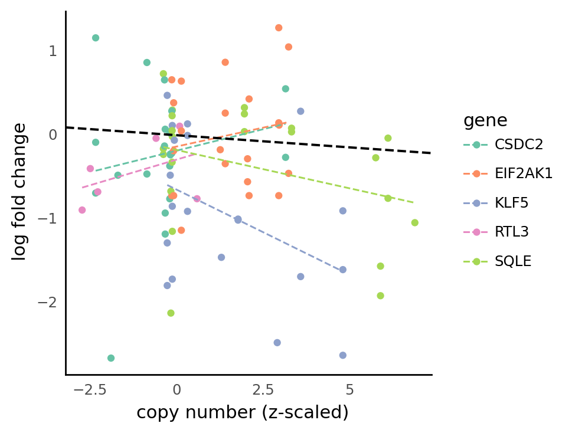

    <ggplot: (360078638)>

## Model 4. Varying CNA covariate and intercept

model formula:

$$
\begin{aligned}
\mu_{\beta_0} &\sim \text{N}(0, 2.5) \quad \sigma_{\beta_0} \sim \text{HN}(2.5) \\
\mu_{\beta_\text{CNA}} &\sim \text{N}(0, 2.5) \quad \sigma_{\beta_\text{CNA}} \sim \text{HN}(2.5) \\
\beta_0 &\sim_g \text{N}(\mu_{\beta_0}, \sigma_{\beta_0}) \\
\beta_\text{CNA} &\sim_g \text{N}(\mu_{\beta_\text{CNA}}, \sigma_{\beta_\text{CNA}}) \\
\eta &= \beta_0[g] + x_\text{cna} \beta_\text{CNA}[g] \\
\mu &= \exp(\eta) \\
\alpha &\sim \text{N}(0, 5) \\
y &\sim \text{NB}(\mu x_\text{initial}, \alpha)
\end{aligned}
$$

```python
data["copy_number_scaled"] = vhelp.careful_zscore(data.copy_number.values)


def make_hierarchical_noncentered_coef(
    name: str,
    shape: Union[float, tuple[float, ...]],
    mu_sd: float = 2.5,
    sigma_sd: float = 2.5,
) -> pm.model.FreeRV:
    μ = pm.Normal(f"μ_{name}", 0.0, mu_sd)
    σ = pm.HalfNormal(f"σ_{name}", sigma_sd)
    Δ = pm.Normal(f"Δ_{name}", 0.0, 1.0, shape=shape)
    β = pm.Deterministic(name, μ + Δ * σ)
    return β


with pm.Model() as nb_m4:
    g = pm.Data("g", dphelp.get_indices(data, "hugo_symbol"))
    x_cna = pm.Data("x_cna", data.copy_number_scaled.values)
    counts_initial = pm.Data("counts_initial", data.counts_initial_adj.values)
    counts_final = pm.Data("counts_final", data.counts_final.values)

    β_0 = make_hierarchical_noncentered_coef("β_0", shape=n_genes)
    β_cna = make_hierarchical_noncentered_coef(
        "β_cna", shape=n_genes, mu_sd=1.0, sigma_sd=1.0
    )
    η = pm.Deterministic("η", β_0[g] + β_cna[g] * x_cna)

    μ = pm.Deterministic("μ", pm.math.exp(η))
    α = pm.HalfNormal("α", 5)

    y = pm.NegativeBinomial("y", μ * counts_initial, α, observed=counts_final)
```

```python
pm.model_to_graphviz(nb_m4)
```

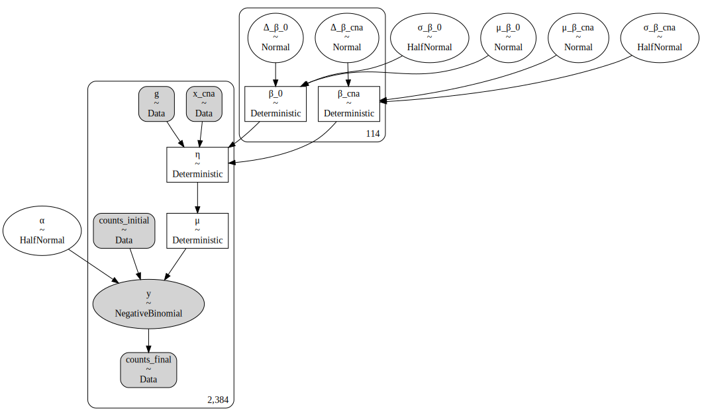

```python
with nb_m4:
    m4_trace = pm.sample(
        2000,
        chains=4,
        tune=3000,
        random_seed=400,
        target_accept=0.95,
        return_inferencedata=True,
    )
    ppc = pm.sample_posterior_predictive(m4_trace, random_seed=400)
    m4_trace.extend(az.from_pymc3(posterior_predictive=ppc))
```

    Auto-assigning NUTS sampler...
    Initializing NUTS using jitter+adapt_diag...
    Multiprocess sampling (4 chains in 2 jobs)
    NUTS: [α, Δ_β_cna, σ_β_cna, μ_β_cna, Δ_β_0, σ_β_0, μ_β_0]

<div>
    <style>
        /*Turns off some styling*/
        progress {
            /*gets rid of default border in Firefox and Opera.*/
            border: none;
            /*Needs to be in here for Safari polyfill so background images work as expected.*/
            background-size: auto;
        }
        .progress-bar-interrupted, .progress-bar-interrupted::-webkit-progress-bar {
            background: #F44336;
        }
    </style>
  <progress value='20000' class='' max='20000' style='width:300px; height:20px; vertical-align: middle;'></progress>
  100.00% [20000/20000 06:24<00:00 Sampling 4 chains, 2 divergences]
</div>

    Sampling 4 chains for 3_000 tune and 2_000 draw iterations (12_000 + 8_000 draws total) took 405 seconds.
    There were 2 divergences after tuning. Increase `target_accept` or reparameterize.
    The acceptance probability does not match the target. It is 0.9076895989246748, but should be close to 0.95. Try to increase the number of tuning steps.

<div>
    <style>
        /*Turns off some styling*/
        progress {
            /*gets rid of default border in Firefox and Opera.*/
            border: none;
            /*Needs to be in here for Safari polyfill so background images work as expected.*/
            background-size: auto;
        }
        .progress-bar-interrupted, .progress-bar-interrupted::-webkit-progress-bar {
            background: #F44336;
        }
    </style>
  <progress value='8000' class='' max='8000' style='width:300px; height:20px; vertical-align: middle;'></progress>
  100.00% [8000/8000 02:34<00:00]
</div>

```python
trace_collection["(m4) varying CNA"] = m4_trace
```

```python
az.plot_trace(
    m4_trace, var_names=["α", "β_0", "β_cna", "μ_β_0", "σ_β_0", "μ_β_cna", "σ_β_cna"]
);
```

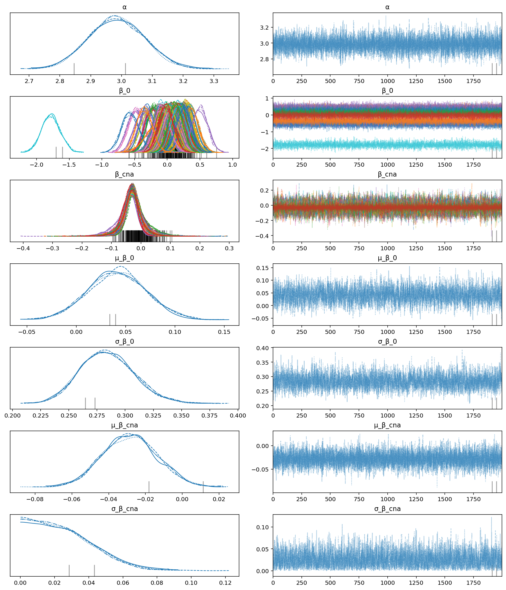

```python
m4_beta_cna_post_df = az.summary(m4_trace, var_names="β_cna", hdi_prob=0.89).assign(
    hugo_symbol=data.hugo_symbol.cat.categories
)

mu_beta_cna_post = az.summary(
    m4_trace, var_names="μ_β_cna", hdi_prob=0.89, kind="stats"
)

(
    gg.ggplot(
        m4_beta_cna_post_df.sort_values("mean").assign(
            hugo_symbol=lambda d: pd.Categorical(
                d.hugo_symbol.astype(str),
                ordered=True,
                categories=d.hugo_symbol.astype(str),
            )
        ),
        gg.aes(x="hugo_symbol", y="mean"),
    )
    + gg.geom_hline(yintercept=mu_beta_cna_post["mean"][0])
    + gg.geom_hline(
        yintercept=[mu_beta_cna_post["hdi_5.5%"][0], mu_beta_cna_post["hdi_94.5%"][0]],
        alpha=0.5,
        linetype="--",
    )
    + gg.geom_linerange(
        gg.aes(ymin="hdi_5.5%", ymax="hdi_94.5%"), color="#011F4B", alpha=0.5
    )
    + gg.geom_point(color="#011F4B", size=1)
    + gg.scale_y_continuous(expand=(0.02, 0, 0.02, 0))
    + gg.theme(
        figure_size=(8, 5),
        axis_text_x=gg.element_text(angle=90, size=7),
        panel_grid_major_y=gg.element_line(),
    )
    + gg.labs(
        x="gene",
        y="β_CNA posterior (mean and 89% CI)",
        title="Posterior coefficients for copy number effect",
    )
)
```

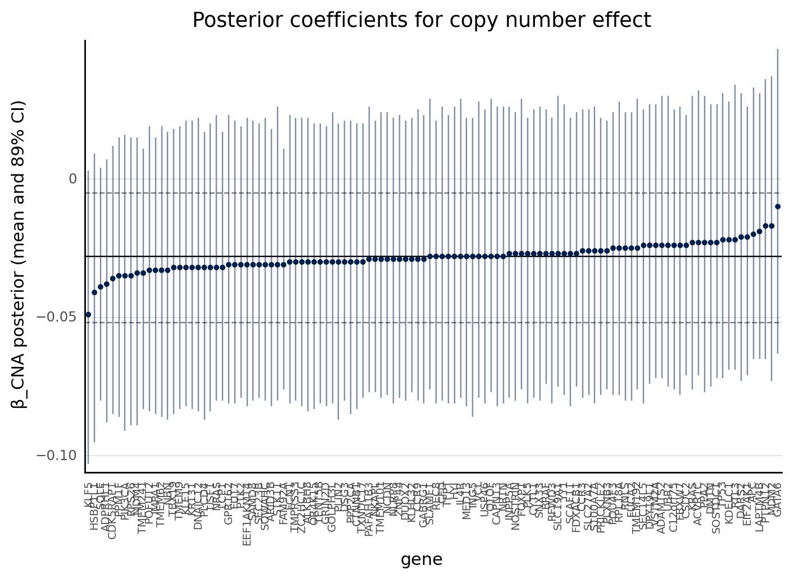

    <ggplot: (357068828)>

```python
gl = m4_beta_cna_post_df.sort_values("mean").head(n=6).hugo_symbol.values

(
    gg.ggplot(
        data[data.hugo_symbol.isin(gl)].assign(
            hugo_symbol=lambda d: d.hugo_symbol.astype(str)
        ),
        gg.aes(x="copy_number_scaled", y="lfc"),
    )
    + gg.geom_point(gg.aes(color="hugo_symbol"), size=1, alpha=0.75)
    + gg.geom_smooth(
        gg.aes(color="hugo_symbol"),
        formula="y~x",
        method="lm",
        linetype="--",
        se=False,
        size=0.6,
    )
    + gg.scale_color_brewer(type="qual", palette="Dark2")
    + gg.labs(x="copy number (z-scaled)", y="log fold change", color="gene")
)
```

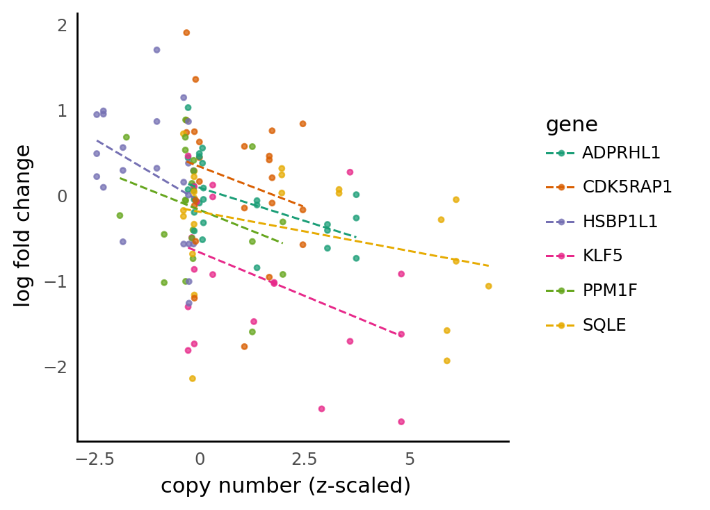

    <ggplot: (357554776)>

## Final comparison of all models

Make sure to note that this analysis was conducted with a relatively small subset of the data.
Further, the amount of data per gene is quite small, limiting the hierarchical models.

```python
model_comparison = az.compare(trace_collection)
az.plot_compare(model_comparison);
```

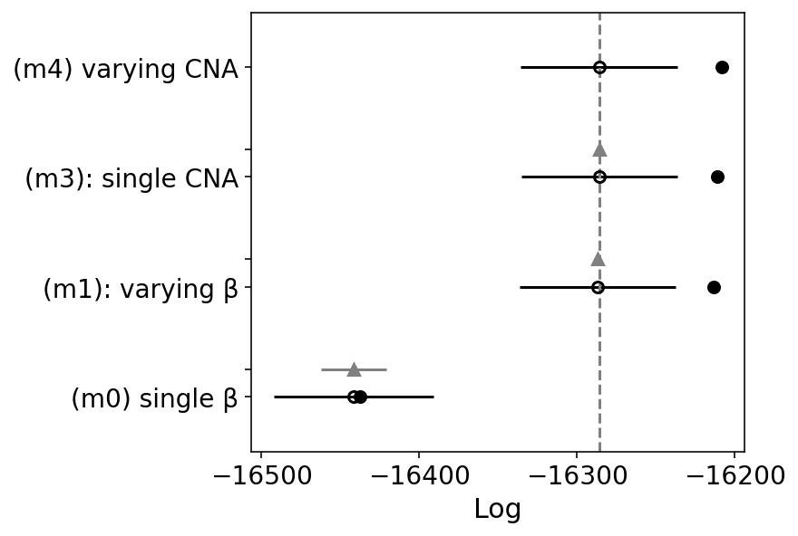

```python
model_comparison
```

<div>
<style scoped>
    .dataframe tbody tr th:only-of-type {
        vertical-align: middle;
    }

    .dataframe tbody tr th {
        vertical-align: top;
    }

    .dataframe thead th {
        text-align: right;
    }
</style>
<table border="1" class="dataframe">
  <thead>
    <tr style="text-align: right;">
      <th></th>
      <th>rank</th>
      <th>loo</th>
      <th>p_loo</th>
      <th>d_loo</th>
      <th>weight</th>
      <th>se</th>
      <th>dse</th>
      <th>warning</th>
      <th>loo_scale</th>
    </tr>
  </thead>
  <tbody>
    <tr>
      <th>(m4) varying CNA</th>
      <td>0</td>
      <td>-16285.875042</td>
      <td>77.829704</td>
      <td>0.000000</td>
      <td>0.608464</td>
      <td>49.586859</td>
      <td>0.000000</td>
      <td>True</td>
      <td>log</td>
    </tr>
    <tr>
      <th>(m3): single CNA</th>
      <td>1</td>
      <td>-16285.885134</td>
      <td>74.954093</td>
      <td>0.010092</td>
      <td>0.177794</td>
      <td>49.511231</td>
      <td>0.718713</td>
      <td>True</td>
      <td>log</td>
    </tr>
    <tr>
      <th>(m1): varying β</th>
      <td>2</td>
      <td>-16286.884244</td>
      <td>73.613747</td>
      <td>1.009202</td>
      <td>0.193346</td>
      <td>49.492105</td>
      <td>2.029241</td>
      <td>False</td>
      <td>log</td>
    </tr>
    <tr>
      <th>(m0) single β</th>
      <td>3</td>
      <td>-16441.544649</td>
      <td>3.713043</td>
      <td>155.669607</td>
      <td>0.020397</td>
      <td>50.583639</td>
      <td>20.785624</td>
      <td>False</td>
      <td>log</td>
    </tr>
  </tbody>
</table>
</div>

---

```python
notebook_toc = time()
print(f"execution time: {(notebook_toc - notebook_tic) / 60:.2f} minutes")
```

    execution time: 24.80 minutes

```python
%load_ext watermark
%watermark -d -u -v -iv -b -h -m
```

    Last updated: 2021-10-06

    Python implementation: CPython
    Python version       : 3.9.6
    IPython version      : 7.26.0

    Compiler    : Clang 11.1.0
    OS          : Darwin
    Release     : 20.6.0
    Machine     : x86_64
    Processor   : i386
    CPU cores   : 4
    Architecture: 64bit

    Hostname: JHCookMac.local

    Git branch: nb-model-2

    arviz     : 0.11.2
    matplotlib: 3.4.3
    theano    : 1.0.5
    numpy     : 1.21.2
    re        : 2.2.1
    seaborn   : 0.11.2
    janitor   : 0.21.0
    plotnine  : 0.8.0
    pandas    : 1.3.2
    pymc3     : 3.11.2
