# Comparing negative binomial and normal linear regression models

The goal of this notebook is to compare negative binomial and normal models of real CRISPR-screen data.
Comparisons will be made on computational efficiency, MCMC diagnositics, model accuracy and fitness, and posterior predictive checks.

## Setup

```python
%load_ext autoreload
%autoreload 2
```

```python
import logging
import pprint
import re
import string
import warnings
from pathlib import Path
from time import time

import arviz as az
import matplotlib.colors as mcolors
import matplotlib.pyplot as plt
import numpy as np
import pandas as pd
import plotnine as gg
import pymc3 as pm
import seaborn as sns
from theano import tensor as tt
```

```python
from src.analysis import pymc3_analysis as pmanal
from src.data_processing import achilles as achelp
from src.data_processing import common as dphelp
from src.data_processing import vectors as vhelp
from src.globals import get_pymc3_constants
from src.io import cache_io, data_io
from src.loggers import set_console_handler_level
from src.modeling import pymc3_helpers as pmhelp
from src.modeling import pymc3_sampling_api as pmapi
from src.plot.color_pal import SeabornColor
from src.plot.plotnine_helpers import set_gg_theme
```

```python
notebook_tic = time()
warnings.simplefilter(action="ignore", category=UserWarning)
set_console_handler_level(logging.WARN)
set_gg_theme()
%config InlineBackend.figure_format = "retina"
PYMC3 = get_pymc3_constants
RANDOM_SEED = 212
np.random.seed(RANDOM_SEED)
```

## Data

```python
crc_modeling_data_path = data_io.data_path(data_io.DataFile.DEPMAP_CRC_SUBSAMPLE)
crc_modeling_data = achelp.read_achilles_data(
    crc_modeling_data_path, low_memory=False, set_categorical_cols=True
)
crc_modeling_data.head()
```

<div>
<style scoped>
    .dataframe tbody tr th:only-of-type {
        vertical-align: middle;
    }

    .dataframe tbody tr th {
        vertical-align: top;
    }

    .dataframe thead th {
        text-align: right;
    }
</style>
<table border="1" class="dataframe">
  <thead>
    <tr style="text-align: right;">
      <th></th>
      <th>sgrna</th>
      <th>replicate_id</th>
      <th>lfc</th>
      <th>p_dna_batch</th>
      <th>genome_alignment</th>
      <th>hugo_symbol</th>
      <th>screen</th>
      <th>multiple_hits_on_gene</th>
      <th>sgrna_target_chr</th>
      <th>sgrna_target_pos</th>
      <th>...</th>
      <th>num_mutations</th>
      <th>any_deleterious</th>
      <th>any_tcga_hotspot</th>
      <th>any_cosmic_hotspot</th>
      <th>is_mutated</th>
      <th>copy_number</th>
      <th>lineage</th>
      <th>primary_or_metastasis</th>
      <th>is_male</th>
      <th>age</th>
    </tr>
  </thead>
  <tbody>
    <tr>
      <th>0</th>
      <td>ATAACACTGCACCTTCCAAC</td>
      <td>LS513-311Cas9_RepA_p6_batch2</td>
      <td>0.179367</td>
      <td>2</td>
      <td>chr2_157587191_-</td>
      <td>ACVR1C</td>
      <td>broad</td>
      <td>True</td>
      <td>2</td>
      <td>157587191</td>
      <td>...</td>
      <td>0</td>
      <td>NaN</td>
      <td>NaN</td>
      <td>NaN</td>
      <td>False</td>
      <td>0.964254</td>
      <td>colorectal</td>
      <td>primary</td>
      <td>True</td>
      <td>63.0</td>
    </tr>
    <tr>
      <th>1</th>
      <td>ATAACACTGCACCTTCCAAC</td>
      <td>CL-11-311Cas9_RepB_p6_batch3</td>
      <td>-0.139505</td>
      <td>3</td>
      <td>chr2_157587191_-</td>
      <td>ACVR1C</td>
      <td>broad</td>
      <td>False</td>
      <td>2</td>
      <td>157587191</td>
      <td>...</td>
      <td>0</td>
      <td>NaN</td>
      <td>NaN</td>
      <td>NaN</td>
      <td>False</td>
      <td>1.004888</td>
      <td>colorectal</td>
      <td>primary</td>
      <td>True</td>
      <td>NaN</td>
    </tr>
    <tr>
      <th>2</th>
      <td>ATAACACTGCACCTTCCAAC</td>
      <td>SW1463-311cas9 Rep A p5_batch2</td>
      <td>-0.192216</td>
      <td>2</td>
      <td>chr2_157587191_-</td>
      <td>ACVR1C</td>
      <td>broad</td>
      <td>True</td>
      <td>2</td>
      <td>157587191</td>
      <td>...</td>
      <td>0</td>
      <td>NaN</td>
      <td>NaN</td>
      <td>NaN</td>
      <td>False</td>
      <td>0.923384</td>
      <td>colorectal</td>
      <td>primary</td>
      <td>False</td>
      <td>66.0</td>
    </tr>
    <tr>
      <th>3</th>
      <td>ATAACACTGCACCTTCCAAC</td>
      <td>HT29-311Cas9_RepA_p6 AVANA_batch3</td>
      <td>0.282499</td>
      <td>3</td>
      <td>chr2_157587191_-</td>
      <td>ACVR1C</td>
      <td>broad</td>
      <td>True</td>
      <td>2</td>
      <td>157587191</td>
      <td>...</td>
      <td>0</td>
      <td>NaN</td>
      <td>NaN</td>
      <td>NaN</td>
      <td>False</td>
      <td>1.014253</td>
      <td>colorectal</td>
      <td>primary</td>
      <td>False</td>
      <td>44.0</td>
    </tr>
    <tr>
      <th>4</th>
      <td>ATAACACTGCACCTTCCAAC</td>
      <td>KM12-311Cas9 Rep A p5_batch3</td>
      <td>0.253698</td>
      <td>3</td>
      <td>chr2_157587191_-</td>
      <td>ACVR1C</td>
      <td>broad</td>
      <td>True</td>
      <td>2</td>
      <td>157587191</td>
      <td>...</td>
      <td>0</td>
      <td>NaN</td>
      <td>NaN</td>
      <td>NaN</td>
      <td>False</td>
      <td>1.048861</td>
      <td>colorectal</td>
      <td>primary</td>
      <td>NaN</td>
      <td>NaN</td>
    </tr>
  </tbody>
</table>
<p>5 rows × 24 columns</p>
</div>

```python
crc_modeling_data.columns.to_list()
```

    ['sgrna',
     'replicate_id',
     'lfc',
     'p_dna_batch',
     'genome_alignment',
     'hugo_symbol',
     'screen',
     'multiple_hits_on_gene',
     'sgrna_target_chr',
     'sgrna_target_pos',
     'depmap_id',
     'counts_final',
     'counts_initial',
     'rna_expr',
     'num_mutations',
     'any_deleterious',
     'any_tcga_hotspot',
     'any_cosmic_hotspot',
     'is_mutated',
     'copy_number',
     'lineage',
     'primary_or_metastasis',
     'is_male',
     'age']

```python
data = (
    crc_modeling_data[~crc_modeling_data.counts_final.isna()]
    .reset_index(drop=True)
    .pipe(achelp.set_achilles_categorical_columns)
    .astype({"counts_final": int, "counts_initial": int})
    .reset_index(drop=True)
    .shuffle()
    .pipe(
        achelp.zscale_cna_by_group,
        cn_col="copy_number",
        new_col="copy_number_z",
        groupby_cols=["depmap_id"],
        cn_max=20,
    )
    .pipe(achelp.append_total_read_counts)
    .pipe(achelp.add_useful_read_count_columns)
)
data.shape
```

    (2384, 29)

```python
plot_df = (
    data[["depmap_id", "hugo_symbol", "copy_number", "copy_number_z", "lfc"]]
    .drop_duplicates()
    .pivot_longer(
        index=["depmap_id", "hugo_symbol", "lfc"], names_to="cn", values_to="value"
    )
)
(
    gg.ggplot(plot_df.drop(columns=["lfc"]).drop_duplicates(), gg.aes(x="value"))
    + gg.facet_wrap("~cn", nrow=1, scales="free")
    + gg.geom_histogram(gg.aes(fill="depmap_id"), position="identity", alpha=0.4)
    + gg.scale_x_continuous(expand=(0, 0))
    + gg.scale_y_continuous(expand=(0, 0, 0.02, 0))
    + gg.scale_fill_brewer(type="qual", palette="Dark2")
    + gg.theme(figure_size=(8, 3), panel_spacing_x=0.4)
    + gg.labs(x="copy number", y="count", fill="cell line")
)
```

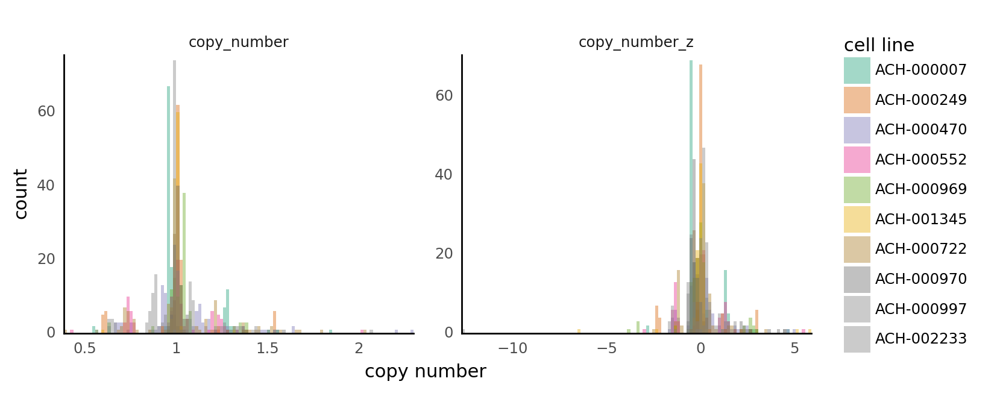

    <ggplot: (349013863)>

```python
(
    gg.ggplot(plot_df, gg.aes(x="value", y="lfc", color="depmap_id"))
    + gg.facet_wrap("~ cn", nrow=1, scales="free")
    + gg.geom_point(alpha=0.6)
    + gg.geom_smooth(formula="y~x", method="lm", linetype="--", size=0.5, alpha=0.1)
    + gg.scale_x_continuous(expand=(0.02, 0))
    + gg.scale_y_continuous(expand=(0.02, 0))
    + gg.scale_color_brewer(type="qual", palette="Dark2")
    + gg.theme(figure_size=(8, 4))
)
```

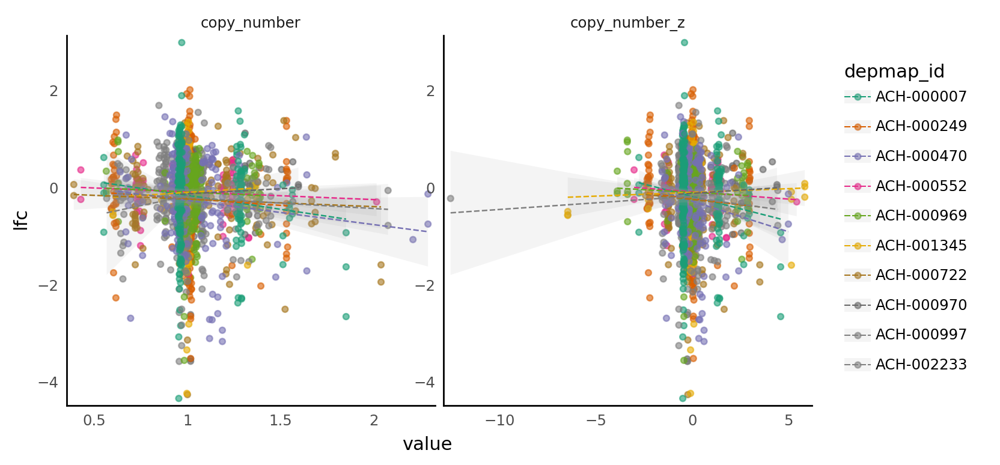

    <ggplot: (349248925)>

```python
ax = sns.scatterplot(data=data, x="counts_initial_adj", y="counts_final")
ax.set_yscale("log", base=10)
ax.set_xscale("log", base=10)
plt.show()
```

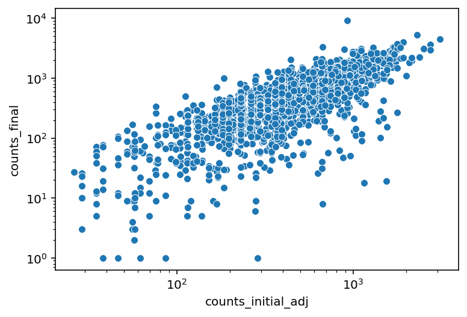

## Modeling

Fit models with hierarchical structure for gene and copy number effect per cell line.

For each model:

$$
\begin{aligned}
\mu_{\beta_0} &\sim \text{N}(0, 2.5) \quad \sigma_{\beta_0} \sim \text{HN}(2.5) \\
\mu_{\beta_\text{CNA}} &\sim \text{N}(0, 2.5) \quad \sigma_{\beta_\text{CNA}} \sim \text{HN}(2.5) \\
\beta_0 &\sim_g \text{N}(\mu_{\beta_0}, \sigma_{\beta_0}) \\
\beta_\text{CNA} &\sim_c \text{N}(\mu_{\beta_\text{CNA}}, \sigma_{\beta_\text{CNA}}) \\
\end{aligned}
$$

For the negative binomial:

$$
\begin{aligned}
\eta &= \beta_0[g] + x_\text{CNA} \beta_\text{CNA}[c] \\
\mu &= \exp(\eta) \\
\alpha &\sim \text{HN}(0, 5) \\
y &\sim \text{NB}(\mu x_\text{initial}, \alpha)
\end{aligned}
$$

For the normal model:

$$
\begin{aligned}
\mu &= \beta_0[g] + x_\text{CNA} \beta_\text{CNA}[c] \\
\sigma &\sim \text{HN}(0, 5) \\
y &\sim \text{N}(\mu, \sigma)
\end{aligned}
$$

```python
gene_idx, n_genes = dphelp.get_indices_and_count(data, "hugo_symbol")
print(f"number of genes: {n_genes}")

cell_line_idx, n_cells = dphelp.get_indices_and_count(data, "depmap_id")
print(f"number of cell lines: {n_cells}")
```

    number of genes: 114
    number of cell lines: 10

### Build models

#### Negative Binomial model

```python
gene_copynumber_averages = vhelp.careful_zscore(
    data.groupby("hugo_symbol")["copy_number_z"].mean().values
)
```

```python
with pm.Model() as nb_model:
    g = pm.Data("g", gene_idx)
    c = pm.Data("c", cell_line_idx)
    x_cna = pm.Data("x_cna", data.copy_number_z.values)
    ct_i = pm.Data("initial_count", data.counts_initial_adj.values)
    ct_f = pm.Data("final_count", data.counts_final.values)

    β_0 = pmhelp.hierarchical_normal(
        "β_0", shape=n_genes, centered=False, mu_sd=0.1, sigma_sd=0.1
    )
    β_cna = pmhelp.hierarchical_normal(
        "β_cna", shape=n_cells, centered=False, mu_sd=0.1, sigma_sd=0.1
    )
    η = pm.Deterministic("η", β_0[g] + β_cna[c] * x_cna)
    μ = pm.Deterministic("μ", pm.math.exp(η) * ct_i)
    α = pm.HalfNormal("α", 50)
    y = pm.NegativeBinomial("y", μ, α, observed=ct_f)

pm.model_to_graphviz(nb_model)
```

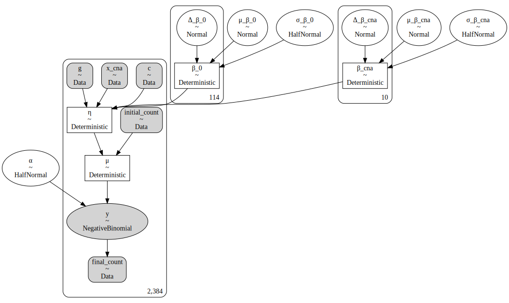

#### Normal linear regression model

```python
with pm.Model() as lin_model:
    g = pm.Data("g", gene_idx)
    c = pm.Data("c", cell_line_idx)
    x_cna = pm.Data("x_cna", data.copy_number_z.values)
    lfc = pm.Data("lfc", data.lfc.values)

    β_0 = pmhelp.hierarchical_normal(
        "β_0", shape=n_genes, centered=False, mu_sd=1.0, sigma_sd=1.0
    )
    β_cna = pmhelp.hierarchical_normal(
        "β_cna", shape=n_cells, centered=False, mu_sd=0.5, sigma_sd=1.0
    )
    μ = pm.Deterministic("μ", β_0[g] + β_cna[c] * x_cna)

    σ = pm.HalfNormal("σ", 1)

    y = pm.Normal("y", μ, σ, observed=lfc)

pm.model_to_graphviz(lin_model)
```

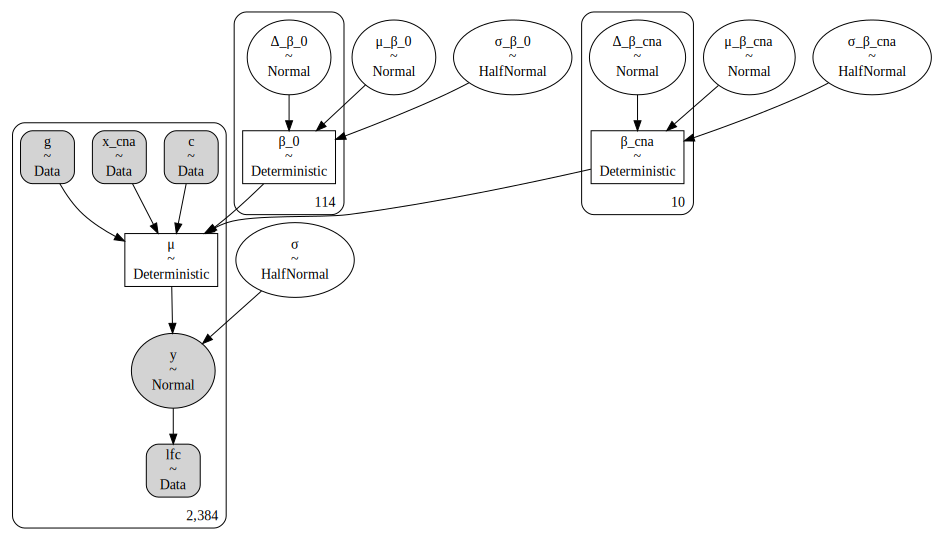

### Prior predictive checks

```python
prior_pred_kwargs = {"samples": 500, "random_seed": RANDOM_SEED}

with nb_model:
    nb_prior_pred = pm.sample_prior_predictive(**prior_pred_kwargs)


with lin_model:
    lin_prior_pred = pm.sample_prior_predictive(**prior_pred_kwargs)
```

```python
def summarize_array(a: np.ndarray, name: str) -> np.ndarray:
    return pd.DataFrame(
        {
            "min": a.min(),
            "25%": np.quantile(a, q=0.25).astype(int),
            "mean": a.mean().astype(int),
            "median": np.median(a),
            "75%": np.quantile(a, q=0.75).astype(int),
            "max": a.max(),
        },
        index=[name],
    )


def get_varnames_to_print(prior_pred: dict[str, np.ndarray]) -> list[str]:
    single_dim_vars: list[str] = []
    for varname, vals in prior_pred.items():
        if "log__" in varname or vals.ndim != 1:
            continue
        single_dim_vars.append(varname)
    return single_dim_vars


def plot_prior_pred_against_real(
    prior_pred_i: np.array,
    real_values: pd.Series,
    i: int,
    binwidth: float,
    x_lab: str = "value",
) -> gg.ggplot:
    plot = (
        gg.ggplot(
            pd.DataFrame({"model": prior_pred_i, "observed": real_values}).pivot_longer(
                names_to="source"
            ),
            gg.aes(x="value"),
        )
        + gg.geom_histogram(
            gg.aes(fill="source"), alpha=0.75, binwidth=binwidth, position="identity"
        )
        + gg.scale_x_continuous(expand=(0, 0))
        + gg.scale_y_continuous(expand=(0, 0, 0.02, 0))
        + gg.scale_fill_brewer(type="qual", palette="Set1")
        + gg.theme(
            figure_size=(8, 4),
            legend_title=gg.element_blank(),
            legend_position=(0.8, 0.3),
            legend_background=gg.element_blank(),
        )
        + gg.labs(
            x=x_lab,
            y="count",
            title=f"Prior predictive distribution (#{i})",
        )
    )
    return plot
```

```python
def prior_pred_analysis(
    prior_pred: dict[str, np.ndarray],
    real_values: pd.Series,
    x_lab: str,
    num_examples: int = 5,
    hist_binwidth: float = 1.0,
) -> None:
    print("Comparison of range of predicted values")
    print(
        pd.concat(
            [
                summarize_array(prior_pred["y"], "model"),
                summarize_array(real_values.values, "real"),
            ]
        )
    )
    print()

    fold_diff = prior_pred["y"].max() / real_values.max()
    print(f"Fold difference in maximum values: {fold_diff:0.2f}")

    for i in np.random.choice(
        np.arange(prior_pred["y"].shape[0]), size=num_examples, replace=False
    ):
        print(
            plot_prior_pred_against_real(
                prior_pred["y"][i, :],
                real_values,
                i=i,
                binwidth=hist_binwidth,
                x_lab=x_lab,
            )
        )
        params: dict[str, float] = {}
        for v in get_varnames_to_print(prior_pred):
            params[v] = np.round(prior_pred[v][i], 2)
        pprint.pprint(params)
```

```python
prior_pred_analysis(
    nb_prior_pred,
    real_values=data.counts_final,
    x_lab="final read counts",
    hist_binwidth=100,
)
```

    Comparison of range of predicted values
           min  25%  mean  median  75%     max
    model    0  226   501   381.0  649  237913
    real     0  225   579   417.0  743    9255

    Fold difference in maximum values: 25.71

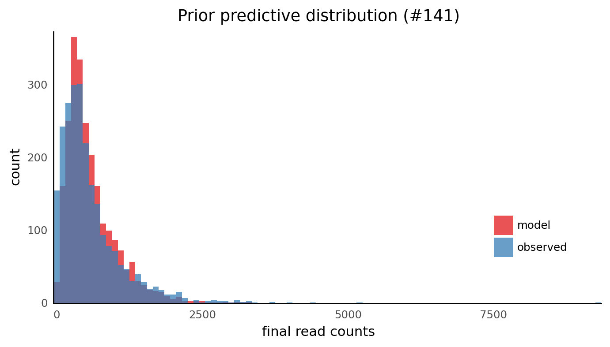

    {'α': 116.98, 'μ_β_0': 0.17, 'μ_β_cna': -0.01, 'σ_β_0': 0.08, 'σ_β_cna': 0.06}


    {'α': 20.2, 'μ_β_0': 0.06, 'μ_β_cna': 0.07, 'σ_β_0': 0.11, 'σ_β_cna': 0.12}


    {'α': 39.92, 'μ_β_0': 0.04, 'μ_β_cna': 0.04, 'σ_β_0': 0.03, 'σ_β_cna': 0.05}

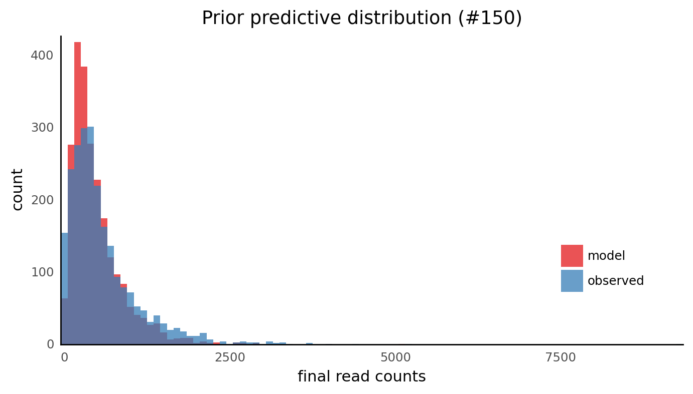

    {'α': 19.26, 'μ_β_0': -0.05, 'μ_β_cna': -0.16, 'σ_β_0': 0.14, 'σ_β_cna': 0.11}

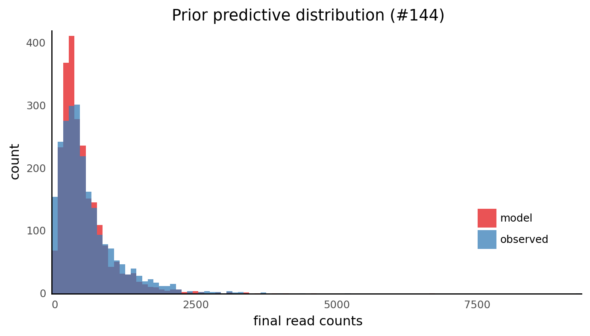

    {'α': 14.81, 'μ_β_0': 0.03, 'μ_β_cna': 0.18, 'σ_β_0': 0.08, 'σ_β_cna': 0.2}

```python
prior_pred_analysis(
    lin_prior_pred,
    real_values=data.lfc,
    x_lab="log-fold change",
    hist_binwidth=0.25,
)
```

    Comparison of range of predicted values
                 min  25%  mean    median  75%        max
    model -80.960324   -1     0 -0.011173    1  55.902164
    real   -4.318012    0     0 -0.037561    0   3.011199

    Fold difference in maximum values: 18.56

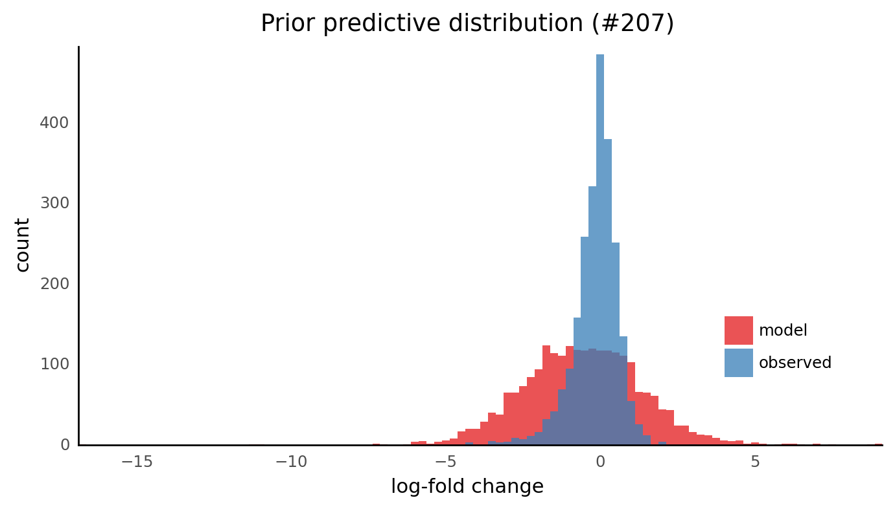

    {'μ_β_0': -0.6, 'μ_β_cna': 0.27, 'σ': 1.71, 'σ_β_0': 0.05, 'σ_β_cna': 1.3}

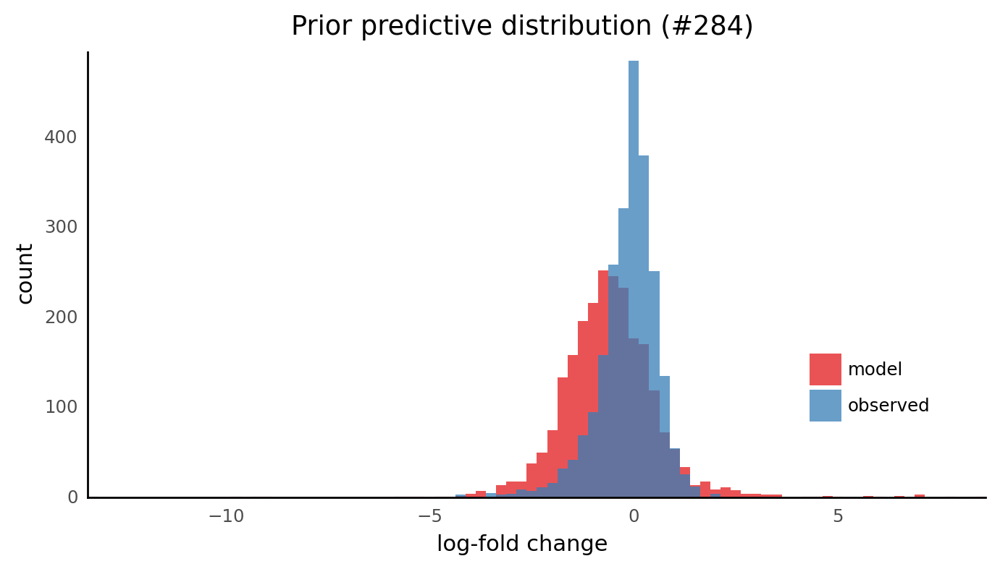

    {'μ_β_0': -0.61, 'μ_β_cna': 0.43, 'σ': 0.77, 'σ_β_0': 0.15, 'σ_β_cna': 0.93}

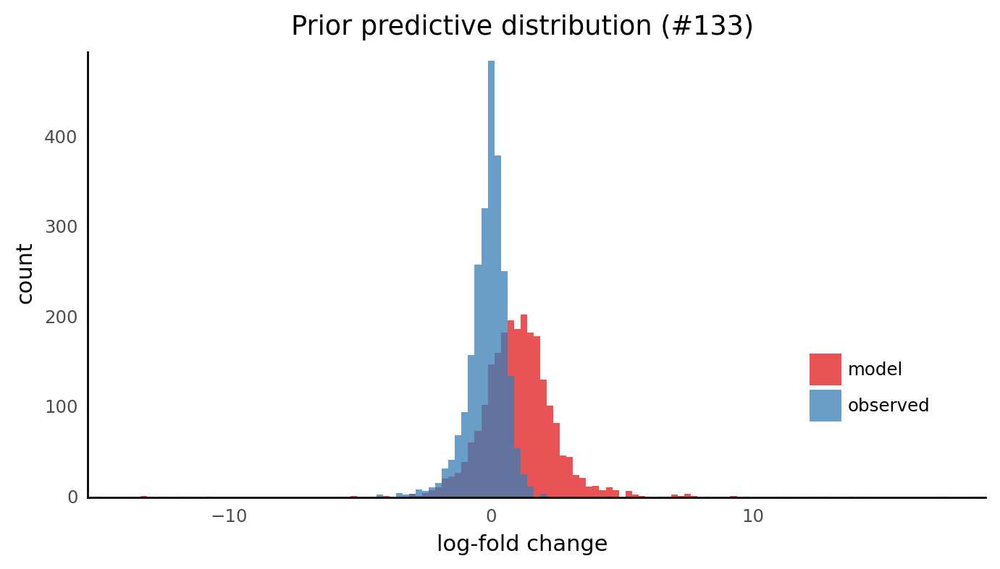

    {'μ_β_0': 1.01, 'μ_β_cna': -0.25, 'σ': 0.93, 'σ_β_0': 0.3, 'σ_β_cna': 1.89}

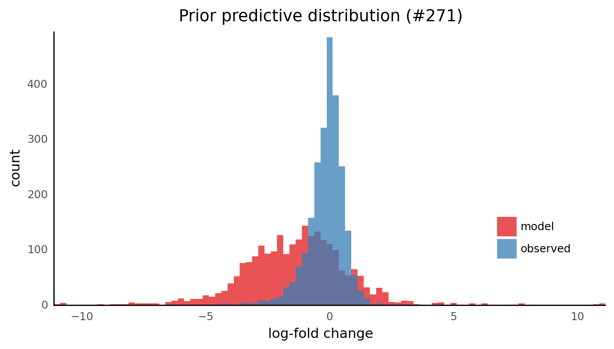

    {'μ_β_0': -1.48, 'μ_β_cna': 0.13, 'σ': 0.17, 'σ_β_0': 1.85, 'σ_β_cna': 1.71}

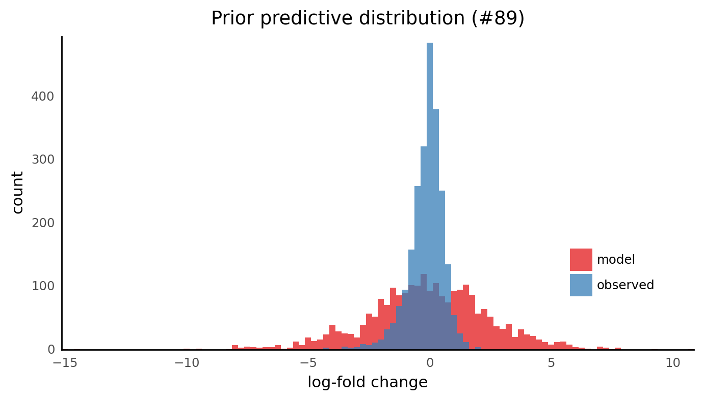

    {'μ_β_0': -0.17, 'μ_β_cna': -1.44, 'σ': 0.3, 'σ_β_0': 1.96, 'σ_β_cna': 1.56}

### Sampling from the models

```python
pm_sample_kwargs = {
    "draws": 1000,
    "chains": 4,
    "tune": 2000,
    "random_seed": [349 + 1 for i in range(4)],
    "target_accept": 0.95,
    "return_inferencedata": True,
}
pm_sample_ppc_kwargs = {"random_seed": 400}
```

I timed the sampling processes a few times and put together the following table to show how long each model takes to run inference:

| model  | sampling (sec.) | post. pred. (sec.) | total (min.) |
|--------|-----------------|--------------------|--------------|
| NB     | 59              | 64                 | 2.23         |
| normal | 38              | 73                 | 1.98         |

```python
tic = time()

with nb_model:
    nb_trace = pm.sample(**pm_sample_kwargs)  # , start={"α_log__": np.array(5)})
    ppc = pm.sample_posterior_predictive(nb_trace, **pm_sample_ppc_kwargs)
    ppc["lfc"] = np.log2((1.0 + ppc["y"]) / data["counts_initial_adj"].values)
    nb_trace.extend(az.from_pymc3(posterior_predictive=ppc))

toc = time()
print(f"sampling required {(toc - tic) / 60:.2f} minutes")
```

    Auto-assigning NUTS sampler...
    Initializing NUTS using jitter+adapt_diag...
    Multiprocess sampling (4 chains in 2 jobs)
    NUTS: [α, Δ_β_cna, σ_β_cna, μ_β_cna, Δ_β_0, σ_β_0, μ_β_0]

<div>
    <style>
        /*Turns off some styling*/
        progress {
            /*gets rid of default border in Firefox and Opera.*/
            border: none;
            /*Needs to be in here for Safari polyfill so background images work as expected.*/
            background-size: auto;
        }
        .progress-bar-interrupted, .progress-bar-interrupted::-webkit-progress-bar {
            background: #F44336;
        }
    </style>
  <progress value='12000' class='' max='12000' style='width:300px; height:20px; vertical-align: middle;'></progress>
  100.00% [12000/12000 03:23<00:00 Sampling 4 chains, 0 divergences]
</div>

    Sampling 4 chains for 2_000 tune and 1_000 draw iterations (8_000 + 4_000 draws total) took 222 seconds.
    The number of effective samples is smaller than 25% for some parameters.

<div>
    <style>
        /*Turns off some styling*/
        progress {
            /*gets rid of default border in Firefox and Opera.*/
            border: none;
            /*Needs to be in here for Safari polyfill so background images work as expected.*/
            background-size: auto;
        }
        .progress-bar-interrupted, .progress-bar-interrupted::-webkit-progress-bar {
            background: #F44336;
        }
    </style>
  <progress value='4000' class='' max='4000' style='width:300px; height:20px; vertical-align: middle;'></progress>
  100.00% [4000/4000 01:17<00:00]
</div>

    sampling required 5.32 minutes

```python
tic = time()

with lin_model:
    lin_trace = pm.sample(**pm_sample_kwargs)
    ppc = pm.sample_posterior_predictive(lin_trace, **pm_sample_ppc_kwargs)
    lin_trace.extend(az.from_pymc3(posterior_predictive=ppc))

toc = time()
print(f"sampling required {(toc - tic) / 60:.2f} minutes")
```

    Auto-assigning NUTS sampler...
    Initializing NUTS using jitter+adapt_diag...
    Multiprocess sampling (4 chains in 2 jobs)
    NUTS: [σ, Δ_β_cna, σ_β_cna, μ_β_cna, Δ_β_0, σ_β_0, μ_β_0]

<div>
    <style>
        /*Turns off some styling*/
        progress {
            /*gets rid of default border in Firefox and Opera.*/
            border: none;
            /*Needs to be in here for Safari polyfill so background images work as expected.*/
            background-size: auto;
        }
        .progress-bar-interrupted, .progress-bar-interrupted::-webkit-progress-bar {
            background: #F44336;
        }
    </style>
  <progress value='12000' class='' max='12000' style='width:300px; height:20px; vertical-align: middle;'></progress>
  100.00% [12000/12000 01:37<00:00 Sampling 4 chains, 0 divergences]
</div>

    Sampling 4 chains for 2_000 tune and 1_000 draw iterations (8_000 + 4_000 draws total) took 119 seconds.
    The number of effective samples is smaller than 25% for some parameters.

<div>
    <style>
        /*Turns off some styling*/
        progress {
            /*gets rid of default border in Firefox and Opera.*/
            border: none;
            /*Needs to be in here for Safari polyfill so background images work as expected.*/
            background-size: auto;
        }
        .progress-bar-interrupted, .progress-bar-interrupted::-webkit-progress-bar {
            background: #F44336;
        }
    </style>
  <progress value='4000' class='' max='4000' style='width:300px; height:20px; vertical-align: middle;'></progress>
  100.00% [4000/4000 01:19<00:00]
</div>

    sampling required 3.54 minutes

## Model comparison

### LOO-CV

We can compare the models using LOO-CV to see which is more robust to changes to individual data points.
It looks like the normal model is far superior to the NB model.
I am concerned that these are not comparable, though.

```python
model_collection: dict[str, az.InferenceData] = {
    "negative binomial": nb_trace,
    "normal": lin_trace,
}
model_comparison = az.compare(model_collection)
model_comparison
```

<div>
<style scoped>
    .dataframe tbody tr th:only-of-type {
        vertical-align: middle;
    }

    .dataframe tbody tr th {
        vertical-align: top;
    }

    .dataframe thead th {
        text-align: right;
    }
</style>
<table border="1" class="dataframe">
  <thead>
    <tr style="text-align: right;">
      <th></th>
      <th>rank</th>
      <th>loo</th>
      <th>p_loo</th>
      <th>d_loo</th>
      <th>weight</th>
      <th>se</th>
      <th>dse</th>
      <th>warning</th>
      <th>loo_scale</th>
    </tr>
  </thead>
  <tbody>
    <tr>
      <th>normal</th>
      <td>0</td>
      <td>-2249.736256</td>
      <td>103.83120</td>
      <td>0.000000</td>
      <td>1.0</td>
      <td>42.739655</td>
      <td>0.00000</td>
      <td>False</td>
      <td>log</td>
    </tr>
    <tr>
      <th>negative binomial</th>
      <td>1</td>
      <td>-16280.009812</td>
      <td>76.46166</td>
      <td>14030.273556</td>
      <td>0.0</td>
      <td>51.161340</td>
      <td>48.77773</td>
      <td>True</td>
      <td>log</td>
    </tr>
  </tbody>
</table>
</div>

```python
az.plot_compare(model_comparison);
```

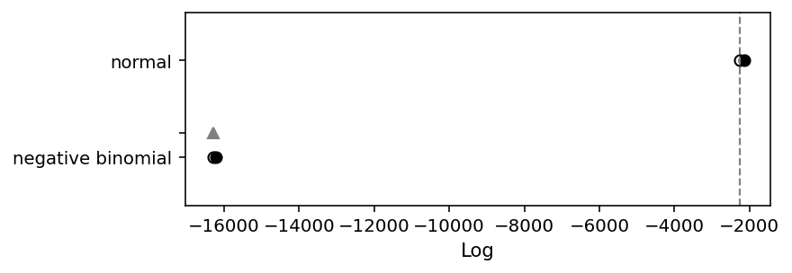

Also, the LOO probability integral transformation (PIT) predictive checks ([ArviZ doc](https://arviz-devs.github.io/arviz/api/generated/arviz.plot_loo_pit.html) indicate that the normal model is a better fit.
My concern is that this test is only for continuous data.

```python
for name, idata in model_collection.items():
    az.plot_loo_pit(idata, y="y")
    plt.title(name)
    plt.show()
```

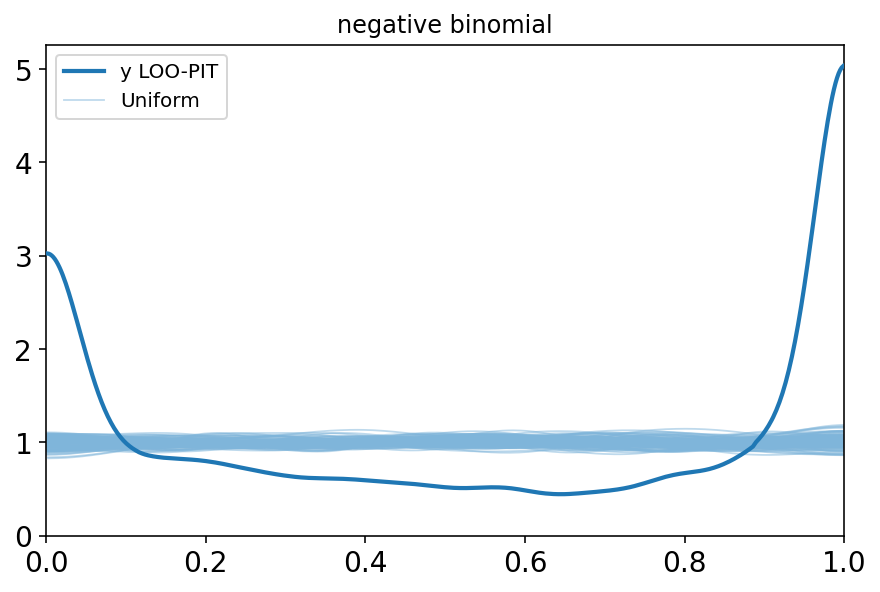


### Posterior distributions

```python
shared_varnames = ["β_0", "μ_β_0", "σ_β_0"]
nb_varnames = shared_varnames.copy() + ["α"]
az.plot_trace(nb_trace, var_names=nb_varnames);
```

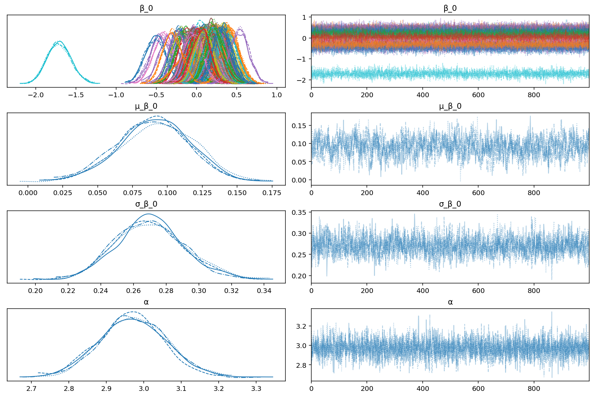

```python
lin_varnames = shared_varnames.copy() + ["σ"]
az.plot_trace(lin_trace, var_names=lin_varnames);
```

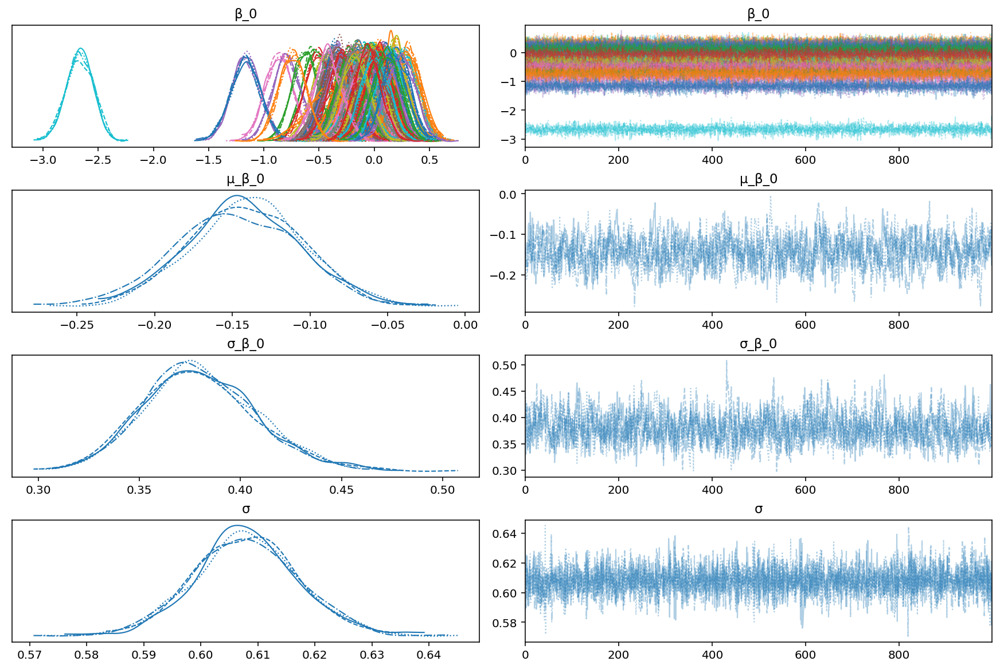

```python
def get_beta_0_summary(name: str, idata: az.InferenceData) -> pd.DataFrame:
    return (
        az.summary(idata, var_names="β_0", kind="stats", hdi_prob=0.89)
        .assign(hugo_symbol=data.hugo_symbol.cat.categories, model=name)
        .reset_index(drop=False)
        .rename(columns={"index": "parameter"})
    )


beta_0_post = pd.concat([get_beta_0_summary(n, d) for n, d in model_collection.items()])
beta_0_post.head()
```

<div>
<style scoped>
    .dataframe tbody tr th:only-of-type {
        vertical-align: middle;
    }

    .dataframe tbody tr th {
        vertical-align: top;
    }

    .dataframe thead th {
        text-align: right;
    }
</style>
<table border="1" class="dataframe">
  <thead>
    <tr style="text-align: right;">
      <th></th>
      <th>parameter</th>
      <th>mean</th>
      <th>sd</th>
      <th>hdi_5.5%</th>
      <th>hdi_94.5%</th>
      <th>hugo_symbol</th>
      <th>model</th>
    </tr>
  </thead>
  <tbody>
    <tr>
      <th>0</th>
      <td>β_0[0]</td>
      <td>-0.180</td>
      <td>0.116</td>
      <td>-0.373</td>
      <td>0.002</td>
      <td>ACVR1C</td>
      <td>negative binomial</td>
    </tr>
    <tr>
      <th>1</th>
      <td>β_0[1]</td>
      <td>0.406</td>
      <td>0.113</td>
      <td>0.219</td>
      <td>0.579</td>
      <td>ADAMTS2</td>
      <td>negative binomial</td>
    </tr>
    <tr>
      <th>2</th>
      <td>β_0[2]</td>
      <td>0.171</td>
      <td>0.106</td>
      <td>0.014</td>
      <td>0.353</td>
      <td>ADPRHL1</td>
      <td>negative binomial</td>
    </tr>
    <tr>
      <th>3</th>
      <td>β_0[3]</td>
      <td>0.201</td>
      <td>0.118</td>
      <td>0.011</td>
      <td>0.387</td>
      <td>ALKBH8</td>
      <td>negative binomial</td>
    </tr>
    <tr>
      <th>4</th>
      <td>β_0[4]</td>
      <td>-0.161</td>
      <td>0.118</td>
      <td>-0.364</td>
      <td>0.015</td>
      <td>APC</td>
      <td>negative binomial</td>
    </tr>
  </tbody>
</table>
</div>

```python
pos = gg.position_dodge(width=0.5)

(
    gg.ggplot(beta_0_post, gg.aes(x="hugo_symbol", y="mean", color="model"))
    + gg.geom_hline(yintercept=0, linetype="-", size=0.3, color="grey")
    + gg.geom_linerange(
        gg.aes(ymin="hdi_5.5%", ymax="hdi_94.5%"), position=pos, size=0.6, alpha=0.4
    )
    + gg.geom_point(position=pos, size=0.8, alpha=0.75)
    + gg.scale_y_continuous(expand=(0.01, 0))
    + gg.scale_color_brewer(type="qual", palette="Dark2")
    + gg.theme(axis_text_x=gg.element_text(angle=90, size=7), figure_size=(10, 4.5))
    + gg.labs(x="gene", y="β_0 posterior (mean ± 89% CI)")
)
```

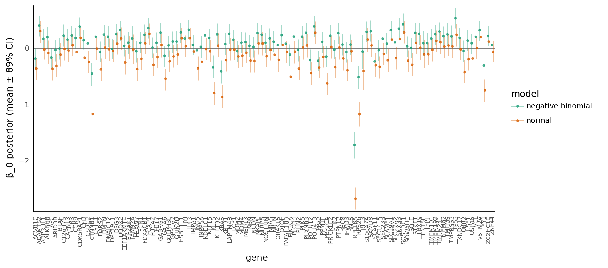

    <ggplot: (353979935)>

```python
for name, idata in model_collection.items():
    print(f"posterior distributions in {name} model")
    az.plot_posterior(idata, var_names=["μ_β_0", "σ_β_0"])
    plt.show()
    print("-" * 80)
```

    posterior distributions in negative binomial model

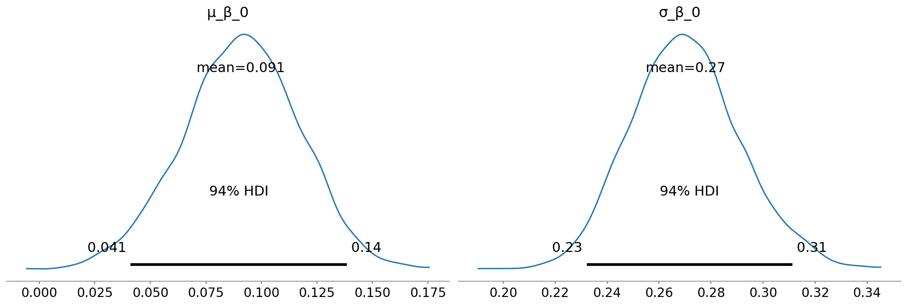

    --------------------------------------------------------------------------------
    posterior distributions in normal model

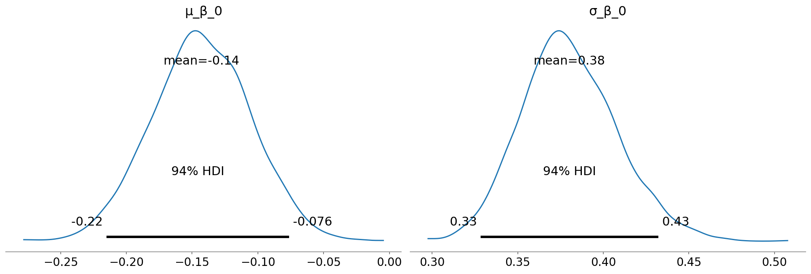

    --------------------------------------------------------------------------------

### Posterior predictive checks

```python
for name, idata in model_collection.items():
    ax = az.plot_ppc(idata, num_pp_samples=100, random_seed=RANDOM_SEED)
    ax.set_title(name)
    if "binomial" in name:
        ax.set_yscale("log", base=2)
    plt.show()
```

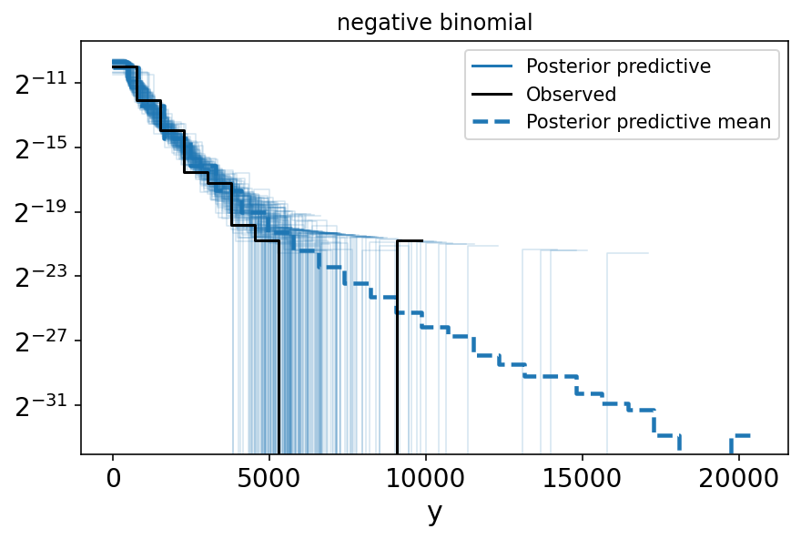

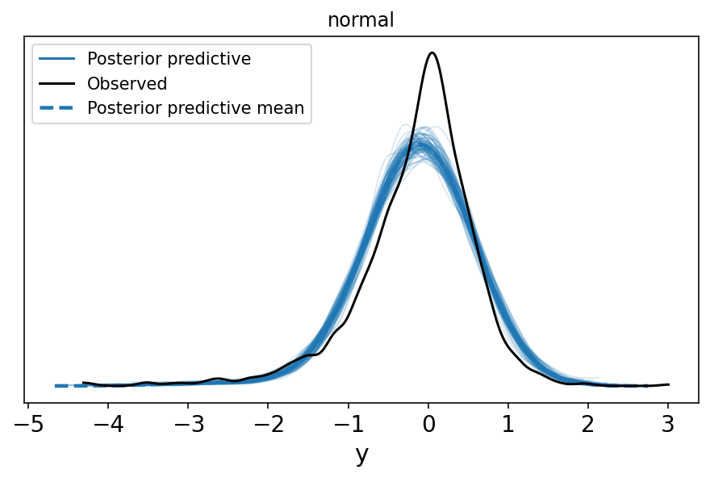

```python
nb_lfc_ppc_sample, _ = pmanal.down_sample_ppc(
    pmhelp.thin_posterior(
        nb_trace["posterior_predictive"]["lfc"], thin_to=100
    ).values.squeeze(),
    n=100,
    axis=1,
)

nb_ppc_lfc_sample_df = pd.DataFrame(nb_lfc_ppc_sample.T).pivot_longer(
    names_to="ppc_idx", values_to="draw"
)

(
    gg.ggplot(nb_ppc_lfc_sample_df, gg.aes(x="draw"))
    + gg.geom_density(gg.aes(group="ppc_idx"), weight=0.2, size=0.1, color="C0")
    + gg.geom_density(gg.aes(x="lfc"), data=data, color="k", size=1, linetype="--")
    + gg.scale_x_continuous(expand=(0, 0))
    + gg.scale_y_continuous(expand=(0, 0, 0.02, 0))
    + gg.labs(
        x="log-fold change",
        y="density",
        title="PPC of NB model\ntransformed to log-fold changes",
    )
)
```

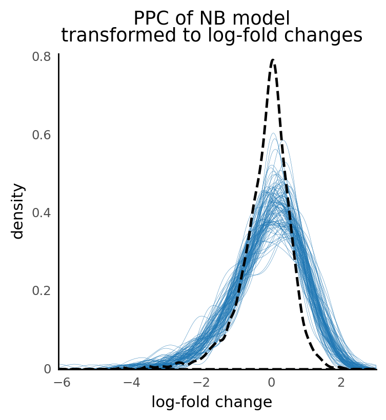

    <ggplot: (354723762)>

```python
def prep_ppc(name: str, idata: az.InferenceData, observed_y: str) -> pd.DataFrame:
    df = pmanal.summarize_posterior_predictions(
        idata["posterior_predictive"]["y"].values.squeeze(),
        merge_with=data[["hugo_symbol", "lfc", "counts_final", "counts_initial_adj"]],
        calc_error=True,
        observed_y=observed_y,
    ).assign(
        model=name,
        percent_error=lambda d: 100 * (d[observed_y] - d.pred_mean) / d[observed_y],
        real_value=lambda d: d[observed_y],
    )

    if observed_y == "counts_final":
        df["pred_lfc"] = np.log2(df.pred_mean / df.counts_initial_adj)
        df["pred_lfc_low"] = np.log2(df.pred_hdi_low / df.counts_initial_adj)
        df["pred_lfc_high"] = np.log2(df.pred_hdi_high / df.counts_initial_adj)
    else:
        df["pred_lfc"] = df.pred_mean
        df["pred_lfc_low"] = df.pred_hdi_low
        df["pred_lfc_high"] = df.pred_hdi_high

    df["lfc_error"] = df["lfc"] - df["pred_lfc"]

    return df


ppc_df = pd.concat(
    [
        prep_ppc(m[0], m[1], y)
        for m, y in zip(model_collection.items(), ("counts_final", "lfc"))
    ]
)
ppc_df.head()
```

<div>
<style scoped>
    .dataframe tbody tr th:only-of-type {
        vertical-align: middle;
    }

    .dataframe tbody tr th {
        vertical-align: top;
    }

    .dataframe thead th {
        text-align: right;
    }
</style>
<table border="1" class="dataframe">
  <thead>
    <tr style="text-align: right;">
      <th></th>
      <th>pred_mean</th>
      <th>pred_hdi_low</th>
      <th>pred_hdi_high</th>
      <th>hugo_symbol</th>
      <th>lfc</th>
      <th>counts_final</th>
      <th>counts_initial_adj</th>
      <th>error</th>
      <th>model</th>
      <th>percent_error</th>
      <th>real_value</th>
      <th>pred_lfc</th>
      <th>pred_lfc_low</th>
      <th>pred_lfc_high</th>
      <th>lfc_error</th>
    </tr>
  </thead>
  <tbody>
    <tr>
      <th>0</th>
      <td>461.45850</td>
      <td>57.0</td>
      <td>814.0</td>
      <td>SAMD8</td>
      <td>-0.807107</td>
      <td>220</td>
      <td>345.041669</td>
      <td>-241.45850</td>
      <td>negative binomial</td>
      <td>-109.753864</td>
      <td>220.0</td>
      <td>0.419430</td>
      <td>-2.597737</td>
      <td>1.238258</td>
      <td>-1.226538</td>
    </tr>
    <tr>
      <th>1</th>
      <td>548.05375</td>
      <td>62.0</td>
      <td>963.0</td>
      <td>NKAPL</td>
      <td>0.363149</td>
      <td>589</td>
      <td>383.379632</td>
      <td>40.94625</td>
      <td>negative binomial</td>
      <td>6.951825</td>
      <td>589.0</td>
      <td>0.515544</td>
      <td>-2.628434</td>
      <td>1.328762</td>
      <td>-0.152395</td>
    </tr>
    <tr>
      <th>2</th>
      <td>213.53300</td>
      <td>23.0</td>
      <td>374.0</td>
      <td>SLC27A2</td>
      <td>-0.118512</td>
      <td>221</td>
      <td>191.689816</td>
      <td>7.46700</td>
      <td>negative binomial</td>
      <td>3.378733</td>
      <td>221.0</td>
      <td>0.155685</td>
      <td>-3.059068</td>
      <td>0.964265</td>
      <td>-0.274197</td>
    </tr>
    <tr>
      <th>3</th>
      <td>226.34275</td>
      <td>28.0</td>
      <td>403.0</td>
      <td>SEC23B</td>
      <td>-0.643089</td>
      <td>128</td>
      <td>191.689816</td>
      <td>-98.34275</td>
      <td>negative binomial</td>
      <td>-76.830273</td>
      <td>128.0</td>
      <td>0.239735</td>
      <td>-2.775275</td>
      <td>1.072006</td>
      <td>-0.882824</td>
    </tr>
    <tr>
      <th>4</th>
      <td>308.46625</td>
      <td>39.0</td>
      <td>559.0</td>
      <td>BRAF</td>
      <td>-0.033767</td>
      <td>355</td>
      <td>306.703706</td>
      <td>46.53375</td>
      <td>negative binomial</td>
      <td>13.108099</td>
      <td>355.0</td>
      <td>0.008267</td>
      <td>-2.975300</td>
      <td>0.866003</td>
      <td>-0.042034</td>
    </tr>
  </tbody>
</table>
</div>

```python
(
    gg.ggplot(ppc_df, gg.aes(x="lfc_error"))
    + gg.geom_density(gg.aes(color="model", fill="model"), alpha=0.1)
    + gg.geom_vline(gg.aes(xintercept=0), alpha=0.6, size=0.3)
    + gg.scale_x_continuous(expand=(0, 0))
    + gg.scale_y_continuous(expand=(0, 0, 0.02, 0))
    + gg.scale_color_brewer(type="qual", palette="Set2")
    + gg.scale_fill_brewer(type="qual", palette="Set2")
    + gg.theme(figure_size=(5, 4))
    + gg.labs(x="log-fold change prediction error (obs. - pred.)")
)
```

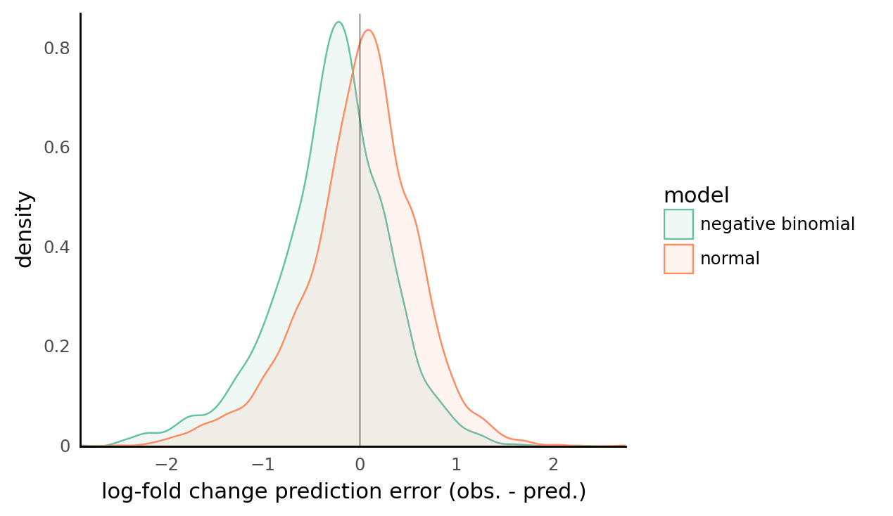

    <ggplot: (354248081)>

```python
(
    gg.ggplot(ppc_df, gg.aes(x="lfc", y="pred_lfc"))
    + gg.facet_wrap("~ model", nrow=1)
    + gg.geom_linerange(
        gg.aes(ymin="pred_lfc_low", ymax="pred_lfc_high"),
        alpha=0.1,
        size=0.5,
        color=SeabornColor.BLUE.value,
    )
    + gg.geom_point(alpha=0.5, color=SeabornColor.BLUE.value)
    + gg.geom_abline(slope=1, intercept=0, color=SeabornColor.RED.value)
    + gg.scale_x_continuous(expand=(0.02, 0, 0.02, 0))
    + gg.scale_y_continuous(expand=(0.02, 0, 0.02, 0))
    + gg.theme(figure_size=(8, 4), panel_spacing_x=0.5)
    + gg.labs(
        x="observed log-fold change", y="predicted log-fold change\n(mean ± 89% CI)"
    )
)
```

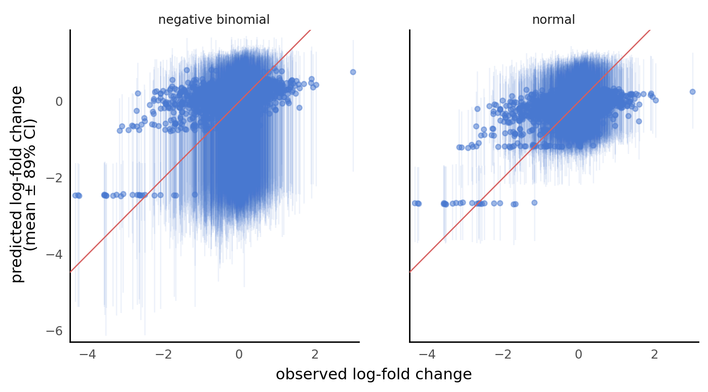

    <ggplot: (356103437)>

```python
(
    gg.ggplot(ppc_df, gg.aes(x="lfc", y="lfc_error"))
    + gg.facet_wrap("~ model", nrow=1)
    + gg.geom_point(alpha=0.5, color=SeabornColor.BLUE.value)
    + gg.geom_hline(yintercept=0, linetype="--")
    + gg.geom_vline(xintercept=0, linetype="--")
    + gg.theme(figure_size=(8, 4), panel_spacing_x=0.5)
    + gg.labs(x="log-fold change", y="prediction error")
)
```

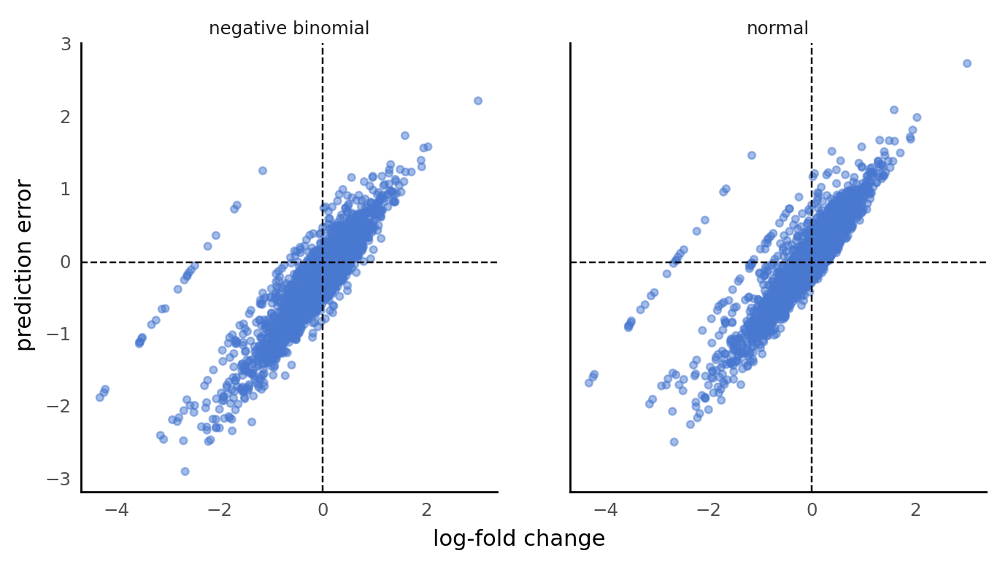

    <ggplot: (355967741)>

```python
(
    gg.ggplot(
        ppc_df[["model", "pred_lfc", "hugo_symbol"]]
        .pivot_wider(names_from="model", values_from="pred_lfc")
        .merge(data, left_index=True, right_index=True),
        gg.aes(x="normal", y="negative binomial"),
    )
    + gg.geom_point(
        gg.aes(color="hugo_symbol"), size=1.2, alpha=0.25, show_legend=False
    )
    + gg.geom_abline(slope=1, intercept=0, linetype="--", alpha=0.5)
    + gg.geom_smooth(
        method="lm",
        formula="y~x",
        alpha=0.6,
        linetype="--",
        size=0.6,
        color=SeabornColor.BLUE.value,
    )
    + gg.geom_hline(yintercept=0, alpha=0.5, color="grey")
    + gg.geom_vline(xintercept=0, alpha=0.5, color="grey")
    + gg.scale_color_hue()
    + gg.labs(
        x="post. pred. by normal model",
        y="post.pred by NB model",
        title="Comparison of posterior predictions",
    )
)
```

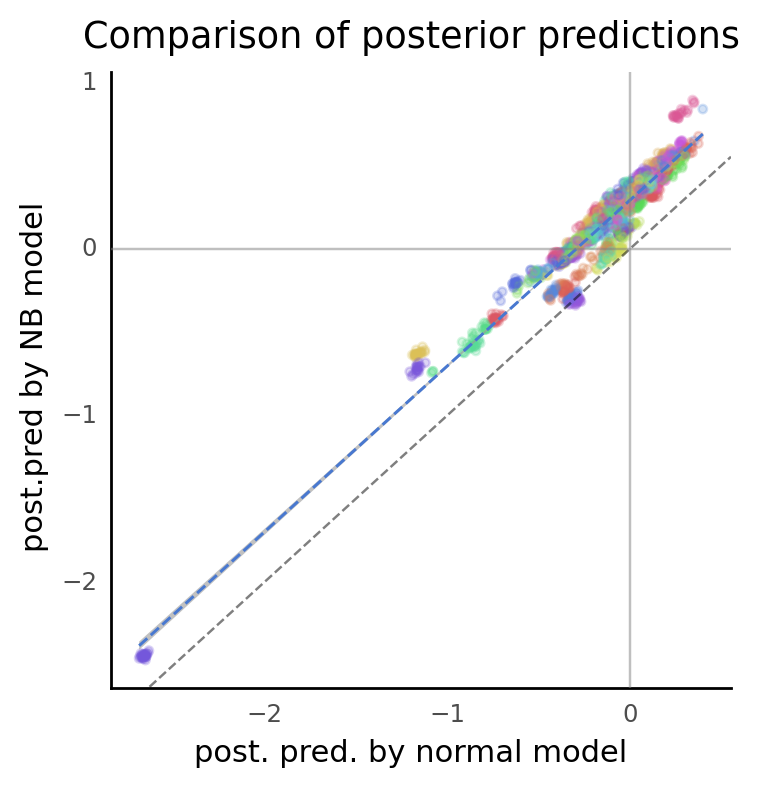

    <ggplot: (356700865)>

```python
loo_collection = {n: az.loo(d, pointwise=True) for n, d in model_collection.items()}
```

```python
for name, loo_res in loo_collection.items():
    d = (
        pd.DataFrame({"hugo_symbol": data["hugo_symbol"], "loo": loo_res.loo_i})
        .sort_values("hugo_symbol")
        .reset_index(drop=False)
    )
    p = (
        gg.ggplot(d, gg.aes(x="index", y="loo"))
        + gg.geom_point(gg.aes(color="hugo_symbol"), show_legend=False)
        + gg.scale_color_hue()
        + gg.labs(x="index", y="LOO")
    )
    print(p)
```

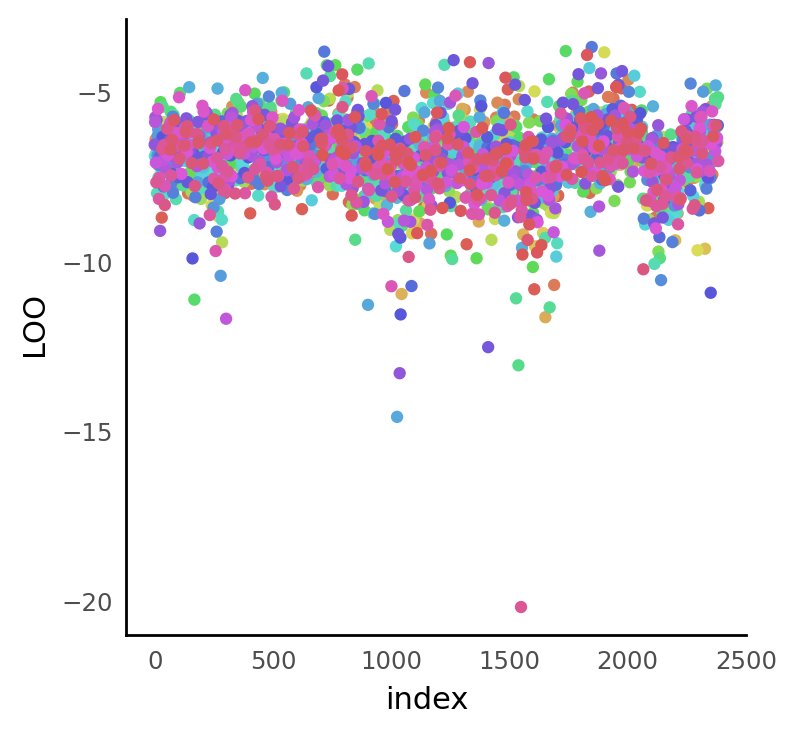

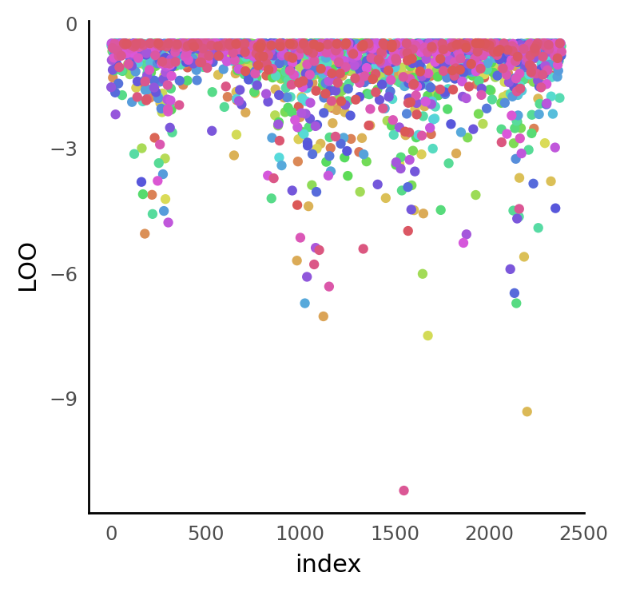

---

```python
notebook_toc = time()
print(f"execution time: {(notebook_toc - notebook_tic) / 60:.2f} minutes")
```

    execution time: 12.83 minutes

```python
%load_ext watermark
%watermark -d -u -v -iv -b -h -m
```

    The watermark extension is already loaded. To reload it, use:
      %reload_ext watermark
    Last updated: 2021-10-06

    Python implementation: CPython
    Python version       : 3.9.6
    IPython version      : 7.26.0

    Compiler    : Clang 11.1.0
    OS          : Darwin
    Release     : 20.6.0
    Machine     : x86_64
    Processor   : i386
    CPU cores   : 4
    Architecture: 64bit

    Hostname: JHCookMac.local

    Git branch: nb-model-2

    pandas    : 1.3.2
    theano    : 1.0.5
    plotnine  : 0.8.0
    logging   : 0.5.1.2
    numpy     : 1.21.2
    seaborn   : 0.11.2
    matplotlib: 3.4.3
    arviz     : 0.11.2
    pymc3     : 3.11.2
    re        : 2.2.1

```python

```
