# Adding copy number covariate to the hierarchical negative binomial model

## Setup

```python
%load_ext autoreload
%autoreload 2
```

```python
import warnings
from pathlib import Path
from time import time

import arviz as az
import janitor  # noqa: F401
import matplotlib.pyplot as plt
import numpy as np
import pandas as pd
import plotnine as gg
import pymc as pm
import seaborn as sns
```

```python
from speclet.analysis.arviz_analysis import extract_matrix_variable_coords
from speclet.bayesian_models.hierarchical_nb import HierarchcalNegativeBinomialModel
from speclet.data_processing.common import make_cat
from speclet.io import DataFile
from speclet.managers.data_managers import CrisprScreenDataManager
from speclet.plot.plotnine_helpers import set_gg_theme
from speclet.project_configuration import read_project_configuration
from speclet.project_enums import ModelFitMethod
```

```python
# Notebook execution timer.
notebook_tic = time()

# Plotting setup.
set_gg_theme()
%config InlineBackend.figure_format = "retina"

# Constants
RANDOM_SEED = 847
np.random.seed(RANDOM_SEED)
HDI_PROB = read_project_configuration().modeling.highest_density_interval
```

## Prepare model object and data

```python
hnb = HierarchcalNegativeBinomialModel()
```

```python
dm = CrisprScreenDataManager(DataFile.DEPMAP_CRC_BONE_SUBSAMPLE)
counts_data = dm.get_data()
```

```python
for col in ["hugo_symbol", "sgrna", "depmap_id", "lineage"]:
    print(f"{col}: {counts_data[col].nunique()}")
```

    hugo_symbol: 113
    sgrna: 338
    depmap_id: 10
    lineage: 2

```python
valid_ct_data = hnb.data_processing_pipeline(counts_data.copy())
model_data = hnb._make_data_structure(valid_ct_data)
```

```python
(
    gg.ggplot(valid_ct_data, gg.aes(x="z_cn_cell_line"))
    + gg.facet_wrap("~ depmap_id", nrow=2)
    + gg.geom_histogram(gg.aes(y=gg.after_stat("ncount")), binwidth=0.25)
    + gg.scale_y_continuous(expand=(0, 0, 0.02, 0))
    + gg.scale_x_continuous(expand=(0, 0))
    + gg.theme(figure_size=(8, 4))
    + gg.labs(x="copy number (z-scaled)", y="normalized count")
)
```

    /usr/local/Caskroom/miniconda/base/envs/speclet/lib/python3.9/site-packages/plotnine/utils.py:371: FutureWarning: The frame.append method is deprecated and will be removed from pandas in a future version. Use pandas.concat instead.

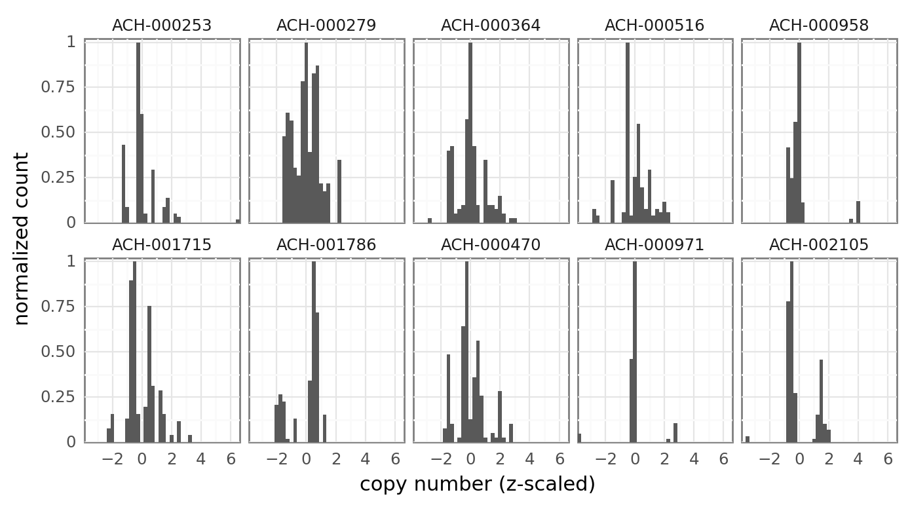

    <ggplot: (351200726)>

```python
(
    gg.ggplot(valid_ct_data, gg.aes(x="z_cn_cell_line", y="lfc"))
    + gg.facet_wrap("~ depmap_id", nrow=2, scales="free_x")
    + gg.geom_point(size=0.3, alpha=0.3)
    + gg.geom_smooth(formula="y ~ x", method="lm", color="blue")
    + gg.scale_y_continuous(expand=(0.02, 0))
    + gg.scale_x_continuous(expand=(0.02, 0))
    + gg.theme(figure_size=(8, 4), subplots_adjust={"wspace": 0.25, "hspace": 0.4})
    + gg.labs(x="copy number", y="log fold change")
)
```

    /usr/local/Caskroom/miniconda/base/envs/speclet/lib/python3.9/site-packages/plotnine/utils.py:371: FutureWarning: The frame.append method is deprecated and will be removed from pandas in a future version. Use pandas.concat instead.
    /usr/local/Caskroom/miniconda/base/envs/speclet/lib/python3.9/site-packages/plotnine/utils.py:371: FutureWarning: The frame.append method is deprecated and will be removed from pandas in a future version. Use pandas.concat instead.

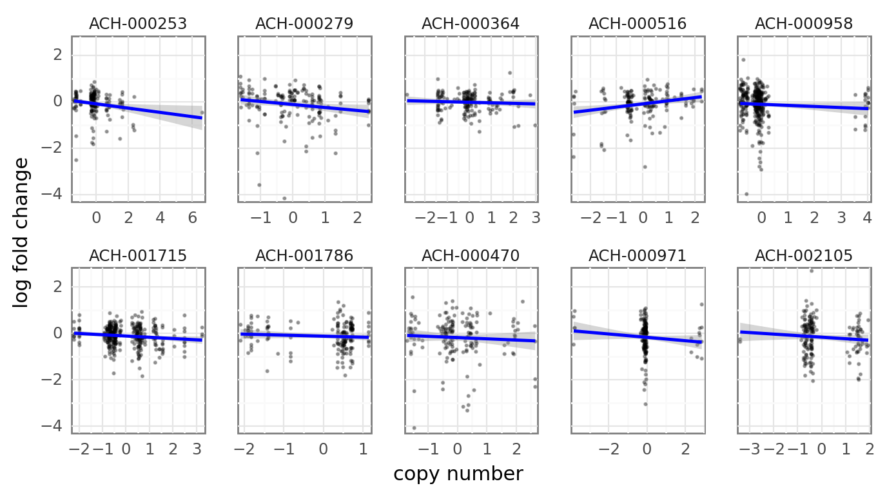

    <ggplot: (351704471)>

```python
(
    gg.ggplot(valid_ct_data, gg.aes(x="lfc"))
    + gg.geom_histogram(
        gg.aes(fill="is_mutated", y=gg.after_stat("ncount")),
        binwidth=0.25,
        position="identity",
        alpha=0.5,
    )
    + gg.scale_x_continuous(expand=(0.02, 0))
    + gg.scale_y_continuous(expand=(0, 0, 0.02, 0))
    + gg.scale_fill_brewer(type="qual", palette="Dark2")
    + gg.labs(x="log-fold change", y="normalized count", fill="is mut.")
)
```

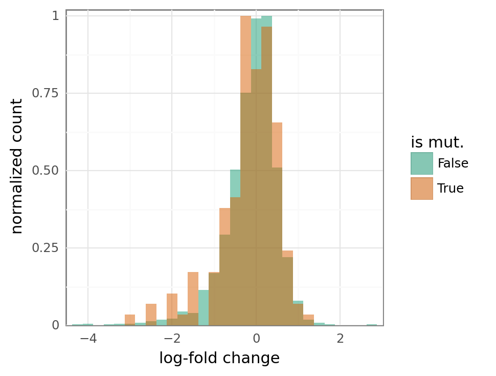

    <ggplot: (352047869)>

```python
(
    gg.ggplot(valid_ct_data, gg.aes(x="copy_number", y="lfc", color="depmap_id"))
    + gg.geom_point(size=0.3, alpha=0.5, show_legend=False)
    + gg.geom_smooth(formula="y ~ x", method="lm", se=False, linetype="-", size=0.8)
    + gg.scale_y_continuous(expand=(0.02, 0))
    + gg.scale_x_continuous(expand=(0.02, 0))
    + gg.scale_color_brewer(type="qual", palette="Dark2")
    + gg.theme(figure_size=(8, 4), subplots_adjust={"wspace": 0.25, "hspace": 0.25})
    + gg.labs(x="copy number", y="log fold change")
)
```

    /usr/local/Caskroom/miniconda/base/envs/speclet/lib/python3.9/site-packages/mizani/palettes.py:397: UserWarning: Warning message:Brewer palette Dark2 has a maximum of 8 colors Returning the palette you asked for with that many colors
    /usr/local/Caskroom/miniconda/base/envs/speclet/lib/python3.9/site-packages/mizani/palettes.py:397: UserWarning: Warning message:Brewer palette Dark2 has a maximum of 8 colors Returning the palette you asked for with that many colors

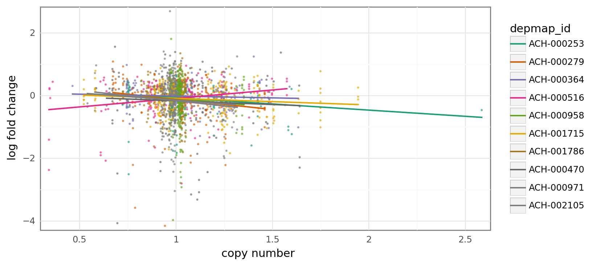

    <ggplot: (352098557)>

```python
hnb_model = hnb.pymc_model(data=counts_data)
pm.model_to_graphviz(hnb_model)
```

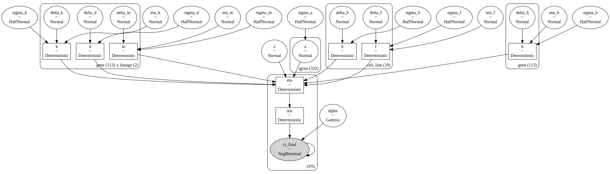

## Sample posterior

```python
with hnb_model:
    hnb_trace = pm.sample(
        draws=500,
        tune=1000,
        chains=2,
        random_seed=RANDOM_SEED + 1,
        target_accept=0.95,
        return_inferencedata=True,
    )
    pm.sample_posterior_predictive(
        hnb_trace, random_seed=RANDOM_SEED, extend_inferencedata=True, progressbar=False
    )
```

    Auto-assigning NUTS sampler...
    Initializing NUTS using jitter+adapt_diag...
    Multiprocess sampling (2 chains in 2 jobs)
    NUTS: [z, sigma_a, a, sigma_b, delta_b, sigma_d, delta_d, mu_f, sigma_f, delta_f, mu_h, sigma_h, delta_h, mu_k, sigma_k, delta_k, mu_m, sigma_m, delta_m, alpha]

<style>
    /*Turns off some styling*/
    progress {
        /*gets rid of default border in Firefox and Opera.*/
        border: none;
        /*Needs to be in here for Safari polyfill so background images work as expected.*/
        background-size: auto;
    }
    .progress-bar-interrupted, .progress-bar-interrupted::-webkit-progress-bar {
        background: #F44336;
    }
</style>

<div>
  <progress value='3000' class='' max='3000' style='width:300px; height:20px; vertical-align: middle;'></progress>
  100.00% [3000/3000 03:09<00:00 Sampling 2 chains, 0 divergences]
</div>

    Sampling 2 chains for 1_000 tune and 500 draw iterations (2_000 + 1_000 draws total) took 203 seconds.
    The estimated number of effective samples is smaller than 200 for some parameters.
    /var/folders/r4/qpcdgl_14hbd412snp1jnv300000gn/T/ipykernel_90578/3676164313.py:10: FutureWarning: In this version, RNG seeding is managed by the Model objects. See the `rng_seeder` argument in Model's constructor.

## Posterior analysis

```python
az.plot_trace(
    hnb_trace,
    var_names=hnb.vars_regex(fit_method=ModelFitMethod.PYMC_MCMC),
    filter_vars="regex",
)
plt.tight_layout();
```

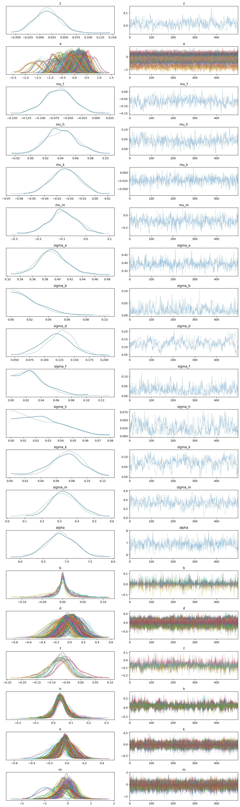

```python
az.plot_forest(hnb_trace, var_names=["b", "f"], hdi_prob=HDI_PROB, combined=True);
```

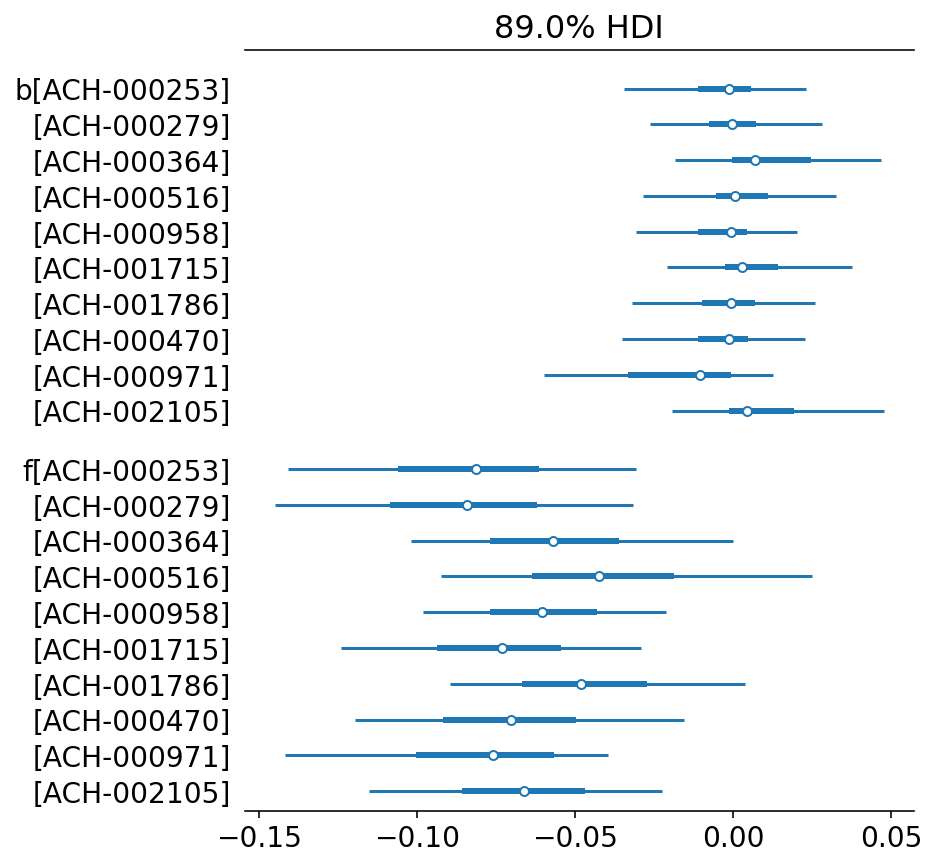

```python
eta_post = (
    az.summary(hnb_trace, var_names=["eta"], hdi_prob=HDI_PROB, kind="stats")
    .reset_index()
    .rename({"index": "eta_param"})
)
eta_post.head()
```

<div>
<style scoped>
    .dataframe tbody tr th:only-of-type {
        vertical-align: middle;
    }

    .dataframe tbody tr th {
        vertical-align: top;
    }

    .dataframe thead th {
        text-align: right;
    }
</style>
<table border="1" class="dataframe">
  <thead>
    <tr style="text-align: right;">
      <th></th>
      <th>index</th>
      <th>mean</th>
      <th>sd</th>
      <th>hdi_5.5%</th>
      <th>hdi_94.5%</th>
    </tr>
  </thead>
  <tbody>
    <tr>
      <th>0</th>
      <td>eta[0]</td>
      <td>0.142</td>
      <td>0.169</td>
      <td>-0.130</td>
      <td>0.407</td>
    </tr>
    <tr>
      <th>1</th>
      <td>eta[1]</td>
      <td>-0.507</td>
      <td>0.184</td>
      <td>-0.808</td>
      <td>-0.217</td>
    </tr>
    <tr>
      <th>2</th>
      <td>eta[2]</td>
      <td>-0.791</td>
      <td>0.180</td>
      <td>-1.108</td>
      <td>-0.531</td>
    </tr>
    <tr>
      <th>3</th>
      <td>eta[3]</td>
      <td>0.529</td>
      <td>0.151</td>
      <td>0.302</td>
      <td>0.775</td>
    </tr>
    <tr>
      <th>4</th>
      <td>eta[4]</td>
      <td>-0.187</td>
      <td>0.158</td>
      <td>-0.436</td>
      <td>0.063</td>
    </tr>
  </tbody>
</table>
</div>

```python
_plot_df = valid_ct_data.copy().merge(eta_post, left_index=True, right_index=True)
(
    gg.ggplot(_plot_df, gg.aes(x="copy_number", y="mean"))
    + gg.geom_linerange(
        gg.aes(ymin="hdi_5.5%", ymax="hdi_94.5%"), size=0.3, alpha=0.5, color="gray"
    )
    + gg.geom_point(size=0.3, alpha=0.3)
    + gg.labs(x="locus copy number", y="$\eta$ (mean ± 89% HDI)")
)
```

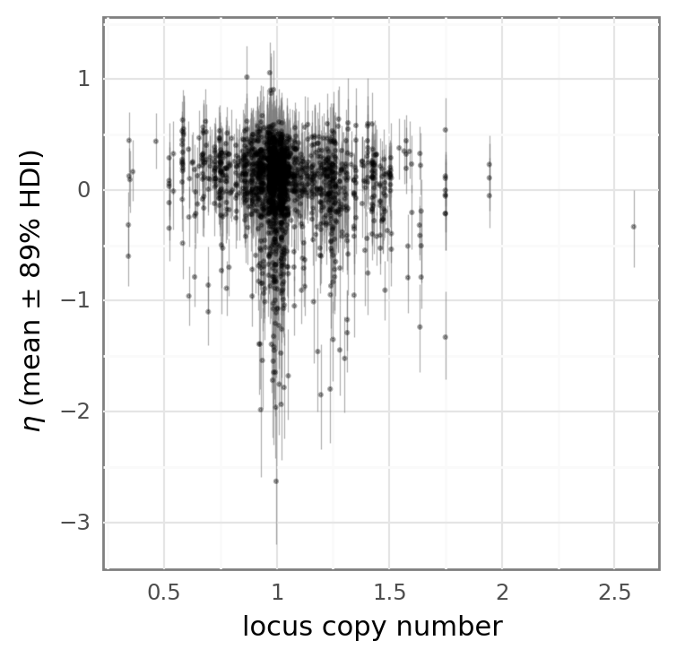

    <ggplot: (361536284)>

```python
m_post_summary = (
    az.summary(hnb_trace, var_names=["m"], hdi_prob=HDI_PROB, kind="stats")
    .reset_index(drop=False)
    .pipe(
        extract_matrix_variable_coords,
        col="index",
        idx1name="hugo_symbol",
        idx2name="lineage",
    )
)
```

```python
(
    gg.ggplot(m_post_summary, gg.aes(x="lineage", y="hugo_symbol"))
    + gg.geom_tile(gg.aes(fill="mean"))
    + gg.scale_x_discrete(expand=(0, 0.5))
    + gg.scale_y_discrete(expand=(0, 0.5))
    + gg.scale_fill_gradient2(low="#0571b0", mid="white", high="#ca0020", midpoint=0)
    + gg.theme(
        figure_size=(0.5, 11),
        axis_text_x=gg.element_text(size=7, angle=90),
        axis_text_y=gg.element_text(size=6),
        panel_grid=gg.element_blank(),
    )
    + gg.labs(x="lineage", y="gene", fill="$\\hat{m}$")
)
```

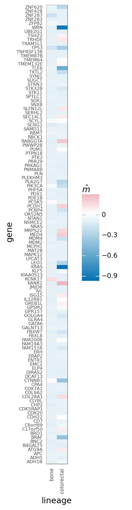

    <ggplot: (361535076)>

```python
def filter_hdi_across_zero(
    df: pd.DataFrame, hdi_low: str = "hdi_5.5%", hdi_high: str = "hdi_94.5%"
) -> pd.DataFrame:
    return df.query(
        f"(`{hdi_low}` < 0 and `{hdi_high}` < 0) or (`{hdi_low}` > 0 and `{hdi_high}` > 0)"
    ).reset_index(drop=True)
```

```python
m_post_summary_sig = filter_hdi_across_zero(m_post_summary)
m_post_summary_sig
```

<div>
<style scoped>
    .dataframe tbody tr th:only-of-type {
        vertical-align: middle;
    }

    .dataframe tbody tr th {
        vertical-align: top;
    }

    .dataframe thead th {
        text-align: right;
    }
</style>
<table border="1" class="dataframe">
  <thead>
    <tr style="text-align: right;">
      <th></th>
      <th>index</th>
      <th>mean</th>
      <th>sd</th>
      <th>hdi_5.5%</th>
      <th>hdi_94.5%</th>
      <th>hugo_symbol</th>
      <th>lineage</th>
    </tr>
  </thead>
  <tbody>
    <tr>
      <th>0</th>
      <td>m[KRAS, colorectal]</td>
      <td>-0.937</td>
      <td>0.347</td>
      <td>-1.466</td>
      <td>-0.364</td>
      <td>KRAS</td>
      <td>colorectal</td>
    </tr>
    <tr>
      <th>1</th>
      <td>m[CTNNB1, colorectal]</td>
      <td>-0.386</td>
      <td>0.224</td>
      <td>-0.705</td>
      <td>-0.007</td>
      <td>CTNNB1</td>
      <td>colorectal</td>
    </tr>
    <tr>
      <th>2</th>
      <td>m[WRN, colorectal]</td>
      <td>-0.892</td>
      <td>0.378</td>
      <td>-1.455</td>
      <td>-0.209</td>
      <td>WRN</td>
      <td>colorectal</td>
    </tr>
    <tr>
      <th>3</th>
      <td>m[TLE6, colorectal]</td>
      <td>-0.544</td>
      <td>0.355</td>
      <td>-1.145</td>
      <td>-0.015</td>
      <td>TLE6</td>
      <td>colorectal</td>
    </tr>
  </tbody>
</table>
</div>

```python
m_post_sig = (
    hnb_trace.posterior["m"]
    .to_dataframe()
    .reset_index(drop=False)
    .drop(columns=["chain", "draw"])
    .filter_column_isin("gene", m_post_summary_sig.hugo_symbol.unique())
)

pos = gg.position_dodge(width=0.8)

(
    gg.ggplot(m_post_sig, gg.aes(x="gene", y="m"))
    + gg.geom_violin(gg.aes(fill="lineage"), position=pos, width=0.75)
    + gg.geom_boxplot(
        gg.aes(fill="lineage"),
        alpha=0,
        width=0.1,
        size=0.6,
        outlier_alpha=0,
        position=pos,
        show_legend=False,
    )
    + gg.scale_y_continuous(expand=(0.02, 0))
    + gg.scale_fill_brewer(type="qual", palette="Set2")
    + gg.labs(
        x="gene", y="$m$ posterior", fill="lineage", title="Estimated mutation effect"
    )
)
```

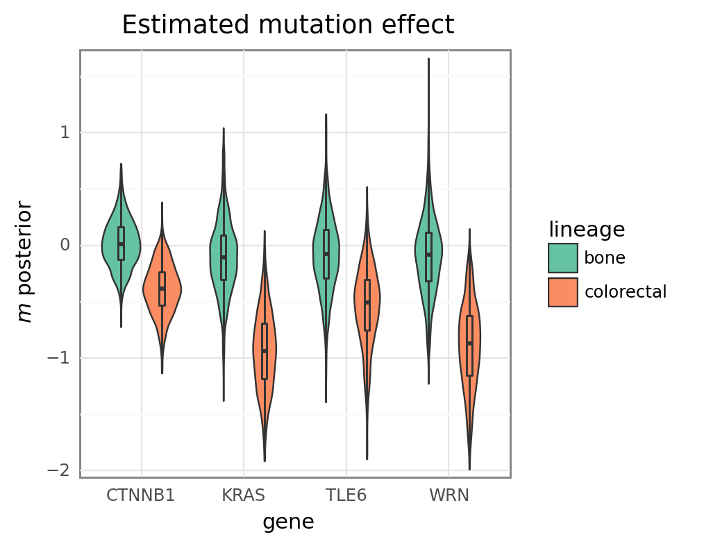

    <ggplot: (361775345)>

TODO:

1. analyze CN effects
2. analyze RNA effects
3. posterior predictive check

```python
def set_cat_inorder(df: pd.DataFrame, col: str) -> pd.DataFrame:
    df[col] = pd.Categorical(df[col], categories=df[col].unique(), ordered=True)
    return df
```

```python
gene_cat = valid_ct_data.hugo_symbol.cat.categories
h_post_summary = (
    az.summary(hnb_trace, var_names="h", hdi_prob=HDI_PROB, kind="stats")
    .assign(hugo_symbol=gene_cat)
    .sort_values("mean")
    .pipe(make_cat, "hugo_symbol")
)
h_post_summary.head()
```

<div>
<style scoped>
    .dataframe tbody tr th:only-of-type {
        vertical-align: middle;
    }

    .dataframe tbody tr th {
        vertical-align: top;
    }

    .dataframe thead th {
        text-align: right;
    }
</style>
<table border="1" class="dataframe">
  <thead>
    <tr style="text-align: right;">
      <th></th>
      <th>mean</th>
      <th>sd</th>
      <th>hdi_5.5%</th>
      <th>hdi_94.5%</th>
      <th>hugo_symbol</th>
    </tr>
  </thead>
  <tbody>
    <tr>
      <th>h[LEO1]</th>
      <td>0.021</td>
      <td>0.041</td>
      <td>-0.042</td>
      <td>0.082</td>
      <td>LEO1</td>
    </tr>
    <tr>
      <th>h[SPTLC1]</th>
      <td>0.026</td>
      <td>0.039</td>
      <td>-0.035</td>
      <td>0.081</td>
      <td>SPTLC1</td>
    </tr>
    <tr>
      <th>h[TMEM87B]</th>
      <td>0.028</td>
      <td>0.037</td>
      <td>-0.035</td>
      <td>0.079</td>
      <td>TMEM87B</td>
    </tr>
    <tr>
      <th>h[NRAS]</th>
      <td>0.028</td>
      <td>0.039</td>
      <td>-0.031</td>
      <td>0.090</td>
      <td>NRAS</td>
    </tr>
    <tr>
      <th>h[APC]</th>
      <td>0.029</td>
      <td>0.037</td>
      <td>-0.034</td>
      <td>0.082</td>
      <td>APC</td>
    </tr>
  </tbody>
</table>
</div>

```python
(
    gg.ggplot(h_post_summary, gg.aes(x="hugo_symbol", y="mean"))
    + gg.geom_linerange(gg.aes(ymin="hdi_5.5%", ymax="hdi_94.5%"))
    + gg.geom_point()
    + gg.scale_y_continuous(expand=(0.02, 0))
    + gg.theme(
        figure_size=(11, 3),
        axis_text_x=gg.element_text(angle=90, size=6),
        panel_grid_major_x=gg.element_blank(),
    )
    + gg.labs(x="gene", y="$h$ posterior (mean ± 89% HDI)")
)
```

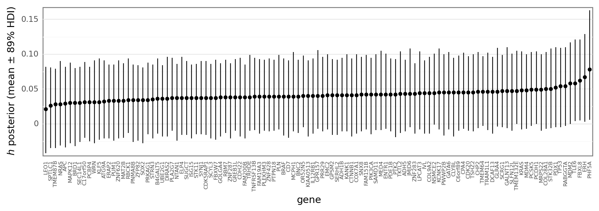

    <ggplot: (361396399)>

```python
(gg.ggplot(counts_data, gg.aes(x="rna_expr", y="lfc")) + gg.geom_point(alpha=0.1))
```

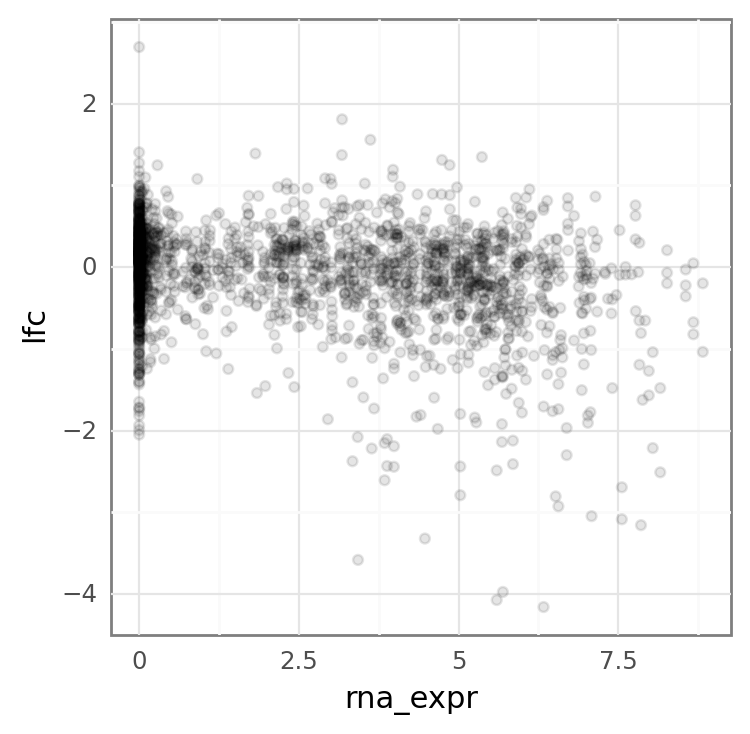

    <ggplot: (361777649)>

```python
(
    gg.ggplot(valid_ct_data, gg.aes(x="z_rna_gene_lineage", y="lfc"))
    + gg.geom_point(alpha=0.1)
)
```

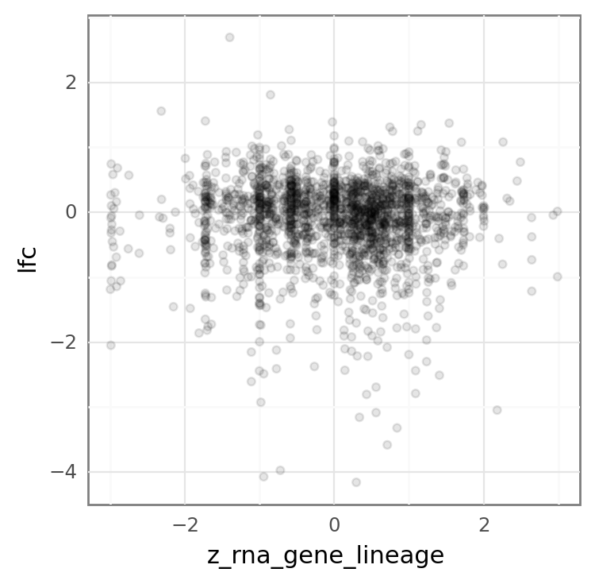

    <ggplot: (361368492)>

```python
k_post_summary = (
    az.summary(hnb_trace, var_names=["k"], hdi_prob=HDI_PROB, kind="stats")
    .reset_index(drop=False)
    .pipe(
        extract_matrix_variable_coords,
        col="index",
        idx1name="hugo_symbol",
        idx2name="lineage",
    )
)

(
    gg.ggplot(k_post_summary, gg.aes(x="lineage", y="hugo_symbol"))
    + gg.geom_tile(gg.aes(fill="mean"))
    + gg.scale_x_discrete(expand=(0, 0.5))
    + gg.scale_y_discrete(expand=(0, 0.5))
    + gg.scale_fill_gradient2(low="#0571b0", mid="white", high="#ca0020", midpoint=0)
    + gg.theme(
        figure_size=(0.5, 11),
        axis_text_x=gg.element_text(size=7, angle=90),
        axis_text_y=gg.element_text(size=6),
        panel_grid=gg.element_blank(),
    )
    + gg.labs(x="lineage", y="gene", fill="$\\hat{k}$")
)
```

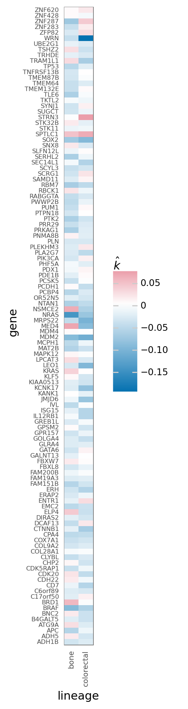

    <ggplot: (361864924)>

```python
for gene in ["WRN", "CTNNB1", "KRAS", "NRAS"]:
    ax = az.plot_pair(
        hnb_trace,
        var_names=["m", "k"],
        coords={"lineage": ["colorectal"], "gene": [gene]},
    )
    ax.axvline(0, c="k")
    ax.axhline(0, c="k")
    plt.show()
```

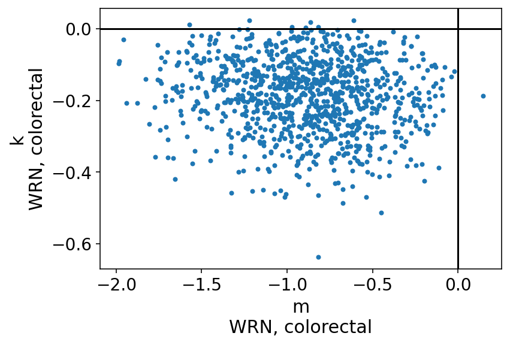

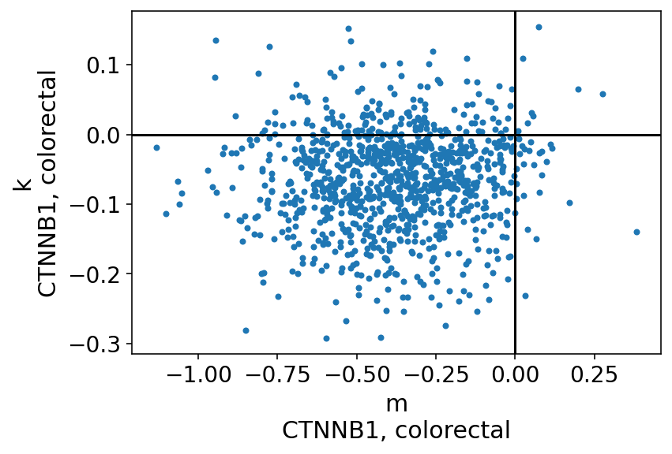

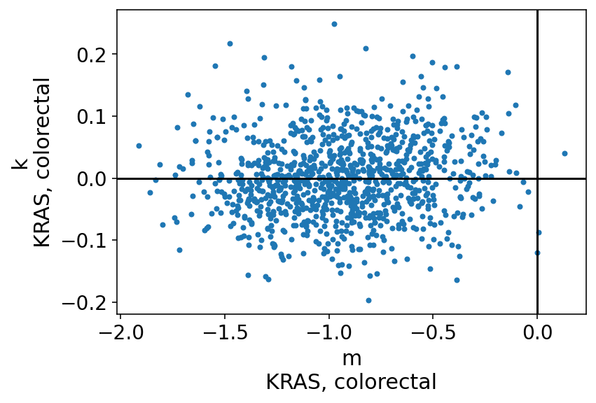

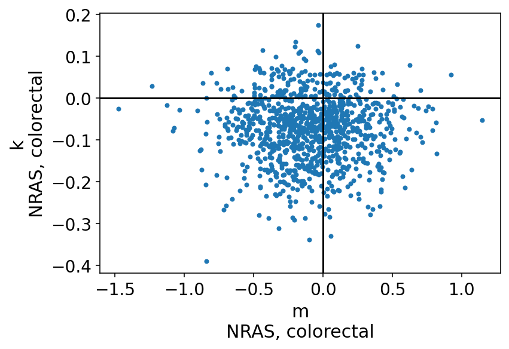

## Posterior predictions

```python
ax = az.plot_ppc(hnb_trace, num_pp_samples=100);
```

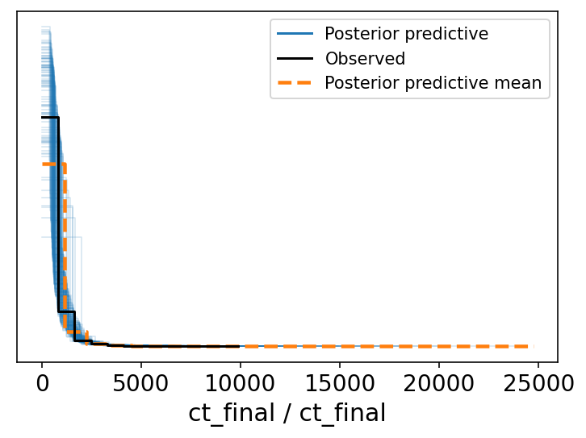

```python
ax = az.plot_ppc(hnb_trace, num_pp_samples=100)
ax.set_xlim(0, 5000);
```

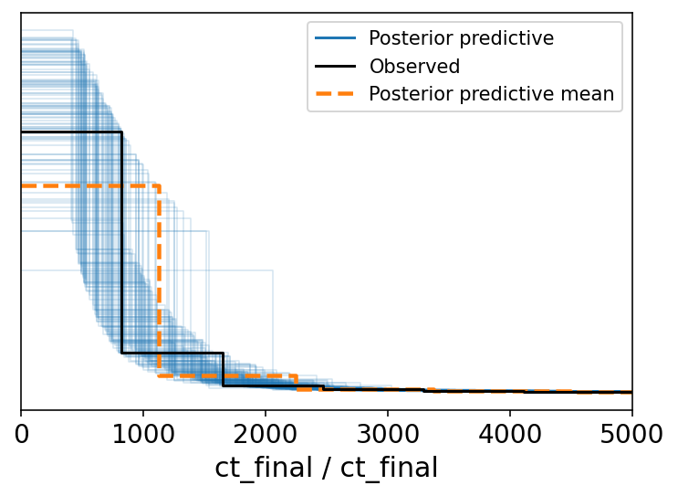

```python
hnb_post_pred = (
    hnb_trace.posterior_predictive["ct_final"]
    .to_dataframe()
    .reset_index(level=["chain", "draw"], drop=False)
    .assign(grp=lambda d: [f"{chain}-{draw}" for chain, draw in zip(d.chain, d.draw)])
    .rename(columns={"ct_final": "ct_final_pred"})
    .merge(
        valid_ct_data.reset_index()
        .rename(columns={"index": "ct_final_dim_0"})
        .set_index("ct_final_dim_0"),
        left_index=True,
        right_index=True,
    )
)
```

```python
plt_draws = np.random.choice(hnb_post_pred.grp.unique(), 25, replace=False)
```

```python
(
    gg.ggplot(
        hnb_post_pred.filter_column_isin("grp", plt_draws), gg.aes(x="ct_final_pred")
    )
    + gg.geom_density(gg.aes(group="grp"), alpha=0, color="gray")
    + gg.geom_density(
        gg.aes(x="counts_final"), data=valid_ct_data, size=0, fill="blue", alpha=0.2
    )
    + gg.scale_x_continuous(expand=(0, 0, 0.02, 0))
    + gg.scale_y_continuous(expand=(0, 0, 0.02, 0))
    + gg.theme(figure_size=(5, 3))
    + gg.labs(x="final counts")
)
```

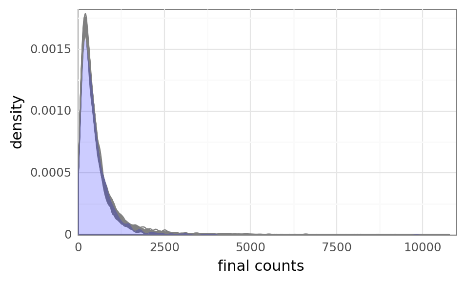

    <ggplot: (370628093)>

```python
(
    gg.ggplot(
        hnb_post_pred.filter_column_isin("grp", plt_draws), gg.aes(x="ct_final_pred")
    )
    + gg.geom_density(gg.aes(group="grp"), alpha=0, color="gray")
    + gg.geom_density(
        gg.aes(x="counts_final"), data=valid_ct_data, size=0, fill="blue", alpha=0.2
    )
    + gg.scale_x_continuous(expand=(0, 0, 0.02, 0))
    + gg.scale_y_continuous(expand=(0, 0, 0.02, 0))
    + gg.coord_cartesian(xlim=(0, 3000))
    + gg.theme(figure_size=(5, 3))
    + gg.labs(x="final counts")
)
```

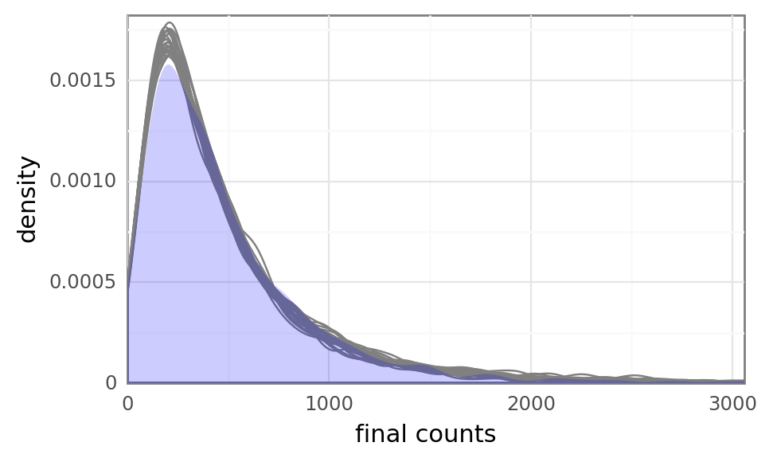

    <ggplot: (362589091)>

```python
(
    gg.ggplot(
        hnb_post_pred.filter_column_isin("grp", plt_draws), gg.aes(x="ct_final_pred")
    )
    + gg.geom_density(gg.aes(group="grp"), alpha=0, color="gray")
    + gg.geom_density(
        gg.aes(x="counts_final"), data=valid_ct_data, size=0, fill="blue", alpha=0.2
    )
    + gg.scale_x_continuous(expand=(0, 0, 0.02, 0))
    + gg.scale_y_continuous(expand=(0, 0, 0.02, 0))
    + gg.coord_cartesian(xlim=(0, 500))
    + gg.theme(figure_size=(5, 3))
    + gg.labs(x="final counts")
)
```

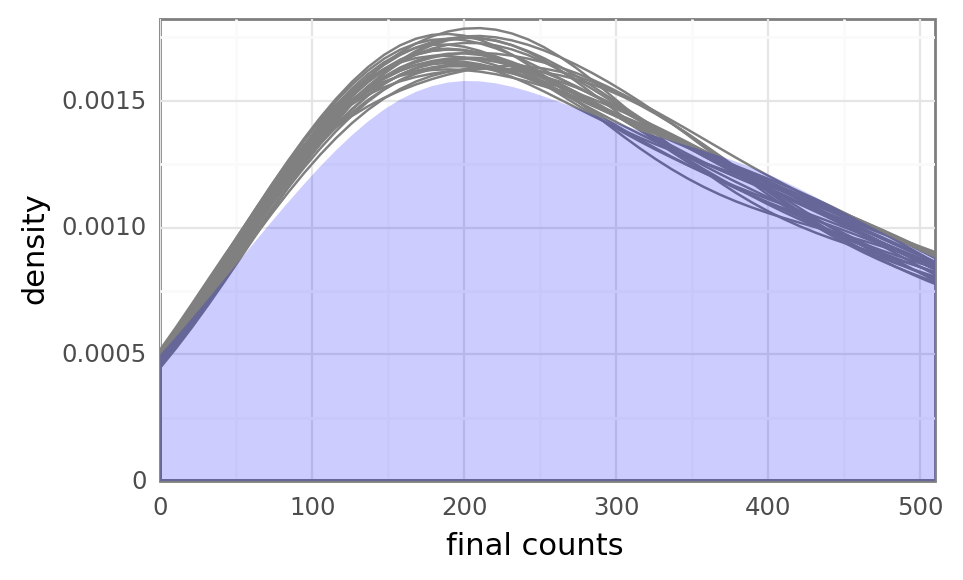

    <ggplot: (370690497)>

---

```python
notebook_toc = time()
print(f"execution time: {(notebook_toc - notebook_tic) / 60:.2f} minutes")
```

    execution time: 5.33 minutes

```python
%load_ext watermark
%watermark -d -u -v -iv -b -h -m
```

    Last updated: 2022-03-07

    Python implementation: CPython
    Python version       : 3.9.9
    IPython version      : 8.0.1

    Compiler    : Clang 11.1.0
    OS          : Darwin
    Release     : 21.3.0
    Machine     : x86_64
    Processor   : i386
    CPU cores   : 4
    Architecture: 64bit

    Hostname: JHCookMac

    Git branch: add-nb-model

    janitor   : 0.22.0
    numpy     : 1.22.2
    arviz     : 0.11.4
    plotnine  : 0.8.0
    pandas    : 1.4.1
    matplotlib: 3.5.1
    pymc      : 4.0.0b2
    seaborn   : 0.11.2
