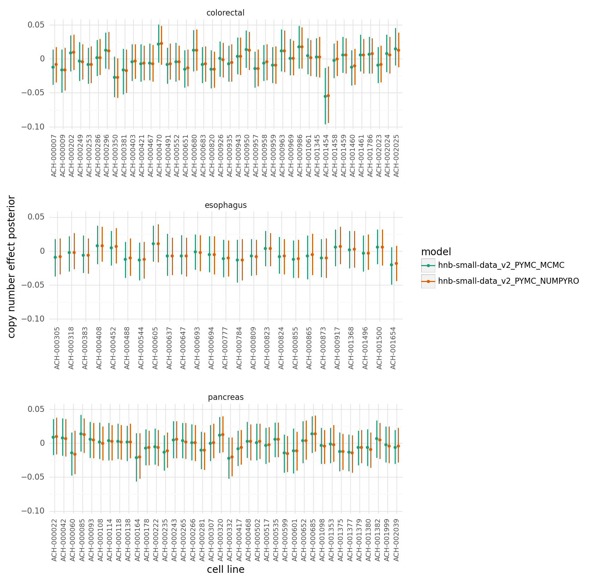

# Analysis of the Hierarchical Negative Binomial model with the CGC gene matrix covariate fit on the colorectal, pancreas, and esophagus sub-sampled data.

date: May 20, 2022

## Introduction

The latest version of the hierarchical negative binomial model was with the small sub-sample of colorectal, pancreas, and esophagus data.
This model includes a covariate for the mutation status of cancer genes, and the covariate is tissue-specific (i.e. "lineage"-specific in this case).
The model with fit with the standard PyMC sampler and with the Numpyro backend.

## Setup


```python
%load_ext autoreload
%autoreload 2
```


```python
from pathlib import Path
from time import time
from typing import Iterable

import arviz as az
import janitor  # noqa: F401
import matplotlib.pyplot as plt
import numpy as np
import pandas as pd
import plotnine as gg
import pymc as pm
```


```python
import speclet.plot.plotnine_helpers as sgg
from speclet.analysis.arviz_analysis import extract_coords_param_names
from speclet.bayesian_models.hierarchical_nb import HierarchcalNegativeBinomialModel
from speclet.data_processing.common import head_tail
from speclet.io import DataFile, models_dir
from speclet.managers.data_managers import (
    CancerGeneDataManager,
    CrisprScreenDataManager,
)
from speclet.managers.posterior_summary_manager import PosteriorSummaryManager
from speclet.project_configuration import read_project_configuration
from speclet.project_enums import ModelFitMethod
```


```python
# Notebook execution timer.
notebook_tic = time()

# Plotting setup.
sgg.set_theme_speclet()
%config InlineBackend.figure_format = "retina"

# Constants
RANDOM_SEED = 847
np.random.seed(RANDOM_SEED)
HDI_PROB = read_project_configuration().modeling.highest_density_interval
```

## Data

### Create a model object


```python
hnb_model = HierarchcalNegativeBinomialModel()
```

### Screen data


```python
crispr_dm = CrisprScreenDataManager(DataFile.DEPMAP_CRC_PANC_ESO_SUBSAMPLE)
crispr_data = crispr_dm.get_data()
crispr_data.head()
```


<div>
<style scoped>
    .dataframe tbody tr th:only-of-type {
        vertical-align: middle;
    }

    .dataframe tbody tr th {
        vertical-align: top;
    }

    .dataframe thead th {
        text-align: right;
    }
</style>
<table border="1" class="dataframe">
  <thead>
    <tr style="text-align: right;">
      <th></th>
      <th>sgrna</th>
      <th>replicate_id</th>
      <th>lfc</th>
      <th>p_dna_batch</th>
      <th>genome_alignment</th>
      <th>hugo_symbol</th>
      <th>screen</th>
      <th>multiple_hits_on_gene</th>
      <th>sgrna_target_chr</th>
      <th>sgrna_target_pos</th>
      <th>...</th>
      <th>any_deleterious</th>
      <th>any_tcga_hotspot</th>
      <th>any_cosmic_hotspot</th>
      <th>is_mutated</th>
      <th>copy_number</th>
      <th>lineage</th>
      <th>lineage_subtype</th>
      <th>primary_or_metastasis</th>
      <th>is_male</th>
      <th>age</th>
    </tr>
  </thead>
  <tbody>
    <tr>
      <th>0</th>
      <td>CGCCAAAATGACGAACACAA</td>
      <td>LS513-311Cas9_RepA_p6_batch2</td>
      <td>0.441730</td>
      <td>2</td>
      <td>chr13_27253786_+</td>
      <td>RPL21</td>
      <td>broad</td>
      <td>True</td>
      <td>13</td>
      <td>27253786</td>
      <td>...</td>
      <td>NaN</td>
      <td>NaN</td>
      <td>NaN</td>
      <td>False</td>
      <td>1.932560</td>
      <td>colorectal</td>
      <td>colorectal_adenocarcinoma</td>
      <td>primary</td>
      <td>True</td>
      <td>63.0</td>
    </tr>
    <tr>
      <th>1</th>
      <td>CTCGGACAGCACCCTCCCCG</td>
      <td>LS513-311Cas9_RepA_p6_batch2</td>
      <td>-1.495007</td>
      <td>2</td>
      <td>chr4_190173807_+</td>
      <td>DUX4</td>
      <td>broad</td>
      <td>True</td>
      <td>4</td>
      <td>190173807</td>
      <td>...</td>
      <td>NaN</td>
      <td>NaN</td>
      <td>NaN</td>
      <td>False</td>
      <td>0.935411</td>
      <td>colorectal</td>
      <td>colorectal_adenocarcinoma</td>
      <td>primary</td>
      <td>True</td>
      <td>63.0</td>
    </tr>
    <tr>
      <th>2</th>
      <td>GATCTGGTTTCAGAATCGAA</td>
      <td>LS513-311Cas9_RepA_p6_batch2</td>
      <td>-1.403813</td>
      <td>2</td>
      <td>chr4_190174206_+</td>
      <td>DUX4</td>
      <td>broad</td>
      <td>True</td>
      <td>4</td>
      <td>190174206</td>
      <td>...</td>
      <td>NaN</td>
      <td>NaN</td>
      <td>NaN</td>
      <td>False</td>
      <td>0.935411</td>
      <td>colorectal</td>
      <td>colorectal_adenocarcinoma</td>
      <td>primary</td>
      <td>True</td>
      <td>63.0</td>
    </tr>
    <tr>
      <th>3</th>
      <td>GCCAAAATGACGAACACAAA</td>
      <td>LS513-311Cas9_RepA_p6_batch2</td>
      <td>0.235469</td>
      <td>2</td>
      <td>chr13_27253787_+</td>
      <td>RPL21</td>
      <td>broad</td>
      <td>True</td>
      <td>13</td>
      <td>27253787</td>
      <td>...</td>
      <td>NaN</td>
      <td>NaN</td>
      <td>NaN</td>
      <td>False</td>
      <td>1.932560</td>
      <td>colorectal</td>
      <td>colorectal_adenocarcinoma</td>
      <td>primary</td>
      <td>True</td>
      <td>63.0</td>
    </tr>
    <tr>
      <th>4</th>
      <td>GCCAGGGCCGAGATTCCCGC</td>
      <td>LS513-311Cas9_RepA_p6_batch2</td>
      <td>-1.772866</td>
      <td>2</td>
      <td>chr4_190174012_-</td>
      <td>DUX4</td>
      <td>broad</td>
      <td>True</td>
      <td>4</td>
      <td>190174012</td>
      <td>...</td>
      <td>NaN</td>
      <td>NaN</td>
      <td>NaN</td>
      <td>False</td>
      <td>0.935411</td>
      <td>colorectal</td>
      <td>colorectal_adenocarcinoma</td>
      <td>primary</td>
      <td>True</td>
      <td>63.0</td>
    </tr>
  </tbody>
</table>
<p>5 rows × 25 columns</p>
</div>


### Cancer genes


```python
cancer_gene_manager = CancerGeneDataManager()
cgc_genes = cancer_gene_manager.reduce_to_lineage(
    cancer_gene_manager.cosmic_cancer_genes()
)
cgc_genes = {line: cgc_genes[line] for line in crispr_data.lineage.unique()}
cgc_genes
```


    {'colorectal': {'AKT1',
      'APC',
      'AXIN1',
      'AXIN2',
      'B2M',
      'BAX',
      'ERBB3',
      'FBXW7',
      'GRIN2A',
      'HIF1A',
      'KRAS',
      'MAP2K1',
      'MAX',
      'MDM2',
      'MLH1',
      'MSH2',
      'MSH6',
      'PIK3CA',
      'PIK3R1',
      'POLD1',
      'POLE',
      'PTPRT',
      'SALL4',
      'SFRP4',
      'SMAD2',
      'SMAD3',
      'SMAD4',
      'SRC',
      'TGFBR2',
      'UBR5'},
     'pancreas': {'ACVR2A',
      'AKT2',
      'APC',
      'BRCA2',
      'FAT4',
      'HIF1A',
      'KRAS',
      'PREX2',
      'RNF43',
      'SMAD4',
      'STK11'},
     'esophagus': {'LRP1B', 'SFRP4', 'SOX2'}}


## Model "hnb-small-data"

### Compute metrics

Sampling with the Numpyro backend required double the RAM, but finished in half the time as the default PyMC backend.

| Backend | Job ID   | Duration   | CPU efficiency (%) | Resources               | Max mem. used |
|---------|----------|------------|--------------------|-------------------------|---------------|
| PyMC    | 53406431 | 1-12:26:05 | 99.89              | cpu=1,mem=62.50G,node=1 | 8.45G         |
| PyMC    | 53406432 | 1-13:14:06 | 99.97              | cpu=1,mem=62.50G,node=1 | 7.97G         |
| PyMC    | 53406437 | 1-12:41:16 | 99.95              | cpu=1,mem=62.50G,node=1 | 9.50G         |
| PyMC    | 53406438 | 1-13:23:57 | 99.96              | cpu=1,mem=62.50G,node=1 | 8.11G         |
| Numpyro | 53406435 | 18:11:32   | 99.90              | cpu=1,mem=62.50G,node=1 | 18.88G        |
| Numpyro | 53406440 | 18:11:56   | 99.96              | cpu=1,mem=62.50G,node=1 | 18.40G        |
| Numpyro | 53406441 | 18:38:15   | 99.93              | cpu=1,mem=62.50G,node=1 | 15.22G        |
| Numpyro | 53525466 | 18:26:34   | 99.95              | cpu=1,mem=31.25G,node=1 | 17.33G        |


### Posterior summaries


```python
def _prepare_posterior_summaries(
    posteriors: Iterable[PosteriorSummaryManager],
) -> pd.DataFrame:
    # Read in and combine posterior summary data frame.
    posterior_summaries = pd.DataFrame()
    for post_man in posteriors:
        post_df = post_man.read_posterior_summary().assign(
            variable=lambda d: [p.split("[")[0] for p in d.parameter], model=post_man.id
        )
        posterior_summaries = pd.concat([posterior_summaries, post_df])

    # Remove un-interesting variables.
    for var_regex in hnb_model.vars_regex(ModelFitMethod.PYMC_MCMC):
        var_regex = var_regex.replace("~", "")
        posterior_summaries = posterior_summaries.filter_string(
            "variable", var_regex, complement=True
        )

    return posterior_summaries.reset_index(drop=True)
```


```python
pymc_mcmc_pm_v1 = PosteriorSummaryManager("hnb-small-data_PYMC_MCMC", models_dir())
pyro_mcmc_pm_v1 = PosteriorSummaryManager("hnb-small-data_PYMC_NUMPYRO", models_dir())

posterior_summaries = _prepare_posterior_summaries([pymc_mcmc_pm_v1, pyro_mcmc_pm_v1])
```

### Analyze sampling process


```python
for post_man in [pymc_mcmc_pm_v1, pyro_mcmc_pm_v1]:
    print(post_man.read_description())
    print("\n" + "=" * 80 + "\n" + "=" * 80 + "\n")
```

    name: 'hnb-small-data'
    fit method: 'PYMC_MCMC'

    --------------------------------------------------------------------------------

    CONFIGURATION

    {
        "name": "hnb-small-data",
        "description": " Fit the model with a relatively small amount of data for testing purposes. ",
        "active": true,
        "model": "HIERARCHICAL_NB",
        "data_file": "DEPMAP_CRC_PANC_ESO_SUBSAMPLE",
        "sampling_kwargs": {
            "pymc_mcmc": {
                "draws": 1000,
                "init": "adapt_diag",
                "n_init": 200000,
                "chains": null,
                "cores": null,
                "tune": 1000,
                "progressbar": true,
                "target_accept": 0.99
            },
            "pymc_advi": null,
            "pymc_numpyro": {
                "draws": 1000,
                "tune": 1000,
                "chains": 4,
                "target_accept": 0.99,
                "progress_bar": true,
                "chain_method": "parallel"
            }
        }
    }

    --------------------------------------------------------------------------------

    POSTERIOR

    <xarray.Dataset>
    Dimensions:                 (chain: 4, draw: 1000, sgrna: 818, cell_line: 131,
                                 gene: 100, lineage: 3, cancer_gene: 39, screen: 2,
                                 gene_effect_dim_0: 73454,
                                 cell_line_effect_dim_0: 73454, eta_dim_0: 73454,
                                 mu_dim_0: 73454)
    Coordinates:
      * chain                   (chain) int64 0 1 2 3
      * draw                    (draw) int64 0 1 2 3 4 5 ... 994 995 996 997 998 999
      * sgrna                   (sgrna) object 'AAAAATCGCTGCTACAGGT' ... 'TTTTCGG...
      * cell_line               (cell_line) object 'ACH-000007' ... 'ACH-002263'
      * gene                    (gene) object 'ANAPC11' 'AOC1' ... 'WDR70' 'WIPF1'
      * lineage                 (lineage) object 'colorectal' 'esophagus' 'pancreas'
      * cancer_gene             (cancer_gene) object 'ACVR2A' 'AKT1' ... 'UBR5'
      * screen                  (screen) object 'broad' 'sanger'
      * gene_effect_dim_0       (gene_effect_dim_0) int64 0 1 2 ... 73452 73453
      * cell_line_effect_dim_0  (cell_line_effect_dim_0) int64 0 1 2 ... 73452 73453
      * eta_dim_0               (eta_dim_0) int64 0 1 2 3 ... 73451 73452 73453
      * mu_dim_0                (mu_dim_0) int64 0 1 2 3 ... 73450 73451 73452 73453
    Data variables: (12/33)
        z                       (chain, draw) float64 ...
        delta_a                 (chain, draw, sgrna) float64 ...
        delta_b                 (chain, draw, cell_line) float64 ...
        delta_d                 (chain, draw, gene, lineage) float64 ...
        delta_f                 (chain, draw, cell_line) float64 ...
        delta_h                 (chain, draw, gene, lineage) float64 ...
        ...                      ...
        w                       (chain, draw, gene, cancer_gene, lineage) float64 ...
        _w                      (chain, draw, gene, cell_line) float64 ...
        gene_effect             (chain, draw, gene_effect_dim_0) float64 ...
        cell_line_effect        (chain, draw, cell_line_effect_dim_0) float64 ...
        eta                     (chain, draw, eta_dim_0) float64 ...
        mu                      (chain, draw, mu_dim_0) float64 ...
    Attributes:
        created_at:                 2022-05-19 06:20:19.430425
        arviz_version:              0.12.0
        inference_library:          pymc
        inference_library_version:  4.0.0b5
        sampling_time:              131670.64946222305
        tuning_steps:               1000
        previous_created_at:        ['2022-05-19 06:20:19.430425', '2022-05-19T03...
        combined_sampling_time:     [131670.64946222 130808.26323104 134262.82468...

    --------------------------------------------------------------------------------

    SAMPLE STATS

    <xarray.Dataset>
    Dimensions:             (chain: 4, draw: 1000)
    Coordinates:
      * chain               (chain) int64 0 1 2 3
      * draw                (draw) int64 0 1 2 3 4 5 6 ... 994 995 996 997 998 999
    Data variables: (12/13)
        acceptance_rate     (chain, draw) float64 ...
        step_size_bar       (chain, draw) float64 ...
        step_size           (chain, draw) float64 ...
        tree_depth          (chain, draw) int64 ...
        energy_error        (chain, draw) float64 ...
        energy              (chain, draw) float64 ...
        ...                  ...
        process_time_diff   (chain, draw) float64 ...
        perf_counter_start  (chain, draw) float64 ...
        n_steps             (chain, draw) float64 ...
        lp                  (chain, draw) float64 ...
        perf_counter_diff   (chain, draw) float64 ...
        max_energy_error    (chain, draw) float64 ...
    Attributes:
        created_at:                 2022-05-19 06:20:19.430425
        arviz_version:              0.12.0
        inference_library:          pymc
        inference_library_version:  4.0.0b5
        sampling_time:              131670.64946222305
        tuning_steps:               1000
        previous_created_at:        ['2022-05-19 06:20:19.430425', '2022-05-19T03...
        combined_sampling_time:     [131670.64946222 130808.26323104 134262.82468...

    --------------------------------------------------------------------------------

    MCMC DESCRIPTION

    sampled 4 chains with (unknown) tuning steps and 1,000 draws
    num. divergences: 0, 0, 0, 0
    percent divergences: 0.0, 0.0, 0.0, 0.0
    BFMI: 0.614, 0.62, 0.821, 0.46
    avg. step size: 0.001, 0.001, 0.002, 0.001

    ================================================================================
    ================================================================================

    name: 'hnb-small-data'
    fit method: 'PYMC_NUMPYRO'

    --------------------------------------------------------------------------------

    CONFIGURATION

    {
        "name": "hnb-small-data",
        "description": " Fit the model with a relatively small amount of data for testing purposes. ",
        "active": true,
        "model": "HIERARCHICAL_NB",
        "data_file": "DEPMAP_CRC_PANC_ESO_SUBSAMPLE",
        "sampling_kwargs": {
            "pymc_mcmc": {
                "draws": 1000,
                "init": "adapt_diag",
                "n_init": 200000,
                "chains": null,
                "cores": null,
                "tune": 1000,
                "progressbar": true,
                "target_accept": 0.99
            },
            "pymc_advi": null,
            "pymc_numpyro": {
                "draws": 1000,
                "tune": 1000,
                "chains": 4,
                "target_accept": 0.99,
                "progress_bar": true,
                "chain_method": "parallel"
            }
        }
    }

    --------------------------------------------------------------------------------

    POSTERIOR

    <xarray.Dataset>
    Dimensions:                 (chain: 4, draw: 1000, sgrna: 818, cell_line: 131,
                                 gene: 100, lineage: 3, cancer_gene: 39, screen: 2,
                                 gene_effect_dim_0: 73454,
                                 cell_line_effect_dim_0: 73454, eta_dim_0: 73454,
                                 mu_dim_0: 73454)
    Coordinates:
      * chain                   (chain) int64 0 1 2 3
      * draw                    (draw) int64 0 1 2 3 4 5 ... 994 995 996 997 998 999
      * sgrna                   (sgrna) object 'AAAAATCGCTGCTACAGGT' ... 'TTTTCGG...
      * cell_line               (cell_line) object 'ACH-000007' ... 'ACH-002263'
      * gene                    (gene) object 'ANAPC11' 'AOC1' ... 'WDR70' 'WIPF1'
      * lineage                 (lineage) object 'colorectal' 'esophagus' 'pancreas'
      * cancer_gene             (cancer_gene) object 'ACVR2A' 'AKT1' ... 'UBR5'
      * screen                  (screen) object 'broad' 'sanger'
      * gene_effect_dim_0       (gene_effect_dim_0) int64 0 1 2 ... 73452 73453
      * cell_line_effect_dim_0  (cell_line_effect_dim_0) int64 0 1 2 ... 73452 73453
      * eta_dim_0               (eta_dim_0) int64 0 1 2 3 ... 73451 73452 73453
      * mu_dim_0                (mu_dim_0) int64 0 1 2 3 ... 73450 73451 73452 73453
    Data variables: (12/33)
        z                       (chain, draw) float64 ...
        delta_a                 (chain, draw, sgrna) float64 ...
        delta_b                 (chain, draw, cell_line) float64 ...
        delta_d                 (chain, draw, gene, lineage) float64 ...
        delta_f                 (chain, draw, cell_line) float64 ...
        delta_h                 (chain, draw, gene, lineage) float64 ...
        ...                      ...
        w                       (chain, draw, gene, cancer_gene, lineage) float64 ...
        _w                      (chain, draw, gene, cell_line) float64 ...
        gene_effect             (chain, draw, gene_effect_dim_0) float64 ...
        cell_line_effect        (chain, draw, cell_line_effect_dim_0) float64 ...
        eta                     (chain, draw, eta_dim_0) float64 ...
        mu                      (chain, draw, mu_dim_0) float64 ...
    Attributes:
        created_at:           2022-05-20 06:24:02.155732
        arviz_version:        0.12.0
        previous_created_at:  ['2022-05-20 06:24:02.155732', '2022-05-18T09:04:55...

    --------------------------------------------------------------------------------

    SAMPLE STATS

    <xarray.Dataset>
    Dimensions:          (chain: 4, draw: 1000)
    Coordinates:
      * chain            (chain) int64 0 1 2 3
      * draw             (draw) int64 0 1 2 3 4 5 6 ... 993 994 995 996 997 998 999
    Data variables:
        acceptance_rate  (chain, draw) float64 ...
        step_size        (chain, draw) float64 ...
        diverging        (chain, draw) bool ...
        energy           (chain, draw) float64 ...
        n_steps          (chain, draw) int64 ...
        tree_depth       (chain, draw) int64 ...
        lp               (chain, draw) float64 ...
    Attributes:
        created_at:           2022-05-20 06:24:02.155732
        arviz_version:        0.12.0
        previous_created_at:  ['2022-05-20 06:24:02.155732', '2022-05-18T09:04:55...

    --------------------------------------------------------------------------------

    MCMC DESCRIPTION

    sampled 4 chains with (unknown) tuning steps and 1,000 draws
    num. divergences: 0, 0, 0, 0
    percent divergences: 0.0, 0.0, 0.0, 0.0
    BFMI: 0.883, 0.944, 1.043, 1.027
    avg. step size: 0.0, 0.0, 0.001, 0.001

    ================================================================================
    ================================================================================


```python
(
    gg.ggplot(posterior_summaries, gg.aes(x="variable", y="r_hat"))
    + gg.facet_wrap("~model", ncol=1)
    + gg.geom_boxplot(outlier_alpha=0)
    + gg.scale_y_continuous(expand=(0, 0, 0.02, 0), limits=(1, None))
    + gg.theme(axis_text_x=gg.element_text(angle=50, hjust=1), figure_size=(5, 5))
)
```

    /usr/local/Caskroom/miniconda/base/envs/speclet/lib/python3.10/site-packages/plotnine/utils.py:371: FutureWarning: The frame.append method is deprecated and will be removed from pandas in a future version. Use pandas.concat instead.


    <ggplot: (338830484)>


```python
ess_averages = (
    posterior_summaries.groupby(["model", "variable"])["ess_bulk"]
    .mean()
    .reset_index(drop=False)
    .round({"ess_bulk": 1})
    .pivot_wider(index="variable", names_from="model", values_from="ess_bulk")
)
ess_averages
```


<div>
<style scoped>
    .dataframe tbody tr th:only-of-type {
        vertical-align: middle;
    }

    .dataframe tbody tr th {
        vertical-align: top;
    }

    .dataframe thead th {
        text-align: right;
    }
</style>
<table border="1" class="dataframe">
  <thead>
    <tr style="text-align: right;">
      <th></th>
      <th>variable</th>
      <th>hnb-small-data_PYMC_MCMC</th>
      <th>hnb-small-data_PYMC_NUMPYRO</th>
    </tr>
  </thead>
  <tbody>
    <tr>
      <th>0</th>
      <td>a</td>
      <td>130.5</td>
      <td>66.3</td>
    </tr>
    <tr>
      <th>1</th>
      <td>alpha</td>
      <td>112.0</td>
      <td>97.0</td>
    </tr>
    <tr>
      <th>2</th>
      <td>b</td>
      <td>84.2</td>
      <td>56.1</td>
    </tr>
    <tr>
      <th>3</th>
      <td>d</td>
      <td>59.2</td>
      <td>37.1</td>
    </tr>
    <tr>
      <th>4</th>
      <td>f</td>
      <td>93.8</td>
      <td>65.6</td>
    </tr>
    <tr>
      <th>5</th>
      <td>h</td>
      <td>98.9</td>
      <td>60.5</td>
    </tr>
    <tr>
      <th>6</th>
      <td>k</td>
      <td>77.7</td>
      <td>47.5</td>
    </tr>
    <tr>
      <th>7</th>
      <td>m</td>
      <td>125.9</td>
      <td>70.2</td>
    </tr>
    <tr>
      <th>8</th>
      <td>p</td>
      <td>22.0</td>
      <td>18.0</td>
    </tr>
    <tr>
      <th>9</th>
      <td>sigma_a</td>
      <td>26.0</td>
      <td>13.0</td>
    </tr>
    <tr>
      <th>10</th>
      <td>sigma_b</td>
      <td>16.0</td>
      <td>11.0</td>
    </tr>
    <tr>
      <th>11</th>
      <td>sigma_d</td>
      <td>10.0</td>
      <td>7.0</td>
    </tr>
    <tr>
      <th>12</th>
      <td>sigma_f</td>
      <td>11.0</td>
      <td>36.0</td>
    </tr>
    <tr>
      <th>13</th>
      <td>sigma_h</td>
      <td>32.0</td>
      <td>45.0</td>
    </tr>
    <tr>
      <th>14</th>
      <td>sigma_k</td>
      <td>7.0</td>
      <td>10.0</td>
    </tr>
    <tr>
      <th>15</th>
      <td>sigma_m</td>
      <td>52.0</td>
      <td>21.0</td>
    </tr>
    <tr>
      <th>16</th>
      <td>sigma_p</td>
      <td>84.0</td>
      <td>19.0</td>
    </tr>
    <tr>
      <th>17</th>
      <td>sigma_w</td>
      <td>111.0</td>
      <td>71.0</td>
    </tr>
    <tr>
      <th>18</th>
      <td>w</td>
      <td>126.6</td>
      <td>70.9</td>
    </tr>
    <tr>
      <th>19</th>
      <td>z</td>
      <td>15.0</td>
      <td>8.0</td>
    </tr>
  </tbody>
</table>
</div>


### Analyze marginal posteriors


```python
posterior_summaries.query("variable == 'z'")
```


<div>
<style scoped>
    .dataframe tbody tr th:only-of-type {
        vertical-align: middle;
    }

    .dataframe tbody tr th {
        vertical-align: top;
    }

    .dataframe thead th {
        text-align: right;
    }
</style>
<table border="1" class="dataframe">
  <thead>
    <tr style="text-align: right;">
      <th></th>
      <th>parameter</th>
      <th>mean</th>
      <th>sd</th>
      <th>hdi_5.5%</th>
      <th>hdi_94.5%</th>
      <th>mcse_mean</th>
      <th>mcse_sd</th>
      <th>ess_bulk</th>
      <th>ess_tail</th>
      <th>r_hat</th>
      <th>variable</th>
      <th>model</th>
    </tr>
  </thead>
  <tbody>
    <tr>
      <th>0</th>
      <td>z</td>
      <td>0.249</td>
      <td>1.660</td>
      <td>-2.326</td>
      <td>3.433</td>
      <td>0.441</td>
      <td>0.318</td>
      <td>15.0</td>
      <td>31.0</td>
      <td>1.23</td>
      <td>z</td>
      <td>hnb-small-data_PYMC_MCMC</td>
    </tr>
    <tr>
      <th>14191</th>
      <td>z</td>
      <td>-0.812</td>
      <td>1.869</td>
      <td>-4.785</td>
      <td>1.232</td>
      <td>0.701</td>
      <td>0.517</td>
      <td>8.0</td>
      <td>12.0</td>
      <td>1.48</td>
      <td>z</td>
      <td>hnb-small-data_PYMC_NUMPYRO</td>
    </tr>
  </tbody>
</table>
</div>


```python
def _extract_var_posterior(
    post_summ: pd.DataFrame, v: str, dim_names: list[str]
) -> pd.DataFrame:
    return (
        post_summ.copy()
        .query(f"variable == '{v}'")
        .reset_index(drop=True)
        .pipe(
            extract_coords_param_names,
            names=dim_names,
            col="parameter",
        )
    )


def _extract_w_posterior(post_summ: pd.DataFrame) -> pd.DataFrame:
    return _extract_var_posterior(
        post_summ, "w", ["hugo_symbol", "cancer_gene", "lineage"]
    )


def _extract_k_posterior(post_summ: pd.DataFrame) -> pd.DataFrame:
    return _extract_var_posterior(post_summ, "k", ["hugo_symbol", "lineage"])


def _extract_m_posterior(post_summ: pd.DataFrame) -> pd.DataFrame:
    return _extract_var_posterior(post_summ, "m", ["hugo_symbol", "lineage"])


def _extract_h_posterior(post_summ: pd.DataFrame) -> pd.DataFrame:
    return _extract_var_posterior(post_summ, "h", ["hugo_symbol", "lineage"])


def _extract_d_posterior(post_summ: pd.DataFrame) -> pd.DataFrame:
    return _extract_var_posterior(post_summ, "d", ["hugo_symbol", "lineage"])
```


```python
w_post = _extract_w_posterior(posterior_summaries)
```


```python
def _plot_lineage_specific_w_posterior(
    w_post: pd.DataFrame, cgc_genes: dict[str, set[str]]
) -> gg.ggplot:
    plot_df = (
        w_post.copy()
        .assign(
            lineage_spec=lambda d: [
                cg in cgc_genes[line] for cg, line in zip(d.cancer_gene, d.lineage)
            ]
        )
        .query("lineage_spec")
    )

    return (
        gg.ggplot(plot_df, gg.aes(x="cancer_gene", y="hugo_symbol", fill="mean"))
        + gg.facet_grid("model ~ lineage", scales="free_x")
        + gg.geom_tile(gg.aes(alpha="1/(sd**2)"))
        + gg.scale_alpha_continuous(range=(0, 1))
        + sgg.scale_fill_heatmap(midpoint=0)
        + gg.theme(
            axis_text=gg.element_text(size=7),
            axis_text_x=gg.element_text(angle=90),
            figure_size=(8, 17),
            panel_grid=gg.element_blank(),
        )
    )
```


```python
_plot_lineage_specific_w_posterior(w_post, cgc_genes)
```

    /usr/local/Caskroom/miniconda/base/envs/speclet/lib/python3.10/site-packages/plotnine/utils.py:371: FutureWarning: The frame.append method is deprecated and will be removed from pandas in a future version. Use pandas.concat instead.


    <ggplot: (339428398)>


```python
def _plot_w_post_comparing_models(
    w_post: pd.DataFrame, x_mdl: str, y_mdl: str
) -> gg.ggplot:
    plot_df = w_post.copy()[
        ["mean", "model", "hugo_symbol", "cancer_gene", "lineage"]
    ].pivot_wider(
        ["hugo_symbol", "cancer_gene", "lineage"],
        names_from="model",
        values_from="mean",
    )

    return (
        gg.ggplot(plot_df, gg.aes(x=x_mdl, y=y_mdl))
        + gg.geom_hline(yintercept=0, linetype="--")
        + gg.geom_vline(xintercept=0, linetype="--")
        + gg.geom_abline(slope=1, intercept=0, color="blue")
        + gg.geom_point(gg.aes(color="lineage"), alpha=0.2)
        + gg.scale_color_brewer(
            type="qual",
            palette="Set1",
            guide=gg.guide_legend(override_aes={"alpha": 1, "size": 2}),
        )
        + gg.coord_equal()
    )
```


```python
_plot_w_post_comparing_models(
    w_post, "hnb-small-data_PYMC_MCMC", "hnb-small-data_PYMC_NUMPYRO"
)
```


    <ggplot: (341299954)>


```python
posterior_summaries.filter_string("variable", "^sigma")
```


<div>
<style scoped>
    .dataframe tbody tr th:only-of-type {
        vertical-align: middle;
    }

    .dataframe tbody tr th {
        vertical-align: top;
    }

    .dataframe thead th {
        text-align: right;
    }
</style>
<table border="1" class="dataframe">
  <thead>
    <tr style="text-align: right;">
      <th></th>
      <th>parameter</th>
      <th>mean</th>
      <th>sd</th>
      <th>hdi_5.5%</th>
      <th>hdi_94.5%</th>
      <th>mcse_mean</th>
      <th>mcse_sd</th>
      <th>ess_bulk</th>
      <th>ess_tail</th>
      <th>r_hat</th>
      <th>variable</th>
      <th>model</th>
    </tr>
  </thead>
  <tbody>
    <tr>
      <th>201</th>
      <td>sigma_a</td>
      <td>1.953</td>
      <td>1.287</td>
      <td>0.218</td>
      <td>3.663</td>
      <td>0.245</td>
      <td>0.175</td>
      <td>26.0</td>
      <td>92.0</td>
      <td>1.11</td>
      <td>sigma_a</td>
      <td>hnb-small-data_PYMC_MCMC</td>
    </tr>
    <tr>
      <th>202</th>
      <td>sigma_b</td>
      <td>0.069</td>
      <td>0.006</td>
      <td>0.061</td>
      <td>0.078</td>
      <td>0.001</td>
      <td>0.001</td>
      <td>16.0</td>
      <td>53.0</td>
      <td>1.20</td>
      <td>sigma_b</td>
      <td>hnb-small-data_PYMC_MCMC</td>
    </tr>
    <tr>
      <th>203</th>
      <td>sigma_d</td>
      <td>0.054</td>
      <td>0.009</td>
      <td>0.038</td>
      <td>0.067</td>
      <td>0.003</td>
      <td>0.002</td>
      <td>10.0</td>
      <td>30.0</td>
      <td>1.31</td>
      <td>sigma_d</td>
      <td>hnb-small-data_PYMC_MCMC</td>
    </tr>
    <tr>
      <th>204</th>
      <td>sigma_f</td>
      <td>0.024</td>
      <td>0.004</td>
      <td>0.017</td>
      <td>0.031</td>
      <td>0.001</td>
      <td>0.001</td>
      <td>11.0</td>
      <td>35.0</td>
      <td>1.32</td>
      <td>sigma_f</td>
      <td>hnb-small-data_PYMC_MCMC</td>
    </tr>
    <tr>
      <th>205</th>
      <td>sigma_h</td>
      <td>0.034</td>
      <td>0.004</td>
      <td>0.027</td>
      <td>0.040</td>
      <td>0.001</td>
      <td>0.001</td>
      <td>32.0</td>
      <td>174.0</td>
      <td>1.10</td>
      <td>sigma_h</td>
      <td>hnb-small-data_PYMC_MCMC</td>
    </tr>
    <tr>
      <th>206</th>
      <td>sigma_k</td>
      <td>0.044</td>
      <td>0.006</td>
      <td>0.034</td>
      <td>0.053</td>
      <td>0.002</td>
      <td>0.002</td>
      <td>7.0</td>
      <td>29.0</td>
      <td>1.56</td>
      <td>sigma_k</td>
      <td>hnb-small-data_PYMC_MCMC</td>
    </tr>
    <tr>
      <th>207</th>
      <td>sigma_m</td>
      <td>0.033</td>
      <td>0.014</td>
      <td>0.008</td>
      <td>0.052</td>
      <td>0.002</td>
      <td>0.001</td>
      <td>52.0</td>
      <td>82.0</td>
      <td>1.07</td>
      <td>sigma_m</td>
      <td>hnb-small-data_PYMC_MCMC</td>
    </tr>
    <tr>
      <th>208</th>
      <td>sigma_w</td>
      <td>2.804</td>
      <td>1.656</td>
      <td>0.371</td>
      <td>4.795</td>
      <td>0.148</td>
      <td>0.105</td>
      <td>111.0</td>
      <td>183.0</td>
      <td>1.02</td>
      <td>sigma_w</td>
      <td>hnb-small-data_PYMC_MCMC</td>
    </tr>
    <tr>
      <th>209</th>
      <td>sigma_p</td>
      <td>0.594</td>
      <td>0.034</td>
      <td>0.535</td>
      <td>0.643</td>
      <td>0.004</td>
      <td>0.003</td>
      <td>84.0</td>
      <td>310.0</td>
      <td>1.06</td>
      <td>sigma_p</td>
      <td>hnb-small-data_PYMC_MCMC</td>
    </tr>
    <tr>
      <th>14392</th>
      <td>sigma_a</td>
      <td>2.395</td>
      <td>1.680</td>
      <td>0.202</td>
      <td>4.849</td>
      <td>0.521</td>
      <td>0.393</td>
      <td>13.0</td>
      <td>29.0</td>
      <td>1.24</td>
      <td>sigma_a</td>
      <td>hnb-small-data_PYMC_NUMPYRO</td>
    </tr>
    <tr>
      <th>14393</th>
      <td>sigma_b</td>
      <td>0.071</td>
      <td>0.005</td>
      <td>0.062</td>
      <td>0.079</td>
      <td>0.002</td>
      <td>0.001</td>
      <td>11.0</td>
      <td>21.0</td>
      <td>1.29</td>
      <td>sigma_b</td>
      <td>hnb-small-data_PYMC_NUMPYRO</td>
    </tr>
    <tr>
      <th>14394</th>
      <td>sigma_d</td>
      <td>0.059</td>
      <td>0.009</td>
      <td>0.043</td>
      <td>0.072</td>
      <td>0.003</td>
      <td>0.003</td>
      <td>7.0</td>
      <td>15.0</td>
      <td>1.52</td>
      <td>sigma_d</td>
      <td>hnb-small-data_PYMC_NUMPYRO</td>
    </tr>
    <tr>
      <th>14395</th>
      <td>sigma_f</td>
      <td>0.023</td>
      <td>0.004</td>
      <td>0.017</td>
      <td>0.029</td>
      <td>0.001</td>
      <td>0.000</td>
      <td>36.0</td>
      <td>133.0</td>
      <td>1.09</td>
      <td>sigma_f</td>
      <td>hnb-small-data_PYMC_NUMPYRO</td>
    </tr>
    <tr>
      <th>14396</th>
      <td>sigma_h</td>
      <td>0.033</td>
      <td>0.004</td>
      <td>0.027</td>
      <td>0.038</td>
      <td>0.001</td>
      <td>0.000</td>
      <td>45.0</td>
      <td>68.0</td>
      <td>1.07</td>
      <td>sigma_h</td>
      <td>hnb-small-data_PYMC_NUMPYRO</td>
    </tr>
    <tr>
      <th>14397</th>
      <td>sigma_k</td>
      <td>0.044</td>
      <td>0.005</td>
      <td>0.036</td>
      <td>0.053</td>
      <td>0.002</td>
      <td>0.001</td>
      <td>10.0</td>
      <td>28.0</td>
      <td>1.32</td>
      <td>sigma_k</td>
      <td>hnb-small-data_PYMC_NUMPYRO</td>
    </tr>
    <tr>
      <th>14398</th>
      <td>sigma_m</td>
      <td>0.031</td>
      <td>0.013</td>
      <td>0.009</td>
      <td>0.051</td>
      <td>0.003</td>
      <td>0.002</td>
      <td>21.0</td>
      <td>34.0</td>
      <td>1.14</td>
      <td>sigma_m</td>
      <td>hnb-small-data_PYMC_NUMPYRO</td>
    </tr>
    <tr>
      <th>14399</th>
      <td>sigma_w</td>
      <td>2.789</td>
      <td>1.713</td>
      <td>0.314</td>
      <td>4.901</td>
      <td>0.188</td>
      <td>0.133</td>
      <td>71.0</td>
      <td>139.0</td>
      <td>1.03</td>
      <td>sigma_w</td>
      <td>hnb-small-data_PYMC_NUMPYRO</td>
    </tr>
    <tr>
      <th>14400</th>
      <td>sigma_p</td>
      <td>0.593</td>
      <td>0.034</td>
      <td>0.540</td>
      <td>0.650</td>
      <td>0.008</td>
      <td>0.006</td>
      <td>19.0</td>
      <td>23.0</td>
      <td>1.15</td>
      <td>sigma_p</td>
      <td>hnb-small-data_PYMC_NUMPYRO</td>
    </tr>
  </tbody>
</table>
</div>


## Model: "hnb-small-data_v2"

### Compute metrics

| Backend | Job ID   | Duration | CPU efficiency (%) | Resources               | Max mem. used |
|---------|----------|----------|--------------------|-------------------------|---------------|
| PyMC    | 53592797 | 18:34:51 | 99.90              | cpu=1,mem=15.62G,node=1 | 4.98G         |
| PyMC    | 53592800 | 19:33:16 | 99.86              | cpu=1,mem=15.62G,node=1 | 3.32G         |
| PyMC    | 53592801 | 18:35:20 | 99.91              | cpu=1,mem=15.62G,node=1 | 5.02G         |
| PyMC    | 53592804 | 18:20:46 | 99.89              | cpu=1,mem=15.62G,node=1 | 3.33G         |
| Numpyro | 53592798 | 09:39:03 | 99.90              | cpu=1,mem=27.34G,node=1 | 3.50G         |
| Numpyro | 53592799 | 09:28:58 | 99.92              | cpu=1,mem=27.34G,node=1 | 7.97G         |
| Numpyro | 53592802 | 09:49:36 | 99.87              | cpu=1,mem=27.34G,node=1 | 2.87G         |
| Numpyro | 53592803 | 10:24:01 | 99.92              | cpu=1,mem=27.34G,node=1 | 7.59G         |


```python
pymc_mcmc_pm_v2 = PosteriorSummaryManager("hnb-small-data_v2_PYMC_MCMC", models_dir())
pyro_mcmc_pm_v2 = PosteriorSummaryManager(
    "hnb-small-data_v2_PYMC_NUMPYRO", models_dir()
)

posterior_summaries_v2 = _prepare_posterior_summaries(
    [pymc_mcmc_pm_v2, pyro_mcmc_pm_v2]
)
```

### Analyze sampling process


```python
for post_man in [pymc_mcmc_pm_v2, pyro_mcmc_pm_v2]:
    print(post_man.read_description())
    print("\n" + "=" * 80 + "\n" + "=" * 80 + "\n")
```

    name: 'hnb-small-data_v2'
    fit method: 'PYMC_MCMC'

    --------------------------------------------------------------------------------

    CONFIGURATION

    {
        "name": "hnb-small-data_v2",
        "description": " Fit the model with a relatively small amount of data for testing purposes. Changes from v1: - only use Broad data and remove the screen batch effect `p` - reduce the width of the prior for `z` - replace priors on `sigma_*` with `HalfNormal(0, 1)` - reduce target_accept to 0.98 to help with searching of posterior space - update O2 resources based on past performance ",
        "active": true,
        "model": "HIERARCHICAL_NB",
        "data_file": "DEPMAP_CRC_PANC_ESO_SUBSAMPLE",
        "sampling_kwargs": {
            "pymc_mcmc": {
                "draws": 1000,
                "init": "adapt_diag",
                "n_init": 200000,
                "chains": null,
                "cores": null,
                "tune": 1000,
                "progressbar": true,
                "target_accept": 0.98
            },
            "pymc_advi": null,
            "pymc_numpyro": {
                "draws": 1000,
                "tune": 1000,
                "chains": 4,
                "target_accept": 0.98,
                "progress_bar": true,
                "chain_method": "parallel"
            }
        }
    }

    --------------------------------------------------------------------------------

    POSTERIOR

    <xarray.Dataset>
    Dimensions:                 (chain: 4, draw: 1000, sgrna: 386, cell_line: 103,
                                 gene: 100, lineage: 3, cancer_gene: 39,
                                 gene_effect_dim_0: 39758,
                                 cell_line_effect_dim_0: 39758, eta_dim_0: 39758,
                                 mu_dim_0: 39758)
    Coordinates:
      * chain                   (chain) int64 0 1 2 3
      * draw                    (draw) int64 0 1 2 3 4 5 ... 994 995 996 997 998 999
      * sgrna                   (sgrna) object 'AACACCGGTGAGGTATATCG' ... 'TTTGGC...
      * cell_line               (cell_line) object 'ACH-000007' ... 'ACH-002039'
      * gene                    (gene) object 'ANAPC11' 'AOC1' ... 'WDR70' 'WIPF1'
      * lineage                 (lineage) object 'colorectal' 'esophagus' 'pancreas'
      * cancer_gene             (cancer_gene) object 'ACVR2A' 'AKT1' ... 'UBR5'
      * gene_effect_dim_0       (gene_effect_dim_0) int64 0 1 2 ... 39756 39757
      * cell_line_effect_dim_0  (cell_line_effect_dim_0) int64 0 1 2 ... 39756 39757
      * eta_dim_0               (eta_dim_0) int64 0 1 2 3 ... 39755 39756 39757
      * mu_dim_0                (mu_dim_0) int64 0 1 2 3 ... 39754 39755 39756 39757
    Data variables: (12/31)
        z                       (chain, draw) float64 ...
        delta_a                 (chain, draw, sgrna) float64 ...
        delta_b                 (chain, draw, cell_line) float64 ...
        delta_d                 (chain, draw, gene, lineage) float64 ...
        delta_f                 (chain, draw, cell_line) float64 ...
        delta_h                 (chain, draw, gene, lineage) float64 ...
        ...                      ...
        w                       (chain, draw, gene, cancer_gene, lineage) float64 ...
        _w                      (chain, draw, gene, cell_line) float64 ...
        gene_effect             (chain, draw, gene_effect_dim_0) float64 ...
        cell_line_effect        (chain, draw, cell_line_effect_dim_0) float64 ...
        eta                     (chain, draw, eta_dim_0) float64 ...
        mu                      (chain, draw, mu_dim_0) float64 ...
    Attributes:
        created_at:                 2022-05-21 08:15:31.298172
        arviz_version:              0.12.0
        inference_library:          pymc
        inference_library_version:  4.0.0b5
        sampling_time:              65782.18227005005
        tuning_steps:               1000
        previous_created_at:        ['2022-05-21 08:15:31.298172', '2022-05-21T11...
        combined_sampling_time:     [65782.18227005 70122.04332995 66631.0304811 ...

    --------------------------------------------------------------------------------

    SAMPLE STATS

    <xarray.Dataset>
    Dimensions:             (chain: 4, draw: 1000)
    Coordinates:
      * chain               (chain) int64 0 1 2 3
      * draw                (draw) int64 0 1 2 3 4 5 6 ... 994 995 996 997 998 999
    Data variables: (12/13)
        energy              (chain, draw) float64 ...
        max_energy_error    (chain, draw) float64 ...
        diverging           (chain, draw) bool ...
        step_size           (chain, draw) float64 ...
        perf_counter_diff   (chain, draw) float64 ...
        step_size_bar       (chain, draw) float64 ...
        ...                  ...
        n_steps             (chain, draw) float64 ...
        lp                  (chain, draw) float64 ...
        tree_depth          (chain, draw) int64 ...
        process_time_diff   (chain, draw) float64 ...
        energy_error        (chain, draw) float64 ...
        acceptance_rate     (chain, draw) float64 ...
    Attributes:
        created_at:                 2022-05-21 08:15:31.298172
        arviz_version:              0.12.0
        inference_library:          pymc
        inference_library_version:  4.0.0b5
        sampling_time:              65782.18227005005
        tuning_steps:               1000
        previous_created_at:        ['2022-05-21 08:15:31.298172', '2022-05-21T11...
        combined_sampling_time:     [65782.18227005 70122.04332995 66631.0304811 ...

    --------------------------------------------------------------------------------

    MCMC DESCRIPTION

    sampled 4 chains with (unknown) tuning steps and 1,000 draws
    num. divergences: 0, 1, 0, 0
    percent divergences: 0.0, 0.1, 0.0, 0.0
    BFMI: 1.001, 0.943, 1.011, 1.013
    avg. step size: 0.001, 0.001, 0.001, 0.001

    ================================================================================
    ================================================================================

    name: 'hnb-small-data_v2'
    fit method: 'PYMC_NUMPYRO'

    --------------------------------------------------------------------------------

    CONFIGURATION

    {
        "name": "hnb-small-data_v2",
        "description": " Fit the model with a relatively small amount of data for testing purposes. Changes from v1: - only use Broad data and remove the screen batch effect `p` - reduce the width of the prior for `z` - replace priors on `sigma_*` with `HalfNormal(0, 1)` - reduce target_accept to 0.98 to help with searching of posterior space - update O2 resources based on past performance ",
        "active": true,
        "model": "HIERARCHICAL_NB",
        "data_file": "DEPMAP_CRC_PANC_ESO_SUBSAMPLE",
        "sampling_kwargs": {
            "pymc_mcmc": {
                "draws": 1000,
                "init": "adapt_diag",
                "n_init": 200000,
                "chains": null,
                "cores": null,
                "tune": 1000,
                "progressbar": true,
                "target_accept": 0.98
            },
            "pymc_advi": null,
            "pymc_numpyro": {
                "draws": 1000,
                "tune": 1000,
                "chains": 4,
                "target_accept": 0.98,
                "progress_bar": true,
                "chain_method": "parallel"
            }
        }
    }

    --------------------------------------------------------------------------------

    POSTERIOR

    <xarray.Dataset>
    Dimensions:                 (chain: 4, draw: 1000, sgrna: 386, cell_line: 103,
                                 gene: 100, lineage: 3, cancer_gene: 39,
                                 gene_effect_dim_0: 39758,
                                 cell_line_effect_dim_0: 39758, eta_dim_0: 39758,
                                 mu_dim_0: 39758)
    Coordinates:
      * chain                   (chain) int64 0 1 2 3
      * draw                    (draw) int64 0 1 2 3 4 5 ... 994 995 996 997 998 999
      * sgrna                   (sgrna) object 'AACACCGGTGAGGTATATCG' ... 'TTTGGC...
      * cell_line               (cell_line) object 'ACH-000007' ... 'ACH-002039'
      * gene                    (gene) object 'ANAPC11' 'AOC1' ... 'WDR70' 'WIPF1'
      * lineage                 (lineage) object 'colorectal' 'esophagus' 'pancreas'
      * cancer_gene             (cancer_gene) object 'ACVR2A' 'AKT1' ... 'UBR5'
      * gene_effect_dim_0       (gene_effect_dim_0) int64 0 1 2 ... 39756 39757
      * cell_line_effect_dim_0  (cell_line_effect_dim_0) int64 0 1 2 ... 39756 39757
      * eta_dim_0               (eta_dim_0) int64 0 1 2 3 ... 39755 39756 39757
      * mu_dim_0                (mu_dim_0) int64 0 1 2 3 ... 39754 39755 39756 39757
    Data variables: (12/31)
        z                       (chain, draw) float64 ...
        delta_a                 (chain, draw, sgrna) float64 ...
        delta_b                 (chain, draw, cell_line) float64 ...
        delta_d                 (chain, draw, gene, lineage) float64 ...
        delta_f                 (chain, draw, cell_line) float64 ...
        delta_h                 (chain, draw, gene, lineage) float64 ...
        ...                      ...
        w                       (chain, draw, gene, cancer_gene, lineage) float64 ...
        _w                      (chain, draw, gene, cell_line) float64 ...
        gene_effect             (chain, draw, gene_effect_dim_0) float64 ...
        cell_line_effect        (chain, draw, cell_line_effect_dim_0) float64 ...
        eta                     (chain, draw, eta_dim_0) float64 ...
        mu                      (chain, draw, mu_dim_0) float64 ...
    Attributes:
        created_at:           2022-05-20 23:07:28.372250
        arviz_version:        0.12.0
        previous_created_at:  ['2022-05-20 23:07:28.372250', '2022-05-21T02:08:58...

    --------------------------------------------------------------------------------

    SAMPLE STATS

    <xarray.Dataset>
    Dimensions:          (chain: 4, draw: 1000)
    Coordinates:
      * chain            (chain) int64 0 1 2 3
      * draw             (draw) int64 0 1 2 3 4 5 6 ... 993 994 995 996 997 998 999
    Data variables:
        acceptance_rate  (chain, draw) float64 ...
        step_size        (chain, draw) float64 ...
        diverging        (chain, draw) bool ...
        energy           (chain, draw) float64 ...
        n_steps          (chain, draw) int64 ...
        tree_depth       (chain, draw) int64 ...
        lp               (chain, draw) float64 ...
    Attributes:
        created_at:           2022-05-20 23:07:28.372250
        arviz_version:        0.12.0
        previous_created_at:  ['2022-05-20 23:07:28.372250', '2022-05-21T02:08:58...

    --------------------------------------------------------------------------------

    MCMC DESCRIPTION

    sampled 4 chains with (unknown) tuning steps and 1,000 draws
    num. divergences: 0, 1, 0, 0
    percent divergences: 0.0, 0.1, 0.0, 0.0
    BFMI: 1.101, 1.021, 0.928, 0.796
    avg. step size: 0.001, 0.001, 0.001, 0.001

    ================================================================================
    ================================================================================


```python
plt_df = (
    pd.concat(
        [
            p.assign(ver=f"v{i+1}")
            for i, p in enumerate([posterior_summaries, posterior_summaries_v2])
        ]
    )
    .reset_index(drop=True)
    .assign(model=lambda d: [m.replace("_v2", "") for m in d.model])
)

(
    gg.ggplot(plt_df, gg.aes(x="variable", y="r_hat"))
    + gg.facet_grid("model~ver")
    + gg.geom_boxplot(outlier_alpha=0)
    + gg.scale_y_continuous(expand=(0, 0, 0.02, 0), limits=(1, None))
    + gg.theme(axis_text_x=gg.element_text(angle=50, hjust=1), figure_size=(8, 5))
)
```

    /usr/local/Caskroom/miniconda/base/envs/speclet/lib/python3.10/site-packages/plotnine/utils.py:371: FutureWarning: The frame.append method is deprecated and will be removed from pandas in a future version. Use pandas.concat instead.


    <ggplot: (341738208)>


```python
posterior_summaries_v2.groupby(["model", "variable"])["ess_bulk"].describe()
```


<div>
<style scoped>
    .dataframe tbody tr th:only-of-type {
        vertical-align: middle;
    }

    .dataframe tbody tr th {
        vertical-align: top;
    }

    .dataframe thead th {
        text-align: right;
    }
</style>
<table border="1" class="dataframe">
  <thead>
    <tr style="text-align: right;">
      <th></th>
      <th></th>
      <th>count</th>
      <th>mean</th>
      <th>std</th>
      <th>min</th>
      <th>25%</th>
      <th>50%</th>
      <th>75%</th>
      <th>max</th>
    </tr>
    <tr>
      <th>model</th>
      <th>variable</th>
      <th></th>
      <th></th>
      <th></th>
      <th></th>
      <th></th>
      <th></th>
      <th></th>
      <th></th>
    </tr>
  </thead>
  <tbody>
    <tr>
      <th rowspan="18" valign="top">hnb-small-data_v2_PYMC_MCMC</th>
      <th>a</th>
      <td>386.0</td>
      <td>592.217617</td>
      <td>100.107445</td>
      <td>189.0</td>
      <td>530.00</td>
      <td>592.0</td>
      <td>666.00</td>
      <td>878.0</td>
    </tr>
    <tr>
      <th>alpha</th>
      <td>1.0</td>
      <td>516.000000</td>
      <td>NaN</td>
      <td>516.0</td>
      <td>516.00</td>
      <td>516.0</td>
      <td>516.00</td>
      <td>516.0</td>
    </tr>
    <tr>
      <th>b</th>
      <td>103.0</td>
      <td>267.805825</td>
      <td>93.695696</td>
      <td>81.0</td>
      <td>203.50</td>
      <td>270.0</td>
      <td>316.50</td>
      <td>538.0</td>
    </tr>
    <tr>
      <th>d</th>
      <td>300.0</td>
      <td>84.263333</td>
      <td>53.498607</td>
      <td>24.0</td>
      <td>43.00</td>
      <td>65.0</td>
      <td>116.00</td>
      <td>275.0</td>
    </tr>
    <tr>
      <th>f</th>
      <td>103.0</td>
      <td>466.912621</td>
      <td>116.327134</td>
      <td>100.0</td>
      <td>391.00</td>
      <td>466.0</td>
      <td>536.00</td>
      <td>791.0</td>
    </tr>
    <tr>
      <th>h</th>
      <td>300.0</td>
      <td>467.620000</td>
      <td>106.845381</td>
      <td>36.0</td>
      <td>410.00</td>
      <td>474.0</td>
      <td>536.00</td>
      <td>715.0</td>
    </tr>
    <tr>
      <th>k</th>
      <td>300.0</td>
      <td>392.890000</td>
      <td>159.714664</td>
      <td>59.0</td>
      <td>279.75</td>
      <td>388.5</td>
      <td>518.00</td>
      <td>769.0</td>
    </tr>
    <tr>
      <th>m</th>
      <td>300.0</td>
      <td>584.473333</td>
      <td>99.601158</td>
      <td>296.0</td>
      <td>515.00</td>
      <td>583.0</td>
      <td>641.75</td>
      <td>896.0</td>
    </tr>
    <tr>
      <th>sigma_a</th>
      <td>1.0</td>
      <td>268.000000</td>
      <td>NaN</td>
      <td>268.0</td>
      <td>268.00</td>
      <td>268.0</td>
      <td>268.00</td>
      <td>268.0</td>
    </tr>
    <tr>
      <th>sigma_b</th>
      <td>1.0</td>
      <td>143.000000</td>
      <td>NaN</td>
      <td>143.0</td>
      <td>143.00</td>
      <td>143.0</td>
      <td>143.00</td>
      <td>143.0</td>
    </tr>
    <tr>
      <th>sigma_d</th>
      <td>1.0</td>
      <td>10.000000</td>
      <td>NaN</td>
      <td>10.0</td>
      <td>10.00</td>
      <td>10.0</td>
      <td>10.00</td>
      <td>10.0</td>
    </tr>
    <tr>
      <th>sigma_f</th>
      <td>1.0</td>
      <td>79.000000</td>
      <td>NaN</td>
      <td>79.0</td>
      <td>79.00</td>
      <td>79.0</td>
      <td>79.00</td>
      <td>79.0</td>
    </tr>
    <tr>
      <th>sigma_h</th>
      <td>1.0</td>
      <td>29.000000</td>
      <td>NaN</td>
      <td>29.0</td>
      <td>29.00</td>
      <td>29.0</td>
      <td>29.00</td>
      <td>29.0</td>
    </tr>
    <tr>
      <th>sigma_k</th>
      <td>1.0</td>
      <td>15.000000</td>
      <td>NaN</td>
      <td>15.0</td>
      <td>15.00</td>
      <td>15.0</td>
      <td>15.00</td>
      <td>15.0</td>
    </tr>
    <tr>
      <th>sigma_m</th>
      <td>1.0</td>
      <td>490.000000</td>
      <td>NaN</td>
      <td>490.0</td>
      <td>490.00</td>
      <td>490.0</td>
      <td>490.00</td>
      <td>490.0</td>
    </tr>
    <tr>
      <th>sigma_w</th>
      <td>1.0</td>
      <td>575.000000</td>
      <td>NaN</td>
      <td>575.0</td>
      <td>575.00</td>
      <td>575.0</td>
      <td>575.00</td>
      <td>575.0</td>
    </tr>
    <tr>
      <th>w</th>
      <td>11700.0</td>
      <td>586.355812</td>
      <td>98.437952</td>
      <td>117.0</td>
      <td>520.00</td>
      <td>585.0</td>
      <td>652.00</td>
      <td>994.0</td>
    </tr>
    <tr>
      <th>z</th>
      <td>1.0</td>
      <td>185.000000</td>
      <td>NaN</td>
      <td>185.0</td>
      <td>185.00</td>
      <td>185.0</td>
      <td>185.00</td>
      <td>185.0</td>
    </tr>
    <tr>
      <th rowspan="18" valign="top">hnb-small-data_v2_PYMC_NUMPYRO</th>
      <th>a</th>
      <td>386.0</td>
      <td>356.500000</td>
      <td>60.515845</td>
      <td>138.0</td>
      <td>319.00</td>
      <td>360.5</td>
      <td>399.50</td>
      <td>497.0</td>
    </tr>
    <tr>
      <th>alpha</th>
      <td>1.0</td>
      <td>332.000000</td>
      <td>NaN</td>
      <td>332.0</td>
      <td>332.00</td>
      <td>332.0</td>
      <td>332.00</td>
      <td>332.0</td>
    </tr>
    <tr>
      <th>b</th>
      <td>103.0</td>
      <td>156.650485</td>
      <td>57.879474</td>
      <td>42.0</td>
      <td>123.00</td>
      <td>151.0</td>
      <td>188.00</td>
      <td>354.0</td>
    </tr>
    <tr>
      <th>d</th>
      <td>300.0</td>
      <td>61.946667</td>
      <td>39.850773</td>
      <td>15.0</td>
      <td>32.00</td>
      <td>51.0</td>
      <td>78.00</td>
      <td>268.0</td>
    </tr>
    <tr>
      <th>f</th>
      <td>103.0</td>
      <td>296.155340</td>
      <td>63.442078</td>
      <td>93.0</td>
      <td>262.50</td>
      <td>297.0</td>
      <td>337.50</td>
      <td>454.0</td>
    </tr>
    <tr>
      <th>h</th>
      <td>300.0</td>
      <td>303.500000</td>
      <td>57.741640</td>
      <td>150.0</td>
      <td>266.75</td>
      <td>301.0</td>
      <td>336.25</td>
      <td>505.0</td>
    </tr>
    <tr>
      <th>k</th>
      <td>300.0</td>
      <td>262.413333</td>
      <td>83.149596</td>
      <td>80.0</td>
      <td>203.00</td>
      <td>253.0</td>
      <td>320.25</td>
      <td>506.0</td>
    </tr>
    <tr>
      <th>m</th>
      <td>300.0</td>
      <td>346.726667</td>
      <td>59.244112</td>
      <td>138.0</td>
      <td>310.00</td>
      <td>347.0</td>
      <td>383.25</td>
      <td>521.0</td>
    </tr>
    <tr>
      <th>sigma_a</th>
      <td>1.0</td>
      <td>220.000000</td>
      <td>NaN</td>
      <td>220.0</td>
      <td>220.00</td>
      <td>220.0</td>
      <td>220.00</td>
      <td>220.0</td>
    </tr>
    <tr>
      <th>sigma_b</th>
      <td>1.0</td>
      <td>77.000000</td>
      <td>NaN</td>
      <td>77.0</td>
      <td>77.00</td>
      <td>77.0</td>
      <td>77.00</td>
      <td>77.0</td>
    </tr>
    <tr>
      <th>sigma_d</th>
      <td>1.0</td>
      <td>12.000000</td>
      <td>NaN</td>
      <td>12.0</td>
      <td>12.00</td>
      <td>12.0</td>
      <td>12.00</td>
      <td>12.0</td>
    </tr>
    <tr>
      <th>sigma_f</th>
      <td>1.0</td>
      <td>139.000000</td>
      <td>NaN</td>
      <td>139.0</td>
      <td>139.00</td>
      <td>139.0</td>
      <td>139.00</td>
      <td>139.0</td>
    </tr>
    <tr>
      <th>sigma_h</th>
      <td>1.0</td>
      <td>121.000000</td>
      <td>NaN</td>
      <td>121.0</td>
      <td>121.00</td>
      <td>121.0</td>
      <td>121.00</td>
      <td>121.0</td>
    </tr>
    <tr>
      <th>sigma_k</th>
      <td>1.0</td>
      <td>20.000000</td>
      <td>NaN</td>
      <td>20.0</td>
      <td>20.00</td>
      <td>20.0</td>
      <td>20.00</td>
      <td>20.0</td>
    </tr>
    <tr>
      <th>sigma_m</th>
      <td>1.0</td>
      <td>202.000000</td>
      <td>NaN</td>
      <td>202.0</td>
      <td>202.00</td>
      <td>202.0</td>
      <td>202.00</td>
      <td>202.0</td>
    </tr>
    <tr>
      <th>sigma_w</th>
      <td>1.0</td>
      <td>412.000000</td>
      <td>NaN</td>
      <td>412.0</td>
      <td>412.00</td>
      <td>412.0</td>
      <td>412.00</td>
      <td>412.0</td>
    </tr>
    <tr>
      <th>w</th>
      <td>11700.0</td>
      <td>357.748803</td>
      <td>59.108414</td>
      <td>92.0</td>
      <td>319.00</td>
      <td>358.0</td>
      <td>398.00</td>
      <td>604.0</td>
    </tr>
    <tr>
      <th>z</th>
      <td>1.0</td>
      <td>137.000000</td>
      <td>NaN</td>
      <td>137.0</td>
      <td>137.00</td>
      <td>137.0</td>
      <td>137.00</td>
      <td>137.0</td>
    </tr>
  </tbody>
</table>
</div>


### Analyze marginal posteriors


```python
w_post_v2 = _extract_w_posterior(posterior_summaries_v2)
```


```python
_plot_lineage_specific_w_posterior(w_post_v2, cgc_genes)
```

    /usr/local/Caskroom/miniconda/base/envs/speclet/lib/python3.10/site-packages/plotnine/utils.py:371: FutureWarning: The frame.append method is deprecated and will be removed from pandas in a future version. Use pandas.concat instead.


    <ggplot: (342458155)>


```python
_plot_w_post_comparing_models(
    w_post_v2, "hnb-small-data_v2_PYMC_MCMC", "hnb-small-data_v2_PYMC_NUMPYRO"
)
```


    <ggplot: (338758341)>


```python
w_post.query("`hdi_94.5%` < 0 or `hdi_5.5%` > 0")
```


<div>
<style scoped>
    .dataframe tbody tr th:only-of-type {
        vertical-align: middle;
    }

    .dataframe tbody tr th {
        vertical-align: top;
    }

    .dataframe thead th {
        text-align: right;
    }
</style>
<table border="1" class="dataframe">
  <thead>
    <tr style="text-align: right;">
      <th></th>
      <th>parameter</th>
      <th>mean</th>
      <th>sd</th>
      <th>hdi_5.5%</th>
      <th>hdi_94.5%</th>
      <th>mcse_mean</th>
      <th>mcse_sd</th>
      <th>ess_bulk</th>
      <th>ess_tail</th>
      <th>r_hat</th>
      <th>variable</th>
      <th>model</th>
      <th>hugo_symbol</th>
      <th>cancer_gene</th>
      <th>lineage</th>
    </tr>
  </thead>
  <tbody>
  </tbody>
</table>
</div>


```python
lineage_cell_line_map = (
    crispr_data.copy()[["depmap_id", "lineage"]]
    .drop_duplicates()
    .reset_index(drop=True)
)
```


```python
f_post_v2 = (
    posterior_summaries_v2.copy()
    .query("variable == 'f'")
    .pipe(extract_coords_param_names, names=["depmap_id"], col="parameter")
    .merge(lineage_cell_line_map, on="depmap_id")
    .sort_values(["lineage", "depmap_id"])
    .assign(
        depmap_id=lambda d: pd.Categorical(
            d.depmap_id, categories=d.depmap_id.unique(), ordered=True
        )
    )
)

pos = gg.position_dodge(width=0.7)

(
    gg.ggplot(f_post_v2, gg.aes(x="depmap_id", y="mean", color="model"))
    + gg.facet_wrap("~lineage", scales="free_x", ncol=1)
    + gg.geom_linerange(
        gg.aes(ymin="hdi_5.5%", ymax="hdi_94.5%"), position=pos, size=0.6
    )
    + gg.geom_point(position=pos, size=0.8)
    + gg.scale_color_brewer(type="qual", palette="Dark2")
    + gg.theme(
        axis_text_x=gg.element_text(angle=90, size=7),
        figure_size=(5, 7),
        subplots_adjust={"hspace": 0.75},
    )
    + gg.labs(x="cell line", y="copy number effect posterior", color="model")
)
```

    /usr/local/Caskroom/miniconda/base/envs/speclet/lib/python3.10/site-packages/plotnine/utils.py:371: FutureWarning: The frame.append method is deprecated and will be removed from pandas in a future version. Use pandas.concat instead.
    /usr/local/Caskroom/miniconda/base/envs/speclet/lib/python3.10/site-packages/plotnine/utils.py:371: FutureWarning: The frame.append method is deprecated and will be removed from pandas in a future version. Use pandas.concat instead.





    <ggplot: (339479733)>


```python
k_post_v2 = _extract_k_posterior(posterior_summaries_v2)
k_post_v2.sort_values("mean").pipe(head_tail, n=3)
```


<div>
<style scoped>
    .dataframe tbody tr th:only-of-type {
        vertical-align: middle;
    }

    .dataframe tbody tr th {
        vertical-align: top;
    }

    .dataframe thead th {
        text-align: right;
    }
</style>
<table border="1" class="dataframe">
  <thead>
    <tr style="text-align: right;">
      <th></th>
      <th>parameter</th>
      <th>mean</th>
      <th>sd</th>
      <th>hdi_5.5%</th>
      <th>hdi_94.5%</th>
      <th>mcse_mean</th>
      <th>mcse_sd</th>
      <th>ess_bulk</th>
      <th>ess_tail</th>
      <th>r_hat</th>
      <th>variable</th>
      <th>model</th>
      <th>hugo_symbol</th>
      <th>lineage</th>
    </tr>
  </thead>
  <tbody>
    <tr>
      <th>193</th>
      <td>k[RAN, esophagus]</td>
      <td>-0.009</td>
      <td>0.025</td>
      <td>-0.042</td>
      <td>0.019</td>
      <td>0.004</td>
      <td>0.003</td>
      <td>72.0</td>
      <td>64.0</td>
      <td>1.08</td>
      <td>k</td>
      <td>hnb-small-data_v2_PYMC_MCMC</td>
      <td>RAN</td>
      <td>esophagus</td>
    </tr>
    <tr>
      <th>493</th>
      <td>k[RAN, esophagus]</td>
      <td>-0.008</td>
      <td>0.021</td>
      <td>-0.040</td>
      <td>0.021</td>
      <td>0.002</td>
      <td>0.002</td>
      <td>186.0</td>
      <td>113.0</td>
      <td>1.08</td>
      <td>k</td>
      <td>hnb-small-data_v2_PYMC_NUMPYRO</td>
      <td>RAN</td>
      <td>esophagus</td>
    </tr>
    <tr>
      <th>199</th>
      <td>k[RPL15, esophagus]</td>
      <td>-0.007</td>
      <td>0.022</td>
      <td>-0.037</td>
      <td>0.020</td>
      <td>0.003</td>
      <td>0.003</td>
      <td>133.0</td>
      <td>43.0</td>
      <td>1.07</td>
      <td>k</td>
      <td>hnb-small-data_v2_PYMC_MCMC</td>
      <td>RPL15</td>
      <td>esophagus</td>
    </tr>
    <tr>
      <th>516</th>
      <td>k[SGCE, colorectal]</td>
      <td>0.006</td>
      <td>0.016</td>
      <td>-0.015</td>
      <td>0.036</td>
      <td>0.001</td>
      <td>0.001</td>
      <td>291.0</td>
      <td>242.0</td>
      <td>1.07</td>
      <td>k</td>
      <td>hnb-small-data_v2_PYMC_NUMPYRO</td>
      <td>SGCE</td>
      <td>colorectal</td>
    </tr>
    <tr>
      <th>336</th>
      <td>k[DNAJC12, colorectal]</td>
      <td>0.006</td>
      <td>0.017</td>
      <td>-0.017</td>
      <td>0.031</td>
      <td>0.002</td>
      <td>0.002</td>
      <td>158.0</td>
      <td>107.0</td>
      <td>1.08</td>
      <td>k</td>
      <td>hnb-small-data_v2_PYMC_NUMPYRO</td>
      <td>DNAJC12</td>
      <td>colorectal</td>
    </tr>
    <tr>
      <th>12</th>
      <td>k[CAVIN2, colorectal]</td>
      <td>0.008</td>
      <td>0.020</td>
      <td>-0.018</td>
      <td>0.037</td>
      <td>0.004</td>
      <td>0.003</td>
      <td>59.0</td>
      <td>40.0</td>
      <td>1.08</td>
      <td>k</td>
      <td>hnb-small-data_v2_PYMC_MCMC</td>
      <td>CAVIN2</td>
      <td>colorectal</td>
    </tr>
  </tbody>
</table>
</div>


```python
def _plot_lineage_by_gene_heatmap(df: pd.DataFrame) -> gg.ggplot:
    return (
        gg.ggplot(df, gg.aes(x="hugo_symbol", y="lineage"))
        + gg.geom_tile(gg.aes(fill="mean"))
        + gg.scale_x_discrete(expand=(0, 0.5))
        + gg.scale_y_discrete(expand=(0, 0.5))
        + sgg.scale_fill_heatmap()
        + gg.theme(
            axis_text_x=gg.element_text(angle=90, size=6),
            panel_grid=gg.element_blank(),
            figure_size=(8, 0.6),
        )
    )
```


```python
_plot_lineage_by_gene_heatmap(k_post_v2)
```


    <ggplot: (340914609)>


```python
m_post_v2 = _extract_m_posterior(
    posterior_summaries_v2,
)
m_post_v2.sort_values("mean").pipe(head_tail, n=3)
```


<div>
<style scoped>
    .dataframe tbody tr th:only-of-type {
        vertical-align: middle;
    }

    .dataframe tbody tr th {
        vertical-align: top;
    }

    .dataframe thead th {
        text-align: right;
    }
</style>
<table border="1" class="dataframe">
  <thead>
    <tr style="text-align: right;">
      <th></th>
      <th>parameter</th>
      <th>mean</th>
      <th>sd</th>
      <th>hdi_5.5%</th>
      <th>hdi_94.5%</th>
      <th>mcse_mean</th>
      <th>mcse_sd</th>
      <th>ess_bulk</th>
      <th>ess_tail</th>
      <th>r_hat</th>
      <th>variable</th>
      <th>model</th>
      <th>hugo_symbol</th>
      <th>lineage</th>
    </tr>
  </thead>
  <tbody>
    <tr>
      <th>267</th>
      <td>m[TMX2, colorectal]</td>
      <td>-0.007</td>
      <td>0.026</td>
      <td>-0.047</td>
      <td>0.027</td>
      <td>0.001</td>
      <td>0.001</td>
      <td>723.0</td>
      <td>1055.0</td>
      <td>1.00</td>
      <td>m</td>
      <td>hnb-small-data_v2_PYMC_MCMC</td>
      <td>TMX2</td>
      <td>colorectal</td>
    </tr>
    <tr>
      <th>433</th>
      <td>m[MED23, esophagus]</td>
      <td>-0.006</td>
      <td>0.025</td>
      <td>-0.040</td>
      <td>0.031</td>
      <td>0.001</td>
      <td>0.001</td>
      <td>296.0</td>
      <td>456.0</td>
      <td>1.01</td>
      <td>m</td>
      <td>hnb-small-data_v2_PYMC_NUMPYRO</td>
      <td>MED23</td>
      <td>esophagus</td>
    </tr>
    <tr>
      <th>438</th>
      <td>m[MRPL20, colorectal]</td>
      <td>-0.005</td>
      <td>0.024</td>
      <td>-0.044</td>
      <td>0.025</td>
      <td>0.001</td>
      <td>0.001</td>
      <td>465.0</td>
      <td>866.0</td>
      <td>1.02</td>
      <td>m</td>
      <td>hnb-small-data_v2_PYMC_NUMPYRO</td>
      <td>MRPL20</td>
      <td>colorectal</td>
    </tr>
    <tr>
      <th>444</th>
      <td>m[MUC4, colorectal]</td>
      <td>0.006</td>
      <td>0.024</td>
      <td>-0.030</td>
      <td>0.046</td>
      <td>0.002</td>
      <td>0.001</td>
      <td>240.0</td>
      <td>660.0</td>
      <td>1.01</td>
      <td>m</td>
      <td>hnb-small-data_v2_PYMC_NUMPYRO</td>
      <td>MUC4</td>
      <td>colorectal</td>
    </tr>
    <tr>
      <th>309</th>
      <td>m[CASZ1, colorectal]</td>
      <td>0.006</td>
      <td>0.022</td>
      <td>-0.024</td>
      <td>0.044</td>
      <td>0.001</td>
      <td>0.001</td>
      <td>334.0</td>
      <td>626.0</td>
      <td>1.01</td>
      <td>m</td>
      <td>hnb-small-data_v2_PYMC_NUMPYRO</td>
      <td>CASZ1</td>
      <td>colorectal</td>
    </tr>
    <tr>
      <th>9</th>
      <td>m[CASZ1, colorectal]</td>
      <td>0.007</td>
      <td>0.024</td>
      <td>-0.029</td>
      <td>0.043</td>
      <td>0.001</td>
      <td>0.001</td>
      <td>722.0</td>
      <td>1210.0</td>
      <td>1.01</td>
      <td>m</td>
      <td>hnb-small-data_v2_PYMC_MCMC</td>
      <td>CASZ1</td>
      <td>colorectal</td>
    </tr>
  </tbody>
</table>
</div>


```python
h_post_v2 = _extract_h_posterior(posterior_summaries)
_plot_lineage_by_gene_heatmap(h_post_v2)
```


    <ggplot: (339920749)>


```python
h_post_v2.sort_values(["mean"]).pipe(head_tail, n=3)
```


<div>
<style scoped>
    .dataframe tbody tr th:only-of-type {
        vertical-align: middle;
    }

    .dataframe tbody tr th {
        vertical-align: top;
    }

    .dataframe thead th {
        text-align: right;
    }
</style>
<table border="1" class="dataframe">
  <thead>
    <tr style="text-align: right;">
      <th></th>
      <th>parameter</th>
      <th>mean</th>
      <th>sd</th>
      <th>hdi_5.5%</th>
      <th>hdi_94.5%</th>
      <th>mcse_mean</th>
      <th>mcse_sd</th>
      <th>ess_bulk</th>
      <th>ess_tail</th>
      <th>r_hat</th>
      <th>variable</th>
      <th>model</th>
      <th>hugo_symbol</th>
      <th>lineage</th>
    </tr>
  </thead>
  <tbody>
    <tr>
      <th>231</th>
      <td>h[SNRPD3, colorectal]</td>
      <td>-0.062</td>
      <td>0.028</td>
      <td>-0.108</td>
      <td>-0.019</td>
      <td>0.004</td>
      <td>0.003</td>
      <td>64.0</td>
      <td>193.0</td>
      <td>1.07</td>
      <td>h</td>
      <td>hnb-small-data_PYMC_MCMC</td>
      <td>SNRPD3</td>
      <td>colorectal</td>
    </tr>
    <tr>
      <th>531</th>
      <td>h[SNRPD3, colorectal]</td>
      <td>-0.057</td>
      <td>0.026</td>
      <td>-0.097</td>
      <td>-0.014</td>
      <td>0.003</td>
      <td>0.002</td>
      <td>78.0</td>
      <td>136.0</td>
      <td>1.05</td>
      <td>h</td>
      <td>hnb-small-data_PYMC_NUMPYRO</td>
      <td>SNRPD3</td>
      <td>colorectal</td>
    </tr>
    <tr>
      <th>76</th>
      <td>h[FOLR1, esophagus]</td>
      <td>-0.056</td>
      <td>0.028</td>
      <td>-0.099</td>
      <td>-0.009</td>
      <td>0.003</td>
      <td>0.002</td>
      <td>76.0</td>
      <td>288.0</td>
      <td>1.05</td>
      <td>h</td>
      <td>hnb-small-data_PYMC_MCMC</td>
      <td>FOLR1</td>
      <td>esophagus</td>
    </tr>
    <tr>
      <th>492</th>
      <td>h[RAN, colorectal]</td>
      <td>0.065</td>
      <td>0.027</td>
      <td>0.023</td>
      <td>0.106</td>
      <td>0.003</td>
      <td>0.002</td>
      <td>83.0</td>
      <td>147.0</td>
      <td>1.02</td>
      <td>h</td>
      <td>hnb-small-data_PYMC_NUMPYRO</td>
      <td>RAN</td>
      <td>colorectal</td>
    </tr>
    <tr>
      <th>487</th>
      <td>h[PRPF38A, esophagus]</td>
      <td>0.077</td>
      <td>0.023</td>
      <td>0.038</td>
      <td>0.115</td>
      <td>0.003</td>
      <td>0.002</td>
      <td>54.0</td>
      <td>118.0</td>
      <td>1.09</td>
      <td>h</td>
      <td>hnb-small-data_PYMC_NUMPYRO</td>
      <td>PRPF38A</td>
      <td>esophagus</td>
    </tr>
    <tr>
      <th>187</th>
      <td>h[PRPF38A, esophagus]</td>
      <td>0.084</td>
      <td>0.026</td>
      <td>0.042</td>
      <td>0.127</td>
      <td>0.004</td>
      <td>0.003</td>
      <td>39.0</td>
      <td>86.0</td>
      <td>1.09</td>
      <td>h</td>
      <td>hnb-small-data_PYMC_MCMC</td>
      <td>PRPF38A</td>
      <td>esophagus</td>
    </tr>
  </tbody>
</table>
</div>


```python
d_post_v2 = _extract_d_posterior(posterior_summaries)
_plot_lineage_by_gene_heatmap(d_post_v2)
```


    <ggplot: (341441449)>


```python
d_post_v2.sort_values(["mean"]).pipe(head_tail, n=5)
```


<div>
<style scoped>
    .dataframe tbody tr th:only-of-type {
        vertical-align: middle;
    }

    .dataframe tbody tr th {
        vertical-align: top;
    }

    .dataframe thead th {
        text-align: right;
    }
</style>
<table border="1" class="dataframe">
  <thead>
    <tr style="text-align: right;">
      <th></th>
      <th>parameter</th>
      <th>mean</th>
      <th>sd</th>
      <th>hdi_5.5%</th>
      <th>hdi_94.5%</th>
      <th>mcse_mean</th>
      <th>mcse_sd</th>
      <th>ess_bulk</th>
      <th>ess_tail</th>
      <th>r_hat</th>
      <th>variable</th>
      <th>model</th>
      <th>hugo_symbol</th>
      <th>lineage</th>
    </tr>
  </thead>
  <tbody>
    <tr>
      <th>343</th>
      <td>d[DUX4, esophagus]</td>
      <td>-0.166</td>
      <td>0.059</td>
      <td>-0.253</td>
      <td>-0.074</td>
      <td>0.013</td>
      <td>0.009</td>
      <td>22.0</td>
      <td>72.0</td>
      <td>1.14</td>
      <td>d</td>
      <td>hnb-small-data_PYMC_NUMPYRO</td>
      <td>DUX4</td>
      <td>esophagus</td>
    </tr>
    <tr>
      <th>43</th>
      <td>d[DUX4, esophagus]</td>
      <td>-0.163</td>
      <td>0.056</td>
      <td>-0.248</td>
      <td>-0.073</td>
      <td>0.012</td>
      <td>0.009</td>
      <td>21.0</td>
      <td>145.0</td>
      <td>1.14</td>
      <td>d</td>
      <td>hnb-small-data_PYMC_MCMC</td>
      <td>DUX4</td>
      <td>esophagus</td>
    </tr>
    <tr>
      <th>56</th>
      <td>d[EIF4A3, pancreas]</td>
      <td>-0.108</td>
      <td>0.057</td>
      <td>-0.201</td>
      <td>-0.018</td>
      <td>0.017</td>
      <td>0.014</td>
      <td>13.0</td>
      <td>17.0</td>
      <td>1.24</td>
      <td>d</td>
      <td>hnb-small-data_PYMC_MCMC</td>
      <td>EIF4A3</td>
      <td>pancreas</td>
    </tr>
    <tr>
      <th>54</th>
      <td>d[EIF4A3, colorectal]</td>
      <td>-0.100</td>
      <td>0.057</td>
      <td>-0.197</td>
      <td>-0.017</td>
      <td>0.014</td>
      <td>0.011</td>
      <td>18.0</td>
      <td>101.0</td>
      <td>1.16</td>
      <td>d</td>
      <td>hnb-small-data_PYMC_MCMC</td>
      <td>EIF4A3</td>
      <td>colorectal</td>
    </tr>
    <tr>
      <th>354</th>
      <td>d[EIF4A3, colorectal]</td>
      <td>-0.096</td>
      <td>0.060</td>
      <td>-0.188</td>
      <td>0.004</td>
      <td>0.014</td>
      <td>0.011</td>
      <td>18.0</td>
      <td>18.0</td>
      <td>1.16</td>
      <td>d</td>
      <td>hnb-small-data_PYMC_NUMPYRO</td>
      <td>EIF4A3</td>
      <td>colorectal</td>
    </tr>
    <tr>
      <th>70</th>
      <td>d[FAM9B, esophagus]</td>
      <td>0.107</td>
      <td>0.044</td>
      <td>0.041</td>
      <td>0.184</td>
      <td>0.006</td>
      <td>0.004</td>
      <td>51.0</td>
      <td>281.0</td>
      <td>1.06</td>
      <td>d</td>
      <td>hnb-small-data_PYMC_MCMC</td>
      <td>FAM9B</td>
      <td>esophagus</td>
    </tr>
    <tr>
      <th>42</th>
      <td>d[DUX4, colorectal]</td>
      <td>0.138</td>
      <td>0.053</td>
      <td>0.059</td>
      <td>0.223</td>
      <td>0.011</td>
      <td>0.008</td>
      <td>24.0</td>
      <td>108.0</td>
      <td>1.14</td>
      <td>d</td>
      <td>hnb-small-data_PYMC_MCMC</td>
      <td>DUX4</td>
      <td>colorectal</td>
    </tr>
    <tr>
      <th>342</th>
      <td>d[DUX4, colorectal]</td>
      <td>0.150</td>
      <td>0.051</td>
      <td>0.074</td>
      <td>0.229</td>
      <td>0.011</td>
      <td>0.008</td>
      <td>21.0</td>
      <td>65.0</td>
      <td>1.14</td>
      <td>d</td>
      <td>hnb-small-data_PYMC_NUMPYRO</td>
      <td>DUX4</td>
      <td>colorectal</td>
    </tr>
    <tr>
      <th>55</th>
      <td>d[EIF4A3, esophagus]</td>
      <td>0.168</td>
      <td>0.073</td>
      <td>0.064</td>
      <td>0.292</td>
      <td>0.022</td>
      <td>0.016</td>
      <td>11.0</td>
      <td>30.0</td>
      <td>1.29</td>
      <td>d</td>
      <td>hnb-small-data_PYMC_MCMC</td>
      <td>EIF4A3</td>
      <td>esophagus</td>
    </tr>
    <tr>
      <th>355</th>
      <td>d[EIF4A3, esophagus]</td>
      <td>0.197</td>
      <td>0.071</td>
      <td>0.074</td>
      <td>0.294</td>
      <td>0.024</td>
      <td>0.018</td>
      <td>10.0</td>
      <td>15.0</td>
      <td>1.31</td>
      <td>d</td>
      <td>hnb-small-data_PYMC_NUMPYRO</td>
      <td>EIF4A3</td>
      <td>esophagus</td>
    </tr>
  </tbody>
</table>
</div>


```python
posterior_summaries_v2.filter_string("variable", "^sigma")
```


<div>
<style scoped>
    .dataframe tbody tr th:only-of-type {
        vertical-align: middle;
    }

    .dataframe tbody tr th {
        vertical-align: top;
    }

    .dataframe thead th {
        text-align: right;
    }
</style>
<table border="1" class="dataframe">
  <thead>
    <tr style="text-align: right;">
      <th></th>
      <th>parameter</th>
      <th>mean</th>
      <th>sd</th>
      <th>hdi_5.5%</th>
      <th>hdi_94.5%</th>
      <th>mcse_mean</th>
      <th>mcse_sd</th>
      <th>ess_bulk</th>
      <th>ess_tail</th>
      <th>r_hat</th>
      <th>variable</th>
      <th>model</th>
    </tr>
  </thead>
  <tbody>
    <tr>
      <th>1</th>
      <td>sigma_a</td>
      <td>0.719</td>
      <td>0.552</td>
      <td>0.002</td>
      <td>1.450</td>
      <td>0.029</td>
      <td>0.020</td>
      <td>268.0</td>
      <td>297.0</td>
      <td>1.02</td>
      <td>sigma_a</td>
      <td>hnb-small-data_v2_PYMC_MCMC</td>
    </tr>
    <tr>
      <th>2</th>
      <td>sigma_b</td>
      <td>0.071</td>
      <td>0.006</td>
      <td>0.062</td>
      <td>0.080</td>
      <td>0.000</td>
      <td>0.000</td>
      <td>143.0</td>
      <td>268.0</td>
      <td>1.02</td>
      <td>sigma_b</td>
      <td>hnb-small-data_v2_PYMC_MCMC</td>
    </tr>
    <tr>
      <th>3</th>
      <td>sigma_d</td>
      <td>0.403</td>
      <td>0.017</td>
      <td>0.378</td>
      <td>0.429</td>
      <td>0.005</td>
      <td>0.004</td>
      <td>10.0</td>
      <td>38.0</td>
      <td>1.32</td>
      <td>sigma_d</td>
      <td>hnb-small-data_v2_PYMC_MCMC</td>
    </tr>
    <tr>
      <th>4</th>
      <td>sigma_f</td>
      <td>0.020</td>
      <td>0.006</td>
      <td>0.012</td>
      <td>0.030</td>
      <td>0.001</td>
      <td>0.000</td>
      <td>79.0</td>
      <td>118.0</td>
      <td>1.04</td>
      <td>sigma_f</td>
      <td>hnb-small-data_v2_PYMC_MCMC</td>
    </tr>
    <tr>
      <th>5</th>
      <td>sigma_h</td>
      <td>0.022</td>
      <td>0.006</td>
      <td>0.013</td>
      <td>0.032</td>
      <td>0.001</td>
      <td>0.001</td>
      <td>29.0</td>
      <td>27.0</td>
      <td>1.11</td>
      <td>sigma_h</td>
      <td>hnb-small-data_v2_PYMC_MCMC</td>
    </tr>
    <tr>
      <th>6</th>
      <td>sigma_k</td>
      <td>0.014</td>
      <td>0.012</td>
      <td>0.000</td>
      <td>0.031</td>
      <td>0.003</td>
      <td>0.002</td>
      <td>15.0</td>
      <td>21.0</td>
      <td>1.19</td>
      <td>sigma_k</td>
      <td>hnb-small-data_v2_PYMC_MCMC</td>
    </tr>
    <tr>
      <th>7</th>
      <td>sigma_m</td>
      <td>0.020</td>
      <td>0.014</td>
      <td>0.000</td>
      <td>0.038</td>
      <td>0.001</td>
      <td>0.000</td>
      <td>490.0</td>
      <td>628.0</td>
      <td>1.00</td>
      <td>sigma_m</td>
      <td>hnb-small-data_v2_PYMC_MCMC</td>
    </tr>
    <tr>
      <th>8</th>
      <td>sigma_w</td>
      <td>0.853</td>
      <td>0.605</td>
      <td>0.009</td>
      <td>1.657</td>
      <td>0.021</td>
      <td>0.015</td>
      <td>575.0</td>
      <td>430.0</td>
      <td>1.00</td>
      <td>sigma_w</td>
      <td>hnb-small-data_v2_PYMC_MCMC</td>
    </tr>
    <tr>
      <th>13503</th>
      <td>sigma_a</td>
      <td>0.793</td>
      <td>0.591</td>
      <td>0.001</td>
      <td>1.566</td>
      <td>0.036</td>
      <td>0.025</td>
      <td>220.0</td>
      <td>290.0</td>
      <td>1.03</td>
      <td>sigma_a</td>
      <td>hnb-small-data_v2_PYMC_NUMPYRO</td>
    </tr>
    <tr>
      <th>13504</th>
      <td>sigma_b</td>
      <td>0.071</td>
      <td>0.006</td>
      <td>0.061</td>
      <td>0.080</td>
      <td>0.001</td>
      <td>0.000</td>
      <td>77.0</td>
      <td>151.0</td>
      <td>1.04</td>
      <td>sigma_b</td>
      <td>hnb-small-data_v2_PYMC_NUMPYRO</td>
    </tr>
    <tr>
      <th>13505</th>
      <td>sigma_d</td>
      <td>0.412</td>
      <td>0.013</td>
      <td>0.392</td>
      <td>0.433</td>
      <td>0.004</td>
      <td>0.003</td>
      <td>12.0</td>
      <td>42.0</td>
      <td>1.25</td>
      <td>sigma_d</td>
      <td>hnb-small-data_v2_PYMC_NUMPYRO</td>
    </tr>
    <tr>
      <th>13506</th>
      <td>sigma_f</td>
      <td>0.020</td>
      <td>0.005</td>
      <td>0.012</td>
      <td>0.029</td>
      <td>0.000</td>
      <td>0.000</td>
      <td>139.0</td>
      <td>215.0</td>
      <td>1.03</td>
      <td>sigma_f</td>
      <td>hnb-small-data_v2_PYMC_NUMPYRO</td>
    </tr>
    <tr>
      <th>13507</th>
      <td>sigma_h</td>
      <td>0.022</td>
      <td>0.006</td>
      <td>0.013</td>
      <td>0.031</td>
      <td>0.001</td>
      <td>0.000</td>
      <td>121.0</td>
      <td>221.0</td>
      <td>1.02</td>
      <td>sigma_h</td>
      <td>hnb-small-data_v2_PYMC_NUMPYRO</td>
    </tr>
    <tr>
      <th>13508</th>
      <td>sigma_k</td>
      <td>0.013</td>
      <td>0.011</td>
      <td>0.000</td>
      <td>0.028</td>
      <td>0.002</td>
      <td>0.002</td>
      <td>20.0</td>
      <td>53.0</td>
      <td>1.15</td>
      <td>sigma_k</td>
      <td>hnb-small-data_v2_PYMC_NUMPYRO</td>
    </tr>
    <tr>
      <th>13509</th>
      <td>sigma_m</td>
      <td>0.020</td>
      <td>0.014</td>
      <td>0.000</td>
      <td>0.039</td>
      <td>0.001</td>
      <td>0.001</td>
      <td>202.0</td>
      <td>200.0</td>
      <td>1.02</td>
      <td>sigma_m</td>
      <td>hnb-small-data_v2_PYMC_NUMPYRO</td>
    </tr>
    <tr>
      <th>13510</th>
      <td>sigma_w</td>
      <td>0.851</td>
      <td>0.603</td>
      <td>0.003</td>
      <td>1.645</td>
      <td>0.026</td>
      <td>0.018</td>
      <td>412.0</td>
      <td>462.0</td>
      <td>1.01</td>
      <td>sigma_w</td>
      <td>hnb-small-data_v2_PYMC_NUMPYRO</td>
    </tr>
  </tbody>
</table>
</div>


### Conclusions and changes

- Increase the widths of the priors on $\sigma$ vairables from $\mathcal{N}^+(0, 1)$ to $\mathcal{N}^+(0, 2.5)$.
- Reduce the number of tuning steps to 700 and increase the number of draws to 2000.

---


```python
notebook_toc = time()
print(f"execution time: {(notebook_toc - notebook_tic) / 60:.2f} minutes")
```

    execution time: 0.87 minutes


```python
%load_ext watermark
%watermark -d -u -v -iv -b -h -m
```

    Last updated: 2022-05-22

    Python implementation: CPython
    Python version       : 3.10.4
    IPython version      : 8.3.0

    Compiler    : Clang 12.0.1
    OS          : Darwin
    Release     : 21.4.0
    Machine     : x86_64
    Processor   : i386
    CPU cores   : 4
    Architecture: 64bit

    Hostname: JHCookMac

    Git branch: modeling-color-panc-eso

    janitor   : 0.22.0
    numpy     : 1.22.3
    matplotlib: 3.5.2
    pandas    : 1.4.2
    plotnine  : 0.8.0
    arviz     : 0.12.0
    speclet   : 0.0.9000
    pymc      : 4.0.0b5
