# Inspect the single-lineage models run so far (004)

Model attributes:

- sgRNA | gene varying intercept
- RNA and CN varying effects per gene
- correlation between gene varying effects modeled using the multivariate normal and Cholesky decomposition (non-centered parameterization)
- target gene mutation variable and cancer gene comutation variable.


```python
%load_ext autoreload
%autoreload 2
```


```python
from itertools import product
from time import time

import arviz as az
import matplotlib.pyplot as plt
import numpy as np
import pandas as pd
import qnorm
import seaborn as sns
from IPython.display import Markdown, display
```


```python
from speclet.analysis.arviz_analysis import extract_coords_param_names
from speclet.bayesian_models.lineage_hierarchical_nb import (
    LineageHierNegBinomModel,
    LineageHierNegBinomModelData,
)
from speclet.data_processing.common import head_tail
from speclet.io import modeling_data_dir, models_dir
from speclet.managers.data_managers import CrisprScreenDataManager
from speclet.plot import set_speclet_theme
from speclet.project_configuration import arviz_config
```


```python
# Notebook execution timer.
notebook_tic = time()

# Plotting setup.
set_speclet_theme()
%config InlineBackend.figure_format = "retina"
arviz_config()
```

## Data


```python
def _broad_only(df: pd.DataFrame) -> pd.DataFrame:
    return df[df["screen"] == "broad"].reset_index(drop=True)


class PosteriorManager:
    def __init__(self, lineage: str) -> None:
        self.lineage = lineage
        self.posterior_dir = (
            models_dir() / f"hnb-single-lineage-{lineage}-004_PYMC_NUMPYRO"
        )
        self._posterior_summary: pd.DataFrame | None = None
        self._trace: az.InferenceData | None = None
        self._lineage_model: LineageHierNegBinomModel | None = None
        self._data: pd.DataFrame | None = None
        self._valid_data: pd.DataFrame | None = None
        self._model_data_struct: LineageHierNegBinomModelData | None = None
        return None

    @property
    def posterior_summary(self) -> pd.DataFrame:
        if self._posterior_summary is not None:
            return self._posterior_summary
        self._posterior_summary = pd.read_csv(
            self.posterior_dir / "posterior-summary.csv"
        ).assign(var_name=lambda d: [x.split("[")[0] for x in d["parameter"]])
        return self._posterior_summary

    @property
    def trace(self) -> az.InferenceData:
        if self._trace is not None:
            return self._trace
        self._trace = az.from_netcdf(self.posterior_dir / "posterior.netcdf")
        return self._trace

    @property
    def data(self) -> pd.DataFrame:
        if self._data is not None:
            return self._data
        self._data = CrisprScreenDataManager(
            modeling_data_dir()
            / "lineage-modeling-data"
            / f"depmap-modeling-data_{self.lineage}.csv",
            transformations=[_broad_only],
        ).get_data(read_kwargs={"low_memory": False})
        return self._data

    @property
    def lineage_model(self) -> LineageHierNegBinomModel:
        if self._lineage_model is None:
            self._lineage_model = LineageHierNegBinomModel(lineage=self.lineage)
        return self._lineage_model

    @property
    def valid_data(self) -> pd.DataFrame:
        if self._valid_data is not None:
            return self._valid_data
        self._valid_data = self.lineage_model.data_processing_pipeline(self.data.copy())
        return self._valid_data

    @property
    def model_data_struct(self) -> LineageHierNegBinomModelData:
        if self._model_data_struct is not None:
            return self._model_data_struct
        self._model_data_struct = self.lineage_model.make_data_structure(
            self.valid_data
        )
        return self._model_data_struct
```


```python
LINEAGES = ["prostate", "liver"]  # "colorectal"

posteriors: dict[str, PosteriorManager] = {
    line: PosteriorManager(line) for line in LINEAGES
}
```

## Analysis


```python
posterior_summaries_df = pd.concat(
    [
        pm.posterior_summary.copy().assign(lineage=pm.lineage)
        for pm in posteriors.values()
    ]
).reset_index(drop=True)

sns.histplot(
    data=posterior_summaries_df,
    x="r_hat",
    hue="lineage",
    binwidth=0.01,
    stat="proportion",
);
```


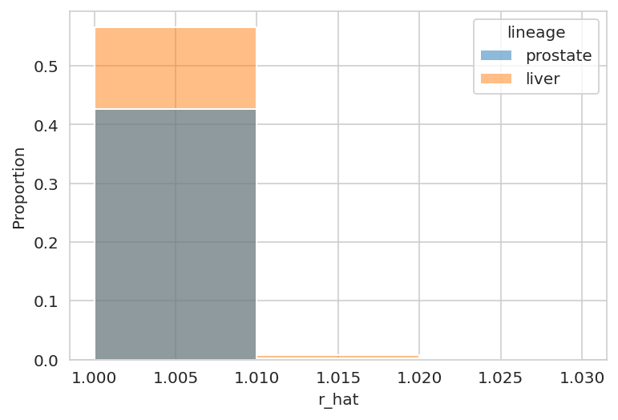


```python
fig, axes = plt.subplots(1, len(posteriors), figsize=(12, 4))
for ax, pm in zip(axes, posteriors.values()):
    az.plot_energy(pm.trace, ax=ax)
    ax.set_title(pm.lineage)

plt.show()
```


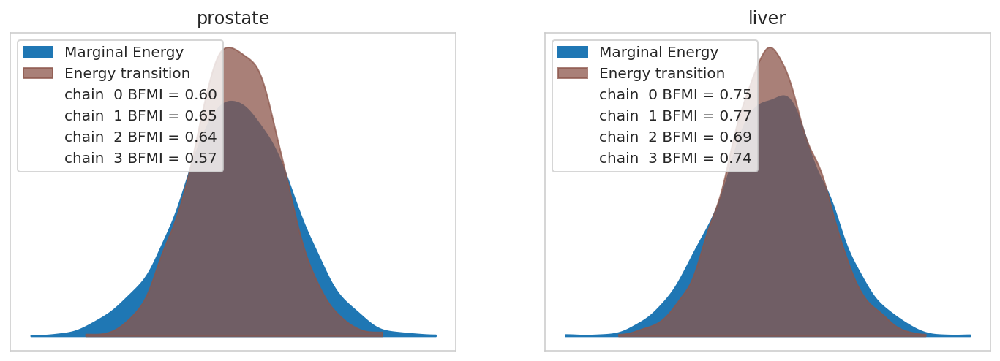


```python
def summarize_sampling_stats(trace: az.InferenceData) -> pd.DataFrame:
    stats = ["step_size", "n_steps", "tree_depth", "acceptance_rate", "energy"]
    return trace.sample_stats.get(stats).to_dataframe().groupby("chain").mean()


def summarize_lineage_model_sampling_stats(pm: PosteriorManager) -> pd.DataFrame:
    return summarize_sampling_stats(pm.trace).assign(lineage=pm.lineage)


pd.concat(
    [summarize_lineage_model_sampling_stats(pm) for pm in posteriors.values()]
).reset_index().set_index(["lineage", "chain"])
```


<div>
<style scoped>
    .dataframe tbody tr th:only-of-type {
        vertical-align: middle;
    }

    .dataframe tbody tr th {
        vertical-align: top;
    }

    .dataframe thead th {
        text-align: right;
    }
</style>
<table border="1" class="dataframe">
  <thead>
    <tr style="text-align: right;">
      <th></th>
      <th></th>
      <th>step_size</th>
      <th>n_steps</th>
      <th>tree_depth</th>
      <th>acceptance_rate</th>
      <th>energy</th>
    </tr>
    <tr>
      <th>lineage</th>
      <th>chain</th>
      <th></th>
      <th></th>
      <th></th>
      <th></th>
      <th></th>
    </tr>
  </thead>
  <tbody>
    <tr>
      <th rowspan="4" valign="top">prostate</th>
      <th>0</th>
      <td>0.018534</td>
      <td>255.0</td>
      <td>8.0</td>
      <td>0.978422</td>
      <td>2.452655e+06</td>
    </tr>
    <tr>
      <th>1</th>
      <td>0.018075</td>
      <td>255.0</td>
      <td>8.0</td>
      <td>0.978889</td>
      <td>2.452672e+06</td>
    </tr>
    <tr>
      <th>2</th>
      <td>0.018088</td>
      <td>255.0</td>
      <td>8.0</td>
      <td>0.978884</td>
      <td>2.452727e+06</td>
    </tr>
    <tr>
      <th>3</th>
      <td>0.020123</td>
      <td>255.0</td>
      <td>8.0</td>
      <td>0.972362</td>
      <td>2.452692e+06</td>
    </tr>
    <tr>
      <th rowspan="4" valign="top">liver</th>
      <th>0</th>
      <td>0.013710</td>
      <td>255.0</td>
      <td>8.0</td>
      <td>0.980166</td>
      <td>1.037015e+07</td>
    </tr>
    <tr>
      <th>1</th>
      <td>0.013920</td>
      <td>255.0</td>
      <td>8.0</td>
      <td>0.978854</td>
      <td>1.037023e+07</td>
    </tr>
    <tr>
      <th>2</th>
      <td>0.014037</td>
      <td>255.0</td>
      <td>8.0</td>
      <td>0.979270</td>
      <td>1.037023e+07</td>
    </tr>
    <tr>
      <th>3</th>
      <td>0.014190</td>
      <td>255.0</td>
      <td>8.0</td>
      <td>0.977795</td>
      <td>1.037012e+07</td>
    </tr>
  </tbody>
</table>
</div>


```python
def _md_lineage(pm: PosteriorManager) -> None:
    display(Markdown(f"**{pm.lineage.capitalize()}**"))
```


```python
for pm in posteriors.values():
    _md_lineage(pm)
    az.plot_trace(pm.trace, var_names=["mu_mu_a", "mu_b", "mu_d"], compact=False)
    plt.tight_layout()
    plt.show()
```


**Prostate**


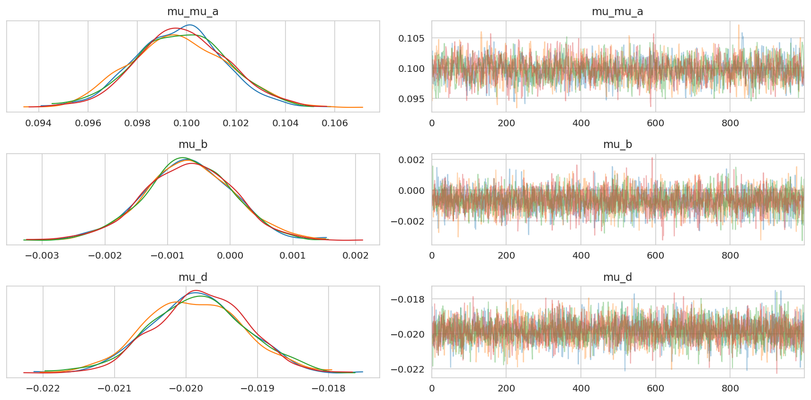


**Liver**


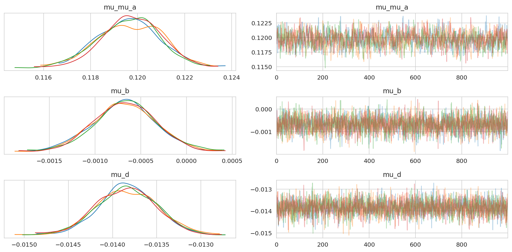


```python
for pm in posteriors.values():
    _md_lineage(pm)
    az.plot_trace(pm.trace, var_names=["^sigma_*"], filter_vars="regex", compact=False)
    plt.tight_layout()
    plt.show()
```


**Prostate**


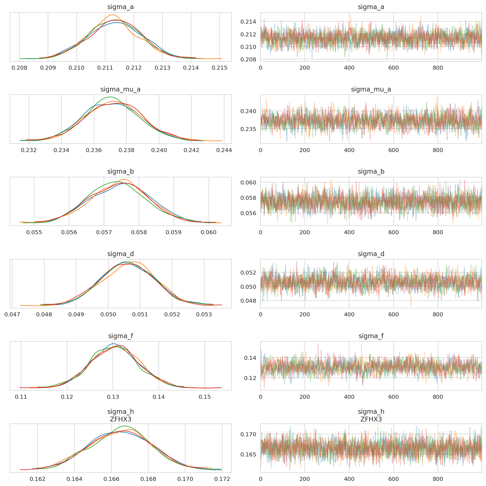


**Liver**


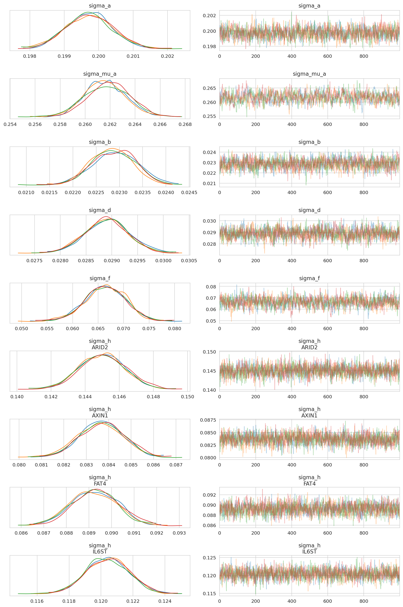


```python
for pm in posteriors.values():
    _md_lineage(pm)
    az.plot_trace(pm.trace, var_names=["alpha"], compact=False)
    plt.tight_layout()
    plt.show()
```


**Prostate**


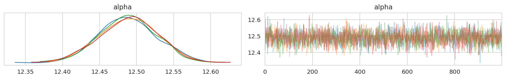


**Liver**


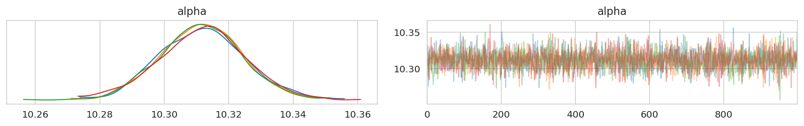


```python
for pm in posteriors.values():
    var_names = ["a", "mu_a", "b", "d", "f", "h"]
    fig, axes = plt.subplots(2, 3, figsize=(8, 6), sharex=True)
    for ax, var_name in zip(axes.flatten(), var_names):
        x = pm.posterior_summary.query(f"var_name == '{var_name}'")["mean"]
        sns.kdeplot(x=x, ax=ax)
        ax.set_title(var_name)
        ax.set_xlim(-2, 1)

    fig.suptitle(pm.lineage.capitalize(), fontweight="bold")
    plt.tight_layout()
    plt.show()
```


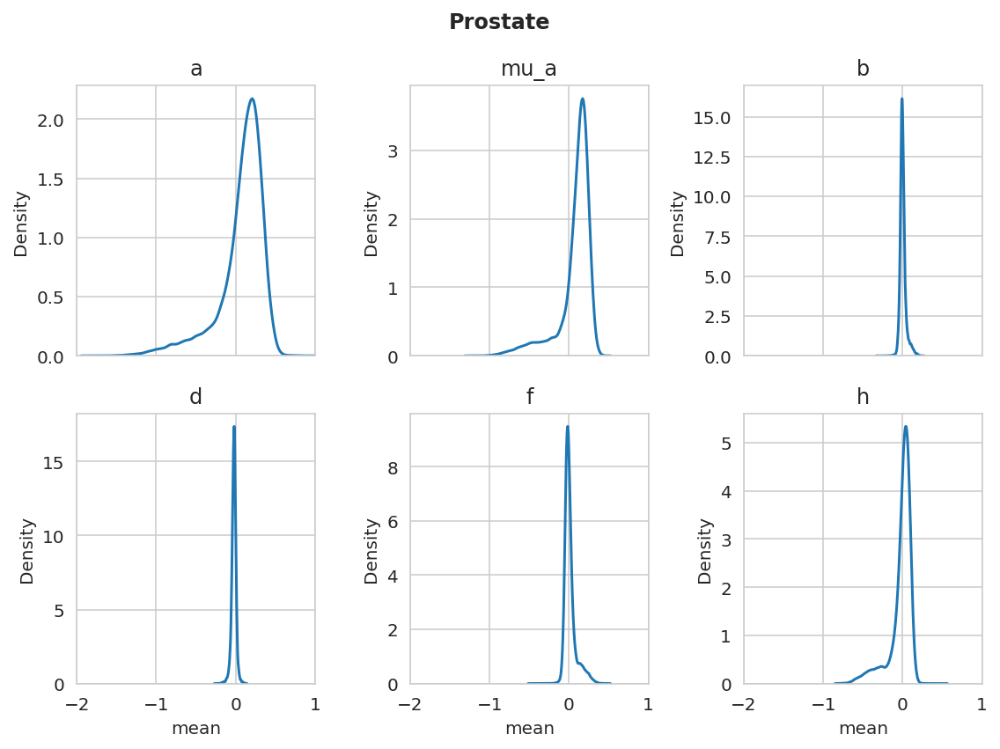


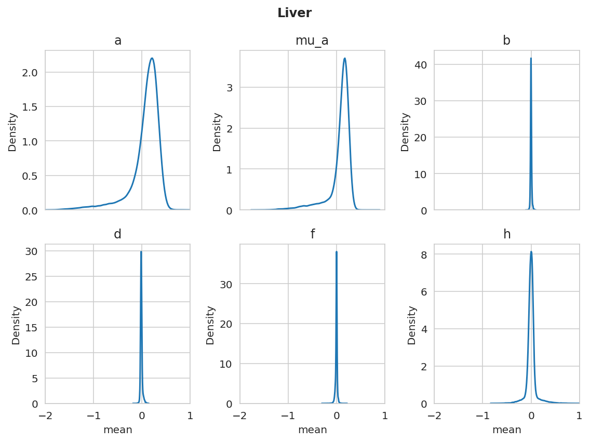


```python
def sgrna_to_gene_map(df: pd.DataFrame) -> pd.DataFrame:
    return df.copy()[["hugo_symbol", "sgrna"]].drop_duplicates().reset_index(drop=True)
```


```python
example_genes = ["KIF11", "TP53", "KRAS"]

for pm in posteriors.values():
    _md_lineage(pm)
    lineage_sgrna_map = sgrna_to_gene_map(pm.data)
    for gene in example_genes:
        example_gene_sgrna = (
            lineage_sgrna_map.copy().query(f"hugo_symbol == '{gene}'")["sgrna"].tolist()
        )
        az.plot_forest(
            pm.trace,
            var_names=["mu_mu_a", "mu_a", "a", "mu_b", "b", "mu_d", "d", "f", "h"],
            coords={"gene": [gene], "sgrna": example_gene_sgrna},
            combined=True,
            figsize=(6, 5),
        )
        plt.show()
```


**Prostate**


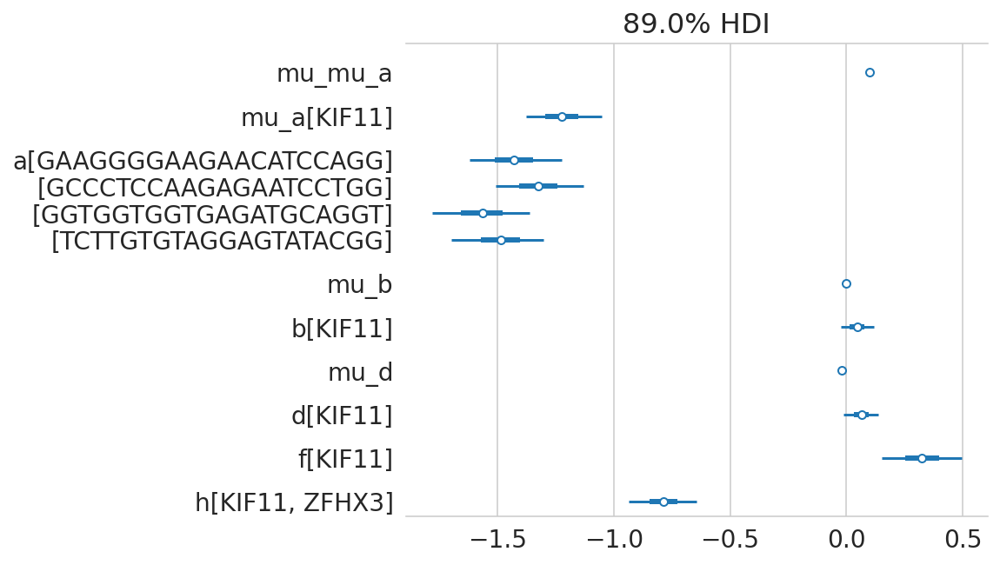


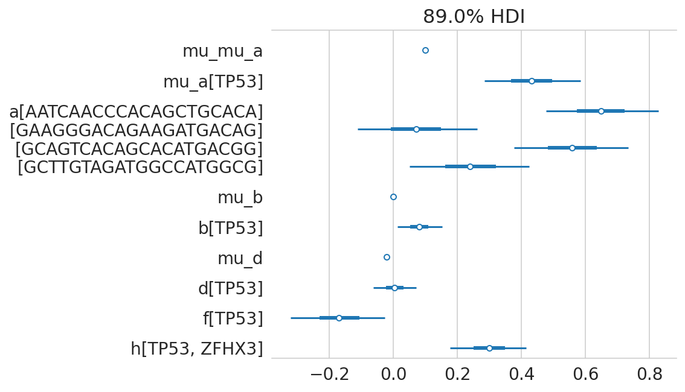


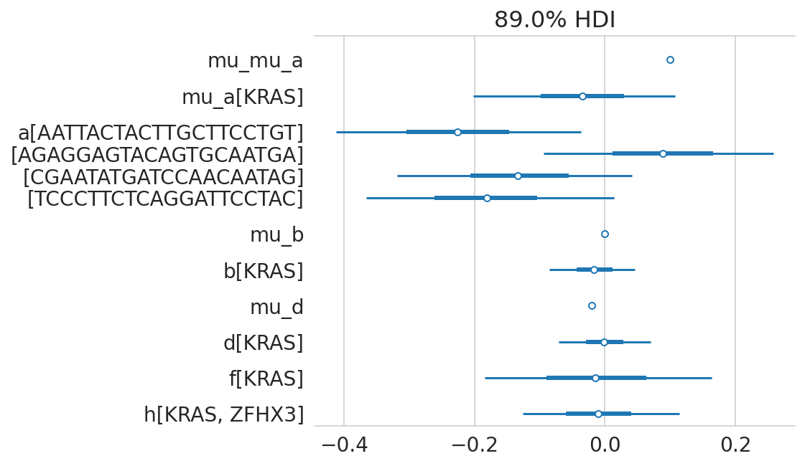


**Liver**


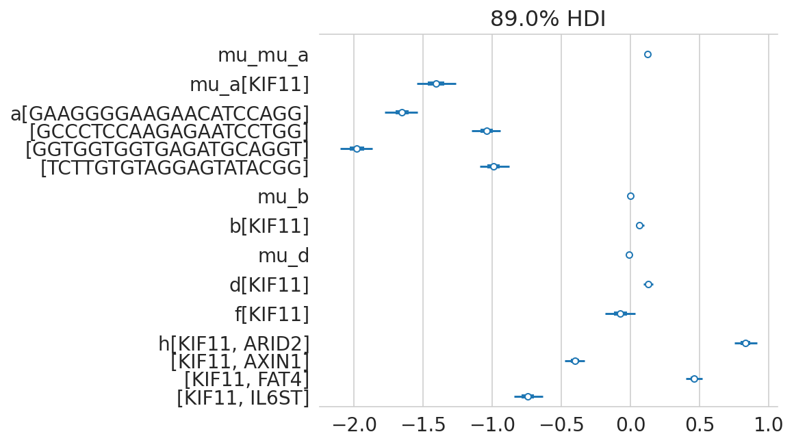


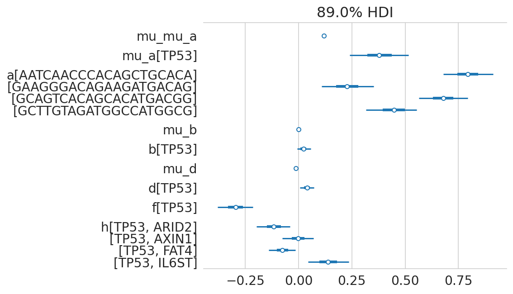


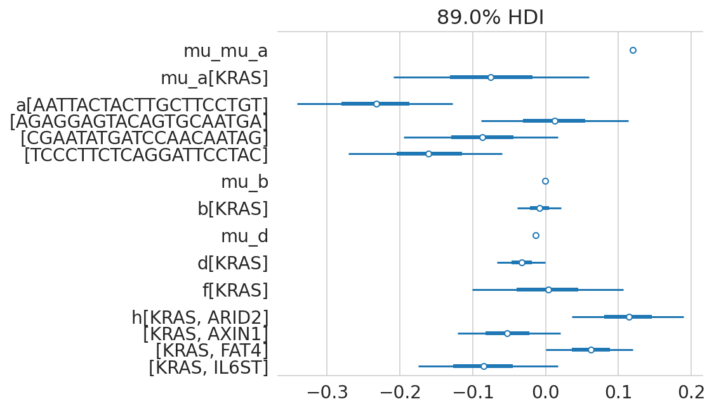


```python
for pm in posteriors.values():
    genes_var_names = ["mu_a", "b", "d", "f"]
    genes_var_names += [
        f"h[{g}]" for g in pm.trace.posterior.coords["cancer_gene"].values
    ]
    gene_corr_post = (
        az.summary(pm.trace, "genes_chol_cov_corr", kind="stats")
        .pipe(extract_coords_param_names, names=["d1", "d2"])
        .astype({"d1": int, "d2": int})
        .assign(
            p1=lambda d: [genes_var_names[i] for i in d["d1"]],
            p2=lambda d: [genes_var_names[i] for i in d["d2"]],
        )
        .assign(
            p1=lambda d: pd.Categorical(
                d["p1"], categories=d["p1"].unique(), ordered=True
            )
        )
        .assign(
            p2=lambda d: pd.Categorical(
                d["p2"], categories=d["p1"].cat.categories, ordered=True
            )
        )
    )
    plot_df = gene_corr_post.pivot_wider("p1", "p2", "mean").set_index("p1")
    ax = sns.heatmap(plot_df, cmap="coolwarm", vmin=-1, vmax=1)
    ax.set_title(pm.lineage.capitalize())
    plt.show()
```


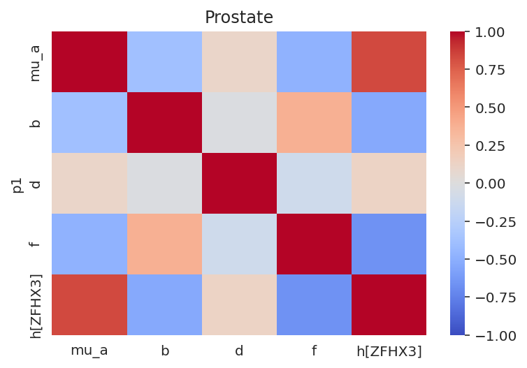


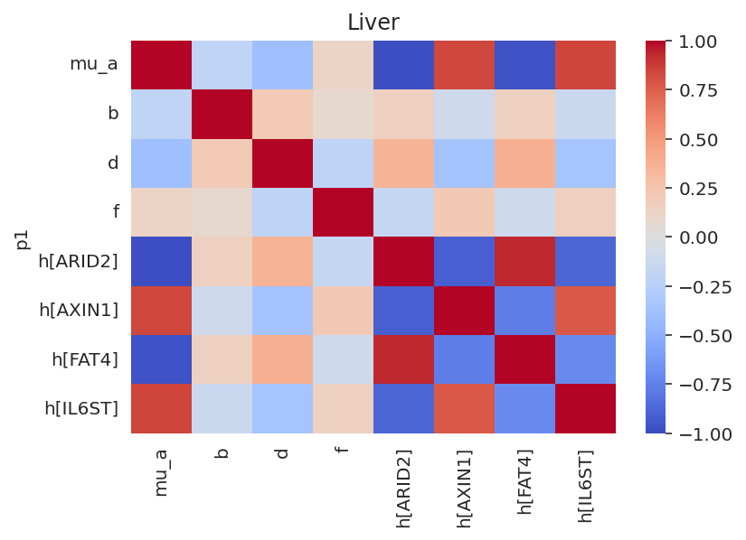


```python
for pm in posteriors.values():
    _md_lineage(pm)
    cancer_genes = pm.trace.posterior.coords["cancer_gene"].values.tolist()
    cancer_gene_mutants = (
        pm.valid_data.filter_column_isin("hugo_symbol", cancer_genes)[
            ["hugo_symbol", "depmap_id", "is_mutated"]
        ]
        .drop_duplicates()
        .assign(is_mutated=lambda d: d["is_mutated"].map({True: "X", False: ""}))
        .pivot_wider("depmap_id", names_from="hugo_symbol", values_from="is_mutated")
        .set_index("depmap_id")
    )
    display(cancer_gene_mutants)
```


**Prostate**


<pre style="white-space:pre;overflow-x:auto;line-height:normal;font-family:Menlo,'DejaVu Sans Mono',consolas,'Courier New',monospace"><span style="color: #7fbfbf; text-decoration-color: #7fbfbf">[07/30/22 10:10:58] </span><span style="color: #000080; text-decoration-color: #000080">INFO    </span> Processing data for modeling.     <a href="file:///n/data1/hms/dbmi/park/Cook/speclet/speclet/bayesian_models/lineage_hierarchical_nb.py" target="_blank"><span style="color: #7f7f7f; text-decoration-color: #7f7f7f">lineage_hierarchical_nb.py</span></a><span style="color: #7f7f7f; text-decoration-color: #7f7f7f">:</span><a href="file:///n/data1/hms/dbmi/park/Cook/speclet/speclet/bayesian_models/lineage_hierarchical_nb.py#269" target="_blank"><span style="color: #7f7f7f; text-decoration-color: #7f7f7f">269</span></a>
</pre>


<pre style="white-space:pre;overflow-x:auto;line-height:normal;font-family:Menlo,'DejaVu Sans Mono',consolas,'Courier New',monospace"><span style="color: #7fbfbf; text-decoration-color: #7fbfbf">                    </span><span style="color: #000080; text-decoration-color: #000080">INFO    </span> LFC limits: <span style="font-weight: bold">(</span><span style="color: #008080; text-decoration-color: #008080; font-weight: bold">-5.0</span>, <span style="color: #008080; text-decoration-color: #008080; font-weight: bold">5.0</span><span style="font-weight: bold">)</span>           <a href="file:///n/data1/hms/dbmi/park/Cook/speclet/speclet/bayesian_models/lineage_hierarchical_nb.py" target="_blank"><span style="color: #7f7f7f; text-decoration-color: #7f7f7f">lineage_hierarchical_nb.py</span></a><span style="color: #7f7f7f; text-decoration-color: #7f7f7f">:</span><a href="file:///n/data1/hms/dbmi/park/Cook/speclet/speclet/bayesian_models/lineage_hierarchical_nb.py#270" target="_blank"><span style="color: #7f7f7f; text-decoration-color: #7f7f7f">270</span></a>
</pre>


<pre style="white-space:pre;overflow-x:auto;line-height:normal;font-family:Menlo,'DejaVu Sans Mono',consolas,'Courier New',monospace"><span style="color: #7fbfbf; text-decoration-color: #7fbfbf">[07/30/22 10:12:22] </span><span style="color: #800000; text-decoration-color: #800000">WARNING </span> number of data points dropped: <span style="color: #008080; text-decoration-color: #008080; font-weight: bold">2</span>  <a href="file:///n/data1/hms/dbmi/park/Cook/speclet/speclet/bayesian_models/lineage_hierarchical_nb.py" target="_blank"><span style="color: #7f7f7f; text-decoration-color: #7f7f7f">lineage_hierarchical_nb.py</span></a><span style="color: #7f7f7f; text-decoration-color: #7f7f7f">:</span><a href="file:///n/data1/hms/dbmi/park/Cook/speclet/speclet/bayesian_models/lineage_hierarchical_nb.py#321" target="_blank"><span style="color: #7f7f7f; text-decoration-color: #7f7f7f">321</span></a>
</pre>


<div>
<style scoped>
    .dataframe tbody tr th:only-of-type {
        vertical-align: middle;
    }

    .dataframe tbody tr th {
        vertical-align: top;
    }

    .dataframe thead th {
        text-align: right;
    }
</style>
<table border="1" class="dataframe">
  <thead>
    <tr style="text-align: right;">
      <th></th>
      <th>ZFHX3</th>
    </tr>
    <tr>
      <th>depmap_id</th>
      <th></th>
    </tr>
  </thead>
  <tbody>
    <tr>
      <th>ACH-000115</th>
      <td></td>
    </tr>
    <tr>
      <th>ACH-000977</th>
      <td>X</td>
    </tr>
    <tr>
      <th>ACH-001453</th>
      <td></td>
    </tr>
    <tr>
      <th>ACH-001627</th>
      <td>X</td>
    </tr>
    <tr>
      <th>ACH-001648</th>
      <td></td>
    </tr>
  </tbody>
</table>
</div>


**Liver**


<pre style="white-space:pre;overflow-x:auto;line-height:normal;font-family:Menlo,'DejaVu Sans Mono',consolas,'Courier New',monospace"><span style="color: #7fbfbf; text-decoration-color: #7fbfbf">                    </span><span style="color: #000080; text-decoration-color: #000080">INFO    </span> Processing data for modeling.     <a href="file:///n/data1/hms/dbmi/park/Cook/speclet/speclet/bayesian_models/lineage_hierarchical_nb.py" target="_blank"><span style="color: #7f7f7f; text-decoration-color: #7f7f7f">lineage_hierarchical_nb.py</span></a><span style="color: #7f7f7f; text-decoration-color: #7f7f7f">:</span><a href="file:///n/data1/hms/dbmi/park/Cook/speclet/speclet/bayesian_models/lineage_hierarchical_nb.py#269" target="_blank"><span style="color: #7f7f7f; text-decoration-color: #7f7f7f">269</span></a>
</pre>


<pre style="white-space:pre;overflow-x:auto;line-height:normal;font-family:Menlo,'DejaVu Sans Mono',consolas,'Courier New',monospace"><span style="color: #7fbfbf; text-decoration-color: #7fbfbf">                    </span><span style="color: #000080; text-decoration-color: #000080">INFO    </span> LFC limits: <span style="font-weight: bold">(</span><span style="color: #008080; text-decoration-color: #008080; font-weight: bold">-5.0</span>, <span style="color: #008080; text-decoration-color: #008080; font-weight: bold">5.0</span><span style="font-weight: bold">)</span>           <a href="file:///n/data1/hms/dbmi/park/Cook/speclet/speclet/bayesian_models/lineage_hierarchical_nb.py" target="_blank"><span style="color: #7f7f7f; text-decoration-color: #7f7f7f">lineage_hierarchical_nb.py</span></a><span style="color: #7f7f7f; text-decoration-color: #7f7f7f">:</span><a href="file:///n/data1/hms/dbmi/park/Cook/speclet/speclet/bayesian_models/lineage_hierarchical_nb.py#270" target="_blank"><span style="color: #7f7f7f; text-decoration-color: #7f7f7f">270</span></a>
</pre>


<pre style="white-space:pre;overflow-x:auto;line-height:normal;font-family:Menlo,'DejaVu Sans Mono',consolas,'Courier New',monospace"><span style="color: #7fbfbf; text-decoration-color: #7fbfbf">[07/30/22 10:14:07] </span><span style="color: #800000; text-decoration-color: #800000">WARNING </span> number of data points dropped: <span style="color: #008080; text-decoration-color: #008080; font-weight: bold">58</span> <a href="file:///n/data1/hms/dbmi/park/Cook/speclet/speclet/bayesian_models/lineage_hierarchical_nb.py" target="_blank"><span style="color: #7f7f7f; text-decoration-color: #7f7f7f">lineage_hierarchical_nb.py</span></a><span style="color: #7f7f7f; text-decoration-color: #7f7f7f">:</span><a href="file:///n/data1/hms/dbmi/park/Cook/speclet/speclet/bayesian_models/lineage_hierarchical_nb.py#321" target="_blank"><span style="color: #7f7f7f; text-decoration-color: #7f7f7f">321</span></a>
</pre>


<div>
<style scoped>
    .dataframe tbody tr th:only-of-type {
        vertical-align: middle;
    }

    .dataframe tbody tr th {
        vertical-align: top;
    }

    .dataframe thead th {
        text-align: right;
    }
</style>
<table border="1" class="dataframe">
  <thead>
    <tr style="text-align: right;">
      <th></th>
      <th>AXIN1</th>
      <th>FAT4</th>
      <th>ARID2</th>
      <th>IL6ST</th>
    </tr>
    <tr>
      <th>depmap_id</th>
      <th></th>
      <th></th>
      <th></th>
      <th></th>
    </tr>
  </thead>
  <tbody>
    <tr>
      <th>ACH-000217</th>
      <td>X</td>
      <td></td>
      <td></td>
      <td></td>
    </tr>
    <tr>
      <th>ACH-000221</th>
      <td></td>
      <td></td>
      <td></td>
      <td></td>
    </tr>
    <tr>
      <th>ACH-000316</th>
      <td></td>
      <td></td>
      <td></td>
      <td></td>
    </tr>
    <tr>
      <th>ACH-000361</th>
      <td></td>
      <td></td>
      <td></td>
      <td></td>
    </tr>
    <tr>
      <th>ACH-000393</th>
      <td></td>
      <td></td>
      <td></td>
      <td></td>
    </tr>
    <tr>
      <th>ACH-000420</th>
      <td>X</td>
      <td></td>
      <td>X</td>
      <td></td>
    </tr>
    <tr>
      <th>ACH-000422</th>
      <td></td>
      <td></td>
      <td></td>
      <td>X</td>
    </tr>
    <tr>
      <th>ACH-000471</th>
      <td></td>
      <td></td>
      <td></td>
      <td></td>
    </tr>
    <tr>
      <th>ACH-000475</th>
      <td>X</td>
      <td></td>
      <td></td>
      <td></td>
    </tr>
    <tr>
      <th>ACH-000476</th>
      <td></td>
      <td></td>
      <td></td>
      <td></td>
    </tr>
    <tr>
      <th>ACH-000478</th>
      <td></td>
      <td>X</td>
      <td></td>
      <td></td>
    </tr>
    <tr>
      <th>ACH-000480</th>
      <td></td>
      <td></td>
      <td></td>
      <td></td>
    </tr>
    <tr>
      <th>ACH-000483</th>
      <td></td>
      <td>X</td>
      <td></td>
      <td></td>
    </tr>
    <tr>
      <th>ACH-000493</th>
      <td>X</td>
      <td></td>
      <td></td>
      <td></td>
    </tr>
    <tr>
      <th>ACH-000537</th>
      <td></td>
      <td></td>
      <td></td>
      <td></td>
    </tr>
    <tr>
      <th>ACH-000577</th>
      <td></td>
      <td>X</td>
      <td></td>
      <td></td>
    </tr>
    <tr>
      <th>ACH-000620</th>
      <td></td>
      <td></td>
      <td></td>
      <td>X</td>
    </tr>
    <tr>
      <th>ACH-000671</th>
      <td></td>
      <td></td>
      <td></td>
      <td></td>
    </tr>
    <tr>
      <th>ACH-000734</th>
      <td>X</td>
      <td></td>
      <td></td>
      <td></td>
    </tr>
    <tr>
      <th>ACH-000739</th>
      <td></td>
      <td></td>
      <td></td>
      <td></td>
    </tr>
    <tr>
      <th>ACH-000848</th>
      <td>X</td>
      <td></td>
      <td>X</td>
      <td></td>
    </tr>
    <tr>
      <th>ACH-001318</th>
      <td></td>
      <td></td>
      <td></td>
      <td></td>
    </tr>
  </tbody>
</table>
</div>


```python
for pm in posteriors.values():
    _md_lineage(pm)
    az.plot_trace(pm.trace, var_names=["sigma_h"], compact=True)
    plt.tight_layout()
    plt.show()
```


**Prostate**


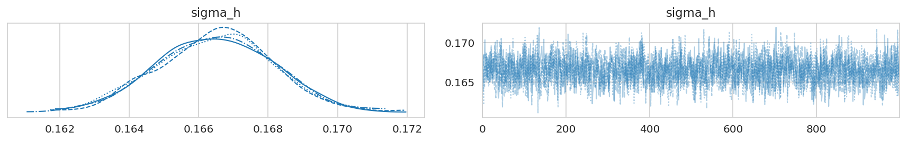


**Liver**


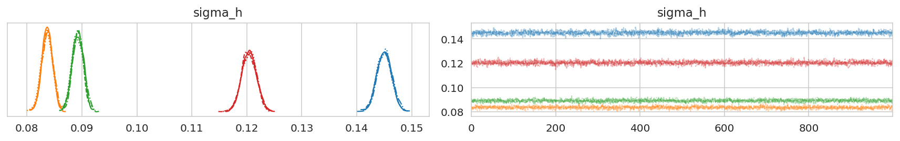


```python
for pm in posteriors.values():
    h_post_summary = (
        pm.posterior_summary.query("var_name == 'h'")
        .reset_index(drop=True)
        .pipe(
            extract_coords_param_names,
            names=["hugo_symbol", "cancer_gene"],
            col="parameter",
        )
    )
    genes_to_plot = h_post_summary.query("mean.abs() > 0.1")["hugo_symbol"].toset()
    plot_df = (
        h_post_summary.filter_column_isin("hugo_symbol", genes_to_plot)
        .pivot_wider("hugo_symbol", names_from="cancer_gene", values_from="mean")
        .set_index("hugo_symbol")
    )
    width = min(max(plot_df.shape[1], 2), 5)
    cg = sns.clustermap(
        plot_df,
        col_cluster=h_post_summary["cancer_gene"].nunique() > 1,
        figsize=(width, 10),
        cbar_pos=(1, 0.4, 0.1, 0.2),
        cmap="seismic",
        vmin=-1,
        vmax=1,
    )
    cg.ax_heatmap.set_title(pm.lineage)
    plt.show()
```


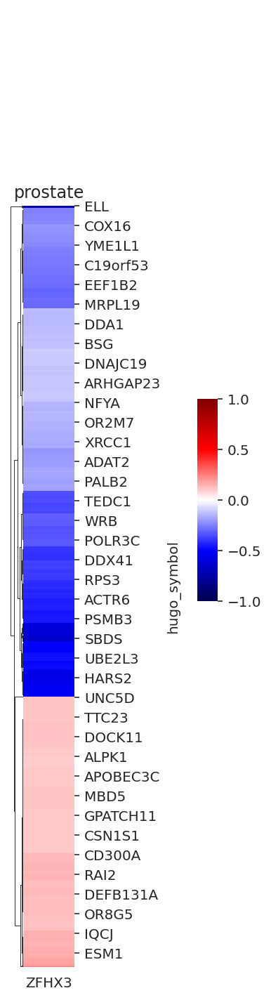


    /home/jc604/.conda/envs/speclet/lib/python3.10/site-packages/seaborn/matrix.py:654: UserWarning: Clustering large matrix with scipy. Installing `fastcluster` may give better performance.
      warnings.warn(msg)


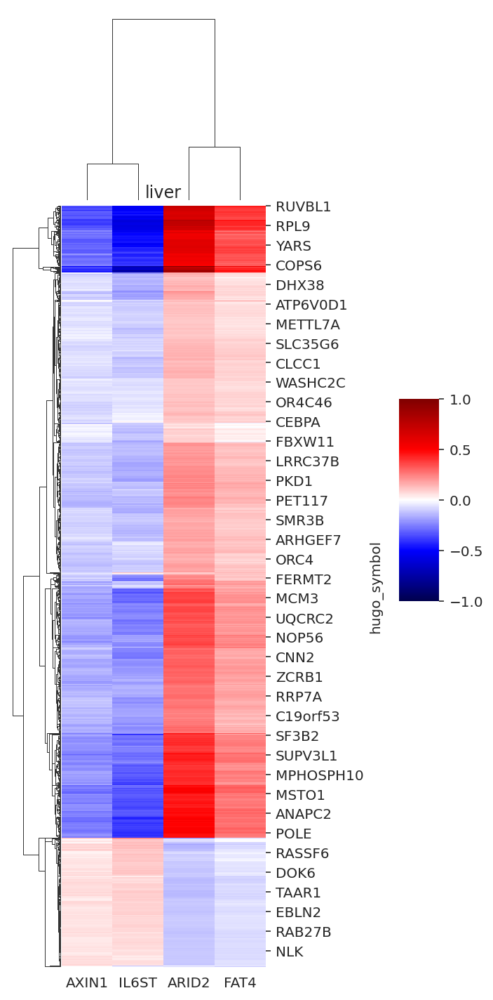


## PPC


```python
fig, axes = plt.subplots(
    nrows=len(posteriors), ncols=2, figsize=(9, len(posteriors) * 4)
)

hist_plot_kwargs = {"fill": False, "element": "step", "stat": "count"}

for i, pm in enumerate(posteriors.values()):
    axes[i, 0].set_ylabel(f"$\mathbf{{{pm.lineage}}}$\n\nproportion")

    # Collect random draws from posterior predictive.
    n_examples = 20
    n_chains, n_draws, n_data = pm.trace.posterior_predictive["ct_final"].shape
    ex_draws_idx = np.random.choice(
        np.arange(n_draws), size=n_examples // n_chains, replace=False
    )
    example_ppc_draws = pm.trace.posterior_predictive["ct_final"][
        :, ex_draws_idx, :
    ].values.reshape(-1, n_data)

    # Plot
    ax1 = axes[i, 0]
    ax2 = axes[i, 1]
    pp_avg = pm.trace.posterior_predictive["ct_final"].mean(axis=(0, 1))

    bw = 0.05
    for i in range(example_ppc_draws.shape[0]):
        sns.histplot(
            x=np.log10(example_ppc_draws[i, :] + 1),
            color="tab:blue",
            alpha=0.2,
            binwidth=bw,
            ax=ax1,
            **hist_plot_kwargs,
        )

    sns.histplot(
        x=np.log10(pp_avg + 1),
        color="tab:orange",
        alpha=1,
        binwidth=bw,
        ax=ax1,
        **hist_plot_kwargs,
    )
    sns.histplot(
        x=np.log10(pm.valid_data["counts_final"] + 1),
        color="k",
        alpha=1,
        binwidth=bw,
        ax=ax1,
        **hist_plot_kwargs,
    )

    bw = 10
    for i in range(example_ppc_draws.shape[0]):
        sns.histplot(
            x=example_ppc_draws[i, :],
            color="tab:blue",
            alpha=0.2,
            binwidth=bw,
            ax=ax2,
            **hist_plot_kwargs,
        )

    sns.histplot(
        x=pp_avg, color="tab:orange", alpha=1, binwidth=bw, ax=ax2, **hist_plot_kwargs
    )
    sns.histplot(
        x=pm.valid_data["counts_final"],
        color="k",
        alpha=1,
        binwidth=bw,
        ax=ax2,
        **hist_plot_kwargs,
    )

    ax1.set_xlabel(None)
    ax2.set_xlabel(None)
    ax2.set_xlim(0, 1000)

axes[-1, 0].set_xlabel("log10(counts final + 1)")
axes[-1, 1].set_xlabel("counts final")

fig.suptitle("PPC")
fig.tight_layout()
plt.show()
```


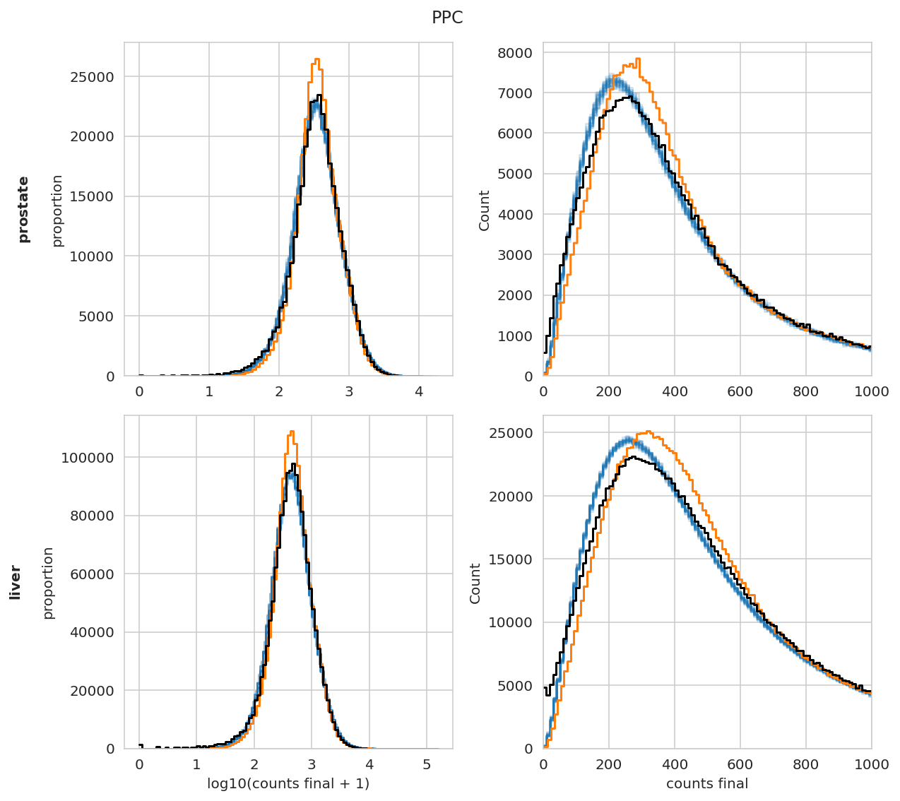


---

## Session info


```python
notebook_toc = time()
print(f"execution time: {(notebook_toc - notebook_tic) / 60:.2f} minutes")
```

    execution time: 15.87 minutes


```python
%load_ext watermark
%watermark -d -u -v -iv -b -h -m
```

    Last updated: 2022-07-30

    Python implementation: CPython
    Python version       : 3.10.5
    IPython version      : 8.4.0

    Compiler    : GCC 10.3.0
    OS          : Linux
    Release     : 3.10.0-1160.45.1.el7.x86_64
    Machine     : x86_64
    Processor   : x86_64
    CPU cores   : 32
    Architecture: 64bit

    Hostname: compute-a-16-160.o2.rc.hms.harvard.edu

    Git branch: simplify

    qnorm     : 0.8.1
    seaborn   : 0.11.2
    numpy     : 1.22.4
    matplotlib: 3.5.2
    arviz     : 0.12.1
    pandas    : 1.4.3


```python

```
