# Inspect the single-lineage model run on the prostate data (007)

 Model attributes:

- sgRNA | gene varying intercept
- RNA and CN varying effects per gene
- correlation between gene varying effects modeled using the multivariate normal and Cholesky decomposition (non-centered parameterization)
- target gene mutation variable and cancer gene comutation variable.
- varying effect for cell line and varying copy number effect for cell line


```python
%load_ext autoreload
%autoreload 2
```


```python
from time import time

import arviz as az
import matplotlib.pyplot as plt
import numpy as np
import pandas as pd
import seaborn as sns
```


```python
from speclet.analysis.arviz_analysis import extract_coords_param_names
from speclet.bayesian_models.lineage_hierarchical_nb import LineageHierNegBinomModel
from speclet.data_processing.common import head_tail
from speclet.io import modeling_data_dir, models_dir
from speclet.managers.data_managers import CrisprScreenDataManager, broad_only
from speclet.plot import set_speclet_theme
from speclet.project_configuration import arviz_config
```


```python
# Notebook execution timer.
notebook_tic = time()

# Plotting setup.
set_speclet_theme()
%config InlineBackend.figure_format = "retina"
arviz_config()
```

## Data


```python
saved_model_dir = models_dir() / "hnb-single-lineage-prostate-007_PYMC_NUMPYRO"
```


```python
with open(saved_model_dir / "description.txt") as f:
    model_description = "".join(list(f))

print(model_description)
```

    name: 'hnb-single-lineage-prostate-007'
    fit method: 'PYMC_NUMPYRO'

    --------------------------------------------------------------------------------

    CONFIGURATION

    {
        "name": "hnb-single-lineage-prostate-007",
        "description": " Single lineage hierarchical negative binomial model for prostate data from the Broad. Varying effect for cell line and varying effect for copy number per cell line. This model also uses a different transformation for the copy number data. The `max_tree_depth` is also increased with the intention to give the tuning process a little more room to experiment with, but it should not be used as the tree depth for the final draws. ",
        "active": true,
        "model": "LINEAGE_HIERARCHICAL_NB",
        "data_file": "modeling_data/lineage-modeling-data/depmap-modeling-data_prostate.csv",
        "model_kwargs": {
            "lineage": "prostate"
        },
        "sampling_kwargs": {
            "pymc_mcmc": null,
            "pymc_advi": null,
            "pymc_numpyro": {
                "draws": 1000,
                "tune": 1000,
                "chains": 4,
                "target_accept": 0.98,
                "progress_bar": true,
                "chain_method": "parallel",
                "postprocessing_backend": "cpu",
                "idata_kwargs": {
                    "log_likelihood": false
                },
                "nuts_kwargs": {
                    "step_size": 0.01,
                    "max_tree_depth": 11
                }
            }
        }
    }

    --------------------------------------------------------------------------------

    POSTERIOR

    <xarray.Dataset>
    Dimensions:                    (chain: 4, draw: 1000, delta_genes_dim_0: 5,
                                    delta_genes_dim_1: 18119, sgrna: 71062,
                                    delta_cells_dim_0: 2, delta_cells_dim_1: 5,
                                    genes_chol_cov_dim_0: 15,
                                    cells_chol_cov_dim_0: 3,
                                    genes_chol_cov_corr_dim_0: 5,
                                    genes_chol_cov_corr_dim_1: 5,
                                    genes_chol_cov_stds_dim_0: 5, cancer_gene: 1,
                                    gene: 18119, cells_chol_cov_corr_dim_0: 2,
                                    cells_chol_cov_corr_dim_1: 2,
                                    cells_chol_cov_stds_dim_0: 2, cell_line: 5)
    Coordinates: (12/18)
      * chain                      (chain) int64 0 1 2 3
      * draw                       (draw) int64 0 1 2 3 4 5 ... 995 996 997 998 999
      * delta_genes_dim_0          (delta_genes_dim_0) int64 0 1 2 3 4
      * delta_genes_dim_1          (delta_genes_dim_1) int64 0 1 2 ... 18117 18118
      * sgrna                      (sgrna) object 'AAAAAAATCCAGCAATGCAG' ... 'TTT...
      * delta_cells_dim_0          (delta_cells_dim_0) int64 0 1
        ...                         ...
      * cancer_gene                (cancer_gene) object 'ZFHX3'
      * gene                       (gene) object 'A1BG' 'A1CF' ... 'ZZEF1' 'ZZZ3'
      * cells_chol_cov_corr_dim_0  (cells_chol_cov_corr_dim_0) int64 0 1
      * cells_chol_cov_corr_dim_1  (cells_chol_cov_corr_dim_1) int64 0 1
      * cells_chol_cov_stds_dim_0  (cells_chol_cov_stds_dim_0) int64 0 1
      * cell_line                  (cell_line) object 'ACH-000115' ... 'ACH-001648'
    Data variables: (12/29)
        mu_mu_a                    (chain, draw) float64 ...
        mu_b                       (chain, draw) float64 ...
        delta_genes                (chain, draw, delta_genes_dim_0, delta_genes_dim_1) float64 ...
        delta_a                    (chain, draw, sgrna) float64 ...
        mu_m                       (chain, draw) float64 ...
        delta_cells                (chain, draw, delta_cells_dim_0, delta_cells_dim_1) float64 ...
        ...                         ...
        cells_chol_cov_corr        (chain, draw, cells_chol_cov_corr_dim_0, cells_chol_cov_corr_dim_1) float64 ...
        cells_chol_cov_stds        (chain, draw, cells_chol_cov_stds_dim_0) float64 ...
        sigma_k                    (chain, draw) float64 ...
        sigma_m                    (chain, draw) float64 ...
        k                          (chain, draw, cell_line) float64 ...
        m                          (chain, draw, cell_line) float64 ...
    Attributes:
        created_at:           2022-08-03 18:36:09.739508
        arviz_version:        0.12.1
        previous_created_at:  ['2022-08-03 18:36:09.739508', '2022-08-03T21:55:11...

    --------------------------------------------------------------------------------

    SAMPLE STATS

    <xarray.Dataset>
    Dimensions:          (chain: 4, draw: 1000)
    Coordinates:
      * chain            (chain) int64 0 1 2 3
      * draw             (draw) int64 0 1 2 3 4 5 6 ... 993 994 995 996 997 998 999
    Data variables:
        acceptance_rate  (chain, draw) float64 ...
        step_size        (chain, draw) float64 ...
        diverging        (chain, draw) bool ...
        energy           (chain, draw) float64 ...
        n_steps          (chain, draw) int64 ...
        tree_depth       (chain, draw) int64 ...
        lp               (chain, draw) float64 ...
    Attributes:
        created_at:           2022-08-03 18:36:09.739508
        arviz_version:        0.12.1
        previous_created_at:  ['2022-08-03 18:36:09.739508', '2022-08-03T21:55:11...

    --------------------------------------------------------------------------------

    MCMC DESCRIPTION

    sampled 4 chains with (unknown) tuning steps and 1,000 draws
    num. divergences: 0, 0, 1, 1
    percent divergences: 0.0, 0.0, 0.1, 0.1
    BFMI: 0.715, 0.674, 0.641, 0.645
    avg. step size: 0.008, 0.005, 0.008, 0.006


### Load posterior summary


```python
prostate_post_summary = pd.read_csv(saved_model_dir / "posterior-summary.csv").assign(
    var_name=lambda d: [x.split("[")[0] for x in d["parameter"]]
)
prostate_post_summary.head()
```


<div>
<style scoped>
    .dataframe tbody tr th:only-of-type {
        vertical-align: middle;
    }

    .dataframe tbody tr th {
        vertical-align: top;
    }

    .dataframe thead th {
        text-align: right;
    }
</style>
<table border="1" class="dataframe">
  <thead>
    <tr style="text-align: right;">
      <th></th>
      <th>parameter</th>
      <th>mean</th>
      <th>sd</th>
      <th>hdi_5.5%</th>
      <th>hdi_94.5%</th>
      <th>mcse_mean</th>
      <th>mcse_sd</th>
      <th>ess_bulk</th>
      <th>ess_tail</th>
      <th>r_hat</th>
      <th>var_name</th>
    </tr>
  </thead>
  <tbody>
    <tr>
      <th>0</th>
      <td>mu_mu_a</td>
      <td>0.071</td>
      <td>0.030</td>
      <td>0.029</td>
      <td>0.119</td>
      <td>0.001</td>
      <td>0.001</td>
      <td>733.0</td>
      <td>1013.0</td>
      <td>1.0</td>
      <td>mu_mu_a</td>
    </tr>
    <tr>
      <th>1</th>
      <td>mu_b</td>
      <td>0.004</td>
      <td>0.001</td>
      <td>0.003</td>
      <td>0.006</td>
      <td>0.000</td>
      <td>0.000</td>
      <td>3624.0</td>
      <td>3346.0</td>
      <td>1.0</td>
      <td>mu_b</td>
    </tr>
    <tr>
      <th>2</th>
      <td>mu_m</td>
      <td>-0.137</td>
      <td>0.091</td>
      <td>-0.265</td>
      <td>0.022</td>
      <td>0.002</td>
      <td>0.002</td>
      <td>1516.0</td>
      <td>2193.0</td>
      <td>1.0</td>
      <td>mu_m</td>
    </tr>
    <tr>
      <th>3</th>
      <td>sigma_a</td>
      <td>0.211</td>
      <td>0.001</td>
      <td>0.210</td>
      <td>0.213</td>
      <td>0.000</td>
      <td>0.000</td>
      <td>1191.0</td>
      <td>2092.0</td>
      <td>1.0</td>
      <td>sigma_a</td>
    </tr>
    <tr>
      <th>4</th>
      <td>alpha</td>
      <td>12.353</td>
      <td>0.038</td>
      <td>12.292</td>
      <td>12.413</td>
      <td>0.001</td>
      <td>0.001</td>
      <td>2232.0</td>
      <td>3213.0</td>
      <td>1.0</td>
      <td>alpha</td>
    </tr>
  </tbody>
</table>
</div>


### Load trace object


```python
trace_file = saved_model_dir / "posterior.netcdf"
assert trace_file.exists()
trace = az.from_netcdf(trace_file)
```

### Prostate data


```python
prostate_dm = CrisprScreenDataManager(
    modeling_data_dir() / "lineage-modeling-data" / "depmap-modeling-data_prostate.csv",
    transformations=[broad_only],
)
```


```python
prostate_data = prostate_dm.get_data(read_kwargs={"low_memory": False})
prostate_data.head()
```


<div>
<style scoped>
    .dataframe tbody tr th:only-of-type {
        vertical-align: middle;
    }

    .dataframe tbody tr th {
        vertical-align: top;
    }

    .dataframe thead th {
        text-align: right;
    }
</style>
<table border="1" class="dataframe">
  <thead>
    <tr style="text-align: right;">
      <th></th>
      <th>sgrna</th>
      <th>replicate_id</th>
      <th>lfc</th>
      <th>p_dna_batch</th>
      <th>genome_alignment</th>
      <th>hugo_symbol</th>
      <th>screen</th>
      <th>multiple_hits_on_gene</th>
      <th>sgrna_target_chr</th>
      <th>sgrna_target_pos</th>
      <th>...</th>
      <th>any_deleterious</th>
      <th>any_tcga_hotspot</th>
      <th>any_cosmic_hotspot</th>
      <th>is_mutated</th>
      <th>copy_number</th>
      <th>lineage</th>
      <th>lineage_subtype</th>
      <th>primary_or_metastasis</th>
      <th>is_male</th>
      <th>age</th>
    </tr>
  </thead>
  <tbody>
    <tr>
      <th>0</th>
      <td>AAAGCCCAGGAGTATGGGAG</td>
      <td>Vcap-304Cas9_RepA_p4_batch3</td>
      <td>0.246450</td>
      <td>3</td>
      <td>chr2_130522105_-</td>
      <td>CFC1B</td>
      <td>broad</td>
      <td>True</td>
      <td>2</td>
      <td>130522105</td>
      <td>...</td>
      <td>NaN</td>
      <td>NaN</td>
      <td>NaN</td>
      <td>False</td>
      <td>0.999455</td>
      <td>prostate</td>
      <td>prostate_adenocarcinoma</td>
      <td>metastasis</td>
      <td>True</td>
      <td>59.0</td>
    </tr>
    <tr>
      <th>1</th>
      <td>AAATCAGAGAAACCTGAACG</td>
      <td>Vcap-304Cas9_RepA_p4_batch3</td>
      <td>0.626518</td>
      <td>3</td>
      <td>chr11_89916950_-</td>
      <td>TRIM49D1</td>
      <td>broad</td>
      <td>True</td>
      <td>11</td>
      <td>89916950</td>
      <td>...</td>
      <td>NaN</td>
      <td>NaN</td>
      <td>NaN</td>
      <td>False</td>
      <td>1.281907</td>
      <td>prostate</td>
      <td>prostate_adenocarcinoma</td>
      <td>metastasis</td>
      <td>True</td>
      <td>59.0</td>
    </tr>
    <tr>
      <th>2</th>
      <td>AACGTCTTTGAAGAAAGCTG</td>
      <td>Vcap-304Cas9_RepA_p4_batch3</td>
      <td>0.165114</td>
      <td>3</td>
      <td>chr5_71055421_-</td>
      <td>GTF2H2</td>
      <td>broad</td>
      <td>True</td>
      <td>5</td>
      <td>71055421</td>
      <td>...</td>
      <td>NaN</td>
      <td>NaN</td>
      <td>NaN</td>
      <td>False</td>
      <td>0.616885</td>
      <td>prostate</td>
      <td>prostate_adenocarcinoma</td>
      <td>metastasis</td>
      <td>True</td>
      <td>59.0</td>
    </tr>
    <tr>
      <th>3</th>
      <td>AACGTCTTTGAAGGAAGCTG</td>
      <td>Vcap-304Cas9_RepA_p4_batch3</td>
      <td>-0.094688</td>
      <td>3</td>
      <td>chr5_69572480_+</td>
      <td>GTF2H2C</td>
      <td>broad</td>
      <td>True</td>
      <td>5</td>
      <td>69572480</td>
      <td>...</td>
      <td>NaN</td>
      <td>NaN</td>
      <td>NaN</td>
      <td>False</td>
      <td>0.616885</td>
      <td>prostate</td>
      <td>prostate_adenocarcinoma</td>
      <td>metastasis</td>
      <td>True</td>
      <td>59.0</td>
    </tr>
    <tr>
      <th>4</th>
      <td>AAGAGGTTCCAGACTACTTA</td>
      <td>Vcap-304Cas9_RepA_p4_batch3</td>
      <td>0.294496</td>
      <td>3</td>
      <td>chrX_155898173_+</td>
      <td>VAMP7</td>
      <td>broad</td>
      <td>True</td>
      <td>X</td>
      <td>155898173</td>
      <td>...</td>
      <td>NaN</td>
      <td>NaN</td>
      <td>NaN</td>
      <td>False</td>
      <td>0.615935</td>
      <td>prostate</td>
      <td>prostate_adenocarcinoma</td>
      <td>metastasis</td>
      <td>True</td>
      <td>59.0</td>
    </tr>
  </tbody>
</table>
<p>5 rows × 25 columns</p>
</div>


### Single lineage model


```python
prostate_model = LineageHierNegBinomModel(lineage="prostate")
```


```python
valid_prostate_data = prostate_model.data_processing_pipeline(prostate_data.copy())
prostate_mdl_data = prostate_model.make_data_structure(valid_prostate_data)
```

    [INFO] 2022-08-04 06:59:06 [(lineage_hierarchical_nb.py:data_processing_pipeline:274] Processing data for modeling.
    [INFO] 2022-08-04 06:59:06 [(lineage_hierarchical_nb.py:data_processing_pipeline:275] LFC limits: (-5.0, 5.0)
    [WARNING] 2022-08-04 07:00:09 [(lineage_hierarchical_nb.py:data_processing_pipeline:326] number of data points dropped: 2
    [INFO] 2022-08-04 07:00:10 [(lineage_hierarchical_nb.py:target_gene_is_mutated_vector:523] number of genes mutated in all cells lines: 0
    [DEBUG] 2022-08-04 07:00:10 [(lineage_hierarchical_nb.py:target_gene_is_mutated_vector:526] Genes always mutated:
    [INFO] 2022-08-04 07:00:10 [(lineage_hierarchical_nb.py:_trim_cancer_genes:579] Dropping 8 cancer genes.
    [DEBUG] 2022-08-04 07:00:10 [(lineage_hierarchical_nb.py:_trim_cancer_genes:580] Dropped cancer genes: ['AR', 'AXIN1', 'FOXA1', 'KLF6', 'NCOR2', 'PTEN', 'SALL4', 'SPOP']


## Analysis


```python
sns.histplot(x=prostate_post_summary["r_hat"], binwidth=0.01, stat="proportion");
```


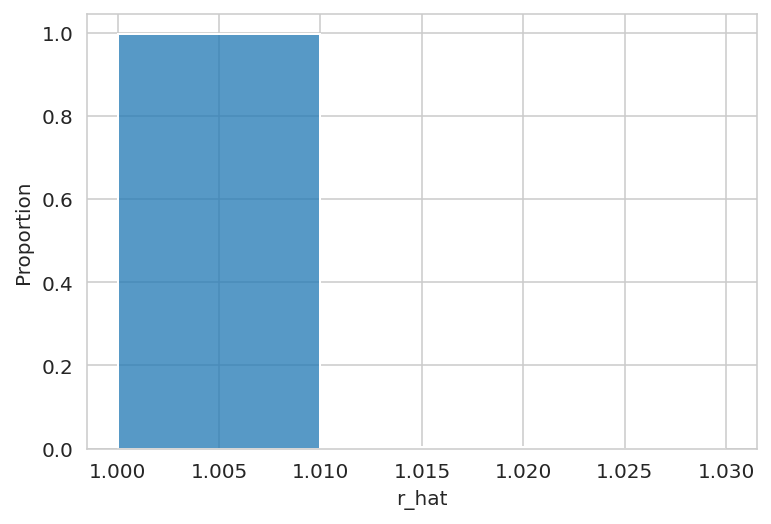


```python
fig, ax = plt.subplots(figsize=(8, 5))
sns.boxplot(data=prostate_post_summary, x="var_name", y="r_hat", ax=ax)
ax.tick_params(rotation=90)
plt.show()
```


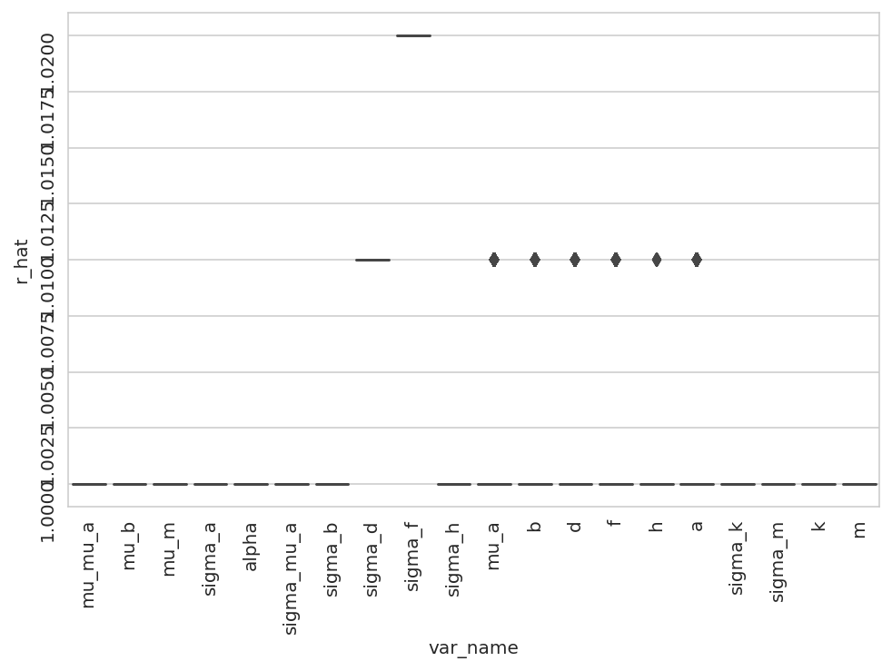


```python
az.plot_energy(trace);
```


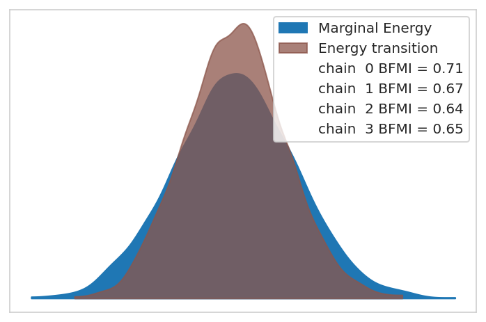


```python
energy = trace.sample_stats.energy.values
marginal_e = pd.DataFrame((energy - energy.mean(axis=1)[:, None]).T).assign(
    energy="marginal"
)
transition_e = pd.DataFrame((energy[:, :-1] - energy[:, 1:]).T).assign(
    energy="transition"
)
energy_df = pd.concat([marginal_e, transition_e]).reset_index(drop=True)
bfmi = az.bfmi(trace)

fig, axes = plt.subplots(2, 2, figsize=(8, 6))
for i, ax in enumerate(axes.flatten()):
    sns.kdeplot(data=energy_df, x=i, hue="energy", ax=ax)
    ax.set_title(f"chain {i} – BFMI: {bfmi[i]:0.2f}")
    ax.set_xlabel(None)
    xmin, _ = ax.get_xlim()
    _, ymax = ax.get_ylim()
    ax.get_legend().set_frame_on(False)

fig.tight_layout()
plt.show()
```


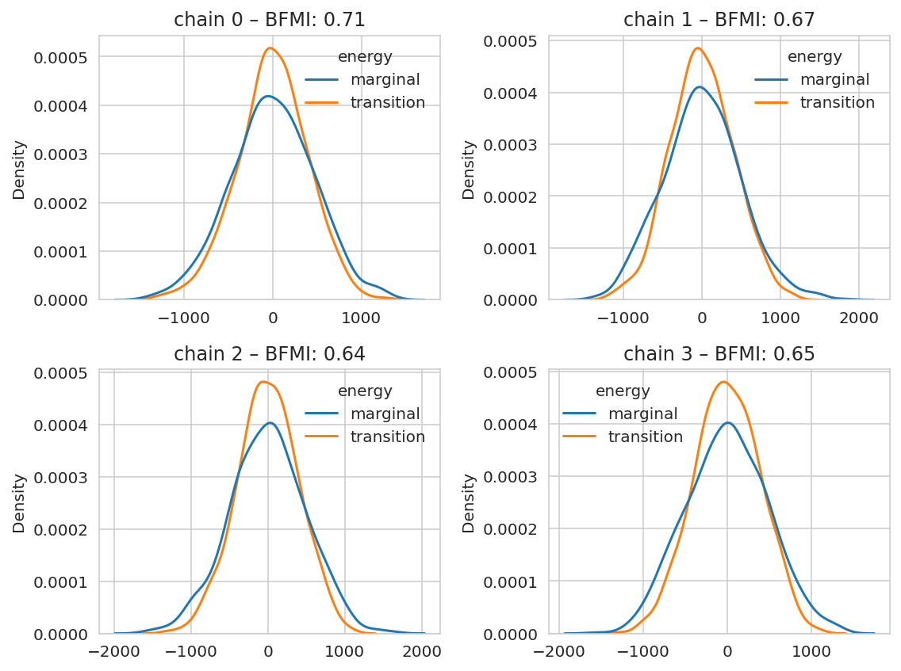


```python
stats = ["step_size", "n_steps", "tree_depth", "acceptance_rate", "energy"]
trace.sample_stats.get(stats).to_dataframe().groupby("chain").mean()
```


<div>
<style scoped>
    .dataframe tbody tr th:only-of-type {
        vertical-align: middle;
    }

    .dataframe tbody tr th {
        vertical-align: top;
    }

    .dataframe thead th {
        text-align: right;
    }
</style>
<table border="1" class="dataframe">
  <thead>
    <tr style="text-align: right;">
      <th></th>
      <th>step_size</th>
      <th>n_steps</th>
      <th>tree_depth</th>
      <th>acceptance_rate</th>
      <th>energy</th>
    </tr>
    <tr>
      <th>chain</th>
      <th></th>
      <th></th>
      <th></th>
      <th></th>
      <th></th>
    </tr>
  </thead>
  <tbody>
    <tr>
      <th>0</th>
      <td>0.007800</td>
      <td>511.000</td>
      <td>9.000</td>
      <td>0.974795</td>
      <td>2.454580e+06</td>
    </tr>
    <tr>
      <th>1</th>
      <td>0.005113</td>
      <td>1023.000</td>
      <td>10.000</td>
      <td>0.985641</td>
      <td>2.454498e+06</td>
    </tr>
    <tr>
      <th>2</th>
      <td>0.008123</td>
      <td>510.656</td>
      <td>8.999</td>
      <td>0.968869</td>
      <td>2.454528e+06</td>
    </tr>
    <tr>
      <th>3</th>
      <td>0.006444</td>
      <td>510.740</td>
      <td>8.999</td>
      <td>0.978201</td>
      <td>2.454606e+06</td>
    </tr>
  </tbody>
</table>
</div>


```python
az.plot_trace(trace, var_names=["mu_mu_a", "mu_b", "mu_m"], compact=False)
plt.tight_layout()
```


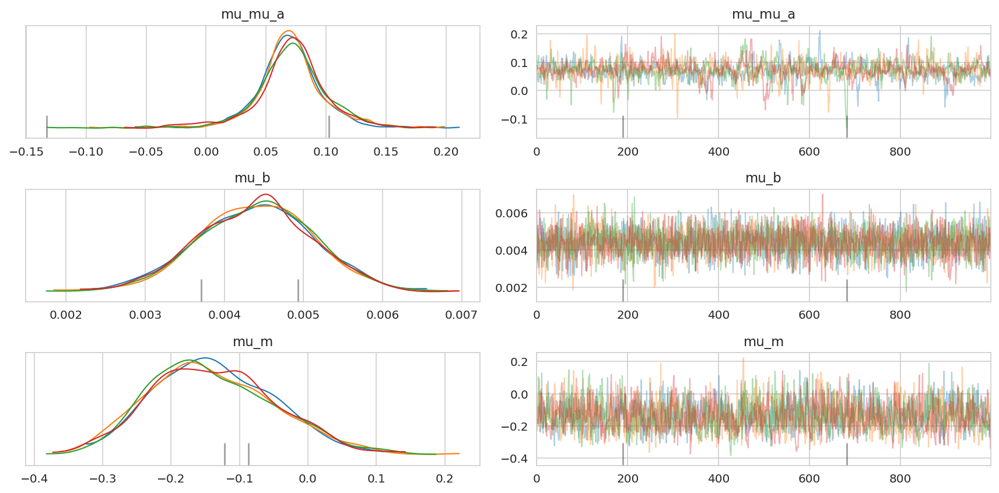


```python
az.plot_trace(trace, var_names=["^sigma_*"], filter_vars="regex", compact=False)
plt.tight_layout()
```


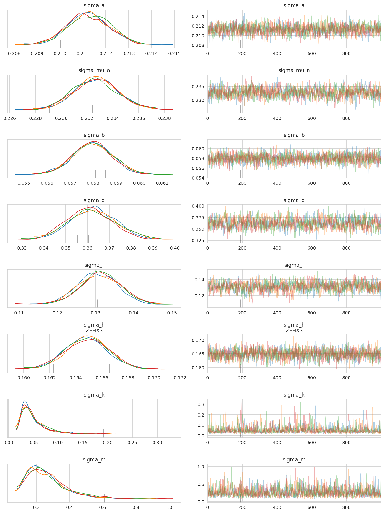


```python
sigmas = ["sigma_mu_a", "sigma_b", "sigma_d", "sigma_f", "sigma_k"]
trace.posterior.get(sigmas).mean(dim="draw").to_dataframe()
```


<div>
<style scoped>
    .dataframe tbody tr th:only-of-type {
        vertical-align: middle;
    }

    .dataframe tbody tr th {
        vertical-align: top;
    }

    .dataframe thead th {
        text-align: right;
    }
</style>
<table border="1" class="dataframe">
  <thead>
    <tr style="text-align: right;">
      <th></th>
      <th>sigma_mu_a</th>
      <th>sigma_b</th>
      <th>sigma_d</th>
      <th>sigma_f</th>
      <th>sigma_k</th>
    </tr>
    <tr>
      <th>chain</th>
      <th></th>
      <th></th>
      <th></th>
      <th></th>
      <th></th>
    </tr>
  </thead>
  <tbody>
    <tr>
      <th>0</th>
      <td>0.232725</td>
      <td>0.057965</td>
      <td>0.362670</td>
      <td>0.130369</td>
      <td>0.050080</td>
    </tr>
    <tr>
      <th>1</th>
      <td>0.232729</td>
      <td>0.058007</td>
      <td>0.362389</td>
      <td>0.130891</td>
      <td>0.052314</td>
    </tr>
    <tr>
      <th>2</th>
      <td>0.232592</td>
      <td>0.058024</td>
      <td>0.362526</td>
      <td>0.131373</td>
      <td>0.055044</td>
    </tr>
    <tr>
      <th>3</th>
      <td>0.232707</td>
      <td>0.057935</td>
      <td>0.360703</td>
      <td>0.131303</td>
      <td>0.054217</td>
    </tr>
  </tbody>
</table>
</div>


```python
az.plot_trace(trace, var_names=["alpha"], compact=False)
plt.tight_layout()
```


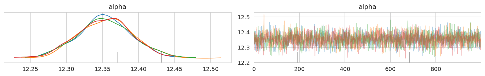


```python
az.plot_forest(
    trace, var_names=["^sigma_*"], filter_vars="regex", combined=False, figsize=(5, 5)
)
plt.tight_layout()
```


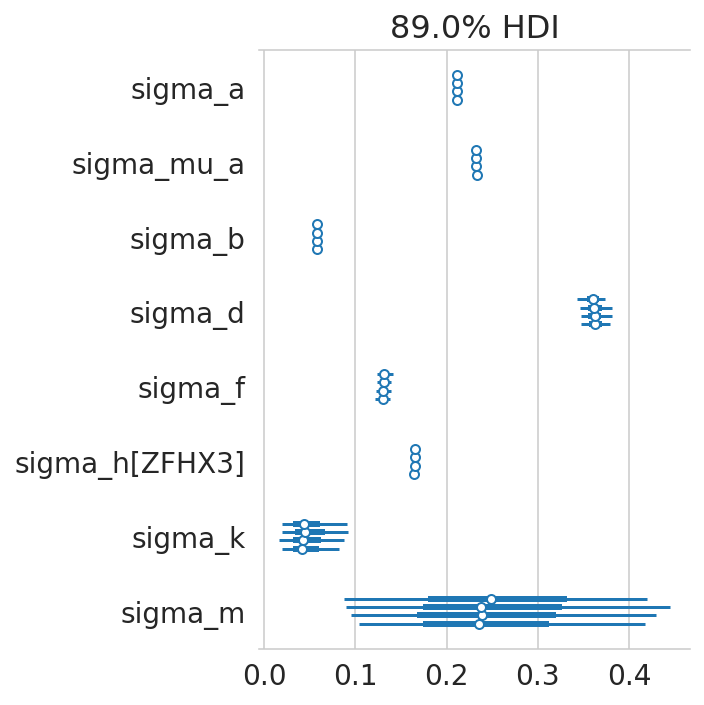


```python
var_names = ["a", "mu_a", "b", "d", "f", "h"]
_, axes = plt.subplots(2, 3, figsize=(8, 6), sharex=True)
for ax, var_name in zip(axes.flatten(), var_names):
    x = prostate_post_summary.query(f"var_name == '{var_name}'")["mean"]
    sns.kdeplot(x=x, ax=ax)
    ax.set_title(var_name)
    ax.set_xlim(-2, 1)

plt.tight_layout()
plt.show()
```


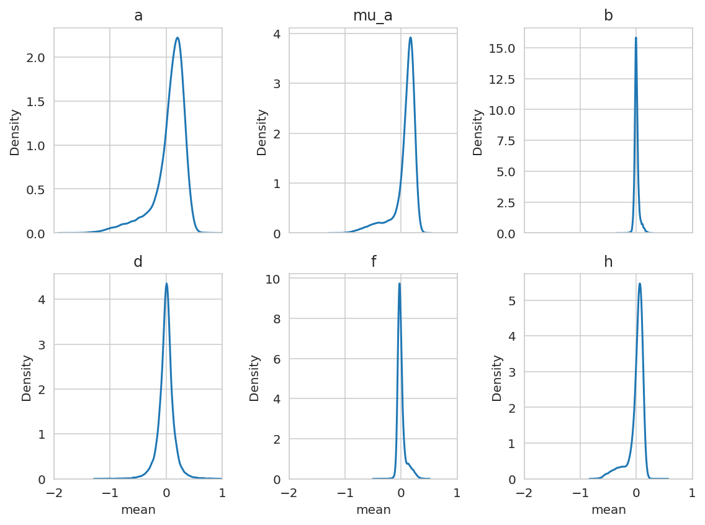


```python
sgrna_to_gene_map = (
    prostate_data.copy()[["hugo_symbol", "sgrna"]]
    .drop_duplicates()
    .reset_index(drop=True)
)
```


```python
from IPython.display import Markdown, display
```


```python
for v in ["mu_a", "b", "d", "f", "h", "k", "m"]:
    display(Markdown(f"variable: **{v}**"))
    top = (
        prostate_post_summary.query(f"var_name == '{v}'")
        .sort_values("mean")
        .pipe(head_tail, 5)
    )
    display(top)
```


variable: **mu_a**


<div>
<style scoped>
    .dataframe tbody tr th:only-of-type {
        vertical-align: middle;
    }

    .dataframe tbody tr th {
        vertical-align: top;
    }

    .dataframe thead th {
        text-align: right;
    }
</style>
<table border="1" class="dataframe">
  <thead>
    <tr style="text-align: right;">
      <th></th>
      <th>parameter</th>
      <th>mean</th>
      <th>sd</th>
      <th>hdi_5.5%</th>
      <th>hdi_94.5%</th>
      <th>mcse_mean</th>
      <th>mcse_sd</th>
      <th>ess_bulk</th>
      <th>ess_tail</th>
      <th>r_hat</th>
      <th>var_name</th>
    </tr>
  </thead>
  <tbody>
    <tr>
      <th>7784</th>
      <td>mu_a[KIF11]</td>
      <td>-1.205</td>
      <td>0.104</td>
      <td>-1.372</td>
      <td>-1.038</td>
      <td>0.002</td>
      <td>0.002</td>
      <td>1971.0</td>
      <td>2730.0</td>
      <td>1.0</td>
      <td>mu_a</td>
    </tr>
    <tr>
      <th>6986</th>
      <td>mu_a[HSPE1]</td>
      <td>-1.044</td>
      <td>0.101</td>
      <td>-1.214</td>
      <td>-0.894</td>
      <td>0.002</td>
      <td>0.002</td>
      <td>2199.0</td>
      <td>2708.0</td>
      <td>1.0</td>
      <td>mu_a</td>
    </tr>
    <tr>
      <th>14743</th>
      <td>mu_a[SPC24]</td>
      <td>-1.034</td>
      <td>0.105</td>
      <td>-1.210</td>
      <td>-0.875</td>
      <td>0.003</td>
      <td>0.002</td>
      <td>1753.0</td>
      <td>2486.0</td>
      <td>1.0</td>
      <td>mu_a</td>
    </tr>
    <tr>
      <th>12652</th>
      <td>mu_a[RAN]</td>
      <td>-1.020</td>
      <td>0.101</td>
      <td>-1.179</td>
      <td>-0.862</td>
      <td>0.002</td>
      <td>0.001</td>
      <td>2311.0</td>
      <td>2896.0</td>
      <td>1.0</td>
      <td>mu_a</td>
    </tr>
    <tr>
      <th>4543</th>
      <td>mu_a[EEF2]</td>
      <td>-0.989</td>
      <td>0.100</td>
      <td>-1.146</td>
      <td>-0.826</td>
      <td>0.002</td>
      <td>0.002</td>
      <td>1856.0</td>
      <td>2470.0</td>
      <td>1.0</td>
      <td>mu_a</td>
    </tr>
    <tr>
      <th>2454</th>
      <td>mu_a[CCNF]</td>
      <td>0.393</td>
      <td>0.106</td>
      <td>0.230</td>
      <td>0.564</td>
      <td>0.003</td>
      <td>0.002</td>
      <td>1769.0</td>
      <td>2544.0</td>
      <td>1.0</td>
      <td>mu_a</td>
    </tr>
    <tr>
      <th>17715</th>
      <td>mu_a[ZNF334]</td>
      <td>0.394</td>
      <td>0.107</td>
      <td>0.218</td>
      <td>0.554</td>
      <td>0.002</td>
      <td>0.002</td>
      <td>2122.0</td>
      <td>2695.0</td>
      <td>1.0</td>
      <td>mu_a</td>
    </tr>
    <tr>
      <th>12056</th>
      <td>mu_a[PRAMEF4]</td>
      <td>0.399</td>
      <td>0.100</td>
      <td>0.239</td>
      <td>0.554</td>
      <td>0.002</td>
      <td>0.002</td>
      <td>1761.0</td>
      <td>2475.0</td>
      <td>1.0</td>
      <td>mu_a</td>
    </tr>
    <tr>
      <th>16213</th>
      <td>mu_a[TP53]</td>
      <td>0.432</td>
      <td>0.097</td>
      <td>0.273</td>
      <td>0.581</td>
      <td>0.002</td>
      <td>0.002</td>
      <td>1994.0</td>
      <td>2511.0</td>
      <td>1.0</td>
      <td>mu_a</td>
    </tr>
    <tr>
      <th>6761</th>
      <td>mu_a[HLA-DQB1]</td>
      <td>0.451</td>
      <td>0.106</td>
      <td>0.280</td>
      <td>0.624</td>
      <td>0.002</td>
      <td>0.002</td>
      <td>2257.0</td>
      <td>2796.0</td>
      <td>1.0</td>
      <td>mu_a</td>
    </tr>
  </tbody>
</table>
</div>


variable: **b**


<div>
<style scoped>
    .dataframe tbody tr th:only-of-type {
        vertical-align: middle;
    }

    .dataframe tbody tr th {
        vertical-align: top;
    }

    .dataframe thead th {
        text-align: right;
    }
</style>
<table border="1" class="dataframe">
  <thead>
    <tr style="text-align: right;">
      <th></th>
      <th>parameter</th>
      <th>mean</th>
      <th>sd</th>
      <th>hdi_5.5%</th>
      <th>hdi_94.5%</th>
      <th>mcse_mean</th>
      <th>mcse_sd</th>
      <th>ess_bulk</th>
      <th>ess_tail</th>
      <th>r_hat</th>
      <th>var_name</th>
    </tr>
  </thead>
  <tbody>
    <tr>
      <th>22901</th>
      <td>b[EP300]</td>
      <td>-0.343</td>
      <td>0.042</td>
      <td>-0.413</td>
      <td>-0.278</td>
      <td>0.001</td>
      <td>0.0</td>
      <td>4673.0</td>
      <td>2904.0</td>
      <td>1.0</td>
      <td>b</td>
    </tr>
    <tr>
      <th>34343</th>
      <td>b[TP63]</td>
      <td>-0.192</td>
      <td>0.041</td>
      <td>-0.258</td>
      <td>-0.127</td>
      <td>0.001</td>
      <td>0.0</td>
      <td>5435.0</td>
      <td>3177.0</td>
      <td>1.0</td>
      <td>b</td>
    </tr>
    <tr>
      <th>33382</th>
      <td>b[TADA1]</td>
      <td>-0.183</td>
      <td>0.040</td>
      <td>-0.247</td>
      <td>-0.122</td>
      <td>0.001</td>
      <td>0.0</td>
      <td>5993.0</td>
      <td>2807.0</td>
      <td>1.0</td>
      <td>b</td>
    </tr>
    <tr>
      <th>33097</th>
      <td>b[STAG2]</td>
      <td>-0.177</td>
      <td>0.041</td>
      <td>-0.239</td>
      <td>-0.110</td>
      <td>0.001</td>
      <td>0.0</td>
      <td>4806.0</td>
      <td>3252.0</td>
      <td>1.0</td>
      <td>b</td>
    </tr>
    <tr>
      <th>24975</th>
      <td>b[HOXB13]</td>
      <td>-0.172</td>
      <td>0.045</td>
      <td>-0.245</td>
      <td>-0.103</td>
      <td>0.001</td>
      <td>0.0</td>
      <td>5697.0</td>
      <td>2996.0</td>
      <td>1.0</td>
      <td>b</td>
    </tr>
    <tr>
      <th>27993</th>
      <td>b[NDUFB11]</td>
      <td>0.225</td>
      <td>0.042</td>
      <td>0.163</td>
      <td>0.296</td>
      <td>0.001</td>
      <td>0.0</td>
      <td>5793.0</td>
      <td>3306.0</td>
      <td>1.0</td>
      <td>b</td>
    </tr>
    <tr>
      <th>19385</th>
      <td>b[ATP6V1F]</td>
      <td>0.229</td>
      <td>0.044</td>
      <td>0.161</td>
      <td>0.299</td>
      <td>0.001</td>
      <td>0.0</td>
      <td>5863.0</td>
      <td>2699.0</td>
      <td>1.0</td>
      <td>b</td>
    </tr>
    <tr>
      <th>24315</th>
      <td>b[GPI]</td>
      <td>0.243</td>
      <td>0.047</td>
      <td>0.171</td>
      <td>0.320</td>
      <td>0.001</td>
      <td>0.0</td>
      <td>6015.0</td>
      <td>2815.0</td>
      <td>1.0</td>
      <td>b</td>
    </tr>
    <tr>
      <th>27883</th>
      <td>b[NARS2]</td>
      <td>0.250</td>
      <td>0.042</td>
      <td>0.183</td>
      <td>0.317</td>
      <td>0.001</td>
      <td>0.0</td>
      <td>5992.0</td>
      <td>2777.0</td>
      <td>1.0</td>
      <td>b</td>
    </tr>
    <tr>
      <th>18590</th>
      <td>b[AIFM1]</td>
      <td>0.276</td>
      <td>0.043</td>
      <td>0.209</td>
      <td>0.344</td>
      <td>0.001</td>
      <td>0.0</td>
      <td>5939.0</td>
      <td>3039.0</td>
      <td>1.0</td>
      <td>b</td>
    </tr>
  </tbody>
</table>
</div>


variable: **d**


<div>
<style scoped>
    .dataframe tbody tr th:only-of-type {
        vertical-align: middle;
    }

    .dataframe tbody tr th {
        vertical-align: top;
    }

    .dataframe thead th {
        text-align: right;
    }
</style>
<table border="1" class="dataframe">
  <thead>
    <tr style="text-align: right;">
      <th></th>
      <th>parameter</th>
      <th>mean</th>
      <th>sd</th>
      <th>hdi_5.5%</th>
      <th>hdi_94.5%</th>
      <th>mcse_mean</th>
      <th>mcse_sd</th>
      <th>ess_bulk</th>
      <th>ess_tail</th>
      <th>r_hat</th>
      <th>var_name</th>
    </tr>
  </thead>
  <tbody>
    <tr>
      <th>52954</th>
      <td>d[UBE2N]</td>
      <td>-1.229</td>
      <td>0.258</td>
      <td>-1.650</td>
      <td>-0.841</td>
      <td>0.004</td>
      <td>0.003</td>
      <td>4876.0</td>
      <td>2986.0</td>
      <td>1.0</td>
      <td>d</td>
    </tr>
    <tr>
      <th>39455</th>
      <td>d[CNOT1]</td>
      <td>-1.079</td>
      <td>0.298</td>
      <td>-1.559</td>
      <td>-0.615</td>
      <td>0.004</td>
      <td>0.003</td>
      <td>5750.0</td>
      <td>2862.0</td>
      <td>1.0</td>
      <td>d</td>
    </tr>
    <tr>
      <th>44097</th>
      <td>d[KLF5]</td>
      <td>-1.018</td>
      <td>0.255</td>
      <td>-1.438</td>
      <td>-0.622</td>
      <td>0.004</td>
      <td>0.003</td>
      <td>4223.0</td>
      <td>2944.0</td>
      <td>1.0</td>
      <td>d</td>
    </tr>
    <tr>
      <th>44641</th>
      <td>d[LONP1]</td>
      <td>-1.014</td>
      <td>0.327</td>
      <td>-1.565</td>
      <td>-0.517</td>
      <td>0.005</td>
      <td>0.003</td>
      <td>4695.0</td>
      <td>2834.0</td>
      <td>1.0</td>
      <td>d</td>
    </tr>
    <tr>
      <th>40722</th>
      <td>d[EARS2]</td>
      <td>-1.014</td>
      <td>0.320</td>
      <td>-1.525</td>
      <td>-0.512</td>
      <td>0.004</td>
      <td>0.003</td>
      <td>5092.0</td>
      <td>3049.0</td>
      <td>1.0</td>
      <td>d</td>
    </tr>
    <tr>
      <th>45695</th>
      <td>d[MSMO1]</td>
      <td>0.932</td>
      <td>0.319</td>
      <td>0.417</td>
      <td>1.433</td>
      <td>0.005</td>
      <td>0.004</td>
      <td>4043.0</td>
      <td>2552.0</td>
      <td>1.0</td>
      <td>d</td>
    </tr>
    <tr>
      <th>45607</th>
      <td>d[MRPL39]</td>
      <td>0.973</td>
      <td>0.285</td>
      <td>0.490</td>
      <td>1.405</td>
      <td>0.004</td>
      <td>0.003</td>
      <td>4838.0</td>
      <td>3210.0</td>
      <td>1.0</td>
      <td>d</td>
    </tr>
    <tr>
      <th>48704</th>
      <td>d[PWP2]</td>
      <td>0.998</td>
      <td>0.234</td>
      <td>0.621</td>
      <td>1.364</td>
      <td>0.003</td>
      <td>0.002</td>
      <td>5561.0</td>
      <td>3273.0</td>
      <td>1.0</td>
      <td>d</td>
    </tr>
    <tr>
      <th>43702</th>
      <td>d[ITGB1]</td>
      <td>1.083</td>
      <td>0.271</td>
      <td>0.649</td>
      <td>1.510</td>
      <td>0.004</td>
      <td>0.003</td>
      <td>4392.0</td>
      <td>2903.0</td>
      <td>1.0</td>
      <td>d</td>
    </tr>
    <tr>
      <th>40412</th>
      <td>d[DMAC1]</td>
      <td>1.263</td>
      <td>0.263</td>
      <td>0.826</td>
      <td>1.659</td>
      <td>0.004</td>
      <td>0.003</td>
      <td>5343.0</td>
      <td>2995.0</td>
      <td>1.0</td>
      <td>d</td>
    </tr>
  </tbody>
</table>
</div>


variable: **f**


<div>
<style scoped>
    .dataframe tbody tr th:only-of-type {
        vertical-align: middle;
    }

    .dataframe tbody tr th {
        vertical-align: top;
    }

    .dataframe thead th {
        text-align: right;
    }
</style>
<table border="1" class="dataframe">
  <thead>
    <tr style="text-align: right;">
      <th></th>
      <th>parameter</th>
      <th>mean</th>
      <th>sd</th>
      <th>hdi_5.5%</th>
      <th>hdi_94.5%</th>
      <th>mcse_mean</th>
      <th>mcse_sd</th>
      <th>ess_bulk</th>
      <th>ess_tail</th>
      <th>r_hat</th>
      <th>var_name</th>
    </tr>
  </thead>
  <tbody>
    <tr>
      <th>59139</th>
      <td>f[EP300]</td>
      <td>-0.474</td>
      <td>0.108</td>
      <td>-0.639</td>
      <td>-0.298</td>
      <td>0.002</td>
      <td>0.001</td>
      <td>4008.0</td>
      <td>3165.0</td>
      <td>1.0</td>
      <td>f</td>
    </tr>
    <tr>
      <th>69335</th>
      <td>f[STAG2]</td>
      <td>-0.301</td>
      <td>0.105</td>
      <td>-0.469</td>
      <td>-0.133</td>
      <td>0.002</td>
      <td>0.001</td>
      <td>3745.0</td>
      <td>2442.0</td>
      <td>1.0</td>
      <td>f</td>
    </tr>
    <tr>
      <th>55242</th>
      <td>f[AR]</td>
      <td>-0.247</td>
      <td>0.107</td>
      <td>-0.417</td>
      <td>-0.078</td>
      <td>0.001</td>
      <td>0.001</td>
      <td>5496.0</td>
      <td>3129.0</td>
      <td>1.0</td>
      <td>f</td>
    </tr>
    <tr>
      <th>61869</th>
      <td>f[JAG1]</td>
      <td>-0.214</td>
      <td>0.095</td>
      <td>-0.360</td>
      <td>-0.061</td>
      <td>0.001</td>
      <td>0.001</td>
      <td>4689.0</td>
      <td>2816.0</td>
      <td>1.0</td>
      <td>f</td>
    </tr>
    <tr>
      <th>63323</th>
      <td>f[MED13]</td>
      <td>-0.213</td>
      <td>0.103</td>
      <td>-0.362</td>
      <td>-0.040</td>
      <td>0.002</td>
      <td>0.001</td>
      <td>4541.0</td>
      <td>2579.0</td>
      <td>1.0</td>
      <td>f</td>
    </tr>
    <tr>
      <th>70552</th>
      <td>f[TOP2A]</td>
      <td>0.398</td>
      <td>0.109</td>
      <td>0.219</td>
      <td>0.567</td>
      <td>0.002</td>
      <td>0.001</td>
      <td>3118.0</td>
      <td>2776.0</td>
      <td>1.0</td>
      <td>f</td>
    </tr>
    <tr>
      <th>60672</th>
      <td>f[GRB2]</td>
      <td>0.398</td>
      <td>0.105</td>
      <td>0.229</td>
      <td>0.563</td>
      <td>0.001</td>
      <td>0.001</td>
      <td>4907.0</td>
      <td>2666.0</td>
      <td>1.0</td>
      <td>f</td>
    </tr>
    <tr>
      <th>62926</th>
      <td>f[LSM2]</td>
      <td>0.408</td>
      <td>0.103</td>
      <td>0.244</td>
      <td>0.567</td>
      <td>0.002</td>
      <td>0.001</td>
      <td>4436.0</td>
      <td>2568.0</td>
      <td>1.0</td>
      <td>f</td>
    </tr>
    <tr>
      <th>68887</th>
      <td>f[SNAP23]</td>
      <td>0.430</td>
      <td>0.108</td>
      <td>0.254</td>
      <td>0.599</td>
      <td>0.002</td>
      <td>0.001</td>
      <td>4208.0</td>
      <td>3087.0</td>
      <td>1.0</td>
      <td>f</td>
    </tr>
    <tr>
      <th>66937</th>
      <td>f[RAB6A]</td>
      <td>0.482</td>
      <td>0.106</td>
      <td>0.312</td>
      <td>0.646</td>
      <td>0.002</td>
      <td>0.001</td>
      <td>4067.0</td>
      <td>2603.0</td>
      <td>1.0</td>
      <td>f</td>
    </tr>
  </tbody>
</table>
</div>


variable: **h**


<div>
<style scoped>
    .dataframe tbody tr th:only-of-type {
        vertical-align: middle;
    }

    .dataframe tbody tr th {
        vertical-align: top;
    }

    .dataframe thead th {
        text-align: right;
    }
</style>
<table border="1" class="dataframe">
  <thead>
    <tr style="text-align: right;">
      <th></th>
      <th>parameter</th>
      <th>mean</th>
      <th>sd</th>
      <th>hdi_5.5%</th>
      <th>hdi_94.5%</th>
      <th>mcse_mean</th>
      <th>mcse_sd</th>
      <th>ess_bulk</th>
      <th>ess_tail</th>
      <th>r_hat</th>
      <th>var_name</th>
    </tr>
  </thead>
  <tbody>
    <tr>
      <th>80260</th>
      <td>h[KIF11, ZFHX3]</td>
      <td>-0.777</td>
      <td>0.089</td>
      <td>-0.915</td>
      <td>-0.633</td>
      <td>0.001</td>
      <td>0.001</td>
      <td>5093.0</td>
      <td>2995.0</td>
      <td>1.0</td>
      <td>h</td>
    </tr>
    <tr>
      <th>77154</th>
      <td>h[ELL, ZFHX3]</td>
      <td>-0.776</td>
      <td>0.083</td>
      <td>-0.901</td>
      <td>-0.640</td>
      <td>0.001</td>
      <td>0.001</td>
      <td>4579.0</td>
      <td>2887.0</td>
      <td>1.0</td>
      <td>h</td>
    </tr>
    <tr>
      <th>88899</th>
      <td>h[TRNT1, ZFHX3]</td>
      <td>-0.746</td>
      <td>0.080</td>
      <td>-0.879</td>
      <td>-0.627</td>
      <td>0.001</td>
      <td>0.001</td>
      <td>4180.0</td>
      <td>2517.0</td>
      <td>1.0</td>
      <td>h</td>
    </tr>
    <tr>
      <th>85774</th>
      <td>h[RPS4X, ZFHX3]</td>
      <td>-0.734</td>
      <td>0.080</td>
      <td>-0.863</td>
      <td>-0.607</td>
      <td>0.001</td>
      <td>0.001</td>
      <td>5811.0</td>
      <td>3202.0</td>
      <td>1.0</td>
      <td>h</td>
    </tr>
    <tr>
      <th>80879</th>
      <td>h[LONP1, ZFHX3]</td>
      <td>-0.730</td>
      <td>0.088</td>
      <td>-0.873</td>
      <td>-0.592</td>
      <td>0.001</td>
      <td>0.001</td>
      <td>4153.0</td>
      <td>3233.0</td>
      <td>1.0</td>
      <td>h</td>
    </tr>
    <tr>
      <th>72882</th>
      <td>h[AFF4, ZFHX3]</td>
      <td>0.255</td>
      <td>0.071</td>
      <td>0.145</td>
      <td>0.369</td>
      <td>0.001</td>
      <td>0.001</td>
      <td>4399.0</td>
      <td>3230.0</td>
      <td>1.0</td>
      <td>h</td>
    </tr>
    <tr>
      <th>79237</th>
      <td>h[HLA-DQB1, ZFHX3]</td>
      <td>0.262</td>
      <td>0.082</td>
      <td>0.130</td>
      <td>0.392</td>
      <td>0.001</td>
      <td>0.001</td>
      <td>4473.0</td>
      <td>2823.0</td>
      <td>1.0</td>
      <td>h</td>
    </tr>
    <tr>
      <th>77165</th>
      <td>h[ELOA, ZFHX3]</td>
      <td>0.263</td>
      <td>0.074</td>
      <td>0.152</td>
      <td>0.387</td>
      <td>0.001</td>
      <td>0.001</td>
      <td>4596.0</td>
      <td>3450.0</td>
      <td>1.0</td>
      <td>h</td>
    </tr>
    <tr>
      <th>88689</th>
      <td>h[TP53, ZFHX3]</td>
      <td>0.328</td>
      <td>0.073</td>
      <td>0.215</td>
      <td>0.444</td>
      <td>0.001</td>
      <td>0.001</td>
      <td>5112.0</td>
      <td>2910.0</td>
      <td>1.0</td>
      <td>h</td>
    </tr>
    <tr>
      <th>77258</th>
      <td>h[EP300, ZFHX3]</td>
      <td>0.510</td>
      <td>0.079</td>
      <td>0.386</td>
      <td>0.632</td>
      <td>0.001</td>
      <td>0.001</td>
      <td>4071.0</td>
      <td>3088.0</td>
      <td>1.0</td>
      <td>h</td>
    </tr>
  </tbody>
</table>
</div>


variable: **k**


<div>
<style scoped>
    .dataframe tbody tr th:only-of-type {
        vertical-align: middle;
    }

    .dataframe tbody tr th {
        vertical-align: top;
    }

    .dataframe thead th {
        text-align: right;
    }
</style>
<table border="1" class="dataframe">
  <thead>
    <tr style="text-align: right;">
      <th></th>
      <th>parameter</th>
      <th>mean</th>
      <th>sd</th>
      <th>hdi_5.5%</th>
      <th>hdi_94.5%</th>
      <th>mcse_mean</th>
      <th>mcse_sd</th>
      <th>ess_bulk</th>
      <th>ess_tail</th>
      <th>r_hat</th>
      <th>var_name</th>
    </tr>
  </thead>
  <tbody>
    <tr>
      <th>161672</th>
      <td>k[ACH-001627]</td>
      <td>-0.038</td>
      <td>0.03</td>
      <td>-0.089</td>
      <td>0.002</td>
      <td>0.001</td>
      <td>0.001</td>
      <td>720.0</td>
      <td>932.0</td>
      <td>1.0</td>
      <td>k</td>
    </tr>
    <tr>
      <th>161670</th>
      <td>k[ACH-000977]</td>
      <td>-0.037</td>
      <td>0.03</td>
      <td>-0.088</td>
      <td>0.003</td>
      <td>0.001</td>
      <td>0.001</td>
      <td>735.0</td>
      <td>1010.0</td>
      <td>1.0</td>
      <td>k</td>
    </tr>
    <tr>
      <th>161671</th>
      <td>k[ACH-001453]</td>
      <td>-0.010</td>
      <td>0.03</td>
      <td>-0.060</td>
      <td>0.030</td>
      <td>0.001</td>
      <td>0.001</td>
      <td>739.0</td>
      <td>993.0</td>
      <td>1.0</td>
      <td>k</td>
    </tr>
    <tr>
      <th>161673</th>
      <td>k[ACH-001648]</td>
      <td>0.011</td>
      <td>0.03</td>
      <td>-0.039</td>
      <td>0.052</td>
      <td>0.001</td>
      <td>0.001</td>
      <td>748.0</td>
      <td>992.0</td>
      <td>1.0</td>
      <td>k</td>
    </tr>
    <tr>
      <th>161669</th>
      <td>k[ACH-000115]</td>
      <td>0.032</td>
      <td>0.03</td>
      <td>-0.019</td>
      <td>0.072</td>
      <td>0.001</td>
      <td>0.001</td>
      <td>750.0</td>
      <td>959.0</td>
      <td>1.0</td>
      <td>k</td>
    </tr>
    <tr>
      <th>161672</th>
      <td>k[ACH-001627]</td>
      <td>-0.038</td>
      <td>0.03</td>
      <td>-0.089</td>
      <td>0.002</td>
      <td>0.001</td>
      <td>0.001</td>
      <td>720.0</td>
      <td>932.0</td>
      <td>1.0</td>
      <td>k</td>
    </tr>
    <tr>
      <th>161670</th>
      <td>k[ACH-000977]</td>
      <td>-0.037</td>
      <td>0.03</td>
      <td>-0.088</td>
      <td>0.003</td>
      <td>0.001</td>
      <td>0.001</td>
      <td>735.0</td>
      <td>1010.0</td>
      <td>1.0</td>
      <td>k</td>
    </tr>
    <tr>
      <th>161671</th>
      <td>k[ACH-001453]</td>
      <td>-0.010</td>
      <td>0.03</td>
      <td>-0.060</td>
      <td>0.030</td>
      <td>0.001</td>
      <td>0.001</td>
      <td>739.0</td>
      <td>993.0</td>
      <td>1.0</td>
      <td>k</td>
    </tr>
    <tr>
      <th>161673</th>
      <td>k[ACH-001648]</td>
      <td>0.011</td>
      <td>0.03</td>
      <td>-0.039</td>
      <td>0.052</td>
      <td>0.001</td>
      <td>0.001</td>
      <td>748.0</td>
      <td>992.0</td>
      <td>1.0</td>
      <td>k</td>
    </tr>
    <tr>
      <th>161669</th>
      <td>k[ACH-000115]</td>
      <td>0.032</td>
      <td>0.03</td>
      <td>-0.019</td>
      <td>0.072</td>
      <td>0.001</td>
      <td>0.001</td>
      <td>750.0</td>
      <td>959.0</td>
      <td>1.0</td>
      <td>k</td>
    </tr>
  </tbody>
</table>
</div>


variable: **m**


<div>
<style scoped>
    .dataframe tbody tr th:only-of-type {
        vertical-align: middle;
    }

    .dataframe tbody tr th {
        vertical-align: top;
    }

    .dataframe thead th {
        text-align: right;
    }
</style>
<table border="1" class="dataframe">
  <thead>
    <tr style="text-align: right;">
      <th></th>
      <th>parameter</th>
      <th>mean</th>
      <th>sd</th>
      <th>hdi_5.5%</th>
      <th>hdi_94.5%</th>
      <th>mcse_mean</th>
      <th>mcse_sd</th>
      <th>ess_bulk</th>
      <th>ess_tail</th>
      <th>r_hat</th>
      <th>var_name</th>
    </tr>
  </thead>
  <tbody>
    <tr>
      <th>161675</th>
      <td>m[ACH-000977]</td>
      <td>-0.528</td>
      <td>0.017</td>
      <td>-0.557</td>
      <td>-0.501</td>
      <td>0.0</td>
      <td>0.0</td>
      <td>4368.0</td>
      <td>3683.0</td>
      <td>1.0</td>
      <td>m</td>
    </tr>
    <tr>
      <th>161676</th>
      <td>m[ACH-001453]</td>
      <td>-0.255</td>
      <td>0.011</td>
      <td>-0.275</td>
      <td>-0.239</td>
      <td>0.0</td>
      <td>0.0</td>
      <td>4303.0</td>
      <td>3766.0</td>
      <td>1.0</td>
      <td>m</td>
    </tr>
    <tr>
      <th>161674</th>
      <td>m[ACH-000115]</td>
      <td>-0.246</td>
      <td>0.009</td>
      <td>-0.261</td>
      <td>-0.232</td>
      <td>0.0</td>
      <td>0.0</td>
      <td>4141.0</td>
      <td>3484.0</td>
      <td>1.0</td>
      <td>m</td>
    </tr>
    <tr>
      <th>161677</th>
      <td>m[ACH-001627]</td>
      <td>-0.230</td>
      <td>0.014</td>
      <td>-0.253</td>
      <td>-0.207</td>
      <td>0.0</td>
      <td>0.0</td>
      <td>4627.0</td>
      <td>3812.0</td>
      <td>1.0</td>
      <td>m</td>
    </tr>
    <tr>
      <th>161678</th>
      <td>m[ACH-001648]</td>
      <td>-0.194</td>
      <td>0.011</td>
      <td>-0.209</td>
      <td>-0.176</td>
      <td>0.0</td>
      <td>0.0</td>
      <td>4403.0</td>
      <td>3720.0</td>
      <td>1.0</td>
      <td>m</td>
    </tr>
    <tr>
      <th>161675</th>
      <td>m[ACH-000977]</td>
      <td>-0.528</td>
      <td>0.017</td>
      <td>-0.557</td>
      <td>-0.501</td>
      <td>0.0</td>
      <td>0.0</td>
      <td>4368.0</td>
      <td>3683.0</td>
      <td>1.0</td>
      <td>m</td>
    </tr>
    <tr>
      <th>161676</th>
      <td>m[ACH-001453]</td>
      <td>-0.255</td>
      <td>0.011</td>
      <td>-0.275</td>
      <td>-0.239</td>
      <td>0.0</td>
      <td>0.0</td>
      <td>4303.0</td>
      <td>3766.0</td>
      <td>1.0</td>
      <td>m</td>
    </tr>
    <tr>
      <th>161674</th>
      <td>m[ACH-000115]</td>
      <td>-0.246</td>
      <td>0.009</td>
      <td>-0.261</td>
      <td>-0.232</td>
      <td>0.0</td>
      <td>0.0</td>
      <td>4141.0</td>
      <td>3484.0</td>
      <td>1.0</td>
      <td>m</td>
    </tr>
    <tr>
      <th>161677</th>
      <td>m[ACH-001627]</td>
      <td>-0.230</td>
      <td>0.014</td>
      <td>-0.253</td>
      <td>-0.207</td>
      <td>0.0</td>
      <td>0.0</td>
      <td>4627.0</td>
      <td>3812.0</td>
      <td>1.0</td>
      <td>m</td>
    </tr>
    <tr>
      <th>161678</th>
      <td>m[ACH-001648]</td>
      <td>-0.194</td>
      <td>0.011</td>
      <td>-0.209</td>
      <td>-0.176</td>
      <td>0.0</td>
      <td>0.0</td>
      <td>4403.0</td>
      <td>3720.0</td>
      <td>1.0</td>
      <td>m</td>
    </tr>
  </tbody>
</table>
</div>


```python
example_genes = ["KIF11", "AR", "NF2"]
az.plot_trace(
    trace,
    var_names=["mu_a", "b", "d", "f", "h"],
    coords={"gene": example_genes},
    compact=False,
)
plt.tight_layout()
plt.show()
```


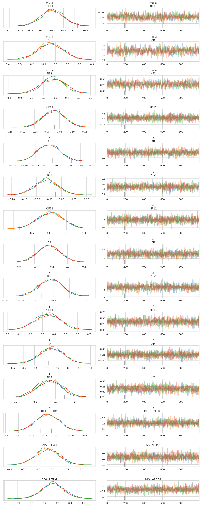


```python
sgrnas_sample = trace.posterior.coords["sgrna"].values[:5]

az.plot_trace(trace, var_names="a", coords={"sgrna": sgrnas_sample}, compact=False)
plt.tight_layout()
plt.show()
```


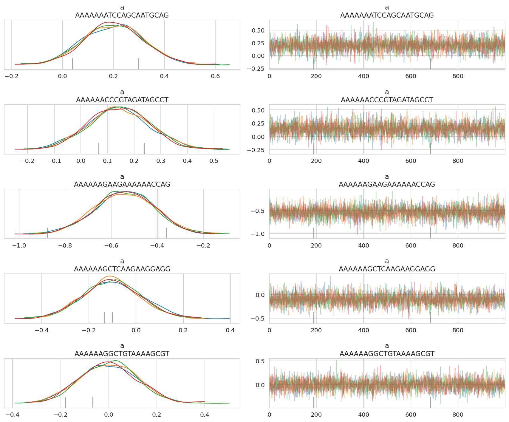


```python
example_gene = "KIF11"
example_gene_sgrna = sgrna_to_gene_map.query(f"hugo_symbol == '{example_gene}'")[
    "sgrna"
].tolist()
az.plot_forest(
    trace,
    var_names=[
        "mu_mu_a",
        "mu_a",
        "a",
        "mu_b",
        "b",
        "d",
        "f",
        "h",
    ],
    coords={"gene": [example_gene], "sgrna": example_gene_sgrna},
    combined=False,
    figsize=(6, 7),
)
plt.show()
```


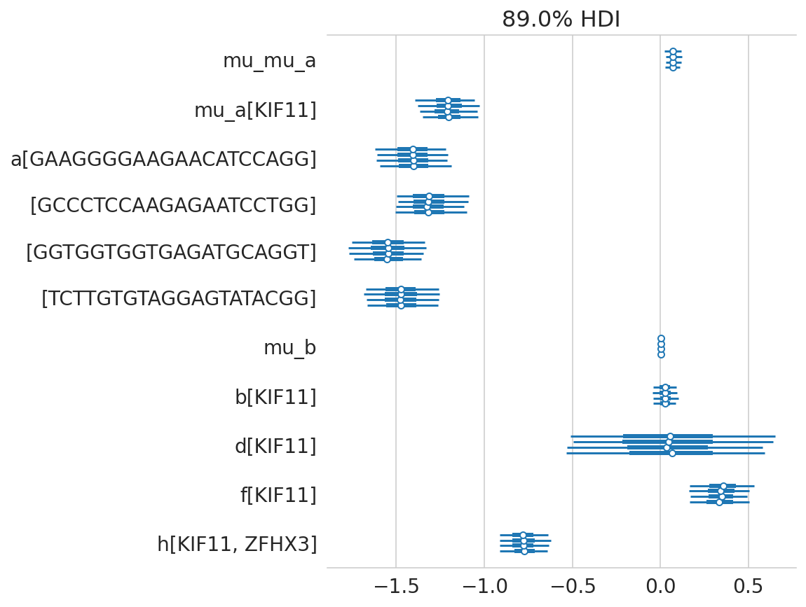


```python
eg_gene = trace.posterior.coords["gene"].values[0]

for gene in [eg_gene, "KIF11"]:
    axes = az.plot_pair(
        trace,
        var_names=["mu_a", "b", "d", "f", "h"],
        coords={"gene": [gene]},
        figsize=(7, 7),
        scatter_kwargs={"alpha": 0.1, "markersize": 2},
    )
    for ax in axes.flatten():
        ax.axhline(0, color="k")
        ax.axvline(0, color="k")
    plt.tight_layout()
    plt.show()
```


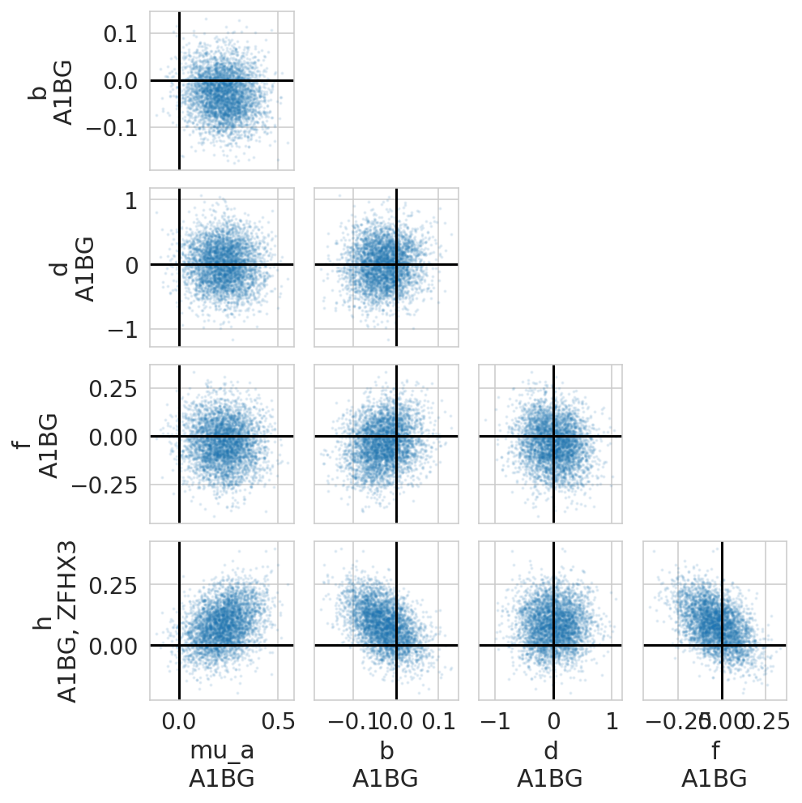


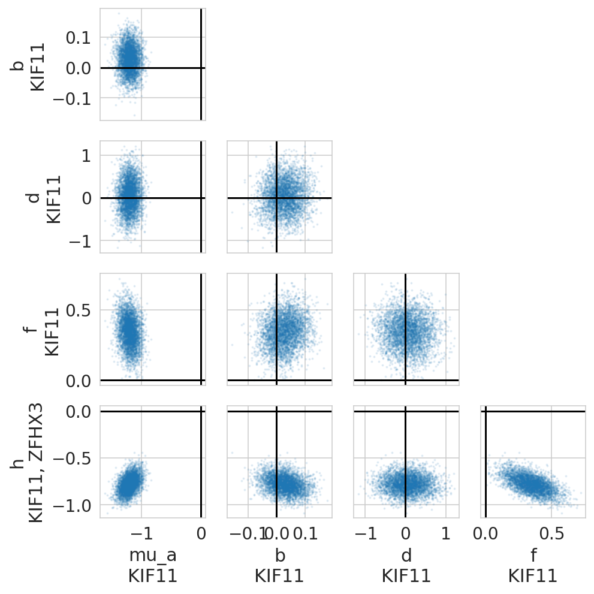


```python
def _get_average_per_chain(trace: az.InferenceData, var_name: str) -> pd.DataFrame:
    return (
        trace.posterior[var_name]
        .mean(axis=(1))
        .to_dataframe()
        .reset_index()
        .astype({"chain": str})
    )


mu_a_post_avg = _get_average_per_chain(trace, "mu_a")
b_post_avg = _get_average_per_chain(trace, "b")
d_post_avg = _get_average_per_chain(trace, "d")

gene_post_avg = mu_a_post_avg.merge(b_post_avg, on=["chain", "gene"]).merge(
    d_post_avg, on=["chain", "gene"]
)


fig, axes = plt.subplots(1, 2, squeeze=True, figsize=(7, 3.5))

ax = axes[0]
sns.scatterplot(
    data=gene_post_avg,
    x="mu_a",
    y="b",
    hue="chain",
    palette="Set1",
    alpha=0.1,
    edgecolor=None,
    s=5,
    ax=ax,
)
ax.set_xlabel(r"$\mu_a$")
ax.set_ylabel(r"$b$")


ax = axes[1]
sns.scatterplot(
    data=gene_post_avg,
    x="b",
    y="d",
    hue="chain",
    palette="Set1",
    alpha=0.1,
    edgecolor=None,
    s=5,
    ax=ax,
)
ax.set_xlabel(r"$b$")
ax.set_ylabel(r"$d$")

for ax in axes.flatten():
    ax.axhline(color="k")
    ax.axvline(color="k")
    ax.get_legend().remove()


fig.tight_layout()
fig.suptitle("Joint posterior distribution", va="bottom")

plt.show()
```


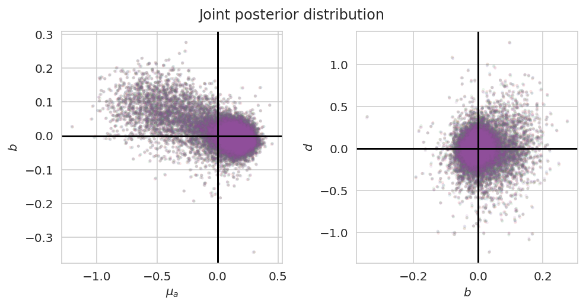


```python
az.plot_forest(trace, var_names=["k", "m"], combined=True, figsize=(5, 4))
plt.tight_layout()
plt.show()
```


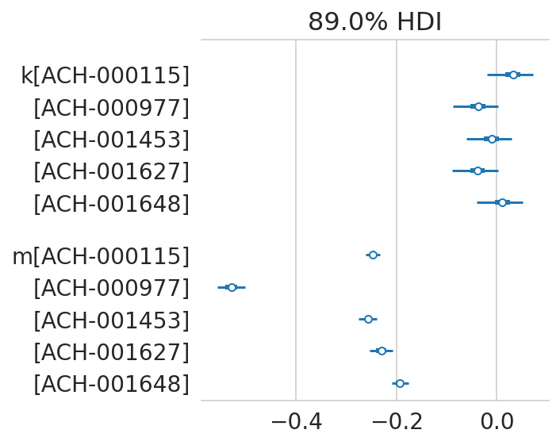


```python
chr_order = list(np.arange(1, 23).astype(str)) + ["X"]

cn_data = (
    valid_prostate_data.copy()[
        ["hugo_symbol", "depmap_id", "sgrna_target_chr", "copy_number"]
    ]
    .drop_duplicates()
    .assign(
        sgrna_target_chr=lambda d: pd.Categorical(
            d["sgrna_target_chr"], categories=chr_order
        )
    )
)
n_cells = cn_data["depmap_id"].nunique()


fig, axes = plt.subplots(
    nrows=n_cells, figsize=(8, n_cells * 3), sharex=True, sharey=True
)
for ax, (cell, data_cell) in zip(axes.flatten(), cn_data.groupby("depmap_id")):
    ax.set_title(cell)
    for y in [0.5, 1, 1.5]:
        ax.axhline(y=y, color="gray", zorder=1)
    sns.boxplot(
        data=data_cell,
        x="sgrna_target_chr",
        y="copy_number",
        ax=ax,
        showfliers=False,
        zorder=5,
    )
    ax.set_xlabel(None)
    ax.set_ylabel("copy number")

fig.supxlabel("chromosome")
fig.tight_layout()
plt.show()
```


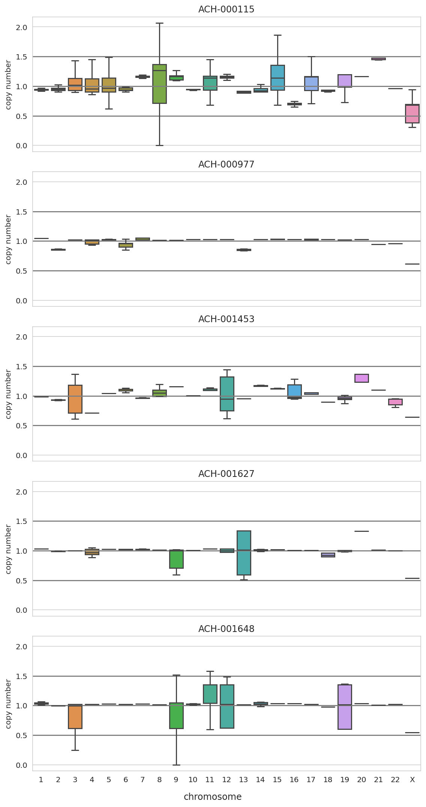


```python
genes_var_names = ["mu_a", "b", "d", "f"]
genes_var_names += [f"h[{g}]" for g in trace.posterior.coords["cancer_gene"].values]
gene_corr_post = (
    az.summary(trace, "genes_chol_cov_corr", kind="stats")
    .pipe(extract_coords_param_names, names=["d1", "d2"])
    .astype({"d1": int, "d2": int})
    .assign(
        p1=lambda d: [genes_var_names[i] for i in d["d1"]],
        p2=lambda d: [genes_var_names[i] for i in d["d2"]],
    )
    .assign(
        p1=lambda d: pd.Categorical(d["p1"], categories=d["p1"].unique(), ordered=True)
    )
    .assign(
        p2=lambda d: pd.Categorical(
            d["p2"], categories=d["p1"].cat.categories, ordered=True
        )
    )
)
gene_corr_post
```


<div>
<style scoped>
    .dataframe tbody tr th:only-of-type {
        vertical-align: middle;
    }

    .dataframe tbody tr th {
        vertical-align: top;
    }

    .dataframe thead th {
        text-align: right;
    }
</style>
<table border="1" class="dataframe">
  <thead>
    <tr style="text-align: right;">
      <th></th>
      <th>mean</th>
      <th>sd</th>
      <th>hdi_5.5%</th>
      <th>hdi_94.5%</th>
      <th>d1</th>
      <th>d2</th>
      <th>p1</th>
      <th>p2</th>
    </tr>
  </thead>
  <tbody>
    <tr>
      <th>genes_chol_cov_corr[0, 0]</th>
      <td>1.000</td>
      <td>0.000</td>
      <td>1.000</td>
      <td>1.000</td>
      <td>0</td>
      <td>0</td>
      <td>mu_a</td>
      <td>mu_a</td>
    </tr>
    <tr>
      <th>genes_chol_cov_corr[0, 1]</th>
      <td>-0.372</td>
      <td>0.014</td>
      <td>-0.396</td>
      <td>-0.350</td>
      <td>0</td>
      <td>1</td>
      <td>mu_a</td>
      <td>b</td>
    </tr>
    <tr>
      <th>genes_chol_cov_corr[0, 2]</th>
      <td>0.072</td>
      <td>0.023</td>
      <td>0.036</td>
      <td>0.108</td>
      <td>0</td>
      <td>2</td>
      <td>mu_a</td>
      <td>d</td>
    </tr>
    <tr>
      <th>genes_chol_cov_corr[0, 3]</th>
      <td>-0.484</td>
      <td>0.035</td>
      <td>-0.541</td>
      <td>-0.430</td>
      <td>0</td>
      <td>3</td>
      <td>mu_a</td>
      <td>f</td>
    </tr>
    <tr>
      <th>genes_chol_cov_corr[0, 4]</th>
      <td>0.841</td>
      <td>0.010</td>
      <td>0.825</td>
      <td>0.856</td>
      <td>0</td>
      <td>4</td>
      <td>mu_a</td>
      <td>h[ZFHX3]</td>
    </tr>
    <tr>
      <th>genes_chol_cov_corr[1, 0]</th>
      <td>-0.372</td>
      <td>0.014</td>
      <td>-0.396</td>
      <td>-0.350</td>
      <td>1</td>
      <td>0</td>
      <td>b</td>
      <td>mu_a</td>
    </tr>
    <tr>
      <th>genes_chol_cov_corr[1, 1]</th>
      <td>1.000</td>
      <td>0.000</td>
      <td>1.000</td>
      <td>1.000</td>
      <td>1</td>
      <td>1</td>
      <td>b</td>
      <td>b</td>
    </tr>
    <tr>
      <th>genes_chol_cov_corr[1, 2]</th>
      <td>-0.010</td>
      <td>0.032</td>
      <td>-0.058</td>
      <td>0.043</td>
      <td>1</td>
      <td>2</td>
      <td>b</td>
      <td>d</td>
    </tr>
    <tr>
      <th>genes_chol_cov_corr[1, 3]</th>
      <td>0.316</td>
      <td>0.050</td>
      <td>0.239</td>
      <td>0.398</td>
      <td>1</td>
      <td>3</td>
      <td>b</td>
      <td>f</td>
    </tr>
    <tr>
      <th>genes_chol_cov_corr[1, 4]</th>
      <td>-0.506</td>
      <td>0.016</td>
      <td>-0.530</td>
      <td>-0.481</td>
      <td>1</td>
      <td>4</td>
      <td>b</td>
      <td>h[ZFHX3]</td>
    </tr>
    <tr>
      <th>genes_chol_cov_corr[2, 0]</th>
      <td>0.072</td>
      <td>0.023</td>
      <td>0.036</td>
      <td>0.108</td>
      <td>2</td>
      <td>0</td>
      <td>d</td>
      <td>mu_a</td>
    </tr>
    <tr>
      <th>genes_chol_cov_corr[2, 1]</th>
      <td>-0.010</td>
      <td>0.032</td>
      <td>-0.058</td>
      <td>0.043</td>
      <td>2</td>
      <td>1</td>
      <td>d</td>
      <td>b</td>
    </tr>
    <tr>
      <th>genes_chol_cov_corr[2, 2]</th>
      <td>1.000</td>
      <td>0.000</td>
      <td>1.000</td>
      <td>1.000</td>
      <td>2</td>
      <td>2</td>
      <td>d</td>
      <td>d</td>
    </tr>
    <tr>
      <th>genes_chol_cov_corr[2, 3]</th>
      <td>-0.100</td>
      <td>0.077</td>
      <td>-0.222</td>
      <td>0.024</td>
      <td>2</td>
      <td>3</td>
      <td>d</td>
      <td>f</td>
    </tr>
    <tr>
      <th>genes_chol_cov_corr[2, 4]</th>
      <td>0.036</td>
      <td>0.025</td>
      <td>-0.003</td>
      <td>0.078</td>
      <td>2</td>
      <td>4</td>
      <td>d</td>
      <td>h[ZFHX3]</td>
    </tr>
    <tr>
      <th>genes_chol_cov_corr[3, 0]</th>
      <td>-0.484</td>
      <td>0.035</td>
      <td>-0.541</td>
      <td>-0.430</td>
      <td>3</td>
      <td>0</td>
      <td>f</td>
      <td>mu_a</td>
    </tr>
    <tr>
      <th>genes_chol_cov_corr[3, 1]</th>
      <td>0.316</td>
      <td>0.050</td>
      <td>0.239</td>
      <td>0.398</td>
      <td>3</td>
      <td>1</td>
      <td>f</td>
      <td>b</td>
    </tr>
    <tr>
      <th>genes_chol_cov_corr[3, 2]</th>
      <td>-0.100</td>
      <td>0.077</td>
      <td>-0.222</td>
      <td>0.024</td>
      <td>3</td>
      <td>2</td>
      <td>f</td>
      <td>d</td>
    </tr>
    <tr>
      <th>genes_chol_cov_corr[3, 3]</th>
      <td>1.000</td>
      <td>0.000</td>
      <td>1.000</td>
      <td>1.000</td>
      <td>3</td>
      <td>3</td>
      <td>f</td>
      <td>f</td>
    </tr>
    <tr>
      <th>genes_chol_cov_corr[3, 4]</th>
      <td>-0.653</td>
      <td>0.028</td>
      <td>-0.698</td>
      <td>-0.607</td>
      <td>3</td>
      <td>4</td>
      <td>f</td>
      <td>h[ZFHX3]</td>
    </tr>
    <tr>
      <th>genes_chol_cov_corr[4, 0]</th>
      <td>0.841</td>
      <td>0.010</td>
      <td>0.825</td>
      <td>0.856</td>
      <td>4</td>
      <td>0</td>
      <td>h[ZFHX3]</td>
      <td>mu_a</td>
    </tr>
    <tr>
      <th>genes_chol_cov_corr[4, 1]</th>
      <td>-0.506</td>
      <td>0.016</td>
      <td>-0.530</td>
      <td>-0.481</td>
      <td>4</td>
      <td>1</td>
      <td>h[ZFHX3]</td>
      <td>b</td>
    </tr>
    <tr>
      <th>genes_chol_cov_corr[4, 2]</th>
      <td>0.036</td>
      <td>0.025</td>
      <td>-0.003</td>
      <td>0.078</td>
      <td>4</td>
      <td>2</td>
      <td>h[ZFHX3]</td>
      <td>d</td>
    </tr>
    <tr>
      <th>genes_chol_cov_corr[4, 3]</th>
      <td>-0.653</td>
      <td>0.028</td>
      <td>-0.698</td>
      <td>-0.607</td>
      <td>4</td>
      <td>3</td>
      <td>h[ZFHX3]</td>
      <td>f</td>
    </tr>
    <tr>
      <th>genes_chol_cov_corr[4, 4]</th>
      <td>1.000</td>
      <td>0.000</td>
      <td>1.000</td>
      <td>1.000</td>
      <td>4</td>
      <td>4</td>
      <td>h[ZFHX3]</td>
      <td>h[ZFHX3]</td>
    </tr>
  </tbody>
</table>
</div>


```python
plot_df = gene_corr_post.pivot_wider("p1", "p2", "mean").set_index("p1")
sns.heatmap(plot_df, cmap="coolwarm", vmin=-1, vmax=1)
plt.show()
```


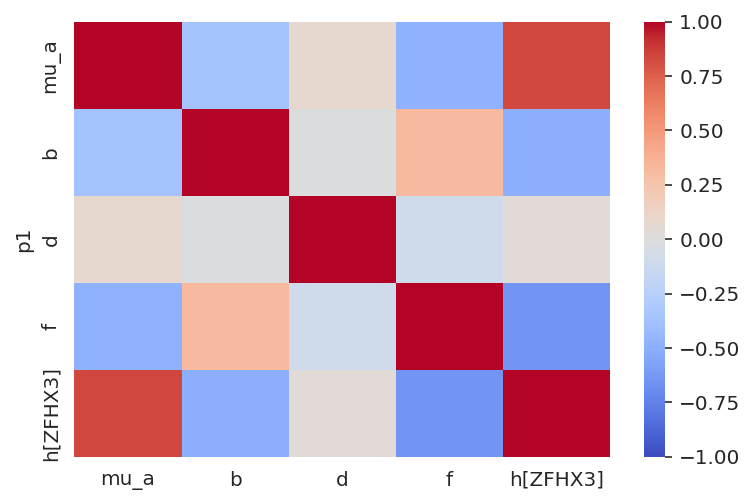


```python
genes_var_corr = trace.posterior["genes_chol_cov_corr"].mean(axis=(1))
genes_var_names = ["mu_a", "b", "d", "f", "h"]
fig, axes = plt.subplots(2, 2, figsize=(7, 6))

for c, ax in enumerate(axes.flatten()):
    data = genes_var_corr[c, :, :].values.copy()
    np.fill_diagonal(data, np.nan)
    data[~np.tril(data).astype(bool)] = np.nan
    sns.heatmap(data, vmin=-1, vmax=1, cmap="coolwarm", ax=ax)
    ax.set_xticklabels(genes_var_names)
    ax.set_yticklabels(genes_var_names)
    ax.set_title(f"chain {c}")

fig.tight_layout()
plt.show()
```


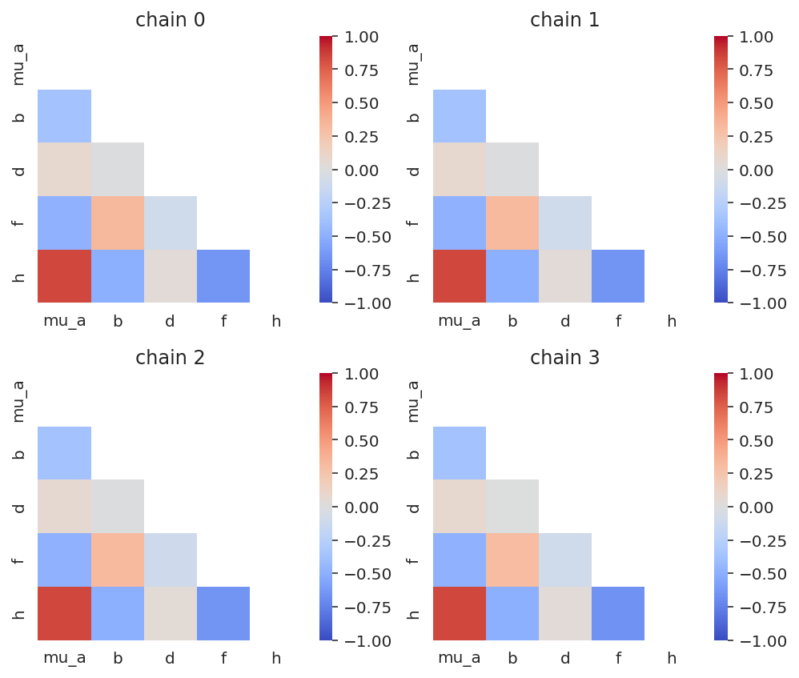


```python
cancer_genes = trace.posterior.coords["cancer_gene"].values.tolist()
cancer_gene_mutants = (
    valid_prostate_data.filter_column_isin("hugo_symbol", cancer_genes)[
        ["hugo_symbol", "depmap_id", "is_mutated"]
    ]
    .drop_duplicates()
    .assign(is_mutated=lambda d: d["is_mutated"].map({True: "X", False: ""}))
    .pivot_wider("depmap_id", names_from="hugo_symbol", values_from="is_mutated")
    .set_index("depmap_id")
)
cancer_gene_mutants
```


<div>
<style scoped>
    .dataframe tbody tr th:only-of-type {
        vertical-align: middle;
    }

    .dataframe tbody tr th {
        vertical-align: top;
    }

    .dataframe thead th {
        text-align: right;
    }
</style>
<table border="1" class="dataframe">
  <thead>
    <tr style="text-align: right;">
      <th></th>
      <th>ZFHX3</th>
    </tr>
    <tr>
      <th>depmap_id</th>
      <th></th>
    </tr>
  </thead>
  <tbody>
    <tr>
      <th>ACH-000115</th>
      <td></td>
    </tr>
    <tr>
      <th>ACH-000977</th>
      <td>X</td>
    </tr>
    <tr>
      <th>ACH-001453</th>
      <td></td>
    </tr>
    <tr>
      <th>ACH-001627</th>
      <td>X</td>
    </tr>
    <tr>
      <th>ACH-001648</th>
      <td></td>
    </tr>
  </tbody>
</table>
</div>


```python
az.plot_trace(trace, var_names=["sigma_h"], compact=False)
plt.tight_layout()
plt.show()
```


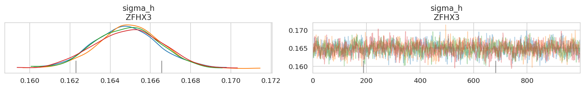


```python
h_post_summary = (
    prostate_post_summary.query("var_name == 'h'")
    .reset_index(drop=True)
    .pipe(
        extract_coords_param_names,
        names=["hugo_symbol", "cancer_gene"],
        col="parameter",
    )
)

ax = sns.kdeplot(data=h_post_summary, x="mean", hue="cancer_gene")
ax.set_xlabel(r"$\bar{h}_g$ posterior")
ax.set_ylabel("density")
ax.get_legend().set_title("cancer gene\ncomut.")
plt.show()
```


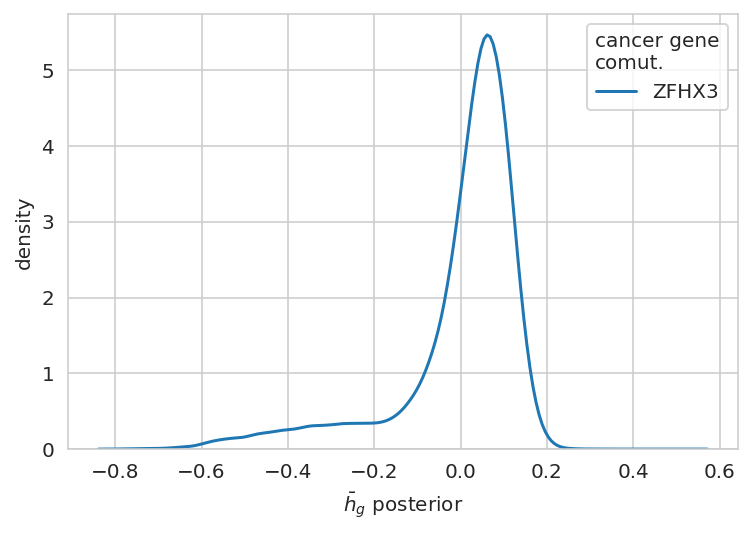


```python
fig, axes = plt.subplots(
    len(cancer_genes), 1, squeeze=False, figsize=(8, len(cancer_genes) * 5)
)
for ax, cg in zip(axes.flatten(), cancer_genes):
    h_hits = (
        h_post_summary.filter_column_isin("cancer_gene", [cg])
        .sort_values("mean")
        .pipe(head_tail, n=5)["hugo_symbol"]
        .tolist()
    )

    h_hits_data = (
        valid_prostate_data.filter_column_isin("hugo_symbol", h_hits)
        .merge(cancer_gene_mutants.reset_index(), on="depmap_id")
        .reset_index()
        .astype({"hugo_symbol": str})
        .assign(
            hugo_symbol=lambda d: pd.Categorical(d["hugo_symbol"], categories=h_hits),
            _cg_mut=lambda d: d[cg].map({"X": "mut.", "": "WT"}),
        )
    )
    mut_pal = {"mut.": "tab:red", "WT": "gray"}
    sns.boxplot(
        data=h_hits_data,
        x="hugo_symbol",
        y="lfc",
        hue="_cg_mut",
        palette=mut_pal,
        ax=ax,
        showfliers=False,
        boxprops={"alpha": 0.5},
    )
    sns.stripplot(
        data=h_hits_data,
        x="hugo_symbol",
        y="lfc",
        hue="_cg_mut",
        dodge=True,
        palette=mut_pal,
        ax=ax,
    )
    sns.move_legend(ax, loc="upper left", bbox_to_anchor=(1, 1), title=cg)

plt.tight_layout()
plt.show()
```


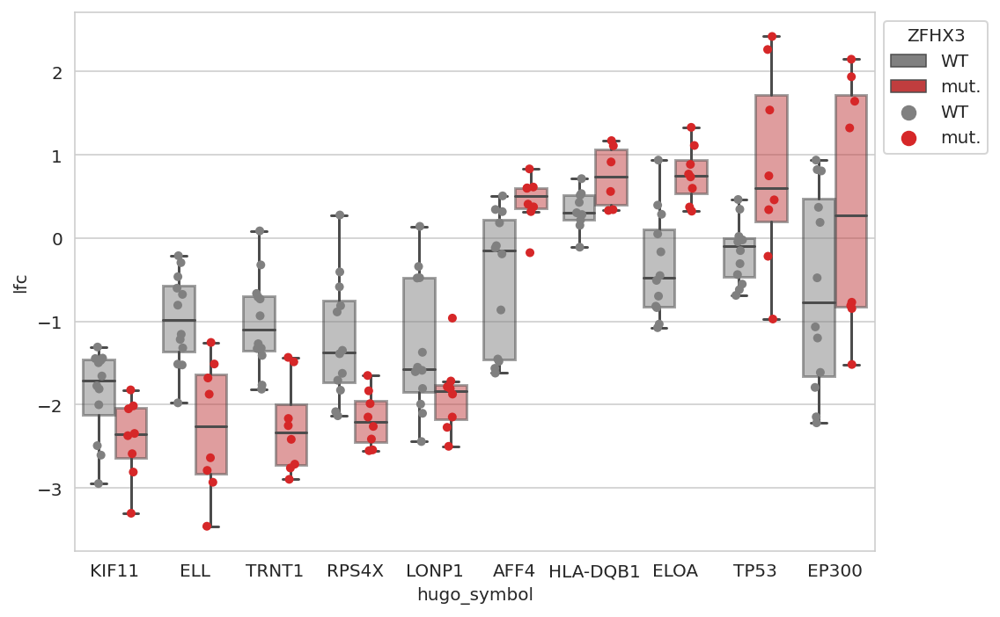


```python
top_n = 5
top_b_hits = (
    prostate_post_summary.query("var_name == 'b'")
    .sort_values("mean")
    .reset_index(drop=True)
    .pipe(extract_coords_param_names, names=["hugo_symbol"], col="parameter")
    .pipe(head_tail, n=top_n)
)

negative_b = top_b_hits["hugo_symbol"][:top_n].values
positive_b = top_b_hits["hugo_symbol"][top_n:].values


fig, axes = plt.subplots(2, top_n, figsize=(12, 6))

for i, genes in enumerate([positive_b, negative_b]):
    for j, gene in enumerate(genes):
        ax = axes[i, j]
        ax.set_title(gene)
        obs_data = valid_prostate_data.query(f"hugo_symbol == '{gene}'")
        sns.scatterplot(
            data=obs_data, x="m_rna_gene", y="lfc", ax=ax, edgecolor=None, s=20
        )
        ax.set_xlabel(None)
        ax.set_ylabel(None)


fig.supxlabel("log RNA expression")
fig.supylabel("log-fold change")

fig.tight_layout()
plt.show()
```


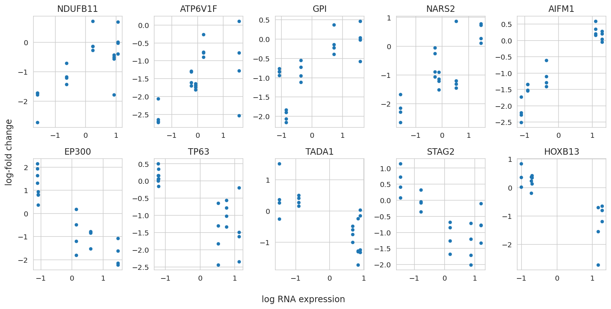


```python
top_n = 5
top_d_hits = (
    prostate_post_summary.query("var_name == 'd'")
    .sort_values("mean")
    .reset_index(drop=True)
    .pipe(extract_coords_param_names, names=["hugo_symbol"], col="parameter")
    .pipe(head_tail, n=top_n)
)

negative_d = top_d_hits["hugo_symbol"][:top_n].values
positive_d = top_d_hits["hugo_symbol"][top_n:].values


fig, axes = plt.subplots(2, top_n, figsize=(12, 6))

for i, genes in enumerate([positive_d, negative_d]):
    for j, gene in enumerate(genes):
        ax = axes[i, j]
        ax.set_title(gene)
        obs_data = valid_prostate_data.query(f"hugo_symbol == '{gene}'")
        sns.scatterplot(data=obs_data, x="cn_gene", y="lfc", ax=ax)
        ax.set_xlabel(None)
        ax.set_ylabel(None)


fig.supxlabel("copy number")
fig.supylabel("log-fold change")
fig.tight_layout()
plt.show()
```


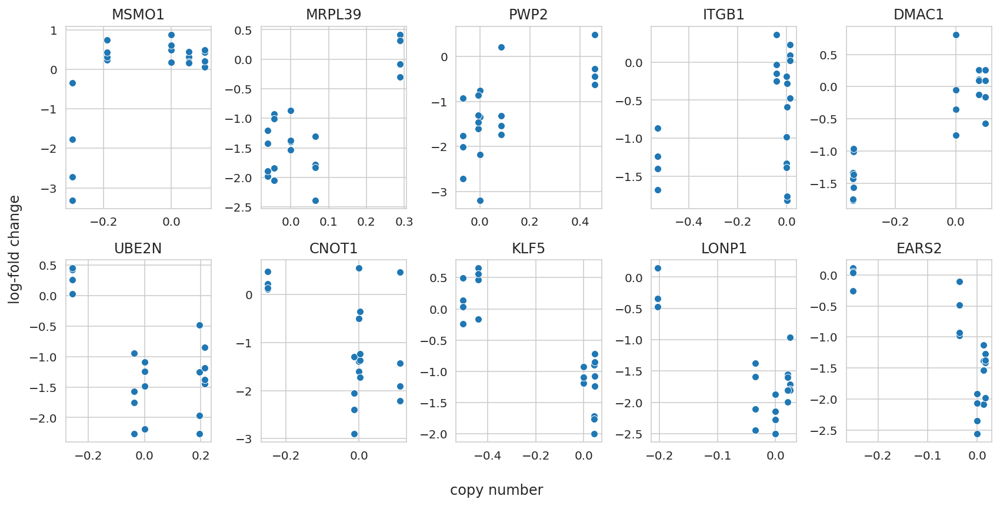


## PPC


```python
n_examples = 40
n_chains, n_draws, n_data = trace.posterior_predictive["ct_final"].shape
ex_draws_idx = np.random.choice(
    np.arange(n_draws), size=n_examples // n_chains, replace=False
)
example_ppc_draws = trace.posterior_predictive["ct_final"][
    :, ex_draws_idx, :
].values.reshape(-1, n_data)
example_ppc_draws.shape
```


    (40, 355308)


```python
fig, axes = plt.subplots(ncols=2, figsize=(9, 4), sharex=False, sharey=False)
ax1 = axes[0]
ax2 = axes[1]

pp_avg = trace.posterior_predictive["ct_final"].mean(axis=(0, 1))

for i in range(example_ppc_draws.shape[0]):
    sns.kdeplot(
        x=np.log10(example_ppc_draws[i, :] + 1), alpha=0.2, color="tab:blue", ax=ax1
    )

sns.kdeplot(x=np.log10(pp_avg + 1), color="tab:orange", ax=ax1)
sns.kdeplot(x=np.log10(valid_prostate_data["counts_final"] + 1), color="k", ax=ax1)
ax1.set_xlabel("log10(counts final + 1)")
ax1.set_ylabel("density")


for i in range(example_ppc_draws.shape[0]):
    sns.kdeplot(x=example_ppc_draws[i, :], alpha=0.2, color="tab:blue", ax=ax2)

sns.kdeplot(x=pp_avg, color="tab:orange", ax=ax2)
sns.kdeplot(x=valid_prostate_data["counts_final"], color="k", ax=ax2)
ax2.set_xlabel("counts final")
ax2.set_ylabel("density")
ax2.set_xlim(0, 1000)

fig.suptitle("PPC")
fig.tight_layout()
plt.show()
```


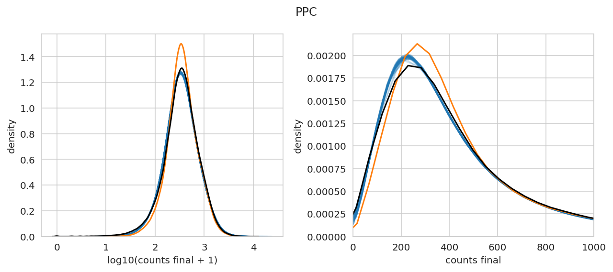


---

## Session info


```python
notebook_toc = time()
print(f"execution time: {(notebook_toc - notebook_tic) / 60:.2f} minutes")
```

    execution time: 6.36 minutes


```python
%load_ext watermark
%watermark -d -u -v -iv -b -h -m
```

    Last updated: 2022-08-04

    Python implementation: CPython
    Python version       : 3.10.5
    IPython version      : 8.4.0

    Compiler    : GCC 10.3.0
    OS          : Linux
    Release     : 3.10.0-1160.45.1.el7.x86_64
    Machine     : x86_64
    Processor   : x86_64
    CPU cores   : 28
    Architecture: 64bit

    Hostname: compute-e-16-229.o2.rc.hms.harvard.edu

    Git branch: simplify

    seaborn   : 0.11.2
    pandas    : 1.4.3
    matplotlib: 3.5.2
    numpy     : 1.23.1
    arviz     : 0.12.1


```python

```
