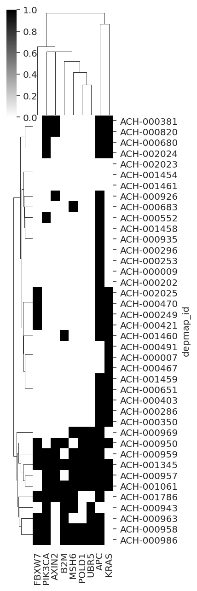
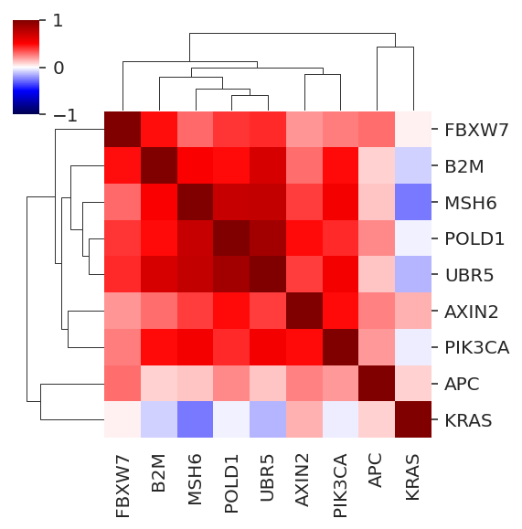

# Inspect the single-lineage model run on the colorectal data (007)

 Model attributes:

- sgRNA | gene varying intercept
- RNA and CN varying effects per gene
- correlation between gene varying effects modeled using the multivariate normal and Cholesky decomposition (non-centered parameterization)
- target gene mutation variable and cancer gene comutation variable.
- varying effect for cell line and varying copy number effect for cell line


```python
%load_ext autoreload
%autoreload 2
```


```python
from time import time

import arviz as az
import matplotlib.pyplot as plt
import numpy as np
import pandas as pd
import seaborn as sns
from IPython.display import Markdown, display
from matplotlib.lines import Line2D
```


```python
from speclet.analysis.arviz_analysis import extract_coords_param_names
from speclet.bayesian_models.lineage_hierarchical_nb import LineageHierNegBinomModel
from speclet.data_processing.common import head_tail
from speclet.io import modeling_data_dir, models_dir
from speclet.managers.data_managers import CrisprScreenDataManager, broad_only
from speclet.plot import set_speclet_theme
from speclet.project_configuration import arviz_config
```


```python
# Notebook execution timer.
notebook_tic = time()

# Plotting setup.
set_speclet_theme()
%config InlineBackend.figure_format = "retina"
arviz_config()
```

## Data


```python
saved_model_dir = models_dir() / "hnb-single-lineage-colorectal-007_PYMC_NUMPYRO"
```


```python
with open(saved_model_dir / "description.txt") as f:
    model_description = "".join(list(f))

print(model_description)
```

    name: 'hnb-single-lineage-colorectal-007'
    fit method: 'PYMC_NUMPYRO'

    --------------------------------------------------------------------------------

    CONFIGURATION

    {
        "name": "hnb-single-lineage-colorectal-007",
        "description": " Single lineage hierarchical negative binomial model for colorectal data from the Broad. Varying effect for cell line and varying effect for copy number per cell line. This model also uses a different transformation for the copy number data. The `max_tree_depth` is also increased with the intention to give the tuning process a little more room to experiment with, but it should not be used as the tree depth for the final draws. ",
        "active": true,
        "model": "LINEAGE_HIERARCHICAL_NB",
        "data_file": "modeling_data/lineage-modeling-data/depmap-modeling-data_colorectal.csv",
        "model_kwargs": {
            "lineage": "colorectal",
            "min_frac_cancer_genes": 0.2
        },
        "sampling_kwargs": {
            "pymc_mcmc": null,
            "pymc_advi": null,
            "pymc_numpyro": {
                "draws": 1000,
                "tune": 1500,
                "chains": 4,
                "target_accept": 0.99,
                "progress_bar": true,
                "chain_method": "parallel",
                "postprocessing_backend": "cpu",
                "idata_kwargs": {
                    "log_likelihood": false
                },
                "nuts_kwargs": {
                    "step_size": 0.01,
                    "max_tree_depth": 11
                }
            }
        }
    }

    --------------------------------------------------------------------------------

    POSTERIOR

    <xarray.Dataset>
    Dimensions:                    (chain: 4, draw: 1000, delta_genes_dim_0: 13,
                                    delta_genes_dim_1: 18119, sgrna: 71062,
                                    delta_cells_dim_0: 2, delta_cells_dim_1: 40,
                                    genes_chol_cov_dim_0: 91,
                                    cells_chol_cov_dim_0: 3,
                                    genes_chol_cov_corr_dim_0: 13,
                                    genes_chol_cov_corr_dim_1: 13,
                                    genes_chol_cov_stds_dim_0: 13, cancer_gene: 9,
                                    gene: 18119, cells_chol_cov_corr_dim_0: 2,
                                    cells_chol_cov_corr_dim_1: 2,
                                    cells_chol_cov_stds_dim_0: 2, cell_line: 40)
    Coordinates: (12/18)
      * chain                      (chain) int64 0 1 2 3
      * draw                       (draw) int64 0 1 2 3 4 5 ... 995 996 997 998 999
      * delta_genes_dim_0          (delta_genes_dim_0) int64 0 1 2 3 ... 9 10 11 12
      * delta_genes_dim_1          (delta_genes_dim_1) int64 0 1 2 ... 18117 18118
      * sgrna                      (sgrna) object 'AAAAAAATCCAGCAATGCAG' ... 'TTT...
      * delta_cells_dim_0          (delta_cells_dim_0) int64 0 1
        ...                         ...
      * cancer_gene                (cancer_gene) object 'APC' 'AXIN2' ... 'UBR5'
      * gene                       (gene) object 'A1BG' 'A1CF' ... 'ZZEF1' 'ZZZ3'
      * cells_chol_cov_corr_dim_0  (cells_chol_cov_corr_dim_0) int64 0 1
      * cells_chol_cov_corr_dim_1  (cells_chol_cov_corr_dim_1) int64 0 1
      * cells_chol_cov_stds_dim_0  (cells_chol_cov_stds_dim_0) int64 0 1
      * cell_line                  (cell_line) object 'ACH-000007' ... 'ACH-002025'
    Data variables: (12/29)
        mu_mu_a                    (chain, draw) float64 ...
        mu_b                       (chain, draw) float64 ...
        delta_genes                (chain, draw, delta_genes_dim_0, delta_genes_dim_1) float64 ...
        delta_a                    (chain, draw, sgrna) float64 ...
        mu_m                       (chain, draw) float64 ...
        delta_cells                (chain, draw, delta_cells_dim_0, delta_cells_dim_1) float64 ...
        ...                         ...
        cells_chol_cov_corr        (chain, draw, cells_chol_cov_corr_dim_0, cells_chol_cov_corr_dim_1) float64 ...
        cells_chol_cov_stds        (chain, draw, cells_chol_cov_stds_dim_0) float64 ...
        sigma_k                    (chain, draw) float64 ...
        sigma_m                    (chain, draw) float64 ...
        k                          (chain, draw, cell_line) float64 ...
        m                          (chain, draw, cell_line) float64 ...
    Attributes:
        created_at:           2022-08-06 20:56:52.511952
        arviz_version:        0.12.1
        previous_created_at:  ['2022-08-06 20:56:52.511952', '2022-08-06T01:32:20...

    --------------------------------------------------------------------------------

    SAMPLE STATS

    <xarray.Dataset>
    Dimensions:          (chain: 4, draw: 1000)
    Coordinates:
      * chain            (chain) int64 0 1 2 3
      * draw             (draw) int64 0 1 2 3 4 5 6 ... 993 994 995 996 997 998 999
    Data variables:
        acceptance_rate  (chain, draw) float64 ...
        step_size        (chain, draw) float64 ...
        diverging        (chain, draw) bool ...
        energy           (chain, draw) float64 ...
        n_steps          (chain, draw) int64 ...
        tree_depth       (chain, draw) int64 ...
        lp               (chain, draw) float64 ...
    Attributes:
        created_at:           2022-08-06 20:56:52.511952
        arviz_version:        0.12.1
        previous_created_at:  ['2022-08-06 20:56:52.511952', '2022-08-06T01:32:20...

    --------------------------------------------------------------------------------

    MCMC DESCRIPTION

    sampled 4 chains with (unknown) tuning steps and 1,000 draws
    num. divergences: 0, 0, 0, 0
    percent divergences: 0.0, 0.0, 0.0, 0.0
    BFMI: 0.885, 0.729, 0.742, 0.746
    avg. step size: 0.009, 0.009, 0.009, 0.008


### Load posterior summary


```python
crc_post_summary = pd.read_csv(saved_model_dir / "posterior-summary.csv").assign(
    var_name=lambda d: [x.split("[")[0] for x in d["parameter"]]
)
crc_post_summary.head()
```


<div>
<style scoped>
    .dataframe tbody tr th:only-of-type {
        vertical-align: middle;
    }

    .dataframe tbody tr th {
        vertical-align: top;
    }

    .dataframe thead th {
        text-align: right;
    }
</style>
<table border="1" class="dataframe">
  <thead>
    <tr style="text-align: right;">
      <th></th>
      <th>parameter</th>
      <th>mean</th>
      <th>sd</th>
      <th>hdi_5.5%</th>
      <th>hdi_94.5%</th>
      <th>mcse_mean</th>
      <th>mcse_sd</th>
      <th>ess_bulk</th>
      <th>ess_tail</th>
      <th>r_hat</th>
      <th>var_name</th>
    </tr>
  </thead>
  <tbody>
    <tr>
      <th>0</th>
      <td>mu_mu_a</td>
      <td>0.090</td>
      <td>0.004</td>
      <td>0.084</td>
      <td>0.096</td>
      <td>0.000</td>
      <td>0.000</td>
      <td>209.0</td>
      <td>415.0</td>
      <td>1.01</td>
      <td>mu_mu_a</td>
    </tr>
    <tr>
      <th>1</th>
      <td>mu_b</td>
      <td>-0.001</td>
      <td>0.000</td>
      <td>-0.001</td>
      <td>-0.001</td>
      <td>0.000</td>
      <td>0.000</td>
      <td>3061.0</td>
      <td>2997.0</td>
      <td>1.00</td>
      <td>mu_b</td>
    </tr>
    <tr>
      <th>2</th>
      <td>mu_m</td>
      <td>-0.171</td>
      <td>0.030</td>
      <td>-0.216</td>
      <td>-0.120</td>
      <td>0.002</td>
      <td>0.001</td>
      <td>249.0</td>
      <td>491.0</td>
      <td>1.02</td>
      <td>mu_m</td>
    </tr>
    <tr>
      <th>3</th>
      <td>sigma_a</td>
      <td>0.183</td>
      <td>0.001</td>
      <td>0.182</td>
      <td>0.184</td>
      <td>0.000</td>
      <td>0.000</td>
      <td>1299.0</td>
      <td>2068.0</td>
      <td>1.00</td>
      <td>sigma_a</td>
    </tr>
    <tr>
      <th>4</th>
      <td>alpha</td>
      <td>7.913</td>
      <td>0.007</td>
      <td>7.902</td>
      <td>7.924</td>
      <td>0.000</td>
      <td>0.000</td>
      <td>3511.0</td>
      <td>2481.0</td>
      <td>1.00</td>
      <td>alpha</td>
    </tr>
  </tbody>
</table>
</div>


### Load trace object


```python
trace_file = saved_model_dir / "posterior.netcdf"
assert trace_file.exists()
trace = az.from_netcdf(trace_file)
```

### CRC data


```python
crc_dm = CrisprScreenDataManager(
    modeling_data_dir()
    / "lineage-modeling-data"
    / "depmap-modeling-data_colorectal.csv",
    transformations=[broad_only],
)
```


```python
crc_data = crc_dm.get_data(read_kwargs={"low_memory": False})
crc_data.head()
```


<div>
<style scoped>
    .dataframe tbody tr th:only-of-type {
        vertical-align: middle;
    }

    .dataframe tbody tr th {
        vertical-align: top;
    }

    .dataframe thead th {
        text-align: right;
    }
</style>
<table border="1" class="dataframe">
  <thead>
    <tr style="text-align: right;">
      <th></th>
      <th>sgrna</th>
      <th>replicate_id</th>
      <th>lfc</th>
      <th>p_dna_batch</th>
      <th>genome_alignment</th>
      <th>hugo_symbol</th>
      <th>screen</th>
      <th>multiple_hits_on_gene</th>
      <th>sgrna_target_chr</th>
      <th>sgrna_target_pos</th>
      <th>...</th>
      <th>any_deleterious</th>
      <th>any_tcga_hotspot</th>
      <th>any_cosmic_hotspot</th>
      <th>is_mutated</th>
      <th>copy_number</th>
      <th>lineage</th>
      <th>lineage_subtype</th>
      <th>primary_or_metastasis</th>
      <th>is_male</th>
      <th>age</th>
    </tr>
  </thead>
  <tbody>
    <tr>
      <th>0</th>
      <td>AAAGCCCAGGAGTATGGGAG</td>
      <td>LS513-311Cas9_RepA_p6_batch2</td>
      <td>0.594321</td>
      <td>2</td>
      <td>chr2_130522105_-</td>
      <td>CFC1B</td>
      <td>broad</td>
      <td>True</td>
      <td>2</td>
      <td>130522105</td>
      <td>...</td>
      <td>NaN</td>
      <td>NaN</td>
      <td>NaN</td>
      <td>False</td>
      <td>0.951337</td>
      <td>colorectal</td>
      <td>colorectal_adenocarcinoma</td>
      <td>primary</td>
      <td>True</td>
      <td>63.0</td>
    </tr>
    <tr>
      <th>1</th>
      <td>AAATCAGAGAAACCTGAACG</td>
      <td>LS513-311Cas9_RepA_p6_batch2</td>
      <td>-0.363633</td>
      <td>2</td>
      <td>chr11_89916950_-</td>
      <td>TRIM49D1</td>
      <td>broad</td>
      <td>True</td>
      <td>11</td>
      <td>89916950</td>
      <td>...</td>
      <td>NaN</td>
      <td>NaN</td>
      <td>NaN</td>
      <td>False</td>
      <td>0.945508</td>
      <td>colorectal</td>
      <td>colorectal_adenocarcinoma</td>
      <td>primary</td>
      <td>True</td>
      <td>63.0</td>
    </tr>
    <tr>
      <th>2</th>
      <td>AACGTCTTTGAAGAAAGCTG</td>
      <td>LS513-311Cas9_RepA_p6_batch2</td>
      <td>-0.001343</td>
      <td>2</td>
      <td>chr5_71055421_-</td>
      <td>GTF2H2</td>
      <td>broad</td>
      <td>True</td>
      <td>5</td>
      <td>71055421</td>
      <td>...</td>
      <td>NaN</td>
      <td>NaN</td>
      <td>NaN</td>
      <td>False</td>
      <td>1.428663</td>
      <td>colorectal</td>
      <td>colorectal_adenocarcinoma</td>
      <td>primary</td>
      <td>True</td>
      <td>63.0</td>
    </tr>
    <tr>
      <th>3</th>
      <td>AACGTCTTTGAAGGAAGCTG</td>
      <td>LS513-311Cas9_RepA_p6_batch2</td>
      <td>0.367220</td>
      <td>2</td>
      <td>chr5_69572480_+</td>
      <td>GTF2H2C</td>
      <td>broad</td>
      <td>True</td>
      <td>5</td>
      <td>69572480</td>
      <td>...</td>
      <td>NaN</td>
      <td>NaN</td>
      <td>NaN</td>
      <td>False</td>
      <td>1.428663</td>
      <td>colorectal</td>
      <td>colorectal_adenocarcinoma</td>
      <td>primary</td>
      <td>True</td>
      <td>63.0</td>
    </tr>
    <tr>
      <th>4</th>
      <td>AAGAGGTTCCAGACTACTTA</td>
      <td>LS513-311Cas9_RepA_p6_batch2</td>
      <td>-1.180029</td>
      <td>2</td>
      <td>chrX_155898173_+</td>
      <td>VAMP7</td>
      <td>broad</td>
      <td>True</td>
      <td>X</td>
      <td>155898173</td>
      <td>...</td>
      <td>NaN</td>
      <td>NaN</td>
      <td>NaN</td>
      <td>False</td>
      <td>0.466222</td>
      <td>colorectal</td>
      <td>colorectal_adenocarcinoma</td>
      <td>primary</td>
      <td>True</td>
      <td>63.0</td>
    </tr>
  </tbody>
</table>
<p>5 rows × 25 columns</p>
</div>


### Single lineage model


```python
crc_model = LineageHierNegBinomModel(lineage="colorectal", min_frac_cancer_genes=0.2)
```


```python
valid_crc_data = crc_model.data_processing_pipeline(crc_data.copy())
crc_mdl_data = crc_model.make_data_structure(valid_crc_data)
```

    [INFO] 2022-08-07 06:29:46 [(lineage_hierarchical_nb.py:data_processing_pipeline:283] Processing data for modeling.
    [INFO] 2022-08-07 06:29:46 [(lineage_hierarchical_nb.py:data_processing_pipeline:284] LFC limits: (-5.0, 5.0)
    [WARNING] 2022-08-07 06:31:33 [(lineage_hierarchical_nb.py:data_processing_pipeline:335] number of data points dropped: 25
    [INFO] 2022-08-07 06:31:35 [(lineage_hierarchical_nb.py:target_gene_is_mutated_vector:532] number of genes mutated in all cells lines: 0
    [DEBUG] 2022-08-07 06:31:35 [(lineage_hierarchical_nb.py:target_gene_is_mutated_vector:535] Genes always mutated:
    [DEBUG] 2022-08-07 06:31:38 [(cancer_gene_mutation_matrix.py:_trim_cancer_genes:68] all_mut: {}
    [INFO] 2022-08-07 06:31:38 [(cancer_gene_mutation_matrix.py:_trim_cancer_genes:77] Dropping 21 cancer genes.
    [DEBUG] 2022-08-07 06:31:38 [(cancer_gene_mutation_matrix.py:_trim_cancer_genes:79] Dropped cancer genes: ['AKT1', 'AXIN1', 'BAX', 'ERBB3', 'GRIN2A', 'HIF1A', 'MAP2K1', 'MAX', 'MDM2', 'MLH1', 'MSH2', 'PIK3R1', 'POLE', 'PTPRT', 'SALL4', 'SFRP4', 'SMAD2', 'SMAD3', 'SMAD4', 'SRC', 'TGFBR2']


```python
crc_mdl_data.coords["cancer_gene"]
```


    ['APC', 'AXIN2', 'B2M', 'FBXW7', 'KRAS', 'MSH6', 'PIK3CA', 'POLD1', 'UBR5']


## Analysis


```python
sns.histplot(x=crc_post_summary["r_hat"], binwidth=0.01, stat="proportion");
```


```python
fig, ax = plt.subplots(figsize=(8, 5))
sns.boxplot(data=crc_post_summary, x="var_name", y="r_hat", ax=ax)
ax.tick_params(rotation=90)
plt.show()
```


```python
sns.histplot(data=crc_post_summary, x="ess_bulk", binwidth=500);
```


```python
crc_post_summary.query("ess_bulk < 400")
```


<div>
<style scoped>
    .dataframe tbody tr th:only-of-type {
        vertical-align: middle;
    }

    .dataframe tbody tr th {
        vertical-align: top;
    }

    .dataframe thead th {
        text-align: right;
    }
</style>
<table border="1" class="dataframe">
  <thead>
    <tr style="text-align: right;">
      <th></th>
      <th>parameter</th>
      <th>mean</th>
      <th>sd</th>
      <th>hdi_5.5%</th>
      <th>hdi_94.5%</th>
      <th>mcse_mean</th>
      <th>mcse_sd</th>
      <th>ess_bulk</th>
      <th>ess_tail</th>
      <th>r_hat</th>
      <th>var_name</th>
    </tr>
  </thead>
  <tbody>
    <tr>
      <th>0</th>
      <td>mu_mu_a</td>
      <td>0.090</td>
      <td>0.004</td>
      <td>0.084</td>
      <td>0.096</td>
      <td>0.000</td>
      <td>0.000</td>
      <td>209.0</td>
      <td>415.0</td>
      <td>1.01</td>
      <td>mu_mu_a</td>
    </tr>
    <tr>
      <th>2</th>
      <td>mu_m</td>
      <td>-0.171</td>
      <td>0.030</td>
      <td>-0.216</td>
      <td>-0.120</td>
      <td>0.002</td>
      <td>0.001</td>
      <td>249.0</td>
      <td>491.0</td>
      <td>1.02</td>
      <td>mu_m</td>
    </tr>
    <tr>
      <th>54453</th>
      <td>f[ABHD11]</td>
      <td>0.002</td>
      <td>0.014</td>
      <td>-0.021</td>
      <td>0.023</td>
      <td>0.001</td>
      <td>0.001</td>
      <td>235.0</td>
      <td>2709.0</td>
      <td>1.02</td>
      <td>f</td>
    </tr>
    <tr>
      <th>54835</th>
      <td>f[AIF1L]</td>
      <td>-0.005</td>
      <td>0.015</td>
      <td>-0.030</td>
      <td>0.017</td>
      <td>0.001</td>
      <td>0.001</td>
      <td>265.0</td>
      <td>1660.0</td>
      <td>1.02</td>
      <td>f</td>
    </tr>
    <tr>
      <th>54927</th>
      <td>f[ALG12]</td>
      <td>-0.008</td>
      <td>0.014</td>
      <td>-0.030</td>
      <td>0.012</td>
      <td>0.001</td>
      <td>0.001</td>
      <td>235.0</td>
      <td>1529.0</td>
      <td>1.01</td>
      <td>f</td>
    </tr>
    <tr>
      <th>...</th>
      <td>...</td>
      <td>...</td>
      <td>...</td>
      <td>...</td>
      <td>...</td>
      <td>...</td>
      <td>...</td>
      <td>...</td>
      <td>...</td>
      <td>...</td>
      <td>...</td>
    </tr>
    <tr>
      <th>306664</th>
      <td>k[ACH-001461]</td>
      <td>0.036</td>
      <td>0.004</td>
      <td>0.030</td>
      <td>0.042</td>
      <td>0.000</td>
      <td>0.000</td>
      <td>255.0</td>
      <td>391.0</td>
      <td>1.01</td>
      <td>k</td>
    </tr>
    <tr>
      <th>306665</th>
      <td>k[ACH-001786]</td>
      <td>-0.013</td>
      <td>0.004</td>
      <td>-0.019</td>
      <td>-0.006</td>
      <td>0.000</td>
      <td>0.000</td>
      <td>256.0</td>
      <td>505.0</td>
      <td>1.01</td>
      <td>k</td>
    </tr>
    <tr>
      <th>306666</th>
      <td>k[ACH-002023]</td>
      <td>-0.031</td>
      <td>0.004</td>
      <td>-0.037</td>
      <td>-0.025</td>
      <td>0.000</td>
      <td>0.000</td>
      <td>242.0</td>
      <td>465.0</td>
      <td>1.01</td>
      <td>k</td>
    </tr>
    <tr>
      <th>306667</th>
      <td>k[ACH-002024]</td>
      <td>0.033</td>
      <td>0.004</td>
      <td>0.026</td>
      <td>0.039</td>
      <td>0.000</td>
      <td>0.000</td>
      <td>234.0</td>
      <td>489.0</td>
      <td>1.01</td>
      <td>k</td>
    </tr>
    <tr>
      <th>306668</th>
      <td>k[ACH-002025]</td>
      <td>-0.018</td>
      <td>0.004</td>
      <td>-0.024</td>
      <td>-0.012</td>
      <td>0.000</td>
      <td>0.000</td>
      <td>248.0</td>
      <td>501.0</td>
      <td>1.01</td>
      <td>k</td>
    </tr>
  </tbody>
</table>
<p>140 rows × 11 columns</p>
</div>


```python
az.plot_energy(trace);
```


```python
energy = trace.sample_stats.energy.values
marginal_e = pd.DataFrame((energy - energy.mean(axis=1)[:, None]).T).assign(
    energy="marginal"
)
transition_e = pd.DataFrame((energy[:, :-1] - energy[:, 1:]).T).assign(
    energy="transition"
)
energy_df = pd.concat([marginal_e, transition_e]).reset_index(drop=True)
bfmi = az.bfmi(trace)

fig, axes = plt.subplots(2, 2, figsize=(8, 6))
for i, ax in enumerate(axes.flatten()):
    sns.kdeplot(data=energy_df, x=i, hue="energy", ax=ax)
    ax.set_title(f"chain {i} – BFMI: {bfmi[i]:0.2f}")
    ax.set_xlabel(None)
    xmin, _ = ax.get_xlim()
    _, ymax = ax.get_ylim()
    ax.get_legend().set_frame_on(False)

fig.tight_layout()
plt.show()
```


```python
stats = ["step_size", "n_steps", "tree_depth", "acceptance_rate", "energy"]
trace.sample_stats.get(stats).to_dataframe().groupby("chain").mean()
```


<div>
<style scoped>
    .dataframe tbody tr th:only-of-type {
        vertical-align: middle;
    }

    .dataframe tbody tr th {
        vertical-align: top;
    }

    .dataframe thead th {
        text-align: right;
    }
</style>
<table border="1" class="dataframe">
  <thead>
    <tr style="text-align: right;">
      <th></th>
      <th>step_size</th>
      <th>n_steps</th>
      <th>tree_depth</th>
      <th>acceptance_rate</th>
      <th>energy</th>
    </tr>
    <tr>
      <th>chain</th>
      <th></th>
      <th></th>
      <th></th>
      <th></th>
      <th></th>
    </tr>
  </thead>
  <tbody>
    <tr>
      <th>0</th>
      <td>0.008717</td>
      <td>511.0</td>
      <td>9.0</td>
      <td>0.987547</td>
      <td>1.911186e+07</td>
    </tr>
    <tr>
      <th>1</th>
      <td>0.008792</td>
      <td>511.0</td>
      <td>9.0</td>
      <td>0.986314</td>
      <td>1.911193e+07</td>
    </tr>
    <tr>
      <th>2</th>
      <td>0.008896</td>
      <td>511.0</td>
      <td>9.0</td>
      <td>0.988655</td>
      <td>1.911198e+07</td>
    </tr>
    <tr>
      <th>3</th>
      <td>0.008131</td>
      <td>511.0</td>
      <td>9.0</td>
      <td>0.990426</td>
      <td>1.911196e+07</td>
    </tr>
  </tbody>
</table>
</div>


```python
az.plot_trace(trace, var_names=["mu_mu_a", "mu_b", "mu_m"], compact=False)
plt.tight_layout()
```


```python
az.plot_trace(trace, var_names=["^sigma_*"], filter_vars="regex", compact=False)
plt.tight_layout()
```


```python
az.summary(trace, var_names=["^sigma_.*$"], filter_vars="regex")
```


<div>
<style scoped>
    .dataframe tbody tr th:only-of-type {
        vertical-align: middle;
    }

    .dataframe tbody tr th {
        vertical-align: top;
    }

    .dataframe thead th {
        text-align: right;
    }
</style>
<table border="1" class="dataframe">
  <thead>
    <tr style="text-align: right;">
      <th></th>
      <th>mean</th>
      <th>sd</th>
      <th>hdi_5.5%</th>
      <th>hdi_94.5%</th>
      <th>mcse_mean</th>
      <th>mcse_sd</th>
      <th>ess_bulk</th>
      <th>ess_tail</th>
      <th>r_hat</th>
    </tr>
  </thead>
  <tbody>
    <tr>
      <th>sigma_a</th>
      <td>0.183</td>
      <td>0.001</td>
      <td>0.182</td>
      <td>0.184</td>
      <td>0.000</td>
      <td>0.0</td>
      <td>1299.0</td>
      <td>2068.0</td>
      <td>1.00</td>
    </tr>
    <tr>
      <th>sigma_mu_a</th>
      <td>0.201</td>
      <td>0.001</td>
      <td>0.199</td>
      <td>0.203</td>
      <td>0.000</td>
      <td>0.0</td>
      <td>1132.0</td>
      <td>2328.0</td>
      <td>1.01</td>
    </tr>
    <tr>
      <th>sigma_b</th>
      <td>0.019</td>
      <td>0.000</td>
      <td>0.019</td>
      <td>0.020</td>
      <td>0.000</td>
      <td>0.0</td>
      <td>1539.0</td>
      <td>2786.0</td>
      <td>1.00</td>
    </tr>
    <tr>
      <th>sigma_d</th>
      <td>0.230</td>
      <td>0.003</td>
      <td>0.225</td>
      <td>0.235</td>
      <td>0.000</td>
      <td>0.0</td>
      <td>1429.0</td>
      <td>2015.0</td>
      <td>1.00</td>
    </tr>
    <tr>
      <th>sigma_f</th>
      <td>0.016</td>
      <td>0.002</td>
      <td>0.013</td>
      <td>0.019</td>
      <td>0.000</td>
      <td>0.0</td>
      <td>602.0</td>
      <td>2016.0</td>
      <td>1.01</td>
    </tr>
    <tr>
      <th>sigma_h[APC]</th>
      <td>0.029</td>
      <td>0.001</td>
      <td>0.027</td>
      <td>0.031</td>
      <td>0.000</td>
      <td>0.0</td>
      <td>1220.0</td>
      <td>2474.0</td>
      <td>1.00</td>
    </tr>
    <tr>
      <th>sigma_h[AXIN2]</th>
      <td>0.033</td>
      <td>0.001</td>
      <td>0.031</td>
      <td>0.035</td>
      <td>0.000</td>
      <td>0.0</td>
      <td>2095.0</td>
      <td>3129.0</td>
      <td>1.00</td>
    </tr>
    <tr>
      <th>sigma_h[B2M]</th>
      <td>0.083</td>
      <td>0.001</td>
      <td>0.081</td>
      <td>0.085</td>
      <td>0.000</td>
      <td>0.0</td>
      <td>1703.0</td>
      <td>2876.0</td>
      <td>1.00</td>
    </tr>
    <tr>
      <th>sigma_h[FBXW7]</th>
      <td>0.050</td>
      <td>0.001</td>
      <td>0.049</td>
      <td>0.052</td>
      <td>0.000</td>
      <td>0.0</td>
      <td>1897.0</td>
      <td>2700.0</td>
      <td>1.00</td>
    </tr>
    <tr>
      <th>sigma_h[KRAS]</th>
      <td>0.047</td>
      <td>0.001</td>
      <td>0.046</td>
      <td>0.048</td>
      <td>0.000</td>
      <td>0.0</td>
      <td>1906.0</td>
      <td>2947.0</td>
      <td>1.00</td>
    </tr>
    <tr>
      <th>sigma_h[MSH6]</th>
      <td>0.139</td>
      <td>0.001</td>
      <td>0.137</td>
      <td>0.140</td>
      <td>0.000</td>
      <td>0.0</td>
      <td>1996.0</td>
      <td>2809.0</td>
      <td>1.00</td>
    </tr>
    <tr>
      <th>sigma_h[PIK3CA]</th>
      <td>0.105</td>
      <td>0.001</td>
      <td>0.104</td>
      <td>0.107</td>
      <td>0.000</td>
      <td>0.0</td>
      <td>1469.0</td>
      <td>2704.0</td>
      <td>1.00</td>
    </tr>
    <tr>
      <th>sigma_h[POLD1]</th>
      <td>0.092</td>
      <td>0.002</td>
      <td>0.090</td>
      <td>0.095</td>
      <td>0.000</td>
      <td>0.0</td>
      <td>3341.0</td>
      <td>3203.0</td>
      <td>1.00</td>
    </tr>
    <tr>
      <th>sigma_h[UBR5]</th>
      <td>0.049</td>
      <td>0.002</td>
      <td>0.046</td>
      <td>0.052</td>
      <td>0.000</td>
      <td>0.0</td>
      <td>2424.0</td>
      <td>3159.0</td>
      <td>1.00</td>
    </tr>
    <tr>
      <th>sigma_k</th>
      <td>0.022</td>
      <td>0.003</td>
      <td>0.018</td>
      <td>0.027</td>
      <td>0.000</td>
      <td>0.0</td>
      <td>640.0</td>
      <td>1129.0</td>
      <td>1.01</td>
    </tr>
    <tr>
      <th>sigma_m</th>
      <td>0.185</td>
      <td>0.020</td>
      <td>0.153</td>
      <td>0.216</td>
      <td>0.001</td>
      <td>0.0</td>
      <td>835.0</td>
      <td>1461.0</td>
      <td>1.00</td>
    </tr>
  </tbody>
</table>
</div>


```python
sigmas = ["sigma_mu_a", "sigma_b", "sigma_d", "sigma_f", "sigma_k"]
trace.posterior.get(sigmas).mean(dim="draw").to_dataframe()
```


<div>
<style scoped>
    .dataframe tbody tr th:only-of-type {
        vertical-align: middle;
    }

    .dataframe tbody tr th {
        vertical-align: top;
    }

    .dataframe thead th {
        text-align: right;
    }
</style>
<table border="1" class="dataframe">
  <thead>
    <tr style="text-align: right;">
      <th></th>
      <th>sigma_mu_a</th>
      <th>sigma_b</th>
      <th>sigma_d</th>
      <th>sigma_f</th>
      <th>sigma_k</th>
    </tr>
    <tr>
      <th>chain</th>
      <th></th>
      <th></th>
      <th></th>
      <th></th>
      <th></th>
    </tr>
  </thead>
  <tbody>
    <tr>
      <th>0</th>
      <td>0.200923</td>
      <td>0.019393</td>
      <td>0.229846</td>
      <td>0.015902</td>
      <td>0.022532</td>
    </tr>
    <tr>
      <th>1</th>
      <td>0.200950</td>
      <td>0.019379</td>
      <td>0.229506</td>
      <td>0.016051</td>
      <td>0.022339</td>
    </tr>
    <tr>
      <th>2</th>
      <td>0.200941</td>
      <td>0.019409</td>
      <td>0.229623</td>
      <td>0.016386</td>
      <td>0.022294</td>
    </tr>
    <tr>
      <th>3</th>
      <td>0.200934</td>
      <td>0.019406</td>
      <td>0.229181</td>
      <td>0.016139</td>
      <td>0.022525</td>
    </tr>
  </tbody>
</table>
</div>


```python
az.plot_trace(trace, var_names=["alpha"], compact=False)
plt.tight_layout()
```


```python
az.plot_forest(
    trace, var_names=["^sigma_*"], filter_vars="regex", combined=False, figsize=(5, 5)
)
plt.tight_layout()
```


```python
var_names = ["a", "mu_a", "b", "d", "f", "h"]
_, axes = plt.subplots(2, 3, figsize=(8, 6), sharex=True)
for ax, var_name in zip(axes.flatten(), var_names):
    x = crc_post_summary.query(f"var_name == '{var_name}'")["mean"]
    sns.kdeplot(x=x, ax=ax)
    ax.set_title(var_name)
    ax.set_xlim(-2, 1)

plt.tight_layout()
plt.show()
```


```python
sgrna_to_gene_map = (
    crc_data.copy()[["hugo_symbol", "sgrna"]].drop_duplicates().reset_index(drop=True)
)
```


```python
for v in ["mu_a", "b", "d", "f", "h", "k", "m"]:
    display(Markdown(f"variable: **{v}**"))
    top = (
        crc_post_summary.query(f"var_name == '{v}'")
        .sort_values("mean")
        .pipe(head_tail, 5)
    )
    display(top)
```


variable: **mu_a**


<div>
<style scoped>
    .dataframe tbody tr th:only-of-type {
        vertical-align: middle;
    }

    .dataframe tbody tr th {
        vertical-align: top;
    }

    .dataframe thead th {
        text-align: right;
    }
</style>
<table border="1" class="dataframe">
  <thead>
    <tr style="text-align: right;">
      <th></th>
      <th>parameter</th>
      <th>mean</th>
      <th>sd</th>
      <th>hdi_5.5%</th>
      <th>hdi_94.5%</th>
      <th>mcse_mean</th>
      <th>mcse_sd</th>
      <th>ess_bulk</th>
      <th>ess_tail</th>
      <th>r_hat</th>
      <th>var_name</th>
    </tr>
  </thead>
  <tbody>
    <tr>
      <th>12660</th>
      <td>mu_a[RAN]</td>
      <td>-1.192</td>
      <td>0.075</td>
      <td>-1.314</td>
      <td>-1.078</td>
      <td>0.002</td>
      <td>0.001</td>
      <td>1937.0</td>
      <td>2469.0</td>
      <td>1.0</td>
      <td>mu_a</td>
    </tr>
    <tr>
      <th>12332</th>
      <td>mu_a[PSMD7]</td>
      <td>-1.065</td>
      <td>0.075</td>
      <td>-1.189</td>
      <td>-0.951</td>
      <td>0.002</td>
      <td>0.001</td>
      <td>1875.0</td>
      <td>2500.0</td>
      <td>1.0</td>
      <td>mu_a</td>
    </tr>
    <tr>
      <th>11849</th>
      <td>mu_a[POLR2L]</td>
      <td>-1.031</td>
      <td>0.075</td>
      <td>-1.143</td>
      <td>-0.905</td>
      <td>0.002</td>
      <td>0.001</td>
      <td>1649.0</td>
      <td>2585.0</td>
      <td>1.0</td>
      <td>mu_a</td>
    </tr>
    <tr>
      <th>7792</th>
      <td>mu_a[KIF11]</td>
      <td>-1.027</td>
      <td>0.077</td>
      <td>-1.146</td>
      <td>-0.903</td>
      <td>0.002</td>
      <td>0.001</td>
      <td>1995.0</td>
      <td>2738.0</td>
      <td>1.0</td>
      <td>mu_a</td>
    </tr>
    <tr>
      <th>13322</th>
      <td>mu_a[RPSA]</td>
      <td>-1.021</td>
      <td>0.075</td>
      <td>-1.139</td>
      <td>-0.905</td>
      <td>0.002</td>
      <td>0.001</td>
      <td>2127.0</td>
      <td>2835.0</td>
      <td>1.0</td>
      <td>mu_a</td>
    </tr>
    <tr>
      <th>6266</th>
      <td>mu_a[GPR37]</td>
      <td>0.396</td>
      <td>0.072</td>
      <td>0.280</td>
      <td>0.510</td>
      <td>0.002</td>
      <td>0.001</td>
      <td>1736.0</td>
      <td>2480.0</td>
      <td>1.0</td>
      <td>mu_a</td>
    </tr>
    <tr>
      <th>2302</th>
      <td>mu_a[CCDC129]</td>
      <td>0.400</td>
      <td>0.071</td>
      <td>0.287</td>
      <td>0.516</td>
      <td>0.001</td>
      <td>0.001</td>
      <td>2291.0</td>
      <td>2706.0</td>
      <td>1.0</td>
      <td>mu_a</td>
    </tr>
    <tr>
      <th>16407</th>
      <td>mu_a[TRIQK]</td>
      <td>0.408</td>
      <td>0.073</td>
      <td>0.295</td>
      <td>0.526</td>
      <td>0.002</td>
      <td>0.001</td>
      <td>2186.0</td>
      <td>2877.0</td>
      <td>1.0</td>
      <td>mu_a</td>
    </tr>
    <tr>
      <th>17905</th>
      <td>mu_a[ZNF611]</td>
      <td>0.409</td>
      <td>0.071</td>
      <td>0.298</td>
      <td>0.523</td>
      <td>0.002</td>
      <td>0.001</td>
      <td>2146.0</td>
      <td>2731.0</td>
      <td>1.0</td>
      <td>mu_a</td>
    </tr>
    <tr>
      <th>8819</th>
      <td>mu_a[MAPK9]</td>
      <td>0.411</td>
      <td>0.082</td>
      <td>0.284</td>
      <td>0.544</td>
      <td>0.002</td>
      <td>0.001</td>
      <td>2438.0</td>
      <td>2441.0</td>
      <td>1.0</td>
      <td>mu_a</td>
    </tr>
  </tbody>
</table>
</div>


variable: **b**


<div>
<style scoped>
    .dataframe tbody tr th:only-of-type {
        vertical-align: middle;
    }

    .dataframe tbody tr th {
        vertical-align: top;
    }

    .dataframe thead th {
        text-align: right;
    }
</style>
<table border="1" class="dataframe">
  <thead>
    <tr style="text-align: right;">
      <th></th>
      <th>parameter</th>
      <th>mean</th>
      <th>sd</th>
      <th>hdi_5.5%</th>
      <th>hdi_94.5%</th>
      <th>mcse_mean</th>
      <th>mcse_sd</th>
      <th>ess_bulk</th>
      <th>ess_tail</th>
      <th>r_hat</th>
      <th>var_name</th>
    </tr>
  </thead>
  <tbody>
    <tr>
      <th>31284</th>
      <td>b[RNGTT]</td>
      <td>-0.087</td>
      <td>0.015</td>
      <td>-0.112</td>
      <td>-0.063</td>
      <td>0.0</td>
      <td>0.0</td>
      <td>7252.0</td>
      <td>2721.0</td>
      <td>1.0</td>
      <td>b</td>
    </tr>
    <tr>
      <th>18806</th>
      <td>b[ANKLE2]</td>
      <td>-0.083</td>
      <td>0.015</td>
      <td>-0.108</td>
      <td>-0.060</td>
      <td>0.0</td>
      <td>0.0</td>
      <td>7769.0</td>
      <td>2801.0</td>
      <td>1.0</td>
      <td>b</td>
    </tr>
    <tr>
      <th>30883</th>
      <td>b[RBM22]</td>
      <td>-0.080</td>
      <td>0.016</td>
      <td>-0.108</td>
      <td>-0.056</td>
      <td>0.0</td>
      <td>0.0</td>
      <td>7002.0</td>
      <td>2573.0</td>
      <td>1.0</td>
      <td>b</td>
    </tr>
    <tr>
      <th>30419</th>
      <td>b[PSMA6]</td>
      <td>-0.079</td>
      <td>0.016</td>
      <td>-0.104</td>
      <td>-0.054</td>
      <td>0.0</td>
      <td>0.0</td>
      <td>7901.0</td>
      <td>2560.0</td>
      <td>1.0</td>
      <td>b</td>
    </tr>
    <tr>
      <th>32680</th>
      <td>b[SNRNP200]</td>
      <td>-0.074</td>
      <td>0.016</td>
      <td>-0.100</td>
      <td>-0.050</td>
      <td>0.0</td>
      <td>0.0</td>
      <td>6782.0</td>
      <td>3263.0</td>
      <td>1.0</td>
      <td>b</td>
    </tr>
    <tr>
      <th>24673</th>
      <td>b[HCAR3]</td>
      <td>0.035</td>
      <td>0.014</td>
      <td>0.012</td>
      <td>0.057</td>
      <td>0.0</td>
      <td>0.0</td>
      <td>9087.0</td>
      <td>2709.0</td>
      <td>1.0</td>
      <td>b</td>
    </tr>
    <tr>
      <th>24038</th>
      <td>b[GET4]</td>
      <td>0.038</td>
      <td>0.015</td>
      <td>0.014</td>
      <td>0.063</td>
      <td>0.0</td>
      <td>0.0</td>
      <td>7210.0</td>
      <td>2956.0</td>
      <td>1.0</td>
      <td>b</td>
    </tr>
    <tr>
      <th>18748</th>
      <td>b[AMIGO2]</td>
      <td>0.041</td>
      <td>0.015</td>
      <td>0.019</td>
      <td>0.065</td>
      <td>0.0</td>
      <td>0.0</td>
      <td>8691.0</td>
      <td>2979.0</td>
      <td>1.0</td>
      <td>b</td>
    </tr>
    <tr>
      <th>20819</th>
      <td>b[CDKN1C]</td>
      <td>0.045</td>
      <td>0.014</td>
      <td>0.020</td>
      <td>0.066</td>
      <td>0.0</td>
      <td>0.0</td>
      <td>8339.0</td>
      <td>2854.0</td>
      <td>1.0</td>
      <td>b</td>
    </tr>
    <tr>
      <th>20817</th>
      <td>b[CDKN1A]</td>
      <td>0.058</td>
      <td>0.015</td>
      <td>0.034</td>
      <td>0.082</td>
      <td>0.0</td>
      <td>0.0</td>
      <td>7651.0</td>
      <td>2422.0</td>
      <td>1.0</td>
      <td>b</td>
    </tr>
  </tbody>
</table>
</div>


variable: **d**


<div>
<style scoped>
    .dataframe tbody tr th:only-of-type {
        vertical-align: middle;
    }

    .dataframe tbody tr th {
        vertical-align: top;
    }

    .dataframe thead th {
        text-align: right;
    }
</style>
<table border="1" class="dataframe">
  <thead>
    <tr style="text-align: right;">
      <th></th>
      <th>parameter</th>
      <th>mean</th>
      <th>sd</th>
      <th>hdi_5.5%</th>
      <th>hdi_94.5%</th>
      <th>mcse_mean</th>
      <th>mcse_sd</th>
      <th>ess_bulk</th>
      <th>ess_tail</th>
      <th>r_hat</th>
      <th>var_name</th>
    </tr>
  </thead>
  <tbody>
    <tr>
      <th>50218</th>
      <td>d[SIK3]</td>
      <td>-0.691</td>
      <td>0.158</td>
      <td>-0.946</td>
      <td>-0.440</td>
      <td>0.002</td>
      <td>0.001</td>
      <td>7635.0</td>
      <td>2939.0</td>
      <td>1.0</td>
      <td>d</td>
    </tr>
    <tr>
      <th>38694</th>
      <td>d[CCND1]</td>
      <td>-0.673</td>
      <td>0.164</td>
      <td>-0.930</td>
      <td>-0.409</td>
      <td>0.002</td>
      <td>0.001</td>
      <td>8426.0</td>
      <td>2923.0</td>
      <td>1.0</td>
      <td>d</td>
    </tr>
    <tr>
      <th>48547</th>
      <td>d[PSMB5]</td>
      <td>-0.621</td>
      <td>0.174</td>
      <td>-0.889</td>
      <td>-0.333</td>
      <td>0.002</td>
      <td>0.002</td>
      <td>7258.0</td>
      <td>3100.0</td>
      <td>1.0</td>
      <td>d</td>
    </tr>
    <tr>
      <th>41087</th>
      <td>d[ERBB2]</td>
      <td>-0.621</td>
      <td>0.167</td>
      <td>-0.886</td>
      <td>-0.356</td>
      <td>0.002</td>
      <td>0.001</td>
      <td>6960.0</td>
      <td>3026.0</td>
      <td>1.0</td>
      <td>d</td>
    </tr>
    <tr>
      <th>37025</th>
      <td>d[AP1G1]</td>
      <td>-0.510</td>
      <td>0.179</td>
      <td>-0.804</td>
      <td>-0.240</td>
      <td>0.002</td>
      <td>0.002</td>
      <td>8538.0</td>
      <td>2431.0</td>
      <td>1.0</td>
      <td>d</td>
    </tr>
    <tr>
      <th>53244</th>
      <td>d[VCP]</td>
      <td>1.028</td>
      <td>0.172</td>
      <td>0.741</td>
      <td>1.287</td>
      <td>0.002</td>
      <td>0.002</td>
      <td>6513.0</td>
      <td>2912.0</td>
      <td>1.0</td>
      <td>d</td>
    </tr>
    <tr>
      <th>43071</th>
      <td>d[HNRNPK]</td>
      <td>1.030</td>
      <td>0.174</td>
      <td>0.738</td>
      <td>1.292</td>
      <td>0.002</td>
      <td>0.001</td>
      <td>7415.0</td>
      <td>2616.0</td>
      <td>1.0</td>
      <td>d</td>
    </tr>
    <tr>
      <th>39248</th>
      <td>d[CIAO3]</td>
      <td>1.040</td>
      <td>0.158</td>
      <td>0.797</td>
      <td>1.302</td>
      <td>0.002</td>
      <td>0.001</td>
      <td>7390.0</td>
      <td>2968.0</td>
      <td>1.0</td>
      <td>d</td>
    </tr>
    <tr>
      <th>42214</th>
      <td>d[GINS2]</td>
      <td>1.071</td>
      <td>0.183</td>
      <td>0.767</td>
      <td>1.353</td>
      <td>0.002</td>
      <td>0.001</td>
      <td>10131.0</td>
      <td>3014.0</td>
      <td>1.0</td>
      <td>d</td>
    </tr>
    <tr>
      <th>47943</th>
      <td>d[PLK1]</td>
      <td>1.299</td>
      <td>0.189</td>
      <td>1.002</td>
      <td>1.601</td>
      <td>0.002</td>
      <td>0.001</td>
      <td>9106.0</td>
      <td>3153.0</td>
      <td>1.0</td>
      <td>d</td>
    </tr>
  </tbody>
</table>
</div>


variable: **f**


<div>
<style scoped>
    .dataframe tbody tr th:only-of-type {
        vertical-align: middle;
    }

    .dataframe tbody tr th {
        vertical-align: top;
    }

    .dataframe thead th {
        text-align: right;
    }
</style>
<table border="1" class="dataframe">
  <thead>
    <tr style="text-align: right;">
      <th></th>
      <th>parameter</th>
      <th>mean</th>
      <th>sd</th>
      <th>hdi_5.5%</th>
      <th>hdi_94.5%</th>
      <th>mcse_mean</th>
      <th>mcse_sd</th>
      <th>ess_bulk</th>
      <th>ess_tail</th>
      <th>r_hat</th>
      <th>var_name</th>
    </tr>
  </thead>
  <tbody>
    <tr>
      <th>63994</th>
      <td>f[MYH9]</td>
      <td>-0.039</td>
      <td>0.015</td>
      <td>-0.061</td>
      <td>-0.014</td>
      <td>0.000</td>
      <td>0.000</td>
      <td>1168.0</td>
      <td>2892.0</td>
      <td>1.01</td>
      <td>f</td>
    </tr>
    <tr>
      <th>55739</th>
      <td>f[BAG3]</td>
      <td>-0.036</td>
      <td>0.014</td>
      <td>-0.060</td>
      <td>-0.014</td>
      <td>0.000</td>
      <td>0.000</td>
      <td>1752.0</td>
      <td>3181.0</td>
      <td>1.01</td>
      <td>f</td>
    </tr>
    <tr>
      <th>62329</th>
      <td>f[KRAS]</td>
      <td>-0.034</td>
      <td>0.016</td>
      <td>-0.059</td>
      <td>-0.008</td>
      <td>0.000</td>
      <td>0.000</td>
      <td>1163.0</td>
      <td>2846.0</td>
      <td>1.01</td>
      <td>f</td>
    </tr>
    <tr>
      <th>68414</th>
      <td>f[SLC13A4]</td>
      <td>-0.034</td>
      <td>0.013</td>
      <td>-0.055</td>
      <td>-0.012</td>
      <td>0.000</td>
      <td>0.000</td>
      <td>923.0</td>
      <td>2594.0</td>
      <td>1.01</td>
      <td>f</td>
    </tr>
    <tr>
      <th>55636</th>
      <td>f[ATP7A]</td>
      <td>-0.032</td>
      <td>0.014</td>
      <td>-0.053</td>
      <td>-0.010</td>
      <td>0.000</td>
      <td>0.000</td>
      <td>2404.0</td>
      <td>2120.0</td>
      <td>1.00</td>
      <td>f</td>
    </tr>
    <tr>
      <th>67660</th>
      <td>f[RPS29]</td>
      <td>0.050</td>
      <td>0.016</td>
      <td>0.025</td>
      <td>0.075</td>
      <td>0.000</td>
      <td>0.000</td>
      <td>4572.0</td>
      <td>3043.0</td>
      <td>1.00</td>
      <td>f</td>
    </tr>
    <tr>
      <th>68988</th>
      <td>f[SOD2]</td>
      <td>0.051</td>
      <td>0.017</td>
      <td>0.024</td>
      <td>0.077</td>
      <td>0.003</td>
      <td>0.002</td>
      <td>42.0</td>
      <td>234.0</td>
      <td>1.06</td>
      <td>f</td>
    </tr>
    <tr>
      <th>56039</th>
      <td>f[BUB3]</td>
      <td>0.052</td>
      <td>0.016</td>
      <td>0.027</td>
      <td>0.077</td>
      <td>0.000</td>
      <td>0.000</td>
      <td>3741.0</td>
      <td>2993.0</td>
      <td>1.00</td>
      <td>f</td>
    </tr>
    <tr>
      <th>69276</th>
      <td>f[SS18L2]</td>
      <td>0.053</td>
      <td>0.016</td>
      <td>0.028</td>
      <td>0.078</td>
      <td>0.000</td>
      <td>0.000</td>
      <td>3909.0</td>
      <td>2960.0</td>
      <td>1.00</td>
      <td>f</td>
    </tr>
    <tr>
      <th>71019</th>
      <td>f[TXNL4A]</td>
      <td>0.057</td>
      <td>0.016</td>
      <td>0.030</td>
      <td>0.081</td>
      <td>0.000</td>
      <td>0.000</td>
      <td>2064.0</td>
      <td>2598.0</td>
      <td>1.00</td>
      <td>f</td>
    </tr>
  </tbody>
</table>
</div>


variable: **h**


<div>
<style scoped>
    .dataframe tbody tr th:only-of-type {
        vertical-align: middle;
    }

    .dataframe tbody tr th {
        vertical-align: top;
    }

    .dataframe thead th {
        text-align: right;
    }
</style>
<table border="1" class="dataframe">
  <thead>
    <tr style="text-align: right;">
      <th></th>
      <th>parameter</th>
      <th>mean</th>
      <th>sd</th>
      <th>hdi_5.5%</th>
      <th>hdi_94.5%</th>
      <th>mcse_mean</th>
      <th>mcse_sd</th>
      <th>ess_bulk</th>
      <th>ess_tail</th>
      <th>r_hat</th>
      <th>var_name</th>
    </tr>
  </thead>
  <tbody>
    <tr>
      <th>257339</th>
      <td>h[RAN, MSH6]</td>
      <td>-0.911</td>
      <td>0.053</td>
      <td>-0.993</td>
      <td>-0.827</td>
      <td>0.001</td>
      <td>0.001</td>
      <td>2155.0</td>
      <td>2867.0</td>
      <td>1.0</td>
      <td>h</td>
    </tr>
    <tr>
      <th>182234</th>
      <td>h[DONSON, MSH6]</td>
      <td>-0.813</td>
      <td>0.053</td>
      <td>-0.894</td>
      <td>-0.727</td>
      <td>0.001</td>
      <td>0.001</td>
      <td>2430.0</td>
      <td>2965.0</td>
      <td>1.0</td>
      <td>h</td>
    </tr>
    <tr>
      <th>263297</th>
      <td>h[RPSA, MSH6]</td>
      <td>-0.813</td>
      <td>0.053</td>
      <td>-0.895</td>
      <td>-0.729</td>
      <td>0.001</td>
      <td>0.001</td>
      <td>2251.0</td>
      <td>3107.0</td>
      <td>1.0</td>
      <td>h</td>
    </tr>
    <tr>
      <th>254387</th>
      <td>h[PSMD7, MSH6]</td>
      <td>-0.808</td>
      <td>0.053</td>
      <td>-0.889</td>
      <td>-0.722</td>
      <td>0.001</td>
      <td>0.001</td>
      <td>2049.0</td>
      <td>2939.0</td>
      <td>1.0</td>
      <td>h</td>
    </tr>
    <tr>
      <th>250040</th>
      <td>h[POLR2L, MSH6]</td>
      <td>-0.803</td>
      <td>0.053</td>
      <td>-0.888</td>
      <td>-0.722</td>
      <td>0.001</td>
      <td>0.001</td>
      <td>1977.0</td>
      <td>2571.0</td>
      <td>1.0</td>
      <td>h</td>
    </tr>
    <tr>
      <th>182235</th>
      <td>h[DONSON, PIK3CA]</td>
      <td>0.605</td>
      <td>0.044</td>
      <td>0.534</td>
      <td>0.675</td>
      <td>0.001</td>
      <td>0.001</td>
      <td>3378.0</td>
      <td>3222.0</td>
      <td>1.0</td>
      <td>h</td>
    </tr>
    <tr>
      <th>254388</th>
      <td>h[PSMD7, PIK3CA]</td>
      <td>0.611</td>
      <td>0.044</td>
      <td>0.534</td>
      <td>0.676</td>
      <td>0.001</td>
      <td>0.001</td>
      <td>3213.0</td>
      <td>2835.0</td>
      <td>1.0</td>
      <td>h</td>
    </tr>
    <tr>
      <th>263298</th>
      <td>h[RPSA, PIK3CA]</td>
      <td>0.612</td>
      <td>0.043</td>
      <td>0.546</td>
      <td>0.682</td>
      <td>0.001</td>
      <td>0.001</td>
      <td>3055.0</td>
      <td>2951.0</td>
      <td>1.0</td>
      <td>h</td>
    </tr>
    <tr>
      <th>250041</th>
      <td>h[POLR2L, PIK3CA]</td>
      <td>0.619</td>
      <td>0.045</td>
      <td>0.548</td>
      <td>0.690</td>
      <td>0.001</td>
      <td>0.001</td>
      <td>2741.0</td>
      <td>2856.0</td>
      <td>1.0</td>
      <td>h</td>
    </tr>
    <tr>
      <th>257340</th>
      <td>h[RAN, PIK3CA]</td>
      <td>0.717</td>
      <td>0.045</td>
      <td>0.645</td>
      <td>0.787</td>
      <td>0.001</td>
      <td>0.001</td>
      <td>3054.0</td>
      <td>3328.0</td>
      <td>1.0</td>
      <td>h</td>
    </tr>
  </tbody>
</table>
</div>


variable: **k**


<div>
<style scoped>
    .dataframe tbody tr th:only-of-type {
        vertical-align: middle;
    }

    .dataframe tbody tr th {
        vertical-align: top;
    }

    .dataframe thead th {
        text-align: right;
    }
</style>
<table border="1" class="dataframe">
  <thead>
    <tr style="text-align: right;">
      <th></th>
      <th>parameter</th>
      <th>mean</th>
      <th>sd</th>
      <th>hdi_5.5%</th>
      <th>hdi_94.5%</th>
      <th>mcse_mean</th>
      <th>mcse_sd</th>
      <th>ess_bulk</th>
      <th>ess_tail</th>
      <th>r_hat</th>
      <th>var_name</th>
    </tr>
  </thead>
  <tbody>
    <tr>
      <th>306663</th>
      <td>k[ACH-001460]</td>
      <td>-0.067</td>
      <td>0.004</td>
      <td>-0.074</td>
      <td>-0.061</td>
      <td>0.0</td>
      <td>0.0</td>
      <td>247.0</td>
      <td>478.0</td>
      <td>1.01</td>
      <td>k</td>
    </tr>
    <tr>
      <th>306666</th>
      <td>k[ACH-002023]</td>
      <td>-0.031</td>
      <td>0.004</td>
      <td>-0.037</td>
      <td>-0.025</td>
      <td>0.0</td>
      <td>0.0</td>
      <td>242.0</td>
      <td>465.0</td>
      <td>1.01</td>
      <td>k</td>
    </tr>
    <tr>
      <th>306641</th>
      <td>k[ACH-000470]</td>
      <td>-0.031</td>
      <td>0.004</td>
      <td>-0.037</td>
      <td>-0.025</td>
      <td>0.0</td>
      <td>0.0</td>
      <td>241.0</td>
      <td>451.0</td>
      <td>1.01</td>
      <td>k</td>
    </tr>
    <tr>
      <th>306646</th>
      <td>k[ACH-000683]</td>
      <td>-0.027</td>
      <td>0.004</td>
      <td>-0.033</td>
      <td>-0.021</td>
      <td>0.0</td>
      <td>0.0</td>
      <td>268.0</td>
      <td>504.0</td>
      <td>1.01</td>
      <td>k</td>
    </tr>
    <tr>
      <th>306644</th>
      <td>k[ACH-000651]</td>
      <td>-0.022</td>
      <td>0.004</td>
      <td>-0.028</td>
      <td>-0.016</td>
      <td>0.0</td>
      <td>0.0</td>
      <td>259.0</td>
      <td>459.0</td>
      <td>1.01</td>
      <td>k</td>
    </tr>
    <tr>
      <th>306647</th>
      <td>k[ACH-000820]</td>
      <td>0.031</td>
      <td>0.004</td>
      <td>0.025</td>
      <td>0.037</td>
      <td>0.0</td>
      <td>0.0</td>
      <td>234.0</td>
      <td>429.0</td>
      <td>1.01</td>
      <td>k</td>
    </tr>
    <tr>
      <th>306659</th>
      <td>k[ACH-001345]</td>
      <td>0.032</td>
      <td>0.004</td>
      <td>0.026</td>
      <td>0.038</td>
      <td>0.0</td>
      <td>0.0</td>
      <td>222.0</td>
      <td>484.0</td>
      <td>1.01</td>
      <td>k</td>
    </tr>
    <tr>
      <th>306667</th>
      <td>k[ACH-002024]</td>
      <td>0.033</td>
      <td>0.004</td>
      <td>0.026</td>
      <td>0.039</td>
      <td>0.0</td>
      <td>0.0</td>
      <td>234.0</td>
      <td>489.0</td>
      <td>1.01</td>
      <td>k</td>
    </tr>
    <tr>
      <th>306664</th>
      <td>k[ACH-001461]</td>
      <td>0.036</td>
      <td>0.004</td>
      <td>0.030</td>
      <td>0.042</td>
      <td>0.0</td>
      <td>0.0</td>
      <td>255.0</td>
      <td>391.0</td>
      <td>1.01</td>
      <td>k</td>
    </tr>
    <tr>
      <th>306631</th>
      <td>k[ACH-000202]</td>
      <td>0.043</td>
      <td>0.004</td>
      <td>0.037</td>
      <td>0.050</td>
      <td>0.0</td>
      <td>0.0</td>
      <td>249.0</td>
      <td>443.0</td>
      <td>1.01</td>
      <td>k</td>
    </tr>
  </tbody>
</table>
</div>


variable: **m**


<div>
<style scoped>
    .dataframe tbody tr th:only-of-type {
        vertical-align: middle;
    }

    .dataframe tbody tr th {
        vertical-align: top;
    }

    .dataframe thead th {
        text-align: right;
    }
</style>
<table border="1" class="dataframe">
  <thead>
    <tr style="text-align: right;">
      <th></th>
      <th>parameter</th>
      <th>mean</th>
      <th>sd</th>
      <th>hdi_5.5%</th>
      <th>hdi_94.5%</th>
      <th>mcse_mean</th>
      <th>mcse_sd</th>
      <th>ess_bulk</th>
      <th>ess_tail</th>
      <th>r_hat</th>
      <th>var_name</th>
    </tr>
  </thead>
  <tbody>
    <tr>
      <th>306700</th>
      <td>m[ACH-001454]</td>
      <td>-0.797</td>
      <td>0.010</td>
      <td>-0.812</td>
      <td>-0.782</td>
      <td>0.000</td>
      <td>0.0</td>
      <td>3978.0</td>
      <td>3404.0</td>
      <td>1.0</td>
      <td>m</td>
    </tr>
    <tr>
      <th>306676</th>
      <td>m[ACH-000350]</td>
      <td>-0.604</td>
      <td>0.008</td>
      <td>-0.618</td>
      <td>-0.591</td>
      <td>0.000</td>
      <td>0.0</td>
      <td>3678.0</td>
      <td>3221.0</td>
      <td>1.0</td>
      <td>m</td>
    </tr>
    <tr>
      <th>306692</th>
      <td>m[ACH-000957]</td>
      <td>-0.498</td>
      <td>0.022</td>
      <td>-0.532</td>
      <td>-0.464</td>
      <td>0.000</td>
      <td>0.0</td>
      <td>4199.0</td>
      <td>3448.0</td>
      <td>1.0</td>
      <td>m</td>
    </tr>
    <tr>
      <th>306684</th>
      <td>m[ACH-000651]</td>
      <td>-0.461</td>
      <td>0.012</td>
      <td>-0.481</td>
      <td>-0.443</td>
      <td>0.000</td>
      <td>0.0</td>
      <td>4205.0</td>
      <td>3709.0</td>
      <td>1.0</td>
      <td>m</td>
    </tr>
    <tr>
      <th>306669</th>
      <td>m[ACH-000007]</td>
      <td>-0.364</td>
      <td>0.012</td>
      <td>-0.384</td>
      <td>-0.346</td>
      <td>0.000</td>
      <td>0.0</td>
      <td>4336.0</td>
      <td>3580.0</td>
      <td>1.0</td>
      <td>m</td>
    </tr>
    <tr>
      <th>306695</th>
      <td>m[ACH-000963]</td>
      <td>-0.024</td>
      <td>0.015</td>
      <td>-0.047</td>
      <td>-0.000</td>
      <td>0.000</td>
      <td>0.0</td>
      <td>3853.0</td>
      <td>3074.0</td>
      <td>1.0</td>
      <td>m</td>
    </tr>
    <tr>
      <th>306687</th>
      <td>m[ACH-000820]</td>
      <td>-0.011</td>
      <td>0.010</td>
      <td>-0.027</td>
      <td>0.004</td>
      <td>0.000</td>
      <td>0.0</td>
      <td>3950.0</td>
      <td>3600.0</td>
      <td>1.0</td>
      <td>m</td>
    </tr>
    <tr>
      <th>306702</th>
      <td>m[ACH-001459]</td>
      <td>0.002</td>
      <td>0.009</td>
      <td>-0.011</td>
      <td>0.016</td>
      <td>0.000</td>
      <td>0.0</td>
      <td>4015.0</td>
      <td>3585.0</td>
      <td>1.0</td>
      <td>m</td>
    </tr>
    <tr>
      <th>306671</th>
      <td>m[ACH-000202]</td>
      <td>0.037</td>
      <td>0.011</td>
      <td>0.021</td>
      <td>0.055</td>
      <td>0.000</td>
      <td>0.0</td>
      <td>3932.0</td>
      <td>3559.0</td>
      <td>1.0</td>
      <td>m</td>
    </tr>
    <tr>
      <th>306699</th>
      <td>m[ACH-001345]</td>
      <td>0.052</td>
      <td>0.041</td>
      <td>-0.012</td>
      <td>0.115</td>
      <td>0.001</td>
      <td>0.0</td>
      <td>5681.0</td>
      <td>3002.0</td>
      <td>1.0</td>
      <td>m</td>
    </tr>
  </tbody>
</table>
</div>


```python
varnames = ["mu_a", "b", "d", "f"]
example_genes = ["AXIN1", "CTNNB1", "TP53", "PTEN"]
gene_effects_post = trace.posterior.get(varnames).sel(gene=example_genes).to_dataframe()

plot_df = (
    gene_effects_post.reset_index(drop=False)
    .pivot_longer(
        index=["chain", "draw", "gene"], names_to="var_name", values_to="value"
    )
    .astype({"chain": "category"})
)

fig, axes = plt.subplots(len(varnames), 2, figsize=(9, len(varnames) * 2))
gene_pal = {
    g: c for g, c in zip(example_genes, sns.mpl_palette("Set1", len(example_genes)))
}

for i, (var_name, data_v) in enumerate(plot_df.groupby("var_name")):
    for c, data_c in data_v.groupby("chain"):
        sns.kdeplot(
            data=data_c,
            x="value",
            hue="gene",
            palette=gene_pal,
            fill=False,
            ax=axes[i, 0],
            alpha=0.8,
        )
        axes[i, 0].set_xlabel(None)
        sns.lineplot(
            data=data_c,
            x="draw",
            y="value",
            hue="gene",
            palette=gene_pal,
            ax=axes[i, 1],
            alpha=0.6,
            lw=0.25,
        )
        axes[i, 1].set_xlim(0, data_c["draw"].max())
        axes[i, 1].set_xlabel(None)

axes[-1, 1].set_xlabel("draw")
for ax in axes.flatten():
    if (leg := ax.get_legend()) is not None:
        leg.remove()

leg_handles = []
for g, c in gene_pal.items():
    leg_handles.append(Line2D([0], [0], color=c, label=g))
fig.legend(handles=leg_handles, title="gene", loc="upper left", bbox_to_anchor=(1, 1))

fig.tight_layout()
plt.show()
```


```python
az.plot_trace(
    trace,
    var_names=["h"],
    coords={"gene": example_genes},
    compact=True,
    legend=False,
)
plt.tight_layout()
plt.show()
```


```python
sgrnas_sample = trace.posterior.coords["sgrna"].values[:5]

az.plot_trace(trace, var_names="a", coords={"sgrna": sgrnas_sample}, compact=False)
plt.tight_layout()
plt.show()
```


```python
example_genes = ["KRAS", "BRAF", "CTNNB1", "TP53", "PTEN"]
for example_gene in example_genes:
    display(Markdown(f"🧬 target gene: *{example_gene}*"))
    example_gene_sgrna = sgrna_to_gene_map.query(f"hugo_symbol == '{example_gene}'")[
        "sgrna"
    ].tolist()
    axes = az.plot_forest(
        trace,
        var_names=[
            "mu_mu_a",
            "mu_a",
            "a",
            "mu_b",
            "b",
            "d",
            "f",
            "h",
        ],
        coords={"gene": [example_gene], "sgrna": example_gene_sgrna},
        combined=True,
        figsize=(6, 7),
    )
    axes[0].axvline(0, color="k", lw=0.8, zorder=1)
    plt.show()
```


🧬 target gene: *KRAS*


🧬 target gene: *BRAF*


🧬 target gene: *CTNNB1*


🧬 target gene: *TP53*


🧬 target gene: *PTEN*


```python
with az.rc_context({"plot.max_subplots": 64}):
    for gene in ["KIF11", "SNRNP200"]:
        axes = az.plot_pair(
            trace,
            var_names=["mu_a", "b", "d", "f", "h"],
            coords={"gene": [gene]},
            figsize=(13, 13),
            scatter_kwargs={"alpha": 0.1, "markersize": 2},
        )
        for ax in axes.flatten():
            ax.axhline(0, color="k")
            ax.axvline(0, color="k")
        plt.tight_layout()
        plt.show()
```

    /home/jc604/.conda/envs/speclet/lib/python3.10/site-packages/arviz/plots/backends/matplotlib/pairplot.py:232: UserWarning: rcParams['plot.max_subplots'] (64) is smaller than the number of resulting pair plots with these variables, generating only a 10x10 grid
      warnings.warn(


    /home/jc604/.conda/envs/speclet/lib/python3.10/site-packages/arviz/plots/backends/matplotlib/pairplot.py:232: UserWarning: rcParams['plot.max_subplots'] (64) is smaller than the number of resulting pair plots with these variables, generating only a 10x10 grid
      warnings.warn(


```python
def _get_average_per_chain(trace: az.InferenceData, var_name: str) -> pd.DataFrame:
    return (
        trace.posterior[var_name]
        .mean(axis=(1))
        .to_dataframe()
        .reset_index()
        .astype({"chain": str})
    )


mu_a_post_avg = _get_average_per_chain(trace, "mu_a")
b_post_avg = _get_average_per_chain(trace, "b")
d_post_avg = _get_average_per_chain(trace, "d")

gene_post_avg = mu_a_post_avg.merge(b_post_avg, on=["chain", "gene"]).merge(
    d_post_avg, on=["chain", "gene"]
)


fig, axes = plt.subplots(1, 2, squeeze=True, figsize=(7, 3.5))

ax = axes[0]
sns.scatterplot(
    data=gene_post_avg,
    x="mu_a",
    y="b",
    hue="chain",
    palette="Set1",
    alpha=0.1,
    edgecolor=None,
    s=5,
    ax=ax,
)
ax.set_xlabel(r"$\mu_a$")
ax.set_ylabel(r"$b$")


ax = axes[1]
sns.scatterplot(
    data=gene_post_avg,
    x="b",
    y="d",
    hue="chain",
    palette="Set1",
    alpha=0.1,
    edgecolor=None,
    s=5,
    ax=ax,
)
ax.set_xlabel(r"$b$")
ax.set_ylabel(r"$d$")

for ax in axes.flatten():
    ax.axhline(color="k")
    ax.axvline(color="k")
    ax.get_legend().remove()


fig.tight_layout()
fig.suptitle("Joint posterior distribution", va="bottom")

plt.show()
```


```python
tp53_muts = (
    valid_crc_data.query("hugo_symbol == 'TP53'")[["depmap_id", "is_mutated"]]
    .copy()
    .drop_duplicates()
    .rename(columns={"is_mutated": "TP53 mut."})
    .reset_index(drop=True)
)
```


```python
cell_line_vars = ["k", "m"]
cell_line_effects = (
    az.summary(trace, var_names=cell_line_vars, kind="stats")
    .pipe(extract_coords_param_names, names=["depmap_id"])
    .assign(var_name=lambda d: [x[0] for x in d.index.values])
    .pivot_wider(
        index="depmap_id",
        names_from="var_name",
        values_from=["mean", "hdi_5.5%", "hdi_94.5%"],
    )
    .merge(tp53_muts, on="depmap_id")
)

fig, ax = plt.subplots(figsize=(6, 6))

ax.axhline(0, color="k", zorder=1)
ax.axvline(0, color="k", zorder=1)

ax.vlines(
    x=cell_line_effects["mean_k"],
    ymin=cell_line_effects["hdi_5.5%_m"],
    ymax=cell_line_effects["hdi_94.5%_m"],
    alpha=0.5,
    color="gray",
)
ax.hlines(
    y=cell_line_effects["mean_m"],
    xmin=cell_line_effects["hdi_5.5%_k"],
    xmax=cell_line_effects["hdi_94.5%_k"],
    alpha=0.5,
    color="gray",
)
mut_pal = {True: "tab:red", False: "tab:blue"}
sns.scatterplot(
    data=cell_line_effects,
    x="mean_k",
    y="mean_m",
    hue="TP53 mut.",
    palette=mut_pal,
    ax=ax,
    zorder=10,
)

annotate_df = cell_line_effects.query("mean_k < -0.06 or mean_m < -0.5")
for _, info in annotate_df.iterrows():
    ax.text(x=info["mean_k"] + 0.002, y=info["mean_m"] + 0.01, s=info["depmap_id"])

sns.move_legend(ax, loc="upper left")
fig.tight_layout()
plt.show()
```


```python
genes_var_names = ["mu_a", "b", "d", "f"]
genes_var_names += [f"h[{g}]" for g in trace.posterior.coords["cancer_gene"].values]
gene_corr_post = (
    az.summary(trace, "genes_chol_cov_corr", kind="stats")
    .pipe(extract_coords_param_names, names=["d1", "d2"])
    .astype({"d1": int, "d2": int})
    .assign(
        p1=lambda d: [genes_var_names[i] for i in d["d1"]],
        p2=lambda d: [genes_var_names[i] for i in d["d2"]],
    )
    .assign(
        p1=lambda d: pd.Categorical(d["p1"], categories=d["p1"].unique(), ordered=True)
    )
    .assign(
        p2=lambda d: pd.Categorical(
            d["p2"], categories=d["p1"].cat.categories, ordered=True
        )
    )
)
```


```python
plot_df = gene_corr_post.pivot_wider("p1", "p2", "mean").set_index("p1")
ax = sns.heatmap(
    plot_df,
    cmap="coolwarm",
    vmin=-1,
    vmax=1,
)
ax.set_ylabel(None)
plt.show()
```


```python
cells_var_names = ["k", "m"]
cells_corr_post = (
    az.summary(trace, "cells_chol_cov_corr", kind="stats")
    .pipe(extract_coords_param_names, names=["d1", "d2"])
    .astype({"d1": int, "d2": int})
    .assign(
        p1=lambda d: [cells_var_names[i] for i in d["d1"]],
        p2=lambda d: [cells_var_names[i] for i in d["d2"]],
    )
    .assign(
        p1=lambda d: pd.Categorical(d["p1"], categories=d["p1"].unique(), ordered=True)
    )
    .assign(
        p2=lambda d: pd.Categorical(
            d["p2"], categories=d["p1"].cat.categories, ordered=True
        )
    )
)
```


```python
_, ax = plt.subplots(figsize=(2, 2))
plot_df = cells_corr_post.pivot_wider("p1", "p2", "mean").set_index("p1")
sns.heatmap(plot_df, cmap="coolwarm", vmin=-1, vmax=1, ax=ax)
ax.set_ylabel(None)
plt.show()
```


```python
cancer_genes = trace.posterior.coords["cancer_gene"].values.tolist()
cancer_gene_mutants = (
    valid_crc_data.filter_column_isin("hugo_symbol", cancer_genes)[
        ["hugo_symbol", "depmap_id", "is_mutated"]
    ]
    .drop_duplicates()
    # .assign(is_mutated=lambda d: d["is_mutated"].map({True: "X", False: ""}))
    .sort_values(["hugo_symbol", "depmap_id"])
    .pivot_wider("depmap_id", names_from="hugo_symbol", values_from="is_mutated")
    .set_index("depmap_id")
)

sns.clustermap(
    cancer_gene_mutants, cmap="gray_r", xticklabels=1, yticklabels=1, figsize=(3, 9)
);
```


    <seaborn.matrix.ClusterGrid at 0x7f600bc774c0>





```python
sns.clustermap(
    cancer_gene_mutants.corr(),
    cmap="seismic",
    center=0,
    vmin=-1,
    vmax=1,
    figsize=(4, 4),
);
```


    <seaborn.matrix.ClusterGrid at 0x7f601c1e8af0>





```python
az.plot_trace(trace, var_names=["sigma_h"], compact=True)
plt.tight_layout()
plt.show()
```


```python
h_post_summary = (
    crc_post_summary.query("var_name == 'h'")
    .reset_index(drop=True)
    .pipe(
        extract_coords_param_names,
        names=["hugo_symbol", "cancer_gene"],
        col="parameter",
    )
)

_, ax = plt.subplots(figsize=(8, 5))
sns.kdeplot(data=h_post_summary, x="mean", hue="cancer_gene", ax=ax)
ax.set_xlabel(r"$\bar{h}_g$ posterior")
ax.set_ylabel("density")
ax.get_legend().set_title("cancer gene\ncomut.")
plt.show()
```


```python
fig, axes = plt.subplots(
    len(cancer_genes), 1, squeeze=False, figsize=(10, len(cancer_genes) * 4)
)
for ax, cg in zip(axes.flatten(), cancer_genes):
    h_hits = (
        h_post_summary.filter_column_isin("cancer_gene", [cg])
        .sort_values("mean")
        .pipe(head_tail, n=5)["hugo_symbol"]
        .tolist()
    )

    h_hits_data = (
        valid_crc_data.filter_column_isin("hugo_symbol", h_hits)
        .merge(cancer_gene_mutants.reset_index(), on="depmap_id")
        .reset_index()
        .astype({"hugo_symbol": str})
        .assign(
            hugo_symbol=lambda d: pd.Categorical(d["hugo_symbol"], categories=h_hits),
            _cg_mut=lambda d: d[cg].map({"X": "mut.", "": "WT"}),
        )
    )
    ax.axhline(0, color="k", lw=0.8)
    cg_mut_pal = {"mut.": "tab:red", "WT": "gray"}
    boxes = sns.boxplot(
        data=h_hits_data,
        x="hugo_symbol",
        y="lfc",
        hue="_cg_mut",
        palette=cg_mut_pal,
        ax=ax,
        showfliers=False,
        boxprops={"alpha": 0.5},
    )
    points = sns.stripplot(
        data=h_hits_data,
        x="hugo_symbol",
        y="lfc",
        hue="_cg_mut",
        dodge=True,
        palette=cg_mut_pal,
        s=4,
        alpha=0.7,
        ax=ax,
    )
    sns.move_legend(ax, loc="upper left", bbox_to_anchor=(1, 1), title=cg)
    ax.set_xlabel(None)
    ax.set_ylabel("log-fold change")

axes[-1, 0].set_xlabel("target gene")
plt.tight_layout()
plt.show()
```


```python
h_post_df = (
    crc_post_summary.query("var_name== 'h'")
    .reset_index(drop=True)
    .pipe(
        extract_coords_param_names,
        names=["target_gene", "cancer_gene"],
        col="parameter",
    )
    .pivot_wider("target_gene", names_from="cancer_gene", values_from="mean")
    .set_index("target_gene")
)

h_gene_var = h_post_df.values.var(axis=1)
idx = h_gene_var >= np.quantile(h_gene_var, q=0.8)
h_post_df_topvar = h_post_df.loc[idx, :]

sns.clustermap(h_post_df_topvar, cmap="seismic", center=0, figsize=(5, 12))
```

    /home/jc604/.conda/envs/speclet/lib/python3.10/site-packages/seaborn/matrix.py:654: UserWarning: Clustering large matrix with scipy. Installing `fastcluster` may give better performance.
      warnings.warn(msg)


    <seaborn.matrix.ClusterGrid at 0x7f6040fc7a90>


```python
top_n = 5
top_b_hits = (
    crc_post_summary.query("var_name == 'b'")
    .sort_values("mean")
    .reset_index(drop=True)
    .pipe(extract_coords_param_names, names=["hugo_symbol"], col="parameter")
    .pipe(head_tail, n=top_n)
)

negative_b = top_b_hits["hugo_symbol"][:top_n].values
positive_b = top_b_hits["hugo_symbol"][top_n:].values


fig, axes = plt.subplots(2, top_n, figsize=(12, 6))

for i, genes in enumerate([positive_b, negative_b]):
    for j, gene in enumerate(genes):
        ax = axes[i, j]
        ax.set_title(gene)
        obs_data = valid_crc_data.query(f"hugo_symbol == '{gene}'")
        sns.scatterplot(
            data=obs_data, x="m_rna_gene", y="lfc", ax=ax, edgecolor=None, s=20
        )
        ax.set_xlabel(None)
        ax.set_ylabel(None)


fig.supxlabel("log RNA expression")
fig.supylabel("log-fold change")

fig.tight_layout()
plt.show()
```


```python
top_n = 5
top_d_hits = (
    crc_post_summary.query("var_name == 'd'")
    .sort_values("mean")
    .reset_index(drop=True)
    .pipe(extract_coords_param_names, names=["hugo_symbol"], col="parameter")
    .pipe(head_tail, n=top_n)
)

negative_d = top_d_hits["hugo_symbol"][:top_n].values
positive_d = top_d_hits["hugo_symbol"][top_n:].values


fig, axes = plt.subplots(2, top_n, figsize=(12, 6))

for i, genes in enumerate([positive_d, negative_d]):
    for j, gene in enumerate(genes):
        ax = axes[i, j]
        ax.set_title(gene)
        obs_data = valid_crc_data.query(f"hugo_symbol == '{gene}'")
        sns.scatterplot(data=obs_data, x="cn_gene", y="lfc", ax=ax)
        ax.set_xlabel(None)
        ax.set_ylabel(None)


fig.supxlabel("copy number")
fig.supylabel("log-fold change")
fig.tight_layout()
plt.show()
```


## PPC


```python
n_examples = 40
n_chains, n_draws, n_data = trace.posterior_predictive["ct_final"].shape
ex_draws_idx = np.random.choice(
    np.arange(n_draws), size=n_examples // n_chains, replace=False
)
example_ppc_draws = trace.posterior_predictive["ct_final"][
    :, ex_draws_idx, :
].values.reshape(-1, n_data)
example_ppc_draws.shape
```


    (40, 2842455)


```python
fig, axes = plt.subplots(ncols=2, figsize=(9, 4), sharex=False, sharey=False)
ax1 = axes[0]
ax2 = axes[1]

pp_avg = trace.posterior_predictive["ct_final"].mean(axis=(0, 1))

for i in range(example_ppc_draws.shape[0]):
    sns.kdeplot(
        x=np.log10(example_ppc_draws[i, :] + 1), alpha=0.2, color="tab:blue", ax=ax1
    )

sns.kdeplot(x=np.log10(pp_avg + 1), color="tab:orange", ax=ax1)
sns.kdeplot(x=np.log10(valid_crc_data["counts_final"] + 1), color="k", ax=ax1)
ax1.set_xlabel("log10(counts final + 1)")
ax1.set_ylabel("density")

x_max = 1000
x_cut = x_max * 5
for i in range(example_ppc_draws.shape[0]):
    x = example_ppc_draws[i, :]
    x = x[x < x_cut]
    sns.kdeplot(x=x, alpha=0.2, color="tab:blue", ax=ax2)

sns.kdeplot(x=pp_avg[pp_avg < x_cut], color="tab:orange", ax=ax2)
_obs = valid_crc_data["counts_final"].values
_obs = _obs[_obs < x_cut]
sns.kdeplot(x=_obs, color="k", ax=ax2)
ax2.set_xlabel("counts final")
ax2.set_ylabel("density")
ax2.set_xlim(0, x_max)

fig.suptitle("PPC")
fig.tight_layout()
plt.show()
```


---

## Session info


```python
notebook_toc = time()
print(f"execution time: {(notebook_toc - notebook_tic) / 60:.2f} minutes")
```

    execution time: 138.87 minutes


```python
%load_ext watermark
%watermark -d -u -v -iv -b -h -m
```

    Last updated: 2022-08-07

    Python implementation: CPython
    Python version       : 3.10.5
    IPython version      : 8.4.0

    Compiler    : GCC 10.3.0
    OS          : Linux
    Release     : 3.10.0-1160.45.1.el7.x86_64
    Machine     : x86_64
    Processor   : x86_64
    CPU cores   : 28
    Architecture: 64bit

    Hostname: compute-e-16-233.o2.rc.hms.harvard.edu

    Git branch: simplify

    matplotlib: 3.5.2
    numpy     : 1.23.1
    pandas    : 1.4.3
    arviz     : 0.12.1
    seaborn   : 0.11.2


```python

```
