# Preparation and testing of model specification


```python
%load_ext autoreload
%autoreload 2
```


```python
from itertools import product
from pathlib import Path
from time import time

import aesara
import arviz as az
import matplotlib.pyplot as plt
import numpy as np
import pandas as pd
import plotnine as gg
import pymc as pm
import pymc.sampling_jax
import seaborn as sns
from matplotlib.lines import Line2D
```

    /usr/local/Caskroom/miniconda/base/envs/speclet/lib/python3.10/site-packages/pymc/sampling_jax.py:36: UserWarning: This module is experimental.


```python
from speclet.analysis.arviz_analysis import describe_mcmc, extract_coords_param_names
from speclet.bayesian_models.lineage_hierarchical_nb import LineageHierNegBinomModel
from speclet.data_processing.common import head_tail
from speclet.io import DataFile, data_path
from speclet.loggers import set_console_handler_level
from speclet.managers.data_managers import CrisprScreenDataManager, broad_only
from speclet.plot import set_speclet_theme
from speclet.project_configuration import arviz_config
```


```python
# Logging.
set_console_handler_level("DEBUG")
aesara.config.exception_verbosity = "high"

# Notebook execution timer.
notebook_tic = time()

# Plotting setup.
set_speclet_theme()
%config InlineBackend.figure_format = "retina"

# Constants
SEED = 847
np.random.seed(SEED)
arviz_config()
```

## Data


```python
crispr_data_manager = CrisprScreenDataManager(
    DataFile.DEPMAP_CRC_SUBSAMPLE, transformations=[broad_only]
)
crc_data = crispr_data_manager.get_data()
```


```python
for col in ["sgrna", "hugo_symbol", "depmap_id"]:
    print(f"'{col}': {crc_data[col].nunique()}")
```

    'sgrna': 162
    'hugo_symbol': 103
    'depmap_id': 8


## Distributions


```python
N = 2000
df = pd.DataFrame()
df = pd.concat(
    [
        df,
        # pd.DataFrame({"value": pm.draw(pm.HalfNormal.dist(0.5), N), "dist": "HN(0.5)"}),
        pd.DataFrame({"value": pm.draw(pm.Exponential.dist(5), N), "dist": "Exp(5)"}),
        pd.DataFrame({"value": pm.draw(pm.Exponential.dist(2), N), "dist": "Exp(2)"}),
        pd.DataFrame({"value": pm.draw(pm.Exponential.dist(1), N), "dist": "Exp(1)"}),
        # pd.DataFrame(
        #     {"value": pm.draw(pm.Exponential.dist(0.2), N), "dist": "Exp(0.5)"}
        # ),
        # pd.DataFrame({"value": pm.draw(pm.Gamma.dist(2, 1), N), "dist": "Gamma(2,1)"}),
        # pd.DataFrame({"value": pm.draw(pm.Gamma.dist(3, 1), N), "dist": "Gamma(3,1)"}),
        # pd.DataFrame({"value": pm.draw(pm.Gamma.dist(3, 2), N), "dist": "Gamma(3,2)"}),
        # pd.DataFrame({"value": pm.draw(pm.Gamma.dist(3, 4), N), "dist": "Gamma(3,4)"}),
        # pd.DataFrame({"value": pm.draw(pm.Gamma.dist(5, 1), N), "dist": "Gamma(5,1)"}),
        # pd.DataFrame(
        #     {"value": pm.draw(pm.Gamma.dist(10, 1), N), "dist": "Gamma(10,1)"}
        # ),
    ]
).reset_index(drop=True)

fig, ax = plt.subplots(figsize=(10, 7))
sns.histplot(data=df, x="value", hue="dist", ax=ax, binwidth=0.25)
ax.get_legend().set_title("ditribution")
ax.set_xlim(0, None)
plt.show()
```


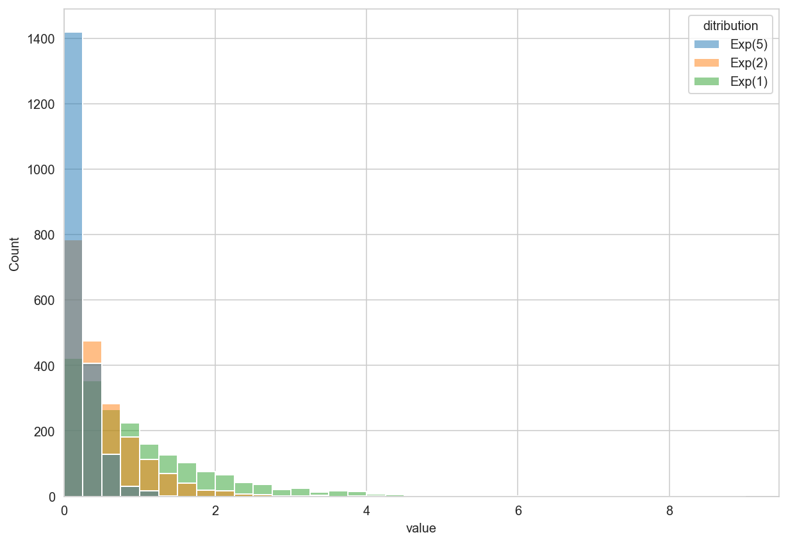


```python
df.groupby("dist").describe()
```


<div>
<style scoped>
    .dataframe tbody tr th:only-of-type {
        vertical-align: middle;
    }

    .dataframe tbody tr th {
        vertical-align: top;
    }

    .dataframe thead tr th {
        text-align: left;
    }

    .dataframe thead tr:last-of-type th {
        text-align: right;
    }
</style>
<table border="1" class="dataframe">
  <thead>
    <tr>
      <th></th>
      <th colspan="8" halign="left">value</th>
    </tr>
    <tr>
      <th></th>
      <th>count</th>
      <th>mean</th>
      <th>std</th>
      <th>min</th>
      <th>25%</th>
      <th>50%</th>
      <th>75%</th>
      <th>max</th>
    </tr>
    <tr>
      <th>dist</th>
      <th></th>
      <th></th>
      <th></th>
      <th></th>
      <th></th>
      <th></th>
      <th></th>
      <th></th>
    </tr>
  </thead>
  <tbody>
    <tr>
      <th>Exp(1)</th>
      <td>2000.0</td>
      <td>1.004431</td>
      <td>1.002062</td>
      <td>0.000989</td>
      <td>0.299602</td>
      <td>0.715611</td>
      <td>1.370826</td>
      <td>8.855657</td>
    </tr>
    <tr>
      <th>Exp(2)</th>
      <td>2000.0</td>
      <td>0.501384</td>
      <td>0.499321</td>
      <td>0.000121</td>
      <td>0.151409</td>
      <td>0.338179</td>
      <td>0.699095</td>
      <td>4.200122</td>
    </tr>
    <tr>
      <th>Exp(5)</th>
      <td>2000.0</td>
      <td>0.202095</td>
      <td>0.200053</td>
      <td>0.000083</td>
      <td>0.060100</td>
      <td>0.140224</td>
      <td>0.275023</td>
      <td>1.403199</td>
    </tr>
  </tbody>
</table>
</div>


```python
N = 2000
df = pd.concat(
    [
        pd.DataFrame(
            {"value": pm.draw(pm.Normal.dist(0, 0.2), N), "dist": "N(0, 0.2)"}
        ),
        pd.DataFrame(
            {"value": pm.draw(pm.Normal.dist(0, 0.5), N), "dist": "N(0, 0.5)"}
        ),
        pd.DataFrame({"value": pm.draw(pm.Normal.dist(0, 1), N), "dist": "N(0, 1.0)"}),
    ]
).reset_index(drop=True)

fig, ax = plt.subplots(figsize=(5, 4))
sns.histplot(data=df, x="value", hue="dist", ax=ax, kde=True)
plt.show()
```


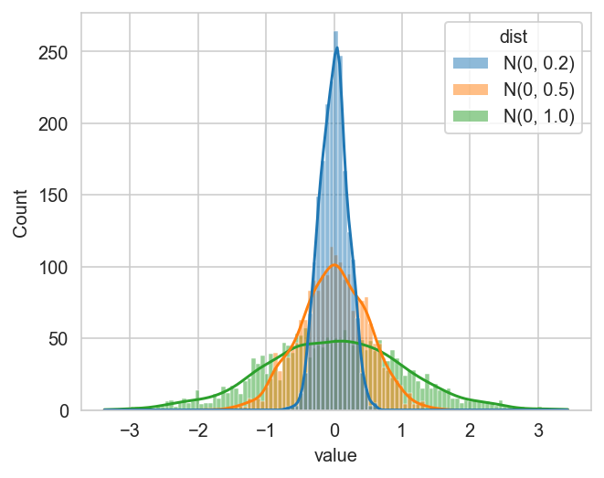


```python
N = 2000


def _hn(sigma: float) -> pd.DataFrame:
    return pd.DataFrame(
        {
            "value": pm.draw(pm.HalfNormal.dist(sigma=sigma), N),
            "dist": f"HN(0, {sigma})",
        }
    )


df = pd.concat([_hn(s) for s in [0.1, 0.2, 0.5, 1.0]]).reset_index(drop=True)

fig, ax = plt.subplots(figsize=(6, 5))
sns.histplot(data=df, x="value", hue="dist", ax=ax, kde=False)
ax.set_xlim(0, None)
plt.show()
```


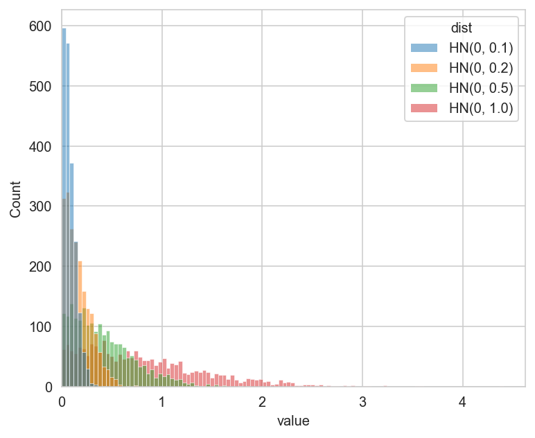


```python
df.groupby("dist").describe()
```


<div>
<style scoped>
    .dataframe tbody tr th:only-of-type {
        vertical-align: middle;
    }

    .dataframe tbody tr th {
        vertical-align: top;
    }

    .dataframe thead tr th {
        text-align: left;
    }

    .dataframe thead tr:last-of-type th {
        text-align: right;
    }
</style>
<table border="1" class="dataframe">
  <thead>
    <tr>
      <th></th>
      <th colspan="8" halign="left">value</th>
    </tr>
    <tr>
      <th></th>
      <th>count</th>
      <th>mean</th>
      <th>std</th>
      <th>min</th>
      <th>25%</th>
      <th>50%</th>
      <th>75%</th>
      <th>max</th>
    </tr>
    <tr>
      <th>dist</th>
      <th></th>
      <th></th>
      <th></th>
      <th></th>
      <th></th>
      <th></th>
      <th></th>
      <th></th>
    </tr>
  </thead>
  <tbody>
    <tr>
      <th>HN(0, 0.1)</th>
      <td>2000.0</td>
      <td>0.080161</td>
      <td>0.060702</td>
      <td>0.000063</td>
      <td>0.033607</td>
      <td>0.066828</td>
      <td>0.114782</td>
      <td>0.429192</td>
    </tr>
    <tr>
      <th>HN(0, 0.2)</th>
      <td>2000.0</td>
      <td>0.162718</td>
      <td>0.123182</td>
      <td>0.000160</td>
      <td>0.064127</td>
      <td>0.139831</td>
      <td>0.238404</td>
      <td>0.739642</td>
    </tr>
    <tr>
      <th>HN(0, 0.5)</th>
      <td>2000.0</td>
      <td>0.406164</td>
      <td>0.305111</td>
      <td>0.000417</td>
      <td>0.163468</td>
      <td>0.348269</td>
      <td>0.580013</td>
      <td>1.844951</td>
    </tr>
    <tr>
      <th>HN(0, 1.0)</th>
      <td>2000.0</td>
      <td>0.795054</td>
      <td>0.602840</td>
      <td>0.000103</td>
      <td>0.329332</td>
      <td>0.677567</td>
      <td>1.140364</td>
      <td>4.406250</td>
    </tr>
  </tbody>
</table>
</div>


```python
N = 2000
df = pd.DataFrame()
df = pd.concat(
    [
        df,
        pd.DataFrame(
            {"value": pm.draw(pm.NegativeBinomial.dist(1, 1), N), "dist": "NB(1,1)"}
        ),
        pd.DataFrame(
            {"value": pm.draw(pm.NegativeBinomial.dist(10, 1), N), "dist": "NB(10,1)"}
        ),
        pd.DataFrame(
            {"value": pm.draw(pm.NegativeBinomial.dist(10, 5), N), "dist": "NB(10,5)"}
        ),
        pd.DataFrame(
            {
                "value": pm.draw(pm.NegativeBinomial.dist(10, 10), N),
                "dist": "NB(10,10)",
            }
        ),
    ]
)
df = df.reset_index(drop=True)
ax = sns.histplot(data=df, x="value", hue="dist", kde=True, binwidth=1)
ax.set_xlim(0, None)
```


    (0.0, 101.85)


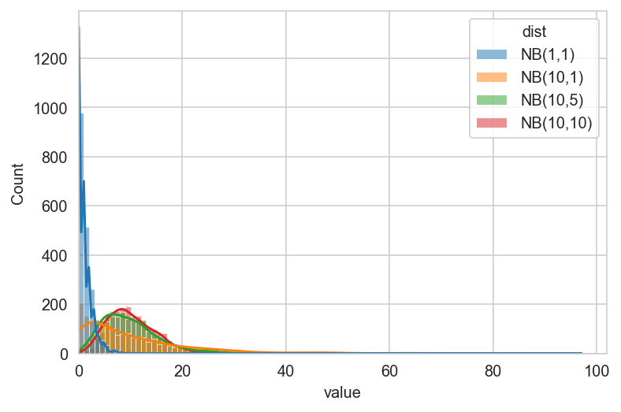


```python
N = 2000


def _lkj(eta: int) -> pd.DataFrame:
    return pd.DataFrame(
        {
            "value": pm.draw(pm.LKJCorr.dist(n=2, eta=eta), N).flatten(),
            "dist": f"eta={eta}",
        }
    )


df = pd.concat([_lkj(i) for i in range(1, 6)]).reset_index(drop=True)

fig, ax = plt.subplots(figsize=(5, 4))
sns.histplot(data=df, x="value", hue="dist", kde=True, binwidth=0.1, ax=ax)
ax.set_xlim(-1, 1)
ax.set_title("Example LKJCorr distributions")
plt.show()
```


```python
df.groupby("dist").describe()
```


<div>
<style scoped>
    .dataframe tbody tr th:only-of-type {
        vertical-align: middle;
    }

    .dataframe tbody tr th {
        vertical-align: top;
    }

    .dataframe thead tr th {
        text-align: left;
    }

    .dataframe thead tr:last-of-type th {
        text-align: right;
    }
</style>
<table border="1" class="dataframe">
  <thead>
    <tr>
      <th></th>
      <th colspan="8" halign="left">value</th>
    </tr>
    <tr>
      <th></th>
      <th>count</th>
      <th>mean</th>
      <th>std</th>
      <th>min</th>
      <th>25%</th>
      <th>50%</th>
      <th>75%</th>
      <th>max</th>
    </tr>
    <tr>
      <th>dist</th>
      <th></th>
      <th></th>
      <th></th>
      <th></th>
      <th></th>
      <th></th>
      <th></th>
      <th></th>
    </tr>
  </thead>
  <tbody>
    <tr>
      <th>eta=1</th>
      <td>2000.0</td>
      <td>-0.004073</td>
      <td>0.583182</td>
      <td>-0.999269</td>
      <td>-0.521883</td>
      <td>-0.017886</td>
      <td>0.512324</td>
      <td>0.999830</td>
    </tr>
    <tr>
      <th>eta=2</th>
      <td>2000.0</td>
      <td>0.001007</td>
      <td>0.453277</td>
      <td>-0.972660</td>
      <td>-0.343626</td>
      <td>-0.000968</td>
      <td>0.348912</td>
      <td>0.996988</td>
    </tr>
    <tr>
      <th>eta=3</th>
      <td>2000.0</td>
      <td>0.002012</td>
      <td>0.382143</td>
      <td>-0.964944</td>
      <td>-0.289725</td>
      <td>0.003653</td>
      <td>0.296475</td>
      <td>0.964445</td>
    </tr>
    <tr>
      <th>eta=4</th>
      <td>2000.0</td>
      <td>0.012468</td>
      <td>0.327537</td>
      <td>-0.884178</td>
      <td>-0.229669</td>
      <td>0.019025</td>
      <td>0.255508</td>
      <td>0.923625</td>
    </tr>
    <tr>
      <th>eta=5</th>
      <td>2000.0</td>
      <td>-0.008338</td>
      <td>0.306484</td>
      <td>-0.894606</td>
      <td>-0.231391</td>
      <td>-0.004932</td>
      <td>0.206752</td>
      <td>0.868661</td>
    </tr>
  </tbody>
</table>
</div>


## Modeling


```python
from speclet.bayesian_models.lineage_hierarchical_nb import LineageHierNegBinomModel
```

    [autoreload of speclet.bayesian_models.lineage_hierarchical_nb failed: Traceback (most recent call last):
      File "/usr/local/Caskroom/miniconda/base/envs/speclet/lib/python3.10/site-packages/IPython/extensions/autoreload.py", line 257, in check
        superreload(m, reload, self.old_objects)
      File "/usr/local/Caskroom/miniconda/base/envs/speclet/lib/python3.10/site-packages/IPython/extensions/autoreload.py", line 480, in superreload
        update_generic(old_obj, new_obj)
      File "/usr/local/Caskroom/miniconda/base/envs/speclet/lib/python3.10/site-packages/IPython/extensions/autoreload.py", line 377, in update_generic
        update(a, b)
      File "/usr/local/Caskroom/miniconda/base/envs/speclet/lib/python3.10/site-packages/IPython/extensions/autoreload.py", line 345, in update_class
        update_instances(old, new)
      File "/usr/local/Caskroom/miniconda/base/envs/speclet/lib/python3.10/site-packages/IPython/extensions/autoreload.py", line 303, in update_instances
        ref.__class__ = new
      File "pydantic/main.py", line 357, in pydantic.main.BaseModel.__setattr__
    ValueError: "LineageHierNegBinomModelConfig" object has no field "__class__"
    ]


```python
crc_model = LineageHierNegBinomModel(
    lineage="colorectal", reduce_deterministic_vars=False
)
valid_crc_data = crc_model.data_processing_pipeline(crc_data.copy())
model_crc_data = crc_model.make_data_structure(valid_crc_data.copy())
```

    [INFO] 2022-08-07 09:01:54 [(lineage_hierarchical_nb.py:data_processing_pipeline:287] Processing data for modeling.
    [INFO] 2022-08-07 09:01:54 [(lineage_hierarchical_nb.py:data_processing_pipeline:288] LFC limits: (-5.0, 5.0)
    [WARNING] 2022-08-07 09:01:55 [(lineage_hierarchical_nb.py:data_processing_pipeline:339] number of data points dropped: 0
    [INFO] 2022-08-07 09:01:55 [(lineage_hierarchical_nb.py:target_gene_is_mutated_vector:536] number of genes mutated in all cells lines: 1
    [DEBUG] 2022-08-07 09:01:55 [(lineage_hierarchical_nb.py:target_gene_is_mutated_vector:539] Genes always mutated: APC
    [DEBUG] 2022-08-07 09:01:55 [(cancer_gene_mutation_matrix.py:_trim_cancer_genes:68] all_mut: {}
    [INFO] 2022-08-07 09:01:55 [(cancer_gene_mutation_matrix.py:_trim_cancer_genes:77] Dropping 2 cancer genes.
    [DEBUG] 2022-08-07 09:01:55 [(cancer_gene_mutation_matrix.py:_trim_cancer_genes:79] Dropped cancer genes: ['APC', 'MDM2']


```python
model_crc_data.coords["cancer_gene"]
```


    ['FBXW7', 'KRAS', 'PIK3CA']


```python
m = model_crc_data.comutation_matrix
m.min(axis=0), m.max(axis=0)
```


    (array([-0.77077619, -0.9938461 , -0.77077619]),
     array([1.29739347, 1.00619201, 1.29739347]))


```python
crc_pymc_model = crc_model.pymc_model(crispr_data_manager.data.copy())
pm.model_to_graphviz(crc_pymc_model)
```

    [INFO] 2022-08-07 09:01:58 [(lineage_hierarchical_nb.py:data_processing_pipeline:287] Processing data for modeling.
    [INFO] 2022-08-07 09:01:58 [(lineage_hierarchical_nb.py:data_processing_pipeline:288] LFC limits: (-5.0, 5.0)
    [WARNING] 2022-08-07 09:01:59 [(lineage_hierarchical_nb.py:data_processing_pipeline:339] number of data points dropped: 0
    [INFO] 2022-08-07 09:01:59 [(lineage_hierarchical_nb.py:target_gene_is_mutated_vector:536] number of genes mutated in all cells lines: 1
    [DEBUG] 2022-08-07 09:01:59 [(lineage_hierarchical_nb.py:target_gene_is_mutated_vector:539] Genes always mutated: APC
    [DEBUG] 2022-08-07 09:01:59 [(cancer_gene_mutation_matrix.py:_trim_cancer_genes:68] all_mut: {}
    [INFO] 2022-08-07 09:01:59 [(cancer_gene_mutation_matrix.py:_trim_cancer_genes:77] Dropping 2 cancer genes.
    [DEBUG] 2022-08-07 09:01:59 [(cancer_gene_mutation_matrix.py:_trim_cancer_genes:79] Dropped cancer genes: ['APC', 'MDM2']
    [INFO] 2022-08-07 09:02:00 [(lineage_hierarchical_nb.py:_pre_model_messages:343] Lineage: colorectal
    [INFO] 2022-08-07 09:02:00 [(lineage_hierarchical_nb.py:_pre_model_messages:344] Number of genes: 103
    [INFO] 2022-08-07 09:02:00 [(lineage_hierarchical_nb.py:_pre_model_messages:345] Number of sgRNA: 162
    [INFO] 2022-08-07 09:02:00 [(lineage_hierarchical_nb.py:_pre_model_messages:346] Number of cell lines: 8
    [INFO] 2022-08-07 09:02:00 [(lineage_hierarchical_nb.py:_pre_model_messages:347] Number of cancer genes: 3
    [INFO] 2022-08-07 09:02:00 [(lineage_hierarchical_nb.py:_pre_model_messages:348] Number of screens: 1
    [INFO] 2022-08-07 09:02:00 [(lineage_hierarchical_nb.py:_pre_model_messages:349] Number of data points: 1296
    [INFO] 2022-08-07 09:02:00 [(lineage_hierarchical_nb.py:_pre_model_messages:354] Including all non-essential deterministic variables.
    [DEBUG] 2022-08-07 09:02:00 [(lineage_hierarchical_nb.py:pymc_model:390] shape of cancer gene matrix: (1296, 3)
    [DEBUG] 2022-08-07 09:02:00 [(lineage_hierarchical_nb.py:pymc_model:405] location for `mu_mu_a`: 0.1523


```python
with crc_pymc_model:
    pm_prior_pred = pm.sample_prior_predictive(
        var_names=["eta", "ct_final", "mu_a", "gene_effect"], random_seed=SEED
    )

print("prior predictive distribution")
pm_pred_draws = pm_prior_pred.prior_predictive["ct_final"].values.squeeze()
for q in [0, 0.01, 0.1, 0.2, 0.3, 0.4, 0.5, 0.6, 0.7, 0.8, 0.9, 0.99, 1]:
    res = np.quantile(pm_pred_draws, q=q)
    print(f"  {int(q*100)}%: {int(res):0,d}")

print("")
obs = valid_crc_data["counts_final"].astype(int)
print(f"final counts\n  min: {np.min(obs):,d},  max: {np.max(obs):,d}")

obs = valid_crc_data["counts_initial_adj"].astype(int)
print(f"initial counts\n  min: {np.min(obs):,d},  max: {np.max(obs):,d}")
```

    prior predictive distribution
      0%: 0
      1%: 0
      10%: 7
      20%: 42
      30%: 98
      40%: 181
      50%: 304
      60%: 493
      70%: 811
      80%: 1,433
      90%: 3,176
      99%: 25,592
      100%: 46,583,789

    final counts
      min: 0,  max: 9,819
    initial counts
      min: 57,  max: 4,741


```python
eta_prior = np.random.choice(pm_prior_pred.prior["eta"].values.flatten(), 2000)
ge_prior = np.random.choice(pm_prior_pred.prior["gene_effect"].values.flatten(), 4000)
mu_prior = np.random.choice(pm_prior_pred.prior["mu_a"].values.flatten(), 4000)

fig, axes = plt.subplots(ncols=3, figsize=(9, 3))
sns.histplot(mu_prior, kde=True, ax=axes[0], binwidth=0.5, stat="proportion")
sns.histplot(ge_prior, kde=True, ax=axes[1], binwidth=1, stat="proportion")
sns.histplot(eta_prior, kde=True, ax=axes[2], binwidth=1, stat="proportion")
axes[0].set_xlabel(r"$\mu_a$")
axes[1].set_xlabel(r"gene effect")
axes[2].set_xlabel(r"$\eta$")

for ax in axes.flatten():
    ax.set_ylabel(None)
    ax.set_title(None)

fig.supylabel("proportion")
fig.suptitle("Prior predictive distribution")
fig.tight_layout()
plt.show()
```


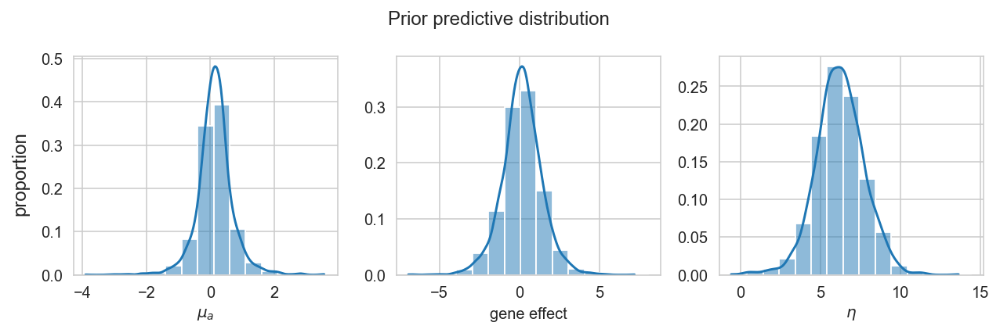


```python
fig, axes = plt.subplots(nrows=3, ncols=1, figsize=(8, 7))

stat = "proportion"

obs_max = crc_data["counts_final"].max()
truncated_prior_preds = [x for x in pm_pred_draws.flatten() if x <= obs_max]

prior_pred_pal = {"prior pred.": "tab:orange", "observed": "gray"}

# Untransformed
bw: float = 100
sns.histplot(
    x=truncated_prior_preds,
    ax=axes[0],
    binwidth=bw,
    stat=stat,
    color=prior_pred_pal["prior pred."],
)
sns.histplot(
    x=valid_crc_data["counts_final"],
    ax=axes[0],
    binwidth=bw,
    stat=stat,
    color=prior_pred_pal["observed"],
)
# Log10 transformed
bw = 0.25
sns.histplot(
    x=np.log10(pm_pred_draws.flatten() + 1),
    ax=axes[1],
    binwidth=bw,
    stat=stat,
    color=prior_pred_pal["prior pred."],
)
sns.histplot(
    x=np.log10(valid_crc_data["counts_final"] + 1),
    ax=axes[1],
    binwidth=bw,
    stat=stat,
    color=prior_pred_pal["observed"],
)
# Log-fold change
pp_lfc = np.log(
    (pm_pred_draws + 1) / (valid_crc_data["counts_initial_adj"].values[None, :])
)
obs_lfc = np.log(
    (valid_crc_data["counts_final"] + 1) / valid_crc_data["counts_initial_adj"]
)
bw = 0.5
sns.histplot(
    x=pp_lfc.flatten(),
    ax=axes[2],
    binwidth=bw,
    stat=stat,
    color=prior_pred_pal["prior pred."],
)
sns.histplot(
    x=obs_lfc,
    ax=axes[2],
    binwidth=bw,
    stat=stat,
    color=prior_pred_pal["observed"],
)


axes[0].set_xlabel("final counts")
axes[1].set_xlabel("log10(final counts + 1)")
axes[2].set_xlabel("log((final + 1) / initial)")

prior_pred_leg_handles = [
    Line2D([0], [0], linewidth=10, color=v, label=k) for k, v in prior_pred_pal.items()
]
axes[0].legend(handles=prior_pred_leg_handles, loc="upper right", frameon=False)

for ax in axes.flatten():
    ax.set_ylabel(stat)

plt.tight_layout()
plt.show()
```


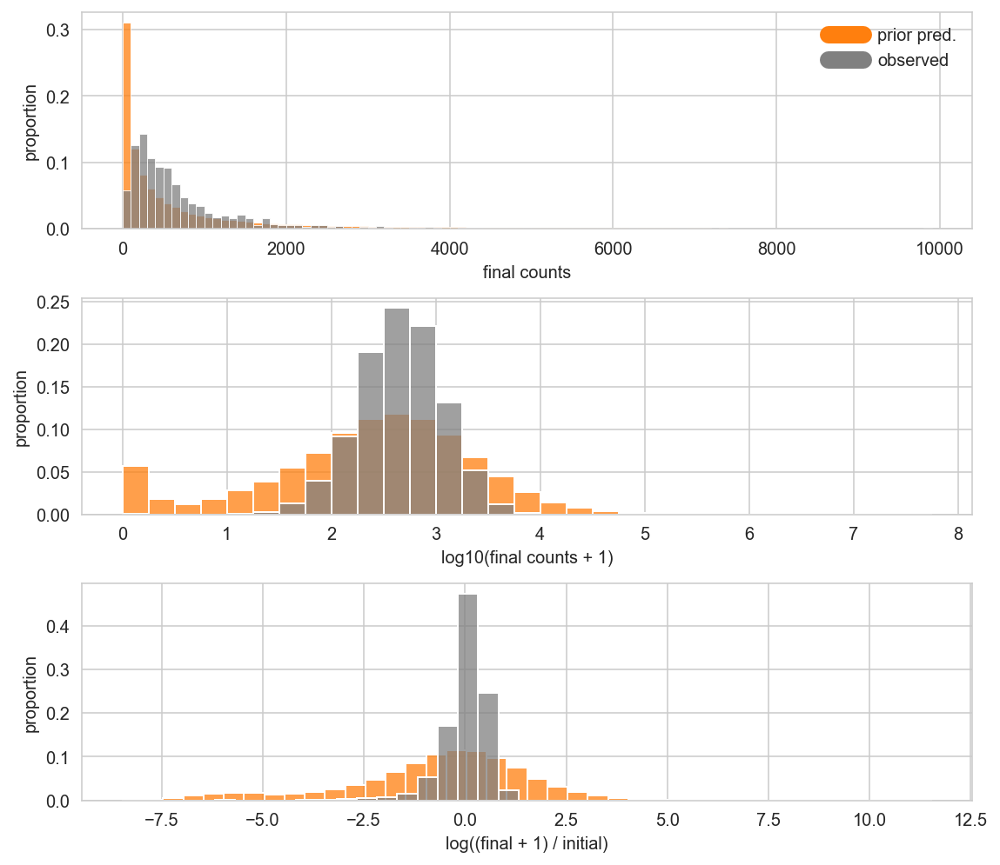


## Sampling


```python
with crc_pymc_model:
    trace = pymc.sampling_jax.sample_numpyro_nuts(
        draws=500,
        tune=1000,
        target_accept=0.90,
        random_seed=SEED,
        idata_kwargs={"log_likelihood": False},
        nuts_kwargs={"step_size": 0.1, "max_tree_depth": 12}
        # discard_tuned_samples=False,
    )
    pm.sample_posterior_predictive(trace, extend_inferencedata=True, random_seed=SEED)
```

    Compiling...
    Compilation time =  0:00:23.104257
    Sampling...


      0%|          | 0/1500 [00:00<?, ?it/s]


      0%|          | 0/1500 [00:00<?, ?it/s]


      0%|          | 0/1500 [00:00<?, ?it/s]


      0%|          | 0/1500 [00:00<?, ?it/s]


    Sampling time =  0:02:25.782463
    Transforming variables...
    Transformation time =  0:00:05.376335


<style>
    /* Turns off some styling */
    progress {
        /* gets rid of default border in Firefox and Opera. */
        border: none;
        /* Needs to be in here for Safari polyfill so background images work as expected. */
        background-size: auto;
    }
    progress:not([value]), progress:not([value])::-webkit-progress-bar {
        background: repeating-linear-gradient(45deg, #7e7e7e, #7e7e7e 10px, #5c5c5c 10px, #5c5c5c 20px);
    }
    .progress-bar-interrupted, .progress-bar-interrupted::-webkit-progress-bar {
        background: #F44336;
    }
</style>


<div>
  <progress value='2000' class='' max='2000' style='width:300px; height:20px; vertical-align: middle;'></progress>
  100.00% [2000/2000 00:01&lt;00:00]
</div>


```python
saved_warmup = hasattr(trace, "warmup_sample_stats")
```

## Posterior analysis


```python
describe_mcmc(trace);
```

    date created: 2022-08-07 13:05
    sampled 4 chains with (unknown) tuning steps and 500 draws
    num. divergences: 0, 0, 0, 0
    percent divergences: 0.0, 0.0, 0.0, 0.0
    BFMI: 0.738, 0.736, 0.737, 0.727
    avg. step size: 0.08, 0.074, 0.107, 0.091
    avg. accept prob.: 0.87, 0.932, 0.849, 0.868
    avg. tree depth: 6.0, 6.0, 5.002, 6.0


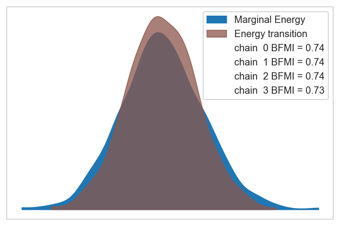


```python
if saved_warmup:
    ar = trace.warmup_sample_stats.acceptance_rate.values
    ss = trace.warmup_sample_stats.step_size.values
    n_chains = ss.shape[0]
    x = np.arange(ss.shape[1])
    fig, axes = plt.subplots(n_chains // 2, 2, figsize=(8, 4), sharex=True, sharey=True)
    for c, ax in enumerate(axes.flatten()):
        sns.scatterplot(x=x, y=ar[c, :], color="tab:blue", edgecolor=None, s=2, ax=ax)
        sns.scatterplot(x=x, y=ss[c, :], color="tab:green", edgecolor=None, s=2, ax=ax)

    fig.tight_layout()
    plt.show()
```


```python
ar = trace.sample_stats.acceptance_rate.values
ss = trace.sample_stats.step_size.values
n_chains = ss.shape[0]
x = np.arange(ss.shape[1])
fig, axes = plt.subplots(n_chains // 2, 2, figsize=(8, 4), sharex=True, sharey=True)
for c, ax in enumerate(axes.flatten()):
    sns.scatterplot(x=x, y=ar[c, :], color="tab:blue", edgecolor=None, s=2, ax=ax)
    sns.scatterplot(x=x, y=ss[c, :], color="tab:green", edgecolor=None, s=2, ax=ax)
    ax.set_title(f"chain {c}")

fig.tight_layout()
plt.show()
```


```python
stat_cats = ["energy", "step_size", "n_steps", "acceptance_rate", "tree_depth"]
trace.sample_stats.get(stat_cats).to_dataframe().groupby("chain").mean().round(3)
```


<div>
<style scoped>
    .dataframe tbody tr th:only-of-type {
        vertical-align: middle;
    }

    .dataframe tbody tr th {
        vertical-align: top;
    }

    .dataframe thead th {
        text-align: right;
    }
</style>
<table border="1" class="dataframe">
  <thead>
    <tr style="text-align: right;">
      <th></th>
      <th>energy</th>
      <th>step_size</th>
      <th>n_steps</th>
      <th>acceptance_rate</th>
      <th>tree_depth</th>
    </tr>
    <tr>
      <th>chain</th>
      <th></th>
      <th></th>
      <th></th>
      <th></th>
      <th></th>
    </tr>
  </thead>
  <tbody>
    <tr>
      <th>0</th>
      <td>10201.482</td>
      <td>0.080</td>
      <td>63.000</td>
      <td>0.870</td>
      <td>6.000</td>
    </tr>
    <tr>
      <th>1</th>
      <td>10192.476</td>
      <td>0.074</td>
      <td>63.000</td>
      <td>0.932</td>
      <td>6.000</td>
    </tr>
    <tr>
      <th>2</th>
      <td>10204.631</td>
      <td>0.107</td>
      <td>31.064</td>
      <td>0.849</td>
      <td>5.002</td>
    </tr>
    <tr>
      <th>3</th>
      <td>10201.173</td>
      <td>0.091</td>
      <td>63.000</td>
      <td>0.868</td>
      <td>6.000</td>
    </tr>
  </tbody>
</table>
</div>


```python
if saved_warmup:
    print(trace.warmup_posterior["sigma_mu_a"].values[:, 0:5])
```


```python
if saved_warmup:
    az.plot_trace(
        trace.warmup_posterior,
        var_names=crc_model.vars_regex() + ["~^h$"],
        filter_vars="regex",
        coords={"draw": list(range(100))},
    )
    plt.tight_layout()
    plt.show()
```


```python
if saved_warmup:
    az.plot_trace(
        trace.warmup_posterior,
        var_names=crc_model.vars_regex() + ["~^h$"],
        filter_vars="regex",
    )
    plt.tight_layout()
    plt.show()
```


```python
az.plot_trace(trace, var_names=crc_model.vars_regex() + ["~^h$"], filter_vars="regex")
plt.tight_layout();
```


```python
n_chains = len(trace.posterior.coords["chain"])
fig, axes = plt.subplots(2, 2, figsize=(6, 5))
for c, ax in enumerate(axes.flatten()):
    cor_mat = trace.posterior["genes_chol_cov_corr"][c, :, :, :].mean(axis=(0))
    sns.heatmap(cor_mat, vmin=-1, vmax=1, cmap="coolwarm", ax=ax)

fig.tight_layout()
plt.show()
```


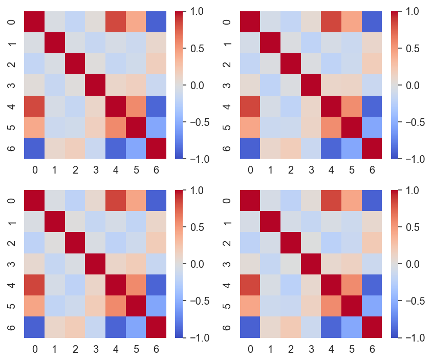


```python
n_chains = len(trace.posterior.coords["chain"])
fig, axes = plt.subplots(2, 2, figsize=(5, 4))
for c, ax in enumerate(axes.flatten()):
    cor_mat = trace.posterior["cells_chol_cov_corr"][c, :, :, :].mean(axis=(0))
    sns.heatmap(cor_mat, vmin=-1, vmax=1, cmap="coolwarm", ax=ax)

fig.tight_layout()
plt.show()
```


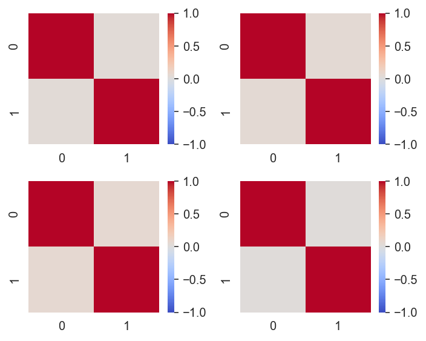


```python
axes = az.plot_forest(
    trace,
    var_names=["mu_b", "mu_d", "mu_f", "mu_h", "^sigma.*$"],
    filter_vars="regex",
    combined=True,
    figsize=(5, 5),
    r_hat=True,
)
line = axes[0].axvline(color="k", alpha=0.5, linewidth=1)
line.set_zorder(0)
plt.show()
```


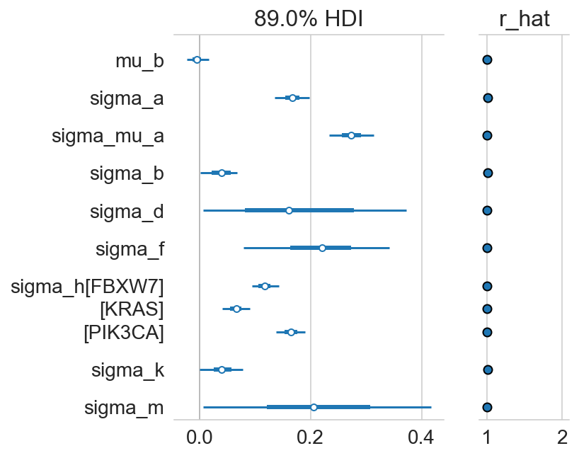


```python
axes = az.plot_forest(
    trace, var_names=["k", "m"], combined=True, r_hat=True, figsize=(5, 6)
)
line = axes[0].axvline(color="gray")
line.set_zorder(0)
plt.show()
```


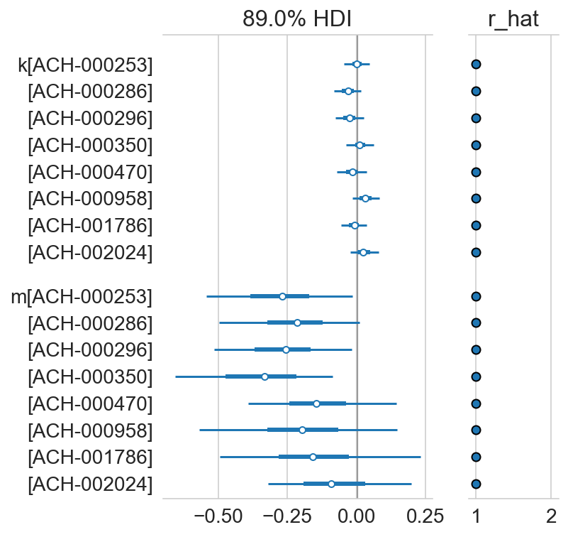


```python
gene_order = (
    az.summary(trace, var_names=["mu_a"], kind="stats")
    .pipe(extract_coords_param_names, names=["hugo_symbol"])
    .sort_values("mean")["hugo_symbol"]
    .tolist()
)

sgrna_to_gene_map = (
    crc_data[["hugo_symbol", "sgrna"]].drop_duplicates().reset_index(drop=True)
)
a_post = (
    az.summary(trace, var_names=["a"], kind="stats")
    .pipe(extract_coords_param_names, names=["sgrna"])
    .reset_index(drop=True)
    .merge(sgrna_to_gene_map, on="sgrna", validate="one_to_one")
)
mu_a_post = (
    az.summary(trace, var_names=["mu_a"], kind="stats")
    .pipe(extract_coords_param_names, names=["hugo_symbol"])
    .reset_index(drop=True)
)

a_post["hugo_symbol"] = pd.Categorical(
    a_post["hugo_symbol"], categories=gene_order, ordered=True
)
a_post = a_post.sort_values("hugo_symbol").reset_index(drop=True)
mu_a_post["hugo_symbol"] = pd.Categorical(
    mu_a_post["hugo_symbol"], categories=gene_order, ordered=True
)
mu_a_post = mu_a_post.sort_values("hugo_symbol").reset_index(drop=True)

mu_mu_a_post = az.summary(trace, var_names=["mu_mu_a"], kind="stats")
assert len(mu_mu_a_post) == 1
mu_mu_a_avg = mu_mu_a_post["mean"][0]
mu_mu_a_hdi = (mu_mu_a_post["hdi_5.5%"][0], mu_mu_a_post["hdi_94.5%"][0])

fig, ax = plt.subplots(figsize=(4, 20))
# plt.axvline(0, color="grey")

# Population average and HDI
plt.fill_between(x=mu_mu_a_hdi, y1=-1, y2=len(mu_a_post), alpha=0.1)
plt.axvline(mu_mu_a_avg, color="k", linestyle="--")

# Gene estimates.
plt.hlines(
    y=mu_a_post["hugo_symbol"],
    xmin=mu_a_post["hdi_5.5%"],
    xmax=mu_a_post["hdi_94.5%"],
    color="tab:blue",
    linewidth=2,
)
plt.scatter(x=mu_a_post["mean"], y=mu_a_post["hugo_symbol"], s=20, c="tab:blue")

# sgRNA estimates.
plt.hlines(
    y=a_post["hugo_symbol"],
    xmin=a_post["hdi_5.5%"],
    xmax=a_post["hdi_94.5%"],
    color="tab:red",
    linewidth=1,
    alpha=0.5,
)
plt.scatter(x=a_post["mean"], y=a_post["hugo_symbol"], s=10, c="tab:red")

plt.ylim(-1, len(mu_a_post))
plt.show()
```


```python
top_mut_effect_genes = (
    az.summary(trace, var_names=["f"])
    .sort_values("mean")
    .pipe(head_tail)
    .pipe(extract_coords_param_names, "hugo_symbol")["hugo_symbol"]
    .tolist()
)
ax = az.plot_forest(
    trace,
    var_names=["f"],
    coords={"gene": top_mut_effect_genes},
    combined=True,
    figsize=(5, 6),
)
ax[0].axvline(0, color="k")
plt.show()
```


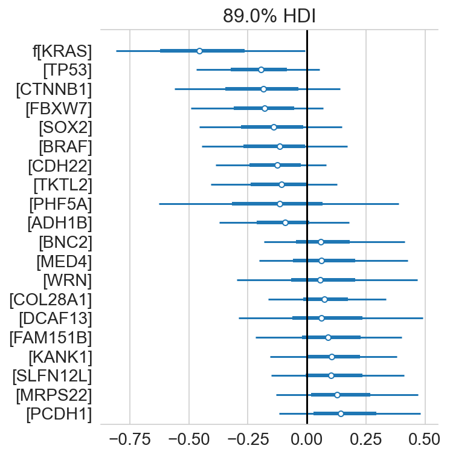


```python
az.plot_pair(
    trace,
    var_names=["mu_a", "b", "d", "f"],
    coords={"gene": ["BRAF"]},
    scatter_kwargs={"alpha": 0.25, "markersize": 1},
    figsize=(6, 6),
)
plt.tight_layout()
plt.show()
```


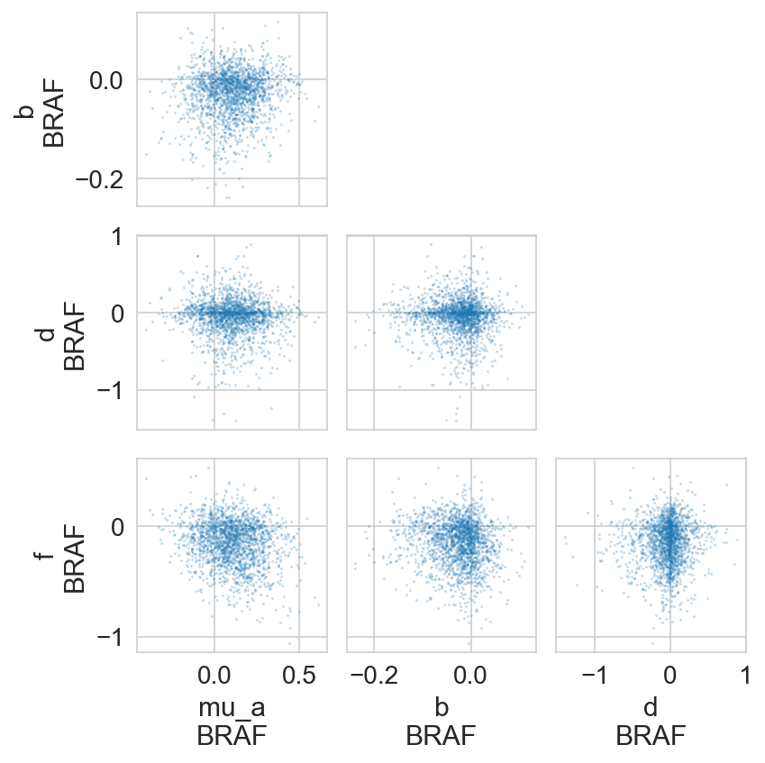


```python
az.plot_pair(
    trace,
    var_names=["mu_mu_a", "mu_b", "mu_m"],
    scatter_kwargs={"alpha": 0.5, "markersize": 1},
    figsize=(5, 5),
)
plt.tight_layout()
plt.show()
```


```python
az.plot_pair(
    trace,
    var_names=["d", "m"],
    coords={
        "gene": crc_data["hugo_symbol"].cat.categories[:3],
        "cell_line": crc_data["depmap_id"].cat.categories[:2],
    },
    scatter_kwargs={"alpha": 0.5, "markersize": 1},
    figsize=(9, 9),
)
plt.tight_layout()
plt.show()
```


```python
for var_name in ["mu_a", "b", "d", "h"]:
    az.plot_pair(
        trace,
        var_names=[var_name],
        coords={
            "gene": crc_data["hugo_symbol"].cat.categories[:5],
            "cancer_gene": ["KRAS"],
        },
        scatter_kwargs={"alpha": 0.5, "markersize": 1},
        figsize=(9, 9),
    )
    plt.tight_layout()
    plt.show()
```


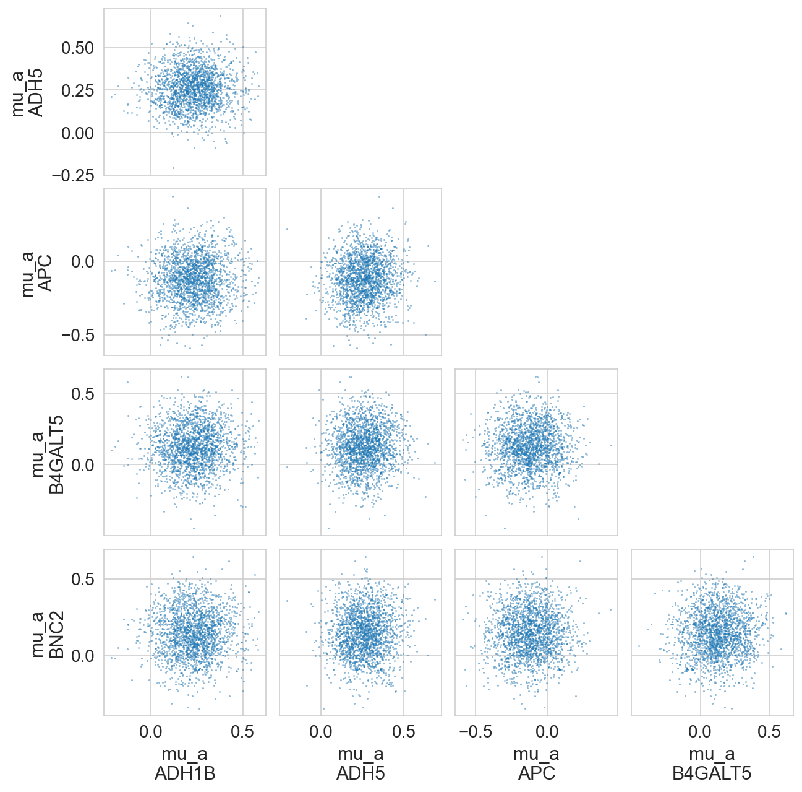


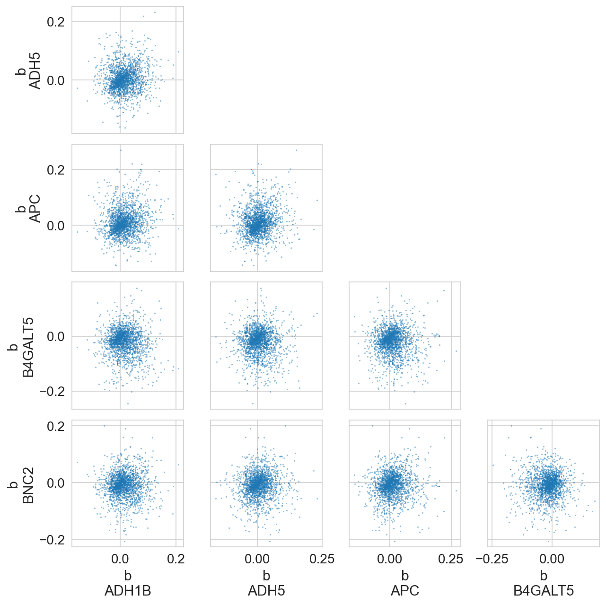


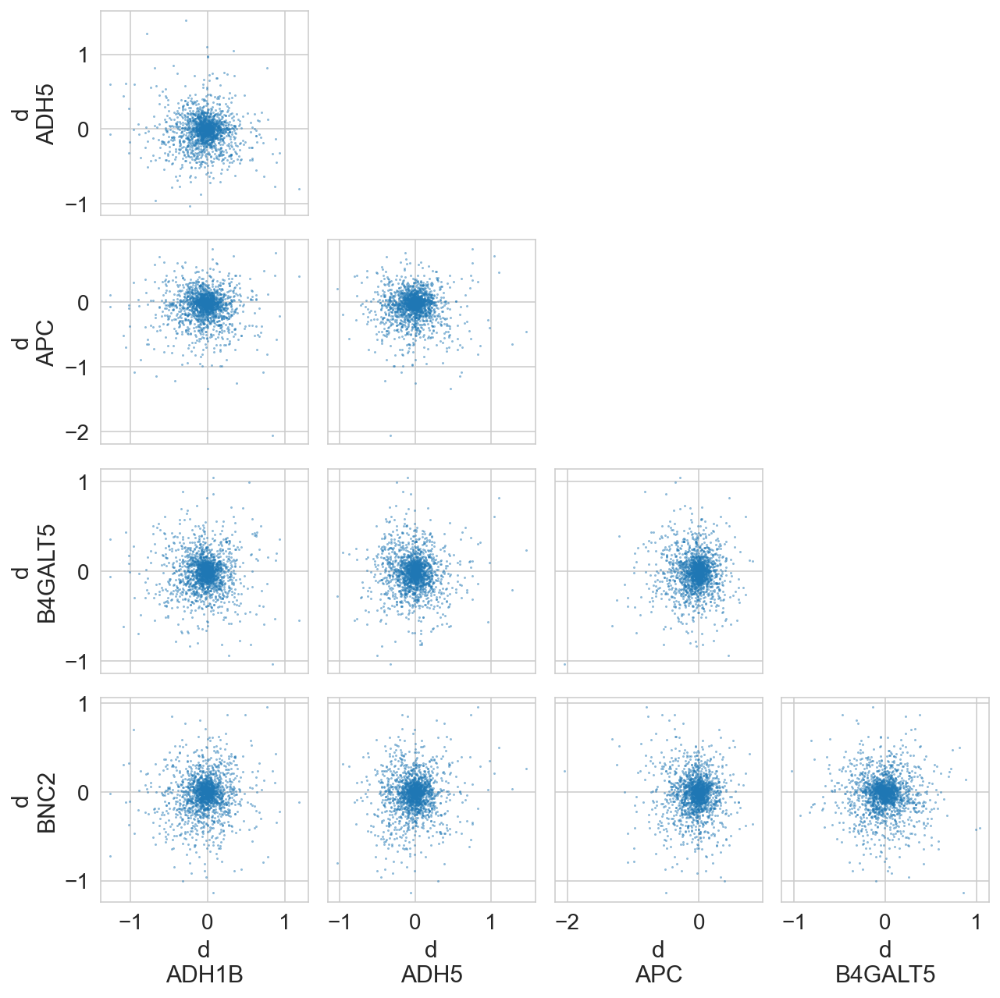


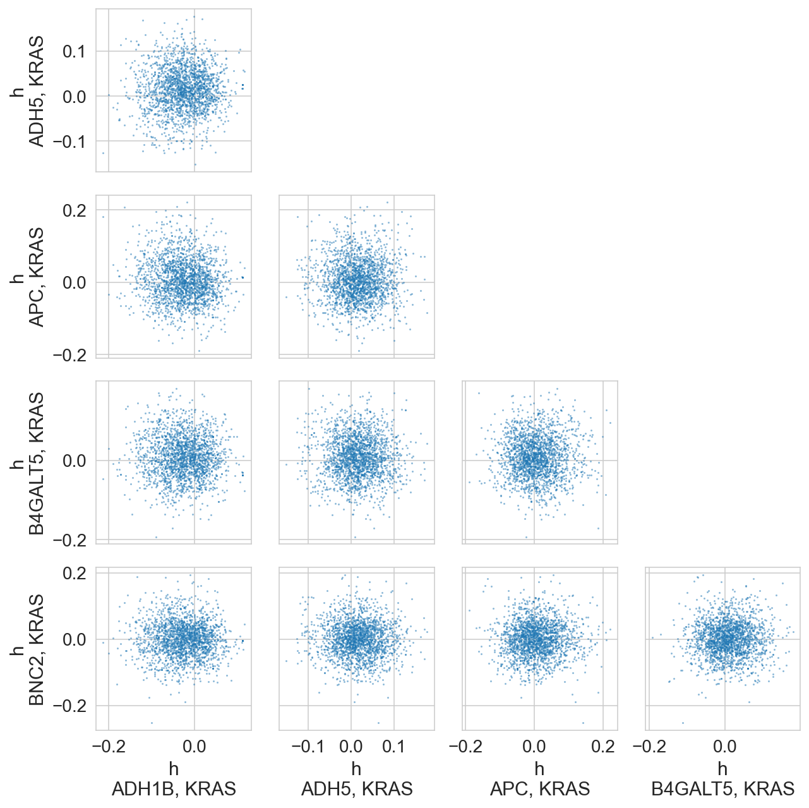


```python
for var_name in ["k", "m"]:
    az.plot_pair(
        trace,
        var_names=[var_name],
        coords={
            "cell_line": crc_data["depmap_id"].cat.categories[:5],
        },
        scatter_kwargs={"alpha": 0.5, "markersize": 1},
        figsize=(9, 9),
    )
    plt.tight_layout()
    plt.show()
```


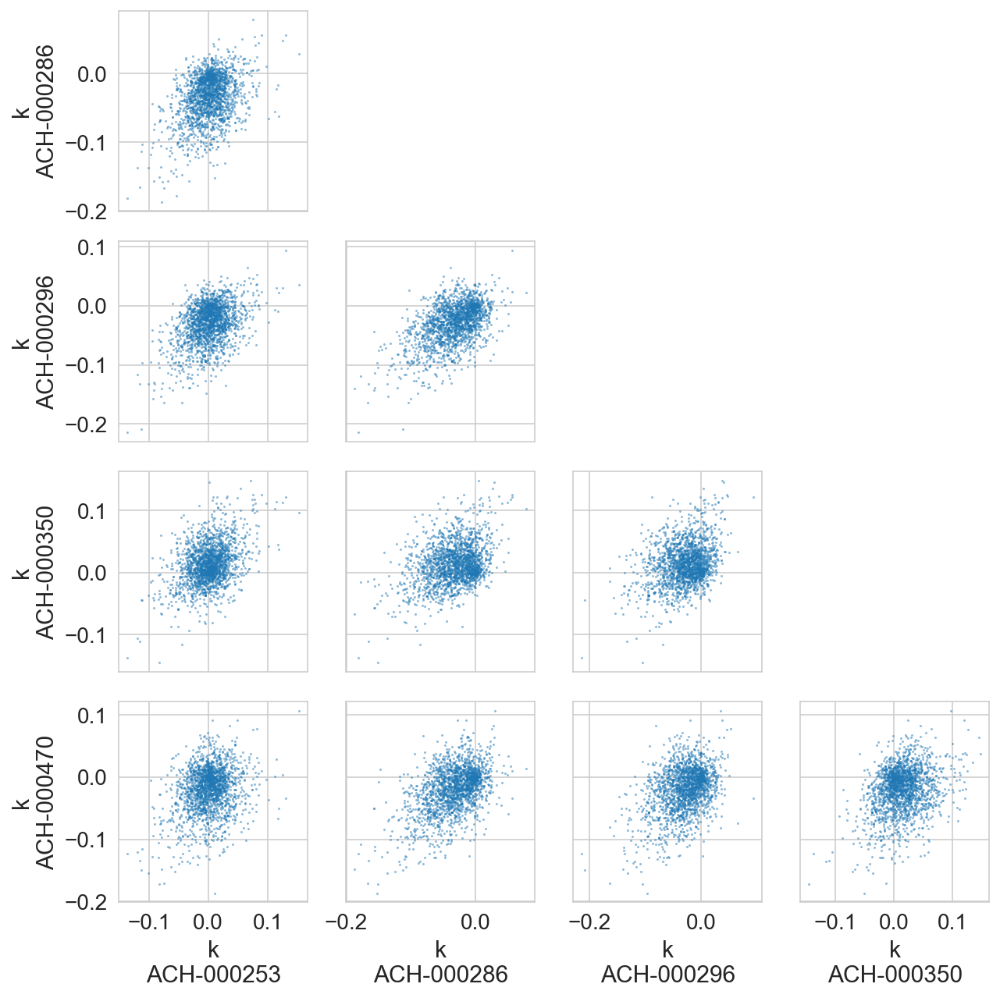


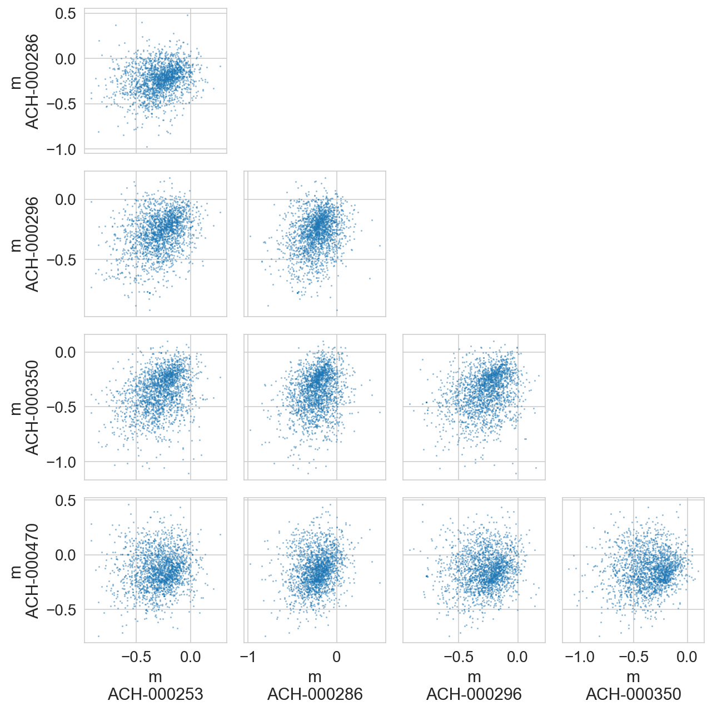


```python
cn_data = valid_crc_data[
    ["hugo_symbol", "depmap_id", "cn_gene", "cn_cell_line"]
].drop_duplicates()
ax = sns.scatterplot(
    data=cn_data,
    x="cn_gene",
    y="cn_cell_line",
    hue="depmap_id",
    s=10,
    alpha=0.7,
    edgecolor=None,
)
sns.move_legend(ax, loc="upper left", bbox_to_anchor=(1, 1))
plt.show()
```


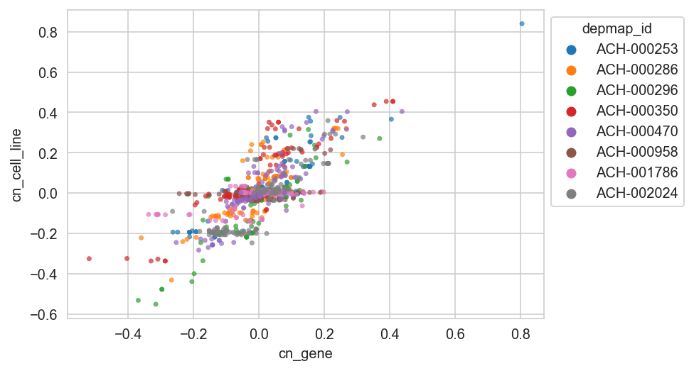


```python
gene_effects = (
    trace.posterior.get(["mu_a", "b", "d", "f", "h"])
    .to_dataframe()
    .groupby(["gene"])
    .mean()
)
g = sns.pairplot(
    gene_effects,
    corner=True,
    diag_kind="kde",
    height=2,
    aspect=1,
    plot_kws={"edgecolor": None, "alpha": 0.7, "s": 10, "color": "tab:blue"},
)
g.map_lower(sns.kdeplot, levels=4, color="gray", alpha=0.5)
# g.map_lower(lambda *args, **kwargs: plt.gca().axhline(color="k", linewidth=0.7))
# g.map_lower(lambda *args, **kwargs: plt.gca().axvline(color="k", linewidth=0.7))
plt.show()
```


```python
b_f_post = (
    az.summary(trace, var_names=["f", "b"])
    .pipe(extract_coords_param_names, names=["hugo_symbol"])
    .assign(var_name=lambda d: [x[0] for x in d.index.values])
    .pivot_wider("hugo_symbol", names_from="var_name", values_from="mean")
    .set_index("hugo_symbol")
)

jp = sns.jointplot(
    data=b_f_post,
    x="b",
    y="f",
    marginal_kws={"kde": True},
    joint_kws={"edgecolor": None, "alpha": 0.7},
)
ax = jp.ax_joint
ax.axhline(0, color="k", alpha=0.5)
ax.axvline(0, color="k", alpha=0.5)

genes_to_label = list(trace.posterior.coords["cancer_gene"].values)
genes_to_label += b_f_post[b_f_post["f"] < -0.1].index.tolist()
genes_to_label += b_f_post[b_f_post["f"] > 0.1].index.tolist()
genes_to_label += b_f_post[b_f_post["b"] < -0.03].index.tolist()
genes_to_label += b_f_post[b_f_post["b"] > 0.03].index.tolist()
genes_to_label = list(set(genes_to_label))
for gene in genes_to_label:
    data = b_f_post.query(f"hugo_symbol == '{gene}'")
    assert len(data) == 1
    ax.text(data["b"], data["f"], s=gene, alpha=0.9)


plt.show()
```


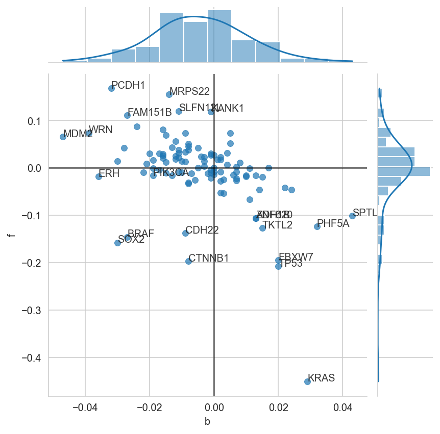


```python
(
    valid_crc_data.filter_column_isin(
        "hugo_symbol", trace.posterior.coords["cancer_gene"].values
    )[["hugo_symbol", "depmap_id", "is_mutated"]]
    .drop_duplicates()
    .assign(is_mutated=lambda d: d["is_mutated"].map({True: "X", False: ""}))
    .pivot_wider("depmap_id", "hugo_symbol", "is_mutated")
    .set_index("depmap_id")
)
```


<div>
<style scoped>
    .dataframe tbody tr th:only-of-type {
        vertical-align: middle;
    }

    .dataframe tbody tr th {
        vertical-align: top;
    }

    .dataframe thead th {
        text-align: right;
    }
</style>
<table border="1" class="dataframe">
  <thead>
    <tr style="text-align: right;">
      <th></th>
      <th>KRAS</th>
      <th>FBXW7</th>
      <th>PIK3CA</th>
    </tr>
    <tr>
      <th>depmap_id</th>
      <th></th>
      <th></th>
      <th></th>
    </tr>
  </thead>
  <tbody>
    <tr>
      <th>ACH-000253</th>
      <td></td>
      <td></td>
      <td></td>
    </tr>
    <tr>
      <th>ACH-000286</th>
      <td>X</td>
      <td></td>
      <td></td>
    </tr>
    <tr>
      <th>ACH-000296</th>
      <td></td>
      <td></td>
      <td></td>
    </tr>
    <tr>
      <th>ACH-000350</th>
      <td>X</td>
      <td></td>
      <td></td>
    </tr>
    <tr>
      <th>ACH-000470</th>
      <td>X</td>
      <td>X</td>
      <td></td>
    </tr>
    <tr>
      <th>ACH-000958</th>
      <td></td>
      <td>X</td>
      <td>X</td>
    </tr>
    <tr>
      <th>ACH-001786</th>
      <td></td>
      <td>X</td>
      <td>X</td>
    </tr>
    <tr>
      <th>ACH-002024</th>
      <td>X</td>
      <td></td>
      <td>X</td>
    </tr>
  </tbody>
</table>
</div>


```python
h_post_summary = (
    az.summary(trace, var_names="h", kind="stats")
    .pipe(extract_coords_param_names, names=["hugo_symbol", "cancer_gene"])
    .pivot_wider("hugo_symbol", names_from="cancer_gene", values_from="mean")
    .set_index("hugo_symbol")
)

vmax = np.abs(h_post_summary.values).max()

figsize = (3.3, 12)
dendro_ratio = (0.1, figsize[0] * 0.1 / figsize[1])
cm = sns.clustermap(
    h_post_summary,
    z_score=None,
    cmap="seismic",
    center=0,
    vmin=-vmax,
    vmax=vmax,
    figsize=figsize,
    dendrogram_ratio=dendro_ratio,
    cbar_pos=(1, 0.4, 0.1, 0.2),
    yticklabels=1,
)
cm.ax_heatmap.tick_params("both", labelsize=7, size=0)
plt.show()
```


```python
cg_mut_labels = (
    valid_crc_data.filter_column_isin(
        "hugo_symbol", trace.posterior.coords["cancer_gene"].values
    )[["hugo_symbol", "depmap_id", "is_mutated"]]
    .drop_duplicates()
    .pivot_wider("depmap_id", "hugo_symbol", "is_mutated")
    .set_index("depmap_id")
)
_labels = []
for i in range(len(cg_mut_labels)):
    muts = cg_mut_labels.columns[cg_mut_labels.values[i, :]].tolist()
    if len(muts) == 0:
        _labels.append("WT")
    else:
        _labels.append(",".join(muts))

cg_mut_labels["mut_label"] = _labels
cg_mut_labels = cg_mut_labels[["mut_label"]].reset_index(drop=False)
cg_mut_labels
```


<div>
<style scoped>
    .dataframe tbody tr th:only-of-type {
        vertical-align: middle;
    }

    .dataframe tbody tr th {
        vertical-align: top;
    }

    .dataframe thead th {
        text-align: right;
    }
</style>
<table border="1" class="dataframe">
  <thead>
    <tr style="text-align: right;">
      <th></th>
      <th>depmap_id</th>
      <th>mut_label</th>
    </tr>
  </thead>
  <tbody>
    <tr>
      <th>0</th>
      <td>ACH-000253</td>
      <td>WT</td>
    </tr>
    <tr>
      <th>1</th>
      <td>ACH-000286</td>
      <td>KRAS</td>
    </tr>
    <tr>
      <th>2</th>
      <td>ACH-000296</td>
      <td>WT</td>
    </tr>
    <tr>
      <th>3</th>
      <td>ACH-000350</td>
      <td>KRAS</td>
    </tr>
    <tr>
      <th>4</th>
      <td>ACH-000470</td>
      <td>KRAS,FBXW7</td>
    </tr>
    <tr>
      <th>5</th>
      <td>ACH-000958</td>
      <td>FBXW7,PIK3CA</td>
    </tr>
    <tr>
      <th>6</th>
      <td>ACH-001786</td>
      <td>FBXW7,PIK3CA</td>
    </tr>
    <tr>
      <th>7</th>
      <td>ACH-002024</td>
      <td>KRAS,PIK3CA</td>
    </tr>
  </tbody>
</table>
</div>


```python
pik3ca_hits = h_post_summary.sort_values("PIK3CA").query("PIK3CA > 0.3").index.tolist()

pik3ca_hits_data = (
    crc_data.copy()
    .filter_column_isin("hugo_symbol", pik3ca_hits)
    .merge(cg_mut_labels, on="depmap_id")
    .reset_index(drop=True)
    .assign(
        hugo_symbol=lambda d: pd.Categorical(
            d["hugo_symbol"], categories=pik3ca_hits, ordered=True
        )
    )
)


fig, ax = plt.subplots(figsize=(10, 4))
sns.boxplot(
    data=pik3ca_hits_data,
    x="hugo_symbol",
    y="lfc",
    hue="mut_label",
    dodge=True,
    ax=ax,
    flierprops={"markersize": 0},
    boxprops={"alpha": 0.5},
)
sns.move_legend(ax, title="mutations", loc="upper left", bbox_to_anchor=(1, 1))
ax.add_artist(ax.get_legend())
sns.swarmplot(
    data=pik3ca_hits_data,
    x="hugo_symbol",
    y="lfc",
    hue="mut_label",
    dodge=True,
    ax=ax,
    s=4,
)

ax.set_title("$\mathit{PIK3CA}$ hits")
ax.set_xlabel(None)
ax.set_ylabel("log-fold change")
ax.get_legend().remove()
```


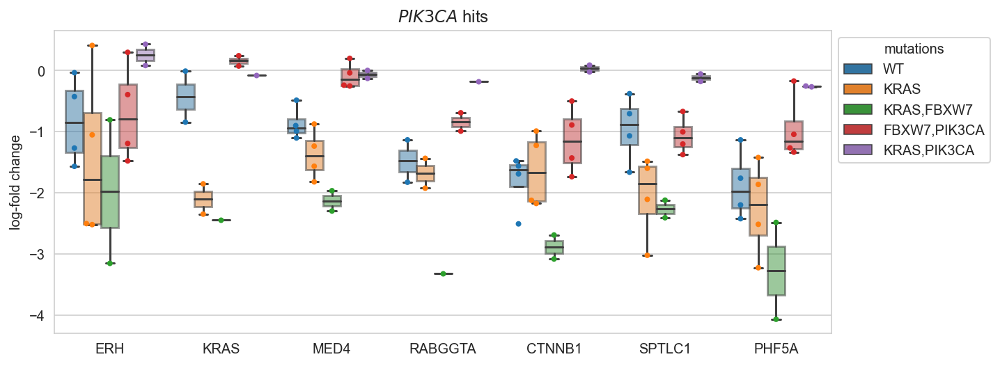


```python
gene_vars = ["$\mu_a$", "$b$", "$d$", "$f$"]
gene_vars += ["$h_{" + g + "}$" for g in trace.posterior.coords["cancer_gene"].values]
gene_corr_post = (
    az.summary(trace, var_names=["genes_chol_cov_corr"], kind="stats")
    .pipe(extract_coords_param_names, names=["d0", "d1"])
    .astype({"d0": int, "d1": int})
    .assign(
        p0=lambda d: [gene_vars[i] for i in d["d0"]],
        p1=lambda d: [gene_vars[i] for i in d["d1"]],
    )
)

plot_df = gene_corr_post.pivot_wider(
    "p0", names_from="p1", values_from="mean"
).set_index("p0")
ax = sns.heatmap(plot_df, cmap="coolwarm", vmin=-1, vmax=1)
ax.set_xlabel(None)
ax.set_ylabel(None)
plt.tight_layout()
plt.show()
```


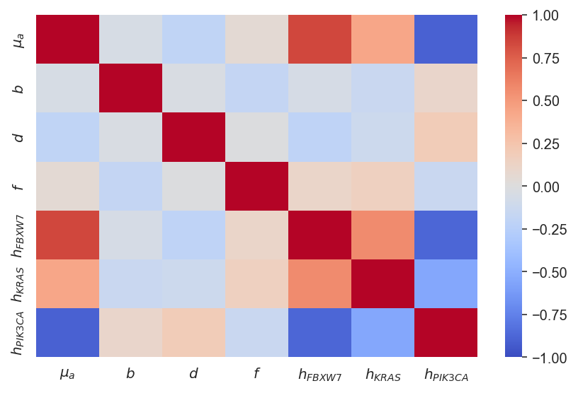


```python
N = 100

pp_dist = trace.posterior_predictive["ct_final"]
n_chains, n_draws, n_samples = pp_dist.shape
draws_idx = np.random.choice(np.arange(n_draws), N // n_chains, replace=False)

fig, ax = plt.subplots(figsize=(8, 5))

ppc_pal = {
    "draws": "tab:blue",
    "median": "tab:orange",
    "mean": "tab:red",
    "observed": "black",
}

# Example draws.
for c, d in product(range(n_chains), draws_idx):
    values = np.log(pp_dist[c, d, :].values + 1)
    sns.kdeplot(values, color=ppc_pal["draws"], alpha=0.1, ax=ax)

# Average distributions.
pp_dist_mean = np.log(pp_dist.median(axis=(0, 1)) + 1)
pp_dist_mid = np.log(pp_dist.mean(axis=(0, 1)) + 1)
sns.kdeplot(pp_dist_mean, color=ppc_pal["mean"], ax=ax, alpha=0.5)
sns.kdeplot(pp_dist_mid, color=ppc_pal["median"], ax=ax, alpha=0.5)

# Observed distribution.
sns.kdeplot(
    np.log(trace.observed_data["ct_final"] + 1), ax=ax, color=ppc_pal["observed"]
)

ppc_leg_handles: list[Line2D] = []
for lbl, color in ppc_pal.items():
    ppc_leg_handles.append(Line2D([0], [0], color=color, label=lbl))

plt.legend(handles=ppc_leg_handles, loc="best")


ax.set_xlabel("log10( final counts + 1 )")
ax.set_ylabel("density")
ax.set_title("Posterior predictive distribution")
plt.show()
```


---


```python
notebook_toc = time()
print(f"execution time: {(notebook_toc - notebook_tic) / 60:.2f} minutes")
```

    execution time: 37.23 minutes


```python
%load_ext watermark
%watermark -d -u -v -iv -b -h -m
```

    Last updated: 2022-08-07

    Python implementation: CPython
    Python version       : 3.10.5
    IPython version      : 8.4.0

    Compiler    : Clang 13.0.1
    OS          : Darwin
    Release     : 21.5.0
    Machine     : x86_64
    Processor   : i386
    CPU cores   : 4
    Architecture: 64bit

    Hostname: jhcookmac.harvardsecure.wireless.med.harvard.edu

    Git branch: simplify

    pymc      : 4.1.3
    arviz     : 0.12.1
    numpy     : 1.23.1
    pandas    : 1.4.3
    matplotlib: 3.5.2
    plotnine  : 0.0.0
    seaborn   : 0.11.2
    aesara    : 2.7.7


```python

```
