# Experimenting with chromosome varying effects


```python
%load_ext autoreload
%autoreload 2
```


```python
from itertools import product
from math import ceil
from pathlib import Path
from time import time

import aesara
import arviz as az
import matplotlib.pyplot as plt
import numpy as np
import pandas as pd
import plotnine as gg
import pymc as pm
import pymc.sampling_jax
import seaborn as sns
from matplotlib.lines import Line2D
```

    /usr/local/Caskroom/miniconda/base/envs/speclet/lib/python3.10/site-packages/pymc/sampling_jax.py:36: UserWarning: This module is experimental.


```python
from speclet.analysis.arviz_analysis import describe_mcmc, extract_coords_param_names
from speclet.bayesian_models.lineage_hierarchical_nb import LineageHierNegBinomModel
from speclet.data_processing.common import head_tail
from speclet.io import DataFile, data_path
from speclet.loggers import set_console_handler_level
from speclet.managers.data_managers import CrisprScreenDataManager, broad_only
from speclet.plot import set_speclet_theme
from speclet.project_configuration import arviz_config
```


```python
# Logging.
set_console_handler_level("DEBUG")
aesara.config.exception_verbosity = "high"

# Notebook execution timer.
notebook_tic = time()

# Plotting setup.
set_speclet_theme()
%config InlineBackend.figure_format = "retina"

# Constants
SEED = 847
np.random.seed(SEED)
arviz_config()
```

## Data


```python
crispr_data_manager = CrisprScreenDataManager(
    DataFile.DEPMAP_CRC_SUBSAMPLE, transformations=[broad_only]
)
crc_data = crispr_data_manager.get_data()
```


```python
for col in ["sgrna", "hugo_symbol", "depmap_id"]:
    print(f"'{col}': {crc_data[col].nunique()}")
```

    'sgrna': 162
    'hugo_symbol': 103
    'depmap_id': 8


## Modeling


```python
from speclet.bayesian_models.lineage_hierarchical_nb import LineageHierNegBinomModel
```


```python
crc_model = LineageHierNegBinomModel(
    lineage="colorectal", reduce_deterministic_vars=False
)
valid_crc_data = crc_model.data_processing_pipeline(crc_data.copy())
model_crc_data = crc_model.make_data_structure(valid_crc_data.copy())
```

    [INFO] 2022-08-08 09:20:50 [(lineage_hierarchical_nb.py:data_processing_pipeline:317] Processing data for modeling.
    [INFO] 2022-08-08 09:20:50 [(lineage_hierarchical_nb.py:data_processing_pipeline:318] LFC limits: (-5.0, 5.0)
    [WARNING] 2022-08-08 09:20:51 [(lineage_hierarchical_nb.py:data_processing_pipeline:376] number of data points dropped: 0
    [INFO] 2022-08-08 09:20:51 [(lineage_hierarchical_nb.py:target_gene_is_mutated_vector:597] number of genes mutated in all cells lines: 1
    [DEBUG] 2022-08-08 09:20:51 [(lineage_hierarchical_nb.py:target_gene_is_mutated_vector:600] Genes always mutated: APC
    [DEBUG] 2022-08-08 09:20:51 [(cancer_gene_mutation_matrix.py:_trim_cancer_genes:68] all_mut: {}
    [INFO] 2022-08-08 09:20:51 [(cancer_gene_mutation_matrix.py:_trim_cancer_genes:77] Dropping 2 cancer genes.
    [DEBUG] 2022-08-08 09:20:51 [(cancer_gene_mutation_matrix.py:_trim_cancer_genes:79] Dropped cancer genes: ['APC', 'MDM2']


```python
model_crc_data.coords["cancer_gene"]
```


    ['FBXW7', 'KRAS', 'PIK3CA']


```python
crc_pymc_model = crc_model.pymc_model(crispr_data_manager.data.copy())
pm.model_to_graphviz(crc_pymc_model)
```

    [INFO] 2022-08-08 09:20:51 [(lineage_hierarchical_nb.py:data_processing_pipeline:317] Processing data for modeling.
    [INFO] 2022-08-08 09:20:51 [(lineage_hierarchical_nb.py:data_processing_pipeline:318] LFC limits: (-5.0, 5.0)
    [WARNING] 2022-08-08 09:20:52 [(lineage_hierarchical_nb.py:data_processing_pipeline:376] number of data points dropped: 0
    [INFO] 2022-08-08 09:20:52 [(lineage_hierarchical_nb.py:target_gene_is_mutated_vector:597] number of genes mutated in all cells lines: 1
    [DEBUG] 2022-08-08 09:20:52 [(lineage_hierarchical_nb.py:target_gene_is_mutated_vector:600] Genes always mutated: APC
    [DEBUG] 2022-08-08 09:20:52 [(cancer_gene_mutation_matrix.py:_trim_cancer_genes:68] all_mut: {}
    [INFO] 2022-08-08 09:20:52 [(cancer_gene_mutation_matrix.py:_trim_cancer_genes:77] Dropping 2 cancer genes.
    [DEBUG] 2022-08-08 09:20:52 [(cancer_gene_mutation_matrix.py:_trim_cancer_genes:79] Dropped cancer genes: ['APC', 'MDM2']
    [INFO] 2022-08-08 09:20:52 [(lineage_hierarchical_nb.py:_pre_model_messages:380] Lineage: colorectal
    [INFO] 2022-08-08 09:20:52 [(lineage_hierarchical_nb.py:_pre_model_messages:381] Number of genes: 103
    [INFO] 2022-08-08 09:20:52 [(lineage_hierarchical_nb.py:_pre_model_messages:382] Number of sgRNA: 162
    [INFO] 2022-08-08 09:20:52 [(lineage_hierarchical_nb.py:_pre_model_messages:383] Number of cell lines: 8
    [INFO] 2022-08-08 09:20:52 [(lineage_hierarchical_nb.py:_pre_model_messages:384] Number of chromosomes: 176
    [INFO] 2022-08-08 09:20:52 [(lineage_hierarchical_nb.py:_pre_model_messages:385] Number of cancer genes: 3
    [INFO] 2022-08-08 09:20:52 [(lineage_hierarchical_nb.py:_pre_model_messages:386] Number of screens: 1
    [INFO] 2022-08-08 09:20:52 [(lineage_hierarchical_nb.py:_pre_model_messages:387] Number of data points: 1296
    [INFO] 2022-08-08 09:20:52 [(lineage_hierarchical_nb.py:_pre_model_messages:392] Including all non-essential deterministic variables.
    [DEBUG] 2022-08-08 09:20:52 [(lineage_hierarchical_nb.py:pymc_model:428] shape of cancer gene matrix: (1296, 3)
    [DEBUG] 2022-08-08 09:20:52 [(lineage_hierarchical_nb.py:pymc_model:444] location for `mu_mu_a`: 0.1523


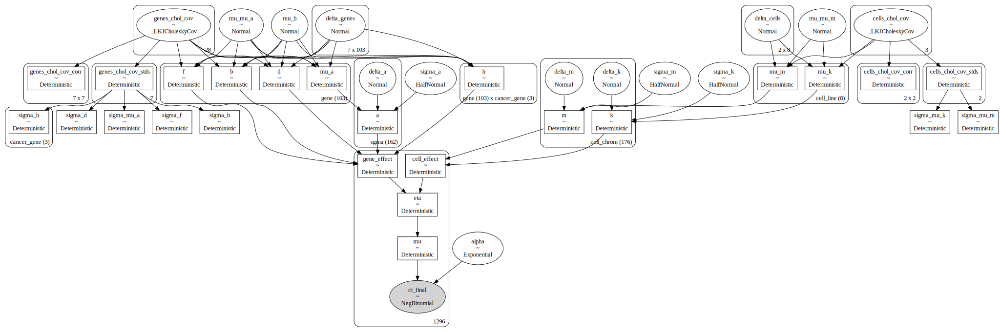


```python
with crc_pymc_model:
    pm_prior_pred = pm.sample_prior_predictive(
        var_names=["eta", "ct_final", "mu_a", "gene_effect"], random_seed=SEED
    )

print("prior predictive distribution")
pm_pred_draws = pm_prior_pred.prior_predictive["ct_final"].values.squeeze()
for q in [0, 0.01, 0.1, 0.2, 0.3, 0.4, 0.5, 0.6, 0.7, 0.8, 0.9, 0.99, 1]:
    res = np.quantile(pm_pred_draws, q=q)
    print(f"  {int(q*100)}%: {int(res):0,d}")

print("")
obs = valid_crc_data["counts_final"].astype(int)
print(f"final counts\n  min: {np.min(obs):,d},  max: {np.max(obs):,d}")

obs = valid_crc_data["counts_initial_adj"].astype(int)
print(f"initial counts\n  min: {np.min(obs):,d},  max: {np.max(obs):,d}")
```

    prior predictive distribution
      0%: 0
      1%: 0
      10%: 12
      20%: 65
      30%: 133
      40%: 216
      50%: 325
      60%: 474
      70%: 697
      80%: 1,078
      90%: 1,944
      99%: 8,228
      100%: 396,583

    final counts
      min: 0,  max: 9,819
    initial counts
      min: 57,  max: 4,741


```python
eta_prior = np.random.choice(pm_prior_pred.prior["eta"].values.flatten(), 2000)
ge_prior = np.random.choice(pm_prior_pred.prior["gene_effect"].values.flatten(), 4000)
mu_prior = np.random.choice(pm_prior_pred.prior["mu_a"].values.flatten(), 4000)

fig, axes = plt.subplots(ncols=3, figsize=(9, 3))
sns.histplot(mu_prior, kde=True, ax=axes[0], binwidth=0.25, stat="proportion")
sns.histplot(ge_prior, kde=True, ax=axes[1], binwidth=0.5, stat="proportion")
sns.histplot(eta_prior, kde=True, ax=axes[2], binwidth=0.5, stat="proportion")
axes[0].set_xlabel(r"$\mu_a$")
axes[1].set_xlabel(r"gene effect")
axes[2].set_xlabel(r"$\eta$")

for ax in axes.flatten():
    ax.set_ylabel(None)
    ax.set_title(None)

fig.supylabel("proportion")
fig.suptitle("Prior predictive distribution")
fig.tight_layout()
plt.show()
```


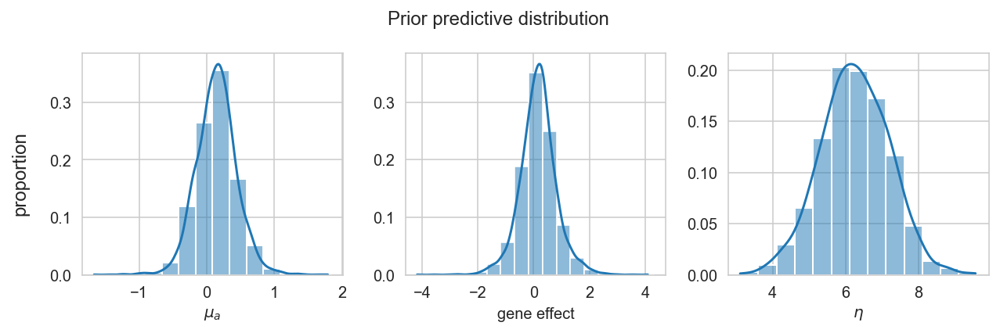


```python
fig, axes = plt.subplots(nrows=3, ncols=1, figsize=(8, 7))

stat = "proportion"

obs_max = crc_data["counts_final"].max()
truncated_prior_preds = [x for x in pm_pred_draws.flatten() if x <= obs_max]

prior_pred_pal = {"prior pred.": "tab:orange", "observed": "gray"}

# Untransformed
bw: float = 100
sns.histplot(
    x=truncated_prior_preds,
    ax=axes[0],
    binwidth=bw,
    stat=stat,
    color=prior_pred_pal["prior pred."],
)
sns.histplot(
    x=valid_crc_data["counts_final"],
    ax=axes[0],
    binwidth=bw,
    stat=stat,
    color=prior_pred_pal["observed"],
)
# Log10 transformed
bw = 0.25
sns.histplot(
    x=np.log10(pm_pred_draws.flatten() + 1),
    ax=axes[1],
    binwidth=bw,
    stat=stat,
    color=prior_pred_pal["prior pred."],
)
sns.histplot(
    x=np.log10(valid_crc_data["counts_final"] + 1),
    ax=axes[1],
    binwidth=bw,
    stat=stat,
    color=prior_pred_pal["observed"],
)
# Log-fold change
pp_lfc = np.log(
    (pm_pred_draws + 1) / (valid_crc_data["counts_initial_adj"].values[None, :])
)
obs_lfc = np.log(
    (valid_crc_data["counts_final"] + 1) / valid_crc_data["counts_initial_adj"]
)
bw = 0.5
sns.histplot(
    x=pp_lfc.flatten(),
    ax=axes[2],
    binwidth=bw,
    stat=stat,
    color=prior_pred_pal["prior pred."],
)
sns.histplot(
    x=obs_lfc,
    ax=axes[2],
    binwidth=bw,
    stat=stat,
    color=prior_pred_pal["observed"],
)


axes[0].set_xlabel("final counts")
axes[1].set_xlabel("log10(final counts + 1)")
axes[2].set_xlabel("log((final + 1) / initial)")

prior_pred_leg_handles = [
    Line2D([0], [0], linewidth=10, color=v, label=k) for k, v in prior_pred_pal.items()
]
axes[0].legend(handles=prior_pred_leg_handles, loc="upper right", frameon=False)

for ax in axes.flatten():
    ax.set_ylabel(stat)

plt.tight_layout()
plt.show()
```


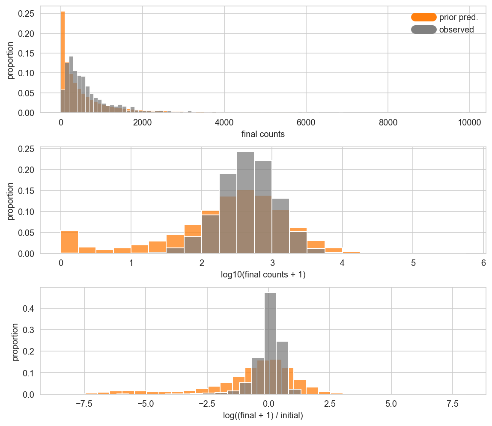


## Sampling


```python
with crc_pymc_model:
    trace = pymc.sampling_jax.sample_numpyro_nuts(
        draws=500,
        tune=1000,
        target_accept=0.98,
        random_seed=SEED,
        idata_kwargs={"log_likelihood": False},
        nuts_kwargs={"step_size": 0.1, "max_tree_depth": 10}
        # discard_tuned_samples=False,
    )
    pm.sample_posterior_predictive(trace, extend_inferencedata=True, random_seed=SEED)
```

    Compiling...
    Compilation time =  0:00:18.711117
    Sampling...


      0%|          | 0/1500 [00:00<?, ?it/s]


      0%|          | 0/1500 [00:00<?, ?it/s]


      0%|          | 0/1500 [00:00<?, ?it/s]


      0%|          | 0/1500 [00:00<?, ?it/s]


    Sampling time =  0:05:11.439673
    Transforming variables...
    Transformation time =  0:00:06.293092


<style>
    /* Turns off some styling */
    progress {
        /* gets rid of default border in Firefox and Opera. */
        border: none;
        /* Needs to be in here for Safari polyfill so background images work as expected. */
        background-size: auto;
    }
    progress:not([value]), progress:not([value])::-webkit-progress-bar {
        background: repeating-linear-gradient(45deg, #7e7e7e, #7e7e7e 10px, #5c5c5c 10px, #5c5c5c 20px);
    }
    .progress-bar-interrupted, .progress-bar-interrupted::-webkit-progress-bar {
        background: #F44336;
    }
</style>


<div>
  <progress value='2000' class='' max='2000' style='width:300px; height:20px; vertical-align: middle;'></progress>
  100.00% [2000/2000 00:01&lt;00:00]
</div>


## Posterior analysis


```python
describe_mcmc(trace);
```

    date created: 2022-08-08 13:26
    sampled 4 chains with (unknown) tuning steps and 500 draws
    num. divergences: 0, 0, 0, 0
    percent divergences: 0.0, 0.0, 0.0, 0.0
    BFMI: 0.798, 0.827, 0.881, 0.967
    avg. step size: 0.013, 0.034, 0.012, 0.033
    avg. accept prob.: 0.987, 0.941, 0.991, 0.961
    avg. tree depth: 8.062, 7.0, 8.912, 7.0


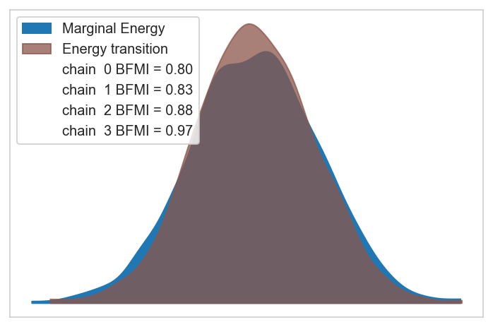


```python
stat_cats = ["energy", "step_size", "n_steps", "acceptance_rate", "tree_depth"]
trace.sample_stats.get(stat_cats).to_dataframe().groupby("chain").mean().round(3)
```


<div>
<style scoped>
    .dataframe tbody tr th:only-of-type {
        vertical-align: middle;
    }

    .dataframe tbody tr th {
        vertical-align: top;
    }

    .dataframe thead th {
        text-align: right;
    }
</style>
<table border="1" class="dataframe">
  <thead>
    <tr style="text-align: right;">
      <th></th>
      <th>energy</th>
      <th>step_size</th>
      <th>n_steps</th>
      <th>acceptance_rate</th>
      <th>tree_depth</th>
    </tr>
    <tr>
      <th>chain</th>
      <th></th>
      <th></th>
      <th></th>
      <th></th>
      <th></th>
    </tr>
  </thead>
  <tbody>
    <tr>
      <th>0</th>
      <td>10889.147</td>
      <td>0.013</td>
      <td>271.384</td>
      <td>0.987</td>
      <td>8.062</td>
    </tr>
    <tr>
      <th>1</th>
      <td>10888.598</td>
      <td>0.034</td>
      <td>127.000</td>
      <td>0.941</td>
      <td>7.000</td>
    </tr>
    <tr>
      <th>2</th>
      <td>10879.961</td>
      <td>0.012</td>
      <td>488.472</td>
      <td>0.991</td>
      <td>8.912</td>
    </tr>
    <tr>
      <th>3</th>
      <td>10893.550</td>
      <td>0.033</td>
      <td>127.000</td>
      <td>0.961</td>
      <td>7.000</td>
    </tr>
  </tbody>
</table>
</div>


```python
post_summary = az.summary(
    trace, var_names=crc_model.vars_regex() + ["~^h$"], filter_vars="regex"
)

fig, axes = plt.subplots(nrows=1, ncols=3, figsize=(12, 4))
ax = axes[0]
sns.histplot(data=post_summary, x="r_hat", binwidth=0.005, ax=ax)

ax = axes[1]
sns.histplot(data=post_summary, x="ess_bulk", binwidth=500, ax=ax)

ax = axes[2]
sns.histplot(data=post_summary, x="ess_tail", binwidth=500, ax=ax)

fig.tight_layout()
plt.show()
```


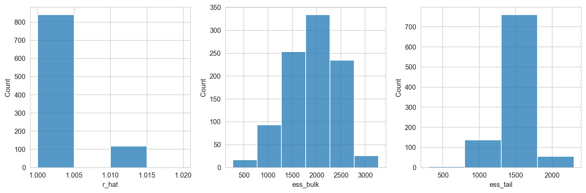


```python
post_summary.sort_values("r_hat", ascending=False).head(5)
```


<div>
<style scoped>
    .dataframe tbody tr th:only-of-type {
        vertical-align: middle;
    }

    .dataframe tbody tr th {
        vertical-align: top;
    }

    .dataframe thead th {
        text-align: right;
    }
</style>
<table border="1" class="dataframe">
  <thead>
    <tr style="text-align: right;">
      <th></th>
      <th>mean</th>
      <th>sd</th>
      <th>hdi_5.5%</th>
      <th>hdi_94.5%</th>
      <th>mcse_mean</th>
      <th>mcse_sd</th>
      <th>ess_bulk</th>
      <th>ess_tail</th>
      <th>r_hat</th>
    </tr>
  </thead>
  <tbody>
    <tr>
      <th>sigma_b</th>
      <td>0.039</td>
      <td>0.023</td>
      <td>0.001</td>
      <td>0.068</td>
      <td>0.001</td>
      <td>0.001</td>
      <td>274.0</td>
      <td>518.0</td>
      <td>1.02</td>
    </tr>
    <tr>
      <th>b[KRAS]</th>
      <td>0.032</td>
      <td>0.055</td>
      <td>-0.046</td>
      <td>0.119</td>
      <td>0.002</td>
      <td>0.001</td>
      <td>787.0</td>
      <td>1321.0</td>
      <td>1.01</td>
    </tr>
    <tr>
      <th>b[EMC2]</th>
      <td>0.003</td>
      <td>0.043</td>
      <td>-0.069</td>
      <td>0.067</td>
      <td>0.001</td>
      <td>0.001</td>
      <td>2259.0</td>
      <td>1467.0</td>
      <td>1.01</td>
    </tr>
    <tr>
      <th>b[CDK5RAP1]</th>
      <td>-0.006</td>
      <td>0.039</td>
      <td>-0.071</td>
      <td>0.051</td>
      <td>0.001</td>
      <td>0.001</td>
      <td>2154.0</td>
      <td>1219.0</td>
      <td>1.01</td>
    </tr>
    <tr>
      <th>b[ZNF283]</th>
      <td>-0.013</td>
      <td>0.046</td>
      <td>-0.091</td>
      <td>0.055</td>
      <td>0.002</td>
      <td>0.001</td>
      <td>866.0</td>
      <td>1228.0</td>
      <td>1.01</td>
    </tr>
  </tbody>
</table>
</div>


```python
post_summary.sort_values("ess_bulk").head(5)
```


<div>
<style scoped>
    .dataframe tbody tr th:only-of-type {
        vertical-align: middle;
    }

    .dataframe tbody tr th {
        vertical-align: top;
    }

    .dataframe thead th {
        text-align: right;
    }
</style>
<table border="1" class="dataframe">
  <thead>
    <tr style="text-align: right;">
      <th></th>
      <th>mean</th>
      <th>sd</th>
      <th>hdi_5.5%</th>
      <th>hdi_94.5%</th>
      <th>mcse_mean</th>
      <th>mcse_sd</th>
      <th>ess_bulk</th>
      <th>ess_tail</th>
      <th>r_hat</th>
    </tr>
  </thead>
  <tbody>
    <tr>
      <th>sigma_b</th>
      <td>0.039</td>
      <td>0.023</td>
      <td>0.001</td>
      <td>0.068</td>
      <td>0.001</td>
      <td>0.001</td>
      <td>274.0</td>
      <td>518.0</td>
      <td>1.02</td>
    </tr>
    <tr>
      <th>sigma_d</th>
      <td>0.184</td>
      <td>0.129</td>
      <td>0.002</td>
      <td>0.360</td>
      <td>0.006</td>
      <td>0.004</td>
      <td>441.0</td>
      <td>605.0</td>
      <td>1.01</td>
    </tr>
    <tr>
      <th>sigma_f</th>
      <td>0.191</td>
      <td>0.075</td>
      <td>0.057</td>
      <td>0.304</td>
      <td>0.004</td>
      <td>0.003</td>
      <td>451.0</td>
      <td>299.0</td>
      <td>1.00</td>
    </tr>
    <tr>
      <th>b[MDM2]</th>
      <td>-0.043</td>
      <td>0.050</td>
      <td>-0.120</td>
      <td>0.024</td>
      <td>0.002</td>
      <td>0.002</td>
      <td>463.0</td>
      <td>1205.0</td>
      <td>1.01</td>
    </tr>
    <tr>
      <th>b[SPTLC1]</th>
      <td>0.046</td>
      <td>0.060</td>
      <td>-0.041</td>
      <td>0.140</td>
      <td>0.003</td>
      <td>0.002</td>
      <td>544.0</td>
      <td>1416.0</td>
      <td>1.01</td>
    </tr>
  </tbody>
</table>
</div>


```python
with az.rc_context(rc={"plot.max_subplots": 50}):
    az.plot_trace(
        trace, var_names=crc_model.vars_regex() + ["~^h$"], filter_vars="regex"
    )
    plt.tight_layout()
    plt.show()
```


```python
chrom_map = (
    valid_crc_data[["depmap_id", "sgrna_target_chr", "cell_chrom"]]
    .drop_duplicates()
    .reset_index(drop=True)
)

chromosome_post = (
    az.summary(trace, var_names=["k", "m"], kind="stats")
    .pipe(extract_coords_param_names, names=["cell_chrom"])
    .assign(var_name=lambda d: [x[0] for x in d.index.values])
    .merge(chrom_map, on="cell_chrom")
)
chromosome_post.head()
```


<div>
<style scoped>
    .dataframe tbody tr th:only-of-type {
        vertical-align: middle;
    }

    .dataframe tbody tr th {
        vertical-align: top;
    }

    .dataframe thead th {
        text-align: right;
    }
</style>
<table border="1" class="dataframe">
  <thead>
    <tr style="text-align: right;">
      <th></th>
      <th>mean</th>
      <th>sd</th>
      <th>hdi_5.5%</th>
      <th>hdi_94.5%</th>
      <th>cell_chrom</th>
      <th>var_name</th>
      <th>depmap_id</th>
      <th>sgrna_target_chr</th>
    </tr>
  </thead>
  <tbody>
    <tr>
      <th>0</th>
      <td>-0.001</td>
      <td>0.033</td>
      <td>-0.052</td>
      <td>0.051</td>
      <td>ACH-000253__1</td>
      <td>k</td>
      <td>ACH-000253</td>
      <td>1</td>
    </tr>
    <tr>
      <th>1</th>
      <td>-0.318</td>
      <td>0.150</td>
      <td>-0.567</td>
      <td>-0.092</td>
      <td>ACH-000253__1</td>
      <td>m</td>
      <td>ACH-000253</td>
      <td>1</td>
    </tr>
    <tr>
      <th>2</th>
      <td>0.002</td>
      <td>0.033</td>
      <td>-0.046</td>
      <td>0.062</td>
      <td>ACH-000253__2</td>
      <td>k</td>
      <td>ACH-000253</td>
      <td>2</td>
    </tr>
    <tr>
      <th>3</th>
      <td>-0.321</td>
      <td>0.153</td>
      <td>-0.560</td>
      <td>-0.087</td>
      <td>ACH-000253__2</td>
      <td>m</td>
      <td>ACH-000253</td>
      <td>2</td>
    </tr>
    <tr>
      <th>4</th>
      <td>0.002</td>
      <td>0.033</td>
      <td>-0.052</td>
      <td>0.053</td>
      <td>ACH-000253__3</td>
      <td>k</td>
      <td>ACH-000253</td>
      <td>3</td>
    </tr>
  </tbody>
</table>
</div>


```python
for v, data_v in chromosome_post.groupby("var_name"):
    df = (
        data_v.copy()
        .reset_index(drop=True)
        .pivot_wider(
            index="depmap_id", names_from="sgrna_target_chr", values_from="mean"
        )
        .set_index("depmap_id")
    )
    sns.clustermap(df, figsize=(6, 4))
    plt.show()
```


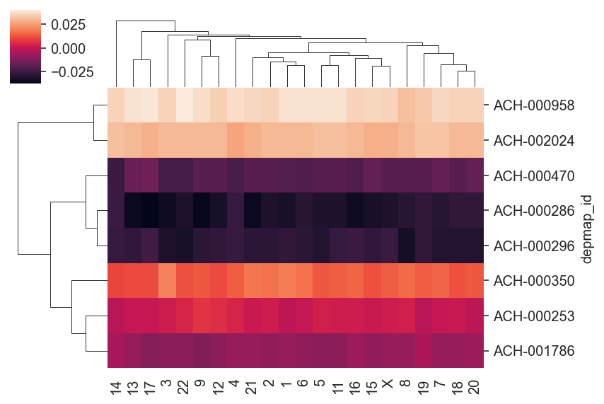


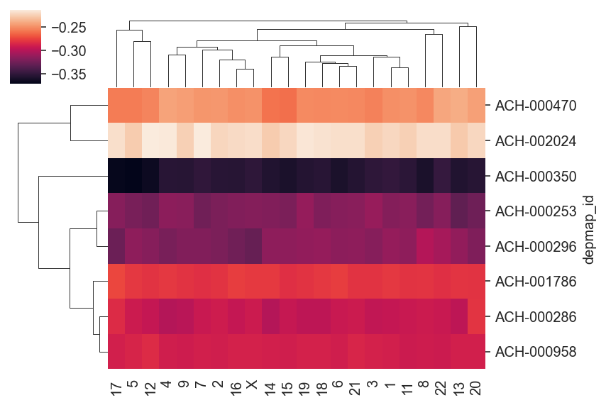


```python
ncells = chromosome_post["depmap_id"].nunique()
ncols = 3
nrows = ceil(ncells / 3)
fig, axes = plt.subplots(nrows=nrows, ncols=ncols, figsize=(9, nrows * 3))
for ax, (cell, data_c) in zip(axes.flatten(), chromosome_post.groupby("depmap_id")):
    plot_df = data_c.pivot_wider(
        index="sgrna_target_chr",
        names_from="var_name",
        values_from=["mean", "hdi_5.5%", "hdi_94.5%"],
    )
    ax.vlines(
        x=plot_df["mean_k"],
        ymin=plot_df["hdi_5.5%_m"],
        ymax=plot_df["hdi_94.5%_m"],
        zorder=5,
    )
    ax.hlines(
        y=plot_df["mean_m"],
        xmin=plot_df["hdi_5.5%_k"],
        xmax=plot_df["hdi_94.5%_k"],
        zorder=5,
    )
    sns.scatterplot(data=plot_df, x="mean_k", y="mean_m", ax=ax, zorder=10)
    ax.set_title(cell)
    ax.set_xlabel(None)
    ax.set_ylabel(None)

for ax in axes[-1, :]:
    ax.set_xlabel("$k$")
for ax in axes[:, 0]:
    ax.set_ylabel("$m$")
for ax in axes.flatten()[ncells:]:
    ax.axis("off")

fig.tight_layout()
plt.show()
```


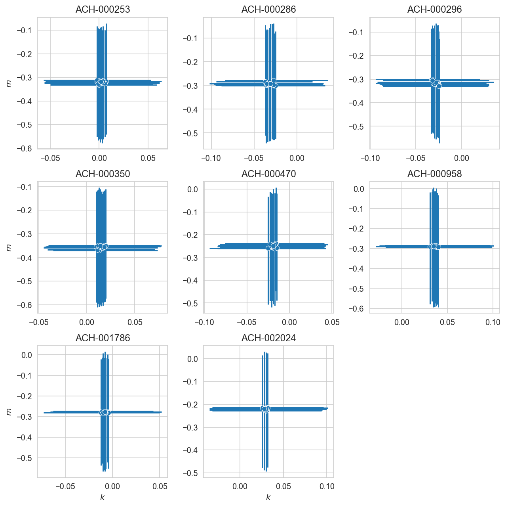


```python
axes = az.plot_forest(
    trace, var_names=["mu_k", "mu_m"], combined=True, r_hat=True, figsize=(5, 6)
)
line = axes[0].axvline(color="gray")
line.set_zorder(0)
plt.show()
```


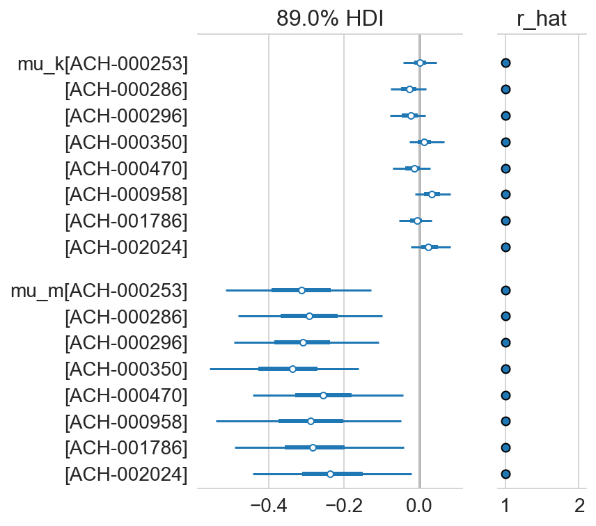


```python
gene_order = (
    az.summary(trace, var_names=["mu_a"], kind="stats")
    .pipe(extract_coords_param_names, names=["hugo_symbol"])
    .sort_values("mean")["hugo_symbol"]
    .tolist()
)

sgrna_to_gene_map = (
    crc_data[["hugo_symbol", "sgrna"]].drop_duplicates().reset_index(drop=True)
)
a_post = (
    az.summary(trace, var_names=["a"], kind="stats")
    .pipe(extract_coords_param_names, names=["sgrna"])
    .reset_index(drop=True)
    .merge(sgrna_to_gene_map, on="sgrna", validate="one_to_one")
)
mu_a_post = (
    az.summary(trace, var_names=["mu_a"], kind="stats")
    .pipe(extract_coords_param_names, names=["hugo_symbol"])
    .reset_index(drop=True)
)

a_post["hugo_symbol"] = pd.Categorical(
    a_post["hugo_symbol"], categories=gene_order, ordered=True
)
a_post = a_post.sort_values("hugo_symbol").reset_index(drop=True)
mu_a_post["hugo_symbol"] = pd.Categorical(
    mu_a_post["hugo_symbol"], categories=gene_order, ordered=True
)
mu_a_post = mu_a_post.sort_values("hugo_symbol").reset_index(drop=True)

mu_mu_a_post = az.summary(trace, var_names=["mu_mu_a"], kind="stats")
assert len(mu_mu_a_post) == 1
mu_mu_a_avg = mu_mu_a_post["mean"][0]
mu_mu_a_hdi = (mu_mu_a_post["hdi_5.5%"][0], mu_mu_a_post["hdi_94.5%"][0])

fig, ax = plt.subplots(figsize=(4, 20))

# Population average and HDI
plt.fill_between(x=mu_mu_a_hdi, y1=-1, y2=len(mu_a_post), alpha=0.1)
plt.axvline(mu_mu_a_avg, color="k", linestyle="--")

# Gene estimates.
plt.hlines(
    y=mu_a_post["hugo_symbol"],
    xmin=mu_a_post["hdi_5.5%"],
    xmax=mu_a_post["hdi_94.5%"],
    color="tab:blue",
    linewidth=2,
)
plt.scatter(x=mu_a_post["mean"], y=mu_a_post["hugo_symbol"], s=20, c="tab:blue")

# sgRNA estimates.
plt.hlines(
    y=a_post["hugo_symbol"],
    xmin=a_post["hdi_5.5%"],
    xmax=a_post["hdi_94.5%"],
    color="tab:red",
    linewidth=1,
    alpha=0.5,
)
plt.scatter(x=a_post["mean"], y=a_post["hugo_symbol"], s=10, c="tab:red")

plt.ylim(-1, len(mu_a_post))
plt.show()
```


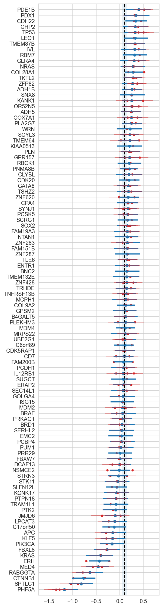


```python
top_mut_effect_genes = (
    az.summary(trace, var_names=["f"])
    .sort_values("mean")
    .pipe(head_tail)
    .pipe(extract_coords_param_names, "hugo_symbol")["hugo_symbol"]
    .tolist()
)
ax = az.plot_forest(
    trace,
    var_names=["f"],
    coords={"gene": top_mut_effect_genes},
    combined=True,
    figsize=(5, 6),
)
ax[0].axvline(0, color="k")
plt.show()
```


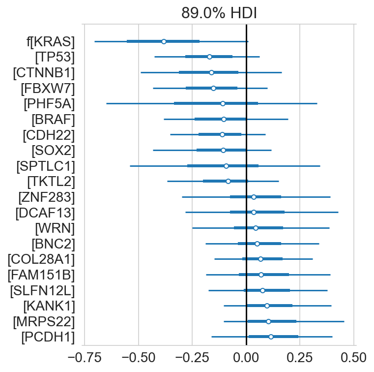


```python
gene_vars = ["$\mu_a$", "$b$", "$d$", "$f$"]
gene_vars += ["$h_{" + g + "}$" for g in trace.posterior.coords["cancer_gene"].values]
gene_corr_post = (
    az.summary(trace, var_names=["genes_chol_cov_corr"], kind="stats")
    .pipe(extract_coords_param_names, names=["d0", "d1"])
    .astype({"d0": int, "d1": int})
    .assign(
        p0=lambda d: [gene_vars[i] for i in d["d0"]],
        p1=lambda d: [gene_vars[i] for i in d["d1"]],
    )
)

plot_df = gene_corr_post.pivot_wider(
    "p0", names_from="p1", values_from="mean"
).set_index("p0")
ax = sns.heatmap(plot_df, cmap="coolwarm", vmin=-1, vmax=1)
ax.set_xlabel(None)
ax.set_ylabel(None)
plt.tight_layout()
plt.show()
```


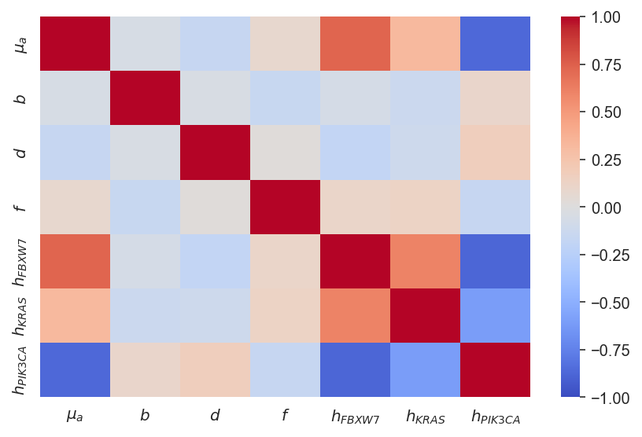


```python
cells_vars = ["$k$", "$m$"]
cells_corr_post = (
    az.summary(trace, var_names=["cells_chol_cov_corr"], kind="stats")
    .pipe(extract_coords_param_names, names=["d0", "d1"])
    .astype({"d0": int, "d1": int})
    .assign(
        p0=lambda d: [gene_vars[i] for i in d["d0"]],
        p1=lambda d: [gene_vars[i] for i in d["d1"]],
    )
)

plot_df = cells_corr_post.pivot_wider(
    "p0", names_from="p1", values_from="mean"
).set_index("p0")
_, ax = plt.subplots(figsize=(4, 3))
ax = sns.heatmap(plot_df, cmap="coolwarm", vmin=-1, vmax=1)
ax.set_xlabel(None)
ax.set_ylabel(None)
plt.tight_layout()
plt.show()
```


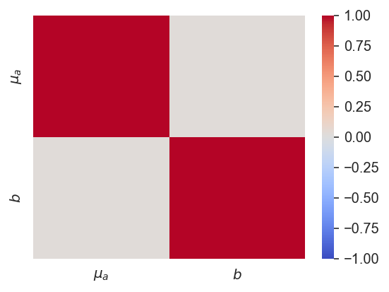


```python
N = 100

pp_dist = trace.posterior_predictive["ct_final"]
n_chains, n_draws, n_samples = pp_dist.shape
draws_idx = np.random.choice(np.arange(n_draws), N // n_chains, replace=False)

fig, ax = plt.subplots(figsize=(8, 5))

ppc_pal = {
    "draws": "tab:blue",
    "median": "tab:orange",
    "mean": "tab:red",
    "observed": "black",
}

# Example draws.
for c, d in product(range(n_chains), draws_idx):
    values = np.log(pp_dist[c, d, :].values + 1)
    sns.kdeplot(values, color=ppc_pal["draws"], alpha=0.1, ax=ax)

# Average distributions.
pp_dist_mean = np.log(pp_dist.median(axis=(0, 1)) + 1)
pp_dist_mid = np.log(pp_dist.mean(axis=(0, 1)) + 1)
sns.kdeplot(pp_dist_mean, color=ppc_pal["mean"], ax=ax, alpha=0.5)
sns.kdeplot(pp_dist_mid, color=ppc_pal["median"], ax=ax, alpha=0.5)

# Observed distribution.
sns.kdeplot(
    np.log(trace.observed_data["ct_final"] + 1), ax=ax, color=ppc_pal["observed"]
)

ppc_leg_handles: list[Line2D] = []
for lbl, color in ppc_pal.items():
    ppc_leg_handles.append(Line2D([0], [0], color=color, label=lbl))

plt.legend(handles=ppc_leg_handles, loc="best")


ax.set_xlabel("log10( final counts + 1 )")
ax.set_ylabel("density")
ax.set_title("Posterior predictive distribution")
plt.show()
```


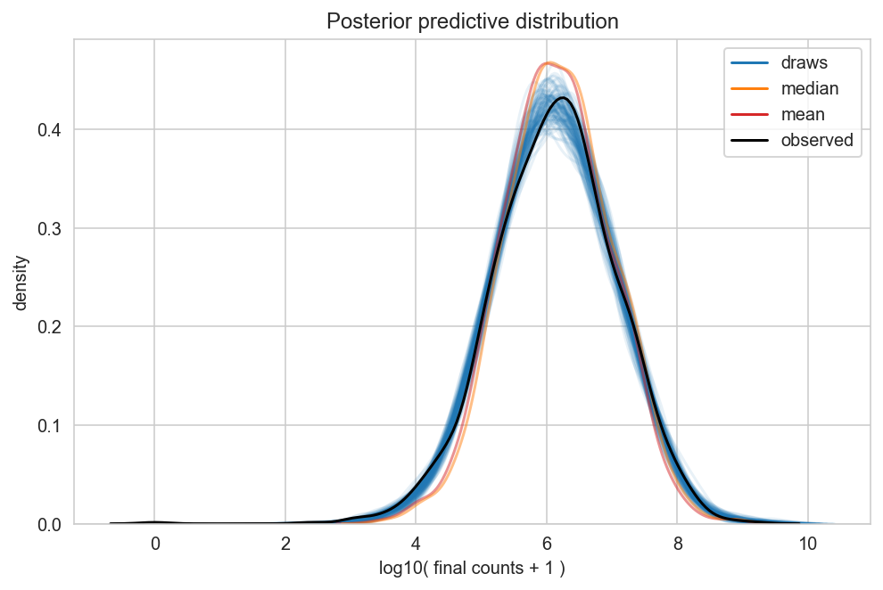


---


```python
notebook_toc = time()
print(f"execution time: {(notebook_toc - notebook_tic) / 60:.2f} minutes")
```

    execution time: 9.07 minutes


```python
%load_ext watermark
%watermark -d -u -v -iv -b -h -m
```

    Last updated: 2022-08-08

    Python implementation: CPython
    Python version       : 3.10.5
    IPython version      : 8.4.0

    Compiler    : Clang 13.0.1
    OS          : Darwin
    Release     : 21.5.0
    Machine     : x86_64
    Processor   : i386
    CPU cores   : 4
    Architecture: 64bit

    Hostname: jhcookmac.harvardsecure.wireless.med.harvard.edu

    Git branch: varying-chromosome

    plotnine  : 0.0.0
    arviz     : 0.12.1
    matplotlib: 3.5.2
    aesara    : 2.7.7
    numpy     : 1.23.1
    seaborn   : 0.11.2
    pandas    : 1.4.3
    pymc      : 4.1.3


```python

```
