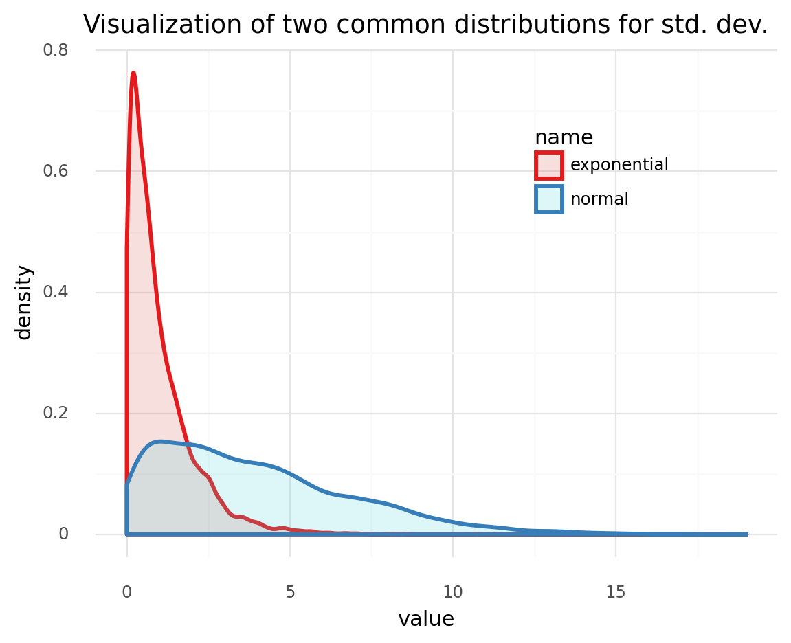
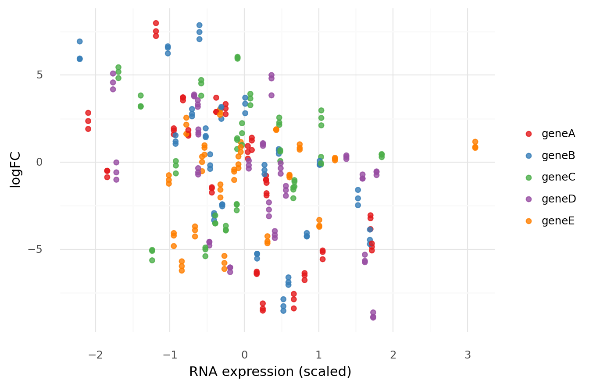
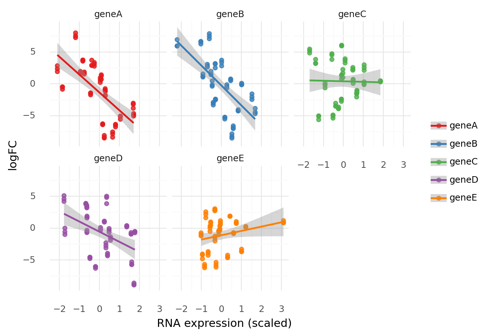
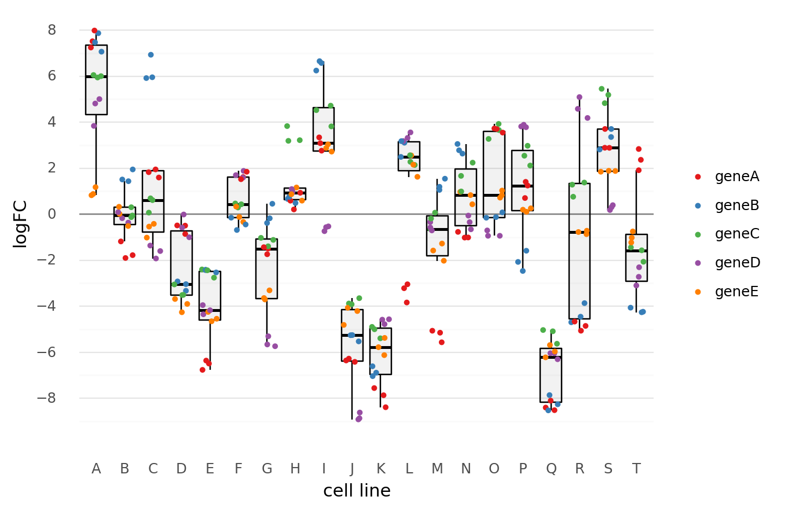
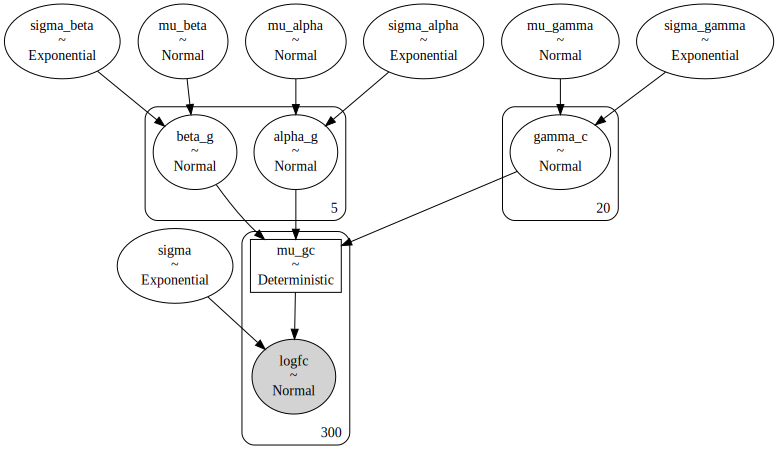
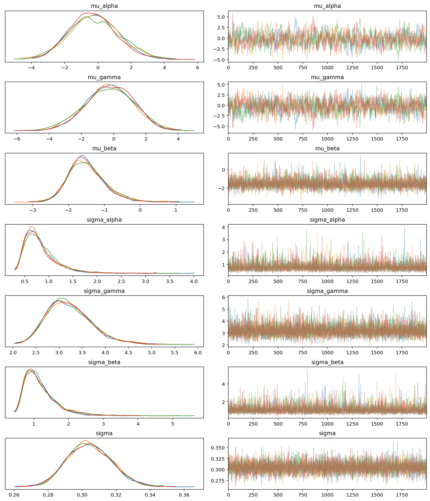
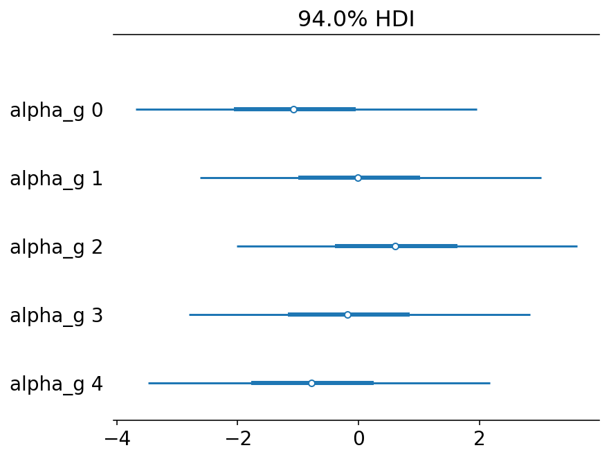
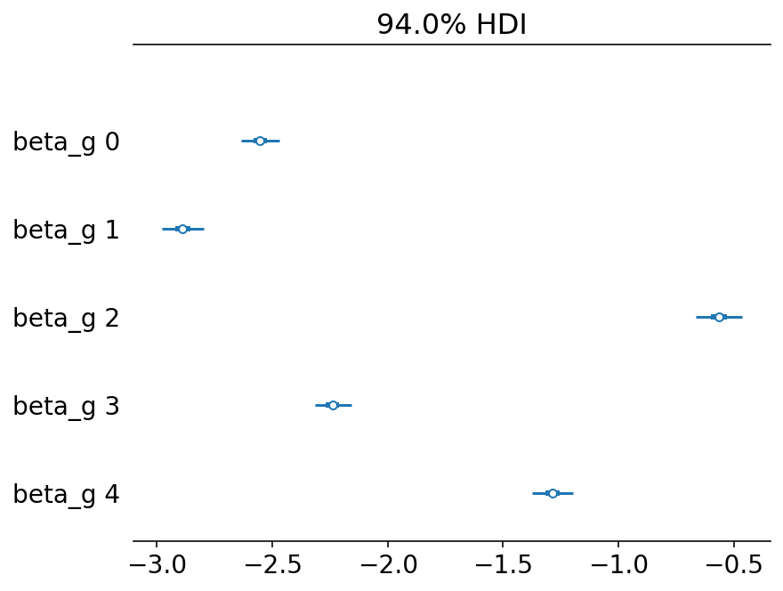
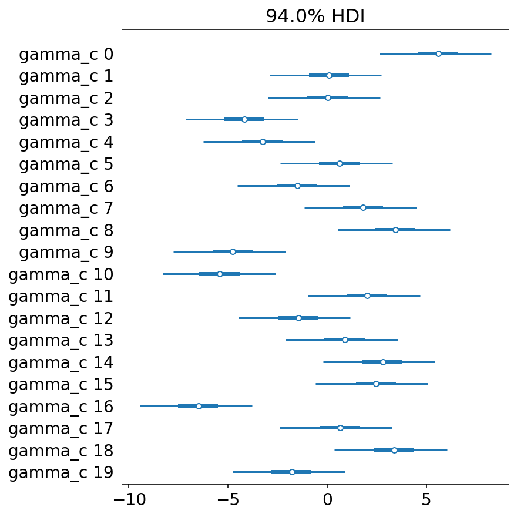
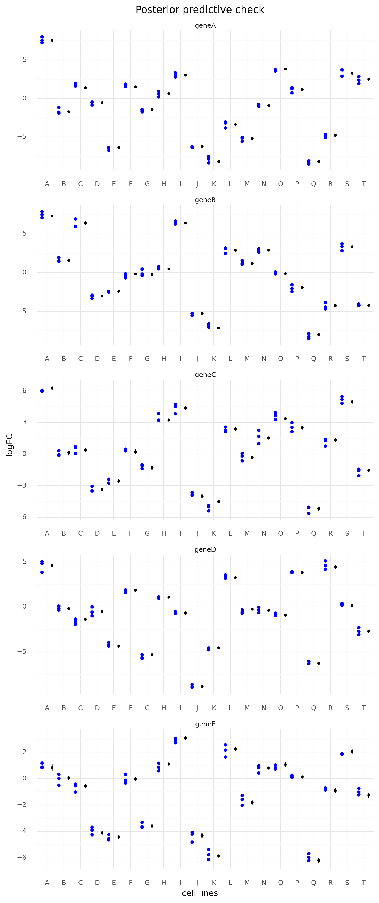

```python
import string
import warnings
from itertools import product
from time import time

import arviz as az
import matplotlib.pyplot as plt
import numpy as np
import pandas as pd
import plotnine as gg
import pymc3 as pm
import seaborn as sns
from numpy.random import exponential, normal

notebook_tic = time()

warnings.simplefilter(action="ignore", category=UserWarning)

gg.theme_set(gg.theme_minimal())
%config InlineBackend.figure_format = 'retina'

RANDOM_SEED = 103
```

---

## Model 4. Multiple genes and multiple cell lines hierarchical model with one covariate

Model the logFC of multiple genes in multiple cell lines using a single predictor: RNA expression.
A hierarchcial model will be used to pool information across genes and cell lines.
Also, to better mimic real data, I have added in the fact that there are multiple measures of logFC for each gene, but only one measure for RNA expression.

$
logFC_{g,c} \sim Normal(\mu_{g,c}, \sigma) \\
\quad \mu_g = \alpha_g + \gamma_c + \beta_g R \\
\qquad \alpha_g \sim \mathcal{N}(\mu_\alpha, \sigma_\alpha) \\
\qquad \quad \mu_\alpha \sim \mathcal{N}(0, 5) \quad \sigma_\alpha \sim \text{Exp}(1) \\
\qquad \gamma_c \sim \mathcal{N}(\mu_\gamma, \sigma_\gamma) \\
\qquad \quad \mu_\gamma \sim \mathcal{N}(0, 5) \quad \sigma_\gamma \sim \text{Exp}(1) \\
\qquad \beta_g \sim \mathcal{N}(\mu_\beta, \sigma_\beta) \\
\qquad \quad \mu_\beta \sim \mathcal{N}(0, 2) \quad \sigma_\beta \sim \text{Exp}(1) \\
\quad \sigma \sim \text{Exp}(1)
$

Simulated values:

- number of cell lines: 20
- number of genes: 5
- number of repeated measures: 3
- $\mu_\alpha = -1$, $\sigma_\alpha = 1$
- $\mu_\gamma = 0$, $\sigma_\gamma = 3$
- $\mu_\beta = -1$, $\sigma_\beta = 2$
- $\sigma = 0.3$

```python
N = 5000
np.random.seed(0)
sigma_dists = pd.DataFrame(
    {
        "name": np.repeat(["normal", "exponential"], N),
        "value": np.concatenate(
            [np.abs(np.random.normal(0, 5, N)), np.random.exponential(1, N)]
        ).flatten(),
    }
)

(
    gg.ggplot(sigma_dists, gg.aes("value"))
    + gg.geom_density(gg.aes(color="name", fill="name"), alpha=0.2, size=1.2)
    + gg.scale_color_brewer(type="qual", palette="Set1")
    + gg.theme(legend_position=(0.7, 0.7))
    + gg.labs(title="Visualization of two common distributions for std. dev.")
)
```



    <ggplot: (8775666828743)>

```python
from typing import List

np.random.seed(RANDOM_SEED)

# Real data parameters.
num_genes = 5
num_cell_lines = 20
num_logfc_datum = 3

# Real model values.
real_mu_alpha, real_sigma_alpha = -1, 1
real_mu_gamma, real_sigma_gamma = 0, 3
real_mu_beta, real_sigma_beta = -1, 2
real_sigma = 0.3

genes = ["gene" + a for a in string.ascii_uppercase[:num_genes]]
gene_idx = list(range(num_genes))

cell_lines = ["cell" + a for a in string.ascii_uppercase[:num_cell_lines]]
cell_line_idx = list(range(num_cell_lines))

# Sample from real distributions for the rest of the model parameters.
real_alpha_g = np.random.normal(real_mu_alpha, real_sigma_alpha, num_genes)
real_gamma_c = np.random.normal(real_mu_gamma, real_sigma_gamma, num_cell_lines)
real_beta_g = np.random.normal(real_mu_beta, real_sigma_beta, num_genes)

rna_data = pd.DataFrame(list(product(genes, cell_lines)), columns=["gene", "cell_line"])

# RNA data (scaled by gene).
rna_data["rna"] = np.random.normal(0, 1, len(rna_data))

for c in ["gene", "cell_line"]:
    rna_data[c] = pd.Categorical(rna_data[c])

logfc_data_list: List[pd.DataFrame] = []
for i in range(num_logfc_datum):
    x = rna_data.copy()
    x["sgrna_idx"] = i
    logfc_data_list.append(x)

logfc_data: pd.DataFrame = pd.concat(logfc_data_list).reset_index(drop=True)

logfc_data["logfc"] = np.nan
for i in range(len(logfc_data)):
    gene_i = logfc_data["gene"].cat.codes[i]
    cell_line_i = logfc_data["cell_line"].cat.codes[i]
    mu = (
        real_alpha_g[gene_i]
        + real_gamma_c[cell_line_i]
        + real_beta_g[gene_i] * logfc_data.loc[i, "rna"]
    )
    logfc_data.loc[i, "logfc"] = np.random.normal(mu, real_sigma)

logfc_data
```

<div>
<style scoped>
    .dataframe tbody tr th:only-of-type {
        vertical-align: middle;
    }

    .dataframe tbody tr th {
        vertical-align: top;
    }

    .dataframe thead th {
        text-align: right;
    }
</style>
<table border="1" class="dataframe">
  <thead>
    <tr style="text-align: right;">
      <th></th>
      <th>gene</th>
      <th>cell_line</th>
      <th>rna</th>
      <th>sgrna_idx</th>
      <th>logfc</th>
    </tr>
  </thead>
  <tbody>
    <tr>
      <th>0</th>
      <td>geneA</td>
      <td>cellA</td>
      <td>-1.187443</td>
      <td>0</td>
      <td>7.516370</td>
    </tr>
    <tr>
      <th>1</th>
      <td>geneA</td>
      <td>cellB</td>
      <td>0.299138</td>
      <td>0</td>
      <td>-1.184598</td>
    </tr>
    <tr>
      <th>2</th>
      <td>geneA</td>
      <td>cellC</td>
      <td>-0.947764</td>
      <td>0</td>
      <td>1.945419</td>
    </tr>
    <tr>
      <th>3</th>
      <td>geneA</td>
      <td>cellD</td>
      <td>-1.843382</td>
      <td>0</td>
      <td>-0.861100</td>
    </tr>
    <tr>
      <th>4</th>
      <td>geneA</td>
      <td>cellE</td>
      <td>0.810589</td>
      <td>0</td>
      <td>-6.491923</td>
    </tr>
    <tr>
      <th>...</th>
      <td>...</td>
      <td>...</td>
      <td>...</td>
      <td>...</td>
      <td>...</td>
    </tr>
    <tr>
      <th>295</th>
      <td>geneE</td>
      <td>cellP</td>
      <td>1.219362</td>
      <td>2</td>
      <td>0.194254</td>
    </tr>
    <tr>
      <th>296</th>
      <td>geneE</td>
      <td>cellQ</td>
      <td>-0.840481</td>
      <td>2</td>
      <td>-5.967522</td>
    </tr>
    <tr>
      <th>297</th>
      <td>geneE</td>
      <td>cellR</td>
      <td>0.607882</td>
      <td>2</td>
      <td>-0.719954</td>
    </tr>
    <tr>
      <th>298</th>
      <td>geneE</td>
      <td>cellS</td>
      <td>0.429605</td>
      <td>2</td>
      <td>1.885927</td>
    </tr>
    <tr>
      <th>299</th>
      <td>geneE</td>
      <td>cellT</td>
      <td>-1.014537</td>
      <td>2</td>
      <td>-1.022285</td>
    </tr>
  </tbody>
</table>
<p>300 rows × 5 columns</p>
</div>

```python
(
    gg.ggplot(logfc_data, gg.aes(x="rna", y="logfc", color="gene"))
    + gg.geom_point(size=1.8, alpha=0.8)
    + gg.scale_color_brewer(type="qual", palette="Set1")
    + gg.labs(x="RNA expression (scaled)", y="logFC", color="")
)
```



    <ggplot: (8775666852717)>

```python
(
    gg.ggplot(logfc_data, gg.aes(x="rna", y="logfc", color="gene"))
    + gg.facet_wrap("gene", nrow=2)
    + gg.geom_point(size=1.8, alpha=0.8)
    + gg.geom_smooth(method="lm")
    + gg.scale_color_brewer(type="qual", palette="Set1")
    + gg.labs(x="RNA expression (scaled)", y="logFC", color="")
)
```



    <ggplot: (8775613956328)>

```python
(
    gg.ggplot(logfc_data, gg.aes(x="cell_line", y="logfc"))
    + gg.geom_hline(yintercept=0, color="gray")
    + gg.geom_boxplot(color="black", fill="black", alpha=0.05, outlier_color="")
    + gg.geom_jitter(gg.aes(color="gene"), width=0.3, size=1)
    + gg.scale_color_brewer(type="qual", palette="Set1")
    + gg.scale_x_discrete(labels=[a.replace("cell", "") for a in cell_lines])
    + gg.scale_y_continuous(breaks=range(-16, 16, 2))
    + gg.theme(panel_grid_major_x=gg.element_blank())
    + gg.labs(x="cell line", y="logFC", color="")
)
```



    <ggplot: (8775613796208)>

```python
gene_idx = logfc_data["gene"].cat.codes.to_list()
cell_line_idx = logfc_data["cell_line"].cat.codes.to_list()

with pm.Model() as model4:
    # Hyper-priors
    mu_alpha = pm.Normal("mu_alpha", 0, 2)
    sigma_alpha = pm.Exponential("sigma_alpha", 1)
    mu_gamma = pm.Normal("mu_gamma", 0, 2)
    sigma_gamma = pm.Exponential("sigma_gamma", 1)
    mu_beta = pm.Normal("mu_beta", 0, 1)
    sigma_beta = pm.Exponential("sigma_beta", 1)

    # Priors
    alpha_g = pm.Normal("alpha_g", mu_alpha, sigma_alpha, shape=num_genes)
    gamma_c = pm.Normal("gamma_c", mu_gamma, sigma_gamma, shape=num_cell_lines)
    beta_g = pm.Normal("beta_g", mu_beta, sigma_beta, shape=num_genes)
    mu_gc = pm.Deterministic(
        "mu_gc",
        alpha_g[gene_idx] + gamma_c[cell_line_idx] + beta_g[gene_idx] * logfc_data.rna,
    )
    sigma = pm.Exponential("sigma", 1)

    # Likelihood
    logfc = pm.Normal("logfc", mu=mu_gc, sigma=sigma, observed=logfc_data.logfc)

    # Sampling
    model4_prior_check = pm.sample_prior_predictive(random_seed=RANDOM_SEED)
    model4_trace = pm.sample(2000, tune=2000, random_seed=RANDOM_SEED)
    model4_post_check = pm.sample_posterior_predictive(
        model4_trace, random_seed=RANDOM_SEED
    )
```

    Auto-assigning NUTS sampler...
    Initializing NUTS using jitter+adapt_diag...
    Multiprocess sampling (4 chains in 4 jobs)
    NUTS: [sigma, beta_g, gamma_c, alpha_g, sigma_beta, mu_beta, sigma_gamma, mu_gamma, sigma_alpha, mu_alpha]

<div>
    <style>
        /*Turns off some styling*/
        progress {
            /*gets rid of default border in Firefox and Opera.*/
            border: none;
            /*Needs to be in here for Safari polyfill so background images work as expected.*/
            background-size: auto;
        }
        .progress-bar-interrupted, .progress-bar-interrupted::-webkit-progress-bar {
            background: #F44336;
        }
    </style>
  <progress value='16000' class='' max='16000' style='width:300px; height:20px; vertical-align: middle;'></progress>
  100.00% [16000/16000 02:24<00:00 Sampling 4 chains, 0 divergences]
</div>

    Sampling 4 chains for 2_000 tune and 2_000 draw iterations (8_000 + 8_000 draws total) took 145 seconds.
    The number of effective samples is smaller than 10% for some parameters.

<div>
    <style>
        /*Turns off some styling*/
        progress {
            /*gets rid of default border in Firefox and Opera.*/
            border: none;
            /*Needs to be in here for Safari polyfill so background images work as expected.*/
            background-size: auto;
        }
        .progress-bar-interrupted, .progress-bar-interrupted::-webkit-progress-bar {
            background: #F44336;
        }
    </style>
  <progress value='8000' class='' max='8000' style='width:300px; height:20px; vertical-align: middle;'></progress>
  100.00% [8000/8000 00:11<00:00]
</div>

```python
pm.model_to_graphviz(model4)
```



```python
az_model4 = az.from_pymc3(
    trace=model4_trace,
    prior=model4_prior_check,
    posterior_predictive=model4_post_check,
    model=model4,
)
```

```python
var_names1 = ["mu_" + a for a in ["alpha", "gamma", "beta"]]
var_names2 = ["sigma_" + a for a in ["alpha", "gamma", "beta"]]
az.plot_trace(az_model4, var_names=var_names1 + var_names2 + ["sigma"])
plt.show()
```



```python
s = az.summary(az_model4, var_names=var_names1 + var_names2)
s["real_values"] = [
    real_mu_alpha,
    real_mu_gamma,
    real_mu_beta,
    real_sigma_alpha,
    real_sigma_gamma,
    real_sigma_beta,
]
s
```

<div>
<style scoped>
    .dataframe tbody tr th:only-of-type {
        vertical-align: middle;
    }

    .dataframe tbody tr th {
        vertical-align: top;
    }

    .dataframe thead th {
        text-align: right;
    }
</style>
<table border="1" class="dataframe">
  <thead>
    <tr style="text-align: right;">
      <th></th>
      <th>mean</th>
      <th>sd</th>
      <th>hdi_3%</th>
      <th>hdi_97%</th>
      <th>mcse_mean</th>
      <th>mcse_sd</th>
      <th>ess_mean</th>
      <th>ess_sd</th>
      <th>ess_bulk</th>
      <th>ess_tail</th>
      <th>r_hat</th>
      <th>real_values</th>
    </tr>
  </thead>
  <tbody>
    <tr>
      <th>mu_alpha</th>
      <td>-0.236</td>
      <td>1.490</td>
      <td>-2.862</td>
      <td>2.727</td>
      <td>0.057</td>
      <td>0.040</td>
      <td>679.0</td>
      <td>679.0</td>
      <td>684.0</td>
      <td>970.0</td>
      <td>1.0</td>
      <td>-1</td>
    </tr>
    <tr>
      <th>mu_gamma</th>
      <td>-0.263</td>
      <td>1.504</td>
      <td>-3.135</td>
      <td>2.489</td>
      <td>0.054</td>
      <td>0.038</td>
      <td>773.0</td>
      <td>773.0</td>
      <td>778.0</td>
      <td>1216.0</td>
      <td>1.0</td>
      <td>0</td>
    </tr>
    <tr>
      <th>mu_beta</th>
      <td>-1.488</td>
      <td>0.530</td>
      <td>-2.371</td>
      <td>-0.408</td>
      <td>0.008</td>
      <td>0.006</td>
      <td>4072.0</td>
      <td>4072.0</td>
      <td>4804.0</td>
      <td>3018.0</td>
      <td>1.0</td>
      <td>-1</td>
    </tr>
    <tr>
      <th>sigma_alpha</th>
      <td>0.823</td>
      <td>0.353</td>
      <td>0.345</td>
      <td>1.444</td>
      <td>0.006</td>
      <td>0.004</td>
      <td>3797.0</td>
      <td>3351.0</td>
      <td>5010.0</td>
      <td>4152.0</td>
      <td>1.0</td>
      <td>1</td>
    </tr>
    <tr>
      <th>sigma_gamma</th>
      <td>3.225</td>
      <td>0.495</td>
      <td>2.362</td>
      <td>4.157</td>
      <td>0.006</td>
      <td>0.004</td>
      <td>7478.0</td>
      <td>6808.0</td>
      <td>8396.0</td>
      <td>4696.0</td>
      <td>1.0</td>
      <td>3</td>
    </tr>
    <tr>
      <th>sigma_beta</th>
      <td>1.188</td>
      <td>0.494</td>
      <td>0.519</td>
      <td>2.086</td>
      <td>0.009</td>
      <td>0.006</td>
      <td>3075.0</td>
      <td>3075.0</td>
      <td>3877.0</td>
      <td>4014.0</td>
      <td>1.0</td>
      <td>2</td>
    </tr>
  </tbody>
</table>
</div>

I believe that the $\alpha_g$ values were poorly estimated because they do not add much information to the model.
The other parameters fit well, but these have very wide posterior distributions.

```python
az.summary(az_model4, var_names=["alpha_g"]).assign(real_values=real_alpha_g)
```

<div>
<style scoped>
    .dataframe tbody tr th:only-of-type {
        vertical-align: middle;
    }

    .dataframe tbody tr th {
        vertical-align: top;
    }

    .dataframe thead th {
        text-align: right;
    }
</style>
<table border="1" class="dataframe">
  <thead>
    <tr style="text-align: right;">
      <th></th>
      <th>mean</th>
      <th>sd</th>
      <th>hdi_3%</th>
      <th>hdi_97%</th>
      <th>mcse_mean</th>
      <th>mcse_sd</th>
      <th>ess_mean</th>
      <th>ess_sd</th>
      <th>ess_bulk</th>
      <th>ess_tail</th>
      <th>r_hat</th>
      <th>real_values</th>
    </tr>
  </thead>
  <tbody>
    <tr>
      <th>alpha_g[0]</th>
      <td>-1.029</td>
      <td>1.504</td>
      <td>-3.686</td>
      <td>1.963</td>
      <td>0.060</td>
      <td>0.042</td>
      <td>638.0</td>
      <td>638.0</td>
      <td>642.0</td>
      <td>870.0</td>
      <td>1.0</td>
      <td>-2.249278</td>
    </tr>
    <tr>
      <th>alpha_g[1]</th>
      <td>0.031</td>
      <td>1.504</td>
      <td>-2.624</td>
      <td>3.021</td>
      <td>0.059</td>
      <td>0.042</td>
      <td>639.0</td>
      <td>639.0</td>
      <td>644.0</td>
      <td>853.0</td>
      <td>1.0</td>
      <td>-1.260331</td>
    </tr>
    <tr>
      <th>alpha_g[2]</th>
      <td>0.658</td>
      <td>1.504</td>
      <td>-2.013</td>
      <td>3.624</td>
      <td>0.060</td>
      <td>0.042</td>
      <td>637.0</td>
      <td>637.0</td>
      <td>642.0</td>
      <td>873.0</td>
      <td>1.0</td>
      <td>-0.616207</td>
    </tr>
    <tr>
      <th>alpha_g[3]</th>
      <td>-0.135</td>
      <td>1.504</td>
      <td>-2.805</td>
      <td>2.837</td>
      <td>0.060</td>
      <td>0.042</td>
      <td>638.0</td>
      <td>638.0</td>
      <td>643.0</td>
      <td>898.0</td>
      <td>1.0</td>
      <td>-1.385461</td>
    </tr>
    <tr>
      <th>alpha_g[4]</th>
      <td>-0.733</td>
      <td>1.503</td>
      <td>-3.480</td>
      <td>2.179</td>
      <td>0.060</td>
      <td>0.042</td>
      <td>638.0</td>
      <td>638.0</td>
      <td>643.0</td>
      <td>887.0</td>
      <td>1.0</td>
      <td>-2.085137</td>
    </tr>
  </tbody>
</table>
</div>

```python
az.plot_forest(az_model4, var_names=["alpha_g"], combined=True)
plt.show()
```



```python
az.summary(az_model4, var_names=["beta_g"]).assign(real_values=real_beta_g)
```

<div>
<style scoped>
    .dataframe tbody tr th:only-of-type {
        vertical-align: middle;
    }

    .dataframe tbody tr th {
        vertical-align: top;
    }

    .dataframe thead th {
        text-align: right;
    }
</style>
<table border="1" class="dataframe">
  <thead>
    <tr style="text-align: right;">
      <th></th>
      <th>mean</th>
      <th>sd</th>
      <th>hdi_3%</th>
      <th>hdi_97%</th>
      <th>mcse_mean</th>
      <th>mcse_sd</th>
      <th>ess_mean</th>
      <th>ess_sd</th>
      <th>ess_bulk</th>
      <th>ess_tail</th>
      <th>r_hat</th>
      <th>real_values</th>
    </tr>
  </thead>
  <tbody>
    <tr>
      <th>beta_g[0]</th>
      <td>-2.552</td>
      <td>0.044</td>
      <td>-2.635</td>
      <td>-2.471</td>
      <td>0.000</td>
      <td>0.0</td>
      <td>8265.0</td>
      <td>8264.0</td>
      <td>8261.0</td>
      <td>5253.0</td>
      <td>1.0</td>
      <td>-2.634413</td>
    </tr>
    <tr>
      <th>beta_g[1]</th>
      <td>-2.887</td>
      <td>0.048</td>
      <td>-2.977</td>
      <td>-2.797</td>
      <td>0.001</td>
      <td>0.0</td>
      <td>8937.0</td>
      <td>8924.0</td>
      <td>8926.0</td>
      <td>5093.0</td>
      <td>1.0</td>
      <td>-2.892255</td>
    </tr>
    <tr>
      <th>beta_g[2]</th>
      <td>-0.563</td>
      <td>0.053</td>
      <td>-0.664</td>
      <td>-0.464</td>
      <td>0.001</td>
      <td>0.0</td>
      <td>7626.0</td>
      <td>7581.0</td>
      <td>7632.0</td>
      <td>5206.0</td>
      <td>1.0</td>
      <td>-0.558722</td>
    </tr>
    <tr>
      <th>beta_g[3]</th>
      <td>-2.239</td>
      <td>0.043</td>
      <td>-2.316</td>
      <td>-2.156</td>
      <td>0.000</td>
      <td>0.0</td>
      <td>9994.0</td>
      <td>9989.0</td>
      <td>9991.0</td>
      <td>4799.0</td>
      <td>1.0</td>
      <td>-2.201467</td>
    </tr>
    <tr>
      <th>beta_g[4]</th>
      <td>-1.284</td>
      <td>0.047</td>
      <td>-1.373</td>
      <td>-1.195</td>
      <td>0.001</td>
      <td>0.0</td>
      <td>8608.0</td>
      <td>8602.0</td>
      <td>8621.0</td>
      <td>5191.0</td>
      <td>1.0</td>
      <td>-1.305132</td>
    </tr>
  </tbody>
</table>
</div>

```python
az.plot_forest(az_model4, var_names=["beta_g"], combined=True)
plt.show()
```



```python
az.summary(az_model4, var_names=["gamma_c"]).assign(real_values=real_gamma_c)
```

<div>
<style scoped>
    .dataframe tbody tr th:only-of-type {
        vertical-align: middle;
    }

    .dataframe tbody tr th {
        vertical-align: top;
    }

    .dataframe thead th {
        text-align: right;
    }
</style>
<table border="1" class="dataframe">
  <thead>
    <tr style="text-align: right;">
      <th></th>
      <th>mean</th>
      <th>sd</th>
      <th>hdi_3%</th>
      <th>hdi_97%</th>
      <th>mcse_mean</th>
      <th>mcse_sd</th>
      <th>ess_mean</th>
      <th>ess_sd</th>
      <th>ess_bulk</th>
      <th>ess_tail</th>
      <th>r_hat</th>
      <th>real_values</th>
    </tr>
  </thead>
  <tbody>
    <tr>
      <th>gamma_c[0]</th>
      <td>5.544</td>
      <td>1.506</td>
      <td>2.640</td>
      <td>8.283</td>
      <td>0.060</td>
      <td>0.042</td>
      <td>638.0</td>
      <td>638.0</td>
      <td>643.0</td>
      <td>861.0</td>
      <td>1.00</td>
      <td>6.981657</td>
    </tr>
    <tr>
      <th>gamma_c[1]</th>
      <td>0.059</td>
      <td>1.506</td>
      <td>-2.909</td>
      <td>2.742</td>
      <td>0.060</td>
      <td>0.042</td>
      <td>637.0</td>
      <td>637.0</td>
      <td>642.0</td>
      <td>891.0</td>
      <td>1.00</td>
      <td>1.292379</td>
    </tr>
    <tr>
      <th>gamma_c[2]</th>
      <td>-0.008</td>
      <td>1.507</td>
      <td>-3.003</td>
      <td>2.663</td>
      <td>0.060</td>
      <td>0.042</td>
      <td>637.0</td>
      <td>637.0</td>
      <td>642.0</td>
      <td>879.0</td>
      <td>1.00</td>
      <td>1.296947</td>
    </tr>
    <tr>
      <th>gamma_c[3]</th>
      <td>-4.226</td>
      <td>1.507</td>
      <td>-7.124</td>
      <td>-1.480</td>
      <td>0.060</td>
      <td>0.043</td>
      <td>640.0</td>
      <td>619.0</td>
      <td>645.0</td>
      <td>864.0</td>
      <td>1.00</td>
      <td>-2.940034</td>
    </tr>
    <tr>
      <th>gamma_c[4]</th>
      <td>-3.294</td>
      <td>1.505</td>
      <td>-6.259</td>
      <td>-0.611</td>
      <td>0.059</td>
      <td>0.043</td>
      <td>640.0</td>
      <td>615.0</td>
      <td>645.0</td>
      <td>878.0</td>
      <td>1.00</td>
      <td>-1.895896</td>
    </tr>
    <tr>
      <th>gamma_c[5]</th>
      <td>0.588</td>
      <td>1.506</td>
      <td>-2.359</td>
      <td>3.297</td>
      <td>0.060</td>
      <td>0.042</td>
      <td>638.0</td>
      <td>638.0</td>
      <td>643.0</td>
      <td>882.0</td>
      <td>1.00</td>
      <td>1.732326</td>
    </tr>
    <tr>
      <th>gamma_c[6]</th>
      <td>-1.565</td>
      <td>1.506</td>
      <td>-4.520</td>
      <td>1.143</td>
      <td>0.060</td>
      <td>0.043</td>
      <td>639.0</td>
      <td>614.0</td>
      <td>643.0</td>
      <td>901.0</td>
      <td>1.00</td>
      <td>-0.374273</td>
    </tr>
    <tr>
      <th>gamma_c[7]</th>
      <td>1.779</td>
      <td>1.505</td>
      <td>-1.160</td>
      <td>4.495</td>
      <td>0.059</td>
      <td>0.042</td>
      <td>640.0</td>
      <td>640.0</td>
      <td>645.0</td>
      <td>900.0</td>
      <td>1.00</td>
      <td>2.936844</td>
    </tr>
    <tr>
      <th>gamma_c[8]</th>
      <td>3.398</td>
      <td>1.505</td>
      <td>0.528</td>
      <td>6.183</td>
      <td>0.060</td>
      <td>0.042</td>
      <td>637.0</td>
      <td>637.0</td>
      <td>642.0</td>
      <td>882.0</td>
      <td>1.00</td>
      <td>4.784765</td>
    </tr>
    <tr>
      <th>gamma_c[9]</th>
      <td>-4.801</td>
      <td>1.507</td>
      <td>-7.755</td>
      <td>-2.091</td>
      <td>0.060</td>
      <td>0.043</td>
      <td>637.0</td>
      <td>618.0</td>
      <td>642.0</td>
      <td>866.0</td>
      <td>1.00</td>
      <td>-3.605834</td>
    </tr>
    <tr>
      <th>gamma_c[10]</th>
      <td>-5.468</td>
      <td>1.504</td>
      <td>-8.282</td>
      <td>-2.617</td>
      <td>0.060</td>
      <td>0.043</td>
      <td>639.0</td>
      <td>620.0</td>
      <td>643.0</td>
      <td>882.0</td>
      <td>1.01</td>
      <td>-4.129107</td>
    </tr>
    <tr>
      <th>gamma_c[11]</th>
      <td>1.968</td>
      <td>1.505</td>
      <td>-0.967</td>
      <td>4.671</td>
      <td>0.060</td>
      <td>0.042</td>
      <td>639.0</td>
      <td>639.0</td>
      <td>644.0</td>
      <td>907.0</td>
      <td>1.00</td>
      <td>3.163037</td>
    </tr>
    <tr>
      <th>gamma_c[12]</th>
      <td>-1.501</td>
      <td>1.503</td>
      <td>-4.466</td>
      <td>1.171</td>
      <td>0.059</td>
      <td>0.043</td>
      <td>639.0</td>
      <td>614.0</td>
      <td>643.0</td>
      <td>887.0</td>
      <td>1.00</td>
      <td>-0.116560</td>
    </tr>
    <tr>
      <th>gamma_c[13]</th>
      <td>0.844</td>
      <td>1.504</td>
      <td>-2.093</td>
      <td>3.570</td>
      <td>0.059</td>
      <td>0.042</td>
      <td>640.0</td>
      <td>640.0</td>
      <td>645.0</td>
      <td>894.0</td>
      <td>1.00</td>
      <td>2.040857</td>
    </tr>
    <tr>
      <th>gamma_c[14]</th>
      <td>2.759</td>
      <td>1.504</td>
      <td>-0.210</td>
      <td>5.423</td>
      <td>0.059</td>
      <td>0.042</td>
      <td>641.0</td>
      <td>641.0</td>
      <td>646.0</td>
      <td>884.0</td>
      <td>1.00</td>
      <td>3.987525</td>
    </tr>
    <tr>
      <th>gamma_c[15]</th>
      <td>2.429</td>
      <td>1.505</td>
      <td>-0.575</td>
      <td>5.080</td>
      <td>0.059</td>
      <td>0.042</td>
      <td>640.0</td>
      <td>640.0</td>
      <td>645.0</td>
      <td>884.0</td>
      <td>1.00</td>
      <td>3.850349</td>
    </tr>
    <tr>
      <th>gamma_c[16]</th>
      <td>-6.544</td>
      <td>1.504</td>
      <td>-9.443</td>
      <td>-3.799</td>
      <td>0.059</td>
      <td>0.043</td>
      <td>640.0</td>
      <td>624.0</td>
      <td>645.0</td>
      <td>869.0</td>
      <td>1.00</td>
      <td>-5.274761</td>
    </tr>
    <tr>
      <th>gamma_c[17]</th>
      <td>0.599</td>
      <td>1.506</td>
      <td>-2.399</td>
      <td>3.249</td>
      <td>0.060</td>
      <td>0.042</td>
      <td>640.0</td>
      <td>640.0</td>
      <td>645.0</td>
      <td>879.0</td>
      <td>1.00</td>
      <td>1.842918</td>
    </tr>
    <tr>
      <th>gamma_c[18]</th>
      <td>3.342</td>
      <td>1.506</td>
      <td>0.362</td>
      <td>6.034</td>
      <td>0.060</td>
      <td>0.042</td>
      <td>639.0</td>
      <td>639.0</td>
      <td>643.0</td>
      <td>876.0</td>
      <td>1.00</td>
      <td>4.549074</td>
    </tr>
    <tr>
      <th>gamma_c[19]</th>
      <td>-1.825</td>
      <td>1.506</td>
      <td>-4.781</td>
      <td>0.879</td>
      <td>0.060</td>
      <td>0.043</td>
      <td>639.0</td>
      <td>614.0</td>
      <td>643.0</td>
      <td>896.0</td>
      <td>1.00</td>
      <td>-0.587932</td>
    </tr>
  </tbody>
</table>
</div>

```python
az.plot_forest(az_model4, var_names=["gamma_c"], combined=True)
plt.show()
```



```python
post_alpha_g = model4_trace.get_values(varname="alpha_g")
post_gamma_c = model4_trace.get_values(varname="gamma_c")
post_beta_g = model4_trace.get_values(varname="beta_g")
post_mu_gc = model4_trace.get_values(varname="mu_gc")

post_mu_mean = post_mu_gc.mean(axis=0)
post_mu_hdi = np.array([az.hpd(x, credible_interval=0.89) for x in post_mu_gc.T])

logfc_post_df = logfc_data.copy()
logfc_post_df["post_logfc"] = post_mu_mean
logfc_post_df["hpi_lower"] = [x[0] for x in post_mu_hdi]
logfc_post_df["hpi_upper"] = [x[1] for x in post_mu_hdi]
logfc_post_df
```

<div>
<style scoped>
    .dataframe tbody tr th:only-of-type {
        vertical-align: middle;
    }

    .dataframe tbody tr th {
        vertical-align: top;
    }

    .dataframe thead th {
        text-align: right;
    }
</style>
<table border="1" class="dataframe">
  <thead>
    <tr style="text-align: right;">
      <th></th>
      <th>gene</th>
      <th>cell_line</th>
      <th>rna</th>
      <th>sgrna_idx</th>
      <th>logfc</th>
      <th>post_logfc</th>
      <th>hpi_lower</th>
      <th>hpi_upper</th>
    </tr>
  </thead>
  <tbody>
    <tr>
      <th>0</th>
      <td>geneA</td>
      <td>cellA</td>
      <td>-1.187443</td>
      <td>0</td>
      <td>7.516370</td>
      <td>7.545749</td>
      <td>7.360622</td>
      <td>7.728335</td>
    </tr>
    <tr>
      <th>1</th>
      <td>geneA</td>
      <td>cellB</td>
      <td>0.299138</td>
      <td>0</td>
      <td>-1.184598</td>
      <td>-1.734134</td>
      <td>-1.901040</td>
      <td>-1.565145</td>
    </tr>
    <tr>
      <th>2</th>
      <td>geneA</td>
      <td>cellC</td>
      <td>-0.947764</td>
      <td>0</td>
      <td>1.945419</td>
      <td>1.381448</td>
      <td>1.200534</td>
      <td>1.556054</td>
    </tr>
    <tr>
      <th>3</th>
      <td>geneA</td>
      <td>cellD</td>
      <td>-1.843382</td>
      <td>0</td>
      <td>-0.861100</td>
      <td>-0.550578</td>
      <td>-0.748461</td>
      <td>-0.336321</td>
    </tr>
    <tr>
      <th>4</th>
      <td>geneA</td>
      <td>cellE</td>
      <td>0.810589</td>
      <td>0</td>
      <td>-6.491923</td>
      <td>-6.392022</td>
      <td>-6.570705</td>
      <td>-6.222555</td>
    </tr>
    <tr>
      <th>...</th>
      <td>...</td>
      <td>...</td>
      <td>...</td>
      <td>...</td>
      <td>...</td>
      <td>...</td>
      <td>...</td>
      <td>...</td>
    </tr>
    <tr>
      <th>295</th>
      <td>geneE</td>
      <td>cellP</td>
      <td>1.219362</td>
      <td>2</td>
      <td>0.194254</td>
      <td>0.130086</td>
      <td>-0.058250</td>
      <td>0.311695</td>
    </tr>
    <tr>
      <th>296</th>
      <td>geneE</td>
      <td>cellQ</td>
      <td>-0.840481</td>
      <td>2</td>
      <td>-5.967522</td>
      <td>-6.197949</td>
      <td>-6.377024</td>
      <td>-6.023662</td>
    </tr>
    <tr>
      <th>297</th>
      <td>geneE</td>
      <td>cellR</td>
      <td>0.607882</td>
      <td>2</td>
      <td>-0.719954</td>
      <td>-0.914031</td>
      <td>-1.084077</td>
      <td>-0.733961</td>
    </tr>
    <tr>
      <th>298</th>
      <td>geneE</td>
      <td>cellS</td>
      <td>0.429605</td>
      <td>2</td>
      <td>1.885927</td>
      <td>2.057659</td>
      <td>1.882286</td>
      <td>2.221496</td>
    </tr>
    <tr>
      <th>299</th>
      <td>geneE</td>
      <td>cellT</td>
      <td>-1.014537</td>
      <td>2</td>
      <td>-1.022285</td>
      <td>-1.255877</td>
      <td>-1.437578</td>
      <td>-1.069143</td>
    </tr>
  </tbody>
</table>
<p>300 rows × 8 columns</p>
</div>

```python
(
    gg.ggplot(logfc_post_df, gg.aes(x="cell_line"))
    + gg.facet_wrap("gene", ncol=1, scales="free")
    + gg.geom_linerange(
        gg.aes(ymin="hpi_lower", ymax="hpi_upper"), position=gg.position_nudge(x=0.3)
    )
    + gg.geom_point(gg.aes(y="post_logfc"), position=gg.position_nudge(x=0.3), size=1)
    + gg.geom_point(gg.aes(y="logfc"), position=gg.position_nudge(x=-0.3), color="blue")
    + gg.scale_x_discrete(labels=[a.replace("cell", "") for a in cell_lines])
    + gg.theme(subplots_adjust={"hspace": 0.25, "wspace": 0.25}, figure_size=(8, 20))
    + gg.labs(x="cell lines", y="logFC", title="Posterior predictive check")
)
```



    <ggplot: (8775613657995)>

### Conclusions and final thoughts

The model fit well, as demonstrated by the final plot of the posterior predictions.
However, many of the variables' posterior distributions were very wide.
This indicates that there is multicolinearity between the predictors.

---

```python
notebook_toc = time()
print(f"execution time: {(notebook_toc - notebook_tic) / 60:.2f} minutes")
```

    execution time: 3.36 minutes

```python
%load_ext watermark
%watermark -d -u -v -iv -b -h -m
```

    pandas   1.1.3
    arviz    0.10.0
    numpy    1.19.2
    seaborn  0.11.0
    plotnine 0.7.1
    pymc3    3.9.3
    last updated: 2020-12-17

    CPython 3.8.5
    IPython 7.18.1

    compiler   : GCC 7.3.0
    system     : Linux
    release    : 3.10.0-1062.el7.x86_64
    machine    : x86_64
    processor  : x86_64
    CPU cores  : 32
    interpreter: 64bit
    host name  : compute-a-16-78.o2.rc.hms.harvard.edu
    Git branch : subset-data
