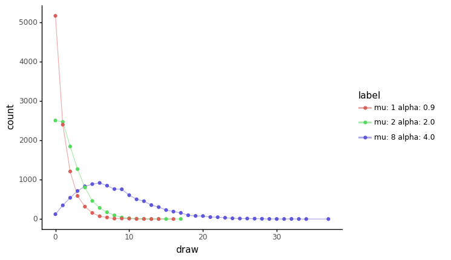
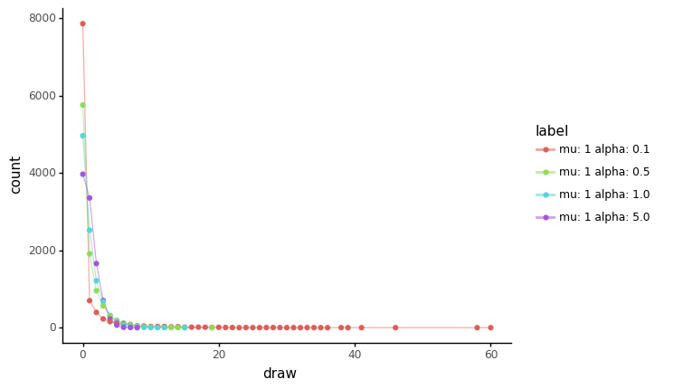
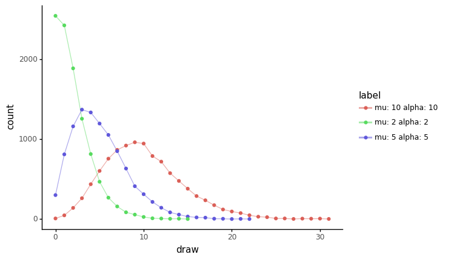

# Basic exploration of the Negative Binomial distribution

```python
%load_ext autoreload
%autoreload 2
```

```python
from time import time

import janitor
import numpy as np
import pandas as pd
import plotnine as gg
import pymc3 as pm
```

```python
notebook_tic = time()
_ = gg.theme_set(gg.theme_classic())
```

```python
def sample_pm_nb(mu: float, alpha: float, n: int = 500) -> np.ndarray:
    with pm.Model():
        x = pm.NegativeBinomial(name="x", mu=mu, alpha=alpha).random(size=n)
    return x
```

```python
def sample_nb_with_params(
    params: list[tuple[float, float]], n: int = 500
) -> pd.DataFrame:
    dfs: list[pd.DataFrame] = []
    for mu, alpha in params:
        df = pd.DataFrame(
            {"mu": mu, "alpha": alpha, "draw": sample_pm_nb(mu, alpha, n=n)}
        )
        dfs.append(df)
    nb_samples = pd.concat(dfs)
    return nb_samples


def make_nb_counts_dataframe(
    params: list[tuple[float, float]], n: int = 500
) -> pd.DataFrame:
    nb_samples = sample_nb_with_params(params, n)
    nb_samples_counts = (
        nb_samples.value_counts(["mu", "alpha", "draw"])
        .to_frame("count")
        .reset_index(drop=False)
        .assign(label=lambda d: [f"mu: {m} alpha: {a}" for m, a in zip(d.mu, d.alpha)])
    )
    return nb_samples_counts
```

```python
def plot_nb_sample_count(df: pd.DataFrame) -> gg.ggplot:
    return (
        gg.ggplot(df, gg.aes(x="draw", y="count", color="label"))
        + gg.geom_line(alpha=0.5)
        + gg.geom_point()
    )
```

Same parameters as used in the example in the PyMC3 documentation: [`NegativeBinomial`](https://docs.pymc.io/en/stable/api/distributions/discrete.html#pymc3.distributions.discrete.NegativeBinomial)

```python
params: list[tuple[float, float]] = [(1, 0.9), (2, 2), (8, 4)]
plot_nb_sample_count(make_nb_counts_dataframe(params, n=10000))
```



    <ggplot: (357817001)>

```python
params = [(1, 0.1), (1, 0.5), (1, 1.0), (1, 5.0)]
plot_nb_sample_count(make_nb_counts_dataframe(params, n=10000))
```



    <ggplot: (358396754)>

```python
params = [(2, 2), (5, 5), (10, 10)]
plot_nb_sample_count(make_nb_counts_dataframe(params, n=10000))
```



    <ggplot: (358630605)>

```python
sample_nb_with_params([(1, 0.9), (2, 2), (8, 4)], n=100000).groupby(
    ["mu", "alpha"]
).agg(["mean", "std"])
```

<div>
<style scoped>
    .dataframe tbody tr th:only-of-type {
        vertical-align: middle;
    }

    .dataframe tbody tr th {
        vertical-align: top;
    }

    .dataframe thead tr th {
        text-align: left;
    }

    .dataframe thead tr:last-of-type th {
        text-align: right;
    }
</style>
<table border="1" class="dataframe">
  <thead>
    <tr>
      <th></th>
      <th></th>
      <th colspan="2" halign="left">draw</th>
    </tr>
    <tr>
      <th></th>
      <th></th>
      <th>mean</th>
      <th>std</th>
    </tr>
    <tr>
      <th>mu</th>
      <th>alpha</th>
      <th></th>
      <th></th>
    </tr>
  </thead>
  <tbody>
    <tr>
      <th>1</th>
      <th>0.9</th>
      <td>1.00374</td>
      <td>1.453233</td>
    </tr>
    <tr>
      <th>2</th>
      <th>2.0</th>
      <td>1.99609</td>
      <td>2.004434</td>
    </tr>
    <tr>
      <th>8</th>
      <th>4.0</th>
      <td>8.00464</td>
      <td>4.910961</td>
    </tr>
  </tbody>
</table>
</div>

```python
make_nb_counts_dataframe([(0, 0.9)])
```

<div>
<style scoped>
    .dataframe tbody tr th:only-of-type {
        vertical-align: middle;
    }

    .dataframe tbody tr th {
        vertical-align: top;
    }

    .dataframe thead th {
        text-align: right;
    }
</style>
<table border="1" class="dataframe">
  <thead>
    <tr style="text-align: right;">
      <th></th>
      <th>mu</th>
      <th>alpha</th>
      <th>draw</th>
      <th>count</th>
      <th>label</th>
    </tr>
  </thead>
  <tbody>
    <tr>
      <th>0</th>
      <td>0</td>
      <td>0.9</td>
      <td>0</td>
      <td>500</td>
      <td>mu: 0 alpha: 0.9</td>
    </tr>
  </tbody>
</table>
</div>

---

```python
notebook_toc = time()
print(f"execution time: {(notebook_toc - notebook_tic) / 60:.2f} minutes")
```

    execution time: 0.83 minutes

```python
%load_ext watermark
%watermark -d -u -v -iv -b -h -m
```

    Last updated: 2021-11-05

    Python implementation: CPython
    Python version       : 3.9.6
    IPython version      : 7.26.0

    Compiler    : Clang 11.1.0
    OS          : Darwin
    Release     : 20.6.0
    Machine     : x86_64
    Processor   : i386
    CPU cores   : 4
    Architecture: 64bit

    Hostname: JHCookMac.local

    Git branch: sp9

    pandas  : 1.3.2
    plotnine: 0.8.0
    pymc3   : 3.11.2
    janitor : 0.21.0
    numpy   : 1.21.2
    sys     : 3.9.6 | packaged by conda-forge | (default, Jul 11 2021, 03:36:15)
    [Clang 11.1.0 ]
