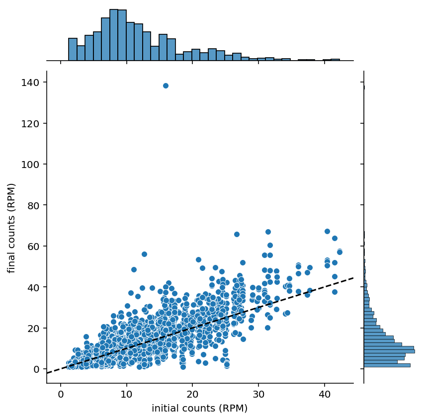
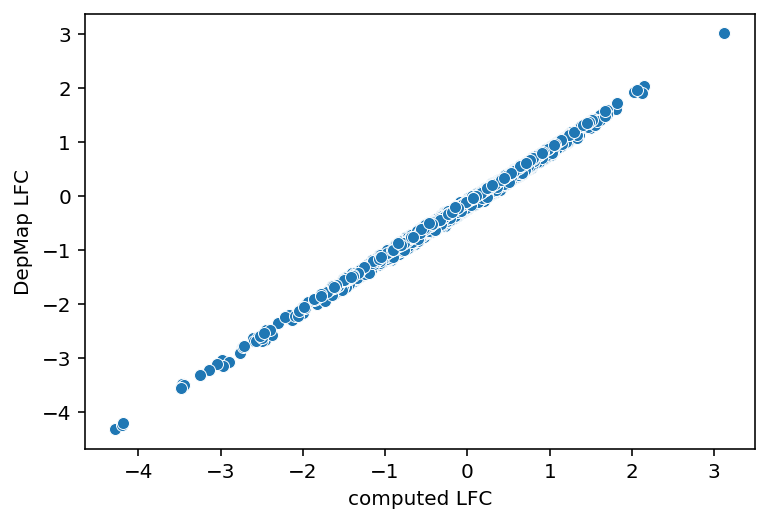
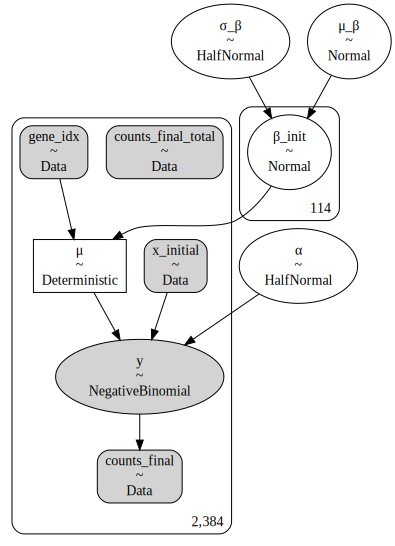
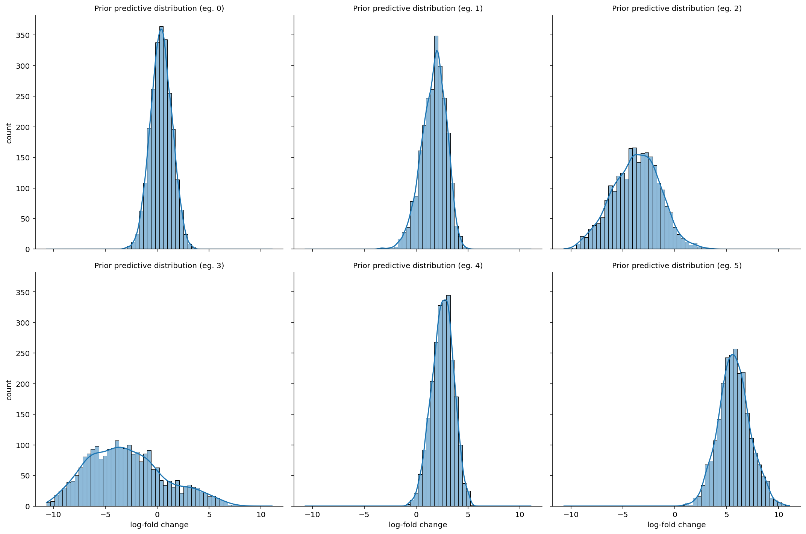
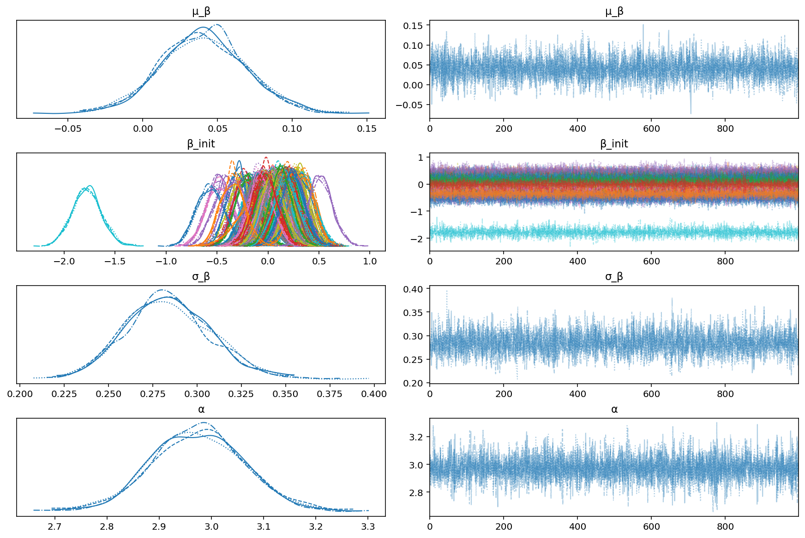
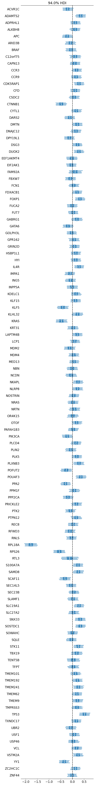
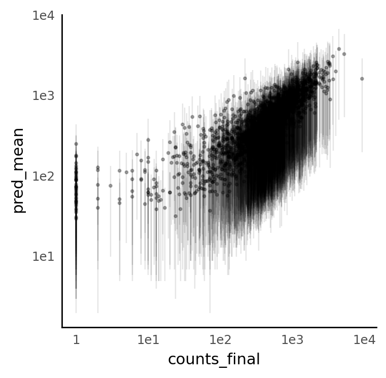
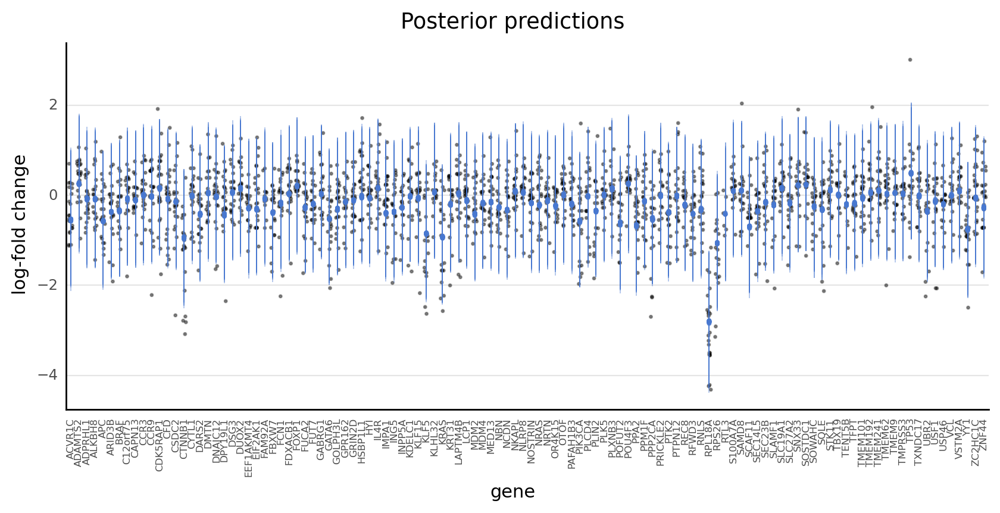
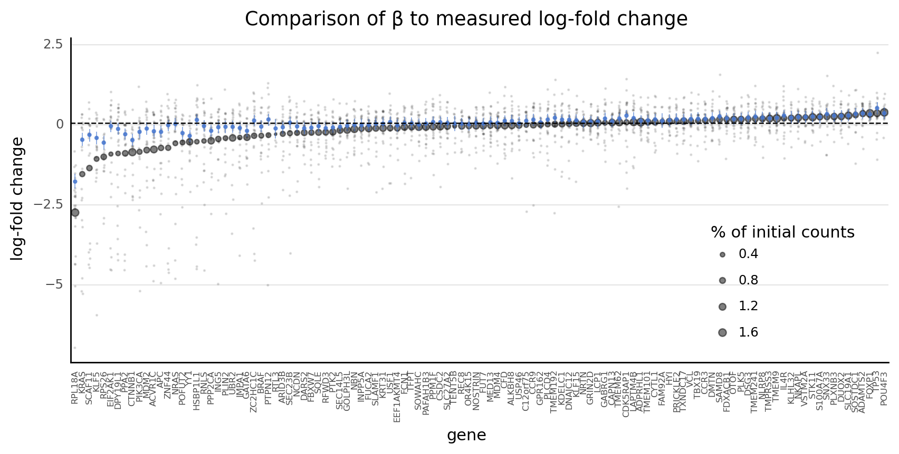

```python
%load_ext autoreload
%autoreload 2
```

```python
import warnings
from pathlib import Path
from time import time

import arviz as az
import janitor
import numpy as np
import pandas as pd
import plotnine as gg
import pymc3 as pm
import seaborn as sns
from matplotlib import pyplot as plt
```

```python
from src.analysis import pymc3_analysis as pmanal
from src.data_processing import achilles as achelp
from src.data_processing import common as dphelp
from src.data_processing import vectors as vhelp
from src.globals import get_pymc3_constants
from src.io.data_io import DataFile, data_path
from src.loggers import logger
from src.plot.color_pal import SeabornColor
from src.plot.plotnine_helpers import set_gg_theme
```

```python
notebook_tic = time()

warnings.simplefilter(action="ignore", category=UserWarning)
set_gg_theme()
%config InlineBackend.figure_format = "retina"
PYMC3 = get_pymc3_constants()
RANDOM_SEED = 847
np.random.seed(RANDOM_SEED)
```

```python
crc_subsample_df = pd.read_csv(data_path(DataFile.DEPMAP_CRC_SUBSAMPLE))
crc_subsample_df.head()
```

<div>
<style scoped>
    .dataframe tbody tr th:only-of-type {
        vertical-align: middle;
    }

    .dataframe tbody tr th {
        vertical-align: top;
    }

    .dataframe thead th {
        text-align: right;
    }
</style>
<table border="1" class="dataframe">
  <thead>
    <tr style="text-align: right;">
      <th></th>
      <th>sgrna</th>
      <th>replicate_id</th>
      <th>lfc</th>
      <th>p_dna_batch</th>
      <th>genome_alignment</th>
      <th>hugo_symbol</th>
      <th>screen</th>
      <th>multiple_hits_on_gene</th>
      <th>sgrna_target_chr</th>
      <th>sgrna_target_pos</th>
      <th>...</th>
      <th>num_mutations</th>
      <th>any_deleterious</th>
      <th>any_tcga_hotspot</th>
      <th>any_cosmic_hotspot</th>
      <th>is_mutated</th>
      <th>copy_number</th>
      <th>lineage</th>
      <th>primary_or_metastasis</th>
      <th>is_male</th>
      <th>age</th>
    </tr>
  </thead>
  <tbody>
    <tr>
      <th>0</th>
      <td>ACGCCACTGACACTCAAGG</td>
      <td>LS513_c903R1</td>
      <td>0.583209</td>
      <td>ERS717283.plasmid</td>
      <td>chr1_27006713_-</td>
      <td>TENT5B</td>
      <td>sanger</td>
      <td>True</td>
      <td>1</td>
      <td>27006713</td>
      <td>...</td>
      <td>0</td>
      <td>NaN</td>
      <td>NaN</td>
      <td>NaN</td>
      <td>False</td>
      <td>0.961139</td>
      <td>colorectal</td>
      <td>primary</td>
      <td>True</td>
      <td>63.0</td>
    </tr>
    <tr>
      <th>1</th>
      <td>AGCTGAGCGCAGGGACCGGG</td>
      <td>LS513-311Cas9_RepA_p6_batch2</td>
      <td>-0.020788</td>
      <td>2</td>
      <td>chr1_27012633_-</td>
      <td>TENT5B</td>
      <td>broad</td>
      <td>True</td>
      <td>1</td>
      <td>27012633</td>
      <td>...</td>
      <td>0</td>
      <td>NaN</td>
      <td>NaN</td>
      <td>NaN</td>
      <td>False</td>
      <td>0.961139</td>
      <td>colorectal</td>
      <td>primary</td>
      <td>True</td>
      <td>63.0</td>
    </tr>
    <tr>
      <th>2</th>
      <td>CTACTAGACTTCCTGCCGGC</td>
      <td>LS513-311Cas9_RepA_p6_batch2</td>
      <td>-0.666070</td>
      <td>2</td>
      <td>chr1_27006754_-</td>
      <td>TENT5B</td>
      <td>broad</td>
      <td>True</td>
      <td>1</td>
      <td>27006754</td>
      <td>...</td>
      <td>0</td>
      <td>NaN</td>
      <td>NaN</td>
      <td>NaN</td>
      <td>False</td>
      <td>0.961139</td>
      <td>colorectal</td>
      <td>primary</td>
      <td>True</td>
      <td>63.0</td>
    </tr>
    <tr>
      <th>3</th>
      <td>AAACTTGCTGACGTGCCTGG</td>
      <td>LS513-311Cas9_RepA_p6_batch2</td>
      <td>-0.130231</td>
      <td>2</td>
      <td>chr4_52628042_-</td>
      <td>USP46</td>
      <td>broad</td>
      <td>True</td>
      <td>4</td>
      <td>52628042</td>
      <td>...</td>
      <td>0</td>
      <td>NaN</td>
      <td>NaN</td>
      <td>NaN</td>
      <td>False</td>
      <td>0.952543</td>
      <td>colorectal</td>
      <td>primary</td>
      <td>True</td>
      <td>63.0</td>
    </tr>
    <tr>
      <th>4</th>
      <td>AACAACTAACTTTGTACAT</td>
      <td>LS513_c903R1</td>
      <td>0.226828</td>
      <td>ERS717283.plasmid</td>
      <td>chr8_81679130_-</td>
      <td>IMPA1</td>
      <td>sanger</td>
      <td>True</td>
      <td>8</td>
      <td>81679130</td>
      <td>...</td>
      <td>0</td>
      <td>NaN</td>
      <td>NaN</td>
      <td>NaN</td>
      <td>False</td>
      <td>0.957015</td>
      <td>colorectal</td>
      <td>primary</td>
      <td>True</td>
      <td>63.0</td>
    </tr>
  </tbody>
</table>
<p>5 rows × 24 columns</p>
</div>

```python
crc_subsample_df.columns.to_list()
```

    ['sgrna',
     'replicate_id',
     'lfc',
     'p_dna_batch',
     'genome_alignment',
     'hugo_symbol',
     'screen',
     'multiple_hits_on_gene',
     'sgrna_target_chr',
     'sgrna_target_pos',
     'depmap_id',
     'counts_final',
     'counts_initial',
     'rna_expr',
     'num_mutations',
     'any_deleterious',
     'any_tcga_hotspot',
     'any_cosmic_hotspot',
     'is_mutated',
     'copy_number',
     'lineage',
     'primary_or_metastasis',
     'is_male',
     'age']

```python
n_genes = crc_subsample_df.hugo_symbol.nunique()
print(f"Number of genes in data: {n_genes}")

n_celllines = crc_subsample_df.depmap_id.nunique()
print(f"Number of cell lines in data: {n_celllines}")
```

    Number of genes in data: 114
    Number of cell lines in data: 10

```python
screen_total_reads = pd.read_csv(data_path(DataFile.SCREEN_READ_COUNT_TOTALS))
pdna_total_reads = pd.read_csv(data_path(DataFile.PDNA_READ_COUNT_TOTALS))
```

```python
screen_total_reads.head()
```

<div>
<style scoped>
    .dataframe tbody tr th:only-of-type {
        vertical-align: middle;
    }

    .dataframe tbody tr th {
        vertical-align: top;
    }

    .dataframe thead th {
        text-align: right;
    }
</style>
<table border="1" class="dataframe">
  <thead>
    <tr style="text-align: right;">
      <th></th>
      <th>replicate_id</th>
      <th>total_reads</th>
    </tr>
  </thead>
  <tbody>
    <tr>
      <th>0</th>
      <td>HEL-311Cas9_RepA_p4_batch3</td>
      <td>19938818</td>
    </tr>
    <tr>
      <th>1</th>
      <td>HEL9217-311Cas9_RepA_p6_batch3</td>
      <td>41251611</td>
    </tr>
    <tr>
      <th>2</th>
      <td>LS513-311Cas9_RepA_p6_batch2</td>
      <td>35176093</td>
    </tr>
    <tr>
      <th>3</th>
      <td>LS513_c903R1</td>
      <td>67379131</td>
    </tr>
    <tr>
      <th>4</th>
      <td>OVR3_c905R1</td>
      <td>32062618</td>
    </tr>
  </tbody>
</table>
</div>

```python
pdna_total_reads
```

<div>
<style scoped>
    .dataframe tbody tr th:only-of-type {
        vertical-align: middle;
    }

    .dataframe tbody tr th {
        vertical-align: top;
    }

    .dataframe thead th {
        text-align: right;
    }
</style>
<table border="1" class="dataframe">
  <thead>
    <tr style="text-align: right;">
      <th></th>
      <th>p_dna_batch</th>
      <th>total_reads</th>
    </tr>
  </thead>
  <tbody>
    <tr>
      <th>0</th>
      <td>2</td>
      <td>1.072163e+06</td>
    </tr>
    <tr>
      <th>1</th>
      <td>3</td>
      <td>1.071751e+06</td>
    </tr>
    <tr>
      <th>2</th>
      <td>4</td>
      <td>1.071078e+06</td>
    </tr>
    <tr>
      <th>3</th>
      <td>CRISPR_C6596666.sample</td>
      <td>1.101090e+06</td>
    </tr>
    <tr>
      <th>4</th>
      <td>ERS717283.plasmid</td>
      <td>1.090709e+06</td>
    </tr>
  </tbody>
</table>
</div>

```python
subset_cols = [
    "depmap_id",
    "screen",
    "replicate_id",
    "p_dna_batch",
    "hugo_symbol",
    "sgrna",
    "lfc",
    "counts_final",
    "counts_initial",
    "rna_expr",
]

categorical_cols = ["depmap_id", "screen", "hugo_symbol", "sgrna"]

data = (
    crc_subsample_df[subset_cols]
    .dropna()
    .reset_index(drop=True)
    .merge(screen_total_reads, on="replicate_id")
    .rename(columns={"total_reads": "counts_final_total"})
    .merge(pdna_total_reads, on="p_dna_batch")
    .rename(columns={"total_reads": "counts_initial_total"})
    .sort_values(["depmap_id", "hugo_symbol", "sgrna"])
    .reset_index(drop=True)
    .pipe(achelp.set_achilles_categorical_columns, cols=categorical_cols, ordered=True)
    .assign(
        counts_final=lambda d: d.counts_final + 1,
        counts_final_rpm=lambda d: 1e6 * (d.counts_final / d.counts_final_total) + 1,
        counts_initial_frac=lambda d: (d.counts_initial / d.counts_initial_total),
        counts_final_total_adj=lambda d: d.counts_initial_frac
        - d.counts_initial_frac.mean() * d.counts_final_total,
        counts_initial_adj=lambda d: (d.counts_initial / d.counts_initial_total)
        * d.counts_final_total,
    )
    .drop(columns=["counts_initial_frac"])
    .pipe(
        dphelp.center_column_grouped_dataframe,
        grp_col="hugo_symbol",
        val_col="counts_initial",
        new_col_name="counts_initial_z",
    )
)

data.head()
```

<div>
<style scoped>
    .dataframe tbody tr th:only-of-type {
        vertical-align: middle;
    }

    .dataframe tbody tr th {
        vertical-align: top;
    }

    .dataframe thead th {
        text-align: right;
    }
</style>
<table border="1" class="dataframe">
  <thead>
    <tr style="text-align: right;">
      <th></th>
      <th>depmap_id</th>
      <th>screen</th>
      <th>replicate_id</th>
      <th>p_dna_batch</th>
      <th>hugo_symbol</th>
      <th>sgrna</th>
      <th>lfc</th>
      <th>counts_final</th>
      <th>counts_initial</th>
      <th>rna_expr</th>
      <th>counts_final_total</th>
      <th>counts_initial_total</th>
      <th>counts_final_rpm</th>
      <th>counts_final_total_adj</th>
      <th>counts_initial_adj</th>
      <th>counts_initial_z</th>
    </tr>
  </thead>
  <tbody>
    <tr>
      <th>0</th>
      <td>ACH-000007</td>
      <td>broad</td>
      <td>LS513-311Cas9_RepA_p6_batch2</td>
      <td>2</td>
      <td>ACVR1C</td>
      <td>ATAACACTGCACCTTCCAAC</td>
      <td>0.179367</td>
      <td>1711.0</td>
      <td>37.738428</td>
      <td>0.176323</td>
      <td>35176093</td>
      <td>1.072163e+06</td>
      <td>49.640990</td>
      <td>-385.834843</td>
      <td>1238.142818</td>
      <td>22.008548</td>
    </tr>
    <tr>
      <th>1</th>
      <td>ACH-000007</td>
      <td>sanger</td>
      <td>LS513_c903R1</td>
      <td>ERS717283.plasmid</td>
      <td>ACVR1C</td>
      <td>CTTGTTAGATAATGGAACT</td>
      <td>-1.100620</td>
      <td>1.0</td>
      <td>2.144469</td>
      <td>0.176323</td>
      <td>67379131</td>
      <td>1.090709e+06</td>
      <td>1.014841</td>
      <td>-739.059301</td>
      <td>132.475703</td>
      <td>-13.585411</td>
    </tr>
    <tr>
      <th>2</th>
      <td>ACH-000007</td>
      <td>sanger</td>
      <td>LS513_c903R1</td>
      <td>ERS717283.plasmid</td>
      <td>ACVR1C</td>
      <td>GAAATATAGTGACCGTGGC</td>
      <td>0.275029</td>
      <td>1182.0</td>
      <td>14.265433</td>
      <td>0.176323</td>
      <td>67379131</td>
      <td>1.090709e+06</td>
      <td>18.542524</td>
      <td>-739.059290</td>
      <td>881.254766</td>
      <td>-1.464446</td>
    </tr>
    <tr>
      <th>3</th>
      <td>ACH-000007</td>
      <td>sanger</td>
      <td>LS513_c903R1</td>
      <td>ERS717283.plasmid</td>
      <td>ADAMTS2</td>
      <td>AGCAGGGGTACGAGCCCGC</td>
      <td>0.696906</td>
      <td>1666.0</td>
      <td>14.759636</td>
      <td>0.028569</td>
      <td>67379131</td>
      <td>1.090709e+06</td>
      <td>25.725757</td>
      <td>-739.059290</td>
      <td>911.784385</td>
      <td>2.968174</td>
    </tr>
    <tr>
      <th>4</th>
      <td>ACH-000007</td>
      <td>sanger</td>
      <td>LS513_c903R1</td>
      <td>ERS717283.plasmid</td>
      <td>ADAMTS2</td>
      <td>GCGATACACCACATGCACA</td>
      <td>0.756250</td>
      <td>1589.0</td>
      <td>13.537135</td>
      <td>0.028569</td>
      <td>67379131</td>
      <td>1.090709e+06</td>
      <td>24.582970</td>
      <td>-739.059291</td>
      <td>836.263750</td>
      <td>1.745673</td>
    </tr>
  </tbody>
</table>
</div>

Data dictionary for counts columns:

- `counts_initial`: initial read counts per million (+1 pseudocount)
- `counts_final`: final read counts (+1 pseudocount)
- `counts_initial_total`, `counts_final_total`: total of the initial and final counts
- `counts_final_total_adj`: total final counts scaled by the fraction of the pDNA library
- `counts_initial_adj`: the initial number of reads expected given the total number of reads in the final sequencing

```python
jp = sns.jointplot(data=data, x="counts_initial", y="counts_final_rpm", kind="scatter")
jp.ax_joint.axline((0, 0), slope=1, color="k", ls="--")
jp.ax_joint.set_xlabel("initial counts (RPM)")
jp.ax_joint.set_ylabel("final counts (RPM)");
```



```python
data[data.counts_final_rpm > 120]
```

<div>
<style scoped>
    .dataframe tbody tr th:only-of-type {
        vertical-align: middle;
    }

    .dataframe tbody tr th {
        vertical-align: top;
    }

    .dataframe thead th {
        text-align: right;
    }
</style>
<table border="1" class="dataframe">
  <thead>
    <tr style="text-align: right;">
      <th></th>
      <th>depmap_id</th>
      <th>screen</th>
      <th>replicate_id</th>
      <th>p_dna_batch</th>
      <th>hugo_symbol</th>
      <th>sgrna</th>
      <th>lfc</th>
      <th>counts_final</th>
      <th>counts_initial</th>
      <th>rna_expr</th>
      <th>counts_final_total</th>
      <th>counts_initial_total</th>
      <th>counts_final_rpm</th>
      <th>counts_final_total_adj</th>
      <th>counts_initial_adj</th>
      <th>counts_initial_z</th>
    </tr>
  </thead>
  <tbody>
    <tr>
      <th>309</th>
      <td>ACH-000007</td>
      <td>sanger</td>
      <td>LS513_c903R1</td>
      <td>ERS717283.plasmid</td>
      <td>TP53</td>
      <td>CATTGTTCAATATCGTCCG</td>
      <td>3.011199</td>
      <td>9256.0</td>
      <td>15.930115</td>
      <td>6.280028</td>
      <td>67379131</td>
      <td>1090709.0</td>
      <td>138.371911</td>
      <td>-739.059289</td>
      <td>984.091376</td>
      <td>0.057308</td>
    </tr>
  </tbody>
</table>
</div>

```python
my_lfc = np.log2(data.counts_final_rpm / data.counts_initial)
ax = sns.scatterplot(x=my_lfc, y=data.lfc)
ax.set_xlabel("computed LFC")
ax.set_ylabel("DepMap LFC");
```



## Modeling

The goal of this notebook is to try different ways of incorporating the "exposure" for each measurement.
In this case, the values of interest are the total number of reads per screen replicate (`replicate_id`) and the composition of the guide in the primary DNA batch (`p_dna_batch`).

The first method is to incorporate the initial read count as a covariate in the model and set the exposure as the total number of reads in the replicate:

$$
\begin{aligned}
\eta &= x_\text{initial RPM} \beta + \dots \\
\mu &= exp(\eta) \\
y &= \text{NB}(\mu \times u_\text{total reads}, \alpha)
\end{aligned}
$$

Another option is to set the exposure as the total number of reads scaled by the fraction of the pDNA library of the guide:

$$
\begin{aligned}
\eta &= x_\text{initial RPM} \beta + \dots \\
\mu &= exp(\eta) \\
y &= \text{NB}(\mu \times u_{\text{%pDNA} \times \text{total reads}}, \alpha)
\end{aligned}
$$

### Model 1.

$$
\begin{aligned}
\mu_{\beta_\text{initial}} &\sim \text{N}(0, 5) \\
\sigma_{\beta_\text{initial}} &\sim \text{HN}(5) \\
\beta_\text{initial} &\sim_{g} \text{N}(\mu_{\beta_\text{initial}}, \sigma_{\beta_\text{initial}}) \\
\eta &= x_\text{initial RPM} \beta_\text{initial}[g] \\
\mu &= \exp(\eta) \\
\alpha &\sim \text{HN}(5) \\
y &\sim \text{NB}(u \times \mu, \alpha)
\end{aligned}
$$

```python
any(data.counts_initial_adj.values < 1)
```

    False

```python
gene_idx, n_genes = dphelp.get_indices_and_count(data, "hugo_symbol")

with pm.Model() as m1:
    g = pm.Data("gene_idx", gene_idx)
    x_initial = pm.Data("x_initial", data.counts_initial_adj.values)
    counts_final_total = pm.Data("counts_final_total", data.counts_final_total.values)
    counts_final = pm.Data("counts_final", data.counts_final.values)

    μ_β = pm.Normal("μ_β", 0, 2.5)
    σ_β = pm.HalfNormal("σ_β", 2.5)

    β_init = pm.Normal("β_init", μ_β, σ_β, shape=(n_genes))
    η = β_init[g]

    μ = pm.Deterministic("μ", pm.math.exp(η))
    α = pm.HalfNormal("α", 5)
    y = pm.NegativeBinomial("y", x_initial * μ, α, observed=counts_final)
```

```python
pm.model_to_graphviz(m1)
```



```python
with m1:
    prior_pred = pm.sample_prior_predictive(random_seed=RANDOM_SEED)
```

```python
prior_pred_examples = (
    pd.DataFrame(
        np.log2((1 + prior_pred["y"][:6, :]) / data.counts_initial_adj.values).T
    )
    .pivot_longer()
    .astype({"variable": "str"})
)
fg = sns.displot(
    data=prior_pred_examples,
    x="value",
    col="variable",
    col_wrap=3,
    kind="hist",
    kde=True,
)
fg.set_axis_labels("log-fold change", "count")
fg.set_titles("Prior predictive distribution (eg. {col_name})");
```



```python
with m1:
    m1_trace = pm.sample(
        draws=1000,
        tune=1000,
        cores=2,
        chains=4,
        random_seed=RANDOM_SEED,
        return_inferencedata=True,
    )
    post_pred = pm.sample_posterior_predictive(m1_trace, random_seed=RANDOM_SEED)
    m1_trace.extend(az.from_pymc3(prior=prior_pred, posterior_predictive=post_pred))
```

    Auto-assigning NUTS sampler...
    Initializing NUTS using jitter+adapt_diag...
    Multiprocess sampling (4 chains in 2 jobs)
    NUTS: [α, β_init, σ_β, μ_β]

<div>
    <style>
        /*Turns off some styling*/
        progress {
            /*gets rid of default border in Firefox and Opera.*/
            border: none;
            /*Needs to be in here for Safari polyfill so background images work as expected.*/
            background-size: auto;
        }
        .progress-bar-interrupted, .progress-bar-interrupted::-webkit-progress-bar {
            background: #F44336;
        }
    </style>
  <progress value='8000' class='' max='8000' style='width:300px; height:20px; vertical-align: middle;'></progress>
  100.00% [8000/8000 00:50<00:00 Sampling 4 chains, 0 divergences]
</div>

    Sampling 4 chains for 1_000 tune and 1_000 draw iterations (4_000 + 4_000 draws total) took 70 seconds.

<div>
    <style>
        /*Turns off some styling*/
        progress {
            /*gets rid of default border in Firefox and Opera.*/
            border: none;
            /*Needs to be in here for Safari polyfill so background images work as expected.*/
            background-size: auto;
        }
        .progress-bar-interrupted, .progress-bar-interrupted::-webkit-progress-bar {
            background: #F44336;
        }
    </style>
  <progress value='4000' class='' max='4000' style='width:300px; height:20px; vertical-align: middle;'></progress>
  100.00% [4000/4000 01:05<00:00]
</div>

```python
az.summary(m1_trace, var_names=["μ_β", "σ_β", "α"])
```

<div>
<style scoped>
    .dataframe tbody tr th:only-of-type {
        vertical-align: middle;
    }

    .dataframe tbody tr th {
        vertical-align: top;
    }

    .dataframe thead th {
        text-align: right;
    }
</style>
<table border="1" class="dataframe">
  <thead>
    <tr style="text-align: right;">
      <th></th>
      <th>mean</th>
      <th>sd</th>
      <th>hdi_3%</th>
      <th>hdi_97%</th>
      <th>mcse_mean</th>
      <th>mcse_sd</th>
      <th>ess_bulk</th>
      <th>ess_tail</th>
      <th>r_hat</th>
    </tr>
  </thead>
  <tbody>
    <tr>
      <th>μ_β</th>
      <td>0.041</td>
      <td>0.029</td>
      <td>-0.015</td>
      <td>0.094</td>
      <td>0.000</td>
      <td>0.000</td>
      <td>5963.0</td>
      <td>3160.0</td>
      <td>1.0</td>
    </tr>
    <tr>
      <th>σ_β</th>
      <td>0.284</td>
      <td>0.024</td>
      <td>0.238</td>
      <td>0.328</td>
      <td>0.000</td>
      <td>0.000</td>
      <td>4058.0</td>
      <td>3275.0</td>
      <td>1.0</td>
    </tr>
    <tr>
      <th>α</th>
      <td>2.974</td>
      <td>0.089</td>
      <td>2.814</td>
      <td>3.147</td>
      <td>0.001</td>
      <td>0.001</td>
      <td>7101.0</td>
      <td>3086.0</td>
      <td>1.0</td>
    </tr>
  </tbody>
</table>
</div>

```python
az.summary(m1_trace, var_names="β_init")[
    ["mcse_mean", "mcse_sd", "ess_bulk", "ess_tail", "r_hat"]
].agg(["mean", np.std, "min", "max"])
```

<div>
<style scoped>
    .dataframe tbody tr th:only-of-type {
        vertical-align: middle;
    }

    .dataframe tbody tr th {
        vertical-align: top;
    }

    .dataframe thead th {
        text-align: right;
    }
</style>
<table border="1" class="dataframe">
  <thead>
    <tr style="text-align: right;">
      <th></th>
      <th>mcse_mean</th>
      <th>mcse_sd</th>
      <th>ess_bulk</th>
      <th>ess_tail</th>
      <th>r_hat</th>
    </tr>
  </thead>
  <tbody>
    <tr>
      <th>mean</th>
      <td>0.001096</td>
      <td>0.001421</td>
      <td>7586.605263</td>
      <td>2722.201754</td>
      <td>1.000088</td>
    </tr>
    <tr>
      <th>std</th>
      <td>0.000297</td>
      <td>0.000513</td>
      <td>827.607840</td>
      <td>238.729498</td>
      <td>0.000937</td>
    </tr>
    <tr>
      <th>min</th>
      <td>0.001000</td>
      <td>0.001000</td>
      <td>4943.000000</td>
      <td>2112.000000</td>
      <td>1.000000</td>
    </tr>
    <tr>
      <th>max</th>
      <td>0.002000</td>
      <td>0.003000</td>
      <td>9589.000000</td>
      <td>3165.000000</td>
      <td>1.010000</td>
    </tr>
  </tbody>
</table>
</div>

```python
az.plot_trace(m1_trace, var_names=["β", "α"], filter_vars="like");
```



```python
ax = az.plot_forest(m1_trace, var_names="β_init")
ax[0].set_yticklabels(data.hugo_symbol.cat.categories[::-1])
ax[0].axvline(0, color="k", linestyle="--");
```



```python
m1_ppc = pmanal.summarize_posterior_predictions(
    m1_trace.posterior_predictive["y"].values.squeeze(),
    hdi_prob=PYMC3.hdi_prob,
    merge_with=data.copy(),
)
m1_ppc.head()
```

    /usr/local/Caskroom/miniconda/base/envs/speclet/lib/python3.9/site-packages/arviz/stats/stats.py:456: FutureWarning: hdi currently interprets 2d data as (draw, shape) but this will change in a future release to (chain, draw) for coherence with other functions

<div>
<style scoped>
    .dataframe tbody tr th:only-of-type {
        vertical-align: middle;
    }

    .dataframe tbody tr th {
        vertical-align: top;
    }

    .dataframe thead th {
        text-align: right;
    }
</style>
<table border="1" class="dataframe">
  <thead>
    <tr style="text-align: right;">
      <th></th>
      <th>pred_mean</th>
      <th>pred_hdi_low</th>
      <th>pred_hdi_high</th>
      <th>depmap_id</th>
      <th>screen</th>
      <th>replicate_id</th>
      <th>p_dna_batch</th>
      <th>hugo_symbol</th>
      <th>sgrna</th>
      <th>lfc</th>
      <th>counts_final</th>
      <th>counts_initial</th>
      <th>rna_expr</th>
      <th>counts_final_total</th>
      <th>counts_initial_total</th>
      <th>counts_final_rpm</th>
      <th>counts_final_total_adj</th>
      <th>counts_initial_adj</th>
      <th>counts_initial_z</th>
    </tr>
  </thead>
  <tbody>
    <tr>
      <th>0</th>
      <td>1013.66100</td>
      <td>150.0</td>
      <td>1840.0</td>
      <td>ACH-000007</td>
      <td>broad</td>
      <td>LS513-311Cas9_RepA_p6_batch2</td>
      <td>2</td>
      <td>ACVR1C</td>
      <td>ATAACACTGCACCTTCCAAC</td>
      <td>0.179367</td>
      <td>1711.0</td>
      <td>37.738428</td>
      <td>0.176323</td>
      <td>35176093</td>
      <td>1.072163e+06</td>
      <td>49.640990</td>
      <td>-385.834843</td>
      <td>1238.142818</td>
      <td>22.008548</td>
    </tr>
    <tr>
      <th>1</th>
      <td>110.34650</td>
      <td>12.0</td>
      <td>201.0</td>
      <td>ACH-000007</td>
      <td>sanger</td>
      <td>LS513_c903R1</td>
      <td>ERS717283.plasmid</td>
      <td>ACVR1C</td>
      <td>CTTGTTAGATAATGGAACT</td>
      <td>-1.100620</td>
      <td>1.0</td>
      <td>2.144469</td>
      <td>0.176323</td>
      <td>67379131</td>
      <td>1.090709e+06</td>
      <td>1.014841</td>
      <td>-739.059301</td>
      <td>132.475703</td>
      <td>-13.585411</td>
    </tr>
    <tr>
      <th>2</th>
      <td>715.35275</td>
      <td>115.0</td>
      <td>1259.0</td>
      <td>ACH-000007</td>
      <td>sanger</td>
      <td>LS513_c903R1</td>
      <td>ERS717283.plasmid</td>
      <td>ACVR1C</td>
      <td>GAAATATAGTGACCGTGGC</td>
      <td>0.275029</td>
      <td>1182.0</td>
      <td>14.265433</td>
      <td>0.176323</td>
      <td>67379131</td>
      <td>1.090709e+06</td>
      <td>18.542524</td>
      <td>-739.059290</td>
      <td>881.254766</td>
      <td>-1.464446</td>
    </tr>
    <tr>
      <th>3</th>
      <td>1307.81275</td>
      <td>133.0</td>
      <td>2319.0</td>
      <td>ACH-000007</td>
      <td>sanger</td>
      <td>LS513_c903R1</td>
      <td>ERS717283.plasmid</td>
      <td>ADAMTS2</td>
      <td>AGCAGGGGTACGAGCCCGC</td>
      <td>0.696906</td>
      <td>1666.0</td>
      <td>14.759636</td>
      <td>0.028569</td>
      <td>67379131</td>
      <td>1.090709e+06</td>
      <td>25.725757</td>
      <td>-739.059290</td>
      <td>911.784385</td>
      <td>2.968174</td>
    </tr>
    <tr>
      <th>4</th>
      <td>1209.23375</td>
      <td>160.0</td>
      <td>2145.0</td>
      <td>ACH-000007</td>
      <td>sanger</td>
      <td>LS513_c903R1</td>
      <td>ERS717283.plasmid</td>
      <td>ADAMTS2</td>
      <td>GCGATACACCACATGCACA</td>
      <td>0.756250</td>
      <td>1589.0</td>
      <td>13.537135</td>
      <td>0.028569</td>
      <td>67379131</td>
      <td>1.090709e+06</td>
      <td>24.582970</td>
      <td>-739.059291</td>
      <td>836.263750</td>
      <td>1.745673</td>
    </tr>
  </tbody>
</table>
</div>

```python
(
    gg.ggplot(m1_ppc, gg.aes(x="counts_final", y="pred_mean"))
    + gg.geom_linerange(gg.aes(ymin="pred_hdi_low", ymax="pred_hdi_high"), alpha=0.1)
    + gg.geom_point(size=0.6, alpha=0.3)
    + gg.scale_x_log10()
    + gg.scale_y_log10()
)
```



    <ggplot: (361593775)>

```python
pred_lfc = np.log2(
    (m1_trace.posterior_predictive["y"].values.squeeze() + 1.0)
    / data.counts_initial_adj.values
)

change_col_names = {
    "pred_mean": "pred_lfc",
    "pred_hdi_low": "pred_lfc_hdi_low",
    "pred_hdi_high": "pred_lfc_hdi_high",
}

m1_ppc = pd.concat(
    [
        m1_ppc,
        pmanal.summarize_posterior_predictions(pred_lfc).rename(
            columns=change_col_names
        ),
    ],
    axis=1,
)

m1_ppc.head()
```

    /usr/local/Caskroom/miniconda/base/envs/speclet/lib/python3.9/site-packages/arviz/stats/stats.py:456: FutureWarning: hdi currently interprets 2d data as (draw, shape) but this will change in a future release to (chain, draw) for coherence with other functions

<div>
<style scoped>
    .dataframe tbody tr th:only-of-type {
        vertical-align: middle;
    }

    .dataframe tbody tr th {
        vertical-align: top;
    }

    .dataframe thead th {
        text-align: right;
    }
</style>
<table border="1" class="dataframe">
  <thead>
    <tr style="text-align: right;">
      <th></th>
      <th>pred_mean</th>
      <th>pred_hdi_low</th>
      <th>pred_hdi_high</th>
      <th>depmap_id</th>
      <th>screen</th>
      <th>replicate_id</th>
      <th>p_dna_batch</th>
      <th>hugo_symbol</th>
      <th>sgrna</th>
      <th>lfc</th>
      <th>...</th>
      <th>rna_expr</th>
      <th>counts_final_total</th>
      <th>counts_initial_total</th>
      <th>counts_final_rpm</th>
      <th>counts_final_total_adj</th>
      <th>counts_initial_adj</th>
      <th>counts_initial_z</th>
      <th>pred_lfc</th>
      <th>pred_lfc_hdi_low</th>
      <th>pred_lfc_hdi_high</th>
    </tr>
  </thead>
  <tbody>
    <tr>
      <th>0</th>
      <td>1013.66100</td>
      <td>150.0</td>
      <td>1840.0</td>
      <td>ACH-000007</td>
      <td>broad</td>
      <td>LS513-311Cas9_RepA_p6_batch2</td>
      <td>2</td>
      <td>ACVR1C</td>
      <td>ATAACACTGCACCTTCCAAC</td>
      <td>0.179367</td>
      <td>...</td>
      <td>0.176323</td>
      <td>35176093</td>
      <td>1.072163e+06</td>
      <td>49.640990</td>
      <td>-385.834843</td>
      <td>1238.142818</td>
      <td>22.008548</td>
      <td>-0.567753</td>
      <td>-1.925234</td>
      <td>1.059752</td>
    </tr>
    <tr>
      <th>1</th>
      <td>110.34650</td>
      <td>12.0</td>
      <td>201.0</td>
      <td>ACH-000007</td>
      <td>sanger</td>
      <td>LS513_c903R1</td>
      <td>ERS717283.plasmid</td>
      <td>ACVR1C</td>
      <td>CTTGTTAGATAATGGAACT</td>
      <td>-1.100620</td>
      <td>...</td>
      <td>0.176323</td>
      <td>67379131</td>
      <td>1.090709e+06</td>
      <td>1.014841</td>
      <td>-739.059301</td>
      <td>132.475703</td>
      <td>-13.585411</td>
      <td>-0.527140</td>
      <td>-1.962121</td>
      <td>0.910418</td>
    </tr>
    <tr>
      <th>2</th>
      <td>715.35275</td>
      <td>115.0</td>
      <td>1259.0</td>
      <td>ACH-000007</td>
      <td>sanger</td>
      <td>LS513_c903R1</td>
      <td>ERS717283.plasmid</td>
      <td>ACVR1C</td>
      <td>GAAATATAGTGACCGTGGC</td>
      <td>0.275029</td>
      <td>...</td>
      <td>0.176323</td>
      <td>67379131</td>
      <td>1.090709e+06</td>
      <td>18.542524</td>
      <td>-739.059290</td>
      <td>881.254766</td>
      <td>-1.464446</td>
      <td>-0.554877</td>
      <td>-2.125204</td>
      <td>0.714436</td>
    </tr>
    <tr>
      <th>3</th>
      <td>1307.81275</td>
      <td>133.0</td>
      <td>2319.0</td>
      <td>ACH-000007</td>
      <td>sanger</td>
      <td>LS513_c903R1</td>
      <td>ERS717283.plasmid</td>
      <td>ADAMTS2</td>
      <td>AGCAGGGGTACGAGCCCGC</td>
      <td>0.696906</td>
      <td>...</td>
      <td>0.028569</td>
      <td>67379131</td>
      <td>1.090709e+06</td>
      <td>25.725757</td>
      <td>-739.059290</td>
      <td>911.784385</td>
      <td>2.968174</td>
      <td>0.257154</td>
      <td>-1.067677</td>
      <td>1.754760</td>
    </tr>
    <tr>
      <th>4</th>
      <td>1209.23375</td>
      <td>160.0</td>
      <td>2145.0</td>
      <td>ACH-000007</td>
      <td>sanger</td>
      <td>LS513_c903R1</td>
      <td>ERS717283.plasmid</td>
      <td>ADAMTS2</td>
      <td>GCGATACACCACATGCACA</td>
      <td>0.756250</td>
      <td>...</td>
      <td>0.028569</td>
      <td>67379131</td>
      <td>1.090709e+06</td>
      <td>24.582970</td>
      <td>-739.059291</td>
      <td>836.263750</td>
      <td>1.745673</td>
      <td>0.264943</td>
      <td>-1.248383</td>
      <td>1.610164</td>
    </tr>
  </tbody>
</table>
<p>5 rows × 22 columns</p>
</div>

```python
(
    gg.ggplot(m1_ppc, gg.aes(x="hugo_symbol", y="lfc"))
    + gg.geom_jitter(alpha=0.4, size=0.4, width=0.25, height=0)
    + gg.geom_linerange(
        gg.aes(ymin="pred_lfc_hdi_low", ymax="pred_lfc_hdi_high"),
        alpha=0.4,
        size=0.4,
        color=SeabornColor.BLUE.value,
    )
    + gg.geom_point(
        gg.aes(y="pred_lfc"), alpha=0.7, size=0.6, color=SeabornColor.BLUE.value
    )
    + gg.theme(
        axis_text_x=gg.element_text(angle=90, size=6),
        figure_size=(10, 4),
        panel_grid_major_y=gg.element_line(),
    )
    + gg.labs(x="gene", y="log-fold change", title="Posterior predictions")
)
```



    <ggplot: (362274461)>

```python
gene_lfc = data.assign(_lfc=lambda d: np.log(d.counts_final / d.counts_initial_adj))

gene_avg_lfc = gene_lfc.groupby("hugo_symbol")["_lfc"].mean().reset_index(drop=False)

gene_total_initial_counts = (
    data.groupby("hugo_symbol")["counts_initial"]
    .sum()
    .reset_index(drop=False)
    .rename(columns={"counts_initial": "total_gene_counts"})
)
gene_total_initial_counts["pct_counts_initial"] = 100 * (
    gene_total_initial_counts.total_gene_counts
    / gene_total_initial_counts.total_gene_counts.sum()
)

compare_lfc_to_beta = pd.concat(
    [
        gene_avg_lfc,
        az.summary(
            m1_trace, var_names=["β_init"], hdi_prob=PYMC3.hdi_prob, kind="stats"
        )
        .reset_index(drop=False)
        .rename(columns={"index": "model_param"}),
    ],
    axis=1,
).merge(gene_total_initial_counts, on="hugo_symbol")

compare_lfc_to_beta.head()
```

<div>
<style scoped>
    .dataframe tbody tr th:only-of-type {
        vertical-align: middle;
    }

    .dataframe tbody tr th {
        vertical-align: top;
    }

    .dataframe thead th {
        text-align: right;
    }
</style>
<table border="1" class="dataframe">
  <thead>
    <tr style="text-align: right;">
      <th></th>
      <th>hugo_symbol</th>
      <th>_lfc</th>
      <th>model_param</th>
      <th>mean</th>
      <th>sd</th>
      <th>hdi_5.5%</th>
      <th>hdi_94.5%</th>
      <th>total_gene_counts</th>
      <th>pct_counts_initial</th>
    </tr>
  </thead>
  <tbody>
    <tr>
      <th>0</th>
      <td>ACVR1C</td>
      <td>-0.773254</td>
      <td>β_init[0]</td>
      <td>-0.205</td>
      <td>0.119</td>
      <td>-0.388</td>
      <td>-0.008</td>
      <td>346.057355</td>
      <td>1.221593</td>
    </tr>
    <tr>
      <th>1</th>
      <td>ADAMTS2</td>
      <td>0.345768</td>
      <td>β_init[1]</td>
      <td>0.353</td>
      <td>0.114</td>
      <td>0.169</td>
      <td>0.526</td>
      <td>259.412161</td>
      <td>0.915733</td>
    </tr>
    <tr>
      <th>2</th>
      <td>ADPRHL1</td>
      <td>0.079380</td>
      <td>β_init[2]</td>
      <td>0.124</td>
      <td>0.110</td>
      <td>-0.053</td>
      <td>0.299</td>
      <td>489.414374</td>
      <td>1.727647</td>
    </tr>
    <tr>
      <th>3</th>
      <td>ALKBH8</td>
      <td>-0.021982</td>
      <td>β_init[3]</td>
      <td>0.117</td>
      <td>0.115</td>
      <td>-0.060</td>
      <td>0.301</td>
      <td>313.613533</td>
      <td>1.107065</td>
    </tr>
    <tr>
      <th>4</th>
      <td>APC</td>
      <td>-0.725659</td>
      <td>β_init[4]</td>
      <td>-0.225</td>
      <td>0.116</td>
      <td>-0.408</td>
      <td>-0.044</td>
      <td>178.631663</td>
      <td>0.630575</td>
    </tr>
  </tbody>
</table>
</div>

```python
mu_beta_mean = m1_trace.posterior["μ_β"].values.mean()

plot_df = compare_lfc_to_beta.sort_values("_lfc").assign(
    hugo_symbol=lambda d: pd.Categorical(
        d.hugo_symbol.tolist(), categories=d.hugo_symbol.tolist(), ordered=True
    )
)

(
    gg.ggplot(plot_df, gg.aes(x="hugo_symbol"))
    + gg.geom_jitter(
        gg.aes(y="_lfc"), data=gene_lfc, size=0.1, alpha=0.1, width=0.1, height=0
    )
    + gg.geom_point(gg.aes(y="_lfc", size="pct_counts_initial"), alpha=0.5)
    + gg.geom_linerange(
        gg.aes(ymin="hdi_5.5%", ymax="hdi_94.5%"),
        alpha=0.6,
        size=0.4,
        color=SeabornColor.BLUE.value,
    )
    + gg.geom_point(
        gg.aes(y="mean"), alpha=0.8, size=0.7, color=SeabornColor.BLUE.value
    )
    + gg.geom_hline(yintercept=mu_beta_mean, linetype="--")
    + gg.scale_size_continuous(range=(0.4, 2.5))
    + gg.theme(
        axis_text_x=gg.element_text(angle=90, size=6),
        figure_size=(10, 4),
        panel_grid_major_y=gg.element_line(),
        legend_position=(0.8, 0.3),
        legend_background=gg.element_blank(),
    )
    + gg.labs(
        x="gene",
        y="log-fold change",
        size="% of initial counts",
        title="Comparison of β to measured log-fold change",
    )
)
```



    <ggplot: (362502464)>

---

```python
notebook_toc = time()
print(f"execution time: {(notebook_toc - notebook_tic) / 60:.2f} minutes")
```

    execution time: 3.30 minutes

```python
%load_ext watermark
%watermark -d -u -v -iv -b -h -m
```

    Last updated: 2021-10-06

    Python implementation: CPython
    Python version       : 3.9.6
    IPython version      : 7.26.0

    Compiler    : Clang 11.1.0
    OS          : Darwin
    Release     : 20.6.0
    Machine     : x86_64
    Processor   : i386
    CPU cores   : 4
    Architecture: 64bit

    Hostname: JHCookMac.local

    Git branch: nb-model-2

    pymc3     : 3.11.2
    matplotlib: 3.4.3
    pandas    : 1.3.2
    seaborn   : 0.11.2
    janitor   : 0.21.0
    arviz     : 0.11.2
    numpy     : 1.21.2
    plotnine  : 0.8.0
