# Comparing negative binomial and normal linear regression models

The goal of this notebook is to compare negative binomial and normal models of real CRISPR-screen data.
Comparisons will be made on computational efficiency, MCMC diagnositics, model accuracy and fitness, and posterior predictive checks.

## Setup

```python
%load_ext autoreload
%autoreload 2
```

```python
import logging
import re
import string
import warnings
from pathlib import Path
from time import time

import arviz as az
import matplotlib.colors as mcolors
import matplotlib.pyplot as plt
import numpy as np
import pandas as pd
import plotnine as gg
import pymc3 as pm
import seaborn as sns
from theano import tensor as tt
```

```python
from src.analysis import pymc3_analysis as pmanal
from src.data_processing import achilles as achelp
from src.data_processing import common as dphelp
from src.data_processing import vectors as vhelp
from src.globals import PYMC3
from src.io import cache_io, data_io
from src.loggers import set_console_handler_level
from src.modeling import pymc3_helpers as pmhelp
from src.modeling import pymc3_sampling_api as pmapi
from src.plot.color_pal import SeabornColor
```

```python
notebook_tic = time()

warnings.simplefilter(action="ignore", category=UserWarning)
set_console_handler_level(logging.WARN)

gg.theme_set(
    gg.theme_classic()
    + gg.theme(
        figure_size=(4, 4),
        axis_ticks_major=gg.element_blank(),
        strip_background=gg.element_blank(),
        panel_grid_major_y=gg.element_line(),
    )
)
%config InlineBackend.figure_format = "retina"

RANDOM_SEED = 212
np.random.seed(RANDOM_SEED)
```

## Data

```python
crc_subsample_modeling_data_path = data_io.data_path(data_io.DataFile.crc_subsample)
crc_subsample_modeling_data = achelp.read_achilles_data(
    crc_subsample_modeling_data_path, low_memory=False, set_categorical_cols=True
)
crc_subsample_modeling_data.head()
```

<div>
<style scoped>
    .dataframe tbody tr th:only-of-type {
        vertical-align: middle;
    }

    .dataframe tbody tr th {
        vertical-align: top;
    }

    .dataframe thead th {
        text-align: right;
    }
</style>
<table border="1" class="dataframe">
  <thead>
    <tr style="text-align: right;">
      <th></th>
      <th>sgrna</th>
      <th>replicate_id</th>
      <th>lfc</th>
      <th>p_dna_batch</th>
      <th>genome_alignment</th>
      <th>hugo_symbol</th>
      <th>screen</th>
      <th>multiple_hits_on_gene</th>
      <th>sgrna_target_chr</th>
      <th>sgrna_target_pos</th>
      <th>...</th>
      <th>num_mutations</th>
      <th>any_deleterious</th>
      <th>any_tcga_hotspot</th>
      <th>any_cosmic_hotspot</th>
      <th>is_mutated</th>
      <th>copy_number</th>
      <th>lineage</th>
      <th>primary_or_metastasis</th>
      <th>is_male</th>
      <th>age</th>
    </tr>
  </thead>
  <tbody>
    <tr>
      <th>0</th>
      <td>ATAACACTGCACCTTCCAAC</td>
      <td>LS513-311Cas9_RepA_p6_batch2</td>
      <td>0.179367</td>
      <td>2</td>
      <td>chr2_157587191_-</td>
      <td>ACVR1C</td>
      <td>broad</td>
      <td>True</td>
      <td>2</td>
      <td>157587191</td>
      <td>...</td>
      <td>0</td>
      <td>NaN</td>
      <td>NaN</td>
      <td>NaN</td>
      <td>False</td>
      <td>0.964254</td>
      <td>colorectal</td>
      <td>primary</td>
      <td>True</td>
      <td>63.0</td>
    </tr>
    <tr>
      <th>1</th>
      <td>ATAACACTGCACCTTCCAAC</td>
      <td>CL-11-311Cas9_RepB_p6_batch3</td>
      <td>-0.139505</td>
      <td>3</td>
      <td>chr2_157587191_-</td>
      <td>ACVR1C</td>
      <td>broad</td>
      <td>False</td>
      <td>2</td>
      <td>157587191</td>
      <td>...</td>
      <td>0</td>
      <td>NaN</td>
      <td>NaN</td>
      <td>NaN</td>
      <td>False</td>
      <td>1.004888</td>
      <td>colorectal</td>
      <td>primary</td>
      <td>True</td>
      <td>NaN</td>
    </tr>
    <tr>
      <th>2</th>
      <td>ATAACACTGCACCTTCCAAC</td>
      <td>SW1463-311cas9 Rep A p5_batch2</td>
      <td>-0.192216</td>
      <td>2</td>
      <td>chr2_157587191_-</td>
      <td>ACVR1C</td>
      <td>broad</td>
      <td>True</td>
      <td>2</td>
      <td>157587191</td>
      <td>...</td>
      <td>0</td>
      <td>NaN</td>
      <td>NaN</td>
      <td>NaN</td>
      <td>False</td>
      <td>0.923384</td>
      <td>colorectal</td>
      <td>primary</td>
      <td>False</td>
      <td>66.0</td>
    </tr>
    <tr>
      <th>3</th>
      <td>ATAACACTGCACCTTCCAAC</td>
      <td>HT29-311Cas9_RepA_p6 AVANA_batch3</td>
      <td>0.282499</td>
      <td>3</td>
      <td>chr2_157587191_-</td>
      <td>ACVR1C</td>
      <td>broad</td>
      <td>True</td>
      <td>2</td>
      <td>157587191</td>
      <td>...</td>
      <td>0</td>
      <td>NaN</td>
      <td>NaN</td>
      <td>NaN</td>
      <td>False</td>
      <td>1.014253</td>
      <td>colorectal</td>
      <td>primary</td>
      <td>False</td>
      <td>44.0</td>
    </tr>
    <tr>
      <th>4</th>
      <td>ATAACACTGCACCTTCCAAC</td>
      <td>KM12-311Cas9 Rep A p5_batch3</td>
      <td>0.253698</td>
      <td>3</td>
      <td>chr2_157587191_-</td>
      <td>ACVR1C</td>
      <td>broad</td>
      <td>True</td>
      <td>2</td>
      <td>157587191</td>
      <td>...</td>
      <td>0</td>
      <td>NaN</td>
      <td>NaN</td>
      <td>NaN</td>
      <td>False</td>
      <td>1.048861</td>
      <td>colorectal</td>
      <td>primary</td>
      <td>NaN</td>
      <td>NaN</td>
    </tr>
  </tbody>
</table>
<p>5 rows × 24 columns</p>
</div>

```python
crc_subsample_modeling_data.columns.to_list()
```

    ['sgrna',
     'replicate_id',
     'lfc',
     'p_dna_batch',
     'genome_alignment',
     'hugo_symbol',
     'screen',
     'multiple_hits_on_gene',
     'sgrna_target_chr',
     'sgrna_target_pos',
     'depmap_id',
     'counts_final',
     'counts_initial',
     'rna_expr',
     'num_mutations',
     'any_deleterious',
     'any_tcga_hotspot',
     'any_cosmic_hotspot',
     'is_mutated',
     'copy_number',
     'lineage',
     'primary_or_metastasis',
     'is_male',
     'age']

```python
data = (
    crc_subsample_modeling_data[~crc_subsample_modeling_data.counts_final.isna()]
    .reset_index(drop=True)
    .pipe(achelp.set_achilles_categorical_columns)
    .astype({"counts_final": int, "counts_initial": int})
    .reset_index(drop=True)
    .shuffle()
    .pipe(
        achelp.zscale_cna_by_group,
        cn_col="copy_number",
        new_col="copy_number_z",
        groupby_cols=["depmap_id"],
        cn_max=20,
    )
)
data.shape
```

    (960, 25)

```python
plot_df = (
    data[["depmap_id", "hugo_symbol", "copy_number", "copy_number_z", "lfc"]]
    .drop_duplicates()
    .pivot_longer(
        index=["depmap_id", "hugo_symbol", "lfc"], names_to="cn", values_to="value"
    )
)
(
    gg.ggplot(plot_df.drop(columns=["lfc"]).drop_duplicates(), gg.aes(x="value"))
    + gg.facet_wrap("~cn", nrow=1, scales="free")
    + gg.geom_histogram(gg.aes(fill="depmap_id"), position="identity", alpha=0.4)
    + gg.scale_x_continuous(expand=(0, 0))
    + gg.scale_y_continuous(expand=(0, 0, 0.02, 0))
    + gg.scale_fill_brewer(type="qual", palette="Dark2")
    + gg.theme(figure_size=(8, 3), panel_spacing_x=0.4)
    + gg.labs(x="copy number", y="count", fill="cell line")
)
```

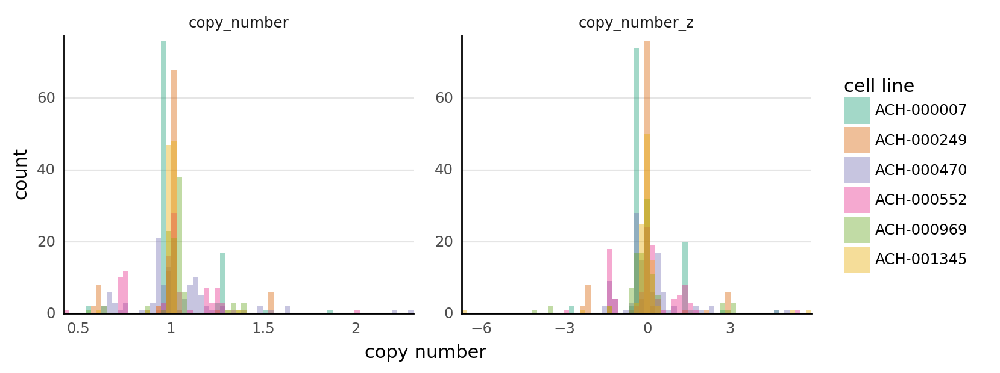

    <ggplot: (358141522)>

```python
(
    gg.ggplot(plot_df, gg.aes(x="value", y="lfc", color="depmap_id"))
    + gg.facet_wrap("~ cn", nrow=1, scales="free")
    + gg.geom_point(alpha=0.6)
    + gg.geom_smooth(formula="y~x", method="lm", linetype="--", size=0.5, alpha=0.1)
    + gg.scale_x_continuous(expand=(0.02, 0))
    + gg.scale_y_continuous(expand=(0.02, 0))
    + gg.scale_color_brewer(type="qual", palette="Dark2")
    + gg.theme(figure_size=(8, 4))
)
```

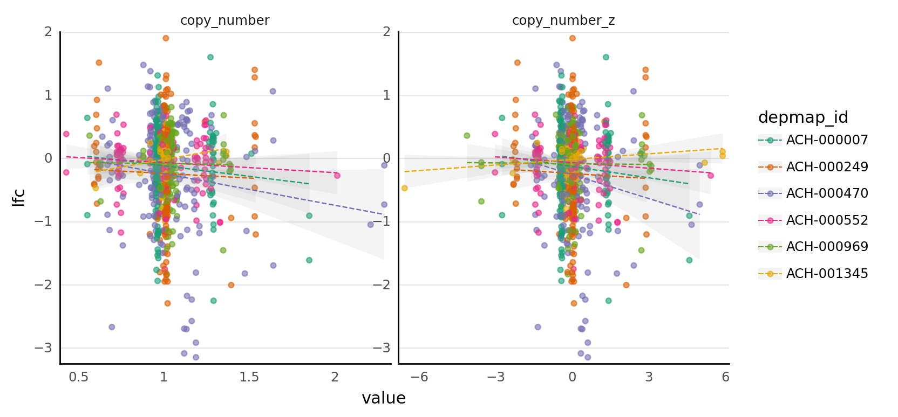

    <ggplot: (358323276)>

```python
ax = sns.scatterplot(data=data, x="counts_initial", y="counts_final")
ax.set_yscale("log", base=10)
ax.set_xscale("log", base=10)
plt.show()
```

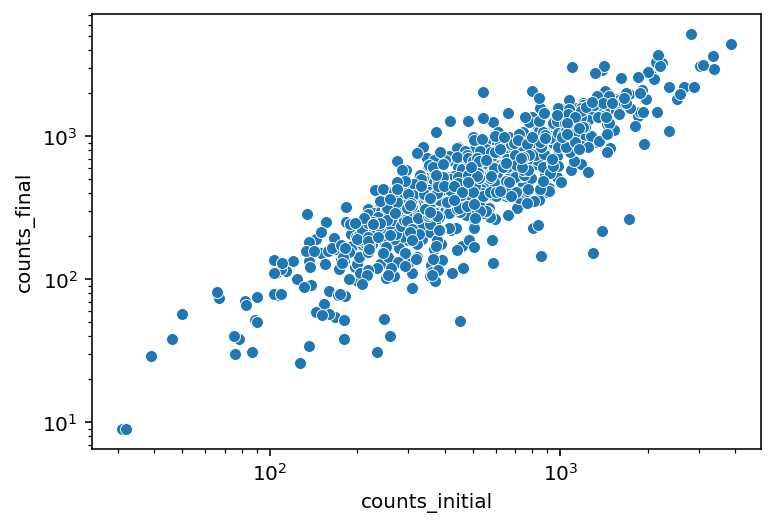

## Model fitting

Fit models with hierarchical structure for gene and copy number effect per cell line.

For each model:

$$
\begin{aligned}
\mu_{\beta_0} &\sim \text{N}(0, 2.5) \quad \sigma_{\beta_0} \sim \text{HN}(2.5) \\
\mu_{\beta_\text{CNA}} &\sim \text{N}(0, 2.5) \quad \sigma_{\beta_\text{CNA}} \sim \text{HN}(2.5) \\
\beta_0 &\sim_g \text{N}(\mu_{\beta_0}, \sigma_{\beta_0}) \\
\beta_\text{CNA} &\sim_c \text{N}(\mu_{\beta_\text{CNA}}, \sigma_{\beta_\text{CNA}}) \\
\end{aligned}
$$

For the negative binomial:

$$
\begin{aligned}
\eta &= \beta_0[g] + x_\text{CNA} \beta_\text{CNA}[c] \\
\mu &= \exp(\eta) \\
\alpha &\sim \text{HN}(0, 5) \\
y &\sim \text{NB}(\mu x_\text{initial}, \alpha)
\end{aligned}
$$

For the normal model:

$$
\begin{aligned}
\mu &= \beta_0[g] + x_\text{CNA} \beta_\text{CNA}[c] \\
\sigma &\sim \text{HN}(0, 5) \\
y &\sim \text{N}(\mu, \sigma)
\end{aligned}
$$

```python
gene_idx, n_genes = dphelp.get_indices_and_count(data, "hugo_symbol")
print(f"number of genes: {n_genes}")

cell_line_idx, n_cells = dphelp.get_indices_and_count(data, "depmap_id")
print(f"number of cell lines: {n_cells}")
```

    number of genes: 101
    number of cell lines: 6

### Negative Binomial model

```python
gene_copynumber_averages = vhelp.careful_zscore(
    data.groupby("hugo_symbol")["copy_number_z"].mean().values
)
```

```python
with pm.Model() as nb_model:
    g = pm.Data("g", gene_idx)
    c = pm.Data("c", cell_line_idx)
    x_cna = pm.Data("x_cna", data.copy_number_z.values)
    x_cna_bar = pm.Data("x_cna_bar", gene_copynumber_averages)
    ct_i = pm.Data("initial_count", data.counts_initial.values)
    ct_f = pm.Data("final_count", data.counts_final.values)

    β_0 = pmhelp.hierarchical_normal("β_0", shape=n_cells, centered=False)
    β_cna = pmhelp.hierarchical_normal(
        "β_cna", shape=n_cells, centered=False, mu_sd=1.0, sigma_sd=1.0
    )
    η = pm.Deterministic("η", β_0[c] + β_cna[c] * x_cna)

    μ = pm.Deterministic("μ", pm.math.exp(η))
    α = pm.HalfNormal("α", 2.5)

    y = pm.NegativeBinomial("y", μ * ct_i, α, observed=ct_f)

pm.model_to_graphviz(nb_model)
```

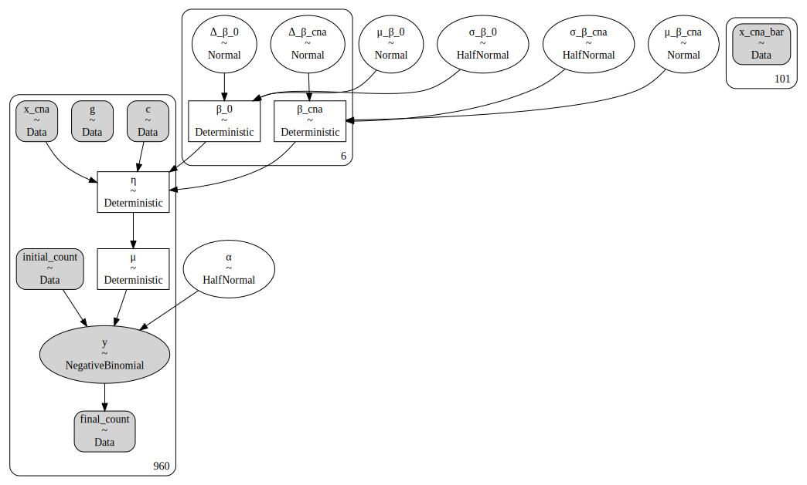

### Normal linear regression model

```python
with pm.Model() as lin_model:
    g = pm.Data("g", gene_idx)
    c = pm.Data("c", cell_line_idx)
    x_cna = pm.Data("x_cna", data.copy_number_z.values)
    lfc = pm.Data("lfc", data.lfc.values)

    β_0 = pmhelp.hierarchical_normal("β_0", shape=n_genes, centered=False)
    β_cna = pmhelp.hierarchical_normal(
        "β_cna", shape=n_cells, centered=False, mu_sd=1.0, sigma_sd=1.0
    )
    μ = pm.Deterministic("μ", β_0[g] + β_cna[c] * x_cna)

    σ = pm.HalfNormal("σ", 5)

    y = pm.Normal("y", μ, σ, observed=lfc)

pm.model_to_graphviz(lin_model)
```


### Sampling from the models

```python
pm_sample_kwargs = {
    "draws": 1000,
    "chains": 4,
    "tune": 2000,
    "init": "advi",
    "random_seed": 123,
    "target_accept": 0.95,
    "return_inferencedata": True,
}
pm_sample_ppc_kwargs = {"random_seed": 400}
```

I timed the sampling processes a few times and put together the following table to show how long each model takes to run inference:

| model  | sampling (sec.) | post. pred. (sec.) | total (min.) |
|--------|-----------------|--------------------|--------------|
| NB     | 59              | 64                 | 2.23         |
| normal | 38              | 73                 | 1.98         |

```python
tic = time()

with nb_model:
    nb_trace = pm.sample(**pm_sample_kwargs)
    ppc = pm.sample_posterior_predictive(nb_trace, **pm_sample_ppc_kwargs)
    ppc["lfc"] = np.log2(ppc["y"] / data["counts_initial"].values)
    nb_trace.extend(az.from_pymc3(posterior_predictive=ppc))

toc = time()
print(f"sampling required {(toc - tic) / 60:.2f} minutes")
```

    ---------------------------------------------------------------------------

    SamplingError                             Traceback (most recent call last)

    /var/folders/r4/qpcdgl_14hbd412snp1jnv300000gn/T/ipykernel_82353/3398657848.py in <module>
          2
          3 with nb_model:
    ----> 4     nb_trace = pm.sample(**pm_sample_kwargs)
          5     ppc = pm.sample_posterior_predictive(nb_trace, **pm_sample_ppc_kwargs)
          6     ppc["lfc"] = np.log2(ppc["y"] / data["counts_initial"].values)


    /usr/local/Caskroom/miniconda/base/envs/speclet/lib/python3.9/site-packages/pymc3/sampling.py in sample(draws, step, init, n_init, start, trace, chain_idx, chains, cores, tune, progressbar, model, random_seed, discard_tuned_samples, compute_convergence_checks, callback, jitter_max_retries, return_inferencedata, idata_kwargs, mp_ctx, pickle_backend, **kwargs)
        426     start = deepcopy(start)
        427     if start is None:
    --> 428         check_start_vals(model.test_point, model)
        429     else:
        430         if isinstance(start, dict):


    /usr/local/Caskroom/miniconda/base/envs/speclet/lib/python3.9/site-packages/pymc3/util.py in check_start_vals(start, model)
        235
        236         if not np.all(np.isfinite(initial_eval)):
    --> 237             raise SamplingError(
        238                 "Initial evaluation of model at starting point failed!\n"
        239                 "Starting values:\n{}\n\n"


    SamplingError: Initial evaluation of model at starting point failed!
    Starting values:
    {'μ_β_0': array(0.), 'σ_β_0_log__': array(0.69049938), 'Δ_β_0': array([0., 0., 0., 0., 0., 0.]), 'μ_β_cna': array(0.), 'σ_β_cna_log__': array(-0.22579135), 'Δ_β_cna': array([0., 0., 0., 0., 0., 0.]), 'α_log__': array(0.69049938)}

    Initial evaluation results:
    μ_β_0           -1.84
    σ_β_0_log__     -0.77
    Δ_β_0           -5.51
    μ_β_cna         -0.92
    σ_β_cna_log__   -0.77
    Δ_β_cna         -5.51
    α_log__         -0.77
    y                -inf
    Name: Log-probability of test_point, dtype: float64

```python
tic = time()

with lin_model:
    lin_trace = pm.sample(**pm_sample_kwargs)
    ppc = pm.sample_posterior_predictive(lin_trace, **pm_sample_ppc_kwargs)
    lin_trace.extend(az.from_pymc3(posterior_predictive=ppc))

toc = time()
print(f"sampling required {(toc - tic) / 60:.2f} minutes")
```

    Auto-assigning NUTS sampler...
    Initializing NUTS using advi...

<div>
    <style>
        /*Turns off some styling*/
        progress {
            /*gets rid of default border in Firefox and Opera.*/
            border: none;
            /*Needs to be in here for Safari polyfill so background images work as expected.*/
            background-size: auto;
        }
        .progress-bar-interrupted, .progress-bar-interrupted::-webkit-progress-bar {
            background: #F44336;
        }
    </style>
  <progress value='20794' class='' max='200000' style='width:300px; height:20px; vertical-align: middle;'></progress>
  10.40% [20794/200000 00:04<00:39 Average Loss = 861.71]
</div>

    Convergence achieved at 21500
    Interrupted at 21,499 [10%]: Average Loss = 1,247
    Multiprocess sampling (4 chains in 2 jobs)
    NUTS: [σ, Δ_β_cna, σ_β_cna, μ_β_cna, Δ_β_0, σ_β_0, μ_β_0]

<div>
    <style>
        /*Turns off some styling*/
        progress {
            /*gets rid of default border in Firefox and Opera.*/
            border: none;
            /*Needs to be in here for Safari polyfill so background images work as expected.*/
            background-size: auto;
        }
        .progress-bar-interrupted, .progress-bar-interrupted::-webkit-progress-bar {
            background: #F44336;
        }
    </style>
  <progress value='8000' class='' max='8000' style='width:300px; height:20px; vertical-align: middle;'></progress>
  100.00% [8000/8000 00:15<00:00 Sampling 4 chains, 1 divergences]
</div>

    Sampling 4 chains for 1_000 tune and 1_000 draw iterations (4_000 + 4_000 draws total) took 34 seconds.
    There was 1 divergence after tuning. Increase `target_accept` or reparameterize.
    The number of effective samples is smaller than 10% for some parameters.

<div>
    <style>
        /*Turns off some styling*/
        progress {
            /*gets rid of default border in Firefox and Opera.*/
            border: none;
            /*Needs to be in here for Safari polyfill so background images work as expected.*/
            background-size: auto;
        }
        .progress-bar-interrupted, .progress-bar-interrupted::-webkit-progress-bar {
            background: #F44336;
        }
    </style>
  <progress value='4000' class='' max='4000' style='width:300px; height:20px; vertical-align: middle;'></progress>
  100.00% [4000/4000 01:02<00:00]
</div>

    sampling required 1.93 minutes

## Model comparison

### LOO-CV

We can compare the models using LOO-CV to see which is more robust to changes to individual data points.
It looks like the normal model is far superior to the NB model.
I am concerned that these are not comparable, though.

```python
model_collection: dict[str, az.InferenceData] = {
    "negative binomial": nb_trace,
    "normal": lin_trace,
}
model_comparison = az.compare(model_collection)
model_comparison
```

<div>
<style scoped>
    .dataframe tbody tr th:only-of-type {
        vertical-align: middle;
    }

    .dataframe tbody tr th {
        vertical-align: top;
    }

    .dataframe thead th {
        text-align: right;
    }
</style>
<table border="1" class="dataframe">
  <thead>
    <tr style="text-align: right;">
      <th></th>
      <th>rank</th>
      <th>loo</th>
      <th>p_loo</th>
      <th>d_loo</th>
      <th>weight</th>
      <th>se</th>
      <th>dse</th>
      <th>warning</th>
      <th>loo_scale</th>
    </tr>
  </thead>
  <tbody>
    <tr>
      <th>normal</th>
      <td>0</td>
      <td>-498.413064</td>
      <td>42.690541</td>
      <td>0.000000</td>
      <td>1.0</td>
      <td>22.796215</td>
      <td>0.000000</td>
      <td>False</td>
      <td>log</td>
    </tr>
    <tr>
      <th>negative binomial</th>
      <td>1</td>
      <td>-3675.823353</td>
      <td>39.864054</td>
      <td>3177.410289</td>
      <td>0.0</td>
      <td>25.443751</td>
      <td>20.839538</td>
      <td>False</td>
      <td>log</td>
    </tr>
  </tbody>
</table>
</div>

```python
az.plot_compare(model_comparison);
```


Also, the LOO probability integral transformation (PIT) predictive checks ([ArviZ doc](https://arviz-devs.github.io/arviz/api/generated/arviz.plot_loo_pit.html) indicate that the normal model is a better fit.
My concern is that this test is only for continuous data.

```python
for name, idata in model_collection.items():
    az.plot_loo_pit(idata, y="y")
    plt.title(name)
    plt.show()
```

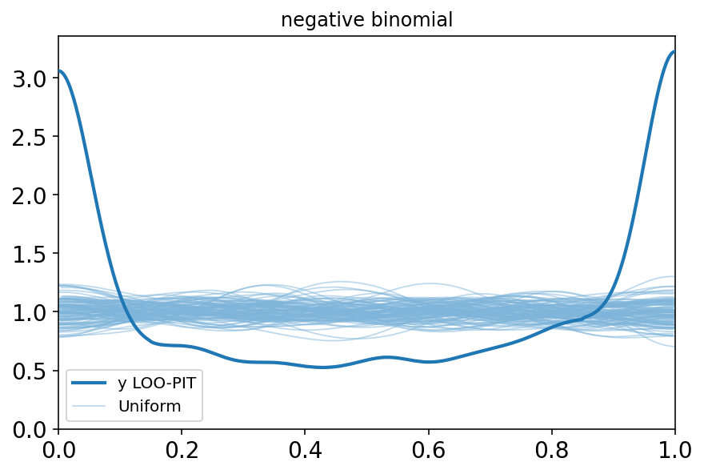

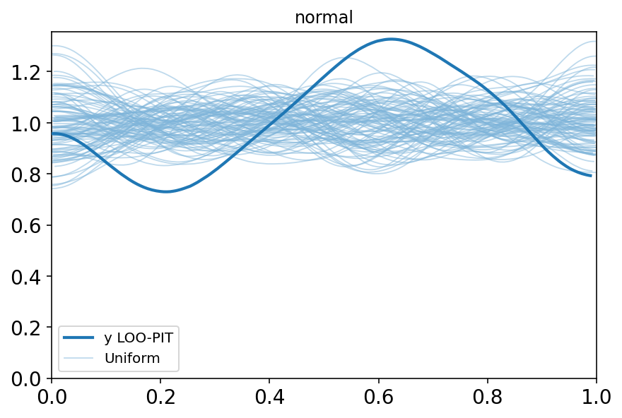

### Posterior distributions

```python
shared_varnames = ["β_0", "μ_β_0", "σ_β_0"]
nb_varnames = shared_varnames.copy() + ["α"]
az.plot_trace(nb_trace, var_names=nb_varnames);
```

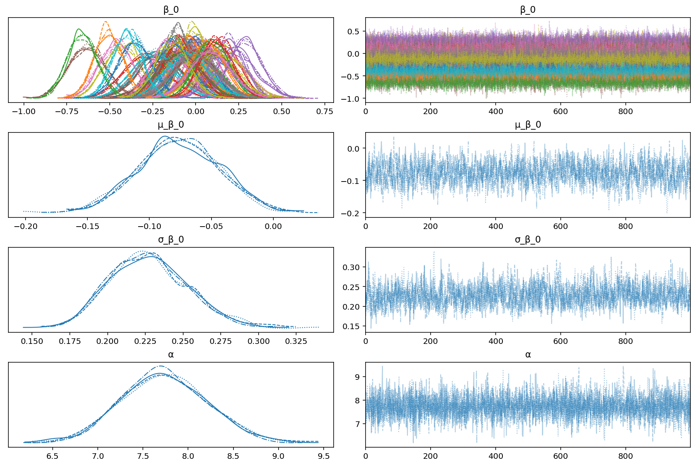

```python
lin_varnames = shared_varnames.copy() + ["σ"]
az.plot_trace(lin_trace, var_names=lin_varnames);
```

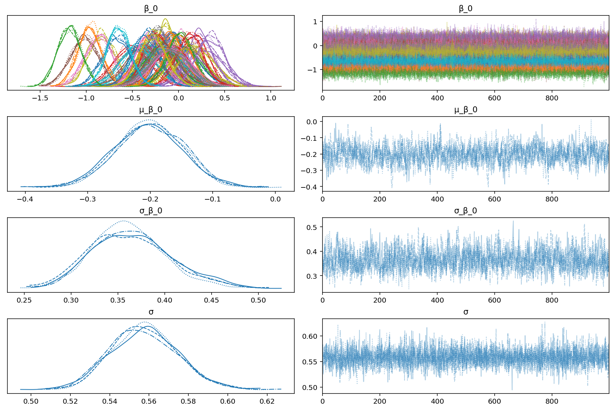

```python
def get_beta_0_summary(name: str, idata: az.InferenceData) -> pd.DataFrame:
    return (
        az.summary(idata, var_names="β_0", kind="stats", hdi_prob=0.89)
        .assign(hugo_symbol=data.hugo_symbol.cat.categories, model=name)
        .reset_index(drop=False)
        .rename(columns={"index": "parameter"})
    )


beta_0_post = pd.concat([get_beta_0_summary(n, d) for n, d in model_collection.items()])
beta_0_post.head()
```

<div>
<style scoped>
    .dataframe tbody tr th:only-of-type {
        vertical-align: middle;
    }

    .dataframe tbody tr th {
        vertical-align: top;
    }

    .dataframe thead th {
        text-align: right;
    }
</style>
<table border="1" class="dataframe">
  <thead>
    <tr style="text-align: right;">
      <th></th>
      <th>parameter</th>
      <th>mean</th>
      <th>sd</th>
      <th>hdi_5.5%</th>
      <th>hdi_94.5%</th>
      <th>hugo_symbol</th>
      <th>model</th>
    </tr>
  </thead>
  <tbody>
    <tr>
      <th>0</th>
      <td>β_0[0]</td>
      <td>0.081</td>
      <td>0.121</td>
      <td>-0.115</td>
      <td>0.268</td>
      <td>ACVR1C</td>
      <td>negative binomial</td>
    </tr>
    <tr>
      <th>1</th>
      <td>β_0[1]</td>
      <td>-0.088</td>
      <td>0.095</td>
      <td>-0.243</td>
      <td>0.056</td>
      <td>ADPRHL1</td>
      <td>negative binomial</td>
    </tr>
    <tr>
      <th>2</th>
      <td>β_0[2]</td>
      <td>0.093</td>
      <td>0.120</td>
      <td>-0.095</td>
      <td>0.279</td>
      <td>APC</td>
      <td>negative binomial</td>
    </tr>
    <tr>
      <th>3</th>
      <td>β_0[3]</td>
      <td>-0.034</td>
      <td>0.094</td>
      <td>-0.191</td>
      <td>0.107</td>
      <td>BRAF</td>
      <td>negative binomial</td>
    </tr>
    <tr>
      <th>4</th>
      <td>β_0[4]</td>
      <td>-0.004</td>
      <td>0.097</td>
      <td>-0.165</td>
      <td>0.144</td>
      <td>CCR3</td>
      <td>negative binomial</td>
    </tr>
  </tbody>
</table>
</div>

```python
pos = gg.position_dodge(width=0.5)

(
    gg.ggplot(beta_0_post, gg.aes(x="hugo_symbol", y="mean", color="model"))
    + gg.geom_hline(yintercept=0, linetype="-", size=0.3, color="grey")
    + gg.geom_linerange(
        gg.aes(ymin="hdi_5.5%", ymax="hdi_94.5%"), position=pos, size=0.6, alpha=0.4
    )
    + gg.geom_point(position=pos, size=0.8, alpha=0.75)
    + gg.scale_y_continuous(expand=(0.01, 0))
    + gg.scale_color_brewer(type="qual", palette="Dark2")
    + gg.theme(axis_text_x=gg.element_text(angle=90, size=7), figure_size=(10, 4.5))
    + gg.labs(x="gene", y="β_0 posterior (mean ± 89% CI)")
)
```

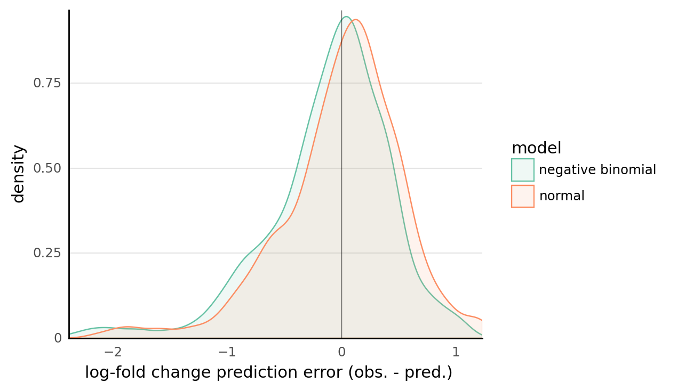

    <ggplot: (351384028)>

```python
for name, idata in model_collection.items():
    print(f"posterior distributions in {name} model")
    az.plot_posterior(idata, var_names=["μ_β_0", "σ_β_0"])
    plt.show()
    print("-" * 80)
```

    posterior distributions in negative binomial model

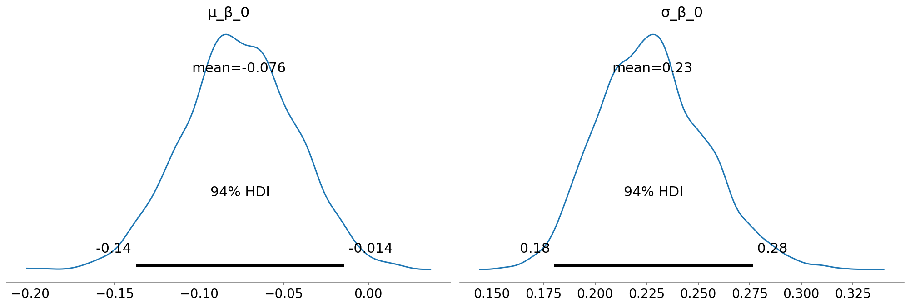

    --------------------------------------------------------------------------------
    posterior distributions in normal model

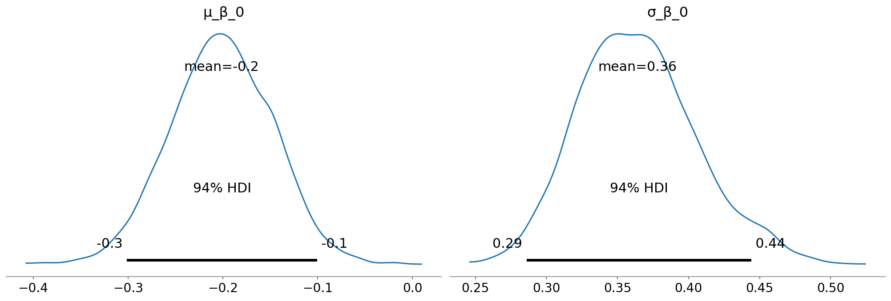

    --------------------------------------------------------------------------------

### Posterior predictive checks

```python
for name, idata in model_collection.items():
    ax = az.plot_ppc(idata, num_pp_samples=100, random_seed=RANDOM_SEED)
    ax.set_title(name)
    if "binomial" in name:
        ax.set_yscale("log", base=2)
    plt.show()
```


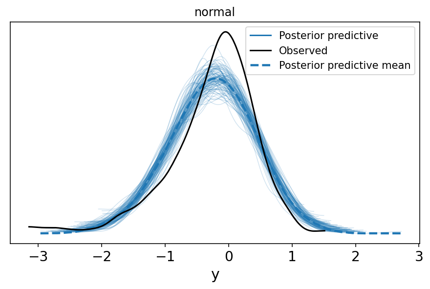

```python
nb_lfc_ppc_sample, _ = pmanal.down_sample_ppc(
    pmhelp.thin_posterior(
        nb_trace["posterior_predictive"]["lfc"], thin_to=100
    ).values.squeeze(),
    n=100,
    axis=1,
)

nb_ppc_lfc_sample_df = pd.DataFrame(nb_lfc_ppc_sample.T).pivot_longer(
    names_to="ppc_idx", values_to="draw"
)

(
    gg.ggplot(nb_ppc_lfc_sample_df, gg.aes(x="draw"))
    + gg.geom_density(gg.aes(group="ppc_idx"), weight=0.2, size=0.1, color="C0")
    + gg.geom_density(gg.aes(x="lfc"), data=data, color="k", size=1, linetype="--")
    + gg.scale_x_continuous(expand=(0, 0))
    + gg.scale_y_continuous(expand=(0, 0, 0.02, 0))
    + gg.labs(
        x="log-fold change",
        y="density",
        title="PPC of NB model\ntransformed to log-fold changes",
    )
)
```

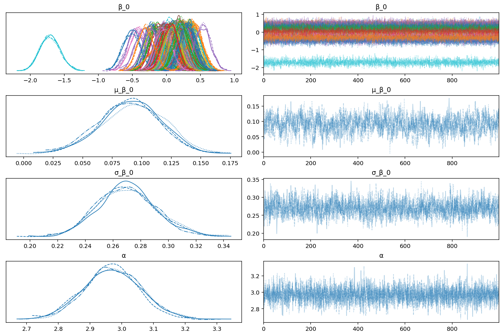

    <ggplot: (364743105)>

```python
def prep_ppc(name: str, idata: az.InferenceData, observed_y: str) -> pd.DataFrame:
    df = pmanal.summarize_posterior_predictions(
        idata["posterior_predictive"]["y"].values.squeeze(),
        merge_with=data[["hugo_symbol", "lfc", "counts_final", "counts_initial"]],
        calc_error=True,
        observed_y=observed_y,
    ).assign(
        model=name,
        percent_error=lambda d: 100 * (d[observed_y] - d.pred_mean) / d[observed_y],
        real_value=lambda d: d[observed_y],
    )

    if observed_y == "counts_final":
        df["pred_lfc"] = np.log2(df.pred_mean / df.counts_initial)
        df["pred_lfc_low"] = np.log2(df.pred_hdi_low / df.counts_initial)
        df["pred_lfc_high"] = np.log2(df.pred_hdi_high / df.counts_initial)
    else:
        df["pred_lfc"] = df.pred_mean
        df["pred_lfc_low"] = df.pred_hdi_low
        df["pred_lfc_high"] = df.pred_hdi_high

    df["lfc_error"] = df["lfc"] - df["pred_lfc"]

    return df


ppc_df = pd.concat(
    [
        prep_ppc(m[0], m[1], y)
        for m, y in zip(model_collection.items(), ("counts_final", "lfc"))
    ]
)
ppc_df.head()
```

    /usr/local/Caskroom/miniconda/base/envs/speclet/lib/python3.9/site-packages/arviz/stats/stats.py:456: FutureWarning: hdi currently interprets 2d data as (draw, shape) but this will change in a future release to (chain, draw) for coherence with other functions

<div>
<style scoped>
    .dataframe tbody tr th:only-of-type {
        vertical-align: middle;
    }

    .dataframe tbody tr th {
        vertical-align: top;
    }

    .dataframe thead th {
        text-align: right;
    }
</style>
<table border="1" class="dataframe">
  <thead>
    <tr style="text-align: right;">
      <th></th>
      <th>pred_mean</th>
      <th>pred_hdi_low</th>
      <th>pred_hdi_high</th>
      <th>hugo_symbol</th>
      <th>lfc</th>
      <th>counts_final</th>
      <th>counts_initial</th>
      <th>error</th>
      <th>model</th>
      <th>percent_error</th>
      <th>real_value</th>
      <th>pred_lfc</th>
      <th>pred_lfc_low</th>
      <th>pred_lfc_high</th>
      <th>lfc_error</th>
    </tr>
  </thead>
  <tbody>
    <tr>
      <th>0</th>
      <td>290.51025</td>
      <td>102.0</td>
      <td>437.0</td>
      <td>ACVR1C</td>
      <td>0.296921</td>
      <td>329.0</td>
      <td>267.802016</td>
      <td>38.48975</td>
      <td>negative binomial</td>
      <td>11.699012</td>
      <td>329.0</td>
      <td>0.117422</td>
      <td>-1.392598</td>
      <td>0.706466</td>
      <td>0.179499</td>
    </tr>
    <tr>
      <th>1</th>
      <td>423.19050</td>
      <td>174.0</td>
      <td>664.0</td>
      <td>ACVR1C</td>
      <td>0.944830</td>
      <td>741.0</td>
      <td>384.942637</td>
      <td>317.80950</td>
      <td>negative binomial</td>
      <td>42.889271</td>
      <td>741.0</td>
      <td>0.136664</td>
      <td>-1.145556</td>
      <td>0.786540</td>
      <td>0.808166</td>
    </tr>
    <tr>
      <th>2</th>
      <td>583.94200</td>
      <td>236.0</td>
      <td>903.0</td>
      <td>ACVR1C</td>
      <td>-0.646824</td>
      <td>344.0</td>
      <td>538.606821</td>
      <td>-239.94200</td>
      <td>negative binomial</td>
      <td>-69.750581</td>
      <td>344.0</td>
      <td>0.116593</td>
      <td>-1.190446</td>
      <td>0.745493</td>
      <td>-0.763417</td>
    </tr>
    <tr>
      <th>3</th>
      <td>317.03350</td>
      <td>125.0</td>
      <td>488.0</td>
      <td>ACVR1C</td>
      <td>-0.016798</td>
      <td>286.0</td>
      <td>289.349513</td>
      <td>-31.03350</td>
      <td>negative binomial</td>
      <td>-10.850874</td>
      <td>286.0</td>
      <td>0.131822</td>
      <td>-1.210885</td>
      <td>0.754068</td>
      <td>-0.148620</td>
    </tr>
    <tr>
      <th>4</th>
      <td>379.92125</td>
      <td>146.0</td>
      <td>573.0</td>
      <td>ACVR1C</td>
      <td>-0.074812</td>
      <td>329.0</td>
      <td>346.510616</td>
      <td>-50.92125</td>
      <td>negative binomial</td>
      <td>-15.477584</td>
      <td>329.0</td>
      <td>0.132801</td>
      <td>-1.246931</td>
      <td>0.725636</td>
      <td>-0.207613</td>
    </tr>
  </tbody>
</table>
</div>

```python
(
    gg.ggplot(ppc_df, gg.aes(x="lfc_error"))
    + gg.geom_density(gg.aes(color="model", fill="model"), alpha=0.1)
    + gg.geom_vline(gg.aes(xintercept=0), alpha=0.6, size=0.3)
    + gg.scale_x_continuous(expand=(0, 0))
    + gg.scale_y_continuous(expand=(0, 0, 0.02, 0))
    + gg.scale_color_brewer(type="qual", palette="Set2")
    + gg.scale_fill_brewer(type="qual", palette="Set2")
    + gg.theme(figure_size=(5, 4))
    + gg.labs(x="log-fold change prediction error (obs. - pred.)")
)
```

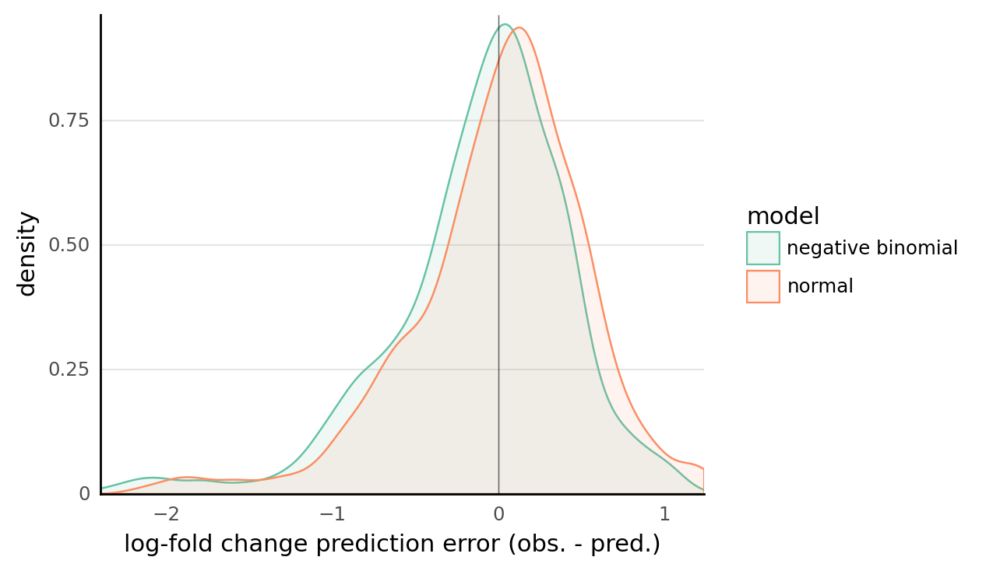

    <ggplot: (353648083)>

```python
(
    gg.ggplot(ppc_df, gg.aes(x="lfc", y="pred_lfc"))
    + gg.facet_wrap("~ model", nrow=1)
    + gg.geom_linerange(
        gg.aes(ymin="pred_lfc_low", ymax="pred_lfc_high"),
        alpha=0.1,
        size=0.5,
        color=SeabornColor.BLUE,
    )
    + gg.geom_point(alpha=0.5, color=SeabornColor.BLUE)
    + gg.geom_abline(slope=1, intercept=0, color=SeabornColor.RED)
    + gg.scale_x_continuous(expand=(0.02, 0, 0.02, 0))
    + gg.scale_y_continuous(expand=(0.02, 0, 0.02, 0))
    + gg.theme(figure_size=(8, 4), panel_spacing_x=0.5)
    + gg.labs(
        x="observed log-fold change", y="predicted log-fold change\n(mean ± 89% CI)"
    )
)
```

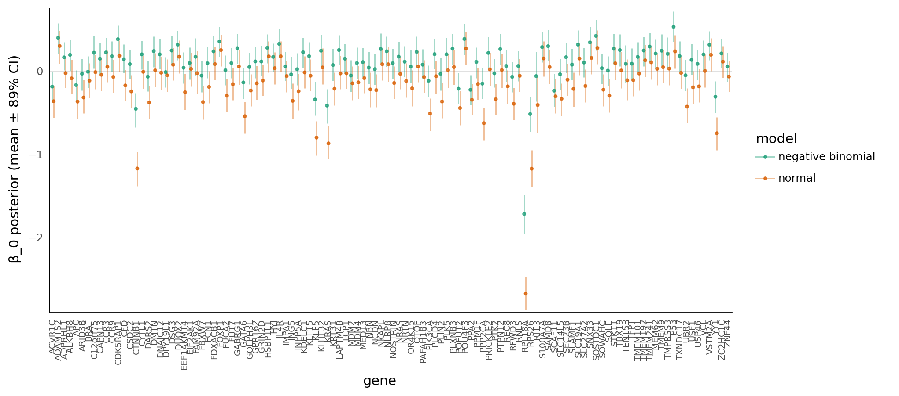

    <ggplot: (353138815)>

```python
(
    gg.ggplot(ppc_df, gg.aes(x="lfc", y="lfc_error"))
    + gg.facet_wrap("~ model", nrow=1)
    + gg.geom_point(alpha=0.5, color=SeabornColor.BLUE)
    + gg.geom_hline(yintercept=0, linetype="--")
    + gg.geom_vline(xintercept=0, linetype="--")
    + gg.theme(figure_size=(8, 4), panel_spacing_x=0.5)
    + gg.labs(x="log-fold change", y="prediction error")
)
```


    <ggplot: (353847760)>

```python
(
    gg.ggplot(
        ppc_df[["model", "pred_lfc", "hugo_symbol"]]
        .pivot_wider(names_from="model", values_from="pred_lfc")
        .merge(data, left_index=True, right_index=True),
        gg.aes(x="normal", y="negative binomial"),
    )
    + gg.geom_point(
        gg.aes(color="hugo_symbol"), size=1.2, alpha=0.25, show_legend=False
    )
    + gg.geom_abline(slope=1, intercept=0, linetype="--", alpha=0.5)
    + gg.geom_smooth(
        method="lm",
        formula="y~x",
        alpha=0.6,
        linetype="--",
        size=0.6,
        color=SeabornColor.BLUE,
    )
    + gg.geom_hline(yintercept=0, alpha=0.5, color="grey")
    + gg.geom_vline(xintercept=0, alpha=0.5, color="grey")
    + gg.scale_color_hue()
    + gg.labs(
        x="post. pred. by normal model",
        y="post.pred by NB model",
        title="Comparison of posterior predictions",
    )
)
```

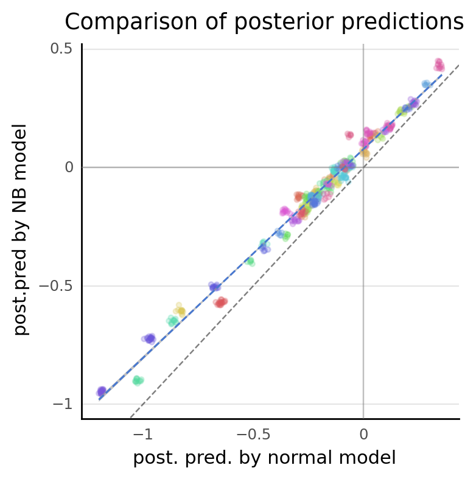

    <ggplot: (353899852)>

```python
loo_collection = {n: az.loo(d, pointwise=True) for n, d in model_collection.items()}
```

```python
for name, loo_res in loo_collection.items():
    d = (
        pd.DataFrame({"hugo_symbol": data["hugo_symbol"], "loo": loo_res.loo_i})
        .sort_values("hugo_symbol")
        .reset_index(drop=False)
    )
    p = (
        gg.ggplot(d, gg.aes(x="index", y="loo"))
        + gg.geom_point(gg.aes(color="hugo_symbol"), show_legend=False)
        + gg.scale_color_hue()
        + gg.labs(x="index", y="LOO")
    )
    print(p)
```

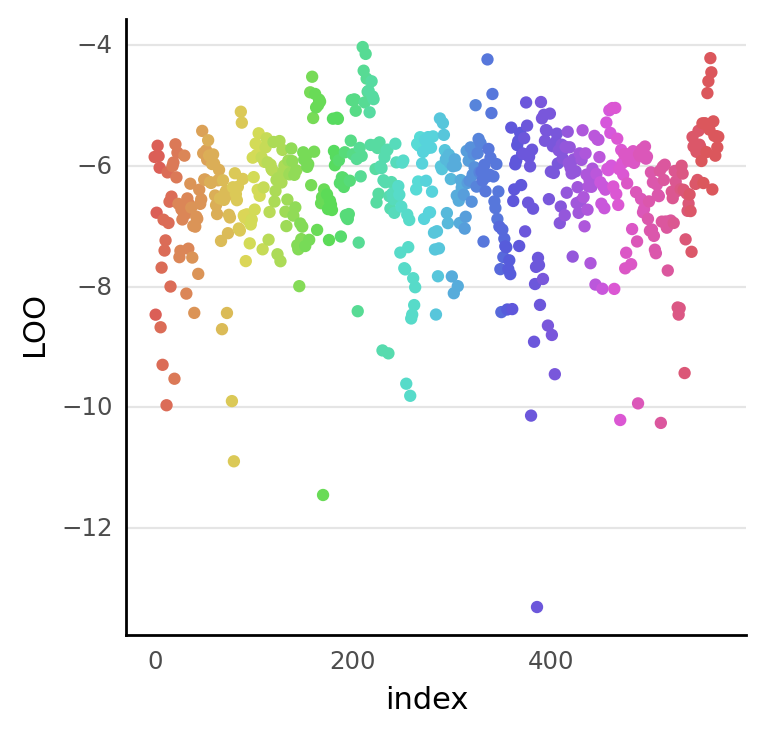

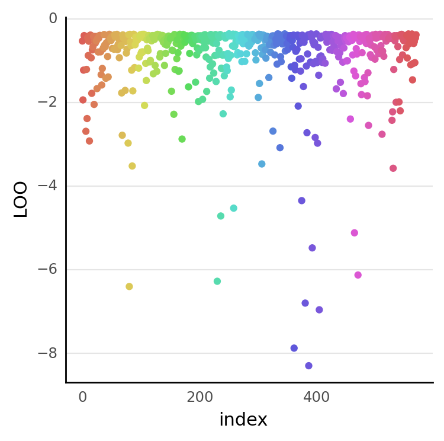

```python

```

```python

```

---

```python
notebook_toc = time()
print(f"execution time: {(notebook_toc - notebook_tic) / 60:.2f} minutes")
```

    execution time: 9.98 minutes

```python
%load_ext watermark
%watermark -d -u -v -iv -b -h -m
```

    Last updated: 2021-09-20

    Python implementation: CPython
    Python version       : 3.9.6
    IPython version      : 7.26.0

    Compiler    : Clang 11.1.0
    OS          : Darwin
    Release     : 20.6.0
    Machine     : x86_64
    Processor   : i386
    CPU cores   : 4
    Architecture: 64bit

    Hostname: JHCookMac.local

    Git branch: nb-model

    matplotlib: 3.4.3
    seaborn   : 0.11.2
    plotnine  : 0.8.0
    re        : 2.2.1
    logging   : 0.5.1.2
    pandas    : 1.3.2
    numpy     : 1.21.2
    theano    : 1.0.5
    arviz     : 0.11.2
    pymc3     : 3.11.2
