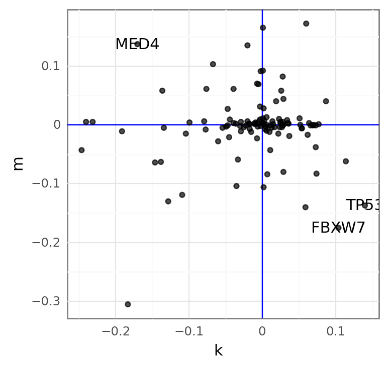
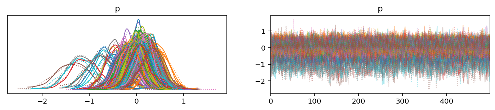
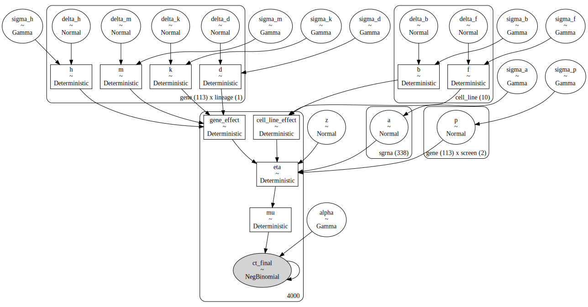
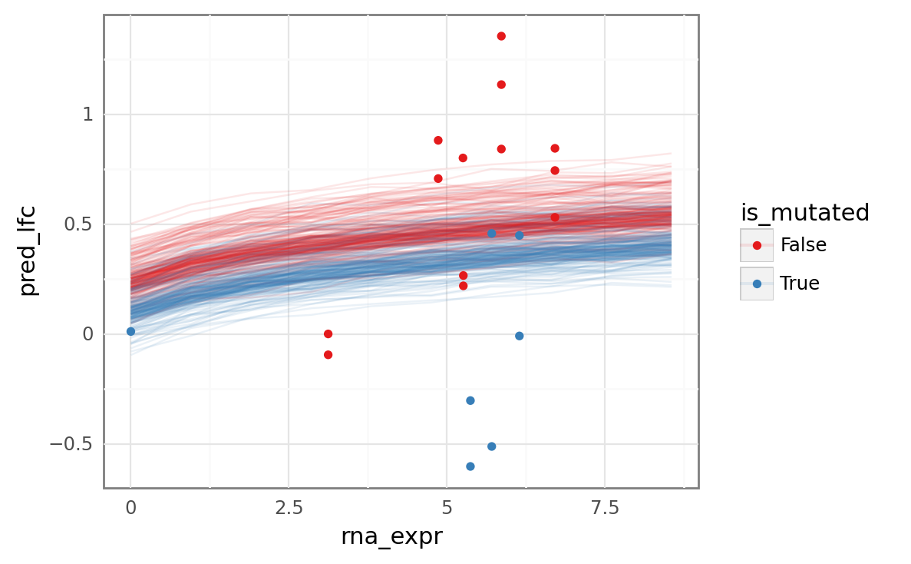

```python
%load_ext autoreload
%autoreload 2
```

```python
from itertools import product
from pathlib import Path
from time import time
from typing import Union

import arviz as az
import matplotlib.pyplot as plt
import numpy as np
import pandas as pd
import plotnine as gg
import pymc as pm
import seaborn as sns
```

```python
from speclet.analysis.arviz_analysis import (
    extract_matrix_variable_coords,
    summarize_posterior_predictions,
)
from speclet.bayesian_models.hierarchical_nb import HierarchcalNegativeBinomialModel
from speclet.io import DataFile
from speclet.managers.data_managers import CrisprScreenDataManager
from speclet.plot.plotnine_helpers import set_gg_theme
from speclet.project_configuration import read_project_configuration
from speclet.project_enums import ModelFitMethod
```

```python
# Notebook execution timer.
notebook_tic = time()

# Plotting setup.
set_gg_theme()
%config InlineBackend.figure_format = "retina"

# Constants
RANDOM_SEED = 847
np.random.seed(RANDOM_SEED)
HDI_PROB = read_project_configuration().modeling.highest_density_interval
```

```python
counts_dm = CrisprScreenDataManager(DataFile.DEPMAP_CRC_SUBSAMPLE)
counts_data = counts_dm.get_data()
```

```python
hnb = HierarchcalNegativeBinomialModel()
```

```python
valid_counts_data = hnb.data_processing_pipeline(counts_dm.get_data())
```

```python
hnb_model = hnb.pymc_model(counts_data)
pm.model_to_graphviz(hnb_model)
```


```python
with hnb_model:
    trace = pm.sample(draws=500, tune=250, chains=2, cores=2, target_accept=0.95)
    _ = pm.sample_posterior_predictive(trace=trace, extend_inferencedata=True)
```

    Auto-assigning NUTS sampler...
    Initializing NUTS using jitter+adapt_diag...
    /usr/local/Caskroom/miniconda/base/envs/speclet/lib/python3.9/site-packages/pymc/aesaraf.py:996: UserWarning: The parameter 'updates' of aesara.function() expects an OrderedDict, got <class 'dict'>. Using a standard dictionary here results in non-deterministic behavior. You should use an OrderedDict if you are using Python 2.7 (collections.OrderedDict for older python), or use a list of (shared, update) pairs. Do not just convert your dictionary to this type before the call as the conversion will still be non-deterministic.
    Multiprocess sampling (2 chains in 2 jobs)
    NUTS: [z, sigma_a, a, sigma_b, delta_b, sigma_d, delta_d, sigma_f, delta_f, sigma_h, delta_h, sigma_k, delta_k, sigma_m, delta_m, sigma_p, p, alpha]

<style>
    /*Turns off some styling*/
    progress {
        /*gets rid of default border in Firefox and Opera.*/
        border: none;
        /*Needs to be in here for Safari polyfill so background images work as expected.*/
        background-size: auto;
    }
    .progress-bar-interrupted, .progress-bar-interrupted::-webkit-progress-bar {
        background: #F44336;
    }
</style>

<div>
  <progress value='1500' class='' max='1500' style='width:300px; height:20px; vertical-align: middle;'></progress>
  100.00% [1500/1500 09:21<00:00 Sampling 2 chains, 0 divergences]
</div>

    Sampling 2 chains for 250 tune and 500 draw iterations (500 + 1_000 draws total) took 577 seconds.
    We recommend running at least 4 chains for robust computation of convergence diagnostics

<style>
    /*Turns off some styling*/
    progress {
        /*gets rid of default border in Firefox and Opera.*/
        border: none;
        /*Needs to be in here for Safari polyfill so background images work as expected.*/
        background-size: auto;
    }
    .progress-bar-interrupted, .progress-bar-interrupted::-webkit-progress-bar {
        background: #F44336;
    }
</style>

<div>
  <progress value='1000' class='' max='1000' style='width:300px; height:20px; vertical-align: middle;'></progress>
  100.00% [1000/1000 00:00<00:00]
</div>

```python
rna_mut_post = (
    az.summary(trace, var_names=["k", "m"], kind="stats")
    .reset_index(drop=False)
    .pipe(
        extract_matrix_variable_coords,
        col="index",
        idx1name="hugo_symbol",
        idx2name="lineage",
    )
    .assign(var_name=lambda d: [x[0] for x in d["index"]])
    .pivot_wider(["hugo_symbol", "lineage"], names_from="var_name", values_from="mean")
)

(
    gg.ggplot(rna_mut_post, gg.aes(x="k", y="m"))
    + gg.geom_vline(xintercept=0, color="b")
    + gg.geom_hline(yintercept=0, color="b")
    + gg.geom_point(alpha=0.7)
    + gg.geom_text(
        gg.aes(label="hugo_symbol"), data=rna_mut_post.query("k > 0.1 and m < -0.1")
    )
    + gg.geom_text(
        gg.aes(label="hugo_symbol"), data=rna_mut_post.query("k < -0.15 and m > 0.1")
    )
)
```



    <ggplot: (322045657)>

```python
az.plot_trace(trace, var_names=["p"]);
```



```python
(
    az.summary(trace, var_names=["p"], kind="stats")
    .sort_values("mean", ascending=True)
    .head(10)
)
```

<div>
<style scoped>
    .dataframe tbody tr th:only-of-type {
        vertical-align: middle;
    }

    .dataframe tbody tr th {
        vertical-align: top;
    }

    .dataframe thead th {
        text-align: right;
    }
</style>
<table border="1" class="dataframe">
  <thead>
    <tr style="text-align: right;">
      <th></th>
      <th>mean</th>
      <th>sd</th>
      <th>hdi_3%</th>
      <th>hdi_97%</th>
    </tr>
  </thead>
  <tbody>
    <tr>
      <th>p[ERH, sanger]</th>
      <td>-1.370</td>
      <td>0.353</td>
      <td>-2.013</td>
      <td>-0.677</td>
    </tr>
    <tr>
      <th>p[NRAS, sanger]</th>
      <td>-1.212</td>
      <td>0.265</td>
      <td>-1.688</td>
      <td>-0.716</td>
    </tr>
    <tr>
      <th>p[NSMCE2, sanger]</th>
      <td>-1.198</td>
      <td>0.324</td>
      <td>-1.827</td>
      <td>-0.644</td>
    </tr>
    <tr>
      <th>p[MED4, sanger]</th>
      <td>-1.094</td>
      <td>0.309</td>
      <td>-1.662</td>
      <td>-0.505</td>
    </tr>
    <tr>
      <th>p[PHF5A, sanger]</th>
      <td>-0.822</td>
      <td>0.289</td>
      <td>-1.345</td>
      <td>-0.285</td>
    </tr>
    <tr>
      <th>p[MDM2, sanger]</th>
      <td>-0.804</td>
      <td>0.276</td>
      <td>-1.269</td>
      <td>-0.270</td>
    </tr>
    <tr>
      <th>p[KRAS, sanger]</th>
      <td>-0.757</td>
      <td>0.241</td>
      <td>-1.177</td>
      <td>-0.302</td>
    </tr>
    <tr>
      <th>p[SPTLC1, broad]</th>
      <td>-0.706</td>
      <td>0.228</td>
      <td>-1.143</td>
      <td>-0.317</td>
    </tr>
    <tr>
      <th>p[EMC2, sanger]</th>
      <td>-0.653</td>
      <td>0.236</td>
      <td>-1.093</td>
      <td>-0.217</td>
    </tr>
    <tr>
      <th>p[C6orf89, sanger]</th>
      <td>-0.556</td>
      <td>0.272</td>
      <td>-1.055</td>
      <td>-0.029</td>
    </tr>
  </tbody>
</table>
</div>

## Posterior predictions on new data

The following code is a proof-of-concept for getting posterior predictions on new data across the observed range of RNA expression and copy number for a gene.

```python
gene = "TP53"
gene_data = valid_counts_data.query(f"hugo_symbol == '{gene}'").reset_index(drop=True)

keep_cols = [
    "sgrna",
    "hugo_symbol",
    "replicate_id",
    "p_dna_batch",
    "screen",
    "depmap_id",
    "lineage",
    "counts_initial",
    "counts_final",
]
base_gene_df = gene_data[keep_cols].drop_duplicates().reset_index(drop=True)
base_gene_df
```

<div>
<style scoped>
    .dataframe tbody tr th:only-of-type {
        vertical-align: middle;
    }

    .dataframe tbody tr th {
        vertical-align: top;
    }

    .dataframe thead th {
        text-align: right;
    }
</style>
<table border="1" class="dataframe">
  <thead>
    <tr style="text-align: right;">
      <th></th>
      <th>sgrna</th>
      <th>hugo_symbol</th>
      <th>replicate_id</th>
      <th>p_dna_batch</th>
      <th>screen</th>
      <th>depmap_id</th>
      <th>lineage</th>
      <th>counts_initial</th>
      <th>counts_final</th>
    </tr>
  </thead>
  <tbody>
    <tr>
      <th>0</th>
      <td>AATCAACCCACAGCTGCACA</td>
      <td>TP53</td>
      <td>COLO201-311Cas9_RepA_p6_batch3</td>
      <td>3</td>
      <td>broad</td>
      <td>ACH-000253</td>
      <td>colorectal</td>
      <td>24.509746</td>
      <td>810</td>
    </tr>
    <tr>
      <th>1</th>
      <td>GCAGTCACAGCACATGACGG</td>
      <td>TP53</td>
      <td>COLO201-311Cas9_RepA_p6_batch3</td>
      <td>3</td>
      <td>broad</td>
      <td>ACH-000253</td>
      <td>colorectal</td>
      <td>13.343433</td>
      <td>443</td>
    </tr>
    <tr>
      <th>2</th>
      <td>AATCAACCCACAGCTGCACA</td>
      <td>TP53</td>
      <td>SNU-1033-311Cas9_RepA_p3_batch3</td>
      <td>3</td>
      <td>broad</td>
      <td>ACH-000286</td>
      <td>colorectal</td>
      <td>24.509746</td>
      <td>1465</td>
    </tr>
    <tr>
      <th>3</th>
      <td>GCAGTCACAGCACATGACGG</td>
      <td>TP53</td>
      <td>SNU-1033-311Cas9_RepA_p3_batch3</td>
      <td>3</td>
      <td>broad</td>
      <td>ACH-000286</td>
      <td>colorectal</td>
      <td>13.343433</td>
      <td>377</td>
    </tr>
    <tr>
      <th>4</th>
      <td>AATCAACCCACAGCTGCACA</td>
      <td>TP53</td>
      <td>OUMS-23-311Cas9 Rep A p5_batch3</td>
      <td>3</td>
      <td>broad</td>
      <td>ACH-000296</td>
      <td>colorectal</td>
      <td>24.509746</td>
      <td>3242</td>
    </tr>
    <tr>
      <th>5</th>
      <td>GCAGTCACAGCACATGACGG</td>
      <td>TP53</td>
      <td>OUMS-23-311Cas9 Rep A p5_batch3</td>
      <td>3</td>
      <td>broad</td>
      <td>ACH-000296</td>
      <td>colorectal</td>
      <td>13.343433</td>
      <td>1228</td>
    </tr>
    <tr>
      <th>6</th>
      <td>AATCAACCCACAGCTGCACA</td>
      <td>TP53</td>
      <td>COLO-678-311Cas9 Rep A p5_batch3</td>
      <td>3</td>
      <td>broad</td>
      <td>ACH-000350</td>
      <td>colorectal</td>
      <td>24.509746</td>
      <td>4266</td>
    </tr>
    <tr>
      <th>7</th>
      <td>GCAGTCACAGCACATGACGG</td>
      <td>TP53</td>
      <td>COLO-678-311Cas9 Rep A p5_batch3</td>
      <td>3</td>
      <td>broad</td>
      <td>ACH-000350</td>
      <td>colorectal</td>
      <td>13.343433</td>
      <td>1851</td>
    </tr>
    <tr>
      <th>8</th>
      <td>AATCAACCCACAGCTGCACA</td>
      <td>TP53</td>
      <td>SW48-311Cas9_RepA_p6_batch3</td>
      <td>3</td>
      <td>broad</td>
      <td>ACH-000958</td>
      <td>colorectal</td>
      <td>24.509746</td>
      <td>1870</td>
    </tr>
    <tr>
      <th>9</th>
      <td>GCAGTCACAGCACATGACGG</td>
      <td>TP53</td>
      <td>SW48-311Cas9_RepA_p6_batch3</td>
      <td>3</td>
      <td>broad</td>
      <td>ACH-000958</td>
      <td>colorectal</td>
      <td>13.343433</td>
      <td>854</td>
    </tr>
    <tr>
      <th>10</th>
      <td>AATCAACCCACAGCTGCACA</td>
      <td>TP53</td>
      <td>SNU1544-311cas9-RepA-p4_batch3</td>
      <td>3</td>
      <td>broad</td>
      <td>ACH-001786</td>
      <td>colorectal</td>
      <td>24.509746</td>
      <td>927</td>
    </tr>
    <tr>
      <th>11</th>
      <td>GCAGTCACAGCACATGACGG</td>
      <td>TP53</td>
      <td>SNU1544-311cas9-RepA-p4_batch3</td>
      <td>3</td>
      <td>broad</td>
      <td>ACH-001786</td>
      <td>colorectal</td>
      <td>13.343433</td>
      <td>560</td>
    </tr>
    <tr>
      <th>12</th>
      <td>CATTGTTCAATATCGTCCG</td>
      <td>TP53</td>
      <td>CO678_c903R4</td>
      <td>ERS717283.plasmid</td>
      <td>sanger</td>
      <td>ACH-000350</td>
      <td>colorectal</td>
      <td>15.930115</td>
      <td>2910</td>
    </tr>
    <tr>
      <th>13</th>
      <td>CATTGTTCAATATCGTCCG</td>
      <td>TP53</td>
      <td>SW48_C902R1_P1D14</td>
      <td>ERS717283.plasmid</td>
      <td>sanger</td>
      <td>ACH-000958</td>
      <td>colorectal</td>
      <td>15.930115</td>
      <td>1103</td>
    </tr>
    <tr>
      <th>14</th>
      <td>CATTGTTCAATATCGTCCG</td>
      <td>TP53</td>
      <td>HCT116_C902R1_P1D14</td>
      <td>ERS717283.plasmid</td>
      <td>sanger</td>
      <td>ACH-000971</td>
      <td>colorectal</td>
      <td>15.930115</td>
      <td>920</td>
    </tr>
    <tr>
      <th>15</th>
      <td>CATTGTTCAATATCGTCCG</td>
      <td>TP53</td>
      <td>HCC299_c903R1</td>
      <td>ERS717283.plasmid</td>
      <td>sanger</td>
      <td>ACH-001081</td>
      <td>colorectal</td>
      <td>15.930115</td>
      <td>1061</td>
    </tr>
    <tr>
      <th>16</th>
      <td>AATCAACCCACAGCTGCACA</td>
      <td>TP53</td>
      <td>SW1463-311cas9 Rep A p5_batch2</td>
      <td>2</td>
      <td>broad</td>
      <td>ACH-000470</td>
      <td>colorectal</td>
      <td>20.862119</td>
      <td>1188</td>
    </tr>
    <tr>
      <th>17</th>
      <td>GCAGTCACAGCACATGACGG</td>
      <td>TP53</td>
      <td>SW1463-311cas9 Rep A p5_batch2</td>
      <td>2</td>
      <td>broad</td>
      <td>ACH-000470</td>
      <td>colorectal</td>
      <td>13.136213</td>
      <td>908</td>
    </tr>
    <tr>
      <th>18</th>
      <td>AATCAACCCACAGCTGCACA</td>
      <td>TP53</td>
      <td>ECC4-311Cas9-RepA-p6_batch4</td>
      <td>4</td>
      <td>broad</td>
      <td>ACH-002024</td>
      <td>colorectal</td>
      <td>23.427972</td>
      <td>1007</td>
    </tr>
    <tr>
      <th>19</th>
      <td>GCAGTCACAGCACATGACGG</td>
      <td>TP53</td>
      <td>ECC4-311Cas9-RepA-p6_batch4</td>
      <td>4</td>
      <td>broad</td>
      <td>ACH-002024</td>
      <td>colorectal</td>
      <td>13.206108</td>
      <td>516</td>
    </tr>
  </tbody>
</table>
</div>

```python
def across(
    x: Union[np.ndarray, pd.Series], num: int, extend: float = 0.0
) -> np.ndarray:
    if isinstance(x, pd.Series):
        x = x.values
    return np.linspace(min(x) - extend, max(x) + extend, num=num)
```

```python
res = 10
gene_rna = across(counts_data.rna_expr, num=res)
gene_cn = across(counts_data.copy_number, num=res)
mut = [True, False]

covariate_df = pd.DataFrame(
    product(gene_rna, gene_cn, mut),
    columns=["rna_expr", "copy_number", "is_mutated"],
)
covariate_df
```

<div>
<style scoped>
    .dataframe tbody tr th:only-of-type {
        vertical-align: middle;
    }

    .dataframe tbody tr th {
        vertical-align: top;
    }

    .dataframe thead th {
        text-align: right;
    }
</style>
<table border="1" class="dataframe">
  <thead>
    <tr style="text-align: right;">
      <th></th>
      <th>rna_expr</th>
      <th>copy_number</th>
      <th>is_mutated</th>
    </tr>
  </thead>
  <tbody>
    <tr>
      <th>0</th>
      <td>0.000000</td>
      <td>0.425727</td>
      <td>True</td>
    </tr>
    <tr>
      <th>1</th>
      <td>0.000000</td>
      <td>0.425727</td>
      <td>False</td>
    </tr>
    <tr>
      <th>2</th>
      <td>0.000000</td>
      <td>0.665626</td>
      <td>True</td>
    </tr>
    <tr>
      <th>3</th>
      <td>0.000000</td>
      <td>0.665626</td>
      <td>False</td>
    </tr>
    <tr>
      <th>4</th>
      <td>0.000000</td>
      <td>0.905524</td>
      <td>True</td>
    </tr>
    <tr>
      <th>...</th>
      <td>...</td>
      <td>...</td>
      <td>...</td>
    </tr>
    <tr>
      <th>195</th>
      <td>8.555394</td>
      <td>2.105017</td>
      <td>False</td>
    </tr>
    <tr>
      <th>196</th>
      <td>8.555394</td>
      <td>2.344916</td>
      <td>True</td>
    </tr>
    <tr>
      <th>197</th>
      <td>8.555394</td>
      <td>2.344916</td>
      <td>False</td>
    </tr>
    <tr>
      <th>198</th>
      <td>8.555394</td>
      <td>2.584814</td>
      <td>True</td>
    </tr>
    <tr>
      <th>199</th>
      <td>8.555394</td>
      <td>2.584814</td>
      <td>False</td>
    </tr>
  </tbody>
</table>
<p>200 rows × 3 columns</p>
</div>

```python
rows = []
for gene_row, cov_row in product(base_gene_df.iterrows(), covariate_df.iterrows()):
    new_row = pd.concat([gene_row[1], cov_row[1]]).to_dict()
    rows.append(new_row)

full_gene_df = pd.DataFrame(rows).reset_index(drop=True)
full_gene_df.head()
```

<div>
<style scoped>
    .dataframe tbody tr th:only-of-type {
        vertical-align: middle;
    }

    .dataframe tbody tr th {
        vertical-align: top;
    }

    .dataframe thead th {
        text-align: right;
    }
</style>
<table border="1" class="dataframe">
  <thead>
    <tr style="text-align: right;">
      <th></th>
      <th>sgrna</th>
      <th>hugo_symbol</th>
      <th>replicate_id</th>
      <th>p_dna_batch</th>
      <th>screen</th>
      <th>depmap_id</th>
      <th>lineage</th>
      <th>counts_initial</th>
      <th>counts_final</th>
      <th>rna_expr</th>
      <th>copy_number</th>
      <th>is_mutated</th>
    </tr>
  </thead>
  <tbody>
    <tr>
      <th>0</th>
      <td>AATCAACCCACAGCTGCACA</td>
      <td>TP53</td>
      <td>COLO201-311Cas9_RepA_p6_batch3</td>
      <td>3</td>
      <td>broad</td>
      <td>ACH-000253</td>
      <td>colorectal</td>
      <td>24.509746</td>
      <td>810</td>
      <td>0.0</td>
      <td>0.425727</td>
      <td>True</td>
    </tr>
    <tr>
      <th>1</th>
      <td>AATCAACCCACAGCTGCACA</td>
      <td>TP53</td>
      <td>COLO201-311Cas9_RepA_p6_batch3</td>
      <td>3</td>
      <td>broad</td>
      <td>ACH-000253</td>
      <td>colorectal</td>
      <td>24.509746</td>
      <td>810</td>
      <td>0.0</td>
      <td>0.425727</td>
      <td>False</td>
    </tr>
    <tr>
      <th>2</th>
      <td>AATCAACCCACAGCTGCACA</td>
      <td>TP53</td>
      <td>COLO201-311Cas9_RepA_p6_batch3</td>
      <td>3</td>
      <td>broad</td>
      <td>ACH-000253</td>
      <td>colorectal</td>
      <td>24.509746</td>
      <td>810</td>
      <td>0.0</td>
      <td>0.665626</td>
      <td>True</td>
    </tr>
    <tr>
      <th>3</th>
      <td>AATCAACCCACAGCTGCACA</td>
      <td>TP53</td>
      <td>COLO201-311Cas9_RepA_p6_batch3</td>
      <td>3</td>
      <td>broad</td>
      <td>ACH-000253</td>
      <td>colorectal</td>
      <td>24.509746</td>
      <td>810</td>
      <td>0.0</td>
      <td>0.665626</td>
      <td>False</td>
    </tr>
    <tr>
      <th>4</th>
      <td>AATCAACCCACAGCTGCACA</td>
      <td>TP53</td>
      <td>COLO201-311Cas9_RepA_p6_batch3</td>
      <td>3</td>
      <td>broad</td>
      <td>ACH-000253</td>
      <td>colorectal</td>
      <td>24.509746</td>
      <td>810</td>
      <td>0.0</td>
      <td>0.905524</td>
      <td>True</td>
    </tr>
  </tbody>
</table>
</div>

```python
full_gene_df.shape
```

    (4000, 12)

```python
for col in base_gene_df.columns:
    if valid_counts_data[col].dtype.name == "category":
        full_gene_df[col] = pd.Categorical(
            full_gene_df[col],
            categories=valid_counts_data[col].cat.categories,
            ordered=True,
        )
```

```python
gene_hnb_model = hnb.pymc_model(data=full_gene_df)
```

```python
pm.model_to_graphviz(gene_hnb_model)
```



```python
ppc_vars = ["gene_effect", "cell_line_effect", "eta", "mu", "ct_final"]
with gene_hnb_model:
    gene_ppc = pm.sample_posterior_predictive(
        trace=trace,
        var_names=ppc_vars,
        extend_inferencedata=False,
        return_inferencedata=True,
    )
```

<style>
    /*Turns off some styling*/
    progress {
        /*gets rid of default border in Firefox and Opera.*/
        border: none;
        /*Needs to be in here for Safari polyfill so background images work as expected.*/
        background-size: auto;
    }
    .progress-bar-interrupted, .progress-bar-interrupted::-webkit-progress-bar {
        background: #F44336;
    }
</style>

<div>
  <progress value='1000' class='' max='1000' style='width:300px; height:20px; vertical-align: middle;'></progress>
  100.00% [1000/1000 00:01<00:00]
</div>

```python
gene_ppc_df = summarize_posterior_predictions(
    gene_ppc.posterior_predictive["ct_final"].values,
    hdi_prob=HDI_PROB,
    merge_with=hnb.data_processing_pipeline(full_gene_df.copy()),
).assign(pred_lfc=lambda d: np.log(d.pred_mean / d.counts_initial_adj))
gene_ppc_df.head()
```

<div>
<style scoped>
    .dataframe tbody tr th:only-of-type {
        vertical-align: middle;
    }

    .dataframe tbody tr th {
        vertical-align: top;
    }

    .dataframe thead th {
        text-align: right;
    }
</style>
<table border="1" class="dataframe">
  <thead>
    <tr style="text-align: right;">
      <th></th>
      <th>pred_mean</th>
      <th>pred_hdi_low</th>
      <th>pred_hdi_high</th>
      <th>sgrna</th>
      <th>hugo_symbol</th>
      <th>replicate_id</th>
      <th>p_dna_batch</th>
      <th>screen</th>
      <th>depmap_id</th>
      <th>lineage</th>
      <th>...</th>
      <th>is_mutated</th>
      <th>z_rna_gene_lineage</th>
      <th>z_cn_gene</th>
      <th>z_cn_cell_line</th>
      <th>log_rna_expr</th>
      <th>counts_final_total</th>
      <th>counts_initial_total</th>
      <th>counts_final_rpm</th>
      <th>counts_initial_adj</th>
      <th>pred_lfc</th>
    </tr>
  </thead>
  <tbody>
    <tr>
      <th>0</th>
      <td>654.150</td>
      <td>139.0</td>
      <td>1139.0</td>
      <td>AATCAACCCACAGCTGCACA</td>
      <td>TP53</td>
      <td>COLO201-311Cas9_RepA_p6_batch3</td>
      <td>3</td>
      <td>broad</td>
      <td>ACH-000253</td>
      <td>colorectal</td>
      <td>...</td>
      <td>True</td>
      <td>-1.566699</td>
      <td>-1.061428</td>
      <td>-1.061428</td>
      <td>0.0</td>
      <td>25199342</td>
      <td>1.071751e+06</td>
      <td>33.143696</td>
      <td>576.280879</td>
      <td>0.126742</td>
    </tr>
    <tr>
      <th>1</th>
      <td>786.177</td>
      <td>166.0</td>
      <td>1328.0</td>
      <td>AATCAACCCACAGCTGCACA</td>
      <td>TP53</td>
      <td>COLO201-311Cas9_RepA_p6_batch3</td>
      <td>3</td>
      <td>broad</td>
      <td>ACH-000253</td>
      <td>colorectal</td>
      <td>...</td>
      <td>False</td>
      <td>-1.566699</td>
      <td>-1.061428</td>
      <td>-1.061428</td>
      <td>0.0</td>
      <td>25199342</td>
      <td>1.071751e+06</td>
      <td>33.143696</td>
      <td>576.280879</td>
      <td>0.310587</td>
    </tr>
    <tr>
      <th>2</th>
      <td>679.238</td>
      <td>143.0</td>
      <td>1182.0</td>
      <td>AATCAACCCACAGCTGCACA</td>
      <td>TP53</td>
      <td>COLO201-311Cas9_RepA_p6_batch3</td>
      <td>3</td>
      <td>broad</td>
      <td>ACH-000253</td>
      <td>colorectal</td>
      <td>...</td>
      <td>True</td>
      <td>-1.566699</td>
      <td>-0.713273</td>
      <td>-0.713273</td>
      <td>0.0</td>
      <td>25199342</td>
      <td>1.071751e+06</td>
      <td>33.143696</td>
      <td>576.280879</td>
      <td>0.164376</td>
    </tr>
    <tr>
      <th>3</th>
      <td>728.727</td>
      <td>168.0</td>
      <td>1261.0</td>
      <td>AATCAACCCACAGCTGCACA</td>
      <td>TP53</td>
      <td>COLO201-311Cas9_RepA_p6_batch3</td>
      <td>3</td>
      <td>broad</td>
      <td>ACH-000253</td>
      <td>colorectal</td>
      <td>...</td>
      <td>False</td>
      <td>-1.566699</td>
      <td>-0.713273</td>
      <td>-0.713273</td>
      <td>0.0</td>
      <td>25199342</td>
      <td>1.071751e+06</td>
      <td>33.143696</td>
      <td>576.280879</td>
      <td>0.234704</td>
    </tr>
    <tr>
      <th>4</th>
      <td>649.790</td>
      <td>142.0</td>
      <td>1106.0</td>
      <td>AATCAACCCACAGCTGCACA</td>
      <td>TP53</td>
      <td>COLO201-311Cas9_RepA_p6_batch3</td>
      <td>3</td>
      <td>broad</td>
      <td>ACH-000253</td>
      <td>colorectal</td>
      <td>...</td>
      <td>True</td>
      <td>-1.566699</td>
      <td>-0.365118</td>
      <td>-0.365118</td>
      <td>0.0</td>
      <td>25199342</td>
      <td>1.071751e+06</td>
      <td>33.143696</td>
      <td>576.280879</td>
      <td>0.120054</td>
    </tr>
  </tbody>
</table>
<p>5 rows × 24 columns</p>
</div>

```python
line_grp = " + ".join(
    [
        f"{x}.astype(str)"
        for x in ["depmap_id", "is_mutated", "sgrna", "screen", "z_cn_gene"]
    ]
)
(
    gg.ggplot(gene_ppc_df, gg.aes(x="rna_expr", y="pred_lfc"))
    + gg.geom_line(gg.aes(group=line_grp, color="is_mutated"), alpha=0.1)
    + gg.geom_point(
        gg.aes(y="lfc", color="is_mutated"),
        data=valid_counts_data.query(f"hugo_symbol == '{gene}'"),
        size=1.3,
    )
    + gg.scale_color_brewer(type="qual", palette="Set1")
    + gg.theme(figure_size=(5, 4))
)
```



    <ggplot: (320534179)>

```python

```

```python

```

```python

```

```python

```

---

```python
notebook_toc = time()
print(f"execution time: {(notebook_toc - notebook_tic) / 60:.2f} minutes")
```

    execution time: 17.12 minutes

```python
%load_ext watermark
%watermark -d -u -v -iv -b -h -m
```

    Last updated: 2022-03-27

    Python implementation: CPython
    Python version       : 3.9.9
    IPython version      : 8.1.1

    Compiler    : Clang 11.1.0
    OS          : Darwin
    Release     : 21.4.0
    Machine     : x86_64
    Processor   : i386
    CPU cores   : 4
    Architecture: 64bit

    Hostname: JHCookMac

    Git branch: post-preds

    pandas    : 1.4.1
    matplotlib: 3.5.1
    pymc      : 4.0.0b5
    plotnine  : 0.8.0
    numpy     : 1.22.3
    seaborn   : 0.11.2
    arviz     : 0.12.0

```python

```
