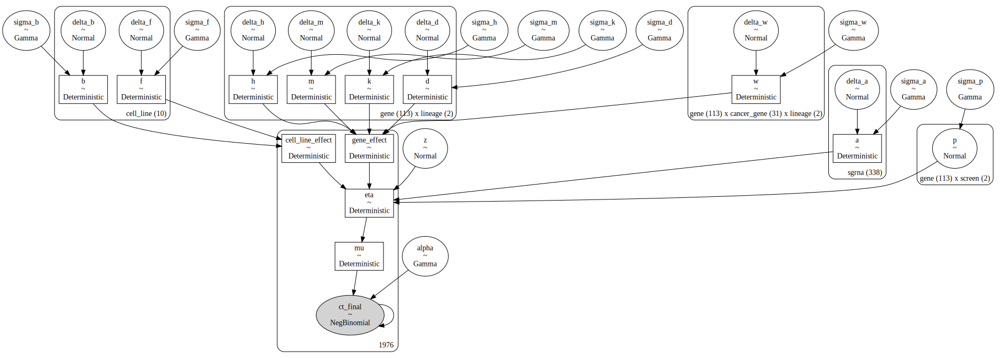
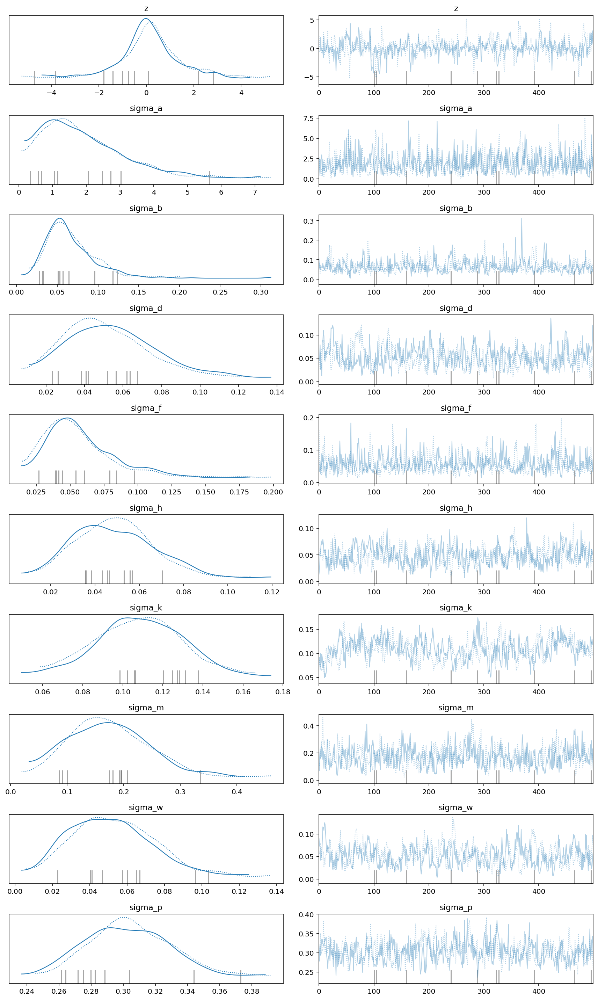
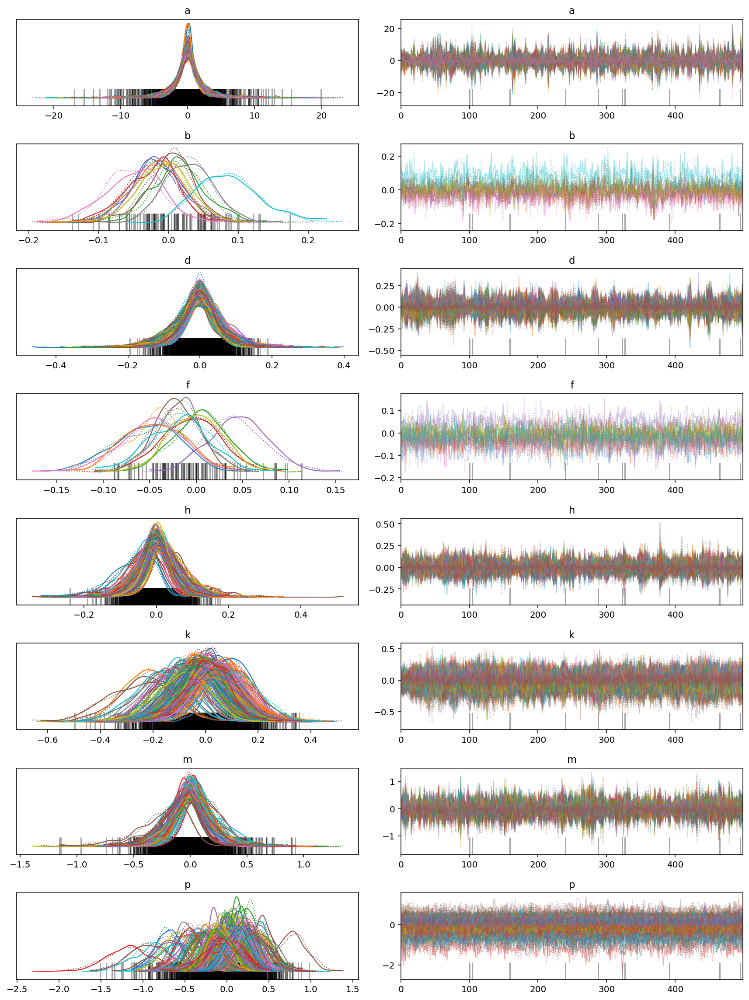
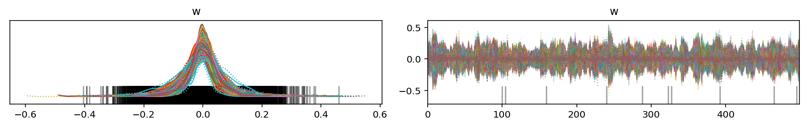
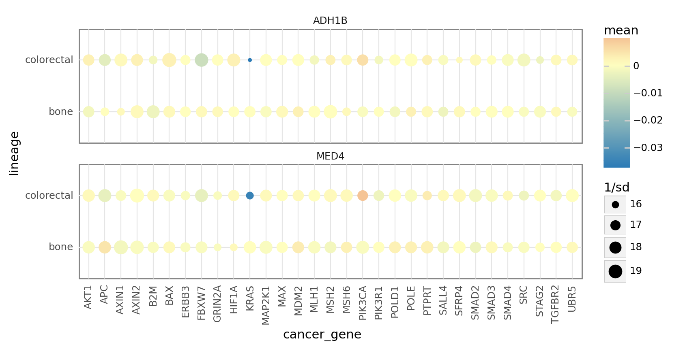
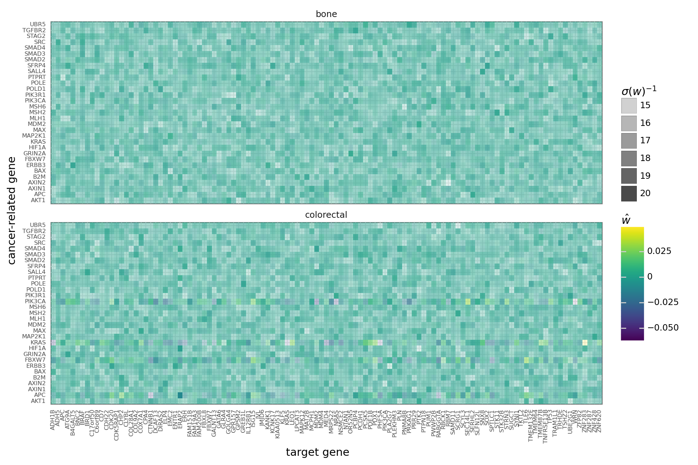
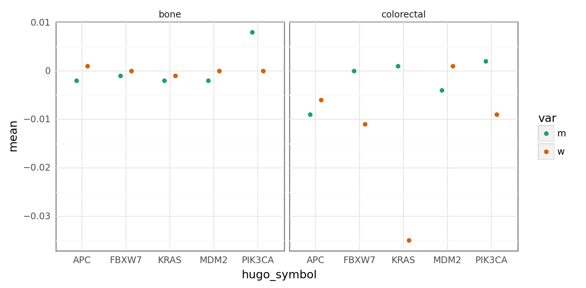

# Designing a covariate for the mutation of cancer genes

## Setup

```python
%load_ext autoreload
%autoreload 2
```

```python
from pathlib import Path
from time import time
from typing import Union

import arviz as az
import janitor
import matplotlib.pyplot as plt
import numpy as np
import pandas as pd
import plotnine as gg
import pymc as pm
import pymc.math as pmmath
```

```python
from speclet.analysis.arviz_analysis import extract_matrix_variable_coords
from speclet.bayesian_models.hierarchical_nb import HierarchcalNegativeBinomialModel
from speclet.data_processing.common import get_cats
from speclet.data_processing.crispr import common_indices
from speclet.io import DataFile
from speclet.managers.data_managers import (
    CancerGeneDataManager,
    CrisprScreenDataManager,
)
from speclet.plot.plotnine_helpers import set_gg_theme
from speclet.project_configuration import read_project_configuration
from speclet.project_enums import ModelFitMethod
```

```python
# Notebook execution timer.
notebook_tic = time()

# Plotting setup.
set_gg_theme()
%config InlineBackend.figure_format = "retina"

# Constants
RANDOM_SEED = 816
np.random.seed(RANDOM_SEED)
HDI_PROB = read_project_configuration().modeling.highest_density_interval
```

## Load data

```python
counts_data = CrisprScreenDataManager(DataFile.DEPMAP_CRC_BONE_SUBSAMPLE).get_data()
counts_data.head()
```

<div>
<style scoped>
    .dataframe tbody tr th:only-of-type {
        vertical-align: middle;
    }

    .dataframe tbody tr th {
        vertical-align: top;
    }

    .dataframe thead th {
        text-align: right;
    }
</style>
<table border="1" class="dataframe">
  <thead>
    <tr style="text-align: right;">
      <th></th>
      <th>sgrna</th>
      <th>replicate_id</th>
      <th>lfc</th>
      <th>p_dna_batch</th>
      <th>genome_alignment</th>
      <th>hugo_symbol</th>
      <th>screen</th>
      <th>multiple_hits_on_gene</th>
      <th>sgrna_target_chr</th>
      <th>sgrna_target_pos</th>
      <th>...</th>
      <th>num_mutations</th>
      <th>any_deleterious</th>
      <th>any_tcga_hotspot</th>
      <th>any_cosmic_hotspot</th>
      <th>is_mutated</th>
      <th>copy_number</th>
      <th>lineage</th>
      <th>primary_or_metastasis</th>
      <th>is_male</th>
      <th>age</th>
    </tr>
  </thead>
  <tbody>
    <tr>
      <th>0</th>
      <td>CGGAGCCTCGCCATTCCCGA</td>
      <td>COLO201-311Cas9_RepA_p6_batch3</td>
      <td>-0.183298</td>
      <td>3</td>
      <td>chr9_136410332_-</td>
      <td>ENTR1</td>
      <td>broad</td>
      <td>True</td>
      <td>9</td>
      <td>136410332</td>
      <td>...</td>
      <td>0</td>
      <td>NaN</td>
      <td>NaN</td>
      <td>NaN</td>
      <td>False</td>
      <td>1.064776</td>
      <td>colorectal</td>
      <td>metastasis</td>
      <td>True</td>
      <td>70.0</td>
    </tr>
    <tr>
      <th>1</th>
      <td>AAATAATTAAGTATGCACAT</td>
      <td>COLO201-311Cas9_RepA_p6_batch3</td>
      <td>-1.102995</td>
      <td>3</td>
      <td>chr13_48081696_-</td>
      <td>MED4</td>
      <td>broad</td>
      <td>True</td>
      <td>13</td>
      <td>48081696</td>
      <td>...</td>
      <td>0</td>
      <td>NaN</td>
      <td>NaN</td>
      <td>NaN</td>
      <td>False</td>
      <td>1.582238</td>
      <td>colorectal</td>
      <td>metastasis</td>
      <td>True</td>
      <td>70.0</td>
    </tr>
    <tr>
      <th>2</th>
      <td>AACAGCTGTTTACCAAGCGA</td>
      <td>COLO201-311Cas9_RepA_p6_batch3</td>
      <td>-0.991020</td>
      <td>3</td>
      <td>chr13_48083409_-</td>
      <td>MED4</td>
      <td>broad</td>
      <td>True</td>
      <td>13</td>
      <td>48083409</td>
      <td>...</td>
      <td>0</td>
      <td>NaN</td>
      <td>NaN</td>
      <td>NaN</td>
      <td>False</td>
      <td>1.582238</td>
      <td>colorectal</td>
      <td>metastasis</td>
      <td>True</td>
      <td>70.0</td>
    </tr>
    <tr>
      <th>3</th>
      <td>AATCAACCCACAGCTGCACA</td>
      <td>COLO201-311Cas9_RepA_p6_batch3</td>
      <td>0.219207</td>
      <td>3</td>
      <td>chr17_7675183_+</td>
      <td>TP53</td>
      <td>broad</td>
      <td>True</td>
      <td>17</td>
      <td>7675183</td>
      <td>...</td>
      <td>0</td>
      <td>NaN</td>
      <td>NaN</td>
      <td>NaN</td>
      <td>False</td>
      <td>0.978003</td>
      <td>colorectal</td>
      <td>metastasis</td>
      <td>True</td>
      <td>70.0</td>
    </tr>
    <tr>
      <th>4</th>
      <td>ACAAGGGGCGACCGTCGCCA</td>
      <td>COLO201-311Cas9_RepA_p6_batch3</td>
      <td>0.003980</td>
      <td>3</td>
      <td>chr8_103415011_-</td>
      <td>DCAF13</td>
      <td>broad</td>
      <td>True</td>
      <td>8</td>
      <td>103415011</td>
      <td>...</td>
      <td>0</td>
      <td>NaN</td>
      <td>NaN</td>
      <td>NaN</td>
      <td>False</td>
      <td>1.234548</td>
      <td>colorectal</td>
      <td>metastasis</td>
      <td>True</td>
      <td>70.0</td>
    </tr>
  </tbody>
</table>
<p>5 rows × 24 columns</p>
</div>

## Create hierarchical NB model object

```python
hnb = HierarchcalNegativeBinomialModel()
```

```python
valid_counts_data = hnb.data_processing_pipeline(counts_data)
```

## Cancer genes

```python
lineages = valid_counts_data.lineage.cat.categories.tolist()
lineages
```

    ['bone', 'colorectal']

```python
cancer_gene_manager = CancerGeneDataManager()
cosmic_cancer_genes = cancer_gene_manager.reduce_to_lineage(
    cancer_gene_manager.cosmic_cancer_genes()
)
cosmic_cancer_genes = {line: cosmic_cancer_genes[line] for line in lineages}
cosmic_cancer_genes
```

    {'bone': {'STAG2'},
     'colorectal': {'AKT1',
      'APC',
      'AXIN1',
      'AXIN2',
      'B2M',
      'BAX',
      'ERBB3',
      'FBXW7',
      'GRIN2A',
      'HIF1A',
      'KRAS',
      'MAP2K1',
      'MAX',
      'MDM2',
      'MLH1',
      'MSH2',
      'MSH6',
      'PIK3CA',
      'PIK3R1',
      'POLD1',
      'POLE',
      'PTPRT',
      'SALL4',
      'SFRP4',
      'SMAD2',
      'SMAD3',
      'SMAD4',
      'SRC',
      'TGFBR2',
      'UBR5'}}

```python
{line: len(genes) for line, genes in cosmic_cancer_genes.items()}
```

    {'bone': 1, 'colorectal': 30}

## Modify the data

I modified the data to insert a synthetic lethal interaction in each lineage.

- for `colorectal`, there is a **reduction** in the final count of *ADH1B* when *KRAS* is mutated
- for `bone`, there is an **increase** in the final count of *MED4* when *STAG2* is mutated

```python
def _modify_comutation(
    df: pd.DataFrame, target: str, cancer_gene: str, lineage: str, change: float
) -> pd.DataFrame:
    genes = df.hugo_symbol.values
    lineages = df.lineage.values
    cell_lines = df.depmap_id.values

    cancer_muts = (
        df.query(f"hugo_symbol == '{cancer_gene}' and lineage == '{lineage}'")
        .query("is_mutated")
        .depmap_id.unique()
        .astype(str)
    )

    ary = (
        (lineages == lineage)
        * (genes == target)
        * [c in cancer_muts for c in cell_lines]
    )
    print(f"number of changes: {sum(ary)}")

    ct_final = df["counts_final"].values
    ct_final[ary] = ct_final[ary] * change
    df["counts_final"] = ct_final.astype(int)
    return df
```

```python
comutation_changes = [
    {"target": "ADH1B", "cancer_gene": "KRAS", "lineage": "colorectal", "change": 0.2},
    {"target": "MED4", "cancer_gene": "STAG2", "lineage": "bone", "change": 2.0},
]
for change_info in comutation_changes:
    counts_data = _modify_comutation(counts_data, **change_info)  # type: ignore
```

    number of changes: 3
    number of changes: 0

## Build model

```python
hnb_model = hnb.pymc_model(counts_data)
```

```python
pm.model_to_graphviz(hnb_model)
```



## Sample posterior

```python
with hnb_model:
    trace = pm.sample(draws=500, tune=500, chains=2, cores=2, target_accept=0.95)
    _ = pm.sample_posterior_predictive(trace, extend_inferencedata=True)
```

    Auto-assigning NUTS sampler...
    Initializing NUTS using jitter+adapt_diag...
    /usr/local/Caskroom/miniconda/base/envs/speclet/lib/python3.9/site-packages/pymc/aesaraf.py:996: UserWarning: The parameter 'updates' of aesara.function() expects an OrderedDict, got <class 'dict'>. Using a standard dictionary here results in non-deterministic behavior. You should use an OrderedDict if you are using Python 2.7 (collections.OrderedDict for older python), or use a list of (shared, update) pairs. Do not just convert your dictionary to this type before the call as the conversion will still be non-deterministic.
    Multiprocess sampling (2 chains in 2 jobs)
    NUTS: [z, sigma_a, delta_a, sigma_b, delta_b, sigma_d, delta_d, sigma_f, delta_f, sigma_h, delta_h, sigma_k, delta_k, sigma_m, delta_m, sigma_w, delta_w, sigma_p, p, alpha]

<style>
    /*Turns off some styling*/
    progress {
        /*gets rid of default border in Firefox and Opera.*/
        border: none;
        /*Needs to be in here for Safari polyfill so background images work as expected.*/
        background-size: auto;
    }
    .progress-bar-interrupted, .progress-bar-interrupted::-webkit-progress-bar {
        background: #F44336;
    }
</style>

<div>
  <progress value='2000' class='' max='2000' style='width:300px; height:20px; vertical-align: middle;'></progress>
  100.00% [2000/2000 1:17:43<00:00 Sampling 2 chains, 10 divergences]
</div>

    Sampling 2 chains for 500 tune and 500 draw iterations (1_000 + 1_000 draws total) took 4678 seconds.
    There were 6 divergences after tuning. Increase `target_accept` or reparameterize.
    There were 4 divergences after tuning. Increase `target_accept` or reparameterize.
    We recommend running at least 4 chains for robust computation of convergence diagnostics

<style>
    /*Turns off some styling*/
    progress {
        /*gets rid of default border in Firefox and Opera.*/
        border: none;
        /*Needs to be in here for Safari polyfill so background images work as expected.*/
        background-size: auto;
    }
    .progress-bar-interrupted, .progress-bar-interrupted::-webkit-progress-bar {
        background: #F44336;
    }
</style>

<div>
  <progress value='1000' class='' max='1000' style='width:300px; height:20px; vertical-align: middle;'></progress>
  100.00% [1000/1000 00:00<00:00]
</div>

## Posterior analysis

```python
az.plot_trace(trace, var_names=["z", "sigma"], filter_vars="like")
plt.tight_layout();
```



```python
az.plot_trace(trace, var_names=["a", "b", "d", "f", "h", "k", "m", "p"])
plt.tight_layout();
```



```python
az.plot_trace(trace, var_names=["w"])
plt.tight_layout();
```



```python
w_post = (
    az.summary(trace, var_names=["w"], kind="stats")
    .reset_index(drop=False)
    .rename(columns={"index": "param"})
    .assign(
        coords=lambda d: [
            x.replace("w[", "").replace("]", "").split(",") for x in d.param
        ]
    )
    .assign(
        hugo_symbol=lambda d: [x[0].strip() for x in d.coords],
        cancer_gene=lambda d: [x[1].strip() for x in d.coords],
        lineage=lambda d: [x[2].strip() for x in d.coords],
    )
)
```

The effect was captured by `w`.
Funny enough, I think the interaction between *MED4* and *KRAS* in colorectal is real; I only modified the values in bone.

```python
(
    gg.ggplot(
        w_post.query("hugo_symbol == 'MED4' or hugo_symbol == 'ADH1B'"),
        gg.aes(x="cancer_gene", y="lineage"),
    )
    + gg.facet_wrap("~hugo_symbol", ncol=1)
    + gg.geom_point(gg.aes(color="mean", size="1/sd"))
    + gg.scale_color_gradient2(low="#2c7bb6", mid="#ffffbf", high="#d7191c")
    + gg.theme(figure_size=(8, 4), axis_text_x=gg.element_text(angle=90))
)
```

    /usr/local/Caskroom/miniconda/base/envs/speclet/lib/python3.9/site-packages/plotnine/utils.py:371: FutureWarning: The frame.append method is deprecated and will be removed from pandas in a future version. Use pandas.concat instead.



    <ggplot: (354916687)>

```python
(
    gg.ggplot(w_post, gg.aes(x="hugo_symbol", y="cancer_gene", fill="mean"))
    + gg.facet_wrap("~lineage", ncol=1)
    + gg.geom_tile(gg.aes(alpha="1/sd"), color=None)
    + gg.scale_x_discrete(expand=(0, 0.5))
    + gg.scale_y_discrete(expand=(0, 0.5))
    + gg.theme(
        figure_size=(10, 7),
        axis_text_x=gg.element_text(size=6, angle=90),
        axis_text_y=gg.element_text(size=6),
    )
    + gg.labs(
        x="target gene",
        y="cancer-related gene",
        fill="$\hat{w}$",
        alpha="$\sigma(w)^{-1}$",
    )
)
```

    /usr/local/Caskroom/miniconda/base/envs/speclet/lib/python3.9/site-packages/plotnine/utils.py:371: FutureWarning: The frame.append method is deprecated and will be removed from pandas in a future version. Use pandas.concat instead.



    <ggplot: (355113241)>

Check the posteriors of $m$ and $w$ for the cancer genes when they are the target gene.
The mutation covariate $m$ has been augmented to skip the gene when it is a cancer gene.

```python
m_post = (
    az.summary(trace, var_names=["m"], kind="stats")
    .reset_index(drop=False)
    .rename(columns={"index": "param"})
    .pipe(
        extract_matrix_variable_coords,
        col="param",
        idx1name="hugo_symbol",
        idx2name="lineage",
    )
)
```

```python
cancer_genes = trace.posterior.coords["cancer_gene"].values.tolist()
```

```python
plot_df = pd.concat(
    [
        w_post.query("hugo_symbol == cancer_gene").assign(var="w"),
        m_post.filter_column_isin("hugo_symbol", cancer_genes).assign(var="m"),
    ]
)

(
    gg.ggplot(plot_df, gg.aes(x="hugo_symbol", y="mean"))
    + gg.facet_wrap("~lineage", nrow=1)
    + gg.geom_point(gg.aes(color="var"), position=gg.position_dodge(width=0.5))
    + gg.scale_color_brewer(type="qual", palette="Dark2")
    + gg.theme(figure_size=(8, 4))
)
```

    /usr/local/Caskroom/miniconda/base/envs/speclet/lib/python3.9/site-packages/plotnine/utils.py:371: FutureWarning: The frame.append method is deprecated and will be removed from pandas in a future version. Use pandas.concat instead.



    <ggplot: (355948713)>

Just to make sure that the extreme positive distribution in `d` is not one of the genes being tested here.

```python
az.summary(trace, var_names="d", kind="stats").sort_values(
    "mean", ascending=False
).head(10)
```

<div>
<style scoped>
    .dataframe tbody tr th:only-of-type {
        vertical-align: middle;
    }

    .dataframe tbody tr th {
        vertical-align: top;
    }

    .dataframe thead th {
        text-align: right;
    }
</style>
<table border="1" class="dataframe">
  <thead>
    <tr style="text-align: right;">
      <th></th>
      <th>mean</th>
      <th>sd</th>
      <th>hdi_3%</th>
      <th>hdi_97%</th>
    </tr>
  </thead>
  <tbody>
    <tr>
      <th>d[TP53, bone]</th>
      <td>0.029</td>
      <td>0.058</td>
      <td>-0.084</td>
      <td>0.135</td>
    </tr>
    <tr>
      <th>d[ADH1B, bone]</th>
      <td>0.025</td>
      <td>0.059</td>
      <td>-0.079</td>
      <td>0.142</td>
    </tr>
    <tr>
      <th>d[WRN, bone]</th>
      <td>0.024</td>
      <td>0.058</td>
      <td>-0.083</td>
      <td>0.133</td>
    </tr>
    <tr>
      <th>d[SEC14L1, colorectal]</th>
      <td>0.022</td>
      <td>0.060</td>
      <td>-0.092</td>
      <td>0.137</td>
    </tr>
    <tr>
      <th>d[ZNF283, colorectal]</th>
      <td>0.021</td>
      <td>0.055</td>
      <td>-0.077</td>
      <td>0.133</td>
    </tr>
    <tr>
      <th>d[KCNK17, bone]</th>
      <td>0.021</td>
      <td>0.060</td>
      <td>-0.092</td>
      <td>0.131</td>
    </tr>
    <tr>
      <th>d[CTNNB1, bone]</th>
      <td>0.019</td>
      <td>0.059</td>
      <td>-0.082</td>
      <td>0.147</td>
    </tr>
    <tr>
      <th>d[FAM151B, bone]</th>
      <td>0.019</td>
      <td>0.057</td>
      <td>-0.075</td>
      <td>0.138</td>
    </tr>
    <tr>
      <th>d[ISG15, colorectal]</th>
      <td>0.018</td>
      <td>0.056</td>
      <td>-0.091</td>
      <td>0.121</td>
    </tr>
    <tr>
      <th>d[NRAS, bone]</th>
      <td>0.017</td>
      <td>0.057</td>
      <td>-0.077</td>
      <td>0.142</td>
    </tr>
  </tbody>
</table>
</div>

---

```python
notebook_toc = time()
print(f"execution time: {(notebook_toc - notebook_tic) / 60:.2f} minutes")
```

    execution time: 96.12 minutes

```python
%load_ext watermark
%watermark -d -u -v -iv -b -h -m
```

    Last updated: 2022-03-31

    Python implementation: CPython
    Python version       : 3.9.9
    IPython version      : 8.1.1

    Compiler    : Clang 11.1.0
    OS          : Darwin
    Release     : 21.4.0
    Machine     : x86_64
    Processor   : i386
    CPU cores   : 4
    Architecture: 64bit

    Hostname: JHCookMac

    Git branch: oncogene-cov

    arviz     : 0.12.0
    matplotlib: 3.5.1
    plotnine  : 0.8.0
    pandas    : 1.4.1
    numpy     : 1.22.3
    janitor   : 0.22.0
    pymc      : 4.0.0b5

```python

```
