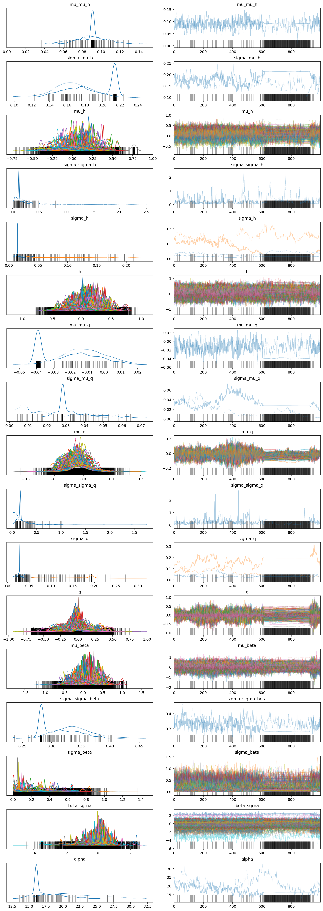
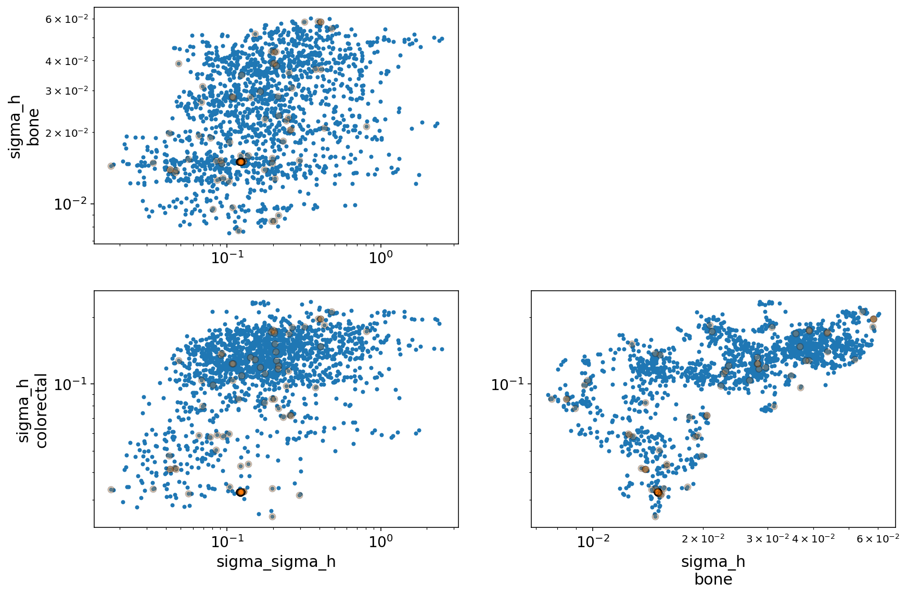

```python
%load_ext autoreload
%autoreload 2
```

```python
import logging
import warnings
from time import time

import arviz as az
import matplotlib.pyplot as plt
import numpy as np
import pandas as pd
import plotnine as gg
import pymc3 as pm
import seaborn as sns
```

```python
from src.io.cache_io import temp_dir
from src.io.data_io import DataFile
from src.loggers import set_console_handler_level
from src.managers.data_managers import CrisprScreenDataManager
from src.models.speclet_eight import SpecletEight
from src.plot.color_pal import SeabornColor
from src.plot.plotnine_helpers import set_gg_theme
```

```python
notebook_tic = time()

warnings.simplefilter(action="ignore", category=UserWarning)
set_console_handler_level(logging.INFO)
set_gg_theme()
%config InlineBackend.figure_format = "retina"

RANDOM_SEED = 1026
np.random.seed(RANDOM_SEED)
```

```python
from src.models.speclet_eight import SpecletEight
```

```python
dm = CrisprScreenDataManager(DataFile.DEPMAP_CRC_BONE_SUBSAMPLE)
sp8 = SpecletEight("design-model", data_manager=dm, root_cache_dir=temp_dir())
sp8.build_model()
pm.model_to_graphviz(sp8.model)
```

<pre style="white-space:pre;overflow-x:auto;line-height:normal;font-family:Menlo,'DejaVu Sans Mono',consolas,'Courier New',monospace"><span style="color: #7fbfbf; text-decoration-color: #7fbfbf">[10/15/21 14:34:17] </span><span style="color: #000080; text-decoration-color: #000080">INFO    </span> Creating a new SpecletEight object.          <a href="file:///Users/admin/Lab_Projects/speclet/src/models/speclet_eight.py"><span style="color: #7f7f7f; text-decoration-color: #7f7f7f">speclet_eight.py</span></a><span style="color: #7f7f7f; text-decoration-color: #7f7f7f">:90</span>
</pre>

<pre style="white-space:pre;overflow-x:auto;line-height:normal;font-family:Menlo,'DejaVu Sans Mono',consolas,'Courier New',monospace"><span style="color: #7fbfbf; text-decoration-color: #7fbfbf">                    </span><span style="color: #000080; text-decoration-color: #000080">INFO    </span> Adding new transformation.                  <a href="file:///Users/admin/Lab_Projects/speclet/src/managers/data_managers.py"><span style="color: #7f7f7f; text-decoration-color: #7f7f7f">data_managers.py</span></a><span style="color: #7f7f7f; text-decoration-color: #7f7f7f">:171</span>
</pre>

<pre style="white-space:pre;overflow-x:auto;line-height:normal;font-family:Menlo,'DejaVu Sans Mono',consolas,'Courier New',monospace"><span style="color: #7fbfbf; text-decoration-color: #7fbfbf">                    </span><span style="color: #000080; text-decoration-color: #000080">INFO    </span> Adding new transformation.                  <a href="file:///Users/admin/Lab_Projects/speclet/src/managers/data_managers.py"><span style="color: #7f7f7f; text-decoration-color: #7f7f7f">data_managers.py</span></a><span style="color: #7f7f7f; text-decoration-color: #7f7f7f">:171</span>
</pre>

<pre style="white-space:pre;overflow-x:auto;line-height:normal;font-family:Menlo,'DejaVu Sans Mono',consolas,'Courier New',monospace"><span style="color: #7fbfbf; text-decoration-color: #7fbfbf">                    </span><span style="color: #000080; text-decoration-color: #000080">INFO    </span> Adding new transformation.                  <a href="file:///Users/admin/Lab_Projects/speclet/src/managers/data_managers.py"><span style="color: #7f7f7f; text-decoration-color: #7f7f7f">data_managers.py</span></a><span style="color: #7f7f7f; text-decoration-color: #7f7f7f">:171</span>
</pre>

<pre style="white-space:pre;overflow-x:auto;line-height:normal;font-family:Menlo,'DejaVu Sans Mono',consolas,'Courier New',monospace"><span style="color: #7fbfbf; text-decoration-color: #7fbfbf">                    </span><span style="color: #000080; text-decoration-color: #000080">INFO    </span> Calling `<span style="color: #800080; text-decoration-color: #800080; font-weight: bold">model_specification</span><span style="font-weight: bold">()</span>` method.     <a href="file:///Users/admin/Lab_Projects/speclet/src/models/speclet_model.py"><span style="color: #7f7f7f; text-decoration-color: #7f7f7f">speclet_model.py</span></a><span style="color: #7f7f7f; text-decoration-color: #7f7f7f">:205</span>
</pre>

<pre style="white-space:pre;overflow-x:auto;line-height:normal;font-family:Menlo,'DejaVu Sans Mono',consolas,'Courier New',monospace"><span style="color: #7fbfbf; text-decoration-color: #7fbfbf">                    </span><span style="color: #000080; text-decoration-color: #000080">INFO    </span> Creating SpecletEight model.                <a href="file:///Users/admin/Lab_Projects/speclet/src/models/speclet_eight.py"><span style="color: #7f7f7f; text-decoration-color: #7f7f7f">speclet_eight.py</span></a><span style="color: #7f7f7f; text-decoration-color: #7f7f7f">:121</span>
</pre>

<pre style="white-space:pre;overflow-x:auto;line-height:normal;font-family:Menlo,'DejaVu Sans Mono',consolas,'Courier New',monospace"><span style="color: #7fbfbf; text-decoration-color: #7fbfbf">                    </span><span style="color: #000080; text-decoration-color: #000080">INFO    </span> Getting data - reading from file.           <a href="file:///Users/admin/Lab_Projects/speclet/src/managers/data_managers.py"><span style="color: #7f7f7f; text-decoration-color: #7f7f7f">data_managers.py</span></a><span style="color: #7f7f7f; text-decoration-color: #7f7f7f">:126</span>
</pre>

<pre style="white-space:pre;overflow-x:auto;line-height:normal;font-family:Menlo,'DejaVu Sans Mono',consolas,'Courier New',monospace"><span style="color: #7fbfbf; text-decoration-color: #7fbfbf">                    </span><span style="color: #800000; text-decoration-color: #800000">WARNING </span> Dropping <span style="color: #008080; text-decoration-color: #008080; font-weight: bold">0</span> sgRNA that map to multiple genes.     <a href="file:///Users/admin/Lab_Projects/speclet/src/data_processing/achilles.py"><span style="color: #7f7f7f; text-decoration-color: #7f7f7f">achilles.py</span></a><span style="color: #7f7f7f; text-decoration-color: #7f7f7f">:616</span>
</pre>

<pre style="white-space:pre;overflow-x:auto;line-height:normal;font-family:Menlo,'DejaVu Sans Mono',consolas,'Courier New',monospace"><span style="color: #7fbfbf; text-decoration-color: #7fbfbf">                    </span><span style="color: #000080; text-decoration-color: #000080">INFO    </span> Adding <span style="color: #008000; text-decoration-color: #008000">'rna_expr_gene_lineage'</span> column. <a href="file:///Users/admin/Lab_Projects/speclet/src/modeling/feature_engineering.py"><span style="color: #7f7f7f; text-decoration-color: #7f7f7f">feature_engineering.py</span></a><span style="color: #7f7f7f; text-decoration-color: #7f7f7f">:73</span>
</pre>

<pre style="white-space:pre;overflow-x:auto;line-height:normal;font-family:Menlo,'DejaVu Sans Mono',consolas,'Courier New',monospace"><span style="color: #7fbfbf; text-decoration-color: #7fbfbf">[10/15/21 14:34:19] </span><span style="color: #000080; text-decoration-color: #000080">INFO    </span> Number of data points: <span style="color: #008080; text-decoration-color: #008080; font-weight: bold">1120</span>                 <a href="file:///Users/admin/Lab_Projects/speclet/src/models/speclet_eight.py"><span style="color: #7f7f7f; text-decoration-color: #7f7f7f">speclet_eight.py</span></a><span style="color: #7f7f7f; text-decoration-color: #7f7f7f">:125</span>
</pre>

<pre style="white-space:pre;overflow-x:auto;line-height:normal;font-family:Menlo,'DejaVu Sans Mono',consolas,'Courier New',monospace"><span style="color: #7fbfbf; text-decoration-color: #7fbfbf">                    </span><span style="color: #000080; text-decoration-color: #000080">INFO    </span> Number of sgRNA: <span style="color: #008080; text-decoration-color: #008080; font-weight: bold">160</span>                        <a href="file:///Users/admin/Lab_Projects/speclet/src/models/speclet_eight.py"><span style="color: #7f7f7f; text-decoration-color: #7f7f7f">speclet_eight.py</span></a><span style="color: #7f7f7f; text-decoration-color: #7f7f7f">:127</span>
</pre>

<pre style="white-space:pre;overflow-x:auto;line-height:normal;font-family:Menlo,'DejaVu Sans Mono',consolas,'Courier New',monospace"><span style="color: #7fbfbf; text-decoration-color: #7fbfbf">                    </span><span style="color: #000080; text-decoration-color: #000080">INFO    </span> Number of genes: <span style="color: #008080; text-decoration-color: #008080; font-weight: bold">101</span>                        <a href="file:///Users/admin/Lab_Projects/speclet/src/models/speclet_eight.py"><span style="color: #7f7f7f; text-decoration-color: #7f7f7f">speclet_eight.py</span></a><span style="color: #7f7f7f; text-decoration-color: #7f7f7f">:128</span>
</pre>

<pre style="white-space:pre;overflow-x:auto;line-height:normal;font-family:Menlo,'DejaVu Sans Mono',consolas,'Courier New',monospace"><span style="color: #7fbfbf; text-decoration-color: #7fbfbf">                    </span><span style="color: #000080; text-decoration-color: #000080">INFO    </span> Number of cell lines: <span style="color: #008080; text-decoration-color: #008080; font-weight: bold">7</span>                     <a href="file:///Users/admin/Lab_Projects/speclet/src/models/speclet_eight.py"><span style="color: #7f7f7f; text-decoration-color: #7f7f7f">speclet_eight.py</span></a><span style="color: #7f7f7f; text-decoration-color: #7f7f7f">:129</span>
</pre>

<pre style="white-space:pre;overflow-x:auto;line-height:normal;font-family:Menlo,'DejaVu Sans Mono',consolas,'Courier New',monospace"><span style="color: #7fbfbf; text-decoration-color: #7fbfbf">                    </span><span style="color: #000080; text-decoration-color: #000080">INFO    </span> Number of lineages: <span style="color: #008080; text-decoration-color: #008080; font-weight: bold">2</span>                       <a href="file:///Users/admin/Lab_Projects/speclet/src/models/speclet_eight.py"><span style="color: #7f7f7f; text-decoration-color: #7f7f7f">speclet_eight.py</span></a><span style="color: #7f7f7f; text-decoration-color: #7f7f7f">:130</span>
</pre>

<pre style="white-space:pre;overflow-x:auto;line-height:normal;font-family:Menlo,'DejaVu Sans Mono',consolas,'Courier New',monospace"><span style="color: #7fbfbf; text-decoration-color: #7fbfbf">[10/15/21 14:34:20] </span><span style="color: #000080; text-decoration-color: #000080">INFO    </span> Creating shared variables.                  <a href="file:///Users/admin/Lab_Projects/speclet/src/models/speclet_eight.py"><span style="color: #7f7f7f; text-decoration-color: #7f7f7f">speclet_eight.py</span></a><span style="color: #7f7f7f; text-decoration-color: #7f7f7f">:133</span>
</pre>


```python
sp8_mcmc_post = sp8.mcmc_sample_model(
    draws=1000,
    tune=500,
    chains=2,
    cores=2,
    target_accept=0.85,
    prior_pred_samples=-1,
    random_seed=RANDOM_SEED,
    ignore_cache=True,
    sample_kwargs={"init": "advi", "n_init": 20000},
)
```

<pre style="white-space:pre;overflow-x:auto;line-height:normal;font-family:Menlo,'DejaVu Sans Mono',consolas,'Courier New',monospace"><span style="color: #7fbfbf; text-decoration-color: #7fbfbf">[10/15/21 14:34:40] </span><span style="color: #000080; text-decoration-color: #000080">INFO    </span> Beginning MCMC sampling.                    <a href="file:///Users/admin/Lab_Projects/speclet/src/models/speclet_model.py"><span style="color: #7f7f7f; text-decoration-color: #7f7f7f">speclet_model.py</span></a><span style="color: #7f7f7f; text-decoration-color: #7f7f7f">:304</span>
</pre>

    Auto-assigning NUTS sampler...
    Initializing NUTS using advi...

<div>
    <style>
        /*Turns off some styling*/
        progress {
            /*gets rid of default border in Firefox and Opera.*/
            border: none;
            /*Needs to be in here for Safari polyfill so background images work as expected.*/
            background-size: auto;
        }
        .progress-bar-interrupted, .progress-bar-interrupted::-webkit-progress-bar {
            background: #F44336;
        }
    </style>
  <progress value='20000' class='' max='20000' style='width:300px; height:20px; vertical-align: middle;'></progress>
  100.00% [20000/20000 00:54<00:00 Average Loss = 8,557.8]
</div>

    Finished [100%]: Average Loss = 8,557.8
    Multiprocess sampling (2 chains in 2 jobs)
    NUTS: [alpha, beta_sgrna, sigma_beta, sigma_sigma_beta, q, sigma_q, sigma_sigma_q, mu_q, sigma_mu_q, mu_mu_q, h, sigma_h, sigma_sigma_h, mu_h, sigma_mu_h, mu_mu_h]

<div>
    <style>
        /*Turns off some styling*/
        progress {
            /*gets rid of default border in Firefox and Opera.*/
            border: none;
            /*Needs to be in here for Safari polyfill so background images work as expected.*/
            background-size: auto;
        }
        .progress-bar-interrupted, .progress-bar-interrupted::-webkit-progress-bar {
            background: #F44336;
        }
    </style>
  <progress value='3000' class='' max='3000' style='width:300px; height:20px; vertical-align: middle;'></progress>
  100.00% [3000/3000 30:36<00:00 Sampling 2 chains, 378 divergences]
</div>

    Sampling 2 chains for 500 tune and 1_000 draw iterations (1_000 + 2_000 draws total) took 1849 seconds.
    There were 351 divergences after tuning. Increase `target_accept` or reparameterize.
    The acceptance probability does not match the target. It is 0.6390312835154116, but should be close to 0.85. Try to increase the number of tuning steps.
    The chain reached the maximum tree depth. Increase max_treedepth, increase target_accept or reparameterize.
    There were 27 divergences after tuning. Increase `target_accept` or reparameterize.
    The chain reached the maximum tree depth. Increase max_treedepth, increase target_accept or reparameterize.
    The rhat statistic is larger than 1.4 for some parameters. The sampler did not converge.
    The estimated number of effective samples is smaller than 200 for some parameters.

<div>
    <style>
        /*Turns off some styling*/
        progress {
            /*gets rid of default border in Firefox and Opera.*/
            border: none;
            /*Needs to be in here for Safari polyfill so background images work as expected.*/
            background-size: auto;
        }
        .progress-bar-interrupted, .progress-bar-interrupted::-webkit-progress-bar {
            background: #F44336;
        }
    </style>
  <progress value='2000' class='' max='2000' style='width:300px; height:20px; vertical-align: middle;'></progress>
  100.00% [2000/2000 00:39<00:00]
</div>

<pre style="white-space:pre;overflow-x:auto;line-height:normal;font-family:Menlo,'DejaVu Sans Mono',consolas,'Courier New',monospace"><span style="color: #7fbfbf; text-decoration-color: #7fbfbf">[10/15/21 15:09:16] </span><span style="color: #000080; text-decoration-color: #000080">INFO    </span> Not sampling from prior predictive.     <a href="file:///Users/admin/Lab_Projects/speclet/src/modeling/pymc3_sampling_api.py"><span style="color: #7f7f7f; text-decoration-color: #7f7f7f">pymc3_sampling_api.py</span></a><span style="color: #7f7f7f; text-decoration-color: #7f7f7f">:92</span>
</pre>

<pre style="white-space:pre;overflow-x:auto;line-height:normal;font-family:Menlo,'DejaVu Sans Mono',consolas,'Courier New',monospace"><span style="color: #7fbfbf; text-decoration-color: #7fbfbf">                    </span><span style="color: #000080; text-decoration-color: #000080">INFO    </span> Finished MCMC sampling - caching results.   <a href="file:///Users/admin/Lab_Projects/speclet/src/models/speclet_model.py"><span style="color: #7f7f7f; text-decoration-color: #7f7f7f">speclet_model.py</span></a><span style="color: #7f7f7f; text-decoration-color: #7f7f7f">:315</span>
</pre>

<pre style="white-space:pre;overflow-x:auto;line-height:normal;font-family:Menlo,'DejaVu Sans Mono',consolas,'Courier New',monospace"><span style="color: #7fbfbf; text-decoration-color: #7fbfbf">                    </span><span style="color: #000080; text-decoration-color: #000080">INFO    </span> Caching InferenceData to <span style="color: #008000; text-decoration-color: #008000">'/Users/admin/Lab_</span> <a href="file:///Users/admin/Lab_Projects/speclet/src/managers/cache_managers.py"><span style="color: #7f7f7f; text-decoration-color: #7f7f7f">cache_managers.py</span></a><span style="color: #7f7f7f; text-decoration-color: #7f7f7f">:94</span>
                             <span style="color: #008000; text-decoration-color: #008000">Projects/speclet/temp/design-model/mcmc/inf</span>
                             <span style="color: #008000; text-decoration-color: #008000">erence-data.nc'</span>.
</pre>

```python
sp8_vars: list[str] = [
    "mu_mu_h",
    "sigma_mu_h",
    "mu_h",
    "sigma_sigma_h",
    "sigma_h",
    "h",
    "mu_mu_q",
    "sigma_mu_q",
    "mu_q",
    "sigma_sigma_q",
    "sigma_q",
    "q",
    "mu_beta",
    "sigma_sigma_beta",
    "sigma_beta",
    "beta_sgrna",
    "alpha",
]
```

```python
az.plot_trace(sp8_mcmc_post, var_names=sp8_vars);
```



```python
# az.summary(sp8_mcmc_post, var_names=sp8_vars).query("r_hat > 1.1")
```

```python
axes = az.plot_pair(
    sp8_mcmc_post,
    var_names=["sigma_sigma_h", "sigma_h"],
    divergences=True,
    divergences_kwargs={"alpha": 0.25},
)
for ax in axes.flatten():
    ax.set_xscale("log")
    ax.set_yscale("log")
plt.show()
```



```python

```

```python

```

```python

```

---

```python
notebook_toc = time()
print(f"execution time: {(notebook_toc - notebook_tic) / 60:.2f} minutes")
```

    execution time: 27.32 minutes

```python
%load_ext watermark
%watermark -d -u -v -iv -b -h -m
```

    Last updated: 2021-10-15

    Python implementation: CPython
    Python version       : 3.9.6
    IPython version      : 7.26.0

    Compiler    : Clang 11.1.0
    OS          : Darwin
    Release     : 20.6.0
    Machine     : x86_64
    Processor   : i386
    CPU cores   : 4
    Architecture: 64bit

    Hostname: JHCookMac.local

    Git branch: speclet-eight

    arviz     : 0.11.2
    pandas    : 1.3.2
    plotnine  : 0.8.0
    numpy     : 1.21.2
    matplotlib: 3.4.3
    sys       : 3.9.6 | packaged by conda-forge | (default, Jul 11 2021, 03:36:15)
    [Clang 11.1.0 ]
    logging   : 0.5.1.2
    pymc3     : 3.11.2
    seaborn   : 0.11.2

```python

```
