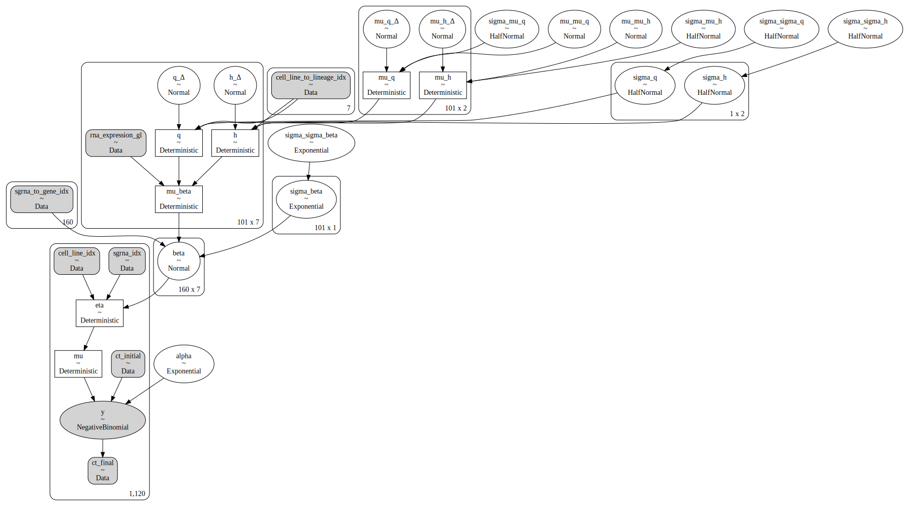
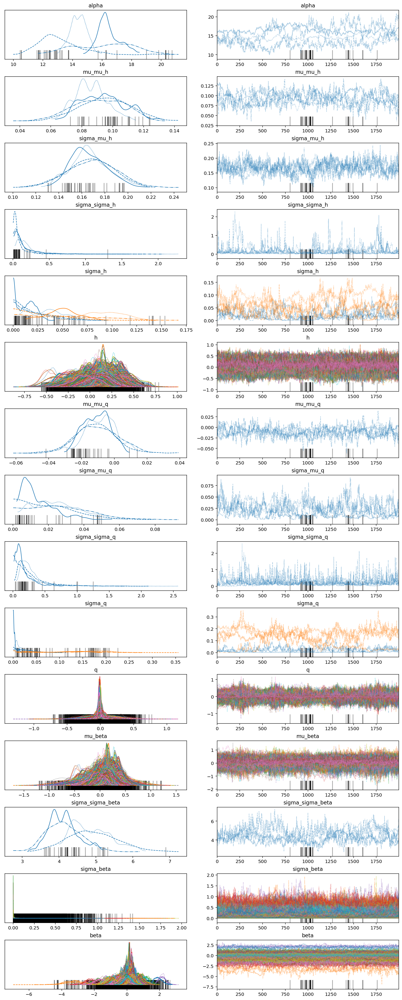
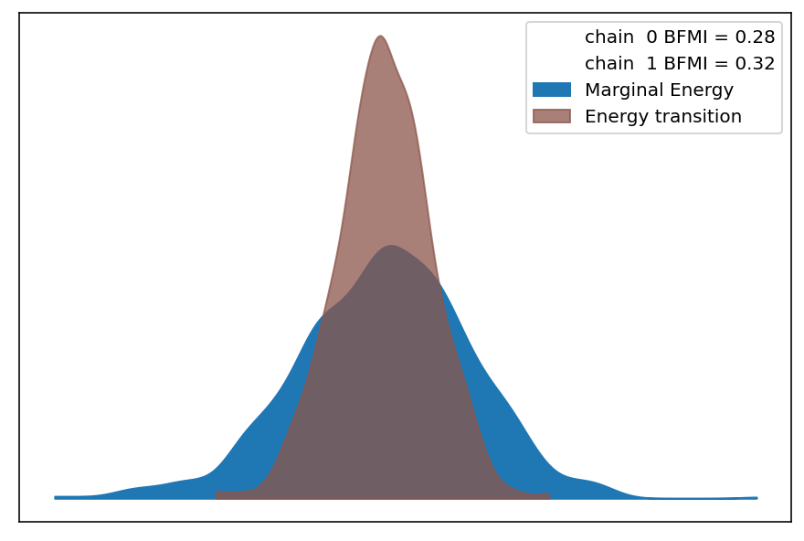

```python
%load_ext autoreload
%autoreload 2
```

```python
import logging
import warnings
from pathlib import Path
from time import time

import arviz as az
import matplotlib.pyplot as plt
import numpy as np
import pandas as pd
import plotnine as gg
import pymc3 as pm
import seaborn as sns
```

```python
from src.analysis import pymc3_analysis as pmanal
from src.data_processing import achilles as achelp
from src.data_processing import common as dphelp
from src.exceptions import CacheDoesNotExistError
from src.io import cache_io
from src.io.models_io import models_dir
from src.loggers import logger, set_console_handler_level
from src.model_configuration import get_config_and_instantiate_model
from src.modeling import pymc3_sampling_api as pmapi
from src.models.speclet_eight import SpecletEight
from src.plot.color_pal import SeabornColor
from src.plot.plotnine_helpers import set_gg_theme
from src.project_config import read_project_configuration
```

```python
notebook_tic = time()

warnings.simplefilter(action="ignore", category=UserWarning)
set_console_handler_level(logging.INFO)

set_gg_theme()
%config InlineBackend.figure_format = "retina"

RANDOM_SEED = 847
np.random.seed(RANDOM_SEED)

MODELING_CONFIG = read_project_configuration().modeling
HDI_PROB = MODELING_CONFIG.highest_density_interval
```

```python
sp8 = get_config_and_instantiate_model(
    models_dir() / MODELING_CONFIG.models_config,
    name="eight-default",
    root_cache_dir=models_dir(),
)
```

<pre style="white-space:pre;overflow-x:auto;line-height:normal;font-family:Menlo,'DejaVu Sans Mono',consolas,'Courier New',monospace"><span style="color: #7fbfbf; text-decoration-color: #7fbfbf">[11/04/21 08:05:00] </span><span style="color: #000080; text-decoration-color: #000080">INFO    </span> Instantiating and configuring a       <a href="file:///Users/admin/Lab_Projects/speclet/src/model_configuration.py"><span style="color: #7f7f7f; text-decoration-color: #7f7f7f">model_configuration.py</span></a><span style="color: #7f7f7f; text-decoration-color: #7f7f7f">:238</span>
                             speclet model from config.
</pre>

<pre style="white-space:pre;overflow-x:auto;line-height:normal;font-family:Menlo,'DejaVu Sans Mono',consolas,'Courier New',monospace"><span style="color: #7fbfbf; text-decoration-color: #7fbfbf">                    </span><span style="color: #000080; text-decoration-color: #000080">INFO    </span> Creating a new SpecletEight object.          <a href="file:///Users/admin/Lab_Projects/speclet/src/models/speclet_eight.py"><span style="color: #7f7f7f; text-decoration-color: #7f7f7f">speclet_eight.py</span></a><span style="color: #7f7f7f; text-decoration-color: #7f7f7f">:92</span>
</pre>

<pre style="white-space:pre;overflow-x:auto;line-height:normal;font-family:Menlo,'DejaVu Sans Mono',consolas,'Courier New',monospace"><span style="color: #7fbfbf; text-decoration-color: #7fbfbf">                    </span><span style="color: #000080; text-decoration-color: #000080">INFO    </span> Adding new transformation.                  <a href="file:///Users/admin/Lab_Projects/speclet/src/managers/data_managers.py"><span style="color: #7f7f7f; text-decoration-color: #7f7f7f">data_managers.py</span></a><span style="color: #7f7f7f; text-decoration-color: #7f7f7f">:171</span>
</pre>

<pre style="white-space:pre;overflow-x:auto;line-height:normal;font-family:Menlo,'DejaVu Sans Mono',consolas,'Courier New',monospace"><span style="color: #7fbfbf; text-decoration-color: #7fbfbf">                    </span><span style="color: #000080; text-decoration-color: #000080">INFO    </span> Adding new transformation.                  <a href="file:///Users/admin/Lab_Projects/speclet/src/managers/data_managers.py"><span style="color: #7f7f7f; text-decoration-color: #7f7f7f">data_managers.py</span></a><span style="color: #7f7f7f; text-decoration-color: #7f7f7f">:171</span>
</pre>

<pre style="white-space:pre;overflow-x:auto;line-height:normal;font-family:Menlo,'DejaVu Sans Mono',consolas,'Courier New',monospace"><span style="color: #7fbfbf; text-decoration-color: #7fbfbf">                    </span><span style="color: #000080; text-decoration-color: #000080">INFO    </span> Adding new transformation.                  <a href="file:///Users/admin/Lab_Projects/speclet/src/managers/data_managers.py"><span style="color: #7f7f7f; text-decoration-color: #7f7f7f">data_managers.py</span></a><span style="color: #7f7f7f; text-decoration-color: #7f7f7f">:171</span>
</pre>

```python
sp8.build_model()
pm.model_to_graphviz(sp8.model)
```

<pre style="white-space:pre;overflow-x:auto;line-height:normal;font-family:Menlo,'DejaVu Sans Mono',consolas,'Courier New',monospace"><span style="color: #7fbfbf; text-decoration-color: #7fbfbf">[11/04/21 08:05:05] </span><span style="color: #000080; text-decoration-color: #000080">INFO    </span> Calling `<span style="color: #800080; text-decoration-color: #800080; font-weight: bold">model_specification</span><span style="font-weight: bold">()</span>` method.     <a href="file:///Users/admin/Lab_Projects/speclet/src/models/speclet_model.py"><span style="color: #7f7f7f; text-decoration-color: #7f7f7f">speclet_model.py</span></a><span style="color: #7f7f7f; text-decoration-color: #7f7f7f">:148</span>
</pre>

<pre style="white-space:pre;overflow-x:auto;line-height:normal;font-family:Menlo,'DejaVu Sans Mono',consolas,'Courier New',monospace"><span style="color: #7fbfbf; text-decoration-color: #7fbfbf">                    </span><span style="color: #000080; text-decoration-color: #000080">INFO    </span> Creating SpecletEight model.                <a href="file:///Users/admin/Lab_Projects/speclet/src/models/speclet_eight.py"><span style="color: #7f7f7f; text-decoration-color: #7f7f7f">speclet_eight.py</span></a><span style="color: #7f7f7f; text-decoration-color: #7f7f7f">:123</span>
</pre>

<pre style="white-space:pre;overflow-x:auto;line-height:normal;font-family:Menlo,'DejaVu Sans Mono',consolas,'Courier New',monospace"><span style="color: #7fbfbf; text-decoration-color: #7fbfbf">                    </span><span style="color: #000080; text-decoration-color: #000080">INFO    </span> Getting data - reading from file.           <a href="file:///Users/admin/Lab_Projects/speclet/src/managers/data_managers.py"><span style="color: #7f7f7f; text-decoration-color: #7f7f7f">data_managers.py</span></a><span style="color: #7f7f7f; text-decoration-color: #7f7f7f">:126</span>
</pre>

<pre style="white-space:pre;overflow-x:auto;line-height:normal;font-family:Menlo,'DejaVu Sans Mono',consolas,'Courier New',monospace"><span style="color: #7fbfbf; text-decoration-color: #7fbfbf">                    </span><span style="color: #800000; text-decoration-color: #800000">WARNING </span> Dropping <span style="color: #008080; text-decoration-color: #008080; font-weight: bold">0</span> sgRNA that map to multiple genes.     <a href="file:///Users/admin/Lab_Projects/speclet/src/data_processing/achilles.py"><span style="color: #7f7f7f; text-decoration-color: #7f7f7f">achilles.py</span></a><span style="color: #7f7f7f; text-decoration-color: #7f7f7f">:616</span>
</pre>

<pre style="white-space:pre;overflow-x:auto;line-height:normal;font-family:Menlo,'DejaVu Sans Mono',consolas,'Courier New',monospace"><span style="color: #7fbfbf; text-decoration-color: #7fbfbf">                    </span><span style="color: #000080; text-decoration-color: #000080">INFO    </span> Adding <span style="color: #008000; text-decoration-color: #008000">'rna_expr_gene_lineage'</span> column. <a href="file:///Users/admin/Lab_Projects/speclet/src/modeling/feature_engineering.py"><span style="color: #7f7f7f; text-decoration-color: #7f7f7f">feature_engineering.py</span></a><span style="color: #7f7f7f; text-decoration-color: #7f7f7f">:73</span>
</pre>

<pre style="white-space:pre;overflow-x:auto;line-height:normal;font-family:Menlo,'DejaVu Sans Mono',consolas,'Courier New',monospace"><span style="color: #7fbfbf; text-decoration-color: #7fbfbf">[11/04/21 08:05:07] </span><span style="color: #000080; text-decoration-color: #000080">INFO    </span> Number of data points: <span style="color: #008080; text-decoration-color: #008080; font-weight: bold">1120</span>                 <a href="file:///Users/admin/Lab_Projects/speclet/src/models/speclet_eight.py"><span style="color: #7f7f7f; text-decoration-color: #7f7f7f">speclet_eight.py</span></a><span style="color: #7f7f7f; text-decoration-color: #7f7f7f">:127</span>
</pre>

<pre style="white-space:pre;overflow-x:auto;line-height:normal;font-family:Menlo,'DejaVu Sans Mono',consolas,'Courier New',monospace"><span style="color: #7fbfbf; text-decoration-color: #7fbfbf">                    </span><span style="color: #000080; text-decoration-color: #000080">INFO    </span> Number of sgRNA: <span style="color: #008080; text-decoration-color: #008080; font-weight: bold">160</span>                        <a href="file:///Users/admin/Lab_Projects/speclet/src/models/speclet_eight.py"><span style="color: #7f7f7f; text-decoration-color: #7f7f7f">speclet_eight.py</span></a><span style="color: #7f7f7f; text-decoration-color: #7f7f7f">:129</span>
</pre>

<pre style="white-space:pre;overflow-x:auto;line-height:normal;font-family:Menlo,'DejaVu Sans Mono',consolas,'Courier New',monospace"><span style="color: #7fbfbf; text-decoration-color: #7fbfbf">                    </span><span style="color: #000080; text-decoration-color: #000080">INFO    </span> Number of genes: <span style="color: #008080; text-decoration-color: #008080; font-weight: bold">101</span>                        <a href="file:///Users/admin/Lab_Projects/speclet/src/models/speclet_eight.py"><span style="color: #7f7f7f; text-decoration-color: #7f7f7f">speclet_eight.py</span></a><span style="color: #7f7f7f; text-decoration-color: #7f7f7f">:130</span>
</pre>

<pre style="white-space:pre;overflow-x:auto;line-height:normal;font-family:Menlo,'DejaVu Sans Mono',consolas,'Courier New',monospace"><span style="color: #7fbfbf; text-decoration-color: #7fbfbf">                    </span><span style="color: #000080; text-decoration-color: #000080">INFO    </span> Number of cell lines: <span style="color: #008080; text-decoration-color: #008080; font-weight: bold">7</span>                     <a href="file:///Users/admin/Lab_Projects/speclet/src/models/speclet_eight.py"><span style="color: #7f7f7f; text-decoration-color: #7f7f7f">speclet_eight.py</span></a><span style="color: #7f7f7f; text-decoration-color: #7f7f7f">:131</span>
</pre>

<pre style="white-space:pre;overflow-x:auto;line-height:normal;font-family:Menlo,'DejaVu Sans Mono',consolas,'Courier New',monospace"><span style="color: #7fbfbf; text-decoration-color: #7fbfbf">                    </span><span style="color: #000080; text-decoration-color: #000080">INFO    </span> Number of lineages: <span style="color: #008080; text-decoration-color: #008080; font-weight: bold">2</span>                       <a href="file:///Users/admin/Lab_Projects/speclet/src/models/speclet_eight.py"><span style="color: #7f7f7f; text-decoration-color: #7f7f7f">speclet_eight.py</span></a><span style="color: #7f7f7f; text-decoration-color: #7f7f7f">:132</span>
</pre>

<pre style="white-space:pre;overflow-x:auto;line-height:normal;font-family:Menlo,'DejaVu Sans Mono',consolas,'Courier New',monospace"><span style="color: #7fbfbf; text-decoration-color: #7fbfbf">                    </span><span style="color: #000080; text-decoration-color: #000080">INFO    </span> Creating coordinates dictionary.            <a href="file:///Users/admin/Lab_Projects/speclet/src/models/speclet_eight.py"><span style="color: #7f7f7f; text-decoration-color: #7f7f7f">speclet_eight.py</span></a><span style="color: #7f7f7f; text-decoration-color: #7f7f7f">:135</span>
</pre>

<pre style="white-space:pre;overflow-x:auto;line-height:normal;font-family:Menlo,'DejaVu Sans Mono',consolas,'Courier New',monospace"><span style="color: #7fbfbf; text-decoration-color: #7fbfbf">                    </span><span style="color: #000080; text-decoration-color: #000080">INFO    </span> Creating RNA expression matrix.             <a href="file:///Users/admin/Lab_Projects/speclet/src/models/speclet_eight.py"><span style="color: #7f7f7f; text-decoration-color: #7f7f7f">speclet_eight.py</span></a><span style="color: #7f7f7f; text-decoration-color: #7f7f7f">:145</span>
</pre>

<pre style="white-space:pre;overflow-x:auto;line-height:normal;font-family:Menlo,'DejaVu Sans Mono',consolas,'Courier New',monospace"><span style="color: #7fbfbf; text-decoration-color: #7fbfbf">                    </span><span style="color: #000080; text-decoration-color: #000080">INFO    </span> Building PyMC3 model.                       <a href="file:///Users/admin/Lab_Projects/speclet/src/models/speclet_eight.py"><span style="color: #7f7f7f; text-decoration-color: #7f7f7f">speclet_eight.py</span></a><span style="color: #7f7f7f; text-decoration-color: #7f7f7f">:149</span>
</pre>

<pre style="white-space:pre;overflow-x:auto;line-height:normal;font-family:Menlo,'DejaVu Sans Mono',consolas,'Courier New',monospace"><span style="color: #7fbfbf; text-decoration-color: #7fbfbf">[11/04/21 08:05:15] </span><span style="color: #000080; text-decoration-color: #000080">INFO    </span> Non-centered parameterization for var       <a href="file:///Users/admin/Lab_Projects/speclet/src/models/speclet_eight.py"><span style="color: #7f7f7f; text-decoration-color: #7f7f7f">speclet_eight.py</span></a><span style="color: #7f7f7f; text-decoration-color: #7f7f7f">:204</span>
                             <span style="color: #008000; text-decoration-color: #008000">'mu_h'</span>.
</pre>

<pre style="white-space:pre;overflow-x:auto;line-height:normal;font-family:Menlo,'DejaVu Sans Mono',consolas,'Courier New',monospace"><span style="color: #7fbfbf; text-decoration-color: #7fbfbf">[11/04/21 08:05:18] </span><span style="color: #000080; text-decoration-color: #000080">INFO    </span> Non-centered parameterization for var <span style="color: #008000; text-decoration-color: #008000">'h'</span>.  <a href="file:///Users/admin/Lab_Projects/speclet/src/models/speclet_eight.py"><span style="color: #7f7f7f; text-decoration-color: #7f7f7f">speclet_eight.py</span></a><span style="color: #7f7f7f; text-decoration-color: #7f7f7f">:220</span>
</pre>

<pre style="white-space:pre;overflow-x:auto;line-height:normal;font-family:Menlo,'DejaVu Sans Mono',consolas,'Courier New',monospace"><span style="color: #7fbfbf; text-decoration-color: #7fbfbf">[11/04/21 08:05:20] </span><span style="color: #000080; text-decoration-color: #000080">INFO    </span> Non-centered parameterization for var       <a href="file:///Users/admin/Lab_Projects/speclet/src/models/speclet_eight.py"><span style="color: #7f7f7f; text-decoration-color: #7f7f7f">speclet_eight.py</span></a><span style="color: #7f7f7f; text-decoration-color: #7f7f7f">:204</span>
                             <span style="color: #008000; text-decoration-color: #008000">'mu_q'</span>.
</pre>

<pre style="white-space:pre;overflow-x:auto;line-height:normal;font-family:Menlo,'DejaVu Sans Mono',consolas,'Courier New',monospace"><span style="color: #7fbfbf; text-decoration-color: #7fbfbf">[11/04/21 08:05:21] </span><span style="color: #000080; text-decoration-color: #000080">INFO    </span> Non-centered parameterization for var <span style="color: #008000; text-decoration-color: #008000">'q'</span>.  <a href="file:///Users/admin/Lab_Projects/speclet/src/models/speclet_eight.py"><span style="color: #7f7f7f; text-decoration-color: #7f7f7f">speclet_eight.py</span></a><span style="color: #7f7f7f; text-decoration-color: #7f7f7f">:220</span>
</pre>



```python
# sp8.mcmc_sample_model(
#     prior_pred_samples=-1,
#     random_seed=9303,
#     sample_kwargs={
#         "draws": 1000,
#         "tune": 1000,
#         "init": "advi",
#         "n_init": 20000,
#         "target_accept": 0.95,
#     },
#     ignore_cache=True,
# )
```

<pre style="white-space:pre;overflow-x:auto;line-height:normal;font-family:Menlo,'DejaVu Sans Mono',consolas,'Courier New',monospace"><span style="color: #7fbfbf; text-decoration-color: #7fbfbf">[11/03/21 17:03:54] </span><span style="color: #000080; text-decoration-color: #000080">INFO    </span> Beginning MCMC sampling.                    <a href="file:///Users/admin/Lab_Projects/speclet/src/models/speclet_model.py"><span style="color: #7f7f7f; text-decoration-color: #7f7f7f">speclet_model.py</span></a><span style="color: #7f7f7f; text-decoration-color: #7f7f7f">:217</span>
</pre>

    Auto-assigning NUTS sampler...
    Initializing NUTS using advi...

<div>
    <style>
        /*Turns off some styling*/
        progress {
            /*gets rid of default border in Firefox and Opera.*/
            border: none;
            /*Needs to be in here for Safari polyfill so background images work as expected.*/
            background-size: auto;
        }
        .progress-bar-interrupted, .progress-bar-interrupted::-webkit-progress-bar {
            background: #F44336;
        }
    </style>
  <progress value='13030' class='' max='20000' style='width:300px; height:20px; vertical-align: middle;'></progress>
  65.15% [13030/20000 00:11<00:05 Average Loss = 429.26]
</div>

    Convergence achieved at 13100
    Interrupted at 13,099 [65%]: Average Loss = 947.99
    Multiprocess sampling (2 chains in 2 jobs)
    NUTS: [alpha, beta, sigma_beta, sigma_sigma_beta, q_Δ, sigma_q, sigma_sigma_q, mu_q_Δ, sigma_mu_q, mu_mu_q, h_Δ, sigma_h, sigma_sigma_h, mu_h_Δ, sigma_mu_h, mu_mu_h]

<div>
    <style>
        /*Turns off some styling*/
        progress {
            /*gets rid of default border in Firefox and Opera.*/
            border: none;
            /*Needs to be in here for Safari polyfill so background images work as expected.*/
            background-size: auto;
        }
        .progress-bar-interrupted, .progress-bar-interrupted::-webkit-progress-bar {
            background: #F44336;
        }
    </style>
  <progress value='4000' class='' max='4000' style='width:300px; height:20px; vertical-align: middle;'></progress>
  100.00% [4000/4000 14:35<00:00 Sampling 2 chains, 55 divergences]
</div>

    Sampling 2 chains for 1_000 tune and 1_000 draw iterations (2_000 + 2_000 draws total) took 890 seconds.
    There were 14 divergences after tuning. Increase `target_accept` or reparameterize.
    There were 41 divergences after tuning. Increase `target_accept` or reparameterize.
    The rhat statistic is larger than 1.05 for some parameters. This indicates slight problems during sampling.
    The estimated number of effective samples is smaller than 200 for some parameters.

<div>
    <style>
        /*Turns off some styling*/
        progress {
            /*gets rid of default border in Firefox and Opera.*/
            border: none;
            /*Needs to be in here for Safari polyfill so background images work as expected.*/
            background-size: auto;
        }
        .progress-bar-interrupted, .progress-bar-interrupted::-webkit-progress-bar {
            background: #F44336;
        }
    </style>
  <progress value='2000' class='' max='2000' style='width:300px; height:20px; vertical-align: middle;'></progress>
  100.00% [2000/2000 00:38<00:00]
</div>

<pre style="white-space:pre;overflow-x:auto;line-height:normal;font-family:Menlo,'DejaVu Sans Mono',consolas,'Courier New',monospace"><span style="color: #7fbfbf; text-decoration-color: #7fbfbf">[11/03/21 17:21:01] </span><span style="color: #000080; text-decoration-color: #000080">INFO    </span> Not sampling from prior predictive.     <a href="file:///Users/admin/Lab_Projects/speclet/src/modeling/pymc3_sampling_api.py"><span style="color: #7f7f7f; text-decoration-color: #7f7f7f">pymc3_sampling_api.py</span></a><span style="color: #7f7f7f; text-decoration-color: #7f7f7f">:79</span>
</pre>

<pre style="white-space:pre;overflow-x:auto;line-height:normal;font-family:Menlo,'DejaVu Sans Mono',consolas,'Courier New',monospace"><span style="color: #7fbfbf; text-decoration-color: #7fbfbf">                    </span><span style="color: #000080; text-decoration-color: #000080">INFO    </span> Finished MCMC sampling - caching results.   <a href="file:///Users/admin/Lab_Projects/speclet/src/models/speclet_model.py"><span style="color: #7f7f7f; text-decoration-color: #7f7f7f">speclet_model.py</span></a><span style="color: #7f7f7f; text-decoration-color: #7f7f7f">:224</span>
</pre>

<pre style="white-space:pre;overflow-x:auto;line-height:normal;font-family:Menlo,'DejaVu Sans Mono',consolas,'Courier New',monospace"><span style="color: #7fbfbf; text-decoration-color: #7fbfbf">                    </span><span style="color: #000080; text-decoration-color: #000080">INFO    </span> Caching InferenceData to <span style="color: #008000; text-decoration-color: #008000">'/Users/admin/Lab_</span> <a href="file:///Users/admin/Lab_Projects/speclet/src/managers/cache_managers.py"><span style="color: #7f7f7f; text-decoration-color: #7f7f7f">cache_managers.py</span></a><span style="color: #7f7f7f; text-decoration-color: #7f7f7f">:94</span>
                             <span style="color: #008000; text-decoration-color: #008000">Projects/speclet/models/eight-default/mcmc/</span>
                             <span style="color: #008000; text-decoration-color: #008000">inference-data.nc'</span>.
</pre>

            <div>
              <div class='xr-header'>
                <div class="xr-obj-type">arviz.InferenceData</div>
              </div>
              <ul class="xr-sections group-sections">

            <li class = "xr-section-item">
                  <input id="idata_posterior4e919397-f241-4a76-ab41-0f126e7062ea" class="xr-section-summary-in" type="checkbox">
                  <label for="idata_posterior4e919397-f241-4a76-ab41-0f126e7062ea" class = "xr-section-summary">posterior</label>
                  <div class="xr-section-inline-details"></div>
                  <div class="xr-section-details">
                      <ul id="xr-dataset-coord-list" class="xr-var-list">
                          <div style="padding-left:2rem;"><div><svg style="position: absolute; width: 0; height: 0; overflow: hidden">
<defs>
<symbol id="icon-database" viewBox="0 0 32 32">
<path d="M16 0c-8.837 0-16 2.239-16 5v4c0 2.761 7.163 5 16 5s16-2.239 16-5v-4c0-2.761-7.163-5-16-5z"></path>
<path d="M16 17c-8.837 0-16-2.239-16-5v6c0 2.761 7.163 5 16 5s16-2.239 16-5v-6c0 2.761-7.163 5-16 5z"></path>
<path d="M16 26c-8.837 0-16-2.239-16-5v6c0 2.761 7.163 5 16 5s16-2.239 16-5v-6c0 2.761-7.163 5-16 5z"></path>
</symbol>
<symbol id="icon-file-text2" viewBox="0 0 32 32">
<path d="M28.681 7.159c-0.694-0.947-1.662-2.053-2.724-3.116s-2.169-2.030-3.116-2.724c-1.612-1.182-2.393-1.319-2.841-1.319h-15.5c-1.378 0-2.5 1.121-2.5 2.5v27c0 1.378 1.122 2.5 2.5 2.5h23c1.378 0 2.5-1.122 2.5-2.5v-19.5c0-0.448-0.137-1.23-1.319-2.841zM24.543 5.457c0.959 0.959 1.712 1.825 2.268 2.543h-4.811v-4.811c0.718 0.556 1.584 1.309 2.543 2.268zM28 29.5c0 0.271-0.229 0.5-0.5 0.5h-23c-0.271 0-0.5-0.229-0.5-0.5v-27c0-0.271 0.229-0.5 0.5-0.5 0 0 15.499-0 15.5 0v7c0 0.552 0.448 1 1 1h7v19.5z"></path>
<path d="M23 26h-14c-0.552 0-1-0.448-1-1s0.448-1 1-1h14c0.552 0 1 0.448 1 1s-0.448 1-1 1z"></path>
<path d="M23 22h-14c-0.552 0-1-0.448-1-1s0.448-1 1-1h14c0.552 0 1 0.448 1 1s-0.448 1-1 1z"></path>
<path d="M23 18h-14c-0.552 0-1-0.448-1-1s0.448-1 1-1h14c0.552 0 1 0.448 1 1s-0.448 1-1 1z"></path>
</symbol>
</defs>
</svg>
<style>/*CSS stylesheet for displaying xarray objects in jupyterlab.
 *
 */

:root {
  --xr-font-color0: var(--jp-content-font-color0, rgba(0, 0, 0, 1));
  --xr-font-color2: var(--jp-content-font-color2, rgba(0, 0, 0, 0.54));
  --xr-font-color3: var(--jp-content-font-color3, rgba(0, 0, 0, 0.38));
  --xr-border-color: var(--jp-border-color2, #e0e0e0);
  --xr-disabled-color: var(--jp-layout-color3, #bdbdbd);
  --xr-background-color: var(--jp-layout-color0, white);
  --xr-background-color-row-even: var(--jp-layout-color1, white);
  --xr-background-color-row-odd: var(--jp-layout-color2, #eeeeee);
}

html[theme=dark],
body.vscode-dark {
  --xr-font-color0: rgba(255, 255, 255, 1);
  --xr-font-color2: rgba(255, 255, 255, 0.54);
  --xr-font-color3: rgba(255, 255, 255, 0.38);
  --xr-border-color: #1F1F1F;
  --xr-disabled-color: #515151;
  --xr-background-color: #111111;
  --xr-background-color-row-even: #111111;
  --xr-background-color-row-odd: #313131;
}

.xr-wrap {
  display: block;
  min-width: 300px;
  max-width: 700px;
}

.xr-text-repr-fallback {
  /*fallback to plain text repr when CSS is not injected (untrusted notebook)*/
  display: none;
}

.xr-header {
  padding-top: 6px;
  padding-bottom: 6px;
  margin-bottom: 4px;
  border-bottom: solid 1px var(--xr-border-color);
}

.xr-header > div,
.xr-header > ul {
  display: inline;
  margin-top: 0;
  margin-bottom: 0;
}

.xr-obj-type,
.xr-array-name {
  margin-left: 2px;
  margin-right: 10px;
}

.xr-obj-type {
  color: var(--xr-font-color2);
}

.xr-sections {
  padding-left: 0 !important;
  display: grid;
  grid-template-columns: 150px auto auto 1fr 20px 20px;
}

.xr-section-item {
  display: contents;
}

.xr-section-item input {
  display: none;
}

.xr-section-item input + label {
  color: var(--xr-disabled-color);
}

.xr-section-item input:enabled + label {
  cursor: pointer;
  color: var(--xr-font-color2);
}

.xr-section-item input:enabled + label:hover {
  color: var(--xr-font-color0);
}

.xr-section-summary {
  grid-column: 1;
  color: var(--xr-font-color2);
  font-weight: 500;
}

.xr-section-summary > span {
  display: inline-block;
  padding-left: 0.5em;
}

.xr-section-summary-in:disabled + label {
  color: var(--xr-font-color2);
}

.xr-section-summary-in + label:before {
  display: inline-block;
  content: '►';
  font-size: 11px;
  width: 15px;
  text-align: center;
}

.xr-section-summary-in:disabled + label:before {
  color: var(--xr-disabled-color);
}

.xr-section-summary-in:checked + label:before {
  content: '▼';
}

.xr-section-summary-in:checked + label > span {
  display: none;
}

.xr-section-summary,
.xr-section-inline-details {
  padding-top: 4px;
  padding-bottom: 4px;
}

.xr-section-inline-details {
  grid-column: 2 / -1;
}

.xr-section-details {
  display: none;
  grid-column: 1 / -1;
  margin-bottom: 5px;
}

.xr-section-summary-in:checked ~ .xr-section-details {
  display: contents;
}

.xr-array-wrap {
  grid-column: 1 / -1;
  display: grid;
  grid-template-columns: 20px auto;
}

.xr-array-wrap > label {
  grid-column: 1;
  vertical-align: top;
}

.xr-preview {
  color: var(--xr-font-color3);
}

.xr-array-preview,
.xr-array-data {
  padding: 0 5px !important;
  grid-column: 2;
}

.xr-array-data,
.xr-array-in:checked ~ .xr-array-preview {
  display: none;
}

.xr-array-in:checked ~ .xr-array-data,
.xr-array-preview {
  display: inline-block;
}

.xr-dim-list {
  display: inline-block !important;
  list-style: none;
  padding: 0 !important;
  margin: 0;
}

.xr-dim-list li {
  display: inline-block;
  padding: 0;
  margin: 0;
}

.xr-dim-list:before {
  content: '(';
}

.xr-dim-list:after {
  content: ')';
}

.xr-dim-list li:not(:last-child):after {
  content: ',';
  padding-right: 5px;
}

.xr-has-index {
  font-weight: bold;
}

.xr-var-list,
.xr-var-item {
  display: contents;
}

.xr-var-item > div,
.xr-var-item label,
.xr-var-item > .xr-var-name span {
  background-color: var(--xr-background-color-row-even);
  margin-bottom: 0;
}

.xr-var-item > .xr-var-name:hover span {
  padding-right: 5px;
}

.xr-var-list > li:nth-child(odd) > div,
.xr-var-list > li:nth-child(odd) > label,
.xr-var-list > li:nth-child(odd) > .xr-var-name span {
  background-color: var(--xr-background-color-row-odd);
}

.xr-var-name {
  grid-column: 1;
}

.xr-var-dims {
  grid-column: 2;
}

.xr-var-dtype {
  grid-column: 3;
  text-align: right;
  color: var(--xr-font-color2);
}

.xr-var-preview {
  grid-column: 4;
}

.xr-var-name,
.xr-var-dims,
.xr-var-dtype,
.xr-preview,
.xr-attrs dt {
  white-space: nowrap;
  overflow: hidden;
  text-overflow: ellipsis;
  padding-right: 10px;
}

.xr-var-name:hover,
.xr-var-dims:hover,
.xr-var-dtype:hover,
.xr-attrs dt:hover {
  overflow: visible;
  width: auto;
  z-index: 1;
}

.xr-var-attrs,
.xr-var-data {
  display: none;
  background-color: var(--xr-background-color) !important;
  padding-bottom: 5px !important;
}

.xr-var-attrs-in:checked ~ .xr-var-attrs,
.xr-var-data-in:checked ~ .xr-var-data {
  display: block;
}

.xr-var-data > table {
  float: right;
}

.xr-var-name span,
.xr-var-data,
.xr-attrs {
  padding-left: 25px !important;
}

.xr-attrs,
.xr-var-attrs,
.xr-var-data {
  grid-column: 1 / -1;
}

dl.xr-attrs {
  padding: 0;
  margin: 0;
  display: grid;
  grid-template-columns: 125px auto;
}

.xr-attrs dt,
.xr-attrs dd {
  padding: 0;
  margin: 0;
  float: left;
  padding-right: 10px;
  width: auto;
}

.xr-attrs dt {
  font-weight: normal;
  grid-column: 1;
}

.xr-attrs dt:hover span {
  display: inline-block;
  background: var(--xr-background-color);
  padding-right: 10px;
}

.xr-attrs dd {
  grid-column: 2;
  white-space: pre-wrap;
  word-break: break-all;
}

.xr-icon-database,
.xr-icon-file-text2 {
  display: inline-block;
  vertical-align: middle;
  width: 1em;
  height: 1.5em !important;
  stroke-width: 0;
  stroke: currentColor;
  fill: currentColor;
}
</style><pre class='xr-text-repr-fallback'>&lt;xarray.Dataset&gt;
Dimensions:           (chain: 2, draw: 1000, gene: 4, lineage: 2, cell_line: 7, sgrna: 8, mu_h_dim_0: 4, mu_h_dim_1: 2, one: 1, h_dim_0: 4, h_dim_1: 7, mu_q_dim_0: 4, mu_q_dim_1: 2, q_dim_0: 4, q_dim_1: 7, mu_beta_dim_0: 4, mu_beta_dim_1: 7, eta_dim_0: 56, mu_dim_0: 56)
Coordinates: (12/19)

- chain             (chain) int64 0 1
- draw              (draw) int64 0 1 2 3 4 5 6 ... 993 994 995 996 997 998 999
- gene              (gene) object &#x27;TP53&#x27; &#x27;NLRP8&#x27; &#x27;KLF5&#x27; &#x27;KRAS&#x27;
- lineage           (lineage) object &#x27;colorectal&#x27; &#x27;bone&#x27;
- cell_line         (cell_line) object &#x27;ACH-001283&#x27; ... &#x27;ACH-000007&#x27;
- sgrna             (sgrna) object &#x27;ATAGGAACTGGAGGAAGCTG&#x27; ... &#x27;AGTTCTTCACTG...
    ...                ...
- q_dim_0           (q_dim_0) int64 0 1 2 3
- q_dim_1           (q_dim_1) int64 0 1 2 3 4 5 6
- mu_beta_dim_0     (mu_beta_dim_0) int64 0 1 2 3
- mu_beta_dim_1     (mu_beta_dim_1) int64 0 1 2 3 4 5 6
- eta_dim_0         (eta_dim_0) int64 0 1 2 3 4 5 6 7 ... 49 50 51 52 53 54 55
- mu_dim_0          (mu_dim_0) int64 0 1 2 3 4 5 6 7 ... 49 50 51 52 53 54 55
Data variables: (12/23)
    mu_mu_h           (chain, draw) float64 0.2683 0.2547 ... 0.2679 0.1077
    mu_h_Δ            (chain, draw, gene, lineage) float64 -0.1077 ... 0.5946
    h_Δ               (chain, draw, gene, cell_line) float64 -1.088 ... -0.6862
    mu_mu_q           (chain, draw) float64 -0.1203 -0.3098 ... -0.1784 -0.473
    mu_q_Δ            (chain, draw, gene, lineage) float64 -0.8085 ... 0.03833
    q_Δ               (chain, draw, gene, cell_line) float64 1.175 ... 1.314
    ...                ...
    mu_beta           (chain, draw, mu_beta_dim_0, mu_beta_dim_1) float64 0.2...
    sigma_sigma_beta  (chain, draw) float64 1.325 4.442 2.125 ... 7.421 2.749
    sigma_beta        (chain, draw, gene, one) float64 0.2533 0.06076 ... 0.2778
    eta               (chain, draw, eta_dim_0) float64 0.3509 0.9797 ... 0.1546
    mu                (chain, draw, mu_dim_0) float64 1.42 2.664 ... 1.354 1.167
    alpha             (chain, draw) float64 33.7 27.4 21.67 ... 14.64 13.65
Attributes:
    created_at:                 2021-11-03T21:20:14.972155
    arviz_version:              0.11.2
    inference_library:          pymc3
    inference_library_version:  3.11.2
    sampling_time:              890.069333076477
    tuning_steps:               1000</pre><div class='xr-wrap' hidden><div class='xr-header'><div class='xr-obj-type'>xarray.Dataset</div></div><ul class='xr-sections'><li class='xr-section-item'><input id='section-944080a4-2d81-4989-b76e-df0eff44552e' class='xr-section-summary-in' type='checkbox' disabled ><label for='section-944080a4-2d81-4989-b76e-df0eff44552e' class='xr-section-summary'  title='Expand/collapse section'>Dimensions:</label><div class='xr-section-inline-details'><ul class='xr-dim-list'><li><span class='xr-has-index'>chain</span>: 2</li><li><span class='xr-has-index'>draw</span>: 1000</li><li><span class='xr-has-index'>gene</span>: 4</li><li><span class='xr-has-index'>lineage</span>: 2</li><li><span class='xr-has-index'>cell_line</span>: 7</li><li><span class='xr-has-index'>sgrna</span>: 8</li><li><span class='xr-has-index'>mu_h_dim_0</span>: 4</li><li><span class='xr-has-index'>mu_h_dim_1</span>: 2</li><li><span class='xr-has-index'>one</span>: 1</li><li><span class='xr-has-index'>h_dim_0</span>: 4</li><li><span class='xr-has-index'>h_dim_1</span>: 7</li><li><span class='xr-has-index'>mu_q_dim_0</span>: 4</li><li><span class='xr-has-index'>mu_q_dim_1</span>: 2</li><li><span class='xr-has-index'>q_dim_0</span>: 4</li><li><span class='xr-has-index'>q_dim_1</span>: 7</li><li><span class='xr-has-index'>mu_beta_dim_0</span>: 4</li><li><span class='xr-has-index'>mu_beta_dim_1</span>: 7</li><li><span class='xr-has-index'>eta_dim_0</span>: 56</li><li><span class='xr-has-index'>mu_dim_0</span>: 56</li></ul></div><div class='xr-section-details'></div></li><li class='xr-section-item'><input id='section-0849508f-4f67-4148-8613-f814d45674e1' class='xr-section-summary-in' type='checkbox'  checked><label for='section-0849508f-4f67-4148-8613-f814d45674e1' class='xr-section-summary' >Coordinates: <span>(19)</span></label><div class='xr-section-inline-details'></div><div class='xr-section-details'><ul class='xr-var-list'><li class='xr-var-item'><div class='xr-var-name'><span class='xr-has-index'>chain</span></div><div class='xr-var-dims'>(chain)</div><div class='xr-var-dtype'>int64</div><div class='xr-var-preview xr-preview'>0 1</div><input id='attrs-90f9f43b-97cd-476c-929d-b9714fd64c5e' class='xr-var-attrs-in' type='checkbox' disabled><label for='attrs-90f9f43b-97cd-476c-929d-b9714fd64c5e' title='Show/Hide attributes'><svg class='icon xr-icon-file-text2'><use xlink:href='#icon-file-text2'></use></svg></label><input id='data-fa49eddd-ed93-4131-a728-e157958e6c0c' class='xr-var-data-in' type='checkbox'><label for='data-fa49eddd-ed93-4131-a728-e157958e6c0c' title='Show/Hide data repr'><svg class='icon xr-icon-database'><use xlink:href='#icon-database'></use></svg></label><div class='xr-var-attrs'><dl class='xr-attrs'></dl></div><div class='xr-var-data'><pre>array([0, 1])</pre></div></li><li class='xr-var-item'><div class='xr-var-name'><span class='xr-has-index'>draw</span></div><div class='xr-var-dims'>(draw)</div><div class='xr-var-dtype'>int64</div><div class='xr-var-preview xr-preview'>0 1 2 3 4 5 ... 995 996 997 998 999</div><input id='attrs-f2fb230f-c093-427a-b5e0-099300a5acb9' class='xr-var-attrs-in' type='checkbox' disabled><label for='attrs-f2fb230f-c093-427a-b5e0-099300a5acb9' title='Show/Hide attributes'><svg class='icon xr-icon-file-text2'><use xlink:href='#icon-file-text2'></use></svg></label><input id='data-9500e631-ebea-4b4c-b3e5-d77eeb3040d4' class='xr-var-data-in' type='checkbox'><label for='data-9500e631-ebea-4b4c-b3e5-d77eeb3040d4' title='Show/Hide data repr'><svg class='icon xr-icon-database'><use xlink:href='#icon-database'></use></svg></label><div class='xr-var-attrs'><dl class='xr-attrs'></dl></div><div class='xr-var-data'><pre>array([  0,   1,   2, ..., 997, 998, 999])</pre></div></li><li class='xr-var-item'><div class='xr-var-name'><span class='xr-has-index'>gene</span></div><div class='xr-var-dims'>(gene)</div><div class='xr-var-dtype'>object</div><div class='xr-var-preview xr-preview'>&#x27;TP53&#x27; &#x27;NLRP8&#x27; &#x27;KLF5&#x27; &#x27;KRAS&#x27;</div><input id='attrs-3c668cbe-091f-4052-90d3-3421650df640' class='xr-var-attrs-in' type='checkbox' disabled><label for='attrs-3c668cbe-091f-4052-90d3-3421650df640' title='Show/Hide attributes'><svg class='icon xr-icon-file-text2'><use xlink:href='#icon-file-text2'></use></svg></label><input id='data-88a2e3be-1847-4c8a-a4a9-da6e23bb7d0a' class='xr-var-data-in' type='checkbox'><label for='data-88a2e3be-1847-4c8a-a4a9-da6e23bb7d0a' title='Show/Hide data repr'><svg class='icon xr-icon-database'><use xlink:href='#icon-database'></use></svg></label><div class='xr-var-attrs'><dl class='xr-attrs'></dl></div><div class='xr-var-data'><pre>array([&#x27;TP53&#x27;, &#x27;NLRP8&#x27;, &#x27;KLF5&#x27;, &#x27;KRAS&#x27;], dtype=object)</pre></div></li><li class='xr-var-item'><div class='xr-var-name'><span class='xr-has-index'>lineage</span></div><div class='xr-var-dims'>(lineage)</div><div class='xr-var-dtype'>object</div><div class='xr-var-preview xr-preview'>&#x27;colorectal&#x27; &#x27;bone&#x27;</div><input id='attrs-72abe173-0741-4d1f-8ddd-21e5c195fe6c' class='xr-var-attrs-in' type='checkbox' disabled><label for='attrs-72abe173-0741-4d1f-8ddd-21e5c195fe6c' title='Show/Hide attributes'><svg class='icon xr-icon-file-text2'><use xlink:href='#icon-file-text2'></use></svg></label><input id='data-c881278f-13fb-4bd1-b341-73c333a1d39e' class='xr-var-data-in' type='checkbox'><label for='data-c881278f-13fb-4bd1-b341-73c333a1d39e' title='Show/Hide data repr'><svg class='icon xr-icon-database'><use xlink:href='#icon-database'></use></svg></label><div class='xr-var-attrs'><dl class='xr-attrs'></dl></div><div class='xr-var-data'><pre>array([&#x27;colorectal&#x27;, &#x27;bone&#x27;], dtype=object)</pre></div></li><li class='xr-var-item'><div class='xr-var-name'><span class='xr-has-index'>cell_line</span></div><div class='xr-var-dims'>(cell_line)</div><div class='xr-var-dtype'>object</div><div class='xr-var-preview xr-preview'>&#x27;ACH-001283&#x27; ... &#x27;ACH-000007&#x27;</div><input id='attrs-424290c8-502c-4327-a75f-a22f0db6214e' class='xr-var-attrs-in' type='checkbox' disabled><label for='attrs-424290c8-502c-4327-a75f-a22f0db6214e' title='Show/Hide attributes'><svg class='icon xr-icon-file-text2'><use xlink:href='#icon-file-text2'></use></svg></label><input id='data-ca0585e6-648e-4965-b067-03ff691f6522' class='xr-var-data-in' type='checkbox'><label for='data-ca0585e6-648e-4965-b067-03ff691f6522' title='Show/Hide data repr'><svg class='icon xr-icon-database'><use xlink:href='#icon-database'></use></svg></label><div class='xr-var-attrs'><dl class='xr-attrs'></dl></div><div class='xr-var-data'><pre>array([&#x27;ACH-001283&#x27;, &#x27;ACH-000087&#x27;, &#x27;ACH-001345&#x27;, &#x27;ACH-001957&#x27;, &#x27;ACH-000249&#x27;,
       &#x27;ACH-001526&#x27;, &#x27;ACH-000007&#x27;], dtype=object)</pre></div></li><li class='xr-var-item'><div class='xr-var-name'><span class='xr-has-index'>sgrna</span></div><div class='xr-var-dims'>(sgrna)</div><div class='xr-var-dtype'>object</div><div class='xr-var-preview xr-preview'>&#x27;ATAGGAACTGGAGGAAGCTG&#x27; ... &#x27;AGTT...</div><input id='attrs-077d2bf2-9224-4d15-8ab4-49675473bee5' class='xr-var-attrs-in' type='checkbox' disabled><label for='attrs-077d2bf2-9224-4d15-8ab4-49675473bee5' title='Show/Hide attributes'><svg class='icon xr-icon-file-text2'><use xlink:href='#icon-file-text2'></use></svg></label><input id='data-8257ac30-bc07-4230-89ac-260c10e0f94f' class='xr-var-data-in' type='checkbox'><label for='data-8257ac30-bc07-4230-89ac-260c10e0f94f' title='Show/Hide data repr'><svg class='icon xr-icon-database'><use xlink:href='#icon-database'></use></svg></label><div class='xr-var-attrs'><dl class='xr-attrs'></dl></div><div class='xr-var-data'><pre>array([&#x27;ATAGGAACTGGAGGAAGCTG&#x27;, &#x27;AATCAACCCACAGCTGCACA&#x27;, &#x27;CTTCTGCCCAAAAGACCCCA&#x27;,
       &#x27;AATATACCGGACGAACACAG&#x27;, &#x27;TCCCTTCTCAGGATTCCTAC&#x27;, &#x27;CGAATATGATCCAACAATAG&#x27;,
       &#x27;GCTTGTAGATGGCCATGGCG&#x27;, &#x27;AGTTCTTCACTGACACTGAA&#x27;], dtype=object)</pre></div></li><li class='xr-var-item'><div class='xr-var-name'><span class='xr-has-index'>mu_h_dim_0</span></div><div class='xr-var-dims'>(mu_h_dim_0)</div><div class='xr-var-dtype'>int64</div><div class='xr-var-preview xr-preview'>0 1 2 3</div><input id='attrs-42d99e9f-8fa3-4302-b776-f521215aa859' class='xr-var-attrs-in' type='checkbox' disabled><label for='attrs-42d99e9f-8fa3-4302-b776-f521215aa859' title='Show/Hide attributes'><svg class='icon xr-icon-file-text2'><use xlink:href='#icon-file-text2'></use></svg></label><input id='data-f5b3f922-1505-470c-9a60-b93befbb8905' class='xr-var-data-in' type='checkbox'><label for='data-f5b3f922-1505-470c-9a60-b93befbb8905' title='Show/Hide data repr'><svg class='icon xr-icon-database'><use xlink:href='#icon-database'></use></svg></label><div class='xr-var-attrs'><dl class='xr-attrs'></dl></div><div class='xr-var-data'><pre>array([0, 1, 2, 3])</pre></div></li><li class='xr-var-item'><div class='xr-var-name'><span class='xr-has-index'>mu_h_dim_1</span></div><div class='xr-var-dims'>(mu_h_dim_1)</div><div class='xr-var-dtype'>int64</div><div class='xr-var-preview xr-preview'>0 1</div><input id='attrs-2c0ad7e7-a343-4a40-9c36-2915db1a2325' class='xr-var-attrs-in' type='checkbox' disabled><label for='attrs-2c0ad7e7-a343-4a40-9c36-2915db1a2325' title='Show/Hide attributes'><svg class='icon xr-icon-file-text2'><use xlink:href='#icon-file-text2'></use></svg></label><input id='data-12f4449d-5ff5-4e05-8aa7-d4e473d0dd25' class='xr-var-data-in' type='checkbox'><label for='data-12f4449d-5ff5-4e05-8aa7-d4e473d0dd25' title='Show/Hide data repr'><svg class='icon xr-icon-database'><use xlink:href='#icon-database'></use></svg></label><div class='xr-var-attrs'><dl class='xr-attrs'></dl></div><div class='xr-var-data'><pre>array([0, 1])</pre></div></li><li class='xr-var-item'><div class='xr-var-name'><span class='xr-has-index'>one</span></div><div class='xr-var-dims'>(one)</div><div class='xr-var-dtype'>&lt;U7</div><div class='xr-var-preview xr-preview'>&#x27;dim_one&#x27;</div><input id='attrs-a7b320cd-80d1-46ce-b97c-3fb66080d4e2' class='xr-var-attrs-in' type='checkbox' disabled><label for='attrs-a7b320cd-80d1-46ce-b97c-3fb66080d4e2' title='Show/Hide attributes'><svg class='icon xr-icon-file-text2'><use xlink:href='#icon-file-text2'></use></svg></label><input id='data-46edd1e4-6ba4-4284-9fb4-5f169a3f7e8c' class='xr-var-data-in' type='checkbox'><label for='data-46edd1e4-6ba4-4284-9fb4-5f169a3f7e8c' title='Show/Hide data repr'><svg class='icon xr-icon-database'><use xlink:href='#icon-database'></use></svg></label><div class='xr-var-attrs'><dl class='xr-attrs'></dl></div><div class='xr-var-data'><pre>array([&#x27;dim_one&#x27;], dtype=&#x27;&lt;U7&#x27;)</pre></div></li><li class='xr-var-item'><div class='xr-var-name'><span class='xr-has-index'>h_dim_0</span></div><div class='xr-var-dims'>(h_dim_0)</div><div class='xr-var-dtype'>int64</div><div class='xr-var-preview xr-preview'>0 1 2 3</div><input id='attrs-2cc5a84a-76df-4a48-938d-be28db1da593' class='xr-var-attrs-in' type='checkbox' disabled><label for='attrs-2cc5a84a-76df-4a48-938d-be28db1da593' title='Show/Hide attributes'><svg class='icon xr-icon-file-text2'><use xlink:href='#icon-file-text2'></use></svg></label><input id='data-3a8c64f5-e184-45d2-9a1d-8d9fa11a6564' class='xr-var-data-in' type='checkbox'><label for='data-3a8c64f5-e184-45d2-9a1d-8d9fa11a6564' title='Show/Hide data repr'><svg class='icon xr-icon-database'><use xlink:href='#icon-database'></use></svg></label><div class='xr-var-attrs'><dl class='xr-attrs'></dl></div><div class='xr-var-data'><pre>array([0, 1, 2, 3])</pre></div></li><li class='xr-var-item'><div class='xr-var-name'><span class='xr-has-index'>h_dim_1</span></div><div class='xr-var-dims'>(h_dim_1)</div><div class='xr-var-dtype'>int64</div><div class='xr-var-preview xr-preview'>0 1 2 3 4 5 6</div><input id='attrs-c8b58865-cec9-4547-a8bf-1d04ce5d9a3d' class='xr-var-attrs-in' type='checkbox' disabled><label for='attrs-c8b58865-cec9-4547-a8bf-1d04ce5d9a3d' title='Show/Hide attributes'><svg class='icon xr-icon-file-text2'><use xlink:href='#icon-file-text2'></use></svg></label><input id='data-a64e5d45-f4ce-4f0e-9d1a-c9ba78a9b1d2' class='xr-var-data-in' type='checkbox'><label for='data-a64e5d45-f4ce-4f0e-9d1a-c9ba78a9b1d2' title='Show/Hide data repr'><svg class='icon xr-icon-database'><use xlink:href='#icon-database'></use></svg></label><div class='xr-var-attrs'><dl class='xr-attrs'></dl></div><div class='xr-var-data'><pre>array([0, 1, 2, 3, 4, 5, 6])</pre></div></li><li class='xr-var-item'><div class='xr-var-name'><span class='xr-has-index'>mu_q_dim_0</span></div><div class='xr-var-dims'>(mu_q_dim_0)</div><div class='xr-var-dtype'>int64</div><div class='xr-var-preview xr-preview'>0 1 2 3</div><input id='attrs-e65504d0-8fcc-4b5e-a51d-e9fc0790a56b' class='xr-var-attrs-in' type='checkbox' disabled><label for='attrs-e65504d0-8fcc-4b5e-a51d-e9fc0790a56b' title='Show/Hide attributes'><svg class='icon xr-icon-file-text2'><use xlink:href='#icon-file-text2'></use></svg></label><input id='data-877357ea-dac9-483e-b056-cc286970df74' class='xr-var-data-in' type='checkbox'><label for='data-877357ea-dac9-483e-b056-cc286970df74' title='Show/Hide data repr'><svg class='icon xr-icon-database'><use xlink:href='#icon-database'></use></svg></label><div class='xr-var-attrs'><dl class='xr-attrs'></dl></div><div class='xr-var-data'><pre>array([0, 1, 2, 3])</pre></div></li><li class='xr-var-item'><div class='xr-var-name'><span class='xr-has-index'>mu_q_dim_1</span></div><div class='xr-var-dims'>(mu_q_dim_1)</div><div class='xr-var-dtype'>int64</div><div class='xr-var-preview xr-preview'>0 1</div><input id='attrs-c6c8ec1c-7c59-43fa-a4bb-0d49ae2e8d41' class='xr-var-attrs-in' type='checkbox' disabled><label for='attrs-c6c8ec1c-7c59-43fa-a4bb-0d49ae2e8d41' title='Show/Hide attributes'><svg class='icon xr-icon-file-text2'><use xlink:href='#icon-file-text2'></use></svg></label><input id='data-0f6c9951-8bb6-47ba-b26b-0b7d2dcd41b4' class='xr-var-data-in' type='checkbox'><label for='data-0f6c9951-8bb6-47ba-b26b-0b7d2dcd41b4' title='Show/Hide data repr'><svg class='icon xr-icon-database'><use xlink:href='#icon-database'></use></svg></label><div class='xr-var-attrs'><dl class='xr-attrs'></dl></div><div class='xr-var-data'><pre>array([0, 1])</pre></div></li><li class='xr-var-item'><div class='xr-var-name'><span class='xr-has-index'>q_dim_0</span></div><div class='xr-var-dims'>(q_dim_0)</div><div class='xr-var-dtype'>int64</div><div class='xr-var-preview xr-preview'>0 1 2 3</div><input id='attrs-1ab02934-8519-44c3-b60e-9e4f598a5a5f' class='xr-var-attrs-in' type='checkbox' disabled><label for='attrs-1ab02934-8519-44c3-b60e-9e4f598a5a5f' title='Show/Hide attributes'><svg class='icon xr-icon-file-text2'><use xlink:href='#icon-file-text2'></use></svg></label><input id='data-0655b010-5846-41f7-936f-fc7f87b94e84' class='xr-var-data-in' type='checkbox'><label for='data-0655b010-5846-41f7-936f-fc7f87b94e84' title='Show/Hide data repr'><svg class='icon xr-icon-database'><use xlink:href='#icon-database'></use></svg></label><div class='xr-var-attrs'><dl class='xr-attrs'></dl></div><div class='xr-var-data'><pre>array([0, 1, 2, 3])</pre></div></li><li class='xr-var-item'><div class='xr-var-name'><span class='xr-has-index'>q_dim_1</span></div><div class='xr-var-dims'>(q_dim_1)</div><div class='xr-var-dtype'>int64</div><div class='xr-var-preview xr-preview'>0 1 2 3 4 5 6</div><input id='attrs-839d5a75-d3bb-477b-ab03-bc577a009f76' class='xr-var-attrs-in' type='checkbox' disabled><label for='attrs-839d5a75-d3bb-477b-ab03-bc577a009f76' title='Show/Hide attributes'><svg class='icon xr-icon-file-text2'><use xlink:href='#icon-file-text2'></use></svg></label><input id='data-5f736037-c78f-406e-b8f4-feb5720a88b5' class='xr-var-data-in' type='checkbox'><label for='data-5f736037-c78f-406e-b8f4-feb5720a88b5' title='Show/Hide data repr'><svg class='icon xr-icon-database'><use xlink:href='#icon-database'></use></svg></label><div class='xr-var-attrs'><dl class='xr-attrs'></dl></div><div class='xr-var-data'><pre>array([0, 1, 2, 3, 4, 5, 6])</pre></div></li><li class='xr-var-item'><div class='xr-var-name'><span class='xr-has-index'>mu_beta_dim_0</span></div><div class='xr-var-dims'>(mu_beta_dim_0)</div><div class='xr-var-dtype'>int64</div><div class='xr-var-preview xr-preview'>0 1 2 3</div><input id='attrs-50830847-2b6c-4dc5-bb87-847098835802' class='xr-var-attrs-in' type='checkbox' disabled><label for='attrs-50830847-2b6c-4dc5-bb87-847098835802' title='Show/Hide attributes'><svg class='icon xr-icon-file-text2'><use xlink:href='#icon-file-text2'></use></svg></label><input id='data-51329d81-076a-44f3-915d-99f32a5467f3' class='xr-var-data-in' type='checkbox'><label for='data-51329d81-076a-44f3-915d-99f32a5467f3' title='Show/Hide data repr'><svg class='icon xr-icon-database'><use xlink:href='#icon-database'></use></svg></label><div class='xr-var-attrs'><dl class='xr-attrs'></dl></div><div class='xr-var-data'><pre>array([0, 1, 2, 3])</pre></div></li><li class='xr-var-item'><div class='xr-var-name'><span class='xr-has-index'>mu_beta_dim_1</span></div><div class='xr-var-dims'>(mu_beta_dim_1)</div><div class='xr-var-dtype'>int64</div><div class='xr-var-preview xr-preview'>0 1 2 3 4 5 6</div><input id='attrs-ca917a5d-4a74-4cb7-9e35-123557d05deb' class='xr-var-attrs-in' type='checkbox' disabled><label for='attrs-ca917a5d-4a74-4cb7-9e35-123557d05deb' title='Show/Hide attributes'><svg class='icon xr-icon-file-text2'><use xlink:href='#icon-file-text2'></use></svg></label><input id='data-0348c1ea-0475-4110-a6e8-442ea9228ee2' class='xr-var-data-in' type='checkbox'><label for='data-0348c1ea-0475-4110-a6e8-442ea9228ee2' title='Show/Hide data repr'><svg class='icon xr-icon-database'><use xlink:href='#icon-database'></use></svg></label><div class='xr-var-attrs'><dl class='xr-attrs'></dl></div><div class='xr-var-data'><pre>array([0, 1, 2, 3, 4, 5, 6])</pre></div></li><li class='xr-var-item'><div class='xr-var-name'><span class='xr-has-index'>eta_dim_0</span></div><div class='xr-var-dims'>(eta_dim_0)</div><div class='xr-var-dtype'>int64</div><div class='xr-var-preview xr-preview'>0 1 2 3 4 5 6 ... 50 51 52 53 54 55</div><input id='attrs-c9bc0ed3-87b0-4f0b-8e13-9b33b16a14bf' class='xr-var-attrs-in' type='checkbox' disabled><label for='attrs-c9bc0ed3-87b0-4f0b-8e13-9b33b16a14bf' title='Show/Hide attributes'><svg class='icon xr-icon-file-text2'><use xlink:href='#icon-file-text2'></use></svg></label><input id='data-982fc70e-14cc-45d8-b288-530fda9c9a0f' class='xr-var-data-in' type='checkbox'><label for='data-982fc70e-14cc-45d8-b288-530fda9c9a0f' title='Show/Hide data repr'><svg class='icon xr-icon-database'><use xlink:href='#icon-database'></use></svg></label><div class='xr-var-attrs'><dl class='xr-attrs'></dl></div><div class='xr-var-data'><pre>array([ 0,  1,  2,  3,  4,  5,  6,  7,  8,  9, 10, 11, 12, 13, 14, 15, 16, 17,
       18, 19, 20, 21, 22, 23, 24, 25, 26, 27, 28, 29, 30, 31, 32, 33, 34, 35,
       36, 37, 38, 39, 40, 41, 42, 43, 44, 45, 46, 47, 48, 49, 50, 51, 52, 53,
       54, 55])</pre></div></li><li class='xr-var-item'><div class='xr-var-name'><span class='xr-has-index'>mu_dim_0</span></div><div class='xr-var-dims'>(mu_dim_0)</div><div class='xr-var-dtype'>int64</div><div class='xr-var-preview xr-preview'>0 1 2 3 4 5 6 ... 50 51 52 53 54 55</div><input id='attrs-5a33c5bf-eb5c-4fce-a08f-02c8a0af9942' class='xr-var-attrs-in' type='checkbox' disabled><label for='attrs-5a33c5bf-eb5c-4fce-a08f-02c8a0af9942' title='Show/Hide attributes'><svg class='icon xr-icon-file-text2'><use xlink:href='#icon-file-text2'></use></svg></label><input id='data-bcaefb4b-0015-481c-b65b-1716b7f4507b' class='xr-var-data-in' type='checkbox'><label for='data-bcaefb4b-0015-481c-b65b-1716b7f4507b' title='Show/Hide data repr'><svg class='icon xr-icon-database'><use xlink:href='#icon-database'></use></svg></label><div class='xr-var-attrs'><dl class='xr-attrs'></dl></div><div class='xr-var-data'><pre>array([ 0,  1,  2,  3,  4,  5,  6,  7,  8,  9, 10, 11, 12, 13, 14, 15, 16, 17,
       18, 19, 20, 21, 22, 23, 24, 25, 26, 27, 28, 29, 30, 31, 32, 33, 34, 35,
       36, 37, 38, 39, 40, 41, 42, 43, 44, 45, 46, 47, 48, 49, 50, 51, 52, 53,
       54, 55])</pre></div></li></ul></div></li><li class='xr-section-item'><input id='section-03dfcf19-8d3a-4758-b474-a63d9b422267' class='xr-section-summary-in' type='checkbox'  ><label for='section-03dfcf19-8d3a-4758-b474-a63d9b422267' class='xr-section-summary' >Data variables: <span>(23)</span></label><div class='xr-section-inline-details'></div><div class='xr-section-details'><ul class='xr-var-list'><li class='xr-var-item'><div class='xr-var-name'><span>mu_mu_h</span></div><div class='xr-var-dims'>(chain, draw)</div><div class='xr-var-dtype'>float64</div><div class='xr-var-preview xr-preview'>0.2683 0.2547 ... 0.2679 0.1077</div><input id='attrs-012afebb-00a2-437b-86d5-97c0a026cbb2' class='xr-var-attrs-in' type='checkbox' disabled><label for='attrs-012afebb-00a2-437b-86d5-97c0a026cbb2' title='Show/Hide attributes'><svg class='icon xr-icon-file-text2'><use xlink:href='#icon-file-text2'></use></svg></label><input id='data-8ad10760-6572-4307-9c30-d3272f768a69' class='xr-var-data-in' type='checkbox'><label for='data-8ad10760-6572-4307-9c30-d3272f768a69' title='Show/Hide data repr'><svg class='icon xr-icon-database'><use xlink:href='#icon-database'></use></svg></label><div class='xr-var-attrs'><dl class='xr-attrs'></dl></div><div class='xr-var-data'><pre>array([[0.26831518, 0.25465122, 0.3546391 , ..., 0.26220612, 0.27101606,
        0.30538627],
       [0.18921885, 0.33711474, 0.26319597, ..., 0.37756933, 0.26794569,
        0.10774171]])</pre></div></li><li class='xr-var-item'><div class='xr-var-name'><span>mu_h_Δ</span></div><div class='xr-var-dims'>(chain, draw, gene, lineage)</div><div class='xr-var-dtype'>float64</div><div class='xr-var-preview xr-preview'>-0.1077 -0.9036 ... -1.707 0.5946</div><input id='attrs-ad87bdad-30db-4684-8759-2da7551432f9' class='xr-var-attrs-in' type='checkbox' disabled><label for='attrs-ad87bdad-30db-4684-8759-2da7551432f9' title='Show/Hide attributes'><svg class='icon xr-icon-file-text2'><use xlink:href='#icon-file-text2'></use></svg></label><input id='data-e144847d-d5a6-432f-905b-06c79cf2a35c' class='xr-var-data-in' type='checkbox'><label for='data-e144847d-d5a6-432f-905b-06c79cf2a35c' title='Show/Hide data repr'><svg class='icon xr-icon-database'><use xlink:href='#icon-database'></use></svg></label><div class='xr-var-attrs'><dl class='xr-attrs'></dl></div><div class='xr-var-data'><pre>array([[[[-1.07737622e-01, -9.03614567e-01],
         [-7.67385397e-02, -4.52689051e-01],
         [ 4.95229968e-01,  2.34579314e-01],
         [ 5.67386542e-01, -1.95297021e+00]],

        [[-1.73880810e+00,  3.38699667e-01],
         [ 1.00102028e+00,  5.17082344e-02],
         [ 2.04962622e-01, -1.29493470e+00],
         [ 1.70311782e-01,  1.14775490e+00]],

        [[ 6.77843673e-01, -1.35950002e+00],
         [ 2.30005029e-01, -3.11093945e-01],
         [-3.74403599e-01, -1.99359970e+00],
         [ 6.13692333e-01,  5.06350523e-02]],

        ...,

        [[-3.43160993e-01,  4.87059360e-01],
         [-6.35698056e-01,  1.65581880e-01],
         [-1.50049835e+00,  8.74765422e-01],

...
         [-2.57758976e-01,  3.70070765e-01],
         [ 5.89091696e-01,  3.16400775e-01],
         [ 8.58811180e-01, -6.89945446e-01]],

        ...,

        [[ 5.23134395e-01,  5.17531834e-01],
         [-7.36972788e-01, -8.13925949e-01],
         [-1.03031101e+00, -6.49628091e-01],
         [-2.34451044e-01,  4.94499644e-01]],

        [[ 6.49873151e-01,  9.52808405e-01],
         [ 3.77785120e-01, -1.54467646e-01],
         [ 1.82294136e-02, -1.62543823e-01],
         [ 1.82149010e-01,  2.35819172e-01]],

        [[-2.69341745e-01,  1.16833040e+00],
         [-6.93605648e-01,  2.01936259e+00],
         [-2.82089941e-01, -1.91422127e-01],
         [-1.70740397e+00,  5.94589905e-01]]]])</pre></div></li><li class='xr-var-item'><div class='xr-var-name'><span>h_Δ</span></div><div class='xr-var-dims'>(chain, draw, gene, cell_line)</div><div class='xr-var-dtype'>float64</div><div class='xr-var-preview xr-preview'>-1.088 -0.3031 ... -0.04885 -0.6862</div><input id='attrs-9312780f-2a97-4123-834b-f2278d17493d' class='xr-var-attrs-in' type='checkbox' disabled><label for='attrs-9312780f-2a97-4123-834b-f2278d17493d' title='Show/Hide attributes'><svg class='icon xr-icon-file-text2'><use xlink:href='#icon-file-text2'></use></svg></label><input id='data-05caa4e9-592c-4e73-86cf-52f30593f36c' class='xr-var-data-in' type='checkbox'><label for='data-05caa4e9-592c-4e73-86cf-52f30593f36c' title='Show/Hide data repr'><svg class='icon xr-icon-database'><use xlink:href='#icon-database'></use></svg></label><div class='xr-var-attrs'><dl class='xr-attrs'></dl></div><div class='xr-var-data'><pre>array([[[[-1.08781826e+00, -3.03125385e-01,  6.82178250e-01, ...,
           2.92605037e-01,  1.28592749e+00,  3.06252157e-01],
         [-1.69615863e+00,  1.02777413e+00, -1.77172979e+00, ...,
           6.16028949e-01, -1.93214944e+00,  6.74150335e-01],
         [-1.31734735e+00, -4.99272516e-02, -1.24408981e+00, ...,
           9.27023885e-03, -8.57360631e-02, -1.28428575e+00],
         [ 1.02249642e+00, -2.46025595e+00,  6.04836992e-02, ...,
           1.00684167e+00,  7.24931087e-02, -5.41865893e-01]],

        [[-6.19601437e-01,  1.23121867e+00, -3.35302980e-01, ...,
          -7.35225878e-01, -8.43935589e-03,  4.61289967e-01],
         [ 3.74574417e-01, -7.67713960e-01, -1.62123847e+00, ...,
          -8.02293995e-01,  1.25955619e+00,  1.05902028e+00],
         [-2.01936653e+00,  1.15222935e+00,  4.65843805e-01, ...,
          -5.83131736e-01,  5.45809915e-01, -5.41796134e-01],
         [ 1.75283125e-01,  8.44922716e-01, -1.50345641e-01, ...,
           4.14619741e-01,  9.06732151e-01, -1.25325439e+00]],

        [[-1.18985420e+00, -1.25507806e+00,  8.38234042e-02, ...,
           1.64510403e+00,  5.28602726e-02,  1.14452112e+00],
...
         [ 7.38322267e-02, -8.39954691e-01, -1.87791035e+00, ...,
          -7.96770093e-01,  1.19385537e+00, -1.75901107e-01]],

        [[ 2.43171168e-01, -1.48709781e+00,  2.45569272e-01, ...,
           4.51965684e-01,  1.30167846e-01,  1.75192631e+00],
         [ 2.27468754e-01,  2.33739119e-01, -1.83848991e-01, ...,
           3.37645929e-01, -4.09357911e-01,  3.34605142e-01],
         [-3.20802448e-01,  1.13592742e+00, -5.02131913e-01, ...,
          -1.12110072e+00,  9.53209199e-01, -2.09099488e-01],
         [ 2.71728545e+00,  1.39394283e+00,  3.14060390e-01, ...,
          -1.41607845e+00,  8.48940434e-02, -7.93927185e-01]],

        [[-9.41548366e-01,  2.22338682e+00,  3.30622516e-01, ...,
           5.78775095e-01,  1.52650500e-01, -5.68109867e-01],
         [ 1.17433216e-01,  8.73229722e-01, -9.93688416e-01, ...,
          -3.39782782e-01,  3.13496034e-01,  1.42720275e+00],
         [-4.65464203e-01, -3.36424011e-01,  5.74499620e-01, ...,
          -8.21987896e-02, -3.60625058e-01,  1.38611835e+00],
         [-1.08130182e+00, -1.47016077e+00, -8.93845550e-01, ...,
          -1.02758951e+00, -4.88527290e-02, -6.86221525e-01]]]])</pre></div></li><li class='xr-var-item'><div class='xr-var-name'><span>mu_mu_q</span></div><div class='xr-var-dims'>(chain, draw)</div><div class='xr-var-dtype'>float64</div><div class='xr-var-preview xr-preview'>-0.1203 -0.3098 ... -0.1784 -0.473</div><input id='attrs-1e33780d-2d4b-4b21-ba30-5f2a92cae76d' class='xr-var-attrs-in' type='checkbox' disabled><label for='attrs-1e33780d-2d4b-4b21-ba30-5f2a92cae76d' title='Show/Hide attributes'><svg class='icon xr-icon-file-text2'><use xlink:href='#icon-file-text2'></use></svg></label><input id='data-b9a3ed59-be0f-440a-922e-dc0b81c583e4' class='xr-var-data-in' type='checkbox'><label for='data-b9a3ed59-be0f-440a-922e-dc0b81c583e4' title='Show/Hide data repr'><svg class='icon xr-icon-database'><use xlink:href='#icon-database'></use></svg></label><div class='xr-var-attrs'><dl class='xr-attrs'></dl></div><div class='xr-var-data'><pre>array([[-0.12029618, -0.30983262, -0.32229946, ..., -0.1055757 ,
        -0.07401579, -0.36326801],
       [-0.51764228, -0.21708149,  0.07378612, ..., -0.09952607,
        -0.17844162, -0.47303971]])</pre></div></li><li class='xr-var-item'><div class='xr-var-name'><span>mu_q_Δ</span></div><div class='xr-var-dims'>(chain, draw, gene, lineage)</div><div class='xr-var-dtype'>float64</div><div class='xr-var-preview xr-preview'>-0.8085 -0.2304 ... 1.382 0.03833</div><input id='attrs-41dd12c8-0761-4dbc-908d-5ef22a5f2611' class='xr-var-attrs-in' type='checkbox' disabled><label for='attrs-41dd12c8-0761-4dbc-908d-5ef22a5f2611' title='Show/Hide attributes'><svg class='icon xr-icon-file-text2'><use xlink:href='#icon-file-text2'></use></svg></label><input id='data-93fcc680-32ce-4458-ab9e-df8d4f968440' class='xr-var-data-in' type='checkbox'><label for='data-93fcc680-32ce-4458-ab9e-df8d4f968440' title='Show/Hide data repr'><svg class='icon xr-icon-database'><use xlink:href='#icon-database'></use></svg></label><div class='xr-var-attrs'><dl class='xr-attrs'></dl></div><div class='xr-var-data'><pre>array([[[[-0.80851835, -0.23038689],
         [ 1.140334  , -1.53030897],
         [-0.85406808, -0.55128259],
         [ 0.71984703,  0.40278219]],

        [[ 0.83445701, -1.53893913],
         [-0.23110976,  0.3357098 ],
         [ 0.1659928 ,  0.70068432],
         [ 0.80481424,  1.06818387]],

        [[-0.43404569, -0.71391172],
         [ 1.16041663, -1.71403866],
         [ 0.07396559,  0.21082588],
         [ 0.62582246, -0.47918731]],

        ...,

        [[ 0.95069634, -0.74311964],
         [-1.77049218, -1.40398269],
         [ 0.1750938 , -0.62681501],
...
         [ 0.03163936, -0.06505663],
         [ 0.18950749, -1.89225231],
         [-0.12322217,  0.49433889]],

        ...,

        [[ 0.02340017,  0.07124876],
         [-0.54708601,  1.94052921],
         [ 0.66284794,  0.0629264 ],
         [ 0.68715567, -0.43402926]],

        [[ 0.34955236, -0.84220429],
         [-0.16084276, -0.334414  ],
         [ 0.4916581 ,  0.38519118],
         [ 1.04786731, -0.29939184]],

        [[ 1.56228571, -0.08022888],
         [ 0.00265813,  0.56824619],
         [-0.69115686,  0.16091917],
         [ 1.38163025,  0.03833061]]]])</pre></div></li><li class='xr-var-item'><div class='xr-var-name'><span>q_Δ</span></div><div class='xr-var-dims'>(chain, draw, gene, cell_line)</div><div class='xr-var-dtype'>float64</div><div class='xr-var-preview xr-preview'>1.175 0.8364 1.763 ... 0.559 1.314</div><input id='attrs-2bc5872e-2793-4980-91e5-62f4ce1cb081' class='xr-var-attrs-in' type='checkbox' disabled><label for='attrs-2bc5872e-2793-4980-91e5-62f4ce1cb081' title='Show/Hide attributes'><svg class='icon xr-icon-file-text2'><use xlink:href='#icon-file-text2'></use></svg></label><input id='data-54c38fa3-fd2a-497f-bc50-f7ce5db5325f' class='xr-var-data-in' type='checkbox'><label for='data-54c38fa3-fd2a-497f-bc50-f7ce5db5325f' title='Show/Hide data repr'><svg class='icon xr-icon-database'><use xlink:href='#icon-database'></use></svg></label><div class='xr-var-attrs'><dl class='xr-attrs'></dl></div><div class='xr-var-data'><pre>array([[[[ 1.17547978,  0.83637313,  1.76287931, ..., -0.23865004,
           1.12768293,  1.41223859],
         [ 0.89993615,  0.77342267, -0.29746689, ...,  1.36113885,
           0.84895375, -0.4409516 ],
         [ 0.99452836, -0.33916817, -0.08210137, ...,  1.8900137 ,
           0.5362212 , -1.79158151],
         [-1.48735521,  0.09706804, -1.69542575, ...,  0.47848864,
          -0.65088196,  1.25985723]],

        [[ 1.39152574,  1.15271881, -0.79552729, ..., -1.41809103,
           0.69013804,  0.46221354],
         [ 0.26862135,  0.41201498,  0.3282314 , ...,  0.21915346,
           0.95878411,  0.22420121],
         [-0.16036698, -0.97217012, -0.02473244, ...,  1.50367102,
          -0.29872449, -1.10268724],
         [-0.28981418, -0.84799263,  1.13673849, ...,  1.96710476,
          -0.35333447, -0.24904998]],

        [[-0.31120744,  1.10879157,  1.77043299, ...,  0.80227877,
           1.4993151 ,  1.88463021],
...
         [-0.26454644, -0.45446055, -0.73938426, ...,  0.92997006,
           1.24370915,  1.33433286]],

        [[-0.13528093, -0.56177467,  0.10921662, ...,  0.23483994,
          -0.76087431, -0.4895989 ],
         [-0.04960932, -2.18238517,  0.19192513, ...,  2.21181296,
          -0.60162447,  0.90198852],
         [-1.23817956,  1.79681967, -2.09096593, ...,  0.36841788,
          -1.04531473, -1.01739604],
         [-0.62271679, -0.34407795, -0.06029906, ...,  0.54170616,
          -0.74112808,  0.49889289]],

        [[-0.23246637,  1.29396083,  0.78068951, ..., -2.02011526,
           0.81648877,  0.71657193],
         [ 0.10261703,  1.99471785, -0.45853976, ..., -1.57724234,
           0.41358404, -0.71579171],
         [ 1.18858295, -2.46825169,  1.677321  , ...,  3.05639753,
           0.66602518, -0.63778509],
         [ 0.06124122,  0.89910189, -0.78201847, ...,  1.48297209,
           0.55900625,  1.31444662]]]])</pre></div></li><li class='xr-var-item'><div class='xr-var-name'><span>beta</span></div><div class='xr-var-dims'>(chain, draw, sgrna, cell_line)</div><div class='xr-var-dtype'>float64</div><div class='xr-var-preview xr-preview'>-0.09333 0.4373 ... 0.2981 -0.9263</div><input id='attrs-ac4bfdf8-ffec-4ffa-a8ec-240b30e2b255' class='xr-var-attrs-in' type='checkbox' disabled><label for='attrs-ac4bfdf8-ffec-4ffa-a8ec-240b30e2b255' title='Show/Hide attributes'><svg class='icon xr-icon-file-text2'><use xlink:href='#icon-file-text2'></use></svg></label><input id='data-abe46221-ec0a-428e-b3ad-29eee606fc60' class='xr-var-data-in' type='checkbox'><label for='data-abe46221-ec0a-428e-b3ad-29eee606fc60' title='Show/Hide data repr'><svg class='icon xr-icon-database'><use xlink:href='#icon-database'></use></svg></label><div class='xr-var-attrs'><dl class='xr-attrs'></dl></div><div class='xr-var-data'><pre>array([[[[-9.33251195e-02,  4.37261614e-01, -1.89412721e-01, ...,
          -1.60626640e+00, -3.80085614e-02, -1.27593083e+00],
         [ 2.23600420e-01,  6.24865262e-01,  6.64175241e-01, ...,
           4.34108615e-01,  3.38240334e-01,  9.79665938e-01],
         [ 2.61548962e-01,  2.00098468e-01,  2.90075751e-01, ...,
           1.76780938e-02,  2.05241210e-01,  3.42540771e-01],
         ...,
         [ 2.27868944e-01,  5.31598657e-01,  2.26340277e-02, ...,
          -2.36323163e+00,  2.38531736e-01, -5.82784320e-01],
         [ 2.75202223e-01,  2.23825228e-01,  5.40401128e-01, ...,
           4.85831634e-01,  2.93073848e-01,  1.21821656e+00],
         [ 2.32454549e-01,  3.39245756e-02,  3.83638087e-01, ...,
          -1.09180145e+00,  3.10324482e-01, -1.00867761e+00]],

        [[-2.30877021e-01,  4.44426242e-01, -2.13150005e-01, ...,
          -1.67888546e+00, -2.06227208e-01, -1.20458617e+00],
         [ 3.63456318e-01,  3.91000735e-01,  2.40362428e-01, ...,
           6.59527557e-01,  1.01564224e-01,  7.97784347e-01],
         [ 2.46839223e-01,  1.98290980e-01,  2.04384774e-01, ...,
           3.06908565e-01,  3.12594277e-01,  5.81211153e-01],
...
         [-4.77348720e-04,  7.33095927e-01,  2.43582201e-01, ...,
          -2.14917025e+00,  2.45490437e-01, -7.98651972e-01],
         [ 4.07236422e-01, -1.81393989e-01,  5.50364314e-01, ...,
           5.17245167e-01, -1.32359034e-01,  1.12187371e+00],
         [ 4.37888219e-01,  1.19145679e-01, -2.90168358e-01, ...,
          -1.44789264e+00, -3.93968174e-01, -9.79640218e-01]],

        [[-2.21417821e-01,  4.20460490e-01, -7.95391054e-02, ...,
          -1.22122751e+00,  1.74259262e-01, -7.04294362e-01],
         [-3.26265261e-02,  6.77704411e-01,  6.13432323e-01, ...,
           7.52330708e-01,  4.41402196e-01,  6.73403315e-01],
         [ 3.32479398e-01,  2.51985058e-01,  1.39466567e-01, ...,
           3.02113760e-01,  4.23042580e-01,  7.28053062e-01],
         ...,
         [-3.02562304e-01,  6.04405237e-01, -1.08287896e-01, ...,
          -1.33193746e+00, -1.73504451e-01, -9.26588652e-01],
         [ 9.55700221e-02,  8.16364518e-01,  5.07370216e-01, ...,
           8.13266933e-01,  3.03020408e-01,  4.85885112e-01],
         [ 2.91857582e-01,  2.91803773e-01,  3.56996000e-01, ...,
          -7.71509019e-01,  2.98141858e-01, -9.26261901e-01]]]])</pre></div></li><li class='xr-var-item'><div class='xr-var-name'><span>sigma_mu_h</span></div><div class='xr-var-dims'>(chain, draw)</div><div class='xr-var-dtype'>float64</div><div class='xr-var-preview xr-preview'>0.09109 0.05291 ... 0.3688 0.06882</div><input id='attrs-1a461c93-1609-4344-b6ef-a9e67e3da294' class='xr-var-attrs-in' type='checkbox' disabled><label for='attrs-1a461c93-1609-4344-b6ef-a9e67e3da294' title='Show/Hide attributes'><svg class='icon xr-icon-file-text2'><use xlink:href='#icon-file-text2'></use></svg></label><input id='data-a35c39ee-fe0c-4d00-b58e-0aff29451615' class='xr-var-data-in' type='checkbox'><label for='data-a35c39ee-fe0c-4d00-b58e-0aff29451615' title='Show/Hide data repr'><svg class='icon xr-icon-database'><use xlink:href='#icon-database'></use></svg></label><div class='xr-var-attrs'><dl class='xr-attrs'></dl></div><div class='xr-var-data'><pre>array([[0.0910906 , 0.05291497, 0.09109851, ..., 0.32505791, 0.25881775,
        0.10961073],
       [0.16692882, 0.06374663, 0.22732688, ..., 0.10286047, 0.36881295,
        0.06882371]])</pre></div></li><li class='xr-var-item'><div class='xr-var-name'><span>mu_h</span></div><div class='xr-var-dims'>(chain, draw, mu_h_dim_0, mu_h_dim_1)</div><div class='xr-var-dtype'>float64</div><div class='xr-var-preview xr-preview'>0.2585 0.186 ... -0.009768 0.1487</div><input id='attrs-a1c8cc3d-dcbf-4263-b7bf-78a9ba90a0d3' class='xr-var-attrs-in' type='checkbox' disabled><label for='attrs-a1c8cc3d-dcbf-4263-b7bf-78a9ba90a0d3' title='Show/Hide attributes'><svg class='icon xr-icon-file-text2'><use xlink:href='#icon-file-text2'></use></svg></label><input id='data-16666655-4477-49de-9c92-63f320860e11' class='xr-var-data-in' type='checkbox'><label for='data-16666655-4477-49de-9c92-63f320860e11' title='Show/Hide data repr'><svg class='icon xr-icon-database'><use xlink:href='#icon-database'></use></svg></label><div class='xr-var-attrs'><dl class='xr-attrs'></dl></div><div class='xr-var-data'><pre>array([[[[ 0.2585013 ,  0.18600439],
         [ 0.26132502,  0.22707947],
         [ 0.31342598,  0.28968315],
         [ 0.31999876,  0.09041796]],

        [[ 0.16264224,  0.27257351],
         [ 0.30762019,  0.25738736],
         [ 0.26549682,  0.18612979],
         [ 0.26366327,  0.31538464]],

        [[ 0.41638964,  0.23079067],
         [ 0.37559221,  0.3262989 ],
         [ 0.32053149,  0.17302513],
         [ 0.41054555,  0.35925187]],

        ...,

        [[ 0.15065892,  0.42052861],
         [ 0.05556744,  0.31602982],
         [-0.22554274,  0.54655554],
...
         [ 0.20460042,  0.347323  ],
         [ 0.39711234,  0.33512237],
         [ 0.45842683,  0.10635282]],

        ...,

        [[ 0.43137918,  0.4308029 ],
         [ 0.30176396,  0.29384852],
         [ 0.27159105,  0.31074828],
         [ 0.35345358,  0.4284338 ]],

        [[ 0.50762732,  0.61935377],
         [ 0.40727773,  0.21097602],
         [ 0.27466893,  0.20799742],
         [ 0.3351246 ,  0.35491885]],

        [[ 0.08920461,  0.18815055],
         [ 0.06000519,  0.24672174],
         [ 0.08832723,  0.09456733],
         [-0.00976817,  0.1486636 ]]]])</pre></div></li><li class='xr-var-item'><div class='xr-var-name'><span>sigma_sigma_h</span></div><div class='xr-var-dims'>(chain, draw)</div><div class='xr-var-dtype'>float64</div><div class='xr-var-preview xr-preview'>0.07879 0.1141 ... 0.6015 0.2178</div><input id='attrs-deab502a-be72-492e-89c1-51f044bd882b' class='xr-var-attrs-in' type='checkbox' disabled><label for='attrs-deab502a-be72-492e-89c1-51f044bd882b' title='Show/Hide attributes'><svg class='icon xr-icon-file-text2'><use xlink:href='#icon-file-text2'></use></svg></label><input id='data-e41b7d30-6338-4aeb-abf2-cabbff9793cd' class='xr-var-data-in' type='checkbox'><label for='data-e41b7d30-6338-4aeb-abf2-cabbff9793cd' title='Show/Hide data repr'><svg class='icon xr-icon-database'><use xlink:href='#icon-database'></use></svg></label><div class='xr-var-attrs'><dl class='xr-attrs'></dl></div><div class='xr-var-data'><pre>array([[0.07878822, 0.11412165, 0.16233498, ..., 0.1517858 , 0.1382288 ,
        0.09572907],
       [0.212924  , 0.23426786, 0.09973532, ..., 0.34311504, 0.60149128,
        0.21780651]])</pre></div></li><li class='xr-var-item'><div class='xr-var-name'><span>sigma_h</span></div><div class='xr-var-dims'>(chain, draw, one, lineage)</div><div class='xr-var-dtype'>float64</div><div class='xr-var-preview xr-preview'>0.07455 0.01108 ... 0.2299 0.009386</div><input id='attrs-e83fbe7a-0691-4edd-8dec-3c95a8e282d8' class='xr-var-attrs-in' type='checkbox' disabled><label for='attrs-e83fbe7a-0691-4edd-8dec-3c95a8e282d8' title='Show/Hide attributes'><svg class='icon xr-icon-file-text2'><use xlink:href='#icon-file-text2'></use></svg></label><input id='data-62eddbb0-9e8f-47be-ae0c-b8af0c9814b9' class='xr-var-data-in' type='checkbox'><label for='data-62eddbb0-9e8f-47be-ae0c-b8af0c9814b9' title='Show/Hide data repr'><svg class='icon xr-icon-database'><use xlink:href='#icon-database'></use></svg></label><div class='xr-var-attrs'><dl class='xr-attrs'></dl></div><div class='xr-var-data'><pre>array([[[[0.07454728, 0.01108049]],

        [[0.13875264, 0.10203843]],

        [[0.05450952, 0.03993212]],

        ...,

        [[0.04036124, 0.03310553]],

        [[0.03527537, 0.03747479]],

        [[0.14223444, 0.04714822]]],


       [[[0.39922633, 0.03207124]],

        [[0.24124698, 0.08764314]],

        [[0.11431165, 0.0619532 ]],

        ...,

        [[0.27343196, 0.00251455]],

        [[0.68174686, 0.00516501]],

        [[0.22985759, 0.00938556]]]])</pre></div></li><li class='xr-var-item'><div class='xr-var-name'><span>h</span></div><div class='xr-var-dims'>(chain, draw, h_dim_0, h_dim_1)</div><div class='xr-var-dtype'>float64</div><div class='xr-var-preview xr-preview'>0.174 0.1826 ... 0.1482 -0.1675</div><input id='attrs-470152d7-0789-4a18-907a-3f27c2e6befa' class='xr-var-attrs-in' type='checkbox' disabled><label for='attrs-470152d7-0789-4a18-907a-3f27c2e6befa' title='Show/Hide attributes'><svg class='icon xr-icon-file-text2'><use xlink:href='#icon-file-text2'></use></svg></label><input id='data-73b3b15b-a123-419d-8df4-5a8cdd4f97b4' class='xr-var-data-in' type='checkbox'><label for='data-73b3b15b-a123-419d-8df4-5a8cdd4f97b4' title='Show/Hide data repr'><svg class='icon xr-icon-database'><use xlink:href='#icon-database'></use></svg></label><div class='xr-var-attrs'><dl class='xr-attrs'></dl></div><div class='xr-var-data'><pre>array([[[[ 0.17395083,  0.18264561,  0.30935583, ...,  0.28031421,
           0.2002531 ,  0.28133156],
         [ 0.2082852 ,  0.23846771,  0.12924739, ...,  0.3072483 ,
           0.20567031,  0.3115811 ],
         [ 0.2750863 ,  0.28912994,  0.22068247, ...,  0.31411705,
           0.28873316,  0.21768597],
         [ 0.10174772,  0.06315712,  0.32450766, ...,  0.39505607,
           0.09122122,  0.27960414]],

        [[ 0.20935035,  0.39820513,  0.11611807, ...,  0.06062771,
           0.27171237,  0.22664744],
         [ 0.29560835,  0.17905104,  0.08266906, ...,  0.19629977,
           0.3859105 ,  0.45456205],
         [-0.01992321,  0.30370147,  0.33013388, ...,  0.18458575,
           0.24182338,  0.19032117],
         [ 0.33327026,  0.40159923,  0.24280241, ...,  0.32119285,
           0.40790617,  0.08977091]],

        [[ 0.18327727,  0.18067274,  0.42095882, ...,  0.50606347,
           0.23290149,  0.47877694],
...
         [ 0.42861945,  0.42632169, -0.16002713, ...,  0.13559117,
           0.4314358 ,  0.3053566 ]],

        [[ 0.62060975,  0.61167289,  0.6750434 , ...,  0.81575351,
           0.62002609,  1.70199759],
         [ 0.2121509 ,  0.21218328,  0.28193926, ...,  0.63746679,
           0.20886168,  0.63539374],
         [ 0.20634047,  0.2138645 , -0.06765793, ..., -0.48963797,
           0.21292076,  0.13211601],
         [ 0.36895367,  0.36211859,  0.54923429, ..., -0.63028244,
           0.35535733, -0.20613277]],

        [[ 0.17931359,  0.20901827,  0.1652007 , ...,  0.22224046,
           0.18958326, -0.04137975],
         [ 0.24782392,  0.25491749, -0.16840163, ..., -0.01809646,
           0.24966408,  0.38805857],
         [ 0.09019869,  0.0914098 ,  0.22038033, ...,  0.06943322,
           0.09118266,  0.40693705],
         [ 0.13851498,  0.13486532, -0.21522535, ..., -0.24596741,
           0.14820509, -0.16750139]]]])</pre></div></li><li class='xr-var-item'><div class='xr-var-name'><span>sigma_mu_q</span></div><div class='xr-var-dims'>(chain, draw)</div><div class='xr-var-dtype'>float64</div><div class='xr-var-preview xr-preview'>0.1884 0.6069 ... 0.5262 0.5682</div><input id='attrs-b544cf4c-953d-446c-84cc-049d0ccaaf0a' class='xr-var-attrs-in' type='checkbox' disabled><label for='attrs-b544cf4c-953d-446c-84cc-049d0ccaaf0a' title='Show/Hide attributes'><svg class='icon xr-icon-file-text2'><use xlink:href='#icon-file-text2'></use></svg></label><input id='data-550477e2-11b1-4445-840a-500d3f9ef66e' class='xr-var-data-in' type='checkbox'><label for='data-550477e2-11b1-4445-840a-500d3f9ef66e' title='Show/Hide data repr'><svg class='icon xr-icon-database'><use xlink:href='#icon-database'></use></svg></label><div class='xr-var-attrs'><dl class='xr-attrs'></dl></div><div class='xr-var-data'><pre>array([[0.18837361, 0.60686883, 0.87200801, ..., 0.07985341, 0.07753998,
        0.24843368],
       [0.82880794, 0.33446309, 0.21837527, ..., 0.6142543 , 0.52618204,
        0.56824623]])</pre></div></li><li class='xr-var-item'><div class='xr-var-name'><span>mu_q</span></div><div class='xr-var-dims'>(chain, draw, mu_q_dim_0, mu_q_dim_1)</div><div class='xr-var-dtype'>float64</div><div class='xr-var-preview xr-preview'>-0.2726 -0.1637 ... 0.3121 -0.4513</div><input id='attrs-a9720b49-1be4-4b78-91ea-fa5662d85a0e' class='xr-var-attrs-in' type='checkbox' disabled><label for='attrs-a9720b49-1be4-4b78-91ea-fa5662d85a0e' title='Show/Hide attributes'><svg class='icon xr-icon-file-text2'><use xlink:href='#icon-file-text2'></use></svg></label><input id='data-4824d6b0-d877-4568-829a-8d5eca3565f8' class='xr-var-data-in' type='checkbox'><label for='data-4824d6b0-d877-4568-829a-8d5eca3565f8' title='Show/Hide data repr'><svg class='icon xr-icon-database'><use xlink:href='#icon-database'></use></svg></label><div class='xr-var-attrs'><dl class='xr-attrs'></dl></div><div class='xr-var-data'><pre>array([[[[-0.2725997 , -0.16369499],
         [ 0.09451265, -0.408566  ],
         [-0.28118006, -0.22414327],
         [ 0.015304  , -0.04442264]],

        [[ 0.19657333, -1.2437668 ],
         [-0.45008593, -0.10610081],
         [-0.20909677,  0.11539085],
         [ 0.17858405,  0.33841487]],

        [[-0.70079078, -0.9448362 ],
         [ 0.68959313, -1.8169549 ],
         [-0.25780088, -0.13845761],
         [ 0.22342273, -0.74015463]],

        ...,

        [[-0.02965935, -0.16491634],
         [-0.24695555, -0.21768851],
         [-0.09159386, -0.15562902],
...
         [ 0.08069537,  0.05957936],
         [ 0.11516987, -0.33943499],
         [ 0.04687744,  0.18173751]],

        ...,

        [[-0.08515241, -0.05576121],
         [-0.435576  ,  1.09245235],
         [ 0.30763113, -0.06087326],
         [ 0.32256226, -0.36613041]],

        [[ 0.00548656, -0.62159439],
         [-0.26307419, -0.35440426],
         [ 0.08026004,  0.02423906],
         [ 0.37292734, -0.33597623]],

        [[ 0.41472326, -0.51862947],
         [-0.47152924, -0.15013595],
         [-0.865787  , -0.381598  ],
         [ 0.31206648, -0.45125849]]]])</pre></div></li><li class='xr-var-item'><div class='xr-var-name'><span>sigma_sigma_q</span></div><div class='xr-var-dims'>(chain, draw)</div><div class='xr-var-dtype'>float64</div><div class='xr-var-preview xr-preview'>0.925 0.6449 ... 0.7135 0.7527</div><input id='attrs-59672032-01a7-4c0f-beb2-05df6d92b898' class='xr-var-attrs-in' type='checkbox' disabled><label for='attrs-59672032-01a7-4c0f-beb2-05df6d92b898' title='Show/Hide attributes'><svg class='icon xr-icon-file-text2'><use xlink:href='#icon-file-text2'></use></svg></label><input id='data-3d6eb451-3359-446d-8f47-f4fbad46c7a4' class='xr-var-data-in' type='checkbox'><label for='data-3d6eb451-3359-446d-8f47-f4fbad46c7a4' title='Show/Hide data repr'><svg class='icon xr-icon-database'><use xlink:href='#icon-database'></use></svg></label><div class='xr-var-attrs'><dl class='xr-attrs'></dl></div><div class='xr-var-data'><pre>array([[0.92496573, 0.64490993, 1.24410332, ..., 0.9794344 , 1.18292138,
        1.39025799],
       [0.99285824, 0.42216173, 0.85142745, ..., 0.76725496, 0.71353782,
        0.75268678]])</pre></div></li><li class='xr-var-item'><div class='xr-var-name'><span>sigma_q</span></div><div class='xr-var-dims'>(chain, draw, one, lineage)</div><div class='xr-var-dtype'>float64</div><div class='xr-var-preview xr-preview'>0.7464 0.4415 ... 0.5033 0.6399</div><input id='attrs-3f01229e-69c1-4582-b205-f59dc372389b' class='xr-var-attrs-in' type='checkbox' disabled><label for='attrs-3f01229e-69c1-4582-b205-f59dc372389b' title='Show/Hide attributes'><svg class='icon xr-icon-file-text2'><use xlink:href='#icon-file-text2'></use></svg></label><input id='data-61cbcd7b-54be-4c9e-a833-c9ed7030dd9b' class='xr-var-data-in' type='checkbox'><label for='data-61cbcd7b-54be-4c9e-a833-c9ed7030dd9b' title='Show/Hide data repr'><svg class='icon xr-icon-database'><use xlink:href='#icon-database'></use></svg></label><div class='xr-var-attrs'><dl class='xr-attrs'></dl></div><div class='xr-var-data'><pre>array([[[[0.74641325, 0.44150997]],

        [[0.77673346, 0.83918187]],

        [[0.66746621, 0.9082927 ]],

        ...,

        [[0.48584081, 0.40071098]],

        [[0.3932593 , 0.43941938]],

        [[0.89115589, 0.50331551]]],


       [[[0.83511199, 0.5465347 ]],

        [[0.63608347, 0.61137794]],

        [[0.60254548, 0.4942412 ]],

        ...,

        [[0.61371094, 0.46613132]],

        [[1.30087982, 0.34256539]],

        [[0.50328429, 0.63992707]]]])</pre></div></li><li class='xr-var-item'><div class='xr-var-name'><span>q</span></div><div class='xr-var-dims'>(chain, draw, q_dim_0, q_dim_1)</div><div class='xr-var-dtype'>float64</div><div class='xr-var-preview xr-preview'>0.3553 0.2056 ... -0.09354 0.9736</div><input id='attrs-3af26b5f-539f-4c77-aa2c-6b64f894a194' class='xr-var-attrs-in' type='checkbox' disabled><label for='attrs-3af26b5f-539f-4c77-aa2c-6b64f894a194' title='Show/Hide attributes'><svg class='icon xr-icon-file-text2'><use xlink:href='#icon-file-text2'></use></svg></label><input id='data-dfacdd27-04c6-4d38-803d-48943775afd5' class='xr-var-data-in' type='checkbox'><label for='data-dfacdd27-04c6-4d38-803d-48943775afd5' title='Show/Hide data repr'><svg class='icon xr-icon-database'><use xlink:href='#icon-database'></use></svg></label><div class='xr-var-attrs'><dl class='xr-attrs'></dl></div><div class='xr-var-data'><pre>array([[[[ 3.55291055e-01,  2.05572087e-01,  1.04323678e+00, ...,
          -4.50731249e-01,  3.34188270e-01,  7.81513906e-01],
         [-1.12352182e-02, -6.70921823e-02, -1.27520581e-01, ...,
           1.11048473e+00, -3.37444564e-02, -2.34619463e-01],
         [ 2.14950918e-01, -3.73889400e-01, -3.42461618e-01, ...,
           1.12955121e+00,  1.26037364e-02, -1.61844025e+00],
         [-7.01104796e-01, -1.56613490e-03, -1.25018425e+00, ...,
           3.72454269e-01, -3.31793518e-01,  9.55678138e-01]],

        [[-7.60236283e-02, -2.76426076e-01, -4.21339343e-01, ...,
          -9.04905434e-01, -6.64615473e-01,  5.55590049e-01],
         [ 1.19321355e-01,  2.39654695e-01, -1.95137618e-01, ...,
          -2.79862105e-01,  6.98493432e-01, -2.75941348e-01],
         [-1.91862140e-02, -7.00436690e-01, -2.28307279e-01, ...,
           9.58854831e-01, -1.35293330e-01, -1.06559085e+00],
         [ 9.52080667e-02, -3.73205170e-01,  1.06152688e+00, ...,
           1.70650015e+00,  4.19029883e-02, -1.48614030e-02]],

        [[-1.22750364e+00,  6.22710891e-02,  4.80913420e-01, ...,
          -1.65296811e-01,  4.16980755e-01,  5.57136206e-01],
...
         [-4.89443786e-01, -5.77968701e-01, -1.31205951e-01, ...,
           8.93295058e-01,  2.13601375e-01,  1.14145693e+00]],

        [[-6.67936950e-01, -8.14038946e-01,  1.47564254e-01, ...,
           3.10985097e-01, -8.82243590e-01, -6.31422776e-01],
         [-3.71398693e-01, -1.10201388e+00, -1.34026572e-02, ...,
           2.61422867e+00, -5.60499977e-01,  9.10304473e-01],
         [-3.99918401e-01,  6.39767289e-01, -2.63983535e+00, ...,
           5.59527429e-01, -3.33849585e-01, -1.24324994e+00],
         [-5.49297445e-01, -4.53845425e-01,  2.94485503e-01, ...,
           1.07762195e+00, -5.89861054e-01,  1.02192703e+00]],

        [[-6.67390992e-01,  3.09411103e-01,  8.07632025e-01, ...,
          -6.01969024e-01,  3.86380133e-03,  7.75362653e-01],
         [-8.44685379e-02,  1.12633801e+00, -7.02305099e-01, ...,
          -1.26533053e+00,  1.14527672e-01, -8.31775966e-01],
         [ 3.79008412e-01, -1.96109909e+00, -2.16176823e-02, ...,
           6.72449871e-01,  4.46095433e-02, -1.18677421e+00],
         [-4.12068567e-01,  1.24101155e-01, -8.15111358e-02, ...,
           1.05842303e+00, -9.35352520e-02,  9.73606811e-01]]]])</pre></div></li><li class='xr-var-item'><div class='xr-var-name'><span>mu_beta</span></div><div class='xr-var-dims'>(chain, draw, mu_beta_dim_0, mu_beta_dim_1)</div><div class='xr-var-dtype'>float64</div><div class='xr-var-preview xr-preview'>0.2391 0.4232 ... 0.07204 -0.8818</div><input id='attrs-7ccc5de1-3146-4490-afa9-12aaaa8d2a9e' class='xr-var-attrs-in' type='checkbox' disabled><label for='attrs-7ccc5de1-3146-4490-afa9-12aaaa8d2a9e' title='Show/Hide attributes'><svg class='icon xr-icon-file-text2'><use xlink:href='#icon-file-text2'></use></svg></label><input id='data-7be97403-eb22-48c5-ad61-842b161e3b6c' class='xr-var-data-in' type='checkbox'><label for='data-7be97403-eb22-48c5-ad61-842b161e3b6c' title='Show/Hide data repr'><svg class='icon xr-icon-database'><use xlink:href='#icon-database'></use></svg></label><div class='xr-var-attrs'><dl class='xr-attrs'></dl></div><div class='xr-var-data'><pre>array([[[[ 0.23914348,  0.42321501,  0.78957419, ...,  0.6102419 ,
           0.4172842 ,  0.9669721 ],
         [ 0.2082852 ,  0.23846771,  0.16957294, ..., -0.0439178 ,
           0.20567031,  0.38577428],
         [ 0.2916963 ,  0.3148579 ,  0.1706899 , ..., -1.36511265,
           0.30937583, -1.35475366],
         [-0.3119298 ,  0.06204354, -0.62295339, ...,  0.22739472,
          -0.17895764, -0.42158398]],

        [[ 0.19540071,  0.07471932, -0.07783108, ...,  0.72300326,
          -0.15990729,  0.71407966],
         [ 0.29560835,  0.17905104,  0.144377  , ...,  0.28479994,
           0.3859105 ,  0.54182237],
         [-0.02140579,  0.3518997 ,  0.29680556, ..., -1.24088084,
           0.020237  , -0.84498259],
         [ 0.38944651,  0.13623629,  1.04728814, ..., -0.44699303,
           0.4420277 ,  0.10067483]],

        [[-0.04195836,  0.25354508,  0.64233086, ...,  0.62705796,
           0.50370032,  0.96756564],
...
         [ 0.13982968,  0.01536416, -0.25946249, ..., -0.26652813,
           0.60537101, -0.5321388 ]],

        [[ 0.49804946, -0.34095087,  0.74296956, ...,  0.58811765,
           0.04707271,  1.14803553],
         [ 0.2121509 ,  0.21218328,  0.28617755, ..., -0.18922491,
           0.20886168,  0.34753019],
         [ 0.17543741,  0.16984103, -0.45302128, ..., -1.32145069,
          -0.3338654 , -1.07579727],
         [ 0.04484805,  0.03941738,  0.77241223, ..., -1.11537702,
          -0.12496545, -0.95592819]],

        [[ 0.05685348,  0.57110459,  0.53696647, ...,  0.66287166,
           0.19209251,  0.63886415],
         [ 0.24782392,  0.25491749,  0.05368675, ...,  0.38203619,
           0.24966408,  0.65108923],
         [ 0.11948597,  0.22635634,  0.21722458, ..., -0.9302539 ,
           0.16424515, -0.74610571],
         [-0.10462058,  0.22310592, -0.27699915, ..., -0.72241954,
           0.0720395 , -0.88184391]]]])</pre></div></li><li class='xr-var-item'><div class='xr-var-name'><span>sigma_sigma_beta</span></div><div class='xr-var-dims'>(chain, draw)</div><div class='xr-var-dtype'>float64</div><div class='xr-var-preview xr-preview'>1.325 4.442 2.125 ... 7.421 2.749</div><input id='attrs-6117068c-5269-4be0-8c8d-9f659652f68b' class='xr-var-attrs-in' type='checkbox' disabled><label for='attrs-6117068c-5269-4be0-8c8d-9f659652f68b' title='Show/Hide attributes'><svg class='icon xr-icon-file-text2'><use xlink:href='#icon-file-text2'></use></svg></label><input id='data-a156a97f-6946-4fa8-a667-c5b0b5f9c84a' class='xr-var-data-in' type='checkbox'><label for='data-a156a97f-6946-4fa8-a667-c5b0b5f9c84a' title='Show/Hide data repr'><svg class='icon xr-icon-database'><use xlink:href='#icon-database'></use></svg></label><div class='xr-var-attrs'><dl class='xr-attrs'></dl></div><div class='xr-var-data'><pre>array([[1.32544337, 4.44235798, 2.12543302, ..., 3.94405811, 2.73060676,
        2.70340299],
       [5.67552711, 2.71509021, 2.43697167, ..., 1.75942129, 7.42062443,
        2.74885193]])</pre></div></li><li class='xr-var-item'><div class='xr-var-name'><span>sigma_beta</span></div><div class='xr-var-dims'>(chain, draw, gene, one)</div><div class='xr-var-dtype'>float64</div><div class='xr-var-preview xr-preview'>0.2533 0.06076 ... 0.2042 0.2778</div><input id='attrs-06e6c80b-f8b2-4e84-95e0-305456c67c9b' class='xr-var-attrs-in' type='checkbox' disabled><label for='attrs-06e6c80b-f8b2-4e84-95e0-305456c67c9b' title='Show/Hide attributes'><svg class='icon xr-icon-file-text2'><use xlink:href='#icon-file-text2'></use></svg></label><input id='data-43341968-568c-43b9-8ffd-91965e619bc8' class='xr-var-data-in' type='checkbox'><label for='data-43341968-568c-43b9-8ffd-91965e619bc8' title='Show/Hide data repr'><svg class='icon xr-icon-database'><use xlink:href='#icon-database'></use></svg></label><div class='xr-var-attrs'><dl class='xr-attrs'></dl></div><div class='xr-var-data'><pre>array([[[[0.25325275],
         [0.06076325],
         [0.24369393],
         [0.93283504]],

        [[0.35465771],
         [0.07985829],
         [0.25010016],
         [0.78026543]],

        [[0.31739755],
         [0.10503421],
         [0.30298319],
         [0.98483337]],

        ...,

        [[0.22096877],
         [0.05043505],
         [0.53627148],
...
         [0.04473363],
         [0.25165676],
         [0.28835932]],

        ...,

        [[0.19736427],
         [0.13618948],
         [0.21929901],
         [0.76737944]],

        [[0.14036486],
         [0.07864253],
         [0.23300057],
         [0.62991871]],

        [[0.17393362],
         [0.09136656],
         [0.20416108],
         [0.27778887]]]])</pre></div></li><li class='xr-var-item'><div class='xr-var-name'><span>eta</span></div><div class='xr-var-dims'>(chain, draw, eta_dim_0)</div><div class='xr-var-dtype'>float64</div><div class='xr-var-preview xr-preview'>0.3509 0.9797 ... 0.303 0.1546</div><input id='attrs-c3af091a-f56f-43e7-882f-df246b3670ea' class='xr-var-attrs-in' type='checkbox' disabled><label for='attrs-c3af091a-f56f-43e7-882f-df246b3670ea' title='Show/Hide attributes'><svg class='icon xr-icon-file-text2'><use xlink:href='#icon-file-text2'></use></svg></label><input id='data-3beff3a2-f832-4a3f-adb6-df594721f49d' class='xr-var-data-in' type='checkbox'><label for='data-3beff3a2-f832-4a3f-adb6-df594721f49d' title='Show/Hide data repr'><svg class='icon xr-icon-database'><use xlink:href='#icon-database'></use></svg></label><div class='xr-var-attrs'><dl class='xr-attrs'></dl></div><div class='xr-var-data'><pre>array([[[ 0.35092444,  0.97966594, -1.00867761, ...,  0.20524121,
          0.29307385, -0.48102577],
        [ 0.48239867,  0.79778435, -0.96033951, ...,  0.31259428,
         -0.06471261, -0.00698588],
        [ 0.42928191,  0.8521909 , -0.92029272, ...,  0.3184844 ,
          0.17935787, -0.2239244 ],
        ...,
        [ 0.37526676,  0.93781992, -0.7411441 , ...,  0.25435113,
          0.08858006,  0.03074564],
        [ 0.49419244,  0.77493785, -0.91660487, ...,  0.2588954 ,
          0.29492781,  0.10184929],
        [ 0.56302409,  1.02479192, -0.63248909, ...,  0.34699303,
          0.05365806, -0.22091722]],

       [[ 0.50634289,  0.86866989, -0.84152449, ...,  0.30718391,
          0.12561239,  0.07557416],
        [ 0.49763511,  0.88598299, -0.57659603, ...,  0.37271958,
          0.20992191, -0.18100321],
        [ 0.37628502,  0.87357888, -0.50980211, ...,  0.48893775,
          0.11234233,  0.00818642],
        ...,
        [ 0.77115435,  0.82392404, -0.72327389, ...,  0.28488958,
          0.1790427 ,  0.03298996],
        [ 0.16677968,  1.02653746, -0.97964022, ...,  0.20503946,
         -0.13235903,  0.35182811],
        [ 0.58476609,  0.67340331, -0.9262619 , ...,  0.42304258,
          0.30302041,  0.15460527]]])</pre></div></li><li class='xr-var-item'><div class='xr-var-name'><span>mu</span></div><div class='xr-var-dims'>(chain, draw, mu_dim_0)</div><div class='xr-var-dtype'>float64</div><div class='xr-var-preview xr-preview'>1.42 2.664 0.3647 ... 1.354 1.167</div><input id='attrs-7a89f10b-ed97-4cc5-acdc-a1d3bd067b7b' class='xr-var-attrs-in' type='checkbox' disabled><label for='attrs-7a89f10b-ed97-4cc5-acdc-a1d3bd067b7b' title='Show/Hide attributes'><svg class='icon xr-icon-file-text2'><use xlink:href='#icon-file-text2'></use></svg></label><input id='data-2565ac7e-0e5a-4ad7-a676-5318baba913a' class='xr-var-data-in' type='checkbox'><label for='data-2565ac7e-0e5a-4ad7-a676-5318baba913a' title='Show/Hide data repr'><svg class='icon xr-icon-database'><use xlink:href='#icon-database'></use></svg></label><div class='xr-var-attrs'><dl class='xr-attrs'></dl></div><div class='xr-var-data'><pre>array([[[1.42038   , 2.6635663 , 0.36470094, ..., 1.22782119,
         1.34054178, 0.61814899],
        [1.61995548, 2.22061536, 0.38276291, ..., 1.36696681,
         0.9373368 , 0.99303847],
        [1.53615403, 2.34477841, 0.39840241, ..., 1.37504217,
         1.19644884, 0.79937557],
        ...,
        [1.45537959, 2.55440654, 0.47656836, ..., 1.28962455,
         1.09262172, 1.03122317],
        [1.63917398, 2.17045722, 0.39987437, ..., 1.29549829,
         1.3430294 , 1.10721659],
        [1.7559747 , 2.78651557, 0.53126778, ..., 1.41480686,
         1.05512375, 0.80178305]],

       [[1.65921217, 2.38373812, 0.43105288, ..., 1.35959099,
         1.13384259, 1.0785032 ],
        [1.64482684, 2.42536734, 0.56180749, ..., 1.45167721,
         1.23358172, 0.83443268],
        [1.45686231, 2.39546863, 0.60061443, ..., 1.63058321,
         1.11889582, 1.00822002],
        ...,
        [2.16226082, 2.27942687, 0.48516129, ..., 1.32961521,
         1.19607182, 1.03354016],
        [1.18149393, 2.79138381, 0.37544615, ..., 1.22757351,
         0.87602642, 1.42166414],
        [1.79457118, 1.96089954, 0.39603135, ..., 1.5265993 ,
         1.35394209, 1.16719714]]])</pre></div></li><li class='xr-var-item'><div class='xr-var-name'><span>alpha</span></div><div class='xr-var-dims'>(chain, draw)</div><div class='xr-var-dtype'>float64</div><div class='xr-var-preview xr-preview'>33.7 27.4 21.67 ... 14.64 13.65</div><input id='attrs-cde816e0-a31a-4ebe-8dd1-335e0f5277e2' class='xr-var-attrs-in' type='checkbox' disabled><label for='attrs-cde816e0-a31a-4ebe-8dd1-335e0f5277e2' title='Show/Hide attributes'><svg class='icon xr-icon-file-text2'><use xlink:href='#icon-file-text2'></use></svg></label><input id='data-e4d060c0-2828-4a3b-afb0-26ba12d19fb0' class='xr-var-data-in' type='checkbox'><label for='data-e4d060c0-2828-4a3b-afb0-26ba12d19fb0' title='Show/Hide data repr'><svg class='icon xr-icon-database'><use xlink:href='#icon-database'></use></svg></label><div class='xr-var-attrs'><dl class='xr-attrs'></dl></div><div class='xr-var-data'><pre>array([[33.69690794, 27.40250317, 21.67443961, ..., 32.74087213,
        31.45537875, 23.88466069],
       [18.57558041, 32.01718421,  8.33830573, ..., 18.81332412,
        14.64174571, 13.65491978]])</pre></div></li></ul></div></li><li class='xr-section-item'><input id='section-f45f451c-976e-40dd-91a6-366ca850b038' class='xr-section-summary-in' type='checkbox'  checked><label for='section-f45f451c-976e-40dd-91a6-366ca850b038' class='xr-section-summary' >Attributes: <span>(6)</span></label><div class='xr-section-inline-details'></div><div class='xr-section-details'><dl class='xr-attrs'><dt><span>created_at :</span></dt><dd>2021-11-03T21:20:14.972155</dd><dt><span>arviz_version :</span></dt><dd>0.11.2</dd><dt><span>inference_library :</span></dt><dd>pymc3</dd><dt><span>inference_library_version :</span></dt><dd>3.11.2</dd><dt><span>sampling_time :</span></dt><dd>890.069333076477</dd><dt><span>tuning_steps :</span></dt><dd>1000</dd></dl></div></li></ul></div></div><br></div>
                      </ul>
                  </div>
            </li>

            <li class = "xr-section-item">
                  <input id="idata_log_likelihood3aacfc3f-54d4-4a98-8091-3715ca88f698" class="xr-section-summary-in" type="checkbox">
                  <label for="idata_log_likelihood3aacfc3f-54d4-4a98-8091-3715ca88f698" class = "xr-section-summary">log_likelihood</label>
                  <div class="xr-section-inline-details"></div>
                  <div class="xr-section-details">
                      <ul id="xr-dataset-coord-list" class="xr-var-list">
                          <div style="padding-left:2rem;"><div><svg style="position: absolute; width: 0; height: 0; overflow: hidden">
<defs>
<symbol id="icon-database" viewBox="0 0 32 32">
<path d="M16 0c-8.837 0-16 2.239-16 5v4c0 2.761 7.163 5 16 5s16-2.239 16-5v-4c0-2.761-7.163-5-16-5z"></path>
<path d="M16 17c-8.837 0-16-2.239-16-5v6c0 2.761 7.163 5 16 5s16-2.239 16-5v-6c0 2.761-7.163 5-16 5z"></path>
<path d="M16 26c-8.837 0-16-2.239-16-5v6c0 2.761 7.163 5 16 5s16-2.239 16-5v-6c0 2.761-7.163 5-16 5z"></path>
</symbol>
<symbol id="icon-file-text2" viewBox="0 0 32 32">
<path d="M28.681 7.159c-0.694-0.947-1.662-2.053-2.724-3.116s-2.169-2.030-3.116-2.724c-1.612-1.182-2.393-1.319-2.841-1.319h-15.5c-1.378 0-2.5 1.121-2.5 2.5v27c0 1.378 1.122 2.5 2.5 2.5h23c1.378 0 2.5-1.122 2.5-2.5v-19.5c0-0.448-0.137-1.23-1.319-2.841zM24.543 5.457c0.959 0.959 1.712 1.825 2.268 2.543h-4.811v-4.811c0.718 0.556 1.584 1.309 2.543 2.268zM28 29.5c0 0.271-0.229 0.5-0.5 0.5h-23c-0.271 0-0.5-0.229-0.5-0.5v-27c0-0.271 0.229-0.5 0.5-0.5 0 0 15.499-0 15.5 0v7c0 0.552 0.448 1 1 1h7v19.5z"></path>
<path d="M23 26h-14c-0.552 0-1-0.448-1-1s0.448-1 1-1h14c0.552 0 1 0.448 1 1s-0.448 1-1 1z"></path>
<path d="M23 22h-14c-0.552 0-1-0.448-1-1s0.448-1 1-1h14c0.552 0 1 0.448 1 1s-0.448 1-1 1z"></path>
<path d="M23 18h-14c-0.552 0-1-0.448-1-1s0.448-1 1-1h14c0.552 0 1 0.448 1 1s-0.448 1-1 1z"></path>
</symbol>
</defs>
</svg>
<style>/*CSS stylesheet for displaying xarray objects in jupyterlab.
 *
 */

:root {
  --xr-font-color0: var(--jp-content-font-color0, rgba(0, 0, 0, 1));
  --xr-font-color2: var(--jp-content-font-color2, rgba(0, 0, 0, 0.54));
  --xr-font-color3: var(--jp-content-font-color3, rgba(0, 0, 0, 0.38));
  --xr-border-color: var(--jp-border-color2, #e0e0e0);
  --xr-disabled-color: var(--jp-layout-color3, #bdbdbd);
  --xr-background-color: var(--jp-layout-color0, white);
  --xr-background-color-row-even: var(--jp-layout-color1, white);
  --xr-background-color-row-odd: var(--jp-layout-color2, #eeeeee);
}

html[theme=dark],
body.vscode-dark {
  --xr-font-color0: rgba(255, 255, 255, 1);
  --xr-font-color2: rgba(255, 255, 255, 0.54);
  --xr-font-color3: rgba(255, 255, 255, 0.38);
  --xr-border-color: #1F1F1F;
  --xr-disabled-color: #515151;
  --xr-background-color: #111111;
  --xr-background-color-row-even: #111111;
  --xr-background-color-row-odd: #313131;
}

.xr-wrap {
  display: block;
  min-width: 300px;
  max-width: 700px;
}

.xr-text-repr-fallback {
  /*fallback to plain text repr when CSS is not injected (untrusted notebook)*/
  display: none;
}

.xr-header {
  padding-top: 6px;
  padding-bottom: 6px;
  margin-bottom: 4px;
  border-bottom: solid 1px var(--xr-border-color);
}

.xr-header > div,
.xr-header > ul {
  display: inline;
  margin-top: 0;
  margin-bottom: 0;
}

.xr-obj-type,
.xr-array-name {
  margin-left: 2px;
  margin-right: 10px;
}

.xr-obj-type {
  color: var(--xr-font-color2);
}

.xr-sections {
  padding-left: 0 !important;
  display: grid;
  grid-template-columns: 150px auto auto 1fr 20px 20px;
}

.xr-section-item {
  display: contents;
}

.xr-section-item input {
  display: none;
}

.xr-section-item input + label {
  color: var(--xr-disabled-color);
}

.xr-section-item input:enabled + label {
  cursor: pointer;
  color: var(--xr-font-color2);
}

.xr-section-item input:enabled + label:hover {
  color: var(--xr-font-color0);
}

.xr-section-summary {
  grid-column: 1;
  color: var(--xr-font-color2);
  font-weight: 500;
}

.xr-section-summary > span {
  display: inline-block;
  padding-left: 0.5em;
}

.xr-section-summary-in:disabled + label {
  color: var(--xr-font-color2);
}

.xr-section-summary-in + label:before {
  display: inline-block;
  content: '►';
  font-size: 11px;
  width: 15px;
  text-align: center;
}

.xr-section-summary-in:disabled + label:before {
  color: var(--xr-disabled-color);
}

.xr-section-summary-in:checked + label:before {
  content: '▼';
}

.xr-section-summary-in:checked + label > span {
  display: none;
}

.xr-section-summary,
.xr-section-inline-details {
  padding-top: 4px;
  padding-bottom: 4px;
}

.xr-section-inline-details {
  grid-column: 2 / -1;
}

.xr-section-details {
  display: none;
  grid-column: 1 / -1;
  margin-bottom: 5px;
}

.xr-section-summary-in:checked ~ .xr-section-details {
  display: contents;
}

.xr-array-wrap {
  grid-column: 1 / -1;
  display: grid;
  grid-template-columns: 20px auto;
}

.xr-array-wrap > label {
  grid-column: 1;
  vertical-align: top;
}

.xr-preview {
  color: var(--xr-font-color3);
}

.xr-array-preview,
.xr-array-data {
  padding: 0 5px !important;
  grid-column: 2;
}

.xr-array-data,
.xr-array-in:checked ~ .xr-array-preview {
  display: none;
}

.xr-array-in:checked ~ .xr-array-data,
.xr-array-preview {
  display: inline-block;
}

.xr-dim-list {
  display: inline-block !important;
  list-style: none;
  padding: 0 !important;
  margin: 0;
}

.xr-dim-list li {
  display: inline-block;
  padding: 0;
  margin: 0;
}

.xr-dim-list:before {
  content: '(';
}

.xr-dim-list:after {
  content: ')';
}

.xr-dim-list li:not(:last-child):after {
  content: ',';
  padding-right: 5px;
}

.xr-has-index {
  font-weight: bold;
}

.xr-var-list,
.xr-var-item {
  display: contents;
}

.xr-var-item > div,
.xr-var-item label,
.xr-var-item > .xr-var-name span {
  background-color: var(--xr-background-color-row-even);
  margin-bottom: 0;
}

.xr-var-item > .xr-var-name:hover span {
  padding-right: 5px;
}

.xr-var-list > li:nth-child(odd) > div,
.xr-var-list > li:nth-child(odd) > label,
.xr-var-list > li:nth-child(odd) > .xr-var-name span {
  background-color: var(--xr-background-color-row-odd);
}

.xr-var-name {
  grid-column: 1;
}

.xr-var-dims {
  grid-column: 2;
}

.xr-var-dtype {
  grid-column: 3;
  text-align: right;
  color: var(--xr-font-color2);
}

.xr-var-preview {
  grid-column: 4;
}

.xr-var-name,
.xr-var-dims,
.xr-var-dtype,
.xr-preview,
.xr-attrs dt {
  white-space: nowrap;
  overflow: hidden;
  text-overflow: ellipsis;
  padding-right: 10px;
}

.xr-var-name:hover,
.xr-var-dims:hover,
.xr-var-dtype:hover,
.xr-attrs dt:hover {
  overflow: visible;
  width: auto;
  z-index: 1;
}

.xr-var-attrs,
.xr-var-data {
  display: none;
  background-color: var(--xr-background-color) !important;
  padding-bottom: 5px !important;
}

.xr-var-attrs-in:checked ~ .xr-var-attrs,
.xr-var-data-in:checked ~ .xr-var-data {
  display: block;
}

.xr-var-data > table {
  float: right;
}

.xr-var-name span,
.xr-var-data,
.xr-attrs {
  padding-left: 25px !important;
}

.xr-attrs,
.xr-var-attrs,
.xr-var-data {
  grid-column: 1 / -1;
}

dl.xr-attrs {
  padding: 0;
  margin: 0;
  display: grid;
  grid-template-columns: 125px auto;
}

.xr-attrs dt,
.xr-attrs dd {
  padding: 0;
  margin: 0;
  float: left;
  padding-right: 10px;
  width: auto;
}

.xr-attrs dt {
  font-weight: normal;
  grid-column: 1;
}

.xr-attrs dt:hover span {
  display: inline-block;
  background: var(--xr-background-color);
  padding-right: 10px;
}

.xr-attrs dd {
  grid-column: 2;
  white-space: pre-wrap;
  word-break: break-all;
}

.xr-icon-database,
.xr-icon-file-text2 {
  display: inline-block;
  vertical-align: middle;
  width: 1em;
  height: 1.5em !important;
  stroke-width: 0;
  stroke: currentColor;
  fill: currentColor;
}
</style><pre class='xr-text-repr-fallback'>&lt;xarray.Dataset&gt;
Dimensions:  (chain: 2, draw: 1000, y_dim_0: 56)
Coordinates:

- chain    (chain) int64 0 1
- draw     (draw) int64 0 1 2 3 4 5 6 7 8 ... 992 993 994 995 996 997 998 999
- y_dim_0  (y_dim_0) int64 0 1 2 3 4 5 6 7 8 9 ... 47 48 49 50 51 52 53 54 55
Data variables:
    y        (chain, draw, y_dim_0) float64 -6.283 -6.694 ... -6.434 -6.724
Attributes:
    created_at:                 2021-11-03T21:20:17.248176
    arviz_version:              0.11.2
    inference_library:          pymc3
    inference_library_version:  3.11.2</pre><div class='xr-wrap' hidden><div class='xr-header'><div class='xr-obj-type'>xarray.Dataset</div></div><ul class='xr-sections'><li class='xr-section-item'><input id='section-5399f2e1-79d2-45c0-97a4-56414b5784be' class='xr-section-summary-in' type='checkbox' disabled ><label for='section-5399f2e1-79d2-45c0-97a4-56414b5784be' class='xr-section-summary'  title='Expand/collapse section'>Dimensions:</label><div class='xr-section-inline-details'><ul class='xr-dim-list'><li><span class='xr-has-index'>chain</span>: 2</li><li><span class='xr-has-index'>draw</span>: 1000</li><li><span class='xr-has-index'>y_dim_0</span>: 56</li></ul></div><div class='xr-section-details'></div></li><li class='xr-section-item'><input id='section-a2c34835-f2df-42b5-89b5-2679c7311a78' class='xr-section-summary-in' type='checkbox'  checked><label for='section-a2c34835-f2df-42b5-89b5-2679c7311a78' class='xr-section-summary' >Coordinates: <span>(3)</span></label><div class='xr-section-inline-details'></div><div class='xr-section-details'><ul class='xr-var-list'><li class='xr-var-item'><div class='xr-var-name'><span class='xr-has-index'>chain</span></div><div class='xr-var-dims'>(chain)</div><div class='xr-var-dtype'>int64</div><div class='xr-var-preview xr-preview'>0 1</div><input id='attrs-d893b737-dcee-49c9-ba62-c3ce711367ed' class='xr-var-attrs-in' type='checkbox' disabled><label for='attrs-d893b737-dcee-49c9-ba62-c3ce711367ed' title='Show/Hide attributes'><svg class='icon xr-icon-file-text2'><use xlink:href='#icon-file-text2'></use></svg></label><input id='data-ecb31b8d-9d02-43a9-b6c2-8aadf1460611' class='xr-var-data-in' type='checkbox'><label for='data-ecb31b8d-9d02-43a9-b6c2-8aadf1460611' title='Show/Hide data repr'><svg class='icon xr-icon-database'><use xlink:href='#icon-database'></use></svg></label><div class='xr-var-attrs'><dl class='xr-attrs'></dl></div><div class='xr-var-data'><pre>array([0, 1])</pre></div></li><li class='xr-var-item'><div class='xr-var-name'><span class='xr-has-index'>draw</span></div><div class='xr-var-dims'>(draw)</div><div class='xr-var-dtype'>int64</div><div class='xr-var-preview xr-preview'>0 1 2 3 4 5 ... 995 996 997 998 999</div><input id='attrs-7985c651-1f19-4002-a372-7c4c7cfd2f54' class='xr-var-attrs-in' type='checkbox' disabled><label for='attrs-7985c651-1f19-4002-a372-7c4c7cfd2f54' title='Show/Hide attributes'><svg class='icon xr-icon-file-text2'><use xlink:href='#icon-file-text2'></use></svg></label><input id='data-35f1154d-c592-4475-8e5a-815420ddbf48' class='xr-var-data-in' type='checkbox'><label for='data-35f1154d-c592-4475-8e5a-815420ddbf48' title='Show/Hide data repr'><svg class='icon xr-icon-database'><use xlink:href='#icon-database'></use></svg></label><div class='xr-var-attrs'><dl class='xr-attrs'></dl></div><div class='xr-var-data'><pre>array([  0,   1,   2, ..., 997, 998, 999])</pre></div></li><li class='xr-var-item'><div class='xr-var-name'><span class='xr-has-index'>y_dim_0</span></div><div class='xr-var-dims'>(y_dim_0)</div><div class='xr-var-dtype'>int64</div><div class='xr-var-preview xr-preview'>0 1 2 3 4 5 6 ... 50 51 52 53 54 55</div><input id='attrs-4417cfe6-05ae-4d47-8371-de1632070914' class='xr-var-attrs-in' type='checkbox' disabled><label for='attrs-4417cfe6-05ae-4d47-8371-de1632070914' title='Show/Hide attributes'><svg class='icon xr-icon-file-text2'><use xlink:href='#icon-file-text2'></use></svg></label><input id='data-8a84b0b2-3964-4089-869f-55fd05c5d8d0' class='xr-var-data-in' type='checkbox'><label for='data-8a84b0b2-3964-4089-869f-55fd05c5d8d0' title='Show/Hide data repr'><svg class='icon xr-icon-database'><use xlink:href='#icon-database'></use></svg></label><div class='xr-var-attrs'><dl class='xr-attrs'></dl></div><div class='xr-var-data'><pre>array([ 0,  1,  2,  3,  4,  5,  6,  7,  8,  9, 10, 11, 12, 13, 14, 15, 16, 17,
       18, 19, 20, 21, 22, 23, 24, 25, 26, 27, 28, 29, 30, 31, 32, 33, 34, 35,
       36, 37, 38, 39, 40, 41, 42, 43, 44, 45, 46, 47, 48, 49, 50, 51, 52, 53,
       54, 55])</pre></div></li></ul></div></li><li class='xr-section-item'><input id='section-58b00e4c-5076-4c8f-94b6-f8cf7ebf0a0e' class='xr-section-summary-in' type='checkbox'  checked><label for='section-58b00e4c-5076-4c8f-94b6-f8cf7ebf0a0e' class='xr-section-summary' >Data variables: <span>(1)</span></label><div class='xr-section-inline-details'></div><div class='xr-section-details'><ul class='xr-var-list'><li class='xr-var-item'><div class='xr-var-name'><span>y</span></div><div class='xr-var-dims'>(chain, draw, y_dim_0)</div><div class='xr-var-dtype'>float64</div><div class='xr-var-preview xr-preview'>-6.283 -6.694 ... -6.434 -6.724</div><input id='attrs-8d6d8a0b-cdec-45ba-abfe-2daa872f2d38' class='xr-var-attrs-in' type='checkbox' disabled><label for='attrs-8d6d8a0b-cdec-45ba-abfe-2daa872f2d38' title='Show/Hide attributes'><svg class='icon xr-icon-file-text2'><use xlink:href='#icon-file-text2'></use></svg></label><input id='data-0fe42a86-8732-47ef-9fd5-63d841440532' class='xr-var-data-in' type='checkbox'><label for='data-0fe42a86-8732-47ef-9fd5-63d841440532' title='Show/Hide data repr'><svg class='icon xr-icon-database'><use xlink:href='#icon-database'></use></svg></label><div class='xr-var-attrs'><dl class='xr-attrs'></dl></div><div class='xr-var-data'><pre>array([[[-6.28305265, -6.6943632 , -5.07798789, ..., -6.10726866,
         -6.75759346, -8.11502112],
        [-6.13111805, -7.33478481, -4.68925533, ..., -5.77227846,
         -5.52121583, -6.07947257],
        [-6.26610084, -7.12877068, -4.4931885 , ..., -5.86767922,
         -5.96939735, -6.13206538],
        ...,
        [-6.20055785, -6.75355848, -3.93491349, ..., -5.87035258,
         -5.56280369, -6.1759198 ],
        [-6.06928809, -7.50531595, -4.45948465, ..., -5.86366223,
         -6.71842609, -6.55457766],
        [-6.28824894, -6.87531715, -4.10772157, ..., -5.79534708,
         -5.60615951, -6.08823234]],

       [[-6.33107702, -7.1324749 , -4.28898799, ..., -5.95139165,
         -5.84429961, -6.43385751],
        [-6.06316133, -6.8989269 , -4.14880582, ..., -5.64498445,
         -6.12494226, -5.88427351],
        [-6.76224869, -7.45112962, -4.66199987, ..., -6.3576692 ,
         -6.13488582, -6.56494135],
        ...,
        [-7.05958917, -7.25816141, -4.14864383, ..., -5.97922556,
         -5.98987906, -6.30426547],
        [-7.18969576, -7.1156376 , -4.74613183, ..., -6.24482481,
         -5.89394458, -7.61353044],
        [-6.55471939, -7.90575755, -4.57924071, ..., -6.07516349,
         -6.43405871, -6.72376806]]])</pre></div></li></ul></div></li><li class='xr-section-item'><input id='section-42aaec51-ea3f-41e9-9661-ba8192d910bb' class='xr-section-summary-in' type='checkbox'  checked><label for='section-42aaec51-ea3f-41e9-9661-ba8192d910bb' class='xr-section-summary' >Attributes: <span>(4)</span></label><div class='xr-section-inline-details'></div><div class='xr-section-details'><dl class='xr-attrs'><dt><span>created_at :</span></dt><dd>2021-11-03T21:20:17.248176</dd><dt><span>arviz_version :</span></dt><dd>0.11.2</dd><dt><span>inference_library :</span></dt><dd>pymc3</dd><dt><span>inference_library_version :</span></dt><dd>3.11.2</dd></dl></div></li></ul></div></div><br></div>
                      </ul>
                  </div>
            </li>

            <li class = "xr-section-item">
                  <input id="idata_sample_stats1f0c4f63-5b31-4a39-9c72-4b424e530a07" class="xr-section-summary-in" type="checkbox">
                  <label for="idata_sample_stats1f0c4f63-5b31-4a39-9c72-4b424e530a07" class = "xr-section-summary">sample_stats</label>
                  <div class="xr-section-inline-details"></div>
                  <div class="xr-section-details">
                      <ul id="xr-dataset-coord-list" class="xr-var-list">
                          <div style="padding-left:2rem;"><div><svg style="position: absolute; width: 0; height: 0; overflow: hidden">

<defs>
<symbol id="icon-database" viewBox="0 0 32 32">
<path d="M16 0c-8.837 0-16 2.239-16 5v4c0 2.761 7.163 5 16 5s16-2.239 16-5v-4c0-2.761-7.163-5-16-5z"></path>
<path d="M16 17c-8.837 0-16-2.239-16-5v6c0 2.761 7.163 5 16 5s16-2.239 16-5v-6c0 2.761-7.163 5-16 5z"></path>
<path d="M16 26c-8.837 0-16-2.239-16-5v6c0 2.761 7.163 5 16 5s16-2.239 16-5v-6c0 2.761-7.163 5-16 5z"></path>
</symbol>
<symbol id="icon-file-text2" viewBox="0 0 32 32">
<path d="M28.681 7.159c-0.694-0.947-1.662-2.053-2.724-3.116s-2.169-2.030-3.116-2.724c-1.612-1.182-2.393-1.319-2.841-1.319h-15.5c-1.378 0-2.5 1.121-2.5 2.5v27c0 1.378 1.122 2.5 2.5 2.5h23c1.378 0 2.5-1.122 2.5-2.5v-19.5c0-0.448-0.137-1.23-1.319-2.841zM24.543 5.457c0.959 0.959 1.712 1.825 2.268 2.543h-4.811v-4.811c0.718 0.556 1.584 1.309 2.543 2.268zM28 29.5c0 0.271-0.229 0.5-0.5 0.5h-23c-0.271 0-0.5-0.229-0.5-0.5v-27c0-0.271 0.229-0.5 0.5-0.5 0 0 15.499-0 15.5 0v7c0 0.552 0.448 1 1 1h7v19.5z"></path>
<path d="M23 26h-14c-0.552 0-1-0.448-1-1s0.448-1 1-1h14c0.552 0 1 0.448 1 1s-0.448 1-1 1z"></path>
<path d="M23 22h-14c-0.552 0-1-0.448-1-1s0.448-1 1-1h14c0.552 0 1 0.448 1 1s-0.448 1-1 1z"></path>
<path d="M23 18h-14c-0.552 0-1-0.448-1-1s0.448-1 1-1h14c0.552 0 1 0.448 1 1s-0.448 1-1 1z"></path>
</symbol>
</defs>
</svg>
<style>/*CSS stylesheet for displaying xarray objects in jupyterlab.
 *
 */

:root {
  --xr-font-color0: var(--jp-content-font-color0, rgba(0, 0, 0, 1));
  --xr-font-color2: var(--jp-content-font-color2, rgba(0, 0, 0, 0.54));
  --xr-font-color3: var(--jp-content-font-color3, rgba(0, 0, 0, 0.38));
  --xr-border-color: var(--jp-border-color2, #e0e0e0);
  --xr-disabled-color: var(--jp-layout-color3, #bdbdbd);
  --xr-background-color: var(--jp-layout-color0, white);
  --xr-background-color-row-even: var(--jp-layout-color1, white);
  --xr-background-color-row-odd: var(--jp-layout-color2, #eeeeee);
}

html[theme=dark],
body.vscode-dark {
  --xr-font-color0: rgba(255, 255, 255, 1);
  --xr-font-color2: rgba(255, 255, 255, 0.54);
  --xr-font-color3: rgba(255, 255, 255, 0.38);
  --xr-border-color: #1F1F1F;
  --xr-disabled-color: #515151;
  --xr-background-color: #111111;
  --xr-background-color-row-even: #111111;
  --xr-background-color-row-odd: #313131;
}

.xr-wrap {
  display: block;
  min-width: 300px;
  max-width: 700px;
}

.xr-text-repr-fallback {
  /*fallback to plain text repr when CSS is not injected (untrusted notebook)*/
  display: none;
}

.xr-header {
  padding-top: 6px;
  padding-bottom: 6px;
  margin-bottom: 4px;
  border-bottom: solid 1px var(--xr-border-color);
}

.xr-header > div,
.xr-header > ul {
  display: inline;
  margin-top: 0;
  margin-bottom: 0;
}

.xr-obj-type,
.xr-array-name {
  margin-left: 2px;
  margin-right: 10px;
}

.xr-obj-type {
  color: var(--xr-font-color2);
}

.xr-sections {
  padding-left: 0 !important;
  display: grid;
  grid-template-columns: 150px auto auto 1fr 20px 20px;
}

.xr-section-item {
  display: contents;
}

.xr-section-item input {
  display: none;
}

.xr-section-item input + label {
  color: var(--xr-disabled-color);
}

.xr-section-item input:enabled + label {
  cursor: pointer;
  color: var(--xr-font-color2);
}

.xr-section-item input:enabled + label:hover {
  color: var(--xr-font-color0);
}

.xr-section-summary {
  grid-column: 1;
  color: var(--xr-font-color2);
  font-weight: 500;
}

.xr-section-summary > span {
  display: inline-block;
  padding-left: 0.5em;
}

.xr-section-summary-in:disabled + label {
  color: var(--xr-font-color2);
}

.xr-section-summary-in + label:before {
  display: inline-block;
  content: '►';
  font-size: 11px;
  width: 15px;
  text-align: center;
}

.xr-section-summary-in:disabled + label:before {
  color: var(--xr-disabled-color);
}

.xr-section-summary-in:checked + label:before {
  content: '▼';
}

.xr-section-summary-in:checked + label > span {
  display: none;
}

.xr-section-summary,
.xr-section-inline-details {
  padding-top: 4px;
  padding-bottom: 4px;
}

.xr-section-inline-details {
  grid-column: 2 / -1;
}

.xr-section-details {
  display: none;
  grid-column: 1 / -1;
  margin-bottom: 5px;
}

.xr-section-summary-in:checked ~ .xr-section-details {
  display: contents;
}

.xr-array-wrap {
  grid-column: 1 / -1;
  display: grid;
  grid-template-columns: 20px auto;
}

.xr-array-wrap > label {
  grid-column: 1;
  vertical-align: top;
}

.xr-preview {
  color: var(--xr-font-color3);
}

.xr-array-preview,
.xr-array-data {
  padding: 0 5px !important;
  grid-column: 2;
}

.xr-array-data,
.xr-array-in:checked ~ .xr-array-preview {
  display: none;
}

.xr-array-in:checked ~ .xr-array-data,
.xr-array-preview {
  display: inline-block;
}

.xr-dim-list {
  display: inline-block !important;
  list-style: none;
  padding: 0 !important;
  margin: 0;
}

.xr-dim-list li {
  display: inline-block;
  padding: 0;
  margin: 0;
}

.xr-dim-list:before {
  content: '(';
}

.xr-dim-list:after {
  content: ')';
}

.xr-dim-list li:not(:last-child):after {
  content: ',';
  padding-right: 5px;
}

.xr-has-index {
  font-weight: bold;
}

.xr-var-list,
.xr-var-item {
  display: contents;
}

.xr-var-item > div,
.xr-var-item label,
.xr-var-item > .xr-var-name span {
  background-color: var(--xr-background-color-row-even);
  margin-bottom: 0;
}

.xr-var-item > .xr-var-name:hover span {
  padding-right: 5px;
}

.xr-var-list > li:nth-child(odd) > div,
.xr-var-list > li:nth-child(odd) > label,
.xr-var-list > li:nth-child(odd) > .xr-var-name span {
  background-color: var(--xr-background-color-row-odd);
}

.xr-var-name {
  grid-column: 1;
}

.xr-var-dims {
  grid-column: 2;
}

.xr-var-dtype {
  grid-column: 3;
  text-align: right;
  color: var(--xr-font-color2);
}

.xr-var-preview {
  grid-column: 4;
}

.xr-var-name,
.xr-var-dims,
.xr-var-dtype,
.xr-preview,
.xr-attrs dt {
  white-space: nowrap;
  overflow: hidden;
  text-overflow: ellipsis;
  padding-right: 10px;
}

.xr-var-name:hover,
.xr-var-dims:hover,
.xr-var-dtype:hover,
.xr-attrs dt:hover {
  overflow: visible;
  width: auto;
  z-index: 1;
}

.xr-var-attrs,
.xr-var-data {
  display: none;
  background-color: var(--xr-background-color) !important;
  padding-bottom: 5px !important;
}

.xr-var-attrs-in:checked ~ .xr-var-attrs,
.xr-var-data-in:checked ~ .xr-var-data {
  display: block;
}

.xr-var-data > table {
  float: right;
}

.xr-var-name span,
.xr-var-data,
.xr-attrs {
  padding-left: 25px !important;
}

.xr-attrs,
.xr-var-attrs,
.xr-var-data {
  grid-column: 1 / -1;
}

dl.xr-attrs {
  padding: 0;
  margin: 0;
  display: grid;
  grid-template-columns: 125px auto;
}

.xr-attrs dt,
.xr-attrs dd {
  padding: 0;
  margin: 0;
  float: left;
  padding-right: 10px;
  width: auto;
}

.xr-attrs dt {
  font-weight: normal;
  grid-column: 1;
}

.xr-attrs dt:hover span {
  display: inline-block;
  background: var(--xr-background-color);
  padding-right: 10px;
}

.xr-attrs dd {
  grid-column: 2;
  white-space: pre-wrap;
  word-break: break-all;
}

.xr-icon-database,
.xr-icon-file-text2 {
  display: inline-block;
  vertical-align: middle;
  width: 1em;
  height: 1.5em !important;
  stroke-width: 0;
  stroke: currentColor;
  fill: currentColor;
}
</style><pre class='xr-text-repr-fallback'>&lt;xarray.Dataset&gt;
Dimensions:             (chain: 2, draw: 1000)
Coordinates:

- chain               (chain) int64 0 1
- draw                (draw) int64 0 1 2 3 4 5 6 ... 994 995 996 997 998 999
Data variables: (12/13)
    lp                  (chain, draw) float64 -464.8 -448.9 ... -460.0 -461.9
    step_size_bar       (chain, draw) float64 0.0115 0.0115 ... 0.01196 0.01196
    perf_counter_start  (chain, draw) float64 484.8 485.2 485.7 ... 784.6 784.9
    energy              (chain, draw) float64 523.4 534.5 526.2 ... 534.1 527.3
    energy_error        (chain, draw) float64 0.02155 -0.009112 ... -0.016
    step_size           (chain, draw) float64 0.01182 0.01182 ... 0.02392
    ...                  ...
    n_steps             (chain, draw) float64 511.0 511.0 511.0 ... 255.0 255.0
    diverging           (chain, draw) bool False False False ... False False
    perf_counter_diff   (chain, draw) float64 0.4309 0.4828 ... 0.2386 0.2193
    tree_depth          (chain, draw) int64 9 9 9 9 9 9 9 9 ... 9 8 8 9 9 8 8 8
    process_time_diff   (chain, draw) float64 0.3531 0.3827 ... 0.1913 0.1755
    max_energy_error    (chain, draw) float64 -0.06165 -0.02208 ... -0.04101
Attributes:
    created_at:                 2021-11-03T21:20:15.002889
    arviz_version:              0.11.2
    inference_library:          pymc3
    inference_library_version:  3.11.2
    sampling_time:              890.069333076477
    tuning_steps:               1000</pre><div class='xr-wrap' hidden><div class='xr-header'><div class='xr-obj-type'>xarray.Dataset</div></div><ul class='xr-sections'><li class='xr-section-item'><input id='section-ade429bd-1a09-4597-ab0a-48fa80c900c4' class='xr-section-summary-in' type='checkbox' disabled ><label for='section-ade429bd-1a09-4597-ab0a-48fa80c900c4' class='xr-section-summary'  title='Expand/collapse section'>Dimensions:</label><div class='xr-section-inline-details'><ul class='xr-dim-list'><li><span class='xr-has-index'>chain</span>: 2</li><li><span class='xr-has-index'>draw</span>: 1000</li></ul></div><div class='xr-section-details'></div></li><li class='xr-section-item'><input id='section-120f77dc-2c3a-471e-a0fd-4faa5115dfa5' class='xr-section-summary-in' type='checkbox'  checked><label for='section-120f77dc-2c3a-471e-a0fd-4faa5115dfa5' class='xr-section-summary' >Coordinates: <span>(2)</span></label><div class='xr-section-inline-details'></div><div class='xr-section-details'><ul class='xr-var-list'><li class='xr-var-item'><div class='xr-var-name'><span class='xr-has-index'>chain</span></div><div class='xr-var-dims'>(chain)</div><div class='xr-var-dtype'>int64</div><div class='xr-var-preview xr-preview'>0 1</div><input id='attrs-9f2ef35a-533a-417e-888d-572e049c0b6f' class='xr-var-attrs-in' type='checkbox' disabled><label for='attrs-9f2ef35a-533a-417e-888d-572e049c0b6f' title='Show/Hide attributes'><svg class='icon xr-icon-file-text2'><use xlink:href='#icon-file-text2'></use></svg></label><input id='data-43d0081b-a7a5-4e60-9cd5-f7d545dab93e' class='xr-var-data-in' type='checkbox'><label for='data-43d0081b-a7a5-4e60-9cd5-f7d545dab93e' title='Show/Hide data repr'><svg class='icon xr-icon-database'><use xlink:href='#icon-database'></use></svg></label><div class='xr-var-attrs'><dl class='xr-attrs'></dl></div><div class='xr-var-data'><pre>array([0, 1])</pre></div></li><li class='xr-var-item'><div class='xr-var-name'><span class='xr-has-index'>draw</span></div><div class='xr-var-dims'>(draw)</div><div class='xr-var-dtype'>int64</div><div class='xr-var-preview xr-preview'>0 1 2 3 4 5 ... 995 996 997 998 999</div><input id='attrs-e65b7530-be9f-4855-bf9a-d2534692aa0c' class='xr-var-attrs-in' type='checkbox' disabled><label for='attrs-e65b7530-be9f-4855-bf9a-d2534692aa0c' title='Show/Hide attributes'><svg class='icon xr-icon-file-text2'><use xlink:href='#icon-file-text2'></use></svg></label><input id='data-6db8ac98-1261-4d6a-b3e5-13bf28f21def' class='xr-var-data-in' type='checkbox'><label for='data-6db8ac98-1261-4d6a-b3e5-13bf28f21def' title='Show/Hide data repr'><svg class='icon xr-icon-database'><use xlink:href='#icon-database'></use></svg></label><div class='xr-var-attrs'><dl class='xr-attrs'></dl></div><div class='xr-var-data'><pre>array([  0,   1,   2, ..., 997, 998, 999])</pre></div></li></ul></div></li><li class='xr-section-item'><input id='section-2c479930-cbd0-4278-aac8-7e7777b9a5eb' class='xr-section-summary-in' type='checkbox'  checked><label for='section-2c479930-cbd0-4278-aac8-7e7777b9a5eb' class='xr-section-summary' >Data variables: <span>(13)</span></label><div class='xr-section-inline-details'></div><div class='xr-section-details'><ul class='xr-var-list'><li class='xr-var-item'><div class='xr-var-name'><span>lp</span></div><div class='xr-var-dims'>(chain, draw)</div><div class='xr-var-dtype'>float64</div><div class='xr-var-preview xr-preview'>-464.8 -448.9 ... -460.0 -461.9</div><input id='attrs-6f5378df-7024-4ae1-93ee-6d772a2b105c' class='xr-var-attrs-in' type='checkbox' disabled><label for='attrs-6f5378df-7024-4ae1-93ee-6d772a2b105c' title='Show/Hide attributes'><svg class='icon xr-icon-file-text2'><use xlink:href='#icon-file-text2'></use></svg></label><input id='data-28d9bac2-3ebd-4665-b8f2-9f43c8ea0772' class='xr-var-data-in' type='checkbox'><label for='data-28d9bac2-3ebd-4665-b8f2-9f43c8ea0772' title='Show/Hide data repr'><svg class='icon xr-icon-database'><use xlink:href='#icon-database'></use></svg></label><div class='xr-var-attrs'><dl class='xr-attrs'></dl></div><div class='xr-var-data'><pre>array([[-464.77387135, -448.86518455, -466.2022938 , ..., -447.04547171,
        -460.58640239, -473.92353854],
       [-441.13975285, -445.4436075 , -453.57282185, ..., -472.09906689,
        -459.9689845 , -461.91182983]])</pre></div></li><li class='xr-var-item'><div class='xr-var-name'><span>step_size_bar</span></div><div class='xr-var-dims'>(chain, draw)</div><div class='xr-var-dtype'>float64</div><div class='xr-var-preview xr-preview'>0.0115 0.0115 ... 0.01196 0.01196</div><input id='attrs-605c1f70-3e28-42ac-8e86-9891f7bb9651' class='xr-var-attrs-in' type='checkbox' disabled><label for='attrs-605c1f70-3e28-42ac-8e86-9891f7bb9651' title='Show/Hide attributes'><svg class='icon xr-icon-file-text2'><use xlink:href='#icon-file-text2'></use></svg></label><input id='data-aad20e85-af8a-44ad-bdd2-3ae5cc5316d3' class='xr-var-data-in' type='checkbox'><label for='data-aad20e85-af8a-44ad-bdd2-3ae5cc5316d3' title='Show/Hide data repr'><svg class='icon xr-icon-database'><use xlink:href='#icon-database'></use></svg></label><div class='xr-var-attrs'><dl class='xr-attrs'></dl></div><div class='xr-var-data'><pre>array([[0.01150184, 0.01150184, 0.01150184, ..., 0.01150184, 0.01150184,
        0.01150184],
       [0.01196011, 0.01196011, 0.01196011, ..., 0.01196011, 0.01196011,
        0.01196011]])</pre></div></li><li class='xr-var-item'><div class='xr-var-name'><span>perf_counter_start</span></div><div class='xr-var-dims'>(chain, draw)</div><div class='xr-var-dtype'>float64</div><div class='xr-var-preview xr-preview'>484.8 485.2 485.7 ... 784.6 784.9</div><input id='attrs-512bfe9f-729e-48b7-867b-b62c95465264' class='xr-var-attrs-in' type='checkbox' disabled><label for='attrs-512bfe9f-729e-48b7-867b-b62c95465264' title='Show/Hide attributes'><svg class='icon xr-icon-file-text2'><use xlink:href='#icon-file-text2'></use></svg></label><input id='data-ce4bf1c0-968b-4792-820e-ad740c9d64cf' class='xr-var-data-in' type='checkbox'><label for='data-ce4bf1c0-968b-4792-820e-ad740c9d64cf' title='Show/Hide data repr'><svg class='icon xr-icon-database'><use xlink:href='#icon-database'></use></svg></label><div class='xr-var-attrs'><dl class='xr-attrs'></dl></div><div class='xr-var-data'><pre>array([[484.78619768, 485.21745116, 485.70054199, ..., 888.33259094,
        888.64774591, 888.82249996],
       [365.78300395, 366.06422508, 366.67846076, ..., 784.39530941,
        784.61154598, 784.85051379]])</pre></div></li><li class='xr-var-item'><div class='xr-var-name'><span>energy</span></div><div class='xr-var-dims'>(chain, draw)</div><div class='xr-var-dtype'>float64</div><div class='xr-var-preview xr-preview'>523.4 534.5 526.2 ... 534.1 527.3</div><input id='attrs-10ea6a14-d0d1-4a8c-b4de-925b7b46c19b' class='xr-var-attrs-in' type='checkbox' disabled><label for='attrs-10ea6a14-d0d1-4a8c-b4de-925b7b46c19b' title='Show/Hide attributes'><svg class='icon xr-icon-file-text2'><use xlink:href='#icon-file-text2'></use></svg></label><input id='data-a24a9368-d54d-4b40-ba22-128e52526e3e' class='xr-var-data-in' type='checkbox'><label for='data-a24a9368-d54d-4b40-ba22-128e52526e3e' title='Show/Hide data repr'><svg class='icon xr-icon-database'><use xlink:href='#icon-database'></use></svg></label><div class='xr-var-attrs'><dl class='xr-attrs'></dl></div><div class='xr-var-data'><pre>array([[523.3735313 , 534.46254382, 526.1926584 , ..., 509.48048135,
        525.91913252, 549.32039979],
       [502.86611573, 516.43816704, 516.55744657, ..., 540.45115717,
        534.11522618, 527.3303081 ]])</pre></div></li><li class='xr-var-item'><div class='xr-var-name'><span>energy_error</span></div><div class='xr-var-dims'>(chain, draw)</div><div class='xr-var-dtype'>float64</div><div class='xr-var-preview xr-preview'>0.02155 -0.009112 ... -0.016</div><input id='attrs-d599d569-65f4-49b3-a9bd-b92560a0f783' class='xr-var-attrs-in' type='checkbox' disabled><label for='attrs-d599d569-65f4-49b3-a9bd-b92560a0f783' title='Show/Hide attributes'><svg class='icon xr-icon-file-text2'><use xlink:href='#icon-file-text2'></use></svg></label><input id='data-1862b50c-457c-4455-a8f0-cad08ae1f01d' class='xr-var-data-in' type='checkbox'><label for='data-1862b50c-457c-4455-a8f0-cad08ae1f01d' title='Show/Hide data repr'><svg class='icon xr-icon-database'><use xlink:href='#icon-database'></use></svg></label><div class='xr-var-attrs'><dl class='xr-attrs'></dl></div><div class='xr-var-data'><pre>array([[ 0.02154698, -0.00911187,  0.01231171, ...,  0.00400854,
         0.00161632,  0.02420464],
       [-0.00153194,  0.07133547, -0.00878459, ...,  0.00526167,
        -0.00082099, -0.01599844]])</pre></div></li><li class='xr-var-item'><div class='xr-var-name'><span>step_size</span></div><div class='xr-var-dims'>(chain, draw)</div><div class='xr-var-dtype'>float64</div><div class='xr-var-preview xr-preview'>0.01182 0.01182 ... 0.02392 0.02392</div><input id='attrs-ef6cd2eb-ffa1-4311-9c36-c3ed6ea73d6e' class='xr-var-attrs-in' type='checkbox' disabled><label for='attrs-ef6cd2eb-ffa1-4311-9c36-c3ed6ea73d6e' title='Show/Hide attributes'><svg class='icon xr-icon-file-text2'><use xlink:href='#icon-file-text2'></use></svg></label><input id='data-664d6b37-42c7-4bd1-9ff8-cc319530bdbe' class='xr-var-data-in' type='checkbox'><label for='data-664d6b37-42c7-4bd1-9ff8-cc319530bdbe' title='Show/Hide data repr'><svg class='icon xr-icon-database'><use xlink:href='#icon-database'></use></svg></label><div class='xr-var-attrs'><dl class='xr-attrs'></dl></div><div class='xr-var-data'><pre>array([[0.01182469, 0.01182469, 0.01182469, ..., 0.01182469, 0.01182469,
        0.01182469],
       [0.02391884, 0.02391884, 0.02391884, ..., 0.02391884, 0.02391884,
        0.02391884]])</pre></div></li><li class='xr-var-item'><div class='xr-var-name'><span>acceptance_rate</span></div><div class='xr-var-dims'>(chain, draw)</div><div class='xr-var-dtype'>float64</div><div class='xr-var-preview xr-preview'>0.9923 0.9999 ... 0.999 0.9998</div><input id='attrs-f7810175-a78b-4302-8606-73fe5866290d' class='xr-var-attrs-in' type='checkbox' disabled><label for='attrs-f7810175-a78b-4302-8606-73fe5866290d' title='Show/Hide attributes'><svg class='icon xr-icon-file-text2'><use xlink:href='#icon-file-text2'></use></svg></label><input id='data-037b0567-7a0d-48ec-aa85-c975ee3f472e' class='xr-var-data-in' type='checkbox'><label for='data-037b0567-7a0d-48ec-aa85-c975ee3f472e' title='Show/Hide data repr'><svg class='icon xr-icon-database'><use xlink:href='#icon-database'></use></svg></label><div class='xr-var-attrs'><dl class='xr-attrs'></dl></div><div class='xr-var-data'><pre>array([[0.9923031 , 0.99994801, 0.99118694, ..., 0.99533047, 0.9953241 ,
        0.98070281],
       [0.96325607, 0.94177754, 0.99813633, ..., 0.99795538, 0.99902955,
        0.99982231]])</pre></div></li><li class='xr-var-item'><div class='xr-var-name'><span>n_steps</span></div><div class='xr-var-dims'>(chain, draw)</div><div class='xr-var-dtype'>float64</div><div class='xr-var-preview xr-preview'>511.0 511.0 511.0 ... 255.0 255.0</div><input id='attrs-8dde8619-0e6d-4f2c-bdbf-fbb7d2fa4167' class='xr-var-attrs-in' type='checkbox' disabled><label for='attrs-8dde8619-0e6d-4f2c-bdbf-fbb7d2fa4167' title='Show/Hide attributes'><svg class='icon xr-icon-file-text2'><use xlink:href='#icon-file-text2'></use></svg></label><input id='data-d5acc569-9d75-480e-9eb8-8d4660fd3782' class='xr-var-data-in' type='checkbox'><label for='data-d5acc569-9d75-480e-9eb8-8d4660fd3782' title='Show/Hide data repr'><svg class='icon xr-icon-database'><use xlink:href='#icon-database'></use></svg></label><div class='xr-var-attrs'><dl class='xr-attrs'></dl></div><div class='xr-var-data'><pre>array([[511., 511., 511., ..., 511., 255., 511.],
       [255., 511., 511., ..., 255., 255., 255.]])</pre></div></li><li class='xr-var-item'><div class='xr-var-name'><span>diverging</span></div><div class='xr-var-dims'>(chain, draw)</div><div class='xr-var-dtype'>bool</div><div class='xr-var-preview xr-preview'>False False False ... False False</div><input id='attrs-cc0be0ea-b7ce-4936-b521-f0fc5c66f911' class='xr-var-attrs-in' type='checkbox' disabled><label for='attrs-cc0be0ea-b7ce-4936-b521-f0fc5c66f911' title='Show/Hide attributes'><svg class='icon xr-icon-file-text2'><use xlink:href='#icon-file-text2'></use></svg></label><input id='data-e888d598-f314-4867-95a7-aa33048694a6' class='xr-var-data-in' type='checkbox'><label for='data-e888d598-f314-4867-95a7-aa33048694a6' title='Show/Hide data repr'><svg class='icon xr-icon-database'><use xlink:href='#icon-database'></use></svg></label><div class='xr-var-attrs'><dl class='xr-attrs'></dl></div><div class='xr-var-data'><pre>array([[False, False, False, ..., False, False, False],
       [False, False, False, ..., False, False, False]])</pre></div></li><li class='xr-var-item'><div class='xr-var-name'><span>perf_counter_diff</span></div><div class='xr-var-dims'>(chain, draw)</div><div class='xr-var-dtype'>float64</div><div class='xr-var-preview xr-preview'>0.4309 0.4828 ... 0.2386 0.2193</div><input id='attrs-53f0c328-8913-472a-b6d4-325975f6cdb9' class='xr-var-attrs-in' type='checkbox' disabled><label for='attrs-53f0c328-8913-472a-b6d4-325975f6cdb9' title='Show/Hide attributes'><svg class='icon xr-icon-file-text2'><use xlink:href='#icon-file-text2'></use></svg></label><input id='data-ecb4c6f8-66fa-4b25-b04b-227d9987d611' class='xr-var-data-in' type='checkbox'><label for='data-ecb4c6f8-66fa-4b25-b04b-227d9987d611' title='Show/Hide data repr'><svg class='icon xr-icon-database'><use xlink:href='#icon-database'></use></svg></label><div class='xr-var-attrs'><dl class='xr-attrs'></dl></div><div class='xr-var-data'><pre>array([[0.43094364, 0.48278307, 0.38822991, ..., 0.31488126, 0.17441163,
        0.33254955],
       [0.2802754 , 0.61338875, 0.67074719, ..., 0.21590814, 0.23863457,
        0.21931447]])</pre></div></li><li class='xr-var-item'><div class='xr-var-name'><span>tree_depth</span></div><div class='xr-var-dims'>(chain, draw)</div><div class='xr-var-dtype'>int64</div><div class='xr-var-preview xr-preview'>9 9 9 9 9 9 9 9 ... 9 8 8 9 9 8 8 8</div><input id='attrs-6f100096-a8b6-406f-be55-937365cec412' class='xr-var-attrs-in' type='checkbox' disabled><label for='attrs-6f100096-a8b6-406f-be55-937365cec412' title='Show/Hide attributes'><svg class='icon xr-icon-file-text2'><use xlink:href='#icon-file-text2'></use></svg></label><input id='data-5a8e5eaf-7e6c-4670-8dad-5bdc60835f16' class='xr-var-data-in' type='checkbox'><label for='data-5a8e5eaf-7e6c-4670-8dad-5bdc60835f16' title='Show/Hide data repr'><svg class='icon xr-icon-database'><use xlink:href='#icon-database'></use></svg></label><div class='xr-var-attrs'><dl class='xr-attrs'></dl></div><div class='xr-var-data'><pre>array([[9, 9, 9, ..., 9, 8, 9],
       [8, 9, 9, ..., 8, 8, 8]])</pre></div></li><li class='xr-var-item'><div class='xr-var-name'><span>process_time_diff</span></div><div class='xr-var-dims'>(chain, draw)</div><div class='xr-var-dtype'>float64</div><div class='xr-var-preview xr-preview'>0.3531 0.3827 ... 0.1913 0.1755</div><input id='attrs-358095c8-40de-49d0-b169-215fcf9c6447' class='xr-var-attrs-in' type='checkbox' disabled><label for='attrs-358095c8-40de-49d0-b169-215fcf9c6447' title='Show/Hide attributes'><svg class='icon xr-icon-file-text2'><use xlink:href='#icon-file-text2'></use></svg></label><input id='data-008513c2-dfd0-435c-a225-ebf3bcef957f' class='xr-var-data-in' type='checkbox'><label for='data-008513c2-dfd0-435c-a225-ebf3bcef957f' title='Show/Hide data repr'><svg class='icon xr-icon-database'><use xlink:href='#icon-database'></use></svg></label><div class='xr-var-attrs'><dl class='xr-attrs'></dl></div><div class='xr-var-data'><pre>array([[0.353056, 0.382708, 0.334038, ..., 0.297858, 0.16565 , 0.300825],
       [0.199852, 0.420026, 0.419619, ..., 0.181789, 0.191331, 0.175455]])</pre></div></li><li class='xr-var-item'><div class='xr-var-name'><span>max_energy_error</span></div><div class='xr-var-dims'>(chain, draw)</div><div class='xr-var-dtype'>float64</div><div class='xr-var-preview xr-preview'>-0.06165 -0.02208 ... -0.04101</div><input id='attrs-4d941fb5-ebfc-48f3-82db-53ae50095b19' class='xr-var-attrs-in' type='checkbox' disabled><label for='attrs-4d941fb5-ebfc-48f3-82db-53ae50095b19' title='Show/Hide attributes'><svg class='icon xr-icon-file-text2'><use xlink:href='#icon-file-text2'></use></svg></label><input id='data-5678b84e-143b-40e7-b0b0-c4aa24b9ba55' class='xr-var-data-in' type='checkbox'><label for='data-5678b84e-143b-40e7-b0b0-c4aa24b9ba55' title='Show/Hide data repr'><svg class='icon xr-icon-database'><use xlink:href='#icon-database'></use></svg></label><div class='xr-var-attrs'><dl class='xr-attrs'></dl></div><div class='xr-var-data'><pre>array([[-0.06165404, -0.02207774,  0.0189236 , ..., -0.06113616,
         0.0323124 ,  0.04202543],
       [-0.18199404, -0.52469673, -0.0504772 , ..., -0.01168242,
        -0.03969591, -0.04101045]])</pre></div></li></ul></div></li><li class='xr-section-item'><input id='section-ca7800ca-035f-4175-8e57-9f1f921c51cc' class='xr-section-summary-in' type='checkbox'  checked><label for='section-ca7800ca-035f-4175-8e57-9f1f921c51cc' class='xr-section-summary' >Attributes: <span>(6)</span></label><div class='xr-section-inline-details'></div><div class='xr-section-details'><dl class='xr-attrs'><dt><span>created_at :</span></dt><dd>2021-11-03T21:20:15.002889</dd><dt><span>arviz_version :</span></dt><dd>0.11.2</dd><dt><span>inference_library :</span></dt><dd>pymc3</dd><dt><span>inference_library_version :</span></dt><dd>3.11.2</dd><dt><span>sampling_time :</span></dt><dd>890.069333076477</dd><dt><span>tuning_steps :</span></dt><dd>1000</dd></dl></div></li></ul></div></div><br></div>
                      </ul>
                  </div>
            </li>

            <li class = "xr-section-item">
                  <input id="idata_observed_data4f0fd982-586b-4f05-ab4b-1ec86fb63dbc" class="xr-section-summary-in" type="checkbox">
                  <label for="idata_observed_data4f0fd982-586b-4f05-ab4b-1ec86fb63dbc" class = "xr-section-summary">observed_data</label>
                  <div class="xr-section-inline-details"></div>
                  <div class="xr-section-details">
                      <ul id="xr-dataset-coord-list" class="xr-var-list">
                          <div style="padding-left:2rem;"><div><svg style="position: absolute; width: 0; height: 0; overflow: hidden">

<defs>
<symbol id="icon-database" viewBox="0 0 32 32">
<path d="M16 0c-8.837 0-16 2.239-16 5v4c0 2.761 7.163 5 16 5s16-2.239 16-5v-4c0-2.761-7.163-5-16-5z"></path>
<path d="M16 17c-8.837 0-16-2.239-16-5v6c0 2.761 7.163 5 16 5s16-2.239 16-5v-6c0 2.761-7.163 5-16 5z"></path>
<path d="M16 26c-8.837 0-16-2.239-16-5v6c0 2.761 7.163 5 16 5s16-2.239 16-5v-6c0 2.761-7.163 5-16 5z"></path>
</symbol>
<symbol id="icon-file-text2" viewBox="0 0 32 32">
<path d="M28.681 7.159c-0.694-0.947-1.662-2.053-2.724-3.116s-2.169-2.030-3.116-2.724c-1.612-1.182-2.393-1.319-2.841-1.319h-15.5c-1.378 0-2.5 1.121-2.5 2.5v27c0 1.378 1.122 2.5 2.5 2.5h23c1.378 0 2.5-1.122 2.5-2.5v-19.5c0-0.448-0.137-1.23-1.319-2.841zM24.543 5.457c0.959 0.959 1.712 1.825 2.268 2.543h-4.811v-4.811c0.718 0.556 1.584 1.309 2.543 2.268zM28 29.5c0 0.271-0.229 0.5-0.5 0.5h-23c-0.271 0-0.5-0.229-0.5-0.5v-27c0-0.271 0.229-0.5 0.5-0.5 0 0 15.499-0 15.5 0v7c0 0.552 0.448 1 1 1h7v19.5z"></path>
<path d="M23 26h-14c-0.552 0-1-0.448-1-1s0.448-1 1-1h14c0.552 0 1 0.448 1 1s-0.448 1-1 1z"></path>
<path d="M23 22h-14c-0.552 0-1-0.448-1-1s0.448-1 1-1h14c0.552 0 1 0.448 1 1s-0.448 1-1 1z"></path>
<path d="M23 18h-14c-0.552 0-1-0.448-1-1s0.448-1 1-1h14c0.552 0 1 0.448 1 1s-0.448 1-1 1z"></path>
</symbol>
</defs>
</svg>
<style>/*CSS stylesheet for displaying xarray objects in jupyterlab.
 *
 */

:root {
  --xr-font-color0: var(--jp-content-font-color0, rgba(0, 0, 0, 1));
  --xr-font-color2: var(--jp-content-font-color2, rgba(0, 0, 0, 0.54));
  --xr-font-color3: var(--jp-content-font-color3, rgba(0, 0, 0, 0.38));
  --xr-border-color: var(--jp-border-color2, #e0e0e0);
  --xr-disabled-color: var(--jp-layout-color3, #bdbdbd);
  --xr-background-color: var(--jp-layout-color0, white);
  --xr-background-color-row-even: var(--jp-layout-color1, white);
  --xr-background-color-row-odd: var(--jp-layout-color2, #eeeeee);
}

html[theme=dark],
body.vscode-dark {
  --xr-font-color0: rgba(255, 255, 255, 1);
  --xr-font-color2: rgba(255, 255, 255, 0.54);
  --xr-font-color3: rgba(255, 255, 255, 0.38);
  --xr-border-color: #1F1F1F;
  --xr-disabled-color: #515151;
  --xr-background-color: #111111;
  --xr-background-color-row-even: #111111;
  --xr-background-color-row-odd: #313131;
}

.xr-wrap {
  display: block;
  min-width: 300px;
  max-width: 700px;
}

.xr-text-repr-fallback {
  /*fallback to plain text repr when CSS is not injected (untrusted notebook)*/
  display: none;
}

.xr-header {
  padding-top: 6px;
  padding-bottom: 6px;
  margin-bottom: 4px;
  border-bottom: solid 1px var(--xr-border-color);
}

.xr-header > div,
.xr-header > ul {
  display: inline;
  margin-top: 0;
  margin-bottom: 0;
}

.xr-obj-type,
.xr-array-name {
  margin-left: 2px;
  margin-right: 10px;
}

.xr-obj-type {
  color: var(--xr-font-color2);
}

.xr-sections {
  padding-left: 0 !important;
  display: grid;
  grid-template-columns: 150px auto auto 1fr 20px 20px;
}

.xr-section-item {
  display: contents;
}

.xr-section-item input {
  display: none;
}

.xr-section-item input + label {
  color: var(--xr-disabled-color);
}

.xr-section-item input:enabled + label {
  cursor: pointer;
  color: var(--xr-font-color2);
}

.xr-section-item input:enabled + label:hover {
  color: var(--xr-font-color0);
}

.xr-section-summary {
  grid-column: 1;
  color: var(--xr-font-color2);
  font-weight: 500;
}

.xr-section-summary > span {
  display: inline-block;
  padding-left: 0.5em;
}

.xr-section-summary-in:disabled + label {
  color: var(--xr-font-color2);
}

.xr-section-summary-in + label:before {
  display: inline-block;
  content: '►';
  font-size: 11px;
  width: 15px;
  text-align: center;
}

.xr-section-summary-in:disabled + label:before {
  color: var(--xr-disabled-color);
}

.xr-section-summary-in:checked + label:before {
  content: '▼';
}

.xr-section-summary-in:checked + label > span {
  display: none;
}

.xr-section-summary,
.xr-section-inline-details {
  padding-top: 4px;
  padding-bottom: 4px;
}

.xr-section-inline-details {
  grid-column: 2 / -1;
}

.xr-section-details {
  display: none;
  grid-column: 1 / -1;
  margin-bottom: 5px;
}

.xr-section-summary-in:checked ~ .xr-section-details {
  display: contents;
}

.xr-array-wrap {
  grid-column: 1 / -1;
  display: grid;
  grid-template-columns: 20px auto;
}

.xr-array-wrap > label {
  grid-column: 1;
  vertical-align: top;
}

.xr-preview {
  color: var(--xr-font-color3);
}

.xr-array-preview,
.xr-array-data {
  padding: 0 5px !important;
  grid-column: 2;
}

.xr-array-data,
.xr-array-in:checked ~ .xr-array-preview {
  display: none;
}

.xr-array-in:checked ~ .xr-array-data,
.xr-array-preview {
  display: inline-block;
}

.xr-dim-list {
  display: inline-block !important;
  list-style: none;
  padding: 0 !important;
  margin: 0;
}

.xr-dim-list li {
  display: inline-block;
  padding: 0;
  margin: 0;
}

.xr-dim-list:before {
  content: '(';
}

.xr-dim-list:after {
  content: ')';
}

.xr-dim-list li:not(:last-child):after {
  content: ',';
  padding-right: 5px;
}

.xr-has-index {
  font-weight: bold;
}

.xr-var-list,
.xr-var-item {
  display: contents;
}

.xr-var-item > div,
.xr-var-item label,
.xr-var-item > .xr-var-name span {
  background-color: var(--xr-background-color-row-even);
  margin-bottom: 0;
}

.xr-var-item > .xr-var-name:hover span {
  padding-right: 5px;
}

.xr-var-list > li:nth-child(odd) > div,
.xr-var-list > li:nth-child(odd) > label,
.xr-var-list > li:nth-child(odd) > .xr-var-name span {
  background-color: var(--xr-background-color-row-odd);
}

.xr-var-name {
  grid-column: 1;
}

.xr-var-dims {
  grid-column: 2;
}

.xr-var-dtype {
  grid-column: 3;
  text-align: right;
  color: var(--xr-font-color2);
}

.xr-var-preview {
  grid-column: 4;
}

.xr-var-name,
.xr-var-dims,
.xr-var-dtype,
.xr-preview,
.xr-attrs dt {
  white-space: nowrap;
  overflow: hidden;
  text-overflow: ellipsis;
  padding-right: 10px;
}

.xr-var-name:hover,
.xr-var-dims:hover,
.xr-var-dtype:hover,
.xr-attrs dt:hover {
  overflow: visible;
  width: auto;
  z-index: 1;
}

.xr-var-attrs,
.xr-var-data {
  display: none;
  background-color: var(--xr-background-color) !important;
  padding-bottom: 5px !important;
}

.xr-var-attrs-in:checked ~ .xr-var-attrs,
.xr-var-data-in:checked ~ .xr-var-data {
  display: block;
}

.xr-var-data > table {
  float: right;
}

.xr-var-name span,
.xr-var-data,
.xr-attrs {
  padding-left: 25px !important;
}

.xr-attrs,
.xr-var-attrs,
.xr-var-data {
  grid-column: 1 / -1;
}

dl.xr-attrs {
  padding: 0;
  margin: 0;
  display: grid;
  grid-template-columns: 125px auto;
}

.xr-attrs dt,
.xr-attrs dd {
  padding: 0;
  margin: 0;
  float: left;
  padding-right: 10px;
  width: auto;
}

.xr-attrs dt {
  font-weight: normal;
  grid-column: 1;
}

.xr-attrs dt:hover span {
  display: inline-block;
  background: var(--xr-background-color);
  padding-right: 10px;
}

.xr-attrs dd {
  grid-column: 2;
  white-space: pre-wrap;
  word-break: break-all;
}

.xr-icon-database,
.xr-icon-file-text2 {
  display: inline-block;
  vertical-align: middle;
  width: 1em;
  height: 1.5em !important;
  stroke-width: 0;
  stroke: currentColor;
  fill: currentColor;
}
</style><pre class='xr-text-repr-fallback'>&lt;xarray.Dataset&gt;
Dimensions:  (y_dim_0: 56)
Coordinates:

- y_dim_0  (y_dim_0) int64 0 1 2 3 4 5 6 7 8 9 ... 47 48 49 50 51 52 53 54 55
Data variables:
    y        (y_dim_0) float64 943.0 1.845e+03 100.0 55.0 ... 621.0 490.0 752.0
Attributes:
    created_at:                 2021-11-03T21:20:17.249554
    arviz_version:              0.11.2
    inference_library:          pymc3
    inference_library_version:  3.11.2</pre><div class='xr-wrap' hidden><div class='xr-header'><div class='xr-obj-type'>xarray.Dataset</div></div><ul class='xr-sections'><li class='xr-section-item'><input id='section-41c18c33-4405-4cf4-bc64-b3faed44d37e' class='xr-section-summary-in' type='checkbox' disabled ><label for='section-41c18c33-4405-4cf4-bc64-b3faed44d37e' class='xr-section-summary'  title='Expand/collapse section'>Dimensions:</label><div class='xr-section-inline-details'><ul class='xr-dim-list'><li><span class='xr-has-index'>y_dim_0</span>: 56</li></ul></div><div class='xr-section-details'></div></li><li class='xr-section-item'><input id='section-c409a0f8-3e7f-4c13-bb3f-d4e50d36eec3' class='xr-section-summary-in' type='checkbox'  checked><label for='section-c409a0f8-3e7f-4c13-bb3f-d4e50d36eec3' class='xr-section-summary' >Coordinates: <span>(1)</span></label><div class='xr-section-inline-details'></div><div class='xr-section-details'><ul class='xr-var-list'><li class='xr-var-item'><div class='xr-var-name'><span class='xr-has-index'>y_dim_0</span></div><div class='xr-var-dims'>(y_dim_0)</div><div class='xr-var-dtype'>int64</div><div class='xr-var-preview xr-preview'>0 1 2 3 4 5 6 ... 50 51 52 53 54 55</div><input id='attrs-61404eef-9c2a-4c58-8735-9019b3a5f126' class='xr-var-attrs-in' type='checkbox' disabled><label for='attrs-61404eef-9c2a-4c58-8735-9019b3a5f126' title='Show/Hide attributes'><svg class='icon xr-icon-file-text2'><use xlink:href='#icon-file-text2'></use></svg></label><input id='data-a950c0cf-fbab-4349-bed0-a9e5942b7837' class='xr-var-data-in' type='checkbox'><label for='data-a950c0cf-fbab-4349-bed0-a9e5942b7837' title='Show/Hide data repr'><svg class='icon xr-icon-database'><use xlink:href='#icon-database'></use></svg></label><div class='xr-var-attrs'><dl class='xr-attrs'></dl></div><div class='xr-var-data'><pre>array([ 0,  1,  2,  3,  4,  5,  6,  7,  8,  9, 10, 11, 12, 13, 14, 15, 16, 17,
       18, 19, 20, 21, 22, 23, 24, 25, 26, 27, 28, 29, 30, 31, 32, 33, 34, 35,
       36, 37, 38, 39, 40, 41, 42, 43, 44, 45, 46, 47, 48, 49, 50, 51, 52, 53,
       54, 55])</pre></div></li></ul></div></li><li class='xr-section-item'><input id='section-bf9d357d-22e0-42da-a388-1ac263b10926' class='xr-section-summary-in' type='checkbox'  checked><label for='section-bf9d357d-22e0-42da-a388-1ac263b10926' class='xr-section-summary' >Data variables: <span>(1)</span></label><div class='xr-section-inline-details'></div><div class='xr-section-details'><ul class='xr-var-list'><li class='xr-var-item'><div class='xr-var-name'><span>y</span></div><div class='xr-var-dims'>(y_dim_0)</div><div class='xr-var-dtype'>float64</div><div class='xr-var-preview xr-preview'>943.0 1.845e+03 ... 490.0 752.0</div><input id='attrs-9e3aaa72-0b22-41ef-94e1-415555ab7f67' class='xr-var-attrs-in' type='checkbox' disabled><label for='attrs-9e3aaa72-0b22-41ef-94e1-415555ab7f67' title='Show/Hide attributes'><svg class='icon xr-icon-file-text2'><use xlink:href='#icon-file-text2'></use></svg></label><input id='data-361fff3c-5cfe-492a-b81e-1d4ef85bc50f' class='xr-var-data-in' type='checkbox'><label for='data-361fff3c-5cfe-492a-b81e-1d4ef85bc50f' title='Show/Hide data repr'><svg class='icon xr-icon-database'><use xlink:href='#icon-database'></use></svg></label><div class='xr-var-attrs'><dl class='xr-attrs'></dl></div><div class='xr-var-data'><pre>array([ 943., 1845.,  100.,   55.,  117.,  406.,  581.,  121.,  532.,
       5075.,  310.,  155.,  197.,  248., 1364.,  296., 1094., 1848.,
        304.,  452.,  470.,  440.,  360.,  519.,  967., 1668.,  103.,
         52.,   26.,  310.,  849.,  581.,  841., 1403.,  340.,  136.,
        223.,  466.,  299.,  436.,  827., 1575.,  329.,  135.,  334.,
        367.,  465.,  517., 1168., 2171.,  431.,  301.,  481.,  621.,
        490.,  752.])</pre></div></li></ul></div></li><li class='xr-section-item'><input id='section-1982dfa6-fa16-4900-a5ba-06a7aa64a021' class='xr-section-summary-in' type='checkbox'  checked><label for='section-1982dfa6-fa16-4900-a5ba-06a7aa64a021' class='xr-section-summary' >Attributes: <span>(4)</span></label><div class='xr-section-inline-details'></div><div class='xr-section-details'><dl class='xr-attrs'><dt><span>created_at :</span></dt><dd>2021-11-03T21:20:17.249554</dd><dt><span>arviz_version :</span></dt><dd>0.11.2</dd><dt><span>inference_library :</span></dt><dd>pymc3</dd><dt><span>inference_library_version :</span></dt><dd>3.11.2</dd></dl></div></li></ul></div></div><br></div>
                      </ul>
                  </div>
            </li>

            <li class = "xr-section-item">
                  <input id="idata_constant_dataa34a2167-8476-44d0-a1ac-45e537268a70" class="xr-section-summary-in" type="checkbox">
                  <label for="idata_constant_dataa34a2167-8476-44d0-a1ac-45e537268a70" class = "xr-section-summary">constant_data</label>
                  <div class="xr-section-inline-details"></div>
                  <div class="xr-section-details">
                      <ul id="xr-dataset-coord-list" class="xr-var-list">
                          <div style="padding-left:2rem;"><div><svg style="position: absolute; width: 0; height: 0; overflow: hidden">

<defs>
<symbol id="icon-database" viewBox="0 0 32 32">
<path d="M16 0c-8.837 0-16 2.239-16 5v4c0 2.761 7.163 5 16 5s16-2.239 16-5v-4c0-2.761-7.163-5-16-5z"></path>
<path d="M16 17c-8.837 0-16-2.239-16-5v6c0 2.761 7.163 5 16 5s16-2.239 16-5v-6c0 2.761-7.163 5-16 5z"></path>
<path d="M16 26c-8.837 0-16-2.239-16-5v6c0 2.761 7.163 5 16 5s16-2.239 16-5v-6c0 2.761-7.163 5-16 5z"></path>
</symbol>
<symbol id="icon-file-text2" viewBox="0 0 32 32">
<path d="M28.681 7.159c-0.694-0.947-1.662-2.053-2.724-3.116s-2.169-2.030-3.116-2.724c-1.612-1.182-2.393-1.319-2.841-1.319h-15.5c-1.378 0-2.5 1.121-2.5 2.5v27c0 1.378 1.122 2.5 2.5 2.5h23c1.378 0 2.5-1.122 2.5-2.5v-19.5c0-0.448-0.137-1.23-1.319-2.841zM24.543 5.457c0.959 0.959 1.712 1.825 2.268 2.543h-4.811v-4.811c0.718 0.556 1.584 1.309 2.543 2.268zM28 29.5c0 0.271-0.229 0.5-0.5 0.5h-23c-0.271 0-0.5-0.229-0.5-0.5v-27c0-0.271 0.229-0.5 0.5-0.5 0 0 15.499-0 15.5 0v7c0 0.552 0.448 1 1 1h7v19.5z"></path>
<path d="M23 26h-14c-0.552 0-1-0.448-1-1s0.448-1 1-1h14c0.552 0 1 0.448 1 1s-0.448 1-1 1z"></path>
<path d="M23 22h-14c-0.552 0-1-0.448-1-1s0.448-1 1-1h14c0.552 0 1 0.448 1 1s-0.448 1-1 1z"></path>
<path d="M23 18h-14c-0.552 0-1-0.448-1-1s0.448-1 1-1h14c0.552 0 1 0.448 1 1s-0.448 1-1 1z"></path>
</symbol>
</defs>
</svg>
<style>/*CSS stylesheet for displaying xarray objects in jupyterlab.
 *
 */

:root {
  --xr-font-color0: var(--jp-content-font-color0, rgba(0, 0, 0, 1));
  --xr-font-color2: var(--jp-content-font-color2, rgba(0, 0, 0, 0.54));
  --xr-font-color3: var(--jp-content-font-color3, rgba(0, 0, 0, 0.38));
  --xr-border-color: var(--jp-border-color2, #e0e0e0);
  --xr-disabled-color: var(--jp-layout-color3, #bdbdbd);
  --xr-background-color: var(--jp-layout-color0, white);
  --xr-background-color-row-even: var(--jp-layout-color1, white);
  --xr-background-color-row-odd: var(--jp-layout-color2, #eeeeee);
}

html[theme=dark],
body.vscode-dark {
  --xr-font-color0: rgba(255, 255, 255, 1);
  --xr-font-color2: rgba(255, 255, 255, 0.54);
  --xr-font-color3: rgba(255, 255, 255, 0.38);
  --xr-border-color: #1F1F1F;
  --xr-disabled-color: #515151;
  --xr-background-color: #111111;
  --xr-background-color-row-even: #111111;
  --xr-background-color-row-odd: #313131;
}

.xr-wrap {
  display: block;
  min-width: 300px;
  max-width: 700px;
}

.xr-text-repr-fallback {
  /*fallback to plain text repr when CSS is not injected (untrusted notebook)*/
  display: none;
}

.xr-header {
  padding-top: 6px;
  padding-bottom: 6px;
  margin-bottom: 4px;
  border-bottom: solid 1px var(--xr-border-color);
}

.xr-header > div,
.xr-header > ul {
  display: inline;
  margin-top: 0;
  margin-bottom: 0;
}

.xr-obj-type,
.xr-array-name {
  margin-left: 2px;
  margin-right: 10px;
}

.xr-obj-type {
  color: var(--xr-font-color2);
}

.xr-sections {
  padding-left: 0 !important;
  display: grid;
  grid-template-columns: 150px auto auto 1fr 20px 20px;
}

.xr-section-item {
  display: contents;
}

.xr-section-item input {
  display: none;
}

.xr-section-item input + label {
  color: var(--xr-disabled-color);
}

.xr-section-item input:enabled + label {
  cursor: pointer;
  color: var(--xr-font-color2);
}

.xr-section-item input:enabled + label:hover {
  color: var(--xr-font-color0);
}

.xr-section-summary {
  grid-column: 1;
  color: var(--xr-font-color2);
  font-weight: 500;
}

.xr-section-summary > span {
  display: inline-block;
  padding-left: 0.5em;
}

.xr-section-summary-in:disabled + label {
  color: var(--xr-font-color2);
}

.xr-section-summary-in + label:before {
  display: inline-block;
  content: '►';
  font-size: 11px;
  width: 15px;
  text-align: center;
}

.xr-section-summary-in:disabled + label:before {
  color: var(--xr-disabled-color);
}

.xr-section-summary-in:checked + label:before {
  content: '▼';
}

.xr-section-summary-in:checked + label > span {
  display: none;
}

.xr-section-summary,
.xr-section-inline-details {
  padding-top: 4px;
  padding-bottom: 4px;
}

.xr-section-inline-details {
  grid-column: 2 / -1;
}

.xr-section-details {
  display: none;
  grid-column: 1 / -1;
  margin-bottom: 5px;
}

.xr-section-summary-in:checked ~ .xr-section-details {
  display: contents;
}

.xr-array-wrap {
  grid-column: 1 / -1;
  display: grid;
  grid-template-columns: 20px auto;
}

.xr-array-wrap > label {
  grid-column: 1;
  vertical-align: top;
}

.xr-preview {
  color: var(--xr-font-color3);
}

.xr-array-preview,
.xr-array-data {
  padding: 0 5px !important;
  grid-column: 2;
}

.xr-array-data,
.xr-array-in:checked ~ .xr-array-preview {
  display: none;
}

.xr-array-in:checked ~ .xr-array-data,
.xr-array-preview {
  display: inline-block;
}

.xr-dim-list {
  display: inline-block !important;
  list-style: none;
  padding: 0 !important;
  margin: 0;
}

.xr-dim-list li {
  display: inline-block;
  padding: 0;
  margin: 0;
}

.xr-dim-list:before {
  content: '(';
}

.xr-dim-list:after {
  content: ')';
}

.xr-dim-list li:not(:last-child):after {
  content: ',';
  padding-right: 5px;
}

.xr-has-index {
  font-weight: bold;
}

.xr-var-list,
.xr-var-item {
  display: contents;
}

.xr-var-item > div,
.xr-var-item label,
.xr-var-item > .xr-var-name span {
  background-color: var(--xr-background-color-row-even);
  margin-bottom: 0;
}

.xr-var-item > .xr-var-name:hover span {
  padding-right: 5px;
}

.xr-var-list > li:nth-child(odd) > div,
.xr-var-list > li:nth-child(odd) > label,
.xr-var-list > li:nth-child(odd) > .xr-var-name span {
  background-color: var(--xr-background-color-row-odd);
}

.xr-var-name {
  grid-column: 1;
}

.xr-var-dims {
  grid-column: 2;
}

.xr-var-dtype {
  grid-column: 3;
  text-align: right;
  color: var(--xr-font-color2);
}

.xr-var-preview {
  grid-column: 4;
}

.xr-var-name,
.xr-var-dims,
.xr-var-dtype,
.xr-preview,
.xr-attrs dt {
  white-space: nowrap;
  overflow: hidden;
  text-overflow: ellipsis;
  padding-right: 10px;
}

.xr-var-name:hover,
.xr-var-dims:hover,
.xr-var-dtype:hover,
.xr-attrs dt:hover {
  overflow: visible;
  width: auto;
  z-index: 1;
}

.xr-var-attrs,
.xr-var-data {
  display: none;
  background-color: var(--xr-background-color) !important;
  padding-bottom: 5px !important;
}

.xr-var-attrs-in:checked ~ .xr-var-attrs,
.xr-var-data-in:checked ~ .xr-var-data {
  display: block;
}

.xr-var-data > table {
  float: right;
}

.xr-var-name span,
.xr-var-data,
.xr-attrs {
  padding-left: 25px !important;
}

.xr-attrs,
.xr-var-attrs,
.xr-var-data {
  grid-column: 1 / -1;
}

dl.xr-attrs {
  padding: 0;
  margin: 0;
  display: grid;
  grid-template-columns: 125px auto;
}

.xr-attrs dt,
.xr-attrs dd {
  padding: 0;
  margin: 0;
  float: left;
  padding-right: 10px;
  width: auto;
}

.xr-attrs dt {
  font-weight: normal;
  grid-column: 1;
}

.xr-attrs dt:hover span {
  display: inline-block;
  background: var(--xr-background-color);
  padding-right: 10px;
}

.xr-attrs dd {
  grid-column: 2;
  white-space: pre-wrap;
  word-break: break-all;
}

.xr-icon-database,
.xr-icon-file-text2 {
  display: inline-block;
  vertical-align: middle;
  width: 1em;
  height: 1.5em !important;
  stroke-width: 0;
  stroke: currentColor;
  fill: currentColor;
}
</style><pre class='xr-text-repr-fallback'>&lt;xarray.Dataset&gt;
Dimensions:                         (sgrna_idx_dim_0: 56, sgrna_to_gene_idx_dim_0: 8, cell_line_idx_dim_0: 56, cell_line_to_lineage_idx_dim_0: 7, rna_expression_gl_dim_0: 4, rna_expression_gl_dim_1: 7, ct_initial_dim_0: 56, ct_final_dim_0: 56)
Coordinates:

- sgrna_idx_dim_0                 (sgrna_idx_dim_0) int64 0 1 2 3 ... 53 54 55
- sgrna_to_gene_idx_dim_0         (sgrna_to_gene_idx_dim_0) int64 0 1 ... 6 7
- cell_line_idx_dim_0             (cell_line_idx_dim_0) int64 0 1 2 ... 54 55
- cell_line_to_lineage_idx_dim_0  (cell_line_to_lineage_idx_dim_0) int64 0 ...
- rna_expression_gl_dim_0         (rna_expression_gl_dim_0) int64 0 1 2 3
- rna_expression_gl_dim_1         (rna_expression_gl_dim_1) int64 0 1 ... 5 6
- ct_initial_dim_0                (ct_initial_dim_0) int64 0 1 2 ... 53 54 55
- ct_final_dim_0                  (ct_final_dim_0) int64 0 1 2 3 ... 53 54 55
Data variables:
    sgrna_idx                       (sgrna_idx_dim_0) int32 3 1 7 0 ... 5 2 6 4
    sgrna_to_gene_idx               (sgrna_to_gene_idx_dim_0) int32 2 0 ... 0 2
    cell_line_idx                   (cell_line_idx_dim_0) int32 6 6 6 ... 5 5 5
    cell_line_to_lineage_idx        (cell_line_to_lineage_idx_dim_0) int32 1 ...
    rna_expression_gl               (rna_expression_gl_dim_0, rna_expression_gl_dim_1) float64 ...
    ct_initial                      (ct_initial_dim_0) float64 587.4 ... 850.6
    ct_final                        (ct_final_dim_0) float64 943.0 ... 752.0
Attributes:
    created_at:                 2021-11-03T21:20:17.253070
    arviz_version:              0.11.2
    inference_library:          pymc3
    inference_library_version:  3.11.2</pre><div class='xr-wrap' hidden><div class='xr-header'><div class='xr-obj-type'>xarray.Dataset</div></div><ul class='xr-sections'><li class='xr-section-item'><input id='section-9a265122-fc16-4b2b-ab87-e99fe0728f00' class='xr-section-summary-in' type='checkbox' disabled ><label for='section-9a265122-fc16-4b2b-ab87-e99fe0728f00' class='xr-section-summary'  title='Expand/collapse section'>Dimensions:</label><div class='xr-section-inline-details'><ul class='xr-dim-list'><li><span class='xr-has-index'>sgrna_idx_dim_0</span>: 56</li><li><span class='xr-has-index'>sgrna_to_gene_idx_dim_0</span>: 8</li><li><span class='xr-has-index'>cell_line_idx_dim_0</span>: 56</li><li><span class='xr-has-index'>cell_line_to_lineage_idx_dim_0</span>: 7</li><li><span class='xr-has-index'>rna_expression_gl_dim_0</span>: 4</li><li><span class='xr-has-index'>rna_expression_gl_dim_1</span>: 7</li><li><span class='xr-has-index'>ct_initial_dim_0</span>: 56</li><li><span class='xr-has-index'>ct_final_dim_0</span>: 56</li></ul></div><div class='xr-section-details'></div></li><li class='xr-section-item'><input id='section-1d9c3bc7-3b11-47c2-8b80-19f2248781ab' class='xr-section-summary-in' type='checkbox'  checked><label for='section-1d9c3bc7-3b11-47c2-8b80-19f2248781ab' class='xr-section-summary' >Coordinates: <span>(8)</span></label><div class='xr-section-inline-details'></div><div class='xr-section-details'><ul class='xr-var-list'><li class='xr-var-item'><div class='xr-var-name'><span class='xr-has-index'>sgrna_idx_dim_0</span></div><div class='xr-var-dims'>(sgrna_idx_dim_0)</div><div class='xr-var-dtype'>int64</div><div class='xr-var-preview xr-preview'>0 1 2 3 4 5 6 ... 50 51 52 53 54 55</div><input id='attrs-fae54923-a5d7-4d73-9eeb-43e3b747b7b1' class='xr-var-attrs-in' type='checkbox' disabled><label for='attrs-fae54923-a5d7-4d73-9eeb-43e3b747b7b1' title='Show/Hide attributes'><svg class='icon xr-icon-file-text2'><use xlink:href='#icon-file-text2'></use></svg></label><input id='data-7ffab9da-9731-4c12-84cf-90fc89e1d9e1' class='xr-var-data-in' type='checkbox'><label for='data-7ffab9da-9731-4c12-84cf-90fc89e1d9e1' title='Show/Hide data repr'><svg class='icon xr-icon-database'><use xlink:href='#icon-database'></use></svg></label><div class='xr-var-attrs'><dl class='xr-attrs'></dl></div><div class='xr-var-data'><pre>array([ 0,  1,  2,  3,  4,  5,  6,  7,  8,  9, 10, 11, 12, 13, 14, 15, 16, 17,
       18, 19, 20, 21, 22, 23, 24, 25, 26, 27, 28, 29, 30, 31, 32, 33, 34, 35,
       36, 37, 38, 39, 40, 41, 42, 43, 44, 45, 46, 47, 48, 49, 50, 51, 52, 53,
       54, 55])</pre></div></li><li class='xr-var-item'><div class='xr-var-name'><span class='xr-has-index'>sgrna_to_gene_idx_dim_0</span></div><div class='xr-var-dims'>(sgrna_to_gene_idx_dim_0)</div><div class='xr-var-dtype'>int64</div><div class='xr-var-preview xr-preview'>0 1 2 3 4 5 6 7</div><input id='attrs-c2f23f4d-8afd-44da-b33b-60194f65b106' class='xr-var-attrs-in' type='checkbox' disabled><label for='attrs-c2f23f4d-8afd-44da-b33b-60194f65b106' title='Show/Hide attributes'><svg class='icon xr-icon-file-text2'><use xlink:href='#icon-file-text2'></use></svg></label><input id='data-4ada98a5-c529-4929-9674-a6e6f6b6a61a' class='xr-var-data-in' type='checkbox'><label for='data-4ada98a5-c529-4929-9674-a6e6f6b6a61a' title='Show/Hide data repr'><svg class='icon xr-icon-database'><use xlink:href='#icon-database'></use></svg></label><div class='xr-var-attrs'><dl class='xr-attrs'></dl></div><div class='xr-var-data'><pre>array([0, 1, 2, 3, 4, 5, 6, 7])</pre></div></li><li class='xr-var-item'><div class='xr-var-name'><span class='xr-has-index'>cell_line_idx_dim_0</span></div><div class='xr-var-dims'>(cell_line_idx_dim_0)</div><div class='xr-var-dtype'>int64</div><div class='xr-var-preview xr-preview'>0 1 2 3 4 5 6 ... 50 51 52 53 54 55</div><input id='attrs-175479b1-ea40-4561-858c-a4546f2f6f64' class='xr-var-attrs-in' type='checkbox' disabled><label for='attrs-175479b1-ea40-4561-858c-a4546f2f6f64' title='Show/Hide attributes'><svg class='icon xr-icon-file-text2'><use xlink:href='#icon-file-text2'></use></svg></label><input id='data-4a36303f-e68c-486c-a2cd-022da1f0e9e7' class='xr-var-data-in' type='checkbox'><label for='data-4a36303f-e68c-486c-a2cd-022da1f0e9e7' title='Show/Hide data repr'><svg class='icon xr-icon-database'><use xlink:href='#icon-database'></use></svg></label><div class='xr-var-attrs'><dl class='xr-attrs'></dl></div><div class='xr-var-data'><pre>array([ 0,  1,  2,  3,  4,  5,  6,  7,  8,  9, 10, 11, 12, 13, 14, 15, 16, 17,
       18, 19, 20, 21, 22, 23, 24, 25, 26, 27, 28, 29, 30, 31, 32, 33, 34, 35,
       36, 37, 38, 39, 40, 41, 42, 43, 44, 45, 46, 47, 48, 49, 50, 51, 52, 53,
       54, 55])</pre></div></li><li class='xr-var-item'><div class='xr-var-name'><span class='xr-has-index'>cell_line_to_lineage_idx_dim_0</span></div><div class='xr-var-dims'>(cell_line_to_lineage_idx_dim_0)</div><div class='xr-var-dtype'>int64</div><div class='xr-var-preview xr-preview'>0 1 2 3 4 5 6</div><input id='attrs-6016042c-fc00-4e6c-9959-b762a87c3fa7' class='xr-var-attrs-in' type='checkbox' disabled><label for='attrs-6016042c-fc00-4e6c-9959-b762a87c3fa7' title='Show/Hide attributes'><svg class='icon xr-icon-file-text2'><use xlink:href='#icon-file-text2'></use></svg></label><input id='data-d01b2e73-033d-4d64-b6c9-d3bc34b9eec5' class='xr-var-data-in' type='checkbox'><label for='data-d01b2e73-033d-4d64-b6c9-d3bc34b9eec5' title='Show/Hide data repr'><svg class='icon xr-icon-database'><use xlink:href='#icon-database'></use></svg></label><div class='xr-var-attrs'><dl class='xr-attrs'></dl></div><div class='xr-var-data'><pre>array([0, 1, 2, 3, 4, 5, 6])</pre></div></li><li class='xr-var-item'><div class='xr-var-name'><span class='xr-has-index'>rna_expression_gl_dim_0</span></div><div class='xr-var-dims'>(rna_expression_gl_dim_0)</div><div class='xr-var-dtype'>int64</div><div class='xr-var-preview xr-preview'>0 1 2 3</div><input id='attrs-4b04fbed-9224-41f1-a3a8-171057d90028' class='xr-var-attrs-in' type='checkbox' disabled><label for='attrs-4b04fbed-9224-41f1-a3a8-171057d90028' title='Show/Hide attributes'><svg class='icon xr-icon-file-text2'><use xlink:href='#icon-file-text2'></use></svg></label><input id='data-d9fb52e0-3d64-4199-aaca-a0cfafd6bc24' class='xr-var-data-in' type='checkbox'><label for='data-d9fb52e0-3d64-4199-aaca-a0cfafd6bc24' title='Show/Hide data repr'><svg class='icon xr-icon-database'><use xlink:href='#icon-database'></use></svg></label><div class='xr-var-attrs'><dl class='xr-attrs'></dl></div><div class='xr-var-data'><pre>array([0, 1, 2, 3])</pre></div></li><li class='xr-var-item'><div class='xr-var-name'><span class='xr-has-index'>rna_expression_gl_dim_1</span></div><div class='xr-var-dims'>(rna_expression_gl_dim_1)</div><div class='xr-var-dtype'>int64</div><div class='xr-var-preview xr-preview'>0 1 2 3 4 5 6</div><input id='attrs-02a46a7e-bf18-4ae5-a47d-f53c54368d10' class='xr-var-attrs-in' type='checkbox' disabled><label for='attrs-02a46a7e-bf18-4ae5-a47d-f53c54368d10' title='Show/Hide attributes'><svg class='icon xr-icon-file-text2'><use xlink:href='#icon-file-text2'></use></svg></label><input id='data-44c8b0a6-22c4-4670-833a-3f1f83717c0e' class='xr-var-data-in' type='checkbox'><label for='data-44c8b0a6-22c4-4670-833a-3f1f83717c0e' title='Show/Hide data repr'><svg class='icon xr-icon-database'><use xlink:href='#icon-database'></use></svg></label><div class='xr-var-attrs'><dl class='xr-attrs'></dl></div><div class='xr-var-data'><pre>array([0, 1, 2, 3, 4, 5, 6])</pre></div></li><li class='xr-var-item'><div class='xr-var-name'><span class='xr-has-index'>ct_initial_dim_0</span></div><div class='xr-var-dims'>(ct_initial_dim_0)</div><div class='xr-var-dtype'>int64</div><div class='xr-var-preview xr-preview'>0 1 2 3 4 5 6 ... 50 51 52 53 54 55</div><input id='attrs-4e1c04ef-088f-42ee-80f9-9953779c8a75' class='xr-var-attrs-in' type='checkbox' disabled><label for='attrs-4e1c04ef-088f-42ee-80f9-9953779c8a75' title='Show/Hide attributes'><svg class='icon xr-icon-file-text2'><use xlink:href='#icon-file-text2'></use></svg></label><input id='data-9608835f-1c64-497c-a1b6-d90e62e19c38' class='xr-var-data-in' type='checkbox'><label for='data-9608835f-1c64-497c-a1b6-d90e62e19c38' title='Show/Hide data repr'><svg class='icon xr-icon-database'><use xlink:href='#icon-database'></use></svg></label><div class='xr-var-attrs'><dl class='xr-attrs'></dl></div><div class='xr-var-data'><pre>array([ 0,  1,  2,  3,  4,  5,  6,  7,  8,  9, 10, 11, 12, 13, 14, 15, 16, 17,
       18, 19, 20, 21, 22, 23, 24, 25, 26, 27, 28, 29, 30, 31, 32, 33, 34, 35,
       36, 37, 38, 39, 40, 41, 42, 43, 44, 45, 46, 47, 48, 49, 50, 51, 52, 53,
       54, 55])</pre></div></li><li class='xr-var-item'><div class='xr-var-name'><span class='xr-has-index'>ct_final_dim_0</span></div><div class='xr-var-dims'>(ct_final_dim_0)</div><div class='xr-var-dtype'>int64</div><div class='xr-var-preview xr-preview'>0 1 2 3 4 5 6 ... 50 51 52 53 54 55</div><input id='attrs-974f28ea-b03c-4cc3-9856-7d1b7fe2e4a5' class='xr-var-attrs-in' type='checkbox' disabled><label for='attrs-974f28ea-b03c-4cc3-9856-7d1b7fe2e4a5' title='Show/Hide attributes'><svg class='icon xr-icon-file-text2'><use xlink:href='#icon-file-text2'></use></svg></label><input id='data-cf4adf80-1718-4c30-bd67-4f9a10ed6000' class='xr-var-data-in' type='checkbox'><label for='data-cf4adf80-1718-4c30-bd67-4f9a10ed6000' title='Show/Hide data repr'><svg class='icon xr-icon-database'><use xlink:href='#icon-database'></use></svg></label><div class='xr-var-attrs'><dl class='xr-attrs'></dl></div><div class='xr-var-data'><pre>array([ 0,  1,  2,  3,  4,  5,  6,  7,  8,  9, 10, 11, 12, 13, 14, 15, 16, 17,
       18, 19, 20, 21, 22, 23, 24, 25, 26, 27, 28, 29, 30, 31, 32, 33, 34, 35,
       36, 37, 38, 39, 40, 41, 42, 43, 44, 45, 46, 47, 48, 49, 50, 51, 52, 53,
       54, 55])</pre></div></li></ul></div></li><li class='xr-section-item'><input id='section-9d5f4a01-a96e-4025-a944-b88b3c674888' class='xr-section-summary-in' type='checkbox'  checked><label for='section-9d5f4a01-a96e-4025-a944-b88b3c674888' class='xr-section-summary' >Data variables: <span>(7)</span></label><div class='xr-section-inline-details'></div><div class='xr-section-details'><ul class='xr-var-list'><li class='xr-var-item'><div class='xr-var-name'><span>sgrna_idx</span></div><div class='xr-var-dims'>(sgrna_idx_dim_0)</div><div class='xr-var-dtype'>int32</div><div class='xr-var-preview xr-preview'>3 1 7 0 5 2 6 4 ... 3 1 7 0 5 2 6 4</div><input id='attrs-18ce4a86-5be1-4e92-bdda-b619065c44cd' class='xr-var-attrs-in' type='checkbox' disabled><label for='attrs-18ce4a86-5be1-4e92-bdda-b619065c44cd' title='Show/Hide attributes'><svg class='icon xr-icon-file-text2'><use xlink:href='#icon-file-text2'></use></svg></label><input id='data-b0a076c8-1ecc-4241-a7cc-285226d14a6d' class='xr-var-data-in' type='checkbox'><label for='data-b0a076c8-1ecc-4241-a7cc-285226d14a6d' title='Show/Hide data repr'><svg class='icon xr-icon-database'><use xlink:href='#icon-database'></use></svg></label><div class='xr-var-attrs'><dl class='xr-attrs'></dl></div><div class='xr-var-data'><pre>array([3, 1, 7, 0, 5, 2, 6, 4, 3, 1, 7, 0, 5, 2, 6, 4, 3, 1, 7, 0, 5, 2,
       6, 4, 3, 1, 7, 0, 5, 2, 6, 4, 3, 1, 7, 0, 5, 2, 6, 4, 3, 1, 7, 0,
       5, 2, 6, 4, 3, 1, 7, 0, 5, 2, 6, 4], dtype=int32)</pre></div></li><li class='xr-var-item'><div class='xr-var-name'><span>sgrna_to_gene_idx</span></div><div class='xr-var-dims'>(sgrna_to_gene_idx_dim_0)</div><div class='xr-var-dtype'>int32</div><div class='xr-var-preview xr-preview'>2 0 1 1 3 3 0 2</div><input id='attrs-da5212bc-5648-4ded-8daa-0f3e0c4588cd' class='xr-var-attrs-in' type='checkbox' disabled><label for='attrs-da5212bc-5648-4ded-8daa-0f3e0c4588cd' title='Show/Hide attributes'><svg class='icon xr-icon-file-text2'><use xlink:href='#icon-file-text2'></use></svg></label><input id='data-bbe2e46c-9a68-441c-b58d-eb1dc9dee4bf' class='xr-var-data-in' type='checkbox'><label for='data-bbe2e46c-9a68-441c-b58d-eb1dc9dee4bf' title='Show/Hide data repr'><svg class='icon xr-icon-database'><use xlink:href='#icon-database'></use></svg></label><div class='xr-var-attrs'><dl class='xr-attrs'></dl></div><div class='xr-var-data'><pre>array([2, 0, 1, 1, 3, 3, 0, 2], dtype=int32)</pre></div></li><li class='xr-var-item'><div class='xr-var-name'><span>cell_line_idx</span></div><div class='xr-var-dims'>(cell_line_idx_dim_0)</div><div class='xr-var-dtype'>int32</div><div class='xr-var-preview xr-preview'>6 6 6 6 6 6 6 6 ... 5 5 5 5 5 5 5 5</div><input id='attrs-2f92c612-fea7-4771-b778-d69c5479bb2a' class='xr-var-attrs-in' type='checkbox' disabled><label for='attrs-2f92c612-fea7-4771-b778-d69c5479bb2a' title='Show/Hide attributes'><svg class='icon xr-icon-file-text2'><use xlink:href='#icon-file-text2'></use></svg></label><input id='data-bff5da34-7e35-4d2a-bcb3-12c7abe2d08b' class='xr-var-data-in' type='checkbox'><label for='data-bff5da34-7e35-4d2a-bcb3-12c7abe2d08b' title='Show/Hide data repr'><svg class='icon xr-icon-database'><use xlink:href='#icon-database'></use></svg></label><div class='xr-var-attrs'><dl class='xr-attrs'></dl></div><div class='xr-var-data'><pre>array([6, 6, 6, 6, 6, 6, 6, 6, 3, 3, 3, 3, 3, 3, 3, 3, 1, 1, 1, 1, 1, 1,
       1, 1, 4, 4, 4, 4, 4, 4, 4, 4, 0, 0, 0, 0, 0, 0, 0, 0, 2, 2, 2, 2,
       2, 2, 2, 2, 5, 5, 5, 5, 5, 5, 5, 5], dtype=int32)</pre></div></li><li class='xr-var-item'><div class='xr-var-name'><span>cell_line_to_lineage_idx</span></div><div class='xr-var-dims'>(cell_line_to_lineage_idx_dim_0)</div><div class='xr-var-dtype'>int32</div><div class='xr-var-preview xr-preview'>1 1 0 1 0 1 0</div><input id='attrs-14d81708-98d4-419e-86aa-3f53f45c0990' class='xr-var-attrs-in' type='checkbox' disabled><label for='attrs-14d81708-98d4-419e-86aa-3f53f45c0990' title='Show/Hide attributes'><svg class='icon xr-icon-file-text2'><use xlink:href='#icon-file-text2'></use></svg></label><input id='data-b15b7020-0c56-47f1-8376-3c347feb0c00' class='xr-var-data-in' type='checkbox'><label for='data-b15b7020-0c56-47f1-8376-3c347feb0c00' title='Show/Hide data repr'><svg class='icon xr-icon-database'><use xlink:href='#icon-database'></use></svg></label><div class='xr-var-attrs'><dl class='xr-attrs'></dl></div><div class='xr-var-data'><pre>array([1, 1, 0, 1, 0, 1, 0], dtype=int32)</pre></div></li><li class='xr-var-item'><div class='xr-var-name'><span>rna_expression_gl</span></div><div class='xr-var-dims'>(rna_expression_gl_dim_0, rna_expression_gl_dim_1)</div><div class='xr-var-dtype'>float64</div><div class='xr-var-preview xr-preview'>0.1835 1.17 ... 0.8143 -0.7337</div><input id='attrs-c7425b1a-ee43-4036-98ed-5b5ac6bb32e3' class='xr-var-attrs-in' type='checkbox' disabled><label for='attrs-c7425b1a-ee43-4036-98ed-5b5ac6bb32e3' title='Show/Hide attributes'><svg class='icon xr-icon-file-text2'><use xlink:href='#icon-file-text2'></use></svg></label><input id='data-eea0b3da-d7e5-43ea-979b-5b0b81b71817' class='xr-var-data-in' type='checkbox'><label for='data-eea0b3da-d7e5-43ea-979b-5b0b81b71817' title='Show/Hide data repr'><svg class='icon xr-icon-database'><use xlink:href='#icon-database'></use></svg></label><div class='xr-var-attrs'><dl class='xr-attrs'></dl></div><div class='xr-var-data'><pre>array([[ 0.18349081,  1.17024346,  0.46031579, -1.33544128, -0.73198318,
         0.64942764,  0.87732353],
       [ 0.        ,  0.        , -0.31622777,  0.        , -0.31622777,
         0.        , -0.31622777],
       [ 0.07727343, -0.06881169,  0.14598007, -1.09752242, -1.48663441,
         1.6378219 ,  0.97157719],
       [ 0.59003665,  0.7110377 ,  0.75785714, -1.41024835, -0.45015283,
         0.81429818, -0.7337074 ]])</pre></div></li><li class='xr-var-item'><div class='xr-var-name'><span>ct_initial</span></div><div class='xr-var-dims'>(ct_initial_dim_0)</div><div class='xr-var-dtype'>float64</div><div class='xr-var-preview xr-preview'>587.4 684.5 203.7 ... 497.3 850.6</div><input id='attrs-5e85248b-01e5-4f62-a074-b9f174b8fe22' class='xr-var-attrs-in' type='checkbox' disabled><label for='attrs-5e85248b-01e5-4f62-a074-b9f174b8fe22' title='Show/Hide attributes'><svg class='icon xr-icon-file-text2'><use xlink:href='#icon-file-text2'></use></svg></label><input id='data-b091a70d-26b1-4418-9c2f-54440d368de9' class='xr-var-data-in' type='checkbox'><label for='data-b091a70d-26b1-4418-9c2f-54440d368de9' title='Show/Hide data repr'><svg class='icon xr-icon-database'><use xlink:href='#icon-database'></use></svg></label><div class='xr-var-attrs'><dl class='xr-attrs'></dl></div><div class='xr-var-data'><pre>array([ 587.35086534,  684.45571413,  203.74327541,  227.48442492,
        236.52172063,  236.48523088,  249.21983853,  484.65728514,
        407.46213108,  474.8265481 ,  141.34255024,  157.81246617,
        164.08189725,  164.05658327,  172.89094561,  336.2206509 ,
        747.42579453,  935.54282204,  277.19777135,  265.53336792,
        272.71779333,  310.58708398,  361.98493406,  619.17765041,
        784.13105209,  981.48629963,  290.8106486 ,  278.57341917,
        286.11066379,  325.83967359,  379.76161549,  649.58478287,
        724.12231942,  906.37417543,  268.55521257,  257.25448556,
        264.21491271,  300.90350276,  350.69885461,  599.87273604,
        740.34904345,  926.68494783,  274.573217  ,  263.01925407,
        270.13565615,  307.64639408,  358.55760082,  613.31517399,
       1026.74341445, 1285.16093303,  380.7882847 ,  364.76482191,
        374.63411132,  426.65538896,  497.26093199,  850.5681495 ])</pre></div></li><li class='xr-var-item'><div class='xr-var-name'><span>ct_final</span></div><div class='xr-var-dims'>(ct_final_dim_0)</div><div class='xr-var-dtype'>float64</div><div class='xr-var-preview xr-preview'>943.0 1.845e+03 ... 490.0 752.0</div><input id='attrs-b8884230-08b2-443a-88c2-092b3f884a85' class='xr-var-attrs-in' type='checkbox' disabled><label for='attrs-b8884230-08b2-443a-88c2-092b3f884a85' title='Show/Hide attributes'><svg class='icon xr-icon-file-text2'><use xlink:href='#icon-file-text2'></use></svg></label><input id='data-96446fbb-143a-4ab1-88a0-6e738f7d4105' class='xr-var-data-in' type='checkbox'><label for='data-96446fbb-143a-4ab1-88a0-6e738f7d4105' title='Show/Hide data repr'><svg class='icon xr-icon-database'><use xlink:href='#icon-database'></use></svg></label><div class='xr-var-attrs'><dl class='xr-attrs'></dl></div><div class='xr-var-data'><pre>array([ 943., 1845.,  100.,   55.,  117.,  406.,  581.,  121.,  532.,
       5075.,  310.,  155.,  197.,  248., 1364.,  296., 1094., 1848.,
        304.,  452.,  470.,  440.,  360.,  519.,  967., 1668.,  103.,
         52.,   26.,  310.,  849.,  581.,  841., 1403.,  340.,  136.,
        223.,  466.,  299.,  436.,  827., 1575.,  329.,  135.,  334.,
        367.,  465.,  517., 1168., 2171.,  431.,  301.,  481.,  621.,
        490.,  752.])</pre></div></li></ul></div></li><li class='xr-section-item'><input id='section-2fefaa23-236e-4a03-9105-cc0d13c1862a' class='xr-section-summary-in' type='checkbox'  checked><label for='section-2fefaa23-236e-4a03-9105-cc0d13c1862a' class='xr-section-summary' >Attributes: <span>(4)</span></label><div class='xr-section-inline-details'></div><div class='xr-section-details'><dl class='xr-attrs'><dt><span>created_at :</span></dt><dd>2021-11-03T21:20:17.253070</dd><dt><span>arviz_version :</span></dt><dd>0.11.2</dd><dt><span>inference_library :</span></dt><dd>pymc3</dd><dt><span>inference_library_version :</span></dt><dd>3.11.2</dd></dl></div></li></ul></div></div><br></div>
                      </ul>
                  </div>
            </li>

            <li class = "xr-section-item">
                  <input id="idata_posterior_predictive6edbe2e9-813d-4c80-9484-5f0623b42ace" class="xr-section-summary-in" type="checkbox">
                  <label for="idata_posterior_predictive6edbe2e9-813d-4c80-9484-5f0623b42ace" class = "xr-section-summary">posterior_predictive</label>
                  <div class="xr-section-inline-details"></div>
                  <div class="xr-section-details">
                      <ul id="xr-dataset-coord-list" class="xr-var-list">
                          <div style="padding-left:2rem;"><div><svg style="position: absolute; width: 0; height: 0; overflow: hidden">

<defs>
<symbol id="icon-database" viewBox="0 0 32 32">
<path d="M16 0c-8.837 0-16 2.239-16 5v4c0 2.761 7.163 5 16 5s16-2.239 16-5v-4c0-2.761-7.163-5-16-5z"></path>
<path d="M16 17c-8.837 0-16-2.239-16-5v6c0 2.761 7.163 5 16 5s16-2.239 16-5v-6c0 2.761-7.163 5-16 5z"></path>
<path d="M16 26c-8.837 0-16-2.239-16-5v6c0 2.761 7.163 5 16 5s16-2.239 16-5v-6c0 2.761-7.163 5-16 5z"></path>
</symbol>
<symbol id="icon-file-text2" viewBox="0 0 32 32">
<path d="M28.681 7.159c-0.694-0.947-1.662-2.053-2.724-3.116s-2.169-2.030-3.116-2.724c-1.612-1.182-2.393-1.319-2.841-1.319h-15.5c-1.378 0-2.5 1.121-2.5 2.5v27c0 1.378 1.122 2.5 2.5 2.5h23c1.378 0 2.5-1.122 2.5-2.5v-19.5c0-0.448-0.137-1.23-1.319-2.841zM24.543 5.457c0.959 0.959 1.712 1.825 2.268 2.543h-4.811v-4.811c0.718 0.556 1.584 1.309 2.543 2.268zM28 29.5c0 0.271-0.229 0.5-0.5 0.5h-23c-0.271 0-0.5-0.229-0.5-0.5v-27c0-0.271 0.229-0.5 0.5-0.5 0 0 15.499-0 15.5 0v7c0 0.552 0.448 1 1 1h7v19.5z"></path>
<path d="M23 26h-14c-0.552 0-1-0.448-1-1s0.448-1 1-1h14c0.552 0 1 0.448 1 1s-0.448 1-1 1z"></path>
<path d="M23 22h-14c-0.552 0-1-0.448-1-1s0.448-1 1-1h14c0.552 0 1 0.448 1 1s-0.448 1-1 1z"></path>
<path d="M23 18h-14c-0.552 0-1-0.448-1-1s0.448-1 1-1h14c0.552 0 1 0.448 1 1s-0.448 1-1 1z"></path>
</symbol>
</defs>
</svg>
<style>/*CSS stylesheet for displaying xarray objects in jupyterlab.
 *
 */

:root {
  --xr-font-color0: var(--jp-content-font-color0, rgba(0, 0, 0, 1));
  --xr-font-color2: var(--jp-content-font-color2, rgba(0, 0, 0, 0.54));
  --xr-font-color3: var(--jp-content-font-color3, rgba(0, 0, 0, 0.38));
  --xr-border-color: var(--jp-border-color2, #e0e0e0);
  --xr-disabled-color: var(--jp-layout-color3, #bdbdbd);
  --xr-background-color: var(--jp-layout-color0, white);
  --xr-background-color-row-even: var(--jp-layout-color1, white);
  --xr-background-color-row-odd: var(--jp-layout-color2, #eeeeee);
}

html[theme=dark],
body.vscode-dark {
  --xr-font-color0: rgba(255, 255, 255, 1);
  --xr-font-color2: rgba(255, 255, 255, 0.54);
  --xr-font-color3: rgba(255, 255, 255, 0.38);
  --xr-border-color: #1F1F1F;
  --xr-disabled-color: #515151;
  --xr-background-color: #111111;
  --xr-background-color-row-even: #111111;
  --xr-background-color-row-odd: #313131;
}

.xr-wrap {
  display: block;
  min-width: 300px;
  max-width: 700px;
}

.xr-text-repr-fallback {
  /*fallback to plain text repr when CSS is not injected (untrusted notebook)*/
  display: none;
}

.xr-header {
  padding-top: 6px;
  padding-bottom: 6px;
  margin-bottom: 4px;
  border-bottom: solid 1px var(--xr-border-color);
}

.xr-header > div,
.xr-header > ul {
  display: inline;
  margin-top: 0;
  margin-bottom: 0;
}

.xr-obj-type,
.xr-array-name {
  margin-left: 2px;
  margin-right: 10px;
}

.xr-obj-type {
  color: var(--xr-font-color2);
}

.xr-sections {
  padding-left: 0 !important;
  display: grid;
  grid-template-columns: 150px auto auto 1fr 20px 20px;
}

.xr-section-item {
  display: contents;
}

.xr-section-item input {
  display: none;
}

.xr-section-item input + label {
  color: var(--xr-disabled-color);
}

.xr-section-item input:enabled + label {
  cursor: pointer;
  color: var(--xr-font-color2);
}

.xr-section-item input:enabled + label:hover {
  color: var(--xr-font-color0);
}

.xr-section-summary {
  grid-column: 1;
  color: var(--xr-font-color2);
  font-weight: 500;
}

.xr-section-summary > span {
  display: inline-block;
  padding-left: 0.5em;
}

.xr-section-summary-in:disabled + label {
  color: var(--xr-font-color2);
}

.xr-section-summary-in + label:before {
  display: inline-block;
  content: '►';
  font-size: 11px;
  width: 15px;
  text-align: center;
}

.xr-section-summary-in:disabled + label:before {
  color: var(--xr-disabled-color);
}

.xr-section-summary-in:checked + label:before {
  content: '▼';
}

.xr-section-summary-in:checked + label > span {
  display: none;
}

.xr-section-summary,
.xr-section-inline-details {
  padding-top: 4px;
  padding-bottom: 4px;
}

.xr-section-inline-details {
  grid-column: 2 / -1;
}

.xr-section-details {
  display: none;
  grid-column: 1 / -1;
  margin-bottom: 5px;
}

.xr-section-summary-in:checked ~ .xr-section-details {
  display: contents;
}

.xr-array-wrap {
  grid-column: 1 / -1;
  display: grid;
  grid-template-columns: 20px auto;
}

.xr-array-wrap > label {
  grid-column: 1;
  vertical-align: top;
}

.xr-preview {
  color: var(--xr-font-color3);
}

.xr-array-preview,
.xr-array-data {
  padding: 0 5px !important;
  grid-column: 2;
}

.xr-array-data,
.xr-array-in:checked ~ .xr-array-preview {
  display: none;
}

.xr-array-in:checked ~ .xr-array-data,
.xr-array-preview {
  display: inline-block;
}

.xr-dim-list {
  display: inline-block !important;
  list-style: none;
  padding: 0 !important;
  margin: 0;
}

.xr-dim-list li {
  display: inline-block;
  padding: 0;
  margin: 0;
}

.xr-dim-list:before {
  content: '(';
}

.xr-dim-list:after {
  content: ')';
}

.xr-dim-list li:not(:last-child):after {
  content: ',';
  padding-right: 5px;
}

.xr-has-index {
  font-weight: bold;
}

.xr-var-list,
.xr-var-item {
  display: contents;
}

.xr-var-item > div,
.xr-var-item label,
.xr-var-item > .xr-var-name span {
  background-color: var(--xr-background-color-row-even);
  margin-bottom: 0;
}

.xr-var-item > .xr-var-name:hover span {
  padding-right: 5px;
}

.xr-var-list > li:nth-child(odd) > div,
.xr-var-list > li:nth-child(odd) > label,
.xr-var-list > li:nth-child(odd) > .xr-var-name span {
  background-color: var(--xr-background-color-row-odd);
}

.xr-var-name {
  grid-column: 1;
}

.xr-var-dims {
  grid-column: 2;
}

.xr-var-dtype {
  grid-column: 3;
  text-align: right;
  color: var(--xr-font-color2);
}

.xr-var-preview {
  grid-column: 4;
}

.xr-var-name,
.xr-var-dims,
.xr-var-dtype,
.xr-preview,
.xr-attrs dt {
  white-space: nowrap;
  overflow: hidden;
  text-overflow: ellipsis;
  padding-right: 10px;
}

.xr-var-name:hover,
.xr-var-dims:hover,
.xr-var-dtype:hover,
.xr-attrs dt:hover {
  overflow: visible;
  width: auto;
  z-index: 1;
}

.xr-var-attrs,
.xr-var-data {
  display: none;
  background-color: var(--xr-background-color) !important;
  padding-bottom: 5px !important;
}

.xr-var-attrs-in:checked ~ .xr-var-attrs,
.xr-var-data-in:checked ~ .xr-var-data {
  display: block;
}

.xr-var-data > table {
  float: right;
}

.xr-var-name span,
.xr-var-data,
.xr-attrs {
  padding-left: 25px !important;
}

.xr-attrs,
.xr-var-attrs,
.xr-var-data {
  grid-column: 1 / -1;
}

dl.xr-attrs {
  padding: 0;
  margin: 0;
  display: grid;
  grid-template-columns: 125px auto;
}

.xr-attrs dt,
.xr-attrs dd {
  padding: 0;
  margin: 0;
  float: left;
  padding-right: 10px;
  width: auto;
}

.xr-attrs dt {
  font-weight: normal;
  grid-column: 1;
}

.xr-attrs dt:hover span {
  display: inline-block;
  background: var(--xr-background-color);
  padding-right: 10px;
}

.xr-attrs dd {
  grid-column: 2;
  white-space: pre-wrap;
  word-break: break-all;
}

.xr-icon-database,
.xr-icon-file-text2 {
  display: inline-block;
  vertical-align: middle;
  width: 1em;
  height: 1.5em !important;
  stroke-width: 0;
  stroke: currentColor;
  fill: currentColor;
}
</style><pre class='xr-text-repr-fallback'>&lt;xarray.Dataset&gt;
Dimensions:  (chain: 1, draw: 2000, y_dim_0: 56)
Coordinates:

- chain    (chain) int64 0
- draw     (draw) int64 0 1 2 3 4 5 6 7 ... 1993 1994 1995 1996 1997 1998 1999
- y_dim_0  (y_dim_0) int64 0 1 2 3 4 5 6 7 8 9 ... 47 48 49 50 51 52 53 54 55
Data variables:
    y        (chain, draw, y_dim_0) int64 929 1931 59 49 138 ... 310 619 530 558
Attributes:
    created_at:                 2021-11-03T21:21:01.889189
    arviz_version:              0.11.2
    inference_library:          pymc3
    inference_library_version:  3.11.2</pre><div class='xr-wrap' hidden><div class='xr-header'><div class='xr-obj-type'>xarray.Dataset</div></div><ul class='xr-sections'><li class='xr-section-item'><input id='section-8af0ea9c-9c03-4506-ad8d-338b5b047a4b' class='xr-section-summary-in' type='checkbox' disabled ><label for='section-8af0ea9c-9c03-4506-ad8d-338b5b047a4b' class='xr-section-summary'  title='Expand/collapse section'>Dimensions:</label><div class='xr-section-inline-details'><ul class='xr-dim-list'><li><span class='xr-has-index'>chain</span>: 1</li><li><span class='xr-has-index'>draw</span>: 2000</li><li><span class='xr-has-index'>y_dim_0</span>: 56</li></ul></div><div class='xr-section-details'></div></li><li class='xr-section-item'><input id='section-448b52ad-8723-4a5d-9ea9-4a5cf21395e6' class='xr-section-summary-in' type='checkbox'  checked><label for='section-448b52ad-8723-4a5d-9ea9-4a5cf21395e6' class='xr-section-summary' >Coordinates: <span>(3)</span></label><div class='xr-section-inline-details'></div><div class='xr-section-details'><ul class='xr-var-list'><li class='xr-var-item'><div class='xr-var-name'><span class='xr-has-index'>chain</span></div><div class='xr-var-dims'>(chain)</div><div class='xr-var-dtype'>int64</div><div class='xr-var-preview xr-preview'>0</div><input id='attrs-b46e49a6-d51d-4651-aa9e-6af2d7fc213d' class='xr-var-attrs-in' type='checkbox' disabled><label for='attrs-b46e49a6-d51d-4651-aa9e-6af2d7fc213d' title='Show/Hide attributes'><svg class='icon xr-icon-file-text2'><use xlink:href='#icon-file-text2'></use></svg></label><input id='data-0ef508d1-8a3b-446c-9af4-676b4dfd2def' class='xr-var-data-in' type='checkbox'><label for='data-0ef508d1-8a3b-446c-9af4-676b4dfd2def' title='Show/Hide data repr'><svg class='icon xr-icon-database'><use xlink:href='#icon-database'></use></svg></label><div class='xr-var-attrs'><dl class='xr-attrs'></dl></div><div class='xr-var-data'><pre>array([0])</pre></div></li><li class='xr-var-item'><div class='xr-var-name'><span class='xr-has-index'>draw</span></div><div class='xr-var-dims'>(draw)</div><div class='xr-var-dtype'>int64</div><div class='xr-var-preview xr-preview'>0 1 2 3 4 ... 1996 1997 1998 1999</div><input id='attrs-ba1d38c1-7829-4a74-a24d-9d13c244b159' class='xr-var-attrs-in' type='checkbox' disabled><label for='attrs-ba1d38c1-7829-4a74-a24d-9d13c244b159' title='Show/Hide attributes'><svg class='icon xr-icon-file-text2'><use xlink:href='#icon-file-text2'></use></svg></label><input id='data-0e6f3030-befb-4382-8bc9-e6882904de87' class='xr-var-data-in' type='checkbox'><label for='data-0e6f3030-befb-4382-8bc9-e6882904de87' title='Show/Hide data repr'><svg class='icon xr-icon-database'><use xlink:href='#icon-database'></use></svg></label><div class='xr-var-attrs'><dl class='xr-attrs'></dl></div><div class='xr-var-data'><pre>array([   0,    1,    2, ..., 1997, 1998, 1999])</pre></div></li><li class='xr-var-item'><div class='xr-var-name'><span class='xr-has-index'>y_dim_0</span></div><div class='xr-var-dims'>(y_dim_0)</div><div class='xr-var-dtype'>int64</div><div class='xr-var-preview xr-preview'>0 1 2 3 4 5 6 ... 50 51 52 53 54 55</div><input id='attrs-e6eaa5fe-db2d-4ce2-a46e-62ae6057cdf2' class='xr-var-attrs-in' type='checkbox' disabled><label for='attrs-e6eaa5fe-db2d-4ce2-a46e-62ae6057cdf2' title='Show/Hide attributes'><svg class='icon xr-icon-file-text2'><use xlink:href='#icon-file-text2'></use></svg></label><input id='data-694f1fcd-4e99-4a6f-a934-943f68ce769c' class='xr-var-data-in' type='checkbox'><label for='data-694f1fcd-4e99-4a6f-a934-943f68ce769c' title='Show/Hide data repr'><svg class='icon xr-icon-database'><use xlink:href='#icon-database'></use></svg></label><div class='xr-var-attrs'><dl class='xr-attrs'></dl></div><div class='xr-var-data'><pre>array([ 0,  1,  2,  3,  4,  5,  6,  7,  8,  9, 10, 11, 12, 13, 14, 15, 16, 17,
       18, 19, 20, 21, 22, 23, 24, 25, 26, 27, 28, 29, 30, 31, 32, 33, 34, 35,
       36, 37, 38, 39, 40, 41, 42, 43, 44, 45, 46, 47, 48, 49, 50, 51, 52, 53,
       54, 55])</pre></div></li></ul></div></li><li class='xr-section-item'><input id='section-fd06b4f6-b379-4bb6-a312-2b360b794e72' class='xr-section-summary-in' type='checkbox'  checked><label for='section-fd06b4f6-b379-4bb6-a312-2b360b794e72' class='xr-section-summary' >Data variables: <span>(1)</span></label><div class='xr-section-inline-details'></div><div class='xr-section-details'><ul class='xr-var-list'><li class='xr-var-item'><div class='xr-var-name'><span>y</span></div><div class='xr-var-dims'>(chain, draw, y_dim_0)</div><div class='xr-var-dtype'>int64</div><div class='xr-var-preview xr-preview'>929 1931 59 49 ... 310 619 530 558</div><input id='attrs-faa22abc-cce4-46d9-936c-b34acc2ce87f' class='xr-var-attrs-in' type='checkbox' disabled><label for='attrs-faa22abc-cce4-46d9-936c-b34acc2ce87f' title='Show/Hide attributes'><svg class='icon xr-icon-file-text2'><use xlink:href='#icon-file-text2'></use></svg></label><input id='data-7b911748-8496-4ea7-9d65-cd44ac353f66' class='xr-var-data-in' type='checkbox'><label for='data-7b911748-8496-4ea7-9d65-cd44ac353f66' title='Show/Hide data repr'><svg class='icon xr-icon-database'><use xlink:href='#icon-database'></use></svg></label><div class='xr-var-attrs'><dl class='xr-attrs'></dl></div><div class='xr-var-data'><pre>array([[[ 929, 1931,   59, ...,  498,  799,  755],
        [ 779, 1684,  115, ...,  595,  584, 1040],
        [1230, 1780,   90, ...,  713,  485,  563],
        ...,
        [ 730, 2160,  119, ...,  465,  671, 1105],
        [ 573, 1775,   85, ...,  644,  368, 1883],
        [1508, 1126,   42, ...,  619,  530,  558]]])</pre></div></li></ul></div></li><li class='xr-section-item'><input id='section-95bb22d2-f520-420e-99ae-4943524ec894' class='xr-section-summary-in' type='checkbox'  checked><label for='section-95bb22d2-f520-420e-99ae-4943524ec894' class='xr-section-summary' >Attributes: <span>(4)</span></label><div class='xr-section-inline-details'></div><div class='xr-section-details'><dl class='xr-attrs'><dt><span>created_at :</span></dt><dd>2021-11-03T21:21:01.889189</dd><dt><span>arviz_version :</span></dt><dd>0.11.2</dd><dt><span>inference_library :</span></dt><dd>pymc3</dd><dt><span>inference_library_version :</span></dt><dd>3.11.2</dd></dl></div></li></ul></div></div><br></div>
                      </ul>
                  </div>
            </li>

              </ul>
            </div>
            <style> /* CSS stylesheet for displaying InferenceData objects in jupyterlab.

*
 */

:root {
  --xr-font-color0: var(--jp-content-font-color0, rgba(0, 0, 0, 1));
  --xr-font-color2: var(--jp-content-font-color2, rgba(0, 0, 0, 0.54));
  --xr-font-color3: var(--jp-content-font-color3, rgba(0, 0, 0, 0.38));
  --xr-border-color: var(--jp-border-color2, #e0e0e0);
  --xr-disabled-color: var(--jp-layout-color3, #bdbdbd);
  --xr-background-color: var(--jp-layout-color0, white);
  --xr-background-color-row-even: var(--jp-layout-color1, white);
  --xr-background-color-row-odd: var(--jp-layout-color2, #eeeeee);
}

html[theme=dark],
body.vscode-dark {
  --xr-font-color0: rgba(255, 255, 255, 1);
  --xr-font-color2: rgba(255, 255, 255, 0.54);
  --xr-font-color3: rgba(255, 255, 255, 0.38);
  --xr-border-color: #1F1F1F;
  --xr-disabled-color: #515151;
  --xr-background-color: #111111;
  --xr-background-color-row-even: #111111;
  --xr-background-color-row-odd: #313131;
}

.xr-wrap {
  display: block;
  min-width: 300px;
  max-width: 700px;
}

.xr-text-repr-fallback {
  /*fallback to plain text repr when CSS is not injected (untrusted notebook)*/
  display: none;
}

.xr-header {
  padding-top: 6px;
  padding-bottom: 6px;
  margin-bottom: 4px;
  border-bottom: solid 1px var(--xr-border-color);
}

.xr-header > div,
.xr-header > ul {
  display: inline;
  margin-top: 0;
  margin-bottom: 0;
}

.xr-obj-type,
.xr-array-name {
  margin-left: 2px;
  margin-right: 10px;
}

.xr-obj-type {
  color: var(--xr-font-color2);
}

.xr-sections {
  padding-left: 0 !important;
  display: grid;
  grid-template-columns: 150px auto auto 1fr 20px 20px;
}

.xr-sections.group-sections {
  grid-template-columns: auto;
}

.xr-section-item {
  display: contents;
}

.xr-section-item input {
  display: none;
}

.xr-section-item input + label {
  color: var(--xr-disabled-color);
}

.xr-section-item input:enabled + label {
  cursor: pointer;
  color: var(--xr-font-color2);
}

.xr-section-item input:enabled + label:hover {
  color: var(--xr-font-color0);
}

.xr-section-summary {
  grid-column: 1;
  color: var(--xr-font-color2);
  font-weight: 500;
}

.xr-section-summary > span {
  display: inline-block;
  padding-left: 0.5em;
}

.xr-section-summary-in:disabled + label {
  color: var(--xr-font-color2);
}

.xr-section-summary-in + label:before {
  display: inline-block;
  content: '►';
  font-size: 11px;
  width: 15px;
  text-align: center;
}

.xr-section-summary-in:disabled + label:before {
  color: var(--xr-disabled-color);
}

.xr-section-summary-in:checked + label:before {
  content: '▼';
}

.xr-section-summary-in:checked + label > span {
  display: none;
}

.xr-section-summary,
.xr-section-inline-details {
  padding-top: 4px;
  padding-bottom: 4px;
}

.xr-section-inline-details {
  grid-column: 2 / -1;
}

.xr-section-details {
  display: none;
  grid-column: 1 / -1;
  margin-bottom: 5px;
}

.xr-section-summary-in:checked ~ .xr-section-details {
  display: contents;
}

.xr-array-wrap {
  grid-column: 1 / -1;
  display: grid;
  grid-template-columns: 20px auto;
}

.xr-array-wrap > label {
  grid-column: 1;
  vertical-align: top;
}

.xr-preview {
  color: var(--xr-font-color3);
}

.xr-array-preview,
.xr-array-data {
  padding: 0 5px !important;
  grid-column: 2;
}

.xr-array-data,
.xr-array-in:checked ~ .xr-array-preview {
  display: none;
}

.xr-array-in:checked ~ .xr-array-data,
.xr-array-preview {
  display: inline-block;
}

.xr-dim-list {
  display: inline-block !important;
  list-style: none;
  padding: 0 !important;
  margin: 0;
}

.xr-dim-list li {
  display: inline-block;
  padding: 0;
  margin: 0;
}

.xr-dim-list:before {
  content: '(';
}

.xr-dim-list:after {
  content: ')';
}

.xr-dim-list li:not(:last-child):after {
  content: ',';
  padding-right: 5px;
}

.xr-has-index {
  font-weight: bold;
}

.xr-var-list,
.xr-var-item {
  display: contents;
}

.xr-var-item > div,
.xr-var-item label,
.xr-var-item > .xr-var-name span {
  background-color: var(--xr-background-color-row-even);
  margin-bottom: 0;
}

.xr-var-item > .xr-var-name:hover span {
  padding-right: 5px;
}

.xr-var-list > li:nth-child(odd) > div,
.xr-var-list > li:nth-child(odd) > label,
.xr-var-list > li:nth-child(odd) > .xr-var-name span {
  background-color: var(--xr-background-color-row-odd);
}

.xr-var-name {
  grid-column: 1;
}

.xr-var-dims {
  grid-column: 2;
}

.xr-var-dtype {
  grid-column: 3;
  text-align: right;
  color: var(--xr-font-color2);
}

.xr-var-preview {
  grid-column: 4;
}

.xr-var-name,
.xr-var-dims,
.xr-var-dtype,
.xr-preview,
.xr-attrs dt {
  white-space: nowrap;
  overflow: hidden;
  text-overflow: ellipsis;
  padding-right: 10px;
}

.xr-var-name:hover,
.xr-var-dims:hover,
.xr-var-dtype:hover,
.xr-attrs dt:hover {
  overflow: visible;
  width: auto;
  z-index: 1;
}

.xr-var-attrs,
.xr-var-data {
  display: none;
  background-color: var(--xr-background-color) !important;
  padding-bottom: 5px !important;
}

.xr-var-attrs-in:checked ~ .xr-var-attrs,
.xr-var-data-in:checked ~ .xr-var-data {
  display: block;
}

.xr-var-data > table {
  float: right;
}

.xr-var-name span,
.xr-var-data,
.xr-attrs {
  padding-left: 25px !important;
}

.xr-attrs,
.xr-var-attrs,
.xr-var-data {
  grid-column: 1 / -1;
}

dl.xr-attrs {
  padding: 0;
  margin: 0;
  display: grid;
  grid-template-columns: 125px auto;
}

.xr-attrs dt, dd {
  padding: 0;
  margin: 0;
  float: left;
  padding-right: 10px;
  width: auto;
}

.xr-attrs dt {
  font-weight: normal;
  grid-column: 1;
}

.xr-attrs dt:hover span {
  display: inline-block;
  background: var(--xr-background-color);
  padding-right: 10px;
}

.xr-attrs dd {
  grid-column: 2;
  white-space: pre-wrap;
  word-break: break-all;
}

.xr-icon-database,
.xr-icon-file-text2 {
  display: inline-block;
  vertical-align: middle;
  width: 1em;
  height: 1.5em !important;
  stroke-width: 0;
  stroke: currentColor;
  fill: currentColor;
}
.xr-wrap{width:700px!important;} </style>

```python
if sp8.cache_manager.mcmc_cache_exists():
    sp8_trace = sp8.load_mcmc_cache()
else:
    raise CacheDoesNotExistError(sp8.cache_manager.mcmc_cache_delegate.cache_dir)
```

<pre style="white-space:pre;overflow-x:auto;line-height:normal;font-family:Menlo,'DejaVu Sans Mono',consolas,'Courier New',monospace"><span style="color: #7fbfbf; text-decoration-color: #7fbfbf">[11/04/21 08:05:29] </span><span style="color: #000080; text-decoration-color: #000080">INFO    </span> ArvizCacheManager: MCMC cache exists.      <a href="file:///Users/admin/Lab_Projects/speclet/src/managers/cache_managers.py"><span style="color: #7f7f7f; text-decoration-color: #7f7f7f">cache_managers.py</span></a><span style="color: #7f7f7f; text-decoration-color: #7f7f7f">:119</span>
</pre>

<pre style="white-space:pre;overflow-x:auto;line-height:normal;font-family:Menlo,'DejaVu Sans Mono',consolas,'Courier New',monospace"><span style="color: #7fbfbf; text-decoration-color: #7fbfbf">                    </span><span style="color: #000080; text-decoration-color: #000080">INFO    </span> ArvizCacheManager: MCMC cache exists.      <a href="file:///Users/admin/Lab_Projects/speclet/src/managers/cache_managers.py"><span style="color: #7f7f7f; text-decoration-color: #7f7f7f">cache_managers.py</span></a><span style="color: #7f7f7f; text-decoration-color: #7f7f7f">:119</span>
</pre>

<pre style="white-space:pre;overflow-x:auto;line-height:normal;font-family:Menlo,'DejaVu Sans Mono',consolas,'Courier New',monospace"><span style="color: #7fbfbf; text-decoration-color: #7fbfbf">                    </span><span style="color: #000080; text-decoration-color: #000080">INFO    </span> ArvizCacheManager: MCMC cache exists.      <a href="file:///Users/admin/Lab_Projects/speclet/src/managers/cache_managers.py"><span style="color: #7f7f7f; text-decoration-color: #7f7f7f">cache_managers.py</span></a><span style="color: #7f7f7f; text-decoration-color: #7f7f7f">:119</span>
</pre>

```python
main_var_names = [
    "alpha",
    "mu_mu_h",
    "sigma_mu_h",
    "sigma_sigma_h",
    "sigma_h",
    "h",
    "mu_mu_q",
    "sigma_mu_q",
    "sigma_sigma_q",
    "sigma_q",
    "q",
    "mu_beta",
    "sigma_sigma_beta",
    "sigma_beta",
    "beta",
]
```

```python
az.plot_trace(
    sp8_trace,
    var_names=main_var_names,
)
plt.show()
```



```python
_ = pmanal.describe_mcmc(sp8_trace)
```

    sampled 4 chains with (unknown) tuning steps and 2,000 draws
    num. divergences: 4, 0, 30, 9
    percent divergences: 0.2, 0.0, 1.5, 0.45
    BFMI: 0.678, 0.421, 0.222, 0.428
    avg. step size: 0.0, 0.0, 0.001, 0.0



```python
az.summary(sp8_trace, main_var_names).sort_values("r_hat", ascending=False).head(15)
```

<div>
<style scoped>
    .dataframe tbody tr th:only-of-type {
        vertical-align: middle;
    }

    .dataframe tbody tr th {
        vertical-align: top;
    }

    .dataframe thead th {
        text-align: right;
    }
</style>
<table border="1" class="dataframe">
  <thead>
    <tr style="text-align: right;">
      <th></th>
      <th>mean</th>
      <th>sd</th>
      <th>hdi_3%</th>
      <th>hdi_97%</th>
      <th>mcse_mean</th>
      <th>mcse_sd</th>
      <th>ess_bulk</th>
      <th>ess_tail</th>
      <th>r_hat</th>
    </tr>
  </thead>
  <tbody>
    <tr>
      <th>h[27,2]</th>
      <td>0.001</td>
      <td>0.310</td>
      <td>-0.564</td>
      <td>0.477</td>
      <td>0.147</td>
      <td>0.112</td>
      <td>5.0</td>
      <td>20.0</td>
      <td>2.44</td>
    </tr>
    <tr>
      <th>mu_beta[27,5]</th>
      <td>0.001</td>
      <td>0.322</td>
      <td>-0.620</td>
      <td>0.450</td>
      <td>0.152</td>
      <td>0.115</td>
      <td>5.0</td>
      <td>28.0</td>
      <td>2.44</td>
    </tr>
    <tr>
      <th>mu_beta[27,2]</th>
      <td>0.003</td>
      <td>0.315</td>
      <td>-0.578</td>
      <td>0.468</td>
      <td>0.150</td>
      <td>0.114</td>
      <td>5.0</td>
      <td>21.0</td>
      <td>2.44</td>
    </tr>
    <tr>
      <th>h[27,5]</th>
      <td>0.043</td>
      <td>0.251</td>
      <td>-0.400</td>
      <td>0.431</td>
      <td>0.117</td>
      <td>0.088</td>
      <td>5.0</td>
      <td>23.0</td>
      <td>2.38</td>
    </tr>
    <tr>
      <th>sigma_beta[92,0]</th>
      <td>0.045</td>
      <td>0.061</td>
      <td>0.000</td>
      <td>0.167</td>
      <td>0.022</td>
      <td>0.016</td>
      <td>5.0</td>
      <td>14.0</td>
      <td>2.28</td>
    </tr>
    <tr>
      <th>sigma_beta[51,0]</th>
      <td>0.050</td>
      <td>0.066</td>
      <td>0.000</td>
      <td>0.177</td>
      <td>0.024</td>
      <td>0.018</td>
      <td>5.0</td>
      <td>11.0</td>
      <td>2.27</td>
    </tr>
    <tr>
      <th>mu_beta[27,6]</th>
      <td>-0.003</td>
      <td>0.319</td>
      <td>-0.562</td>
      <td>0.429</td>
      <td>0.148</td>
      <td>0.112</td>
      <td>5.0</td>
      <td>29.0</td>
      <td>2.25</td>
    </tr>
    <tr>
      <th>mu_beta[27,0]</th>
      <td>0.023</td>
      <td>0.283</td>
      <td>-0.504</td>
      <td>0.457</td>
      <td>0.128</td>
      <td>0.097</td>
      <td>5.0</td>
      <td>33.0</td>
      <td>2.23</td>
    </tr>
    <tr>
      <th>mu_beta[97,5]</th>
      <td>0.034</td>
      <td>0.273</td>
      <td>-0.490</td>
      <td>0.473</td>
      <td>0.123</td>
      <td>0.092</td>
      <td>5.0</td>
      <td>22.0</td>
      <td>2.23</td>
    </tr>
    <tr>
      <th>mu_beta[46,6]</th>
      <td>0.141</td>
      <td>0.359</td>
      <td>-0.505</td>
      <td>0.764</td>
      <td>0.159</td>
      <td>0.120</td>
      <td>5.0</td>
      <td>30.0</td>
      <td>2.22</td>
    </tr>
    <tr>
      <th>mu_beta[73,3]</th>
      <td>0.042</td>
      <td>0.337</td>
      <td>-0.672</td>
      <td>0.636</td>
      <td>0.152</td>
      <td>0.115</td>
      <td>5.0</td>
      <td>14.0</td>
      <td>2.18</td>
    </tr>
    <tr>
      <th>h[35,2]</th>
      <td>-0.016</td>
      <td>0.255</td>
      <td>-0.519</td>
      <td>0.408</td>
      <td>0.114</td>
      <td>0.086</td>
      <td>5.0</td>
      <td>29.0</td>
      <td>2.15</td>
    </tr>
    <tr>
      <th>h[27,0]</th>
      <td>0.041</td>
      <td>0.245</td>
      <td>-0.419</td>
      <td>0.431</td>
      <td>0.110</td>
      <td>0.083</td>
      <td>5.0</td>
      <td>28.0</td>
      <td>2.15</td>
    </tr>
    <tr>
      <th>mu_beta[35,2]</th>
      <td>-0.015</td>
      <td>0.259</td>
      <td>-0.520</td>
      <td>0.417</td>
      <td>0.115</td>
      <td>0.087</td>
      <td>5.0</td>
      <td>29.0</td>
      <td>2.14</td>
    </tr>
    <tr>
      <th>h[35,0]</th>
      <td>-0.004</td>
      <td>0.266</td>
      <td>-0.503</td>
      <td>0.430</td>
      <td>0.119</td>
      <td>0.089</td>
      <td>5.0</td>
      <td>29.0</td>
      <td>2.13</td>
    </tr>
  </tbody>
</table>
</div>

---

```python
notebook_toc = time()
print(f"execution time: {(notebook_toc - notebook_tic) / 60:.2f} minutes")
```

    execution time: 13.09 minutes

```python
%load_ext watermark
%watermark -d -u -v -iv -b -h -m
```

    Last updated: 2021-11-04

    Python implementation: CPython
    Python version       : 3.9.6
    IPython version      : 7.26.0

    Compiler    : Clang 11.1.0
    OS          : Darwin
    Release     : 20.6.0
    Machine     : x86_64
    Processor   : i386
    CPU cores   : 4
    Architecture: 64bit

    Hostname: JHCookMac.local

    Git branch: sp8-run

    plotnine  : 0.8.0
    arviz     : 0.11.2
    numpy     : 1.21.2
    sys       : 3.9.6 | packaged by conda-forge | (default, Jul 11 2021, 03:36:15)
    [Clang 11.1.0 ]
    matplotlib: 3.4.3
    seaborn   : 0.11.2
    pandas    : 1.3.2
    pymc3     : 3.11.2
    logging   : 0.5.1.2

```python

```
