# Testing the single-lineage hierarchical negative binomial GLM

## Setup


```python
%load_ext autoreload
%autoreload 2
```


```python
from pathlib import Path
from time import time

import aesara  # noqa: F401
import arviz as az
import janitor  # noqa: F401
import jax  # noqa: F401
import jaxlib  # noqa: F401
import matplotlib.pyplot as plt
import numpy as np
import pandas as pd
import plotnine as gg
import pymc as pm
import pymc.sampling_jax
```

    /usr/local/Caskroom/miniconda/base/envs/speclet/lib/python3.10/site-packages/aesara/link/jax/dispatch.py:88: UserWarning: JAX omnistaging couldn't be disabled: Disabling of omnistaging is no longer supported in JAX version 0.2.12 and higher: see https://github.com/google/jax/blob/main/design_notes/omnistaging.md.
    /usr/local/Caskroom/miniconda/base/envs/speclet/lib/python3.10/site-packages/pymc/sampling_jax.py:36: UserWarning: This module is experimental.


```python
from speclet.analysis import arviz_analysis as az_ana
from speclet.io import DataFile
from speclet.managers.data_managers import CrisprScreenDataManager
from speclet.plot.plotnine_helpers import scale_fill_heatmap, set_theme_speclet
from speclet.project_configuration import arviz_config
```


```python
# Notebook execution timer.
notebook_tic = time()

# Plotting setup.
set_theme_speclet()
%config InlineBackend.figure_format = "retina"

# Constants
SEED = 847
arviz_config()
```

## Data


```python
crispr_dm = CrisprScreenDataManager(data_file=DataFile.DEPMAP_CRC_SUBSAMPLE)
crc_crispr_data = (
    crispr_dm.get_data()
    .query("lineage == 'colorectal'")
    .query("screen == 'broad'")
    .reset_index(drop=True)
)
crc_crispr_data.head()
```


<div>
<style scoped>
    .dataframe tbody tr th:only-of-type {
        vertical-align: middle;
    }

    .dataframe tbody tr th {
        vertical-align: top;
    }

    .dataframe thead th {
        text-align: right;
    }
</style>
<table border="1" class="dataframe">
  <thead>
    <tr style="text-align: right;">
      <th></th>
      <th>sgrna</th>
      <th>replicate_id</th>
      <th>lfc</th>
      <th>p_dna_batch</th>
      <th>genome_alignment</th>
      <th>hugo_symbol</th>
      <th>screen</th>
      <th>multiple_hits_on_gene</th>
      <th>sgrna_target_chr</th>
      <th>sgrna_target_pos</th>
      <th>...</th>
      <th>any_deleterious</th>
      <th>any_tcga_hotspot</th>
      <th>any_cosmic_hotspot</th>
      <th>is_mutated</th>
      <th>copy_number</th>
      <th>lineage</th>
      <th>lineage_subtype</th>
      <th>primary_or_metastasis</th>
      <th>is_male</th>
      <th>age</th>
    </tr>
  </thead>
  <tbody>
    <tr>
      <th>0</th>
      <td>CGGAGCCTCGCCATTCCCGA</td>
      <td>COLO201-311Cas9_RepA_p6_batch3</td>
      <td>-0.183298</td>
      <td>3</td>
      <td>chr9_136410332_-</td>
      <td>ENTR1</td>
      <td>broad</td>
      <td>True</td>
      <td>9</td>
      <td>136410332</td>
      <td>...</td>
      <td>NaN</td>
      <td>NaN</td>
      <td>NaN</td>
      <td>False</td>
      <td>1.064776</td>
      <td>colorectal</td>
      <td>colorectal_adenocarcinoma</td>
      <td>metastasis</td>
      <td>True</td>
      <td>70.0</td>
    </tr>
    <tr>
      <th>1</th>
      <td>AAATAATTAAGTATGCACAT</td>
      <td>COLO201-311Cas9_RepA_p6_batch3</td>
      <td>-1.102995</td>
      <td>3</td>
      <td>chr13_48081696_-</td>
      <td>MED4</td>
      <td>broad</td>
      <td>True</td>
      <td>13</td>
      <td>48081696</td>
      <td>...</td>
      <td>NaN</td>
      <td>NaN</td>
      <td>NaN</td>
      <td>False</td>
      <td>1.582238</td>
      <td>colorectal</td>
      <td>colorectal_adenocarcinoma</td>
      <td>metastasis</td>
      <td>True</td>
      <td>70.0</td>
    </tr>
    <tr>
      <th>2</th>
      <td>AACAGCTGTTTACCAAGCGA</td>
      <td>COLO201-311Cas9_RepA_p6_batch3</td>
      <td>-0.991020</td>
      <td>3</td>
      <td>chr13_48083409_-</td>
      <td>MED4</td>
      <td>broad</td>
      <td>True</td>
      <td>13</td>
      <td>48083409</td>
      <td>...</td>
      <td>NaN</td>
      <td>NaN</td>
      <td>NaN</td>
      <td>False</td>
      <td>1.582238</td>
      <td>colorectal</td>
      <td>colorectal_adenocarcinoma</td>
      <td>metastasis</td>
      <td>True</td>
      <td>70.0</td>
    </tr>
    <tr>
      <th>3</th>
      <td>AATCAACCCACAGCTGCACA</td>
      <td>COLO201-311Cas9_RepA_p6_batch3</td>
      <td>0.219207</td>
      <td>3</td>
      <td>chr17_7675183_+</td>
      <td>TP53</td>
      <td>broad</td>
      <td>True</td>
      <td>17</td>
      <td>7675183</td>
      <td>...</td>
      <td>NaN</td>
      <td>NaN</td>
      <td>NaN</td>
      <td>False</td>
      <td>0.978003</td>
      <td>colorectal</td>
      <td>colorectal_adenocarcinoma</td>
      <td>metastasis</td>
      <td>True</td>
      <td>70.0</td>
    </tr>
    <tr>
      <th>4</th>
      <td>ACAAGGGGCGACCGTCGCCA</td>
      <td>COLO201-311Cas9_RepA_p6_batch3</td>
      <td>0.003980</td>
      <td>3</td>
      <td>chr8_103415011_-</td>
      <td>DCAF13</td>
      <td>broad</td>
      <td>True</td>
      <td>8</td>
      <td>103415011</td>
      <td>...</td>
      <td>NaN</td>
      <td>NaN</td>
      <td>NaN</td>
      <td>False</td>
      <td>1.234548</td>
      <td>colorectal</td>
      <td>colorectal_adenocarcinoma</td>
      <td>metastasis</td>
      <td>True</td>
      <td>70.0</td>
    </tr>
  </tbody>
</table>
<p>5 rows × 25 columns</p>
</div>


```python
for col in ["sgrna", "hugo_symbol", "depmap_id"]:
    n = crc_crispr_data[col].nunique()
    print(f"{col}: {n}")
```

    sgrna: 162
    hugo_symbol: 103
    depmap_id: 8


## Model object


```python
from speclet.bayesian_models.lineage_hierarchical_nb import LineageHierNegBinomModel
```


```python
crc_hnb = LineageHierNegBinomModel(lineage="colorectal")
```

### Data inspection


```python
model_data = crc_hnb.make_data_structure(
    crc_hnb.data_processing_pipeline(crc_crispr_data)
)
```


```python
model_data.coords["cancer_gene"]
```


    ['FBXW7', 'KRAS', 'PIK3CA']


```python
crc_crispr_data.filter_column_isin("hugo_symbol", model_data.coords["cancer_gene"])[
    ["depmap_id", "hugo_symbol", "is_mutated"]
].drop_duplicates().query("is_mutated").sort_values(["hugo_symbol", "depmap_id"])
```


<div>
<style scoped>
    .dataframe tbody tr th:only-of-type {
        vertical-align: middle;
    }

    .dataframe tbody tr th {
        vertical-align: top;
    }

    .dataframe thead th {
        text-align: right;
    }
</style>
<table border="1" class="dataframe">
  <thead>
    <tr style="text-align: right;">
      <th></th>
      <th>depmap_id</th>
      <th>hugo_symbol</th>
      <th>is_mutated</th>
    </tr>
  </thead>
  <tbody>
    <tr>
      <th>712</th>
      <td>ACH-000470</td>
      <td>FBXW7</td>
      <td>True</td>
    </tr>
    <tr>
      <th>874</th>
      <td>ACH-000958</td>
      <td>FBXW7</td>
      <td>True</td>
    </tr>
    <tr>
      <th>1036</th>
      <td>ACH-001786</td>
      <td>FBXW7</td>
      <td>True</td>
    </tr>
    <tr>
      <th>173</th>
      <td>ACH-000286</td>
      <td>KRAS</td>
      <td>True</td>
    </tr>
    <tr>
      <th>497</th>
      <td>ACH-000350</td>
      <td>KRAS</td>
      <td>True</td>
    </tr>
    <tr>
      <th>659</th>
      <td>ACH-000470</td>
      <td>KRAS</td>
      <td>True</td>
    </tr>
    <tr>
      <th>1145</th>
      <td>ACH-002024</td>
      <td>KRAS</td>
      <td>True</td>
    </tr>
    <tr>
      <th>961</th>
      <td>ACH-000958</td>
      <td>PIK3CA</td>
      <td>True</td>
    </tr>
    <tr>
      <th>1123</th>
      <td>ACH-001786</td>
      <td>PIK3CA</td>
      <td>True</td>
    </tr>
    <tr>
      <th>1285</th>
      <td>ACH-002024</td>
      <td>PIK3CA</td>
      <td>True</td>
    </tr>
  </tbody>
</table>
</div>


```python
pd.DataFrame(
    model_data.comutation_matrix, columns=model_data.coords["cell_line"]
).assign(cancer_gene=model_data.coords["cancer_gene"]).set_index("cancer_gene")
```


<div>
<style scoped>
    .dataframe tbody tr th:only-of-type {
        vertical-align: middle;
    }

    .dataframe tbody tr th {
        vertical-align: top;
    }

    .dataframe thead th {
        text-align: right;
    }
</style>
<table border="1" class="dataframe">
  <thead>
    <tr style="text-align: right;">
      <th></th>
      <th>ACH-000253</th>
      <th>ACH-000286</th>
      <th>ACH-000296</th>
      <th>ACH-000350</th>
      <th>ACH-000470</th>
      <th>ACH-000958</th>
      <th>ACH-001786</th>
      <th>ACH-002024</th>
    </tr>
    <tr>
      <th>cancer_gene</th>
      <th></th>
      <th></th>
      <th></th>
      <th></th>
      <th></th>
      <th></th>
      <th></th>
      <th></th>
    </tr>
  </thead>
  <tbody>
    <tr>
      <th>FBXW7</th>
      <td>0</td>
      <td>0</td>
      <td>0</td>
      <td>0</td>
      <td>1</td>
      <td>1</td>
      <td>1</td>
      <td>0</td>
    </tr>
    <tr>
      <th>KRAS</th>
      <td>0</td>
      <td>1</td>
      <td>0</td>
      <td>1</td>
      <td>1</td>
      <td>0</td>
      <td>0</td>
      <td>1</td>
    </tr>
    <tr>
      <th>PIK3CA</th>
      <td>0</td>
      <td>0</td>
      <td>0</td>
      <td>0</td>
      <td>0</td>
      <td>1</td>
      <td>1</td>
      <td>1</td>
    </tr>
  </tbody>
</table>
</div>


```python
processed_crc_crispr_data = crc_hnb.data_processing_pipeline(crc_crispr_data.copy())
processed_crc_crispr_data
```


<div>
<style scoped>
    .dataframe tbody tr th:only-of-type {
        vertical-align: middle;
    }

    .dataframe tbody tr th {
        vertical-align: top;
    }

    .dataframe thead th {
        text-align: right;
    }
</style>
<table border="1" class="dataframe">
  <thead>
    <tr style="text-align: right;">
      <th></th>
      <th>sgrna</th>
      <th>replicate_id</th>
      <th>lfc</th>
      <th>p_dna_batch</th>
      <th>genome_alignment</th>
      <th>hugo_symbol</th>
      <th>screen</th>
      <th>multiple_hits_on_gene</th>
      <th>sgrna_target_chr</th>
      <th>sgrna_target_pos</th>
      <th>...</th>
      <th>is_male</th>
      <th>age</th>
      <th>z_rna_gene</th>
      <th>z_cn_gene</th>
      <th>z_cn_cell_line</th>
      <th>log_rna_expr</th>
      <th>counts_final_total</th>
      <th>counts_initial_total</th>
      <th>counts_final_rpm</th>
      <th>counts_initial_adj</th>
    </tr>
  </thead>
  <tbody>
    <tr>
      <th>0</th>
      <td>CGGAGCCTCGCCATTCCCGA</td>
      <td>COLO201-311Cas9_RepA_p6_batch3</td>
      <td>-0.183298</td>
      <td>3</td>
      <td>chr9_136410332_-</td>
      <td>ENTR1</td>
      <td>broad</td>
      <td>True</td>
      <td>9</td>
      <td>136410332</td>
      <td>...</td>
      <td>True</td>
      <td>70.0</td>
      <td>-1.029051</td>
      <td>0.024707</td>
      <td>0.140881</td>
      <td>1.773249</td>
      <td>25199342</td>
      <td>1.071751e+06</td>
      <td>23.302170</td>
      <td>539.300191</td>
    </tr>
    <tr>
      <th>1</th>
      <td>AAATAATTAAGTATGCACAT</td>
      <td>COLO201-311Cas9_RepA_p6_batch3</td>
      <td>-1.102995</td>
      <td>3</td>
      <td>chr13_48081696_-</td>
      <td>MED4</td>
      <td>broad</td>
      <td>True</td>
      <td>13</td>
      <td>48081696</td>
      <td>...</td>
      <td>True</td>
      <td>70.0</td>
      <td>1.022384</td>
      <td>1.391221</td>
      <td>2.362399</td>
      <td>2.031468</td>
      <td>25199342</td>
      <td>1.071751e+06</td>
      <td>14.254314</td>
      <td>647.495951</td>
    </tr>
    <tr>
      <th>2</th>
      <td>AACAGCTGTTTACCAAGCGA</td>
      <td>COLO201-311Cas9_RepA_p6_batch3</td>
      <td>-0.991020</td>
      <td>3</td>
      <td>chr13_48083409_-</td>
      <td>MED4</td>
      <td>broad</td>
      <td>True</td>
      <td>13</td>
      <td>48083409</td>
      <td>...</td>
      <td>True</td>
      <td>70.0</td>
      <td>1.022384</td>
      <td>1.391221</td>
      <td>2.362399</td>
      <td>2.031468</td>
      <td>25199342</td>
      <td>1.071751e+06</td>
      <td>4.928674</td>
      <td>205.154369</td>
    </tr>
    <tr>
      <th>3</th>
      <td>AATCAACCCACAGCTGCACA</td>
      <td>COLO201-311Cas9_RepA_p6_batch3</td>
      <td>0.219207</td>
      <td>3</td>
      <td>chr17_7675183_+</td>
      <td>TP53</td>
      <td>broad</td>
      <td>True</td>
      <td>17</td>
      <td>7675183</td>
      <td>...</td>
      <td>True</td>
      <td>70.0</td>
      <td>-0.119923</td>
      <td>0.412362</td>
      <td>-0.231643</td>
      <td>1.834365</td>
      <td>25199342</td>
      <td>1.071751e+06</td>
      <td>33.143696</td>
      <td>576.280879</td>
    </tr>
    <tr>
      <th>4</th>
      <td>ACAAGGGGCGACCGTCGCCA</td>
      <td>COLO201-311Cas9_RepA_p6_batch3</td>
      <td>0.003980</td>
      <td>3</td>
      <td>chr8_103415011_-</td>
      <td>DCAF13</td>
      <td>broad</td>
      <td>True</td>
      <td>8</td>
      <td>103415011</td>
      <td>...</td>
      <td>True</td>
      <td>70.0</td>
      <td>0.517383</td>
      <td>0.486485</td>
      <td>0.869730</td>
      <td>1.993148</td>
      <td>25199342</td>
      <td>1.071751e+06</td>
      <td>6.238232</td>
      <td>129.606944</td>
    </tr>
    <tr>
      <th>...</th>
      <td>...</td>
      <td>...</td>
      <td>...</td>
      <td>...</td>
      <td>...</td>
      <td>...</td>
      <td>...</td>
      <td>...</td>
      <td>...</td>
      <td>...</td>
      <td>...</td>
      <td>...</td>
      <td>...</td>
      <td>...</td>
      <td>...</td>
      <td>...</td>
      <td>...</td>
      <td>...</td>
      <td>...</td>
      <td>...</td>
      <td>...</td>
    </tr>
    <tr>
      <th>1291</th>
      <td>TTGCCGGCAAAACTACGGAG</td>
      <td>ECC4-311Cas9-RepA-p6_batch4</td>
      <td>0.176213</td>
      <td>4</td>
      <td>chr8_103415288_+</td>
      <td>DCAF13</td>
      <td>broad</td>
      <td>True</td>
      <td>8</td>
      <td>103415288</td>
      <td>...</td>
      <td>True</td>
      <td>45.0</td>
      <td>0.993009</td>
      <td>-0.124669</td>
      <td>0.428913</td>
      <td>2.035611</td>
      <td>38332915</td>
      <td>1.071078e+06</td>
      <td>5.304395</td>
      <td>150.218002</td>
    </tr>
    <tr>
      <th>1292</th>
      <td>TTGCGGGTAGAGGAAAAAAC</td>
      <td>ECC4-311Cas9-RepA-p6_batch4</td>
      <td>0.110373</td>
      <td>4</td>
      <td>chr12_72273400_-</td>
      <td>TRHDE</td>
      <td>broad</td>
      <td>True</td>
      <td>12</td>
      <td>72273400</td>
      <td>...</td>
      <td>True</td>
      <td>45.0</td>
      <td>-0.585101</td>
      <td>-2.163314</td>
      <td>-0.928528</td>
      <td>0.014253</td>
      <td>38332915</td>
      <td>1.071078e+06</td>
      <td>13.678399</td>
      <td>387.143584</td>
    </tr>
    <tr>
      <th>1293</th>
      <td>TTTCGGGTAGATCATGCGCA</td>
      <td>ECC4-311Cas9-RepA-p6_batch4</td>
      <td>-0.721768</td>
      <td>4</td>
      <td>chr1_169862790_-</td>
      <td>SCYL3</td>
      <td>broad</td>
      <td>True</td>
      <td>1</td>
      <td>169862790</td>
      <td>...</td>
      <td>True</td>
      <td>45.0</td>
      <td>-0.731159</td>
      <td>0.423819</td>
      <td>0.537961</td>
      <td>1.193516</td>
      <td>38332915</td>
      <td>1.071078e+06</td>
      <td>5.982663</td>
      <td>310.053371</td>
    </tr>
    <tr>
      <th>1294</th>
      <td>TTTGCCATCTTGCAGTACAG</td>
      <td>ECC4-311Cas9-RepA-p6_batch4</td>
      <td>-0.051578</td>
      <td>4</td>
      <td>chr1_169888752_+</td>
      <td>SCYL3</td>
      <td>broad</td>
      <td>True</td>
      <td>1</td>
      <td>169888752</td>
      <td>...</td>
      <td>True</td>
      <td>45.0</td>
      <td>-0.731159</td>
      <td>0.423819</td>
      <td>0.537961</td>
      <td>1.193516</td>
      <td>38332915</td>
      <td>1.071078e+06</td>
      <td>12.269688</td>
      <td>392.652056</td>
    </tr>
    <tr>
      <th>1295</th>
      <td>TTTGGGACAGGAGGAACAAG</td>
      <td>ECC4-311Cas9-RepA-p6_batch4</td>
      <td>-0.179139</td>
      <td>4</td>
      <td>chr9_92108792_+</td>
      <td>SPTLC1</td>
      <td>broad</td>
      <td>True</td>
      <td>9</td>
      <td>92108792</td>
      <td>...</td>
      <td>True</td>
      <td>45.0</td>
      <td>1.921755</td>
      <td>1.058694</td>
      <td>0.348458</td>
      <td>2.015582</td>
      <td>38332915</td>
      <td>1.071078e+06</td>
      <td>7.730508</td>
      <td>271.854639</td>
    </tr>
  </tbody>
</table>
<p>1296 rows × 33 columns</p>
</div>


### Model inspection


```python
crc_hnb_model = crc_hnb.pymc_model(data=crc_crispr_data)
pm.model_to_graphviz(crc_hnb_model)
```


<pre style="white-space:pre;overflow-x:auto;line-height:normal;font-family:Menlo,'DejaVu Sans Mono',consolas,'Courier New',monospace"><span style="color: #7fbfbf; text-decoration-color: #7fbfbf">[06/03/22 06:57:18] </span><span style="color: #800000; text-decoration-color: #800000">WARNING </span> Only <span style="color: #008080; text-decoration-color: #008080; font-weight: bold">1</span> screen detected - ignoring <a href="file:///Users/admin/Developer/haigis-lab/speclet/speclet/bayesian_models/lineage_hierarchical_nb.py" target="_blank"><span style="color: #7f7f7f; text-decoration-color: #7f7f7f">lineage_hierarchical_nb.py</span></a><span style="color: #7f7f7f; text-decoration-color: #7f7f7f">:</span><a href="file:///Users/admin/Developer/haigis-lab/speclet/speclet/bayesian_models/lineage_hierarchical_nb.py#353" target="_blank"><span style="color: #7f7f7f; text-decoration-color: #7f7f7f">353</span></a>
<span style="color: #7fbfbf; text-decoration-color: #7fbfbf">                    </span>         variable `p`.                     <span style="color: #7f7f7f; text-decoration-color: #7f7f7f">                              </span>
</pre>


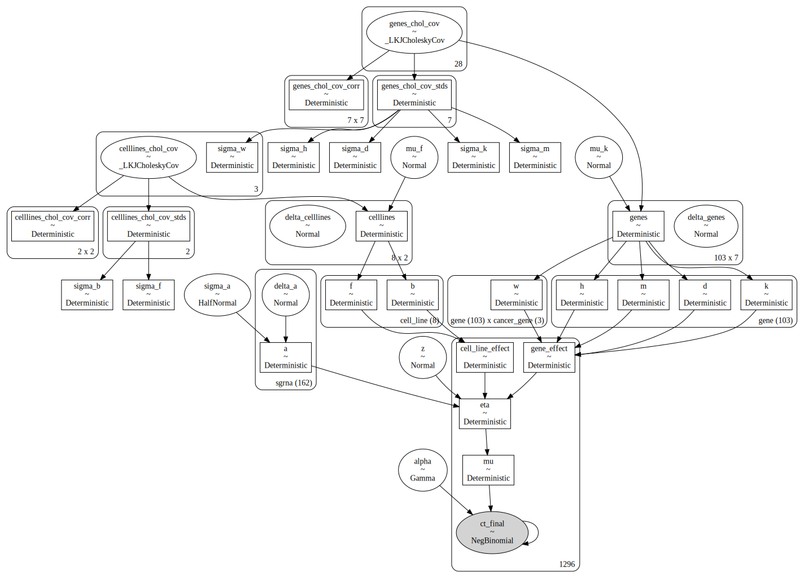


```python
crc_hnb_model
```


$$
            \begin{array}{rcl}
            \text{z} &\sim & \operatorname{N}(0,~2.5)\\\text{sigma_a} &\sim & \operatorname{N^{+}}(0,~1)\\\text{delta_a} &\sim & \operatorname{N}(0,~1)\\\text{celllines_chol_cov} &\sim & \operatorname{_lkjcholeskycov}(2,~2,~\text{<unnamed>})\\\text{mu_f} &\sim & \operatorname{N}(-0.5,~0.5)\\\text{delta_celllines} &\sim & \operatorname{N}(0,~1)\\\text{genes_chol_cov} &\sim & \operatorname{_lkjcholeskycov}(7,~2,~\text{<unnamed>})\\\text{mu_k} &\sim & \operatorname{N}(-0.5,~0.5)\\\text{delta_genes} &\sim & \operatorname{N}(0,~1)\\\text{alpha} &\sim & \operatorname{Gamma}(2,~f())\\\text{a} &\sim & \operatorname{Deterministic}(f(\text{delta_a},~\text{sigma_a}))\\\text{celllines_chol_cov_corr} &\sim & \operatorname{Deterministic}(f(\text{celllines_chol_cov}))\\\text{celllines_chol_cov_stds} &\sim & \operatorname{Deterministic}(f(\text{celllines_chol_cov}))\\\text{sigma_b} &\sim & \operatorname{Deterministic}(f(\text{celllines_chol_cov}))\\\text{sigma_f} &\sim & \operatorname{Deterministic}(f(\text{celllines_chol_cov}))\\\text{celllines} &\sim & \operatorname{Deterministic}(f(\text{mu_f},~\text{delta_celllines},~\text{celllines_chol_cov}))\\\text{b} &\sim & \operatorname{Deterministic}(f(\text{mu_f},~\text{delta_celllines},~\text{celllines_chol_cov}))\\\text{f} &\sim & \operatorname{Deterministic}(f(\text{mu_f},~\text{delta_celllines},~\text{celllines_chol_cov}))\\\text{genes_chol_cov_corr} &\sim & \operatorname{Deterministic}(f(\text{genes_chol_cov}))\\\text{genes_chol_cov_stds} &\sim & \operatorname{Deterministic}(f(\text{genes_chol_cov}))\\\text{sigma_d} &\sim & \operatorname{Deterministic}(f(\text{genes_chol_cov}))\\\text{sigma_h} &\sim & \operatorname{Deterministic}(f(\text{genes_chol_cov}))\\\text{sigma_k} &\sim & \operatorname{Deterministic}(f(\text{genes_chol_cov}))\\\text{sigma_m} &\sim & \operatorname{Deterministic}(f(\text{genes_chol_cov}))\\\text{sigma_w} &\sim & \operatorname{Deterministic}(f(\text{genes_chol_cov}))\\\text{genes} &\sim & \operatorname{Deterministic}(f(\text{mu_k},~\text{delta_genes},~\text{genes_chol_cov}))\\\text{d} &\sim & \operatorname{Deterministic}(f(\text{mu_k},~\text{delta_genes},~\text{genes_chol_cov}))\\\text{h} &\sim & \operatorname{Deterministic}(f(\text{mu_k},~\text{delta_genes},~\text{genes_chol_cov}))\\\text{k} &\sim & \operatorname{Deterministic}(f(\text{mu_k},~\text{delta_genes},~\text{genes_chol_cov}))\\\text{m} &\sim & \operatorname{Deterministic}(f(\text{mu_k},~\text{delta_genes},~\text{genes_chol_cov}))\\\text{w} &\sim & \operatorname{Deterministic}(f(\text{mu_k},~\text{delta_genes},~\text{genes_chol_cov}))\\\text{gene_effect} &\sim & \operatorname{Deterministic}(f(\text{mu_k},~\text{delta_genes},~\text{genes_chol_cov}))\\\text{cell_line_effect} &\sim & \operatorname{Deterministic}(f(\text{mu_f},~\text{delta_celllines},~\text{celllines_chol_cov}))\\\text{eta} &\sim & \operatorname{Deterministic}(f(\text{z},~\text{delta_a},~\text{sigma_a},~\text{mu_f},~\text{delta_celllines},~\text{celllines_chol_cov},~\text{mu_k},~\text{delta_genes},~\text{genes_chol_cov}))\\\text{mu} &\sim & \operatorname{Deterministic}(f(\text{z},~\text{delta_a},~\text{sigma_a},~\text{mu_f},~\text{delta_celllines},~\text{celllines_chol_cov},~\text{mu_k},~\text{delta_genes},~\text{genes_chol_cov}))\\\text{ct_final} &\sim & \operatorname{NB}(\text{alpha},~f(\text{alpha},~\text{z},~\text{delta_a},~\text{sigma_a},~\text{mu_f},~\text{delta_celllines},~\text{celllines_chol_cov},~\text{mu_k},~\text{delta_genes},~\text{genes_chol_cov}))
            \end{array}
            $$


### Sampling


```python
with crc_hnb.pymc_model(crc_crispr_data):
    trace = pymc.sampling_jax.sample_numpyro_nuts(
        draws=500, tune=1000, target_accept=0.98, random_seed=SEED + 100
    )
```


<pre style="white-space:pre;overflow-x:auto;line-height:normal;font-family:Menlo,'DejaVu Sans Mono',consolas,'Courier New',monospace"><span style="color: #7fbfbf; text-decoration-color: #7fbfbf">[06/02/22 17:37:04] </span><span style="color: #800000; text-decoration-color: #800000">WARNING </span> Only <span style="color: #008080; text-decoration-color: #008080; font-weight: bold">1</span> screen detected - ignoring <a href="file:///Users/admin/Developer/haigis-lab/speclet/speclet/bayesian_models/lineage_hierarchical_nb.py" target="_blank"><span style="color: #7f7f7f; text-decoration-color: #7f7f7f">lineage_hierarchical_nb.py</span></a><span style="color: #7f7f7f; text-decoration-color: #7f7f7f">:</span><a href="file:///Users/admin/Developer/haigis-lab/speclet/speclet/bayesian_models/lineage_hierarchical_nb.py#384" target="_blank"><span style="color: #7f7f7f; text-decoration-color: #7f7f7f">384</span></a>
<span style="color: #7fbfbf; text-decoration-color: #7fbfbf">                    </span>         variable `p`.                     <span style="color: #7f7f7f; text-decoration-color: #7f7f7f">                              </span>
</pre>


    WARNING:speclet:Only 1 screen detected - ignoring variable `p`.


    Compiling...
    Compilation time =  0:00:13.186521
    Sampling...


      0%|          | 0/1500 [00:00<?, ?it/s]


      0%|          | 0/1500 [00:00<?, ?it/s]


      0%|          | 0/1500 [00:00<?, ?it/s]


      0%|          | 0/1500 [00:00<?, ?it/s]


    Sampling time =  0:10:02.185748
    Transforming variables...
    Transformation time =  0:00:08.371621


```python
az.plot_energy(trace);
```


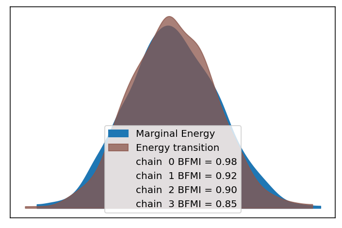


```python
az_ana.get_divergence_summary(trace)[0]
```


    [0, 3, 0, 0]


```python
with az.rc_context(rc={"plot.max_subplots": 100}):
    az.plot_trace(trace, var_names=crc_hnb.vars_regex() + ["~^w$"], filter_vars="regex")
    plt.tight_layout();
```


```python
az.plot_trace(trace, var_names=["gene_chol_cov_stds"])
plt.tight_layout();
```


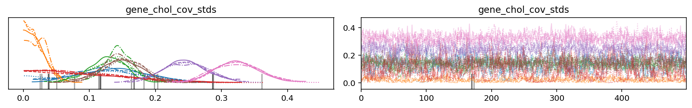


```python
az.plot_trace(trace, var_names="w")
plt.tight_layout();
```


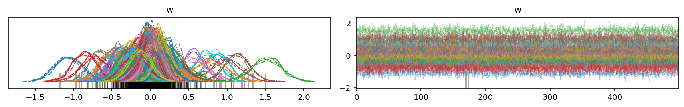


```python
az.plot_forest(
    trace,
    var_names=["b", "f", "mu_f", "sigma_f", "sigma_b"],
    rope=[-0.05, 0.05],
    combined=True,
);
```


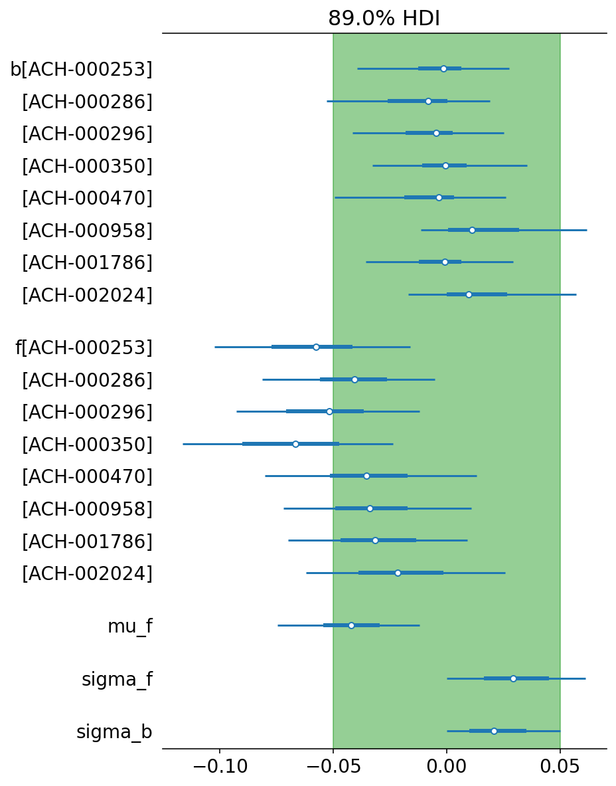


```python
az.plot_forest(
    trace, var_names=["k"], combined=True, rope=[-0.1, 0.1], textsize=8, figsize=(6, 18)
);
```


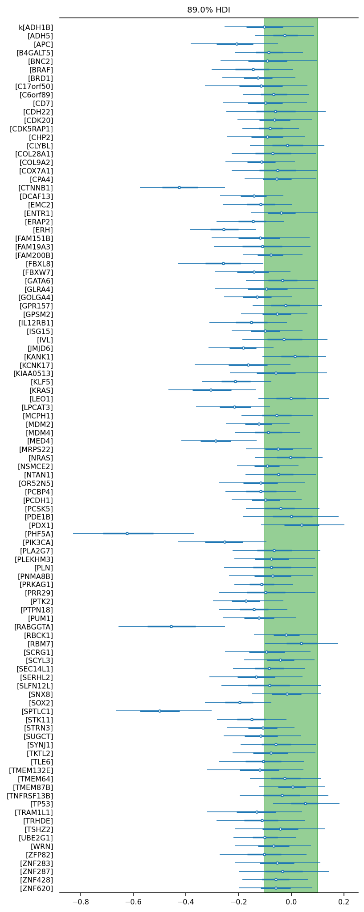


```python
az.plot_forest(
    trace, var_names=["m"], combined=True, rope=[-0.1, 0.1], textsize=8, figsize=(6, 18)
);
```


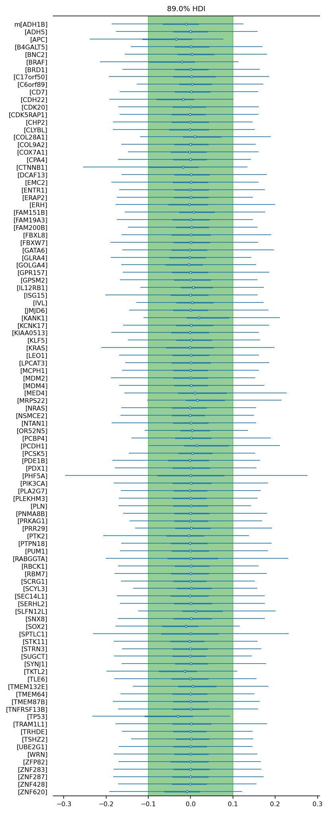


```python
az.plot_forest(
    trace, var_names=["d"], combined=True, rope=[-0.1, 0.1], textsize=8, figsize=(6, 18)
);
```


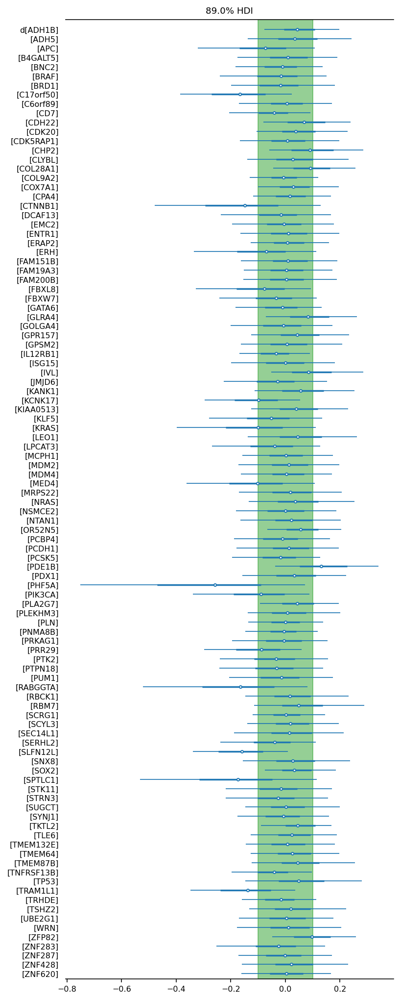


```python
gene_summary = (
    az.summary(trace, var_names=["d", "k", "h", "m"], kind="stats")
    .reset_index()
    .rename(columns={"index": "group_varname"})
    .pipe(az_ana.extract_coords_param_names, names=["hugo_symbol"], col="group_varname")
    .assign(varname=lambda d: [x.split("[")[0] for x in d["group_varname"]])
)
```


```python
(
    gg.ggplot(gene_summary, gg.aes(x="hugo_symbol", y="mean", color="varname"))
    + gg.geom_hline(yintercept=0, color="gray")
    + gg.geom_point(alpha=0.9)
    + gg.scale_color_brewer(type="qual", palette="Set1")
    + gg.theme(axis_text_x=gg.element_text(angle=90, size=8), figure_size=(10, 4))
    + gg.labs(x="gene", y="posterior")
)
```


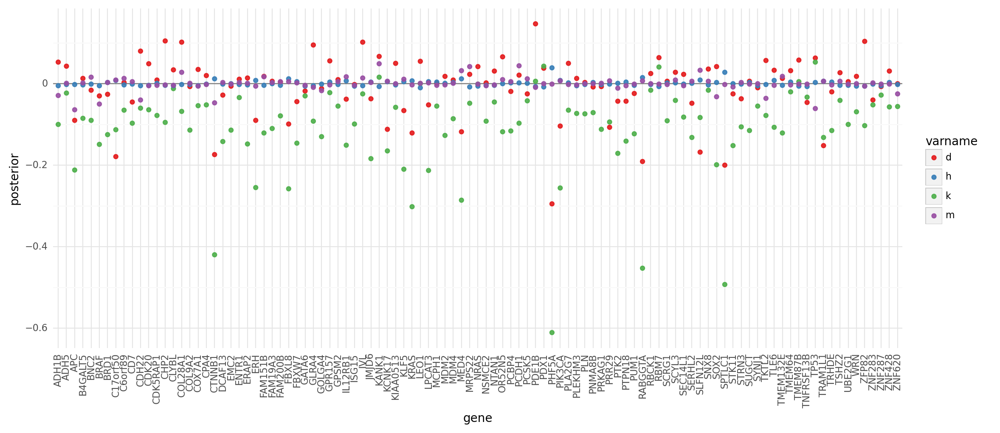


    <ggplot: (365740159)>


```python
(
    gg.ggplot(gene_summary, gg.aes(x="hugo_symbol", y="mean", color="varname"))
    + gg.facet_wrap("~varname", ncol=1)
    + gg.geom_hline(yintercept=0, color="gray")
    + gg.geom_linerange(gg.aes(ymin="hdi_5.5%", ymax="hdi_94.5%"), alpha=0.5)
    + gg.geom_point(alpha=0.9)
    + gg.scale_color_brewer(type="qual", palette="Set1")
    + gg.theme(axis_text_x=gg.element_text(angle=90, size=8), figure_size=(10, 10))
    + gg.labs(x="gene", y="posterior")
)
```

    /usr/local/Caskroom/miniconda/base/envs/speclet/lib/python3.10/site-packages/plotnine/facets/facet.py:487: FutureWarning: Passing a set as an indexer is deprecated and will raise in a future version. Use a list instead.
    /usr/local/Caskroom/miniconda/base/envs/speclet/lib/python3.10/site-packages/plotnine/utils.py:371: FutureWarning: The frame.append method is deprecated and will be removed from pandas in a future version. Use pandas.concat instead.
    /usr/local/Caskroom/miniconda/base/envs/speclet/lib/python3.10/site-packages/plotnine/utils.py:371: FutureWarning: The frame.append method is deprecated and will be removed from pandas in a future version. Use pandas.concat instead.
    /usr/local/Caskroom/miniconda/base/envs/speclet/lib/python3.10/site-packages/plotnine/utils.py:371: FutureWarning: The frame.append method is deprecated and will be removed from pandas in a future version. Use pandas.concat instead.


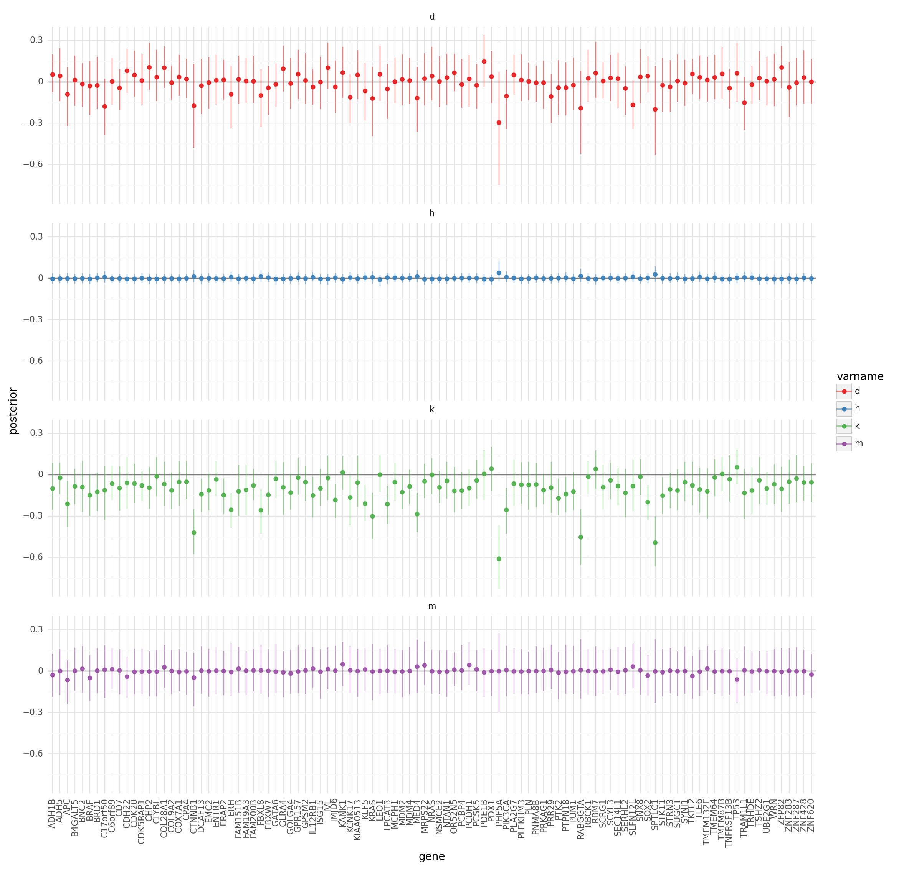


    <ggplot: (358086596)>


```python
plt_df = gene_summary.copy().pivot_wider(
    ["hugo_symbol"], names_from="varname", values_from="mean"
)
(
    gg.ggplot(plt_df, gg.aes(x="h", y="k"))
    + gg.geom_hline(yintercept=0, color="gray")
    + gg.geom_vline(xintercept=0, color="gray")
    + gg.geom_point(size=1, color="b")
)
```


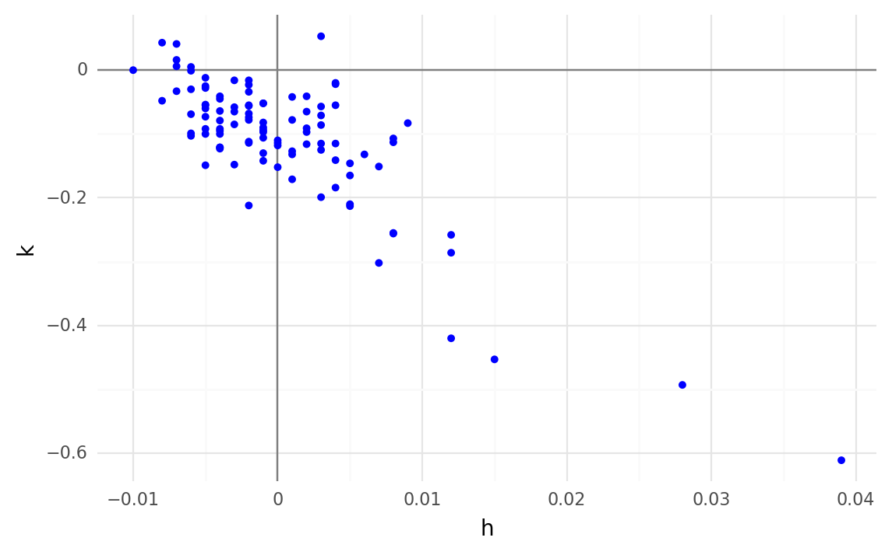


    <ggplot: (360846198)>


```python
w_post_summary = az.summary(trace, var_names=["w"], kind="stats").pipe(
    az_ana.extract_coords_param_names, names=["hugo_symbol", "cancer_gene"]
)
w_post_summary.head()

w_post_summary_cancer_genes = w_post_summary.copy().query("hugo_symbol == cancer_gene")

(
    gg.ggplot(w_post_summary, gg.aes(x="cancer_gene", y="hugo_symbol"))
    + gg.geom_tile(gg.aes(fill="mean"))
    + gg.geom_point(data=w_post_summary_cancer_genes, size=0.6)
    + scale_fill_heatmap()
    + gg.theme(
        axis_text=gg.element_text(size=7),
        panel_grid=gg.element_blank(),
        figure_size=(1.5, 10),
    )
    + gg.labs(x="cancer gene", y="target gene", fill="$w$ mean")
)
```


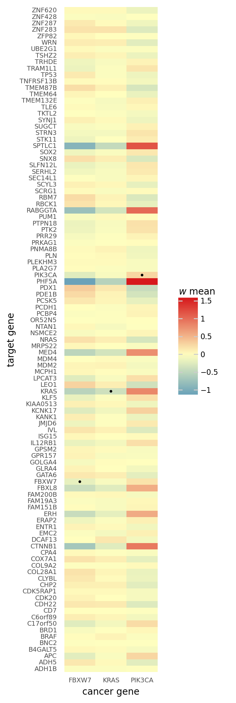


    <ggplot: (360063877)>


```python
w_post_summary_cancer_genes
```


<div>
<style scoped>
    .dataframe tbody tr th:only-of-type {
        vertical-align: middle;
    }

    .dataframe tbody tr th {
        vertical-align: top;
    }

    .dataframe thead th {
        text-align: right;
    }
</style>
<table border="1" class="dataframe">
  <thead>
    <tr style="text-align: right;">
      <th></th>
      <th>mean</th>
      <th>sd</th>
      <th>hdi_5.5%</th>
      <th>hdi_94.5%</th>
      <th>hugo_symbol</th>
      <th>cancer_gene</th>
    </tr>
  </thead>
  <tbody>
    <tr>
      <th>w[FBXW7, FBXW7]</th>
      <td>-0.172</td>
      <td>0.145</td>
      <td>-0.390</td>
      <td>0.067</td>
      <td>FBXW7</td>
      <td>FBXW7</td>
    </tr>
    <tr>
      <th>w[KRAS, KRAS]</th>
      <td>-0.353</td>
      <td>0.150</td>
      <td>-0.578</td>
      <td>-0.116</td>
      <td>KRAS</td>
      <td>KRAS</td>
    </tr>
    <tr>
      <th>w[PIK3CA, PIK3CA]</th>
      <td>0.272</td>
      <td>0.174</td>
      <td>-0.034</td>
      <td>0.528</td>
      <td>PIK3CA</td>
      <td>PIK3CA</td>
    </tr>
  </tbody>
</table>
</div>


```python
(
    gg.ggplot(
        crc_crispr_data.query('hugo_symbol=="KRAS"'), gg.aes(x="is_mutated", y="lfc")
    )
    + gg.geom_boxplot()
    + gg.geom_jitter(color="b", width=0.3)
    + gg.theme(figure_size=(2, 3))
)
```


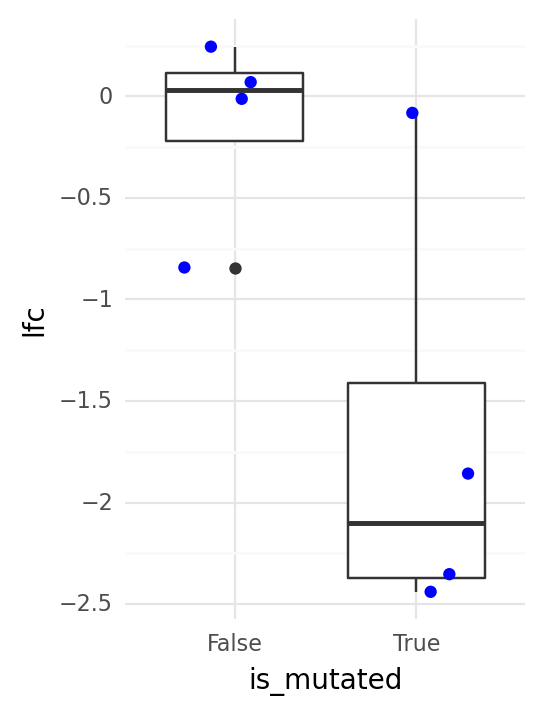


    <ggplot: (359292481)>


---

## Session information


```python
notebook_toc = time()
print(f"execution time: {(notebook_toc - notebook_tic) / 60:.2f} minutes")
```

    execution time: 97.37 minutes


```python
%load_ext watermark
%watermark -d -u -v -iv -b -h -m
```

    The watermark extension is already loaded. To reload it, use:
      %reload_ext watermark
    Last updated: 2022-06-02

    Python implementation: CPython
    Python version       : 3.10.4
    IPython version      : 8.4.0

    Compiler    : Clang 12.0.1
    OS          : Darwin
    Release     : 21.4.0
    Machine     : x86_64
    Processor   : i386
    CPU cores   : 4
    Architecture: 64bit

    Hostname: jhcookmac.harvardsecure.wireless.med.harvard.edu

    Git branch: per-lineage

    matplotlib: 3.5.2
    plotnine  : 0.8.0
    numpy     : 1.22.4
    pymc      : 4.0.0b6
    janitor   : 0.22.0
    arviz     : 0.12.1
    pandas    : 1.4.2
    speclet   : 0.0.9000
    jaxlib    : 0.3.0
    jax       : 0.2.28
    aesara    : 2.6.2


```python

```
