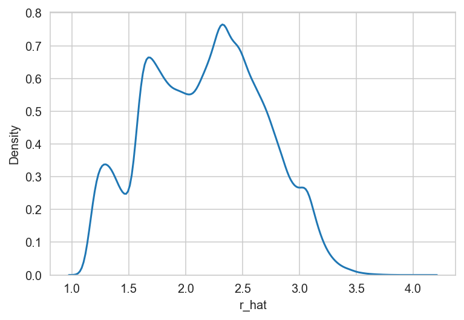
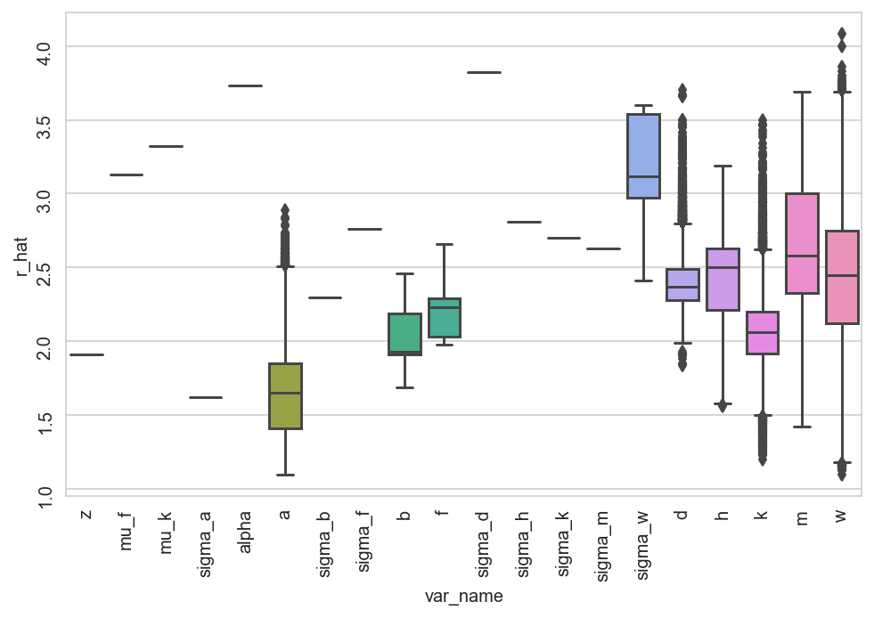

# Inspect the single-lineage model run on the prostate data


```python
%load_ext autoreload
%autoreload 2
```


```python
from time import time

import matplotlib.pyplot as plt
import numpy as np
import pandas as pd
import seaborn as sns
```


```python
from speclet.io import models_dir
from speclet.plot import set_speclet_theme
```


```python
# Notebook execution timer.
notebook_tic = time()

# Plotting setup.
set_speclet_theme()
%config InlineBackend.figure_format = "retina"
```

## Data

### Load posterior summary


```python
prostate_post_summary = pd.read_csv(
    models_dir() / "hnb-single-lineage-prostate_PYMC_NUMPYRO" / "posterior-summary.csv"
).assign(var_name=lambda d: [x.split("[")[0] for x in d["parameter"]])
prostate_post_summary.head()
```


<div>
<style scoped>
    .dataframe tbody tr th:only-of-type {
        vertical-align: middle;
    }

    .dataframe tbody tr th {
        vertical-align: top;
    }

    .dataframe thead th {
        text-align: right;
    }
</style>
<table border="1" class="dataframe">
  <thead>
    <tr style="text-align: right;">
      <th></th>
      <th>parameter</th>
      <th>mean</th>
      <th>sd</th>
      <th>hdi_5.5%</th>
      <th>hdi_94.5%</th>
      <th>mcse_mean</th>
      <th>mcse_sd</th>
      <th>ess_bulk</th>
      <th>ess_tail</th>
      <th>r_hat</th>
      <th>var_name</th>
    </tr>
  </thead>
  <tbody>
    <tr>
      <th>0</th>
      <td>z</td>
      <td>0.238</td>
      <td>0.479</td>
      <td>-0.255</td>
      <td>1.348</td>
      <td>0.190</td>
      <td>0.141</td>
      <td>6.0</td>
      <td>13.0</td>
      <td>1.91</td>
      <td>z</td>
    </tr>
    <tr>
      <th>1</th>
      <td>mu_f</td>
      <td>-0.139</td>
      <td>0.172</td>
      <td>-0.438</td>
      <td>-0.027</td>
      <td>0.085</td>
      <td>0.065</td>
      <td>5.0</td>
      <td>18.0</td>
      <td>3.13</td>
      <td>mu_f</td>
    </tr>
    <tr>
      <th>2</th>
      <td>mu_k</td>
      <td>-0.095</td>
      <td>0.024</td>
      <td>-0.126</td>
      <td>-0.070</td>
      <td>0.012</td>
      <td>0.009</td>
      <td>4.0</td>
      <td>11.0</td>
      <td>3.32</td>
      <td>mu_k</td>
    </tr>
    <tr>
      <th>3</th>
      <td>sigma_a</td>
      <td>0.795</td>
      <td>0.664</td>
      <td>0.082</td>
      <td>1.789</td>
      <td>0.203</td>
      <td>0.148</td>
      <td>9.0</td>
      <td>42.0</td>
      <td>1.62</td>
      <td>sigma_a</td>
    </tr>
    <tr>
      <th>4</th>
      <td>alpha</td>
      <td>6.379</td>
      <td>2.018</td>
      <td>3.486</td>
      <td>8.428</td>
      <td>1.005</td>
      <td>0.770</td>
      <td>4.0</td>
      <td>11.0</td>
      <td>3.73</td>
      <td>alpha</td>
    </tr>
  </tbody>
</table>
</div>


## Analysis


```python
sns.kdeplot(x=prostate_post_summary["r_hat"]);
```





```python
fig, ax = plt.subplots(figsize=(8, 5))
sns.boxplot(data=prostate_post_summary, x="var_name", y="r_hat", ax=ax)
ax.tick_params(rotation=90)
plt.show()
```





---


```python
notebook_toc = time()
print(f"execution time: {(notebook_toc - notebook_tic) / 60:.2f} minutes")
```

    execution time: 0.05 minutes


```python
%load_ext watermark
%watermark -d -u -v -iv -b -h -m
```

    Last updated: 2022-07-03

    Python implementation: CPython
    Python version       : 3.10.4
    IPython version      : 8.4.0

    Compiler    : Clang 12.0.1
    OS          : Darwin
    Release     : 21.5.0
    Machine     : x86_64
    Processor   : i386
    CPU cores   : 4
    Architecture: 64bit

    Hostname: jhcookmac.harvardsecure.wireless.med.harvard.edu

    Git branch: per-lineage

    pandas    : 1.4.2
    numpy     : 1.22.4
    seaborn   : 0.11.2
    matplotlib: 3.5.2
