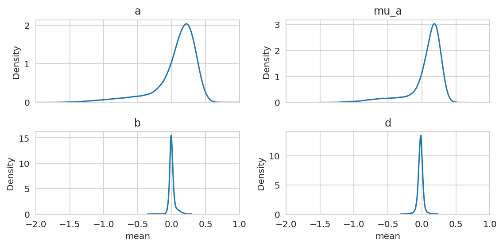
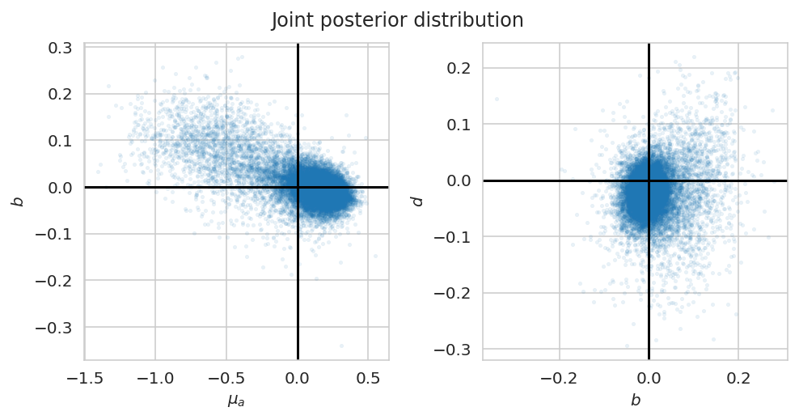

# Inspect the single-lineage model run on the prostate data


```python
%load_ext autoreload
%autoreload 2
```


```python
from time import time

import arviz as az
import matplotlib.pyplot as plt
import numpy as np
import pandas as pd
import seaborn as sns
```


```python
from speclet.analysis.arviz_analysis import extract_coords_param_names
from speclet.bayesian_models.lineage_hierarchical_nb import LineageHierNegBinomModel
from speclet.data_processing.common import head_tail
from speclet.io import modeling_data_dir, models_dir
from speclet.managers.data_managers import CrisprScreenDataManager
from speclet.plot import set_speclet_theme
```


```python
# Notebook execution timer.
notebook_tic = time()

# Plotting setup.
set_speclet_theme()
%config InlineBackend.figure_format = "retina"
```

## Data

### Load posterior summary


```python
prostate_post_summary = pd.read_csv(
    models_dir() / "hnb-single-lineage-prostate_PYMC_NUMPYRO" / "posterior-summary.csv"
).assign(var_name=lambda d: [x.split("[")[0] for x in d["parameter"]])
prostate_post_summary.head()
```


<div>
<style scoped>
    .dataframe tbody tr th:only-of-type {
        vertical-align: middle;
    }

    .dataframe tbody tr th {
        vertical-align: top;
    }

    .dataframe thead th {
        text-align: right;
    }
</style>
<table border="1" class="dataframe">
  <thead>
    <tr style="text-align: right;">
      <th></th>
      <th>parameter</th>
      <th>mean</th>
      <th>sd</th>
      <th>hdi_5.5%</th>
      <th>hdi_94.5%</th>
      <th>mcse_mean</th>
      <th>mcse_sd</th>
      <th>ess_bulk</th>
      <th>ess_tail</th>
      <th>r_hat</th>
      <th>var_name</th>
    </tr>
  </thead>
  <tbody>
    <tr>
      <th>0</th>
      <td>d[AAAAAAATCCAGCAATGCAG]</td>
      <td>0.150</td>
      <td>0.149</td>
      <td>-0.086</td>
      <td>0.386</td>
      <td>0.002</td>
      <td>0.002</td>
      <td>4083.0</td>
      <td>2885.0</td>
      <td>1.0</td>
      <td>d</td>
    </tr>
    <tr>
      <th>1</th>
      <td>d[AAAAAACCCGTAGATAGCCT]</td>
      <td>0.093</td>
      <td>0.159</td>
      <td>-0.148</td>
      <td>0.355</td>
      <td>0.003</td>
      <td>0.002</td>
      <td>3517.0</td>
      <td>3221.0</td>
      <td>1.0</td>
      <td>d</td>
    </tr>
    <tr>
      <th>2</th>
      <td>d[AAAAAAGAAGAAAAAACCAG]</td>
      <td>-0.660</td>
      <td>0.165</td>
      <td>-0.941</td>
      <td>-0.410</td>
      <td>0.002</td>
      <td>0.002</td>
      <td>4850.0</td>
      <td>2734.0</td>
      <td>1.0</td>
      <td>d</td>
    </tr>
    <tr>
      <th>3</th>
      <td>d[AAAAAAGCTCAAGAAGGAGG]</td>
      <td>-0.215</td>
      <td>0.154</td>
      <td>-0.450</td>
      <td>0.042</td>
      <td>0.002</td>
      <td>0.002</td>
      <td>3930.0</td>
      <td>3270.0</td>
      <td>1.0</td>
      <td>d</td>
    </tr>
    <tr>
      <th>4</th>
      <td>d[AAAAAAGGCTGTAAAAGCGT]</td>
      <td>-0.018</td>
      <td>0.134</td>
      <td>-0.233</td>
      <td>0.192</td>
      <td>0.002</td>
      <td>0.002</td>
      <td>5989.0</td>
      <td>2999.0</td>
      <td>1.0</td>
      <td>d</td>
    </tr>
  </tbody>
</table>
</div>


### Load trace object


```python
trace_file = (
    models_dir() / "hnb-single-lineage-prostate_PYMC_NUMPYRO" / "posterior.netcdf"
)
assert trace_file.exists()
trace = az.from_netcdf(trace_file)
```

### Prostate data


```python
def _broad_only(df: pd.DataFrame) -> pd.DataFrame:
    return df[df["screen"] == "broad"].reset_index(drop=True)


prostate_dm = CrisprScreenDataManager(
    modeling_data_dir() / "lineage-modeling-data" / "depmap-modeling-data_prostate.csv",
    transformations=[_broad_only],
)
```


```python
prostate_data = prostate_dm.get_data(read_kwargs={"low_memory": False})
prostate_data.head()
```


<div>
<style scoped>
    .dataframe tbody tr th:only-of-type {
        vertical-align: middle;
    }

    .dataframe tbody tr th {
        vertical-align: top;
    }

    .dataframe thead th {
        text-align: right;
    }
</style>
<table border="1" class="dataframe">
  <thead>
    <tr style="text-align: right;">
      <th></th>
      <th>sgrna</th>
      <th>replicate_id</th>
      <th>lfc</th>
      <th>p_dna_batch</th>
      <th>genome_alignment</th>
      <th>hugo_symbol</th>
      <th>screen</th>
      <th>multiple_hits_on_gene</th>
      <th>sgrna_target_chr</th>
      <th>sgrna_target_pos</th>
      <th>...</th>
      <th>any_deleterious</th>
      <th>any_tcga_hotspot</th>
      <th>any_cosmic_hotspot</th>
      <th>is_mutated</th>
      <th>copy_number</th>
      <th>lineage</th>
      <th>lineage_subtype</th>
      <th>primary_or_metastasis</th>
      <th>is_male</th>
      <th>age</th>
    </tr>
  </thead>
  <tbody>
    <tr>
      <th>0</th>
      <td>AAAGCCCAGGAGTATGGGAG</td>
      <td>Vcap-304Cas9_RepA_p4_batch3</td>
      <td>0.246450</td>
      <td>3</td>
      <td>chr2_130522105_-</td>
      <td>CFC1B</td>
      <td>broad</td>
      <td>True</td>
      <td>2</td>
      <td>130522105</td>
      <td>...</td>
      <td>NaN</td>
      <td>NaN</td>
      <td>NaN</td>
      <td>False</td>
      <td>0.999455</td>
      <td>prostate</td>
      <td>prostate_adenocarcinoma</td>
      <td>metastasis</td>
      <td>True</td>
      <td>59.0</td>
    </tr>
    <tr>
      <th>1</th>
      <td>AAATCAGAGAAACCTGAACG</td>
      <td>Vcap-304Cas9_RepA_p4_batch3</td>
      <td>0.626518</td>
      <td>3</td>
      <td>chr11_89916950_-</td>
      <td>TRIM49D1</td>
      <td>broad</td>
      <td>True</td>
      <td>11</td>
      <td>89916950</td>
      <td>...</td>
      <td>NaN</td>
      <td>NaN</td>
      <td>NaN</td>
      <td>False</td>
      <td>1.281907</td>
      <td>prostate</td>
      <td>prostate_adenocarcinoma</td>
      <td>metastasis</td>
      <td>True</td>
      <td>59.0</td>
    </tr>
    <tr>
      <th>2</th>
      <td>AACGTCTTTGAAGAAAGCTG</td>
      <td>Vcap-304Cas9_RepA_p4_batch3</td>
      <td>0.165114</td>
      <td>3</td>
      <td>chr5_71055421_-</td>
      <td>GTF2H2</td>
      <td>broad</td>
      <td>True</td>
      <td>5</td>
      <td>71055421</td>
      <td>...</td>
      <td>NaN</td>
      <td>NaN</td>
      <td>NaN</td>
      <td>False</td>
      <td>0.616885</td>
      <td>prostate</td>
      <td>prostate_adenocarcinoma</td>
      <td>metastasis</td>
      <td>True</td>
      <td>59.0</td>
    </tr>
    <tr>
      <th>3</th>
      <td>AACGTCTTTGAAGGAAGCTG</td>
      <td>Vcap-304Cas9_RepA_p4_batch3</td>
      <td>-0.094688</td>
      <td>3</td>
      <td>chr5_69572480_+</td>
      <td>GTF2H2C</td>
      <td>broad</td>
      <td>True</td>
      <td>5</td>
      <td>69572480</td>
      <td>...</td>
      <td>NaN</td>
      <td>NaN</td>
      <td>NaN</td>
      <td>False</td>
      <td>0.616885</td>
      <td>prostate</td>
      <td>prostate_adenocarcinoma</td>
      <td>metastasis</td>
      <td>True</td>
      <td>59.0</td>
    </tr>
    <tr>
      <th>4</th>
      <td>AAGAGGTTCCAGACTACTTA</td>
      <td>Vcap-304Cas9_RepA_p4_batch3</td>
      <td>0.294496</td>
      <td>3</td>
      <td>chrX_155898173_+</td>
      <td>VAMP7</td>
      <td>broad</td>
      <td>True</td>
      <td>X</td>
      <td>155898173</td>
      <td>...</td>
      <td>NaN</td>
      <td>NaN</td>
      <td>NaN</td>
      <td>False</td>
      <td>0.615935</td>
      <td>prostate</td>
      <td>prostate_adenocarcinoma</td>
      <td>metastasis</td>
      <td>True</td>
      <td>59.0</td>
    </tr>
  </tbody>
</table>
<p>5 rows × 25 columns</p>
</div>


### Single lineage model


```python
prostate_model = LineageHierNegBinomModel(lineage="prostate")
```

## Analysis

### Summary


```python
sns.kdeplot(x=prostate_post_summary["r_hat"]);
```


```python
fig, ax = plt.subplots(figsize=(8, 5))
sns.boxplot(data=prostate_post_summary, x="var_name", y="r_hat", ax=ax)
ax.tick_params(rotation=90)
plt.show()
```


```python
sgrna_to_gene_map = (
    prostate_data.copy()[["hugo_symbol", "sgrna"]]
    .drop_duplicates()
    .reset_index(drop=True)
)
```

The posteriors for the varying sgRNA effect $d$ are far more variable than $\mu_d$ which basically collapsed to 0.


```python
d_post = (
    prostate_post_summary.query("var_name == 'd'")
    .reset_index(drop=True)
    .pipe(extract_coords_param_names, names=["sgrna"], col="parameter")
    .merge(sgrna_to_gene_map, on="sgrna", how="left")
)

mu_d_post = (
    prostate_post_summary.query("var_name == 'mu_d'")
    .reset_index(drop=True)
    .pipe(extract_coords_param_names, names=["hugo_symbol"], col="parameter")
)

fig, axes = plt.subplots(ncols=2, figsize=(8, 4))

sns.kdeplot(d_post["mean"], ax=axes[0])
axes[0].set_title(r"$d$")

sns.kdeplot(mu_d_post["mean"], ax=axes[1])
axes[1].set_title(r"$\mu_d$")

plt.tight_layout()
plt.show()
```





```python
az.plot_trace(
    trace, var_names="mu_d", coords={"gene": ["KRAS", "A1BG", "ZZZ3"]}, compact=False
)
plt.tight_layout()
plt.show()
```


```python
sgrnas_sample = trace.posterior.coords["sgrna"].values[:5]

az.plot_trace(trace, var_names="d", coords={"sgrna": sgrnas_sample}, compact=False)
plt.tight_layout()
plt.show()
```


The averages of the sgRNA posteriors for each gene have variability that never made it to $\mu_d$.


```python
d_post.groupby("hugo_symbol")[["mean", "hdi_5.5%", "hdi_94.5%"]].mean().reset_index(
    drop=False
).head()
```


<div>
<style scoped>
    .dataframe tbody tr th:only-of-type {
        vertical-align: middle;
    }

    .dataframe tbody tr th {
        vertical-align: top;
    }

    .dataframe thead th {
        text-align: right;
    }
</style>
<table border="1" class="dataframe">
  <thead>
    <tr style="text-align: right;">
      <th></th>
      <th>hugo_symbol</th>
      <th>mean</th>
      <th>hdi_5.5%</th>
      <th>hdi_94.5%</th>
    </tr>
  </thead>
  <tbody>
    <tr>
      <th>0</th>
      <td>A1BG</td>
      <td>0.24975</td>
      <td>0.02650</td>
      <td>0.47075</td>
    </tr>
    <tr>
      <th>1</th>
      <td>A1CF</td>
      <td>0.22550</td>
      <td>0.01625</td>
      <td>0.43650</td>
    </tr>
    <tr>
      <th>2</th>
      <td>A2M</td>
      <td>0.00875</td>
      <td>-0.20450</td>
      <td>0.22325</td>
    </tr>
    <tr>
      <th>3</th>
      <td>A2ML1</td>
      <td>0.32950</td>
      <td>0.10900</td>
      <td>0.55225</td>
    </tr>
    <tr>
      <th>4</th>
      <td>A3GALT2</td>
      <td>0.14800</td>
      <td>-0.06425</td>
      <td>0.36500</td>
    </tr>
  </tbody>
</table>
</div>


```python
mu_d_post.query("hugo_symbol == 'A1BG'")
```


<div>
<style scoped>
    .dataframe tbody tr th:only-of-type {
        vertical-align: middle;
    }

    .dataframe tbody tr th {
        vertical-align: top;
    }

    .dataframe thead th {
        text-align: right;
    }
</style>
<table border="1" class="dataframe">
  <thead>
    <tr style="text-align: right;">
      <th></th>
      <th>parameter</th>
      <th>mean</th>
      <th>sd</th>
      <th>hdi_5.5%</th>
      <th>hdi_94.5%</th>
      <th>mcse_mean</th>
      <th>mcse_sd</th>
      <th>ess_bulk</th>
      <th>ess_tail</th>
      <th>r_hat</th>
      <th>var_name</th>
      <th>hugo_symbol</th>
    </tr>
  </thead>
  <tbody>
    <tr>
      <th>0</th>
      <td>mu_d[A1BG]</td>
      <td>0.0</td>
      <td>0.0</td>
      <td>-0.001</td>
      <td>0.001</td>
      <td>0.0</td>
      <td>0.0</td>
      <td>3542.0</td>
      <td>1844.0</td>
      <td>1.03</td>
      <td>mu_d</td>
      <td>A1BG</td>
    </tr>
  </tbody>
</table>
</div>


```python
az.plot_trace(trace, var_names=["^sigma_*"], filter_vars="regex")
plt.tight_layout()
```


I wanted to briefly see if the sgRNA-to-gene indexing is incorrect, but everything seems fine.


```python
valid_prostate_data = prostate_model.data_processing_pipeline(prostate_data.copy())
prostate_mdl_data = prostate_model.make_data_structure(valid_prostate_data)
```


<pre style="white-space:pre;overflow-x:auto;line-height:normal;font-family:Menlo,'DejaVu Sans Mono',consolas,'Courier New',monospace"><span style="color: #7fbfbf; text-decoration-color: #7fbfbf">[07/12/22 16:19:08] </span><span style="color: #000080; text-decoration-color: #000080">INFO    </span> Processing data for modeling.     <a href="file:///n/data1/hms/dbmi/park/Cook/speclet/speclet/bayesian_models/lineage_hierarchical_nb.py" target="_blank"><span style="color: #7f7f7f; text-decoration-color: #7f7f7f">lineage_hierarchical_nb.py</span></a><span style="color: #7f7f7f; text-decoration-color: #7f7f7f">:</span><a href="file:///n/data1/hms/dbmi/park/Cook/speclet/speclet/bayesian_models/lineage_hierarchical_nb.py#241" target="_blank"><span style="color: #7f7f7f; text-decoration-color: #7f7f7f">241</span></a>
</pre>


```python
gene = "A1BG"
gene_codes = valid_prostate_data["hugo_symbol"][
    valid_prostate_data["hugo_symbol"] == gene
].cat.codes.unique()
assert len(gene_codes) == 1
gene_code = gene_codes[0]
assert trace.posterior.coords["gene"][gene_code].values == gene

sgrna_idx = np.where(prostate_mdl_data.sgrna_to_gene_idx == gene_code)
sgrnas = trace.posterior.coords["sgrna"][sgrna_idx].values
sgrna_to_gene_map.filter_column_isin("sgrna", sgrnas)
```


<div>
<style scoped>
    .dataframe tbody tr th:only-of-type {
        vertical-align: middle;
    }

    .dataframe tbody tr th {
        vertical-align: top;
    }

    .dataframe thead th {
        text-align: right;
    }
</style>
<table border="1" class="dataframe">
  <thead>
    <tr style="text-align: right;">
      <th></th>
      <th>hugo_symbol</th>
      <th>sgrna</th>
    </tr>
  </thead>
  <tbody>
    <tr>
      <th>44225</th>
      <td>A1BG</td>
      <td>GGAAGTCTGGAGTCTCCAGG</td>
    </tr>
    <tr>
      <th>54943</th>
      <td>A1BG</td>
      <td>GTGGACTTCCAGCTACGGCG</td>
    </tr>
    <tr>
      <th>55251</th>
      <td>A1BG</td>
      <td>GTGTGCCGAGGTGTGCTGCG</td>
    </tr>
    <tr>
      <th>58549</th>
      <td>A1BG</td>
      <td>TCAATGGTCACAGTAGCGCT</td>
    </tr>
  </tbody>
</table>
</div>


```python
len(prostate_mdl_data.sgrna_to_gene_idx), len(set(prostate_mdl_data.sgrna_to_gene_idx))
```


    (71062, 18119)


The trace for $b$ is highly autocorrelated.
It's very obvious when compared to the trace of $f$.


```python
az.plot_trace(trace, var_names=["b", "f"], compact=False)
plt.tight_layout()
plt.show()
```





```python
az.plot_forest(trace, var_names=["b", "f"], figsize=(7, 4));
```


A little analysis of $w$ comutation variable.
All of the $\sigma_w$ were poorly sampled except for *ZFHX3*.


```python
az.plot_trace(trace, var_names="sigma_w", compact=False)
plt.tight_layout()
plt.show()
```


```python
cancer_genes_mutations = (
    valid_prostate_data.filter_column_isin(
        "hugo_symbol", trace.posterior.coords["cancer_gene"].values
    )[["depmap_id", "hugo_symbol", "is_mutated"]]
    .drop_duplicates()
    .reset_index(drop=True)
    .sort_values(["depmap_id", "hugo_symbol"])
    .pivot_wider("hugo_symbol", names_from="depmap_id", values_from="is_mutated")
    .set_index("hugo_symbol")
)
cancer_genes_mutations
```


<div>
<style scoped>
    .dataframe tbody tr th:only-of-type {
        vertical-align: middle;
    }

    .dataframe tbody tr th {
        vertical-align: top;
    }

    .dataframe thead th {
        text-align: right;
    }
</style>
<table border="1" class="dataframe">
  <thead>
    <tr style="text-align: right;">
      <th></th>
      <th>ACH-000115</th>
      <th>ACH-000977</th>
      <th>ACH-001453</th>
      <th>ACH-001627</th>
      <th>ACH-001648</th>
    </tr>
    <tr>
      <th>hugo_symbol</th>
      <th></th>
      <th></th>
      <th></th>
      <th></th>
      <th></th>
    </tr>
  </thead>
  <tbody>
    <tr>
      <th>AR</th>
      <td>False</td>
      <td>True</td>
      <td>False</td>
      <td>False</td>
      <td>False</td>
    </tr>
    <tr>
      <th>FOXA1</th>
      <td>False</td>
      <td>True</td>
      <td>False</td>
      <td>False</td>
      <td>False</td>
    </tr>
    <tr>
      <th>NCOR2</th>
      <td>False</td>
      <td>True</td>
      <td>False</td>
      <td>False</td>
      <td>False</td>
    </tr>
    <tr>
      <th>PTEN</th>
      <td>False</td>
      <td>True</td>
      <td>False</td>
      <td>False</td>
      <td>False</td>
    </tr>
    <tr>
      <th>ZFHX3</th>
      <td>False</td>
      <td>True</td>
      <td>False</td>
      <td>True</td>
      <td>False</td>
    </tr>
  </tbody>
</table>
</div>


```python
w_post_summary = (
    prostate_post_summary.query("var_name == 'w'")
    .reset_index(drop=True)
    .pipe(
        extract_coords_param_names,
        names=["target_gene", "cancer_gene"],
        col="parameter",
    )
)
w_post_summary.head()
```


<div>
<style scoped>
    .dataframe tbody tr th:only-of-type {
        vertical-align: middle;
    }

    .dataframe tbody tr th {
        vertical-align: top;
    }

    .dataframe thead th {
        text-align: right;
    }
</style>
<table border="1" class="dataframe">
  <thead>
    <tr style="text-align: right;">
      <th></th>
      <th>parameter</th>
      <th>mean</th>
      <th>sd</th>
      <th>hdi_5.5%</th>
      <th>hdi_94.5%</th>
      <th>mcse_mean</th>
      <th>mcse_sd</th>
      <th>ess_bulk</th>
      <th>ess_tail</th>
      <th>r_hat</th>
      <th>var_name</th>
      <th>target_gene</th>
      <th>cancer_gene</th>
    </tr>
  </thead>
  <tbody>
    <tr>
      <th>0</th>
      <td>w[A1BG, AR]</td>
      <td>0.002</td>
      <td>0.091</td>
      <td>-0.134</td>
      <td>0.159</td>
      <td>0.001</td>
      <td>0.005</td>
      <td>4661.0</td>
      <td>1418.0</td>
      <td>1.05</td>
      <td>w</td>
      <td>A1BG</td>
      <td>AR</td>
    </tr>
    <tr>
      <th>1</th>
      <td>w[A1BG, FOXA1]</td>
      <td>0.007</td>
      <td>0.100</td>
      <td>-0.155</td>
      <td>0.158</td>
      <td>0.002</td>
      <td>0.005</td>
      <td>4274.0</td>
      <td>781.0</td>
      <td>1.06</td>
      <td>w</td>
      <td>A1BG</td>
      <td>FOXA1</td>
    </tr>
    <tr>
      <th>2</th>
      <td>w[A1BG, NCOR2]</td>
      <td>0.002</td>
      <td>0.093</td>
      <td>-0.143</td>
      <td>0.151</td>
      <td>0.001</td>
      <td>0.007</td>
      <td>5152.0</td>
      <td>213.0</td>
      <td>1.06</td>
      <td>w</td>
      <td>A1BG</td>
      <td>NCOR2</td>
    </tr>
    <tr>
      <th>3</th>
      <td>w[A1BG, PTEN]</td>
      <td>0.003</td>
      <td>0.118</td>
      <td>-0.193</td>
      <td>0.191</td>
      <td>0.002</td>
      <td>0.013</td>
      <td>4025.0</td>
      <td>409.0</td>
      <td>1.21</td>
      <td>w</td>
      <td>A1BG</td>
      <td>PTEN</td>
    </tr>
    <tr>
      <th>4</th>
      <td>w[A1BG, ZFHX3]</td>
      <td>-0.029</td>
      <td>0.133</td>
      <td>-0.246</td>
      <td>0.180</td>
      <td>0.002</td>
      <td>0.002</td>
      <td>4153.0</td>
      <td>3495.0</td>
      <td>1.00</td>
      <td>w</td>
      <td>A1BG</td>
      <td>ZFHX3</td>
    </tr>
  </tbody>
</table>
</div>


```python
sns.kdeplot(data=w_post_summary, x="mean", hue="cancer_gene");
```


```python
plt_df = w_post_summary.pivot_wider(
    "target_gene", names_from="cancer_gene", values_from="mean"
).set_index("target_gene")

sns.clustermap(plt_df, cmap="seismic", vmin=-1, vmax=1)
```

    /home/jc604/.conda/envs/speclet/lib/python3.10/site-packages/seaborn/matrix.py:654: UserWarning: Clustering large matrix with scipy. Installing `fastcluster` may give better performance.
      warnings.warn(msg)


    <seaborn.matrix.ClusterGrid at 0x7f7e7d1f2350>


```python
example_cancer_gene = "ZFHX3"
example_w = w_post_summary.query(f"cancer_gene == '{example_cancer_gene}'")

example_hits = (
    example_w.sort_values("mean").pipe(head_tail, n=10)["target_gene"].tolist()
)
```


```python
cancer_gene_muts = list(
    prostate_data.query(f"hugo_symbol == '{example_cancer_gene}'")
    .query("is_mutated")["depmap_id"]
    .unique()
)
```


```python
example_hit_data = (
    prostate_data.filter_column_isin("hugo_symbol", example_hits)
    .assign(cancer_gene_mut=lambda d: [cl in cancer_gene_muts for cl in d["depmap_id"]])
    .astype({"hugo_symbol": str})
)
example_hit_data["hugo_symbol"] = pd.Categorical(
    example_hit_data["hugo_symbol"], categories=example_hits, ordered=True
)
```


```python
fig, ax = plt.subplots(figsize=(8, 5))
sns.boxplot(
    data=example_hit_data,
    x="hugo_symbol",
    y="lfc",
    hue="cancer_gene_mut",
    ax=ax,
    fliersize=0,
    boxprops={"alpha": 0.25},
)
sns.stripplot(
    data=example_hit_data,
    x="hugo_symbol",
    y="lfc",
    hue="cancer_gene_mut",
    dodge=True,
    ax=ax,
)
ax.tick_params(rotation=90)
plt.show()
```


Some of the other parameters (note that they share the same x-axis).


```python
var_names = ["d", "h", "k", "m"]
_, axes = plt.subplots(2, 2, figsize=(8, 4), sharex=True)
for ax, var_name in zip(axes.flatten(), var_names):
    x = prostate_post_summary.query(f"var_name == '{var_name}'")["mean"]
    sns.kdeplot(x=x, ax=ax)
    ax.set_title(f"${var_name}$")
    ax.set_xlim(-2, 1)

plt.tight_layout()
plt.show()
```


---

## Session info


```python
notebook_toc = time()
print(f"execution time: {(notebook_toc - notebook_tic) / 60:.2f} minutes")
```

    execution time: 2.13 minutes


```python
%load_ext watermark
%watermark -d -u -v -iv -b -h -m
```

    Last updated: 2022-07-12

    Python implementation: CPython
    Python version       : 3.10.5
    IPython version      : 8.4.0

    Compiler    : GCC 10.3.0
    OS          : Linux
    Release     : 3.10.0-1160.45.1.el7.x86_64
    Machine     : x86_64
    Processor   : x86_64
    CPU cores   : 32
    Architecture: 64bit

    Hostname: compute-a-17-83.o2.rc.hms.harvard.edu

    Git branch: simplify

    seaborn   : 0.11.2
    numpy     : 1.23.0
    pandas    : 1.4.3
    arviz     : 0.12.1
    matplotlib: 3.5.2
