# Inspect the single-lineage model run on the prostate data

Model attributes:

- sgRNA | gene varying intercept
- RNA and CN varying effects per gene
- correlation between gene varying effects modeled using the multivariate normal and Cholesky decomposition (non-centered parameterization)


```python
%load_ext autoreload
%autoreload 2
```


```python
from time import time

import arviz as az
import matplotlib.pyplot as plt
import numpy as np
import pandas as pd
import qnorm
import seaborn as sns
```


```python
from speclet.analysis.arviz_analysis import extract_coords_param_names
from speclet.bayesian_models.lineage_hierarchical_nb import LineageHierNegBinomModel
from speclet.data_processing.common import head_tail
from speclet.io import modeling_data_dir, models_dir
from speclet.managers.data_managers import CrisprScreenDataManager
from speclet.plot import set_speclet_theme
from speclet.project_configuration import arviz_config
```


```python
# Notebook execution timer.
notebook_tic = time()

# Plotting setup.
set_speclet_theme()
%config InlineBackend.figure_format = "retina"
arviz_config()
```

## Data

### Load posterior summary


```python
prostate_post_summary = pd.read_csv(
    models_dir() / "hnb-single-lineage-prostate_PYMC_NUMPYRO" / "posterior-summary.csv"
).assign(var_name=lambda d: [x.split("[")[0] for x in d["parameter"]])
prostate_post_summary.head()
```


<div>
<style scoped>
    .dataframe tbody tr th:only-of-type {
        vertical-align: middle;
    }

    .dataframe tbody tr th {
        vertical-align: top;
    }

    .dataframe thead th {
        text-align: right;
    }
</style>
<table border="1" class="dataframe">
  <thead>
    <tr style="text-align: right;">
      <th></th>
      <th>parameter</th>
      <th>mean</th>
      <th>sd</th>
      <th>hdi_5.5%</th>
      <th>hdi_94.5%</th>
      <th>mcse_mean</th>
      <th>mcse_sd</th>
      <th>ess_bulk</th>
      <th>ess_tail</th>
      <th>r_hat</th>
      <th>var_name</th>
    </tr>
  </thead>
  <tbody>
    <tr>
      <th>0</th>
      <td>mu_mu_a</td>
      <td>0.067</td>
      <td>0.002</td>
      <td>0.063</td>
      <td>0.070</td>
      <td>0.000</td>
      <td>0.0</td>
      <td>1227.0</td>
      <td>2168.0</td>
      <td>1.0</td>
      <td>mu_mu_a</td>
    </tr>
    <tr>
      <th>1</th>
      <td>mu_b</td>
      <td>0.004</td>
      <td>0.001</td>
      <td>0.003</td>
      <td>0.005</td>
      <td>0.000</td>
      <td>0.0</td>
      <td>3867.0</td>
      <td>3730.0</td>
      <td>1.0</td>
      <td>mu_b</td>
    </tr>
    <tr>
      <th>2</th>
      <td>mu_d</td>
      <td>-0.021</td>
      <td>0.001</td>
      <td>-0.022</td>
      <td>-0.019</td>
      <td>0.000</td>
      <td>0.0</td>
      <td>5181.0</td>
      <td>3502.0</td>
      <td>1.0</td>
      <td>mu_d</td>
    </tr>
    <tr>
      <th>3</th>
      <td>sigma_a</td>
      <td>0.207</td>
      <td>0.001</td>
      <td>0.205</td>
      <td>0.208</td>
      <td>0.000</td>
      <td>0.0</td>
      <td>1658.0</td>
      <td>3055.0</td>
      <td>1.0</td>
      <td>sigma_a</td>
    </tr>
    <tr>
      <th>4</th>
      <td>alpha</td>
      <td>11.645</td>
      <td>0.036</td>
      <td>11.588</td>
      <td>11.703</td>
      <td>0.001</td>
      <td>0.0</td>
      <td>2783.0</td>
      <td>2928.0</td>
      <td>1.0</td>
      <td>alpha</td>
    </tr>
  </tbody>
</table>
</div>


### Load trace object


```python
trace_file = (
    models_dir() / "hnb-single-lineage-prostate_PYMC_NUMPYRO" / "posterior.netcdf"
)
assert trace_file.exists()
trace = az.from_netcdf(trace_file)
```

### Prostate data


```python
def _broad_only(df: pd.DataFrame) -> pd.DataFrame:
    return df[df["screen"] == "broad"].reset_index(drop=True)


prostate_dm = CrisprScreenDataManager(
    modeling_data_dir() / "lineage-modeling-data" / "depmap-modeling-data_prostate.csv",
    transformations=[_broad_only],
)
```


```python
prostate_data = prostate_dm.get_data(read_kwargs={"low_memory": False})
prostate_data.head()
```


<div>
<style scoped>
    .dataframe tbody tr th:only-of-type {
        vertical-align: middle;
    }

    .dataframe tbody tr th {
        vertical-align: top;
    }

    .dataframe thead th {
        text-align: right;
    }
</style>
<table border="1" class="dataframe">
  <thead>
    <tr style="text-align: right;">
      <th></th>
      <th>sgrna</th>
      <th>replicate_id</th>
      <th>lfc</th>
      <th>p_dna_batch</th>
      <th>genome_alignment</th>
      <th>hugo_symbol</th>
      <th>screen</th>
      <th>multiple_hits_on_gene</th>
      <th>sgrna_target_chr</th>
      <th>sgrna_target_pos</th>
      <th>...</th>
      <th>any_deleterious</th>
      <th>any_tcga_hotspot</th>
      <th>any_cosmic_hotspot</th>
      <th>is_mutated</th>
      <th>copy_number</th>
      <th>lineage</th>
      <th>lineage_subtype</th>
      <th>primary_or_metastasis</th>
      <th>is_male</th>
      <th>age</th>
    </tr>
  </thead>
  <tbody>
    <tr>
      <th>0</th>
      <td>AAAGCCCAGGAGTATGGGAG</td>
      <td>Vcap-304Cas9_RepA_p4_batch3</td>
      <td>0.246450</td>
      <td>3</td>
      <td>chr2_130522105_-</td>
      <td>CFC1B</td>
      <td>broad</td>
      <td>True</td>
      <td>2</td>
      <td>130522105</td>
      <td>...</td>
      <td>NaN</td>
      <td>NaN</td>
      <td>NaN</td>
      <td>False</td>
      <td>0.999455</td>
      <td>prostate</td>
      <td>prostate_adenocarcinoma</td>
      <td>metastasis</td>
      <td>True</td>
      <td>59.0</td>
    </tr>
    <tr>
      <th>1</th>
      <td>AAATCAGAGAAACCTGAACG</td>
      <td>Vcap-304Cas9_RepA_p4_batch3</td>
      <td>0.626518</td>
      <td>3</td>
      <td>chr11_89916950_-</td>
      <td>TRIM49D1</td>
      <td>broad</td>
      <td>True</td>
      <td>11</td>
      <td>89916950</td>
      <td>...</td>
      <td>NaN</td>
      <td>NaN</td>
      <td>NaN</td>
      <td>False</td>
      <td>1.281907</td>
      <td>prostate</td>
      <td>prostate_adenocarcinoma</td>
      <td>metastasis</td>
      <td>True</td>
      <td>59.0</td>
    </tr>
    <tr>
      <th>2</th>
      <td>AACGTCTTTGAAGAAAGCTG</td>
      <td>Vcap-304Cas9_RepA_p4_batch3</td>
      <td>0.165114</td>
      <td>3</td>
      <td>chr5_71055421_-</td>
      <td>GTF2H2</td>
      <td>broad</td>
      <td>True</td>
      <td>5</td>
      <td>71055421</td>
      <td>...</td>
      <td>NaN</td>
      <td>NaN</td>
      <td>NaN</td>
      <td>False</td>
      <td>0.616885</td>
      <td>prostate</td>
      <td>prostate_adenocarcinoma</td>
      <td>metastasis</td>
      <td>True</td>
      <td>59.0</td>
    </tr>
    <tr>
      <th>3</th>
      <td>AACGTCTTTGAAGGAAGCTG</td>
      <td>Vcap-304Cas9_RepA_p4_batch3</td>
      <td>-0.094688</td>
      <td>3</td>
      <td>chr5_69572480_+</td>
      <td>GTF2H2C</td>
      <td>broad</td>
      <td>True</td>
      <td>5</td>
      <td>69572480</td>
      <td>...</td>
      <td>NaN</td>
      <td>NaN</td>
      <td>NaN</td>
      <td>False</td>
      <td>0.616885</td>
      <td>prostate</td>
      <td>prostate_adenocarcinoma</td>
      <td>metastasis</td>
      <td>True</td>
      <td>59.0</td>
    </tr>
    <tr>
      <th>4</th>
      <td>AAGAGGTTCCAGACTACTTA</td>
      <td>Vcap-304Cas9_RepA_p4_batch3</td>
      <td>0.294496</td>
      <td>3</td>
      <td>chrX_155898173_+</td>
      <td>VAMP7</td>
      <td>broad</td>
      <td>True</td>
      <td>X</td>
      <td>155898173</td>
      <td>...</td>
      <td>NaN</td>
      <td>NaN</td>
      <td>NaN</td>
      <td>False</td>
      <td>0.615935</td>
      <td>prostate</td>
      <td>prostate_adenocarcinoma</td>
      <td>metastasis</td>
      <td>True</td>
      <td>59.0</td>
    </tr>
  </tbody>
</table>
<p>5 rows × 25 columns</p>
</div>


### Single lineage model


```python
prostate_model = LineageHierNegBinomModel(lineage="prostate")
```


```python
valid_prostate_data = prostate_model.data_processing_pipeline(prostate_data.copy())
prostate_mdl_data = prostate_model.make_data_structure(valid_prostate_data)
```


<pre style="white-space:pre;overflow-x:auto;line-height:normal;font-family:Menlo,'DejaVu Sans Mono',consolas,'Courier New',monospace"><span style="color: #7fbfbf; text-decoration-color: #7fbfbf">[07/24/22 17:53:58] </span><span style="color: #000080; text-decoration-color: #000080">INFO    </span> Processing data for modeling.     <a href="file:///n/data1/hms/dbmi/park/Cook/speclet/speclet/bayesian_models/lineage_hierarchical_nb.py" target="_blank"><span style="color: #7f7f7f; text-decoration-color: #7f7f7f">lineage_hierarchical_nb.py</span></a><span style="color: #7f7f7f; text-decoration-color: #7f7f7f">:</span><a href="file:///n/data1/hms/dbmi/park/Cook/speclet/speclet/bayesian_models/lineage_hierarchical_nb.py#268" target="_blank"><span style="color: #7f7f7f; text-decoration-color: #7f7f7f">268</span></a>
</pre>


<pre style="white-space:pre;overflow-x:auto;line-height:normal;font-family:Menlo,'DejaVu Sans Mono',consolas,'Courier New',monospace"><span style="color: #7fbfbf; text-decoration-color: #7fbfbf">                    </span><span style="color: #000080; text-decoration-color: #000080">INFO    </span> LFC limits: <span style="font-weight: bold">(</span><span style="color: #008080; text-decoration-color: #008080; font-weight: bold">-5.0</span>, <span style="color: #008080; text-decoration-color: #008080; font-weight: bold">5.0</span><span style="font-weight: bold">)</span>           <a href="file:///n/data1/hms/dbmi/park/Cook/speclet/speclet/bayesian_models/lineage_hierarchical_nb.py" target="_blank"><span style="color: #7f7f7f; text-decoration-color: #7f7f7f">lineage_hierarchical_nb.py</span></a><span style="color: #7f7f7f; text-decoration-color: #7f7f7f">:</span><a href="file:///n/data1/hms/dbmi/park/Cook/speclet/speclet/bayesian_models/lineage_hierarchical_nb.py#269" target="_blank"><span style="color: #7f7f7f; text-decoration-color: #7f7f7f">269</span></a>
</pre>


<pre style="white-space:pre;overflow-x:auto;line-height:normal;font-family:Menlo,'DejaVu Sans Mono',consolas,'Courier New',monospace"><span style="color: #7fbfbf; text-decoration-color: #7fbfbf">[07/24/22 17:55:18] </span><span style="color: #800000; text-decoration-color: #800000">WARNING </span> number of data points dropped: <span style="color: #008080; text-decoration-color: #008080; font-weight: bold">2</span>  <a href="file:///n/data1/hms/dbmi/park/Cook/speclet/speclet/bayesian_models/lineage_hierarchical_nb.py" target="_blank"><span style="color: #7f7f7f; text-decoration-color: #7f7f7f">lineage_hierarchical_nb.py</span></a><span style="color: #7f7f7f; text-decoration-color: #7f7f7f">:</span><a href="file:///n/data1/hms/dbmi/park/Cook/speclet/speclet/bayesian_models/lineage_hierarchical_nb.py#320" target="_blank"><span style="color: #7f7f7f; text-decoration-color: #7f7f7f">320</span></a>
</pre>


## Analysis


```python
sns.histplot(x=prostate_post_summary["r_hat"], binwidth=0.01, stat="proportion");
```


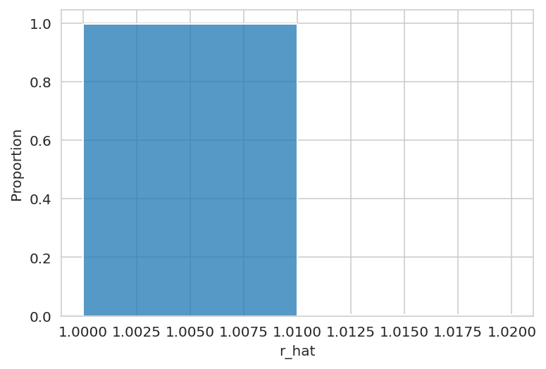


```python
fig, ax = plt.subplots(figsize=(8, 5))
sns.boxplot(data=prostate_post_summary, x="var_name", y="r_hat", ax=ax)
ax.tick_params(rotation=90)
plt.show()
```


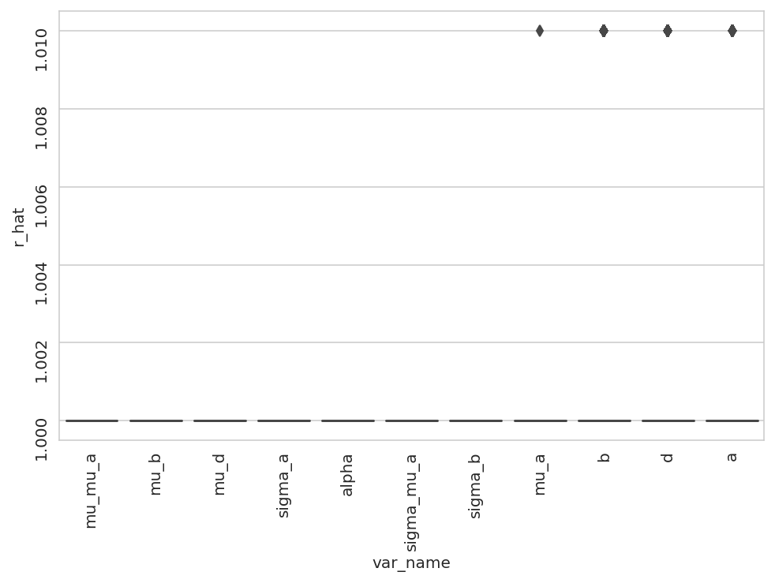


```python
az.plot_energy(trace);
```


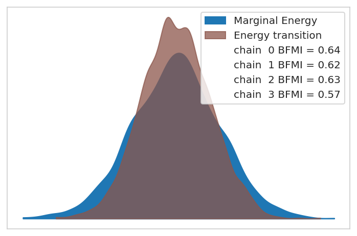


```python
var_names = ["a", "mu_a", "b", "d"]
_, axes = plt.subplots(2, 2, figsize=(8, 4), sharex=True)
for ax, var_name in zip(axes.flatten(), var_names):
    x = prostate_post_summary.query(f"var_name == '{var_name}'")["mean"]
    sns.kdeplot(x=x, ax=ax)
    ax.set_title(var_name)
    ax.set_xlim(-2, 1)

plt.tight_layout()
plt.show()
```


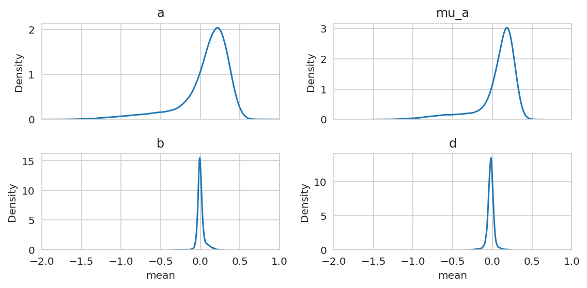


```python
sgrna_to_gene_map = (
    prostate_data.copy()[["hugo_symbol", "sgrna"]]
    .drop_duplicates()
    .reset_index(drop=True)
)
```


```python
(
    prostate_post_summary.query("var_name == 'mu_a'")
    .sort_values("mean")
    .reset_index(drop=True)
    .pipe(head_tail, n=5)
)
```


<div>
<style scoped>
    .dataframe tbody tr th:only-of-type {
        vertical-align: middle;
    }

    .dataframe tbody tr th {
        vertical-align: top;
    }

    .dataframe thead th {
        text-align: right;
    }
</style>
<table border="1" class="dataframe">
  <thead>
    <tr style="text-align: right;">
      <th></th>
      <th>parameter</th>
      <th>mean</th>
      <th>sd</th>
      <th>hdi_5.5%</th>
      <th>hdi_94.5%</th>
      <th>mcse_mean</th>
      <th>mcse_sd</th>
      <th>ess_bulk</th>
      <th>ess_tail</th>
      <th>r_hat</th>
      <th>var_name</th>
    </tr>
  </thead>
  <tbody>
    <tr>
      <th>0</th>
      <td>mu_a[RAN]</td>
      <td>-1.408</td>
      <td>0.115</td>
      <td>-1.592</td>
      <td>-1.228</td>
      <td>0.002</td>
      <td>0.001</td>
      <td>3909.0</td>
      <td>3423.0</td>
      <td>1.0</td>
      <td>mu_a</td>
    </tr>
    <tr>
      <th>1</th>
      <td>mu_a[KIF11]</td>
      <td>-1.393</td>
      <td>0.116</td>
      <td>-1.571</td>
      <td>-1.198</td>
      <td>0.002</td>
      <td>0.001</td>
      <td>3788.0</td>
      <td>3251.0</td>
      <td>1.0</td>
      <td>mu_a</td>
    </tr>
    <tr>
      <th>2</th>
      <td>mu_a[HSPE1]</td>
      <td>-1.349</td>
      <td>0.114</td>
      <td>-1.526</td>
      <td>-1.171</td>
      <td>0.002</td>
      <td>0.001</td>
      <td>3243.0</td>
      <td>3023.0</td>
      <td>1.0</td>
      <td>mu_a</td>
    </tr>
    <tr>
      <th>3</th>
      <td>mu_a[RPL12]</td>
      <td>-1.335</td>
      <td>0.116</td>
      <td>-1.523</td>
      <td>-1.156</td>
      <td>0.002</td>
      <td>0.001</td>
      <td>3860.0</td>
      <td>3421.0</td>
      <td>1.0</td>
      <td>mu_a</td>
    </tr>
    <tr>
      <th>4</th>
      <td>mu_a[RPL9]</td>
      <td>-1.331</td>
      <td>0.120</td>
      <td>-1.522</td>
      <td>-1.140</td>
      <td>0.002</td>
      <td>0.001</td>
      <td>3717.0</td>
      <td>3141.0</td>
      <td>1.0</td>
      <td>mu_a</td>
    </tr>
    <tr>
      <th>18114</th>
      <td>mu_a[ZNF611]</td>
      <td>0.474</td>
      <td>0.113</td>
      <td>0.294</td>
      <td>0.652</td>
      <td>0.002</td>
      <td>0.001</td>
      <td>3686.0</td>
      <td>3389.0</td>
      <td>1.0</td>
      <td>mu_a</td>
    </tr>
    <tr>
      <th>18115</th>
      <td>mu_a[TMPRSS11F]</td>
      <td>0.478</td>
      <td>0.124</td>
      <td>0.269</td>
      <td>0.663</td>
      <td>0.002</td>
      <td>0.001</td>
      <td>4188.0</td>
      <td>3280.0</td>
      <td>1.0</td>
      <td>mu_a</td>
    </tr>
    <tr>
      <th>18116</th>
      <td>mu_a[EPHA2]</td>
      <td>0.483</td>
      <td>0.112</td>
      <td>0.313</td>
      <td>0.665</td>
      <td>0.002</td>
      <td>0.001</td>
      <td>3568.0</td>
      <td>3387.0</td>
      <td>1.0</td>
      <td>mu_a</td>
    </tr>
    <tr>
      <th>18117</th>
      <td>mu_a[FOPNL]</td>
      <td>0.485</td>
      <td>0.113</td>
      <td>0.307</td>
      <td>0.660</td>
      <td>0.002</td>
      <td>0.001</td>
      <td>3389.0</td>
      <td>3001.0</td>
      <td>1.0</td>
      <td>mu_a</td>
    </tr>
    <tr>
      <th>18118</th>
      <td>mu_a[NF2]</td>
      <td>0.548</td>
      <td>0.109</td>
      <td>0.373</td>
      <td>0.723</td>
      <td>0.002</td>
      <td>0.001</td>
      <td>3743.0</td>
      <td>2969.0</td>
      <td>1.0</td>
      <td>mu_a</td>
    </tr>
  </tbody>
</table>
</div>


```python
(
    prostate_post_summary.query("var_name == 'b'")
    .sort_values("mean")
    .reset_index(drop=True)
    .pipe(head_tail, n=5)
)
```


<div>
<style scoped>
    .dataframe tbody tr th:only-of-type {
        vertical-align: middle;
    }

    .dataframe tbody tr th {
        vertical-align: top;
    }

    .dataframe thead th {
        text-align: right;
    }
</style>
<table border="1" class="dataframe">
  <thead>
    <tr style="text-align: right;">
      <th></th>
      <th>parameter</th>
      <th>mean</th>
      <th>sd</th>
      <th>hdi_5.5%</th>
      <th>hdi_94.5%</th>
      <th>mcse_mean</th>
      <th>mcse_sd</th>
      <th>ess_bulk</th>
      <th>ess_tail</th>
      <th>r_hat</th>
      <th>var_name</th>
    </tr>
  </thead>
  <tbody>
    <tr>
      <th>0</th>
      <td>b[EP300]</td>
      <td>-0.339</td>
      <td>0.046</td>
      <td>-0.412</td>
      <td>-0.265</td>
      <td>0.001</td>
      <td>0.0</td>
      <td>7682.0</td>
      <td>3174.0</td>
      <td>1.00</td>
      <td>b</td>
    </tr>
    <tr>
      <th>1</th>
      <td>b[EBP]</td>
      <td>-0.195</td>
      <td>0.047</td>
      <td>-0.268</td>
      <td>-0.121</td>
      <td>0.001</td>
      <td>0.0</td>
      <td>8111.0</td>
      <td>3184.0</td>
      <td>1.00</td>
      <td>b</td>
    </tr>
    <tr>
      <th>2</th>
      <td>b[STAG2]</td>
      <td>-0.188</td>
      <td>0.043</td>
      <td>-0.254</td>
      <td>-0.117</td>
      <td>0.000</td>
      <td>0.0</td>
      <td>8419.0</td>
      <td>2570.0</td>
      <td>1.00</td>
      <td>b</td>
    </tr>
    <tr>
      <th>3</th>
      <td>b[TP63]</td>
      <td>-0.171</td>
      <td>0.043</td>
      <td>-0.242</td>
      <td>-0.104</td>
      <td>0.000</td>
      <td>0.0</td>
      <td>10551.0</td>
      <td>3238.0</td>
      <td>1.00</td>
      <td>b</td>
    </tr>
    <tr>
      <th>4</th>
      <td>b[FOXA1]</td>
      <td>-0.171</td>
      <td>0.046</td>
      <td>-0.245</td>
      <td>-0.100</td>
      <td>0.000</td>
      <td>0.0</td>
      <td>9048.0</td>
      <td>2763.0</td>
      <td>1.00</td>
      <td>b</td>
    </tr>
    <tr>
      <th>18114</th>
      <td>b[DDX10]</td>
      <td>0.256</td>
      <td>0.046</td>
      <td>0.181</td>
      <td>0.326</td>
      <td>0.000</td>
      <td>0.0</td>
      <td>10787.0</td>
      <td>2761.0</td>
      <td>1.00</td>
      <td>b</td>
    </tr>
    <tr>
      <th>18115</th>
      <td>b[EIF5A]</td>
      <td>0.256</td>
      <td>0.046</td>
      <td>0.177</td>
      <td>0.326</td>
      <td>0.001</td>
      <td>0.0</td>
      <td>8467.0</td>
      <td>2666.0</td>
      <td>1.00</td>
      <td>b</td>
    </tr>
    <tr>
      <th>18116</th>
      <td>b[GRB2]</td>
      <td>0.266</td>
      <td>0.045</td>
      <td>0.196</td>
      <td>0.339</td>
      <td>0.000</td>
      <td>0.0</td>
      <td>10893.0</td>
      <td>2799.0</td>
      <td>1.01</td>
      <td>b</td>
    </tr>
    <tr>
      <th>18117</th>
      <td>b[AIFM1]</td>
      <td>0.275</td>
      <td>0.047</td>
      <td>0.204</td>
      <td>0.353</td>
      <td>0.001</td>
      <td>0.0</td>
      <td>8404.0</td>
      <td>2681.0</td>
      <td>1.00</td>
      <td>b</td>
    </tr>
    <tr>
      <th>18118</th>
      <td>b[NARS2]</td>
      <td>0.278</td>
      <td>0.045</td>
      <td>0.203</td>
      <td>0.348</td>
      <td>0.000</td>
      <td>0.0</td>
      <td>10633.0</td>
      <td>2554.0</td>
      <td>1.00</td>
      <td>b</td>
    </tr>
  </tbody>
</table>
</div>


```python
(
    prostate_post_summary.query("var_name == 'd'")
    .sort_values("mean")
    .reset_index(drop=True)
    .pipe(head_tail, n=5)
)
```


<div>
<style scoped>
    .dataframe tbody tr th:only-of-type {
        vertical-align: middle;
    }

    .dataframe tbody tr th {
        vertical-align: top;
    }

    .dataframe thead th {
        text-align: right;
    }
</style>
<table border="1" class="dataframe">
  <thead>
    <tr style="text-align: right;">
      <th></th>
      <th>parameter</th>
      <th>mean</th>
      <th>sd</th>
      <th>hdi_5.5%</th>
      <th>hdi_94.5%</th>
      <th>mcse_mean</th>
      <th>mcse_sd</th>
      <th>ess_bulk</th>
      <th>ess_tail</th>
      <th>r_hat</th>
      <th>var_name</th>
    </tr>
  </thead>
  <tbody>
    <tr>
      <th>0</th>
      <td>d[ATP1A1]</td>
      <td>-0.294</td>
      <td>0.045</td>
      <td>-0.362</td>
      <td>-0.219</td>
      <td>0.0</td>
      <td>0.0</td>
      <td>8588.0</td>
      <td>3048.0</td>
      <td>1.0</td>
      <td>d</td>
    </tr>
    <tr>
      <th>1</th>
      <td>d[TRIT1]</td>
      <td>-0.284</td>
      <td>0.046</td>
      <td>-0.355</td>
      <td>-0.211</td>
      <td>0.0</td>
      <td>0.0</td>
      <td>9876.0</td>
      <td>2834.0</td>
      <td>1.0</td>
      <td>d</td>
    </tr>
    <tr>
      <th>2</th>
      <td>d[LONP1]</td>
      <td>-0.283</td>
      <td>0.043</td>
      <td>-0.357</td>
      <td>-0.220</td>
      <td>0.0</td>
      <td>0.0</td>
      <td>11391.0</td>
      <td>2719.0</td>
      <td>1.0</td>
      <td>d</td>
    </tr>
    <tr>
      <th>3</th>
      <td>d[PARS2]</td>
      <td>-0.264</td>
      <td>0.045</td>
      <td>-0.334</td>
      <td>-0.192</td>
      <td>0.0</td>
      <td>0.0</td>
      <td>9738.0</td>
      <td>2559.0</td>
      <td>1.0</td>
      <td>d</td>
    </tr>
    <tr>
      <th>4</th>
      <td>d[DAP3]</td>
      <td>-0.255</td>
      <td>0.044</td>
      <td>-0.323</td>
      <td>-0.180</td>
      <td>0.0</td>
      <td>0.0</td>
      <td>9926.0</td>
      <td>3185.0</td>
      <td>1.0</td>
      <td>d</td>
    </tr>
    <tr>
      <th>18114</th>
      <td>d[PWP2]</td>
      <td>0.193</td>
      <td>0.044</td>
      <td>0.123</td>
      <td>0.266</td>
      <td>0.0</td>
      <td>0.0</td>
      <td>9439.0</td>
      <td>2755.0</td>
      <td>1.0</td>
      <td>d</td>
    </tr>
    <tr>
      <th>18115</th>
      <td>d[MRPL10]</td>
      <td>0.197</td>
      <td>0.042</td>
      <td>0.123</td>
      <td>0.259</td>
      <td>0.0</td>
      <td>0.0</td>
      <td>9262.0</td>
      <td>2554.0</td>
      <td>1.0</td>
      <td>d</td>
    </tr>
    <tr>
      <th>18116</th>
      <td>d[NDUFB9]</td>
      <td>0.206</td>
      <td>0.044</td>
      <td>0.140</td>
      <td>0.279</td>
      <td>0.0</td>
      <td>0.0</td>
      <td>11233.0</td>
      <td>2933.0</td>
      <td>1.0</td>
      <td>d</td>
    </tr>
    <tr>
      <th>18117</th>
      <td>d[MRPL39]</td>
      <td>0.211</td>
      <td>0.043</td>
      <td>0.138</td>
      <td>0.275</td>
      <td>0.0</td>
      <td>0.0</td>
      <td>9246.0</td>
      <td>3193.0</td>
      <td>1.0</td>
      <td>d</td>
    </tr>
    <tr>
      <th>18118</th>
      <td>d[TIMM10]</td>
      <td>0.219</td>
      <td>0.045</td>
      <td>0.150</td>
      <td>0.293</td>
      <td>0.0</td>
      <td>0.0</td>
      <td>11211.0</td>
      <td>2974.0</td>
      <td>1.0</td>
      <td>d</td>
    </tr>
  </tbody>
</table>
</div>


```python
example_genes = ["KIF11", "AR", "NF2"]
az.plot_trace(
    trace, var_names=["mu_a", "b", "d"], coords={"gene": example_genes}, compact=False
)
plt.tight_layout()
plt.show()
```


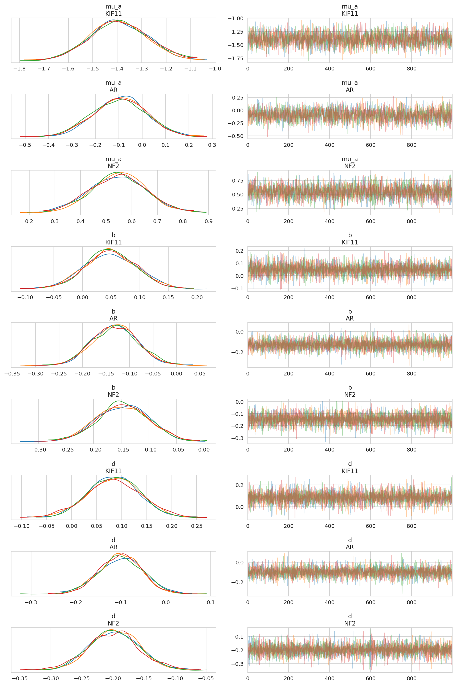


```python
sgrnas_sample = trace.posterior.coords["sgrna"].values[:5]

az.plot_trace(trace, var_names="a", coords={"sgrna": sgrnas_sample}, compact=False)
plt.tight_layout()
plt.show()
```


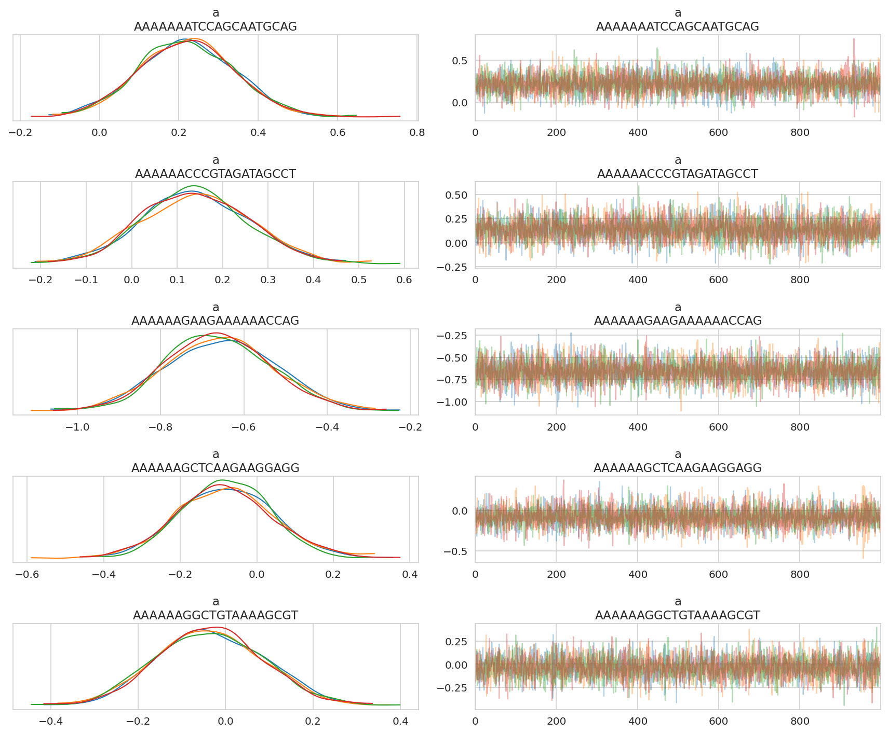


```python
example_gene = "KIF11"
example_gene_sgrna = sgrna_to_gene_map.query(f"hugo_symbol == '{example_gene}'")[
    "sgrna"
].tolist()
az.plot_forest(
    trace,
    var_names=["mu_mu_a", "mu_a", "a", "mu_b", "b", "mu_d", "d"],
    coords={"gene": [example_gene], "sgrna": example_gene_sgrna},
    combined=False,
    figsize=(6, 5),
)
plt.show()
```


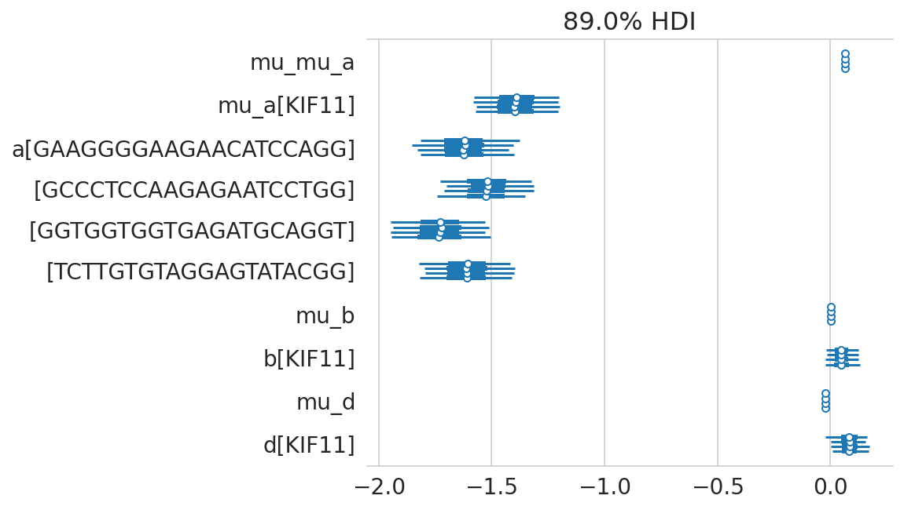


```python
az.plot_trace(trace, var_names=["mu_mu_a", "mu_b", "mu_d"], compact=False)
plt.tight_layout()
```


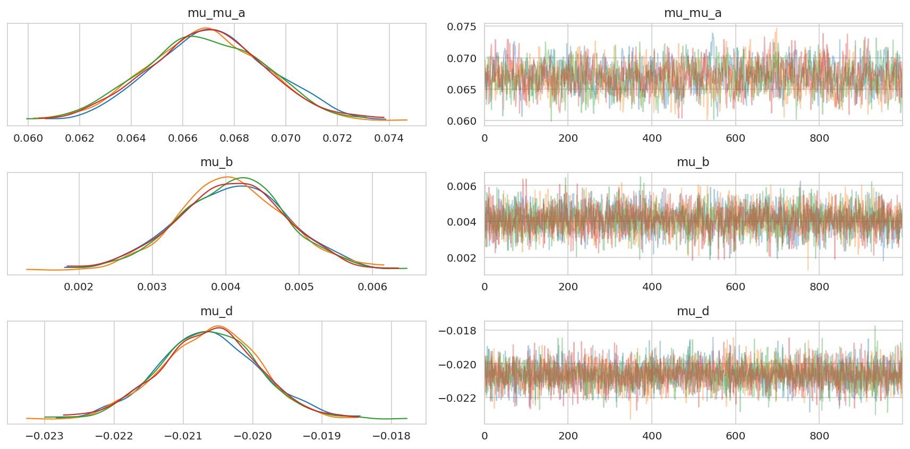


```python
az.plot_trace(trace, var_names=["^sigma_*"], filter_vars="regex", compact=False)
plt.tight_layout()
```


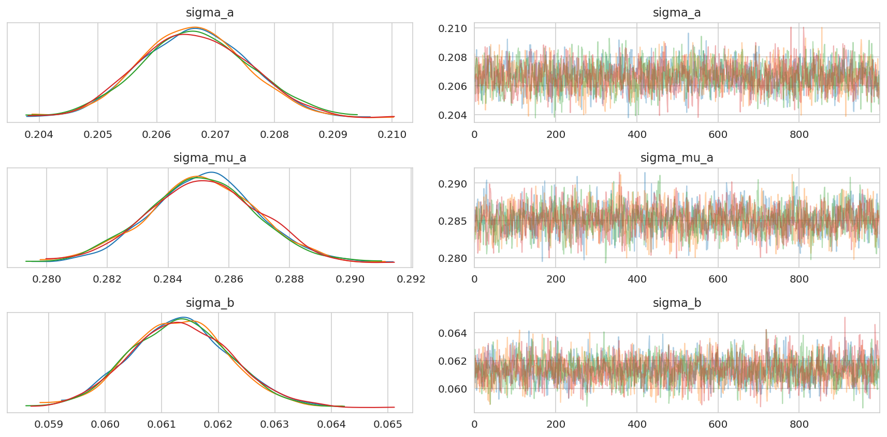


```python
prostate_post_summary.filter_string("var_name", "^sigma_*")
```


<div>
<style scoped>
    .dataframe tbody tr th:only-of-type {
        vertical-align: middle;
    }

    .dataframe tbody tr th {
        vertical-align: top;
    }

    .dataframe thead th {
        text-align: right;
    }
</style>
<table border="1" class="dataframe">
  <thead>
    <tr style="text-align: right;">
      <th></th>
      <th>parameter</th>
      <th>mean</th>
      <th>sd</th>
      <th>hdi_5.5%</th>
      <th>hdi_94.5%</th>
      <th>mcse_mean</th>
      <th>mcse_sd</th>
      <th>ess_bulk</th>
      <th>ess_tail</th>
      <th>r_hat</th>
      <th>var_name</th>
    </tr>
  </thead>
  <tbody>
    <tr>
      <th>3</th>
      <td>sigma_a</td>
      <td>0.207</td>
      <td>0.001</td>
      <td>0.205</td>
      <td>0.208</td>
      <td>0.0</td>
      <td>0.0</td>
      <td>1658.0</td>
      <td>3055.0</td>
      <td>1.0</td>
      <td>sigma_a</td>
    </tr>
    <tr>
      <th>5</th>
      <td>sigma_mu_a</td>
      <td>0.285</td>
      <td>0.002</td>
      <td>0.282</td>
      <td>0.288</td>
      <td>0.0</td>
      <td>0.0</td>
      <td>1572.0</td>
      <td>2262.0</td>
      <td>1.0</td>
      <td>sigma_mu_a</td>
    </tr>
    <tr>
      <th>6</th>
      <td>sigma_b</td>
      <td>0.061</td>
      <td>0.001</td>
      <td>0.060</td>
      <td>0.063</td>
      <td>0.0</td>
      <td>0.0</td>
      <td>1686.0</td>
      <td>2896.0</td>
      <td>1.0</td>
      <td>sigma_b</td>
    </tr>
  </tbody>
</table>
</div>


```python
eg_gene = trace.posterior.coords["gene"].values[0]

for gene in [eg_gene, "KIF11"]:
    axes = az.plot_pair(
        trace,
        var_names=["mu_a", "b", "d"],
        coords={"gene": [gene]},
        figsize=(7, 7),
        scatter_kwargs={"alpha": 0.2},
    )
    for ax in axes.flatten():
        ax.axhline(0, color="k")
        ax.axvline(0, color="k")
    plt.tight_layout()
    plt.show()
```


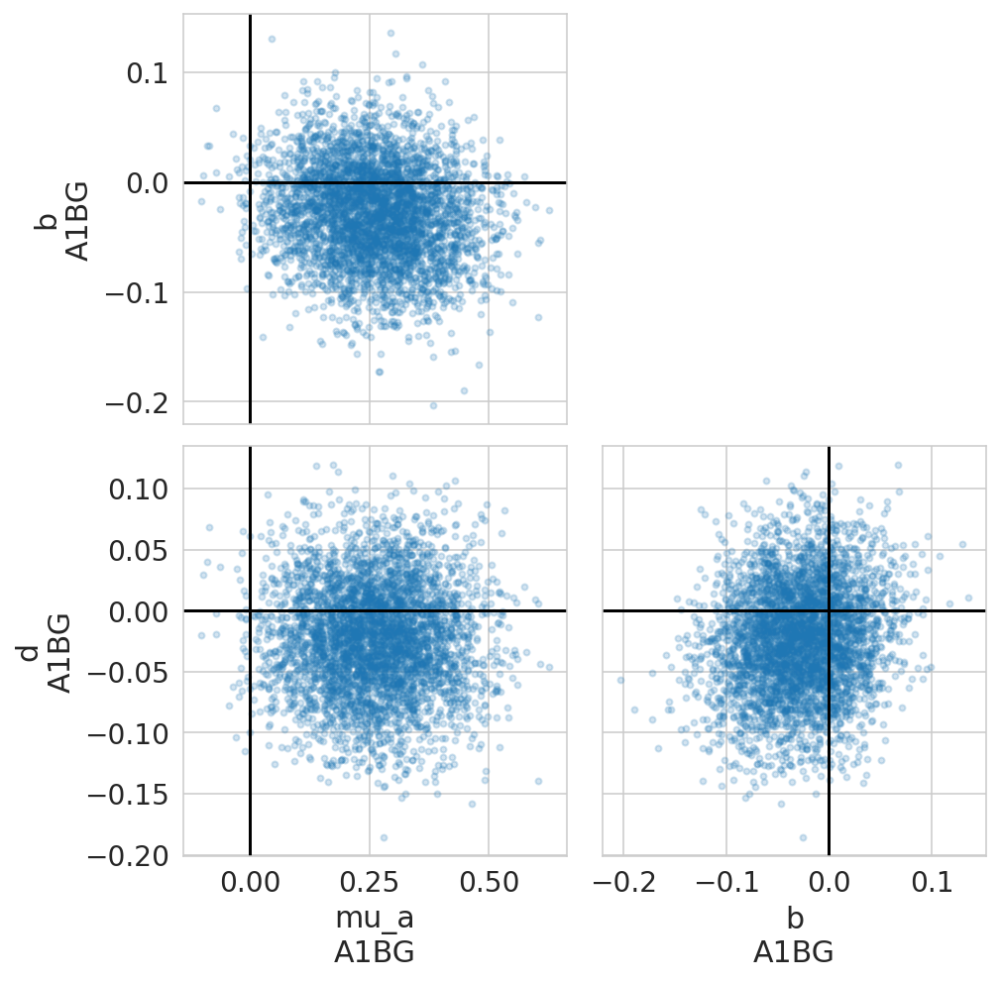


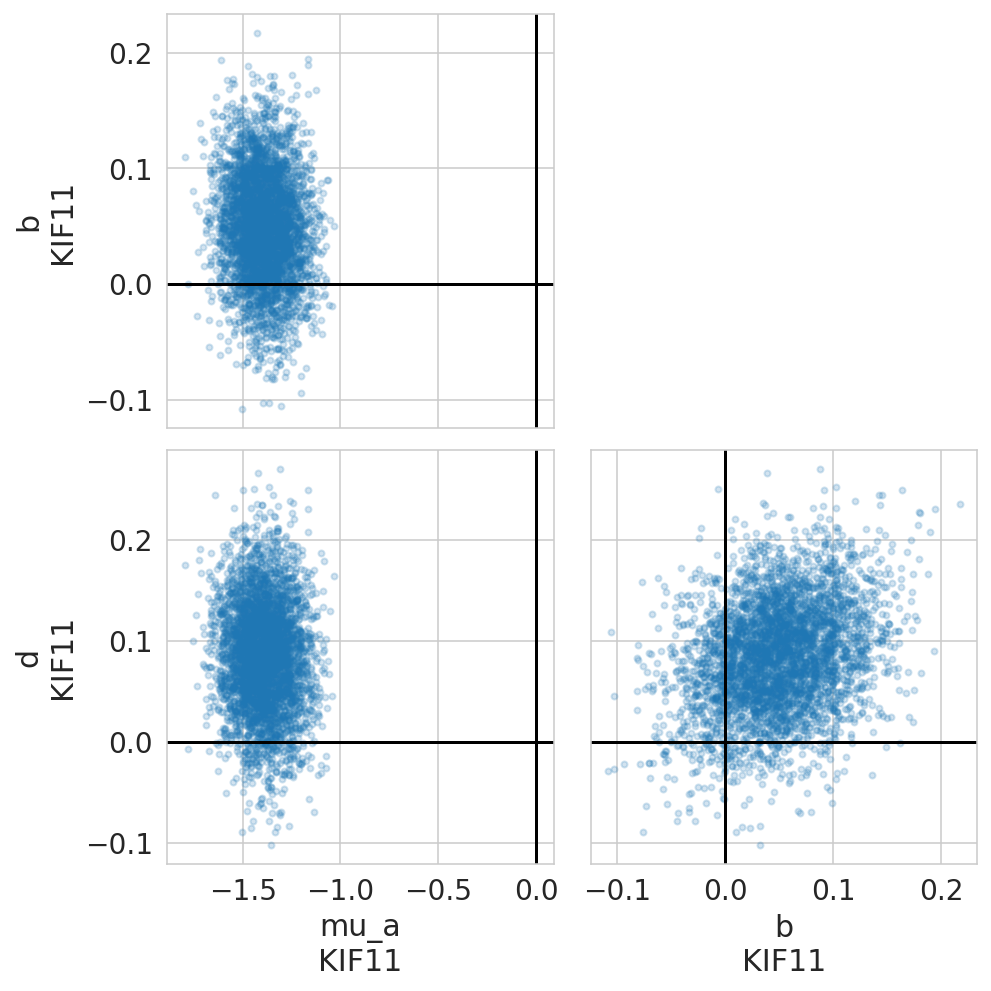


```python
mu_a_post_avg = trace.posterior["mu_a"].mean(axis=(0, 1))
b_post_avg = trace.posterior["b"].mean(axis=(0, 1))
d_post_avg = trace.posterior["d"].mean(axis=(0, 1))


fig, axes = plt.subplots(1, 2, squeeze=True, figsize=(7, 3.5))

ax = axes[0]
sns.scatterplot(x=mu_a_post_avg, y=b_post_avg, alpha=0.1, edgecolor=None, s=5, ax=ax)
ax.set_xlabel(r"$\mu_a$")
ax.set_ylabel(r"$b$")


ax = axes[1]
sns.scatterplot(x=b_post_avg, y=d_post_avg, alpha=0.1, edgecolor=None, s=5, ax=ax)
ax.set_xlabel(r"$b$")
ax.set_ylabel(r"$d$")

for ax in axes.flatten():
    ax.axhline(color="k")
    ax.axvline(color="k")

fig.tight_layout()
fig.suptitle("Joint posterior distribution", va="bottom")

plt.show()
```


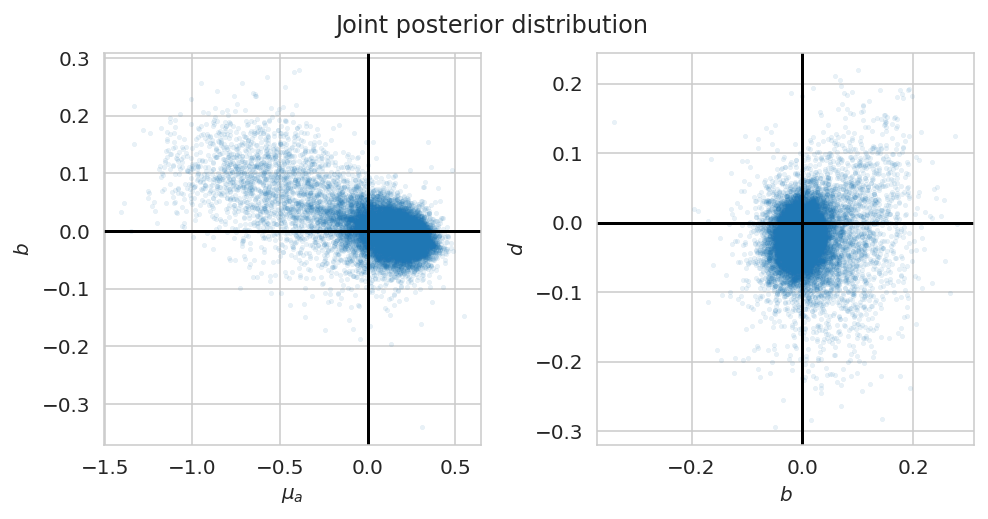


```python
genes_var_names = ["mu_a", "b", "d"]
gene_corr_post = (
    az.summary(trace, "genes_chol_cov_corr", kind="stats")
    .pipe(extract_coords_param_names, names=["d1", "d2"])
    .astype({"d1": int, "d2": int})
    .assign(
        p1=lambda d: [genes_var_names[i] for i in d["d1"]],
        p2=lambda d: [genes_var_names[i] for i in d["d2"]],
    )
)
gene_corr_post
```


<div>
<style scoped>
    .dataframe tbody tr th:only-of-type {
        vertical-align: middle;
    }

    .dataframe tbody tr th {
        vertical-align: top;
    }

    .dataframe thead th {
        text-align: right;
    }
</style>
<table border="1" class="dataframe">
  <thead>
    <tr style="text-align: right;">
      <th></th>
      <th>mean</th>
      <th>sd</th>
      <th>hdi_5.5%</th>
      <th>hdi_94.5%</th>
      <th>d1</th>
      <th>d2</th>
      <th>p1</th>
      <th>p2</th>
    </tr>
  </thead>
  <tbody>
    <tr>
      <th>genes_chol_cov_corr[0, 0]</th>
      <td>1.000</td>
      <td>0.000</td>
      <td>1.000</td>
      <td>1.000</td>
      <td>0</td>
      <td>0</td>
      <td>mu_a</td>
      <td>mu_a</td>
    </tr>
    <tr>
      <th>genes_chol_cov_corr[0, 1]</th>
      <td>-0.443</td>
      <td>0.012</td>
      <td>-0.462</td>
      <td>-0.423</td>
      <td>0</td>
      <td>1</td>
      <td>mu_a</td>
      <td>b</td>
    </tr>
    <tr>
      <th>genes_chol_cov_corr[0, 2]</th>
      <td>0.031</td>
      <td>0.013</td>
      <td>0.011</td>
      <td>0.053</td>
      <td>0</td>
      <td>2</td>
      <td>mu_a</td>
      <td>d</td>
    </tr>
    <tr>
      <th>genes_chol_cov_corr[1, 0]</th>
      <td>-0.443</td>
      <td>0.012</td>
      <td>-0.462</td>
      <td>-0.423</td>
      <td>1</td>
      <td>0</td>
      <td>b</td>
      <td>mu_a</td>
    </tr>
    <tr>
      <th>genes_chol_cov_corr[1, 1]</th>
      <td>1.000</td>
      <td>0.000</td>
      <td>1.000</td>
      <td>1.000</td>
      <td>1</td>
      <td>1</td>
      <td>b</td>
      <td>b</td>
    </tr>
    <tr>
      <th>genes_chol_cov_corr[1, 2]</th>
      <td>0.024</td>
      <td>0.019</td>
      <td>-0.007</td>
      <td>0.054</td>
      <td>1</td>
      <td>2</td>
      <td>b</td>
      <td>d</td>
    </tr>
    <tr>
      <th>genes_chol_cov_corr[2, 0]</th>
      <td>0.031</td>
      <td>0.013</td>
      <td>0.011</td>
      <td>0.053</td>
      <td>2</td>
      <td>0</td>
      <td>d</td>
      <td>mu_a</td>
    </tr>
    <tr>
      <th>genes_chol_cov_corr[2, 1]</th>
      <td>0.024</td>
      <td>0.019</td>
      <td>-0.007</td>
      <td>0.054</td>
      <td>2</td>
      <td>1</td>
      <td>d</td>
      <td>b</td>
    </tr>
    <tr>
      <th>genes_chol_cov_corr[2, 2]</th>
      <td>1.000</td>
      <td>0.000</td>
      <td>1.000</td>
      <td>1.000</td>
      <td>2</td>
      <td>2</td>
      <td>d</td>
      <td>d</td>
    </tr>
  </tbody>
</table>
</div>


```python
plot_df = gene_corr_post.pivot_wider("p1", "p2", "mean").set_index("p1")
sns.heatmap(plot_df, cmap="coolwarm", vmin=-1, vmax=1)
plt.show()
```


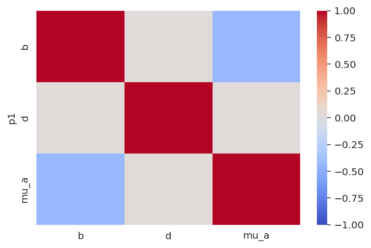


```python
n_examples = 40
n_chains, n_draws, n_data = trace.posterior_predictive["ct_final"].shape
ex_draws_idx = np.random.choice(
    np.arange(n_draws), size=n_examples // n_chains, replace=False
)
example_ppc_draws = trace.posterior_predictive["ct_final"][
    :, ex_draws_idx, :
].values.reshape(-1, n_data)
example_ppc_draws.shape
```


    (40, 355308)


```python
fig, axes = plt.subplots(ncols=2, figsize=(9, 4), sharex=False, sharey=False)
ax1 = axes[0]
ax2 = axes[1]

pp_avg = trace.posterior_predictive["ct_final"].mean(axis=(0, 1))

for i in range(example_ppc_draws.shape[0]):
    sns.kdeplot(
        x=np.log10(example_ppc_draws[i, :] + 1), alpha=0.2, color="tab:blue", ax=ax1
    )

sns.kdeplot(x=np.log10(pp_avg + 1), color="tab:orange", ax=ax1)
sns.kdeplot(x=np.log10(valid_prostate_data["counts_final"] + 1), color="k", ax=ax1)
ax1.set_xlabel("log10(counts final + 1)")
ax1.set_ylabel("density")


for i in range(example_ppc_draws.shape[0]):
    sns.kdeplot(x=example_ppc_draws[i, :], alpha=0.2, color="tab:blue", ax=ax2)

sns.kdeplot(x=pp_avg, color="tab:orange", ax=ax2)
sns.kdeplot(x=valid_prostate_data["counts_final"], color="k", ax=ax2)
ax2.set_xlabel("counts final")
ax2.set_ylabel("density")
ax2.set_xlim(0, 1000)

fig.suptitle("PPC")
fig.tight_layout()
plt.show()
```


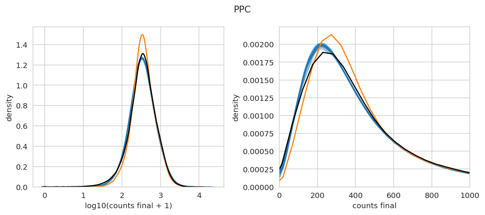


---

## Session info


```python
notebook_toc = time()
print(f"execution time: {(notebook_toc - notebook_tic) / 60:.2f} minutes")
```

    execution time: 7.05 minutes


```python
%load_ext watermark
%watermark -d -u -v -iv -b -h -m
```

    Last updated: 2022-07-24

    Python implementation: CPython
    Python version       : 3.10.5
    IPython version      : 8.4.0

    Compiler    : GCC 10.3.0
    OS          : Linux
    Release     : 3.10.0-1160.45.1.el7.x86_64
    Machine     : x86_64
    Processor   : x86_64
    CPU cores   : 32
    Architecture: 64bit

    Hostname: compute-a-16-164.o2.rc.hms.harvard.edu

    Git branch: simplify

    qnorm     : 0.8.1
    matplotlib: 3.5.2
    numpy     : 1.22.4
    arviz     : 0.12.1
    seaborn   : 0.11.2
    pandas    : 1.4.3
