# Inspect the single-lineage model run on the prostate data (002)

Model attributes:

- sgRNA | gene varying intercept
- RNA and CN varying effects per gene
- correlation between gene varying effects modeled using the multivariate normal and Cholesky decomposition (non-centered parameterization)
- target gene mutation variable and cancer gene comutation variable.


```python
%load_ext autoreload
%autoreload 2
```


```python
from time import time

import arviz as az
import matplotlib.pyplot as plt
import numpy as np
import pandas as pd
import qnorm
import seaborn as sns
```


```python
from speclet.analysis.arviz_analysis import extract_coords_param_names
from speclet.bayesian_models.lineage_hierarchical_nb import LineageHierNegBinomModel
from speclet.data_processing.common import head_tail
from speclet.io import modeling_data_dir, models_dir
from speclet.managers.data_managers import CrisprScreenDataManager
from speclet.plot import set_speclet_theme
from speclet.project_configuration import arviz_config
```


```python
# Notebook execution timer.
notebook_tic = time()

# Plotting setup.
set_speclet_theme()
%config InlineBackend.figure_format = "retina"
arviz_config()
```

## Data


```python
saved_model_dir = models_dir() / "hnb-single-lineage-prostate-002_PYMC_NUMPYRO"
```

### Load posterior summary


```python
prostate_post_summary = pd.read_csv(saved_model_dir / "posterior-summary.csv").assign(
    var_name=lambda d: [x.split("[")[0] for x in d["parameter"]]
)
prostate_post_summary.head()
```


<div>
<style scoped>
    .dataframe tbody tr th:only-of-type {
        vertical-align: middle;
    }

    .dataframe tbody tr th {
        vertical-align: top;
    }

    .dataframe thead th {
        text-align: right;
    }
</style>
<table border="1" class="dataframe">
  <thead>
    <tr style="text-align: right;">
      <th></th>
      <th>parameter</th>
      <th>mean</th>
      <th>sd</th>
      <th>hdi_5.5%</th>
      <th>hdi_94.5%</th>
      <th>mcse_mean</th>
      <th>mcse_sd</th>
      <th>ess_bulk</th>
      <th>ess_tail</th>
      <th>r_hat</th>
      <th>var_name</th>
    </tr>
  </thead>
  <tbody>
    <tr>
      <th>0</th>
      <td>mu_mu_a</td>
      <td>0.099</td>
      <td>0.020</td>
      <td>0.077</td>
      <td>0.121</td>
      <td>0.010</td>
      <td>0.008</td>
      <td>5.0</td>
      <td>12.0</td>
      <td>2.14</td>
      <td>mu_mu_a</td>
    </tr>
    <tr>
      <th>1</th>
      <td>mu_b</td>
      <td>0.001</td>
      <td>0.003</td>
      <td>-0.003</td>
      <td>0.004</td>
      <td>0.001</td>
      <td>0.001</td>
      <td>5.0</td>
      <td>28.0</td>
      <td>2.10</td>
      <td>mu_b</td>
    </tr>
    <tr>
      <th>2</th>
      <td>mu_d</td>
      <td>-0.020</td>
      <td>0.001</td>
      <td>-0.022</td>
      <td>-0.018</td>
      <td>0.001</td>
      <td>0.000</td>
      <td>6.0</td>
      <td>48.0</td>
      <td>2.01</td>
      <td>mu_d</td>
    </tr>
    <tr>
      <th>3</th>
      <td>mu_f</td>
      <td>0.067</td>
      <td>0.077</td>
      <td>0.011</td>
      <td>0.201</td>
      <td>0.038</td>
      <td>0.029</td>
      <td>5.0</td>
      <td>11.0</td>
      <td>2.87</td>
      <td>mu_f</td>
    </tr>
    <tr>
      <th>4</th>
      <td>mu_h[ZFHX3]</td>
      <td>-0.024</td>
      <td>0.017</td>
      <td>-0.043</td>
      <td>-0.006</td>
      <td>0.008</td>
      <td>0.006</td>
      <td>5.0</td>
      <td>11.0</td>
      <td>2.24</td>
      <td>mu_h</td>
    </tr>
  </tbody>
</table>
</div>


### Load trace object


```python
trace_file = saved_model_dir / "posterior.netcdf"
assert trace_file.exists()
trace = az.from_netcdf(trace_file)
```

### Prostate data


```python
def _broad_only(df: pd.DataFrame) -> pd.DataFrame:
    return df[df["screen"] == "broad"].reset_index(drop=True)


prostate_dm = CrisprScreenDataManager(
    modeling_data_dir() / "lineage-modeling-data" / "depmap-modeling-data_prostate.csv",
    transformations=[_broad_only],
)
```


```python
prostate_data = prostate_dm.get_data(read_kwargs={"low_memory": False})
prostate_data.head()
```


<div>
<style scoped>
    .dataframe tbody tr th:only-of-type {
        vertical-align: middle;
    }

    .dataframe tbody tr th {
        vertical-align: top;
    }

    .dataframe thead th {
        text-align: right;
    }
</style>
<table border="1" class="dataframe">
  <thead>
    <tr style="text-align: right;">
      <th></th>
      <th>sgrna</th>
      <th>replicate_id</th>
      <th>lfc</th>
      <th>p_dna_batch</th>
      <th>genome_alignment</th>
      <th>hugo_symbol</th>
      <th>screen</th>
      <th>multiple_hits_on_gene</th>
      <th>sgrna_target_chr</th>
      <th>sgrna_target_pos</th>
      <th>...</th>
      <th>any_deleterious</th>
      <th>any_tcga_hotspot</th>
      <th>any_cosmic_hotspot</th>
      <th>is_mutated</th>
      <th>copy_number</th>
      <th>lineage</th>
      <th>lineage_subtype</th>
      <th>primary_or_metastasis</th>
      <th>is_male</th>
      <th>age</th>
    </tr>
  </thead>
  <tbody>
    <tr>
      <th>0</th>
      <td>AAAGCCCAGGAGTATGGGAG</td>
      <td>Vcap-304Cas9_RepA_p4_batch3</td>
      <td>0.246450</td>
      <td>3</td>
      <td>chr2_130522105_-</td>
      <td>CFC1B</td>
      <td>broad</td>
      <td>True</td>
      <td>2</td>
      <td>130522105</td>
      <td>...</td>
      <td>NaN</td>
      <td>NaN</td>
      <td>NaN</td>
      <td>False</td>
      <td>0.999455</td>
      <td>prostate</td>
      <td>prostate_adenocarcinoma</td>
      <td>metastasis</td>
      <td>True</td>
      <td>59.0</td>
    </tr>
    <tr>
      <th>1</th>
      <td>AAATCAGAGAAACCTGAACG</td>
      <td>Vcap-304Cas9_RepA_p4_batch3</td>
      <td>0.626518</td>
      <td>3</td>
      <td>chr11_89916950_-</td>
      <td>TRIM49D1</td>
      <td>broad</td>
      <td>True</td>
      <td>11</td>
      <td>89916950</td>
      <td>...</td>
      <td>NaN</td>
      <td>NaN</td>
      <td>NaN</td>
      <td>False</td>
      <td>1.281907</td>
      <td>prostate</td>
      <td>prostate_adenocarcinoma</td>
      <td>metastasis</td>
      <td>True</td>
      <td>59.0</td>
    </tr>
    <tr>
      <th>2</th>
      <td>AACGTCTTTGAAGAAAGCTG</td>
      <td>Vcap-304Cas9_RepA_p4_batch3</td>
      <td>0.165114</td>
      <td>3</td>
      <td>chr5_71055421_-</td>
      <td>GTF2H2</td>
      <td>broad</td>
      <td>True</td>
      <td>5</td>
      <td>71055421</td>
      <td>...</td>
      <td>NaN</td>
      <td>NaN</td>
      <td>NaN</td>
      <td>False</td>
      <td>0.616885</td>
      <td>prostate</td>
      <td>prostate_adenocarcinoma</td>
      <td>metastasis</td>
      <td>True</td>
      <td>59.0</td>
    </tr>
    <tr>
      <th>3</th>
      <td>AACGTCTTTGAAGGAAGCTG</td>
      <td>Vcap-304Cas9_RepA_p4_batch3</td>
      <td>-0.094688</td>
      <td>3</td>
      <td>chr5_69572480_+</td>
      <td>GTF2H2C</td>
      <td>broad</td>
      <td>True</td>
      <td>5</td>
      <td>69572480</td>
      <td>...</td>
      <td>NaN</td>
      <td>NaN</td>
      <td>NaN</td>
      <td>False</td>
      <td>0.616885</td>
      <td>prostate</td>
      <td>prostate_adenocarcinoma</td>
      <td>metastasis</td>
      <td>True</td>
      <td>59.0</td>
    </tr>
    <tr>
      <th>4</th>
      <td>AAGAGGTTCCAGACTACTTA</td>
      <td>Vcap-304Cas9_RepA_p4_batch3</td>
      <td>0.294496</td>
      <td>3</td>
      <td>chrX_155898173_+</td>
      <td>VAMP7</td>
      <td>broad</td>
      <td>True</td>
      <td>X</td>
      <td>155898173</td>
      <td>...</td>
      <td>NaN</td>
      <td>NaN</td>
      <td>NaN</td>
      <td>False</td>
      <td>0.615935</td>
      <td>prostate</td>
      <td>prostate_adenocarcinoma</td>
      <td>metastasis</td>
      <td>True</td>
      <td>59.0</td>
    </tr>
  </tbody>
</table>
<p>5 rows × 25 columns</p>
</div>


### Single lineage model


```python
prostate_model = LineageHierNegBinomModel(lineage="prostate")
```


```python
valid_prostate_data = prostate_model.data_processing_pipeline(prostate_data.copy())
prostate_mdl_data = prostate_model.make_data_structure(valid_prostate_data)
```


<pre style="white-space:pre;overflow-x:auto;line-height:normal;font-family:Menlo,'DejaVu Sans Mono',consolas,'Courier New',monospace"><span style="color: #7fbfbf; text-decoration-color: #7fbfbf">[07/26/22 06:50:42] </span><span style="color: #000080; text-decoration-color: #000080">INFO    </span> Processing data for modeling.     <a href="file:///n/data1/hms/dbmi/park/Cook/speclet/speclet/bayesian_models/lineage_hierarchical_nb.py" target="_blank"><span style="color: #7f7f7f; text-decoration-color: #7f7f7f">lineage_hierarchical_nb.py</span></a><span style="color: #7f7f7f; text-decoration-color: #7f7f7f">:</span><a href="file:///n/data1/hms/dbmi/park/Cook/speclet/speclet/bayesian_models/lineage_hierarchical_nb.py#267" target="_blank"><span style="color: #7f7f7f; text-decoration-color: #7f7f7f">267</span></a>
</pre>


<pre style="white-space:pre;overflow-x:auto;line-height:normal;font-family:Menlo,'DejaVu Sans Mono',consolas,'Courier New',monospace"><span style="color: #7fbfbf; text-decoration-color: #7fbfbf">                    </span><span style="color: #000080; text-decoration-color: #000080">INFO    </span> LFC limits: <span style="font-weight: bold">(</span><span style="color: #008080; text-decoration-color: #008080; font-weight: bold">-5.0</span>, <span style="color: #008080; text-decoration-color: #008080; font-weight: bold">5.0</span><span style="font-weight: bold">)</span>           <a href="file:///n/data1/hms/dbmi/park/Cook/speclet/speclet/bayesian_models/lineage_hierarchical_nb.py" target="_blank"><span style="color: #7f7f7f; text-decoration-color: #7f7f7f">lineage_hierarchical_nb.py</span></a><span style="color: #7f7f7f; text-decoration-color: #7f7f7f">:</span><a href="file:///n/data1/hms/dbmi/park/Cook/speclet/speclet/bayesian_models/lineage_hierarchical_nb.py#268" target="_blank"><span style="color: #7f7f7f; text-decoration-color: #7f7f7f">268</span></a>
</pre>


<pre style="white-space:pre;overflow-x:auto;line-height:normal;font-family:Menlo,'DejaVu Sans Mono',consolas,'Courier New',monospace"><span style="color: #7fbfbf; text-decoration-color: #7fbfbf">[07/26/22 06:51:44] </span><span style="color: #800000; text-decoration-color: #800000">WARNING </span> number of data points dropped: <span style="color: #008080; text-decoration-color: #008080; font-weight: bold">2</span>  <a href="file:///n/data1/hms/dbmi/park/Cook/speclet/speclet/bayesian_models/lineage_hierarchical_nb.py" target="_blank"><span style="color: #7f7f7f; text-decoration-color: #7f7f7f">lineage_hierarchical_nb.py</span></a><span style="color: #7f7f7f; text-decoration-color: #7f7f7f">:</span><a href="file:///n/data1/hms/dbmi/park/Cook/speclet/speclet/bayesian_models/lineage_hierarchical_nb.py#319" target="_blank"><span style="color: #7f7f7f; text-decoration-color: #7f7f7f">319</span></a>
</pre>


<pre style="white-space:pre;overflow-x:auto;line-height:normal;font-family:Menlo,'DejaVu Sans Mono',consolas,'Courier New',monospace"><span style="color: #7fbfbf; text-decoration-color: #7fbfbf">                    </span><span style="color: #000080; text-decoration-color: #000080">INFO    </span> number of genes mutated in all    <a href="file:///n/data1/hms/dbmi/park/Cook/speclet/speclet/bayesian_models/lineage_hierarchical_nb.py" target="_blank"><span style="color: #7f7f7f; text-decoration-color: #7f7f7f">lineage_hierarchical_nb.py</span></a><span style="color: #7f7f7f; text-decoration-color: #7f7f7f">:</span><a href="file:///n/data1/hms/dbmi/park/Cook/speclet/speclet/bayesian_models/lineage_hierarchical_nb.py#449" target="_blank"><span style="color: #7f7f7f; text-decoration-color: #7f7f7f">449</span></a>
<span style="color: #7fbfbf; text-decoration-color: #7fbfbf">                    </span>         cells lines: <span style="color: #008080; text-decoration-color: #008080; font-weight: bold">0</span>                    <span style="color: #7f7f7f; text-decoration-color: #7f7f7f">                              </span>
</pre>


<pre style="white-space:pre;overflow-x:auto;line-height:normal;font-family:Menlo,'DejaVu Sans Mono',consolas,'Courier New',monospace"><span style="color: #7fbfbf; text-decoration-color: #7fbfbf">                    </span><span style="color: #000080; text-decoration-color: #000080">INFO    </span> Dropping <span style="color: #008080; text-decoration-color: #008080; font-weight: bold">8</span> cancer genes.          <a href="file:///n/data1/hms/dbmi/park/Cook/speclet/speclet/bayesian_models/lineage_hierarchical_nb.py" target="_blank"><span style="color: #7f7f7f; text-decoration-color: #7f7f7f">lineage_hierarchical_nb.py</span></a><span style="color: #7f7f7f; text-decoration-color: #7f7f7f">:</span><a href="file:///n/data1/hms/dbmi/park/Cook/speclet/speclet/bayesian_models/lineage_hierarchical_nb.py#505" target="_blank"><span style="color: #7f7f7f; text-decoration-color: #7f7f7f">505</span></a>
</pre>


## Analysis


```python
sns.histplot(x=prostate_post_summary["r_hat"], binwidth=0.01, stat="proportion");
```


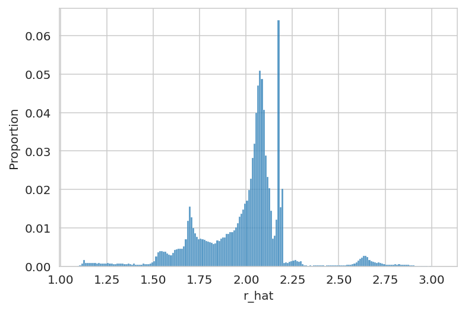


```python
fig, ax = plt.subplots(figsize=(8, 5))
sns.boxplot(data=prostate_post_summary, x="var_name", y="r_hat", ax=ax)
ax.tick_params(rotation=90)
plt.show()
```


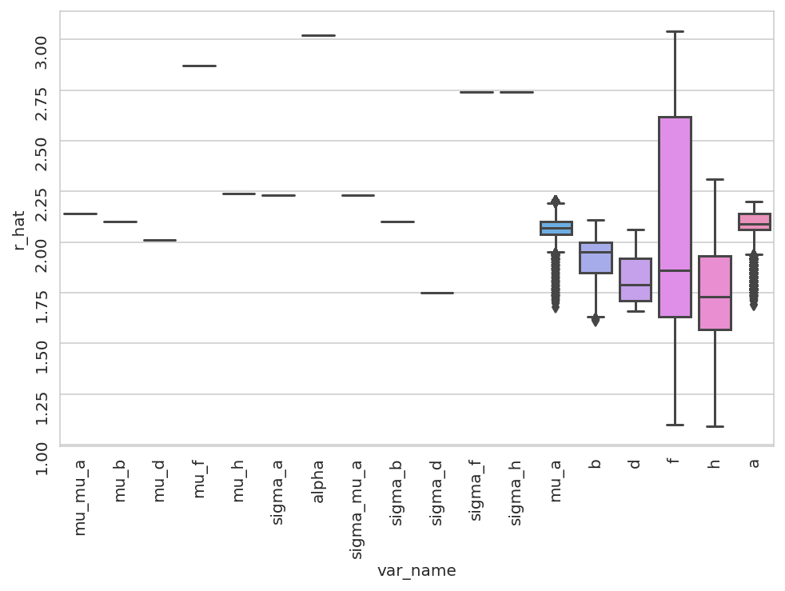


```python
az.plot_energy(trace);
```


```python
az.plot_trace(
    trace, var_names=["mu_mu_a", "mu_b", "mu_d", "mu_f", "mu_h"], compact=False
)
plt.tight_layout()
```


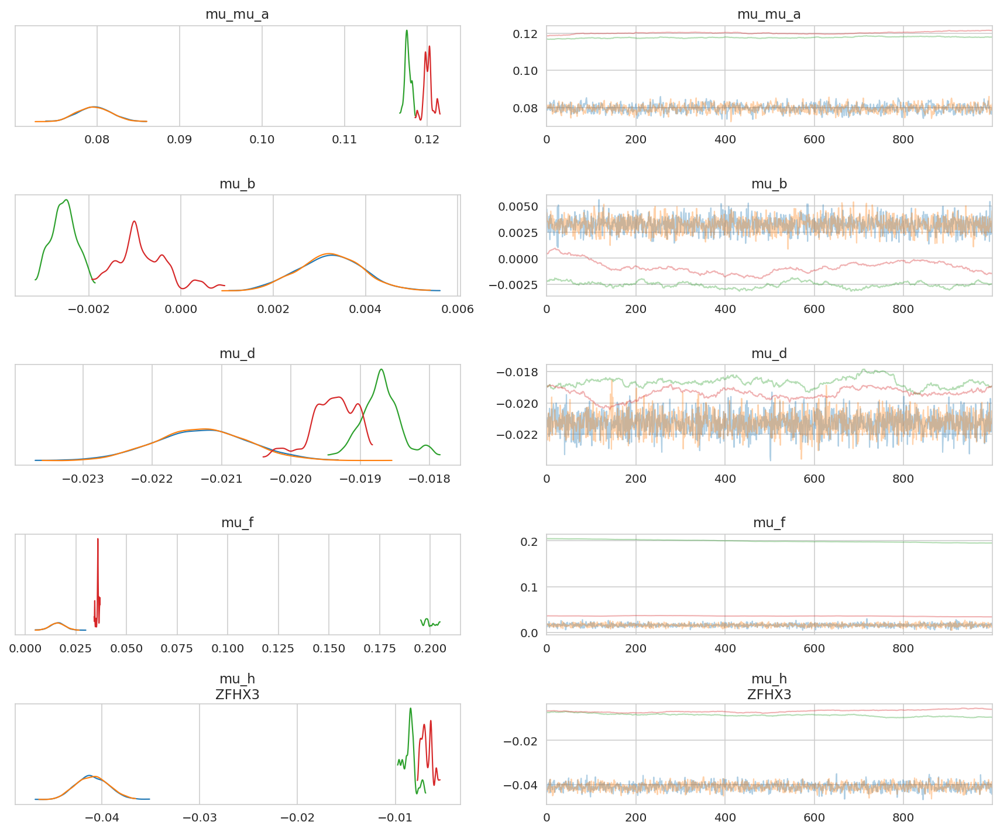


```python
az.plot_trace(trace, var_names=["^sigma_*"], filter_vars="regex", compact=False)
plt.tight_layout()
```


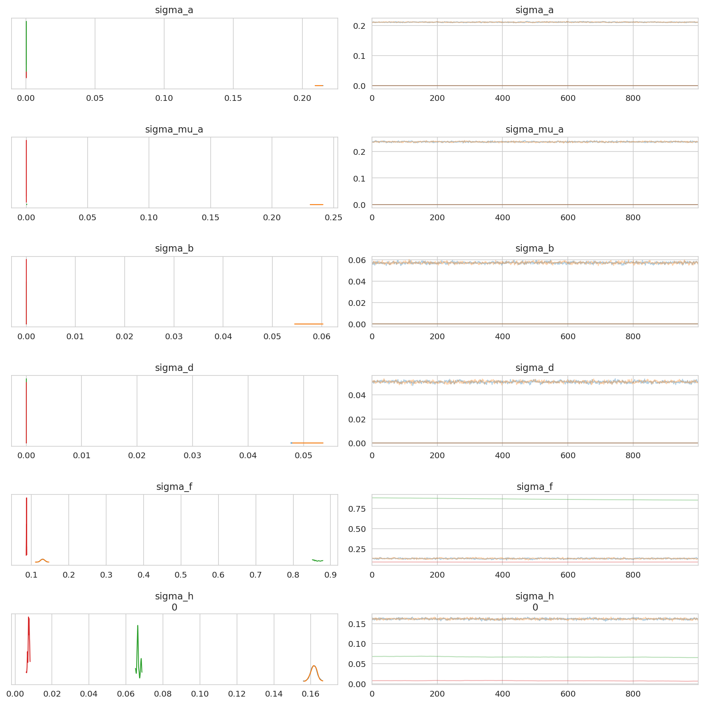


```python
var_names = ["a", "mu_a", "b", "d", "f", "h"]
_, axes = plt.subplots(2, 3, figsize=(8, 6), sharex=True)
for ax, var_name in zip(axes.flatten(), var_names):
    x = prostate_post_summary.query(f"var_name == '{var_name}'")["mean"]
    sns.kdeplot(x=x, ax=ax)
    ax.set_title(var_name)
    ax.set_xlim(-2, 1)

plt.tight_layout()
plt.show()
```


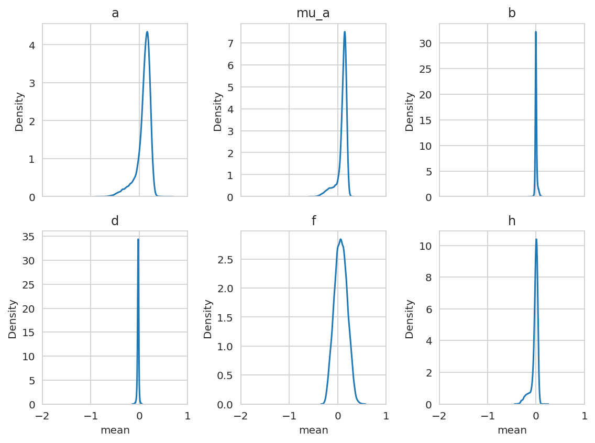


```python
sgrna_to_gene_map = (
    prostate_data.copy()[["hugo_symbol", "sgrna"]]
    .drop_duplicates()
    .reset_index(drop=True)
)
```


```python
(
    prostate_post_summary.query("var_name == 'mu_a'")
    .sort_values("mean")
    .reset_index(drop=True)
    .pipe(head_tail, n=5)
)
```


<div>
<style scoped>
    .dataframe tbody tr th:only-of-type {
        vertical-align: middle;
    }

    .dataframe tbody tr th {
        vertical-align: top;
    }

    .dataframe thead th {
        text-align: right;
    }
</style>
<table border="1" class="dataframe">
  <thead>
    <tr style="text-align: right;">
      <th></th>
      <th>parameter</th>
      <th>mean</th>
      <th>sd</th>
      <th>hdi_5.5%</th>
      <th>hdi_94.5%</th>
      <th>mcse_mean</th>
      <th>mcse_sd</th>
      <th>ess_bulk</th>
      <th>ess_tail</th>
      <th>r_hat</th>
      <th>var_name</th>
    </tr>
  </thead>
  <tbody>
    <tr>
      <th>0</th>
      <td>mu_a[KIF11]</td>
      <td>-0.552</td>
      <td>0.674</td>
      <td>-1.298</td>
      <td>0.122</td>
      <td>0.334</td>
      <td>0.256</td>
      <td>5.0</td>
      <td>12.0</td>
      <td>2.18</td>
      <td>mu_a</td>
    </tr>
    <tr>
      <th>1</th>
      <td>mu_a[HSPE1]</td>
      <td>-0.463</td>
      <td>0.586</td>
      <td>-1.123</td>
      <td>0.122</td>
      <td>0.290</td>
      <td>0.222</td>
      <td>5.0</td>
      <td>12.0</td>
      <td>2.18</td>
      <td>mu_a</td>
    </tr>
    <tr>
      <th>2</th>
      <td>mu_a[SPC24]</td>
      <td>-0.461</td>
      <td>0.584</td>
      <td>-1.122</td>
      <td>0.122</td>
      <td>0.289</td>
      <td>0.221</td>
      <td>5.0</td>
      <td>12.0</td>
      <td>2.18</td>
      <td>mu_a</td>
    </tr>
    <tr>
      <th>3</th>
      <td>mu_a[RAN]</td>
      <td>-0.451</td>
      <td>0.573</td>
      <td>-1.094</td>
      <td>0.122</td>
      <td>0.284</td>
      <td>0.217</td>
      <td>5.0</td>
      <td>12.0</td>
      <td>2.18</td>
      <td>mu_a</td>
    </tr>
    <tr>
      <th>4</th>
      <td>mu_a[EEF2]</td>
      <td>-0.449</td>
      <td>0.572</td>
      <td>-1.094</td>
      <td>0.122</td>
      <td>0.283</td>
      <td>0.216</td>
      <td>5.0</td>
      <td>12.0</td>
      <td>2.18</td>
      <td>mu_a</td>
    </tr>
    <tr>
      <th>18114</th>
      <td>mu_a[PRAMEF4]</td>
      <td>0.257</td>
      <td>0.153</td>
      <td>0.117</td>
      <td>0.468</td>
      <td>0.069</td>
      <td>0.052</td>
      <td>5.0</td>
      <td>14.0</td>
      <td>2.16</td>
      <td>mu_a</td>
    </tr>
    <tr>
      <th>18115</th>
      <td>mu_a[EPHA2]</td>
      <td>0.257</td>
      <td>0.154</td>
      <td>0.116</td>
      <td>0.471</td>
      <td>0.069</td>
      <td>0.052</td>
      <td>5.0</td>
      <td>14.0</td>
      <td>2.15</td>
      <td>mu_a</td>
    </tr>
    <tr>
      <th>18116</th>
      <td>mu_a[ARHGAP44]</td>
      <td>0.259</td>
      <td>0.154</td>
      <td>0.117</td>
      <td>0.468</td>
      <td>0.070</td>
      <td>0.053</td>
      <td>5.0</td>
      <td>14.0</td>
      <td>2.15</td>
      <td>mu_a</td>
    </tr>
    <tr>
      <th>18117</th>
      <td>mu_a[HLA-DQB1]</td>
      <td>0.265</td>
      <td>0.163</td>
      <td>0.117</td>
      <td>0.490</td>
      <td>0.073</td>
      <td>0.055</td>
      <td>5.0</td>
      <td>14.0</td>
      <td>2.14</td>
      <td>mu_a</td>
    </tr>
    <tr>
      <th>18118</th>
      <td>mu_a[TP53]</td>
      <td>0.283</td>
      <td>0.176</td>
      <td>0.116</td>
      <td>0.515</td>
      <td>0.082</td>
      <td>0.062</td>
      <td>5.0</td>
      <td>14.0</td>
      <td>2.20</td>
      <td>mu_a</td>
    </tr>
  </tbody>
</table>
</div>


```python
(
    prostate_post_summary.query("var_name == 'b'")
    .sort_values("mean")
    .reset_index(drop=True)
    .pipe(head_tail, n=5)
)
```


<div>
<style scoped>
    .dataframe tbody tr th:only-of-type {
        vertical-align: middle;
    }

    .dataframe tbody tr th {
        vertical-align: top;
    }

    .dataframe thead th {
        text-align: right;
    }
</style>
<table border="1" class="dataframe">
  <thead>
    <tr style="text-align: right;">
      <th></th>
      <th>parameter</th>
      <th>mean</th>
      <th>sd</th>
      <th>hdi_5.5%</th>
      <th>hdi_94.5%</th>
      <th>mcse_mean</th>
      <th>mcse_sd</th>
      <th>ess_bulk</th>
      <th>ess_tail</th>
      <th>r_hat</th>
      <th>var_name</th>
    </tr>
  </thead>
  <tbody>
    <tr>
      <th>0</th>
      <td>b[EP300]</td>
      <td>-0.161</td>
      <td>0.162</td>
      <td>-0.352</td>
      <td>0.001</td>
      <td>0.080</td>
      <td>0.061</td>
      <td>5.0</td>
      <td>27.0</td>
      <td>2.1</td>
      <td>b</td>
    </tr>
    <tr>
      <th>1</th>
      <td>b[TP63]</td>
      <td>-0.091</td>
      <td>0.094</td>
      <td>-0.213</td>
      <td>0.001</td>
      <td>0.045</td>
      <td>0.034</td>
      <td>5.0</td>
      <td>27.0</td>
      <td>2.1</td>
      <td>b</td>
    </tr>
    <tr>
      <th>2</th>
      <td>b[STAG2]</td>
      <td>-0.088</td>
      <td>0.091</td>
      <td>-0.205</td>
      <td>0.001</td>
      <td>0.043</td>
      <td>0.033</td>
      <td>5.0</td>
      <td>27.0</td>
      <td>2.1</td>
      <td>b</td>
    </tr>
    <tr>
      <th>3</th>
      <td>b[EBP]</td>
      <td>-0.084</td>
      <td>0.089</td>
      <td>-0.205</td>
      <td>0.001</td>
      <td>0.041</td>
      <td>0.031</td>
      <td>5.0</td>
      <td>27.0</td>
      <td>2.1</td>
      <td>b</td>
    </tr>
    <tr>
      <th>4</th>
      <td>b[FOXA1]</td>
      <td>-0.083</td>
      <td>0.086</td>
      <td>-0.197</td>
      <td>0.001</td>
      <td>0.041</td>
      <td>0.031</td>
      <td>5.0</td>
      <td>27.0</td>
      <td>2.1</td>
      <td>b</td>
    </tr>
    <tr>
      <th>18114</th>
      <td>b[ATP6V1F]</td>
      <td>0.109</td>
      <td>0.114</td>
      <td>-0.003</td>
      <td>0.254</td>
      <td>0.055</td>
      <td>0.042</td>
      <td>5.0</td>
      <td>28.0</td>
      <td>2.1</td>
      <td>b</td>
    </tr>
    <tr>
      <th>18115</th>
      <td>b[MRPL57]</td>
      <td>0.111</td>
      <td>0.117</td>
      <td>-0.003</td>
      <td>0.256</td>
      <td>0.056</td>
      <td>0.043</td>
      <td>5.0</td>
      <td>28.0</td>
      <td>2.1</td>
      <td>b</td>
    </tr>
    <tr>
      <th>18116</th>
      <td>b[GPI]</td>
      <td>0.119</td>
      <td>0.124</td>
      <td>-0.003</td>
      <td>0.274</td>
      <td>0.060</td>
      <td>0.046</td>
      <td>5.0</td>
      <td>28.0</td>
      <td>2.1</td>
      <td>b</td>
    </tr>
    <tr>
      <th>18117</th>
      <td>b[AIFM1]</td>
      <td>0.124</td>
      <td>0.130</td>
      <td>-0.003</td>
      <td>0.284</td>
      <td>0.063</td>
      <td>0.048</td>
      <td>5.0</td>
      <td>28.0</td>
      <td>2.1</td>
      <td>b</td>
    </tr>
    <tr>
      <th>18118</th>
      <td>b[NARS2]</td>
      <td>0.125</td>
      <td>0.130</td>
      <td>-0.003</td>
      <td>0.283</td>
      <td>0.063</td>
      <td>0.048</td>
      <td>5.0</td>
      <td>28.0</td>
      <td>2.1</td>
      <td>b</td>
    </tr>
  </tbody>
</table>
</div>


```python
(
    prostate_post_summary.query("var_name == 'd'")
    .sort_values("mean")
    .reset_index(drop=True)
    .pipe(head_tail, n=5)
)
```


<div>
<style scoped>
    .dataframe tbody tr th:only-of-type {
        vertical-align: middle;
    }

    .dataframe tbody tr th {
        vertical-align: top;
    }

    .dataframe thead th {
        text-align: right;
    }
</style>
<table border="1" class="dataframe">
  <thead>
    <tr style="text-align: right;">
      <th></th>
      <th>parameter</th>
      <th>mean</th>
      <th>sd</th>
      <th>hdi_5.5%</th>
      <th>hdi_94.5%</th>
      <th>mcse_mean</th>
      <th>mcse_sd</th>
      <th>ess_bulk</th>
      <th>ess_tail</th>
      <th>r_hat</th>
      <th>var_name</th>
    </tr>
  </thead>
  <tbody>
    <tr>
      <th>0</th>
      <td>d[CHMP3]</td>
      <td>-0.138</td>
      <td>0.122</td>
      <td>-0.284</td>
      <td>-0.018</td>
      <td>0.059</td>
      <td>0.045</td>
      <td>5.0</td>
      <td>48.0</td>
      <td>2.04</td>
      <td>d</td>
    </tr>
    <tr>
      <th>1</th>
      <td>d[ATP1A1]</td>
      <td>-0.132</td>
      <td>0.117</td>
      <td>-0.276</td>
      <td>-0.018</td>
      <td>0.056</td>
      <td>0.043</td>
      <td>5.0</td>
      <td>48.0</td>
      <td>2.04</td>
      <td>d</td>
    </tr>
    <tr>
      <th>2</th>
      <td>d[LONP1]</td>
      <td>-0.114</td>
      <td>0.099</td>
      <td>-0.240</td>
      <td>-0.018</td>
      <td>0.048</td>
      <td>0.036</td>
      <td>5.0</td>
      <td>48.0</td>
      <td>2.04</td>
      <td>d</td>
    </tr>
    <tr>
      <th>3</th>
      <td>d[TRIT1]</td>
      <td>-0.114</td>
      <td>0.099</td>
      <td>-0.240</td>
      <td>-0.018</td>
      <td>0.048</td>
      <td>0.036</td>
      <td>5.0</td>
      <td>48.0</td>
      <td>2.04</td>
      <td>d</td>
    </tr>
    <tr>
      <th>4</th>
      <td>d[UBE2N]</td>
      <td>-0.113</td>
      <td>0.097</td>
      <td>-0.236</td>
      <td>-0.018</td>
      <td>0.047</td>
      <td>0.036</td>
      <td>5.0</td>
      <td>48.0</td>
      <td>2.04</td>
      <td>d</td>
    </tr>
    <tr>
      <th>18114</th>
      <td>d[HCCS]</td>
      <td>0.051</td>
      <td>0.076</td>
      <td>-0.020</td>
      <td>0.154</td>
      <td>0.035</td>
      <td>0.026</td>
      <td>5.0</td>
      <td>41.0</td>
      <td>2.03</td>
      <td>d</td>
    </tr>
    <tr>
      <th>18115</th>
      <td>d[ENO1]</td>
      <td>0.051</td>
      <td>0.075</td>
      <td>-0.020</td>
      <td>0.150</td>
      <td>0.035</td>
      <td>0.027</td>
      <td>5.0</td>
      <td>40.0</td>
      <td>2.04</td>
      <td>d</td>
    </tr>
    <tr>
      <th>18116</th>
      <td>d[TARS2]</td>
      <td>0.053</td>
      <td>0.077</td>
      <td>-0.020</td>
      <td>0.154</td>
      <td>0.036</td>
      <td>0.027</td>
      <td>5.0</td>
      <td>40.0</td>
      <td>2.04</td>
      <td>d</td>
    </tr>
    <tr>
      <th>18117</th>
      <td>d[MRPL39]</td>
      <td>0.055</td>
      <td>0.079</td>
      <td>-0.020</td>
      <td>0.161</td>
      <td>0.037</td>
      <td>0.028</td>
      <td>5.0</td>
      <td>40.0</td>
      <td>2.04</td>
      <td>d</td>
    </tr>
    <tr>
      <th>18118</th>
      <td>d[DMAC1]</td>
      <td>0.057</td>
      <td>0.081</td>
      <td>-0.020</td>
      <td>0.164</td>
      <td>0.038</td>
      <td>0.029</td>
      <td>5.0</td>
      <td>40.0</td>
      <td>2.04</td>
      <td>d</td>
    </tr>
  </tbody>
</table>
</div>


```python
example_genes = ["KIF11", "AR", "NF2"]
az.plot_trace(
    trace, var_names=["mu_a", "b", "d"], coords={"gene": example_genes}, compact=False
)
plt.tight_layout()
plt.show()
```


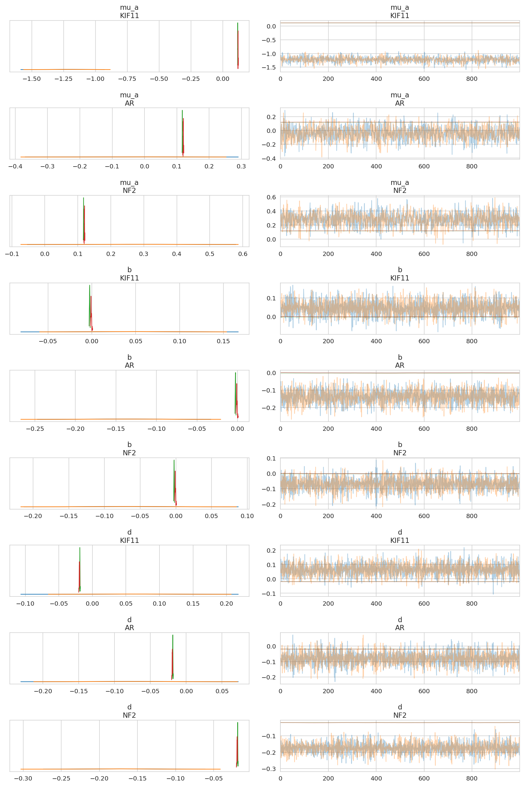


```python
sgrnas_sample = trace.posterior.coords["sgrna"].values[:5]

az.plot_trace(trace, var_names="a", coords={"sgrna": sgrnas_sample}, compact=False)
plt.tight_layout()
plt.show()
```


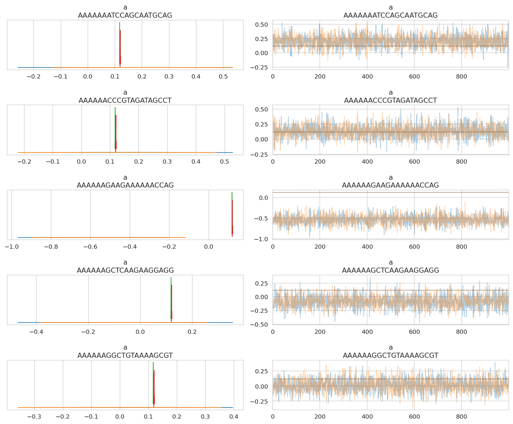


```python
example_gene = "KIF11"
example_gene_sgrna = sgrna_to_gene_map.query(f"hugo_symbol == '{example_gene}'")[
    "sgrna"
].tolist()
az.plot_forest(
    trace,
    var_names=[
        "mu_mu_a",
        "mu_a",
        "a",
        "mu_b",
        "b",
        "mu_d",
        "d",
        "mu_f",
        "f",
        "mu_h",
        "h",
    ],
    coords={"gene": [example_gene], "sgrna": example_gene_sgrna},
    combined=False,
    figsize=(6, 7),
)
plt.show()
```


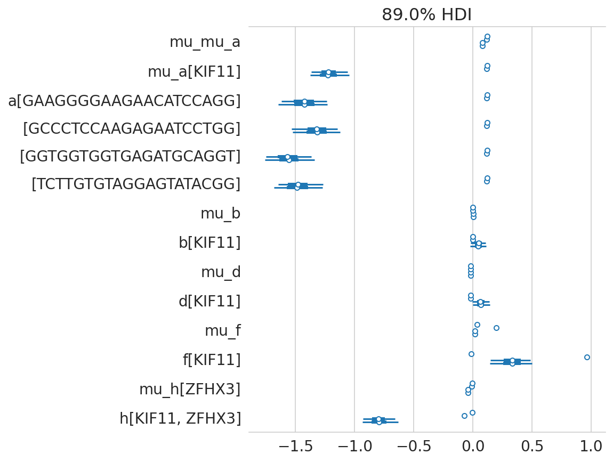


```python
prostate_post_summary.filter_string("var_name", "^sigma_*")
```


<div>
<style scoped>
    .dataframe tbody tr th:only-of-type {
        vertical-align: middle;
    }

    .dataframe tbody tr th {
        vertical-align: top;
    }

    .dataframe thead th {
        text-align: right;
    }
</style>
<table border="1" class="dataframe">
  <thead>
    <tr style="text-align: right;">
      <th></th>
      <th>parameter</th>
      <th>mean</th>
      <th>sd</th>
      <th>hdi_5.5%</th>
      <th>hdi_94.5%</th>
      <th>mcse_mean</th>
      <th>mcse_sd</th>
      <th>ess_bulk</th>
      <th>ess_tail</th>
      <th>r_hat</th>
      <th>var_name</th>
    </tr>
  </thead>
  <tbody>
    <tr>
      <th>5</th>
      <td>sigma_a</td>
      <td>0.106</td>
      <td>0.106</td>
      <td>0.000</td>
      <td>0.212</td>
      <td>0.053</td>
      <td>0.040</td>
      <td>5.0</td>
      <td>16.0</td>
      <td>2.23</td>
      <td>sigma_a</td>
    </tr>
    <tr>
      <th>7</th>
      <td>sigma_mu_a</td>
      <td>0.118</td>
      <td>0.118</td>
      <td>0.000</td>
      <td>0.237</td>
      <td>0.059</td>
      <td>0.045</td>
      <td>5.0</td>
      <td>20.0</td>
      <td>2.23</td>
      <td>sigma_mu_a</td>
    </tr>
    <tr>
      <th>8</th>
      <td>sigma_b</td>
      <td>0.029</td>
      <td>0.029</td>
      <td>0.000</td>
      <td>0.058</td>
      <td>0.014</td>
      <td>0.011</td>
      <td>5.0</td>
      <td>32.0</td>
      <td>2.10</td>
      <td>sigma_b</td>
    </tr>
    <tr>
      <th>9</th>
      <td>sigma_d</td>
      <td>0.025</td>
      <td>0.025</td>
      <td>0.000</td>
      <td>0.051</td>
      <td>0.013</td>
      <td>0.010</td>
      <td>6.0</td>
      <td>51.0</td>
      <td>1.75</td>
      <td>sigma_d</td>
    </tr>
    <tr>
      <th>10</th>
      <td>sigma_f</td>
      <td>0.303</td>
      <td>0.325</td>
      <td>0.086</td>
      <td>0.865</td>
      <td>0.162</td>
      <td>0.124</td>
      <td>5.0</td>
      <td>11.0</td>
      <td>2.74</td>
      <td>sigma_f</td>
    </tr>
    <tr>
      <th>11</th>
      <td>sigma_h[0]</td>
      <td>0.099</td>
      <td>0.066</td>
      <td>0.007</td>
      <td>0.163</td>
      <td>0.033</td>
      <td>0.025</td>
      <td>5.0</td>
      <td>11.0</td>
      <td>2.74</td>
      <td>sigma_h</td>
    </tr>
  </tbody>
</table>
</div>


```python
eg_gene = trace.posterior.coords["gene"].values[0]

for gene in [eg_gene, "KIF11"]:
    axes = az.plot_pair(
        trace,
        var_names=["mu_a", "b", "d"],
        coords={"gene": [gene]},
        figsize=(7, 7),
        scatter_kwargs={"alpha": 0.2},
    )
    for ax in axes.flatten():
        ax.axhline(0, color="k")
        ax.axvline(0, color="k")
    plt.tight_layout()
    plt.show()
```


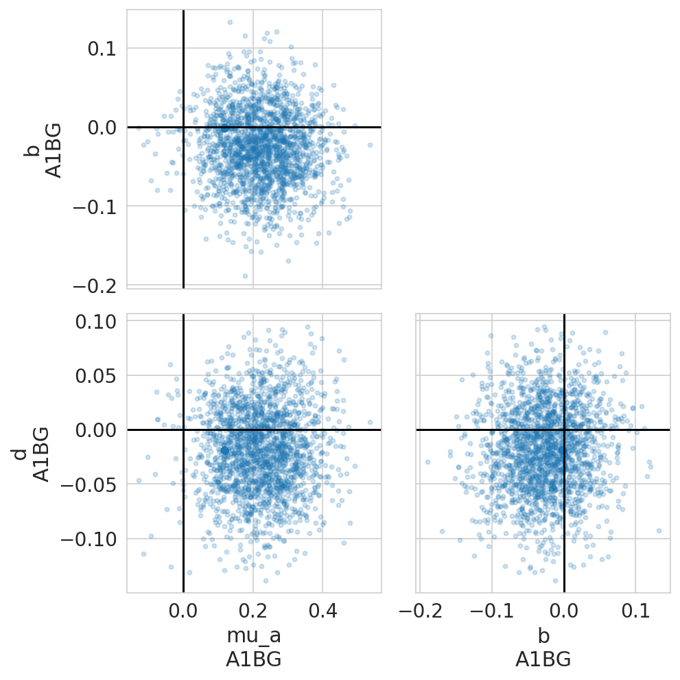


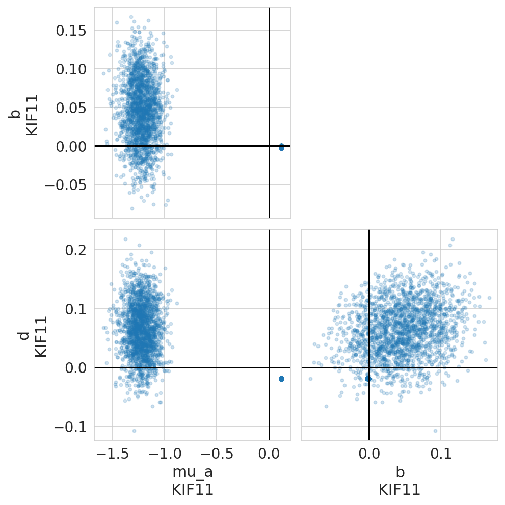


```python
def _get_average_per_chain(trace: az.InferenceData, var_name: str) -> pd.DataFrame:
    return (
        trace.posterior[var_name]
        .mean(axis=(1))
        .to_dataframe()
        .reset_index()
        .astype({"chain": str})
    )


mu_a_post_avg = _get_average_per_chain(trace, "mu_a")
b_post_avg = _get_average_per_chain(trace, "b")
d_post_avg = _get_average_per_chain(trace, "d")

gene_post_avg = mu_a_post_avg.merge(b_post_avg, on=["chain", "gene"]).merge(
    d_post_avg, on=["chain", "gene"]
)


fig, axes = plt.subplots(1, 2, squeeze=True, figsize=(7, 3.5))

ax = axes[0]
sns.scatterplot(
    data=gene_post_avg,
    x="mu_a",
    y="b",
    hue="chain",
    alpha=0.1,
    edgecolor=None,
    s=5,
    ax=ax,
)
ax.set_xlabel(r"$\mu_a$")
ax.set_ylabel(r"$b$")


ax = axes[1]
sns.scatterplot(
    data=gene_post_avg,
    x="b",
    y="d",
    hue="chain",
    alpha=0.1,
    edgecolor=None,
    s=5,
    ax=ax,
)
ax.set_xlabel(r"$b$")
ax.set_ylabel(r"$d$")

for ax in axes.flatten():
    ax.axhline(color="k")
    ax.axvline(color="k")
    ax.get_legend().remove()


fig.tight_layout()
fig.suptitle("Joint posterior distribution", va="bottom")

plt.show()
```


```python
genes_var_names = ["mu_a", "b", "d", "f"]
genes_var_names += [f"h[{g}]" for g in trace.posterior.coords["cancer_gene"].values]
gene_corr_post = (
    az.summary(trace, "genes_chol_cov_corr", kind="stats")
    .pipe(extract_coords_param_names, names=["d1", "d2"])
    .astype({"d1": int, "d2": int})
    .assign(
        p1=lambda d: [genes_var_names[i] for i in d["d1"]],
        p2=lambda d: [genes_var_names[i] for i in d["d2"]],
    )
    .assign(
        p1=lambda d: pd.Categorical(d["p1"], categories=d["p1"].unique(), ordered=True)
    )
    .assign(
        p2=lambda d: pd.Categorical(
            d["p2"], categories=d["p1"].cat.categories, ordered=True
        )
    )
)
gene_corr_post
```


<div>
<style scoped>
    .dataframe tbody tr th:only-of-type {
        vertical-align: middle;
    }

    .dataframe tbody tr th {
        vertical-align: top;
    }

    .dataframe thead th {
        text-align: right;
    }
</style>
<table border="1" class="dataframe">
  <thead>
    <tr style="text-align: right;">
      <th></th>
      <th>mean</th>
      <th>sd</th>
      <th>hdi_5.5%</th>
      <th>hdi_94.5%</th>
      <th>d1</th>
      <th>d2</th>
      <th>p1</th>
      <th>p2</th>
    </tr>
  </thead>
  <tbody>
    <tr>
      <th>genes_chol_cov_corr[0, 0]</th>
      <td>1.000</td>
      <td>0.000</td>
      <td>1.000</td>
      <td>1.000</td>
      <td>0</td>
      <td>0</td>
      <td>mu_a</td>
      <td>mu_a</td>
    </tr>
    <tr>
      <th>genes_chol_cov_corr[0, 1]</th>
      <td>-0.194</td>
      <td>0.325</td>
      <td>-0.487</td>
      <td>0.474</td>
      <td>0</td>
      <td>1</td>
      <td>mu_a</td>
      <td>b</td>
    </tr>
    <tr>
      <th>genes_chol_cov_corr[0, 2]</th>
      <td>0.051</td>
      <td>0.271</td>
      <td>-0.506</td>
      <td>0.457</td>
      <td>0</td>
      <td>2</td>
      <td>mu_a</td>
      <td>d</td>
    </tr>
    <tr>
      <th>genes_chol_cov_corr[0, 3]</th>
      <td>-0.594</td>
      <td>0.139</td>
      <td>-0.812</td>
      <td>-0.449</td>
      <td>0</td>
      <td>3</td>
      <td>mu_a</td>
      <td>f</td>
    </tr>
    <tr>
      <th>genes_chol_cov_corr[0, 4]</th>
      <td>0.563</td>
      <td>0.295</td>
      <td>0.150</td>
      <td>0.864</td>
      <td>0</td>
      <td>4</td>
      <td>mu_a</td>
      <td>h[ZFHX3]</td>
    </tr>
    <tr>
      <th>genes_chol_cov_corr[1, 0]</th>
      <td>-0.194</td>
      <td>0.325</td>
      <td>-0.487</td>
      <td>0.474</td>
      <td>1</td>
      <td>0</td>
      <td>b</td>
      <td>mu_a</td>
    </tr>
    <tr>
      <th>genes_chol_cov_corr[1, 1]</th>
      <td>1.000</td>
      <td>0.000</td>
      <td>1.000</td>
      <td>1.000</td>
      <td>1</td>
      <td>1</td>
      <td>b</td>
      <td>b</td>
    </tr>
    <tr>
      <th>genes_chol_cov_corr[1, 2]</th>
      <td>-0.007</td>
      <td>0.268</td>
      <td>-0.535</td>
      <td>0.437</td>
      <td>1</td>
      <td>2</td>
      <td>b</td>
      <td>d</td>
    </tr>
    <tr>
      <th>genes_chol_cov_corr[1, 3]</th>
      <td>0.434</td>
      <td>0.207</td>
      <td>0.212</td>
      <td>0.834</td>
      <td>1</td>
      <td>3</td>
      <td>b</td>
      <td>f</td>
    </tr>
    <tr>
      <th>genes_chol_cov_corr[1, 4]</th>
      <td>-0.562</td>
      <td>0.171</td>
      <td>-0.935</td>
      <td>-0.374</td>
      <td>1</td>
      <td>4</td>
      <td>b</td>
      <td>h[ZFHX3]</td>
    </tr>
    <tr>
      <th>genes_chol_cov_corr[2, 0]</th>
      <td>0.051</td>
      <td>0.271</td>
      <td>-0.506</td>
      <td>0.457</td>
      <td>2</td>
      <td>0</td>
      <td>d</td>
      <td>mu_a</td>
    </tr>
    <tr>
      <th>genes_chol_cov_corr[2, 1]</th>
      <td>-0.007</td>
      <td>0.268</td>
      <td>-0.535</td>
      <td>0.437</td>
      <td>2</td>
      <td>1</td>
      <td>d</td>
      <td>b</td>
    </tr>
    <tr>
      <th>genes_chol_cov_corr[2, 2]</th>
      <td>1.000</td>
      <td>0.000</td>
      <td>1.000</td>
      <td>1.000</td>
      <td>2</td>
      <td>2</td>
      <td>d</td>
      <td>d</td>
    </tr>
    <tr>
      <th>genes_chol_cov_corr[2, 3]</th>
      <td>-0.222</td>
      <td>0.285</td>
      <td>-0.866</td>
      <td>0.054</td>
      <td>2</td>
      <td>3</td>
      <td>d</td>
      <td>f</td>
    </tr>
    <tr>
      <th>genes_chol_cov_corr[2, 4]</th>
      <td>0.281</td>
      <td>0.323</td>
      <td>0.065</td>
      <td>0.967</td>
      <td>2</td>
      <td>4</td>
      <td>d</td>
      <td>h[ZFHX3]</td>
    </tr>
    <tr>
      <th>genes_chol_cov_corr[3, 0]</th>
      <td>-0.594</td>
      <td>0.139</td>
      <td>-0.812</td>
      <td>-0.449</td>
      <td>3</td>
      <td>0</td>
      <td>f</td>
      <td>mu_a</td>
    </tr>
    <tr>
      <th>genes_chol_cov_corr[3, 1]</th>
      <td>0.434</td>
      <td>0.207</td>
      <td>0.212</td>
      <td>0.834</td>
      <td>3</td>
      <td>1</td>
      <td>f</td>
      <td>b</td>
    </tr>
    <tr>
      <th>genes_chol_cov_corr[3, 2]</th>
      <td>-0.222</td>
      <td>0.285</td>
      <td>-0.866</td>
      <td>0.054</td>
      <td>3</td>
      <td>2</td>
      <td>f</td>
      <td>d</td>
    </tr>
    <tr>
      <th>genes_chol_cov_corr[3, 3]</th>
      <td>1.000</td>
      <td>0.000</td>
      <td>1.000</td>
      <td>1.000</td>
      <td>3</td>
      <td>3</td>
      <td>f</td>
      <td>f</td>
    </tr>
    <tr>
      <th>genes_chol_cov_corr[3, 4]</th>
      <td>-0.743</td>
      <td>0.084</td>
      <td>-0.859</td>
      <td>-0.638</td>
      <td>3</td>
      <td>4</td>
      <td>f</td>
      <td>h[ZFHX3]</td>
    </tr>
    <tr>
      <th>genes_chol_cov_corr[4, 0]</th>
      <td>0.563</td>
      <td>0.295</td>
      <td>0.150</td>
      <td>0.864</td>
      <td>4</td>
      <td>0</td>
      <td>h[ZFHX3]</td>
      <td>mu_a</td>
    </tr>
    <tr>
      <th>genes_chol_cov_corr[4, 1]</th>
      <td>-0.562</td>
      <td>0.171</td>
      <td>-0.935</td>
      <td>-0.374</td>
      <td>4</td>
      <td>1</td>
      <td>h[ZFHX3]</td>
      <td>b</td>
    </tr>
    <tr>
      <th>genes_chol_cov_corr[4, 2]</th>
      <td>0.281</td>
      <td>0.323</td>
      <td>0.065</td>
      <td>0.967</td>
      <td>4</td>
      <td>2</td>
      <td>h[ZFHX3]</td>
      <td>d</td>
    </tr>
    <tr>
      <th>genes_chol_cov_corr[4, 3]</th>
      <td>-0.743</td>
      <td>0.084</td>
      <td>-0.859</td>
      <td>-0.638</td>
      <td>4</td>
      <td>3</td>
      <td>h[ZFHX3]</td>
      <td>f</td>
    </tr>
    <tr>
      <th>genes_chol_cov_corr[4, 4]</th>
      <td>1.000</td>
      <td>0.000</td>
      <td>1.000</td>
      <td>1.000</td>
      <td>4</td>
      <td>4</td>
      <td>h[ZFHX3]</td>
      <td>h[ZFHX3]</td>
    </tr>
  </tbody>
</table>
</div>


```python
plot_df = gene_corr_post.pivot_wider("p1", "p2", "mean").set_index("p1")
sns.heatmap(plot_df, cmap="coolwarm", vmin=-1, vmax=1)
plt.show()
```


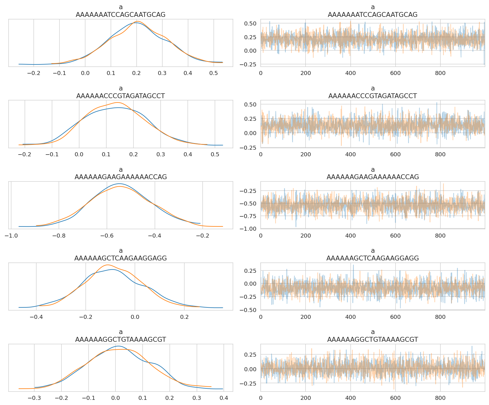


```python
n_examples = 40
n_chains, n_draws, n_data = trace.posterior_predictive["ct_final"].shape
ex_draws_idx = np.random.choice(
    np.arange(n_draws), size=n_examples // n_chains, replace=False
)
example_ppc_draws = trace.posterior_predictive["ct_final"][
    :, ex_draws_idx, :
].values.reshape(-1, n_data)
example_ppc_draws.shape
```


    (40, 355308)


```python
fig, axes = plt.subplots(ncols=2, figsize=(9, 4), sharex=False, sharey=False)
ax1 = axes[0]
ax2 = axes[1]

pp_avg = trace.posterior_predictive["ct_final"].mean(axis=(0, 1))

for i in range(example_ppc_draws.shape[0]):
    sns.kdeplot(
        x=np.log10(example_ppc_draws[i, :] + 1), alpha=0.2, color="tab:blue", ax=ax1
    )

sns.kdeplot(x=np.log10(pp_avg + 1), color="tab:orange", ax=ax1)
sns.kdeplot(x=np.log10(valid_prostate_data["counts_final"] + 1), color="k", ax=ax1)
ax1.set_xlabel("log10(counts final + 1)")
ax1.set_ylabel("density")


for i in range(example_ppc_draws.shape[0]):
    sns.kdeplot(x=example_ppc_draws[i, :], alpha=0.2, color="tab:blue", ax=ax2)

sns.kdeplot(x=pp_avg, color="tab:orange", ax=ax2)
sns.kdeplot(x=valid_prostate_data["counts_final"], color="k", ax=ax2)
ax2.set_xlabel("counts final")
ax2.set_ylabel("density")
ax2.set_xlim(0, 1000)

fig.suptitle("PPC")
fig.tight_layout()
plt.show()
```


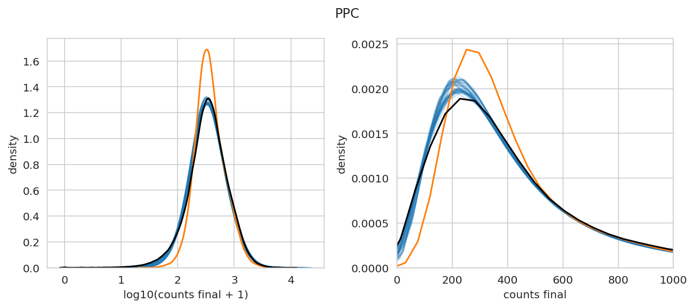


---

## Session info


```python
notebook_toc = time()
print(f"execution time: {(notebook_toc - notebook_tic) / 60:.2f} minutes")
```

    execution time: 5.68 minutes


```python
%load_ext watermark
%watermark -d -u -v -iv -b -h -m
```

    Last updated: 2022-07-26

    Python implementation: CPython
    Python version       : 3.10.5
    IPython version      : 8.4.0

    Compiler    : GCC 10.3.0
    OS          : Linux
    Release     : 3.10.0-1160.45.1.el7.x86_64
    Machine     : x86_64
    Processor   : x86_64
    CPU cores   : 28
    Architecture: 64bit

    Hostname: compute-e-16-233.o2.rc.hms.harvard.edu

    Git branch: simplify

    pandas    : 1.4.3
    qnorm     : 0.8.1
    seaborn   : 0.11.2
    matplotlib: 3.5.2
    arviz     : 0.12.1
    numpy     : 1.22.4
