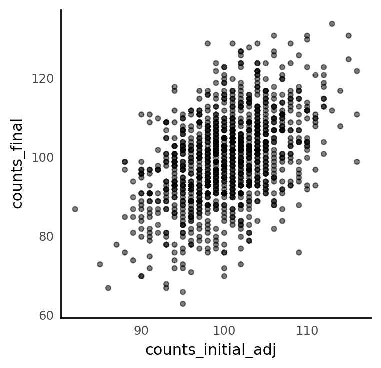
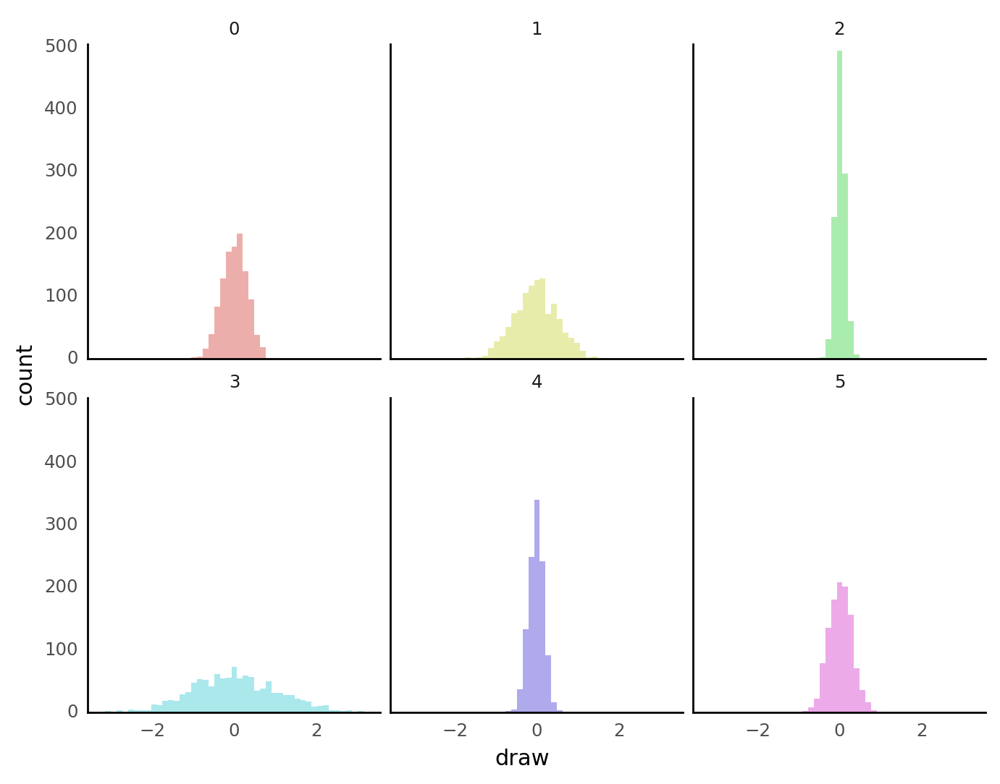

```python
%load_ext autoreload
%autoreload 2
```

```python
import logging
import warnings
from time import time

import arviz as az
import janitor
import matplotlib.pyplot as plt
import numpy as np
import pandas as pd
import plotnine as gg
import pymc3 as pm
import seaborn as sns
```

```python
from src.io.cache_io import temp_dir
from src.loggers import set_console_handler_level
from src.models.speclet_nine import SpecletNine
from src.plot.plotnine_helpers import set_gg_theme
```

```python
notebook_tic = time()

warnings.simplefilter(action="ignore", category=UserWarning)
set_console_handler_level(logging.WARNING)

set_gg_theme()
%config InlineBackend.figure_format = "retina"

RANDOM_SEED = 847
np.random.seed(RANDOM_SEED)
# HDI_PROB = read_project_configuration().modeling.highest_density_interval
```

```python
sp9 = SpecletNine("test-model", root_cache_dir=temp_dir())
```

```python
data = sp9.data_manager.get_data()
ct_i = np.abs(np.random.normal(loc=100, scale=5, size=data.shape[0])) + 1
# ct_i = np.ones(data.shape[0])
ct_f = np.abs(ct_i + np.random.normal(loc=0, scale=10, size=data.shape[0]))
data["counts_initial_adj"] = ct_i.astype(np.int64)
data["counts_final"] = ct_f.astype(np.int64)
sp9.data_manager.set_data(data, apply_transformations=False)
```

<pre style="white-space:pre;overflow-x:auto;line-height:normal;font-family:Menlo,'DejaVu Sans Mono',consolas,'Courier New',monospace"><span style="color: #7fbfbf; text-decoration-color: #7fbfbf">[11/05/21 08:23:25] </span><span style="color: #800000; text-decoration-color: #800000">WARNING </span> Dropping <span style="color: #008080; text-decoration-color: #008080; font-weight: bold">0</span> sgRNA that map to multiple genes.     <a href="file:///Users/admin/Lab_Projects/speclet/src/data_processing/achilles.py"><span style="color: #7f7f7f; text-decoration-color: #7f7f7f">achilles.py</span></a><span style="color: #7f7f7f; text-decoration-color: #7f7f7f">:616</span>
</pre>

```python
(
    gg.ggplot(data, gg.aes(x="counts_initial_adj", y="counts_final"))
    + gg.geom_point(alpha=0.5)
)
```



    <ggplot: (346250162)>

```python
sp9.build_model()
```

```python
assert sp9.model is not None
with sp9.model:
    sp9_prior_pred = pm.sample_prior_predictive(random_seed=1234)
```

```python
def plot_prior_pred(prior_samples: np.ndarray, scales: str = "fixed") -> gg.ggplot:
    """Plot prior predictive samples

    Args:
        prior_samples ([type]): Prior samples array with shape [samples, draws].

    Returns:
        gg.ggplot: A nice lil' plot for you and your buds.
    """
    prior_pred_df = (
        pd.DataFrame(prior_samples.T)
        .pivot_longer(names_to="prior_pred_sample", values_to="draw")
        .astype({"prior_pred_sample": "str"})
    )
    return (
        gg.ggplot(prior_pred_df, gg.aes(x="draw", fill="prior_pred_sample"))
        + gg.facet_wrap("prior_pred_sample", scales=scales)
        + gg.geom_histogram(bins=50, alpha=0.5, position="identity")
        + gg.scale_x_continuous(expand=(0, 0, 0.02, 0))
        + gg.scale_y_continuous(expand=(0, 0, 0.02, 0))
        + gg.theme(figure_size=(8, 6), legend_position="none")
    )
```

```python
plot_prior_pred(sp9_prior_pred["beta"][:6, :, :].reshape(6, -1))
```



    <ggplot: (353513698)>

```python
sns.displot(sp9_prior_pred["alpha"], kind="hist")
plt.show()
```


```python
plot_prior_pred(sp9_prior_pred["eta"][:6, :])
```


    <ggplot: (353749526)>

```python
plot_prior_pred(sp9_prior_pred["mu"][:6, :], scales="free")
```


    <ggplot: (353743379)>

```python
(plot_prior_pred(sp9_prior_pred["y"][:6, :], scales="free"))
```


    <ggplot: (354132146)>

```python
sp9_prior_pred["alpha"][:6]
```

    array([0.6907363 , 1.04467459, 0.00184826, 0.42503755, 0.54317984,
           0.01076485])

```python
sp9_prior_pred["mu"].mean(axis=1)[:6]
```

    array([1.05694165, 1.12386565, 1.02394244, 1.81139972, 0.99649316,
           1.06040632])

```python

```

---

```python
notebook_toc = time()
print(f"execution time: {(notebook_toc - notebook_tic) / 60:.2f} minutes")
```

    execution time: 1.33 minutes

```python
%load_ext watermark
%watermark -d -u -v -iv -b -h -m
```

    Last updated: 2021-11-05

    Python implementation: CPython
    Python version       : 3.9.6
    IPython version      : 7.26.0

    Compiler    : Clang 11.1.0
    OS          : Darwin
    Release     : 20.6.0
    Machine     : x86_64
    Processor   : i386
    CPU cores   : 4
    Architecture: 64bit

    Hostname: JHCookMac.local

    Git branch: sp9

    pandas    : 1.3.2
    janitor   : 0.21.0
    pymc3     : 3.11.2
    matplotlib: 3.4.3
    plotnine  : 0.8.0
    sys       : 3.9.6 | packaged by conda-forge | (default, Jul 11 2021, 03:36:15)
    [Clang 11.1.0 ]
    logging   : 0.5.1.2
    seaborn   : 0.11.2
    numpy     : 1.21.2
    arviz     : 0.11.2
