# Experimenting with SpecletNine

```python
%load_ext autoreload
%autoreload 2
```

```python
import logging
import warnings
from time import time
from typing import Any, Callable, Optional

import arviz as az
import janitor
import matplotlib.pyplot as plt
import numpy as np
import pandas as pd
import plotnine as gg
import pymc3 as pm
import seaborn as sns
```

```python
from src.analysis import pymc3_analysis as pmanal
from src.io.cache_io import temp_dir
from src.loggers import set_console_handler_level
from src.models.speclet_nine import (
    SpecletNine,
    SpecletNineConfiguration,
    make_speclet_nine_priors_config,
)
from src.plot.plotnine_helpers import set_gg_theme
from src.project_config import read_project_configuration
```

```python
notebook_tic = time()

warnings.simplefilter(action="ignore", category=UserWarning)
set_console_handler_level(logging.WARNING)

set_gg_theme()
%config InlineBackend.figure_format = "retina"

RANDOM_SEED = 847
np.random.seed(RANDOM_SEED)
HDI_PROB = read_project_configuration().modeling.highest_density_interval
```

```python
with pm.Model():
    x = pm.Gamma(name="x", alpha=1, beta=5).random(size=1000)

sns.displot(x=x, kind="hist", kde=True)
```

    <seaborn.axisgrid.FacetGrid at 0x10c068a30>


```python
# config = make_speclet_nine_priors_config(
#     mu_mu_beta_mu=0.0,
#     mu_mu_beta_sigma=1.0,
#     sigma_mu_beta_sigma=1.0,
#     sigma_beta_alpha=1.0,
#     sigma_beta_beta=5.0,
#     alpha_alpha=2.0,
#     alpha_beta=0.3,
# )
config = SpecletNineConfiguration()
sp9 = SpecletNine("sp9-expr", root_cache_dir=temp_dir(), config=config)
# sp9 = SpecletNine("sp9-expr", root_cache_dir=temp_dir())
sp9.build_model()
```

<pre style="white-space:pre;overflow-x:auto;line-height:normal;font-family:Menlo,'DejaVu Sans Mono',consolas,'Courier New',monospace"><span style="color: #7fbfbf; text-decoration-color: #7fbfbf">[11/05/21 15:19:13] </span><span style="color: #800000; text-decoration-color: #800000">WARNING </span> Dropping <span style="color: #008080; text-decoration-color: #008080; font-weight: bold">0</span> sgRNA that map to multiple genes.     <a href="file:///Users/admin/Lab_Projects/speclet/src/data_processing/achilles.py"><span style="color: #7f7f7f; text-decoration-color: #7f7f7f">achilles.py</span></a><span style="color: #7f7f7f; text-decoration-color: #7f7f7f">:616</span>
</pre>

```python
data = sp9.data_manager.get_data()
# ct_i = np.abs(np.random.normal(loc=100, scale=5, size=data.shape[0])) + 1
# # ct_i = np.ones(data.shape[0])
# ct_f = np.abs(ct_i + np.random.normal(loc=0, scale=10, size=data.shape[0]))
# data["counts_initial_adj"] = ct_i.astype(np.int64)
# data["counts_final"] = ct_f.astype(np.int64)
# sp9.data_manager.set_data(data, apply_transformations=False)
```

```python
(
    gg.ggplot(
        data.astype({"counts_initial_adj": float, "counts_final": float}),
        gg.aes(x="counts_initial_adj", y="counts_final"),
    )
    + gg.geom_point(alpha=0.5)
)
```

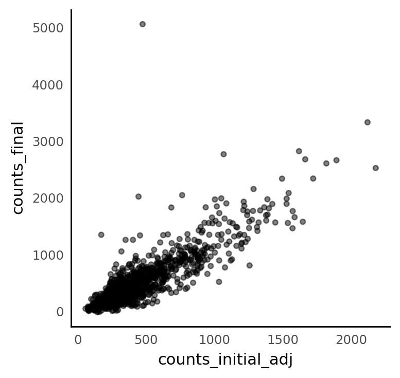

    <ggplot: (352020703)>

```python
assert sp9.model is not None
with sp9.model:
    sp9_prior_pred = pm.sample_prior_predictive(random_seed=1234)
```

```python
def plot_prior_pred(prior_samples: np.ndarray, scales: str = "fixed") -> gg.ggplot:
    """Plot prior predictive samples

    Args:
        prior_samples ([type]): Prior samples array with shape [samples, draws].

    Returns:
        gg.ggplot: A nice lil' plot for you and your buds.
    """
    prior_pred_df = (
        pd.DataFrame(prior_samples.T)
        .pivot_longer(names_to="prior_pred_sample", values_to="draw")
        .astype({"prior_pred_sample": "str"})
    )
    return (
        gg.ggplot(prior_pred_df, gg.aes(x="draw", fill="prior_pred_sample"))
        + gg.facet_wrap("prior_pred_sample", scales=scales)
        + gg.geom_histogram(bins=50, alpha=0.5, position="identity")
        + gg.scale_x_continuous(expand=(0, 0, 0.02, 0))
        + gg.scale_y_continuous(expand=(0, 0, 0.02, 0))
        + gg.theme(figure_size=(8, 6), legend_position="none")
    )
```

```python
# plot_prior_pred(sp9_prior_pred["mu_beta"][:6, :, :].reshape(6, -1))
sns.displot(sp9_prior_pred["mu_beta"], kind="hist")
plt.show()
```

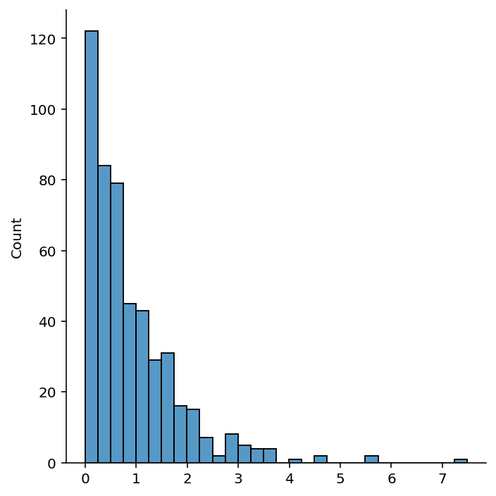

```python
sns.displot(sp9_prior_pred["sigma_beta"], kind="hist")
plt.show()
# plot_prior_pred(sp9_prior_pred["sigma_beta"][:6, :, :].reshape(6, -1))
```

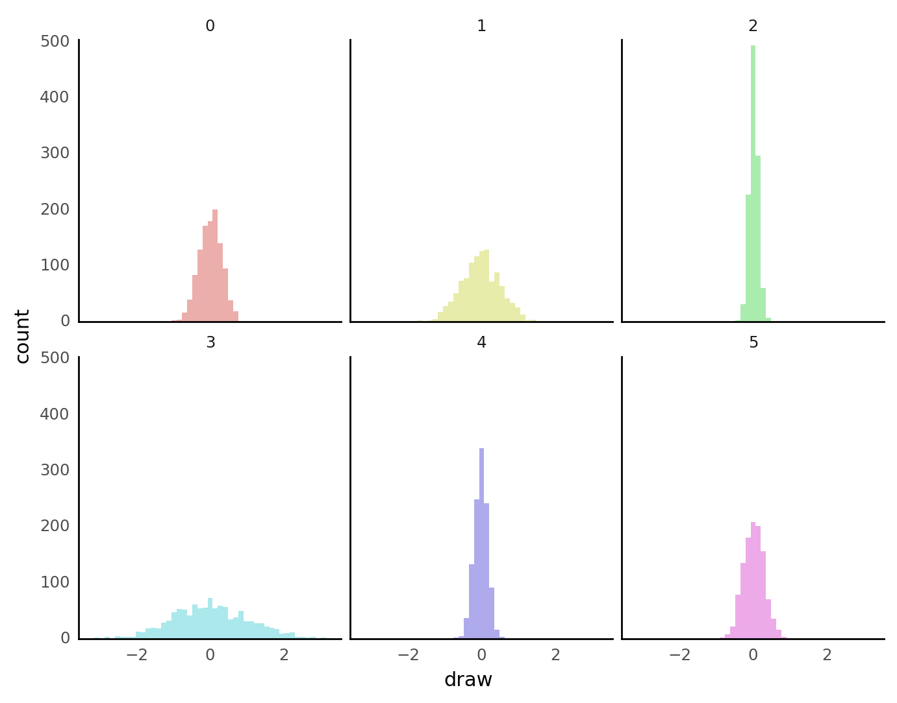

```python
plot_prior_pred(sp9_prior_pred["beta"][:6, :, :].reshape(6, -1))
```

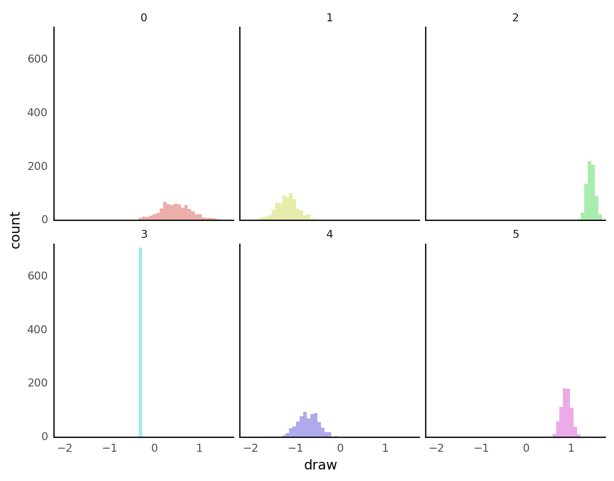

    <ggplot: (360590870)>

```python
sns.displot(sp9_prior_pred["alpha"], kind="hist")
plt.show()
```

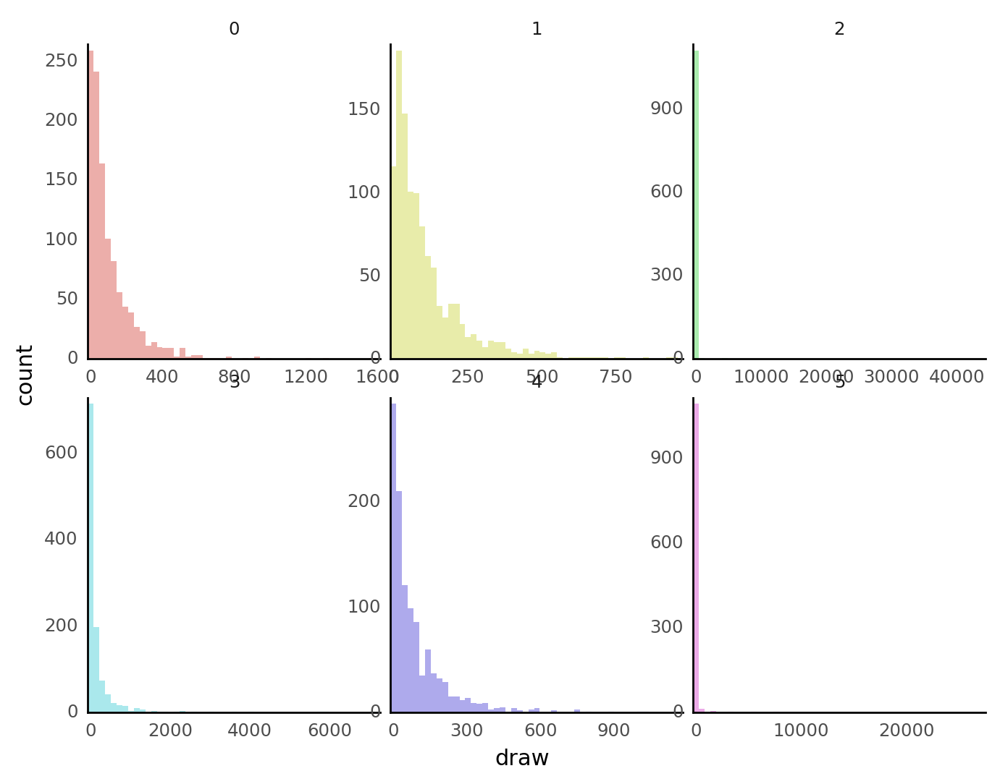

```python
plot_prior_pred(sp9_prior_pred["mu"][:6, :], scales="free")
```

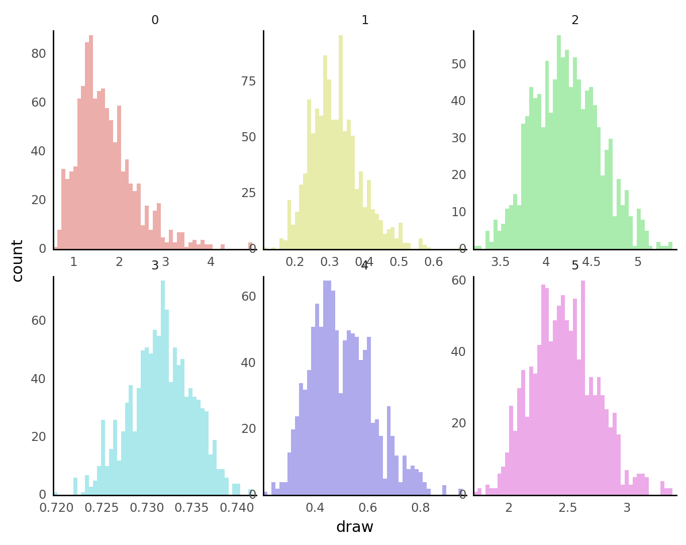

    <ggplot: (360584982)>

```python
(plot_prior_pred(sp9_prior_pred["y"][:6, :], scales="free"))
```


    <ggplot: (360536706)>

```python
sp9_prior_pred["alpha"][:6]
```

    array([2.95011125, 8.33274786, 1.83625035, 1.36666275, 3.05455894,
           5.08640347])

```python
sp9_prior_pred["mu"].mean(axis=1)[:6]
```

    array([1.71795409, 0.31735273, 4.22479929, 0.73161481, 0.50172579,
           2.46702875])

```python
for i in range(5):
    y_prior_pred = (
        data.copy()
        .assign(prior_pred=sp9_prior_pred["y"][i, :])
        .astype({"counts_final": int})
    )
    print(
        gg.ggplot(y_prior_pred, gg.aes(x="counts_final", y="prior_pred"))
        + gg.geom_point(alpha=0.5)
        + gg.geom_density_2d(color="blue")
        + gg.scale_x_sqrt(expand=(0, 0, 0.02, 0))
        + gg.scale_y_sqrt(expand=(0, 0, 0.02, 0))
    )
```

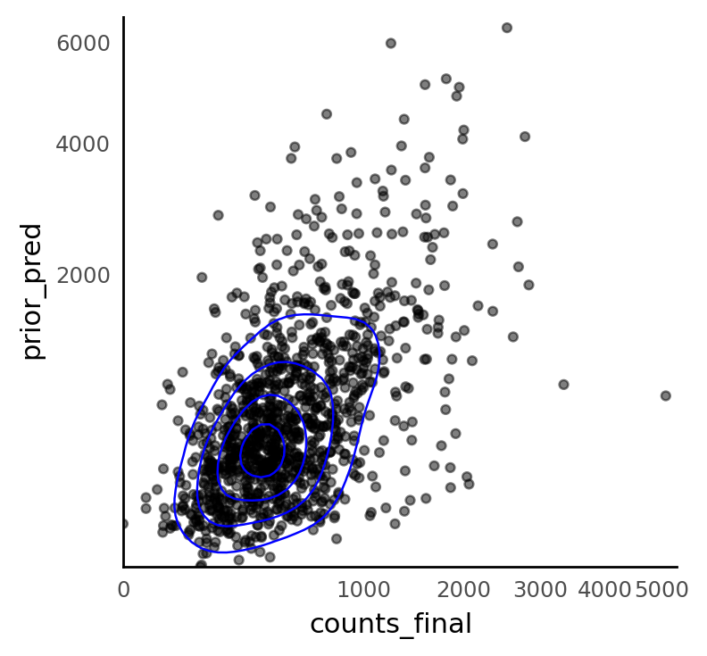

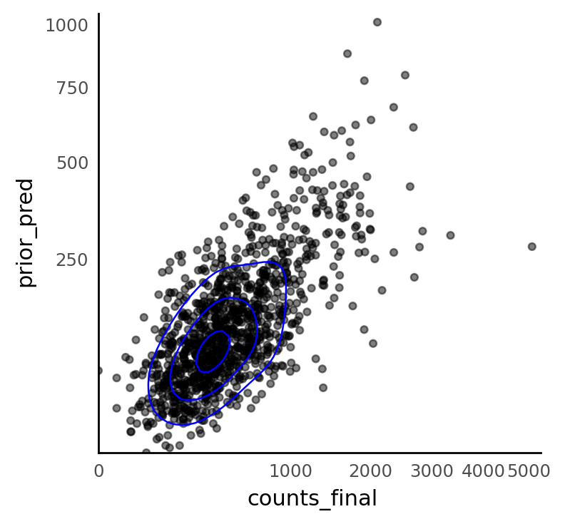

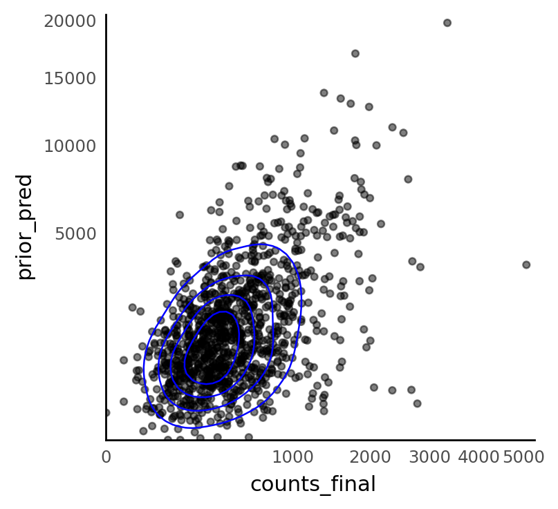

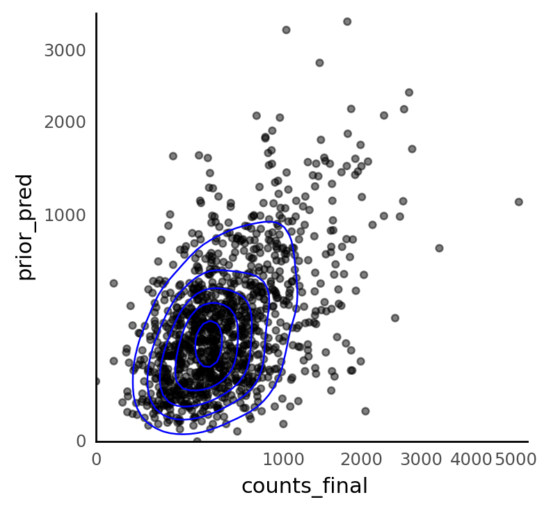

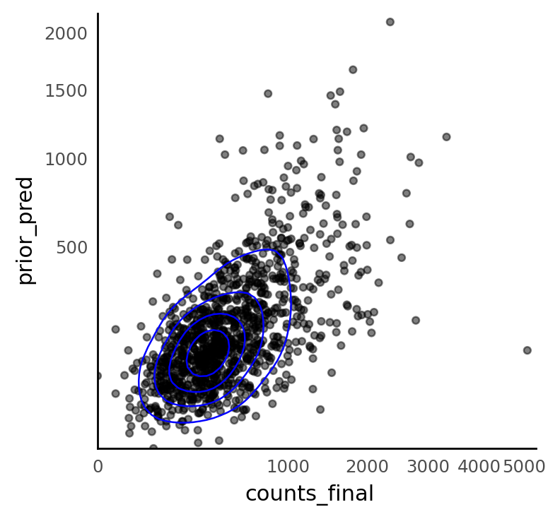

```python
def plot_prior_summary(
    prior_pred: np.ndarray, real_values: pd.Series, fxn: Callable
) -> gg.ggplot:
    prior_pred_means = fxn(prior_pred, axis=1)

    return (
        gg.ggplot(pd.DataFrame({"x": prior_pred_means}), gg.aes(x="x"))
        + gg.geom_histogram(bins=30)
        + gg.geom_vline(xintercept=fxn(real_values), color="blue")
        + gg.scale_x_log10(expand=(0, 0, 0.02, 0))
        + gg.scale_y_continuous(expand=(0, 0, 0.02, 0))
    )
```

```python
def min_p1(*args: Any, **kwargs: dict[str, Any]) -> Any:
    return np.min(*args, **kwargs) + 1


summary_stats: dict[str, Callable] = {
    "mean": np.mean,
    "variance": np.var,
    "minimum (+1)": min_p1,
    "maximum": np.max,
}

for name, fxn in summary_stats.items():
    p = plot_prior_summary(sp9_prior_pred["y"], data.counts_final, fxn) + gg.labs(
        x=f"{name} (log10)"
    )
    print(p)
```

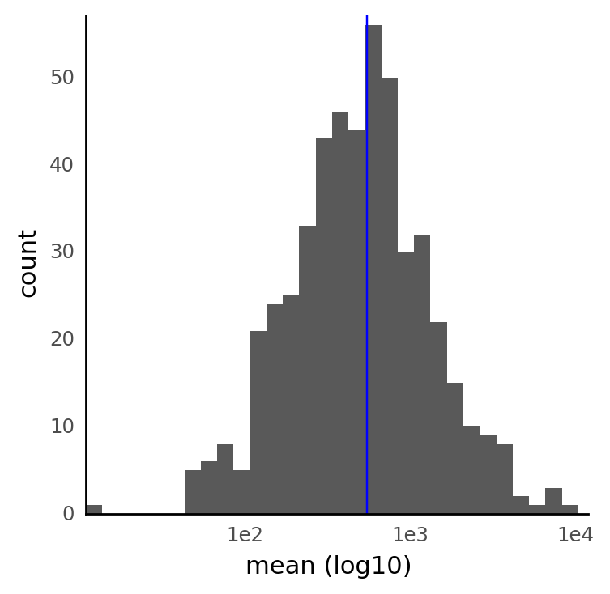

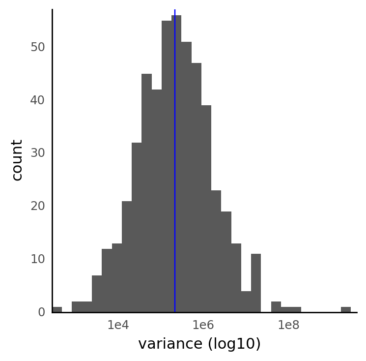

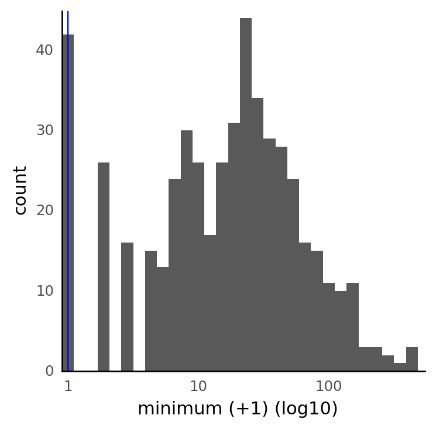

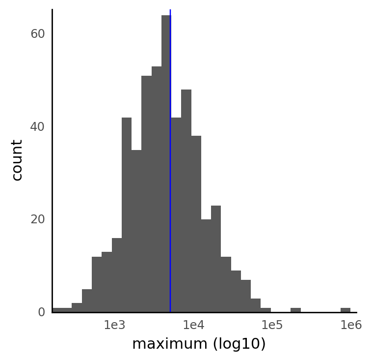

---

```python
sp9_mcmc = sp9.mcmc_sample_model(random_seed=RANDOM_SEED, ignore_cache=False)
```

```python
sp9_var_names = [
    "mu_beta",
    "sigma_beta",
    "beta",
    "alpha",
]
```

```python
az.plot_trace(sp9_mcmc, var_names=sp9_var_names)
plt.show()
```

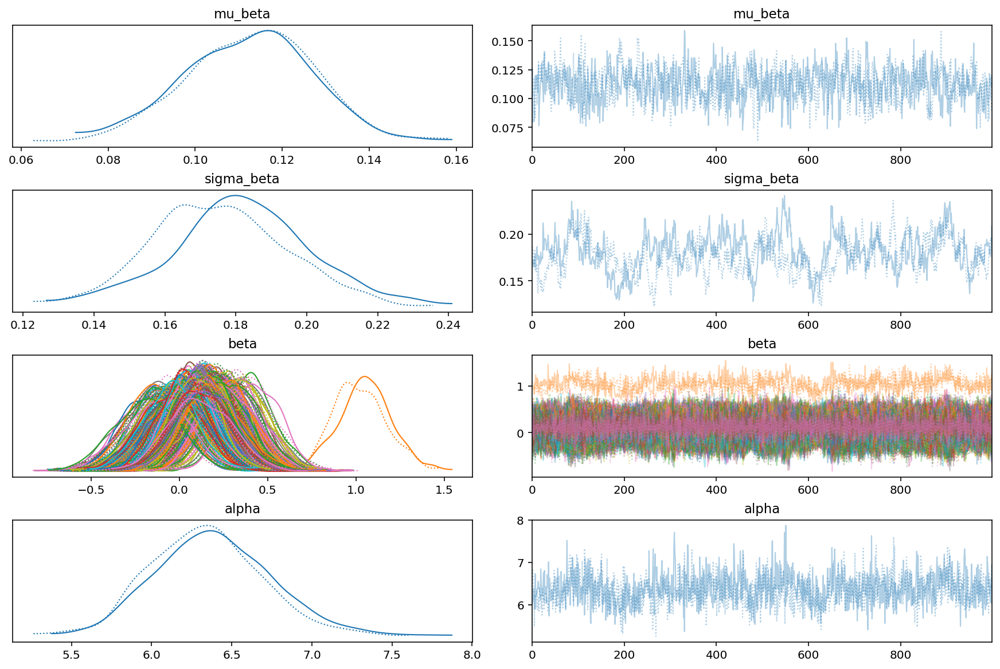

```python
(
    az.summary(sp9_mcmc, var_names=sp9_var_names, hdi_prob=HDI_PROB)
    .sort_values("r_hat", ascending=False)
    .head()
)
```

<div>
<style scoped>
    .dataframe tbody tr th:only-of-type {
        vertical-align: middle;
    }

    .dataframe tbody tr th {
        vertical-align: top;
    }

    .dataframe thead th {
        text-align: right;
    }
</style>
<table border="1" class="dataframe">
  <thead>
    <tr style="text-align: right;">
      <th></th>
      <th>mean</th>
      <th>sd</th>
      <th>hdi_5.5%</th>
      <th>hdi_94.5%</th>
      <th>mcse_mean</th>
      <th>mcse_sd</th>
      <th>ess_bulk</th>
      <th>ess_tail</th>
      <th>r_hat</th>
    </tr>
  </thead>
  <tbody>
    <tr>
      <th>sigma_beta</th>
      <td>0.178</td>
      <td>0.019</td>
      <td>0.147</td>
      <td>0.209</td>
      <td>0.002</td>
      <td>0.002</td>
      <td>71.0</td>
      <td>185.0</td>
      <td>1.03</td>
    </tr>
    <tr>
      <th>beta[34,3]</th>
      <td>0.155</td>
      <td>0.151</td>
      <td>-0.077</td>
      <td>0.406</td>
      <td>0.003</td>
      <td>0.003</td>
      <td>3591.0</td>
      <td>923.0</td>
      <td>1.01</td>
    </tr>
    <tr>
      <th>beta[43,3]</th>
      <td>0.128</td>
      <td>0.139</td>
      <td>-0.096</td>
      <td>0.346</td>
      <td>0.002</td>
      <td>0.003</td>
      <td>3675.0</td>
      <td>1449.0</td>
      <td>1.01</td>
    </tr>
    <tr>
      <th>beta[11,2]</th>
      <td>0.125</td>
      <td>0.166</td>
      <td>-0.125</td>
      <td>0.406</td>
      <td>0.003</td>
      <td>0.003</td>
      <td>3163.0</td>
      <td>1247.0</td>
      <td>1.01</td>
    </tr>
    <tr>
      <th>beta[81,6]</th>
      <td>0.169</td>
      <td>0.146</td>
      <td>-0.064</td>
      <td>0.396</td>
      <td>0.002</td>
      <td>0.002</td>
      <td>4641.0</td>
      <td>1494.0</td>
      <td>1.01</td>
    </tr>
  </tbody>
</table>
</div>

```python
az.plot_autocorr(sp9_mcmc, var_names=["alpha", "sigma_beta"], grid=(2, 2))
plt.show()
```

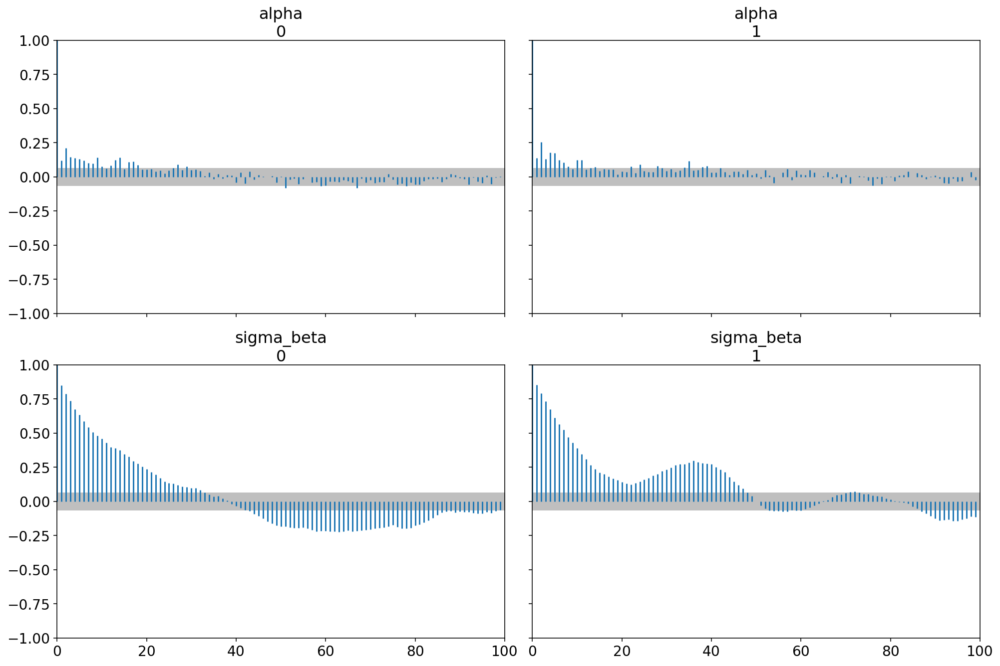

```python
ax = az.plot_pair(sp9_mcmc, var_names=["mu_beta", "sigma_beta"], divergences=True)
ax.set_yscale("log")
plt.show()
```

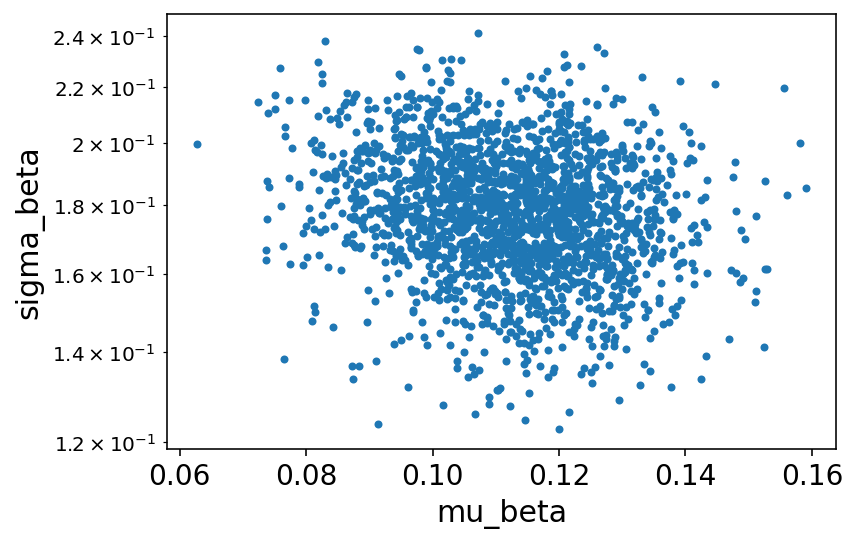

```python
ax = az.plot_pair(sp9_mcmc, var_names=["alpha", "sigma_beta"], divergences=True)
# ax.set_yscale("log")
plt.show()
```

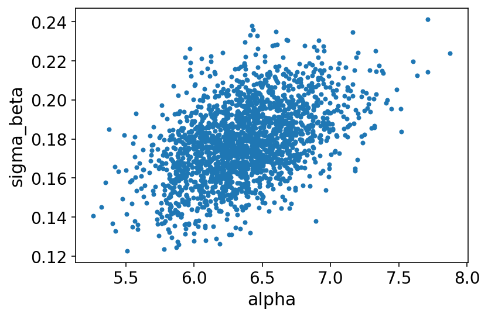

```python
def scale_pair_plot_yaxis(axes: np.ndarray) -> None:
    for ax in axes.flatten():
        ax.set_yscale("log")
    return None
```

```python
data.hugo_symbol.cat.categories[34], data.depmap_id.cat.categories[3]
```

    ('DMTN', 'ACH-001526')

```python
axes = az.plot_pair(
    sp9_mcmc,
    var_names=["beta", "sigma_beta"],
    coords={"gene": "BRAF", "cell_line": "ACH-001957"},
    divergences=True,
)
ax.set_yscale("log")
plt.show()
```

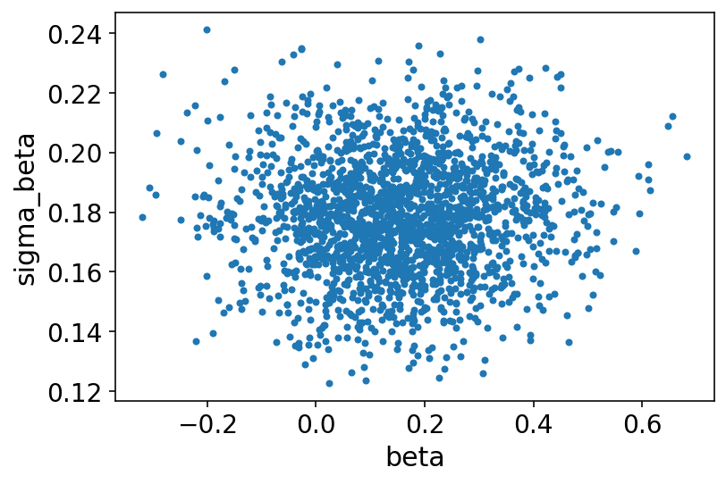

```python
from src.analysis import pymc3_analysis as pmanal
```

```python
beta_post = (
    az.summary(sp9_mcmc, var_names="beta", hdi_prob=HDI_PROB)
    .reset_index(drop=False)
    .rename(columns={"index": "model_param"})
    .pipe(
        pmanal.extract_matrix_variable_indices,
        col="model_param",
        idx1=data.hugo_symbol.cat.categories,
        idx2=data.depmap_id.cat.categories,
        idx1name="hugo_symbol",
        idx2name="depmap_id",
    )
)
beta_post.head()
```

<div>
<style scoped>
    .dataframe tbody tr th:only-of-type {
        vertical-align: middle;
    }

    .dataframe tbody tr th {
        vertical-align: top;
    }

    .dataframe thead th {
        text-align: right;
    }
</style>
<table border="1" class="dataframe">
  <thead>
    <tr style="text-align: right;">
      <th></th>
      <th>model_param</th>
      <th>mean</th>
      <th>sd</th>
      <th>hdi_5.5%</th>
      <th>hdi_94.5%</th>
      <th>mcse_mean</th>
      <th>mcse_sd</th>
      <th>ess_bulk</th>
      <th>ess_tail</th>
      <th>r_hat</th>
      <th>hugo_symbol</th>
      <th>depmap_id</th>
    </tr>
  </thead>
  <tbody>
    <tr>
      <th>0</th>
      <td>beta[0,0]</td>
      <td>0.126</td>
      <td>0.165</td>
      <td>-0.155</td>
      <td>0.373</td>
      <td>0.003</td>
      <td>0.003</td>
      <td>3538.0</td>
      <td>1397.0</td>
      <td>1.0</td>
      <td>SAMD8</td>
      <td>ACH-000087</td>
    </tr>
    <tr>
      <th>1</th>
      <td>beta[0,1]</td>
      <td>0.181</td>
      <td>0.158</td>
      <td>-0.045</td>
      <td>0.459</td>
      <td>0.003</td>
      <td>0.003</td>
      <td>2970.0</td>
      <td>1411.0</td>
      <td>1.0</td>
      <td>SAMD8</td>
      <td>ACH-001283</td>
    </tr>
    <tr>
      <th>2</th>
      <td>beta[0,2]</td>
      <td>0.124</td>
      <td>0.163</td>
      <td>-0.138</td>
      <td>0.387</td>
      <td>0.003</td>
      <td>0.003</td>
      <td>3961.0</td>
      <td>1315.0</td>
      <td>1.0</td>
      <td>SAMD8</td>
      <td>ACH-000007</td>
    </tr>
    <tr>
      <th>3</th>
      <td>beta[0,3]</td>
      <td>0.200</td>
      <td>0.159</td>
      <td>-0.058</td>
      <td>0.447</td>
      <td>0.003</td>
      <td>0.003</td>
      <td>2846.0</td>
      <td>1296.0</td>
      <td>1.0</td>
      <td>SAMD8</td>
      <td>ACH-001526</td>
    </tr>
    <tr>
      <th>4</th>
      <td>beta[0,4]</td>
      <td>0.126</td>
      <td>0.161</td>
      <td>-0.121</td>
      <td>0.400</td>
      <td>0.003</td>
      <td>0.003</td>
      <td>3533.0</td>
      <td>1330.0</td>
      <td>1.0</td>
      <td>SAMD8</td>
      <td>ACH-000249</td>
    </tr>
  </tbody>
</table>
</div>

```python
mu_beta_post = az.summary(sp9_mcmc, var_names="mu_beta", hdi_prob=HDI_PROB)
```

```python
(
    gg.ggplot(beta_post, gg.aes(x="depmap_id", y="mean"))
    + gg.facet_wrap("hugo_symbol", ncol=9, scales="free_y")
    + gg.geom_hline(yintercept=0, data=mu_beta_post, color="black", inherit_aes=False)
    + gg.geom_hline(
        gg.aes(yintercept="mean"), data=mu_beta_post, color="blue", inherit_aes=False
    )
    + gg.geom_hline(
        gg.aes(yintercept="hdi_5.5%"),
        data=mu_beta_post,
        color="blue",
        linetype="--",
        inherit_aes=False,
    )
    + gg.geom_hline(
        gg.aes(yintercept="hdi_94.5%"),
        data=mu_beta_post,
        color="blue",
        linetype="--",
        inherit_aes=False,
    )
    + gg.geom_linerange(gg.aes(ymin="hdi_5.5%", ymax="hdi_94.5%"), size=0.7, alpha=0.5)
    + gg.geom_point(size=0.8, alpha=0.75)
    + gg.theme(
        figure_size=(10, 20),
        axis_text_x=gg.element_text(angle=90, size=7),
        axis_text_y=gg.element_text(size=7),
        panel_grid_major_y=gg.element_line(),
        panel_spacing_x=0.3,
        strip_text=gg.element_text(size=9),
    )
    + gg.labs(x="cell line", y="$\\beta$ posterior")
)
```

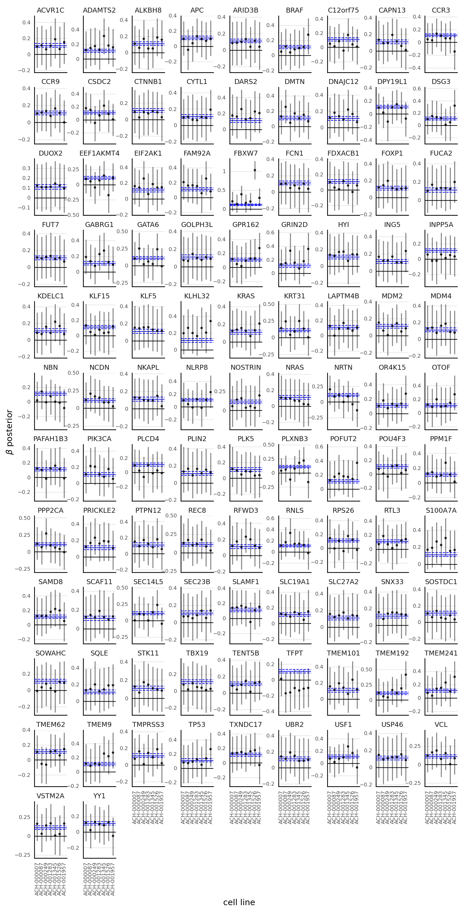

    <ggplot: (364289299)>

```python
(
    gg.ggplot(beta_post, gg.aes(x="hugo_symbol", y="depmap_id", fill="mean"))
    + gg.geom_tile()
    + gg.scale_fill_gradient2(high="#d7191c", low="#2c7bb6", mid="#ffffbf", middle=0)
    + gg.theme(axis_text_x=gg.element_text(size=6, angle=90), figure_size=(10, 2))
    + gg.labs(x="gene", y="cell line", fill="$\\beta$ avg.")
)
```

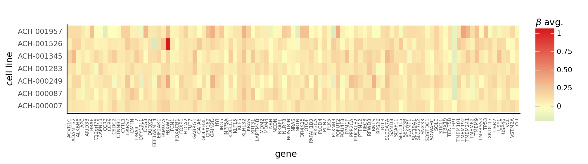

    <ggplot: (361646647)>

```python
az.plot_ppc(sp9_mcmc, num_pp_samples=20, random_seed=1234)
```

    <AxesSubplot:xlabel='y'>

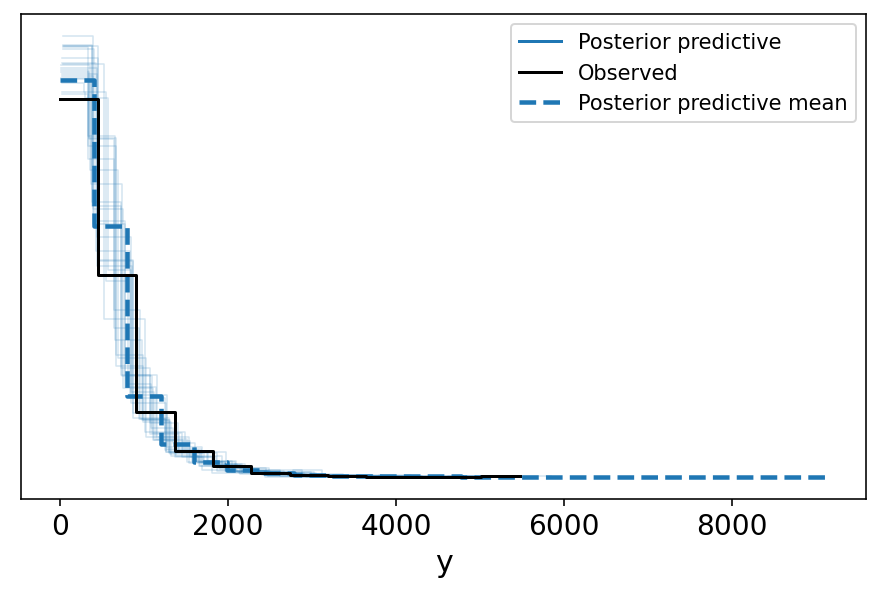

```python
sp9_ppc = sp9_mcmc.posterior_predictive["y"].values.squeeze()
post_pred_data = data.copy().assign(post_pred=sp9_ppc.mean(axis=0))
```

```python
ax = sns.scatterplot(data=post_pred_data, x="counts_final", y="post_pred")
ax.set_xlabel("observed final counts")
ax.set_ylabel("posterior predicted final counts")
plt.show()
```

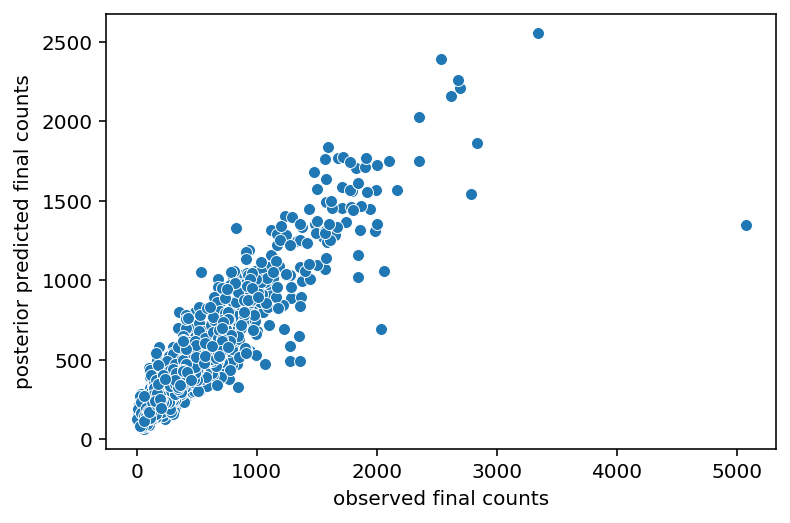

```python
az.plot_loo_pit(sp9_mcmc, y="y")
plt.show()
```

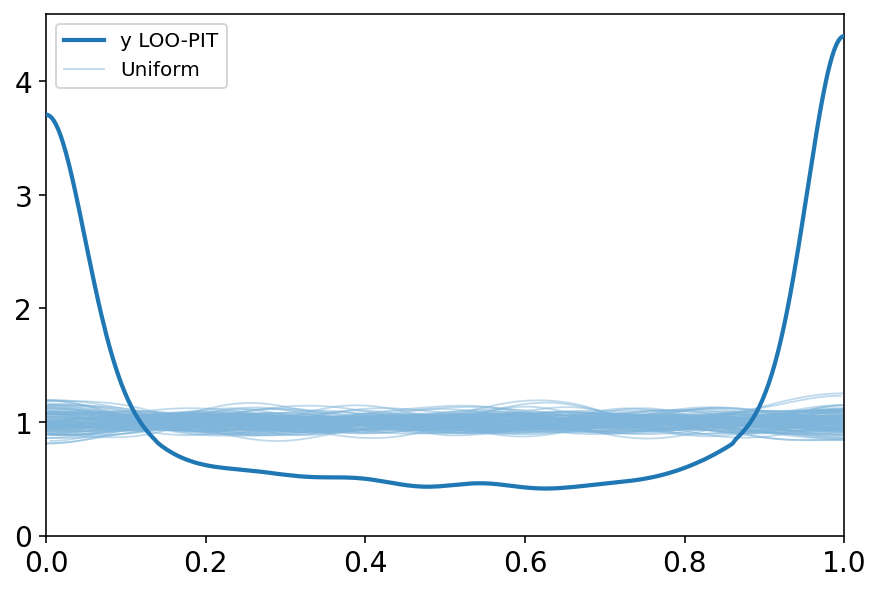

```python
sp9_loo_pit = az.loo_pit(sp9_mcmc, y="y")
```

```python
sns.displot(sp9_loo_pit, kind="hist", kde=True)
plt.show()
```

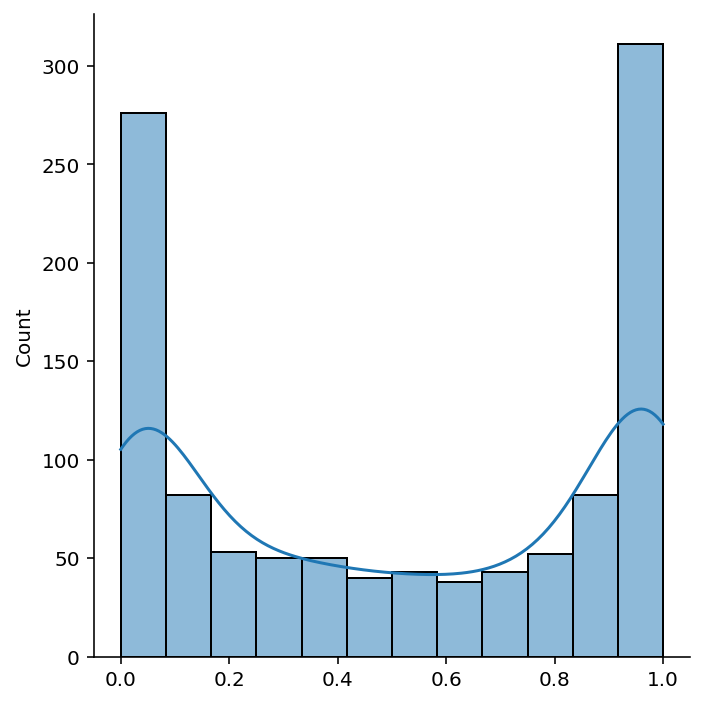

```python
sp9_loo = az.loo(sp9_mcmc, pointwise=True, var_name="y")
```

```python
post_pred_data["loo"] = sp9_loo.loo
post_pred_data["pareto_k"] = sp9_loo.pareto_k
```

```python
(
    gg.ggplot(post_pred_data.reset_index(), gg.aes(x="index", y="pareto_k"))
    + gg.geom_point(size=0.8, alpha=0.8)
    + gg.geom_text(
        gg.aes(label="hugo_symbol"),
        post_pred_data.reset_index().query("pareto_k > 0.75"),
        color="blue",
        size=5,
        adjust_text={"color": "blue"},
    )
    + gg.scale_x_continuous(expand=(0, 1))
    + gg.scale_y_continuous(expand=(0.04, 0))
    + gg.theme(axis_text_x=gg.element_blank())
)
```

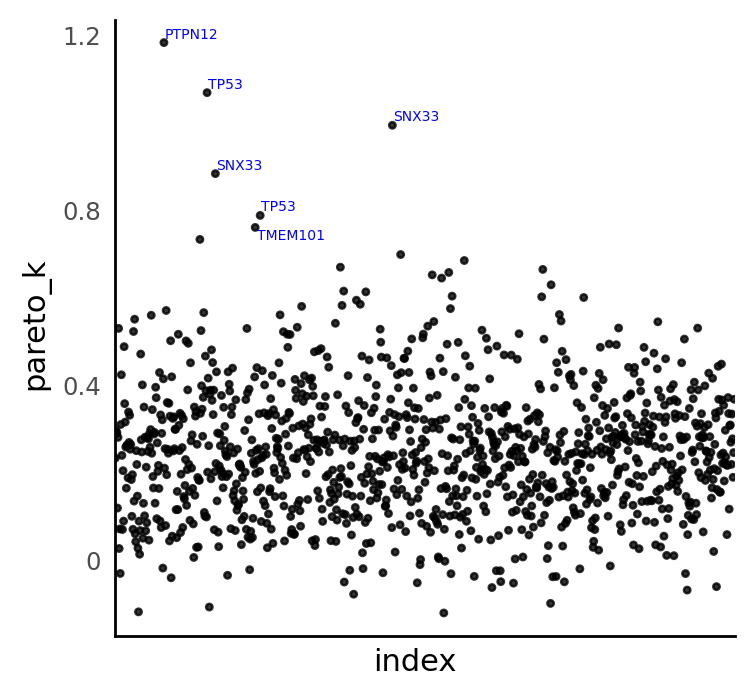

    <ggplot: (363400909)>

---

```python
notebook_toc = time()
print(f"execution time: {(notebook_toc - notebook_tic) / 60:.2f} minutes")
```

    execution time: 2.68 minutes

```python
%load_ext watermark
%watermark -d -u -v -iv -b -h -m
```

    Last updated: 2021-11-05

    Python implementation: CPython
    Python version       : 3.9.6
    IPython version      : 7.26.0

    Compiler    : Clang 11.1.0
    OS          : Darwin
    Release     : 20.6.0
    Machine     : x86_64
    Processor   : i386
    CPU cores   : 4
    Architecture: 64bit

    Hostname: JHCookMac.local

    Git branch: sp9

    pandas    : 1.3.2
    janitor   : 0.21.0
    seaborn   : 0.11.2
    logging   : 0.5.1.2
    matplotlib: 3.4.3
    arviz     : 0.11.2
    sys       : 3.9.6 | packaged by conda-forge | (default, Jul 11 2021, 03:36:15)
    [Clang 11.1.0 ]
    pymc3     : 3.11.2
    plotnine  : 0.8.0
    numpy     : 1.21.2
