# Inspect the single-lineage model run on the colorectal data (004)

Model attributes:

- sgRNA | gene varying intercept
- RNA and CN varying effects per gene
- correlation between gene varying effects modeled using the multivariate normal and Cholesky decomposition (non-centered parameterization)
- target gene mutation variable and cancer gene comutation variable.


```python
%load_ext autoreload
%autoreload 2
```


```python
from time import time

import arviz as az
import matplotlib.pyplot as plt
import numpy as np
import pandas as pd
import seaborn as sns
from IPython.display import Markdown, display
```


```python
from speclet.analysis.arviz_analysis import extract_coords_param_names
from speclet.bayesian_models.lineage_hierarchical_nb import LineageHierNegBinomModel
from speclet.data_processing.common import head_tail
from speclet.io import modeling_data_dir, models_dir
from speclet.managers.data_managers import CrisprScreenDataManager
from speclet.plot import set_speclet_theme
from speclet.project_configuration import arviz_config
```


```python
# Notebook execution timer.
notebook_tic = time()

# Plotting setup.
set_speclet_theme()
%config InlineBackend.figure_format = "retina"
arviz_config()
```

## Data


```python
saved_model_dir = models_dir() / "hnb-single-lineage-colorectal-004_PYMC_NUMPYRO"
```


```python
with open(saved_model_dir / "description.txt") as f:
    model_description = "".join(list(f))

print(model_description)
```

    name: 'hnb-single-lineage-colorectal-004'
    fit method: 'PYMC_NUMPYRO'

    --------------------------------------------------------------------------------

    CONFIGURATION

    {
        "name": "hnb-single-lineage-colorectal-004",
        "description": " Single lineage hierarchical negative binomial model for colorectal data from the Broad. ",
        "active": true,
        "model": "LINEAGE_HIERARCHICAL_NB",
        "data_file": "modeling_data/lineage-modeling-data/depmap-modeling-data_colorectal.csv",
        "model_kwargs": {
            "lineage": "colorectal"
        },
        "sampling_kwargs": {
            "pymc_mcmc": null,
            "pymc_advi": null,
            "pymc_numpyro": {
                "draws": 1000,
                "tune": 1000,
                "chains": 4,
                "target_accept": 0.98,
                "progress_bar": true,
                "chain_method": "parallel",
                "postprocessing_backend": "cpu",
                "idata_kwargs": {
                    "log_likelihood": false
                },
                "nuts_kwargs": {
                    "step_size": 0.01
                }
            }
        }
    }

    --------------------------------------------------------------------------------

    POSTERIOR

    <xarray.Dataset>
    Dimensions:                    (chain: 4, draw: 1000, delta_genes_dim_0: 30,
                                    delta_genes_dim_1: 18119, sgrna: 71062,
                                    genes_chol_cov_dim_0: 465,
                                    genes_chol_cov_corr_dim_0: 30,
                                    genes_chol_cov_corr_dim_1: 30,
                                    genes_chol_cov_stds_dim_0: 30, cancer_gene: 26,
                                    gene: 18119)
    Coordinates:
      * chain                      (chain) int64 0 1 2 3
      * draw                       (draw) int64 0 1 2 3 4 5 ... 995 996 997 998 999
      * delta_genes_dim_0          (delta_genes_dim_0) int64 0 1 2 3 ... 26 27 28 29
      * delta_genes_dim_1          (delta_genes_dim_1) int64 0 1 2 ... 18117 18118
      * sgrna                      (sgrna) object 'AAAAAAATCCAGCAATGCAG' ... 'TTT...
      * genes_chol_cov_dim_0       (genes_chol_cov_dim_0) int64 0 1 2 ... 463 464
      * genes_chol_cov_corr_dim_0  (genes_chol_cov_corr_dim_0) int64 0 1 2 ... 28 29
      * genes_chol_cov_corr_dim_1  (genes_chol_cov_corr_dim_1) int64 0 1 2 ... 28 29
      * genes_chol_cov_stds_dim_0  (genes_chol_cov_stds_dim_0) int64 0 1 2 ... 28 29
      * cancer_gene                (cancer_gene) object 'APC' 'AXIN1' ... 'UBR5'
      * gene                       (gene) object 'A1BG' 'A1CF' ... 'ZZEF1' 'ZZZ3'
    Data variables: (12/21)
        mu_mu_a                    (chain, draw) float64 ...
        mu_b                       (chain, draw) float64 ...
        mu_d                       (chain, draw) float64 ...
        delta_genes                (chain, draw, delta_genes_dim_0, delta_genes_dim_1) float64 ...
        delta_a                    (chain, draw, sgrna) float64 ...
        genes_chol_cov             (chain, draw, genes_chol_cov_dim_0) float64 ...
        ...                         ...
        mu_a                       (chain, draw, gene) float64 ...
        b                          (chain, draw, gene) float64 ...
        d                          (chain, draw, gene) float64 ...
        f                          (chain, draw, gene) float64 ...
        h                          (chain, draw, gene, cancer_gene) float64 ...
        a                          (chain, draw, sgrna) float64 ...
    Attributes:
        created_at:           2022-07-30 07:13:17.780100
        arviz_version:        0.12.1
        previous_created_at:  ['2022-07-30 07:13:17.780100', '2022-07-30T07:32:29...

    --------------------------------------------------------------------------------

    SAMPLE STATS

    <xarray.Dataset>
    Dimensions:          (chain: 4, draw: 1000)
    Coordinates:
      * chain            (chain) int64 0 1 2 3
      * draw             (draw) int64 0 1 2 3 4 5 6 ... 993 994 995 996 997 998 999
    Data variables:
        acceptance_rate  (chain, draw) float64 ...
        step_size        (chain, draw) float64 ...
        diverging        (chain, draw) bool ...
        energy           (chain, draw) float64 ...
        n_steps          (chain, draw) int64 ...
        tree_depth       (chain, draw) int64 ...
        lp               (chain, draw) float64 ...
    Attributes:
        created_at:           2022-07-30 07:13:17.780100
        arviz_version:        0.12.1
        previous_created_at:  ['2022-07-30 07:13:17.780100', '2022-07-30T07:32:29...

    --------------------------------------------------------------------------------

    MCMC DESCRIPTION

    sampled 4 chains with (unknown) tuning steps and 1,000 draws
    num. divergences: 0, 0, 0, 0
    percent divergences: 0.0, 0.0, 0.0, 0.0
    BFMI: 0.266, 0.672, 0.732, 0.057
    avg. step size: 0.001, 0.003, 0.003, 0.0


### Load posterior summary


```python
crc_post_summary = pd.read_csv(saved_model_dir / "posterior-summary.csv").assign(
    var_name=lambda d: [x.split("[")[0] for x in d["parameter"]]
)
crc_post_summary.head()
```


<div>
<style scoped>
    .dataframe tbody tr th:only-of-type {
        vertical-align: middle;
    }

    .dataframe tbody tr th {
        vertical-align: top;
    }

    .dataframe thead th {
        text-align: right;
    }
</style>
<table border="1" class="dataframe">
  <thead>
    <tr style="text-align: right;">
      <th></th>
      <th>parameter</th>
      <th>mean</th>
      <th>sd</th>
      <th>hdi_5.5%</th>
      <th>hdi_94.5%</th>
      <th>mcse_mean</th>
      <th>mcse_sd</th>
      <th>ess_bulk</th>
      <th>ess_tail</th>
      <th>r_hat</th>
      <th>var_name</th>
    </tr>
  </thead>
  <tbody>
    <tr>
      <th>0</th>
      <td>mu_mu_a</td>
      <td>0.121</td>
      <td>0.002</td>
      <td>0.117</td>
      <td>0.123</td>
      <td>0.001</td>
      <td>0.001</td>
      <td>6.0</td>
      <td>31.0</td>
      <td>1.67</td>
      <td>mu_mu_a</td>
    </tr>
    <tr>
      <th>1</th>
      <td>mu_b</td>
      <td>-0.000</td>
      <td>0.001</td>
      <td>-0.001</td>
      <td>0.001</td>
      <td>0.000</td>
      <td>0.000</td>
      <td>7.0</td>
      <td>28.0</td>
      <td>1.63</td>
      <td>mu_b</td>
    </tr>
    <tr>
      <th>2</th>
      <td>mu_d</td>
      <td>-0.022</td>
      <td>0.001</td>
      <td>-0.022</td>
      <td>-0.020</td>
      <td>0.000</td>
      <td>0.000</td>
      <td>7.0</td>
      <td>31.0</td>
      <td>1.54</td>
      <td>mu_d</td>
    </tr>
    <tr>
      <th>3</th>
      <td>sigma_a</td>
      <td>0.164</td>
      <td>0.034</td>
      <td>0.104</td>
      <td>0.185</td>
      <td>0.017</td>
      <td>0.013</td>
      <td>6.0</td>
      <td>11.0</td>
      <td>1.85</td>
      <td>sigma_a</td>
    </tr>
    <tr>
      <th>4</th>
      <td>alpha</td>
      <td>8.121</td>
      <td>0.719</td>
      <td>6.870</td>
      <td>8.560</td>
      <td>0.358</td>
      <td>0.274</td>
      <td>5.0</td>
      <td>11.0</td>
      <td>2.13</td>
      <td>alpha</td>
    </tr>
  </tbody>
</table>
</div>


### Load trace object


```python
trace_file = saved_model_dir / "posterior.netcdf"
assert trace_file.exists()
trace = az.from_netcdf(trace_file)
```

### Colorectal data


```python
def _broad_only(df: pd.DataFrame) -> pd.DataFrame:
    return df[df["screen"] == "broad"].reset_index(drop=True)


crc_dm = CrisprScreenDataManager(
    modeling_data_dir()
    / "lineage-modeling-data"
    / "depmap-modeling-data_colorectal.csv",
    transformations=[_broad_only],
)
```


```python
crc_data = crc_dm.get_data(read_kwargs={"low_memory": False})
crc_data.head()
```


<div>
<style scoped>
    .dataframe tbody tr th:only-of-type {
        vertical-align: middle;
    }

    .dataframe tbody tr th {
        vertical-align: top;
    }

    .dataframe thead th {
        text-align: right;
    }
</style>
<table border="1" class="dataframe">
  <thead>
    <tr style="text-align: right;">
      <th></th>
      <th>sgrna</th>
      <th>replicate_id</th>
      <th>lfc</th>
      <th>p_dna_batch</th>
      <th>genome_alignment</th>
      <th>hugo_symbol</th>
      <th>screen</th>
      <th>multiple_hits_on_gene</th>
      <th>sgrna_target_chr</th>
      <th>sgrna_target_pos</th>
      <th>...</th>
      <th>any_deleterious</th>
      <th>any_tcga_hotspot</th>
      <th>any_cosmic_hotspot</th>
      <th>is_mutated</th>
      <th>copy_number</th>
      <th>lineage</th>
      <th>lineage_subtype</th>
      <th>primary_or_metastasis</th>
      <th>is_male</th>
      <th>age</th>
    </tr>
  </thead>
  <tbody>
    <tr>
      <th>0</th>
      <td>AAAGCCCAGGAGTATGGGAG</td>
      <td>LS513-311Cas9_RepA_p6_batch2</td>
      <td>0.594321</td>
      <td>2</td>
      <td>chr2_130522105_-</td>
      <td>CFC1B</td>
      <td>broad</td>
      <td>True</td>
      <td>2</td>
      <td>130522105</td>
      <td>...</td>
      <td>NaN</td>
      <td>NaN</td>
      <td>NaN</td>
      <td>False</td>
      <td>0.951337</td>
      <td>colorectal</td>
      <td>colorectal_adenocarcinoma</td>
      <td>primary</td>
      <td>True</td>
      <td>63.0</td>
    </tr>
    <tr>
      <th>1</th>
      <td>AAATCAGAGAAACCTGAACG</td>
      <td>LS513-311Cas9_RepA_p6_batch2</td>
      <td>-0.363633</td>
      <td>2</td>
      <td>chr11_89916950_-</td>
      <td>TRIM49D1</td>
      <td>broad</td>
      <td>True</td>
      <td>11</td>
      <td>89916950</td>
      <td>...</td>
      <td>NaN</td>
      <td>NaN</td>
      <td>NaN</td>
      <td>False</td>
      <td>0.945508</td>
      <td>colorectal</td>
      <td>colorectal_adenocarcinoma</td>
      <td>primary</td>
      <td>True</td>
      <td>63.0</td>
    </tr>
    <tr>
      <th>2</th>
      <td>AACGTCTTTGAAGAAAGCTG</td>
      <td>LS513-311Cas9_RepA_p6_batch2</td>
      <td>-0.001343</td>
      <td>2</td>
      <td>chr5_71055421_-</td>
      <td>GTF2H2</td>
      <td>broad</td>
      <td>True</td>
      <td>5</td>
      <td>71055421</td>
      <td>...</td>
      <td>NaN</td>
      <td>NaN</td>
      <td>NaN</td>
      <td>False</td>
      <td>1.428663</td>
      <td>colorectal</td>
      <td>colorectal_adenocarcinoma</td>
      <td>primary</td>
      <td>True</td>
      <td>63.0</td>
    </tr>
    <tr>
      <th>3</th>
      <td>AACGTCTTTGAAGGAAGCTG</td>
      <td>LS513-311Cas9_RepA_p6_batch2</td>
      <td>0.367220</td>
      <td>2</td>
      <td>chr5_69572480_+</td>
      <td>GTF2H2C</td>
      <td>broad</td>
      <td>True</td>
      <td>5</td>
      <td>69572480</td>
      <td>...</td>
      <td>NaN</td>
      <td>NaN</td>
      <td>NaN</td>
      <td>False</td>
      <td>1.428663</td>
      <td>colorectal</td>
      <td>colorectal_adenocarcinoma</td>
      <td>primary</td>
      <td>True</td>
      <td>63.0</td>
    </tr>
    <tr>
      <th>4</th>
      <td>AAGAGGTTCCAGACTACTTA</td>
      <td>LS513-311Cas9_RepA_p6_batch2</td>
      <td>-1.180029</td>
      <td>2</td>
      <td>chrX_155898173_+</td>
      <td>VAMP7</td>
      <td>broad</td>
      <td>True</td>
      <td>X</td>
      <td>155898173</td>
      <td>...</td>
      <td>NaN</td>
      <td>NaN</td>
      <td>NaN</td>
      <td>False</td>
      <td>0.466222</td>
      <td>colorectal</td>
      <td>colorectal_adenocarcinoma</td>
      <td>primary</td>
      <td>True</td>
      <td>63.0</td>
    </tr>
  </tbody>
</table>
<p>5 rows × 25 columns</p>
</div>


### Single lineage model


```python
crc_model = LineageHierNegBinomModel(lineage="colorectal")
```


```python
valid_crc_data = crc_model.data_processing_pipeline(crc_data.copy())
crc_model_data = crc_model.make_data_structure(valid_crc_data)
```


<pre style="white-space:pre;overflow-x:auto;line-height:normal;font-family:Menlo,'DejaVu Sans Mono',consolas,'Courier New',monospace"><span style="color: #7fbfbf; text-decoration-color: #7fbfbf">[08/01/22 06:39:38] </span><span style="color: #000080; text-decoration-color: #000080">INFO    </span> Processing data for modeling.     <a href="file:///n/data1/hms/dbmi/park/Cook/speclet/speclet/bayesian_models/lineage_hierarchical_nb.py" target="_blank"><span style="color: #7f7f7f; text-decoration-color: #7f7f7f">lineage_hierarchical_nb.py</span></a><span style="color: #7f7f7f; text-decoration-color: #7f7f7f">:</span><a href="file:///n/data1/hms/dbmi/park/Cook/speclet/speclet/bayesian_models/lineage_hierarchical_nb.py#269" target="_blank"><span style="color: #7f7f7f; text-decoration-color: #7f7f7f">269</span></a>
</pre>


<pre style="white-space:pre;overflow-x:auto;line-height:normal;font-family:Menlo,'DejaVu Sans Mono',consolas,'Courier New',monospace"><span style="color: #7fbfbf; text-decoration-color: #7fbfbf">                    </span><span style="color: #000080; text-decoration-color: #000080">INFO    </span> LFC limits: <span style="font-weight: bold">(</span><span style="color: #008080; text-decoration-color: #008080; font-weight: bold">-5.0</span>, <span style="color: #008080; text-decoration-color: #008080; font-weight: bold">5.0</span><span style="font-weight: bold">)</span>           <a href="file:///n/data1/hms/dbmi/park/Cook/speclet/speclet/bayesian_models/lineage_hierarchical_nb.py" target="_blank"><span style="color: #7f7f7f; text-decoration-color: #7f7f7f">lineage_hierarchical_nb.py</span></a><span style="color: #7f7f7f; text-decoration-color: #7f7f7f">:</span><a href="file:///n/data1/hms/dbmi/park/Cook/speclet/speclet/bayesian_models/lineage_hierarchical_nb.py#270" target="_blank"><span style="color: #7f7f7f; text-decoration-color: #7f7f7f">270</span></a>
</pre>


<pre style="white-space:pre;overflow-x:auto;line-height:normal;font-family:Menlo,'DejaVu Sans Mono',consolas,'Courier New',monospace"><span style="color: #7fbfbf; text-decoration-color: #7fbfbf">[08/01/22 06:41:27] </span><span style="color: #800000; text-decoration-color: #800000">WARNING </span> number of data points dropped: <span style="color: #008080; text-decoration-color: #008080; font-weight: bold">25</span> <a href="file:///n/data1/hms/dbmi/park/Cook/speclet/speclet/bayesian_models/lineage_hierarchical_nb.py" target="_blank"><span style="color: #7f7f7f; text-decoration-color: #7f7f7f">lineage_hierarchical_nb.py</span></a><span style="color: #7f7f7f; text-decoration-color: #7f7f7f">:</span><a href="file:///n/data1/hms/dbmi/park/Cook/speclet/speclet/bayesian_models/lineage_hierarchical_nb.py#321" target="_blank"><span style="color: #7f7f7f; text-decoration-color: #7f7f7f">321</span></a>
</pre>


<pre style="white-space:pre;overflow-x:auto;line-height:normal;font-family:Menlo,'DejaVu Sans Mono',consolas,'Courier New',monospace"><span style="color: #7fbfbf; text-decoration-color: #7fbfbf">[08/01/22 06:41:30] </span><span style="color: #000080; text-decoration-color: #000080">INFO    </span> number of genes mutated in all    <a href="file:///n/data1/hms/dbmi/park/Cook/speclet/speclet/bayesian_models/lineage_hierarchical_nb.py" target="_blank"><span style="color: #7f7f7f; text-decoration-color: #7f7f7f">lineage_hierarchical_nb.py</span></a><span style="color: #7f7f7f; text-decoration-color: #7f7f7f">:</span><a href="file:///n/data1/hms/dbmi/park/Cook/speclet/speclet/bayesian_models/lineage_hierarchical_nb.py#478" target="_blank"><span style="color: #7f7f7f; text-decoration-color: #7f7f7f">478</span></a>
<span style="color: #7fbfbf; text-decoration-color: #7fbfbf">                    </span>         cells lines: <span style="color: #008080; text-decoration-color: #008080; font-weight: bold">0</span>                    <span style="color: #7f7f7f; text-decoration-color: #7f7f7f">                              </span>
</pre>


<pre style="white-space:pre;overflow-x:auto;line-height:normal;font-family:Menlo,'DejaVu Sans Mono',consolas,'Courier New',monospace"><span style="color: #7fbfbf; text-decoration-color: #7fbfbf">[08/01/22 06:41:33] </span><span style="color: #000080; text-decoration-color: #000080">INFO    </span> Dropping <span style="color: #008080; text-decoration-color: #008080; font-weight: bold">4</span> cancer genes.          <a href="file:///n/data1/hms/dbmi/park/Cook/speclet/speclet/bayesian_models/lineage_hierarchical_nb.py" target="_blank"><span style="color: #7f7f7f; text-decoration-color: #7f7f7f">lineage_hierarchical_nb.py</span></a><span style="color: #7f7f7f; text-decoration-color: #7f7f7f">:</span><a href="file:///n/data1/hms/dbmi/park/Cook/speclet/speclet/bayesian_models/lineage_hierarchical_nb.py#534" target="_blank"><span style="color: #7f7f7f; text-decoration-color: #7f7f7f">534</span></a>
</pre>


## Analysis


```python
sns.histplot(x=crc_post_summary["r_hat"], binwidth=0.01, stat="proportion");
```


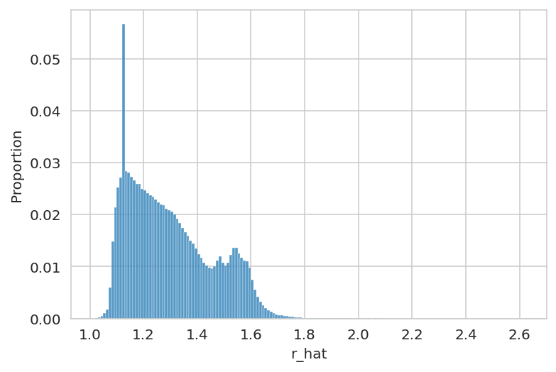


```python
fig, ax = plt.subplots(figsize=(8, 5))
sns.boxplot(data=crc_post_summary, x="var_name", y="r_hat", ax=ax)
ax.tick_params(rotation=90)
plt.show()
```


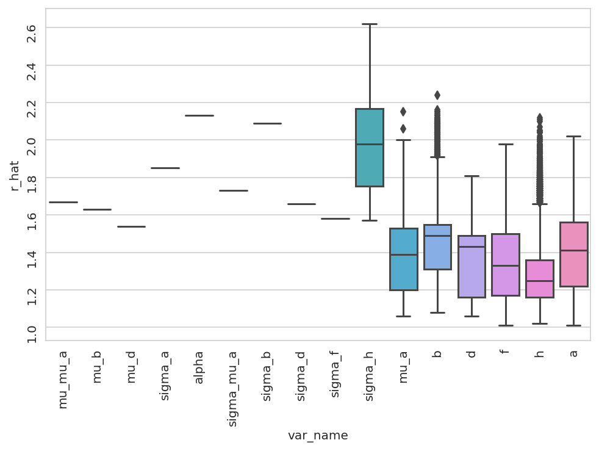


```python
az.plot_energy(trace);
```


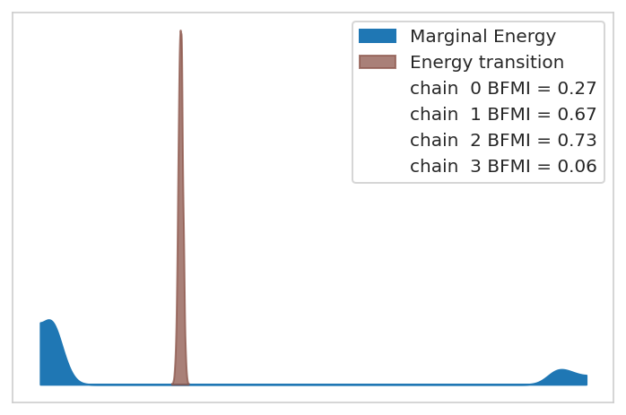


```python
energy = trace.sample_stats.energy.values
marginal_e = pd.DataFrame((energy - energy.mean(axis=1)[:, None]).T).assign(
    energy="marginal"
)
transition_e = pd.DataFrame((energy[:, :-1] - energy[:, 1:]).T).assign(
    energy="transition"
)
energy_df = pd.concat([marginal_e, transition_e]).reset_index(drop=True)
bfmi = az.bfmi(trace)

fig, axes = plt.subplots(2, 2, figsize=(8, 6))
for i, ax in enumerate(axes.flatten()):
    sns.kdeplot(data=energy_df, x=i, hue="energy", ax=ax)
    ax.set_title(f"chain {i} – BFMI: {bfmi[i]:0.2f}")
    ax.set_xlabel(None)
    xmin, _ = ax.get_xlim()
    _, ymax = ax.get_ylim()
    ax.get_legend().set_frame_on(False)

fig.tight_layout()
plt.show()
```


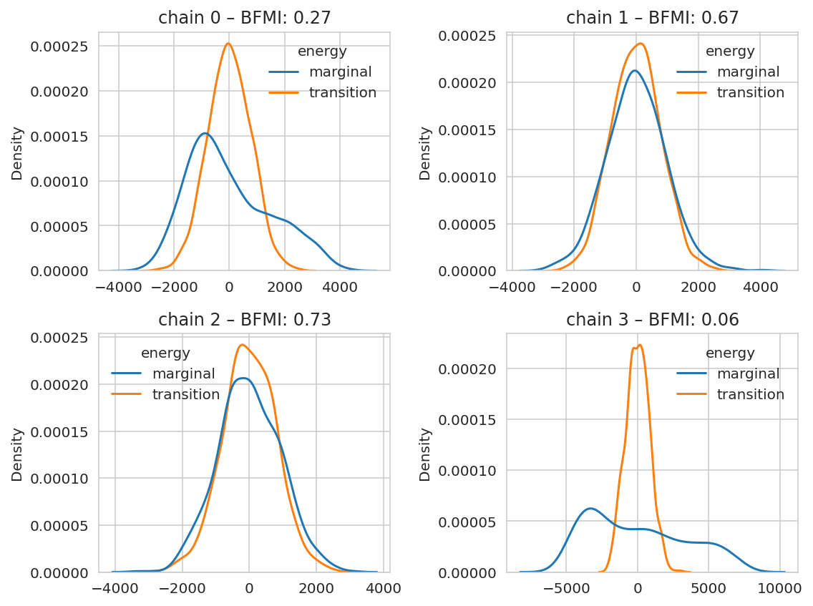


```python
stats = ["step_size", "n_steps", "tree_depth", "acceptance_rate", "energy"]
trace.sample_stats.get(stats).to_dataframe().groupby("chain").mean()
```


<div>
<style scoped>
    .dataframe tbody tr th:only-of-type {
        vertical-align: middle;
    }

    .dataframe tbody tr th {
        vertical-align: top;
    }

    .dataframe thead th {
        text-align: right;
    }
</style>
<table border="1" class="dataframe">
  <thead>
    <tr style="text-align: right;">
      <th></th>
      <th>step_size</th>
      <th>n_steps</th>
      <th>tree_depth</th>
      <th>acceptance_rate</th>
      <th>energy</th>
    </tr>
    <tr>
      <th>chain</th>
      <th></th>
      <th></th>
      <th></th>
      <th></th>
      <th></th>
    </tr>
  </thead>
  <tbody>
    <tr>
      <th>0</th>
      <td>0.000895</td>
      <td>1023.0</td>
      <td>10.0</td>
      <td>0.989053</td>
      <td>1.959877e+07</td>
    </tr>
    <tr>
      <th>1</th>
      <td>0.003200</td>
      <td>1023.0</td>
      <td>10.0</td>
      <td>0.949941</td>
      <td>1.959561e+07</td>
    </tr>
    <tr>
      <th>2</th>
      <td>0.002993</td>
      <td>1023.0</td>
      <td>10.0</td>
      <td>0.973475</td>
      <td>1.959566e+07</td>
    </tr>
    <tr>
      <th>3</th>
      <td>0.000165</td>
      <td>1023.0</td>
      <td>10.0</td>
      <td>0.692344</td>
      <td>1.977465e+07</td>
    </tr>
  </tbody>
</table>
</div>


```python
HAPPY_CHAINS = [1, 2]
SAD_CHAINS = [0, 3]
```


```python
trace.posterior = trace.posterior.sel({"chain": HAPPY_CHAINS})
trace.posterior_predictive = trace.posterior_predictive.sel({"chain": HAPPY_CHAINS})
```


```python
az.plot_trace(trace, var_names=["mu_mu_a", "mu_b", "mu_d"], compact=False)
plt.tight_layout()
```


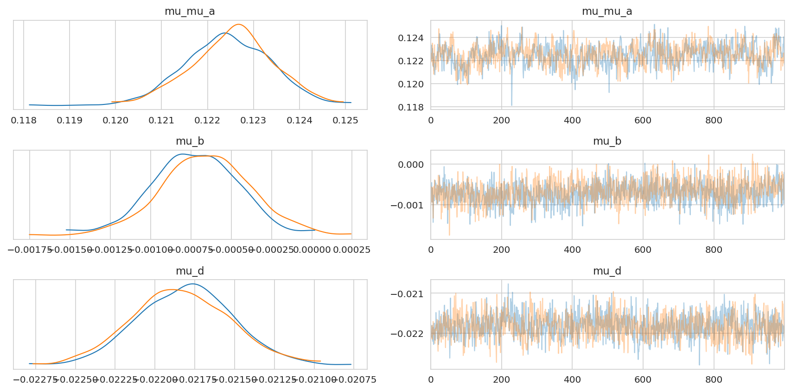


```python
az.summary(trace, var_names=["mu_mu_a", "mu_b", "mu_d"])
```


<div>
<style scoped>
    .dataframe tbody tr th:only-of-type {
        vertical-align: middle;
    }

    .dataframe tbody tr th {
        vertical-align: top;
    }

    .dataframe thead th {
        text-align: right;
    }
</style>
<table border="1" class="dataframe">
  <thead>
    <tr style="text-align: right;">
      <th></th>
      <th>mean</th>
      <th>sd</th>
      <th>hdi_5.5%</th>
      <th>hdi_94.5%</th>
      <th>mcse_mean</th>
      <th>mcse_sd</th>
      <th>ess_bulk</th>
      <th>ess_tail</th>
      <th>r_hat</th>
    </tr>
  </thead>
  <tbody>
    <tr>
      <th>mu_mu_a</th>
      <td>0.122</td>
      <td>0.001</td>
      <td>0.121</td>
      <td>0.124</td>
      <td>0.0</td>
      <td>0.0</td>
      <td>298.0</td>
      <td>661.0</td>
      <td>1.01</td>
    </tr>
    <tr>
      <th>mu_b</th>
      <td>-0.001</td>
      <td>0.000</td>
      <td>-0.001</td>
      <td>-0.000</td>
      <td>0.0</td>
      <td>0.0</td>
      <td>90.0</td>
      <td>1487.0</td>
      <td>1.03</td>
    </tr>
    <tr>
      <th>mu_d</th>
      <td>-0.022</td>
      <td>0.000</td>
      <td>-0.022</td>
      <td>-0.021</td>
      <td>0.0</td>
      <td>0.0</td>
      <td>750.0</td>
      <td>1372.0</td>
      <td>1.00</td>
    </tr>
  </tbody>
</table>
</div>


```python
az.plot_trace(
    trace, var_names=[f"sigma_{x}" for x in ["a", "mu_a", "b", "d", "f"]], compact=False
)
plt.tight_layout()
plt.show()
```


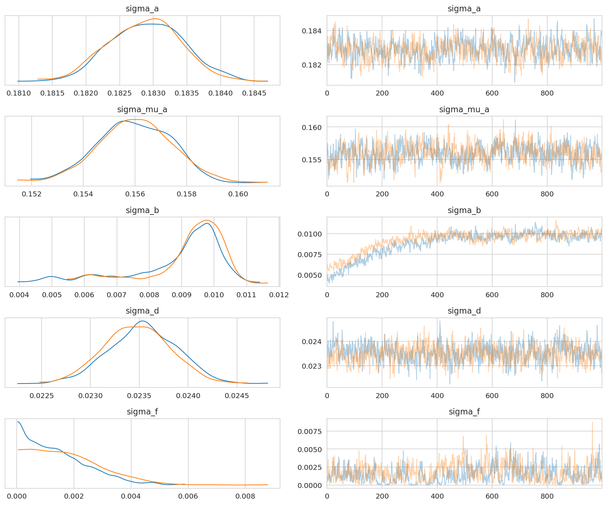


```python
az.plot_trace(trace, var_names=["sigma_h"], compact=True)
plt.tight_layout()
plt.show()
```


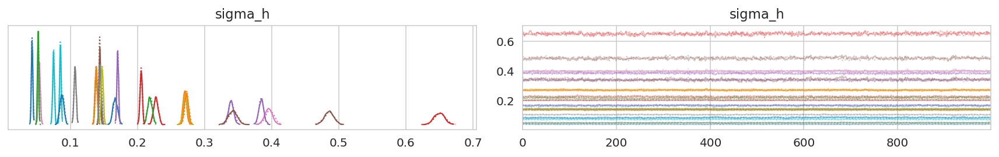


```python
az.plot_trace(trace, var_names=["alpha"], compact=False)
plt.tight_layout()
plt.show()
```


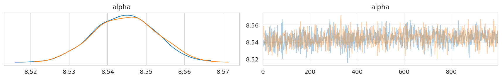


```python
az.plot_forest(
    trace, var_names=["^sigma_*"], filter_vars="regex", combined=False, figsize=(5, 8)
)
plt.tight_layout()
```


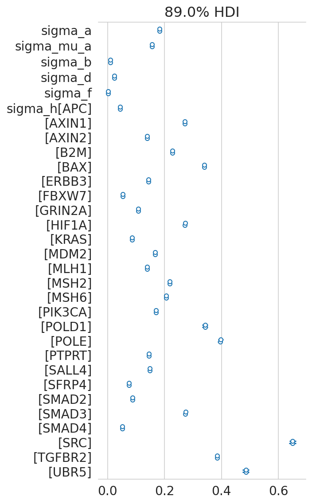


```python
var_names = ["a", "mu_a", "b", "d", "f", "h"]
_, axes = plt.subplots(2, 3, figsize=(8, 6), sharex=True)
for ax, var_name in zip(axes.flatten(), var_names):
    x = crc_post_summary.query(f"var_name == '{var_name}'")["mean"]
    sns.kdeplot(x=x, ax=ax)
    ax.set_title(var_name)
    ax.set_xlim(-2, 1)

plt.tight_layout()
plt.show()
```


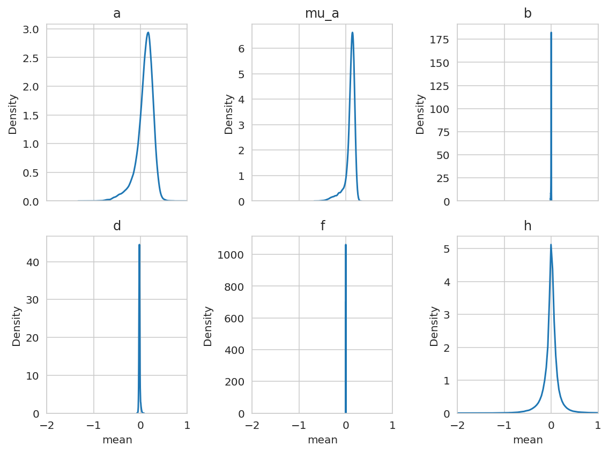


```python
sgrna_to_gene_map = (
    crc_data.copy()[["hugo_symbol", "sgrna"]].drop_duplicates().reset_index(drop=True)
)
```


```python
crc_post_summary.query("var_name == 'mu_a'").sort_values("mean").pipe(head_tail, 5)
```


<div>
<style scoped>
    .dataframe tbody tr th:only-of-type {
        vertical-align: middle;
    }

    .dataframe tbody tr th {
        vertical-align: top;
    }

    .dataframe thead th {
        text-align: right;
    }
</style>
<table border="1" class="dataframe">
  <thead>
    <tr style="text-align: right;">
      <th></th>
      <th>parameter</th>
      <th>mean</th>
      <th>sd</th>
      <th>hdi_5.5%</th>
      <th>hdi_94.5%</th>
      <th>mcse_mean</th>
      <th>mcse_sd</th>
      <th>ess_bulk</th>
      <th>ess_tail</th>
      <th>r_hat</th>
      <th>var_name</th>
    </tr>
  </thead>
  <tbody>
    <tr>
      <th>12677</th>
      <td>mu_a[RAN]</td>
      <td>-0.630</td>
      <td>0.441</td>
      <td>-0.963</td>
      <td>0.118</td>
      <td>0.217</td>
      <td>0.166</td>
      <td>6.0</td>
      <td>27.0</td>
      <td>1.72</td>
      <td>mu_a</td>
    </tr>
    <tr>
      <th>14927</th>
      <td>mu_a[SRSF3]</td>
      <td>-0.569</td>
      <td>0.401</td>
      <td>-0.865</td>
      <td>0.118</td>
      <td>0.198</td>
      <td>0.151</td>
      <td>7.0</td>
      <td>26.0</td>
      <td>1.64</td>
      <td>mu_a</td>
    </tr>
    <tr>
      <th>13533</th>
      <td>mu_a[SARS]</td>
      <td>-0.559</td>
      <td>0.395</td>
      <td>-0.850</td>
      <td>0.118</td>
      <td>0.195</td>
      <td>0.149</td>
      <td>7.0</td>
      <td>27.0</td>
      <td>1.62</td>
      <td>mu_a</td>
    </tr>
    <tr>
      <th>13339</th>
      <td>mu_a[RPSA]</td>
      <td>-0.554</td>
      <td>0.394</td>
      <td>-0.851</td>
      <td>0.118</td>
      <td>0.194</td>
      <td>0.149</td>
      <td>6.0</td>
      <td>26.0</td>
      <td>1.69</td>
      <td>mu_a</td>
    </tr>
    <tr>
      <th>13356</th>
      <td>mu_a[RRM1]</td>
      <td>-0.544</td>
      <td>0.386</td>
      <td>-0.831</td>
      <td>0.118</td>
      <td>0.191</td>
      <td>0.146</td>
      <td>7.0</td>
      <td>27.0</td>
      <td>1.58</td>
      <td>mu_a</td>
    </tr>
    <tr>
      <th>13194</th>
      <td>mu_a[ROCK2]</td>
      <td>0.279</td>
      <td>0.111</td>
      <td>0.117</td>
      <td>0.400</td>
      <td>0.050</td>
      <td>0.038</td>
      <td>6.0</td>
      <td>34.0</td>
      <td>1.66</td>
      <td>mu_a</td>
    </tr>
    <tr>
      <th>16424</th>
      <td>mu_a[TRIQK]</td>
      <td>0.283</td>
      <td>0.105</td>
      <td>0.117</td>
      <td>0.389</td>
      <td>0.048</td>
      <td>0.036</td>
      <td>7.0</td>
      <td>25.0</td>
      <td>1.55</td>
      <td>mu_a</td>
    </tr>
    <tr>
      <th>10489</th>
      <td>mu_a[OFD1]</td>
      <td>0.285</td>
      <td>0.107</td>
      <td>0.117</td>
      <td>0.396</td>
      <td>0.049</td>
      <td>0.037</td>
      <td>7.0</td>
      <td>24.0</td>
      <td>1.58</td>
      <td>mu_a</td>
    </tr>
    <tr>
      <th>13021</th>
      <td>mu_a[RIC8A]</td>
      <td>0.287</td>
      <td>0.111</td>
      <td>0.117</td>
      <td>0.402</td>
      <td>0.050</td>
      <td>0.038</td>
      <td>7.0</td>
      <td>24.0</td>
      <td>1.62</td>
      <td>mu_a</td>
    </tr>
    <tr>
      <th>8175</th>
      <td>mu_a[LAMP2]</td>
      <td>0.289</td>
      <td>0.109</td>
      <td>0.117</td>
      <td>0.404</td>
      <td>0.050</td>
      <td>0.038</td>
      <td>7.0</td>
      <td>23.0</td>
      <td>1.60</td>
      <td>mu_a</td>
    </tr>
  </tbody>
</table>
</div>


```python
crc_post_summary.query("var_name == 'b'").sort_values("mean").pipe(head_tail, 5)
```


<div>
<style scoped>
    .dataframe tbody tr th:only-of-type {
        vertical-align: middle;
    }

    .dataframe tbody tr th {
        vertical-align: top;
    }

    .dataframe thead th {
        text-align: right;
    }
</style>
<table border="1" class="dataframe">
  <thead>
    <tr style="text-align: right;">
      <th></th>
      <th>parameter</th>
      <th>mean</th>
      <th>sd</th>
      <th>hdi_5.5%</th>
      <th>hdi_94.5%</th>
      <th>mcse_mean</th>
      <th>mcse_sd</th>
      <th>ess_bulk</th>
      <th>ess_tail</th>
      <th>r_hat</th>
      <th>var_name</th>
    </tr>
  </thead>
  <tbody>
    <tr>
      <th>18823</th>
      <td>b[ANKLE2]</td>
      <td>-0.021</td>
      <td>0.017</td>
      <td>-0.041</td>
      <td>0.001</td>
      <td>0.008</td>
      <td>0.006</td>
      <td>5.0</td>
      <td>31.0</td>
      <td>2.12</td>
      <td>b</td>
    </tr>
    <tr>
      <th>31960</th>
      <td>b[SF1]</td>
      <td>-0.021</td>
      <td>0.017</td>
      <td>-0.042</td>
      <td>0.001</td>
      <td>0.008</td>
      <td>0.006</td>
      <td>5.0</td>
      <td>32.0</td>
      <td>2.14</td>
      <td>b</td>
    </tr>
    <tr>
      <th>29987</th>
      <td>b[POLR3A]</td>
      <td>-0.020</td>
      <td>0.016</td>
      <td>-0.041</td>
      <td>0.001</td>
      <td>0.008</td>
      <td>0.006</td>
      <td>5.0</td>
      <td>28.0</td>
      <td>2.13</td>
      <td>b</td>
    </tr>
    <tr>
      <th>21618</th>
      <td>b[CRCP]</td>
      <td>-0.019</td>
      <td>0.015</td>
      <td>-0.038</td>
      <td>0.002</td>
      <td>0.007</td>
      <td>0.005</td>
      <td>5.0</td>
      <td>28.0</td>
      <td>2.13</td>
      <td>b</td>
    </tr>
    <tr>
      <th>31301</th>
      <td>b[RNGTT]</td>
      <td>-0.019</td>
      <td>0.014</td>
      <td>-0.037</td>
      <td>0.000</td>
      <td>0.007</td>
      <td>0.005</td>
      <td>5.0</td>
      <td>15.0</td>
      <td>2.09</td>
      <td>b</td>
    </tr>
    <tr>
      <th>19209</th>
      <td>b[ARSH]</td>
      <td>0.007</td>
      <td>0.008</td>
      <td>-0.002</td>
      <td>0.019</td>
      <td>0.003</td>
      <td>0.002</td>
      <td>8.0</td>
      <td>52.0</td>
      <td>1.41</td>
      <td>b</td>
    </tr>
    <tr>
      <th>23279</th>
      <td>b[FAM199X]</td>
      <td>0.007</td>
      <td>0.007</td>
      <td>-0.001</td>
      <td>0.018</td>
      <td>0.003</td>
      <td>0.002</td>
      <td>9.0</td>
      <td>48.0</td>
      <td>1.36</td>
      <td>b</td>
    </tr>
    <tr>
      <th>19419</th>
      <td>b[ATP8B1]</td>
      <td>0.007</td>
      <td>0.008</td>
      <td>-0.002</td>
      <td>0.020</td>
      <td>0.003</td>
      <td>0.002</td>
      <td>8.0</td>
      <td>93.0</td>
      <td>1.43</td>
      <td>b</td>
    </tr>
    <tr>
      <th>28478</th>
      <td>b[NUAK2]</td>
      <td>0.007</td>
      <td>0.008</td>
      <td>-0.002</td>
      <td>0.019</td>
      <td>0.003</td>
      <td>0.002</td>
      <td>7.0</td>
      <td>48.0</td>
      <td>1.61</td>
      <td>b</td>
    </tr>
    <tr>
      <th>36252</th>
      <td>b[ZSCAN9]</td>
      <td>0.007</td>
      <td>0.008</td>
      <td>-0.002</td>
      <td>0.020</td>
      <td>0.003</td>
      <td>0.002</td>
      <td>8.0</td>
      <td>36.0</td>
      <td>1.49</td>
      <td>b</td>
    </tr>
  </tbody>
</table>
</div>


```python
crc_post_summary.query("var_name == 'd'").sort_values("mean").pipe(head_tail, 5)
```


<div>
<style scoped>
    .dataframe tbody tr th:only-of-type {
        vertical-align: middle;
    }

    .dataframe tbody tr th {
        vertical-align: top;
    }

    .dataframe thead th {
        text-align: right;
    }
</style>
<table border="1" class="dataframe">
  <thead>
    <tr style="text-align: right;">
      <th></th>
      <th>parameter</th>
      <th>mean</th>
      <th>sd</th>
      <th>hdi_5.5%</th>
      <th>hdi_94.5%</th>
      <th>mcse_mean</th>
      <th>mcse_sd</th>
      <th>ess_bulk</th>
      <th>ess_tail</th>
      <th>r_hat</th>
      <th>var_name</th>
    </tr>
  </thead>
  <tbody>
    <tr>
      <th>38711</th>
      <td>d[CCND1]</td>
      <td>-0.072</td>
      <td>0.034</td>
      <td>-0.108</td>
      <td>-0.020</td>
      <td>0.015</td>
      <td>0.011</td>
      <td>7.0</td>
      <td>31.0</td>
      <td>1.54</td>
      <td>d</td>
    </tr>
    <tr>
      <th>45212</th>
      <td>d[MDM2]</td>
      <td>-0.068</td>
      <td>0.032</td>
      <td>-0.105</td>
      <td>-0.020</td>
      <td>0.014</td>
      <td>0.010</td>
      <td>7.0</td>
      <td>30.0</td>
      <td>1.55</td>
      <td>d</td>
    </tr>
    <tr>
      <th>41104</th>
      <td>d[ERBB2]</td>
      <td>-0.066</td>
      <td>0.031</td>
      <td>-0.100</td>
      <td>-0.020</td>
      <td>0.013</td>
      <td>0.010</td>
      <td>7.0</td>
      <td>30.0</td>
      <td>1.55</td>
      <td>d</td>
    </tr>
    <tr>
      <th>39927</th>
      <td>d[CTSZ]</td>
      <td>-0.065</td>
      <td>0.030</td>
      <td>-0.098</td>
      <td>-0.020</td>
      <td>0.013</td>
      <td>0.010</td>
      <td>7.0</td>
      <td>31.0</td>
      <td>1.53</td>
      <td>d</td>
    </tr>
    <tr>
      <th>48799</th>
      <td>d[RAB22A]</td>
      <td>-0.063</td>
      <td>0.028</td>
      <td>-0.094</td>
      <td>-0.020</td>
      <td>0.012</td>
      <td>0.009</td>
      <td>7.0</td>
      <td>31.0</td>
      <td>1.53</td>
      <td>d</td>
    </tr>
    <tr>
      <th>40570</th>
      <td>d[DONSON]</td>
      <td>0.057</td>
      <td>0.047</td>
      <td>-0.021</td>
      <td>0.101</td>
      <td>0.022</td>
      <td>0.017</td>
      <td>7.0</td>
      <td>36.0</td>
      <td>1.55</td>
      <td>d</td>
    </tr>
    <tr>
      <th>50781</th>
      <td>d[SMU1]</td>
      <td>0.060</td>
      <td>0.049</td>
      <td>-0.021</td>
      <td>0.105</td>
      <td>0.023</td>
      <td>0.018</td>
      <td>7.0</td>
      <td>35.0</td>
      <td>1.59</td>
      <td>d</td>
    </tr>
    <tr>
      <th>49473</th>
      <td>d[RPL13]</td>
      <td>0.065</td>
      <td>0.051</td>
      <td>-0.021</td>
      <td>0.110</td>
      <td>0.025</td>
      <td>0.019</td>
      <td>7.0</td>
      <td>37.0</td>
      <td>1.54</td>
      <td>d</td>
    </tr>
    <tr>
      <th>39154</th>
      <td>d[CHAF1B]</td>
      <td>0.065</td>
      <td>0.052</td>
      <td>-0.021</td>
      <td>0.112</td>
      <td>0.025</td>
      <td>0.019</td>
      <td>7.0</td>
      <td>37.0</td>
      <td>1.55</td>
      <td>d</td>
    </tr>
    <tr>
      <th>47960</th>
      <td>d[PLK1]</td>
      <td>0.073</td>
      <td>0.056</td>
      <td>-0.021</td>
      <td>0.122</td>
      <td>0.027</td>
      <td>0.021</td>
      <td>7.0</td>
      <td>35.0</td>
      <td>1.57</td>
      <td>d</td>
    </tr>
  </tbody>
</table>
</div>


```python
crc_post_summary.query("var_name == 'h'").sort_values("mean").pipe(head_tail, 5)
```


<div>
<style scoped>
    .dataframe tbody tr th:only-of-type {
        vertical-align: middle;
    }

    .dataframe tbody tr th {
        vertical-align: top;
    }

    .dataframe thead th {
        text-align: right;
    }
</style>
<table border="1" class="dataframe">
  <thead>
    <tr style="text-align: right;">
      <th></th>
      <th>parameter</th>
      <th>mean</th>
      <th>sd</th>
      <th>hdi_5.5%</th>
      <th>hdi_94.5%</th>
      <th>mcse_mean</th>
      <th>mcse_sd</th>
      <th>ess_bulk</th>
      <th>ess_tail</th>
      <th>r_hat</th>
      <th>var_name</th>
    </tr>
  </thead>
  <tbody>
    <tr>
      <th>505271</th>
      <td>h[TXNL4A, POLE]</td>
      <td>-2.928</td>
      <td>0.897</td>
      <td>-4.486</td>
      <td>-2.116</td>
      <td>0.437</td>
      <td>0.338</td>
      <td>6.0</td>
      <td>25.0</td>
      <td>1.78</td>
      <td>h</td>
    </tr>
    <tr>
      <th>401219</th>
      <td>h[RAN, POLE]</td>
      <td>-2.925</td>
      <td>0.923</td>
      <td>-4.555</td>
      <td>-2.133</td>
      <td>0.450</td>
      <td>0.347</td>
      <td>6.0</td>
      <td>17.0</td>
      <td>1.77</td>
      <td>h</td>
    </tr>
    <tr>
      <th>187655</th>
      <td>h[DUX4, POLE]</td>
      <td>-2.884</td>
      <td>0.713</td>
      <td>-4.134</td>
      <td>-2.196</td>
      <td>0.342</td>
      <td>0.265</td>
      <td>6.0</td>
      <td>22.0</td>
      <td>1.76</td>
      <td>h</td>
    </tr>
    <tr>
      <th>418873</th>
      <td>h[RRM1, POLE]</td>
      <td>-2.682</td>
      <td>0.901</td>
      <td>-4.245</td>
      <td>-1.931</td>
      <td>0.439</td>
      <td>0.340</td>
      <td>7.0</td>
      <td>31.0</td>
      <td>1.60</td>
      <td>h</td>
    </tr>
    <tr>
      <th>115791</th>
      <td>h[BUB3, POLE]</td>
      <td>-2.602</td>
      <td>0.746</td>
      <td>-3.921</td>
      <td>-1.938</td>
      <td>0.360</td>
      <td>0.279</td>
      <td>7.0</td>
      <td>13.0</td>
      <td>1.56</td>
      <td>h</td>
    </tr>
    <tr>
      <th>505278</th>
      <td>h[TXNL4A, SRC]</td>
      <td>3.557</td>
      <td>0.652</td>
      <td>2.831</td>
      <td>4.608</td>
      <td>0.295</td>
      <td>0.229</td>
      <td>6.0</td>
      <td>32.0</td>
      <td>1.71</td>
      <td>h</td>
    </tr>
    <tr>
      <th>401228</th>
      <td>h[RAN, UBR5]</td>
      <td>3.563</td>
      <td>0.283</td>
      <td>3.090</td>
      <td>4.008</td>
      <td>0.032</td>
      <td>0.023</td>
      <td>88.0</td>
      <td>376.0</td>
      <td>1.19</td>
      <td>h</td>
    </tr>
    <tr>
      <th>417996</th>
      <td>h[RPS3A, SRC]</td>
      <td>3.607</td>
      <td>0.598</td>
      <td>2.922</td>
      <td>4.557</td>
      <td>0.265</td>
      <td>0.205</td>
      <td>6.0</td>
      <td>12.0</td>
      <td>1.70</td>
      <td>h</td>
    </tr>
    <tr>
      <th>401226</th>
      <td>h[RAN, SRC]</td>
      <td>3.634</td>
      <td>0.722</td>
      <td>2.855</td>
      <td>4.854</td>
      <td>0.334</td>
      <td>0.259</td>
      <td>6.0</td>
      <td>15.0</td>
      <td>1.85</td>
      <td>h</td>
    </tr>
    <tr>
      <th>418438</th>
      <td>h[RPSA, SRC]</td>
      <td>3.696</td>
      <td>0.643</td>
      <td>3.027</td>
      <td>4.811</td>
      <td>0.296</td>
      <td>0.229</td>
      <td>7.0</td>
      <td>41.0</td>
      <td>1.62</td>
      <td>h</td>
    </tr>
  </tbody>
</table>
</div>


```python
def _md_bold(s: str) -> None:
    display(Markdown(f"**{s}**"))
```


```python
example_genes = ["KRAS", "APC"]
for gene in example_genes:
    _md_bold(gene)
    az.plot_trace(
        trace,
        var_names=["mu_a", "b", "d", "f", "h"],
        coords={"gene": [gene]},
        compact=False,
    )
    plt.tight_layout()
    plt.show()
```


**KRAS**


    /home/jc604/.conda/envs/speclet/lib/python3.10/site-packages/arviz/plots/traceplot.py:212: UserWarning: rcParams['plot.max_subplots'] (20) is smaller than the number of variables to plot (30), generating only 20 plots
      warnings.warn(


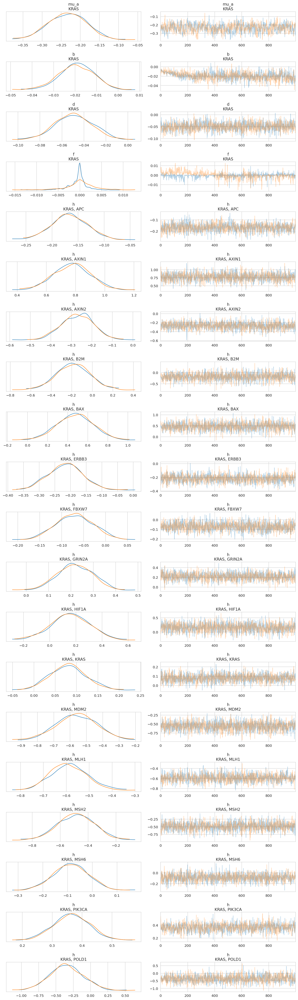


**APC**


    /home/jc604/.conda/envs/speclet/lib/python3.10/site-packages/arviz/plots/traceplot.py:212: UserWarning: rcParams['plot.max_subplots'] (20) is smaller than the number of variables to plot (30), generating only 20 plots
      warnings.warn(


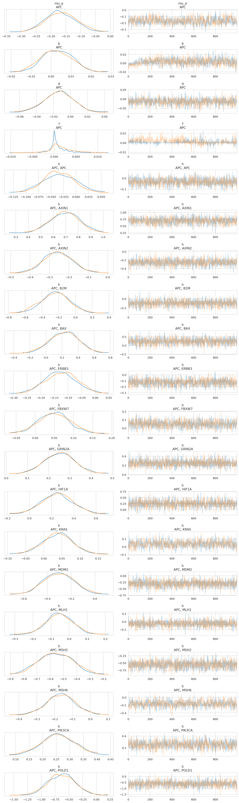


```python
example_genes = ["KRAS", "APC"]
for gene in example_genes:
    _md_bold(gene)
    az.plot_forest(
        trace,
        var_names=["mu_a", "b", "d", "f", "h"],
        coords={"gene": [gene]},
        combined=True,
    )
    plt.tight_layout()
    plt.show()
```


**KRAS**


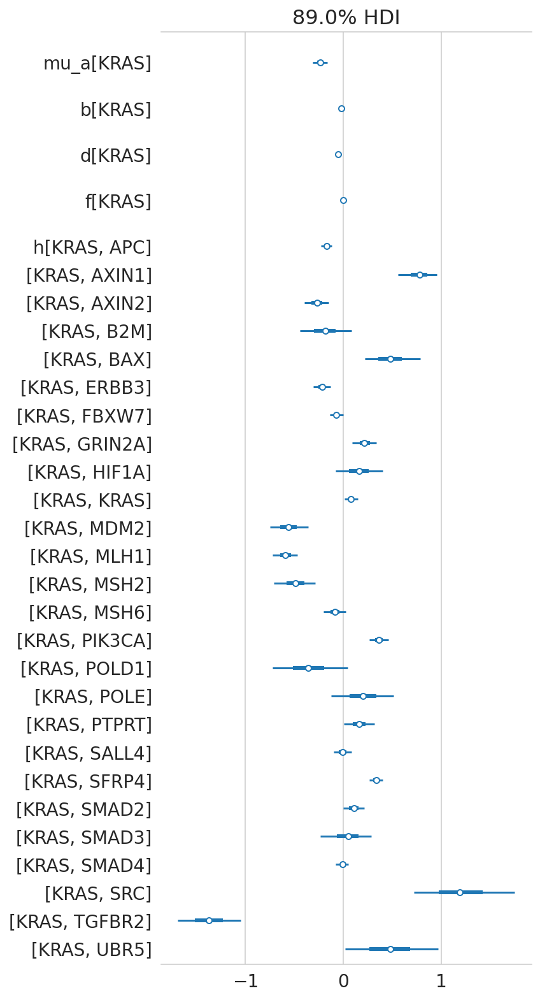


**APC**


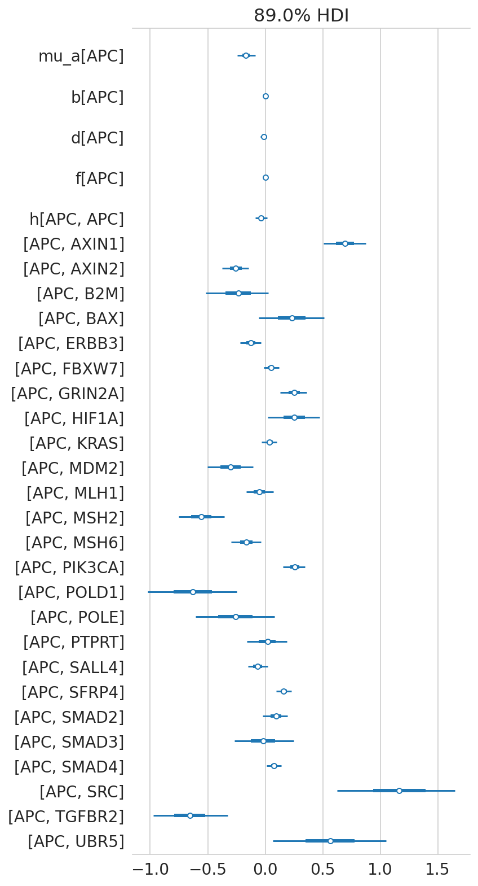


```python
sgrnas_sample = trace.posterior.coords["sgrna"].values[:5]

az.plot_trace(trace, var_names="a", coords={"sgrna": sgrnas_sample}, compact=False)
plt.tight_layout()
plt.show()
```


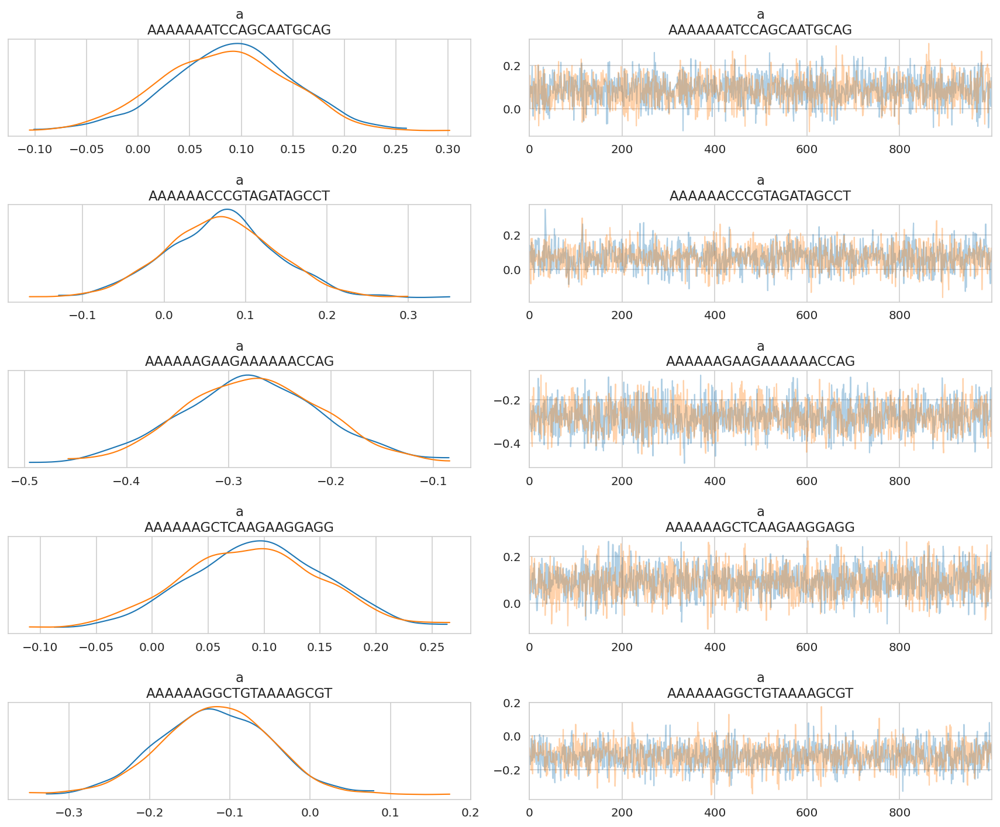


```python
az.summary(trace, var_names="a", coords={"sgrna": sgrnas_sample})
```


<div>
<style scoped>
    .dataframe tbody tr th:only-of-type {
        vertical-align: middle;
    }

    .dataframe tbody tr th {
        vertical-align: top;
    }

    .dataframe thead th {
        text-align: right;
    }
</style>
<table border="1" class="dataframe">
  <thead>
    <tr style="text-align: right;">
      <th></th>
      <th>mean</th>
      <th>sd</th>
      <th>hdi_5.5%</th>
      <th>hdi_94.5%</th>
      <th>mcse_mean</th>
      <th>mcse_sd</th>
      <th>ess_bulk</th>
      <th>ess_tail</th>
      <th>r_hat</th>
    </tr>
  </thead>
  <tbody>
    <tr>
      <th>a[AAAAAAATCCAGCAATGCAG]</th>
      <td>0.087</td>
      <td>0.062</td>
      <td>-0.008</td>
      <td>0.187</td>
      <td>0.002</td>
      <td>0.001</td>
      <td>1640.0</td>
      <td>1530.0</td>
      <td>1.0</td>
    </tr>
    <tr>
      <th>a[AAAAAACCCGTAGATAGCCT]</th>
      <td>0.069</td>
      <td>0.067</td>
      <td>-0.035</td>
      <td>0.181</td>
      <td>0.002</td>
      <td>0.001</td>
      <td>1889.0</td>
      <td>1644.0</td>
      <td>1.0</td>
    </tr>
    <tr>
      <th>a[AAAAAAGAAGAAAAAACCAG]</th>
      <td>-0.276</td>
      <td>0.068</td>
      <td>-0.378</td>
      <td>-0.160</td>
      <td>0.002</td>
      <td>0.001</td>
      <td>1843.0</td>
      <td>1504.0</td>
      <td>1.0</td>
    </tr>
    <tr>
      <th>a[AAAAAAGCTCAAGAAGGAGG]</th>
      <td>0.092</td>
      <td>0.062</td>
      <td>0.002</td>
      <td>0.201</td>
      <td>0.001</td>
      <td>0.001</td>
      <td>1898.0</td>
      <td>1604.0</td>
      <td>1.0</td>
    </tr>
    <tr>
      <th>a[AAAAAAGGCTGTAAAAGCGT]</th>
      <td>-0.118</td>
      <td>0.068</td>
      <td>-0.221</td>
      <td>-0.011</td>
      <td>0.002</td>
      <td>0.001</td>
      <td>1910.0</td>
      <td>1449.0</td>
      <td>1.0</td>
    </tr>
  </tbody>
</table>
</div>


```python
crc_post_summary.filter_string("var_name", "^sigma_*")
```


<div>
<style scoped>
    .dataframe tbody tr th:only-of-type {
        vertical-align: middle;
    }

    .dataframe tbody tr th {
        vertical-align: top;
    }

    .dataframe thead th {
        text-align: right;
    }
</style>
<table border="1" class="dataframe">
  <thead>
    <tr style="text-align: right;">
      <th></th>
      <th>parameter</th>
      <th>mean</th>
      <th>sd</th>
      <th>hdi_5.5%</th>
      <th>hdi_94.5%</th>
      <th>mcse_mean</th>
      <th>mcse_sd</th>
      <th>ess_bulk</th>
      <th>ess_tail</th>
      <th>r_hat</th>
      <th>var_name</th>
    </tr>
  </thead>
  <tbody>
    <tr>
      <th>3</th>
      <td>sigma_a</td>
      <td>0.164</td>
      <td>0.034</td>
      <td>0.104</td>
      <td>0.185</td>
      <td>0.017</td>
      <td>0.013</td>
      <td>6.0</td>
      <td>11.0</td>
      <td>1.85</td>
      <td>sigma_a</td>
    </tr>
    <tr>
      <th>5</th>
      <td>sigma_mu_a</td>
      <td>0.116</td>
      <td>0.067</td>
      <td>0.000</td>
      <td>0.157</td>
      <td>0.033</td>
      <td>0.026</td>
      <td>6.0</td>
      <td>11.0</td>
      <td>1.73</td>
      <td>sigma_mu_a</td>
    </tr>
    <tr>
      <th>6</th>
      <td>sigma_b</td>
      <td>0.006</td>
      <td>0.004</td>
      <td>0.000</td>
      <td>0.010</td>
      <td>0.002</td>
      <td>0.001</td>
      <td>5.0</td>
      <td>17.0</td>
      <td>2.09</td>
      <td>sigma_b</td>
    </tr>
    <tr>
      <th>7</th>
      <td>sigma_d</td>
      <td>0.018</td>
      <td>0.010</td>
      <td>0.000</td>
      <td>0.024</td>
      <td>0.005</td>
      <td>0.004</td>
      <td>6.0</td>
      <td>11.0</td>
      <td>1.66</td>
      <td>sigma_d</td>
    </tr>
    <tr>
      <th>8</th>
      <td>sigma_f</td>
      <td>0.002</td>
      <td>0.002</td>
      <td>0.000</td>
      <td>0.005</td>
      <td>0.001</td>
      <td>0.001</td>
      <td>7.0</td>
      <td>20.0</td>
      <td>1.58</td>
      <td>sigma_f</td>
    </tr>
    <tr>
      <th>9</th>
      <td>sigma_h[APC]</td>
      <td>0.053</td>
      <td>0.018</td>
      <td>0.041</td>
      <td>0.085</td>
      <td>0.009</td>
      <td>0.007</td>
      <td>5.0</td>
      <td>11.0</td>
      <td>2.05</td>
      <td>sigma_h</td>
    </tr>
    <tr>
      <th>10</th>
      <td>sigma_h[AXIN1]</td>
      <td>0.293</td>
      <td>0.047</td>
      <td>0.256</td>
      <td>0.376</td>
      <td>0.023</td>
      <td>0.018</td>
      <td>5.0</td>
      <td>11.0</td>
      <td>2.62</td>
      <td>sigma_h</td>
    </tr>
    <tr>
      <th>11</th>
      <td>sigma_h[AXIN2]</td>
      <td>0.141</td>
      <td>0.007</td>
      <td>0.132</td>
      <td>0.154</td>
      <td>0.004</td>
      <td>0.003</td>
      <td>5.0</td>
      <td>11.0</td>
      <td>2.38</td>
      <td>sigma_h</td>
    </tr>
    <tr>
      <th>12</th>
      <td>sigma_h[B2M]</td>
      <td>0.189</td>
      <td>0.060</td>
      <td>0.084</td>
      <td>0.231</td>
      <td>0.030</td>
      <td>0.023</td>
      <td>5.0</td>
      <td>26.0</td>
      <td>2.01</td>
      <td>sigma_h</td>
    </tr>
    <tr>
      <th>13</th>
      <td>sigma_h[BAX]</td>
      <td>0.385</td>
      <td>0.082</td>
      <td>0.332</td>
      <td>0.532</td>
      <td>0.041</td>
      <td>0.031</td>
      <td>5.0</td>
      <td>11.0</td>
      <td>1.97</td>
      <td>sigma_h</td>
    </tr>
    <tr>
      <th>14</th>
      <td>sigma_h[ERBB3]</td>
      <td>0.170</td>
      <td>0.043</td>
      <td>0.142</td>
      <td>0.244</td>
      <td>0.021</td>
      <td>0.016</td>
      <td>5.0</td>
      <td>27.0</td>
      <td>1.98</td>
      <td>sigma_h</td>
    </tr>
    <tr>
      <th>15</th>
      <td>sigma_h[FBXW7]</td>
      <td>0.057</td>
      <td>0.006</td>
      <td>0.051</td>
      <td>0.067</td>
      <td>0.003</td>
      <td>0.002</td>
      <td>6.0</td>
      <td>15.0</td>
      <td>1.66</td>
      <td>sigma_h</td>
    </tr>
    <tr>
      <th>16</th>
      <td>sigma_h[GRIN2A]</td>
      <td>0.101</td>
      <td>0.007</td>
      <td>0.089</td>
      <td>0.110</td>
      <td>0.004</td>
      <td>0.003</td>
      <td>5.0</td>
      <td>18.0</td>
      <td>2.11</td>
      <td>sigma_h</td>
    </tr>
    <tr>
      <th>17</th>
      <td>sigma_h[HIF1A]</td>
      <td>0.338</td>
      <td>0.111</td>
      <td>0.268</td>
      <td>0.532</td>
      <td>0.055</td>
      <td>0.042</td>
      <td>6.0</td>
      <td>13.0</td>
      <td>1.81</td>
      <td>sigma_h</td>
    </tr>
    <tr>
      <th>18</th>
      <td>sigma_h[KRAS]</td>
      <td>0.117</td>
      <td>0.052</td>
      <td>0.084</td>
      <td>0.208</td>
      <td>0.026</td>
      <td>0.020</td>
      <td>5.0</td>
      <td>19.0</td>
      <td>2.18</td>
      <td>sigma_h</td>
    </tr>
    <tr>
      <th>19</th>
      <td>sigma_h[MDM2]</td>
      <td>0.156</td>
      <td>0.018</td>
      <td>0.125</td>
      <td>0.173</td>
      <td>0.009</td>
      <td>0.007</td>
      <td>7.0</td>
      <td>13.0</td>
      <td>1.57</td>
      <td>sigma_h</td>
    </tr>
    <tr>
      <th>20</th>
      <td>sigma_h[MLH1]</td>
      <td>0.138</td>
      <td>0.004</td>
      <td>0.132</td>
      <td>0.144</td>
      <td>0.002</td>
      <td>0.001</td>
      <td>5.0</td>
      <td>15.0</td>
      <td>2.41</td>
      <td>sigma_h</td>
    </tr>
    <tr>
      <th>21</th>
      <td>sigma_h[MSH2]</td>
      <td>0.231</td>
      <td>0.030</td>
      <td>0.203</td>
      <td>0.284</td>
      <td>0.015</td>
      <td>0.011</td>
      <td>5.0</td>
      <td>11.0</td>
      <td>2.60</td>
      <td>sigma_h</td>
    </tr>
    <tr>
      <th>22</th>
      <td>sigma_h[MSH6]</td>
      <td>0.231</td>
      <td>0.044</td>
      <td>0.203</td>
      <td>0.307</td>
      <td>0.022</td>
      <td>0.017</td>
      <td>7.0</td>
      <td>27.0</td>
      <td>1.64</td>
      <td>sigma_h</td>
    </tr>
    <tr>
      <th>23</th>
      <td>sigma_h[PIK3CA]</td>
      <td>0.184</td>
      <td>0.024</td>
      <td>0.168</td>
      <td>0.228</td>
      <td>0.012</td>
      <td>0.009</td>
      <td>6.0</td>
      <td>21.0</td>
      <td>1.70</td>
      <td>sigma_h</td>
    </tr>
    <tr>
      <th>24</th>
      <td>sigma_h[POLD1]</td>
      <td>0.377</td>
      <td>0.062</td>
      <td>0.333</td>
      <td>0.487</td>
      <td>0.031</td>
      <td>0.024</td>
      <td>6.0</td>
      <td>15.0</td>
      <td>1.76</td>
      <td>sigma_h</td>
    </tr>
    <tr>
      <th>25</th>
      <td>sigma_h[POLE]</td>
      <td>0.527</td>
      <td>0.221</td>
      <td>0.391</td>
      <td>0.912</td>
      <td>0.110</td>
      <td>0.084</td>
      <td>6.0</td>
      <td>58.0</td>
      <td>1.79</td>
      <td>sigma_h</td>
    </tr>
    <tr>
      <th>26</th>
      <td>sigma_h[PTPRT]</td>
      <td>0.130</td>
      <td>0.025</td>
      <td>0.087</td>
      <td>0.148</td>
      <td>0.012</td>
      <td>0.009</td>
      <td>6.0</td>
      <td>26.0</td>
      <td>1.79</td>
      <td>sigma_h</td>
    </tr>
    <tr>
      <th>27</th>
      <td>sigma_h[SALL4]</td>
      <td>0.182</td>
      <td>0.060</td>
      <td>0.145</td>
      <td>0.288</td>
      <td>0.030</td>
      <td>0.023</td>
      <td>7.0</td>
      <td>21.0</td>
      <td>1.65</td>
      <td>sigma_h</td>
    </tr>
    <tr>
      <th>28</th>
      <td>sigma_h[SFRP4]</td>
      <td>0.066</td>
      <td>0.013</td>
      <td>0.043</td>
      <td>0.077</td>
      <td>0.007</td>
      <td>0.005</td>
      <td>5.0</td>
      <td>25.0</td>
      <td>2.05</td>
      <td>sigma_h</td>
    </tr>
    <tr>
      <th>29</th>
      <td>sigma_h[SMAD2]</td>
      <td>0.110</td>
      <td>0.043</td>
      <td>0.080</td>
      <td>0.185</td>
      <td>0.021</td>
      <td>0.016</td>
      <td>5.0</td>
      <td>32.0</td>
      <td>2.25</td>
      <td>sigma_h</td>
    </tr>
    <tr>
      <th>30</th>
      <td>sigma_h[SMAD3]</td>
      <td>0.257</td>
      <td>0.026</td>
      <td>0.211</td>
      <td>0.276</td>
      <td>0.013</td>
      <td>0.010</td>
      <td>6.0</td>
      <td>28.0</td>
      <td>1.75</td>
      <td>sigma_h</td>
    </tr>
    <tr>
      <th>31</th>
      <td>sigma_h[SMAD4]</td>
      <td>0.049</td>
      <td>0.007</td>
      <td>0.036</td>
      <td>0.055</td>
      <td>0.003</td>
      <td>0.003</td>
      <td>5.0</td>
      <td>11.0</td>
      <td>2.13</td>
      <td>sigma_h</td>
    </tr>
    <tr>
      <th>32</th>
      <td>sigma_h[SRC]</td>
      <td>0.721</td>
      <td>0.140</td>
      <td>0.619</td>
      <td>0.967</td>
      <td>0.070</td>
      <td>0.053</td>
      <td>5.0</td>
      <td>11.0</td>
      <td>2.47</td>
      <td>sigma_h</td>
    </tr>
    <tr>
      <th>33</th>
      <td>sigma_h[TGFBR2]</td>
      <td>0.349</td>
      <td>0.056</td>
      <td>0.251</td>
      <td>0.388</td>
      <td>0.028</td>
      <td>0.021</td>
      <td>5.0</td>
      <td>20.0</td>
      <td>1.98</td>
      <td>sigma_h</td>
    </tr>
    <tr>
      <th>34</th>
      <td>sigma_h[UBR5]</td>
      <td>0.555</td>
      <td>0.118</td>
      <td>0.478</td>
      <td>0.762</td>
      <td>0.059</td>
      <td>0.045</td>
      <td>7.0</td>
      <td>30.0</td>
      <td>1.62</td>
      <td>sigma_h</td>
    </tr>
  </tbody>
</table>
</div>


```python
genes_var_names = ["mu_a", "b", "d", "f"]
genes_var_names += [f"h[{g}]" for g in trace.posterior.coords["cancer_gene"].values]
gene_corr_post = (
    az.summary(trace, "genes_chol_cov_corr", kind="stats")
    .pipe(extract_coords_param_names, names=["d1", "d2"])
    .astype({"d1": int, "d2": int})
    .assign(
        p1=lambda d: [genes_var_names[i] for i in d["d1"]],
        p2=lambda d: [genes_var_names[i] for i in d["d2"]],
    )
    .assign(
        p1=lambda d: pd.Categorical(d["p1"], categories=d["p1"].unique(), ordered=True)
    )
    .assign(
        p2=lambda d: pd.Categorical(
            d["p2"], categories=d["p1"].cat.categories, ordered=True
        )
    )
)
gene_corr_post
```


<div>
<style scoped>
    .dataframe tbody tr th:only-of-type {
        vertical-align: middle;
    }

    .dataframe tbody tr th {
        vertical-align: top;
    }

    .dataframe thead th {
        text-align: right;
    }
</style>
<table border="1" class="dataframe">
  <thead>
    <tr style="text-align: right;">
      <th></th>
      <th>mean</th>
      <th>sd</th>
      <th>hdi_5.5%</th>
      <th>hdi_94.5%</th>
      <th>d1</th>
      <th>d2</th>
      <th>p1</th>
      <th>p2</th>
    </tr>
  </thead>
  <tbody>
    <tr>
      <th>genes_chol_cov_corr[0, 0]</th>
      <td>1.000</td>
      <td>0.000</td>
      <td>1.000</td>
      <td>1.000</td>
      <td>0</td>
      <td>0</td>
      <td>mu_a</td>
      <td>mu_a</td>
    </tr>
    <tr>
      <th>genes_chol_cov_corr[0, 1]</th>
      <td>0.476</td>
      <td>0.085</td>
      <td>0.366</td>
      <td>0.597</td>
      <td>0</td>
      <td>1</td>
      <td>mu_a</td>
      <td>b</td>
    </tr>
    <tr>
      <th>genes_chol_cov_corr[0, 2]</th>
      <td>-0.375</td>
      <td>0.015</td>
      <td>-0.399</td>
      <td>-0.350</td>
      <td>0</td>
      <td>2</td>
      <td>mu_a</td>
      <td>d</td>
    </tr>
    <tr>
      <th>genes_chol_cov_corr[0, 3]</th>
      <td>0.053</td>
      <td>0.173</td>
      <td>-0.228</td>
      <td>0.318</td>
      <td>0</td>
      <td>3</td>
      <td>mu_a</td>
      <td>f</td>
    </tr>
    <tr>
      <th>genes_chol_cov_corr[0, 4]</th>
      <td>-0.041</td>
      <td>0.023</td>
      <td>-0.076</td>
      <td>-0.004</td>
      <td>0</td>
      <td>4</td>
      <td>mu_a</td>
      <td>h[APC]</td>
    </tr>
    <tr>
      <th>...</th>
      <td>...</td>
      <td>...</td>
      <td>...</td>
      <td>...</td>
      <td>...</td>
      <td>...</td>
      <td>...</td>
      <td>...</td>
    </tr>
    <tr>
      <th>genes_chol_cov_corr[29, 25]</th>
      <td>0.596</td>
      <td>0.013</td>
      <td>0.576</td>
      <td>0.618</td>
      <td>29</td>
      <td>25</td>
      <td>h[UBR5]</td>
      <td>h[SMAD3]</td>
    </tr>
    <tr>
      <th>genes_chol_cov_corr[29, 26]</th>
      <td>-0.142</td>
      <td>0.024</td>
      <td>-0.182</td>
      <td>-0.107</td>
      <td>29</td>
      <td>26</td>
      <td>h[UBR5]</td>
      <td>h[SMAD4]</td>
    </tr>
    <tr>
      <th>genes_chol_cov_corr[29, 27]</th>
      <td>0.285</td>
      <td>0.019</td>
      <td>0.256</td>
      <td>0.318</td>
      <td>29</td>
      <td>27</td>
      <td>h[UBR5]</td>
      <td>h[SRC]</td>
    </tr>
    <tr>
      <th>genes_chol_cov_corr[29, 28]</th>
      <td>-0.111</td>
      <td>0.018</td>
      <td>-0.140</td>
      <td>-0.084</td>
      <td>29</td>
      <td>28</td>
      <td>h[UBR5]</td>
      <td>h[TGFBR2]</td>
    </tr>
    <tr>
      <th>genes_chol_cov_corr[29, 29]</th>
      <td>1.000</td>
      <td>0.000</td>
      <td>1.000</td>
      <td>1.000</td>
      <td>29</td>
      <td>29</td>
      <td>h[UBR5]</td>
      <td>h[UBR5]</td>
    </tr>
  </tbody>
</table>
<p>900 rows × 8 columns</p>
</div>


```python
plot_df = gene_corr_post.pivot_wider("p1", "p2", "mean").set_index("p1")
sns.heatmap(plot_df, cmap="coolwarm", vmin=-1, vmax=1, square=True)
plt.show()
```


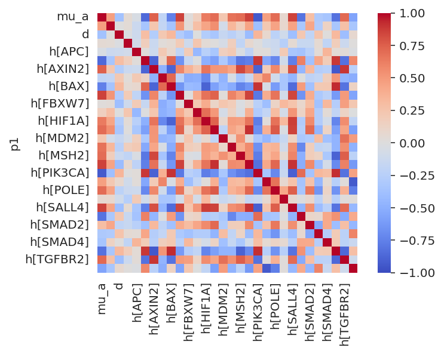


```python
plot_df = gene_corr_post.pivot_wider("p1", "p2", "mean").set_index("p1")
sns.clustermap(plot_df, cmap="seismic", vmin=-1, vmax=1)
plt.show()
```


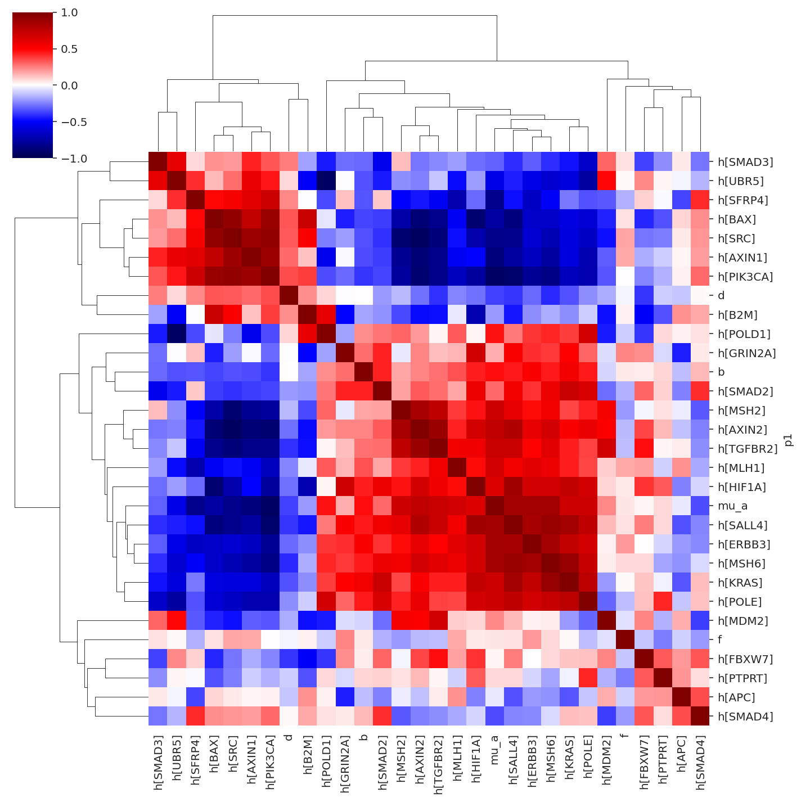


```python
cancer_genes = trace.posterior.coords["cancer_gene"].values.tolist()
cancer_gene_mutants = (
    valid_crc_data.filter_column_isin("hugo_symbol", cancer_genes)[
        ["hugo_symbol", "depmap_id", "is_mutated"]
    ]
    .drop_duplicates()
    # .assign(is_mutated=lambda d: d["is_mutated"].map({True: "X", False: ""}))
    .pivot_wider("depmap_id", names_from="hugo_symbol", values_from="is_mutated")
    .set_index("depmap_id")
)
cg = sns.clustermap(cancer_gene_mutants, cmap="Greys", xticklabels=1, yticklabels=1)
cg.ax_heatmap.tick_params("both", length=0)
cg.ax_cbar.remove()
plt.show()
```


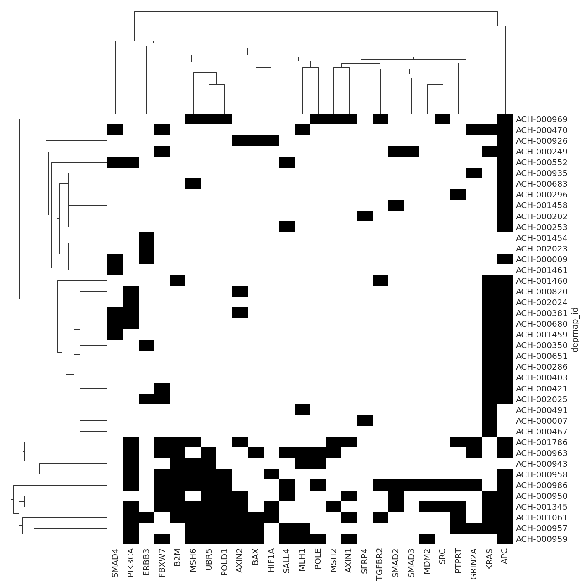


```python
h_post_summary = (
    crc_post_summary.query("var_name == 'h'")
    .reset_index(drop=True)
    .pipe(
        extract_coords_param_names,
        names=["hugo_symbol", "cancer_gene"],
        col="parameter",
    )
)
h_post_summary.head()
```


<div>
<style scoped>
    .dataframe tbody tr th:only-of-type {
        vertical-align: middle;
    }

    .dataframe tbody tr th {
        vertical-align: top;
    }

    .dataframe thead th {
        text-align: right;
    }
</style>
<table border="1" class="dataframe">
  <thead>
    <tr style="text-align: right;">
      <th></th>
      <th>parameter</th>
      <th>mean</th>
      <th>sd</th>
      <th>hdi_5.5%</th>
      <th>hdi_94.5%</th>
      <th>mcse_mean</th>
      <th>mcse_sd</th>
      <th>ess_bulk</th>
      <th>ess_tail</th>
      <th>r_hat</th>
      <th>var_name</th>
      <th>hugo_symbol</th>
      <th>cancer_gene</th>
    </tr>
  </thead>
  <tbody>
    <tr>
      <th>0</th>
      <td>h[A1BG, APC]</td>
      <td>0.014</td>
      <td>0.029</td>
      <td>-0.029</td>
      <td>0.064</td>
      <td>0.003</td>
      <td>0.003</td>
      <td>65.0</td>
      <td>363.0</td>
      <td>1.22</td>
      <td>h</td>
      <td>A1BG</td>
      <td>APC</td>
    </tr>
    <tr>
      <th>1</th>
      <td>h[A1BG, AXIN1]</td>
      <td>-0.072</td>
      <td>0.093</td>
      <td>-0.236</td>
      <td>0.053</td>
      <td>0.017</td>
      <td>0.012</td>
      <td>28.0</td>
      <td>167.0</td>
      <td>1.18</td>
      <td>h</td>
      <td>A1BG</td>
      <td>AXIN1</td>
    </tr>
    <tr>
      <th>2</th>
      <td>h[A1BG, AXIN2]</td>
      <td>0.038</td>
      <td>0.062</td>
      <td>-0.057</td>
      <td>0.144</td>
      <td>0.007</td>
      <td>0.006</td>
      <td>60.0</td>
      <td>248.0</td>
      <td>1.12</td>
      <td>h</td>
      <td>A1BG</td>
      <td>AXIN2</td>
    </tr>
    <tr>
      <th>3</th>
      <td>h[A1BG, B2M]</td>
      <td>-0.046</td>
      <td>0.138</td>
      <td>-0.243</td>
      <td>0.207</td>
      <td>0.013</td>
      <td>0.009</td>
      <td>136.0</td>
      <td>261.0</td>
      <td>1.47</td>
      <td>h</td>
      <td>A1BG</td>
      <td>B2M</td>
    </tr>
    <tr>
      <th>4</th>
      <td>h[A1BG, BAX]</td>
      <td>-0.150</td>
      <td>0.162</td>
      <td>-0.368</td>
      <td>0.121</td>
      <td>0.036</td>
      <td>0.026</td>
      <td>20.0</td>
      <td>991.0</td>
      <td>1.14</td>
      <td>h</td>
      <td>A1BG</td>
      <td>BAX</td>
    </tr>
  </tbody>
</table>
</div>


```python
h_post_summary.sort_values("mean").pipe(head_tail, n=5)
```


<div>
<style scoped>
    .dataframe tbody tr th:only-of-type {
        vertical-align: middle;
    }

    .dataframe tbody tr th {
        vertical-align: top;
    }

    .dataframe thead th {
        text-align: right;
    }
</style>
<table border="1" class="dataframe">
  <thead>
    <tr style="text-align: right;">
      <th></th>
      <th>parameter</th>
      <th>mean</th>
      <th>sd</th>
      <th>hdi_5.5%</th>
      <th>hdi_94.5%</th>
      <th>mcse_mean</th>
      <th>mcse_sd</th>
      <th>ess_bulk</th>
      <th>ess_tail</th>
      <th>r_hat</th>
      <th>var_name</th>
      <th>hugo_symbol</th>
      <th>cancer_gene</th>
    </tr>
  </thead>
  <tbody>
    <tr>
      <th>432760</th>
      <td>h[TXNL4A, POLE]</td>
      <td>-2.928</td>
      <td>0.897</td>
      <td>-4.486</td>
      <td>-2.116</td>
      <td>0.437</td>
      <td>0.338</td>
      <td>6.0</td>
      <td>25.0</td>
      <td>1.78</td>
      <td>h</td>
      <td>TXNL4A</td>
      <td>POLE</td>
    </tr>
    <tr>
      <th>328708</th>
      <td>h[RAN, POLE]</td>
      <td>-2.925</td>
      <td>0.923</td>
      <td>-4.555</td>
      <td>-2.133</td>
      <td>0.450</td>
      <td>0.347</td>
      <td>6.0</td>
      <td>17.0</td>
      <td>1.77</td>
      <td>h</td>
      <td>RAN</td>
      <td>POLE</td>
    </tr>
    <tr>
      <th>115144</th>
      <td>h[DUX4, POLE]</td>
      <td>-2.884</td>
      <td>0.713</td>
      <td>-4.134</td>
      <td>-2.196</td>
      <td>0.342</td>
      <td>0.265</td>
      <td>6.0</td>
      <td>22.0</td>
      <td>1.76</td>
      <td>h</td>
      <td>DUX4</td>
      <td>POLE</td>
    </tr>
    <tr>
      <th>346362</th>
      <td>h[RRM1, POLE]</td>
      <td>-2.682</td>
      <td>0.901</td>
      <td>-4.245</td>
      <td>-1.931</td>
      <td>0.439</td>
      <td>0.340</td>
      <td>7.0</td>
      <td>31.0</td>
      <td>1.60</td>
      <td>h</td>
      <td>RRM1</td>
      <td>POLE</td>
    </tr>
    <tr>
      <th>43280</th>
      <td>h[BUB3, POLE]</td>
      <td>-2.602</td>
      <td>0.746</td>
      <td>-3.921</td>
      <td>-1.938</td>
      <td>0.360</td>
      <td>0.279</td>
      <td>7.0</td>
      <td>13.0</td>
      <td>1.56</td>
      <td>h</td>
      <td>BUB3</td>
      <td>POLE</td>
    </tr>
    <tr>
      <th>432767</th>
      <td>h[TXNL4A, SRC]</td>
      <td>3.557</td>
      <td>0.652</td>
      <td>2.831</td>
      <td>4.608</td>
      <td>0.295</td>
      <td>0.229</td>
      <td>6.0</td>
      <td>32.0</td>
      <td>1.71</td>
      <td>h</td>
      <td>TXNL4A</td>
      <td>SRC</td>
    </tr>
    <tr>
      <th>328717</th>
      <td>h[RAN, UBR5]</td>
      <td>3.563</td>
      <td>0.283</td>
      <td>3.090</td>
      <td>4.008</td>
      <td>0.032</td>
      <td>0.023</td>
      <td>88.0</td>
      <td>376.0</td>
      <td>1.19</td>
      <td>h</td>
      <td>RAN</td>
      <td>UBR5</td>
    </tr>
    <tr>
      <th>345485</th>
      <td>h[RPS3A, SRC]</td>
      <td>3.607</td>
      <td>0.598</td>
      <td>2.922</td>
      <td>4.557</td>
      <td>0.265</td>
      <td>0.205</td>
      <td>6.0</td>
      <td>12.0</td>
      <td>1.70</td>
      <td>h</td>
      <td>RPS3A</td>
      <td>SRC</td>
    </tr>
    <tr>
      <th>328715</th>
      <td>h[RAN, SRC]</td>
      <td>3.634</td>
      <td>0.722</td>
      <td>2.855</td>
      <td>4.854</td>
      <td>0.334</td>
      <td>0.259</td>
      <td>6.0</td>
      <td>15.0</td>
      <td>1.85</td>
      <td>h</td>
      <td>RAN</td>
      <td>SRC</td>
    </tr>
    <tr>
      <th>345927</th>
      <td>h[RPSA, SRC]</td>
      <td>3.696</td>
      <td>0.643</td>
      <td>3.027</td>
      <td>4.811</td>
      <td>0.296</td>
      <td>0.229</td>
      <td>7.0</td>
      <td>41.0</td>
      <td>1.62</td>
      <td>h</td>
      <td>RPSA</td>
      <td>SRC</td>
    </tr>
  </tbody>
</table>
</div>


```python
ax = sns.kdeplot(data=h_post_summary, x="mean", hue="cancer_gene")
ax.set_xlabel(r"$\bar{h}_g$ posterior")
ax.set_ylabel("density")
ax.get_legend().remove()  # set_title("cancer gene\ncomut.")
plt.show()
```


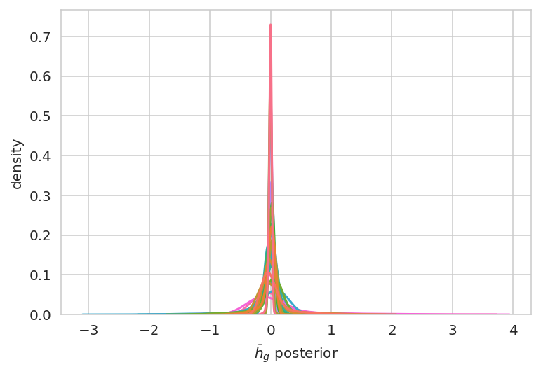


```python
fig, axes = plt.subplots(
    len(cancer_genes), 1, squeeze=False, figsize=(8, len(cancer_genes) * 5)
)
for ax, cg in zip(axes.flatten(), cancer_genes):
    h_hits = (
        h_post_summary.filter_column_isin("cancer_gene", [cg])
        .sort_values("mean")
        .pipe(head_tail, n=5)["hugo_symbol"]
        .tolist()
    )

    h_hits_data = (
        valid_crc_data.filter_column_isin("hugo_symbol", h_hits)
        .merge(cancer_gene_mutants.reset_index(), on="depmap_id")
        .reset_index()
        .astype({"hugo_symbol": str})
        .assign(
            hugo_symbol=lambda d: pd.Categorical(d["hugo_symbol"], categories=h_hits),
            _cg_mut=lambda d: d[cg].map({True: "mut.", False: "WT"}),
        )
    )
    mut_pal = {"mut.": "tab:red", "WT": "gray"}
    sns.boxplot(
        data=h_hits_data,
        x="hugo_symbol",
        y="lfc",
        hue="_cg_mut",
        palette=mut_pal,
        ax=ax,
        showfliers=False,
        boxprops={"alpha": 0.5},
    )
    sns.stripplot(
        data=h_hits_data,
        x="hugo_symbol",
        y="lfc",
        hue="_cg_mut",
        dodge=True,
        palette=mut_pal,
        ax=ax,
    )
    ax.get_legend().set_title(cg)

plt.tight_layout()
plt.show()
```


```python
top_n = 5
top_b_hits = (
    crc_post_summary.query("var_name == 'b'")
    .sort_values("mean")
    .reset_index(drop=True)
    .pipe(extract_coords_param_names, names=["hugo_symbol"], col="parameter")
    .pipe(head_tail, n=top_n)
)

negative_b = top_b_hits["hugo_symbol"][:top_n].values
positive_b = top_b_hits["hugo_symbol"][top_n:].values


fig, axes = plt.subplots(2, top_n, figsize=(12, 6))

for i, genes in enumerate([positive_b, negative_b]):
    for j, gene in enumerate(genes):
        ax = axes[i, j]
        ax.set_title(gene)
        obs_data = crc_data.query(f"hugo_symbol == '{gene}'")
        sns.scatterplot(data=obs_data, x="rna_expr", y="lfc", ax=ax)
        ax.set_xlabel(None)
        ax.set_ylabel(None)


fig.supxlabel("log RNA expression")
fig.supylabel("log-fold change")

fig.tight_layout()
plt.show()
```


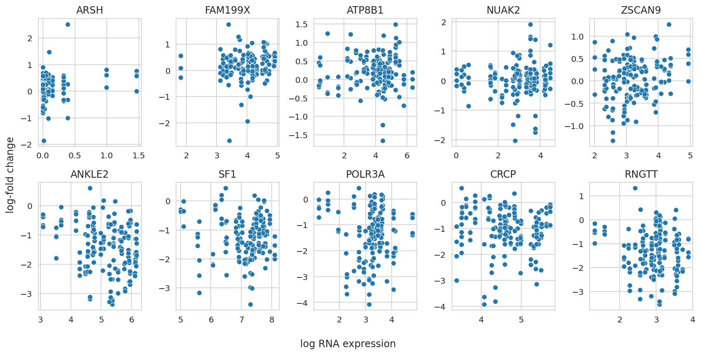


```python
top_n = 5
top_d_hits = (
    crc_post_summary.query("var_name == 'd'")
    .sort_values("mean")
    .reset_index(drop=True)
    .pipe(extract_coords_param_names, names=["hugo_symbol"], col="parameter")
    .pipe(head_tail, n=top_n)
)

negative_d = top_d_hits["hugo_symbol"][:top_n].values
positive_d = top_d_hits["hugo_symbol"][top_n:].values


fig, axes = plt.subplots(2, top_n, figsize=(12, 6))

for i, genes in enumerate([positive_d, negative_d]):
    for j, gene in enumerate(genes):
        ax = axes[i, j]
        ax.set_title(gene)
        obs_data = crc_data.query(f"hugo_symbol == '{gene}'")
        sns.scatterplot(data=obs_data, x="copy_number", y="lfc", ax=ax)
        ax.set_xlabel(None)
        ax.set_ylabel(None)


fig.supxlabel("copy number")
fig.supylabel("log-fold change")
fig.tight_layout()
plt.show()
```


## PPC


```python
np.random.seed(99)
n_examples = 40
n_chains, n_draws, n_data = trace.posterior_predictive["ct_final"].shape
ex_draws_idx = np.random.choice(
    np.arange(n_draws), size=n_examples // n_chains, replace=False
)
example_ppc_draws = trace.posterior_predictive["ct_final"][
    :, ex_draws_idx, :
].values.reshape(-1, n_data)
example_ppc_draws.shape
```


    (40, 2842455)


```python
fig, axes = plt.subplots(ncols=2, figsize=(9, 4), sharex=False, sharey=False)
ax1 = axes[0]
ax2 = axes[1]
hist_kwargs = {"stat": "count", "element": "step", "fill": False}

pp_avg = trace.posterior_predictive["ct_final"].mean(axis=(0, 1))

bw = 0.1
for i in range(example_ppc_draws.shape[0]):
    sns.histplot(
        x=np.log10(example_ppc_draws[i, :] + 1),
        alpha=0.2,
        binwidth=bw,
        color="tab:blue",
        ax=ax1,
        **hist_kwargs,
    )

sns.histplot(
    x=np.log10(pp_avg + 1),
    color="tab:orange",
    binwidth=bw,
    ax=ax1,
    alpha=0.5,
    **hist_kwargs,
)
sns.histplot(
    x=np.log10(valid_crc_data["counts_final"] + 1),
    color="k",
    binwidth=bw,
    ax=ax1,
    **hist_kwargs,
)
ax1.set_xlabel("log10(counts final + 1)")
ax1.set_ylabel("density")

bw = 20
for i in range(example_ppc_draws.shape[0]):
    sns.histplot(
        x=example_ppc_draws[i, :],
        alpha=0.2,
        binwidth=bw,
        color="tab:blue",
        ax=ax2,
        **hist_kwargs,
    )

sns.histplot(
    x=pp_avg, color="tab:orange", alpha=0.5, ax=ax2, binwidth=bw, **hist_kwargs
)
sns.histplot(
    x=valid_crc_data["counts_final"], color="k", binwidth=bw, ax=ax2, **hist_kwargs
)
ax2.set_xlabel("counts final")
ax2.set_ylabel("density")
ax2.set_xlim(0, 1000)

fig.suptitle("PPC")
fig.tight_layout()
plt.show()
```


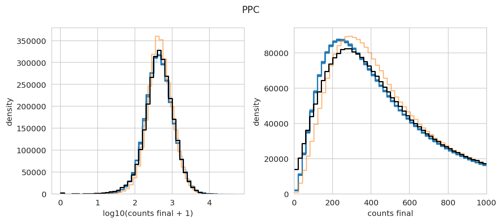


---

## Session info


```python
notebook_toc = time()
print(f"execution time: {(notebook_toc - notebook_tic) / 60:.2f} minutes")
```

    execution time: 25.27 minutes


```python
%load_ext watermark
%watermark -d -u -v -iv -b -h -m
```

    Last updated: 2022-08-01

    Python implementation: CPython
    Python version       : 3.10.5
    IPython version      : 8.4.0

    Compiler    : GCC 10.3.0
    OS          : Linux
    Release     : 3.10.0-1160.45.1.el7.x86_64
    Machine     : x86_64
    Processor   : x86_64
    CPU cores   : 28
    Architecture: 64bit

    Hostname: compute-e-16-236.o2.rc.hms.harvard.edu

    Git branch: simplify

    matplotlib: 3.5.2
    pandas    : 1.4.3
    arviz     : 0.12.1
    numpy     : 1.22.4
    seaborn   : 0.11.2


```python

```
