# Inspect the single-lineage model run on the colorectal data (005)

Model attributes:

- sgRNA | gene varying intercept
- RNA and CN varying effects per gene
- correlation between gene varying effects modeled using the multivariate normal and Cholesky decomposition (non-centered parameterization)
- target gene mutation variable and cancer gene comutation variable.


```python
%load_ext autoreload
%autoreload 2
```


```python
from time import time

import arviz as az
import matplotlib.pyplot as plt
import numpy as np
import pandas as pd
import seaborn as sns
from IPython.display import Markdown, display
```


```python
from speclet.analysis.arviz_analysis import extract_coords_param_names
from speclet.bayesian_models.lineage_hierarchical_nb import LineageHierNegBinomModel
from speclet.data_processing.common import head_tail
from speclet.io import modeling_data_dir, models_dir
from speclet.managers.data_managers import CrisprScreenDataManager
from speclet.plot import set_speclet_theme
from speclet.project_configuration import arviz_config
```


```python
# Notebook execution timer.
notebook_tic = time()

# Plotting setup.
set_speclet_theme()
%config InlineBackend.figure_format = "retina"
arviz_config()
```

## Data


```python
saved_model_dir = models_dir() / "hnb-single-lineage-colorectal-005_PYMC_NUMPYRO"
```


```python
with open(saved_model_dir / "description.txt") as f:
    model_description = "".join(list(f))

print(model_description)
```

    name: 'hnb-single-lineage-colorectal-005'
    fit method: 'PYMC_NUMPYRO'

    --------------------------------------------------------------------------------

    CONFIGURATION

    {
        "name": "hnb-single-lineage-colorectal-005",
        "description": " Single lineage hierarchical negative binomial model for colorectal data from the Broad. The number of cancer genes has been limited by having to be mutated in at least 25% of cell lines. I have also increased the number of tuning steps from 1,000 to 2,000 and increased the target acceptance probability to 0.99. ",
        "active": true,
        "model": "LINEAGE_HIERARCHICAL_NB",
        "data_file": "modeling_data/lineage-modeling-data/depmap-modeling-data_colorectal.csv",
        "model_kwargs": {
            "lineage": "colorectal",
            "min_frac_cancer_genes": 0.2
        },
        "sampling_kwargs": {
            "pymc_mcmc": null,
            "pymc_advi": null,
            "pymc_numpyro": {
                "draws": 1000,
                "tune": 2000,
                "chains": 4,
                "target_accept": 0.99,
                "progress_bar": true,
                "chain_method": "parallel",
                "postprocessing_backend": "cpu",
                "idata_kwargs": {
                    "log_likelihood": false
                },
                "nuts_kwargs": {
                    "step_size": 0.01
                }
            }
        }
    }

    --------------------------------------------------------------------------------

    POSTERIOR

    <xarray.Dataset>
    Dimensions:                    (chain: 4, draw: 1000, delta_genes_dim_0: 13,
                                    delta_genes_dim_1: 18119, sgrna: 71062,
                                    genes_chol_cov_dim_0: 91,
                                    genes_chol_cov_corr_dim_0: 13,
                                    genes_chol_cov_corr_dim_1: 13,
                                    genes_chol_cov_stds_dim_0: 13, cancer_gene: 9,
                                    gene: 18119)
    Coordinates:
      * chain                      (chain) int64 0 1 2 3
      * draw                       (draw) int64 0 1 2 3 4 5 ... 995 996 997 998 999
      * delta_genes_dim_0          (delta_genes_dim_0) int64 0 1 2 3 ... 9 10 11 12
      * delta_genes_dim_1          (delta_genes_dim_1) int64 0 1 2 ... 18117 18118
      * sgrna                      (sgrna) object 'AAAAAAATCCAGCAATGCAG' ... 'TTT...
      * genes_chol_cov_dim_0       (genes_chol_cov_dim_0) int64 0 1 2 3 ... 88 89 90
      * genes_chol_cov_corr_dim_0  (genes_chol_cov_corr_dim_0) int64 0 1 2 ... 11 12
      * genes_chol_cov_corr_dim_1  (genes_chol_cov_corr_dim_1) int64 0 1 2 ... 11 12
      * genes_chol_cov_stds_dim_0  (genes_chol_cov_stds_dim_0) int64 0 1 2 ... 11 12
      * cancer_gene                (cancer_gene) object 'APC' 'AXIN2' ... 'UBR5'
      * gene                       (gene) object 'A1BG' 'A1CF' ... 'ZZEF1' 'ZZZ3'
    Data variables: (12/21)
        mu_mu_a                    (chain, draw) float64 ...
        mu_b                       (chain, draw) float64 ...
        mu_d                       (chain, draw) float64 ...
        delta_genes                (chain, draw, delta_genes_dim_0, delta_genes_dim_1) float64 ...
        delta_a                    (chain, draw, sgrna) float64 ...
        genes_chol_cov             (chain, draw, genes_chol_cov_dim_0) float64 ...
        ...                         ...
        mu_a                       (chain, draw, gene) float64 ...
        b                          (chain, draw, gene) float64 ...
        d                          (chain, draw, gene) float64 ...
        f                          (chain, draw, gene) float64 ...
        h                          (chain, draw, gene, cancer_gene) float64 ...
        a                          (chain, draw, sgrna) float64 ...
    Attributes:
        created_at:           2022-08-02 06:16:48.079730
        arviz_version:        0.12.1
        previous_created_at:  ['2022-08-02 06:16:48.079730', '2022-08-02T00:23:11...

    --------------------------------------------------------------------------------

    SAMPLE STATS

    <xarray.Dataset>
    Dimensions:          (chain: 4, draw: 1000)
    Coordinates:
      * chain            (chain) int64 0 1 2 3
      * draw             (draw) int64 0 1 2 3 4 5 6 ... 993 994 995 996 997 998 999
    Data variables:
        acceptance_rate  (chain, draw) float64 ...
        step_size        (chain, draw) float64 ...
        diverging        (chain, draw) bool ...
        energy           (chain, draw) float64 ...
        n_steps          (chain, draw) int64 ...
        tree_depth       (chain, draw) int64 ...
        lp               (chain, draw) float64 ...
    Attributes:
        created_at:           2022-08-02 06:16:48.079730
        arviz_version:        0.12.1
        previous_created_at:  ['2022-08-02 06:16:48.079730', '2022-08-02T00:23:11...

    --------------------------------------------------------------------------------

    MCMC DESCRIPTION

    sampled 4 chains with (unknown) tuning steps and 1,000 draws
    num. divergences: 0, 0, 0, 0
    percent divergences: 0.0, 0.0, 0.0, 0.0
    BFMI: 0.816, 0.773, 0.733, 0.186
    avg. step size: 0.007, 0.007, 0.007, 0.0


### Load posterior summary


```python
crc_post_summary = pd.read_csv(saved_model_dir / "posterior-summary.csv").assign(
    var_name=lambda d: [x.split("[")[0] for x in d["parameter"]]
)
crc_post_summary.head()
```


<div>
<style scoped>
    .dataframe tbody tr th:only-of-type {
        vertical-align: middle;
    }

    .dataframe tbody tr th {
        vertical-align: top;
    }

    .dataframe thead th {
        text-align: right;
    }
</style>
<table border="1" class="dataframe">
  <thead>
    <tr style="text-align: right;">
      <th></th>
      <th>parameter</th>
      <th>mean</th>
      <th>sd</th>
      <th>hdi_5.5%</th>
      <th>hdi_94.5%</th>
      <th>mcse_mean</th>
      <th>mcse_sd</th>
      <th>ess_bulk</th>
      <th>ess_tail</th>
      <th>r_hat</th>
      <th>var_name</th>
    </tr>
  </thead>
  <tbody>
    <tr>
      <th>0</th>
      <td>mu_mu_a</td>
      <td>0.119</td>
      <td>0.001</td>
      <td>0.118</td>
      <td>0.121</td>
      <td>0.000</td>
      <td>0.000</td>
      <td>24.0</td>
      <td>2247.0</td>
      <td>1.12</td>
      <td>mu_mu_a</td>
    </tr>
    <tr>
      <th>1</th>
      <td>mu_b</td>
      <td>-0.000</td>
      <td>0.001</td>
      <td>-0.001</td>
      <td>0.001</td>
      <td>0.000</td>
      <td>0.000</td>
      <td>7.0</td>
      <td>35.0</td>
      <td>1.53</td>
      <td>mu_b</td>
    </tr>
    <tr>
      <th>2</th>
      <td>mu_d</td>
      <td>-0.022</td>
      <td>0.001</td>
      <td>-0.023</td>
      <td>-0.021</td>
      <td>0.000</td>
      <td>0.000</td>
      <td>7.0</td>
      <td>35.0</td>
      <td>1.53</td>
      <td>mu_d</td>
    </tr>
    <tr>
      <th>3</th>
      <td>sigma_a</td>
      <td>0.149</td>
      <td>0.058</td>
      <td>0.048</td>
      <td>0.184</td>
      <td>0.029</td>
      <td>0.022</td>
      <td>7.0</td>
      <td>11.0</td>
      <td>1.60</td>
      <td>sigma_a</td>
    </tr>
    <tr>
      <th>4</th>
      <td>alpha</td>
      <td>7.470</td>
      <td>0.671</td>
      <td>6.302</td>
      <td>7.870</td>
      <td>0.334</td>
      <td>0.256</td>
      <td>7.0</td>
      <td>11.0</td>
      <td>1.59</td>
      <td>alpha</td>
    </tr>
  </tbody>
</table>
</div>


### Load trace object


```python
trace_file = saved_model_dir / "posterior.netcdf"
assert trace_file.exists()
trace = az.from_netcdf(trace_file)
```

### Colorectal data


```python
def _broad_only(df: pd.DataFrame) -> pd.DataFrame:
    return df[df["screen"] == "broad"].reset_index(drop=True)


crc_dm = CrisprScreenDataManager(
    modeling_data_dir()
    / "lineage-modeling-data"
    / "depmap-modeling-data_colorectal.csv",
    transformations=[_broad_only],
)
```


```python
crc_data = crc_dm.get_data(read_kwargs={"low_memory": False})
crc_data.head()
```


<div>
<style scoped>
    .dataframe tbody tr th:only-of-type {
        vertical-align: middle;
    }

    .dataframe tbody tr th {
        vertical-align: top;
    }

    .dataframe thead th {
        text-align: right;
    }
</style>
<table border="1" class="dataframe">
  <thead>
    <tr style="text-align: right;">
      <th></th>
      <th>sgrna</th>
      <th>replicate_id</th>
      <th>lfc</th>
      <th>p_dna_batch</th>
      <th>genome_alignment</th>
      <th>hugo_symbol</th>
      <th>screen</th>
      <th>multiple_hits_on_gene</th>
      <th>sgrna_target_chr</th>
      <th>sgrna_target_pos</th>
      <th>...</th>
      <th>any_deleterious</th>
      <th>any_tcga_hotspot</th>
      <th>any_cosmic_hotspot</th>
      <th>is_mutated</th>
      <th>copy_number</th>
      <th>lineage</th>
      <th>lineage_subtype</th>
      <th>primary_or_metastasis</th>
      <th>is_male</th>
      <th>age</th>
    </tr>
  </thead>
  <tbody>
    <tr>
      <th>0</th>
      <td>AAAGCCCAGGAGTATGGGAG</td>
      <td>LS513-311Cas9_RepA_p6_batch2</td>
      <td>0.594321</td>
      <td>2</td>
      <td>chr2_130522105_-</td>
      <td>CFC1B</td>
      <td>broad</td>
      <td>True</td>
      <td>2</td>
      <td>130522105</td>
      <td>...</td>
      <td>NaN</td>
      <td>NaN</td>
      <td>NaN</td>
      <td>False</td>
      <td>0.951337</td>
      <td>colorectal</td>
      <td>colorectal_adenocarcinoma</td>
      <td>primary</td>
      <td>True</td>
      <td>63.0</td>
    </tr>
    <tr>
      <th>1</th>
      <td>AAATCAGAGAAACCTGAACG</td>
      <td>LS513-311Cas9_RepA_p6_batch2</td>
      <td>-0.363633</td>
      <td>2</td>
      <td>chr11_89916950_-</td>
      <td>TRIM49D1</td>
      <td>broad</td>
      <td>True</td>
      <td>11</td>
      <td>89916950</td>
      <td>...</td>
      <td>NaN</td>
      <td>NaN</td>
      <td>NaN</td>
      <td>False</td>
      <td>0.945508</td>
      <td>colorectal</td>
      <td>colorectal_adenocarcinoma</td>
      <td>primary</td>
      <td>True</td>
      <td>63.0</td>
    </tr>
    <tr>
      <th>2</th>
      <td>AACGTCTTTGAAGAAAGCTG</td>
      <td>LS513-311Cas9_RepA_p6_batch2</td>
      <td>-0.001343</td>
      <td>2</td>
      <td>chr5_71055421_-</td>
      <td>GTF2H2</td>
      <td>broad</td>
      <td>True</td>
      <td>5</td>
      <td>71055421</td>
      <td>...</td>
      <td>NaN</td>
      <td>NaN</td>
      <td>NaN</td>
      <td>False</td>
      <td>1.428663</td>
      <td>colorectal</td>
      <td>colorectal_adenocarcinoma</td>
      <td>primary</td>
      <td>True</td>
      <td>63.0</td>
    </tr>
    <tr>
      <th>3</th>
      <td>AACGTCTTTGAAGGAAGCTG</td>
      <td>LS513-311Cas9_RepA_p6_batch2</td>
      <td>0.367220</td>
      <td>2</td>
      <td>chr5_69572480_+</td>
      <td>GTF2H2C</td>
      <td>broad</td>
      <td>True</td>
      <td>5</td>
      <td>69572480</td>
      <td>...</td>
      <td>NaN</td>
      <td>NaN</td>
      <td>NaN</td>
      <td>False</td>
      <td>1.428663</td>
      <td>colorectal</td>
      <td>colorectal_adenocarcinoma</td>
      <td>primary</td>
      <td>True</td>
      <td>63.0</td>
    </tr>
    <tr>
      <th>4</th>
      <td>AAGAGGTTCCAGACTACTTA</td>
      <td>LS513-311Cas9_RepA_p6_batch2</td>
      <td>-1.180029</td>
      <td>2</td>
      <td>chrX_155898173_+</td>
      <td>VAMP7</td>
      <td>broad</td>
      <td>True</td>
      <td>X</td>
      <td>155898173</td>
      <td>...</td>
      <td>NaN</td>
      <td>NaN</td>
      <td>NaN</td>
      <td>False</td>
      <td>0.466222</td>
      <td>colorectal</td>
      <td>colorectal_adenocarcinoma</td>
      <td>primary</td>
      <td>True</td>
      <td>63.0</td>
    </tr>
  </tbody>
</table>
<p>5 rows × 25 columns</p>
</div>


### Single lineage model


```python
crc_model = LineageHierNegBinomModel(lineage="colorectal", min_frac_cancer_genes=0.2)
```


```python
valid_crc_data = crc_model.data_processing_pipeline(crc_data.copy())
crc_model_data = crc_model.make_data_structure(valid_crc_data)
```


<pre style="white-space:pre;overflow-x:auto;line-height:normal;font-family:Menlo,'DejaVu Sans Mono',consolas,'Courier New',monospace"><span style="color: #7fbfbf; text-decoration-color: #7fbfbf">[08/02/22 11:38:26] </span><span style="color: #000080; text-decoration-color: #000080">INFO    </span> Processing data for modeling.     <a href="file:///n/data1/hms/dbmi/park/Cook/speclet/speclet/bayesian_models/lineage_hierarchical_nb.py" target="_blank"><span style="color: #7f7f7f; text-decoration-color: #7f7f7f">lineage_hierarchical_nb.py</span></a><span style="color: #7f7f7f; text-decoration-color: #7f7f7f">:</span><a href="file:///n/data1/hms/dbmi/park/Cook/speclet/speclet/bayesian_models/lineage_hierarchical_nb.py#273" target="_blank"><span style="color: #7f7f7f; text-decoration-color: #7f7f7f">273</span></a>
</pre>


<pre style="white-space:pre;overflow-x:auto;line-height:normal;font-family:Menlo,'DejaVu Sans Mono',consolas,'Courier New',monospace"><span style="color: #7fbfbf; text-decoration-color: #7fbfbf">                    </span><span style="color: #000080; text-decoration-color: #000080">INFO    </span> LFC limits: <span style="font-weight: bold">(</span><span style="color: #008080; text-decoration-color: #008080; font-weight: bold">-5.0</span>, <span style="color: #008080; text-decoration-color: #008080; font-weight: bold">5.0</span><span style="font-weight: bold">)</span>           <a href="file:///n/data1/hms/dbmi/park/Cook/speclet/speclet/bayesian_models/lineage_hierarchical_nb.py" target="_blank"><span style="color: #7f7f7f; text-decoration-color: #7f7f7f">lineage_hierarchical_nb.py</span></a><span style="color: #7f7f7f; text-decoration-color: #7f7f7f">:</span><a href="file:///n/data1/hms/dbmi/park/Cook/speclet/speclet/bayesian_models/lineage_hierarchical_nb.py#274" target="_blank"><span style="color: #7f7f7f; text-decoration-color: #7f7f7f">274</span></a>
</pre>


<pre style="white-space:pre;overflow-x:auto;line-height:normal;font-family:Menlo,'DejaVu Sans Mono',consolas,'Courier New',monospace"><span style="color: #7fbfbf; text-decoration-color: #7fbfbf">[08/02/22 11:40:28] </span><span style="color: #800000; text-decoration-color: #800000">WARNING </span> number of data points dropped: <span style="color: #008080; text-decoration-color: #008080; font-weight: bold">25</span> <a href="file:///n/data1/hms/dbmi/park/Cook/speclet/speclet/bayesian_models/lineage_hierarchical_nb.py" target="_blank"><span style="color: #7f7f7f; text-decoration-color: #7f7f7f">lineage_hierarchical_nb.py</span></a><span style="color: #7f7f7f; text-decoration-color: #7f7f7f">:</span><a href="file:///n/data1/hms/dbmi/park/Cook/speclet/speclet/bayesian_models/lineage_hierarchical_nb.py#325" target="_blank"><span style="color: #7f7f7f; text-decoration-color: #7f7f7f">325</span></a>
</pre>


<pre style="white-space:pre;overflow-x:auto;line-height:normal;font-family:Menlo,'DejaVu Sans Mono',consolas,'Courier New',monospace"><span style="color: #7fbfbf; text-decoration-color: #7fbfbf">[08/02/22 11:40:30] </span><span style="color: #000080; text-decoration-color: #000080">INFO    </span> number of genes mutated in all    <a href="file:///n/data1/hms/dbmi/park/Cook/speclet/speclet/bayesian_models/lineage_hierarchical_nb.py" target="_blank"><span style="color: #7f7f7f; text-decoration-color: #7f7f7f">lineage_hierarchical_nb.py</span></a><span style="color: #7f7f7f; text-decoration-color: #7f7f7f">:</span><a href="file:///n/data1/hms/dbmi/park/Cook/speclet/speclet/bayesian_models/lineage_hierarchical_nb.py#478" target="_blank"><span style="color: #7f7f7f; text-decoration-color: #7f7f7f">478</span></a>
<span style="color: #7fbfbf; text-decoration-color: #7fbfbf">                    </span>         cells lines: <span style="color: #008080; text-decoration-color: #008080; font-weight: bold">0</span>                    <span style="color: #7f7f7f; text-decoration-color: #7f7f7f">                              </span>
</pre>


<pre style="white-space:pre;overflow-x:auto;line-height:normal;font-family:Menlo,'DejaVu Sans Mono',consolas,'Courier New',monospace"><span style="color: #7fbfbf; text-decoration-color: #7fbfbf">[08/02/22 11:40:34] </span><span style="color: #000080; text-decoration-color: #000080">INFO    </span> Dropping <span style="color: #008080; text-decoration-color: #008080; font-weight: bold">21</span> cancer genes.         <a href="file:///n/data1/hms/dbmi/park/Cook/speclet/speclet/bayesian_models/lineage_hierarchical_nb.py" target="_blank"><span style="color: #7f7f7f; text-decoration-color: #7f7f7f">lineage_hierarchical_nb.py</span></a><span style="color: #7f7f7f; text-decoration-color: #7f7f7f">:</span><a href="file:///n/data1/hms/dbmi/park/Cook/speclet/speclet/bayesian_models/lineage_hierarchical_nb.py#534" target="_blank"><span style="color: #7f7f7f; text-decoration-color: #7f7f7f">534</span></a>
</pre>


```python
crc_model_data.coords["cancer_gene"]
```


    ['APC', 'AXIN2', 'B2M', 'FBXW7', 'KRAS', 'MSH6', 'PIK3CA', 'POLD1', 'UBR5']


## Analysis


```python
sns.histplot(x=crc_post_summary["r_hat"], binwidth=0.01, stat="proportion");
```


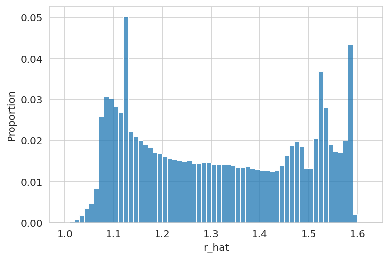


```python
fig, ax = plt.subplots(figsize=(8, 5))
sns.boxplot(data=crc_post_summary, x="var_name", y="r_hat", ax=ax)
ax.tick_params(rotation=90)
plt.show()
```


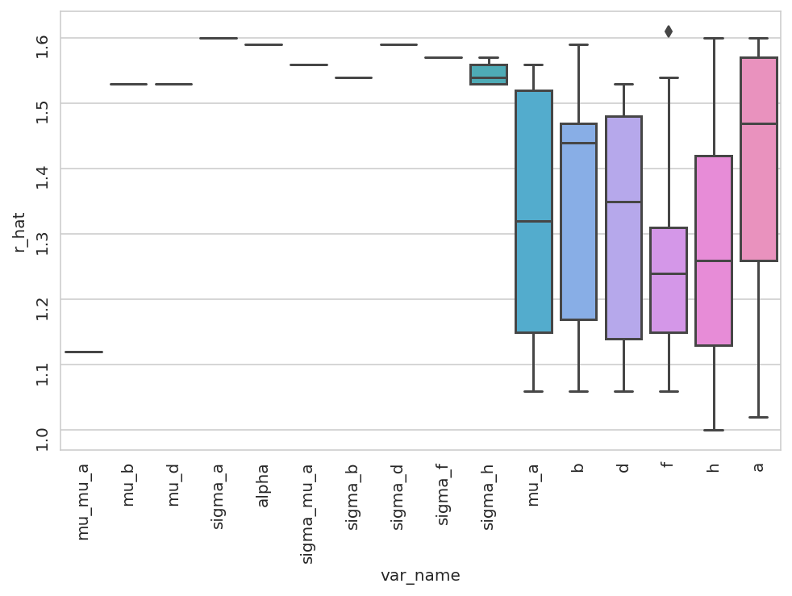


```python
az.plot_energy(trace);
```


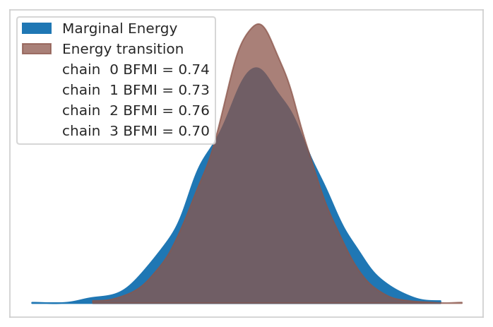


```python
energy = trace.sample_stats.energy.values
marginal_e = pd.DataFrame((energy - energy.mean(axis=1)[:, None]).T).assign(
    energy="marginal"
)
transition_e = pd.DataFrame((energy[:, :-1] - energy[:, 1:]).T).assign(
    energy="transition"
)
energy_df = pd.concat([marginal_e, transition_e]).reset_index(drop=True)
bfmi = az.bfmi(trace)

fig, axes = plt.subplots(2, 2, figsize=(8, 6))
for i, ax in enumerate(axes.flatten()):
    sns.kdeplot(data=energy_df, x=i, hue="energy", ax=ax)
    ax.set_title(f"chain {i} – BFMI: {bfmi[i]:0.2f}")
    ax.set_xlabel(None)
    xmin, _ = ax.get_xlim()
    _, ymax = ax.get_ylim()
    ax.get_legend().set_frame_on(False)

fig.tight_layout()
plt.show()
```


```python
stats = ["step_size", "n_steps", "tree_depth", "acceptance_rate", "energy"]
trace.sample_stats.get(stats).to_dataframe().groupby("chain").mean()
```


<div>
<style scoped>
    .dataframe tbody tr th:only-of-type {
        vertical-align: middle;
    }

    .dataframe tbody tr th {
        vertical-align: top;
    }

    .dataframe thead th {
        text-align: right;
    }
</style>
<table border="1" class="dataframe">
  <thead>
    <tr style="text-align: right;">
      <th></th>
      <th>step_size</th>
      <th>n_steps</th>
      <th>tree_depth</th>
      <th>acceptance_rate</th>
      <th>energy</th>
    </tr>
    <tr>
      <th>chain</th>
      <th></th>
      <th></th>
      <th></th>
      <th></th>
      <th></th>
    </tr>
  </thead>
  <tbody>
    <tr>
      <th>0</th>
      <td>0.007457</td>
      <td>511.0</td>
      <td>9.0</td>
      <td>0.990548</td>
      <td>1.912175e+07</td>
    </tr>
    <tr>
      <th>1</th>
      <td>0.007395</td>
      <td>511.0</td>
      <td>9.0</td>
      <td>0.991426</td>
      <td>1.912176e+07</td>
    </tr>
    <tr>
      <th>2</th>
      <td>0.007224</td>
      <td>511.0</td>
      <td>9.0</td>
      <td>0.991748</td>
      <td>1.912174e+07</td>
    </tr>
    <tr>
      <th>3</th>
      <td>0.000212</td>
      <td>1023.0</td>
      <td>10.0</td>
      <td>0.979913</td>
      <td>1.936050e+07</td>
    </tr>
  </tbody>
</table>
</div>


```python
az.plot_trace(trace, var_names=["mu_mu_a", "mu_b", "mu_d"], compact=False)
plt.tight_layout()
```


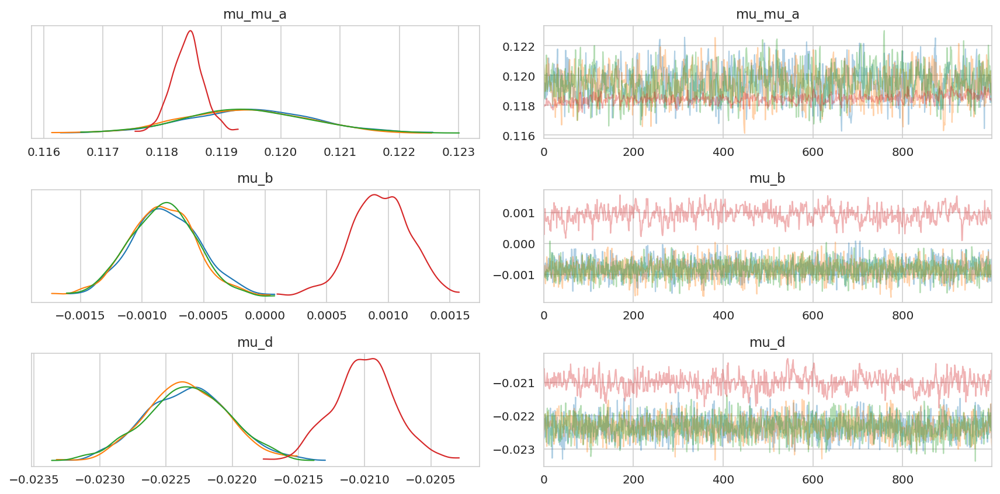


```python
az.plot_trace(
    trace, var_names=[f"sigma_{x}" for x in ["a", "mu_a", "b", "d", "f"]], compact=False
)
plt.tight_layout()
plt.show()
```


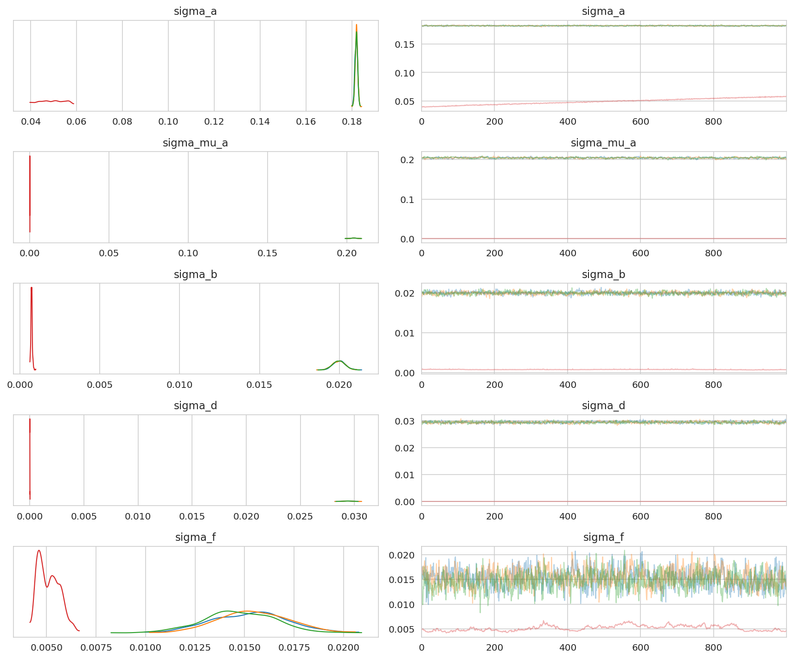


```python
az.plot_trace(trace, var_names=["sigma_h"], compact=True)
plt.tight_layout()
plt.show()
```


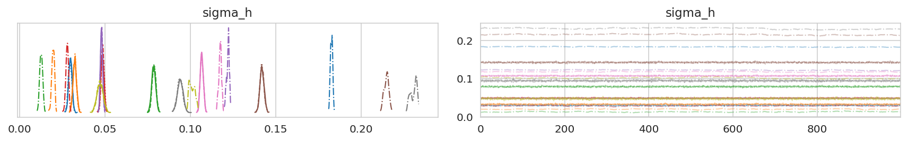


```python
az.plot_trace(trace, var_names=["alpha"], compact=False)
plt.tight_layout()
plt.show()
```


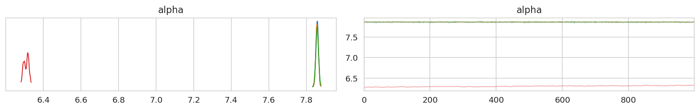


```python
HAPPY_CHAINS = [0, 1, 2]
SAD_CHAINS = [3]
```


```python
trace.posterior = trace.posterior.sel({"chain": HAPPY_CHAINS})
trace.posterior_predictive = trace.posterior_predictive.sel({"chain": HAPPY_CHAINS})
```


```python
az.plot_trace(trace, var_names=["mu_mu_a", "mu_b", "mu_d"], compact=False)
plt.tight_layout()
```


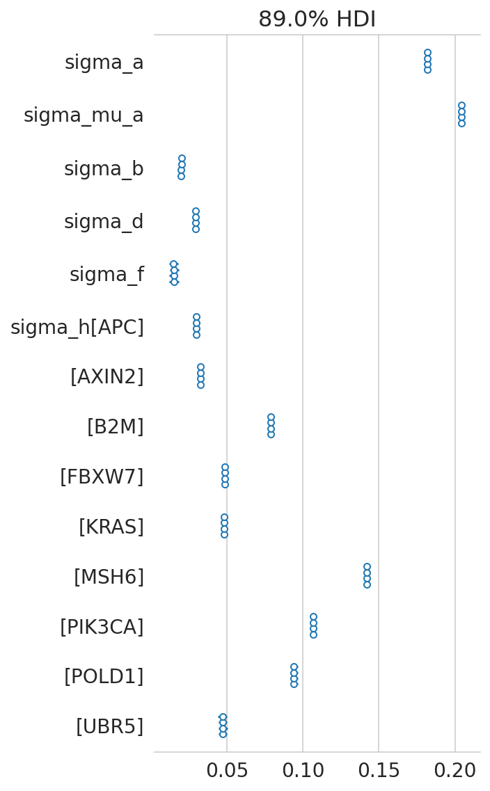


```python
az.summary(trace, var_names=["mu_mu_a", "mu_b", "mu_d"])
```


<div>
<style scoped>
    .dataframe tbody tr th:only-of-type {
        vertical-align: middle;
    }

    .dataframe tbody tr th {
        vertical-align: top;
    }

    .dataframe thead th {
        text-align: right;
    }
</style>
<table border="1" class="dataframe">
  <thead>
    <tr style="text-align: right;">
      <th></th>
      <th>mean</th>
      <th>sd</th>
      <th>hdi_5.5%</th>
      <th>hdi_94.5%</th>
      <th>mcse_mean</th>
      <th>mcse_sd</th>
      <th>ess_bulk</th>
      <th>ess_tail</th>
      <th>r_hat</th>
    </tr>
  </thead>
  <tbody>
    <tr>
      <th>mu_mu_a</th>
      <td>0.119</td>
      <td>0.001</td>
      <td>0.118</td>
      <td>0.121</td>
      <td>0.0</td>
      <td>0.0</td>
      <td>1091.0</td>
      <td>1974.0</td>
      <td>1.0</td>
    </tr>
    <tr>
      <th>mu_b</th>
      <td>-0.001</td>
      <td>0.000</td>
      <td>-0.001</td>
      <td>-0.000</td>
      <td>0.0</td>
      <td>0.0</td>
      <td>3279.0</td>
      <td>2570.0</td>
      <td>1.0</td>
    </tr>
    <tr>
      <th>mu_d</th>
      <td>-0.022</td>
      <td>0.000</td>
      <td>-0.023</td>
      <td>-0.022</td>
      <td>0.0</td>
      <td>0.0</td>
      <td>2545.0</td>
      <td>2292.0</td>
      <td>1.0</td>
    </tr>
  </tbody>
</table>
</div>


```python
az.plot_trace(
    trace, var_names=[f"sigma_{x}" for x in ["a", "mu_a", "b", "d", "f"]], compact=False
)
plt.tight_layout()
plt.show()
```


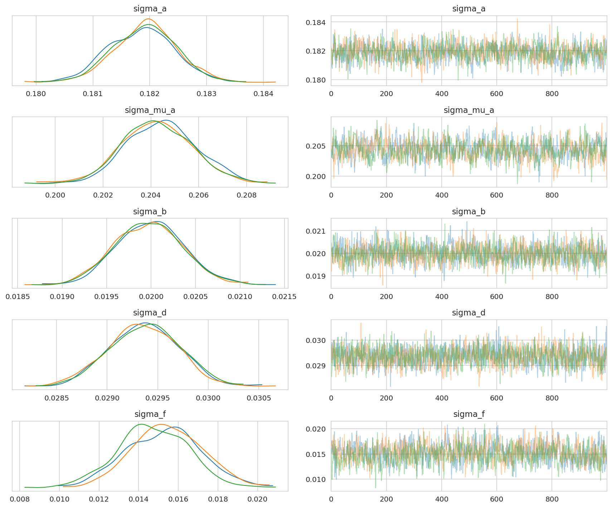


```python
az.plot_trace(trace, var_names=["sigma_h"], compact=True)
plt.tight_layout()
plt.show()
```


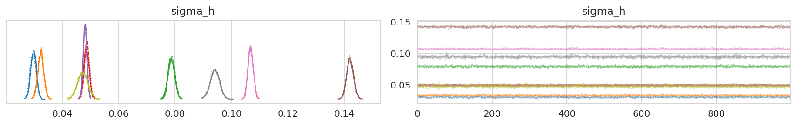


```python
az.plot_trace(trace, var_names=["alpha"], compact=False)
plt.tight_layout()
plt.show()
```


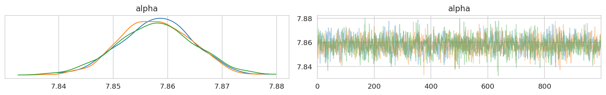


```python
az.plot_forest(
    trace, var_names=["^sigma_*"], filter_vars="regex", combined=False, figsize=(5, 8)
)
plt.tight_layout()
```


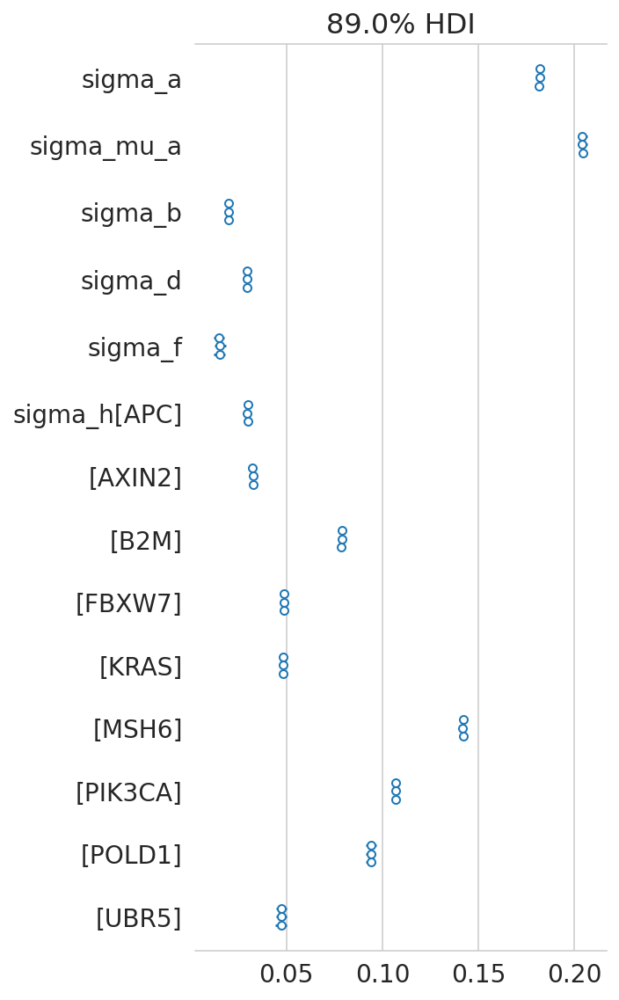


```python
var_names = ["a", "mu_a", "b", "d", "f", "h"]
_, axes = plt.subplots(2, 3, figsize=(8, 6), sharex=True)
for ax, var_name in zip(axes.flatten(), var_names):
    x = crc_post_summary.query(f"var_name == '{var_name}'")["mean"]
    sns.kdeplot(x=x, ax=ax)
    ax.set_title(var_name)
    ax.set_xlim(-2, 1)

plt.tight_layout()
plt.show()
```


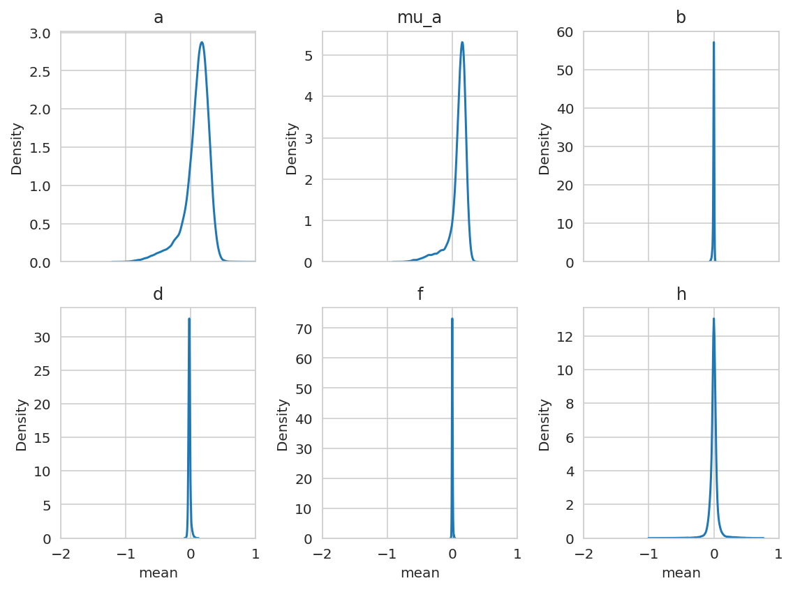


```python
sgrna_to_gene_map = (
    crc_data.copy()[["hugo_symbol", "sgrna"]].drop_duplicates().reset_index(drop=True)
)
```


```python
crc_post_summary.query("var_name == 'mu_a'").sort_values("mean").pipe(head_tail, 5)
```


<div>
<style scoped>
    .dataframe tbody tr th:only-of-type {
        vertical-align: middle;
    }

    .dataframe tbody tr th {
        vertical-align: top;
    }

    .dataframe thead th {
        text-align: right;
    }
</style>
<table border="1" class="dataframe">
  <thead>
    <tr style="text-align: right;">
      <th></th>
      <th>parameter</th>
      <th>mean</th>
      <th>sd</th>
      <th>hdi_5.5%</th>
      <th>hdi_94.5%</th>
      <th>mcse_mean</th>
      <th>mcse_sd</th>
      <th>ess_bulk</th>
      <th>ess_tail</th>
      <th>r_hat</th>
      <th>var_name</th>
    </tr>
  </thead>
  <tbody>
    <tr>
      <th>12660</th>
      <td>mu_a[RAN]</td>
      <td>-0.858</td>
      <td>0.568</td>
      <td>-1.264</td>
      <td>0.119</td>
      <td>0.281</td>
      <td>0.215</td>
      <td>7.0</td>
      <td>20.0</td>
      <td>1.54</td>
      <td>mu_a</td>
    </tr>
    <tr>
      <th>12332</th>
      <td>mu_a[PSMD7]</td>
      <td>-0.769</td>
      <td>0.517</td>
      <td>-1.143</td>
      <td>0.119</td>
      <td>0.255</td>
      <td>0.195</td>
      <td>7.0</td>
      <td>24.0</td>
      <td>1.53</td>
      <td>mu_a</td>
    </tr>
    <tr>
      <th>7792</th>
      <td>mu_a[KIF11]</td>
      <td>-0.741</td>
      <td>0.501</td>
      <td>-1.110</td>
      <td>0.119</td>
      <td>0.247</td>
      <td>0.189</td>
      <td>7.0</td>
      <td>20.0</td>
      <td>1.54</td>
      <td>mu_a</td>
    </tr>
    <tr>
      <th>11849</th>
      <td>mu_a[POLR2L]</td>
      <td>-0.738</td>
      <td>0.499</td>
      <td>-1.105</td>
      <td>0.119</td>
      <td>0.246</td>
      <td>0.188</td>
      <td>7.0</td>
      <td>20.0</td>
      <td>1.54</td>
      <td>mu_a</td>
    </tr>
    <tr>
      <th>13322</th>
      <td>mu_a[RPSA]</td>
      <td>-0.722</td>
      <td>0.489</td>
      <td>-1.080</td>
      <td>0.119</td>
      <td>0.242</td>
      <td>0.185</td>
      <td>7.0</td>
      <td>17.0</td>
      <td>1.55</td>
      <td>mu_a</td>
    </tr>
    <tr>
      <th>4844</th>
      <td>mu_a[EQTN]</td>
      <td>0.322</td>
      <td>0.137</td>
      <td>0.118</td>
      <td>0.474</td>
      <td>0.059</td>
      <td>0.044</td>
      <td>7.0</td>
      <td>23.0</td>
      <td>1.53</td>
      <td>mu_a</td>
    </tr>
    <tr>
      <th>16407</th>
      <td>mu_a[TRIQK]</td>
      <td>0.324</td>
      <td>0.134</td>
      <td>0.118</td>
      <td>0.469</td>
      <td>0.060</td>
      <td>0.045</td>
      <td>7.0</td>
      <td>23.0</td>
      <td>1.54</td>
      <td>mu_a</td>
    </tr>
    <tr>
      <th>10472</th>
      <td>mu_a[OFD1]</td>
      <td>0.329</td>
      <td>0.137</td>
      <td>0.118</td>
      <td>0.477</td>
      <td>0.061</td>
      <td>0.046</td>
      <td>7.0</td>
      <td>23.0</td>
      <td>1.54</td>
      <td>mu_a</td>
    </tr>
    <tr>
      <th>17905</th>
      <td>mu_a[ZNF611]</td>
      <td>0.337</td>
      <td>0.142</td>
      <td>0.118</td>
      <td>0.488</td>
      <td>0.064</td>
      <td>0.048</td>
      <td>7.0</td>
      <td>24.0</td>
      <td>1.54</td>
      <td>mu_a</td>
    </tr>
    <tr>
      <th>8819</th>
      <td>mu_a[MAPK9]</td>
      <td>0.345</td>
      <td>0.149</td>
      <td>0.118</td>
      <td>0.509</td>
      <td>0.066</td>
      <td>0.049</td>
      <td>7.0</td>
      <td>24.0</td>
      <td>1.53</td>
      <td>mu_a</td>
    </tr>
  </tbody>
</table>
</div>


```python
crc_post_summary.query("var_name == 'b'").sort_values("mean").pipe(head_tail, 5)
```


<div>
<style scoped>
    .dataframe tbody tr th:only-of-type {
        vertical-align: middle;
    }

    .dataframe tbody tr th {
        vertical-align: top;
    }

    .dataframe thead th {
        text-align: right;
    }
</style>
<table border="1" class="dataframe">
  <thead>
    <tr style="text-align: right;">
      <th></th>
      <th>parameter</th>
      <th>mean</th>
      <th>sd</th>
      <th>hdi_5.5%</th>
      <th>hdi_94.5%</th>
      <th>mcse_mean</th>
      <th>mcse_sd</th>
      <th>ess_bulk</th>
      <th>ess_tail</th>
      <th>r_hat</th>
      <th>var_name</th>
    </tr>
  </thead>
  <tbody>
    <tr>
      <th>31284</th>
      <td>b[RNGTT]</td>
      <td>-0.068</td>
      <td>0.042</td>
      <td>-0.107</td>
      <td>0.001</td>
      <td>0.020</td>
      <td>0.015</td>
      <td>7.0</td>
      <td>31.0</td>
      <td>1.53</td>
      <td>b</td>
    </tr>
    <tr>
      <th>18806</th>
      <td>b[ANKLE2]</td>
      <td>-0.067</td>
      <td>0.041</td>
      <td>-0.105</td>
      <td>0.002</td>
      <td>0.020</td>
      <td>0.015</td>
      <td>7.0</td>
      <td>33.0</td>
      <td>1.53</td>
      <td>b</td>
    </tr>
    <tr>
      <th>30883</th>
      <td>b[RBM22]</td>
      <td>-0.063</td>
      <td>0.040</td>
      <td>-0.101</td>
      <td>0.002</td>
      <td>0.019</td>
      <td>0.014</td>
      <td>7.0</td>
      <td>20.0</td>
      <td>1.54</td>
      <td>b</td>
    </tr>
    <tr>
      <th>30419</th>
      <td>b[PSMA6]</td>
      <td>-0.063</td>
      <td>0.039</td>
      <td>-0.101</td>
      <td>0.001</td>
      <td>0.018</td>
      <td>0.014</td>
      <td>7.0</td>
      <td>32.0</td>
      <td>1.53</td>
      <td>b</td>
    </tr>
    <tr>
      <th>30451</th>
      <td>b[PSMD7]</td>
      <td>-0.061</td>
      <td>0.039</td>
      <td>-0.099</td>
      <td>0.002</td>
      <td>0.018</td>
      <td>0.014</td>
      <td>7.0</td>
      <td>33.0</td>
      <td>1.53</td>
      <td>b</td>
    </tr>
    <tr>
      <th>18748</th>
      <td>b[AMIGO2]</td>
      <td>0.026</td>
      <td>0.020</td>
      <td>0.000</td>
      <td>0.051</td>
      <td>0.007</td>
      <td>0.006</td>
      <td>8.0</td>
      <td>56.0</td>
      <td>1.43</td>
      <td>b</td>
    </tr>
    <tr>
      <th>33737</th>
      <td>b[TGFB1]</td>
      <td>0.026</td>
      <td>0.019</td>
      <td>0.001</td>
      <td>0.050</td>
      <td>0.007</td>
      <td>0.005</td>
      <td>8.0</td>
      <td>95.0</td>
      <td>1.41</td>
      <td>b</td>
    </tr>
    <tr>
      <th>33183</th>
      <td>b[STON1]</td>
      <td>0.026</td>
      <td>0.019</td>
      <td>-0.000</td>
      <td>0.050</td>
      <td>0.007</td>
      <td>0.006</td>
      <td>8.0</td>
      <td>37.0</td>
      <td>1.47</td>
      <td>b</td>
    </tr>
    <tr>
      <th>20819</th>
      <td>b[CDKN1C]</td>
      <td>0.033</td>
      <td>0.023</td>
      <td>-0.001</td>
      <td>0.060</td>
      <td>0.010</td>
      <td>0.007</td>
      <td>7.0</td>
      <td>35.0</td>
      <td>1.50</td>
      <td>b</td>
    </tr>
    <tr>
      <th>20817</th>
      <td>b[CDKN1A]</td>
      <td>0.043</td>
      <td>0.027</td>
      <td>0.000</td>
      <td>0.072</td>
      <td>0.012</td>
      <td>0.009</td>
      <td>7.0</td>
      <td>28.0</td>
      <td>1.53</td>
      <td>b</td>
    </tr>
  </tbody>
</table>
</div>


```python
crc_post_summary.query("var_name == 'd'").sort_values("mean").pipe(head_tail, 5)
```


<div>
<style scoped>
    .dataframe tbody tr th:only-of-type {
        vertical-align: middle;
    }

    .dataframe tbody tr th {
        vertical-align: top;
    }

    .dataframe thead th {
        text-align: right;
    }
</style>
<table border="1" class="dataframe">
  <thead>
    <tr style="text-align: right;">
      <th></th>
      <th>parameter</th>
      <th>mean</th>
      <th>sd</th>
      <th>hdi_5.5%</th>
      <th>hdi_94.5%</th>
      <th>mcse_mean</th>
      <th>mcse_sd</th>
      <th>ess_bulk</th>
      <th>ess_tail</th>
      <th>r_hat</th>
      <th>var_name</th>
    </tr>
  </thead>
  <tbody>
    <tr>
      <th>50218</th>
      <td>d[SIK3]</td>
      <td>-0.090</td>
      <td>0.044</td>
      <td>-0.135</td>
      <td>-0.020</td>
      <td>0.020</td>
      <td>0.015</td>
      <td>7.0</td>
      <td>34.0</td>
      <td>1.53</td>
      <td>d</td>
    </tr>
    <tr>
      <th>38694</th>
      <td>d[CCND1]</td>
      <td>-0.089</td>
      <td>0.043</td>
      <td>-0.133</td>
      <td>-0.020</td>
      <td>0.020</td>
      <td>0.015</td>
      <td>7.0</td>
      <td>34.0</td>
      <td>1.53</td>
      <td>d</td>
    </tr>
    <tr>
      <th>41087</th>
      <td>d[ERBB2]</td>
      <td>-0.088</td>
      <td>0.044</td>
      <td>-0.136</td>
      <td>-0.020</td>
      <td>0.019</td>
      <td>0.015</td>
      <td>7.0</td>
      <td>35.0</td>
      <td>1.53</td>
      <td>d</td>
    </tr>
    <tr>
      <th>48547</th>
      <td>d[PSMB5]</td>
      <td>-0.083</td>
      <td>0.040</td>
      <td>-0.125</td>
      <td>-0.020</td>
      <td>0.018</td>
      <td>0.014</td>
      <td>7.0</td>
      <td>35.0</td>
      <td>1.53</td>
      <td>d</td>
    </tr>
    <tr>
      <th>50106</th>
      <td>d[SGK1]</td>
      <td>-0.074</td>
      <td>0.036</td>
      <td>-0.116</td>
      <td>-0.020</td>
      <td>0.016</td>
      <td>0.012</td>
      <td>7.0</td>
      <td>37.0</td>
      <td>1.51</td>
      <td>d</td>
    </tr>
    <tr>
      <th>43071</th>
      <td>d[HNRNPK]</td>
      <td>0.081</td>
      <td>0.062</td>
      <td>-0.022</td>
      <td>0.137</td>
      <td>0.029</td>
      <td>0.022</td>
      <td>7.0</td>
      <td>37.0</td>
      <td>1.53</td>
      <td>d</td>
    </tr>
    <tr>
      <th>48080</th>
      <td>d[POLR2D]</td>
      <td>0.082</td>
      <td>0.062</td>
      <td>-0.022</td>
      <td>0.137</td>
      <td>0.030</td>
      <td>0.023</td>
      <td>7.0</td>
      <td>37.0</td>
      <td>1.53</td>
      <td>d</td>
    </tr>
    <tr>
      <th>39248</th>
      <td>d[CIAO3]</td>
      <td>0.083</td>
      <td>0.063</td>
      <td>-0.022</td>
      <td>0.139</td>
      <td>0.030</td>
      <td>0.023</td>
      <td>7.0</td>
      <td>37.0</td>
      <td>1.53</td>
      <td>d</td>
    </tr>
    <tr>
      <th>42214</th>
      <td>d[GINS2]</td>
      <td>0.091</td>
      <td>0.067</td>
      <td>-0.022</td>
      <td>0.150</td>
      <td>0.032</td>
      <td>0.025</td>
      <td>7.0</td>
      <td>37.0</td>
      <td>1.53</td>
      <td>d</td>
    </tr>
    <tr>
      <th>47943</th>
      <td>d[PLK1]</td>
      <td>0.114</td>
      <td>0.080</td>
      <td>-0.022</td>
      <td>0.181</td>
      <td>0.039</td>
      <td>0.030</td>
      <td>7.0</td>
      <td>37.0</td>
      <td>1.53</td>
      <td>d</td>
    </tr>
  </tbody>
</table>
</div>


```python
crc_post_summary.query("var_name == 'h'").sort_values("mean").pipe(head_tail, 5)
```


<div>
<style scoped>
    .dataframe tbody tr th:only-of-type {
        vertical-align: middle;
    }

    .dataframe tbody tr th {
        vertical-align: top;
    }

    .dataframe thead th {
        text-align: right;
    }
</style>
<table border="1" class="dataframe">
  <thead>
    <tr style="text-align: right;">
      <th></th>
      <th>parameter</th>
      <th>mean</th>
      <th>sd</th>
      <th>hdi_5.5%</th>
      <th>hdi_94.5%</th>
      <th>mcse_mean</th>
      <th>mcse_sd</th>
      <th>ess_bulk</th>
      <th>ess_tail</th>
      <th>r_hat</th>
      <th>var_name</th>
    </tr>
  </thead>
  <tbody>
    <tr>
      <th>186277</th>
      <td>h[RAN, MSH6]</td>
      <td>-0.986</td>
      <td>0.101</td>
      <td>-1.174</td>
      <td>-0.869</td>
      <td>0.045</td>
      <td>0.035</td>
      <td>7.0</td>
      <td>14.0</td>
      <td>1.58</td>
      <td>h</td>
    </tr>
    <tr>
      <th>192235</th>
      <td>h[RPSA, MSH6]</td>
      <td>-0.907</td>
      <td>0.121</td>
      <td>-1.132</td>
      <td>-0.778</td>
      <td>0.056</td>
      <td>0.043</td>
      <td>7.0</td>
      <td>11.0</td>
      <td>1.59</td>
      <td>h</td>
    </tr>
    <tr>
      <th>111172</th>
      <td>h[DONSON, MSH6]</td>
      <td>-0.904</td>
      <td>0.099</td>
      <td>-1.073</td>
      <td>-0.789</td>
      <td>0.044</td>
      <td>0.034</td>
      <td>7.0</td>
      <td>13.0</td>
      <td>1.57</td>
      <td>h</td>
    </tr>
    <tr>
      <th>178978</th>
      <td>h[POLR2L, MSH6]</td>
      <td>-0.904</td>
      <td>0.127</td>
      <td>-1.122</td>
      <td>-0.768</td>
      <td>0.059</td>
      <td>0.045</td>
      <td>7.0</td>
      <td>27.0</td>
      <td>1.53</td>
      <td>h</td>
    </tr>
    <tr>
      <th>191290</th>
      <td>h[RPL12, MSH6]</td>
      <td>-0.884</td>
      <td>0.171</td>
      <td>-1.190</td>
      <td>-0.719</td>
      <td>0.082</td>
      <td>0.063</td>
      <td>7.0</td>
      <td>33.0</td>
      <td>1.53</td>
      <td>h</td>
    </tr>
    <tr>
      <th>178980</th>
      <td>h[POLR2L, POLD1]</td>
      <td>0.697</td>
      <td>0.291</td>
      <td>0.476</td>
      <td>1.212</td>
      <td>0.144</td>
      <td>0.111</td>
      <td>7.0</td>
      <td>41.0</td>
      <td>1.53</td>
      <td>h</td>
    </tr>
    <tr>
      <th>186278</th>
      <td>h[RAN, PIK3CA]</td>
      <td>0.698</td>
      <td>0.064</td>
      <td>0.583</td>
      <td>0.780</td>
      <td>0.026</td>
      <td>0.019</td>
      <td>7.0</td>
      <td>12.0</td>
      <td>1.55</td>
      <td>h</td>
    </tr>
    <tr>
      <th>192237</th>
      <td>h[RPSA, POLD1]</td>
      <td>0.721</td>
      <td>0.266</td>
      <td>0.508</td>
      <td>1.199</td>
      <td>0.131</td>
      <td>0.101</td>
      <td>7.0</td>
      <td>12.0</td>
      <td>1.58</td>
      <td>h</td>
    </tr>
    <tr>
      <th>111174</th>
      <td>h[DONSON, POLD1]</td>
      <td>0.724</td>
      <td>0.238</td>
      <td>0.537</td>
      <td>1.151</td>
      <td>0.117</td>
      <td>0.090</td>
      <td>7.0</td>
      <td>17.0</td>
      <td>1.57</td>
      <td>h</td>
    </tr>
    <tr>
      <th>186279</th>
      <td>h[RAN, POLD1]</td>
      <td>0.748</td>
      <td>0.272</td>
      <td>0.537</td>
      <td>1.251</td>
      <td>0.134</td>
      <td>0.103</td>
      <td>7.0</td>
      <td>13.0</td>
      <td>1.59</td>
      <td>h</td>
    </tr>
  </tbody>
</table>
</div>


```python
def _md_bold(s: str) -> None:
    display(Markdown(f"**{s}**"))
```


```python
example_genes = ["KRAS", "APC"]
for gene in example_genes:
    _md_bold(gene)
    az.plot_trace(
        trace,
        var_names=["mu_a", "b", "d", "f", "h"],
        coords={"gene": [gene]},
        compact=False,
    )
    plt.tight_layout()
    plt.show()
```


**KRAS**


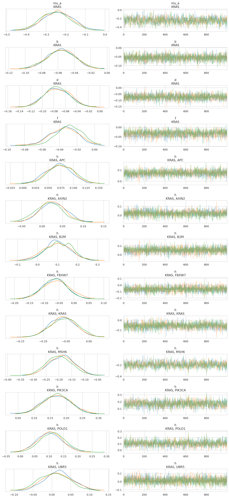


**APC**


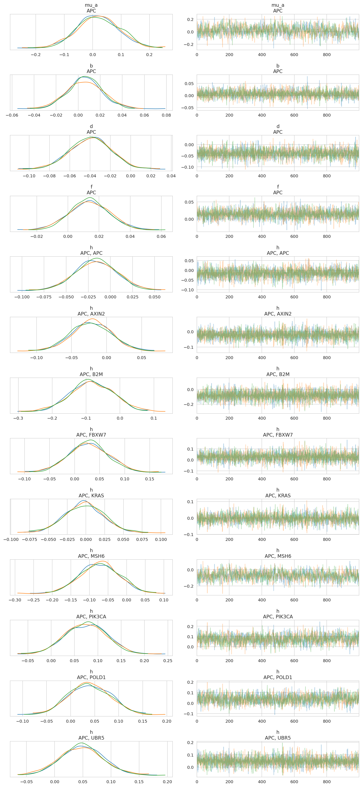


```python
example_genes = ["KRAS", "APC"]
for gene in example_genes:
    _md_bold(gene)
    az.plot_forest(
        trace,
        var_names=["mu_a", "b", "d", "f", "h"],
        coords={"gene": [gene]},
        combined=True,
    )
    plt.tight_layout()
    plt.show()
```


**KRAS**


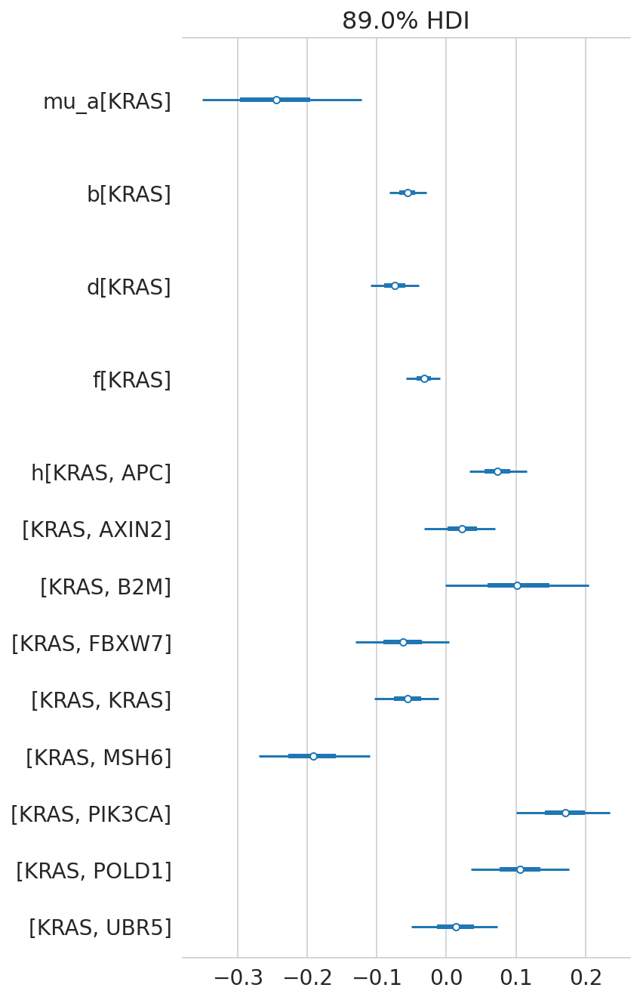


**APC**


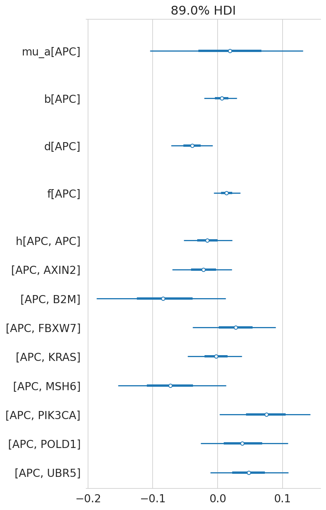


```python
sgrnas_sample = trace.posterior.coords["sgrna"].values[:5]

az.plot_trace(trace, var_names="a", coords={"sgrna": sgrnas_sample}, compact=False)
plt.tight_layout()
plt.show()
```


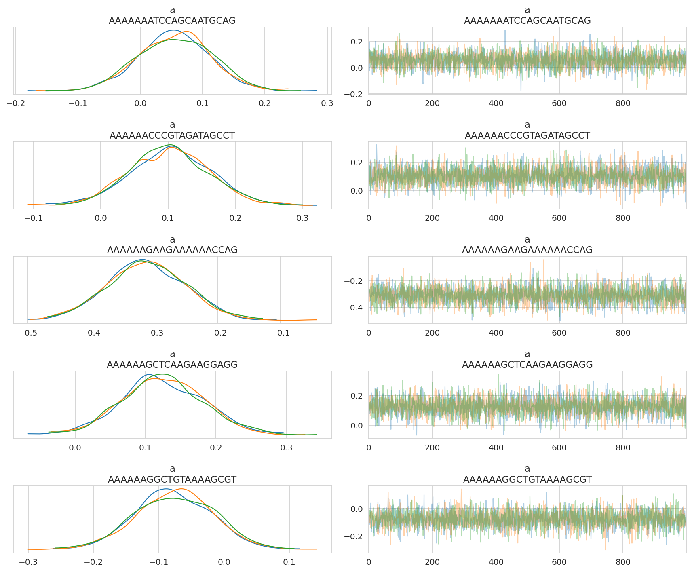


```python
az.summary(trace, var_names="a", coords={"sgrna": sgrnas_sample})
```


<div>
<style scoped>
    .dataframe tbody tr th:only-of-type {
        vertical-align: middle;
    }

    .dataframe tbody tr th {
        vertical-align: top;
    }

    .dataframe thead th {
        text-align: right;
    }
</style>
<table border="1" class="dataframe">
  <thead>
    <tr style="text-align: right;">
      <th></th>
      <th>mean</th>
      <th>sd</th>
      <th>hdi_5.5%</th>
      <th>hdi_94.5%</th>
      <th>mcse_mean</th>
      <th>mcse_sd</th>
      <th>ess_bulk</th>
      <th>ess_tail</th>
      <th>r_hat</th>
    </tr>
  </thead>
  <tbody>
    <tr>
      <th>a[AAAAAAATCCAGCAATGCAG]</th>
      <td>0.055</td>
      <td>0.058</td>
      <td>-0.034</td>
      <td>0.150</td>
      <td>0.001</td>
      <td>0.001</td>
      <td>5413.0</td>
      <td>2427.0</td>
      <td>1.0</td>
    </tr>
    <tr>
      <th>a[AAAAAACCCGTAGATAGCCT]</th>
      <td>0.103</td>
      <td>0.060</td>
      <td>0.002</td>
      <td>0.192</td>
      <td>0.001</td>
      <td>0.001</td>
      <td>5665.0</td>
      <td>2414.0</td>
      <td>1.0</td>
    </tr>
    <tr>
      <th>a[AAAAAAGAAGAAAAAACCAG]</th>
      <td>-0.312</td>
      <td>0.062</td>
      <td>-0.411</td>
      <td>-0.215</td>
      <td>0.001</td>
      <td>0.001</td>
      <td>5208.0</td>
      <td>2460.0</td>
      <td>1.0</td>
    </tr>
    <tr>
      <th>a[AAAAAAGCTCAAGAAGGAGG]</th>
      <td>0.125</td>
      <td>0.058</td>
      <td>0.032</td>
      <td>0.213</td>
      <td>0.001</td>
      <td>0.001</td>
      <td>5538.0</td>
      <td>2579.0</td>
      <td>1.0</td>
    </tr>
    <tr>
      <th>a[AAAAAAGGCTGTAAAAGCGT]</th>
      <td>-0.076</td>
      <td>0.060</td>
      <td>-0.171</td>
      <td>0.017</td>
      <td>0.001</td>
      <td>0.001</td>
      <td>4838.0</td>
      <td>2575.0</td>
      <td>1.0</td>
    </tr>
  </tbody>
</table>
</div>


```python
crc_post_summary.filter_string("var_name", "^sigma_*")
```


<div>
<style scoped>
    .dataframe tbody tr th:only-of-type {
        vertical-align: middle;
    }

    .dataframe tbody tr th {
        vertical-align: top;
    }

    .dataframe thead th {
        text-align: right;
    }
</style>
<table border="1" class="dataframe">
  <thead>
    <tr style="text-align: right;">
      <th></th>
      <th>parameter</th>
      <th>mean</th>
      <th>sd</th>
      <th>hdi_5.5%</th>
      <th>hdi_94.5%</th>
      <th>mcse_mean</th>
      <th>mcse_sd</th>
      <th>ess_bulk</th>
      <th>ess_tail</th>
      <th>r_hat</th>
      <th>var_name</th>
    </tr>
  </thead>
  <tbody>
    <tr>
      <th>3</th>
      <td>sigma_a</td>
      <td>0.149</td>
      <td>0.058</td>
      <td>0.048</td>
      <td>0.184</td>
      <td>0.029</td>
      <td>0.022</td>
      <td>7.0</td>
      <td>11.0</td>
      <td>1.60</td>
      <td>sigma_a</td>
    </tr>
    <tr>
      <th>5</th>
      <td>sigma_mu_a</td>
      <td>0.153</td>
      <td>0.088</td>
      <td>0.000</td>
      <td>0.206</td>
      <td>0.044</td>
      <td>0.034</td>
      <td>7.0</td>
      <td>22.0</td>
      <td>1.56</td>
      <td>sigma_mu_a</td>
    </tr>
    <tr>
      <th>6</th>
      <td>sigma_b</td>
      <td>0.015</td>
      <td>0.008</td>
      <td>0.001</td>
      <td>0.020</td>
      <td>0.004</td>
      <td>0.003</td>
      <td>7.0</td>
      <td>21.0</td>
      <td>1.54</td>
      <td>sigma_b</td>
    </tr>
    <tr>
      <th>7</th>
      <td>sigma_d</td>
      <td>0.022</td>
      <td>0.013</td>
      <td>0.000</td>
      <td>0.030</td>
      <td>0.006</td>
      <td>0.005</td>
      <td>7.0</td>
      <td>12.0</td>
      <td>1.59</td>
      <td>sigma_d</td>
    </tr>
    <tr>
      <th>8</th>
      <td>sigma_f</td>
      <td>0.013</td>
      <td>0.005</td>
      <td>0.004</td>
      <td>0.017</td>
      <td>0.002</td>
      <td>0.002</td>
      <td>7.0</td>
      <td>27.0</td>
      <td>1.57</td>
      <td>sigma_f</td>
    </tr>
    <tr>
      <th>9</th>
      <td>sigma_h[APC]</td>
      <td>0.068</td>
      <td>0.066</td>
      <td>0.028</td>
      <td>0.183</td>
      <td>0.033</td>
      <td>0.025</td>
      <td>7.0</td>
      <td>19.0</td>
      <td>1.57</td>
      <td>sigma_h</td>
    </tr>
    <tr>
      <th>10</th>
      <td>sigma_h[AXIN2]</td>
      <td>0.029</td>
      <td>0.006</td>
      <td>0.019</td>
      <td>0.034</td>
      <td>0.003</td>
      <td>0.002</td>
      <td>7.0</td>
      <td>39.0</td>
      <td>1.53</td>
      <td>sigma_h</td>
    </tr>
    <tr>
      <th>11</th>
      <td>sigma_h[B2M]</td>
      <td>0.062</td>
      <td>0.029</td>
      <td>0.012</td>
      <td>0.080</td>
      <td>0.014</td>
      <td>0.011</td>
      <td>7.0</td>
      <td>53.0</td>
      <td>1.54</td>
      <td>sigma_h</td>
    </tr>
    <tr>
      <th>12</th>
      <td>sigma_h[FBXW7]</td>
      <td>0.044</td>
      <td>0.009</td>
      <td>0.028</td>
      <td>0.050</td>
      <td>0.004</td>
      <td>0.003</td>
      <td>7.0</td>
      <td>38.0</td>
      <td>1.54</td>
      <td>sigma_h</td>
    </tr>
    <tr>
      <th>13</th>
      <td>sigma_h[KRAS]</td>
      <td>0.067</td>
      <td>0.032</td>
      <td>0.047</td>
      <td>0.123</td>
      <td>0.016</td>
      <td>0.012</td>
      <td>7.0</td>
      <td>23.0</td>
      <td>1.56</td>
      <td>sigma_h</td>
    </tr>
    <tr>
      <th>14</th>
      <td>sigma_h[MSH6]</td>
      <td>0.160</td>
      <td>0.032</td>
      <td>0.140</td>
      <td>0.216</td>
      <td>0.016</td>
      <td>0.012</td>
      <td>7.0</td>
      <td>22.0</td>
      <td>1.56</td>
      <td>sigma_h</td>
    </tr>
    <tr>
      <th>15</th>
      <td>sigma_h[PIK3CA]</td>
      <td>0.109</td>
      <td>0.005</td>
      <td>0.105</td>
      <td>0.118</td>
      <td>0.002</td>
      <td>0.002</td>
      <td>7.0</td>
      <td>36.0</td>
      <td>1.53</td>
      <td>sigma_h</td>
    </tr>
    <tr>
      <th>16</th>
      <td>sigma_h[POLD1]</td>
      <td>0.128</td>
      <td>0.059</td>
      <td>0.092</td>
      <td>0.233</td>
      <td>0.029</td>
      <td>0.023</td>
      <td>7.0</td>
      <td>27.0</td>
      <td>1.54</td>
      <td>sigma_h</td>
    </tr>
    <tr>
      <th>17</th>
      <td>sigma_h[UBR5]</td>
      <td>0.061</td>
      <td>0.023</td>
      <td>0.044</td>
      <td>0.102</td>
      <td>0.012</td>
      <td>0.009</td>
      <td>7.0</td>
      <td>28.0</td>
      <td>1.53</td>
      <td>sigma_h</td>
    </tr>
  </tbody>
</table>
</div>


```python
genes_var_names = ["mu_a", "b", "d", "f"]
genes_var_names += [f"h[{g}]" for g in trace.posterior.coords["cancer_gene"].values]
gene_corr_post = (
    az.summary(trace, "genes_chol_cov_corr", kind="stats")
    .pipe(extract_coords_param_names, names=["d1", "d2"])
    .astype({"d1": int, "d2": int})
    .assign(
        p1=lambda d: [genes_var_names[i] for i in d["d1"]],
        p2=lambda d: [genes_var_names[i] for i in d["d2"]],
    )
    .assign(
        p1=lambda d: pd.Categorical(d["p1"], categories=d["p1"].unique(), ordered=True)
    )
    .assign(
        p2=lambda d: pd.Categorical(
            d["p2"], categories=d["p1"].cat.categories, ordered=True
        )
    )
)
gene_corr_post
```


<div>
<style scoped>
    .dataframe tbody tr th:only-of-type {
        vertical-align: middle;
    }

    .dataframe tbody tr th {
        vertical-align: top;
    }

    .dataframe thead th {
        text-align: right;
    }
</style>
<table border="1" class="dataframe">
  <thead>
    <tr style="text-align: right;">
      <th></th>
      <th>mean</th>
      <th>sd</th>
      <th>hdi_5.5%</th>
      <th>hdi_94.5%</th>
      <th>d1</th>
      <th>d2</th>
      <th>p1</th>
      <th>p2</th>
    </tr>
  </thead>
  <tbody>
    <tr>
      <th>genes_chol_cov_corr[0, 0]</th>
      <td>1.000</td>
      <td>0.000</td>
      <td>1.000</td>
      <td>1.000</td>
      <td>0</td>
      <td>0</td>
      <td>mu_a</td>
      <td>mu_a</td>
    </tr>
    <tr>
      <th>genes_chol_cov_corr[0, 1]</th>
      <td>0.508</td>
      <td>0.016</td>
      <td>0.482</td>
      <td>0.532</td>
      <td>0</td>
      <td>1</td>
      <td>mu_a</td>
      <td>b</td>
    </tr>
    <tr>
      <th>genes_chol_cov_corr[0, 2]</th>
      <td>-0.372</td>
      <td>0.012</td>
      <td>-0.392</td>
      <td>-0.354</td>
      <td>0</td>
      <td>2</td>
      <td>mu_a</td>
      <td>d</td>
    </tr>
    <tr>
      <th>genes_chol_cov_corr[0, 3]</th>
      <td>-0.234</td>
      <td>0.076</td>
      <td>-0.352</td>
      <td>-0.112</td>
      <td>0</td>
      <td>3</td>
      <td>mu_a</td>
      <td>f</td>
    </tr>
    <tr>
      <th>genes_chol_cov_corr[0, 4]</th>
      <td>-0.330</td>
      <td>0.022</td>
      <td>-0.365</td>
      <td>-0.294</td>
      <td>0</td>
      <td>4</td>
      <td>mu_a</td>
      <td>h[APC]</td>
    </tr>
    <tr>
      <th>...</th>
      <td>...</td>
      <td>...</td>
      <td>...</td>
      <td>...</td>
      <td>...</td>
      <td>...</td>
      <td>...</td>
      <td>...</td>
    </tr>
    <tr>
      <th>genes_chol_cov_corr[12, 8]</th>
      <td>-0.427</td>
      <td>0.038</td>
      <td>-0.490</td>
      <td>-0.368</td>
      <td>12</td>
      <td>8</td>
      <td>h[UBR5]</td>
      <td>h[KRAS]</td>
    </tr>
    <tr>
      <th>genes_chol_cov_corr[12, 9]</th>
      <td>-0.340</td>
      <td>0.032</td>
      <td>-0.395</td>
      <td>-0.293</td>
      <td>12</td>
      <td>9</td>
      <td>h[UBR5]</td>
      <td>h[MSH6]</td>
    </tr>
    <tr>
      <th>genes_chol_cov_corr[12, 10]</th>
      <td>0.454</td>
      <td>0.033</td>
      <td>0.404</td>
      <td>0.508</td>
      <td>12</td>
      <td>10</td>
      <td>h[UBR5]</td>
      <td>h[PIK3CA]</td>
    </tr>
    <tr>
      <th>genes_chol_cov_corr[12, 11]</th>
      <td>0.176</td>
      <td>0.042</td>
      <td>0.107</td>
      <td>0.241</td>
      <td>12</td>
      <td>11</td>
      <td>h[UBR5]</td>
      <td>h[POLD1]</td>
    </tr>
    <tr>
      <th>genes_chol_cov_corr[12, 12]</th>
      <td>1.000</td>
      <td>0.000</td>
      <td>1.000</td>
      <td>1.000</td>
      <td>12</td>
      <td>12</td>
      <td>h[UBR5]</td>
      <td>h[UBR5]</td>
    </tr>
  </tbody>
</table>
<p>169 rows × 8 columns</p>
</div>


```python
plot_df = gene_corr_post.pivot_wider("p1", "p2", "mean").set_index("p1")
sns.heatmap(plot_df, cmap="coolwarm", vmin=-1, vmax=1, square=True)
plt.show()
```


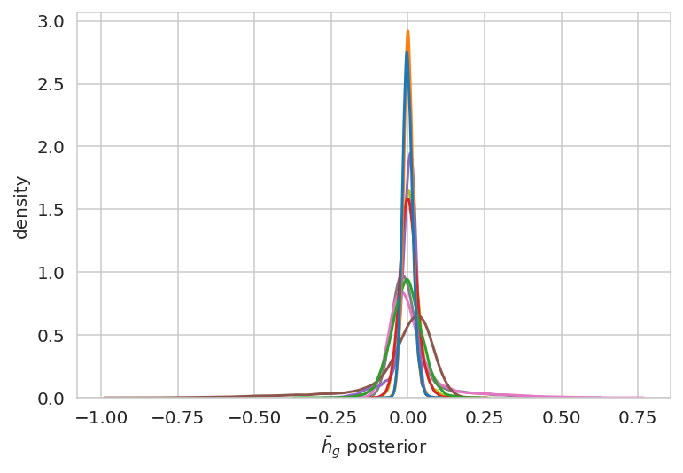


```python
plot_df = gene_corr_post.pivot_wider("p1", "p2", "mean").set_index("p1")
sns.clustermap(plot_df, cmap="seismic", vmin=-1, vmax=1, figsize=(6, 6))
plt.show()
```


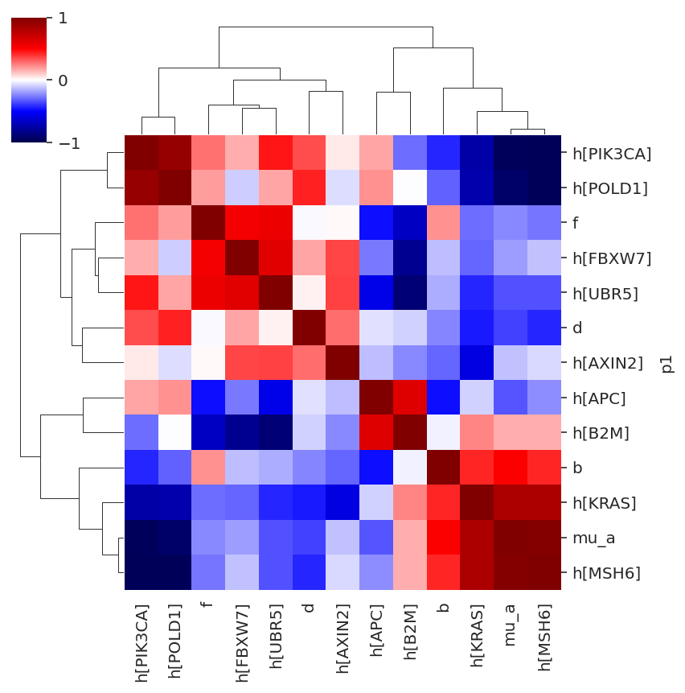


```python
cancer_genes = trace.posterior.coords["cancer_gene"].values.tolist()
cancer_gene_mutants = (
    valid_crc_data.filter_column_isin("hugo_symbol", cancer_genes)[
        ["hugo_symbol", "depmap_id", "is_mutated"]
    ]
    .drop_duplicates()
    .pivot_wider("depmap_id", names_from="hugo_symbol", values_from="is_mutated")
    .set_index("depmap_id")
)
cg = sns.clustermap(
    cancer_gene_mutants, cmap="Greys", xticklabels=1, yticklabels=1, figsize=(4, 7)
)
cg.ax_heatmap.tick_params("both", length=0)
cg.ax_cbar.remove()
plt.show()
```


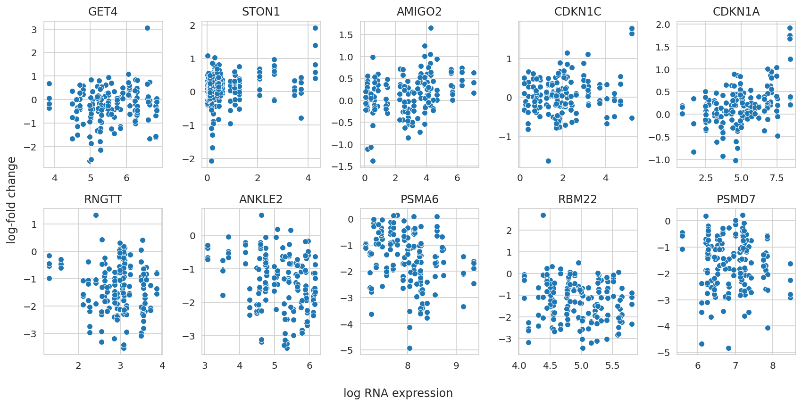


```python
h_post_summary = (
    crc_post_summary.query("var_name == 'h'")
    .reset_index(drop=True)
    .pipe(
        extract_coords_param_names,
        names=["hugo_symbol", "cancer_gene"],
        col="parameter",
    )
)
h_post_summary.head()
```


<div>
<style scoped>
    .dataframe tbody tr th:only-of-type {
        vertical-align: middle;
    }

    .dataframe tbody tr th {
        vertical-align: top;
    }

    .dataframe thead th {
        text-align: right;
    }
</style>
<table border="1" class="dataframe">
  <thead>
    <tr style="text-align: right;">
      <th></th>
      <th>parameter</th>
      <th>mean</th>
      <th>sd</th>
      <th>hdi_5.5%</th>
      <th>hdi_94.5%</th>
      <th>mcse_mean</th>
      <th>mcse_sd</th>
      <th>ess_bulk</th>
      <th>ess_tail</th>
      <th>r_hat</th>
      <th>var_name</th>
      <th>hugo_symbol</th>
      <th>cancer_gene</th>
    </tr>
  </thead>
  <tbody>
    <tr>
      <th>0</th>
      <td>h[A1BG, APC]</td>
      <td>0.011</td>
      <td>0.039</td>
      <td>-0.050</td>
      <td>0.068</td>
      <td>0.015</td>
      <td>0.012</td>
      <td>9.0</td>
      <td>11.0</td>
      <td>1.35</td>
      <td>h</td>
      <td>A1BG</td>
      <td>APC</td>
    </tr>
    <tr>
      <th>1</th>
      <td>h[A1BG, AXIN2]</td>
      <td>0.005</td>
      <td>0.024</td>
      <td>-0.030</td>
      <td>0.045</td>
      <td>0.003</td>
      <td>0.002</td>
      <td>60.0</td>
      <td>1993.0</td>
      <td>1.16</td>
      <td>h</td>
      <td>A1BG</td>
      <td>AXIN2</td>
    </tr>
    <tr>
      <th>2</th>
      <td>h[A1BG, B2M]</td>
      <td>-0.014</td>
      <td>0.052</td>
      <td>-0.105</td>
      <td>0.067</td>
      <td>0.005</td>
      <td>0.006</td>
      <td>122.0</td>
      <td>1119.0</td>
      <td>1.34</td>
      <td>h</td>
      <td>A1BG</td>
      <td>B2M</td>
    </tr>
    <tr>
      <th>3</th>
      <td>h[A1BG, FBXW7]</td>
      <td>0.018</td>
      <td>0.035</td>
      <td>-0.028</td>
      <td>0.079</td>
      <td>0.008</td>
      <td>0.005</td>
      <td>23.0</td>
      <td>1431.0</td>
      <td>1.11</td>
      <td>h</td>
      <td>A1BG</td>
      <td>FBXW7</td>
    </tr>
    <tr>
      <th>4</th>
      <td>h[A1BG, KRAS]</td>
      <td>0.027</td>
      <td>0.035</td>
      <td>-0.017</td>
      <td>0.092</td>
      <td>0.013</td>
      <td>0.011</td>
      <td>9.0</td>
      <td>12.0</td>
      <td>1.38</td>
      <td>h</td>
      <td>A1BG</td>
      <td>KRAS</td>
    </tr>
  </tbody>
</table>
</div>


```python
h_post_summary.sort_values("mean").pipe(head_tail, n=5)
```


<div>
<style scoped>
    .dataframe tbody tr th:only-of-type {
        vertical-align: middle;
    }

    .dataframe tbody tr th {
        vertical-align: top;
    }

    .dataframe thead th {
        text-align: right;
    }
</style>
<table border="1" class="dataframe">
  <thead>
    <tr style="text-align: right;">
      <th></th>
      <th>parameter</th>
      <th>mean</th>
      <th>sd</th>
      <th>hdi_5.5%</th>
      <th>hdi_94.5%</th>
      <th>mcse_mean</th>
      <th>mcse_sd</th>
      <th>ess_bulk</th>
      <th>ess_tail</th>
      <th>r_hat</th>
      <th>var_name</th>
      <th>hugo_symbol</th>
      <th>cancer_gene</th>
    </tr>
  </thead>
  <tbody>
    <tr>
      <th>113783</th>
      <td>h[RAN, MSH6]</td>
      <td>-0.986</td>
      <td>0.101</td>
      <td>-1.174</td>
      <td>-0.869</td>
      <td>0.045</td>
      <td>0.035</td>
      <td>7.0</td>
      <td>14.0</td>
      <td>1.58</td>
      <td>h</td>
      <td>RAN</td>
      <td>MSH6</td>
    </tr>
    <tr>
      <th>119741</th>
      <td>h[RPSA, MSH6]</td>
      <td>-0.907</td>
      <td>0.121</td>
      <td>-1.132</td>
      <td>-0.778</td>
      <td>0.056</td>
      <td>0.043</td>
      <td>7.0</td>
      <td>11.0</td>
      <td>1.59</td>
      <td>h</td>
      <td>RPSA</td>
      <td>MSH6</td>
    </tr>
    <tr>
      <th>38678</th>
      <td>h[DONSON, MSH6]</td>
      <td>-0.904</td>
      <td>0.099</td>
      <td>-1.073</td>
      <td>-0.789</td>
      <td>0.044</td>
      <td>0.034</td>
      <td>7.0</td>
      <td>13.0</td>
      <td>1.57</td>
      <td>h</td>
      <td>DONSON</td>
      <td>MSH6</td>
    </tr>
    <tr>
      <th>106484</th>
      <td>h[POLR2L, MSH6]</td>
      <td>-0.904</td>
      <td>0.127</td>
      <td>-1.122</td>
      <td>-0.768</td>
      <td>0.059</td>
      <td>0.045</td>
      <td>7.0</td>
      <td>27.0</td>
      <td>1.53</td>
      <td>h</td>
      <td>POLR2L</td>
      <td>MSH6</td>
    </tr>
    <tr>
      <th>118796</th>
      <td>h[RPL12, MSH6]</td>
      <td>-0.884</td>
      <td>0.171</td>
      <td>-1.190</td>
      <td>-0.719</td>
      <td>0.082</td>
      <td>0.063</td>
      <td>7.0</td>
      <td>33.0</td>
      <td>1.53</td>
      <td>h</td>
      <td>RPL12</td>
      <td>MSH6</td>
    </tr>
    <tr>
      <th>106486</th>
      <td>h[POLR2L, POLD1]</td>
      <td>0.697</td>
      <td>0.291</td>
      <td>0.476</td>
      <td>1.212</td>
      <td>0.144</td>
      <td>0.111</td>
      <td>7.0</td>
      <td>41.0</td>
      <td>1.53</td>
      <td>h</td>
      <td>POLR2L</td>
      <td>POLD1</td>
    </tr>
    <tr>
      <th>113784</th>
      <td>h[RAN, PIK3CA]</td>
      <td>0.698</td>
      <td>0.064</td>
      <td>0.583</td>
      <td>0.780</td>
      <td>0.026</td>
      <td>0.019</td>
      <td>7.0</td>
      <td>12.0</td>
      <td>1.55</td>
      <td>h</td>
      <td>RAN</td>
      <td>PIK3CA</td>
    </tr>
    <tr>
      <th>119743</th>
      <td>h[RPSA, POLD1]</td>
      <td>0.721</td>
      <td>0.266</td>
      <td>0.508</td>
      <td>1.199</td>
      <td>0.131</td>
      <td>0.101</td>
      <td>7.0</td>
      <td>12.0</td>
      <td>1.58</td>
      <td>h</td>
      <td>RPSA</td>
      <td>POLD1</td>
    </tr>
    <tr>
      <th>38680</th>
      <td>h[DONSON, POLD1]</td>
      <td>0.724</td>
      <td>0.238</td>
      <td>0.537</td>
      <td>1.151</td>
      <td>0.117</td>
      <td>0.090</td>
      <td>7.0</td>
      <td>17.0</td>
      <td>1.57</td>
      <td>h</td>
      <td>DONSON</td>
      <td>POLD1</td>
    </tr>
    <tr>
      <th>113785</th>
      <td>h[RAN, POLD1]</td>
      <td>0.748</td>
      <td>0.272</td>
      <td>0.537</td>
      <td>1.251</td>
      <td>0.134</td>
      <td>0.103</td>
      <td>7.0</td>
      <td>13.0</td>
      <td>1.59</td>
      <td>h</td>
      <td>RAN</td>
      <td>POLD1</td>
    </tr>
  </tbody>
</table>
</div>


```python
ax = sns.kdeplot(data=h_post_summary, x="mean", hue="cancer_gene")
ax.set_xlabel(r"$\bar{h}_g$ posterior")
ax.set_ylabel("density")
ax.get_legend().remove()  # set_title("cancer gene\ncomut.")
plt.show()
```


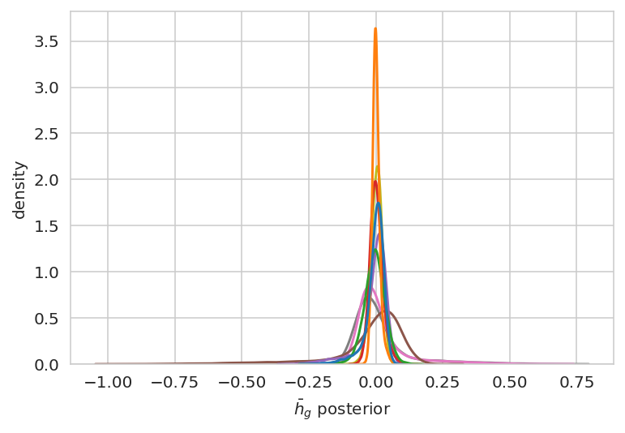


```python
fig, axes = plt.subplots(
    len(cancer_genes), 1, squeeze=False, figsize=(8, len(cancer_genes) * 5)
)
for ax, cg in zip(axes.flatten(), cancer_genes):
    h_hits = (
        h_post_summary.filter_column_isin("cancer_gene", [cg])
        .sort_values("mean")
        .pipe(head_tail, n=5)["hugo_symbol"]
        .tolist()
    )

    h_hits_data = (
        valid_crc_data.filter_column_isin("hugo_symbol", h_hits)
        .merge(cancer_gene_mutants.reset_index(), on="depmap_id")
        .reset_index()
        .astype({"hugo_symbol": str})
        .assign(
            hugo_symbol=lambda d: pd.Categorical(d["hugo_symbol"], categories=h_hits),
            _cg_mut=lambda d: d[cg].map({True: "mut.", False: "WT"}),
        )
    )
    mut_pal = {"mut.": "tab:red", "WT": "gray"}
    sns.boxplot(
        data=h_hits_data,
        x="hugo_symbol",
        y="lfc",
        hue="_cg_mut",
        palette=mut_pal,
        ax=ax,
        showfliers=False,
        boxprops={"alpha": 0.5},
    )
    sns.stripplot(
        data=h_hits_data,
        x="hugo_symbol",
        y="lfc",
        hue="_cg_mut",
        dodge=True,
        palette=mut_pal,
        ax=ax,
    )
    ax.get_legend().set_title(cg)

plt.tight_layout()
plt.show()
```


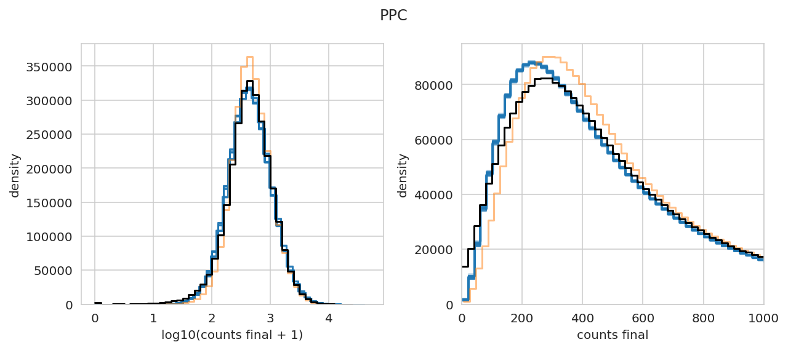


```python
top_n = 5
top_b_hits = (
    crc_post_summary.query("var_name == 'b'")
    .sort_values("mean")
    .reset_index(drop=True)
    .pipe(extract_coords_param_names, names=["hugo_symbol"], col="parameter")
    .pipe(head_tail, n=top_n)
)

negative_b = top_b_hits["hugo_symbol"][:top_n].values
positive_b = top_b_hits["hugo_symbol"][top_n:].values


fig, axes = plt.subplots(2, top_n, figsize=(12, 6))

for i, genes in enumerate([positive_b, negative_b]):
    for j, gene in enumerate(genes):
        ax = axes[i, j]
        ax.set_title(gene)
        obs_data = crc_data.query(f"hugo_symbol == '{gene}'")
        sns.scatterplot(data=obs_data, x="rna_expr", y="lfc", ax=ax)
        ax.set_xlabel(None)
        ax.set_ylabel(None)


fig.supxlabel("log RNA expression")
fig.supylabel("log-fold change")

fig.tight_layout()
plt.show()
```


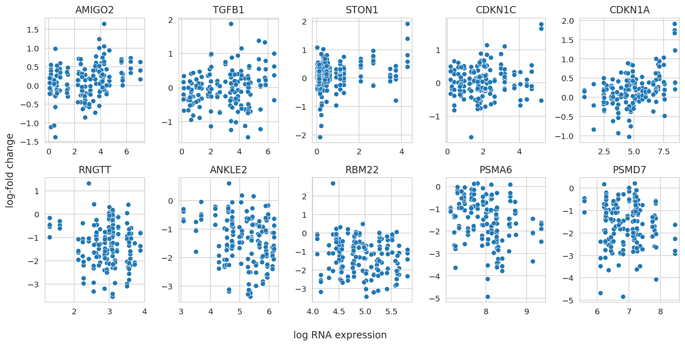


```python
top_n = 5
top_d_hits = (
    crc_post_summary.query("var_name == 'd'")
    .sort_values("mean")
    .reset_index(drop=True)
    .pipe(extract_coords_param_names, names=["hugo_symbol"], col="parameter")
    .pipe(head_tail, n=top_n)
)

negative_d = top_d_hits["hugo_symbol"][:top_n].values
positive_d = top_d_hits["hugo_symbol"][top_n:].values


fig, axes = plt.subplots(2, top_n, figsize=(12, 6))

for i, genes in enumerate([positive_d, negative_d]):
    for j, gene in enumerate(genes):
        ax = axes[i, j]
        ax.set_title(gene)
        obs_data = crc_data.query(f"hugo_symbol == '{gene}'")
        sns.scatterplot(data=obs_data, x="copy_number", y="lfc", ax=ax)
        ax.set_xlabel(None)
        ax.set_ylabel(None)


fig.supxlabel("copy number")
fig.supylabel("log-fold change")
fig.tight_layout()
plt.show()
```


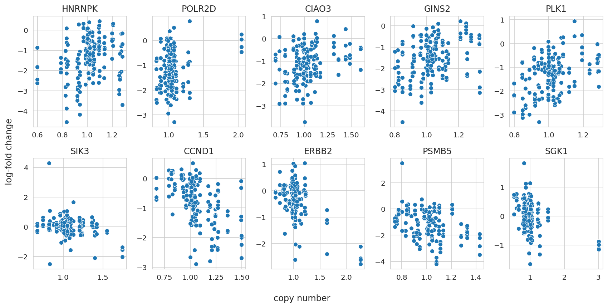


## PPC


```python
np.random.seed(99)
n_examples = 40
n_chains, n_draws, n_data = trace.posterior_predictive["ct_final"].shape
ex_draws_idx = np.random.choice(
    np.arange(n_draws), size=n_examples // n_chains, replace=False
)
example_ppc_draws = trace.posterior_predictive["ct_final"][
    :, ex_draws_idx, :
].values.reshape(-1, n_data)
example_ppc_draws.shape
```


    (39, 2842455)


```python
fig, axes = plt.subplots(ncols=2, figsize=(9, 4), sharex=False, sharey=False)
ax1 = axes[0]
ax2 = axes[1]
hist_kwargs = {"stat": "count", "element": "step", "fill": False}

pp_avg = trace.posterior_predictive["ct_final"].mean(axis=(0, 1))

bw = 0.1
for i in range(example_ppc_draws.shape[0]):
    sns.histplot(
        x=np.log10(example_ppc_draws[i, :] + 1),
        alpha=0.2,
        binwidth=bw,
        color="tab:blue",
        ax=ax1,
        **hist_kwargs,
    )

sns.histplot(
    x=np.log10(pp_avg + 1),
    color="tab:orange",
    binwidth=bw,
    ax=ax1,
    alpha=0.5,
    **hist_kwargs,
)
sns.histplot(
    x=np.log10(valid_crc_data["counts_final"] + 1),
    color="k",
    binwidth=bw,
    ax=ax1,
    **hist_kwargs,
)
ax1.set_xlabel("log10(counts final + 1)")
ax1.set_ylabel("density")

bw = 20
for i in range(example_ppc_draws.shape[0]):
    sns.histplot(
        x=example_ppc_draws[i, :],
        alpha=0.2,
        binwidth=bw,
        color="tab:blue",
        ax=ax2,
        **hist_kwargs,
    )

sns.histplot(
    x=pp_avg, color="tab:orange", alpha=0.5, ax=ax2, binwidth=bw, **hist_kwargs
)
sns.histplot(
    x=valid_crc_data["counts_final"], color="k", binwidth=bw, ax=ax2, **hist_kwargs
)
ax2.set_xlabel("counts final")
ax2.set_ylabel("density")
ax2.set_xlim(0, 1000)

fig.suptitle("PPC")
fig.tight_layout()
plt.show()
```


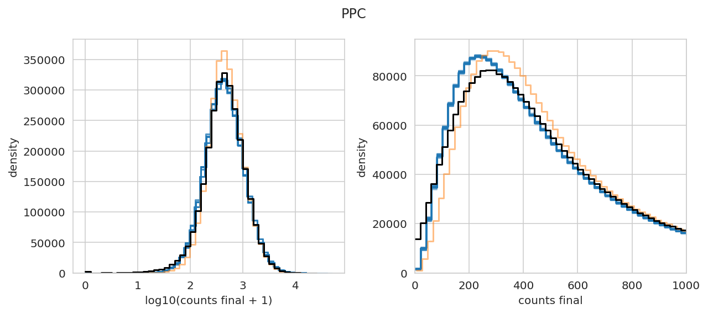


---

## Session info


```python
notebook_toc = time()
print(f"execution time: {(notebook_toc - notebook_tic) / 60:.2f} minutes")
```

    execution time: 14.32 minutes


```python
%load_ext watermark
%watermark -d -u -v -iv -b -h -m
```

    Last updated: 2022-08-02

    Python implementation: CPython
    Python version       : 3.10.5
    IPython version      : 8.4.0

    Compiler    : GCC 10.3.0
    OS          : Linux
    Release     : 3.10.0-1160.71.1.el7.x86_64
    Machine     : x86_64
    Processor   : x86_64
    CPU cores   : 32
    Architecture: 64bit

    Hostname: compute-a-16-44.o2.rc.hms.harvard.edu

    Git branch: simplify

    arviz     : 0.12.1
    pandas    : 1.4.3
    seaborn   : 0.11.2
    numpy     : 1.22.4
    matplotlib: 3.5.2


```python

```
