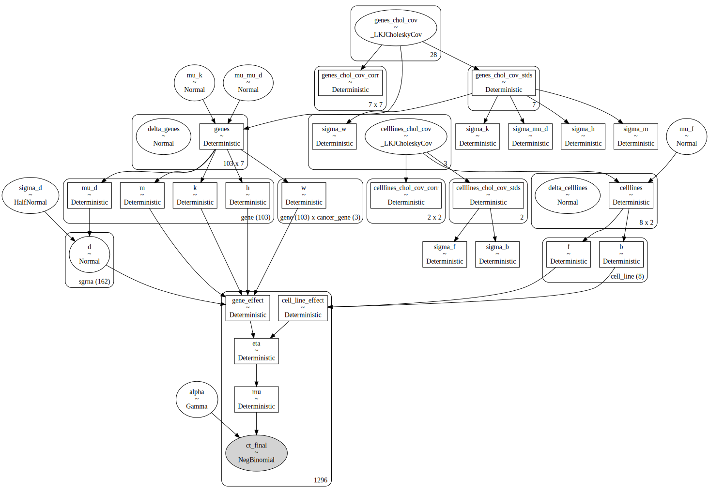

```python
%load_ext autoreload
%autoreload 2
```


```python
from pathlib import Path
from time import time

import arviz as az
import matplotlib.pyplot as plt
import numpy as np
import pandas as pd
import plotnine as gg
import pymc as pm
import pymc.sampling_jax
import seaborn as sns
```

    /usr/local/Caskroom/miniconda/base/envs/speclet/lib/python3.10/site-packages/aesara/link/jax/dispatch.py:87: UserWarning: JAX omnistaging couldn't be disabled: Disabling of omnistaging is no longer supported in JAX version 0.2.12 and higher: see https://github.com/google/jax/blob/main/docs/design_notes/omnistaging.md.
    /usr/local/Caskroom/miniconda/base/envs/speclet/lib/python3.10/site-packages/pymc/sampling_jax.py:36: UserWarning: This module is experimental.


```python
from speclet.analysis.arviz_analysis import extract_coords_param_names
from speclet.bayesian_models.lineage_hierarchical_nb import LineageHierNegBinomModel
from speclet.io import DataFile, data_path
from speclet.managers.data_managers import CrisprScreenDataManager
from speclet.plot import set_speclet_theme
from speclet.project_configuration import arviz_config
```


```python
# Notebook execution timer.
notebook_tic = time()

# Plotting setup.
set_speclet_theme()
%config InlineBackend.figure_format = "retina"

# Constants
SEED = 847
np.random.seed(SEED)
arviz_config()
```

## Data


```python
def _broad_only(df: pd.DataFrame) -> pd.DataFrame:
    return df.query("screen == 'broad'").reset_index(drop=True)
```


```python
crispr_data_manager = CrisprScreenDataManager(
    DataFile.DEPMAP_CRC_SUBSAMPLE, transformations=[_broad_only]
)
crc_data = crispr_data_manager.data
```


```python
for col in ["sgrna", "hugo_symbol", "depmap_id"]:
    print(f"'{col}': {crc_data[col].nunique()}")
```

    'sgrna': 162
    'hugo_symbol': 103
    'depmap_id': 8


## Modeling


```python
from speclet.bayesian_models.lineage_hierarchical_nb import LineageHierNegBinomModel
```


```python
crc_model = LineageHierNegBinomModel(lineage="colorectal")
```


```python
crc_pymc_model = crc_model.pymc_model(crispr_data_manager.data.copy())
pm.model_to_graphviz(crc_pymc_model)
```


<pre style="white-space:pre;overflow-x:auto;line-height:normal;font-family:Menlo,'DejaVu Sans Mono',consolas,'Courier New',monospace"><span style="color: #7fbfbf; text-decoration-color: #7fbfbf">[07/04/22 07:09:29] </span><span style="color: #000080; text-decoration-color: #000080">INFO    </span> Lineage: colorectal               <a href="file:///Users/admin/Developer/haigis-lab/speclet/speclet/bayesian_models/lineage_hierarchical_nb.py" target="_blank"><span style="color: #7f7f7f; text-decoration-color: #7f7f7f">lineage_hierarchical_nb.py</span></a><span style="color: #7f7f7f; text-decoration-color: #7f7f7f">:</span><a href="file:///Users/admin/Developer/haigis-lab/speclet/speclet/bayesian_models/lineage_hierarchical_nb.py#283" target="_blank"><span style="color: #7f7f7f; text-decoration-color: #7f7f7f">283</span></a>
</pre>


    INFO:speclet:Lineage: colorectal


<pre style="white-space:pre;overflow-x:auto;line-height:normal;font-family:Menlo,'DejaVu Sans Mono',consolas,'Courier New',monospace"><span style="color: #7fbfbf; text-decoration-color: #7fbfbf">                    </span><span style="color: #000080; text-decoration-color: #000080">INFO    </span> Number of genes: <span style="color: #008080; text-decoration-color: #008080; font-weight: bold">103</span>              <a href="file:///Users/admin/Developer/haigis-lab/speclet/speclet/bayesian_models/lineage_hierarchical_nb.py" target="_blank"><span style="color: #7f7f7f; text-decoration-color: #7f7f7f">lineage_hierarchical_nb.py</span></a><span style="color: #7f7f7f; text-decoration-color: #7f7f7f">:</span><a href="file:///Users/admin/Developer/haigis-lab/speclet/speclet/bayesian_models/lineage_hierarchical_nb.py#284" target="_blank"><span style="color: #7f7f7f; text-decoration-color: #7f7f7f">284</span></a>
</pre>


    INFO:speclet:Number of genes: 103


<pre style="white-space:pre;overflow-x:auto;line-height:normal;font-family:Menlo,'DejaVu Sans Mono',consolas,'Courier New',monospace"><span style="color: #7fbfbf; text-decoration-color: #7fbfbf">                    </span><span style="color: #000080; text-decoration-color: #000080">INFO    </span> Number of sgRNA: <span style="color: #008080; text-decoration-color: #008080; font-weight: bold">162</span>              <a href="file:///Users/admin/Developer/haigis-lab/speclet/speclet/bayesian_models/lineage_hierarchical_nb.py" target="_blank"><span style="color: #7f7f7f; text-decoration-color: #7f7f7f">lineage_hierarchical_nb.py</span></a><span style="color: #7f7f7f; text-decoration-color: #7f7f7f">:</span><a href="file:///Users/admin/Developer/haigis-lab/speclet/speclet/bayesian_models/lineage_hierarchical_nb.py#285" target="_blank"><span style="color: #7f7f7f; text-decoration-color: #7f7f7f">285</span></a>
</pre>


    INFO:speclet:Number of sgRNA: 162


<pre style="white-space:pre;overflow-x:auto;line-height:normal;font-family:Menlo,'DejaVu Sans Mono',consolas,'Courier New',monospace"><span style="color: #7fbfbf; text-decoration-color: #7fbfbf">                    </span><span style="color: #000080; text-decoration-color: #000080">INFO    </span> Number of cell lines: <span style="color: #008080; text-decoration-color: #008080; font-weight: bold">8</span>           <a href="file:///Users/admin/Developer/haigis-lab/speclet/speclet/bayesian_models/lineage_hierarchical_nb.py" target="_blank"><span style="color: #7f7f7f; text-decoration-color: #7f7f7f">lineage_hierarchical_nb.py</span></a><span style="color: #7f7f7f; text-decoration-color: #7f7f7f">:</span><a href="file:///Users/admin/Developer/haigis-lab/speclet/speclet/bayesian_models/lineage_hierarchical_nb.py#286" target="_blank"><span style="color: #7f7f7f; text-decoration-color: #7f7f7f">286</span></a>
</pre>


    INFO:speclet:Number of cell lines: 8


<pre style="white-space:pre;overflow-x:auto;line-height:normal;font-family:Menlo,'DejaVu Sans Mono',consolas,'Courier New',monospace"><span style="color: #7fbfbf; text-decoration-color: #7fbfbf">                    </span><span style="color: #000080; text-decoration-color: #000080">INFO    </span> Number of cancer genes: <span style="color: #008080; text-decoration-color: #008080; font-weight: bold">3</span>         <a href="file:///Users/admin/Developer/haigis-lab/speclet/speclet/bayesian_models/lineage_hierarchical_nb.py" target="_blank"><span style="color: #7f7f7f; text-decoration-color: #7f7f7f">lineage_hierarchical_nb.py</span></a><span style="color: #7f7f7f; text-decoration-color: #7f7f7f">:</span><a href="file:///Users/admin/Developer/haigis-lab/speclet/speclet/bayesian_models/lineage_hierarchical_nb.py#287" target="_blank"><span style="color: #7f7f7f; text-decoration-color: #7f7f7f">287</span></a>
</pre>


    INFO:speclet:Number of cancer genes: 3


<pre style="white-space:pre;overflow-x:auto;line-height:normal;font-family:Menlo,'DejaVu Sans Mono',consolas,'Courier New',monospace"><span style="color: #7fbfbf; text-decoration-color: #7fbfbf">                    </span><span style="color: #000080; text-decoration-color: #000080">INFO    </span> Number of screens: <span style="color: #008080; text-decoration-color: #008080; font-weight: bold">1</span>              <a href="file:///Users/admin/Developer/haigis-lab/speclet/speclet/bayesian_models/lineage_hierarchical_nb.py" target="_blank"><span style="color: #7f7f7f; text-decoration-color: #7f7f7f">lineage_hierarchical_nb.py</span></a><span style="color: #7f7f7f; text-decoration-color: #7f7f7f">:</span><a href="file:///Users/admin/Developer/haigis-lab/speclet/speclet/bayesian_models/lineage_hierarchical_nb.py#288" target="_blank"><span style="color: #7f7f7f; text-decoration-color: #7f7f7f">288</span></a>
</pre>


    INFO:speclet:Number of screens: 1


<pre style="white-space:pre;overflow-x:auto;line-height:normal;font-family:Menlo,'DejaVu Sans Mono',consolas,'Courier New',monospace"><span style="color: #7fbfbf; text-decoration-color: #7fbfbf">                    </span><span style="color: #000080; text-decoration-color: #000080">INFO    </span> Number of data points: <span style="color: #008080; text-decoration-color: #008080; font-weight: bold">1296</span>       <a href="file:///Users/admin/Developer/haigis-lab/speclet/speclet/bayesian_models/lineage_hierarchical_nb.py" target="_blank"><span style="color: #7f7f7f; text-decoration-color: #7f7f7f">lineage_hierarchical_nb.py</span></a><span style="color: #7f7f7f; text-decoration-color: #7f7f7f">:</span><a href="file:///Users/admin/Developer/haigis-lab/speclet/speclet/bayesian_models/lineage_hierarchical_nb.py#289" target="_blank"><span style="color: #7f7f7f; text-decoration-color: #7f7f7f">289</span></a>
</pre>


    INFO:speclet:Number of data points: 1296


<pre style="white-space:pre;overflow-x:auto;line-height:normal;font-family:Menlo,'DejaVu Sans Mono',consolas,'Courier New',monospace"><span style="color: #7fbfbf; text-decoration-color: #7fbfbf">                    </span><span style="color: #800000; text-decoration-color: #800000">WARNING </span> Only <span style="color: #008080; text-decoration-color: #008080; font-weight: bold">1</span> screen detected - ignoring <a href="file:///Users/admin/Developer/haigis-lab/speclet/speclet/bayesian_models/lineage_hierarchical_nb.py" target="_blank"><span style="color: #7f7f7f; text-decoration-color: #7f7f7f">lineage_hierarchical_nb.py</span></a><span style="color: #7f7f7f; text-decoration-color: #7f7f7f">:</span><a href="file:///Users/admin/Developer/haigis-lab/speclet/speclet/bayesian_models/lineage_hierarchical_nb.py#449" target="_blank"><span style="color: #7f7f7f; text-decoration-color: #7f7f7f">449</span></a>
<span style="color: #7fbfbf; text-decoration-color: #7fbfbf">                    </span>         variable `p`.                     <span style="color: #7f7f7f; text-decoration-color: #7f7f7f">                              </span>
</pre>


    WARNING:speclet:Only 1 screen detected - ignoring variable `p`.





```python
with crc_pymc_model:
    pm_prior_pred = pm.sample_prior_predictive(random_seed=SEED)
```


```python
pm_pred_draws = pm_prior_pred.prior_predictive["ct_final"].values.squeeze()
print(f"min: {np.min(pm_pred_draws):,d}\nmax: {np.max(pm_pred_draws):,d}")
```

    min: 0
    max: 24,833,558


```python
obs = crc_data["counts_final"].astype(int)
print(f"min: {np.min(obs):,d}\nmax: {np.max(obs):,d}")
```

    min: 0
    max: 9,819


```python
fig, axes = plt.subplots(nrows=2, ncols=2, figsize=(10, 5))

sns.histplot(x=pm_pred_draws.flatten(), ax=axes[0, 0], bins=50)
sns.histplot(x=crc_data["counts_final"], ax=axes[0, 1], bins=50)
sns.histplot(x=np.log10(pm_pred_draws.flatten() + 1), ax=axes[1, 0], bins=50)
sns.histplot(x=np.log10(crc_data["counts_final"] + 1), ax=axes[1, 1], bins=50)

axes[0, 0].set_title("prior predictive distribution")
axes[0, 1].set_title("observed values")

for ax in axes[0, :]:
    ax.set_xlabel("final counts")

for ax in axes[1, :]:
    ax.set_xlabel("log10(final counts + 1)")

for ax in axes[:, 0]:
    ax.set_ylabel("count")
for ax in axes[:, 1]:
    ax.set_ylabel(None)

plt.tight_layout()
plt.show()
```


## Sampling


```python
with crc_pymc_model:
    trace = pymc.sampling_jax.sample_numpyro_nuts(
        tune=500,
        target_accept=0.85,
        random_seed=SEED,
    )
```

    Compiling...
    Compilation time =  0:00:12.037868
    Sampling...


      0%|          | 0/1500 [00:00<?, ?it/s]


      0%|          | 0/1500 [00:00<?, ?it/s]


      0%|          | 0/1500 [00:00<?, ?it/s]


      0%|          | 0/1500 [00:00<?, ?it/s]


    Sampling time =  0:01:29.674322
    Transforming variables...
    Transformation time =  0:00:02.945661
    Computing Log Likelihood...
    Log Likelihood time =  0:00:03.963440


## Posterior analysis


```python
az.plot_energy(trace);
```


```python
trace.sample_stats.diverging.values.sum(axis=1)
```


    array([0, 0, 0, 0])


```python
az.plot_trace(trace, var_names=crc_model.vars_regex(), filter_vars="regex")
plt.tight_layout();
```


```python
sgrna_to_gene_map = (
    crc_data[["hugo_symbol", "sgrna"]].drop_duplicates().reset_index(drop=True)
)
d_post = (
    az.summary(trace, var_names=["d"], kind="stats")
    .pipe(extract_coords_param_names, names=["sgrna"])
    .reset_index(drop=True)
    .merge(sgrna_to_gene_map, on="sgrna", validate="one_to_one")
)
mu_d_post = (
    az.summary(trace, var_names=["mu_d"], kind="stats")
    .pipe(extract_coords_param_names, names=["hugo_symbol"])
    .reset_index(drop=True)
)
mu_mu_d_post = az.summary(trace, var_names=["mu_mu_d"], kind="stats")
assert len(mu_mu_d_post) == 1
mu_mu_d_avg = mu_mu_d_post["mean"][0]
mu_mu_d_hdi = (mu_mu_d_post["hdi_5.5%"][0], mu_mu_d_post["hdi_94.5%"][0])

fig, ax = plt.subplots(figsize=(4, 20))
plt.axvline(0, color="grey")

# Population average and HDI
plt.fill_between(x=mu_mu_d_hdi, y1=-1, y2=len(mu_d_post), alpha=0.2)
plt.axvline(mu_mu_d_avg, color="k", linestyle="--")

# Gene estimates.
plt.hlines(
    y=mu_d_post["hugo_symbol"],
    xmin=mu_d_post["hdi_5.5%"],
    xmax=mu_d_post["hdi_94.5%"],
    color="b",
    linewidth=2,
)
plt.scatter(x=mu_d_post["mean"], y=mu_d_post["hugo_symbol"], s=20, c="b")

# sgRNA estimates.
plt.hlines(
    y=d_post["hugo_symbol"],
    xmin=d_post["hdi_5.5%"],
    xmax=d_post["hdi_94.5%"],
    color="r",
    alpha=0.5,
)
plt.scatter(x=d_post["mean"], y=d_post["hugo_symbol"], s=10, c="r")

plt.ylim(-1, len(mu_d_post))
plt.show()
```


```python
w_post_summary = (
    az.summary(trace, var_names="w", kind="stats")
    .pipe(extract_coords_param_names, names=["hugo_symbol", "cancer_gene"])
    .pivot_wider("hugo_symbol", names_from="cancer_gene", values_from="mean")
    .set_index("hugo_symbol")
)

vmax = np.abs(w_post_summary.values).max()

figsize = (3.3, 12)
dendro_ratio = (0.1, figsize[0] * 0.1 / figsize[1])
cm = sns.clustermap(
    w_post_summary,
    z_score=None,
    cmap="coolwarm",
    vmin=-vmax,
    vmax=vmax,
    figsize=figsize,
    dendrogram_ratio=dendro_ratio,
    cbar_pos=(1, 0.4, 0.1, 0.2),
    yticklabels=1,
)
cm.ax_heatmap.tick_params("both", labelsize=7, size=0)
plt.show()
```


```python
pik3ca_hits = w_post_summary.sort_values("PIK3CA").query("PIK3CA > 0.5").index.tolist()
pik3ca_hits
```


    ['FBXL8', 'ERH', 'MED4', 'KRAS', 'CTNNB1', 'RABGGTA', 'SPTLC1', 'PHF5A']


```python
pik3ca_mut_map = (
    crc_data.copy()
    .query("hugo_symbol == 'PIK3CA'")[["depmap_id", "is_mutated"]]
    .drop_duplicates()
    .reset_index(drop=True)
    .rename(columns={"is_mutated": "pik3ca_mut"})
)

pik3ca_hits_data = (
    crc_data.copy()
    .filter_column_isin("hugo_symbol", pik3ca_hits)
    .merge(pik3ca_mut_map, on="depmap_id")
    .reset_index(drop=True)
    .assign(
        hugo_symbol=lambda d: pd.Categorical(
            d["hugo_symbol"], categories=pik3ca_hits, ordered=True
        )
    )
)

fig, ax = plt.subplots(figsize=(8, 4))
sns.boxplot(
    data=pik3ca_hits_data,
    x="hugo_symbol",
    y="lfc",
    hue="pik3ca_mut",
    dodge=True,
    ax=ax,
    flierprops={"markersize": 0},
    boxprops={"alpha": 0.5},
)
sns.swarmplot(
    data=pik3ca_hits_data, x="hugo_symbol", y="lfc", hue="pik3ca_mut", dodge=True, ax=ax
)
sns.move_legend(ax, "upper left", bbox_to_anchor=(1, 1))
```


```python
tissue_var_names = ["d", "h", "k", "m"] + list(
    trace.posterior.coords["cancer_gene"].values
)
gene_vars_corr = (
    az.summary(trace, "genes_chol_cov_corr", kind="stats")
    .pipe(extract_coords_param_names, names=["var1", "var2"])
    .astype({"var1": int, "var2": int})
    .assign(
        var1=lambda d: [tissue_var_names[i] for i in d["var1"]],
        var2=lambda d: [tissue_var_names[i] for i in d["var2"]],
    )
)
gene_vars_corr.loc[gene_vars_corr["var1"] == gene_vars_corr["var2"], "mean"] = np.nan
gene_vars_corr = gene_vars_corr.pivot_wider(
    "var1", names_from="var2", values_from="mean"
).set_index("var1")

hm = sns.heatmap(gene_vars_corr, cmap="seismic", vmin=-1, vmax=1)
sns.despine()
hm.set_xlabel(None)
hm.set_ylabel(None)
plt.show()
```


```python

```


```python

```


```python

```


```python

```

---


```python
notebook_toc = time()
print(f"execution time: {(notebook_toc - notebook_tic) / 60:.2f} minutes")
```

    execution time: 57.45 minutes


```python
%load_ext watermark
%watermark -d -u -v -iv -b -h -m
```

    Last updated: 2022-07-04

    Python implementation: CPython
    Python version       : 3.10.5
    IPython version      : 8.4.0

    Compiler    : Clang 13.0.1
    OS          : Darwin
    Release     : 21.5.0
    Machine     : x86_64
    Processor   : i386
    CPU cores   : 4
    Architecture: 64bit

    Hostname: jhcookmac.harvardsecure.wireless.med.harvard.edu

    Git branch: simplify

    matplotlib: 3.5.2
    seaborn   : 0.11.2
    plotnine  : 0.0.0
    arviz     : 0.12.1
    pandas    : 1.4.3
    pymc      : 4.0.1
    numpy     : 1.23.0


```python

```
