# Preparation and testing of model specification


```python
%load_ext autoreload
%autoreload 2
```


```python
from itertools import product
from pathlib import Path
from time import time

import aesara
import arviz as az
import matplotlib.pyplot as plt
import numpy as np
import pandas as pd
import plotnine as gg
import pymc as pm
import pymc.sampling_jax
import seaborn as sns
from matplotlib.lines import Line2D
```

    /home/jc604/.conda/envs/speclet/lib/python3.10/site-packages/aesara/link/jax/dispatch.py:87: UserWarning: JAX omnistaging couldn't be disabled: Disabling of omnistaging is no longer supported in JAX version 0.2.12 and higher: see https://github.com/google/jax/blob/main/docs/design_notes/omnistaging.md.
    /home/jc604/.conda/envs/speclet/lib/python3.10/site-packages/pymc/sampling_jax.py:36: UserWarning: This module is experimental.


```python
from speclet.analysis.arviz_analysis import extract_coords_param_names
from speclet.bayesian_models.lineage_hierarchical_nb import LineageHierNegBinomModel
from speclet.data_processing.common import head_tail
from speclet.io import DataFile, data_path
from speclet.loggers import set_console_handler_level
from speclet.managers.data_managers import CrisprScreenDataManager
from speclet.plot import set_speclet_theme
from speclet.project_configuration import arviz_config
```


```python
# Logging.
set_console_handler_level("DEBUG")
aesara.config.exception_verbosity = "high"

# Notebook execution timer.
notebook_tic = time()

# Plotting setup.
set_speclet_theme()
%config InlineBackend.figure_format = "retina"

# Constants
SEED = 847
np.random.seed(SEED)
arviz_config()
```

## Data


```python
def _broad_only(df: pd.DataFrame) -> pd.DataFrame:
    return df.query("screen == 'broad'").reset_index(drop=True)
```


```python
crispr_data_manager = CrisprScreenDataManager(
    DataFile.DEPMAP_CRC_SUBSAMPLE, transformations=[_broad_only]
)
crc_data = crispr_data_manager.get_data()
```


```python
for col in ["sgrna", "hugo_symbol", "depmap_id"]:
    print(f"'{col}': {crc_data[col].nunique()}")
```

    'sgrna': 162
    'hugo_symbol': 103
    'depmap_id': 8


## Distributions


```python
N = 2000
df = pd.DataFrame()
df = pd.concat(
    [
        df,
        # pd.DataFrame({"value": pm.draw(pm.HalfNormal.dist(0.5), N), "dist": "HN(0.5)"}),
        # pd.DataFrame({"value": pm.draw(pm.Exponential.dist(2), N), "dist": "Exp(2)"}),
        # pd.DataFrame({"value": pm.draw(pm.Exponential.dist(1), N), "dist": "Exp(1)"}),
        # pd.DataFrame(
        #     {"value": pm.draw(pm.Exponential.dist(0.2), N), "dist": "Exp(0.5)"}
        # ),
        # pd.DataFrame({"value": pm.draw(pm.Gamma.dist(2, 1), N), "dist": "Gamma(2,1)"}),
        pd.DataFrame({"value": pm.draw(pm.Gamma.dist(3, 1), N), "dist": "Gamma(3,1)"}),
        pd.DataFrame({"value": pm.draw(pm.Gamma.dist(3, 2), N), "dist": "Gamma(3,2)"}),
        pd.DataFrame({"value": pm.draw(pm.Gamma.dist(3, 4), N), "dist": "Gamma(3,4)"}),
        # pd.DataFrame({"value": pm.draw(pm.Gamma.dist(5, 1), N), "dist": "Gamma(5,1)"}),
        # pd.DataFrame(
        #     {"value": pm.draw(pm.Gamma.dist(10, 1), N), "dist": "Gamma(10,1)"}
        # ),
    ]
).reset_index(drop=True)

fig, ax = plt.subplots(figsize=(10, 7))
sns.histplot(data=df, x="value", hue="dist", ax=ax, binwidth=0.25)
ax.get_legend().set_title("ditribution")
ax.set_xlim(0, None)
plt.show()
```


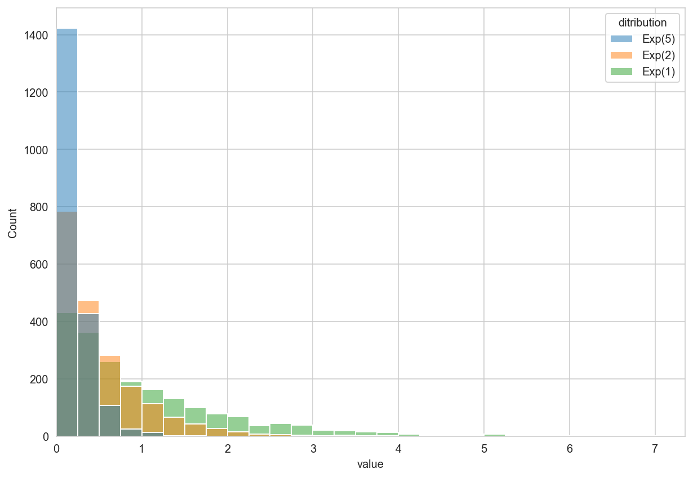


```python
df.groupby("dist").describe()
```


<div>
<style scoped>
    .dataframe tbody tr th:only-of-type {
        vertical-align: middle;
    }

    .dataframe tbody tr th {
        vertical-align: top;
    }

    .dataframe thead tr th {
        text-align: left;
    }

    .dataframe thead tr:last-of-type th {
        text-align: right;
    }
</style>
<table border="1" class="dataframe">
  <thead>
    <tr>
      <th></th>
      <th colspan="8" halign="left">value</th>
    </tr>
    <tr>
      <th></th>
      <th>count</th>
      <th>mean</th>
      <th>std</th>
      <th>min</th>
      <th>25%</th>
      <th>50%</th>
      <th>75%</th>
      <th>max</th>
    </tr>
    <tr>
      <th>dist</th>
      <th></th>
      <th></th>
      <th></th>
      <th></th>
      <th></th>
      <th></th>
      <th></th>
      <th></th>
    </tr>
  </thead>
  <tbody>
    <tr>
      <th>Gamma(3,1)</th>
      <td>2000.0</td>
      <td>2.956380</td>
      <td>1.716621</td>
      <td>0.125304</td>
      <td>1.695867</td>
      <td>2.657682</td>
      <td>3.873498</td>
      <td>14.453774</td>
    </tr>
    <tr>
      <th>Gamma(3,2)</th>
      <td>2000.0</td>
      <td>1.505507</td>
      <td>0.877052</td>
      <td>0.054329</td>
      <td>0.853332</td>
      <td>1.343429</td>
      <td>1.947066</td>
      <td>6.023775</td>
    </tr>
    <tr>
      <th>Gamma(3,4)</th>
      <td>2000.0</td>
      <td>0.738708</td>
      <td>0.424660</td>
      <td>0.049298</td>
      <td>0.426168</td>
      <td>0.653983</td>
      <td>0.985390</td>
      <td>3.693832</td>
    </tr>
  </tbody>
</table>
</div>


```python
N = 2000
df = pd.concat(
    [
        pd.DataFrame(
            {"value": pm.draw(pm.Normal.dist(0, 0.2), N), "dist": "N(0, 0.2)"}
        ),
        pd.DataFrame(
            {"value": pm.draw(pm.Normal.dist(0, 0.5), N), "dist": "N(0, 0.5)"}
        ),
        pd.DataFrame({"value": pm.draw(pm.Normal.dist(0, 1), N), "dist": "N(0, 1.0)"}),
    ]
).reset_index(drop=True)

fig, ax = plt.subplots(figsize=(5, 4))
sns.histplot(data=df, x="value", hue="dist", ax=ax, kde=True)
plt.show()
```


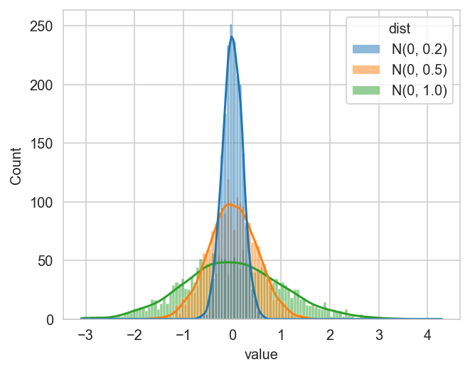


```python
df.groupby("dist").describe()
```


<div>
<style scoped>
    .dataframe tbody tr th:only-of-type {
        vertical-align: middle;
    }

    .dataframe tbody tr th {
        vertical-align: top;
    }

    .dataframe thead tr th {
        text-align: left;
    }

    .dataframe thead tr:last-of-type th {
        text-align: right;
    }
</style>
<table border="1" class="dataframe">
  <thead>
    <tr>
      <th></th>
      <th colspan="8" halign="left">value</th>
    </tr>
    <tr>
      <th></th>
      <th>count</th>
      <th>mean</th>
      <th>std</th>
      <th>min</th>
      <th>25%</th>
      <th>50%</th>
      <th>75%</th>
      <th>max</th>
    </tr>
    <tr>
      <th>dist</th>
      <th></th>
      <th></th>
      <th></th>
      <th></th>
      <th></th>
      <th></th>
      <th></th>
      <th></th>
    </tr>
  </thead>
  <tbody>
    <tr>
      <th>N(0, 0.2)</th>
      <td>2000.0</td>
      <td>0.004150</td>
      <td>0.192746</td>
      <td>-0.658716</td>
      <td>-0.127837</td>
      <td>0.003498</td>
      <td>0.130352</td>
      <td>0.613701</td>
    </tr>
    <tr>
      <th>N(0, 0.5)</th>
      <td>2000.0</td>
      <td>0.003199</td>
      <td>0.507288</td>
      <td>-2.038923</td>
      <td>-0.324153</td>
      <td>0.004545</td>
      <td>0.347458</td>
      <td>1.765408</td>
    </tr>
    <tr>
      <th>N(0, 1.0)</th>
      <td>2000.0</td>
      <td>0.061598</td>
      <td>0.995963</td>
      <td>-3.152209</td>
      <td>-0.624480</td>
      <td>0.076977</td>
      <td>0.723108</td>
      <td>3.724946</td>
    </tr>
  </tbody>
</table>
</div>


```python
N = 2000
df = pd.DataFrame()
df = pd.concat(
    [
        df,
        pd.DataFrame(
            {"value": pm.draw(pm.NegativeBinomial.dist(1, 1), N), "dist": "NB(1,1)"}
        ),
        pd.DataFrame(
            {"value": pm.draw(pm.NegativeBinomial.dist(10, 1), N), "dist": "NB(10,1)"}
        ),
        pd.DataFrame(
            {"value": pm.draw(pm.NegativeBinomial.dist(10, 5), N), "dist": "NB(10,5)"}
        ),
        pd.DataFrame(
            {
                "value": pm.draw(pm.NegativeBinomial.dist(10, 10), N),
                "dist": "NB(10,10)",
            }
        ),
    ]
)
df = df.reset_index(drop=True)
ax = sns.histplot(data=df, x="value", hue="dist", kde=True, binwidth=1)
ax.set_xlim(0, None)
```


    (0.0, 99.75)


```python
N = 2000


def _lkj(eta: int) -> pd.DataFrame:
    return pd.DataFrame(
        {
            "value": pm.draw(pm.LKJCorr.dist(n=2, eta=eta), N).flatten(),
            "dist": f"eta={eta}",
        }
    )


df = pd.concat([_lkj(i) for i in range(1, 6)]).reset_index(drop=True)

fig, ax = plt.subplots(figsize=(5, 4))
sns.histplot(data=df, x="value", hue="dist", kde=True, binwidth=0.1, ax=ax)
ax.set_xlim(-1, 1)
ax.set_title("Example LKJCorr distributions")
plt.show()
```


```python
df.groupby("dist").describe()
```


<div>
<style scoped>
    .dataframe tbody tr th:only-of-type {
        vertical-align: middle;
    }

    .dataframe tbody tr th {
        vertical-align: top;
    }

    .dataframe thead tr th {
        text-align: left;
    }

    .dataframe thead tr:last-of-type th {
        text-align: right;
    }
</style>
<table border="1" class="dataframe">
  <thead>
    <tr>
      <th></th>
      <th colspan="8" halign="left">value</th>
    </tr>
    <tr>
      <th></th>
      <th>count</th>
      <th>mean</th>
      <th>std</th>
      <th>min</th>
      <th>25%</th>
      <th>50%</th>
      <th>75%</th>
      <th>max</th>
    </tr>
    <tr>
      <th>dist</th>
      <th></th>
      <th></th>
      <th></th>
      <th></th>
      <th></th>
      <th></th>
      <th></th>
      <th></th>
    </tr>
  </thead>
  <tbody>
    <tr>
      <th>eta=1</th>
      <td>2000.0</td>
      <td>0.001417</td>
      <td>0.590413</td>
      <td>-0.998538</td>
      <td>-0.527013</td>
      <td>-0.000029</td>
      <td>0.513313</td>
      <td>0.999154</td>
    </tr>
    <tr>
      <th>eta=2</th>
      <td>2000.0</td>
      <td>-0.007614</td>
      <td>0.442257</td>
      <td>-0.995660</td>
      <td>-0.355944</td>
      <td>0.013149</td>
      <td>0.338208</td>
      <td>0.973688</td>
    </tr>
    <tr>
      <th>eta=3</th>
      <td>2000.0</td>
      <td>-0.007539</td>
      <td>0.380200</td>
      <td>-0.914317</td>
      <td>-0.294817</td>
      <td>-0.005271</td>
      <td>0.270489</td>
      <td>0.903757</td>
    </tr>
    <tr>
      <th>eta=4</th>
      <td>2000.0</td>
      <td>-0.001369</td>
      <td>0.335098</td>
      <td>-0.868730</td>
      <td>-0.258395</td>
      <td>0.013227</td>
      <td>0.241202</td>
      <td>0.865329</td>
    </tr>
    <tr>
      <th>eta=5</th>
      <td>2000.0</td>
      <td>0.007362</td>
      <td>0.296447</td>
      <td>-0.813247</td>
      <td>-0.203231</td>
      <td>0.003967</td>
      <td>0.223034</td>
      <td>0.834437</td>
    </tr>
  </tbody>
</table>
</div>


## Modeling


```python
from speclet.bayesian_models.lineage_hierarchical_nb import LineageHierNegBinomModel
```


```python
crc_model = LineageHierNegBinomModel(
    lineage="colorectal", reduce_deterministic_vars=False
)
valid_crc_data = crc_model.data_processing_pipeline(crc_data.copy())
```


<pre style="white-space:pre;overflow-x:auto;line-height:normal;font-family:Menlo,'DejaVu Sans Mono',consolas,'Courier New',monospace"><span style="color: #7fbfbf; text-decoration-color: #7fbfbf">[07/29/22 06:48:44] </span><span style="color: #000080; text-decoration-color: #000080">INFO    </span> Processing data for modeling.     <a href="file:///n/data1/hms/dbmi/park/Cook/speclet/speclet/bayesian_models/lineage_hierarchical_nb.py" target="_blank"><span style="color: #7f7f7f; text-decoration-color: #7f7f7f">lineage_hierarchical_nb.py</span></a><span style="color: #7f7f7f; text-decoration-color: #7f7f7f">:</span><a href="file:///n/data1/hms/dbmi/park/Cook/speclet/speclet/bayesian_models/lineage_hierarchical_nb.py#269" target="_blank"><span style="color: #7f7f7f; text-decoration-color: #7f7f7f">269</span></a>
</pre>


<pre style="white-space:pre;overflow-x:auto;line-height:normal;font-family:Menlo,'DejaVu Sans Mono',consolas,'Courier New',monospace"><span style="color: #7fbfbf; text-decoration-color: #7fbfbf">                    </span><span style="color: #000080; text-decoration-color: #000080">INFO    </span> LFC limits: <span style="font-weight: bold">(</span><span style="color: #008080; text-decoration-color: #008080; font-weight: bold">-5.0</span>, <span style="color: #008080; text-decoration-color: #008080; font-weight: bold">5.0</span><span style="font-weight: bold">)</span>           <a href="file:///n/data1/hms/dbmi/park/Cook/speclet/speclet/bayesian_models/lineage_hierarchical_nb.py" target="_blank"><span style="color: #7f7f7f; text-decoration-color: #7f7f7f">lineage_hierarchical_nb.py</span></a><span style="color: #7f7f7f; text-decoration-color: #7f7f7f">:</span><a href="file:///n/data1/hms/dbmi/park/Cook/speclet/speclet/bayesian_models/lineage_hierarchical_nb.py#270" target="_blank"><span style="color: #7f7f7f; text-decoration-color: #7f7f7f">270</span></a>
</pre>


<pre style="white-space:pre;overflow-x:auto;line-height:normal;font-family:Menlo,'DejaVu Sans Mono',consolas,'Courier New',monospace"><span style="color: #7fbfbf; text-decoration-color: #7fbfbf">                    </span><span style="color: #800000; text-decoration-color: #800000">WARNING </span> number of data points dropped: <span style="color: #008080; text-decoration-color: #008080; font-weight: bold">0</span>  <a href="file:///n/data1/hms/dbmi/park/Cook/speclet/speclet/bayesian_models/lineage_hierarchical_nb.py" target="_blank"><span style="color: #7f7f7f; text-decoration-color: #7f7f7f">lineage_hierarchical_nb.py</span></a><span style="color: #7f7f7f; text-decoration-color: #7f7f7f">:</span><a href="file:///n/data1/hms/dbmi/park/Cook/speclet/speclet/bayesian_models/lineage_hierarchical_nb.py#321" target="_blank"><span style="color: #7f7f7f; text-decoration-color: #7f7f7f">321</span></a>
</pre>


```python
crc_pymc_model = crc_model.pymc_model(crispr_data_manager.data.copy())
pm.model_to_graphviz(crc_pymc_model)
```


<pre style="white-space:pre;overflow-x:auto;line-height:normal;font-family:Menlo,'DejaVu Sans Mono',consolas,'Courier New',monospace"><span style="color: #7fbfbf; text-decoration-color: #7fbfbf">                    </span><span style="color: #000080; text-decoration-color: #000080">INFO    </span> Processing data for modeling.     <a href="file:///n/data1/hms/dbmi/park/Cook/speclet/speclet/bayesian_models/lineage_hierarchical_nb.py" target="_blank"><span style="color: #7f7f7f; text-decoration-color: #7f7f7f">lineage_hierarchical_nb.py</span></a><span style="color: #7f7f7f; text-decoration-color: #7f7f7f">:</span><a href="file:///n/data1/hms/dbmi/park/Cook/speclet/speclet/bayesian_models/lineage_hierarchical_nb.py#269" target="_blank"><span style="color: #7f7f7f; text-decoration-color: #7f7f7f">269</span></a>
</pre>


<pre style="white-space:pre;overflow-x:auto;line-height:normal;font-family:Menlo,'DejaVu Sans Mono',consolas,'Courier New',monospace"><span style="color: #7fbfbf; text-decoration-color: #7fbfbf">                    </span><span style="color: #000080; text-decoration-color: #000080">INFO    </span> LFC limits: <span style="font-weight: bold">(</span><span style="color: #008080; text-decoration-color: #008080; font-weight: bold">-5.0</span>, <span style="color: #008080; text-decoration-color: #008080; font-weight: bold">5.0</span><span style="font-weight: bold">)</span>           <a href="file:///n/data1/hms/dbmi/park/Cook/speclet/speclet/bayesian_models/lineage_hierarchical_nb.py" target="_blank"><span style="color: #7f7f7f; text-decoration-color: #7f7f7f">lineage_hierarchical_nb.py</span></a><span style="color: #7f7f7f; text-decoration-color: #7f7f7f">:</span><a href="file:///n/data1/hms/dbmi/park/Cook/speclet/speclet/bayesian_models/lineage_hierarchical_nb.py#270" target="_blank"><span style="color: #7f7f7f; text-decoration-color: #7f7f7f">270</span></a>
</pre>


<pre style="white-space:pre;overflow-x:auto;line-height:normal;font-family:Menlo,'DejaVu Sans Mono',consolas,'Courier New',monospace"><span style="color: #7fbfbf; text-decoration-color: #7fbfbf">[07/29/22 06:48:45] </span><span style="color: #800000; text-decoration-color: #800000">WARNING </span> number of data points dropped: <span style="color: #008080; text-decoration-color: #008080; font-weight: bold">0</span>  <a href="file:///n/data1/hms/dbmi/park/Cook/speclet/speclet/bayesian_models/lineage_hierarchical_nb.py" target="_blank"><span style="color: #7f7f7f; text-decoration-color: #7f7f7f">lineage_hierarchical_nb.py</span></a><span style="color: #7f7f7f; text-decoration-color: #7f7f7f">:</span><a href="file:///n/data1/hms/dbmi/park/Cook/speclet/speclet/bayesian_models/lineage_hierarchical_nb.py#321" target="_blank"><span style="color: #7f7f7f; text-decoration-color: #7f7f7f">321</span></a>
</pre>


<pre style="white-space:pre;overflow-x:auto;line-height:normal;font-family:Menlo,'DejaVu Sans Mono',consolas,'Courier New',monospace"><span style="color: #7fbfbf; text-decoration-color: #7fbfbf">                    </span><span style="color: #000080; text-decoration-color: #000080">INFO    </span> number of genes mutated in all    <a href="file:///n/data1/hms/dbmi/park/Cook/speclet/speclet/bayesian_models/lineage_hierarchical_nb.py" target="_blank"><span style="color: #7f7f7f; text-decoration-color: #7f7f7f">lineage_hierarchical_nb.py</span></a><span style="color: #7f7f7f; text-decoration-color: #7f7f7f">:</span><a href="file:///n/data1/hms/dbmi/park/Cook/speclet/speclet/bayesian_models/lineage_hierarchical_nb.py#470" target="_blank"><span style="color: #7f7f7f; text-decoration-color: #7f7f7f">470</span></a>
<span style="color: #7fbfbf; text-decoration-color: #7fbfbf">                    </span>         cells lines: <span style="color: #008080; text-decoration-color: #008080; font-weight: bold">1</span>                    <span style="color: #7f7f7f; text-decoration-color: #7f7f7f">                              </span>
</pre>


<pre style="white-space:pre;overflow-x:auto;line-height:normal;font-family:Menlo,'DejaVu Sans Mono',consolas,'Courier New',monospace"><span style="color: #7fbfbf; text-decoration-color: #7fbfbf">                    </span><span style="color: #008000; text-decoration-color: #008000">DEBUG   </span> Genes always mutated: APC         <a href="file:///n/data1/hms/dbmi/park/Cook/speclet/speclet/bayesian_models/lineage_hierarchical_nb.py" target="_blank"><span style="color: #7f7f7f; text-decoration-color: #7f7f7f">lineage_hierarchical_nb.py</span></a><span style="color: #7f7f7f; text-decoration-color: #7f7f7f">:</span><a href="file:///n/data1/hms/dbmi/park/Cook/speclet/speclet/bayesian_models/lineage_hierarchical_nb.py#473" target="_blank"><span style="color: #7f7f7f; text-decoration-color: #7f7f7f">473</span></a>
</pre>


<pre style="white-space:pre;overflow-x:auto;line-height:normal;font-family:Menlo,'DejaVu Sans Mono',consolas,'Courier New',monospace"><span style="color: #7fbfbf; text-decoration-color: #7fbfbf">                    </span><span style="color: #000080; text-decoration-color: #000080">INFO    </span> Dropping <span style="color: #008080; text-decoration-color: #008080; font-weight: bold">2</span> cancer genes.          <a href="file:///n/data1/hms/dbmi/park/Cook/speclet/speclet/bayesian_models/lineage_hierarchical_nb.py" target="_blank"><span style="color: #7f7f7f; text-decoration-color: #7f7f7f">lineage_hierarchical_nb.py</span></a><span style="color: #7f7f7f; text-decoration-color: #7f7f7f">:</span><a href="file:///n/data1/hms/dbmi/park/Cook/speclet/speclet/bayesian_models/lineage_hierarchical_nb.py#526" target="_blank"><span style="color: #7f7f7f; text-decoration-color: #7f7f7f">526</span></a>
</pre>


<pre style="white-space:pre;overflow-x:auto;line-height:normal;font-family:Menlo,'DejaVu Sans Mono',consolas,'Courier New',monospace"><span style="color: #7fbfbf; text-decoration-color: #7fbfbf">                    </span><span style="color: #008000; text-decoration-color: #008000">DEBUG   </span> Dropped cancer genes: <span style="font-weight: bold">[</span><span style="color: #008000; text-decoration-color: #008000">'APC'</span>,     <a href="file:///n/data1/hms/dbmi/park/Cook/speclet/speclet/bayesian_models/lineage_hierarchical_nb.py" target="_blank"><span style="color: #7f7f7f; text-decoration-color: #7f7f7f">lineage_hierarchical_nb.py</span></a><span style="color: #7f7f7f; text-decoration-color: #7f7f7f">:</span><a href="file:///n/data1/hms/dbmi/park/Cook/speclet/speclet/bayesian_models/lineage_hierarchical_nb.py#527" target="_blank"><span style="color: #7f7f7f; text-decoration-color: #7f7f7f">527</span></a>
<span style="color: #7fbfbf; text-decoration-color: #7fbfbf">                    </span>         <span style="color: #008000; text-decoration-color: #008000">'MDM2'</span><span style="font-weight: bold">]</span>                           <span style="color: #7f7f7f; text-decoration-color: #7f7f7f">                              </span>
</pre>


<pre style="white-space:pre;overflow-x:auto;line-height:normal;font-family:Menlo,'DejaVu Sans Mono',consolas,'Courier New',monospace"><span style="color: #7fbfbf; text-decoration-color: #7fbfbf">                    </span><span style="color: #000080; text-decoration-color: #000080">INFO    </span> Lineage: colorectal               <a href="file:///n/data1/hms/dbmi/park/Cook/speclet/speclet/bayesian_models/lineage_hierarchical_nb.py" target="_blank"><span style="color: #7f7f7f; text-decoration-color: #7f7f7f">lineage_hierarchical_nb.py</span></a><span style="color: #7f7f7f; text-decoration-color: #7f7f7f">:</span><a href="file:///n/data1/hms/dbmi/park/Cook/speclet/speclet/bayesian_models/lineage_hierarchical_nb.py#325" target="_blank"><span style="color: #7f7f7f; text-decoration-color: #7f7f7f">325</span></a>
</pre>


<pre style="white-space:pre;overflow-x:auto;line-height:normal;font-family:Menlo,'DejaVu Sans Mono',consolas,'Courier New',monospace"><span style="color: #7fbfbf; text-decoration-color: #7fbfbf">                    </span><span style="color: #000080; text-decoration-color: #000080">INFO    </span> Number of genes: <span style="color: #008080; text-decoration-color: #008080; font-weight: bold">103</span>              <a href="file:///n/data1/hms/dbmi/park/Cook/speclet/speclet/bayesian_models/lineage_hierarchical_nb.py" target="_blank"><span style="color: #7f7f7f; text-decoration-color: #7f7f7f">lineage_hierarchical_nb.py</span></a><span style="color: #7f7f7f; text-decoration-color: #7f7f7f">:</span><a href="file:///n/data1/hms/dbmi/park/Cook/speclet/speclet/bayesian_models/lineage_hierarchical_nb.py#326" target="_blank"><span style="color: #7f7f7f; text-decoration-color: #7f7f7f">326</span></a>
</pre>


<pre style="white-space:pre;overflow-x:auto;line-height:normal;font-family:Menlo,'DejaVu Sans Mono',consolas,'Courier New',monospace"><span style="color: #7fbfbf; text-decoration-color: #7fbfbf">                    </span><span style="color: #000080; text-decoration-color: #000080">INFO    </span> Number of sgRNA: <span style="color: #008080; text-decoration-color: #008080; font-weight: bold">162</span>              <a href="file:///n/data1/hms/dbmi/park/Cook/speclet/speclet/bayesian_models/lineage_hierarchical_nb.py" target="_blank"><span style="color: #7f7f7f; text-decoration-color: #7f7f7f">lineage_hierarchical_nb.py</span></a><span style="color: #7f7f7f; text-decoration-color: #7f7f7f">:</span><a href="file:///n/data1/hms/dbmi/park/Cook/speclet/speclet/bayesian_models/lineage_hierarchical_nb.py#327" target="_blank"><span style="color: #7f7f7f; text-decoration-color: #7f7f7f">327</span></a>
</pre>


<pre style="white-space:pre;overflow-x:auto;line-height:normal;font-family:Menlo,'DejaVu Sans Mono',consolas,'Courier New',monospace"><span style="color: #7fbfbf; text-decoration-color: #7fbfbf">                    </span><span style="color: #000080; text-decoration-color: #000080">INFO    </span> Number of cell lines: <span style="color: #008080; text-decoration-color: #008080; font-weight: bold">8</span>           <a href="file:///n/data1/hms/dbmi/park/Cook/speclet/speclet/bayesian_models/lineage_hierarchical_nb.py" target="_blank"><span style="color: #7f7f7f; text-decoration-color: #7f7f7f">lineage_hierarchical_nb.py</span></a><span style="color: #7f7f7f; text-decoration-color: #7f7f7f">:</span><a href="file:///n/data1/hms/dbmi/park/Cook/speclet/speclet/bayesian_models/lineage_hierarchical_nb.py#328" target="_blank"><span style="color: #7f7f7f; text-decoration-color: #7f7f7f">328</span></a>
</pre>


<pre style="white-space:pre;overflow-x:auto;line-height:normal;font-family:Menlo,'DejaVu Sans Mono',consolas,'Courier New',monospace"><span style="color: #7fbfbf; text-decoration-color: #7fbfbf">                    </span><span style="color: #000080; text-decoration-color: #000080">INFO    </span> Number of cancer genes: <span style="color: #008080; text-decoration-color: #008080; font-weight: bold">3</span>         <a href="file:///n/data1/hms/dbmi/park/Cook/speclet/speclet/bayesian_models/lineage_hierarchical_nb.py" target="_blank"><span style="color: #7f7f7f; text-decoration-color: #7f7f7f">lineage_hierarchical_nb.py</span></a><span style="color: #7f7f7f; text-decoration-color: #7f7f7f">:</span><a href="file:///n/data1/hms/dbmi/park/Cook/speclet/speclet/bayesian_models/lineage_hierarchical_nb.py#329" target="_blank"><span style="color: #7f7f7f; text-decoration-color: #7f7f7f">329</span></a>
</pre>


<pre style="white-space:pre;overflow-x:auto;line-height:normal;font-family:Menlo,'DejaVu Sans Mono',consolas,'Courier New',monospace"><span style="color: #7fbfbf; text-decoration-color: #7fbfbf">                    </span><span style="color: #000080; text-decoration-color: #000080">INFO    </span> Number of screens: <span style="color: #008080; text-decoration-color: #008080; font-weight: bold">1</span>              <a href="file:///n/data1/hms/dbmi/park/Cook/speclet/speclet/bayesian_models/lineage_hierarchical_nb.py" target="_blank"><span style="color: #7f7f7f; text-decoration-color: #7f7f7f">lineage_hierarchical_nb.py</span></a><span style="color: #7f7f7f; text-decoration-color: #7f7f7f">:</span><a href="file:///n/data1/hms/dbmi/park/Cook/speclet/speclet/bayesian_models/lineage_hierarchical_nb.py#330" target="_blank"><span style="color: #7f7f7f; text-decoration-color: #7f7f7f">330</span></a>
</pre>


<pre style="white-space:pre;overflow-x:auto;line-height:normal;font-family:Menlo,'DejaVu Sans Mono',consolas,'Courier New',monospace"><span style="color: #7fbfbf; text-decoration-color: #7fbfbf">                    </span><span style="color: #000080; text-decoration-color: #000080">INFO    </span> Number of data points: <span style="color: #008080; text-decoration-color: #008080; font-weight: bold">1296</span>       <a href="file:///n/data1/hms/dbmi/park/Cook/speclet/speclet/bayesian_models/lineage_hierarchical_nb.py" target="_blank"><span style="color: #7f7f7f; text-decoration-color: #7f7f7f">lineage_hierarchical_nb.py</span></a><span style="color: #7f7f7f; text-decoration-color: #7f7f7f">:</span><a href="file:///n/data1/hms/dbmi/park/Cook/speclet/speclet/bayesian_models/lineage_hierarchical_nb.py#331" target="_blank"><span style="color: #7f7f7f; text-decoration-color: #7f7f7f">331</span></a>
</pre>


<pre style="white-space:pre;overflow-x:auto;line-height:normal;font-family:Menlo,'DejaVu Sans Mono',consolas,'Courier New',monospace"><span style="color: #7fbfbf; text-decoration-color: #7fbfbf">                    </span><span style="color: #000080; text-decoration-color: #000080">INFO    </span> Including all non-essential       <a href="file:///n/data1/hms/dbmi/park/Cook/speclet/speclet/bayesian_models/lineage_hierarchical_nb.py" target="_blank"><span style="color: #7f7f7f; text-decoration-color: #7f7f7f">lineage_hierarchical_nb.py</span></a><span style="color: #7f7f7f; text-decoration-color: #7f7f7f">:</span><a href="file:///n/data1/hms/dbmi/park/Cook/speclet/speclet/bayesian_models/lineage_hierarchical_nb.py#336" target="_blank"><span style="color: #7f7f7f; text-decoration-color: #7f7f7f">336</span></a>
<span style="color: #7fbfbf; text-decoration-color: #7fbfbf">                    </span>         deterministic variables.          <span style="color: #7f7f7f; text-decoration-color: #7f7f7f">                              </span>
</pre>


<pre style="white-space:pre;overflow-x:auto;line-height:normal;font-family:Menlo,'DejaVu Sans Mono',consolas,'Courier New',monospace"><span style="color: #7fbfbf; text-decoration-color: #7fbfbf">                    </span><span style="color: #008000; text-decoration-color: #008000">DEBUG   </span> shape of cancer gene matrix:      <a href="file:///n/data1/hms/dbmi/park/Cook/speclet/speclet/bayesian_models/lineage_hierarchical_nb.py" target="_blank"><span style="color: #7f7f7f; text-decoration-color: #7f7f7f">lineage_hierarchical_nb.py</span></a><span style="color: #7f7f7f; text-decoration-color: #7f7f7f">:</span><a href="file:///n/data1/hms/dbmi/park/Cook/speclet/speclet/bayesian_models/lineage_hierarchical_nb.py#371" target="_blank"><span style="color: #7f7f7f; text-decoration-color: #7f7f7f">371</span></a>
<span style="color: #7fbfbf; text-decoration-color: #7fbfbf">                    </span>         <span style="font-weight: bold">(</span><span style="color: #008080; text-decoration-color: #008080; font-weight: bold">1296</span>, <span style="color: #008080; text-decoration-color: #008080; font-weight: bold">3</span><span style="font-weight: bold">)</span>                         <span style="color: #7f7f7f; text-decoration-color: #7f7f7f">                              </span>
</pre>


```python
with crc_pymc_model:
    pm_prior_pred = pm.sample_prior_predictive(
        var_names=["eta", "ct_final", "mu_a", "gene_effect"], random_seed=SEED
    )

print("prior predictive distribution")
pm_pred_draws = pm_prior_pred.prior_predictive["ct_final"].values.squeeze()
for q in [0, 0.01, 0.1, 0.2, 0.3, 0.4, 0.5, 0.6, 0.7, 0.8, 0.9, 0.99, 1]:
    res = np.quantile(pm_pred_draws, q=q)
    print(f"  {int(q*100)}%: {int(res):0,d}")

print("")
obs = valid_crc_data["counts_final"].astype(int)
print(f"final counts\n  min: {np.min(obs):,d},  max: {np.max(obs):,d}")

obs = valid_crc_data["counts_initial_adj"].astype(int)
print(f"initial counts\n  min: {np.min(obs):,d},  max: {np.max(obs):,d}")
```

    prior predictive distribution
      0%: 0
      1%: 0
      10%: 5
      20%: 31
      30%: 75
      40%: 145
      50%: 254
      60%: 430
      70%: 745
      80%: 1,402
      90%: 3,410
      99%: 40,142
      100%: 10,854,420,220

    final counts
      min: 0,  max: 9,819
    initial counts
      min: 57,  max: 4,741


```python
eta_prior = np.random.choice(pm_prior_pred.prior["eta"].values.flatten(), 2000)
ge_prior = np.random.choice(pm_prior_pred.prior["gene_effect"].values.flatten(), 4000)
mu_prior = np.random.choice(pm_prior_pred.prior["mu_a"].values.flatten(), 4000)

fig, axes = plt.subplots(ncols=3, figsize=(9, 3))
sns.histplot(mu_prior, kde=True, ax=axes[0], binwidth=0.5, stat="proportion")
sns.histplot(ge_prior, kde=True, ax=axes[1], binwidth=1, stat="proportion")
sns.histplot(eta_prior, kde=True, ax=axes[2], binwidth=1, stat="proportion")
axes[0].set_xlabel(r"$\mu_a$")
axes[1].set_xlabel(r"gene effect")
axes[2].set_xlabel(r"$\eta$")

for ax in axes.flatten():
    ax.set_ylabel(None)
    ax.set_title(None)

fig.supylabel("proportion")
fig.suptitle("Prior predictive distribution")
fig.tight_layout()
plt.show()
```


```python
fig, axes = plt.subplots(nrows=3, ncols=1, figsize=(8, 7))

stat = "proportion"

obs_max = crc_data["counts_final"].max()
truncated_prior_preds = [x for x in pm_pred_draws.flatten() if x <= obs_max]

prior_pred_pal = {"prior pred.": "tab:orange", "observed": "gray"}

# Untransformed
bw: float = 100
sns.histplot(
    x=truncated_prior_preds,
    ax=axes[0],
    binwidth=bw,
    stat=stat,
    color=prior_pred_pal["prior pred."],
)
sns.histplot(
    x=valid_crc_data["counts_final"],
    ax=axes[0],
    binwidth=bw,
    stat=stat,
    color=prior_pred_pal["observed"],
)
# Log10 transformed
bw = 0.25
sns.histplot(
    x=np.log10(pm_pred_draws.flatten() + 1),
    ax=axes[1],
    binwidth=bw,
    stat=stat,
    color=prior_pred_pal["prior pred."],
)
sns.histplot(
    x=np.log10(valid_crc_data["counts_final"] + 1),
    ax=axes[1],
    binwidth=bw,
    stat=stat,
    color=prior_pred_pal["observed"],
)
# Log-fold change
pp_lfc = np.log(
    (pm_pred_draws + 1) / (valid_crc_data["counts_initial_adj"].values[None, :])
)
obs_lfc = np.log(
    (valid_crc_data["counts_final"] + 1) / valid_crc_data["counts_initial_adj"]
)
bw = 0.5
sns.histplot(
    x=pp_lfc.flatten(),
    ax=axes[2],
    binwidth=bw,
    stat=stat,
    color=prior_pred_pal["prior pred."],
)
sns.histplot(
    x=obs_lfc,
    ax=axes[2],
    binwidth=bw,
    stat=stat,
    color=prior_pred_pal["observed"],
)


axes[0].set_xlabel("final counts")
axes[1].set_xlabel("log10(final counts + 1)")
axes[2].set_xlabel("log((final + 1) / initial)")

prior_pred_leg_handles = [
    Line2D([0], [0], linewidth=10, color=v, label=k) for k, v in prior_pred_pal.items()
]
axes[0].legend(handles=prior_pred_leg_handles, loc="upper right", frameon=False)

for ax in axes.flatten():
    ax.set_ylabel(stat)

plt.tight_layout()
plt.show()
```


## Sampling


```python
_init_cov = np.random.uniform(0.5, 1.5, (7, 7))
_init_cov = np.tril(_init_cov).flatten()
_init_cov = _init_cov[_init_cov > 0.1]
# corrs = np.random.uniform(0.5, 1.5, size=20)
# np.fill_diagonal(_init_cov, corrs)
_init_cov
```


    array([0.96415189, 1.29270268, 0.52593841, 1.34871511, 0.82444838,
           0.6193704 , 0.57488727, 0.84880338, 0.78607066, 1.34096922,
           0.68584869, 1.324559  , 1.04061826, 1.00725075, 0.58828679,
           1.19554487, 1.15735483, 0.96282663, 1.34023568, 1.30142651,
           0.93417086, 0.83285906, 1.35580722, 0.9779947 , 0.83106767,
           1.42645705, 0.53459422, 1.13566922])


```python
with crc_pymc_model:
    # trace = pymc.sampling_jax.sample_numpyro_nuts(
    trace = pm.sample(
        draws=500,
        tune=500,
        target_accept=0.90,
        random_seed=SEED,
        idata_kwargs={"log_likelihood": False},
        discard_tuned_samples=False,
    )
    pm.sample_posterior_predictive(trace, extend_inferencedata=True, random_seed=SEED)
```

    Auto-assigning NUTS sampler...
    Initializing NUTS using jitter+adapt_diag...
    Multiprocess sampling (4 chains in 4 jobs)
    NUTS: [genes_chol_cov, mu_mu_a, mu_b, mu_d, delta_genes, sigma_a, delta_a, alpha]


<style>
    /* Turns off some styling */
    progress {
        /* gets rid of default border in Firefox and Opera. */
        border: none;
        /* Needs to be in here for Safari polyfill so background images work as expected. */
        background-size: auto;
    }
    .progress-bar-interrupted, .progress-bar-interrupted::-webkit-progress-bar {
        background: #F44336;
    }
</style>


<div>
  <progress value='4000' class='' max='4000' style='width:300px; height:20px; vertical-align: middle;'></progress>
  100.00% [4000/4000 02:41<00:00 Sampling 4 chains, 0 divergences]
</div>


    Sampling 4 chains for 500 tune and 500 draw iterations (2_000 + 2_000 draws total) took 164 seconds.


<style>
    /* Turns off some styling */
    progress {
        /* gets rid of default border in Firefox and Opera. */
        border: none;
        /* Needs to be in here for Safari polyfill so background images work as expected. */
        background-size: auto;
    }
    .progress-bar-interrupted, .progress-bar-interrupted::-webkit-progress-bar {
        background: #F44336;
    }
</style>


<div>
  <progress value='2000' class='' max='2000' style='width:300px; height:20px; vertical-align: middle;'></progress>
  100.00% [2000/2000 00:01<00:00]
</div>


```python
trace
```


            <div>
              <div class='xr-header'>
                <div class="xr-obj-type">arviz.InferenceData</div>
              </div>
              <ul class="xr-sections group-sections">

            <li class = "xr-section-item">
                  <input id="idata_posteriorb798730c-0a63-4a68-966a-d62421bd3072" class="xr-section-summary-in" type="checkbox">
                  <label for="idata_posteriorb798730c-0a63-4a68-966a-d62421bd3072" class = "xr-section-summary">posterior</label>
                  <div class="xr-section-inline-details"></div>
                  <div class="xr-section-details">
                      <ul id="xr-dataset-coord-list" class="xr-var-list">
                          <div style="padding-left:2rem;"><div><svg style="position: absolute; width: 0; height: 0; overflow: hidden">
<defs>
<symbol id="icon-database" viewBox="0 0 32 32">
<path d="M16 0c-8.837 0-16 2.239-16 5v4c0 2.761 7.163 5 16 5s16-2.239 16-5v-4c0-2.761-7.163-5-16-5z"></path>
<path d="M16 17c-8.837 0-16-2.239-16-5v6c0 2.761 7.163 5 16 5s16-2.239 16-5v-6c0 2.761-7.163 5-16 5z"></path>
<path d="M16 26c-8.837 0-16-2.239-16-5v6c0 2.761 7.163 5 16 5s16-2.239 16-5v-6c0 2.761-7.163 5-16 5z"></path>
</symbol>
<symbol id="icon-file-text2" viewBox="0 0 32 32">
<path d="M28.681 7.159c-0.694-0.947-1.662-2.053-2.724-3.116s-2.169-2.030-3.116-2.724c-1.612-1.182-2.393-1.319-2.841-1.319h-15.5c-1.378 0-2.5 1.121-2.5 2.5v27c0 1.378 1.122 2.5 2.5 2.5h23c1.378 0 2.5-1.122 2.5-2.5v-19.5c0-0.448-0.137-1.23-1.319-2.841zM24.543 5.457c0.959 0.959 1.712 1.825 2.268 2.543h-4.811v-4.811c0.718 0.556 1.584 1.309 2.543 2.268zM28 29.5c0 0.271-0.229 0.5-0.5 0.5h-23c-0.271 0-0.5-0.229-0.5-0.5v-27c0-0.271 0.229-0.5 0.5-0.5 0 0 15.499-0 15.5 0v7c0 0.552 0.448 1 1 1h7v19.5z"></path>
<path d="M23 26h-14c-0.552 0-1-0.448-1-1s0.448-1 1-1h14c0.552 0 1 0.448 1 1s-0.448 1-1 1z"></path>
<path d="M23 22h-14c-0.552 0-1-0.448-1-1s0.448-1 1-1h14c0.552 0 1 0.448 1 1s-0.448 1-1 1z"></path>
<path d="M23 18h-14c-0.552 0-1-0.448-1-1s0.448-1 1-1h14c0.552 0 1 0.448 1 1s-0.448 1-1 1z"></path>
</symbol>
</defs>
</svg>
<style>/* CSS stylesheet for displaying xarray objects in jupyterlab.
 *
 */

:root {
  --xr-font-color0: var(--jp-content-font-color0, rgba(0, 0, 0, 1));
  --xr-font-color2: var(--jp-content-font-color2, rgba(0, 0, 0, 0.54));
  --xr-font-color3: var(--jp-content-font-color3, rgba(0, 0, 0, 0.38));
  --xr-border-color: var(--jp-border-color2, #e0e0e0);
  --xr-disabled-color: var(--jp-layout-color3, #bdbdbd);
  --xr-background-color: var(--jp-layout-color0, white);
  --xr-background-color-row-even: var(--jp-layout-color1, white);
  --xr-background-color-row-odd: var(--jp-layout-color2, #eeeeee);
}

html[theme=dark],
body.vscode-dark {
  --xr-font-color0: rgba(255, 255, 255, 1);
  --xr-font-color2: rgba(255, 255, 255, 0.54);
  --xr-font-color3: rgba(255, 255, 255, 0.38);
  --xr-border-color: #1F1F1F;
  --xr-disabled-color: #515151;
  --xr-background-color: #111111;
  --xr-background-color-row-even: #111111;
  --xr-background-color-row-odd: #313131;
}

.xr-wrap {
  display: block !important;
  min-width: 300px;
  max-width: 700px;
}

.xr-text-repr-fallback {
  /* fallback to plain text repr when CSS is not injected (untrusted notebook) */
  display: none;
}

.xr-header {
  padding-top: 6px;
  padding-bottom: 6px;
  margin-bottom: 4px;
  border-bottom: solid 1px var(--xr-border-color);
}

.xr-header > div,
.xr-header > ul {
  display: inline;
  margin-top: 0;
  margin-bottom: 0;
}

.xr-obj-type,
.xr-array-name {
  margin-left: 2px;
  margin-right: 10px;
}

.xr-obj-type {
  color: var(--xr-font-color2);
}

.xr-sections {
  padding-left: 0 !important;
  display: grid;
  grid-template-columns: 150px auto auto 1fr 20px 20px;
}

.xr-section-item {
  display: contents;
}

.xr-section-item input {
  display: none;
}

.xr-section-item input + label {
  color: var(--xr-disabled-color);
}

.xr-section-item input:enabled + label {
  cursor: pointer;
  color: var(--xr-font-color2);
}

.xr-section-item input:enabled + label:hover {
  color: var(--xr-font-color0);
}

.xr-section-summary {
  grid-column: 1;
  color: var(--xr-font-color2);
  font-weight: 500;
}

.xr-section-summary > span {
  display: inline-block;
  padding-left: 0.5em;
}

.xr-section-summary-in:disabled + label {
  color: var(--xr-font-color2);
}

.xr-section-summary-in + label:before {
  display: inline-block;
  content: '►';
  font-size: 11px;
  width: 15px;
  text-align: center;
}

.xr-section-summary-in:disabled + label:before {
  color: var(--xr-disabled-color);
}

.xr-section-summary-in:checked + label:before {
  content: '▼';
}

.xr-section-summary-in:checked + label > span {
  display: none;
}

.xr-section-summary,
.xr-section-inline-details {
  padding-top: 4px;
  padding-bottom: 4px;
}

.xr-section-inline-details {
  grid-column: 2 / -1;
}

.xr-section-details {
  display: none;
  grid-column: 1 / -1;
  margin-bottom: 5px;
}

.xr-section-summary-in:checked ~ .xr-section-details {
  display: contents;
}

.xr-array-wrap {
  grid-column: 1 / -1;
  display: grid;
  grid-template-columns: 20px auto;
}

.xr-array-wrap > label {
  grid-column: 1;
  vertical-align: top;
}

.xr-preview {
  color: var(--xr-font-color3);
}

.xr-array-preview,
.xr-array-data {
  padding: 0 5px !important;
  grid-column: 2;
}

.xr-array-data,
.xr-array-in:checked ~ .xr-array-preview {
  display: none;
}

.xr-array-in:checked ~ .xr-array-data,
.xr-array-preview {
  display: inline-block;
}

.xr-dim-list {
  display: inline-block !important;
  list-style: none;
  padding: 0 !important;
  margin: 0;
}

.xr-dim-list li {
  display: inline-block;
  padding: 0;
  margin: 0;
}

.xr-dim-list:before {
  content: '(';
}

.xr-dim-list:after {
  content: ')';
}

.xr-dim-list li:not(:last-child):after {
  content: ',';
  padding-right: 5px;
}

.xr-has-index {
  font-weight: bold;
}

.xr-var-list,
.xr-var-item {
  display: contents;
}

.xr-var-item > div,
.xr-var-item label,
.xr-var-item > .xr-var-name span {
  background-color: var(--xr-background-color-row-even);
  margin-bottom: 0;
}

.xr-var-item > .xr-var-name:hover span {
  padding-right: 5px;
}

.xr-var-list > li:nth-child(odd) > div,
.xr-var-list > li:nth-child(odd) > label,
.xr-var-list > li:nth-child(odd) > .xr-var-name span {
  background-color: var(--xr-background-color-row-odd);
}

.xr-var-name {
  grid-column: 1;
}

.xr-var-dims {
  grid-column: 2;
}

.xr-var-dtype {
  grid-column: 3;
  text-align: right;
  color: var(--xr-font-color2);
}

.xr-var-preview {
  grid-column: 4;
}

.xr-var-name,
.xr-var-dims,
.xr-var-dtype,
.xr-preview,
.xr-attrs dt {
  white-space: nowrap;
  overflow: hidden;
  text-overflow: ellipsis;
  padding-right: 10px;
}

.xr-var-name:hover,
.xr-var-dims:hover,
.xr-var-dtype:hover,
.xr-attrs dt:hover {
  overflow: visible;
  width: auto;
  z-index: 1;
}

.xr-var-attrs,
.xr-var-data {
  display: none;
  background-color: var(--xr-background-color) !important;
  padding-bottom: 5px !important;
}

.xr-var-attrs-in:checked ~ .xr-var-attrs,
.xr-var-data-in:checked ~ .xr-var-data {
  display: block;
}

.xr-var-data > table {
  float: right;
}

.xr-var-name span,
.xr-var-data,
.xr-attrs {
  padding-left: 25px !important;
}

.xr-attrs,
.xr-var-attrs,
.xr-var-data {
  grid-column: 1 / -1;
}

dl.xr-attrs {
  padding: 0;
  margin: 0;
  display: grid;
  grid-template-columns: 125px auto;
}

.xr-attrs dt,
.xr-attrs dd {
  padding: 0;
  margin: 0;
  float: left;
  padding-right: 10px;
  width: auto;
}

.xr-attrs dt {
  font-weight: normal;
  grid-column: 1;
}

.xr-attrs dt:hover span {
  display: inline-block;
  background: var(--xr-background-color);
  padding-right: 10px;
}

.xr-attrs dd {
  grid-column: 2;
  white-space: pre-wrap;
  word-break: break-all;
}

.xr-icon-database,
.xr-icon-file-text2 {
  display: inline-block;
  vertical-align: middle;
  width: 1em;
  height: 1.5em !important;
  stroke-width: 0;
  stroke: currentColor;
  fill: currentColor;
}
</style><pre class='xr-text-repr-fallback'>&lt;xarray.Dataset&gt;
Dimensions:                    (chain: 4, draw: 500, delta_genes_dim_0: 7,
                                delta_genes_dim_1: 103, sgrna: 162,
                                genes_chol_cov_dim_0: 28,
                                genes_chol_cov_corr_dim_0: 7,
                                genes_chol_cov_corr_dim_1: 7,
                                genes_chol_cov_stds_dim_0: 7, cancer_gene: 3,
                                gene: 103, gene_effect_dim_0: 1296,
                                eta_dim_0: 1296, mu_dim_0: 1296)
Coordinates: (12/14)
  * chain                      (chain) int64 0 1 2 3
  * draw                       (draw) int64 0 1 2 3 4 5 ... 495 496 497 498 499
  * delta_genes_dim_0          (delta_genes_dim_0) int64 0 1 2 3 4 5 6
  * delta_genes_dim_1          (delta_genes_dim_1) int64 0 1 2 3 ... 100 101 102
  * sgrna                      (sgrna) &lt;U20 &#x27;AAATAATTAAGTATGCACAT&#x27; ... &#x27;TTTGG...
  * genes_chol_cov_dim_0       (genes_chol_cov_dim_0) int64 0 1 2 3 ... 25 26 27
    ...                         ...
  * genes_chol_cov_stds_dim_0  (genes_chol_cov_stds_dim_0) int64 0 1 2 3 4 5 6
  * cancer_gene                (cancer_gene) &lt;U6 &#x27;FBXW7&#x27; &#x27;KRAS&#x27; &#x27;PIK3CA&#x27;
  * gene                       (gene) &lt;U9 &#x27;ADH1B&#x27; &#x27;ADH5&#x27; ... &#x27;ZNF428&#x27; &#x27;ZNF620&#x27;
  * gene_effect_dim_0          (gene_effect_dim_0) int64 0 1 2 ... 1294 1295
  * eta_dim_0                  (eta_dim_0) int64 0 1 2 3 ... 1292 1293 1294 1295
  * mu_dim_0                   (mu_dim_0) int64 0 1 2 3 ... 1292 1293 1294 1295
Data variables: (12/24)
    mu_mu_a                    (chain, draw) float64 0.1372 0.1477 ... 0.1042
    mu_b                       (chain, draw) float64 -0.002014 ... 0.01731
    mu_d                       (chain, draw) float64 -0.01754 ... -0.06513
    delta_genes                (chain, draw, delta_genes_dim_0, delta_genes_dim_1) float64 ...
    delta_a                    (chain, draw, sgrna) float64 0.115 ... -0.4685
    genes_chol_cov             (chain, draw, genes_chol_cov_dim_0) float64 0....
    ...                         ...
    f                          (chain, draw, gene) float64 0.1992 ... -0.3752
    h                          (chain, draw, gene, cancer_gene) float64 0.264...
    a                          (chain, draw, sgrna) float64 -0.3572 ... -0.9558
    gene_effect                (chain, draw, gene_effect_dim_0) float64 0.280...
    eta                        (chain, draw, eta_dim_0) float64 6.571 ... 5.577
    mu                         (chain, draw, mu_dim_0) float64 713.8 ... 264.2
Attributes:
    created_at:                 2022-07-29T10:52:23.241526
    arviz_version:              0.12.1
    inference_library:          pymc
    inference_library_version:  4.1.2
    sampling_time:              163.66693258285522
    tuning_steps:               500</pre><div class='xr-wrap' style='display:none'><div class='xr-header'><div class='xr-obj-type'>xarray.Dataset</div></div><ul class='xr-sections'><li class='xr-section-item'><input id='section-875e30f3-4469-4877-ae42-7a5fafc12fb5' class='xr-section-summary-in' type='checkbox' disabled ><label for='section-875e30f3-4469-4877-ae42-7a5fafc12fb5' class='xr-section-summary'  title='Expand/collapse section'>Dimensions:</label><div class='xr-section-inline-details'><ul class='xr-dim-list'><li><span class='xr-has-index'>chain</span>: 4</li><li><span class='xr-has-index'>draw</span>: 500</li><li><span class='xr-has-index'>delta_genes_dim_0</span>: 7</li><li><span class='xr-has-index'>delta_genes_dim_1</span>: 103</li><li><span class='xr-has-index'>sgrna</span>: 162</li><li><span class='xr-has-index'>genes_chol_cov_dim_0</span>: 28</li><li><span class='xr-has-index'>genes_chol_cov_corr_dim_0</span>: 7</li><li><span class='xr-has-index'>genes_chol_cov_corr_dim_1</span>: 7</li><li><span class='xr-has-index'>genes_chol_cov_stds_dim_0</span>: 7</li><li><span class='xr-has-index'>cancer_gene</span>: 3</li><li><span class='xr-has-index'>gene</span>: 103</li><li><span class='xr-has-index'>gene_effect_dim_0</span>: 1296</li><li><span class='xr-has-index'>eta_dim_0</span>: 1296</li><li><span class='xr-has-index'>mu_dim_0</span>: 1296</li></ul></div><div class='xr-section-details'></div></li><li class='xr-section-item'><input id='section-40cb5ad6-8ad4-4926-b121-7c9cdf502be0' class='xr-section-summary-in' type='checkbox'  checked><label for='section-40cb5ad6-8ad4-4926-b121-7c9cdf502be0' class='xr-section-summary' >Coordinates: <span>(14)</span></label><div class='xr-section-inline-details'></div><div class='xr-section-details'><ul class='xr-var-list'><li class='xr-var-item'><div class='xr-var-name'><span class='xr-has-index'>chain</span></div><div class='xr-var-dims'>(chain)</div><div class='xr-var-dtype'>int64</div><div class='xr-var-preview xr-preview'>0 1 2 3</div><input id='attrs-a18c1396-faf5-4d1e-82e1-fc4116fe80e6' class='xr-var-attrs-in' type='checkbox' disabled><label for='attrs-a18c1396-faf5-4d1e-82e1-fc4116fe80e6' title='Show/Hide attributes'><svg class='icon xr-icon-file-text2'><use xlink:href='#icon-file-text2'></use></svg></label><input id='data-911a3462-6cd4-4643-b62d-e387f5c4f963' class='xr-var-data-in' type='checkbox'><label for='data-911a3462-6cd4-4643-b62d-e387f5c4f963' title='Show/Hide data repr'><svg class='icon xr-icon-database'><use xlink:href='#icon-database'></use></svg></label><div class='xr-var-attrs'><dl class='xr-attrs'></dl></div><div class='xr-var-data'><pre>array([0, 1, 2, 3])</pre></div></li><li class='xr-var-item'><div class='xr-var-name'><span class='xr-has-index'>draw</span></div><div class='xr-var-dims'>(draw)</div><div class='xr-var-dtype'>int64</div><div class='xr-var-preview xr-preview'>0 1 2 3 4 5 ... 495 496 497 498 499</div><input id='attrs-bbb94676-62cb-4b67-8a60-ff7396596cb0' class='xr-var-attrs-in' type='checkbox' disabled><label for='attrs-bbb94676-62cb-4b67-8a60-ff7396596cb0' title='Show/Hide attributes'><svg class='icon xr-icon-file-text2'><use xlink:href='#icon-file-text2'></use></svg></label><input id='data-d849bab0-ea2f-48da-b0c9-6bbe3fefc852' class='xr-var-data-in' type='checkbox'><label for='data-d849bab0-ea2f-48da-b0c9-6bbe3fefc852' title='Show/Hide data repr'><svg class='icon xr-icon-database'><use xlink:href='#icon-database'></use></svg></label><div class='xr-var-attrs'><dl class='xr-attrs'></dl></div><div class='xr-var-data'><pre>array([  0,   1,   2, ..., 497, 498, 499])</pre></div></li><li class='xr-var-item'><div class='xr-var-name'><span class='xr-has-index'>delta_genes_dim_0</span></div><div class='xr-var-dims'>(delta_genes_dim_0)</div><div class='xr-var-dtype'>int64</div><div class='xr-var-preview xr-preview'>0 1 2 3 4 5 6</div><input id='attrs-b45760c9-b870-4f70-86b7-299a9392d23b' class='xr-var-attrs-in' type='checkbox' disabled><label for='attrs-b45760c9-b870-4f70-86b7-299a9392d23b' title='Show/Hide attributes'><svg class='icon xr-icon-file-text2'><use xlink:href='#icon-file-text2'></use></svg></label><input id='data-4b83d203-e181-43b5-9b7e-24df8ce842c7' class='xr-var-data-in' type='checkbox'><label for='data-4b83d203-e181-43b5-9b7e-24df8ce842c7' title='Show/Hide data repr'><svg class='icon xr-icon-database'><use xlink:href='#icon-database'></use></svg></label><div class='xr-var-attrs'><dl class='xr-attrs'></dl></div><div class='xr-var-data'><pre>array([0, 1, 2, 3, 4, 5, 6])</pre></div></li><li class='xr-var-item'><div class='xr-var-name'><span class='xr-has-index'>delta_genes_dim_1</span></div><div class='xr-var-dims'>(delta_genes_dim_1)</div><div class='xr-var-dtype'>int64</div><div class='xr-var-preview xr-preview'>0 1 2 3 4 5 ... 98 99 100 101 102</div><input id='attrs-e3305bfa-bf9a-42cb-baea-10b0c00ef24c' class='xr-var-attrs-in' type='checkbox' disabled><label for='attrs-e3305bfa-bf9a-42cb-baea-10b0c00ef24c' title='Show/Hide attributes'><svg class='icon xr-icon-file-text2'><use xlink:href='#icon-file-text2'></use></svg></label><input id='data-db156e1d-1c20-4978-b6bd-fcac0e97be8c' class='xr-var-data-in' type='checkbox'><label for='data-db156e1d-1c20-4978-b6bd-fcac0e97be8c' title='Show/Hide data repr'><svg class='icon xr-icon-database'><use xlink:href='#icon-database'></use></svg></label><div class='xr-var-attrs'><dl class='xr-attrs'></dl></div><div class='xr-var-data'><pre>array([  0,   1,   2,   3,   4,   5,   6,   7,   8,   9,  10,  11,  12,  13,
        14,  15,  16,  17,  18,  19,  20,  21,  22,  23,  24,  25,  26,  27,
        28,  29,  30,  31,  32,  33,  34,  35,  36,  37,  38,  39,  40,  41,
        42,  43,  44,  45,  46,  47,  48,  49,  50,  51,  52,  53,  54,  55,
        56,  57,  58,  59,  60,  61,  62,  63,  64,  65,  66,  67,  68,  69,
        70,  71,  72,  73,  74,  75,  76,  77,  78,  79,  80,  81,  82,  83,
        84,  85,  86,  87,  88,  89,  90,  91,  92,  93,  94,  95,  96,  97,
        98,  99, 100, 101, 102])</pre></div></li><li class='xr-var-item'><div class='xr-var-name'><span class='xr-has-index'>sgrna</span></div><div class='xr-var-dims'>(sgrna)</div><div class='xr-var-dtype'>&lt;U20</div><div class='xr-var-preview xr-preview'>&#x27;AAATAATTAAGTATGCACAT&#x27; ... &#x27;TTTG...</div><input id='attrs-142603b9-0a39-44ac-934d-db1e8331e219' class='xr-var-attrs-in' type='checkbox' disabled><label for='attrs-142603b9-0a39-44ac-934d-db1e8331e219' title='Show/Hide attributes'><svg class='icon xr-icon-file-text2'><use xlink:href='#icon-file-text2'></use></svg></label><input id='data-9af5cec1-d86e-454b-abe8-3f471578158c' class='xr-var-data-in' type='checkbox'><label for='data-9af5cec1-d86e-454b-abe8-3f471578158c' title='Show/Hide data repr'><svg class='icon xr-icon-database'><use xlink:href='#icon-database'></use></svg></label><div class='xr-var-attrs'><dl class='xr-attrs'></dl></div><div class='xr-var-data'><pre>array([&#x27;AAATAATTAAGTATGCACAT&#x27;, &#x27;AACAGCTGTTTACCAAGCGA&#x27;, &#x27;AATCAACCCACAGCTGCACA&#x27;,
       &#x27;ACAAGGGGCGACCGTCGCCA&#x27;, &#x27;ACACCCAGCCGCGTTTGACG&#x27;, &#x27;ACCCTTATAGAATCTGCAAG&#x27;,
       &#x27;ACGAGGACGAGGACAACCAG&#x27;, &#x27;ACTACGGACAGACGGTTCCG&#x27;, &#x27;AGAACTCAACAAAAATCCAG&#x27;,
       &#x27;AGAACTTGCCTTGCTCCTTG&#x27;, &#x27;AGAGGAGTACAGTGCAATGA&#x27;, &#x27;AGATGTTGAACACTGAGCAG&#x27;,
       &#x27;AGCTTGGCCCGCTTGCGGCG&#x27;, &#x27;AGTCGAATGCAGATGCCGCA&#x27;, &#x27;AGTCTACCAAAGCTCACGCG&#x27;,
       &#x27;AGTTACTGTGTATCAGGCAG&#x27;, &#x27;AGTTAGGTGATGGCTTTGAA&#x27;, &#x27;ATACTCATTCAGCTCCCGAA&#x27;,
       &#x27;ATATAGTATGGACAAGGCAA&#x27;, &#x27;ATATTCATGTCAGACTGGCA&#x27;, &#x27;ATATTTAGTTGCATATCGTG&#x27;,
       &#x27;ATCTCGAAAGAGCAAGGTAG&#x27;, &#x27;ATCTTCCTCTGACTGAAGGG&#x27;, &#x27;CAACTTGGACAATCTCGTGG&#x27;,
       &#x27;CAGCATGTAGAAGAAAACCG&#x27;, &#x27;CAGCTCCTATGTGCTCCACG&#x27;, &#x27;CAGGAGGTCCAGCAAAACCA&#x27;,
       &#x27;CATATGCGCACCAGAGTGCA&#x27;, &#x27;CATCAGACCAGAAACAGCCG&#x27;, &#x27;CATCGAGGAGCGCTCCCAGA&#x27;,
       &#x27;CATGGAACCAGACAGAAAAG&#x27;, &#x27;CCAAGACATCATTTACTACG&#x27;, &#x27;CCAAGGCTGATTTATAGTAG&#x27;,
       &#x27;CCAGCAGCTCTCAAGCCATG&#x27;, &#x27;CCAGCTGCAAGATCTCCAAG&#x27;, &#x27;CCAGGCTCACCAACTCCAAT&#x27;,
       &#x27;CCAGGTTGCCACTAACCACG&#x27;, &#x27;CCATGGCCAACGGCGCCGCG&#x27;, &#x27;CCGTGTCTCATCTATGTAGA&#x27;,
       &#x27;CCTGCATTCAGCCAAACGGC&#x27;, &#x27;CCTGTTGCCACGTCAACAAA&#x27;, &#x27;CCTTTCCTCACAACTTTCCA&#x27;,
       &#x27;CGAATCTGTGAATGAATGCA&#x27;, &#x27;CGACAAATCGAAGAAAGAAG&#x27;, &#x27;CGGAGCCTCGCCATTCCCGA&#x27;,
       &#x27;CGGCAACCAGAAAAACAGCC&#x27;, &#x27;CTAACATTGAGACTGAACTG&#x27;, &#x27;CTAACCTTATCTTCTGGCAA&#x27;,
       &#x27;CTCACAGCTGAAAAACCAAA&#x27;, &#x27;CTGCAAAAGACTGCACCAGG&#x27;, &#x27;CTTGATATCGTAGTTGCCGG&#x27;,
       &#x27;GAAAGAGCCAGACTTCTCAG&#x27;, &#x27;GAACGACTACGGCTGAACCA&#x27;, &#x27;GAATAAGGCCCATTTCCCCG&#x27;,
       &#x27;GAGAGTGTATTCTGAATCAG&#x27;, &#x27;GAGCCAGTCGGAGGACCTGG&#x27;, &#x27;GAGCTCTCTGAGCAGCAGGA&#x27;,
       &#x27;GAGCTGGCAAGGCTGGGCCG&#x27;, &#x27;GAGCTTCTCGCTGAGCCCGG&#x27;, &#x27;GAGTCCTTCAGACTGATGGT&#x27;,
       &#x27;GATAAGTACACGCTGCCCGG&#x27;, &#x27;GATAGCATCTCAGGTCCCTA&#x27;, &#x27;GATGCAGAGATATATCCATG&#x27;,
       &#x27;GATTGTATCTGATTACCAGA&#x27;, &#x27;GCAACTCAGACAACAAGAGG&#x27;, &#x27;GCAAGCGCCTGGGCGCCGAG&#x27;,
       &#x27;GCACAATCTACATTCAGGGA&#x27;, &#x27;GCACTGGACAGGAATAAGAA&#x27;, &#x27;GCACTGGCTCAGGTGCTAAT&#x27;,
       &#x27;GCAGAGCCTTAATCTCCCGC&#x27;, &#x27;GCAGCGATGAGACTTCATGA&#x27;, &#x27;GCAGGAGCCCGGCTACCGAG&#x27;,
       &#x27;GCAGGTAAGGAGGTCAATGA&#x27;, &#x27;GCAGTCACAGCACATGACGG&#x27;, &#x27;GCAGTGCGAATTGTTTGCAG&#x27;,
       &#x27;GCAGTTCTCCGACCAGGCTG&#x27;, &#x27;GCATTGACCTGGCATCTCAT&#x27;, &#x27;GCCTCGCTATCCATATCAGA&#x27;,
       &#x27;GCGAGGTTCCATTCACCAGC&#x27;, &#x27;GCGCAGATCACCCAGAAGAT&#x27;, &#x27;GCGCAGGCCTCGCAGCCCCG&#x27;,
       &#x27;GCGCTCGCCCCGCCCCCGCG&#x27;, &#x27;GCTAACTATGGCGACCGCCA&#x27;, &#x27;GCTCCCGCTGCAGCTCCTGA&#x27;,
       &#x27;GCTCCTTCAGCTCCACCGCC&#x27;, &#x27;GCTCTGCTGAATTCTGGAGG&#x27;, &#x27;GCTGCCACAGTGATGACCAA&#x27;,
       &#x27;GCTGCGCAGGTCGGGCCACA&#x27;, &#x27;GCTGCTGGAGCACCTCTCGT&#x27;, &#x27;GCTGCTGTCAAAGATGTAAA&#x27;,
       &#x27;GCTGGCTGTGAGAGACACCC&#x27;, &#x27;GCTGTTTGAGGACAGCAGGC&#x27;, &#x27;GGACACTTACAGGTTTCCCA&#x27;,
       &#x27;GGACAGCTCGGGGCCTGCCG&#x27;, &#x27;GGAGCCGGCCGCGTCAAACG&#x27;, &#x27;GGATATGTCTAAACTCACAA&#x27;,
       &#x27;GGATGCATAGATGGACACCT&#x27;, &#x27;GGCTGCAGGAAGGTGACCCA&#x27;, &#x27;GGGAAAGGATTAATGCCAGA&#x27;,
       &#x27;GGTACTAATTTCAAGATGCC&#x27;, &#x27;GGTACTCCCTCAGGACCACG&#x27;, &#x27;GGTAGCAAATGGCTACATAG&#x27;,
       &#x27;GGTAGGCTGTACCAGCAAAA&#x27;, &#x27;GGTGGTGGATGAGAATGCAG&#x27;, &#x27;GGTTCAGTAGCTCAACTGCA&#x27;,
       &#x27;GTAACTATGGATCTTACCAG&#x27;, &#x27;GTACACTGTCACACTCTGGG&#x27;, &#x27;GTACATCAGAAAATGCATAT&#x27;,
       &#x27;GTACATTGTGCAGAGTGGGA&#x27;, &#x27;GTAGCATGTCAGTTTCCACC&#x27;, &#x27;GTAGCCTCCCGGCTCCCGCG&#x27;,
       &#x27;GTAGCGGCGGACCAGGGCCA&#x27;, &#x27;GTAGCTCTTGACCTGTGCCT&#x27;, &#x27;GTATCACGTGAAATGTTCAA&#x27;,
       &#x27;GTATTGTTGGGAAATTCCCG&#x27;, &#x27;GTCCGCAGCCGAAGAGGCCG&#x27;, &#x27;GTCTTGATGTGTGTTACGCA&#x27;,
       &#x27;GTGTCACTGCCCACGAACAT&#x27;, &#x27;GTTCTATGACCATCTCCTGA&#x27;, &#x27;GTTCTGAAAGCGGTTCCGGG&#x27;,
       &#x27;GTTTCCAGAAGAAAACCAGT&#x27;, &#x27;GTTTGTCTAGGAAATCAGAG&#x27;, &#x27;TACAGAAAAGAATTTCTGCG&#x27;,
       &#x27;TACTCACTCATAAAAATCCA&#x27;, &#x27;TAGCAGCAAAGTTAGCCCAA&#x27;, &#x27;TAGCTGAGCGAGTGAGGTAT&#x27;,
       &#x27;TATGGCACGGAACTGAACCA&#x27;, &#x27;TATTACCCAAGTGGACTGGA&#x27;, &#x27;TATTGATGGCAAATACACAG&#x27;,
       &#x27;TCAACTCCTCCACCAAGACG&#x27;, &#x27;TCACAACTGTCACAACCTTC&#x27;, &#x27;TCACCAATAGAGGAATCCCA&#x27;,
       &#x27;TCAGCGAGTCCAGCGCCGGG&#x27;, &#x27;TCATATCCCCAACATCATGT&#x27;, &#x27;TCCTTAAGATGAGGAAGCAG&#x27;,
       &#x27;TCGGATCCAGGCACTCCCGG&#x27;, &#x27;TCTGATTCCAGGAGAAAGAG&#x27;, &#x27;TCTTAGACAGGAATCGCCCG&#x27;,
       &#x27;TCTTCATCACCCCCATGCAG&#x27;, &#x27;TCTTCCCCCTCGGAGTTGCA&#x27;, &#x27;TCTTCCTTCATACAAATCCG&#x27;,
       &#x27;TGACAATGATCTCTACCGAT&#x27;, &#x27;TGATGGAATGGATCCGCAGG&#x27;, &#x27;TGCTTGTTGAGGCATTTCAA&#x27;,
       &#x27;TGGCAGATATTTCATTCAAA&#x27;, &#x27;TGTCTGCTCTAGTAATAAGC&#x27;, &#x27;TGTTGAACACTGAGCAGAGG&#x27;,
       &#x27;TTAAAGCCTTGAAGACAAGG&#x27;, &#x27;TTAACTACTGGAAGTTTGCG&#x27;, &#x27;TTAGGCAGTGACTCACACAA&#x27;,
       &#x27;TTATCACTGTTTGTTTCAGG&#x27;, &#x27;TTATTAATGTAGCCTCACGG&#x27;, &#x27;TTATTACAAATAACACACTG&#x27;,
       &#x27;TTATTCCACAGGGATCCCCA&#x27;, &#x27;TTCGGAGTGCTTATGCCAAG&#x27;, &#x27;TTGCAATGTGATGGAAGGGG&#x27;,
       &#x27;TTGCCCATCACAATGAGCTG&#x27;, &#x27;TTGCCGGCAAAACTACGGAG&#x27;, &#x27;TTGCGGGTAGAGGAAAAAAC&#x27;,
       &#x27;TTTCGGGTAGATCATGCGCA&#x27;, &#x27;TTTGCCATCTTGCAGTACAG&#x27;, &#x27;TTTGGGACAGGAGGAACAAG&#x27;],
      dtype=&#x27;&lt;U20&#x27;)</pre></div></li><li class='xr-var-item'><div class='xr-var-name'><span class='xr-has-index'>genes_chol_cov_dim_0</span></div><div class='xr-var-dims'>(genes_chol_cov_dim_0)</div><div class='xr-var-dtype'>int64</div><div class='xr-var-preview xr-preview'>0 1 2 3 4 5 6 ... 22 23 24 25 26 27</div><input id='attrs-f19594d0-4d6f-41e9-96b2-8244cb54c0c3' class='xr-var-attrs-in' type='checkbox' disabled><label for='attrs-f19594d0-4d6f-41e9-96b2-8244cb54c0c3' title='Show/Hide attributes'><svg class='icon xr-icon-file-text2'><use xlink:href='#icon-file-text2'></use></svg></label><input id='data-2b2e362b-8486-4c22-bdf1-5f7022491557' class='xr-var-data-in' type='checkbox'><label for='data-2b2e362b-8486-4c22-bdf1-5f7022491557' title='Show/Hide data repr'><svg class='icon xr-icon-database'><use xlink:href='#icon-database'></use></svg></label><div class='xr-var-attrs'><dl class='xr-attrs'></dl></div><div class='xr-var-data'><pre>array([ 0,  1,  2,  3,  4,  5,  6,  7,  8,  9, 10, 11, 12, 13, 14, 15, 16, 17,
       18, 19, 20, 21, 22, 23, 24, 25, 26, 27])</pre></div></li><li class='xr-var-item'><div class='xr-var-name'><span class='xr-has-index'>genes_chol_cov_corr_dim_0</span></div><div class='xr-var-dims'>(genes_chol_cov_corr_dim_0)</div><div class='xr-var-dtype'>int64</div><div class='xr-var-preview xr-preview'>0 1 2 3 4 5 6</div><input id='attrs-33650e5f-a84a-4e45-9d8d-181d65d19726' class='xr-var-attrs-in' type='checkbox' disabled><label for='attrs-33650e5f-a84a-4e45-9d8d-181d65d19726' title='Show/Hide attributes'><svg class='icon xr-icon-file-text2'><use xlink:href='#icon-file-text2'></use></svg></label><input id='data-95e62724-df85-4e07-85fd-615868483244' class='xr-var-data-in' type='checkbox'><label for='data-95e62724-df85-4e07-85fd-615868483244' title='Show/Hide data repr'><svg class='icon xr-icon-database'><use xlink:href='#icon-database'></use></svg></label><div class='xr-var-attrs'><dl class='xr-attrs'></dl></div><div class='xr-var-data'><pre>array([0, 1, 2, 3, 4, 5, 6])</pre></div></li><li class='xr-var-item'><div class='xr-var-name'><span class='xr-has-index'>genes_chol_cov_corr_dim_1</span></div><div class='xr-var-dims'>(genes_chol_cov_corr_dim_1)</div><div class='xr-var-dtype'>int64</div><div class='xr-var-preview xr-preview'>0 1 2 3 4 5 6</div><input id='attrs-bacd1af5-d854-46df-a101-5d6418b89f23' class='xr-var-attrs-in' type='checkbox' disabled><label for='attrs-bacd1af5-d854-46df-a101-5d6418b89f23' title='Show/Hide attributes'><svg class='icon xr-icon-file-text2'><use xlink:href='#icon-file-text2'></use></svg></label><input id='data-adbc37f2-08ce-4bc8-a386-d834d611bd49' class='xr-var-data-in' type='checkbox'><label for='data-adbc37f2-08ce-4bc8-a386-d834d611bd49' title='Show/Hide data repr'><svg class='icon xr-icon-database'><use xlink:href='#icon-database'></use></svg></label><div class='xr-var-attrs'><dl class='xr-attrs'></dl></div><div class='xr-var-data'><pre>array([0, 1, 2, 3, 4, 5, 6])</pre></div></li><li class='xr-var-item'><div class='xr-var-name'><span class='xr-has-index'>genes_chol_cov_stds_dim_0</span></div><div class='xr-var-dims'>(genes_chol_cov_stds_dim_0)</div><div class='xr-var-dtype'>int64</div><div class='xr-var-preview xr-preview'>0 1 2 3 4 5 6</div><input id='attrs-245df38b-2b3f-4c15-aa1b-102c28c87452' class='xr-var-attrs-in' type='checkbox' disabled><label for='attrs-245df38b-2b3f-4c15-aa1b-102c28c87452' title='Show/Hide attributes'><svg class='icon xr-icon-file-text2'><use xlink:href='#icon-file-text2'></use></svg></label><input id='data-d3d43559-4966-4edd-9d44-dc4148503976' class='xr-var-data-in' type='checkbox'><label for='data-d3d43559-4966-4edd-9d44-dc4148503976' title='Show/Hide data repr'><svg class='icon xr-icon-database'><use xlink:href='#icon-database'></use></svg></label><div class='xr-var-attrs'><dl class='xr-attrs'></dl></div><div class='xr-var-data'><pre>array([0, 1, 2, 3, 4, 5, 6])</pre></div></li><li class='xr-var-item'><div class='xr-var-name'><span class='xr-has-index'>cancer_gene</span></div><div class='xr-var-dims'>(cancer_gene)</div><div class='xr-var-dtype'>&lt;U6</div><div class='xr-var-preview xr-preview'>&#x27;FBXW7&#x27; &#x27;KRAS&#x27; &#x27;PIK3CA&#x27;</div><input id='attrs-5c4fa191-1a99-4af2-8c95-5f62d58670bf' class='xr-var-attrs-in' type='checkbox' disabled><label for='attrs-5c4fa191-1a99-4af2-8c95-5f62d58670bf' title='Show/Hide attributes'><svg class='icon xr-icon-file-text2'><use xlink:href='#icon-file-text2'></use></svg></label><input id='data-cebe9b81-a7ea-4577-b648-3402b6021b43' class='xr-var-data-in' type='checkbox'><label for='data-cebe9b81-a7ea-4577-b648-3402b6021b43' title='Show/Hide data repr'><svg class='icon xr-icon-database'><use xlink:href='#icon-database'></use></svg></label><div class='xr-var-attrs'><dl class='xr-attrs'></dl></div><div class='xr-var-data'><pre>array([&#x27;FBXW7&#x27;, &#x27;KRAS&#x27;, &#x27;PIK3CA&#x27;], dtype=&#x27;&lt;U6&#x27;)</pre></div></li><li class='xr-var-item'><div class='xr-var-name'><span class='xr-has-index'>gene</span></div><div class='xr-var-dims'>(gene)</div><div class='xr-var-dtype'>&lt;U9</div><div class='xr-var-preview xr-preview'>&#x27;ADH1B&#x27; &#x27;ADH5&#x27; ... &#x27;ZNF620&#x27;</div><input id='attrs-59e54967-c61c-4e6d-b7b0-d48eac2dfcfd' class='xr-var-attrs-in' type='checkbox' disabled><label for='attrs-59e54967-c61c-4e6d-b7b0-d48eac2dfcfd' title='Show/Hide attributes'><svg class='icon xr-icon-file-text2'><use xlink:href='#icon-file-text2'></use></svg></label><input id='data-fe530974-bd49-4a6a-a888-9fcc2ec3d06c' class='xr-var-data-in' type='checkbox'><label for='data-fe530974-bd49-4a6a-a888-9fcc2ec3d06c' title='Show/Hide data repr'><svg class='icon xr-icon-database'><use xlink:href='#icon-database'></use></svg></label><div class='xr-var-attrs'><dl class='xr-attrs'></dl></div><div class='xr-var-data'><pre>array([&#x27;ADH1B&#x27;, &#x27;ADH5&#x27;, &#x27;APC&#x27;, &#x27;B4GALT5&#x27;, &#x27;BNC2&#x27;, &#x27;BRAF&#x27;, &#x27;BRD1&#x27;, &#x27;C17orf50&#x27;,
       &#x27;C6orf89&#x27;, &#x27;CD7&#x27;, &#x27;CDH22&#x27;, &#x27;CDK20&#x27;, &#x27;CDK5RAP1&#x27;, &#x27;CHP2&#x27;, &#x27;CLYBL&#x27;,
       &#x27;COL28A1&#x27;, &#x27;COL9A2&#x27;, &#x27;COX7A1&#x27;, &#x27;CPA4&#x27;, &#x27;CTNNB1&#x27;, &#x27;DCAF13&#x27;, &#x27;EMC2&#x27;,
       &#x27;ENTR1&#x27;, &#x27;ERAP2&#x27;, &#x27;ERH&#x27;, &#x27;FAM151B&#x27;, &#x27;FAM19A3&#x27;, &#x27;FAM200B&#x27;, &#x27;FBXL8&#x27;,
       &#x27;FBXW7&#x27;, &#x27;GATA6&#x27;, &#x27;GLRA4&#x27;, &#x27;GOLGA4&#x27;, &#x27;GPR157&#x27;, &#x27;GPSM2&#x27;, &#x27;IL12RB1&#x27;,
       &#x27;ISG15&#x27;, &#x27;IVL&#x27;, &#x27;JMJD6&#x27;, &#x27;KANK1&#x27;, &#x27;KCNK17&#x27;, &#x27;KIAA0513&#x27;, &#x27;KLF5&#x27;, &#x27;KRAS&#x27;,
       &#x27;LEO1&#x27;, &#x27;LPCAT3&#x27;, &#x27;MCPH1&#x27;, &#x27;MDM2&#x27;, &#x27;MDM4&#x27;, &#x27;MED4&#x27;, &#x27;MRPS22&#x27;, &#x27;NRAS&#x27;,
       &#x27;NSMCE2&#x27;, &#x27;NTAN1&#x27;, &#x27;OR52N5&#x27;, &#x27;PCBP4&#x27;, &#x27;PCDH1&#x27;, &#x27;PCSK5&#x27;, &#x27;PDE1B&#x27;, &#x27;PDX1&#x27;,
       &#x27;PHF5A&#x27;, &#x27;PIK3CA&#x27;, &#x27;PLA2G7&#x27;, &#x27;PLEKHM3&#x27;, &#x27;PLN&#x27;, &#x27;PNMA8B&#x27;, &#x27;PRKAG1&#x27;,
       &#x27;PRR29&#x27;, &#x27;PTK2&#x27;, &#x27;PTPN18&#x27;, &#x27;PUM1&#x27;, &#x27;RABGGTA&#x27;, &#x27;RBCK1&#x27;, &#x27;RBM7&#x27;, &#x27;SCRG1&#x27;,
       &#x27;SCYL3&#x27;, &#x27;SEC14L1&#x27;, &#x27;SERHL2&#x27;, &#x27;SLFN12L&#x27;, &#x27;SNX8&#x27;, &#x27;SOX2&#x27;, &#x27;SPTLC1&#x27;,
       &#x27;STK11&#x27;, &#x27;STRN3&#x27;, &#x27;SUGCT&#x27;, &#x27;SYNJ1&#x27;, &#x27;TKTL2&#x27;, &#x27;TLE6&#x27;, &#x27;TMEM132E&#x27;,
       &#x27;TMEM64&#x27;, &#x27;TMEM87B&#x27;, &#x27;TNFRSF13B&#x27;, &#x27;TP53&#x27;, &#x27;TRAM1L1&#x27;, &#x27;TRHDE&#x27;, &#x27;TSHZ2&#x27;,
       &#x27;UBE2G1&#x27;, &#x27;WRN&#x27;, &#x27;ZFP82&#x27;, &#x27;ZNF283&#x27;, &#x27;ZNF287&#x27;, &#x27;ZNF428&#x27;, &#x27;ZNF620&#x27;],
      dtype=&#x27;&lt;U9&#x27;)</pre></div></li><li class='xr-var-item'><div class='xr-var-name'><span class='xr-has-index'>gene_effect_dim_0</span></div><div class='xr-var-dims'>(gene_effect_dim_0)</div><div class='xr-var-dtype'>int64</div><div class='xr-var-preview xr-preview'>0 1 2 3 4 ... 1292 1293 1294 1295</div><input id='attrs-13425783-c917-4eef-ab9b-fd61fed22743' class='xr-var-attrs-in' type='checkbox' disabled><label for='attrs-13425783-c917-4eef-ab9b-fd61fed22743' title='Show/Hide attributes'><svg class='icon xr-icon-file-text2'><use xlink:href='#icon-file-text2'></use></svg></label><input id='data-5c241bd1-688c-496c-927a-777c7a8c4ec7' class='xr-var-data-in' type='checkbox'><label for='data-5c241bd1-688c-496c-927a-777c7a8c4ec7' title='Show/Hide data repr'><svg class='icon xr-icon-database'><use xlink:href='#icon-database'></use></svg></label><div class='xr-var-attrs'><dl class='xr-attrs'></dl></div><div class='xr-var-data'><pre>array([   0,    1,    2, ..., 1293, 1294, 1295])</pre></div></li><li class='xr-var-item'><div class='xr-var-name'><span class='xr-has-index'>eta_dim_0</span></div><div class='xr-var-dims'>(eta_dim_0)</div><div class='xr-var-dtype'>int64</div><div class='xr-var-preview xr-preview'>0 1 2 3 4 ... 1292 1293 1294 1295</div><input id='attrs-32dfb0bc-07ce-448b-9f85-cfa40c588e94' class='xr-var-attrs-in' type='checkbox' disabled><label for='attrs-32dfb0bc-07ce-448b-9f85-cfa40c588e94' title='Show/Hide attributes'><svg class='icon xr-icon-file-text2'><use xlink:href='#icon-file-text2'></use></svg></label><input id='data-84813821-37c3-4028-916d-d3feff289b28' class='xr-var-data-in' type='checkbox'><label for='data-84813821-37c3-4028-916d-d3feff289b28' title='Show/Hide data repr'><svg class='icon xr-icon-database'><use xlink:href='#icon-database'></use></svg></label><div class='xr-var-attrs'><dl class='xr-attrs'></dl></div><div class='xr-var-data'><pre>array([   0,    1,    2, ..., 1293, 1294, 1295])</pre></div></li><li class='xr-var-item'><div class='xr-var-name'><span class='xr-has-index'>mu_dim_0</span></div><div class='xr-var-dims'>(mu_dim_0)</div><div class='xr-var-dtype'>int64</div><div class='xr-var-preview xr-preview'>0 1 2 3 4 ... 1292 1293 1294 1295</div><input id='attrs-e771b202-ce96-44f3-9d22-d5e13620f19e' class='xr-var-attrs-in' type='checkbox' disabled><label for='attrs-e771b202-ce96-44f3-9d22-d5e13620f19e' title='Show/Hide attributes'><svg class='icon xr-icon-file-text2'><use xlink:href='#icon-file-text2'></use></svg></label><input id='data-5f9b5044-5a2e-498f-812d-2f1d3f3efd51' class='xr-var-data-in' type='checkbox'><label for='data-5f9b5044-5a2e-498f-812d-2f1d3f3efd51' title='Show/Hide data repr'><svg class='icon xr-icon-database'><use xlink:href='#icon-database'></use></svg></label><div class='xr-var-attrs'><dl class='xr-attrs'></dl></div><div class='xr-var-data'><pre>array([   0,    1,    2, ..., 1293, 1294, 1295])</pre></div></li></ul></div></li><li class='xr-section-item'><input id='section-22729655-e974-4773-9a36-160ed04cdb06' class='xr-section-summary-in' type='checkbox'  ><label for='section-22729655-e974-4773-9a36-160ed04cdb06' class='xr-section-summary' >Data variables: <span>(24)</span></label><div class='xr-section-inline-details'></div><div class='xr-section-details'><ul class='xr-var-list'><li class='xr-var-item'><div class='xr-var-name'><span>mu_mu_a</span></div><div class='xr-var-dims'>(chain, draw)</div><div class='xr-var-dtype'>float64</div><div class='xr-var-preview xr-preview'>0.1372 0.1477 ... 0.1268 0.1042</div><input id='attrs-82d5fe6f-0a41-488d-9a40-ad7ea8f6b0cd' class='xr-var-attrs-in' type='checkbox' disabled><label for='attrs-82d5fe6f-0a41-488d-9a40-ad7ea8f6b0cd' title='Show/Hide attributes'><svg class='icon xr-icon-file-text2'><use xlink:href='#icon-file-text2'></use></svg></label><input id='data-ef32c8d5-cfd1-4b44-aa7c-53ec76541ca5' class='xr-var-data-in' type='checkbox'><label for='data-ef32c8d5-cfd1-4b44-aa7c-53ec76541ca5' title='Show/Hide data repr'><svg class='icon xr-icon-database'><use xlink:href='#icon-database'></use></svg></label><div class='xr-var-attrs'><dl class='xr-attrs'></dl></div><div class='xr-var-data'><pre>array([[0.13719204, 0.14765913, 0.15106077, ..., 0.11983733, 0.13566888,
        0.13793504],
       [0.12465275, 0.12756251, 0.16185335, ..., 0.10229362, 0.14148026,
        0.10865298],
       [0.15289622, 0.09778768, 0.13450166, ..., 0.1306944 , 0.1140544 ,
        0.16264902],
       [0.11068095, 0.12273219, 0.10867612, ..., 0.139842  , 0.12676178,
        0.10419366]])</pre></div></li><li class='xr-var-item'><div class='xr-var-name'><span>mu_b</span></div><div class='xr-var-dims'>(chain, draw)</div><div class='xr-var-dtype'>float64</div><div class='xr-var-preview xr-preview'>-0.002014 -0.006392 ... 0.01731</div><input id='attrs-ced682e3-615d-4c0c-9f8f-2c06c7663e1a' class='xr-var-attrs-in' type='checkbox' disabled><label for='attrs-ced682e3-615d-4c0c-9f8f-2c06c7663e1a' title='Show/Hide attributes'><svg class='icon xr-icon-file-text2'><use xlink:href='#icon-file-text2'></use></svg></label><input id='data-14d323b0-d836-4fc5-93bd-0396bdbd1415' class='xr-var-data-in' type='checkbox'><label for='data-14d323b0-d836-4fc5-93bd-0396bdbd1415' title='Show/Hide data repr'><svg class='icon xr-icon-database'><use xlink:href='#icon-database'></use></svg></label><div class='xr-var-attrs'><dl class='xr-attrs'></dl></div><div class='xr-var-data'><pre>array([[-0.00201439, -0.00639176, -0.01576783, ...,  0.01066438,
        -0.01076557,  0.02310179],
       [ 0.00947346, -0.01441449,  0.00529584, ..., -0.01228495,
        -0.00063582, -0.02159045],
       [-0.01728622,  0.00505493, -0.0166227 , ...,  0.01085658,
        -0.00553299, -0.01398864],
       [-0.00843232, -0.00963327,  0.00968092, ..., -0.00883484,
        -0.01320241,  0.01730716]])</pre></div></li><li class='xr-var-item'><div class='xr-var-name'><span>mu_d</span></div><div class='xr-var-dims'>(chain, draw)</div><div class='xr-var-dtype'>float64</div><div class='xr-var-preview xr-preview'>-0.01754 -0.03137 ... -0.06513</div><input id='attrs-2cab7513-160f-4b7f-96f7-3d1487360acf' class='xr-var-attrs-in' type='checkbox' disabled><label for='attrs-2cab7513-160f-4b7f-96f7-3d1487360acf' title='Show/Hide attributes'><svg class='icon xr-icon-file-text2'><use xlink:href='#icon-file-text2'></use></svg></label><input id='data-9238b36c-eb66-4407-a696-d8d557363bb2' class='xr-var-data-in' type='checkbox'><label for='data-9238b36c-eb66-4407-a696-d8d557363bb2' title='Show/Hide data repr'><svg class='icon xr-icon-database'><use xlink:href='#icon-database'></use></svg></label><div class='xr-var-attrs'><dl class='xr-attrs'></dl></div><div class='xr-var-data'><pre>array([[-0.0175407 , -0.03136501, -0.03845713, ..., -0.04231093,
        -0.05246386, -0.0289588 ],
       [-0.03671043, -0.03599435, -0.05333627, ..., -0.05611632,
        -0.02860108, -0.03313577],
       [-0.04408923, -0.03786229, -0.01070209, ..., -0.05490554,
        -0.02281204, -0.04397715],
       [-0.04135499, -0.02359789, -0.04654606, ..., -0.03811268,
        -0.03595041, -0.06513346]])</pre></div></li><li class='xr-var-item'><div class='xr-var-name'><span>delta_genes</span></div><div class='xr-var-dims'>(chain, draw, delta_genes_dim_0, delta_genes_dim_1)</div><div class='xr-var-dtype'>float64</div><div class='xr-var-preview xr-preview'>1.138 0.2441 ... -0.8327 1.177</div><input id='attrs-8ebf7e34-1a9d-4b72-91cf-e8e08a613570' class='xr-var-attrs-in' type='checkbox' disabled><label for='attrs-8ebf7e34-1a9d-4b72-91cf-e8e08a613570' title='Show/Hide attributes'><svg class='icon xr-icon-file-text2'><use xlink:href='#icon-file-text2'></use></svg></label><input id='data-38b76614-88d0-47c8-b528-05da69a02112' class='xr-var-data-in' type='checkbox'><label for='data-38b76614-88d0-47c8-b528-05da69a02112' title='Show/Hide data repr'><svg class='icon xr-icon-database'><use xlink:href='#icon-database'></use></svg></label><div class='xr-var-attrs'><dl class='xr-attrs'></dl></div><div class='xr-var-data'><pre>array([[[[ 1.13842706e+00,  2.44119464e-01, -1.24818446e+00, ...,
           7.95100636e-02,  7.88242327e-01,  4.78080571e-01],
         [ 1.77853058e-01, -1.49686205e-01,  2.24788079e+00, ...,
           5.08908859e-01, -1.47861599e+00,  5.11637107e-01],
         [-1.05549989e+00, -1.53132734e-01,  7.38095560e-01, ...,
          -1.78691100e+00, -6.47227465e-01, -2.27869638e-01],
         ...,
         [-2.12442037e-01, -1.15119977e-01, -1.26741007e+00, ...,
           7.78476539e-01, -1.02287904e+00, -1.33641928e+00],
         [-3.99071322e-01,  1.22115424e+00,  1.35262620e+00, ...,
           4.36677501e-01, -1.50488058e+00, -1.50262773e-01],
         [ 1.59594602e+00,  6.96872549e-01,  2.16335757e+00, ...,
           1.84708618e-01, -1.06087033e+00,  7.58444822e-01]],

        [[ 1.27097013e+00,  4.32312682e-02, -2.53550274e-01, ...,
           2.16634119e-01,  3.49178793e-01,  7.10708809e-01],
         [-1.33786001e+00,  1.22456576e+00,  1.08608057e-01, ...,
          -2.87188191e-01, -6.04442183e-01, -8.07278965e-01],
         [-3.79536754e-02,  1.82125708e-02, -5.48343293e-01, ...,
          -3.11849564e-01,  1.15896416e+00, -8.59501938e-02],
...
         [-2.16587620e+00, -1.53658978e-01,  1.13914885e+00, ...,
          -1.00071484e+00, -1.70153922e+00, -1.18013355e-01],
         [-1.06854490e+00,  5.48628721e-02, -3.47199294e-01, ...,
           6.93425650e-01,  1.04614429e+00, -1.23451409e+00],
         [ 7.74374151e-01, -1.96260058e+00,  1.38402313e+00, ...,
          -6.95303211e-01, -6.22291687e-01, -1.69413947e+00]],

        [[ 1.29623673e-01, -2.60821454e-01,  6.59203243e-01, ...,
          -2.71688346e-01,  1.90581734e-02,  5.74483086e-01],
         [-1.52691884e-02, -4.73714915e-01, -1.69989957e+00, ...,
           2.82231067e-01,  8.03071828e-02,  2.09765566e-01],
         [ 1.36211219e+00, -9.72820448e-01, -6.41468836e-01, ...,
          -4.97670271e-01,  1.75267133e-01, -8.81759155e-01],
         ...,
         [-3.31617559e-02,  7.49686432e-01, -7.34782852e-01, ...,
           1.63950335e+00,  4.95031662e-01,  4.89325971e-01],
         [-1.14218765e-01,  1.76656062e-01,  2.30960268e-01, ...,
          -1.02405508e+00, -1.53269098e+00, -3.63789472e-01],
         [-3.80893993e-01,  1.19803481e+00, -1.23986519e+00, ...,
           1.07646554e+00, -8.32728791e-01,  1.17661598e+00]]]])</pre></div></li><li class='xr-var-item'><div class='xr-var-name'><span>delta_a</span></div><div class='xr-var-dims'>(chain, draw, sgrna)</div><div class='xr-var-dtype'>float64</div><div class='xr-var-preview xr-preview'>0.115 1.061 1.872 ... 1.726 -0.4685</div><input id='attrs-3f9d9c4d-6cdd-429e-9dab-a8e096805bd5' class='xr-var-attrs-in' type='checkbox' disabled><label for='attrs-3f9d9c4d-6cdd-429e-9dab-a8e096805bd5' title='Show/Hide attributes'><svg class='icon xr-icon-file-text2'><use xlink:href='#icon-file-text2'></use></svg></label><input id='data-1117028d-7383-4fac-9cd4-388c97c50fc7' class='xr-var-data-in' type='checkbox'><label for='data-1117028d-7383-4fac-9cd4-388c97c50fc7' title='Show/Hide data repr'><svg class='icon xr-icon-database'><use xlink:href='#icon-database'></use></svg></label><div class='xr-var-attrs'><dl class='xr-attrs'></dl></div><div class='xr-var-data'><pre>array([[[ 1.14976390e-01,  1.06145882e+00,  1.87232404e+00, ...,
         -1.32913462e+00,  7.47057270e-01, -1.51869471e+00],
        [ 1.16269416e+00, -1.47114427e+00,  1.02301493e+00, ...,
         -5.87212965e-01, -2.85981066e-01, -2.30670093e+00],
        [ 1.55663657e+00, -8.52031512e-01,  1.15814897e+00, ...,
         -1.23393803e+00,  2.06695467e-03, -1.57035165e+00],
        ...,
        [ 2.80457614e-01, -1.03104308e+00,  1.61134729e+00, ...,
          1.09039736e+00,  1.05069866e+00, -2.35506232e+00],
        [-9.28798193e-02,  3.27966388e-01,  1.40375535e+00, ...,
         -2.01599894e+00, -3.40960716e-01, -2.23911938e-01],
        [-2.52275675e-02, -1.76836175e-01,  8.26520333e-01, ...,
         -1.86357205e+00,  5.08630261e-01, -1.58034884e+00]],

       [[ 1.10870844e+00, -5.61054684e-01,  1.43325509e+00, ...,
         -1.40354704e+00, -3.25443066e-01, -1.50144750e+00],
        [ 2.14787196e+00,  1.23086113e+00,  1.66881139e+00, ...,
         -1.18894612e-01,  8.55411125e-01, -1.11170408e+00],
        [-8.79740794e-01, -2.22290108e+00,  1.36591938e+00, ...,
         -7.29897541e-01, -4.26703027e-01, -1.00912268e+00],
...
        [ 1.13299166e-01,  1.52551115e-01,  7.17113413e-01, ...,
         -6.48534269e-01,  1.28439474e+00, -1.21580339e+00],
        [-1.81869941e-01, -5.62997857e-01,  5.20999594e-01, ...,
         -1.63352696e+00, -4.77117244e-01, -1.29448267e+00],
        [ 1.99108149e+00,  3.27522247e-01,  1.76049482e+00, ...,
         -1.33000207e+00,  9.23870691e-02, -8.22879590e-02]],

       [[ 1.20565369e+00, -7.18770396e-01,  1.95827574e+00, ...,
         -1.27495596e+00,  3.62445421e-01, -1.84804169e+00],
        [ 1.49946867e+00,  9.49057171e-01,  2.02821398e+00, ...,
         -1.97340791e+00,  2.43862908e-01, -2.25874008e+00],
        [ 8.58357688e-01, -9.26599078e-01,  8.91309984e-01, ...,
         -6.89313812e-01, -3.78134935e-01, -2.42089542e-01],
        ...,
        [ 1.34448864e+00, -2.81412322e-01,  4.89118712e-01, ...,
         -7.68813058e-01, -2.20916531e-01, -1.71209758e+00],
        [ 1.20013452e+00,  7.38172205e-02,  1.11563109e+00, ...,
         -9.30981878e-01, -1.35261095e-01, -1.50035911e+00],
        [-9.00700885e-01, -2.06697864e+00,  1.13357309e+00, ...,
          3.16862490e-01,  1.72554658e+00, -4.68502317e-01]]])</pre></div></li><li class='xr-var-item'><div class='xr-var-name'><span>genes_chol_cov</span></div><div class='xr-var-dims'>(chain, draw, genes_chol_cov_dim_0)</div><div class='xr-var-dtype'>float64</div><div class='xr-var-preview xr-preview'>0.2855 -0.005632 ... 0.08941</div><input id='attrs-46548b68-b454-47ec-94f5-52d059f97ddc' class='xr-var-attrs-in' type='checkbox' disabled><label for='attrs-46548b68-b454-47ec-94f5-52d059f97ddc' title='Show/Hide attributes'><svg class='icon xr-icon-file-text2'><use xlink:href='#icon-file-text2'></use></svg></label><input id='data-24fbfade-c6ce-4a73-ad58-f5297324fc8d' class='xr-var-data-in' type='checkbox'><label for='data-24fbfade-c6ce-4a73-ad58-f5297324fc8d' title='Show/Hide data repr'><svg class='icon xr-icon-database'><use xlink:href='#icon-database'></use></svg></label><div class='xr-var-attrs'><dl class='xr-attrs'></dl></div><div class='xr-var-data'><pre>array([[[ 0.28548558, -0.00563247,  0.06113963, ..., -0.07790876,
         -0.08616107,  0.02692757],
        [ 0.30492872,  0.00105721,  0.04917181, ..., -0.01150989,
         -0.07046011,  0.05565824],
        [ 0.32010222, -0.00540476,  0.01823488, ..., -0.06406458,
         -0.06101522,  0.04277742],
        ...,
        [ 0.30901249, -0.02102182,  0.04110927, ..., -0.20298018,
         -0.09005198,  0.07177664],
        [ 0.29191957,  0.00633697,  0.05126436, ..., -0.08959723,
         -0.04278702,  0.06139796],
        [ 0.269308  , -0.00176043,  0.06788993, ..., -0.1092276 ,
         -0.03629526,  0.07456603]],

       [[ 0.25588778, -0.00076304,  0.02217123, ..., -0.15220425,
         -0.02581675,  0.0380509 ],
        [ 0.2753854 ,  0.00608294,  0.02946816, ..., -0.0847562 ,
         -0.07477666,  0.05373226],
        [ 0.3138869 , -0.00740719,  0.05365441, ..., -0.16267742,
         -0.08533204,  0.02526448],
...
        [ 0.26299002,  0.01727974,  0.06533299, ..., -0.01699475,
         -0.05257495,  0.09761684],
        [ 0.35009774,  0.00304015,  0.04454674, ..., -0.02081141,
          0.01106453,  0.06995539],
        [ 0.33092626, -0.01368159,  0.03824957, ..., -0.09797394,
         -0.04152417,  0.07513422]],

       [[ 0.28412231, -0.0204732 ,  0.07819936, ..., -0.08012148,
         -0.06232768,  0.07010662],
        [ 0.28524879,  0.00586515,  0.05914391, ..., -0.03260368,
         -0.03846206,  0.11442493],
        [ 0.26298847,  0.00650521,  0.05186004, ..., -0.14699017,
         -0.04781151,  0.02739839],
        ...,
        [ 0.28666586,  0.00445351,  0.03226049, ..., -0.16780038,
         -0.04077922,  0.02467691],
        [ 0.32406299,  0.01824343,  0.04608172, ..., -0.10343963,
         -0.03762166,  0.03807081],
        [ 0.26863297,  0.00061088,  0.04227675, ..., -0.11544311,
         -0.02090122,  0.08941336]]])</pre></div></li><li class='xr-var-item'><div class='xr-var-name'><span>sigma_a</span></div><div class='xr-var-dims'>(chain, draw)</div><div class='xr-var-dtype'>float64</div><div class='xr-var-preview xr-preview'>0.1617 0.177 ... 0.2015 0.1544</div><input id='attrs-2c087dc6-1101-43f3-8a3e-02a490aff8e0' class='xr-var-attrs-in' type='checkbox' disabled><label for='attrs-2c087dc6-1101-43f3-8a3e-02a490aff8e0' title='Show/Hide attributes'><svg class='icon xr-icon-file-text2'><use xlink:href='#icon-file-text2'></use></svg></label><input id='data-bc552de6-09d3-4b07-bac5-c46c283bb11a' class='xr-var-data-in' type='checkbox'><label for='data-bc552de6-09d3-4b07-bac5-c46c283bb11a' title='Show/Hide data repr'><svg class='icon xr-icon-database'><use xlink:href='#icon-database'></use></svg></label><div class='xr-var-attrs'><dl class='xr-attrs'></dl></div><div class='xr-var-data'><pre>array([[0.1617193 , 0.17704594, 0.19742034, ..., 0.15632568, 0.16917434,
        0.14705313],
       [0.16755962, 0.16110864, 0.15879509, ..., 0.14983931, 0.13111263,
        0.19293028],
       [0.18491051, 0.16361382, 0.19069147, ..., 0.20755715, 0.168303  ,
        0.18717806],
       [0.1902125 , 0.17485956, 0.18383139, ..., 0.19632556, 0.20145305,
        0.15438207]])</pre></div></li><li class='xr-var-item'><div class='xr-var-name'><span>alpha</span></div><div class='xr-var-dims'>(chain, draw)</div><div class='xr-var-dtype'>float64</div><div class='xr-var-preview xr-preview'>8.493 7.957 7.376 ... 8.459 8.019</div><input id='attrs-514e978b-726b-4a80-801a-3d3739c38358' class='xr-var-attrs-in' type='checkbox' disabled><label for='attrs-514e978b-726b-4a80-801a-3d3739c38358' title='Show/Hide attributes'><svg class='icon xr-icon-file-text2'><use xlink:href='#icon-file-text2'></use></svg></label><input id='data-ef289901-0d41-4943-80e5-91c6092cd576' class='xr-var-data-in' type='checkbox'><label for='data-ef289901-0d41-4943-80e5-91c6092cd576' title='Show/Hide data repr'><svg class='icon xr-icon-database'><use xlink:href='#icon-database'></use></svg></label><div class='xr-var-attrs'><dl class='xr-attrs'></dl></div><div class='xr-var-data'><pre>array([[8.4934639 , 7.95659738, 7.37586013, ..., 8.60001254, 7.83147889,
        7.82163071],
       [7.76209038, 8.30093573, 7.68865049, ..., 7.8373158 , 7.27952423,
        7.7939613 ],
       [7.70682445, 8.01772948, 7.95642028, ..., 8.22628933, 7.9611704 ,
        8.06439132],
       [8.60279978, 8.60315276, 7.85969432, ..., 8.34355001, 8.45889027,
        8.01904334]])</pre></div></li><li class='xr-var-item'><div class='xr-var-name'><span>genes_chol_cov_corr</span></div><div class='xr-var-dims'>(chain, draw, genes_chol_cov_corr_dim_0, genes_chol_cov_corr_dim_1)</div><div class='xr-var-dtype'>float64</div><div class='xr-var-preview xr-preview'>1.0 -0.09174 ... -0.6936 1.0</div><input id='attrs-46330513-2fde-4d1f-84f9-cf9cdae629c6' class='xr-var-attrs-in' type='checkbox' disabled><label for='attrs-46330513-2fde-4d1f-84f9-cf9cdae629c6' title='Show/Hide attributes'><svg class='icon xr-icon-file-text2'><use xlink:href='#icon-file-text2'></use></svg></label><input id='data-25131a6e-e127-4963-93ca-8248ac4e53a5' class='xr-var-data-in' type='checkbox'><label for='data-25131a6e-e127-4963-93ca-8248ac4e53a5' title='Show/Hide data repr'><svg class='icon xr-icon-database'><use xlink:href='#icon-database'></use></svg></label><div class='xr-var-attrs'><dl class='xr-attrs'></dl></div><div class='xr-var-data'><pre>array([[[[ 1.00000000e+00, -9.17362907e-02, -1.16664871e-01, ...,
           7.34709222e-01,  3.87629082e-01, -9.24998728e-01],
         [-9.17362907e-02,  1.00000000e+00, -6.55487050e-01, ...,
           1.47160201e-01,  1.71245109e-01, -4.42232103e-04],
         [-1.16664871e-01, -6.55487050e-01,  1.00000000e+00, ...,
          -3.44796279e-01, -1.29693466e-01,  1.15441569e-01],
         ...,
         [ 7.34709222e-01,  1.47160201e-01, -3.44796279e-01, ...,
           1.00000000e+00,  3.58529228e-01, -8.36529107e-01],
         [ 3.87629082e-01,  1.71245109e-01, -1.29693466e-01, ...,
           3.58529228e-01,  1.00000000e+00, -6.27846141e-01],
         [-9.24998728e-01, -4.42232103e-04,  1.15441569e-01, ...,
          -8.36529107e-01, -6.27846141e-01,  1.00000000e+00]],

        [[ 1.00000000e+00,  2.14953260e-02, -7.21888918e-03, ...,
           7.96835818e-01,  4.18030645e-01, -9.26198527e-01],
         [ 2.14953260e-02,  1.00000000e+00, -4.40264022e-01, ...,
           4.91760266e-02, -8.15203883e-02,  2.73194774e-02],
         [-7.21888918e-03, -4.40264022e-01,  1.00000000e+00, ...,
          -3.31415041e-01,  1.96132422e-01, -5.25859191e-02],
...
         [ 5.81983432e-01,  4.81906073e-04, -1.11445763e-01, ...,
           1.00000000e+00,  4.86190788e-01, -9.20579483e-01],
         [ 1.25081775e-02, -2.18860698e-01, -1.31941659e-01, ...,
           4.86190788e-01,  1.00000000e+00, -4.27721746e-01],
         [-7.98514731e-01, -1.85445000e-01,  2.63014212e-01, ...,
          -9.20579483e-01, -4.27721746e-01,  1.00000000e+00]],

        [[ 1.00000000e+00,  1.44480762e-02, -2.70998749e-01, ...,
           6.60438173e-01,  2.68453220e-01, -7.88144965e-01],
         [ 1.44480762e-02,  1.00000000e+00, -7.17441898e-01, ...,
           1.35422381e-01, -3.44739951e-01, -3.33327186e-03],
         [-2.70998749e-01, -7.17441898e-01,  1.00000000e+00, ...,
          -5.91788701e-01, -2.03133994e-01,  4.35128945e-01],
         ...,
         [ 6.60438173e-01,  1.35422381e-01, -5.91788701e-01, ...,
           1.00000000e+00,  7.62632715e-01, -9.08612141e-01],
         [ 2.68453220e-01, -3.44739951e-01, -2.03133994e-01, ...,
           7.62632715e-01,  1.00000000e+00, -6.93623576e-01],
         [-7.88144965e-01, -3.33327186e-03,  4.35128945e-01, ...,
          -9.08612141e-01, -6.93623576e-01,  1.00000000e+00]]]])</pre></div></li><li class='xr-var-item'><div class='xr-var-name'><span>genes_chol_cov_stds</span></div><div class='xr-var-dims'>(chain, draw, genes_chol_cov_stds_dim_0)</div><div class='xr-var-dtype'>float64</div><div class='xr-var-preview xr-preview'>0.2855 0.0614 ... 0.1482 0.3253</div><input id='attrs-7288fd3e-3889-4d2c-a353-96b754f73a12' class='xr-var-attrs-in' type='checkbox' disabled><label for='attrs-7288fd3e-3889-4d2c-a353-96b754f73a12' title='Show/Hide attributes'><svg class='icon xr-icon-file-text2'><use xlink:href='#icon-file-text2'></use></svg></label><input id='data-59e2abd1-2401-4b02-8be3-0729cca5743e' class='xr-var-data-in' type='checkbox'><label for='data-59e2abd1-2401-4b02-8be3-0729cca5743e' title='Show/Hide data repr'><svg class='icon xr-icon-database'><use xlink:href='#icon-database'></use></svg></label><div class='xr-var-attrs'><dl class='xr-attrs'></dl></div><div class='xr-var-data'><pre>array([[[0.28548558, 0.06139852, 0.03851232, ..., 0.2731765 ,
         0.14050478, 0.33345103],
        [0.30492872, 0.04918317, 0.05129328, ..., 0.25491467,
         0.15407965, 0.33236071],
        [0.32010222, 0.019019  , 0.03046967, ..., 0.25411338,
         0.13405019, 0.34338929],
        ...,
        [0.30901249, 0.04617238, 0.02511647, ..., 0.29330776,
         0.18879373, 0.42356953],
        [0.29191957, 0.05165455, 0.05252076, ..., 0.24682289,
         0.16852067, 0.34012904],
        [0.269308  , 0.06791275, 0.05026119, ..., 0.23762644,
         0.13828396, 0.32596225]],

       [[0.25588778, 0.02218436, 0.02598245, ..., 0.24842368,
         0.13363577, 0.35107899],
        [0.2753854 , 0.03008945, 0.04298692, ..., 0.25977599,
         0.15077849, 0.36287972],
        [0.3138869 , 0.05416329, 0.03074884, ..., 0.24226407,
         0.13813768, 0.35976541],
...
        [0.26299002, 0.0675795 , 0.05843292, ..., 0.22550399,
         0.09793971, 0.34590778],
        [0.35009774, 0.04465035, 0.04473325, ..., 0.23568337,
         0.09018211, 0.39096994],
        [0.33092626, 0.04062285, 0.0384575 , ..., 0.34967989,
         0.14463215, 0.41442002]],

       [[0.28412231, 0.08083496, 0.01622477, ..., 0.21728734,
         0.19801524, 0.30055467],
        [0.28524879, 0.05943402, 0.01884261, ..., 0.22397854,
         0.14743986, 0.354141  ],
        [0.26298847, 0.05226645, 0.03129473, ..., 0.33333529,
         0.22161618, 0.38346174],
        ...,
        [0.28666586, 0.03256644, 0.04549515, ..., 0.28298722,
         0.20457477, 0.30712873],
        [0.32406299, 0.04956155, 0.0500104 , ..., 0.23919068,
         0.14856202, 0.33224213],
        [0.26863297, 0.04228117, 0.04193072, ..., 0.25383995,
         0.14823788, 0.32531233]]])</pre></div></li><li class='xr-var-item'><div class='xr-var-name'><span>sigma_mu_a</span></div><div class='xr-var-dims'>(chain, draw)</div><div class='xr-var-dtype'>float64</div><div class='xr-var-preview xr-preview'>0.2855 0.3049 ... 0.3241 0.2686</div><input id='attrs-b9684a5d-73fa-49e0-8cc8-e6e73318e3a3' class='xr-var-attrs-in' type='checkbox' disabled><label for='attrs-b9684a5d-73fa-49e0-8cc8-e6e73318e3a3' title='Show/Hide attributes'><svg class='icon xr-icon-file-text2'><use xlink:href='#icon-file-text2'></use></svg></label><input id='data-2ce789dd-9af9-4340-ad3d-e8da007278e6' class='xr-var-data-in' type='checkbox'><label for='data-2ce789dd-9af9-4340-ad3d-e8da007278e6' title='Show/Hide data repr'><svg class='icon xr-icon-database'><use xlink:href='#icon-database'></use></svg></label><div class='xr-var-attrs'><dl class='xr-attrs'></dl></div><div class='xr-var-data'><pre>array([[0.28548558, 0.30492872, 0.32010222, ..., 0.30901249, 0.29191957,
        0.269308  ],
       [0.25588778, 0.2753854 , 0.3138869 , ..., 0.3240384 , 0.31074438,
        0.29213844],
       [0.28165514, 0.22831063, 0.29650403, ..., 0.26299002, 0.35009774,
        0.33092626],
       [0.28412231, 0.28524879, 0.26298847, ..., 0.28666586, 0.32406299,
        0.26863297]])</pre></div></li><li class='xr-var-item'><div class='xr-var-name'><span>sigma_b</span></div><div class='xr-var-dims'>(chain, draw)</div><div class='xr-var-dtype'>float64</div><div class='xr-var-preview xr-preview'>0.0614 0.04918 ... 0.04956 0.04228</div><input id='attrs-1a9b3078-bc32-41e3-a62a-c57844bc8925' class='xr-var-attrs-in' type='checkbox' disabled><label for='attrs-1a9b3078-bc32-41e3-a62a-c57844bc8925' title='Show/Hide attributes'><svg class='icon xr-icon-file-text2'><use xlink:href='#icon-file-text2'></use></svg></label><input id='data-e6396731-f96c-4946-85cc-46ca0f5609f7' class='xr-var-data-in' type='checkbox'><label for='data-e6396731-f96c-4946-85cc-46ca0f5609f7' title='Show/Hide data repr'><svg class='icon xr-icon-database'><use xlink:href='#icon-database'></use></svg></label><div class='xr-var-attrs'><dl class='xr-attrs'></dl></div><div class='xr-var-data'><pre>array([[0.06139852, 0.04918317, 0.019019  , ..., 0.04617238, 0.05165455,
        0.06791275],
       [0.02218436, 0.03008945, 0.05416329, ..., 0.0624002 , 0.06586951,
        0.0442178 ],
       [0.07539841, 0.04418927, 0.03592447, ..., 0.0675795 , 0.04465035,
        0.04062285],
       [0.08083496, 0.05943402, 0.05226645, ..., 0.03256644, 0.04956155,
        0.04228117]])</pre></div></li><li class='xr-var-item'><div class='xr-var-name'><span>sigma_d</span></div><div class='xr-var-dims'>(chain, draw)</div><div class='xr-var-dtype'>float64</div><div class='xr-var-preview xr-preview'>0.03851 0.05129 ... 0.05001 0.04193</div><input id='attrs-0570186a-a5c0-4025-8f33-cc860fdf2dd1' class='xr-var-attrs-in' type='checkbox' disabled><label for='attrs-0570186a-a5c0-4025-8f33-cc860fdf2dd1' title='Show/Hide attributes'><svg class='icon xr-icon-file-text2'><use xlink:href='#icon-file-text2'></use></svg></label><input id='data-ebad1f26-f55a-4fd1-8b7a-bca5d77839b3' class='xr-var-data-in' type='checkbox'><label for='data-ebad1f26-f55a-4fd1-8b7a-bca5d77839b3' title='Show/Hide data repr'><svg class='icon xr-icon-database'><use xlink:href='#icon-database'></use></svg></label><div class='xr-var-attrs'><dl class='xr-attrs'></dl></div><div class='xr-var-data'><pre>array([[0.03851232, 0.05129328, 0.03046967, ..., 0.02511647, 0.05252076,
        0.05026119],
       [0.02598245, 0.04298692, 0.03074884, ..., 0.02307574, 0.02862637,
        0.03189264],
       [0.04296038, 0.06221931, 0.02430482, ..., 0.05843292, 0.04473325,
        0.0384575 ],
       [0.01622477, 0.01884261, 0.03129473, ..., 0.04549515, 0.0500104 ,
        0.04193072]])</pre></div></li><li class='xr-var-item'><div class='xr-var-name'><span>sigma_f</span></div><div class='xr-var-dims'>(chain, draw)</div><div class='xr-var-dtype'>float64</div><div class='xr-var-preview xr-preview'>0.287 0.2337 0.216 ... 0.3337 0.325</div><input id='attrs-3f0535a1-58a7-4b7d-9176-559bc36c9584' class='xr-var-attrs-in' type='checkbox' disabled><label for='attrs-3f0535a1-58a7-4b7d-9176-559bc36c9584' title='Show/Hide attributes'><svg class='icon xr-icon-file-text2'><use xlink:href='#icon-file-text2'></use></svg></label><input id='data-78093b56-d490-4504-9f16-9c2f39f916f0' class='xr-var-data-in' type='checkbox'><label for='data-78093b56-d490-4504-9f16-9c2f39f916f0' title='Show/Hide data repr'><svg class='icon xr-icon-database'><use xlink:href='#icon-database'></use></svg></label><div class='xr-var-attrs'><dl class='xr-attrs'></dl></div><div class='xr-var-data'><pre>array([[0.28699884, 0.23365939, 0.21602403, ..., 0.22966314, 0.39410672,
        0.21745365],
       [0.23546743, 0.23625826, 0.2299942 , ..., 0.19610868, 0.13624046,
        0.07335605],
       [0.18104023, 0.26897873, 0.17748653, ..., 0.35327551, 0.29429974,
        0.34696714],
       [0.29201454, 0.20203359, 0.20773318, ..., 0.35961305, 0.33370546,
        0.3250311 ]])</pre></div></li><li class='xr-var-item'><div class='xr-var-name'><span>sigma_h</span></div><div class='xr-var-dims'>(chain, draw, cancer_gene)</div><div class='xr-var-dtype'>float64</div><div class='xr-var-preview xr-preview'>0.2732 0.1405 ... 0.1482 0.3253</div><input id='attrs-eee0efa5-f126-41e6-92d3-c67b7b3c7be1' class='xr-var-attrs-in' type='checkbox' disabled><label for='attrs-eee0efa5-f126-41e6-92d3-c67b7b3c7be1' title='Show/Hide attributes'><svg class='icon xr-icon-file-text2'><use xlink:href='#icon-file-text2'></use></svg></label><input id='data-28f16204-16f7-46bc-9f85-58cf4ca350ab' class='xr-var-data-in' type='checkbox'><label for='data-28f16204-16f7-46bc-9f85-58cf4ca350ab' title='Show/Hide data repr'><svg class='icon xr-icon-database'><use xlink:href='#icon-database'></use></svg></label><div class='xr-var-attrs'><dl class='xr-attrs'></dl></div><div class='xr-var-data'><pre>array([[[0.2731765 , 0.14050478, 0.33345103],
        [0.25491467, 0.15407965, 0.33236071],
        [0.25411338, 0.13405019, 0.34338929],
        ...,
        [0.29330776, 0.18879373, 0.42356953],
        [0.24682289, 0.16852067, 0.34012904],
        [0.23762644, 0.13828396, 0.32596225]],

       [[0.24842368, 0.13363577, 0.35107899],
        [0.25977599, 0.15077849, 0.36287972],
        [0.24226407, 0.13813768, 0.35976541],
        ...,
        [0.25140884, 0.09863599, 0.33381122],
        [0.19206238, 0.10342332, 0.3288318 ],
        [0.29213761, 0.17578159, 0.37853415]],

       [[0.30080209, 0.16794957, 0.37857228],
        [0.23262568, 0.15329251, 0.29182808],
        [0.2798636 , 0.17161352, 0.3414955 ],
        ...,
        [0.22550399, 0.09793971, 0.34590778],
        [0.23568337, 0.09018211, 0.39096994],
        [0.34967989, 0.14463215, 0.41442002]],

       [[0.21728734, 0.19801524, 0.30055467],
        [0.22397854, 0.14743986, 0.354141  ],
        [0.33333529, 0.22161618, 0.38346174],
        ...,
        [0.28298722, 0.20457477, 0.30712873],
        [0.23919068, 0.14856202, 0.33224213],
        [0.25383995, 0.14823788, 0.32531233]]])</pre></div></li><li class='xr-var-item'><div class='xr-var-name'><span>mu_a</span></div><div class='xr-var-dims'>(chain, draw, gene)</div><div class='xr-var-dtype'>float64</div><div class='xr-var-preview xr-preview'>0.4622 0.2069 ... 0.1093 0.2585</div><input id='attrs-29b8ac36-60d1-43b5-93a1-b38741532290' class='xr-var-attrs-in' type='checkbox' disabled><label for='attrs-29b8ac36-60d1-43b5-93a1-b38741532290' title='Show/Hide attributes'><svg class='icon xr-icon-file-text2'><use xlink:href='#icon-file-text2'></use></svg></label><input id='data-5a9be579-659c-44e4-bb4e-2b84933ea9bd' class='xr-var-data-in' type='checkbox'><label for='data-5a9be579-659c-44e4-bb4e-2b84933ea9bd' title='Show/Hide data repr'><svg class='icon xr-icon-database'><use xlink:href='#icon-database'></use></svg></label><div class='xr-var-attrs'><dl class='xr-attrs'></dl></div><div class='xr-var-data'><pre>array([[[ 0.46219654,  0.20688462, -0.21914663, ...,  0.15989101,
          0.36222385,  0.27367714],
        [ 0.53521443,  0.16084159,  0.07034437, ...,  0.2137171 ,
          0.25413378,  0.36437466],
        [ 0.52024324,  0.10040664, -0.11311501, ...,  0.40605493,
          0.39940252,  0.37417665],
        ...,
        [ 0.42205374, -0.0628152 , -0.38293512, ...,  0.13374714,
          0.12512881,  0.10009657],
        [ 0.14791219,  0.64099613, -0.18966617, ...,  0.35544314,
          0.2268947 ,  0.31533468],
        [ 0.41377979,  0.461587  , -0.12186298, ..., -0.14639193,
          0.21189848,  0.30650383]],

       [[ 0.19454576,  0.3904552 , -0.13530552, ...,  0.33055186,
          0.13180633,  0.27781245],
        [ 0.38299713,  0.32090457, -0.00706082, ...,  0.23442014,
          0.12449657,  0.21284691],
        [ 0.46799811,  0.081481  , -0.40346395, ...,  0.18343835,
          0.09281383,  0.22116121],
...
        [ 0.01853809,  0.08260972, -0.20409352, ...,  0.10716601,
          0.22905899,  0.243994  ],
        [ 0.30216823,  0.54656521,  0.02553261, ...,  0.21170534,
          0.21395549,  0.126672  ],
        [ 0.47227118,  0.25424213, -0.64604445, ..., -0.2710298 ,
          0.19640545,  0.20181833]],

       [[ 0.56370565,  0.58238483, -0.2593625 , ...,  0.14299205,
          0.27889071,  0.08231005],
        [ 0.47135007,  0.47589356, -0.00467613, ...,  0.25725301,
          0.16627308, -0.04083553],
        [ 0.24534084,  0.38959627, -0.34286856, ...,  0.10204019,
          0.17052251,  0.3520526 ],
        ...,
        [ 0.35553772,  0.34162488, -0.47192638, ...,  0.46074381,
         -0.06133339,  0.12202449],
        [ 0.42827132,  0.42183792, -0.60423097, ...,  0.30124854,
         -0.12165781,  0.32020281],
        [ 0.13901485,  0.03412842,  0.28127739, ...,  0.03120922,
          0.10931332,  0.25851876]]])</pre></div></li><li class='xr-var-item'><div class='xr-var-name'><span>b</span></div><div class='xr-var-dims'>(chain, draw, gene)</div><div class='xr-var-dtype'>float64</div><div class='xr-var-preview xr-preview'>0.002447 -0.01254 ... 0.02653</div><input id='attrs-adb9ee8f-65b7-4d2b-a398-5fc79c2d9856' class='xr-var-attrs-in' type='checkbox' disabled><label for='attrs-adb9ee8f-65b7-4d2b-a398-5fc79c2d9856' title='Show/Hide attributes'><svg class='icon xr-icon-file-text2'><use xlink:href='#icon-file-text2'></use></svg></label><input id='data-cee76a13-59de-483e-a43e-f8110fa5ab6c' class='xr-var-data-in' type='checkbox'><label for='data-cee76a13-59de-483e-a43e-f8110fa5ab6c' title='Show/Hide data repr'><svg class='icon xr-icon-database'><use xlink:href='#icon-database'></use></svg></label><div class='xr-var-attrs'><dl class='xr-attrs'></dl></div><div class='xr-var-data'><pre>array([[[ 0.00244732, -0.01254115,  0.14245056, ...,  0.02865227,
         -0.09685618,  0.02657413],
        [-0.07083308,  0.05386806, -0.00131936, ..., -0.0202843 ,
         -0.03574412, -0.04533576],
        [-0.01011615, -0.01597946, -0.030159  , ..., -0.01914568,
         -0.03545587, -0.02276199],
        ...,
        [ 0.00164152,  0.04308516,  0.08440584, ...,  0.10967534,
          0.00081556,  0.06696736],
        [ 0.0136081 ,  0.0108256 ,  0.06543817, ..., -0.03805772,
         -0.10149616, -0.00349597],
        [-0.04042947, -0.0342613 ,  0.1338516 , ..., -0.00799667,
         -0.02398222,  0.00900007]],

       [[ 0.04022409, -0.00212156, -0.00055506, ...,  0.00110695,
         -0.01850978,  0.01637918],
        [-0.02992567,  0.02618206, -0.00589419, ..., -0.02366709,
          0.01147903, -0.02573874],
        [ 0.06908537, -0.02493468,  0.04117378, ...,  0.05639949,
         -0.05576122,  0.04957074],
...
        [ 0.05639152,  0.07655913,  0.0103857 , ...,  0.01950031,
         -0.04644594,  0.07684259],
        [ 0.03250515, -0.00840293, -0.00919722, ..., -0.02907612,
          0.02105411, -0.00022771],
        [ 0.02815075, -0.01008479,  0.00876083, ..., -0.01211044,
         -0.04600674,  0.04376114]],

       [[-0.03000255,  0.04608236,  0.00241193, ...,  0.10808376,
         -0.02869913, -0.0429441 ],
        [ 0.00572982, -0.01656032, -0.02120362, ...,  0.04842427,
         -0.09456132, -0.00161346],
        [ 0.07483538,  0.03682952,  0.02391791, ...,  0.01318686,
          0.01831087,  0.03771956],
        ...,
        [ 0.01394132,  0.00831506,  0.02109996, ...,  0.01401225,
         -0.05745845,  0.02462783],
        [ 0.07032577,  0.04664917,  0.09819354, ...,  0.02598828,
         -0.08086233,  0.01114869],
        [ 0.01674081, -0.0028793 , -0.05415638, ...,  0.029073  ,
          0.02071393,  0.02652631]]])</pre></div></li><li class='xr-var-item'><div class='xr-var-name'><span>d</span></div><div class='xr-var-dims'>(chain, draw, gene)</div><div class='xr-var-dtype'>float64</div><div class='xr-var-preview xr-preview'>-0.05708 -0.01911 ... -0.1018</div><input id='attrs-f2dccc46-976a-4c09-8905-0e723459a927' class='xr-var-attrs-in' type='checkbox' disabled><label for='attrs-f2dccc46-976a-4c09-8905-0e723459a927' title='Show/Hide attributes'><svg class='icon xr-icon-file-text2'><use xlink:href='#icon-file-text2'></use></svg></label><input id='data-807ce1da-9026-4f3e-ba33-b438946bca10' class='xr-var-data-in' type='checkbox'><label for='data-807ce1da-9026-4f3e-ba33-b438946bca10' title='Show/Hide data repr'><svg class='icon xr-icon-database'><use xlink:href='#icon-database'></use></svg></label><div class='xr-var-attrs'><dl class='xr-attrs'></dl></div><div class='xr-var-data'><pre>array([[[-0.05707663, -0.01910985, -0.04898389, ..., -0.08152526,
         -0.00128239, -0.03931291],
        [-0.0033749 , -0.05819275, -0.05897714, ..., -0.03932263,
          0.03552938, -0.01735833],
        [-0.03571676, -0.04243704, -0.0445988 , ..., -0.03363049,
         -0.04773243, -0.05646939],
        ...,
        [-0.01301324, -0.06959198, -0.09337515, ..., -0.09426177,
         -0.056473  , -0.03068877],
        [-0.12255144, -0.03545939, -0.04943542, ..., -0.0629973 ,
          0.00631868, -0.11574764],
        [ 0.02600903, -0.00717772, -0.09230074, ..., -0.07048248,
          0.01593812,  0.05096178]],

       [[-0.03673248, -0.00078103, -0.05633576, ..., -0.00923356,
         -0.01945748, -0.02792886],
        [-0.02451057, -0.11859924, -0.0090998 , ..., -0.05870646,
         -0.0917781 , -0.03968992],
        [-0.05116118, -0.00478591, -0.10072205, ..., -0.06803136,
         -0.0099723 , -0.02711763],
...
        [-0.02497498, -0.0694416 , -0.07628677, ..., -0.08486232,
         -0.02464716, -0.06954331],
        [-0.01037048,  0.05656977, -0.06674092, ..., -0.03284441,
         -0.03048777, -0.03070216],
        [-0.08065456, -0.04475123, -0.01098987, ..., -0.01081895,
         -0.05549573, -0.0273288 ]],

       [[-0.03860995, -0.06980916, -0.04365498, ..., -0.0558029 ,
         -0.04370884, -0.02809494],
        [-0.01744563, -0.03007198, -0.03545847, ..., -0.01077061,
         -0.07476192,  0.01542188],
        [-0.05932603, -0.04638975, -0.06725739, ..., -0.05540419,
          0.00499508, -0.07633636],
        ...,
        [-0.04902183, -0.04976953, -0.08141994, ..., -0.08993113,
         -0.08050415, -0.06758822],
        [-0.12621067, -0.03232271, -0.19584887, ..., -0.06504905,
         -0.03371081, -0.05437291],
        [-0.02925289, -0.07434687, -0.03913603, ..., -0.08397188,
         -0.06300536, -0.1018229 ]]])</pre></div></li><li class='xr-var-item'><div class='xr-var-name'><span>f</span></div><div class='xr-var-dims'>(chain, draw, gene)</div><div class='xr-var-dtype'>float64</div><div class='xr-var-preview xr-preview'>0.1992 0.08385 ... -0.2079 -0.3752</div><input id='attrs-4e030c21-6a36-4fdc-a5f6-c2ab77faa744' class='xr-var-attrs-in' type='checkbox' disabled><label for='attrs-4e030c21-6a36-4fdc-a5f6-c2ab77faa744' title='Show/Hide attributes'><svg class='icon xr-icon-file-text2'><use xlink:href='#icon-file-text2'></use></svg></label><input id='data-ec767893-18d6-454c-a35b-03880d5ac246' class='xr-var-data-in' type='checkbox'><label for='data-ec767893-18d6-454c-a35b-03880d5ac246' title='Show/Hide data repr'><svg class='icon xr-icon-database'><use xlink:href='#icon-database'></use></svg></label><div class='xr-var-attrs'><dl class='xr-attrs'></dl></div><div class='xr-var-data'><pre>array([[[ 0.19923002,  0.08385375,  0.56864805, ...,  0.03865535,
          0.03365176,  0.34828869],
        [-0.30731926,  0.21968273, -0.11605928, ..., -0.19580996,
         -0.52358857, -0.29894258],
        [ 0.05244257,  0.20838789,  0.01391238, ...,  0.19668496,
         -0.24192128, -0.2117784 ],
        ...,
        [-0.24303673,  0.25997326,  0.20684045, ...,  0.34975675,
         -0.04285815,  0.16259076],
        [-0.03735945, -0.21432359, -0.32783153, ..., -0.49772304,
          0.10634061, -0.94653062],
        [-0.10928407,  0.15527269, -0.0517479 , ...,  0.228225  ,
          0.03828024, -0.20384363]],

       [[-0.13319366, -0.11154835,  0.2605721 , ..., -0.15856759,
          0.18333043, -0.22015066],
        [-0.1093984 ,  0.12974904, -0.13884762, ...,  0.32837008,
          0.15741702, -0.00549417],
        [-0.14161753, -0.09585902,  0.21275559, ..., -0.29621262,
         -0.03274397, -0.17814523],
...
        [-0.08851208, -0.12052822, -0.3755059 , ...,  0.26872532,
          0.12859767, -0.36889605],
        [-0.06722018, -0.18199754,  0.50735356, ..., -0.17925156,
          0.05393748,  0.03582348],
        [ 0.05460451,  0.03478394, -0.25583175, ...,  0.34546491,
          0.172531  , -0.44723198]],

       [[-0.11467654,  0.14358284,  0.26741469, ..., -0.30362374,
         -0.12881766,  0.06842494],
        [-0.09812613, -0.19124212, -0.13414502, ..., -0.22260341,
          0.05489089,  0.02913661],
        [-0.15823972,  0.1360694 , -0.04593731, ...,  0.18963904,
         -0.52207244,  0.13950131],
        ...,
        [-0.18318439, -0.19018738,  0.05872484, ..., -0.1316867 ,
         -0.0434887 , -0.02147541],
        [-0.37767649,  0.40940755, -0.13246825, ...,  0.13112467,
          0.24866836, -0.07217556],
        [ 0.11953139, -0.22588324,  0.12813269, ..., -0.30449267,
         -0.20789704, -0.37524229]]])</pre></div></li><li class='xr-var-item'><div class='xr-var-name'><span>h</span></div><div class='xr-var-dims'>(chain, draw, gene, cancer_gene)</div><div class='xr-var-dtype'>float64</div><div class='xr-var-preview xr-preview'>0.264 0.05042 ... 0.08265 -0.1144</div><input id='attrs-9468de4e-0396-4b12-8994-6c2efd975c44' class='xr-var-attrs-in' type='checkbox' disabled><label for='attrs-9468de4e-0396-4b12-8994-6c2efd975c44' title='Show/Hide attributes'><svg class='icon xr-icon-file-text2'><use xlink:href='#icon-file-text2'></use></svg></label><input id='data-61d2735c-cf49-43a8-ae26-4e9d0d5e5011' class='xr-var-data-in' type='checkbox'><label for='data-61d2735c-cf49-43a8-ae26-4e9d0d5e5011' title='Show/Hide data repr'><svg class='icon xr-icon-database'><use xlink:href='#icon-database'></use></svg></label><div class='xr-var-attrs'><dl class='xr-attrs'></dl></div><div class='xr-var-data'><pre>array([[[[ 2.64023522e-01,  5.04216123e-02, -2.60918022e-01],
         [ 3.32867522e-02,  1.67289737e-01, -1.53606717e-01],
         [-3.42210076e-01,  2.18876840e-01,  3.12699825e-01],
         ...,
         [ 2.60435579e-01,  7.21579648e-02, -1.00395532e-01],
         [-6.56947475e-02, -1.66143493e-01, -1.81620687e-02],
         [-7.07358547e-02,  6.77403058e-02, -4.78926497e-02]],

        [[ 3.06325123e-02, -1.56219497e-01, -3.02624486e-01],
         [-1.57011072e-02, -4.35963765e-02, -6.79447873e-02],
         [ 2.76647268e-03, -1.53128873e-01,  2.47489205e-01],
         ...,
         [ 1.03350283e-01, -1.62458007e-02,  5.03174921e-03],
         [-2.64238352e-01, -1.12276170e-01,  8.60066031e-02],
         [ 1.18530968e-01,  7.18558556e-02, -1.72623118e-01]],

        [[ 9.47949976e-02,  4.17615334e-02, -3.43465908e-01],
         [-4.35396160e-03, -1.77175351e-01,  1.33345815e-01],
         [-2.11173172e-01, -5.48718332e-02,  3.64179854e-01],
         ...,
...
         ...,
         [ 2.40309212e-01, -2.26795904e-03, -2.46527322e-01],
         [-2.05452296e-01,  2.29810350e-02,  2.30073404e-01],
         [ 2.99093357e-01,  1.00612898e-01, -1.63822559e-01]],

        [[-2.92168615e-01, -2.95583541e-01,  1.30889472e-01],
         [ 1.43641151e-01, -1.06396408e-01, -2.97283752e-01],
         [-2.33440236e-01,  5.86026846e-02,  4.75328017e-01],
         ...,
         [-2.34897954e-02, -4.39604228e-02, -1.28800135e-01],
         [-8.85402216e-02,  4.70752998e-02,  6.33166625e-02],
         [ 3.01199839e-02, -1.28309570e-01, -1.36968582e-01]],

        [[-1.50179997e-01, -1.12825784e-01,  7.84087458e-02],
         [ 1.48020700e-01,  1.48347845e-01,  2.23011494e-02],
         [ 3.98706188e-02,  1.18199796e-01, -2.83950815e-01],
         ...,
         [ 2.27588272e-01,  9.21052955e-02,  2.70004551e-03],
         [ 3.35397819e-02, -5.83367319e-02, -3.64737361e-02],
         [ 2.53522889e-01,  8.26538484e-02, -1.14362038e-01]]]])</pre></div></li><li class='xr-var-item'><div class='xr-var-name'><span>a</span></div><div class='xr-var-dims'>(chain, draw, sgrna)</div><div class='xr-var-dtype'>float64</div><div class='xr-var-preview xr-preview'>-0.3572 -0.2041 ... 0.2776 -0.9558</div><input id='attrs-882d13da-674f-4c81-8451-fb9d262b8148' class='xr-var-attrs-in' type='checkbox' disabled><label for='attrs-882d13da-674f-4c81-8451-fb9d262b8148' title='Show/Hide attributes'><svg class='icon xr-icon-file-text2'><use xlink:href='#icon-file-text2'></use></svg></label><input id='data-ad3ebcf9-ae0b-405c-8c85-d6b6b873e9c2' class='xr-var-data-in' type='checkbox'><label for='data-ad3ebcf9-ae0b-405c-8c85-d6b6b873e9c2' title='Show/Hide data repr'><svg class='icon xr-icon-database'><use xlink:href='#icon-database'></use></svg></label><div class='xr-var-attrs'><dl class='xr-attrs'></dl></div><div class='xr-var-data'><pre>array([[[-0.35719202, -0.20412754,  0.58897014, ...,  0.02959725,
          0.36535755, -0.99839973],
        [-0.47102609, -0.93733649,  0.51476559, ...,  0.23261387,
          0.28594575, -1.08159439],
        [-0.21490878, -0.69042886,  0.30848737, ..., -0.12608212,
          0.11793041, -1.14978467],
        ...,
        [-0.30118598, -0.50620721,  0.50087843, ...,  0.34525334,
          0.33904742, -1.07748849],
        [-0.55281878, -0.4816224 ,  1.03232884, ..., -0.04722133,
          0.23615215, -0.97728283],
        [-0.41965246, -0.44194698,  0.61171445, ..., -0.15559028,
          0.19324949, -1.13008816]],

       [[-0.38547432, -0.6652592 ,  0.49433886, ...,  0.07333383,
          0.25398052, -1.06114868],
        [-0.34142206, -0.48916043,  0.71149752, ...,  0.23044597,
          0.38741505, -0.96076234],
        [-0.4488322 , -0.66211947,  0.54506617, ...,  0.03444316,
          0.08258897, -1.02427443],
...
        [-0.58416474, -0.57601772,  0.53514095, ...,  0.07584464,
          0.47703788, -1.03033007],
        [-0.83330097, -0.89744594,  0.41125969, ..., -0.06394393,
          0.13068329, -1.19381295],
        [-0.41043084, -0.72181264,  0.59300798, ...,  0.19719888,
          0.46343892, -0.79542395]],

       [[-0.38574014, -0.75178966,  0.67072386, ...,  0.00660552,
          0.31805973, -1.07032334],
        [-0.35659797, -0.45284268,  0.42010342, ..., -0.02591182,
          0.36179918, -1.2278689 ],
        [-0.23443419, -0.56256528,  0.67588379, ...,  0.18062163,
          0.23782608, -0.95339488],
        ...,
        [ 0.01120282, -0.30800309,  0.63220935, ..., -0.03503057,
          0.07253552, -1.04277016],
        [-0.37439813, -0.60129819,  0.801113  , ...,  0.1657271 ,
          0.32602749, -0.92593001],
        [-0.55151826, -0.73157064,  0.4363724 , ...,  0.06010065,
          0.27757622, -0.95584321]]])</pre></div></li><li class='xr-var-item'><div class='xr-var-name'><span>gene_effect</span></div><div class='xr-var-dims'>(chain, draw, gene_effect_dim_0)</div><div class='xr-var-dtype'>float64</div><div class='xr-var-preview xr-preview'>0.2804 -0.4522 ... 0.2557 -0.02843</div><input id='attrs-c7e90175-f143-4130-8fed-a99d162c709c' class='xr-var-attrs-in' type='checkbox' disabled><label for='attrs-c7e90175-f143-4130-8fed-a99d162c709c' title='Show/Hide attributes'><svg class='icon xr-icon-file-text2'><use xlink:href='#icon-file-text2'></use></svg></label><input id='data-4ba996c5-52e7-426c-a03b-f5b112b76425' class='xr-var-data-in' type='checkbox'><label for='data-4ba996c5-52e7-426c-a03b-f5b112b76425' title='Show/Hide data repr'><svg class='icon xr-icon-database'><use xlink:href='#icon-database'></use></svg></label><div class='xr-var-attrs'><dl class='xr-attrs'></dl></div><div class='xr-var-data'><pre>array([[[ 0.28037152, -0.45216965, -0.29910517, ..., -0.03228998,
          0.30347033, -0.15556109],
        [ 0.12349791, -0.5311059 , -0.9974163 , ...,  0.05981967,
          0.11315156, -0.39982889],
        [ 0.26586115, -0.24770811, -0.72322819, ..., -0.11567618,
          0.12833635, -0.21043187],
        ...,
        [ 0.41345123, -0.25513624, -0.46015747, ...,  0.10912301,
          0.10291709,  0.2338943 ],
        [ 0.47729407, -0.61147029, -0.54027391, ..., -0.10259545,
          0.18077803,  0.02230456],
        [ 0.06767613, -0.46617137, -0.48846589, ..., -0.29345553,
          0.05538423, -0.3267711 ]],

       [[ 0.14401335, -0.39701722, -0.6768021 , ..., -0.12741293,
          0.05323376, -0.16090175],
        [ 0.31991804, -0.3846682 , -0.53240657, ...,  0.0203276 ,
          0.17729667, -0.02682594],
        [ 0.31419168, -0.37378518, -0.58707245, ...,  0.02080024,
          0.06894604,  0.26279352],
...
        [ 0.32446254, -0.64236205, -0.63421503, ..., -0.0822233 ,
          0.31896993,  0.16078394],
        [ 0.32592453, -0.91632986, -0.98047483, ..., -0.13560081,
          0.05902641, -0.22523719],
        [ 0.15126437, -0.3561216 , -0.66750339, ..., -0.12266454,
          0.1435755 ,  0.41616498]],

       [[-0.00584438, -0.51365045, -0.87969997, ...,  0.19587677,
          0.50733098, -0.14694554],
        [ 0.3321765 , -0.42834649, -0.5245912 , ..., -0.2813846 ,
          0.1063264 , -0.12728636],
        [ 0.16302552, -0.36195751, -0.69008859, ...,  0.04203632,
          0.09924077, -0.14296311],
        ...,
        [ 0.24569997,  0.0147134 , -0.30449252, ..., -0.04345087,
          0.06411522, -0.39707515],
        [ 0.18442541, -0.42730279, -0.65420285, ...,  0.02183817,
          0.18213855, -0.20074565],
        [ 0.24730468, -0.55395665, -0.73400903, ...,  0.03817929,
          0.25565486, -0.0284295 ]]])</pre></div></li><li class='xr-var-item'><div class='xr-var-name'><span>eta</span></div><div class='xr-var-dims'>(chain, draw, eta_dim_0)</div><div class='xr-var-dtype'>float64</div><div class='xr-var-preview xr-preview'>6.571 6.021 5.025 ... 6.229 5.577</div><input id='attrs-f7f69db4-c5c2-4f70-b24a-12390fafc5d4' class='xr-var-attrs-in' type='checkbox' disabled><label for='attrs-f7f69db4-c5c2-4f70-b24a-12390fafc5d4' title='Show/Hide attributes'><svg class='icon xr-icon-file-text2'><use xlink:href='#icon-file-text2'></use></svg></label><input id='data-51256f39-d418-4d29-a128-d3537f776fa6' class='xr-var-data-in' type='checkbox'><label for='data-51256f39-d418-4d29-a128-d3537f776fa6' title='Show/Hide data repr'><svg class='icon xr-icon-database'><use xlink:href='#icon-database'></use></svg></label><div class='xr-var-attrs'><dl class='xr-attrs'></dl></div><div class='xr-var-data'><pre>array([[[6.57064376, 6.02094294, 5.02465773, ..., 5.70445443,
         6.27639409, 5.44970643],
        [6.41377015, 5.94200668, 4.32634659, ..., 5.79656407,
         6.08607531, 5.20543863],
        [6.55613339, 6.22540447, 4.6005347 , ..., 5.62106822,
         6.1012601 , 5.39483565],
        ...,
        [6.70372347, 6.21797635, 4.86360542, ..., 5.84586742,
         6.07584084, 5.83916182],
        [6.76756631, 5.86164229, 4.78348898, ..., 5.63414896,
         6.15370179, 5.62757209],
        [6.35794836, 6.00694122, 4.83529701, ..., 5.44328887,
         6.02830799, 5.27849642]],

       [[6.43428559, 6.07609536, 4.6469608 , ..., 5.60933147,
         6.02615752, 5.44436578],
        [6.61019028, 6.08844438, 4.79135632, ..., 5.757072  ,
         6.15022043, 5.57844158],
        [6.60446392, 6.0993274 , 4.73669045, ..., 5.75754465,
         6.0418698 , 5.86806105],
...
        [6.61473478, 5.83075053, 4.68954786, ..., 5.6545211 ,
         6.29189369, 5.76605147],
        [6.61619677, 5.55678272, 4.34328806, ..., 5.6011436 ,
         6.03195017, 5.38003034],
        [6.44153661, 6.11699098, 4.6562595 , ..., 5.61407986,
         6.11649926, 6.0214325 ]],

       [[6.28442786, 5.95946213, 4.44406292, ..., 5.93262117,
         6.48025474, 5.45832198],
        [6.62244874, 6.0447661 , 4.79917169, ..., 5.45535981,
         6.07925016, 5.47798116],
        [6.45329776, 6.11115507, 4.6336743 , ..., 5.77878073,
         6.07216452, 5.46230442],
        ...,
        [6.53597221, 6.48782598, 5.01927038, ..., 5.69329353,
         6.03703897, 5.20819238],
        [6.47469765, 6.0458098 , 4.66956005, ..., 5.75858257,
         6.15506231, 5.40452187],
        [6.53757692, 5.91915593, 4.58975386, ..., 5.77492369,
         6.22857861, 5.57683802]]])</pre></div></li><li class='xr-var-item'><div class='xr-var-name'><span>mu</span></div><div class='xr-var-dims'>(chain, draw, mu_dim_0)</div><div class='xr-var-dtype'>float64</div><div class='xr-var-preview xr-preview'>713.8 412.0 152.1 ... 507.0 264.2</div><input id='attrs-71f2e945-10a9-415a-9abb-0707913ac427' class='xr-var-attrs-in' type='checkbox' disabled><label for='attrs-71f2e945-10a9-415a-9abb-0707913ac427' title='Show/Hide attributes'><svg class='icon xr-icon-file-text2'><use xlink:href='#icon-file-text2'></use></svg></label><input id='data-f8b2eb7c-1753-4eac-bafd-ab6bcf1557bb' class='xr-var-data-in' type='checkbox'><label for='data-f8b2eb7c-1753-4eac-bafd-ab6bcf1557bb' title='Show/Hide data repr'><svg class='icon xr-icon-database'><use xlink:href='#icon-database'></use></svg></label><div class='xr-var-attrs'><dl class='xr-attrs'></dl></div><div class='xr-var-data'><pre>array([[[713.82922727, 411.96687135, 152.11818118, ..., 300.20165367,
         531.86733408, 232.68984521],
        [610.18985521, 380.69810246,  75.66733737, ..., 329.1666228 ,
         439.69236456, 182.26080083],
        [703.54609054, 505.42743157,  99.53752406, ..., 276.18425225,
         446.41995158, 220.26594336],
        ...,
        [815.43643   , 501.68696276, 129.4902287 , ..., 345.80236691,
         435.21529671, 343.49131317],
        [869.19396659, 351.30060917, 119.52062866, ..., 279.82067675,
         470.45569421, 277.98637044],
        [577.06122113, 406.2388215 , 125.87596381, ..., 231.20132655,
         415.01223018, 196.07483956]],

       [[622.83746117, 435.32608207, 104.26761319, ..., 272.96169518,
         414.12071756, 231.45044234],
        [742.62431156, 440.73526302, 120.46464705, ..., 316.42049227,
         468.82071606, 264.65883497],
        [738.38392901, 445.55798653, 114.05610161, ..., 316.57008202,
         420.67888462, 353.56277338],
...
        [746.00684614, 340.61422479, 108.80397456, ..., 285.57968608,
         540.17528543, 319.27457389],
        [747.09829803, 258.98825691,  76.9601735 , ..., 270.73584265,
         416.52653403, 217.02885896],
        [627.37008245, 453.49805545, 105.2416884 , ..., 274.26090591,
         453.27511417, 412.16860476]],

       [[536.15744519, 387.40169747,  85.12007633, ..., 377.14177348,
         652.13704973, 234.703257  ],
        [751.78376823, 421.8990619 , 121.40981136, ..., 234.00905355,
         436.70161366, 239.36298407],
        [634.79223663, 450.85919015, 102.8914246 , ..., 323.36468013,
         433.61824361, 235.63981167],
        ...,
        [689.50380163, 657.09327464, 151.30087103, ..., 296.86976162,
         418.65155876, 182.76339191],
        [648.5231145 , 422.3396277 , 106.65081064, ..., 316.89882961,
         471.09619426, 222.40985422],
        [690.61114318, 372.09750555,  98.4701901 , ..., 322.11985245,
         507.0342782 , 264.23477932]]])</pre></div></li></ul></div></li><li class='xr-section-item'><input id='section-6fe7c84e-311a-49d0-963d-343789ccbd35' class='xr-section-summary-in' type='checkbox'  checked><label for='section-6fe7c84e-311a-49d0-963d-343789ccbd35' class='xr-section-summary' >Attributes: <span>(6)</span></label><div class='xr-section-inline-details'></div><div class='xr-section-details'><dl class='xr-attrs'><dt><span>created_at :</span></dt><dd>2022-07-29T10:52:23.241526</dd><dt><span>arviz_version :</span></dt><dd>0.12.1</dd><dt><span>inference_library :</span></dt><dd>pymc</dd><dt><span>inference_library_version :</span></dt><dd>4.1.2</dd><dt><span>sampling_time :</span></dt><dd>163.66693258285522</dd><dt><span>tuning_steps :</span></dt><dd>500</dd></dl></div></li></ul></div></div><br></div>
                      </ul>
                  </div>
            </li>

            <li class = "xr-section-item">
                  <input id="idata_posterior_predictiveb1dc8b99-2baf-41dd-a385-3c3528f865f3" class="xr-section-summary-in" type="checkbox">
                  <label for="idata_posterior_predictiveb1dc8b99-2baf-41dd-a385-3c3528f865f3" class = "xr-section-summary">posterior_predictive</label>
                  <div class="xr-section-inline-details"></div>
                  <div class="xr-section-details">
                      <ul id="xr-dataset-coord-list" class="xr-var-list">
                          <div style="padding-left:2rem;"><div><svg style="position: absolute; width: 0; height: 0; overflow: hidden">
<defs>
<symbol id="icon-database" viewBox="0 0 32 32">
<path d="M16 0c-8.837 0-16 2.239-16 5v4c0 2.761 7.163 5 16 5s16-2.239 16-5v-4c0-2.761-7.163-5-16-5z"></path>
<path d="M16 17c-8.837 0-16-2.239-16-5v6c0 2.761 7.163 5 16 5s16-2.239 16-5v-6c0 2.761-7.163 5-16 5z"></path>
<path d="M16 26c-8.837 0-16-2.239-16-5v6c0 2.761 7.163 5 16 5s16-2.239 16-5v-6c0 2.761-7.163 5-16 5z"></path>
</symbol>
<symbol id="icon-file-text2" viewBox="0 0 32 32">
<path d="M28.681 7.159c-0.694-0.947-1.662-2.053-2.724-3.116s-2.169-2.030-3.116-2.724c-1.612-1.182-2.393-1.319-2.841-1.319h-15.5c-1.378 0-2.5 1.121-2.5 2.5v27c0 1.378 1.122 2.5 2.5 2.5h23c1.378 0 2.5-1.122 2.5-2.5v-19.5c0-0.448-0.137-1.23-1.319-2.841zM24.543 5.457c0.959 0.959 1.712 1.825 2.268 2.543h-4.811v-4.811c0.718 0.556 1.584 1.309 2.543 2.268zM28 29.5c0 0.271-0.229 0.5-0.5 0.5h-23c-0.271 0-0.5-0.229-0.5-0.5v-27c0-0.271 0.229-0.5 0.5-0.5 0 0 15.499-0 15.5 0v7c0 0.552 0.448 1 1 1h7v19.5z"></path>
<path d="M23 26h-14c-0.552 0-1-0.448-1-1s0.448-1 1-1h14c0.552 0 1 0.448 1 1s-0.448 1-1 1z"></path>
<path d="M23 22h-14c-0.552 0-1-0.448-1-1s0.448-1 1-1h14c0.552 0 1 0.448 1 1s-0.448 1-1 1z"></path>
<path d="M23 18h-14c-0.552 0-1-0.448-1-1s0.448-1 1-1h14c0.552 0 1 0.448 1 1s-0.448 1-1 1z"></path>
</symbol>
</defs>
</svg>
<style>/* CSS stylesheet for displaying xarray objects in jupyterlab.
 *
 */

:root {
  --xr-font-color0: var(--jp-content-font-color0, rgba(0, 0, 0, 1));
  --xr-font-color2: var(--jp-content-font-color2, rgba(0, 0, 0, 0.54));
  --xr-font-color3: var(--jp-content-font-color3, rgba(0, 0, 0, 0.38));
  --xr-border-color: var(--jp-border-color2, #e0e0e0);
  --xr-disabled-color: var(--jp-layout-color3, #bdbdbd);
  --xr-background-color: var(--jp-layout-color0, white);
  --xr-background-color-row-even: var(--jp-layout-color1, white);
  --xr-background-color-row-odd: var(--jp-layout-color2, #eeeeee);
}

html[theme=dark],
body.vscode-dark {
  --xr-font-color0: rgba(255, 255, 255, 1);
  --xr-font-color2: rgba(255, 255, 255, 0.54);
  --xr-font-color3: rgba(255, 255, 255, 0.38);
  --xr-border-color: #1F1F1F;
  --xr-disabled-color: #515151;
  --xr-background-color: #111111;
  --xr-background-color-row-even: #111111;
  --xr-background-color-row-odd: #313131;
}

.xr-wrap {
  display: block !important;
  min-width: 300px;
  max-width: 700px;
}

.xr-text-repr-fallback {
  /* fallback to plain text repr when CSS is not injected (untrusted notebook) */
  display: none;
}

.xr-header {
  padding-top: 6px;
  padding-bottom: 6px;
  margin-bottom: 4px;
  border-bottom: solid 1px var(--xr-border-color);
}

.xr-header > div,
.xr-header > ul {
  display: inline;
  margin-top: 0;
  margin-bottom: 0;
}

.xr-obj-type,
.xr-array-name {
  margin-left: 2px;
  margin-right: 10px;
}

.xr-obj-type {
  color: var(--xr-font-color2);
}

.xr-sections {
  padding-left: 0 !important;
  display: grid;
  grid-template-columns: 150px auto auto 1fr 20px 20px;
}

.xr-section-item {
  display: contents;
}

.xr-section-item input {
  display: none;
}

.xr-section-item input + label {
  color: var(--xr-disabled-color);
}

.xr-section-item input:enabled + label {
  cursor: pointer;
  color: var(--xr-font-color2);
}

.xr-section-item input:enabled + label:hover {
  color: var(--xr-font-color0);
}

.xr-section-summary {
  grid-column: 1;
  color: var(--xr-font-color2);
  font-weight: 500;
}

.xr-section-summary > span {
  display: inline-block;
  padding-left: 0.5em;
}

.xr-section-summary-in:disabled + label {
  color: var(--xr-font-color2);
}

.xr-section-summary-in + label:before {
  display: inline-block;
  content: '►';
  font-size: 11px;
  width: 15px;
  text-align: center;
}

.xr-section-summary-in:disabled + label:before {
  color: var(--xr-disabled-color);
}

.xr-section-summary-in:checked + label:before {
  content: '▼';
}

.xr-section-summary-in:checked + label > span {
  display: none;
}

.xr-section-summary,
.xr-section-inline-details {
  padding-top: 4px;
  padding-bottom: 4px;
}

.xr-section-inline-details {
  grid-column: 2 / -1;
}

.xr-section-details {
  display: none;
  grid-column: 1 / -1;
  margin-bottom: 5px;
}

.xr-section-summary-in:checked ~ .xr-section-details {
  display: contents;
}

.xr-array-wrap {
  grid-column: 1 / -1;
  display: grid;
  grid-template-columns: 20px auto;
}

.xr-array-wrap > label {
  grid-column: 1;
  vertical-align: top;
}

.xr-preview {
  color: var(--xr-font-color3);
}

.xr-array-preview,
.xr-array-data {
  padding: 0 5px !important;
  grid-column: 2;
}

.xr-array-data,
.xr-array-in:checked ~ .xr-array-preview {
  display: none;
}

.xr-array-in:checked ~ .xr-array-data,
.xr-array-preview {
  display: inline-block;
}

.xr-dim-list {
  display: inline-block !important;
  list-style: none;
  padding: 0 !important;
  margin: 0;
}

.xr-dim-list li {
  display: inline-block;
  padding: 0;
  margin: 0;
}

.xr-dim-list:before {
  content: '(';
}

.xr-dim-list:after {
  content: ')';
}

.xr-dim-list li:not(:last-child):after {
  content: ',';
  padding-right: 5px;
}

.xr-has-index {
  font-weight: bold;
}

.xr-var-list,
.xr-var-item {
  display: contents;
}

.xr-var-item > div,
.xr-var-item label,
.xr-var-item > .xr-var-name span {
  background-color: var(--xr-background-color-row-even);
  margin-bottom: 0;
}

.xr-var-item > .xr-var-name:hover span {
  padding-right: 5px;
}

.xr-var-list > li:nth-child(odd) > div,
.xr-var-list > li:nth-child(odd) > label,
.xr-var-list > li:nth-child(odd) > .xr-var-name span {
  background-color: var(--xr-background-color-row-odd);
}

.xr-var-name {
  grid-column: 1;
}

.xr-var-dims {
  grid-column: 2;
}

.xr-var-dtype {
  grid-column: 3;
  text-align: right;
  color: var(--xr-font-color2);
}

.xr-var-preview {
  grid-column: 4;
}

.xr-var-name,
.xr-var-dims,
.xr-var-dtype,
.xr-preview,
.xr-attrs dt {
  white-space: nowrap;
  overflow: hidden;
  text-overflow: ellipsis;
  padding-right: 10px;
}

.xr-var-name:hover,
.xr-var-dims:hover,
.xr-var-dtype:hover,
.xr-attrs dt:hover {
  overflow: visible;
  width: auto;
  z-index: 1;
}

.xr-var-attrs,
.xr-var-data {
  display: none;
  background-color: var(--xr-background-color) !important;
  padding-bottom: 5px !important;
}

.xr-var-attrs-in:checked ~ .xr-var-attrs,
.xr-var-data-in:checked ~ .xr-var-data {
  display: block;
}

.xr-var-data > table {
  float: right;
}

.xr-var-name span,
.xr-var-data,
.xr-attrs {
  padding-left: 25px !important;
}

.xr-attrs,
.xr-var-attrs,
.xr-var-data {
  grid-column: 1 / -1;
}

dl.xr-attrs {
  padding: 0;
  margin: 0;
  display: grid;
  grid-template-columns: 125px auto;
}

.xr-attrs dt,
.xr-attrs dd {
  padding: 0;
  margin: 0;
  float: left;
  padding-right: 10px;
  width: auto;
}

.xr-attrs dt {
  font-weight: normal;
  grid-column: 1;
}

.xr-attrs dt:hover span {
  display: inline-block;
  background: var(--xr-background-color);
  padding-right: 10px;
}

.xr-attrs dd {
  grid-column: 2;
  white-space: pre-wrap;
  word-break: break-all;
}

.xr-icon-database,
.xr-icon-file-text2 {
  display: inline-block;
  vertical-align: middle;
  width: 1em;
  height: 1.5em !important;
  stroke-width: 0;
  stroke: currentColor;
  fill: currentColor;
}
</style><pre class='xr-text-repr-fallback'>&lt;xarray.Dataset&gt;
Dimensions:         (chain: 4, draw: 500, ct_final_dim_0: 1296)
Coordinates:
  * chain           (chain) int64 0 1 2 3
  * draw            (draw) int64 0 1 2 3 4 5 6 7 ... 493 494 495 496 497 498 499
  * ct_final_dim_0  (ct_final_dim_0) int64 0 1 2 3 4 ... 1292 1293 1294 1295
Data variables:
    ct_final        (chain, draw, ct_final_dim_0) int64 339 434 104 ... 535 161
Attributes:
    created_at:                 2022-07-29T10:52:45.401561
    arviz_version:              0.12.1
    inference_library:          pymc
    inference_library_version:  4.1.2</pre><div class='xr-wrap' style='display:none'><div class='xr-header'><div class='xr-obj-type'>xarray.Dataset</div></div><ul class='xr-sections'><li class='xr-section-item'><input id='section-8012a93b-a80e-4952-baf6-c0bfea212077' class='xr-section-summary-in' type='checkbox' disabled ><label for='section-8012a93b-a80e-4952-baf6-c0bfea212077' class='xr-section-summary'  title='Expand/collapse section'>Dimensions:</label><div class='xr-section-inline-details'><ul class='xr-dim-list'><li><span class='xr-has-index'>chain</span>: 4</li><li><span class='xr-has-index'>draw</span>: 500</li><li><span class='xr-has-index'>ct_final_dim_0</span>: 1296</li></ul></div><div class='xr-section-details'></div></li><li class='xr-section-item'><input id='section-b606e19f-7591-4547-8c9f-6032011409d6' class='xr-section-summary-in' type='checkbox'  checked><label for='section-b606e19f-7591-4547-8c9f-6032011409d6' class='xr-section-summary' >Coordinates: <span>(3)</span></label><div class='xr-section-inline-details'></div><div class='xr-section-details'><ul class='xr-var-list'><li class='xr-var-item'><div class='xr-var-name'><span class='xr-has-index'>chain</span></div><div class='xr-var-dims'>(chain)</div><div class='xr-var-dtype'>int64</div><div class='xr-var-preview xr-preview'>0 1 2 3</div><input id='attrs-1d2d1fc2-7802-4941-938a-88bf95e34776' class='xr-var-attrs-in' type='checkbox' disabled><label for='attrs-1d2d1fc2-7802-4941-938a-88bf95e34776' title='Show/Hide attributes'><svg class='icon xr-icon-file-text2'><use xlink:href='#icon-file-text2'></use></svg></label><input id='data-7fb5ff86-c822-4d96-8fdd-50c6ef97b341' class='xr-var-data-in' type='checkbox'><label for='data-7fb5ff86-c822-4d96-8fdd-50c6ef97b341' title='Show/Hide data repr'><svg class='icon xr-icon-database'><use xlink:href='#icon-database'></use></svg></label><div class='xr-var-attrs'><dl class='xr-attrs'></dl></div><div class='xr-var-data'><pre>array([0, 1, 2, 3])</pre></div></li><li class='xr-var-item'><div class='xr-var-name'><span class='xr-has-index'>draw</span></div><div class='xr-var-dims'>(draw)</div><div class='xr-var-dtype'>int64</div><div class='xr-var-preview xr-preview'>0 1 2 3 4 5 ... 495 496 497 498 499</div><input id='attrs-3e945c59-ac92-4ae0-af36-f13a07fc32bc' class='xr-var-attrs-in' type='checkbox' disabled><label for='attrs-3e945c59-ac92-4ae0-af36-f13a07fc32bc' title='Show/Hide attributes'><svg class='icon xr-icon-file-text2'><use xlink:href='#icon-file-text2'></use></svg></label><input id='data-0ab63025-92eb-41a3-9042-844d8722f94b' class='xr-var-data-in' type='checkbox'><label for='data-0ab63025-92eb-41a3-9042-844d8722f94b' title='Show/Hide data repr'><svg class='icon xr-icon-database'><use xlink:href='#icon-database'></use></svg></label><div class='xr-var-attrs'><dl class='xr-attrs'></dl></div><div class='xr-var-data'><pre>array([  0,   1,   2, ..., 497, 498, 499])</pre></div></li><li class='xr-var-item'><div class='xr-var-name'><span class='xr-has-index'>ct_final_dim_0</span></div><div class='xr-var-dims'>(ct_final_dim_0)</div><div class='xr-var-dtype'>int64</div><div class='xr-var-preview xr-preview'>0 1 2 3 4 ... 1292 1293 1294 1295</div><input id='attrs-f153dd3a-e239-4e8c-8e0e-ad067999fdda' class='xr-var-attrs-in' type='checkbox' disabled><label for='attrs-f153dd3a-e239-4e8c-8e0e-ad067999fdda' title='Show/Hide attributes'><svg class='icon xr-icon-file-text2'><use xlink:href='#icon-file-text2'></use></svg></label><input id='data-fae25371-f759-4af5-8ef5-c93bd13f9203' class='xr-var-data-in' type='checkbox'><label for='data-fae25371-f759-4af5-8ef5-c93bd13f9203' title='Show/Hide data repr'><svg class='icon xr-icon-database'><use xlink:href='#icon-database'></use></svg></label><div class='xr-var-attrs'><dl class='xr-attrs'></dl></div><div class='xr-var-data'><pre>array([   0,    1,    2, ..., 1293, 1294, 1295])</pre></div></li></ul></div></li><li class='xr-section-item'><input id='section-522ae60e-6dc2-48f7-ade1-5e721ce1efc4' class='xr-section-summary-in' type='checkbox'  checked><label for='section-522ae60e-6dc2-48f7-ade1-5e721ce1efc4' class='xr-section-summary' >Data variables: <span>(1)</span></label><div class='xr-section-inline-details'></div><div class='xr-section-details'><ul class='xr-var-list'><li class='xr-var-item'><div class='xr-var-name'><span>ct_final</span></div><div class='xr-var-dims'>(chain, draw, ct_final_dim_0)</div><div class='xr-var-dtype'>int64</div><div class='xr-var-preview xr-preview'>339 434 104 913 ... 516 299 535 161</div><input id='attrs-8ca55a3b-7265-4c27-a32b-c24dab829362' class='xr-var-attrs-in' type='checkbox' disabled><label for='attrs-8ca55a3b-7265-4c27-a32b-c24dab829362' title='Show/Hide attributes'><svg class='icon xr-icon-file-text2'><use xlink:href='#icon-file-text2'></use></svg></label><input id='data-b3f6eab1-fb76-4c3c-a6b4-42fd12c90b57' class='xr-var-data-in' type='checkbox'><label for='data-b3f6eab1-fb76-4c3c-a6b4-42fd12c90b57' title='Show/Hide data repr'><svg class='icon xr-icon-database'><use xlink:href='#icon-database'></use></svg></label><div class='xr-var-attrs'><dl class='xr-attrs'></dl></div><div class='xr-var-data'><pre>array([[[ 339,  434,  104, ...,  173,  242,  258],
        [ 511,  104,  113, ...,  323,  220,  166],
        [ 713,  546,   44, ...,  136,  446,  359],
        ...,
        [ 848,  602,  121, ...,  492,  318,  291],
        [ 914,  501,   70, ...,  333,  315,  325],
        [ 931,  368,   78, ...,  280,  285,  217]],

       [[ 572,  414,  116, ...,  245,  526,  173],
        [ 703,  367,   94, ...,  381,  567,  125],
        [ 821,  386,  116, ...,  362,  293,  297],
        ...,
        [ 611,  378,  196, ...,  252,  515,  266],
        [ 624,  475,   79, ...,  196,  608,  162],
        [1147,  592,   64, ...,  214,  175,  269]],

       [[ 534,  444,   76, ...,  581,  549,  133],
        [ 656,  416,  153, ...,  259,  315,  279],
        [ 626,  152,   88, ...,  348,  666,  302],
        ...,
        [ 660,  178,  155, ...,  377,  565,  258],
        [ 285,  171,   60, ...,  315,  224,  102],
        [ 905,  236,   85, ...,  373,  675,  385]],

       [[ 264,  566,   64, ...,  411,  363,  308],
        [ 603,  561,  184, ...,  238,  261,  407],
        [ 719,  482,  129, ...,  273,  593,  189],
        ...,
        [ 516,  584,  119, ...,  411,  410,  100],
        [ 806,  465,  132, ...,  256,  422,  237],
        [ 517,  283,   77, ...,  299,  535,  161]]])</pre></div></li></ul></div></li><li class='xr-section-item'><input id='section-1a167462-d0fa-4e30-9aa3-9c397d60ad91' class='xr-section-summary-in' type='checkbox'  checked><label for='section-1a167462-d0fa-4e30-9aa3-9c397d60ad91' class='xr-section-summary' >Attributes: <span>(4)</span></label><div class='xr-section-inline-details'></div><div class='xr-section-details'><dl class='xr-attrs'><dt><span>created_at :</span></dt><dd>2022-07-29T10:52:45.401561</dd><dt><span>arviz_version :</span></dt><dd>0.12.1</dd><dt><span>inference_library :</span></dt><dd>pymc</dd><dt><span>inference_library_version :</span></dt><dd>4.1.2</dd></dl></div></li></ul></div></div><br></div>
                      </ul>
                  </div>
            </li>

            <li class = "xr-section-item">
                  <input id="idata_sample_stats7cfe147e-e04e-4630-983f-9e342ebac7b1" class="xr-section-summary-in" type="checkbox">
                  <label for="idata_sample_stats7cfe147e-e04e-4630-983f-9e342ebac7b1" class = "xr-section-summary">sample_stats</label>
                  <div class="xr-section-inline-details"></div>
                  <div class="xr-section-details">
                      <ul id="xr-dataset-coord-list" class="xr-var-list">
                          <div style="padding-left:2rem;"><div><svg style="position: absolute; width: 0; height: 0; overflow: hidden">
<defs>
<symbol id="icon-database" viewBox="0 0 32 32">
<path d="M16 0c-8.837 0-16 2.239-16 5v4c0 2.761 7.163 5 16 5s16-2.239 16-5v-4c0-2.761-7.163-5-16-5z"></path>
<path d="M16 17c-8.837 0-16-2.239-16-5v6c0 2.761 7.163 5 16 5s16-2.239 16-5v-6c0 2.761-7.163 5-16 5z"></path>
<path d="M16 26c-8.837 0-16-2.239-16-5v6c0 2.761 7.163 5 16 5s16-2.239 16-5v-6c0 2.761-7.163 5-16 5z"></path>
</symbol>
<symbol id="icon-file-text2" viewBox="0 0 32 32">
<path d="M28.681 7.159c-0.694-0.947-1.662-2.053-2.724-3.116s-2.169-2.030-3.116-2.724c-1.612-1.182-2.393-1.319-2.841-1.319h-15.5c-1.378 0-2.5 1.121-2.5 2.5v27c0 1.378 1.122 2.5 2.5 2.5h23c1.378 0 2.5-1.122 2.5-2.5v-19.5c0-0.448-0.137-1.23-1.319-2.841zM24.543 5.457c0.959 0.959 1.712 1.825 2.268 2.543h-4.811v-4.811c0.718 0.556 1.584 1.309 2.543 2.268zM28 29.5c0 0.271-0.229 0.5-0.5 0.5h-23c-0.271 0-0.5-0.229-0.5-0.5v-27c0-0.271 0.229-0.5 0.5-0.5 0 0 15.499-0 15.5 0v7c0 0.552 0.448 1 1 1h7v19.5z"></path>
<path d="M23 26h-14c-0.552 0-1-0.448-1-1s0.448-1 1-1h14c0.552 0 1 0.448 1 1s-0.448 1-1 1z"></path>
<path d="M23 22h-14c-0.552 0-1-0.448-1-1s0.448-1 1-1h14c0.552 0 1 0.448 1 1s-0.448 1-1 1z"></path>
<path d="M23 18h-14c-0.552 0-1-0.448-1-1s0.448-1 1-1h14c0.552 0 1 0.448 1 1s-0.448 1-1 1z"></path>
</symbol>
</defs>
</svg>
<style>/* CSS stylesheet for displaying xarray objects in jupyterlab.
 *
 */

:root {
  --xr-font-color0: var(--jp-content-font-color0, rgba(0, 0, 0, 1));
  --xr-font-color2: var(--jp-content-font-color2, rgba(0, 0, 0, 0.54));
  --xr-font-color3: var(--jp-content-font-color3, rgba(0, 0, 0, 0.38));
  --xr-border-color: var(--jp-border-color2, #e0e0e0);
  --xr-disabled-color: var(--jp-layout-color3, #bdbdbd);
  --xr-background-color: var(--jp-layout-color0, white);
  --xr-background-color-row-even: var(--jp-layout-color1, white);
  --xr-background-color-row-odd: var(--jp-layout-color2, #eeeeee);
}

html[theme=dark],
body.vscode-dark {
  --xr-font-color0: rgba(255, 255, 255, 1);
  --xr-font-color2: rgba(255, 255, 255, 0.54);
  --xr-font-color3: rgba(255, 255, 255, 0.38);
  --xr-border-color: #1F1F1F;
  --xr-disabled-color: #515151;
  --xr-background-color: #111111;
  --xr-background-color-row-even: #111111;
  --xr-background-color-row-odd: #313131;
}

.xr-wrap {
  display: block !important;
  min-width: 300px;
  max-width: 700px;
}

.xr-text-repr-fallback {
  /* fallback to plain text repr when CSS is not injected (untrusted notebook) */
  display: none;
}

.xr-header {
  padding-top: 6px;
  padding-bottom: 6px;
  margin-bottom: 4px;
  border-bottom: solid 1px var(--xr-border-color);
}

.xr-header > div,
.xr-header > ul {
  display: inline;
  margin-top: 0;
  margin-bottom: 0;
}

.xr-obj-type,
.xr-array-name {
  margin-left: 2px;
  margin-right: 10px;
}

.xr-obj-type {
  color: var(--xr-font-color2);
}

.xr-sections {
  padding-left: 0 !important;
  display: grid;
  grid-template-columns: 150px auto auto 1fr 20px 20px;
}

.xr-section-item {
  display: contents;
}

.xr-section-item input {
  display: none;
}

.xr-section-item input + label {
  color: var(--xr-disabled-color);
}

.xr-section-item input:enabled + label {
  cursor: pointer;
  color: var(--xr-font-color2);
}

.xr-section-item input:enabled + label:hover {
  color: var(--xr-font-color0);
}

.xr-section-summary {
  grid-column: 1;
  color: var(--xr-font-color2);
  font-weight: 500;
}

.xr-section-summary > span {
  display: inline-block;
  padding-left: 0.5em;
}

.xr-section-summary-in:disabled + label {
  color: var(--xr-font-color2);
}

.xr-section-summary-in + label:before {
  display: inline-block;
  content: '►';
  font-size: 11px;
  width: 15px;
  text-align: center;
}

.xr-section-summary-in:disabled + label:before {
  color: var(--xr-disabled-color);
}

.xr-section-summary-in:checked + label:before {
  content: '▼';
}

.xr-section-summary-in:checked + label > span {
  display: none;
}

.xr-section-summary,
.xr-section-inline-details {
  padding-top: 4px;
  padding-bottom: 4px;
}

.xr-section-inline-details {
  grid-column: 2 / -1;
}

.xr-section-details {
  display: none;
  grid-column: 1 / -1;
  margin-bottom: 5px;
}

.xr-section-summary-in:checked ~ .xr-section-details {
  display: contents;
}

.xr-array-wrap {
  grid-column: 1 / -1;
  display: grid;
  grid-template-columns: 20px auto;
}

.xr-array-wrap > label {
  grid-column: 1;
  vertical-align: top;
}

.xr-preview {
  color: var(--xr-font-color3);
}

.xr-array-preview,
.xr-array-data {
  padding: 0 5px !important;
  grid-column: 2;
}

.xr-array-data,
.xr-array-in:checked ~ .xr-array-preview {
  display: none;
}

.xr-array-in:checked ~ .xr-array-data,
.xr-array-preview {
  display: inline-block;
}

.xr-dim-list {
  display: inline-block !important;
  list-style: none;
  padding: 0 !important;
  margin: 0;
}

.xr-dim-list li {
  display: inline-block;
  padding: 0;
  margin: 0;
}

.xr-dim-list:before {
  content: '(';
}

.xr-dim-list:after {
  content: ')';
}

.xr-dim-list li:not(:last-child):after {
  content: ',';
  padding-right: 5px;
}

.xr-has-index {
  font-weight: bold;
}

.xr-var-list,
.xr-var-item {
  display: contents;
}

.xr-var-item > div,
.xr-var-item label,
.xr-var-item > .xr-var-name span {
  background-color: var(--xr-background-color-row-even);
  margin-bottom: 0;
}

.xr-var-item > .xr-var-name:hover span {
  padding-right: 5px;
}

.xr-var-list > li:nth-child(odd) > div,
.xr-var-list > li:nth-child(odd) > label,
.xr-var-list > li:nth-child(odd) > .xr-var-name span {
  background-color: var(--xr-background-color-row-odd);
}

.xr-var-name {
  grid-column: 1;
}

.xr-var-dims {
  grid-column: 2;
}

.xr-var-dtype {
  grid-column: 3;
  text-align: right;
  color: var(--xr-font-color2);
}

.xr-var-preview {
  grid-column: 4;
}

.xr-var-name,
.xr-var-dims,
.xr-var-dtype,
.xr-preview,
.xr-attrs dt {
  white-space: nowrap;
  overflow: hidden;
  text-overflow: ellipsis;
  padding-right: 10px;
}

.xr-var-name:hover,
.xr-var-dims:hover,
.xr-var-dtype:hover,
.xr-attrs dt:hover {
  overflow: visible;
  width: auto;
  z-index: 1;
}

.xr-var-attrs,
.xr-var-data {
  display: none;
  background-color: var(--xr-background-color) !important;
  padding-bottom: 5px !important;
}

.xr-var-attrs-in:checked ~ .xr-var-attrs,
.xr-var-data-in:checked ~ .xr-var-data {
  display: block;
}

.xr-var-data > table {
  float: right;
}

.xr-var-name span,
.xr-var-data,
.xr-attrs {
  padding-left: 25px !important;
}

.xr-attrs,
.xr-var-attrs,
.xr-var-data {
  grid-column: 1 / -1;
}

dl.xr-attrs {
  padding: 0;
  margin: 0;
  display: grid;
  grid-template-columns: 125px auto;
}

.xr-attrs dt,
.xr-attrs dd {
  padding: 0;
  margin: 0;
  float: left;
  padding-right: 10px;
  width: auto;
}

.xr-attrs dt {
  font-weight: normal;
  grid-column: 1;
}

.xr-attrs dt:hover span {
  display: inline-block;
  background: var(--xr-background-color);
  padding-right: 10px;
}

.xr-attrs dd {
  grid-column: 2;
  white-space: pre-wrap;
  word-break: break-all;
}

.xr-icon-database,
.xr-icon-file-text2 {
  display: inline-block;
  vertical-align: middle;
  width: 1em;
  height: 1.5em !important;
  stroke-width: 0;
  stroke: currentColor;
  fill: currentColor;
}
</style><pre class='xr-text-repr-fallback'>&lt;xarray.Dataset&gt;
Dimensions:              (chain: 4, draw: 500)
Coordinates:
  * chain                (chain) int64 0 1 2 3
  * draw                 (draw) int64 0 1 2 3 4 5 6 ... 494 495 496 497 498 499
Data variables: (12/16)
    acceptance_rate      (chain, draw) float64 0.9541 0.8656 ... 0.8429 0.9326
    energy_error         (chain, draw) float64 -0.0135 0.1005 ... 0.08771 0.159
    step_size_bar        (chain, draw) float64 0.1024 0.1024 ... 0.09329 0.09329
    tree_depth           (chain, draw) int64 5 6 6 6 7 6 6 6 ... 6 6 6 6 6 6 6 6
    lp                   (chain, draw) float64 -9.717e+03 ... -9.724e+03
    index_in_trajectory  (chain, draw) int64 -17 16 11 14 14 ... 34 15 12 -32
    ...                   ...
    energy               (chain, draw) float64 1.017e+04 1.019e+04 ... 1.017e+04
    max_energy_error     (chain, draw) float64 0.21 0.3339 ... 0.414 0.2313
    perf_counter_diff    (chain, draw) float64 0.03811 0.07552 ... 0.07467
    smallest_eigval      (chain, draw) float64 nan nan nan nan ... nan nan nan
    process_time_diff    (chain, draw) float64 0.03807 0.07552 ... 0.07467
    perf_counter_start   (chain, draw) float64 1.388e+06 1.388e+06 ... 1.388e+06
Attributes:
    created_at:                 2022-07-29T10:52:23.268279
    arviz_version:              0.12.1
    inference_library:          pymc
    inference_library_version:  4.1.2
    sampling_time:              163.66693258285522
    tuning_steps:               500</pre><div class='xr-wrap' style='display:none'><div class='xr-header'><div class='xr-obj-type'>xarray.Dataset</div></div><ul class='xr-sections'><li class='xr-section-item'><input id='section-4bc2ebab-f9fc-4086-ba1a-a45533cbb17d' class='xr-section-summary-in' type='checkbox' disabled ><label for='section-4bc2ebab-f9fc-4086-ba1a-a45533cbb17d' class='xr-section-summary'  title='Expand/collapse section'>Dimensions:</label><div class='xr-section-inline-details'><ul class='xr-dim-list'><li><span class='xr-has-index'>chain</span>: 4</li><li><span class='xr-has-index'>draw</span>: 500</li></ul></div><div class='xr-section-details'></div></li><li class='xr-section-item'><input id='section-a39febdb-8e03-4c9c-855e-b0eedac0fef7' class='xr-section-summary-in' type='checkbox'  checked><label for='section-a39febdb-8e03-4c9c-855e-b0eedac0fef7' class='xr-section-summary' >Coordinates: <span>(2)</span></label><div class='xr-section-inline-details'></div><div class='xr-section-details'><ul class='xr-var-list'><li class='xr-var-item'><div class='xr-var-name'><span class='xr-has-index'>chain</span></div><div class='xr-var-dims'>(chain)</div><div class='xr-var-dtype'>int64</div><div class='xr-var-preview xr-preview'>0 1 2 3</div><input id='attrs-a79a235c-e188-43ef-8247-6e3d3ea9da11' class='xr-var-attrs-in' type='checkbox' disabled><label for='attrs-a79a235c-e188-43ef-8247-6e3d3ea9da11' title='Show/Hide attributes'><svg class='icon xr-icon-file-text2'><use xlink:href='#icon-file-text2'></use></svg></label><input id='data-ac0cb610-757d-487b-82fc-d940798a4258' class='xr-var-data-in' type='checkbox'><label for='data-ac0cb610-757d-487b-82fc-d940798a4258' title='Show/Hide data repr'><svg class='icon xr-icon-database'><use xlink:href='#icon-database'></use></svg></label><div class='xr-var-attrs'><dl class='xr-attrs'></dl></div><div class='xr-var-data'><pre>array([0, 1, 2, 3])</pre></div></li><li class='xr-var-item'><div class='xr-var-name'><span class='xr-has-index'>draw</span></div><div class='xr-var-dims'>(draw)</div><div class='xr-var-dtype'>int64</div><div class='xr-var-preview xr-preview'>0 1 2 3 4 5 ... 495 496 497 498 499</div><input id='attrs-9bd4624a-6961-4594-acaa-76325b238b37' class='xr-var-attrs-in' type='checkbox' disabled><label for='attrs-9bd4624a-6961-4594-acaa-76325b238b37' title='Show/Hide attributes'><svg class='icon xr-icon-file-text2'><use xlink:href='#icon-file-text2'></use></svg></label><input id='data-59b8b45e-3298-4e57-bf29-09c4ad340217' class='xr-var-data-in' type='checkbox'><label for='data-59b8b45e-3298-4e57-bf29-09c4ad340217' title='Show/Hide data repr'><svg class='icon xr-icon-database'><use xlink:href='#icon-database'></use></svg></label><div class='xr-var-attrs'><dl class='xr-attrs'></dl></div><div class='xr-var-data'><pre>array([  0,   1,   2, ..., 497, 498, 499])</pre></div></li></ul></div></li><li class='xr-section-item'><input id='section-bf37cfc7-d279-4fa0-be46-6361ad7c9adc' class='xr-section-summary-in' type='checkbox'  ><label for='section-bf37cfc7-d279-4fa0-be46-6361ad7c9adc' class='xr-section-summary' >Data variables: <span>(16)</span></label><div class='xr-section-inline-details'></div><div class='xr-section-details'><ul class='xr-var-list'><li class='xr-var-item'><div class='xr-var-name'><span>acceptance_rate</span></div><div class='xr-var-dims'>(chain, draw)</div><div class='xr-var-dtype'>float64</div><div class='xr-var-preview xr-preview'>0.9541 0.8656 ... 0.8429 0.9326</div><input id='attrs-5dd24364-281d-44af-a6b7-7ed10fbf146c' class='xr-var-attrs-in' type='checkbox' disabled><label for='attrs-5dd24364-281d-44af-a6b7-7ed10fbf146c' title='Show/Hide attributes'><svg class='icon xr-icon-file-text2'><use xlink:href='#icon-file-text2'></use></svg></label><input id='data-526f914e-6a6f-41af-a978-3aa5dc35b294' class='xr-var-data-in' type='checkbox'><label for='data-526f914e-6a6f-41af-a978-3aa5dc35b294' title='Show/Hide data repr'><svg class='icon xr-icon-database'><use xlink:href='#icon-database'></use></svg></label><div class='xr-var-attrs'><dl class='xr-attrs'></dl></div><div class='xr-var-data'><pre>array([[0.95412921, 0.86555516, 0.86501337, ..., 0.86421964, 1.        ,
        0.99952111],
       [0.62946151, 0.87274491, 0.95737869, ..., 0.91588619, 0.7212472 ,
        0.97595377],
       [0.96593355, 0.95859022, 0.98215032, ..., 1.        , 0.98321739,
        0.99316997],
       [0.94074691, 0.78907671, 0.99718955, ..., 0.95545632, 0.84294308,
        0.93255932]])</pre></div></li><li class='xr-var-item'><div class='xr-var-name'><span>energy_error</span></div><div class='xr-var-dims'>(chain, draw)</div><div class='xr-var-dtype'>float64</div><div class='xr-var-preview xr-preview'>-0.0135 0.1005 ... 0.08771 0.159</div><input id='attrs-d5272f2d-29b0-4663-9555-627513c0b41d' class='xr-var-attrs-in' type='checkbox' disabled><label for='attrs-d5272f2d-29b0-4663-9555-627513c0b41d' title='Show/Hide attributes'><svg class='icon xr-icon-file-text2'><use xlink:href='#icon-file-text2'></use></svg></label><input id='data-08933619-1fbc-46df-b123-a9768914b7ca' class='xr-var-data-in' type='checkbox'><label for='data-08933619-1fbc-46df-b123-a9768914b7ca' title='Show/Hide data repr'><svg class='icon xr-icon-database'><use xlink:href='#icon-database'></use></svg></label><div class='xr-var-attrs'><dl class='xr-attrs'></dl></div><div class='xr-var-data'><pre>array([[-0.01349713,  0.10045453, -0.02338401, ...,  0.20304766,
        -0.08527748, -0.09759161],
       [ 0.27584443,  0.14733204, -0.41255436, ..., -0.11327452,
         0.46685881, -0.35644854],
       [ 0.07311201,  0.14773088, -0.15128574, ..., -0.23123128,
         0.12780621, -0.19400393],
       [-0.07940361,  0.14440249, -0.21014521, ..., -0.15875098,
         0.08771408,  0.158952  ]])</pre></div></li><li class='xr-var-item'><div class='xr-var-name'><span>step_size_bar</span></div><div class='xr-var-dims'>(chain, draw)</div><div class='xr-var-dtype'>float64</div><div class='xr-var-preview xr-preview'>0.1024 0.1024 ... 0.09329 0.09329</div><input id='attrs-202dae16-a499-4a4e-854d-7acafa76cfe0' class='xr-var-attrs-in' type='checkbox' disabled><label for='attrs-202dae16-a499-4a4e-854d-7acafa76cfe0' title='Show/Hide attributes'><svg class='icon xr-icon-file-text2'><use xlink:href='#icon-file-text2'></use></svg></label><input id='data-fbdf0f89-06be-4446-bb9c-a2401f02cbb1' class='xr-var-data-in' type='checkbox'><label for='data-fbdf0f89-06be-4446-bb9c-a2401f02cbb1' title='Show/Hide data repr'><svg class='icon xr-icon-database'><use xlink:href='#icon-database'></use></svg></label><div class='xr-var-attrs'><dl class='xr-attrs'></dl></div><div class='xr-var-data'><pre>array([[0.1024273 , 0.1024273 , 0.1024273 , ..., 0.1024273 , 0.1024273 ,
        0.1024273 ],
       [0.12474618, 0.12474618, 0.12474618, ..., 0.12474618, 0.12474618,
        0.12474618],
       [0.10221246, 0.10221246, 0.10221246, ..., 0.10221246, 0.10221246,
        0.10221246],
       [0.09329326, 0.09329326, 0.09329326, ..., 0.09329326, 0.09329326,
        0.09329326]])</pre></div></li><li class='xr-var-item'><div class='xr-var-name'><span>tree_depth</span></div><div class='xr-var-dims'>(chain, draw)</div><div class='xr-var-dtype'>int64</div><div class='xr-var-preview xr-preview'>5 6 6 6 7 6 6 6 ... 6 6 6 6 6 6 6 6</div><input id='attrs-4a49c4af-e497-455f-9d14-69ac5f43e1ba' class='xr-var-attrs-in' type='checkbox' disabled><label for='attrs-4a49c4af-e497-455f-9d14-69ac5f43e1ba' title='Show/Hide attributes'><svg class='icon xr-icon-file-text2'><use xlink:href='#icon-file-text2'></use></svg></label><input id='data-220133c9-6ead-4725-90b4-42ae8c9de024' class='xr-var-data-in' type='checkbox'><label for='data-220133c9-6ead-4725-90b4-42ae8c9de024' title='Show/Hide data repr'><svg class='icon xr-icon-database'><use xlink:href='#icon-database'></use></svg></label><div class='xr-var-attrs'><dl class='xr-attrs'></dl></div><div class='xr-var-data'><pre>array([[5, 6, 6, ..., 6, 6, 5],
       [5, 5, 5, ..., 5, 5, 5],
       [6, 7, 6, ..., 6, 6, 6],
       [6, 6, 6, ..., 6, 6, 6]])</pre></div></li><li class='xr-var-item'><div class='xr-var-name'><span>lp</span></div><div class='xr-var-dims'>(chain, draw)</div><div class='xr-var-dtype'>float64</div><div class='xr-var-preview xr-preview'>-9.717e+03 ... -9.724e+03</div><input id='attrs-a6a8c35a-4492-4eb0-b27b-369733cff4ff' class='xr-var-attrs-in' type='checkbox' disabled><label for='attrs-a6a8c35a-4492-4eb0-b27b-369733cff4ff' title='Show/Hide attributes'><svg class='icon xr-icon-file-text2'><use xlink:href='#icon-file-text2'></use></svg></label><input id='data-ccdab16b-5aec-4df6-8ffd-e59e3b0ec2ac' class='xr-var-data-in' type='checkbox'><label for='data-ccdab16b-5aec-4df6-8ffd-e59e3b0ec2ac' title='Show/Hide data repr'><svg class='icon xr-icon-database'><use xlink:href='#icon-database'></use></svg></label><div class='xr-var-attrs'><dl class='xr-attrs'></dl></div><div class='xr-var-data'><pre>array([[-9716.59781415, -9692.97394117, -9708.17005368, ...,
        -9727.99685346, -9732.96680462, -9704.27688308],
       [-9715.14605957, -9723.95358973, -9688.57349661, ...,
        -9716.67140774, -9794.10618707, -9728.7324926 ],
       [-9710.98852203, -9728.9336341 , -9730.03331983, ...,
        -9699.57636574, -9706.94700729, -9677.64056604],
       [-9686.58030108, -9698.28632709, -9670.68721812, ...,
        -9672.74593517, -9694.44908737, -9723.95994502]])</pre></div></li><li class='xr-var-item'><div class='xr-var-name'><span>index_in_trajectory</span></div><div class='xr-var-dims'>(chain, draw)</div><div class='xr-var-dtype'>int64</div><div class='xr-var-preview xr-preview'>-17 16 11 14 14 ... 34 15 12 -32</div><input id='attrs-86dd9083-96e5-455c-a54a-c1d689374134' class='xr-var-attrs-in' type='checkbox' disabled><label for='attrs-86dd9083-96e5-455c-a54a-c1d689374134' title='Show/Hide attributes'><svg class='icon xr-icon-file-text2'><use xlink:href='#icon-file-text2'></use></svg></label><input id='data-830e458c-1dea-4add-9c2e-9454679174cc' class='xr-var-data-in' type='checkbox'><label for='data-830e458c-1dea-4add-9c2e-9454679174cc' title='Show/Hide data repr'><svg class='icon xr-icon-database'><use xlink:href='#icon-database'></use></svg></label><div class='xr-var-attrs'><dl class='xr-attrs'></dl></div><div class='xr-var-data'><pre>array([[-17,  16,  11, ..., -11, -34, -13],
       [-10, -18, -28, ..., -12, -14,  15],
       [-33,  58,  42, ...,  33,  31, -24],
       [-36,  16, -29, ...,  15,  12, -32]])</pre></div></li><li class='xr-var-item'><div class='xr-var-name'><span>largest_eigval</span></div><div class='xr-var-dims'>(chain, draw)</div><div class='xr-var-dtype'>float64</div><div class='xr-var-preview xr-preview'>nan nan nan nan ... nan nan nan nan</div><input id='attrs-4d4cc6f6-25b3-4e69-a415-5fb1c8928207' class='xr-var-attrs-in' type='checkbox' disabled><label for='attrs-4d4cc6f6-25b3-4e69-a415-5fb1c8928207' title='Show/Hide attributes'><svg class='icon xr-icon-file-text2'><use xlink:href='#icon-file-text2'></use></svg></label><input id='data-6f9e1580-b3b8-4ea0-b612-a82dbd52c2db' class='xr-var-data-in' type='checkbox'><label for='data-6f9e1580-b3b8-4ea0-b612-a82dbd52c2db' title='Show/Hide data repr'><svg class='icon xr-icon-database'><use xlink:href='#icon-database'></use></svg></label><div class='xr-var-attrs'><dl class='xr-attrs'></dl></div><div class='xr-var-data'><pre>array([[nan, nan, nan, ..., nan, nan, nan],
       [nan, nan, nan, ..., nan, nan, nan],
       [nan, nan, nan, ..., nan, nan, nan],
       [nan, nan, nan, ..., nan, nan, nan]])</pre></div></li><li class='xr-var-item'><div class='xr-var-name'><span>n_steps</span></div><div class='xr-var-dims'>(chain, draw)</div><div class='xr-var-dtype'>float64</div><div class='xr-var-preview xr-preview'>31.0 63.0 63.0 ... 63.0 63.0 63.0</div><input id='attrs-4ad01813-8553-4318-9215-c99057149e00' class='xr-var-attrs-in' type='checkbox' disabled><label for='attrs-4ad01813-8553-4318-9215-c99057149e00' title='Show/Hide attributes'><svg class='icon xr-icon-file-text2'><use xlink:href='#icon-file-text2'></use></svg></label><input id='data-9a36880d-7a68-4d10-a529-8ebe0350e1d3' class='xr-var-data-in' type='checkbox'><label for='data-9a36880d-7a68-4d10-a529-8ebe0350e1d3' title='Show/Hide data repr'><svg class='icon xr-icon-database'><use xlink:href='#icon-database'></use></svg></label><div class='xr-var-attrs'><dl class='xr-attrs'></dl></div><div class='xr-var-data'><pre>array([[31., 63., 63., ..., 63., 63., 31.],
       [31., 31., 31., ..., 31., 31., 31.],
       [63., 95., 63., ..., 63., 63., 63.],
       [63., 63., 63., ..., 63., 63., 63.]])</pre></div></li><li class='xr-var-item'><div class='xr-var-name'><span>step_size</span></div><div class='xr-var-dims'>(chain, draw)</div><div class='xr-var-dtype'>float64</div><div class='xr-var-preview xr-preview'>0.1268 0.1268 ... 0.1177 0.1177</div><input id='attrs-cda677dd-1da8-4624-9a85-95091e714006' class='xr-var-attrs-in' type='checkbox' disabled><label for='attrs-cda677dd-1da8-4624-9a85-95091e714006' title='Show/Hide attributes'><svg class='icon xr-icon-file-text2'><use xlink:href='#icon-file-text2'></use></svg></label><input id='data-c7c009d5-f1b0-4c5b-9962-7b499b83ac8e' class='xr-var-data-in' type='checkbox'><label for='data-c7c009d5-f1b0-4c5b-9962-7b499b83ac8e' title='Show/Hide data repr'><svg class='icon xr-icon-database'><use xlink:href='#icon-database'></use></svg></label><div class='xr-var-attrs'><dl class='xr-attrs'></dl></div><div class='xr-var-data'><pre>array([[0.12681489, 0.12681489, 0.12681489, ..., 0.12681489, 0.12681489,
        0.12681489],
       [0.14160516, 0.14160516, 0.14160516, ..., 0.14160516, 0.14160516,
        0.14160516],
       [0.14152576, 0.14152576, 0.14152576, ..., 0.14152576, 0.14152576,
        0.14152576],
       [0.1177268 , 0.1177268 , 0.1177268 , ..., 0.1177268 , 0.1177268 ,
        0.1177268 ]])</pre></div></li><li class='xr-var-item'><div class='xr-var-name'><span>diverging</span></div><div class='xr-var-dims'>(chain, draw)</div><div class='xr-var-dtype'>bool</div><div class='xr-var-preview xr-preview'>False False False ... False False</div><input id='attrs-ab417630-8807-451c-bc84-f43f8c086ac8' class='xr-var-attrs-in' type='checkbox' disabled><label for='attrs-ab417630-8807-451c-bc84-f43f8c086ac8' title='Show/Hide attributes'><svg class='icon xr-icon-file-text2'><use xlink:href='#icon-file-text2'></use></svg></label><input id='data-527f983d-9fe5-4b50-b87c-a0861dce7851' class='xr-var-data-in' type='checkbox'><label for='data-527f983d-9fe5-4b50-b87c-a0861dce7851' title='Show/Hide data repr'><svg class='icon xr-icon-database'><use xlink:href='#icon-database'></use></svg></label><div class='xr-var-attrs'><dl class='xr-attrs'></dl></div><div class='xr-var-data'><pre>array([[False, False, False, ..., False, False, False],
       [False, False, False, ..., False, False, False],
       [False, False, False, ..., False, False, False],
       [False, False, False, ..., False, False, False]])</pre></div></li><li class='xr-var-item'><div class='xr-var-name'><span>energy</span></div><div class='xr-var-dims'>(chain, draw)</div><div class='xr-var-dtype'>float64</div><div class='xr-var-preview xr-preview'>1.017e+04 1.019e+04 ... 1.017e+04</div><input id='attrs-66b84e82-aac4-468d-97ed-983d7da2de18' class='xr-var-attrs-in' type='checkbox' disabled><label for='attrs-66b84e82-aac4-468d-97ed-983d7da2de18' title='Show/Hide attributes'><svg class='icon xr-icon-file-text2'><use xlink:href='#icon-file-text2'></use></svg></label><input id='data-c80448e8-bc8a-455c-bd39-1a4678e5d164' class='xr-var-data-in' type='checkbox'><label for='data-c80448e8-bc8a-455c-bd39-1a4678e5d164' title='Show/Hide data repr'><svg class='icon xr-icon-database'><use xlink:href='#icon-database'></use></svg></label><div class='xr-var-attrs'><dl class='xr-attrs'></dl></div><div class='xr-var-data'><pre>array([[10168.44943108, 10186.65872991, 10160.29813729, ...,
        10181.11773866, 10193.91283309, 10172.80396014],
       [10164.1904001 , 10158.62420486, 10190.3443928 , ...,
        10177.76445414, 10236.30057623, 10229.95546215],
       [10139.84962169, 10162.31465216, 10194.38795529, ...,
        10148.18625874, 10131.63682526, 10139.89670485],
       [10168.73969008, 10160.11299269, 10128.91012652, ...,
        10125.91328384, 10161.80533179, 10168.00345104]])</pre></div></li><li class='xr-var-item'><div class='xr-var-name'><span>max_energy_error</span></div><div class='xr-var-dims'>(chain, draw)</div><div class='xr-var-dtype'>float64</div><div class='xr-var-preview xr-preview'>0.21 0.3339 0.4463 ... 0.414 0.2313</div><input id='attrs-726efe8c-0d49-43f4-8ae2-36e0a3b565c6' class='xr-var-attrs-in' type='checkbox' disabled><label for='attrs-726efe8c-0d49-43f4-8ae2-36e0a3b565c6' title='Show/Hide attributes'><svg class='icon xr-icon-file-text2'><use xlink:href='#icon-file-text2'></use></svg></label><input id='data-c3a1c9c3-c7cd-4d6c-8c17-5af2c8288eb5' class='xr-var-data-in' type='checkbox'><label for='data-c3a1c9c3-c7cd-4d6c-8c17-5af2c8288eb5' title='Show/Hide data repr'><svg class='icon xr-icon-database'><use xlink:href='#icon-database'></use></svg></label><div class='xr-var-attrs'><dl class='xr-attrs'></dl></div><div class='xr-var-data'><pre>array([[ 0.21003864,  0.33387682,  0.44625455, ...,  0.37795346,
        -0.78498459, -0.35777901],
       [ 0.80126798,  0.48126911, -0.41255436, ..., -0.3191739 ,
         0.58523839, -0.52871118],
       [-0.1822977 , -0.21775533, -0.38205999, ..., -0.47466241,
        -0.17694649, -0.33928096],
       [ 0.27492847,  0.42251676, -0.29562626, ..., -0.25752008,
         0.41402594,  0.23134266]])</pre></div></li><li class='xr-var-item'><div class='xr-var-name'><span>perf_counter_diff</span></div><div class='xr-var-dims'>(chain, draw)</div><div class='xr-var-dtype'>float64</div><div class='xr-var-preview xr-preview'>0.03811 0.07552 ... 0.0762 0.07467</div><input id='attrs-769268bf-4d7e-4846-8717-6b87508c1f97' class='xr-var-attrs-in' type='checkbox' disabled><label for='attrs-769268bf-4d7e-4846-8717-6b87508c1f97' title='Show/Hide attributes'><svg class='icon xr-icon-file-text2'><use xlink:href='#icon-file-text2'></use></svg></label><input id='data-db6972ac-2358-46ca-ae49-0d8187327b19' class='xr-var-data-in' type='checkbox'><label for='data-db6972ac-2358-46ca-ae49-0d8187327b19' title='Show/Hide data repr'><svg class='icon xr-icon-database'><use xlink:href='#icon-database'></use></svg></label><div class='xr-var-attrs'><dl class='xr-attrs'></dl></div><div class='xr-var-data'><pre>array([[0.03811017, 0.07551877, 0.07521644, ..., 0.07652292, 0.07623393,
        0.03797175],
       [0.03905995, 0.03813196, 0.03818429, ..., 0.03828642, 0.03860538,
        0.04213157],
       [0.07454965, 0.11323037, 0.07567594, ..., 0.07650963, 0.07980868,
        0.07635093],
       [0.07666587, 0.07652433, 0.07631287, ..., 0.07614635, 0.07619555,
        0.07466841]])</pre></div></li><li class='xr-var-item'><div class='xr-var-name'><span>smallest_eigval</span></div><div class='xr-var-dims'>(chain, draw)</div><div class='xr-var-dtype'>float64</div><div class='xr-var-preview xr-preview'>nan nan nan nan ... nan nan nan nan</div><input id='attrs-35897453-f1cc-4bde-b1cc-e3a8db2aa6b6' class='xr-var-attrs-in' type='checkbox' disabled><label for='attrs-35897453-f1cc-4bde-b1cc-e3a8db2aa6b6' title='Show/Hide attributes'><svg class='icon xr-icon-file-text2'><use xlink:href='#icon-file-text2'></use></svg></label><input id='data-f493efad-5ab3-41b5-8cef-4cd73c3e5a56' class='xr-var-data-in' type='checkbox'><label for='data-f493efad-5ab3-41b5-8cef-4cd73c3e5a56' title='Show/Hide data repr'><svg class='icon xr-icon-database'><use xlink:href='#icon-database'></use></svg></label><div class='xr-var-attrs'><dl class='xr-attrs'></dl></div><div class='xr-var-data'><pre>array([[nan, nan, nan, ..., nan, nan, nan],
       [nan, nan, nan, ..., nan, nan, nan],
       [nan, nan, nan, ..., nan, nan, nan],
       [nan, nan, nan, ..., nan, nan, nan]])</pre></div></li><li class='xr-var-item'><div class='xr-var-name'><span>process_time_diff</span></div><div class='xr-var-dims'>(chain, draw)</div><div class='xr-var-dtype'>float64</div><div class='xr-var-preview xr-preview'>0.03807 0.07552 ... 0.0762 0.07467</div><input id='attrs-2f360023-53e2-40bb-8754-411cc46cb94a' class='xr-var-attrs-in' type='checkbox' disabled><label for='attrs-2f360023-53e2-40bb-8754-411cc46cb94a' title='Show/Hide attributes'><svg class='icon xr-icon-file-text2'><use xlink:href='#icon-file-text2'></use></svg></label><input id='data-a3640cf3-6d3e-4c3d-b10f-7f1c4b7e817e' class='xr-var-data-in' type='checkbox'><label for='data-a3640cf3-6d3e-4c3d-b10f-7f1c4b7e817e' title='Show/Hide data repr'><svg class='icon xr-icon-database'><use xlink:href='#icon-database'></use></svg></label><div class='xr-var-attrs'><dl class='xr-attrs'></dl></div><div class='xr-var-data'><pre>array([[0.03807301, 0.07552242, 0.07522057, ..., 0.07646587, 0.0762382 ,
        0.03797369],
       [0.03823966, 0.03813435, 0.0381867 , ..., 0.03828881, 0.03797522,
        0.04213395],
       [0.07455366, 0.11323645, 0.07568017, ..., 0.07651389, 0.07981254,
        0.07633121],
       [0.07666993, 0.07652853, 0.07631667, ..., 0.07615041, 0.07619975,
        0.07467259]])</pre></div></li><li class='xr-var-item'><div class='xr-var-name'><span>perf_counter_start</span></div><div class='xr-var-dims'>(chain, draw)</div><div class='xr-var-dtype'>float64</div><div class='xr-var-preview xr-preview'>1.388e+06 1.388e+06 ... 1.388e+06</div><input id='attrs-a0660911-ebe1-46e0-bd0c-4503ef195306' class='xr-var-attrs-in' type='checkbox' disabled><label for='attrs-a0660911-ebe1-46e0-bd0c-4503ef195306' title='Show/Hide attributes'><svg class='icon xr-icon-file-text2'><use xlink:href='#icon-file-text2'></use></svg></label><input id='data-adfcfefa-a656-4f3f-9935-35e50e43bc4b' class='xr-var-data-in' type='checkbox'><label for='data-adfcfefa-a656-4f3f-9935-35e50e43bc4b' title='Show/Hide data repr'><svg class='icon xr-icon-database'><use xlink:href='#icon-database'></use></svg></label><div class='xr-var-attrs'><dl class='xr-attrs'></dl></div><div class='xr-var-data'><pre>array([[1387878.67006329, 1387878.70852643, 1387878.78436439, ...,
        1387917.35775978, 1387917.43464589, 1387917.51124437],
       [1387832.75453511, 1387832.79446786, 1387832.83345082, ...,
        1387852.49399135, 1387852.53312583, 1387852.57258427],
       [1387902.53660606, 1387902.61151178, 1387902.72508219, ...,
        1387940.76040701, 1387940.83726836, 1387940.91779132],
       [1387906.2699035 , 1387906.34691571, 1387906.42376452, ...,
        1387943.73602438, 1387943.81250163, 1387943.88904178]])</pre></div></li></ul></div></li><li class='xr-section-item'><input id='section-5e0cfdac-442e-4d57-9ef2-1a5e73d4ed44' class='xr-section-summary-in' type='checkbox'  checked><label for='section-5e0cfdac-442e-4d57-9ef2-1a5e73d4ed44' class='xr-section-summary' >Attributes: <span>(6)</span></label><div class='xr-section-inline-details'></div><div class='xr-section-details'><dl class='xr-attrs'><dt><span>created_at :</span></dt><dd>2022-07-29T10:52:23.268279</dd><dt><span>arviz_version :</span></dt><dd>0.12.1</dd><dt><span>inference_library :</span></dt><dd>pymc</dd><dt><span>inference_library_version :</span></dt><dd>4.1.2</dd><dt><span>sampling_time :</span></dt><dd>163.66693258285522</dd><dt><span>tuning_steps :</span></dt><dd>500</dd></dl></div></li></ul></div></div><br></div>
                      </ul>
                  </div>
            </li>

            <li class = "xr-section-item">
                  <input id="idata_observed_data045511b3-e461-49ef-9b33-abb9688ac57a" class="xr-section-summary-in" type="checkbox">
                  <label for="idata_observed_data045511b3-e461-49ef-9b33-abb9688ac57a" class = "xr-section-summary">observed_data</label>
                  <div class="xr-section-inline-details"></div>
                  <div class="xr-section-details">
                      <ul id="xr-dataset-coord-list" class="xr-var-list">
                          <div style="padding-left:2rem;"><div><svg style="position: absolute; width: 0; height: 0; overflow: hidden">
<defs>
<symbol id="icon-database" viewBox="0 0 32 32">
<path d="M16 0c-8.837 0-16 2.239-16 5v4c0 2.761 7.163 5 16 5s16-2.239 16-5v-4c0-2.761-7.163-5-16-5z"></path>
<path d="M16 17c-8.837 0-16-2.239-16-5v6c0 2.761 7.163 5 16 5s16-2.239 16-5v-6c0 2.761-7.163 5-16 5z"></path>
<path d="M16 26c-8.837 0-16-2.239-16-5v6c0 2.761 7.163 5 16 5s16-2.239 16-5v-6c0 2.761-7.163 5-16 5z"></path>
</symbol>
<symbol id="icon-file-text2" viewBox="0 0 32 32">
<path d="M28.681 7.159c-0.694-0.947-1.662-2.053-2.724-3.116s-2.169-2.030-3.116-2.724c-1.612-1.182-2.393-1.319-2.841-1.319h-15.5c-1.378 0-2.5 1.121-2.5 2.5v27c0 1.378 1.122 2.5 2.5 2.5h23c1.378 0 2.5-1.122 2.5-2.5v-19.5c0-0.448-0.137-1.23-1.319-2.841zM24.543 5.457c0.959 0.959 1.712 1.825 2.268 2.543h-4.811v-4.811c0.718 0.556 1.584 1.309 2.543 2.268zM28 29.5c0 0.271-0.229 0.5-0.5 0.5h-23c-0.271 0-0.5-0.229-0.5-0.5v-27c0-0.271 0.229-0.5 0.5-0.5 0 0 15.499-0 15.5 0v7c0 0.552 0.448 1 1 1h7v19.5z"></path>
<path d="M23 26h-14c-0.552 0-1-0.448-1-1s0.448-1 1-1h14c0.552 0 1 0.448 1 1s-0.448 1-1 1z"></path>
<path d="M23 22h-14c-0.552 0-1-0.448-1-1s0.448-1 1-1h14c0.552 0 1 0.448 1 1s-0.448 1-1 1z"></path>
<path d="M23 18h-14c-0.552 0-1-0.448-1-1s0.448-1 1-1h14c0.552 0 1 0.448 1 1s-0.448 1-1 1z"></path>
</symbol>
</defs>
</svg>
<style>/* CSS stylesheet for displaying xarray objects in jupyterlab.
 *
 */

:root {
  --xr-font-color0: var(--jp-content-font-color0, rgba(0, 0, 0, 1));
  --xr-font-color2: var(--jp-content-font-color2, rgba(0, 0, 0, 0.54));
  --xr-font-color3: var(--jp-content-font-color3, rgba(0, 0, 0, 0.38));
  --xr-border-color: var(--jp-border-color2, #e0e0e0);
  --xr-disabled-color: var(--jp-layout-color3, #bdbdbd);
  --xr-background-color: var(--jp-layout-color0, white);
  --xr-background-color-row-even: var(--jp-layout-color1, white);
  --xr-background-color-row-odd: var(--jp-layout-color2, #eeeeee);
}

html[theme=dark],
body.vscode-dark {
  --xr-font-color0: rgba(255, 255, 255, 1);
  --xr-font-color2: rgba(255, 255, 255, 0.54);
  --xr-font-color3: rgba(255, 255, 255, 0.38);
  --xr-border-color: #1F1F1F;
  --xr-disabled-color: #515151;
  --xr-background-color: #111111;
  --xr-background-color-row-even: #111111;
  --xr-background-color-row-odd: #313131;
}

.xr-wrap {
  display: block !important;
  min-width: 300px;
  max-width: 700px;
}

.xr-text-repr-fallback {
  /* fallback to plain text repr when CSS is not injected (untrusted notebook) */
  display: none;
}

.xr-header {
  padding-top: 6px;
  padding-bottom: 6px;
  margin-bottom: 4px;
  border-bottom: solid 1px var(--xr-border-color);
}

.xr-header > div,
.xr-header > ul {
  display: inline;
  margin-top: 0;
  margin-bottom: 0;
}

.xr-obj-type,
.xr-array-name {
  margin-left: 2px;
  margin-right: 10px;
}

.xr-obj-type {
  color: var(--xr-font-color2);
}

.xr-sections {
  padding-left: 0 !important;
  display: grid;
  grid-template-columns: 150px auto auto 1fr 20px 20px;
}

.xr-section-item {
  display: contents;
}

.xr-section-item input {
  display: none;
}

.xr-section-item input + label {
  color: var(--xr-disabled-color);
}

.xr-section-item input:enabled + label {
  cursor: pointer;
  color: var(--xr-font-color2);
}

.xr-section-item input:enabled + label:hover {
  color: var(--xr-font-color0);
}

.xr-section-summary {
  grid-column: 1;
  color: var(--xr-font-color2);
  font-weight: 500;
}

.xr-section-summary > span {
  display: inline-block;
  padding-left: 0.5em;
}

.xr-section-summary-in:disabled + label {
  color: var(--xr-font-color2);
}

.xr-section-summary-in + label:before {
  display: inline-block;
  content: '►';
  font-size: 11px;
  width: 15px;
  text-align: center;
}

.xr-section-summary-in:disabled + label:before {
  color: var(--xr-disabled-color);
}

.xr-section-summary-in:checked + label:before {
  content: '▼';
}

.xr-section-summary-in:checked + label > span {
  display: none;
}

.xr-section-summary,
.xr-section-inline-details {
  padding-top: 4px;
  padding-bottom: 4px;
}

.xr-section-inline-details {
  grid-column: 2 / -1;
}

.xr-section-details {
  display: none;
  grid-column: 1 / -1;
  margin-bottom: 5px;
}

.xr-section-summary-in:checked ~ .xr-section-details {
  display: contents;
}

.xr-array-wrap {
  grid-column: 1 / -1;
  display: grid;
  grid-template-columns: 20px auto;
}

.xr-array-wrap > label {
  grid-column: 1;
  vertical-align: top;
}

.xr-preview {
  color: var(--xr-font-color3);
}

.xr-array-preview,
.xr-array-data {
  padding: 0 5px !important;
  grid-column: 2;
}

.xr-array-data,
.xr-array-in:checked ~ .xr-array-preview {
  display: none;
}

.xr-array-in:checked ~ .xr-array-data,
.xr-array-preview {
  display: inline-block;
}

.xr-dim-list {
  display: inline-block !important;
  list-style: none;
  padding: 0 !important;
  margin: 0;
}

.xr-dim-list li {
  display: inline-block;
  padding: 0;
  margin: 0;
}

.xr-dim-list:before {
  content: '(';
}

.xr-dim-list:after {
  content: ')';
}

.xr-dim-list li:not(:last-child):after {
  content: ',';
  padding-right: 5px;
}

.xr-has-index {
  font-weight: bold;
}

.xr-var-list,
.xr-var-item {
  display: contents;
}

.xr-var-item > div,
.xr-var-item label,
.xr-var-item > .xr-var-name span {
  background-color: var(--xr-background-color-row-even);
  margin-bottom: 0;
}

.xr-var-item > .xr-var-name:hover span {
  padding-right: 5px;
}

.xr-var-list > li:nth-child(odd) > div,
.xr-var-list > li:nth-child(odd) > label,
.xr-var-list > li:nth-child(odd) > .xr-var-name span {
  background-color: var(--xr-background-color-row-odd);
}

.xr-var-name {
  grid-column: 1;
}

.xr-var-dims {
  grid-column: 2;
}

.xr-var-dtype {
  grid-column: 3;
  text-align: right;
  color: var(--xr-font-color2);
}

.xr-var-preview {
  grid-column: 4;
}

.xr-var-name,
.xr-var-dims,
.xr-var-dtype,
.xr-preview,
.xr-attrs dt {
  white-space: nowrap;
  overflow: hidden;
  text-overflow: ellipsis;
  padding-right: 10px;
}

.xr-var-name:hover,
.xr-var-dims:hover,
.xr-var-dtype:hover,
.xr-attrs dt:hover {
  overflow: visible;
  width: auto;
  z-index: 1;
}

.xr-var-attrs,
.xr-var-data {
  display: none;
  background-color: var(--xr-background-color) !important;
  padding-bottom: 5px !important;
}

.xr-var-attrs-in:checked ~ .xr-var-attrs,
.xr-var-data-in:checked ~ .xr-var-data {
  display: block;
}

.xr-var-data > table {
  float: right;
}

.xr-var-name span,
.xr-var-data,
.xr-attrs {
  padding-left: 25px !important;
}

.xr-attrs,
.xr-var-attrs,
.xr-var-data {
  grid-column: 1 / -1;
}

dl.xr-attrs {
  padding: 0;
  margin: 0;
  display: grid;
  grid-template-columns: 125px auto;
}

.xr-attrs dt,
.xr-attrs dd {
  padding: 0;
  margin: 0;
  float: left;
  padding-right: 10px;
  width: auto;
}

.xr-attrs dt {
  font-weight: normal;
  grid-column: 1;
}

.xr-attrs dt:hover span {
  display: inline-block;
  background: var(--xr-background-color);
  padding-right: 10px;
}

.xr-attrs dd {
  grid-column: 2;
  white-space: pre-wrap;
  word-break: break-all;
}

.xr-icon-database,
.xr-icon-file-text2 {
  display: inline-block;
  vertical-align: middle;
  width: 1em;
  height: 1.5em !important;
  stroke-width: 0;
  stroke: currentColor;
  fill: currentColor;
}
</style><pre class='xr-text-repr-fallback'>&lt;xarray.Dataset&gt;
Dimensions:         (ct_final_dim_0: 1296)
Coordinates:
  * ct_final_dim_0  (ct_final_dim_0) int64 0 1 2 3 4 ... 1292 1293 1294 1295
Data variables:
    ct_final        (ct_final_dim_0) int64 562 334 99 810 ... 486 191 432 258
Attributes:
    created_at:                 2022-07-29T10:52:23.278254
    arviz_version:              0.12.1
    inference_library:          pymc
    inference_library_version:  4.1.2</pre><div class='xr-wrap' style='display:none'><div class='xr-header'><div class='xr-obj-type'>xarray.Dataset</div></div><ul class='xr-sections'><li class='xr-section-item'><input id='section-7bbb80be-56a7-4d1c-8aeb-d75cfbdec93b' class='xr-section-summary-in' type='checkbox' disabled ><label for='section-7bbb80be-56a7-4d1c-8aeb-d75cfbdec93b' class='xr-section-summary'  title='Expand/collapse section'>Dimensions:</label><div class='xr-section-inline-details'><ul class='xr-dim-list'><li><span class='xr-has-index'>ct_final_dim_0</span>: 1296</li></ul></div><div class='xr-section-details'></div></li><li class='xr-section-item'><input id='section-a73f463c-6f0d-40a6-99c3-011196114c96' class='xr-section-summary-in' type='checkbox'  checked><label for='section-a73f463c-6f0d-40a6-99c3-011196114c96' class='xr-section-summary' >Coordinates: <span>(1)</span></label><div class='xr-section-inline-details'></div><div class='xr-section-details'><ul class='xr-var-list'><li class='xr-var-item'><div class='xr-var-name'><span class='xr-has-index'>ct_final_dim_0</span></div><div class='xr-var-dims'>(ct_final_dim_0)</div><div class='xr-var-dtype'>int64</div><div class='xr-var-preview xr-preview'>0 1 2 3 4 ... 1292 1293 1294 1295</div><input id='attrs-c3c1a1e9-3ec9-4334-bf34-302a575ea2c0' class='xr-var-attrs-in' type='checkbox' disabled><label for='attrs-c3c1a1e9-3ec9-4334-bf34-302a575ea2c0' title='Show/Hide attributes'><svg class='icon xr-icon-file-text2'><use xlink:href='#icon-file-text2'></use></svg></label><input id='data-6c480be6-78ae-459b-af2d-afe66d3e0ed4' class='xr-var-data-in' type='checkbox'><label for='data-6c480be6-78ae-459b-af2d-afe66d3e0ed4' title='Show/Hide data repr'><svg class='icon xr-icon-database'><use xlink:href='#icon-database'></use></svg></label><div class='xr-var-attrs'><dl class='xr-attrs'></dl></div><div class='xr-var-data'><pre>array([   0,    1,    2, ..., 1293, 1294, 1295])</pre></div></li></ul></div></li><li class='xr-section-item'><input id='section-a78a80e4-a740-474f-b04a-fa3f33e49253' class='xr-section-summary-in' type='checkbox'  checked><label for='section-a78a80e4-a740-474f-b04a-fa3f33e49253' class='xr-section-summary' >Data variables: <span>(1)</span></label><div class='xr-section-inline-details'></div><div class='xr-section-details'><ul class='xr-var-list'><li class='xr-var-item'><div class='xr-var-name'><span>ct_final</span></div><div class='xr-var-dims'>(ct_final_dim_0)</div><div class='xr-var-dtype'>int64</div><div class='xr-var-preview xr-preview'>562 334 99 810 ... 486 191 432 258</div><input id='attrs-c8de687b-080a-4687-8afb-79b2bc6eb353' class='xr-var-attrs-in' type='checkbox' disabled><label for='attrs-c8de687b-080a-4687-8afb-79b2bc6eb353' title='Show/Hide attributes'><svg class='icon xr-icon-file-text2'><use xlink:href='#icon-file-text2'></use></svg></label><input id='data-c2cae56c-72c1-4be3-bf35-e836a5df2053' class='xr-var-data-in' type='checkbox'><label for='data-c2cae56c-72c1-4be3-bf35-e836a5df2053' title='Show/Hide data repr'><svg class='icon xr-icon-database'><use xlink:href='#icon-database'></use></svg></label><div class='xr-var-attrs'><dl class='xr-attrs'></dl></div><div class='xr-var-data'><pre>array([562, 334,  99, ..., 191, 432, 258])</pre></div></li></ul></div></li><li class='xr-section-item'><input id='section-abbce322-8022-4721-8655-c9776942b5e0' class='xr-section-summary-in' type='checkbox'  checked><label for='section-abbce322-8022-4721-8655-c9776942b5e0' class='xr-section-summary' >Attributes: <span>(4)</span></label><div class='xr-section-inline-details'></div><div class='xr-section-details'><dl class='xr-attrs'><dt><span>created_at :</span></dt><dd>2022-07-29T10:52:23.278254</dd><dt><span>arviz_version :</span></dt><dd>0.12.1</dd><dt><span>inference_library :</span></dt><dd>pymc</dd><dt><span>inference_library_version :</span></dt><dd>4.1.2</dd></dl></div></li></ul></div></div><br></div>
                      </ul>
                  </div>
            </li>

            <li class = "xr-section-item">
                  <input id="idata_warmup_posterior4f1c88c0-09cf-491c-b004-6f4b7226e493" class="xr-section-summary-in" type="checkbox">
                  <label for="idata_warmup_posterior4f1c88c0-09cf-491c-b004-6f4b7226e493" class = "xr-section-summary">warmup_posterior</label>
                  <div class="xr-section-inline-details"></div>
                  <div class="xr-section-details">
                      <ul id="xr-dataset-coord-list" class="xr-var-list">
                          <div style="padding-left:2rem;"><div><svg style="position: absolute; width: 0; height: 0; overflow: hidden">
<defs>
<symbol id="icon-database" viewBox="0 0 32 32">
<path d="M16 0c-8.837 0-16 2.239-16 5v4c0 2.761 7.163 5 16 5s16-2.239 16-5v-4c0-2.761-7.163-5-16-5z"></path>
<path d="M16 17c-8.837 0-16-2.239-16-5v6c0 2.761 7.163 5 16 5s16-2.239 16-5v-6c0 2.761-7.163 5-16 5z"></path>
<path d="M16 26c-8.837 0-16-2.239-16-5v6c0 2.761 7.163 5 16 5s16-2.239 16-5v-6c0 2.761-7.163 5-16 5z"></path>
</symbol>
<symbol id="icon-file-text2" viewBox="0 0 32 32">
<path d="M28.681 7.159c-0.694-0.947-1.662-2.053-2.724-3.116s-2.169-2.030-3.116-2.724c-1.612-1.182-2.393-1.319-2.841-1.319h-15.5c-1.378 0-2.5 1.121-2.5 2.5v27c0 1.378 1.122 2.5 2.5 2.5h23c1.378 0 2.5-1.122 2.5-2.5v-19.5c0-0.448-0.137-1.23-1.319-2.841zM24.543 5.457c0.959 0.959 1.712 1.825 2.268 2.543h-4.811v-4.811c0.718 0.556 1.584 1.309 2.543 2.268zM28 29.5c0 0.271-0.229 0.5-0.5 0.5h-23c-0.271 0-0.5-0.229-0.5-0.5v-27c0-0.271 0.229-0.5 0.5-0.5 0 0 15.499-0 15.5 0v7c0 0.552 0.448 1 1 1h7v19.5z"></path>
<path d="M23 26h-14c-0.552 0-1-0.448-1-1s0.448-1 1-1h14c0.552 0 1 0.448 1 1s-0.448 1-1 1z"></path>
<path d="M23 22h-14c-0.552 0-1-0.448-1-1s0.448-1 1-1h14c0.552 0 1 0.448 1 1s-0.448 1-1 1z"></path>
<path d="M23 18h-14c-0.552 0-1-0.448-1-1s0.448-1 1-1h14c0.552 0 1 0.448 1 1s-0.448 1-1 1z"></path>
</symbol>
</defs>
</svg>
<style>/* CSS stylesheet for displaying xarray objects in jupyterlab.
 *
 */

:root {
  --xr-font-color0: var(--jp-content-font-color0, rgba(0, 0, 0, 1));
  --xr-font-color2: var(--jp-content-font-color2, rgba(0, 0, 0, 0.54));
  --xr-font-color3: var(--jp-content-font-color3, rgba(0, 0, 0, 0.38));
  --xr-border-color: var(--jp-border-color2, #e0e0e0);
  --xr-disabled-color: var(--jp-layout-color3, #bdbdbd);
  --xr-background-color: var(--jp-layout-color0, white);
  --xr-background-color-row-even: var(--jp-layout-color1, white);
  --xr-background-color-row-odd: var(--jp-layout-color2, #eeeeee);
}

html[theme=dark],
body.vscode-dark {
  --xr-font-color0: rgba(255, 255, 255, 1);
  --xr-font-color2: rgba(255, 255, 255, 0.54);
  --xr-font-color3: rgba(255, 255, 255, 0.38);
  --xr-border-color: #1F1F1F;
  --xr-disabled-color: #515151;
  --xr-background-color: #111111;
  --xr-background-color-row-even: #111111;
  --xr-background-color-row-odd: #313131;
}

.xr-wrap {
  display: block !important;
  min-width: 300px;
  max-width: 700px;
}

.xr-text-repr-fallback {
  /* fallback to plain text repr when CSS is not injected (untrusted notebook) */
  display: none;
}

.xr-header {
  padding-top: 6px;
  padding-bottom: 6px;
  margin-bottom: 4px;
  border-bottom: solid 1px var(--xr-border-color);
}

.xr-header > div,
.xr-header > ul {
  display: inline;
  margin-top: 0;
  margin-bottom: 0;
}

.xr-obj-type,
.xr-array-name {
  margin-left: 2px;
  margin-right: 10px;
}

.xr-obj-type {
  color: var(--xr-font-color2);
}

.xr-sections {
  padding-left: 0 !important;
  display: grid;
  grid-template-columns: 150px auto auto 1fr 20px 20px;
}

.xr-section-item {
  display: contents;
}

.xr-section-item input {
  display: none;
}

.xr-section-item input + label {
  color: var(--xr-disabled-color);
}

.xr-section-item input:enabled + label {
  cursor: pointer;
  color: var(--xr-font-color2);
}

.xr-section-item input:enabled + label:hover {
  color: var(--xr-font-color0);
}

.xr-section-summary {
  grid-column: 1;
  color: var(--xr-font-color2);
  font-weight: 500;
}

.xr-section-summary > span {
  display: inline-block;
  padding-left: 0.5em;
}

.xr-section-summary-in:disabled + label {
  color: var(--xr-font-color2);
}

.xr-section-summary-in + label:before {
  display: inline-block;
  content: '►';
  font-size: 11px;
  width: 15px;
  text-align: center;
}

.xr-section-summary-in:disabled + label:before {
  color: var(--xr-disabled-color);
}

.xr-section-summary-in:checked + label:before {
  content: '▼';
}

.xr-section-summary-in:checked + label > span {
  display: none;
}

.xr-section-summary,
.xr-section-inline-details {
  padding-top: 4px;
  padding-bottom: 4px;
}

.xr-section-inline-details {
  grid-column: 2 / -1;
}

.xr-section-details {
  display: none;
  grid-column: 1 / -1;
  margin-bottom: 5px;
}

.xr-section-summary-in:checked ~ .xr-section-details {
  display: contents;
}

.xr-array-wrap {
  grid-column: 1 / -1;
  display: grid;
  grid-template-columns: 20px auto;
}

.xr-array-wrap > label {
  grid-column: 1;
  vertical-align: top;
}

.xr-preview {
  color: var(--xr-font-color3);
}

.xr-array-preview,
.xr-array-data {
  padding: 0 5px !important;
  grid-column: 2;
}

.xr-array-data,
.xr-array-in:checked ~ .xr-array-preview {
  display: none;
}

.xr-array-in:checked ~ .xr-array-data,
.xr-array-preview {
  display: inline-block;
}

.xr-dim-list {
  display: inline-block !important;
  list-style: none;
  padding: 0 !important;
  margin: 0;
}

.xr-dim-list li {
  display: inline-block;
  padding: 0;
  margin: 0;
}

.xr-dim-list:before {
  content: '(';
}

.xr-dim-list:after {
  content: ')';
}

.xr-dim-list li:not(:last-child):after {
  content: ',';
  padding-right: 5px;
}

.xr-has-index {
  font-weight: bold;
}

.xr-var-list,
.xr-var-item {
  display: contents;
}

.xr-var-item > div,
.xr-var-item label,
.xr-var-item > .xr-var-name span {
  background-color: var(--xr-background-color-row-even);
  margin-bottom: 0;
}

.xr-var-item > .xr-var-name:hover span {
  padding-right: 5px;
}

.xr-var-list > li:nth-child(odd) > div,
.xr-var-list > li:nth-child(odd) > label,
.xr-var-list > li:nth-child(odd) > .xr-var-name span {
  background-color: var(--xr-background-color-row-odd);
}

.xr-var-name {
  grid-column: 1;
}

.xr-var-dims {
  grid-column: 2;
}

.xr-var-dtype {
  grid-column: 3;
  text-align: right;
  color: var(--xr-font-color2);
}

.xr-var-preview {
  grid-column: 4;
}

.xr-var-name,
.xr-var-dims,
.xr-var-dtype,
.xr-preview,
.xr-attrs dt {
  white-space: nowrap;
  overflow: hidden;
  text-overflow: ellipsis;
  padding-right: 10px;
}

.xr-var-name:hover,
.xr-var-dims:hover,
.xr-var-dtype:hover,
.xr-attrs dt:hover {
  overflow: visible;
  width: auto;
  z-index: 1;
}

.xr-var-attrs,
.xr-var-data {
  display: none;
  background-color: var(--xr-background-color) !important;
  padding-bottom: 5px !important;
}

.xr-var-attrs-in:checked ~ .xr-var-attrs,
.xr-var-data-in:checked ~ .xr-var-data {
  display: block;
}

.xr-var-data > table {
  float: right;
}

.xr-var-name span,
.xr-var-data,
.xr-attrs {
  padding-left: 25px !important;
}

.xr-attrs,
.xr-var-attrs,
.xr-var-data {
  grid-column: 1 / -1;
}

dl.xr-attrs {
  padding: 0;
  margin: 0;
  display: grid;
  grid-template-columns: 125px auto;
}

.xr-attrs dt,
.xr-attrs dd {
  padding: 0;
  margin: 0;
  float: left;
  padding-right: 10px;
  width: auto;
}

.xr-attrs dt {
  font-weight: normal;
  grid-column: 1;
}

.xr-attrs dt:hover span {
  display: inline-block;
  background: var(--xr-background-color);
  padding-right: 10px;
}

.xr-attrs dd {
  grid-column: 2;
  white-space: pre-wrap;
  word-break: break-all;
}

.xr-icon-database,
.xr-icon-file-text2 {
  display: inline-block;
  vertical-align: middle;
  width: 1em;
  height: 1.5em !important;
  stroke-width: 0;
  stroke: currentColor;
  fill: currentColor;
}
</style><pre class='xr-text-repr-fallback'>&lt;xarray.Dataset&gt;
Dimensions:                    (chain: 4, draw: 500, delta_genes_dim_0: 7,
                                delta_genes_dim_1: 103, sgrna: 162,
                                genes_chol_cov_dim_0: 28,
                                genes_chol_cov_corr_dim_0: 7,
                                genes_chol_cov_corr_dim_1: 7,
                                genes_chol_cov_stds_dim_0: 7, cancer_gene: 3,
                                gene: 103, gene_effect_dim_0: 1296,
                                eta_dim_0: 1296, mu_dim_0: 1296)
Coordinates: (12/14)
  * chain                      (chain) int64 0 1 2 3
  * draw                       (draw) int64 0 1 2 3 4 5 ... 495 496 497 498 499
  * delta_genes_dim_0          (delta_genes_dim_0) int64 0 1 2 3 4 5 6
  * delta_genes_dim_1          (delta_genes_dim_1) int64 0 1 2 3 ... 100 101 102
  * sgrna                      (sgrna) &lt;U20 &#x27;AAATAATTAAGTATGCACAT&#x27; ... &#x27;TTTGG...
  * genes_chol_cov_dim_0       (genes_chol_cov_dim_0) int64 0 1 2 3 ... 25 26 27
    ...                         ...
  * genes_chol_cov_stds_dim_0  (genes_chol_cov_stds_dim_0) int64 0 1 2 3 4 5 6
  * cancer_gene                (cancer_gene) &lt;U6 &#x27;FBXW7&#x27; &#x27;KRAS&#x27; &#x27;PIK3CA&#x27;
  * gene                       (gene) &lt;U9 &#x27;ADH1B&#x27; &#x27;ADH5&#x27; ... &#x27;ZNF428&#x27; &#x27;ZNF620&#x27;
  * gene_effect_dim_0          (gene_effect_dim_0) int64 0 1 2 ... 1294 1295
  * eta_dim_0                  (eta_dim_0) int64 0 1 2 3 ... 1292 1293 1294 1295
  * mu_dim_0                   (mu_dim_0) int64 0 1 2 3 ... 1292 1293 1294 1295
Data variables: (12/24)
    mu_mu_a                    (chain, draw) float64 -0.7092 -0.7092 ... 0.08766
    mu_b                       (chain, draw) float64 -0.6569 ... -0.01284
    mu_d                       (chain, draw) float64 -0.009375 ... -0.04931
    delta_genes                (chain, draw, delta_genes_dim_0, delta_genes_dim_1) float64 ...
    delta_a                    (chain, draw, sgrna) float64 -0.4912 ... -1.188
    genes_chol_cov             (chain, draw, genes_chol_cov_dim_0) float64 0....
    ...                         ...
    f                          (chain, draw, gene) float64 -1.464 ... -0.1468
    h                          (chain, draw, gene, cancer_gene) float64 -1.44...
    a                          (chain, draw, sgrna) float64 -0.2597 ... -0.9566
    gene_effect                (chain, draw, gene_effect_dim_0) float64 -0.24...
    eta                        (chain, draw, eta_dim_0) float64 6.049 ... 5.192
    mu                         (chain, draw, mu_dim_0) float64 423.6 ... 179.9
Attributes:
    created_at:                 2022-07-29T10:52:23.255844
    arviz_version:              0.12.1
    inference_library:          pymc
    inference_library_version:  4.1.2
    sampling_time:              163.66693258285522
    tuning_steps:               500</pre><div class='xr-wrap' style='display:none'><div class='xr-header'><div class='xr-obj-type'>xarray.Dataset</div></div><ul class='xr-sections'><li class='xr-section-item'><input id='section-ff422eee-77a2-4113-94ff-2e0633ae68fb' class='xr-section-summary-in' type='checkbox' disabled ><label for='section-ff422eee-77a2-4113-94ff-2e0633ae68fb' class='xr-section-summary'  title='Expand/collapse section'>Dimensions:</label><div class='xr-section-inline-details'><ul class='xr-dim-list'><li><span class='xr-has-index'>chain</span>: 4</li><li><span class='xr-has-index'>draw</span>: 500</li><li><span class='xr-has-index'>delta_genes_dim_0</span>: 7</li><li><span class='xr-has-index'>delta_genes_dim_1</span>: 103</li><li><span class='xr-has-index'>sgrna</span>: 162</li><li><span class='xr-has-index'>genes_chol_cov_dim_0</span>: 28</li><li><span class='xr-has-index'>genes_chol_cov_corr_dim_0</span>: 7</li><li><span class='xr-has-index'>genes_chol_cov_corr_dim_1</span>: 7</li><li><span class='xr-has-index'>genes_chol_cov_stds_dim_0</span>: 7</li><li><span class='xr-has-index'>cancer_gene</span>: 3</li><li><span class='xr-has-index'>gene</span>: 103</li><li><span class='xr-has-index'>gene_effect_dim_0</span>: 1296</li><li><span class='xr-has-index'>eta_dim_0</span>: 1296</li><li><span class='xr-has-index'>mu_dim_0</span>: 1296</li></ul></div><div class='xr-section-details'></div></li><li class='xr-section-item'><input id='section-fdf5ab11-b772-4122-bbb3-ad0bd11a1b83' class='xr-section-summary-in' type='checkbox'  checked><label for='section-fdf5ab11-b772-4122-bbb3-ad0bd11a1b83' class='xr-section-summary' >Coordinates: <span>(14)</span></label><div class='xr-section-inline-details'></div><div class='xr-section-details'><ul class='xr-var-list'><li class='xr-var-item'><div class='xr-var-name'><span class='xr-has-index'>chain</span></div><div class='xr-var-dims'>(chain)</div><div class='xr-var-dtype'>int64</div><div class='xr-var-preview xr-preview'>0 1 2 3</div><input id='attrs-d48d2667-002f-461e-9e25-06d2da86aaf5' class='xr-var-attrs-in' type='checkbox' disabled><label for='attrs-d48d2667-002f-461e-9e25-06d2da86aaf5' title='Show/Hide attributes'><svg class='icon xr-icon-file-text2'><use xlink:href='#icon-file-text2'></use></svg></label><input id='data-dd2e23c5-e032-4667-a768-49864a6cd3c2' class='xr-var-data-in' type='checkbox'><label for='data-dd2e23c5-e032-4667-a768-49864a6cd3c2' title='Show/Hide data repr'><svg class='icon xr-icon-database'><use xlink:href='#icon-database'></use></svg></label><div class='xr-var-attrs'><dl class='xr-attrs'></dl></div><div class='xr-var-data'><pre>array([0, 1, 2, 3])</pre></div></li><li class='xr-var-item'><div class='xr-var-name'><span class='xr-has-index'>draw</span></div><div class='xr-var-dims'>(draw)</div><div class='xr-var-dtype'>int64</div><div class='xr-var-preview xr-preview'>0 1 2 3 4 5 ... 495 496 497 498 499</div><input id='attrs-0f5930ff-2736-4da7-a148-f9a81f26247b' class='xr-var-attrs-in' type='checkbox' disabled><label for='attrs-0f5930ff-2736-4da7-a148-f9a81f26247b' title='Show/Hide attributes'><svg class='icon xr-icon-file-text2'><use xlink:href='#icon-file-text2'></use></svg></label><input id='data-9db5b0dd-9350-475d-ac54-44d13134adff' class='xr-var-data-in' type='checkbox'><label for='data-9db5b0dd-9350-475d-ac54-44d13134adff' title='Show/Hide data repr'><svg class='icon xr-icon-database'><use xlink:href='#icon-database'></use></svg></label><div class='xr-var-attrs'><dl class='xr-attrs'></dl></div><div class='xr-var-data'><pre>array([  0,   1,   2, ..., 497, 498, 499])</pre></div></li><li class='xr-var-item'><div class='xr-var-name'><span class='xr-has-index'>delta_genes_dim_0</span></div><div class='xr-var-dims'>(delta_genes_dim_0)</div><div class='xr-var-dtype'>int64</div><div class='xr-var-preview xr-preview'>0 1 2 3 4 5 6</div><input id='attrs-299bde34-0d3e-4ed2-bf25-c813e0ba0735' class='xr-var-attrs-in' type='checkbox' disabled><label for='attrs-299bde34-0d3e-4ed2-bf25-c813e0ba0735' title='Show/Hide attributes'><svg class='icon xr-icon-file-text2'><use xlink:href='#icon-file-text2'></use></svg></label><input id='data-60a1f0b3-9e82-4dd9-8f3f-e985e7a11757' class='xr-var-data-in' type='checkbox'><label for='data-60a1f0b3-9e82-4dd9-8f3f-e985e7a11757' title='Show/Hide data repr'><svg class='icon xr-icon-database'><use xlink:href='#icon-database'></use></svg></label><div class='xr-var-attrs'><dl class='xr-attrs'></dl></div><div class='xr-var-data'><pre>array([0, 1, 2, 3, 4, 5, 6])</pre></div></li><li class='xr-var-item'><div class='xr-var-name'><span class='xr-has-index'>delta_genes_dim_1</span></div><div class='xr-var-dims'>(delta_genes_dim_1)</div><div class='xr-var-dtype'>int64</div><div class='xr-var-preview xr-preview'>0 1 2 3 4 5 ... 98 99 100 101 102</div><input id='attrs-9ee3c35b-7257-46ab-a729-3e1754e070fb' class='xr-var-attrs-in' type='checkbox' disabled><label for='attrs-9ee3c35b-7257-46ab-a729-3e1754e070fb' title='Show/Hide attributes'><svg class='icon xr-icon-file-text2'><use xlink:href='#icon-file-text2'></use></svg></label><input id='data-1725d19b-2bcc-4572-aec9-5b220d77cd83' class='xr-var-data-in' type='checkbox'><label for='data-1725d19b-2bcc-4572-aec9-5b220d77cd83' title='Show/Hide data repr'><svg class='icon xr-icon-database'><use xlink:href='#icon-database'></use></svg></label><div class='xr-var-attrs'><dl class='xr-attrs'></dl></div><div class='xr-var-data'><pre>array([  0,   1,   2,   3,   4,   5,   6,   7,   8,   9,  10,  11,  12,  13,
        14,  15,  16,  17,  18,  19,  20,  21,  22,  23,  24,  25,  26,  27,
        28,  29,  30,  31,  32,  33,  34,  35,  36,  37,  38,  39,  40,  41,
        42,  43,  44,  45,  46,  47,  48,  49,  50,  51,  52,  53,  54,  55,
        56,  57,  58,  59,  60,  61,  62,  63,  64,  65,  66,  67,  68,  69,
        70,  71,  72,  73,  74,  75,  76,  77,  78,  79,  80,  81,  82,  83,
        84,  85,  86,  87,  88,  89,  90,  91,  92,  93,  94,  95,  96,  97,
        98,  99, 100, 101, 102])</pre></div></li><li class='xr-var-item'><div class='xr-var-name'><span class='xr-has-index'>sgrna</span></div><div class='xr-var-dims'>(sgrna)</div><div class='xr-var-dtype'>&lt;U20</div><div class='xr-var-preview xr-preview'>&#x27;AAATAATTAAGTATGCACAT&#x27; ... &#x27;TTTG...</div><input id='attrs-fcd0b5a7-87f5-4e8d-b3e8-2d68e6402c8f' class='xr-var-attrs-in' type='checkbox' disabled><label for='attrs-fcd0b5a7-87f5-4e8d-b3e8-2d68e6402c8f' title='Show/Hide attributes'><svg class='icon xr-icon-file-text2'><use xlink:href='#icon-file-text2'></use></svg></label><input id='data-ccd12de8-4e75-4355-809a-e858f78c0db7' class='xr-var-data-in' type='checkbox'><label for='data-ccd12de8-4e75-4355-809a-e858f78c0db7' title='Show/Hide data repr'><svg class='icon xr-icon-database'><use xlink:href='#icon-database'></use></svg></label><div class='xr-var-attrs'><dl class='xr-attrs'></dl></div><div class='xr-var-data'><pre>array([&#x27;AAATAATTAAGTATGCACAT&#x27;, &#x27;AACAGCTGTTTACCAAGCGA&#x27;, &#x27;AATCAACCCACAGCTGCACA&#x27;,
       &#x27;ACAAGGGGCGACCGTCGCCA&#x27;, &#x27;ACACCCAGCCGCGTTTGACG&#x27;, &#x27;ACCCTTATAGAATCTGCAAG&#x27;,
       &#x27;ACGAGGACGAGGACAACCAG&#x27;, &#x27;ACTACGGACAGACGGTTCCG&#x27;, &#x27;AGAACTCAACAAAAATCCAG&#x27;,
       &#x27;AGAACTTGCCTTGCTCCTTG&#x27;, &#x27;AGAGGAGTACAGTGCAATGA&#x27;, &#x27;AGATGTTGAACACTGAGCAG&#x27;,
       &#x27;AGCTTGGCCCGCTTGCGGCG&#x27;, &#x27;AGTCGAATGCAGATGCCGCA&#x27;, &#x27;AGTCTACCAAAGCTCACGCG&#x27;,
       &#x27;AGTTACTGTGTATCAGGCAG&#x27;, &#x27;AGTTAGGTGATGGCTTTGAA&#x27;, &#x27;ATACTCATTCAGCTCCCGAA&#x27;,
       &#x27;ATATAGTATGGACAAGGCAA&#x27;, &#x27;ATATTCATGTCAGACTGGCA&#x27;, &#x27;ATATTTAGTTGCATATCGTG&#x27;,
       &#x27;ATCTCGAAAGAGCAAGGTAG&#x27;, &#x27;ATCTTCCTCTGACTGAAGGG&#x27;, &#x27;CAACTTGGACAATCTCGTGG&#x27;,
       &#x27;CAGCATGTAGAAGAAAACCG&#x27;, &#x27;CAGCTCCTATGTGCTCCACG&#x27;, &#x27;CAGGAGGTCCAGCAAAACCA&#x27;,
       &#x27;CATATGCGCACCAGAGTGCA&#x27;, &#x27;CATCAGACCAGAAACAGCCG&#x27;, &#x27;CATCGAGGAGCGCTCCCAGA&#x27;,
       &#x27;CATGGAACCAGACAGAAAAG&#x27;, &#x27;CCAAGACATCATTTACTACG&#x27;, &#x27;CCAAGGCTGATTTATAGTAG&#x27;,
       &#x27;CCAGCAGCTCTCAAGCCATG&#x27;, &#x27;CCAGCTGCAAGATCTCCAAG&#x27;, &#x27;CCAGGCTCACCAACTCCAAT&#x27;,
       &#x27;CCAGGTTGCCACTAACCACG&#x27;, &#x27;CCATGGCCAACGGCGCCGCG&#x27;, &#x27;CCGTGTCTCATCTATGTAGA&#x27;,
       &#x27;CCTGCATTCAGCCAAACGGC&#x27;, &#x27;CCTGTTGCCACGTCAACAAA&#x27;, &#x27;CCTTTCCTCACAACTTTCCA&#x27;,
       &#x27;CGAATCTGTGAATGAATGCA&#x27;, &#x27;CGACAAATCGAAGAAAGAAG&#x27;, &#x27;CGGAGCCTCGCCATTCCCGA&#x27;,
       &#x27;CGGCAACCAGAAAAACAGCC&#x27;, &#x27;CTAACATTGAGACTGAACTG&#x27;, &#x27;CTAACCTTATCTTCTGGCAA&#x27;,
       &#x27;CTCACAGCTGAAAAACCAAA&#x27;, &#x27;CTGCAAAAGACTGCACCAGG&#x27;, &#x27;CTTGATATCGTAGTTGCCGG&#x27;,
       &#x27;GAAAGAGCCAGACTTCTCAG&#x27;, &#x27;GAACGACTACGGCTGAACCA&#x27;, &#x27;GAATAAGGCCCATTTCCCCG&#x27;,
       &#x27;GAGAGTGTATTCTGAATCAG&#x27;, &#x27;GAGCCAGTCGGAGGACCTGG&#x27;, &#x27;GAGCTCTCTGAGCAGCAGGA&#x27;,
       &#x27;GAGCTGGCAAGGCTGGGCCG&#x27;, &#x27;GAGCTTCTCGCTGAGCCCGG&#x27;, &#x27;GAGTCCTTCAGACTGATGGT&#x27;,
       &#x27;GATAAGTACACGCTGCCCGG&#x27;, &#x27;GATAGCATCTCAGGTCCCTA&#x27;, &#x27;GATGCAGAGATATATCCATG&#x27;,
       &#x27;GATTGTATCTGATTACCAGA&#x27;, &#x27;GCAACTCAGACAACAAGAGG&#x27;, &#x27;GCAAGCGCCTGGGCGCCGAG&#x27;,
       &#x27;GCACAATCTACATTCAGGGA&#x27;, &#x27;GCACTGGACAGGAATAAGAA&#x27;, &#x27;GCACTGGCTCAGGTGCTAAT&#x27;,
       &#x27;GCAGAGCCTTAATCTCCCGC&#x27;, &#x27;GCAGCGATGAGACTTCATGA&#x27;, &#x27;GCAGGAGCCCGGCTACCGAG&#x27;,
       &#x27;GCAGGTAAGGAGGTCAATGA&#x27;, &#x27;GCAGTCACAGCACATGACGG&#x27;, &#x27;GCAGTGCGAATTGTTTGCAG&#x27;,
       &#x27;GCAGTTCTCCGACCAGGCTG&#x27;, &#x27;GCATTGACCTGGCATCTCAT&#x27;, &#x27;GCCTCGCTATCCATATCAGA&#x27;,
       &#x27;GCGAGGTTCCATTCACCAGC&#x27;, &#x27;GCGCAGATCACCCAGAAGAT&#x27;, &#x27;GCGCAGGCCTCGCAGCCCCG&#x27;,
       &#x27;GCGCTCGCCCCGCCCCCGCG&#x27;, &#x27;GCTAACTATGGCGACCGCCA&#x27;, &#x27;GCTCCCGCTGCAGCTCCTGA&#x27;,
       &#x27;GCTCCTTCAGCTCCACCGCC&#x27;, &#x27;GCTCTGCTGAATTCTGGAGG&#x27;, &#x27;GCTGCCACAGTGATGACCAA&#x27;,
       &#x27;GCTGCGCAGGTCGGGCCACA&#x27;, &#x27;GCTGCTGGAGCACCTCTCGT&#x27;, &#x27;GCTGCTGTCAAAGATGTAAA&#x27;,
       &#x27;GCTGGCTGTGAGAGACACCC&#x27;, &#x27;GCTGTTTGAGGACAGCAGGC&#x27;, &#x27;GGACACTTACAGGTTTCCCA&#x27;,
       &#x27;GGACAGCTCGGGGCCTGCCG&#x27;, &#x27;GGAGCCGGCCGCGTCAAACG&#x27;, &#x27;GGATATGTCTAAACTCACAA&#x27;,
       &#x27;GGATGCATAGATGGACACCT&#x27;, &#x27;GGCTGCAGGAAGGTGACCCA&#x27;, &#x27;GGGAAAGGATTAATGCCAGA&#x27;,
       &#x27;GGTACTAATTTCAAGATGCC&#x27;, &#x27;GGTACTCCCTCAGGACCACG&#x27;, &#x27;GGTAGCAAATGGCTACATAG&#x27;,
       &#x27;GGTAGGCTGTACCAGCAAAA&#x27;, &#x27;GGTGGTGGATGAGAATGCAG&#x27;, &#x27;GGTTCAGTAGCTCAACTGCA&#x27;,
       &#x27;GTAACTATGGATCTTACCAG&#x27;, &#x27;GTACACTGTCACACTCTGGG&#x27;, &#x27;GTACATCAGAAAATGCATAT&#x27;,
       &#x27;GTACATTGTGCAGAGTGGGA&#x27;, &#x27;GTAGCATGTCAGTTTCCACC&#x27;, &#x27;GTAGCCTCCCGGCTCCCGCG&#x27;,
       &#x27;GTAGCGGCGGACCAGGGCCA&#x27;, &#x27;GTAGCTCTTGACCTGTGCCT&#x27;, &#x27;GTATCACGTGAAATGTTCAA&#x27;,
       &#x27;GTATTGTTGGGAAATTCCCG&#x27;, &#x27;GTCCGCAGCCGAAGAGGCCG&#x27;, &#x27;GTCTTGATGTGTGTTACGCA&#x27;,
       &#x27;GTGTCACTGCCCACGAACAT&#x27;, &#x27;GTTCTATGACCATCTCCTGA&#x27;, &#x27;GTTCTGAAAGCGGTTCCGGG&#x27;,
       &#x27;GTTTCCAGAAGAAAACCAGT&#x27;, &#x27;GTTTGTCTAGGAAATCAGAG&#x27;, &#x27;TACAGAAAAGAATTTCTGCG&#x27;,
       &#x27;TACTCACTCATAAAAATCCA&#x27;, &#x27;TAGCAGCAAAGTTAGCCCAA&#x27;, &#x27;TAGCTGAGCGAGTGAGGTAT&#x27;,
       &#x27;TATGGCACGGAACTGAACCA&#x27;, &#x27;TATTACCCAAGTGGACTGGA&#x27;, &#x27;TATTGATGGCAAATACACAG&#x27;,
       &#x27;TCAACTCCTCCACCAAGACG&#x27;, &#x27;TCACAACTGTCACAACCTTC&#x27;, &#x27;TCACCAATAGAGGAATCCCA&#x27;,
       &#x27;TCAGCGAGTCCAGCGCCGGG&#x27;, &#x27;TCATATCCCCAACATCATGT&#x27;, &#x27;TCCTTAAGATGAGGAAGCAG&#x27;,
       &#x27;TCGGATCCAGGCACTCCCGG&#x27;, &#x27;TCTGATTCCAGGAGAAAGAG&#x27;, &#x27;TCTTAGACAGGAATCGCCCG&#x27;,
       &#x27;TCTTCATCACCCCCATGCAG&#x27;, &#x27;TCTTCCCCCTCGGAGTTGCA&#x27;, &#x27;TCTTCCTTCATACAAATCCG&#x27;,
       &#x27;TGACAATGATCTCTACCGAT&#x27;, &#x27;TGATGGAATGGATCCGCAGG&#x27;, &#x27;TGCTTGTTGAGGCATTTCAA&#x27;,
       &#x27;TGGCAGATATTTCATTCAAA&#x27;, &#x27;TGTCTGCTCTAGTAATAAGC&#x27;, &#x27;TGTTGAACACTGAGCAGAGG&#x27;,
       &#x27;TTAAAGCCTTGAAGACAAGG&#x27;, &#x27;TTAACTACTGGAAGTTTGCG&#x27;, &#x27;TTAGGCAGTGACTCACACAA&#x27;,
       &#x27;TTATCACTGTTTGTTTCAGG&#x27;, &#x27;TTATTAATGTAGCCTCACGG&#x27;, &#x27;TTATTACAAATAACACACTG&#x27;,
       &#x27;TTATTCCACAGGGATCCCCA&#x27;, &#x27;TTCGGAGTGCTTATGCCAAG&#x27;, &#x27;TTGCAATGTGATGGAAGGGG&#x27;,
       &#x27;TTGCCCATCACAATGAGCTG&#x27;, &#x27;TTGCCGGCAAAACTACGGAG&#x27;, &#x27;TTGCGGGTAGAGGAAAAAAC&#x27;,
       &#x27;TTTCGGGTAGATCATGCGCA&#x27;, &#x27;TTTGCCATCTTGCAGTACAG&#x27;, &#x27;TTTGGGACAGGAGGAACAAG&#x27;],
      dtype=&#x27;&lt;U20&#x27;)</pre></div></li><li class='xr-var-item'><div class='xr-var-name'><span class='xr-has-index'>genes_chol_cov_dim_0</span></div><div class='xr-var-dims'>(genes_chol_cov_dim_0)</div><div class='xr-var-dtype'>int64</div><div class='xr-var-preview xr-preview'>0 1 2 3 4 5 6 ... 22 23 24 25 26 27</div><input id='attrs-109b2ce5-ccf2-4763-9278-921f310d677a' class='xr-var-attrs-in' type='checkbox' disabled><label for='attrs-109b2ce5-ccf2-4763-9278-921f310d677a' title='Show/Hide attributes'><svg class='icon xr-icon-file-text2'><use xlink:href='#icon-file-text2'></use></svg></label><input id='data-063099e0-b4ab-4644-aecc-8b5239c48bd1' class='xr-var-data-in' type='checkbox'><label for='data-063099e0-b4ab-4644-aecc-8b5239c48bd1' title='Show/Hide data repr'><svg class='icon xr-icon-database'><use xlink:href='#icon-database'></use></svg></label><div class='xr-var-attrs'><dl class='xr-attrs'></dl></div><div class='xr-var-data'><pre>array([ 0,  1,  2,  3,  4,  5,  6,  7,  8,  9, 10, 11, 12, 13, 14, 15, 16, 17,
       18, 19, 20, 21, 22, 23, 24, 25, 26, 27])</pre></div></li><li class='xr-var-item'><div class='xr-var-name'><span class='xr-has-index'>genes_chol_cov_corr_dim_0</span></div><div class='xr-var-dims'>(genes_chol_cov_corr_dim_0)</div><div class='xr-var-dtype'>int64</div><div class='xr-var-preview xr-preview'>0 1 2 3 4 5 6</div><input id='attrs-320bfff2-d043-4ce3-91c6-601a17042f26' class='xr-var-attrs-in' type='checkbox' disabled><label for='attrs-320bfff2-d043-4ce3-91c6-601a17042f26' title='Show/Hide attributes'><svg class='icon xr-icon-file-text2'><use xlink:href='#icon-file-text2'></use></svg></label><input id='data-98e4d426-da58-4f50-b54a-53598ee8d232' class='xr-var-data-in' type='checkbox'><label for='data-98e4d426-da58-4f50-b54a-53598ee8d232' title='Show/Hide data repr'><svg class='icon xr-icon-database'><use xlink:href='#icon-database'></use></svg></label><div class='xr-var-attrs'><dl class='xr-attrs'></dl></div><div class='xr-var-data'><pre>array([0, 1, 2, 3, 4, 5, 6])</pre></div></li><li class='xr-var-item'><div class='xr-var-name'><span class='xr-has-index'>genes_chol_cov_corr_dim_1</span></div><div class='xr-var-dims'>(genes_chol_cov_corr_dim_1)</div><div class='xr-var-dtype'>int64</div><div class='xr-var-preview xr-preview'>0 1 2 3 4 5 6</div><input id='attrs-5c34532a-6b62-498f-bb4a-ac274daac272' class='xr-var-attrs-in' type='checkbox' disabled><label for='attrs-5c34532a-6b62-498f-bb4a-ac274daac272' title='Show/Hide attributes'><svg class='icon xr-icon-file-text2'><use xlink:href='#icon-file-text2'></use></svg></label><input id='data-bc975f6d-cbd0-4962-9e8f-ab0aaa82d73d' class='xr-var-data-in' type='checkbox'><label for='data-bc975f6d-cbd0-4962-9e8f-ab0aaa82d73d' title='Show/Hide data repr'><svg class='icon xr-icon-database'><use xlink:href='#icon-database'></use></svg></label><div class='xr-var-attrs'><dl class='xr-attrs'></dl></div><div class='xr-var-data'><pre>array([0, 1, 2, 3, 4, 5, 6])</pre></div></li><li class='xr-var-item'><div class='xr-var-name'><span class='xr-has-index'>genes_chol_cov_stds_dim_0</span></div><div class='xr-var-dims'>(genes_chol_cov_stds_dim_0)</div><div class='xr-var-dtype'>int64</div><div class='xr-var-preview xr-preview'>0 1 2 3 4 5 6</div><input id='attrs-f2f68521-5651-4968-a933-0fbde688da35' class='xr-var-attrs-in' type='checkbox' disabled><label for='attrs-f2f68521-5651-4968-a933-0fbde688da35' title='Show/Hide attributes'><svg class='icon xr-icon-file-text2'><use xlink:href='#icon-file-text2'></use></svg></label><input id='data-4e1cc669-27a8-42f4-b288-d3767debc46e' class='xr-var-data-in' type='checkbox'><label for='data-4e1cc669-27a8-42f4-b288-d3767debc46e' title='Show/Hide data repr'><svg class='icon xr-icon-database'><use xlink:href='#icon-database'></use></svg></label><div class='xr-var-attrs'><dl class='xr-attrs'></dl></div><div class='xr-var-data'><pre>array([0, 1, 2, 3, 4, 5, 6])</pre></div></li><li class='xr-var-item'><div class='xr-var-name'><span class='xr-has-index'>cancer_gene</span></div><div class='xr-var-dims'>(cancer_gene)</div><div class='xr-var-dtype'>&lt;U6</div><div class='xr-var-preview xr-preview'>&#x27;FBXW7&#x27; &#x27;KRAS&#x27; &#x27;PIK3CA&#x27;</div><input id='attrs-34fceece-e06b-48e2-8b04-1c9114cd7b69' class='xr-var-attrs-in' type='checkbox' disabled><label for='attrs-34fceece-e06b-48e2-8b04-1c9114cd7b69' title='Show/Hide attributes'><svg class='icon xr-icon-file-text2'><use xlink:href='#icon-file-text2'></use></svg></label><input id='data-a0a63e22-4bac-4289-b0ad-b748c1367043' class='xr-var-data-in' type='checkbox'><label for='data-a0a63e22-4bac-4289-b0ad-b748c1367043' title='Show/Hide data repr'><svg class='icon xr-icon-database'><use xlink:href='#icon-database'></use></svg></label><div class='xr-var-attrs'><dl class='xr-attrs'></dl></div><div class='xr-var-data'><pre>array([&#x27;FBXW7&#x27;, &#x27;KRAS&#x27;, &#x27;PIK3CA&#x27;], dtype=&#x27;&lt;U6&#x27;)</pre></div></li><li class='xr-var-item'><div class='xr-var-name'><span class='xr-has-index'>gene</span></div><div class='xr-var-dims'>(gene)</div><div class='xr-var-dtype'>&lt;U9</div><div class='xr-var-preview xr-preview'>&#x27;ADH1B&#x27; &#x27;ADH5&#x27; ... &#x27;ZNF620&#x27;</div><input id='attrs-3a55b6b6-0026-42e9-89c4-ab70afde5992' class='xr-var-attrs-in' type='checkbox' disabled><label for='attrs-3a55b6b6-0026-42e9-89c4-ab70afde5992' title='Show/Hide attributes'><svg class='icon xr-icon-file-text2'><use xlink:href='#icon-file-text2'></use></svg></label><input id='data-5bda9fa8-131e-438d-b7b3-5ebdd5a9780c' class='xr-var-data-in' type='checkbox'><label for='data-5bda9fa8-131e-438d-b7b3-5ebdd5a9780c' title='Show/Hide data repr'><svg class='icon xr-icon-database'><use xlink:href='#icon-database'></use></svg></label><div class='xr-var-attrs'><dl class='xr-attrs'></dl></div><div class='xr-var-data'><pre>array([&#x27;ADH1B&#x27;, &#x27;ADH5&#x27;, &#x27;APC&#x27;, &#x27;B4GALT5&#x27;, &#x27;BNC2&#x27;, &#x27;BRAF&#x27;, &#x27;BRD1&#x27;, &#x27;C17orf50&#x27;,
       &#x27;C6orf89&#x27;, &#x27;CD7&#x27;, &#x27;CDH22&#x27;, &#x27;CDK20&#x27;, &#x27;CDK5RAP1&#x27;, &#x27;CHP2&#x27;, &#x27;CLYBL&#x27;,
       &#x27;COL28A1&#x27;, &#x27;COL9A2&#x27;, &#x27;COX7A1&#x27;, &#x27;CPA4&#x27;, &#x27;CTNNB1&#x27;, &#x27;DCAF13&#x27;, &#x27;EMC2&#x27;,
       &#x27;ENTR1&#x27;, &#x27;ERAP2&#x27;, &#x27;ERH&#x27;, &#x27;FAM151B&#x27;, &#x27;FAM19A3&#x27;, &#x27;FAM200B&#x27;, &#x27;FBXL8&#x27;,
       &#x27;FBXW7&#x27;, &#x27;GATA6&#x27;, &#x27;GLRA4&#x27;, &#x27;GOLGA4&#x27;, &#x27;GPR157&#x27;, &#x27;GPSM2&#x27;, &#x27;IL12RB1&#x27;,
       &#x27;ISG15&#x27;, &#x27;IVL&#x27;, &#x27;JMJD6&#x27;, &#x27;KANK1&#x27;, &#x27;KCNK17&#x27;, &#x27;KIAA0513&#x27;, &#x27;KLF5&#x27;, &#x27;KRAS&#x27;,
       &#x27;LEO1&#x27;, &#x27;LPCAT3&#x27;, &#x27;MCPH1&#x27;, &#x27;MDM2&#x27;, &#x27;MDM4&#x27;, &#x27;MED4&#x27;, &#x27;MRPS22&#x27;, &#x27;NRAS&#x27;,
       &#x27;NSMCE2&#x27;, &#x27;NTAN1&#x27;, &#x27;OR52N5&#x27;, &#x27;PCBP4&#x27;, &#x27;PCDH1&#x27;, &#x27;PCSK5&#x27;, &#x27;PDE1B&#x27;, &#x27;PDX1&#x27;,
       &#x27;PHF5A&#x27;, &#x27;PIK3CA&#x27;, &#x27;PLA2G7&#x27;, &#x27;PLEKHM3&#x27;, &#x27;PLN&#x27;, &#x27;PNMA8B&#x27;, &#x27;PRKAG1&#x27;,
       &#x27;PRR29&#x27;, &#x27;PTK2&#x27;, &#x27;PTPN18&#x27;, &#x27;PUM1&#x27;, &#x27;RABGGTA&#x27;, &#x27;RBCK1&#x27;, &#x27;RBM7&#x27;, &#x27;SCRG1&#x27;,
       &#x27;SCYL3&#x27;, &#x27;SEC14L1&#x27;, &#x27;SERHL2&#x27;, &#x27;SLFN12L&#x27;, &#x27;SNX8&#x27;, &#x27;SOX2&#x27;, &#x27;SPTLC1&#x27;,
       &#x27;STK11&#x27;, &#x27;STRN3&#x27;, &#x27;SUGCT&#x27;, &#x27;SYNJ1&#x27;, &#x27;TKTL2&#x27;, &#x27;TLE6&#x27;, &#x27;TMEM132E&#x27;,
       &#x27;TMEM64&#x27;, &#x27;TMEM87B&#x27;, &#x27;TNFRSF13B&#x27;, &#x27;TP53&#x27;, &#x27;TRAM1L1&#x27;, &#x27;TRHDE&#x27;, &#x27;TSHZ2&#x27;,
       &#x27;UBE2G1&#x27;, &#x27;WRN&#x27;, &#x27;ZFP82&#x27;, &#x27;ZNF283&#x27;, &#x27;ZNF287&#x27;, &#x27;ZNF428&#x27;, &#x27;ZNF620&#x27;],
      dtype=&#x27;&lt;U9&#x27;)</pre></div></li><li class='xr-var-item'><div class='xr-var-name'><span class='xr-has-index'>gene_effect_dim_0</span></div><div class='xr-var-dims'>(gene_effect_dim_0)</div><div class='xr-var-dtype'>int64</div><div class='xr-var-preview xr-preview'>0 1 2 3 4 ... 1292 1293 1294 1295</div><input id='attrs-155bce80-4288-4cce-9c88-6bec4addadbd' class='xr-var-attrs-in' type='checkbox' disabled><label for='attrs-155bce80-4288-4cce-9c88-6bec4addadbd' title='Show/Hide attributes'><svg class='icon xr-icon-file-text2'><use xlink:href='#icon-file-text2'></use></svg></label><input id='data-ad6646a2-6357-427b-9e78-3b0d1d0fb87e' class='xr-var-data-in' type='checkbox'><label for='data-ad6646a2-6357-427b-9e78-3b0d1d0fb87e' title='Show/Hide data repr'><svg class='icon xr-icon-database'><use xlink:href='#icon-database'></use></svg></label><div class='xr-var-attrs'><dl class='xr-attrs'></dl></div><div class='xr-var-data'><pre>array([   0,    1,    2, ..., 1293, 1294, 1295])</pre></div></li><li class='xr-var-item'><div class='xr-var-name'><span class='xr-has-index'>eta_dim_0</span></div><div class='xr-var-dims'>(eta_dim_0)</div><div class='xr-var-dtype'>int64</div><div class='xr-var-preview xr-preview'>0 1 2 3 4 ... 1292 1293 1294 1295</div><input id='attrs-6c897505-7a04-4599-b80b-a593aea95449' class='xr-var-attrs-in' type='checkbox' disabled><label for='attrs-6c897505-7a04-4599-b80b-a593aea95449' title='Show/Hide attributes'><svg class='icon xr-icon-file-text2'><use xlink:href='#icon-file-text2'></use></svg></label><input id='data-bf8aa9eb-05fc-4feb-9174-ebbd7f60775a' class='xr-var-data-in' type='checkbox'><label for='data-bf8aa9eb-05fc-4feb-9174-ebbd7f60775a' title='Show/Hide data repr'><svg class='icon xr-icon-database'><use xlink:href='#icon-database'></use></svg></label><div class='xr-var-attrs'><dl class='xr-attrs'></dl></div><div class='xr-var-data'><pre>array([   0,    1,    2, ..., 1293, 1294, 1295])</pre></div></li><li class='xr-var-item'><div class='xr-var-name'><span class='xr-has-index'>mu_dim_0</span></div><div class='xr-var-dims'>(mu_dim_0)</div><div class='xr-var-dtype'>int64</div><div class='xr-var-preview xr-preview'>0 1 2 3 4 ... 1292 1293 1294 1295</div><input id='attrs-4c0f51c6-4f7c-4a05-9a6d-35844b00c0fe' class='xr-var-attrs-in' type='checkbox' disabled><label for='attrs-4c0f51c6-4f7c-4a05-9a6d-35844b00c0fe' title='Show/Hide attributes'><svg class='icon xr-icon-file-text2'><use xlink:href='#icon-file-text2'></use></svg></label><input id='data-10444633-2d3b-44c8-80fc-d950d9d4d475' class='xr-var-data-in' type='checkbox'><label for='data-10444633-2d3b-44c8-80fc-d950d9d4d475' title='Show/Hide data repr'><svg class='icon xr-icon-database'><use xlink:href='#icon-database'></use></svg></label><div class='xr-var-attrs'><dl class='xr-attrs'></dl></div><div class='xr-var-data'><pre>array([   0,    1,    2, ..., 1293, 1294, 1295])</pre></div></li></ul></div></li><li class='xr-section-item'><input id='section-a92259d2-3e6a-40c5-b711-a7934a11fee4' class='xr-section-summary-in' type='checkbox'  ><label for='section-a92259d2-3e6a-40c5-b711-a7934a11fee4' class='xr-section-summary' >Data variables: <span>(24)</span></label><div class='xr-section-inline-details'></div><div class='xr-section-details'><ul class='xr-var-list'><li class='xr-var-item'><div class='xr-var-name'><span>mu_mu_a</span></div><div class='xr-var-dims'>(chain, draw)</div><div class='xr-var-dtype'>float64</div><div class='xr-var-preview xr-preview'>-0.7092 -0.7092 ... 0.07887 0.08766</div><input id='attrs-aaf2d007-3b32-47c1-aa00-d24573cbabb0' class='xr-var-attrs-in' type='checkbox' disabled><label for='attrs-aaf2d007-3b32-47c1-aa00-d24573cbabb0' title='Show/Hide attributes'><svg class='icon xr-icon-file-text2'><use xlink:href='#icon-file-text2'></use></svg></label><input id='data-439ef28f-6ab8-4b76-ba1a-2b5472bf4a7b' class='xr-var-data-in' type='checkbox'><label for='data-439ef28f-6ab8-4b76-ba1a-2b5472bf4a7b' title='Show/Hide data repr'><svg class='icon xr-icon-database'><use xlink:href='#icon-database'></use></svg></label><div class='xr-var-attrs'><dl class='xr-attrs'></dl></div><div class='xr-var-data'><pre>array([[-0.70916428, -0.70916428, -0.41933212, ...,  0.15122446,
         0.16101676,  0.07644954],
       [ 0.36019387,  0.36019387,  0.61467674, ...,  0.14212397,
         0.12127864,  0.11353312],
       [ 0.64064286,  0.64064286,  0.81019581, ...,  0.10092866,
         0.09370154,  0.11019072],
       [ 0.89033927,  0.89033927,  1.11341428, ...,  0.07346964,
         0.0788675 ,  0.08766278]])</pre></div></li><li class='xr-var-item'><div class='xr-var-name'><span>mu_b</span></div><div class='xr-var-dims'>(chain, draw)</div><div class='xr-var-dtype'>float64</div><div class='xr-var-preview xr-preview'>-0.6569 -0.6569 ... -0.01284</div><input id='attrs-1909dbdd-e8bc-4b9a-9f27-563cea3ddbb4' class='xr-var-attrs-in' type='checkbox' disabled><label for='attrs-1909dbdd-e8bc-4b9a-9f27-563cea3ddbb4' title='Show/Hide attributes'><svg class='icon xr-icon-file-text2'><use xlink:href='#icon-file-text2'></use></svg></label><input id='data-e6d237df-6726-48e0-a504-f38e3f96f2a7' class='xr-var-data-in' type='checkbox'><label for='data-e6d237df-6726-48e0-a504-f38e3f96f2a7' title='Show/Hide data repr'><svg class='icon xr-icon-database'><use xlink:href='#icon-database'></use></svg></label><div class='xr-var-attrs'><dl class='xr-attrs'></dl></div><div class='xr-var-data'><pre>array([[-6.56911865e-01, -6.56911865e-01, -4.82856311e-01, ...,
         1.46684893e-02, -1.12343157e-02, -8.06346820e-03],
       [ 9.70699558e-01,  9.70699558e-01,  8.57717656e-01, ...,
         6.39597676e-03, -3.86628332e-04, -1.05667466e-02],
       [-9.36245185e-01, -9.36245185e-01, -6.03503395e-01, ...,
        -1.14487795e-02,  3.66418073e-02, -2.75607360e-03],
       [ 6.71100073e-01,  6.71100073e-01,  5.24262027e-01, ...,
         4.74899992e-03, -5.64235305e-03, -1.28370251e-02]])</pre></div></li><li class='xr-var-item'><div class='xr-var-name'><span>mu_d</span></div><div class='xr-var-dims'>(chain, draw)</div><div class='xr-var-dtype'>float64</div><div class='xr-var-preview xr-preview'>-0.009375 -0.009375 ... -0.04931</div><input id='attrs-522ca71a-bb43-469d-8b83-02c50183917e' class='xr-var-attrs-in' type='checkbox' disabled><label for='attrs-522ca71a-bb43-469d-8b83-02c50183917e' title='Show/Hide attributes'><svg class='icon xr-icon-file-text2'><use xlink:href='#icon-file-text2'></use></svg></label><input id='data-802e7d8d-d033-42c6-8edc-6df38de50fd3' class='xr-var-data-in' type='checkbox'><label for='data-802e7d8d-d033-42c6-8edc-6df38de50fd3' title='Show/Hide data repr'><svg class='icon xr-icon-database'><use xlink:href='#icon-database'></use></svg></label><div class='xr-var-attrs'><dl class='xr-attrs'></dl></div><div class='xr-var-data'><pre>array([[-0.00937496, -0.00937496, -0.06151656, ..., -0.04897345,
        -0.05255146, -0.02707137],
       [-0.6425203 , -0.6425203 , -0.49720872, ..., -0.06487933,
        -0.05634464, -0.01998877],
       [ 0.0590202 ,  0.0590202 ,  0.10316228, ..., -0.04217268,
        -0.04279568, -0.04048415],
       [ 0.25554163,  0.25554163,  0.12937228, ..., -0.04643437,
        -0.04986347, -0.04930614]])</pre></div></li><li class='xr-var-item'><div class='xr-var-name'><span>delta_genes</span></div><div class='xr-var-dims'>(chain, draw, delta_genes_dim_0, delta_genes_dim_1)</div><div class='xr-var-dtype'>float64</div><div class='xr-var-preview xr-preview'>-0.8793 -0.9814 ... 0.003441 0.1637</div><input id='attrs-2c5c90db-ce61-4894-944b-68d558ad2b37' class='xr-var-attrs-in' type='checkbox' disabled><label for='attrs-2c5c90db-ce61-4894-944b-68d558ad2b37' title='Show/Hide attributes'><svg class='icon xr-icon-file-text2'><use xlink:href='#icon-file-text2'></use></svg></label><input id='data-96b5017f-6546-4b16-a8fb-2b19a0d46469' class='xr-var-data-in' type='checkbox'><label for='data-96b5017f-6546-4b16-a8fb-2b19a0d46469' title='Show/Hide data repr'><svg class='icon xr-icon-database'><use xlink:href='#icon-database'></use></svg></label><div class='xr-var-attrs'><dl class='xr-attrs'></dl></div><div class='xr-var-data'><pre>array([[[[-8.79272961e-01, -9.81430129e-01,  1.34034911e-01, ...,
          -4.65148569e-01,  4.14438981e-01,  7.96539648e-01],
         [ 2.64600803e-01, -4.65251724e-02,  2.31274935e-01, ...,
          -1.25201764e-02, -7.53387883e-01,  4.50452528e-01],
         [ 9.48543806e-01,  3.98220202e-01,  8.04014665e-01, ...,
          -1.58182900e-01, -2.51631926e-01, -8.39122661e-01],
         ...,
         [-4.50206128e-01,  5.91248559e-01, -1.01070375e-01, ...,
          -5.70187076e-01, -7.79516483e-01, -9.36493836e-01],
         [-7.87033302e-01,  3.76694829e-01,  4.90517743e-01, ...,
          -4.62781338e-01,  4.50565467e-01, -4.10651681e-01],
         [-7.37370749e-01,  7.55315307e-01, -5.84865388e-01, ...,
          -5.15118146e-01,  5.93986741e-01,  8.78755790e-01]],

        [[-8.79272961e-01, -9.81430129e-01,  1.34034911e-01, ...,
          -4.65148569e-01,  4.14438981e-01,  7.96539648e-01],
         [ 2.64600803e-01, -4.65251724e-02,  2.31274935e-01, ...,
          -1.25201764e-02, -7.53387883e-01,  4.50452528e-01],
         [ 9.48543806e-01,  3.98220202e-01,  8.04014665e-01, ...,
          -1.58182900e-01, -2.51631926e-01, -8.39122661e-01],
...
         [-1.96921981e+00,  2.17440374e+00, -3.73227118e-01, ...,
          -5.15065499e-02, -1.79208274e+00,  8.83616782e-01],
         [-2.70519890e-01, -3.51832737e-01,  3.30947176e-01, ...,
           1.12797918e+00, -2.95974427e-01, -8.39383692e-01],
         [-1.05929283e-01,  1.23587151e+00,  2.70722471e-01, ...,
          -2.15833331e-01,  4.95744671e-02, -6.90739199e-01]],

        [[-5.70277613e-02,  1.41138187e+00, -8.69245869e-01, ...,
          -4.28187256e-01, -7.33349484e-01,  7.91862515e-01],
         [ 3.89907211e-01, -1.74835690e-01,  8.11953938e-01, ...,
          -1.47661920e-01, -7.68202978e-01,  5.13089151e-01],
         [-8.93680137e-01,  1.53295483e+00,  7.35683309e-01, ...,
           2.17263653e-01,  4.51175148e-01, -1.60303471e-01],
         ...,
         [ 5.69509038e-01, -8.01469273e-01,  6.03620223e-01, ...,
           6.58076243e-01, -6.48902927e-01, -9.87810123e-01],
         [ 7.30582078e-01,  9.47915569e-01, -8.77660726e-01, ...,
          -1.67481920e+00, -2.01332924e-01,  1.50826752e+00],
         [-4.61921101e-01, -1.32189429e+00, -5.09669279e-01, ...,
          -4.88640788e-02,  3.44079487e-03,  1.63658161e-01]]]])</pre></div></li><li class='xr-var-item'><div class='xr-var-name'><span>delta_a</span></div><div class='xr-var-dims'>(chain, draw, sgrna)</div><div class='xr-var-dtype'>float64</div><div class='xr-var-preview xr-preview'>-0.4912 -0.4646 ... -0.8517 -1.188</div><input id='attrs-4ffa99da-aca0-40f3-bd15-b63a1a7838dd' class='xr-var-attrs-in' type='checkbox' disabled><label for='attrs-4ffa99da-aca0-40f3-bd15-b63a1a7838dd' title='Show/Hide attributes'><svg class='icon xr-icon-file-text2'><use xlink:href='#icon-file-text2'></use></svg></label><input id='data-55834f38-4196-4c26-95be-d79f3f45ef90' class='xr-var-data-in' type='checkbox'><label for='data-55834f38-4196-4c26-95be-d79f3f45ef90' title='Show/Hide data repr'><svg class='icon xr-icon-database'><use xlink:href='#icon-database'></use></svg></label><div class='xr-var-attrs'><dl class='xr-attrs'></dl></div><div class='xr-var-data'><pre>array([[[-0.49116437, -0.46461278,  0.70789611, ..., -0.99902005,
          0.53534705, -0.09144646],
        [-0.49116437, -0.46461278,  0.70789611, ..., -0.99902005,
          0.53534705, -0.09144646],
        [-0.49637636, -0.46103796,  0.69894769, ..., -1.0048987 ,
          0.53369961, -0.07774514],
        ...,
        [-0.0139895 ,  0.00853529,  0.38655376, ..., -0.22689255,
          2.00540368, -1.20358525],
        [ 0.6784013 ,  0.14285312,  1.18889001, ...,  0.53273628,
          0.72567789, -0.6869336 ],
        [-0.26860973, -1.80373261,  1.4596862 , ..., -0.97883771,
         -0.92961199, -1.07353703]],

       [[ 0.68469965, -0.31166669,  0.62927321, ...,  0.5469297 ,
          0.95503414,  0.77349565],
        [ 0.68469965, -0.31166669,  0.62927321, ...,  0.5469297 ,
          0.95503414,  0.77349565],
        [ 0.69046429, -0.31624994,  0.62420084, ...,  0.54933441,
          0.93846068,  0.78407694],
...
        [-0.41060934, -1.09786734,  0.5888227 , ...,  0.33078096,
         -0.54886003, -1.23902005],
        [ 0.81249134, -0.74789184,  1.25631757, ..., -0.5706307 ,
          2.47253581, -0.90179436],
        [ 1.34362989, -0.16236533,  1.27204244, ..., -0.43838326,
          1.98419634,  0.44019881]],

       [[-0.18607806,  0.82994087,  0.75802469, ..., -0.85211555,
          0.88588186,  0.2389356 ],
        [-0.18607806,  0.82994087,  0.75802469, ..., -0.85211555,
          0.88588186,  0.2389356 ],
        [-0.21116672,  0.80298273,  0.75908628, ..., -0.84469261,
          0.89737889,  0.24734281],
        ...,
        [ 0.73765422, -0.85673468,  0.26851591, ..., -0.23549527,
          1.13065748, -1.88515451],
        [ 0.74060072, -1.24322484,  0.25707436, ..., -0.62224097,
          1.5179712 , -2.24341628],
        [-0.02874045, -0.4813044 ,  1.61466224, ..., -1.24631672,
         -0.85172601, -1.18770285]]])</pre></div></li><li class='xr-var-item'><div class='xr-var-name'><span>genes_chol_cov</span></div><div class='xr-var-dims'>(chain, draw, genes_chol_cov_dim_0)</div><div class='xr-var-dtype'>float64</div><div class='xr-var-preview xr-preview'>0.9571 0.0103 ... -0.08069 0.07323</div><input id='attrs-e923b22a-6249-463f-bb39-392049249cff' class='xr-var-attrs-in' type='checkbox' disabled><label for='attrs-e923b22a-6249-463f-bb39-392049249cff' title='Show/Hide attributes'><svg class='icon xr-icon-file-text2'><use xlink:href='#icon-file-text2'></use></svg></label><input id='data-7388089a-1f58-4d84-a21d-19b1802b33c7' class='xr-var-data-in' type='checkbox'><label for='data-7388089a-1f58-4d84-a21d-19b1802b33c7' title='Show/Hide data repr'><svg class='icon xr-icon-database'><use xlink:href='#icon-database'></use></svg></label><div class='xr-var-attrs'><dl class='xr-attrs'></dl></div><div class='xr-var-data'><pre>array([[[ 9.57075846e-01,  1.02985387e-02,  8.77563541e-01, ...,
          1.28128498e-01,  5.57056609e-01,  5.42727192e-01],
        [ 9.57075846e-01,  1.02985387e-02,  8.77563541e-01, ...,
          1.28128498e-01,  5.57056609e-01,  5.42727192e-01],
        [ 8.30520045e-01, -5.74169063e-02,  8.04028013e-01, ...,
          9.25357794e-02,  5.30281385e-01,  5.27208236e-01],
        ...,
        [ 3.04151111e-01,  2.23578635e-02,  5.26553866e-02, ...,
         -1.21536275e-01, -3.04922319e-02,  7.04121188e-02],
        [ 2.59114501e-01, -3.13864059e-03,  6.66523009e-02, ...,
         -1.35334201e-01, -5.40930754e-02,  7.61995049e-02],
        [ 3.16217446e-01,  1.75705175e-02,  6.81110327e-02, ...,
         -4.23344157e-02, -4.41252326e-02,  2.57556292e-02]],

       [[ 2.54663744e+00,  5.25624512e-01,  2.17893162e+00, ...,
          6.59453654e-01, -9.38417282e-01,  9.83239120e-01],
        [ 2.54663744e+00,  5.25624512e-01,  2.17893162e+00, ...,
          6.59453654e-01, -9.38417282e-01,  9.83239120e-01],
        [ 1.71071939e+00,  5.81417028e-01,  1.63551862e+00, ...,
          6.42054658e-01, -9.46463397e-01,  9.90995832e-01],
...
        [ 2.96378242e-01,  3.17790881e-02,  4.01103084e-02, ...,
          2.07292345e-03, -6.68014645e-02,  8.57842218e-02],
        [ 2.79785277e-01,  3.18973138e-02,  4.16491799e-02, ...,
         -1.14132995e-01, -5.00384028e-02,  6.24676733e-02],
        [ 3.11112761e-01,  2.10200807e-02,  5.77700067e-02, ...,
         -5.54037315e-02, -2.63937141e-02,  7.44134611e-02]],

       [[ 7.43605402e-01, -1.56641431e-01,  1.34512242e+00, ...,
          8.53892421e-01, -7.90090526e-01,  9.52784929e-01],
        [ 7.43605402e-01, -1.56641431e-01,  1.34512242e+00, ...,
          8.53892421e-01, -7.90090526e-01,  9.52784929e-01],
        [ 7.83138094e-01, -2.41420679e-01,  1.21014799e+00, ...,
          7.70994293e-01, -7.14122644e-01,  9.13956144e-01],
        ...,
        [ 2.68293317e-01,  7.94248465e-03,  3.86660555e-02, ...,
         -9.15335030e-02, -4.81333412e-02,  5.10850928e-02],
        [ 2.67503993e-01, -4.38507538e-03,  3.57912934e-02, ...,
         -1.01877031e-01, -5.56738635e-02,  4.89553980e-02],
        [ 2.80789782e-01,  2.87710223e-02,  5.20059491e-02, ...,
         -5.34038877e-02, -8.06873914e-02,  7.32252854e-02]]])</pre></div></li><li class='xr-var-item'><div class='xr-var-name'><span>sigma_a</span></div><div class='xr-var-dims'>(chain, draw)</div><div class='xr-var-dtype'>float64</div><div class='xr-var-preview xr-preview'>0.3067 0.3067 ... 0.1889 0.1893</div><input id='attrs-f251ce43-1f78-46f8-be44-3ec50a49125b' class='xr-var-attrs-in' type='checkbox' disabled><label for='attrs-f251ce43-1f78-46f8-be44-3ec50a49125b' title='Show/Hide attributes'><svg class='icon xr-icon-file-text2'><use xlink:href='#icon-file-text2'></use></svg></label><input id='data-404bb65b-9e33-473a-9d17-821fc35622f4' class='xr-var-data-in' type='checkbox'><label for='data-404bb65b-9e33-473a-9d17-821fc35622f4' title='Show/Hide data repr'><svg class='icon xr-icon-database'><use xlink:href='#icon-database'></use></svg></label><div class='xr-var-attrs'><dl class='xr-attrs'></dl></div><div class='xr-var-data'><pre>array([[0.30672375, 0.30672375, 0.3078248 , ..., 0.15265244, 0.17027111,
        0.18222883],
       [1.58921404, 1.58921404, 1.43862861, ..., 0.19177773, 0.18350714,
        0.17890932],
       [0.67141899, 0.67141899, 0.65277001, ..., 0.16733296, 0.17102511,
        0.16056697],
       [0.2344669 , 0.2344669 , 0.23636928, ..., 0.19035749, 0.18891517,
        0.18928764]])</pre></div></li><li class='xr-var-item'><div class='xr-var-name'><span>alpha</span></div><div class='xr-var-dims'>(chain, draw)</div><div class='xr-var-dtype'>float64</div><div class='xr-var-preview xr-preview'>0.922 0.922 0.7166 ... 8.63 7.585</div><input id='attrs-844e7a34-ed4f-44e4-8346-afd93f209adb' class='xr-var-attrs-in' type='checkbox' disabled><label for='attrs-844e7a34-ed4f-44e4-8346-afd93f209adb' title='Show/Hide attributes'><svg class='icon xr-icon-file-text2'><use xlink:href='#icon-file-text2'></use></svg></label><input id='data-4f5d016f-995c-4aca-aed4-e4fc0f01cc64' class='xr-var-data-in' type='checkbox'><label for='data-4f5d016f-995c-4aca-aed4-e4fc0f01cc64' title='Show/Hide data repr'><svg class='icon xr-icon-database'><use xlink:href='#icon-database'></use></svg></label><div class='xr-var-attrs'><dl class='xr-attrs'></dl></div><div class='xr-var-data'><pre>array([[0.92198845, 0.92198845, 0.71657866, ..., 8.53031577, 8.73990839,
        7.53235629],
       [0.73739196, 0.73739196, 0.57649658, ..., 7.35527219, 7.90347734,
        8.47708339],
       [0.88968298, 0.88968298, 0.75694818, ..., 8.69283442, 7.86414291,
        8.29248145],
       [1.49679425, 1.49679425, 1.12671357, ..., 8.47056962, 8.63002809,
        7.58462796]])</pre></div></li><li class='xr-var-item'><div class='xr-var-name'><span>genes_chol_cov_corr</span></div><div class='xr-var-dims'>(chain, draw, genes_chol_cov_corr_dim_0, genes_chol_cov_corr_dim_1)</div><div class='xr-var-dtype'>float64</div><div class='xr-var-preview xr-preview'>1.0 0.01173 -0.1863 ... -0.7518 1.0</div><input id='attrs-51294f23-22cf-4e9a-bbaa-5519bff43eb9' class='xr-var-attrs-in' type='checkbox' disabled><label for='attrs-51294f23-22cf-4e9a-bbaa-5519bff43eb9' title='Show/Hide attributes'><svg class='icon xr-icon-file-text2'><use xlink:href='#icon-file-text2'></use></svg></label><input id='data-b877050d-2bd6-45fd-96ac-fb8d177e7b48' class='xr-var-data-in' type='checkbox'><label for='data-b877050d-2bd6-45fd-96ac-fb8d177e7b48' title='Show/Hide data repr'><svg class='icon xr-icon-database'><use xlink:href='#icon-database'></use></svg></label><div class='xr-var-attrs'><dl class='xr-attrs'></dl></div><div class='xr-var-data'><pre>array([[[[ 1.00000000e+00,  1.17345687e-02, -1.86309913e-01, ...,
           3.55602202e-01,  1.20498536e-01,  4.21407341e-01],
         [ 1.17345687e-02,  1.00000000e+00, -3.28514892e-01, ...,
          -3.35058551e-01, -2.08389302e-01, -1.30356542e-01],
         [-1.86309913e-01, -3.28514892e-01,  1.00000000e+00, ...,
          -3.12035245e-01, -3.74342105e-01, -5.81492974e-01],
         ...,
         [ 3.55602202e-01, -3.35058551e-01, -3.12035245e-01, ...,
           1.00000000e+00,  6.62936618e-01,  3.14334850e-01],
         [ 1.20498536e-01, -2.08389302e-01, -3.74342105e-01, ...,
           6.62936618e-01,  1.00000000e+00,  1.98520224e-01],
         [ 4.21407341e-01, -1.30356542e-01, -5.81492974e-01, ...,
           3.14334850e-01,  1.98520224e-01,  1.00000000e+00]],

        [[ 1.00000000e+00,  1.17345687e-02, -1.86309913e-01, ...,
           3.55602202e-01,  1.20498536e-01,  4.21407341e-01],
         [ 1.17345687e-02,  1.00000000e+00, -3.28514892e-01, ...,
          -3.35058551e-01, -2.08389302e-01, -1.30356542e-01],
         [-1.86309913e-01, -3.28514892e-01,  1.00000000e+00, ...,
          -3.12035245e-01, -3.74342105e-01, -5.81492974e-01],
...
         [ 7.41338400e-01, -3.43638724e-01,  4.31802995e-01, ...,
           1.00000000e+00,  6.10936630e-01, -9.00813795e-01],
         [ 1.82696817e-01, -4.91236830e-01,  4.31272234e-01, ...,
           6.10936630e-01,  1.00000000e+00, -6.46718766e-01],
         [-8.52765453e-01,  3.62766062e-01, -2.78904440e-01, ...,
          -9.00813795e-01, -6.46718766e-01,  1.00000000e+00]],

        [[ 1.00000000e+00,  4.84084237e-01, -5.87615437e-01, ...,
           7.18201879e-01,  2.65895682e-01, -7.66240343e-01],
         [ 4.84084237e-01,  1.00000000e+00, -7.60945241e-02, ...,
           2.64473508e-01, -9.23385905e-02, -1.88428021e-01],
         [-5.87615437e-01, -7.60945241e-02,  1.00000000e+00, ...,
          -3.19487705e-01, -1.19298449e-01,  4.84392517e-01],
         ...,
         [ 7.18201879e-01,  2.64473508e-01, -3.19487705e-01, ...,
           1.00000000e+00,  7.74758892e-01, -8.51819642e-01],
         [ 2.65895682e-01, -9.23385905e-02, -1.19298449e-01, ...,
           7.74758892e-01,  1.00000000e+00, -7.51802580e-01],
         [-7.66240343e-01, -1.88428021e-01,  4.84392517e-01, ...,
          -8.51819642e-01, -7.51802580e-01,  1.00000000e+00]]]])</pre></div></li><li class='xr-var-item'><div class='xr-var-name'><span>genes_chol_cov_stds</span></div><div class='xr-var-dims'>(chain, draw, genes_chol_cov_stds_dim_0)</div><div class='xr-var-dtype'>float64</div><div class='xr-var-preview xr-preview'>0.9571 0.8776 ... 0.1349 0.3105</div><input id='attrs-cca38f13-05de-4d16-9d08-b94e9dc157bc' class='xr-var-attrs-in' type='checkbox' disabled><label for='attrs-cca38f13-05de-4d16-9d08-b94e9dc157bc' title='Show/Hide attributes'><svg class='icon xr-icon-file-text2'><use xlink:href='#icon-file-text2'></use></svg></label><input id='data-ae10af27-9bba-4fa1-8ba6-d3286c9dc4d1' class='xr-var-data-in' type='checkbox'><label for='data-ae10af27-9bba-4fa1-8ba6-d3286c9dc4d1' title='Show/Hide data repr'><svg class='icon xr-icon-database'><use xlink:href='#icon-database'></use></svg></label><div class='xr-var-attrs'><dl class='xr-attrs'></dl></div><div class='xr-var-data'><pre>array([[[0.95707585, 0.87762397, 1.7917661 , ..., 1.82647639,
         1.04615386, 1.49234039],
        [0.95707585, 0.87762397, 1.7917661 , ..., 1.82647639,
         1.04615386, 1.49234039],
        [0.83052004, 0.80607552, 1.5069775 , ..., 1.72134091,
         1.01999817, 1.40169577],
        ...,
        [0.30415111, 0.05720545, 0.06477402, ..., 0.23739612,
         0.17366613, 0.30619922],
        [0.2591145 , 0.06672616, 0.05929751, ..., 0.23852612,
         0.14966468, 0.27807865],
        [0.31621745, 0.07034085, 0.0503299 , ..., 0.21700586,
         0.15179415, 0.3306491 ]],

       [[2.54663744, 2.2414335 , 1.34810716, ..., 1.70943326,
         2.17808821, 2.06518772],
        [2.54663744, 2.2414335 , 1.34810716, ..., 1.70943326,
         2.17808821, 2.06518772],
        [1.71071939, 1.73578999, 1.24153603, ..., 1.67029702,
         2.00732559, 2.03972426],
...
        [0.29637824, 0.0511737 , 0.05062956, ..., 0.22324442,
         0.1289764 , 0.29785876],
        [0.27978528, 0.05246039, 0.04744104, ..., 0.26214553,
         0.1487869 , 0.30605499],
        [0.31111276, 0.06147534, 0.04679457, ..., 0.20353049,
         0.11173314, 0.30095737]],

       [[0.7436054 , 1.35421226, 2.1519985 , ..., 1.75663065,
         1.52431535, 2.28548495],
        [0.7436054 , 1.35421226, 2.1519985 , ..., 1.75663065,
         1.52431535, 2.28548495],
        [0.78313809, 1.23399437, 1.71767605, ..., 1.59016113,
         1.46472423, 2.15847882],
        ...,
        [0.26829332, 0.03947337, 0.02529824, ..., 0.28538301,
         0.20779222, 0.33693442],
        [0.26750399, 0.03605892, 0.02864174, ..., 0.25784034,
         0.23040993, 0.36248356],
        [0.28078978, 0.05943392, 0.02319606, ..., 0.24849159,
         0.13490265, 0.31050751]]])</pre></div></li><li class='xr-var-item'><div class='xr-var-name'><span>sigma_mu_a</span></div><div class='xr-var-dims'>(chain, draw)</div><div class='xr-var-dtype'>float64</div><div class='xr-var-preview xr-preview'>0.9571 0.9571 ... 0.2675 0.2808</div><input id='attrs-951ec441-730c-4c63-aa64-f9f7a6c42de0' class='xr-var-attrs-in' type='checkbox' disabled><label for='attrs-951ec441-730c-4c63-aa64-f9f7a6c42de0' title='Show/Hide attributes'><svg class='icon xr-icon-file-text2'><use xlink:href='#icon-file-text2'></use></svg></label><input id='data-6fc4889e-3c5a-4b5a-9a4b-9cbd3aadd49e' class='xr-var-data-in' type='checkbox'><label for='data-6fc4889e-3c5a-4b5a-9a4b-9cbd3aadd49e' title='Show/Hide data repr'><svg class='icon xr-icon-database'><use xlink:href='#icon-database'></use></svg></label><div class='xr-var-attrs'><dl class='xr-attrs'></dl></div><div class='xr-var-data'><pre>array([[0.95707585, 0.95707585, 0.83052004, ..., 0.30415111, 0.2591145 ,
        0.31621745],
       [2.54663744, 2.54663744, 1.71071939, ..., 0.30010492, 0.24059696,
        0.31106834],
       [1.13579865, 1.13579865, 1.13347287, ..., 0.29637824, 0.27978528,
        0.31111276],
       [0.7436054 , 0.7436054 , 0.78313809, ..., 0.26829332, 0.26750399,
        0.28078978]])</pre></div></li><li class='xr-var-item'><div class='xr-var-name'><span>sigma_b</span></div><div class='xr-var-dims'>(chain, draw)</div><div class='xr-var-dtype'>float64</div><div class='xr-var-preview xr-preview'>0.8776 0.8776 ... 0.03606 0.05943</div><input id='attrs-9fcdb71a-0b39-4c69-9ee3-728c1717fa26' class='xr-var-attrs-in' type='checkbox' disabled><label for='attrs-9fcdb71a-0b39-4c69-9ee3-728c1717fa26' title='Show/Hide attributes'><svg class='icon xr-icon-file-text2'><use xlink:href='#icon-file-text2'></use></svg></label><input id='data-6606343e-baea-4a3e-afff-d04c33894278' class='xr-var-data-in' type='checkbox'><label for='data-6606343e-baea-4a3e-afff-d04c33894278' title='Show/Hide data repr'><svg class='icon xr-icon-database'><use xlink:href='#icon-database'></use></svg></label><div class='xr-var-attrs'><dl class='xr-attrs'></dl></div><div class='xr-var-data'><pre>array([[0.87762397, 0.87762397, 0.80607552, ..., 0.05720545, 0.06672616,
        0.07034085],
       [2.2414335 , 2.2414335 , 1.73578999, ..., 0.04869249, 0.03568224,
        0.03591454],
       [2.41923526, 2.41923526, 1.4309524 , ..., 0.0511737 , 0.05246039,
        0.06147534],
       [1.35421226, 1.35421226, 1.23399437, ..., 0.03947337, 0.03605892,
        0.05943392]])</pre></div></li><li class='xr-var-item'><div class='xr-var-name'><span>sigma_d</span></div><div class='xr-var-dims'>(chain, draw)</div><div class='xr-var-dtype'>float64</div><div class='xr-var-preview xr-preview'>1.792 1.792 ... 0.02864 0.0232</div><input id='attrs-7872c88b-3efc-4c6f-b207-8259db437041' class='xr-var-attrs-in' type='checkbox' disabled><label for='attrs-7872c88b-3efc-4c6f-b207-8259db437041' title='Show/Hide attributes'><svg class='icon xr-icon-file-text2'><use xlink:href='#icon-file-text2'></use></svg></label><input id='data-1bb6ab15-db50-4474-bb48-0c164a0b7ce6' class='xr-var-data-in' type='checkbox'><label for='data-1bb6ab15-db50-4474-bb48-0c164a0b7ce6' title='Show/Hide data repr'><svg class='icon xr-icon-database'><use xlink:href='#icon-database'></use></svg></label><div class='xr-var-attrs'><dl class='xr-attrs'></dl></div><div class='xr-var-data'><pre>array([[1.7917661 , 1.7917661 , 1.5069775 , ..., 0.06477402, 0.05929751,
        0.0503299 ],
       [1.34810716, 1.34810716, 1.24153603, ..., 0.04941083, 0.05561752,
        0.03909265],
       [0.7253506 , 0.7253506 , 0.70598725, ..., 0.05062956, 0.04744104,
        0.04679457],
       [2.1519985 , 2.1519985 , 1.71767605, ..., 0.02529824, 0.02864174,
        0.02319606]])</pre></div></li><li class='xr-var-item'><div class='xr-var-name'><span>sigma_f</span></div><div class='xr-var-dims'>(chain, draw)</div><div class='xr-var-dtype'>float64</div><div class='xr-var-preview xr-preview'>1.192 1.192 1.163 ... 0.2529 0.2318</div><input id='attrs-b4844796-989c-4bba-8998-1e00f31e7bd7' class='xr-var-attrs-in' type='checkbox' disabled><label for='attrs-b4844796-989c-4bba-8998-1e00f31e7bd7' title='Show/Hide attributes'><svg class='icon xr-icon-file-text2'><use xlink:href='#icon-file-text2'></use></svg></label><input id='data-81a4c85e-59cf-491c-b8f7-53255acfd66d' class='xr-var-data-in' type='checkbox'><label for='data-81a4c85e-59cf-491c-b8f7-53255acfd66d' title='Show/Hide data repr'><svg class='icon xr-icon-database'><use xlink:href='#icon-database'></use></svg></label><div class='xr-var-attrs'><dl class='xr-attrs'></dl></div><div class='xr-var-data'><pre>array([[1.19178185, 1.19178185, 1.1630691 , ..., 0.24938126, 0.26391594,
        0.23028188],
       [2.68940505, 2.68940505, 2.5185759 , ..., 0.34334563, 0.36006679,
        0.38350147],
       [1.70660348, 1.70660348, 1.70759641, ..., 0.27252848, 0.22240997,
        0.24223007],
       [1.16615752, 1.16615752, 1.16950164, ..., 0.19487094, 0.25288641,
        0.23183812]])</pre></div></li><li class='xr-var-item'><div class='xr-var-name'><span>sigma_h</span></div><div class='xr-var-dims'>(chain, draw, cancer_gene)</div><div class='xr-var-dtype'>float64</div><div class='xr-var-preview xr-preview'>1.826 1.046 1.492 ... 0.1349 0.3105</div><input id='attrs-aa4dc743-6fa2-4632-adcc-119782ef26c0' class='xr-var-attrs-in' type='checkbox' disabled><label for='attrs-aa4dc743-6fa2-4632-adcc-119782ef26c0' title='Show/Hide attributes'><svg class='icon xr-icon-file-text2'><use xlink:href='#icon-file-text2'></use></svg></label><input id='data-cfcfdece-0453-49f1-b919-55746a24c573' class='xr-var-data-in' type='checkbox'><label for='data-cfcfdece-0453-49f1-b919-55746a24c573' title='Show/Hide data repr'><svg class='icon xr-icon-database'><use xlink:href='#icon-database'></use></svg></label><div class='xr-var-attrs'><dl class='xr-attrs'></dl></div><div class='xr-var-data'><pre>array([[[1.82647639, 1.04615386, 1.49234039],
        [1.82647639, 1.04615386, 1.49234039],
        [1.72134091, 1.01999817, 1.40169577],
        ...,
        [0.23739612, 0.17366613, 0.30619922],
        [0.23852612, 0.14966468, 0.27807865],
        [0.21700586, 0.15179415, 0.3306491 ]],

       [[1.70943326, 2.17808821, 2.06518772],
        [1.70943326, 2.17808821, 2.06518772],
        [1.67029702, 2.00732559, 2.03972426],
        ...,
        [0.24819966, 0.15001329, 0.32220841],
        [0.28858218, 0.16174444, 0.34748277],
        [0.21725394, 0.09623224, 0.34074631]],

       [[2.46218642, 1.08220311, 1.61893333],
        [2.46218642, 1.08220311, 1.61893333],
        [2.32717616, 1.06365268, 1.58041079],
        ...,
        [0.22324442, 0.1289764 , 0.29785876],
        [0.26214553, 0.1487869 , 0.30605499],
        [0.20353049, 0.11173314, 0.30095737]],

       [[1.75663065, 1.52431535, 2.28548495],
        [1.75663065, 1.52431535, 2.28548495],
        [1.59016113, 1.46472423, 2.15847882],
        ...,
        [0.28538301, 0.20779222, 0.33693442],
        [0.25784034, 0.23040993, 0.36248356],
        [0.24849159, 0.13490265, 0.31050751]]])</pre></div></li><li class='xr-var-item'><div class='xr-var-name'><span>mu_a</span></div><div class='xr-var-dims'>(chain, draw, gene)</div><div class='xr-var-dtype'>float64</div><div class='xr-var-preview xr-preview'>-1.551 -1.648 ... -0.1183 0.31</div><input id='attrs-0fd91d35-adba-49e9-a10a-52bb2e554db7' class='xr-var-attrs-in' type='checkbox' disabled><label for='attrs-0fd91d35-adba-49e9-a10a-52bb2e554db7' title='Show/Hide attributes'><svg class='icon xr-icon-file-text2'><use xlink:href='#icon-file-text2'></use></svg></label><input id='data-8a59da7c-d0f3-4659-9d5d-0c7ba9f786a4' class='xr-var-data-in' type='checkbox'><label for='data-8a59da7c-d0f3-4659-9d5d-0c7ba9f786a4' title='Show/Hide data repr'><svg class='icon xr-icon-database'><use xlink:href='#icon-database'></use></svg></label><div class='xr-var-attrs'><dl class='xr-attrs'></dl></div><div class='xr-var-data'><pre>array([[[-1.55069520e+00, -1.64846736e+00, -5.80882708e-01, ...,
         -1.15434674e+00, -3.12514745e-01,  5.31845738e-02],
        [-1.55069520e+00, -1.64846736e+00, -5.80882708e-01, ...,
         -1.15434674e+00, -3.12514745e-01,  5.31845738e-02],
        [-1.08503886e+00, -1.23915371e+00, -3.15247552e-01, ...,
         -8.08800142e-01, -6.94999228e-02,  2.58034760e-01],
        ...,
        [ 1.86147041e-01, -7.03525351e-03, -2.22935400e-02, ...,
          1.43385525e-01,  1.47901165e-01,  1.23317833e-01],
        [ 1.79096638e-01,  2.44350651e-01,  7.06541186e-02, ...,
          1.88916640e-01, -9.76771211e-02,  5.06259422e-02],
        [ 2.55174143e-01,  2.27419594e-01, -1.68776688e-01, ...,
          3.61269935e-01,  3.04531874e-01,  4.40343814e-01]],

       [[ 9.31389505e-01, -2.22246042e-01, -1.57173584e+00, ...,
          2.47104818e+00, -1.21054096e+00,  1.69202427e+00],
        [ 9.31389505e-01, -2.22246042e-01, -1.57173584e+00, ...,
          2.47104818e+00, -1.21054096e+00,  1.69202427e+00],
        [ 9.87802877e-01,  2.41292768e-01, -6.71322520e-01, ...,
          2.03665505e+00, -4.61465496e-01,  1.52106244e+00],
...
        [ 8.96599655e-02,  3.06359319e-01,  2.32155523e-03, ...,
          4.00918165e-01, -2.28026385e-02,  2.57003306e-01],
        [ 5.70365576e-01,  2.02697026e-01, -1.31499912e-01, ...,
          4.24450547e-01,  2.18322084e-01,  2.95412318e-01],
        [ 2.36962798e-01,  2.85273002e-01, -2.09813123e-01, ...,
          1.03426437e-01,  2.26601057e-02,  2.60026825e-01]],

       [[ 2.24282051e-01,  3.45755484e-01,  5.46180579e-01, ...,
          7.71792665e-01,  6.02535244e-01,  2.07404505e-01],
        [ 2.24282051e-01,  3.45755484e-01,  5.46180579e-01, ...,
          7.71792665e-01,  6.02535244e-01,  2.07404505e-01],
        [ 4.01849784e-01,  5.38973766e-01,  7.49069198e-01, ...,
          9.83758818e-01,  8.12719995e-01,  3.95382929e-01],
        ...,
        [ 2.41157058e-01,  2.54451966e-01, -1.69066975e-01, ...,
          2.23092522e-01,  3.60680919e-01,  1.79487313e-01],
        [ 2.92323563e-01,  2.68910924e-01, -2.23480176e-01, ...,
          4.23782792e-01,  2.91410222e-01,  1.11402268e-01],
        [ 7.16499721e-02,  4.83964392e-01, -1.56412573e-01, ...,
         -3.25678214e-02, -1.18254257e-01,  3.10009687e-01]]])</pre></div></li><li class='xr-var-item'><div class='xr-var-name'><span>b</span></div><div class='xr-var-dims'>(chain, draw, gene)</div><div class='xr-var-dtype'>float64</div><div class='xr-var-preview xr-preview'>-0.4338 -0.7078 ... 0.03663</div><input id='attrs-b7393021-f606-4c02-a256-b048c8616a80' class='xr-var-attrs-in' type='checkbox' disabled><label for='attrs-b7393021-f606-4c02-a256-b048c8616a80' title='Show/Hide attributes'><svg class='icon xr-icon-file-text2'><use xlink:href='#icon-file-text2'></use></svg></label><input id='data-bc76f958-37d2-4074-a8bb-8db6ef082590' class='xr-var-data-in' type='checkbox'><label for='data-bc76f958-37d2-4074-a8bb-8db6ef082590' title='Show/Hide data repr'><svg class='icon xr-icon-database'><use xlink:href='#icon-database'></use></svg></label><div class='xr-var-attrs'><dl class='xr-attrs'></dl></div><div class='xr-var-data'><pre>array([[[-4.33763075e-01, -7.07847957e-01, -4.52573050e-01, ...,
         -6.72689466e-01, -1.31378949e+00, -2.53407956e-01],
        [-4.33763075e-01, -7.07847957e-01, -4.52573050e-01, ...,
         -6.72689466e-01, -1.31378949e+00, -2.53407956e-01],
        [-2.36667731e-01, -4.70059968e-01, -2.94525891e-01, ...,
         -4.63255372e-01, -1.11034712e+00, -1.64964647e-01],
        ...,
        [ 2.96624740e-03, -2.08981561e-02, -1.90363520e-02, ...,
          1.78573396e-02,  7.91055884e-02,  5.38272124e-02],
        [ 1.14200624e-01,  1.92757982e-02,  1.78627115e-01, ...,
          1.46250203e-02, -3.52293745e-02,  6.89965675e-02],
        [ 3.74198968e-02,  6.38058013e-03,  2.46842130e-02, ...,
         -4.41742768e-02, -8.89294312e-02,  8.87066478e-02]],

       [[-6.44862374e-01, -4.58733500e-02,  1.23746699e+00, ...,
          1.51271191e+00,  5.03345959e-01,  3.06407939e-01],
        [-6.44862374e-01, -4.58733500e-02,  1.23746699e+00, ...,
          1.51271191e+00,  5.03345959e-01,  3.06407939e-01],
        [-3.06381424e-01,  5.62108831e-02,  9.17967321e-01, ...,
          1.44374353e+00,  3.69207932e-01,  4.42370240e-01],
...
        [ 1.47011832e-02,  5.62378446e-03, -4.22421265e-03, ...,
         -7.38284988e-03, -4.36753146e-02,  2.41897922e-02],
        [ 1.03999704e-01,  3.96927390e-02,  7.64911230e-03, ...,
          9.22693517e-02,  2.38882498e-02,  4.61918476e-02],
        [ 2.98103658e-02,  5.19380794e-02, -6.20270909e-02, ...,
          1.47159596e-02, -3.68527914e-02, -5.11009372e-02]],

       [[-4.77119184e-01,  5.97012157e-01,  3.74597897e-01, ...,
         -5.09382574e-01,  1.98351731e+00,  2.03823298e-01],
        [-4.77119184e-01,  5.97012157e-01,  3.74597897e-01, ...,
         -5.09382574e-01,  1.98351731e+00,  2.03823298e-01],
        [-4.04051081e-01,  5.05307652e-01,  2.90055161e-01, ...,
         -4.89303054e-01,  1.75425877e+00,  2.22632040e-01],
        ...,
        [ 2.63375040e-02, -2.99412994e-02,  1.33101285e-02, ...,
          3.78025455e-02, -1.57014205e-02,  1.96528830e-02],
        [ 7.68394260e-03, -2.70215547e-02, -2.43677262e-02, ...,
          3.74691042e-02, -3.94153334e-02, -1.54244882e-02],
        [ 5.79972246e-03,  1.86773782e-02,  4.38031784e-03, ...,
         -3.28357085e-02, -7.38873644e-02,  3.66293572e-02]]])</pre></div></li><li class='xr-var-item'><div class='xr-var-name'><span>d</span></div><div class='xr-var-dims'>(chain, draw, gene)</div><div class='xr-var-dtype'>float64</div><div class='xr-var-preview xr-preview'>1.704 1.007 ... -0.03546 -0.06014</div><input id='attrs-f36edc43-5380-4fdc-b1c4-ee747097e8f3' class='xr-var-attrs-in' type='checkbox' disabled><label for='attrs-f36edc43-5380-4fdc-b1c4-ee747097e8f3' title='Show/Hide attributes'><svg class='icon xr-icon-file-text2'><use xlink:href='#icon-file-text2'></use></svg></label><input id='data-b3b86672-00d3-46e3-8686-8ae904b3d335' class='xr-var-data-in' type='checkbox'><label for='data-b3b86672-00d3-46e3-8686-8ae904b3d335' title='Show/Hide data repr'><svg class='icon xr-icon-database'><use xlink:href='#icon-database'></use></svg></label><div class='xr-var-attrs'><dl class='xr-attrs'></dl></div><div class='xr-var-data'><pre>array([[[ 1.70442338,  1.00667586,  1.14566227, ..., -0.10942941,
         -0.12500459, -1.93199145],
        [ 1.70442338,  1.00667586,  1.14566227, ..., -0.10942941,
         -0.12500459, -1.93199145],
        [ 1.18859597,  0.78206094,  0.88922983, ..., -0.14348891,
         -0.10697377, -1.68111414],
        ...,
        [-0.02833622,  0.03406745, -0.05004905, ..., -0.01519272,
         -0.06188549, -0.0721455 ],
        [-0.11107826, -0.0536572 , -0.18134673, ..., -0.16617802,
          0.03729782, -0.09144623],
        [-0.034944  , -0.04647713,  0.00463199, ..., -0.05906848,
         -0.03303757, -0.04140175]],

       [[ 0.27056228,  0.06213457, -2.07887548, ..., -0.13382948,
         -0.57455624,  0.4309569 ],
        [ 0.27056228,  0.06213457, -2.07887548, ..., -0.13382948,
         -0.57455624,  0.4309569 ],
        [ 0.32646019,  0.18130785, -1.82095555, ..., -0.05346934,
         -0.40882856,  0.50718438],
...
        [-0.09401143, -0.05026992, -0.10426542, ..., -0.00672262,
         -0.08730452,  0.00819788],
        [-0.06509347,  0.00610149, -0.04550477, ..., -0.00805577,
         -0.05921976, -0.09773838],
        [ 0.01247223, -0.00240482, -0.0537487 , ..., -0.0024572 ,
         -0.02678885, -0.0696702 ]],

       [[-1.00180614, -1.62009873,  1.2594587 , ...,  2.39961232,
         -2.154755  , -0.09754563],
        [-1.00180614, -1.62009873,  1.2594587 , ...,  2.39961232,
         -2.154755  , -0.09754563],
        [-0.76849813, -1.26540476,  0.89086682, ...,  1.7775335 ,
         -1.86368984, -0.1312011 ],
        ...,
        [-0.04430272, -0.05508235, -0.04428113, ..., -0.02543382,
         -0.06171743, -0.06081482],
        [-0.0298255 , -0.08313808, -0.06674162, ..., -0.0709669 ,
         -0.05160975, -0.05573078],
        [-0.06240578, -0.04201178, -0.01977672, ..., -0.04038818,
         -0.03546041, -0.06014096]]])</pre></div></li><li class='xr-var-item'><div class='xr-var-name'><span>f</span></div><div class='xr-var-dims'>(chain, draw, gene)</div><div class='xr-var-dtype'>float64</div><div class='xr-var-preview xr-preview'>-1.464 -1.175 ... 0.0004619 -0.1468</div><input id='attrs-a8361a5d-f89a-44a1-92eb-52bfa6c680b4' class='xr-var-attrs-in' type='checkbox' disabled><label for='attrs-a8361a5d-f89a-44a1-92eb-52bfa6c680b4' title='Show/Hide attributes'><svg class='icon xr-icon-file-text2'><use xlink:href='#icon-file-text2'></use></svg></label><input id='data-eab94a34-ec63-49eb-8540-1d4e29df736c' class='xr-var-data-in' type='checkbox'><label for='data-eab94a34-ec63-49eb-8540-1d4e29df736c' title='Show/Hide data repr'><svg class='icon xr-icon-database'><use xlink:href='#icon-database'></use></svg></label><div class='xr-var-attrs'><dl class='xr-attrs'></dl></div><div class='xr-var-data'><pre>array([[[-1.46442653e+00, -1.17513026e+00, -9.13258449e-01, ...,
         -3.35382510e-01, -3.28478307e-01,  3.92741324e-01],
        [-1.46442653e+00, -1.17513026e+00, -9.13258449e-01, ...,
         -3.35382510e-01, -3.28478307e-01,  3.92741324e-01],
        [-1.37222752e+00, -1.16272509e+00, -9.17848417e-01, ...,
         -3.34040762e-01, -2.91331570e-01,  3.94910072e-01],
        ...,
        [ 2.55615707e-01, -3.16033626e-02, -6.19738010e-02, ...,
         -2.12099972e-01, -2.49404278e-01,  1.17657554e-01],
        [-3.05097274e-01, -1.06811700e-01, -8.04887320e-02, ...,
          1.62489717e-01, -3.27524292e-01, -1.66328195e-01],
        [-2.69187452e-01,  1.03199340e-01, -3.90962470e-01, ...,
         -2.35340711e-03, -1.78171447e-01, -2.49456594e-01]],

       [[-1.85707615e+00,  4.90173252e-01,  1.52870869e+00, ...,
         -5.62584560e-01,  1.91100245e+00, -1.34977125e+00],
        [-1.85707615e+00,  4.90173252e-01,  1.52870869e+00, ...,
         -5.62584560e-01,  1.91100245e+00, -1.34977125e+00],
        [-1.75956617e+00,  4.33593260e-01,  1.45158195e+00, ...,
         -5.28872213e-01,  1.78294145e+00, -1.30366907e+00],
...
        [-1.51250542e-01, -3.73629373e-01, -1.78712318e-01, ...,
          2.83838123e-01,  6.59940758e-02,  6.65511573e-02],
        [-8.96197466e-02,  4.46849698e-01, -3.25578239e-02, ...,
         -2.40528429e-02, -3.48325090e-01, -1.08229515e-01],
        [-1.05192275e-01, -6.45676387e-02, -1.64087563e-01, ...,
          6.24164899e-01, -2.09485984e-02,  2.91296774e-02]],

       [[ 5.53572736e-01,  4.81134189e-01,  4.81011678e-01, ...,
          1.46238552e+00, -9.47220411e-01,  6.91591728e-01],
        [ 5.53572736e-01,  4.81134189e-01,  4.81011678e-01, ...,
          1.46238552e+00, -9.47220411e-01,  6.91591728e-01],
        [ 5.30789042e-01,  4.88199548e-01,  4.92938260e-01, ...,
          1.42620557e+00, -9.77975245e-01,  6.72935231e-01],
        ...,
        [ 2.10492016e-02, -3.59341491e-01,  3.80800911e-02, ...,
         -2.09379498e-01, -2.50002967e-01, -2.02501089e-01],
        [ 1.10124246e-02, -3.08983815e-01,  1.94760848e-02, ...,
         -2.75821584e-01, -1.61917823e-01, -9.42650295e-02],
        [-1.85502194e-01, -3.12998238e-01,  1.40117841e-01, ...,
          1.43195744e-01,  4.61885630e-04, -1.46770880e-01]]])</pre></div></li><li class='xr-var-item'><div class='xr-var-name'><span>h</span></div><div class='xr-var-dims'>(chain, draw, gene, cancer_gene)</div><div class='xr-var-dtype'>float64</div><div class='xr-var-preview xr-preview'>-1.443 -0.4632 ... -0.1773</div><input id='attrs-56f4ccbf-0557-473b-b336-a0b74cc316e9' class='xr-var-attrs-in' type='checkbox' disabled><label for='attrs-56f4ccbf-0557-473b-b336-a0b74cc316e9' title='Show/Hide attributes'><svg class='icon xr-icon-file-text2'><use xlink:href='#icon-file-text2'></use></svg></label><input id='data-e11d28fe-c0b7-4928-adea-07a74431e94d' class='xr-var-data-in' type='checkbox'><label for='data-e11d28fe-c0b7-4928-adea-07a74431e94d' title='Show/Hide data repr'><svg class='icon xr-icon-database'><use xlink:href='#icon-database'></use></svg></label><div class='xr-var-attrs'><dl class='xr-attrs'></dl></div><div class='xr-var-data'><pre>array([[[[-1.44317505e+00, -4.63239492e-01, -2.78252965e+00],
         [ 1.15191771e-01,  2.30183651e-01, -5.02655995e-01],
         [-3.44474346e-02,  5.47498399e-01, -1.34445375e+00],
         ...,
         [-8.25827699e-01, -1.87727702e-01, -8.12054639e-01],
         [ 3.64424359e-01,  8.75292258e-01,  7.51982685e-01],
         [ 3.03233094e-01,  7.80960163e-01,  7.33457251e-01]],

        [[-1.44317505e+00, -4.63239492e-01, -2.78252965e+00],
         [ 1.15191771e-01,  2.30183651e-01, -5.02655995e-01],
         [-3.44474346e-02,  5.47498399e-01, -1.34445375e+00],
         ...,
         [-8.25827699e-01, -1.87727702e-01, -8.12054639e-01],
         [ 3.64424359e-01,  8.75292258e-01,  7.51982685e-01],
         [ 3.03233094e-01,  7.80960163e-01,  7.33457251e-01]],

        [[-1.09375750e+00, -2.30152883e-01, -2.47206560e+00],
         [ 2.02599678e-01,  3.24203730e-01, -4.58253695e-01],
         [ 1.00340636e-02,  5.98175557e-01, -1.30635036e+00],
         ...,
...
         ...,
         [ 3.58060712e-01, -1.97120575e-02, -2.02393560e-01],
         [-1.64870837e-01, -3.85925589e-01, -3.81683984e-02],
         [ 1.70093381e-01, -1.20437018e-01, -1.16249373e-01]],

        [[-4.43124210e-02, -2.68983362e-01, -2.83825454e-02],
         [ 3.15334286e-01,  1.39356195e-01, -2.36688634e-01],
         [-3.14773460e-01,  7.89439543e-03,  3.42053928e-01],
         ...,
         [ 1.43004606e-01, -1.51961697e-01, -2.25777443e-01],
         [-7.58754058e-02, -2.18014057e-01, -4.31892922e-02],
         [ 1.24335485e-01,  1.68042418e-02, -9.16772758e-02]],

        [[-7.43975279e-02, -3.28709312e-02,  5.94587456e-02],
         [ 1.40323727e-01,  1.59671754e-02, -3.85026963e-01],
         [-3.30442096e-02, -2.41507367e-02,  2.10966122e-01],
         ...,
         [ 6.98094693e-02, -1.07722531e-02,  1.20407168e-01],
         [-2.28630071e-01, -9.07341707e-02,  2.41891351e-01],
         [-3.24723644e-02, -3.66322389e-04, -1.77339779e-01]]]])</pre></div></li><li class='xr-var-item'><div class='xr-var-name'><span>a</span></div><div class='xr-var-dims'>(chain, draw, sgrna)</div><div class='xr-var-dtype'>float64</div><div class='xr-var-preview xr-preview'>-0.2597 -0.2516 ... 0.09798 -0.9566</div><input id='attrs-5fa12775-415e-4bca-b8aa-3d7e15ff0640' class='xr-var-attrs-in' type='checkbox' disabled><label for='attrs-5fa12775-415e-4bca-b8aa-3d7e15ff0640' title='Show/Hide attributes'><svg class='icon xr-icon-file-text2'><use xlink:href='#icon-file-text2'></use></svg></label><input id='data-8cf07f6a-e1c4-4f87-a538-c9617f9bb234' class='xr-var-data-in' type='checkbox'><label for='data-8cf07f6a-e1c4-4f87-a538-c9617f9bb234' title='Show/Hide data repr'><svg class='icon xr-icon-database'><use xlink:href='#icon-database'></use></svg></label><div class='xr-var-attrs'><dl class='xr-attrs'></dl></div><div class='xr-var-data'><pre>array([[[-0.25973226, -0.25158826,  0.32134936, ..., -1.2824617 ,
         -0.81183487, -0.10555816],
        [-0.25973226, -0.25158826,  0.32134936, ..., -1.2824617 ,
         -0.81183487, -0.10555816],
        [-0.05766596, -0.04678793,  0.50224505, ..., -0.95404067,
         -0.48042195,  0.10407756],
        ...,
        [-0.63418771, -0.63074924,  0.73051601, ...,  0.07241992,
          0.41318538, -1.03799267],
        [-0.44816448, -0.53935286,  0.69651622, ...,  0.25628937,
          0.28914175, -0.89220952],
        [-0.59643045, -0.8761741 ,  0.65467885, ...,  0.07534456,
          0.0843149 , -0.89014961]],

       [[-0.37106713, -1.95450651, -0.88003971, ...,  0.29198698,
          0.94055229,  4.07529328],
        [-0.37106713, -1.95450651, -0.88003971, ...,  0.29198698,
          0.94055229,  4.07529328],
        [ 0.39552884, -1.05275906,  0.02911765, ...,  0.77960008,
          1.33940827,  3.40689893],
...
        [-0.36693737, -0.48193829,  0.55909841, ...,  0.24596517,
          0.09877224, -1.03748158],
        [-0.31912122, -0.58598592,  0.45876199, ..., -0.05856705,
          0.46189084, -1.03128921],
        [-0.57188744, -0.81370053,  0.51873994, ..., -0.0044524 ,
          0.38453387, -1.05531148]],

       [[ 1.06953188,  1.30775469,  0.90472542, ...,  0.04047426,
          0.44797713,  0.33612096],
        [ 1.06953188,  1.30775469,  0.90472542, ...,  0.04047426,
          0.44797713,  0.33612096],
        [ 1.27160397,  1.51131775,  1.13424512, ...,  0.24262092,
          0.6543931 ,  0.52840769],
        ...,
        [-0.2884576 , -0.59196147,  0.41218574, ...,  0.05497976,
          0.31503717, -0.94150798],
        [-0.32714084, -0.70191558,  0.55047187, ...,  0.08698909,
          0.49130762, -1.16491496],
        [-0.54906449, -0.63472926,  0.73996125, ...,  0.02328551,
          0.09797665, -0.95664543]]])</pre></div></li><li class='xr-var-item'><div class='xr-var-name'><span>gene_effect</span></div><div class='xr-var-dims'>(chain, draw, gene_effect_dim_0)</div><div class='xr-var-dtype'>float64</div><div class='xr-var-preview xr-preview'>-0.2415 -0.6132 ... -0.4131</div><input id='attrs-7752a303-f6ee-4e2f-95af-2c821a23bbe2' class='xr-var-attrs-in' type='checkbox' disabled><label for='attrs-7752a303-f6ee-4e2f-95af-2c821a23bbe2' title='Show/Hide attributes'><svg class='icon xr-icon-file-text2'><use xlink:href='#icon-file-text2'></use></svg></label><input id='data-e8ae33eb-8d1e-4ace-8643-bbf5aa87e431' class='xr-var-data-in' type='checkbox'><label for='data-e8ae33eb-8d1e-4ace-8643-bbf5aa87e431' title='Show/Hide data repr'><svg class='icon xr-icon-database'><use xlink:href='#icon-database'></use></svg></label><div class='xr-var-attrs'><dl class='xr-attrs'></dl></div><div class='xr-var-data'><pre>array([[[-2.41545422e-01, -6.13181860e-01, -6.05037858e-01, ...,
         -2.37044667e+00, -1.89981984e+00, -1.28503173e+00],
        [-2.41545422e-01, -6.13181860e-01, -6.05037858e-01, ...,
         -2.37044667e+00, -1.89981984e+00, -1.28503173e+00],
        [-1.28205407e-01, -4.22066688e-01, -4.11188654e-01, ...,
         -2.13142104e+00, -1.65780233e+00, -7.88365727e-01],
        ...,
        [ 1.48986182e-01, -7.46552489e-01, -7.43114026e-01, ...,
          2.42402470e-01,  5.83167925e-01, -6.17342644e-02],
        [ 2.22407498e-01, -6.28725603e-01, -7.19913984e-01, ...,
          3.58853890e-02,  6.87377704e-02, -2.91042413e-02],
        [ 2.30098506e-01, -5.66852040e-01, -8.46595688e-01, ...,
         -1.47876813e-02, -5.81733676e-03, -8.40212059e-02]],

       [[-3.19843060e+00, -4.50012811e-01, -2.03345219e+00, ...,
         -1.61355356e+00, -9.64988255e-01,  9.30626831e+00],
        [-3.19843060e+00, -4.50012811e-01, -2.03345219e+00, ...,
         -1.61355356e+00, -9.64988255e-01,  9.30626831e+00],
        [-1.83741621e+00,  1.04537077e-01, -1.34375082e+00, ...,
         -5.06295891e-01,  5.35122910e-02,  7.86320173e+00],
...
        [ 3.07048306e-01, -5.53974379e-01, -6.68975296e-01, ...,
          1.88023701e-01,  4.08307674e-02, -4.27881292e-01],
        [ 1.70863070e-01, -2.66303070e-01, -5.33167775e-01, ...,
          2.70696730e-02,  5.47527560e-01, -2.65137454e-02],
        [ 8.23069015e-02, -6.10670219e-01, -8.52483310e-01, ...,
         -6.03429241e-02,  3.28643344e-01, -6.89759187e-03]],

       [[-3.94489821e-02,  2.49115422e+00,  2.72937704e+00, ...,
         -1.27643976e+00, -8.68936890e-01, -9.64777609e-01],
        [-3.94489821e-02,  2.49115422e+00,  2.72937704e+00, ...,
         -1.27643976e+00, -8.68936890e-01, -9.64777609e-01],
        [ 3.69487907e-01,  2.23398938e+00,  2.47370315e+00, ...,
         -9.98164247e-01, -5.86392066e-01, -4.81903941e-01],
        ...,
        [ 1.48825149e-01, -2.97960330e-01, -6.01464202e-01, ...,
          3.16600990e-02,  2.91717509e-01, -2.70433407e-01],
        [ 1.28313106e-01, -3.52927640e-01, -7.27702373e-01, ...,
         -3.30542195e-02,  3.71264317e-01, -3.78797439e-01],
        [ 1.09948238e-01, -5.61843819e-01, -6.47508581e-01, ...,
         -1.43515439e-01, -6.88242945e-02, -4.13065366e-01]]])</pre></div></li><li class='xr-var-item'><div class='xr-var-name'><span>eta</span></div><div class='xr-var-dims'>(chain, draw, eta_dim_0)</div><div class='xr-var-dtype'>float64</div><div class='xr-var-preview xr-preview'>6.049 5.86 4.719 ... 5.904 5.192</div><input id='attrs-5c9523ea-a2fa-4b06-a58e-89d00c7fed2e' class='xr-var-attrs-in' type='checkbox' disabled><label for='attrs-5c9523ea-a2fa-4b06-a58e-89d00c7fed2e' title='Show/Hide attributes'><svg class='icon xr-icon-file-text2'><use xlink:href='#icon-file-text2'></use></svg></label><input id='data-b8a00993-d17e-48fa-9142-da98c84dfefd' class='xr-var-data-in' type='checkbox'><label for='data-b8a00993-d17e-48fa-9142-da98c84dfefd' title='Show/Hide data repr'><svg class='icon xr-icon-database'><use xlink:href='#icon-database'></use></svg></label><div class='xr-var-attrs'><dl class='xr-attrs'></dl></div><div class='xr-var-data'><pre>array([[[ 6.04872681,  5.85993072,  4.71872504, ...,  3.36629773,
          4.07310391,  4.3202358 ],
        [ 6.04872681,  5.85993072,  4.71872504, ...,  3.36629773,
          4.07310391,  4.3202358 ],
        [ 6.16206683,  6.0510459 ,  4.91257424, ...,  3.60532336,
          4.31512143,  4.8169018 ],
        ...,
        [ 6.43925842,  5.72656009,  4.58064887, ...,  5.97914687,
          6.55609168,  5.54353326],
        [ 6.51267973,  5.84438698,  4.60384891, ...,  5.77262979,
          6.04166153,  5.57616328],
        [ 6.52037074,  5.90626054,  4.47716721, ...,  5.72195672,
          5.96710642,  5.52124632]],

       [[ 3.09184163,  6.02309977,  3.29031071, ...,  4.12319084,
          5.0079355 , 14.91153584],
        [ 3.09184163,  6.02309977,  3.29031071, ...,  4.12319084,
          5.0079355 , 14.91153584],
        [ 4.45285603,  6.57764966,  3.98001207, ...,  5.23044851,
          6.02643605, 13.46846926],
...
        [ 6.59732054,  5.9191382 ,  4.6547876 , ...,  5.9247681 ,
          6.01375452,  5.17738623],
        [ 6.46113531,  6.20680951,  4.79059512, ...,  5.76381408,
          6.52045132,  5.57875378],
        [ 6.37257914,  5.86244236,  4.47127958, ...,  5.67640148,
          6.3015671 ,  5.59836993]],

       [[ 6.25082325,  8.96426681,  8.05313993, ...,  4.46030464,
          5.10398687,  4.64048992],
        [ 6.25082325,  8.96426681,  8.05313993, ...,  4.46030464,
          5.10398687,  4.64048992],
        [ 6.65976014,  8.70710196,  7.79746605, ...,  4.73858016,
          5.38653169,  5.12336358],
        ...,
        [ 6.43909738,  6.17515225,  4.72229869, ...,  5.7684045 ,
          6.26464126,  5.33483412],
        [ 6.41858534,  6.12018494,  4.59606052, ...,  5.70369018,
          6.34418807,  5.22647009],
        [ 6.40022047,  5.91126876,  4.67625431, ...,  5.59322897,
          5.90409946,  5.19220216]]])</pre></div></li><li class='xr-var-item'><div class='xr-var-name'><span>mu</span></div><div class='xr-var-dims'>(chain, draw, mu_dim_0)</div><div class='xr-var-dtype'>float64</div><div class='xr-var-preview xr-preview'>423.6 350.7 112.0 ... 366.5 179.9</div><input id='attrs-cb9687cc-1a53-4511-8556-8f545e572af4' class='xr-var-attrs-in' type='checkbox' disabled><label for='attrs-cb9687cc-1a53-4511-8556-8f545e572af4' title='Show/Hide attributes'><svg class='icon xr-icon-file-text2'><use xlink:href='#icon-file-text2'></use></svg></label><input id='data-32796497-7fd6-4419-a1ea-034b64c38354' class='xr-var-data-in' type='checkbox'><label for='data-32796497-7fd6-4419-a1ea-034b64c38354' title='Show/Hide data repr'><svg class='icon xr-icon-database'><use xlink:href='#icon-database'></use></svg></label><div class='xr-var-attrs'><dl class='xr-attrs'></dl></div><div class='xr-var-data'><pre>array([[[4.23573399e+02, 3.50699848e+02, 1.12025333e+02, ...,
         2.89710696e+01, 5.87390008e+01, 7.52063598e+01],
        [4.23573399e+02, 3.50699848e+02, 1.12025333e+02, ...,
         2.89710696e+01, 5.87390008e+01, 7.52063598e+01],
        [4.74407581e+02, 4.24556840e+02, 1.35989033e+02, ...,
         3.67935796e+01, 7.48227085e+01, 1.23581616e+02],
        ...,
        [6.25942440e+02, 3.06911703e+02, 9.75776887e+01, ...,
         3.95103151e+02, 7.03516746e+02, 2.55579435e+02],
        [6.73629148e+02, 3.45290807e+02, 9.98679596e+01, ...,
         3.21381790e+02, 4.20591278e+02, 2.64056550e+02],
        [6.78830010e+02, 3.67329969e+02, 8.79850757e+01, ...,
         3.05502121e+02, 3.90374455e+02, 2.49946356e+02]],

       [[2.20175890e+01, 4.12856375e+02, 2.68512052e+01, ...,
         6.17559819e+01, 1.49595577e+02, 2.99224900e+06],
        [2.20175890e+01, 4.12856375e+02, 2.68512052e+01, ...,
         6.17559819e+01, 1.49595577e+02, 2.99224900e+06],
        [8.58718464e+01, 7.18847805e+02, 5.35176803e+01, ...,
         1.86876601e+02, 4.14236077e+02, 7.06776138e+05],
...
        [7.33128169e+02, 3.72090909e+02, 1.05086897e+02, ...,
         3.74191652e+02, 4.09016101e+02, 1.77218996e+02],
        [6.39786998e+02, 4.96115872e+02, 1.20372984e+02, ...,
         3.18561031e+02, 6.78884708e+02, 2.64741474e+02],
        [5.85566138e+02, 3.51581787e+02, 8.74685748e+01, ...,
         2.91897140e+02, 5.45425978e+02, 2.69985953e+02]],

       [[5.18439456e+02, 7.81864704e+03, 3.14365033e+03, ...,
         8.65138609e+01, 1.64677146e+02, 1.03595088e+02],
        [5.18439456e+02, 7.81864704e+03, 3.14365033e+03, ...,
         8.65138609e+01, 1.64677146e+02, 1.03595088e+02],
        [7.80363739e+02, 6.04569642e+03, 2.43442544e+03, ...,
         1.14271838e+02, 2.18444437e+02, 1.67899164e+02],
        ...,
        [6.25841650e+02, 4.80656200e+02, 1.12426390e+02, ...,
         3.20026723e+02, 5.25652982e+02, 2.07438336e+02],
        [6.13135124e+02, 4.54948826e+02, 9.90931702e+01, ...,
         2.99972314e+02, 5.69175073e+02, 1.86134603e+02],
        [6.01977744e+02, 3.69174254e+02, 1.07367155e+02, ...,
         2.68601526e+02, 3.66536996e+02, 1.79864207e+02]]])</pre></div></li></ul></div></li><li class='xr-section-item'><input id='section-71094e5c-b0ea-42e5-a1ff-ec152e007166' class='xr-section-summary-in' type='checkbox'  checked><label for='section-71094e5c-b0ea-42e5-a1ff-ec152e007166' class='xr-section-summary' >Attributes: <span>(6)</span></label><div class='xr-section-inline-details'></div><div class='xr-section-details'><dl class='xr-attrs'><dt><span>created_at :</span></dt><dd>2022-07-29T10:52:23.255844</dd><dt><span>arviz_version :</span></dt><dd>0.12.1</dd><dt><span>inference_library :</span></dt><dd>pymc</dd><dt><span>inference_library_version :</span></dt><dd>4.1.2</dd><dt><span>sampling_time :</span></dt><dd>163.66693258285522</dd><dt><span>tuning_steps :</span></dt><dd>500</dd></dl></div></li></ul></div></div><br></div>
                      </ul>
                  </div>
            </li>

            <li class = "xr-section-item">
                  <input id="idata_warmup_sample_stats48887a17-f625-4744-971e-ec6b7f0aeaa5" class="xr-section-summary-in" type="checkbox">
                  <label for="idata_warmup_sample_stats48887a17-f625-4744-971e-ec6b7f0aeaa5" class = "xr-section-summary">warmup_sample_stats</label>
                  <div class="xr-section-inline-details"></div>
                  <div class="xr-section-details">
                      <ul id="xr-dataset-coord-list" class="xr-var-list">
                          <div style="padding-left:2rem;"><div><svg style="position: absolute; width: 0; height: 0; overflow: hidden">
<defs>
<symbol id="icon-database" viewBox="0 0 32 32">
<path d="M16 0c-8.837 0-16 2.239-16 5v4c0 2.761 7.163 5 16 5s16-2.239 16-5v-4c0-2.761-7.163-5-16-5z"></path>
<path d="M16 17c-8.837 0-16-2.239-16-5v6c0 2.761 7.163 5 16 5s16-2.239 16-5v-6c0 2.761-7.163 5-16 5z"></path>
<path d="M16 26c-8.837 0-16-2.239-16-5v6c0 2.761 7.163 5 16 5s16-2.239 16-5v-6c0 2.761-7.163 5-16 5z"></path>
</symbol>
<symbol id="icon-file-text2" viewBox="0 0 32 32">
<path d="M28.681 7.159c-0.694-0.947-1.662-2.053-2.724-3.116s-2.169-2.030-3.116-2.724c-1.612-1.182-2.393-1.319-2.841-1.319h-15.5c-1.378 0-2.5 1.121-2.5 2.5v27c0 1.378 1.122 2.5 2.5 2.5h23c1.378 0 2.5-1.122 2.5-2.5v-19.5c0-0.448-0.137-1.23-1.319-2.841zM24.543 5.457c0.959 0.959 1.712 1.825 2.268 2.543h-4.811v-4.811c0.718 0.556 1.584 1.309 2.543 2.268zM28 29.5c0 0.271-0.229 0.5-0.5 0.5h-23c-0.271 0-0.5-0.229-0.5-0.5v-27c0-0.271 0.229-0.5 0.5-0.5 0 0 15.499-0 15.5 0v7c0 0.552 0.448 1 1 1h7v19.5z"></path>
<path d="M23 26h-14c-0.552 0-1-0.448-1-1s0.448-1 1-1h14c0.552 0 1 0.448 1 1s-0.448 1-1 1z"></path>
<path d="M23 22h-14c-0.552 0-1-0.448-1-1s0.448-1 1-1h14c0.552 0 1 0.448 1 1s-0.448 1-1 1z"></path>
<path d="M23 18h-14c-0.552 0-1-0.448-1-1s0.448-1 1-1h14c0.552 0 1 0.448 1 1s-0.448 1-1 1z"></path>
</symbol>
</defs>
</svg>
<style>/* CSS stylesheet for displaying xarray objects in jupyterlab.
 *
 */

:root {
  --xr-font-color0: var(--jp-content-font-color0, rgba(0, 0, 0, 1));
  --xr-font-color2: var(--jp-content-font-color2, rgba(0, 0, 0, 0.54));
  --xr-font-color3: var(--jp-content-font-color3, rgba(0, 0, 0, 0.38));
  --xr-border-color: var(--jp-border-color2, #e0e0e0);
  --xr-disabled-color: var(--jp-layout-color3, #bdbdbd);
  --xr-background-color: var(--jp-layout-color0, white);
  --xr-background-color-row-even: var(--jp-layout-color1, white);
  --xr-background-color-row-odd: var(--jp-layout-color2, #eeeeee);
}

html[theme=dark],
body.vscode-dark {
  --xr-font-color0: rgba(255, 255, 255, 1);
  --xr-font-color2: rgba(255, 255, 255, 0.54);
  --xr-font-color3: rgba(255, 255, 255, 0.38);
  --xr-border-color: #1F1F1F;
  --xr-disabled-color: #515151;
  --xr-background-color: #111111;
  --xr-background-color-row-even: #111111;
  --xr-background-color-row-odd: #313131;
}

.xr-wrap {
  display: block !important;
  min-width: 300px;
  max-width: 700px;
}

.xr-text-repr-fallback {
  /* fallback to plain text repr when CSS is not injected (untrusted notebook) */
  display: none;
}

.xr-header {
  padding-top: 6px;
  padding-bottom: 6px;
  margin-bottom: 4px;
  border-bottom: solid 1px var(--xr-border-color);
}

.xr-header > div,
.xr-header > ul {
  display: inline;
  margin-top: 0;
  margin-bottom: 0;
}

.xr-obj-type,
.xr-array-name {
  margin-left: 2px;
  margin-right: 10px;
}

.xr-obj-type {
  color: var(--xr-font-color2);
}

.xr-sections {
  padding-left: 0 !important;
  display: grid;
  grid-template-columns: 150px auto auto 1fr 20px 20px;
}

.xr-section-item {
  display: contents;
}

.xr-section-item input {
  display: none;
}

.xr-section-item input + label {
  color: var(--xr-disabled-color);
}

.xr-section-item input:enabled + label {
  cursor: pointer;
  color: var(--xr-font-color2);
}

.xr-section-item input:enabled + label:hover {
  color: var(--xr-font-color0);
}

.xr-section-summary {
  grid-column: 1;
  color: var(--xr-font-color2);
  font-weight: 500;
}

.xr-section-summary > span {
  display: inline-block;
  padding-left: 0.5em;
}

.xr-section-summary-in:disabled + label {
  color: var(--xr-font-color2);
}

.xr-section-summary-in + label:before {
  display: inline-block;
  content: '►';
  font-size: 11px;
  width: 15px;
  text-align: center;
}

.xr-section-summary-in:disabled + label:before {
  color: var(--xr-disabled-color);
}

.xr-section-summary-in:checked + label:before {
  content: '▼';
}

.xr-section-summary-in:checked + label > span {
  display: none;
}

.xr-section-summary,
.xr-section-inline-details {
  padding-top: 4px;
  padding-bottom: 4px;
}

.xr-section-inline-details {
  grid-column: 2 / -1;
}

.xr-section-details {
  display: none;
  grid-column: 1 / -1;
  margin-bottom: 5px;
}

.xr-section-summary-in:checked ~ .xr-section-details {
  display: contents;
}

.xr-array-wrap {
  grid-column: 1 / -1;
  display: grid;
  grid-template-columns: 20px auto;
}

.xr-array-wrap > label {
  grid-column: 1;
  vertical-align: top;
}

.xr-preview {
  color: var(--xr-font-color3);
}

.xr-array-preview,
.xr-array-data {
  padding: 0 5px !important;
  grid-column: 2;
}

.xr-array-data,
.xr-array-in:checked ~ .xr-array-preview {
  display: none;
}

.xr-array-in:checked ~ .xr-array-data,
.xr-array-preview {
  display: inline-block;
}

.xr-dim-list {
  display: inline-block !important;
  list-style: none;
  padding: 0 !important;
  margin: 0;
}

.xr-dim-list li {
  display: inline-block;
  padding: 0;
  margin: 0;
}

.xr-dim-list:before {
  content: '(';
}

.xr-dim-list:after {
  content: ')';
}

.xr-dim-list li:not(:last-child):after {
  content: ',';
  padding-right: 5px;
}

.xr-has-index {
  font-weight: bold;
}

.xr-var-list,
.xr-var-item {
  display: contents;
}

.xr-var-item > div,
.xr-var-item label,
.xr-var-item > .xr-var-name span {
  background-color: var(--xr-background-color-row-even);
  margin-bottom: 0;
}

.xr-var-item > .xr-var-name:hover span {
  padding-right: 5px;
}

.xr-var-list > li:nth-child(odd) > div,
.xr-var-list > li:nth-child(odd) > label,
.xr-var-list > li:nth-child(odd) > .xr-var-name span {
  background-color: var(--xr-background-color-row-odd);
}

.xr-var-name {
  grid-column: 1;
}

.xr-var-dims {
  grid-column: 2;
}

.xr-var-dtype {
  grid-column: 3;
  text-align: right;
  color: var(--xr-font-color2);
}

.xr-var-preview {
  grid-column: 4;
}

.xr-var-name,
.xr-var-dims,
.xr-var-dtype,
.xr-preview,
.xr-attrs dt {
  white-space: nowrap;
  overflow: hidden;
  text-overflow: ellipsis;
  padding-right: 10px;
}

.xr-var-name:hover,
.xr-var-dims:hover,
.xr-var-dtype:hover,
.xr-attrs dt:hover {
  overflow: visible;
  width: auto;
  z-index: 1;
}

.xr-var-attrs,
.xr-var-data {
  display: none;
  background-color: var(--xr-background-color) !important;
  padding-bottom: 5px !important;
}

.xr-var-attrs-in:checked ~ .xr-var-attrs,
.xr-var-data-in:checked ~ .xr-var-data {
  display: block;
}

.xr-var-data > table {
  float: right;
}

.xr-var-name span,
.xr-var-data,
.xr-attrs {
  padding-left: 25px !important;
}

.xr-attrs,
.xr-var-attrs,
.xr-var-data {
  grid-column: 1 / -1;
}

dl.xr-attrs {
  padding: 0;
  margin: 0;
  display: grid;
  grid-template-columns: 125px auto;
}

.xr-attrs dt,
.xr-attrs dd {
  padding: 0;
  margin: 0;
  float: left;
  padding-right: 10px;
  width: auto;
}

.xr-attrs dt {
  font-weight: normal;
  grid-column: 1;
}

.xr-attrs dt:hover span {
  display: inline-block;
  background: var(--xr-background-color);
  padding-right: 10px;
}

.xr-attrs dd {
  grid-column: 2;
  white-space: pre-wrap;
  word-break: break-all;
}

.xr-icon-database,
.xr-icon-file-text2 {
  display: inline-block;
  vertical-align: middle;
  width: 1em;
  height: 1.5em !important;
  stroke-width: 0;
  stroke: currentColor;
  fill: currentColor;
}
</style><pre class='xr-text-repr-fallback'>&lt;xarray.Dataset&gt;
Dimensions:              (chain: 4, draw: 500)
Coordinates:
  * chain                (chain) int64 0 1 2 3
  * draw                 (draw) int64 0 1 2 3 4 5 6 ... 494 495 496 497 498 499
Data variables: (12/16)
    acceptance_rate      (chain, draw) float64 0.0 0.0 1.0 ... 0.9078 0.9868
    energy_error         (chain, draw) float64 0.0 0.0 ... 0.02553 0.0527
    step_size_bar        (chain, draw) float64 0.08847 0.01878 ... 0.09329
    tree_depth           (chain, draw) int64 1 1 2 3 5 8 8 8 ... 5 5 5 5 5 5 5 5
    lp                   (chain, draw) float64 -2.451e+04 ... -9.701e+03
    index_in_trajectory  (chain, draw) int64 0 0 1 2 -4 118 ... -12 -6 9 1 5 25
    ...                   ...
    energy               (chain, draw) float64 2.495e+04 2.498e+04 ... 1.013e+04
    max_energy_error     (chain, draw) float64 6.941e+05 inf ... 0.3215 -0.3862
    perf_counter_diff    (chain, draw) float64 0.0113 0.004688 ... 0.03836
    smallest_eigval      (chain, draw) float64 nan nan nan nan ... nan nan nan
    process_time_diff    (chain, draw) float64 0.0113 0.004545 ... 0.03836
    perf_counter_start   (chain, draw) float64 1.388e+06 1.388e+06 ... 1.388e+06
Attributes:
    created_at:                 2022-07-29T10:52:23.275183
    arviz_version:              0.12.1
    inference_library:          pymc
    inference_library_version:  4.1.2
    sampling_time:              163.66693258285522
    tuning_steps:               500</pre><div class='xr-wrap' style='display:none'><div class='xr-header'><div class='xr-obj-type'>xarray.Dataset</div></div><ul class='xr-sections'><li class='xr-section-item'><input id='section-237de3c4-071c-4c18-bf4a-082d9e4b210e' class='xr-section-summary-in' type='checkbox' disabled ><label for='section-237de3c4-071c-4c18-bf4a-082d9e4b210e' class='xr-section-summary'  title='Expand/collapse section'>Dimensions:</label><div class='xr-section-inline-details'><ul class='xr-dim-list'><li><span class='xr-has-index'>chain</span>: 4</li><li><span class='xr-has-index'>draw</span>: 500</li></ul></div><div class='xr-section-details'></div></li><li class='xr-section-item'><input id='section-c68ccb99-c6e1-4c27-8c06-a8fb87abe133' class='xr-section-summary-in' type='checkbox'  checked><label for='section-c68ccb99-c6e1-4c27-8c06-a8fb87abe133' class='xr-section-summary' >Coordinates: <span>(2)</span></label><div class='xr-section-inline-details'></div><div class='xr-section-details'><ul class='xr-var-list'><li class='xr-var-item'><div class='xr-var-name'><span class='xr-has-index'>chain</span></div><div class='xr-var-dims'>(chain)</div><div class='xr-var-dtype'>int64</div><div class='xr-var-preview xr-preview'>0 1 2 3</div><input id='attrs-bb50958e-6568-48b5-a2b5-f2c38099aae9' class='xr-var-attrs-in' type='checkbox' disabled><label for='attrs-bb50958e-6568-48b5-a2b5-f2c38099aae9' title='Show/Hide attributes'><svg class='icon xr-icon-file-text2'><use xlink:href='#icon-file-text2'></use></svg></label><input id='data-a38997dc-3fe6-40a2-b3c4-947e81d039e6' class='xr-var-data-in' type='checkbox'><label for='data-a38997dc-3fe6-40a2-b3c4-947e81d039e6' title='Show/Hide data repr'><svg class='icon xr-icon-database'><use xlink:href='#icon-database'></use></svg></label><div class='xr-var-attrs'><dl class='xr-attrs'></dl></div><div class='xr-var-data'><pre>array([0, 1, 2, 3])</pre></div></li><li class='xr-var-item'><div class='xr-var-name'><span class='xr-has-index'>draw</span></div><div class='xr-var-dims'>(draw)</div><div class='xr-var-dtype'>int64</div><div class='xr-var-preview xr-preview'>0 1 2 3 4 5 ... 495 496 497 498 499</div><input id='attrs-b7b3afcc-76c6-4e4c-bf4e-fe69e23fd693' class='xr-var-attrs-in' type='checkbox' disabled><label for='attrs-b7b3afcc-76c6-4e4c-bf4e-fe69e23fd693' title='Show/Hide attributes'><svg class='icon xr-icon-file-text2'><use xlink:href='#icon-file-text2'></use></svg></label><input id='data-47c60687-dae0-4dbc-b09a-9853d7422f37' class='xr-var-data-in' type='checkbox'><label for='data-47c60687-dae0-4dbc-b09a-9853d7422f37' title='Show/Hide data repr'><svg class='icon xr-icon-database'><use xlink:href='#icon-database'></use></svg></label><div class='xr-var-attrs'><dl class='xr-attrs'></dl></div><div class='xr-var-data'><pre>array([  0,   1,   2, ..., 497, 498, 499])</pre></div></li></ul></div></li><li class='xr-section-item'><input id='section-e3e3c85c-60db-46fa-848a-b04926863002' class='xr-section-summary-in' type='checkbox'  ><label for='section-e3e3c85c-60db-46fa-848a-b04926863002' class='xr-section-summary' >Data variables: <span>(16)</span></label><div class='xr-section-inline-details'></div><div class='xr-section-details'><ul class='xr-var-list'><li class='xr-var-item'><div class='xr-var-name'><span>acceptance_rate</span></div><div class='xr-var-dims'>(chain, draw)</div><div class='xr-var-dtype'>float64</div><div class='xr-var-preview xr-preview'>0.0 0.0 1.0 ... 0.9078 0.9868</div><input id='attrs-a149bfdb-4c7a-4cbd-b599-3b7363eba555' class='xr-var-attrs-in' type='checkbox' disabled><label for='attrs-a149bfdb-4c7a-4cbd-b599-3b7363eba555' title='Show/Hide attributes'><svg class='icon xr-icon-file-text2'><use xlink:href='#icon-file-text2'></use></svg></label><input id='data-4ef887fa-7e08-4d45-aca3-94c7b572cda4' class='xr-var-data-in' type='checkbox'><label for='data-4ef887fa-7e08-4d45-aca3-94c7b572cda4' title='Show/Hide data repr'><svg class='icon xr-icon-database'><use xlink:href='#icon-database'></use></svg></label><div class='xr-var-attrs'><dl class='xr-attrs'></dl></div><div class='xr-var-data'><pre>array([[0.        , 0.        , 1.        , ..., 0.98071312, 0.96531413,
        0.8375644 ],
       [0.        , 0.        , 1.        , ..., 0.91683086, 1.        ,
        0.99934686],
       [0.        , 0.        , 1.        , ..., 0.9429451 , 0.85583479,
        0.98300312],
       [0.        , 0.        , 1.        , ..., 0.66191374, 0.90784375,
        0.98680394]])</pre></div></li><li class='xr-var-item'><div class='xr-var-name'><span>energy_error</span></div><div class='xr-var-dims'>(chain, draw)</div><div class='xr-var-dtype'>float64</div><div class='xr-var-preview xr-preview'>0.0 0.0 ... 0.02553 0.0527</div><input id='attrs-6766a086-437b-4e87-adf5-0c87352a8192' class='xr-var-attrs-in' type='checkbox' disabled><label for='attrs-6766a086-437b-4e87-adf5-0c87352a8192' title='Show/Hide attributes'><svg class='icon xr-icon-file-text2'><use xlink:href='#icon-file-text2'></use></svg></label><input id='data-5982ca41-4b5c-494a-ad11-7104928e4be8' class='xr-var-data-in' type='checkbox'><label for='data-5982ca41-4b5c-494a-ad11-7104928e4be8' title='Show/Hide data repr'><svg class='icon xr-icon-database'><use xlink:href='#icon-database'></use></svg></label><div class='xr-var-attrs'><dl class='xr-attrs'></dl></div><div class='xr-var-data'><pre>array([[ 0.00000000e+00,  0.00000000e+00, -2.62391575e+03, ...,
         1.43471496e-01, -3.12032139e-01,  1.38548070e-01],
       [ 0.00000000e+00,  0.00000000e+00, -3.91906197e+03, ...,
         1.08580974e-01, -1.12986216e-01, -3.82378921e-01],
       [ 0.00000000e+00,  0.00000000e+00, -1.69405695e+03, ...,
        -7.89207141e-03,  4.20553757e-01, -4.45581240e-01],
       [ 0.00000000e+00,  0.00000000e+00, -2.41276547e+02, ...,
        -3.00271887e-02,  2.55347505e-02,  5.26963582e-02]])</pre></div></li><li class='xr-var-item'><div class='xr-var-name'><span>step_size_bar</span></div><div class='xr-var-dims'>(chain, draw)</div><div class='xr-var-dtype'>float64</div><div class='xr-var-preview xr-preview'>0.08847 0.01878 ... 0.09309 0.09329</div><input id='attrs-39113ebe-ca22-4cfc-9a50-267c25efaea5' class='xr-var-attrs-in' type='checkbox' disabled><label for='attrs-39113ebe-ca22-4cfc-9a50-267c25efaea5' title='Show/Hide attributes'><svg class='icon xr-icon-file-text2'><use xlink:href='#icon-file-text2'></use></svg></label><input id='data-aa454e7f-ba06-4b46-b13c-8862985a85c8' class='xr-var-data-in' type='checkbox'><label for='data-aa454e7f-ba06-4b46-b13c-8862985a85c8' title='Show/Hide data repr'><svg class='icon xr-icon-database'><use xlink:href='#icon-database'></use></svg></label><div class='xr-var-attrs'><dl class='xr-attrs'></dl></div><div class='xr-var-data'><pre>array([[0.08847131, 0.01878346, 0.01041673, ..., 0.10195587, 0.10221864,
        0.1024273 ],
       [0.08847131, 0.01878346, 0.01041673, ..., 0.12454806, 0.12459529,
        0.12474618],
       [0.08847131, 0.01878346, 0.01041673, ..., 0.10164765, 0.10189537,
        0.10221246],
       [0.08847131, 0.01878346, 0.01041673, ..., 0.09294634, 0.09308629,
        0.09329326]])</pre></div></li><li class='xr-var-item'><div class='xr-var-name'><span>tree_depth</span></div><div class='xr-var-dims'>(chain, draw)</div><div class='xr-var-dtype'>int64</div><div class='xr-var-preview xr-preview'>1 1 2 3 5 8 8 8 ... 5 5 5 5 5 5 5 5</div><input id='attrs-783d9625-94d4-4670-bf75-8b4f0495b3d5' class='xr-var-attrs-in' type='checkbox' disabled><label for='attrs-783d9625-94d4-4670-bf75-8b4f0495b3d5' title='Show/Hide attributes'><svg class='icon xr-icon-file-text2'><use xlink:href='#icon-file-text2'></use></svg></label><input id='data-0dac86ea-5d7b-4509-bfef-7654adc4870b' class='xr-var-data-in' type='checkbox'><label for='data-0dac86ea-5d7b-4509-bfef-7654adc4870b' title='Show/Hide data repr'><svg class='icon xr-icon-database'><use xlink:href='#icon-database'></use></svg></label><div class='xr-var-attrs'><dl class='xr-attrs'></dl></div><div class='xr-var-data'><pre>array([[1, 1, 2, ..., 5, 5, 5],
       [1, 1, 2, ..., 5, 5, 5],
       [1, 1, 7, ..., 5, 5, 5],
       [1, 1, 3, ..., 5, 5, 5]])</pre></div></li><li class='xr-var-item'><div class='xr-var-name'><span>lp</span></div><div class='xr-var-dims'>(chain, draw)</div><div class='xr-var-dtype'>float64</div><div class='xr-var-preview xr-preview'>-2.451e+04 ... -9.701e+03</div><input id='attrs-7575f4bc-e5ea-4cdb-8bf3-8c6455d0be04' class='xr-var-attrs-in' type='checkbox' disabled><label for='attrs-7575f4bc-e5ea-4cdb-8bf3-8c6455d0be04' title='Show/Hide attributes'><svg class='icon xr-icon-file-text2'><use xlink:href='#icon-file-text2'></use></svg></label><input id='data-cd9cf7f2-ed8d-40a0-bfe4-ba87441b266b' class='xr-var-data-in' type='checkbox'><label for='data-cd9cf7f2-ed8d-40a0-bfe4-ba87441b266b' title='Show/Hide data repr'><svg class='icon xr-icon-database'><use xlink:href='#icon-database'></use></svg></label><div class='xr-var-attrs'><dl class='xr-attrs'></dl></div><div class='xr-var-data'><pre>array([[-24511.94170178, -24511.94170178, -15219.958693  , ...,
         -9724.62253697,  -9693.27595343,  -9686.51135693],
       [-26970.74919183, -26970.74919183, -13848.02461082, ...,
         -9721.71553354,  -9698.68846944,  -9685.54090124],
       [-22067.80230569, -22067.80230569, -12578.36244725, ...,
         -9720.30063076,  -9752.18342852,  -9716.48816745],
       [-15028.61617397, -15028.61617397, -12223.06820701, ...,
         -9666.97112696,  -9679.39228879,  -9700.62496274]])</pre></div></li><li class='xr-var-item'><div class='xr-var-name'><span>index_in_trajectory</span></div><div class='xr-var-dims'>(chain, draw)</div><div class='xr-var-dtype'>int64</div><div class='xr-var-preview xr-preview'>0 0 1 2 -4 118 ... -12 -6 9 1 5 25</div><input id='attrs-4768f9b6-c6f1-444c-971a-dcb0b459f3bf' class='xr-var-attrs-in' type='checkbox' disabled><label for='attrs-4768f9b6-c6f1-444c-971a-dcb0b459f3bf' title='Show/Hide attributes'><svg class='icon xr-icon-file-text2'><use xlink:href='#icon-file-text2'></use></svg></label><input id='data-4508d5c0-ba45-4c7c-91cb-519acaff8c91' class='xr-var-data-in' type='checkbox'><label for='data-4508d5c0-ba45-4c7c-91cb-519acaff8c91' title='Show/Hide data repr'><svg class='icon xr-icon-database'><use xlink:href='#icon-database'></use></svg></label><div class='xr-var-attrs'><dl class='xr-attrs'></dl></div><div class='xr-var-data'><pre>array([[  0,   0,   1, ..., -16,  11, -29],
       [  0,   0,  -1, ...,  22,  10, -13],
       [  0,   0,   1, ..., -18, -14, -10],
       [  0,   0,  -2, ...,   1,   5,  25]])</pre></div></li><li class='xr-var-item'><div class='xr-var-name'><span>largest_eigval</span></div><div class='xr-var-dims'>(chain, draw)</div><div class='xr-var-dtype'>float64</div><div class='xr-var-preview xr-preview'>nan nan nan nan ... nan nan nan nan</div><input id='attrs-b15cd7d4-a616-41d5-a721-b156a453e93e' class='xr-var-attrs-in' type='checkbox' disabled><label for='attrs-b15cd7d4-a616-41d5-a721-b156a453e93e' title='Show/Hide attributes'><svg class='icon xr-icon-file-text2'><use xlink:href='#icon-file-text2'></use></svg></label><input id='data-3459ef24-4176-467c-9cca-3faacd95be15' class='xr-var-data-in' type='checkbox'><label for='data-3459ef24-4176-467c-9cca-3faacd95be15' title='Show/Hide data repr'><svg class='icon xr-icon-database'><use xlink:href='#icon-database'></use></svg></label><div class='xr-var-attrs'><dl class='xr-attrs'></dl></div><div class='xr-var-data'><pre>array([[nan, nan, nan, ..., nan, nan, nan],
       [nan, nan, nan, ..., nan, nan, nan],
       [nan, nan, nan, ..., nan, nan, nan],
       [nan, nan, nan, ..., nan, nan, nan]])</pre></div></li><li class='xr-var-item'><div class='xr-var-name'><span>n_steps</span></div><div class='xr-var-dims'>(chain, draw)</div><div class='xr-var-dtype'>float64</div><div class='xr-var-preview xr-preview'>1.0 1.0 3.0 7.0 ... 31.0 31.0 31.0</div><input id='attrs-4265e872-6b54-4f5c-bb09-39a829feaad7' class='xr-var-attrs-in' type='checkbox' disabled><label for='attrs-4265e872-6b54-4f5c-bb09-39a829feaad7' title='Show/Hide attributes'><svg class='icon xr-icon-file-text2'><use xlink:href='#icon-file-text2'></use></svg></label><input id='data-52eb32b9-9e79-40de-b414-41758d14d99f' class='xr-var-data-in' type='checkbox'><label for='data-52eb32b9-9e79-40de-b414-41758d14d99f' title='Show/Hide data repr'><svg class='icon xr-icon-database'><use xlink:href='#icon-database'></use></svg></label><div class='xr-var-attrs'><dl class='xr-attrs'></dl></div><div class='xr-var-data'><pre>array([[  1.,   1.,   3., ...,  31.,  31.,  31.],
       [  1.,   1.,   3., ...,  31.,  31.,  31.],
       [  1.,   1., 127., ...,  31.,  31.,  31.],
       [  1.,   1.,   7., ...,  31.,  31.,  31.]])</pre></div></li><li class='xr-var-item'><div class='xr-var-name'><span>step_size</span></div><div class='xr-var-dims'>(chain, draw)</div><div class='xr-var-dtype'>float64</div><div class='xr-var-preview xr-preview'>0.08847 0.00653 ... 0.1089 0.1177</div><input id='attrs-0ccde6bd-dd1a-482b-9b50-54e6defdd50b' class='xr-var-attrs-in' type='checkbox' disabled><label for='attrs-0ccde6bd-dd1a-482b-9b50-54e6defdd50b' title='Show/Hide attributes'><svg class='icon xr-icon-file-text2'><use xlink:href='#icon-file-text2'></use></svg></label><input id='data-7bf765e3-7805-4b0b-985f-654e3588955e' class='xr-var-data-in' type='checkbox'><label for='data-7bf765e3-7805-4b0b-985f-654e3588955e' title='Show/Hide data repr'><svg class='icon xr-icon-database'><use xlink:href='#icon-database'></use></svg></label><div class='xr-var-attrs'><dl class='xr-attrs'></dl></div><div class='xr-var-data'><pre>array([[0.08847131, 0.00652996, 0.00489916, ..., 0.12618384, 0.13379413,
        0.12681489],
       [0.08847131, 0.00652996, 0.00489916, ..., 0.1185878 , 0.12963473,
        0.14160516],
       [0.08847131, 0.00652996, 0.00489916, ..., 0.13647091, 0.13143399,
        0.14152576],
       [0.08847131, 0.00652996, 0.00489916, ..., 0.10805153, 0.10894862,
        0.1177268 ]])</pre></div></li><li class='xr-var-item'><div class='xr-var-name'><span>diverging</span></div><div class='xr-var-dims'>(chain, draw)</div><div class='xr-var-dtype'>bool</div><div class='xr-var-preview xr-preview'>True True False ... False False</div><input id='attrs-744d29e4-c7d4-4052-b65b-e4c9e770f53b' class='xr-var-attrs-in' type='checkbox' disabled><label for='attrs-744d29e4-c7d4-4052-b65b-e4c9e770f53b' title='Show/Hide attributes'><svg class='icon xr-icon-file-text2'><use xlink:href='#icon-file-text2'></use></svg></label><input id='data-6fd752f8-7b63-4966-951b-5fd9aedcde08' class='xr-var-data-in' type='checkbox'><label for='data-6fd752f8-7b63-4966-951b-5fd9aedcde08' title='Show/Hide data repr'><svg class='icon xr-icon-database'><use xlink:href='#icon-database'></use></svg></label><div class='xr-var-attrs'><dl class='xr-attrs'></dl></div><div class='xr-var-data'><pre>array([[ True,  True, False, ..., False, False, False],
       [ True,  True, False, ..., False, False, False],
       [ True,  True, False, ..., False, False, False],
       [ True,  True, False, ..., False, False, False]])</pre></div></li><li class='xr-var-item'><div class='xr-var-name'><span>energy</span></div><div class='xr-var-dims'>(chain, draw)</div><div class='xr-var-dtype'>float64</div><div class='xr-var-preview xr-preview'>2.495e+04 2.498e+04 ... 1.013e+04</div><input id='attrs-c89faa38-658d-4e8c-a3d2-f53ae2bbfaa6' class='xr-var-attrs-in' type='checkbox' disabled><label for='attrs-c89faa38-658d-4e8c-a3d2-f53ae2bbfaa6' title='Show/Hide attributes'><svg class='icon xr-icon-file-text2'><use xlink:href='#icon-file-text2'></use></svg></label><input id='data-eb2e1894-3458-4b0d-b88e-6ddc6a58eac2' class='xr-var-data-in' type='checkbox'><label for='data-eb2e1894-3458-4b0d-b88e-6ddc6a58eac2' title='Show/Hide data repr'><svg class='icon xr-icon-database'><use xlink:href='#icon-database'></use></svg></label><div class='xr-var-attrs'><dl class='xr-attrs'></dl></div><div class='xr-var-data'><pre>array([[24950.89894401, 24981.76809944, 22381.10603326, ...,
        10154.67048698, 10175.15847727, 10150.88768135],
       [27455.74579044, 27423.45248755, 23470.34928724, ...,
        10170.44235555, 10168.74962889, 10114.67892531],
       [22494.03941269, 22500.72170482, 20838.12537412, ...,
        10155.24212301, 10200.302395  , 10217.73831394],
       [15461.56715053, 15479.83652104, 15255.57779055, ...,
        10151.27046287, 10146.31025846, 10126.58497234]])</pre></div></li><li class='xr-var-item'><div class='xr-var-name'><span>max_energy_error</span></div><div class='xr-var-dims'>(chain, draw)</div><div class='xr-var-dtype'>float64</div><div class='xr-var-preview xr-preview'>6.941e+05 inf ... 0.3215 -0.3862</div><input id='attrs-e23eb408-0ad9-4cf9-9387-e51a2e93dd8c' class='xr-var-attrs-in' type='checkbox' disabled><label for='attrs-e23eb408-0ad9-4cf9-9387-e51a2e93dd8c' title='Show/Hide attributes'><svg class='icon xr-icon-file-text2'><use xlink:href='#icon-file-text2'></use></svg></label><input id='data-5a1dad30-5a1b-4987-8459-3459ee8d1b92' class='xr-var-data-in' type='checkbox'><label for='data-5a1dad30-5a1b-4987-8459-3459ee8d1b92' title='Show/Hide data repr'><svg class='icon xr-icon-database'><use xlink:href='#icon-database'></use></svg></label><div class='xr-var-attrs'><dl class='xr-attrs'></dl></div><div class='xr-var-data'><pre>array([[ 6.94108271e+05,             inf, -2.62391575e+03, ...,
        -2.58824538e-01, -3.12032139e-01,  5.70301881e-01],
       [ 1.09227560e+07,             inf, -3.91906197e+03, ...,
         3.26522133e-01, -5.69493934e-01, -5.32661118e-01],
       [ 5.48354866e+06,  1.30158674e+09, -1.69405695e+03, ...,
         3.68830392e-01,  4.97395889e-01, -5.81533684e-01],
       [ 1.70940201e+04,  3.04527323e+07, -2.41276547e+02, ...,
         7.37616771e-01,  3.21540833e-01, -3.86222822e-01]])</pre></div></li><li class='xr-var-item'><div class='xr-var-name'><span>perf_counter_diff</span></div><div class='xr-var-dims'>(chain, draw)</div><div class='xr-var-dtype'>float64</div><div class='xr-var-preview xr-preview'>0.0113 0.004688 ... 0.03798 0.03836</div><input id='attrs-961255d6-7236-4ae0-8042-54ace368d682' class='xr-var-attrs-in' type='checkbox' disabled><label for='attrs-961255d6-7236-4ae0-8042-54ace368d682' title='Show/Hide attributes'><svg class='icon xr-icon-file-text2'><use xlink:href='#icon-file-text2'></use></svg></label><input id='data-1818b955-28b4-4b23-84e0-65d8515cf72f' class='xr-var-data-in' type='checkbox'><label for='data-1818b955-28b4-4b23-84e0-65d8515cf72f' title='Show/Hide data repr'><svg class='icon xr-icon-database'><use xlink:href='#icon-database'></use></svg></label><div class='xr-var-attrs'><dl class='xr-attrs'></dl></div><div class='xr-var-data'><pre>array([[0.01130345, 0.00468803, 0.00516807, ..., 0.0379916 , 0.03844781,
        0.0384751 ],
       [0.01225977, 0.00637781, 0.00511508, ..., 0.03973031, 0.03816135,
        0.03807214],
       [0.00875478, 0.00255591, 0.18783335, ..., 0.04074558, 0.03793238,
        0.03791074],
       [0.01353603, 0.00453592, 0.01442792, ..., 0.03798443, 0.03798113,
        0.03835913]])</pre></div></li><li class='xr-var-item'><div class='xr-var-name'><span>smallest_eigval</span></div><div class='xr-var-dims'>(chain, draw)</div><div class='xr-var-dtype'>float64</div><div class='xr-var-preview xr-preview'>nan nan nan nan ... nan nan nan nan</div><input id='attrs-1251b210-5b21-4a6c-ac54-e4b7509ea38e' class='xr-var-attrs-in' type='checkbox' disabled><label for='attrs-1251b210-5b21-4a6c-ac54-e4b7509ea38e' title='Show/Hide attributes'><svg class='icon xr-icon-file-text2'><use xlink:href='#icon-file-text2'></use></svg></label><input id='data-a084ca99-0416-4457-bdd4-f9a1b4cb6168' class='xr-var-data-in' type='checkbox'><label for='data-a084ca99-0416-4457-bdd4-f9a1b4cb6168' title='Show/Hide data repr'><svg class='icon xr-icon-database'><use xlink:href='#icon-database'></use></svg></label><div class='xr-var-attrs'><dl class='xr-attrs'></dl></div><div class='xr-var-data'><pre>array([[nan, nan, nan, ..., nan, nan, nan],
       [nan, nan, nan, ..., nan, nan, nan],
       [nan, nan, nan, ..., nan, nan, nan],
       [nan, nan, nan, ..., nan, nan, nan]])</pre></div></li><li class='xr-var-item'><div class='xr-var-name'><span>process_time_diff</span></div><div class='xr-var-dims'>(chain, draw)</div><div class='xr-var-dtype'>float64</div><div class='xr-var-preview xr-preview'>0.0113 0.004545 ... 0.03798 0.03836</div><input id='attrs-cf88c3b8-a087-47b5-a1f3-14da7f35e6e1' class='xr-var-attrs-in' type='checkbox' disabled><label for='attrs-cf88c3b8-a087-47b5-a1f3-14da7f35e6e1' title='Show/Hide attributes'><svg class='icon xr-icon-file-text2'><use xlink:href='#icon-file-text2'></use></svg></label><input id='data-c9679cdf-0e20-475f-8bec-4d8a03ecf165' class='xr-var-data-in' type='checkbox'><label for='data-c9679cdf-0e20-475f-8bec-4d8a03ecf165' title='Show/Hide data repr'><svg class='icon xr-icon-database'><use xlink:href='#icon-database'></use></svg></label><div class='xr-var-attrs'><dl class='xr-attrs'></dl></div><div class='xr-var-data'><pre>array([[0.01129575, 0.00454503, 0.00516833, ..., 0.03799395, 0.03845021,
        0.03847737],
       [0.01083847, 0.00429882, 0.00511532, ..., 0.03845073, 0.03815454,
        0.03807447],
       [0.00873613, 0.0025562 , 0.18200411, ..., 0.04074755, 0.03793474,
        0.03791264],
       [0.00976938, 0.0044328 , 0.01437659, ..., 0.03798632, 0.03798336,
        0.0383615 ]])</pre></div></li><li class='xr-var-item'><div class='xr-var-name'><span>perf_counter_start</span></div><div class='xr-var-dims'>(chain, draw)</div><div class='xr-var-dtype'>float64</div><div class='xr-var-preview xr-preview'>1.388e+06 1.388e+06 ... 1.388e+06</div><input id='attrs-a1d1de5d-3a4a-4348-827b-14a7b32b56ff' class='xr-var-attrs-in' type='checkbox' disabled><label for='attrs-a1d1de5d-3a4a-4348-827b-14a7b32b56ff' title='Show/Hide attributes'><svg class='icon xr-icon-file-text2'><use xlink:href='#icon-file-text2'></use></svg></label><input id='data-139ae97f-fd2a-4778-b26f-f9c171bbb462' class='xr-var-data-in' type='checkbox'><label for='data-139ae97f-fd2a-4778-b26f-f9c171bbb462' title='Show/Hide data repr'><svg class='icon xr-icon-database'><use xlink:href='#icon-database'></use></svg></label><div class='xr-var-attrs'><dl class='xr-attrs'></dl></div><div class='xr-var-data'><pre>array([[1387782.11164438, 1387782.12626796, 1387782.13202367, ...,
        1387878.55375178, 1387878.59221473, 1387878.63112342],
       [1387782.11162058, 1387782.12823777, 1387782.14510121, ...,
        1387832.63565817, 1387832.67635777, 1387832.71548973],
       [1387782.11163022, 1387782.1225276 , 1387782.15109316, ...,
        1387902.41773057, 1387902.45980655, 1387902.49822976],
       [1387782.12611347, 1387782.14149908, 1387782.16717908, ...,
        1387906.15418957, 1387906.19263534, 1387906.23107266]])</pre></div></li></ul></div></li><li class='xr-section-item'><input id='section-adaace3c-9de0-4f2d-821b-1e185ac88db1' class='xr-section-summary-in' type='checkbox'  checked><label for='section-adaace3c-9de0-4f2d-821b-1e185ac88db1' class='xr-section-summary' >Attributes: <span>(6)</span></label><div class='xr-section-inline-details'></div><div class='xr-section-details'><dl class='xr-attrs'><dt><span>created_at :</span></dt><dd>2022-07-29T10:52:23.275183</dd><dt><span>arviz_version :</span></dt><dd>0.12.1</dd><dt><span>inference_library :</span></dt><dd>pymc</dd><dt><span>inference_library_version :</span></dt><dd>4.1.2</dd><dt><span>sampling_time :</span></dt><dd>163.66693258285522</dd><dt><span>tuning_steps :</span></dt><dd>500</dd></dl></div></li></ul></div></div><br></div>
                      </ul>
                  </div>
            </li>

              </ul>
            </div>
            <style> /* CSS stylesheet for displaying InferenceData objects in jupyterlab.
 *
 */

:root {
  --xr-font-color0: var(--jp-content-font-color0, rgba(0, 0, 0, 1));
  --xr-font-color2: var(--jp-content-font-color2, rgba(0, 0, 0, 0.54));
  --xr-font-color3: var(--jp-content-font-color3, rgba(0, 0, 0, 0.38));
  --xr-border-color: var(--jp-border-color2, #e0e0e0);
  --xr-disabled-color: var(--jp-layout-color3, #bdbdbd);
  --xr-background-color: var(--jp-layout-color0, white);
  --xr-background-color-row-even: var(--jp-layout-color1, white);
  --xr-background-color-row-odd: var(--jp-layout-color2, #eeeeee);
}

html[theme=dark],
body.vscode-dark {
  --xr-font-color0: rgba(255, 255, 255, 1);
  --xr-font-color2: rgba(255, 255, 255, 0.54);
  --xr-font-color3: rgba(255, 255, 255, 0.38);
  --xr-border-color: #1F1F1F;
  --xr-disabled-color: #515151;
  --xr-background-color: #111111;
  --xr-background-color-row-even: #111111;
  --xr-background-color-row-odd: #313131;
}

.xr-wrap {
  display: block;
  min-width: 300px;
  max-width: 700px;
}

.xr-text-repr-fallback {
  /* fallback to plain text repr when CSS is not injected (untrusted notebook) */
  display: none;
}

.xr-header {
  padding-top: 6px;
  padding-bottom: 6px;
  margin-bottom: 4px;
  border-bottom: solid 1px var(--xr-border-color);
}

.xr-header > div,
.xr-header > ul {
  display: inline;
  margin-top: 0;
  margin-bottom: 0;
}

.xr-obj-type,
.xr-array-name {
  margin-left: 2px;
  margin-right: 10px;
}

.xr-obj-type {
  color: var(--xr-font-color2);
}

.xr-sections {
  padding-left: 0 !important;
  display: grid;
  grid-template-columns: 150px auto auto 1fr 20px 20px;
}

.xr-sections.group-sections {
  grid-template-columns: auto;
}

.xr-section-item {
  display: contents;
}

.xr-section-item input {
  display: none;
}

.xr-section-item input + label {
  color: var(--xr-disabled-color);
}

.xr-section-item input:enabled + label {
  cursor: pointer;
  color: var(--xr-font-color2);
}

.xr-section-item input:enabled + label:hover {
  color: var(--xr-font-color0);
}

.xr-section-summary {
  grid-column: 1;
  color: var(--xr-font-color2);
  font-weight: 500;
}

.xr-section-summary > span {
  display: inline-block;
  padding-left: 0.5em;
}

.xr-section-summary-in:disabled + label {
  color: var(--xr-font-color2);
}

.xr-section-summary-in + label:before {
  display: inline-block;
  content: '►';
  font-size: 11px;
  width: 15px;
  text-align: center;
}

.xr-section-summary-in:disabled + label:before {
  color: var(--xr-disabled-color);
}

.xr-section-summary-in:checked + label:before {
  content: '▼';
}

.xr-section-summary-in:checked + label > span {
  display: none;
}

.xr-section-summary,
.xr-section-inline-details {
  padding-top: 4px;
  padding-bottom: 4px;
}

.xr-section-inline-details {
  grid-column: 2 / -1;
}

.xr-section-details {
  display: none;
  grid-column: 1 / -1;
  margin-bottom: 5px;
}

.xr-section-summary-in:checked ~ .xr-section-details {
  display: contents;
}

.xr-array-wrap {
  grid-column: 1 / -1;
  display: grid;
  grid-template-columns: 20px auto;
}

.xr-array-wrap > label {
  grid-column: 1;
  vertical-align: top;
}

.xr-preview {
  color: var(--xr-font-color3);
}

.xr-array-preview,
.xr-array-data {
  padding: 0 5px !important;
  grid-column: 2;
}

.xr-array-data,
.xr-array-in:checked ~ .xr-array-preview {
  display: none;
}

.xr-array-in:checked ~ .xr-array-data,
.xr-array-preview {
  display: inline-block;
}

.xr-dim-list {
  display: inline-block !important;
  list-style: none;
  padding: 0 !important;
  margin: 0;
}

.xr-dim-list li {
  display: inline-block;
  padding: 0;
  margin: 0;
}

.xr-dim-list:before {
  content: '(';
}

.xr-dim-list:after {
  content: ')';
}

.xr-dim-list li:not(:last-child):after {
  content: ',';
  padding-right: 5px;
}

.xr-has-index {
  font-weight: bold;
}

.xr-var-list,
.xr-var-item {
  display: contents;
}

.xr-var-item > div,
.xr-var-item label,
.xr-var-item > .xr-var-name span {
  background-color: var(--xr-background-color-row-even);
  margin-bottom: 0;
}

.xr-var-item > .xr-var-name:hover span {
  padding-right: 5px;
}

.xr-var-list > li:nth-child(odd) > div,
.xr-var-list > li:nth-child(odd) > label,
.xr-var-list > li:nth-child(odd) > .xr-var-name span {
  background-color: var(--xr-background-color-row-odd);
}

.xr-var-name {
  grid-column: 1;
}

.xr-var-dims {
  grid-column: 2;
}

.xr-var-dtype {
  grid-column: 3;
  text-align: right;
  color: var(--xr-font-color2);
}

.xr-var-preview {
  grid-column: 4;
}

.xr-var-name,
.xr-var-dims,
.xr-var-dtype,
.xr-preview,
.xr-attrs dt {
  white-space: nowrap;
  overflow: hidden;
  text-overflow: ellipsis;
  padding-right: 10px;
}

.xr-var-name:hover,
.xr-var-dims:hover,
.xr-var-dtype:hover,
.xr-attrs dt:hover {
  overflow: visible;
  width: auto;
  z-index: 1;
}

.xr-var-attrs,
.xr-var-data {
  display: none;
  background-color: var(--xr-background-color) !important;
  padding-bottom: 5px !important;
}

.xr-var-attrs-in:checked ~ .xr-var-attrs,
.xr-var-data-in:checked ~ .xr-var-data {
  display: block;
}

.xr-var-data > table {
  float: right;
}

.xr-var-name span,
.xr-var-data,
.xr-attrs {
  padding-left: 25px !important;
}

.xr-attrs,
.xr-var-attrs,
.xr-var-data {
  grid-column: 1 / -1;
}

dl.xr-attrs {
  padding: 0;
  margin: 0;
  display: grid;
  grid-template-columns: 125px auto;
}

.xr-attrs dt, dd {
  padding: 0;
  margin: 0;
  float: left;
  padding-right: 10px;
  width: auto;
}

.xr-attrs dt {
  font-weight: normal;
  grid-column: 1;
}

.xr-attrs dt:hover span {
  display: inline-block;
  background: var(--xr-background-color);
  padding-right: 10px;
}

.xr-attrs dd {
  grid-column: 2;
  white-space: pre-wrap;
  word-break: break-all;
}

.xr-icon-database,
.xr-icon-file-text2 {
  display: inline-block;
  vertical-align: middle;
  width: 1em;
  height: 1.5em !important;
  stroke-width: 0;
  stroke: currentColor;
  fill: currentColor;
}
.xr-wrap{width:700px!important;} </style>


```python
ar = trace.warmup_sample_stats.acceptance_rate.values
ss = trace.warmup_sample_stats.step_size.values
n_chains = ss.shape[0]
x = np.arange(ss.shape[1])
fig, axes = plt.subplots(n_chains // 2, 2, figsize=(8, 4), sharex=True, sharey=True)
for c, ax in enumerate(axes.flatten()):
    sns.scatterplot(x=x, y=ar[c, :], color="tab:blue", edgecolor=None, s=2, ax=ax)
    sns.scatterplot(x=x, y=ss[c, :], color="tab:green", edgecolor=None, s=2, ax=ax)

fig.tight_layout()
plt.show()
```


```python
ar = trace.sample_stats.acceptance_rate.values
ss = trace.sample_stats.step_size.values
n_chains = ss.shape[0]
x = np.arange(ss.shape[1])
fig, axes = plt.subplots(n_chains // 2, 2, figsize=(8, 4), sharex=True, sharey=True)
for c, ax in enumerate(axes.flatten()):
    sns.scatterplot(x=x, y=ar[c, :], color="tab:blue", edgecolor=None, s=2, ax=ax)
    sns.scatterplot(x=x, y=ss[c, :], color="tab:green", edgecolor=None, s=2, ax=ax)

fig.tight_layout()
plt.show()
```


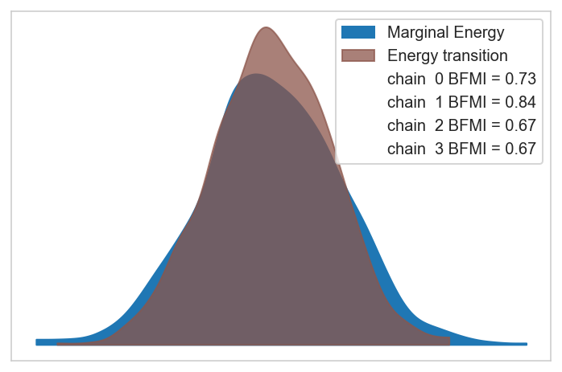


## Posterior analysis


```python
az.plot_energy(trace);
```


```python
divs = trace.sample_stats["diverging"].values.sum(axis=1)
print(f"divergences: {divs}")
```

    divergences: [0 0 0 0]


```python
for stat in ["energy", "step_size", "acceptance_rate"]:
    avgs = trace.sample_stats[stat].values.mean(axis=1)
    print(f"{stat}: {avgs}")
```

    energy: [10164.64480625 10173.0828674  10169.38451127 10167.59248682]
    step_size: [0.12681489 0.14160516 0.14152576 0.1177268 ]
    acceptance_rate: [0.9327368  0.8989993  0.93670376 0.94588394]


```python
trace.warmup_posterior
```


<div><svg style="position: absolute; width: 0; height: 0; overflow: hidden">
<defs>
<symbol id="icon-database" viewBox="0 0 32 32">
<path d="M16 0c-8.837 0-16 2.239-16 5v4c0 2.761 7.163 5 16 5s16-2.239 16-5v-4c0-2.761-7.163-5-16-5z"></path>
<path d="M16 17c-8.837 0-16-2.239-16-5v6c0 2.761 7.163 5 16 5s16-2.239 16-5v-6c0 2.761-7.163 5-16 5z"></path>
<path d="M16 26c-8.837 0-16-2.239-16-5v6c0 2.761 7.163 5 16 5s16-2.239 16-5v-6c0 2.761-7.163 5-16 5z"></path>
</symbol>
<symbol id="icon-file-text2" viewBox="0 0 32 32">
<path d="M28.681 7.159c-0.694-0.947-1.662-2.053-2.724-3.116s-2.169-2.030-3.116-2.724c-1.612-1.182-2.393-1.319-2.841-1.319h-15.5c-1.378 0-2.5 1.121-2.5 2.5v27c0 1.378 1.122 2.5 2.5 2.5h23c1.378 0 2.5-1.122 2.5-2.5v-19.5c0-0.448-0.137-1.23-1.319-2.841zM24.543 5.457c0.959 0.959 1.712 1.825 2.268 2.543h-4.811v-4.811c0.718 0.556 1.584 1.309 2.543 2.268zM28 29.5c0 0.271-0.229 0.5-0.5 0.5h-23c-0.271 0-0.5-0.229-0.5-0.5v-27c0-0.271 0.229-0.5 0.5-0.5 0 0 15.499-0 15.5 0v7c0 0.552 0.448 1 1 1h7v19.5z"></path>
<path d="M23 26h-14c-0.552 0-1-0.448-1-1s0.448-1 1-1h14c0.552 0 1 0.448 1 1s-0.448 1-1 1z"></path>
<path d="M23 22h-14c-0.552 0-1-0.448-1-1s0.448-1 1-1h14c0.552 0 1 0.448 1 1s-0.448 1-1 1z"></path>
<path d="M23 18h-14c-0.552 0-1-0.448-1-1s0.448-1 1-1h14c0.552 0 1 0.448 1 1s-0.448 1-1 1z"></path>
</symbol>
</defs>
</svg>
<style>/* CSS stylesheet for displaying xarray objects in jupyterlab.
 *
 */

:root {
  --xr-font-color0: var(--jp-content-font-color0, rgba(0, 0, 0, 1));
  --xr-font-color2: var(--jp-content-font-color2, rgba(0, 0, 0, 0.54));
  --xr-font-color3: var(--jp-content-font-color3, rgba(0, 0, 0, 0.38));
  --xr-border-color: var(--jp-border-color2, #e0e0e0);
  --xr-disabled-color: var(--jp-layout-color3, #bdbdbd);
  --xr-background-color: var(--jp-layout-color0, white);
  --xr-background-color-row-even: var(--jp-layout-color1, white);
  --xr-background-color-row-odd: var(--jp-layout-color2, #eeeeee);
}

html[theme=dark],
body.vscode-dark {
  --xr-font-color0: rgba(255, 255, 255, 1);
  --xr-font-color2: rgba(255, 255, 255, 0.54);
  --xr-font-color3: rgba(255, 255, 255, 0.38);
  --xr-border-color: #1F1F1F;
  --xr-disabled-color: #515151;
  --xr-background-color: #111111;
  --xr-background-color-row-even: #111111;
  --xr-background-color-row-odd: #313131;
}

.xr-wrap {
  display: block !important;
  min-width: 300px;
  max-width: 700px;
}

.xr-text-repr-fallback {
  /* fallback to plain text repr when CSS is not injected (untrusted notebook) */
  display: none;
}

.xr-header {
  padding-top: 6px;
  padding-bottom: 6px;
  margin-bottom: 4px;
  border-bottom: solid 1px var(--xr-border-color);
}

.xr-header > div,
.xr-header > ul {
  display: inline;
  margin-top: 0;
  margin-bottom: 0;
}

.xr-obj-type,
.xr-array-name {
  margin-left: 2px;
  margin-right: 10px;
}

.xr-obj-type {
  color: var(--xr-font-color2);
}

.xr-sections {
  padding-left: 0 !important;
  display: grid;
  grid-template-columns: 150px auto auto 1fr 20px 20px;
}

.xr-section-item {
  display: contents;
}

.xr-section-item input {
  display: none;
}

.xr-section-item input + label {
  color: var(--xr-disabled-color);
}

.xr-section-item input:enabled + label {
  cursor: pointer;
  color: var(--xr-font-color2);
}

.xr-section-item input:enabled + label:hover {
  color: var(--xr-font-color0);
}

.xr-section-summary {
  grid-column: 1;
  color: var(--xr-font-color2);
  font-weight: 500;
}

.xr-section-summary > span {
  display: inline-block;
  padding-left: 0.5em;
}

.xr-section-summary-in:disabled + label {
  color: var(--xr-font-color2);
}

.xr-section-summary-in + label:before {
  display: inline-block;
  content: '►';
  font-size: 11px;
  width: 15px;
  text-align: center;
}

.xr-section-summary-in:disabled + label:before {
  color: var(--xr-disabled-color);
}

.xr-section-summary-in:checked + label:before {
  content: '▼';
}

.xr-section-summary-in:checked + label > span {
  display: none;
}

.xr-section-summary,
.xr-section-inline-details {
  padding-top: 4px;
  padding-bottom: 4px;
}

.xr-section-inline-details {
  grid-column: 2 / -1;
}

.xr-section-details {
  display: none;
  grid-column: 1 / -1;
  margin-bottom: 5px;
}

.xr-section-summary-in:checked ~ .xr-section-details {
  display: contents;
}

.xr-array-wrap {
  grid-column: 1 / -1;
  display: grid;
  grid-template-columns: 20px auto;
}

.xr-array-wrap > label {
  grid-column: 1;
  vertical-align: top;
}

.xr-preview {
  color: var(--xr-font-color3);
}

.xr-array-preview,
.xr-array-data {
  padding: 0 5px !important;
  grid-column: 2;
}

.xr-array-data,
.xr-array-in:checked ~ .xr-array-preview {
  display: none;
}

.xr-array-in:checked ~ .xr-array-data,
.xr-array-preview {
  display: inline-block;
}

.xr-dim-list {
  display: inline-block !important;
  list-style: none;
  padding: 0 !important;
  margin: 0;
}

.xr-dim-list li {
  display: inline-block;
  padding: 0;
  margin: 0;
}

.xr-dim-list:before {
  content: '(';
}

.xr-dim-list:after {
  content: ')';
}

.xr-dim-list li:not(:last-child):after {
  content: ',';
  padding-right: 5px;
}

.xr-has-index {
  font-weight: bold;
}

.xr-var-list,
.xr-var-item {
  display: contents;
}

.xr-var-item > div,
.xr-var-item label,
.xr-var-item > .xr-var-name span {
  background-color: var(--xr-background-color-row-even);
  margin-bottom: 0;
}

.xr-var-item > .xr-var-name:hover span {
  padding-right: 5px;
}

.xr-var-list > li:nth-child(odd) > div,
.xr-var-list > li:nth-child(odd) > label,
.xr-var-list > li:nth-child(odd) > .xr-var-name span {
  background-color: var(--xr-background-color-row-odd);
}

.xr-var-name {
  grid-column: 1;
}

.xr-var-dims {
  grid-column: 2;
}

.xr-var-dtype {
  grid-column: 3;
  text-align: right;
  color: var(--xr-font-color2);
}

.xr-var-preview {
  grid-column: 4;
}

.xr-var-name,
.xr-var-dims,
.xr-var-dtype,
.xr-preview,
.xr-attrs dt {
  white-space: nowrap;
  overflow: hidden;
  text-overflow: ellipsis;
  padding-right: 10px;
}

.xr-var-name:hover,
.xr-var-dims:hover,
.xr-var-dtype:hover,
.xr-attrs dt:hover {
  overflow: visible;
  width: auto;
  z-index: 1;
}

.xr-var-attrs,
.xr-var-data {
  display: none;
  background-color: var(--xr-background-color) !important;
  padding-bottom: 5px !important;
}

.xr-var-attrs-in:checked ~ .xr-var-attrs,
.xr-var-data-in:checked ~ .xr-var-data {
  display: block;
}

.xr-var-data > table {
  float: right;
}

.xr-var-name span,
.xr-var-data,
.xr-attrs {
  padding-left: 25px !important;
}

.xr-attrs,
.xr-var-attrs,
.xr-var-data {
  grid-column: 1 / -1;
}

dl.xr-attrs {
  padding: 0;
  margin: 0;
  display: grid;
  grid-template-columns: 125px auto;
}

.xr-attrs dt,
.xr-attrs dd {
  padding: 0;
  margin: 0;
  float: left;
  padding-right: 10px;
  width: auto;
}

.xr-attrs dt {
  font-weight: normal;
  grid-column: 1;
}

.xr-attrs dt:hover span {
  display: inline-block;
  background: var(--xr-background-color);
  padding-right: 10px;
}

.xr-attrs dd {
  grid-column: 2;
  white-space: pre-wrap;
  word-break: break-all;
}

.xr-icon-database,
.xr-icon-file-text2 {
  display: inline-block;
  vertical-align: middle;
  width: 1em;
  height: 1.5em !important;
  stroke-width: 0;
  stroke: currentColor;
  fill: currentColor;
}
</style><pre class='xr-text-repr-fallback'>&lt;xarray.Dataset&gt;
Dimensions:                    (chain: 4, draw: 500, delta_genes_dim_0: 7,
                                delta_genes_dim_1: 103, sgrna: 162,
                                genes_chol_cov_dim_0: 28,
                                genes_chol_cov_corr_dim_0: 7,
                                genes_chol_cov_corr_dim_1: 7,
                                genes_chol_cov_stds_dim_0: 7, cancer_gene: 3,
                                gene: 103, gene_effect_dim_0: 1296,
                                eta_dim_0: 1296, mu_dim_0: 1296)
Coordinates: (12/14)
  * chain                      (chain) int64 0 1 2 3
  * draw                       (draw) int64 0 1 2 3 4 5 ... 495 496 497 498 499
  * delta_genes_dim_0          (delta_genes_dim_0) int64 0 1 2 3 4 5 6
  * delta_genes_dim_1          (delta_genes_dim_1) int64 0 1 2 3 ... 100 101 102
  * sgrna                      (sgrna) &lt;U20 &#x27;AAATAATTAAGTATGCACAT&#x27; ... &#x27;TTTGG...
  * genes_chol_cov_dim_0       (genes_chol_cov_dim_0) int64 0 1 2 3 ... 25 26 27
    ...                         ...
  * genes_chol_cov_stds_dim_0  (genes_chol_cov_stds_dim_0) int64 0 1 2 3 4 5 6
  * cancer_gene                (cancer_gene) &lt;U6 &#x27;FBXW7&#x27; &#x27;KRAS&#x27; &#x27;PIK3CA&#x27;
  * gene                       (gene) &lt;U9 &#x27;ADH1B&#x27; &#x27;ADH5&#x27; ... &#x27;ZNF428&#x27; &#x27;ZNF620&#x27;
  * gene_effect_dim_0          (gene_effect_dim_0) int64 0 1 2 ... 1294 1295
  * eta_dim_0                  (eta_dim_0) int64 0 1 2 3 ... 1292 1293 1294 1295
  * mu_dim_0                   (mu_dim_0) int64 0 1 2 3 ... 1292 1293 1294 1295
Data variables: (12/24)
    mu_mu_a                    (chain, draw) float64 -0.7092 -0.7092 ... 0.08766
    mu_b                       (chain, draw) float64 -0.6569 ... -0.01284
    mu_d                       (chain, draw) float64 -0.009375 ... -0.04931
    delta_genes                (chain, draw, delta_genes_dim_0, delta_genes_dim_1) float64 ...
    delta_a                    (chain, draw, sgrna) float64 -0.4912 ... -1.188
    genes_chol_cov             (chain, draw, genes_chol_cov_dim_0) float64 0....
    ...                         ...
    f                          (chain, draw, gene) float64 -1.464 ... -0.1468
    h                          (chain, draw, gene, cancer_gene) float64 -1.44...
    a                          (chain, draw, sgrna) float64 -0.2597 ... -0.9566
    gene_effect                (chain, draw, gene_effect_dim_0) float64 -0.24...
    eta                        (chain, draw, eta_dim_0) float64 6.049 ... 5.192
    mu                         (chain, draw, mu_dim_0) float64 423.6 ... 179.9
Attributes:
    created_at:                 2022-07-29T10:52:23.255844
    arviz_version:              0.12.1
    inference_library:          pymc
    inference_library_version:  4.1.2
    sampling_time:              163.66693258285522
    tuning_steps:               500</pre><div class='xr-wrap' style='display:none'><div class='xr-header'><div class='xr-obj-type'>xarray.Dataset</div></div><ul class='xr-sections'><li class='xr-section-item'><input id='section-2987df01-1618-487c-a50e-f1430542142f' class='xr-section-summary-in' type='checkbox' disabled ><label for='section-2987df01-1618-487c-a50e-f1430542142f' class='xr-section-summary'  title='Expand/collapse section'>Dimensions:</label><div class='xr-section-inline-details'><ul class='xr-dim-list'><li><span class='xr-has-index'>chain</span>: 4</li><li><span class='xr-has-index'>draw</span>: 500</li><li><span class='xr-has-index'>delta_genes_dim_0</span>: 7</li><li><span class='xr-has-index'>delta_genes_dim_1</span>: 103</li><li><span class='xr-has-index'>sgrna</span>: 162</li><li><span class='xr-has-index'>genes_chol_cov_dim_0</span>: 28</li><li><span class='xr-has-index'>genes_chol_cov_corr_dim_0</span>: 7</li><li><span class='xr-has-index'>genes_chol_cov_corr_dim_1</span>: 7</li><li><span class='xr-has-index'>genes_chol_cov_stds_dim_0</span>: 7</li><li><span class='xr-has-index'>cancer_gene</span>: 3</li><li><span class='xr-has-index'>gene</span>: 103</li><li><span class='xr-has-index'>gene_effect_dim_0</span>: 1296</li><li><span class='xr-has-index'>eta_dim_0</span>: 1296</li><li><span class='xr-has-index'>mu_dim_0</span>: 1296</li></ul></div><div class='xr-section-details'></div></li><li class='xr-section-item'><input id='section-0c8ba4e7-427c-4691-9fdf-52bd1b8cf1bb' class='xr-section-summary-in' type='checkbox'  checked><label for='section-0c8ba4e7-427c-4691-9fdf-52bd1b8cf1bb' class='xr-section-summary' >Coordinates: <span>(14)</span></label><div class='xr-section-inline-details'></div><div class='xr-section-details'><ul class='xr-var-list'><li class='xr-var-item'><div class='xr-var-name'><span class='xr-has-index'>chain</span></div><div class='xr-var-dims'>(chain)</div><div class='xr-var-dtype'>int64</div><div class='xr-var-preview xr-preview'>0 1 2 3</div><input id='attrs-080abadf-7065-4c6a-8f33-83ebe5c124f7' class='xr-var-attrs-in' type='checkbox' disabled><label for='attrs-080abadf-7065-4c6a-8f33-83ebe5c124f7' title='Show/Hide attributes'><svg class='icon xr-icon-file-text2'><use xlink:href='#icon-file-text2'></use></svg></label><input id='data-a0ea6ab2-52b7-4702-a6b4-62c4f7ef3ab1' class='xr-var-data-in' type='checkbox'><label for='data-a0ea6ab2-52b7-4702-a6b4-62c4f7ef3ab1' title='Show/Hide data repr'><svg class='icon xr-icon-database'><use xlink:href='#icon-database'></use></svg></label><div class='xr-var-attrs'><dl class='xr-attrs'></dl></div><div class='xr-var-data'><pre>array([0, 1, 2, 3])</pre></div></li><li class='xr-var-item'><div class='xr-var-name'><span class='xr-has-index'>draw</span></div><div class='xr-var-dims'>(draw)</div><div class='xr-var-dtype'>int64</div><div class='xr-var-preview xr-preview'>0 1 2 3 4 5 ... 495 496 497 498 499</div><input id='attrs-c77dc6b6-b0be-4d0d-9b9c-4dfc98af172e' class='xr-var-attrs-in' type='checkbox' disabled><label for='attrs-c77dc6b6-b0be-4d0d-9b9c-4dfc98af172e' title='Show/Hide attributes'><svg class='icon xr-icon-file-text2'><use xlink:href='#icon-file-text2'></use></svg></label><input id='data-c8044728-393c-4d00-85c8-7cda5e9564bc' class='xr-var-data-in' type='checkbox'><label for='data-c8044728-393c-4d00-85c8-7cda5e9564bc' title='Show/Hide data repr'><svg class='icon xr-icon-database'><use xlink:href='#icon-database'></use></svg></label><div class='xr-var-attrs'><dl class='xr-attrs'></dl></div><div class='xr-var-data'><pre>array([  0,   1,   2, ..., 497, 498, 499])</pre></div></li><li class='xr-var-item'><div class='xr-var-name'><span class='xr-has-index'>delta_genes_dim_0</span></div><div class='xr-var-dims'>(delta_genes_dim_0)</div><div class='xr-var-dtype'>int64</div><div class='xr-var-preview xr-preview'>0 1 2 3 4 5 6</div><input id='attrs-83b991f7-9d84-4aab-8e43-f3dc3daba490' class='xr-var-attrs-in' type='checkbox' disabled><label for='attrs-83b991f7-9d84-4aab-8e43-f3dc3daba490' title='Show/Hide attributes'><svg class='icon xr-icon-file-text2'><use xlink:href='#icon-file-text2'></use></svg></label><input id='data-c843a825-b82a-4820-b4af-96ec21a4ba92' class='xr-var-data-in' type='checkbox'><label for='data-c843a825-b82a-4820-b4af-96ec21a4ba92' title='Show/Hide data repr'><svg class='icon xr-icon-database'><use xlink:href='#icon-database'></use></svg></label><div class='xr-var-attrs'><dl class='xr-attrs'></dl></div><div class='xr-var-data'><pre>array([0, 1, 2, 3, 4, 5, 6])</pre></div></li><li class='xr-var-item'><div class='xr-var-name'><span class='xr-has-index'>delta_genes_dim_1</span></div><div class='xr-var-dims'>(delta_genes_dim_1)</div><div class='xr-var-dtype'>int64</div><div class='xr-var-preview xr-preview'>0 1 2 3 4 5 ... 98 99 100 101 102</div><input id='attrs-f1c8e627-1e32-4dea-bc10-321d628e1e95' class='xr-var-attrs-in' type='checkbox' disabled><label for='attrs-f1c8e627-1e32-4dea-bc10-321d628e1e95' title='Show/Hide attributes'><svg class='icon xr-icon-file-text2'><use xlink:href='#icon-file-text2'></use></svg></label><input id='data-2bc9b40a-e85b-43dd-aec5-06183dfb1a92' class='xr-var-data-in' type='checkbox'><label for='data-2bc9b40a-e85b-43dd-aec5-06183dfb1a92' title='Show/Hide data repr'><svg class='icon xr-icon-database'><use xlink:href='#icon-database'></use></svg></label><div class='xr-var-attrs'><dl class='xr-attrs'></dl></div><div class='xr-var-data'><pre>array([  0,   1,   2,   3,   4,   5,   6,   7,   8,   9,  10,  11,  12,  13,
        14,  15,  16,  17,  18,  19,  20,  21,  22,  23,  24,  25,  26,  27,
        28,  29,  30,  31,  32,  33,  34,  35,  36,  37,  38,  39,  40,  41,
        42,  43,  44,  45,  46,  47,  48,  49,  50,  51,  52,  53,  54,  55,
        56,  57,  58,  59,  60,  61,  62,  63,  64,  65,  66,  67,  68,  69,
        70,  71,  72,  73,  74,  75,  76,  77,  78,  79,  80,  81,  82,  83,
        84,  85,  86,  87,  88,  89,  90,  91,  92,  93,  94,  95,  96,  97,
        98,  99, 100, 101, 102])</pre></div></li><li class='xr-var-item'><div class='xr-var-name'><span class='xr-has-index'>sgrna</span></div><div class='xr-var-dims'>(sgrna)</div><div class='xr-var-dtype'>&lt;U20</div><div class='xr-var-preview xr-preview'>&#x27;AAATAATTAAGTATGCACAT&#x27; ... &#x27;TTTG...</div><input id='attrs-8874d2ca-69cf-4283-828c-de4d0d6a66dc' class='xr-var-attrs-in' type='checkbox' disabled><label for='attrs-8874d2ca-69cf-4283-828c-de4d0d6a66dc' title='Show/Hide attributes'><svg class='icon xr-icon-file-text2'><use xlink:href='#icon-file-text2'></use></svg></label><input id='data-532f00b8-7a8d-45e6-afd8-b3b1bdbf980f' class='xr-var-data-in' type='checkbox'><label for='data-532f00b8-7a8d-45e6-afd8-b3b1bdbf980f' title='Show/Hide data repr'><svg class='icon xr-icon-database'><use xlink:href='#icon-database'></use></svg></label><div class='xr-var-attrs'><dl class='xr-attrs'></dl></div><div class='xr-var-data'><pre>array([&#x27;AAATAATTAAGTATGCACAT&#x27;, &#x27;AACAGCTGTTTACCAAGCGA&#x27;, &#x27;AATCAACCCACAGCTGCACA&#x27;,
       &#x27;ACAAGGGGCGACCGTCGCCA&#x27;, &#x27;ACACCCAGCCGCGTTTGACG&#x27;, &#x27;ACCCTTATAGAATCTGCAAG&#x27;,
       &#x27;ACGAGGACGAGGACAACCAG&#x27;, &#x27;ACTACGGACAGACGGTTCCG&#x27;, &#x27;AGAACTCAACAAAAATCCAG&#x27;,
       &#x27;AGAACTTGCCTTGCTCCTTG&#x27;, &#x27;AGAGGAGTACAGTGCAATGA&#x27;, &#x27;AGATGTTGAACACTGAGCAG&#x27;,
       &#x27;AGCTTGGCCCGCTTGCGGCG&#x27;, &#x27;AGTCGAATGCAGATGCCGCA&#x27;, &#x27;AGTCTACCAAAGCTCACGCG&#x27;,
       &#x27;AGTTACTGTGTATCAGGCAG&#x27;, &#x27;AGTTAGGTGATGGCTTTGAA&#x27;, &#x27;ATACTCATTCAGCTCCCGAA&#x27;,
       &#x27;ATATAGTATGGACAAGGCAA&#x27;, &#x27;ATATTCATGTCAGACTGGCA&#x27;, &#x27;ATATTTAGTTGCATATCGTG&#x27;,
       &#x27;ATCTCGAAAGAGCAAGGTAG&#x27;, &#x27;ATCTTCCTCTGACTGAAGGG&#x27;, &#x27;CAACTTGGACAATCTCGTGG&#x27;,
       &#x27;CAGCATGTAGAAGAAAACCG&#x27;, &#x27;CAGCTCCTATGTGCTCCACG&#x27;, &#x27;CAGGAGGTCCAGCAAAACCA&#x27;,
       &#x27;CATATGCGCACCAGAGTGCA&#x27;, &#x27;CATCAGACCAGAAACAGCCG&#x27;, &#x27;CATCGAGGAGCGCTCCCAGA&#x27;,
       &#x27;CATGGAACCAGACAGAAAAG&#x27;, &#x27;CCAAGACATCATTTACTACG&#x27;, &#x27;CCAAGGCTGATTTATAGTAG&#x27;,
       &#x27;CCAGCAGCTCTCAAGCCATG&#x27;, &#x27;CCAGCTGCAAGATCTCCAAG&#x27;, &#x27;CCAGGCTCACCAACTCCAAT&#x27;,
       &#x27;CCAGGTTGCCACTAACCACG&#x27;, &#x27;CCATGGCCAACGGCGCCGCG&#x27;, &#x27;CCGTGTCTCATCTATGTAGA&#x27;,
       &#x27;CCTGCATTCAGCCAAACGGC&#x27;, &#x27;CCTGTTGCCACGTCAACAAA&#x27;, &#x27;CCTTTCCTCACAACTTTCCA&#x27;,
       &#x27;CGAATCTGTGAATGAATGCA&#x27;, &#x27;CGACAAATCGAAGAAAGAAG&#x27;, &#x27;CGGAGCCTCGCCATTCCCGA&#x27;,
       &#x27;CGGCAACCAGAAAAACAGCC&#x27;, &#x27;CTAACATTGAGACTGAACTG&#x27;, &#x27;CTAACCTTATCTTCTGGCAA&#x27;,
       &#x27;CTCACAGCTGAAAAACCAAA&#x27;, &#x27;CTGCAAAAGACTGCACCAGG&#x27;, &#x27;CTTGATATCGTAGTTGCCGG&#x27;,
       &#x27;GAAAGAGCCAGACTTCTCAG&#x27;, &#x27;GAACGACTACGGCTGAACCA&#x27;, &#x27;GAATAAGGCCCATTTCCCCG&#x27;,
       &#x27;GAGAGTGTATTCTGAATCAG&#x27;, &#x27;GAGCCAGTCGGAGGACCTGG&#x27;, &#x27;GAGCTCTCTGAGCAGCAGGA&#x27;,
       &#x27;GAGCTGGCAAGGCTGGGCCG&#x27;, &#x27;GAGCTTCTCGCTGAGCCCGG&#x27;, &#x27;GAGTCCTTCAGACTGATGGT&#x27;,
       &#x27;GATAAGTACACGCTGCCCGG&#x27;, &#x27;GATAGCATCTCAGGTCCCTA&#x27;, &#x27;GATGCAGAGATATATCCATG&#x27;,
       &#x27;GATTGTATCTGATTACCAGA&#x27;, &#x27;GCAACTCAGACAACAAGAGG&#x27;, &#x27;GCAAGCGCCTGGGCGCCGAG&#x27;,
       &#x27;GCACAATCTACATTCAGGGA&#x27;, &#x27;GCACTGGACAGGAATAAGAA&#x27;, &#x27;GCACTGGCTCAGGTGCTAAT&#x27;,
       &#x27;GCAGAGCCTTAATCTCCCGC&#x27;, &#x27;GCAGCGATGAGACTTCATGA&#x27;, &#x27;GCAGGAGCCCGGCTACCGAG&#x27;,
       &#x27;GCAGGTAAGGAGGTCAATGA&#x27;, &#x27;GCAGTCACAGCACATGACGG&#x27;, &#x27;GCAGTGCGAATTGTTTGCAG&#x27;,
       &#x27;GCAGTTCTCCGACCAGGCTG&#x27;, &#x27;GCATTGACCTGGCATCTCAT&#x27;, &#x27;GCCTCGCTATCCATATCAGA&#x27;,
       &#x27;GCGAGGTTCCATTCACCAGC&#x27;, &#x27;GCGCAGATCACCCAGAAGAT&#x27;, &#x27;GCGCAGGCCTCGCAGCCCCG&#x27;,
       &#x27;GCGCTCGCCCCGCCCCCGCG&#x27;, &#x27;GCTAACTATGGCGACCGCCA&#x27;, &#x27;GCTCCCGCTGCAGCTCCTGA&#x27;,
       &#x27;GCTCCTTCAGCTCCACCGCC&#x27;, &#x27;GCTCTGCTGAATTCTGGAGG&#x27;, &#x27;GCTGCCACAGTGATGACCAA&#x27;,
       &#x27;GCTGCGCAGGTCGGGCCACA&#x27;, &#x27;GCTGCTGGAGCACCTCTCGT&#x27;, &#x27;GCTGCTGTCAAAGATGTAAA&#x27;,
       &#x27;GCTGGCTGTGAGAGACACCC&#x27;, &#x27;GCTGTTTGAGGACAGCAGGC&#x27;, &#x27;GGACACTTACAGGTTTCCCA&#x27;,
       &#x27;GGACAGCTCGGGGCCTGCCG&#x27;, &#x27;GGAGCCGGCCGCGTCAAACG&#x27;, &#x27;GGATATGTCTAAACTCACAA&#x27;,
       &#x27;GGATGCATAGATGGACACCT&#x27;, &#x27;GGCTGCAGGAAGGTGACCCA&#x27;, &#x27;GGGAAAGGATTAATGCCAGA&#x27;,
       &#x27;GGTACTAATTTCAAGATGCC&#x27;, &#x27;GGTACTCCCTCAGGACCACG&#x27;, &#x27;GGTAGCAAATGGCTACATAG&#x27;,
       &#x27;GGTAGGCTGTACCAGCAAAA&#x27;, &#x27;GGTGGTGGATGAGAATGCAG&#x27;, &#x27;GGTTCAGTAGCTCAACTGCA&#x27;,
       &#x27;GTAACTATGGATCTTACCAG&#x27;, &#x27;GTACACTGTCACACTCTGGG&#x27;, &#x27;GTACATCAGAAAATGCATAT&#x27;,
       &#x27;GTACATTGTGCAGAGTGGGA&#x27;, &#x27;GTAGCATGTCAGTTTCCACC&#x27;, &#x27;GTAGCCTCCCGGCTCCCGCG&#x27;,
       &#x27;GTAGCGGCGGACCAGGGCCA&#x27;, &#x27;GTAGCTCTTGACCTGTGCCT&#x27;, &#x27;GTATCACGTGAAATGTTCAA&#x27;,
       &#x27;GTATTGTTGGGAAATTCCCG&#x27;, &#x27;GTCCGCAGCCGAAGAGGCCG&#x27;, &#x27;GTCTTGATGTGTGTTACGCA&#x27;,
       &#x27;GTGTCACTGCCCACGAACAT&#x27;, &#x27;GTTCTATGACCATCTCCTGA&#x27;, &#x27;GTTCTGAAAGCGGTTCCGGG&#x27;,
       &#x27;GTTTCCAGAAGAAAACCAGT&#x27;, &#x27;GTTTGTCTAGGAAATCAGAG&#x27;, &#x27;TACAGAAAAGAATTTCTGCG&#x27;,
       &#x27;TACTCACTCATAAAAATCCA&#x27;, &#x27;TAGCAGCAAAGTTAGCCCAA&#x27;, &#x27;TAGCTGAGCGAGTGAGGTAT&#x27;,
       &#x27;TATGGCACGGAACTGAACCA&#x27;, &#x27;TATTACCCAAGTGGACTGGA&#x27;, &#x27;TATTGATGGCAAATACACAG&#x27;,
       &#x27;TCAACTCCTCCACCAAGACG&#x27;, &#x27;TCACAACTGTCACAACCTTC&#x27;, &#x27;TCACCAATAGAGGAATCCCA&#x27;,
       &#x27;TCAGCGAGTCCAGCGCCGGG&#x27;, &#x27;TCATATCCCCAACATCATGT&#x27;, &#x27;TCCTTAAGATGAGGAAGCAG&#x27;,
       &#x27;TCGGATCCAGGCACTCCCGG&#x27;, &#x27;TCTGATTCCAGGAGAAAGAG&#x27;, &#x27;TCTTAGACAGGAATCGCCCG&#x27;,
       &#x27;TCTTCATCACCCCCATGCAG&#x27;, &#x27;TCTTCCCCCTCGGAGTTGCA&#x27;, &#x27;TCTTCCTTCATACAAATCCG&#x27;,
       &#x27;TGACAATGATCTCTACCGAT&#x27;, &#x27;TGATGGAATGGATCCGCAGG&#x27;, &#x27;TGCTTGTTGAGGCATTTCAA&#x27;,
       &#x27;TGGCAGATATTTCATTCAAA&#x27;, &#x27;TGTCTGCTCTAGTAATAAGC&#x27;, &#x27;TGTTGAACACTGAGCAGAGG&#x27;,
       &#x27;TTAAAGCCTTGAAGACAAGG&#x27;, &#x27;TTAACTACTGGAAGTTTGCG&#x27;, &#x27;TTAGGCAGTGACTCACACAA&#x27;,
       &#x27;TTATCACTGTTTGTTTCAGG&#x27;, &#x27;TTATTAATGTAGCCTCACGG&#x27;, &#x27;TTATTACAAATAACACACTG&#x27;,
       &#x27;TTATTCCACAGGGATCCCCA&#x27;, &#x27;TTCGGAGTGCTTATGCCAAG&#x27;, &#x27;TTGCAATGTGATGGAAGGGG&#x27;,
       &#x27;TTGCCCATCACAATGAGCTG&#x27;, &#x27;TTGCCGGCAAAACTACGGAG&#x27;, &#x27;TTGCGGGTAGAGGAAAAAAC&#x27;,
       &#x27;TTTCGGGTAGATCATGCGCA&#x27;, &#x27;TTTGCCATCTTGCAGTACAG&#x27;, &#x27;TTTGGGACAGGAGGAACAAG&#x27;],
      dtype=&#x27;&lt;U20&#x27;)</pre></div></li><li class='xr-var-item'><div class='xr-var-name'><span class='xr-has-index'>genes_chol_cov_dim_0</span></div><div class='xr-var-dims'>(genes_chol_cov_dim_0)</div><div class='xr-var-dtype'>int64</div><div class='xr-var-preview xr-preview'>0 1 2 3 4 5 6 ... 22 23 24 25 26 27</div><input id='attrs-9abadd90-58b9-4ee6-90bf-38c2ec53a0d0' class='xr-var-attrs-in' type='checkbox' disabled><label for='attrs-9abadd90-58b9-4ee6-90bf-38c2ec53a0d0' title='Show/Hide attributes'><svg class='icon xr-icon-file-text2'><use xlink:href='#icon-file-text2'></use></svg></label><input id='data-f0cbed39-c79c-4206-ae05-b0cbec503354' class='xr-var-data-in' type='checkbox'><label for='data-f0cbed39-c79c-4206-ae05-b0cbec503354' title='Show/Hide data repr'><svg class='icon xr-icon-database'><use xlink:href='#icon-database'></use></svg></label><div class='xr-var-attrs'><dl class='xr-attrs'></dl></div><div class='xr-var-data'><pre>array([ 0,  1,  2,  3,  4,  5,  6,  7,  8,  9, 10, 11, 12, 13, 14, 15, 16, 17,
       18, 19, 20, 21, 22, 23, 24, 25, 26, 27])</pre></div></li><li class='xr-var-item'><div class='xr-var-name'><span class='xr-has-index'>genes_chol_cov_corr_dim_0</span></div><div class='xr-var-dims'>(genes_chol_cov_corr_dim_0)</div><div class='xr-var-dtype'>int64</div><div class='xr-var-preview xr-preview'>0 1 2 3 4 5 6</div><input id='attrs-ae0949c4-c8eb-44f2-8ece-8c30bbd47813' class='xr-var-attrs-in' type='checkbox' disabled><label for='attrs-ae0949c4-c8eb-44f2-8ece-8c30bbd47813' title='Show/Hide attributes'><svg class='icon xr-icon-file-text2'><use xlink:href='#icon-file-text2'></use></svg></label><input id='data-ca4b7c69-4d4f-4c8d-8be2-f802ffc8a907' class='xr-var-data-in' type='checkbox'><label for='data-ca4b7c69-4d4f-4c8d-8be2-f802ffc8a907' title='Show/Hide data repr'><svg class='icon xr-icon-database'><use xlink:href='#icon-database'></use></svg></label><div class='xr-var-attrs'><dl class='xr-attrs'></dl></div><div class='xr-var-data'><pre>array([0, 1, 2, 3, 4, 5, 6])</pre></div></li><li class='xr-var-item'><div class='xr-var-name'><span class='xr-has-index'>genes_chol_cov_corr_dim_1</span></div><div class='xr-var-dims'>(genes_chol_cov_corr_dim_1)</div><div class='xr-var-dtype'>int64</div><div class='xr-var-preview xr-preview'>0 1 2 3 4 5 6</div><input id='attrs-fc9c9cee-9923-40ea-904a-b401134ab3d2' class='xr-var-attrs-in' type='checkbox' disabled><label for='attrs-fc9c9cee-9923-40ea-904a-b401134ab3d2' title='Show/Hide attributes'><svg class='icon xr-icon-file-text2'><use xlink:href='#icon-file-text2'></use></svg></label><input id='data-71b722d6-89e0-4901-b442-6be69f9d1eaa' class='xr-var-data-in' type='checkbox'><label for='data-71b722d6-89e0-4901-b442-6be69f9d1eaa' title='Show/Hide data repr'><svg class='icon xr-icon-database'><use xlink:href='#icon-database'></use></svg></label><div class='xr-var-attrs'><dl class='xr-attrs'></dl></div><div class='xr-var-data'><pre>array([0, 1, 2, 3, 4, 5, 6])</pre></div></li><li class='xr-var-item'><div class='xr-var-name'><span class='xr-has-index'>genes_chol_cov_stds_dim_0</span></div><div class='xr-var-dims'>(genes_chol_cov_stds_dim_0)</div><div class='xr-var-dtype'>int64</div><div class='xr-var-preview xr-preview'>0 1 2 3 4 5 6</div><input id='attrs-db61cad1-7798-43eb-95bb-1573c8007796' class='xr-var-attrs-in' type='checkbox' disabled><label for='attrs-db61cad1-7798-43eb-95bb-1573c8007796' title='Show/Hide attributes'><svg class='icon xr-icon-file-text2'><use xlink:href='#icon-file-text2'></use></svg></label><input id='data-60a8bc6a-10f8-4efe-802c-7e679dafaeab' class='xr-var-data-in' type='checkbox'><label for='data-60a8bc6a-10f8-4efe-802c-7e679dafaeab' title='Show/Hide data repr'><svg class='icon xr-icon-database'><use xlink:href='#icon-database'></use></svg></label><div class='xr-var-attrs'><dl class='xr-attrs'></dl></div><div class='xr-var-data'><pre>array([0, 1, 2, 3, 4, 5, 6])</pre></div></li><li class='xr-var-item'><div class='xr-var-name'><span class='xr-has-index'>cancer_gene</span></div><div class='xr-var-dims'>(cancer_gene)</div><div class='xr-var-dtype'>&lt;U6</div><div class='xr-var-preview xr-preview'>&#x27;FBXW7&#x27; &#x27;KRAS&#x27; &#x27;PIK3CA&#x27;</div><input id='attrs-48fd2175-bfe7-4d7b-afba-7844784cd51c' class='xr-var-attrs-in' type='checkbox' disabled><label for='attrs-48fd2175-bfe7-4d7b-afba-7844784cd51c' title='Show/Hide attributes'><svg class='icon xr-icon-file-text2'><use xlink:href='#icon-file-text2'></use></svg></label><input id='data-b5eafaa5-1410-454d-86cb-7bf936dff41f' class='xr-var-data-in' type='checkbox'><label for='data-b5eafaa5-1410-454d-86cb-7bf936dff41f' title='Show/Hide data repr'><svg class='icon xr-icon-database'><use xlink:href='#icon-database'></use></svg></label><div class='xr-var-attrs'><dl class='xr-attrs'></dl></div><div class='xr-var-data'><pre>array([&#x27;FBXW7&#x27;, &#x27;KRAS&#x27;, &#x27;PIK3CA&#x27;], dtype=&#x27;&lt;U6&#x27;)</pre></div></li><li class='xr-var-item'><div class='xr-var-name'><span class='xr-has-index'>gene</span></div><div class='xr-var-dims'>(gene)</div><div class='xr-var-dtype'>&lt;U9</div><div class='xr-var-preview xr-preview'>&#x27;ADH1B&#x27; &#x27;ADH5&#x27; ... &#x27;ZNF620&#x27;</div><input id='attrs-40327358-c724-4d4a-9b35-0e2888ecd66d' class='xr-var-attrs-in' type='checkbox' disabled><label for='attrs-40327358-c724-4d4a-9b35-0e2888ecd66d' title='Show/Hide attributes'><svg class='icon xr-icon-file-text2'><use xlink:href='#icon-file-text2'></use></svg></label><input id='data-d0a71a49-af9b-452f-a01d-4adf2b5f22e4' class='xr-var-data-in' type='checkbox'><label for='data-d0a71a49-af9b-452f-a01d-4adf2b5f22e4' title='Show/Hide data repr'><svg class='icon xr-icon-database'><use xlink:href='#icon-database'></use></svg></label><div class='xr-var-attrs'><dl class='xr-attrs'></dl></div><div class='xr-var-data'><pre>array([&#x27;ADH1B&#x27;, &#x27;ADH5&#x27;, &#x27;APC&#x27;, &#x27;B4GALT5&#x27;, &#x27;BNC2&#x27;, &#x27;BRAF&#x27;, &#x27;BRD1&#x27;, &#x27;C17orf50&#x27;,
       &#x27;C6orf89&#x27;, &#x27;CD7&#x27;, &#x27;CDH22&#x27;, &#x27;CDK20&#x27;, &#x27;CDK5RAP1&#x27;, &#x27;CHP2&#x27;, &#x27;CLYBL&#x27;,
       &#x27;COL28A1&#x27;, &#x27;COL9A2&#x27;, &#x27;COX7A1&#x27;, &#x27;CPA4&#x27;, &#x27;CTNNB1&#x27;, &#x27;DCAF13&#x27;, &#x27;EMC2&#x27;,
       &#x27;ENTR1&#x27;, &#x27;ERAP2&#x27;, &#x27;ERH&#x27;, &#x27;FAM151B&#x27;, &#x27;FAM19A3&#x27;, &#x27;FAM200B&#x27;, &#x27;FBXL8&#x27;,
       &#x27;FBXW7&#x27;, &#x27;GATA6&#x27;, &#x27;GLRA4&#x27;, &#x27;GOLGA4&#x27;, &#x27;GPR157&#x27;, &#x27;GPSM2&#x27;, &#x27;IL12RB1&#x27;,
       &#x27;ISG15&#x27;, &#x27;IVL&#x27;, &#x27;JMJD6&#x27;, &#x27;KANK1&#x27;, &#x27;KCNK17&#x27;, &#x27;KIAA0513&#x27;, &#x27;KLF5&#x27;, &#x27;KRAS&#x27;,
       &#x27;LEO1&#x27;, &#x27;LPCAT3&#x27;, &#x27;MCPH1&#x27;, &#x27;MDM2&#x27;, &#x27;MDM4&#x27;, &#x27;MED4&#x27;, &#x27;MRPS22&#x27;, &#x27;NRAS&#x27;,
       &#x27;NSMCE2&#x27;, &#x27;NTAN1&#x27;, &#x27;OR52N5&#x27;, &#x27;PCBP4&#x27;, &#x27;PCDH1&#x27;, &#x27;PCSK5&#x27;, &#x27;PDE1B&#x27;, &#x27;PDX1&#x27;,
       &#x27;PHF5A&#x27;, &#x27;PIK3CA&#x27;, &#x27;PLA2G7&#x27;, &#x27;PLEKHM3&#x27;, &#x27;PLN&#x27;, &#x27;PNMA8B&#x27;, &#x27;PRKAG1&#x27;,
       &#x27;PRR29&#x27;, &#x27;PTK2&#x27;, &#x27;PTPN18&#x27;, &#x27;PUM1&#x27;, &#x27;RABGGTA&#x27;, &#x27;RBCK1&#x27;, &#x27;RBM7&#x27;, &#x27;SCRG1&#x27;,
       &#x27;SCYL3&#x27;, &#x27;SEC14L1&#x27;, &#x27;SERHL2&#x27;, &#x27;SLFN12L&#x27;, &#x27;SNX8&#x27;, &#x27;SOX2&#x27;, &#x27;SPTLC1&#x27;,
       &#x27;STK11&#x27;, &#x27;STRN3&#x27;, &#x27;SUGCT&#x27;, &#x27;SYNJ1&#x27;, &#x27;TKTL2&#x27;, &#x27;TLE6&#x27;, &#x27;TMEM132E&#x27;,
       &#x27;TMEM64&#x27;, &#x27;TMEM87B&#x27;, &#x27;TNFRSF13B&#x27;, &#x27;TP53&#x27;, &#x27;TRAM1L1&#x27;, &#x27;TRHDE&#x27;, &#x27;TSHZ2&#x27;,
       &#x27;UBE2G1&#x27;, &#x27;WRN&#x27;, &#x27;ZFP82&#x27;, &#x27;ZNF283&#x27;, &#x27;ZNF287&#x27;, &#x27;ZNF428&#x27;, &#x27;ZNF620&#x27;],
      dtype=&#x27;&lt;U9&#x27;)</pre></div></li><li class='xr-var-item'><div class='xr-var-name'><span class='xr-has-index'>gene_effect_dim_0</span></div><div class='xr-var-dims'>(gene_effect_dim_0)</div><div class='xr-var-dtype'>int64</div><div class='xr-var-preview xr-preview'>0 1 2 3 4 ... 1292 1293 1294 1295</div><input id='attrs-45a1d59e-c622-4c64-b32d-e3656577fccd' class='xr-var-attrs-in' type='checkbox' disabled><label for='attrs-45a1d59e-c622-4c64-b32d-e3656577fccd' title='Show/Hide attributes'><svg class='icon xr-icon-file-text2'><use xlink:href='#icon-file-text2'></use></svg></label><input id='data-2f5644be-1554-4c76-a7e2-5234a24f2da0' class='xr-var-data-in' type='checkbox'><label for='data-2f5644be-1554-4c76-a7e2-5234a24f2da0' title='Show/Hide data repr'><svg class='icon xr-icon-database'><use xlink:href='#icon-database'></use></svg></label><div class='xr-var-attrs'><dl class='xr-attrs'></dl></div><div class='xr-var-data'><pre>array([   0,    1,    2, ..., 1293, 1294, 1295])</pre></div></li><li class='xr-var-item'><div class='xr-var-name'><span class='xr-has-index'>eta_dim_0</span></div><div class='xr-var-dims'>(eta_dim_0)</div><div class='xr-var-dtype'>int64</div><div class='xr-var-preview xr-preview'>0 1 2 3 4 ... 1292 1293 1294 1295</div><input id='attrs-bdfca890-0faf-4e1a-bd89-a77597cd0fc8' class='xr-var-attrs-in' type='checkbox' disabled><label for='attrs-bdfca890-0faf-4e1a-bd89-a77597cd0fc8' title='Show/Hide attributes'><svg class='icon xr-icon-file-text2'><use xlink:href='#icon-file-text2'></use></svg></label><input id='data-645c58a5-80e1-4685-b0dc-0cfb9657e433' class='xr-var-data-in' type='checkbox'><label for='data-645c58a5-80e1-4685-b0dc-0cfb9657e433' title='Show/Hide data repr'><svg class='icon xr-icon-database'><use xlink:href='#icon-database'></use></svg></label><div class='xr-var-attrs'><dl class='xr-attrs'></dl></div><div class='xr-var-data'><pre>array([   0,    1,    2, ..., 1293, 1294, 1295])</pre></div></li><li class='xr-var-item'><div class='xr-var-name'><span class='xr-has-index'>mu_dim_0</span></div><div class='xr-var-dims'>(mu_dim_0)</div><div class='xr-var-dtype'>int64</div><div class='xr-var-preview xr-preview'>0 1 2 3 4 ... 1292 1293 1294 1295</div><input id='attrs-8bbfa351-1333-43d4-910d-b190fe9ea1ec' class='xr-var-attrs-in' type='checkbox' disabled><label for='attrs-8bbfa351-1333-43d4-910d-b190fe9ea1ec' title='Show/Hide attributes'><svg class='icon xr-icon-file-text2'><use xlink:href='#icon-file-text2'></use></svg></label><input id='data-56def1d2-b43d-46c7-8d3c-42600918e25d' class='xr-var-data-in' type='checkbox'><label for='data-56def1d2-b43d-46c7-8d3c-42600918e25d' title='Show/Hide data repr'><svg class='icon xr-icon-database'><use xlink:href='#icon-database'></use></svg></label><div class='xr-var-attrs'><dl class='xr-attrs'></dl></div><div class='xr-var-data'><pre>array([   0,    1,    2, ..., 1293, 1294, 1295])</pre></div></li></ul></div></li><li class='xr-section-item'><input id='section-4cc9caeb-ffcf-4a12-9c56-cd14c1ad590a' class='xr-section-summary-in' type='checkbox'  ><label for='section-4cc9caeb-ffcf-4a12-9c56-cd14c1ad590a' class='xr-section-summary' >Data variables: <span>(24)</span></label><div class='xr-section-inline-details'></div><div class='xr-section-details'><ul class='xr-var-list'><li class='xr-var-item'><div class='xr-var-name'><span>mu_mu_a</span></div><div class='xr-var-dims'>(chain, draw)</div><div class='xr-var-dtype'>float64</div><div class='xr-var-preview xr-preview'>-0.7092 -0.7092 ... 0.07887 0.08766</div><input id='attrs-2bf4605f-17e4-462a-b1c7-d066da6ec1d3' class='xr-var-attrs-in' type='checkbox' disabled><label for='attrs-2bf4605f-17e4-462a-b1c7-d066da6ec1d3' title='Show/Hide attributes'><svg class='icon xr-icon-file-text2'><use xlink:href='#icon-file-text2'></use></svg></label><input id='data-a2008963-65cf-44b8-9727-3f4b82bccea9' class='xr-var-data-in' type='checkbox'><label for='data-a2008963-65cf-44b8-9727-3f4b82bccea9' title='Show/Hide data repr'><svg class='icon xr-icon-database'><use xlink:href='#icon-database'></use></svg></label><div class='xr-var-attrs'><dl class='xr-attrs'></dl></div><div class='xr-var-data'><pre>array([[-0.70916428, -0.70916428, -0.41933212, ...,  0.15122446,
         0.16101676,  0.07644954],
       [ 0.36019387,  0.36019387,  0.61467674, ...,  0.14212397,
         0.12127864,  0.11353312],
       [ 0.64064286,  0.64064286,  0.81019581, ...,  0.10092866,
         0.09370154,  0.11019072],
       [ 0.89033927,  0.89033927,  1.11341428, ...,  0.07346964,
         0.0788675 ,  0.08766278]])</pre></div></li><li class='xr-var-item'><div class='xr-var-name'><span>mu_b</span></div><div class='xr-var-dims'>(chain, draw)</div><div class='xr-var-dtype'>float64</div><div class='xr-var-preview xr-preview'>-0.6569 -0.6569 ... -0.01284</div><input id='attrs-e499737e-601a-4655-abee-06e3ff472b62' class='xr-var-attrs-in' type='checkbox' disabled><label for='attrs-e499737e-601a-4655-abee-06e3ff472b62' title='Show/Hide attributes'><svg class='icon xr-icon-file-text2'><use xlink:href='#icon-file-text2'></use></svg></label><input id='data-1233c01a-151f-4fef-9f7f-27e27447792a' class='xr-var-data-in' type='checkbox'><label for='data-1233c01a-151f-4fef-9f7f-27e27447792a' title='Show/Hide data repr'><svg class='icon xr-icon-database'><use xlink:href='#icon-database'></use></svg></label><div class='xr-var-attrs'><dl class='xr-attrs'></dl></div><div class='xr-var-data'><pre>array([[-6.56911865e-01, -6.56911865e-01, -4.82856311e-01, ...,
         1.46684893e-02, -1.12343157e-02, -8.06346820e-03],
       [ 9.70699558e-01,  9.70699558e-01,  8.57717656e-01, ...,
         6.39597676e-03, -3.86628332e-04, -1.05667466e-02],
       [-9.36245185e-01, -9.36245185e-01, -6.03503395e-01, ...,
        -1.14487795e-02,  3.66418073e-02, -2.75607360e-03],
       [ 6.71100073e-01,  6.71100073e-01,  5.24262027e-01, ...,
         4.74899992e-03, -5.64235305e-03, -1.28370251e-02]])</pre></div></li><li class='xr-var-item'><div class='xr-var-name'><span>mu_d</span></div><div class='xr-var-dims'>(chain, draw)</div><div class='xr-var-dtype'>float64</div><div class='xr-var-preview xr-preview'>-0.009375 -0.009375 ... -0.04931</div><input id='attrs-786f2e24-1005-45aa-ab70-f4bb0854e45e' class='xr-var-attrs-in' type='checkbox' disabled><label for='attrs-786f2e24-1005-45aa-ab70-f4bb0854e45e' title='Show/Hide attributes'><svg class='icon xr-icon-file-text2'><use xlink:href='#icon-file-text2'></use></svg></label><input id='data-423cc022-d30c-411e-bdf4-ca94dbe82bd8' class='xr-var-data-in' type='checkbox'><label for='data-423cc022-d30c-411e-bdf4-ca94dbe82bd8' title='Show/Hide data repr'><svg class='icon xr-icon-database'><use xlink:href='#icon-database'></use></svg></label><div class='xr-var-attrs'><dl class='xr-attrs'></dl></div><div class='xr-var-data'><pre>array([[-0.00937496, -0.00937496, -0.06151656, ..., -0.04897345,
        -0.05255146, -0.02707137],
       [-0.6425203 , -0.6425203 , -0.49720872, ..., -0.06487933,
        -0.05634464, -0.01998877],
       [ 0.0590202 ,  0.0590202 ,  0.10316228, ..., -0.04217268,
        -0.04279568, -0.04048415],
       [ 0.25554163,  0.25554163,  0.12937228, ..., -0.04643437,
        -0.04986347, -0.04930614]])</pre></div></li><li class='xr-var-item'><div class='xr-var-name'><span>delta_genes</span></div><div class='xr-var-dims'>(chain, draw, delta_genes_dim_0, delta_genes_dim_1)</div><div class='xr-var-dtype'>float64</div><div class='xr-var-preview xr-preview'>-0.8793 -0.9814 ... 0.003441 0.1637</div><input id='attrs-def51617-d98f-40b8-9e78-e92fa8b7ffaa' class='xr-var-attrs-in' type='checkbox' disabled><label for='attrs-def51617-d98f-40b8-9e78-e92fa8b7ffaa' title='Show/Hide attributes'><svg class='icon xr-icon-file-text2'><use xlink:href='#icon-file-text2'></use></svg></label><input id='data-c94ec93b-97e6-4b73-b922-107dad80d0f3' class='xr-var-data-in' type='checkbox'><label for='data-c94ec93b-97e6-4b73-b922-107dad80d0f3' title='Show/Hide data repr'><svg class='icon xr-icon-database'><use xlink:href='#icon-database'></use></svg></label><div class='xr-var-attrs'><dl class='xr-attrs'></dl></div><div class='xr-var-data'><pre>array([[[[-8.79272961e-01, -9.81430129e-01,  1.34034911e-01, ...,
          -4.65148569e-01,  4.14438981e-01,  7.96539648e-01],
         [ 2.64600803e-01, -4.65251724e-02,  2.31274935e-01, ...,
          -1.25201764e-02, -7.53387883e-01,  4.50452528e-01],
         [ 9.48543806e-01,  3.98220202e-01,  8.04014665e-01, ...,
          -1.58182900e-01, -2.51631926e-01, -8.39122661e-01],
         ...,
         [-4.50206128e-01,  5.91248559e-01, -1.01070375e-01, ...,
          -5.70187076e-01, -7.79516483e-01, -9.36493836e-01],
         [-7.87033302e-01,  3.76694829e-01,  4.90517743e-01, ...,
          -4.62781338e-01,  4.50565467e-01, -4.10651681e-01],
         [-7.37370749e-01,  7.55315307e-01, -5.84865388e-01, ...,
          -5.15118146e-01,  5.93986741e-01,  8.78755790e-01]],

        [[-8.79272961e-01, -9.81430129e-01,  1.34034911e-01, ...,
          -4.65148569e-01,  4.14438981e-01,  7.96539648e-01],
         [ 2.64600803e-01, -4.65251724e-02,  2.31274935e-01, ...,
          -1.25201764e-02, -7.53387883e-01,  4.50452528e-01],
         [ 9.48543806e-01,  3.98220202e-01,  8.04014665e-01, ...,
          -1.58182900e-01, -2.51631926e-01, -8.39122661e-01],
...
         [-1.96921981e+00,  2.17440374e+00, -3.73227118e-01, ...,
          -5.15065499e-02, -1.79208274e+00,  8.83616782e-01],
         [-2.70519890e-01, -3.51832737e-01,  3.30947176e-01, ...,
           1.12797918e+00, -2.95974427e-01, -8.39383692e-01],
         [-1.05929283e-01,  1.23587151e+00,  2.70722471e-01, ...,
          -2.15833331e-01,  4.95744671e-02, -6.90739199e-01]],

        [[-5.70277613e-02,  1.41138187e+00, -8.69245869e-01, ...,
          -4.28187256e-01, -7.33349484e-01,  7.91862515e-01],
         [ 3.89907211e-01, -1.74835690e-01,  8.11953938e-01, ...,
          -1.47661920e-01, -7.68202978e-01,  5.13089151e-01],
         [-8.93680137e-01,  1.53295483e+00,  7.35683309e-01, ...,
           2.17263653e-01,  4.51175148e-01, -1.60303471e-01],
         ...,
         [ 5.69509038e-01, -8.01469273e-01,  6.03620223e-01, ...,
           6.58076243e-01, -6.48902927e-01, -9.87810123e-01],
         [ 7.30582078e-01,  9.47915569e-01, -8.77660726e-01, ...,
          -1.67481920e+00, -2.01332924e-01,  1.50826752e+00],
         [-4.61921101e-01, -1.32189429e+00, -5.09669279e-01, ...,
          -4.88640788e-02,  3.44079487e-03,  1.63658161e-01]]]])</pre></div></li><li class='xr-var-item'><div class='xr-var-name'><span>delta_a</span></div><div class='xr-var-dims'>(chain, draw, sgrna)</div><div class='xr-var-dtype'>float64</div><div class='xr-var-preview xr-preview'>-0.4912 -0.4646 ... -0.8517 -1.188</div><input id='attrs-8b9ffc7d-ea77-4745-8cd7-3c9c9f467617' class='xr-var-attrs-in' type='checkbox' disabled><label for='attrs-8b9ffc7d-ea77-4745-8cd7-3c9c9f467617' title='Show/Hide attributes'><svg class='icon xr-icon-file-text2'><use xlink:href='#icon-file-text2'></use></svg></label><input id='data-62dd790f-7de2-4793-9e79-86e551a2d59e' class='xr-var-data-in' type='checkbox'><label for='data-62dd790f-7de2-4793-9e79-86e551a2d59e' title='Show/Hide data repr'><svg class='icon xr-icon-database'><use xlink:href='#icon-database'></use></svg></label><div class='xr-var-attrs'><dl class='xr-attrs'></dl></div><div class='xr-var-data'><pre>array([[[-0.49116437, -0.46461278,  0.70789611, ..., -0.99902005,
          0.53534705, -0.09144646],
        [-0.49116437, -0.46461278,  0.70789611, ..., -0.99902005,
          0.53534705, -0.09144646],
        [-0.49637636, -0.46103796,  0.69894769, ..., -1.0048987 ,
          0.53369961, -0.07774514],
        ...,
        [-0.0139895 ,  0.00853529,  0.38655376, ..., -0.22689255,
          2.00540368, -1.20358525],
        [ 0.6784013 ,  0.14285312,  1.18889001, ...,  0.53273628,
          0.72567789, -0.6869336 ],
        [-0.26860973, -1.80373261,  1.4596862 , ..., -0.97883771,
         -0.92961199, -1.07353703]],

       [[ 0.68469965, -0.31166669,  0.62927321, ...,  0.5469297 ,
          0.95503414,  0.77349565],
        [ 0.68469965, -0.31166669,  0.62927321, ...,  0.5469297 ,
          0.95503414,  0.77349565],
        [ 0.69046429, -0.31624994,  0.62420084, ...,  0.54933441,
          0.93846068,  0.78407694],
...
        [-0.41060934, -1.09786734,  0.5888227 , ...,  0.33078096,
         -0.54886003, -1.23902005],
        [ 0.81249134, -0.74789184,  1.25631757, ..., -0.5706307 ,
          2.47253581, -0.90179436],
        [ 1.34362989, -0.16236533,  1.27204244, ..., -0.43838326,
          1.98419634,  0.44019881]],

       [[-0.18607806,  0.82994087,  0.75802469, ..., -0.85211555,
          0.88588186,  0.2389356 ],
        [-0.18607806,  0.82994087,  0.75802469, ..., -0.85211555,
          0.88588186,  0.2389356 ],
        [-0.21116672,  0.80298273,  0.75908628, ..., -0.84469261,
          0.89737889,  0.24734281],
        ...,
        [ 0.73765422, -0.85673468,  0.26851591, ..., -0.23549527,
          1.13065748, -1.88515451],
        [ 0.74060072, -1.24322484,  0.25707436, ..., -0.62224097,
          1.5179712 , -2.24341628],
        [-0.02874045, -0.4813044 ,  1.61466224, ..., -1.24631672,
         -0.85172601, -1.18770285]]])</pre></div></li><li class='xr-var-item'><div class='xr-var-name'><span>genes_chol_cov</span></div><div class='xr-var-dims'>(chain, draw, genes_chol_cov_dim_0)</div><div class='xr-var-dtype'>float64</div><div class='xr-var-preview xr-preview'>0.9571 0.0103 ... -0.08069 0.07323</div><input id='attrs-76bf876d-d9e1-43af-ad6b-2b6fed84ab73' class='xr-var-attrs-in' type='checkbox' disabled><label for='attrs-76bf876d-d9e1-43af-ad6b-2b6fed84ab73' title='Show/Hide attributes'><svg class='icon xr-icon-file-text2'><use xlink:href='#icon-file-text2'></use></svg></label><input id='data-007e1348-31ec-46ba-8ff8-3d1a7a6cfd7e' class='xr-var-data-in' type='checkbox'><label for='data-007e1348-31ec-46ba-8ff8-3d1a7a6cfd7e' title='Show/Hide data repr'><svg class='icon xr-icon-database'><use xlink:href='#icon-database'></use></svg></label><div class='xr-var-attrs'><dl class='xr-attrs'></dl></div><div class='xr-var-data'><pre>array([[[ 9.57075846e-01,  1.02985387e-02,  8.77563541e-01, ...,
          1.28128498e-01,  5.57056609e-01,  5.42727192e-01],
        [ 9.57075846e-01,  1.02985387e-02,  8.77563541e-01, ...,
          1.28128498e-01,  5.57056609e-01,  5.42727192e-01],
        [ 8.30520045e-01, -5.74169063e-02,  8.04028013e-01, ...,
          9.25357794e-02,  5.30281385e-01,  5.27208236e-01],
        ...,
        [ 3.04151111e-01,  2.23578635e-02,  5.26553866e-02, ...,
         -1.21536275e-01, -3.04922319e-02,  7.04121188e-02],
        [ 2.59114501e-01, -3.13864059e-03,  6.66523009e-02, ...,
         -1.35334201e-01, -5.40930754e-02,  7.61995049e-02],
        [ 3.16217446e-01,  1.75705175e-02,  6.81110327e-02, ...,
         -4.23344157e-02, -4.41252326e-02,  2.57556292e-02]],

       [[ 2.54663744e+00,  5.25624512e-01,  2.17893162e+00, ...,
          6.59453654e-01, -9.38417282e-01,  9.83239120e-01],
        [ 2.54663744e+00,  5.25624512e-01,  2.17893162e+00, ...,
          6.59453654e-01, -9.38417282e-01,  9.83239120e-01],
        [ 1.71071939e+00,  5.81417028e-01,  1.63551862e+00, ...,
          6.42054658e-01, -9.46463397e-01,  9.90995832e-01],
...
        [ 2.96378242e-01,  3.17790881e-02,  4.01103084e-02, ...,
          2.07292345e-03, -6.68014645e-02,  8.57842218e-02],
        [ 2.79785277e-01,  3.18973138e-02,  4.16491799e-02, ...,
         -1.14132995e-01, -5.00384028e-02,  6.24676733e-02],
        [ 3.11112761e-01,  2.10200807e-02,  5.77700067e-02, ...,
         -5.54037315e-02, -2.63937141e-02,  7.44134611e-02]],

       [[ 7.43605402e-01, -1.56641431e-01,  1.34512242e+00, ...,
          8.53892421e-01, -7.90090526e-01,  9.52784929e-01],
        [ 7.43605402e-01, -1.56641431e-01,  1.34512242e+00, ...,
          8.53892421e-01, -7.90090526e-01,  9.52784929e-01],
        [ 7.83138094e-01, -2.41420679e-01,  1.21014799e+00, ...,
          7.70994293e-01, -7.14122644e-01,  9.13956144e-01],
        ...,
        [ 2.68293317e-01,  7.94248465e-03,  3.86660555e-02, ...,
         -9.15335030e-02, -4.81333412e-02,  5.10850928e-02],
        [ 2.67503993e-01, -4.38507538e-03,  3.57912934e-02, ...,
         -1.01877031e-01, -5.56738635e-02,  4.89553980e-02],
        [ 2.80789782e-01,  2.87710223e-02,  5.20059491e-02, ...,
         -5.34038877e-02, -8.06873914e-02,  7.32252854e-02]]])</pre></div></li><li class='xr-var-item'><div class='xr-var-name'><span>sigma_a</span></div><div class='xr-var-dims'>(chain, draw)</div><div class='xr-var-dtype'>float64</div><div class='xr-var-preview xr-preview'>0.3067 0.3067 ... 0.1889 0.1893</div><input id='attrs-134449af-f1dd-49fb-af1e-14de98f3728f' class='xr-var-attrs-in' type='checkbox' disabled><label for='attrs-134449af-f1dd-49fb-af1e-14de98f3728f' title='Show/Hide attributes'><svg class='icon xr-icon-file-text2'><use xlink:href='#icon-file-text2'></use></svg></label><input id='data-28d95eed-4546-47fe-bced-663023f8c6a9' class='xr-var-data-in' type='checkbox'><label for='data-28d95eed-4546-47fe-bced-663023f8c6a9' title='Show/Hide data repr'><svg class='icon xr-icon-database'><use xlink:href='#icon-database'></use></svg></label><div class='xr-var-attrs'><dl class='xr-attrs'></dl></div><div class='xr-var-data'><pre>array([[0.30672375, 0.30672375, 0.3078248 , ..., 0.15265244, 0.17027111,
        0.18222883],
       [1.58921404, 1.58921404, 1.43862861, ..., 0.19177773, 0.18350714,
        0.17890932],
       [0.67141899, 0.67141899, 0.65277001, ..., 0.16733296, 0.17102511,
        0.16056697],
       [0.2344669 , 0.2344669 , 0.23636928, ..., 0.19035749, 0.18891517,
        0.18928764]])</pre></div></li><li class='xr-var-item'><div class='xr-var-name'><span>alpha</span></div><div class='xr-var-dims'>(chain, draw)</div><div class='xr-var-dtype'>float64</div><div class='xr-var-preview xr-preview'>0.922 0.922 0.7166 ... 8.63 7.585</div><input id='attrs-a2c99f39-fcfc-4c51-96ec-bad8ab75dd02' class='xr-var-attrs-in' type='checkbox' disabled><label for='attrs-a2c99f39-fcfc-4c51-96ec-bad8ab75dd02' title='Show/Hide attributes'><svg class='icon xr-icon-file-text2'><use xlink:href='#icon-file-text2'></use></svg></label><input id='data-7988874a-dbbb-43ff-95c6-7781ee753ecb' class='xr-var-data-in' type='checkbox'><label for='data-7988874a-dbbb-43ff-95c6-7781ee753ecb' title='Show/Hide data repr'><svg class='icon xr-icon-database'><use xlink:href='#icon-database'></use></svg></label><div class='xr-var-attrs'><dl class='xr-attrs'></dl></div><div class='xr-var-data'><pre>array([[0.92198845, 0.92198845, 0.71657866, ..., 8.53031577, 8.73990839,
        7.53235629],
       [0.73739196, 0.73739196, 0.57649658, ..., 7.35527219, 7.90347734,
        8.47708339],
       [0.88968298, 0.88968298, 0.75694818, ..., 8.69283442, 7.86414291,
        8.29248145],
       [1.49679425, 1.49679425, 1.12671357, ..., 8.47056962, 8.63002809,
        7.58462796]])</pre></div></li><li class='xr-var-item'><div class='xr-var-name'><span>genes_chol_cov_corr</span></div><div class='xr-var-dims'>(chain, draw, genes_chol_cov_corr_dim_0, genes_chol_cov_corr_dim_1)</div><div class='xr-var-dtype'>float64</div><div class='xr-var-preview xr-preview'>1.0 0.01173 -0.1863 ... -0.7518 1.0</div><input id='attrs-ff854f3b-a957-49b2-a004-538e5329adb6' class='xr-var-attrs-in' type='checkbox' disabled><label for='attrs-ff854f3b-a957-49b2-a004-538e5329adb6' title='Show/Hide attributes'><svg class='icon xr-icon-file-text2'><use xlink:href='#icon-file-text2'></use></svg></label><input id='data-23f4e8b0-ef58-4e0a-9d2d-c5c38c141506' class='xr-var-data-in' type='checkbox'><label for='data-23f4e8b0-ef58-4e0a-9d2d-c5c38c141506' title='Show/Hide data repr'><svg class='icon xr-icon-database'><use xlink:href='#icon-database'></use></svg></label><div class='xr-var-attrs'><dl class='xr-attrs'></dl></div><div class='xr-var-data'><pre>array([[[[ 1.00000000e+00,  1.17345687e-02, -1.86309913e-01, ...,
           3.55602202e-01,  1.20498536e-01,  4.21407341e-01],
         [ 1.17345687e-02,  1.00000000e+00, -3.28514892e-01, ...,
          -3.35058551e-01, -2.08389302e-01, -1.30356542e-01],
         [-1.86309913e-01, -3.28514892e-01,  1.00000000e+00, ...,
          -3.12035245e-01, -3.74342105e-01, -5.81492974e-01],
         ...,
         [ 3.55602202e-01, -3.35058551e-01, -3.12035245e-01, ...,
           1.00000000e+00,  6.62936618e-01,  3.14334850e-01],
         [ 1.20498536e-01, -2.08389302e-01, -3.74342105e-01, ...,
           6.62936618e-01,  1.00000000e+00,  1.98520224e-01],
         [ 4.21407341e-01, -1.30356542e-01, -5.81492974e-01, ...,
           3.14334850e-01,  1.98520224e-01,  1.00000000e+00]],

        [[ 1.00000000e+00,  1.17345687e-02, -1.86309913e-01, ...,
           3.55602202e-01,  1.20498536e-01,  4.21407341e-01],
         [ 1.17345687e-02,  1.00000000e+00, -3.28514892e-01, ...,
          -3.35058551e-01, -2.08389302e-01, -1.30356542e-01],
         [-1.86309913e-01, -3.28514892e-01,  1.00000000e+00, ...,
          -3.12035245e-01, -3.74342105e-01, -5.81492974e-01],
...
         [ 7.41338400e-01, -3.43638724e-01,  4.31802995e-01, ...,
           1.00000000e+00,  6.10936630e-01, -9.00813795e-01],
         [ 1.82696817e-01, -4.91236830e-01,  4.31272234e-01, ...,
           6.10936630e-01,  1.00000000e+00, -6.46718766e-01],
         [-8.52765453e-01,  3.62766062e-01, -2.78904440e-01, ...,
          -9.00813795e-01, -6.46718766e-01,  1.00000000e+00]],

        [[ 1.00000000e+00,  4.84084237e-01, -5.87615437e-01, ...,
           7.18201879e-01,  2.65895682e-01, -7.66240343e-01],
         [ 4.84084237e-01,  1.00000000e+00, -7.60945241e-02, ...,
           2.64473508e-01, -9.23385905e-02, -1.88428021e-01],
         [-5.87615437e-01, -7.60945241e-02,  1.00000000e+00, ...,
          -3.19487705e-01, -1.19298449e-01,  4.84392517e-01],
         ...,
         [ 7.18201879e-01,  2.64473508e-01, -3.19487705e-01, ...,
           1.00000000e+00,  7.74758892e-01, -8.51819642e-01],
         [ 2.65895682e-01, -9.23385905e-02, -1.19298449e-01, ...,
           7.74758892e-01,  1.00000000e+00, -7.51802580e-01],
         [-7.66240343e-01, -1.88428021e-01,  4.84392517e-01, ...,
          -8.51819642e-01, -7.51802580e-01,  1.00000000e+00]]]])</pre></div></li><li class='xr-var-item'><div class='xr-var-name'><span>genes_chol_cov_stds</span></div><div class='xr-var-dims'>(chain, draw, genes_chol_cov_stds_dim_0)</div><div class='xr-var-dtype'>float64</div><div class='xr-var-preview xr-preview'>0.9571 0.8776 ... 0.1349 0.3105</div><input id='attrs-c1879e38-9f6d-4a44-982d-a4c22c856af4' class='xr-var-attrs-in' type='checkbox' disabled><label for='attrs-c1879e38-9f6d-4a44-982d-a4c22c856af4' title='Show/Hide attributes'><svg class='icon xr-icon-file-text2'><use xlink:href='#icon-file-text2'></use></svg></label><input id='data-870e80e8-0dd8-4c2b-9617-c637fcf60408' class='xr-var-data-in' type='checkbox'><label for='data-870e80e8-0dd8-4c2b-9617-c637fcf60408' title='Show/Hide data repr'><svg class='icon xr-icon-database'><use xlink:href='#icon-database'></use></svg></label><div class='xr-var-attrs'><dl class='xr-attrs'></dl></div><div class='xr-var-data'><pre>array([[[0.95707585, 0.87762397, 1.7917661 , ..., 1.82647639,
         1.04615386, 1.49234039],
        [0.95707585, 0.87762397, 1.7917661 , ..., 1.82647639,
         1.04615386, 1.49234039],
        [0.83052004, 0.80607552, 1.5069775 , ..., 1.72134091,
         1.01999817, 1.40169577],
        ...,
        [0.30415111, 0.05720545, 0.06477402, ..., 0.23739612,
         0.17366613, 0.30619922],
        [0.2591145 , 0.06672616, 0.05929751, ..., 0.23852612,
         0.14966468, 0.27807865],
        [0.31621745, 0.07034085, 0.0503299 , ..., 0.21700586,
         0.15179415, 0.3306491 ]],

       [[2.54663744, 2.2414335 , 1.34810716, ..., 1.70943326,
         2.17808821, 2.06518772],
        [2.54663744, 2.2414335 , 1.34810716, ..., 1.70943326,
         2.17808821, 2.06518772],
        [1.71071939, 1.73578999, 1.24153603, ..., 1.67029702,
         2.00732559, 2.03972426],
...
        [0.29637824, 0.0511737 , 0.05062956, ..., 0.22324442,
         0.1289764 , 0.29785876],
        [0.27978528, 0.05246039, 0.04744104, ..., 0.26214553,
         0.1487869 , 0.30605499],
        [0.31111276, 0.06147534, 0.04679457, ..., 0.20353049,
         0.11173314, 0.30095737]],

       [[0.7436054 , 1.35421226, 2.1519985 , ..., 1.75663065,
         1.52431535, 2.28548495],
        [0.7436054 , 1.35421226, 2.1519985 , ..., 1.75663065,
         1.52431535, 2.28548495],
        [0.78313809, 1.23399437, 1.71767605, ..., 1.59016113,
         1.46472423, 2.15847882],
        ...,
        [0.26829332, 0.03947337, 0.02529824, ..., 0.28538301,
         0.20779222, 0.33693442],
        [0.26750399, 0.03605892, 0.02864174, ..., 0.25784034,
         0.23040993, 0.36248356],
        [0.28078978, 0.05943392, 0.02319606, ..., 0.24849159,
         0.13490265, 0.31050751]]])</pre></div></li><li class='xr-var-item'><div class='xr-var-name'><span>sigma_mu_a</span></div><div class='xr-var-dims'>(chain, draw)</div><div class='xr-var-dtype'>float64</div><div class='xr-var-preview xr-preview'>0.9571 0.9571 ... 0.2675 0.2808</div><input id='attrs-2cd20c75-f26f-4e7f-a28b-422149433a0b' class='xr-var-attrs-in' type='checkbox' disabled><label for='attrs-2cd20c75-f26f-4e7f-a28b-422149433a0b' title='Show/Hide attributes'><svg class='icon xr-icon-file-text2'><use xlink:href='#icon-file-text2'></use></svg></label><input id='data-91b56a89-03cb-43c2-92a8-ec01d337bdf9' class='xr-var-data-in' type='checkbox'><label for='data-91b56a89-03cb-43c2-92a8-ec01d337bdf9' title='Show/Hide data repr'><svg class='icon xr-icon-database'><use xlink:href='#icon-database'></use></svg></label><div class='xr-var-attrs'><dl class='xr-attrs'></dl></div><div class='xr-var-data'><pre>array([[0.95707585, 0.95707585, 0.83052004, ..., 0.30415111, 0.2591145 ,
        0.31621745],
       [2.54663744, 2.54663744, 1.71071939, ..., 0.30010492, 0.24059696,
        0.31106834],
       [1.13579865, 1.13579865, 1.13347287, ..., 0.29637824, 0.27978528,
        0.31111276],
       [0.7436054 , 0.7436054 , 0.78313809, ..., 0.26829332, 0.26750399,
        0.28078978]])</pre></div></li><li class='xr-var-item'><div class='xr-var-name'><span>sigma_b</span></div><div class='xr-var-dims'>(chain, draw)</div><div class='xr-var-dtype'>float64</div><div class='xr-var-preview xr-preview'>0.8776 0.8776 ... 0.03606 0.05943</div><input id='attrs-5c1e4f80-6498-42d5-b842-b53a392294c7' class='xr-var-attrs-in' type='checkbox' disabled><label for='attrs-5c1e4f80-6498-42d5-b842-b53a392294c7' title='Show/Hide attributes'><svg class='icon xr-icon-file-text2'><use xlink:href='#icon-file-text2'></use></svg></label><input id='data-6efb8ab7-07c4-4ea1-bcc8-6befbbfca183' class='xr-var-data-in' type='checkbox'><label for='data-6efb8ab7-07c4-4ea1-bcc8-6befbbfca183' title='Show/Hide data repr'><svg class='icon xr-icon-database'><use xlink:href='#icon-database'></use></svg></label><div class='xr-var-attrs'><dl class='xr-attrs'></dl></div><div class='xr-var-data'><pre>array([[0.87762397, 0.87762397, 0.80607552, ..., 0.05720545, 0.06672616,
        0.07034085],
       [2.2414335 , 2.2414335 , 1.73578999, ..., 0.04869249, 0.03568224,
        0.03591454],
       [2.41923526, 2.41923526, 1.4309524 , ..., 0.0511737 , 0.05246039,
        0.06147534],
       [1.35421226, 1.35421226, 1.23399437, ..., 0.03947337, 0.03605892,
        0.05943392]])</pre></div></li><li class='xr-var-item'><div class='xr-var-name'><span>sigma_d</span></div><div class='xr-var-dims'>(chain, draw)</div><div class='xr-var-dtype'>float64</div><div class='xr-var-preview xr-preview'>1.792 1.792 ... 0.02864 0.0232</div><input id='attrs-bf16cc17-750f-464b-ad38-814ed4b93dbb' class='xr-var-attrs-in' type='checkbox' disabled><label for='attrs-bf16cc17-750f-464b-ad38-814ed4b93dbb' title='Show/Hide attributes'><svg class='icon xr-icon-file-text2'><use xlink:href='#icon-file-text2'></use></svg></label><input id='data-61f723f9-ef59-4b79-a406-fea154858743' class='xr-var-data-in' type='checkbox'><label for='data-61f723f9-ef59-4b79-a406-fea154858743' title='Show/Hide data repr'><svg class='icon xr-icon-database'><use xlink:href='#icon-database'></use></svg></label><div class='xr-var-attrs'><dl class='xr-attrs'></dl></div><div class='xr-var-data'><pre>array([[1.7917661 , 1.7917661 , 1.5069775 , ..., 0.06477402, 0.05929751,
        0.0503299 ],
       [1.34810716, 1.34810716, 1.24153603, ..., 0.04941083, 0.05561752,
        0.03909265],
       [0.7253506 , 0.7253506 , 0.70598725, ..., 0.05062956, 0.04744104,
        0.04679457],
       [2.1519985 , 2.1519985 , 1.71767605, ..., 0.02529824, 0.02864174,
        0.02319606]])</pre></div></li><li class='xr-var-item'><div class='xr-var-name'><span>sigma_f</span></div><div class='xr-var-dims'>(chain, draw)</div><div class='xr-var-dtype'>float64</div><div class='xr-var-preview xr-preview'>1.192 1.192 1.163 ... 0.2529 0.2318</div><input id='attrs-8a397253-67b5-4082-a73e-0ebc31b51378' class='xr-var-attrs-in' type='checkbox' disabled><label for='attrs-8a397253-67b5-4082-a73e-0ebc31b51378' title='Show/Hide attributes'><svg class='icon xr-icon-file-text2'><use xlink:href='#icon-file-text2'></use></svg></label><input id='data-058de4b5-b08d-4b1e-b68b-4f80514f497b' class='xr-var-data-in' type='checkbox'><label for='data-058de4b5-b08d-4b1e-b68b-4f80514f497b' title='Show/Hide data repr'><svg class='icon xr-icon-database'><use xlink:href='#icon-database'></use></svg></label><div class='xr-var-attrs'><dl class='xr-attrs'></dl></div><div class='xr-var-data'><pre>array([[1.19178185, 1.19178185, 1.1630691 , ..., 0.24938126, 0.26391594,
        0.23028188],
       [2.68940505, 2.68940505, 2.5185759 , ..., 0.34334563, 0.36006679,
        0.38350147],
       [1.70660348, 1.70660348, 1.70759641, ..., 0.27252848, 0.22240997,
        0.24223007],
       [1.16615752, 1.16615752, 1.16950164, ..., 0.19487094, 0.25288641,
        0.23183812]])</pre></div></li><li class='xr-var-item'><div class='xr-var-name'><span>sigma_h</span></div><div class='xr-var-dims'>(chain, draw, cancer_gene)</div><div class='xr-var-dtype'>float64</div><div class='xr-var-preview xr-preview'>1.826 1.046 1.492 ... 0.1349 0.3105</div><input id='attrs-083f7267-f77c-420e-820a-f817bf125920' class='xr-var-attrs-in' type='checkbox' disabled><label for='attrs-083f7267-f77c-420e-820a-f817bf125920' title='Show/Hide attributes'><svg class='icon xr-icon-file-text2'><use xlink:href='#icon-file-text2'></use></svg></label><input id='data-10978c98-ae19-43e5-996c-411a521796b5' class='xr-var-data-in' type='checkbox'><label for='data-10978c98-ae19-43e5-996c-411a521796b5' title='Show/Hide data repr'><svg class='icon xr-icon-database'><use xlink:href='#icon-database'></use></svg></label><div class='xr-var-attrs'><dl class='xr-attrs'></dl></div><div class='xr-var-data'><pre>array([[[1.82647639, 1.04615386, 1.49234039],
        [1.82647639, 1.04615386, 1.49234039],
        [1.72134091, 1.01999817, 1.40169577],
        ...,
        [0.23739612, 0.17366613, 0.30619922],
        [0.23852612, 0.14966468, 0.27807865],
        [0.21700586, 0.15179415, 0.3306491 ]],

       [[1.70943326, 2.17808821, 2.06518772],
        [1.70943326, 2.17808821, 2.06518772],
        [1.67029702, 2.00732559, 2.03972426],
        ...,
        [0.24819966, 0.15001329, 0.32220841],
        [0.28858218, 0.16174444, 0.34748277],
        [0.21725394, 0.09623224, 0.34074631]],

       [[2.46218642, 1.08220311, 1.61893333],
        [2.46218642, 1.08220311, 1.61893333],
        [2.32717616, 1.06365268, 1.58041079],
        ...,
        [0.22324442, 0.1289764 , 0.29785876],
        [0.26214553, 0.1487869 , 0.30605499],
        [0.20353049, 0.11173314, 0.30095737]],

       [[1.75663065, 1.52431535, 2.28548495],
        [1.75663065, 1.52431535, 2.28548495],
        [1.59016113, 1.46472423, 2.15847882],
        ...,
        [0.28538301, 0.20779222, 0.33693442],
        [0.25784034, 0.23040993, 0.36248356],
        [0.24849159, 0.13490265, 0.31050751]]])</pre></div></li><li class='xr-var-item'><div class='xr-var-name'><span>mu_a</span></div><div class='xr-var-dims'>(chain, draw, gene)</div><div class='xr-var-dtype'>float64</div><div class='xr-var-preview xr-preview'>-1.551 -1.648 ... -0.1183 0.31</div><input id='attrs-1898d717-a52c-49c4-83e9-c32aa6669210' class='xr-var-attrs-in' type='checkbox' disabled><label for='attrs-1898d717-a52c-49c4-83e9-c32aa6669210' title='Show/Hide attributes'><svg class='icon xr-icon-file-text2'><use xlink:href='#icon-file-text2'></use></svg></label><input id='data-2511a5aa-f081-4063-9012-1efed74919e2' class='xr-var-data-in' type='checkbox'><label for='data-2511a5aa-f081-4063-9012-1efed74919e2' title='Show/Hide data repr'><svg class='icon xr-icon-database'><use xlink:href='#icon-database'></use></svg></label><div class='xr-var-attrs'><dl class='xr-attrs'></dl></div><div class='xr-var-data'><pre>array([[[-1.55069520e+00, -1.64846736e+00, -5.80882708e-01, ...,
         -1.15434674e+00, -3.12514745e-01,  5.31845738e-02],
        [-1.55069520e+00, -1.64846736e+00, -5.80882708e-01, ...,
         -1.15434674e+00, -3.12514745e-01,  5.31845738e-02],
        [-1.08503886e+00, -1.23915371e+00, -3.15247552e-01, ...,
         -8.08800142e-01, -6.94999228e-02,  2.58034760e-01],
        ...,
        [ 1.86147041e-01, -7.03525351e-03, -2.22935400e-02, ...,
          1.43385525e-01,  1.47901165e-01,  1.23317833e-01],
        [ 1.79096638e-01,  2.44350651e-01,  7.06541186e-02, ...,
          1.88916640e-01, -9.76771211e-02,  5.06259422e-02],
        [ 2.55174143e-01,  2.27419594e-01, -1.68776688e-01, ...,
          3.61269935e-01,  3.04531874e-01,  4.40343814e-01]],

       [[ 9.31389505e-01, -2.22246042e-01, -1.57173584e+00, ...,
          2.47104818e+00, -1.21054096e+00,  1.69202427e+00],
        [ 9.31389505e-01, -2.22246042e-01, -1.57173584e+00, ...,
          2.47104818e+00, -1.21054096e+00,  1.69202427e+00],
        [ 9.87802877e-01,  2.41292768e-01, -6.71322520e-01, ...,
          2.03665505e+00, -4.61465496e-01,  1.52106244e+00],
...
        [ 8.96599655e-02,  3.06359319e-01,  2.32155523e-03, ...,
          4.00918165e-01, -2.28026385e-02,  2.57003306e-01],
        [ 5.70365576e-01,  2.02697026e-01, -1.31499912e-01, ...,
          4.24450547e-01,  2.18322084e-01,  2.95412318e-01],
        [ 2.36962798e-01,  2.85273002e-01, -2.09813123e-01, ...,
          1.03426437e-01,  2.26601057e-02,  2.60026825e-01]],

       [[ 2.24282051e-01,  3.45755484e-01,  5.46180579e-01, ...,
          7.71792665e-01,  6.02535244e-01,  2.07404505e-01],
        [ 2.24282051e-01,  3.45755484e-01,  5.46180579e-01, ...,
          7.71792665e-01,  6.02535244e-01,  2.07404505e-01],
        [ 4.01849784e-01,  5.38973766e-01,  7.49069198e-01, ...,
          9.83758818e-01,  8.12719995e-01,  3.95382929e-01],
        ...,
        [ 2.41157058e-01,  2.54451966e-01, -1.69066975e-01, ...,
          2.23092522e-01,  3.60680919e-01,  1.79487313e-01],
        [ 2.92323563e-01,  2.68910924e-01, -2.23480176e-01, ...,
          4.23782792e-01,  2.91410222e-01,  1.11402268e-01],
        [ 7.16499721e-02,  4.83964392e-01, -1.56412573e-01, ...,
         -3.25678214e-02, -1.18254257e-01,  3.10009687e-01]]])</pre></div></li><li class='xr-var-item'><div class='xr-var-name'><span>b</span></div><div class='xr-var-dims'>(chain, draw, gene)</div><div class='xr-var-dtype'>float64</div><div class='xr-var-preview xr-preview'>-0.4338 -0.7078 ... 0.03663</div><input id='attrs-2afd0726-80d4-4ff6-b7c5-c672aba37842' class='xr-var-attrs-in' type='checkbox' disabled><label for='attrs-2afd0726-80d4-4ff6-b7c5-c672aba37842' title='Show/Hide attributes'><svg class='icon xr-icon-file-text2'><use xlink:href='#icon-file-text2'></use></svg></label><input id='data-ab8b0b1a-67e4-47a8-b306-2057051f55a1' class='xr-var-data-in' type='checkbox'><label for='data-ab8b0b1a-67e4-47a8-b306-2057051f55a1' title='Show/Hide data repr'><svg class='icon xr-icon-database'><use xlink:href='#icon-database'></use></svg></label><div class='xr-var-attrs'><dl class='xr-attrs'></dl></div><div class='xr-var-data'><pre>array([[[-4.33763075e-01, -7.07847957e-01, -4.52573050e-01, ...,
         -6.72689466e-01, -1.31378949e+00, -2.53407956e-01],
        [-4.33763075e-01, -7.07847957e-01, -4.52573050e-01, ...,
         -6.72689466e-01, -1.31378949e+00, -2.53407956e-01],
        [-2.36667731e-01, -4.70059968e-01, -2.94525891e-01, ...,
         -4.63255372e-01, -1.11034712e+00, -1.64964647e-01],
        ...,
        [ 2.96624740e-03, -2.08981561e-02, -1.90363520e-02, ...,
          1.78573396e-02,  7.91055884e-02,  5.38272124e-02],
        [ 1.14200624e-01,  1.92757982e-02,  1.78627115e-01, ...,
          1.46250203e-02, -3.52293745e-02,  6.89965675e-02],
        [ 3.74198968e-02,  6.38058013e-03,  2.46842130e-02, ...,
         -4.41742768e-02, -8.89294312e-02,  8.87066478e-02]],

       [[-6.44862374e-01, -4.58733500e-02,  1.23746699e+00, ...,
          1.51271191e+00,  5.03345959e-01,  3.06407939e-01],
        [-6.44862374e-01, -4.58733500e-02,  1.23746699e+00, ...,
          1.51271191e+00,  5.03345959e-01,  3.06407939e-01],
        [-3.06381424e-01,  5.62108831e-02,  9.17967321e-01, ...,
          1.44374353e+00,  3.69207932e-01,  4.42370240e-01],
...
        [ 1.47011832e-02,  5.62378446e-03, -4.22421265e-03, ...,
         -7.38284988e-03, -4.36753146e-02,  2.41897922e-02],
        [ 1.03999704e-01,  3.96927390e-02,  7.64911230e-03, ...,
          9.22693517e-02,  2.38882498e-02,  4.61918476e-02],
        [ 2.98103658e-02,  5.19380794e-02, -6.20270909e-02, ...,
          1.47159596e-02, -3.68527914e-02, -5.11009372e-02]],

       [[-4.77119184e-01,  5.97012157e-01,  3.74597897e-01, ...,
         -5.09382574e-01,  1.98351731e+00,  2.03823298e-01],
        [-4.77119184e-01,  5.97012157e-01,  3.74597897e-01, ...,
         -5.09382574e-01,  1.98351731e+00,  2.03823298e-01],
        [-4.04051081e-01,  5.05307652e-01,  2.90055161e-01, ...,
         -4.89303054e-01,  1.75425877e+00,  2.22632040e-01],
        ...,
        [ 2.63375040e-02, -2.99412994e-02,  1.33101285e-02, ...,
          3.78025455e-02, -1.57014205e-02,  1.96528830e-02],
        [ 7.68394260e-03, -2.70215547e-02, -2.43677262e-02, ...,
          3.74691042e-02, -3.94153334e-02, -1.54244882e-02],
        [ 5.79972246e-03,  1.86773782e-02,  4.38031784e-03, ...,
         -3.28357085e-02, -7.38873644e-02,  3.66293572e-02]]])</pre></div></li><li class='xr-var-item'><div class='xr-var-name'><span>d</span></div><div class='xr-var-dims'>(chain, draw, gene)</div><div class='xr-var-dtype'>float64</div><div class='xr-var-preview xr-preview'>1.704 1.007 ... -0.03546 -0.06014</div><input id='attrs-d7674c0b-74f5-4abf-83fd-3249e72a6945' class='xr-var-attrs-in' type='checkbox' disabled><label for='attrs-d7674c0b-74f5-4abf-83fd-3249e72a6945' title='Show/Hide attributes'><svg class='icon xr-icon-file-text2'><use xlink:href='#icon-file-text2'></use></svg></label><input id='data-50d9231b-b8f3-475e-be5f-b42b6cc925d2' class='xr-var-data-in' type='checkbox'><label for='data-50d9231b-b8f3-475e-be5f-b42b6cc925d2' title='Show/Hide data repr'><svg class='icon xr-icon-database'><use xlink:href='#icon-database'></use></svg></label><div class='xr-var-attrs'><dl class='xr-attrs'></dl></div><div class='xr-var-data'><pre>array([[[ 1.70442338,  1.00667586,  1.14566227, ..., -0.10942941,
         -0.12500459, -1.93199145],
        [ 1.70442338,  1.00667586,  1.14566227, ..., -0.10942941,
         -0.12500459, -1.93199145],
        [ 1.18859597,  0.78206094,  0.88922983, ..., -0.14348891,
         -0.10697377, -1.68111414],
        ...,
        [-0.02833622,  0.03406745, -0.05004905, ..., -0.01519272,
         -0.06188549, -0.0721455 ],
        [-0.11107826, -0.0536572 , -0.18134673, ..., -0.16617802,
          0.03729782, -0.09144623],
        [-0.034944  , -0.04647713,  0.00463199, ..., -0.05906848,
         -0.03303757, -0.04140175]],

       [[ 0.27056228,  0.06213457, -2.07887548, ..., -0.13382948,
         -0.57455624,  0.4309569 ],
        [ 0.27056228,  0.06213457, -2.07887548, ..., -0.13382948,
         -0.57455624,  0.4309569 ],
        [ 0.32646019,  0.18130785, -1.82095555, ..., -0.05346934,
         -0.40882856,  0.50718438],
...
        [-0.09401143, -0.05026992, -0.10426542, ..., -0.00672262,
         -0.08730452,  0.00819788],
        [-0.06509347,  0.00610149, -0.04550477, ..., -0.00805577,
         -0.05921976, -0.09773838],
        [ 0.01247223, -0.00240482, -0.0537487 , ..., -0.0024572 ,
         -0.02678885, -0.0696702 ]],

       [[-1.00180614, -1.62009873,  1.2594587 , ...,  2.39961232,
         -2.154755  , -0.09754563],
        [-1.00180614, -1.62009873,  1.2594587 , ...,  2.39961232,
         -2.154755  , -0.09754563],
        [-0.76849813, -1.26540476,  0.89086682, ...,  1.7775335 ,
         -1.86368984, -0.1312011 ],
        ...,
        [-0.04430272, -0.05508235, -0.04428113, ..., -0.02543382,
         -0.06171743, -0.06081482],
        [-0.0298255 , -0.08313808, -0.06674162, ..., -0.0709669 ,
         -0.05160975, -0.05573078],
        [-0.06240578, -0.04201178, -0.01977672, ..., -0.04038818,
         -0.03546041, -0.06014096]]])</pre></div></li><li class='xr-var-item'><div class='xr-var-name'><span>f</span></div><div class='xr-var-dims'>(chain, draw, gene)</div><div class='xr-var-dtype'>float64</div><div class='xr-var-preview xr-preview'>-1.464 -1.175 ... 0.0004619 -0.1468</div><input id='attrs-ed17b0a3-c376-45e7-88c2-9e231299d834' class='xr-var-attrs-in' type='checkbox' disabled><label for='attrs-ed17b0a3-c376-45e7-88c2-9e231299d834' title='Show/Hide attributes'><svg class='icon xr-icon-file-text2'><use xlink:href='#icon-file-text2'></use></svg></label><input id='data-0d06c874-a309-40e9-bc56-5792aa2175e3' class='xr-var-data-in' type='checkbox'><label for='data-0d06c874-a309-40e9-bc56-5792aa2175e3' title='Show/Hide data repr'><svg class='icon xr-icon-database'><use xlink:href='#icon-database'></use></svg></label><div class='xr-var-attrs'><dl class='xr-attrs'></dl></div><div class='xr-var-data'><pre>array([[[-1.46442653e+00, -1.17513026e+00, -9.13258449e-01, ...,
         -3.35382510e-01, -3.28478307e-01,  3.92741324e-01],
        [-1.46442653e+00, -1.17513026e+00, -9.13258449e-01, ...,
         -3.35382510e-01, -3.28478307e-01,  3.92741324e-01],
        [-1.37222752e+00, -1.16272509e+00, -9.17848417e-01, ...,
         -3.34040762e-01, -2.91331570e-01,  3.94910072e-01],
        ...,
        [ 2.55615707e-01, -3.16033626e-02, -6.19738010e-02, ...,
         -2.12099972e-01, -2.49404278e-01,  1.17657554e-01],
        [-3.05097274e-01, -1.06811700e-01, -8.04887320e-02, ...,
          1.62489717e-01, -3.27524292e-01, -1.66328195e-01],
        [-2.69187452e-01,  1.03199340e-01, -3.90962470e-01, ...,
         -2.35340711e-03, -1.78171447e-01, -2.49456594e-01]],

       [[-1.85707615e+00,  4.90173252e-01,  1.52870869e+00, ...,
         -5.62584560e-01,  1.91100245e+00, -1.34977125e+00],
        [-1.85707615e+00,  4.90173252e-01,  1.52870869e+00, ...,
         -5.62584560e-01,  1.91100245e+00, -1.34977125e+00],
        [-1.75956617e+00,  4.33593260e-01,  1.45158195e+00, ...,
         -5.28872213e-01,  1.78294145e+00, -1.30366907e+00],
...
        [-1.51250542e-01, -3.73629373e-01, -1.78712318e-01, ...,
          2.83838123e-01,  6.59940758e-02,  6.65511573e-02],
        [-8.96197466e-02,  4.46849698e-01, -3.25578239e-02, ...,
         -2.40528429e-02, -3.48325090e-01, -1.08229515e-01],
        [-1.05192275e-01, -6.45676387e-02, -1.64087563e-01, ...,
          6.24164899e-01, -2.09485984e-02,  2.91296774e-02]],

       [[ 5.53572736e-01,  4.81134189e-01,  4.81011678e-01, ...,
          1.46238552e+00, -9.47220411e-01,  6.91591728e-01],
        [ 5.53572736e-01,  4.81134189e-01,  4.81011678e-01, ...,
          1.46238552e+00, -9.47220411e-01,  6.91591728e-01],
        [ 5.30789042e-01,  4.88199548e-01,  4.92938260e-01, ...,
          1.42620557e+00, -9.77975245e-01,  6.72935231e-01],
        ...,
        [ 2.10492016e-02, -3.59341491e-01,  3.80800911e-02, ...,
         -2.09379498e-01, -2.50002967e-01, -2.02501089e-01],
        [ 1.10124246e-02, -3.08983815e-01,  1.94760848e-02, ...,
         -2.75821584e-01, -1.61917823e-01, -9.42650295e-02],
        [-1.85502194e-01, -3.12998238e-01,  1.40117841e-01, ...,
          1.43195744e-01,  4.61885630e-04, -1.46770880e-01]]])</pre></div></li><li class='xr-var-item'><div class='xr-var-name'><span>h</span></div><div class='xr-var-dims'>(chain, draw, gene, cancer_gene)</div><div class='xr-var-dtype'>float64</div><div class='xr-var-preview xr-preview'>-1.443 -0.4632 ... -0.1773</div><input id='attrs-7726518a-9fe3-4937-a5cf-c6281085abe2' class='xr-var-attrs-in' type='checkbox' disabled><label for='attrs-7726518a-9fe3-4937-a5cf-c6281085abe2' title='Show/Hide attributes'><svg class='icon xr-icon-file-text2'><use xlink:href='#icon-file-text2'></use></svg></label><input id='data-cef0c669-55cc-4adb-8622-bcda0005527f' class='xr-var-data-in' type='checkbox'><label for='data-cef0c669-55cc-4adb-8622-bcda0005527f' title='Show/Hide data repr'><svg class='icon xr-icon-database'><use xlink:href='#icon-database'></use></svg></label><div class='xr-var-attrs'><dl class='xr-attrs'></dl></div><div class='xr-var-data'><pre>array([[[[-1.44317505e+00, -4.63239492e-01, -2.78252965e+00],
         [ 1.15191771e-01,  2.30183651e-01, -5.02655995e-01],
         [-3.44474346e-02,  5.47498399e-01, -1.34445375e+00],
         ...,
         [-8.25827699e-01, -1.87727702e-01, -8.12054639e-01],
         [ 3.64424359e-01,  8.75292258e-01,  7.51982685e-01],
         [ 3.03233094e-01,  7.80960163e-01,  7.33457251e-01]],

        [[-1.44317505e+00, -4.63239492e-01, -2.78252965e+00],
         [ 1.15191771e-01,  2.30183651e-01, -5.02655995e-01],
         [-3.44474346e-02,  5.47498399e-01, -1.34445375e+00],
         ...,
         [-8.25827699e-01, -1.87727702e-01, -8.12054639e-01],
         [ 3.64424359e-01,  8.75292258e-01,  7.51982685e-01],
         [ 3.03233094e-01,  7.80960163e-01,  7.33457251e-01]],

        [[-1.09375750e+00, -2.30152883e-01, -2.47206560e+00],
         [ 2.02599678e-01,  3.24203730e-01, -4.58253695e-01],
         [ 1.00340636e-02,  5.98175557e-01, -1.30635036e+00],
         ...,
...
         ...,
         [ 3.58060712e-01, -1.97120575e-02, -2.02393560e-01],
         [-1.64870837e-01, -3.85925589e-01, -3.81683984e-02],
         [ 1.70093381e-01, -1.20437018e-01, -1.16249373e-01]],

        [[-4.43124210e-02, -2.68983362e-01, -2.83825454e-02],
         [ 3.15334286e-01,  1.39356195e-01, -2.36688634e-01],
         [-3.14773460e-01,  7.89439543e-03,  3.42053928e-01],
         ...,
         [ 1.43004606e-01, -1.51961697e-01, -2.25777443e-01],
         [-7.58754058e-02, -2.18014057e-01, -4.31892922e-02],
         [ 1.24335485e-01,  1.68042418e-02, -9.16772758e-02]],

        [[-7.43975279e-02, -3.28709312e-02,  5.94587456e-02],
         [ 1.40323727e-01,  1.59671754e-02, -3.85026963e-01],
         [-3.30442096e-02, -2.41507367e-02,  2.10966122e-01],
         ...,
         [ 6.98094693e-02, -1.07722531e-02,  1.20407168e-01],
         [-2.28630071e-01, -9.07341707e-02,  2.41891351e-01],
         [-3.24723644e-02, -3.66322389e-04, -1.77339779e-01]]]])</pre></div></li><li class='xr-var-item'><div class='xr-var-name'><span>a</span></div><div class='xr-var-dims'>(chain, draw, sgrna)</div><div class='xr-var-dtype'>float64</div><div class='xr-var-preview xr-preview'>-0.2597 -0.2516 ... 0.09798 -0.9566</div><input id='attrs-e4259276-cfdd-4091-a523-5d52805fc77c' class='xr-var-attrs-in' type='checkbox' disabled><label for='attrs-e4259276-cfdd-4091-a523-5d52805fc77c' title='Show/Hide attributes'><svg class='icon xr-icon-file-text2'><use xlink:href='#icon-file-text2'></use></svg></label><input id='data-faf021c6-4875-4a9e-9ebe-985c9a1a9c72' class='xr-var-data-in' type='checkbox'><label for='data-faf021c6-4875-4a9e-9ebe-985c9a1a9c72' title='Show/Hide data repr'><svg class='icon xr-icon-database'><use xlink:href='#icon-database'></use></svg></label><div class='xr-var-attrs'><dl class='xr-attrs'></dl></div><div class='xr-var-data'><pre>array([[[-0.25973226, -0.25158826,  0.32134936, ..., -1.2824617 ,
         -0.81183487, -0.10555816],
        [-0.25973226, -0.25158826,  0.32134936, ..., -1.2824617 ,
         -0.81183487, -0.10555816],
        [-0.05766596, -0.04678793,  0.50224505, ..., -0.95404067,
         -0.48042195,  0.10407756],
        ...,
        [-0.63418771, -0.63074924,  0.73051601, ...,  0.07241992,
          0.41318538, -1.03799267],
        [-0.44816448, -0.53935286,  0.69651622, ...,  0.25628937,
          0.28914175, -0.89220952],
        [-0.59643045, -0.8761741 ,  0.65467885, ...,  0.07534456,
          0.0843149 , -0.89014961]],

       [[-0.37106713, -1.95450651, -0.88003971, ...,  0.29198698,
          0.94055229,  4.07529328],
        [-0.37106713, -1.95450651, -0.88003971, ...,  0.29198698,
          0.94055229,  4.07529328],
        [ 0.39552884, -1.05275906,  0.02911765, ...,  0.77960008,
          1.33940827,  3.40689893],
...
        [-0.36693737, -0.48193829,  0.55909841, ...,  0.24596517,
          0.09877224, -1.03748158],
        [-0.31912122, -0.58598592,  0.45876199, ..., -0.05856705,
          0.46189084, -1.03128921],
        [-0.57188744, -0.81370053,  0.51873994, ..., -0.0044524 ,
          0.38453387, -1.05531148]],

       [[ 1.06953188,  1.30775469,  0.90472542, ...,  0.04047426,
          0.44797713,  0.33612096],
        [ 1.06953188,  1.30775469,  0.90472542, ...,  0.04047426,
          0.44797713,  0.33612096],
        [ 1.27160397,  1.51131775,  1.13424512, ...,  0.24262092,
          0.6543931 ,  0.52840769],
        ...,
        [-0.2884576 , -0.59196147,  0.41218574, ...,  0.05497976,
          0.31503717, -0.94150798],
        [-0.32714084, -0.70191558,  0.55047187, ...,  0.08698909,
          0.49130762, -1.16491496],
        [-0.54906449, -0.63472926,  0.73996125, ...,  0.02328551,
          0.09797665, -0.95664543]]])</pre></div></li><li class='xr-var-item'><div class='xr-var-name'><span>gene_effect</span></div><div class='xr-var-dims'>(chain, draw, gene_effect_dim_0)</div><div class='xr-var-dtype'>float64</div><div class='xr-var-preview xr-preview'>-0.2415 -0.6132 ... -0.4131</div><input id='attrs-9a7e8d99-851f-4097-83fc-1191e198232b' class='xr-var-attrs-in' type='checkbox' disabled><label for='attrs-9a7e8d99-851f-4097-83fc-1191e198232b' title='Show/Hide attributes'><svg class='icon xr-icon-file-text2'><use xlink:href='#icon-file-text2'></use></svg></label><input id='data-3c1e330a-f756-4965-ae26-3de3f458ea61' class='xr-var-data-in' type='checkbox'><label for='data-3c1e330a-f756-4965-ae26-3de3f458ea61' title='Show/Hide data repr'><svg class='icon xr-icon-database'><use xlink:href='#icon-database'></use></svg></label><div class='xr-var-attrs'><dl class='xr-attrs'></dl></div><div class='xr-var-data'><pre>array([[[-2.41545422e-01, -6.13181860e-01, -6.05037858e-01, ...,
         -2.37044667e+00, -1.89981984e+00, -1.28503173e+00],
        [-2.41545422e-01, -6.13181860e-01, -6.05037858e-01, ...,
         -2.37044667e+00, -1.89981984e+00, -1.28503173e+00],
        [-1.28205407e-01, -4.22066688e-01, -4.11188654e-01, ...,
         -2.13142104e+00, -1.65780233e+00, -7.88365727e-01],
        ...,
        [ 1.48986182e-01, -7.46552489e-01, -7.43114026e-01, ...,
          2.42402470e-01,  5.83167925e-01, -6.17342644e-02],
        [ 2.22407498e-01, -6.28725603e-01, -7.19913984e-01, ...,
          3.58853890e-02,  6.87377704e-02, -2.91042413e-02],
        [ 2.30098506e-01, -5.66852040e-01, -8.46595688e-01, ...,
         -1.47876813e-02, -5.81733676e-03, -8.40212059e-02]],

       [[-3.19843060e+00, -4.50012811e-01, -2.03345219e+00, ...,
         -1.61355356e+00, -9.64988255e-01,  9.30626831e+00],
        [-3.19843060e+00, -4.50012811e-01, -2.03345219e+00, ...,
         -1.61355356e+00, -9.64988255e-01,  9.30626831e+00],
        [-1.83741621e+00,  1.04537077e-01, -1.34375082e+00, ...,
         -5.06295891e-01,  5.35122910e-02,  7.86320173e+00],
...
        [ 3.07048306e-01, -5.53974379e-01, -6.68975296e-01, ...,
          1.88023701e-01,  4.08307674e-02, -4.27881292e-01],
        [ 1.70863070e-01, -2.66303070e-01, -5.33167775e-01, ...,
          2.70696730e-02,  5.47527560e-01, -2.65137454e-02],
        [ 8.23069015e-02, -6.10670219e-01, -8.52483310e-01, ...,
         -6.03429241e-02,  3.28643344e-01, -6.89759187e-03]],

       [[-3.94489821e-02,  2.49115422e+00,  2.72937704e+00, ...,
         -1.27643976e+00, -8.68936890e-01, -9.64777609e-01],
        [-3.94489821e-02,  2.49115422e+00,  2.72937704e+00, ...,
         -1.27643976e+00, -8.68936890e-01, -9.64777609e-01],
        [ 3.69487907e-01,  2.23398938e+00,  2.47370315e+00, ...,
         -9.98164247e-01, -5.86392066e-01, -4.81903941e-01],
        ...,
        [ 1.48825149e-01, -2.97960330e-01, -6.01464202e-01, ...,
          3.16600990e-02,  2.91717509e-01, -2.70433407e-01],
        [ 1.28313106e-01, -3.52927640e-01, -7.27702373e-01, ...,
         -3.30542195e-02,  3.71264317e-01, -3.78797439e-01],
        [ 1.09948238e-01, -5.61843819e-01, -6.47508581e-01, ...,
         -1.43515439e-01, -6.88242945e-02, -4.13065366e-01]]])</pre></div></li><li class='xr-var-item'><div class='xr-var-name'><span>eta</span></div><div class='xr-var-dims'>(chain, draw, eta_dim_0)</div><div class='xr-var-dtype'>float64</div><div class='xr-var-preview xr-preview'>6.049 5.86 4.719 ... 5.904 5.192</div><input id='attrs-95b37fcb-c42b-4130-94d5-4b76fc65d2e0' class='xr-var-attrs-in' type='checkbox' disabled><label for='attrs-95b37fcb-c42b-4130-94d5-4b76fc65d2e0' title='Show/Hide attributes'><svg class='icon xr-icon-file-text2'><use xlink:href='#icon-file-text2'></use></svg></label><input id='data-ca9b9110-42cb-4103-98f4-134429a0573d' class='xr-var-data-in' type='checkbox'><label for='data-ca9b9110-42cb-4103-98f4-134429a0573d' title='Show/Hide data repr'><svg class='icon xr-icon-database'><use xlink:href='#icon-database'></use></svg></label><div class='xr-var-attrs'><dl class='xr-attrs'></dl></div><div class='xr-var-data'><pre>array([[[ 6.04872681,  5.85993072,  4.71872504, ...,  3.36629773,
          4.07310391,  4.3202358 ],
        [ 6.04872681,  5.85993072,  4.71872504, ...,  3.36629773,
          4.07310391,  4.3202358 ],
        [ 6.16206683,  6.0510459 ,  4.91257424, ...,  3.60532336,
          4.31512143,  4.8169018 ],
        ...,
        [ 6.43925842,  5.72656009,  4.58064887, ...,  5.97914687,
          6.55609168,  5.54353326],
        [ 6.51267973,  5.84438698,  4.60384891, ...,  5.77262979,
          6.04166153,  5.57616328],
        [ 6.52037074,  5.90626054,  4.47716721, ...,  5.72195672,
          5.96710642,  5.52124632]],

       [[ 3.09184163,  6.02309977,  3.29031071, ...,  4.12319084,
          5.0079355 , 14.91153584],
        [ 3.09184163,  6.02309977,  3.29031071, ...,  4.12319084,
          5.0079355 , 14.91153584],
        [ 4.45285603,  6.57764966,  3.98001207, ...,  5.23044851,
          6.02643605, 13.46846926],
...
        [ 6.59732054,  5.9191382 ,  4.6547876 , ...,  5.9247681 ,
          6.01375452,  5.17738623],
        [ 6.46113531,  6.20680951,  4.79059512, ...,  5.76381408,
          6.52045132,  5.57875378],
        [ 6.37257914,  5.86244236,  4.47127958, ...,  5.67640148,
          6.3015671 ,  5.59836993]],

       [[ 6.25082325,  8.96426681,  8.05313993, ...,  4.46030464,
          5.10398687,  4.64048992],
        [ 6.25082325,  8.96426681,  8.05313993, ...,  4.46030464,
          5.10398687,  4.64048992],
        [ 6.65976014,  8.70710196,  7.79746605, ...,  4.73858016,
          5.38653169,  5.12336358],
        ...,
        [ 6.43909738,  6.17515225,  4.72229869, ...,  5.7684045 ,
          6.26464126,  5.33483412],
        [ 6.41858534,  6.12018494,  4.59606052, ...,  5.70369018,
          6.34418807,  5.22647009],
        [ 6.40022047,  5.91126876,  4.67625431, ...,  5.59322897,
          5.90409946,  5.19220216]]])</pre></div></li><li class='xr-var-item'><div class='xr-var-name'><span>mu</span></div><div class='xr-var-dims'>(chain, draw, mu_dim_0)</div><div class='xr-var-dtype'>float64</div><div class='xr-var-preview xr-preview'>423.6 350.7 112.0 ... 366.5 179.9</div><input id='attrs-28f5f550-b52d-43bc-b09e-ee63824b4a4d' class='xr-var-attrs-in' type='checkbox' disabled><label for='attrs-28f5f550-b52d-43bc-b09e-ee63824b4a4d' title='Show/Hide attributes'><svg class='icon xr-icon-file-text2'><use xlink:href='#icon-file-text2'></use></svg></label><input id='data-10f6e97d-e77c-43b4-8224-e0fac252700c' class='xr-var-data-in' type='checkbox'><label for='data-10f6e97d-e77c-43b4-8224-e0fac252700c' title='Show/Hide data repr'><svg class='icon xr-icon-database'><use xlink:href='#icon-database'></use></svg></label><div class='xr-var-attrs'><dl class='xr-attrs'></dl></div><div class='xr-var-data'><pre>array([[[4.23573399e+02, 3.50699848e+02, 1.12025333e+02, ...,
         2.89710696e+01, 5.87390008e+01, 7.52063598e+01],
        [4.23573399e+02, 3.50699848e+02, 1.12025333e+02, ...,
         2.89710696e+01, 5.87390008e+01, 7.52063598e+01],
        [4.74407581e+02, 4.24556840e+02, 1.35989033e+02, ...,
         3.67935796e+01, 7.48227085e+01, 1.23581616e+02],
        ...,
        [6.25942440e+02, 3.06911703e+02, 9.75776887e+01, ...,
         3.95103151e+02, 7.03516746e+02, 2.55579435e+02],
        [6.73629148e+02, 3.45290807e+02, 9.98679596e+01, ...,
         3.21381790e+02, 4.20591278e+02, 2.64056550e+02],
        [6.78830010e+02, 3.67329969e+02, 8.79850757e+01, ...,
         3.05502121e+02, 3.90374455e+02, 2.49946356e+02]],

       [[2.20175890e+01, 4.12856375e+02, 2.68512052e+01, ...,
         6.17559819e+01, 1.49595577e+02, 2.99224900e+06],
        [2.20175890e+01, 4.12856375e+02, 2.68512052e+01, ...,
         6.17559819e+01, 1.49595577e+02, 2.99224900e+06],
        [8.58718464e+01, 7.18847805e+02, 5.35176803e+01, ...,
         1.86876601e+02, 4.14236077e+02, 7.06776138e+05],
...
        [7.33128169e+02, 3.72090909e+02, 1.05086897e+02, ...,
         3.74191652e+02, 4.09016101e+02, 1.77218996e+02],
        [6.39786998e+02, 4.96115872e+02, 1.20372984e+02, ...,
         3.18561031e+02, 6.78884708e+02, 2.64741474e+02],
        [5.85566138e+02, 3.51581787e+02, 8.74685748e+01, ...,
         2.91897140e+02, 5.45425978e+02, 2.69985953e+02]],

       [[5.18439456e+02, 7.81864704e+03, 3.14365033e+03, ...,
         8.65138609e+01, 1.64677146e+02, 1.03595088e+02],
        [5.18439456e+02, 7.81864704e+03, 3.14365033e+03, ...,
         8.65138609e+01, 1.64677146e+02, 1.03595088e+02],
        [7.80363739e+02, 6.04569642e+03, 2.43442544e+03, ...,
         1.14271838e+02, 2.18444437e+02, 1.67899164e+02],
        ...,
        [6.25841650e+02, 4.80656200e+02, 1.12426390e+02, ...,
         3.20026723e+02, 5.25652982e+02, 2.07438336e+02],
        [6.13135124e+02, 4.54948826e+02, 9.90931702e+01, ...,
         2.99972314e+02, 5.69175073e+02, 1.86134603e+02],
        [6.01977744e+02, 3.69174254e+02, 1.07367155e+02, ...,
         2.68601526e+02, 3.66536996e+02, 1.79864207e+02]]])</pre></div></li></ul></div></li><li class='xr-section-item'><input id='section-517d1801-5190-4b72-b1f1-916cfe8199da' class='xr-section-summary-in' type='checkbox'  checked><label for='section-517d1801-5190-4b72-b1f1-916cfe8199da' class='xr-section-summary' >Attributes: <span>(6)</span></label><div class='xr-section-inline-details'></div><div class='xr-section-details'><dl class='xr-attrs'><dt><span>created_at :</span></dt><dd>2022-07-29T10:52:23.255844</dd><dt><span>arviz_version :</span></dt><dd>0.12.1</dd><dt><span>inference_library :</span></dt><dd>pymc</dd><dt><span>inference_library_version :</span></dt><dd>4.1.2</dd><dt><span>sampling_time :</span></dt><dd>163.66693258285522</dd><dt><span>tuning_steps :</span></dt><dd>500</dd></dl></div></li></ul></div></div>


```python
trace.warmup_posterior["sigma_mu_a"].values[:, 0:5]
```


    array([[9.57075846e-01, 9.57075846e-01, 8.30520045e-01, 7.60328292e-01,
            6.66563997e-01],
           [2.54663744e+00, 2.54663744e+00, 1.71071939e+00, 1.40629103e+00,
            2.40048411e-01],
           [1.13579865e+00, 1.13579865e+00, 1.13347287e+00, 3.19955306e-02,
            3.15872343e-02],
           [7.43605402e-01, 7.43605402e-01, 7.83138094e-01, 8.70449128e-04,
            8.72239151e-04]])


```python
az.plot_trace(
    trace.warmup_posterior,
    var_names=crc_model.vars_regex() + ["~^h$"],
    filter_vars="regex",
    coords={"draw": list(range(100))},
)
plt.tight_layout();
```

    /home/jc604/.conda/envs/speclet/lib/python3.10/site-packages/arviz/utils.py:136: UserWarning: Items starting with ~: ['^celllines_chol_cov.*$', '^.*celllines$'] have not been found and will be ignored


```python
az.plot_trace(
    trace.warmup_posterior,
    var_names=crc_model.vars_regex() + ["~^h$"],
    filter_vars="regex",
)
plt.tight_layout();
```

    /home/jc604/.conda/envs/speclet/lib/python3.10/site-packages/arviz/utils.py:136: UserWarning: Items starting with ~: ['^celllines_chol_cov.*$', '^.*celllines$'] have not been found and will be ignored


```python
az.plot_trace(trace, var_names=crc_model.vars_regex() + ["~^h$"], filter_vars="regex")
plt.tight_layout();
```

    /home/jc604/.conda/envs/speclet/lib/python3.10/site-packages/arviz/utils.py:136: UserWarning: Items starting with ~: ['^celllines_chol_cov.*$', '^.*celllines$'] have not been found and will be ignored


```python
ax = az.plot_forest(
    trace,
    var_names=["mu_mu_a", "mu_b", "mu_d", "mu_f", "mu_h", "^sigma.*$"],
    filter_vars="regex",
    combined=True,
    figsize=(5, 5),
)
ax[0].axvline(color="k", alpha=0.5, linewidth=1)
plt.show()
```


```python
gene_order = (
    az.summary(trace, var_names=["mu_a"], kind="stats")
    .pipe(extract_coords_param_names, names=["hugo_symbol"])
    .sort_values("mean")["hugo_symbol"]
    .tolist()
)

sgrna_to_gene_map = (
    crc_data[["hugo_symbol", "sgrna"]].drop_duplicates().reset_index(drop=True)
)
a_post = (
    az.summary(trace, var_names=["a"], kind="stats")
    .pipe(extract_coords_param_names, names=["sgrna"])
    .reset_index(drop=True)
    .merge(sgrna_to_gene_map, on="sgrna", validate="one_to_one")
)
mu_a_post = (
    az.summary(trace, var_names=["mu_a"], kind="stats")
    .pipe(extract_coords_param_names, names=["hugo_symbol"])
    .reset_index(drop=True)
)

a_post["hugo_symbol"] = pd.Categorical(
    a_post["hugo_symbol"], categories=gene_order, ordered=True
)
a_post = a_post.sort_values("hugo_symbol").reset_index(drop=True)
mu_a_post["hugo_symbol"] = pd.Categorical(
    mu_a_post["hugo_symbol"], categories=gene_order, ordered=True
)
mu_a_post = mu_a_post.sort_values("hugo_symbol").reset_index(drop=True)

mu_mu_a_post = az.summary(trace, var_names=["mu_mu_a"], kind="stats")
assert len(mu_mu_a_post) == 1
mu_mu_a_avg = mu_mu_a_post["mean"][0]
mu_mu_a_hdi = (mu_mu_a_post["hdi_5.5%"][0], mu_mu_a_post["hdi_94.5%"][0])

fig, ax = plt.subplots(figsize=(4, 20))
plt.axvline(0, color="grey")

# Population average and HDI
plt.fill_between(x=mu_mu_a_hdi, y1=-1, y2=len(mu_a_post), alpha=0.1)
plt.axvline(mu_mu_a_avg, color="k", linestyle="--")

# Gene estimates.
plt.hlines(
    y=mu_a_post["hugo_symbol"],
    xmin=mu_a_post["hdi_5.5%"],
    xmax=mu_a_post["hdi_94.5%"],
    color="tab:blue",
    linewidth=2,
)
plt.scatter(x=mu_a_post["mean"], y=mu_a_post["hugo_symbol"], s=20, c="tab:blue")

# sgRNA estimates.
plt.hlines(
    y=a_post["hugo_symbol"],
    xmin=a_post["hdi_5.5%"],
    xmax=a_post["hdi_94.5%"],
    color="tab:red",
    linewidth=1,
    alpha=0.5,
)
plt.scatter(x=a_post["mean"], y=a_post["hugo_symbol"], s=10, c="tab:red")

plt.ylim(-1, len(mu_a_post))
plt.show()
```


```python
top_mut_effect_genes = (
    az.summary(trace, var_names=["f"])
    .sort_values("mean")
    .pipe(head_tail)
    .pipe(extract_coords_param_names, "hugo_symbol")["hugo_symbol"]
    .tolist()
)
ax = az.plot_forest(
    trace,
    var_names=["f"],
    coords={"gene": top_mut_effect_genes},
    combined=True,
    figsize=(5, 6),
)
ax[0].axvline(0, color="k")
plt.show()
```


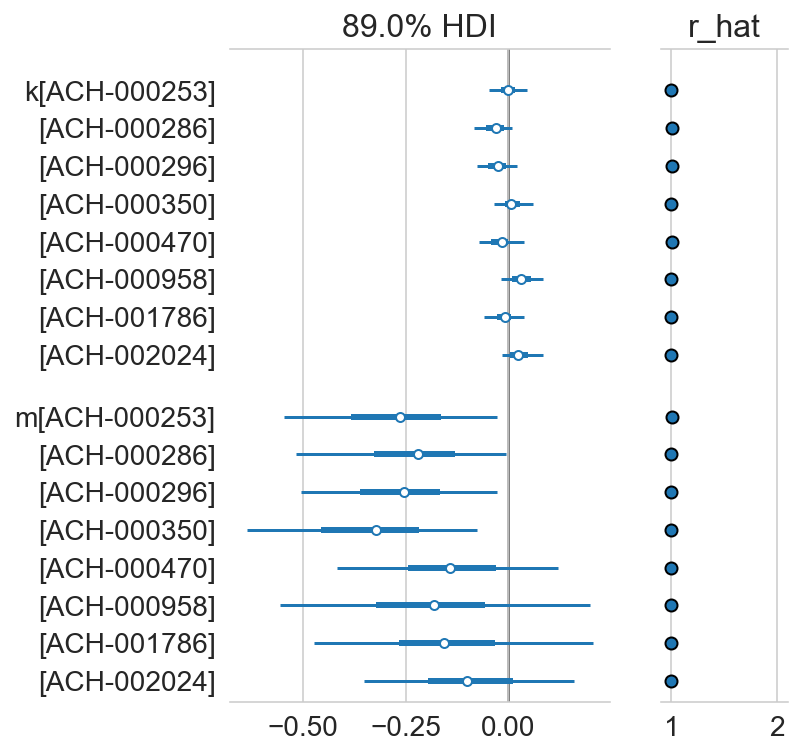


```python
az.plot_pair(
    trace,
    var_names=["mu_a", "b", "d", "f"],
    coords={"gene": ["BRAF"]},
    scatter_kwargs={"alpha": 0.25, "markersize": 1},
    figsize=(10, 10),
)
plt.tight_layout()
plt.show()
```


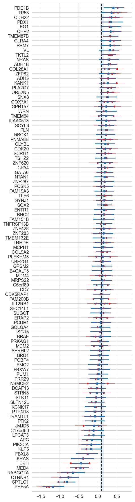


```python
az.plot_pair(
    trace,
    var_names=["mu_mu_a", "mu_b", "mu_d"],
    scatter_kwargs={"alpha": 0.25, "markersize": 1},
    figsize=(5, 5),
)
plt.tight_layout()
plt.show()
```


```python
gene_effects = (
    trace.posterior.get(["mu_a", "b", "d", "f", "h"])
    .to_dataframe()
    .groupby(["gene"])
    .mean()
)
g = sns.pairplot(
    gene_effects,
    corner=True,
    diag_kind="kde",
    height=2,
    aspect=1,
    plot_kws={"edgecolor": None, "alpha": 0.7, "s": 10, "color": "tab:blue"},
)
g.map_lower(sns.kdeplot, levels=4, color="gray", alpha=0.5)
g.map_lower(lambda *args, **kwargs: plt.gca().axhline(color="k", linewidth=0.7))
g.map_lower(lambda *args, **kwargs: plt.gca().axvline(color="k", linewidth=0.7))
plt.show()
```


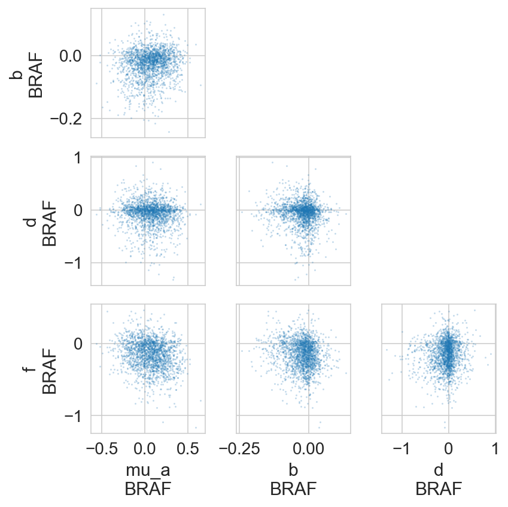


```python
b_f_post = (
    az.summary(trace, var_names=["f", "b"])
    .pipe(extract_coords_param_names, names=["hugo_symbol"])
    .assign(var_name=lambda d: [x[0] for x in d.index.values])
    .pivot_wider("hugo_symbol", names_from="var_name", values_from="mean")
    .set_index("hugo_symbol")
)

jp = sns.jointplot(
    data=b_f_post,
    x="b",
    y="f",
    marginal_kws={"kde": True},
    joint_kws={"edgecolor": None, "alpha": 0.7},
)
ax = jp.ax_joint
ax.axhline(0, color="k", alpha=0.5)
ax.axvline(0, color="k", alpha=0.5)

genes_to_label = list(trace.posterior.coords["cancer_gene"].values)
genes_to_label += b_f_post[b_f_post["f"] < -0.15].index.tolist()
genes_to_label += b_f_post[b_f_post["f"] > 0.1].index.tolist()
genes_to_label += b_f_post[b_f_post["b"] < -0.04].index.tolist()
genes_to_label += b_f_post[b_f_post["b"] > 0.04].index.tolist()
genes_to_label = list(set(genes_to_label))
for gene in genes_to_label:
    data = b_f_post.query(f"hugo_symbol == '{gene}'")
    assert len(data) == 1
    ax.text(data["b"], data["f"], s=gene, alpha=0.9)


plt.show()
```


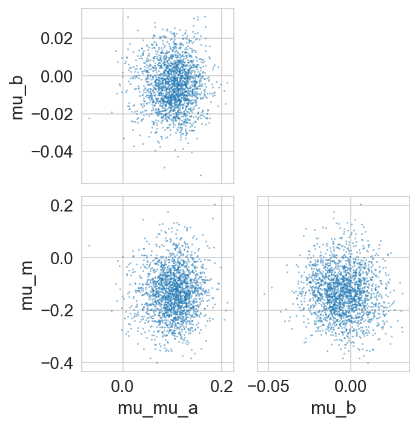


```python
(
    valid_crc_data.filter_column_isin(
        "hugo_symbol", trace.posterior.coords["cancer_gene"].values
    )[["hugo_symbol", "depmap_id", "is_mutated"]]
    .drop_duplicates()
    .assign(is_mutated=lambda d: d["is_mutated"].map({True: "X", False: ""}))
    .pivot_wider("depmap_id", "hugo_symbol", "is_mutated")
    .set_index("depmap_id")
)
```


<div>
<style scoped>
    .dataframe tbody tr th:only-of-type {
        vertical-align: middle;
    }

    .dataframe tbody tr th {
        vertical-align: top;
    }

    .dataframe thead th {
        text-align: right;
    }
</style>
<table border="1" class="dataframe">
  <thead>
    <tr style="text-align: right;">
      <th></th>
      <th>KRAS</th>
      <th>FBXW7</th>
      <th>PIK3CA</th>
    </tr>
    <tr>
      <th>depmap_id</th>
      <th></th>
      <th></th>
      <th></th>
    </tr>
  </thead>
  <tbody>
    <tr>
      <th>ACH-000253</th>
      <td></td>
      <td></td>
      <td></td>
    </tr>
    <tr>
      <th>ACH-000286</th>
      <td>X</td>
      <td></td>
      <td></td>
    </tr>
    <tr>
      <th>ACH-000296</th>
      <td></td>
      <td></td>
      <td></td>
    </tr>
    <tr>
      <th>ACH-000350</th>
      <td>X</td>
      <td></td>
      <td></td>
    </tr>
    <tr>
      <th>ACH-000470</th>
      <td>X</td>
      <td>X</td>
      <td></td>
    </tr>
    <tr>
      <th>ACH-000958</th>
      <td></td>
      <td>X</td>
      <td>X</td>
    </tr>
    <tr>
      <th>ACH-001786</th>
      <td></td>
      <td>X</td>
      <td>X</td>
    </tr>
    <tr>
      <th>ACH-002024</th>
      <td>X</td>
      <td></td>
      <td>X</td>
    </tr>
  </tbody>
</table>
</div>


```python
h_post_summary = (
    az.summary(trace, var_names="h", kind="stats")
    .pipe(extract_coords_param_names, names=["hugo_symbol", "cancer_gene"])
    .pivot_wider("hugo_symbol", names_from="cancer_gene", values_from="mean")
    .set_index("hugo_symbol")
)

vmax = np.abs(h_post_summary.values).max()

figsize = (3.3, 12)
dendro_ratio = (0.1, figsize[0] * 0.1 / figsize[1])
cm = sns.clustermap(
    h_post_summary,
    z_score=None,
    cmap="coolwarm",
    vmin=-vmax,
    vmax=vmax,
    figsize=figsize,
    dendrogram_ratio=dendro_ratio,
    cbar_pos=(1, 0.4, 0.1, 0.2),
    yticklabels=1,
)
cm.ax_heatmap.tick_params("both", labelsize=7, size=0)
plt.show()
```


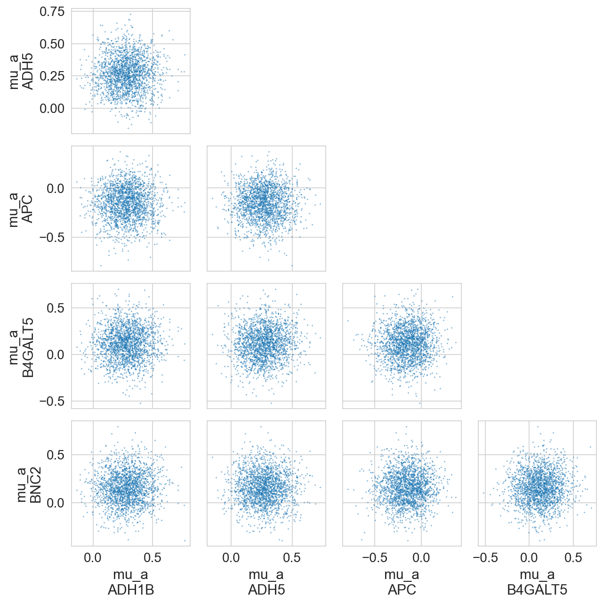


```python
pik3ca_hits = h_post_summary.sort_values("PIK3CA").query("PIK3CA > 0.5").index.tolist()

pik3ca_mut_map = (
    crc_data.copy()
    .query("hugo_symbol == 'PIK3CA'")[["depmap_id", "is_mutated"]]
    .drop_duplicates()
    .reset_index(drop=True)
    .rename(columns={"is_mutated": "pik3ca_mut"})
)

pik3ca_hits_data = (
    crc_data.copy()
    .filter_column_isin("hugo_symbol", pik3ca_hits)
    .merge(pik3ca_mut_map, on="depmap_id")
    .reset_index(drop=True)
    .assign(
        hugo_symbol=lambda d: pd.Categorical(
            d["hugo_symbol"], categories=pik3ca_hits, ordered=True
        )
    )
)

pal = {
    False: "k",
    True: "g",
}

fig, ax = plt.subplots(figsize=(8, 4))
sns.boxplot(
    data=pik3ca_hits_data,
    x="hugo_symbol",
    y="lfc",
    hue="pik3ca_mut",
    palette=pal,
    dodge=True,
    ax=ax,
    flierprops={"markersize": 0},
    boxprops={"alpha": 0.5},
)
sns.swarmplot(
    data=pik3ca_hits_data,
    x="hugo_symbol",
    y="lfc",
    hue="pik3ca_mut",
    dodge=True,
    ax=ax,
    palette=pal,
)

ax.set_title("$\mathit{PIK3CA}$ hits")
ax.set_xlabel(None)
ax.set_ylabel("log-fold change")
ax.get_legend().remove()

leg_lbl = {True: "mutant", False: "WT"}
leg_handles = [
    Line2D([0], [0], linewidth=0, marker="o", color=v, label=leg_lbl[k])
    for k, v in pal.items()
]
ax.legend(
    handles=leg_handles,
    loc="upper left",
    bbox_to_anchor=(1, 1.02),
    title="$\mathit{PIK3CA}$ status",
    frameon=False,
)
```


    <matplotlib.legend.Legend at 0x7fb019f4d6c0>


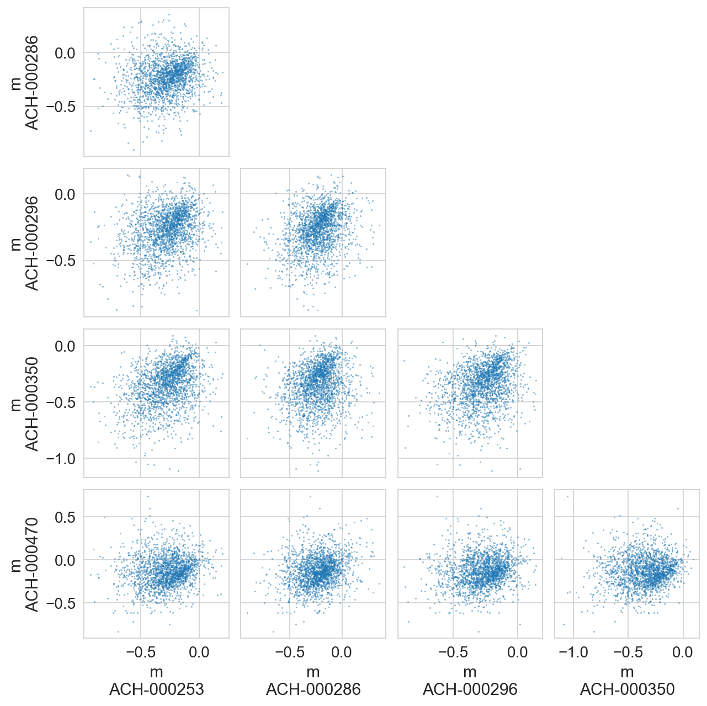


```python
gene_vars = ["$\mu_a$", "$b$", "$d$", "$f$"]
gene_vars += ["$h_{" + g + "}$" for g in trace.posterior.coords["cancer_gene"].values]
gene_corr_post = (
    az.summary(trace, var_names=["genes_chol_cov_corr"], kind="stats")
    .pipe(extract_coords_param_names, names=["d0", "d1"])
    .astype({"d0": int, "d1": int})
    .assign(
        p0=lambda d: [gene_vars[i] for i in d["d0"]],
        p1=lambda d: [gene_vars[i] for i in d["d1"]],
    )
)

plot_df = gene_corr_post.pivot_wider(
    "p0", names_from="p1", values_from="mean"
).set_index("p0")
ax = sns.heatmap(plot_df, cmap="coolwarm", vmin=-1, vmax=1)
ax.set_xlabel(None)
ax.set_ylabel(None)
plt.tight_layout()
plt.show()
```


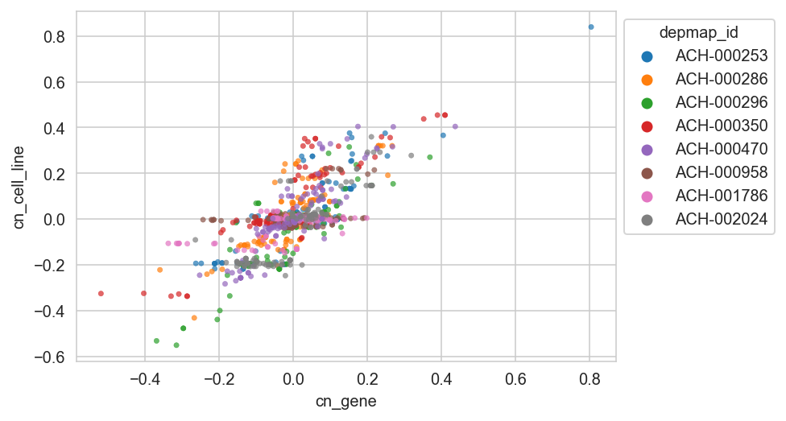


```python
N = 100

pp_dist = trace.posterior_predictive["ct_final"]
n_chains, n_draws, n_samples = pp_dist.shape
draws_idx = np.random.choice(np.arange(n_draws), N // n_chains, replace=False)

fig, ax = plt.subplots(figsize=(8, 5))

ppc_pal = {
    "draws": "tab:blue",
    "median": "tab:orange",
    "mean": "tab:red",
    "observed": "black",
}

# Example draws.
for c, d in product(range(n_chains), draws_idx):
    values = np.log(pp_dist[c, d, :].values + 1)
    sns.kdeplot(values, color=ppc_pal["draws"], alpha=0.1, ax=ax)

# Average distributions.
pp_dist_mean = np.log(pp_dist.median(axis=(0, 1)) + 1)
pp_dist_mid = np.log(pp_dist.mean(axis=(0, 1)) + 1)
sns.kdeplot(pp_dist_mean, color=ppc_pal["mean"], ax=ax, alpha=0.5)
sns.kdeplot(pp_dist_mid, color=ppc_pal["median"], ax=ax, alpha=0.5)

# Observed distribution.
sns.kdeplot(
    np.log(trace.observed_data["ct_final"] + 1), ax=ax, color=ppc_pal["observed"]
)

ppc_leg_handles: list[Line2D] = []
for lbl, color in ppc_pal.items():
    ppc_leg_handles.append(Line2D([0], [0], color=color, label=lbl))

plt.legend(handles=ppc_leg_handles, loc="best")


ax.set_xlabel("log10( final counts + 1 )")
ax.set_ylabel("density")
ax.set_title("Posterior predictive distribution")
plt.show()
```


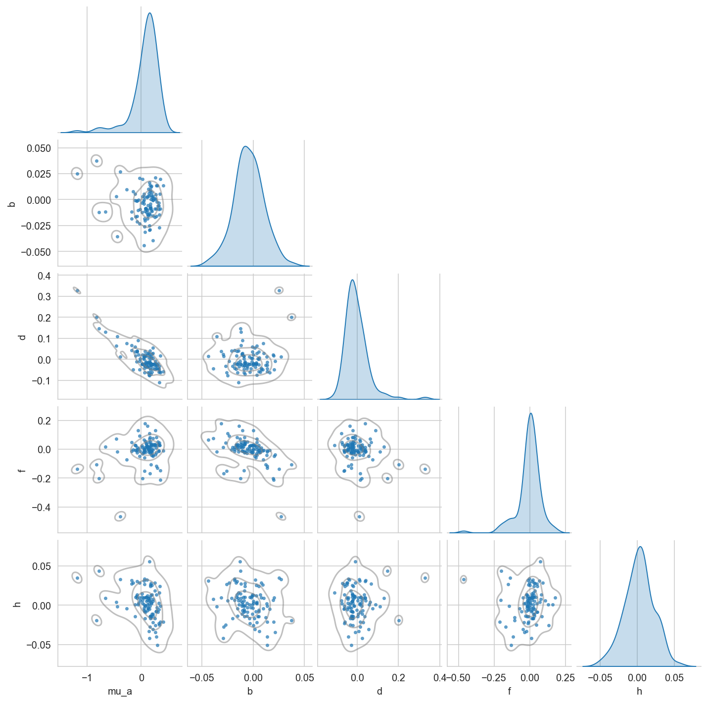


```python

```


```python

```


```python

```


```python

```


```python
# az.plot_forest(trace, var_names=["b", "f"], combined=True)
# plt.show()
```

---


```python
notebook_toc = time()
print(f"execution time: {(notebook_toc - notebook_tic) / 60:.2f} minutes")
```

    execution time: 6.85 minutes


```python
%load_ext watermark
%watermark -d -u -v -iv -b -h -m
```

    Last updated: 2022-07-29

    Python implementation: CPython
    Python version       : 3.10.5
    IPython version      : 8.4.0

    Compiler    : GCC 10.3.0
    OS          : Linux
    Release     : 3.10.0-1160.71.1.el7.x86_64
    Machine     : x86_64
    Processor   : x86_64
    CPU cores   : 28
    Architecture: 64bit

    Hostname: compute-e-16-235.o2.rc.hms.harvard.edu

    Git branch: simplify

    matplotlib: 3.5.2
    plotnine  : 0.0.0
    numpy     : 1.22.4
    pymc      : 4.1.2
    seaborn   : 0.11.2
    aesara    : 2.7.5
    arviz     : 0.12.1
    pandas    : 1.4.3


```python

```
